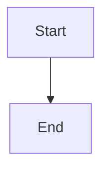

# 文档编写规范

> 制定时间：2026-05-17
> 适用范围：/tmp/frontend-interview/docs/
> 状态：草稿，待审批后执行

---

## 1. 文件命名规范

### 1.1 强制规范

| 规范 | 要求 | 示例 |
|------|------|------|
| 格式 | kebab-case（纯小写+连字符） | `react-hooks-deep.md` |
| 扩展名 | `.md` | - |
| 禁止 | 大写、空格、中文、特殊字符 | - |

### 1.2 目录命名

```
docs/
├── agent/              # 全小写
├── algorithm/          # 全小写
├── open-source/       # 全小写（不是 openSource）
└── package-manager/    # 全小写（不是 packageManager）
```

---

## 2. 目录结构规范

### 2.1 分类目录

| 目录 | 说明 | 备注 |
|------|------|------|
| `docs/agent/` | AI Agent 相关文档 | - |
| `docs/algorithm/` | 算法题库 | - |
| `docs/build-tools/` | 构建工具 | - |
| `docs/coding/` | 手写代码题 | - |
| `docs/css/` | CSS 相关 | - |
| `docs/html/` | HTML 相关 | - |
| `docs/js/` | JavaScript 相关 | - |
| `docs/network/` | 网络协议 | - |
| `docs/open-source/` | 开源项目赏析 | - |
| `docs/package-manager/` | 包管理器 | - |
| `docs/performance/` | 性能优化 | - |
| `docs/react/` | React 相关 | - |
| `docs/runtime/` | 运行时（Node/Bun/Deno） | - |
| `docs/typescript/` | TypeScript 相关 | - |
| `docs/stylesheets/` | MkDocs 样式（仅配置） | 非文档目录 |
| `docs/assets/` | 静态资源（仅配置） | 非文档目录 |

### 2.2 空目录处理

`stylesheets/` 和 `assets/` 目录用于 MkDocs 主题配置，不需要 .md 文件，保持现状。

---

## 3. Frontmatter 规范

### 3.1 必填字段

每个 .md 文件必须在文件头部（第一行）添加 YAML frontmatter：

```yaml
---
title: <文档标题>
description: <文档描述，1-2 句话>
tags:
  - <tag1>
  - <tag2>
date: <最后更新日期，YYYY-MM-DD 格式>
---
```

### 3.2 字段规范

| 字段 | 格式 | 示例 |
|------|------|------|
| title | 中文，简洁 | `React Hooks 深入原理` |
| description | 中文，1-2 句话，不超过 200 字符 | `深入理解 React Hooks 的实现原理...` |
| tags | 小写 + 连字符，数组 | `['react', 'hooks', '原理']` |
| date | YYYY-MM-DD | `2026-05-17` |

### 3.3 完整示例

```yaml
---
title: React Hooks 深入原理
description: 深入理解 React Hooks 的实现原理，包括 useState、useEffect、useRef 等核心 Hook 的源码分析。
tags:
  - react
  - hooks
  - 源码分析
date: 2026-05-17
---
```

---

## 4. Markdown 写作规范

### 4.1 标题层级

| 规则 | 说明 | 示例 |
|------|------|------|
| H1 唯一 | 每个文件只能有一个 H1（#） | `# React Hooks 深入原理` |
| 逐级嵌套 | H1 → H2 → H3 → H4，不能跳级 | `# H1` → `## H2` → `### H3` |
| 标题前后空行 | H1/H2/H3 前后必须有空行 | 见下方示例 |

**正确示例**：
```markdown
# H1 标题

这是 H1 后的内容。

## H2 标题

这是 H2 后的内容。

### H3 标题

这是 H3 后的内容。
```

**错误示例**：
```markdown
# H1
### H3（跳级）
```

### 4.2 代码块规范

| 规则 | 说明 | 示例 |
|------|------|------|
| 必须指定语言 | ` ```javascript ` 而非 ` ``` ` | ` ```python ` |
| 前后空行 | 代码块前后必须有空行 | - |
| 缩进一致 | 4 空格或 2 空格，保持一致 | - |

**正确示例**：
```markdown
这是前文。

```javascript
const a = 1;
```

这是后文。
```

**错误示例**：
```markdown
这是前文。
```javascript
const a = 1;
```
这是后文。（缺少空行）
```

### 4.3 列表规范

| 规则 | 说明 |
|------|------|
| 前后空行 | 列表前后必须有空行 |
| 统一格式 | 全文统一使用 `-` 或 `1.` |
| 缩进一致 | 子列表使用 2 空格或 4 空格 |

### 4.4 图片规范

```markdown

```

---

## 5. Mermaid 图表规范

### 5.1 代码块格式

```markdown

```

### 5.2 主题配置

MkDocs 配置了 `pymdownx.superfences`，Mermaid 图表会自动渲染。

### 5.3 性能建议

| 图表数量 | 建议 |
|---------|------|
| < 10 | 无需特殊处理 |
| 10-20 | 可考虑添加章节导航 |
| > 20 | 建议拆分文件或添加懒加载 |

---

## 6. 交叉引用规范

### 6.1 环境要求

> ⚠️ **严格规范**：所有 Python 命令必须使用 `uv run` 执行，禁止裸启动

| 场景 | 命令 |
|------|------|
| 安装依赖 | `uv sync` |
| 开发预览 | `uv run mkdocs serve --dev-addr 127.0.0.1:8000` |
| 生产构建 | `uv run mkdocs build --clean` |
| 添加依赖 | `uv add mkdocs mkdocs-material` |

项目根目录提供以下环境配置文件：
- `pyproject.toml` - Python 依赖定义
- `.python-version` - Python 版本约束 (≥3.10)
- `uv.lock` - 依赖版本锁定
- `Makefile` - 规范化命令 (`make dev`, `make build` 等)

### 6.2 内部链接

```markdown
[文字](相对路径/文件名.md)
[文字](../js/hyper-frequencies.md)
```

### 6.3 锚点链接

#### 锚点命名规则

| 规则 | 说明 | 示例 |
|------|------|------|
| GFM 兼容 | GitHub Flavored Markdown 处理锚点 | `## 1. 两数之和` → `#1-两数之和` |
| 禁止重复 | 同一文件中不能有重复锚点 | - |
| 编号连续 | 章节编号必须连续 | `#7` 后必须是 `#8`，不能跳过 |
| 显式 ID | 复杂标题使用显式锚点 ID | `## 对比矩阵 {#对比矩阵}` |

**GFM 锚点转换规则**：
- 空格 → 连字符 `-`
- 点号（`.`）→ 保留
- 大写 → 小写
- 特殊字符 → 移除或转换

正确：`## 1. 两数之和` → 锚点 `#1-两数之和`
错误：`## 两数之和` → 锚点 `#两数之和`

#### TOC 链接修复模式

MkDocs 生成的锚点与 TOC 链接匹配规则复杂，常见问题：

| 问题 | 原因 | 解决方案 |
|------|------|----------|
| 链接 `#1-mcp-概述`，实际 `#1-mcp` | TOC 链接包含冗余后缀 | 删除多余后缀 |
| 中文标题无锚点 | MkDocs 不支持中文自动生成 | 使用显式 ID `{#中文}` |
| `.1`, `.2` 子章节无锚点 | 只有顶级章节有锚点 | 删除子章节 TOC 条目 |

**修复命令**：
```bash
# 检查实际锚点
grep -o 'id="[^"]*"' site/xxx/index.html | grep -E '^id="[0-9]' | head -10

# 构建并检查警告
uv run mkdocs build 2>&1 | grep "contains a link"
```

#### 常见错误修复

```markdown
# 错误：链接到中文锚点
[跳转](#一数组题型)

# 正确：使用实际存在的锚点
[跳转](#_2)  或  [跳转](#数组题型)

# 错误：链接到子章节（不存在）
[1.1 两数之和](#1.1-两数之和)

# 正确：只链接到顶级章节
[数组题型](#一数组题型)
```

### 6.4 外部链接

| 规则 | 说明 |
|------|------|
| HTTPS | 必须使用 HTTPS |
| 可访问 | 定期检查外部链接有效性 |
| 备用方案 | 重要链接提供存档或备选 |

---

## 7. 分类标签规范

### 7.1 标准化 Tags

| 分类 | 标签 |
|------|------|
| 前端基础 | `html`, `css`, `javascript`, `typescript` |
| 框架 | `react`, `vue`, `angular`, `nextjs`, `astro` |
| 工具链 | `vite`, `webpack`, `rollup`, `esbuild` |
| 网络 | `http`, `https`, `websocket`, `tcp`, `udp` |
| 性能 | `performance`, `optimization`, `bundle` |
| 算法 | `algorithm`, `data-structure`, `leetcode` |
| AI Agent | `agent`, `llm`, `mcp`, `rag`, `langchain` |
| 运行时 | `nodejs`, `bun`, `deno` |

### 7.2 Tag 格式

| 规则 | 示例 |
|------|------|
| 小写 | `react` 而非 `React` |
| 连字符 | `state-management` 而非 `state management` |
| 数组格式 | `tags: [- react, - hooks]` |

---

## 8. 新文档检查清单

创建新文档时，检查以下项目：

- [ ] 文件名使用 kebab-case
- [ ] 第一行为 YAML frontmatter（含 title/description/tags/date）
- [ ] 只有一个 H1
- [ ] 标题层级逐级嵌套
- [ ] 代码块指定语言
- [ ] 标题/代码块前后有空行
- [ ] 内部链接目标文件存在
- [ ] 锚点链接格式正确
- [ ] 外部链接可访问
- [ ] tags 使用标准化标签
- [ ] mkdocs build 通过

---

## 9. 自动化检查工具

### 9.1 锚点链接检查

```bash
# 构建并统计警告数量
uv run mkdocs build 2>&1 | grep "contains a link" | wc -l

# 查看具体警告
uv run mkdocs build 2>&1 | grep "contains a link"

# 获取所有有警告的文件
uv run mkdocs build 2>&1 | grep "contains a link" | sed "s/INFO.*Doc file '//;s/' contains.*//" | sort -u
```

### 9.2 锚点 ID 检查

```bash
# 查看实际生成的锚点 ID（构建后）
grep -o 'id="[^"]*"' site/xxx/index.html | grep -E '^id="[0-9]' | head -10
```

### 9.3 前置检查清单

创建 PR 前必须执行：

- [ ] `make build` 构建成功
- [ ] `make lint` 无 WARNING/ERROR
- [ ] 检查 nav 完整性（`mkdocs.yml` 中所有页面已配置）

---

**备注**：本规范文档应作为文档编写的长期参考，建议定期更新以反映最佳实践。