# Mermaid 图表最佳实践规范

本文档定义了项目中所有 Mermaid 图表的编写规范，以确保图表能够正确渲染并保持一致性。

## 1. 节点 ID 命名规范

### 1.1 基本规则
- 节点 ID 应使用有意义的英文命名
- 使用字母、数字和下划线
- 不能以数字开头
- 不能包含空格或特殊字符

### 1.2 推荐命名方式
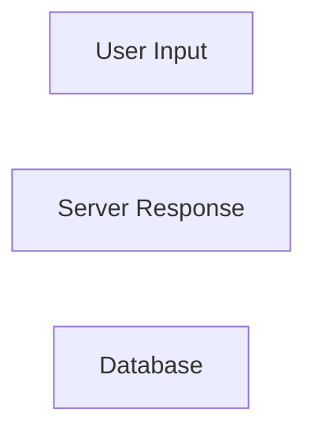

### 1.3 禁止的命名
```mermaid
flowchart LR
    1node["Wrong - starts with number"]
    node with space["Wrong - contains space"]
    node's["Wrong - contains apostrophe"]
```

## 2. 节点文本规范

### 2.1 基本文本
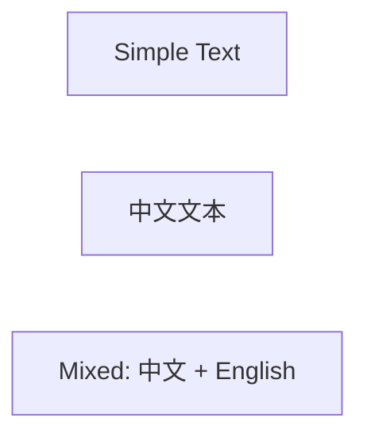

### 2.2 多行文本
使用 `<br/>` 换行，避免文本过长：
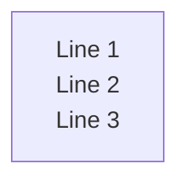

### 2.3 特殊字符转义
- `<` 和 `>` 在节点文本中可直接使用（Mermaid 11.x 支持）
- 如果需要转义，可使用 `&lt;` 和 `&gt;`
- 避免在节点 ID 中使用特殊字符

## 3. 子图规范

### 3.1 基本子图
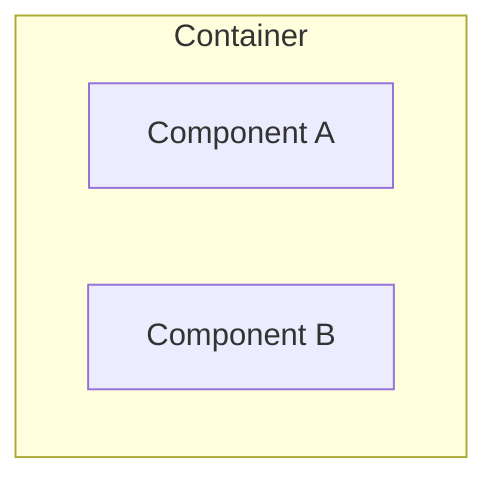

### 3.2 多个子图
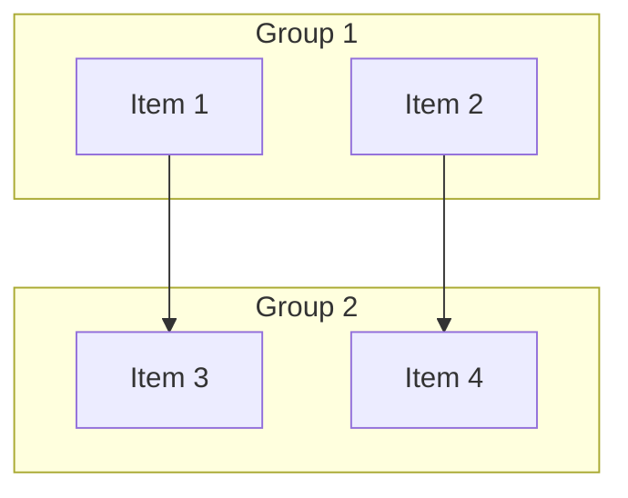

### 3.3 注意事项
- 每个 `subgraph` 必须有对应的 `end`
- 子图 ID 必须唯一
- 子图标题使用 `["title"]` 格式

## 4. 箭头和连接线规范

### 4.1 基本箭头
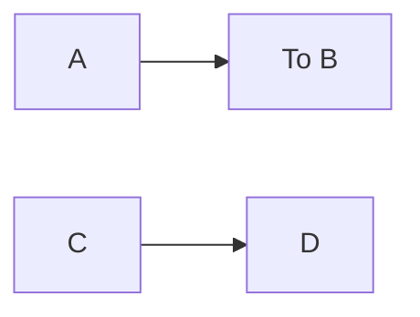

### 4.2 箭头类型
| 类型 | 说明 |
|------|------|
| `-->` | 实线箭头 |
| ---→ | 点线箭头 |
| -.-→ | 虚线箭头 |
| -.-> | 点虚箭头 |

### 4.3 带文字的连接
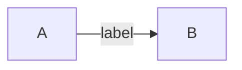

## 5. 样式规范

### 5.1 使用 classDef 定义样式
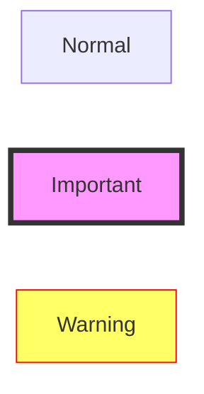

### 5.2 内联样式（不推荐）
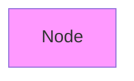

## 6. 常用图表类型

### 6.1 流程图 (flowchart)
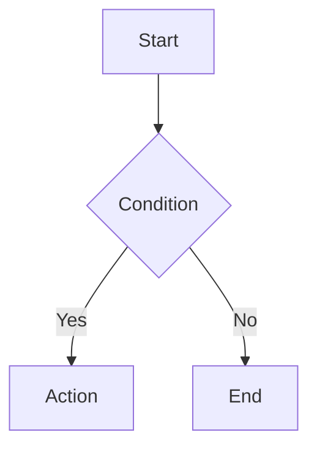

### 6.2 时序图 (sequenceDiagram)
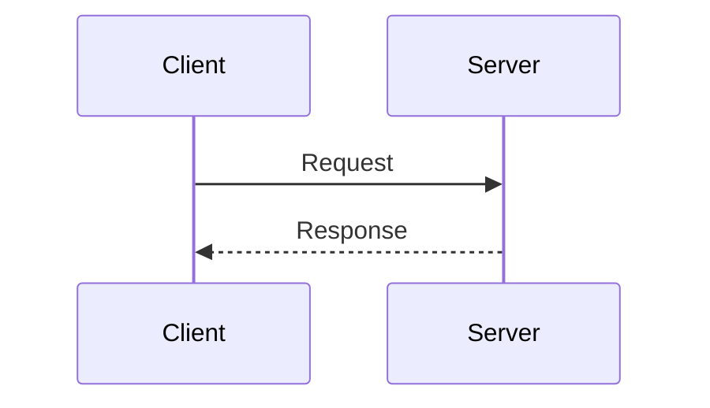

### 6.3 状态图 (stateDiagram-v2)
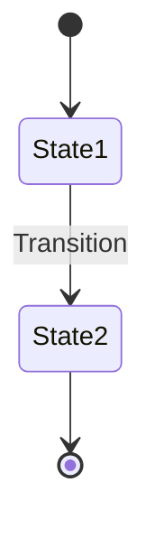

### 6.4 时间线 (timeline)
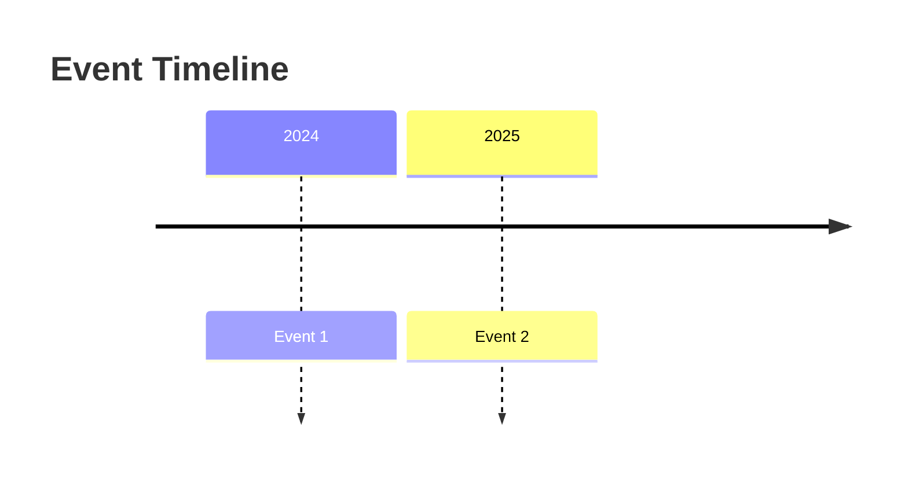

### 6.5 甘特图 (gantt)
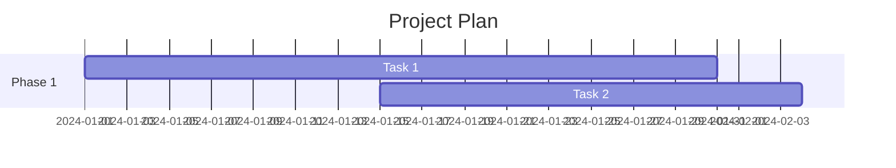

## 7. 常见错误避免

### 7.1 子图未闭合
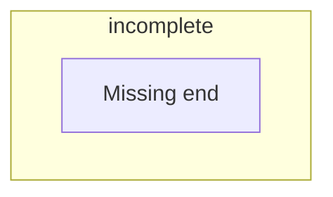
**正确做法**: 确保每个 `subgraph` 有对应的 `end`

### 7.2 节点 ID 重复
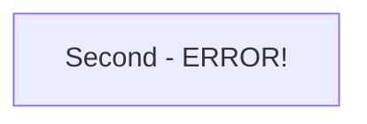
**正确做法**: 每个节点使用唯一的 ID

### 7.3 中文引号问题
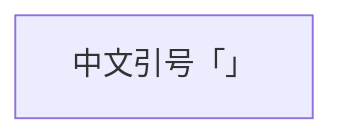
**说明**: Mermaid 11.x 支持中文标点，建议使用 `[]` 包裹节点文本

## 8. CI 检查集成

项目已配置 GitHub Actions 自动验证 Mermaid 图表：

```yaml
name: Validate Mermaid Diagrams
on:
  push:
    paths:
      - 'docs/**/*.md'
      - 'scripts/validate-mermaid.js'
```

运行本地验证：
```bash
node scripts/validate-mermaid.js docs
```

严格模式（包含警告）：
```bash
node scripts/validate-mermaid.js docs --strict
```

## 9. Mermaid 版本兼容性

本项目使用的 Mermaid 版本要求：**11.0.0+**

主要特性支持：
- ✓ 中文节点文本
- ✓ 中文字符支持
- ✓ 多行文本 `<br/>`
- ✓ 状态图 stateDiagram-v2
- ✓ 时间线 timeline
- ✓ 甘特图 gantt

## 10. 参考资源

- [Mermaid 官方文档](https://mermaid.js.org/)
- [Mermaid 图表示例](https://mermaid.js.org/intro/examples.html)
- [Mermaid 版本更新日志](https://github.com/mermaid-js/mermaid/blob/develop/CHANGELOG.md)