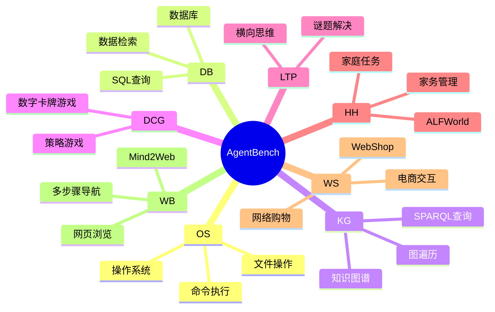
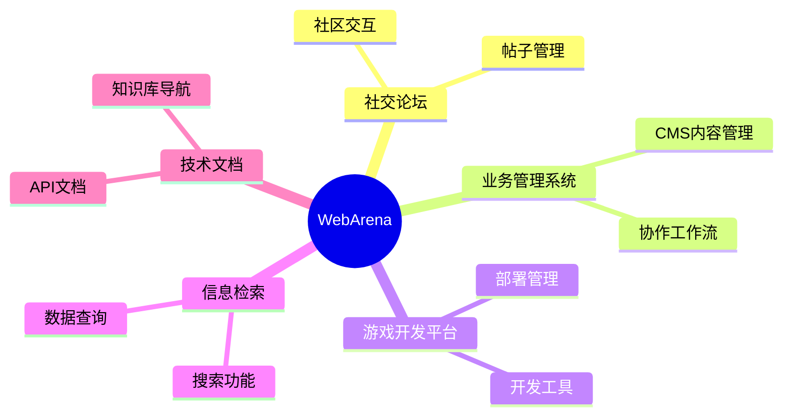
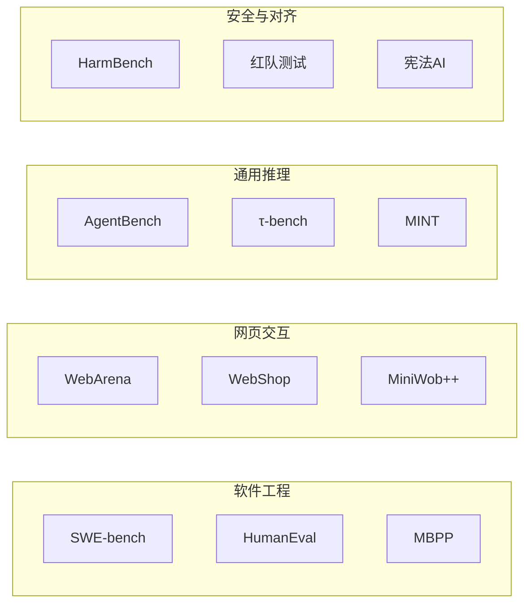

# AI Agent 评测与基准测试指南

全面指导 AI Agent 的评测、基准测试和优化。本文档涵盖评测框架、指标、测试策略以及构建生产级 AI Agent 的最佳实践。

---

## 目录

1. [评测框架](#1-评测框架)
2. [指标与基准测试](#2-指标与基准测试)
3. [测试策略](#3-测试策略)
4. [优化技术](#4-优化技术)
5. [代码示例](#5-代码示例)

---

## 1. 评测框架

### 1.1 AgentBench（清华大学/知识工程实验室）

**概述**：全面的多维基准测试，用于在 8 个不同环境中评估 LLM 作为 Agent 的表现。

**仓库**：[THUDM/AgentBench](https://github.com/THUDM/AgentBench)

**覆盖的环境**：



**快速开始**：

```bash
# 克隆并设置
git clone https://github.com/THUDM/AgentBench.git
cd AgentBench
conda create -n agent-bench python=3.9
conda activate agent-bench
pip install -r requirements.txt

# 配置 API 密钥
# 编辑 configs/agents/openai-chat.yaml 填入你的 API 密钥

# 运行评测
python -m src.start_task -a
python -m src.assigner
```

**关键特性**：

- 多轮交互评测（LLM 生成约 4k-13k tokens）
- 基于 Docker 的环境隔离
- 自动化任务执行器部署
- 模型对比排行榜

---

### 1.2 SWE-bench（普林斯顿 NLP）

**概述**：基于真实 GitHub 流行仓库 issue 的评测基准。

**仓库**：[SWE-bench/SWE-bench](https://github.com/swe-bench/SWE-bench)

**数据集**：

| 数据集 | 说明 |
|--------|------|
| **SWE-bench Full** | 来自 12 个仓库的 2,294 个实例 |
| **SWE-bench Verified** | 500 个手动验证的问题（与 OpenAI 合作创建） |
| **SWE-bench Lite** | 300 个具有挑战性的实例 |
| **SWE-bench Multimodal** | 视觉软件工程任务 |

**使用方式**：

```python
from datasets import load_dataset

# 加载 SWE-bench
swebench = load_dataset('princeton-nlp/SWE-bench', split='test')

# 运行评测
python -m swebench.harness.run_evaluation \
    --dataset_name princeton-nlp/SWE-bench_Lite \
    --predictions_path <预测结果路径> \
    --max_workers 8 \
    --run_id <运行ID>
```

**关键特性**：

- 真实软件工程挑战
- 基于 Docker 的可复现评测
- 支持通过 Modal 或 sb-cli 进行云端评测
- SWE-agent 取得最佳性能

---

### 1.3 WebArena（卡内基梅隆大学）

**概述**：用于评估自主 Agent 在多标签网页任务上的真实感 Web 环境。

**仓库**：[web-arena-x/webarena](https://github.com/web-arena-x/webarena)

**特性**：

- 可自托管的 Web 环境（Reddit、GitLab、CMS）
- 基于地图的导航，实现真实的多页面工作流
- 5 大类评测：



**资源**：

- [WebArena](https://webarena.dev/)
- [WebArena-Infinity](https://webarena.dev/)：在演进环境中进行可扩展评测

---

### 1.4 DeepEval（Confident AI）

**概述**：开源 LLM 评测框架，包含 50+ 指标，用于测试 AI Agent、RAG 和聊天机器人。

**仓库**：[confident-ai/deepeval](https://github.com/confident-ai/deepeval)

**网站**：[deepeval.com](https://deepeval.com/)

**关键特性**：

- 原生 Pytest 评测，集成 CI/CD
- 50+ 基于研究的指标
- 多模态支持（文本、图像、音频）
- G-Eval 用于基于标准的思维链评分
- Agent 追踪可视化，便于调试

---

### 1.5 RAG 评测框架

**RAGAS**（RAG 评估）：

- 忠实度、答案相关性、上下文精确率/召回率
- 自动化指标计算

**TruLens**：

-  groundedness（ grounding）、答案正确性、上下文相关性
- 反馈驱动的评测

**LangSmith**（LangChain）：

- 端到端追踪和评测
- A/B 测试能力

---

## 2. 指标与基准测试

### 2.1 核心性能指标

| 指标 | 描述 | 使用场景 |
|------|------|----------|
| **成功率** | 成功完成任务的比例 | 通用能力评估 |
| **任务完成度** | Agent 是否达成目标 | 二值成功/失败 |
| **步骤准确率** | 单个动作的正确性 | 调试 Agent 行为 |
| **响应时间** | 从输入到输出的延迟 | 性能优化 |
| **Token 使用量** | 每个任务消耗的 Token | 成本效率 |
| **错误率** | 失败或崩溃的频率 | 可靠性评估 |

### 2.2 质量指标

| 指标 | 计算公式 | 目标值 |
|------|----------|--------|
| **忠实度** | 正确事实数 / 响应中总事实数 | > 0.90 |
| **答案相关性** | 相关内容 / 总内容 | > 0.85 |
| **上下文精确率** | 相关块排名靠前 | > 0.80 |
| **幻觉率** | 错误陈述 / 总陈述 | < 0.05 |
| **有用性** | 用户满意度评分 | > 4/5 |

### 2.3 基准测试分类



---

## 3. 测试策略

### 3.1 Agent 单元测试

```python
# test_agent_unit.py
import pytest
from deepeval import assert_test
from deepeval.metrics import TaskCompletenessMetric, FaithfulnessMetric
from deepeval.test_case import LLMTestCase

# 参数化测试用例
@pytest.mark.parametrize("input,expected", [
    ("什么是退款政策？", "policy_info"),
    ("显示我的订单", "order_list"),
    ("取消订单 #123", "confirmation"),
])
def test_agent_response(input, expected):
    test_case = LLMTestCase(input=input)
    result = my_agent(test_case.input)
    assert expected in result.lower()

@pytest.mark.parametrize("test_case", [
    LLMTestCase(input="解释退款流程", expected_output="30天窗口期"),
    LLMTestCase(input="帮助处理订单 #9281", expected_output="订单详情"),
])
def test_agent_quality(test_case: LLMTestCase):
    response = my_agent(test_case.input)
    test_case.actual_output = response
    assert_test(
        metrics=[
            TaskCompletenessMetric(threshold=0.7),
            FaithfulnessMetric(threshold=0.9),
        ],
        test_case=test_case
    )
```

### 3.2 集成测试

```python
# test_agent_integration.py
import pytest
from deepeval.tracking import AgentTrace

def test_checkout_flow():
    trace = AgentTrace()
    with trace:
        # 步骤 1：用户添加商品到购物车
        response = agent.chat("添加商品 #123 到购物车")

        # 步骤 2：用户进行结算
        response = agent.chat("使用标准配送进行结算")

        # 步骤 3：用户确认支付
        response = agent.chat("确认支付")

    # 验证追踪得分良好
    assert trace.score > 0.85
    assert trace.passed_metrics >= 4

@pytest.mark.parametrize("user_persona", [
    "首次购物者",
    "回头客",
    "高级会员",
])
def test_persona_journey(user_persona):
    agent = create_agent(persona=user_persona)
    trace = run_journey(agent, user_persona)
    assert trace.completion_rate > 0.9
```

### 3.3 回归测试

```bash
# 运行回归测试套件
deepeval test run tests/test_agent.py -n 4

# 与基线对比
deepeval compare --baseline ./baseline_results.json --current ./current_results.json
```

---

## 4. 优化技术

### 4.1 成本优化

```python
# cost_optimizer.py
class AgentCostOptimizer:
    def __init__(self, agent, budget_per_task=0.50):
        self.agent = agent
        self.budget = budget_per_task

    def run_with_budget(self, task):
        start_cost = get_api_cost()
        result = self.agent.run(task, max_tokens=4000)
        actual_cost = get_api_cost() - start_cost

        if actual_cost > self.budget:
            # 切换到更快的模型处理类似任务
            self.agent.model = "gpt-3.5-turbo"
        return result

    def batch_optimize(self, tasks, batch_size=10):
        results = []
        for i in range(0, len(tasks), batch_size):
            batch = tasks[i:i+batch_size]
            batch_results = self.run_batch_cached(batch)
            results.extend(batch_results)
        return results
```

### 4.2 延迟优化

```python
# latency_optimizer.py
import asyncio

class LatencyOptimizer:
    def __init__(self, agent):
        self.agent = agent

    async def parallel_tool_calls(self, tools):
        """并行执行独立的工具调用"""
        tasks = [self.agent.call_tool(t) for t in tools]
        return await asyncio.gather(*tasks)

    def cached_retrieval(self, query, cache):
        """有缓存时使用缓存结果"""
        cache_key = hash(query)
        if cache_key in cache:
            return cache[cache_key]
        result = self.agent.retrieve(query)
        cache[cache_key] = result
        return result

    async def streaming_response(self, prompt):
        """流式响应以改善感知延迟"""
        async for chunk in self.agent.stream(prompt):
            yield chunk
```

### 4.3 质量优化

```python
# quality_optimizer.py
class QualityOptimizer:
    def __init__(self, agent, metrics):
        self.agent = agent
        self.metrics = metrics

    def self_correct(self, task, max_attempts=3):
        """Agent 自我纠错循环"""
        for attempt in range(max_attempts):
            result = self.agent.run(task)

            scores = [m.measure(result) for m in self.metrics]
            if all(s >= m.threshold for s, m in zip(scores, self.metrics)):
                return result

            # 生成纠正提示
            correction = self.generate_feedback(scores, self.metrics)
            task = f"{task}\n\n反馈：{correction}"

        return result

    def ensemble_vote(self, tasks, n_agents=3):
        """运行多个 Agent 并投票选出最佳结果"""
        results = [agent.run(task) for agent in self.agents[:n_agents]]
        return self.vote(results)
```

---

## 5. 代码示例

### 5.1 使用 DeepEval 进行基础 Agent 评测

```python
# agent_eval_example.py
from deepeval import assert_test
from deepeval.metrics import (
    TaskCompletenessMetric,
    FaithfulnessMetric,
    AnswerRelevancyMetric,
)
from deepeval.test_case import LLMTestCase

# 定义测试用例
test_cases = [
    LLMTestCase(
        input="一月订单的退款政策是什么？",
        expected_output="适用30天退换窗口",
    ),
    LLMTestCase(
        input="显示上个月的订单",
        expected_output="历史订单列表",
    ),
    LLMTestCase(
        input="我需要更改我的收货地址",
        expected_output="地址更新确认",
    ),
]

# 定义指标
metrics = [
    TaskCompletenessMetric(threshold=0.8),
    FaithfulnessMetric(threshold=0.9),
    AnswerRelevancyMetric(threshold=0.85),
]

# 运行评测
for test_case in test_cases:
    response = checkout_agent(test_case.input)
    test_case.actual_output = response

    assert_test(metrics=metrics, test_case=test_case)
```

### 5.2 使用 AgentBench 进行 Agent 基准测试

```python
# agentbench_example.py
import os
import yaml

# 配置 Agent
agent_config = {
    "model": "gpt-4",
    "temperature": 0.7,
    "max_tokens": 2048,
    "api_key": os.getenv("OPENAI_API_KEY"),
}

# 运行特定任务
task = "dbbench-std"
config = load_config(f"configs/tasks/{task}.yaml")

results = evaluate_agent(
    agent=agent_config,
    task=task,
    num_samples=100,
    max_workers=4,
)

print(f"成功率：{results.success_rate:.2%}")
print(f"平均步数：{results.avg_steps:.1f}")
```

### 5.3 SWE-bench 评测

```python
# swebench_example.py
from swebench.harness.run_evaluation import run_evaluation
from datasets import load_dataset

# 加载测试实例
dataset = load_dataset("princeton-nlp/SWE-bench_Lite", split="test")

# 在每个实例上运行 Agent
predictions = []
for instance in dataset:
    prediction = swe_agent.resolve(instance)
    predictions.append({
        "instance_id": instance["instance_id"],
        "prediction": prediction["patch"],
    })

# 评测预测结果
results = run_evaluation(
    predictions_path=predictions,
    max_workers=8,
    run_id="my-agent-eval",
)

print(f"已解决：{results.resolved_count}/{len(dataset)}")
print(f"得分：{results.resolved_count / len(dataset):.2%}")
```

### 5.4 多指标 Agent 测试

```python
# multi_metric_test.py
from deepeval.metrics import GEval
from deepeval.test_case import LLMTestCase
from deepeval import assert_test

# 定义自定义 G-Eval 指标
response_quality_metric = GEval(
    name="Response Quality",
    criteria="评估回复是否："
             "1. 完整回答用户问题"
             "2. 提供准确信息"
             "3. 使用适当的语气和格式",
    evaluation_params=[
        SingleTurnParams.ACTUAL_OUTPUT,
        SingleTurnParams.EXPECTED_OUTPUT,
    ],
)

# 自定义确定性指标
def tool_call_accuracy(prediction: str, expected: str) -> float:
    """检查是否调用了正确的工具"""
    predicted_tools = extract_tool_names(prediction)
    expected_tools = extract_tool_names(expected)
    return len(set(predicted_tools) & set(expected_tools)) / len(expected_tools)

# 运行综合测试
@pytest.mark.parametrize("test_case", load_test_cases("agent_test_cases.json"))
def test_agent_comprehensive(test_case: LLMTestCase):
    result = my_agent.run(test_case.input)
    test_case.actual_output = result.output
    test_case.tools_called = result.tool_calls

    assert_test(
        metrics=[
            response_quality_metric,
            TaskCompletenessMetric(),
            FaithfulnessMetric(),
            AnswerRelevancyMetric(),
        ],
        test_case=test_case
    )
```

### 5.5 CI/CD 集成

```yaml
# .github/workflows/agent-eval.yml
name: Agent 评测

on:
  push:
    branches: [main]
  pull_request:
    branches: [main]

jobs:
  evaluate:
    runs-on: ubuntu-latest
    steps:
      - uses: actions/checkout@v4

      - name: 设置 Python
        uses: actions/setup-python@v5
        with:
          python-version: '3.9'

      - name: 安装依赖
        run: |
          pip install deepeval
          pip install -r requirements.txt

      - name: 运行 Agent 测试
        run: |
          deepeval test run tests/agent_tests.py \
            --model gpt-4 \
            --threshold 0.85

      - name: 上传结果
        uses: actions/upload-artifact@v4
        with:
          name: eval-results
          path: ./results/
```

---

## 最佳实践总结

1. **从成熟的基准测试开始**（AgentBench、SWE-bench、WebArena）进行基线对比
2. **结合多个指标** - 单一指标无法完全捕获 Agent 质量
3. **在真实环境中测试** - 使用容器化评测以确保可复现性
4. **迭代分析失败** - 分析追踪数据以了解 Agent 的弱点
5. **迭代优化** - 根据使用场景平衡成本、延迟和质量
6. **集成到 CI/CD** - 在部署前捕获回归问题
7. **使用自我纠错循环** - 使 Agent 能够改进自己的输出
8. **监控生产质量** - 用真实使用数据追踪长期指标

---

## 参考资源

- [AgentBench GitHub](https://github.com/THUDM/AgentBench)
- [SWE-bench](https://github.com/swe-bench/SWE-bench)
- [WebArena](https://github.com/web-arena-x/webarena)
- [DeepEval](https://github.com/confident-ai/deepeval)
- [斯坦福 AI 指数报告 2026](https://hai.stanford.edu/ai-index-report)