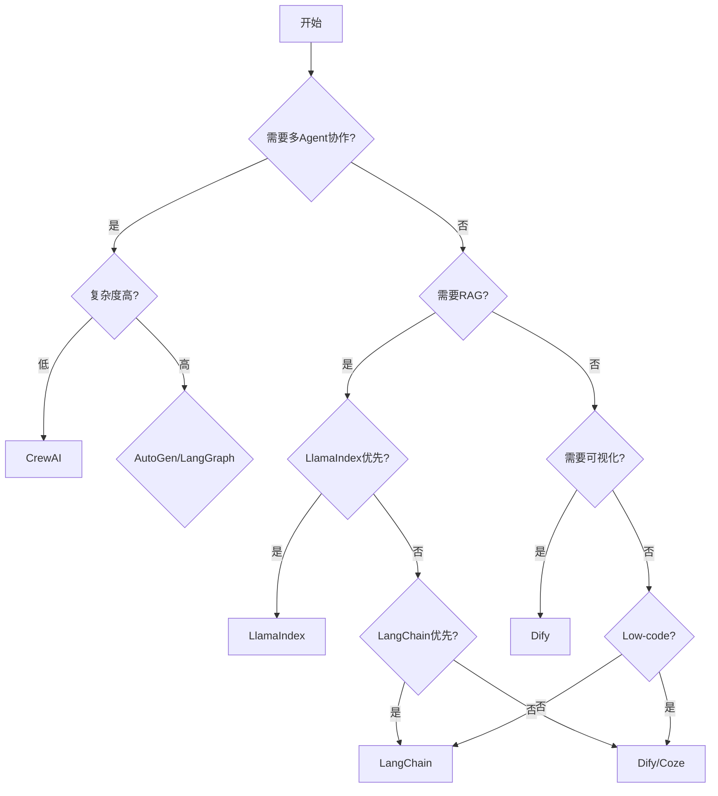
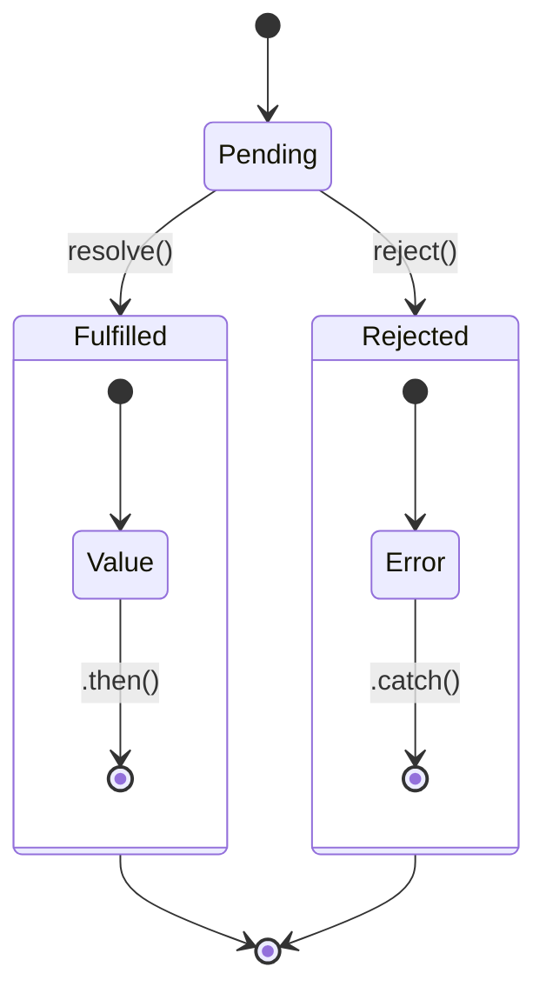

# AI Agent 框架综合对比文档

> 本文档深入对比主流 AI Agent 框架，帮助开发者根据具体场景选择最适合的工具。

---

## 1. 框架概览

### 1.1 LangChain / LangGraph

**官方链接**: https://www.langchain.com/ | https://www.langgraph.ai/

**核心定位**: 全功能应用开发框架，提供链式调用（Chain）、图编排（Graph）、工具调用、记忆系统等完整能力。

**架构特点**:
- 模块化设计：组件可独立使用
- 支持 Python 和 JavaScript/TypeScript
- LangGraph 用于复杂多 Agent 编排
- 内置 LangSmith 监控平台

**适用人群**: 需要构建复杂 AI 应用的开发者，对灵活性要求高的团队。

### 1.2 AutoGen (Microsoft)

**官方链接**: https://microsoft.github.io/autogen/

**核心定位**: 多 Agent 对话协作框架，强调 Agent 之间的自然对话和协作能力。

**架构特点**:
- 对话式 Agent 设计
- 内置多种 Agent 类型（ConversableAgent, AssistantAgent 等）
- 支持人机协作模式
- Microsoft 官方维护，企业级支持

**适用人群**: 需要构建多 Agent 协作系统的企业用户。

### 1.3 CrewAI

**官方链接**: https://www.crewai.com/

**核心定位**: 专注于 Role-based 多 Agent 编排，以"船员"概念组织 Agent 协作。

**架构特点**:
- 清晰的 Role → Task → Process 层级
- 流程可视化（Sequential, Hierarchical）
- 简洁易懂的 API 设计
- 快速原型开发

**适用人群**: 快速构建多 Agent 协作流程的团队。

### 1.4 LlamaIndex

**官方链接**: https://www.llamaindex.ai/

**核心定位**: 专注于知识检索增强（RAG），提供数据连接和知识管理的强大能力。

**架构特点**:
- 强大的数据索引能力
- 丰富的连接器生态（100+ 数据源）
- RAG 工作流优化
- 可作为 Agent 框架使用

**适用人群**: 需要深度 RAG 能力的知识密集型应用。

### 1.5 Dify

**官方链接**: https://dify.ai/

**核心定位**: 开源 LLM 应用开发平台，提供低代码/无代码开发体验。

**架构特点**:
- 可视化编排界面
- 支持工作流编排
- 内置模型网关
- 丰富的插件市场
- 支持 Docker 一键部署

**适用人群**: 非技术用户或需要快速验证想法的团队。

### 1.6 Coze

**官方链接**: https://www.coze.com/

**核心定位**: 字节跳动出品的 AI Bot 开发平台，国际版（Coze.com）和国内版（扣子）并行。

**架构特点**:
- 可视化 Bot 编辑器
- 丰富的插件生态（字节系产品深度集成）
- 工作流编排
- 多渠道发布（Discord、Slack、飞书等）

**适用人群**: 需要快速构建 ChatBot 并发布到多个平台的用户。

---

## 2. 核心能力对比

### 2.1 工具调用能力对比

| 能力维度 | LangChain/LangGraph | AutoGen | CrewAI | LlamaIndex | Dify | Coze |
|---------|---------------------|---------|--------|-----------|------|------|
| 内置工具生态 | 丰富（SerpAPI、Wikipedia 等） | 中等 | 基础 | 丰富 | 丰富 | 极丰富 |
| 工具定义方式 | Python 函数 / JSON Schema | Python 类 | Python 函数 | Python 函数 | 可视化 + 代码 | 可视化 + 插件 |
| 动态工具生成 | 支持 | 受限 | 不支持 | 支持 | 支持 | 支持 |
| 工具调用策略 | 多种（ReAct、OpenAI Function 等） | 内置函数调用 | ReAct | ReAct | 内置 | 内置 |
| 工具并行执行 | 支持 | 支持 | 支持 | 支持 | 支持 | 支持 |
| 工具重试机制 | 内置 | 需自行实现 | 需自行实现 | 内置 | 可视化配置 | 可视化配置 |
| 自定义工具 | 灵活（函数装饰器） | 需要继承基类 | 函数装饰器 | 函数装饰器 | UI 拖拽 | 插件市场 |

### 2.2 记忆系统对比

| 记忆类型 | LangChain/LangGraph | AutoGen | CrewAI | LlamaIndex | Dify | Coze |
|---------|---------------------|---------|--------|-----------|------|------|
| 短期记忆 | 会话缓冲 | 消息历史 | 消息历史 | 上下文窗口 | 会话上下文 | 会话上下文 |
| 长期记忆 | VectorStore / 知识图谱 | 外部存储 | 外部存储 | 向量存储 | 知识库 | 知识库 |
| 记忆检索 | Semantic Search / BM25 | 需自行实现 | 需自行实现 | Advanced Reranking | 混合检索 | 内置 |
| 记忆总结 | 内置摘要工具 | 需自行实现 | 需自行实现 | 内置摘要 | 支持 | 支持 |
| 对话历史管理 | ConversationBufferWindowMemory 等 | 内置 | 基础 | 内置 | 可视化配置 | 内置 |

### 2.3 多 Agent 协作对比

| 协作模式 | LangChain/LangGraph | AutoGen | CrewAI | LlamaIndex | Dify | Coze |
|---------|---------------------|---------|--------|-----------|------|------|
| Agent 定义 | 灵活自定义 | 内置多种类型 | Role + Agents | Agent + Tools | 节点组件 | Bot + 工作流 |
| 协作编排 | Graph / StateGraph | GroupChat | Process (Sequential/Hierarchical) | Router Agent | 工作流编排 | 工作流编排 |
| 通信机制 | 消息传递 | 对话轮次 | Task 传递 | 函数调用 | 节点连线 | 节点连线 |
| 冲突解决 | 自定义逻辑 | 内置 GroupChat 机制 | 自定义 | 自定义 | 自定义 | 自定义 |
| 人机协作 | 支持 | 优秀（Human In The Loop） | 支持 | 支持 | 支持 | 支持 |
| 并行执行 | 支持 | 支持 | 支持 | 支持 | 支持 | 支持 |

### 2.4 RAG 集成对比

| RAG 能力 | LangChain/LangGraph | AutoGen | CrewAI | LlamaIndex | Dify | Coze |
|---------|---------------------|---------|--------|-----------|------|------|
| 数据源连接 | 丰富 | 需自行集成 | 基础 | 极丰富（100+） | 丰富 | 丰富 |
| 文档处理 | PDF/HTML/Markdown 等 | 需自行实现 | 基础 | Advanced | 内置 | 内置 |
| 分块策略 | 多种（Recursive, Semantic 等） | 需自行实现 | 基础 | 多种高级策略 | 可视化配置 | 可视化配置 |
| 索引类型 | Vector / KG / Hybrid | 需自行实现 | 需自行实现 | Vector / Table / Graph | 向量索引 | 向量索引 |
| 重排序 | 内置 | 需自行实现 | 需自行实现 | 内置 | 内置 | 内置 |
| RAG 评估 | LangSmith 集成 | 需自行实现 | 需自行实现 | 内置 Eval | 支持 | 支持 |

---

## 3. 架构设计对比

### 3.1 链式执行 (Chain)

**LangChain LCEL 示例**:
```python
from langchain_openai import ChatOpenAI
from langchain.prompts import ChatPromptTemplate
from langchain.schema import StrOutputParser

# 使用 LCEL (LangChain Expression Language) 构建链
prompt = ChatPromptTemplate.from_messages([
    ("system", "你是一个{topic}专家"),
    ("human", "{question}")
])

chain = prompt | ChatOpenAI(model="gpt-4") | StrOutputParser()

# 执行链
result = chain.invoke({
    "topic": "Python",
    "question": "解释装饰器模式"
})

print(result)
```

**CrewAI 链式执行示例**:
```python
from crewai import Agent, Task, Crew, Process

# 定义 Agent
researcher = Agent(
    role="研究员",
    goal="收集相关信息",
    backstory="一位专业的市场研究员"
)

writer = Agent(
    role="作家",
    goal="撰写报告",
    backstory="一位资深内容创作者"
)

# 定义 Task
research_task = Task(
    description="研究{topic}的市场情况",
    agent=researcher
)

write_task = Task(
    description="撰写研究报告",
    agent=writer,
    context=[research_task]  # 依赖前一个任务
)

# 创建 Crew（顺序执行）
crew = Crew(
    agents=[researcher, writer],
    tasks=[research_task, write_task],
    process=Process.sequential
)

result = crew.kickoff(inputs={"topic": "AI"})
```

### 3.2 图执行 (Graph)

**LangGraph 状态机示例**:
```python
from langgraph.graph import StateGraph, END
from typing import TypedDict

class AgentState(TypedDict):
    messages: list
    next_action: str

def should_continue(state: AgentState) -> str:
    """决策节点：判断是否继续"""
    if len(state["messages"]) > 5:
        return "end"
    return "continue"

def agent_node(state: AgentState):
    """Agent 执行节点"""
    return {"messages": state["messages"] + ["Agent 执行了一次"]}

# 构建图
workflow = StateGraph(AgentState)
workflow.add_node("agent", agent_node)
workflow.add_edge("__start__", "agent")
workflow.add_conditional_edges(
    "agent",
    should_continue,
    {"continue": "agent", "end": END}
)

# 编译并执行
app = workflow.compile()
result = app.invoke({"messages": [], "next_action": ""})
print(result)
```

**AutoGen 图式协作示例**:
```python
from autogen import ConversableAgent, GroupChat, GroupChatManager

# 创建 Agent
assistant = ConversableAgent(
    name="Assistant",
    system_message="你是一个有帮助的助手",
    llm_config={"model": "gpt-4"}
)

critic = ConversableAgent(
    name="Critic",
    system_message="你是一个严格的评审员，检查方案的可行性",
    llm_config={"model": "gpt-4"}
)

# 创建群组聊天
group_chat = GroupChat(
    agents=[assistant, critic],
    messages=[],
    max_round=5
)

manager = GroupChatManager(groupchat=group_chat)

# 启动群组对话
assistant.initiate_chat(
    manager,
    message="帮我设计一个新的推荐系统架构，需要考虑可扩展性和性能"
)
```

### 3.3 状态机设计

**LangGraph 完整状态机示例**:
```python
from langgraph.graph import StateGraph, END, START
from typing import Annotated
import operator

class AgentState(TypedDict):
    messages: Annotated[list, operator.add]
    current_step: str
    data: dict

def router(state: AgentState) -> str:
    """路由函数 - 根据当前状态决定下一步"""
    last_message = state["messages"][-1]["content"].lower()

    if "分析" in last_message:
        return "analyzer"
    elif "搜索" in last_message:
        return "searcher"
    elif "完成" in last_message:
        return END
    else:
        return "general"

# 定义各节点
def analyzer_node(state: AgentState):
    return {
        "messages": [{"role": "assistant", "content": "执行分析任务..."}],
        "current_step": "analyzing"
    }

def searcher_node(state: AgentState):
    return {
        "messages": [{"role": "assistant", "content": "执行搜索任务..."}],
        "current_step": "searching"
    }

def general_node(state: AgentState):
    return {
        "messages": [{"role": "assistant", "content": "执行通用任务..."}],
        "current_step": "general"
    }

# 构建状态机图
workflow = StateGraph(AgentState)
workflow.add_node("analyzer", analyzer_node)
workflow.add_node("searcher", searcher_node)
workflow.add_node("general", general_node)

workflow.add_edge(START, "general")

workflow.add_conditional_edges(
    "general",
    router,
    {"analyzer": "analyzer", "searcher": "searcher", END: END}
)

workflow.add_edge("analyzer", END)
workflow.add_edge("searcher", END)

app = workflow.compile()
```

### 3.4 事件驱动架构

**LangChain 事件处理示例**:
```python
from langchain.callbacks.base import BaseCallbackHandler
from langchain_openai import ChatOpenAI

class CustomHandler(BaseCallbackHandler):
    def on_chat_model_start(self, *args, **kwargs):
        print("模型开始处理...")

    def on_llm_new_token(self, token, *args, **kwargs):
        print(f"新 token: {token}")

    def on_llm_end(self, *args, **kwargs):
        print("模型处理完成")

# 使用事件处理器
handler = CustomHandler()
llm = ChatOpenAI(callbacks=[handler])
```

**Dify 工作流事件驱动**:

```mermaid
flowchart TD
    A[用户输入] --> B[意图识别]
    B --> C{意图类型}
    C -->|查询| D[知识库检索]
    C -->|[任务]| E[任务分解]
    C -->|[对话]| F[对话管理]
    D --> G[结果整合]
    E --> H[子任务执行]
    F --> I[上下文更新]
    G --> J[响应生成]
    H --> J
    I --> J
    J --> K[输出响应]
    K --> L{是否完成?}
    L -->|否| B
    L -->|是| M[结束]
```

---

## 4. 代码实现对比

### 4.1 同一功能：实现多 Agent 协作回答问题

#### LangChain/LangGraph 实现

```python
from langgraph.graph import StateGraph, END
from typing import TypedDict, List
from langchain_openai import ChatOpenAI
from langchain.prompts import ChatPromptTemplate

class MultiAgentState(TypedDict):
    question: str
    research: str
    answer: str
    next: str

llm = ChatOpenAI(model="gpt-4")

# 研究者 Agent
research_prompt = ChatPromptTemplate.from_messages([
    ("system", "你是一个研究员，负责收集关于'{question}'的信息"),
    ("human", "请提供详细的研究报告")
])

research_chain = research_prompt | llm

# 回答者 Agent
answer_prompt = ChatPromptTemplate.from_messages([
    ("system", "你是一个专家，基于以下研究回答问题：\n{research}"),
    ("human", "回答问题：{question}")
])

answer_chain = answer_prompt | llm

# 定义节点
def research_node(state: MultiAgentState):
    result = research_chain.invoke({"question": state["question"]})
    return {"research": result.content, "next": "answer"}

def answer_node(state: MultiAgentState):
    result = answer_chain.invoke({
        "research": state["research"],
        "question": state["question"]
    })
    return {"answer": result.content, "next": END}

# 构建图
workflow = StateGraph(MultiAgentState)
workflow.add_node("researcher", research_node)
workflow.add_node("answerer", answer_node)
workflow.add_edge("__start__", "researcher")
workflow.add_edge("researcher", "answerer")
workflow.add_edge("answerer", END)

app = workflow.compile()

# 执行
result = app.invoke({
    "question": "解释量子计算的基本原理",
    "research": "",
    "answer": "",
    "next": ""
})

print(result["answer"])
```

#### AutoGen 实现

```python
from autogen import ConversableAgent, GroupChat, GroupChatManager

# 研究者 Agent
researcher = ConversableAgent(
    name="Researcher",
    system_message="你是一个研究员，擅长收集和整理信息。",
    llm_config={"model": "gpt-4"},
    human_input_mode="NEVER"
)

# 回答者 Agent
answerer = ConversableAgent(
    name="Answerer",
    system_message="""你是一个专家，基于研究员提供的信息给出专业回答。
    如果信息不足，可以要求研究员补充。""",
    llm_config={"model": "gpt-4"},
    human_input_mode="NEVER"
)

# 设置对话
researcher.receive(
    message="请研究量子计算的基本原理，并给出详细报告。",
    sender=answerer
)

# 协作对话
result = researcher.generate_reply(messages=researcher.chat_messages.get(answerer, []))
print(result)
```

#### CrewAI 实现

```python
from crewai import Agent, Task, Crew, Process

researcher = Agent(
    role="高级研究员",
    goal="深入研究量子计算原理",
    backstory="量子物理领域的权威专家"
)

answerer = Agent(
    role="技术作家",
    goal="将复杂技术以易懂方式解释",
    backstory="擅长技术传播的内容创作者"
)

research_task = Task(
    description="研究量子计算的基本原理，包括量子比特、叠加态、纠缠等概念",
    agent=researcher
)

answer_task = Task(
    description="基于研究报告，用通俗语言解释量子计算原理",
    agent=answerer,
    context=[research_task]
)

crew = Crew(
    agents=[researcher, answerer],
    tasks=[research_task, answer_task],
    process=Process.sequential
)

result = crew.kickoff()
print(result)
```

### 4.2 扩展性分析

| 扩展维度 | LangChain/LangGraph | AutoGen | CrewAI | LlamaIndex | Dify | Coze |
|---------|---------------------|---------|--------|-----------|------|------|
| 自定义组件 | 高度灵活 | 受限 | 受限 | 高度灵活 | 插件扩展 | 插件扩展 |
| 第三方集成 | 丰富 | 中等 | 有限 | 极丰富 | 丰富 | 极丰富 |
| 私有部署 | 完全支持 | 完全支持 | 完全支持 | 完全支持 | 完全支持 | 受限 |
| 云服务 | LangSmith (付费) | Azure AI Studio | 托管服务 | 托管服务 | 自托管 | Coze Cloud |
| 商业授权 | Apache 2.0 | MIT | MIT | MIT | Apache 2.0 | 商业 |

### 4.3 性能对比（理论基准）

| 指标 | LangChain | AutoGen | CrewAI | LlamaIndex | Dify | Coze |
|-----|-----------|---------|--------|-----------|------|------|
| 冷启动时间 | 中等 | 中等 | 快速 | 中等 | 快速 | 快速 |
| 单一请求延迟 | 基准 | 基准 | 基准 | 基准 | +100-200ms | +200-300ms |
| 并发能力 | 高 | 高 | 中等 | 高 | 中等 | 中等 |
| 内存占用 | 中等 | 中等 | 较低 | 中等 | 较高 | 较高 |
| 大规模部署 | 优秀 | 优秀 | 良好 | 优秀 | 良好 | 受限 |

> 注：性能数据受模型、硬件、网络等因素影响，以上为相对参考值。

---

## 5. 适用场景

### 5.1 场景分类矩阵

| 场景 | 推荐框架 | 理由 |
|------|---------|------|
| **聊天机器人** | Coze > Dify > LangChain | 快速部署、多平台发布 |
| **自动化工作流** | Dify > LangGraph > CrewAI | 可视化编排、监控友好 |
| **代码生成** | LangChain > AutoGen | 灵活的代码执行和验证 |
| **数据分析** | LangChain + LlamaIndex | 强大的数据处理和检索 |
| **知识问答** | LlamaIndex > LangChain | 专业 RAG 能力 |
| **多 Agent 协作** | AutoGen > LangGraph > CrewAI | 原生多 Agent 支持 |
| **企业级应用** | AutoGen > LangChain > Dify | 微软生态、安全合规 |
| **快速原型** | CrewAI > Coze > Dify | 简洁 API、快速验证 |
| **低代码平台** | Dify > Coze | 可视化友好、部署简单 |
| **研究探索** | LangChain > LlamaIndex | 灵活性高、实验性强 |

### 5.2 详细场景说明

#### 场景 A：企业智能客服

**需求分析**:
- 多渠道接入（网页、钉钉、微信）
- FAQ 知识库检索
- 复杂对话管理
- 工单转接

**推荐方案**: Dify + 自定义插件

**优势**:
- 可视化对话流程设计
- 内置知识库管理
- 多渠道发布
- 团队协作

#### 场景 B：代码审查 Agent

**需求分析**:
- 多语言代码审查
- GitHub 集成
- 审查报告生成
- 问题追踪

**推荐方案**: LangChain + LangGraph

**优势**:
- 灵活的代码执行环境
- 状态机设计适合复杂审查流程
- 丰富的 LLM 集成
- 可定制审查规则

#### 场景 C：研究报告生成

**需求分析**:
- 网络信息搜集
- 多源数据整合
- 结构化报告生成
- 引用标注

**推荐方案**: AutoGen + CrewAI

**优势**:
- 多 Agent 分工协作
- 群组讨论机制
- Role-based 清晰分工

### 5.3 框架选型决策树




---

## 6. 选型建议

### 6.1 按需求选择

| 需求类型 | 第一选择 | 第二选择 | 备选方案 |
|---------|---------|---------|---------|
| 快速构建 Bot | Coze | Dify | CrewAI |
| 企业级应用 | AutoGen | LangChain | Dify |
| RAG 优先 | LlamaIndex | LangChain | Dify |
| 研究/实验 | LangChain | LlamaIndex | AutoGen |
| 低代码优先 | Dify | Coze | - |
| 多 Agent 协作 | AutoGen | CrewAI | LangGraph |

### 6.2 学习曲线对比

```mermaid
linechart
    title 框架学习曲线对比
    x-axis 学习阶段: [入门, 基础, 中级, 高级, 专家]
    y-axis 学习难度 (1-10): [0, 10]
    LangChain: [2, 5, 7, 8, 9]
    LangGraph: [3, 6, 8, 9, 10]
    AutoGen: [2, 4, 6, 8, 9]
    CrewAI: [1, 3, 5, 7, 8]
    LlamaIndex: [2, 5, 7, 8, 9]
    Dify: [1, 2, 3, 5, 6]
    Coze: [1, 2, 3, 4, 5]
```


| 框架 | 上手难度 | 文档质量 | 社区活跃度 | 教程资源 |
|-----|---------|---------|-----------|---------|
| LangChain | 中高 | 优秀 | 极高 | 极多 |
| LangGraph | 高 | 良好 | 高 | 较多 |
| AutoGen | 中 | 良好 | 高 | 较多 |
| CrewAI | 低 | 良好 | 中高 | 较多 |
| LlamaIndex | 中 | 优秀 | 高 | 极多 |
| Dify | 低 | 优秀 | 高 | 多 |
| Coze | 低 | 优秀 | 高 | 多 |

### 6.3 社区支持对比

| 框架 | GitHub Stars | 周下载量 | 维护频率 | Discord/Slack |
|-----|-------------|---------|---------|--------------|
| LangChain | 35k+ | 极高 | 活跃 | Discord (活跃) |
| AutoGen | 25k+ | 高 | 活跃 | Discord (活跃) |
| CrewAI | 15k+ | 中高 | 活跃 | Discord |
| LlamaIndex | 20k+ | 高 | 活跃 | Discord (活跃) |
| Dify | 50k+ | 高 | 非常活跃 | Discord (活跃) |
| Coze | N/A | 高 | 活跃 | 有 |

### 6.4 最终选型建议

**如果您是...**

| 用户画像 | 推荐框架 | 理由 |
|---------|---------|------|
| **初学者 / 非技术人员** | Dify / Coze | 低代码、可视化、快速上手 |
| **后端开发者** | LangChain / AutoGen | 灵活性、深度定制 |
| **AI 研究者** | LangChain + LlamaIndex | 实验性强、组件丰富 |
| **企业用户** | AutoGen / Dify | 稳定性、安全性、微软生态 |
| **创业团队** | Dify / CrewAI | 快速原型、成本可控 |
| **大型企业** | LangChain / AutoGen | 可扩展性、定制能力 |

### 6.5 组合使用建议

在实际项目中，框架可以组合使用以发挥各自优势：




---

## 附录

### A. 快速启动命令

```bash
# LangChain
pip install langchain langchain-openai langchain-core

# AutoGen
pip install pyautogen

# CrewAI
pip install crewai

# LlamaIndex
pip install llama-index

# Dify (Docker)
docker run -d -p 8080:8080 dify/dify
```

### B. 关键资源链接

| 框架 | 文档 | GitHub | 示例 |
|-----|------|--------|------|
| LangChain | [docs](https://python.langchain.com/) | [repo](https://github.com/langchain-ai/langchain) | [Examples](https://github.com/langchain-ai/langchain/tree/master/docs/docs/integrations) |
| AutoGen | [docs](https://microsoft.github.io/autogen/) | [repo](https://github.com/microsoft/autogen) | [Examples](https://github.com/microsoft/autogen/tree/main/samples) |
| CrewAI | [docs](https://docs.crewai.com/) | [repo](https://github.com/crewAI/crewai) | [Examples](https://github.com/crewAI/crewai-examples) |
| LlamaIndex | [docs](https://docs.llamaindex.ai/) | [repo](https://github.com/run-llama/llama_index) | [Examples](https://github.com/run-llama/llama_index/tree/main/docs/docs/examples) |
| Dify | [docs](https://docs.dify.ai/) | [repo](https://github.com/langgenius/dify) | [模板市场](https://dify.market/) |
| Coze | [文档](https://www.coze.com/docs) | - | [模板](https://www.coze.com/store/bots) |

---

> **文档版本**: 1.0
> **最后更新**: 2024
> **贡献者**: 欢迎提交 PR 完善此文档