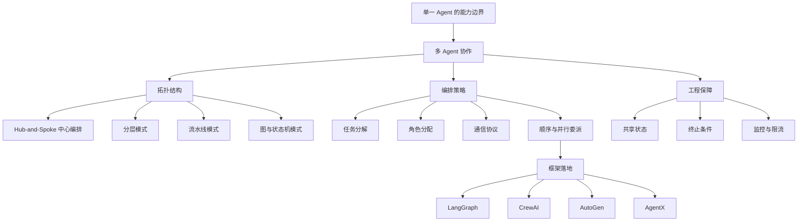
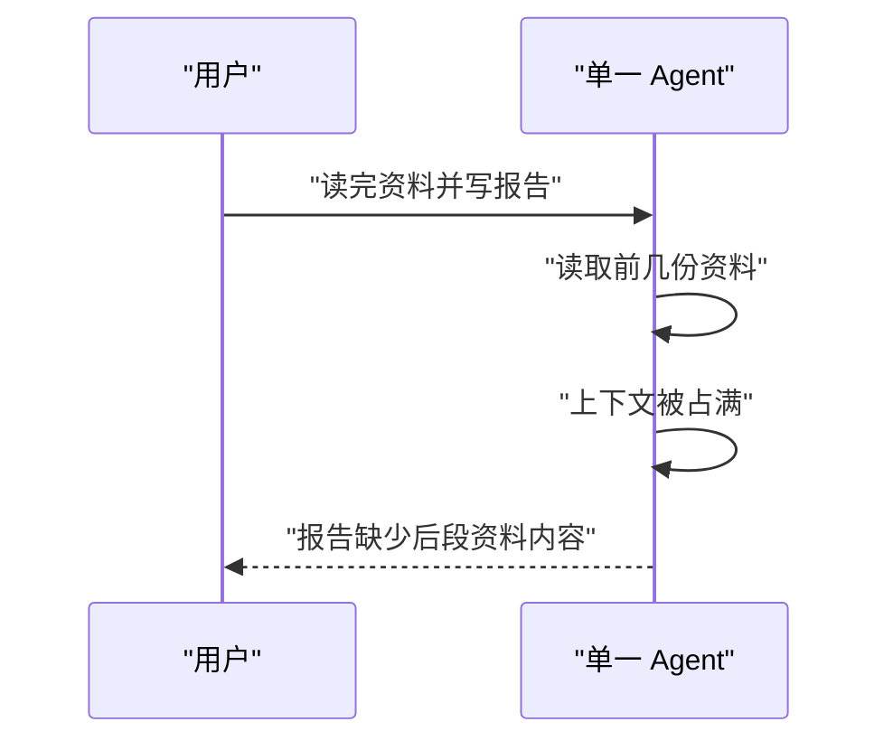
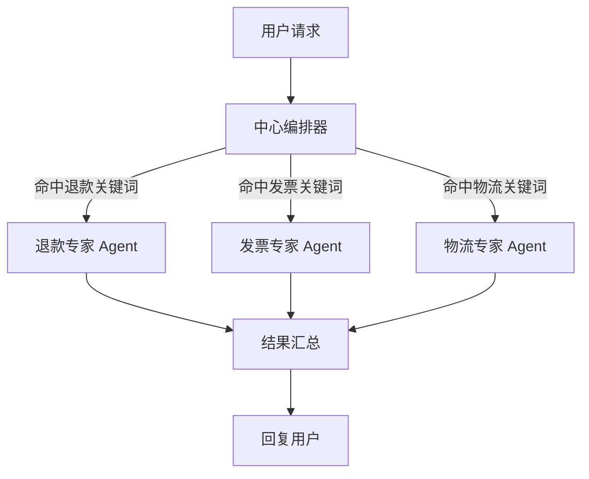
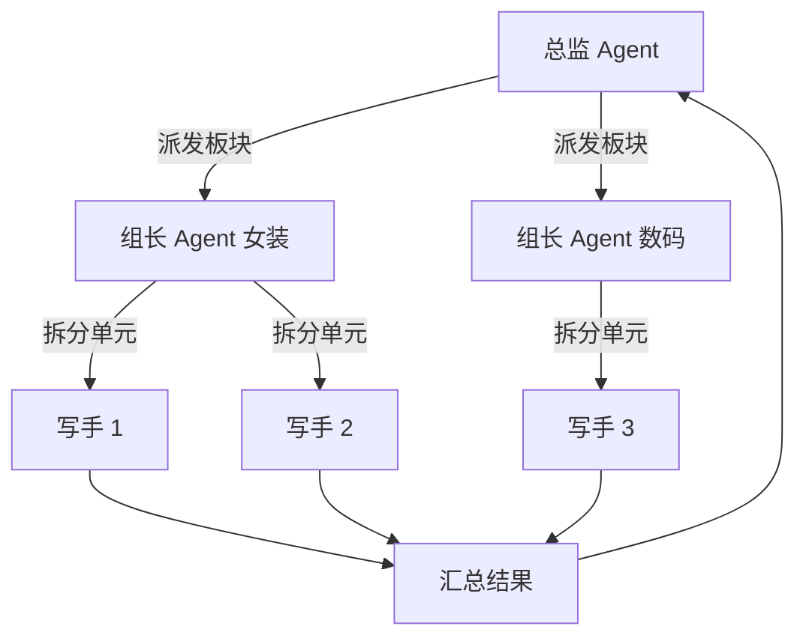
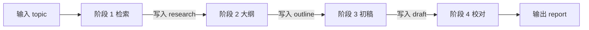
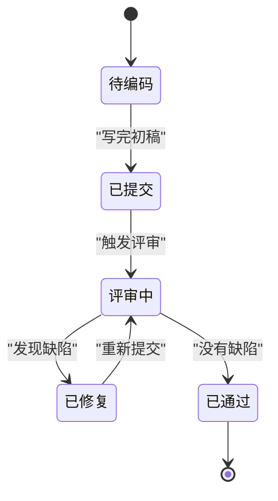
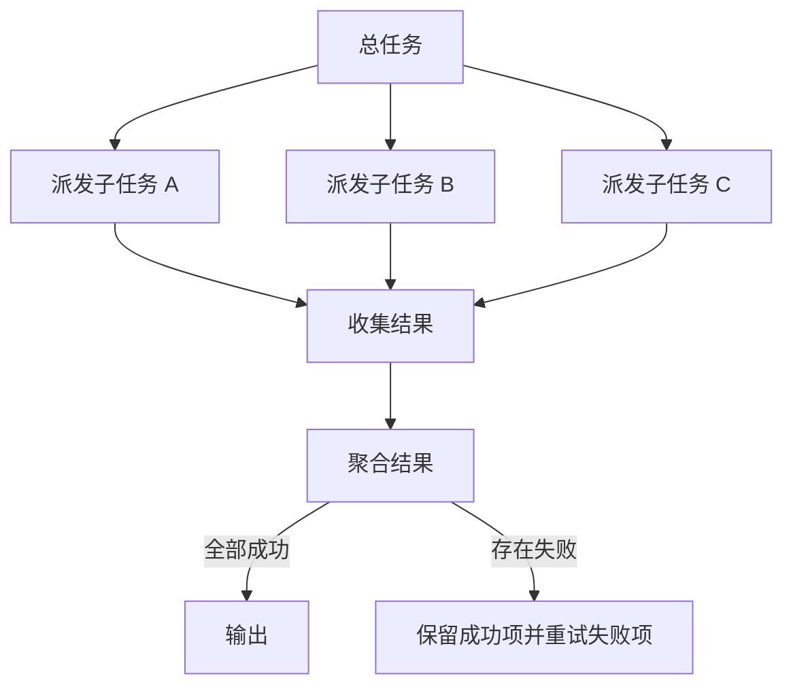
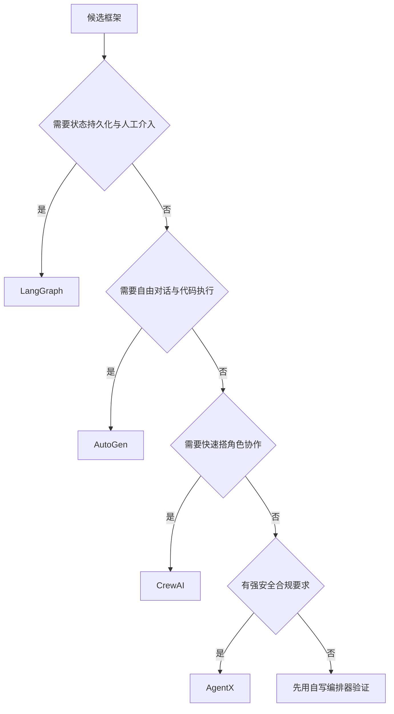

# 多 Agent 协作模式

!!! abstract "学完这一页你能"
    - 说出 Hub-and-Spoke、分层、流水线、图状态机四种拓扑各自适合的任务形状，并画出流程图。
    - 用 Node 20+ 写出一个带关键词路由、超时控制和最大轮数上限的编排器。
    - 区分任务分解、角色分配、通信协议三件事各自解决的问题，并为任务选对委派方式。
    - 按硬约束在 LangGraph、CrewAI、AutoGen、AgentX 之间做出选择，并说明放弃其余三个的理由。

## 0. 知识地图



建议按编号顺序读：1 到 5 节讲拓扑，先建立"任务该长成什么形状"的判断力。
第 6 节讲把活派出去的具体手法，第 7 节讲选框架和上线前的工程保障。
读图时把"拓扑结构"当成骨架，"编排策略"当成肌肉，"工程保障"当成安全带。

!!! note "术语：Agent（智能体）"
    一个能自己决定下一步动作、并且可以调用工具的程序单元，通常由大语言模型驱动。
    例子：一个只负责查订单状态的 Agent，输入订单号，输出状态字段，不回答其他问题。

## 1. 从单 Agent 到多 Agent：为什么需要协作

**先想一个问题**

你让一个 Agent 读完一批资料再写一份带数据的行业报告，它会怎么做？（本页示例场景）
它要么把资料一次全塞进上下文，要么只读完开头几篇。
结果常见的是后段资料没进上下文，报告开头细、结尾空。

!!! note "术语：上下文窗口"
    模型单次调用能接收的 token 总量上限，输入与输出共用这个额度。
    例子：把十份长文档拼进一次请求，超出窗口的部分会被截断或被接口直接拒绝。

**心智模型**

!!! tip "心智模型"
    一句话模型：多 Agent 协作是把一个全干的人，换成一组各管一段的人，再加一个分派任务的人。
    日常类比：装修队里有水电工、木工、油漆工，还有负责排期和验收的工长。
    类比不成立的地方：装修工的技能边界由执照决定，Agent 的边界由提示词和工具清单决定，边界随时可以改，也随时可能越界去干别人的活。

**图解**



1. 用户提出一个跨阶段的任务，包含检索、分析、写作三种活。
2. 单个 Agent 先做检索，读进来的内容立刻占住上下文。
3. 上下文装不下全部资料，后读的内容把先读的内容挤出去。
4. 写报告时模型只能看到部分资料，输出不完整。

**一步一步来**

**第 1 步：先判断任务值不值得拆**

拆分会引入协调开销，所以先做一道筛选题，避免为了小任务上多 Agent。

```js
// canSplit：判断一个任务是否值得拆给多个 Agent
// 阈值 3 和 4 是本页给出的启发式起点，不是行业标准，需要按你的项目实测调整
function canSplit(task) {
  const skillKinds = new Set(task.requiredSkills).size; // 任务需要几种不同技能
  const enoughSteps = task.steps >= 4;                  // 是否至少有 4 个可分离步骤
  return skillKinds >= 3 && enoughSteps;                // 两个条件同时成立才建议拆
}

// 试三个任务：跨技能多步骤的、单技能的、跨技能但只有两步的
console.log(canSplit({ requiredSkills: ['search', 'analyze', 'write'], steps: 5 }));
console.log(canSplit({ requiredSkills: ['write'], steps: 5 }));
console.log(canSplit({ requiredSkills: ['search', 'write'], steps: 2 }));
```

**这段代码在做什么**

- `Set` 用来去重，避免同一个技能写两次就把种类数算高。
- `skillKinds >= 3` 表示任务跨越三个专业方向，单个 Agent 的提示词会互相冲突。
- `steps >= 4` 表示步骤足够多，拆分后每段仍有实际工作量。
- 两个条件用 `&&` 连接，只要有一个不满足就返回 `false`，倾向于不拆。
- 函数没有副作用，输入相同则输出相同，便于写成单元测试。

运行结果：

```
true
false
false
```

**第 2 步：为拆出来的每一段写出边界**

判定要拆之后，下一步是给每段写清"输入什么、输出什么、不许做什么"。

```js
// 三段式任务定义：每段只声明自己的输入键、输出键与禁止事项
const plan = [
  {
    id: 'researcher',
    inputKeys: ['topic'],       // 只读 topic
    outputKey: 'research',      // 只写 research
    forbidden: ['写结论'],       // 明确不做的活，防止越界
  },
  {
    id: 'analyst',
    inputKeys: ['research'],
    outputKey: 'analysis',
    forbidden: ['编造数据'],
  },
  {
    id: 'writer',
    inputKeys: ['analysis'],
    outputKey: 'report',
    forbidden: ['改原始数据'],
  },
];

// 打印每段的读写键，检查是否存在读不到的键
for (const step of plan) {
  console.log(step.id, step.inputKeys.join('+'), '->', step.outputKey);
}
```

**这段代码在做什么**

- `inputKeys` 与 `outputKey` 一起勾出隐式依赖：谁先跑、谁后跑一眼能看出来。
- `forbidden` 是负面清单，提示词里写清楚"不许做什么"比只写"要做什么"更能约束行为。
- 三段串起来形成 `topic → research → analysis → report` 的数据流。
- 打印结果是人工检查手段：如果某段的 `inputKeys` 在它之前没人写过，配置就是错的。

运行结果：

```
researcher topic -> research
analyst research -> analysis
writer analysis -> report
```

**动手验证**

把上面两步合起来，加上断言。保存为 `multi-agent-check.mjs`，用 `node multi-agent-check.mjs` 运行。

```js
// 依赖：仅 Node 20+ 内置模块，无需 npm install
import assert from 'node:assert/strict';

// 判断任务是否值得拆分；阈值是本页启发式，不是行业标准
function canSplit(task) {
  const skillKinds = new Set(task.requiredSkills).size;
  return skillKinds >= 3 && task.steps >= 4;
}

// 检查工作流的输出键是否都在前面出现过
function checkKeys(plan) {
  const seen = new Set(['topic']); // 入口键由调用方提供
  for (const step of plan) {
    for (const key of step.inputKeys) {
      if (!seen.has(key)) return { ok: false, missing: key, at: step.id };
    }
    seen.add(step.outputKey);
  }
  return { ok: true };
}

const plan = [
  { id: 'researcher', inputKeys: ['topic'], outputKey: 'research' },
  { id: 'analyst', inputKeys: ['research'], outputKey: 'analysis' },
  { id: 'writer', inputKeys: ['analysis'], outputKey: 'report' },
];

assert.equal(canSplit({ requiredSkills: ['search', 'analyze', 'write'], steps: 5 }), true);
assert.equal(canSplit({ requiredSkills: ['write'], steps: 5 }), false);
assert.deepEqual(checkKeys(plan), { ok: true });

const broken = [
  { id: 'writer', inputKeys: ['analysis'], outputKey: 'report' },
];
assert.equal(checkKeys(broken).ok, false);

console.log('all checks passed');
```

预期输出：

```
all checks passed
```

**常见坑**

| 现象 | 原因 | 怎么修 |
| --- | --- | --- |
| 拆分后总耗时反而变长 | 每段之间的协调消息比干活的消息还多 | 合并相邻的小段，只有能独立验证的段才单独成 Agent |
| 两个 Agent 抢着写同一个字段 | 输出键没有归属约定 | 一个输出键只允许一个 Agent 写，其余只能读 |
| 某段永远读不到上游数据 | `inputKeys` 里的键在它之前没人写过 | 上线前跑一遍键检查，见上面的 `checkKeys` |
| 任务简单却拆了五段 | 缺少拆分前的判断 | 先过 `canSplit` 这类门槛函数再动手 |

**用在哪里**

- **业务背景**：在线客服的工单系统，用户消息可能涉及退款、发票、物流三类规则。
- **这一节的知识怎么用**：先用 `canSplit` 判断工单是否需要跨部门处理，再把三类规则写成三段独立职责。
- **用什么指标衡量收益**：一次解决率、转人工率、平均处理轮数，取上线前后同一周的数据对比。
- **什么时候不该用**：单轮问答类工单只涉及一个规则，拆开只会增加延迟。

- **业务背景**：后台管理的批量导入，需要先校验字段、再补全缺失项、最后写库。
- **这一节的知识怎么用**：把校验、补全、写库写成三段，每段只读上一段的输出键。
- **用什么指标衡量收益**：导入成功率、单批次失败原因分布、失败重跑次数。
- **什么时候不该用**：数据量小且格式固定时，一次函数调用即可完成，不需要 Agent 参与。

**行业实践**

- LangGraph 官方站点把工作流描述为有向图，节点是 Agent 动作或工具执行，边是状态转移，并提供状态持久化能力。出处：LangGraph Official Site（见本站页面旧版内容 Resources 列表）。怎么借鉴：把你的 `plan` 数组先画成图，再决定用不用框架。
- CrewAI 官方文档提供基于角色的 Agent 与 Task 定义，并用 Crew 与 Process 组织协作。出处：CrewAI Documentation。怎么借鉴：即使不用该框架，也把"角色定义"和"任务定义"分成两份配置。
- 上述文档的当前版本 API 名称需核对官方文档：具体要核对节点、边、状态持久化相关类的命名与参数。

**小结**

- 多 Agent 的第一价值是隔离上下文，让每段只装自己需要的资料。
- 拆之前先判断，能用一个 Agent 做完的任务不要拆。
- 每段写清输入键、输出键、禁止事项，配置错误才能被自动检查出来。

## 2. Hub-and-Spoke 中心编排模式

**先想一个问题**

用户一句话可能问退款、问发票、问物流，三套规则互不相干。
只用一个 Agent 处理全部话题，它的提示词要把三套规则都写进去。
能不能让一个角色只负责挑人，另外三个角色各自只懂一套规则？

!!! note "术语：编排器（Orchestrator）"
    负责选择执行者、传递任务、合并结果的组件。
    例子：收到"我要退款"后选退款 Agent，拿到结果后统一格式化再回复。

**心智模型**

!!! tip "心智模型"
    一句话模型：中心角色只做分派与汇总，专家角色只做自己那一段。
    日常类比：医院分诊台先问症状，再让人去对应科室。
    类比不成立的地方：分诊台护士不写病历，而 Hub 常常要合并专家的输出，合并质量直接影响最终答案。

**图解**



1. 用户请求先进入中心编排器，专家 Agent 不直接面向用户。
2. 编排器按关键词或分类模型挑出一个专家。
3. 专家执行自己的那一段，把结果交回编排器。
4. 编排器统一格式化，产出最终回复。
5. 若没有任何专家命中，编排器负责走兜底分支，而不是让请求悬空。

**一步一步来**

**第 1 步：写下关键词路由与专家表**

先做最笨的版本：一张专家表加一次线性查找，能跑通再加复杂度。

```js
// 专家注册表：每个专家负责一个关键词
const specialists = [
  { keyword: '退款', name: 'refund' },
  { keyword: '发票', name: 'invoice' },
  { keyword: '物流', name: 'logistics' },
];

// 模拟一次专家调用：延迟 5 毫秒后返回结果字符串
const callAgent = (name) =>
  new Promise((resolve) => setTimeout(() => resolve(name + ':done'), 5));

// 路由函数：找到第一个命中的专家并调用它
async function route(task) {
  const hit = specialists.find((s) => task.includes(s.keyword)); // 线性查找
  if (!hit) throw new Error('no specialist matched');            // 兜底：明确报错
  return callAgent(hit.name);
}

console.log(await route('我想申请退款'));
```

**这段代码在做什么**

- `specialists` 是一份可配置清单，加新专家只需往数组里加一项。
- `find` 返回第一个命中项，所以关键词顺序会影响结果，冲突词要提前排查。
- `callAgent` 用定时器模拟网络调用，把真实模型调用换成可控延迟，便于测试。
- 未命中时抛错而不是返回空字符串，调用方能立刻发现路由缺口。

运行结果：

```
refund:done
```

**第 2 步：加超时与最大委派轮数**

中心编排最大的风险是"一个慢专家拖住整条链路"，所以必须有超时和轮数上限。

```js
// withTimeout：给任意 Promise 套一个毫秒级超时
function withTimeout(promise, ms) {
  return Promise.race([
    promise,                                                        // 正常完成的分支
    new Promise((_, reject) =>                                      // 超时分支
      setTimeout(() => reject(new Error('agent timeout')), ms)),
  ]);
}

// 最多委派 2 轮，防止专家之间互相转派形成长链
async function orchestrate(task, maxRounds = 2) {
  for (let round = 0; round < maxRounds; round += 1) {
    try {
      return await withTimeout(route(task), 50);  // 50 毫秒是本页示例值，需按业务实测
    } catch (err) {
      if (err.message !== 'agent timeout') throw err; // 非超时错误直接上抛
    }
  }
  throw new Error('max rounds exceeded');           // 超出轮数上限，交给兜底逻辑
}
```

**这段代码在做什么**

- `Promise.race` 取最先落地的那个结果，谁快听谁的。
- 超时分支只负责抛错，不改动原 Promise，所以超时后原请求仍在后台跑。
- `maxRounds` 是硬上限，避免超时后无限重试。
- 只对超时错误重试，其他错误立刻上抛，防止把配置错误当网络抖动吞掉。
- 真实项目里要配合 Agent 侧的取消能力，否则后台请求会持续消耗额度。

运行结果（超时场景）：

```
Error: max rounds exceeded
```

**动手验证**

保存为 `hub-spoke.mjs` 后运行 `node hub-spoke.mjs`。

```js
// 依赖：仅 Node 20+ 内置模块
import assert from 'node:assert/strict';

const specialists = [
  { keyword: '退款', name: 'refund' },
  { keyword: '发票', name: 'invoice' },
];

const callAgent = (name, ms) =>
  new Promise((resolve) => setTimeout(() => resolve(name + ':done'), ms));

async function route(task) {
  const hit = specialists.find((s) => task.includes(s.keyword));
  if (!hit) throw new Error('no specialist matched');
  return callAgent(hit.name, 5);
}

function withTimeout(promise, ms) {
  return Promise.race([
    promise,
    new Promise((_, reject) => setTimeout(() => reject(new Error('agent timeout')), ms)),
  ]);
}

// 正常命中
assert.equal(await route('我要退款'), 'refund:done');
// 未命中要抛错
await assert.rejects(() => route('今天天气如何'), /no specialist matched/);
// 超时要抛错：调用一个 60 毫秒的慢专家，超时设为 10 毫秒
await assert.rejects(
  () => withTimeout(callAgent('slow', 60), 10),
  /agent timeout/,
);

console.log('all checks passed');
```

预期输出：

```
all checks passed
```

**常见坑**

| 现象 | 原因 | 怎么修 |
| --- | --- | --- |
| 关键词互相包含导致路由错 | 例如"退款"与"退款进度"同时命中 | 按关键词长度倒序匹配，或改成分类模型 |
| 一个慢专家拖慢全部请求 | 缺少超时 | 用 `Promise.race` 加毫秒级超时 |
| 专家之间互相转派停不下来 | 没有轮数上限 | 设置 `maxRounds`，超限走兜底回复 |
| 超时后额度还在被消耗 | 超时只放弃了等待，没有取消请求 | 核对官方文档：具体要核对所用 SDK 是否支持请求取消与超时参数 |

**用在哪里**

- **业务背景**：在线客服的会话入口，用户问题跨退款、发票、物流三个方向。
- **这一节的知识怎么用**：把三个方向的规则分别写成专家 Agent，入口只保留路由和兜底。
- **用什么指标衡量收益**：路由准确率、首次响应时延、转人工率。
- **什么时候不该用**：只有一类问题的产品，路由层纯属多余。

- **业务背景**：数据中台的字段清洗任务，不同数据源需要不同清洗规则。
- **这一节的知识怎么用**：按数据源建专家表，中心编排器按来源字段选清洗 Agent。
- **用什么指标衡量收益**：单批次清洗耗时、规则命中率、失败任务可重跑比例。
- **什么时候不该用**：全库清洗规则统一时，一个 Agent 加参数即可。

**行业实践**

- AutoGen 的 GitHub 仓库示例中，`AgentTool` 把一个 Agent 包装成工具交给外层 Agent 调用，并可用 `return_value_as_last_message=True` 只回传子 Agent 的最后一条消息。出处：AutoGen GitHub。怎么借鉴：中心编排器与专家之间只传最终结论，不传中途推理过程，减少上下文占用。
- CrewAI 官方文档用 `Process.hierarchical` 表达"先协调再执行"的组织方式。出处：CrewAI Documentation。怎么借鉴：把中心编排器写成一个独立角色，而不是把路由逻辑塞进某个专家的提示词。
- 上述参数与枚举名以官方文档当前版本为准，需核对官方文档：具体要核对 `AgentTool` 的参数名与 `Process` 的取值。

**小结**

- Hub-and-Spoke 让专家只关心自己那一段规则，路由与兜底集中在中心。
- 上线前必须配两样东西：超时和最大轮数上限。
- 专家之间不直接对话，只通过编排器交换结果，链路才好观测。

## 3. 分层模式：Manager 委派 Worker

**先想一个问题**

后台要给 2000 个商品写卖点文案（本页示例数字）。
一个 Agent 从头写到尾，耗时线性增长，中间失败还得整体重跑。
能不能上面一层拆板块，下面一层并行写？

!!! note "术语：委派（Delegation）"
    把子任务连同上下文交给另一个执行者，并约定回收结果的方式。
    例子：总监把"女装板块的 500 条文案"交给女装组长，组长再分给 5 个写手。

**心智模型**

!!! tip "心智模型"
    一句话模型：上层只拆任务和验收，下层只干被分到的那一小块。
    日常类比：总监带组长，组长带组员。
    类比不成立的地方：人类组织靠开会同步信息，Agent 之间靠状态对象同步，状态里没写的等于没说过。

**图解**



1. 总监 Agent 接收总目标，按板块切分任务。
2. 每个组长 Agent 拿到一个板块，再把板块切成更小的单元。
3. 写手 Agent 只处理自己那一个单元，产出单条结果。
4. 组长回收并检查本板块的结果。
5. 总监回收各板块结果，做一次全局校验。
6. 任意一层失败只影响该分支，其余分支的结果仍可用。

**一步一步来**

**第 1 步：让组长并发执行组员任务**

组长内部是并发的，所以同组任务的总耗时接近最慢那一个。

```js
// 单个写手：把单元名拼上前缀返回
const worker = (unit) => Promise.resolve('W:' + unit);

// 组长：收到一组单元，并发跑完再返回数组
async function teamLead(units) {
  return Promise.all(units.map(worker)); // map 立即启动全部任务，all 等待全部完成
}

console.log(await teamLead(['a', 'b']));
```

**这段代码在做什么**

- `units.map(worker)` 会立刻为每个单元发起调用，任务之间没有先后依赖。
- `Promise.all` 等全部完成，结果数组顺序与输入顺序一致。
- 若其中一个单元抛错，`Promise.all` 会整体拒绝，需要在外层决定是否降级。
- 返回数组而不是拼接字符串，保留结构便于上层逐项校验。

运行结果：

```
[ 'W:a', 'W:b' ]
```

**第 2 步：总监按板块串行收集**

总监这一层按顺序处理板块，好处是便于限流与逐块落库。

```js
// 总监：按板块顺序收集结果，避免一次打满下游配额
async function director(plan) {
  const result = {};
  for (const [lead, units] of Object.entries(plan)) {
    result[lead] = await Promise.all(units.map((unit) => Promise.resolve('W:' + unit))); // 一块一块来，便于控制并发峰值
  }
  return result;
}

// 两个板块，各 2 个和 1 个单元
console.log(await director({ front: ['a', 'b'], back: ['c'] }));
```
**这段代码在做什么**

- `Object.entries` 把板块配置转成可遍历的键值对。
- 顺序 `await` 让同一时刻只有一个板块在跑，并发峰值等于单组单元数。
- 结果用对象承载，键就是板块名，便于按板块重跑失败部分。
- 如果想提高吞吐，可以把这个循环改成 `Promise.all`，代价是并发峰值变成全部单元数。

运行结果：

```
{ front: [ 'W:a', 'W:b' ], back: [ 'W:c' ] }
```

**动手验证**

保存为 `hierarchical.mjs`，运行 `node hierarchical.mjs`。

```js
// 依赖：仅 Node 20+ 内置模块
import assert from 'node:assert/strict';

const worker = (unit) => Promise.resolve('W:' + unit);
const teamLead = (units) => Promise.all(units.map(worker));

async function director(plan) {
  const result = {};
  for (const [lead, units] of Object.entries(plan)) {
    result[lead] = await teamLead(units);
  }
  return result;
}

const out = await director({ front: ['a', 'b'], back: ['c'] });

assert.deepEqual(out, { front: ['W:a', 'W:b'], back: ['W:c'] });
assert.equal(out.front.length, 2);
assert.equal(out.back[0], 'W:c');

// 组员抛错时，组长要能把错误传上来
const badWorker = () => Promise.reject(new Error('worker failed'));
await assert.rejects(() => Promise.all(['x'].map(badWorker)), /worker failed/);

console.log('all checks passed');
```

预期输出：

```
all checks passed
```

**常见坑**

| 现象 | 原因 | 怎么修 |
| --- | --- | --- |
| 层级越加越深，排查困难 | 每层都只转发不加工 | 一层必须产出可验证的东西，否则合并回上一层 |
| 总监拿不到失败原因 | 组长的错误被 `Promise.all` 直接抛出 | 在组长层捕获并返回结构化错误对象 |
| 并发峰值打满下游配额 | 所有组员同时启动 | 总监按板块串行，或给组员加并发上限 |
| 结果顺序与输入错位 | 用 `Promise.race` 或乱序 push | 用 `Promise.all`，它保证顺序与输入一致 |

**用在哪里**

- **业务背景**：电商商品批量上架的卖点文案生成，商品按类目分板块。
- **这一节的知识怎么用**：总监按类目分批，组长按批内商品拆分，写手只写一条文案。
- **用什么指标衡量收益**：单批生成耗时、失败条目数、重跑一条的成本。
- **什么时候不该用**：商品只有几十条时，一层循环就够了。

- **业务背景**：企业知识库的批量问答评测，需要对上千条问题跑同一套 Agent。
- **这一节的知识怎么用**：按评测集分片，每片一个组长，组员负责单条问题的执行与打分。
- **用什么指标衡量收益**：整体评测耗时、单条失败率、结果可复现性。
- **什么时候不该用**：需要全局一致排序的任务不能分片，分片会破坏全局视图。

**行业实践**

- LangGraph 官方站点描述的工作流由节点与边构成，可在同一张图里表达多层结构，并支持状态持久化。出处：LangGraph Official Site。怎么借鉴：把"总监—组长—组员"画成同一张图的不同层级，用一份状态贯穿。
- CrewAI 官方文档用 `Crew` 组合多个 `Agent` 与 `Task`，并用 `Process` 指定执行方式。出处：CrewAI Documentation。怎么借鉴：把板块配置抽成数据文件，代码只负责循环，不改代码就能加板块。
- 上述类名与参数以官方文档当前版本为准，需核对官方文档：具体要核对 `Crew`、`Process` 的构造参数名。

**小结**

- 分层模式把"任务拆分"和"任务执行"分开，上层承担判断，下层承担产出。
- 组内并发、组间串行是控制并发峰值的常用手段。
- 每一层都要产出可验证的东西，纯转发层要砍掉。

## 4. 流水线模式：顺序接力

**先想一个问题**

一份研报要先搜资料、再列大纲、再写初稿、最后校对。
这四步有严格先后，第一步没完成时第二步无从下手。
那这种任务该怎么组织？

!!! note "术语：流水线（Pipeline）"
    多个阶段按固定顺序执行，上一阶段的输出就是下一阶段的输入。
    例子：搜资料产出的 `research` 字段，是大纲阶段的唯一输入。

**心智模型**

!!! tip "心智模型"
    一句话模型：流水线就是接力，上一棒落地了下一棒才起跑。
    日常类比：汽车装配线，车身先焊好才能喷漆。
    类比不成立的地方：装配线节拍固定，Agent 每一步耗时波动大，最慢那一步决定整条链的耗时。

**图解**



1. 入口只提供 `topic`，其余字段都由阶段产出。
2. 检索阶段只写 `research`，不改动其他键。
3. 大纲阶段读 `research`，写 `outline`。
4. 初稿阶段读 `outline`，写 `draft`。
5. 校对阶段读 `draft`，产出 `report` 作为出口。

**一步一步来**

**第 1 步：用不可变对象在阶段之间传状态**

每个阶段返回新对象，不改旧对象，出问题时才能回放每一步。

```js
// 三个阶段：检索、大纲、初稿，每个阶段返回要合并进状态的字段
const stages = [
  { name: 'research', run: (state) => ({ research: '资料:' + state.topic }) },
  { name: 'outline', run: () => ({ outline: ['引言', '正文'] }) },
  { name: 'draft', run: (state) => ({ draft: state.outline.join('/') }) },
];

let state = { topic: 'AI 趋势' };          // 初始状态只带入口字段
for (const stage of stages) {
  state = { ...state, ...stage.run(state) }; // 展开旧状态再覆盖新字段，得到新对象
}

console.log(state);
```

**这段代码在做什么**

- `{ ...state, ...stage.run(state) }` 生成新对象，旧对象保持不变，便于逐步回放。
- 每个阶段只关心自己读的键，`outline` 阶段甚至不需要读状态。
- 顺序由数组顺序决定，把阶段顺序写死在配置里比写在代码里更易审阅。
- 若某个阶段要读的键不存在，会得到 `undefined` 并在后续拼接时暴露问题。

运行结果：

```
{ topic: 'AI 趋势', research: '资料:AI 趋势', outline: [ '引言', '正文' ], draft: '引言/正文' }
```

**第 2 步：给每个阶段记耗时**

流水线优化的起点是知道哪一段慢，先把耗时记下来。

```js
// 带计时的阶段执行：记录每个阶段的耗时，便于定位瓶颈
async function runWithTiming(stages, initial) {
  let state = initial;
  const timings = [];                                    // 每次执行都记一条
  for (const stage of stages) {
    const start = performance.now();                     // 阶段开始时间
    const patch = await stage.run(state);                // 等待阶段完成
    state = { ...state, ...patch };                      // 合并进状态
    timings.push({ name: stage.name, ms: Number((performance.now() - start).toFixed(2)) });
  }
  return { state, timings };                             // 状态与耗时一起返回
}

const stages = [
  { name: 'research', run: async () => ({ research: 'R1' }) },
  { name: 'draft', run: async () => ({ draft: 'D1' }) },
];

console.log(await runWithTiming(stages, { topic: 'x' }));
```

**这段代码在做什么**

- `performance.now()` 取高精度时间戳，单位是毫秒。
- `toFixed(2)` 把耗时压到两位小数，日志里更好比对。
- 返回 `timings` 让调用方能在不改阶段代码的前提下收集指标。
- 耗时随机器负载波动，比较时要看同一台机器上多次运行的分布。

运行结果（数值随机器变化）：

```
{ state: { topic: 'x', research: 'R1', draft: 'D1' },
  timings: [ { name: 'research', ms: 0.3 }, { name: 'draft', ms: 0.1 } ] }
```

**动手验证**

保存为 `pipeline.mjs`，运行 `node pipeline.mjs`。

```js
// 依赖：仅 Node 20+ 内置模块
import assert from 'node:assert/strict';

const stages = [
  { name: 'research', run: (s) => ({ research: '资料:' + s.topic }) },
  { name: 'outline', run: () => ({ outline: ['引言', '正文'] }) },
  { name: 'draft', run: (s) => ({ draft: s.outline.join('/') }) },
  { name: 'polish', run: (s) => ({ report: s.draft + '（已校对）' }) },
];

let state = { topic: 'AI 趋势' };
const snapshots = [state];                     // 记录每一次状态快照
for (const stage of stages) {
  state = { ...state, ...stage.run(state) };
  snapshots.push(state);
}

assert.equal(state.report, '引言/正文（已校对）');
assert.equal(snapshots.length, 5);              // 初始 1 份 + 每阶段 1 份
assert.equal(snapshots[0].research, undefined); // 初始快照里没有 research
assert.equal(snapshots[1].research, '资料:AI 趋势');

console.log('all checks passed');
```

预期输出：

```
all checks passed
```

**常见坑**

| 现象 | 原因 | 怎么修 |
| --- | --- | --- |
| 某阶段输出覆盖了上游字段 | 直接 `Object.assign(state, patch)` 原地改 | 用展开语法生成新对象，保留每步快照 |
| 慢阶段拖慢整条链 | 没有分段计时 | 先埋点，再决定是并行化还是换模型 |
| 中间失败要全量重跑 | 状态没有落盘 | 每个阶段结束后把状态写进存储，恢复时从最后一个成功阶段继续 |
| 阶段顺序被人为调换 | 顺序写在代码的多处分支里 | 顺序统一由配置数组决定 |

**用在哪里**

- **业务背景**：内容团队的研究报告生产，流程是检索、大纲、初稿、校对。
- **这一节的知识怎么用**：四个阶段各写一个 Agent，状态对象在阶段之间传递，每阶段可单独替换。
- **用什么指标衡量收益**：端到端产出时间、单阶段失败率、从失败阶段恢复所需时间。
- **什么时候不该用**：阶段之间存在双向依赖时，流水线的单向假设不成立，应改用图状态机。

- **业务背景**：代码仓库的自动审查，依次做静态检查、缺陷扫描、修复建议。
- **这一节的知识怎么用**：三个检查阶段串行，每段输出写进同一个状态对象供后续阶段读取。
- **用什么指标衡量收益**：单次审查耗时、缺陷召回数、误报数。
- **什么时候不该用**：需要按缺陷类型反复回到扫描阶段的流程，属于循环，不是流水线。

**行业实践**

- LangGraph 官方站点把节点间的状态转移表达为边，把共享状态作为图的输入输出。出处：LangGraph Official Site。怎么借鉴：把阶段顺序抽成边配置，阶段实现与顺序解耦。
- LangChain 官方文档的 LangGraph 章节给出状态图的使用方式。出处：LangChain Documentation。怎么借鉴：先用手写循环跑通流程，再迁移到框架，避免把框架当调试工具。
- 上述接口的当前版本名称需核对官方文档：具体要核对 `StateGraph` 的节点注册与入口设置方法名。

**小结**

- 流水线适合单向依赖的任务，阶段顺序本身就是依赖声明。
- 每个阶段返回新状态，保留快照才能在失败时从断点恢复。
- 优化前先计时，否则你会优化错阶段。

## 5. 图与状态机模式：节点、边与共享状态

**先想一个问题**

代码审查是一个循环：写完提交、评审、发现缺陷就修、修完再评审。
这个循环什么时候停？如果两个 Agent 反复要求对方改，怎么收场？

!!! note "术语：条件边（Conditional Edge）"
    一条带上判断的转移规则，只有条件成立时才会走向下一个节点。
    例子：评审结果为"有缺陷"时才进入修复节点，否则直接进入发布节点。

**心智模型**

!!! tip "心智模型"
    一句话模型：节点负责做事，边决定下一步去哪，共享状态是唯一的事实来源。
    日常类比：十字路口的红绿灯决定车往哪走。
    不成立的地方：红绿灯的切换是固定周期，图里的边可以由上一步结果动态选择。

**图解**



1. 初始状态是待编码，只有写完初稿才会走到已提交。
2. 触发评审后进入评审中，这里是循环的入口。
3. 评审发现缺陷就转到已修复，修复完成再回到评审中。
4. 评审没有缺陷时走到已通过，循环结束。
5. 图中没有画出的"最大轮数"必须在代码里实现，否则循环可能一直转。

**一步一步来**

**第 1 步：用不可变更新维护共享状态**

状态每一步都换成新对象，出问题时能拿出每一步的状态做对比。

```js
// 简单的图执行器：依次跑节点，节点返回状态补丁
function runGraph(nodes, initial) {
  let state = initial;
  const trace = [];                            // 记录每一步，便于复盘
  for (const node of nodes) {
    state = { ...state, ...node.run(state) };  // 不可变更新
    trace.push({ node: node.id, state });
    if (node.condition && node.condition(state) === false) break; // 条件边不成立就停
  }
  return { state, trace };
}

const nodes = [
  { id: 'code', run: () => ({ code: 'v1' }) },
  { id: 'review', run: () => ({ review: 'has-bug' }) },
  { id: 'fix', run: () => ({ fixed: true }), condition: (s) => s.review === 'has-bug' },
];

console.log(runGraph(nodes, {}).state);
```

**这段代码在做什么**

- `node.run(state)` 返回补丁对象，执行器负责合并，节点不需要知道状态全貌。
- `trace` 记录每个节点执行后的状态，便于定位是哪一步改坏了数据。
- `condition` 返回 `false` 时用 `break` 停止，效果就是条件边不成立时跳过后续节点。
- 节点顺序由数组给定，若要跳转回前面的节点，需要把执行器改成基于指针的循环。

运行结果：

```
{ code: 'v1', review: 'has-bug', fixed: true }
```

**第 2 步：加最大轮数上限，防止无限循环**

循环结构必须配一个计数器，让"停不下来"变成可观测的失败。

```js
// 支持回跳的图执行器：用索引控制下一跳，并限制总步数
function runLoopGraph(nodes, initial, maxSteps = 10) {
  let state = initial;
  let cursor = 0;                                  // 当前节点下标
  let steps = 0;                                   // 已执行步数
  while (cursor < nodes.length && steps < maxSteps) {
    const node = nodes[cursor];
    state = { ...state, ...node.run(state) };
    cursor = node.next ? node.next(state) : cursor + 1; // next 决定下一跳
    steps += 1;
  }
  return { state, steps, stopped: steps >= maxSteps };
}

const nodes = [
  { id: 'review', run: () => ({ review: 'has-bug' }), next: () => 1 },
  { id: 'fix', run: (s) => ({ fixes: (s.fixes ?? 0) + 1 }), next: () => 0 }, // 回到评审
];

console.log(runLoopGraph(nodes, {}, 5));
```

**这段代码在做什么**

- `next` 是条件边的实现：返回下一个节点的下标，默认加一。
- 两个节点互相指回对方，形成循环，`maxSteps` 保证循环一定结束。
- `stopped` 标记是否因为触顶而结束，调用方据此决定重试还是告警。
- `fixes` 用 `?? 0` 处理首次执行时字段不存在的情况。
- 真实项目里还要在状态里记录每一轮的评审结论，否则告警时无法定位原因。

运行结果（`maxSteps` 为 5）：

```
{ state: { review: 'has-bug', fixes: 2 }, steps: 5, stopped: true }
```

**动手验证**

保存为 `state-graph.mjs`，运行 `node state-graph.mjs`。

```js
// 依赖：仅 Node 20+ 内置模块
import assert from 'node:assert/strict';

function runLoopGraph(nodes, initial, maxSteps = 10) {
  let state = initial;
  let cursor = 0;
  let steps = 0;
  while (cursor >= 0 && cursor < nodes.length && steps < maxSteps) {
    const node = nodes[cursor];
    state = { ...state, ...node.run(state) };
    cursor = node.next ? node.next(state) : cursor + 1;
    steps += 1;
  }
  return { state, steps, stopped: steps >= maxSteps };
}

// 场景一：评审通过，直接结束
const passGraph = [
  { id: 'review', run: () => ({ review: 'pass' }), next: (s) => (s.review === 'has-bug' ? 1 : -1) },
  { id: 'fix', run: () => ({ fixed: true }), next: () => 0 },
];
const passOut = runLoopGraph(passGraph, {});
assert.equal(passOut.state.fixed, undefined); // 没有进入修复节点
assert.equal(passOut.stopped, false);

// 场景二：有缺陷，进入修复并循环，被 maxSteps 截断
const bugGraph = [
  { id: 'review', run: () => ({ review: 'has-bug' }), next: () => 1 },
  { id: 'fix', run: (s) => ({ fixes: (s.fixes ?? 0) + 1 }), next: () => 0 },
];
const bugOut = runLoopGraph(bugGraph, {}, 5);
assert.equal(bugOut.stopped, true);
assert.equal(bugOut.steps, 5);

console.log('all checks passed');
```

预期输出：

```
all checks passed
```

**常见坑**

| 现象 | 原因 | 怎么修 |
| --- | --- | --- |
| 两个 Agent 反复转派 | 循环没有上限 | 加 `maxSteps`，并在触顶时告警 |
| 状态被某一步改坏，查不出是谁 | 直接修改共享对象 | 每步返回新对象，同时保存快照 |
| 条件边写反，分支永远走不到 | 条件的真假与预期相反 | 为条件函数单独写单元测试，覆盖两个分支 |
| 图越画越大，没人看得懂 | 把工具调用也画成节点 | 只把需要持久化的决策点画成节点 |

**用在哪里**

- **业务背景**：代码评审机器人，写代码、评审、修复三步循环。
- **这一节的知识怎么用**：评审节点产出结论，条件边决定进入修复还是直接结束。
- **用什么指标衡量收益**：平均循环轮数、一次通过率、触顶告警次数。
- **什么时候不该用**：只做一次性检查、不需要回环的任务用流水线即可。

- **业务背景**：订单状态流转，从待支付到已发货再到已完成，中间有取消分支。
- **这一节的知识怎么用**：每个状态一个节点，转移条件写在边上，状态对象记录订单快照。
- **用什么指标衡量收益**：状态流转失败率、非法转移拦截数、超时未推进的订单数。
- **什么时候不该用**：状态少且转移固定的场景，用数据库状态字段加校验就够了。

**行业实践**

- LangGraph 官方站点说明工作流可以建模为有向图，节点是 Agent 动作或工具执行，边是状态转移，并提供状态持久化。出处：LangGraph Official Site。怎么借鉴：把回环点画出来，再逐一标上终止条件。
- LangGraph 官方文档中与人工介入相关的章节名称需核对官方文档：具体要核对人工介入与检查点相关的章节名与 API。
- AutoGen GitHub 的示例把子 Agent 包装成工具由外层调用，外层需要自行限制调用层数。出处：AutoGen GitHub。怎么借鉴：给工具化 Agent 设置最大工具调用次数。

**小结**

- 图状态机把"下一步去哪"从提示词里搬到代码里，行为可审阅。
- 共享状态是唯一事实来源，节点只返回补丁。
- 任何回环都必须配一个步数上限，触顶要走告警而不是继续重试。

## 6. 任务委派与协作策略：分解、角色分配、通信协议

**先想一个问题**

三个互不依赖的子任务，每个耗时 30 毫秒（本页示例数字）。
串行执行要 90 毫秒，能不能压到 30 毫秒左右？
如果其中一个失败了，前面已经完成的结果要不要保留？

!!! note "术语：并发（Concurrency）"
    多个任务在同一时间段内轮流推进，总耗时接近最长的那一个。
    例子：三个 30 毫秒的请求同时发出，整体约 30 毫秒完成。

**心智模型**

!!! tip "心智模型"
    一句话模型：委派是把活派出去，同时留下一个领取结果的凭证。
    日常类比：寄快递时拿到的单号，凭单号取结果。
    类比不成立的地方：快递单号一定能查到结果，而委派发出的 Promise 可能直接抛错。

**图解**



1. 总任务先被切成互不依赖的子任务。
2. 子任务同时派发，每个都返回一个凭证。
3. 收集阶段按派发顺序取回结果。
4. 聚合阶段把结果拼成最终交付物。
5. 存在失败时保留成功项，只重试失败项，避免整批重跑。

**一步一步来**

**第 1 步：并发派发但按序收集**

派发顺序与收集顺序保持一致，结果才能和子任务对上号。

```js
// 模拟一次子任务：延迟 d 毫秒后返回标记
const sleep = (mark, d) => new Promise((r) => setTimeout(() => r(mark), d));

const tasks = [['a', 30], ['b', 30], ['c', 30]]; // 三个互不依赖的子任务

const start = performance.now();
const futures = tasks.map(([mark, d]) => sleep(mark, d)); // 立即启动全部任务
const results = [];
for (const f of futures) results.push(await f);          // 按派发顺序逐个取回
const elapsed = Math.round(performance.now() - start);

console.log(results, elapsed);
```

**这段代码在做什么**

- `map` 里的调用立刻执行，三个定时器同时开始计时。
- `await` 在一个循环里逐个等待，但因为任务已经启动，总耗时约等于最慢的那一个。
- `results` 的顺序严格等于 `tasks` 的顺序，不受实际完成先后影响。
- `elapsed` 用于验证并行确实生效，本页示例下应接近 30 毫秒。

运行结果：

```
[ 'a', 'b', 'c' ] 30
```

**第 2 步：保留成功项并重试失败项**

真实任务里总会有个别失败，整批重跑浪费额度。

```js
// 逐个收集并记录失败：返回成功项与失败下标
async function collect(pending) {
  const ok = [];
  const failed = [];
  for (let i = 0; i < pending.length; i += 1) {
    try {
      ok.push({ index: i, value: await pending[i] }); // 成功项带上下标
    } catch (err) {
      failed.push({ index: i, reason: err.message }); // 失败项只记原因
    }
  }
  return { ok, failed };
}

const pending = [
  Promise.resolve('r1'),
  Promise.reject(new Error('timeout')),
  Promise.resolve('r3'),
];

console.log(await collect(pending));
```

**这段代码在做什么**

- `try/catch` 放在循环内部，单个失败不会中断其余收集。
- 成功项带上 `index`，聚合时能按原顺序还原。
- 失败项只保留 `index` 和原因，重试时按 `index` 重新取子任务配置。
- 与 `Promise.all` 的差别：`Promise.all` 遇到第一个失败就整体拒绝，这里会等到全部落地。

运行结果：

```
{ ok: [ { index: 0, value: 'r1' }, { index: 2, value: 'r3' } ],
  failed: [ { index: 1, reason: 'timeout' } ] }
```

**动手验证**

保存为 `delegation.mjs`，运行 `node delegation.mjs`。

```js
// 依赖：仅 Node 20+ 内置模块
import assert from 'node:assert/strict';

const sleep = (mark, d) => new Promise((r) => setTimeout(() => r(mark), d));

// 并行：三个 30 毫秒的任务同时跑
const startParallel = performance.now();
const futures = [sleep('a', 30), sleep('b', 30), sleep('c', 30)];
const parallelResults = [];
for (const f of futures) parallelResults.push(await f);
const parallelMs = performance.now() - startParallel;

// 串行：三个任务一个接一个跑
const startSerial = performance.now();
const serialResults = [];
serialResults.push(await sleep('a', 30));
serialResults.push(await sleep('b', 30));
serialResults.push(await sleep('c', 30));
const serialMs = performance.now() - startSerial;

assert.deepEqual(parallelResults, ['a', 'b', 'c']);
assert.deepEqual(serialResults, ['a', 'b', 'c']);
assert.ok(parallelMs < serialMs, '并行耗时应当小于串行耗时');
assert.ok(parallelMs < 90, '并行耗时应当明显低于 90 毫秒');

// 收集函数：部分失败时保留成功项
async function collect(pending) {
  const ok = [];
  const failed = [];
  for (let i = 0; i < pending.length; i += 1) {
    try {
      ok.push({ index: i, value: await pending[i] });
    } catch (err) {
      failed.push({ index: i, reason: err.message });
    }
  }
  return { ok, failed };
}

const out = await collect([Promise.resolve('r1'), Promise.reject(new Error('timeout'))]);
assert.equal(out.ok.length, 1);
assert.equal(out.failed[0].index, 1);

console.log('all checks passed', Math.round(parallelMs), Math.round(serialMs));
```

预期输出（毫秒数值随机器变化）：

```
all checks passed 31 91
```

**常见坑**

| 现象 | 原因 | 怎么修 |
| --- | --- | --- |
| 结果与子任务对不上号 | 用完成先后顺序 push | 按派发顺序收集，或给结果带上原始下标 |
| 一个子任务失败导致整批丢弃 | 用了 `Promise.all` | 改成逐个收集，记录失败下标 |
| 并发过高触发接口限流 | 一次性派发全部子任务 | 分批派发，或用并发上限控制同时进行的数量 |
| 上游已经成功的结果被重算 | 重试粒度按整批而非单项 | 重试只针对失败下标 |

**用在哪里**

- **业务背景**：经营日报要把订单、库存、售后三个数据源的指标拼到同一张报表。
- **这一节的知识怎么用**：三个数据源并发查询，按固定顺序收集，某一源失败时报表仍可出，标注缺失。
- **用什么指标衡量收益**：报表生成耗时、单源失败导致的整表失败率。
- **什么时候不该用**：三个数据源之间存在先后依赖时不能并发。

- **业务背景**：风控批量核查，需要对同一批用户同时跑规则引擎与模型评分。
- **这一节的知识怎么用**：两路并发执行，聚合时按用户标识对齐两路结果。
- **用什么指标衡量收益**：单批核查耗时、失败用户重试次数、结果对齐错误数。
- **什么时候不该用**：需要严格控制请求顺序以满足审计要求的场景，并发会打乱可追溯顺序。

**行业实践**

- AutoGen GitHub 展示的用法中，协调者 Agent 挂载多个工具，工具背后可以是另一个 Agent。出处：AutoGen GitHub。怎么借鉴：把并发派发的编排写在协调者里，专家只暴露一个执行入口。
- AutoGen 示例提示 `AgentTool` 的 `return_value_as_last_message` 默认行为会把子 Agent 的完整消息序列回传，需要显式开启只回传最后一条。出处：AutoGen GitHub。怎么借鉴：收集结果时约定"只回结论"，控制上下文增长。
- CrewAI 官方文档中的 `Process` 用于指定任务的执行组织方式。出处：CrewAI Documentation。怎么借鉴：把并发与串行的选择放进配置，而不是散落在代码里。
- 上述参数默认值以官方文档当前版本为准，需核对官方文档：具体要核对 `AgentTool` 的参数默认值与 `Process` 的可选值。

**小结**

- 委派的关键是凭证与顺序：先派发，按派发顺序收集。
- 部分失败要保留成功项，重试粒度精确到单项。
- 并发会放大下游压力，派发前先想好并发上限。

## 7. 框架选型与工程实践：LangGraph、CrewAI、AutoGen、AgentX

**先想一个问题**

团队要做一个带人工审批环节的工单流转。
候选框架有四个，每个看起来都能做。
按什么顺序比较，才能不做无用功？

**心智模型**

!!! tip "心智模型"
    一句话模型：选型是先按硬约束淘汰，再按软指标排序。
    日常类比：搬家先看能不能装下家具，再比价格。
    类比不成立的地方：车辆的载重是出厂固定值，框架能力随版本变化，必须按官方文档逐项核对。

**图解**



1. 第一个问题是"是否需要状态持久化和人工介入"，这两个需求决定要不要用图结构。
2. 需要图结构就直接看 LangGraph，它的核心范式就是状态机与图。
3. 不需要图结构，再看是否需要自由对话与代码执行，对应 AutoGen 的范式。
4. 需要按角色快速搭起来，看 CrewAI 的角色链范式。
5. 有强安全合规要求时看 AgentX，它的定位偏向企业与政务金融场景。
6. 四个问题都是否时，先用手写编排器验证需求，不引入框架。

!!! note "术语：人机协同（Human-in-the-loop，HITL）"
    流程在关键节点暂停，等待人工确认后再继续。
    例子：工单流转到"金额超过审批线"时暂停，等主管点同意再继续。

**一步一步来**

**第 1 步：把硬约束写成可判定的问题**

约束要写成"是/否"的问题，才不会被主观印象带走。

```js
// 硬约束清单：每项都有明确的判定依据
const requirements = [
  { key: 'statePersistence', question: '流程中断后是否需要从中断点继续', needed: true },
  { key: 'hitl', question: '关键节点是否需要人工确认', needed: true },
  { key: 'codeExecution', question: '是否需要执行生成的代码', needed: false },
  { key: 'securityReview', question: '是否要求通过内部安全评审清单', needed: false },
];

// 打印需要的约束，作为评审会的输入材料
const needed = requirements.filter((r) => r.needed).map((r) => r.key);
console.log(needed);
```

**这段代码在做什么**

- 每项约束都带一个可回答的问题，避免"要不要更好"这类无法判定的讨论。
- `needed` 字段是布尔值，来自业务方确认，不是技术偏好。
- 输出结果直接作为选型评审的输入清单。
- 约束数量控制在几项以内，清单越长越难达成一致。

运行结果：

```
[ 'statePersistence', 'hitl' ]
```

**第 2 步：按权重打分并记录理由**

打分表的价值不在分数，而在逼你写下每条分数的依据。

```js
// 以下能力分值由本页自拟，仅用于演示打分流程，不是任何官方评级
// 真实项目需要按官方文档逐项核对后再填分
const frameworks = [
  { name: 'LangGraph', state: 3, hitl: 3, chat: 2 },
  { name: 'CrewAI', state: 1, hitl: 1, chat: 2 },
  { name: 'AutoGen', state: 2, hitl: 2, chat: 3 },
  { name: 'AgentX', state: 2, hitl: 2, chat: 2 },
];

// 按权重计算总分并降序排列
function rank(weights) {
  return frameworks
    .map((f) => ({
      name: f.name,
      score: f.state * weights.state + f.hitl * weights.hitl + f.chat * weights.chat,
    }))
    .sort((a, b) => b.score - a.score); // 稳定排序，同分保持原顺序
}

console.log(rank({ state: 3, hitl: 3, chat: 1 }));
```

**这段代码在做什么**

- `weights` 由项目约束决定，需要持久化与人工介入的项目会给 `state`、`hitl` 高权重。
- 加权和把多维度比较压成一个可排序的数字，便于开会讨论。
- `sort` 返回新数组，不改动 `frameworks` 配置。
- 分数只用于排序，最终决定必须附上理由，否则下一个人无法复核。

运行结果：

```
[ { name: 'LangGraph', score: 20 },
  { name: 'AutoGen', score: 15 },
  { name: 'AgentX', score: 14 },
  { name: 'CrewAI', score: 8 } ]
```

**动手验证**

保存为 `framework-pick.mjs`，运行 `node framework-pick.mjs`。

```js
// 依赖：仅 Node 20+ 内置模块
import assert from 'node:assert/strict';

// 分值为本页自拟，仅演示打分流程，不是官方评级
const frameworks = [
  { name: 'LangGraph', state: 3, hitl: 3, chat: 2 },
  { name: 'CrewAI', state: 1, hitl: 1, chat: 2 },
  { name: 'AutoGen', state: 2, hitl: 2, chat: 3 },
  { name: 'AgentX', state: 2, hitl: 2, chat: 2 },
];

function rank(weights) {
  return frameworks
    .map((f) => ({
      name: f.name,
      score: f.state * weights.state + f.hitl * weights.hitl + f.chat * weights.chat,
    }))
    .sort((a, b) => b.score - a.score);
}

// 强状态持久化需求：LangGraph 排第一
assert.equal(rank({ state: 3, hitl: 3, chat: 0 })[0].name, 'LangGraph');
// 只关心对话与代码执行：AutoGen 排第一
assert.equal(rank({ state: 0, hitl: 0, chat: 1 })[0].name, 'AutoGen');
// 排序不改动原配置
assert.equal(frameworks.length, 4);
assert.equal(frameworks[0].name, 'LangGraph');

console.log('all checks passed');
```

预期输出：

```
all checks passed
```

**常见坑**

| 现象 | 原因 | 怎么修 |
| --- | --- | --- |
| 选型会后没人记得为什么选它 | 只留下分数没留理由 | 每个分数旁写一句依据，附上官方文档章节 |
| 上了框架但需求只有一条链 | 用框架解决不需要框架的问题 | 先用手写编排器验证，链路稳定后再评估迁移 |
| 复杂工作流跑一半崩了要从头来 | 没有接入状态持久化 | 核对官方文档：具体要核对所用框架的检查点与恢复接口 |
| 多 Agent 互相调用失控 | 没有最大轮数与超时 | 在编排层统一设置超时与步数上限 |

**用在哪里**

- **业务背景**：企业内部的采购审批流，金额超线需要人工确认。
- **这一节的知识怎么用**：把"人工确认"列为硬约束，优先评估支持 HITL 的框架。
- **用什么指标衡量收益**：审批平均时长、中断恢复成功率、需要人工介入的比例。
- **什么时候不该用**：审批规则固定且无需人工介入时，用工作流引擎即可，不必引入 Agent 框架。

- **业务背景**：政务或金融场景的文档处理，需要过内部安全评审。
- **这一节的知识怎么用**：把安全评审清单作为第一道硬约束，先淘汰不符合的框架。
- **用什么指标衡量收益**：评审通过项数、部署环境依赖数量、审计日志覆盖的调用比例。
- **什么时候不该用**：内部工具、无合规要求时，安全项会让选型成本超过收益。

**行业实践**

- 本站页面旧版内容给出的框架对照是：LangGraph 偏状态机与图、适合复杂工业工作流；CrewAI 偏角色链、适合内容生成与报告；AutoGen 偏自由对话、适合代码生成与研究；AgentX 定位企业栈、面向政务金融的安全场景。出处：本站页面旧版内容。怎么借鉴：把这张对照表改成你项目的打分表，逐项填依据。
- LangGraph 官方站点与 CrewAI 官方文档都强调把工作流结构显式表达出来，一个用图，一个用角色与流程。出处：LangGraph Official Site、CrewAI Documentation。怎么借鉴：无论用哪个框架，先画结构图再写代码。
- 上述框架的版本与功能边界以官方文档当前版本为准，需核对官方文档：具体要核对状态持久化、人工介入、并发控制的当前支持方式。

**小结**

- 选型先过硬约束，再做加权排序，分数必须配理由。
- 手写编排器能验证需求时，不要为了框架而引入框架。
- 无论选哪个框架，超时、轮数上限、状态落盘都要自己兜住。

## 应用地图

| 场景 | 用到本页哪个知识点 | 典型技术选型 | 注意事项 |
| --- | --- | --- | --- |
| 在线客服工单分诊 | Hub-and-Spoke 路由与兜底 | 关键词路由起步，后续换分类模型 | 关键词冲突要先排查，未命中必须走兜底 |
| 商品批量文案生成 | 分层模式的组内并发与组间串行 | 自写编排器加队列 | 控制并发峰值，失败按单条重跑 |
| 研报内容生产流水线 | 流水线的阶段串联与快照 | 状态对象加持久化存储 | 每阶段落盘，避免整体重跑 |
| 代码评审循环 | 图状态机的条件边与轮数上限 | 支持检查点的图框架 | 必须设置最大轮数并告警 |
| 多源经营日报 | 并发委派与有序收集 | 并发请求加结果对齐 | 单源失败要保留其余结果 |
| 采购审批流 | 选型中的人机协同约束 | 支持中断与恢复的框架 | 中断点与恢复接口要按官方文档核对 |
| 政务金融文档处理 | 选型的硬约束淘汰法 | 符合安全评审的技术栈 | 通过评审前不要接入生产数据 |

## 动手作业

**目标**：写一个可运行的多 Agent 编排器，支持关键词路由、超时、最大轮数，以及部分失败时的结果保留。

**步骤**

1. 建一个 `specialists` 数组，至少包含三个专家，每个专家有 `keyword` 与 `name`。
2. 写 `route(task)`，按关键词挑选专家；未命中时抛出明确错误。
3. 写 `withTimeout(promise, ms)`，用 `Promise.race` 实现超时。
4. 写 `collect(pending)`，逐个收集结果，返回 `ok` 与 `failed` 两个数组。
5. 把三者组合成一个 `orchestrate(task)`，最多委派 2 轮，每轮超时 50 毫秒。
6. 补一份 `.mjs` 测试文件，用 `node:assert/strict` 覆盖四条路径。

**验收标准**

- 运行 `node 你的文件.mjs` 输出 `all checks passed`。
- 四条断言分别覆盖：正常命中、未命中抛错、超时抛错、部分失败时 `ok` 与 `failed` 的长度符合预期。
- 单文件不超过 80 行，不依赖任何第三方包。
- 编排器里出现的每一个时间数值，旁边都有一句注释说明它是本页示例值还是实测值。

## 综合对比

| 维度 | Hub-and-Spoke | 分层模式 | 流水线模式 | 图与状态机 |
| --- | --- | --- | --- | --- |
| 决策点数量 | 一处，集中在中心 | 每层各一处 | 无分支，顺序固定 | 多处，边上有条件 |
| 状态放在哪 | 编排器持有并合并 | 上层汇总下层结果 | 一个状态对象逐段传递 | 一个共享状态逐步更新 |
| 失败影响面 | 单个专家失败只影响一路 | 单个分支失败不影响其他分支 | 任一阶段失败会挡住后续阶段 | 取决于边与检查点设置 |
| 是否允许回环 | 一般不允许 | 层内允许重试，跨层少见 | 不允许 | 允许，且必须设步数上限 |
| 适合的任务形状 | 一个问题对应一个专业方向 | 可切板块且板块内并行 | 单向依赖的多阶段加工 | 有分支、回环和人工介入 |
| 编排复杂度 | 低 | 中 | 低 | 高 |
| 主要风险 | 路由错误与兜底缺失 | 层级过深、并发打满配额 | 慢阶段拖慢整条链 | 回环停不下来 |

## 深入阅读与参考

!!! tip "怎么用这些资料"
    先读「官方文档与规范」建立准确的概念，再读「源码与示例」核对细节，最后用「教程、书籍与视频」换一种讲法加深理解。每条都写明了读哪一节、带着什么问题读。

### 官方文档与规范

| 资源 | 为什么读 | 怎么读 |
|---|---|---|
| [Claude Code 文档](https://code.claude.com/docs/en/overview) | 官方 subagents 章节正是多 Agent 协作的第一手规范说明。 | 读 subagents、hooks 两节，带着'如何拆分子任务'的问题读，读后配两个子 Agent 试跑。 |
| [Claude Agent SDK 概览](https://docs.claude.com/en/api/agent-sdk/overview) | SDK 文档给出 Agent 循环与工具调用的权威接口定义。 | 先读概览中的 agent loop，再看工具调用示例，读完写一个单 Agent 再改造成双 Agent。 |
| [Claude Tool Use 概览](https://docs.claude.com/en/docs/agents-and-tools/tool-use/overview) | 工具定义是 Agent 间协作的接口契约，官方规范最可靠。 | 重点读 tool schema 与 tool_result 回传，边读边为你设计的委派工具写 schema。 |
| [Agent Skills 概览](https://docs.anthropic.com/en/docs/agents-and-tools/agent-skills/overview) | Skills 是官方定义的按需加载能力，关系到 Agent 职责划分。 | 读 SKILL.md 结构与加载时机一节，读完为自己的一个子 Agent 写一个技能包。 |
| [MCP 架构概念](https://modelcontextprotocol.io/docs/learn/architecture) | MCP 是跨 Agent 共享工具与上下文的通用协议，概念必读。 | 对照 tools/resources/prompts 三类能力，为协作场景各举一例再画调用时序图。 |
| [OpenAI Agents SDK（Python）](https://openai.github.io/openai-agents-python/) | 官方 SDK 的 handoff 原语是多 Agent 委派最标准的实现参考。 | 复现 Quickstart 后加一个 handoff，观察控制权转移时的上下文传递内容。 |
| [CrewAI 文档](https://docs.crewai.com/) | CrewAI 把角色、任务、委派做成了显式 API，适合对照理解协作模式。 | 读 Crews 与 Tasks 两节，建两个角色 Agent 协写摘要，记录任务如何被委派。 |
| [Vercel AI SDK Agents](https://ai-sdk.dev/docs/agents/overview) | 提供多步工具调用与终止条件的工程化抽象示例。 | 读 agent 与 maxSteps 部分，实现多步调用并观察步数耗尽时的行为。 |

### 源码与示例

| 资源 | 为什么读 | 怎么读 |
|---|---|---|
| [Inspect AI 仓库](https://github.com/UKGovernmentBEIS/inspect_ai) | 真实评测仓库，可读 Agent 评测与沙箱运行的完整源码。 | 精读 examples 下一个 agent 评测样例，照着跑通后再改评分器做对比实验。 |

### 教程、书籍与视频

| 资源 | 为什么读 | 怎么读 |
|---|---|---|
| [A practical guide to building agents（OpenAI）](https://cdn.openai.com/business-guides-and-resources/a-practical-guide-to-building-agents.pdf) | 体系化讲解 Agent 构建方法，适合作为整体设计框架。 | 通读后按'模型、工具、指令'三要素逐条审查自己的多 Agent 设计。 |
| [Patterns for building LLM-based systems（Eugene Yan）](https://eugeneyan.com/writing/llm-patterns/) | 归纳七种 LLM 系统模式，帮助把协作模式放回全局分类中。 | 选其中两种模式套到自己的项目，并写下对应的评估方法再动手实现。 |

## 自测题

??? question "Hub-and-Spoke 里，专家 Agent 为什么不直接回复用户？"
    - 专家的输出是领域结果，不是面向用户的完整表达，格式需要统一。
    - 由中心编排器统一处理兜底、错误提示和格式，行为才一致。
    - 专家之间不互相调用，链路才能在每个请求上画出完整轨迹。
    - 若专家直接回复，路由错误与超时都无法在中心层拦截。

??? question "为什么分层模式里常让组内并发、组间串行？"
    - 组内任务互不依赖，并发能把耗时压到最慢那一个。
    - 组间串行能限制同一时刻的并发峰值，保护下游接口的配额。
    - 串行收集的结果更容易逐块落库，失败时只重跑某一块。
    - 如果组间也并发，需要额外引入并发上限控制，复杂度上升。

??? question "流水线模式中，为什么每个阶段都返回新对象而不是原地修改？"
    - 保留每一步的快照，出错时能定位是哪一阶段改坏了数据。
    - 阶段之间不共享可变引用，避免上一阶段的后续操作影响下一阶段。
    - 快照可以直接写入存储，实现从断点恢复。
    - 原地修改会让中间状态无法回放，排查只能靠日志。

??? question "条件边的条件函数为什么需要单独写单元测试？"
    - 条件写反时流程会静默走错分支，不报错，很难在联调时发现。
    - 一个条件至少有两个分支，测试要覆盖真与假两条路径。
    - 条件依赖状态字段，字段改名后条件可能恒为假。
    - 把条件函数抽成纯函数后，测试不需要跑模型调用，成本低。

??? question "为什么循环结构一定要配最大步数？"
    - 两个 Agent 互相转派时不会自然收敛，循环会一直消耗额度。
    - 步数上限把"停不下来"变成一次可观测的失败，可以触发告警。
    - 触顶时返回的状态仍可用，便于人工判断卡在哪一步。
    - 只设置总超时不够，超时后无法区分是流程慢还是循环失控。

??? question "并发派发时，为什么按派发顺序收集结果？"
    - 完成先后由网络和模型速度决定，与子任务的语义顺序无关。
    - 按派发顺序收集，结果数组与输入数组一一对应，聚合逻辑简单。
    - 若按完成顺序收集，必须额外记录原始下标才能还原顺序。
    - 顺序收集不会降低并行度，因为任务在收集之前就已全部启动。

??? question "选型打分表为什么必须写理由？"
    - 分数是主观赋值，没有理由的分数在下一次评审时无法复核。
    - 理由里通常包含官方文档章节，能验证能力项是否真的存在。
    - 需求变化时，可以只重算受影响的权重，而非推倒重来。
    - 只留分数会让后来者重新讨论一遍，浪费评审时间。

??? question "什么时候应该先用手写编排器而不引入框架？"
    - 流程只有一两条链路、没有分支与回环时，手写代码更易调试。
    - 框架的学习成本与版本升级成本，需要用实际复杂度来换。
    - 先手写能验证需求是否真实存在，避免为想象中的复杂度买单。
    - 当出现中断恢复、人工介入、多分支这些需求时，再评估迁移到框架。

## 延伸阅读

以下只列官方文档名称与需要阅读的章节方向，章节名以各官方文档当前目录为准，采用前需核对官方文档。

- LangGraph 官方站点：Graph API 与状态图相关章节，重点看节点、边与状态定义。
- LangGraph 官方文档：状态持久化与人工介入相关章节，重点看检查点与恢复流程。
- CrewAI 官方文档：Agents、Tasks、Crews、Processes 章节，重点看角色定义与流程枚举取值。
- AutoGen GitHub 仓库：README 与 AgentTool 相关示例，重点看子 Agent 作为工具时的返回参数。
- LangChain 官方文档：LangGraph 章节，重点看状态图的构建与编译流程。
