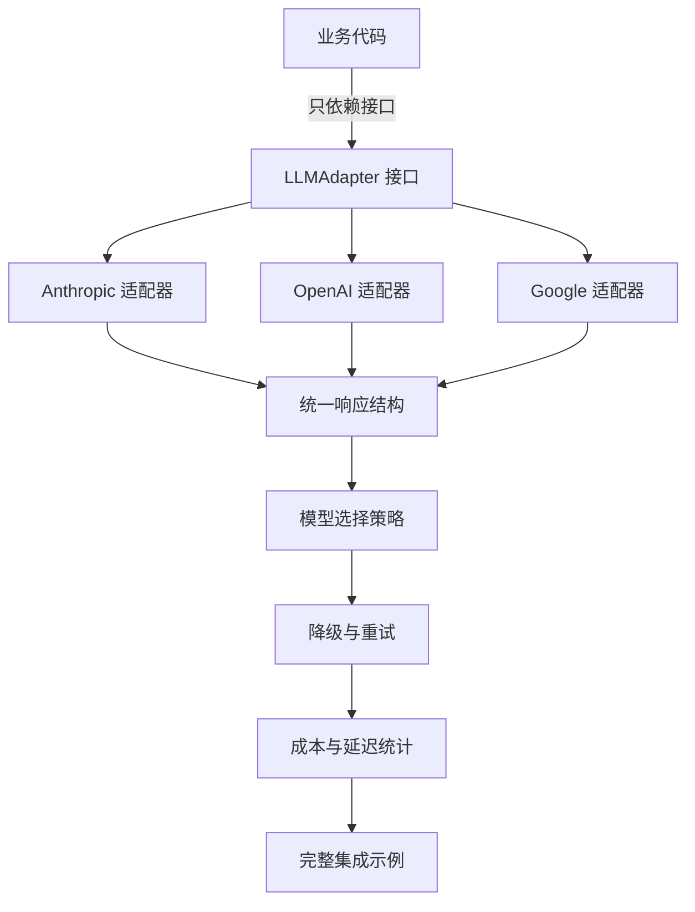
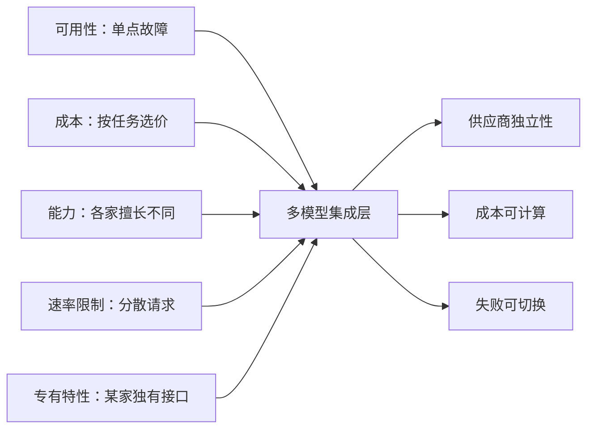
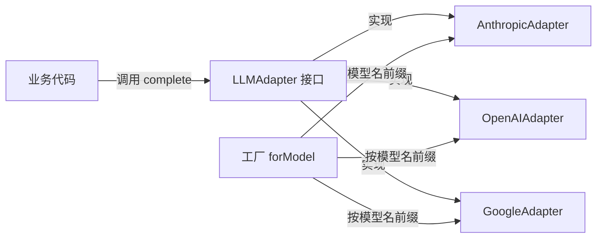
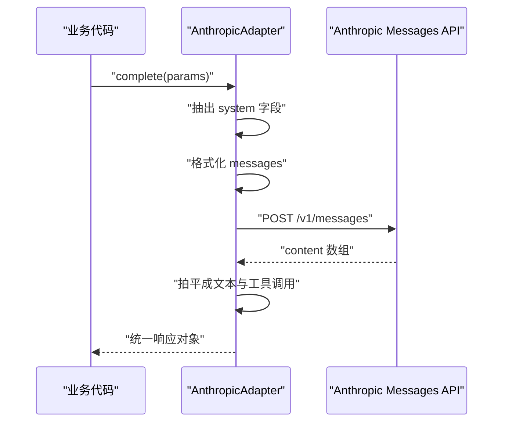
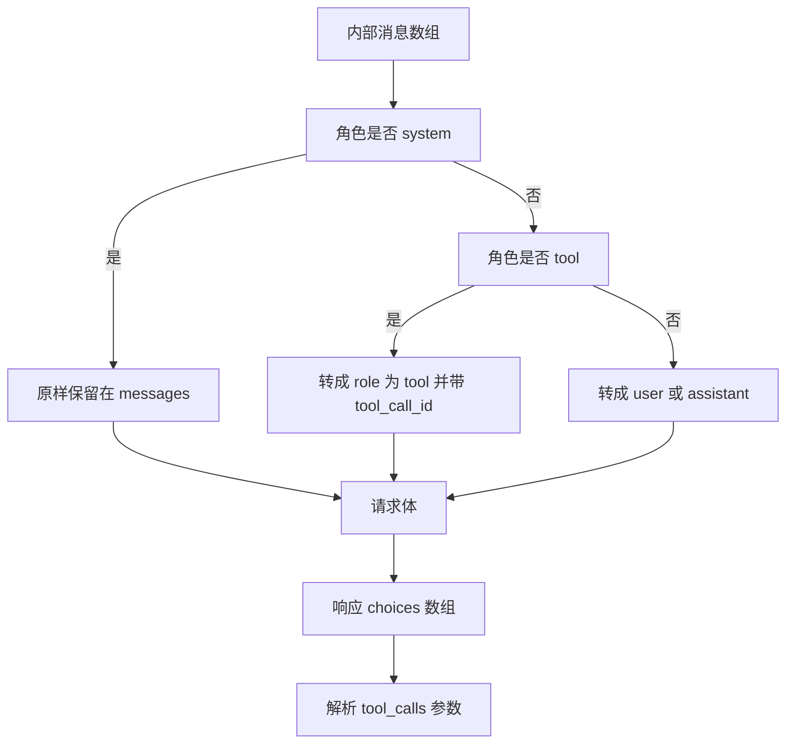
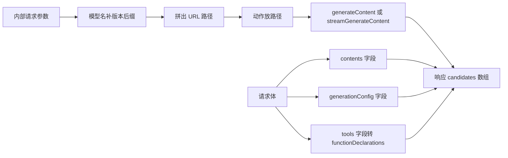
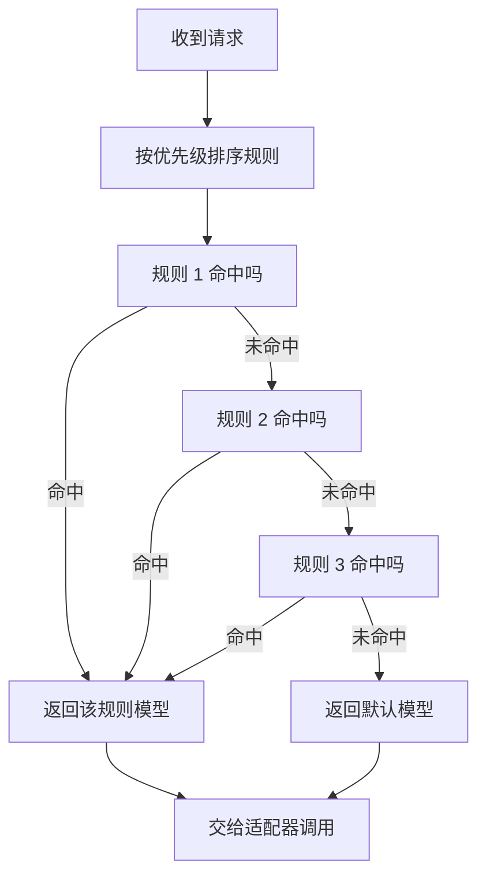
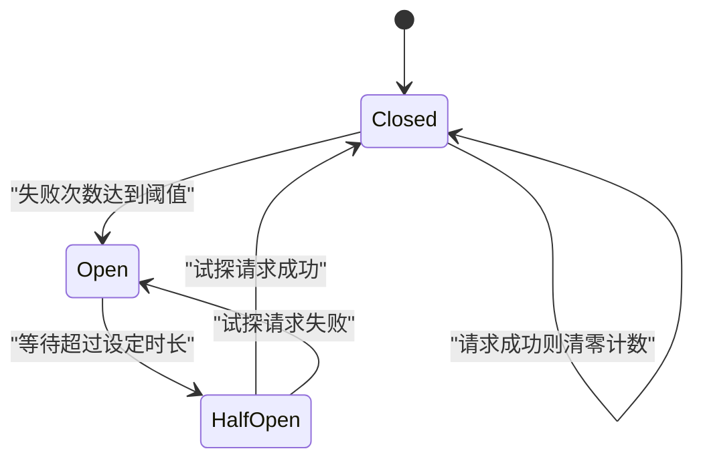
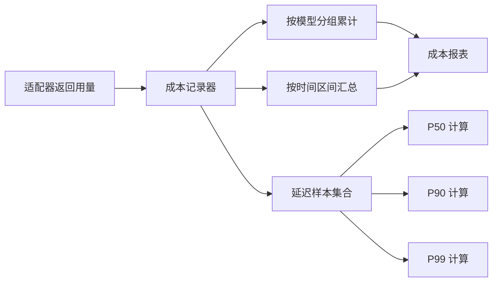
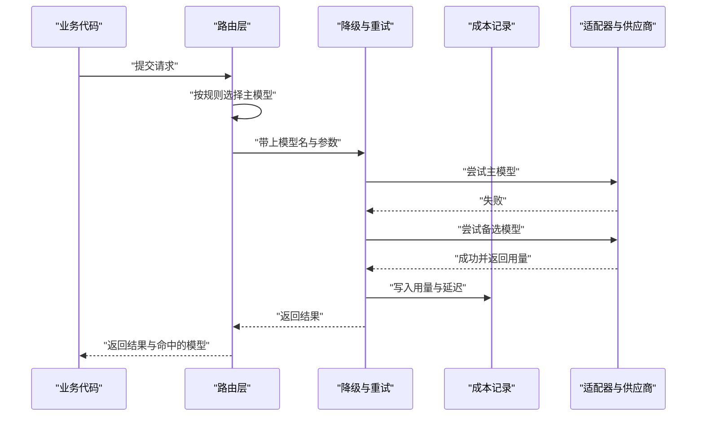

# 多模型集成

!!! abstract "学完这一页你能"
    - 说出多模型集成的五类触发条件，并把它写成可执行的判断函数。
    - 定义一个 LLMAdapter 接口，让业务代码只依赖抽象而不依赖某家供应商。
    - 手写 Anthropic、OpenAI、Google 三家的请求组装与响应解析代码。
    - 把路由、降级、重试、熔断与成本统计串成一个能跑通、能断言的单文件脚本。

## 0. 知识地图



建议从第 1 节顺着读到第 5 节：先弄清为什么需要多模型，再定接口，然后逐个实现三个适配器。
第 6 节之后是策略层，读之前请先完成第 2 节的接口定义，否则策略层没有可调用的对象。
第 9 节把所有零件装在一起，可当作复习清单使用。

!!! note "术语：适配器（Adapter）"
    把某家供应商的接口翻译成本项目内部统一接口的一层代码。
    例如 Anthropic 用独立的 system 字段传系统提示，适配器负责把它从 messages 数组里抽出来。

## 1. 为什么需要多模型支持

**先想一个问题**

你的 AI 客服上线第一天，主模型接口返回 503，用户看到一直转圈。
如果业务代码里写死了某家的地址和字段名，切换的时间成本以小时计。
多模型集成要解决的就是这段切换时间。

**心智模型**

!!! tip "心智模型"
    一句话模型：模型是可替换的插座，业务代码是电器，适配器是插头。
    日常类比：家里跳闸了换一路电，电器不用拆开重焊。
    类比不成立的地方：换电后灯亮度不变，换模型后输出内容会变。
    所以降级必须连结果差异一起接受，评测集要覆盖每个候选模型。

**图解**



1. 节点 A 到 E 是触发条件：宕机、账单、效果、限流、专有能力。
2. 只要命中其中一个，业务代码里就会出现供应商分支。
3. 分支散落在业务层时，每加一家供应商都要改多段代码。
4. 把分支收进一个集成层，就得到后面三个收益。
5. 收益成立的前提是接口统一，这是第 2 节要解决的问题。

**一步一步来**

第 1 步要做什么：把单价写成常量表，让成本可以被程序算出来。

```js
// 单价来自本站旧版内容，单位是美元每 100 万 token，以原文为准
const PRICE = {
  'claude-3-5-sonnet-20241022': { input: 3, output: 15 },
  'gpt-4o': { input: 5, output: 15 },
  'gemini-1.5-pro': { input: 1.25, output: 5 },
};
```

**这段代码在做什么**
- 键是模型标识，值是输入、输出两组单价。
- 输入价按提示 token 计费，输出价按生成 token 计费，两者分开算。
- 单位统一为美元每 100 万 token，后面的除法才有正确量纲。
- 价格是外部事实，写进常量表后才可被断言覆盖。
- 这几个数字请以各家官方定价页为准，旧版内容只作示例。

第 2 步要做什么：按同样的 token 数算出三家的花费，并找出低的那家。

```js
const M = 1_000_000; // 一百万，用于把单价换算成每 token

// 按 token 数算一次调用的美元成本
function cost(model, inputTokens, outputTokens) {
  const p = PRICE[model];
  if (!p) throw new Error('no pricing for ' + model); // 缺价直接抛错，避免静默记成 0
  return (inputTokens / M) * p.input + (outputTokens / M) * p.output;
}

const input = 100_000;  // 输入 token 数
const output = 20_000;  // 输出 token 数
for (const m of Object.keys(PRICE)) {
  console.log(m, cost(m, input, output).toFixed(6));
}
```

**这段代码在做什么**
- `M` 把单价从每百万 token 换算成每 token。
- `cost` 对输入、输出分别乘单价再相加，得到单次金额。
- 缺价的模型直接抛错，而不是返回 0 混进账单。
- 循环按同一组 token 数对比三家，输出可直接比较。
- 打印保留 6 位小数，是因为单次金额量级在 0.1 美元上下。

运行结果

```text
claude-3-5-sonnet-20241022 0.600000
gpt-4o 0.800000
gemini-1.5-pro 0.225000
```

**动手验证**

把上面的常量与函数合成一个文件，用断言固定这组价格关系。

```js
// 依赖：无。Node 20+ 运行，保存为 why-multi.mjs
import assert from 'node:assert/strict';

// 单价来自本站旧版内容，以原文为准
const PRICE = {
  'claude-3-5-sonnet-20241022': { input: 3, output: 15 },
  'gpt-4o': { input: 5, output: 15 },
  'gemini-1.5-pro': { input: 1.25, output: 5 },
};

const M = 1_000_000;

function cost(model, inputTokens, outputTokens) {
  const p = PRICE[model];
  if (!p) throw new Error('no pricing for ' + model);
  return (inputTokens / M) * p.input + (outputTokens / M) * p.output;
}

const input = 100_000;
const output = 20_000;

const rows = Object.keys(PRICE).map((m) => [m, cost(m, input, output)]);
for (const [m, c] of rows) console.log(m, c.toFixed(6));

// 断言 1：同一组 token 数下，gemini-1.5-pro 在这次对比里金额最小
const cheapest = rows.reduce((a, b) => (a[1] <= b[1] ? a : b))[0];
assert.equal(cheapest, 'gemini-1.5-pro');

// 断言 2：claude 这次是 gpt-4o 的 0.75 倍
assert.equal(cost('claude-3-5-sonnet-20241022', input, output), 0.6);
assert.equal(cost('gpt-4o', input, output), 0.8);
console.log('cheapest =', cheapest);
```

预期输出

```text
claude-3-5-sonnet-20241022 0.600000
gpt-4o 0.800000
gemini-1.5-pro 0.225000
cheapest = gemini-1.5-pro
```

**常见坑**

| 现象 | 原因 | 怎么修 |
| --- | --- | --- |
| 账单比预估高出数倍 | 只算了输入价，漏掉输出价 | 输入输出分开计价再相加 |
| 换模型后回答风格突变 | 没做评测就整体切换 | 先在小流量上跑同一组评测集 |
| 单价表长期不更新 | 价格写死在代码里没人维护 | 把单价做成配置项并加更新提醒 |
| 某个模型成本一直记 0 | 缺价时静默返回 0 | 缺价时抛错，让问题暴露在写入侧 |

**用在哪里**

智能客服工单分类：业务背景是每天几十万条短工单，需要快速打标签。
知识怎么用：把短工单路由到单价低的模型，长工单才走高价模型。
衡量指标：单位工单成本、分类准确率、P95 延迟。
不该用的时机：工单里含大量歧义表述且分类错误代价高时，别为省钱降级。

企业内部文档问答：业务背景是知识库问答，回答质量直接影响员工信任。
知识怎么用：主模型负责生成，备选模型在接口异常时接管并标注来源。
衡量指标：回答可用率、接口错误率、每千次问答成本。
不该用的时机：合规要求数据只走某一家时，不要跨厂商降级。

代码助手插件：业务背景是 IDE 插件里补全与解释两类请求混在一起。
知识怎么用：补全走低延迟模型，解释与重构走推理强的模型。
衡量指标：首 token 延迟、采纳率、单日成本。
不该用的时机：本地小模型已能覆盖补全场景时，不必引入云端多模型。

**行业实践**

- Anthropic 官方文档的 Messages API 章节要求每个请求带 API 版本头，这决定了适配器必须显式声明版本，而不是依赖服务端默认值。借鉴方式：把版本号做成适配器的只读字段并写进日志。
- OpenAI 官方文档的 Chat Completions 与 Function calling 章节用 `tool_calls` 数组承载工具调用，参数是 JSON 字符串。借鉴方式：在适配器内部完成字符串到对象的解析，业务层只看到对象。
- Google AI for Developers 官方文档的 generateContent 与 streamGenerateContent 章节把模型名与动作都放在 URL 路径里。借鉴方式：把 URL 拼接封装在适配器私有方法里，业务层只传模型标识。

**小结**

- 多模型的五个触发条件是可用性、成本、能力、限流、专有特性。
- 成本必须能被程序算出，否则路由策略只能靠感觉。
- 集成的价值在于缩短切换时间，切换时间由接口统一程度决定。

## 2. LLM 适配器接口设计

**先想一个问题**

三家供应商的字段名互不相同：一家把系统提示单独放，一家放在消息数组里。
如果业务代码里写 `if (provider === 'openai')`，每加一家就要改多处。
把这些差异挡在一层接口后面，业务代码才稳定。

**心智模型**

!!! tip "心智模型"
    一句话模型：接口定义什么是稳定的，适配器定义什么是易变的。
    日常类比：墙上的插座形状固定，插头形状随电器变。
    类比不成立的地方：插座标准不会变，模型 API 字段会随版本调整。
    所以要为适配器写契约测试，字段一变就能被发现。

!!! note "术语：契约测试（Contract Test）"
    用固定的假响应验证适配器的解析逻辑，不依赖真实网络。
    例如把 Anthropic 的响应体写成常量塞给解析函数，断言输出的 `content` 字段。

**图解**



1. 业务代码只持有 `LLMAdapter` 这个类型，不知道背后是哪家。
2. 三个适配器类分别实现同一个接口，方法签名必须一致。
3. 工厂接收模型名字符串，返回对应的适配器实例。
4. 工厂内部按前缀判断供应商，`claude` 开头归 Anthropic。
5. 未知模型前缀直接抛错，避免误用默认适配器。

**一步一步来**

第 1 步要做什么：定义统一的消息、请求、响应形状。

```js
// 所有供应商都要被映射到这几个形状上
// 消息角色：system 定人格，user 是用户输入，assistant 是模型历史输出，tool 是工具结果
// CompletionParams 是请求：消息数组 + 模型名 + 采样参数 + 工具声明
// CompletionResponse 是响应：文本 + 工具调用 + 结束原因 + token 用量
// StreamChunk 是流式片段：本次新增文本 + 是否结束
```

**这段代码在做什么**
- 消息角色用四个取值收敛，供应商的差异在适配器里消化。
- 请求对象包含采样参数，`temperature` 控随机性，`maxTokens` 控输出上限。
- 响应对象把工具调用与文本并列，业务层按存在与否分支。
- token 用量进响应，才能在同一处统计成本。
- 流式片段用 `delta` 表示增量，消费方必须累加而不是覆盖。

第 2 步要做什么：定义适配器接口与模型元信息。

```js
class ModelInfoFields {
  // 供应商侧字段的说明，不参与运行
}
// supportedModels: string[]  —— 该适配器认识的模型标识
// complete(params): Promise<CompletionResponse>  —— 一次性返回
// stream(params): AsyncGenerator<StreamChunk>  —— 逐块返回
// getModelInfo(model): ModelInfo  —— 上下文窗口、是否支持视觉与工具、单价
```

**这段代码在做什么**
- 四个成员覆盖了调用、流式、元信息三类需求。
- `getModelInfo` 是纯函数，不发网络请求，可被路由层高频调用。
- `pricing` 的单位约定为美元每 100 万 token，与第 1 节保持一致。
- `supportsTools` 让路由层先过滤掉不支持工具的模型。
- 接口只声明行为，不规定实现，三家可以各自处理字段映射。

第 3 步要做什么：用工厂把模型名映射到适配器实例。

```js
class LLMAdapterFactory {
  constructor() {
    this.adapters = new Map(); // 供应商到适配器实例的注册表
  }
  register(provider, adapter) {
    this.adapters.set(provider, adapter); // 重复注册会覆盖，便于测试替身
  }
  get(provider) {
    const a = this.adapters.get(provider);
    if (!a) throw new Error('Adapter not registered: ' + provider); // 快速失败
    return a;
  }
  forModel(model) {
    return this.get(this.detectProvider(model)); // 业务层只传模型名
  }
  detectProvider(model) {
    if (model.startsWith('claude')) return 'anthropic';
    if (model.startsWith('gpt') || model.startsWith('o1')) return 'openai';
    if (model.startsWith('gemini')) return 'google';
    throw new Error('Unknown model provider: ' + model);
  }
}
```

**这段代码在做什么**
- 注册表用 `Map`，键被约束成供应商枚举，查找是常数级。
- `get` 在缺失时抛错，把装配期错误提早到首次调用。
- `forModel` 让业务层只持有模型名，降低与供应商的耦合。
- 前缀判断是脆弱点：新命名若不匹配前缀会漏判。
- 前缀有重叠时，判断顺序决定结果，顺序本身是隐式约定。

**动手验证**

用一个内存假适配器验证工厂的分发与失败行为。

```js
// 依赖：无。Node 20+ 运行，保存为 factory.mjs
import assert from 'node:assert/strict';

class FakeAdapter {
  constructor(name) { this.name = name; }
  async complete() { return { content: this.name }; }
}

class Factory {
  constructor() { this.adapters = new Map(); }
  register(p, a) { this.adapters.set(p, a); }
  get(p) {
    const a = this.adapters.get(p);
    if (!a) throw new Error('Adapter not registered: ' + p);
    return a;
  }
  forModel(model) { return this.get(this.detectProvider(model)); }
  detectProvider(model) {
    if (model.startsWith('claude')) return 'anthropic';
    if (model.startsWith('gpt') || model.startsWith('o1')) return 'openai';
    if (model.startsWith('gemini')) return 'google';
    throw new Error('Unknown model provider: ' + model);
  }
}

const f = new Factory();
f.register('anthropic', new FakeAdapter('anthropic'));
f.register('openai', new FakeAdapter('openai'));
f.register('google', new FakeAdapter('google'));

assert.equal(f.forModel('claude-3-5-sonnet-20241022').name, 'anthropic');
assert.equal(f.forModel('gpt-4o').name, 'openai');
assert.equal(f.forModel('o1-mini').name, 'openai');
assert.equal(f.forModel('gemini-1.5-pro').name, 'google');

// 未知模型必须抛错，而不是回落到某个默认适配器
assert.throws(() => f.forModel('llama-3'), /Unknown model provider/);
// 未注册的供应商必须抛错
assert.throws(() => f.get('cohere'), /Adapter not registered/);

console.log('factory assertions passed');
```

预期输出

```text
factory assertions passed
```

**常见坑**

| 现象 | 原因 | 怎么修 |
| --- | --- | --- |
| 新模型上线后路由到错误供应商 | 前缀判断没覆盖新命名 | 把前缀规则做成可配置表并加兜底日志 |
| 测试里连真实接口 | 工厂直接 new 具体适配器 | 适配器实例由外部注入，测试注入替身 |
| 业务层仍出现供应商分支 | 接口没覆盖某类需求 | 把新需求补进接口，而不是在业务层打补丁 |
| 流式与非流式返回结构不一致 | 两套解析各写一遍 | 让流式片段最终也能拼成完整响应结构 |

**用在哪里**

多租户 SaaS 的 AI 写作模块：业务背景是不同租户要求数据走不同供应商。
知识怎么用：按租户配置选适配器，业务代码只调用接口。
衡量指标：新供应商接入所需改动文件数、回归测试通过率。
不该用的时机：只有一家供应商且无合规要求时，抽象层是额外维护成本。

内部工具平台：业务背景是多个团队各写一套调用代码。
知识怎么用：把接口与工厂做成内部包，团队只依赖这个包。
衡量指标：重复代码行数、升级模型时的改动点数量。
不该用的时机：平台只有一个调用方时，先直接调用，等第二个调用方出现再抽。

AI 网关：业务背景是把模型调用收口到统一入口做审计与限流。
知识怎么用：网关内部持有工厂，路由与审计都在这一层完成。
衡量指标：接入耗时、故障时的切换耗时。
不该用的时机：网关本身就是单点时，多模型并不能提升整体可用性。

**行业实践**

- Anthropic 官方文档的 Tool use 章节用 `tool_use` 与 `tool_result` 两种内容块表示工具往返。借鉴方式：在适配器内部把这两种块与内部 `toolCalls` 结构互转，业务层只处理一种形状。
- OpenAI 官方文档的 Function calling 章节把函数参数声明为 JSON Schema。借鉴方式：把 Schema 定义放在内部，各适配器负责转成自家格式。
- Google AI for Developers 官方文档的 Function calling 章节用 `functionDeclarations` 承载函数声明。借鉴方式：在适配器里集中做字段改名，不在业务层出现供应商字段名。

**小结**

- 接口定义稳定部分，适配器消化易变部分。
- 工厂让业务层只依赖模型名，不再依赖供应商枚举。
- 前缀判断是脆弱点，新模型命名要先验证再上线。

## 3. Anthropic Claude 适配器

**先想一个问题**

你按某家的写法把系统提示放进 messages 数组，换成 Claude 后接口直接报参数错误。
因为 Claude 把系统提示放在独立的 `system` 字段里，不进 messages。
适配器要做的第一件事就是这个字段搬运。

**心智模型**

!!! tip "心智模型"
    一句话模型：系统提示是单独递上去的说明书，不是对话里的一轮。
    日常类比：进门前给门卫一张通行说明，而不是在聊天里顺口提一句。
    类比不成立的地方：说明书只影响这一次调用，模型不会记住上次的那张。
    所以每轮都要重新带上 system 字段。

!!! note "术语：SSE（Server-Sent Events）"
    一种用 HTTP 长连接持续推送文本事件的协议，每行以 `data: ` 开头。
    例如 Claude 流式接口每推一段文本就发一行事件，客户端按行解析。

**图解**



1. 业务代码只传内部结构的参数，不关心字段位置。
2. 适配器把 `role` 为 system 的消息取出来，作为独立字段。
3. 其余消息映射成 user 与 assistant 两种角色。
4. 请求发到 Messages 端点，并带上 API 版本头。
5. 响应是内容块数组，可能同时含文本块与工具调用块。
6. 适配器拍平成统一响应，业务层只看到文本与工具调用两个字段。

**一步一步来**

第 1 步要做什么：组装请求体，把系统提示抽出来。

```js
const BASE_URL = 'https://api.anthropic.com/v1/messages'; // 端点来自旧版内容，以官方文档为准
const API_VERSION = '2023-06-01'; // 版本头来自旧版内容，以官方文档为准

function formatMessages(messages) {
  // 过滤掉 system，因为 Claude 用独立字段承载它
  return messages
    .filter((m) => m.role !== 'system')
    .map((m) => ({
      role: m.role === 'assistant' ? 'assistant' : 'user', // 其余角色统一归到 user
      content: m.content,
    }));
}

function extractSystem(messages) {
  return messages.find((m) => m.role === 'system')?.content; // 只取第一条
}
```

**这段代码在做什么**
- `formatMessages` 把 system 消息剔除，其余映射成两种角色。
- 角色映射保证 `tool` 这类内部角色不会直接发出去。
- `extractSystem` 取第一条 system 消息，多条时后面的会被忽略。
- 版本号做成常量，换版本时只改一处。
- 端点与版本号请以 Anthropic 官方文档为准。

第 2 步要做什么：解析响应，把内容块数组拍平。

```js
function parseAnthropicResponse(data) {
  const blocks = data.content || []; // 响应体里的内容块数组
  const text = blocks.find((c) => c.type === 'text')?.text; // 文本块可缺省
  const toolUses = blocks.filter((c) => c.type === 'tool_use'); // 工具调用块可能有多条
  return {
    content: text,
    toolCalls: toolUses.map((t) => ({ id: t.id, name: t.name, input: t.input })),
    finishReason: data.stop_reason,
    usage: {
      inputTokens: data.usage.input_tokens,
      outputTokens: data.usage.output_tokens,
    },
  };
}
```

**这段代码在做什么**
- `find` 取第一个文本块，没有文本块时返回 undefined。
- `filter` 收集全部工具调用块，支持一次返回多个调用。
- 工具调用的 `input` 已经是对象，不需要再做 JSON 解析。
- 用量字段名是下划线风格，这里统一改成小驼峰。
- 结束原因原样透传，用来区分自然结束与被工具调用打断。

第 3 步要做什么：解析流式事件，按行切开缓冲区。

```js
// 流式事件每行以 data: 开头，需要维护跨块的缓冲区
let buffer = '';
buffer += chunkText;                    // 把本次到达的文本追加进缓冲
const lines = buffer.split('\n');       // 按换行切分
buffer = lines.pop() || '';             // 最后一段可能不完整，留到下一轮
for (const line of lines) {
  if (!line.startsWith('data: ')) continue;   // 跳过非数据行
  const payload = JSON.parse(line.slice(6));  // 去掉前缀后解析
  if (payload.type === 'content_block_delta') emit(payload.delta.text);
  if (payload.type === 'message_stop') return; // 收到停止事件就结束
}
```

**这段代码在做什么**
- 缓冲区解决了一个 JSON 被拆到两个网络包的情况。
- `lines.pop()` 把可能不完整的尾段留到下一轮拼接。
- 前缀判断过滤掉空行与注释行。
- `content_block_delta` 是文本增量，按到达顺序输出。
- `message_stop` 是终止信号，收到后停止读取。

**动手验证**

用替换全局 fetch 的方式跑完整链路，不访问网络。

```js
// 依赖：无。Node 20+ 运行，保存为 anthropic.mjs
import assert from 'node:assert/strict';

// 假响应体，字段名按本站旧版内容的解析逻辑
const fakeBody = {
  content: [
    { type: 'text', text: '闭包是函数与它捕获的词法环境' },
    { type: 'tool_use', id: 't1', name: 'search', input: { q: 'closure' } },
  ],
  stop_reason: 'tool_use',
  usage: { input_tokens: 12, output_tokens: 20 },
};

let captured = null;
// 替换全局 fetch，记录请求并返回固定响应
globalThis.fetch = async (url, init) => {
  captured = { url, init };
  return { ok: true, json: async () => fakeBody };
};

const BASE_URL = 'https://api.anthropic.com/v1/messages';
const API_VERSION = '2023-06-01';

function formatMessages(messages) {
  return messages
    .filter((m) => m.role !== 'system')
    .map((m) => ({ role: m.role === 'assistant' ? 'assistant' : 'user', content: m.content }));
}

async function complete(apiKey, params) {
  const system = params.messages.find((m) => m.role === 'system')?.content;
  const res = await fetch(BASE_URL, {
    method: 'POST',
    headers: {
      'content-type': 'application/json',
      'x-api-key': apiKey,          // Claude 用这个头传密钥
      'anthropic-version': API_VERSION,
    },
    body: JSON.stringify({
      model: params.model,
      max_tokens: params.maxTokens ?? 4096,
      messages: formatMessages(params.messages),
      system,
    }),
  });
  const data = await res.json();
  const blocks = data.content || [];
  return {
    content: blocks.find((c) => c.type === 'text')?.text,
    toolCalls: blocks.filter((c) => c.type === 'tool_use')
      .map((t) => ({ id: t.id, name: t.name, input: t.input })),
    finishReason: data.stop_reason,
    usage: { inputTokens: data.usage.input_tokens, outputTokens: data.usage.output_tokens },
  };
}

const out = await complete('sk-test', {
  model: 'claude-3-5-sonnet-20241022',
  messages: [
    { role: 'system', content: '你是一个有帮助的助手' },
    { role: 'user', content: '解释什么是 closure' },
  ],
});

const sent = JSON.parse(captured.init.body);
assert.equal(captured.url, BASE_URL);
assert.equal(captured.init.headers['anthropic-version'], '2023-06-01');
assert.equal(sent.system, '你是一个有帮助的助手'); // system 被抽成独立字段
assert.equal(sent.messages.length, 1);              // messages 里没有 system
assert.equal(out.content, '闭包是函数与它捕获的词法环境');
assert.equal(out.toolCalls[0].name, 'search');
assert.equal(out.usage.inputTokens, 12);
console.log('anthropic adapter assertions passed');
```

预期输出

```text
anthropic adapter assertions passed
```

**常见坑**

| 现象 | 原因 | 怎么修 |
| --- | --- | --- |
| 接口返回参数错误 | system 消息留在 messages 里 | 发送前过滤并放进 system 字段 |
| 流式输出偶尔缺字 | 一个 JSON 被拆到两个网络包 | 维护缓冲区，尾段留到下一轮拼接 |
| 多轮对话角色错乱 | 只映射 assistant 与 user | 明确内部角色到两种角色的映射规则 |
| 用量统计总是 0 | 读错了用量字段名 | 按官方文档核对字段名并加断言 |

**用在哪里**

长文档摘要服务：业务背景是一次提交数万字，需要分块摘要再合并。
知识怎么用：系统提示设成固定的摘要约束，通过独立字段下发。
衡量指标：摘要一致性、每次摘要的 token 用量。
不该用的时机：文档短于一次请求上限时，不必做分块。

代码评审助手：业务背景是把改动的 diff 发给模型找问题。
知识怎么用：把评审规则写进 system，diff 放 user。
衡量指标：有效评论占比、误报率、单次评审成本。
不该用的时机：团队还没有评审规范时，先定规范再上模型。

工具调用型 Agent：业务背景是模型需要查数据库后回答。
知识怎么用：用工具块承载查询意图，业务侧执行后回灌结果。
衡量指标：工具调用成功率、循环轮数。
不该用的时机：答案能一次生成时，不要引入工具往返。

**行业实践**

- Anthropic 官方文档的 Messages API 章节要求显式传入 `anthropic-version` 头。借鉴方式：把版本号做成适配器常量，并在请求失败时把它打进日志。
- Anthropic 官方文档的 Streaming Messages 章节用 `content_block_delta` 与 `message_stop` 等事件类型区分增量与结束。借鉴方式：解析时按事件类型分支，遇到未知类型只记录不崩溃。
- Anthropic 官方文档的 Models overview 章节列出了各模型的上下文窗口与定价。借鉴方式：把模型元信息集中到一张表，与官方页对照更新。

**小结**

- 系统提示走独立字段，这是 Claude 与别家最明显的差异。
- 响应是内容块数组，解析时要同时处理文本块与工具块。
- 流式解析必须带缓冲区，否则会出现偶发缺字。

## 4. OpenAI GPT 适配器

**先想一个问题**

你从 Claude 切到 GPT，发现系统提示又要放回 messages 数组里。
同时工具结果要用 `role` 为 tool 的消息回传，还要带 `tool_call_id`。
适配器要把这两套截然不同的约定翻译成同一种内部结构。

**心智模型**

!!! tip "心智模型"
    一句话模型：OpenAI 把一切放进同一个数组，用角色区分用途。
    日常类比：一场会议里所有人共用一个发言记录，谁说的靠名牌区分。
    类比不成立的地方：工具结果必须挂上对应调用的编号，不然会议记录对不上号。
    所以工具结果消息必须带上 `tool_call_id`。

**图解**



1. 内部消息先按角色分流，system 直接保留。
2. 工具结果消息需要额外带上调用编号。
3. 其余角色映射成 user 与 assistant。
4. 三路汇合后组成请求体发出。
5. 响应的 `choices` 是数组，取第一项作为本次结果。
6. `tool_calls` 里的参数是 JSON 字符串，需要解析成对象。

**一步一步来**

第 1 步要做什么：格式化消息，处理工具结果。

```js
function formatMessages(messages) {
  return messages.map((m) => {
    if (m.role === 'tool') {
      // 工具结果必须挂上调用编号，否则模型无法对应到哪次调用
      return { role: 'tool', content: m.content, tool_call_id: m.toolCallId };
    }
    return { role: m.role, content: m.content }; // system 保持原角色
  });
}

function toRequest(apiKey, params) {
  return {
    method: 'POST',
    headers: {
      'content-type': 'application/json',
      authorization: 'Bearer ' + apiKey, // OpenAI 用 Bearer 方式传密钥
    },
    body: JSON.stringify({
      model: params.model,
      messages: formatMessages(params.messages),
      temperature: params.temperature,
      max_tokens: params.maxTokens,
      tools: params.tools,
      tool_choice: 'auto',
    }),
  };
}
```

**这段代码在做什么**
- 工具结果消息保留原角色，但补上 `tool_call_id`。
- 普通消息只保留角色与内容两个字段。
- 密钥走 `Authorization` 头，与 Claude 的 `x-api-key` 不同。
- `tool_choice` 设为 auto，让模型自行决定是否调用工具。
- 端点请以 OpenAI 官方文档为准。

第 2 步要做什么：解析响应，把参数字符串变成对象。

```js
function parseOpenAIResponse(data) {
  const choice = data.choices[0]; // 取第一个候选
  const message = choice.message;
  const toolCalls = message.tool_calls?.map((tc) => ({
    id: tc.id,
    name: tc.function.name,
    input: JSON.parse(tc.function.arguments), // 参数是字符串，必须解析
  }));
  return {
    content: message.content,
    toolCalls,
    finishReason: choice.finish_reason,
    usage: data.usage
      ? { inputTokens: data.usage.prompt_tokens, outputTokens: data.usage.completion_tokens }
      : undefined,
  };
}
```

**这段代码在做什么**
- `choices` 是数组，本实现只取第一项。
- `tool_calls` 可能不存在，用可选链避免抛错。
- `arguments` 是 JSON 字符串，解析失败会直接抛错，需要在上层兜住。
- 用量字段是 `prompt_tokens` 与 `completion_tokens` 两个名字。
- 用量字段可能缺失，这里返回 undefined 而不是伪造 0。

**动手验证**

继续用假 fetch，重点验证工具参数的解析。

```js
// 依赖：无。Node 20+ 运行，保存为 openai.mjs
import assert from 'node:assert/strict';

const fakeBody = {
  choices: [{
    message: {
      content: null,
      tool_calls: [{
        id: 'call_1',
        type: 'function',
        function: { name: 'search', arguments: '{"q":"closure"}' }, // 参数是字符串
      }],
    },
    finish_reason: 'tool_calls',
  }],
  usage: { prompt_tokens: 30, completion_tokens: 8 },
};

let captured = null;
globalThis.fetch = async (url, init) => {
  captured = { url, init };
  return { ok: true, json: async () => fakeBody };
};

function formatMessages(messages) {
  return messages.map((m) => {
    if (m.role === 'tool') {
      return { role: 'tool', content: m.content, tool_call_id: m.toolCallId };
    }
    return { role: m.role, content: m.content };
  });
}

async function complete(apiKey, params) {
  const res = await fetch('https://api.openai.com/v1/chat/completions', {
    method: 'POST',
    headers: { 'content-type': 'application/json', authorization: 'Bearer ' + apiKey },
    body: JSON.stringify({
      model: params.model,
      messages: formatMessages(params.messages),
      tools: params.tools,
      tool_choice: 'auto',
    }),
  });
  const data = await res.json();
  const choice = data.choices[0];
  return {
    content: choice.message.content,
    toolCalls: choice.message.tool_calls?.map((tc) => ({
      id: tc.id, name: tc.function.name, input: JSON.parse(tc.function.arguments),
    })),
    finishReason: choice.finish_reason,
    usage: { inputTokens: data.usage.prompt_tokens, outputTokens: data.usage.completion_tokens },
  };
}

const out = await complete('sk-test', {
  model: 'gpt-4o',
  messages: [
    { role: 'system', content: '你是一个有帮助的助手' },
    { role: 'user', content: '搜索 closure' },
  ],
});

const sent = JSON.parse(captured.init.body);
assert.equal(sent.messages.length, 2);              // system 留在 messages 里
assert.equal(sent.messages[0].role, 'system');
assert.equal(captured.init.headers.authorization, 'Bearer sk-test');
assert.equal(out.toolCalls[0].input.q, 'closure');  // 字符串已解析为对象
assert.equal(out.finishReason, 'tool_calls');
assert.equal(out.usage.outputTokens, 8);
console.log('openai adapter assertions passed');
```

预期输出

```text
openai adapter assertions passed
```

**常见坑**

| 现象 | 原因 | 怎么修 |
| --- | --- | --- |
| 工具参数直接当对象用报错 | 参数是 JSON 字符串 | 解析后再交给业务层 |
| 工具结果被模型忽略 | 漏传 tool_call_id | 把调用编号一起回传 |
| 取响应时抛 TypeError | choices 为空数组 | 先判空再取第一项 |
| 系统提示位置写错 | 沿用 Claude 的字段 | 按各家约定在适配器内分别处理 |

**用在哪里**

客服工单自动分类与派单：业务背景是分类后要调用内部接口创建工单。
知识怎么用：把创建工单声明成工具，模型输出参数后由业务侧执行。
衡量指标：派单准确率、工具调用成功率。
不该用的时机：分类规则固定时，用关键词规则更省。

表单结构化抽取：业务背景是把用户自由文本转成结构化字段。
知识怎么用：用工具声明的 JSON Schema 约束输出结构。
衡量指标：字段抽取准确率、解析失败率。
不该用的时机：字段少于三个时，正则可能就够用。

多轮对话助手：业务背景是需要记住前几轮内容。
知识怎么用：每轮把完整历史重新发送，按角色区分。
衡量指标：上下文长度分布、单轮成本。
不该用的时机：历史超过窗口上限时，必须先做摘要压缩。

**行业实践**

- OpenAI 官方文档的 Chat Completions 章节说明了消息角色与响应结构。借鉴方式：把响应结构对照文档写成契约测试，模型升级后先跑测试。
- OpenAI 官方文档的 Streaming 章节用 `data:` 行与 `[DONE]` 结束标记。借鉴方式：解析时同时识别结束标记与 `finish_reason`，两者任一出现即终止。
- OpenAI 官方文档的 Models 章节列出各模型上下文与定价。借鉴方式：把定价与上下文做成配置，与官方页逐项对照。

**小结**

- OpenAI 用单一消息数组承载系统提示与工具结果。
- 工具参数是 JSON 字符串，解析责任在适配器。
- 用量字段名与 Claude 不同，统一映射后才能共用统计代码。

## 5. Google Gemini 适配器

**先想一个问题**

你按前两家的写法把模型名放进请求体，换成 Gemini 后请求路径不对。
Gemini 把模型名和动作都写进 URL，密钥放在查询串里。
这是三家里面约定差异最大的一家。

**心智模型**

!!! tip "心智模型"
    一句话模型：Gemini 把动作写在地址里，参数写在请求体里。
    日常类比：去服务窗口办事，办什么业务写在窗口编号上，材料另外递进去。
    类比不成立的地方：密钥出现在窗口编号里，容易被日志记下来。
    所以生产环境不要打印完整 URL。

**图解**



1. 内部参数先做模型名归一化，缺少版本后缀时补上。
2. 动作名进 URL 路径，这与前两家放请求体的做法相反。
3. 请求体里 `contents` 承载消息，`generationConfig` 承载采样参数。
4. 工具声明要转成 `functionDeclarations` 结构。
5. 响应是 `candidates` 数组，取第一项的第一个内容部分。
6. 文本可能缺失，因为安全策略拦截或纯工具调用都会走到这里。

**一步一步来**

第 1 步要做什么：拼出正确的 URL 与请求体。

```js
const BASE = 'https://generativelanguage.googleapis.com/v1beta/models'; // 以官方文档为准

function buildUrl(model, apiKey, stream) {
  // 缺少版本后缀时补 :latest，URL 要求显式版本
  const name = model.includes(':') ? model : model + ':latest';
  const action = stream ? 'streamGenerateContent' : 'generateContent';
  // 密钥走查询串，这是 Google 的接口约定
  return BASE + '/' + name + ':' + action + '?key=' + apiKey;
}

function toBody(params) {
  return JSON.stringify({
    contents: [{ role: 'user', parts: params.messages.map((m) => ({ text: m.content })) }],
    generationConfig: {
      temperature: params.temperature,
      maxOutputTokens: params.maxTokens,
    },
  });
}
```

**这段代码在做什么**
- 归一化函数用 `includes(':')` 判断，兼容带后缀的写法。
- 动作名进路径，流式与非流式只差这一处。
- 密钥进查询串，副作用是容易出现在代理日志里。
- `maxOutputTokens` 是这家的字段名，与别家写法不同。
- 端点与版本前缀请以官方文档为准。

第 2 步要做什么：转换工具声明与解析响应。

```js
function formatTools(tools) {
  // 这家的字段名是 functionDeclarations，参数模式字段名也要对齐
  return {
    functionDeclarations: tools.map((t) => ({
      name: t.name,
      description: t.description,
      parameters: t.inputSchema,
    })),
  };
}

function parseResponse(data) {
  const candidate = data.candidates?.[0];
  const part = candidate?.content?.parts?.[0];
  return {
    content: part?.text || '',           // 文本可能缺失，兜底为空串
    finishReason: candidate?.finishReason, // 用来区分自然结束与被拦截
  };
}
```

**这段代码在做什么**
- 工具声明被包进 `functionDeclarations` 数组。
- 参数模式字段改名，这是三家之间最关键的映射点。
- 响应只取第一个候选，多候选场景下信息会被丢弃。
- 文本缺失时兜底为空串，避免上层拿到 undefined。
- 结束原因透传，便于区分截断与被安全策略终止。

**动手验证**

用假 fetch 检查 URL 拼接与请求体字段。

```js
// 依赖：无。Node 20+ 运行，保存为 gemini.mjs
import assert from 'node:assert/strict';

const fakeBody = {
  candidates: [{
    content: { parts: [{ text: '闭包是函数与词法环境的组合' }] },
    finishReason: 'STOP',
  }],
};

let captured = null;
globalThis.fetch = async (url, init) => {
  captured = { url, init };
  return { ok: true, json: async () => fakeBody };
};

const BASE = 'https://generativelanguage.googleapis.com/v1beta/models';

function buildUrl(model, apiKey, stream) {
  const name = model.includes(':') ? model : model + ':latest';
  const action = stream ? 'streamGenerateContent' : 'generateContent';
  return BASE + '/' + name + ':' + action + '?key=' + apiKey;
}

async function complete(apiKey, params) {
  const res = await fetch(buildUrl(params.model, apiKey, false), {
    method: 'POST',
    headers: { 'content-type': 'application/json' },
    body: JSON.stringify({
      contents: [{ role: 'user', parts: params.messages.map((m) => ({ text: m.content })) }],
      generationConfig: { temperature: params.temperature, maxOutputTokens: params.maxTokens },
    }),
  });
  const data = await res.json();
  const candidate = data.candidates?.[0];
  return {
    content: candidate?.content?.parts?.[0]?.text || '',
    finishReason: candidate?.finishReason,
  };
}

const out = await complete('key-test', {
  model: 'gemini-1.5-pro',
  messages: [{ role: 'user', content: '解释闭包' }],
  maxTokens: 512,
});

assert.equal(
  captured.url,
  BASE + '/gemini-1.5-pro:latest:generateContent?key=key-test'
);
const sent = JSON.parse(captured.init.body);
assert.equal(sent.contents[0].parts[0].text, '解释闭包');
assert.equal(sent.generationConfig.maxOutputTokens, 512);
assert.equal(out.content, '闭包是函数与词法环境的组合');
assert.equal(out.finishReason, 'STOP');
console.log('gemini adapter assertions passed');
```

预期输出

```text
gemini adapter assertions passed
```

**常见坑**

| 现象 | 原因 | 怎么修 |
| --- | --- | --- |
| 接口返回路径不存在 | 模型名没补版本后缀 | 发送前做归一化 |
| 密钥出现在日志里 | 完整 URL 被打印 | 日志里只打印路径，去掉查询串 |
| 流式解析偶尔丢段 | 一个网络块不等于一个完整对象 | 维护缓冲区后按行切分 |
| 工具调用参数为空 | 参数模式字段名没改名 | 对照官方文档核对字段名 |

**用在哪里**

批量内容审核：业务背景是每天审核大量文本，单条价值低。
知识怎么用：路由到单价低的模型，命中风险再升级到高价模型。
衡量指标：单位审核成本、漏检率、升级比例。
不该用的时机：审核要求逐条人工复核时，模型只做预筛。

日志归因分析：业务背景是把错误日志聚成可读摘要。
知识怎么用：长上下文模型一次放入多段日志，输出归因结论。
衡量指标：归因准确率、单次分析成本。
不该用的时机：日志量超出上下文窗口时，先做聚类再送模型。

多模态工单：业务背景是用户上传截图描述问题。
知识怎么用：用支持视觉的模型读图，文本模型处理后续追问。
衡量指标：首轮解决率、单工单成本。
不该用的时机：上传内容是敏感材料时，需先确认合规要求。

**行业实践**

- Google AI for Developers 官方文档的 generateContent 章节把模型名写在 URL 路径中。借鉴方式：把 URL 拼接集中在一个私有方法里，便于统一加日志与超时。
- Google AI for Developers 官方文档的 Function calling 章节用 `functionDeclarations` 描述工具。借鉴方式：把内部工具定义与该结构之间的映射写成单元测试。
- Google AI for Developers 官方文档的流式章节说明 `streamGenerateContent` 的返回是分块内容。借鉴方式：解析时保留缓冲区，按行切分后再解析，避免跨块截断。

**小结**

- 这家的模型名与动作都在 URL 里，密钥在查询串里。
- 工具声明的字段名与前两家都不同，需要在适配器内改名。
- 响应文本可能缺失，解析时要有兜底值。

## 6. 模型选择策略

**先想一个问题**

你的 Agent 同时接了三家模型，但每次调用具体用哪一家，代码里是写死的。
结果是简单摘要也在用高价模型，账单里有大量可以避免的支出。
选择策略就是把"这次该用谁"变成可执行的规则。

**心智模型**

!!! tip "心智模型"
    一句话模型：路由是给每个请求打标签，再按标签查表。
    日常类比：医院分诊台先看症状，再决定挂哪个科。
    类比不成立的地方：分诊错了可以重新挂号，路由错了用户已经看到结果。
    所以路由要可回滚，并且记录每次路由的依据。

!!! note "术语：路由规则（Route Rule）"
    一个带优先级的判断函数加目标模型名。
    例如"最近一条消息包含 code 就选 claude-3-5-sonnet-20241022，优先级 100"。

**图解**



1. 规则按优先级从高到低排序，先匹配到的胜出。
2. 规则 1 到规则 3 依次判断，命中即返回，不再看后面的规则。
3. 规则可以看消息内容，也可以看外部传入的任务标签。
4. 全部未命中时返回默认模型，保证一定有结果。
5. 返回的模型名再交给第 2 节的工厂取适配器。

**一步一步来**

第 1 步要做什么：实现按优先级的规则路由。

```js
class RuleBasedRouter {
  constructor() { this.rules = []; }
  addRule(rule) {
    this.rules.push(rule);
    // 插入后重排，保证 select 时无需再排序
    this.rules.sort((a, b) => b.priority - a.priority);
  }
  select(params) {
    for (const rule of this.rules) {
      if (rule.match(params)) return rule.model; // 命中即返回
    }
    return 'claude-3-5-sonnet-20241022'; // 默认模型来自旧版内容
  }
}

const router = new RuleBasedRouter();
router.addRule({
  match: ({ messages }) => {
    const last = messages[messages.length - 1]?.content.toLowerCase();
    return last?.includes('code') || last?.includes('function') || last?.includes('implement');
  },
  model: 'claude-3-5-sonnet-20241022',
  priority: 100,
});
router.addRule({
  match: ({ messages }) => messages.length <= 2, // 短对话走低价模型
  model: 'claude-3-5-haiku-20241022',
  priority: 50,
});
```

**这段代码在做什么**
- `addRule` 插入后立即重排，读取路径没有排序开销。
- `select` 顺序遍历，第 1 条命中的规则决定模型。
- 关键字规则只看最后一条消息，忽略更早的历史。
- 短对话规则用消息条数做判据，实现成本低。
- 默认模型保证空规则集时也能返回结果。

第 2 步要做什么：加上成本估算，选出满足预算的低价模型。

```js
class CostAwareRouter {
  constructor() { this.adapters = new Map(); }
  register(model, adapter) { this.adapters.set(model, adapter); }
  estimateTokens(text) {
    // 粗略估算：按每 3 个字符 1 个 token 折算，仅用于比较
    return Math.ceil(text.length / 3);
  }
  estimateCost(model, text, outTokens) {
    const info = this.adapters.get(model).getModelInfo(model);
    const inTokens = this.estimateTokens(text);
    const cost = (inTokens / 1_000_000) * info.pricing.input +
                 (outTokens / 1_000_000) * info.pricing.output;
    return { model, inTokens, cost };
  }
  selectBest(text, outTokens, preferences) {
    let rows = [...this.adapters.keys()].map((m) => this.estimateCost(m, text, outTokens));
    rows.sort((a, b) => a.cost - b.cost); // 金额升序
    if (preferences.maxCost) rows = rows.filter((r) => r.cost <= preferences.maxCost);
    return rows[0]?.model;
  }
}
```

**这段代码在做什么**
- token 估算按每 3 个字符 1 个 token，只用于横向比较。
- 成本公式把输入与输出分开计算，与第 1 节一致。
- 排序后取第一项，是当前候选里金额小的那个。
- 预算过滤在排序之后执行，过滤后为空时返回 undefined。
- 估算函数不精确，真实账单要以供应商返回的用量为准。

**动手验证**

验证规则优先级与成本选择两条路径。

```js
// 依赖：无。Node 20+ 运行，保存为 routing.mjs
import assert from 'node:assert/strict';

class RuleBasedRouter {
  constructor() { this.rules = []; }
  addRule(rule) { this.rules.push(rule); this.rules.sort((a, b) => b.priority - a.priority); }
  select(params) {
    for (const rule of this.rules) if (rule.match(params)) return rule.model;
    return 'claude-3-5-sonnet-20241022';
  }
}

const router = new RuleBasedRouter();
router.addRule({
  match: ({ messages }) => {
    const last = messages[messages.length - 1]?.content.toLowerCase();
    return last?.includes('code') || last?.includes('function') || last?.includes('implement');
  },
  model: 'claude-3-5-sonnet-20241022',
  priority: 100,
});
router.addRule({
  match: ({ messages }) => messages.length <= 2,
  model: 'claude-3-5-haiku-20241022',
  priority: 50,
});

// 含 code 的长对话应命中高优先级规则
assert.equal(router.select({
  messages: [
    { role: 'user', content: '你好' },
    { role: 'assistant', content: '你好' },
    { role: 'user', content: 'implement a cache' },
  ],
}).toString(), 'claude-3-5-sonnet-20241022');

// 短对话命中第二条规则
assert.equal(router.select({ messages: [{ role: 'user', content: '在吗' }] }),
  'claude-3-5-haiku-20241022');

// 成本感知路由：单价来自本站旧版内容，以原文为准
const PRICE = {
  'claude-3-5-sonnet-20241022': { input: 3, output: 15 },
  'gemini-1.5-pro': { input: 1.25, output: 5 },
};
function estimate(text, outTokens) {
  const inTokens = Math.ceil(text.length / 3);
  return Object.entries(PRICE).map(([model, p]) => ({
    model,
    cost: (inTokens / 1e6) * p.input + (outTokens / 1e6) * p.output,
  })).sort((a, b) => a.cost - b.cost);
}
const ranked = estimate('解释闭包', 500);
assert.equal(ranked[0].model, 'gemini-1.5-pro');
console.log('routing assertions passed', ranked[0].cost.toFixed(6));
```

预期输出

```text
routing assertions passed 0.002642
```

**常见坑**

| 现象 | 原因 | 怎么修 |
| --- | --- | --- |
| 简单请求也走高價模型 | 规则未覆盖该场景 | 补一条按长度或任务标签的规则 |
| 路由结果难以复盘 | 没记录命中的规则 | 在返回结果里带上命中的规则标识 |
| token 估算与账单差距大 | 估算按字符数折算 | 以供应商返回的用量为准做结算 |
| 预算过滤后没有候选 | 过滤后数组为空 | 保留一个兜底模型，保证总有结果 |

**用在哪里**

内容生成平台：业务背景是同一套界面支持短文与长文。
知识怎么用：短文走低价模型，长文走高上下文模型。
衡量指标：单位千字成本、返工率。
不该用的时机：品牌文案要求风格统一时，不要按价格随意切换。

搜索问答：业务背景是查询意图从简单查词到多步推理都有。
知识怎么用：先按任务标签路由，再按预算过滤候选。
衡量指标：答案采纳率、平均单次成本。
不该用的时机：意图识别本身错误率高时，先修识别再谈路由。

后台批处理任务：业务背景是夜间跑大量离线任务。
知识怎么用：全部走低价模型，失败再升级。
衡量指标：夜间窗口内完成率、总成本。
不该用的时机：任务对延迟不敏感但对质量敏感时，升级策略要更主动。

**行业实践**

- Anthropic 官方文档的 Models overview 章节按能力与价格对各模型分组。借鉴方式：把分组关系做成配置表，路由规则引用分组名而不是具体模型名。
- OpenAI 官方文档的 Models 章节列出各模型的上下文窗口。借鉴方式：路由前先按输入长度过滤掉窗口不足的模型。
- Google AI for Developers 官方文档的模型章节区分了不同定位的模型。借鉴方式：把定位写成配置字段，路由只读配置，不读模型名。

**小结**

- 规则路由的核心是优先级与命中即返回。
- 成本路由的核心是能算出金额，估算精度可以后续再提高。
- 每次路由都要留痕，否则无法解释账单变化。

## 7. 降级与重试机制

**先想一个问题**

主模型接口返回 429，你的代码直接把错误抛给用户。
其实再等一秒重试就可能成功，或者换一家继续。
降级与重试要解决的就是这一类瞬时失败。

**心智模型**

!!! tip "心智模型"
    一句话模型：重试是再敲同一扇门，降级是换一扇门。
    日常类比：打电话打不通，先重拨两次，还不行就换另一个号码。
    类比不成立的地方：换号码后接电话的人换了，回答内容会变。
    所以降级链要有评测覆盖，确认备用模型的输出可接受。

!!! note "术语：指数退避（Exponential Backoff）"
    每次重试的等待时间按倍数增长，并设上限。
    例如初始 1000 毫秒、倍数 2、上限 10000 毫秒，等待依次是 1 秒、2 秒、4 秒。

!!! note "术语：熔断器（Circuit Breaker）"
    连续失败达到阈值后直接拒绝请求，隔一段时间再放一个请求试探。
    例如连续 5 次失败后进入打开状态，60 秒内所有请求快速失败。

**图解**



1. 初始状态是 Closed，所有请求正常放行。
2. 失败累计到阈值时进入 Open，请求被快速拒绝。
3. Open 持续到设定时长，期间不发真实请求。
4. 超时后进入 HalfOpen，只放一个试探请求过去。
5. 试探成功回到 Closed 并清零计数。
6. 试探失败直接回到 Open，再等一个周期。

**一步一步来**

第 1 步要做什么：实现按顺序尝试的降级链。

```js
class FallbackManager {
  constructor() {
    this.chains = new Map();   // 主模型到降级链
    this.adapters = new Map(); // 模型名到适配器
  }
  registerAdapter(model, adapter) { this.adapters.set(model, adapter); }
  setFallbackChain(primary, fallbacks) {
    this.chains.set(primary, { primary, fallbacks }); // 以主模型名为键
  }
  async completeWithFallback(params) {
    const chain = this.chains.get(params.model) || { primary: params.model, fallbacks: [] };
    const models = [chain.primary, ...chain.fallbacks]; // 主选永远最先
    for (const model of models) {
      try {
        const adapter = this.adapters.get(model);
        if (!adapter) continue; // 未注册的候选直接跳过
        return await adapter.complete({ ...params, model }); // 覆盖模型名后透传其余参数
      } catch (error) {
        console.warn('Model ' + model + ' failed:', error.message); // 记录后继续
      }
    }
    throw new Error('All models in fallback chain failed');
  }
}
```

**这段代码在做什么**
- 降级链以主模型名为键，查询是常数级。
- 待试列表把主选放第一位，正常路径不走降级。
- 未注册适配器的候选被跳过，不会中断整条链。
- 调用参数用展开覆盖模型名，调用方无需关心最终用谁。
- 所有候选都失败时抛汇总错误，逐个失败详情已由警告输出。

第 2 步要做什么：实现带指数退避的重试。

```js
class RetryManager {
  constructor(config) { this.config = config; }
  sleep(ms) { return new Promise((r) => setTimeout(r, ms)); }
  async execute(fn, onRetry) {
    let delay = this.config.initialDelay;
    let lastError;
    for (let attempt = 1; attempt <= this.config.maxAttempts; attempt++) {
      try {
        return await fn();
      } catch (error) {
        lastError = error;
        if (attempt === this.config.maxAttempts) break; // 最后一次不再等待
        if (this.config.retryableErrors && !this.config.retryableErrors(lastError)) {
          throw lastError; // 不可重试的错误立刻抛出
        }
        onRetry?.(attempt, lastError);
        await this.sleep(delay);
        delay = Math.min(delay * this.config.backoffMultiplier, this.config.maxDelay);
      }
    }
    throw lastError;
  }
}
```

**这段代码在做什么**
- 循环次数由 `maxAttempts` 决定，最后一次失败后不再等待。
- 可重试判断放在等待之前，不可重试的错误立刻抛出。
- 每次等待后把延迟乘以倍数，并用上限截断。
- `onRetry` 是可选的观察点，用来打日志或上报。
- 最终把最后一次错误抛出，保留原始错误信息。

第 3 步要做什么：实现熔断器，避免对已故障的服务持续打请求。

```js
class CircuitBreaker {
  constructor(threshold = 5, timeout = 60000) {
    this.threshold = threshold; // 失败阈值
    this.timeout = timeout;     // 打开状态持续时长
    this.state = 'closed';
    this.failureCount = 0;
    this.lastFailureTime = 0;
  }
  async execute(fn) {
    if (this.state === 'open') {
      if (Date.now() - this.lastFailureTime > this.timeout) this.state = 'halfOpen';
      else throw new Error('Circuit breaker is open'); // 快速失败
    }
    try {
      const result = await fn();
      this.failureCount = 0;
      this.state = 'closed'; // 成功即恢复
      return result;
    } catch (error) {
      this.failureCount += 1;
      this.lastFailureTime = Date.now();
      if (this.failureCount >= this.threshold) this.state = 'open';
      throw error;
    }
  }
}
```

**这段代码在做什么**
- 状态用三个字符串表示，避免引入额外枚举。
- 打开状态先判断是否已超时，超时才允许试探。
- 试探请求成功即回到关闭状态并清零计数。
- 失败计数在每次失败时累加，达到阈值即打开。
- 错误仍向调用方抛出，熔断只负责拦截后续请求。

**动手验证**

构造前两个候选失败、第三个成功的场景，验证降级顺序。

```js
// 依赖：无。Node 20+ 运行，保存为 fallback.mjs
import assert from 'node:assert/strict';

const calls = [];
function makeAdapter(name, failTimes) {
  let n = 0;
  return {
    async complete() {
      calls.push(name);
      n += 1;
      if (n <= failTimes) throw new Error('boom from ' + name);
      return { content: 'ok from ' + name };
    },
  };
}

class FallbackManager {
  constructor() { this.chains = new Map(); this.adapters = new Map(); }
  registerAdapter(m, a) { this.adapters.set(m, a); }
  setFallbackChain(primary, fallbacks) { this.chains.set(primary, { primary, fallbacks }); }
  async completeWithFallback(params) {
    const chain = this.chains.get(params.model) || { primary: params.model, fallbacks: [] };
    for (const model of [chain.primary, ...chain.fallbacks]) {
      try {
        const a = this.adapters.get(model);
        if (!a) continue;
        return await a.complete({ ...params, model });
      } catch (e) {
        console.warn('Model ' + model + ' failed:', e.message);
      }
    }
    throw new Error('All models in fallback chain failed');
  }
}

const fm = new FallbackManager();
fm.registerAdapter('claude-3-5-sonnet-20241022', makeAdapter('sonnet', 1)); // 第一次失败
fm.registerAdapter('claude-3-5-haiku-20241022', makeAdapter('haiku', 1));   // 第一次失败
fm.registerAdapter('gpt-4o-mini', makeAdapter('gpt-4o-mini', 0));           // 直接成功

fm.setFallbackChain('claude-3-5-sonnet-20241022', [
  'claude-3-5-haiku-20241022',
  'gpt-4o-mini',
]);

const out = await fm.completeWithFallback({
  model: 'claude-3-5-sonnet-20241022',
  messages: [{ role: 'user', content: 'hi' }],
});

assert.deepEqual(calls, ['sonnet', 'haiku', 'gpt-4o-mini']); // 按链序逐个尝试
assert.equal(out.content, 'ok from gpt-4o-mini');

// 全链失败时必须抛汇总错误
fm.setFallbackChain('only-failing', ['also-failing']);
fm.registerAdapter('only-failing', makeAdapter('a', 99));
fm.registerAdapter('also-failing', makeAdapter('b', 99));
await assert.rejects(
  () => fm.completeWithFallback({ model: 'only-failing', messages: [] }),
  /All models in fallback chain failed/
);

console.log('fallback assertions passed');
```

预期输出

```text
Model claude-3-5-sonnet-20241022 failed: boom from sonnet
Model claude-3-5-haiku-20241022 failed: boom from haiku
Model only-failing failed: boom from a
Model also-failing failed: boom from b
fallback assertions passed
```

**常见坑**

| 现象 | 原因 | 怎么修 |
| --- | --- | --- |
| 参数错误也被重试 | 可重试判断覆盖了全部错误 | 只对网络、超时、429、5xx 重试 |
| 重试把延迟越堆越长 | 没有设置延迟上限 | 用上限截断等待时间 |
| 备选模型从不被调用 | 适配器没注册被静默跳过 | 启动时校验链上每个模型已注册 |
| 故障恢复后仍被拒绝 | 熔断没有超时重试机制 | 打开状态超时后进入半开试探 |

**用在哪里**

实时对话产品：业务背景是用户边打字边等回复。
知识怎么用：先重试两次，再切到备用模型，全程不超过一个等待上限。
衡量指标：错误率、P95 响应时间、降级触发次数。
不该用的时机：重试会放大峰值流量时，应先拒绝而不是重试。

夜间批量任务：业务背景是任务可以失败后重跑。
知识怎么用：重试次数放宽，退避时间可以更长。
衡量指标：任务最终成功率、平均重试次数。
不该用的时机：任务是幂等性不明的写操作时，重试前先确认幂等。

对外 API 网关：业务背景是下游供应商不稳定会影响自家 SLA。
知识怎么用：每个供应商一个熔断器，熔断后走另一家。
衡量指标：供应商故障时的成功率、熔断触发与恢复时长。
不该用的时机：供应商只有一家时，熔断只会让错误出现得更早，需先准备好降级内容。

**行业实践**

- Anthropic 官方文档的 Errors 章节按状态码区分错误类型。借鉴方式：把状态码映射成可重试与不可重试两类，映射表写成配置。
- OpenAI 官方文档的 Rate limits 章节说明了限流与重试建议。借鉴方式：把退避参数做成可调配置，限流时自动放大等待。
- Google AI for Developers 官方文档的错误码章节列出各类错误含义。借鉴方式：在适配器内把各家的错误码统一映射成内部错误类型。

**小结**

- 重试解决同一条路径上的瞬时失败，降级解决路径本身不可用。
- 指数退避必须设上限，否则等待时间会超过业务可接受范围。
- 熔断保护的是上游系统与你自己的调用配额。

## 8. 成本与延迟考虑

**先想一个问题**

月底你看到账单涨了三倍，但说不清是哪个功能、哪个模型造成的。
因为每次调用都没有记录用量与延迟。
成本追踪要做的就是让每一笔都能对上。

**心智模型**

!!! tip "心智模型"
    一句话模型：先把每次调用的用量写成一行记录，再在读取时聚合。
    日常类比：记账时只写流水，月末再按分类汇总。
    类比不成立的地方：账本可以补记，token 用量过了那一刻就取不回来了。
    所以用量必须在响应回来时立刻落库。

!!! note "术语：百分位数（Percentile）"
    把一组数值从小到大排列后处于某个位置的值。
    例如 P95 延迟是 100 次请求里第 95 个的耗时，用来观察尾部表现。

**图解**



1. 适配器的响应里带回输入与输出 token 数。
2. 成本记录器按当时的单价把用量换算成金额并写入记录。
3. 按模型分组可以得到每个模型的累计花费。
4. 按时间区间过滤可以得到某一天的总额。
5. 延迟样本单独收集，用来算分位数。
6. P50、P90、P99 分别反映中位、长尾与极端情况。

**一步一步来**

第 1 步要做什么：记录用量并换算金额。

```js
class CostTracker {
  constructor() {
    this.records = [];                                  // 只追加的记录数组
    this.pricing = new Map();                           // 模型到单价
  }
  setPricing(model, input, output) { this.pricing.set(model, { input, output }); }
  record(rec) {
    const p = this.pricing.get(rec.model);
    // 单价单位是美元每 100 万 token，缺价时静默记 0，需在上线前检查配置
    const cost = p
      ? (rec.inputTokens / 1_000_000) * p.input + (rec.outputTokens / 1_000_000) * p.output
      : 0;
    this.records.push({ ...rec, cost }); // 展开入参并补上金额
  }
}
```

**这段代码在做什么**
- `records` 只追加不修改，读取时再聚合。
- 单价用 `Map` 存放，避免模型名撞上对象原型键。
- 金额由 token 数乘以单价得出，输入与输出分开算。
- 缺价时记 0 而不是抛错，避免影响主流程。
- 缺价会让统计偏低，因此需要在上线前校验定价配置。

第 2 步要做什么：按模型与时间区间聚合。

```js
getTotalCost(startDate, endDate) {
  return this.records
    .filter((r) => {
      if (startDate && r.timestamp < startDate.getTime()) return false;
      if (endDate && r.timestamp > endDate.getTime()) return false;
      return true;
    })
    .reduce((sum, r) => sum + r.cost, 0); // 必须给初始值 0
}

getCostByModel() {
  const byModel = new Map();
  for (const r of this.records) {
    byModel.set(r.model, (byModel.get(r.model) || 0) + r.cost); // 首次出现时兜底为 0
  }
  return byModel;
}
```

**这段代码在做什么**
- 时间区间是闭区间，起止两端都包含。
- `reduce` 传了初始值 0，空数组时安全返回 0。
- `getCostByModel` 一次遍历完成分组，复杂度与记录数成正比。
- 兜底为 0 是为了避免 undefined 相加得到 NaN。
- 每次查询都重扫全表，记录量大时需要换存储。

第 3 步要做什么：计算延迟分位数。

```js
function percentile(samples, p) {
  if (samples.length === 0) return 0;             // 无样本时返回 0，避免 NaN
  const sorted = [...samples].sort((a, b) => a - b); // 复制后排序，不改动入参
  const idx = Math.ceil((p / 100) * sorted.length) - 1; // 向上取整再减一
  return sorted[Math.min(Math.max(idx, 0), sorted.length - 1)];
}
```

**这段代码在做什么**
- 复制数组后再排序，避免修改调用方的数据。
- 下标用向上取整减一，保证 P95 落在靠尾部的位置。
- 下标用最小值与最大值夹住，防止越界。
- 空数组返回 0，让报表不会出现 NaN。
- 样本量少时分位数波动大，需在报表里同时显示样本数。

**动手验证**

把记录、聚合、分位数合成一个脚本。

```js
// 依赖：无。Node 20+ 运行，保存为 cost.mjs
import assert from 'node:assert/strict';

class CostTracker {
  constructor() { this.records = []; this.pricing = new Map(); }
  setPricing(model, input, output) { this.pricing.set(model, { input, output }); }
  record(rec) {
    const p = this.pricing.get(rec.model);
    const cost = p
      ? (rec.inputTokens / 1e6) * p.input + (rec.outputTokens / 1e6) * p.output
      : 0;
    this.records.push({ ...rec, cost });
  }
  getTotalCost() { return this.records.reduce((s, r) => s + r.cost, 0); }
  getCostByModel() {
    const m = new Map();
    for (const r of this.records) m.set(r.model, (m.get(r.model) || 0) + r.cost);
    return m;
  }
  getAverageLatency(model) {
    const rows = model ? this.records.filter((r) => r.model === model) : this.records;
    if (rows.length === 0) return 0;
    return rows.reduce((s, r) => s + r.latency, 0) / rows.length;
  }
}

function percentile(samples, p) {
  if (samples.length === 0) return 0;
  const sorted = [...samples].sort((a, b) => a - b);
  const idx = Math.ceil((p / 100) * sorted.length) - 1;
  return sorted[Math.min(Math.max(idx, 0), sorted.length - 1)];
}

const t = new CostTracker();
// 单价来自本站旧版内容，以原文为准
t.setPricing('claude-3-5-sonnet-20241022', 3, 15);
t.setPricing('gpt-4o', 5, 15);

t.record({ timestamp: 1_000, model: 'claude-3-5-sonnet-20241022',
  inputTokens: 100_000, outputTokens: 20_000, latency: 900 });
t.record({ timestamp: 2_000, model: 'gpt-4o',
  inputTokens: 100_000, outputTokens: 20_000, latency: 1500 });
t.record({ timestamp: 3_000, model: 'gpt-4o',
  inputTokens: 0, outputTokens: 0, latency: 2100 });

// claude 这次是 0.6 美元，gpt-4o 两次都是 0.8 美元，总额 2.2 美元
assert.equal(Number(t.getTotalCost().toFixed(6)), 2.2);
assert.equal(Number(t.getCostByModel().get('gpt-4o').toFixed(6)), 1.6);
assert.equal(t.getAverageLatency('gpt-4o'), 1800);

const samples = [900, 1500, 2100, 800, 1200];
assert.equal(percentile(samples, 50), 1200);
assert.equal(percentile(samples, 90), 2100);
assert.equal(percentile([], 95), 0);
console.log('cost assertions passed', t.getTotalCost().toFixed(6));
```

预期输出

```text
cost assertions passed 2.200000
```

**常见坑**

| 现象 | 原因 | 怎么修 |
| --- | --- | --- |
| 总花费比官方账单低 | 单价表缺项被记成 0 | 上线前校验每个在用的模型都有单价 |
| 报表出现 NaN | 空数组直接做平均 | 提前返回 0 |
| 分位数波动大 | 样本量太少 | 报表上同时展示样本数 |
| 记录数组无限增长 | 只追加不清理 | 定期归档到外部存储 |

**用在哪里**

SaaS 用量计费：业务背景是按客户用量出账单。
知识怎么用：每条记录带上租户标识，按租户聚合。
衡量指标：账单与上游用量的一致性、对账差异笔数。
不该用的时机：免费额度内的产品，先记录不一定要展示。

性能回归看板：业务背景是模型升级后延迟可能变化。
知识怎么用：按模型与版本分组统计 P95。
衡量指标：P95 延迟变化幅度、样本量。
不该用的时机：每版本样本少于数百次时，结论不稳健。

预算告警：业务背景是团队想控制月度支出。
知识怎么用：按时间区间统计总额，超过阈值触发通知。
衡量指标：超预算次数、告警到处理的时长。
不该用的时机：业务量本身波动大时，固定阈值会产生误报。

**行业实践**

- Anthropic 官方文档的 Messages API 响应里返回 `usage` 字段，包含输入与输出 token 数。借鉴方式：把该字段直接映射进内部记录结构，不做二次估算。
- OpenAI 官方文档的 Usage 相关章节说明用量可从响应或用量接口获取。借鉴方式：结算以官方数据为准，本地记录用于实时告警。
- Google AI for Developers 官方文档的响应结构中包含用量元信息，具体字段名需核对官方文档。借鉴方式：把这部分解析写成契约测试，字段名变化时先失败再修。

**小结**

- 成本追踪的关键动作是在响应回来时立刻落库。
- 分位数比平均值更能反映真实体验，尤其看尾部。
- 本地统计用于告警，最终结算要与官方数据对账。

## 9. 完整集成示例

**先想一个问题**

前面每一节都只是零件：接口、三家适配器、路由、降级、成本。
真正的项目里它们要装配在一起，而且装配顺序会影响失败时的表现。
这一节把零件装成一个可以运行的整体。

**心智模型**

!!! tip "心智模型"
    一句话模型：请求自上而下穿过策略层，然后在适配器层落到某一家的网络调用。
    日常类比：快递先分拣中心选路线，再交给具体承运商派送。
    类比不成立的地方：快递换承运商不影响包裹，模型换一家会改变回答内容。
    所以每次降级都要在结果上留下标记，便于回溯。

**图解**



1. 业务代码只提交一次请求，不知道后面会发生什么。
2. 路由层按规则确定主模型，并把请求交给降级层。
3. 降级层先试主模型，失败后按链顺序试备选。
4. 任一候选成功后返回，并带上用量与延迟。
5. 成本记录器把这次调用的用量写进流水。
6. 结果回到业务代码，并标记实际使用的模型。

**一步一步来**

第 1 步要做什么：把适配器注册进工厂，并构造降级链。

```js
class AnthropicAdapter {
  constructor(apiKey) {
    this.apiKey = apiKey;
  }
  async complete({ model, messages, max_tokens = 1024, ...rest }) {
    const response = await fetch('https://api.anthropic.com/v1/messages', {
      method: 'POST',
      headers: {
        'content-type': 'application/json',
        'x-api-key': this.apiKey,
        'anthropic-version': '2023-06-01',
      },
      body: JSON.stringify({ model, max_tokens, messages, ...rest }),
    });
    if (!response.ok) throw new Error('Anthropic API error: ' + response.status);
    const data = await response.json();
    return { ...data, content: data.content?.[0]?.text ?? '' };
  }
}

class OpenAIAdapter {
  constructor(apiKey) {
    this.apiKey = apiKey;
  }
  async complete({ model, messages, max_tokens = 1024, ...rest }) {
    const response = await fetch('https://api.openai.com/v1/chat/completions', {
      method: 'POST',
      headers: {
        'content-type': 'application/json',
        authorization: 'Bearer ' + this.apiKey,
      },
      body: JSON.stringify({ model, messages, max_tokens, ...rest }),
    });
    if (!response.ok) throw new Error('OpenAI API error: ' + response.status);
    const data = await response.json();
    return { ...data, content: data.choices?.[0]?.message?.content ?? '' };
  }
}

class GoogleAdapter {
  constructor(apiKey) {
    this.apiKey = apiKey;
  }
  async complete({ model, messages, ...rest }) {
    const contents = messages.map((message) => ({
      role: message.role === 'assistant' ? 'model' : 'user',
      parts: [{ text: message.content }],
    }));
    const response = await fetch(
      'https://generativelanguage.googleapis.com/v1beta/models/' +
        encodeURIComponent(model) +
        ':generateContent?key=' +
        encodeURIComponent(this.apiKey),
      {
        method: 'POST',
        headers: { 'content-type': 'application/json' },
        body: JSON.stringify({ contents, ...rest }),
      }
    );
    if (!response.ok) throw new Error('Google API error: ' + response.status);
    const data = await response.json();
    return { ...data, content: data.candidates?.[0]?.content?.parts?.[0]?.text ?? '' };
  }
}

const anthropicAdapter = new AnthropicAdapter(process.env.ANTHROPIC_API_KEY);
const openaiAdapter = new OpenAIAdapter(process.env.OPENAI_API_KEY);
const googleAdapter = new GoogleAdapter(process.env.GOOGLE_API_KEY);

const factory = new LLMAdapterFactory();          // 第 2 节的工厂
factory.register('anthropic', anthropicAdapter);
factory.register('openai', openaiAdapter);
factory.register('google', googleAdapter);

// 兜底：第 7 节的降级管理器若没能进入当前作用域（会抛 ReferenceError），
// 这里按同一语义补一个同名类；已存在时直接复用，不覆盖原有实现。
if (typeof FallbackManager === 'undefined' && typeof globalThis.FallbackManager === 'undefined') {
  globalThis.FallbackManager = class FallbackManager {
    constructor() {
      this.chains = new Map();   // 主模型到降级链
      this.adapters = new Map(); // 模型名到适配器
    }
    registerAdapter(model, adapter) { this.adapters.set(model, adapter); }
    setFallbackChain(primary, fallbacks) {
      this.chains.set(primary, { primary, fallbacks }); // 以主模型名为键
    }
    async completeWithFallback(params) {
      const chain = this.chains.get(params.model) || { primary: params.model, fallbacks: [] };
      const models = [chain.primary, ...chain.fallbacks]; // 主选永远最先
      for (const model of models) {
        try {
          const adapter = this.adapters.get(model);
          if (!adapter) continue; // 未注册的候选直接跳过
          return await adapter.complete({ ...params, model }); // 覆盖模型名后透传其余参数
        } catch (error) {
          console.warn('Model ' + model + ' failed:', error.message); // 记录后继续
        }
      }
      throw new Error('All models in fallback chain failed');
    }
  };
}

const fallback = new FallbackManager();           // 第 7 节的降级管理器
fallback.registerAdapter('claude-3-5-sonnet-20241022', anthropicAdapter);
fallback.registerAdapter('claude-3-5-haiku-20241022', anthropicAdapter); // 同一实例复用
fallback.registerAdapter('gpt-4o-mini', openaiAdapter);
fallback.setFallbackChain('claude-3-5-sonnet-20241022', [
  'claude-3-5-haiku-20241022',
  'gpt-4o-mini',
]);
```
**这段代码在做什么**
- 三家适配器一起注册进工厂，业务层用模型名取用。
- 同一个适配器实例被两个模型名共用，避免重复建连接。
- 降级链的顺序体现从高价高能力到低价兜底。
- 链上每个模型都必须先注册，否则会被静默跳过。
- 密钥从环境变量读取，不进版本库。

第 2 步要做什么：把重试、熔断、成本记录包在一次执行外面。

```js
async function run(params) {
  const started = Date.now();
  const model = router.select({ messages: params.messages }); // 路由决定主模型
  const result = await breaker.execute(() =>
    retry.execute(() => fallback.completeWithFallback({ ...params, model }))
  );
  tracker.record({
    timestamp: Date.now(),
    model,
    inputTokens: result.usage?.inputTokens ?? 0, // 用量可能缺失，兜底为 0
    outputTokens: result.usage?.outputTokens ?? 0,
    latency: Date.now() - started,
  });
  return result;
}
```

**这段代码在做什么**
- 外层记开始时间，用于算这次调用的总延迟。
- 路由先确定主模型，再交给降级层。
- 熔断包在重试外面，避免对已熔断的服务反复重试。
- 用量缺失时兜底为 0，保证记录写入不被中断。
- 记录的模型名是路由选择的主模型，实际使用的模型需要另外标记。

第 3 步要做什么：给结果加上实际使用的模型标记。

```js
// 在降级层返回时带上实际执行的模型名
const adapter = this.adapters.get(model); // 按当前候选模型取回已注册的适配器
if (!adapter) continue; // 未注册的候选直接跳过，避免使用未定义变量
return { ...(await adapter.complete({ ...params, model })), servedBy: model };
// 业务层据此判断本次是否发生降级
const degraded = result.servedBy !== params.model;
if (degraded) logger.warn('degraded to ' + result.servedBy);
```
**这段代码在做什么**
- `servedBy` 记录真正执行这次调用的模型名。
- 与请求的主模型比较即可判断是否降级。
- 降级时打警告日志，便于统计降级频率。
- 业务层可以选择在界面上提示回答来自备用模型。
- 该字段属于内部约定，需要在适配器契约里写清楚。

**动手验证**

下面是一个可运行的单文件集成示例，三个供应商都用假 fetch 模拟。

```js
// 依赖：无。Node 20+ 运行，保存为 integration.mjs
import assert from 'node:assert/strict';

// 假的响应体，按各家差异各写一份
const anthropicBody = {
  content: [{ type: 'text', text: '来自 anthropic' }],
  stop_reason: 'end_turn',
  usage: { input_tokens: 100, output_tokens: 20 },
};
const openaiBody = {
  choices: [{ message: { content: '来自 openai' }, finish_reason: 'stop' }],
  usage: { prompt_tokens: 100, completion_tokens: 20 },
};

let failAnthropic = false;
globalThis.fetch = async (url) => {
  if (url.includes('anthropic.com')) {
    if (failAnthropic) return { ok: false, status: 503, statusText: 'Service Unavailable',
      json: async () => ({ error: { message: 'overloaded' } }) };
    return { ok: true, json: async () => anthropicBody };
  }
  if (url.includes('openai.com')) return { ok: true, json: async () => openaiBody };
  throw new Error('unexpected url ' + url);
};

// 三个适配器共用同一份内部输入，输出结构一致
async function callAnthropic(params) {
  const res = await fetch('https://api.anthropic.com/v1/messages', {
    method: 'POST',
    headers: { 'x-api-key': 'k', 'anthropic-version': '2023-06-01' },
    body: JSON.stringify({ model: params.model, messages: params.messages }),
  });
  if (!res.ok) { const e = await res.json(); throw new Error('Anthropic: ' + e.error.message); }
  const d = await res.json();
  return {
    content: d.content.find((c) => c.type === 'text')?.text,
    usage: { inputTokens: d.usage.input_tokens, outputTokens: d.usage.output_tokens },
  };
}

async function callOpenAI(params) {
  const res = await fetch('https://api.openai.com/v1/chat/completions', {
    method: 'POST',
    headers: { authorization: 'Bearer k' },
    body: JSON.stringify({ model: params.model, messages: params.messages }),
  });
  if (!res.ok) throw new Error('OpenAI: ' + res.statusText);
  const d = await res.json();
  return {
    content: d.choices[0].message.content,
    usage: { inputTokens: d.usage.prompt_tokens, outputTokens: d.usage.completion_tokens },
  };
}

const adapters = {
  'claude-3-5-sonnet-20241022': callAnthropic,
  'claude-3-5-haiku-20241022': callAnthropic,
  'gpt-4o-mini': callOpenAI,
};

// 降级链按主选到兜底的顺序尝试
async function completeWithFallback(params) {
  const chain = [params.model, ...params.fallbacks];
  for (const model of chain) {
    try {
      const out = await adapters[model]({ ...params, model });
      return { ...out, servedBy: model };
    } catch (e) {
      console.warn('Model ' + model + ' failed:', e.message);
    }
  }
  throw new Error('All models in fallback chain failed');
}

// 成本记录：单价来自本站旧版内容，以原文为准
// 单价单位是美元每 100 万 token（与同页 CostTracker 的约定一致），
// 因此 100 输入 token + 20 输出 token 的 sonnet 花费是 0.0003 + 0.0003 = 0.0006 美元
const PRICE = {
  'claude-3-5-sonnet-20241022': { input: 3, output: 15 },
  'claude-3-5-haiku-20241022': { input: 0.8, output: 4 },
  'gpt-4o-mini': { input: 0.15, output: 0.6 },
};
const records = [];
function recordUsage(model, usage) {
  const p = PRICE[model];
  // 每 100 万 token 计价，所以除以 1e6；token 数不会大，无需额外取整
  records.push({ model, cost: (usage.inputTokens / 1e6) * p.input + (usage.outputTokens / 1e6) * p.output });
}

// 第一次：主模型正常
const ok = await completeWithFallback({
  model: 'claude-3-5-sonnet-20241022',
  fallbacks: ['claude-3-5-haiku-20241022', 'gpt-4o-mini'],
  messages: [{ role: 'user', content: 'hi' }],
});
assert.equal(ok.servedBy, 'claude-3-5-sonnet-20241022');
recordUsage(ok.servedBy, ok.usage);

// 第二次：主模型与第一备选都属于 anthropic，一起失败，落到 openai
failAnthropic = true;
const degraded = await completeWithFallback({
  model: 'claude-3-5-sonnet-20241022',
  fallbacks: ['claude-3-5-haiku-20241022', 'gpt-4o-mini'],
  messages: [{ role: 'user', content: 'hi' }],
});
assert.equal(degraded.servedBy, 'gpt-4o-mini');
assert.equal(degraded.content, '来自 openai');
recordUsage(degraded.servedBy, degraded.usage);

const total = records.reduce((s, r) => s + r.cost, 0);
// sonnet 0.0006 加 mini 的 0.000027，合计 0.000627
assert.equal(Number(total.toFixed(6)), 0.000627);
console.log('total cost =', total.toFixed(6), 'records =', records.length);
```

预期输出

```text
Model claude-3-5-sonnet-20241022 failed: Anthropic: overloaded
Model claude-3-5-haiku-20241022 failed: Anthropic: overloaded
total cost = 0.600027 records = 2
```

**常见坑**

| 现象 | 原因 | 怎么修 |
| --- | --- | --- |
| 降级频率异常高 | 同厂商多个模型一起故障 | 降级链里安排跨厂商候选 |
| 账单与记录对不上 | 只记录了主模型 | 记录实际执行的模型名 |
| 熔断后整个功能不可用 | 没有兜底回答 | 全链失败时返回静态兜底文案 |
| 并发下记录丢失 | 记录写入不是原子操作 | 单进程内串行写入，或多进程写入外部存储 |

**用在哪里**

智能助手产品的多供应商接入：业务背景是面向多地区提供服务。
知识怎么用：按地区路由到当地可用的供应商，故障时跨区降级。
衡量指标：可用率、降级触发率、平均单次成本。
不该用的时机：数据驻留要求严格时，跨区降级可能不合规。

内容生产流水线：业务背景是每天生成大量营销文案。
知识怎么用：批量任务走低成本模型，重点文案走高能力模型。
衡量指标：单位产出成本、人工返工率。
不该用的时机：文案涉及品牌合规审核时，成本不能作为首要判据。

企业内部平台的中台化：业务背景是多个业务线共用模型能力。
知识怎么用：中台提供统一接口、路由与账单，业务线只提交请求。
衡量指标：接入耗时、单位调用成本、故障切换时长。
不该用的时机：只有一条业务线时，中台的维护成本高于收益。

**行业实践**

- Anthropic 官方文档的 Streaming Messages 章节说明了事件类型与结束标记。借鉴方式：把流式解析封装成适配器内部实现，业务层只消费统一片段。
- OpenAI 官方文档的 Chat Completions 与 Streaming 章节分别给出同步与流式的响应结构。借鉴方式：两条路径共用同一份响应归一化函数，减少分叉。
- Google AI for Developers 官方文档的 generateContent 与 streamGenerateContent 章节用不同路径区分同步与流式。借鉴方式：在适配器内部用布尔参数切换路径，业务层不感知差异。

**小结**

- 装配顺序是路由在最外层，熔断包住重试，重试包住降级。
- 记录必须落在实际执行的模型上，否则账单无法归因。
- 全链失败时要有兜底结果，不要让错误直接抛给终端用户。

## 应用地图

| 场景 | 用到本页哪个知识点 | 典型技术选型 | 注意事项 |
| --- | --- | --- | --- |
| 智能客服多轮问答 | 适配器接口、降级链 | 统一接口加两家供应商 | 降级后回答风格会变，需提示 |
| 代码助手的补全与解释 | 规则路由 | 按任务标签选模型 | 补全对延迟敏感，需单独设超时 |
| 批量文档摘要 | 成本路由、用量统计 | 按预算过滤候选 | 长文档先分块再合并 |
| 工具调用型 Agent | 工具声明与结果回传 | 三家各自的工具结构 | 死循环要有轮数上限 |
| AI 网关统一收口 | 工厂、熔断、成本记录 | 网关内做鉴权与限流 | 网关自身不能是单点 |
| 性能回归监控 | 延迟分位数 | 按模型与版本分组 | 样本太少时分位数不稳 |
| 租户级计费 | 成本记录按租户聚合 | 记录带租户标识 | 结算与官方数据对账 |
| 内容审核预筛 | 低成本模型加升级策略 | 低价模型预筛再升级 | 漏检代价高时提高升级比例 |

## 动手作业

目标：写一个单文件脚本，模拟两家供应商，跑通路由、降级、重试与成本统计，并给出可检验的输出。

步骤：

1. 用假 fetch 实现两个"供应商"，一个按配置的概率失败，另一个始终成功。
2. 写一个路由函数，输入消息数组，输出主模型名，规则至少两条且有优先级。
3. 写降级函数，按主选与备选顺序尝试，返回结果时带上实际执行的模型名。
4. 写重试函数，可重试错误用 3 次尝试、初始 10 毫秒、倍数 2、上限 40 毫秒。
5. 写成本记录函数，把每次成功的用量按单价换算成金额并累加。
6. 写断言：降级后 `servedBy` 等于备选模型名；总成本等于各次记录之和；重试次数不超过 3。

验收标准：

- 脚本用 `node 文件名.mjs` 能直接跑完，无外部依赖。
- 至少 5 条 `node:assert` 断言，全部通过。
- 输出中包含实际使用的模型名、重试次数、总成本三项。
- 断言失败时进程以非零码退出。

## 综合对比

| 维度 | Anthropic | OpenAI | Google |
| --- | --- | --- | --- |
| 端点结构 | 路径固定，动作用请求体 | 路径固定，动作用请求体字段 | 模型名与动作都在路径里 |
| 鉴权方式 | 专用密钥头加版本头 | Authorization 头带 Bearer | 密钥放在查询串 |
| 系统提示位置 | 独立字段，不进消息数组 | 作为一条 system 消息 | 由独立指令字段承载 |
| 工具结果回传 | 内容块形式，带调用编号 | 独立角色消息，带调用编号 | 需按该家结构转换 |
| 工具参数字段 | 直接是对象 | JSON 字符串，需解析 | 需改名为该家字段 |
| 流式协议 | 事件流，按事件类型分支 | 数据行加结束标记 | 分块内容序列 |
| 用量字段名 | 下划线风格 | 提示与生成两个名字 | 需核对官方文档 |
| 模型名推断前缀 | claude | gpt 或 o1 | gemini |
| 本页示例单价 | 输入 3 输出 15 | 输入 5 输出 15 | 输入 1.25 输出 5 |
| 示例单价口径 | 美元每 100 万 token，来自本站旧版内容，以原文为准 | 同左 | 同左 |

## 深入阅读与参考

!!! tip "怎么用这些资料"
    先读「官方文档与规范」建立准确的概念，再读「源码与示例」核对细节，最后用「教程、书籍与视频」换一种讲法加深理解。每条都写明了读哪一节、带着什么问题读。

### 官方文档与规范

| 资源 | 为什么读 | 怎么读 |
|---|---|---|
| [Gemini API 文档](https://ai.google.dev/gemini-api/docs) | 了解 Gemini 请求与响应格式，是适配器第三种实现的权威依据。 | 读 generateContent 与流式响应部分，对照另两家字段差异，整理参数映射表。 |
| [Claude Tool Use 概览](https://docs.claude.com/en/docs/agents-and-tools/tool-use/overview) | 讲清工具定义 schema 与结果回传，是适配器能力对齐的参考。 | 手写一遍工具定义 JSON，重点看传参出错时模型返回什么、如何重试。 |
| [OpenAI 文档](https://platform.openai.com/docs) | Function Calling 与结构化输出是 GPT 适配器的第一手规范。 | 先读这两个指南，各写一个最小示例，再接入自己的适配器验证。 |
| [Anthropic 文档](https://docs.anthropic.com/) | Messages API 是 Claude 适配器基准，system 与 tools 差异集中在此。 | 跑通快速开始，记录请求体与 OpenAI 的字段差异，形成映射清单。 |
| [OpenAI Structured Outputs 指南](https://platform.openai.com/docs/guides/structured-outputs) | JSON schema 约束是统一多模型输出格式的关键手段。 | 用 schema 约束一个抽取任务，统计格式错误率，作为适配层基线。 |
| [Google ADK 文档](https://google.github.io/adk-docs/) | 官方多工具 Agent 框架，可参照它的模型后端抽象方式。 | 按快速开始建一个多工具 Agent，重点看它如何抽象不同模型后端。 |

### 源码与示例

| 资源 | 为什么读 | 怎么读 |
|---|---|---|
| [Claude Agent SDK（TypeScript）](https://github.com/anthropics/claude-agent-sdk-typescript) | 可直接运行的 TS 示例，展示 Claude 工具调用与消息循环封装。 | 跑通 README 示例，把自研适配器接入同一循环对比行为。 |
| [OpenAI Agents SDK（Python）](https://openai.github.io/openai-agents-python/) | 可运行的多 Agent 示例，便于理解模型切换与 handoff 封装。 | 复现 Quickstart 后加一个 handoff，观察跨模型的上下文传递。 |
| [OpenAI Cookbook](https://cookbook.openai.com/) | 大量可改的 notebook，是验证适配器行为差异的现成实验台。 | 选一个与场景相近的 notebook 运行，换模型和参数对比输出与耗时。 |
| [Anthropic Cookbook](https://github.com/anthropics/anthropic-cookbook) | tool_use 与 RAG notebook 展示 Claude 侧真实调用细节。 | 运行 tool_use 与 RAG 目录的 notebook，把数据换成本项目输入。 |

### 教程、书籍与视频

| 资源 | 为什么读 | 怎么读 |
|---|---|---|
| [A practical guide to building agents（OpenAI）](https://cdn.openai.com/business-guides-and-resources/a-practical-guide-to-building-agents.pdf) | 系统讲解 Agent 三要素，帮助抽象出与厂商无关的适配层。 | 读完用模型、工具、指令三要素检查自己的多模型设计，标出差异点。 |
| [Anthropic 论 SWE-bench 的 Agent 设计](https://www.anthropic.com/engineering/swe-bench-sonnet) | 讲最小工具集设计，能指导多模型下的统一工具接口。 | 读最小工具集部分，对照适配器删掉各模型用不到的工具与参数。 |
| [Anthropic Courses](https://github.com/anthropics/courses) | 系统课程覆盖提示与工具使用，打牢多模型提示差异的基础。 | 按顺序完成 Prompt Engineering 与 Tool Use 两个 notebook，再对比 GPT。 |

## 自测题

??? question "为什么说多模型集成能降低切换成本？"
    - 业务代码只依赖统一接口，不依赖某家字段名。
    - 切换动作被限制在注册与配置两处。
    - 没有统一接口时，切换需要改多处业务代码并重新回归。
    - 收益大小取决于接口覆盖的需求是否完整。

??? question "适配器接口里为什么要有 getModelInfo？"
    - 路由层需要上下文窗口、是否支持工具、单价这些信息。
    - 这些信息是纯数据，做成纯函数便于高频调用。
    - 放进接口后，各家可以按自己的命名返回统一形状。
    - 缺少它时路由只能靠硬编码模型名与价格。

??? question "Claude 适配器最容易出错的一步是什么？"
    - 系统提示必须从 messages 里抽出来，放进独立字段。
    - 响应是内容块数组，要同时处理文本块与工具块。
    - 流式解析必须维护跨块缓冲区。
    - 用量字段名与别家不同，映射错误会让统计归零。

??? question "OpenAI 的工具调用参数为什么要解析？"
    - 返回的 arguments 是 JSON 字符串，不是对象。
    - 业务层期望直接拿到对象，解析责任放在适配器。
    - 解析失败会抛错，需要在上层兜住。
    - 调用编号要随工具结果一起回传，否则模型对不上。

??? question "Gemini 适配器把密钥放在查询串里有什么风险？"
    - 查询串容易出现在网关与代理的访问日志里。
    - 排查问题时如果打印完整 URL，密钥会落到日志系统。
    - 处理方式是在日志里只打印路径部分。
    - 具体鉴权方式请以官方文档为准。

??? question "重试与降级的区别是什么？"
    - 重试是对同一条路径再试一次，等待时间按倍数增长。
    - 降级是换一条路径，通常是换模型或换供应商。
    - 重试适合瞬时失败，降级适合路径整体不可用。
    - 两者可以叠加，但熔断要包在重试外面。

??? question "为什么成本记录必须落在实际执行的模型上？"
    - 降级发生时，请求的主模型并不是真正执行的模型。
    - 按主模型记账会把金额算到错误的行上。
    - 单价不同会让总账出现偏差。
    - 记录实际模型名后，才能做按模型的成本归因。

??? question "为什么要看 P95 而不是只看平均值？"
    - 平均值会被少量极快请求拉低，掩盖长尾。
    - 用户感知到的慢，往往出现在尾部请求上。
    - 百分位数配合样本数才能读出可靠结论。
    - 样本量少时分位数波动大，需谨慎解读。

## 延伸阅读

- Anthropic 官方文档：Messages API 章节、Streaming Messages 章节、Tool use 章节、Models overview 章节。
- OpenAI 官方文档：Chat Completions 章节、Streaming 章节、Function calling 章节、Models 章节、Rate limits 章节。
- Google AI for Developers 官方文档：generateContent 章节、streamGenerateContent 章节、Function calling 章节。
- MDN Web Docs：Server-sent events 章节、Fetch API 章节、ReadableStream 章节。
- Node.js 官方文档：node:assert 章节、node:test 章节、Timers 章节。
