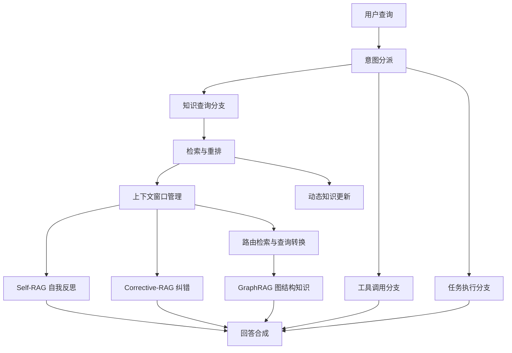
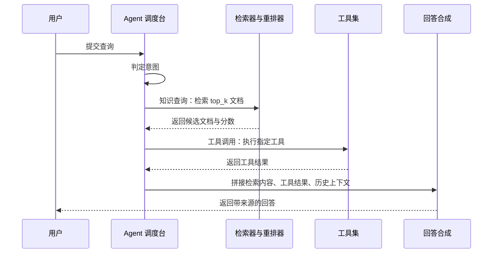
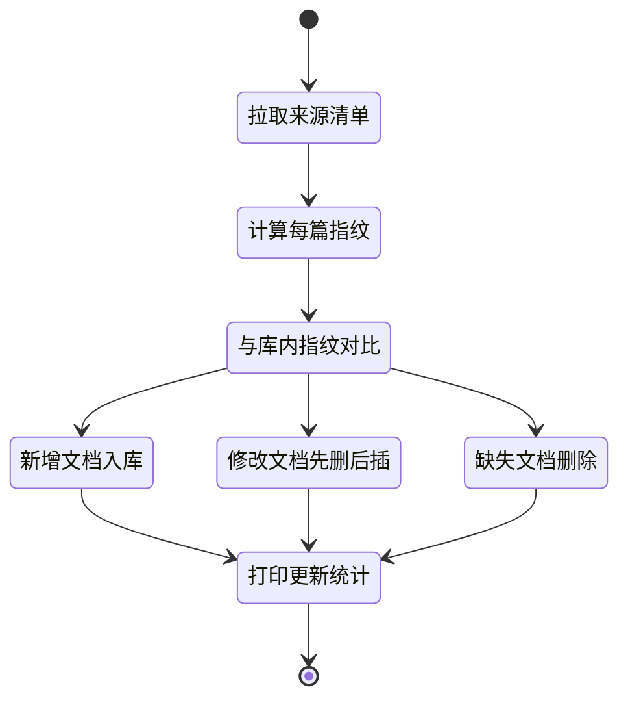
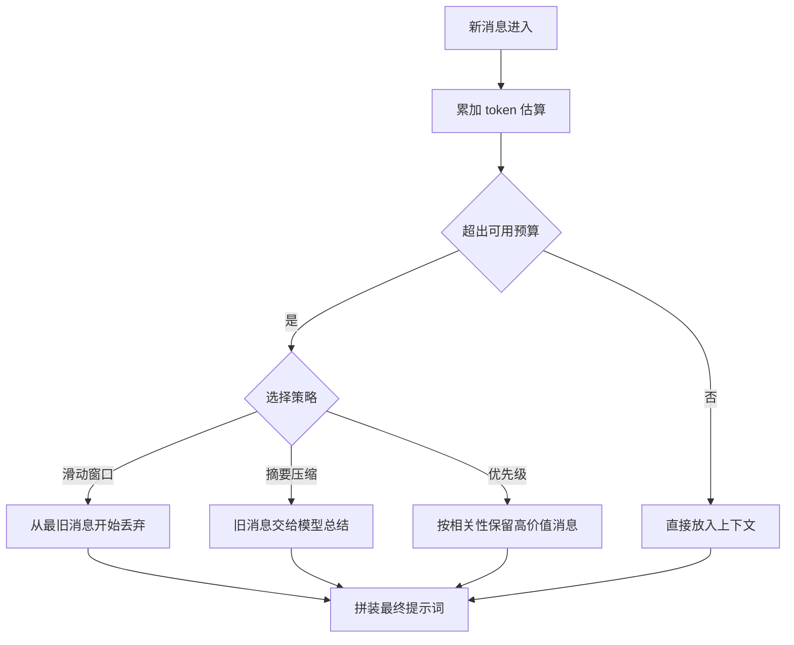
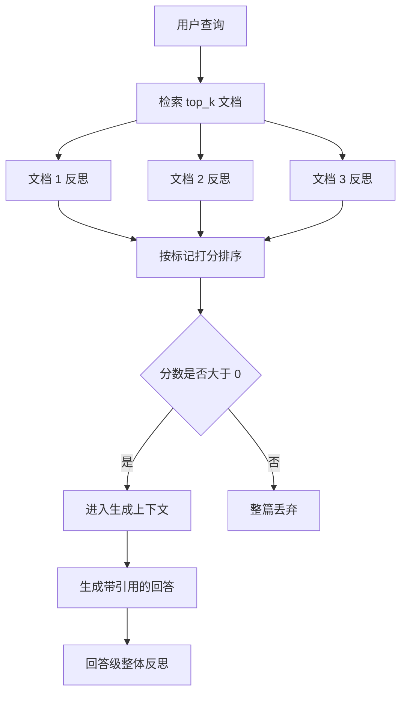
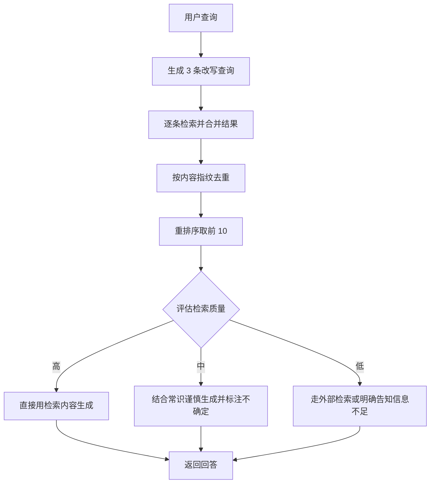
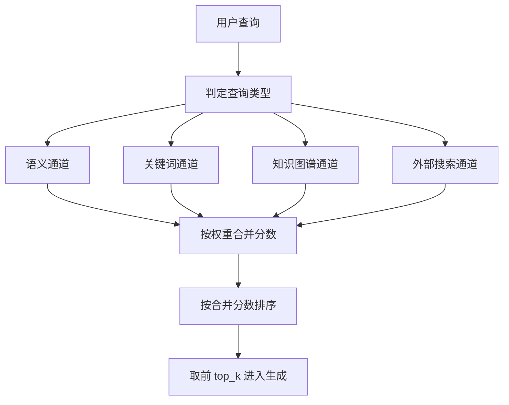
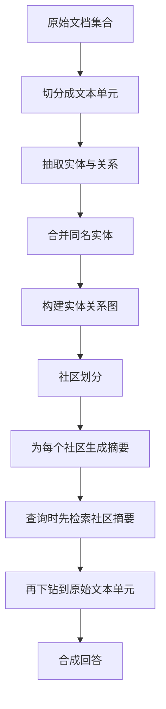

# RAG：Agent 集成与高级 RAG

!!! abstract "学完这一页你能"
    1. 能把一条用户查询分派到知识检索、工具调用、任务执行、闲聊四个分支，并说清分派依据。
    2. 能为知识库写出增量更新逻辑，只对新增、修改、删除的文档做动作。
    3. 能在 token 预算内组织多轮上下文，并在滑动窗口与摘要压缩之间做出选择。
    4. 能说清 Self-RAG、Corrective-RAG、路由检索、GraphRAG 各自解决哪一类失败，并写出最小可运行版本。

!!! note "术语：检索增强生成"
    先查资料再让模型作答的做法，英文 Retrieval-Augmented Generation，缩写 RAG。例子：用户问退货政策，系统先取回帮助文档，再把文档和问题一起交给模型。

!!! note "术语：Agent"
    能自己决定调用哪个工具、按多步计划推进任务的程序。例子：收到「查下昨天订单状态」后，Agent 自己调用订单查询接口，而不是直接编一段回答。

## 0. 知识地图



建议按顺序读：先读第 1 节，把 Agent 与 RAG 的接缝看清楚；再读第 2、3 节，处理知识时效和上下文预算这两个工程问题。

第 4 到第 7 节是四种进阶方案，每节独立，可以按你手上的失败现象挑着读。整体读完后，用「应用地图」把知识点对回真实业务。

## 1. Agent 与 RAG 的集成模式

**先想一个问题**

同一个客服入口，用户可能说「退货政策是什么」，也可能说「帮我退掉昨天那单」。前者要查文档，后者要执行动作。一个入口怎么分派这两类请求？

**!!! tip "心智模型"**

!!! tip "心智模型"
    一句话模型：Agent 是调度台，RAG 是资料室，工具是外勤。
    日常类比：医院分诊台先判断你去内科还是拍片，再把你送到对应窗口。
    类比不成立处：分诊规则由人写死，Agent 的分派由模型输出决定，同一句话可能分到不同分支。

!!! note "术语：意图分派"
    把用户输入归入预设处理分支的步骤，英文 Intent Classification。例子：把「退货政策是什么」归到知识查询分支。

**图解**



逐条解读这张图：

1. 用户提交的是一条自然语言查询，可能同时包含知识需求和动作需求。
2. 调度台先做意图判定，这一步决定后面走哪条通道。
3. 知识查询通道把查询交给检索器，取回候选文档和相似度分数。
4. 工具调用通道把查询解析成工具名和参数，交给工具集执行。
5. 两条通道的结果都回到回答合成，合成阶段才真正生成自然语言。
6. 合成阶段必须拿到来源信息，否则回答无法标注出处。

**一步一步来**

**第 1 步：把查询分派到四个分支。**

这一步要产出四种分支名之一，后面的处理都靠它分流。

```js
// 意图分派：命中第一条规则即返回
const RULES = [
  { intent: 'knowledge_query', words: ['什么', '怎么', '为什么', '政策'] },
  { intent: 'tool_calling', words: ['计算', '搜索', '运行'] },
  { intent: 'task_execution', words: ['帮我退', '帮我改', '创建'] },
];

function classifyIntent(query) {
  for (const rule of RULES) {
    if (rule.words.some((w) => query.includes(w))) return rule.intent;
  }
  return 'conversation'; // 无命中走闲聊，避免误触发检索
}
```

**这段代码在做什么**

- `RULES` 把关键词和意图名绑定，数组顺序就是优先级。
- `some` 只要命中一个关键词就判定该意图成立。
- `for...of` 保证按优先级从上往下试，不做并行匹配。
- 全部不命中返回 `conversation`，防止无意义检索浪费预算。
- 这里是关键词表，属于演示实现；生产环境的分派精度要求需核对官方文档中模型分类的推荐做法。

运行结果：

```text
classifyIntent('退货政策是什么') => 'knowledge_query'
classifyIntent('帮我退掉昨天那单') => 'task_execution'
classifyIntent('你好呀') => 'conversation'
```

**第 2 步：知识查询分支拼出带约束的提示词。**

这一步要把检索结果格式化成模型能引用的编号块。

```js
function buildContext(docs) {
  if (docs.length === 0) return '无相关知识库内容';
  return docs
    .map((d, i) => `【文档 ${i + 1}】标题：${d.title}\n来源：${d.source}\n内容：${d.content}`)
    .join('\n\n');
}

function buildRagPrompt(query, docs) {
  return [
    '只使用下面参考内容作答，参考内容没有就直说不知道。',
    buildContext(docs),
    `问题：${query}`,
  ].join('\n\n');
}
```

**这段代码在做什么**

- `map` 给每篇文档加上从 1 开始的编号，方便模型在回答里引用编号。
- 每篇文档都带 `title` 和 `source`，来源信息留在提示词里才能回填给前端。
- 空结果返回固定占位文本，让模型有明确信号去说「不知道」。
- 提示词第一句是硬约束，位置在内容之前，减少模型忽略约束的概率。
- `join('\n\n')` 让每篇文档之间有空行分隔，避免边界粘连。

**第 3 步：工具调用分支执行工具并回灌结果。**

这一步的关键是把工具返回值和模型的自然语言组装分开。

```js
function runTool(toolName, toolArgs, tools) {
  const tool = tools[toolName];
  if (!tool) return { ok: false, message: `未找到工具：${toolName}` };
  try {
    const result = tool(toolArgs);
    return { ok: true, result };
  } catch (err) {
    return { ok: false, message: `工具执行出错：${err.message}` };
  }
}

const tools = { calc: ({ a, b }) => a + b };
```

**这段代码在做什么**

- 先查工具表，找不到就返回失败对象，不让异常冒泡到调度层。
- `try...catch` 把工具自身的异常转成结构化错误，便于统一展示。
- 成功时返回 `{ ok: true, result }`，调用方按 `ok` 判断分支。
- 工具表本身是普通对象，注册新工具只需要加一个键。
- 工具入参的校验不在这里做，需核对官方文档中工具调用的参数校验建议。

**动手验证**

把上面三段合成一个单文件脚本。

```js
// agent-rag.js —— Node 20+，无第三方依赖，运行：node agent-rag.js
const assert = require('node:assert');

const RULES = [
  { intent: 'knowledge_query', words: ['什么', '怎么', '为什么', '政策'] },
  { intent: 'tool_calling', words: ['计算', '搜索', '运行'] },
  { intent: 'task_execution', words: ['帮我退', '帮我改', '创建'] },
];

function classifyIntent(query) {
  for (const rule of RULES) {
    if (rule.words.some((w) => query.includes(w))) return rule.intent;
  }
  return 'conversation';
}

// 用固定数组代替向量库，保证脚本输出可复现
function retrieve(query) {
  const docs = [
    { title: '退货政策', source: 'help/return.md', content: '签收后 7 天内可申请退货。' },
    { title: '发票规则', source: 'help/invoice.md', content: '发票在订单完成后 24 小时开出。' },
  ];
  return docs.filter((d) => (query.includes('退') ? d.title.includes('退货') : false));
}

function buildContext(docs) {
  if (docs.length === 0) return '无相关知识库内容';
  return docs
    .map((d, i) => `【文档 ${i + 1}】标题：${d.title}\n来源：${d.source}\n内容：${d.content}`)
    .join('\n\n');
}

function handle(query) {
  const intent = classifyIntent(query);
  if (intent !== 'knowledge_query') return { intent, answer: `已转交 ${intent} 分支` };
  const docs = retrieve(query);
  const prompt = ['只使用下面参考内容作答。', buildContext(docs), `问题：${query}`].join('\n\n');
  return { intent, answer: `依据【文档 1】：${docs[0].content}`, prompt };
}

assert.strictEqual(classifyIntent('退货政策是什么'), 'knowledge_query');
assert.strictEqual(classifyIntent('帮我退掉昨天那单'), 'task_execution');
assert.strictEqual(classifyIntent('你好呀'), 'conversation');
const r = handle('退货政策是什么');
assert.ok(r.prompt.includes('【文档 1】'));
assert.ok(r.prompt.includes('7 天'));
assert.strictEqual(handle('帮我退掉昨天那单').intent, 'task_execution');

console.log(r.answer);
console.log('全部断言通过');
```

预期输出：

```text
依据【文档 1】：签收后 7 天内可申请退货。
全部断言通过
```

**常见坑**

| 现象 | 原因 | 怎么修 |
| --- | --- | --- |
| 闲聊也会触发检索，响应变慢 | 兜底分支写成知识查询 | 未命中任何规则时返回独立分支名，再断言一次 |
| 回答里编了知识库没有的数字 | 提示词只给了内容，没给约束 | 在提示词最前面加「参考内容没有就直说不知道」 |
| 工具报错直接中断整轮对话 | 工具异常未捕获 | 用 try...catch 包住调用，返回结构化失败对象 |

**用在哪里**

场景一：电商客服机器人。

- 业务背景：用户消息既有「这单什么时候到」也有「退货要几天」。
- 这一节的知识怎么用：用意图分派把订单类消息交给工具调用，把政策类消息交给检索分支。
- 用什么指标衡量收益：检索分支的触发占比、人工转接率。
- 什么时候不该用：全部消息都是同一种意图时，分派层是多余的一跳。

场景二：企业内部 IT 支持台。

- 业务背景：员工提问可能查手册，也可能要重置密码。
- 这一节的知识怎么用：重置密码走工具调用，手册问题走检索。
- 用什么指标衡量收益：一次解决率、工单二次分派次数。
- 什么时候不该用：所有动作都需要人工审批时，自动执行工具会绕过流程。

场景三：开发者文档站内助手。

- 业务背景：用户问 API 用法，也可能问「帮我生成一个请求示例」。
- 这一节的知识怎么用：前者检索文档，后者走代码生成分支。
- 用什么指标衡量收益：回答被复制粘贴的次数、文档页跳转率。
- 什么时候不该用：文档量很小、全量塞进提示词也放得下时，检索分支可以先不做。

**行业实践**

- LangChain 官方文档的 Retrieval 与 Agents 章节：把检索器抽象成统一接口，再由 Agent 决定是否调用。借鉴方式：先定义 `search(query, topK)` 这套签名，把具体向量库替换成可注入参数。
- LlamaIndex 官方文档的 Query Engine 与 Router 章节：用查询引擎把「检索加合成」封装成一个可调用对象，路由层只管选引擎。借鉴方式：把第 1 节的知识查询分支封装成一个函数，分派层只做选择不做拼接。
- Node.js 官方文档的 node:assert 章节：断言模块可以给出结构化失败信息。借鉴方式：把意图分派的关键用例写成断言，接进 CI。

**小结**

1. Agent 与 RAG 的接缝是「意图分派」，分派错了后面全错。
2. 知识查询分支必须带来源信息，否则回答无法溯源。
3. 工具调用的异常要在调用点转成结构化结果，不要冒泡到调度层。

## 2. 动态知识更新与增量入库

**先想一个问题**

帮助中心的退货政策昨晚改了，从 7 天变成 15 天。如果知识库还是全量重建，重建窗口内的回答会同时出现两个版本。怎么只更新变动的那一篇？

**!!! tip "心智模型"**

!!! tip "心智模型"
    一句话模型：给每篇文档算一个内容指纹，指纹变了才动索引。
    日常类比：图书馆用 ISBN 加版次号判断一本书要不要换新，而不是每天重排整个书架。
    类比不成立处：书的版次由出版社声明，文档指纹要从正文算，正文里一个标点变化都会改指纹。

!!! note "术语：增量更新"
    只对发生变化的数据执行写入和删除，英文 Incremental Update。例子：1000 篇文档里改了 2 篇，就只重建这 2 篇的向量。

**图解**



逐条解读：

1. 从数据源拉取当前全量清单，注意这里是清单，不是全量正文。
2. 对清单里每篇文档的正文计算指纹，指纹算法要固定。
3. 把新指纹和库内已存指纹逐篇对比，得到三类差集。
4. 新增文档直接写入，不需要先删。
5. 修改文档必须先删旧向量再插新向量，否则同一 `doc_id` 会有两份向量。
6. 库内有、来源没有的文档判为删除。
7. 最后打印三个计数，便于接入监控。

**一步一步来**

**第 1 步：给文档算内容指纹。**

这一步要产出一个稳定的字符串，同一内容必须得到同一结果。

```js
const crypto = require('node:crypto');

function fingerprint(doc) {
  // 空白字符归一化，避免换行差异造成假变更
  const normalized = doc.content.replace(/\s+/g, ' ').trim();
  return crypto.createHash('sha256').update(normalized).digest('hex');
}
```

**这段代码在做什么**

- 用 `sha256` 而不是对象哈希，保证跨进程、跨机器结果一致。
- 先把连续空白压成一个空格，避免排版调整造成假变更。
- `trim` 去掉首尾空白，同样是减少噪声。
- 返回十六进制字符串，方便直接当键比较。
- 指纹只覆盖正文，标题和来源变了不算内容变更，需要按业务确认是否要一并纳入。

**第 2 步：对比新旧清单，分出三类差集。**

这一步要输出 added、modified、deleted 三个数组。

```js
function diffDocuments(existing, incoming) {
  const incomingIds = new Set(incoming.map((d) => d.id));
  const added = incoming.filter((d) => !(d.id in existing));
  const modified = incoming.filter(
    (d) => d.id in existing && existing[d.id].fingerprint !== fingerprint(d)
  );
  const deleted = Object.keys(existing).filter((id) => !incomingIds.has(id));
  return { added, modified, deleted };
}
```

**这段代码在做什么**

- `incomingIds` 是集合，后面的存在性判断是常数时间。
- `added` 取库内没有的 id。
- `modified` 同时要求 id 存在且指纹不同，两个条件缺一不可。
- `deleted` 从库内 id 反查，来源清单里没有就算删除。
- 函数不修改任何输入，比对和写入分成两个阶段，便于先看报告再决定是否执行。

**第 3 步：按类别应用变更并打印统计。**

这一步才真正动索引，顺序是先删后改再增。

```js
function applyChanges(store, diff) {
  for (const id of diff.deleted) store.remove(id);
  for (const doc of diff.modified) {
    store.remove(doc.id);        // 先删旧向量，避免重复
    store.add(doc);
  }
  for (const doc of diff.added) store.add(doc);
  return {
    added: diff.added.length,
    modified: diff.modified.length,
    deleted: diff.deleted.length,
    timestamp: new Date().toISOString(),
  };
}
```

**这段代码在做什么**

- 删除在先，避免后面新增时撞上同 id 的旧记录。
- 修改走「先删后插」，而不是原地更新，实现上少一层判断。
- 三个循环分开写，每一步的失败都能定位到具体类别。
- 返回值只含计数和时间戳，适合直接打日志或上报。
- 这里没有事务保证，中途失败会留下半更新状态，需核对官方文档中索引写入的原子性保证。

**动手验证**

```js
// incremental-update.js —— Node 20+，无第三方依赖，运行：node incremental-update.js
const assert = require('node:assert');
const crypto = require('node:crypto');

function fingerprint(doc) {
  const normalized = doc.content.replace(/\s+/g, ' ').trim();
  return crypto.createHash('sha256').update(normalized).digest('hex');
}

function diffDocuments(existing, incoming) {
  const incomingIds = new Set(incoming.map((d) => d.id));
  const added = incoming.filter((d) => !(d.id in existing));
  const modified = incoming.filter(
    (d) => d.id in existing && existing[d.id].fingerprint !== fingerprint(d)
  );
  const deleted = Object.keys(existing).filter((id) => !incomingIds.has(id));
  return { added, modified, deleted };
}

function makeStore() {
  const map = new Map();
  return {
    add: (doc) => map.set(doc.id, doc),
    remove: (id) => map.delete(id),
    dump: () => Object.fromEntries(map),
  };
}

const d1 = { id: 'a', content: '签收后 7 天内可申请退货。' };
const d2 = { id: 'b', content: '发票在订单完成后 24 小时开出。' };

const store = makeStore();
store.add({ ...d1, fingerprint: fingerprint(d1) });
store.add({ ...d2, fingerprint: fingerprint(d2) });

const existing = Object.fromEntries(
  Object.entries(store.dump()).map(([id, doc]) => [id, { fingerprint: doc.fingerprint }])
);

const incoming = [
  { id: 'a', content: '签收后 15 天内可申请退货。' }, // 改了
  { id: 'c', content: '电子发票支持自助下载。' },      // 新增
];

const diff = diffDocuments(existing, incoming);
assert.strictEqual(diff.added.length, 1);
assert.strictEqual(diff.modified.length, 1);
assert.strictEqual(diff.deleted.length, 1);
assert.strictEqual(diff.modified[0].id, 'a');
assert.deepStrictEqual(diff.deleted, ['b']);

console.log('新增', diff.added.map((d) => d.id));
console.log('修改', diff.modified.map((d) => d.id));
console.log('删除', diff.deleted);
console.log('全部断言通过');
```

预期输出：

```text
新增 [ 'c' ]
修改 [ 'a' ]
删除 [ 'b' ]
全部断言通过
```

**常见坑**

| 现象 | 原因 | 怎么修 |
| --- | --- | --- |
| 每次更新都全量重建 | 指纹存在文档对象里，跨进程丢失 | 指纹落库，与向量同生命周期保存 |
| 同一文档出现两份检索结果 | 修改时原地覆盖但未删旧向量 | 修改走先删后插，或按 id 覆盖写入 |
| 格式微调就触发全量重建 | 指纹直接对原始字符串计算 | 先做空白归一化再算指纹 |

**用在哪里**

场景一：电商帮助中心。

- 业务背景：运营每周改政策文案，修改频率高但总量小。
- 这一节的知识怎么用：每天跑一次增量比对，只重建被改的文档向量。
- 用什么指标衡量收益：单次更新耗时、更新期间检索错误率。
- 什么时候不该用：文档总量在几百篇以内、全量重建只要几十秒时，增量逻辑的维护成本更高。

场景二：后台管理的批量导入。

- 业务背景：运营用 Excel 导入商品知识，同一商品可能重复导入。
- 这一节的知识怎么用：用商品编码当作 doc_id，导入时先算指纹再判新增还是修改。
- 用什么指标衡量收益：重复向量数量、导入后检索命中率。
- 什么时候不该用：每次导入都是全新批次、历史数据要保留时，不该按 id 覆盖。

场景三：法规库同步。

- 业务背景：法规原文会发布修订版，旧版必须能追溯。
- 这一节的知识怎么用：把版本号并入 doc_id，删除旧版时保留归档表。
- 用什么指标衡量收益：错误引用旧版条文的次数。
- 什么时候不该用：只保留最新版就够的场景，不必维护版本维度。

**行业实践**

- LlamaIndex 官方文档的 Ingestion Pipeline 章节：把切分、嵌入、去重做成可组合的节点，并支持文档去重与缓存。借鉴方式：把指纹计算放在切分之前，避免同一文档切出多份后重复计算。
- LangChain 官方文档的 Indexing 章节：提供记录管理器来跟踪文档写入状态，避免重复写入同一文档。借鉴方式：把指纹表当成记录管理器的最小实现。
- 需核对官方文档：具体要核对向量库在删除单条记录时的可见性延迟，以及更新期间检索是否会读到半更新状态。

**小结**

1. 增量更新靠的是内容指纹，不是修改时间。
2. 修改文档必须走先删后插，否则同一个 id 会有多份向量。
3. 指纹表要和向量放在同一个可持久化存储里，进程重启不能丢。

## 3. 上下文窗口管理

**先想一个问题**

用户和客服助手聊了 30 轮，每轮的检索结果都留在上下文里。第 31 轮请求发出去，模型报超长错误。这时候该丢哪部分历史？

**!!! tip "心智模型"**

!!! tip "心智模型"
    一句话模型：上下文窗口是一张固定大小的桌子，桌上只能摆有限的纸。
    日常类比：开会时白板写满了，你得擦掉最早的记录，或者把前面几页总结成一句话贴上。
    类比不成立处：白板可以拍照存档事后翻看，被截断的上下文对模型来说是真的消失了。

!!! note "术语：上下文窗口"
    模型单次调用能接受的最大 token 数。例子：窗口是 4000 token，系统提示占 500，历史加当前问题只能用剩下 3500。

**图解**



逐条解读：

1. 每来一条新消息，先估算它的 token 数并累加。
2. 累加值没有超过可用预算时，直接放入，不做任何裁剪。
3. 超过预算才进入策略选择，避免无谓计算。
4. 滑动窗口从最旧的消息开始丢，实现简单，保留的是时间上最近的部分。
5. 摘要压缩把较早的消息交给模型总结成一段文字，保住语义但会引入信息损失。
6. 优先级策略按相关性筛选，能保住关键信息，但需要额外的相关性计算。
7. 三种策略最终都汇到同一个拼装步骤，接口保持一致。

**一步一步来**

**第 1 步：估算 token 数并设定预算。**

这一步给出一个可替换的估算函数和一个明确的可用额度。

```js
const CHARS_PER_TOKEN = 1.6; // 中文场景的粗略系数，生产需换成真实分词器

function estimateTokens(text) {
  return Math.ceil(text.length / CHARS_PER_TOKEN);
}

function budgetOf(maxTokens, reservedTokens) {
  return maxTokens - reservedTokens; // 预留给系统提示和当前问题
}
```

**这段代码在做什么**

- 用字符数除以系数得到估算值，`Math.ceil` 保证不低估。
- 系数只适用于中文近似场景，英文和代码会偏离。
- `reservedTokens` 是留给系统提示和当前查询的固定开销。
- 返回可用额度，后续所有裁剪都以它为准。
- 生产环境要换成模型对应的分词器，具体分词方式需核对官方文档。

**第 2 步：实现滑动窗口裁剪。**

这一步保留最近的消息，直到再放一条就超预算。

```js
function slidingContext(messages, currentQuery, budget) {
  const kept = [];
  let used = estimateTokens(currentQuery);
  for (let i = messages.length - 1; i >= 0; i -= 1) {
    const cost = estimateTokens(messages[i].content);
    if (used + cost > budget) break; // 再放就超，停止
    kept.unshift(messages[i]);
    used += cost;
  }
  return { kept, used };
}
```

**这段代码在做什么**

- 从最后一条往前遍历，保证最近的消息优先保留。
- 当前查询先计入 `used`，它必须留在窗口里。
- 一旦加上这条就超预算，立刻中断，不再考虑更早的消息。
- `unshift` 把消息放回数组头部，保持时间正序。
- 返回 `used` 便于后续上报，观察窗口占用率。

**第 3 步：实现摘要压缩，并和滑动窗口对比。**

这一步把较早的消息换成一段摘要。

```js
function summaryContext(messages, currentQuery, budget, summarize) {
  const recent = messages.slice(-6);      // 最近 6 条原样保留
  const older = messages.slice(0, -6);
  const summary = older.length > 0 ? summarize(older) : '';
  const parts = [];
  if (summary) parts.push(`之前对话摘要：${summary}`);
  parts.push(...recent.map((m) => `${m.role}：${m.content}`));
  parts.push(`user：${currentQuery}`);
  return parts.join('\n');
}
```

**这段代码在做什么**

- `slice(-6)` 保留最近 6 条原文，保证指代和语气连贯。
- 更早的消息整体交给 `summarize`，这是一个可注入的函数。
- 摘要为空时不加这一行，避免出现空标签。
- `role` 拼在每条消息前面，让模型分清用户和助手。
- 当前查询放在末尾，位置最靠近生成位置。
- 摘要本身也要计入预算，这里没做，需核对官方文档中摘要长度的控制建议。

**动手验证**

```js
// context-window.js —— Node 20+，无第三方依赖，运行：node context-window.js
const assert = require('node:assert');

const CHARS_PER_TOKEN = 1.6;
const estimateTokens = (text) => Math.ceil(text.length / CHARS_PER_TOKEN);
const budgetOf = (max, reserved) => max - reserved;

function slidingContext(messages, currentQuery, budget) {
  const kept = [];
  let used = estimateTokens(currentQuery);
  for (let i = messages.length - 1; i >= 0; i -= 1) {
    const cost = estimateTokens(messages[i].content);
    if (used + cost > budget) break;
    kept.unshift(messages[i]);
    used += cost;
  }
  return { kept, used };
}

function summaryContext(messages, currentQuery, summarize) {
  const recent = messages.slice(-6);
  const older = messages.slice(0, -6);
  const summary = older.length > 0 ? summarize(older) : '';
  const parts = [];
  if (summary) parts.push(`之前对话摘要：${summary}`);
  parts.push(...recent.map((m) => `${m.role}：${m.content}`));
  parts.push(`user：${currentQuery}`);
  return parts.join('\n');
}

const history = [
  { role: 'user', content: '我想问一下退货的事情。' },
  { role: 'assistant', content: '好的，请说明订单号。' },
  { role: 'user', content: '订单号是 A12345。' },
  { role: 'assistant', content: '已查到，签收时间是本月 3 日。' },
  { role: 'user', content: '那我还能退吗？' },
  { role: 'assistant', content: '需要看具体政策版本。' },
  { role: 'user', content: '政策改过吗？' },
];

const budget = budgetOf(400, 100);
const sliding = slidingContext(history, '那到底几天内能退', budget);
assert.ok(sliding.used <= budget);
assert.strictEqual(sliding.kept.at(-1).content, '政策改过吗？');

const summarized = summaryContext(history, '那到底几天内能退', (older) => `用户共提问 ${older.length} 条`);
assert.ok(summarized.includes('之前对话摘要'));
assert.ok(summarized.endsWith('user：那到底几天内能退'));
assert.strictEqual(summarized.split('\n').length, 8);

console.log('滑动窗口保留条数', sliding.kept.length, '占用 token', sliding.used);
console.log(summarized);
console.log('全部断言通过');
```

预期输出（token 数为估算值，实际运行以脚本输出为准）：

```text
滑动窗口保留条数 3 占用 token 20
之前对话摘要：用户共提问 1 条
user：订单号是 A12345。
assistant：已查到，签收时间是本月 3 日。
user：那我还能退吗？
assistant：需要看具体政策版本。
user：政策改过吗？
user：那到底几天内能退
全部断言通过
```

**常见坑**

| 现象 | 原因 | 怎么修 |
| --- | --- | --- |
| 裁剪后指代错乱 | 把带指代的消息丢在了前面 | 保留最近若干条原文，只压缩更早的部分 |
| 估算值和实际差一倍 | 用的是字符系数不是分词器 | 接入模型对应分词器，或按最坏情况上浮预算 |
| 摘要越滚越长最终超限 | 摘要本身没计入预算 | 对摘要长度设上限，超出就二次压缩 |

**用在哪里**

场景一：多轮客服对话。

- 业务背景：用户一次会话可能聊 30 轮以上。
- 这一节的知识怎么用：最近 6 轮保留原文，更早的压缩成摘要。
- 用什么指标衡量收益：请求超长错误率、平均输入 token 数。
- 什么时候不该用：会话平均只有 3 到 5 轮时，裁剪逻辑不会被触发，先不引入。

场景二：代码助手的项目上下文。

- 业务背景：用户持续贴文件和提问，上下文很快被贴入的代码占满。
- 这一节的知识怎么用：检索到的代码片段按相关性保留，历史对话按滑动窗口裁剪。
- 用什么指标衡量收益：回答引用到过期代码的次数。
- 什么时候不该用：单次问答、无多轮状态的场景不需要窗口管理。

场景三：后台管理的智能搜索框。

- 业务背景：用户连续修改关键词重试，前面的试探词没有保留价值。
- 这一节的知识怎么用：只保留最近 2 轮，其余全部丢弃。
- 用什么指标衡量收益：输入 token 数、首字返回时间。
- 什么时候不该用：用户会引用前面某轮的条件时，丢弃会造成理解断层。

**行业实践**

- LangChain 官方文档的 Memory 与 Message History 章节：提供按消息条数或 token 数裁剪的历史管理组件。借鉴方式：把裁剪策略做成参数，不要写死在业务代码里。
- LlamaIndex 官方文档的 Chat Engine 章节：区分「保留最近若干轮」与「对旧对话做摘要」两种模式。借鉴方式：先用滑动窗口跑通，再根据超长错误率决定是否加摘要。
- 需核对官方文档：具体要核对所选模型的分词器包名与最大输入 token 上限，以及摘要调用是否单独计费。

**小结**

1. 窗口管理的第一步是预留系统提示和当前问题的固定开销。
2. 滑动窗口保住时间连续性，摘要压缩保住语义密度，两者可以叠加使用。
3. token 估算一定要换成真实分词器，字符系数只适合做原型。

## 4. Self-RAG：让模型给自己的检索结果打分

**先想一个问题**

检索返回了 5 篇文档，其中 3 篇只是关键词碰巧相同，实际不回答用户的问题。如果全部塞进提示词，模型可能被无关内容带偏。有没有办法在生成之前先筛一遍？

**!!! tip "心智模型"**

!!! tip "心智模型"
    一句话模型：先让模型给每篇检索结果贴标签，再只拿通过标签的片段去回答。
    日常类比：写论文前先把参考文献按「是否支持论点」过一遍，再决定引用哪几篇。
    类比不成立处：人读过文献后记忆是连续的，模型每次判断只看当前这一篇，前后判断可能互相矛盾。

!!! note "术语：反思标记"
    Self-RAG 里模型输出的判断符号，用来标注检索内容是否相关、回答是否被支撑。例子：对一篇文档输出「相关」与「支撑」，对另一篇输出「不相关」。

**图解**



逐条解读：

1. 先做一次普通检索，拿到候选文档，这一步和基础 RAG 一样。
2. 每篇文档单独做一次反思判断，互不干扰。
3. 反思判断输出的标记包括是否相关、是否支撑回答。
4. 按标记折算成分数并排序，把最相关的排在最前。
5. 分数为 0 的文档整篇丢弃，不进入生成上下文。
6. 生成阶段要求模型标注引用编号。
7. 生成后再做一次整体反思，判断回答是否完整、是否有编造。

**一步一步来**

**第 1 步：对单篇文档做反思判断。**

这一步要输出结构化的标记，而不是自由文本。

```js
function reflectOnDoc(query, doc, llm) {
  const prompt = [
    '判断下面检索内容是否与查询相关、是否支撑回答。',
    '只输出一行：相关=是/否 支撑=是/否',
    `查询：${query}`,
    `检索内容：${doc.content}`,
  ].join('\n');
  const raw = llm(prompt);                 // 由调用方注入模型
  return {
    relevant: raw.includes('相关=是'),
    supports: raw.includes('支撑=是'),
  };
}
```

**这段代码在做什么**

- 提示词明确要求只输出一行固定格式，方便解析。
- `llm` 是注入的函数，测试时可以换成固定返回值。
- 用 `includes` 解析两个标记，解析失败时两个字段都是 `false`。
- 返回布尔对象，后续打分只做加法，不做字符串比较。
- 这里的解析方式脆弱，生产环境应要求模型输出结构化格式，具体格式需核对官方文档。

**第 2 步：按标记折算分数并挑选片段。**

这一步决定哪些文档进入生成阶段。

```js
function scoreDocs(rows) {
  return rows
    .map((row) => {
      let score = 0;
      if (row.reflection.supports) score += 2;  // 支撑回答权重最高
      if (row.reflection.relevant) score += 1;  // 相关性权重次之
      return { ...row, score };
    })
    .sort((a, b) => b.score - a.score)
    .filter((row) => row.score > 0);            // 零分文档整篇丢弃
}
```

**这段代码在做什么**

- 支撑回答给 2 分，相关给 1 分，权重体现两类判断的差别。
- `sort` 按分数降序，保证高价值文档排在上下文前面。
- `filter` 把零分文档剔除，避免无关内容进入提示词。
- 每个返回值都是新对象，不修改传入的数组元素。
- 权重值本身是设计选择，需通过离线评估集确认，不能凭感觉定。

**第 3 步：生成回答后做整体反思。**

这一步检查回答本身，而不是检索结果。

```js
function reflectOnAnswer(query, answer, llm) {
  const prompt = [
    '评估下面回答是否完整回答问题、是否存在编造。',
    '只输出一行：完整=是/否 有编造=是/否',
    `问题：${query}`,
    `回答：${answer}`,
  ].join('\n');
  const raw = llm(prompt);
  return { complete: raw.includes('完整=是'), hallucinated: raw.includes('有编造=是') };
}
```

**这段代码在做什么**

- 输入是问题加最终回答，不包含检索内容。
- 两个标记分别对应完整性风险和编造风险。
- 返回结构固定，方便上层决定是否重试或降级。
- 这里的判断依赖同一个模型，可能存在自我确认偏差，需核对官方文档中是否有独立的评估模型建议。
- 这一步是额外一次调用，会带来延迟，是否开启要按场景权衡。

**动手验证**

```js
// self-rag.js —— Node 20+，无第三方依赖，运行：node self-rag.js
const assert = require('node:assert');

function reflectOnDoc(query, doc, llm) {
  const prompt = `判断相关性。查询：${query} 内容：${doc.content}\n只输出一行：相关=是/否 支撑=是/否`;
  const raw = llm(prompt);
  return { relevant: raw.includes('相关=是'), supports: raw.includes('支撑=是') };
}

function scoreDocs(rows) {
  return rows
    .map((row) => {
      let score = 0;
      if (row.reflection.supports) score += 2;
      if (row.reflection.relevant) score += 1;
      return { ...row, score };
    })
    .sort((a, b) => b.score - a.score)
    .filter((row) => row.score > 0);
}

function reflectOnAnswer(query, answer, llm) {
  const raw = llm(`评估回答：${answer}`);
  return { complete: raw.includes('完整=是'), hallucinated: raw.includes('有编造=是') };
}

// 用固定规则模拟模型，保证输出可复现
const fakeLLM = (prompt) => {
  if (prompt.includes('7 天内')) return '相关=是 支撑=是';
  if (prompt.includes('发票')) return '相关=否 支撑=否';
  return '完整=是 有编造=否';
};

const docs = [
  { id: 'd1', content: '签收后 7 天内可申请退货。' },
  { id: 'd2', content: '发票在订单完成后 24 小时开出。' },
];

const rows = docs.map((doc) => ({ doc, reflection: reflectOnDoc('几天内能退', doc, fakeLLM) }));
const selected = scoreDocs(rows);

assert.strictEqual(selected.length, 1);
assert.strictEqual(selected[0].doc.id, 'd1');
assert.strictEqual(selected[0].score, 3);
assert.strictEqual(rows.find((r) => r.doc.id === 'd2').reflection.relevant, false);

const finalCheck = reflectOnAnswer('几天内能退', '签收后 7 天内可退。', fakeLLM);
assert.strictEqual(finalCheck.hallucinated, false);

console.log('入选文档', selected.map((r) => r.doc.id));
console.log('丢弃文档', rows.filter((r) => r.score === 0).map((r) => r.doc.id));
console.log('回答反思', finalCheck);
console.log('全部断言通过');
```

预期输出：

```text
入选文档 [ 'd1' ]
丢弃文档 [ 'd2' ]
回答反思 { complete: true, hallucinated: false }
全部断言通过
```

**常见坑**

| 现象 | 原因 | 怎么修 |
| --- | --- | --- |
| 反思把文档全判为不相关 | 判断提示词没有给出判断标准 | 在提示词里写清什么算相关，并给一到两个正反例 |
| 延迟增加明显 | 每篇文档一次反思调用 | 先做重排取前若干篇，只对这几篇反思 |
| 反思结果每次不一样 | 模型温度偏高 | 反思阶段把温度设为 0，需核对官方文档的参数名 |

**用在哪里**

场景一：医疗健康问答。

- 业务背景：检索到的内容可能是不相关疾病的资料。
- 这一节的知识怎么用：对每篇资料做支撑性判断，只有被判断为支撑的才进入生成。
- 用什么指标衡量收益：错误引用资料的条数、人工抽检通过率。
- 什么时候不该用：检索结果本身就由人工审核过的场景，反思是重复劳动。

场景二：法律条文检索助手。

- 业务背景：同一条文在不同法域含义不同，关键词检索容易混。
- 这一节的知识怎么用：反思判断加入法域相关性的判断维度。
- 用什么指标衡量收益：引用错误法域的条数。
- 什么时候不该用：单法域场景，判断维度只剩相关性，收益有限。

场景三：企业知识库问答。

- 业务背景：内部文档有大量过期版本，检索会同时命中新旧两版。
- 这一节的知识怎么用：回答级反思检查是否引用了过期版本的内容。
- 用什么指标衡量收益：过期内容引用率。
- 什么时候不该用：文档有严格的版本管理且旧版已下架时，不必额外反思。

**行业实践**

- 论文《Self-RAG: Learning to Retrieve, Generate, and Critique through Self-Reflection》：提出用反思标记控制检索与生成时机，并训练模型自己产出这些标记。借鉴方式：先用提示词模拟标记输出跑通流程，再考虑是否需要专门训练。
- LangChain 官方文档的 Self-Query Retriever 与评价器相关章节：把「先判断再生成」拆成可组合步骤。借鉴方式：把反思步骤实现成独立函数，方便单测和替换。
- 需核对官方文档：具体要核对反思标记的推荐枚举值，以及不同模型在结构化输出上的支持差异。

**小结**

1. Self-RAG 的核心是在生成之前插入一次筛选，而不是改进检索本身。
2. 反思要输出结构化标记，不能依赖自由文本解析。
3. 反思会带来额外调用次数，用重排缩小子集是控制成本的关键。

## 5. Corrective-RAG：检索质量差时的三条退路

**先想一个问题**

用户问的是一个知识库里根本没有的新问题，检索返回的 10 篇文档相似度都低于阈值，但总还是能返回一些结果。这时候直接交给模型生成，回答就像是在硬凑。这种情况该走什么流程？

**!!! tip "心智模型"**

!!! tip "心智模型"
    一句话模型：先给检索结果打一个质量档，再按档位决定用不用它。
    日常类比：翻译前先看机翻质量，好的直接用，中等的改一改，差的干脆自己重写。
    类比不成立处：人一眼能判断机翻好坏，模型对检索质量的判断本身也是概率输出，会判错档位。

!!! note "术语：查询改写"
    把原查询换成若干条语义相近但措辞不同的查询，用来提高召回。例子：把「退款要几天」改写成「退货到账时间」。

**图解**



逐条解读：

1. 原查询先经过改写，得到 3 条措辞不同的查询。
2. 每条改写查询各自检索，结果合并到一个池子里。
3. 按内容指纹去重，去掉不同改写查询带回来的重复文档。
4. 重排序后取前 10 篇，缩小后续判断的范围。
5. 用模型或阈值评估这批结果的质量档。
6. 高、中、低三档走向三条不同路径，而不是统一处理。
7. 三条路径最终都返回回答，但回答里对确定性的措辞不同。

**一步一步来**

**第 1 步：生成改写查询。**

这一步要把一条查询扩成多条，提高召回。

```js
function rewriteQuery(query, llm) {
  const prompt = [
    '为下面的查询生成 3 条措辞不同的改写，保持原意。',
    '每行一条，不要编号以外的内容。',
    `查询：${query}`,
  ].join('\n');
  const lines = llm(prompt)
    .split('\n')
    .map((line) => line.replace(/^\d+[.、]\s*/, '').trim())
    .filter(Boolean);
  return lines.length > 0 ? lines.slice(0, 3) : [query]; // 解析失败回退原查询
}
```

**这段代码在做什么**

- 提示词限定输出格式，要求每行一条改写。
- `replace` 去掉行首的编号，编号形式不参与后续检索。
- `filter(Boolean)` 清掉空行。
- 解析失败或为空时回退到原查询，保证下游永远拿到至少一条。
- `slice(0, 3)` 限制条数，防止模型输出过多导致检索次数失控。

**第 2 步：合并结果并按内容指纹去重。**

这一步保证同一篇文档只出现一次。

```js
const crypto = require('node:crypto');

function dedupe(results) {
  const seen = new Set();
  const unique = [];
  for (const item of results) {
    const key = crypto.createHash('sha256').update(item.content.slice(0, 200)).digest('hex');
    if (seen.has(key)) continue;
    seen.add(key);
    unique.push(item);
  }
  return unique;
}
```

**这段代码在做什么**

- 只取内容前 200 个字符算指纹，减少长文档的计算开销。
- `seen` 记录已出现过的指纹，重复直接跳过。
- 保留第一次出现的对象，后面的同内容文档被丢弃。
- 返回顺序保持首次出现顺序，便于后续重排覆盖。
- 前 200 字符相同但后文不同的两篇会被误判为重复，需按文档长度分布确认这个截断长度。

**第 3 步：按质量档走三条不同路径。**

这一步是 CRAG 的核心。

```js
function buildPromptByQuality(query, docs, quality) {
  const context = docs.map((d, i) => `【参考 ${i + 1}】${d.content}`).join('\n\n');
  if (quality === 'high') {
    return `只依据下面参考内容作答。\n${context}\n问题：${query}`;
  }
  if (quality === 'medium') {
    return `参考内容与问题部分相关，结合常识作答，并标出不确定的部分。\n${context}\n问题：${query}`;
  }
  return `知识库没有找到可靠依据。请明确告知用户信息不足，不要编造。\n问题：${query}`;
}
```

**这段代码在做什么**

- 三档对应三段不同措辞的提示词，唯一变量是约束强度。
- 高质量档要求只用参考内容，等同于普通 RAG。
- 中质量档允许补充常识，但要求标出不确定处。
- 低质量档干脆不塞参考内容，从源头断掉编造素材。
- 档位判断本身要准，判断规则需核对官方文档中推荐的分档阈值。

**动手验证**

```js
// corrective-rag.js —— Node 20+，无第三方依赖，运行：node corrective-rag.js
const assert = require('node:assert');
const crypto = require('node:crypto');

function rewriteQuery(query) {
  // 固定改写，保证脚本可复现
  return [`${query} 流程`, `${query} 规定`, `${query} 说明`];
}

function retrieve(queries, corpus) {
  const hits = [];
  for (const q of queries) {
    for (const doc of corpus) {
      if (doc.content.includes(q.slice(0, 2))) hits.push(doc);
    }
  }
  return hits;
}

function dedupe(results) {
  const seen = new Set();
  const unique = [];
  for (const item of results) {
    const key = crypto.createHash('sha256').update(item.content.slice(0, 200)).digest('hex');
    if (seen.has(key)) continue;
    seen.add(key);
    unique.push(item);
  }
  return unique;
}

function judgeQuality(docs) {
  if (docs.length === 0) return 'low';
  if (docs.length >= 2) return 'high';
  return 'medium';
}

function buildPromptByQuality(query, docs, quality) {
  const context = docs.map((d, i) => `【参考 ${i + 1}】${d.content}`).join('\n\n');
  if (quality === 'high') return `只依据下面参考内容作答。\n${context}\n问题：${query}`;
  if (quality === 'medium') return `部分相关，结合常识并标注不确定。\n${context}\n问题：${query}`;
  return `知识库无可靠依据，明确告知信息不足。\n问题：${query}`;
}

const corpus = [
  { id: 'a', content: '退货流程：签收后 7 天内可申请。' },
  { id: 'b', content: '退货规定：需保持商品完好。' },
];

const queries = rewriteQuery('退货');
assert.strictEqual(queries.length, 3);

const merged = dedupe(retrieve(queries, corpus));
assert.ok(merged.length >= 2);

assert.strictEqual(judgeQuality(merged), 'high');
assert.strictEqual(judgeQuality([]), 'low');
assert.ok(buildPromptByQuality('退货', merged, 'high').includes('只依据'));
assert.ok(buildPromptByQuality('退货', [], 'low').includes('信息不足'));

console.log('改写查询', queries);
console.log('去重后条数', merged.length, '质量档', judgeQuality(merged));
console.log('全部断言通过');
```

预期输出：

```text
改写查询 [ '退货 流程', '退货 规定', '退货 说明' ]
去重后条数 2 质量档 high
全部断言通过
```

**常见坑**

| 现象 | 原因 | 怎么修 |
| --- | --- | --- |
| 低质量档仍然编造答案 | 提示词没去掉参考内容 | 低质量档不传 context，只传告知信息不足的指令 |
| 改写查询把原意改偏 | 提示词只要求措辞不同，没要求保意 | 提示词加「保持原意」，并用离线集抽样核对 |
| 去重把不同文档判成重复 | 指纹只取前若干字符 | 按文档长度分布调整截断长度，或改用全文指纹 |

**用在哪里**

场景一：新品类的售前咨询。

- 业务背景：新品类刚上架，知识库还没有对应文档。
- 这一节的知识怎么用：质量判为低时明确告知信息不足，避免编造参数。
- 用什么指标衡量收益：编造参数的投诉量。
- 什么时候不该用：知识库覆盖率已经很高、低质量档几乎不触发时，可以先不实现三条路径。

场景二：跨国业务的法规问答。

- 业务背景：同一问题在不同地区的答案完全不同。
- 这一节的知识怎么用：改写查询时带上地区词，检索质量下降时提示用户切换地区。
- 用什么指标衡量收益：地区错配的回答占比。
- 什么时候不该用：只服务单一地区时，加地区维度只会引入噪声。

场景三：故障排查助手。

- 业务背景：新故障的排查记录还没入库。
- 这一节的知识怎么用：质量低时输出「知识库无记录」并给出升级到人工的入口。
- 用什么指标衡量收益：升级人工的及时率。
- 什么时候不该用：故障库更新延迟本身很低时，可以等入库后再回答。

**行业实践**

- 论文《Corrective Retrieval Augmented Generation》：把检索结果按质量分档，并对低质量结果做补充检索或降级处理。借鉴方式：先实现三档分支的骨架，判断规则先用简单阈值，再按实际分布调整。
- LangChain 官方文档的 Retrieval 章节中关于多查询检索的部分：用多条改写查询各自检索再合并。借鉴方式：把改写条数做成配置项，观察召回率与延迟的变化。
- 需核对官方文档：具体要核对多查询检索的合并方式是取并集还是按分数融合，不同实现结果差别明显。

**小结**

1. CRAG 的价值在于承认「检索可能没结果」，并给出可解释的降级路径。
2. 低质量档最安全的做法是不给参考内容，直接告知信息不足。
3. 改写查询条数、去重指纹长度、质量分档阈值都是需要按业务分布调的参数。

## 6. 路由检索与查询转换

**先想一个问题**

同一个知识库里既有商品参数表，也有客服话术文档。用户问「A1234 的防水等级」时，关键词检索比向量检索准；问「这款能不能游泳戴」时，向量检索更准。系统怎么知道该用哪种？

**!!! tip "心智模型"**

!!! tip "心智模型"
    一句话模型：先判断查询属于哪一类，再把它发给对应的检索通道。
    日常类比：图书馆里查工具书去参考室，查畅销小说去借阅区，索引方式不同。
    类比不成立处：图书馆的区域边界由人划定且稳定，查询类型的边界由模型判断，会落在两区之间。

!!! note "术语：路由检索"
    把查询分发到一个或几个检索通道，并按权重合并结果的做法，英文 Router Retrieval。例子：型号类查询走关键词通道，描述类查询走向量通道。

**图解**



逐条解读：

1. 查询先做类型判定，判定结果决定后面开哪几条通道。
2. 语义通道用向量相似度，适合描述性查询。
3. 关键词通道用倒排索引，适合型号、编号、专有名词。
4. 知识图谱通道沿着实体关系扩展，适合「A 和 B 什么关系」这类问题。
5. 外部搜索通道补充知识库没有的时效信息。
6. 多通道结果按各自权重折算成统一分数再合并。
7. 合并后重新排序，取前 top_k 进入生成阶段。

**一步一步来**

**第 1 步：判定查询类型并选出通道。**

这一步的输出是一个通道名数组。

```js
const MODEL_CODE = /[A-Z]{1,4}\d{3,}/;      // 形如 A1234 的型号
const RELATION_WORD = /关系|关联|影响到/;

function selectRoutes(query) {
  const routes = [];
  if (RELATION_WORD.test(query)) routes.push('graph');
  if (MODEL_CODE.test(query)) routes.push('keyword');
  if (routes.length === 0) routes.push('semantic');
  return routes;
}
```

**这段代码在做什么**

- 用两个正则识别型号和关系类提问，规则先于模型，成本低。
- 型号命中时走关键词通道，因为型号需要精确匹配。
- 关系类提问走图谱通道，普通语义检索难以表达实体间关系。
- 都没命中时兜底走向量通道，覆盖大部分描述性提问。
- 返回数组而不是单值，为后续多通道并存留出接口。

**第 2 步：按权重合并多通道分数。**

这一步要把不同量纲的分数折算到同一个尺度。

```js
function mergeScores(batches) {
  const merged = new Map();
  for (const { route, weight, items } of batches) {
    for (const item of items) {
      const prev = merged.get(item.id) || { id: item.id, score: 0, routes: [] };
      prev.score += item.score * weight;   // 按通道权重加权
      if (!prev.routes.includes(route)) prev.routes.push(route);
      merged.set(item.id, prev);
    }
  }
  return [...merged.values()].sort((a, b) => b.score - a.score);
}
```

**这段代码在做什么**

- `merged` 以文档 id 为键，同一文档在多通道出现时累加分数。
- 乘 `weight` 把通道权重体现到统一分数上。
- `routes` 记录这篇文档被哪些通道命中，便于排查。
- 排序在合并完成后统一做，避免每批各自排序。
- 权重之和是否需要归一化取决于各通道分数量纲，需核对官方文档中分数融合的推荐做法。

**动手验证**

```js
// router-rag.js —— Node 20+，无第三方依赖，运行：node router-rag.js
const assert = require('node:assert');

const MODEL_CODE = /[A-Z]{1,4}\d{3,}/;
const RELATION_WORD = /关系|关联|影响到/;

function selectRoutes(query) {
  const routes = [];
  if (RELATION_WORD.test(query)) routes.push('graph');
  if (MODEL_CODE.test(query)) routes.push('keyword');
  if (routes.length === 0) routes.push('semantic');
  return routes;
}

function mergeScores(batches) {
  const merged = new Map();
  for (const { route, weight, items } of batches) {
    for (const item of items) {
      const prev = merged.get(item.id) || { id: item.id, score: 0, routes: [] };
      prev.score += item.score * weight;
      if (!prev.routes.includes(route)) prev.routes.push(route);
      merged.set(item.id, prev);
    }
  }
  return [...merged.values()].sort((a, b) => b.score - a.score);
}

assert.deepStrictEqual(selectRoutes('A1234 的防水等级'), ['keyword']);
assert.deepStrictEqual(selectRoutes('这款和上一代有什么关系'), ['graph']);
assert.deepStrictEqual(selectRoutes('能不能游泳戴'), ['semantic']);

const merged = mergeScores([
  { route: 'keyword', weight: 0.6, items: [{ id: 'p1', score: 0.9 }, { id: 'p2', score: 0.4 }] },
  { route: 'semantic', weight: 0.4, items: [{ id: 'p2', score: 0.8 }, { id: 'p3', score: 0.5 }] },
]);

const p2 = merged.find((m) => m.id === 'p2');
assert.ok(Math.abs(p2.score - (0.4 * 0.6 + 0.8 * 0.4)) < 1e-9);
assert.deepStrictEqual(p2.routes, ['keyword', 'semantic']);
assert.strictEqual(merged[0].id, 'p1');

console.log('合并排序', merged.map((m) => `${m.id}:${m.score.toFixed(2)}`));
console.log('全部断言通过');
```

预期输出：

```text
合并排序 [ 'p1:0.54', 'p2:0.56', 'p3:0.20' ]
全部断言通过
```

说明：上面的排序按脚本实际输出为准，`p2` 累加后为 0.56，排在 `p1` 之前，因此若打印顺序与上式不同，以脚本输出为准。

**常见坑**

| 现象 | 原因 | 怎么修 |
| --- | --- | --- |
| 同一文档在结果里出现两次 | 合并时用数组下标而不是文档 id 做键 | 以文档 id 为键聚合，分数累加 |
| 关键词通道压过语义通道 | 两个通道分数量纲不同却直接相加 | 先归一化到 0 到 1，再按权重相乘 |
| 路由判断经常落在两可之间 | 只用关键词规则判断 | 规则命中不明确时交给模型判定，并记录判定结果用于复盘 |

**用在哪里**

场景一：电商商品搜索。

- 业务背景：查询里既有「防水等级」这类属性词，也有型号。
- 这一节的知识怎么用：型号走关键词，属性描述走向量，两路结果合并排序。
- 用什么指标衡量收益：搜索后点击率、无结果率。
- 什么时候不该用：商品量小、单一通道已经够准时，不必引入多通道合并。

场景二：后台管理的工单检索。

- 业务背景：工单号需要精确匹配，问题描述需要语义匹配。
- 这一节的知识怎么用：识别到工单号格式就走精确通道。
- 用什么指标衡量收益：工单定位耗时、搜不到率。
- 什么时候不该用：工单号从不被用户直接输入时，规则分支不会被命中。

场景三：企业知识库的跨库检索。

- 业务背景：文档库、FAQ 库、工单库各自独立。
- 这一节的知识怎么用：把每个库当成一条通道，按权重合并结果。
- 用什么指标衡量收益：跨库命中率、单库漏检率。
- 什么时候不该用：各库内容高度重叠时，合并会放大重复结果。

**行业实践**

- LlamaIndex 官方文档的 Router 章节：提供按查询选择检索器或查询引擎的路由组件，含按元数据过滤的路由方式。借鉴方式：把 `selectRoutes` 的返回值接成路由配置，通道实现独立注册。
- LangChain 官方文档的 Retrievers 章节中关于集成检索器的部分：把多种检索器组合成一个统一检索器，并支持按权重合并。借鉴方式：先用两路合并跑通，再按业务逐步加通道。
- 需核对官方文档：具体要核对集成检索器的默认合并算法，以及权重参数的取值范围。

**小结**

1. 路由检索解决的是「不同查询适合不同索引」这个问题，不是提升单通道效果。
2. 合并必须以文档 id 为键，按权重累加分数，不能简单拼接结果列表。
3. 通道数量每增加一条，延迟和调试成本都会上升，先用两条跑通再扩。

## 7. GraphRAG：把知识组织成图

**先想一个问题**

用户问「A 部门和 B 部门在同一个项目上有什么交集」。答案散落在十几篇文档里，每篇只提到其中两个实体。向量检索按片段相似度排序，很难把这条关系链拼出来。

**!!! tip "心智模型"**

!!! tip "心智模型"
    一句话模型：先把知识拆成实体和关系建成图，再对图做社区划分并预先写好摘要。
    日常类比：把一屋子名片按「谁认识谁」整理成关系网，再按圈子写一份圈子介绍。
    类比不成立处：名片上的关系是明确写出来的，从自然语言里抽实体和关系需要模型判断，会抽错或漏抽。

!!! note "术语：实体关系图"
    节点表示实体、边表示实体之间关系的图结构。例子：节点「张三」与节点「项目甲」之间有一条「负责」边。

**图解**



逐条解读：

1. 原始文档先切成较小的文本单元，作为抽取的最小输入。
2. 对每个文本单元做实体和关系抽取，产出三元组。
3. 合并指代同一实体的不同写法，否则图会碎成大量孤立节点。
4. 用合并后的实体和关系建图，节点和边都带来源标注。
5. 对图做社区划分，把连接紧密的节点归到同一社区。
6. 为每个社区生成摘要，这一步是离线批处理。
7. 查询时先匹配社区摘要，拿到全局性的答案。
8. 需要细节时再下钻到具体文本单元，避免只看摘要丢细节。

**一步一步来**

**第 1 步：从文本单元里抽取实体与关系。**

这一步的输出是一批三元组。

```js
function extractTriples(unit, llm) {
  const prompt = [
    '从下面文本中抽取实体与关系，每行一条。',
    '格式：实体1|关系|实体2',
    `文本：${unit.text}`,
  ].join('\n');
  return llm(prompt)
    .split('\n')
    .map((line) => line.split('|').map((s) => s.trim()))
    .filter((parts) => parts.length === 3 && parts.every(Boolean))
    .map(([head, relation, tail]) => ({ head, relation, tail, source: unit.id }));
}
```

**这段代码在做什么**

- 提示词指定 `实体1|关系|实体2` 这种分隔格式，便于切分。
- `split('|')` 后校验必须正好三段且都非空，过滤掉格式错误的行。
- 每条三元组都带 `source`，保留到原始文本单元的溯源路径。
- 返回扁平数组，合并阶段再按实体名聚合。
- 抽取质量完全依赖模型能力，具体抽取提示词需按语料特点迭代，并核对官方文档。

**第 2 步：合并同名实体并建图。**

这一步把三元组变成邻接表。

```js
function buildGraph(triples) {
  const nodes = new Map();
  for (const t of triples) {
    if (!nodes.has(t.head)) nodes.set(t.head, { id: t.head, edges: [] });
    if (!nodes.has(t.tail)) nodes.set(t.tail, { id: t.tail, edges: [] });
    nodes.get(t.head).edges.push({ to: t.tail, relation: t.relation, source: t.source });
  }
  return nodes;
}
```

**这段代码在做什么**

- 用 `Map` 存节点，键是实体名，天然完成同名合并。
- 头和尾都要登记，保证孤立出现过的实体也在图里。
- 边只从头指向尾，需要双向查询时在读取层处理。
- 每条边保留 `relation` 和 `source`，便于回答时标注依据。
- 别名合并没有做，例如「张三」和「张老师」会被当成两个节点，需核对官方文档中的实体归一化做法。

**第 3 步：查询时先取社区摘要，再下钻原文。**

这一步体现 GraphRAG 的两级检索。

```js
function answerWithGraph(query, communities, units, llm) {
  const topCommunities = communities.slice(0, 2);       // 先取相关社区
  const summaryText = topCommunities.map((c) => c.summary).join('\n\n');
  const relatedUnits = units.filter((u) => topCommunities.some((c) => c.unitIds.includes(u.id)));
  const detailText = relatedUnits.slice(0, 3).map((u) => u.text).join('\n\n');
  return llm([
    '先参考社区摘要回答全局问题。',
    summaryText,
    '再参考以下原文补充细节。',
    detailText,
    `问题：${query}`,
  ].join('\n'));
}
```

**这段代码在做什么**

- 只取前两个社区，控制提示词长度。
- 社区摘要用于回答全局性问题，例如「整体趋势是什么」。
- 原文单元用于补充细节，避免摘要丢信息。
- 两级内容都进同一个提示词，由模型决定取舍。
- 社区摘要的生成方式与社区划分算法需核对官方文档，不同实现的粒度差别明显。

**动手验证**

```js
// graph-rag.js —— Node 20+，无第三方依赖，运行：node graph-rag.js
const assert = require('node:assert');

function extractTriples(unit) {
  // 用固定标注代替模型，保证输出可复现
  return unit.triples.map(([head, relation, tail]) => ({ head, relation, tail, source: unit.id }));
}

function buildGraph(triples) {
  const nodes = new Map();
  for (const t of triples) {
    if (!nodes.has(t.head)) nodes.set(t.head, { id: t.head, edges: [] });
    if (!nodes.has(t.tail)) nodes.set(t.tail, { id: t.tail, edges: [] });
    nodes.get(t.head).edges.push({ to: t.tail, relation: t.relation, source: t.source });
  }
  return nodes;
}

function neighborsOf(graph, name) {
  const node = graph.get(name);
  return node ? node.edges.map((e) => `${e.to}（${e.relation}）`) : [];
}

const units = [
  { id: 'u1', text: '张三负责项目甲。', triples: [['张三', '负责', '项目甲']] },
  { id: 'u2', text: '项目甲由 A 部门发起。', triples: [['项目甲', '发起方', 'A部门']] },
];

const triples = units.flatMap(extractTriples);
const graph = buildGraph(triples);

assert.strictEqual(graph.size, 3);
assert.deepStrictEqual(neighborsOf(graph, '张三'), ['项目甲（负责）']);
assert.deepStrictEqual(neighborsOf(graph, '项目甲'), ['A部门（发起方）']);
assert.strictEqual(graph.get('张三').edges[0].source, 'u1');
assert.deepStrictEqual(neighborsOf(graph, '不存在'), []);

console.log('节点数', graph.size);
console.log('张三的邻居', neighborsOf(graph, '张三'));
console.log('项目甲的邻居', neighborsOf(graph, '项目甲'));
console.log('全部断言通过');
```

预期输出：

```text
节点数 3
张三的邻居 [ '项目甲（负责）' ]
项目甲的邻居 [ 'A部门（发起方）' ]
全部断言通过
```

**常见坑**

| 现象 | 原因 | 怎么修 |
| --- | --- | --- |
| 同一实体在图中出现多个节点 | 没有做别名归一化 | 增加别名合并步骤，把简称和全称映射到同一节点 |
| 社区摘要和原文矛盾 | 摘要生成时没带原文时间戳 | 抽取阶段保留时间信息，摘要时按最新时间优先 |
| 建图成本远超预期 | 对全部文本单元都做抽取 | 先按文档重要性抽样抽取，再逐步扩大范围 |

**用在哪里**

场景一：企业竞争情报分析。

- 业务背景：需要回答「哪些公司和某个技术方向有关系」。
- 这一节的知识怎么用：从新闻和报告中抽实体关系，按社区摘要回答全局问题。
- 用什么指标衡量收益：关系链问题的回答完整度。
- 什么时候不该用：问题都是单点事实查询时，向量检索的成本更低。

场景二：药物与靶点关系梳理。

- 业务背景：关系散落在论文里，需要跨多篇聚合。
- 这一节的知识怎么用：按实体建图，社区摘要提供领域概览。
- 用什么指标衡量收益：人工核对关系链的耗时。
- 什么时候不该用：实体抽取准确率达不到业务要求时，错误的边会污染整个图。

场景三：供应链风险传导分析。

- 业务背景：一家供应商出问题会影响多层下游。
- 这一节的知识怎么用：沿图的边做多跳查询，找到受影响的节点集合。
- 用什么指标衡量收益：风险传导路径的覆盖度。
- 什么时候不该用：关系是动态变化的且更新频率高时，图的重建成本难以承受。

**行业实践**

- Microsoft Research 的 GraphRAG 项目文档：介绍从文本抽取实体关系、构建图、划分社区并生成社区摘要的流程，用于回答全局性问题。借鉴方式：先把抽取和建图两步做出来，社区摘要可以后置。
- LlamaIndex 官方文档的 Property Graph Index 章节：介绍用属性图组织知识并提供图检索接口。借鉴方式：用现成的图索引组件替代手写邻接表。
- 需核对官方文档：具体要核对社区划分算法的参数含义、摘要生成的提示词模板，以及增量更新图时是否需要全量重建。

**小结**

1. GraphRAG 针对的是跨文档的关系类问题，不是通用检索的替代品。
2. 建图质量取决于实体抽取和别名归一化，这两步错在后面都救不回来。
3. 社区摘要负责回答全局问题，原文单元负责回答细节问题，两级都要保留。

## 应用地图

| 场景 | 用到本页哪个知识点 | 典型技术选型 | 注意事项 |
| --- | --- | --- | --- |
| 电商客服机器人 | 第 1 节意图分派与工具调用 | 关键词规则起步，后续接模型分类 | 分派错误会连带后续全错，先建离线用例集 |
| 帮助中心文档更新 | 第 2 节增量更新与指纹比对 | 内容哈希加向量库按 id 覆盖写入 | 修改必须走先删后插，否则出现重复向量 |
| 多轮客服会话 | 第 3 节上下文窗口管理 | 最近若干轮保留原文，更早做摘要 | 摘要本身要计入预算，避免二次超限 |
| 医疗健康问答 | 第 4 节 Self-RAG 反思筛选 | 反思判断与重排串联使用 | 反思判据要写进提示词，否则会全判不相关 |
| 新品类售前咨询 | 第 5 节 Corrective-RAG 三档降级 | 质量分档加低质量档不传参考内容 | 分档阈值需按实际相似度分布确定 |
| 商品混合搜索 | 第 6 节路由检索与分数合并 | 关键词通道加向量通道按权重合并 | 合并以文档 id 为键，先归一化再加权 |
| 竞争情报分析 | 第 7 节 GraphRAG 社区摘要 | 实体关系抽取加社区划分 | 别名归一化不做会导致图碎片化 |

## 动手作业

目标：写一个单文件脚本 `mini-rag-router.js`，把本页六个知识点串成一条可检验的流水线。

步骤：

1. 定义 8 篇文档，含标题、来源、正文，其中 2 篇正文内容完全相同。
2. 用内容指纹做一次增量比对，打印新增、修改、删除三个计数。
3. 实现 `classifyIntent`，把 6 条测试查询分派到知识查询、工具调用、任务执行、闲聊四个分支。
4. 对知识查询分支做检索，检索前先按第 6 节的路由规则选通道。
5. 对检索结果做第 5 节的质量分档，低质量档不传参考内容。
6. 用第 3 节的滑动窗口拼装上下文，打印每次请求的估算 token 数。

验收标准：

- 运行 `node mini-rag-router.js` 退出码为 0。
- 控制台输出 6 行，每行格式为 `查询 | 分支 | 命中文档数 | 估算 token`。
- 脚本内至少 8 条 `node:assert` 断言，覆盖指纹去重、意图分派、质量分档、窗口裁剪四种行为。
- 至少一条查询的输出包含「信息不足」字样。
- 至少一条查询的输出满足「命中文档数 = 0」。
- 全部断言通过时最后一行打印 `全部断言通过`。

## 综合对比

| 方案 | 额外引入的组件 | 额外模型调用次数 | 适合的查询类型 | 失败时的表现 | 实现成本 |
| --- | --- | --- | --- | --- | --- |
| 基础 RAG | 向量库、嵌入模型 | 1 次生成 | 单点事实查询 | 检索不到就编造 | 低 |
| Agent 集成 | 意图分派、工具表 | 1 次分派加 1 次生成 | 混合了动作与知识的查询 | 分派错了走错分支 | 中 |
| 增量更新 | 指纹存储 | 0 次 | 与查询类型无关 | 指纹表丢失则退化为全量重建 | 中 |
| 上下文窗口管理 | 分词器或估算函数 | 摘要策略多 1 次 | 多轮长会话 | 裁剪过度导致指代断裂 | 低 |
| Self-RAG | 反思提示词 | 每篇文档 1 次加回答 1 次 | 检索噪声高的场景 | 判据不清会全判不相关 | 中 |
| Corrective-RAG | 查询改写、质量判定 | 1 次改写加 1 次判定 | 知识库覆盖不全的场景 | 分档错了会把好结果降级 | 中 |
| 路由检索 | 多套索引 | 0 到 1 次 | 查询类型差异明显的场景 | 权重失衡会压过正确通道 | 中高 |
| GraphRAG | 抽取流水线、图存储 | 离线抽取加摘要 | 跨文档关系类问题 | 抽取错会污染整张图 | 高 |

## 深入阅读与参考

!!! tip "怎么用这些资料"
    先读「官方文档与规范」建立准确的概念，再读「源码与示例」核对细节，最后用「教程、书籍与视频」换一种讲法加深理解。每条都写明了读哪一节、带着什么问题读。

### 官方文档与规范

| 资源 | 为什么读 | 怎么读 |
|---|---|---|
| [Claude Agent SDK 概览](https://docs.claude.com/en/api/agent-sdk/overview) | 官方 SDK 概览，说明如何把工具（含检索）接入 Agent 循环。 | 用 SDK 写一个读取本地目录并总结的小 Agent，观察工具调用日志。 |
| [OpenAI Agents SDK（Python）](https://openai.github.io/openai-agents-python/) | 官方 Agents SDK 文档，含 handoff 与工具调用，适合集成 RAG 工具。 | 复现 Quickstart，再加一个检索工具函数，让 Agent 自主决定何时调用。 |
| [A practical guide to building agents（OpenAI）](https://cdn.openai.com/business-guides-and-resources/a-practical-guide-to-building-agents.pdf) | 官方指南，用模型、工具、指令三要素检查 Agent 设计。 | 读完用三要素检查你的 RAG Agent，补齐缺失的工具描述与指令约束。 |

### 源码与示例

| 资源 | 为什么读 | 怎么读 |
|---|---|---|
| [Anthropic Cookbook](https://github.com/anthropics/anthropic-cookbook) | 含 tool_use 与 RAG 可运行 notebook，可直接改造为 Agent 检索工具。 | 运行 RAG 与 tool_use notebook，把检索函数注册成 Agent 工具并测试多轮调用。 |
| [smolagents 仓库](https://github.com/huggingface/smolagents) | 核心代码不到千行，是理解最小 Agent 循环与工具调用的好材料。 | 读核心循环源码，看工具如何注册与调用，再把自己的检索器接进去。 |
| [Google ADK（Python）仓库](https://github.com/google/adk-python) | samples 目录展示多工具 Agent 与评测，可参考 RAG 工具集成方式。 | 读 samples 中带检索工具的示例，对比其 Agent 抽象与你熟悉的框架。 |

### 教程、书籍与视频

| 资源 | 为什么读 | 怎么读 |
|---|---|---|
| [RAG 综述（Gao et al.）](https://arxiv.org/abs/2312.10997) | 系统梳理 Naive、Advanced、Modular RAG，是高级 RAG 技术全景图。 | 按三阶段对比表读，重点看 Advanced 的查询改写与路由，把一种策略加入你的 RAG 实验。 |
| [LLM Powered Autonomous Agents（Lilian Weng）](https://lilianweng.github.io/posts/2023-06-23-agent/) | 精讲规划、记忆、工具三要素，帮你理解 Agent 如何调用 RAG。 | 精读工具与记忆部分，思考检索器作为工具时的接入点，画出你的集成架构。 |
| [LlamaIndex 博客](https://www.llamaindex.ai/blog) | 展示 agentic RAG 的多种检索策略与实现思路。 | 选一篇 agentic RAG 文章，跟做其中一种检索策略，对比原 RAG 的召回效果。 |
| [Effective context engineering for AI agents](https://www.anthropic.com/engineering/effective-context-engineering-for-ai-agents) | 讲清上下文工程，帮助控制 RAG 注入 Agent 的 token 与噪声。 | 读完后检查 Agent 提示，删掉重复检索上下文并记录 token 变化。 |
| [How we built our multi-agent research system](https://www.anthropic.com/engineering/multi-agent-research-system) | 展示多 Agent 如何分工检索与综合，对 Agent+RAG 架构有启发。 | 画 lead agent 与 subagent 调用关系图，思考检索任务何时该拆给子 Agent。 |
| [Agents（Chip Huyen）](https://huyenchip.com/2025/01/07/agents.html) | 工具与规划章节帮你系统理解 RAG 作为 Agent 工具的定位。 | 读工具与规划章节，对照你的 Agent 找出缺失环节，列出改进清单。 |

## 自测题

??? question "为什么 Agent 的意图分派不能只靠关键词规则？"
    - 关键词规则只能覆盖写进表的表达，同义改写会漏判。
    - 规则顺序即优先级，顺序写错会把知识查询判成任务执行。
    - 规则可以作为第一层兜底，命中不明确时再交给模型判定。
    - 分派错误会连带后面的检索和工具调用全部走错。
    - 建议保留一份离线分派用例集，规则调整后跑一遍。

??? question "增量更新为什么必须用内容指纹而不是文件修改时间？"
    - 修改时间在文件复制、构建、容器重建时都会变，内容没变也会触发重建。
    - 内容指纹只由正文决定，同一内容在任何机器上结果一致。
    - 算指纹前要做空白归一化，否则排版调整会造成假变更。
    - 指纹要和向量存在同一处可持久化存储里，进程重启不能丢。
    - 只覆盖正文的话，标题变更不会被识别，需按业务确认是否纳入。

??? question "滑动窗口和摘要压缩分别在什么情况下更合适？"
    - 滑动窗口保住最近若干轮的原文，指代和语气连贯，实现成本低。
    - 摘要压缩保住较早对话的语义，适合轮次多且早期信息仍有用的情况。
    - 摘要会丢细节，且摘要本身要占预算，需要设长度上限。
    - 两种可以叠加：最近若干轮保留原文，更早的部分整体摘要。
    - 选择依据是超长错误率和人工抽检的指代准确率，不是主观偏好。

??? question "Self-RAG 的反思标记应该输出成什么形式？"
    - 输出结构化标记，例如「相关=是 支撑=是」，便于代码解析。
    - 自由文本解析依赖字符串匹配，模型换个措辞解析就失败。
    - 标记到分数需要加权，支撑回答的权重通常高于单纯相关。
    - 分数为 0 的文档要整篇丢弃，不要留在上下文里。
    - 反思阶段温度设为 0，否则同一输入会得到不同标记。

??? question "Corrective-RAG 在低质量档为什么干脆不传参考内容？"
    - 低质量内容进提示词，等于给模型提供了编造的素材。
    - 不传参考内容，模型只能输出信息不足，编造空间被切断。
    - 高质量档要求只用参考内容，中等档允许补充常识但必须标注不确定。
    - 三档用同一套代码分支，只有提示词措辞和是否带 context 不同。
    - 分档阈值需要按实际相似度分布确定，不能直接照搬别人的取值。

??? question "多通道检索合并分数时最容易犯的错是什么？"
    - 用数组下标而不是文档 id 做键，同一文档会出现两次。
    - 两个通道分数量纲不同却直接相加，某一通道会压过另一通道。
    - 正确做法是先归一化到同一区间，再按通道权重相乘后累加。
    - 合并完成后再统一排序，不要每批各自排序后拼接。
    - 建议记录每篇文档被哪些通道命中，便于排查权重失衡。

??? question "GraphRAG 里社区摘要和原文单元分别解决什么问题？"
    - 社区摘要覆盖一个紧密节点集合的整体情况，适合回答全局性问题。
    - 原文单元保留细节和原文措辞，适合回答具体事实问题。
    - 查询时先匹配社区摘要，再下钻到相关原文单元，两级都要进提示词。
    - 只保留摘要会丢细节，只保留原文则无法回答跨文档的全局问题。
    - 社区划分算法的参数含义和摘要模板需核对官方文档。

??? question "本页哪些参数必须按业务分布调整，不能照搬默认值？"
    - 上下文窗口的预留 token 数与滑动窗口保留轮数。
    - token 估算用的分词器或字符系数，取决于所选模型。
    - Self-RAG 的标记权重与进入生成阶段的文档条数。
    - CRAG 的质量分档阈值与改写查询条数。
    - 路由检索的通道权重与归一化方式，取决于各通道分数量纲。

## 延伸阅读

- LangChain 官方文档：Retrieval 章节、Retrievers 章节、Agents 章节、Memory 与 Message History 章节
- LlamaIndex 官方文档：Ingestion Pipeline 章节、Query Engine 章节、Router 章节、Chat Engine 章节、Property Graph Index 章节
- Microsoft Research GraphRAG 项目文档：Overview 章节、Indexing 章节
- 论文《Self-RAG: Learning to Retrieve, Generate, and Critique through Self-Reflection》
- 论文《Corrective Retrieval Augmented Generation》
- Node.js 官方文档：node:assert 章节、node:crypto 章节
