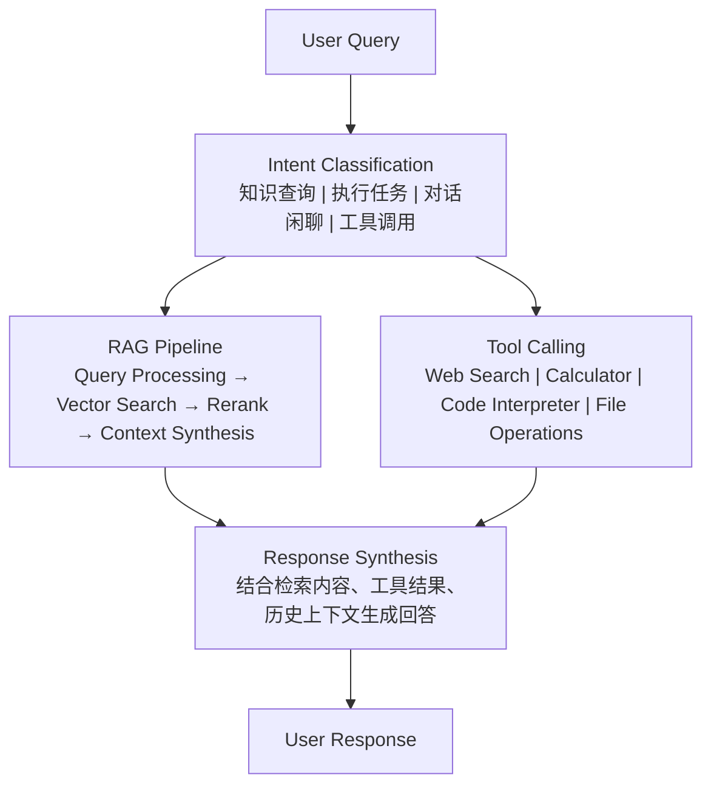
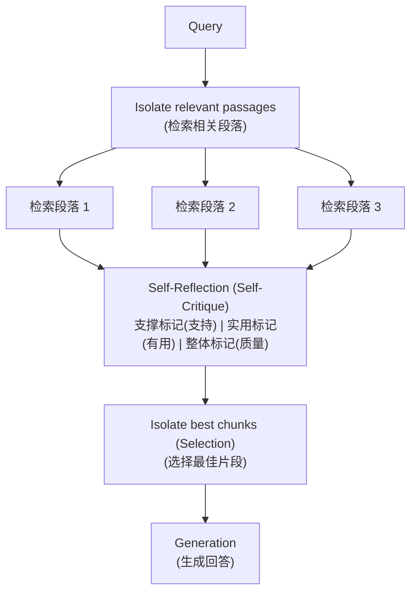
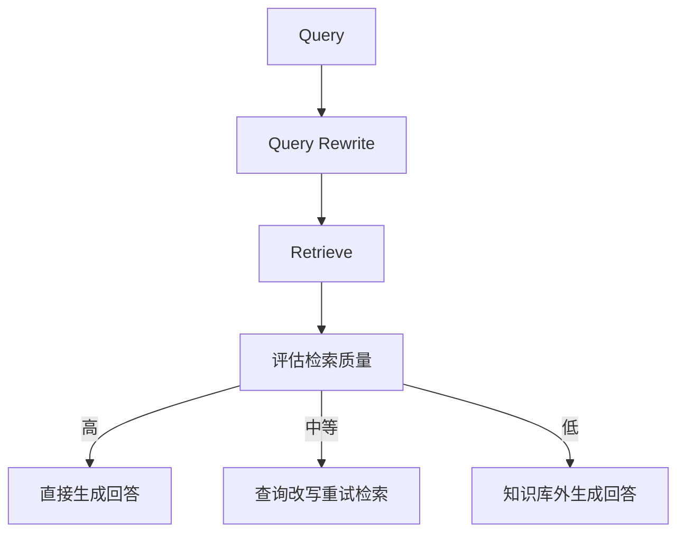

# RAG：Agent 集成与高级 RAG

> 本文是「RAG」系列第 3 篇（共 4 篇）。上一篇：[RAG：知识库构建](rag-knowledge-base.md)　下一篇：[RAG：代码实现与展望](rag-implementation.md)

## 1. Agent + RAG 集成

### 1.1 检索增强的 Agent

Agent 与 RAG 的深度集成：



#### 1.1.1 Agent 实现

```python
from enum import Enum
from dataclasses import dataclass
from typing import Optional, Callable

class Intent(Enum):
    """意图类型"""
    KNOWLEDGE_QUERY = "knowledge_query"      # 知识查询
    TASK_EXECUTION = "task_execution"        # 任务执行
    CONVERSATION = "conversation"            # 对话闲聊
    TOOL_CALLING = "tool_calling"           # 工具调用

@dataclass
class AgentMessage:
    """Agent 消息"""
    role: str  # user / assistant / system
    content: str
    intent: Optional[Intent] = None
    retrieved_docs: Optional[list[dict]] = None
    tool_calls: Optional[list[dict]] = None
    metadata: Optional[dict] = None

class RAGAgent:
    """检索增强型 Agent"""
    
    def __init__(
        self,
        llm,
        intent_classifier,
        retriever,
        reranker,
        tools: list[Callable] = None,
        system_prompt: str = None
    ):
        """
        初始化 Agent
        
        Args:
            llm: 大语言模型
            intent_classifier: 意图分类器
            retriever: 检索器
            reranker: 重排序器
            tools: 可用工具列表
            system_prompt: 系统提示词
        """
        self.llm = llm
        self.intent_classifier = intent_classifier
        self.retriever = retriever
        self.reranker = reranker
        self.tools = tools or {}
        self.messages: list[AgentMessage] = []
        
        # 默认系统提示词
        self.default_system_prompt = system_prompt or self._get_default_system_prompt()
    
    def _get_default_system_prompt(self) -> str:
        """获取默认系统提示词"""
        return """你是一个智能助手，具备以下能力：

1. 知识问答：当用户询问问题时，你会检索相关知识库来回答
2. 任务执行：你可以帮助用户执行各种任务
3. 工具使用：当需要时，你可以调用各种工具来完成任务

回答要求：
- 准确、专业、有条理
- 注明信息来源（基于检索内容回答时）
- 如果不确定或找不到相关信息，明确告知用户"""
    
    def chat(
        self,
        query: str,
        conversation_history: list[AgentMessage] = None,
        return_sources: bool = False
    ) -> dict:
        """
        对话接口
        
        Args:
            query: 用户输入
            conversation_history: 对话历史
            return_sources: 是否返回来源信息
        
        Returns:
            回答结果
        """
        # 1. 意图分类
        intent = self._classify_intent(query)
        
        # 2. 根据意图处理
        if intent == Intent.KNOWLEDGE_QUERY:
            result = self._handle_knowledge_query(
                query, conversation_history, return_sources
            )
        elif intent == Intent.TOOL_CALLING:
            result = self._handle_tool_calling(query, conversation_history)
        elif intent == Intent.TASK_EXECUTION:
            result = self._handle_task_execution(query, conversation_history)
        else:
            result = self._handle_conversation(query, conversation_history)
        
        # 3. 记录消息
        self.messages.append(AgentMessage(
            role="user",
            content=query
        ))
        self.messages.append(AgentMessage(
            role="assistant",
            content=result["answer"],
            intent=intent,
            retrieved_docs=result.get("retrieved_docs"),
            metadata=result.get("metadata")
        ))
        
        return result
    
    def _classify_intent(self, query: str) -> Intent:
        """意图分类"""
        if self.intent_classifier:
            return self.intent_classifier.classify(query)
        
        # 默认：检测是否需要检索
        retrieval_indicators = ["什么", "怎么", "如何", "为什么", "哪个", "请问", "解释"]
        if any(word in query for word in retrieval_indicators):
            return Intent.KNOWLEDGE_QUERY
        
        # 检测工具调用关键词
        tool_indicators = ["搜索", "计算", "运行", "执行"]
        if any(word in query for word in tool_indicators):
            return Intent.TOOL_CALLING
        
        return Intent.CONVERSATION
    
    def _handle_knowledge_query(
        self,
        query: str,
        history: list[AgentMessage] = None,
        return_sources: bool = False
    ) -> dict:
        """处理知识查询"""
        # 1. 检索相关文档
        retrieved = self.retriever.search(query, top_k=20)
        
        # 2. 重排序
        if self.reranker and retrieved:
            doc_texts = [doc["content"] for doc in retrieved]
            reranked = self.reranker.rerank(query, doc_texts, top_k=10)
            
            # 合并结果
            for i, result in enumerate(reranked):
                retrieved[i]["rerank_score"] = result["score"]
                retrieved[i]["text"] = result["text"]
        
        # 3. 构建上下文
        context = self._build_context(retrieved[:5])
        
        # 4. 生成回答
        prompt = self._build_rag_prompt(query, context, history)
        response = self.llm.generate(prompt)
        
        result = {
            "answer": response.text,
            "intent": Intent.KNOWLEDGE_QUERY,
            "retrieved_docs": retrieved if return_sources else None
        }
        
        return result
    
    def _handle_tool_calling(
        self,
        query: str,
        history: list[AgentMessage] = None
    ) -> dict:
        """处理工具调用"""
        # 解析工具调用
        tool_name, tool_args = self._parse_tool_call(query)
        
        if tool_name not in self.tools:
            return {
                "answer": f"未找到工具：{tool_name}",
                "intent": Intent.TOOL_CALLING
            }
        
        # 执行工具
        tool = self.tools[tool_name]
        try:
            tool_result = tool(**tool_args)
            response = self._format_tool_result(tool_name, tool_result)
        except Exception as e:
            response = f"工具执行出错：{str(e)}"
        
        return {
            "answer": response,
            "intent": Intent.TOOL_CALLING,
            "tool_used": tool_name
        }
    
    def _handle_task_execution(
        self,
        query: str,
        history: list[AgentMessage] = None
    ) -> dict:
        """处理任务执行"""
        # 可结合 RAG 和工具
        prompt = self._build_task_prompt(query, history)
        response = self.llm.generate(prompt)
        
        return {
            "answer": response.text,
            "intent": Intent.TASK_EXECUTION
        }
    
    def _handle_conversation(
        self,
        query: str,
        history: list[AgentMessage] = None
    ) -> dict:
        """处理一般对话"""
        prompt = self._build_conversation_prompt(query, history)
        response = self.llm.generate(prompt)
        
        return {
            "answer": response.text,
            "intent": Intent.CONVERSATION
        }
    
    def _build_context(self, documents: list[dict]) -> str:
        """构建检索上下文"""
        if not documents:
            return "无相关知识库内容"
        
        context_parts = []
        for i, doc in enumerate(documents, 1):
            # 从 metadata 提取内容
            content = doc.get("metadata", {}).get("content", doc.get("content", ""))
            
            source = doc.get("metadata", {}).get("source", "")
            title = doc.get("metadata", {}).get("title", "")
            
            context_parts.append(
                f"【文档 {i}】\n标题：{title}\n来源：{source}\n内容：{content[:300]}..."
            )
        
        return "\n\n".join(context_parts)
    
    def _build_rag_prompt(
        self,
        query: str,
        context: str,
        history: list[AgentMessage] = None
    ) -> str:
        """构建 RAG 提示词"""
        system = self.default_system_prompt + "\n\n" + """你具备检索增强能力。

当用户提供问题时，你应该：
1. 基于以下参考内容回答问题
2. 只使用参考内容中的信息，不要添加外部知识
3. 如果参考内容中没有相关信息，明确指出
4. 回答时注明信息来源
5. 保持回答简洁、有条理

参考内容：
{context}"""
        
        prompt = system.format(context=context)
        
        if history:
            history_text = "\n".join([
                f"用户：{m.content}" if m.role == "user" else f"助手：{m.content}"
                for m in history[-6:]
            ])
            prompt += f"\n\n对话历史：\n{history_text}\n\n当前问题：{query}"
        else:
            prompt += f"\n\n问题：{query}"
        
        return prompt
    
    def _build_task_prompt(
        self,
        query: str,
        history: list[AgentMessage] = None
    ) -> str:
        """构建任务执行提示词"""
        prompt = self.default_system_prompt + f"\n\n任务：{query}"
        return prompt
    
    def _build_conversation_prompt(
        self,
        query: str,
        history: list[AgentMessage] = None
    ) -> str:
        """构建对话提示词"""
        prompt = self.default_system_prompt
        
        if history:
            history_text = "\n".join([
                f"用户：{m.content}" if m.role == "user" else f"助手：{m.content}"
                for m in history[-6:]
            ])
            prompt += f"\n\n对话历史：\n{history_text}"
        
        prompt += f"\n\n用户：{query}"
        
        return prompt
    
    def _parse_tool_call(self, query: str) -> tuple[str, dict]:
        """解析工具调用（简化实现）"""
        # 简化：实际应使用 LLM 解析
        return "unknown", {}
    
    def _format_tool_result(self, tool_name: str, result: any) -> str:
        """格式化工具结果"""
        if isinstance(result, (dict, list)):
            import json
            return f"工具 {tool_name} 执行结果：\n{json.dumps(result, ensure_ascii=False, indent=2)}"
        return f"工具 {tool_name} 执行结果：{result}"
```

### 1.2 动态知识更新

实时更新知识库以保持时效性：

```python
import asyncio
from datetime import datetime, timedelta
from typing import Optional

class DynamicKnowledgeManager:
    """动态知识管理器"""
    
    def __init__(
        self,
        knowledge_base: KnowledgeBase,
        update_interval: int = 3600  # 更新间隔（秒）
    ):
        """
        Args:
            knowledge_base: 知识库实例
            update_interval: 自动更新间隔
        """
        self.knowledge_base = knowledge_base
        self.update_interval = update_interval
        
        # 更新追踪
        self.last_update: Optional[datetime] = None
        self.update_stats: dict = {}
    
    def trigger_update(
        self,
        source: str,
        documents: list[Document] = None
    ):
        """
        触发增量更新
        
        Args:
            source: 更新来源（文件路径、API、数据库等）
            documents: 新文档（如果为 None 则从 source 加载）
        """
        if documents is None:
            # 从来源加载
            documents = self._load_from_source(source)
        
        # 识别变更
        changes = self._detect_changes(documents)
        
        if not changes["added"] and not changes["modified"] and not changes["deleted"]:
            print("No changes detected")
            return
        
        # 应用变更
        for doc_id in changes["deleted"]:
            self.knowledge_base.delete_document(doc_id)
        
        for doc_id in changes["modified"]:
            new_doc = next(d for d in documents if d.doc_id == doc_id)
            self.knowledge_base.update_document(doc_id, new_doc)
        
        for doc in changes["added"]:
            self.knowledge_base.add_documents([doc])
        
        # 更新统计
        self.last_update = datetime.now()
        self.update_stats = {
            "added": len(changes["added"]),
            "modified": len(changes["modified"]),
            "deleted": len(changes["deleted"]),
            "timestamp": self.last_update.isoformat()
        }
        
        print(f"Update complete: {self.update_stats}")
    
    def _load_from_source(self, source: str) -> list[Document]:
        """从来源加载文档"""
        loader = DocumentLoader()
        return list(loader.load(source))
    
    def _detect_changes(self, new_documents: list[Document]) -> dict:
        """检测文档变更"""
        existing_docs = self.knowledge_base.documents
        
        new_ids = {doc.doc_id for doc in new_documents}
        existing_ids = set(existing_docs.keys())
        
        added = [d for d in new_documents if d.doc_id not in existing_ids]
        modified = []
        deleted = list(existing_ids - new_ids)
        
        for doc in new_documents:
            if doc.doc_id in existing_ids:
                # 检查是否修改（比较内容哈希）
                if self._is_modified(doc):
                    modified.append(doc)
        
        return {"added": added, "modified": modified, "deleted": deleted}
    
    def _is_modified(self, document: Document) -> bool:
        """检查文档是否已修改"""
        existing = self.knowledge_base.documents.get(document.doc_id, {})
        # 简化实现：实际应比较内容哈希
        return existing.get("content_hash") != hash(document.content)
    
    async def start_auto_update(self):
        """启动自动更新"""
        while True:
            await asyncio.sleep(self.update_interval)
            try:
                self.trigger_update(None)  # 使用默认来源
            except Exception as e:
                print(f"Auto update failed: {e}")
    
    def get_update_status(self) -> dict:
        """获取更新状态"""
        return {
            "last_update": self.last_update.isoformat() if self.last_update else None,
            "update_stats": self.update_stats,
            "document_count": len(self.knowledge_base.documents)
        }


class WebKnowledgeUpdater:
    """网页知识更新器"""
    
    def __init__(
        self,
        knowledge_base: KnowledgeBase,
        web_scraper = None
    ):
        self.knowledge_base = knowledge_base
        self.web_scraper = web_scraper
    
    async def update_from_urls(self, urls: list[str]):
        """从 URL 更新知识"""
        for url in urls:
            try:
                # 抓取网页
                if self.web_scraper:
                    content = await self.web_scraper.scrape(url)
                else:
                    content = await self._default_scrape(url)
                
                # 创建文档
                document = Document(
                    content=content["text"],
                    metadata={
                        "source": url,
                        "title": content.get("title", ""),
                        "scraped_at": datetime.now().isoformat()
                    }
                )
                
                # 更新知识库
                self.knowledge_base.add_documents([document])
                
            except Exception as e:
                print(f"Failed to scrape {url}: {e}")
    
    async def _default_scrape(self, url: str) -> dict:
        """默认抓取实现"""
        import aiohttp
        
        async with aiohttp.ClientSession() as session:
            async with session.get(url) as response:
                html = await response.text()
                # 简单解析（实际应使用 BeautifulSoup）
                return {"text": html, "title": url}
```

### 1.3 上下文窗口管理

管理 LLM 上下文窗口以优化长对话：

```python
from collections import deque

class ContextWindowManager:
    """上下文窗口管理器"""
    
    def __init__(
        self,
        max_tokens: int = 4000,
        reserved_tokens: int = 500,
        strategy: str = "sliding"
    ):
        """
        Args:
            max_tokens: 最大 token 数
            reserved_tokens: 保留 token 数（系统提示等）
            strategy: 管理策略
                - "sliding": 滑动窗口
                - "summary": 摘要压缩
                - "priority": 优先级截断
        """
        self.max_tokens = max_tokens
        self.reserved_tokens = reserved_tokens
        self.available_tokens = max_tokens - reserved_tokens
        self.strategy = strategy
        
        # 消息存储
        self.messages: deque[AgentMessage] = deque()
    
    def add_message(self, message: AgentMessage):
        """添加消息"""
        self.messages.append(message)
        self._trim_if_needed()
    
    def get_context(
        self,
        current_query: str = None,
        system_prompt: str = None
    ) -> str:
        """
        获取上下文
        
        Args:
            current_query: 当前查询（保留在最后）
            system_prompt: 系统提示词
        
        Returns:
            格式化的上下文字符串
        """
        if self.strategy == "sliding":
            return self._get_sliding_context(current_query, system_prompt)
        elif self.strategy == "summary":
            return self._get_summary_context(current_query, system_prompt)
        elif self.strategy == "priority":
            return self._get_priority_context(current_query, system_prompt)
        else:
            return self._get_sliding_context(current_query, system_prompt)
    
    def _trim_if_needed(self):
        """必要时截断"""
        while self._total_tokens() > self.available_tokens and len(self.messages) > 1:
            self.messages.popleft()
    
    def _total_tokens(self) -> int:
        """计算总 token 数"""
        return sum(self._estimate_tokens(str(m.content)) for m in self.messages)
    
    def _estimate_tokens(self, text: str) -> int:
        """估算 token 数"""
        # 简单估算
        return int(len(text) * 1.5)
    
    def _get_sliding_context(
        self,
        current_query: str,
        system_prompt: str
    ) -> str:
        """滑动窗口上下文"""
        parts = []
        
        # 系统提示
        if system_prompt:
            parts.append(f"系统：{system_prompt}")
        
        # 历史消息
        history = []
        for msg in self.messages:
            if msg.role == "user":
                history.append(f"用户：{msg.content}")
            else:
                history.append(f"助手：{msg.content}")
        
        # 从最近的开始添加直到超过限制
        for i in range(len(history) - 1, -1, -1):
            test_text = "\n".join(history[i:] + [f"用户：{current_query}"] if current_query else history[i:])
            if self._estimate_tokens(test_text) > self.available_tokens:
                break
            history = history[i:]
        
        parts.extend(history)
        
        # 当前查询
        if current_query:
            parts.append(f"用户：{current_query}")
        
        return "\n".join(parts)
    
    def _get_summary_context(
        self,
        current_query: str,
        system_prompt: str
    ) -> str:
        """摘要压缩上下文"""
        # 如果消息较少，直接返回
        if len(self.messages) <= 6:
            return self._get_sliding_context(current_query, system_prompt)
        
        # 压缩旧消息
        old_messages = list(self.messages)[:-6]
        summary = self._summarize_messages(old_messages)
        
        parts = []
        if system_prompt:
            parts.append(f"系统：{system_prompt}")
        
        parts.append(f"【之前对话摘要】{summary}")
        
        # 最近消息
        for msg in list(self.messages)[-6:]:
            if msg.role == "user":
                parts.append(f"用户：{msg.content}")
            else:
                parts.append(f"助手：{msg.content}")
        
        if current_query:
            parts.append(f"用户：{current_query}")
        
        return "\n".join(parts)
    
    def _get_priority_context(
        self,
        current_query: str,
        system_prompt: str
    ) -> str:
        """优先级上下文"""
        # 优先保留检索相关和最近的消息
        prioritized = []
        current_tokens = self._estimate_tokens(system_prompt or "")
        
        for msg in reversed(self.messages):
            msg_tokens = self._estimate_tokens(msg.content)
            if current_tokens + msg_tokens > self.available_tokens:
                continue
            
            # 检查相关性
            if self._is_relevant(msg, current_query):
                prioritized.insert(0, msg)
                current_tokens += msg_tokens
        
        parts = []
        if system_prompt:
            parts.append(f"系统：{system_prompt}")
        
        for msg in prioritized:
            if msg.role == "user":
                parts.append(f"用户：{msg.content}")
            else:
                parts.append(f"助手：{msg.content}")
        
        if current_query:
            parts.append(f"用户：{current_query}")
        
        return "\n".join(parts)
    
    def _is_relevant(self, message: AgentMessage, query: str) -> bool:
        """判断消息相关性"""
        if not query:
            return True
        
        # 简单的关键词匹配
        query_words = set(query.lower().split())
        message_words = set(message.content.lower().split())
        
        return bool(query_words & message_words)
    
    def _summarize_messages(self, messages: list[AgentMessage]) -> str:
        """总结消息"""
        # 简化实现：实际应使用 LLM 总结
        summaries = []
        for msg in messages:
            if msg.role == "user":
                summaries.append(f"用户询问：{msg.content[:50]}...")
            else:
                summaries.append(f"助手回答：{msg.content[:50]}...")
        
        return " | ".join(summaries[-3:])
```

## 2. 高级 RAG

### 2.1 Self-RAG

Self-RAG 是一种自我反思的 RAG 框架：



#### 2.1.1 Self-RAG 实现

```python
class SelfRAG:
    """Self-RAG 实现"""
    
    # 反思标记定义
    IS_SUPPORTED = "Is Supported"      # 是否被检索内容支撑
    IS_USEFUL = "Is Useful"           # 回答是否有帮助
    IS_RELEVANT = "Is Relevant"       # 检索内容是否相关
    
    def __init__(self, llm, retriever):
        self.llm = llm
        self.retriever = retriever
    
    def rag_with_reflection(self, query: str) -> dict:
        """
        带自我反思的 RAG
        
        Args:
            query: 用户查询
        
        Returns:
            回答和反思结果
        """
        # 1. 检索
        retrieved_docs = self.retriever.search(query, top_k=5)
        
        # 2. 自我反思
        reflection_results = []
        for doc in retrieved_docs:
            reflection = self._reflect_on_doc(query, doc)
            reflection_results.append({
                "doc": doc,
                "reflection": reflection
            })
        
        # 3. 选择最佳片段
        selected_docs = self._select_best_chunks(reflection_results)
        
        # 4. 生成回答
        answer = self._generate_with_grounding(query, selected_docs)
        
        # 5. 最终反思
        final_reflection = self._reflect_on_answer(query, answer)
        
        return {
            "answer": answer,
            "retrieved_docs": retrieved_docs,
            "reflection": final_reflection,
            "selected_docs": selected_docs
        }
    
    def _reflect_on_doc(self, query: str, doc: dict) -> dict:
        """反思单个检索文档"""
        reflection_prompt = f"""判断以下检索内容是否相关且有帮助。

查询：{query}

检索内容：
{doc.get('content', '')[:500]}

请判断：
1. 是否支撑回答查询？（是/否）
2. 是否与查询相关？（是/否）
3. 相关程度评分（1-5）

并给出简短理由："""
        
        response = self.llm.generate(reflection_prompt)
        
        # 解析响应（简化实现）
        return {
            "is_supported": "是" in response.text[:100],
            "is_relevant": "是" in response.text[100:200],
            "reason": response.text
        }
    
    def _select_best_chunks(
        self,
        reflection_results: list[dict]
    ) -> list[dict]:
        """选择最佳片段"""
        # 根据反思结果过滤和排序
        scored = []
        for result in reflection_results:
            doc = result["doc"]
            reflection = result["reflection"]
            
            # 计算综合分数
            score = 0
            if reflection.get("is_supported"):
                score += 2
            if reflection.get("is_relevant"):
                score += 1
            
            scored.append((doc, score))
        
        # 选择高分组
        scored.sort(key=lambda x: x[1], reverse=True)
        return [doc for doc, score in scored[:3] if score > 0]
    
    def _generate_with_grounding(
        self,
        query: str,
        selected_docs: list[dict]
    ) -> str:
        """基于选中的片段生成回答"""
        context = "\n\n".join([
            f"【参考 {i+1}】\n{doc.get('content', '')[:300]}"
            for i, doc in enumerate(selected_docs)
        ])
        
        prompt = f"""基于以下参考内容回答问题。如有引用，请注明。

参考内容：
{context}

问题：{query}

回答（引用参考编号）："""
        
        response = self.llm.generate(prompt)
        return response.text
    
    def _reflect_on_answer(self, query: str, answer: str) -> dict:
        """反思最终回答"""
        reflection_prompt = f"""评估以下回答的质量。

问题：{query}
回答：{answer}

请评估：
1. 回答是否准确（是/否）
2. 是否完整回答了问题（是/否）
3. 是否有帮助（1-5分）
4. 是否有幻觉或错误（是/否）

并给出改进建议（如需要）："""
        
        response = self.llm.generate(reflection_prompt)
        
        return {
            "assessment": response.text,
            "quality": "good" if "是" in response.text[:50] else "needs_improvement"
        }
```

### 2.2 Corrective-RAG

CRAG（Corrective RAG）用于纠正低质量的检索：



#### 2.2.1 CRAG 实现

```python
class CorrectiveRAG:
    """Corrective RAG 实现"""
    
    def __init__(self, llm, retriever, reranker, web_searcher=None):
        self.llm = llm
        self.retriever = retriever
        self.reranker = reranker
        self.web_searcher = web_searcher  # 用于检索质量低时的补充
    
    def corrective_retrieve(self, query: str) -> dict:
        """
        带纠正的检索
        
        Args:
            query: 用户查询
        
        Returns:
            检索结果和处理信息
        """
        # 1. 查询改写
        rewritten_queries = self._rewrite_query(query)
        
        # 2. 多轮检索
        all_results = []
        for q in rewritten_queries:
            results = self.retriever.search(q, top_k=10)
            all_results.extend(results)
        
        # 3. 去重和合并
        unique_results = self._deduplicate(all_results)
        
        # 4. 重排序
        if self.reranker and unique_results:
            reranked = self.reranker.rerank(
                query,
                [r.get("content", r.get("text", "")) for r in unique_results],
                top_k=10
            )
            # 合并分数
            for i, result in enumerate(reranked):
                unique_results[i]["rerank_score"] = result["score"]
        
        # 5. 评估检索质量
        quality = self._evaluate_retrieval_quality(query, unique_results)
        
        return {
            "results": unique_results,
            "quality": quality,
            "rewritten_queries": rewritten_queries
        }
    
    def _rewrite_query(self, query: str) -> list[str]:
        """查询改写"""
        rewrite_prompt = f"""请为以下查询生成 3 种不同的改写版本，以提升检索效果。

原始查询：{query}

改写要求：
1. 保持原意
2. 使用不同表达方式（正式/口语化/学术化）
3. 可以拆分复杂问题

输出格式：
1. [改写1]
2. [改写2]
3. [改写3]"""
        
        response = self.llm.generate(rewrite_prompt)
        
        # 解析改写结果
        rewrites = []
        for line in response.text.split('\n'):
            match = re.search(r'\d+\.\s+(.+)', line)
            if match:
                rewrites.append(match.group(1).strip())
        
        if len(rewrites) < 3:
            rewrites = [query] + rewrites[:2]
        
        return rewrites if rewrites else [query]
    
    def _deduplicate(self, results: list[dict]) -> list[dict]:
        """去重"""
        seen = set()
        unique = []
        
        for result in results:
            # 使用内容哈希去重
            content = result.get("content", result.get("text", ""))
            content_hash = hashlib.md5(content[:200].encode()).hexdigest()
            
            if content_hash not in seen:
                seen.add(content_hash)
                unique.append(result)
        
        return unique
    
    def _evaluate_retrieval_quality(
        self,
        query: str,
        results: list[dict]
    ) -> str:
        """评估检索质量"""
        if not results:
            return "low"
        
        # 使用 LLM 评估
        evaluation_prompt = f"""评估以下检索结果与查询的相关性。

查询：{query}

检索结果（前3个）：
{chr(10).join([
    f'{i+1}. {r.get("content", r.get("text", ""))[:200]}...'
    for i, r in enumerate(results[:3])
])}

请评估：
1. 检索结果是否回答了查询？（完全相关/部分相关/不相关）
2. 质量评分（高/中/低）

评分理由："""
        
        response = self.llm.generate(evaluation_prompt)
        
        if "完全相关" in response.text or "高" in response.text[:20]:
            return "high"
        elif "部分相关" in response.text or "中" in response.text[:20]:
            return "medium"
        else:
            return "low"
    
    def handle_low_quality(
        self,
        query: str,
        results: list[dict],
        use_web_search: bool = True
    ) -> dict:
        """处理低质量检索"""
        if use_web_search and self.web_searcher:
            # 补充 Web 搜索
            web_results = self.web_searcher.search(query)
            
            return {
                "primary_results": results,
                "supplementary_results": web_results,
                "source": "web_search"
            }
        else:
            # 直接生成，但明确说明局限性
            return {
                "primary_results": results,
                "supplementary_results": [],
                "source": "knowledge_base_low_quality",
                "warning": "知识库检索结果可能不完整"
            }
    
    def generate_answer(
        self,
        query: str,
        retrieval_result: dict
    ) -> str:
        """生成回答"""
        quality = retrieval_result["quality"]
        results = retrieval_result["results"]
        
        if quality == "high":
            # 直接使用检索结果
            context = self._build_context(results[:3])
            prompt = f"""基于以下检索内容回答问题。

{context}

问题：{query}

回答："""
        
        elif quality == "medium":
            # 结合检索结果和推理
            context = self._build_context(results[:5])
            prompt = f"""以下检索内容与问题部分相关，请结合常识和检索内容给出回答。

{context}

问题：{query}

请谨慎回答，明确说明不确定的部分："""
        
        else:
            # 低质量，尝试补充
            handle_result = self.handle_low_quality(
                query,
                results,
                use_web_search=True
            )
            
            context = self._build_context(handle_result["primary_results"])
            
            if handle_result["supplementary_results"]:
                web_context = self._build_context(
                    handle_result["supplementary_results"]
                )
                context += "\n\n【Web 补充】\n" + web_context
            
            prompt = f"""注意：知识库检索结果质量较低，以下内容仅供参考。

{context}

问题：{query}

请基于以上内容回答，如信息不足请明确说明："""
        
        return self.llm.generate(prompt).text
    
    def _build_context(self, results: list[dict]) -> str:
        """构建上下文"""
        if not results:
            return "（无相关检索内容）"
        
        parts = []
        for i, r in enumerate(results, 1):
            content = r.get("content", r.get("text", ""))
            source = r.get("metadata", {}).get("source", "")
            parts.append(f"【参考{i}】{content[:300]}...\n来源：{source}")
        
        return "\n\n".join(parts)
```

### 2.3 路由检索

智能路由将查询分发到不同检索通道：

```python
from enum import Enum

class RetrievalRoute(Enum):
    """检索路由类型"""
    SEMANTIC = "semantic"           # 语义检索
    KEYWORD = "keyword"            # 关键词检索
    HYBRID = "hybrid"              # 混合检索
    KNOWLEDGE_GRAPH = "kg"         # 知识图谱
    WEB = "web"                    # 网页搜索

class QueryRouter:
    """查询路由器"""
    
    def __init__(self, llm, routes: dict):
        """
        Args:
            llm: 大语言模型
            routes: 可用路由配置
        """
        self.llm = llm
        self.routes = routes  # {route_name: route_config}
    
    def route(self, query: str) -> list[tuple[RetrievalRoute, float]]:
        """
        路由查询
        
        Args:
            query: 用户查询
        
        Returns:
            路由列表及对应权重 [(route, weight), ...]
        """
        # 1. 意图分类
        intent = self._classify_intent(query)
        
        # 2. 选择路由
        routes = self._select_routes(query, intent)
        
        # 3. 计算权重
        weights = self._calculate_weights(query, routes)
        
        return list(zip(routes, weights))
    
    def _classify_intent(self, query: str) -> str:
        """意图分类"""
        classification_prompt = f"""判断以下查询最适合的检索类型。

查询：{query}

类型选项：
- semantic：需要语义理解的查询（如解释概念、描述性查询）
- keyword：需要精确匹配的查询（如术语、技术名词）
- hybrid：综合查询
- knowledge_graph：涉及实体关系的查询
- web：需要最新信息或外部资源的查询

最适合的类型："""
        
        response = self.llm.generate(classification_prompt)
        
        # 解析响应
        for route_type in ["semantic", "keyword", "hybrid", "knowledge_graph", "web"]:
            if route_type.lower() in response.text.lower():
                return route_type
        
        return "hybrid"
    
    def _select_routes(self, query: str, intent: str) -> list[RetrievalRoute]:
        """选择路由"""
        if intent == "semantic":
            return [RetrievalRoute.SEMANTIC]
        elif intent == "keyword":
            return [RetrievalRoute.KEYWORD]
        elif intent == "web":
            return [RetrievalRoute.WEB]
        elif intent == "knowledge_graph":
            return [RetrievalRoute.KNOWLEDGE_GRAPH, RetrievalRoute.SEMANTIC]
        else:
            return [RetrievalRoute.HYBRID]
    
    def _calculate_weights(
        self,
        query: str,
        routes: list[RetrievalRoute]
    ) -> list[float]:
        """计算路由权重"""
        if len(routes) == 1:
            return [1.0]
        
        # 动态调整权重
        weights = []
        for route in routes:
            weight = self._evaluate_route_suitability(query, route)
            weights.append(weight)
        
        # 归一化
        total = sum(weights)
        return [w / total for w in weights]
    
    def _evaluate_route_suitability(
        self,
        query: str,
        route: RetrievalRoute
    ) -> float:
        """评估路由适合度"""
        evaluation_prompt = f"""评估以下查询是否适合使用 {route.value} 检索。

查询：{query}

适合度评分（0-1）："""
        
        response = self.llm.generate(evaluation_prompt)
        
        # 提取分数
        match = re.search(r'[0-1]\.?[0-9]*', response.text)
        if match:
            return float(match.group())
        
        return 0.5


class RouterRAG:
    """路由 RAG"""
    
    def __init__(
        self,
        llm,
        retrievers: dict[RetrievalRoute, any],
        router: QueryRouter
    ):
        self.llm = llm
        self.retrievers = retrievers
        self.router = router
    
    def retrieve(self, query: str, top_k: int = 10) -> list[dict]:
        """
        路由检索
        
        Args:
            query: 查询
            top_k: 返回总数
        
        Returns:
            合并后的检索结果
        """
        # 1. 路由决策
        route_weights = self.router.route(query)
        
        # 2. 分路由检索
        all_results = {}
        for route, weight in route_weights:
            retriever = self.retrievers.get(route)
            if retriever:
                results = retriever.search(query, top_k=int(top_k * weight) + 1)
                
                for result in results:
                    doc_id = result.get("id", hash(result.get("content", "")))
                    if doc_id not in all_results:
                        all_results[doc_id] = {
                            **result,
                            "weighted_score": result.get("score", 0) * weight,
                            "routes": [route]
                        }
                    else:
                        all_results[doc_id]["weighted_score"] += result.get("score", 0) * weight
                        all_results[doc_id]["routes"].append(route)
        
        # 3. 合并排序
        sorted_results = sorted(
            all_results.values(),
            key=lambda x: x["weighted_score"],
            reverse=True
        )
        
        return sorted_results[:top_k]
```

### 2.4 查询转换

查询转换提升检索效果：

```python
class QueryTransformer:
    """查询转换器"""
    
    def __init__(self, llm):
        self.llm = llm
    
    def transform(self, query: str) -> dict:
        """
        转换查询
        
        Args:
            query: 原始查询
        
        Returns:
            转换结果
        """
        return {
            "original": query,
            "expanded": self.expand_query(query),
            "rewritten": self.rewrite_query(query),
            "decomposed": self.decompose_query(query)
        }
    
    def expand_query(self, query: str) -> list[str]:
        """查询扩展：添加同义词和相关概念"""
        expand_prompt = f"""为以下查询生成扩展查询，包括同义词、相关概念和可能的拼写变体。

查询：{query}

扩展查询（3-5个）："""
        
        response = self.llm.generate(expand_prompt)
        
        # 解析扩展查询
        expanded = []
        for line in response.text.split('\n'):
            if line.strip() and not line.startswith('查询') and not line.startswith('扩展'):
                # 清理格式
                cleaned = re.sub(r'^\d+[\.\)]\s*', '', line.strip())
                if cleaned:
                    expanded.append(cleaned)
        
        return expanded if expanded else [query]
    
    def rewrite_query(self, query: str) -> list[str]:
        """查询改写：不同表述方式"""
        rewrite_prompt = f"""为以下查询生成 3 种不同表述方式的改写。

查询：{query}

改写要求：
1. 正式化版本
2. 口语化版本
3. 专业术语版本

改写："""
        
        response = self.llm.generate(rewrite_prompt)
        
        rewrites = []
        for line in response.text.split('\n'):
            match = re.search(r'[\d\.\)]\s*(.+)', line)
            if match:
                rewrites.append(match.group(1).strip())
        
        return rewrites if rewrites else [query]
    
    def decompose_query(self, query: str) -> list[str]:
        """查询分解：将复杂问题拆分为子问题"""
        decompose_prompt = f"""将以下复杂查询拆分为简单的子问题。

查询：{query}

拆分要求：
1. 每个子问题应该单一、具体
2. 子问题之间逻辑连贯
3. 按顺序解决可以回答原问题

子问题列表："""
        
        response = self.llm.generate(decompose_prompt)
        
        sub_queries = []
        for line in response.text.split('\n'):
            match = re.search(r'[\d\.\)]\s*(.+)', line)
            if match:
                sub_queries.append(match.group(1).strip())
        
        return sub_queries if sub_queries else [query]
    
    def generate_hypothetical_answer(self, query: str) -> str:
        """生成假设回答（HyDE 方法）"""
        hyde_prompt = f"""根据你的理解，生成一个可能回答以下问题的示例答案。

问题：{query}

要求：
1. 生成一个合理但可能不完美的回答
2. 这个回答用于帮助检索相关文档
3. 不要胡编乱造，基于常识生成

示例回答："""
        
        response = self.llm.generate(hyde_prompt)
        return response.text


class MultiQueryRetriever:
    """多查询检索器"""
    
    def __init__(
        self,
        retriever,
        query_transformer: QueryTransformer,
        reranker = None
    ):
        self.retriever = retriever
        self.query_transformer = query_transformer
        self.reranker = reranker
    
    def retrieve(self, query: str, top_k: int = 10) -> list[dict]:
        """
        使用多查询检索
        
        Args:
            query: 原始查询
            top_k: 返回数量
        
        Returns:
            检索结果
        """
        # 1. 查询扩展
        expanded_queries = self.query_transformer.expand_query(query)
        
        # 2. 查询改写
        rewritten_queries = self.query_transformer.rewrite_query(query)
        
        # 3. 合并所有查询
        all_queries = [query] + expanded_queries + rewritten_queries
        all_queries = list(set(all_queries))  # 去重
        
        # 4. 批量检索
        all_results = {}
        for q in all_queries:
            results = self.retriever.search(q, top_k=top_k)
            
            for result in results:
                doc_id = result.get("id", hash(result.get("content", "")))
                if doc_id not in all_results:
                    all_results[doc_id] = result
                    all_results[doc_id]["query_sources"] = [q]
                else:
                    all_results[doc_id]["query_sources"].append(q)
        
        # 5. 转换为列表
        results = list(all_results.values())
        
        # 6. 重排序（如有）
        if self.reranker:
            doc_texts = [r.get("content", r.get("text", "")) for r in results]
            reranked = self.reranker.rerank(query, doc_texts, top_k=len(results))
            
            # 合并重排分数
            for i, result in enumerate(reranked):
                results[i]["rerank_score"] = result["score"]
            
            results.sort(key=lambda x: x.get("rerank_score", 0), reverse=True)
        
        return results[:top_k]
```

## 深入阅读与参考

!!! tip "怎么用这些资料"
    先读「官方文档与规范」建立准确的概念，再读「源码与示例」核对细节，最后用「教程、书籍与视频」换一种讲法加深理解。每条都写明了读哪一节、带着什么问题读。

### 官方文档与规范

| 资源 | 为什么读 | 怎么读 |
|---|---|---|
| [Claude Agent SDK 概览](https://docs.claude.com/en/api/agent-sdk/overview) | 官方 SDK 概览，说明如何把工具（含检索）接入 Agent 循环。 | 用 SDK 写一个读取本地目录并总结的小 Agent，观察工具调用日志。 |
| [OpenAI Agents SDK（Python）](https://openai.github.io/openai-agents-python/) | 官方 Agents SDK 文档，含 handoff 与工具调用，适合集成 RAG 工具。 | 复现 Quickstart，再加一个检索工具函数，让 Agent 自主决定何时调用。 |
| [A practical guide to building agents（OpenAI）](https://cdn.openai.com/business-guides-and-resources/a-practical-guide-to-building-agents.pdf) | 官方指南，用模型、工具、指令三要素检查 Agent 设计。 | 读完用三要素检查你的 RAG Agent，补齐缺失的工具描述与指令约束。 |

### 源码与示例

| 资源 | 为什么读 | 怎么读 |
|---|---|---|
| [Anthropic Cookbook](https://github.com/anthropics/anthropic-cookbook) | 含 tool_use 与 RAG 可运行 notebook，可直接改造为 Agent 检索工具。 | 运行 RAG 与 tool_use notebook，把检索函数注册成 Agent 工具并测试多轮调用。 |
| [smolagents 仓库](https://github.com/huggingface/smolagents) | 核心代码不到千行，是理解最小 Agent 循环与工具调用的好材料。 | 读核心循环源码，看工具如何注册与调用，再把自己的检索器接进去。 |
| [Google ADK（Python）仓库](https://github.com/google/adk-python) | samples 目录展示多工具 Agent 与评测，可参考 RAG 工具集成方式。 | 读 samples 中带检索工具的示例，对比其 Agent 抽象与你熟悉的框架。 |

### 教程、书籍与视频

| 资源 | 为什么读 | 怎么读 |
|---|---|---|
| [RAG 综述（Gao et al.）](https://arxiv.org/abs/2312.10997) | 系统梳理 Naive、Advanced、Modular RAG，是高级 RAG 技术全景图。 | 按三阶段对比表读，重点看 Advanced 的查询改写与路由，把一种策略加入你的 RAG 实验。 |
| [LLM Powered Autonomous Agents（Lilian Weng）](https://lilianweng.github.io/posts/2023-06-23-agent/) | 精讲规划、记忆、工具三要素，帮你理解 Agent 如何调用 RAG。 | 精读工具与记忆部分，思考检索器作为工具时的接入点，画出你的集成架构。 |
| [LlamaIndex 博客](https://www.llamaindex.ai/blog) | 展示 agentic RAG 的多种检索策略与实现思路。 | 选一篇 agentic RAG 文章，跟做其中一种检索策略，对比原 RAG 的召回效果。 |
| [Effective context engineering for AI agents](https://www.anthropic.com/engineering/effective-context-engineering-for-ai-agents) | 讲清上下文工程，帮助控制 RAG 注入 Agent 的 token 与噪声。 | 读完后检查 Agent 提示，删掉重复检索上下文并记录 token 变化。 |
| [How we built our multi-agent research system](https://www.anthropic.com/engineering/multi-agent-research-system) | 展示多 Agent 如何分工检索与综合，对 Agent+RAG 架构有启发。 | 画 lead agent 与 subagent 调用关系图，思考检索任务何时该拆给子 Agent。 |
| [Agents（Chip Huyen）](https://huyenchip.com/2025/01/07/agents.html) | 工具与规划章节帮你系统理解 RAG 作为 Agent 工具的定位。 | 读工具与规划章节，对照你的 Agent 找出缺失环节，列出改进清单。 |

## 应用与行业实践

前面的章节讲了 Agent 怎么调用检索、高级 RAG 有哪些环节。这一节把这些知识放回真实业务，看它们各自解决哪一类问题。

### 应用场景地图

| 场景 | 用到本页哪个知识点 | 典型技术选型 | 注意事项 |
| --- | --- | --- | --- |
| 客服工单系统里"这个报错上次怎么解决的" | Agent 工具调用、混合检索、重排序 | 向量库 + 关键词索引、交叉编码器重排序 | 工单口语化，查询改写要保留报错码原文 |
| 法务查合同"违约金按几个点算" | 父子块切分、重排序、引用标注 | 条款级父块 + 句级子块、条款号元数据 | 生成必须回带条款号，便于人工复核 |
| 内网助手问"上个月的差旅标准" | 路由、时效性判断、兜底 | 路由模型 + 接口工具 + 阈值判断 | 时效性问题不能只走静态向量库 |
| IDE 里问"这个函数在仓库里被谁调用" | Agent 多轮检索、代码切块 | 语法树切块、符号索引、grep 工具 | 检索单位是函数或类，不是固定字数窗口 |
| 电商客服问"这个型号支持多少瓦快充" | 结构化字段抽取、路由 | 商品参数表 + 向量库双路 | 参数类问题先查表，答案要带型号 |
| 医院检验单解读助手 | 引用标注、拒答兜底 | 指标参考区间表 + 知识库 | 超出参考区间不给诊断结论，只提示复查 |
| 工业设备维修现场的故障排查 | Agent 工具调用、多轮追问 | 手册向量库 + 工单库 + 型号过滤 | 现场网络差，要支持离线缓存与短答案 |
| 政企公文写作助手 | 查询改写、混合检索、重排序 | 范文库 + 术语词典 | 职务名称与术语按词典校正，不能改写 |

### 三个场景拆解

#### 场景 1：客服工单的历史解法检索

**业务背景**

客服每天在工单系统里翻历史工单，坐席提问的用词和知识库文档的用词对不上，关键词搜经常搜不到。工单量随坐席人数增长，经验靠老员工记忆传递，新人上手周期被拉长。

**怎么用本页知识解决**

思路是把检索封装成一个工具，交给 Agent 决定什么时候调用；工具内部做查询改写、混合检索、重排序三步。下面函数名按你自己的项目命名，示例只表达调用顺序。

```python
# 把知识库检索暴露成 Agent 的一个工具
def search_tickets(query: str, status: str = "closed") -> list[dict]:
    q = rewrite(query)                 # 查询改写：补全口语里省略的主语和场景
    hits = hybrid_search(q, top_k=20)  # 混合检索：BM25 与向量各取候选再合并
    return rerank(q, hits, top_k=5)    # 重排序：交叉编码器打分后截断

TOOLS = {"search_tickets": search_tickets}  # 只暴露必要工具，减少误调用

for step in range(6):                  # 限制循环轮数，避免反复检索
    resp = llm(messages, tools=TOOLS)  # 让模型决定回答还是调用工具
    if not resp.tool_calls:            # 没有工具调用就认为可以出答案
        break
    for call in resp.tool_calls:       # 逐个执行工具并把结果写回上下文
        result = TOOLS[call.name](**call.args)
        messages.append(tool_message(call.id, result))
```

- 查询改写只补全缺失成分，报错码、版本号这类字面量原样保留。
- 混合检索处理文档用词与工单口语不一致的问题，两路候选合并后再去重。
- 重排序把进入提示词的块压到 5 条以内，控制上下文长度和调用成本。
- 工具只留一个检索入口，参数用结构化字段描述，模型误调用的概率下降。
- 循环设轮数上限，超限就返回当前结果并提示转人工。

**怎么度量收益**

看四个指标：recall@5（抽样 100 条真实问题，人工标注答案所在工单是否被召回）、转人工率（埋点统计）、首 token 延迟 p95、单次问答的 token 消耗。链路每一跳的输入输出用 LangSmith 或 Phoenix 记录，便于定位是召回错还是生成错。

**什么时候不该用**

- 语料只有几十条 FAQ 时，直接拼进提示词就够，建索引的维护成本收不回来。
- 问题需要跨工单做统计，比如"上月哪类故障最多"，该走 SQL 查询而不是 RAG。

#### 场景 2：合同条款的精确问答

**业务背景**

销售和法务查合同条款时，关键词搜索只能定位到页，条款号要人工逐条找。一份合同几十页到上百页，条款之间互相引用，答案必须能追溯到原文才能用。

**怎么用本页知识解决**

思路是检索单位和生成单位分开：用句子级子块保证召回精度，命中后回溯条款级父块保证上下文完整，生成时强制标注条款号。

```python
# 建库阶段：小块检索，大块生成
for para in split_by_clause(contract_text):  # 按条款切分，保留条款号
    parent_id = store_parent(para)           # 父块写入文档库
    for sub in split_sentences(para):        # 子块按句切分
        store_child(sub, parent_id, meta={"clause": para.no})

# 查询阶段
cands = vector_search(question, top_k=50)     # 向量粗召回，数量放宽
cands += bm25_search(question, top_k=50)      # 关键词召回，防止术语漏召
top = rerank(question, dedup(cands), top_k=4) # 按父块去重后重排序
context = [load_parent(c.parent_id) for c in top]  # 回溯父块补全条款
answer = llm(build_prompt(question, context))      # 要求逐句标注条款号
```

- 子块负责命中，父块负责提供完整条款，避免半句话进模型。
- 元数据存条款号和标题路径，生成时才能要求输出条款号。
- 粗召回先放宽数量，重排序负责收敛，两段职责不要混。
- 去重按父块做，否则同一条款的不同句子会挤占上下文配额。
- 提示词里写明引用不到原文就不作答，宁可返回空。

**怎么度量收益**

用 RAGAS 跑 faithfulness 与 context_precision，再抽 50 条答案人工核对条款号是否正确。上线后统计两个业务值：法务人工复核平均耗时、答案被直接引用的比例。

**什么时候不该用**

- 合同只有一两页且条款不互相引用时，整篇放进上下文即可。
- 问题是要做法律判断，比如是否构成违约，RAG 只能给条款原文，结论要人来下。

#### 场景 3：内网知识助手的时效与兜底

**业务背景**

内网助手的知识库按季度更新，员工问当月政策时，模型会拿旧文档作答。知识库里没有答案的问题，模型也会编一个，坐席不敢直接引用。

**怎么用本页知识解决**

思路是在检索前加路由、在生成前加相关性判断、在生成后加引用校验，三道闸门任一不过就兜底。

```python
route = router(question)                 # 先判断问题属于哪类知识源
if route == "realtime":                  # 时效性问题走接口
    return query_api(question)
docs = retriever.search(question)        # 其余问题走知识库检索
score = judge_relevance(question, docs)  # 生成前判断召回是否相关
if score < THRESHOLD:                    # 低于阈值说明知识库没覆盖
    return "知识库未覆盖，请转人工"
answer = llm(build_prompt(question, docs))
if not check_citations(answer, docs):    # 校验引用能否在召回块里找到
    answer = llm(build_prompt(question, docs, require_citation=True))
if not check_citations(answer, docs):    # 重试后仍不合格
    return "无法确认，请转人工"
```

- 路由在最前面，时效性问题走接口，不浪费一次向量检索。
- 相关性判断放在生成之前，分数过低时不要给模型编的机会。
- 引用校验放在生成之后，答案提到的标题或条款号要能在召回块里找到。
- 校验失败只重试一次，再失败就返回兜底文案。
- 兜底文案写明哪个知识库没覆盖，运营据此补文档。

**怎么度量收益**

统计兜底触发率与误拒率（抽样人工判断本该答出的问题被拒的比例），用 RAGAS 看 faithfulness，在答案旁放"有用/无用"按钮收集反馈。三个数一起看，只降兜底率会把幻觉放进来。

**什么时候不该用**

- 知识源只有一个且更新频率低时，路由这一层是多余开销。
- 问题全是流程问答和闲聊时，规则表比模型路由的延迟低。

### 行业先进实践

**上下文检索（出处：Anthropic 官方工程博客）**

做法是在切块前让模型为每个块写一段说明，把块放回文档语境，再拿这段说明一起做嵌入与关键词索引。块本身太短会丢掉指代关系，补上语境后召回命中率上升。你的项目可以先用文档标题和上一级小标题拼进块首，成本比调用模型低。

**混合检索加语义排序（出处：Azure AI Search 官方文档）**

官方文档把关键词检索、向量检索、语义重排序作为三个可分别开关的能力，并给出组合使用的配置方式。关键词负责字面命中，向量负责语义命中，重排序负责收敛。你的项目可以先开混合检索，再单独评估重排序带来的指标变化，不要一次全开。

**父文档检索与句子窗口（出处：LangChain 开源项目 ParentDocumentRetriever、LlamaIndex 开源项目 SentenceWindowNodeParser）**

两个开源实现都采用同一思路：索引小块，返回时按链接取回更大的原文片段。这样召回精度和上下文完整度可以分开调。你的项目如果已经切了小块，可以先加一层父子映射，不改嵌入模型。

**RAG 评测指标集（出处：RAGAS 开源项目文档）**

它把检索和生成分开度量，给出 faithfulness、answer_relevancy、context_precision、context_recall 等指标的定义与计算方式。分开度量才能判断问题出在哪一段。你的项目可以先用它跑离线回归集，再决定改切块还是改提示词。

**GraphRAG（出处：微软开源项目 GraphRAG）**

做法是从文档里抽实体和关系建成图，再对图做社区划分与摘要，回答"整体讲了什么"这类跨文档问题。纯向量检索在这种全局问题上召回不到跨段证据。你的项目如果问题集中在单点事实查询，先不要引入图结构，维护成本高。

### 从学到用：落地路线

1. **试点**：选知识源固定、问题重复率高的场景，比如客服工单检索，第一版只做检索不做生成。验收标准：抽 100 条真实问题，recall@5 达到团队事先写死的达标线。
2. **验证**：接入生成与引用标注，跑离线评测集。验收标准：RAGAS 的 faithfulness 与 context_precision 达标，且模型判定与人工抽检的结论一致率不低于事先设定的线。
3. **推广**：把检索封装成服务接口，新场景只换知识库和提示词。验收标准：接入第二个场景时不改检索核心代码，只改配置文件。
4. **防止回退**：建回归集，任何改动切块、嵌入模型、提示词的动作都要先跑一遍。验收标准：回归集指标低于线上版本时不允许合并。

### 动手作业

**目标**：用一份公开文档搭一个带引用和兜底的问答服务，并给出可复现的评测结果。

**步骤**

1. 选一份 20 页以上的公开技术文档，转成 Markdown 并保留标题层级。
2. 按标题切父块，按句切子块，子块分别写入向量索引和关键词索引。
3. 实现混合检索加重排序，返回结果时带上标题路径。
4. 写生成提示词，要求每条结论后面标注来源标题。
5. 加相关性阈值，低于阈值直接回复"知识库未覆盖"。
6. 造 30 条问题，其中 5 条的答案不在文档里。
7. 用 RAGAS 跑 faithfulness 与 context_precision，统计兜底是否正确触发。

**验收标准**

- 5 条无答案的问题全部走兜底，输出里没有编造内容。
- 有答案的问题里，标注的标题能在原文找到对应段落。
- 每次问答都能在 trace 里看到召回列表和重排序分数。
- 评测脚本一条命令跑完，输出指标文件。
- 关掉重排序再跑一遍，指标变化方向可复现。

