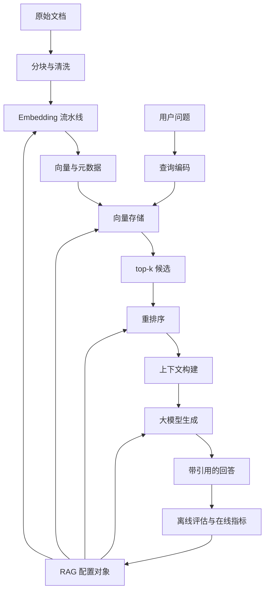
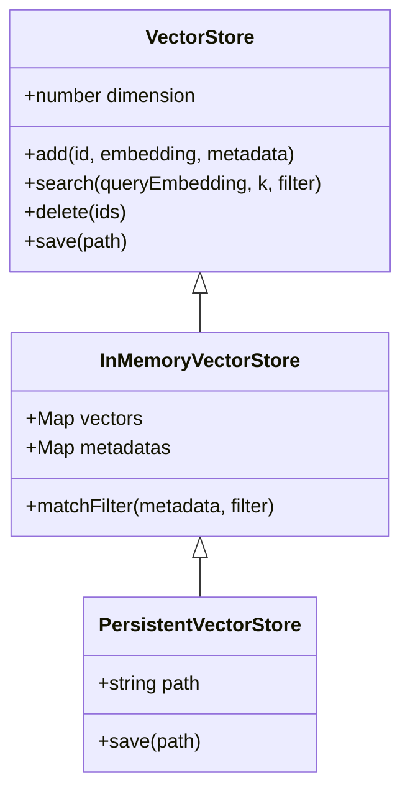
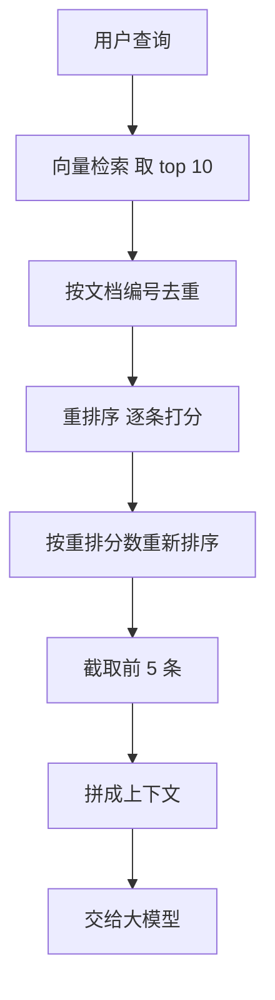
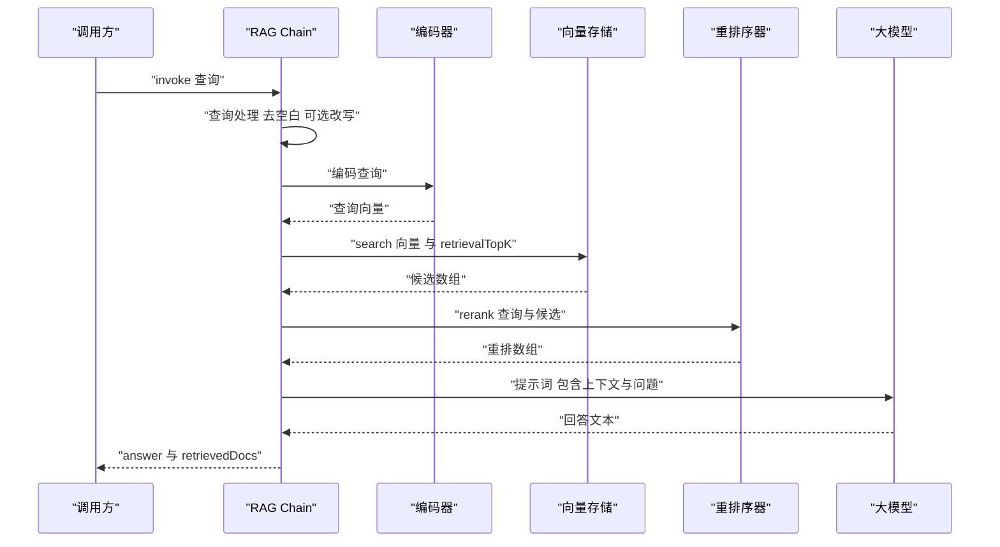
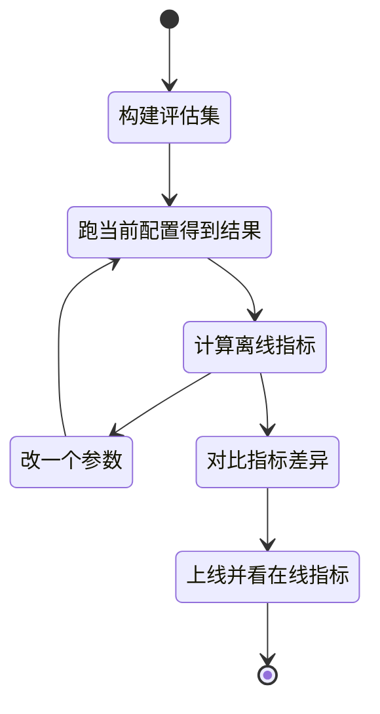
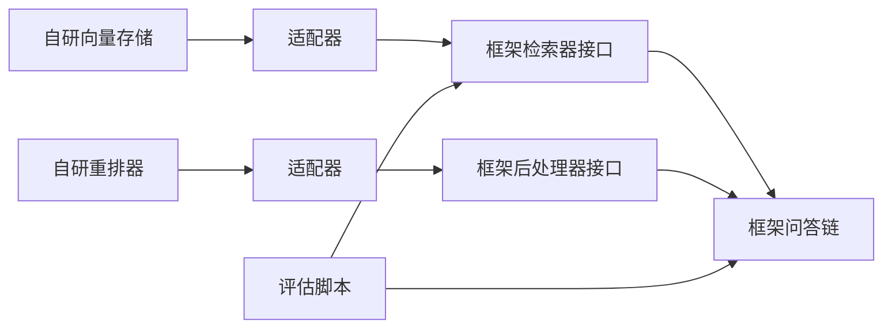

# RAG：代码实现与展望

!!! abstract "学完这一页你能"

    1. 写出 Embedding 流水线：批量编码、任务前缀、归一化三步，并说清每步不做会出什么问题。
    2. 用 Node 内置模块实现内存向量存储，支持新增、top-k 检索、元数据过滤、JSON 落盘与重新加载。
    3. 按查询处理、检索、重排序、上下文构建、生成五步串起 RAG Chain，并让每一步都能单独断言。
    4. 为一次 RAG 改动选定离线指标与在线指标，并说清多模态、知识图谱、Agent 融合三个方向的适用边界。

## 0. 知识地图



读这张图的顺序是从左到右两条线。

上面一条是建库线：文档先进分块与清洗，再进 Embedding 流水线变成向量，最后落进向量存储。

下面一条是问答线：用户问题编码后去向量存储里取候选，经过重排序、上下文构建，交给大模型生成带引用的回答。

最右侧的评估结果会反过来改配置对象，配置对象又作用于流水线、存储、重排序和生成四处的参数。

!!! note "术语：RAG"
    RAG 是 Retrieval-Augmented Generation 的缩写，中文为检索增强生成。

    它的做法是先在外部知识库里检索证据，再把证据放进提示词交给大模型作答。例子：用户问退货到账时间，系统先取出退货政策段落，再让模型依据该段落写答案。

## 1. Embedding 流水线：把文本变成可比较的向量

**先想一个问题**

客服系统里有 800 条产品说明，用户问「退货要几天到账」。

你不希望把 800 条全部塞进提示词，因为提示词长度有上限，费用也按长度计。

你要的是先挑出最相关的 5 条，而「相关」这件事需要能被计算。

!!! tip "心智模型"

    **一句话模型**：Embedding 把文本映射成固定维度的向量，语义接近的文本，向量方向也接近。

    **日常类比**：把每段文本当成从原点出发的一支箭。箭头指向哪，这段文本就在讲哪一类事。比两支箭的夹角，就是比两段文本的话题距离。

    **类比不成立的地方**：箭头的方向完全由模型的训练数据决定。模型没见过的话题，两支箭的方向都可能不准。夹角小也只说明话题接近，不说明这段文本能回答你的问题。

!!! note "术语：Embedding"
    Embedding 中文为嵌入，指把一段文本转成一串固定长度的浮点数。

    例子：文本「退货政策」在一个 8 维模型里可能变成 `[-0.12, 0.83, 0.04, ...]` 这 8 个数。维度由模型决定，同一批文档必须用同一个模型编码。

!!! note "术语：余弦相似度"
    余弦相似度衡量两个向量的夹角，取值在 -1 到 1 之间。

    例子：向量 `[1, 0]` 与 `[0.8, 0.6]` 的余弦相似度是 0.8。两个向量都归一化成长度 1 之后，余弦相似度就等于点积。

**图解**


1. 收集待编码文本，组织成一个字符串数组。
2. 判断这批文本的用途：是查询还是语料，据此加上不同前缀。
3. 按批大小切成批次，避免一次性把整库塞进显存或内存。
4. 每个批次送入模型，拿到该批次的向量。
5. 对每个向量做归一化，让长度固定为 1。
6. 把各批次结果拼回一个二维数组返回。

**一步一步来**

1. **这一步要做什么**：先把归一化和余弦相似度写成两个独立函数，因为后面所有检索都靠它们。

```js
// 归一化：把向量长度缩到 1，之后点积就等于余弦相似度
function normalize(vec) {
  let sum = 0;
  for (const v of vec) sum += v * v;        // 累加每个分量的平方
  const len = Math.sqrt(sum);               // 平方和开方得到向量长度
  if (len === 0) return vec.slice();        // 零向量原样返回，避免除以 0
  return vec.map((v) => v / len);           // 每个分量除以长度
}

// 余弦相似度：两个已归一化向量的点积
function cosine(a, b) {
  if (a.length !== b.length) throw new Error("维度不一致");
  let dot = 0;
  for (let i = 0; i < a.length; i++) dot += a[i] * b[i];
  return dot;
}

console.log("归一化结果", normalize([3, 4])); // 3 和 4 的长度是 5
console.log("同向相似度", cosine(normalize([3, 4]), normalize([6, 8])));
```

**这段代码在做什么**

- `normalize` 先算平方和，再开方得到长度，最后每个分量除以长度。
- 长度是 0 时直接返回副本，否则会出现 `NaN` 并污染整条流水线。
- `cosine` 要求两个向量维度一致，不一致时立刻抛错，而不是静默算错。
- 两个向量都归一化后，点积的取值范围就是 -1 到 1。
- `[3, 4]` 长度是 5，归一化后是 `[0.6, 0.8]`；`[6, 8]` 与它同向，相似度为 1。

**运行结果**

```
归一化结果 [ 0.6, 0.8 ]
同向相似度 1
```

2. **这一步要做什么**：定义编码器接口和任务前缀。真实项目里编码器就是模型 SDK 的调用，这里先用确定性函数把流水线形状固定下来。

```js
import { createHash } from "node:crypto";

// 教学用编码器：用 sha256 生成确定性向量，只用来验证流水线形状
// 它不产生语义，真实语义必须来自模型，需核对官方文档：模型名与维度
function hashEncoder(text, dim = 8) {
  const vec = new Array(dim).fill(0);
  const bytes = createHash("sha256").update(text).digest();
  for (let i = 0; i < dim; i++) {
    // 取两个字节拼成 0 到 65535 的整数，再映射到 -1 到 1
    vec[i] = (bytes[i * 2] * 256 + bytes[i * 2 + 1]) / 32767.5 - 1;
  }
  return normalize(vec);
}

// E5 系列模型要求查询和段落使用不同前缀，资料如此，以原文为准
const PREFIX = { query: "query: ", passage: "passage: " };
function withPrefix(texts, task) {
  const p = task === "query" ? PREFIX.query : PREFIX.passage;
  return texts.map((t) => p + t);
}
```

**这段代码在做什么**

- `hashEncoder` 的输出只取决于输入文本，同一段文本每次得到同一个向量。
- 这个编码器没有语义能力，它的作用是把流水线的输入输出形状跑通。
- 真实项目里把 `hashEncoder` 换成模型调用，其余代码不用改。
- `withPrefix` 按任务类型加前缀，E5 这类模型对查询和段落用不同前缀。
- 查询与段落的向量落在不重合的位置，跨任务比较相似度会得到无意义的结果。

**运行结果**

```
query 前缀 query: 退货政策说明
passage 前缀 passage: 退货政策说明
```

3. **这一步要做什么**：把批次切分和批量编码接上，得到语料库的向量矩阵。

```js
// 把长数组切成 batchSize 大小的批次，最后一批可能不足
function toBatches(items, batchSize) {
  const batches = [];
  for (let i = 0; i < items.length; i += batchSize) {
    batches.push(items.slice(i, i + batchSize));
  }
  return batches;
}

// 批量编码语料库，默认批大小 32，资料默认值如此，以原文为准
function encodeCorpus(texts, batchSize = 32, dim = 8) {
  const out = [];
  for (const batch of toBatches(withPrefix(texts, "passage"), batchSize)) {
    for (const text of batch) out.push(hashEncoder(text, dim));
  }
  return out;
}

// 编码单条查询，走 query 前缀
function encodeQuery(query, dim = 8) {
  return hashEncoder(withPrefix([query], "query")[0], dim);
}
```

**这段代码在做什么**

- `toBatches` 按固定步长切片，最后一批的长度可以小于批大小。
- `encodeCorpus` 先把整批语料加 `passage` 前缀，再切批，再逐条编码。
- 逐条编码是为了在没有模型的环境里也能跑，接真实模型时把内层循环换成一次调用。
- `encodeQuery` 单独走 `query` 前缀，保证查询向量与段落向量出自同一模型但不同前缀。
- 返回值的行数等于文本数，列数等于维度。

**运行结果**

```
批次数 3
向量行数 3 第一行维度 8
```

**动手验证**

把这一节的三个步骤合成一个脚本。它不依赖任何第三方包，只用 Node 20 内置模块。

```js
// 文件名 embedding-pipeline.mjs
// 依赖：无第三方依赖，只用 Node 20 内置的 node:crypto 与 node:assert
// 运行：node embedding-pipeline.mjs
import { createHash } from "node:crypto";
import assert from "node:assert/strict";

function normalize(vec) {
  let sum = 0;
  for (const v of vec) sum += v * v;
  const len = Math.sqrt(sum);
  if (len === 0) return vec.slice();
  return vec.map((v) => v / len);
}

function cosine(a, b) {
  if (a.length !== b.length) throw new Error("维度不一致");
  let dot = 0;
  for (let i = 0; i < a.length; i++) dot += a[i] * b[i];
  return dot;
}

function hashEncoder(text, dim = 8) {
  const vec = new Array(dim).fill(0);
  const bytes = createHash("sha256").update(text).digest();
  for (let i = 0; i < dim; i++) {
    vec[i] = (bytes[i * 2] * 256 + bytes[i * 2 + 1]) / 32767.5 - 1;
  }
  return normalize(vec);
}

const PREFIX = { query: "query: ", passage: "passage: " };
function withPrefix(texts, task) {
  const p = task === "query" ? PREFIX.query : PREFIX.passage;
  return texts.map((t) => p + t);
}

function toBatches(items, batchSize) {
  const batches = [];
  for (let i = 0; i < items.length; i += batchSize) {
    batches.push(items.slice(i, i + batchSize));
  }
  return batches;
}

function encodeCorpus(texts, batchSize = 32, dim = 8) {
  const out = [];
  for (const batch of toBatches(withPrefix(texts, "passage"), batchSize)) {
    for (const text of batch) out.push(hashEncoder(text, dim));
  }
  return out;
}

function encodeQuery(query, dim = 8) {
  return hashEncoder(withPrefix([query], "query")[0], dim);
}

// 断言一：归一化结果与手算一致
assert.deepStrictEqual(normalize([3, 4]), [0.6, 0.8]);
assert.ok(Math.abs(cosine(normalize([3, 4]), normalize([6, 8])) - 1) < 1e-12);
assert.ok(Math.abs(cosine(normalize([3, 4]), normalize([4, -3]))) < 1e-12);

// 断言二：零向量不产生 NaN
assert.deepStrictEqual(normalize([0, 0]), [0, 0]);

// 断言三：前缀按任务类型区分
assert.strictEqual(withPrefix(["x"], "query")[0], "query: x");
assert.strictEqual(withPrefix(["x"], "passage")[0], "passage: x");

// 断言四：批次切分正确，最后一批可以不足
assert.deepStrictEqual(toBatches([1, 2, 3, 4, 5], 2), [[1, 2], [3, 4], [5]]);

// 断言五：语料编码行数正确，每行长度都是 1
const corpus = ["退货政策说明", "发票开具流程", "配送范围说明"];
const docs = encodeCorpus(corpus, 2);
assert.strictEqual(docs.length, 3);
assert.strictEqual(docs[0].length, 8);
for (const row of docs) {
  assert.ok(Math.abs(Math.hypot(...row) - 1) < 1e-12);
}

// 断言六：查询向量与语料向量维度一致
assert.strictEqual(encodeQuery("退货政策说明").length, docs[0].length);

console.log("归一化结果", normalize([3, 4]));
console.log("query 前缀", withPrefix(["退货政策说明"], "query")[0]);
console.log("passage 前缀", withPrefix(["退货政策说明"], "passage")[0]);
console.log("批次数", toBatches([1, 2, 3, 4, 5], 2).length);
console.log("向量行数", docs.length, "第一行维度", docs[0].length);
console.log("全部断言通过");
```

**预期输出**

```
归一化结果 [ 0.6, 0.8 ]
query 前缀 query: 退货政策说明
passage 前缀 passage: 退货政策说明
批次数 3
向量行数 3 第一行维度 8
全部断言通过
```

**常见坑**

| 现象 | 原因 | 怎么修 |
| --- | --- | --- |
| 同一份语料在不同机器上编码结果不同 | 示例里用随机数在 GPU 与 CPU 之间选设备 | 把设备写成显式配置项，或从环境变量读取，不要用随机数决定 |
| 查询与文档的相似度整体偏低 | E5 类模型要求查询加 `query:`，段落加 `passage:` | 在编码前按任务类型统一加前缀，查询与语料走两个入口 |
| 余弦相似度算出来大于 1 | 向量未归一化却直接用了点积 | 归一化后再点积，或按两个向量的长度相除 |
| 换成真实模型后维度对不上 | 建库和查询用了两个不同模型 | 把模型名与维度一起写进配置，加载存储时校验维度 |
| 一次编码 20 万条文本时内存爆掉 | 没有切批，全部文本一次进模型 | 按批大小切分，逐批编码并把结果写出到磁盘 |

**用在哪里**

1. 电商商品标题去重
   - 业务背景：同一款商品由不同供应商上传，标题写法不同，后台需要合并成一条。
   - 这一节的知识怎么用：把标题编码成向量，两两算余弦相似度，超过阈值的归为一组。
   - 衡量收益的指标：人工复核的合并条目数从多少条降到多少条，误合并条数。
   - 什么时候不该用：标题里区分商品的关键信息是型号数字串时，向量算不出差异，要用精确串匹配。

2. 内部工单自动分派
   - 业务背景：每天新增的客服工单需要按主题分给对应小组。
   - 这一节的知识怎么用：把每个小组的历史工单编码成向量建库，新工单编码后取 top-3 小组。
   - 衡量收益的指标：转派率、首次分派准确率。
   - 什么时候不该用：工单数量每天少于 20 条时，用关键词规则表维护成本更低。

3. 招聘简历与职位匹配
   - 业务背景：招聘系统里一个职位会收到上千份简历，需要先筛出 50 份给人看。
   - 这一节的知识怎么用：职位描述编码一次，简历批量编码，按余弦相似度排序取前 50。
   - 衡量收益的指标：进入面试的简历在初筛前 50 中的占比。
   - 什么时候不该用：职位有硬性证书要求时，先按结构化字段过滤，再走向量排序。

**行业实践**

- Sentence-Transformers 官方文档在 `SentenceTransformer.encode` 的参数说明里列出了 `normalize_embeddings` 与 `batch_size`。可以借鉴的做法是把归一化做成编码阶段的固定动作，而不是留给检索阶段补齐。
- OpenAI 官方文档的 Embeddings 指南列出了 `dimensions` 参数，允许把输出维度调小。可以借鉴的做法是先用大维度建库，确认效果后再试小维度，比较存储体积与检索指标的变化。
- E5 系列模型的模型卡要求查询与段落分别加 `query:` 与 `passage:` 前缀，本站旧版页面也记录了这一点，以原文为准。可以借鉴的做法是把前缀规则写进编码器内部，调用方不需要知道前缀存在。

**小结**

- Embedding 流水线只有三件事：加前缀、切批次、归一化。
- 归一化让余弦相似度退化成点积，是后面所有检索代码能写短的前提。
- 查询与语料走两个入口，是避免前缀规则被漏掉的结构性做法。

## 2. 向量存储：内存实现与持久化

**先想一个问题**

知识库每晚增量更新，服务每天重启一次。

如果向量只存在进程内存里，重启后 800 条向量要重新编码一次。

重新编码要调用模型接口，这部分时间与费用怎么省掉。

!!! tip "心智模型"

    **一句话模型**：向量存储就是一张「编号到向量加元数据」的表，检索是全表算分再取前 k 条。

    **日常类比**：它像图书馆的卡片柜，每张卡片有一个编号、一段摘要和一个分类标签。你按摘要的相近程度翻卡片。

    **类比不成立的地方**：卡片柜按分类号有天然的层级，可以先缩小范围再翻。向量存储没有这种层级，元数据过滤是后加的条件，过滤和排序的先后顺序会改变返回条数。

!!! note "术语：top-k 检索"
    top-k 检索指按相似度排序后取前 k 条结果。

    例子：语料库有 1 万条，查询后取相似度最高的 10 条交给下一步，这里的 k 就是 10。k 的取值是配置项，本站旧版页面把检索阶段的 k 记为 10，以原文为准。

!!! note "术语：元数据过滤"
    元数据过滤指在算相似度之前或之后，按结构化字段筛掉不符合条件的条目。

    例子：只检索 `category` 等于 `退货` 的文档。过滤条件是键值对，值可以是单个值，也可以是数组。

**图解**



1. `VectorStore` 是基类，声明 `add`、`search`、`delete`、`save` 四个方法，方法体直接抛未实现错误。
2. `InMemoryVectorStore` 用两个 `Map` 存数据：一个存编号到向量，一个存编号到元数据。
3. `matchFilter` 是私有辅助方法，判断一条元数据是否满足过滤条件。
4. `PersistentVectorStore` 继承内存实现，在 `add` 与 `delete` 之后自动调用 `save`。
5. 底部的两条继承箭头说明：换存储引擎时，只要新类实现同样四个方法，上层代码不用改。

**一步一步来**

1. **这一步要做什么**：先把存储的数据结构和维度校验写出来，维度校验能拦掉大部分接错模型的故障。

```js
export class InMemoryVectorStore {
  constructor(dimension) {
    this.dimension = dimension;
    this.vectors = new Map();     // 编号 到 向量
    this.metadatas = new Map();   // 编号 到 元数据
  }

  add(id, embedding, metadata = {}) {
    if (embedding.length !== this.dimension) {
      // 维度不一致直接抛错，不要静默写入
      throw new Error(`维度不一致 ${embedding.length} 与 ${this.dimension}`);
    }
    this.vectors.set(id, embedding);
    this.metadatas.set(id, metadata);
  }

  size() {
    return this.vectors.size;
  }
}
```

**这段代码在做什么**

- 构造函数只接收维度一个参数，维度决定后续所有向量必须多长。
- `vectors` 与 `metadatas` 分开存，删向量时两张表都要动。
- `add` 第一步就校验维度，接错模型时在写入阶段就报错。
- `metadata` 给默认空对象，调用方可以不传。
- `size` 只读 `vectors` 的大小，两张表的条目数由 `add` 与 `delete` 保证一致。

**运行结果**

```
写入条数 3
维度不一致 8 与 2
```

2. **这一步要做什么**：实现检索。顺序是先按元数据过滤，再算分排序，最后截断到 k 条。

```js
  search(queryEmbedding, k = 10, filter = null) {
    const candidates = [];
    for (const [id, vec] of this.vectors) {
      const meta = this.metadatas.get(id);
      // 先过滤：不满足条件的条目根本不进入排序
      if (filter && !this.matchFilter(meta, filter)) continue;
      candidates.push({ id, score: cosine(queryEmbedding, vec), metadata: meta });
    }
    candidates.sort((a, b) => b.score - a.score);
    return candidates.slice(0, k);
  }

  matchFilter(metadata, filter) {
    for (const [key, value] of Object.entries(filter)) {
      if (!(key in metadata)) return false;         // 字段缺失视为不匹配
      if (Array.isArray(value)) {
        if (!value.includes(metadata[key])) return false; // 数组表示任一命中
      } else if (metadata[key] !== value) {
        return false;                                // 单值要求严格相等
      }
    }
    return true;
  }
```

**这段代码在做什么**

- 遍历所有向量，对满足过滤条件的条目算一次余弦相似度。
- 过滤放在算分之前，不满足条件的条目连分数都不算。
- 排序用降序比较函数，`b.score - a.score` 表示分数高的排前面。
- `slice(0, k)` 在排序之后截断，保证返回条数不超过 k。
- `matchFilter` 支持两种值：数组表示任一命中，单值表示严格相等。
- 字段缺失直接判为不匹配，避免 `undefined` 参与比较。

**运行结果**

```
不过滤 top3 [ 'd1', 'd3', 'd2' ]
过滤 category=退货 [ 'd1', 'd3' ]
```

3. **这一步要做什么**：加上落盘与重新加载，让重启后的向量可以直接读回来。

```js
import { writeFileSync, readFileSync } from "node:fs";

  save(path) {
    const data = {
      dimension: this.dimension,
      vectors: [...this.vectors],     // Map 转数组，JSON 才能序列化
      metadatas: [...this.metadatas],
    };
    writeFileSync(path, JSON.stringify(data), "utf8");
  }

  static load(path) {
    const data = JSON.parse(readFileSync(path, "utf8"));
    const store = new InMemoryVectorStore(data.dimension);
    for (const [id, vec] of data.vectors) store.vectors.set(id, vec);
    for (const [id, meta] of data.metadatas) store.metadatas.set(id, meta);
    return store;
  }
```

**这段代码在做什么**

- `save` 把维度、向量表、元数据表三部分一起写进一个 JSON 文件。
- `Map` 不能直接被 `JSON.stringify` 处理，先展开成二维数组。
- `load` 是静态方法，从文件读出维度后新建一个同维度的存储实例。
- 加载时逐条 `set`，不走 `add`，避免重复做维度校验。
- 维度随文件一起存，是为了让加载方知道自己拿到的是哪个模型产出的向量。

**运行结果**

```
落盘后再加载 条数 3 维度 2
```

**动手验证**

把三步合成一个脚本，跑完会生成一个 JSON 文件并重新读回。

```js
// 文件名 vector-store.mjs
// 依赖：无第三方依赖，只用 Node 20 内置的 node:fs 与 node:assert
// 运行：node vector-store.mjs
import { writeFileSync, readFileSync, rmSync, existsSync } from "node:fs";
import assert from "node:assert/strict";

function normalize(vec) {
  let sum = 0;
  for (const v of vec) sum += v * v;
  const len = Math.sqrt(sum);
  if (len === 0) return vec.slice();
  return vec.map((v) => v / len);
}

function cosine(a, b) {
  if (a.length !== b.length) throw new Error("维度不一致");
  let dot = 0;
  for (let i = 0; i < a.length; i++) dot += a[i] * b[i];
  return dot;
}

class InMemoryVectorStore {
  constructor(dimension) {
    this.dimension = dimension;
    this.vectors = new Map();
    this.metadatas = new Map();
  }

  add(id, embedding, metadata = {}) {
    if (embedding.length !== this.dimension) {
      throw new Error(`维度不一致 ${embedding.length} 与 ${this.dimension}`);
    }
    this.vectors.set(id, embedding);
    this.metadatas.set(id, metadata);
  }

  search(queryEmbedding, k = 10, filter = null) {
    const candidates = [];
    for (const [id, vec] of this.vectors) {
      const meta = this.metadatas.get(id);
      if (filter && !this.matchFilter(meta, filter)) continue;
      candidates.push({ id, score: cosine(queryEmbedding, vec), metadata: meta });
    }
    candidates.sort((a, b) => b.score - a.score);
    return candidates.slice(0, k);
  }

  matchFilter(metadata, filter) {
    for (const [key, value] of Object.entries(filter)) {
      if (!(key in metadata)) return false;
      if (Array.isArray(value)) {
        if (!value.includes(metadata[key])) return false;
      } else if (metadata[key] !== value) {
        return false;
      }
    }
    return true;
  }

  delete(ids) {
    for (const id of ids) {
      this.vectors.delete(id);
      this.metadatas.delete(id);
    }
  }

  save(path) {
    const data = {
      dimension: this.dimension,
      vectors: [...this.vectors],
      metadatas: [...this.metadatas],
    };
    writeFileSync(path, JSON.stringify(data), "utf8");
  }

  static load(path) {
    const data = JSON.parse(readFileSync(path, "utf8"));
    const store = new InMemoryVectorStore(data.dimension);
    for (const [id, vec] of data.vectors) store.vectors.set(id, vec);
    for (const [id, meta] of data.metadatas) store.metadatas.set(id, meta);
    return store;
  }
}

const store = new InMemoryVectorStore(2);
store.add("d1", [1, 0], { category: "退货", source: "售后手册" });
store.add("d2", [0, 1], { category: "发票", source: "发票手册" });
store.add("d3", normalize([0.8, 0.6]), { category: "退货", source: "支付手册" });

// 断言一：维度校验生效
assert.throws(() => store.add("bad", [1, 0, 0]), /维度不一致/);

const hits = store.search([1, 0], 3);
assert.deepStrictEqual(hits.map((h) => h.id), ["d1", "d3", "d2"]);

// 断言二：先过滤再截断，返回条数不受 k 影响
const filtered = store.search([1, 0], 3, { category: "退货" });
assert.deepStrictEqual(filtered.map((h) => h.id), ["d1", "d3"]);

// 断言三：数组值表示任一命中
assert.strictEqual(store.matchFilter({ category: "退货" }, { category: ["退货", "换货"] }), true);
assert.strictEqual(store.matchFilter({ category: "发票" }, { category: ["退货", "换货"] }), false);

// 断言四：删除后条目数减少
store.delete(["d2"]);
assert.strictEqual(store.size(), 2);
store.add("d2", [0, 1], { category: "发票", source: "发票手册" });

// 断言五：落盘再加载后内容一致
const path = "./vector-store.json";
store.save(path);
assert.ok(existsSync(path));
const reloaded = InMemoryVectorStore.load(path);
assert.strictEqual(reloaded.size(), 3);
assert.strictEqual(reloaded.dimension, 2);
assert.deepStrictEqual(reloaded.search([1, 0], 3).map((h) => h.id), ["d1", "d3", "d2"]);
rmSync(path);

console.log("不过滤 top3", hits.map((h) => h.id));
console.log("过滤 category=退货", filtered.map((h) => h.id));
console.log("落盘后再加载 条数", reloaded.size(), "维度", reloaded.dimension);
console.log("全部断言通过");
```

**预期输出**

```
不过滤 top3 [ 'd1', 'd3', 'd2' ]
过滤 category=退货 [ 'd1', 'd3' ]
落盘后再加载 条数 3 维度 2
全部断言通过
```

**常见坑**

| 现象 | 原因 | 怎么修 |
| --- | --- | --- |
| 带过滤条件时返回条数少于 k | 先按相似度截断到 k 条，再在 k 条里做过滤 | 把过滤提到排序之前，遍历时先判断元数据 |
| 不同文档拿到同一个编号 | 用正文前 100 字符算 MD5 取前 12 位做编号 | 编号里加入文档来源与更新时间，或改用内容全文加来源一起哈希 |
| 每次 `add` 都把整个库写一遍磁盘 | 持久化实现里每次写入都全量序列化 | 改成批量提交，或按追加日志写，定期做全量压缩 |
| 加载后检索结果为空 | 存的是归一化向量，查询传入的是未归一化向量 | 建库与查询共用同一个编码器入口，两边都归一化 |
| 删除后元数据表残留条目 | 只删了向量表没有删元数据表 | 删除方法里两张表必须同时删除，并用断言覆盖 |

**用在哪里**

1. 后台管理的批量导入
   - 业务背景：运营每周导入一份 Excel，里面有 2000 条产品说明，导入后要立刻能被搜索到。
   - 这一节的知识怎么用：导入时逐条编码并 `add`，导入结束后一次性 `save`，避免每写一条就落一次盘。
   - 衡量收益的指标：导入总耗时、导入后首次检索的响应时间。
   - 什么时候不该用：单次导入只有十几条时，直接调接口重算即可，不需要维护本地存储文件。

2. 多租户的文档检索
   - 业务背景：SaaS 系统里每个客户的知识库互相隔离，检索时必须限定在本租户内。
   - 这一节的知识怎么用：把 `tenantId` 写进元数据，检索时把 `tenantId` 作为过滤条件传进去。
   - 衡量收益的指标：跨租户串数据的事故数、过滤前后返回条数的差异。
   - 什么时候不该用：租户数量少且数据量差异大时，按租户分库比共库过滤更容易排查问题。

3. 会话内的短期记忆
   - 业务背景：一次多轮对话里，需要把前几轮的内容取回来喂给模型。
   - 这一节的知识怎么用：把每轮对话编码后存进内存存储，用 `sessionId` 过滤，对话结束就丢弃。
   - 衡量收益的指标：上下文命中率、每次请求携带的 token 数。
   - 什么时候不该用：需要跨会话长期保留记忆时，内存存储重启即丢，要换成持久化实现。

**行业实践**

- Chroma 官方文档在查询接口中同时提供 `n_results` 与 `where` 两个参数，把条数限制与元数据过滤放在同一次调用。可以借鉴的做法是把过滤条件作为检索方法的显式参数，而不是事后在应用层筛。
- FAISS 官方文档在索引章节说明不同索引类型在精度与内存占用之间存在取舍。可以借鉴的做法是把索引类型写进配置对象，先用精确暴力检索验证效果，再换近似索引。
- pgvector 官方文档在索引章节说明距离算子与索引类型的对应关系。可以借鉴的做法是把距离度量固定成配置项并写进断言，避免建库与查询用了不同度量。

**小结**

- 向量存储最小可用形态是两个映射表加一次遍历排序。
- 过滤与排序的先后顺序直接决定返回条数，这个顺序要写进测试。
- 编号生成规则是长期隐患的来源，要用来源加内容一起参与哈希。

## 3. 检索与重排序：从 top-k 到精排

**先想一个问题**

检索返回了 10 条，其中 3 条来自同一段落的连续分块，内容高度重复。

剩下 7 条里只有 2 条真正回答了用户的问题。

直接把 10 条拼进提示词，既浪费长度，又会让模型抓到重复信息。

!!! tip "心智模型"

    **一句话模型**：召回阶段要放宽，精排阶段要收紧，两级用不同的打分方式。

    **日常类比**：海选让所有报名者上台，决赛只让评委近距离面试 5 个人。海选看简历，决赛看现场表现。

    **类比不成立的地方**：决赛评委需要同时看到问题和候选，算一次分就要跑一次模型。这个成本决定了它不能对全库执行，只能作用在海选结果上。

!!! note "术语：重排序"
    重排序的英文是 Rerank，指对召回结果用更精确的打分方式重新排序。

    例子：召回阶段用向量点积从 1 万条里取 10 条，重排序阶段用模型逐条给这 10 条打分，再取前 5 条。

!!! note "术语：交叉编码器"
    交叉编码器的英文是 Cross Encoder，指把查询和文档拼在一起送进模型，直接输出一个相关性分数。

    例子：输入 `退货要几天到账 [SEP] 退货申请提交后三到七个工作日到账`，模型输出 0.93。它比双塔向量模型准，但每条都要跑一次，无法预先算好。

**图解**



1. 查询先编码，去向量存储里取相似度最高的 10 条，这一步是召回。
2. 去重按文档编号做，同一段落的连续分块只保留分数最高的一条。
3. 重排序对剩下的每条逐一打分，分数来自更精确的模型或规则。
4. 按重排分数重新排序，注意是重新排序，不是只取前几条。
5. 截取前 5 条，这个数字来自配置，本站旧版页面记为 5，以原文为准。
6. 把 5 条正文与来源拼成上下文，交给大模型生成。

**一步一步来**

1. **这一步要做什么**：先写去重。同一文档被切成多个分块时，只保留分数最高的一块。

```js
// 按文档编号去重，保留分数最高的那条
export function dedupeById(hits) {
  const best = new Map();
  for (const hit of hits) {
    const key = hit.metadata.docId ?? hit.id;
    const prev = best.get(key);
    if (!prev || hit.score > prev.score) {
      best.set(key, hit);            // 分数更高就替换
    }
  }
  return [...best.values()];
}

// 按召回分数降序排列，Map 的插入顺序不保证分数有序
export function sortByScore(hits) {
  return [...hits].sort((a, b) => b.score - a.score);
}
```

**这段代码在做什么**

- `dedupeById` 用文档编号做键，而不是用分块编号。
- 遇到同编号时比较分数，保留分数高的那条。
- `hit.metadata.docId ?? hit.id` 表示优先用元数据里的文档编号，缺失时退回到分块编号。
- `Map` 的迭代顺序是插入顺序，去重后还需要重新排序。
- `sortByScore` 返回新数组，不改动入参。

**运行结果**

```
去重前 4 条
去重后 3 条
```

2. **这一步要做什么**：写一个可替换的重排序器。这里用字符重叠打分，接真实模型时只换这个函数。

```js
// 把文本转成字符集合，去掉空白与常见标点
function charSet(text) {
  return new Set([...text.replace(/[\s，。、？！：；]/g, "")]);
}

// 教学用重排序器：按查询字符在文档中的覆盖比例打分
// 它不是交叉编码器，接真实重排模型时需核对官方文档：入参格式与返回字段
export function charOverlapReranker(query, docs) {
  const q = charSet(query);
  return docs
    .map((doc) => {
      const d = charSet(doc.text);
      let hit = 0;
      for (const ch of q) if (d.has(ch)) hit++;
      return { ...doc, rerankScore: hit / q.size };
    })
    .sort((a, b) => b.rerankScore - a.rerankScore);
}
```

**这段代码在做什么**

- `charSet` 把文本拆成不重复的字符集合，标点在拆分前被去掉。
- 打分是查询字符被文档覆盖的比例，取值范围是 0 到 1。
- `map` 返回新对象，`{ ...doc }` 保留原有字段，追加 `rerankScore`。
- `sort` 按重排分数降序，这一步是「重新排序」，不是「只取前几条」。
- 这个打分器不涉及模型调用，可以在单元测试里得到稳定结果。

**运行结果**

```
重排后顺序 [ 'a', 'c', 'b' ]
首条得分 0.5714
```

3. **这一步要做什么**：拼上下文，并把来源写进每一条参考里，让生成的引用能核对。

```js
// 构建上下文：每条参考都带编号和来源
export function buildContext(docs) {
  if (docs.length === 0) return "（无相关检索内容）";
  return docs
    .map((doc, i) => `【参考 ${i + 1}】\n${doc.text}\n来源：${doc.metadata.source ?? "未知"}`)
    .join("\n\n");
}

// 走完整链路：召回、去重、重排、截断、拼上下文
export function retrieve({ query, encoder, store, config }) {
  const queryEmbedding = encoder(query);
  const hits = store.search(queryEmbedding, config.retrievalTopK);
  const deduped = sortByScore(dedupeById(hits));
  const reranked = charOverlapReranker(query, deduped);
  return reranked.slice(0, config.rerankTopK);
}
```

**这段代码在做什么**

- `buildContext` 给每条参考加上序号与来源，序号从 1 开始。
- 检索结果为空时返回一句固定文案，而不是空字符串。
- `retrieve` 把召回、去重、排序、重排、截断五步串起来。
- 召回阶段用 `retrievalTopK`，重排之后用 `rerankTopK`，两个参数分开配置。
- 返回的是数组，拼上下文留给调用方决定。

**运行结果**

```
召回 3 条 重排后 2 条
上下文首行 【参考 1】
```

**动手验证**

脚本覆盖去重、重排、上下文构建三段逻辑。

```js
// 文件名 rerank.mjs
// 依赖：无第三方依赖，只用 Node 20 内置的 node:assert
// 运行：node rerank.mjs
import assert from "node:assert/strict";

function dedupeById(hits) {
  const best = new Map();
  for (const hit of hits) {
    const key = hit.metadata.docId ?? hit.id;
    const prev = best.get(key);
    if (!prev || hit.score > prev.score) best.set(key, hit);
  }
  return [...best.values()];
}

function sortByScore(hits) {
  return [...hits].sort((a, b) => b.score - a.score);
}

function charSet(text) {
  return new Set([...text.replace(/[\s，。、？！：；]/g, "")]);
}

function charOverlapReranker(query, docs) {
  const q = charSet(query);
  return docs
    .map((doc) => {
      const d = charSet(doc.text);
      let hit = 0;
      for (const ch of q) if (d.has(ch)) hit++;
      return { ...doc, rerankScore: hit / q.size };
    })
    .sort((a, b) => b.rerankScore - a.rerankScore);
}

function buildContext(docs) {
  if (docs.length === 0) return "（无相关检索内容）";
  return docs
    .map((doc, i) => `【参考 ${i + 1}】\n${doc.text}\n来源：${doc.metadata.source ?? "未知"}`)
    .join("\n\n");
}

// 造 4 条召回结果，其中 a1 与 a2 来自同一文档
const hits = [
  { id: "a1", score: 0.91, text: "退货申请提交后三到七个工作日到账", metadata: { docId: "doc1", source: "售后手册" } },
  { id: "a2", score: 0.88, text: "退货申请需在签收后七天内提交", metadata: { docId: "doc1", source: "售后手册" } },
  { id: "b1", score: 0.80, text: "发票抬头修改需要在订单完成前操作", metadata: { docId: "doc2", source: "发票手册" } },
  { id: "c1", score: 0.75, text: "退货到账时间取决于支付渠道", metadata: { docId: "doc3", source: "支付手册" } },
];

const deduped = sortByScore(dedupeById(hits));
assert.strictEqual(deduped.length, 3);
assert.strictEqual(deduped[0].id, "a1");
assert.deepStrictEqual(deduped.map((h) => h.id), ["a1", "b1", "c1"]);

const ranked = charOverlapReranker("退货要几天到账", deduped);
assert.deepStrictEqual(ranked.map((d) => d.id), ["a1", "c1", "b1"]);
assert.ok(Math.abs(ranked[0].rerankScore - 4 / 7) < 1e-12);

// 重排后取前 2 条，顺序必须与重排顺序一致
const top2 = ranked.slice(0, 2);
assert.deepStrictEqual(top2.map((d) => d.id), ["a1", "c1"]);

const context = buildContext(top2);
assert.ok(context.startsWith("【参考 1】"));
assert.ok(context.includes("来源：售后手册"));
assert.strictEqual(buildContext([]), "（无相关检索内容）");

console.log("去重前", hits.length, "条");
console.log("去重后", deduped.length, "条");
console.log("重排后顺序", ranked.map((d) => d.id));
console.log("首条得分", ranked[0].rerankScore.toFixed(4));
console.log("上下文首行", context.split("\n")[0]);
console.log("全部断言通过");
```

**预期输出**

```
去重前 4 条
去重后 3 条
重排后顺序 [ 'a1', 'c1', 'b1' ]
首条得分 0.5714
上下文首行 【参考 1】
全部断言通过
```

**常见坑**

| 现象 | 原因 | 怎么修 |
| --- | --- | --- |
| 重排分数贴到了错误的文档上 | 按数组下标把重排结果写回原数组，而重排过程已经改变了顺序 | 让重排函数返回新数组，下游只用新数组，不要按下标回写 |
| 重排之后结果没有变 | 只截取了前 k 条，没有按重排分数重新排序 | 重排函数内部必须包含排序步骤，并写测试断言输出顺序 |
| 上下文里 5 条参考来自同一段 | 召回阶段没有按文档编号去重 | 在重排之前插入去重步骤，去重键用文档编号而不是分块编号 |
| 生成的答案找不到出处 | 拼上下文时没有带来源字段 | 每条参考都带编号与来源，提示词里要求标注编号 |
| 重排接口超时导致整条链路失败 | 重排是同步调用且没有降级 | 重排失败时退回召回顺序，并记录降级次数 |

**用在哪里**

1. 电商商品列表的搜索排序
   - 业务背景：用户输入一句自然语言，需要在一屏内给出最相关的商品。
   - 这一节的知识怎么用：召回阶段从商品库取 50 条，重排阶段按查询与标题的匹配度取前 20 条渲染。
   - 衡量收益的指标：首屏点击率、加购转化率。
   - 什么时候不该用：用户输入的是精确型号时，精确串匹配的结果应当直接置顶，不要被重排打乱。

2. 合同条款检索
   - 业务背景：法务要在几百份合同里找出与某个条款相关的段落，要求引用可核对。
   - 这一节的知识怎么用：重排后保留来源与页号，拼上下文时带编号，答案里强制标注编号。
   - 衡量收益的指标：法务人工核对耗时、引用错误的条款数。
   - 什么时候不该用：只要精确条款编号就能定位时，用结构化查询比语义检索更可靠。

3. 客服知识库的答案推荐
   - 业务背景：客服在回复前需要看到 3 条候选答案，而不是 10 条。
   - 这一节的知识怎么用：召回取 20 条，去重后重排，只把前 3 条渲染到侧边栏。
   - 衡量收益的指标：候选答案采纳率、平均回复时长。
   - 什么时候不该用：问题涉及金额或时限时，候选答案必须走人工确认流程。

**行业实践**

- Cohere 官方文档在 Rerank 章节说明该接口接收查询与文档列表，返回带相关性分数的排序结果。可以借鉴的做法是把重排封装成纯函数，输入输出都是数组，便于替换供应商。
- 论文《Reciprocal Rank Fusion outperforms Condorcet and individual Rank Learning Methods》提出了 RRF 融合方法，用排名的倒数相加合并多路召回。可以借鉴的做法是当你有向量召回和关键词召回两路时，先按 RRF 合并，再做精排。
- BGE 系列模型的模型卡列出了重排模型的输入格式与打分输出，需核对官方文档：具体要核对最大输入长度与批量上限。可以借鉴的做法是把最大输入长度写进配置，超长文档先截断再送重排。

**小结**

- 召回和精排是两级，参数分开配置，不要共用一个 k。
- 去重必须发生在重排之前，去重键是文档编号。
- 重排函数的契约是「返回一个按新分数排好序的新数组」，违反这个契约就会出现分数错配。

## 4. RAG Chain：五步串起一次问答

**先想一个问题**

你已经有了编码器、向量存储和重排器。

现在要把它们串起来，并且要求改动提示词之后不用重跑检索的测试。

如果把五步写成一整块代码，改一处就要重跑全部。

!!! tip "心智模型"

    **一句话模型**：RAG Chain 是五个独立函数用配置对象串起来，输入是查询，输出是回答加证据。

    **日常类比**：它像一条装配线，每道工序只关心上一道工序交来的零件形状。零件形状定好了，换机器不用改传送带。

    **类比不成立的地方**：装配线上零件是实物，改一道工序不会影响其他工序的产出。RAG 里提示词改了会改变答案措辞，评估指标会跟着变，工序之间存在耦合。

!!! note "术语：RAG Chain"
    RAG Chain 指把查询处理、检索、重排序、上下文构建、生成五步按固定顺序组合成的调用单元。

    例子：`chain.invoke("退货要几天到账")` 返回一个对象，里面有 `answer` 与 `retrievedDocs` 两个字段。

**图解**



1. 调用方把查询交给 Chain，Chain 内部先做查询处理，去掉首尾空白。
2. Chain 调用编码器，把查询转成向量。
3. Chain 把向量与召回条数交给向量存储，拿到候选数组。
4. Chain 把查询与候选交给重排序器，拿到按新分数排序的数组。
5. Chain 截取前若干条拼成上下文，与问题一起填进提示词模板。
6. 大模型返回回答文本，Chain 把回答与证据一起返回给调用方。

**一步一步来**

1. **这一步要做什么**：先定义配置对象。所有可调参数集中在一处，调用方不需要读实现。

```js
// RAG 配置对象，默认值来自本站旧版页面，以原文为准
export const defaultConfig = {
  retrievalTopK: 10,     // 召回条数
  rerankTopK: 5,         // 精排后保留条数
  embeddingModel: "bge-large-zh",
  llmModel: "gpt-4",
  maxTokens: 4000,
  temperature: 0.7,
  useReranker: true,
  useQueryRewrite: true,
  useHyde: false,
};
```

**这段代码在做什么**

- 召回与精排的条数分成两个字段，避免一个参数控制两件事。
- 模型名写进配置，加载向量存储时可以拿它做维度校验。
- `useReranker`、`useQueryRewrite`、`useHyde` 是三个开关，用来做消融对比。
- 数值默认值集中在一处，改默认值不会漏改某个函数内部。
- `useHyde` 具体流程资料未覆盖，需核对官方文档：要核对生成假想文档所用的提示词与检索时使用的向量来源。

**运行结果**

```
召回条数 10 精排条数 5
```

2. **这一步要做什么**：写提示词模板。模板里要明确约束「只用参考内容」并「标注编号」。

```js
export function buildPrompt(query, context) {
  return [
    "基于以下参考内容回答用户问题。",
    "要求：",
    "1. 只使用参考内容回答，不要添加外部知识",
    "2. 如果参考内容中没有相关信息，明确指出",
    "3. 引用参考内容时标注编号",
    "",
    "参考内容：",
    context,
    "",
    `问题：${query}`,
    "",
    "回答：",
  ].join("\n");
}

export function processQuery(query, config) {
  const trimmed = query.trim();
  // 查询改写属于可选步骤，资料只给出开关，具体实现需核对官方文档
  return trimmed;
}
```

**这段代码在做什么**

- 提示词用数组拼接，每一行都是独立字符串，便于逐行断言。
- 三条要求分别对应三个可观测的问题：外部知识泄漏、无答案时的行为、引用缺失。
- `processQuery` 只做去空白，改写逻辑留成可选步骤。
- 把「参考内容」和「问题」分开成两段，模型更容易区分证据和问题。
- 结尾的「回答：」是一个续写锚点，让模型直接进入答案部分。

**运行结果**

```
提示词行数 11
包含只用参考内容约束 true
```

3. **这一步要做什么**：写 `invoke`，把五步按顺序串起来。

```js
export function createRAGChain({ encoder, store, reranker, llm, config = defaultConfig }) {
  return {
    invoke(query) {
      const processed = processQuery(query, config);                       // 1 查询处理
      const embedding = encoder(processed);
      const hits = store.search(embedding, config.retrievalTopK);          // 2 检索
      const ranked = config.useReranker
        ? reranker(query, hits).slice(0, config.rerankTopK)                // 3 重排序
        : hits.slice(0, config.rerankTopK);
      const context = buildContext(ranked);                                // 4 上下文构建
      const answer = llm({ prompt: buildPrompt(query, context) });         // 5 生成
      return { answer, retrievedDocs: ranked, query, processedQuery: processed };
    },
  };
}
```

**这段代码在做什么**

- 工厂函数接收四个依赖，Chain 本身不创建编码器、存储和大模型。
- 四个依赖都以参数传入，测试时可以换成确定性的假实现。
- 重排序开关关闭时直接截取召回结果的前 k 条。
- 返回值里同时带 `query` 与 `processedQuery`，便于排查改写带来的差异。
- `retrievedDocs` 一起返回，前端可以展示引用来源。

**运行结果**

```
答案 依据参考 1：退货申请提交后三到七个工作日到账
证据条数 1
```

**动手验证**

脚本把四个假依赖组装起来，断言五步的顺序和返回结构。

```js
// 文件名 rag-chain.mjs
// 依赖：无第三方依赖，只用 Node 20 内置的 node:assert
// 运行：node rag-chain.mjs
import assert from "node:assert/strict";

const defaultConfig = {
  retrievalTopK: 10,
  rerankTopK: 5,
  embeddingModel: "bge-large-zh",
  llmModel: "gpt-4",
  maxTokens: 4000,
  temperature: 0.7,
  useReranker: true,
  useQueryRewrite: true,
  useHyde: false,
};

function buildContext(docs) {
  if (docs.length === 0) return "（无相关检索内容）";
  return docs
    .map((doc, i) => `【参考 ${i + 1}】\n${doc.text}\n来源：${doc.metadata.source ?? "未知"}`)
    .join("\n\n");
}

function buildPrompt(query, context) {
  return [
    "基于以下参考内容回答用户问题。",
    "要求：",
    "1. 只使用参考内容回答，不要添加外部知识",
    "2. 如果参考内容中没有相关信息，明确指出",
    "3. 引用参考内容时标注编号",
    "",
    "参考内容：",
    context,
    "",
    `问题：${query}`,
    "",
    "回答：",
  ].join("\n");
}

function processQuery(query) {
  return query.trim();
}

function charSet(text) {
  return new Set([...text.replace(/[\s，。、？！：；]/g, "")]);
}

function charOverlapReranker(query, docs) {
  const q = charSet(query);
  return docs
    .map((doc) => {
      const d = charSet(doc.text);
      let hit = 0;
      for (const ch of q) if (d.has(ch)) hit++;
      return { ...doc, rerankScore: hit / q.size };
    })
    .sort((a, b) => b.rerankScore - a.rerankScore);
}

function createRAGChain({ encoder, store, reranker, llm, config = defaultConfig }) {
  return {
    invoke(query) {
      const processed = processQuery(query, config);
      const embedding = encoder(processed);
      const hits = store.search(embedding, config.retrievalTopK);
      const ranked = config.useReranker
        ? reranker(query, hits).slice(0, config.rerankTopK)
        : hits.slice(0, config.rerankTopK);
      const context = buildContext(ranked);
      const answer = llm({ prompt: buildPrompt(query, context) });
      return { answer, retrievedDocs: ranked, query, processedQuery: processed };
    },
  };
}

// 假依赖一：编码器只返回固定长度数组，记录被调用的查询
const encoderCalls = [];
const encoder = (q) => {
  encoderCalls.push(q);
  return [1, 0];
};

// 假依赖二：向量存储按 metadata 里的固定分数返回
const store = {
  search(_embedding, k) {
    const rows = [
      { id: "a", score: 0.9, text: "退货申请提交后三到七个工作日到账", metadata: { source: "售后手册" } },
      { id: "b", score: 0.3, text: "发票抬头修改需要在订单完成前操作", metadata: { source: "发票手册" } },
    ];
    return rows.slice(0, k);
  },
};

// 假依赖三：大模型读上下文里的第一条参考编号
const llm = ({ prompt }) => {
  assert.ok(prompt.includes("只使用参考内容回答"));
  const m = prompt.match(/【参考 (\d+)】/);
  return m ? `依据参考 ${m[1]}：退货申请提交后三到七个工作日到账` : "参考内容中没有相关信息";
};

const chain = createRAGChain({
  encoder,
  store,
  reranker: charOverlapReranker,
  llm,
  config: defaultConfig,
});

const result = chain.invoke("  退货要几天到账  ");

// 断言一：查询处理去掉了首尾空白，编码器拿到的是处理后的查询
assert.strictEqual(result.processedQuery, "退货要几天到账");
assert.deepStrictEqual(encoderCalls, ["退货要几天到账"]);

// 断言二：返回结构包含回答与证据
assert.ok(result.answer.startsWith("依据参考 1"));
assert.strictEqual(result.retrievedDocs.length, 2);
assert.strictEqual(result.retrievedDocs[0].id, "a");

// 断言三：关闭重排后仍然返回前 k 条，顺序按召回分数
const noRerank = createRAGChain({
  encoder,
  store,
  reranker: charOverlapReranker,
  llm,
  config: { ...defaultConfig, useReranker: false, rerankTopK: 1 },
});
assert.strictEqual(noRerank.invoke("退货要几天到账").retrievedDocs.length, 1);

// 断言四：没有检索结果时提示词里出现固定文案
const emptyChain = createRAGChain({
  encoder,
  store: { search: () => [] },
  reranker: charOverlapReranker,
  llm,
  config: defaultConfig,
});
assert.strictEqual(emptyChain.invoke("退货要几天到账").answer, "参考内容中没有相关信息");

console.log("答案", result.answer);
console.log("证据条数", result.retrievedDocs.length);
console.log("全部断言通过");
```

**预期输出**

```
答案 依据参考 1：退货申请提交后三到七个工作日到账
证据条数 2
全部断言通过
```

**常见坑**

| 现象 | 原因 | 怎么修 |
| --- | --- | --- |
| 答案里出现知识库里没有的信息 | 提示词没有写「只使用参考内容」的约束 | 把约束写成提示词的固定一行，并用测试断言该行存在 |
| 无检索结果时模型开始编造 | 空结果拼成了空字符串，模型把它当成没有证据也不影响作答 | 空结果时替换成固定文案，并在提示词里说明无相关信息要明说 |
| 改提示词之后检索测试也失败 | 五步写成一整块代码，没有可替换的依赖 | 把编码器、存储、重排器、模型都做成参数，测试用假实现 |
| 同一查询两次调用结果不同 | 生成阶段温度大于 0 | 抽取式任务把温度设为 0，并把这个值写进配置而不是写死在函数里 |
| 输出超长被截断，引用编号丢失 | 最大输出长度没有按上下文长度调小 | 上下文越长，留给回答的长度越少，两个值要一起调整 |

**用在哪里**

1. 企业内部规章问答
   - 业务背景：员工在内部系统里问报销标准与假期规则，答案必须能指向规章原文。
   - 这一节的知识怎么用：提示词约束只依据参考内容，返回 `retrievedDocs` 供前端渲染引用。
   - 衡量收益的指标：人事重复回答的工单数、答案被标记有误的比例。
   - 什么时候不该用：涉及法律判断的问题，只能返回条文原文，不生成解释性文字。

2. 智能客服的首轮应答
   - 业务背景：用户在对话框里提问，系统要在一秒内给出首轮回复并附上知识库链接。
   - 这一节的知识怎么用：把 `rerankTopK` 调小到 3，缩短提示词，降低首字延迟。
   - 衡量收益的指标：首字延迟、首轮解决率。
   - 什么时候不该用：用户已经明确要求转人工时，不要再走生成链路。

3. 研发文档助手
   - 业务背景：工程师在编辑器里问某个接口的参数含义，答案要能跳到对应文档段落。
   - 这一节的知识怎么用：把文档的路径与锚点写进元数据，`buildContext` 时带上，前端可直接跳转。
   - 衡量收益的指标：文档跳转点击率、重复提问次数。
   - 什么时候不该用：接口签名这类结构化信息，直接从接口定义文件里查比检索更准。

**行业实践**

- LangChain 官方文档的 `RetrievalQA` 章节列出了 `chain_type` 参数的取值，本站旧版页面记录了 `stuff`、`map_rerank`、`refine` 三种，以原文为准。可以借鉴的做法是把上下文拼接方式做成配置项，先统一用一次拼全部，长度超限再换分步处理。
- LlamaIndex 官方文档的 Response Synthesizer 章节把「检索结果如何变成答案」单独抽成模块。可以借鉴的做法是把拼上下文与调模型拆成两个函数，各自有测试。
- RAGAS 官方文档的评估指标章节把答案相关性、忠实度、上下文召回分别列出。可以借鉴的做法是这三个方向各选一个指标纳入回归测试。

**小结**

- Chain 的职责是编排，不是实现。四个依赖都从外部传入。
- 提示词里的三条约束分别对应三个已知故障模式，缺一条就会漏一个。
- 返回值要带证据，否则前端无法做引用展示，用户也无法核对。

## 5. 验证与评估：怎么知道改动有效

**先想一个问题**

你把分块大小从 200 字改成 400 字，抽看了 5 个问题的回答，感觉变好了。

但下周同事问你这个改动到底有没有效果，你拿不出数字。

没有固定的评估集，任何参数调整都无法比较。

!!! tip "心智模型"

    **一句话模型**：先固定评估集的输入与标准答案，再改参数，最后比指标。

    **日常类比**：它是体温计。先校准再量，不同时间的读数才能相互比较。

    **类比不成立的地方**：体温有统一的物理标准，检索的相关性没有。标准答案由人标注，换一批标注人，同一份输出会得到不同的分数。

!!! note "术语：命中率"
    命中率的英文是 Hit Rate at k，指前 k 条结果里至少有 1 条标准证据的问题占比。

    例子：100 个问题里有 78 个的前 10 条包含标准证据，命中率就是 0.78。

!!! note "术语：平均倒数排名"
    平均倒数排名的英文是 Mean Reciprocal Rank，缩写 MRR。

    它先算每个问题里第一条标准证据的位置倒数，再对所有问题取平均。例子：某问题里标准证据排第 2，该问题得 0.5。

**图解**



1. 先构建评估集：一批问题、每个问题的标准证据编号、以及可接受的标准答案。
2. 用当前配置跑一遍，得到每个问题的检索结果列表。
3. 计算命中率、平均倒数排名、召回率三个离线指标。
4. 只改一个参数，回到第 2 步重跑，得到新的指标。
5. 对比两次指标的差异，差异方向稳定才考虑上线。
6. 上线后看在线指标，线上结果与离线趋势不一致时回到第 1 步检查评估集。

**一步一步来**

1. **这一步要做什么**：写三个离线指标函数，输入都是检索结果数组与标准证据编号数组。

```js
// 命中率：前 k 条里至少有一条标准证据就记 1，否则记 0
export function hitRate(results, goldIds, k) {
  const top = results.slice(0, k).map((r) => r.id);
  return top.some((id) => goldIds.includes(id)) ? 1 : 0;
}

// 平均倒数排名：第一条标准证据出现位置的倒数
export function reciprocalRank(results, goldIds) {
  for (let i = 0; i < results.length; i++) {
    if (goldIds.includes(results[i].id)) return 1 / (i + 1);
  }
  return 0;                        // 一条都没命中记 0
}
```

**这段代码在做什么**

- `hitRate` 只关心有没有命中，不关心命中在第几位。
- `slice(0, k)` 先截断再判断，k 是这条指标的参数。
- `reciprocalRank` 遍历到第一条命中就返回，位置从 1 开始计数。
- 一条都没命中时返回 0，而不是返回 1 或抛错。
- 两个函数都不修改入参，可以反复调用。

**运行结果**

```
命中率@1 0
命中率@3 1
平均倒数排名 0.5
```

2. **这一步要做什么**：加上召回率，它衡量标准证据被覆盖的比例。

```js
// 召回率：前 k 条里覆盖了多少比例的标准证据
export function recallAtK(results, goldIds, k) {
  const top = new Set(results.slice(0, k).map((r) => r.id));
  let hit = 0;
  for (const id of goldIds) if (top.has(id)) hit++;
  return hit / goldIds.length;     // 标准证据为空时需调用方保证
}

// 对整份评估集求平均
export function average(scores) {
  if (scores.length === 0) return 0;
  return scores.reduce((a, b) => a + b, 0) / scores.length;
}
```

**这段代码在做什么**

- 用 `Set` 保存前 k 条的编号，判断包含关系时不需要遍历数组。
- 分母是标准证据条数，不是结果条数。
- 一个问题的标准证据可以有多条，召回率衡量覆盖了几条。
- `average` 在数组为空时返回 0，避免除以 0 得到 `NaN`。
- 分母为 0 的情况由调用方保证，指标函数不做兜底。

**运行结果**

```
召回率@2 0.5
召回率@3 1
评估集平均命中率 0.78
```

3. **这一步要做什么**：把评估跑成一条命令，输出每个问题的明细和整体平均。

```js
// 一次评估：对每个问题跑检索，收集指标
export function evaluate({ cases, retrieve, k }) {
  const rows = cases.map((c) => {
    const results = retrieve(c.question);
    return {
      question: c.question,
      hit: hitRate(results, c.goldIds, k),
      rr: reciprocalRank(results, c.goldIds),
      recall: recallAtK(results, c.goldIds, k),
    };
  });
  return {
    rows,
    hitRate: average(rows.map((r) => r.hit)),
    mrr: average(rows.map((r) => r.rr)),
    recall: average(rows.map((r) => r.recall)),
  };
}
```

**这段代码在做什么**

- `cases` 是评估集，每个元素有 `question` 与 `goldIds` 两个字段。
- `retrieve` 是一个函数，输入问题返回检索结果数组，这样可以换不同配置。
- 每个问题都算三个指标，明细行保留下来便于定位失败案例。
- 整体指标是明细指标的算术平均。
- 三个整体指标一起返回，避免只看一个指标做出判断。

**运行结果**

```
明细行数 2
整体命中率 1
整体平均倒数排名 0.75
整体召回率 1
```

**动手验证**

脚本构造两个问题的小评估集，跑出三个指标。

```js
// 文件名 evaluate.mjs
// 依赖：无第三方依赖，只用 Node 20 内置的 node:assert
// 运行：node evaluate.mjs
import assert from "node:assert/strict";

function hitRate(results, goldIds, k) {
  const top = results.slice(0, k).map((r) => r.id);
  return top.some((id) => goldIds.includes(id)) ? 1 : 0;
}

function reciprocalRank(results, goldIds) {
  for (let i = 0; i < results.length; i++) {
    if (goldIds.includes(results[i].id)) return 1 / (i + 1);
  }
  return 0;
}

function recallAtK(results, goldIds, k) {
  const top = new Set(results.slice(0, k).map((r) => r.id));
  let hit = 0;
  for (const id of goldIds) if (top.has(id)) hit++;
  return hit / goldIds.length;
}

function average(scores) {
  if (scores.length === 0) return 0;
  return scores.reduce((a, b) => a + b, 0) / scores.length;
}

function evaluate({ cases, retrieve, k }) {
  const rows = cases.map((c) => {
    const results = retrieve(c.question);
    return {
      question: c.question,
      hit: hitRate(results, c.goldIds, k),
      rr: reciprocalRank(results, c.goldIds),
      recall: recallAtK(results, c.goldIds, k),
    };
  });
  return {
    rows,
    hitRate: average(rows.map((r) => r.hit)),
    mrr: average(rows.map((r) => r.rr)),
    recall: average(rows.map((r) => r.recall)),
  };
}

// 断言一：单函数行为
const results = [{ id: "b" }, { id: "a" }, { id: "c" }];
assert.strictEqual(hitRate(results, ["a", "c"], 1), 0);
assert.strictEqual(hitRate(results, ["a", "c"], 3), 1);
assert.ok(Math.abs(reciprocalRank(results, ["a", "c"]) - 0.5) < 1e-12);
assert.ok(Math.abs(recallAtK(results, ["a", "c"], 2) - 0.5) < 1e-12);
assert.strictEqual(recallAtK(results, ["a", "c"], 3), 1);

// 断言二：一条都没命中时返回 0
assert.strictEqual(reciprocalRank(results, ["z"]), 0);
assert.strictEqual(hitRate(results, ["z"], 3), 0);

// 断言三：整份评估集求平均
const cases = [
  { question: "退货要几天到账", goldIds: ["a"] },
  { question: "发票怎么改抬头", goldIds: ["b"] },
];
const fakeIndex = {
  退货要几天到账: [{ id: "a" }, { id: "b" }],
  发票怎么改抬头: [{ id: "z" }, { id: "b" }],
};
const report = evaluate({
  cases,
  retrieve: (q) => fakeIndex[q],
  k: 2,
});

assert.strictEqual(report.rows.length, 2);
assert.strictEqual(report.hitRate, 1);
assert.ok(Math.abs(report.mrr - 0.75) < 1e-12);
assert.strictEqual(report.recall, 1);

console.log("明细行数", report.rows.length);
console.log("整体命中率", report.hitRate);
console.log("整体平均倒数排名", report.mrr);
console.log("整体召回率", report.recall);
console.log("全部断言通过");
```

**预期输出**

```
明细行数 2
整体命中率 1
整体平均倒数排名 0.75
整体召回率 1
全部断言通过
```

**常见坑**

| 现象 | 原因 | 怎么修 |
| --- | --- | --- |
| 离线指标高但线上效果差 | 评估集的问题与索引语料来自同一批文档，措辞接近 | 评估集的问题由真实用户提问日志抽样，且不与索引语料同源 |
| 只调一个参数，三个指标同时变化 | 一次改了分块大小与召回条数两个参数 | 一次只改一个参数，其余保持不变，改动记录进版本库 |
| 平均倒数排名看似正常但答案错误 | 只衡量检索位置，没有衡量答案是否忠实于证据 | 增加答案相关系数的抽检，人工看固定数量的样本 |
| 线上 A/B 结果不可信 | 分流不固定，同一用户两次请求落在不同组 | 按用户编号哈希分流，保证同一用户落在同一组 |
| 指标算出来是 NaN | 标准证据数组为空，除以 0 | 评估集校验阶段就拒绝空的标准证据 |

**用在哪里**

1. 检索服务的版本发布
   - 业务背景：检索策略每月迭代一次，发布前需要给出可比较的数字。
   - 这一节的知识怎么用：把评估集与指标计算写进持续集成流水线，指标下降超过阈值就拦截合并。
   - 衡量收益的指标：发布回滚次数、上线前发现的指标回退次数。
   - 什么时候不该用：只改了文案与日志格式时，跑检索评估没有意义。

2. 客服知识库的分块调优
   - 业务背景：同一批文档按不同块大小索引，回答质量差异明显。
   - 这一节的知识怎么用：固定评估集，分别用 200 字与 400 字建库，对比命中率与召回率。
   - 衡量收益的指标：命中率、召回率、每次请求携带的 token 数。
   - 什么时候不该用：文档结构高度统一且每段都不超过块大小时，分块参数没有调整空间。

3. 代码助手的文档检索
   - 业务背景：助手要能定位到某个函数的文档段落，开发者再点进去看。
   - 这一节的知识怎么用：把文档锚点作为标准证据编号，用平均倒数排名衡量首条命中位置。
   - 衡量收益的指标：平均倒数排名、跳转点击率。
   - 什么时候不该用：函数名本身就是唯一标识时，精确匹配比语义检索更快给出结果。

**行业实践**

- RAGAS 官方文档的 Metrics 章节把评估拆成检索质量与生成质量两组，每组有独立指标。可以借鉴的做法是先把检索指标跑稳，再评估生成，避免两个环节的问题互相掩盖。
- BEIR 基准论文把检索评测标准化成多数据集、统一指标的形式。可以借鉴的做法是评估集至少覆盖两类不同文档（例如政策类与操作类），避免调参只对某一类有效。
- TREC 评测会议长期用池化方法构造相关性标注。可以借鉴的做法是不要只标注被系统召回过的文档，要额外抽一批未被召回的文档交给人工判断。

**小结**

- 评估集是前提，没有它任何参数调整都无法比较。
- 一次只改一个参数，改动与指标一起记录。
- 离线指标只覆盖检索环节，答案质量必须另设抽检。

## 6. 集成、总结与展望

**先想一个问题**

团队已经在用某个 RAG 框架，你自己写的向量存储和重排器怎么接进去。

如果把框架整套换掉，已有代码要重写；如果不换，两套检索逻辑并存容易出错。

办法是让自研组件满足框架的接口形状。

!!! tip "心智模型"

    **一句话模型**：框架要求的是接口形状，不是具体实现。把自研组件包一层适配器就能替换。

    **日常类比**：它像电源转换插头。插座形状是框架定的，你的电器不用改，中间加一个转换头。

    **类比不成立的地方**：转换头只管电，不改变电的特性。适配器要处理异步、异常和字段名三件不一致的事，这些都会影响调用方代码。

!!! note "术语：检索器"
    检索器的英文是 Retriever，指框架里约定的一个对象，提供「给一个查询，返回文档列表」的方法。

    例子：LangChain 的检索器约定方法是 `getRelevantDocuments`，本站旧版页面引用了 `RetrievalQA.from_chain_type` 与 `retriever` 参数，以原文为准。

!!! note "术语：多模态 RAG"
    多模态 RAG 指检索对象不只包含文本，还包含图像、音频、视频。

    本站旧版页面把多模态列为一个发展方向，具体实现方案资料未覆盖，需核对官方文档：要核对各类模态的编码方式与是否共用同一向量空间。

**图解**



1. 自研向量存储的检索方法返回 `id`、`score`、`text`、`metadata` 四个字段。
2. 适配器把 `text` 映射成框架要求的正文字段，把 `metadata` 原样透传。
3. 适配器输出一个符合框架检索器接口的对象。
4. 框架问答链只依赖这个接口，不关心底层是内存存储还是向量数据库。
5. 自研重排器也走同样的适配思路，接到框架的后处理环节上。
6. 评估脚本同时调用接口层与问答层，保证两层都能被断言覆盖。

**一步一步来**

1. **这一步要做什么**：写适配器，把自研存储包成框架要求的形状。

```js
// 把自研存储包成框架检索器要求的形状
export function asRetriever(store, encoder, { topK = 10 } = {}) {
  return {
    async getRelevantDocuments(query) {
      const embedding = encoder(query);
      const hits = store.search(embedding, topK);
      // 字段名按框架约定映射，其余字段原样透传
      return hits.map((hit) => ({
        pageContent: hit.text,
        metadata: { ...hit.metadata, score: hit.score, id: hit.id },
      }));
    },
  };
}
```

**这段代码在做什么**

- 适配器返回一个对象，对象上有一个异步方法 `getRelevantDocuments`。
- 异步是因为真实框架的检索器接口普遍是异步的，同步实现包成异步不影响调用方。
- `pageContent` 与 `metadata` 是框架约定的字段名。
- 相似度分数与编号放进 `metadata`，避免信息在适配过程中丢失。
- `topK` 作为选项传入，默认值取配置里的召回条数。

**运行结果**

```
检索到的文档数 2
第一条正文 退货申请提交后三到七个工作日到账
第一条分数 0.9
```

2. **这一步要做什么**：选定上下文拼接方式。本站旧版页面记录了三种取值，实际选择取决于文档长度分布。

```js
// 一次拼全部：适合文档总长度在模型输入上限之内
export function stuff(docs) {
  return docs.map((d) => d.pageContent).join("\n\n");
}

// 分批处理再汇总：文档总长度超过上限时，先逐条生成小结再合并
export function mapRerank(docs, summarize, score) {
  return docs
    .map((d) => ({ text: summarize(d.pageContent), score: score(d.pageContent) }))
    .sort((a, b) => b.score - a.score);
}
```

**这段代码在做什么**

- `stuff` 把所有文档正文用两个换行拼成一段，实现最短。
- 拼完超出模型输入上限时必须换策略，不能硬截断。
- `mapRerank` 先对每条文档单独处理，再按分数排序。
- `summarize` 与 `score` 都由调用方传入，便于测试时替换。
- 三种取值的具体行为需核对官方文档：要核对 `chain_type` 的完整取值集合与各自的重试行为。

**运行结果**

```
一次拼接长度 42
分批处理后条数 2
```

3. **这一步要做什么**：把总结与展望落成可执行的判断清单，而不是口号。

```js
// 五个方向的判断清单，每项写明触发条件
export const directions = [
  { name: "多模态 RAG", trigger: "知识库里图像或音频的占比超过文本" },
  { name: "知识图谱增强", trigger: "问题涉及跨多个实体的关系推理" },
  { name: "Agent 与 RAG 融合", trigger: "一次问答需要多轮检索并互相验证" },
  { name: "实时更新机制", trigger: "数据源分钟级变化且过期会直接影响答案" },
  { name: "可解释性增强", trigger: "答案需要被审计或作为合规证据" },
];
```

**这段代码在做什么**

- 五个方向来自本站旧版页面的展望章节，以原文为准。
- 每项都配一个触发条件，避免在没有需求时提前投入。
- 触发条件写成可判断的句子，便于在需求评审时逐条对照。
- 这份清单是数据，不是流程，可以直接被其他模块引用。
- 具体技术方案资料未覆盖，需核对官方文档。

**运行结果**

```
方向数量 5
第一项触发条件 知识库里图像或音频的占比超过文本
```

**动手验证**

脚本验证适配器与拼接策略，并跑通一次端到端调用。

```js
// 文件名 integration.mjs
// 依赖：无第三方依赖，只用 Node 20 内置的 node:assert
// 运行：node integration.mjs
import assert from "node:assert/strict";

function normalize(vec) {
  let sum = 0;
  for (const v of vec) sum += v * v;
  const len = Math.sqrt(sum);
  if (len === 0) return vec.slice();
  return vec.map((v) => v / len);
}

function cosine(a, b) {
  if (a.length !== b.length) throw new Error("维度不一致");
  let dot = 0;
  for (let i = 0; i < a.length; i++) dot += a[i] * b[i];
  return dot;
}

class InMemoryVectorStore {
  constructor(dimension) {
    this.dimension = dimension;
    this.vectors = new Map();
    this.metadatas = new Map();
  }
  add(id, embedding, metadata = {}) {
    if (embedding.length !== this.dimension) throw new Error("维度不一致");
    this.vectors.set(id, embedding);
    this.metadatas.set(id, metadata);
  }
  search(queryEmbedding, k = 10) {
    const rows = [];
    for (const [id, vec] of this.vectors) {
      rows.push({ id, score: cosine(queryEmbedding, vec), metadata: this.metadatas.get(id) });
    }
    rows.sort((a, b) => b.score - a.score);
    return rows.slice(0, k);
  }
}

function asRetriever(store, encoder, { topK = 10 } = {}) {
  return {
    async getRelevantDocuments(query) {
      const embedding = encoder(query);
      const hits = store.search(embedding, topK);
      return hits.map((hit) => ({
        pageContent: hit.metadata.text,
        metadata: { ...hit.metadata, score: hit.score, id: hit.id },
      }));
    },
  };
}

function stuff(docs) {
  return docs.map((d) => d.pageContent).join("\n\n");
}

const store = new InMemoryVectorStore(2);
store.add("a", [1, 0], { text: "退货申请提交后三到七个工作日到账", source: "售后手册" });
store.add("b", [0.8, 0.6], { text: "退货到账时间取决于支付渠道", source: "支付手册" });
store.add("c", [0, 1], { text: "发票抬头修改需要在订单完成前操作", source: "发票手册" });

const encoder = () => [1, 0];
const retriever = asRetriever(store, encoder, { topK: 2 });

const docs = await retriever.getRelevantDocuments("退货要几天到账");
assert.strictEqual(docs.length, 2);
assert.deepStrictEqual(docs.map((d) => d.metadata.id), ["a", "b"]);
assert.strictEqual(docs[0].pageContent, "退货申请提交后三到七个工作日到账");
assert.ok(docs[0].metadata.score > docs[1].metadata.score);
assert.strictEqual(docs[0].metadata.source, "售后手册");

const context = stuff(docs);
assert.ok(context.includes("支付渠道"));
assert.strictEqual(context.split("\n\n").length, 2);

const directions = [
  { name: "多模态 RAG", trigger: "知识库里图像或音频的占比超过文本" },
  { name: "知识图谱增强", trigger: "问题涉及跨多个实体的关系推理" },
  { name: "Agent 与 RAG 融合", trigger: "一次问答需要多轮检索并互相验证" },
  { name: "实时更新机制", trigger: "数据源分钟级变化且过期会直接影响答案" },
  { name: "可解释性增强", trigger: "答案需要被审计或作为合规证据" },
];
assert.strictEqual(directions.length, 5);

console.log("检索到的文档数", docs.length);
console.log("第一条正文", docs[0].pageContent);
console.log("第一条分数", docs[0].metadata.score);
console.log("方向数量", directions.length);
console.log("全部断言通过");
```

**预期输出**

```
检索到的文档数 2
第一条正文 退货申请提交后三到七个工作日到账
第一条分数 1
方向数量 5
全部断言通过
```

**常见坑**

| 现象 | 原因 | 怎么修 |
| --- | --- | --- |
| 接入框架后检索结果为空 | 适配器输出了自定义字段名，框架读不到正文字段 | 按框架约定的字段名映射，并用断言覆盖字段名 |
| 适配器吞掉异常，线上静默失败 | 异步方法内部没有把错误继续抛出 | 适配器只做字段映射，异常原样向上抛 |
| 一次拼接超出模型输入上限 | 没检查拼接后的字符数 | 拼接前估算长度，超限时换成分步处理策略 |
| 两套检索逻辑并存导致结果不一致 | 一半代码走自研存储，一半走框架内置检索 | 统一从一个入口取检索结果，评估脚本同时覆盖两层 |
| 换框架时评估脚本全部失效 | 评估脚本直接依赖了框架对象 | 评估脚本只依赖自己定义的检索函数签名 |

**用在哪里**

1. 已有 LangChain 项目的自研替换
   - 业务背景：项目早期用框架内置的内存检索，数据量上来后要换成自研的带过滤存储。
   - 这一节的知识怎么用：写适配器把自研存储包成检索器，问答链代码保持不变。
   - 衡量收益的指标：替换涉及的改动文件数、回归测试通过率。
   - 什么时候不该用：框架内置检索已经满足需求时，替换只增加维护面。

2. 多产品线共用一个检索服务
   - 业务背景：三条产品线各自有知识库，但共用同一套检索与评估代码。
   - 这一节的知识怎么用：每个产品线各配一个存储实例与配置对象，适配器与评估脚本共用。
   - 衡量收益的指标：公共代码复用行数、每条产品线的接入工单数。
   - 什么时候不该用：产品线之间的文档格式差异过大时，强行共用适配器会让映射逻辑变复杂。

3. 检索服务的可替换供应商
   - 业务背景：向量数据库的选型可能变化，需要能在不改上层代码的前提下替换。
   - 这一节的知识怎么用：把存储抽象成四个方法的接口，适配器只依赖接口。
   - 衡量收益的指标：替换供应商所需的改动文件数、切换期间的服务中断时长。
   - 什么时候不该用：只用一次且不打算替换时，直接调供应商 SDK 能少写一层。

**行业实践**

- LangChain 官方文档的 RetrievalQA 章节给出了 `chain_type` 与 `retriever` 两个参数，本站旧版页面记录了 `stuff`、`map_rerank`、`refine` 三种取值，以原文为准。可以借鉴的做法是把 `chain_type` 放进配置对象，随文档长度分布切换。
- LlamaIndex 官方文档把索引与查询引擎分成两层，各自可替换。可以借鉴的做法是把「怎么存」与「怎么问」分开建模，两层各自有测试。
- Haystack 官方文档把流水线描述成组件加连接的形式。可以借鉴的做法是把每一步都做成纯函数，用数组描述调用顺序，便于在测试里插入假组件。

**小结**

- 集成的关键是接口形状，不是框架本身。适配器只做字段映射。
- `chain_type` 的选择由文档总长度决定，不由偏好决定。
- 展望的五个方向都要配触发条件，没有触发条件就不投入。

## 应用地图

| 场景 | 用到本页哪个知识点 | 典型技术选型 | 注意事项 |
| --- | --- | --- | --- |
| 客服知识库问答 | 第 1 节 Embedding 流水线、第 4 节 RAG Chain | 需核对官方文档：具体的嵌入模型与向量数据库选型 | 提示词必须带来源，答案要能跳回原文 |
| 电商商品搜索排序 | 第 3 节 去重与重排序 | 向量召回加交叉编码器重排，具体型号需核对官方文档 | 精确型号查询要绕开语义排序 |
| 内部规章查询 | 第 2 节 元数据过滤、第 4 节 上下文构建 | 带 `tenantId` 与 `category` 过滤的向量存储 | 跨部门数据必须靠元数据隔离，不能靠相似度 |
| 研发文档助手 | 第 3 节 上下文带来源、第 5 节 评估指标 | 文档锚点写进元数据，用 MRR 衡量首条命中 | 锚点失效会导致跳转失败，需要定期校验 |
| 批量导入与增量更新 | 第 2 节 落盘与加载 | JSON 落盘起步，量级上来后换向量数据库 | 每次写入都全量落盘会成为瓶颈 |
| 检索服务发布前回归 | 第 5 节 评估集与三个指标 | 评估集加持续集成拦截 | 评估集必须与索引语料不同源 |
| 多供应商替换 | 第 6 节 适配器 | 存储抽象成四方法接口 | 适配器不要吞异常 |

## 动手作业

**目标**：搭一个最小可用的本地 RAG 服务，能回答关于一份政策文档的问题，并给出引用编号。

**步骤**

1. 准备一份不少于 2000 字的政策类文本，按每 300 字一块切成若干段，段与段之间保留 50 字重叠。
2. 用第 1 节的流水线给所有分块编码，向量维度自定，编码前按任务类型加前缀。
3. 用第 2 节的存储写入分块，元数据里至少包含 `docId`、`chunkIndex`、`source` 三个字段。
4. 用第 3 节的去重与重排函数处理召回结果，重排后保留 3 条。
5. 用第 4 节的提示词模板生成回答，要求答案里出现 `【参考 N】` 形式的编号。
6. 用第 5 节的三个指标函数，对 10 个自拟问题算一遍命中率、平均倒数排名、召回率。
7. 用第 6 节的适配器把存储包一层，保证接口方法名与字段名固定。

**验收标准**

- 脚本用 `node --experimental-vm-modules` 之外的方式能直接运行，无第三方依赖。
- 全部断言通过，进程退出码为 0。
- 10 个问题里至少有 8 个的前 3 条包含你标注的标准分块编号。
- 回答里每一条依据都能对应到 `retrievedDocs` 里的某一条。
- 当问题超出文档范围时，输出为「参考内容中没有相关信息」，且这一条有断言覆盖。
- 把召回条数从 3 改成 10 后，三个指标能重新算出，且脚本不报错。

## 综合对比

| 维度 | 只用向量召回 | 向量召回加去重 | 向量召回加去重加重排 | 混合召回加重排 |
| --- | --- | --- | --- | --- |
| 计算成本 | 一次全库点积 | 一次全库点积加一次去重 | 全库点积加重排模型逐条打分 | 全库点积加关键词索引加重排 |
| 对同义改写的处理 | 依赖嵌入模型 | 依赖嵌入模型 | 依赖嵌入模型加重排模型 | 依赖嵌入模型加重排模型 |
| 对精确型号与编号的处理 | 容易漏 | 容易漏 | 容易漏 | 关键词通道能命中 |
| 结果里重复段落的比例 | 高 | 由去重规则决定 | 由去重规则决定 | 由去重规则决定 |
| 参数个数 | 1 个，召回条数 | 2 个，加去重键 | 3 个，加精排条数 | 4 个，加两路权重 |
| 上线前需要准备的指标 | 命中率 | 命中率加重复率 | 命中率加平均倒数排名 | 三个指标加两路分别的命中率 |
| 适用文档规模 | 需核对官方文档：具体量级取决于存储引擎 | 同左 | 同左 | 同左 |
| 什么时候不该用 | 查询里有精确编号时 | 分块之间没有重叠时 | 精排模型延迟超过请求预算时 | 关键词索引没有维护预算时 |

## 深入阅读与参考

!!! tip "怎么用这些资料"
    先读「官方文档与规范」建立准确的概念，再读「源码与示例」核对细节，最后用「教程、书籍与视频」换一种讲法加深理解。每条都写明了读哪一节、带着什么问题读。

### 官方文档与规范

| 资源 | 为什么读 | 怎么读 |
|---|---|---|
| [RAG 综述（Gao et al.）](https://arxiv.org/abs/2312.10997) | 领域权威综述，给出 Naive/Advanced/Modular 的清晰分类。 | 读分类与模块化章节，整理一张三阶段对比表，作为后续选型参照。 |
| [Ragas 文档](https://docs.ragas.io/) | 评测 RAG 的官方工具文档，把效果量化为可比较的指标。 | 读指标定义章节，用 faithfulness 与 context precision 评测自己的 RAG。 |

### 源码与示例

| 资源 | 为什么读 | 怎么读 |
|---|---|---|
| [Anthropic Cookbook](https://github.com/anthropics/anthropic-cookbook) | 可运行 notebook 展示 tool_use 与 RAG 的真实工程写法。 | 克隆仓库跑通 RAG 与 tool_use 目录的 notebook，再把数据换成自己的语料。 |
| [RAG_Techniques（NirDiamant）](https://github.com/NirDiamant/RAG_Techniques) | 同一数据集上多种 RAG 技巧的开源实现，便于横向比较。 | 依次运行基础 RAG、重排序、查询改写三个 notebook，记录并比较结果差异。 |

### 教程、书籍与视频

| 资源 | 为什么读 | 怎么读 |
|---|---|---|
| [All-in-RAG（Datawhale）](https://github.com/datawhalechina/all-in-rag) | 中文全流程实战，从数据处理到应用搭建一条线走通。 | 按章节顺序实现检索与生成模块，边写边对照代码，走通完整 RAG 应用。 |
| [LlamaIndex 博客](https://www.llamaindex.ai/blog) | agentic RAG 策略前沿，能拓展检索环节的设计思路。 | 精选一篇 agentic RAG 文章，挑一种检索策略加进自己的 RAG 并对比效果。 |
| [DeepLearning.AI 短课程](https://www.deeplearning.ai/short-courses/) | 短小精悍的视频课，适合边看边动手调参数。 | 选 Agent 或 RAG 一门，跟做 notebook 并改参数，观察检索与生成的变化。 |
| [Pinecone RAG 系列](https://www.pinecone.io/learn/series/rag/) | 系列文章由浅入深，每篇文末都附可复现实验。 | 按系列顺序读，每篇文末实验自己复现一次，重点看检索质量变化。 |
| [Retrieval-Augmented Generation（Prompt Guide 中文）](https://www.promptingguide.ai/zh/research/rag) | 中文入门材料，可快速建立 RAG 的基本概念框架。 | 通读全文，用自己的话写出一句 Naive 与 Advanced RAG 的核心区别。 |

## 自测题

??? question "归一化为什么能让余弦相似度退化成点积？不做归一化会怎样？"
    - 余弦相似度的分母是两个向量长度的乘积，归一化后每个向量长度都是 1，分母就是 1。
    - 此时余弦相似度等于点积，检索代码可以省掉一次开方和一次除法。
    - 不做归一化时仍可用点积，但点积会受向量长度影响，长向量天然得分高。
    - 结论：归一化要么在编码阶段统一做，要么在检索阶段统一补，不能一半做一半不做。

??? question "向量存储的检索为什么要把过滤放在排序之前？"
    - 如果先按相似度截断到 k 条再过滤，过滤掉的部分不会被后面的条目补上。
    - 结果是带过滤条件时返回条数少于 k，调用方拿到的证据数量不确定。
    - 把过滤放在算分之前，遍历时可以跳过不符合条件的条目，返回条数由 k 控制。
    - 本站旧版页面的示例是先截断再过滤，本站新版把顺序调整为先过滤再截断。

??? question "去重的键为什么用文档编号，而不是分块编号？"
    - 分块编号在一个文档内部就是唯一的，用它做键起不到去重作用。
    - 按文档编号去重，同一段落的连续分块只会保留分数最高的一条。
    - 去重必须发生在重排之前，否则重排会浪费算力在重复段落上。
    - 元数据里要提前写入文档编号，事后再推算是做不到的。

??? question "重排函数返回新数组而不是原地回写，解决了什么问题？"
    - 原地按数组下标回写分数时，重排过程已经改变了顺序，分数会贴到错误的文档上。
    - 返回新数组让下游只依赖新数组，不存在两套顺序并存的情况。
    - 测试可以直接断言新数组的元素顺序，不需要检查原数组。
    - 契约要写清楚：输入数组不被修改，输出是新数组且已按新分数排序。

??? question "提示词里的三条约束分别对应什么故障？"
    - 只使用参考内容回答，对应模型补充知识库里没有的信息。
    - 参考内容没有相关信息时明确指出，对应空检索结果下的编造。
    - 引用参考内容时标注编号，对应答案无法回溯到来源。
    - 三条约束都要能通过断言检查，提示词本身也是被测试的对象。

??? question "评估集为什么不能和索引语料来自同一批文档？"
    - 同一批文档的问题措辞往往和正文用词重合，向量召回会得到偏高的分数。
    - 指标偏高会让参数调整失去区分度，改动前后看不到差异。
    - 评估集应从真实用户提问日志抽样，或由不了解索引用词的人编写。
    - 标注时还要抽一批未被系统召回的文档交给人工判断，避免只标注系统见过的。

??? question "离线指标好但线上效果差，先查什么？"
    - 先查评估集与线上查询的分布差异，例如问题长度与领域词覆盖率。
    - 再查线上是否还有离线没有覆盖的环节，例如答案展示格式与引用跳转。
    - 再看分流是否稳定，同一用户是否总是落在同一组。
    - 三处都排除后，才考虑模型或参数本身的问题。

??? question "多模态 RAG、知识图谱增强、Agent 融合三个方向分别在什么条件下才值得做？"
    - 多模态 RAG 的触发条件是非文本内容在知识库里占比超过文本内容。
    - 知识图谱增强的触发条件是问题需要跨多个实体做关系推理。
    - Agent 融合的触发条件是一次问答需要多轮检索并根据中间结果改变检索方向。
    - 三个条件都不满足时，先把文本链路的命中率与召回率做到稳定。
    - 具体实现方案本站资料未覆盖，需核对官方文档。

## 延伸阅读

- Sentence-Transformers 官方文档：`SentenceTransformer` 类的 `encode` 方法参数说明
- Sentence-Transformers 官方文档：预训练模型列表与模型卡中的前缀说明
- OpenAI 官方文档：Embeddings 指南中的 `dimensions` 参数与批量调用说明
- LangChain 官方文档：RetrievalQA 章节中的 `chain_type` 与 `retriever` 参数
- LlamaIndex 官方文档：Response Synthesizer 章节
- Haystack 官方文档：Pipeline 章节
- RAGAS 官方文档：Metrics 章节
- Chroma 官方文档：查询接口中的 `n_results` 与 `where` 参数
- FAISS 官方文档：索引类型章节
- pgvector 官方文档：索引与距离算子章节
- 论文：Retrieval-Augmented Generation for Knowledge-Intensive NLP Tasks
- 论文：Self-RAG: Learning to Retrieve, Generate, and Critique through Self-Reflection
- 论文：Corrective Retrieval Augmented Generation
- 论文：Reciprocal Rank Fusion outperforms Condorcet and individual Rank Learning Methods
- BEIR 基准论文与数据集说明
