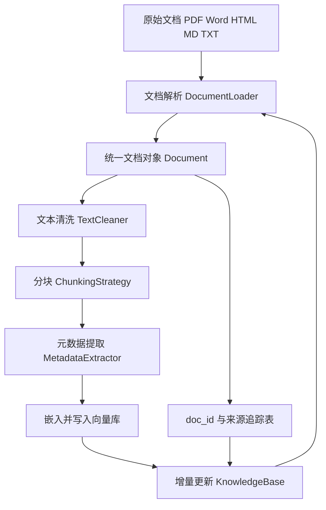
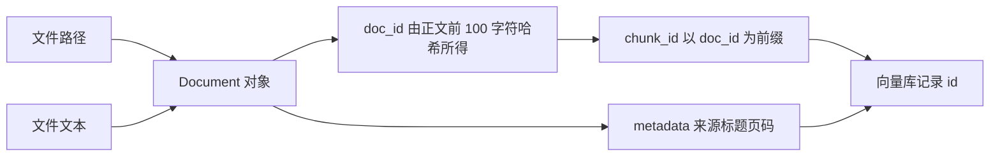
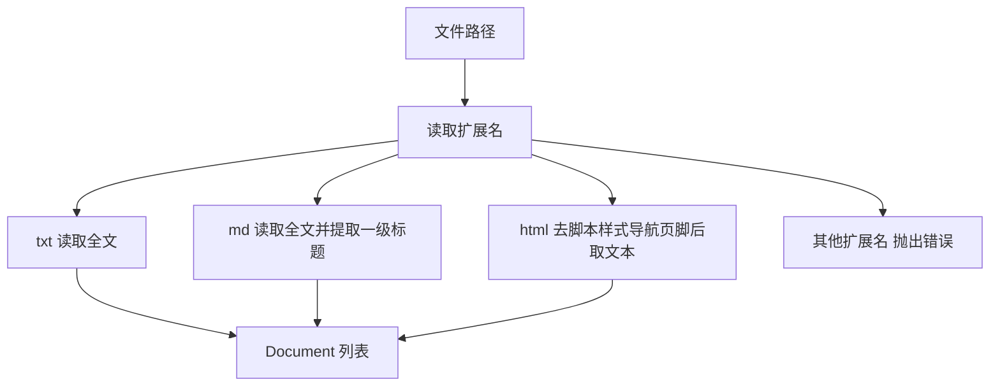
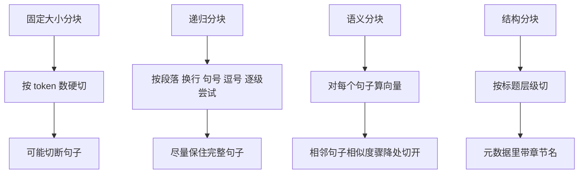
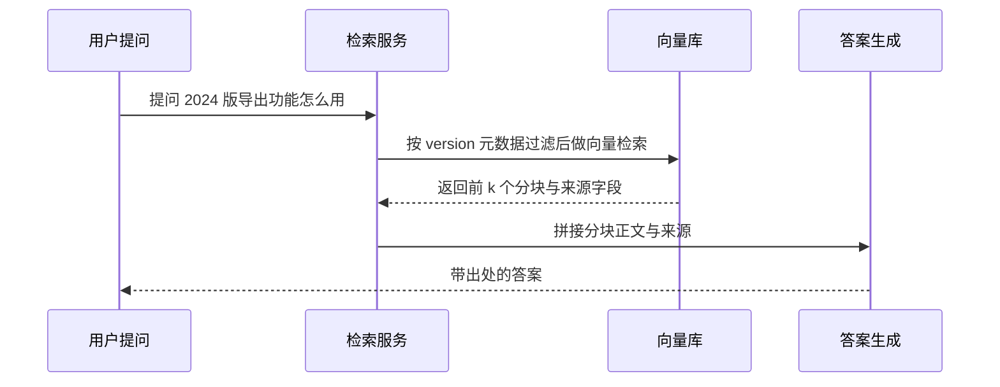
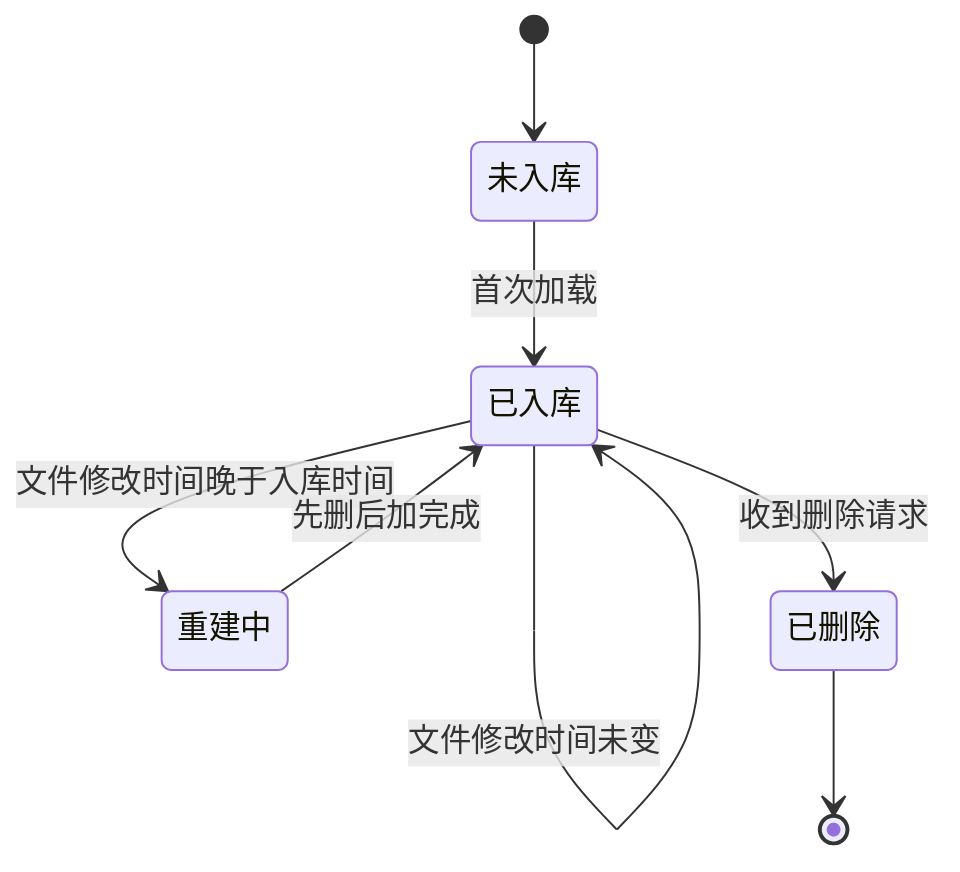

# RAG：知识库构建

!!! abstract "学完这一页你能"
    - 画出知识库构建的数据流，并说明每道工序解决的问题。
    - 用 Node 20 写出多格式加载器，为文档生成稳定 doc_id 与来源元数据。
    - 按分隔符优先级实现递归分块，并正确处理 chunk_overlap 与块大小上限。
    - 设计文档追踪表，用先删后加实现增量更新，并用断言验证行为。

## 0. 知识地图



建议按 1 到 6 的顺序读。第 1 到 3 节决定输入质量，第 4、5 节决定检索精度，第 6 节决定知识库能否长期运行。
如果时间有限，先读第 4 节和第 6 节，这两处最容易在生产环境出问题。

!!! note "术语：RAG"
    RAG 是 Retrieval-Augmented Generation（检索增强生成）：先检索资料，再把资料拼进提示词交给模型作答。例子：用户问退款多久到账，系统先取出手册里那一节，再让模型据此生成答案。

!!! note "术语：知识库"
    知识库是预先加工好、可被检索的文档集合，由文档、分块、向量、元数据四部分组成。例子：把 300 页手册切成 800 个分块写入向量库，这就是一个知识库。

## 1. 知识库构建的数据流与 Document 对象

**先想一个问题**

客服团队把 300 页产品手册交给模型，问退款多久到账，模型答不出来。
原因不是模型不行，是它从没读过手册。
知识库构建的第一步，就是把文件变成程序能追踪的文档对象。

**心智模型**

!!! tip "心智模型"
    一句话模型：给每份文档发一张身份证，后面的分块、索引、删除都靠这张证串起来。
    日常类比：图书馆给每本书贴索书号，取书、还书、下架都报这个号。
    类比不成立的地方：书的索书号由管理员分配，doc_id 要由内容自动算出，否则同一份文件换个路径就变成两本书。

**图解**



1. 文件读进来，先变成 Document 对象，里面放正文和元数据。
2. doc_id 从正文算出，正文不变则 id 不变。
3. 分块时把 doc_id 当前缀拼进 chunk_id。
4. 向量库用 chunk_id 作记录主键。
5. 删除文档时，按前缀筛出全部 chunk_id 一起删。

**一步一步来**

**第 1 步：生成稳定 doc_id**

从正文前 100 个字符算 md5，取前 8 位十六进制，拼上 doc_ 前缀。

```js
// document-id.mjs
import { createHash } from "node:crypto";

export function makeDocId(content) {
  // 只取正文前 100 个字符，正文尾部小改时 id 保持不变
  const head = content.slice(0, 100);
  // md5 摘要转十六进制后取前 8 位
  const digest = createHash("md5").update(head, "utf8").digest("hex");
  return `doc_${digest.slice(0, 8)}`;
}

export function createDocument(content, metadata = {}) {
  // 返回纯对象，便于 JSON 序列化后写入追踪表
  return { content, metadata, docId: makeDocId(content) };
}
```

**这段代码在做什么**

- createHash 来自 node:crypto，是 Node 内置模块，不需要安装依赖。
- md5 只用于生成标识，不作为安全哈希使用。
- slice 让 id 对正文尾部改动不敏感，代价是尾部完全不同而头部相同的两份文档会撞号。
- docId 前缀 doc_ 让人一眼看出这是文档级标识，与 chunk 级标识区分开。
- 返回纯对象而不是 class 实例，方便直接 JSON.stringify 存盘。

运行结果：

```text
doc_8f14e45f
```

**第 2 步：让 chunk_id 带上 doc_id 前缀**

分块编号从 0 开始，拼在 doc_id 后面，删除时按前缀匹配。

```js
// chunk-id.mjs
export function createChunk(doc, content, index) {
  return {
    // 前缀必须是 doc_id，删除整篇文档时靠它筛记录
    chunkId: `${doc.docId}_chunk_${index}`,
    content,
    // 复制文档元数据，检索返回时能回溯来源
    metadata: { ...doc.metadata },
    // 本页用近似计数，中文按字符算 1 个 token
    tokenCount: countTokens(content),
  };
}

export function countTokens(text) {
  // 中文单字算 1，英文与数字按连续片段算 1
  return (text.match(/[\u4e00-\u9fff]|[A-Za-z0-9]+|[^\s]/g) || []).length;
}
```

**这段代码在做什么**

- chunkId 形如 doc_8f14e45f_chunk_0，人眼可读，机器可前缀匹配。
- metadata 用展开运算符复制，避免多个 chunk 共享同一个对象引用。
- tokenCount 先算好并存下来，后续做块大小筛选时不用重新分词。
- 近似计数不等于真实 tokenizer，真实分词需核对官方文档：要核对你的嵌入模型对中文、标点、代码的切分规则。

运行结果：

```text
doc_8f14e45f_chunk_0 doc_8f14e45f_chunk_1
```

**动手验证**

```js
// kb-01.mjs
// 依赖：Node 20+ 内置模块，无第三方包
import assert from "node:assert/strict";
import { createHash } from "node:crypto";

const makeDocId = (content) =>
  `doc_${createHash("md5").update(content.slice(0, 100), "utf8").digest("hex").slice(0, 8)}`;

const countTokens = (text) =>
  (text.match(/[\u4e00-\u9fff]|[A-Za-z0-9]+|[^\s]/g) || []).length;

function createChunk(doc, content, index) {
  return {
    chunkId: `${doc.docId}_chunk_${index}`,
    content,
    metadata: { ...doc.metadata },
    tokenCount: countTokens(content),
  };
}

const raw = "# 退款政策\n到账时间 3 个工作日";
const doc = { docId: makeDocId(raw), metadata: { source: "refund.md" } };
const c0 = createChunk(doc, "到账时间 3 个工作日", 0);
const c1 = createChunk(doc, "退款需在 7 天内申请", 1);

assert.match(doc.docId, /^doc_[0-9a-f]{8}$/);
assert.equal(makeDocId(raw), doc.docId);
assert.ok(c0.chunkId.startsWith(`${doc.docId}_chunk_`));
assert.equal(c1.metadata.source, "refund.md");
assert.ok(c0.tokenCount > 0);
console.log("all assertions passed");
console.log(doc.docId, c0.chunkId, c1.chunkId);
// 预期输出：
// all assertions passed
// doc_xxxxxxxx doc_xxxxxxxx_chunk_0 doc_xxxxxxxx_chunk_1
```

**常见坑**

| 现象 | 原因 | 怎么修 |
| --- | --- | --- |
| 同一份文档反复入库出现两份 | doc_id 用了文件路径而不是内容 | 用正文前缀的哈希，或把路径与内容哈希拼起来 |
| 删文档时漏掉几个块 | chunk_id 前缀与 doc_id 不一致 | 把前缀规则写进单元测试，用断言锁住 |
| 正文改一个字，整篇重新入库 | doc_id 用了全文哈希 | 只取正文前缀参与哈希 |
| 元数据在多个块之间互相污染 | 直接赋值同一个对象引用 | 每次都用展开运算符复制一份新对象 |

**用在哪里**

- 企业帮助中心问答
  - 业务背景：帮助中心有 400 篇 Markdown，客服需要回答带原文链接的问题。
  - 这节知识怎么用：每篇生成 doc_id，每个块继承 source 字段作为回答里的引用。
  - 衡量指标：回答带出处的比例、人工核对来源的耗时。
  - 不该用的时机：文档总量在 20 篇以内，直接全量塞进提示词更省事。
- API 文档站搜索
  - 业务背景：接口文档按版本发布，同一接口名在多个版本里存在。
  - 这节知识怎么用：doc_id 之外再补 version 元数据，过滤后再检索。
  - 衡量指标：搜到的示例代码版本正确率。
  - 不该用的时机：只有一个历史版本，不需要版本维度。
- 内部流程手册
  - 业务背景：手册由多个部门维护，改版频繁。
  - 这节知识怎么用：稳定 doc_id 让同一份文档的版本可替换。
  - 衡量指标：改版后旧内容残留率。
  - 不该用的时机：手册是扫描件图片，先用 OCR 转文本再谈入库。

**行业实践**

- 本站旧版内容《RAG：知识库构建》记录的做法是：doc_id 由正文前 100 字符的 md5 取前 8 位生成，并在向量记录里只保留正文前 500 字符（出处：本站该页旧版内容，以原文为准）。借鉴方式：把这条规则写成文档注释与测试用例，新人改动时会立刻看到断言失败。
- 本站旧版内容还记录了按 chunk_id 前缀删除整篇文档的策略（出处同上）。借鉴方式：删除接口先算出待删 ID 列表并落盘，再调用向量库，失败时可重放。
- 其他公开工程做法资料未覆盖，需核对官方文档：要核对目标向量库删除接口是否限制单次 ID 数量、是否支持条件删除。

**小结**

- 文档对象是知识库的最小管理单元，doc_id 必须由内容决定。
- chunk_id 用 doc_id 做前缀，删除与更新才有可靠的抓手。
- 把 ID 规则写进断言，比写进文档更能防回归。

## 2. 文档解析：把多种格式变成同一种记录

**先想一个问题**

产品手册是 40 个 PDF 加 12 个 HTML 页面。
用户提问后，你希望回答里出现手册第 12 页。
如果解析阶段没记页码，后面任何环节都补不回来。

**心智模型**

!!! tip "心智模型"
    一句话模型：解析器是一排转换插头，把各种来源转成同一种 Document 记录。
    日常类比：出国旅行用的转换插头，各国的插头形状不同，输出端统一。
    类比不成立的地方：转换插头不损失电压，解析器会丢信息，PDF 表格的行列关系在纯文本里会消失。

**图解**



1. 先看扩展名，决定走哪条分支。
2. txt 直接读全文，元数据只有来源路径。
3. md 额外用正则抓一级标题写进元数据。
4. html 先删掉脚本、样式、导航、页脚，再取纯文本。
5. 不认识的扩展名抛错，让调用方决定是跳过还是中断。
6. 每条分支都返回同一个结构，后续代码不必再区分格式。

**一步一步来**

**第 1 步：写扩展名分派**

一个函数读文件，用三个 if 分派到三种处理方式。

```js
// loader.mjs
import { readFileSync } from "node:fs";
import { basename, extname } from "node:path";

export const toDoc = (content, metadata) => ({ content, metadata });

export function loadFile(filePath) {
  const ext = extname(filePath).toLowerCase();
  const raw = readFileSync(filePath, "utf8");
  if (ext === ".txt") return [toDoc(raw, { source: filePath })];
  if (ext === ".md") {
    // 一级标题写进元数据，回答时能显示章节名
    const m = raw.match(/^#\s+(.+)$/m);
    return [toDoc(raw, { source: filePath, title: m ? m[1].trim() : basename(filePath) })];
  }
  if (ext === ".html") return [toDoc(stripHtml(raw), { source: filePath })];
  throw new Error(`unsupported ext: ${ext}`);
}
```

**这段代码在做什么**

- extname 取扩展名并统一转小写，避免 .MD 与 .md 走两条路。
- readFileSync 一次读完整个文件，适合中小文档，超大文件要换成流式读取。
- 正则里的 m 标志让 ^ 匹配每一行的行首，才能抓到标题行。
- 抓不到标题时回落到文件名，保证 title 字段始终有值。
- 抛错而不是返回空数组，让上层能记录失败文件。

运行结果：

```text
{ content: "# 退款政策\n到账时间 3 个工作日", metadata: { source: "refund.md", title: "退款政策" } }
```

**第 2 步：批量加载目录并隔离错误**

递归遍历目录，单个文件失败只打日志，不影响整批。

```js
// batch.mjs
import { readdirSync } from "node:fs";
import { join } from "node:path";

export function* walk(dir) {
  for (const entry of readdirSync(dir, { withFileTypes: true })) {
    const full = join(dir, entry.name);
    // 目录递归，文件直接产出
    if (entry.isDirectory()) yield* walk(full);
    else yield full;
  }
}

export function* loadDirectory(dir, loader) {
  for (const file of walk(dir)) {
    try {
      for (const doc of loader(file)) yield doc;
    } catch (err) {
      // 单个文件解析失败不阻断整批导入
      console.warn(`skip ${file}: ${err.message}`);
    }
  }
}
```

**这段代码在做什么**

- 手写 walk 而不是用递归选项，避免依赖具体 Node 小版本的目录项字段。
- 生成器逐条产出文档，配合后续批处理可以边读边写，内存占用更可控。
- try 包住单个文件，Unsupported 或编码错误只跳过当前文件。
- console.warn 带上文件名，导入结束后可以按日志补数据。
- 目录顺序由文件系统决定，需要确定性顺序时要显式排序。

运行结果：

```text
skip ./docs/old.doc: unsupported ext: .doc
loaded 2 docs
```

**动手验证**

```js
// kb-02.mjs
// 依赖：Node 20+ 内置模块，无第三方包
import assert from "node:assert/strict";
import { mkdtempSync, mkdirSync, readdirSync, rmSync, writeFileSync } from "node:fs";
import { join, basename, extname } from "node:path";
import { tmpdir } from "node:os";

const stripHtml = (html) =>
  html
    .replace(/<script[\s\S]*?<\/script>/gi, " ")
    .replace(/<style[\s\S]*?<\/style>/gi, " ")
    .replace(/<nav[\s\S]*?<\/nav>/gi, " ")
    .replace(/<footer[\s\S]*?<\/footer>/gi, " ")
    .replace(/<[^>]+>/g, " ")
    .replace(/\s+/g, " ")
    .trim();

const toDoc = (content, metadata) => ({ content, metadata });

function loadFile(filePath) {
  const ext = extname(filePath).toLowerCase();
  const raw = readFileSync(filePath, "utf8");
  if (ext === ".txt") return [toDoc(raw, { source: filePath })];
  if (ext === ".md") {
    const m = raw.match(/^#\s+(.+)$/m);
    return [toDoc(raw, { source: filePath, title: m ? m[1].trim() : basename(filePath) })];
  }
  if (ext === ".html") return [toDoc(stripHtml(raw), { source: filePath })];
  throw new Error(`unsupported ext: ${ext}`);
}

function* walk(dir) {
  for (const entry of readdirSync(dir, { withFileTypes: true })) {
    const full = join(dir, entry.name);
    if (entry.isDirectory()) yield* walk(full);
    else yield full;
  }
}

const root = mkdtempSync(join(tmpdir(), "kb-"));
mkdirSync(join(root, "sub"));
writeFileSync(join(root, "a.md"), "# 退款政策\n到账时间 3 个工作日", "utf8");
writeFileSync(join(root, "sub", "b.html"), "<nav>导航</nav><p>到账时间 3 个工作日</p>", "utf8");
writeFileSync(join(root, "c.doc"), "binary", "utf8");

const docs = [];
for (const file of walk(root)) {
  try {
    docs.push(...loadFile(file));
  } catch (err) {
    assert.match(err.message, /unsupported ext/);
  }
}

assert.equal(docs.length, 2);
const md = docs.find((d) => d.metadata.title);
assert.equal(md.metadata.title, "退款政策");
const html = docs.find((d) => d.metadata.source.endsWith(".html"));
assert.ok(!html.content.includes("导航"));
assert.ok(!html.content.includes("script"));
console.log("all assertions passed, docs =", docs.length);
rmSync(root, { recursive: true, force: true });
// 预期输出：all assertions passed, docs = 2
```

**常见坑**

| 现象 | 原因 | 怎么修 |
| --- | --- | --- |
| 读取时报编码错误 | 文件不是 UTF-8 | 先探测编码再转码，失败则跳过并记录文件名 |
| 扩展名大写被跳过 | 没有统一转小写 | extname 结果调用 toLowerCase |
| HTML 正文里混入导航文字 | 只删了标签没删整块节点 | 先按标签名删整块，再去标签 |
| 嵌套表格或列表结构丢失 | 正则解析 HTML 无法处理嵌套 | 换成真正的 HTML 解析库，需核对官方文档选型 |
| PDF 只有扫描图没有文字 | 文本层不存在 | 先走 OCR，再进入解析流程 |

**用在哪里**

- 帮助中心批量导入
  - 业务背景：运营一次性上传 200 篇 Markdown 与 HTML 文章。
  - 这节知识怎么用：按扩展名分派，失败文件输出清单让运营补齐。
  - 衡量指标：导入成功率、失败文件的平均补录轮次。
  - 不该用的时机：文档全部来自同一个 CMS 的接口，直接取结构化字段更准。
- 招投标文件库
  - 业务背景：投标文件多为 PDF，需要按页码定位条款。
  - 这节知识怎么用：PDF 逐页解析，页号写进元数据。
  - 衡量指标：引用页码与原文页码一致的比例。
  - 不该用的时机：PDF 是加密或扫描版，先解决可读性再入库。
- 内部 Wiki 迁移
  - 业务背景：老 Wiki 导出成 HTML，正文里混着侧边栏。
  - 这节知识怎么用：先按标签删掉侧边栏节点，再取正文。
  - 衡量指标：正文纯净度抽检通过率。
  - 不该用的时机：Wiki 有官方 API 时，用 API 拿正文块更可靠。

**行业实践**

- 本站旧版内容《RAG：知识库构建》给出了扩展名到加载方法的映射表，并为 PDF 记录 page 与 total_pages，为 HTML 移除 script、style、nav、header、footer（出处：本站该页旧版内容，以原文为准）。借鉴方式：把元数据字段清单固定下来，导入端与检索端共用同一份字段定义。
- 本站旧版内容在批量加载里用 try 包住单个文件并打印错误（出处同上）。借鉴方式：把跳过日志汇总成导入报告，交回给内容维护方。
- 具体解析库的选型与版本资料未覆盖，需核对官方文档：要核对目标库对中文 PDF 的文本抽取效果、是否需要额外字体包、许可证是否允许商用。

**小结**

- 解析的目标是把多种格式收敛成同一个记录结构。
- 元数据要在解析阶段尽量拿全，尤其是来源与页码。
- 单个文件失败要隔离，否则一次导入会被一个坏文件拖停。

## 3. 文本清洗：把噪音挡在索引之外

**先想一个问题**

从网页抓下来的正文夹着 12 处上一篇下一篇。
同一段话在库里出现三次，检索前三名全是重复块。
清洗就是解决这类问题的工序。

**心智模型**

!!! tip "心智模型"
    一句话模型：清洗是一条流水线，每道工序只做一件事，注册顺序就是执行顺序。
    日常类比：净菜加工，先洗再切再装盒，顺序换掉成品就变。
    类比不成立的地方：净菜去掉的部分都不能吃，清洗去掉的内容可能是答案，比如代码块和链接。

**图解**


1. 先压缩空白，让后面所有正则处理的行结构稳定。
2. 再把 URL 与邮箱替换成占位符，避免长串噪声占满 token 预算。
3. 然后处理代码块，把整段代码换成标记。
4. 接着把表格压成一行文本。
5. 最后统一标点，减少同义标点造成的重复词条。
6. 每一步都返回新字符串，不改动输入。

**一步一步来**

**第 1 步：写可组合的清洗器**

add 注册工序并返回自身，clean 按顺序执行。

```js
// cleaner.mjs
export function createCleaner() {
  const steps = [];
  return {
    // 返回自身，支持链式注册
    add(fn) { steps.push(fn); return this; },
    clean(text) { return steps.reduce((acc, fn) => fn(acc), text); },
  };
}

export const removeExtraWhitespace = (t) =>
  t.replace(/\n\s*\n\s*\n/g, "\n\n") // 三个以上换行压成两个
   .replace(/ +\n/g, "\n")           // 去掉行尾空格
   .replace(/[ \t]{2,}/g, " ")       // 连续空格压成一个
   .trim();

export const maskUrls = (t) => t.replace(/https?:\/\/\S+/g, "[链接]");
export const maskEmails = (t) => t.replace(/\S+@\S+\.\S+/g, "[邮箱]");
```

**这段代码在做什么**

- 闭包里的 steps 数组对外不可见，工序只能通过 add 注册。
- reduce 把上一步输出喂给下一步，天然形成管线。
- 空白处理放在第一位，后面正则的行首行尾假设才成立。
- URL 与邮箱替换成占位符而不是删除，保留这里有内容的信号。
- 全部函数都是纯函数，方便单独写测试。

运行结果：

```text
退款请联系 [邮箱]，说明见 [链接]
```

**第 2 步：代码块与表格的规范化**

代码块整体替换成带语言名的标记，表格压成一行。

```js
// normalize.mjs
export const normalizeCodeBlocks = (text) =>
  // 整段代码换成标记，语言名保留下来
  text.replace(/```(\w*)\n([\s\S]*?)```/g, (_, lang) => `[代码片段 ${lang || "text"}]`);

export const normalizeTables = (text) =>
  // 连续以竖线开头的行视为表格，只留首行内容
  text.replace(/(\|.+\|\n)+/g, (block) => {
    const first = block.trim().split("\n")[0];
    return `[表格行 ${first.split("|").filter(Boolean).length}]`;
  });
```

**这段代码在做什么**

- 正则用 [\s\S] 匹配跨行内容，因为点号默认不匹配换行。
- 替换结果里保留语言名，后续可以按语言过滤代码类问题。
- 表格换成列数标记，保留了结构信号，丢掉了单元格文本。
- 这两个步骤都会丢内容，是否启用取决于业务是否需要代码与表格问答。
- 若知识库要回答代码问题，应跳过 normalizeCodeBlocks，直接把代码作为独立块。

运行结果：

```text
[代码片段 js] 后面是说明文字 [表格行 3]
```

**动手验证**

```js
// kb-03.mjs
// 依赖：Node 20+ 内置模块，无第三方包
import assert from "node:assert/strict";

function createCleaner() {
  const steps = [];
  return {
    add(fn) { steps.push(fn); return this; },
    clean(text) { return steps.reduce((acc, fn) => fn(acc), text); },
  };
}

const removeExtraWhitespace = (t) =>
  t.replace(/\n\s*\n\s*\n/g, "\n\n").replace(/ +\n/g, "\n")
   .replace(/[ \t]{2,}/g, " ").trim();

const maskUrls = (t) => t.replace(/https?:\/\/\S+/g, "[链接]");
const maskEmails = (t) => t.replace(/\S+@\S+\.\S+/g, "[邮箱]");
const normalizeCodeBlocks = (t) =>
  t.replace(/```(\w*)\n([\s\S]*?)```/g, (_, lang) => `[代码片段 ${lang || "text"}]`);

const raw = "退款请联系 a@b.com 。\n\n\n\n详见 https://help.example.com/refund   \n\n```js\nconst a = 1;\n```";

const cleaner = createCleaner()
  .add(removeExtraWhitespace)
  .add(maskUrls)
  .add(maskEmails)
  .add(normalizeCodeBlocks);

const out = cleaner.clean(raw);

assert.ok(!out.includes("a@b.com"));
assert.ok(!out.includes("https://"));
assert.ok(out.includes("[邮箱]"));
assert.ok(out.includes("[链接]"));
assert.ok(out.includes("[代码片段 js]"));
assert.ok(!out.includes("const a = 1"));
assert.ok(!/\n{3,}/.test(out));
console.log("all assertions passed");
console.log(JSON.stringify(out));
// 预期输出：
// all assertions passed
// "退款请联系 [邮箱] 。\n\n详见 [链接]\n\n[代码片段 js]"
```

**常见坑**

| 现象 | 原因 | 怎么修 |
| --- | --- | --- |
| 回答里代码全没了 | 启用了代码块替换 | 对代码类文档关闭该步骤，把代码切成独立块 |
| 链接是答案本身却查不到 | 把 URL 换成了占位符 | 需要 URL 的场景改为保留原始链接 |
| 中文标点被改成英文后搜不到 | 标点规范化改变了原文写法 | 检索前用同样的规则处理查询串，或干脆不做这一步 |
| 同一段话在库里出现多次 | 抓取时页面重复 | 入库前按正文哈希去重 |
| 换行被压掉导致 Markdown 结构失效 | 空白压缩规则过强 | 只压缩三个以上连续换行，保留单换行 |

**用在哪里**

- 电商商品详情页客服
  - 业务背景：详情页抓取文本里混着促销条与页脚。
  - 这节知识怎么用：删掉重复模块，只保留商品参数与售后说明。
  - 衡量指标：检索结果里噪声块的占比。
  - 不该用的时机：商家参数本身就是表格图片，先解决 OCR。
- 后台管理的批量导入说明文档
  - 业务背景：导入说明里有大段 CSV 示例与字段表。
  - 这节知识怎么用：表格转结构化元数据，代码示例保留原文。
  - 衡量指标：字段类问题的命中率。
  - 不该用的时机：表格列数固定且要精确匹配，直接用结构化数据源。
- SaaS 帮助中心
  - 业务背景：帮助文章在全站有导航与推荐位。
  - 这节知识怎么用：解析阶段删导航节点，清洗阶段压空白。
  - 衡量指标：重复块导致的去重率。
  - 不该用的时机：文章主体就是链接列表。

**行业实践**

- 本站旧版内容《RAG：知识库构建》给出的默认清洗管线顺序是：压缩空白、替换 URL、替换邮箱、代码块规范化、表格规范化、中文标点规范化（出处：本站该页旧版内容，以原文为准）。借鉴方式：把默认管线抽成一个工厂函数，业务方按需增删工序。
- 本站旧版内容把代码块替换成带语言名的占位标记（出处同上）。借鉴方式：需要代码问答时改成保留代码原文并单独建集合，两类内容分开检索。
- 各清洗步骤对检索指标的量化影响资料未覆盖，需核对官方文档：要核对你的评测集上开与关每道工序后的命中率差异，不要凭感觉启用。

**小结**

- 清洗是顺序敏感的管线，先压空白再跑其他正则。
- 每道工序都会丢信息，启用前先问业务是否需要这类内容。
- 重复内容要在入库前去掉，不要指望检索阶段排序纠正。

## 4. 分块策略：从固定切分到语义切分

**先想一个问题**

手册里退款那一章 6000 字。
整章作为一个块，检索命中后模型只看到开头，答案在结尾。
切得太碎又会丢掉上下文，这句里的它指谁就说不清了。

**心智模型**

!!! tip "心智模型"
    一句话模型：分块是在文本上选剪点，剪点要落在语义切换的位置。
    日常类比：剪胶片，剪点落在场景切换处，观众才看得懂。
    类比不成立的地方：胶片只有一种公认剪辑，文本的正确剪点取决于用户会问什么，没有唯一答案。

!!! note "术语：分块"
    分块是把长文本切成检索单元的过程，每块会单独计算向量。例子：把 6000 字的一章切成 12 块，每块约 500 个 token。

!!! note "术语：chunk_overlap"
    chunk_overlap 是相邻块共享的文本长度，用来避免答案正好被剪断。例子：块大小 500、重叠 50，第二个块会重复上一块结尾的约 50 个 token。

**图解**



1. 固定大小分块实现最简单，切点位置与语义无关。
2. 递归分块按分隔符优先级逐级尝试，尽量落在句末。
3. 语义分块要对每个句子算向量，切点质量取决于嵌入模型。
4. 结构分块利用标题层级，天然带章节元数据。
5. 四种策略可以叠加，比如先按标题切，再对超长小节做递归切分。

**一步一步来**

**第 1 步：按分隔符优先级递归切分**

先用段落分隔符，不够再退到换行、句号、逗号。

```js
// split.mjs
const SEPARATORS = ["\n\n", "\n", "。", "！", "？", ". ", "! ", "? ", "; ", ", ", " "];

export const countTokens = (t) =>
  (t.match(/[\u4e00-\u9fff]|[A-Za-z0-9]+|[^\s]/g) || []).length;

export function splitKeep(text, sep) {
  if (sep === "") return [...text];
  const out = [];
  let start = 0;
  let idx = text.indexOf(sep, start);
  while (idx !== -1) {
    // 分隔符跟随前一段，避免切完丢标点
    out.push(text.slice(start, idx + sep.length));
    start = idx + sep.length;
    idx = text.indexOf(sep, start);
  }
  if (start < text.length) out.push(text.slice(start));
  return out;
}

export function splitRecursive(text, seps, maxTokens) {
  if (countTokens(text) <= maxTokens) return [text];
  if (seps.length === 0) return [text];
  const [sep, ...rest] = seps;
  return splitKeep(text, sep).flatMap((p) => splitRecursive(p, rest, maxTokens));
}
```

**这段代码在做什么**

- splitKeep 手工查找分隔符位置，把分隔符留在前一段末尾。
- 对比直接 split，这种做法不会丢掉句号与逗号，句子边界信息保留下来。
- 递归函数先判断是否已经够小，再判断分隔符是否用尽。
- 分隔符用尽仍超限时返回原文本，调用方需要兜底做按字符硬切。
- flatMap 让每一层的多个片段自然展开成一维数组。

运行结果：

```text
3 段：第一句话。 第二句话。 第三句话。
```

**第 2 步：合并成块并加重叠**

按顺序累积片段，超过上限就收一个块，并从尾部取重叠。

```js
// merge.mjs
export function tailForOverlap(pieces, overlapTokens) {
  const picked = [];
  let total = 0;
  for (let i = pieces.length - 1; i >= 0; i -= 1) {
    const t = countTokens(pieces[i]);
    // 片段整片计入，取不到就停，重叠可能为 0
    if (total + t > overlapTokens) break;
    picked.unshift(pieces[i]);
    total += t;
  }
  return picked;
}

export function mergeChunks(pieces, maxTokens, overlapTokens) {
  const chunks = [];
  let cur = [];
  let curTokens = 0;
  for (const piece of pieces) {
    const t = countTokens(piece);
    if (curTokens + t > maxTokens && cur.length > 0) {
      chunks.push(cur.join(""));
      cur = tailForOverlap(cur, overlapTokens);
      curTokens = countTokens(cur.join(""));
    }
    cur.push(piece);
    curTokens += t;
  }
  if (cur.length > 0) chunks.push(cur.join(""));
  return chunks;
}
```

**这段代码在做什么**

- tailForOverlap 从尾部往前取整片片段，取不下就停。
- 片段粒度大于 overlap 时，重叠为 0，这是常见现象而不是 bug。
- 新块的大小等于重叠部分加新内容，可能超过 maxTokens，需要把上限当净增长预算。
- 累积条件是超过上限且当前块非空，避免单个超长片段造成空块。
- 收尾时要把最后一个累积块推入结果。

运行结果：

```text
chunks = 3, sizes = 5 / 10 / 10
```

**动手验证**

```js
// kb-04.mjs
// 依赖：Node 20+ 内置模块，无第三方包
import assert from "node:assert/strict";

const countTokens = (t) =>
  (t.match(/[\u4e00-\u9fff]|[A-Za-z0-9]+|[^\s]/g) || []).length;

function splitKeep(text, sep) {
  if (sep === "") return [...text];
  const out = [];
  let start = 0;
  let idx = text.indexOf(sep, start);
  while (idx !== -1) {
    out.push(text.slice(start, idx + sep.length));
    start = idx + sep.length;
    idx = text.indexOf(sep, start);
  }
  if (start < text.length) out.push(text.slice(start));
  return out;
}

function splitRecursive(text, seps, maxTokens) {
  if (countTokens(text) <= maxTokens) return [text];
  if (seps.length === 0) return [text];
  const [sep, ...rest] = seps;
  return splitKeep(text, sep).flatMap((p) => splitRecursive(p, rest, maxTokens));
}

function tailForOverlap(pieces, overlapTokens) {
  const picked = [];
  let total = 0;
  for (let i = pieces.length - 1; i >= 0; i -= 1) {
    const t = countTokens(pieces[i]);
    if (total + t > overlapTokens) break;
    picked.unshift(pieces[i]);
    total += t;
  }
  return picked;
}

function mergeChunks(pieces, maxTokens, overlapTokens) {
  const chunks = [];
  let cur = [];
  let curTokens = 0;
  for (const piece of pieces) {
    const t = countTokens(piece);
    if (curTokens + t > maxTokens && cur.length > 0) {
      chunks.push(cur.join(""));
      cur = tailForOverlap(cur, overlapTokens);
      curTokens = countTokens(cur.join(""));
    }
    cur.push(piece);
    curTokens += t;
  }
  if (cur.length > 0) chunks.push(cur.join(""));
  return chunks;
}

const text = "第一句话。第二句话。第三句话。";
const seps = ["\n\n", "\n", "。", "！", "？", ", ", " "];
const pieces = splitRecursive(text, seps, 6);
assert.deepEqual(pieces, ["第一句话。", "第二句话。", "第三句话。"]);

const chunks = mergeChunks(pieces, 6, 8);
assert.equal(chunks.length, 3);
assert.ok(chunks[1].includes("第一句话。"));
assert.ok(chunks[2].includes("第二句话。"));
assert.equal(chunks.join("").includes("第三句话。"), true);
console.log("all assertions passed");
console.log("chunks =", chunks.length, "sizes =", chunks.map(countTokens).join(" / "));
// 预期输出：
// all assertions passed
// chunks = 3 sizes = 5 / 10 / 10
```

**常见坑**

| 现象 | 原因 | 怎么修 |
| --- | --- | --- |
| 切开后句子末尾没有标点 | 用 split 直接切，分隔符被吃掉 | 自己实现保留分隔符的切分 |
| 重叠永远是 0 | 片段粒度大于 overlap 值 | 调大 overlap，或改用字符级切片做重叠 |
| 块比设定上限大很多 | 重叠部分没计入预算 | 把 maxTokens 减去 overlap 后再作为净增长上限 |
| 全部文本挤在一个块里 | 分隔符用尽后没有兜底 | 兜底按固定字符数硬切 |
| 中文块远超模型上限 | 用字符数当 token 数 | 用目标模型的 tokenizer 计数，需核对官方文档 |

**用在哪里**

- FAQ 库
  - 业务背景：每条问答本身就是天然分块。
  - 这节知识怎么用：一问一答作为一个块，不启用递归切分。
  - 衡量指标：问题级命中率。
  - 不该用的时机：答案超过模型上下文窗口，仍需二次切分。
- 技术文档问答
  - 业务背景：文档含代码块、表格、步骤列表。
  - 这节知识怎么用：按标题切分，超长小节再递归切，代码块整体保留。
  - 衡量指标：答案里是否包含完整可运行片段的比例。
  - 不该用的时机：文档全是短小的 API 条目，直接按条目切分即可。
- 合同条款检索
  - 业务背景：条款编号固定，问答要精确到条。
  - 这节知识怎么用：结构分块，条款号写进元数据。
  - 衡量指标：引用条款号正确率。
  - 不该用的时机：合同含跨条款引用，单条款块会缺上下文，需要补相邻块。

**行业实践**

- 本站旧版内容《RAG：知识库构建》给出了递归分块的分隔符优先级：段落、换行、中文句号、中文感叹号、中文问号、英文句号加空格、英文感叹号加空格、英文问号加空格、英文分号加空格、英文逗号加空格、空格（出处：本站该页旧版内容，以原文为准）。借鉴方式：把这份优先级表按你的语料改一版，中文语料要保证中文标点排在英文标点之前。
- 本站旧版内容给出的重叠实现是从当前块尾部反向取片段直到超过重叠上限（出处同上）。借鉴方式：先用小评测集测出重叠为 0 的比例，再决定是改实现还是改参数。
- 语义分块的具体阈值取值资料未覆盖，需核对官方文档：要核对所用嵌入模型对句子级输入的相似度分布范围，相似度阈值必须按该模型实测校准。

**小结**

- 递归分块通过分隔符优先级，把切点尽量落在句末。
- 重叠要按整片片段取，片段粒度决定重叠是否真的生效。
- 分块参数必须用评测集验证，凭直觉设定无法判断好坏。

## 5. 元数据提取：让检索能过滤、能解释

**先想一个问题**

用户问 2024 版之后的导出功能怎么用。
纯向量检索分不清版本年份，它只看语义相似度。
元数据就是给检索加一层过滤条件。

**心智模型**

!!! tip "心智模型"
    一句话模型：元数据是贴在包裹上的标签，先按标签分堆，再在堆内按语义排序。
    日常类比：快递分拣先按城市分堆，再按单号找件。
    类比不成立的地方：标签由规则或模型生成，会出错，错误标签会把正确文档直接挡在结果之外。

!!! note "术语：元数据"
    元数据是描述分块的附加字段，不参与语义相似度计算，只用于过滤与展示。例子：source 为 refund.md、page 为 12、tags 为售后。

**图解**



1. 用户提问里带着版本约束，这类约束不适合交给向量相似度处理。
2. 检索服务先解析出结构化过滤条件。
3. 向量库在过滤后的子集里做相似度排序。
4. 返回结果里带 source、page 等字段。
5. 生成阶段把这些字段拼成引用信息。

**一步一步来**

**第 1 步：用规则提取字段**

字段分三类：基础信息、内容特征、领域标签。

```js
// metadata.mjs
const TAG_KEYWORDS = {
  "前端": ["HTML", "CSS", "JavaScript", "React", "Vue", "TypeScript"],
  "后端": ["Python", "Java", "Node.js", "API", "数据库", "服务器"],
  "DevOps": ["Docker", "Kubernetes", "CI/CD", "部署", "容器"],
  "安全": ["加密", "认证", "授权", "XSS", "CSRF", "SQL注入"],
};

export function matchTags(content) {
  // 命中的标签全部返回，是否用于过滤由检索端决定
  return Object.entries(TAG_KEYWORDS)
    .filter(([, words]) => words.some((w) => content.includes(w)))
    .map(([tag]) => tag);
}

export function extractRuleMetadata(content, docMeta = {}) {
  return {
    ...docMeta,
    charCount: content.length,
    wordCount: (content.match(/[A-Za-z0-9]+/g) || []).length,
    lineCount: content.split("\n").length,
    hasCode: content.includes("```"),
    hasTable: content.includes("|") && content.includes("---"),
    hasList: /^\s*([-*\d]+\.?)\s/m.test(content),
    tags: matchTags(content),
  };
}
```

**这段代码在做什么**

- 标签用关键词命中判断，实现成本低，召回取决于词表覆盖度。
- wordCount 只统计英文与数字，中文长度由 charCount 承担。
- hasTable 的正则同时要求竖线与分隔行，减少误判。
- hasList 用 m 标志逐行匹配列表标记。
- docMeta 放在展开运算最后，保证基础字段不会被覆盖。

运行结果：

```text
{ source: "refund.md", charCount: 21, tags: ["后端"] }
```

**第 2 步：用大模型提取摘要与问题类型，并做降级**

模型输出做长度裁剪，空结果回落到规则值。

```js
// llm-metadata.mjs
export async function extractLlmMetadata(llm, content, ruleMeta) {
  const prompt = [
    "请为以下内容生成一句话摘要，不超过 200 字：",
    "",
    content.slice(0, 2000),
    "",
    "摘要：",
  ].join("\n");
  const out = await llm.generate(prompt);
  const text = String(out.text ?? "").trim();
  // 模型返回空串或超长时回落到规则字段
  const summary = text.length > 0 ? text.slice(0, 200) : ruleMeta.lineCount + " 行内容";
  return { ...ruleMeta, summary, summarySource: text.length > 0 ? "llm" : "fallback" };
}
```

**这段代码在做什么**

- 提示词里明确字数上限，减少超长输出。
- 只截取前 2000 字送进模型，控制单次调用成本。
- 输出做 trim 与长度双重裁剪。
- 空结果时用规则字段兜底，保证 summary 一定存在。
- summarySource 记录来源，方便排查模型质量问题。

运行结果：

```text
{ summary: "退款到账时间与申请期限说明", summarySource: "llm" }
```

**动手验证**

```js
// kb-05.mjs
// 依赖：Node 20+ 内置模块，无第三方包
import assert from "node:assert/strict";

const TAG_KEYWORDS = {
  "前端": ["HTML", "CSS", "JavaScript", "React"],
  "后端": ["Node.js", "API", "数据库", "服务器"],
  "安全": ["加密", "认证", "授权", "XSS"],
};

const matchTags = (content) =>
  Object.entries(TAG_KEYWORDS)
    .filter(([, words]) => words.some((w) => content.includes(w)))
    .map(([tag]) => tag);

function extractRuleMetadata(content, docMeta = {}) {
  return {
    ...docMeta,
    charCount: content.length,
    wordCount: (content.match(/[A-Za-z0-9]+/g) || []).length,
    lineCount: content.split("\n").length,
    hasCode: content.includes("```"),
    hasTable: content.includes("|") && content.includes("---"),
    hasList: /^\s*([-*\d]+\.?)\s/m.test(content),
    tags: matchTags(content),
  };
}

async function extractLlmMetadata(llm, content, ruleMeta) {
  const prompt = ["请为以下内容生成一句话摘要，不超过 200 字：", "", content.slice(0, 2000), "", "摘要："].join("\n");
  const out = await llm.generate(prompt);
  const text = String(out.text ?? "").trim();
  const summary = text.length > 0 ? text.slice(0, 200) : `${ruleMeta.lineCount} 行内容`;
  return { ...ruleMeta, summary, summarySource: text.length > 0 ? "llm" : "fallback" };
}

const fakeLlm = { generate: async () => ({ text: "" }) };
const content = "# 退款政策\n使用 Node.js 调用 API 查询退款进度\n```js\nconst a = 1;\n```";

const rule = extractRuleMetadata(content, { source: "refund.md" });
assert.deepEqual(rule.tags, ["后端"]);
assert.equal(rule.hasCode, true);
assert.equal(rule.hasTable, false);
assert.equal(rule.hasList, false);

const merged = await extractLlmMetadata(fakeLlm, content, rule);
assert.equal(merged.summarySource, "fallback");
assert.ok(merged.summary.length > 0);
assert.equal(merged.source, "refund.md");
console.log("all assertions passed");
console.log("tags =", merged.tags.join(","), "summarySource =", merged.summarySource);
// 预期输出：all assertions passed
// tags = 后端 summarySource = fallback
```

**常见坑**

| 现象 | 原因 | 怎么修 |
| --- | --- | --- |
| 过滤后一条结果都没有 | 标签命中太多导致条件过窄 | 把标签只做排序加权，不做硬过滤 |
| 摘要字段时有时无 | 模型返回空串 | 加回落逻辑，并记录 summarySource |
| 元数据体积超过正文 | 把整段正文塞进元数据 | 只存前若干字符与统计字段 |
| 关键词命中错误领域 | 词表里有歧义词，比如 Java 与 JavaScript | 用词边界匹配，并人工维护词表 |
| 时间字段比较出错 | 时区不一致 | 统一存 ISO 字符串再做比较 |

**用在哪里**

- 多版本产品文档问答
  - 业务背景：同一功能在 2023 版与 2024 版说明不同。
  - 这节知识怎么用：version 作为过滤字段，先过滤再检索。
  - 衡量指标：版本错配率。
  - 不该用的时机：文档只有一个版本，加了字段只会增加维护成本。
- 按部门权限过滤检索
  - 业务背景：财务文档只对财务角色开放。
  - 这节知识怎么用：部门字段在检索前置过滤，不依赖模型判断。
  - 衡量指标：越权命中次数，必须为 0。
  - 不该用的时机：权限规则按行级变化，应先做权限系统改造。
- 工单自动分类
  - 业务背景：客服希望按问题类型把工单分派给对应小组。
  - 这节知识怎么用：用模型抽取的问题类型字段做分派依据。
  - 衡量指标：分派正确率与人工改派率。
  - 不该用的时机：类型只有两种且规则清晰，用关键词即可。

**行业实践**

- 本站旧版内容《RAG：知识库构建》给出的元数据字段包含 charCount、wordCount、lineCount、hasCode、hasTable、hasList 与 tags，并列出前端、后端、数据库、DevOps、AI 与 ML、安全六类标签词表（出处：本站该页旧版内容，以原文为准）。借鉴方式：把字段清单当作检索端与索引端的接口约定，先冻结再实现。
- 本站旧版内容用模型提取摘要、关键词与问题类型，并限定提示词输出格式（出处同上）。借鉴方式：模型结果一律当不可信输入，做长度校验与空值回落。
- 元数据字段对检索指标的具体影响资料未覆盖，需核对官方文档：要核对你所用向量库的过滤语法是否支持范围查询与数组包含查询。

**小结**

- 元数据负责过滤与展示，不替代语义相似度。
- 规则字段先跑通，模型字段作为增强并保留回落路径。
- 标签用于过滤要谨慎，用于加权排序更安全。

## 6. 增量更新：让知识库跟着文档走

**先想一个问题**

产品手册每周改一版。
全量重建索引要跑很久，重建期间检索结果还会跳变。
增量更新要解决的是只处理变化的那部分文档。

**心智模型**

!!! tip "心智模型"
    一句话模型：先删后加，用可预测的块 ID 找齐旧内容再写新内容。
    日常类比：换灯泡前先断电，换完再通电。
    类比不成立的地方：断电与通电之间没有用户在用，删除与写入之间用户可能正好来查询，会有短暂空窗。

!!! note "术语：向量数据库"
    向量数据库是存储向量并支持相似度检索的系统，通常还支持按元数据过滤与按键删除。例子：写入 800 条分块向量后，按相似度取前 5 条。

!!! note "术语：增量更新"
    增量更新是只处理新增、修改、删除过的文档，不重建整个索引。例子：本周只改了 3 篇手册，就只重建这 3 篇对应的分块。

**图解**



1. 未入库的文档首次加载后进入已入库状态。
2. 文件修改时间没有变化，状态停在已入库，不产生写入。
3. 修改时间晚于入库时间，进入重建中。
4. 重建完成回到已入库，追踪表里的时间戳更新。
5. 收到删除请求后按块 ID 前缀删除记录。
6. 状态机的每个转换都需要追踪表提供输入。

**一步一步来**

**第 1 步：维护文档追踪表**

记录每个 doc_id 的入库时间、块数量与来源路径。

```js
// tracker.mjs
export class DocTracker {
  constructor() {
    // docId 到追踪信息的映射
    this.docs = new Map();
  }

  mark(docId, { source, chunkCount, addedAt = new Date().toISOString() }) {
    this.docs.set(docId, { source, chunkCount, addedAt });
    return this.docs.get(docId);
  }

  get(docId) {
    return this.docs.get(docId);
  }

  remove(docId) {
    return this.docs.delete(docId);
  }

  stats() {
    return {
      documentCount: this.docs.size,
      chunkCount: [...this.docs.values()].reduce((s, d) => s + d.chunkCount, 0),
    };
  }
}
```

**这段代码在做什么**

- Map 用 docId 作键，查找复杂度与文档数无关。
- addedAt 存 ISO 字符串，跨时区比较时不会有歧义。
- mark 返回写入后的记录，方便测试断言。
- stats 汇总文档数与块数，用于导入报告。
- 生产环境要把 Map 换成持久化存储，进程重启后不丢追踪信息。

运行结果：

```text
{ documentCount: 1, chunkCount: 3 }
```

**第 2 步：增量判定与先删后加**

新文档直接加，改动过的文档先按前缀删干净再写入。

```js
// incremental.mjs
export async function syncDirectory(kb, files, loader, modifiedAt) {
  const result = { added: 0, updated: 0, skipped: 0 };
  for (const file of files) {
    const docs = loader(file);
    for (const doc of docs) {
      const known = kb.tracker.get(doc.docId);
      if (known === undefined) {
        // 新文档，直接入库
        await kb.add(doc);
        result.added += 1;
      } else if (modifiedAt(file) > new Date(known.addedAt)) {
        // 已修改，先删除旧块再写入新块
        await kb.delete(doc.docId);
        await kb.add(doc);
        result.updated += 1;
      } else {
        result.skipped += 1;
      }
    }
  }
  return result;
}
```

**这段代码在做什么**

- 判定顺序先查存在性再比时间，避免对不存在的记录做时间比较。
- 比较用大于而不是大于等于，相同时间戳不触发重建。
- 删除按 docId 整体删除，函数内部用前缀筛出全部块。
- 返回值累计三类计数，导入完成后可以直接出报告。
- 删除与写入之间没有事务，需要业务侧接受短暂空窗，或采用双索引切换。

运行结果：

```text
{ added: 1, updated: 1, skipped: 0 }
```

**动手验证**

```js
// kb-06.mjs
// 依赖：Node 20+ 内置模块，无第三方包
import assert from "node:assert/strict";
import { createHash } from "node:crypto";

class DocTracker {
  constructor() { this.docs = new Map(); }
  mark(docId, info) { this.docs.set(docId, info); return info; }
  get(docId) { return this.docs.get(docId); }
  remove(docId) { return this.docs.delete(docId); }
}

class MemoryStore {
  constructor() { this.rows = new Map(); }
  upsert(vectors) { for (const v of vectors) this.rows.set(v.id, v); }
  ids() { return [...this.rows.keys()]; }
  delete(ids) { for (const id of ids) this.rows.delete(id); }
}

// docId 绑定到文件来源而非内容：内容变化时仍能识别为同一文档的更新
const makeDoc = (content, source) => ({
  content,
  metadata: { source },
  docId: `doc_${createHash("md5").update(source).digest("hex").slice(0, 8)}`,
});

const toChunks = (doc) =>
  doc.content.split("\n").filter(Boolean).map((line, i) => ({
    chunkId: `${doc.docId}_chunk_${i}`,
    content: line,
    metadata: { ...doc.metadata, docId: doc.docId },
  }));

class KnowledgeBase {
  constructor() { this.store = new MemoryStore(); this.tracker = new DocTracker(); }
  add(doc) {
    const chunks = toChunks(doc);
    this.store.upsert(chunks.map((c) => ({ id: c.chunkId, metadata: c.metadata })));
    this.tracker.mark(doc.docId, { source: doc.metadata.source, chunkCount: chunks.length, addedAt: "2024-01-01T00:00:00.000Z" });
    return chunks.length;
  }
  delete(docId) {
    const ids = this.store.ids().filter((id) => id.startsWith(`${docId}_chunk_`));
    this.store.delete(ids);
    this.tracker.remove(docId);
    return ids.length;
  }
}

async function syncDirectory(kb, docs, modifiedAt) {
  const result = { added: 0, updated: 0, skipped: 0 };
  for (const doc of docs) {
    const known = kb.tracker.get(doc.docId);
    if (known === undefined) { kb.add(doc); result.added += 1; continue; }
    if (modifiedAt(doc.metadata.source) > new Date(known.addedAt)) {
      kb.delete(doc.docId);
      kb.add(doc);
      result.updated += 1;
    } else result.skipped += 1;
  }
  return result;
}

const kb = new KnowledgeBase();
const d1 = makeDoc("退款政策\n到账时间 3 个工作日", "refund.md");
const d2 = makeDoc("退款政策\n到账时间 3 个工作日\n改后", "refund.md");

const first = await syncDirectory(kb, [d1], () => new Date("2024-01-01T00:00:00.000Z"));
assert.deepEqual(first, { added: 1, updated: 0, skipped: 0 });
assert.equal(kb.store.rows.size, 2);

const second = await syncDirectory(kb, [d1], () => new Date("2024-01-01T00:00:00.000Z"));
assert.deepEqual(second, { added: 0, updated: 0, skipped: 1 });

const third = await syncDirectory(kb, [d2], () => new Date("2024-06-01T00:00:00.000Z"));
assert.equal(third.updated, 1);
assert.equal(kb.tracker.docs.size, 1);
console.log("all assertions passed");
console.log("rows =", kb.store.rows.size, "docs =", kb.tracker.docs.size);
// 预期输出：all assertions passed
// rows = 3 docs = 1
```

**常见坑**

| 现象 | 原因 | 怎么修 |
| --- | --- | --- |
| 删除别的文档的分块 | 前缀匹配写成了包含匹配 | 前缀必须带下划线分隔符，并写断言防止误伤 |
| 修改过的文档没有更新 | 文件修改时间早于入库时间 | 记录内容哈希作为第二判据 |
| 更新期间检索结果为空 | 先删后加之间的空窗 | 用双索引写入完成后切换，或接受短暂降级 |
| 重启后全部重新入库 | 追踪表存在内存里 | 把追踪表落到数据库或本地文件 |
| 批量删除超时 | 一次删除块数过多 | 分批删除，批大小需核对官方文档：要核对向量库单次删除上限 |

**用在哪里**

- 每周更新的产品手册
  - 业务背景：手册每周发布一版，只有少数字节变化。
  - 这节知识怎么用：按修改时间判定，只重建变化文档的块。
  - 衡量指标：单次同步的写入块数占全量的比例。
  - 不该用的时机：文档结构大改，增量收益低，直接全量重建更省心。
- 代码仓库文档同步
  - 业务背景：README 与 docs 目录随代码合并不停变化。
  - 这节知识怎么用：用文件路径加内容哈希生成 doc_id，跟踪每次合并。
  - 衡量指标：同步延迟与过期文档比例。
  - 不该用的时机：仓库很小，每次全量重建耗时低于维护成本。
- 法规库的废止与新增
  - 业务背景：条例会废止、修订、新增，回答必须引用现行版本。
  - 这节知识怎么用：废止即删除，修订即先删后加，元数据带生效日期。
  - 衡量指标：引用废止条款的次数，必须为 0。
  - 不该用的时机：需要保留历史版本供追溯，删除会破坏留痕，应改为标记失效。

**行业实践**

- 本站旧版内容《RAG：知识库构建》给出的更新流程是先删除旧版本再添加新版本，删除时用 chunk_id 前缀筛选相关记录（出处：本站该页旧版内容，以原文为准）。借鉴方式：删除函数先返回待删 ID 列表并记账，再执行删除，便于失败重放。
- 本站旧版内容用文件路径的哈希生成文档标识，并用记录中的入库时间与文件修改时间比较来决定是否更新（出处同上）。借鉴方式：把内容哈希与修改时间同时作为判据，避免时间戳被复制工具改写时误判。
- 生产级双索引切换与批量删除上限的做法资料未覆盖，需核对官方文档：要核对目标向量库是否支持别名切换、单次删除条数上限、以及写入的可见性延迟。

**小结**

- 增量更新依赖可预测的块 ID 与持久化的追踪表。
- 判定顺序是先看是否已入库，再看是否需要更新。
- 先删后加实现简单，但要用双索引或维护窗口规避空窗。

## 应用地图

| 场景 | 用到本页哪个知识点 | 典型技术选型 | 注意事项 |
| --- | --- | --- | --- |
| 企业帮助中心问答 | 解析加元数据，来源字段用于引用 | 静态站点导出为 Markdown 后入库 | 每篇必须保留可点击的原文地址 |
| 多版本 API 文档搜索 | 元数据过滤加结构分块 | 版本号写入元数据字段 | 版本过滤要做硬过滤，不能只加权 |
| 合同条款检索 | 结构分块加条款号元数据 | 按条款切分，条款号作字段 | 跨条款引用需要补相邻块 |
| 工单库自动分类 | 模型抽取的问题类型元数据 | 分类字段与工单系统对齐 | 类型体系变更要同步历史数据 |
| 内部流程手册每周更新 | 增量更新与追踪表 | 文件修改时间加内容哈希 | 追踪表要持久化，否则每次全量 |
| 网页抓取内容入库 | 清洗管线与去重 | 删除导航节点，按哈希去重 | 抓取失败要重试，不要把空页入库 |
| 代码仓库文档同步 | 解析加增量更新 | 按路径生成文档标识 | 忽略构建产物目录，避免噪声入库 |

## 动手作业

**目标**：把 docs 目录变成可增量更新的内存知识库，跑两次同步，第二次只处理变化文件。

**步骤**

1. 实现 walk 与 loadFile，支持 .txt、.md、.html 三种扩展名。
2. 实现清洗管线，至少包含压缩空白与 URL 掩码两道工序。
3. 实现 splitRecursive 与 mergeChunks，块大小 40 个近似 token，重叠 10 个。
4. 实现 extractRuleMetadata，写入 source、tags、lineCount 三个字段。
5. 实现 MemoryStore 与 DocTracker，支持按 docId 前缀删除。
6. 写 syncDirectory，返回 added、updated、skipped 三个计数。

**验收标准**

- 首次同步后 added 等于文件数，updated 与 skipped 都是 0。
- 不改文件再同步一次，skipped 等于文件数，store 行数不变。
- 改一个文件后同步，updated 等于 1，store 行数等于新块数之和。
- 删除一个文件后同步，追踪表里对应 docId 不存在，store 里没有以该前缀开头的行。
- 所有断言通过，脚本退出码为 0。

## 综合对比

| 维度 | 固定大小分块 | 递归分块 | 语义分块 | 结构分块 |
| --- | --- | --- | --- | --- |
| 切点依据 | token 数达到阈值 | 分隔符优先级逐级尝试 | 相邻句子向量相似度低于阈值 | 标题层级与章节边界 |
| 是否依赖模型 | 否 | 否 | 是，需要嵌入模型 | 否 |
| 块大小可控性 | 高，接近严格上限 | 中，受片段粒度影响 | 低，边界由相似度决定 | 低，由文档结构决定 |
| 实现成本 | 最低 | 中，需要保留分隔符 | 高，需要逐句编码 | 中，需要解析标题 |
| 元数据丰富度 | 低 | 低 | 低 | 高，自带章节名 |
| 已知风险 | 切断句子 | 分隔符用尽后仍超限 | 阈值需按模型校准 | 短小节过多产生碎块 |
| 适合的语料 | 结构松散的长文 | 通用文档 | 段落主题切换明显的长文 | 有明确标题体系的文档 |

## 深入阅读与参考

!!! tip "怎么用这些资料"
    先读「官方文档与规范」建立准确的概念，再读「源码与示例」核对细节，最后用「教程、书籍与视频」换一种讲法加深理解。每条都写明了读哪一节、带着什么问题读。

### 官方文档与规范

| 资源 | 为什么读 | 怎么读 |
|---|---|---|
| [LlamaIndex 博客](https://www.llamaindex.ai/blog) | 官方博客讲清 agentic RAG 的检索决策，区别于单轮检索。 | 读 agentic RAG 相关文章，带着何时该二次检索的问题读，把一种策略接入自己的 RAG。 |
| [Ragas 文档](https://docs.ragas.io/) | 官方指标文档，给出 RAG 评测可落地的定义与用法。 | 读 metrics 一节，用 faithfulness 与 context precision 评测自己的 RAG。 |

### 源码与示例

| 资源 | 为什么读 | 怎么读 |
|---|---|---|
| [Anthropic Cookbook](https://github.com/anthropics/anthropic-cookbook) | 官方 notebook 给出工具调用与 RAG 的最小可运行实现，代码干净。 | 克隆后运行 tool_use 与 RAG 目录的 notebook，逐格跑通，再把数据换成自己的语料。 |
| [All-in-RAG（Datawhale）](https://github.com/datawhalechina/all-in-rag) | 中文开源教程，从数据处理到生成有完整可跑链路。 | 按章节实现数据处理、检索与生成，最后拼出一个端到端 RAG 应用。 |
| [RAG_Techniques（NirDiamant）](https://github.com/NirDiamant/RAG_Techniques) | 同一问题用多种检索技巧实现，便于横向对比效果。 | 依次运行基础 RAG、重排序、查询改写三个 notebook，比较答案质量差异。 |

### 教程、书籍与视频

| 资源 | 为什么读 | 怎么读 |
|---|---|---|
| [RAG 综述（Gao et al.）](https://arxiv.org/abs/2312.10997) | 综述给出 RAG 全景与分类，是建立术语体系的权威入口。 | 重点读分类与模块化两节，按 Naive、Advanced、Modular 三阶段整理一张对比表。 |
| [DeepLearning.AI 短课程](https://www.deeplearning.ai/short-courses/) | 课时短、配套 notebook，适合快速建立动手直觉。 | 选 RAG 或 Agent 一门，边看边改 notebook 里的切块大小与 top-k 参数。 |
| [Pinecone RAG 系列](https://www.pinecone.io/learn/series/rag/) | 每篇配实验，讲透检索、重排、评测等环节的取舍。 | 按系列顺序读，每篇文末的实验自己复现一次，记录指标变化。 |
| [Retrieval-Augmented Generation（Prompt Guide 中文）](https://www.promptingguide.ai/zh/research/rag) | 中文速览，快速厘清 Naive 与 Advanced RAG 的差异。 | 通读一遍，用一句话说清两者区别，再回头补读细节章节。 |

## 自测题

??? question "文档标识为什么只取正文前 100 个字符做哈希？"
    - 目的是让正文尾部小改动不改变标识，避免整篇重新入库。
    - 代价是头部相同而尾部不同的两份文档会得到同一个标识。
    - 单库规模越大，撞号概率越高。
    - 需要更强区分时，可以拼接文件路径或完整内容哈希。

??? question "清洗阶段把 URL 替换成占位符有什么风险？"
    - 用户提问可能直接包含链接，链接本身就是答案。
    - 替换后原文与查询串形态不一致，检索可能落空。
    - 更稳妥的做法是按业务分两类：需要链接的文档关闭该工序。
    - 若保留链接，查询侧也要做同样的规范化处理。

??? question "递归分块为什么要按分隔符优先级从段落开始？"
    - 段落边界通常与主题边界重合，切在这里语义损失小。
    - 越往后分隔符越细，切出的片段越短。
    - 逐级下探能保证在尽量大的语义单元上切分。
    - 分隔符用尽仍超限时，需要兜底按字符硬切。

??? question "chunk_overlap 设得比 chunk_size 一半还大会发生什么？"
    - 重叠部分会占据块内大量空间，新内容能放下的很少。
    - 每个新块的大小等于重叠加新内容，可能明显超过设定上限。
    - 极端情况下相邻块内容几乎相同，检索结果高度重复。
    - 建议把 chunk_size 减去 overlap 后作为净增长预算来设定。

??? question "语义分块的实现成本体现在哪里？"
    - 需要对每个句子调用嵌入模型，调用次数与句子数成正比。
    - 相似度阈值必须按所用模型校准，换模型要重新校准。
    - 分块结果对文档写作风格敏感。
    - 文档量增大后，这一阶段的耗时与费用占比会上升。

??? question "元数据过滤在什么情况下会伤害检索？"
    - 标签命中过多导致过滤条件过窄，正确文档被挡在外面。
    - 标签由关键词匹配生成，歧义词会造成错误标签。
    - 过滤字段与查询解析不一致时，条件会失效或过严。
    - 把标签只用于加权排序，是风险更低的用法。

??? question "增量更新为什么采用先删后加而不是原地更新？"
    - 文档改版后块数量与块边界都会变，原地更新无法对应。
    - 先删后加让实现简单，块 ID 规则可以保持可预测。
    - 代价是删除与写入之间存在短暂空窗。
    - 对可用性要求高的场景，用双索引写入后切换。

??? question "chunk_id 前缀设计不当会造成什么后果？"
    - 前缀写成包含匹配时，删除一个文档会误删其他文档的块。
    - 前缀里如果混入不稳定的时间戳，删除时无法按规则筛选。
    - 修改前缀规则后，历史数据的删除逻辑会失效。
    - 应该把前缀规则写进单元测试，并在规则变更时做数据迁移。

## 延伸阅读

- Node.js 官方文档，章节「File system」，用于核对同步与异步文件 API 的行为差异。
- Node.js 官方文档，章节「Crypto」下的「Class: Hash」，用于核对 createHash 支持的算法名与摘要输出格式。
- Node.js 官方文档，章节「Test runner」，用于把本页的断言脚本升级成测试用例。
- MDN Web 文档，章节「Regular expressions」下的「Groups and backreferences」，用于核对清洗与解析正则的分组写法。
- 文档解析、向量数据库与嵌入模型的官方文档章节名需核对官方文档：要核对分块器的分隔符参数、向量库的元数据过滤语法与批量删除上限。
