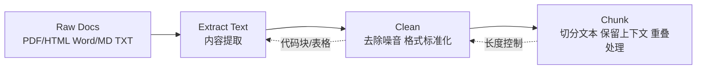
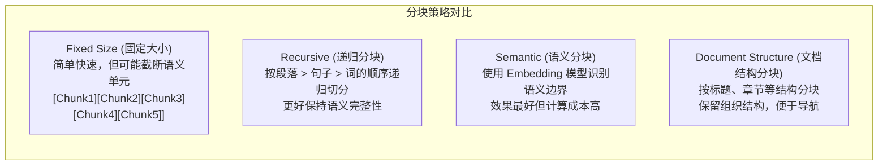

# RAG：知识库构建

> 本文是「RAG」系列第 2 篇（共 4 篇）。上一篇：[RAG：原理与检索系统](rag-principles-retrieval.md)　下一篇：[RAG：Agent 集成与高级 RAG](rag-agent-advanced.md)

## 1. 知识库构建

### 1.1 文档预处理

文档预处理是构建高质量知识库的基础：



#### 1.1.1 文档解析实现

```python
import re
from pathlib import Path
from typing import Iterator

class Document:
    """文档数据结构"""
    
    def __init__(
        self,
        content: str,
        metadata: dict = None,
        doc_id: str = None
    ):
        self.content = content
        self.metadata = metadata or {}
        self.doc_id = doc_id or self._generate_id()
    
    def _generate_id(self) -> str:
        import hashlib
        content_hash = hashlib.md5(self.content[:100].encode()).hexdigest()[:8]
        return f"doc_{content_hash}"
    
    def __repr__(self):
        return f"Document(id={self.doc_id}, chars={len(self.content)})"


class DocumentLoader:
    """多格式文档加载器"""
    
    LOADERS = {
        ".txt": "_load_txt",
        ".md": "_load_md",
        ".pdf": "_load_pdf",
        ".docx": "_load_docx",
        ".html": "_load_html",
    }
    
    def __init__(self):
        self.loaders = {
            ext: getattr(self, method)
            for ext, method in self.LOADERS.items()
        }
    
    def load(self, file_path: str) -> list[Document]:
        """加载单个文档"""
        path = Path(file_path)
        ext = path.suffix.lower()
        
        loader = self.loaders.get(ext)
        if loader is None:
            raise ValueError(f"Unsupported file type: {ext}")
        
        return loader(path)
    
    def load_directory(
        self,
        directory: str,
        glob_pattern: str = "**/*.*",
        recursive: bool = True
    ) -> Iterator[Document]:
        """批量加载目录中的文档"""
        path = Path(directory)
        
        pattern = glob_pattern if recursive else "*.*"
        for file_path in path.glob(pattern):
            if file_path.suffix.lower() in self.loaders:
                try:
                    for doc in self.load(file_path):
                        doc.metadata["source"] = str(file_path)
                        yield doc
                except Exception as e:
                    print(f"Error loading {file_path}: {e}")
    
    def _load_txt(self, path: Path) -> list[Document]:
        """加载纯文本文件"""
        with open(path, "r", encoding="utf-8") as f:
            content = f.read()
        return [Document(content=content, metadata={"source": str(path)})]
    
    def _load_md(self, path: Path) -> list[Document]:
        """加载 Markdown 文件"""
        with open(path, "r", encoding="utf-8") as f:
            content = f.read()
        
        # 提取标题作为元数据
        title_match = re.match(r'^#\s+(.+)$', content, re.MULTILINE)
        metadata = {
            "source": str(path),
            "title": title_match.group(1) if title_match else path.stem
        }
        
        return [Document(content=content, metadata=metadata)]
    
    def _load_pdf(self, path: Path) -> list[Document]:
        """加载 PDF 文件（需要 pip install pypdf）"""
        from pypdf import PdfReader
        
        documents = []
        reader = PdfReader(path)
        
        for i, page in enumerate(reader.pages):
            text = page.extract_text()
            if text.strip():
                documents.append(Document(
                    content=text,
                    metadata={
                        "source": str(path),
                        "page": i + 1,
                        "total_pages": len(reader.pages)
                    }
                ))
        
        return documents
    
    def _load_docx(self, path: Path) -> list[Document]:
        """加载 Word 文档（需要 pip install python-docx）"""
        from docx import Document as DocxReader
        
        doc = DocxReader(str(path))
        content = "\n".join([para.text for para in doc.paragraphs if para.text.strip()])
        
        return [Document(content=content, metadata={"source": str(path)})]
    
    def _load_html(self, path: Path) -> list[Document]:
        """加载 HTML 文件"""
        from bs4 import BeautifulSoup
        
        with open(path, "r", encoding="utf-8") as f:
            soup = BeautifulSoup(f.read(), "html.parser")
        
        # 提取标题
        title = soup.find("title")
        title = title.text if title else path.stem
        
        # 移除脚本和样式
        for tag in soup(["script", "style", "nav", "header", "footer"]):
            tag.decompose()
        
        # 提取正文
        text = soup.get_text(separator="\n", strip=True)
        
        return [Document(
            content=text,
            metadata={"source": str(path), "title": title}
        )]
```

#### 1.1.2 文档清洗实现

```python
import re
from typing import Callable

class TextCleaner:
    """文本清洗器"""
    
    def __init__(self):
        self.pipelines: list[Callable[[str], str]] = []
    
    def add_step(self, func: Callable[[str], str]) -> "TextCleaner":
        """添加清洗步骤"""
        self.pipelines.append(func)
        return self
    
    def clean(self, text: str) -> str:
        """执行清洗"""
        for func in self.pipelines:
            text = func(text)
        return text
    
    @staticmethod
    def remove_extra_whitespace(text: str) -> str:
        """移除多余空白"""
        text = re.sub(r'\n\s*\n\s*\n', '\n\n', text)  # 多个换行合并
        text = re.sub(r' +\n', '\n', text)  # 行尾空格
        text = re.sub(r'\s{2,}', ' ', text)  # 多个空格合并
        return text.strip()
    
    @staticmethod
    def remove_special_chars(text: str, keep_patterns: str = None) -> str:
        """移除特殊字符"""
        if keep_patterns:
            # 保留指定模式的字符
            pattern = f"[^a-zA-Z0-9\\u4e00-\\u9fff{keep_patterns}]"
        else:
            pattern = r"[^a-zA-Z0-9一-鿿\s.,!?;:'\"-]"
        
        return re.sub(pattern, "", text)
    
    @staticmethod
    def normalize_code_blocks(text: str) -> str:
        """规范化代码块"""
        # 保留代码块内容，但简化格式
        code_pattern = r'```(\w+)?\n(.*?)```'
        
        def process_code(match):
            lang = match.group(1) or ""
            code = match.group(2)
            # 移除多余缩进
            lines = code.split('\n')
            min_indent = min(len(line) - len(line.lstrip()) for line in lines if line.strip())
            code = '\n'.join(line[min_indent:] if len(line) >= min_indent else line for line in lines)
            return f"[代码片段 {lang}]"
        
        return re.sub(code_pattern, process_code, text, flags=re.DOTALL)
    
    @staticmethod
    def normalize_tables(text: str) -> str:
        """规范化表格为文本"""
        table_pattern = r'(\|.+\|\n)+'
        
        def process_table(match):
            lines = match.group().strip().split('\n')
            # 转换为制表符分隔
            return "【表格内容】" + " | ".join(lines[0].split('|')[1:-1])
        
        return re.sub(table_pattern, process_table, text)
    
    @staticmethod
    def remove_urls(text: str) -> str:
        """移除 URL"""
        return re.sub(r'https?://\S+', '[链接]', text)
    
    @staticmethod
    def remove_emails(text: str) -> str:
        """移除邮箱"""
        return re.sub(r'\S+@\S+\.\S+', '[邮箱]', text)
    
    @staticmethod
    def fix_chinese_punctuation(text: str) -> str:
        """规范化中文标点"""
        # 全角转半角（排除中文特有字符）
        # 中文冒号 -> 英文冒号
        text = text.replace('：', ':')
        # 中文顿号 -> 逗号
        text = text.replace('、', ',')
        return text


# 预配置清洗器
def get_default_cleaner() -> TextCleaner:
    """获取默认文本清洗器"""
    return (TextCleaner()
        .add_step(TextCleaner.remove_extra_whitespace)
        .add_step(TextCleaner.remove_urls)
        .add_step(TextCleaner.remove_emails)
        .add_step(TextCleaner.normalize_code_blocks)
        .add_step(TextCleaner.normalize_tables)
        .add_step(TextCleaner.fix_chinese_punctuation))
```

### 1.2 分块策略

分块（Chunking）策略直接影响检索效果：



#### 1.2.1 分块实现

```python
import re
from typing import Iterator, NamedTuple

class Chunk(NamedTuple):
    """文本块"""
    content: str
    metadata: dict
    chunk_id: str
    token_count: int

class ChunkingStrategy:
    """分块策略基类"""
    
    def __init__(
        self,
        chunk_size: int = 500,
        chunk_overlap: int = 50,
        tokenizer = None
    ):
        """
        初始化分块器
        
        Args:
            chunk_size: 目标块大小（token 数）
            chunk_overlap: 块重叠大小（token 数）
            tokenizer: 分词器（用于准确计算 token）
        """
        self.chunk_size = chunk_size
        self.chunk_overlap = chunk_overlap
        self.tokenizer = tokenizer or self._default_tokenizer()
    
    def _default_tokenizer(self):
        """默认分词器"""
        import tiktoken
        return tiktoken.get_encoding("cl100k_base")
    
    def count_tokens(self, text: str) -> int:
        """计算 token 数"""
        return len(self.tokenizer.encode(text))
    
    def chunk(self, document: Document) -> list[Chunk]:
        """分块接口"""
        raise NotImplementedError


class RecursiveChunker(ChunkingStrategy):
    """递归分块器"""
    
    # 分隔符优先级
    SEPARATORS = [
        "\n\n",  # 段落
        "\n",    # 换行
        "。",    # 中文句号
        "！",    # 中文感叹号
        "？",    # 中文问号
        ". ",    # 英文句号+空格
        "! ",
        "? ",
        "; ",
        ", ",    # 英文逗号
        " ",     # 空格
        "",
    ]
    
    def chunk(self, document: Document) -> list[Chunk]:
        """递归分块"""
        chunks = []
        texts = self._split_text(document.content)
        
        current_chunk = []
        current_tokens = 0
        
        for text in texts:
            text_tokens = self.count_tokens(text)
            
            # 如果单个文本超过块大小，递归处理
            if text_tokens > self.chunk_size:
                if current_chunk:
                    chunks.append(self._create_chunk(current_chunk, document, len(chunks)))
                    current_chunk = []
                    current_tokens = 0
                
                sub_chunks = self._split_overflow(text, document)
                chunks.extend(sub_chunks)
                continue
            
            # 检查是否需要切换块
            if current_tokens + text_tokens > self.chunk_size:
                if current_chunk:
                    chunks.append(self._create_chunk(current_chunk, document, len(chunks)))
                
                # 处理重叠
                if self.chunk_overlap > 0:
                    # 取最后部分块作为重叠
                    overlap_tokens = 0
                    overlap_texts = []
                    for t in reversed(current_chunk):
                        t_tokens = self.count_tokens(t)
                        if overlap_tokens + t_tokens <= self.chunk_overlap:
                            overlap_texts.insert(0, t)
                            overlap_tokens += t_tokens
                        else:
                            break
                    current_chunk = overlap_texts
                    current_tokens = overlap_tokens
                else:
                    current_chunk = []
                    current_tokens = 0
            
            current_chunk.append(text)
            current_tokens += text_tokens
        
        # 添加最后一块
        if current_chunk:
            chunks.append(self._create_chunk(current_chunk, document, len(chunks)))
        
        return chunks
    
    def _split_text(self, text: str) -> list[str]:
        """按分隔符分割文本"""
        result = [text]
        
        for separator in self.SEPARATORS:
            new_result = []
            for piece in result:
                if piece:
                    splits = piece.split(separator)
                    new_result.extend(splits)
            result = new_result
        
        return [s for s in result if s.strip()]
    
    def _split_overflow(self, text: str, document: Document) -> list[Chunk]:
        """处理超出块大小的文本"""
        if self.count_tokens(text) <= self.chunk_size:
            return [self._create_chunk([text], document, 0)]
        
        # 继续递归分割
        chunks = []
        parts = self._split_text(text)
        current = []
        
        for part in parts:
            if self.count_tokens("\n".join(current + [part])) > self.chunk_size:
                if current:
                    chunks.append(self._create_chunk(current, document, len(chunks)))
                current = [part]
            else:
                current.append(part)
        
        if current:
            chunks.append(self._create_chunk(current, document, len(chunks)))
        
        return chunks
    
    def _create_chunk(
        self,
        texts: list[str],
        document: Document,
        index: int
    ) -> Chunk:
        """创建块"""
        content = "\n".join(texts)
        return Chunk(
            content=content,
            metadata={**document.metadata},
            chunk_id=f"{document.doc_id}_chunk_{index}",
            token_count=self.count_tokens(content)
        )


class SemanticChunker(ChunkingStrategy):
    """语义分块器：使用 Embedding 识别语义边界"""
    
    def __init__(
        self,
        embedding_model,
        threshold: float = 0.7,
        min_chunk_size: int = 100,
        max_chunk_size: int = 1000,
        **kwargs
    ):
        """
        Args:
            embedding_model: Embedding 模型
            threshold: 语义相似度阈值（用于判断边界）
            min_chunk_size: 最小块大小
            max_chunk_size: 最大块大小
        """
        super().__init__(**kwargs)
        self.embedding_model = embedding_model
        self.threshold = threshold
        self.min_chunk_size = min_chunk_size
        self.max_chunk_size = max_chunk_size
    
    def chunk(self, document: Document) -> list[Chunk]:
        """语义分块"""
        # 1. 将文档分成句子
        sentences = self._split_sentences(document.content)
        if not sentences:
            return []
        
        # 2. 计算每个句子的向量
        embeddings = self.embedding_model.encode(sentences)
        
        # 3. 识别语义边界（相邻句子相似度骤降处）
        boundaries = [0]  # 起始位置
        
        for i in range(1, len(sentences)):
            similarity = self._cosine_similarity(embeddings[i-1], embeddings[i])
            if similarity < self.threshold:
                boundaries.append(i)
        
        boundaries.append(len(sentences))  # 结束位置
        
        # 4. 根据边界创建块
        chunks = []
        for i in range(len(boundaries) - 1):
            start, end = boundaries[i], boundaries[i + 1]
            chunk_sentences = sentences[start:end]
            content = "".join(chunk_sentences)
            
            # 检查块大小约束
            token_count = self.count_tokens(content)
            if token_count < self.min_chunk_size and i > 0:
                # 合并到前一块
                pass
            elif token_count > self.max_chunk_size:
                # 需要进一步分割
                sub_chunks = self._split_large_chunk(chunk_sentences, document, i)
                chunks.extend(sub_chunks)
            else:
                chunks.append(Chunk(
                    content=content,
                    metadata={**document.metadata},
                    chunk_id=f"{document.doc_id}_chunk_{i}",
                    token_count=token_count
                ))
        
        return chunks
    
    def _split_sentences(self, text: str) -> list[str]:
        """句子分割"""
        # 简单的句子分割（中文 + 英文）
        pattern = r'(?<=[。！？.!?])\s*(?=[A-Z一-鿿])|(?<=[；;])\s*'
        parts = re.split(pattern, text)
        return [p.strip() for p in parts if p.strip()]
    
    def _cosine_similarity(self, a: np.ndarray, b: np.ndarray) -> float:
        """计算余弦相似度"""
        return np.dot(a, b) / (np.linalg.norm(a) * np.linalg.norm(b))
    
    def _split_large_chunk(
        self,
        sentences: list[str],
        document: Document,
        index: int
    ) -> list[Chunk]:
        """分割过大的块"""
        chunks = []
        current = []
        current_tokens = 0
        
        for sentence in sentences:
            tokens = self.count_tokens(sentence)
            if current_tokens + tokens > self.max_chunk_size and current:
                chunks.append(Chunk(
                    content="".join(current),
                    metadata={**document.metadata},
                    chunk_id=f"{document.doc_id}_chunk_{index}_{len(chunks)}",
                    token_count=current_tokens
                ))
                current = [sentence]
                current_tokens = tokens
            else:
                current.append(sentence)
                current_tokens += tokens
        
        if current:
            chunks.append(Chunk(
                content="".join(current),
                metadata={**document.metadata},
                chunk_id=f"{document.doc_id}_chunk_{index}_{len(chunks)}",
                token_count=current_tokens
            ))
        
        return chunks


class HierarchicalChunker(ChunkingStrategy):
    """层级分块器：保留文档结构"""
    
    def chunk(self, document: Document) -> list[Chunk]:
        """层级分块"""
        chunks = []
        
        # 解析文档结构
        sections = self._parse_structure(document.content)
        
        # 按层级处理
        current_h1 = ""
        current_h2 = ""
        current_content = []
        current_tokens = 0
        
        for section in sections:
            level = section["level"]
            title = section.get("title", "")
            content = section.get("content", "")
            
            if level == 1:
                # 保存之前的 H1
                if current_content:
                    chunks.append(self._create_chunk(
                        current_content, document, current_h1, current_h2, len(chunks)
                    ))
                current_h1 = title
                current_h2 = ""
                current_content = []
                current_tokens = 0
            
            elif level == 2:
                # 保存之前的 H2
                if current_content:
                    chunks.append(self._create_chunk(
                        current_content, document, current_h1, current_h2, len(chunks)
                    ))
                current_h2 = title
                current_content = []
                current_tokens = 0
            
            # 添加内容
            if content:
                current_content.append(content)
                current_tokens += self.count_tokens(content)
        
        # 保存最后一块
        if current_content:
            chunks.append(self._create_chunk(
                current_content, document, current_h1, current_h2, len(chunks)
            ))
        
        return chunks
    
    def _parse_structure(self, content: str) -> list[dict]:
        """解析文档结构"""
        # Markdown 标题识别
        lines = content.split("\n")
        sections = []
        
        current_level = 0
        current_title = ""
        current_content = []
        
        for line in lines:
            # 检测标题
            match = re.match(r'^(#{1,6})\s+(.+)$', line)
            if match:
                level = len(match.group(1))
                title = match.group(2)
                
                if current_content:
                    sections.append({
                        "level": current_level,
                        "title": current_title,
                        "content": "\n".join(current_content)
                    })
                    current_content = []
                
                current_level = level
                current_title = title
            else:
                current_content.append(line)
        
        # 最后一个 section
        if current_content:
            sections.append({
                "level": current_level,
                "title": current_title,
                "content": "\n".join(current_content)
            })
        
        return sections
    
    def _create_chunk(
        self,
        contents: list[str],
        document: Document,
        h1: str,
        h2: str,
        index: int
    ) -> Chunk:
        """创建层级块"""
        content = "\n".join(contents)
        return Chunk(
            content=content,
            metadata={
                **document.metadata,
                "section_h1": h1,
                "section_h2": h2
            },
            chunk_id=f"{document.doc_id}_chunk_{index}",
            token_count=self.count_tokens(content)
        )
```

### 1.3 元数据提取

元数据增强检索的精确性和可解释性：

```python
from datetime import datetime
import re

class MetadataExtractor:
    """元数据提取器"""
    
    def extract(self, document: Document, chunk: Chunk = None) -> dict:
        """
        提取元数据
        
        Args:
            document: 原始文档
            chunk: 分块（可选）
        
        Returns:
            元数据字典
        """
        metadata = {**document.metadata}
        
        # 基础信息
        metadata.update(self._extract_basic_info(document))
        
        # 内容特征
        metadata.update(self._extract_content_features(chunk or document))
        
        # 领域标签
        metadata.update(self._extract_domain_tags(chunk or document))
        
        return metadata
    
    def _extract_basic_info(self, document: Document) -> dict:
        """提取基础信息"""
        return {
            "created_at": datetime.now().isoformat(),
            "doc_id": document.doc_id,
        }
    
    def _extract_content_features(self, chunk) -> dict:
        """提取内容特征"""
        content = chunk.content
        
        # 字数统计
        char_count = len(content)
        word_count = len(re.findall(r'\w+', content))
        
        # 行数统计
        line_count = content.count('\n') + 1
        
        # 代码检测
        has_code = '```' in content or 'function' in content or 'def ' in content
        
        # 表格检测
        has_table = '|' in content and ('---' in content or '|' in content.split('\n')[0])
        
        # 列表检测
        has_list = bool(re.search(r'^[\s]*[-*\d]+\.?\s', content, re.MULTILINE))
        
        return {
            "char_count": char_count,
            "word_count": word_count,
            "line_count": line_count,
            "has_code": has_code,
            "has_table": has_table,
            "has_list": has_list
        }
    
    def _extract_domain_tags(self, chunk) -> dict:
        """提取领域标签"""
        content = chunk.content
        
        # 关键词匹配
        tags = []
        tag_keywords = {
            "前端": ["HTML", "CSS", "JavaScript", "React", "Vue", "TypeScript"],
            "后端": ["Python", "Java", "Node.js", "API", "数据库", "服务器"],
            "数据库": ["SQL", "MongoDB", "Redis", "索引", "查询"],
            "DevOps": ["Docker", "Kubernetes", "CI/CD", "部署", "容器"],
            "AI/ML": ["模型", "训练", "深度学习", "神经网络", "TensorFlow"],
            "安全": ["加密", "认证", "授权", "XSS", "CSRF", "SQL注入"],
        }
        
        for tag, keywords in tag_keywords.items():
            if any(kw in content for kw in keywords):
                tags.append(tag)
        
        return {
            "tags": tags,
            "tag_count": len(tags)
        }


class HierarchicalMetadataExtractor(MetadataExtractor):
    """层级元数据提取器"""
    
    def _extract_content_features(self, chunk) -> dict:
        """提取层级内容特征"""
        features = super()._extract_content_features(chunk)
        
        content = chunk.content
        
        # 检测标题层级
        h1_match = re.search(r'^#\s+(.+)$', content, re.MULTILINE)
        h2_match = re.search(r'^##\s+(.+)$', content, re.MULTILINE)
        
        features["has_h1"] = bool(h1_match)
        features["has_h2"] = bool(h2_match)
        features["h1_title"] = h1_match.group(1) if h1_match else None
        features["h2_section"] = h2_match.group(1) if h2_match else None
        
        return features


class LLMBasedMetadataExtractor(MetadataExtractor):
    """基于 LLM 的元数据提取器"""
    
    def __init__(self, llm):
        self.llm = llm
    
    def extract(self, document: Document, chunk: Chunk = None) -> dict:
        """使用 LLM 提取高级元数据"""
        metadata = super().extract(document, chunk)
        
        # LLM 提取摘要和关键词
        content = (chunk or document).content
        
        # 摘要
        summary = self._extract_summary(content)
        metadata["summary"] = summary
        
        # 关键词
        keywords = self._extract_keywords(content)
        metadata["keywords"] = keywords
        
        # 问题类型
        question_type = self._classify_question_type(content)
        metadata["question_type"] = question_type
        
        return metadata
    
    def _extract_summary(self, content: str, max_length: int = 200) -> str:
        """提取摘要"""
        prompt = f"""请为以下内容生成一句话摘要（不超过{max_length}字）：

{content[:2000]}

摘要："""
        
        response = self.llm.generate(prompt)
        return response.text.strip()
    
    def _extract_keywords(self, content: str, top_k: int = 5) -> list[str]:
        """提取关键词"""
        prompt = f"""请从以下内容中提取{top_k}个最重要的关键词，以逗号分隔：

{content[:2000]}

关键词："""
        
        response = self.llm.generate(prompt)
        keywords = [k.strip() for k in response.text.split(",")]
        return keywords[:top_k]
    
    def _classify_question_type(self, content: str) -> str:
        """分类问题类型"""
        prompt = f"""请判断以下内容最适合回答什么类型的问题：

{content[:1000]}

问题类型（选择最合适的）：
1. 概念解释类
2. 实现方法类
3. 比较分析类
4. 故障排查类
5. 最佳实践类
6. 工具使用类

类型："""
        
        response = self.llm.generate(prompt)
        return response.text.strip()
```

### 1.4 增量更新

知识库的增量更新机制：

```python
from datetime import datetime
from typing import Iterator, Callable

class KnowledgeBase:
    """知识库管理器"""
    
    def __init__(
        self,
        vector_store,
        embedding_model,
        chunker: ChunkingStrategy,
        metadata_extractor: MetadataExtractor = None
    ):
        """
        初始化知识库
        
        Args:
            vector_store: 向量数据库
            embedding_model: Embedding 模型
            chunker: 分块策略
            metadata_extractor: 元数据提取器
        """
        self.vector_store = vector_store
        self.embedding_model = embedding_model
        self.chunker = chunker
        self.metadata_extractor = metadata_extractor or MetadataExtractor()
        
        # 文档追踪
        self.documents: dict[str, dict] = {}  # doc_id -> doc info
    
    def build_from_directory(
        self,
        directory: str,
        glob_pattern: str = "**/*.*",
        batch_size: int = 100,
        show_progress: bool = True
    ):
        """
        从目录构建知识库
        
        Args:
            directory: 文档目录
            glob_pattern: 文件匹配模式
            batch_size: 批处理大小
            show_progress: 显示进度
        """
        loader = DocumentLoader()
        documents = list(loader.load_directory(directory, glob_pattern))
        
        if show_progress:
            print(f"Loaded {len(documents)} documents")
        
        self.add_documents(documents, batch_size=batch_size, show_progress=show_progress)
    
    def add_documents(
        self,
        documents: list[Document],
        batch_size: int = 100,
        show_progress: bool = True
    ):
        """添加文档到知识库"""
        all_chunks = []
        
        for document in documents:
            # 分块
            chunks = self.chunker.chunk(document)
            
            # 提取元数据
            for chunk in chunks:
                metadata = self.metadata_extractor.extract(document, chunk)
                chunk = chunk._replace(metadata={**chunk.metadata, **metadata})
                all_chunks.append(chunk)
            
            # 记录文档
            self.documents[document.doc_id] = {
                "added_at": datetime.now().isoformat(),
                "chunk_count": len(chunks),
                "source": document.metadata.get("source", "")
            }
        
        # 批量索引
        self._index_chunks(all_chunks, batch_size=batch_size, show_progress=show_progress)
    
    def _index_chunks(
        self,
        chunks: list[Chunk],
        batch_size: int = 100,
        show_progress: bool = True
    ):
        """索引分块"""
        for i in range(0, len(chunks), batch_size):
            batch = chunks[i:i + batch_size]
            
            # 批量编码
            contents = [c.content for c in batch]
            embeddings = self.embedding_model.encode_corpus(contents)
            
            # 批量插入
            vectors = [
                {
                    "id": c.chunk_id,
                    "values": emb.tolist(),
                    "metadata": {
                        **c.metadata,
                        "content": c.content[:500],  # 保留部分原文用于展示
                        "token_count": c.token_count
                    }
                }
                for c, emb in zip(batch, embeddings)
            ]
            
            self.vector_store.upsert(vectors)
            
            if show_progress:
                print(f"Indexed {min(i + batch_size, len(chunks))}/{len(chunks)} chunks")
    
    def update_document(
        self,
        doc_id: str,
        new_document: Document,
        batch_size: int = 100
    ):
        """更新文档（先删后加）"""
        # 删除旧版本
        self.delete_document(doc_id)
        
        # 添加新版本
        new_document = Document(
            content=new_document.content,
            metadata={**new_document.metadata, "updated_from": doc_id}
        )
        self.add_documents([new_document], batch_size=batch_size)
    
    def delete_document(self, doc_id: str):
        """删除文档"""
        # 找到相关 chunks
        chunk_ids = [
            chunk_id for chunk_id in self.vector_store.doc_ids
            if chunk_id.startswith(f"{doc_id}_chunk_")
        ]
        
        if chunk_ids:
            self.vector_store.delete(chunk_ids)
        
        # 更新追踪
        if doc_id in self.documents:
            del self.documents[doc_id]
    
    def incremental_update(
        self,
        directory: str,
        check_modified: Callable[[str], datetime] = None,
        glob_pattern: str = "**/*.*"
    ):
        """
        增量更新
        
        Args:
            directory: 文档目录
            check_modified: 检查文件修改时间的函数
            glob_pattern: 文件匹配模式
        """
        loader = DocumentLoader()
        
        for file_path in Path(directory).glob(glob_pattern):
            doc_id = self._generate_doc_id(str(file_path))
            
            # 检查是否是新文档或已修改
            if doc_id not in self.documents:
                # 新文档
                documents = list(loader.load(str(file_path)))
                for doc in documents:
                    doc.metadata["source"] = str(file_path)
                self.add_documents(documents)
            
            elif check_modified:
                modified_time = check_modified(str(file_path))
                existing_time = datetime.fromisoformat(
                    self.documents[doc_id]["added_at"]
                )
                
                if modified_time > existing_time:
                    # 文档已修改，更新
                    documents = list(loader.load(str(file_path)))
                    for doc in documents:
                        doc.metadata["source"] = str(file_path)
                    self.update_document(doc_id, documents[0])
    
    def _generate_doc_id(self, file_path: str) -> str:
        """生成文档 ID"""
        import hashlib
        return hashlib.md5(file_path.encode()).hexdigest()[:12]
    
    def get_stats(self) -> dict:
        """获取知识库统计"""
        return {
            "document_count": len(self.documents),
            "chunk_count": len(self.vector_store.doc_ids),
            "documents": self.documents
        }
```

## 深入阅读与参考

!!! tip "怎么用这些资料"
    先读「官方文档与规范」建立准确的概念，再读「源码与示例」核对细节，最后用「教程、书籍与视频」换一种讲法加深理解。每条都写明了读哪一节、带着什么问题读。

### 官方文档与规范

| 资源 | 为什么读 | 怎么读 |
|---|---|---|
| [LlamaIndex 博客](https://www.llamaindex.ai/blog) | 官方博客讲清 agentic RAG 的检索决策，区别于单轮检索。 | 读 agentic RAG 相关文章，带着何时该二次检索的问题读，把一种策略接入自己的 RAG。 |
| [Ragas 文档](https://docs.ragas.io/) | 官方指标文档，给出 RAG 评测可落地的定义与用法。 | 读 metrics 一节，用 faithfulness 与 context precision 评测自己的 RAG。 |

### 源码与示例

| 资源 | 为什么读 | 怎么读 |
|---|---|---|
| [Anthropic Cookbook](https://github.com/anthropics/anthropic-cookbook) | 官方 notebook 给出工具调用与 RAG 的最小可运行实现，代码干净。 | 克隆后运行 tool_use 与 RAG 目录的 notebook，逐格跑通，再把数据换成自己的语料。 |
| [All-in-RAG（Datawhale）](https://github.com/datawhalechina/all-in-rag) | 中文开源教程，从数据处理到生成有完整可跑链路。 | 按章节实现数据处理、检索与生成，最后拼出一个端到端 RAG 应用。 |
| [RAG_Techniques（NirDiamant）](https://github.com/NirDiamant/RAG_Techniques) | 同一问题用多种检索技巧实现，便于横向对比效果。 | 依次运行基础 RAG、重排序、查询改写三个 notebook，比较答案质量差异。 |

### 教程、书籍与视频

| 资源 | 为什么读 | 怎么读 |
|---|---|---|
| [RAG 综述（Gao et al.）](https://arxiv.org/abs/2312.10997) | 综述给出 RAG 全景与分类，是建立术语体系的权威入口。 | 重点读分类与模块化两节，按 Naive、Advanced、Modular 三阶段整理一张对比表。 |
| [DeepLearning.AI 短课程](https://www.deeplearning.ai/short-courses/) | 课时短、配套 notebook，适合快速建立动手直觉。 | 选 RAG 或 Agent 一门，边看边改 notebook 里的切块大小与 top-k 参数。 |
| [Pinecone RAG 系列](https://www.pinecone.io/learn/series/rag/) | 每篇配实验，讲透检索、重排、评测等环节的取舍。 | 按系列顺序读，每篇文末的实验自己复现一次，记录指标变化。 |
| [Retrieval-Augmented Generation（Prompt Guide 中文）](https://www.promptingguide.ai/zh/research/rag) | 中文速览，快速厘清 Naive 与 Advanced RAG 的差异。 | 通读一遍，用一句话说清两者区别，再回头补读细节章节。 |

## 应用与行业实践

知识库构建的每个决策都要落在具体业务上。下面先给出场景地图，再拆解三个场景，最后给出行业做法与落地路线。

### 应用场景地图

| 场景 | 用到本页哪个知识点 | 典型技术选型 | 注意事项 |
|---|---|---|---|
| 客服工单库每天新增与改单 | 分块、内容哈希去重、增量 upsert | 递归字符分块 + Chroma 元数据 upsert | 工单含客户隐私，入库前脱敏；删除旧分块要同步 |
| 扫描版合同的条款定位 | 文字层优先、页码元数据、混合检索 | PyMuPDF 取文字层 + OCR 兜底 + BM25 与向量融合 | OCR 错字会带偏向量，回答必须给页码 |
| 制度文档的现行版本查询 | 生效时间元数据、先过滤再检索 | Chroma where 过滤 + YYYYMMDD 整数日期 | 旧版本要保留，但不能进候选集 |
| 商品参数的规格问答 | 表格转键值文本、单位归一 | 结构化字段切片，一个字段一个分块 | 单位不统一会让数值答错 |
| 运维手册的命令查询 | 按标题层级分块、保留代码块 | 父子分块 + 检索后回填父块 | 命令行不能被切断 |
| 多语言帮助中心的跨语言提问 | 多语言向量模型、语言元数据 | 多语言嵌入模型 + 语言字段过滤 | 跨语言召回要求落在同一向量空间 |
| 课程讲义与题库的检索评估 | 标注集、recall@k、分阶段评估 | 手写指标脚本 + Ragas | 标注集要覆盖每一章 |
| 药品说明书的剂量问答 | 小节分块、引用锚点 | 按说明书小节切分 + 强制引用原文 | 高风险领域必须给出原文段落 |

### 三个场景拆解

#### 场景 1：客服工单知识库的每日增量入库

**业务背景**：客服每天新增工单从几百条到几千条，改单后旧答案仍会被检索到。工单总量到十万条量级时，全量重建一次索引需要按分钟计时，跟不上当日咨询节奏。

**怎么用本页知识解决**：按内容哈希做分块级去重，用文档 id 前缀做 upsert，改单时只删失效分块。

```python
from hashlib import sha256
import chromadb
from langchain_text_splitters import RecursiveCharacterTextSplitter

splitter = RecursiveCharacterTextSplitter(chunk_size=400, chunk_overlap=60)  # 中文按字符计量
client = chromadb.PersistentClient(path="./kb")            # 落盘，进程重启不丢索引
col = client.get_or_create_collection("tickets")           # 一类知识用一个集合

def upsert_ticket(doc_id, text, updated_at):
    chunks = splitter.split_text(text)                     # 先按段落切，再按长度兜底
    ids = [f"{doc_id}:{i}:{sha256(c.encode()).hexdigest()}" for i, c in enumerate(chunks)]
    metas = [{"doc_id": doc_id, "chunk_index": i, "updated_at": updated_at}
             for i in range(len(chunks))]                  # 元数据用于过滤与审计
    col.upsert(ids=ids, documents=chunks, metadatas=metas) # id 相同则覆盖，新 id 则插入
    old = col.get(where={"doc_id": doc_id})["ids"]         # 取该工单的历史分块 id
    stale = [i for i in old if i not in set(ids)]          # 内容改动后不再存在的分块
    if stale:
        col.delete(ids=stale)                              # 删除旧分块，避免过期答案残留
```

- 用 `doc_id` 做 id 前缀，覆盖与删除都只落在单条工单上，不必重建整个集合。
- 内容哈希让没改动的分块 id 保持不变，同一条工单重复推送不会产生重复向量。
- `updated_at` 写进元数据，可以按时间过滤，也方便排查某天开始答案变错的原因。
- `chunk_overlap` 保住跨段落的上下文，答复中的后半句不会被切到另一个分块。
- 向量由集合配置的嵌入函数生成，建库与查询必须用同一个模型，否则距离不可比。

**怎么度量收益**：
- 召回层：建 100 到 300 条标注问答，用脚本算 recall@5 与 MRR，脚本可手写，也可用 pytrec_eval。
- 生成层：用 Ragas 的 context_recall 与 faithfulness，在改版前后跑同一批问题。
- 入库层：用 `time.perf_counter` 记录单条工单 upsert 耗时，用集合 `count()` 看向量条数增量。

**什么时候不该用**：
- 知识条数在几百以内、每天改动极少时，全量重建的耗时可忽略，增量逻辑只是额外负担。
- 工单正文只有一句话、没有段落结构时，分块与哈希去重都不产生收益。
- 要求同一工单的读写具备事务一致性时，向量库不适合当唯一事实来源，得让业务库兜底。

#### 场景 2：扫描版合同的条款定位

**业务背景**：法务和采购要在合同库里定位"违约金比例""付款账期"这类条款，合同多为扫描件，单份几十到上百页。检索指错一页，人工就要重新翻整份文件。

**怎么用本页知识解决**：文字层优先，缺失才走 OCR；每个分块带页码与序号；关键词通道与向量通道分别召回后合并。

```python
import fitz                                   # PyMuPDF，按页读取 PDF
import jieba
from rank_bm25 import BM25Okapi

def build_chunks(pdf_path, size=500):
    doc = fitz.open(pdf_path)
    chunks = []
    for pno, page in enumerate(doc, start=1):
        text = page.get_text("text")          # 电子版合同直接取文字层
        if len(text.strip()) < 20:            # 文字层为空，判定为扫描件
            text = ocr_to_text(pno)           # 调用你的 OCR 服务，按页返回文字
        for i in range(0, len(text), size):
            chunks.append({"text": text[i:i+size], "page": pno, "seq": i // size})
    return chunks                             # 每个分块带页码，便于引用

chunks = build_chunks("contract.pdf")
bm25 = BM25Okapi([jieba.lcut(c["text"]) for c in chunks])  # 中文分词后建关键词索引
```

- 先取文字层能省掉 OCR 的耗时与识别误差，只有字数低于阈值才回退到 OCR。
- 分块带 `page` 与 `seq`，回答里直接给页码，人工核对不必再翻全文。
- 条款编号、金额、日期交给 BM25 命中，向量通道负责同义表述，如"账期"与"付款期限"。
- 两路结果用倒数排名融合后截断，`n_results` 按你的标注集调，不要固定一个数字。
- 表格数字跨行时按行拼成"字段: 值"再入库，避免数值与字段名被切散。

**怎么度量收益**：
- 建一批"问题 + 正确页码 + 正确条款"的标注集，比较纯向量、纯 BM25、融合三组的 recall@5 与 MRR。
- 用 Ragas 的 context_precision，看送进模型的上下文里相关分块占多大比例。
- OCR 质量单独统计：随机抽 30 页人工比对字符错误率，错误率高的页重跑一遍。

**什么时候不该用**：
- 合同全部是电子版且文字层完整时，OCR 只会增加失败点，直接解析即可。
- 需要按印章或签名笔迹判断真伪时，文本检索给不出结论，得走图像比对流程。
- 单份文件只有两三页、查询频率很低时，人工 Ctrl+F 的时间低于维护索引的代价。

#### 场景 3：内部制度文档的现行版本查询

**业务背景**：报销、考勤、假期制度每年改版，同一标题会有多个版本。员工问"出差住宿标准是多少"，一旦召回旧版本，答案与现行规定冲突。文档总量在几百到几千份，版本关系是主要难点。

**怎么用本页知识解决**：把生效起止时间写进元数据，查询时按提问日期过滤，返回结果附带版本号与原文位置。

```python
import chromadb

client = chromadb.PersistentClient(path="./kb")
col = client.get_collection("policies")                    # 建库与查询用同一集合

def search(question, as_of, k=5):
    emb = embed(question)                                  # 与建库用同一个向量模型
    res = col.query(
        query_embeddings=[emb],
        n_results=k,
        where={"$and": [
            {"effective_from": {"$lte": as_of}},           # 生效日不晚于提问日
            {"effective_to": {"$gte": as_of}},             # 失效日不早于提问日
        ]},
        include=["documents", "metadatas", "distances"],
    )
    return res["documents"][0], res["metadatas"][0]

hits, metas = search("出差住宿标准", as_of=20240520)       # 日期统一存成 YYYYMMDD 整数
```

- 生效与失效日期入库时写成整数，Chroma 的 `$lte`、`$gte` 才能在元数据上做范围比较。
- 过滤在检索阶段生效，过期版本不会占用 `n_results` 的名额。
- 元数据保留 `version` 与 `source_url`，回答里附上版本号与原文位置，方便复核。
- 现行版本没有失效日时，把 `effective_to` 写成 99991231，查询逻辑不必分叉。
- 改版时先写新版本再删旧版本的向量，避免中间态查不到任何版本。

**怎么度量收益**：
- 统计过期文档进入 top-5 的比例，脚本遍历标注问题，对比加过滤前后的数字。
- 用 Ragas 的 faithfulness 与 context_recall，看答案是否与所引版本的原文一致。
- 抽 20 个跨版本问题做人工盲评，记录答案与现行制度一致的比例。

**什么时候不该用**：
- 制度只有一个版本且不再改版时，时间字段只增加维护动作。
- 提问目的是"新旧对照"而非"现行规定"时，过滤会把用户需要的旧版本挡掉，应改成返回多版本并标注生效时间。
- 元数据靠人工填写且常填错时，先修流程再上过滤，否则过滤会稳定地滤掉正确文档。

### 行业先进实践

- **上下文前缀增强（出处：Anthropic 公开工程博客 Contextual Retrieval）**
  切分后用模型为每个分块补一句它在整篇文档中的位置与主题，和分块一起入库。分块脱离原文会丢失主语与指代，补上主题信息后向量带上更多上下文。借鉴方式：先在一类文档上实验，用标注集比 recall@5，再决定是否全量处理。

- **混合检索后接交叉编码器重排（出处：Cohere Rerank 官方文档）**
  先由 BM25 与向量各召回一批候选，再用交叉编码器对候选逐条打分重排。两路召回覆盖精确串与同义表述，重排把真正相关的分块顶到前面。借鉴方式：候选集控制在几十条，重排只在这一层做，召回层的参数用标注集固定下来。

- **元数据过滤做权限与版本隔离（出处：Qdrant 官方文档 Filtering / Chroma 官方文档 Metadata Filtering）**
  把部门、密级、生效时间写进元数据，查询语句带上过滤条件。过滤在候选集内完成，既减少无关分块，也避免越权内容进入上下文。借鉴方式：先定义元数据字段的取值范围，再在入库代码里做强制校验，缺字段的文档直接拒绝入库。

- **检索与生成分两阶段评估（出处：Ragas 官方文档）**
  检索阶段看 context_recall 与 context_precision，生成阶段看 faithfulness 与 answer_relevancy。把"找不到"和"找到了但答错"分开，才知道该改分块还是改提示词。借鉴方式：同一批标注问题跑两个阶段，先修检索，再调生成。

- **向量模型按自己的数据选型（出处：MTEB 官方仓库与 Hugging Face 排行榜）**
  在候选模型上跑你领域的标注集，而不是只看榜单总分。榜单的评测语料与你的文档领域不同，排名不能直接搬到你的数据上。借鉴方式：挑 3 个候选模型，用 200 条标注问题比 recall@5，胜出者用于建库。

- **需核对官方文档：父子分块检索的当前接口与配置项**。落地前请核对 LangChain 官方文档中 ParentDocumentRetriever 的参数说明，确认父块存储与子块索引的接法，再决定是否引入。

### 从学到用：落地路线

1. **试点**：选一个文档量在几百份、查询频繁、答案可人工判定的知识库做试点。
   验收标准：跑通"解析—分块—入库—查询"全流程，每个分块都能回溯到原文位置。
2. **验证**：建 100 到 300 条标注问答，对比两套分块参数或两套检索方案。
   验收标准：recall@5 与 MRR 有可复现的对比记录，脚本与标注数据一起提交版本库。
3. **推广**：把胜出方案写成入库流水线，接上增量更新与定时重建，再接入第二类文档。
   验收标准：新增文档当天可被检索到，改版文档的旧分块被流水线删除。
4. **防回退**：把标注集与指标脚本接入持续集成，改分块参数或换模型都必须重跑。
   验收标准：合并请求必须附指标对比，recall@5 低于基线则阻断合并。

### 动手作业

**目标**：为自己的领域建一个可评估的知识库，并给出两套分块方案的对比结论。

**步骤**：
1. 选 30 到 50 份真实文档，覆盖你关心的主题，记录来源与版本号。
2. 写解析脚本，把文档转成带 `source`、`page`、`version` 字段的纯文本，先人工抽查 3 份。
3. 用两种分块参数各建一个集合，例如 `chunk_size` 取 300 与 600，其余配置保持一致。
4. 写 50 到 100 条标注问题，每题标出正确答案所在的文档与页码。
5. 用同一个脚本算两组的 recall@5 与 MRR，输出对比表。
6. 用 Ragas 对胜出组跑 context_recall 与 faithfulness，记录失败样例。
7. 把脚本、标注集、指标结果一起提交版本库，写清复现命令。

**验收标准**：
- 每个分块都能反查 `source`、`page`、`version` 三个字段。
- 标注问题覆盖每一份文档，答案位置经过人工确认。
- 两组实验只有分块参数一个变量，其余配置相同。
- 对比表给出 recall@5 与 MRR 的差值，并各附 5 条失败样例。
- 换一台机器按 README 的命令能复现同一组指标。

