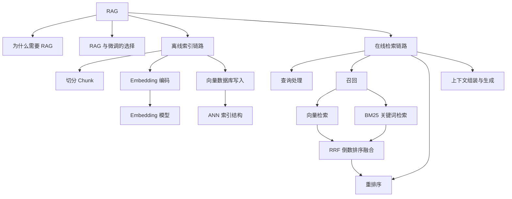
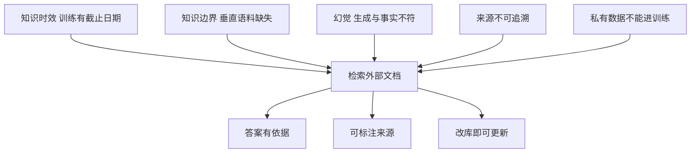
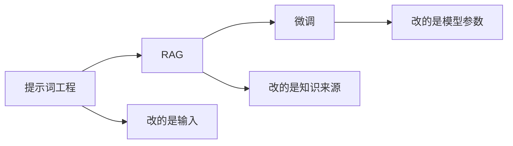
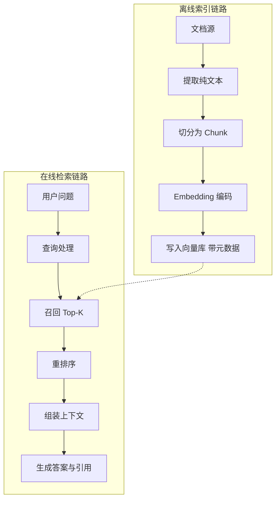
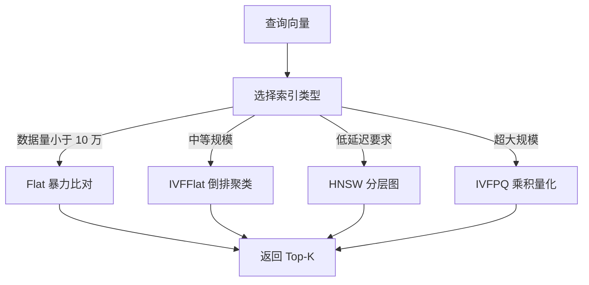
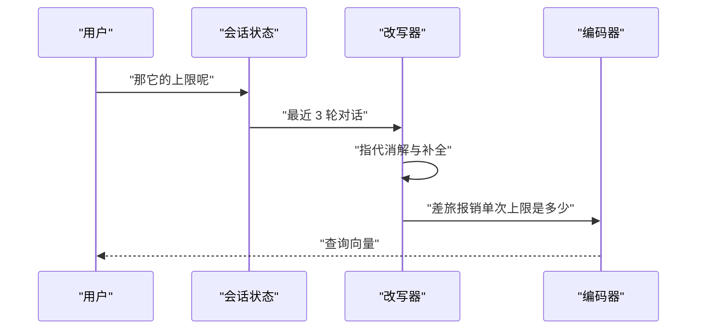
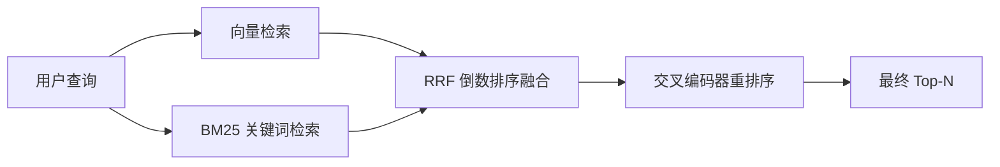
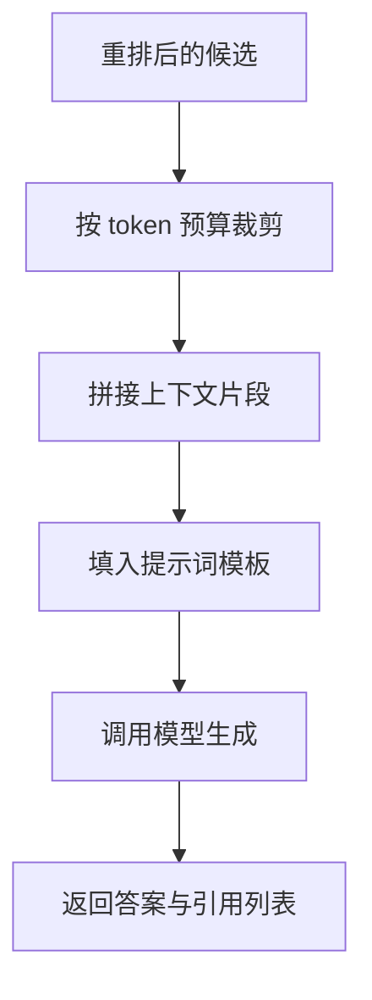

# RAG：原理与检索系统

!!! abstract "学完这一页你能"

- 说出 RAG 解决的 5 类模型失效，并为每类写出对应工程对策。
- 画出离线索引与在线检索两条链路，指出各自的失败点。
- 用 Node 20+ 写一个零依赖检索系统，跑通向量召回、BM25、RRF 融合与重排。
- 判断一个需求该走 RAG、微调还是提示词工程，并写出判定依据。

## 0. 知识地图



先读第 1、2 节，把"为什么做"和"该不该做"定下来。再读第 3 节，拿到两条链路的全局图。

第 4 到第 8 节是零件，可以按需跳读：做召回看第 5、7 节，做效果调优看第 6、7 节，做防幻觉看第 8 节。

## 1. 为什么需要 RAG

**先想一个问题**

公司内部问答机器人被问"今年差旅报销上限是多少"。它答了一个 2019 年的数字。

模型没有说谎，它只知道训练截止日期之前的事。

**心智模型**

!!! tip "心智模型"
    一句话模型：RAG 让模型开卷答题，先查资料再落笔。
    日常类比：律师上庭前翻案卷，结论来自案卷而不是记忆。
    类比不成立的地方：律师会判断案卷的新旧真伪，检索器只按向量距离排序，案卷本身可能过期。

!!! note "术语：RAG"
    RAG（Retrieval Augmented Generation，检索增强生成）：先从外部知识库检索相关片段，再把片段拼进提示词交给大模型生成答案的整套流程。例子：用户问退款政策，系统先检索出《退款政策》第 2 节原文，再要求模型只依据该节作答。

!!! note "术语：LLM"
    LLM（Large Language Model，大语言模型）：在海量文本上训练、按已出现的词预测下一个词的神经网络。例子：输入一句问题，它逐个词吐出回答。

**图解**



1. 训练数据有截止日期，查不到新发生的事情，用检索补时效。
2. 垂直领域语料不在训练集里，用领域知识库补边界。
3. 模型会编造细节，用检索到的原文约束生成。
4. 用户要看到出处，检索片段自带元数据可以一起返回。
5. 企业私有数据不能拿去训练，放在自己的库里按需检索。

**一步一步来**

**第 1 步：把用户抱怨翻译成失效类型**

这一步要做什么：抱怨都叫"答案不对"，但对策取决于它属于哪类失效。

```js
// 三类失效与对策的映射表
function diagnose(issue) {
  const table = {
    stale: "知识过期：接入可随时更新的外部知识库",
    domain: "领域缺失：接入垂直语料库",
    citation: "来源缺失：返回检索片段的元数据",
  };
  // 未命中已知类型时给出兜底提示，避免静默返回错误建议
  return table[issue] ?? "未知类型：先收集 10 条真实失败样例再判断";
}

console.log(diagnose("stale"));
```

**这段代码在做什么**

- 用一个对象字面量建立"失效类型 → 对策"映射。
- `??` 是空值合并运算符，只在左侧为 `null` 或 `undefined` 时取右侧。
- 返回自然语言对策，可以直接贴进需求文档。
- 整个函数没有外部依赖，只有字符串处理。
- `console.log` 用来观察单次调用结果。

**运行结果**

`知识过期：接入可随时更新的外部知识库`

**动手验证**

下面把判定扩成一个带断言的完整脚本，直接 `node diagnose.mjs` 就能跑。

```js
// 依赖：Node 20+ 内置 node:assert，不需要 npm install
import assert from "node:assert";

const FAILURE_TO_FIX = {
  stale: "检索外部知识库",
  domain: "接入垂直语料库",
  citation: "返回片段元数据",
};

function diagnose(issue) {
  // 命中映射直接返回，未命中走兜底分支
  return FAILURE_TO_FIX[issue] ?? "unknown";
}

assert.strictEqual(diagnose("stale"), "检索外部知识库");
assert.strictEqual(diagnose("domain"), "接入垂直语料库");
assert.strictEqual(diagnose("citation"), "返回片段元数据");
assert.strictEqual(diagnose("other"), "unknown");
console.log("4 条断言通过");
```

运行结果：

```
4 条断言通过
```

**常见坑**

| 现象 | 原因 | 怎么修 |
|---|---|---|
| 检索回来的片段答不上问题 | 问题属于知识库外的推理类任务 | 先确认库里确实有答案原文，再谈检索调优 |
| 加了 RAG 后答案仍旧编造 | 提示词没写"只依据资料回答" | 把约束写进系统提示，并要求无信息时明说 |
| 知识库更新了但答案没变 | 只改了源文档，没重跑索引链路 | 把索引重建做成可重复执行的任务 |

**用在哪里**

- 企业内部 Wiki 问答
  - 业务背景：制度文档每季度更新，员工用自然语言提问。
  - 怎么用：把这 5 类失效写进需求评审，先统计各占多少条。
  - 指标：人工标注 100 条问题，统计答对比例与引用可点击比例。
  - 不该用：问题需要跨文档做多步计算时，单轮检索答不好。
- 电商客服退款政策问答
  - 业务背景：政策按品类分版本，客服话术要能追溯到原文。
  - 怎么用：用"来源缺失"这一条推动返回片段标题与生效日期。
  - 指标：转人工率、引用被点击次数。
  - 不该用：政策只有一句话且长期不变时，直接写进提示词更省事。

**行业实践**

- RRF 作为融合算法：Elasticsearch 官方文档的 Reciprocal rank fusion 章节、Azure AI Search 官方文档的 Hybrid search scoring 章节都实现了它。借鉴方式：先按文档给的默认参数跑通，再调权重，需核对官方文档确认默认值。
- 上下文增强检索：Anthropic 工程博客的 Contextual Retrieval 文章提出在编码前给片段补一句上下文说明。借鉴方式：对切分后语义断裂的片段做一次补写，需核对官方文档确认成本结构。
- 两阶段召回加精排：Pinecone 官方文档的 Reranking 章节、Cohere 官方文档的 Rerank 章节都把它作为标准配置。借鉴方式：召回阶段放宽候选条数，精排阶段再收敛，具体阈值需核对官方文档。

**小结**

- RAG 解决知识时效、边界、幻觉、来源、私有数据这 5 类问题。
- 先判断失效类型，再选技术手段，顺序不能反。
- 提示词里"只依据资料回答"是抑制幻觉的第一道约束。

## 2. RAG 还是微调

**先想一个问题**

团队要把客服回复改成固定话术风格，同时政策文档每周更新。这是两件事，只选一个方案会顾此失彼。

**心智模型**

!!! tip "心智模型"
    一句话模型：RAG 换的是模型看到什么，微调换的是模型怎么说话。
    日常类比：RAG 给员工换一本最新的手册，微调把员工送去培训。
    类比不成立的地方：培训会改掉员工已有的习惯，微调也可能让模型丢掉原有能力。

!!! note "术语：微调"
    微调（Fine-tuning）：用领域数据继续训练模型参数，让输出风格或任务表现向目标靠拢。例子：用 2000 条客服对话训练，让模型统一使用"已为您登记"这类话术。

**图解**



1. 提示词工程只改输入，上线成本最低，知识仍然来自模型参数。
2. RAG 改知识来源，知识库变更后重新索引就生效。
3. 微调改模型参数，风格与任务格式的稳定性来自训练。
4. 三者可以叠加：先用 RAG 提供知识，再用微调固定风格。

**一步一步来**

**第 1 步：写一个路径判定函数**

这一步要做什么：把业务事实翻译成技术路径，避免团队在方案上反复拉扯。

```js
// 根据三个业务事实给出增强路径建议
function pickPath(f) {
  // 知识每周变，走 RAG，改库即可，不必重训
  if (f.knowledgeChangesWeekly) return "RAG";
  // 必须给出处，走 RAG，片段自带元数据
  if (f.needCitation) return "RAG";
  // 知识稳定但要固定话术，且有标注数据，走微调
  if (f.needFixedTone && f.hasLabeledPairs) return "Fine-tuning";
  // 以上都不满足时，先试提示词工程
  return "Prompt Engineering";
}
```

**这段代码在做什么**

- 入参是业务事实，不是技术指标。
- 判断顺序体现优先级：更新频率高于可追溯性高于风格。
- 微调分支要求同时满足"要固定风格"和"有标注数据"两个条件。
- 都不满足时退回提示词工程，这是成本最低的起点。
- 返回值是字符串，方便直接打印或写进文档。

**运行结果**

`pickPath({ knowledgeChangesWeekly: true })` → `"RAG"`

**动手验证**

```js
// 依赖：Node 20+ 内置 node:assert
import assert from "node:assert";

// 每条规则是[条件函数, 结论]的二元组，顺序即优先级
const RULES = [
  [(f) => f.knowledgeChangesWeekly, "RAG"],
  [(f) => f.needCitation, "RAG"],
  [(f) => f.needFixedTone && f.hasLabeledPairs, "Fine-tuning"],
];

function pickPath(f) {
  // find 返回第一条命中的规则，命中即取其结论
  const hit = RULES.find(([cond]) => cond(f));
  return hit ? hit[1] : "Prompt Engineering";
}

assert.strictEqual(pickPath({ knowledgeChangesWeekly: true }), "RAG");
assert.strictEqual(pickPath({ needCitation: true }), "RAG");
assert.strictEqual(pickPath({ needFixedTone: true, hasLabeledPairs: true }), "Fine-tuning");
assert.strictEqual(pickPath({}), "Prompt Engineering");
console.log("4 条断言通过");
```

运行结果：

```
4 条断言通过
```

**常见坑**

| 现象 | 原因 | 怎么修 |
|---|---|---|
| 微调后模型答不出新政策 | 知识进了参数，政策变了要重训 | 知识层交给 RAG，微调只负责风格 |
| RAG 回答话术每次都不一样 | 风格约束不在提示词里 | 补上格式模板与示例 |
| 两套都上了但效果没变 | 检索没命中，模型只能凭参数回答 | 先单测检索召回率，再谈微调 |

**用在哪里**

- 金融客服话术统一
  - 业务背景：合规要求固定措辞，产品条款每季度更新。
  - 怎么用：RAG 供条款原文，微调固定措辞模板。
  - 指标：合规抽检通过率、条款引用准确率。
  - 不该用：只有 1 个产品线且话术可枚举时，模板字符串就够。
- 内部框架问答助手
  - 业务背景：框架每周发版，文档和代码示例同步更新。
  - 怎么用：走 RAG，指标看引用的文档版本是否为最新。
  - 不该用：问题集中在 API 记忆类时，微调对格式的帮助更直接。

**行业实践**

- 组合用法：OpenAI 官方文档的 Fine-tuning 章节把"检索加微调"列为可选组合。借鉴方式：先上 RAG，把风格问题攒成清单，再决定是否微调，需核对官方文档确认支持的模型与数据格式。
- 分段评估：LangSmith 官方文档的 Evaluation 章节提供检索与生成的分段评估。借鉴方式：把"检索命中"和"生成正确"拆成两个指标分别看，需核对官方文档确认指标口径。

**小结**

- RAG 管知识，微调管风格，提示词管格式。
- 知识高频变化时优先 RAG，因为改库不用重训。
- 组合方案的上线顺序是 RAG 在前、微调在后。

## 3. 两阶段工作流：离线索引与在线检索

**先想一个问题**

你上传了 300 页产品手册，问"保修期多久"，系统返回了目录页。原因是文档按固定长度切块，检索命中了标题而不是正文。

**心智模型**

!!! tip "心智模型"
    一句话模型：RAG 是两条流水线，离线把文档变成可检索的向量，在线把问题变成答案。
    日常类比：图书馆先把书编目上架，读者来了才查目录取书。
    类比不成立的地方：图书馆的目录由人编，向量索引由模型算，切分方式一变整个目录要重做。

!!! note "术语：Chunk"
    Chunk（切分块）：把长文档按规则切成的一段文本，是索引与检索的最小单位。例子：把 300 页手册按每段 500 字切开，每段附上页码与章节标题。

**图解**



1. 离线链路只在文档变化时跑，产出向量库。
2. 在线链路每次提问都跑，从向量库取片段。
3. 两条链路通过向量库解耦，各自可以独立扩容。
4. 离线链路的切分策略决定了在线链路能召回什么。

**一步一步来**

**第 1 步：按窗口切分并保留重叠**

这一步要做什么：把长文档切成可独立检索的片段，同时避免句子被切断。

```js
// 固定窗口切分，相邻块保留 overlap 个字
function chunk(text, size = 500, overlap = 50) {
  // 参数校验放在最前面，避免步长非正导致死循环
  if (overlap >= size) throw new Error("overlap 必须小于 size");
  const out = [];
  // step 是窗口每次前进的距离
  const step = size - overlap;
  for (let i = 0; i < text.length; i += step) {
    // slice 超出长度时自动截断，最后一块可以短于 size
    out.push({ text: text.slice(i, i + size), start: i });
  }
  return out;
}
```

**这段代码在做什么**

- `size` 是每块的目标字数，`overlap` 是相邻块的重叠字数。
- `step` 等于 `size - overlap`，决定窗口滑动的步长。
- 循环用 `i += step`，`i` 超过文本长度时结束。
- 每块记录 `start` 偏移，方便回填页码与定位。
- 重叠的作用是让跨块的句子至少完整出现在一块里。
- 参数校验放最前面，把错误挡在循环之外。

**运行结果**

`chunk("abcdefghij", 4, 1)` 返回 3 块，起始偏移分别是 0、3、6。

**动手验证**

```js
// 依赖：Node 20+ 内置 node:assert
import assert from "node:assert";

function chunk(text, size = 500, overlap = 50) {
  // 步长必须为正，否则 for 循环原地打转
  if (overlap >= size) throw new Error("overlap 必须小于 size");
  const out = [];
  const step = size - overlap;
  for (let i = 0; i < text.length; i += step) {
    out.push({ text: text.slice(i, i + size), start: i });
  }
  return out;
}

const parts = chunk("abcdefghij", 4, 1);
assert.strictEqual(parts.length, 3);
assert.strictEqual(parts[0].text, "abcd");
assert.strictEqual(parts[1].text, "defg");
assert.strictEqual(parts[1].start, 3);
console.log("4 条断言通过，共", parts.length, "块");
```

运行结果：

```
4 条断言通过，共 3 块
```

**常见坑**

| 现象 | 原因 | 怎么修 |
|---|---|---|
| 每块都从半句话开始 | 按固定字数切，不看句子边界 | 先在句号与换行处切，再合并到目标字数 |
| 检索总是命中目录页 | 标题短，和问题词面接近 | 切分时把章节标题拼到每个子块开头 |
| 改了源文档但检索结果没变 | 只重跑了半条链路 | 把切分到写入做成一个幂等任务，重跑全量 |

**用在哪里**

- 产品说明书问答
  - 业务背景：手册按章节组织，用户问的是具体参数。
  - 怎么用：按章节切分，把章节标题写进每块开头。
  - 指标：抽样 50 个问题，统计首条召回块是否含答案原句。
  - 不该用：文档只有 2 页且结构清晰时，整篇塞进上下文即可。
- 合同条款检索
  - 业务背景：条款有编号，漏掉一条会有法律风险。
  - 怎么用：切分时保留条款编号，重叠长度设为整条条款长度。
  - 指标：条款编号命中率。
  - 不该用：条款之间强耦合时，按整章切分再靠重排收敛。

**行业实践**

- 语义切分：LlamaIndex 官方文档的 Node Parser 章节提供按句子与语义边界的切分器。借鉴方式：先用固定窗口跑通，再针对"跨块断裂"的样例换语义切分，需核对官方文档确认可用切分器清单。
- 上下文补写：Anthropic 工程博客的 Contextual Retrieval 文章提出在编码前给每块补一句它属于哪份文档哪一节。借鉴方式：对目录页与正文混杂的语料做一次补写。

**小结**

- 离线索引与在线检索通过向量库解耦。
- 切分粒度决定召回上限，重叠是补断裂的手段。
- 索引任务要做成可重复执行，否则更新会漏。

## 4. Embedding 模型：把文本变成向量

**先想一个问题**

用户问"怎么退押金"，知识库里写的是"保证金退还流程"。字面没有一个词重合，纯关键词检索会漏掉这条。

**心智模型**

!!! tip "心智模型"
    一句话模型：Embedding 把文本映射到高维空间，语义接近的文本距离近。
    日常类比：把每句话在地图上标一个点，找答案就是找离你最近的点。
    类比不成立的地方：地图是二维的，向量有几百到几千维，坐标轴没有可读含义。

!!! note "术语：Embedding"
    Embedding（嵌入向量）：由模型输出的定长浮点数组，用来表示一段文本的语义。例子：一句话被编码成长度 1024 的数组，两条数组的余弦相似度越高表示语义越接近。

**图解**


1. 分词把文本切成模型词表里的 token 序列。
2. 编码器把 token 序列变成上下文相关的表示。
3. 投影层把表示压到固定维度，得到一条定长向量。
4. 比较时对两条向量算余弦相似度，值越接近 1 表示方向越一致。

常见模型的维度与上下文长度，来源为本站 RAG 旧版页面，以原文为准。

| 模型 | 输出维度 | 最大上下文 |
|---|---|---|
| text-embedding-ada-002 | 1536 | 8192 |
| text-embedding-3-small | 256 至 3072 | 8192 |
| BGE-large-zh | 1024 | 512 |
| BAAI/bge-m3 | 1024 | 8192 |
| E5-mistral-7b | 1024 | 4096 |
| GTE-large-zh | 1024 | 512 |
| NV-Embed-QA | 4096 | 32K |

**一步一步来**

**第 1 步：实现哈希向量与余弦相似度**

这一步要做什么：不装模型也能验证检索链路，用哈希把字组合映射到固定维度。

```js
// 用相邻两字的组合做哈希，得到固定维度的向量
function embed(text, dim = 64) {
  const vec = new Array(dim).fill(0);
  for (let i = 0; i < text.length - 1; i++) {
    // 相邻两字组成一个 gram，覆盖中文短词的常见切法
    const gram = text.slice(i, i + 2);
    let h = 0;
    // 多项式哈希，把 gram 映射到 0 到 dim-1 之间
    for (const ch of gram) h = (h * 31 + ch.codePointAt(0)) % dim;
    vec[h] += 1;
  }
  return vec;
}

// 余弦相似度：点积除以两条向量长度之积
function cosine(a, b) {
  let dot = 0, na = 0, nb = 0;
  for (let i = 0; i < a.length; i++) {
    dot += a[i] * b[i];
    na += a[i] * a[i];
    nb += b[i] * b[i];
  }
  // 分母为 0 时兜底为 1，避免零向量产生 NaN
  return dot / (Math.sqrt(na) * Math.sqrt(nb) || 1);
}
```

**这段代码在做什么**

- `embed` 输出长度固定为 `dim` 的数组，非零位置由哈希决定。
- 哈希用 31 进制累加再对 `dim` 取模，保证下标落在范围内。
- 相同的字组合会落到同一维，累加后形成词频特征。
- `cosine` 返回余弦相似度，取值在 -1 到 1 之间。
- 分母用 `|| 1` 兜底，防止零向量导致除以 0。
- 两个函数都是纯函数，可以直接写断言。

**运行结果**

`cosine(embed("怎么退押金"), embed("押金怎么退"))` 返回一个接近 1 的值，因为两次的字组合重合度高。

**动手验证**

```js
// 依赖：Node 20+ 内置 node:assert
import assert from "node:assert";

function embed(text, dim = 64) {
  const vec = new Array(dim).fill(0);
  for (let i = 0; i < text.length - 1; i++) {
    const gram = text.slice(i, i + 2);
    let h = 0;
    for (const ch of gram) h = (h * 31 + ch.codePointAt(0)) % dim;
    vec[h] += 1;
  }
  return vec;
}

function cosine(a, b) {
  let dot = 0, na = 0, nb = 0;
  for (let i = 0; i < a.length; i++) {
    dot += a[i] * b[i];
    na += a[i] * a[i];
    nb += b[i] * b[i];
  }
  return dot / (Math.sqrt(na) * Math.sqrt(nb) || 1);
}

const q1 = embed("怎么退押金");
const q2 = embed("押金怎么退");
const q3 = embed("发票怎么开");

// 语序变化的两句，相似度应高于完全不相关的一句
assert.ok(cosine(q1, q2) > cosine(q1, q3));
// 同一条向量与自己的相似度恒为 1
assert.strictEqual(Number(cosine(q1, q1).toFixed(6)), 1);
console.log("2 条断言通过", cosine(q1, q2).toFixed(4), cosine(q1, q3).toFixed(4));
```

运行结果：打印两个相似度数值，第一个大于第二个，并输出"2 条断言通过"。

**常见坑**

| 现象 | 原因 | 怎么修 |
|---|---|---|
| 中文短查询检索效果差 | 只按单字建特征，丢了词序信息 | 改用相邻两字或引入真实嵌入模型 |
| 换模型后旧向量全失效 | 不同模型的向量空间不通用 | 换模型必须重建全量索引 |
| 相似度出现 NaN | 某条文本的向量全为 0 | 在余弦函数里兜底，或跳过空文本 |
| 长文档被截断 | 超过模型最大上下文长度 | 先切分再编码，单块长度低于上限 |

**用在哪里**

- 站内搜索的语义兜底
  - 业务背景：用户用口语提问，商品标题是标准品名。
  - 怎么用：向量检索兜住字面不重合的查询，关键词检索兜住型号词。
  - 指标：首条命中率按查询类型分组统计。
  - 不该用：查询几乎都是精确型号时，结构化字段匹配就够。
- 相似工单聚合
  - 业务背景：客服每天收到大量重复问题，需要归并。
  - 怎么用：对工单标题编码后做近邻聚类。

**行业实践**

- 查询与文档加不同前缀：BAAI 官方文档的 bge 系列模型说明里提到，检索任务需要在查询侧加指令前缀。借鉴方式：查询与文档走两条编码函数，需核对官方文档确认前缀写法。
- 归一化后再比：Sentence Transformers 官方文档的 Semantic Textual Similarity 章节把归一化加余弦作为默认组合。借鉴方式：编码时统一开启归一化，检索时用点积代替余弦，需核对官方文档确认参数名。

**小结**

- Embedding 把语义相近的文本放到相近的位置。
- 同一索引里只能用一个模型，换模型就要重建。
- 向量维度、最大上下文、是否需要前缀，是选型时先看的三项。

## 5. 向量数据库与 ANN 索引

**先想一个问题**

知识库有 200 万条片段，每次提问都和全部片段算一遍相似度，单次响应超过 10 秒。需要近似最近邻索引。

**心智模型**

!!! tip "心智模型"
    一句话模型：ANN 索引用一点召回率换取速度上的数量级提升。
    日常类比：查字典不逐页翻，先按部首定位再到那一小段里找。
    类比不成立的地方：字典定位一定准确，ANN 是近似的，可能漏掉真正最近的那一条。

!!! note "术语：ANN"
    ANN（Approximate Nearest Neighbor，近似最近邻）：用索引结构快速找出与查询向量接近的一批候选，不保证返回全局最近的那条。例子：在 200 万条向量里，ANN 返回 10 条候选，其中可能漏掉 1 条真实最近邻。

**图解**



1. Flat 与全部向量比对，结果精确，耗时随向量条数线性增长。
2. IVFFlat 先把向量聚成若干簇，查询时只扫描其中几簇。
3. HNSW 建多层图，从上层快速接近目标再逐层下降。
4. IVFPQ 把向量切段量化，用更少字节表示每条向量。
5. 四条路径都输出 Top-K 候选，交给后续重排。

常见向量库的定位，来源为本站 RAG 旧版页面，以原文为准。

| 数据库 | 类型 | 适用规模 |
|---|---|---|
| Pinecone | 云服务，全托管 | 中大型项目 |
| Chroma | 本地或云，API 简洁 | 原型与小规模 |
| FAISS | 本地库，支持 GPU | 中型项目 |
| Milvus | 开源或云，可扩展 | 大规模项目 |
| Qdrant | 开源或云，Rust 实现 | 中大型项目 |
| pgvector | PostgreSQL 扩展 | 已有 PG 环境 |

**一步一步来**

**第 1 步：实现暴力检索加元数据过滤**

这一步要做什么：先有一个正确但慢的实现，作为 ANN 的对照基线。

```js
// 在候选集里按余弦相似度打分并排序
function searchAll(queryVec, docs, filter = null, topK = 3) {
  const scored = [];
  for (const doc of docs) {
    // 元数据过滤先做，不满足条件的直接跳过，省下相似度计算
    if (filter && Object.entries(filter).some(([k, v]) => doc.meta[k] !== v)) continue;
    scored.push({ id: doc.id, text: doc.text, score: cosine(queryVec, doc.vec) });
  }
  // 分数从高到低排序，分数相同时按 id 字典序保证结果稳定
  scored.sort((a, b) => b.score - a.score || a.id.localeCompare(b.id));
  return scored.slice(0, topK);
}
```

**这段代码在做什么**

- 遍历全部文档，时间复杂度是文档数乘以向量维度。
- 过滤条件在相似度计算之前执行，减少无效计算。
- `some` 只要有一个字段不匹配就返回 true，整条被跳过。
- 排序用 `||` 兜底，分数相同时按 id 字典序，保证结果可复现。
- `slice` 只保留前 `topK` 条，避免把全部结果返回给上层。

**运行结果**

返回 3 条按分数降序排列的候选，每条带 `id`、`text`、`score`。

**动手验证**

```js
// 依赖：Node 20+ 内置 node:assert
import assert from "node:assert";

function cosine(a, b) {
  let dot = 0, na = 0, nb = 0;
  for (let i = 0; i < a.length; i++) {
    dot += a[i] * b[i];
    na += a[i] * a[i];
    nb += b[i] * b[i];
  }
  return dot / (Math.sqrt(na) * Math.sqrt(nb) || 1);
}

const docs = [
  { id: "a", text: "押金退还流程", vec: [1, 0, 0], meta: { lang: "zh" } },
  { id: "b", text: "发票开具说明", vec: [0, 1, 0], meta: { lang: "zh" } },
  { id: "c", text: "refund policy", vec: [1, 0, 0], meta: { lang: "en" } },
];

function searchAll(queryVec, list, filter = null, topK = 3) {
  const scored = [];
  for (const doc of list) {
    if (filter && Object.entries(filter).some(([k, v]) => doc.meta[k] !== v)) continue;
    scored.push({ id: doc.id, text: doc.text, score: cosine(queryVec, doc.vec) });
  }
  scored.sort((a, b) => b.score - a.score || a.id.localeCompare(b.id));
  return scored.slice(0, topK);
}

const hit = searchAll([1, 0, 0], docs, { lang: "zh" }, 2);
// 过滤掉英文文档后只剩两条候选
assert.strictEqual(hit.length, 2);
assert.strictEqual(hit[0].id, "a");
console.log("2 条断言通过，首条命中", hit[0].id);
```

运行结果：

```
2 条断言通过，首条命中 a
```

**常见坑**

| 现象 | 原因 | 怎么修 |
|---|---|---|
| 写入向量后查不到 | 查询向量与入库向量的维度或归一化方式不一致 | 写入与查询复用同一个编码函数 |
| 过滤后结果少于预期 | 先近邻再过滤，被过滤掉太多 | 增大召回数量，或在索引侧支持过滤 |
| 更新文档后旧内容还在 | 只插入新向量，没删旧记录 | 用文档 id 加块序号生成稳定 id，写入前先删同 id |
| 索引重建后结果跳变 | 索引参数改了但没记录版本 | 把索引参数写进配置并与索引一起打版本号 |

**用在哪里**

- 电商商品搜索
  - 业务背景：千万级商品，要在 100 毫秒内返回候选。
  - 怎么用：HNSW 索引做 ANN 召回，类目与库存状态走元数据过滤。
  - 指标：召回率与 P99 延迟一起看，只调其中一个都会失衡。
  - 不该用：商品总量小于 1 万时，暴力检索的实现与运维成本更低。
- 日志与工单检索
  - 业务背景：已有 PostgreSQL，不想再引入独立向量服务。
  - 怎么用：pgvector 扩展，把向量列和业务表放在同一个库做联表过滤。
  - 指标：查询延迟、索引体积。
  - 不该用：写入量达到每分钟数十万条时，PG 的写入压力会成为瓶颈。

**行业实践**

- 索引选型建议：FAISS 官方文档的 Guidelines 章节给出不同规模下的索引选择方向。借鉴方式：先按数据量选类型，再用自己的语料测召回率，需核对官方文档确认参数含义。
- 量化压缩：FAISS 官方文档的 IndexIVFPQ 章节说明乘积量化如何用更少字节表示向量。借鉴方式：内存吃紧时先用量化压缩，再测召回率下降幅度，需核对官方文档确认压缩比与召回率的取舍。

**小结**

- ANN 用可接受的召回损失换数量级的速度提升。
- 索引类型的选择依据是数据量、延迟要求和内存预算。
- 元数据过滤和向量检索要在同一层完成，否则结果会被截断。

## 6. 查询处理：从用户问题到检索输入

**先想一个问题**

多轮对话里用户说"那它的上限呢"。直接把这句话编码去检索，什么也搜不到。

**心智模型**

!!! tip "心智模型"
    一句话模型：查询处理把口语化的当前问题改写成能对齐知识库表述的检索语句。
    日常类比：把"那个啥咋弄"翻译成"如何办理挂失"再去查手册。
    类比不成立的地方：翻译有标准答案，查询改写依赖模型判断，改错了整条链路都走偏。

!!! note "术语：查询改写"
    查询改写（Query Rewriting）：在编码之前对用户问题做补全、指代消解与同义词替换，让它更接近知识库的表述。例子：把"那它的上限呢"改写为"差旅报销的单次上限是多少"。

**图解**



1. 用户输入一句依赖上文的问题。
2. 会话状态取出最近若干轮对话作为上下文。
3. 改写器把指代词替换成具体实体，补全省略的主语。
4. 编码器只对改写后的句子编码，输出查询向量。

**一步一步来**

**第 1 步：拼接历史并做指代替换**

这一步要做什么：让改写规则可测试，避免每次改代码都靠人工体验判断。

```js
// 用最近 n 轮对话补全当前问题里的指代词
function rewriteQuery(query, history, n = 3) {
  // 取最近 n 轮，历史为空时直接返回原问题
  const recent = history.slice(-n);
  if (recent.length === 0) return query;
  // 把最后一轮记录的实体作为指代词的替换目标
  const lastTopic = recent[recent.length - 1].topic;
  // 只替换白名单里的 3 个指代词，控制改动范围
  const fixed = query.replace(/它|这个|那个/g, lastTopic ?? "");
  // 附带最近话题，帮助下游对齐表述
  return `${fixed}（话题：${lastTopic ?? "无"}）`;
}
```

**这段代码在做什么**

- `slice(-n)` 取最近 n 轮，历史为空时直接返回原问题。
- `lastTopic` 是上一轮识别出的实体名，来自会话状态。
- 正则只匹配 3 个常见指代词，替换范围可控。
- 拼接话题前缀是为了让编码器拿到完整的语义。
- 函数是纯函数，相同输入得到相同输出，便于写断言。

**运行结果**

`rewriteQuery("那它的上限呢", [{ topic: "差旅报销" }])` 返回 `"那差旅报销的上限呢（话题：差旅报销）"`。

**动手验证**

```js
// 依赖：Node 20+ 内置 node:assert
import assert from "node:assert";

function rewriteQuery(query, history, n = 3) {
  const recent = history.slice(-n);
  if (recent.length === 0) return query;
  const lastTopic = recent[recent.length - 1].topic;
  const fixed = query.replace(/它|这个|那个/g, lastTopic ?? "");
  return `${fixed}（话题：${lastTopic ?? "无"}）`;
}

// 无历史时保持原样，避免凭空插入话题
assert.strictEqual(rewriteQuery("押金怎么退", []), "押金怎么退");

const out = rewriteQuery("那它的上限呢", [{ topic: "差旅报销" }]);
assert.ok(out.includes("差旅报销"));
assert.ok(!out.includes("它"));
console.log("3 条断言通过", out);
```

运行结果：

```
3 条断言通过 那差旅报销的上限呢（话题：差旅报销）
```

**常见坑**

| 现象 | 原因 | 怎么修 |
|---|---|---|
| 多轮对话越聊越搜不到 | 只把当前问题送去编码 | 改写时拼接最近若干轮的话题 |
| 改写后偏离原意 | 替换规则过于宽泛 | 只替换白名单里的指代词，改完做人工抽查 |
| 同一问题两次检索结果不同 | 改写过程引入了随机性 | 改写阶段用确定性规则，或把采样温度设为 0 |
| 历史太长挤占预算 | 把全部历史都拼进查询 | 只保留最近 n 轮，n 取 3 到 5 |

**用在哪里**

- 银行 App 智能客服
  - 业务背景：用户习惯用"这个""那个"指代上一句提到的业务。
  - 怎么用：检索前做指代消解，把业务名补进查询。
  - 指标：多轮场景下的首条命中率，与单轮场景分开统计。
  - 不该用：只支持单轮问答时，改写环节可以跳过。
- 代码仓库问答
  - 业务背景：用户问"这个函数在哪调用的"，指代上一次提到的函数名。
  - 怎么用：从上一轮命中的文件与符号表里取出实体名做替换。
  - 指标：引用文件的准确率。
  - 不该用：符号名本身就是唯一关键词时，直接检索更稳。

**行业实践**

- 查询改写：LangChain 官方文档的 Query Transformation 章节列出多种改写策略。借鉴方式：从"拼接历史"这一种开始，用失败样例驱动增加策略，需核对官方文档确认各策略的输入输出约定。
- 查询路由：Azure AI Search 官方文档的 Query 章节说明如何按查询类型选择检索模式。借鉴方式：把关键词型与语义型问题分流到不同检索通道，需核对官方文档确认路由的判定字段。

**小结**

- 查询处理的目标是让问题和知识库表述对齐。
- 指代消解是长对话场景里收益最直接的一步。
- 改写规则要能写成纯函数，否则无法做回归测试。

## 7. 混合检索与重排序

**先想一个问题**

用户搜产品型号"XZ-2000A"。向量检索返回一堆同系列文档，就是没有这个型号的页面。型号这类字面精确的查询，关键词检索更合适。

**心智模型**

!!! tip "心智模型"
    一句话模型：先宽召回，再精排序，向量管语义，BM25 管字面。
    日常类比：招聘先用关键词筛简历，再由面试官逐份细看。
    类比不成立的地方：面试官会读完整份简历，重排模型只看查询和单条片段。

!!! note "术语：BM25"
    BM25（Best Matching 25）：一种基于词频与逆文档频率的关键词打分函数，对词频做饱和处理并按文档长度归一化。例子：查询词在某文档出现 3 次，得分不会比出现 1 次高 3 倍，因为词频增长有上限。

!!! note "术语：RRF"
    RRF（Reciprocal Rank Fusion，倒数排序融合）：把多路检索结果按名次而不是分数融合的算法，每路的贡献是 1 除以 k 加名次，再跨路求和。例子：语义检索排第 1、关键词检索排第 5 的同一篇文档，两路得分相加后名次上升。

!!! note "术语：交叉编码器"
    交叉编码器（Cross-Encoder）：把查询和候选片段拼在一起送进同一个模型打分，精度高于分别编码再算相似度。例子：交叉编码器能判断"退押金"和"保证金退还流程"说的是同一件事。

**图解**



1. 查询同时送进向量检索与 BM25 两条通道。
2. 两路各自返回按分数排序的候选列表。
3. RRF 只使用名次做融合，绕开了两路分数不可比的问题。
4. 融合后的候选交给交叉编码器逐条打分。
5. 重排结果取前 N 条进入提示词。

参数默认值来自本站 RAG 旧版页面，以原文为准：BM25 的 k1 为 1.2，b 为 0.75，RRF 的 k 为 60。

**一步一步来**

**第 1 步：实现 BM25 打分**

这一步要做什么：给关键词通道一个可解释的打分函数，作为向量通道的补充。

```js
// 简化版 BM25：词频饱和、逆文档频率、长度归一化三部分
function bm25(queryTokens, docs, k1 = 1.2, b = 0.75) {
  const df = new Map();
  // 先统计每个词出现在多少篇文档里，用于算逆文档频率
  for (const d of docs) for (const t of new Set(d.tokens)) df.set(t, (df.get(t) ?? 0) + 1);
  const avgLen = docs.reduce((s, d) => s + d.tokens.length, 0) / docs.length;
  return docs.map((d) => {
    let score = 0;
    for (const t of queryTokens) {
      const tf = d.tokens.filter((x) => x === t).length;
      if (tf === 0) continue;
      const idf = Math.log(1 + (docs.length - df.get(t) + 0.5) / (df.get(t) + 0.5));
      // 词频饱和：tf 越大得分增长越慢；长度归一化惩罚长文档
      score += idf * (tf * (k1 + 1)) / (tf + k1 * (1 - b + b * d.tokens.length / avgLen));
    }
    return { id: d.id, score };
  });
}
```

**这段代码在做什么**

- `df` 记录每个词的文档频率，`Set` 保证同一篇里只算一次。
- `avgLen` 是全部文档的平均词数，用于长度归一化。
- 逆文档频率取对数形式，越罕见的词权重越高。
- 词频除以带 `k1` 的分母，实现饱和效果。
- 分母里的 `b` 控制长度归一化的强度。
- 返回每条文档的 id 与 BM25 分数，未命中的词不计入。

**运行结果**

含查询词的文档得分大于 0，其余文档得分为 0。

**动手验证**

```js
// 依赖：Node 20+ 内置 node:assert
import assert from "node:assert";

function bm25(queryTokens, docs, k1 = 1.2, b = 0.75) {
  const df = new Map();
  for (const d of docs) for (const t of new Set(d.tokens)) df.set(t, (df.get(t) ?? 0) + 1);
  const avgLen = docs.reduce((s, d) => s + d.tokens.length, 0) / docs.length;
  return docs.map((d) => {
    let score = 0;
    for (const t of queryTokens) {
      const tf = d.tokens.filter((x) => x === t).length;
      if (tf === 0) continue;
      const idf = Math.log(1 + (docs.length - df.get(t) + 0.5) / (df.get(t) + 0.5));
      score += idf * (tf * (k1 + 1)) / (tf + k1 * (1 - b + b * d.tokens.length / avgLen));
    }
    return { id: d.id, score };
  });
}

const docs = [
  { id: "a", tokens: ["xz", "2000a", "说明"] },
  { id: "b", tokens: ["xz", "1000", "说明"] },
];
const scores = bm25(["2000a"], docs);
const hit = scores.find((s) => s.id === "a");
const miss = scores.find((s) => s.id === "b");
assert.ok(hit.score > 0);
assert.strictEqual(miss.score, 0);
console.log("2 条断言通过，命中分数", hit.score.toFixed(4));
```

运行结果：

```
2 条断言通过，命中分数 输出一个大于 0 的值
```

**第 2 步：RRF 融合两路结果**

这一步要做什么：把语义通道和关键词通道的名次合成一个顺序。

```js
// 按名次融合多路结果，k 越大名次差异被压得越平
function rrf(lists, k = 60) {
  const acc = new Map();
  for (const list of lists) {
    list.forEach((id, i) => {
      // 名次从 1 开始，所以分母是 k 加 i 再加 1
      acc.set(id, (acc.get(id) ?? 0) + 1 / (k + i + 1));
    });
  }
  // 融合分数从高到低排序，只输出文档 id
  return [...acc.entries()].sort((x, y) => y[1] - x[1]).map(([id]) => id);
}
```

**这段代码在做什么**

- 入参是若干条已排好序的 id 列表。
- 每路按下标换算名次，名次从 1 开始。
- 同一个 id 在多路出现时，贡献累加。
- `k` 控制名次差异的衰减速度，k 越大前排优势越小。
- 返回融合后的 id 序列，交给重排阶段。

**运行结果**

`rrf([["a", "b", "c"], ["c"]])` 返回 `["c", "a", "b"]`，因为 `c` 在两路都出现。

**常见坑**

| 现象 | 原因 | 怎么修 |
|---|---|---|
| 融合后结果不如单路 | 两路分数直接相加，量纲不一致 | 改用 RRF 只用名次，或先做分数归一化 |
| BM25 命中了无关长文档 | 长文档词频天然高 | 确认 b 为 0.75，长度归一化是否生效 |
| 重排后延迟翻倍 | 送入交叉编码器的候选太多 | 把候选压到 50 条以内再精排 |
| 型号类查询搜不到 | 向量模型把型号编码成了通用语义 | 给 BM25 通道更高权重，或对型号建独立字段索引 |

**用在哪里**

- 电商商品搜索
  - 业务背景：用户既搜"适合跑步的鞋"也搜"XZ-2000A"。
  - 怎么用：语义通道处理描述型查询，BM25 处理型号与品牌词。
  - 指标：点击率与首条命中率按查询类型分开统计。
  - 不该用：查询几乎都是型号时，直接做结构化字段匹配。
- 法规条文检索
  - 业务背景：条文编号与法律术语都需要精确匹配。
  - 怎么用：BM25 保证条文号命中，向量通道补语义相近的表述。
  - 指标：条文号命中率、人工抽检的相关性。
  - 不该用：条文总量只有几百条时，全文扫描加简单排序就够。

**行业实践**

- RRF 融合：Elasticsearch 官方文档的 Reciprocal rank fusion 章节与 Azure AI Search 官方文档的 Hybrid search scoring 章节都提供 RRF。借鉴方式：先用 RRF 跑通两路融合，再评估是否改成加权，需核对官方文档确认默认 k 值。
- 两阶段重排：Pinecone 官方文档的 Reranking 章节说明召回与精排的分工。借鉴方式：召回阶段放宽条数，精排阶段收敛，延迟预算按两段分别测，需核对官方文档确认候选上限建议。

**小结**

- 向量检索管语义，BM25 管字面，两者覆盖的查询类型不同。
- RRF 用名次融合，绕开了两路分数不可比的问题。
- 交叉编码器精度高但要逐条前向，只适合小候选集。

## 8. 上下文组装与答案合成

**先想一个问题**

召回 50 条片段，全部塞进提示词会超出模型的上下文长度。要按预算裁剪，还要保留最相关的部分。

**心智模型**

!!! tip "心智模型"
    一句话模型：把召回片段当成预算有限的背包，按相关性择优装入。
    日常类比：行李箱空间固定，先放最重要的东西。
    类比不成立的地方：行李可以挤压，token 不能，超出一个就整段被拒。

!!! note "术语：上下文窗口"
    上下文窗口（Context Window）：模型单次调用能接受的最大 token 数量，输入与输出共用这个额度。例子：窗口为 8192 token 时，提示词加回答的总长度不能超过 8192。

**图解**



1. 重排后的候选按分数从高到低排列。
2. 裁剪环节按 token 预算依次装入，装不下就停止。
3. 用分隔符拼接片段，保留片段边界。
4. 把上下文填入系统提示的占位符。
5. 生成后从入模的上下文反推引用，保证引用与实际内容一致。

**一步一步来**

**第 1 步：按 token 预算裁剪并拼接**

这一步要做什么：在调用模型之前把上下文长度控制在预算内。

```js
// 按估算 token 数贪心装入，超出预算即停止
function selectContext(docs, maxTokens = 4000) {
  const parts = [];
  let used = 0;
  for (const doc of docs) {
    // 中文按每个字 1.5 token 估算，来源：本站 RAG 旧版页面，以原文为准
    const cost = Math.floor(doc.text.length * 1.5);
    // 装不下就整体停止，保证同样输入得到同样结果
    if (used + cost > maxTokens) break;
    parts.push(doc.text);
    used += cost;
  }
  // 用空行拼接，给模型清晰的片段边界
  return { context: parts.join("\n\n"), used };
}
```

**这段代码在做什么**

- 按传入顺序遍历，顺序即优先级，由上游重排决定。
- token 用字数乘 1.5 估算，只是上界的近似值。
- 超预算时用 `break` 而不是跳过，结果可复现。
- 用空行拼接片段，边界清晰，便于模型区分来源。
- 返回拼接结果与已用预算，便于打点监控。

**运行结果**

装入若干条短片段后，返回上下文文本与已用 token 数。

**动手验证**

```js
// 依赖：Node 20+ 内置 node:assert
import assert from "node:assert";

function selectContext(docs, maxTokens = 4000) {
  const parts = [];
  let used = 0;
  for (const doc of docs) {
    const cost = Math.floor(doc.text.length * 1.5);
    if (used + cost > maxTokens) break;
    parts.push(doc.text);
    used += cost;
  }
  return { context: parts.join("\n\n"), used };
}

const docs = [
  { id: "a", text: "押金在提交申请后 7 个工作日退回。" },
  { id: "b", text: "发票可在订单详情页申请。" },
  { id: "c", text: "本段很长".repeat(2000) },
];

const { context, used } = selectContext(docs, 100);
// 第三条超预算被丢弃，上下文里不应出现它的内容
assert.ok(!context.includes("本段很长"));
assert.ok(used <= 100);
assert.ok(context.includes("押金"));
console.log("3 条断言通过，已用约", used, "token");
```

运行结果：

```
3 条断言通过，已用约 输出一个不超过 100 的数 token
```

**第 2 步：组装提示词**

这一步要做什么：把上下文和防幻觉约束拼成一次调用的完整输入。

```js
// 把上下文填入模板，并把只依据资料回答写进系统提示
function buildPrompt(query, context) {
  // 用数组加 join 拼接，避免字符串模板的转义问题
  const system = [
    "你是一个知识助手，只能依据下面的参考资料回答。",
    "参考资料没有相关信息时，明确说没有查到，不要补充外部知识。",
    "参考资料：",
    context,
  ].join("\n");
  // 用户问题单独拼接，不参与模板替换
  return `${system}\n\n问题：${query}`;
}
```

**这段代码在做什么**

- 用数组加 `join` 拼模板，避开字符串模板的转义问题。
- 前两行是防幻觉约束，必须随每次调用下发。
- 上下文与系统提示放在同一条消息里，模型能直接对应。
- 用户问题单独拼接，用户输入里的符号不会被当作模板。
- 函数无副作用，可以直接写断言。

**运行结果**

输出一段包含约束、上下文与问题的完整提示词。

**常见坑**

| 现象 | 原因 | 怎么修 |
|---|---|---|
| 模型回答了资料里没有的内容 | 约束没写进系统提示，或写法太软 | 明确写"资料没有时回答没有查到" |
| 引用列表与答案对不上 | 引用取自召回列表而不是入模上下文 | 从入模的上下文反推引用 |
| 请求报上下文超长 | token 估算偏低，输出也占额度 | 预算里预留输出额度，估算系数取上界 |
| 同样输入两次答案不同 | 生成阶段有随机性 | 需要稳定输出时把采样温度设为 0，需核对官方文档确认参数名 |

**用在哪里**

- 保险条款问答
  - 业务背景：答案出错会有合规风险，必须给出条款出处。
  - 怎么用：上下文里保留条款编号，引用从入模文本反推。
  - 指标：引用可点击率、答案与原文一致的人工抽检通过率。
  - 不该用：任务是"帮我总结这份保单"时，整篇文档作为输入更合适。
- 运维知识库助手
  - 业务背景：故障处理步骤有严格顺序，缺步会引发二次故障。
  - 怎么用：裁剪时按步骤块整体装入，不允许切断步骤。
  - 指标：步骤完整率的抽检结果。
  - 不该用：步骤之间有条件分支时，先做流程判断再检索。

**行业实践**

- 引用与溯源：Azure AI Search 官方文档的 Retrieval 章节说明如何返回片段来源信息。借鉴方式：把来源信息与片段一起入库，生成后回填引用，需核对官方文档确认字段格式。
- token 精确计数：OpenAI 官方文档的 Tokenizer 章节提供计数工具。借鉴方式：用真实分词器替换字数估算，把预算误差压下来，需核对官方文档确认工具用法与适用模型。

**小结**

- 上下文预算是常量，裁剪策略决定哪些片段能进模型。
- 防幻觉约束写在系统提示里，随每次调用下发。
- 引用必须从入模的上下文反推，才能和答案对得上。

## 应用地图

| 场景 | 用到本页哪个知识点 | 典型技术选型 | 注意事项 |
|---|---|---|---|
| 企业 Wiki 问答 | 第 1 节失效判定、第 3 节切分 | 向量库加大模型生成 | 制度文档版本多，元数据要带生效日期 |
| 电商商品搜索 | 第 5 节 ANN 索引、第 7 节混合检索 | HNSW 索引加 BM25 加 RRF | 型号与品牌词必须走字面匹配通道 |
| 多轮客服机器人 | 第 6 节查询改写 | 会话状态加指代消解规则 | 改写要有回归测试集，否则改动无法验证 |
| 法规条文检索 | 第 7 节重排序 | BM25 加交叉编码器 | 条文号必须精确命中，不能被语义通道覆盖 |
| 内部代码助手 | 第 4 节 Embedding、第 3 节切分 | 代码专用嵌入模型加符号元数据 | 按函数切而不是按字数切 |
| 保险条款问答 | 第 8 节上下文组装 | 预算裁剪加引用回填 | 引用必须能点回原文，否则合规不认 |
| 工单相似度聚合 | 第 5 节向量库 | pgvector 复用现有 PG | 过滤条件走 SQL 更直接，别塞进向量查询 |
| 差旅政策多轮问答 | 第 2 节路径选择、第 6 节改写 | RAG 加提示词模板 | 政策每季度更新时不要走微调路线 |

## 动手作业

**目标**

搭一个 50 条语料的本地检索系统，跑通"切分、编码、两路召回、RRF 融合、重排、提示词组装"6 个环节，全程不依赖第三方库。

**步骤**

1. 准备 50 条中文短文本，每条包含 `id`、`text`、`meta` 三个字段，`meta` 至少有 `lang` 与 `version`。
2. 用第 3 节的 `chunk` 把每条文本切成不超过 120 字的片段，片段 id 用"原文 id 加偏移"拼接。
3. 用第 4 节的 `embed` 与 `cosine` 给每个片段和查询编码。
4. 用第 5 节的 `searchAll` 做向量召回，取前 10 条。
5. 用第 7 节的 `bm25` 做关键词召回，取前 10 条。
6. 用第 7 节的 `rrf` 融合两路结果，取出前 5 条。
7. 用第 8 节的 `selectContext` 和 `buildPrompt` 生成最终提示词，打印出来。

**验收标准**

- 全部代码放在一个 `.mjs` 文件里，`node 文件名.mjs` 能直接运行，无第三方依赖。
- 脚本里至少有 10 条 `node:assert` 断言，覆盖 6 个环节各至少 1 条。
- 断言里必须包含一条"融合结果里同时出现过两路命中的片段排在最前"的检查。
- 打印出的提示词里必须同时出现"只能依据"这句约束和至少 1 条片段原文。
- 把某条语料的 `meta.version` 改成新值后重跑，向量召回里该条的 `version` 字段应同步变化。

## 综合对比

| 维度 | 提示词工程 | RAG | 微调 | 长上下文直塞 |
|---|---|---|---|---|
| 改动位置 | 输入文本 | 外部知识库 | 模型参数 | 输入文本 |
| 知识更新方式 | 手动改提示词 | 重建索引 | 重新训练 | 手动改输入 |
| 是否需要标注数据 | 不需要 | 不需要 | 需要成对样本 | 不需要 |
| 单次请求额外延迟 | 无 | 增加检索与重排 | 无 | 随输入长度上升 |
| 答案可追溯性 | 无 | 片段元数据可追溯 | 参数内不可追溯 | 取决于输入是否带来源 |
| 上下文长度约束 | 受窗口限制 | 只送 Top-N 片段 | 受窗口限制 | 全部内容都要塞进窗口 |
| 知识规模上限 | 受窗口限制 | 受索引与存储限制 | 受训练数据限制 | 受窗口限制 |
| 适合的任务 | 格式与语气控制 | 知识问答、条款检索 | 风格统一、任务格式固化 | 单篇长文档总结 |

## 深入阅读与参考

!!! tip "怎么用这些资料"
    先读「官方文档与规范」建立准确的概念，再读「源码与示例」核对细节，最后用「教程、书籍与视频」换一种讲法加深理解。每条都写明了读哪一节、带着什么问题读。

### 官方文档与规范

| 资源 | 为什么读 | 怎么读 |
|---|---|---|
| [LlamaIndex 博客](https://www.llamaindex.ai/blog) | 官方博客，讲清 agentic RAG 的检索策略与适用场景 | 读 agentic RAG 相关篇目，带着「何时该迭代检索」的问题，把一种策略接进自己的 RAG |
| [Pinecone RAG 系列](https://www.pinecone.io/learn/series/rag/) | 向量库官方系列，检索架构与调参讲得细 | 按系列顺序读，重点看分块与检索章节，把文末实验自己复现一次 |
| [Ragas 文档](https://docs.ragas.io/) | 官方评测文档，用指标量化检索与生成质量 | 读 faithfulness 与 context precision 定义，接入自己的 RAG 跑一次评测 |

### 源码与示例

| 资源 | 为什么读 | 怎么读 |
|---|---|---|
| [Anthropic Cookbook](https://github.com/anthropics/anthropic-cookbook) | 可运行 notebook，展示 RAG 与工具调用的工程写法 | 克隆仓库，运行 tool_use 与 RAG 目录 notebook，再换成自己的数据 |
| [RAG_Techniques（NirDiamant）](https://github.com/NirDiamant/RAG_Techniques) | 逐个 notebook 演示重排、查询改写等实用检索技巧 | 依序跑基础 RAG、重排序、查询改写三个 notebook，对比结果差异 |

### 教程、书籍与视频

| 资源 | 为什么读 | 怎么读 |
|---|---|---|
| [All-in-RAG（Datawhale）](https://github.com/datawhalechina/all-in-rag) | 中文开源教程，从数据处理到应用完整落地 | 按章节顺序实现，重点读检索与重排部分，最后搭出完整 RAG 应用 |
| [RAG 综述（Gao et al.）](https://arxiv.org/abs/2312.10997) | 系统梳理从朴素到模块化 RAG 的问题与演进 | 按三阶段读，画出对比表，标出自己方案要解决的检索痛点 |
| [DeepLearning.AI 短课程](https://www.deeplearning.ai/short-courses/) | 短小视频课，快速建立检索到生成的直觉 | 选 Agent 或 RAG 一门，边看边改 notebook 参数，观察检索结果变化 |
| [Retrieval-Augmented Generation（Prompt Guide 中文）](https://www.promptingguide.ai/zh/research/rag) | 中文入门指南，快速厘清朴素与高级 RAG 的区别 | 通读后写一句话区分 Naive 与 Advanced RAG，再判断自己方案属哪类 |

## 自测题

??? question "RAG 和微调分别改的是什么？"
    - RAG 改的是模型能看到的上下文，知识放在外部库里检索。
    - 微调改的是模型参数，用来固定输出风格或任务格式。
    - 知识高频变化时优先 RAG，因为改库不需要重新训练。
    - 两者组合时，先上 RAG 保证知识正确，再考虑微调固定风格。

??? question "离线索引链路和在线检索链路各自包含哪些步骤？"
    - 离线链路：文档源、提取纯文本、切分为片段、编码、写入向量库。
    - 在线链路：用户问题、查询处理、召回、重排序、组装上下文、生成答案。
    - 两条链路通过向量库解耦，各自可以独立扩容和重跑。
    - 离线链路的切分粒度决定了在线链路能召回什么内容。

??? question "为什么切分时要保留重叠？重叠太大会有什么问题？"
    - 重叠让跨越边界的句子至少完整出现在一个片段里。
    - 重叠为零时，位于边界处的关键词可能两边都不完整。
    - 重叠过大时片段数量成比例增长，索引体积与检索耗时一起上升。
    - 常见做法是重叠长度取片段长度的百分之十到百分之二十。

??? question "余弦相似度和点积在什么条件下结果一致？"
    - 两条向量都做过 L2 归一化时，点积等于余弦相似度。
    - 未归一化时点积会受向量长度影响，长向量得分偏高。
    - 因此入库与查询两侧必须使用同一套归一化设置。
    - 换模型或改归一化开关后，必须重建全量索引。

??? question "RRF 为什么不直接相加两路的分数？"
    - 向量相似度与 BM25 分数的取值范围和量纲不同。
    - 直接相加会让取值大的那一路主导最终排序。
    - RRF 只用名次，名次是同一量纲，跨路可比。
    - 公式里的 k 用来压平前排优势，k 越大名次差异影响越小。

??? question "ANN 索引相比暴力检索，代价是什么？"
    - 代价是召回率，可能漏掉真实的最近邻。
    - IVFFlat 只扫部分簇，簇边界附近的向量可能被漏掉。
    - IVFPQ 用更少字节表达向量，精度损失随压缩比上升。
    - 数据量小的时候，暴力检索的召回率是百分之百，实现也更简单。

??? question "上下文裁剪时为什么用 break 而不是 continue？"
    - 用 break 时结果只取决于传入顺序，同样输入得到同样输出。
    - 用 continue 会把后面的短片段补进来，结果依赖片段长度分布。
    - 可复现的裁剪结果更容易定位问题，也便于做回归测试。
    - 代价是可能浪费剩余预算，需要在上游把候选按相关性排好。

??? question "引用列表为什么要从入模的上下文反推，而不是直接透传召回结果？"
    - 裁剪环节会丢掉装不下的片段，透传会和实际入模内容不一致。
    - 答案只可能来自入模文本，引用也应当只标注这些文本。
    - 不一致时会出现在答案里引用了一条模型根本没看到的片段。
    - 实现上可以在拼接时记录片段 id，生成后按 id 回填标题与链接。

## 延伸阅读

- OpenAI 官方文档：Embeddings 指南章节、Token 计数与 Tokenizer 章节、Fine-tuning 章节。
- Pinecone 官方文档：Reranking 章节、Hybrid Search 章节、Indexes 章节。
- Elasticsearch 官方文档：Reciprocal rank fusion 章节、Vector search 章节。
- Azure AI Search 官方文档：Hybrid search scoring 章节、Query 章节、Retrieval 章节。
- LangChain 官方文档：Retrievers 章节、Query Transformation 章节。
- LlamaIndex 官方文档：Node Parser 章节、Retriever 章节。
- Chroma 官方文档：Collections 章节、Querying 章节。
- FAISS 官方文档：Guidelines 章节、IndexIVFPQ 章节。
- Sentence Transformers 官方文档：Semantic Textual Similarity 章节。
- 论文：Robertson 与 Zaragoza 的 The Probabilistic Relevance Framework: BM25 and Beyond。
- 论文：Cormack、Clarke 与 Buettcher 的 Reciprocal Rank Fusion outperforms Condorcet and individual Rank Learning Methods。
- Anthropic 工程博客：Contextual Retrieval 文章。
