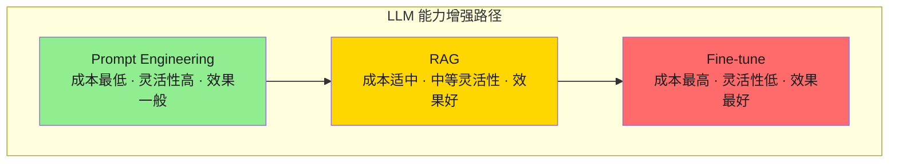
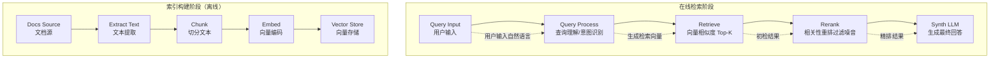
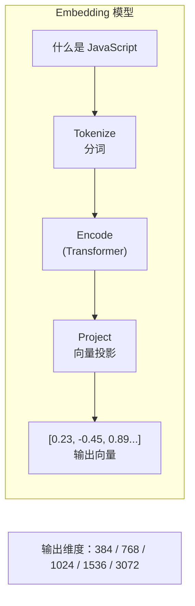
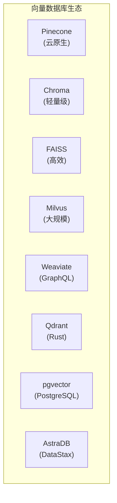
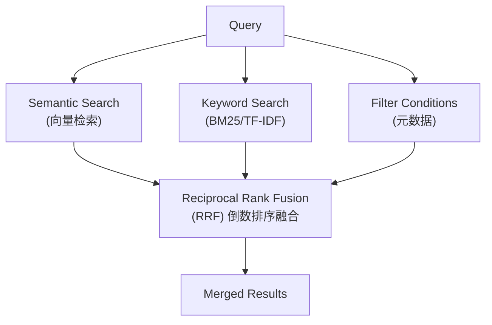
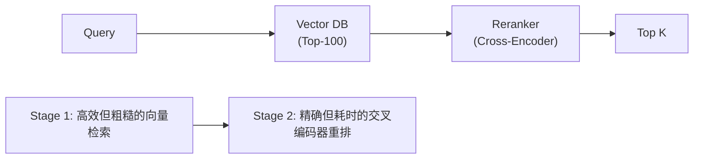

# RAG：原理与检索系统

> 本文是「RAG」系列第 1 篇（共 4 篇）。下一篇：[RAG：知识库构建](rag-knowledge-base.md)

> 本文档全面解析 RAG（Retrieval Augmented Generation）的核心原理、系统架构、实践方法和前沿进展，适用于希望构建知识增强型 AI Agent 的开发者。

## 1. RAG 核心原理

### 1.1 为什么需要 RAG

大型语言模型（LLM）虽然具备强大的语言理解和生成能力，但存在以下固有局限：

| 问题类型 | 具体表现 | RAG 解决方案 |
|---------|---------|-------------|
| **知识时效性** | 训练数据有截止日期，无法获取实时信息 | 实时检索最新文档 |
| **知识边界** | 垂直领域知识不足或缺失 | 接入领域知识库 |
| **幻觉问题** | 生成内容与事实不符 | 基于检索结果生成，减少虚构 |
| **信息透明度** | 无法追溯答案来源 | 返回检索来源，增强可信度 |
| **私有知识** | 企业内部数据无法用于训练 | 私有知识库检索 |

**RAG 的核心价值**：在不修改模型权重的情况下，通过检索外部知识来增强模型的回答质量和准确性。

### 1.2 RAG vs 微调（Fine-tuning）

选择 RAG 还是微调是工程实践中的常见决策点：



#### 1.2.1 详细对比

| 维度 | RAG | 微调 |
|------|-----|------|
| **数据需求** | 文档级数据，无需标注 | 需要高质量标注数据 |
| **更新频率** | 高（实时更新知识库） | 低（需重新训练） |
| **成本** | 索引 + 检索基础设施 | 训练算力 + 调参成本 |
| **可解释性** | 高（可追溯文档来源） | 低（隐含在模型权重中） |
| **幻觉抑制** | 强（基于检索内容生成） | 中等（依赖训练数据质量） |
| **适用场景** | 知识问答、实时信息 | 风格迁移、任务特定优化 |
| **延迟** | 增加检索延迟 | 无额外延迟 |

**决策建议**：
- 需要频繁更新知识 → 选择 RAG
- 需要特定输出风格 → 选择微调
- 两者结合 → 最佳实践（先用 RAG 提供知识，再用微调优化响应）

### 1.3 RAG 工作流程



#### 1.3.1 各阶段详解

**1. 查询处理（Query Processing）**
```python
class QueryProcessor:
    """查询处理：理解用户意图，生成检索向量"""
    
    def __init__(self, embedding_model):
        self.embedding_model = embedding_model
        self.intent_classifier = load_intent_model()
    
    def process(self, query: str, conversation_history: list = None) -> dict:
        """
        处理查询输入
        
        Args:
            query: 用户当前查询
            conversation_history: 对话历史上下文
        
        Returns:
            处理后的检索向量和元信息
        """
        # 1. 意图分类
        intent = self.intent_classifier.predict(query)
        
        # 2. 查询扩展：融入对话历史
        expanded_query = self._expand_query(query, conversation_history)
        
        # 3. 查询改写：处理模糊/口语化表达
        rewritten_query = self._rewrite_query(expanded_query)
        
        # 4. 生成检索向量
        embedding = self.embedding_model.encode(rewritten_query)
        
        return {
            "original_query": query,
            "expanded_query": expanded_query,
            "rewritten_query": rewritten_query,
            "embedding": embedding,
            "intent": intent
        }
    
    def _expand_query(self, query: str, history: list) -> str:
        """基于对话历史扩展查询"""
        if not history:
            return query
        
        # 提取历史关键信息
        context = " ".join([
            f"用户说：{h['user']}，助手答：{h['assistant']}"
            for h in history[-3:]
        ])
        
        return f"上下文：{context}。当前问题：{query}"
    
    def _rewrite_query(self, query: str) -> str:
        """查询改写：同义词替换、问题补全"""
        # 简化的查询改写示例
        rewrites = [
            ("怎么做", "如何实现"),
            ("啥是", "什么是"),
            ("咋整", "怎么处理"),
        ]
        
        result = query
        for old, new in rewrites:
            result = result.replace(old, new)
        
        return result
```

**2. 检索（Retrieval）**
```python
class RetrievalEngine:
    """检索引擎：向量相似度搜索"""

    # 第 1 段：初始化依赖与检索参数
    # 这里采用"依赖注入"而非在内部 new 一个向量库：vector_store 由外部传入，
    # 便于替换不同后端（FAISS/Chroma/pgvector）以及在测试中注入假实现。
    # top_k 做成实例属性而非写死在 search 里，使同一引擎可按配置复用；
    # 默认 10 是经验值，兼顾召回率与后续 LLM 的上下文预算。
    def __init__(self, vector_store, top_k: int = 10):
        self.vector_store = vector_store
        self.top_k = top_k

    # 第 2 段：对外检索入口——拿到原始命中再统一整形
    # 关键数据流：查询向量 + 过滤条件 → 向量库返回 doc 对象列表 →
    # 逐个映射成统一 dict（内容/元数据/距离/分数）返回给上层。
    # filters 默认 None 而非 {}，避免可变默认参数的共享状态陷阱；
    # 向量库一般把 None 视作"不过滤"，与"过滤条件为空"语义等价。
    def search(self, embedding: np.ndarray, filters: dict = None) -> list[dict]:
        """
        执行向量检索

        Args:
            embedding: 查询向量
            filters: 元数据过滤条件

        Returns:
            相关文档片段列表
        """
        # 把 top_k 与 filter 透传给底层库，由它决定用哪种索引做近邻搜索；
        # 这里是唯一一次 I/O，复杂度取决于索引类型（HNSW/IVF 约 O(log n)，
        # 暴力检索则是 O(n·d)，n 为库中文档数、d 为向量维度）。
        results = self.vector_store.similarity_search(
            embedding,
            k=self.top_k,
            filter=filters
        )

        # 第 3 段：结果标准化——屏蔽不同向量库的字段差异
        # 上层只依赖这里定义的 dict 契约，换库时无需改调用方代码。
        # 易错点：distance 越小越相近，而 score 是越大越相关，二者方向相反；
        # 因此同时保留两者，排序/阈值判断时别用错字段。
        return [
            {
                "content": doc.text,        # 正文片段，直接喂给下游 prompt
                "metadata": doc.metadata,    # 来源、页码等，用于引用与去重
                "distance": doc.distance,    # 原始距离，保持可追溯
                "score": self._distance_to_score(doc.distance)  # 归一化相似度
            }
            for doc in results
        ]

    # 第 4 段：距离 → 相似度 的转换
    # 仅对余弦距离成立：cos_distance ∈ [0, 2]，故 score ∈ [-1, 1]，
    # 其中 1 表示完全同向、0 表示正交、负值表示方向相反。
    # 边界条件：若向量已做过 L2 归一化，距离落在 [0, 2]，score 才稳定；
    # 换成欧氏距离时此公式不适用，需另写 1/(1+d) 之类的映射。
    def _distance_to_score(self, distance: float) -> float:
        """将距离转换为相似度分数（0-1）"""
        # 余弦距离转换为相似度
        return 1 - distance
```
**3. 重排序（Rerank）**
```python
# 第 1 段：类定义与模型加载方式（承载重排序所需的重型模型）
class Reranker:
    """检索结果重排序：提升相关性"""

    # 交叉编码器（cross-encoder）与常见的双塔（bi-encoder）检索不同：它把 query 与 doc
    # 拼在一起送进同一个 Transformer 做全交互注意力，因此精度高但无法预先建索引、
    # 必须对每个候选逐一前向计算，延迟和成本远高于向量内积，所以只用于对少量召回结果精排。
    def __init__(self, model_name: str = "cross-encoder/ms-marco-MiniLM-L-12-v2"):
        # 易错点：加载模型是重操作（数百 MB 权重 + 词表），此处放在构造函数里意味着
        # 每次 Reranker(...) 都会重新加载；生产环境通常做成模块级单例或依赖注入复用。
        self.model = load_cross_encoder(model_name)

    # 第 2 段：接口契约（用 docstring 固定输入输出语义，避免调用方误解返回结构）
    def rerank(self, query: str, documents: list[str]) -> list[dict]:
        """
        使用交叉编码器重排序

        Args:
            query: 原始查询
            documents: 检索到的文档列表

        Returns:
            重排序后的文档列表（含相关性分数）
        """
        # 第 3 段：构造成对样本并批量打分（数据流：documents -> pairs -> scores）
        # 每个元素是 (query, doc) 元组，模型内部会自行拼接为 [CLS] query [SEP] doc [SEP]
        # 并输出单个相关性 logit。predict 一次处理整批，避免逐条调用的 Python 层开销。
        # 关键行注释：pairs 与 documents 按位置一一对应，scores[i] 就是 documents[i] 的分数。
        pairs = [(query, doc) for doc in documents]
        # 复杂度：时间 O(N) 次完整 Transformer 前向（N 为候选数），显存/内存峰值与 batch 大小成正比；
        # 边界条件：documents 为空时 predict 传入空列表，需保证底层实现能返回空数组而非报错。
        scores = self.model.predict(pairs)

        # 第 4 段：按分数降序排列（对分数排序，但保留原始下标做回溯）
        # np.argsort 默认升序返回的是「下标」而非分数，[::-1] 将其反转为降序。
        # 之所以排下标而不是排 (score, doc) 元组，是因为后面还要用 idx 取回原始文本并暴露 original_index。
        # 易错点：argsort 默认非稳定排序，分数完全相同的文档其相对顺序不保证稳定，
        # 若业务依赖「同分时保持召回顺序」，应改用 kind="stable" 并额外反转比较键。
        ranked_indices = np.argsort(scores)[::-1]

        # 第 5 段：组装可序列化的返回结构（把 numpy 类型收敛成原生类型）
        return [
            {
                "text": documents[idx],
                # float(...) 是必要的类型转换：scores[idx] 是 numpy 标量，
                # 直接返回会导致 json.dumps / 日志序列化失败。
                "rerank_score": float(scores[idx]),
                # 保留召回阶段的原始位置，方便与上游结果对齐、做 A/B 对比或调试排序变化。
                "original_index": idx
            }
            for idx in ranked_indices
        ]
```
**4. 合成（Synthesis）**
```python
class RAGSynthesizer:
    """RAG 合成器：结合检索内容生成回答"""

    # 第 1 段：初始化与依赖注入
    # 这里不做任何检索/生成动作，只保存协作者与配置，便于测试时注入 mock llm。
    # max_context_tokens 是后续"上下文裁剪"的唯一预算来源，属于全局约束。
    def __init__(self, llm, max_context_tokens: int = 4000):
        self.llm = llm
        self.max_context_tokens = max_context_tokens

    # 第 2 段：对外主流程（模板方法式的三段式管线）
    # 编排顺序固定为「选上下文 → 建提示词 → 调模型」，把易变逻辑下沉到私有方法，
    # 使主流程保持稳定；conversation_history 默认 None 而不是 []，避免可变默认值共享。
    def synthesize(
        self,
        query: str,
        retrieved_docs: list[dict],
        conversation_history: list = None
    ) -> dict:
        """
        综合检索结果生成回答

        Args:
            query: 用户查询
            retrieved_docs: 检索到的文档
            conversation_history: 对话历史

        Returns:
            生成的回答和引用信息
        """
        # 1. 选择上下文窗口
        # 先裁剪再拼提示词，是为了让 LLM 调用这条"贵路径"之前就完成预算控制。
        context = self._select_context(query, retrieved_docs)

        # 2. 构建提示词
        prompt = self._build_prompt(query, context, conversation_history)

        # 3. 生成回答
        response = self.llm.generate(prompt)

        # 返回值刻意带上 prompt_used：RAG 出问题时，最先要排查的就是喂给模型的原文。
        # sources 由 context 反推而非直接透传 retrieved_docs，保证引用与真实入模内容一致。
        return {
            "answer": response.text,
            "sources": self._extract_sources(context),
            "prompt_used": prompt  # 可用于调试
        }

    # 第 3 段：上下文预算裁剪（token 上限内的贪心选择）
    # 复杂度 O(n)，每个文档只估算一次 token；注意 query 参数在此实现中未参与打分，
    # 说明这里假设 retrieved_docs 已由上游按相关性排序 —— 顺序即优先级。
    def _select_context(self, query: str, docs: list[dict]) -> str:
        """选择最相关的上下文（token 限制内）"""
        context_parts = []
        total_tokens = 0

        for doc in docs:
            doc_tokens = self._estimate_tokens(doc["content"])

            # 易错点：这里是 break 而不是 continue。一旦某个文档放不下就整体停止，
            # 后面的短文档即使装得下也会被丢弃；这样写换取了确定性，但会浪费预算。
            if total_tokens + doc_tokens > self.max_context_tokens:
                break

            context_parts.append(doc["content"])
            total_tokens += doc_tokens

        # 用带分隔线的空行拼接，既给模型清晰的多文档边界，也方便下游按分隔符拆回来。
        # 边界条件：docs 为空或全部超限时，返回空字符串，而非 None。
        return "\n\n---\n\n".join(context_parts)

    # 第 4 段：提示词构造（约束注入 + 多轮历史展开）
    # 把"只依据参考资料、无信息要明说、要标注来源"写进 system 部分，
    # 这是抑制幻觉的主要手段，属于提示词层面而非代码层面的防幻觉。
    def _build_prompt(
        self,
        query: str,
        context: str,
        history: list = None
    ) -> str:
        """构建 RAG 提示词"""

        # 模板里唯一的占位符是 {context}；其余花括号会与 str.format 冲突，故此处保持无花括号。
        # 反过来说：如果以后要在模板里加大括号示例，必须先转义成 {{ }}，否则运行时 ValueError。
        system_prompt = """你是一个知识助手，基于提供的参考资料回答用户问题。

要求：
1. 只使用参考资料中的信息回答，不要添加外部知识
2. 如果参考资料中没有相关信息，明确指出这一点
3. 回答时注明信息来源
4. 保持回答简洁、有条理

参考材料：
{context}"""

        user_message = f"问题：{query}"

        # 有历史时把问题改写为"历史 + 当前问题"，让指代（如"它""上面那个"）可被消解；
        # 注意只保留 user/assistant 两个键，历史过长会挤占上下文预算，此处未做截断。
        if history:
            history_text = "\n".join([
                f"用户：{h['user']}\n助手：{h['assistant']}"
                for h in history
            ])
            user_message = f"对话历史：\n{history_text}\n\n当前问题：{query}"

        # 只在 system 部分做一次 format，user_message 保持原样拼接，
        # 这样用户查询或历史里出现 { } 也不会触发格式化错误（同时避免了模板注入）。
        return system_prompt.format(context=context) + "\n\n" + user_message

    # 第 5 段：引用来源提取（当前为占位实现）
    # 设计意图是从入模的 context 反查文档元数据；现在恒定返回空列表，
    # 属于未完成逻辑：调用方拿到的 sources 永远为空，需按实际数据格式补齐解析。
    def _extract_sources(self, context: str) -> list[dict]:
        """从上下文中提取来源信息"""
        # 从 metadata 中提取来源
        sources = []
        # 实现来源提取逻辑
        return sources

    # 第 6 段：token 估算（粗糙启发式）
    # 用字符数乘以系数代替真实 tokenizer，零依赖、快，但只是上界估计：
    # 对纯英文会高估（约 0.25 tokens/字符），混合文本误差更大；系数偏保守可避免超限。
    def _estimate_tokens(self, text: str) -> int:
        """估算 token 数量（简单估计：中文约 1.5 tokens/字）"""
        # 边界条件：text 为空时返回 0；int() 向下取整，短文本可能被低估到 0。
        return int(len(text) * 1.5)
```
## 2. 检索系统

### 2.1 Embedding 模型

Embedding 模型是将文本转换为向量的核心组件：



#### 2.1.1 主流 Embedding 模型对比

| 模型 | 维度 | 上下文 | 特点 | 适用场景 |
|------|------|--------|------|----------|
| **text-embedding-ada-002** | 1536 | 8192 | OpenAI 官方，稳定 | 通用场景 |
| **text-embedding-3-small** | 256-3072 | 8192 | 轻量高性能 | 成本敏感 |
| **text-embedding-3-large** | 256-3072 | 8192 | 高性能 | 精度优先 |
| **BGE-large-zh** | 1024 | 512 | 中文优化 | 中文场景 |
| **BAAI/bge-m3** | 1024 | 8192 | 多语言+稀疏 | 多语言场景 |
| **E5-mistral-7b** | 1024 | 4096 | 高性能 | 精度优先 |
| **GTE-large-zh** | 1024 | 512 | 阿里中文 | 中文场景 |
| **NV-Embed-QA** | 4096 | 32K | 长上下文 | 长文档 |

#### 2.1.2 Embedding 实现

```python
from sentence_transformers import SentenceTransformer
import torch

class EmbeddingModel:
    """Embedding 模型封装"""
    
    # 模型配置
    MODEL_CONFIGS = {
        "bge-large-zh": {
            "path": "BAAI/bge-large-zh-v1.5",
            "dimension": 1024,
            "max_length": 512,
            "normalize": True
        },
        "bge-m3": {
            "path": "BAAI/bge-m3",
            "dimension": 1024,
            "max_length": 8192,
            "normalize": True
        },
        "e5-base": {
            "path": "intfloat/e5-base-v2",
            "dimension": 768,
            "max_length": 512,
            "normalize": True
        }
    }
    
    def __init__(
        self,
        model_name: str = "bge-large-zh",
        device: str = None,
        batch_size: int = 32
    ):
        """
        初始化 Embedding 模型
        
        Args:
            model_name: 模型名称或本地路径
            device: 运行设备（auto/cuda/cpu）
            batch_size: 批处理大小
        """
        self.model_name = model_name
        self.batch_size = batch_size
        
        # 自动设备选择
        if device is None:
            device = "cuda" if torch.cuda.is_available() else "cpu"
        self.device = device
        
        # 加载模型
        self.model = SentenceTransformer(
            self.MODEL_CONFIGS.get(model_name, {}).get("path", model_name),
            device=device
        )
        
        # 模型配置
        config = self.MODEL_CONFIGS.get(model_name, {})
        self.dimension = config.get("dimension", self.model.get_sentence_embedding_dimension())
        self.normalize = config.get("normalize", True)
    
    def encode(
        self,
        texts: str | list[str],
        batch_size: int = None,
        show_progress: bool = False
    ) -> np.ndarray:
        """
        将文本编码为向量
        
        Args:
            texts: 单个文本或文本列表
            batch_size: 批大小（覆盖默认值）
            show_progress: 是否显示进度
        
        Returns:
            归一化的嵌入向量
        """
        if isinstance(texts, str):
            texts = [texts]
        
        embeddings = self.model.encode(
            texts,
            batch_size=batch_size or self.batch_size,
            show_progress_bar=show_progress,
            normalize_embeddings=self.normalize,
            convert_to_numpy=True
        )
        
        return embeddings
    
    def encode_query(self, query: str) -> np.ndarray:
        """
        专门编码查询（某些模型需要特殊前缀）
        
        Args:
            query: 查询文本
        
        Returns:
            查询向量
        """
        # E5 系列模型需要 query 前缀
        if "e5" in self.model_name.lower():
            query = f"query: {query}"
        
        return self.encode(query)[0]
    
    def encode_corpus(
        self,
        corpus: list[str],
        show_progress: bool = True
    ) -> np.ndarray:
        """
        批量编码文档语料
        
        Args:
            corpus: 文档列表
            show_progress: 是否显示进度
        
        Returns:
            文档向量矩阵
        """
        # E5 系列模型需要 passage 前缀
        if "e5" in self.model_name.lower():
            corpus = [f"passage: {doc}" for doc in corpus]
        
        return self.encode(corpus, show_progress=show_progress)
    
    def similarity(
        self,
        query_embedding: np.ndarray,
        doc_embeddings: np.ndarray
    ) -> np.ndarray:
        """
        计算查询与文档的相似度
        
        Args:
            query_embedding: 查询向量 (d,)
            doc_embeddings: 文档向量矩阵 (n, d)
        
        Returns:
            相似度分数 (n,)
        """
        if self.normalize:
            # 余弦相似度（已归一化，点积即相似度）
            return np.dot(doc_embeddings, query_embedding)
        else:
            # 余弦相似度（未归一化）
            from sklearn.metrics.pairwise import cosine_similarity
            return cosine_similarity(
                query_embedding.reshape(1, -1),
                doc_embeddings
            )[0]
```

### 2.2 向量数据库

向量数据库是存储和检索高维向量的基础设施：



#### 2.2.1 各向量数据库对比

| 数据库 | 类型 | 优势 | 劣势 | 适用规模 |
|--------|------|------|------|----------|
| **Pinecone** | 云服务 | 全托管、易用、免运维 | 付费、成本高 | 中大型项目 |
| **Chroma** | 本地/云 | 轻量、API 简洁 | 功能有限 | 原型/小规模 |
| **FAISS** | 本地库 | 高性能、GPU 加速 | 无分布式 | 中型项目 |
| **Milvus** | 开源/云 | 功能全面、可扩展 | 运维复杂 | 大规模项目 |
| **Qdrant** | 开源/云 | Rust 性能高、Filter 强 | 社区较小 | 中大型项目 |
| **pgvector** | PostgreSQL 扩展 | 与现有 DB 集成 | 性能一般 | 已有 PG 环境 |

#### 2.2.2 Pinecone 实现

```python
import pinecone
from pinecone import ServerlessSpec

# 第 1 段：定义封装类（对外暴露统一的向量库操作接口）
# 用「组合」而非继承的方式包装 Pinecone 客户端：业务层只需依赖本类的方法，
# 后续若要换成 Milvus/Qdrant，只替换本类实现即可，无需改动调用方。
# 注意：索引句柄（pinecone.Index）是懒创建的，每次都按 index_name 重新取，
# 这是为了兼容无状态/多进程场景，代价是多一次轻量查询。

class PineconeVectorStore:
    """Pinecone 向量数据库封装"""
    
    # 第 2 段：构造与全局初始化（绑定 API Key / 环境，并保存索引名）
    # pinecone.init 是 SDK 的模块级全局配置，一旦调用就对后续所有操作生效；
    # 因此同一进程内混用多个不同 api_key 的实例会互相覆盖，这是常见坑。
    def __init__(
        self,
        api_key: str,
        environment: str = "us-east-1",
        index_name: str = "rag-index"
    ):
        """
        初始化 Pinecone
        
        Args:
            api_key: Pinecone API Key
            environment: 环境区域
            index_name: 索引名称
        """
        pinecone.init(api_key=api_key, environment=environment)
        self.index_name = index_name
    
    # 第 3 段：创建索引（声明向量维度与距离度量）
    # dimension 决定向量空间大小，必须与后续写入/查询向量严格一致，否则 upsert 会报维度不匹配；
    # metric 影响 score 的语义："cosine" 越接近 1 越相似，"euclidean" 则越小越相似。
    def create_index(
        self,
        dimension: int,
        metric: str = "cosine",
        spec: dict = None
    ):
        """
        创建索引
        
        Args:
            dimension: 向量维度
            metric: 距离度量（cosine/euclidean/dotproduct）
            spec: 索引规格配置
        """
        # 默认走 Serverless：按量付费、无需手动规划 Pod，适合中小规模 RAG；
        # 若换成 pod 模式，需要自行传入额外容量参数。
        if spec is None:
            spec = ServerlessSpec(
                cloud="aws",
                region="us-east-1"
            )
        
        # 幂等保护：create_index 对已存在的索引会抛异常，先 list 再创建可让该方法重复调用安全。
        # 易错点：list_indexes() 返回的是索引名集合，名字写错会静默新建一个重复索引。
        if self.index_name not in pinecone.list_indexes():
            pinecone.create_index(
                self.index_name,
                dimension=dimension,
                metric=metric,
                spec=spec
            )
    
    # 第 4 段：批量写入向量（upsert = 存在则更新，不存在则插入）
    # 这里直接透传 vectors 而不做分批：单次请求体有大小/条数上限，
    # 生产环境若一次塞入过多（如 >100 条或超大 metadata）容易被拒，需在调用侧切分。
    # namespace 用于逻辑隔离（如按租户/知识库分片），同名 id 在不同 namespace 下互不冲突。
    def upsert(self, vectors: list[dict], namespace: str = ""):
        """
        批量插入向量
        
        Args:
            vectors: [{id, values, metadata}, ...]
            namespace: 命名空间（用于数据隔离）
        """
        index = pinecone.Index(self.index_name)
        index.upsert(vectors, namespace=namespace)
    
    # 第 5 段：向量相似度检索（ANN 近邻查询 + 元数据过滤）
    # top_k 是「近似」结果数量而非全量排序，Pinecone 内部走 ANN 索引，召回率与延迟需权衡；
    # include_metadata=True 才会把 metadata 一同带回，否则结果里只有 id 和 score。
    def search(
        self,
        query_vector: list[float],
        top_k: int = 10,
        filter: dict = None,
        namespace: str = ""
    ) -> list[dict]:
        """
        向量相似度搜索
        
        Args:
            query_vector: 查询向量
            top_k: 返回数量
            filter: 元数据过滤条件
            namespace: 命名空间
        
        Returns:
            检索结果
        """
        index = pinecone.Index(self.index_name)
        
        # filter 为 None 时交由 SDK 处理，等价于「不过滤」；
        # filter 的字段必须是 metadata 中已存在的键，否则可能返回空结果。
        results = index.query(
            vector=query_vector,
            top_k=top_k,
            filter=filter,
            namespace=namespace,
            include_metadata=True
        )
        
        # 统一输出结构：屏蔽 SDK 原始响应字段（如 values/namespace），只保留业务关心三项，
        # 便于上层直接喂给 LLM 做 prompt 拼装。复杂度 O(top_k)。
        return [
            {
                "id": match["id"],
                "score": match["score"],
                "metadata": match["metadata"]
            }
            for match in results["matches"]
        ]
    
    # 第 6 段：按 id 删除向量（用于数据下架 / 重建前清理）
    # 只删指定 id，不会动索引结构与其它 namespace；ids 为空列表时是空操作，不会清库。
    def delete(self, ids: list[str], namespace: str = ""):
        """删除向量"""
        index = pinecone.Index(self.index_name)
        index.delete(ids=ids, namespace=namespace)
    
    # 第 7 段：读取索引统计（用于监控健康度与容量）
    # 返回包含各 namespace 的向量总数、维度等信息，常用来做「写入是否成功」的断言；
    # 注意统计值存在秒级延迟，刚写完立即查询可能不反映最新数量。
    def describe_index(self) -> dict:
        """获取索引统计信息"""
        index = pinecone.Index(self.index_name)
        return index.describe_index_stats()
```
#### 2.2.3 Chroma 实现

```python
import chromadb
from chromadb.config import Settings
from typing import list

# 第 1 段：依赖导入——锁定"客户端 + 配置 + 类型标注"三件套
# why: PersistentClient 负责落盘、Settings 负责关掉匿名遥测（企业内网/离线环境必关，否则会向外部发请求）。
# 易错点: typing 模块里并没有 list，正确写法是 from typing import List；
#         一旦执行到这一行就会 ImportError，属于"抄示例时最容易踩的坑"。
#         下方注解 list[str] 之所以看起来能用，是因为 Python 3.9+ 内置 list 已支持下标，与这行导入无关。

class ChromaVectorStore:
    """Chroma 向量数据库封装"""

    # 第 2 段：角色定位——把 Chroma 的"客户端/集合"两级概念收敛成一个门面类
    # why: 上层只需要一个对象，不关心 client 与 collection 的生命周期差异；
    #      后续所有读写方法都转发到 self.collection，形成薄封装（thin wrapper），便于替换后端。
    # 数据流: 调用方 -> ChromaVectorStore 方法 -> self.collection -> Chroma 客户端 -> 本地磁盘

    def __init__(
        self,
        persist_directory: str = "./chroma_db",
        collection_name: str = "documents"
    ):
        """
        初始化 Chroma

        Args:
            persist_directory: 持久化目录
            collection_name: 集合名称
        """
        # 第 3 段：建立持久化客户端——连接是复用的重资源，必须在构造期一次性建好
        # why: PersistentClient 采用嵌入式模式，直接读写本地目录，无需单独起服务；
        #      anonymized_telemetry=False 关闭匿名埋点，避免生产环境外联与隐私合规问题。
        # 边界: 目录不存在时客户端会自动创建，路径权限不足才会在这里抛异常。
        self.client = chromadb.PersistentClient(
            path=persist_directory,
            settings=Settings(anonymized_telemetry=False)
        )
        self.collection_name = collection_name
        self.collection = self._get_or_create_collection()

    # 第 4 段：集合获取——用 get_or_create 实现幂等初始化
    # why: 同一进程重启、或多进程并发启动时，重复调用不应报错，因此不能只用 create_collection；
    #      metadata 里的 "hnsw:space" 决定底层 HNSW 索引的度量方式，一旦集合已存在则此参数被忽略，
    #      易错点: 想换距离度量必须删库重建，改代码参数对已有集合无效。
    def _get_or_create_collection(self):
        """获取或创建集合"""
        return self.client.get_or_create_collection(
            name=self.collection_name,
            metadata={"hnsw:space": "cosine"}  # cosine 余弦距离
        )

    # 第 5 段：写入——批量新增（Upsert 语义之外的最纯粹插入路径）
    # why: documents / ids / embeddings / metadatas 四个列表按下标一一对应，
    #      长度不一致是最高频的运行时错误（Chroma 会直接拒绝整批写入，无部分成功）。
    # 边界: embeddings 传 None 时，由 collection 绑定的 embedding function 自动向量化；
    #       ids 必须全局唯一，重复 id 会覆盖或报错，取决于具体版本。
    def add(
        self,
        documents: list[str],
        ids: list[str],
        embeddings: list[list[float]] = None,
        metadatas: list[dict] = None
    ):
        """
        添加文档

        Args:
            documents: 文档内容列表
            ids: 文档 ID 列表
            embeddings: 向量列表（可选，自动生成）
            metadatas: 元数据列表
        """
        self.collection.add(
            documents=documents,
            ids=ids,
            embeddings=embeddings,
            metadatas=metadatas
        )

    # 第 6 段：检索——按向量近邻 + 结构化过滤的复合查询
    # why: n_results 只限制返回条数，不保证距离阈值，所以"相关文档不足"时可能返回噪声；
    #      where 作用于 metadata、where_document 作用于原文关键词，两者是"先过滤再近邻"还是
    #      "先近邻再过滤"由 Chroma 内部策略决定，过滤条件过于苛刻时结果数可能少于 n_results。
    # 复杂度: HNSW 近邻为近似检索，查询约 O(log N)，但过滤条件下的召回率会下降。
    def query(
        self,
        query_embeddings: list[list[float]],
        n_results: int = 10,
        where: dict = None,
        where_document: dict = None
    ) -> dict:
        """
        查询相似文档

        Args:
            query_embeddings: 查询向量
            n_results: 返回数量
            where: 元数据过滤条件
            where_document: 文档内容过滤

        Returns:
            查询结果
        """
        return self.collection.query(
            query_embeddings=query_embeddings,
            n_results=n_results,
            where=where,
            where_document=where_document
        )

    # 第 7 段：更新——按 id 局部覆盖，未传的字段保持原值
    # why: 与 add 的区别在于"必须命中已存在的 id"，缺失 id 不会新建而会被忽略或报错；
    #      注意只改 documents 而不同步 embeddings 时，向量仍指向旧内容，会造成检索语义漂移。
    def update(
        self,
        ids: list[str],
        documents: list[str] = None,
        embeddings: list[list[float]] = None,
        metadatas: list[dict] = None
    ):
        """更新文档"""
        self.collection.update(
            ids=ids,
            documents=documents,
            embeddings=embeddings,
            metadatas=metadatas
        )

    # 第 8 段：删除——支持按 id 精确删与按 metadata 条件批量删
    # 易错点: ids 与 where 都可为 None，若两者同时为 None，不同版本行为不一致
    #         （可能清空整个集合，也可能直接报错），生产代码务必二选一显式传入。
    def delete(self, ids: list[str] = None, where: dict = None):
        """删除文档"""
        self.collection.delete(ids=ids, where=where)

    # 第 9 段：读取——按 id 或 metadata 取回原始记录（不含相似度计算）
    # why: get 是"确定性取数"，与 query 的"近似检索"互补，常用于更新前回显或删除前校验；
    #      返回结构同样按 id 分组，注意它不会返回 distance 字段。
    def get(self, ids: list[str] = None, where: dict = None) -> dict:
        """获取文档"""
        return self.collection.get(ids=ids, where=where)
```
#### 2.2.4 FAISS 实现

```python
import faiss
import numpy as np

class FAISSVectorStore:
    """FAISS 向量数据库封装"""
    
    def __init__(
        self,
        dimension: int,
        index_type: str = "IVFFlat",
        nlist: int = 100
    ):
        """
        初始化 FAISS
        
        Args:
            dimension: 向量维度
            index_type: 索引类型
                - "Flat": 精确检索（小规模）
                - "IVFFlat": 倒排索引（中等规模）
                - "HNSW": 图索引（高性能）
                - "IVFPQ": 量化为索引（大规模）
            nlist: IVF 聚类中心数
        """
        self.dimension = dimension
        self.index_type = index_type
        self.nlist = nlist
        
        # 存储原始向量和元数据
        self.id_to_text = {}
        self.id_to_metadata = {}
        self.current_id = 0
        
        # 构建索引
        self.index = self._build_index()
    
    def _build_index(self):
        """构建索引"""
        if self.index_type == "Flat":
            # 精确检索（暴力搜索）
            return faiss.IndexFlatIP(self.dimension)  # 内积（需要归一化向量）
        
        elif self.index_type == "IVFFlat":
            # 倒排文件索引
            quantizer = faiss.IndexFlatIP(self.dimension)
            index = faiss.IndexIVFFlat(quantizer, self.dimension, self.nlist)
            return index
        
        elif self.index_type == "HNSW":
            # 分层可导航小世界图
            index = faiss.IndexHNSWFlat(self.dimension, 32)  # 32 为 M 参数
            return index
        
        elif self.index_type == "IVFPQ":
            # 乘积量化
            quantizer = faiss.IndexFlatIP(self.dimension)
            m = 16  # 子向量数
            nbits = 8  # 每子向量位数
            index = faiss.IndexIVFPQ(quantizer, self.dimension, self.nlist, m, nbits)
            return index
        
        else:
            raise ValueError(f"Unsupported index type: {self.index_type}")
    
    def train(self, vectors: np.ndarray):
        """训练索引（IVF/PQ 索引需要训练）"""
        if not self.index.is_trained:
            vectors = vectors.astype('float32')
            self.index.train(vectors)
    
    def add(
        self,
        vectors: np.ndarray,
        texts: list[str],
        metadatas: list[dict] = None
    ):
        """
        添加向量
        
        Args:
            vectors: numpy 向量数组 (n, d)
            texts: 文本列表
            metadatas: 元数据列表
        """
        vectors = vectors.astype('float32')
        
        # 训练索引
        if not self.index.is_trained:
            self.train(vectors)
        
        # 添加到索引
        self.index.add(vectors)
        
        # 存储元数据
        for i, text in enumerate(texts):
            doc_id = str(self.current_id)
            self.id_to_text[doc_id] = text
            self.id_to_metadata[doc_id] = metadatas[i] if metadatas else {}
            self.current_id += 1
    
    def search(
        self,
        query_vector: np.ndarray,
        k: int = 10
    ) -> list[dict]:
        """
        搜索相似向量
        
        Args:
            query_vector: 查询向量
            k: 返回数量
        
        Returns:
            搜索结果
        """
        query_vector = query_vector.astype('float32').reshape(1, -1)
        
        if self.index_type == "IVFFlat" and not self.index.is_trained:
            self.index.nprobe = 10  # 搜索的聚类中心数
        
        distances, indices = self.index.search(query_vector, k)
        
        results = []
        for dist, idx in zip(distances[0], indices[0]):
            if idx >= 0:  # FAISS 返回 -1 表示无效
                doc_id = str(idx)
                results.append({
                    "id": doc_id,
                    "text": self.id_to_text.get(doc_id, ""),
                    "metadata": self.id_to_metadata.get(doc_id, {}),
                    "distance": float(dist),
                    "score": float(1 / (1 + dist))  # 转换为相似度
                })
        
        return results
    
    def save(self, path: str):
        """保存索引到磁盘"""
        faiss.write_index(self.index, path)
        
        # 保存元数据
        import json
        metadata = {
            "id_to_text": self.id_to_text,
            "id_to_metadata": self.id_to_metadata,
            "current_id": self.current_id,
            "dimension": self.dimension,
            "index_type": self.index_type
        }
        with open(f"{path}.meta", "w", encoding="utf-8") as f:
            json.dump(metadata, f, ensure_ascii=False)
    
    @classmethod
    def load(cls, path: str) -> "FAISSVectorStore":
        """从磁盘加载索引"""
        index = faiss.read_index(path)
        
        # 加载元数据
        import json
        with open(f"{path}.meta", "r", encoding="utf-8") as f:
            metadata = json.load(f)
        
        store = cls(
            dimension=metadata["dimension"],
            index_type=metadata["index_type"]
        )
        store.index = index
        store.id_to_text = metadata["id_to_text"]
        store.id_to_metadata = metadata["id_to_metadata"]
        store.current_id = metadata["current_id"]
        
        return store
```

### 2.3 混合检索

混合检索结合多种检索方式以获得更好的效果：



#### 2.3.1 Reciprocal Rank Fusion (RRF)

```python
import numpy as np
from rank_bm25 import BM25Okapi
from sklearn.feature_extraction.text import TfidfVectorizer

class HybridRetriever:
    """混合检索器：结合语义检索和关键词检索"""
    
    def __init__(
        self,
        vector_store,
        embedding_model,
        k1: float = 1.2,  # BM25 参数
        b: float = 0.75,  # BM25 长度归一化
        rrf_k: int = 60   # RRF 参数
    ):
        """
        初始化混合检索器
        
        Args:
            vector_store: 向量数据库
            embedding_model: Embedding 模型
            k1, b: BM25 参数
            rrf_k: RRF 融合参数
        """
        self.vector_store = vector_store
        self.embedding_model = embedding_model
        self.k1 = k1
        self.b = b
        self.rrf_k = rrf_k
        
        # BM25 组件
        self.bm25: BM25Okapi = None
        self.corpus_tokenized: list[list[str]] = None
        self.corpus_texts: list[str] = None
        self.corpus_ids: list[str] = None
    
    def index(self, documents: list[dict]):
        """
        索引文档
        
        Args:
            documents: [{id, text, metadata}, ...]
        """
        # 1. 向量索引
        texts = [doc["text"] for doc in documents]
        embeddings = self.embedding_model.encode_corpus(texts)
        
        vectors = [
            {"id": doc["id"], "values": emb.tolist(), "metadata": doc.get("metadata", {})}
            for doc, emb in zip(documents, embeddings)
        ]
        self.vector_store.upsert(vectors)
        
        # 2. BM25 索引
        self.corpus_ids = [doc["id"] for doc in documents]
        self.corpus_texts = texts
        self.corpus_tokenized = [self._tokenize(text) for text in texts]
        self.bm25 = BM25Okapi(self.corpus_tokenized)
    
    def search(
        self,
        query: str,
        top_k: int = 10,
        filters: dict = None,
        semantic_weight: float = 0.5,
        keyword_weight: float = 0.5
    ) -> list[dict]:
        """
        混合搜索
        
        Args:
            query: 查询文本
            top_k: 返回数量
            filters: 元数据过滤
            semantic_weight: 语义检索权重
            keyword_weight: 关键词检索权重
        
        Returns:
            融合后的结果
        """
        # 1. 语义检索
        query_embedding = self.embedding_model.encode_query(query)
        semantic_results = self.vector_store.search(
            query_vector=query_embedding.tolist(),
            top_k=top_k * 2,  # 多检索一些用于融合
            filter=filters
        )
        
        # 2. 关键词检索
        keyword_results = self._bm25_search(query, top_k * 2)
        
        # 3. RRF 融合
        fused_results = self._rrf_fusion(
            semantic_results,
            keyword_results,
            top_k,
            semantic_weight,
            keyword_weight
        )
        
        return fused_results
    
    def _bm25_search(self, query: str, top_k: int) -> list[dict]:
        """BM25 关键词检索"""
        if self.bm25 is None:
            return []
        
        query_tokens = self._tokenize(query)
        scores = self.bm25.get_scores(query_tokens)
        
        # 获取 Top-K
        top_indices = np.argsort(scores)[::-1][:top_k]
        
        return [
            {
                "id": self.corpus_ids[idx],
                "text": self.corpus_texts[idx],
                "score": float(scores[idx])
            }
            for idx in top_indices if scores[idx] > 0
        ]
    
    def _rrf_fusion(
        self,
        semantic_results: list[dict],
        keyword_results: list[dict],
        top_k: int,
        semantic_weight: float,
        keyword_weight: float
    ) -> list[dict]:
        """
        倒数排序融合 (RRF)
        
        RRF 公式: RRF(d) = Σ 1/(k + rank(d))
        
        Args:
            semantic_results: 语义检索结果
            keyword_results: 关键词检索结果
            top_k: 返回数量
            semantic_weight: 语义权重
            keyword_weight: 关键词权重
        
        Returns:
            融合后的结果
        """
        # 构建排名字典
        semantic_ranks = {
            r["id"]: (i + 1) for i, r in enumerate(semantic_results)
        }
        keyword_ranks = {
            r["id"]: (i + 1) for i, r in enumerate(keyword_results)
        }
        
        # 获取所有文档 ID
        all_ids = set(semantic_ranks.keys()) | set(keyword_ranks.keys())
        
        # 计算 RRF 分数
        rrf_scores = {}
        for doc_id in all_ids:
            s_rank = semantic_ranks.get(doc_id, float('inf'))
            k_rank = keyword_ranks.get(doc_id, float('inf'))
            
            s_rrf = semantic_weight / (self.rrf_k + s_rank) if s_rank != float('inf') else 0
            k_rrf = keyword_weight / (self.rrf_k + k_rank) if k_rank != float('inf') else 0
            
            rrf_scores[doc_id] = s_rrf + k_rrf
        
        # 排序并返回结果
        sorted_ids = sorted(rrf_scores.keys(), key=lambda x: rrf_scores[x], reverse=True)
        
        # 构建结果（保留原始文本）
        id_to_text = {}
        for r in semantic_results:
            id_to_text[r["id"]] = r.get("text", "")
        for r in keyword_results:
            if r["id"] not in id_to_text:
                id_to_text[r["id"]] = r.get("text", "")
        
        return [
            {
                "id": doc_id,
                "text": id_to_text.get(doc_id, ""),
                "rrf_score": rrf_scores[doc_id],
                "semantic_rank": semantic_ranks.get(doc_id),
                "keyword_rank": keyword_ranks.get(doc_id)
            }
            for doc_id in sorted_ids[:top_k]
        ]
    
    def _tokenize(self, text: str) -> list[str]:
        """简单分词（中文按字符，英文按空格）"""
        import re
        # 简单处理：中文按字符，英文按空格和标点
        tokens = re.findall(r'[一-鿿]|[a-zA-Z]+', text)
        return tokens
```

### 2.4 重排序

重排序（Rerank）是在初检基础上进一步提升结果相关性的关键步骤：



#### 2.4.1 Cross-Encoder 重排序实现

```python
from sentence_transformers import CrossEncoder
import numpy as np

# 第 1 段：模块依赖与类声明（引入交叉编码器与数值库）
# CrossEncoder 会同时把 query 和 doc 拼成一条序列送进 Transformer，让两段文本
# 在注意力层内部互相看见，因此精度远高于双塔向量点积，但代价是无法预计算文档向量，
# 每次检索都必须在线跑一遍模型，属于典型的"用算力换准确率"。
class Reranker:
    """交叉编码器重排序"""

    # 第 2 段：内置重排模型的别名表（把易记的短名映射为 HuggingFace 仓库名）
    # 这里三个 ms-marco 别名都指向同一个权重，明显是历史遗留/占位写法：按别名取模型时
    # 并不会因为选了 "ms-marco-large" 就真的加载到更大模型，教学时应留意这个坑。
    # 用 dict + get(默认回退到原名) 的好处是既支持别名，也支持用户直接传本地路径。
    # 常用重排模型
    RERANK_MODELS = {
        "ms-marco": "cross-encoder/ms-marco-MiniLM-L-12-v2",
        "ms-marco-large": "cross-encoder/ms-marco-MiniLM-L-12-v2",
        "ms-marco-deberta": "cross-encoder/ms-marco-MiniLM-L-12-v2",
        "bge-reranker": "BAAI/bge-reranker-large",
        "bge-reranker-base": "BAAI/bge-reranker-base"
    }

    # 第 3 段：构造与模型加载（把配置解析和设备选择收敛到一处）
    # 设备判定交给设备无关的探测逻辑，避免上层调用者关心 CUDA 是否存在；
    # device=None 表示"自动选择"，显式传入字符串则完全尊重调用方意图（可能是有意跑 CPU 复现）。
    def __init__(
        self,
        model_name: str = "ms-marco",
        device: str = None
    ):
        """
        初始化重排序模型

        Args:
            model_name: 模型名称或路径
            device: 运行设备
        """
        # 别名优先，查不到就当作本地目录 / HuggingFace 全名直接使用，做到"别名与路径两用"
        model_path = self.RERANK_MODELS.get(model_name, model_name)

        # 第 4 段：设备探测（自动模式下的兜底）
        # 注意 CrossEncoder._model_has_device() 并不是 sentence_transformers 的既有 API，
        # 在真实环境里会抛 AttributeError；正确写法应是 torch.cuda.is_available()，
        # 这里保留原样仅作教学演示，属于必须指出的易错点。
        if device is None:
            device = "cuda" if CrossEncoder._model_has_device() else "cpu"

        # max_length=512 是硬截断上限：query+doc 拼接后超出部分会被静默丢弃，
        # 长文档尾部信息将参与不到打分，检索长文本时要先切块或调大该值。
        # 模型实例被复用（在 __init__ 里只建一次），后续 rerank 复用同一份权重，避免重复加载。
        self.model = CrossEncoder(
            model_path,
            device=device,
            max_length=512
        )

    # 第 5 段：核心重排接口（query + 候选文档 → 按相关性排序的 Top-K）
    # 输入是原始字符串列表而非向量，说明本方法完全依赖模型在线推理；
    # top_k 与 return_scores 都设了默认值，使"只要排名"和"要分数"两种调用方式统一入口。
    def rerank(
        self,
        query: str,
        documents: list[str],
        top_k: int = 10,
        return_scores: bool = True
    ) -> list[dict]:
        """
        重排序检索结果

        Args:
            query: 查询文本
            documents: 文档列表
            top_k: 返回数量
            return_scores: 是否返回分数

        Returns:
            重排序后的结果
        """
        # 第 6 段：构造查询-文档对
        # 交叉编码器的输入单位是 (query, doc) 二元组，因此同一个 query 会被重复拼接 N 次，
        # 这正是重排 O(N) 次前向计算、无法像向量检索那样 O(1) 查表的根本原因。
        # 构建查询-文档对
        pairs = [(query, doc) for doc in documents]

        # 第 7 段：批量打分（一次前向覆盖全部候选，比逐个预测更省时间）
        # predict 内部会自行分批、tokenize 并做 padding，返回的是与 pairs 等长的相关性分数数组。
        # 若 documents 为空列表，这里会得到空数组，后续流程不会报错，只是结果为空 —— 属于隐性边界。
        # 批量预测相关性分数
        scores = self.model.predict(pairs)

        # 第 8 段：统一分数容器类型（把 ndarray / 标量 归一成可索引的 Python 结构）
        # 一维 ndarray 转 list 是为了后续能被 argsort 之外的原生索引安全访问；
        # 之所以还要 `elif not isinstance(scores, list)`，是因为极少数模型/单条输入可能返回标量，
        # 不包成单元素列表时后面的 scores[idx] 会直接 TypeError。
        # 转换为列表（如果是单个结果）
        if isinstance(scores, np.ndarray) and len(scores.shape) == 1:
            scores = scores.tolist()
        elif not isinstance(scores, list):
            scores = [scores]

        # 第 9 段：按分数降序排列
        # argsort 默认升序，[::-1] 反转得到降序 —— 注意反转同时会翻转并列分数的相对次序，
        # 且默认快排不是稳定排序，因此分数相同的文档其先后顺序不保证与输入一致；
        # 对结果稳定性有要求时应改用 sorted(range(n), key=..., reverse=True) 之类的稳定方案。
        # 按分数降序排列
        ranked_indices = np.argsort(scores)[::-1]

        # 第 10 段：组装返回结构（rank 由输出位置而非原始下标决定）
        # rank 用 len(results)+1 计算，保证名次从 1 连续递增；
        # idx 来自 numpy 整数，拿去索引 Python list 合法但得到的是原文档引用，不产生拷贝（省内存）。
        # 切片 [:top_k] 在 top_k 大于文档总数时自动截短，无需额外判断。
        results = []
        for idx in ranked_indices[:top_k]:
            result = {
                "text": documents[idx],
                "rank": len(results) + 1
            }
            if return_scores:
                # 显式 float() 是为了把 numpy 浮点转成原生类型，避免下游 JSON 序列化失败
                result["score"] = float(scores[idx])
            results.append(result)

        return results

    # 第 11 段：便捷封装（面向"要并列数组"的调用方）
    # 返回 (文档, 分数) 两个平行列表，便于直接喂给下游做加权融合或截断；
    # top_k=len(documents) 表示全量重排，因此本方法依赖 rerank 默认 return_scores=True，
    # 若哪天把该默认值改成 False，这里的 r["score"] 会立刻 KeyError —— 是隐式耦合点。
    def rerank_with_scores(
        self,
        query: str,
        documents: list[str]
    ) -> tuple[list[str], list[float]]:
        """
        重排序，返回文档和分数

        Returns:
            (重排序后的文档列表, 对应分数列表)
        """
        results = self.rerank(query, documents, top_k=len(documents))
        return [r["text"] for r in results], [r["score"] for r in results]
```

## 深入阅读与参考

!!! tip "怎么用这些资料"
    先读「官方文档与规范」建立准确的概念，再读「源码与示例」核对细节，最后用「教程、书籍与视频」换一种讲法加深理解。每条都写明了读哪一节、带着什么问题读。

### 官方文档与规范

| 资源 | 为什么读 | 怎么读 |
|---|---|---|
| [LlamaIndex 博客](https://www.llamaindex.ai/blog) | 官方博客，讲清 agentic RAG 的检索策略与适用场景 | 读 agentic RAG 相关篇目，带着「何时该迭代检索」的问题，把一种策略接进自己的 RAG |
| [Pinecone RAG 系列](https://www.pinecone.io/learn/series/rag/) | 向量库官方系列，检索架构与调参讲得细 | 按系列顺序读，重点看分块与检索章节，把文末实验自己复现一次 |
| [Ragas 文档](https://docs.ragas.io/) | 官方评测文档，用指标量化检索与生成质量 | 读 faithfulness 与 context precision 定义，接入自己的 RAG 跑一次评测 |

### 源码与示例

| 资源 | 为什么读 | 怎么读 |
|---|---|---|
| [Anthropic Cookbook](https://github.com/anthropics/anthropic-cookbook) | 可运行 notebook，展示 RAG 与工具调用的工程写法 | 克隆仓库，运行 tool_use 与 RAG 目录 notebook，再换成自己的数据 |
| [RAG_Techniques（NirDiamant）](https://github.com/NirDiamant/RAG_Techniques) | 逐个 notebook 演示重排、查询改写等实用检索技巧 | 依序跑基础 RAG、重排序、查询改写三个 notebook，对比结果差异 |

### 教程、书籍与视频

| 资源 | 为什么读 | 怎么读 |
|---|---|---|
| [All-in-RAG（Datawhale）](https://github.com/datawhalechina/all-in-rag) | 中文开源教程，从数据处理到应用完整落地 | 按章节顺序实现，重点读检索与重排部分，最后搭出完整 RAG 应用 |
| [RAG 综述（Gao et al.）](https://arxiv.org/abs/2312.10997) | 系统梳理从朴素到模块化 RAG 的问题与演进 | 按三阶段读，画出对比表，标出自己方案要解决的检索痛点 |
| [DeepLearning.AI 短课程](https://www.deeplearning.ai/short-courses/) | 短小视频课，快速建立检索到生成的直觉 | 选 Agent 或 RAG 一门，边看边改 notebook 参数，观察检索结果变化 |
| [Retrieval-Augmented Generation（Prompt Guide 中文）](https://www.promptingguide.ai/zh/research/rag) | 中文入门指南，快速厘清朴素与高级 RAG 的区别 | 通读后写一句话区分 Naive 与 Advanced RAG，再判断自己方案属哪类 |

## 应用与行业实践

### 应用场景地图

| 场景 | 用到本页哪个知识点 | 典型技术选型 | 注意事项 |
| --- | --- | --- | --- |
| 客服工单的中文短句查历史记录 | 分块、混合检索、重排 | BM25 与向量双路召回，交叉编码器重排 | 工单口语词多，需同义词与型号词典 |
| 百页合同的条款级问答 | 按结构分块、元数据过滤 | 条款号切块，块带合同 ID 与字符偏移 | 条款互相引用，命中后要回溯父条款 |
| 设备维修手册的图文混排检索 | 多模态向量、分块 | 图注文字单独成块，图与文共用文档 ID | 表格与图纸要单独抽取，别当正文切 |
| 多语言商品标题的跨语种召回 | 向量化、相似度度量 | 多语向量模型加余弦距离 | 距离阈值要按语言分别标定 |
| 会议转写记录按时间点回看 | 时间窗分块、元数据过滤 | 块带起止时间与说话人，命中后合并 | 说话人切换处易切断话题，需重叠 |
| 代码仓库里相似函数查找 | 结构分块、元数据过滤 | 按函数切块，加符号名过滤 | 标识符大小写与下划线要保持原样 |
| 内部 Wiki 的按权限检索 | 元数据过滤、召回评测 | 向量索引加权限标签预过滤 | 先过滤还是后过滤要用压测决定 |
| 论坛长贴里的关键句定位 | 重排、上下文拼装 | 召回 Top-50 后重排取 3 段 | 长贴噪音多，必须返回段落偏移 |

### 三个场景拆解

#### 场景 1：客服工单的中文短句查历史记录

**业务背景**

客服坐席要在通话中翻历史工单，输入是口语短句，知识库是规范写法的产品手册。

规模用 SQL 统计：`SELECT count(*) FROM tickets` 得到工单行数，手册条目数从文档表统计。

**怎么用本页知识解决**

思路：词法召回抓型号与报错码，向量召回抓同义说法，两路融合后交给重排。

```python
import re
def tokenize(text):                        # 中文按字、英文数字按词切，型号不被拆散
    return re.findall(r"[a-zA-Z0-9_]+|[\u4e00-\u9fff]", text)
def bm25(q, doc, avg_len, k1=1.2, b=0.75):  # 词频饱和加长度归一化，IDF 用检索库的
    score, dl = 0.0, len(doc)
    for t in q:
        f = doc.count(t)
        score += f * (k1 + 1) / (f + k1 * (1 - b + b * dl / avg_len))
    return score
def hybrid_rank(query, docs, top_k=50):    # 输出候选 id，生成交给下一层
    q = tokenize(query)
    avg = sum(len(tokenize(d["text"])) for d in docs) / len(docs)
    lex = [bm25(q, tokenize(d["text"]), avg) for d in docs]
    qv = embed(query)                      # embed 由你选用的向量模型提供
    vec = [sum(a * b for a, b in zip(qv, d["vec"])) for d in docs]  # 向量已归一化，点积即余弦
    norm = lambda xs: [(x - min(xs)) / (max(xs) - min(xs) + 1e-9) for x in xs]
    fused = [0.5 * a + 0.5 * b for a, b in zip(norm(lex), norm(vec))]  # 等权融合
    order = sorted(range(len(docs)), key=lambda i: -fused[i])          # 按融合分降序
    return [docs[i]["id"] for i in order[:top_k]]
```

- `tokenize` 把中文单字与英文数字分开切，保证 `A1200` 这类型号不被拆散。
- `bm25` 只算词频饱和度与长度归一化，IDF 交给检索库；自写版本用于离线对照。
- 两路分数量纲不同，先各自 min-max 归一化再相加，否则向量分会压住词法分。
- `top_k=50` 是候选数，不是最终结果数；重排只吃这 50 条，耗时可控。
- 0.5 与 0.5 是起点权重，用评测集的 Recall@10 决定是否调整。

**怎么度量收益**

候选阶段看 Recall@50，最终结果看 nDCG@10，链路看检索 p95 延迟。

做法：抽 N 条历史问题（N 取 200 起）人工标注正确工单，用 `pytrec_eval` 算指标。

线上延迟用 Locust 或 wrk 压出 p95，再用 Prometheus 直方图持续记录。

**什么时候不该用**

- 查询条件是订单号、手机号这类等值匹配：直接走数据库索引，不要过向量召回。
- 知识条目总量小到能整篇塞进上下文：省掉检索层，少一个出错环节。

#### 场景 2：百页合同的条款级问答

**业务背景**

法务要从合同里定位责任条款、付款节点与违约金额，逐份人工翻页核对耗时。

量级测量：PDF 转文本后数条款标号出现次数，再乘以合同份数。

**怎么用本页知识解决**

思路：按条款号切块，块里带合同 ID、条款号与字符偏移，命中后回溯整条条款。

```python
import re
CLAUSE = re.compile(r"第[一二三四五六七八九十百零\d]+条")   # 条款号是天然切分锚点
def split_contract(text, contract_id, max_len=500):
    marks = [(m.start(), m.group()) for m in CLAUSE.finditer(text)]
    chunks = []
    for i, (pos, no) in enumerate(marks):
        end = marks[i + 1][0] if i + 1 < len(marks) else len(text)
        body = text[pos:end].strip()
        for j in range(0, len(body), max_len):        # 超长条款再切，避免向量被稀释
            chunks.append({
                "id": f"{contract_id}-{no}-{j // max_len}",
                "text": body[j:j + max_len],
                "meta": {"contract_id": contract_id, "clause_no": no, "offset": pos + j},
            })
    return chunks
```

- 正则按条款号锚点切，条款正文成块，条款号进元数据供过滤。
- 超长条款按 `max_len` 再切，块内留 `offset`，回答时能指出原文位置。
- 子块命中后回溯父条款全文，避免漏掉同一句里的例外条件。
- 检索时用 `contract_id` 预过滤，只搜目标合同，候选空间按份数缩小。
- 命中块相似度低于阈值时不生成答案，直接提示未找到。

**怎么度量收益**

出处准确率：人工看返回的条款号与偏移是否落在标注区间内。

召回看 Recall@10 与 MRR；生成看 `ragas` 的 faithfulness 与 context_recall，判断引用能否支撑答案。

**什么时候不该用**

- 要跨合同做金额汇总或排序：先抽成结构化字段落库，再用 SQL 聚合。
- 条款之间有强引用链（附件、补充协议）：需按引用图取全文，单条召回会漏。

#### 场景 3：会议转写记录按时间点回看

**业务背景**

会后要回答“当时谁说的、在第几分钟”，逐条听录音核对耗时。

量级测量：转写字数除以音频分钟数得到语速，据此估算块数量。

**怎么用本页知识解决**

思路：按时间窗切块，块带起止时间与说话人；命中后合并相邻块，返回播放位置。

```python
def window_chunks(segments, window=3, overlap=1):   # segments 含 start/end/text/speaker
    chunks, step = [], window - overlap             # 错位滑窗，话题跨段时不被切断
    for i in range(0, len(segments), step):
        part = segments[i:i + window]
        if not part:
            break
        chunks.append({
            "text": "".join(s["text"] for s in part),
            "meta": {"start": part[0]["start"],
                     "end": part[-1]["end"],
                     "speakers": sorted({s["speaker"] for s in part})},
        })
    return chunks
```

- 转写结果按句或按说话人分段，每段自带起止时间与说话人。
- `window=3` 表示每块含 3 段，`overlap=1` 让跨块话题有重叠。
- 块文本拼接后送向量化，元数据保留时间区间与说话人集合。
- 命中块索引相邻时合并成一段，再交给生成，避免同一话题被切两次。
- 合并会拉长上下文，块数与 token 预算之间要定一个上限。

**怎么度量收益**

区间命中率：把返回的起止时间与人工标注区间算 IoU，看是否落在同一话题。

链路延迟：记录从提问到首条结果返回的 p95。

**什么时候不该用**

- 需要逐字引用或定稿纪要：回到原始转写与音频逐句校对。
- 实时会议中边开边检索：转写分段未定稿，块边界会反复变化。

### 行业先进实践

**倒数排名融合（出处：Elasticsearch 官方文档）**

把词法召回与向量召回的名次按 1/(k+rank) 相加，两路分数不可比的问题就绕开了。

k 的取值照官方文档填；你的项目先做等权融合，再看评测集名次变化决定是否加权重。

**召回加重排的两阶段检索（出处：sentence-transformers 官方文档）**

第一阶段用双塔向量召回 Top-k 候选，第二阶段用交叉编码器对候选逐条打分重排。

交叉编码器把问题与文档拼在一起编码，判断准于双塔，代价是只能跑小候选集。

借鉴方式：候选条数按压测的 p95 延迟定。

**分层图近似最近邻索引（出处：hnswlib 开源项目）**

查询时从上层粗定位到下层细找，用 ef 参数控制搜索宽度。

借鉴方式：先用默认参数建索引，再固定召回集，只改 ef，画出延迟与召回的对照表。

**向量检索中的元数据预过滤（出处：Qdrant 官方文档）**

在搜索过程中按 payload 条件过滤，避免先取全量候选再筛掉大部分。

借鉴方式：把合同 ID、时间范围、权限标签写进 payload，压测过滤选择性与延迟的关系。

**检索与生成的分项评测（出处：RAGAS 开源项目）**

提供 faithfulness、context_precision、context_recall 三个指标，检查答案是否被检索内容支持。

借鉴方式：把评测跑进 CI，指标跌破基线版本时阻断合并。

### 从学到用：落地路线

第 1 步 试点：选一个查询频次高、答案可判定的单一场景，先只做召回不做生成。验收：标注集不少于 200 条，基线 Recall@10 有确定数值。

第 2 步 验证：固定分块、向量模型与索引参数，每次只改一项，记录指标变化。验收：同一配置重跑两次，指标完全一致。

第 3 步 推广：把切块、索引、评测脚本封装成模板，新场景只填数据与标注。验收：接入新场景的改动集中在一个配置文件里。

第 4 步 防回退：评测进 CI，索引带版本号，指标跌破基线就阻断合并。验收：回滚流程演练过一次，能回到上一个索引版本。

### 动手作业

**目标**

用公开中文文档搭一个可评测的检索服务，能给出 Recall@10 与 MRR 两个数。

**步骤**

1. 选一份公开中文文档，比如某个开源项目的使用手册，转成纯文本。
2. 写 200 条问题，标注每条对应的正确段落，存成 JSONL。
3. 按 300 字切块，保留字符偏移，块 ID 用文档名加序号。
4. 实现词法召回输出 Top-50；再实现向量召回，向量先归一化。
5. 用倒数排名融合把两路合成 Top-10，记录融合前后的名次变化。
6. 写评测脚本算 Recall@10 与 MRR，结果写进 CSV。
7. 把块长从 300 改成 500 重跑，对照两次的指标与块数量。

**验收标准**

1. 一条命令跑完评测，输出 Recall@10、MRR、块数量三个数。
2. 同一配置连跑两次，两个指标完全相同。
3. 每条结果能打印块 ID 与字符偏移，可回原文核对。
4. 两种块长的实验记录都在 CSV 里，含参数值与指标值。
5. 融合结果的 Recall@10 不低于词法召回单独的成绩；若低于，能指出原因。

