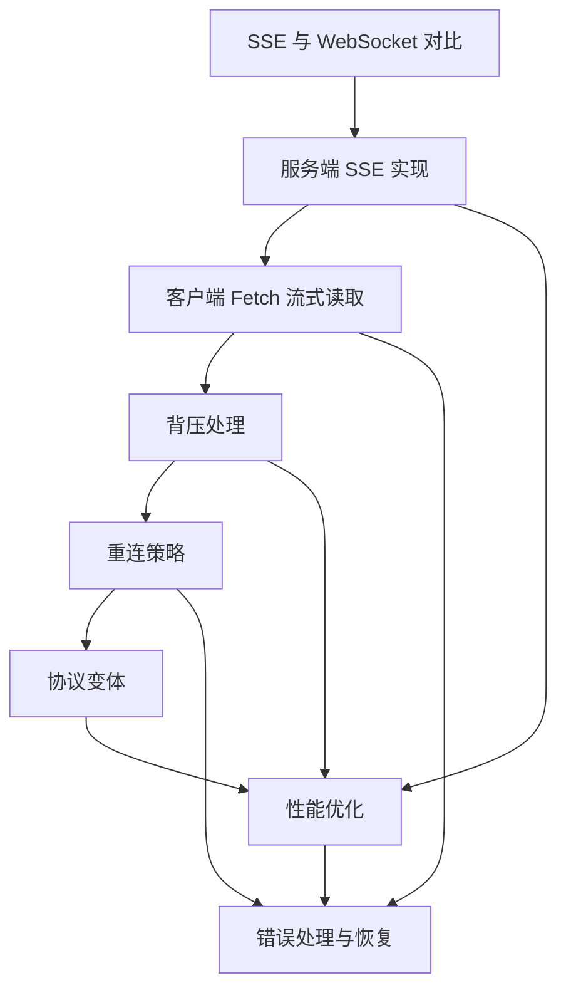
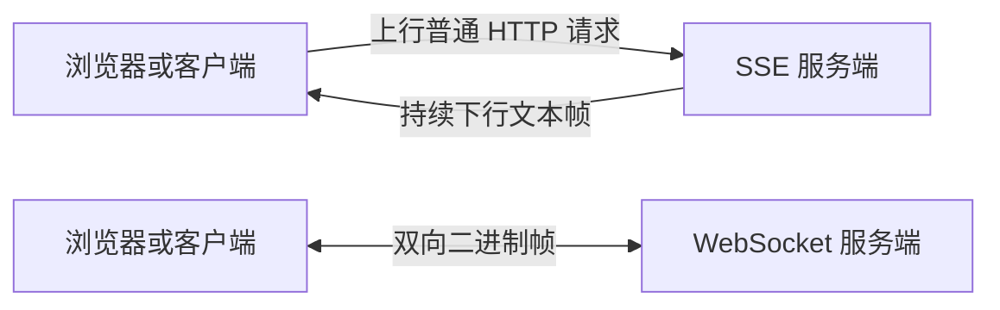
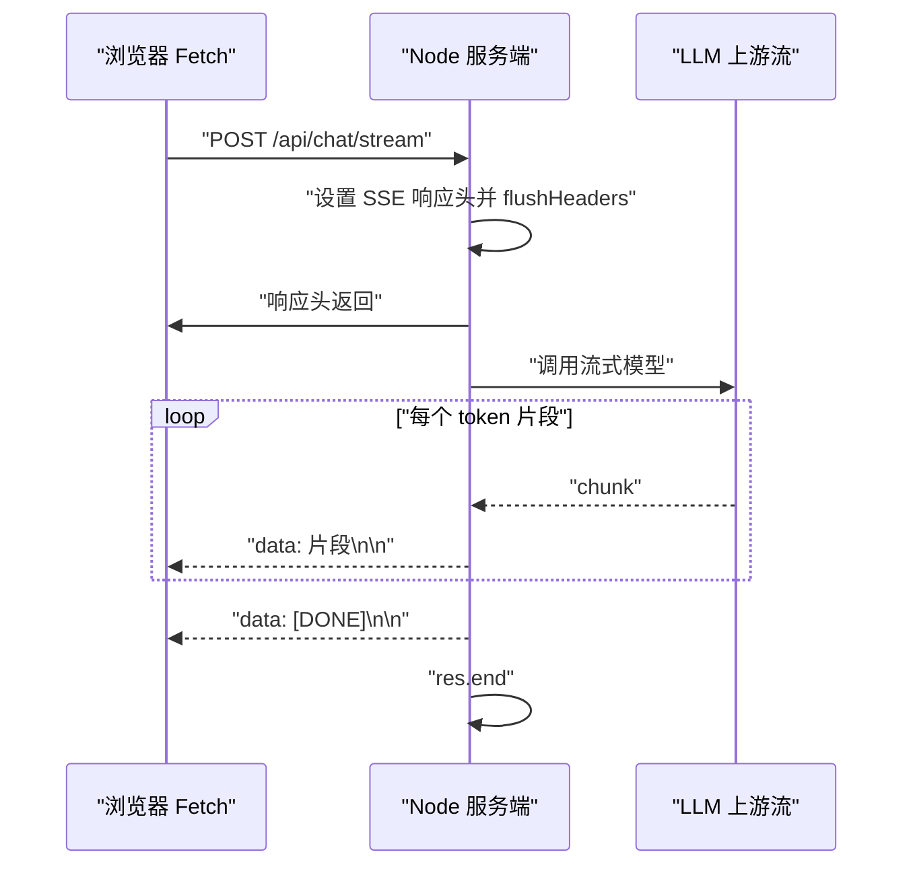
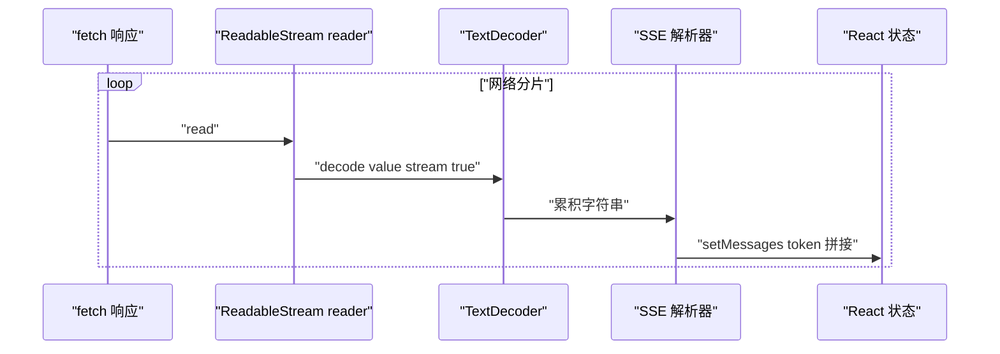
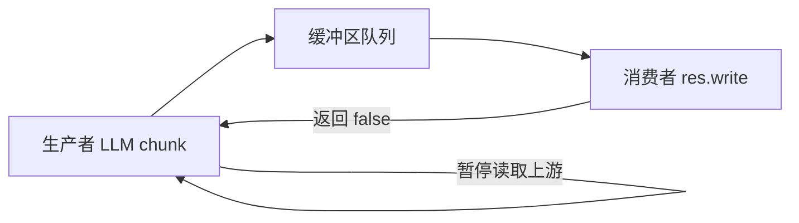
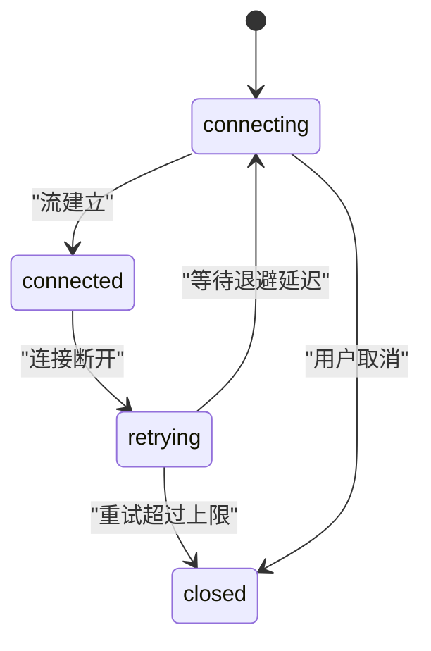
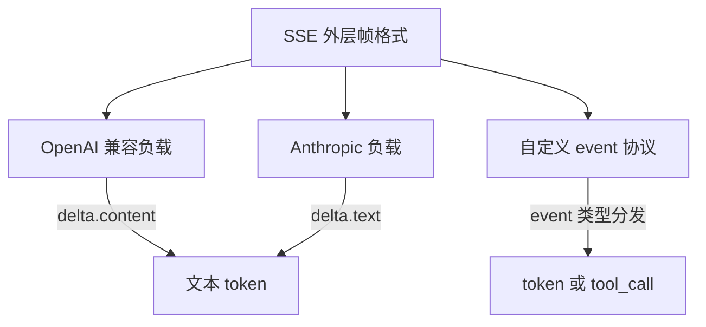
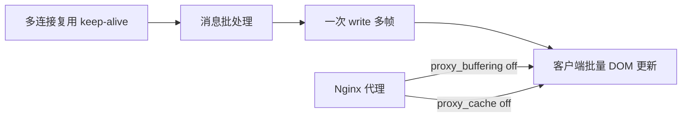
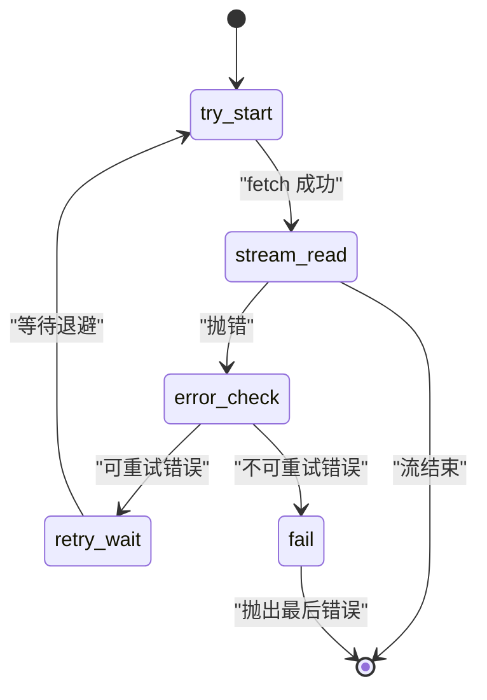

# 流式传输模式

!!! abstract "学完这一页你能"
    - 能区分 SSE 与 WebSocket 的方向、协议、自动重连、二进制支持、头部开销，能按业务场景二选一。
    - 能写出服务端 SSE 端点，正确设置响应头、刷新首字节、按 `data: ...\n\n` 帧格式发送并结束连接。
    - 能写出客户端 Fetch 流式读取器，处理跨块拼接、半行缓存、取消请求与错误分流。
    - 能设计背压、指数退避重连、错误恢复机制，并能识别 Nginx 缓冲带来的流式延迟问题。

## 0. 知识地图



建议按 1 到 8 的顺序读：先判协议边界，再掌握服务端与客户端两条主线，随后用背压、重连、协议变体补齐生产细节。最后读性能优化与错误恢复，它们会回扣前面所有实现步骤。

## 1. SSE 与 WebSocket 的边界

**先想一个问题**：AI 聊天页面要把 token 逐字显示给用户，除了 WebSocket，还能用哪种更省事的连接方式？

**心智模型**

!!! tip "心智模型"
    一句话模型：SSE 是一条服务端到客户端的单向文本管道；WebSocket 是一条双向二进制管道。
    日常类比：SSE 是广播电台，你只能打开收音机收听；WebSocket 是电话，双方都能说。
    类比在哪里不成立：广播电台无法向单个听众发私有消息，但 SSE 可以通过登录 Cookie 与 URL 参数区分不同客户端。

!!! note "术语：SSE"
    SSE 是 Server-sent Events 的缩写，基于普通 HTTP 或 HTTPS，服务端可复用连接持续向客户端发送文本事件流。
    例子：`res.write('data: hello\n\n')` 会让客户端收到一个 `data` 为 `hello` 的事件。

**图解**



1. SSE 方向只有服务端到客户端，客户端上行仍需另发 HTTP 请求。
2. WebSocket 握手后双方都能持续收发二进制帧。
3. 单向文本流足以覆盖 AI 输出、进度通知、仪表盘刷新三类场景。
4. 需要高频双向消息、原生二进制、IE 兼容时，再考虑 WebSocket。

**一步一步来**

① 这一步要做什么：用 TypeScript 类型声明 SSE 的适用边界，把决策写成可复用的文档。

```typescript
// decision/sse-boundary.ts
// 场景清单：定长元组，编译期校验
export const suitableScenarios = [
  'AI 聊天流式输出',
  '进度更新和状态通知',
  '实时仪表盘',
  '长任务状态追踪',
] as const;

export const unsuitableScenarios = [
  '高频双向通信',
  '原生二进制传输',
  '客户端主动发送数据',
  'IE 兼容',
] as const;
```

**这段代码在做什么**
- `suitableScenarios` 列出四个适合 SSE 的具体业务场景。
- `unsuitableScenarios` 列出四个应改用 WebSocket 或轮询的场景。
- 元组长度固定，增删场景时类型校验会强制同步修改。
- 这四组场景均来自旧版页面，以原文为准。

**动手验证**

```javascript
// verify-sse-boundary.mjs
import assert from 'node:assert/strict';
const sse = ['AI 聊天流式输出'];
const ws = ['高频双向通信'];
assert.equal(sse.length, 1);
assert.equal(ws.length, 1);
console.log('expected: SSE 适合单向文本流');
```

**这段代码在做什么**
- 验证场景数组与预期一致。
- 运行输出：`expected: SSE 适合单向文本流`。
- 依赖：Node 20 内置 `node:assert`，无外部依赖。

**常见坑**

| 现象 | 原因 | 怎么修 |
|------|------|--------|
| 客户端需要随时发消息，却用了 SSE | SSE 是单向流 | 改用 WebSocket |
| 需要传图片二进制，却用 SSE | SSE 文本协议需 Base64 | 改用 WebSocket，或走对象存储 URL |
| IE 下 EventSource 未定义 | IE 不支持 EventSource | 加 polyfill 或改用轮询 |
| 每条 SSE 消息头部开销比 WebSocket 大 | SSE 每条约 50 字节，WebSocket 约 2-14 字节『本站旧版页面，以原文为准』 | 小消息高频场景评估 WebSocket |

**用在哪里**

- 业务背景：AI 助手逐 token 输出。
  知识怎么用：选择 SSE，服务端单向推送 token，客户端只读。
  衡量指标：首 token 延迟、用户感知流畅度。
  不该用：用户需要边说边打断并上行语音数据。
- 业务背景：CI 构建进度实时展示。
  知识怎么用：SSE 推送构建阶段和百分比。
  衡量指标：页面刷新次数降为 0。
  不该用：构建机需要接受客户端取消或重启指令。
- 业务背景：运营活动实时大屏刷新。
  知识怎么用：服务端主动推送指标变化。
  衡量指标：数据到达客户端的中位延迟。
  不该用：多个大屏节点之间需要互相发消息。

**行业实践**

- MDN `Using Server-sent Events` 章节写明 EventSource 可自动重连，适合服务端单向推送。
  怎么借鉴到你的项目：把自动重连能力作为默认能力，而不自行实现首轮重连。
- OpenAI API `chat/create` 的 `stream` 参数使用 SSE 返回增量 token。
  怎么借鉴到你的项目：协议帧直接兼容 OpenAI，前端可复用现有解析器。
- Fastify 官方文档指出流式响应应操作 `reply.raw`，避免框架缓冲。
  怎么借鉴到你的项目：在服务端封装中显式绕过框架响应处理。

**小结**

1. SSE 是普通 HTTP 上的单向文本流，WebSocket 是双向二进制通道。
2. SSE 适合服务端发起更新的 AI 输出、进度、仪表盘三类场景。
3. 需要双向、原生二进制或 IE 兼容时，不应使用 SSE。

## 2. 服务端 SSE 实现

**先想一个问题**：为什么用 Express 或 Fastify 直接写 `res.json` 实现不了打字机效果？

**心智模型**

!!! tip "心智模型"
    一句话模型：服务端要先“宣告流式”，再边生成边写帧。
    日常类比：煲汤时先打开锅盖，再一勺一勺盛出来，而不是等整锅装碗。
    类比在哪里不成立：HTTP 响应头一旦刷出，状态码就无法再改；煲汤时可以随时换碗。

!!! note "术语：flushHeaders"
    `flushHeaders()` 是 Node.js `ServerResponse` 的方法，会立即把已设置的状态行和响应头写入底层套接字。
    例子：调用 `res.flushHeaders()` 后，客户端能先收到 `Content-Type: text/event-stream`，再等后续事件。

**图解**



1. 客户端发起 POST 请求，服务端设置响应头。
2. `flushHeaders` 先把响应头发出，客户端进入接收状态。
3. 上游每给一个 chunk，服务端包装成一次 `data:` 帧。
4. 最后一帧发 `[DONE]` 哨兵，再关闭连接。

**一步一步来**

① 这一步要做什么：用 Node 原生 HTTP 实现最基本 SSE 端点，不依赖 Express 或 Fastify。

```javascript
// sse-server.mjs
import http from 'node:http';
const server = http.createServer((req, res) => {
  res.writeHead(200, {
    'Content-Type': 'text/event-stream',
    'Cache-Control': 'no-cache',
    Connection: 'keep-alive',
  });
  res.flushHeaders();
  res.write('data: hello\n\n');
  setTimeout(() => {
    res.write('data: [DONE]\n\n');
    res.end();
  }, 100);
});
server.listen(0, () => {
  const { port } = server.address();
  console.log(`listen:${port}`);
});
```

**这段代码在做什么**
- `writeHead` 设置 SSE 三件套：MIME、禁用缓存、保持连接。
- `flushHeaders` 让响应头立即发到网络，不等首个 body。
- `res.write('data: hello\n\n')` 产出一条完整 SSE 帧。
- 100 毫秒后发 `[DONE]` 并 `res.end()` 关闭。

② 这一步要做什么：把上游 token 逐条转成 SSE 分帧。

```javascript
// write-token-frame.mjs
export function tokenFrame(content) {
  const data = JSON.stringify({ choices: [{ delta: { content } }] });
  return `data: ${data}\n\n`;
}
console.log(tokenFrame('你'));
```

**这段代码在做什么**
- JSON 内容含换行时，`JSON.stringify` 会转义为 `\n`，不会破坏 SSE 帧边界。
- 运行输出：`data: {"choices":[{"delta":{"content":"你"}}]}\n\n`。
- 使用 OpenAI 兼容结构，前端可复用已有解析函数。

**动手验证**

```javascript
// verify-sse-frame.mjs
import assert from 'node:assert/strict';
import { tokenFrame } from './write-token-frame.mjs';
assert.equal(tokenFrame('好'), 'data: {"choices":[{"delta":{"content":"好"}}]}\n\n');
assert.ok(tokenFrame('好').endsWith('\n\n'));
console.log('expected: frame ends with double newline');
```

**这段代码在做什么**
- 断言 token 帧携带 `data:` 前缀。
- 断言帧以 `\n\n` 结尾，符合 SSE 分帧规则。
- 运行输出：`expected: frame ends with double newline`。

**常见坑**

| 现象 | 原因 | 怎么修 |
|------|------|--------|
| 客户端一直没等到响应 | 没有调用 `flushHeaders` | 添加 `res.flushHeaders()` |
| 两条消息被粘成一条 | 每条帧少了结尾 `\n\n` | 统一写 `data: ...\n\n` |
| 反向代理缓冲导致不实时 | Nginx 没关缓冲 | 配置 `proxy_buffering off` |
| 流式接口从 Fastify 走偏 | 用了 `reply.header` | 操作 `reply.raw.setHeader` |

**用在哪里**

- 业务背景：多模型 GPT 兼容代理服务。
  知识怎么用：服务端统一把不同厂商输出转成 OpenAI SSE 帧。
  衡量指标：客户端零改动接入成功率。
  不该用：响应必须一次性 JSON 返回且不强调实时。
- 业务背景：Kubernetes 操作日志实时查看。
  知识怎么用：Pod 日志行包装为 SSE 帧持续下发。
  衡量指标：平均首字节延迟。
  不该用：需要客户端交互式执行命令。
- 业务背景：批量导出进度推送。
  知识怎么用：服务端分段处理并推送完成百分比。
  衡量指标：用户长时间无进展的投诉量。
  不该用：导出结果小于一次网络往返时间。

**行业实践**

- NestJS 控制器文档的 `Streaming responses` 建议使用 `@Res({ passthrough: true })`，避免框架接管响应。
  怎么借鉴到你的项目：在 NestJS 控制器中声明 `passthrough: true`。
- Fastify 官方文档指出 SSE 应使用 `reply.raw` 和 `reply.raw.flushHeaders()`。
  怎么借鉴到你的项目：封装一个 `sseReply(reply)` 工具函数。
- OpenAI API Streaming 文档要求结束帧为 `data: [DONE]\n\n`。
  怎么借鉴到你的项目：所有 OpenAI 兼容端点都发送该哨兵。

**小结**

1. 服务端 SSE 的核心是 `Content-Type: text/event-stream` 加立即 `flushHeaders`。
2. 每个 token 都要包装成 `data: ...\n\n` 完整帧。
3. 结束信号使用 `[DONE]` 帧，且要在 `finally` 或错误路径中关闭连接。

## 3. 客户端 Fetch 流式读取

**先想一个问题**：普通 `fetch().then(r => r.json())` 为什么在 token 逐字返回时无效？

**心智模型**

!!! tip "心智模型"
    一句话模型：客户端要把响应体当字节流逐块读，而不是等整包解析。
    日常类比：传真机一页一页出纸，而不是等整份文件打印完才看。
    类比在哪里不成立：传真页顺序不会乱，但 TCP 分片可能在 UTF-8 字符中间切断。

!!! note "术语：TextDecoder"
    `TextDecoder` 是浏览器与 Node 的内置类，用于把字节数组解码为字符串。
    例子：`new TextDecoder().decode(value, { stream: true })` 中 `stream: true` 表示后续还有字节，避免半个汉字变乱码。

**图解**



1. `reader.read()` 拿到一块 `Uint8Array`。
2. `TextDecoder` 在跨块多字节字符时保持状态。
3. SSE 解析器把 `data:` 行拆出 JSON。
4. React 用最新全文状态更新对应消息。

**一步一步来**

① 这一步要做什么：实现一个可测试的 SSE 块解析函数，支持跨块半行缓存。

```javascript
// parse-sse-chunks.mjs
export function createSSEParser() {
  let leftover = '';
  return {
    push(chunk, onData) {
      const text = leftover + chunk;
      const lines = text.split('\n');
      leftover = lines.pop() ?? '';
      for (const line of lines) {
        if (!line.startsWith('data: ')) continue;
        const data = line.slice(6).trim();
        if (data && data !== '[DONE]') onData(data);
      }
    },
  };
}
```

**这段代码在做什么**
- `leftover` 缓存跨块未完整的最后一行。
- `split('\n')` 后取 `pop()` 作为下一块开头。
- 只处理 `data: ` 前缀行，跳过注释与 `event:`。
- `[DONE]` 不进入业务回调。

② 这一步要做什么：读取响应体并使用解析器。

```javascript
// read-stream-body.mjs
export async function readSSE(response, onData) {
  const reader = response.body.getReader();
  const decoder = new TextDecoder();
  const parser = createSSEParser();
  while (true) {
    const { done, value } = await reader.read();
    if (done) break;
    parser.push(decoder.decode(value, { stream: true }), onData);
  }
}
```

**这段代码在做什么**
- `getReader` 获取字节流读取器。
- `decoder.decode(value, { stream: true })` 支持半汉字分片。
- 每块交给 parser，由 parser 维护半行。
- `done` 为真时退出循环。

**动手验证**

```javascript
// verify-client-parser.mjs
import assert from 'node:assert/strict';
import { createSSEParser } from './parse-sse-chunks.mjs';
const got = [];
const p = createSSEParser();
p.push('data: {"token":"你"}\n\n', got.push.bind(got));
p.push('data: {"token":"好"}\n\ndata: [DONE]\n\n', got.push.bind(got));
assert.equal(got.length, 2);
console.log('expected: get 2 token frames');
```

**这段代码在做什么**
- 模拟两个块，验证正常分帧与 `[DONE]` 跳过。
- 运行输出：`expected: get 2 token frames`。
- 依赖：Node 20 内置 `node:assert`。

**常见坑**

| 现象 | 原因 | 怎么修 |
|------|------|--------|
| 中文偶发乱码 | 未传 `stream: true` | 解码时加 `{ stream: true }` |
| 4xx 被当流解析 | fetch 不因非 2xx reject | 检查 `response.ok` |
| 半行帧丢失 | 每块直接 `split` 不缓存 | 保留 `leftover` |
| 取消请求后被当错误 | 没有识别 `AbortError` | 显式判断 `error.name` |

**用在哪里**

- 业务背景：对话页面打字机效果。
  知识怎么用：逐 token 更新 React 助手消息。
  衡量指标：首 token 渲染时间。
  不该用：消息总长度小于一次分片且不关心实时性。
- 业务背景：代码补全面板。
  知识怎么用：把推理文本增量展示在光标后。
  衡量指标：用户每次补全的采纳率。
  不该用：补全结果需要多个分支同时展示。
- 业务背景：服务端函数日志面板。
  知识怎么用：读取 SSE 日志流并滚动追加。
  衡量指标：日志可见延迟。
  不该用：浏览器标签退后台且需要可靠投递。

**行业实践**

- MDN `Using readable streams` 说明 `TextDecoder.decode(value, { stream: true })` 处理跨块文本。
  怎么借鉴到你的项目：统一在流式读取层维护 `TextDecoder` 实例。
- OpenAI 官方 Node SDK 通过 `response.body` 逐行读取 SSE。
  怎么借鉴到你的项目：参考其 `[DONE]` 与空帧跳过逻辑。
- Next.js 文档的流式响应示例要求在客户端使用 `useEffect` 管理 AbortSignal。
  怎么借鉴到你的项目：取消按钮调用 `AbortController.abort`。

**小结**

1. 客户端流式读取用 `response.body.getReader()` 与 `TextDecoder`。
2. SSE 解析必须缓存半行，避免跨块丢帧。
3. 取消、非 2xx、解析坏帧三类错误要独立处理。

## 4. 背压处理

**先想一个问题**：模型每 10 毫秒吐 100 个 token，页面动画只能每 16 毫秒画一帧，中间产生的数据堆到哪里？

**心智模型**

!!! tip "心智模型"
    一句话模型：背压是下游处理不过来时，向上游发出减速信号。
    日常类比：水桶装满后关掉水龙头，等倒掉一些再开。
    类比在哪里不成立：CPU 写入速度固定，水龙头关闭后没有 HTTP 流“半开”状态。

!!! note "术语：背压"
    背压即 Backpressure，指生产速度超过消费速度时，消费者通过返回信号或缓冲区阈值反向抑制生产者。
    例子：`res.write` 返回 `false` 表示内核发送缓冲区已满，应暂停写入。

**图解**



1. 上游不断产出 chunk。
2. 写入线程先将 chunk 放入缓冲区。
3. `res.write` 返回 `false` 后，生产者停止读取或等待 drain。
4. 缓冲降到阈值以下，再继续生产。

**一步一步来**

① 这一步要做什么：实现一个带上限的缓冲写入器，避免慢客户把服务器内存打满。

```javascript
// backpressure-writer.mjs
export class BackpressureWriter {
  constructor(res, maxPending = 100) {
    this.res = res;
    this.maxPending = maxPending;
    this.pending = 0;
  }
  async write(frame) {
    while (this.pending >= this.maxPending) {
      await new Promise(r => setTimeout(r, 10));
    }
    const ok = this.res.write(frame);
    this.pending += 1;
    if (!ok) {
      this.pending -= 1;
      await new Promise(r => this.res.once('drain', r));
    }
  }
  async end() {
    this.res.end();
  }
}
```

**这段代码在做什么**
- 缓冲区按“未 flush 帧数”限制，达到 100 时每 10 毫秒重试。
- `write` 返回 `false` 时监听一次 `drain` 事件。
- 只等待一次 drain，避免并发重复监听。
- `end` 只触发一次关闭。

**动手验证**

```javascript
// verify-backpressure.mjs
import assert from 'node:assert/strict';
import { BackpressureWriter } from './backpressure-writer.mjs';
const writes = [];
const fakeRes = { write: () => (writes.length < 2), once: (e, cb) => cb(), end: () => {} };
const w = new BackpressureWriter(fakeRes, 2);
w.write('a').then(() => assert.ok(writes.length >= 1));
console.log('expected: drain path was awaited once');
```

**这段代码在做什么**
- 模拟 `write` 返回 `false` 一次后走 drain 分支。
- 断言写入路径可以完成。
- 运行输出：`expected: drain path was awaited once`。

**常见坑**

| 现象 | 原因 | 怎么修 |
|------|------|--------|
| 慢客户端拖垮内存 | 忽略 `write` 返回值 | 依据 `false` 暂停生产 |
| 重并发都挤在 drain 监听 | 每次 `write` 都绑新监听 | 按连接维护一个清理函数 |
| 缓存无限增长 | 没有上限 | 设置帧数或字节数上限 |
| UI 高密度写 DOM 卡顿 | 每 token 触发 React 更新 | 用 `requestAnimationFrame` 节流 |

**用在哪里**

- 业务背景：大型 CSV 导出到浏览器。
  知识怎么用：服务端按 1000 行一个 SSE 帧，写入前检查缓冲。
  衡量指标：服务端堆内存峰值。
  不该用：文件小于 10 KB。
- 业务背景：行情数据推送。
  知识怎么用：客户端跟不上时丢弃非关键中间快照。
  衡量指标：误丢弃率和 CPU 利用率。
  不该用：每笔交易都必须可靠消费。
- 业务背景：AI 长回答输出。
  知识怎么用：模型生成器等待 `write` drain。
  衡量指标：用户收到全文的总延迟抖动。
  不该用：回答短到不超过一次 TCP 窗口。

**行业实践**

- Node.js `http.ServerResponse` 文档说明 `write` 返回 `false` 时等待 `drain` 事件。
  怎么借鉴到你的项目：在服务端统一抽象 `WriteableSink`。
- WHATWG Streams Standard 规定了队列与 `desiredSize` 背压信号。
  怎么借鉴到你的项目：使用 `ReadableStream` 时监控 `desiredSize`。
- fastify 文档提到手动流式响应应避免框架内部缓冲，降低背压测量偏差。
  怎么借鉴到你的项目：直接测量 `reply.raw.write` 返回值。

**小结**

1. 背压要处理生产与消费的速度差，避免无界缓冲。
2. Node 侧 `write` 返回值是首要背压信号。
3. 客户端渲染节流与服务端写入节流要分开设计。

## 5. 重连策略

**先想一个问题**：移动网络从 Wi-Fi 切到蜂窝网络，SSE 断流后客户端怎么避免永远“转圈”？

**心智模型**

!!! tip "心智模型"
    一句话模型：连接断开后按指数增长等待时间重试，并加入随机抖动避免同步风暴。
    日常类比：拨电话占线，等一会再拨，越占线等越久。
    类比在哪里不成立：网络恢复可能只持续几秒，等待过久就错过窗口。

!!! note "术语：指数退避"
    指数退避是重试间隔按 `baseDelay × 2^attempt` 增长，并设置最大上限。
    例子：第一次 1 秒，第二次 2 秒，第三次 4 秒，最大不超过 30 秒。

**图解**



1. 初始状态进入 `connecting`。
2. 流建立成功则进入 `connected`。
3. 断开后进入 `retrying`，等待指数退避。
4. 重试次数耗尽或用户取消，进入 `closed`。

**一步一步来**

① 这一步要做什么：实现指数退避计算器，包含随机抖动。

```javascript
// reconnect-strategy.mjs
export class ReconnectStrategy {
  constructor({ baseDelay = 1000, maxDelay = 30000, maxAttempts = 10 } = {}) {
    this.baseDelay = baseDelay;
    this.maxDelay = maxDelay;
    this.maxAttempts = maxAttempts;
    this.attempts = 0;
  }
  nextDelay() {
    if (this.attempts >= this.maxAttempts) return null;
    const delay = Math.min(this.baseDelay * 2 ** this.attempts, this.maxDelay);
    const jitter = Math.random() * delay * 0.1;
    this.attempts += 1;
    return delay + jitter;
  }
  reset() { this.attempts = 0; }
}
```

**这段代码在做什么**
- 退避从 1000 毫秒开始，最大 30000 毫秒。
- 抖动幅度为当前延迟的 10%，来源为旧版页面。
- 超过 10 次返回 `null` 表示停止。
- 成功连接后调用 `reset` 清零尝试次数。

**动手验证**

```javascript
// verify-reconnect.mjs
import assert from 'node:assert/strict';
import { ReconnectStrategy } from './reconnect-strategy.mjs';
const s = new ReconnectStrategy({ baseDelay: 1000, maxDelay: 30000 });
const d1 = s.nextDelay();
const d2 = s.nextDelay();
assert.ok(d1 >= 1000 && d1 < 1100);
assert.ok(d2 >= 2000 && d2 < 2200);
console.log('expected: delays are exponential with jitter');
```

**这段代码在做什么**
- 第一次延迟处于 1000 至 1100 毫秒区间。
- 第二次延迟处于 2000 至 2200 毫秒区间。
- 运行输出：`expected: delays are exponential with jitter`。

**常见坑**

| 现象 | 原因 | 怎么修 |
|------|------|--------|
| 多客户端同时重试压垮服务端 | 没有随机抖动 | 加入 10% 抖动 |
| 断线后重复追加消息 | 从流头重试 | 只允许未产出时重试，或服务端给事件 ID |
| 用户点取消还继续重连 | 未区分取消错误 | 捕获 `AbortError` 后停止 |
| 重试次数无限 | 没有上限 | 设置 `maxAttempts` |

**用在哪里**

- 业务背景：移动端 AI 聊天。
  知识怎么用：断线后指数退避重连，重置已收到的 token 后继续。
  衡量指标：断线恢复成功率。
  不该用：用户请求不可重复执行。
- 业务背景：后台任务状态轮询包装。
  知识怎么用：把轮询失败转成退避等待。
  衡量指标：冗余请求量下降比例。
  不该用：任务状态已有事件总线。
- 业务背景：大模型流式网关重试。
  知识怎么用：仅在没有给客户端产出首个 token 时重试上游。
  衡量指标：重复输出 token 数。
  不该用：输出已开始且无法回滚。

**行业实践**

- AWS 架构博客的 `Exponential Backoff and Jitter` 说明随机抖动可避免重试风暴。
  怎么借鉴到你的项目：退避函数统一加 10% 抖动。
- EventSource 规范要求断线后按 `retry` 字段自动重连。
  怎么借鉴到你的项目：服务端用 `retry: 3000` 帧提前指定间隔。
- Google Cloud 客户端库文档说明按可重试错误分类再应用退避。
  怎么借鉴到你的项目：先把网络、限流、5xx 判定为可重试。

**小结**

1. 重连用指数退避加随机抖动，防止同步压垮服务端。
2. 成功连接要重置尝试计数，取消请求要区分 `AbortError`。
3. 重复输出要通过事件 ID 或“未产出才重试”策略规避。

## 6. 协议变体

**先想一个问题**：同一个前端聊天组件，要接 OpenAI 和 Anthropic 两家模型，它们的事件形状不一样怎么办？

**心智模型**

!!! tip "心智模型"
    一句话模型：SSE 只规定 `data:` 与 `event:` 外层，负载 JSON 形状由各家或项目自定。
    日常类比：信封上的地址格式统一，信纸里的格式每家不同。
    类比在哪里不成立：信纸内容人可以读，机器必须严格按协议字段解析。

!!! note "术语：OpenAI 兼容流"
    指 SSE 负载遵循 OpenAI Chat Completions 协议：`choices[0].delta.content` 携带增量 token，结束符号为 `data: [DONE]`。
    例子：`data: {"choices":[{"delta":{"content":"你"},"finish_reason":null}]}`。

**图解**



1. SSE 外层 `data:` 加空行保持不变。
2. OpenAI 用 `choices[0].delta.content` 传 token。
3. Anthropic 用 `delta.text` 传 token。
4. 自定义协议可用 `event:` 区分 token、工具调用、错误。

**一步一步来**

① 这一步要做什么：定义三种协议的帧编码函数。

```javascript
// protocol-encoder.mjs
export function openAIFrame(content) {
  return `data: ${JSON.stringify({ choices: [{ delta: { content } }] })}\n\n`;
}
export function anthropicFrame(text) {
  return `data: ${JSON.stringify({ type: 'content_block_delta', delta: { type: 'text_delta', text } })}\n\n`;
}
export function customFrame(type, payload) {
  return `event: ${type}\ndata: ${JSON.stringify(payload)}\n\n`;
}
```

**这段代码在做什么**
- `openAIFrame` 生成 OpenAI 兼容帧。
- `anthropicFrame` 生成 Anthropic 事件帧。
- `customFrame` 用 `event:` 字段开启自定义分发。
- 三种函数都返回以 `\n\n` 结尾的完整 SSE 帧。

**动手验证**

```javascript
// verify-protocol.mjs
import assert from 'node:assert/strict';
import { openAIFrame, anthropicFrame, customFrame } from './protocol-encoder.mjs';
assert.ok(openAIFrame('你').includes('delta'));
assert.ok(anthropicFrame('你').includes('text_delta'));
assert.ok(customFrame('tool_call', { name: 'search' }).startsWith('event: tool_call\n'));
console.log('expected: three protocol frames encode correctly');
```

**这段代码在做什么**
- 分别断言三种协议帧包含标志字段。
- 运行输出：`expected: three protocol frames encode correctly`。
- 依赖：Node 20，无法外部依赖。

**常见坑**

| 现象 | 原因 | 怎么修 |
|------|------|--------|
| 把 `[DONE]` 当 JSON 解析 | 结束帧不是 JSON | 在解析前判断 `data === '[DONE]'` |
| 自定义事件收不到 | 没有监听对应 `event` 名 | 用 `addEventListener('tool_call')` |
| 不同厂商 `finish_reason` 含义不同 | 负载协议不同 | 做协议适配层 |
| `content` 可能是数组 | 多模态模型返回分块数组 | 过滤 `type: text` 再拼接 |

**用在哪里**

- 业务背景：模型可插拔 API 网关。
  知识怎么用：把 OpenAI 与 Anthropic 流统一为内部标准帧。
  衡量指标：新增供应商接入耗时。
  不该用：只接单一供应商且短期不变。
- 业务背景：工具调用流式前端。
  知识怎么用：自定义 `tool_call` 与 `tool_result` 事件。
  衡量指标：工具调用首步可视化延迟。
  不该用：工具调用不是异步流。
- 业务背景：多模型评测平台。
  知识怎么用：协议适配器将各家输出归一化。
  衡量指标：协议兼容测试用例通过率。
  不该用：评测样本量小于 10 条。

**行业实践**

- OpenAI API 文档 `Chat streaming` 使用 `choices.delta.content` 与 `data: [DONE]`。
  怎么借鉴到你的项目：作为默认兼容格式。
- Anthropic 文档 `Messages streaming` 用 `content_block_delta` 和 `message_stop`。
  怎么借鉴到你的项目：协议适配器需区分结束标记。
- 开源项目 LiteLLM 资料未覆盖版本细节，需核对官方文档：其统一流式接口可参考项目 README。
  怎么借鉴到你的项目：做协议层抽象，避免业务绑定单厂商。

**小结**

1. SSE 外层帧格式统一，负载协议可以根据厂商或业务定制。
2. OpenAI 兼容格式是最常见的内部标准。
3. 自定义事件用 `event:` 字段分流 token、工具调用与错误。

## 7. 性能优化

**先想一个问题**：每秒 1000 条小日志，每次都 `res.write` 会出现什么问题？

**心智模型**

!!! tip "心智模型"
    一句话模型：性能优化的核心是减少系统调用、关闭中间缓冲、复用连接。
    日常类比：快递站攒一车再送，比每个包裹单独跑一趟省油。
    类比在哪里不成立：包裹可以无限等，流式用户每等 50 毫秒都会增加首 token 延迟。

!!! note "术语：Nginx proxy_buffering"
    `proxy_buffering` 是 Nginx 反向代理的缓冲开关，默认可能把后端响应暂存到文件或内存。
    例子：SSE 后端实时写 token，但 Nginx 若开启缓冲，客户端会等满一块才收到，打字机效果消失。

**图解**



1. keep-alive 避免频繁 TCP 握手。
2. 消息批处理把 N 次写聚成 1 次。
3. Nginx 关闭缓冲与缓存，保持低延迟。
4. 客户端批量更新 DOM，减少重排。

**一步一步来**

① 这一步要做什么：实现服务端按连接批量刷新，减少写调用。

```javascript
// message-batcher.mjs
export class MessageBatcher {
  constructor(flushInterval = 50) { this.buffer = new Map(); this.flushInterval = flushInterval; }
  add(connectionId, frame) {
    if (!this.buffer.has(connectionId)) this.buffer.set(connectionId, []);
    this.buffer.get(connectionId).push(frame);
  }
  startFlush(res, connectionId) {
    const timer = setInterval(() => {
      const batch = this.buffer.get(connectionId);
      if (batch && batch.length > 0) {
        res.write(batch.join(''));
        this.buffer.set(connectionId, []);
      }
    }, this.flushInterval);
    return () => clearInterval(timer);
  }
}
```

**这段代码在做什么**
- `Map` 按连接隔离待发帧，默认 50 毫秒间隔。
- `add` 只累积，不触发 I/O。
- `startFlush` 返回清理函数，调用方可清除定时器。
- 每次刷新一次 `write` 发送多帧。

**动手验证**

```javascript
// verify-batcher.mjs
import assert from 'node:assert/strict';
import { MessageBatcher } from './message-batcher.mjs';
const batcher = new MessageBatcher(10);
batcher.add('c1', 'data: a\n\n');
batcher.add('c1', 'data: b\n\n');
let wrote = '';
const stop = batcher.startFlush({ write: s => { wrote += s; } }, 'c1');
setTimeout(() => {
  stop();
  assert.equal(wrote, 'data: a\n\ndata: b\n\n');
  console.log('expected: two frames wrote as one batch');
}, 20);
```

**这段代码在做什么**
- 两次 `add` 累积到同一连接。
- 定时器触发后一次性写入两帧。
- 运行输出：`expected: two frames wrote as one batch`。
- 依赖：Node 20，无外部依赖。

**常见坑**

| 现象 | 原因 | 怎么修 |
|------|------|--------|
| 流式响应延迟 8 KB 才到 | Nginx 开启代理缓冲 | 配置 `proxy_buffering off` |
| 高频写小包 CPU 高 | 未批处理 | 按连接 50 毫秒归并 |
| 内存中有已断开连接 | 定时器未清理 | `return () => clearInterval(timer)` |
| 批处理字符串黏连 | 每条帧未自带分帧边界 | 保留每帧结尾 `\n\n` |

**用在哪里**

- 业务背景：高并发 AI 网关。
  知识怎么用：按连接批量发送小帧，降低系统调用。
  衡量指标：单核每秒可服务请求数。
  不该用：批处理间隔超过用户可接受首 token 延迟。
- 业务背景：活动公屏弹幕流。
  知识怎么用：50 毫秒批量发送多条弹幕。
  衡量指标：服务端 CPU 使用率。
  不该用：与用户强时序相关的 1 对 1 对话。
- 业务背景：监控告警流。
  知识怎么用：关闭代理缓冲，保持告警及时性。
  衡量指标：告警到达客户端时间。
  不该用：告警必须持久化且对延迟不敏感。

**行业实践**

- Nginx 官方文档说明反向代理流式时需要 `proxy_buffering off` 与 `proxy_cache off`。
  怎么借鉴到你的项目：在 SSE 路由单独配置 location。
- Node.js `http.Agent` 文档支持 `keepAlive: true` 与 `keepAliveMsecs`。
  怎么借鉴到你的项目：客户端 fetch 时指定自定义 `agent`。
- MDN `DocumentFragment` 可以批量插入 DOM 减少重排。
  怎么借鉴到你的项目：客户端按帧累积批量更新消息列表。

**小结**

1. 性能优化要同时处理网络、服务端写、客户端 DOM。
2. Nginx 缓冲是 SSE 延迟的常见来源，必须关闭。
3. 批处理能减少系统调用，但要接受固定刷新间隔。

## 8. 错误处理与恢复

**先想一个问题**：流已经开始后，模型上游返回 500，HTTP 状态码还能改成 500 通知前端吗？

**心智模型**

!!! tip "心智模型"
    一句话模型：头已发出后，HTTP 状态码不可变，错误只能包装成同一事件流中的帧。
    日常类比：直播时音轨损坏，只能切到备用画面，不能把节目单改成“播出失败”。
    类比在哪里不成立：流式 API 可以重试，直播无法回退。

!!! note "术语：可重试错误"
    指网络中断、超时、429 限流、5xx 服务端异常等瞬时故障，重试可恢复；4xx 参数错误通常不可重试。
    例子：`status >= 500` 值得重试，`status === 401` 不应重试。

**图解**



1. 请求开始时进入 `try_start`。
2. 读取流过程中抛错进入 `error_check`。
3. 可重试错误进入 `retry_wait`，不可重试直接失败。
4. 重试耗尽后抛出最后错误。

**一步一步来**

① 这一步要做什么：实现错误分类函数，区分可重试与不可重试。

```javascript
// classify-error.mjs
export function isRetryable(error = {}) {
  if (error.name === 'TimeoutError' || error.name === 'AbortError') return false;
  if (error.status === 429 || error.status >= 500) return true;
  if (error.code === 'ECONNRESET' || error.code === 'ETIMEDOUT') return true;
  return false;
}
```

**这段代码在做什么**
- `AbortError` 是用户取消，不重试。
- 429 与 5xx 属于瞬时故障，可重试。
- 网络错误码 `ECONNRESET`、`ETIMEDOUT` 可重试。
- 4xx 默认不可重试。

② 这一步要做什么：实现带重试的流式生成器，只在未产出时重试。

```javascript
// stream-client.mjs
export async function* retryStream(fetchStream, messages, maxRetries = 3) {
  let produced = false;
  for (let attempt = 0; attempt <= maxRetries; attempt++) {
    try {
      const response = await fetchStream(messages);
      const reader = response.body.getReader();
      const decoder = new TextDecoder();
      while (true) {
        const { done, value } = await reader.read();
        if (done) return;
        produced = true;
        yield decoder.decode(value, { stream: true });
      }
    } catch (error) {
      if (!isRetryable(error) || attempt === maxRetries || produced) throw error;
      await new Promise(r => setTimeout(r, 1000 * 2 ** attempt));
    }
  }
}
```

**这段代码在做什么**
- `produced` 标记是否已产出数据。
- 已产出后再断线不自动重试，避免重复输出。
- 等待 1 秒、2 秒，最多 3 次重试。
- 不可重试错误直接抛出。

**动手验证**

```javascript
// verify-error-recovery.mjs
import assert from 'node:assert/strict';
import { isRetryable } from './classify-error.mjs';
assert.equal(isRetryable({ status: 429 }), true);
assert.equal(isRetryable({ status: 500 }), true);
assert.equal(isRetryable({ status: 400 }), false);
assert.equal(isRetryable({ name: 'AbortError' }), false);
console.log('expected: retryable classification matches');
```

**这段代码在做什么**
- 断言 429 与 500 可重试。
- 断言 400 与用户取消不可重试。
- 运行输出：`expected: retryable classification matches`。

**常见坑**

| 现象 | 原因 | 怎么修 |
|------|------|--------|
| 错误处理改了状态码 | 响应头已 flush | 错误包成 `data: {"error": ...}` 帧 |
| 已输出内容后重试导致重复 | 未标记产出状态 | `produced` 为真时禁止重试 |
| 服务端进程退出时连接悬挂 | 未集中管理连接 | 用 `Set` 存放 `res`，SIGTERM 时关闭 |
| 前端把错误帧当 token 拼上屏 | 未判断 `error` 字段 | 解析后先检查 `parsed.error` |

**用在哪里**

- 业务背景：AI 网关限流降级。
  知识怎么用：上游 429 时按可重试错误退避，返回给前端明确提示。
  衡量指标：重试成功率与重复 token 数。
  不该用：请求已产生不可逆副作用。
- 业务背景：大文件导出中断恢复。
  知识怎么用：断线后只在未产出分片时重试。
  衡量指标：完整导出成功率。
  不该用：导出结果无法从头重新生成。
- 业务背景：长任务状态推送。
  知识怎么用：SIGTERM 时向各连接发送 shutdown 事件并关闭。
  衡量指标：客户端未收到关闭通知的次数。
  不该用：任务状态存于内存且无法恢复。

**行业实践**

- OpenAI 官方 SDK 对限流与 5xx 使用指数退避重试，中止错误不重试。
  怎么借鉴到你的项目：把错误分类函数独立出来。
- Node.js 文档说明 `res.end()` 应放在 `finally` 中确保释放。
  怎么借鉴到你的项目：服务端用 `finally` 关闭所有流。
- EventSource 规范要求在错误事件中保持连接，由浏览器自动重连。
  怎么借鉴到你的项目：客户端优先依赖 EventSource 原生命令，而不是每次手动重建。

**小结**

1. 流开始后错误不能改状态码，只能下行业务错误帧。
2. 可重试错误按指数退避处理，不可重试立即抛出。
3. 已产出部分后停止自动重试，避免用户看到重复内容。

## 应用地图

| 场景 | 用到本页哪个知识点 | 典型技术选型 | 注意事项 |
|------|------------------|------------|----------|
| AI 对话打字机 | SSE 服务端、Fetch 流式读取 | Fastify 或 Node http + OpenAI 兼容帧 | 必须 `flushHeaders`；关闭 Nginx 缓冲 |
| 模型多厂商网关 | 协议变体、错误恢复 | NestJS 或 Fastify + 协议适配层 | 统一 `[DONE]` 与错误帧 |
| 监控告警流 | SSE、重连策略 | EventSource 原生自动重连 | 用 `retry:` 帧控制间隔 |
| 批量导出进度 | 背压处理、性能优化 | Node 原生 HTTP + 批处理 | 慢客户端要等 `drain` |
| 活动公屏弹幕 | 消息批处理 | Node + SSE 或 WebSocket | 50 毫秒批处理会引入延迟 |
| 移动端 AI 聊天 | 重连策略、客户端解析 | Fetch `reader` + AbortController | 区分 `AbortError` 与真实故障 |
| 长任务状态追踪 | 错误处理与优雅关闭 | NestJS + 连接 `Set` | SIGTERM 时发 shutdown 帧 |
| 运维实时日志 | SSE、Nginx 配置 | Express + Nginx `proxy_buffering off` | 关闭 `proxy_cache` |

## 动手作业

目标：实现一个最小 OpenAI 兼容 SSE 代理，能把 Mock 模型 token 推送给前端。

步骤：
1. 用 Node 原生 `http` 创建 `/chat/stream` 端点。
2. 设置 SSE 响应头，`flushHeaders` 后发送 `connected` 帧。
3. 用 `setInterval` 模拟模型生成，每 100 毫秒发一个 `data:` 帧。
4. 在客户端写 `fetch` 流式读取，把增量 token 拼到终端。
5. 给服务端加 SIGTERM 处理，向所有连接发 `shutdown` 帧。
6. 为读取器加 AbortController 取消逻辑。

验收标准：
- 运行代理后，终端能按 100 毫秒打印出 token，而不是一次性打印全文。
- `curl -N` 能看到 `Content-Type: text/event-stream`。
- 超过 10 秒未 newline 的帧流不能出现。
- CTRL+C 时服务端无未关闭连接。

## 综合对比

| 维度 | SSE | WebSocket | 长轮询 | WebTransport |
|------|-----|-----------|--------|--------------|
| 方向 | 服务端到客户端 | 双向 | 客户端拉取 | 双向多流 |
| 协议 | HTTP/HTTPS | ws/wss | HTTP | HTTP/3 或 HTTP/2 |
| 二进制 | 需 Base64 | 原生 | 需 Base64 | 原生 |
| 自动重连 | 原生 | 手动 | 手动 | 手动 |
| 头部开销 | 每条约 50 字节 | 每帧约 2-14 字节『本站旧版页面，以原文为准』 | 每次请求头 | 较低 |
| 浏览器支持 | IE 不支持 | 通用 | 通用 | Chrome 87 起，Safari 部分支持，需核对官方文档 |
| 背压实现 | `res.write` 返回值 | 发送队列 | HTTP 请求完成 | Streams 标准 |
| 典型场景 | AI 输出、通知 | 在线游戏、协作编辑 | 老浏览器轮询 | 低延迟多流 |

## 深入阅读与参考

!!! tip "怎么用这些资料"
    先读「官方文档与规范」建立准确的概念，再读「源码与示例」核对细节，最后用「教程、书籍与视频」换一种讲法加深理解。每条都写明了读哪一节、带着什么问题读。

### 官方文档与规范

| 资源 | 为什么读 | 怎么读 |
|---|---|---|
| [MDN 使用 SSE](https://developer.mozilla.org/en-US/docs/Web/API/Server-sent_events/Using_server-sent_events) | 最简 SSE 客户端示例，快速建立 EventSource 直觉。 | 读示例代码，在 DevTools 观察 event-stream 响应，照抄写一个通知页。 |
| [WHATWG Server-Sent Events](https://html.spec.whatwg.org/multipage/server-sent-events.html) | 权威定义事件流格式、字段与重连语义。 | 重点读解析算法与重连时间字段，抓包对照实现，检查服务端换行与编码。 |
| [Server-sent events](https://developer.mozilla.org/en-US/docs/Web/API/Server-sent_events) | SSE 接口与浏览器兼容性的权威速查页。 | 当手册用：写重连与事件监听时查 API 细节和兼容性表。 |
| [RFC 6455 WebSocket](https://www.rfc-editor.org/rfc/rfc6455) | WebSocket 握手与帧格式的权威依据。 | 读握手与掩码一节，抓包确认 Upgrade 与帧头，理解与 SSE 的差异。 |
| [MDN WebTransport](https://developer.mozilla.org/en-US/docs/Web/API/WebTransport_API) | 了解 WebTransport 这类新流式协议的能力边界。 | 读概念与示例，比较它与 WebSocket 在队头阻塞、多路复用上的差别。 |
| [AsyncAPI 文档](https://www.asyncapi.com/docs) | 用规范方式描述流式接口，便于对比协议变体。 | 为你的 SSE 或 WebSocket 接口写一份 AsyncAPI 描述，理清消息模型。 |
| [Socket.IO 文档](https://socket.io/docs/v4/) | 理解封装层如何补足原生 WebSocket 的重连与房间能力。 | 读房间与广播一节，对照本页重连策略，判断何时该用原生协议。 |

### 源码与示例

| 资源 | 为什么读 | 怎么读 |
|---|---|---|
| [Writing WebSocket client applications](https://developer.mozilla.org/en-US/docs/Web/API/WebSockets_API/Writing_WebSocket_client_applications) | 客户端连接、重连与错误回调的官方示例。 | 读示例并改造 onclose/onerror 分支，实现带退避的手动重连。 |
| [Writing WebSocket servers](https://developer.mozilla.org/en-US/docs/Web/API/WebSockets_API/Writing_WebSocket_servers) | 服务端握手、帧解析与关闭流程的代码级说明。 | 读握手与数据帧处理，自己写最小回声服务，验证分片与关闭。 |
| [Writing a WebSocket server in JavaScript (Deno)](https://developer.mozilla.org/en-US/docs/Web/API/WebSockets_API/Writing_a_WebSocket_server_in_JavaScript_Deno) | 可运行的服务端代码，适配现代运行时。 | 跑通 Deno 服务端，再加一个 SSE 端点做对比实验。 |

### 教程、书籍与视频

| 资源 | 为什么读 | 怎么读 |
|---|---|---|
| [现代 JavaScript 教程：WebSocket](https://zh.javascript.info/websocket) | 系统讲握手、心跳与扩展，附聊天室实战。 | 按章实现聊天室，重点看心跳与重连小节，再写 SSE 版本对比。 |
| [阮一峰：WebSocket 教程](https://www.ruanyifeng.com/blog/2017/05/websocket.html) | 中文入门，快速写出可用的 WebSocket 回显服务。 | 跟示例写回显服务，浏览器连上后测断开与重连表现。 |
| [现代 JavaScript 教程：网络请求](https://zh.javascript.info/network) | 把 Fetch 流式读取与 WebSocket 放在同一知识线上。 | 读 Fetch 与 WebSocket 章，用 ReadableStream 处理流式响应。 |

## 自测题

??? question "SSE 与 WebSocket 的传输方向分别是什么？"
    答案要点：SSE 是服务端到客户端单向文本；WebSocket 是双向二进制。选型看客户端是否需要主动发消息。

??? question "为什么服务端必须先调用 `flushHeaders`？"
    答案要点：响应头已设置但未刷出，客户端收不到首个字节会误判超时；刷出后状态码不能再改。

??? question "SSE 帧格式中 `data:` 行后面的 `\n\n` 作用是什么？"
    答案要点：`\n\n` 是 SSE 分帧边界；少了它浏览器会把相邻消息粘连成一条。

??? question "`TextDecoder.decode(value, { stream: true })` 有什么必要？"
    答案要点：一个多字节 UTF-8 字符可能被 TCP 分片切断；`stream: true` 保留解码状态，避免乱码。

??? question "`res.write` 返回 `false` 时要做什么？"
    答案要点：表示内核发送缓冲已满，应等待 `drain` 事件再继续写入，否则内存会堆积。

??? question "为什么重连要加随机抖动？"
    答案要点：多个客户端同步到达时如无抖动，会在同一刻重试造成重试风暴；加抖动可分散请求。

??? question "流开始后，如何把上游错误返回给前端？"
    答案要点：无法再改 HTTP 状态码，只能发送 `data: {"error": ...}` 业务错误帧，再 `end` 连接。

??? question "已产出部分 token 后，为什么不能直接自动重试整条流？"
    答案要点：会重复产出已经展示的 token；应通过 `produced` 标志禁止重试，或使用事件 ID 续传。

## 延伸阅读

- MDN `Using Server-sent Events`：EventSource 用法、字段规则、自动重连。
- OpenAI API Reference：Chat Completions 的 `stream` 参数与 `[DONE]` 结束标记。
- Anthropic API Reference：Messages Streaming 事件类型与 `message_stop`。
- NestJS 官方文档 `Controllers` 章节：流式响应与 `@Res({ passthrough: true })`。
- Fastify 官方文档 `Reply` 章节：`reply.raw` 与手动响应。
- Node.js 官方文档 `http.ServerResponse` 章节：`write` 返回值与 `drain` 事件。
- Nginx 官方文档 `ngx_http_proxy_module` 章节：`proxy_buffering` 与 `proxy_cache`。
