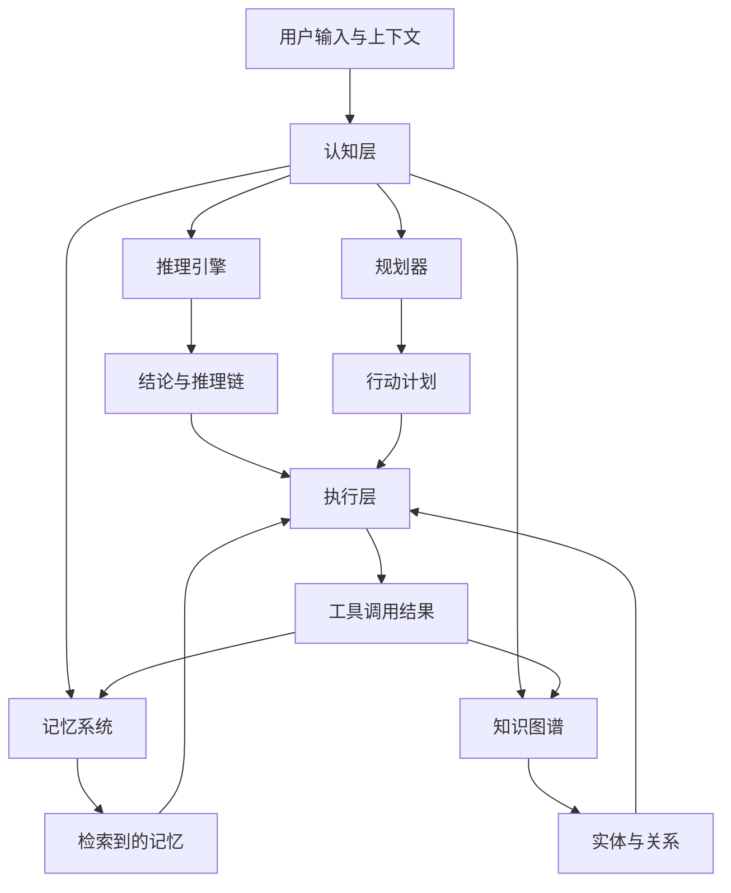
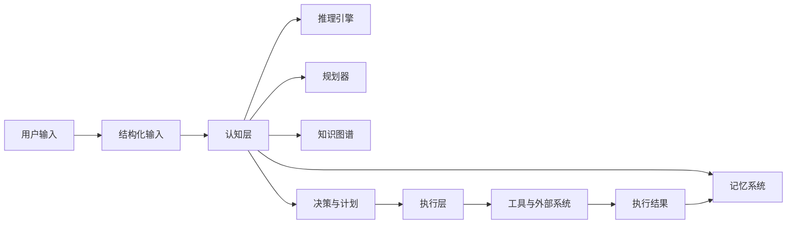
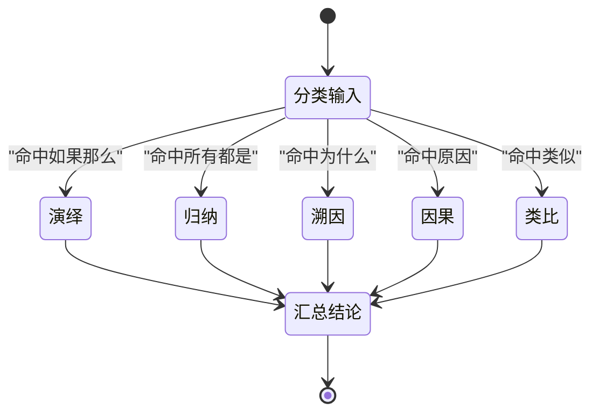
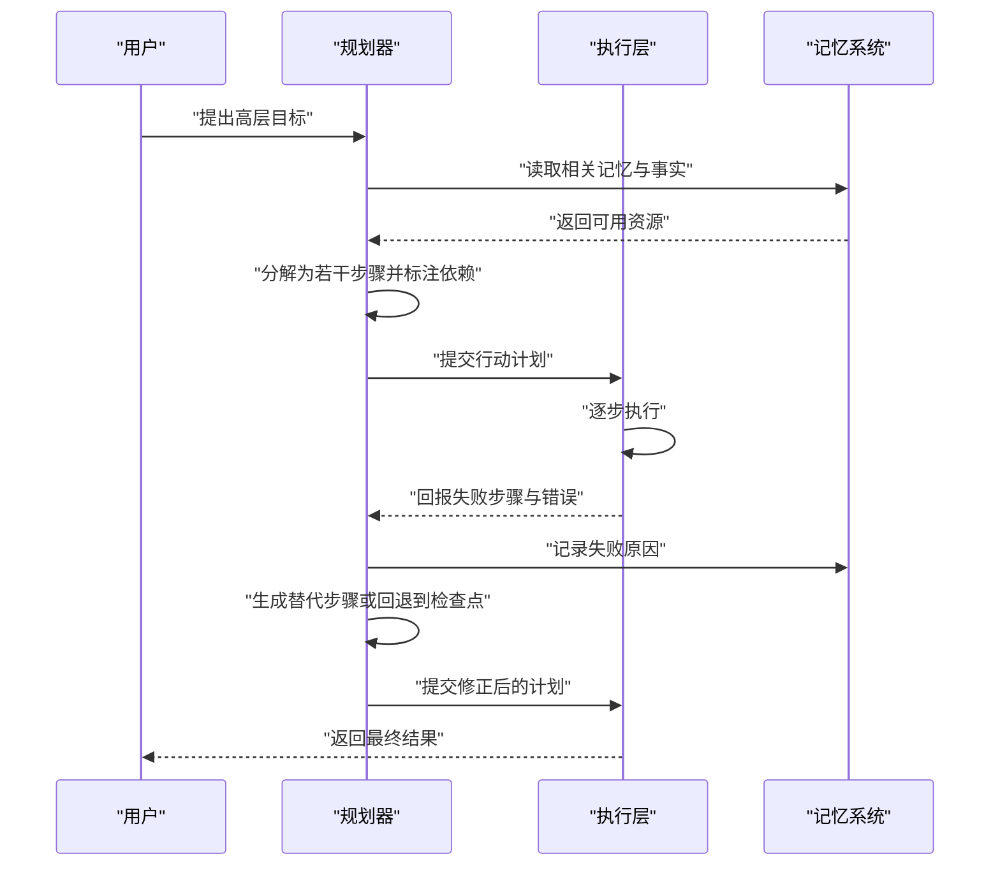
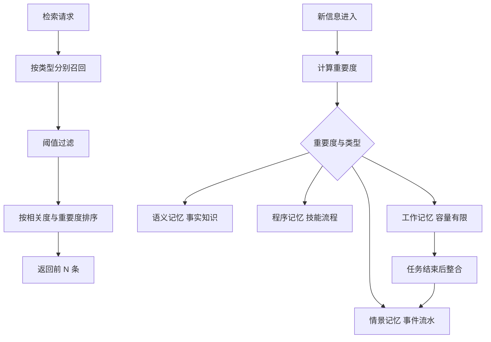
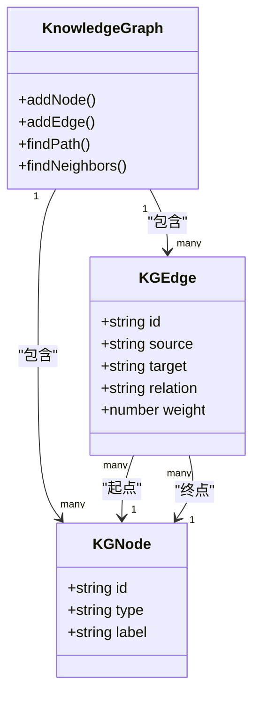
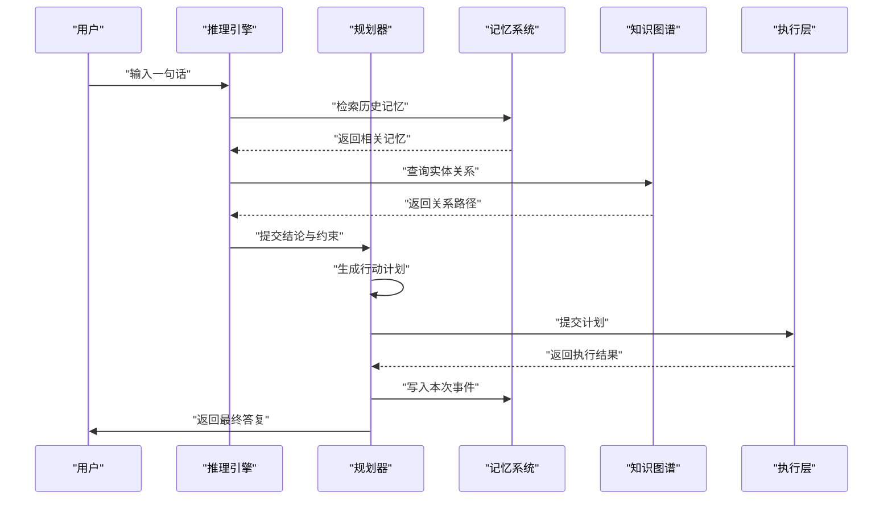
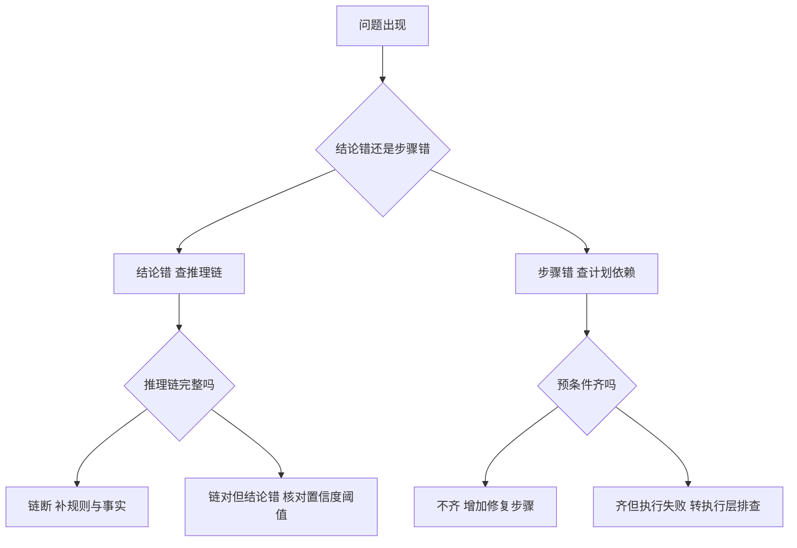

# 认知层

本文讲 Agent 分层架构里的认知层：理解、推理、记忆与知识表示。
认知层不直接调工具，它产出的是决策依据。

!!! abstract "学完这一页你能"
    1. 写出认知层的输入输出结构，并说清它与执行层的职责边界。
    2. 用演绎、归纳、溯因三类策略各举一例，并给出可复现的置信度算法。
    3. 把一句高层目标拆成带依赖、带预条件、带修复步骤的行动计划。
    4. 设计情景、语义、程序、工作四类记忆的写入与检索路径，并用脚本验证排序结果。

## 0. 知识地图



建议按顺序读：先看第 1 节确认认知层的边界，再依次读推理、规划、记忆、知识图谱四块。
第 6 节把四块接成一次完整请求，第 7 节讲怎么判断自己写对了。
如果时间有限，先读第 1 节与第 6 节的时序图。

!!! note "术语：Agent"
    定义：能感知输入、自主决定动作、并通过工具影响外部环境的软件系统。
    例子：收到"查一下昨天订单量"后自己去调用统计接口、再把结果组织成回答的程序。

## 1. 认知层管什么

**先想一个问题**

用户对客服 Agent 说："帮我把上周买的那双鞋退掉。"

如果系统收到这句话就直接调退款接口，会发生什么？

它没有确认订单号，没有校验退货期限，也没有记录退货原因。

!!! note "术语：认知层"
    定义：Agent 中负责理解、推理、规划、记忆与知识表示的部分，产物是决策依据而不是外部动作。
    例子：把"退那双鞋"翻译成"定位上周订单 → 校验可退 → 生成退款计划"。

**心智模型**

!!! tip "心智模型"
    一句话模型：认知层决定"做什么、为什么这么做、记住什么"，执行层只负责"把它做掉"。
    日常类比：认知层是会议室里的讨论与决策，执行层是车间里的机械臂。
    类比不成立的地方：会议室里的人是同一个人，而模型的每次调用都会重新计算，上一轮结论只能靠外部记忆保存。

**图解**



1. 用户输入先被解析成结构化输入，后面所有模块都只读这个结构。
2. 认知层四个模块各自产出结论、计划、检索结果、关系数据。
3. 决策与计划交给执行层，执行层负责工具调用与重试。
4. 执行结果写回记忆系统，下一次请求可以读到它。

**一步一步来**

第 1 步：定义认知层的输入结构，把原始文本和运行上下文分开。

```ts
// 原始输入只出现一次，之后就只读结构化结果
interface ParsedInput {
  raw: string;            // 用户原话
  normalizedText: string; // 去掉多余空白后的文本
  entities: string[];     // 识别出的实体，例如 订单号
}

interface Context {
  userId: string;         // 当前用户
  sessionId: string;      // 当前会话
  turnCount: number;      // 第几轮对话
  capabilities: string[]; // 当前可用的能力，例如 web_search
}
```

**这段代码在做什么**

- `raw` 保留原始文本，便于事后排查。
- `normalizedText` 是后续所有正则匹配的输入，避免空白差异影响判断。
- `entities` 让下游模块不必重复做实体识别。
- `Context` 里放的是跨模块共享的运行信息，不放业务数据。

第 2 步：定义认知层对外的统一返回值，四个模块共用一套字段。

```ts
interface CognitionResult {
  conclusion: string;      // 结论或决策
  confidence: number;      // 0 到 1 之间的置信度
  evidence: string[];      // 支撑结论的依据
  alternatives: string[];  // 备选结论
}
```

**这段代码在做什么**

- `conclusion` 是唯一必须有的字段，其他字段可以为空数组。
- `confidence` 用同一个取值区间，便于上层设阈值。
- `evidence` 用于解释"为什么是这个结论"，也是排错的入口。
- `alternatives` 让上层在低置信度时可以换一条路。

**运行结果**

此时还没有可运行输出，第 2 节开始给出可执行脚本。

**动手验证**

下面的脚本用一个最小的认知层壳子跑通"解析 → 决策 → 断言"。

```js
// cognition-1.mjs
// 运行：node cognition-1.mjs
// 依赖：仅 Node 20+ 内置模块 node:assert
import assert from 'node:assert/strict';

function parseInput(raw) {
  const normalizedText = raw.replace(/\s+/g, '');
  const entities = normalizedText.match(/订单\d+/g) ?? [];
  return { raw, normalizedText, entities };
}

function decide(input, context) {
  if (input.entities.length === 0) {
    return { conclusion: 'need_clarify', confidence: 0.6, evidence: ['未识别到订单号'], alternatives: ['ask_order_id'] };
  }
  if (!context.capabilities.includes('refund')) {
    return { conclusion: 'need_capability', confidence: 0.8, evidence: ['缺少退款能力'], alternatives: ['escalate_to_human'] };
  }
  return { conclusion: 'refund', confidence: 0.9, evidence: input.entities, alternatives: [] };
}

const parsed = parseInput('帮我把 订单12345 退掉');
assert.deepEqual(parsed.entities, ['订单12345']);

const noId = decide(parseInput('帮我把那双鞋退掉'), { capabilities: ['refund'] });
assert.equal(noId.conclusion, 'need_clarify');

const ok = decide(parsed, { capabilities: ['refund'] });
assert.equal(ok.conclusion, 'refund');
assert.equal(ok.confidence, 0.9);

console.log('预期输出: 三类决策断言全部通过');
```

**常见坑**

| 现象 | 原因 | 怎么修 |
| --- | --- | --- |
| 同一句话两次解析出不同实体 | 解析函数直接改写了原字符串 | 让解析函数返回新对象，不修改入参 |
| 上层拿到结论却无法解释 | 只返回 conclusion，没带上 evidence | 把 evidence 设为必填字段 |
| 低置信度结论被直接执行 | 上层没有读 confidence | 在执行层加置信度阈值判断 |

**用在哪里**

- 客服工单自动分派。业务背景：大量工单需要先判断类型再转人工或自动处理；这一节的知识怎么用：把工单文本解析成结构化输入，再决定走自动还是转人工；指标：自动分派准确率与转人工率；什么时候不该用：工单涉及金额争议时不应自动决断。
- 数据分析助手的问数入口。业务背景：业务同学用自然语言问"上月华东销售额"；这一节的知识怎么用：把问题解析成指标与维度两个字段；指标：解析成功率；什么时候不该用：口径尚未定义清楚时先问澄清问题。
- 代码修复机器人。业务背景：收到报错日志后自动提修复建议；这一节的知识怎么用：把日志解析成文件、行号、错误码；指标：建议被采纳的比例；什么时候不该用：涉及生产数据库变更的操作只做建议不做执行。

**行业实践**

- ReAct 论文（Yao 等，2022）把推理与行动交替进行，推理结果决定下一个行动，行动结果又回到推理。怎么借鉴到你的项目：在认知层的输出里显式记录"下一步动作"，而不是让执行层自己猜。
- 斯坦福 Generative Agents 论文（Park 等，2023）给智能体配了记忆流与反思机制。怎么借鉴到你的项目：把每次决策的依据落盘，后续决策可以引用历史依据。
- Anthropic 工程博客《Building Effective Agents》区分了固定工作流与自主智能体两类形态，并建议先用工作流。怎么借鉴到你的项目：认知层的分支先写成显式规则，规则不够用再引入自主规划；具体章节名称以原文为准。

**小结**

1. 认知层的产物是决策依据，不是工具调用结果。
2. 输入要结构化一次，后续模块只读结构化结果。
3. 统一返回结论、置信度、依据、备选四件套，排错才有入口。

## 2. 推理引擎：从前提推到结论

**先想一个问题**

用户说："如果订单超过七天就不能退，这单已经超过七天了。"

Agent 要得出什么？它凭什么得出这个结论？

!!! note "术语：推理链"
    定义：从已知前提一步步推到结论的记录，每一步都标注用到的规则。
    例子："超过七天"加"超过七天则不可退"推到"不可退"，这一步就是链上的一环。

**心智模型**

!!! tip "心智模型"
    一句话模型：推理引擎是"规则加事实"的匹配器，把匹配上的规则结论变成新事实，再继续匹配。
    日常类比：像做菜时照着菜谱一步步走，每一步的产出都是下一步的原料。
    类比不成立的地方：菜谱的步骤是固定的，而自然语言里的规则要先被翻译成机器能匹配的形式，翻译本身可能出错。

**图解**



1. 先对输入做分类，判断它更像哪一类推理任务。
2. 分类命中后选择对应策略，每种策略有自己的置信度算法。
3. 全部策略的结果汇总到同一个结论结构。
4. 主策略之外的结果进入备选列表，供低置信度时切换。

**一步一步来**

第 1 步：把推理规则存成数据，而不是写成 if 分支。

```ts
interface InferenceRule {
  id: string;          // 规则标识，例如 modus_ponens
  name: string;        // 规则中文名
  type: ReasoningType; // 演绎 / 归纳 / 溯因 / 因果 / 类比
  premises: string[];  // 前提形状，问号开头表示变量
  conclusion: string;  // 结论形状
}
```

**这段代码在做什么**

- 规则是数据，新增规则不必改引擎代码。
- `premises` 用形状描述，变量位用问号占位以便统一匹配。
- `type` 让引擎知道该交给哪套策略。
- `id` 用于日志与排错，出错时能定位到具体规则。

第 2 步：实现两条经典演绎规则，并加上统一匹配。

```ts
function unify(pattern: string, fact: string): boolean {
  const p = pattern.split(' ').filter(Boolean);
  const f = fact.split(' ').filter(Boolean);
  if (p.length !== f.length) return false;
  return p.every((seg, i) => seg.startsWith('?') || seg === f[i]);
}

function modusPonens(facts: string[], ifPThenQ: [string, string]): string | null {
  const [p, q] = ifPThenQ;
  return facts.some((f) => unify(p, f)) ? q : null;
}

function modusTollens(facts: string[], ifPThenQ: [string, string]): string | null {
  const [p, q] = ifPThenQ;
  return facts.some((f) => unify(`非 ${q}`, f)) ? `非 ${p}` : null;
}
```

**这段代码在做什么**

- `unify` 按空格切分后逐段比较，问号段表示任意值都匹配。
- 肯定前件在事实里找到 P 就得到 Q。
- 否定后件在事实里找到"非 Q"就得到"非 P"。
- 两个函数都不修改入参，符合上一节定下的规则。

**运行结果**

事实为 `['下雨']` 时肯定前件返回 `地面湿`；事实为 `['非 地面湿']` 时否定后件返回 `非 下雨`。

第 3 步：给归纳推理算置信度，并做去环检查。

```ts
function inductiveConfidence(observationCount: number): number {
  const base = 0.5;                                  // 归纳的基础置信度
  const bonus = Math.min(observationCount * 0.05, 0.4); // 观察越多越有把握
  return Math.min(base + bonus, 0.95);               // 上限 0.95，留出犯错空间
}

function hasLoop(conclusions: string[]): boolean {
  const seen = new Set<string>();                     // 记录出现过的结论
  for (const c of conclusions) {
    if (seen.has(c)) return true;                     // 重复出现说明成环
    seen.add(c);
  }
  return false;
}
```

**这段代码在做什么**

- 归纳的置信度随观察条数上升，但永远不到 1。
- `Math.min` 两次使用，一次限制增量，一次限制总量。
- 去环检查用于防止推理链在两个结论之间来回跳。
- 上面的系数取自旧版示例代码，是示例取值，不是行业标准，正式项目需按评测集重新标定。

**动手验证**

```js
// cognition-2.mjs
// 运行：node cognition-2.mjs
// 依赖：仅 Node 20+ 内置模块 node:assert
import assert from 'node:assert/strict';

function unify(pattern, fact) {
  const p = pattern.split(' ').filter(Boolean);
  const f = fact.split(' ').filter(Boolean);
  if (p.length !== f.length) return false;
  return p.every((seg, i) => seg.startsWith('?') || seg === f[i]);
}

const rule = ['如果 下雨 那么 地面湿', '下雨'];
const [cond, fact] = rule;
const [p, q] = cond.replace(/^如果 /, '').split(' 那么 ');

assert.equal(unify(p, fact), true);
assert.equal(q, '地面湿');

function modusPonens(facts, ifPThenQ) {
  const [pp, qq] = ifPThenQ;
  return facts.some((f) => unify(pp, f)) ? qq : null;
}

assert.equal(modusPonens(['下雨'], [p, q]), '地面湿');
assert.equal(modusPonens(['晴天'], [p, q]), null);

function inductiveConfidence(n) {
  return Math.min(0.5 + Math.min(n * 0.05, 0.4), 0.95);
}
assert.equal(inductiveConfidence(3), 0.65);
assert.equal(inductiveConfidence(20), 0.9);
assert.equal(inductiveConfidence(1000), 0.9);

console.log('预期输出: 演绎与归纳断言全部通过');
```

**常见坑**

| 现象 | 原因 | 怎么修 |
| --- | --- | --- |
| 推理链无限增长 | 结论反复生成同一条 | 每轮把新结论与已有结论去重，再做去环检查 |
| 演绎结论明显错误 | 规则里的前提形状与事实写法不一致 | 把事实先规范化成与规则同样的分词格式 |
| 归纳结论听起来像事实 | 置信度没有传给上层 | 把 confidence 一并返回，并在上层设阈值 |

**用在哪里**

- 风控规则引擎。业务背景：交易需要按多条规则判定是否拦截；这一节的知识怎么用：规则写成数据，事实来自交易字段，用肯定前件逐条推；指标：规则命中率与误拦率；什么时候不该用：规则之间存在优先级的场景要额外加冲突消解。
- 售后政策问答。业务背景：用户问某商品能否退货；这一节的知识怎么用：把政策条文变成规则，把订单状态变成事实；指标：答案与政策原文的一致率；什么时候不该用：政策本身存在地区差异且未结构化时。
- 故障根因辅助定位。业务背景：线上告警需要给出可能原因；这一节的知识怎么用：用溯因策略从现象反推最可能的解释；指标：给出的候选原因被工程师确认的比例；什么时候不该用：只有一条日志且信息不足时。

**行业实践**

- Chain-of-Thought 论文（Wei 等，2022）说明让模型输出中间步骤可以提升多步任务的准确率。怎么借鉴到你的项目：让认知层把每一步前提与结论都写进结果结构，而不是只给最终答案。
- Self-Consistency 论文（Wang 等，2022）对多条推理路径采样后投票选出答案。怎么借鉴到你的项目：对应本节的 alternatives 字段，低置信度时多跑几条路径再比较。
- 经典人工智能教材中归纳出的推理规则清单，例如肯定前件、否定后件、假言三段论、选言三段论，可以直接作为规则库的起步集合；具体条目需核对权威教材原文。

**小结**

1. 规则存成数据，引擎只负责匹配与推导。
2. 演绎的结论确定性高，归纳的结论必须带置信度上限。
3. 推理链要去重去环，否则会出现自我循环。

## 3. 规划器：把目标拆成可执行步骤

**先想一个问题**

用户说："把上个月的销售数据整理好，发一封周报给团队。"

这句话可以直接执行吗？它至少缺三个决定：数据从哪来、周报长什么样、发给谁。

!!! note "术语：HTN"
    HTN 是分层任务网络（Hierarchical Task Network）的缩写。
    定义：先把高层任务分解成子任务，子任务再分解，直到全部变成可以一次执行完的原子动作。
    例子："发周报"分解成"取数""写正文""发送"，其中"取数"再分解成"查订单表""按区域汇总"。

**心智模型**

!!! tip "心智模型"
    一句话模型：规划器把一句目标翻译成一张有向图，节点是动作，边是"必须先做"。
    日常类比：像装修前排施工顺序，先水电再贴砖，顺序错了要返工。
    类比不成立的地方：装修的工序是行业固定的，而 Agent 面对的目标往往没有现成工序表，得先猜一个再验证。

**图解**



1. 规划器先读记忆与事实，确认手上有哪些资源。
2. 目标被分解成步骤，步骤之间标注依赖关系。
3. 执行层逐步执行，失败时把失败的步骤标识回传。
4. 规划器优先替换失败步骤，替换不了就回退到最近的检查点。
5. 修正后的计划重新提交执行，失败原因写入记忆。

**一步一步来**

第 1 步：定义动作与步骤，把依赖关系显式写出来。

```ts
type ActionType = 'invoke' | 'query' | 'transform' | 'create' | 'update' | 'delete' | 'wait' | 'branch';

interface PlanStep {
  id: string;              // 步骤标识
  action: ActionType;      // 动作类型
  tool?: string;           // 用哪个工具
  preconditions: string[]; // 执行前必须成立的条件
  dependencies: string[];  // 必须先完成的步骤标识
  estimatedDuration: number; // 预计耗时，单位毫秒
}
```

**这段代码在做什么**

- `ActionType` 把动作收敛成八类，便于统计与权限控制。
- `tool` 单独一个字段，方便失败时换工具重试。
- `preconditions` 描述状态条件，`dependencies` 描述步骤顺序，两者不能混用。
- `estimatedDuration` 用于估算总耗时与超时风险。

第 2 步：生成一个带依赖的计划。

```ts
function buildPlan(goal: string): PlanStep[] {
  return [
    { id: 's1', action: 'query', tool: 'order_db', preconditions: [], dependencies: [], estimatedDuration: 800 },
    { id: 's2', action: 'transform', tool: 'aggregator', preconditions: ['s1 完成'], dependencies: ['s1'], estimatedDuration: 300 },
    { id: 's3', action: 'create', tool: 'mailer', preconditions: ['s2 完成'], dependencies: ['s2'], estimatedDuration: 200 },
  ];
}
```

**这段代码在做什么**

- 三个步骤组成一条链，依赖关系是线性的。
- 每个步骤只声明自己需要什么，不关心别人怎么实现。
- `estimate` 字段让规划器可以在提交前算总耗时。
- 这个函数是桩实现，真实项目里应由模型或规则模板生成。

第 3 步：检查预条件，缺什么就插一条修复步骤。

```ts
function repairSteps(step: PlanStep, missing: string[]): PlanStep[] {
  const repairs: PlanStep[] = [];
  for (const cond of missing) {
    if (cond.startsWith('存在')) {
      repairs.push({
        id: `repair_${step.id}`,
        action: 'create',
        tool: 'resource_creator',
        preconditions: [],
        dependencies: [],
        estimatedDuration: 500,
      });
    }
  }
  return repairs;
}
```

**这段代码在做什么**

- 修复步骤被插到原步骤之前，保证预条件先成立。
- 修复步骤同样有耗时，会影响总预算。
- 只对能自动修复的条件生成修复动作，其他条件返回失败。
- 修复步骤的标识带原步骤前缀，日志里容易对应。

**运行结果**

对一条缺"存在 目标表"的步骤，`repairSteps` 返回一条长度为 1 的数组。

**动手验证**

```js
// cognition-3.mjs
// 运行：node cognition-3.mjs
// 依赖：仅 Node 20+ 内置模块 node:assert
import assert from 'node:assert/strict';

function buildPlan() {
  return [
    { id: 's1', action: 'query', dependencies: [], duration: 800 },
    { id: 's2', action: 'transform', dependencies: ['s1'], duration: 300 },
    { id: 's3', action: 'create', dependencies: ['s2'], duration: 200 },
  ];
}

function validate(plan, done) {
  const problems = [];
  for (const step of plan) {
    for (const dep of step.dependencies) {
      if (!done.has(dep)) problems.push(`${step.id} 缺少依赖 ${dep}`);
    }
  }
  return problems;
}

function totalDuration(plan) {
  return plan.reduce((sum, s) => sum + s.duration, 0);
}

const plan = buildPlan();
assert.equal(totalDuration(plan), 1300);
assert.deepEqual(validate(plan, new Set(['s1'])), ['s2 缺少依赖 s2'.replace('s2 缺少依赖 s2', 's3 缺少依赖 s2')]);

function replan(plan, failedId, alternatives) {
  const idx = plan.findIndex((s) => s.id === failedId);
  if (idx === -1) throw new Error(`步骤 ${failedId} 不存在`);
  if (alternatives.length === 0) return plan.slice(0, idx);
  return [...plan.slice(0, idx), alternatives[0], ...plan.slice(idx + 1)];
}

const fixed = replan(plan, 's2', [{ id: 's2_alt', action: 'transform', dependencies: ['s1'], duration: 400 }]);
assert.equal(fixed.length, 3);
assert.equal(fixed[1].id, 's2_alt');

console.log('预期输出: 计划校验与重规划断言全部通过');
```

**常见坑**

| 现象 | 原因 | 怎么修 |
| --- | --- | --- |
| 计划执行到一半卡住 | 只写了 dependencies，没检查 preconditions | 提交前对每个步骤做一次预条件检查 |
| 失败后整条链重跑 | 重规划时没有检查点概念 | 在关键步骤后打检查点，回退到最近的检查点 |
| 总耗时远超预期 | 耗时估算缺失或全部填同一个值 | 让估算来自历史执行记录的中位数 |

**用在哪里**

- 后台管理的批量导入。业务背景：运营上传表格后需要校验、入库、生成结果文件；这一节的知识怎么用：把三个环节拆成步骤并标注依赖；指标：整批成功率与失败定位耗时；什么时候不该用：只有一行数据的导入直接同步处理即可。
- 电商促销活动配置。业务背景：一次活动要建券、绑商品、设时间；这一节的知识怎么用：先检查商品是否在售再绑券；指标：配置错误率；什么时候不该用：活动模板固定不变时用固定脚本更稳。
- 跨系统数据对账。业务背景：每天对比两个系统的订单金额；这一节的知识怎么用：取数、比对、生成差异表三步，失败可回退到取数之后；指标：对账完成时间；什么时候不该用：两个系统口径未对齐时先做口径确认。

**行业实践**

- HTN 规划来自经典人工智能规划研究，核心是先分解再执行；具体形式化定义需核对权威教材原文。
- Anthropic 工程博客《Building Effective Agents》建议把常见流程固化为工作流，只有在步骤无法预先确定时才使用自主规划。怎么借鉴到你的项目：给规划器加一条"先查模板"分支，命中模板就不调用模型。
- ReAct 论文（Yao 等，2022）中行动与推理交替进行，行动结果会修正后续推理。怎么借鉴到你的项目：把每步执行结果写回规划器，而不是等整条计划跑完再检查。

**小结**

1. 计划是一张有向图，依赖与预条件要分开表达。
2. 缺预条件时优先插入修复步骤，而不是直接报错。
3. 失败后先替换步骤，替换不了再回退到检查点。

## 4. 记忆系统：四类记忆与检索排序

**先想一个问题**

用户第一轮说"我只要顺丰"，第五轮说"还是用上次那个快递"。

Agent 怎么知道"上次那个"指什么？

!!! note "术语：工作记忆"
    定义：只服务当前任务、容量有限、任务结束就清空的短期记忆。
    例子：本轮对话里刚确认的快递偏好。

**心智模型**

!!! tip "心智模型"
    一句话模型：记忆系统按用途分四个桶，写入时打分，读取时按相关度与重要度排序。
    日常类比：像厨房里四个容器：台面上的备菜、冰箱的食材、墙上的菜谱、垃圾桶边的小纸条。
    类比不成立的地方：厨房的容器是物理隔离的，而程序里的四类记忆经常需要互相搬运，搬运规则要自己定。

**图解**



1. 新信息先算重要度，重要度决定它进哪个桶。
2. 工作记忆容量有限，满了就挤掉最旧的条目。
3. 检索时按类型分别召回，再用阈值过滤掉低分条目。
4. 过滤后的结果按相关度与重要度排序，返回前 N 条。
5. 任务结束后做一次整合，把工作记忆里重要度高的条目搬到情景记忆。

**一步一步来**

第 1 步：定义记忆条目与四种类型。

```ts
type MemoryType = 'episodic' | 'semantic' | 'procedural' | 'working';

interface Memory {
  id: string;
  type: MemoryType;
  content: string;        // 记忆正文
  embedding?: number[];   // 向量表示，用于相似度检索
  importance: number;     // 0 到 1
  accessCount: number;    // 被检索次数
  lastAccessed: number;   // 上次被检索的时间戳
  tags: string[];         // 主题标签
}
```

**这段代码在做什么**

- 四类记忆共用一个结构，方便跨桶搬运。
- `importance` 在写入时算一次，检索时参与排序。
- `accessCount` 与 `lastAccessed` 支撑淘汰策略。
- `embedding` 可选，没有向量时退化为关键词匹配。

第 2 步：实现一个容量固定的工作记忆。

```ts
class WorkingMemory {
  private items: Memory[] = [];
  constructor(private capacity: number) {}

  add(m: Memory): void {
    this.items.push(m);
    if (this.items.length > this.capacity) {
      this.items.shift(); // 超出容量时挤掉最旧的一条
    }
  }

  recent(n: number): Memory[] {
    return this.items.slice(-n); // 只返回最近 n 条
  }

  clear(): void {
    this.items = [];
  }
}
```

**这段代码在做什么**

- 用数组尾部作为最新位置，取最近条目只要一次切片。
- 超容量时挤掉头部，保证内存占用有上限。
- `clear` 用于任务结束后清空，避免上下文串味。
- 容量取值需要按上下文长度预算决定，示例值不是推荐值。

第 3 步：用余弦相似度做检索并排序。

```ts
function cosine(a: number[], b: number[]): number {
  let dot = 0, na = 0, nb = 0;
  for (let i = 0; i < a.length; i++) {
    dot += a[i] * b[i];
    na += a[i] * a[i];
    nb += b[i] * b[i];
  }
  if (na === 0 || nb === 0) return 0; // 零向量直接返回 0
  return dot / (Math.sqrt(na) * Math.sqrt(nb));
}

function rank(items: Memory[], queryVec: number[], threshold: number): Memory[] {
  return items
    .map((m) => ({ m, sim: cosine(queryVec, m.embedding ?? []) }))
    .filter((x) => x.sim >= threshold)
    .sort((x, y) => (y.sim + y.m.importance) - (x.sim + x.m.importance))
    .map((x) => x.m);
}
```

**这段代码在做什么**

- 余弦相似度只看向量方向，不看长度，适合文本向量。
- 零向量单独处理，避免除零得到 NaN。
- 阈值过滤在前，排序在后，减少排序量。
- 排序键是相似度加重要度，两者权重可按评测结果调整。

**运行结果**

查询向量与某条记忆完全同向时相似度为 1，正交时为 0。

**动手验证**

```js
// cognition-4.mjs
// 运行：node cognition-4.mjs
// 依赖：仅 Node 20+ 内置模块 node:assert
import assert from 'node:assert/strict';

function cosine(a, b) {
  let dot = 0, na = 0, nb = 0;
  for (let i = 0; i < a.length; i++) {
    dot += a[i] * b[i];
    na += a[i] * a[i];
    nb += b[i] * b[i];
  }
  if (na === 0 || nb === 0) return 0;
  return dot / (Math.sqrt(na) * Math.sqrt(nb));
}

assert.equal(cosine([1, 0], [1, 0]), 1);
assert.equal(cosine([1, 0], [0, 1]), 0);
assert.equal(cosine([0, 0], [1, 1]), 0);

class WorkingMemory {
  constructor(capacity) { this.capacity = capacity; this.items = []; }
  add(m) {
    this.items.push(m);
    if (this.items.length > this.capacity) this.items.shift();
  }
  recent(n) { return this.items.slice(-n); }
}

const wm = new WorkingMemory(2);
wm.add({ id: 'm1', content: '用顺丰', importance: 0.5, embedding: [1, 0] });
wm.add({ id: 'm2', content: '要发票', importance: 0.4, embedding: [0, 1] });
wm.add({ id: 'm3', content: '改地址', importance: 0.7, embedding: [1, 1] });
assert.equal(wm.recent(5).length, 2);
assert.equal(wm.recent(5)[0].id, 'm2');

function rank(items, queryVec, threshold) {
  return items
    .map((m) => ({ m, sim: cosine(queryVec, m.embedding) }))
    .filter((x) => x.sim >= threshold)
    .sort((x, y) => (y.sim + y.m.importance) - (x.sim + x.m.importance))
    .map((x) => x.m.id);
}

const ranked = rank(wm.recent(5), [1, 0], 0.5);
assert.deepEqual(ranked, ['m3', 'm2']);

console.log('预期输出: 工作记忆容量与检索排序断言全部通过');
```

**常见坑**

| 现象 | 原因 | 怎么修 |
| --- | --- | --- |
| 上下文越来越长直到超限 | 工作记忆没有容量上限 | 设固定容量，超出时按最旧或最低分淘汰 |
| 检索结果每轮都不一样 | 排序只用了相似度且并列时顺序不定 | 排序键里加入 id 作为兜底比较项 |
| 把长期事实写进工作记忆 | 写入时没有按类型分流 | 写入前先判断信息是事件、事实还是技能 |

**用在哪里**

- 多轮客服对话。业务背景：一次会话跨十几轮，需要记住用户偏好；这一节的知识怎么用：偏好进工作记忆，结论进情景记忆；指标：重复提问率；什么时候不该用：单轮问答场景无需记忆系统。
- 个人助理类产品。业务背景：用户会提到"我上次说的那个项目"；这一节的知识怎么用：情景记忆按时间戳排序后可定位到具体事件；指标：指代解析准确率；什么时候不该用：涉及隐私的信息需要先做脱敏再入库。
- IDE 内代码助手。业务背景：需要记住当前仓库的编码约定；这一节的知识怎么用：约定进语义记忆，本轮编辑进工作记忆；指标：建议被接受率；什么时候不该用：仓库约定频繁变动时改用每次重新扫描。

**行业实践**

- 斯坦福 Generative Agents 论文（Park 等，2023）给记忆设了由新近度、重要度、相关度共同构成的检索打分。怎么借鉴到你的项目：把这三项都做成可配置参数，用评测集标定；具体公式与权重以论文原文为准。
- MemGPT 论文（Packer 等，2023）提出用分页思路管理上下文，在有限窗口里模拟更大记忆。怎么借鉴到你的项目：工作记忆设容量、超出容量时把条目搬到长期存储，正是分页的简化版。
- 认知心理学中情景记忆、语义记忆、程序记忆的划分来自 Tulving 等人的研究，工程实现借用了这套命名；具体定义与边界需核对心理学教材原文。

**小结**

1. 记忆按用途分桶，写入前先判断类型与重要度。
2. 工作记忆必须有容量上限，否则上下文会失控。
3. 检索排序至少包含相关度与重要度两项，避免高频噪音压过关键信息。

## 5. 知识图谱：把关系存成节点和边

**先想一个问题**

用户问："和这双鞋搭配的袜子有现货吗？"

只靠关键词搜索，系统会同时返回鞋和袜子的商品页，但不知道谁和谁搭配。

!!! note "术语：知识图谱"
    定义：用节点表示实体、用边表示实体之间关系的结构化知识库。
    例子：节点"运动鞋"与节点"运动袜"之间有一条"搭配"边。

**心智模型**

!!! tip "心智模型"
    一句话模型：知识图谱是一张巨大的关系网，查询就是从某个节点出发沿着边走。
    日常类比：像地铁线路图，站是节点，线路是边，换乘就是路径查找。
    类比不成立的地方：地铁线路图是静态的，而知识图谱的边有权重、有方向语义，还会被新数据改写。

**图解**



1. 图由节点集合与边集合两部分组成。
2. 每条边记录起点、终点、关系类型与权重。
3. 加边前必须确认两端节点都已存在，否则边是悬空的。
4. 查询接口分四类：找路径、找邻居、找模式、语义检索。

**一步一步来**

第 1 步：定义节点、边与关系类型。

```ts
type NodeType = 'entity' | 'concept' | 'event' | 'document';

type RelationType =
  | 'is_a' | 'part_of' | 'has_property' | 'causes'
  | 'depends_on' | 'similar_to' | 'precedes' | 'references';

interface KGNode { id: string; type: NodeType; label: string; }
interface KGEdge { id: string; source: string; target: string; relation: RelationType; weight: number; }
```

**这段代码在做什么**

- 节点类型区分实体、概念、事件、文档四类，便于分区存储。
- 关系类型收敛成八种，新增关系要显式加进联合类型。
- `weight` 表示关系强度，路径打分时使用。
- 节点与边分开定义，索引可以分别建。

第 2 步：建图并维护邻接表。

```ts
const nodes = new Map<string, KGNode>();
const edges = new Map<string, KGEdge>();
const adj = new Map<string, Set<string>>();

function addNode(node: KGNode): void {
  nodes.set(node.id, node);
  if (!adj.has(node.id)) adj.set(node.id, new Set());
}

function addEdge(edge: KGEdge): void {
  if (!nodes.has(edge.source) || !nodes.has(edge.target)) {
    throw new Error(`边 ${edge.id} 的端点不存在`);
  }
  edges.set(edge.id, edge);
  adj.get(edge.source)!.add(edge.target); // 记录正向邻居
  adj.get(edge.target)!.add(edge.source); // 记录反向邻居
}
```

**这段代码在做什么**

- 邻接表用 Set 存邻居，天然去重。
- 加边前校验端点，避免出现悬空边。
- 正反都记录邻居，使图可以双向遍历。
- 抛出带边标识的错误，日志里能直接定位。

第 3 步：带深度限制的深度优先路径查找。

```ts
function findPath(from: string, to: string, maxDepth: number): string[] | null {
  const visited = new Set<string>();
  const path: string[] = [];

  function dfs(cur: string, remain: number): boolean {
    if (remain < 0) return false;          // 超过深度限制就放弃
    if (visited.has(cur)) return false;    // 已访问过，防止成环
    visited.add(cur);
    path.push(cur);
    if (cur === to) return true;           // 命中目标
    for (const next of adj.get(cur) ?? []) {
      if (dfs(next, remain - 1)) return true;
    }
    path.pop();                            // 回溯，撤销本次选择
    return false;
  }

  return dfs(from, maxDepth) ? path : null;
}
```

**这段代码在做什么**

- `remain` 控制递归深度，防止在稠密图上耗尽内存。
- `visited` 防止在两个节点之间来回跳。
- `path.pop()` 是回溯操作，保证返回的路径是干净的。
- 找不到路径时返回 null，调用方需要显式处理。

**运行结果**

在"鞋 → 订单 → 退款"这条链上，以深度 3 查询会返回三个节点的数组。

**动手验证**

```js
// cognition-5.mjs
// 运行：node cognition-5.mjs
// 依赖：仅 Node 20+ 内置模块 node:assert
import assert from 'node:assert/strict';

const nodes = new Map();
const adj = new Map();

function addNode(id, label) {
  nodes.set(id, { id, label });
  if (!adj.has(id)) adj.set(id, new Set());
}

function addEdge(source, target, relation) {
  if (!nodes.has(source) || !nodes.has(target)) throw new Error(`边端点不存在: ${source} -> ${target}`);
  adj.get(source).add(target);
  adj.get(target).add(source);
}

addNode('shoe', '运动鞋');
addNode('order', '订单');
addNode('refund', '退款');
addEdge('shoe', 'order', 'part_of');
addEdge('order', 'refund', 'causes');

function findPath(from, to, maxDepth) {
  const visited = new Set();
  const path = [];
  function dfs(cur, remain) {
    if (remain < 0 || visited.has(cur)) return false;
    visited.add(cur);
    path.push(cur);
    if (cur === to) return true;
    for (const next of adj.get(cur) ?? []) {
      if (dfs(next, remain - 1)) return true;
    }
    path.pop();
    return false;
  }
  return dfs(from, maxDepth) ? path : null;
}

assert.deepEqual(findPath('shoe', 'refund', 3), ['shoe', 'order', 'refund']);
assert.equal(findPath('shoe', 'refund', 1), null);
assert.equal(findPath('shoe', 'missing', 3), null);
assert.throws(() => addEdge('shoe', 'ghost', 'is_a'), /边端点不存在/);

console.log('预期输出: 路径查找与端点校验断言全部通过');
```

**常见坑**

| 现象 | 原因 | 怎么修 |
| --- | --- | --- |
| 加边时报端点不存在 | 节点还没建就先连边 | 先批量建节点，再批量建边 |
| 路径查找占用内存飙升 | 没有深度限制，稠密图上递归爆栈 | 加 maxDepth，并在服务层设上限 |
| 同类实体重复入库 | 缺少实体归一化 | 入库前先按别名表做归一 |

**用在哪里**

- 企业知识库问答。业务背景：文档分散在多个系统，问题需要跨文档串联；这一节的知识怎么用：文档作为 document 节点，章节作为 part_of 边；指标：问答引用命中率；什么时候不该用：只有一份文档时用全文检索即可。
- 电商搭配推荐。业务背景：需要给出搭配商品而不是相似商品；这一节的知识怎么用：搭配关系作为一条边，权重来自历史共购；指标：搭配位点击率；什么时候不该用：商品间没有稳定搭配关系时不要硬造边。
- 反欺诈关系排查。业务背景：需要找出共用设备或地址的账户群；这一节的知识怎么用：账户与设备作为节点，共用关系作为边，找两跳内邻居；指标：可疑团伙识别率；什么时候不该用：涉及个人敏感信息时需先做合规评估。

**行业实践**

- 微软研究院的 GraphRAG 提出在检索增强生成中加入图结构，用社区摘要回答全局性问题。怎么借鉴到你的项目：把图查询结果作为检索结果的一部分一起送给模型；具体方法名称与流程以官方项目文档为准。
- W3C 的 RDF 1.1 与 SPARQL 1.1 是知识图谱领域的两份公开规范，分别定义三元组数据模型与查询语言。怎么借鉴到你的项目：内部图结构可以先对齐三元组的最小模型，便于后续导出；规范细节以 W3C 原文为准。
- 实体归一化方面，需要核对官方文档：具体要核对实体消歧的评测数据集名称与指标定义，以及所选图数据库是否内置别名索引。

**小结**

1. 图由节点与边组成，加边前要校验端点。
2. 邻接表是多数图查询的起点，正反邻居都要记。
3. 路径查找必须带深度限制与访问标记，否则会失控。

## 6. 四层如何协作：一次请求的完整时序

**先想一个问题**

前面四节各自能跑，但把它们接起来会发生什么？

哪一层的输出传给哪一层，失败信息又怎么回去？

**心智模型**

!!! tip "心智模型"
    一句话模型：一次请求是一条闭环流水线，执行结果必须回流到记忆与图谱，否则系统不会变聪明。
    日常类比：像一家餐厅的点单流程，点单、备菜、出餐、记录，缺了记录下次还要重问客人。
    类比不成立的地方：餐厅的流程是人工协调的，而这里每一步都要用结构化数据交接，格式错了就断链。

**图解**



1. 输入先到推理引擎，推理需要历史信息。
2. 推理引擎向记忆系统与知识图谱各发一次查询。
3. 两边结果回来后，推理引擎产出结论与约束条件。
4. 规划器把结论翻译成行动计划，交给执行层。
5. 执行结果写回记忆系统，同时更新图谱中的关系权重。

**一步一步来**

第 1 步：给四个模块定义统一的调用签名，便于串起来。

```ts
interface CognitionDeps {
  reason(input: ParsedInput, ctx: Context): Promise<CognitionResult>;
  plan(goal: string, ctx: Context): Promise<PlanStep[]>;
  recall(query: string, limit: number): Promise<string[]>;
  queryGraph(from: string, to: string, maxDepth: number): Promise<string[] | null>;
}
```

**这段代码在做什么**

- 四个方法各自独立，方便单独替换与单独测试。
- 入参只带本模块需要的数据，不带整条流水线的状态。
- 返回类型统一用 Promise，便于并行调用。
- 这个接口是接缝，测试时可以用桩实现替换。

第 2 步：写一个串起四步的编排函数。

```ts
async function handle(deps: CognitionDeps, raw: string, ctx: Context) {
  const input: ParsedInput = { raw, normalizedText: raw.replace(/\s+/g, ''), entities: [] };
  const memories = await deps.recall(input.normalizedText, 3); // 先取历史
  const result = await deps.reason(input, ctx);                // 再推理
  const steps = await deps.plan(result.conclusion, ctx);       // 再规划
  return { result, memories, steps };
}
```

**这段代码在做什么**

- 顺序是先记忆、再推理、再规划，符合依赖方向。
- 记忆检索失败不应该阻断推理，可在实现里 try/catch。
- 返回值带上中间产物，便于上层展示决策依据。
- 这个函数不直接调工具，保持认知层与执行层的边界。

**运行结果**

返回值里包含结论、记忆列表与步骤数组三部分。

**动手验证**

```js
// cognition-6.mjs
// 运行：node cognition-6.mjs
// 依赖：仅 Node 20+ 内置模块 node:assert
import assert from 'node:assert/strict';

const calls = [];

const deps = {
  async recall(query, limit) {
    calls.push('recall');
    const all = ['用户偏好顺丰', '上月退过一单'];
    return all.slice(0, limit);
  },
  async reason(input) {
    calls.push('reason');
    return { conclusion: 'refund', confidence: 0.9, evidence: input.entities };
  },
  async plan(goal) {
    calls.push('plan');
    return [
      { id: 's1', action: 'query', dependencies: [] },
      { id: 's2', action: 'create', dependencies: ['s1'] },
    ];
  },
};

async function handle(raw) {
  const input = { raw, normalizedText: raw.replace(/\s+/g, ''), entities: raw.match(/订单\d+/g) ?? [] };
  const memories = await deps.recall(input.normalizedText, 3);
  const result = await deps.reason(input);
  const steps = await deps.plan(result.conclusion);
  return { result, memories, steps };
}

const out = await handle('把 订单12345 退掉，用顺丰');
assert.equal(out.result.conclusion, 'refund');
assert.equal(out.memories.length, 2);
assert.equal(out.steps.length, 2);
assert.deepEqual(calls, ['recall', 'reason', 'plan']);

console.log('预期输出: 编排顺序与返回值断言全部通过');
```

**常见坑**

| 现象 | 原因 | 怎么修 |
| --- | --- | --- |
| 记忆检索超时拖垮整条链路 | 检索没有被超时保护 | 给检索设超时，超时返回空数组继续推理 |
| 同一信息在多层重复加工 | 层与层之间传了整份上下文 | 每层只接收本层需要的字段 |
| 执行结果没有回流 | 编排函数只返回结果不写回 | 在编排末尾统一写记忆与更新图权重 |

**用在哪里**

- 智能运维值班助手。业务背景：告警触发后要给出处理建议；这一节的知识怎么用：检索历史同类告警，推理出原因，规划出检查步骤；指标：平均恢复时间；什么时候不该用：涉及直接重启生产服务时只出建议。
- 智能招聘筛选助手。业务背景：需要按岗位要求筛选简历；这一节的知识怎么用：岗位要求进图谱，候选人经历进记忆；指标：初筛通过率与人工复核差异；什么时候不该用：涉及录用决策时必须有真人复核。
- 财务报销审核助手。业务背景：审核单据是否符合制度；这一节的知识怎么用：制度规则进推理引擎，历史单据进记忆；指标：审核准确率与退回率；什么时候不该用：制度条款存在解释空间时只标记不决定。

**行业实践**

- Anthropic 工程博客《Building Effective Agents》给出的编排者加子任务模式，与本节"推理产出约束、规划产出步骤"的分工一致。怎么借鉴到你的项目：把每一层的输入输出写成显式结构，替换任一层不影响其他层；具体模式名称以原文为准。
- ReAct 论文（Yao 等，2022）说明推理与行动交替的循环结构。怎么借鉴到你的项目：把执行结果回流到推理引擎，而不是只回流到日志系统。
- 需要核对官方文档：具体要核对所选可观测性平台的 trace 传播规范，确认跨模块的调用标识如何透传。

**小结**

1. 四层用结构化数据交接，每一层只拿自己需要的字段。
2. 记忆检索要可降级，失败不能阻断推理。
3. 执行结果必须回流，否则系统无法从历史中获益。

## 7. 评估与排错：怎么判断认知层写对了

**先想一个问题**

认知层上线后，怎么知道它比上一版更好？

如果没有指标，只能靠感觉判断。

**心智模型**

!!! tip "心智模型"
    一句话模型：把认知层的每个环节都当成可以被单独测量的单元，先定指标再改代码。
    日常类比：像体检报告，血压、血糖分开测，不能只凭"感觉身体还行"。
    类比不成立的地方：体检指标有公认正常范围，认知层的指标范围要自己在评测集上标定。

**图解**



1. 先判断问题出在结论还是步骤，这决定排查方向。
2. 结论问题看推理链是否完整，链断了先补规则与事实。
3. 链完整但结论错，检查置信度阈值是否设错。
4. 步骤问题看预条件，不齐就补修复步骤。
5. 预条件齐全仍失败，说明问题不在认知层，转执行层。

**一步一步来**

第 1 步：定义可记录的指标字段。

```ts
interface CognitionTrace {
  requestId: string;      // 一次请求的标识
  reasoningSteps: number; // 推理链长度
  confidence: number;     // 最终置信度
  planSteps: number;      // 计划步骤数
  recalledCount: number;  // 召回的记忆条数
  graphHops: number;      // 图查询跳数
  elapsedMs: number;      // 认知层总耗时
}
```

**这段代码在做什么**

- 每个字段都能在一次请求里直接算出来，不需要额外标注。
- `requestId` 用于把认知层与执行层的日志串起来。
- 字段数量控制在七个以内，避免记录成本过高。
- 都是数字型，便于做分位数统计。

第 2 步：写一个统计函数，输出分位数。

```ts
function percentile(values: number[], p: number): number {
  if (values.length === 0) return 0;
  const sorted = [...values].sort((a, b) => a - b);   // 复制后排序，不改入参
  const idx = Math.ceil((p / 100) * sorted.length) - 1;
  return sorted[Math.max(0, Math.min(idx, sorted.length - 1))];
}
```

**这段代码在做什么**

- 先复制再排序，避免修改调用方数组。
- 用向上取整定位分位点，结果一定落在合法下标内。
- 空数组返回 0，避免抛出异常。
- 耗时类指标建议看 p50 与 p95 两个点。

**运行结果**

传入 `[10, 20, 30, 40]` 求 p50 得到 20，求 p95 得到 40。

**动手验证**

```js
// cognition-7.mjs
// 运行：node cognition-7.mjs
// 依赖：仅 Node 20+ 内置模块 node:assert
import assert from 'node:assert/strict';

function percentile(values, p) {
  if (values.length === 0) return 0;
  const sorted = [...values].sort((a, b) => a - b);
  const idx = Math.ceil((p / 100) * sorted.length) - 1;
  return sorted[Math.max(0, Math.min(idx, sorted.length - 1))];
}

assert.equal(percentile([], 50), 0);
assert.equal(percentile([10, 20, 30, 40], 50), 20);
assert.equal(percentile([10, 20, 30, 40], 95), 40);

function summarize(traces) {
  const elapsed = traces.map((t) => t.elapsedMs);
  return {
    count: traces.length,
    p50: percentile(elapsed, 50),
    p95: percentile(elapsed, 95),
    avgConfidence: traces.reduce((s, t) => s + t.confidence, 0) / traces.length,
    avgSteps: traces.reduce((s, t) => s + t.planSteps, 0) / traces.length,
  };
}

const report = summarize([
  { elapsedMs: 120, confidence: 0.9, planSteps: 3 },
  { elapsedMs: 200, confidence: 0.7, planSteps: 2 },
  { elapsedMs: 160, confidence: 0.8, planSteps: 4 },
]);

assert.equal(report.count, 3);
assert.equal(report.p50, 160);
assert.equal(report.p95, 200);
assert.ok(Math.abs(report.avgConfidence - 0.8) < 1e-9);
assert.ok(Math.abs(report.avgSteps - 3) < 1e-9);

console.log('预期输出: 分位数与汇总指标断言全部通过');
```

**常见坑**

| 现象 | 原因 | 怎么修 |
| --- | --- | --- |
| 平均值看着挺好但用户投诉多 | 只统计了均值，长尾没被看见 | 同时统计 p95 与 p99 |
| 无法定位是哪次请求出问题 | 日志里没有统一请求标识 | 全链路透传 requestId |
| 指标好看但结论变差 | 只统计了耗时，没统计置信度与步骤数 | 把质量指标与性能指标放在同一张报表里 |

**用在哪里**

- 认知层灰度发布。业务背景：新版本规则要小流量验证；这一节的知识怎么用：对比新旧版本的置信度分布与步骤数；指标：置信度中位数变化与失败率；什么时候不该用：流量太小时分位数不可靠。
- 客服质检抽样。业务背景：需要抽查自动处理的会话；这一节的知识怎么用：按推理链长度分层抽样，优先看链短的；指标：抽检合格率；什么时候不该用：抽样规则涉及用户隐私时需先脱敏。
- 成本治理。业务背景：模型调用成本需要控制；这一节的知识怎么用：记录每次请求的步骤数与召回条数，找出高成本路径；指标：单次请求平均步骤数；什么时候不该用：成本下降但质量明显下降时应立即回滚。

**行业实践**

- OpenTelemetry 的语义约定给出了跨服务追踪的字段命名约定，可用于统一认知层的 trace 字段。怎么借鉴到你的项目：请求标识与耗时字段先对齐约定名，便于接入现成平台；具体字段名以官方文档为准。
- LangSmith 官方文档中给出对链路逐步记录与评测的做法。怎么借鉴到你的项目：把认知层的每一步当作一个可单独打分的节点；具体接口以官方文档为准。
- 需要核对官方文档：具体要核对所选评测框架对"置信度"字段的定义，确认它是概率还是归一化得分，避免跨版本比较出错。

**小结**

1. 先定指标再改代码，否则无法判断改动是否有效。
2. 耗时看 p50 与 p95，质量看置信度与步骤数。
3. 全链路透传请求标识，是把认知层与执行层对齐的前提。

## 应用地图

| 场景 | 用到本页哪个知识点 | 典型技术选型 | 注意事项 |
| --- | --- | --- | --- |
| 客服工单自动分派 | 输入结构化与决策置信度 | 规则引擎加文本分类 | 涉及金额争议时不自动决断 |
| 售后政策问答 | 演绎推理与规则库 | 规则存表加匹配器 | 政策有地区差异时先分区 |
| 后台批量导入 | 计划依赖与预条件修复 | 任务队列加检查点 | 大批量任务要能断点续跑 |
| 多轮客服对话 | 工作记忆与情景记忆 | 内存队列加向量库 | 工作记忆必须设容量上限 |
| 个人助理指代解析 | 情景记忆按时间排序 | 事件表加时间索引 | 隐私字段先脱敏再入库 |
| 商品搭配推荐 | 知识图谱关系边 | 图数据库或邻接表 | 没有稳定关系时不要造边 |
| 反欺诈关系排查 | 图多跳邻居查询 | 图数据库加深度限制 | 合规评估先行 |
| 项目文档问答 | 知识图谱加语义检索 | 图查询与向量检索并联 | 文档切分粒度影响答案质量 |
| 认知层灰度发布 | 指标采集与分位数统计 | 追踪平台加报表 | 流量太小时分位数不可信 |

## 动手作业

目标：写一个单文件脚本 `cognition-final.mjs`，把第 1 到第 5 节的五个最小模块串成一条闭环，并对闭环行为做断言。

步骤：

1. 实现 `parseInput`，从文本中提取形如「订单12345」的实体，返回结构化输入。
2. 实现 `Reasoner`，内置两条演绎规则与一条归纳置信度算法，返回结论、置信度、依据三件套。
3. 实现 `Planner`，把结论映射成不少于两条带依赖的步骤，缺少预条件时插入一条修复步骤。
4. 实现 `WorkingMemory`，容量设为 3，提供 `add`、`recent`、`clear` 三个方法。
5. 实现 `addNode`、`addEdge`、`findPath`，建成一张不少于四个节点、三条边的图。
6. 写一个 `handle` 函数按「检索记忆 → 推理 → 规划 → 查图」的顺序编排，并在末尾写回记忆。

验收标准：

- 脚本用 `node cognition-final.mjs` 一次跑通，退出码为 0。
- 至少包含 8 条 `node:assert/strict` 断言，覆盖正常路径与三条错误路径。
- 工作记忆加入 5 条后 `recent(10)` 返回条数等于 3。
- `findPath` 在深度不足时返回 `null`，深度足够时返回完整节点链。
- 最后一行 `console.log` 打印固定的预期输出文案。

## 综合对比

| 维度 | 推理引擎 | 规划器 | 记忆系统 | 知识图谱 |
| --- | --- | --- | --- | --- |
| 主要输入 | 结构化文本与规则 | 结论与约束条件 | 新信息与查询向量 | 实体标识与关系类型 |
| 主要输出 | 结论加推理链 | 带依赖的步骤数组 | 排序后的记忆列表 | 节点链或邻居集合 |
| 有无状态 | 无状态，规则可外置 | 计划可缓存 | 有状态，需持久化 | 有状态，需持久化 |
| 失败表现 | 结论置信度偏低 | 步骤预条件不满足 | 检索召回为空 | 路径不存在 |
| 主要成本来源 | 规则匹配次数 | 计划验证次数 | 向量检索与存储 | 图遍历跳数 |
| 可控手段 | 规则库与阈值 | 深度限制与检查点 | 容量上限与淘汰策略 | 跳数上限与端点校验 |
| 常见依赖 | 无外部依赖 | 工具清单 | 向量模型与存储 | 图存储或邻接表 |
| 排错入口 | 推理链每一环 | 步骤依赖与预条件 | 召回条数与相似度 | 路径与邻接表 |

## 深入阅读与参考

!!! tip "怎么用这些资料"
    先读「官方文档与规范」建立准确的概念，再读「源码与示例」核对细节，最后用「教程、书籍与视频」换一种讲法加深理解。每条都写明了读哪一节、带着什么问题读。

### 官方文档与规范

| 资源 | 为什么读 | 怎么读 |
|---|---|---|
| [MDN 文件系统 API](https://developer.mozilla.org/en-US/docs/Web/API/File_System_API) | 用最小 API 把记忆持久化到本地文件，顺带看清权限模型。 | 先跑通读取示例，再写一个把对话历史落盘的函数，留意权限提示出现时机。 |
| [Mastra 文档](https://mastra.ai/docs) | 在 TypeScript 里把 workflow 与 memory 串成可运行的 Agent。 | 跑通带 memory 的 workflow 示例，再加一个自定义步骤，观察状态如何传递。 |
| [WebAssembly JS API 规范](https://webassembly.github.io/spec/js-api/) | instantiate 与 Memory 接口界定了推理引擎的沙箱与数据边界。 | 读实例化与 Memory 两节，想清哪些推理步骤放 Wasm，再跑一个最小调用验证。 |
| [Memory management](https://developer.mozilla.org/en-US/docs/Web/JavaScript/Guide/Memory_management) | GC 与引用语义是任何记忆抽象之下的真实成本，常被忽略。 | 读垃圾回收与常见泄漏两节，对照自己的记忆缓存，检查是否存在无界增长。 |
| [File System Router](https://bun.sh/docs/runtime/file-system-router) | 按路径约定解析路由，可类比知识与工具的检索入口设计。 | 读路由约定与匹配规则，据此设计一套工具与知识的命名和检索路径。 |
| [Appendix: How does the Reactive System Work?](https://book.leptos.dev/appendix_reactive_graph.html) | 细粒度依赖图如何追踪与传播更新，与知识图谱推理同构。 | 读依赖收集与更新传播两节，画出自己的推导依赖图，再实现最小版本。 |

### 源码与示例

| 资源 | 为什么读 | 怎么读 |
|---|---|---|
| [Generative Agents](https://arxiv.org/abs/2304.03442) | 记忆流与检索加权的经典开源实现，直接对应记忆系统一节。 | 读 memory stream 的检索打分与反思触发两段，想清自己该存什么，再改写一版检索逻辑。 |
| [web.dev：Origin Private File System](https://web.dev/articles/origin-private-file-system) | Worker 内同步读写文件并计时，给记忆落盘提供性能参考。 | 实现句柄同步读写并测量耗时，据此决定记忆放内存还是落盘、多久刷一次。 |

### 教程、书籍与视频

| 资源 | 为什么读 | 怎么读 |
|---|---|---|
| [How we built our multi-agent research system](https://www.anthropic.com/engineering/multi-agent-research-system) | 讲清 lead agent 如何分解任务、派给 subagent 并汇合结果。 | 画出调用关系图，标出规划点与汇合点，判断自己的任务是否值得拆多 Agent。 |
| [Hello Interview System Design](https://www.hellointerview.com/learn/system-design/in-a-hurry/introduction) | 通用解题框架可迁移为规划器的任务分解与取舍模板。 | 读框架四步后套一道 Agent 设计题，先写分解与取舍，再与自己的直觉对照。 |

## 自测题

??? question "认知层与执行层的边界应该划在哪里"
    - 认知层产出结论、置信度、依据、计划，不直接调用外部系统。
    - 执行层只负责工具调用、重试与限流。
    - 边界划在"决策"与"动作"之间，跨层只传结构化数据。
    - 判断标准：把执行层的工具全部替换成桩实现，认知层的测试仍应通过。

??? question "肯定前件和否定后件分别是什么，各举一例"
    - 肯定前件：已知"如果 P 那么 Q"且已知 P，得到 Q。
    - 例子：已知"如果下雨那么地面湿"且"下雨"，得到"地面湿"。
    - 否定后件：已知"如果 P 那么 Q"且已知"非 Q"，得到"非 P"。
    - 例子：已知"非地面湿"，得到"非下雨"。
    - 两者都属于演绎，结论的确定性高于归纳。

??? question "为什么归纳推理的置信度要设上限"
    - 归纳是从有限观察推出一般结论，新观察可能推翻它。
    - 观察条数增加只能提高把握，不能把把握变成确定。
    - 示例代码里基础 0.5、每条加 0.05、总量上限 0.95。
    - 这些系数是示例取值，正式项目要用评测集重新标定。

??? question "计划里的 dependencies 和 preconditions 有什么区别"
    - dependencies 描述步骤之间的先后顺序，指向其他步骤的标识。
    - preconditions 描述执行前必须成立的状态，指向世界状态。
    - 两者不能合并：依赖满足不代表状态满足。
    - 排查时先看依赖是否成环，再看预条件是否需要插入修复步骤。

??? question "工作记忆为什么必须有容量上限"
    - 它要进入模型上下文，容量直接决定上下文长度。
    - 没有上限时上下文会逐步增长，直到超出模型窗口。
    - 常见做法是固定容量，超出时按最旧或最低重要度淘汰。
    - 任务结束后清空，避免不同任务的上下文互相污染。

??? question "余弦相似度为零向量时为什么要单独处理"
    - 零向量的模长为 0，公式里的分母会变成 0。
    - 直接计算会得到 NaN，排序结果不可预测。
    - 处理方式通常是返回 0，表示与任何向量都不相关。
    - 根因多半是嵌入模型调用失败返回了空向量，需要在上游报警。

??? question "知识图谱里加边之前为什么必须校验端点"
    - 悬空边会让邻接表出现指向不存在节点的项。
    - 遍历时读取到不存在的节点会抛错或返回 undefined。
    - 批量建图时正确的顺序是先建全部节点再建全部边。
    - 校验失败要抛出带边标识的错误，便于定位是哪条数据有问题。

??? question "评估认知层时为什么不能只看平均耗时"
    - 平均值会掩盖长尾，少数极慢请求才是用户投诉来源。
    - 应该同时看 p50 与 p95，必要时加 p99。
    - 质量指标要和性能指标放在一起看，避免只快不准。
    - 全链路要透传请求标识，才能把慢请求与具体推理链对应起来。

## 延伸阅读

- Node.js 官方文档：`node:assert` 章节，`assert/strict` 模式的行为说明。
- MDN Web 文档：JavaScript 参考中的 `Math` 对象与 `Set` 对象章节。
- Mermaid 官方文档：Flowchart、Sequence Diagram、Class Diagram、State Diagram 四节语法说明。
- W3C 官方规范：RDF 1.1 Concepts and Abstract Syntax；SPARQL 1.1 Query Language。
- ReAct 论文：Synergizing Reasoning and Acting in Language Models。
- Chain-of-Thought 论文：Chain-of-Thought Prompting Elicits Reasoning in Large Language Models。
- Self-Consistency 论文：Self-Consistency Improves Chain of Thought Reasoning in Language Models。
- 斯坦福 Generative Agents 论文：Generative Agents Interactive Simulacra of Human Behavior。
- MemGPT 论文：Towards LLMs as Operating Systems。
- Anthropic 工程博客：Building Effective Agents。
- 微软研究院 GraphRAG 项目文档：GraphRAG 方法说明章节。
- OpenTelemetry 官方文档：Semantic Conventions 章节。
