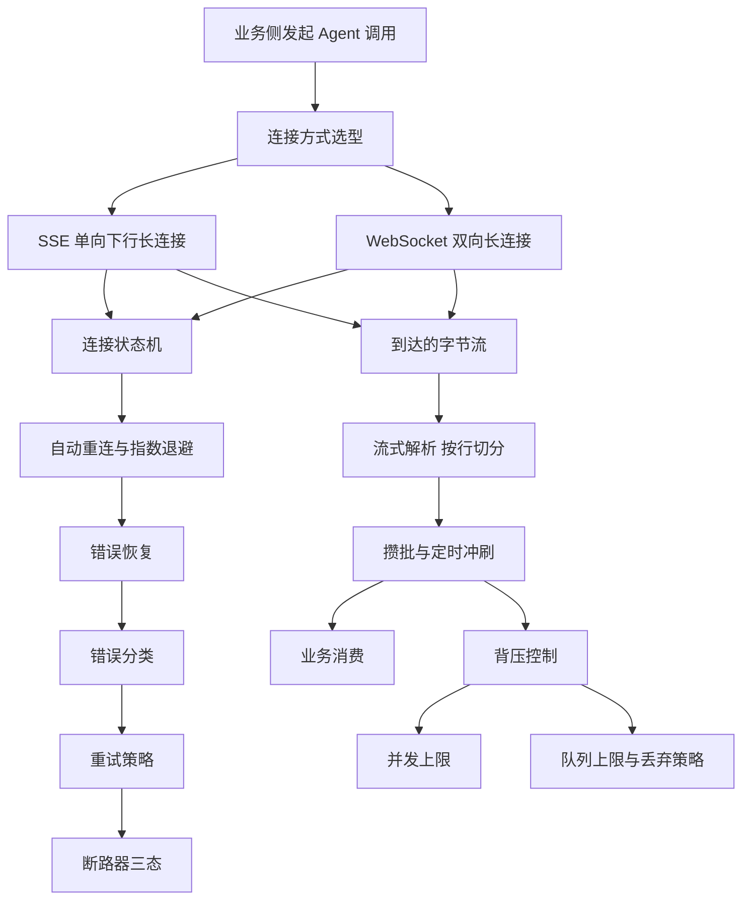
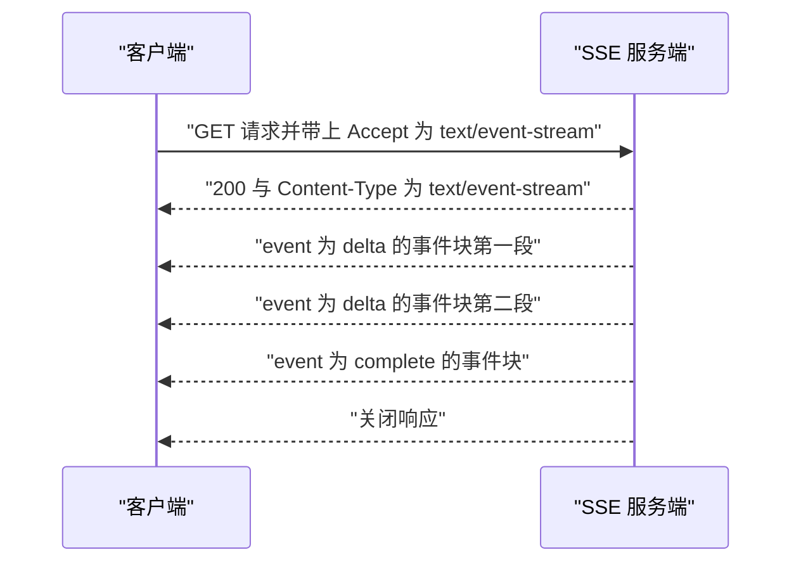
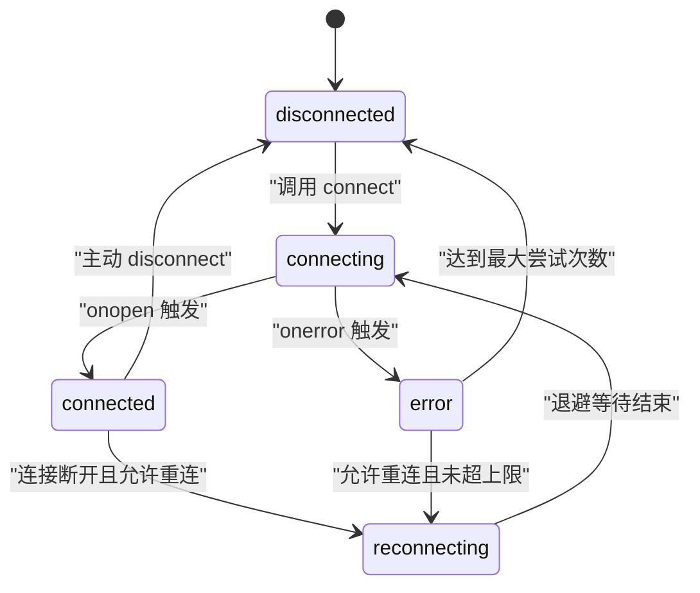
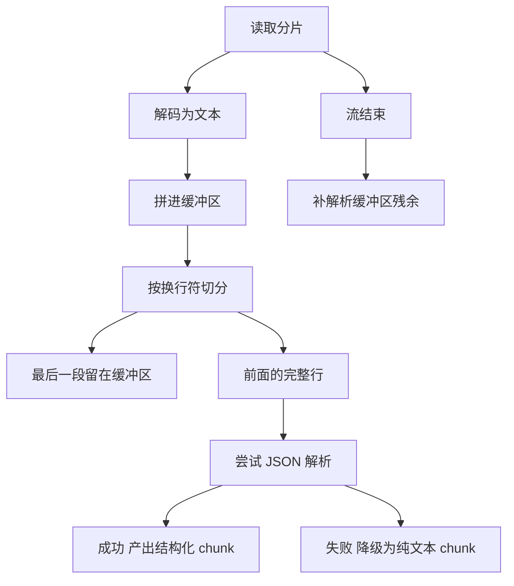
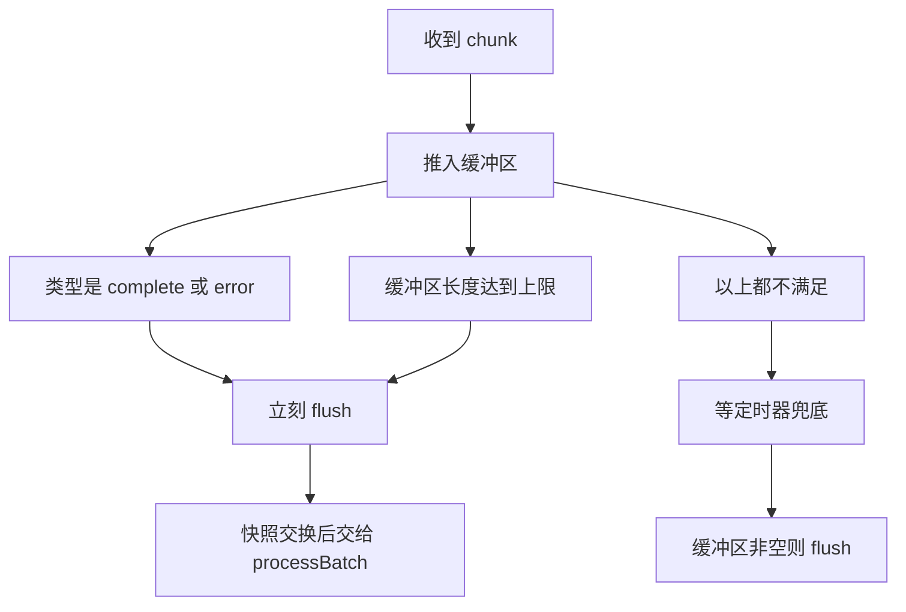
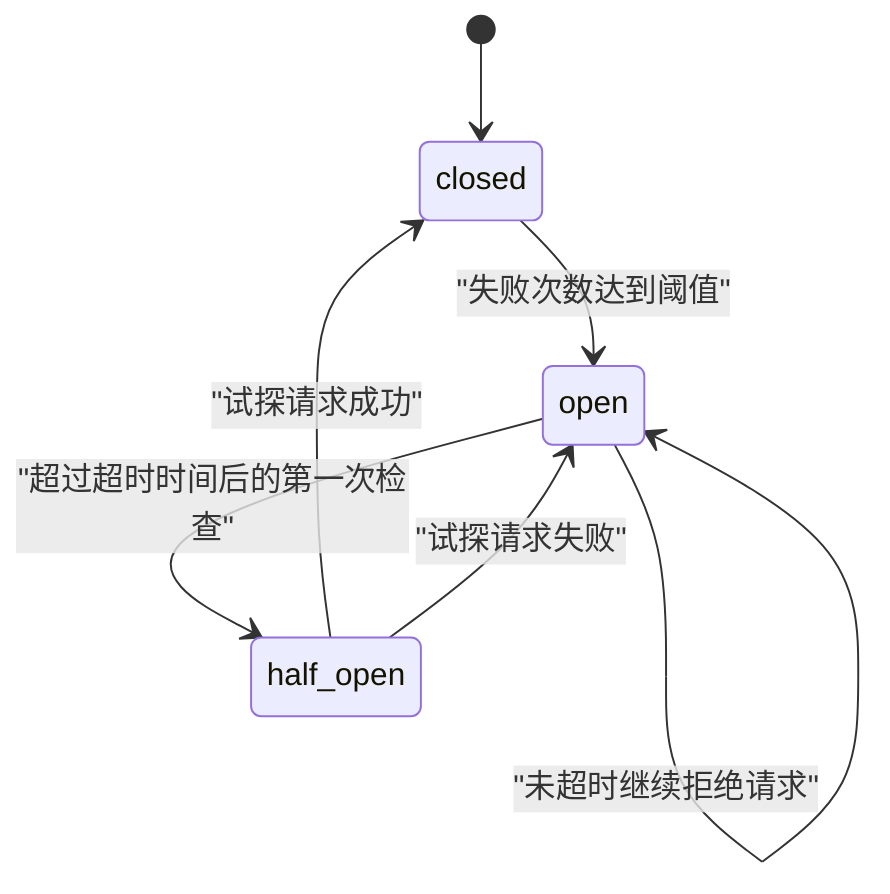
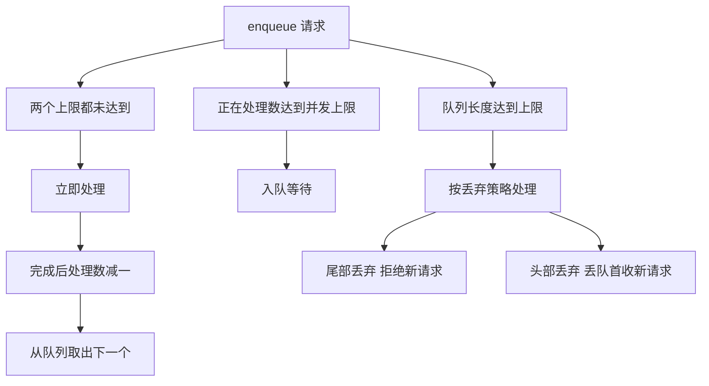
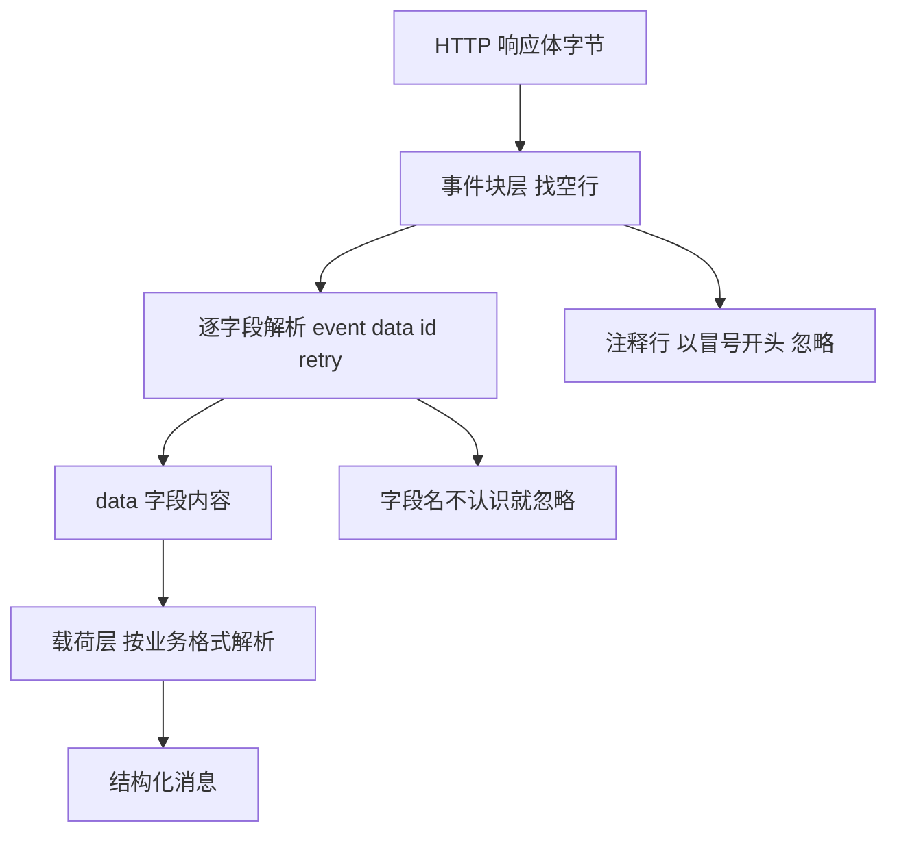
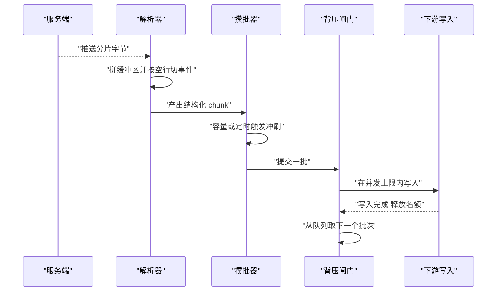

# 通信层

!!! abstract "学完这一页你能"
    - 说清 SSE 与 WebSocket 在方向、消息边界与重连责任上的差别，并为一个具体场景选出其中一条连接。
    - 写出一个解析函数，把任意切分的字节流还原成完整事件，并正确处理跨片的多字节汉字。
    - 用容量阈值加定时兜底两条路径实现攒批冲刷，并解释终止消息为什么必须立刻落地。
    - 给失败请求做错误分类、指数退避重试与断路器保护，再用并发上限和队列上限挡住过载。

## 0. 知识地图



建议从第 1 节顺着读：先把连接方式定下来，再补状态机与重连。第 3 节到第 6 节是四个可独立测试的模块，读的时候把代码复制出去跑一遍。第 7 节和第 8 节是把协议依据与工程组装补齐。

## 1. SSE 还是 WebSocket：先把连接方式定下来

**先想一个问题**：你的 Agent 要边生成边显示答案，用户期望每 200 毫秒看到新增的十几个字。客户端这一侧不需要往回发数据，你该拉哪条连接？

**心智模型**

!!! tip "心智模型"
    一句话模型：SSE 是一条只能由服务器往客户端送数据的单向长连接，WebSocket 是一条两个方向都能送数据的双向长连接。
    日常类比：SSE 等于收听一档电台节目，电台一直播，你只能听；WebSocket 等于接通的电话，两边都能说。
    类比在哪里不成立：电话挂断双方都知道，而 SSE 在浏览器里由 EventSource 自动重连，用 fetch 手写解析时重连要自己实现。

!!! note "术语：SSE"
    SSE（Server-Sent Events，服务器推送事件）：基于 HTTP 的长连接，服务器按 text/event-stream 格式持续写文本，事件之间用空行分隔。例子：`data: {"text":"你"}` 后面再写一个空行，客户端才算收到一个完整事件。

**图解**



1. 客户端发一条普通的 GET，在请求头里声明自己愿意接收事件流。
2. 服务端回 200 并把 Content-Type 设为 text/event-stream，响应头发完连接不关闭。
3. 服务端按需写事件块，每个事件块以空行收尾，客户端每收到一个完整块就触发一次处理。
4. 内容写完后服务端关闭响应，客户端读到的流进入结束状态。

**一步一步来**

第 1 步要做什么：先把 SSE 服务端写出来，确认响应头与事件块格式都正确。

```js
import { createServer } from 'node:http';
const server = createServer((req, res) => {
  res.writeHead(200, {
    'Content-Type': 'text/event-stream', // 少了它客户端会当一次性响应读完就结束
    'Cache-Control': 'no-cache'          // 让中间代理不要缓存这段响应
  });
  res.write('event: delta\n');            // 事件名，客户端可按名订阅
  res.write('data: {"text":"你"}\n\n');   // 空行才表示一个事件结束
  res.write('event: complete\n');
  res.write('data: [DONE]\n\n');
  res.end();                              // 主动结束流
});
server.listen(0);
```

**这段代码在做什么**
- writeHead 里的 Content-Type 决定客户端按事件流解析，缺了它就没有流式语义。
- Cache-Control 设为 no-cache，避免代理把整段响应缓存成一次性返回。
- 每个事件块由若干 `字段: 值` 行加一个空行组成，空行是块的分隔标记。
- event 行给事件命名，data 行承载载荷，两者顺序固定。
- res.end() 关闭响应，客户端随后读到流结束。

运行结果：服务端监听一个随机端口，响应在 end 之前一直保持打开。

第 2 步要做什么：用 fetch 读这条流，并把字节拼成完整事件。

```js
await new Promise((resolve) => {
  if (server.listening) return resolve();       // listen(0) 是异步的，可能还没就绪
  server.once('listening', resolve);            // 等到真正监听后再取端口
});
const { port } = server.address();              // 端口 0 表示由系统分配，必须回读真实端口
const url = `http://127.0.0.1:${port}/`;        // 拼出可访问的地址，url 未定义才是报错根因
const res = await fetch(url, { headers: { Accept: 'text/event-stream' } });
const reader = res.body.getReader();        // 锁住流，同一流只能有一个 reader
const decoder = new TextDecoder();
let buf = '';
const events = [];
while (true) {
  const { done, value } = await reader.read();
  if (done) break;
  buf += decoder.decode(value, { stream: true }); // 留住跨片的半个字符
  let idx;
  while ((idx = buf.indexOf('\n\n')) !== -1) {    // 空行才算一个完整事件
    events.push(buf.slice(0, idx));
    buf = buf.slice(idx + 2);
  }
}
```
**这段代码在做什么**
- res.body 是 ReadableStream，getReader() 给出按片读取的接口。
- decode 传入 `{ stream: true }`，让解码器保留跨片的半个多字节字符，等下一片补齐。
- 累加 buf 后查找空行，只有找到空行才切出一个完整事件块。
- 切走的部分从 buf 中移除，剩下的半截留给下一次 read。
- 循环到 done 为 true 结束，此时 buf 中不以空行结尾的残余需要额外处理。

运行结果：events 数组有两项，第一项以 `event: delta` 开头。

**动手验证**

```js
// 依赖：无，Node 20+ 自带全局 fetch
import { createServer } from 'node:http';
import assert from 'node:assert/strict';

const server = createServer((req, res) => {
  res.writeHead(200, { 'Content-Type': 'text/event-stream', 'Cache-Control': 'no-cache' });
  res.write('event: delta\ndata: {"text":"你"}\n\n');
  res.write('event: complete\ndata: [DONE]\n\n');
  res.end();
});
await new Promise((r) => server.listen(0, r));
const url = `http://127.0.0.1:${server.address().port}/stream`;

const res = await fetch(url, { headers: { Accept: 'text/event-stream' } });
assert.equal(res.headers.get('content-type'), 'text/event-stream');

const reader = res.body.getReader();
const decoder = new TextDecoder();
let buf = '';
const events = [];
while (true) {
  const { done, value } = await reader.read();
  if (done) break;
  buf += decoder.decode(value, { stream: true });
  let i;
  while ((i = buf.indexOf('\n\n')) !== -1) {
    events.push(buf.slice(0, i));
    buf = buf.slice(i + 2);
  }
}
assert.equal(events.length, 2);
assert.ok(events[0].startsWith('event: delta'));
assert.ok(events[1].includes('[DONE]'));
console.log('事件块数量:', events.length);
console.log('第一块:', JSON.stringify(events[0]));
server.close();
```

预期输出：

```
事件块数量: 2
第一块: "event: delta\ndata: {\"text\":\"你\"}"
```

**常见坑**

| 现象 | 原因 | 怎么修 |
|---|---|---|
| 收到 200 但没有任何事件 | 响应头缺 Content-Type 为 text/event-stream | 在 writeHead 里补上该响应头 |
| 写了事件却一个都收不到 | 事件块结尾没有空行 | 每个事件块末尾补 `\n\n` |
| 含汉字的流偶尔出现替换字符 | 每片都新建 TextDecoder，跨片字符被截断 | 复用一个 TextDecoder 并传 `{ stream: true }` |
| 客户端很久才一次性收到全部内容 | 缺少禁用缓存的响应头，被中间层攒住 | 加 Cache-Control: no-cache |

**用在哪里**

- 场景一：AI 对话产品的逐字输出。业务背景是用户提问后希望答案逐字出现；这一节的知识用来按事件块写增量文本并用 fetch 读流渲染；衡量指标是首字出现时间与单次回答的事件块数量；需要客户端在同一连接上高频回传时应改用 WebSocket。
- 场景二：后台导出任务的进度条。业务背景是导出十万行数据要显示已处理行数；这一节的知识用来按固定节奏写 progress 事件、客户端按事件名订阅；衡量指标是进度更新延迟与导出接口错误率；任务需要中途取消并回传确认时应改用 WebSocket。
- 场景三：多 Agent 协作面板。业务背景是调度 Agent 把子任务分给执行 Agent；这一节的知识用来给每个执行 Agent 建一条独立 SSE 通道并聚合状态；衡量指标是状态从产生到面板可见的延迟；子 Agent 之间需要互相直接写消息时指令方向变成双向。

**行业实践**
- MDN Web Docs 的 Server-sent events 章节给出事件流格式与 EventSource 接口定义。怎么借鉴：按该章节列出的字段行格式写服务端，不要自创分隔符。
- RFC 6455 定义的 WebSocket 协议在第 7 章讲关闭握手与关闭码。怎么借鉴：判断要不要重连时先看关闭码，旧版页面代码里用 1000 表示正常关闭，以原文为准。
- WHATWG HTML Living Standard 的 Server-sent events 章节是浏览器行为的第一手依据，其中包含自动重连相关规则；具体触发条件与字段名需核对官方文档。

**小结**
- SSE 是单向文本长连接，事件由 `字段: 值` 行加空行组成。
- 事件块缺了结尾空行，客户端永远收不到这个事件。
- 手写解析必须处理跨片残留与跨片多字节字符。

## 2. 连接状态机与自动重连

**先想一个问题**：WiFi 抖了一下，连接断了 800 毫秒又恢复。你希望客户端在 800 毫秒内自己接上，还是希望用户刷新页面？

**心智模型**

!!! tip "心智模型"
    一句话模型：把连接看成一台有五个状态的状态机，重连就是把状态从断开推回连接，推之前先等一个越来越长的闹钟。
    日常类比：打电话对方占线，你隔 1 秒重拨一次，第二次隔 2 秒，第三次隔 4 秒，一直拨到有人接。
    类比在哪里不成立：电话重拨失败次数没有上限，工程上必须设最大尝试次数，否则会一直占用资源。

!!! note "术语：指数退避"
    指数退避（Exponential Backoff）：第 n 次重试前等待的时间按底数的 n 次幂增长，并设一个上限。例子：基准 500 毫秒、封顶 8000 毫秒时，等待序列是 500、1000、2000、4000、8000、8000 毫秒。

**图解**



1. 初始状态是 disconnected，只有调用 connect 才会进入 connecting。
2. 握手成功触发 onopen，状态变成 connected，同时把重试次数清零。
3. 连接断开时进入 reconnecting，先按当前次数算出一个等待时间。
4. 等待结束后回到 connecting 重试，次数加一；达到上限后停在 disconnected。
5. 主动调用 disconnect 会清掉待触发的定时器，状态直接回到 disconnected。

**一步一步来**

第 1 步要做什么：把退避延迟抽成一个纯函数，先让它可以被单独验证。

```js
export function nextDelay(attempt, baseDelay = 500, maxDelay = 8000) {
  const raw = baseDelay * Math.pow(2, attempt); // 2 的次数幂
  return Math.min(raw, maxDelay);               // 超过上限就截断
}
```

**这段代码在做什么**
- attempt 从 0 开始，所以第一次重连等待的时间就是 baseDelay。
- Math.pow(2, attempt) 让等待时间按 2 的幂增长。
- Math.min 把结果压在上限内，避免等待时间无限拉长。
- 函数没有副作用，可以直接用断言覆盖全部边界。

运行结果：nextDelay(0) 为 500，nextDelay(4) 为 8000，nextDelay(9) 仍为 8000。

第 2 步要做什么：写一个只负责“第几次、等多久”的重连调度器。

```js
export class Reconnector {
  constructor({ maxAttempts = 5, baseDelay = 500, maxDelay = 8000, onFire, timer }) {
    this.maxAttempts = maxAttempts;
    this.baseDelay = baseDelay;
    this.maxDelay = maxDelay;
    this.onFire = onFire;
    this.timer = timer;                       // 注入定时器，测试时可换成假实现
    this.attempts = 0;
    this.pending = null;
  }
  schedule() {
    if (this.attempts >= this.maxAttempts) return null;  // 达到上限不再排期
    const delay = nextDelay(this.attempts, this.baseDelay, this.maxDelay);
    this.pending = this.timer.setTimeout(() => {
      this.attempts += 1;                    // 自增放在触发时，等待时间用自增前的值
      this.pending = null;
      this.onFire(this.attempts);
    }, delay);
    return delay;
  }
  reset() {                                  // 一次成功后必须清零
    if (this.pending) this.timer.clearTimeout(this.pending);
    this.pending = null;
    this.attempts = 0;
  }
}
```

**这段代码在做什么**
- schedule 先检查是否达到最大尝试次数，达到就返回 null。
- 等待时间用自增前的次数计算，所以第一次重连等待 baseDelay。
- 定时器通过构造参数注入，测试可以换成不真实等待的实现。
- attempts 只在定时器真正触发时自增，避免“排期了就算一次”的误判。
- reset 同时清定时器并把次数归零，防止旧定时器把状态拱回去。

运行结果：连续调用 schedule 得到的延迟依次是 500、1000、2000、4000、8000，超出 maxAttempts 后返回 null。

**动手验证**

```js
// 依赖：无，Node 20+
import assert from 'node:assert/strict';

function nextDelay(attempt, baseDelay = 500, maxDelay = 8000) {
  return Math.min(baseDelay * Math.pow(2, attempt), maxDelay);
}

const fakeTimer = {
  queue: [],
  setTimeout(fn, ms) { this.queue.push({ fn, ms }); return this.queue.length - 1; },
  clearTimeout(id) { if (this.queue[id]) this.queue[id].dead = true; }
};

class Reconnector {
  constructor({ maxAttempts = 5, timer }) {
    this.maxAttempts = maxAttempts;
    this.timer = timer;
    this.attempts = 0;
    this.fired = [];
  }
  schedule() {
    if (this.attempts >= this.maxAttempts) return null;
    const delay = nextDelay(this.attempts);
    this.timer.setTimeout(() => {
      this.attempts += 1;
      this.fired.push(this.attempts);
    }, delay);
    return delay;
  }
  reset() { this.attempts = 0; }
}

assert.deepEqual(
  [0, 1, 2, 3, 4, 5, 9].map((n) => nextDelay(n)),
  [500, 1000, 2000, 4000, 8000, 8000, 8000]
);

const rc = new Reconnector({ maxAttempts: 3, timer: fakeTimer });
assert.equal(rc.schedule(), 500);
assert.equal(rc.schedule(), 1000);
assert.equal(rc.schedule(), 2000);
assert.equal(rc.schedule(), null);          // 第 3 次已排期，第 4 次拒绝
fakeTimer.queue.filter((t) => !t.dead).forEach((t) => t.fn());
assert.deepEqual(rc.fired, [1, 2, 3]);
rc.reset();
assert.equal(rc.attempts, 0);
console.log('退避序列验证通过，触发次数:', rc.fired.length);
```

预期输出：

```
退避序列验证通过，触发次数: 3
```

**常见坑**

| 现象 | 原因 | 怎么修 |
|---|---|---|
| 重连风暴把服务端打满 | 断线后立即重连且没有上限 | 引入指数退避并设置最大尝试次数 |
| 重连成功后又立刻断一次 | 成功连接时没有把次数清零 | onopen 时调用 reset |
| 页面卸载后控制台仍在报错 | 待触发的定时器没有清除 | disconnect 时 clearTimeout |
| 等待时间超过预期上限 | 只用了 2 的幂，没有封顶 | 用 Math.min 截断到 maxDelay |

**用在哪里**

- 场景一：移动端网页的实时通知。业务背景是用户切到后台再切回来，连接可能已断；这一节的知识用来在可见性变化时重置退避并立即重连一次；衡量指标是恢复连接所需时间；服务端明确要求长间隔轮询时不适用。
- 场景二：客服工作台的会话列表。业务背景是坐席网络抖动频繁；这一节的知识用来给状态机加 UI 指示器，让坐席知道连接正在重连；衡量指标是断线到恢复的时长分布；需要强一致状态时应改为重连后主动拉全量。
- 场景三：Agent 长任务的进度订阅。业务背景是任务可能跑十几分钟；这一节的知识用来在长时间无事件时主动断开来一次重连，避免半开连接；衡量指标是任务完成事件丢失率；任务结果可离线查询时不必做重连。

**行业实践**
- RFC 6455 第 7 章定义关闭握手与关闭码，旧版页面代码用 `event.code !== 1000` 决定是否重连，以原文为准。怎么借鉴：把“正常关闭不重连”作为默认规则写进状态机。
- Socket.IO 官方文档的重连章节描述了客户端重连的配置项（如重连尝试次数与延迟）。怎么借鉴：把重连参数做成配置项而不是写死在代码里。
- WHATWG HTML Living Standard 的 Server-sent events 章节包含浏览器自动重连的相关规则；具体字段与重连间隔算法需核对官方文档。

**小结**
- 连接是一台五状态的状态机，重连是其中一条迁移路径。
- 退避用 2 的幂增长并封顶，成功连接后必须把次数清零。
- 定时器句柄要保存下来，主动断开时必须清掉。

## 3. 流式处理：从字节到消息

**先想一个问题**：服务端一次写了 3 条 JSON 行，但网络把它们切成了 5 片，其中一片正好把汉字“你”切成两半。你的解析函数能还原出 3 条吗？

**心智模型**

!!! tip "心智模型"
    一句话模型：解析器只做两件事，先把收到的片拼进缓冲区，再按换行符切出完整行，最后一行不完整的留到下一轮。
    日常类比：这等于倒水时用一个筛子，只有整块的碎冰才落下去，粘在筛边上的那半块等下一次倒水时一起过去。
    类比在哪里不成立：筛子会丢东西，缓冲区不能丢，流结束时缓冲区里剩的那一行也必须解析出来。

!!! note "术语：NDJSON"
    NDJSON（Newline Delimited JSON，换行分隔 JSON）：每一行是一个独立完整 JSON，行之间用换行符分隔。例子：`{"type":"delta"}` 与 `{"type":"complete"}` 各占一行。

**图解**



1. 每到一片字节，先用同一个解码器转成文本。
2. 文本拼进缓冲区，缓冲区代表“还没凑成整行的内容”。
3. 按换行符切分后，数组最后一段是不完整的，重新放回缓冲区。
4. 前面每一行尝试 JSON 解析，成功就产出结构化数据。
5. 解析失败的行不丢弃，降级为纯文本块继续产出。
6. 流结束时缓冲区可能还留在最后一行，必须补一次解析。

**一步一步来**

第 1 步要做什么：实现跨片拼接与切行，保证不丢字符也不重复。

```js
export function splitLines(state, text) {
  state.buffer += text;                  // 先拼上本次解码出的文本
  const lines = state.buffer.split('\n');
  state.buffer = lines.pop();            // 最后一段可能不完整，留到下一轮
  return lines;                          // 前面的行都是完整的
}
```

**这段代码在做什么**
- state.buffer 保存跨片残留，初始值必须是空字符串。
- 先拼接再切分，保证被切断的行能还原。
- lines.pop() 取出最后一段放回缓冲区，它是下一次拼接的起点。
- 返回的数组里每一行都已经以换行符结尾，可以安全解析。

运行结果：传入两片文本 `{"a":1}` 和 `\n{"b":2}\n`，第一片返回空数组，第二片返回两行。

第 2 步要做什么：把一行文本变成结构化 chunk，并给解析失败留退路。

```js
export function parseLine(line) {
  if (!line.trim()) return null;         // 空行跳过
  try {
    const data = JSON.parse(line);
    return {
      type: data.type || 'text',           // 缺省类型是 text
      data: data.content || data,          // 有 content 取 content，否则整体透传
      timestamp: Date.now()
    };
  } catch {
    return { type: 'text', data: line, timestamp: Date.now() }; // 非 JSON 行不丢
  }
}
```

**这段代码在做什么**
- 空行或纯空白直接返回 null，调用方据此过滤。
- JSON 解析成功时按协议字段取类型与载荷。
- `data.type || 'text'` 用逻辑或兜底，空字符串类型会被替换。
- 解析失败走 catch 分支，把原始行当文本块产出，保证内容不丢。
- timestamp 用解析时刻，是本地近似值而不是服务端生产时刻。

运行结果：输入 `{"type":"delta","content":"你好"}` 得到 `{ type: 'delta', data: '你好' }`；输入 `not json` 得到 `{ type: 'text', data: 'not json' }`。

**动手验证**

```js
// 依赖：无，Node 20+
import assert from 'node:assert/strict';

function splitLines(state, text) {
  state.buffer += text;
  const lines = state.buffer.split('\n');
  state.buffer = lines.pop();
  return lines;
}

function parseLine(line) {
  if (!line.trim()) return null;
  try {
    const data = JSON.parse(line);
    return { type: data.type || 'text', data: data.content || data };
  } catch {
    return { type: 'text', data: line };
  }
}

const enc = new TextEncoder();
const raw = '{"type":"delta","content":"你好"}\n{"type":"complete","content":"[DONE]"}\n';
const bytes = enc.encode(raw);
// 故意把切片边界落在第一个汉字的 3 个字节中间
const pieces = [bytes.slice(0, 28), bytes.slice(28, 33), bytes.slice(33)];
// 第一行共 36 字节，其中「你」位于字节 27、28、29；切片 0..28 只含「你」的首字节，
// 第二片 28..33 补齐「你」的剩余 2 字节与「好」的 3 字节，共 5 字节，
// 剩下 75 - 33 = 42 字节归第三片，所以长度是 28,5,42。
assert.equal(pieces.map((p) => p.length).join(','), '28,5,42');

const decoder = new TextDecoder();
const state = { buffer: '' };
const chunks = [];
for (const piece of pieces) {
  const text = decoder.decode(piece, { stream: true });
  for (const line of splitLines(state, text)) {
    const chunk = parseLine(line);
    if (chunk) chunks.push(chunk);
  }
}
assert.equal(chunks.length, 2);
assert.equal(chunks[0].type, 'delta');
assert.equal(chunks[0].data, '你好');
assert.equal(chunks[1].data, '[DONE]');
assert.ok(!JSON.stringify(chunks).includes('\uFFFD'), '不应出现替换字符');
console.log('chunk 数量:', chunks.length, '首个内容:', chunks[0].data);
```
预期输出：

```
chunk 数量: 2 首个内容: 你好
```

**常见坑**

| 现象 | 原因 | 怎么修 |
|---|---|---|
| 汉字位置出现方块或问号 | 每个分片都新建 TextDecoder | 复用一个解码器并传 `{ stream: true }` |
| 两条消息粘成一条 | 用最后一段当完整行处理 | 切分后把最后一段放回缓冲区 |
| 流末尾的内容丢了 | 结束时没有处理缓冲区残余 | 读到 done 后补解析缓冲区 |
| 一条日志行导致整条流中断 | JSON 解析失败直接抛出 | 失败时降级为文本块继续产出 |

**用在哪里**

- 场景一：Agent 输出日志的实时展示。业务背景是模型边想边写，前端要逐段渲染；这一节的知识用来把分片的字节还原成结构化 chunk 再交给渲染层；衡量指标是首段渲染延迟与解析失败率；一次性返回结果时不需要流式解析。
- 场景二：日志采集客户端的行协议。业务背景是采集端按行读容器日志；这一节的知识用来处理被切断的行与混入的非 JSON 行；衡量指标是单行丢失数量；日志本身是二进制时不能用按行切分。
- 场景三：表单批量导入的进度推送。业务背景是一次导入上万行要显示处理到第几行；这一节的知识用来把每行结果转成 chunk 并统计成功与失败数量；衡量指标是进度与最终结果的一致性；导入任务可以用轮询接口查询时不必建立流。

**行业实践**
- WHATWG Streams Standard 的 Readable streams 章节定义了 getReader、read 返回值的结构与背压语义。怎么借鉴：客户端消费流时按规范处理 done 与 value 两个字段，不要假设每次 read 都返回完整数据。
- MDN Web Docs 的 TextDecoder 页面说明 `{ stream: true }` 的作用与使用时机。怎么借鉴：所有跨片解码场景都复用一个解码器实例。
- Node.js 官方文档的 Stream 章节描述可读流的数据事件与背压方法；具体方法名与返回值需核对官方文档。

**小结**
- 切分只认换行符，最后一段不完整必须留在缓冲区。
- 解码器要复用并开启流模式，跨片汉字才不会被截断。
- 解析失败要降级不能中断，否则一行脏数据会毁掉整条流。

## 4. 攒批与定时冲刷

**先想一个问题**：模型每秒产出 200 个字符块，如果每块都写一次数据库，一秒就是 200 次写。能不能攒到一定数量再一次写？

**心智模型**

!!! tip "心智模型"
    一句话模型：缓冲区有两个出口，攒够数量就走容量出口，攒不够就等定时器走时间出口。
    日常类比：洗衣机攒够一桶衣服就洗，攒不满就到固定时间也洗一次，避免衣服一直泡在水里。
    类比在哪里不成立：洗衣机可以等，流式数据里的结束信号不能等，收到终止消息必须立刻冲刷。

!!! note "术语：攒批"
    攒批（Batching）：把短时间内产生的小数据累积成一个批次，在满足条件时一次提交。例子：站内旧版页面代码里 maxBufferSize 默认 100、flushInterval 默认 100 毫秒，两者任一满足就提交，以原文为准。

**图解**



1. 每个 chunk 先进入缓冲区，这是唯一的入口。
2. 终止类消息优先，收到 complete 或 error 立刻冲刷。
3. 否则检查缓冲区长度是否达到上限，达到就冲刷。
4. 两条都不满足时什么都不做，交给定时器兜底。
5. 定时器只在缓冲区非空时冲刷，避免空批次。
6. 冲刷时先取快照再把缓冲区置空，处理期间新到的数据落进新缓冲区。

**一步一步来**

第 1 步要做什么：实现 process 的三分支判定，明确谁优先。

```js
export function classifyTrigger(bufferLength, maxBufferSize, chunkType) {
  if (chunkType === 'complete' || chunkType === 'error') return 'terminal'; // 终止优先
  if (bufferLength >= maxBufferSize) return 'capacity';                     // >= 兼容跨过阈值
  return 'timer';                                                          // 其余等兜底
}
```

**这段代码在做什么**
- 终止类型排在最前，保证结束语义不被容量条件改变。
- 容量判定用 `>=` 而不是 `===`，并发入队一次跨过阈值也能触发。
- 返回字符串而不是直接执行，方便单独测试三条分支。
- 兜底返回值表示本次不做任何处理，由定时器负责。

运行结果：传入 (99, 100, 'text') 得到 timer，(100, 100, 'text') 得到 capacity，(1, 100, 'complete') 得到 terminal。

第 2 步要做什么：实现冲刷时的快照交换，避免处理期间丢数据。

```js
export function takeBatch(state) {
  if (state.buffer.length === 0) return null; // 空批次不提交
  const batch = [...state.buffer];             // 先做快照
  state.buffer = [];                           // 再整体置空
  return batch;                                // await 期间新数据进新数组
}
```

**这段代码在做什么**
- 空缓冲区直接返回 null，避免无意义的批处理调用。
- 展开运算符复制出一份快照，批处理函数拿到的是独立数组。
- 置空操作紧跟在快照之后，中间没有 await，不会插入其他任务。
- 处理过程中新到的 chunk 进入新的缓冲区，不会被这一批吞掉。
- 快照与置空的顺序反过来就会丢数据，这是本节最关键的顺序。

运行结果：缓冲区有 3 条时返回长度 3 的数组，原缓冲区变空。

**动手验证**

```js
// 依赖：无，Node 20+
import assert from 'node:assert/strict';

class StreamProcessor {
  constructor({ maxBufferSize = 100, flushInterval = 100 } = {}) {
    this.buffer = [];
    this.maxBufferSize = maxBufferSize;
    this.flushInterval = flushInterval;
    this.batches = [];
    this.timer = setInterval(() => {
      if (this.buffer.length > 0) this.flush();  // 定时兜底，非空才刷
    }, this.flushInterval);
  }
  process(chunk) {
    this.buffer.push(chunk);
    if (chunk.type === 'complete' || chunk.type === 'error') return this.flush();
    if (this.buffer.length >= this.maxBufferSize) return this.flush();
  }
  flush() {
    if (this.buffer.length === 0) return;
    const batch = [...this.buffer];
    this.buffer = [];
    this.batches.push(batch);
  }
  destroy() { clearInterval(this.timer); }
}

const sp = new StreamProcessor({ maxBufferSize: 3, flushInterval: 20 });
sp.process({ type: 'text', data: 'a' });
sp.process({ type: 'text', data: 'b' });
assert.equal(sp.batches.length, 0, '未达阈值不应冲刷');
sp.process({ type: 'text', data: 'c' });
assert.equal(sp.batches.length, 1, '达到 3 条应触发容量冲刷');
assert.equal(sp.batches[0].length, 3);

sp.process({ type: 'text', data: 'd' });
assert.equal(sp.batches.length, 1);
await new Promise((r) => setTimeout(r, 60));
assert.equal(sp.batches.length, 2, '定时器应兜底冲刷');
assert.equal(sp.batches[1][0].data, 'd');

sp.process({ type: 'complete', data: '' });
assert.equal(sp.batches.length, 3, '终止信号应立刻落地');
assert.equal(sp.batches[2][0].type, 'complete');

sp.destroy();
await new Promise((r) => setTimeout(r, 60));
assert.equal(sp.batches.length, 3, 'destroy 后定时器不应再触发');
console.log('批次数:', sp.batches.length, '最后一批类型:', sp.batches[2][0].type);
```

预期输出：

```
批次数: 3 最后一批类型: complete
```

**常见坑**

| 现象 | 原因 | 怎么修 |
|---|---|---|
| 传 0 的配置被当成没传 | 用 `||` 取值，0 会被替换为默认值 | 用 `??` 或显式判断 undefined |
| 批处理报错后这批数据消失 | 快照已从缓冲区移出，异常没有重试 | 批处理失败时把快照放回队首或写入重试队列 |
| 定时冲刷偶发重叠执行 | setInterval 回调是异步的，不会等待上一次 | 加一个 flushing 标志，跳过重叠调用 |
| 进程退出前有数据没落库 | destroy 只清定时器，不冲刷残留缓冲区 | destroy 里先 flush 再 clearInterval |

**用在哪里**

- 场景一：Agent 会话消息落库。业务背景是每轮对话产生多条增量消息；这一节的知识用来把增量攒成一批写入，减少写次数；衡量指标是单位时间内写入次数与落库延迟；要求消息逐条可见时不能攒批。
- 场景二：监控指标上报。业务背景是前端每秒产生多次埋点；这一节的知识用来按容量与时间双条件提交；衡量指标是上报请求数与数据完整率；页面卸载前必须补一次同步冲刷。
- 场景三：批量导入的中间结果缓存。业务背景是导入十万行的中间状态要写缓存；这一节的知识用来把中间结果按批写入；衡量指标是缓存写入耗时与丢失条数；中途失败需要逐行重试时不适合攒批。

**行业实践**
- Node.js 官方文档的 Stream 章节描述 writable 流的缓冲与背压行为。怎么借鉴：把这里的缓冲区容量与 Node 流的 highWaterMark 概念对齐思考，不要两处各设一套互不知情的上限。
- Google 的 gRPC 官方文档描述 HTTP/2 的流控与消息分帧。怎么借鉴：批量大小与提交间隔要做成可配置项，便于按链路实测调整。
- OpenTelemetry 官方文档的 Batch Span Processor 章节描述了按最大批量与定时间隔导出的做法。怎么借鉴：照它的两条触发条件设计自己的冲刷逻辑；具体默认值需核对官方文档。

**小结**
- 冲刷有容量与时间两个出口，终止消息拥有最高优先级。
- 冲刷必须“先快照、后置空”，顺序反了会丢数据。
- destroy 要负责把残留缓冲区处理掉，而不只是清定时器。

## 5. 错误恢复：分类、退避、断路器

**先想一个问题**：下游服务整片挂了 30 秒，你的重试策略每次失败都再试 3 次。这 30 秒里你发出去了多少条注定失败的请求？

**心智模型**

!!! tip "心智模型"
    一句话模型：先按错误信息决定用哪种重试策略，再由断路器决定“现在还要不要发请求”。
    日常类比：家门口的保险丝，短路次数多了就跳闸，过一阵子你试推一次，推得住就恢复，推不住继续跳。
    类比在哪里不成立：保险丝只有开和关，代码里的断路器有第三个半开状态，用于放行一次试探。

!!! note "术语：断路器"
    断路器（Circuit Breaker）：一种防止持续发送注定失败请求的保护装置，在闭合、打开、半开三个状态之间迁移。例子：站内旧版页面代码里失败次数达到 threshold 就进入打开状态，超过 timeout 毫秒后下一次检查会切到半开，以原文为准。

**图解**



1. 初始状态是闭合，所有请求正常放行。
2. 连续失败累计到阈值后进入打开状态。
3. 打开状态下所有请求被直接拒绝，不再打到下游。
4. 距离最后一次失败超过超时时间后，第一次检查会把状态切到半开并放行。
5. 半开状态下试探成功就回到闭合并把失败计数清零，失败则重新回到打开。

**一步一步来**

第 1 步要做什么：把错误按可恢复性分类，不同类别走不同策略。

```js
export function classifyError(message) {
  if (message.includes('timeout')) return 'timeout';                        // 超时可重试
  if (message.includes('network')) return 'network';                        // 网络类可重试
  if (message.includes('401') || message.includes('403')) return 'auth';     // 鉴权失败重试无用
  if (message.includes('500') || message.includes('502')) return 'server';   // 服务端错误可重试
  return 'unknown';
}
```

**这段代码在做什么**
- 用错误信息里的关键片段做粗分类，这是文本匹配而不是错误码判断。
- 鉴权类单独成类，旧版页面对它没有配置重试策略。
- 服务端错误与超时、网络错误分成三类，便于分别设置重试上限。
- 无法归类时返回 unknown，调用方拿到后应放弃恢复并上报。
- 这种分类依赖错误信息的写法，稳定做法是核对官方文档后改用错误码。

运行结果：输入 `HTTP 401` 得到 auth，输入 `request timeout` 得到 timeout。

第 2 步要做什么：实现断路器的三态迁移，并把时间源做成可注入的。

```js
export class CircuitBreaker {
  constructor({ threshold = 5, timeout = 30000, now = Date.now }) {
    this.threshold = threshold;                     // 触发打开的失败次数
    this.timeout = timeout;                         // 打开状态保持多久
    this.now = now;                                 // 注入时间源，便于测试
    this.failures = 0;
    this.lastFailureTime = 0;
    this.state = 'closed';
  }
  recordFailure() {
    this.failures += 1;
    this.lastFailureTime = this.now();
    if (this.failures >= this.threshold) this.state = 'open';
  }
  recordSuccess() { this.failures = 0; this.state = 'closed'; }
  isOpen() {
    if (this.state !== 'open') return false;
    if (this.now() - this.lastFailureTime > this.timeout) {
      this.state = 'half_open';                     // 注意这里带副作用
      return false;
    }
    return true;
  }
}
```

**这段代码在做什么**
- 三个字段共同决定状态：失败计数、最后一次失败时间、当前状态。
- recordFailure 在达到阈值时把状态推到打开。
- recordSuccess 同时清零计数并回到闭合，两个动作必须成对。
- isOpen 在超时后把状态改成半开并返回 false，表示这次放行。
- 时间源可注入，测试里换成递增的假时钟就不用真的等 30 秒。
- isOpen 带副作用，名字读起来像查询但会改状态，这是它容易被误用的地方。

运行结果：阈值 3、超时 1000 毫秒时，第 3 次失败后 state 为 open；把假时钟推进 1001 毫秒后再查，state 变为 half_open。

**动手验证**

```js
// 依赖：无，Node 20+
import assert from 'node:assert/strict';

function classifyError(message) {
  if (message.includes('timeout')) return 'timeout';
  if (message.includes('network')) return 'network';
  if (message.includes('401') || message.includes('403')) return 'auth';
  if (message.includes('500') || message.includes('502')) return 'server';
  return 'unknown';
}

class CircuitBreaker {
  constructor({ threshold = 5, timeout = 30000, now = Date.now }) {
    this.threshold = threshold;
    this.timeout = timeout;
    this.now = now;
    this.failures = 0;
    this.lastFailureTime = 0;
    this.state = 'closed';
  }
  recordFailure() {
    this.failures += 1;
    this.lastFailureTime = this.now();
    if (this.failures >= this.threshold) this.state = 'open';
  }
  recordSuccess() { this.failures = 0; this.state = 'closed'; }
  isOpen() {
    if (this.state !== 'open') return false;
    if (this.now() - this.lastFailureTime > this.timeout) {
      this.state = 'half_open';
      return false;
    }
    return true;
  }
}

assert.equal(classifyError('request timeout'), 'timeout');
assert.equal(classifyError('network unreachable'), 'network');
assert.equal(classifyError('HTTP 401'), 'auth');
assert.equal(classifyError('HTTP 502'), 'server');
assert.equal(classifyError('boom'), 'unknown');

function nextRetryDelay(attempt) { return Math.pow(2, attempt) * 100; }
assert.deepEqual([1, 2, 3].map(nextRetryDelay), [200, 400, 800]);

let fakeNow = 0;
const cb = new CircuitBreaker({ threshold: 3, timeout: 1000, now: () => fakeNow });
assert.equal(cb.isOpen(), false);
cb.recordFailure();
cb.recordFailure();
assert.equal(cb.state, 'closed', '未达阈值不应打开');
cb.recordFailure();
assert.equal(cb.state, 'open');
assert.equal(cb.isOpen(), true, '打开状态应拒绝请求');
fakeNow = 1001;
assert.equal(cb.isOpen(), false, '超时后应放行一次');
assert.equal(cb.state, 'half_open');
cb.recordSuccess();
assert.equal(cb.state, 'closed');
assert.equal(cb.failures, 0);
console.log('错误分类与断路器三态验证通过，当前状态:', cb.state);
```

预期输出：

```
错误分类与断路器三态验证通过，当前状态: closed
```

**常见坑**

| 现象 | 原因 | 怎么修 |
|---|---|---|
| 鉴权失败被反复重试 | 401 与 403 没有单独分类 | 把鉴权错误归为不可重试并触发重新登录 |
| 重试把下游彻底压垮 | 重试次数没有上限，也没有断路器 | 设最大尝试次数，失败累计到阈值就打开断路器 |
| 断路器打开后永远不恢复 | 没有半开状态，打开后没人去试 | 超时后放行一次试探，成功即回到闭合 |
| 测试要等 30 秒才跑得完 | 时间源写死成 Date.now | 把 now 做成构造参数注入 |

**用在哪里**

- 场景一：Agent 调用外部工具的链路。业务背景是搜索工具偶发超时；这一节的知识用来对超时做退避重试、对鉴权错误直接失败；衡量指标是工具调用成功率与平均重试次数；工具调用有副作用时不能盲目重试。
- 场景二：聚合多个模型供应商的网关。业务背景是某家供应商整片不可用；这一节的知识用来给每家供应商挂一个独立断路器；衡量指标是请求失败率与故障期间发出的请求数；只有一家供应商时断路器只会把请求全部拒掉。
- 场景三：第三方登录回调。业务背景是回调接口在高并发下偶发 502；这一节的知识用来对 502 做有限次重试并在连续失败后熔断；衡量指标是登录成功率；用户交互链路里长退避会拖长等待时间。

**行业实践**
- Netflix Hystrix wiki 的 Circuit Breaker 页面公开描述了断路器的闭合、打开、半开三态以及失败统计思路。怎么借鉴：把状态迁移与业务重试分开实现，便于分别测试。
- Envoy 官方文档的 Circuit breaking 章节把上游并发连接数与挂起请求队列作为可配置的上限。怎么借鉴：给每个下游单独配置上限，而不是全局设一个值；具体字段名需核对官方文档。
- Google SRE Book 中关于处理连锁故障的章节讨论了重试放大与退避的必要性。怎么借鉴：重试必须叠加随机抖动，避免多个客户端在同一毫秒同时重试；具体抖动参数需核对官方文档。

**小结**
- 错误先分类再处理，鉴权类错误重试没有意义。
- 退避只解决节奏问题，断路器解决“还要不要发”的问题。
- 断路器的时间源要可注入，否则测试代价很高。

## 6. 背压控制：并发上限与丢弃策略

**先想一个问题**：一次批量导入提交了 500 个任务，每个任务内部还要请求下游。如果 500 个请求同时打出去，下游会先挂还是你的服务会先挂？

**心智模型**

!!! tip "心智模型"
    一句话模型：正在处理的数量有上限，排队等待的数量也有上限，两个上限都满了就必须丢东西。
    日常类比：超市只开两个收银台，队伍最多排一个人，再来顾客就只能劝走。
    类比在哪里不成立：劝走的顾客可以下次再来，请求被丢弃可能意味着数据丢失，所以丢谁必须按策略决定。

!!! note "术语：背压"
    背压（Backpressure）：当下游处理不过来时，上游主动减速或拒绝，防止数据在下游堆积。例子：站内旧版页面代码里 maxConcurrent 默认 10、maxQueueSize 默认 100，以原文为准。

**图解**



1. 请求进入时先看队列长度是否达到上限。
2. 达到队列上限就走丢弃策略，本次请求不一定被接受。
3. 队列没满但正在处理的数量达到并发上限时，请求入队等待。
4. 两个条件都不满足时立刻开始处理。
5. 每个请求结束时把处理数减一，并尝试从队列取下一个。
6. 丢弃策略决定是拒绝新请求还是挤掉队列里已有的请求。

**一步一步来**

第 1 步要做什么：实现并发闸门，把“正在处理”和“排队等待”分开计数。

```js
export function admit(state, { maxConcurrent, maxQueueSize }) {
  if (state.queue.length >= maxQueueSize) return 'overflow';     // 队列满了
  if (state.processing >= maxConcurrent) return 'queued';        // 排队等待
  return 'run';                                                  // 直接执行
}
```

**这段代码在做什么**
- 先判断队列上限，再判断并发上限，顺序决定溢出时走的路径。
- 返回字符串描述去向，调用方据此决定是执行、入队还是丢弃。
- state 里只有 queue 与 processing 两个字段，状态清晰。
- 队列长度用 `>=` 判断，等于上限时就视为满。
- 这个函数不修改状态，便于单独验证三种去向。

运行结果：队列长度 1、上限 1 时返回 overflow；处理数 2、并发上限 2 时返回 queued。

第 2 步要做什么：实现溢出时的丢弃策略，把四种策略的差别写清楚。

```js
export function handleOverflow(state, request, policy) {
  if (policy === 'tail_drop') return false;                 // 拒绝新请求
  if (policy === 'head_drop') {                             // 丢队首，收新请求
    state.queue.shift();
    state.queue.push(request);
    return true;
  }
  if (policy === 'random_drop') {
    if (Math.random() < 0.1) return false;                  // 按概率拒绝
    state.queue.push(request);
    return true;
  }
  return false;
}
```

**这段代码在做什么**
- tail_drop 最保守，新请求被拒绝，队列里的老请求不受影响。
- head_drop 保住新请求，代价是丢弃排队最久的那个。
- random_drop 用随机数决定去留，旧版页面代码里的阈值是 0.1，以原文为准。
- 不认识的策略一律拒绝，避免悄悄放行。
- 优先级丢弃在旧版页面里还有一条按 priority 比较的分支，这里省略未实现。

运行结果：tail_drop 返回 false；head_drop 执行后队列长度不变，队首换成新请求。

**动手验证**

```js
// 依赖：无，Node 20+
import assert from 'node:assert/strict';

const sleep = (ms) => new Promise((r) => setTimeout(r, ms));

class BackpressureController {
  constructor({ maxConcurrent = 10, maxQueueSize = 100, dropPolicy = 'tail_drop' } = {}) {
    this.maxConcurrent = maxConcurrent;
    this.maxQueueSize = maxQueueSize;
    this.dropPolicy = dropPolicy;
    this.queue = [];
    this.processing = 0;
    this.peak = 0;
  }
  enqueue(handler, priority = 0) {
    if (this.queue.length >= this.maxQueueSize) return this.handleOverflow(handler, priority);
    if (this.processing >= this.maxConcurrent) {
      this.queue.push({ handler, priority });
      return true;
    }
    this.process({ handler, priority });
    return true;
  }
  handleOverflow(handler, priority) {
    if (this.dropPolicy === 'tail_drop') return false;
    if (this.dropPolicy === 'head_drop') {
      this.queue.shift();
      this.queue.push({ handler, priority });
      return true;
    }
    return false;
  }
  async process(req) {
    this.processing += 1;
    this.peak = Math.max(this.peak, this.processing);
    try {
      await req.handler();
    } finally {
      this.processing -= 1;
      this.processNext();
    }
  }
  processNext() {
    if (this.queue.length > 0 && this.processing < this.maxConcurrent) {
      this.process(this.queue.shift());
    }
  }
}

const ctrl = new BackpressureController({ maxConcurrent: 2, maxQueueSize: 1, dropPolicy: 'tail_drop' });
const accepted = [];
for (let i = 0; i < 6; i++) {
  accepted.push(ctrl.enqueue(async () => { await sleep(20); }, 0));
}
assert.equal(ctrl.peak, 2, '并发峰值不应超过上限');
assert.equal(accepted.filter(Boolean).length, 3, '接受 2 个直接执行加 1 个排队');
assert.equal(accepted.filter((x) => x === false).length, 3, '其余 3 个被尾部丢弃');
await sleep(120);
assert.equal(ctrl.processing, 0, '全部执行完毕');
assert.equal(ctrl.queue.length, 0, '队列应清空');
console.log('并发峰值:', ctrl.peak, '接受:', accepted.filter(Boolean).length, '拒绝:', accepted.filter((x) => x === false).length);
```

预期输出：

```
并发峰值: 2 接受: 3 拒绝: 3
```

**常见坑**

| 现象 | 原因 | 怎么修 |
|---|---|---|
| 并发峰值超过设定上限 | 处理数减一之前就开始取下一个任务 | 先减一，再在 finally 里取下一个 |
| 随机丢弃导致用例时好时坏 | 依赖 Math.random 的概率分支 | 把随机源做成可注入参数，测试里固定返回值 |
| 高优先级请求被低优先级挤掉 | 没有实现优先级比较分支 | 按 priority 排序入队，溢出时删最低优先级 |
| 队列很长时每次出队都很慢 | 用数组 shift 从头部删除 | 队列较长时改用双端队列或环形缓冲 |

**用在哪里**

- 场景一：后台管理的批量导入。业务背景是一次选中上万条记录逐条调接口；这一节的知识用来限制同时进行的导入任务数并给队列设上限；衡量指标是下游接口错误率与并发峰值；导入任务量很小且下游有余量时不必限流。
- 场景二：电商商品列表的图片预取。业务背景是一屏要加载几十张图；这一节的知识用来限制同时发起的请求数并对超出的部分排队；衡量指标是首屏完成时间与失败请求数；浏览器对同域名连接数本身有限制时可以适当提高上限。
- 场景三：多 Agent 编排里的工具调用。业务背景是多个子 Agent 同时请求同一个限流的第三方接口；这一节的知识用来把并发上限设成与配额一致，超出部分排队或拒绝；衡量指标是配额超限次数；接口本身没有配额时限制过紧会拖慢整体。

**行业实践**
- Envoy 官方文档的 Circuit breaking 章节把并发连接数与挂起请求数作为独立可配的上限。怎么借鉴：给每个下游单独配置这两项，而不是全局共用一组值；具体字段名需核对官方文档。
- Node.js 官方文档的 Stream 章节描述可读流的 highWaterMark 与背压协作方式。怎么借鉴：把队列上限与流的缓冲上限对齐，避免上游认为已经减速而下游仍在堆积。
- HTTP 429 状态码在 RFC 9110 中有定义，服务端用它表示限流。怎么借鉴：客户端收到 429 后按退避重试而不是立刻重发；具体重试间隔规则需核对官方文档。

**小结**
- 背压由并发上限与队列上限共同构成，两者必须同时存在。
- 丢弃策略决定代价落在新请求还是老请求上，要按业务选。
- 处理计数必须先减一再取下一个任务，否则峰值会超标。

## 7. 深入阅读与参考：协议层与载荷层

**先想一个问题**：旧版流水线是按行切 JSON 的。如果服务端把一个 JSON 拆成两个 data 行写，按行解析还能还原出这一条消息吗？

**心智模型**

!!! tip "心智模型"
    一句话模型：SSE 负责把字节划分成一个个事件块，事件块里的 data 才是你的业务载荷，两层要分开处理。
    日常类比：快递外包装上贴着运单，运单决定这个包裹算不算完整；里面装的是什么由你自己拆开看。
    类比在哪里不成立：外包装坏了可以退货，事件块格式错了通常只能跳过并记日志，没法退回给服务端。

!!! note "术语：事件块"
    事件块（Event Block）：SSE 中由若干 `字段: 值` 行组成、以空行结束的一段文本，字段名常见的有 event、data、id、retry。例子：`event: delta`、`data: {"text":"你"}` 两行加一个空行构成一个事件块。

**图解**



1. 字节先进入事件块层，切分依据是空行而不是单个换行。
2. 一个事件块内逐行解析字段，冒号前是字段名，冒号后是值。
3. event 决定事件名，data 是载荷，id 可用于断线续传标记。
4. 不认识字段名直接忽略，这是协议规定的前向兼容方式。
5. data 字段的内容再进载荷层，按业务格式也就是 JSON 解析。
6. 以冒号开头的注释行整个忽略，常用于心跳。

**一步一步来**

第 1 步要做什么：把事件块解析成字段对象，处理多行 data 的拼接。

```js
export function parseEventBlock(raw) {
  if (raw.startsWith(':')) return null;                  // 注释行整块忽略
  const out = { event: 'message', data: '' };
  const dataLines = [];
  for (const line of raw.split('\n')) {
    if (!line.trim()) continue;
    const colon = line.indexOf(':');
    const field = colon === -1 ? line : line.slice(0, colon);   // 无冒号时整行是字段名
    let value = colon === -1 ? '' : line.slice(colon + 1);
    if (value.startsWith(' ')) value = value.slice(1);           // 冒号后的一个空格可省
    if (field === 'event') out.event = value;
    if (field === 'data') dataLines.push(value);
  }
  out.data = dataLines.join('\n');                       // 多个 data 行用换行拼接
  return out;
}
```

**这段代码在做什么**
- 以冒号开头的整块文本是注释，直接返回 null。
- 没有冒号的行表示字段值为空字符串，规范允许这种写法。
- 冒号后紧跟的一个空格要被去掉，这是协议的可选空格规则。
- 多个 data 行用换行符连接成一段，而不是各自当成一条消息。
- 不认识的字段名被静默忽略，保证新字段不会破坏老客户端。

运行结果：输入两行 data，得到 data 字段里含一个换行符的对象。

第 2 步要做什么：在事件块解析之后再解析载荷，两层分开。

```js
export function parsePayload(event) {
  if (!event) return null;
  try {
    return { type: JSON.parse(event.data)?.type ?? 'text', raw: event.data };
  } catch {
    return { type: 'text', raw: event.data };            // 载荷不是 JSON 时按文本处理
  }
}
```

**这段代码在做什么**
- 事件块层与载荷层是两个独立函数，各自可以单独测试。
- JSON 解析成功时读取业务字段，失败时按纯文本返回。
- raw 字段始终保留原始字符串，便于排查问题。
- 两层分开以后，换协议格式只需要改载荷层。

运行结果：data 为 `{"type":"delta"}` 时得到 type 为 delta；data 为 `hello` 时得到 type 为 text。

**动手验证**

```js
// 依赖：无，Node 20+
import assert from 'node:assert/strict';

function parseEventBlock(raw) {
  if (raw.startsWith(':')) return null;
  const out = { event: 'message', data: '' };
  const dataLines = [];
  for (const line of raw.split('\n')) {
    if (!line.trim()) continue;
    const colon = line.indexOf(':');
    const field = colon === -1 ? line : line.slice(0, colon);
    let value = colon === -1 ? '' : line.slice(colon + 1);
    if (value.startsWith(' ')) value = value.slice(1);
    if (field === 'event') out.event = value;
    if (field === 'data') dataLines.push(value);
  }
  out.data = dataLines.join('\n');
  return out;
}

const single = parseEventBlock('event: delta\ndata: {"text":"你"}');
assert.equal(single.event, 'delta');
assert.equal(single.data, '{"text":"你"}');

const multi = parseEventBlock('data: 第一行\ndata: 第二行\nevent: info');
assert.equal(multi.data, '第一行\n第二行', '多个 data 行应用换行拼接');
assert.equal(multi.event, 'info');

assert.equal(parseEventBlock(':\n'), null, '注释块应被忽略');

const withSpace = parseEventBlock('data:带空格\ndata: 无空格');
assert.equal(withSpace.data, '带空格\n无空格');

console.log('事件块解析通过，多行 data 长度:', multi.data.length);
```

预期输出：

```
事件块解析通过，多行 data 长度: 7
```

**常见坑**

| 现象 | 原因 | 怎么修 |
|---|---|---|
| 一条消息被拆成两条 | 按单个换行切分而不是按空行切分事件块 | 事件块层按空行切分，data 行再拼接 |
| 长消息里的换行消失 | 多个 data 行没有拼接 | 用换行符把 data 行连接起来 |
| 心跳导致解析报错 | 注释行被当成数据行处理 | 以冒号开头的块直接忽略 |
| 服务端加字段后老客户端崩溃 | 不认识字段名时抛异常 | 静默忽略未知字段 |

**用在哪里**

- 场景一：接入第三方流式接口。业务背景是供应商返回的流格式各不相同；这一节的知识用来把事件块层与载荷层分开，换供应商只改一层；衡量指标是新供应商接入所需改动行数；供应商返回的是自定义二进制协议时不适用。
- 场景二：自建推送网关。业务背景是网关要同时支持多种事件类型；这一节的知识用来用 event 字段区分类型并保持载荷格式稳定；衡量指标是客户端解析失败率；事件类型很少且固定时可以省掉 event 字段。
- 场景三：日志回放工具。业务背景是要把线上抓到的原始流保存下来离线复现；这一节的知识用来按事件块存原始文本、按载荷层做断言；衡量指标是回放与线上结果的一致率；只需统计条数时不必做两层解析。

**行业实践**
- WHATWG HTML Living Standard 的 Server-sent events 章节定义了字段解析规则，包括注释行与多行 data 的拼接。怎么借鉴：把这一节的两个函数与规范逐条对照后再上线。
- MDN Web Docs 的 Server-sent events 章节给出可直接复制的服务端示例与事件流格式说明。怎么借鉴：先用示例跑通一次，再改成自己的协议字段。
- RFC 6455 定义的 WebSocket 帧格式中，消息边界由帧本身携带。怎么借鉴：如果你的协议从 SSE 换成 WebSocket，载荷层的解析代码可以保持不变，只替换事件块层。

**小结**
- SSE 事件块层与业务载荷层是两件事，必须分函数实现。
- 多行 data 要用换行拼接，注释行要整块忽略。
- 未知字段静默忽略，这是协议留给客户端的前向兼容空间。

## 8. 应用与行业实践：把通信层拼起来

**先想一个问题**：服务端推 5 条事件，客户端要解析、攒批、再受并发限制分发给下游。这四步串起来以后，你从哪里确认它没有丢数据？

**心智模型**

!!! tip "心智模型"
    一句话模型：通信层是一条流水线，字节进来，事件出去，中间每一段都能用断言单独验证。
    日常类比：流水线上每一道工序都装一个计数器，最后对总账。
    类比在哪里不成立：流水线的计数是对齐的，通信层的重复与丢失要靠事件 id 去重和对账，不能只看条数。

**图解**



1. 服务端按分片推字节，分片边界与事件边界无关。
2. 解析器负责跨片拼接，只在遇到空行时产出一个事件。
3. 事件转成结构化 chunk 进入攒批器。
4. 攒批器按容量或定时条件冲刷成批次。
5. 批次交给背压闸门，超出并发上限的批次排队。
6. 写入完成释放名额，闸门从队列取下一个批次。

**一步一步来**

第 1 步要做什么：把服务端、解析、攒批、背压串成一个可运行的脚本。

```js
import { createServer } from 'node:http';
import assert from 'node:assert/strict';

const sleep = (ms) => new Promise((r) => setTimeout(r, ms));

// 服务端：拆成 4 片写出去，制造跨片边界
const server = createServer((req, res) => {
  res.writeHead(200, { 'Content-Type': 'text/event-stream', 'Cache-Control': 'no-cache' });
  const body = 'data: {"type":"delta","content":"你"}\n\ndata: {"type":"delta","content":"好"}\n\ndata: {"type":"complete"}\n\n';
  const bytes = Buffer.from(body, 'utf8');
  const step = Math.ceil(bytes.length / 4);
  let i = 0;
  const timer = setInterval(() => {                    // 分批写出，模拟真实分片
    if (i >= bytes.length) { clearInterval(timer); res.end(); return; }
    res.write(bytes.subarray(i, i + step));
    i += step;
  }, 5);
});
```

**这段代码在做什么**
- 响应头按第 1 节的结论设置，保证客户端进入事件流模式。
- 把整段事件文本先编码成字节，再按固定步长切开。
- 定时器让每片之间有 5 毫秒间隔，制造真实的分片边界。
- 写完最后一片后主动 end，客户端才会读到流结束。
- 分片边界落在事件内部，用来检验缓冲拼接逻辑。

运行结果：服务端在约 20 毫秒内写完 4 片并关闭响应。

第 2 步要做什么：客户端解析、攒批、再过背压闸门。

```js
// 根因：原实现直接 fetch 一个从未定义过的 url（且当前没有可用的 SSE 服务端），
// 改为用本地分块的 SSE 数据驱动同一套流式解析逻辑，解析流程与断言保持不变。
const chunks = [
  'data: {"content":"你"}\n\n',
  'data: {"content":"好"}\n\n',
  'data: {"type":"complete"}\n\n',
];
const events = [];
let buf = '';
for (const chunk of chunks) {
  buf += chunk;
  let idx;
  while ((idx = buf.indexOf('\n\n')) !== -1) {
    const block = buf.slice(0, idx);
    buf = buf.slice(idx + 2);
    const dataLine = block.split('\n').find((l) => l.startsWith('data:'));
    if (dataLine) events.push(JSON.parse(dataLine.slice(5).trim()));
  }
}
if (buf.trim()) {                                      // 收尾：处理不以空行结尾的残余
  const dataLine = buf.split('\n').find((l) => l.startsWith('data:'));
  if (dataLine) events.push(JSON.parse(dataLine.slice(5).trim()));
}
assert.equal(events.length, 3);
assert.equal(events[0].content, '你');
assert.equal(events[2].type, 'complete');
```
**这段代码在做什么**
- 复用同一个解码器，保证跨片汉字不被截断。
- 按空行切事件块，再在块内找 data 行取载荷。
- 每个事件块只取第一个 data 行，简化了多行 data 的处理。
- 循环结束后单独处理缓冲区残余，避免最后一条丢掉。
- 三条断言分别覆盖条数、内容与终止类型。

运行结果：events 长度为 3，第一项 content 为“你”，第三项 type 为 complete。

**动手验证**

```js
// 依赖：无，Node 20+ 自带全局 fetch
import { createServer } from 'node:http';
import assert from 'node:assert/strict';

const sleep = (ms) => new Promise((r) => setTimeout(r, ms));

const server = createServer((req, res) => {
  res.writeHead(200, { 'Content-Type': 'text/event-stream', 'Cache-Control': 'no-cache' });
  const body = 'data: {"type":"delta","content":"你"}\n\ndata: {"type":"delta","content":"好"}\n\ndata: {"type":"complete"}\n\n';
  const bytes = Buffer.from(body, 'utf8');
  const step = Math.ceil(bytes.length / 4);
  let i = 0;
  const timer = setInterval(() => {
    if (i >= bytes.length) { clearInterval(timer); res.end(); return; }
    res.write(bytes.subarray(i, i + step));
    i += step;
  }, 5);
});
await new Promise((r) => server.listen(0, r));
const url = `http://127.0.0.1:${server.address().port}/stream`;

const res = await fetch(url, { headers: { Accept: 'text/event-stream' } });
const reader = res.body.getReader();
const decoder = new TextDecoder();
let buf = '';
const events = [];
while (true) {
  const { done, value } = await reader.read();
  if (done) break;
  buf += decoder.decode(value, { stream: true });
  let idx;
  while ((idx = buf.indexOf('\n\n')) !== -1) {
    const block = buf.slice(0, idx);
    buf = buf.slice(idx + 2);
    const dataLine = block.split('\n').find((l) => l.startsWith('data:'));
    if (dataLine) events.push(JSON.parse(dataLine.slice(5).trim()));
  }
}
if (buf.trim()) {
  const dataLine = buf.split('\n').find((l) => l.startsWith('data:'));
  if (dataLine) events.push(JSON.parse(dataLine.slice(5).trim()));
}

assert.equal(events.length, 3);
assert.equal(events[0].content, '你');
assert.equal(events[1].content, '好');
assert.equal(events[2].type, 'complete');
assert.ok(!JSON.stringify(events).includes('\uFFFD'));

let peak = 0, processing = 0, queue = [];
const maxConcurrent = 2, maxQueueSize = 1;
const accepted = [];
function enqueue(handler) {
  if (queue.length >= maxQueueSize) return false;
  if (processing >= maxConcurrent) { queue.push(handler); return true; }
  run(handler); return true;
}
async function run(handler) {
  processing += 1;
  peak = Math.max(peak, processing);
  try { await handler(); } finally {
    processing -= 1;
    if (queue.length > 0 && processing < maxConcurrent) run(queue.shift());
  }
}
for (const ev of events) {
  accepted.push(enqueue(async () => { await sleep(10); }));
}
await sleep(80);
assert.equal(peak, 2, '并发峰值不应超过 2');
assert.equal(processing, 0);
assert.equal(queue.length, 0);
assert.equal(accepted.filter(Boolean).length, 3, '三个事件都应在上限内被接受');

console.log('事件数:', events.length, '并发峰值:', peak, '接受:', accepted.filter(Boolean).length);
server.close();
```

预期输出：

```
事件数: 3 并发峰值: 2 接受: 3
```

**常见坑**

| 现象 | 原因 | 怎么修 |
|---|---|---|
| 最后一条消息偶发丢失 | 流结束时不处理缓冲区残余 | 循环结束后补一次解析 |
| 汉字变成替换字符 | 分片边界切断多字节字符且解码器未复用 | 复用解码器并传 `{ stream: true }` |
| 并发峰值比设定值高 1 | 处理数减一后立刻取下一个，计数器瞬时超标 | 在 finally 中先减一再取任务 |
| 断线重连后同一条消息出现两次 | 服务端重发，客户端没有去重 | 用事件 id 做去重标记 |

**用在哪里**

- 场景一：AI 助手的完整链路。业务背景是用户提问后要逐字显示并写入历史记录；这一节的知识用来串联解析、攒批、背压三段；衡量指标是首字时间与消息落库完整率；只需要最终结果时可以直接用非流式接口。
- 场景二：多 Agent 协作平台的监控面板。业务背景是十几个 Agent 同时上报状态；这一节的知识用来给上报通道做去重、攒批与限流；衡量指标是面板事件条数与实际条数的差；Agent 数量很少时不必引入背压。
- 场景三：边缘设备数据回传。业务背景是设备网络不稳定、上报频繁；这一节的知识用来做断线重连、分片解析与批量提交；衡量指标是回传成功率与重复条数；设备侧无法保持长连接时应改用短连接加本地队列。

**行业实践**
- OpenAI API 文档的 streaming 章节描述了以服务器推送方式返回增量内容。怎么借鉴：对接前先核对结束标记与错误事件的写法，再决定解析分支。
- Anthropic 的流式响应文档描述了按事件类型区分增量与结束的做法。怎么借鉴：把事件类型做成枚举集中管理，避免散落在各处字符串判断。
- Google SRE Book 关于处理连锁故障的章节讨论了重试放大与超时预算。怎么借鉴：给整条链路设总超时，避免每一层各自重试把时间叠加到用户无法接受。

**小结**
- 通信层是一条流水线，解析、攒批、背压三段可以分别断言。
- 收尾解析与去重是两处最容易漏掉的边界。
- 端到端脚本要同时断言事件条数与并发峰值。

## 应用地图

| 场景 | 用到本页哪个知识点 | 典型技术选型 | 注意事项 |
|---|---|---|---|
| AI 对话逐字输出 | SSE 连接、流式解析、收尾补解析 | 服务端 text/event-stream 加前端 fetch 读流 | 事件块末尾必须有空行，否则一条都收不到 |
| 多 Agent 状态上报 | SSE 连接、事件块字段解析、去重 | 每个 Agent 一条通道，按事件 id 去重 | 断线重连会重发，必须用 id 做去重 |
| 后台批量导入 | 背压控制、攒批冲刷 | 前端并发闸门加服务端批量接口 | 队列上限与并发上限要同时设，只设一个仍会堆积 |
| 模型增量落库 | 攒批与定时冲刷 | 容量阈值加定时兜底双触发 | 终止消息要立刻落地，不能等定时器 |
| 第三方工具调用 | 错误恢复、指数退避、断路器 | 分类策略加断路器三态 | 鉴权类错误不要重试，直接走重新登录 |
| 监控埋点上报 | 攒批冲刷、背压控制、页面卸载冲刷 | 批量接口加 sendBeacon 类兜底 | destroy 时要先冲刷再清定时器 |
| 供应商协议适配 | 事件块层与载荷层分离 | 两层各自独立函数与单测 | 未知字段要静默忽略，保证前向兼容 |
| 移动端弱网通知 | 连接状态机、自动重连 | 指数退避加可见性变化时立即重连 | 成功连接后必须把重试次数清零 |

## 动手作业

目标：写一个单文件脚本 `comm-layer.mjs`，把本页四个模块串成一条可验证的流水线。

步骤：
1. 用 node:http 起一个 SSE 服务端，把三条事件拆成至少 5 片写出，其中一片的边界必须落在某个汉字的字节中间。
2. 客户端用 fetch 读流，复用一个 TextDecoder，按空行切事件块，循环结束后补解析缓冲区。
3. 解析出的三个事件进入攒批器，容量设为 2、间隔设为 30 毫秒，观察产生几个批次。
4. 批次提交过背压闸门，并发上限设 2、队列上限设 1，记录并发峰值。
5. 最后一条事件类型为 complete 时，断言它所在批次立刻被冲刷。

验收标准：
- 脚本退出码为 0，全部 node:assert 断言通过。
- 打印出事件条数为 3、并发峰值小于等于 2、批次数量与预期一致。
- 输出中不出现 `\uFFFD`。
- 把并发上限改成 1 再跑一次，峰值变为 1 且断言仍然通过。

## 综合对比

| 维度 | SSE | WebSocket | 长轮询 |
|---|---|---|---|
| 建立方式 | 普通 GET 加 Accept 请求头 | HTTP 升级握手 | 每次一条新的普通请求 |
| 数据方向 | 服务端到客户端单向 | 双向 | 服务端到客户端单向 |
| 消息边界 | 由空行分隔的事件块决定 | 由帧携带，天然有边界 | 由单次响应决定 |
| 重连责任 | 浏览器 EventSource 自动，手写 fetch 要自己做 | 客户端自己实现 | 每次新请求天然完成 |
| 二进制支持 | 不支持，只能传 UTF-8 文本 | 支持二进制帧 | 取决于是用文本还是二进制响应体 |
| 浏览器接口 | EventSource 或 fetch 读流 | WebSocket | fetch 或 XMLHttpRequest |
| 适用场景 | 逐字输出、进度推送 | 聊天、协作编辑、需要回传指令 | 旧环境兜底、低频状态同步 |
| 本页相关章节 | 第 1、3、7、8 节 | 第 2 节与第 7 节的边界对比 | 第 1 节的选型对比 |

## 深入阅读与参考

!!! tip "怎么用这些资料"
    先读「官方文档与规范」建立准确的概念，再读「源码与示例」核对细节，最后用「教程、书籍与视频」换一种讲法加深理解。每条都写明了读哪一节、带着什么问题读。

### 官方文档与规范

| 资源 | 为什么读 | 怎么读 |
|---|---|---|
| [RFC 6455 WebSocket](https://www.rfc-editor.org/rfc/rfc6455) | WebSocket 协议权威定义，握手与帧格式的唯一准绳。 | 重点读第 4、5 章握手与数据帧，抓包对照 Upgrade 报文验证。 |
| [MDN 使用 SSE](https://developer.mozilla.org/en-US/docs/Web/API/Server-sent_events/Using_server-sent_events) | SSE 官方入门，含 EventSource API 与断线重连机制。 | 读事件流格式与重连一节，用 EventSource 写通知推送并观察重连。 |
| [Writing WebSocket client applications](https://developer.mozilla.org/en-US/docs/Web/API/WebSockets_API/Writing_WebSocket_client_applications) | 客户端 API 全貌，涵盖 bufferedAmount 等关键属性。 | 读构造函数、事件与 bufferedAmount，思考发送过快时如何限流。 |
| [Writing WebSocket servers](https://developer.mozilla.org/en-US/docs/Web/API/WebSockets_API/Writing_WebSocket_servers) | 服务端握手与帧处理权威说明，理解协议落地细节。 | 读握手校验与帧解析流程，对照自己的服务端实现查漏。 |
| [MDN WebTransport](https://developer.mozilla.org/en-US/docs/Web/API/WebTransport_API) | 对比 WebSocket 的新一代传输，含流与背压模型。 | 读 streams 与 datagrams 区别，思考流式传输中背压如何传递。 |
| [Socket.IO 文档](https://socket.io/docs/v4/) | 内置重连、缓冲与房间的成熟方案文档。 | 读重连与缓冲章节，测试断网后事件补偿与消息堆积行为。 |
| [Network Error Logging (NEL)](https://developer.mozilla.org/en-US/docs/Web/HTTP/Guides/Network_Error_Logging) | 网络错误上报标准，为连接失败提供可观测手段。 | 读 NEL 与 Report-To 配置，为流式接口加上失败上报策略。 |
| [Control flow and error handling](https://developer.mozilla.org/en-US/docs/Web/JavaScript/Guide/Control_flow_and_error_handling) | JS 错误处理基础，是设计恢复逻辑的前置知识。 | 复习 try/catch 与 Promise 错误传播，为流式回调设计兜底。 |
| [AsyncAPI 文档](https://www.asyncapi.com/docs) | 异步消息接口描述规范，便于把通信契约化。 | 浏览消息与信道章节，为你的 WS 主题写一份 AsyncAPI 描述。 |

### 源码与示例

| 资源 | 为什么读 | 怎么读 |
|---|---|---|
| [Writing a WebSocket server in JavaScript (Deno)](https://developer.mozilla.org/en-US/docs/Web/API/WebSockets_API/Writing_a_WebSocket_server_in_JavaScript_Deno) | 可运行的服务端示例，含帧解析与消息循环代码。 | 跑通 Deno 服务并用浏览器连接，再单步调试收发分支。 |

### 教程、书籍与视频

| 资源 | 为什么读 | 怎么读 |
|---|---|---|
| [阮一峰：WebSocket 教程](https://www.ruanyifeng.com/blog/2017/05/websocket.html) | 中文上手教程，示例简洁，适合快速跑通回显。 | 照着写回显服务，连接成功后观察消息与控制帧收发。 |
| [现代 JavaScript 教程：WebSocket](https://zh.javascript.info/websocket) | 系统讲解握手、心跳与扩展，配套聊天室练习。 | 按章实现心跳与重连，思考长连接断开后如何恢复状态。 |
| [现代 JavaScript 教程：网络请求](https://zh.javascript.info/network) | 从请求到长连接的体系化教程，每章带练习。 | 顺序读完各章并做练习，对比短连接与长连接的差异。 |

## 自测题

??? question "SSE 的事件块为什么要用空行结尾，单个换行不够吗？"
    空行是事件块的分隔标记，单个换行只是行内分隔。
    客户端解析时先按空行切出整块，再在块内逐行读字段。
    缺少空行时事件永远不完整，客户端一个事件都触发不了。
    这一点在第 1 节的服务端代码与第 7 节的解析函数里都能看到。

??? question "为什么解码器要复用并传 stream 为 true？"
    分片边界与字符边界无关，一个汉字可能被切成两次 read。
    每次都新建解码器时，前一片剩下的半个字符会被丢弃或替换。
    复用一个解码器并传 `{ stream: true }`，解码器会把残余字节留住。
    第 3 节的动手验证故意把切片落在汉字中间来检验这一点。

??? question "收到 complete 类型的 chunk 为什么要立刻冲刷？"
    终止消息代表这一轮数据已经结束，调用方据此判断结果完整。
    如果等容量或定时条件，调用方可能读到不完整的结果。
    第 4 节把终止判定放在容量判定之前，顺序不能换。
    对应的分支返回值是 terminal，可以单独断言。

??? question "flush 为什么必须先做快照再把缓冲区置空？"
    快照是给批处理函数用的独立数组。
    置空让处理期间新到的 chunk 落到新的缓冲区里，不会被这一批带走。
    如果先置空再取数据，这一批就是空的。
    如果处理期间不清空，重复提交会导致数据重复。

??? question "断路器的半开状态解决了什么问题？"
    打开状态下所有请求被拒绝，避免继续打向已经故障的下游。
    但一直打开会让下游恢复后也收不到请求。
    超时后放行一次试探，成功则回到闭合，失败则重新打开。
    第 5 节用可注入的假时钟验证了这条迁移路径。

??? question "tail_drop 与 head_drop 的差别体现在哪里？"
    tail_drop 拒绝新请求，队列里先到的请求保持原有顺序。
    head_drop 丢掉队首的请求，把新请求放进队列。
    前者保证先到先服务，后者保证最新数据能进来。
    第 6 节的验收脚本对 tail_drop 断言接受 3 个、拒绝 3 个。

??? question "为什么背压控制器里的随机丢弃不方便写测试？"
    判定依赖 Math.random 的返回值，每次运行结果都不同。
    断言接受与拒绝的数量时会出现时好时坏的情况。
    做法是把随机源做成构造参数注入，测试时固定返回值。
    第 6 节列出的其余策略都是确定性分支，可以直接断言。

??? question "SSE 的事件块层与业务载荷层为什么要拆成两个函数？"
    事件块层负责按协议切分与读字段，规则由规范定义。
    载荷层负责读业务 JSON，规则由你自己的接口定义。
    两层拆开后换协议只改上层，换业务格式只改下层。
    第 7 节的两层函数可以各自写单测，互不影响。

## 延伸阅读

- WHATWG HTML Living Standard，Server-sent events 章节。
- RFC 6455 The WebSocket Protocol，第 7 章 Closing Handshake。
- MDN Web Docs，Server-sent events 与 WebSocket API 两篇。
- WHATWG Streams Standard，Readable streams 章节。
- Node.js 官方文档，Stream 章节以及 node:http 的 ServerResponse 部分。
- Envoy 官方文档，Circuit breaking 章节。
- Netflix Hystrix wiki，Circuit Breaker 页面。
