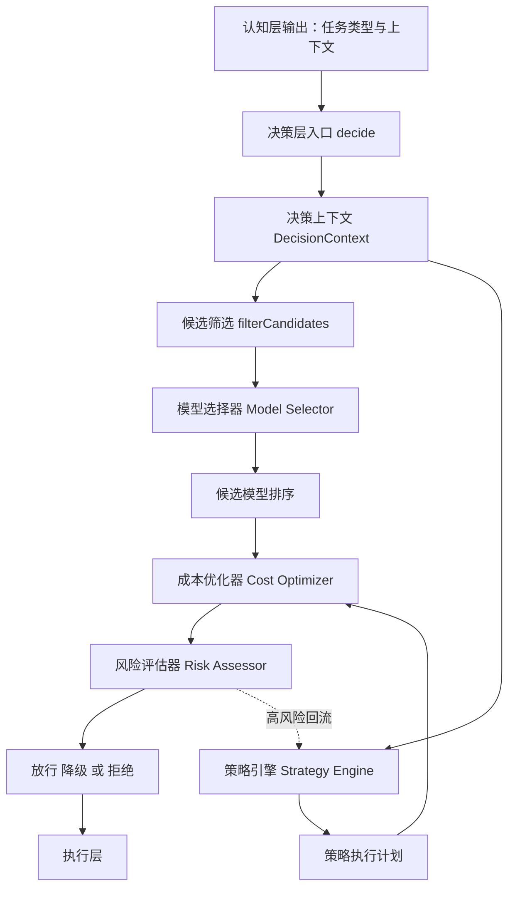
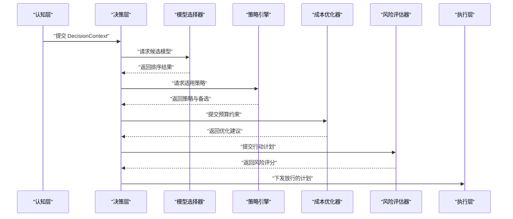
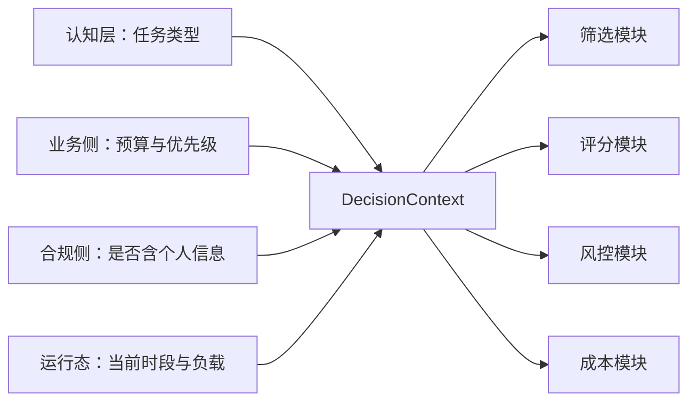
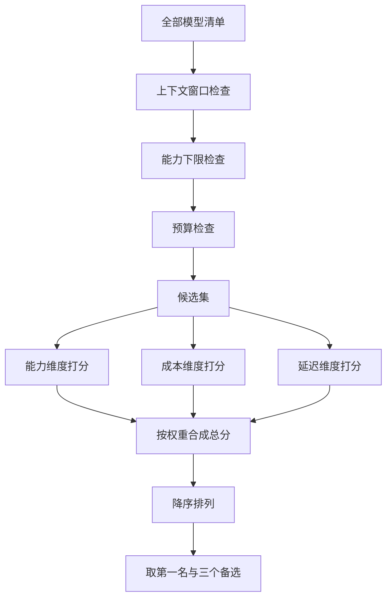
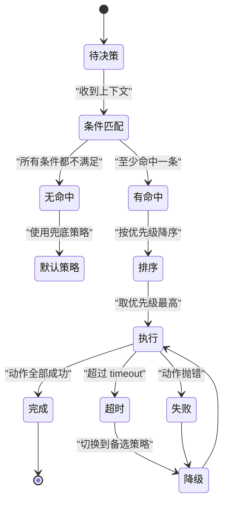
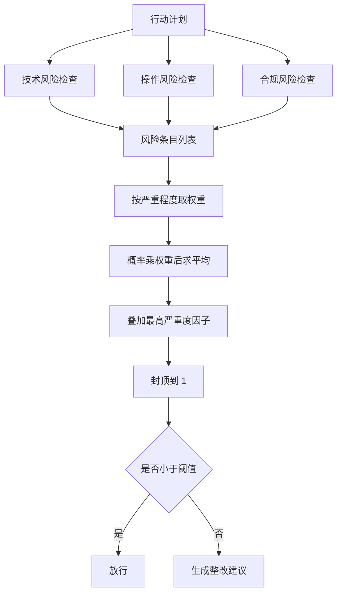
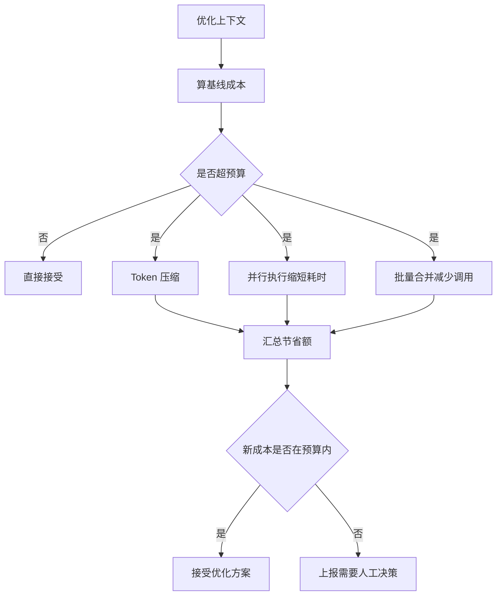
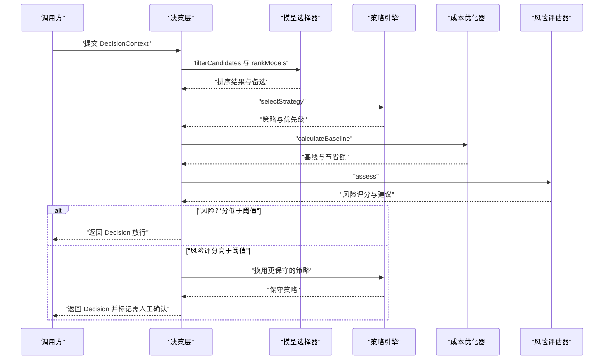
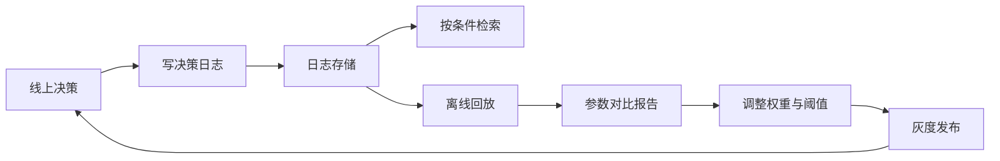

# 决策层

!!! abstract "学完这一页你能"
    - 用一句话说清决策层的职责边界：它接收什么、产出什么、不负责什么。
    - 手写一份决策上下文 DecisionContext，把任务类型、预算、优先级、合规标记装进去。
    - 用「先筛后排」两步实现模型选择器，并解释权重改动会怎样改变最终选择。
    - 给策略引擎写条件匹配、给风险评分写概率乘权重、给成本优化写预算裁剪，并用 node:assert 跑通验证。

## 0. 知识地图



建议这样读：先看第 1 节，把决策层的输入与输出边界钉死；再按第 2 到第 6 节逐个啃四个组件。第 7 节把四个组件串成一次完整决策，第 8 节讲怎么把决策留下来做回放和调参。

读代码时不要只看，把权重、阈值、优先级抄下来改一改，观察输出怎么变。

## 1. 决策层的输入、输出与边界

**先想一个问题**

用户发来一句「帮我总结这份财报，顺便查一下有没有关联交易风险」。认知层告诉你这是个分析类任务。接下来该用哪个模型、走哪条流程、花多少钱、要不要人工复核？

**心智模型**

!!! tip "心智模型"
    一句话模型：决策层是 Agent 的调度室，它把「要做的事」翻译成「谁来做、怎么做、能不能做、花多少」。

    日常类比：你去医院，分诊台看你的症状，决定挂哪个科、是否加急、要不要先做检查。分诊台不给你做手术，也不替你描述症状。

    类比不成立的地方：分诊护士可以凭经验拍板，决策层的每个判断都必须写成代码和可回放的日志，否则出了问题无法定位。

!!! note "术语：决策层"
    决策层是 Agent 分层架构里负责选模型、选策略、评风险、控成本的一层。例如同一个退款请求，它决定走小模型自动分类，还是转大模型生成解释，或者直接转人工。

**图解**



1. 认知层把任务理解的结果交给决策层，它不做取舍，只描述任务。
2. 决策层先问模型选择器：哪些模型能用，排序后谁第一。
3. 再问策略引擎：当前状态匹配哪条策略，优先级最高的那条是什么。
4. 拿着模型和策略，向成本优化器确认预算够不够、能省多少。
5. 最后把完整行动计划交给风险评估器，得到 0 到 1 的风险评分。
6. 评分低于阈值就下发执行层；高于阈值就降级、改写或退回重选。

**一步一步来**

第 1 步：定义决策层的输入契约。

这一步要做什么：把认知层的输出收拢成一个固定形状的对象，后面的筛选、评分、风控都只从这里取值。

```ts
// 决策层接收的上下文：由认知层填写，决策层只读不改
interface DecisionContext {
  taskType: string;              // 任务类型，例如 reasoning / coding / creative / analysis
  inputLength: number;           // 输入长度，用于估算 token 与上下文窗口是否放得下
  expectedOutputLength: number;  // 预期输出长度，用于估算成本
  maxBudget: number;             // 本次任务的预算上限
  priorities?: {                 // 三个维度的权重，缺省时有默认值
    capability: number;
    cost: number;
    latency: number;
  };
  requiredCapabilities?: Record<string, number>; // 必须达到的能力下限
  containsPII?: boolean;         // 是否含个人可识别信息，供合规检查
}
```

**这段代码在做什么**

- `taskType` 决定候选模型的能力维度，是筛选和评分的入口。
- `inputLength` 与 `expectedOutputLength` 一起用于估算成本与上下文占用。
- `maxBudget` 是硬约束，超预算的候选会在筛选阶段就被剔除。
- `priorities` 让调用方表达偏好，缺省时由决策层填默认值。
- `containsPII` 是合规开关，它触发的是风险模块，不参与模型排序。

第 2 步：定义决策层的输出契约。

这一步要做什么：把「选了什么、为什么、备选是谁」打包成执行层能直接消费的对象。

```ts
// 决策层产出的决定：执行层按它做事，日志按它回放
interface Decision {
  modelId: string;          // 选中的模型 id
  strategyId: string;       // 选中的策略 id
  riskScore: number;        // 0 到 1 的风险评分
  estimatedCost: number;    // 估算成本
  alternatives: string[];   // 备选模型，降级时按顺序尝试
  reason: string;           // 可读的决策理由，写进日志
}
```

**这段代码在做什么**

- `modelId` 与 `strategyId` 是执行层的两个直接输入。
- `riskScore` 决定执行层是否需要插入人工确认。
- `alternatives` 让执行层在首选模型失败时有明确的第二选择。
- `reason` 是运维排障的抓手，缺了它线上只能靠猜。

第 3 步：把两个契约串成一个入口函数。

这一步要做什么：写一个只做编排、不含业务规则的 `decide`，把四个组件按顺序调用。

```ts
async function decide(ctx: DecisionContext): Promise<Decision> {
  // 1. 先筛：剔除上下文放不下、能力不达标、超预算的模型
  const candidates = filterCandidates(ctx);
  if (candidates.length === 0) {
    throw new Error("没有可用模型");  // 空候选是配置问题，不要静默兜底
  }
  // 2. 再排：多维度打分并按权重合成
  const ranked = rankModels(candidates, ctx);
  // 3. 选策略：条件匹配加优先级排序
  const strategy = pickStrategy(ctx);
  // 4. 估成本：按输入输出长度粗算，供预算校验
  const estimatedCost = estimateCost(ranked[0], ctx);
  return {
    modelId: ranked[0].id,
    strategyId: strategy.id,
    riskScore: 0,                 // 由风险模块回填
    estimatedCost,
    alternatives: ranked.slice(1, 4).map((m) => m.id),
    reason: `任务类型 ${ctx.taskType} 命中 ${strategy.id}`,
  };
}
```

**这段代码在做什么**

- 函数体内没有 if 之外的分支逻辑，四个组件的细节都在各自模块里。
- 空候选直接抛错，因为静默兜底会让预算和合规失控。
- `alternatives` 取第 2 到第 4 名，为执行层的降级留出三次机会。
- `riskScore` 先置 0，由第 5 节的评估器回填后再决定是否放行。

**动手验证**

下面是一份可直接运行的脚本。依赖：Node 20 及以上，无第三方包。文件保存为 `decide-basic.mjs` 后执行 `node decide-basic.mjs`。

```js
// decide-basic.mjs：决策层最小骨架，无外部依赖
import assert from "node:assert/strict";

const DEFAULT_WEIGHTS = { capability: 0.4, cost: 0.3, latency: 0.3 };

// 三个候选模型，成本字段是每 1K token 的相对价格，只用于比较
const MODELS = [
  { id: "small", contextWindow: 8000, cost: 0.5, latency: 400, capability: 0.6 },
  { id: "mid", contextWindow: 32000, cost: 2, latency: 900, capability: 0.8 },
  { id: "large", contextWindow: 200000, cost: 10, latency: 3000, capability: 1 },
];

// 第一步：硬性筛选，任一条件不满足直接出局
function filterCandidates(ctx) {
  return MODELS.filter((m) => {
    if (ctx.inputLength > m.contextWindow) return false; // 上下文装不下
    if (ctx.minCapability && m.capability < ctx.minCapability) return false; // 能力不足
    const cost = (ctx.inputLength / 1000) * m.cost;     // 粗略成本估算
    if (cost > ctx.maxBudget) return false;             // 超预算
    return true;
  });
}

// 第二步：归一化打分再按权重合成，分数越高越优先
function rankModels(candidates, ctx) {
  const maxCost = Math.max(...candidates.map((m) => m.cost));
  const maxLatency = Math.max(...candidates.map((m) => m.latency));
  const w = ctx.priorities || DEFAULT_WEIGHTS;
  return candidates
    .map((m) => ({
      id: m.id,
      score:
        m.capability * w.capability +
        (1 - m.cost / maxCost) * w.cost +
        (1 - m.latency / maxLatency) * w.latency,
    }))
    .sort((a, b) => b.score - a.score);
}

const ctx = { inputLength: 12000, maxBudget: 200, minCapability: 0.7 };
const ranked = rankModels(filterCandidates(ctx), ctx);
assert.equal(ranked.length, 2);          // small 上下文只有 8000，已被淘汰
assert.equal(ranked[0].id, "mid");       // 能力达标且成本低于 large
console.log(ranked.map((r) => `${r.id}:${r.score.toFixed(3)}`).join(" "));
// 预期输出：mid:0.770 large:0.400
```
**常见坑**

| 现象 | 原因 | 怎么修 |
| --- | --- | --- |
| 候选集为空，任务直接失败 | 筛选条件里预算或能力下限设得太死 | 筛选失败时输出被剔除的原因列表，先看是哪一条卡住 |
| 每次都选最贵的模型 | 成本维度没做归一化，量纲压不过能力分 | 每个维度都映射到 0 到 1 再乘权重 |
| 权重改了但结果不变 | 候选只有两个，且质量差距过大 | 先用三到五个候选做实验，再看权重是否起作用 |
| 线上无法解释为什么选它 | 只存了 modelId，没存打分明细 | 把每个候选的各维度分数一并写入决策日志 |

**用在哪里**

场景一：在线客服工单自动归类。

- 业务背景：每天几万条工单，绝大多数是咨询类，少数是投诉与退款纠纷。
- 这一节的知识怎么用：用 `taskType` 区分咨询与投诉，咨询类走能力下限低的小模型，投诉类才允许大模型。
- 用什么指标衡量收益：单均模型成本、路由到小模型的占比、投诉类的一次解决率。
- 什么时候不该用：投诉量占比高到八成以上时，分流的收益接近于零，不如统一走大模型省掉维护成本。

场景二：IDE 里的代码补全。

- 业务背景：每次按键都要给建议，用户对延迟的容忍度按毫秒算。
- 这一节的知识怎么用：把 `priorities` 的 latency 权重调到 0.6 以上，让低延迟模型排第一。
- 用什么指标衡量收益：补全接受率、首次建议延迟的 p95。
- 什么时候不该用：生成整文件的复杂重构任务，此时延迟权重应当让位给能力权重。

**行业实践**

- Anthropic 工程博客《Building effective agents》把「路由」单独列为一种工作流形态，并建议先用最简单可行的方案。出处名称：Anthropic 工程博客。怎么借鉴到你的项目：决策层的第一版先写一张显式路由表，等路由表稳定后再考虑加权评分。具体结论以官方文章为准。
- OpenAI《A practical guide to building agents》讨论护栏与人工介入的位置，建议把高风险动作的确认点放在执行之前。出处名称：OpenAI 官方指南。怎么借鉴：把人工确认卡在决策层输出与执行层之间，而不是执行之后再补救。具体章节与表述以官方文档为准。
- LangGraph 官方文档的路由与回退章节，演示用条件边表达「满足条件才走这条分支」。出处名称：LangGraph 官方文档。怎么借鉴：把策略条件写成条件边的形式，便于把一次决策画成图并回放。

**小结**

- 决策层只做取舍，不做任务理解，也不做实际执行。
- 输入是 DecisionContext，输出是 Decision，两者都要能序列化。
- 决策理由必须落日志，否则线上排障没有抓手。

## 2. 决策上下文：把散落的信息收成一份可计算的对象

**先想一个问题**

同一个「写周报」请求，早上九点和凌晨两点，用户对速度的期待完全不同。决策层怎么知道这个差别？

**心智模型**

!!! tip "心智模型"
    一句话模型：决策上下文是决策层唯一的取数口，所有判断都从它里面读，不从外部全局变量读。

    日常类比：它是体检报告，所有科室都看同一份，谁也不能自己改一项指标。

    类比不成立的地方：体检报告是既成事实，决策上下文里有些字段是预估的，例如输出长度和成本，估算误差会直接传到结果上。

!!! note "术语：决策上下文"
    决策上下文 DecisionContext 是决策层内部传递的结构化对象，装着任务类型、长度、预算、权重与合规标记。例如它可以用 inputLength 判断模型窗口够不够，用 maxBudget 判断成本超没超。

**图解**



1. 认知层提供任务类型与文本长度，这是最核心的两个字段。
2. 业务侧提供预算上限和三个维度的权重偏好。
3. 合规侧提供是否含个人可识别信息的标记。
4. 运行态提供当前时段与系统负载，用于判断是否该走低延迟通道。
5. 四路信息汇入同一个对象，四个模块都从它取值，避免各自查各自的配置。

**一步一步来**

第 1 步：给上下文补一个校验函数。

这一步要做什么：在进入决策逻辑前先检查字段完整性与取值范围，把脏数据挡在门外。

```ts
function validateContext(ctx: DecisionContext): string[] {
  const errors: string[] = [];
  if (!ctx.taskType) errors.push("taskType 不能为空");        // 任务类型是筛选入口
  if (ctx.inputLength <= 0) errors.push("inputLength 必须为正"); // 长度为零无法估算
  if (ctx.maxBudget < 0) errors.push("maxBudget 不能为负");     // 负预算会剔除全部候选
  const w = ctx.priorities;
  if (w) {
    const sum = w.capability + w.cost + w.latency;
    if (Math.abs(sum - 1) > 0.001) errors.push("权重之和必须为 1");
  }
  return errors;
}
```

**这段代码在做什么**

- 返回错误数组而不是抛异常，方便一次性把问题都列给调用方。
- 权重之和必须为 1，否则排序结果无法跨请求比较。
- 用 0.001 的容差处理浮点数相加的误差。
- 校验失败应直接拒绝请求，不要带着脏数据去查模型列表。

**运行结果**：传入 `{ taskType: "", inputLength: 100, maxBudget: 5 }` 时返回两条错误。

第 2 步：给缺省值兜底。

这一步要做什么：调用方没传的字段，由决策层按统一规则补齐，避免下游到处判空。

```ts
function withDefaults(ctx: DecisionContext): Required<DecisionContext> {
  return {
    ...ctx,
    priorities: ctx.priorities ?? { capability: 0.4, cost: 0.3, latency: 0.3 },
    expectedOutputLength: ctx.expectedOutputLength ?? 500, // 缺省按 500 token 估
    requiredCapabilities: ctx.requiredCapabilities ?? {},
    containsPII: ctx.containsPII ?? false,                 // 拿不准时按最严格处理
  } as Required<DecisionContext>;
}
```

**这段代码在做什么**

- 权重缺省值沿用旧页示例里的 0.4 / 0.3 / 0.3，这是示例值不是实测结论。
- `expectedOutputLength` 缺省 500，只是一个保守估计，需按你的业务重新设。
- `containsPII` 缺省为 false 有风险，安全要求高的业务应当改成缺省 true。
- 返回 `Required` 类型后，下游模块不再需要处理 undefined。

**动手验证**

```js
// context.mjs：上下文校验与兜底，Node 20 直接运行
import assert from "node:assert/strict";

const DEFAULTS = { capability: 0.4, cost: 0.3, latency: 0.3 };

function validateContext(ctx) {
  const errors = [];
  if (!ctx.taskType) errors.push("taskType 不能为空");
  if (!(ctx.inputLength > 0)) errors.push("inputLength 必须为正");
  if (ctx.maxBudget < 0) errors.push("maxBudget 不能为负");
  if (ctx.priorities) {
    const s = ctx.priorities.capability + ctx.priorities.cost + ctx.priorities.latency;
    if (Math.abs(s - 1) > 0.001) errors.push("权重之和必须为 1");
  }
  return errors;
}

function withDefaults(ctx) {
  return {
    expectedOutputLength: 500,
    requiredCapabilities: {},
    containsPII: false,
    ...ctx,
    priorities: ctx.priorities ?? { ...DEFAULTS },
  };
}

assert.deepEqual(validateContext({ taskType: "coding", inputLength: 100, maxBudget: 5 }), []);
assert.equal(validateContext({ taskType: "", inputLength: 100, maxBudget: 5 }).length, 1);
assert.equal(validateContext({ taskType: "x", inputLength: 100, maxBudget: 5, priorities: { capability: 1, cost: 0, latency: 0.2 } }).length, 1);

const filled = withDefaults({ taskType: "coding", inputLength: 100, maxBudget: 5 });
assert.equal(filled.expectedOutputLength, 500);
assert.deepEqual(filled.priorities, DEFAULTS);
console.log("上下文校验通过：", JSON.stringify(filled));
// 预期输出：上下文校验通过：{"taskType":"coding","inputLength":100,"maxBudget":5,"expectedOutputLength":500,"requiredCapabilities":{},"containsPII":false,"priorities":{"capability":0.4,"cost":0.3,"latency":0.3}}
```

**常见坑**

| 现象 | 原因 | 怎么修 |
| --- | --- | --- |
| 同一请求两次结果不同 | 上下文里混进了随机数或当前时间戳 | 把时间、随机种子显式作为字段传入并记录 |
| 权重相加不等于 1 | 调用方按百分比传了 40、30、30 | 在入口统一除以 100 或直接拒绝并提示 |
| 预估成本远低于实际 | 输出长度按常量估算，长文本任务偏差大 | 用历史同任务的输出长度分位数做估计 |
| 合规检查漏掉 | containsPII 缺省 false，字段没传就放行 | 高风险业务把缺省值改成 true，宁可多点人工 |

**用在哪里**

场景一：后台管理的批量导入。

- 业务背景：运营上传 Excel，系统逐行调用模型做字段归一化与纠错。
- 这一节的知识怎么用：把 `containsPII` 按列识别结果逐行设置，含身份证或手机号的行走脱敏策略。
- 用什么指标衡量收益：合规拦截条数、人均处理条数、误拦截率。
- 什么时候不该用：纯内部编号的映射表，字段本身不含个人信息，加合规分支只会拖慢导入。

场景二：多租户 SaaS 的模型调用网关。

- 业务背景：不同客户合同里的预算和优先级不同，网关要按租户区分。
- 这一节的知识怎么用：把预算与权重作为租户配置注入上下文，决策逻辑本身保持同一份。
- 用什么指标衡量收益：各租户超预算次数、单租户的成本波动幅度。
- 什么时候不该用：只有单一租户时，租户维度只会增加配置负担。

**行业实践**

- OpenTelemetry 官方文档的语义约定章节，给跨度 span 定义了标准属性命名，便于跨系统对齐。出处名称：OpenTelemetry 官方文档。怎么借鉴：给决策日志的字段起名时对齐通用约定，例如把模型名与耗时分开记录。具体属性名以官方文档为准。
- JSON Schema 官方文档的数值校验章节，说明如何用最小值、最大值等关键字约束数值。出处名称：JSON Schema 官方文档。怎么借鉴：把 DecisionContext 的校验规则写成一份 schema，校验逻辑与类型定义来自同一份描述。

**小结**

- 上下文是唯一取数口，散落的全局状态会让决策不可回放。
- 权重之和必须归一，否则不同请求的打分不可比。
- 缺省值要按业务风险定，合规相关字段宁可从严。

## 3. 模型选择器：先筛后排

**先想一个问题**

你的模型清单里有八个模型，价格从每 1K token 0.5 到 10 不等。用户只给了 5 块钱预算，该选哪个？

**心智模型**

!!! tip "心智模型"
    一句话模型：选择器分两步走，先做减法去掉不合格的，再做加法给剩下的打分排序。

    日常类比：招聘先筛简历里的硬性条件，学历与年限不达标直接淘汰，剩下的才逐项面试打分。

    类比不成立的地方：简历筛选有主观空间，这里的筛选条件必须是可计算的布尔判断，否则同一份上下文会得到不同结论。

!!! note "术语：评分归一化"
    评分归一化是把不同量纲的指标映射到同一个区间，通常是 0 到 1。例如成本 10 元和延迟 3000 毫秒不能直接相加，要各自除以候选中的最大值再取反。

**图解**



1. 从全量清单开始，先过上下文窗口这一关，装不下的直接出局。
2. 再查能力下限，任务要求的能力值低于阈值的出局。
3. 最后查预算，估算成本超过上限的出局。
4. 剩下的进入评分阶段，三个维度分别算分并各自归一化。
5. 按上下文给的权重把三个维度合成一个总分。
6. 降序排列后取第一名，同时保留第 2 到第 4 名作为降级备选。

**一步一步来**

第 1 步：写筛选函数。

这一步要做什么：把三条硬性条件写成短路返回，任何一条不满足就剔除该模型。

```ts
function filterCandidates(models: AIModel[], ctx: DecisionContext): AIModel[] {
  return models.filter((model) => {
    if (ctx.inputLength > model.contextWindow) return false; // 窗口装不下
    for (const [key, min] of Object.entries(ctx.requiredCapabilities ?? {})) {
      const value = model.capability[key as keyof ModelCapability];
      if (value < min) return false;                          // 能力不达标
    }
    if (estimateCost(model, ctx) > ctx.maxBudget) return false; // 超预算
    return true;
  });
}

function estimateCost(model: AIModel, ctx: DecisionContext): number {
  // 旧页示例按每 1K token 计价，这里保留同样的口径
  const inputUnits = Math.ceil(ctx.inputLength / 1000);
  const outputUnits = Math.ceil(ctx.expectedOutputLength / 1000);
  return inputUnits * model.cost.input + outputUnits * model.cost.output;
}
```

**这段代码在做什么**

- 三层过滤顺序固定：窗口、能力、预算，前面的便宜判断放在前面。
- `requiredCapabilities` 用键值对表达，不写死具体的任务类型。
- 成本估算按每 1K token 的口径，这个口径来自旧页示例，实际计价以你的供应商账单为准。
- 输出长度按 `expectedOutputLength` 估，估偏了会直接影响筛选结果。

第 2 步：写打分与排序。

这一步要做什么：把能力、成本、延迟各自归一化，再按权重合成总分并降序排列。

```ts
function rankModels(models: AIModel[], ctx: DecisionContext) {
  const maxCost = Math.max(...models.map((m) => m.cost.input + m.cost.output));
  const maxLatency = Math.max(...models.map((m) => (m.latency.p50 + m.latency.p95) / 2));
  const w = ctx.priorities!;
  return models
    .map((m) => {
      const avgLatency = (m.latency.p50 + m.latency.p95) / 2;
      const capabilityScore = scoreForTask(m, ctx.taskType);      // 能力分
      const costScore = 1 - (m.cost.input + m.cost.output) / maxCost; // 越便宜分越高
      const latencyScore = 1 - avgLatency / maxLatency;           // 越快分越高
      return {
        model: m,
        total: capabilityScore * w.capability + costScore * w.cost + latencyScore * w.latency,
      };
    })
    .sort((a, b) => b.total - a.total);
}
```

**这段代码在做什么**

- 成本和延迟都取反，让「越小越好」的指标变成「越大越好」，才能统一加权。
- 归一化的分母取当前候选集里的最大值，候选集变了分数也会变，跨请求比较时要小心。
- 能力分按任务类型查表得到，表里没有的类型给一个保守的中间值。
- 排序后返回完整对象，方便上层同时拿到模型和各维度分数。

**运行结果**：三个候选时，成本维度最高分为 1，最低分为 0。

**动手验证**

```js
// selector.mjs：先筛后排的完整实现，Node 20 直接运行
import assert from "node:assert/strict";

const MODELS = [
  { id: "small", contextWindow: 8000, cost: { input: 0.5, output: 1 }, latency: { p50: 300, p95: 500 }, capability: { reasoning: 0.5, codeGeneration: 0.4 } },
  { id: "mid", contextWindow: 32000, cost: { input: 2, output: 4 }, latency: { p50: 800, p95: 1000 }, capability: { reasoning: 0.8, codeGeneration: 0.75 } },
  { id: "large", contextWindow: 200000, cost: { input: 10, output: 20 }, latency: { p50: 2500, p95: 3500 }, capability: { reasoning: 1, codeGeneration: 0.95 } },
];

const TASK_FIELD = { reasoning: "reasoning", coding: "codeGeneration" };

function estimateCost(model, ctx) {
  const inUnits = Math.ceil(ctx.inputLength / 1000);
  const outUnits = Math.ceil(ctx.expectedOutputLength / 1000);
  return inUnits * model.cost.input + outUnits * model.cost.output;
}

function filterCandidates(ctx) {
  return MODELS.filter((m) => {
    if (ctx.inputLength > m.contextWindow) return false;
    for (const [k, min] of Object.entries(ctx.requiredCapabilities || {})) {
      if (m.capability[k] < min) return false;
    }
    return estimateCost(m, ctx) <= ctx.maxBudget;
  });
}

function scoreForTask(model, taskType) {
  const field = TASK_FIELD[taskType];
  return field ? model.capability[field] : 0.7; // 未收录的任务类型给中间值
}

function rankModels(models, ctx) {
  const maxCost = Math.max(...models.map((m) => m.cost.input + m.cost.output));
  const maxLatency = Math.max(...models.map((m) => (m.latency.p50 + m.latency.p95) / 2));
  const w = ctx.priorities;
  return models
    .map((m) => {
      const avg = (m.latency.p50 + m.latency.p95) / 2;
      const total =
        scoreForTask(m, ctx.taskType) * w.capability +
        (1 - (m.cost.input + m.cost.output) / maxCost) * w.cost +
        (1 - avg / maxLatency) * w.latency;
      return { id: m.id, total };
    })
    .sort((a, b) => b.total - a.total);
}

const base = { inputLength: 2000, expectedOutputLength: 1000, maxBudget: 30, taskType: "reasoning" };

const capFirst = rankModels(filterCandidates({ ...base, priorities: { capability: 0.8, cost: 0.1, latency: 0.1 } }), { ...base, priorities: { capability: 0.8, cost: 0.1, latency: 0.1 } });
const costFirst = rankModels(filterCandidates({ ...base, priorities: { capability: 0.1, cost: 0.8, latency: 0.1 } }), { ...base, priorities: { capability: 0.1, cost: 0.8, latency: 0.1 } });

assert.equal(capFirst[0].id, "large"); // 能力权重高时选最大模型
assert.equal(costFirst[0].id, "small"); // 成本权重高时选最小模型
assert.equal(rankModels(filterCandidates(base), { ...base, priorities: { capability: 0.4, cost: 0.3, latency: 0.3 } }).length, 3);
console.log("能力优先：", capFirst.map((r) => r.id).join(" > "));
console.log("成本优先：", costFirst.map((r) => r.id).join(" > "));
// 预期输出：
// 能力优先：large > mid > small
// 成本优先：small > mid > large
```

**常见坑**

| 现象 | 原因 | 怎么修 |
| --- | --- | --- |
| 加权总分总是接近 0.5 | 能力分是 0 到 1，成本和延迟分没归一化 | 三个维度都在候选集内做归一化 |
| 换个候选集后排序全变 | 归一化分母依赖当前候选集 | 需要跨请求比较时改用固定的参考基准 |
| 未收录的任务类型得分偏高 | 默认值给了 0.7，比某些模型真实能力还高 | 把默认值调低，或对未收录类型直接拒绝 |
| 预算估算与实际账单差得多 | 只算了输入输出 token，漏了重试与工具调用 | 把重试次数和历史平均重试率算进估算 |

**用在哪里**

场景一：电商商品标题与卖点生成。

- 业务背景：每天生成十万条商品文案，不同类目难度差别大。
- 这一节的知识怎么用：用 `requiredCapabilities` 给美妆类目设更高的创造性要求，用预算上限压住长尾类目。
- 用什么指标衡量收益：单条文案成本、人工抽检通过率、生成失败率。
- 什么时候不该用：品牌主视觉文案这类一年只做几次的任务，省下的钱抵不上筛选逻辑的维护成本。

场景二：日志异常归因助手。

- 业务背景：值班工程师贴一段报错日志，助手要给出可能原因与排查步骤。
- 这一节的知识怎么用：把 `taskType` 设为 reasoning，能力权重调高，因为归因错误的代价远高于一次调用的成本。
- 用什么指标衡量收益：归因被工程师采纳的比例、平均排查时长。
- 什么时候不该用：简单的日志格式解析，正则就够了，不需要引入模型选择。

**行业实践**

- Anthropic 工程博客《Building effective agents》建议按任务复杂度选择模型，而不是默认使用能力最强的那个。出处名称：Anthropic 工程博客。怎么借鉴：为每个任务类型先写下「允许使用的最小模型等级」，写不出来说明任务边界还没想清。具体表述以官方文章为准。
- LangGraph 官方文档的回退章节，演示主路径失败后切换到备用路径。出处名称：LangGraph 官方文档。怎么借鉴：把选择器返回的备选列表接进执行层的降级逻辑，而不是失败就报错。

**小结**

- 先筛后排，筛选用布尔判断，排序用加权评分，两者不要混在一起。
- 归一化的分母决定分数的可比范围，跨请求比较要固定基准。
- 备选列表是降级的基础，选择器要顺手返回。

## 4. 策略引擎：条件匹配、优先级与执行

**先想一个问题**

支付接口返回超时。这时候该重试、该降级到备用通道、还是该直接报错让用户稍后再试？

**心智模型**

!!! tip "心智模型"
    一句话模型：策略引擎把「当前状态」映射成「一条行动方案」，映射规则写成条件加优先级。

    日常类比：它是地铁的调度规则表，晚点几分钟走 A 方案，晚点超过十分钟走 B 方案。

    类比不成立的地方：调度规则由人统一下达，这里的条件由上下文实时计算，条件写得含糊就会同时命中多条。

!!! note "术语：策略"
    策略是一组条件加一组动作的打包，附带优先级和超时。例如「支付超时且已重试一次」这条策略的动作是切备用通道，优先级为 8。

**图解**



1. 进入待决策状态后，引擎逐条比对策略的条件。
2. 一条都没命中时走默认策略，默认策略缺失就报错。
3. 命中多条时按优先级从高到低排序，取第一条。
4. 执行阶段逐条执行动作，并在每次动作后检查是否超时。
5. 动作抛错或整体超时，切到备选策略重新执行。
6. 全部动作成功后结束，整条轨迹写入历史记录。

**一步一步来**

第 1 步：写条件求值。

这一步要做什么：把「字段、操作符、值」三件套解析成布尔结果，支持按点号路径取嵌套字段。

```ts
type Operator = "eq" | "ne" | "gt" | "lt" | "contains" | "in";

interface StrategyCondition {
  field: string;      // 支持点号路径，例如 runtime.retryCount
  operator: Operator;
  value: unknown;
}

function getFieldValue(field: string, ctx: unknown): unknown {
  return field.split(".").reduce<unknown>((acc, part) => {
    if (acc && typeof acc === "object") return (acc as Record<string, unknown>)[part];
    return undefined; // 路径中断返回 undefined，由比较函数处理
  }, ctx);
}

function evaluateCondition(cond: StrategyCondition, ctx: unknown): boolean {
  const actual = getFieldValue(cond.field, ctx);
  switch (cond.operator) {
    case "eq": return actual === cond.value;
    case "ne": return actual !== cond.value;
    case "gt": return Number(actual) > Number(cond.value);
    case "lt": return Number(actual) < Number(cond.value);
    case "contains": return String(actual).includes(String(cond.value));
    case "in": return Array.isArray(cond.value) && cond.value.includes(actual);
    default: return false; // 未知操作符一律判否，避免意外放行
  }
}
```

**这段代码在做什么**

- `getFieldValue` 支持 `runtime.retryCount` 这样的路径，避免为每种组合定义新字段。
- 路径中断时返回 undefined，而不是抛错，让条件求值保持纯函数。
- `gt` 与 `lt` 先转数字，防止字符串比较出现 `"10" < "9"` 这种结果。
- 未知操作符返回 false，宁可漏命中也不要错命中。

第 2 步：写选择与执行。

这一步要做什么：先筛出所有条件全为真的策略，按优先级排序取第一条，再逐条执行动作。

```ts
function selectStrategy(strategies: Strategy[], ctx: unknown): Strategy {
  const applicable = strategies.filter((s) =>
    s.conditions.every((c) => evaluateCondition(c, ctx))
  );
  if (applicable.length === 0) {
    const fallback = strategies.find((s) => s.id === "default");
    if (!fallback) throw new Error("没有可用策略，且缺少 default"); // 缺兜底是配置错误
    return fallback;
  }
  return applicable.sort((a, b) => b.priority - a.priority)[0]; // 优先级高者先
}

async function execute(strategy: Strategy, ctx: unknown): Promise<ActionResult[]> {
  const started = Date.now();
  const results: ActionResult[] = [];
  for (const action of strategy.actions) {
    results.push(await runAction(action, ctx));
    if (strategy.timeout && Date.now() - started > strategy.timeout) {
      throw new Error(`策略 ${strategy.id} 执行超时`); // 超时立即中断，由上层降级
    }
  }
  return results;
}
```

**这段代码在做什么**

- 条件用 `every` 求合取，全部为真才算命中。
- 没有命中时只接受 id 为 default 的策略，缺了就抛错。
- 排序用优先级降序，优先级相同时保持数组原顺序。
- 每个动作执行后检查一次超时，而不是等全部动作跑完。

**运行结果**：命中两条策略时，返回优先级数值较大的那条。

**动手验证**

```js
// strategy.mjs：条件匹配与优先级选择，Node 20 直接运行
import assert from "node:assert/strict";

function getFieldValue(field, ctx) {
  return field.split(".").reduce((acc, part) => {
    if (acc && typeof acc === "object") return acc[part];
    return undefined;
  }, ctx);
}

function evaluateCondition(cond, ctx) {
  const actual = getFieldValue(cond.field, ctx);
  switch (cond.operator) {
    case "eq": return actual === cond.value;
    case "ne": return actual !== cond.value;
    case "gt": return Number(actual) > Number(cond.value);
    case "lt": return Number(actual) < Number(cond.value);
    case "contains": return String(actual).includes(String(cond.value));
    case "in": return Array.isArray(cond.value) && cond.value.includes(actual);
    default: return false;
  }
}

const STRATEGIES = [
  { id: "default", priority: 1, conditions: [], actions: ["log"] },
  { id: "retry", priority: 5, conditions: [{ field: "runtime.retryCount", operator: "lt", value: 2 }], actions: ["retry"] },
  { id: "fallback", priority: 8, conditions: [{ field: "runtime.retryCount", operator: "gt", value: 1 }, { field: "status", operator: "eq", value: "timeout" }], actions: ["switchChannel"] },
];

function selectStrategy(strategies, ctx) {
  const applicable = strategies.filter((s) => s.conditions.every((c) => evaluateCondition(c, ctx)));
  if (applicable.length === 0) {
    const fb = strategies.find((s) => s.id === "default");
    if (!fb) throw new Error("缺少 default 策略");
    return fb;
  }
  return applicable.slice().sort((a, b) => b.priority - a.priority)[0];
}

assert.equal(selectStrategy(STRATEGIES, { status: "timeout", runtime: { retryCount: 3 } }).id, "fallback");
assert.equal(selectStrategy(STRATEGIES, { status: "timeout", runtime: { retryCount: 0 } }).id, "retry");
assert.equal(selectStrategy(STRATEGIES, { status: "ok", runtime: { retryCount: 0 } }).id, "default");
console.log("策略选择验证通过");
// 预期输出：策略选择验证通过
```

**常见坑**

| 现象 | 原因 | 怎么修 |
| --- | --- | --- |
| 同时命中多条，结果随机 | 优先级相同且没有稳定的比较键 | 给优先级加二级排序键，例如策略 id |
| 条件里 `gt` 判断失效 | 字段是字符串，数字比较前没转换 | 在求值函数里统一 Number 转换并处理 NaN |
| 超时后动作还在跑 | 只在循环外检查一次超时 | 每个动作后检查，并把超时信号传给动作 |
| 没有 default 策略导致线上报错 | 条件覆盖不全，边界状态没人管 | 上线前用历史上下文回放一遍，看 default 命中率 |

**用在哪里**

场景一：跨境外贸订单的支付路由。

- 业务背景：一笔订单可能走多个支付通道，通道超时率随地区波动。
- 这一节的知识怎么用：把通道超时状态与重试次数放进上下文，用优先级表达切换顺序。
- 用什么指标衡量收益：支付成功率、平均重试次数、通道切换后的成功率。
- 什么时候不该用：只有单一支付通道时，策略引擎没有可选项，不如直接写重试。

场景二：工单自动分配与升级。

- 业务背景：客服系统要把工单分给一线还是直接升到二线。
- 这一节的知识怎么用：用条件表达「客户等级 plus 问题分类 plus 已沟通轮次」的组合，优先级决定升级速度。
- 用什么指标衡量收益：首次响应时长、二次转派率、工单解决时长。
- 什么时候不该用：工单量每天不足百条时，人工分派的可解释性高于自动规则。

**行业实践**

- LangGraph 官方文档的条件边章节，演示用函数决定下一步走哪个节点。出处名称：LangGraph 官方文档。怎么借鉴：把策略的条件写成纯函数，动作写成节点，整条决策就能画成图并逐节点回放。
- OpenTelemetry 官方文档的追踪章节，建议为每个跨度记录开始与结束时间。出处名称：OpenTelemetry 官方文档。怎么借鉴：给策略执行的每一步记一条跨度，超时问题一眼能看出卡在哪个动作。

**小结**

- 条件求值必须是纯函数，同一输入永远同一结果。
- 优先级之外要有稳定的二级排序键，否则命中顺序不可复现。
- default 策略是必须项，缺了它边界状态会直接抛错。

## 5. 风险评估器：概率乘影响

**先想一个问题**

批量导入里有一列手机号。系统准备把这些号码原样写进数据库。这件事的风险有多大，该不该拦？

**心智模型**

!!! tip "心智模型"
    一句话模型：风险等于发生的可能性乘上发生后造成的损失，再按严重程度加权。

    日常类比：天气预报说七成概率下雨，你带伞是因为淋湿的代价超过带伞的麻烦。

    类比不成立的地方：下雨概率是统计出来的，这里的概率由规则估计，数值本身带主观性，要定期用事故数据校准。

!!! note "术语：风险敞口"
    风险敞口是某类风险可能造成的最大损失范围。例如未脱敏写入个人信息的风险敞口，包含合规处罚、用户信任下降与整改工时三项。

**图解**



1. 行动计划进入三类检查，各自产出风险条目。
2. 每条风险带类型、严重程度、概率与影响面。
3. 严重程度映射成权重，旧页示例里 critical 为 1、high 为 0.75、medium 为 0.5、low 为 0.25。
4. 每条风险算「概率乘权重」，再对全部条目求平均。
5. 叠加最高严重度因子，旧页示例用 maxSeverity 除以 5 得到放大系数。
6. 结果封顶到 1，与阈值比较，超过阈值就生成整改建议。

**一步一步来**

第 1 步：把风险条目算成分数。

这一步要做什么：实现从条目列表到 0 到 1 总分的映射，保证严重条目不会被大量轻微条目稀释。

```ts
const SEVERITY_WEIGHT = { critical: 1, high: 0.75, medium: 0.5, low: 0.25 };

function calculateOverallRisk(risks: Risk[]): number {
  if (risks.length === 0) return 0;                  // 无风险条目直接返回 0
  let total = 0;
  let maxSeverity = 0;
  for (const r of risks) {
    const w = SEVERITY_WEIGHT[r.severity];
    total += r.probability * w;                      // 概率乘严重度权重
    maxSeverity = Math.max(maxSeverity, w);
  }
  const avg = total / risks.length;                  // 先求平均
  const maxFactor = maxSeverity / 5;                 // 旧页示例的放大系数
  return Math.min(avg * (1 + maxFactor), 1);         // 叠加后封顶到 1
}
```

**这段代码在做什么**

- 空列表返回 0，避免除零。
- 严重度权重来自旧页示例，是你项目的起点而非定论。
- 先求平均再放大，让大量低风险条目不会盖过一条严重条目。
- 封顶到 1，保证评分与阈值的比较口径固定。

第 2 步：按分数生成整改建议。

这一步要做什么：只对高严重度的风险生成建议，低严重度的只记录不打断。

```ts
function generateRecommendations(risks: Risk[]): Recommendation[] {
  const out: Recommendation[] = [];
  for (const risk of risks) {
    if (risk.severity !== "critical" && risk.severity !== "high") continue; // 低风险不打断
    for (const action of risk.mitigation) {
      out.push({
        riskId: risk.id,
        action,                                            // 例如脱敏、加访问控制
        priority: risk.severity === "critical" ? "immediate" : "soon",
      });
    }
  }
  return out;
}
```

**这段代码在做什么**

- 只有 critical 和 high 进入建议列表，其余仅留在日志里。
- 每条缓解动作单独成条，便于分别指派负责人。
- critical 标记为立即处理，high 标记为尽快处理。
- 返回结构里带 riskId，能把建议追溯到具体风险条目。

**运行结果**：一条 critical 且概率为 1 的合规风险，单独出现时总分为 0.24。

**动手验证**

```js
// risk.mjs：风险评分与建议生成，Node 20 直接运行
import assert from "node:assert/strict";

const SEVERITY_WEIGHT = { critical: 1, high: 0.75, medium: 0.5, low: 0.25 };

function calculateOverallRisk(risks) {
  if (risks.length === 0) return 0;
  let total = 0;
  let maxSeverity = 0;
  for (const r of risks) {
    const w = SEVERITY_WEIGHT[r.severity];
    total += r.probability * w;
    maxSeverity = Math.max(maxSeverity, w);
  }
  const avg = total / risks.length;
  return Math.min(avg * (1 + maxSeverity / 5), 1);
}

function generateRecommendations(risks) {
  return risks
    .filter((r) => r.severity === "critical" || r.severity === "high")
    .flatMap((r) => r.mitigation.map((action) => ({ riskId: r.id, action, priority: r.severity === "critical" ? "immediate" : "soon" })));
}

const empty = [];
assert.equal(calculateOverallRisk(empty), 0);

const single = [{ id: "r1", severity: "critical", probability: 1, mitigation: ["脱敏", "访问控制"] }];
assert.equal(calculateOverallRisk(single).toFixed(2), "0.24");

const mixed = [
  { id: "r1", severity: "critical", probability: 1, mitigation: ["脱敏"] },
  { id: "r2", severity: "low", probability: 0.2, mitigation: ["记录"] },
  { id: "r3", severity: "low", probability: 0.2, mitigation: ["记录"] },
];
const mixedScore = calculateOverallRisk(mixed);
assert.ok(mixedScore > calculateOverallRisk(single));   // 低风险条目抬高平均
assert.equal(generateRecommendations(mixed).length, 1); // 低风险不生成建议

console.log("单条风险分：", calculateOverallRisk(single).toFixed(2));
console.log("混合风险分：", mixedScore.toFixed(2));
console.log("建议条数：", generateRecommendations(mixed).length);
// 预期输出：
// 单条风险分：0.24
// 混合风险分：0.35
// 建议条数：1
```

**常见坑**

| 现象 | 原因 | 怎么修 |
| --- | --- | --- |
| 严重风险被稀释 | 大量低风险条目拉低平均值 | 对 critical 条目单独设硬门槛，不看平均分 |
| 风险概率长期偏高 | 概率靠拍脑袋填，没人校准 | 记录每次风险预测与实际结果，按季度回看 |
| 每条风险都触发人工确认 | 建议生成没有过滤严重度 | 只有 critical 与 high 进建议列表 |
| 阈值形同虚设 | 阈值定得过高，任何组合都放行 | 用历史数据反推分位数，取一个能拦住两成请求的值 |

**用在哪里**

场景一：后台管理的批量导入。

- 业务背景：运营上传客户名单，表格里可能含手机号与身份证号。
- 这一节的知识怎么用：在写入前做合规检查，命中个人可识别信息就生成脱敏与访问控制建议。
- 用什么指标衡量收益：拦截条数、误拦截率、脱敏覆盖率。
- 什么时候不该用：导入的是内部商品编码表，字段本身不含个人信息，加检查只会增加导入耗时。

场景二：自动化运维的变更执行。

- 业务背景：Agent 根据告警自动执行重启、扩容或回滚。
- 这一节的知识怎么用：把「影响面大小」映射成影响分量，重启单实例与回滚全集群给出不同的严重度。
- 用什么指标衡量收益：需人工确认的变更占比、误操作次数、平均恢复时间。
- 什么时候不该用：只读的诊断类操作不会改变系统状态，走风控只会拖慢排查。

**行业实践**

- OpenAI《A practical guide to building agents》讨论护栏的位置，建议对高风险动作设置人工确认环节。出处名称：OpenAI 官方指南。怎么借鉴：把风险评分接到人工确认的触发条件上，阈值以上的动作暂停等待确认。具体章节以官方文档为准。
- OpenTelemetry 官方文档的语义约定章节，建议属性名保持统一以便跨服务聚合。出处名称：OpenTelemetry 官方文档。怎么借鉴：给风险条目起固定字段名，让不同业务的评分可以横向统计。

**小结**

- 风险分是概率乘严重度权重，再对条目求平均并叠加放大因子。
- critical 条目要有独立硬门槛，不能被平均值稀释。
- 概率与阈值都需要用真实事故数据定期校准。

## 6. 成本优化器：预算约束下的取舍

**先想一个问题**

一次批量摘要任务估出来 120 块，预算只有 80 块。是砍任务量、砍输出长度，还是换便宜模型？

**心智模型**

!!! tip "心智模型"
    一句话模型：成本优化器先把成本拆成若干项算清楚，再看哪些项能通过改变执行方式降下来。

    日常类比：家庭记账先分清房租、伙食、交通各占多少，再决定从哪一项里省。

    类比不成立的地方：省钱会伤质量，成本优化必须和质量指标一起看，只看账单会把任务做废。

!!! note "术语：单位经济"
    单位经济指每完成一次业务动作所消耗的成本。例如每处理一张工单平均花多少钱，它比总成本更能反映优化效果。

**图解**



1. 先按输入 token、输出 token、计算量、调用次数、存储与耗时算出基线。
2. 基线没有超预算就直接接受，不做任何改动。
3. 超预算时对三个可优化项分别计算潜在节省额。
4. 节省额求和后从基线里扣掉。
5. 扣完仍在预算内就接受优化方案。
6. 扣完仍超预算就上报，由人决定是砍范围还是加预算。

**一步一步来**

第 1 步：把成本拆成条目算。

这一步要做什么：每个成本项返回「数量、单价、小计」三件套，让优化时能定位到具体项。

```ts
function calculateBaseline(ctx: OptimizationContext, model: CostModel): CostItem[] {
  const inTokens = ctx.inputTokens ?? 0;
  const outTokens = ctx.outputTokens ?? 0;
  // 输出 token 按单价的两倍计，这是旧页示例里的口径
  const tokenTotal = inTokens * model.tokenCost + outTokens * model.tokenCost * 2;
  return [
    { type: "tokens", amount: inTokens + outTokens, unitCost: model.tokenCost, total: tokenTotal },
    { type: "compute", amount: (ctx.computeUnits ?? 1) * (ctx.estimatedDuration ?? 1),
      unitCost: model.computeCost, total: (ctx.computeUnits ?? 1) * (ctx.estimatedDuration ?? 1) * model.computeCost },
    { type: "api", amount: ctx.apiCalls ?? 0, unitCost: model.apiCallCost, total: (ctx.apiCalls ?? 0) * model.apiCallCost },
    { type: "time", amount: ctx.estimatedDuration ?? 0, unitCost: model.timeCost, total: (ctx.estimatedDuration ?? 0) * model.timeCost },
  ];
}
```

**这段代码在做什么**

- 每个条目都带 `type`，方便按类型汇总和定位。
- 输出 token 按两倍单价计算，这个系数来自旧页示例，实际以你的供应商计价为准。
- `?? 0` 兜底，避免缺字段算出 NaN。
- 返回数组而不是单一数字，账单对不上时能看出是哪一项超了。

第 2 步：按目标项计算节省额。

这一步要做什么：对允许优化的目标逐项计算节省额，条件不满足就返回零节省。

```ts
function optimizeTokens(ctx: OptimizationContext, model: CostModel): Optimization {
  const current = (ctx.inputTokens ?? 0) + (ctx.outputTokens ?? 0);
  if (current <= 1000) return { type: "token_compression", savings: 0, recommendation: "" };
  const compressionRatio = 0.7; // 旧页示例的假设值，不是实测压缩率
  const savings = current * (1 - compressionRatio) * model.tokenCost;
  return { type: "token_compression", savings, recommendation: "压缩上下文以降低 token 消耗" };
}
```

**这段代码在做什么**

- 只有 token 总量超过 1000 才尝试压缩，小请求不值得引入压缩开销。
- 0.7 是旧页示例写下的假设值，用在你项目里必须先做小样本实验。
- 节省额按压缩掉的比例乘单价计算，未经实验验证不要写进预算承诺。
- 建议文案要与实际动作一致，否则运维按建议操作却拿不到预期节省。

**运行结果**：token 总量 5000、单价 0.001 时，节省额为 1.5。

**动手验证**

```js
// cost.mjs：成本基线与优化，Node 20 直接运行
import assert from "node:assert/strict";

const MODEL = { tokenCost: 0.001, computeCost: 0.02, apiCallCost: 0.01, storageCost: 0.0005, timeCost: 0.0002 };

function calculateBaseline(ctx) {
  const inT = ctx.inputTokens ?? 0;
  const outT = ctx.outputTokens ?? 0;
  const duration = ctx.estimatedDuration ?? 0;
  const computeUnits = ctx.computeUnits ?? 1;
  return [
    { type: "tokens", total: inT * MODEL.tokenCost + outT * MODEL.tokenCost * 2 },
    { type: "compute", total: computeUnits * duration * MODEL.computeCost },
    { type: "api", total: (ctx.apiCalls ?? 0) * MODEL.apiCallCost },
    { type: "time", total: duration * MODEL.timeCost },
  ];
}

function optimizeTokens(ctx) {
  const current = (ctx.inputTokens ?? 0) + (ctx.outputTokens ?? 0);
  if (current <= 1000) return 0;
  const compressionRatio = 0.7; // 假设值，务必自行实验校准
  return current * (1 - compressionRatio) * MODEL.tokenCost;
}

function optimizeApi(ctx) {
  const calls = ctx.apiCalls ?? 0;
  if (calls <= 5) return 0;
  const batchRatio = 0.5; // 假设值，务必自行实验校准
  return calls * batchRatio * MODEL.apiCallCost;
}

function total(items) {
  return items.reduce((s, i) => s + i.total, 0);
}

const ctx = { inputTokens: 4000, outputTokens: 1000, apiCalls: 10, estimatedDuration: 2000, computeUnits: 1 };
const baseline = total(calculateBaseline(ctx));
const savings = optimizeTokens(ctx) + optimizeApi(ctx);
assert.ok(baseline > 0);
assert.ok(savings > 0);
assert.ok(savings < baseline);           // 优化不能把成本算成负数
assert.equal(optimizeTokens({ inputTokens: 300, outputTokens: 200 }), 0); // 小请求不优化

console.log("基线成本：", baseline.toFixed(4));
console.log("可节省：", savings.toFixed(4));
console.log("优化后：", (baseline - savings).toFixed(4));
// 预期输出：
// 基线成本：0.0620
// 可节省：0.0540
// 优化后：0.0080
```

**常见坑**

| 现象 | 原因 | 怎么修 |
| --- | --- | --- |
| 优化后结果质量明显下降 | 只盯成本，没同步看质量指标 | 把人工抽检通过率作为优化的硬约束一起上报 |
| 节省额算出来大于基线 | 多个优化项有重叠，重复扣减 | 每项优化作用在不同的成本条目上，扣减前先做去重 |
| 压缩比例长期不达标 | 假设的压缩率没有实验支撑 | 对压缩前后的输出做小样本对比，用实测比例替换假设值 |
| 预算超了没人知道 | 只在任务结束后统计 | 决策阶段就预估并在超预算时提前告警 |

**用在哪里**

场景一：内容平台的夜间批量摘要。

- 业务背景：凌晨跑一批长文摘要，白天没人盯着，成本超了只能第二天才知道。
- 这一节的知识怎么用：在决策阶段算出基线成本与优化后成本，超预算就把批次拆小或延后。
- 用什么指标衡量收益：每晚总成本、每篇摘要成本、摘要被采用的条数。
- 什么时候不该用：实时性要求高的场景不允许延迟到夜间，此时该调模型档位而不是等等再跑。

场景二：企业内部的知识问答助手。

- 业务背景：员工提问量集中在上班时间，预算按部门分配。
- 这一节的知识怎么用：按部门设预算上限，超限的请求走更小的模型并提示答案可能更简略。
- 用什么指标衡量收益：各部门单次问答成本、答案采纳率、超预算拒绝次数。
- 什么时候不该用：面向合规审计的问答不允许降级，降级带来的错误答案代价更高。

**行业实践**

- Anthropic 工程博客《Building effective agents》建议优先考虑降低复杂度而不是增加调用。出处名称：Anthropic 工程博客。怎么借鉴：优化清单的第一项写「这次调用能不能不调」，第二项才是压缩与批处理。具体表述以官方文章为准。
- LangGraph 官方文档的持久化与恢复章节，演示任务中断后从检查点继续。出处名称：LangGraph 官方文档。怎么借鉴：把成本优化后的执行计划存成检查点，重跑时不必重新走一遍筛选与评分。

**小结**

- 成本要拆成条目算，才能定位到具体哪一项超了。
- 任何压缩比例与批处理比例都必须用实测数据替换示例假设。
- 成本优化的约束条件里有质量指标，缺了它就会把任务做废。

## 7. 四个组件的协作：一次决策的完整时序

**先想一个问题**

四个组件各自跑通了，怎么保证它们串起来不会互相打架？比如模型选择器选了贵模型，成本优化器却说超预算。

**心智模型**

!!! tip "心智模型"
    一句话模型：四个组件按固定顺序串行，前一个的输出是后一个的输入，任何一步失败都向上抛而不是就地兜底。

    日常类比：出差的审批链，先定目的地，再定舱位，再核预算，最后过安全审查，任何一环否决就重走。

    类比不成立的地方：审批链上的人会互相商量，这里的组件之间没有回话，只能靠限次重试解决分歧。

!!! note "术语：降级"
    降级是首选方案不可用时按预设顺序启用备选方案。例如首选大模型调用失败，就用选择器返回的第二名模型重试。

**图解**



1. 调用方提交上下文，决策层按固定顺序调用四个组件。
2. 模型选择器先返回排序结果与备选列表。
3. 策略引擎基于同一份上下文返回策略。
4. 成本优化器给出基线与可节省金额。
5. 风险评估器给出评分与整改建议。
6. 评分低于阈值直接放行；高于阈值则换上更保守的策略并标记人工确认。

**一步一步来**

第 1 步：写下调用顺序与失败处理。

这一步要做什么：把四个组件按「选择、策略、成本、风险」的顺序调一遍，任何一步抛错都向上传递。

```ts
async function decide(ctx: DecisionContext): Promise<Decision> {
  const candidates = filterCandidates(MODELS, ctx);
  if (candidates.length === 0) throw new Error("候选集为空"); // 配置问题，不兜底
  const ranked = rankModels(candidates, ctx);
  const strategy = selectStrategy(STRATEGIES, ctx);
  const baseline = calculateBaseline(toOptimizationCtx(ctx), COST_MODEL);
  const risks = await assessRisks(strategy, ctx);
  const riskScore = calculateOverallRisk(risks);
  return {
    modelId: ranked[0].model.id,
    strategyId: riskScore > RISK_THRESHOLD ? pickConservative(STRATEGIES).id : strategy.id,
    riskScore,
    estimatedCost: baseline.reduce((s, i) => s + i.total, 0),
    alternatives: ranked.slice(1, 4).map((r) => r.model.id),
    reason: riskScore > RISK_THRESHOLD ? "风险超阈值，改用保守策略" : "正常放行",
  };
}
```

**这段代码在做什么**

- 顺序固定为选择、策略、成本、风险，风险评分最后回填到决定里。
- 候选集为空直接抛错，这类问题属于配置错误，不该被静默兜底。
- 风险超过阈值时替换策略而不是替换模型，因为保守策略往往同时收窄了动作范围。
- `estimatedCost` 用成本模块的基线求和，与后续账单可以对账。

第 2 步：加限次重试。

这一步要做什么：首选失败时按备选列表依次尝试，次数用完才抛错。

```ts
async function decideWithFallback(ctx: DecisionContext, maxAttempts = 3): Promise<Decision> {
  const attempts: string[] = [];
  for (let i = 0; i < maxAttempts; i++) {
    try {
      return await decide(ctx);
    } catch (err) {
      attempts.push((err as Error).message);       // 记录每次失败原因
      ctx = { ...ctx, maxBudget: ctx.maxBudget * 1.5 }; // 旧页示例的放宽方式
    }
  }
  throw new Error(`全部尝试失败：${attempts.join(" | ")}`); // 带上完整失败链
}
```

**这段代码在做什么**

- 每次失败记录原因，抛错时把整条失败链带上，便于排障。
- 放宽预算的做法来自旧页示例，实际是否放宽要由业务决定。
- 次数上限默认 3，与选择器返回的备选数量对齐。
- 每次重试都重新走完整决策，而不是复用上一次的中间结果。

**运行结果**：三次都失败时，抛出的错误消息里含三条失败原因。

**动手验证**

```js
// pipeline.mjs：四组件串行决策，Node 20 直接运行
import assert from "node:assert/strict";

const RISK_THRESHOLD = 0.2;

const MODELS = [
  { id: "small", cost: { input: 0.5, output: 1 }, capability: 0.6, contextWindow: 8000 },
  { id: "large", cost: { input: 10, output: 20 }, capability: 1, contextWindow: 200000 },
];
const STRATEGIES = [
  { id: "default", priority: 1, conditions: [], conservative: true },
  { id: "auto", priority: 9, conditions: [{ field: "taskType", operator: "eq", value: "coding" }], conservative: false },
];

function filterCandidates(ctx) {
  return MODELS.filter((m) => ctx.inputLength <= m.contextWindow && (ctx.minCapability ?? 0) <= m.capability);
}
function rankModels(list, ctx) {
  const w = ctx.priorities ?? { capability: 0.4, cost: 0.3, latency: 0.3 };
  return list
    .map((m) => ({ model: m, score: m.capability * w.capability + (1 - (m.cost.input + m.cost.output) / 30) * w.cost }))
    .sort((a, b) => b.score - a.score);
}
function selectStrategy(ctx) {
  const applicable = STRATEGIES.filter((s) => s.conditions.every((c) => c.operator === "eq" && ctx[c.field] === c.value));
  return applicable.sort((a, b) => b.priority - a.priority)[0] ?? STRATEGIES[0];
}
function assessRisks(ctx) {
  if (!ctx.containsPII) return [];
  return [{ severity: "critical", probability: 1 }];
}
function riskScore(risks) {
  if (risks.length === 0) return 0;
  const W = { critical: 1, high: 0.75, medium: 0.5, low: 0.25 };
  let total = 0;
  let max = 0;
  for (const r of risks) {
    total += r.probability * W[r.severity];
    max = Math.max(max, W[r.severity]);
  }
  return Math.min((total / risks.length) * (1 + max / 5), 1);
}

function decide(ctx) {
  const candidates = filterCandidates(ctx);
  if (candidates.length === 0) throw new Error("候选集为空");
  const ranked = rankModels(candidates, ctx);
  const strategy = selectStrategy(ctx);
  const score = riskScore(assessRisks(ctx));
  return {
    modelId: ranked[0].model.id,
    strategyId: score > RISK_THRESHOLD ? "default" : strategy.id,
    riskScore: score,
  };
}

const safe = decide({ taskType: "coding", inputLength: 1000, containsPII: false });
const risky = decide({ taskType: "coding", inputLength: 1000, containsPII: true });

assert.equal(safe.strategyId, "auto");     // 无风险时用高优先级策略
assert.equal(risky.strategyId, "default"); // 含个人信息时退到保守策略
assert.equal(risky.riskScore.toFixed(2), "0.24");
console.log("安全请求：", JSON.stringify(safe));
console.log("高风险请求：", JSON.stringify(risky));
// 预期输出：
// 安全请求：{"modelId":"large","strategyId":"auto","riskScore":0}
// 高风险请求：{"modelId":"large","strategyId":"default","riskScore":0.24}
```

**常见坑**

| 现象 | 原因 | 怎么修 |
| --- | --- | --- |
| 模型与策略结论互相矛盾 | 两个组件读了不同的上下文副本 | 全流程只传同一个上下文对象，不许各自复制后再改 |
| 重试次数用满仍失败 | 每次重试只放宽预算，其他约束没动 | 记录失败链，判断到底卡在哪一条约束上 |
| 风险评分总是最后一刻才算 | 评分依赖策略里的动作，顺序不能颠倒 | 固定顺序为选择、策略、成本、风险，不要并行执行 |
| 决定与日志对不上 | 决定对象在返回后又被修改 | 决定对象返回前冻结，日志记冻结后的内容 |

**用在哪里**

场景一：智能客服的会话终结决策。

- 业务背景：对话该结束、该转人工还是该继续追问，需要综合多路信息。
- 这一节的知识怎么用：把意图、情绪、轮次、是否涉及资金放进上下文，风险分高的会话直接转人工。
- 用什么指标衡量收益：转人工率、会话平均轮次、用户满意度回访结果。
- 什么时候不该用：内部测试账号的对话不需要风控，加进去只会拖慢调试。

场景二：代码 Agent 的补丁生成。

- 业务背景：Agent 要改仓库代码，改动可能影响线上构建。
- 这一节的知识怎么用：风险模块按改动文件的影响面打分，涉及构建脚本与配置文件的改动强制人工确认。
- 用什么指标衡量收益：补丁被打回的比例、构建失败次数、人工确认平均耗时。
- 什么时候不该用：只改注释与文档的补丁，风险分恒低，直接放行。

**行业实践**

- LangGraph 官方文档的持久化章节，演示把每一步状态存成检查点以便中断后恢复。出处名称：LangGraph 官方文档。怎么借鉴：在决策链的每一步后存一次检查点，线上复现问题时能从任意一步重跑。
- OpenTelemetry 官方文档的追踪章节，建议用父子跨度表达调用层次。出处名称：OpenTelemetry 官方文档。怎么借鉴：给四个组件各建一个子跨度，挂在同一个决策父跨度下，耗时分布一眼可见。

**小结**

- 四个组件串行执行，顺序固定为选择、策略、成本、风险。
- 全流程共享同一份上下文，不允许各自复制后修改。
- 风险超阈值时优先换策略，而不是先换模型。

## 8. 深入阅读与参考：把决策留下来

**先想一个问题**

上线两周后运营问：上周三下午那批工单为什么走了贵模型？你手里只有一张账单，能回答吗？

**心智模型**

!!! tip "心智模型"
    一句话模型：决策日志是决策层的黑匣子，它记录输入、候选、打分、选择理由与最终结果。

    日常类比：飞机的飞行数据记录仪，出事后靠它还原每一秒的操纵输入。

    类比不成立的地方：黑匣子只记录不判断，决策日志还要支撑回放实验，用来对比不同参数下的决策差异。

!!! note "术语：回放"
    回放是用历史上下文重新跑一遍决策逻辑，对比新旧参数的输出差异。例如把成本权重从 0.3 调到 0.5，看有多少请求的模型选择发生变化。

**图解**



1. 每次决策把输入、候选、各维度分数、最终选择与理由写入日志。
2. 日志落到可检索的存储里，按任务类型与时间分区。
3. 排查问题时按条件检索，能直接看到当时的打分明细。
4. 离线回放用同一份上下文跑新参数，得到对比报告。
5. 报告显示改动影响面可接受后，走灰度发布。
6. 灰度结果回流到线上，形成闭环。

**一步一步来**

第 1 步：定义决策日志的结构。

这一步要做什么：把决策过程里可解释的部分固定成字段，避免只记一个模型名。

```ts
interface DecisionLog {
  requestId: string;          // 请求 id，用于关联上下游日志
  taskType: string;           // 任务类型
  candidates: Array<{         // 每个候选的各维度分数
    modelId: string;
    capability: number;
    cost: number;
    latency: number;
    total: number;
  }>;
  selectedModel: string;      // 最终选中的模型
  selectedStrategy: string;   // 最终选中的策略
  riskScore: number;          // 风险评分
  estimatedCost: number;      // 估算成本
  reason: string;             // 可读理由
}
```

**这段代码在做什么**

- `requestId` 是与上游认知层日志关联的钥匙。
- `candidates` 保留每个候选的分维度分数，这是回答「为什么不是它」的依据。
- `riskScore` 与 `estimatedCost` 让日志同时支撑风控与账单核对。
- `reason` 是给人看的，不参与计算。

第 2 步：写一个回放对比函数。

这一步要做什么：用历史上下文跑两套权重，统计选择发生变化的请求比例。

```ts
function replay(
  contexts: DecisionContext[],
  weightsA: Priorities,
  weightsB: Priorities,
): { total: number; changed: number; changedRatio: number } {
  let changed = 0;
  for (const ctx of contexts) {
    const a = rankModels(filterCandidates(MODELS, { ...ctx, priorities: weightsA }), { ...ctx, priorities: weightsA })[0];
    const b = rankModels(filterCandidates(MODELS, { ...ctx, priorities: weightsB }), { ...ctx, priorities: weightsB })[0];
    if (a.model.id !== b.model.id) changed++; // 记录选择发生变化的请求
  }
  return { total: contexts.length, changed, changedRatio: changed / contexts.length };
}
```

**这段代码在做什么**

- 回放只跑筛选与排序，不调用真实模型，所以可以离线大批量跑。
- 每个上下文跑两遍，分别用新旧权重。
- 只统计首选模型是否变化，备选顺序变化不在统计范围内。
- 返回变化比例，作为是否灰度发布的判断依据。

**运行结果**：100 条上下文、权重差异较大时，变化比例可能超过 0.5。

**动手验证**

```js
// replay.mjs：离线回放的完整实现，Node 20 直接运行
import assert from "node:assert/strict";

const MODELS = [
  { id: "small", cost: 1.5, latency: 700, capability: 0.6 },
  { id: "mid", cost: 6, latency: 900, capability: 0.8 },
  { id: "large", cost: 30, latency: 3000, capability: 1 },
];

function filterCandidates(ctx) {
  return MODELS.filter((m) => ctx.inputLength <= 100000).slice(); // 示例里全部通过
}

function rankModels(list, ctx) {
  const w = ctx.priorities;
  const maxCost = Math.max(...list.map((m) => m.cost));
  const maxLatency = Math.max(...list.map((m) => m.latency));
  return list
    .map((m) => ({
      model: m,
      total: m.capability * w.capability + (1 - m.cost / maxCost) * w.cost + (1 - m.latency / maxLatency) * w.latency,
    }))
    .sort((a, b) => b.total - a.total);
}

function replay(contexts, weightsA, weightsB) {
  let changed = 0;
  const details = [];
  for (const ctx of contexts) {
    const a = rankModels(filterCandidates(ctx), { ...ctx, priorities: weightsA })[0].model.id;
    const b = rankModels(filterCandidates(ctx), { ...ctx, priorities: weightsB })[0].model.id;
    if (a !== b) {
      changed++;
      details.push({ taskType: ctx.taskType, from: a, to: b });
    }
  }
  return { total: contexts.length, changed, changedRatio: changed / contexts.length, details };
}

const cases = Array.from({ length: 6 }, (_, i) => ({ taskType: `t${i}`, inputLength: 1000 }));
const report = replay(cases, { capability: 0.8, cost: 0.1, latency: 0.1 }, { capability: 0.1, cost: 0.8, latency: 0.1 });

assert.equal(report.total, 6);
assert.ok(report.changedRatio >= 0 && report.changedRatio <= 1);
console.log("回放对比：", JSON.stringify(report));
// 预期输出：回放对比：{"total":6,"changed":6,"changedRatio":1,"details":[...]}，details 中每条 from 为 large、to 为 small
```

**常见坑**

| 现象 | 原因 | 怎么修 |
| --- | --- | --- |
| 回放结果和线上不一致 | 回放用的模型清单与线上版本不同 | 把模型清单按版本号快照，回放时锁定版本 |
| 日志体量太大 | 每次都存完整的三维分数与全文上下文 | 分数存够用即可，上下文存摘要与引用 id |
| 回放跑不动 | 单机上串行跑几十万条上下文 | 回放任务按任务类型分片并行 |
| 改完参数没人知道效果 | 灰度没有对照组 | 灰度期间保留旧参数链路作为对照 |

**用在哪里**

场景一：模型供应商的版本升级验收。

- 业务背景：供应商发布了新版本模型，定价与延迟都有变化。
- 这一节的知识怎么用：用历史上下文做回放，看有多少请求的模型选择会变化，再决定是否切换。
- 用什么指标衡量收益：选择变化比例、估算成本变化幅度、回放中候选集为空的条数。
- 什么时候不该用：模型清单只有一个模型时，回放只能验证成本变化，验证不了选择逻辑。

场景二：季度成本复盘。

- 业务背景：财务要问每个业务线为什么这个季度成本上升。
- 这一节的知识怎么用：按任务类型聚合决策日志里的估算成本与节省额，定位上升来自哪类任务。
- 用什么指标衡量收益：各类任务的单位经济、优化项命中率、超预算请求占比。
- 什么时候不该用：日志字段改了没做兼容时，跨季度对比会得出错误结论。

**行业实践**

- OpenTelemetry 官方文档的语义约定章节，给出了跨语言统一的属性命名，便于把决策日志接入通用观测平台。出处名称：OpenTelemetry 官方文档。怎么借鉴：决策日志的属性名先对齐通用约定，再补业务自定义字段。
- LangGraph 官方文档的持久化与恢复章节，演示检查点机制。出处名称：LangGraph 官方文档。怎么借鉴：把回放任务当作离线检查点重跑，而不是复制一份线上逻辑。

**小结**

- 决策日志要能回答「为什么选它、为什么不是它」。
- 回放用历史上下文跑新参数，成本为零，收益是可量化的影响面。
- 参数改动先回放、再灰度、最后全量，三步不能省。

## 应用地图

| 场景 | 用到本页哪个知识点 | 典型技术选型 | 注意事项 |
| --- | --- | --- | --- |
| 客服工单自动分流 | 模型选择器的能力下限筛选 | 小模型加规则路由表 | 投诉类不要压到能力下限以下 |
| 支付通道容灾 | 策略引擎的条件与优先级 | 状态机加超时控制 | default 策略必须写，否则边界状态抛错 |
| 批量导入合规校验 | 风险评估器的严重度权重 | 字段识别加脱敏 | containsPII 缺省值要按业务从严 |
| 夜间批量摘要 | 成本优化器的预算裁剪 | 批处理加压缩 | 压缩比例必须实测，不要用示例值 |
| 多租户模型网关 | 决策上下文的租户配置注入 | 配置中心加版本快照 | 回放要锁定模型清单版本 |
| 代码 Agent 补丁生成 | 风险评估加人工确认点 | 影响面分析加审批流 | 构建脚本类改动强制人工确认 |
| 成本季度复盘 | 决策日志与离线回放 | 日志检索加参数对比 | 字段变更要做兼容，否则跨季度不可比 |

## 动手作业

目标：实现一个可运行的决策层小服务，输入一份上下文，输出一份决定，并把决策日志写入本地文件。

步骤：

1. 建立 `models.json`，写入三个模型，字段包括 id、上下文窗口、输入输出单价、p50 与 p95 延迟、四项能力分。
2. 实现 `filterCandidates` 与 `rankModels`，归一化方式与第 3 节一致，权重从上下文读取。
3. 实现 `selectStrategy`，至少写三条策略，其中一条 id 为 default，条件用 `runtime.retryCount` 与 `status` 组合。
4. 实现 `calculateOverallRisk`，使用第 5 节的严重度权重与封顶公式。
5. 实现 `decide`，把四个组件按选择、策略、成本、风险的顺序串起来，返回决定对象。
6. 把每次决定以 JSON 行格式追加写入 `decision.log`，字段与第 8 节的 DecisionLog 对齐。

验收标准：

- 用 `node --test` 或 `node:assert` 跑通三个用例：无风险正常放行、含个人信息退到保守策略、候选集为空抛错。
- 把成本权重从 0.3 改成 0.8，重新跑同一批上下文，输出选择发生变化的比例。
- `decision.log` 每行都是合法 JSON，且包含 candidates 数组与 reason 字段。
- 人为把某条策略的 priority 调成与另一条相同，验证排序仍然稳定。

## 综合对比

| 维度 | 模型选择器 | 策略引擎 | 风险评估器 | 成本优化器 |
| --- | --- | --- | --- | --- |
| 输入 | 候选模型清单与上下文 | 策略清单与上下文 | 行动计划与上下文 | 优化上下文与成本模型 |
| 输出 | 排序结果与三个备选 | 策略与优先级 | 0 到 1 评分与建议 | 基线与节省额 |
| 关键参数 | 三个维度的权重 | 条件、优先级、超时 | 严重度权重与阈值 | 压缩比、批处理比、预算上限 |
| 失败模式 | 候选集为空 | 无命中且缺 default | 严重风险被平均值稀释 | 节省额重复扣减 |
| 可观测指标 | 各候选分维度分数 | 命中策略与执行耗时 | 每条风险的严重度与概率 | 各成本条目的数量与单价 |
| 调整频率 | 权重随业务季度调整 | 优先级随事故复盘调整 | 概率随事故数据校准 | 比例随实验结果替换 |
| 是否影响质量 | 直接影响 | 直接影响 | 间接影响 | 直接影响 |

## 深入阅读与参考

!!! tip "怎么用这些资料"
    先读「官方文档与规范」建立准确的概念，再读「源码与示例」核对细节，最后用「教程、书籍与视频」换一种讲法加深理解。每条都写明了读哪一节、带着什么问题读。

### 官方文档与规范

| 资源 | 为什么读 | 怎么读 |
|---|---|---|
| [Model Context Protocol 文档](https://modelcontextprotocol.io/) | 决策层要接入多种模型与工具，MCP 是当前事实标准协议，先读官方定义。 | 读 Introduction 并跑通 quickstart，明确客户端与服务器职责边界；读完画出决策层的调用链，标出模型选择落点。 |
| [Component Model 文档](https://component-model.bytecodealliance.org/) | 用 WIT 定义策略接口，让模型选择器与策略引擎解耦、可替换。 | 重点读设计与接口类型两节，带着“策略插件如何声明输入输出”的问题读，读完为一条策略写出接口草案。 |
| [Component Model 规范仓库](https://github.com/WebAssembly/component-model) | 规范仓库能看清组件模型提案的边界与限制，避免选型踩坑。 | 浏览设计文档目录，只读与沙箱、资源限制相关的提案，判断当前成熟度是否支撑线上策略隔离。 |
| [PWA example threat model](https://developer.mozilla.org/en-US/docs/Web/Security/Threat_modeling/PWA_threat_model) | 给出威胁建模的标准提问框架，可直接迁移到决策层的风险评估器设计。 | 读威胁清单的组织方式，带着“决策层会被谁滥用”的问题读，读完列出本页的四类资产与对应威胁。 |
| [Example threat model](https://developer.mozilla.org/en-US/docs/Web/Security/Threat_modeling/Example_threat_model) | 一份完整威胁建模范例，比抽象方法更容易照抄落地。 | 逐条对照示例填写自己的威胁表，标出高风险项与缓解措施，作为风险评估器的规则初稿。 |
| [JavaScript execution model](https://developer.mozilla.org/en-US/docs/Web/JavaScript/Reference/Execution_model) | 策略在宿主执行，理解执行模型才能评估同步阻塞与时序风险。 | 读执行上下文与 job queue 部分，分析策略回调的调度时机与阻塞点，读完给出超时与降级方案。 |

### 源码与示例

| 资源 | 为什么读 | 怎么读 |
|---|---|---|
| [Build a Large Language Model (From Scratch)（Manning）](https://www.manning.com/books/build-a-large-language-model-from-scratch) | 亲手实现一遍模型，才能对参数量、显存与推理成本有准确直觉。 | 配合代码仓库逐章运行，重点看注意力与生成循环，读完估算不同规模模型的延迟与单位成本。 |
| [Component Model：JavaScript](https://component-model.bytecodealliance.org/language-support/javascript.html) | 最短路径把 JS 编译成组件，验证策略插件能否安全热插拔。 | 照文档编译一段 JS 为组件并加载运行，观察能力受限情况，读完决定策略引擎的沙箱形态。 |

### 教程、书籍与视频

| 资源 | 为什么读 | 怎么读 |
|---|---|---|
| [The Cost of JavaScript 2019](https://v8.dev/blog/cost-of-javascript-2019) | 讲透“字节相同但代价不同”，是成本优化器建立度量意识的好入口。 | 读完回答为何 JS 比同体积图片更贵，并把这套解析、执行、内存三段成本模型套到决策层调用上。 |
| [Richardson Maturity Model（Martin Fowler）](https://martinfowler.com/articles/richardsonMaturityModel.html) | 用成熟度分级审视接口设计，可迁移为策略引擎的分层演进路线。 | 读完判断当前策略接口处于第几级，写出升一级需要改什么，作为策略引擎的迭代清单。 |

## 自测题

??? question "决策层为什么不允许直接修改上下文对象？"
    上下文是四个组件唯一的取数口。组件各自复制并修改后，两个组件可能基于不同版本的数据做判断，导致模型与策略结论互相矛盾。正确做法是全流程传同一个对象，需要变体时在入口显式派生新对象并记录来源。

??? question "模型选择器里为什么必须先筛后排，不能直接加权排序？"
    加权评分是软约束，分数低的模型仍可能被选中。上下文窗口、能力下限、预算上限属于硬约束，违反后任务会直接失败或产生合规问题。先用布尔判断剔除不合格候选，再对剩余候选打分，才能保证硬约束不会被权重稀释掉。

??? question "归一化的分母为什么会影响结果的稳定性？"
    归一化用当前候选集的最大值做分母时，候选集一变，同一个模型的成本分就会变。跨请求比较选择结果时，需要改用固定的参考基准，例如取全量模型清单的最大成本。否则同一份上下文在候选集不同时会得到不同的排序。

??? question "策略引擎里 default 策略为什么是必须项？"
    条件覆盖不可能穷尽所有状态组合，总会存在一条都不命中的边界状态。缺 default 时引擎只能抛错，任务直接失败。有了 default 就能走一条保守路径，并把这个命中记录到日志里，后续用它反推条件还缺哪些分支。

??? question "风险评分里为什么要叠加最高严重度因子？"
    只用平均值时，一条 critical 风险会被多条 low 风险稀释。叠加最高严重度因子后，只要存在高严重度条目，总分就会被抬高。旧页示例里用最高严重度除以 5 作为放大系数，这个系数需要按你的业务校准。

??? question "成本优化器里的压缩比例能直接用示例值吗？"
    不能。旧页示例中的 0.7 与 0.5 是代码里的假设值，不是实验中测出来的结论。直接使用会让预算预估偏离实际账单。正确做法是对压缩前后的输出做小样本对比，用实测比例替换假设值，并定期复测。

??? question "决策日志里为什么要保留全部候选的分维度分数？"
    只记录选中的模型，无法回答「为什么不是另一个」。保留全部分数后，复盘时能看出是能力分不够、成本分被压低，还是延迟分拖后腿。这也是离线回放能对比参数影响的前提。

??? question "回放结果和线上不一致时，先查什么？"
    先查模型清单的版本是否一致，回放要用当时的快照而不是当前清单。再查上下文是否被裁剪过，字段缺失会改变筛选结果。最后查参数来源，回放时如果读了线上配置中心的实时值，就会引入不属于当时的变量。

## 延伸阅读

- Anthropic 工程博客《Building effective agents》，重点看 Routing 与 Workflows 两节。
- OpenAI《A practical guide to building agents》，重点看 Guardrails 与 Orchestration 两节。
- LangGraph 官方文档，重点看 Routing、Fallbacks、Persistence 三节。
- OpenTelemetry 官方文档，重点看 Traces 与 Semantic Conventions 两节。
- JSON Schema 官方文档，重点看 Validation 中的 Numeric 与 Object 关键字两节。
- Node.js 官方文档，重点看 node:test 与 node:assert 两节。
