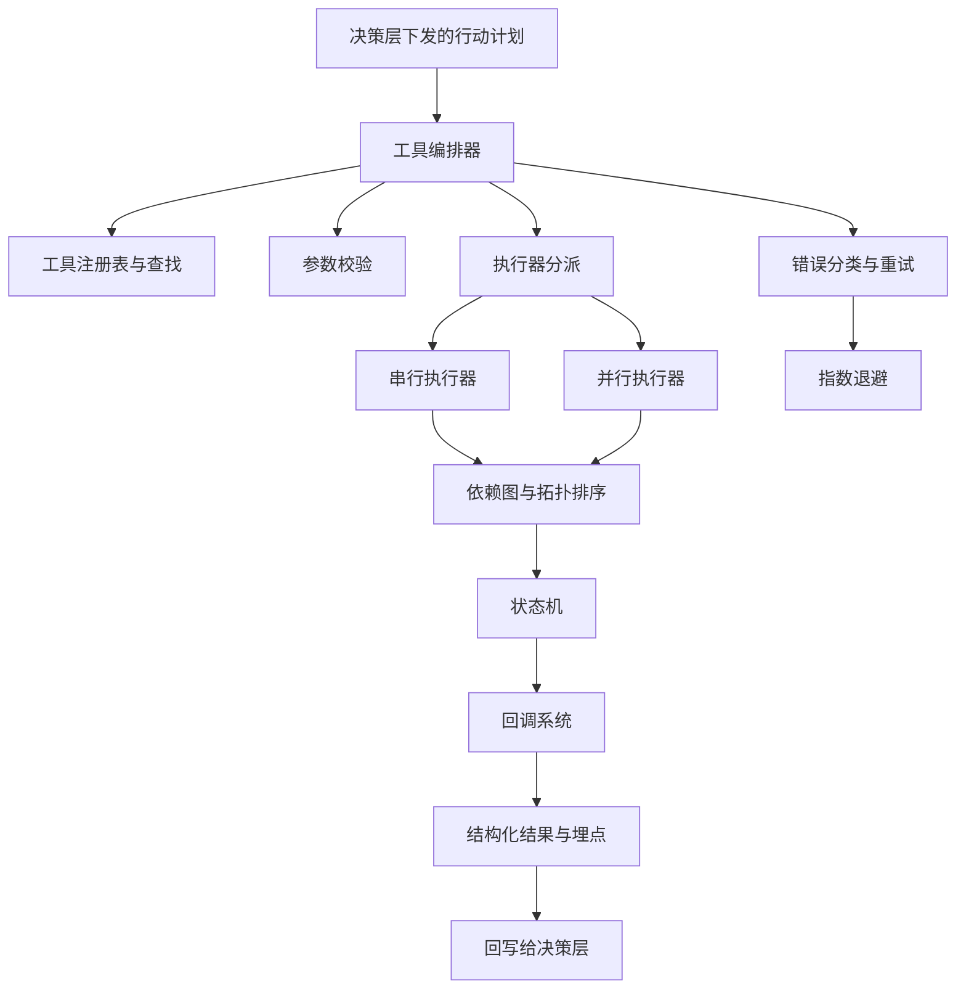
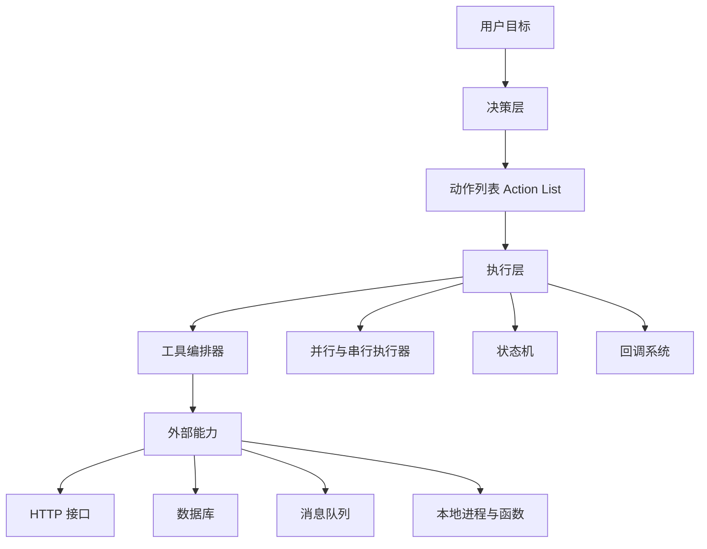
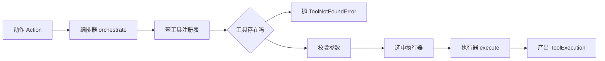
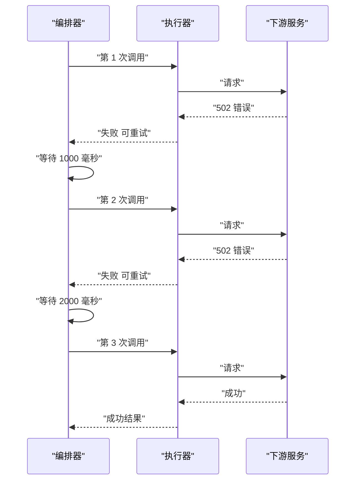
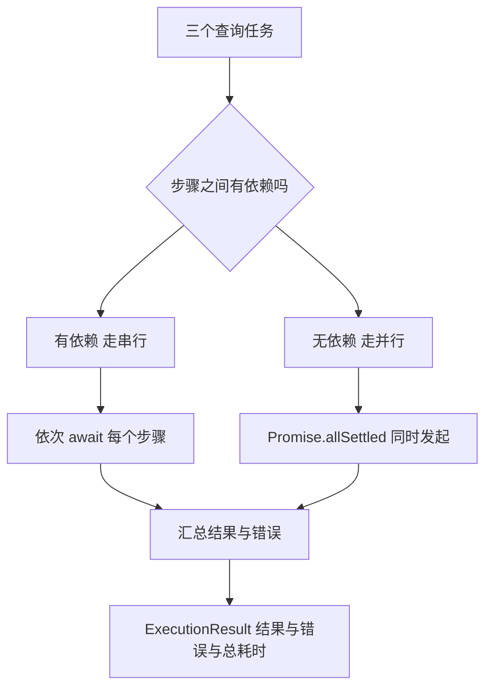
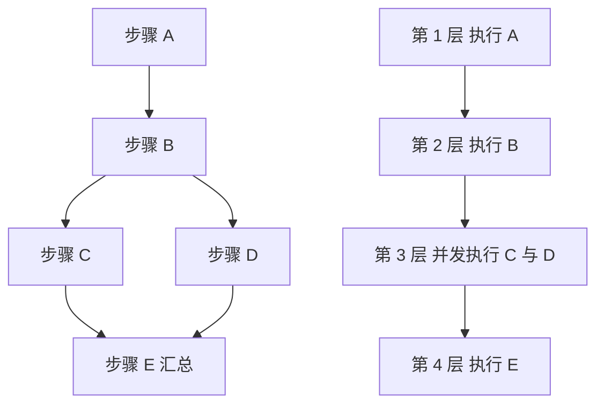
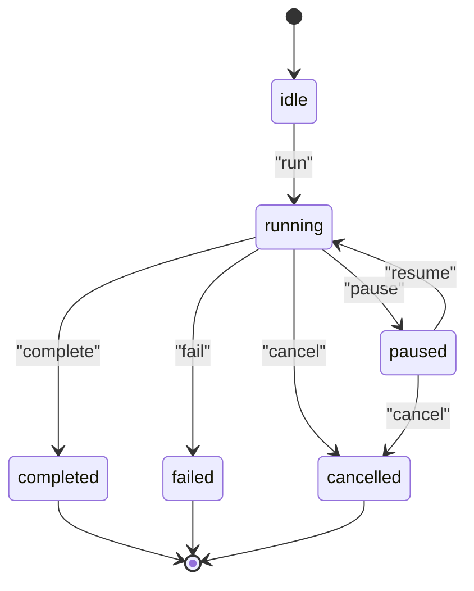
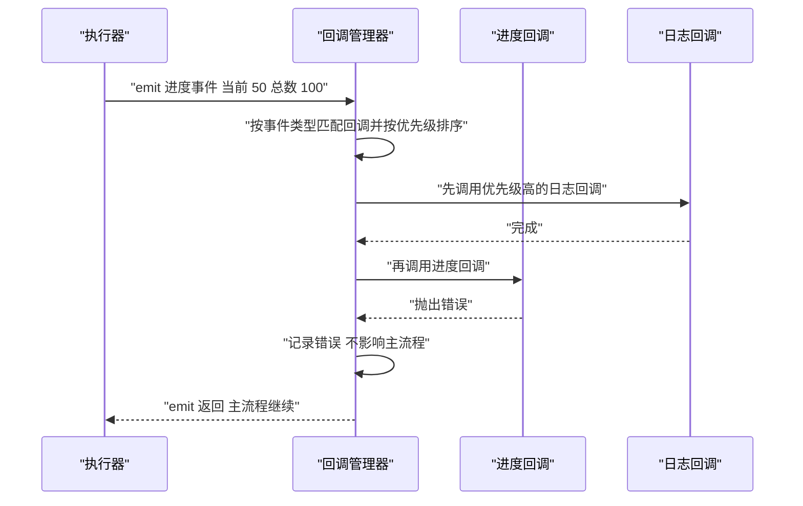
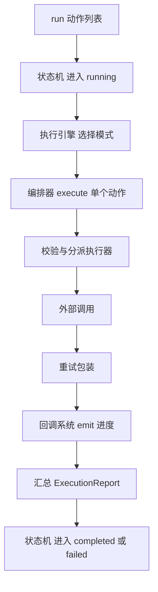

# 执行层

!!! abstract "学完这一页你能"
    1. 写出一个带注册表、参数校验、执行器分派的工具编排器，并能说出每一层为什么需要它。
    2. 用串行、并行、依赖图三种模式执行同一批动作，并用断言验证执行顺序与并发收益。
    3. 用一个显式状态机管理执行的暂停、恢复与失败，并解释为什么不能只用一个 status 字符串。
    4. 把进度与结果通过回调系统上报出去，且证明回调自身抛错不会影响主流程。

## 0. 知识地图



建议先读第 1 节，把执行层的输入输出契约记牢，后面所有代码都在填这两个结构。
第 2、4、6 节是主体，分别解决"调谁""怎么排""怎么记"三件事。
第 3、5 节是上一节的放大镜，读完再回头看你写的编排器会立刻发现缺口。

## 1. 执行层的职责边界

**先想一个问题**

客服坐席点了一下"重新生成工单摘要"。决策层给出的计划是：拉取工单、调用摘要模型、发送站内通知。
谁负责真正发请求、失败后隔多久再试、最终告诉上层"成了没有"？

!!! tip "心智模型"
    一句话模型：执行层把"要做什么"翻译成"做成了没有"。
    日常类比：传菜口收到菜单，厨师按单做菜，出锅时回报一道菜的完成状态。
    类比不成立处：厨师能凭经验改菜谱，执行层不允许改动计划内容，只能按既定策略重试或如实上报失败。

!!! note "术语：执行层"
    定义：接收决策层产出的结构化动作列表，负责调用外部能力并把结果规范化上报的软件层。
    例子：决策层说"调用 weather 工具查北京天气"，执行层负责校验参数、发请求、记录耗时、返回结构化结果。

**图解**



1. 用户目标先由决策层拆成动作列表，执行层看不到原始目标。
2. 执行层内部的编排器负责"调谁"，执行器负责"怎么并发"。
3. 状态机负责"现在处于哪一站"，回调系统负责"把过程说出去"。
4. 四个部件共同产出结构化结果，再回写给决策层。
5. 外部能力包含 HTTP 接口、数据库、消息队列、本地进程四类载体。

**一步一步来**

第 1 步：这一步要做什么。先把执行层的输入与输出定义成两个数据结构，避免后面各处字段名打架。

```ts
// 执行层的数据契约，只声明类型，不能直接运行
interface Action {                     // 决策层下发的单个动作
  id: string;                          // 动作唯一标识，用于结果回填
  tool: string;                        // 要调用的工具 id
  parameters: Map<string, unknown>;    // 工具参数键值对
}

interface ToolExecution {              // 执行层上报的单个结果
  toolId: string;                      // 对应哪个工具
  success: boolean;                    // 是否成功
  result?: unknown;                    // 成功时的返回值
  error?: Error;                       // 失败时的错误对象
  duration: number;                    // 耗时毫秒数
}
```

**这段代码在做什么**

1. `Action` 只描述"要做什么"，不携带"怎么重试"这类执行策略。
2. `id` 的存在是为了让结果能回填到对应动作，支持并行乱序返回。
3. `parameters` 用 `Map` 而不是对象，便于统一做必填与类型校验。
4. `ToolExecution` 把成功与失败放在同一个结构里，调用方不用区分两种返回渠道。
5. `duration` 单独成字段，是为了后面统计耗时与做超时告警。

第 2 步：这一步要做什么。写一个最小执行函数，跑通一次调用，确认契约可用。

```js
// 最小执行函数：查表、调用、产出结构化结果
const tools = new Map();                                  // 工具注册表
tools.set('echo', { id: 'echo', run: async (p) => p.get('text') }); // 注册回声工具

async function execute(action) {                          // action 来自决策层
  const tool = tools.get(action.tool);                    // 按 id 查找工具
  if (!tool) throw new Error('tool not found: ' + action.tool); // 查不到直接抛错
  const startedAt = Date.now();                           // 记录开始时间
  try {
    const result = await tool.run(action.parameters);     // 真正调用工具
    return { toolId: tool.id, success: true, result, duration: Date.now() - startedAt };
  } catch (error) {
    return { toolId: tool.id, success: false, error, duration: Date.now() - startedAt };
  }
}
```

**这段代码在做什么**

1. 注册表用 `Map` 保存工具，键是工具 id，值是工具定义与执行函数。
2. 查找失败直接抛错，属于调用方写错了工具名，不该静默返回失败结果。
3. 工具自身抛出的错误被 `try` 接住，转成 `success: false` 的结果对象。
4. 成功与失败都会带上耗时，方便统一统计。
5. 返回结构始终是 `ToolExecution`，调用方只看一个字段就能判断结果。

运行结果：`success` 为 `true`，`result` 为 `hi`，`duration` 是非负整数。

**动手验证**

```js
// 依赖：仅 Node 20 内置模块
import assert from 'node:assert/strict';

const tools = new Map();
tools.set('echo', { id: 'echo', run: async (p) => p.get('text') });
tools.set('boom', { id: 'boom', run: async () => { throw new Error('upstream 500'); } });

async function execute(action) {
  const tool = tools.get(action.tool);
  if (!tool) throw new Error('tool not found: ' + action.tool);
  const startedAt = Date.now();
  try {
    const result = await tool.run(action.parameters);
    return { toolId: tool.id, success: true, result, duration: Date.now() - startedAt };
  } catch (error) {
    return { toolId: tool.id, success: false, error, duration: Date.now() - startedAt };
  }
}

const ok = await execute({ tool: 'echo', parameters: new Map([['text', 'hi']]) });
assert.equal(ok.success, true);
assert.equal(ok.result, 'hi');
assert.ok(Number.isInteger(ok.duration) && ok.duration >= 0);

const bad = await execute({ tool: 'boom', parameters: new Map() });
assert.equal(bad.success, false);
assert.equal(bad.error.message, 'upstream 500');

console.log('契约断言全部通过');
// 预期输出：契约断言全部通过
```

**常见坑**

| 现象 | 原因 | 怎么修 |
| --- | --- | --- |
| 决策层里出现了 HTTP 状态码判断 | 执行细节漏进了上层 | 把状态码映射成执行层的错误分类字段 |
| 并行返回的结果对不上动作 | 结果没带 `id` 或 `toolId` | 每个结果都必须带上来源动作 id |
| 线上报错只有一句 message | 没有记录工具名与耗时 | 结果结构里固定加工具 id 与 duration |

**用在哪里**

场景一：客服工单自动摘要的后台服务。
业务背景：坐席点击重新生成摘要，需要拉数据、调模型、写通知三步。
这一节的知识怎么用：把三步定义成三个 `Action`，执行层只负责调用与上报，不掺业务判断。
用什么指标衡量收益：单次执行的成功率与失败时的可定位率，即失败结果里带工具 id 的比例。
什么时候不该用：如果整个流程只有一个固定调用且永不重试，直接写一个函数即可。

场景二：IDE 编程助手执行文件修改与测试命令。
业务背景：助手要改文件、跑构建命令、再把输出贴回对话。
这一节的知识怎么用：文件修改与命令执行定义为两类工具，结果统一成 `ToolExecution` 再回给模型。
用什么指标衡量收益：每次工具调用的耗时分布，用于判断模型该不该继续下一步。
什么时候不该用：需要人工逐步确认的高风险操作，不该由执行层直接落地。

**行业实践**

- Anthropic 官方文章《Building effective agents》把编排写成预定义代码路径的做法称为 workflow，并列出 prompt chaining、routing、parallelization、orchestrator-workers、evaluator-optimizer 五种模式。借鉴方式：先用 workflow 把确定步骤写死，只在步骤无法预判时才交给模型决定。
- Model Context Protocol 官方规范中把工具能力拆成"列出工具"与"调用工具"两个独立步骤。借鉴方式：工具注册表提供查询能力，让上层先看清有哪些工具再决定调哪个。
- 具体字段与协议版本需核对官方文档：MCP 规范中 tools 章节的字段定义。

**小结**

1. 执行层的输入是动作列表，输出是结构化结果，中间不做业务决策。
2. 契约里的耗时与工具 id 是后续重试、埋点、排障的基础。
3. 查不到工具属于调用方错误，应当抛错，而不是返回失败结果。

## 2. 工具编排器

**先想一个问题**

同一个问题"查一下订单状态"，后台可能有 HTTP 工具、数据库工具、内部 RPC 工具三种实现。
如果每种工具都在业务代码里 `if` 一次，新增一个工具要改多少处？

!!! tip "心智模型"
    一句话模型：编排器是一张会校验参数的总机，负责查表、验参、转接。
    日常类比：公司前台接到电话，先确认找谁，再转接到对应分机。
    类比不成立处：前台不关心电话内容，编排器必须校验参数类型与必填项，还要记录耗时与错误。

!!! note "术语：工具编排器（Tool Orchestrator）"
    定义：集中管理工具定义、负责查找、参数校验并把调用分派给具体执行器的组件。
    例子：注册表里存了 `http` 与 `code` 两类工具，编排器按工具类别把调用交给对应的执行器。

!!! note "术语：执行器（Executor）"
    定义：真正把一个工具的调用落地成外部请求或本地计算的适配层。
    例子：HTTP 执行器把参数拼成请求；代码执行器把代码交给沙箱进程运行。

**图解**



1. 动作先进入编排器，编排器不直接关心外部协议。
2. 第一步查注册表，查不到就抛工具未找到错误。
3. 第二步按工具定义逐项校验参数，必填缺失与类型不符分别报错。
4. 第三步按工具类别选中执行器，HTTP 与代码走不同适配层。
5. 执行器返回原始结果，编排器包成 `ToolExecution` 后返回。

**一步一步来**

第 1 步：这一步要做什么。先建注册表，把工具定义按 id 存起来，并支持按类别注册执行器。

```js
// 注册表与执行器表：两个 Map 分别管工具定义与调用适配
class ToolOrchestrator {
  constructor() {
    this.tools = new Map();       // 键是工具 id，值是工具定义
    this.executors = new Map();   // 键是工具类别，值是执行器
  }
  registerTool(definition) {      // 注册一个工具定义
    this.tools.set(definition.id, definition);
  }
  registerExecutor(category, executor) { // 注册某类别的执行器
    this.executors.set(category, executor);
  }
  getTool(toolId) {               // 按 id 查找，找不到就抛错
    const tool = this.tools.get(toolId);
    if (!tool) throw new Error('tool not found: ' + toolId);
    return tool;
  }
}
```

**这段代码在做什么**

1. 工具定义与执行器分成两张表，因为多个工具可以共用一个执行器。
2. `registerTool` 只负责登记，不做校验，便于启动期批量装载。
3. `registerExecutor` 按类别登记，新增协议只需加一个执行器。
4. `getTool` 把查找失败的判断集中到一处，避免调用方各写一遍。
5. 两张表都是 `Map`，查找复杂度与工具数量无关。

第 2 步：这一步要做什么。补上参数校验，必填与类型两类问题分开报错。

```js
function validateParams(tool, params) {                 // params 是 Map
  for (const param of tool.parameters) {                // 逐项检查工具定义的参数
    const value = params.get(param.name);               // 取出实际传入值
    if (param.required && (value === undefined || value === null)) {
      throw new Error('missing param: ' + param.name);  // 必填缺失
    }
    if (value === undefined) continue;                  // 选填且未传，跳过类型检查
    if (param.type === 'number' && typeof value !== 'number') {
      throw new Error('type mismatch: ' + param.name);  // 类型不符
    }
    if (param.type === 'string' && typeof value !== 'string') {
      throw new Error('type mismatch: ' + param.name);
    }
  }
}
```

**这段代码在做什么**

1. 校验依据是工具定义里的 `parameters`，不是调用方传进来的字段。
2. 必填判断同时排除 `undefined` 与 `null`，避免空值穿透。
3. 选填且未传时直接跳过，否则会把没传的字段判成类型错误。
4. 类型不符单独报错，和必填缺失区分，便于上游按错误类型处理。
5. 校验发生在调用之前，避免带着错误参数打到下游。

运行结果：参数齐全时无输出；缺必填时抛出 `missing param` 开头的错误。

第 3 步：这一步要做什么。把查表、校验、选执行器三步串成一个 `execute`。

```js
async execute(action, context) {
  const tool = this.getTool(action.tool);            // 第一步：查表
  validateParams(tool, action.parameters);           // 第二步：校验
  const executor = this.executors.get(tool.category); // 第三步：选执行器
  if (!executor) throw new Error('no executor for: ' + tool.category);
  const startedAt = Date.now();
  try {
    const result = await executor.execute(tool, action.parameters, context);
    return { toolId: tool.id, success: true, result, duration: Date.now() - startedAt };
  } catch (error) {
    return { toolId: tool.id, success: false, error, duration: Date.now() - startedAt };
  }
}
```

**这段代码在做什么**

1. 三步顺序固定：先确认工具存在，再确认参数合法，最后确认执行器可用。
2. 执行器按 `tool.category` 选择，同一个执行器可以被多个工具复用。
3. 缺执行器属于部署配置问题，直接抛错而不是返回失败结果。
4. 只有执行器内部的异常才被转成 `success: false`，便于区分"配置错"与"调用失败"。
5. `context` 透传给执行器，用来携带租户、超时、取消信号等信息。

**动手验证**

```js
// 依赖：仅 Node 20 内置模块
import assert from 'node:assert/strict';

class ToolOrchestrator {
  constructor() { this.tools = new Map(); this.executors = new Map(); }
  registerTool(d) { this.tools.set(d.id, d); }
  registerExecutor(c, e) { this.executors.set(c, e); }
  getTool(id) {
    const t = this.tools.get(id);
    if (!t) throw new Error('tool not found: ' + id);
    return t;
  }
  async execute(action, context = {}) {
    const tool = this.getTool(action.tool);
    validateParams(tool, action.parameters);
    const executor = this.executors.get(tool.category);
    if (!executor) throw new Error('no executor for: ' + tool.category);
    const startedAt = Date.now();
    try {
      const result = await executor.execute(tool, action.parameters, context);
      return { toolId: tool.id, success: true, result, duration: Date.now() - startedAt };
    } catch (error) {
      return { toolId: tool.id, success: false, error, duration: Date.now() - startedAt };
    }
  }
}

function validateParams(tool, params) {
  for (const param of tool.parameters) {
    const value = params.get(param.name);
    if (param.required && (value === undefined || value === null)) {
      throw new Error('missing param: ' + param.name);
    }
    if (value === undefined) continue;
    if (param.type === 'number' && typeof value !== 'number') {
      throw new Error('type mismatch: ' + param.name);
    }
    if (param.type === 'string' && typeof value !== 'string') {
      throw new Error('type mismatch: ' + param.name);
    }
  }
}

const o = new ToolOrchestrator();
o.registerTool({ id: 'order.status', category: 'web',
  parameters: [{ name: 'orderId', type: 'string', required: true }] });
o.registerExecutor('web', { execute: async (tool, p) => ({ status: 'PAID', orderId: p.get('orderId') }) });

const hit = await o.execute({ tool: 'order.status', parameters: new Map([['orderId', 'A1']]) });
assert.equal(hit.success, true);
assert.equal(hit.result.status, 'PAID');

await assert.rejects(
  () => o.execute({ tool: 'order.status', parameters: new Map() }),
  /missing param: orderId/);
await assert.rejects(
  () => o.execute({ tool: 'unknown.tool', parameters: new Map() }),
  /tool not found/);

console.log('编排器断言全部通过');
// 预期输出：编排器断言全部通过
```

**常见坑**

| 现象 | 原因 | 怎么修 |
| --- | --- | --- |
| 参数校验通过但下游报错 | 只查了必填，没查类型 | 校验函数里补类型分支 |
| 新增一种协议要改核心代码 | 执行器按工具 id 注册 | 改成按工具类别注册执行器 |
| 工具未找到被当成调用失败 | 查找失败被 `try` 包住 | 把查找与校验放在 `try` 之外 |

**用在哪里**

场景一：企业内部工具网关。
业务背景：多个业务线要用同一批查询工具，各自接入方式不同。
这一节的知识怎么用：工具定义集中在网关，执行器按协议分类，业务线只发动作。
用什么指标衡量收益：新增一个工具需要改动的文件数。
什么时候不该用：只有一两个私有工具且不共享时，加一层网关只增加跳转。

场景二：多租户 SaaS 平台按租户启用工具。
业务背景：不同套餐开放的工具有差别，需要在调用前拦下来。
这一节的知识怎么用：在编排器进入执行器之前加一步权限判断，未开通直接抛错。
用什么指标衡量收益：越权调用被拦下的次数。
什么时候不该用：租户之间没有任何能力差异时，不需要这层判断。

**行业实践**

- Model Context Protocol 官方规范的 tools 部分把工具定义、工具列举与工具调用拆开描述。借鉴方式：注册表对外提供一次查询接口，让上层先拿到工具清单再决定调用。
- OpenAI 平台官方文档的 Function calling 章节用 JSON Schema 描述函数参数。借鉴方式：把工具参数定义写成可校验的结构，而不是自由文本说明。
- JSON Schema 官方规范的 Validation 章节提供了类型与必填的判定规则。借鉴方式：校验失败时按 JSON Pointer 定位到具体字段，报错更好排查。

**小结**

1. 编排器只做三件事：查表、校验、分派，不承载业务判断。
2. 工具定义按 id 管理，执行器按类别管理，两者分开才能复用。
3. 查不到工具与参数不合法属于调用方错误，应当抛出而不是转成失败结果。

## 3. 失败处理：错误分类、重试与指数退避

**先想一个问题**

下游订单服务偶发返回 502，可能一秒后就好了，也可能是对方在发版要持续十分钟。
无限重试会把对方压垮，一次都不重试又会把偶发抖动暴露给用户。怎么定这条线？

!!! tip "心智模型"
    一句话模型：先判断这次失败值不值得再试，再决定隔多久试。
    日常类比：打电话占线，等一会儿再拨，第二次比第一次间隔长一点。
    类比不成立处：打电话不会产生副作用，写操作重试可能重复下单，必须先确认幂等。

!!! note "术语：指数退避"
    定义：每次重试的等待时间按固定倍数增长的重试节奏。
    例子：基础间隔 1000 毫秒，第 1 次等 1000 毫秒，第 2 次等 2000 毫秒，第 3 次等 4000 毫秒。

!!! note "术语：幂等"
    定义：同一个请求执行一次与执行多次，对外部状态产生的影响相同。
    例子：把订单状态设置为"已支付"是幂等的，把余额加 10 元不是。

**图解**



1. 第一次调用直接把下游错误原样传回编排器。
2. 编排器判断该错误属于可重试类别，于是按退避公式等待。
3. 第二次调用仍失败，等待时间翻倍。
4. 第三次调用成功，重试循环提前结束。
5. 如果尝试次数用尽仍失败，编排器返回最后一次的错误。

**一步一步来**

第 1 步：这一步要做什么。先给错误分类，把"值得再试"和"再试也没用"分开。

```js
// 错误分类：只按状态码与错误类型判断，不猜业务语义
function classifyError(error) {
  const status = error && error.status;              // 下游返回的状态码
  if (status === 408 || status === 429) return 'retryable'; // 超时与限流可重试
  if (status >= 500) return 'retryable';              // 服务端错误可重试
  if (status >= 400) return 'fatal';                  // 客户端错误重试无用
  if (error && error.code === 'ECONNRESET') return 'retryable'; // 连接被重置
  if (error && error.code === 'ETIMEDOUT') return 'retryable';  // 连接超时
  return 'fatal';                                     // 其余按不可重试处理
}
```

**这段代码在做什么**

1. 分类只依赖状态码与错误码，不解析错误文案，避免文案改动导致行为变化。
2. 408 与 429 归为可重试，因为它们表达的是"此刻不行"，不是"请求写错了"。
3. 4xx 里的其余状态归为不可重试，重试只会重复同样的失败。
4. 默认走不可重试，防止未知错误被无限尝试。
5. 函数是纯函数，方便单独写断言测试。

第 2 步：这一步要做什么。按指数退避算等待时间，并加上尝试上限。

```js
function backoffDelay(attempt, baseDelay) {   // attempt 从 1 开始
  const raw = baseDelay * Math.pow(2, attempt - 1); // 1000 2000 4000
  return Math.min(raw, 30000);                // 上限 30 秒，防止等待失控
}

async function withRetry(run, options) {
  const { maxRetries = 3, baseDelay = 1000, sleep } = options;
  let lastError;
  for (let attempt = 1; attempt <= maxRetries; attempt++) {
    try {
      return await run();                     // 尝试执行
    } catch (error) {
      lastError = error;                      // 记住最后一次错误
      if (classifyError(error) === 'fatal') break; // 不可重试立刻退出
      if (attempt === maxRetries) break;      // 次数用尽退出
      await sleep(backoffDelay(attempt, baseDelay)); // 等待后进入下一轮
    }
  }
  throw lastError;                            // 把最后一次错误抛给调用方
}
```

**这段代码在做什么**

1. 退避公式是基础间隔乘以 2 的尝试次数减一次方，得到 1000、2000、4000。
2. 上限 30000 毫秒防止第 6 次以后等待时间不可控。
3. `sleep` 由外部注入，测试时可以传一个只记录时长、不真正等待的函数。
4. 不可重试错误立刻跳出循环，不浪费尝试次数。
5. 次数用尽后抛出最后一次错误，保留原始错误信息。

运行结果：`backoffDelay(1, 1000)` 返回 1000，`backoffDelay(2, 1000)` 返回 2000，`backoffDelay(3, 1000)` 返回 4000。

**动手验证**

```js
// 依赖：仅 Node 20 内置模块
import assert from 'node:assert/strict';

function classifyError(error) {
  const status = error && error.status;
  if (status === 408 || status === 429) return 'retryable';
  if (status >= 500) return 'retryable';
  if (status >= 400) return 'fatal';
  return 'fatal';
}

function backoffDelay(attempt, baseDelay) {
  return Math.min(baseDelay * Math.pow(2, attempt - 1), 30000);
}

async function withRetry(run, options) {
  const { maxRetries = 3, baseDelay = 1000, sleep } = options;
  let lastError;
  for (let attempt = 1; attempt <= maxRetries; attempt++) {
    try {
      return { value: await run(), attempts: attempt };
    } catch (error) {
      lastError = error;
      if (classifyError(error) === 'fatal') break;
      if (attempt === maxRetries) break;
      await sleep(backoffDelay(attempt, baseDelay));
    }
  }
  throw lastError;
}

const waits = [];
const fakeSleep = async (ms) => { waits.push(ms); };   // 只记录不真正等待

let calls = 0;
const flaky = async () => {
  calls += 1;
  if (calls < 3) { const e = new Error('bad gateway'); e.status = 502; throw e; }
  return 'PAID';
};

const ok = await withRetry(flaky, { maxRetries: 3, baseDelay: 1000, sleep: fakeSleep });
assert.equal(ok.value, 'PAID');
assert.equal(ok.attempts, 3);
assert.deepEqual(waits, [1000, 2000]);

let calls2 = 0;
const badRequest = async () => { calls2 += 1; const e = new Error('bad'); e.status = 400; throw e; };
await assert.rejects(() => withRetry(badRequest, { maxRetries: 3, baseDelay: 1000, sleep: fakeSleep }),
  /bad/);
assert.equal(calls2, 1);

console.log('重试断言全部通过', waits);
// 预期输出：重试断言全部通过 [ 1000, 2000 ]
```

**常见坑**

| 现象 | 原因 | 怎么修 |
| --- | --- | --- |
| 对方服务被打垮 | 所有调用方同时重试且无抖动 | 在退避时间上加随机抖动 |
| 重试导致重复下单 | 写操作不是幂等 | 传入幂等键，或把写操作排除在重试之外 |
| 单次调用耗时超出上游超时 | 重试总时长没有上限 | 给整轮重试加总超时并提前退出 |

**用在哪里**

场景一：支付结果对账任务。
业务背景：每天定时拉取渠道账单，渠道偶发限流。
这一节的知识怎么用：429 归为可重试并加退避，400 类错误直接落库待人工处理。
用什么指标衡量收益：对账任务最终成功率与人工介入工单数量。
什么时候不该用：渠道明确声明不允许自动重试时，只能排队到下一轮。

场景二：后台管理批量导入中的单行重试。
业务背景：一万行客户数据导入，个别行因下游超时失败。
这一节的知识怎么用：只对超时类错误重试，参数格式错误直接标记该行失败。
用什么指标衡量收益：整批任务无需重跑即可成功的行数占比。
什么时候不该用：行与行之间存在顺序依赖时，单独重试某一行会破坏顺序。

**行业实践**

- AWS Architecture Blog 的文章《Exponential Backoff And Jitter》说明退避加上抖动可减少同时重试带来的尖峰。借鉴方式：把等待时间改成基础值加一个随机偏移。
- Google SRE Book 的《Addressing Cascading Failures》章节讨论重试放大导致连锁故障的机制。借鉴方式：给整条调用链设定重试预算，超过预算直接快速失败。
- HTTP 语义规范 RFC 9110 的 Method Definitions 章节列出了幂等方法如 GET、HEAD、PUT、DELETE、OPTIONS、TRACE。借鉴方式：只对幂等方法所在的调用启用自动重试。

**小结**

1. 先分类再重试，可重试与不可重试走不同分支。
2. 退避时间按倍数增长并设上限，避免等待失控。
3. 重试的前提是幂等，写操作要额外设计幂等键。

## 4. 并行与串行执行器

**先想一个问题**

生成一份周报要查订单库、用户库、日志库三个数据源，再合成一份文档。
三个查询互不依赖，如果依次执行，总耗时是三者之和。能否同时发起？

!!! tip "心智模型"
    一句话模型：串行是排队，并行是开多个窗口，先看依赖再决定用哪个。
    日常类比：奶茶店排队，一个人点单一个人做，另一个窗口同时服务下一单。
    类比不成立处：窗口数量有限，并行必须设并发上限，否则会把下游压满。

**图解**



1. 先判断步骤之间是否存在数据依赖。
2. 有依赖的步骤进入串行分支，按顺序逐个 `await`。
3. 无依赖的步骤进入并行分支，同时发起请求。
4. 并行分支用 `allSettled`，单个失败不会丢掉其余成功结果。
5. 两个分支最终都汇总成带结果、错误与总耗时的结构。

**一步一步来**

第 1 步：这一步要做什么。实现串行执行，并检查每一步的依赖是否已经满足。

```js
async function executeSequential(steps) {
  const results = new Map();                     // 已完成步骤的结果
  const errors = new Map();                      // 失败步骤的错误
  for (const step of steps) {                    // 按声明顺序逐条执行
    const ready = step.dependencies.every((id) => results.has(id));
    if (!ready) {                                // 依赖没满足就不执行
      errors.set(step.id, new Error('dependency not satisfied: ' + step.id));
      continue;                                  // 继续处理后面的步骤
    }
    try {
      results.set(step.id, await step.run());    // 执行并记录结果
    } catch (error) {
      errors.set(step.id, error);                // 记录错误并继续
    }
  }
  return { results: Object.fromEntries(results), errors: Object.fromEntries(errors) };
}
```

**这段代码在做什么**

1. 结果与错误分两张表，成功与失败互不覆盖。
2. 依赖检查基于已完成结果，而不是基于是否被执行过。
3. 依赖未满足时写入错误并跳过，不阻塞后面的独立步骤。
4. 单步失败只记错误，循环继续，便于一次拿到全部失败清单。
5. 返回前把 `Map` 转成普通对象，方便序列化上报。

第 2 步：这一步要做什么。实现并行执行，按并行组分组并用 `allSettled` 收口。

```js
async function executeParallel(steps) {
  const groups = new Map();                       // 组名到步骤数组
  for (const step of steps) {
    const key = step.parallelGroup || ('alone_' + step.id); // 未分组独立成组
    if (!groups.has(key)) groups.set(key, []);
    groups.get(key).push(step);
  }
  const results = new Map();
  const errors = new Map();
  for (const group of groups.values()) {          // 组内并行 组间串行
    const settled = await Promise.allSettled(group.map((s) => s.run()));
    settled.forEach((item, index) => {
      const id = group[index].id;
      if (item.status === 'fulfilled') results.set(id, item.value);
      else errors.set(id, item.reason);           // 失败不中断其他步骤
    });
  }
  return { results: Object.fromEntries(results), errors: Object.fromEntries(errors) };
}
```

**这段代码在做什么**

1. 用 `parallelGroup` 给步骤分组，没分组的步骤各自成组。
2. 组内用 `Promise.allSettled` 同时执行，永远不抛错，只会返回状态。
3. 组与组之间保持串行，用于控制同一时刻的压力。
4. 用索引把返回结果与原始步骤对回去，保证结果不错位。
5. 失败被写成错误对象，成功结果不受影响。

运行结果：三个各耗时 40 毫秒的任务并行后，总耗时小于三者串行之和。

第 3 步：这一步要做什么。加一个并发上限，避免一次发起过多请求。

```js
async function runWithLimit(tasks, limit) {
  const results = new Array(tasks.length);        // 按下标保存结果
  let cursor = 0;                                 // 下一个要取的任务下标
  async function worker() {
    while (cursor < tasks.length) {               // 取完为止
      const index = cursor++;                     // 先取下标再自增
      results[index] = await tasks[index]();      // 执行并把结果放回原位
    }
  }
  const workers = Array.from({ length: Math.min(limit, tasks.length) }, worker);
  await Promise.all(workers);                     // 等所有 worker 结束
  return results;                                 // 顺序与输入一致
}
```

**这段代码在做什么**

1. 启动固定数量的 worker，每个 worker 循环领取任务。
2. `cursor++` 的取值与自增是同步的，不会有两个 worker 领到同一个下标。
3. 结果按下标回填，最终顺序与输入顺序一致。
4. worker 数量取并发上限与任务数的较小值。
5. `await Promise.all(workers)` 表示所有任务都已处理完。

**动手验证**

```js
// 依赖：仅 Node 20 内置模块
import assert from 'node:assert/strict';

const sleep = (ms) => new Promise((r) => setTimeout(r, ms));

async function executeSequential(steps) {
  const results = new Map();
  const startedAt = Date.now();
  for (const step of steps) results.set(step.id, await step.run());
  return { results: Object.fromEntries(results), duration: Date.now() - startedAt };
}

async function executeParallel(steps) {
  const results = new Map();
  const errors = new Map();
  const startedAt = Date.now();
  const settled = await Promise.allSettled(steps.map((s) => s.run()));
  settled.forEach((item, index) => {
    const id = steps[index].id;
    if (item.status === 'fulfilled') results.set(id, item.value);
    else errors.set(id, item.reason);
  });
  return {
    results: Object.fromEntries(results),
    errors: Object.fromEntries(errors),
    duration: Date.now() - startedAt
  };
}

const tasks = [
  { id: 'orders', run: async () => { await sleep(40); return 'orders-ok'; } },
  { id: 'users', run: async () => { await sleep(40); return 'users-ok'; } },
  { id: 'logs', run: async () => { throw new Error('logs down'); } }
];

const par = await executeParallel(tasks);
assert.equal(par.results.orders, 'orders-ok');
assert.equal(par.results.users, 'users-ok');
assert.equal(par.errors.logs.message, 'logs down');
assert.ok(par.duration < 120, '并行总耗时应小于串行之和');

const seq = await executeSequential(tasks.slice(0, 2));
assert.ok(seq.duration >= 80, '串行总耗时不少于两步之和');

console.log('串并行断言全部通过');
// 预期输出：串并行断言全部通过
```

**常见坑**

| 现象 | 原因 | 怎么修 |
| --- | --- | --- |
| 一个步骤失败整套结果为空 | 用了 `Promise.all` | 换成 `Promise.allSettled` 再分类处理 |
| 下游被打出大量连接错误 | 并行没有并发上限 | 用 worker 池限制同时执行数 |
| 结果与步骤对不上 | 返回顺序与输入顺序不一致 | 按下标回填或给结果带上步骤 id |

**用在哪里**

场景一：周报生成的多数据源拉取。
业务背景：报表页要同时展示订单、用户、日志三个口径的数字。
这一节的知识怎么用：三个查询放进同一个并行组，合成步骤依赖它们全部完成。
用什么指标衡量收益：报表首屏可用的等待时间从三者之和降到其中最慢的一个。
什么时候不该用：三个查询打的是同一个库且该库连接数紧张时，串行反而稳。

场景二：后台管理批量导入的行级校验。
业务背景：每行都要调一次外部校验接口，单行耗时几十毫秒。
这一节的知识怎么用：用并发上限 5 的 worker 池并行校验，结果按行号回填。
用什么指标衡量收益：整批导入的总时长与失败行定位的准确率。
什么时候不该用：外部接口有严格配额时，应按配额设置并发数或改为批量接口。

**行业实践**

- Anthropic 官方文章《Building effective agents》列出了 parallelization 与 orchestrator-workers 两种并行编排模式。借鉴方式：把互不依赖的步骤编成同一并行组，把依赖汇总的步骤单独放一组。
- Node.js 官方文档中 `Promise.allSettled` 的说明指出它等所有 Promise 落定后返回状态数组。借鉴方式：需要拿到全部失败清单时用它，不要用 `Promise.all`。
- Kubernetes 官方文档的 Job 章节介绍了并行度与完成数的配置项。借鉴方式：把并发上限做成配置项，而不是写死在代码里。

**小结**

1. 先看依赖再选模式，串行与并行不是性能取舍而是正确性问题。
2. 并行结果必须能对回原始步骤，靠 id 或下标绑定。
3. 并行一定要有并发上限，避免把不稳定下游压垮。

## 5. 依赖图与混合执行

**先想一个问题**

一个任务里，B 必须等 A 完成，C 和 D 之间没有关系但要等 B。
这种既有先后又能并发的排法，用纯串行或纯并行都表达不了。

!!! tip "心智模型"
    一句话模型：先把步骤排成有向无环图，再按层推进，同层并发。
    日常类比：装修先走水电，再刷墙和铺地，最后装柜子。
    类比不成立处：装修可以边刷墙边改水电，图模型不允许，出现环就必须报错停下。

!!! note "术语：拓扑排序"
    定义：把有向图中的节点排成一条线性顺序，使每条边的起点都排在终点之前。
    例子：A 指向 B，排序结果里 A 必须出现在 B 之前。

!!! note "术语：有向无环图（Directed Acyclic Graph）"
    定义：边有方向且不存在任何回路的图。
    例子：A 指向 B，B 指向 C，且没有任何路径从 C 回到 A。

**图解**



1. 上半部分是依赖图，箭头表示先后约束。
2. 下半部分是按层划分后的执行顺序，同层步骤互不依赖。
3. 第 1 层只有 A，单独执行。
4. 第 2 层只有 B，等 A 完成后执行。
5. 第 3 层是 C 与 D，可以同时执行。
6. 第 4 层是 E，等 C 与 D 都完成后执行。

**一步一步来**

第 1 步：这一步要做什么。由步骤列表构建邻接表与入度表，这是拓扑排序的输入。

```js
function buildGraph(steps) {
  const adjacency = new Map();                 // 起点到后继列表
  const inDegree = new Map();                  // 每个节点的入度
  for (const step of steps) {
    adjacency.set(step.id, []);                // 先给每个节点建空后继表
    inDegree.set(step.id, 0);                  // 入度从 0 开始
  }
  for (const step of steps) {
    for (const dep of step.dependencies) {
      if (!adjacency.has(dep)) continue;       // 忽略图外依赖
      adjacency.get(dep).push(step.id);        // 依赖指向当前步骤
      inDegree.set(step.id, inDegree.get(step.id) + 1); // 当前步骤入度加一
    }
  }
  return { adjacency, inDegree };
}
```

**这段代码在做什么**

1. 邻接表记录每条边从谁指向谁，方向是依赖指向被依赖方。
2. 入度表记录每个节点有多少条边指向它。
3. 初始化时每个节点都有键，避免后面读取时出现 `undefined`。
4. 依赖不在图中时跳过，防止脏数据污染结构。
5. 返回值是两个 `Map`，后续分层与排序都只读它们。

第 2 步：这一步要做什么。用入度为 0 的节点做起点，逐层剥出可执行集合。

```js
function topologicalLayers(steps) {
  const { adjacency, inDegree } = buildGraph(steps);
  const byId = new Map(steps.map((s) => [s.id, s]));
  const layers = [];                            // 每一层放一批可并发的步骤
  let frontier = [...inDegree.keys()].filter((id) => inDegree.get(id) === 0);
  let visited = 0;                              // 已排出的节点数
  while (frontier.length > 0) {
    layers.push(frontier.map((id) => byId.get(id))); // 当前层
    visited += frontier.length;
    const next = [];                            // 下一层候选
    for (const id of frontier) {
      for (const to of adjacency.get(id)) {
        inDegree.set(to, inDegree.get(to) - 1); // 去掉一条入边
        if (inDegree.get(to) === 0) next.push(to); // 入度归零即可入层
      }
    }
    frontier = next;
  }
  if (visited !== steps.length) throw new Error('cycle detected in steps');
  return layers;
}
```

**这段代码在做什么**

1. 入度为 0 的节点没有前置约束，可以立即执行。
2. 每剥一层就把这些节点的出边删掉，等价于把后继节点的入度减一。
3. 入度归零的后继进入下一层，形成分层结果。
4. 排出的节点数与总节点数不一致，说明图里存在环，直接抛错。
5. 返回的每一层都能直接交给并行执行器。

运行结果：A 在第 1 层，B 在第 2 层，C 与 D 在第 3 层，E 在第 4 层。

第 3 步：这一步要做什么。逐层执行，层内并发，层间等待上一轮结束。

```js
async function executeLayered(steps) {
  const layers = topologicalLayers(steps);       // 先分层
  const results = new Map();
  const errors = new Map();
  for (const layer of layers) {                  // 层间串行
    const settled = await Promise.allSettled(layer.map((s) => s.run()));
    settled.forEach((item, index) => {
      const id = layer[index].id;
      if (item.status === 'fulfilled') results.set(id, item.value);
      else errors.set(id, item.reason);
    });
  }
  return { results: Object.fromEntries(results), errors: Object.fromEntries(errors) };
}
```

**这段代码在做什么**

1. 分层在前，执行在后，两者职责分开，便于单独测试分层逻辑。
2. 层与层之间串行，保证依赖顺序。
3. 层内并发，拿到无依赖步骤的并发收益。
4. 失败写入错误表，不影响同层其他步骤的结果记录。
5. 下游步骤不会检查上游是否失败，需要调用方决定是否继续，这是本实现的边界。

**动手验证**

```js
// 依赖：仅 Node 20 内置模块
import assert from 'node:assert/strict';

function buildGraph(steps) {
  const adjacency = new Map();
  const inDegree = new Map();
  for (const step of steps) { adjacency.set(step.id, []); inDegree.set(step.id, 0); }
  for (const step of steps) {
    for (const dep of step.dependencies) {
      if (!adjacency.has(dep)) continue;
      adjacency.get(dep).push(step.id);
      inDegree.set(step.id, inDegree.get(step.id) + 1);
    }
  }
  return { adjacency, inDegree };
}

function topologicalLayers(steps) {
  const { adjacency, inDegree } = buildGraph(steps);
  const byId = new Map(steps.map((s) => [s.id, s]));
  const layers = [];
  let frontier = [...inDegree.keys()].filter((id) => inDegree.get(id) === 0);
  let visited = 0;
  while (frontier.length > 0) {
    layers.push(frontier.map((id) => byId.get(id)));
    visited += frontier.length;
    const next = [];
    for (const id of frontier) {
      for (const to of adjacency.get(id)) {
        inDegree.set(to, inDegree.get(to) - 1);
        if (inDegree.get(to) === 0) next.push(to);
      }
    }
    frontier = next;
  }
  if (visited !== steps.length) throw new Error('cycle detected in steps');
  return layers;
}

const sleep = (ms) => new Promise((r) => setTimeout(r, ms));
const steps = [
  { id: 'A', dependencies: [], run: async () => 'A' },
  { id: 'B', dependencies: ['A'], run: async () => { await sleep(10); return 'B'; } },
  { id: 'C', dependencies: ['B'], run: async () => { await sleep(20); return 'C'; } },
  { id: 'D', dependencies: ['B'], run: async () => { await sleep(20); return 'D'; } },
  { id: 'E', dependencies: ['C', 'D'], run: async () => 'E' }
];

const layers = topologicalLayers(steps).map((layer) => layer.map((s) => s.id));
assert.deepEqual(layers, [['A'], ['B'], ['C', 'D'], ['E']]);

const startedAt = Date.now();
const order = [];
for (const layer of topologicalLayers(steps)) {
  await Promise.all(layer.map(async (s) => { order.push(s.id); await s.run(); }));
}
const elapsed = Date.now() - startedAt;
// 关键路径是 A -> B -> C（或 D）-> E：B 10ms + C 20ms，总耗时下限为 30ms
assert.ok(elapsed >= 30, '总耗时不少于关键路径');
assert.ok(order.indexOf('A') < order.indexOf('B'), 'A 必须先于 B');

assert.throws(() => topologicalLayers([
  { id: 'X', dependencies: ['Y'] }, { id: 'Y', dependencies: ['X'] }
]), /cycle detected/);

console.log('依赖图断言全部通过', JSON.stringify(layers));
// 预期输出：依赖图断言全部通过 [["A"],["B"],["C","D"],["E"]]
```

**常见坑**

| 现象 | 原因 | 怎么修 |
| --- | --- | --- |
| 任务卡住不结束 | 依赖成环，剥不出新节点 | 排序结束后检查已排节点数并抛错 |
| 上游失败下游照跑 | 没有做失败传播 | 执行前检查依赖是否在错误表里 |
| 分层结果只有两层 | 层级只按直接前驱算 | 用逐层剥出入度为零的节点 |

**用在哪里**

场景一：持续集成流水线。
业务背景：安装依赖、单测、构建、部署四个阶段有先后关系，单测与静态检查可以并行。
这一节的知识怎么用：把阶段声明成带依赖的步骤，由分层执行器决定并发。
用什么指标衡量收益：流水线从提交到出结果的墙钟时间。
什么时候不该用：阶段之间存在共享的可变环境时，并发执行会互相污染。

场景二：数据仓库的调度任务。
业务背景：数十张表的加工任务有明确上下游关系。
这一节的知识怎么用：用拓扑分层决定同时启动哪些任务，用环检测拦住配置错误。
用什么指标衡量收益：配置错误在上线前被拦下的次数。
什么时候不该用：任务运行时间远超调度间隔时，分层并发会让堆积更严重。

**行业实践**

- Apache Airflow 官方文档的 DAG 概念说明了任务与依赖的声明方式。借鉴方式：把依赖写成显式字段，而不是写在任务体里的顺序调用。
- AWS Step Functions 开发者指南的 Parallel 状态允许并行分支，Map 状态处理批量数据。借鉴方式：把并发结构表达在编排描述里，执行代码保持单步职责。
- 具体配额与状态字段需核对官方文档：Step Functions 各状态的字段与限制。

**小结**

1. 混合执行的关键是先分层再执行，分层与执行可以分开测试。
2. 环检测必须显式做，否则会表现成任务永远不结束。
3. 失败传播需要额外规则，默认实现会继续跑下游步骤。

## 6. 状态机

**先想一个问题**

用户在一个长任务页面点了"暂停"，十分钟后点"恢复"。
如果状态只用布尔值记录，恢复时无法判断当初停在哪一步，也无法拒绝非法操作。

!!! tip "心智模型"
    一句话模型：状态机是一张允许的下一站清单，不在清单上的转换一律拒绝。
    日常类比：地铁闸机只能从待刷卡走到已进站，反向走会报警。
    类比不成立处：闸机是单向的，状态机允许双向，比如运行与暂停之间可以来回切换。

!!! note "术语：状态机（State Machine）"
    定义：用一组状态与一组允许的转换来描述对象生命周期的模型。
    例子：长任务在 idle、running、paused、completed、failed、cancelled 之间按表转换。

!!! note "术语：守卫条件（Guard）"
    定义：转换发生前必须满足的布尔判断，不满足则本次转换被拒绝。
    例子：只有剩余配额大于零时才允许从 idle 进入 running。

**图解**



1. 初始状态是 idle，等待被触发。
2. idle 收到 run 触发后进入 running。
3. running 可以暂停、完成、失败或被取消。
4. paused 只能恢复或取消，不能直接完成。
5. completed、failed、cancelled 都是终态，不再接受转换。

**一步一步来**

第 1 步：这一步要做什么。用 `from:trigger` 当键，把转换表建成一个 `Map`。

```js
function buildTransitions(configs) {
  const transitions = new Map();                // 键是 from:trigger
  for (const config of configs) {
    transitions.set(config.from + ':' + config.trigger, {
      from: config.from,                        // 起点状态
      to: config.to,                            // 终点状态
      trigger: config.trigger,                  // 触发名
      guard: config.guard                       // 可选守卫函数
    });
  }
  return transitions;
}
```

**这段代码在做什么**

1. 键由起点状态与触发名拼成，保证同名触发在不同状态下互不干扰。
2. 值是包含起点、终点、触发名与守卫的完整描述。
3. 守卫是可选项，不需要时传 `undefined` 即可。
4. 转换表在构造阶段一次性建好，运行时只做查表。
5. 表结构是纯数据，方便序列化成配置或在图里展示。

第 2 步：这一步要做什么。实现 `transition`，依次检查转换是否存在、守卫是否通过。

```js
async transition(trigger, data) {
  if (!this.current) throw new Error('no current state');      // 必须有当前状态
  const key = this.current.type + ':' + trigger;               // 拼出查表键
  const rule = this.transitions.get(key);                      // 查转换表
  if (!rule) throw new Error('invalid transition: ' + key);    // 不在清单上就拒绝
  if (rule.guard && !rule.guard(this.current)) {               // 守卫不通过
    throw new Error('guard failed: ' + key);
  }
  const previous = this.current;                               // 记住旧状态
  this.current = { id: nextId(), type: rule.to, data: data || new Map(), at: Date.now() };
  this.history.push({ from: previous.type, to: this.current.type, trigger, at: this.current.at });
  this.emit('transition', { from: previous, to: this.current, trigger }); // 通知监听者
  return this.current;
}
```

**这段代码在做什么**

1. 没有当前状态时直接抛错，避免状态机被误用。
2. 查表失败说明这次触发在该状态下不允许，抛错而不静默忽略。
3. 守卫失败与非法转换分成两种错误，便于上游区分处理。
4. 每次转换都生成新状态对象，不修改旧对象，历史记录因此可追溯。
5. 转换完成后通知监听者，把状态变化交给回调系统处理。

运行结果：idle 状态下触发 run 会进入 running；idle 状态下触发 complete 会抛出非法转换错误。

**动手验证**

```js
// 依赖：仅 Node 20 内置模块
import assert from 'node:assert/strict';

const RULES = [
  { from: 'idle', trigger: 'run', to: 'running' },
  { from: 'running', trigger: 'pause', to: 'paused' },
  { from: 'paused', trigger: 'resume', to: 'running' },
  { from: 'running', trigger: 'complete', to: 'completed' },
  { from: 'running', trigger: 'fail', to: 'failed' },
  { from: 'running', trigger: 'cancel', to: 'cancelled' },
  { from: 'paused', trigger: 'cancel', to: 'cancelled' }
];

class Machine {
  constructor(initial, rules) {
    this.transitions = new Map(rules.map((r) => [r.from + ':' + r.trigger, r]));
    this.current = { type: initial, at: Date.now() };
    this.history = [{ from: null, to: initial, trigger: 'init' }];
    this.listeners = new Map();
  }
  on(event, fn) {
    if (!this.listeners.has(event)) this.listeners.set(event, []);
    this.listeners.get(event).push(fn);
  }
  async transition(trigger, data) {
    if (!this.current) throw new Error('no current state');
    const key = this.current.type + ':' + trigger;
    const rule = this.transitions.get(key);
    if (!rule) throw new Error('invalid transition: ' + key);
    const previous = this.current;
    this.current = { type: rule.to, data: data || new Map(), at: Date.now() };
    this.history.push({ from: previous.type, to: this.current.type, trigger });
    for (const fn of this.listeners.get('transition') || []) fn(previous, this.current, trigger);
    return this.current;
  }
}

const seen = [];
const m = new Machine('idle', RULES);
m.on('transition', (from, to, trigger) => seen.push(from.type + '->' + to.type));

await m.transition('run');
await m.transition('pause');
await m.transition('resume');
await m.transition('complete');

assert.equal(m.current.type, 'completed');
assert.equal(m.history.length, 5);
assert.deepEqual(seen, ['idle->running', 'running->paused', 'paused->running', 'running->completed']);
await assert.rejects(() => m.transition('pause'), /invalid transition: completed:pause/);

console.log('状态机断言全部通过', m.current.type);
// 预期输出：状态机断言全部通过 completed
```

**常见坑**

| 现象 | 原因 | 怎么修 |
| --- | --- | --- |
| 同名触发在两种状态下行为串了 | 转换键只用触发名 | 键改成起点状态加触发名 |
| 非法转换被静默忽略 | 查表失败时直接返回 | 查不到就抛错并带上键名 |
| 历史记录无限增长 | 没有保留上限 | 只保留最近 N 条或落地到日志系统 |

**用在哪里**

场景一：长任务进度页的暂停与恢复。
业务背景：导出十万行数据的任务允许用户暂停、恢复、取消。
这一节的知识怎么用：前端按钮的可用状态直接由当前状态推导，非法操作不展示。
用什么指标衡量收益：非法操作请求数降到零，接口不再返回状态冲突错误。
什么时候不该用：任务本身不支持中途暂停时，加暂停状态只会制造假象。

场景二：审批流的状态流转。
业务背景：单据在草稿、待审、已通过、已驳回之间流转。
这一节的知识怎么用：把每个动作允许的起点写成转换表，配置化而不是散落各处判断。
用什么指标衡量收益：状态冲突导致的工单数量。
什么时候不该用：状态少于三个且没有分支时，一个枚举字段足够。

**行业实践**

- AWS Step Functions 开发者指南用 Amazon States Language 描述状态机，并在规范中定义 Retry 与 Catch 字段。借鉴方式：把重试与错误捕获配置在状态定义里，而不是写死在业务函数里。
- Temporal 官方文档强调工作流逻辑需要保持确定性，副作用放到 Activity 中执行。借鉴方式：状态转换逻辑保持纯函数，外部调用放在状态之外。
- XState 官方文档用状态图描述前端状态流转。借鉴方式：把状态图当成文档，与转换表配置保持一份来源。

**小结**

1. 状态机把允许的转换写成表，运行时只做查表与守卫判断。
2. 非法转换应当抛错，静默忽略会让问题推迟到更难排查的位置。
3. 每次转换生成新状态并写入历史，是排查线上问题的关键材料。

## 7. 回调系统

**先想一个问题**

批量导入一万行数据，用户盯着进度条。
执行层每一行完成后都要把进度推给界面，但回调本身也可能超时或抛错。谁为它兜底？

!!! tip "心智模型"
    一句话模型：回调是执行层对外的话筒，话筒坏了不能影响机器运转。
    日常类比：外卖骑手给用户推送到店、取餐、送达三条状态。
    类比不成立处：推送失败时骑手仍然送餐，回调失败也必须只记录日志，不改变主流程结果。

!!! note "术语：回调（Callback）"
    定义：在特定事件发生时被调用的函数，用来把执行过程中的信息传出去。
    例子：进度事件触发时，把已完成行数与总行数交给进度条组件。

**图解**



1. 执行器把进度事件交给回调管理器，不直接调用具体回调。
2. 管理器按事件类型筛选出匹配的回调。
3. 匹配结果按优先级从高到低排序。
4. 高优先级回调先执行，执行失败被记下但不会中断循环。
5. `emit` 返回后主流程继续，执行器不感知回调的失败。

**一步一步来**

第 1 步：这一步要做什么。登记回调，每条回调带上触发方式、优先级与超时。

```js
register(callback) {
  this.callbacks.set(callback.id, {          // 以 id 为键，便于注销
    id: callback.id,
    handler: callback.handler,               // 真正执行的函数
    trigger: callback.trigger,               // 触发条件描述
    priority: callback.priority || 0,        // 数值越大越先执行
    timeout: callback.timeout || 30000       // 超时上限毫秒
  });
}
```

**这段代码在做什么**

1. 每条回调都有唯一 id，注销与覆盖都靠它。
2. 触发条件用结构化描述保存，避免在匹配时解析字符串。
3. 优先级默认 0，没写优先级的回调按登记顺序参与同优先级排序。
4. 超时默认 30000 毫秒，防止某个回调挂住整条上报链路。
5. 回调以数据形式保存，运行时不修改回调自身。

第 2 步：这一步要做什么。按事件类型筛选并按优先级排序，得到本次要执行的回调列表。

```js
findMatchingCallbacks(event) {
  const matched = [];
  for (const callback of this.callbacks.values()) {
    if (callback.trigger.type !== 'event') continue;               // 只处理事件型
    if (callback.trigger.eventType !== event.type) continue;       // 类型要对上
    matched.push(callback);
  }
  matched.sort((a, b) => b.priority - a.priority);                 // 高优先级在前
  return matched;
}
```

**这段代码在做什么**

1. 筛选条件有两层：先看触发方式是否为事件，再看事件类型是否一致。
2. 事件类型不匹配的回调直接跳过，不做任何调用。
3. 排序用优先级降序，保证关键回调先拿到事件。
4. 排序返回同一数组，调用方拿到的是确定顺序。
5. 匹配过程不修改注册表，可以安全地并发调用。

第 3 步：这一步要做什么。执行单个回调并加超时，任何失败都只记录不影响主流程。

```js
async executeCallback(callback, event) {
  const timeoutMs = callback.timeout;
  let timer;
  const timeout = new Promise((_, reject) => {      // 超时即拒绝
    timer = setTimeout(() => reject(new Error('callback timeout')), timeoutMs);
  });
  try {
    await Promise.race([callback.handler(event.data), timeout]); // 谁先完成用谁
  } catch (error) {
    console.error('callback failed: ' + callback.id, error.message); // 只记录
  } finally {
    clearTimeout(timer);                            // 清掉定时器避免进程挂住
  }
}
```

**这段代码在做什么**

1. 超时用一个拒绝型 Promise 表达，配合 `Promise.race` 实现限时。
2. 回调本身抛错也会被同一个 `catch` 接住。
3. 失败只写日志，不向 `emit` 抛出，主流程因此不受影响。
4. `finally` 里清掉定时器，否则 Node 进程会因定时器未结束而延迟退出。
5. 回调 id 出现在日志里，便于定位是哪条回调出的问题。

运行结果：回调抛错时控制台出现 `callback failed` 开头的日志，`emit` 正常返回。

**动手验证**

```js
// 依赖：仅 Node 20 内置模块
import assert from 'node:assert/strict';

class CallbackManager {
  constructor() { this.callbacks = new Map(); this.logs = []; }
  register(cb) {
    this.callbacks.set(cb.id, {
      id: cb.id,
      handler: cb.handler,
      trigger: cb.trigger,
      priority: cb.priority || 0,
      timeout: cb.timeout || 30000
    });
  }
  unregister(id) { this.callbacks.delete(id); }
  findMatchingCallbacks(event) {
    const matched = [];
    for (const cb of this.callbacks.values()) {
      if (cb.trigger.type !== 'event') continue;
      if (cb.trigger.eventType !== event.type) continue;
      matched.push(cb);
    }
    matched.sort((a, b) => b.priority - a.priority);
    return matched;
  }
  async executeCallback(cb, event) {
    let timer;
    const timeout = new Promise((_, reject) => {
      timer = setTimeout(() => reject(new Error('callback timeout')), cb.timeout);
    });
    try {
      await Promise.race([cb.handler(event.data), timeout]);
    } catch (error) {
      this.logs.push('callback failed: ' + cb.id + ' ' + error.message);
    } finally {
      clearTimeout(timer);
    }
  }
  async emit(event) {
    const matched = this.findMatchingCallbacks(event);
    for (const cb of matched) await this.executeCallback(cb, event);
    return matched.length;
  }
}

const order = [];
const progress = [];
const mgr = new CallbackManager();
mgr.register({ id: 'log', priority: 10, timeout: 50,
  trigger: { type: 'event', eventType: 'progress' },
  handler: () => { order.push('log'); } });
mgr.register({ id: 'ui', priority: 1, timeout: 50,
  trigger: { type: 'event', eventType: 'progress' },
  handler: (data) => { order.push('ui'); progress.push(data.current); } });
mgr.register({ id: 'bad', priority: 5, timeout: 50,
  trigger: { type: 'event', eventType: 'progress' },
  handler: () => { throw new Error('render crashed'); } });

const matched = await mgr.emit({ type: 'progress', data: { current: 50, total: 100 } });
assert.equal(matched, 3);
assert.deepEqual(order, ['log', 'bad', 'ui'].filter((x) => x !== 'bad'));
assert.deepEqual(progress, [50]);
assert.equal(mgr.logs.length, 1);
assert.match(mgr.logs[0], /callback failed: bad render crashed/);

const none = await mgr.emit({ type: 'heartbeat', data: {} });
assert.equal(none, 0);

console.log('回调断言全部通过', mgr.logs.length);
// 预期输出：回调断言全部通过 1
```

**常见坑**

| 现象 | 原因 | 怎么修 |
| --- | --- | --- |
| 回调抛错导致整批任务失败 | 回调在同一个 `try` 里被 `await` | 每个回调单独包裹异常并记录 |
| Node 进程迟迟不退出 | 超时定时器没有清理 | 在 `finally` 里 `clearTimeout` |
| 进度条跳过中间值 | 高优先级回调阻塞了后续回调 | 给回调设短超时，或改为异步队列 |

**用在哪里**

场景一：批量导入的进度条。
业务背景：一万行数据的导入页面需要实时展示完成比例。
这一节的知识怎么用：执行器每完成一批就 `emit` 一次进度事件，界面注册进度回调。
用什么指标衡量收益：进度刷新延迟与导入失败时用户能否看到失败行号。
什么时候不该用：逐行回调频率高于界面刷新频率时，应当先聚合再上报。

场景二：异步任务结果回推给业务方。
业务背景：外部系统提交任务后，需要把结果回推到对方提供的地址。
这一节的知识怎么用：结果事件触发回推回调，回推失败只记录并进入重试队列。
用什么指标衡量收益：回推成功率与失败后的补推耗时。
什么时候不该用：对方要求严格顺序与事务保证时，回推要走独立的消息系统。

**行业实践**

- OpenTelemetry 官方文档的 Trace 与 Span 语义约定提供了事件与属性的命名参考。借鉴方式：把进度回调的字段名与埋点字段保持一致，减少两套命名。
- Node.js 官方文档关于 `EventEmitter` 的说明指出 `error` 事件没有监听者时会抛出。借鉴方式：自定义事件总线里为错误事件设置默认监听者。
- 具体字段需核对官方文档：Model Context Protocol 规范中工具调用结果的错误标记字段。

**小结**

1. 回调是执行层对外的输出通道，它的失败不能改变执行结果。
2. 匹配与执行分开，匹配只看触发条件，执行负责超时与异常兜底。
3. 超时定时器必须清理，否则会影响进程退出。

## 8. 端到端组装与可观测

**先想一个问题**

前面四个部件各自能跑，接到一起时顺序是什么？
编排器、执行器、状态机、回调系统谁包谁，直接决定了埋点能采到什么。

!!! tip "心智模型"
    一句话模型：状态机包住整轮执行，编排器包住单个动作，执行器包住一次外部调用。
    日常类比：医院分诊台、科室、检查室三层，各自记录自己那一层的进度。
    类比不成立处：医院允许病人绕过科室直接去检查室，执行层不允许越级调用。

**图解**



1. 入口先让状态机进入 running，后续所有事件都带上这个上下文。
2. 执行引擎决定这一批动作走串行、并行还是分层。
3. 每个动作交给编排器，编排器负责查表、校验、分派。
4. 外部调用被重试包装，失败按分类决定是否再试。
5. 每次动作结束都通过回调系统发出进度事件。
6. 全部结束后汇总成报告，再驱动状态机进入终态。

**一步一步来**

第 1 步：这一步要做什么。定义一份端到端的执行报告，把结果、错误与耗时收在一处。

```js
function buildReport(startedAt, executions, state) {
  const total = executions.length;                          // 动作总数
  const succeeded = executions.filter((e) => e.success).length; // 成功数
  return {
    state,                                                  // 终态名
    total,
    succeeded,
    failed: total - succeeded,
    duration: Date.now() - startedAt,                       // 整轮墙钟耗时
    executions: executions.map((e) => ({                    // 去掉不可序列化字段
      toolId: e.toolId, success: e.success, duration: e.duration,
      error: e.error ? e.error.message : null
    }))
  };
}
```

**这段代码在做什么**

1. 报告同时包含汇总数字与逐条明细，便于页面直接渲染。
2. 成功数与失败数由同一次遍历得出，不会出现对不上的情况。
3. 耗时取整轮墙钟时间，与单条动作耗时区分开。
4. 明细里把错误对象转成字符串，保证结果可以直接序列化。
5. 终态名由状态机提供，报告与状态机保持一份来源。

第 2 步：这一步要做什么。把四个部件串起来，并在关键位置发出进度事件。

```js
async function run(actions, deps) {
  const { machine, orchestrator, callbacks } = deps;
  const startedAt = Date.now();
  await machine.transition('run');                          // 进入运行态
  const executions = [];
  for (const action of actions) {                           // 逐个动作执行
    const result = await orchestrator.execute(action, {});
    executions.push(result);
    await callbacks.emit({                                  // 上报进度
      type: 'progress',
      data: { done: executions.length, total: actions.length, toolId: result.toolId }
    });
  }
  const failed = executions.some((e) => !e.success);        // 有失败即失败
  await machine.transition(failed ? 'fail' : 'complete');    // 进入终态
  return buildReport(startedAt, executions, machine.current.type);
}
```

**这段代码在做什么**

1. 先转换到运行态，让后续事件都能关联到本轮执行。
2. 逐个动作依次执行，串行便于观察顺序，改成分层执行只需替换这一段。
3. 每条动作结束后立刻发进度事件，进度与真实完成数一致。
4. 只要有一条失败，整轮标记为失败，符合批处理任务的一般预期。
5. 报告在终态确定之后生成，终态名与执行结果不会互相矛盾。

运行结果：两个动作里一个成功一个失败时，报告里 `succeeded` 为 1，`failed` 为 1。

**动手验证**

```js
// 依赖：仅 Node 20 内置模块
import assert from 'node:assert/strict';

class Machine {
  constructor() {
    this.transitions = new Map([
      ['idle:run', 'running'], ['running:complete', 'completed'], ['running:fail', 'failed']
    ]);
    this.current = { type: 'idle' };
  }
  async transition(trigger) {
    const key = this.current.type + ':' + trigger;
    const to = this.transitions.get(key);
    if (!to) throw new Error('invalid transition: ' + key);
    this.current = { type: to };
    return this.current;
  }
}

const orchestrator = {
  async execute(action) {
    const startedAt = Date.now();
    try {
      const result = await action.run();
      return { toolId: action.tool, success: true, result, duration: Date.now() - startedAt };
    } catch (error) {
      return { toolId: action.tool, success: false, error, duration: Date.now() - startedAt };
    }
  }
};

const events = [];
const callbacks = { emit: async (event) => { events.push(event.data); return 1; } };

function buildReport(startedAt, executions, state) {
  const total = executions.length;
  const succeeded = executions.filter((e) => e.success).length;
  return {
    state, total, succeeded, failed: total - succeeded,
    duration: Date.now() - startedAt,
    executions: executions.map((e) => ({
      toolId: e.toolId, success: e.success, duration: e.duration,
      error: e.error ? e.error.message : null
    }))
  };
}

async function run(actions, deps) {
  const { machine, orchestrator, callbacks } = deps;
  const startedAt = Date.now();
  await machine.transition('run');
  const executions = [];
  for (const action of actions) {
    const result = await orchestrator.execute(action);
    executions.push(result);
    await callbacks.emit({ type: 'progress', data: { done: executions.length, total: actions.length } });
  }
  const failed = executions.some((e) => !e.success);
  await machine.transition(failed ? 'fail' : 'complete');
  return buildReport(startedAt, executions, machine.current.type);
}

const report = await run([
  { tool: 'orders.query', run: async () => 'PAID' },
  { tool: 'notify.send', run: async () => { throw new Error('notify timeout'); } }
], { machine: new Machine(), orchestrator, callbacks });

assert.equal(report.state, 'failed');
assert.equal(report.total, 2);
assert.equal(report.succeeded, 1);
assert.equal(report.failed, 1);
assert.equal(report.executions[1].error, 'notify timeout');
assert.deepEqual(events, [{ done: 1, total: 2 }, { done: 2, total: 2 }]);

console.log('端到端断言全部通过', report.state, report.succeeded, report.failed);
// 预期输出：端到端断言全部通过 failed 1 1
```

**常见坑**

| 现象 | 原因 | 怎么修 |
| --- | --- | --- |
| 报告里耗时比实际短 | 重试分支返回了耗时 0 | 重试后重新计算耗时并覆盖原值 |
| 埋点只有开始与结束 | 只在入口出口各打一点 | 每个动作结束后都发一次事件 |
| 失败原因只剩一句话 | 报告里只保留 message | 明细里补上工具 id 与错误分类 |

**用在哪里**

场景一：Agent 平台的任务中心。
业务背景：用户提交任务后能看到每一步调了哪个工具、花了多久。
这一节的知识怎么用：每步产出 `ToolExecution`，任务级产出 `ExecutionReport`，两层都落库。
用什么指标衡量收益：用户报障时能定位到具体工具的比例。
什么时候不该用：执行内容包含敏感参数时，明细需要脱敏后再落库。

场景二：数据同步服务。
业务背景：定时把上游变更同步到下游，需要知道每轮同步的成功率。
这一节的知识怎么用：报告里的成功数、失败数与耗时直接作为监控指标上报。
用什么指标衡量收益：连续失败轮数触发告警的及时性。
什么时候不该用：同步量极小时，报告落库的成本高于排障收益。

**行业实践**

- OpenTelemetry 官方文档的 Trace 规范建议用父子 Span 表达调用层级。借鉴方式：整轮执行一个父 Span，每个动作一个子 Span。
- Google SRE Book 中关于监控与告警的章节强调用可观测信号驱动告警。借鉴方式：把报告里的失败数与耗时分布作为告警输入，而不是只看进程存活。
- Anthropic 官方文章《Building effective agents》中的 evaluator-optimizer 模式说明产出可以被再次评估。借鉴方式：把执行报告作为输入交给评估步骤，判断是否需要重排计划。

**小结**

1. 分层包裹的顺序决定埋点层级：状态机在最外，执行器在最内。
2. 报告要同时保留汇总与明细，汇总用于告警，明细用于排障。
3. 重试后必须重新计算耗时，否则统计会系统性偏小。

## 应用地图

| 场景 | 用到本页哪个知识点 | 典型技术选型 | 注意事项 |
| --- | --- | --- | --- |
| 客服工单自动摘要 | 动作契约、工具编排器 | 内部工具网关加 HTTP 执行器 | 摘要模型调用要设超时，避免坐席长时间等待 |
| 批量导入客户名单 | 并行执行器、并发上限 | worker 池加行级结果表 | 失败行要能单独重跑，不能整批回滚 |
| 报表多数据源拉取 | 并行与依赖分层 | 并行组加汇总步骤 | 同一数据库的并发连接数要提前确认 |
| 长任务进度页 | 状态机、回调系统 | 状态枚举加事件推送 | 终态必须拒绝新转换，防止重复提交 |
| CI 流水线编排 | 依赖图与拓扑排序 | 显式依赖声明加环检测 | 环检测要在启动期做，不要等运行中超时 |
| 支付结果对账 | 错误分类、指数退避 | 退避加抖动加重试预算 | 幂等键要随请求一起传递 |
| 异步结果回推 | 回调系统 | 事件总线加失败重试队列 | 回推要独立于主流程，失败只记录 |
| Agent 任务中心 | 执行报告与埋点 | 父子 Span 加明细落库 | 敏感参数脱敏后再落库 |

## 动手作业

目标：实现一个单文件执行层，能跑通带依赖的四个步骤，并输出一份执行报告。

步骤：

1. 建立工具注册表，注册三个工具，其中一个工具前两次调用必定失败，第三次成功。
2. 为这个工具接上重试包装，退避等待用注入的假函数记录时长，不真正等待。
3. 把四个步骤声明成带依赖的数组，用拓扑分层得到执行顺序。
4. 用状态机包住整轮执行，并在每个步骤结束后发一次进度事件。
5. 汇总执行报告，报告里包含终态、总数、成功数、失败数与总耗时。
6. 用 `node:assert/strict` 写出全部断言，并打印一行固定文本作为预期输出。

验收标准：

1. 脚本用 `node --input-type=module` 或 `.mjs` 后缀可直接运行，无外部依赖。
2. 断言覆盖：分层结果、重试次数、退避时长序列、报告里的成功数与失败数、终态名。
3. 故意把依赖数组改成成环的配置时，脚本抛出包含 `cycle detected` 的错误。
4. 全部断言通过时打印固定文本，且不出现未清理的定时器导致进程挂起。

## 综合对比

| 维度 | 工具编排器 | 并行与串行执行器 | 状态机 | 回调系统 |
| --- | --- | --- | --- | --- |
| 解决的问题 | 调谁、参数对不对 | 什么时候能并发 | 现在处于哪一站 | 过程怎么告诉外界 |
| 输入 | 单个动作与工具注册表 | 步骤列表与依赖声明 | 触发名与可选数据 | 事件对象 |
| 输出 | 单条 ToolExecution | 结果表与错误表 | 新状态与历史记录 | 匹配到的回调数量 |
| 核心数据结构 | 两张 Map | 邻接表、入度表、worker 池 | 转换表 Map 加历史数组 | 回调表 Map 加事件对象 |
| 失败时的行为 | 抛错或返回失败结果 | 记录错误并继续其他步骤 | 拒绝非法转换并抛错 | 记录日志不影响主流程 |
| 是否影响主流程 | 是，它就是主流程 | 决定并发结构 | 决定合法流转 | 否，单向输出 |
| 主要可观测点 | 工具 id 与校验失败原因 | 每层耗时与并发度 | 状态历史 | 回调耗时与失败次数 |
| 典型误区 | 把业务判断写进编排器 | 用 Promise.all 丢结果 | 用触发名当转换键 | 回调不设超时 |

## 深入阅读与参考

!!! tip "怎么用这些资料"
    先读「官方文档与规范」建立准确的概念，再读「源码与示例」核对细节，最后用「教程、书籍与视频」换一种讲法加深理解。每条都写明了读哪一节、带着什么问题读。

### 官方文档与规范

| 资源 | 为什么读 | 怎么读 |
|---|---|---|
| [Claude Tool Use 概览](https://docs.claude.com/en/docs/agents-and-tools/tool-use/overview) | 官方工具定义规范，含 schema 与调用回合结构，是编排器输入契约的源头。 | 读 tool_use 参数与返回结构一节，对照自己编排器的入参格式，改写一份 schema。 |
| [MCP Tools 概念](https://modelcontextprotocol.io/docs/concepts/tools) | MCP 官方概念文档，明确工具描述、输入校验与调用方的职责边界。 | 重点读 Tools 与输入 schema 部分，为自己封装的工具写描述与校验。 |
| [Queueing a Series of State Updates](https://react.dev/learn/queueing-a-series-of-state-updates) | 讲清批量更新的排队与合并语义，是串行执行顺序的权威说明。 | 读批处理与更新函数两节，带着多次调用如何排队的问题验证执行顺序。 |
| [Extracting State Logic into a Reducer](https://react.dev/learn/extracting-state-logic-into-a-reducer) | 把散落的更新逻辑收敛为 reducer，等价于显式状态迁移表。 | 读抽取 reducer 的步骤，把自己的状态流转改成 switch 式迁移并补事件清单。 |
| [State as a Snapshot](https://react.dev/learn/state-as-a-snapshot) | 说明一次执行内状态是快照，帮助理解回调拿到的值为何滞后。 | 读快照与异步更新部分，用它解释并行回调里读到旧状态的 bug。 |
| [Reacting to Input with State](https://react.dev/learn/reacting-to-input-with-state) | 用状态驱动 UI 的建模法，本质是把交互写成状态机。 | 按文中步骤列出视觉状态与触发事件，映射成自己模块的状态迁移表。 |
| [Appendix: How does the Reactive System Work?](https://book.leptos.dev/appendix_reactive_graph.html) | 剖析响应式系统内部，讲清依赖收集与回调何时被触发。 | 读依赖图与 effect 调度一节，对照回调系统的注册与触发时机。 |
| ['State'](https://yew.rs/docs/concepts/function-components/state) | 框架官方对 state 的定义，区分状态存储与视图更新的职责。 | 读 state 与响应式更新小节，思考执行器状态该放组件内还是外部。 |

### 源码与示例

| 资源 | 为什么读 | 怎么读 |
|---|---|---|
| [Anthropic Cookbook](https://github.com/anthropics/anthropic-cookbook) | 可运行的工具调用示例集，覆盖多轮工具循环与结果回填。 | 跑 tool_use 目录 notebook，改成自己的工具，观察多轮循环与错误重试。 |

### 教程、书籍与视频

| 资源 | 为什么读 | 怎么读 |
|---|---|---|
| [How we built our multi-agent research system](https://www.anthropic.com/engineering/multi-agent-research-system) | 一线工程复盘，讲清 lead agent 如何拆分并并行调度子任务。 | 读编排与并行检索章节，画出主从调用图，判断自己哪些步骤可并行。 |
| [Anthropic Courses](https://github.com/anthropics/courses) | 成体系的工具使用课程，从定义到多轮编排逐步推进。 | 按序做 Tool Use 课程 notebook，重点看多工具串联与结果聚合的写法。 |

## 自测题

??? question "执行层和决策层的边界应该划在哪里？"
    执行层接收结构化动作列表，输出结构化执行结果，不做业务决策。
    判断标准：如果某段代码需要知道"为什么要做这件事"，它属于决策层。
    校验参数合法性属于执行层，因为它是执行动作的前置条件。
    结果里必须带工具 id 与耗时，否则上层无法定位与统计。

??? question "为什么查不到工具时要抛错，而不是返回 success 为 false？"
    查不到工具说明动作里的工具名与注册表不一致，属于调用方写错了。
    这类错误应该在开发阶段暴露，静默返回失败会把它推迟到线上。
    返回失败结果适合表达"调用发生了但外部返回错误"。
    两者混在一起会让监控指标失去意义，失败率会被配置错误污染。

??? question "指数退避为什么必须设上限？"
    不加上限时，等待时间按 2 的倍数增长，第 10 次尝试的等待会达到十几分钟。
    单次调用的总时长可能超过上游网关的超时，用户看到超时但服务仍在重试。
    设上限后等待时间被截断，整轮重试的时间可以预估。
    上限之外还应加整轮总超时，保证调用方能在预期时间内拿到结果。

??? question "为什么并行执行要用 allSettled 而不是 all？"
    all 在任何一个 Promise 被拒绝时立刻拒绝，其余成功结果无法回收。
    批处理场景需要拿到全部失败清单，才能知道哪些行需要重跑。
    allSettled 等所有 Promise 落定后返回状态数组，成功失败都能保留。
    拿到数组后仍要按索引与原始步骤对应，避免结果错位。

??? question "拓扑排序里怎么发现依赖成环？"
    按入度为零逐层剥离节点，每剥一层就减少后继节点的入度。
    如果最终剥出的节点数少于总节点数，剩下的节点互相构成环。
    此时应当抛错并带上剩余节点 id，方便定位配置问题。
    不做这个检查时，表现是任务一直不结束，排查成本高。

??? question "状态机的守卫条件和转换表分别解决什么问题？"
    转换表解决"这个状态下允不允许这个触发"，是结构性的约束。
    守卫条件解决"结构允许但此刻数据不满足"，是运行时的判断。
    两者失败要给出不同的错误，因为处理方式不同。
    守卫要写成纯函数，避免在判断过程中产生副作用。

??? question "回调超时定时器为什么必须清理？"
    定时器未清理时，Node 进程会等它到期才退出，表现为脚本运行完不返回。
    测试脚本里这个问题尤其明显，会因为一个回调卡住整个测试进程。
    清理要放在 finally 中，确保成功与失败两条路径都会执行。
    超时值本身也要设置，默认 30000 毫秒只是兜底，不等于合理。

??? question "执行报告里为什么既要汇总数字又要逐条明细？"
    汇总数字用于告警与看板，例如失败数连续多轮大于零就触发告警。
    逐条明细用于排障，需要知道是哪一步、哪个工具、什么错误。
    只有明细时，监控查询要现算聚合，成本高且口径容易不一致。
    只有汇总时，排障要从日志里重新捞，定位时间被拉长。

## 延伸阅读

- Model Context Protocol 官方规范的 Tools 章节
- OpenAI 平台官方文档的 Function calling 章节
- Anthropic 官方文章 Building effective agents
- AWS Step Functions 开发者指南的 States 与 Error handling 章节，以及 Amazon States Language 规范中的 Retry 与 Catch
- Temporal 官方文档的 Activities 与 Retry Policies 章节
- Apache Airflow 官方文档的 DAGs 章节
- Kubernetes 官方文档的 Jobs 章节中 Pod 与容器失败处理部分
- AWS Architecture Blog 的 Exponential Backoff And Jitter
- Google SRE Book 的 Addressing Cascading Failures 与 Monitoring Distributed Systems 章节
- JSON Schema 官方规范的 Validation 章节
- Node.js 官方文档的 node:assert 与 EventEmitter 章节
- HTTP 语义规范 RFC 9110 的 Method Definitions 章节
- XState 官方文档的状态图基础章节
- 需核对官方文档：上述各来源的版本与章节名以你查阅时的官方页面为准
