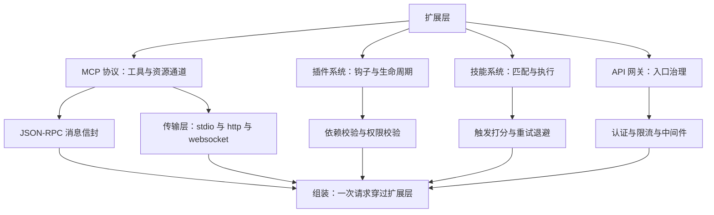
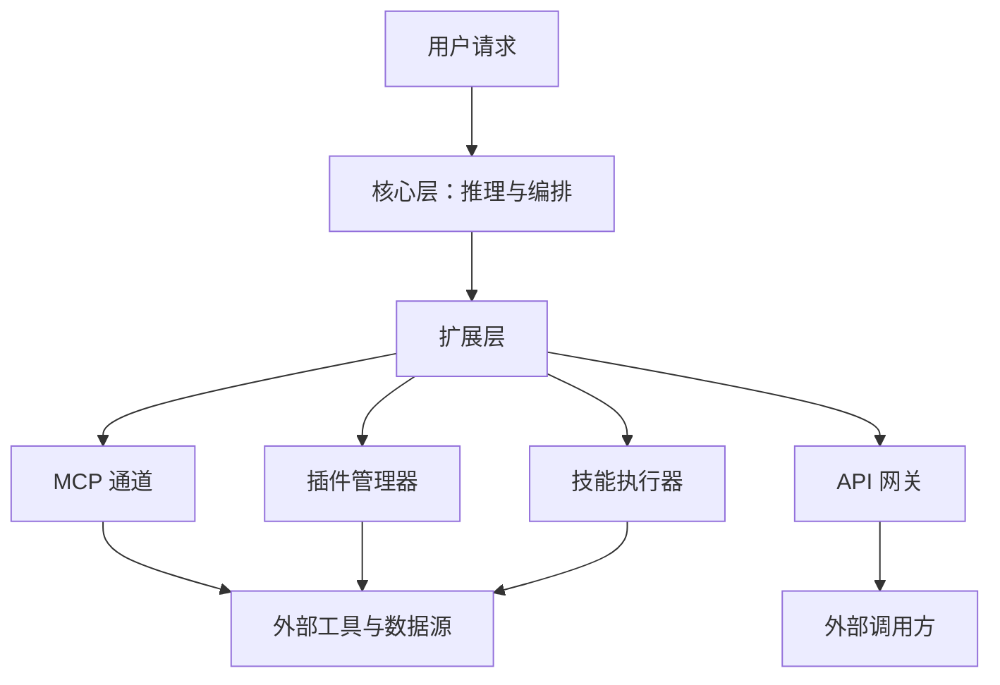
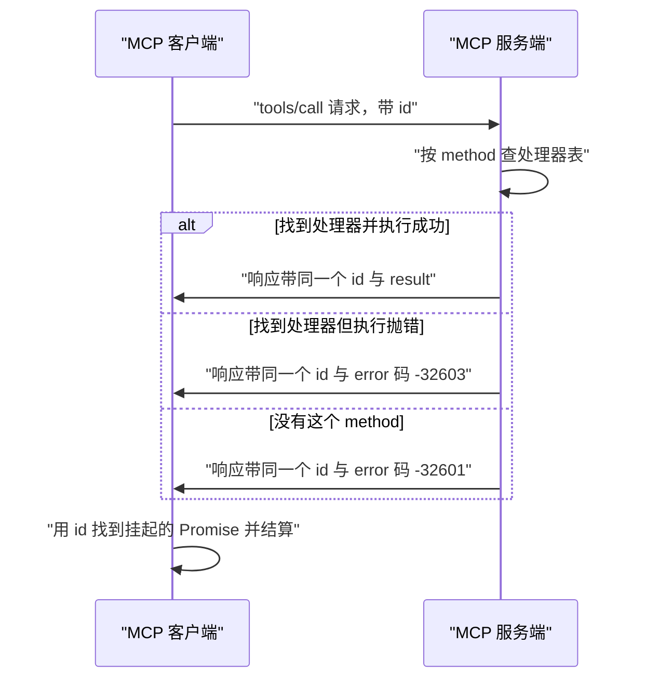
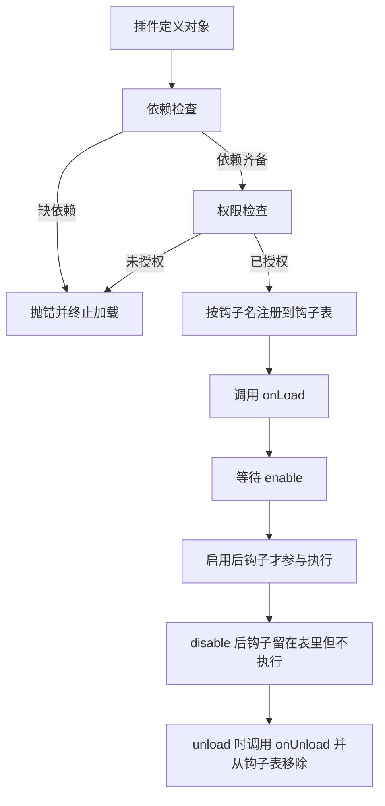
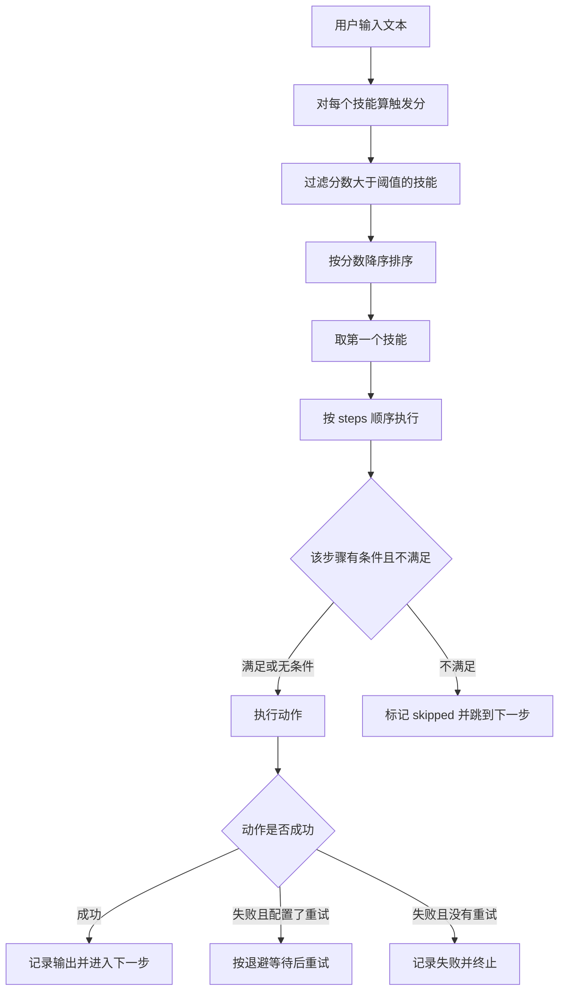
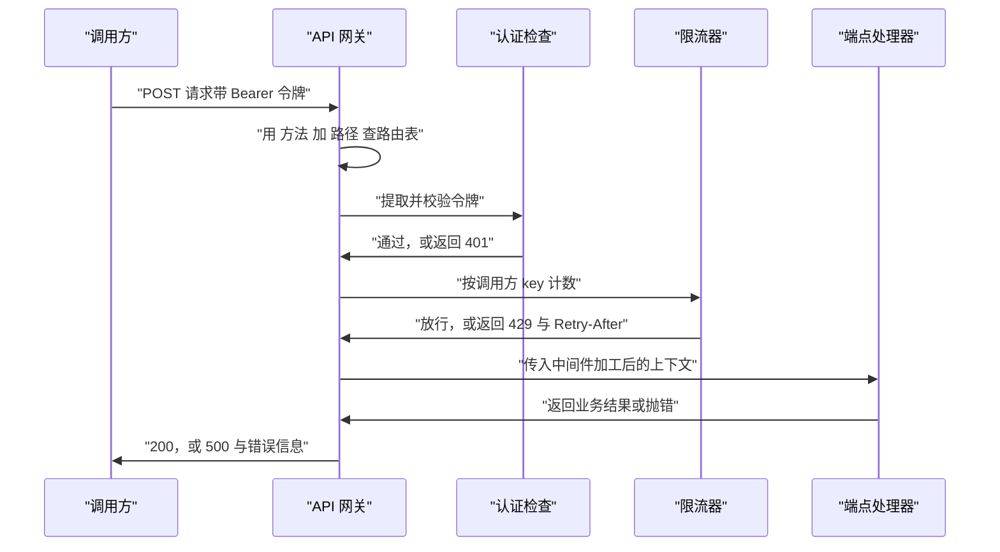
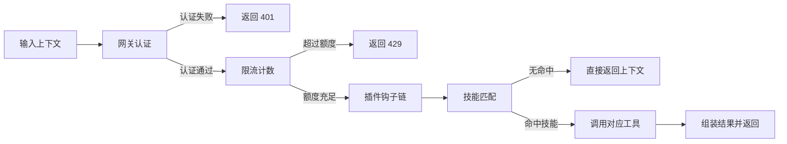

# 扩展层

!!! abstract "学完这一页你能"

    1. 说清扩展层在 Agent 分层架构里管什么，并判断一个新需求该落在哪一类扩展点上。
    2. 用 JSON-RPC 消息信封写出 MCP 客户端与服务端，讲明超时、错误码、迟到响应各在哪里处理。
    3. 写出带依赖检查、权限检查、钩子注册与四个生命周期回调的插件管理器。
    4. 写出技能匹配打分与带退避的重试执行，并说明阈值取严格大于时会发生什么。
    5. 写出 API 网关的认证、滑动窗口限流与中间件链，说清 401、404、429、500 分别由谁产生。

## 0. 知识地图



先读第 1 章，把四个扩展点的边界分清，后面才不会串味。第 2 到第 5 章各讲一个扩展点，每章都能单独跑通。第 6 章把它们串成一条链，建议最后读，也建议读完再回头看第 1 章的分层图。

## 1. 扩展层：核心层之外的四个接口

**先想一个问题**

你的 Agent 已经能对话了。现在产品要它读内部工单、查订单、按公司规范发周报。你要改核心推理代码吗？接第十个系统时，改十次吗？

**!!! tip "心智模型"**

一句话模型：扩展层是核心层与外部世界之间的插座面板，核心层只认插座的形状，不认插头背后的设备。

日常类比：墙上那排五孔插座。你换台灯、换电扇，都插同一个面板，不用动墙里的电线。

类比不成立的地方：插座不会拒绝供电，扩展层要按插件声明的权限决定给不给电，权限不足时连接建立阶段就会失败。

!!! note "术语：扩展点"

    定义：核心层预留的、允许外部代码接入的固定位置，接入方按约定形状提供实现。

    例子：核心层在发请求前留一个 beforeRequest 位置，插件在这里往上下文里塞审计字段。

**图解**



1. 用户请求先到核心层，核心层负责推理与编排。
2. 核心层需要外部能力时，只调用扩展层，不直接连外部系统。
3. MCP 通道把工具与资源调用翻译成统一消息。
4. 插件管理器在固定时机插入钩子，改写上下文。
5. 技能执行器把多步操作打包成一个可复用单元。
6. API 网关朝外，治理进入 Agent 的调用。

**一步一步来**

第 1 步：先定死扩展点的种类白名单。为什么要白名单？防止拼写错误写成新类别，让注册表悄悄多出一类没人处理的记录。

```js
const KINDS = ['mcp', 'plugin', 'skill', 'gateway']; // 允许的四类扩展点

function assertKind(kind) {                          // 注册前的白名单校验
  if (!KINDS.includes(kind)) {
    throw new Error(`unknown kind: ${kind}`);        // 报错带上原始值，便于定位调用方
  }
}
```

**这段代码在做什么**

- KINDS 是封闭集合，新增类别必须显式改这一行，评审时看得见。
- assertKind 在写入注册表之前调用，错误挡在入口。
- 错误信息里回显原始 kind，排查时不用再打断点。

第 2 步：写注册表，用 kind 加 id 拼 key。为什么要拼 key？不同种类的扩展点可以同名，直接拿 id 当 key 会互相覆盖。

```js
class ExtensionRegistry {
  #items = new Map();                                // key 为 kind:id

  register(kind, id, meta = {}) {
    assertKind(kind);
    const key = `${kind}:${id}`;
    if (this.#items.has(key)) {
      throw new Error(`duplicate: ${key}`);          // 同一 id 只允许一份配置
    }
    this.#items.set(key, { kind, id, ...meta });     // 展开 meta 保存额外字段
    return key;
  }

  get(kind, id) {
    return this.#items.get(`${kind}:${id}`);
  }

  list(kind) {                                       // 按种类列出全部记录
    return [...this.#items.values()].filter((item) => item.kind === kind);
  }
}
```

**这段代码在做什么**

- key 由 kind 与 id 拼接，避免跨种类重名冲突。
- 重复注册抛错，保证一个 id 只有一份生效配置。
- list 返回新数组，外部改动这个数组不影响注册表内部。
- meta 用展开写法合并，扩展字段不用逐个写。

第 3 步：启动时做一次自检。为什么需要自检？插件声明依赖了另一个扩展点，那个扩展点没装，运行到一半才报错就晚了。

```js
function assertReady(registry, required) {           // required 是 种类 与 id 的二元组列表
  for (const [kind, id] of required) {
    if (!registry.get(kind, id)) {
      throw new Error(`missing extension: ${kind}:${id}`); // 启动即失败
    }
  }
}
```

**这段代码在做什么**

- required 用二元组列表表达启动必需项，读起来接近配置文件。
- 缺失时抛错并带上 kind 与 id，直接指向要补的那一项。
- 自检放在启动阶段，把问题从运行期提前到部署期。

**动手验证**

下面这个脚本把三步合成一个文件，无第三方依赖。

```js
// extension-registry.mjs
// 依赖：无第三方依赖，Node 20+ 内置模块
import assert from 'node:assert/strict';

const KINDS = ['mcp', 'plugin', 'skill', 'gateway'];

function assertKind(kind) {
  if (!KINDS.includes(kind)) throw new Error(`unknown kind: ${kind}`);
}

class ExtensionRegistry {
  #items = new Map();

  register(kind, id, meta = {}) {
    assertKind(kind);
    const key = `${kind}:${id}`;
    if (this.#items.has(key)) throw new Error(`duplicate: ${key}`);
    this.#items.set(key, { kind, id, ...meta });
    return key;
  }

  get(kind, id) {
    return this.#items.get(`${kind}:${id}`);
  }

  list(kind) {
    return [...this.#items.values()].filter((item) => item.kind === kind);
  }
}

function assertReady(registry, required) {
  for (const [kind, id] of required) {
    if (!registry.get(kind, id)) {
      throw new Error(`missing extension: ${kind}:${id}`);
    }
  }
}

const registry = new ExtensionRegistry();
registry.register('mcp', 'github', { transport: 'stdio' });
registry.register('plugin', 'audit', { version: '1.0.0' });
registry.register('skill', 'summarize', { steps: 2 });
registry.register('gateway', 'public-api', { path: '/orders' });
registry.register('plugin', 'audit', { version: '2.0.0' });

assert.equal(registry.list('plugin').length, 2);          // 同名不同 kind 不冲突
assert.equal(registry.get('mcp', 'github').transport, 'stdio');
assert.throws(() => registry.register('mcp', 'github'), /duplicate/);
assert.throws(() => registry.register('tool', 'x'), /unknown kind/);
assert.doesNotThrow(() => assertReady(registry, [['mcp', 'github'], ['skill', 'summarize']]));
assert.throws(() => assertReady(registry, [['mcp', 'gitlab']]), /missing extension/);

console.log('断言全部通过');
console.log('插件记录 ->', registry.list('plugin').map((p) => `${p.id}@${p.version}`).join(', '));
```

运行结果：

```text
断言全部通过
插件记录 -> audit@1.0.0, audit@2.0.0
```

**常见坑**

| 现象 | 原因 | 怎么修 |
| --- | --- | --- |
| 同一个 id 注册两次，后一次静默生效 | 注册用 set 直接覆盖，没有查重 | 注册前判断 key 是否存在，存在就抛错 |
| 把 mcp 拼成 mp c 之类的新类别，没报错 | 种类没有白名单，任意字符串都能写入 | 用 KINDS 数组做白名单校验 |
| 启动正常，第一次调用才报扩展点缺失 | 依赖检查放在调用路径上 | 启动阶段跑 assertReady，把错误提前 |
| 外面改了 list 返回的数组，注册表跟着乱 | 直接把内部数组返回出去 | list 里用展开或 slice 返回副本 |

**用在哪里**

企业管理后台里的 Agent 插件市场。业务背景：不同部门要各自接内部系统，平台不想为每个部门改代码。本节知识怎么用：用种类白名单界定可上架插件类型，用注册表统一登记。指标：新部门接入所需的人工改动文件数，从改核心代码降到只提交一份插件配置。什么时候不该用：只有一个固定外部系统、半年内不会增加第二个时，直接写死更省事。

低代码平台的连接器目录。业务背景：连接器由不同团队贡献，命名容易撞车。本节知识怎么用：key 用种类加 id 拼接，跨团队同名不冲突。指标：上线后因命名冲突导致的回滚次数。什么时候不该用：连接器由单一团队维护并且总量少于五个时，注册表带来的抽象层是负担。

前端构建工具链的扩展清单。业务背景：构建流程要接入自定义转换步骤。本节知识怎么用：把转换步骤当扩展点登记，启动时自检依赖是否齐全。指标：构建配置里因缺失依赖引发的报错数量。什么时候不该用：构建步骤写在一个脚本文件里就能读懂时，不要拆成注册表。

**行业实践**

- VS Code 官方文档的 Extension Manifest 章节用 contributes 字段声明扩展点，并配合 activation events 延迟激活。怎么借鉴到你的项目：把扩展点声明写成一份静态清单文件，加载时先读清单，再决定要不要真正 import 实现代码。
- Express 官方文档的 Using middleware 章节给出的规则是中间件按注册顺序执行。怎么借鉴到你的项目：钩子表用数组而不是对象，顺序就是执行顺序，测试里直接断言顺序。
- JSON-RPC 2.0 Specification 定义了请求对象、响应对象、通知对象与错误对象四类结构。怎么借鉴到你的项目：把扩展层内部的消息也按这四类收敛，避免每接一个系统定义一套自有格式。MCP 官方规范的字段细节需核对官方文档。

**小结**

- 扩展层是核心层与外部系统之间的插座面板，核心层只认接口形状。
- 注册表用种类加 id 拼 key，并在写入前做白名单与查重。
- 依赖自检要放在启动阶段，别留到第一次调用。

## 2. MCP 协议：统一工具调用通道

!!! note "术语：MCP"

    定义：Model Context Protocol，一套让 Agent 与外部工具、资源按统一消息格式交互的协议。

    例子：Agent 想读一份工单，就发一条 tools/call 消息，不必为工单系统单独写一套 SDK。

**先想一个问题**

你为 GitHub 写了一个调用封装，为数据库又写一个。两个封装里都有请求 id、超时、错误处理。这些重复代码，第几个系统时你会受不了？

**!!! tip "心智模型"**

一句话模型：MCP 把"调用外部能力"统一成一种消息信封，传输方式可以换，信封不变。

日常类比：寄快递。你只填一张面单，面单字段全国统一；至于走陆运还是空运，是面单之外的环节。

类比不成立的地方：快递面单不会带编号等待回执，MCP 的请求要带 id，回包靠 id 找到当初挂起的那个 Promise。

!!! note "术语：JSON-RPC"

    定义：JSON-RPC 是一种以 JSON 为载体的远程调用格式，请求带方法名与编号，响应带回同一个编号。

    例子：请求写 jsonrpc 为 2.0、id 为 req-1、method 为 tools/call，响应里 id 还是 req-1。

**图解**



1. 客户端发请求，消息里带 jsonrpc、id、method、params 四个字段。
2. 服务端拿 method 去处理器表里查。
3. 查到就执行，成功把结果放进 result，抛错把信息放进 error。
4. 查不到就把 error 码填成 -32601（来源：本站旧版内容，以原文为准）。
5. 响应沿原路回到客户端，id 不变。
6. 客户端用 id 从挂起表里取出对应的 resolve 与 reject，完成结算。

**一步一步来**

第 1 步：先定消息形状与传输接口。为什么先定传输接口？同一个协议要能跑在标准输入输出、HTTP、WebSocket 上，把发送动作抽象出来就能换。

```js
// 传输层只负责送字节与收字节，不认识业务
const createChannel = () => {
  const a = { onmessage: null };                    // 客户端侧句柄
  const b = { onmessage: null };                    // 服务端侧句柄
  a.send = (msg) => queueMicrotask(() => b.onmessage?.(msg)); // 异步投递给对端
  b.send = (msg) => queueMicrotask(() => a.onmessage?.(msg));
  return [a, b];
};

// 消息信封：请求、响应共用一套外层字段
const envelope = (id, extra) => ({ jsonrpc: '2.0', id, ...extra });
```

**这段代码在做什么**

- createChannel 返回一对句柄，各自持有对端的引用。
- send 用 queueMicrotask 投递，模拟真实网络的异步行为。
- onmessage 用可选调用写法，对端没挂处理器时不会崩。
- envelope 统一补上 jsonrpc 字段，避免每处手写。

第 2 步：客户端把请求挂起，等回包或超时。为什么要挂起？一次连接上会同时有多条请求在飞，靠 id 区分谁的回包。

```js
request(method, params) {
  const id = `req-${++this.seq}`;                   // 自增编号，便于读日志
  return new Promise((resolve, reject) => {
    const timer = setTimeout(() => {
      if (this.pending.delete(id)) reject(new Error('Request timeout'));
    }, this.timeoutMs);                             // 默认 30000 毫秒，来源：本站旧版内容
    this.pending.set(id, { resolve, reject, timer });
    this.transport.send({ jsonrpc: '2.0', id, method, params });
  });
}
```

**这段代码在做什么**

- 编号自增生成，同一条连接上不会重复。
- 先起超时定时器，再把 resolve 与 reject 存进挂起表。
- 超时回调里先尝试删除记录，删到了才 reject，避免重复结算。
- 默认超时 30000 毫秒（来源：本站旧版内容，以原文为准），测试时可通过构造参数调小。

第 3 步：收到回包时分派。为什么回包可能是错误？服务端可能没这个方法，或者处理器自己抛了异常。

```js
#handle(msg) {
  if (msg.id === null || msg.id === undefined) return; // 通知没有编号，无需结算
  const pending = this.pending.get(String(msg.id));
  if (!pending) return;                                // 已超时的迟到回包直接丢弃
  this.pending.delete(String(msg.id));
  clearTimeout(pending.timer);                         // 结算前先清掉定时器
  if (msg.error) {
    const err = new Error(msg.error.message);
    err.code = msg.error.code;                         // 把错误码带出去给调用方
    pending.reject(err);
  } else {
    pending.resolve(msg.result);
  }
}
```

**这段代码在做什么**

- 编号为空说明是通知，通知不结算任何 Promise。
- 挂起表里找不到编号，说明这条回包来晚了，丢弃即可。
- 结算之前清掉定时器，防止超时回调再触发一次。
- 错误码挂到 Error 对象上，调用方按码分支处理。

第 4 步：服务端按 method 查表并回包。为什么要区分两种错误码？调用方要能分清"你写错了方法名"和"我的实现炸了"。

```js
async receive(msg) {
  const reply = { jsonrpc: '2.0', id: msg.id };        // 回包复用请求的 id
  const handler = this.handlers.get(msg.method);
  if (!handler) {
    reply.error = { code: -32601, message: 'Method not found' }; // 来源：本站旧版内容
    return reply;
  }
  try {
    reply.result = await handler(msg.params);          // 处理器支持异步
  } catch (err) {
    reply.error = { code: -32603, message: err.message };        // 来源：本站旧版内容
  }
  return reply;
}
```

**这段代码在做什么**

- 回包复用请求的 id，客户端才有办法对上号。
- 方法不存在用 -32601，"方法未找到"，来源为本站旧版内容，以原文为准。
- 处理器内部抛错用 -32603，"内部错误"，来源为本站旧版内容，以原文为准。
- 用 await 执行处理器，处理器返回 Promise 也能正确处理。

**动手验证**

```js
// mcp-demo.mjs
// 依赖：无第三方依赖，Node 20+ 内置模块
import assert from 'node:assert/strict';

function createChannel() {
  const a = { onmessage: null };
  const b = { onmessage: null };
  a.send = (msg) => queueMicrotask(() => b.onmessage?.(msg));
  b.send = (msg) => queueMicrotask(() => a.onmessage?.(msg));
  return [a, b];
}

class MCPClient {
  constructor(transport, timeoutMs = 30000) {
    this.transport = transport;
    this.timeoutMs = timeoutMs;
    this.pending = new Map();
    this.seq = 0;
    transport.onmessage = (msg) => this.#handle(msg);
  }

  request(method, params) {
    const id = `req-${++this.seq}`;
    return new Promise((resolve, reject) => {
      const timer = setTimeout(() => {
        if (this.pending.delete(id)) reject(new Error('Request timeout'));
      }, this.timeoutMs);
      this.pending.set(id, { resolve, reject, timer });
      this.transport.send({ jsonrpc: '2.0', id, method, params });
    });
  }

  #handle(msg) {
    if (msg.id === null || msg.id === undefined) return;
    const pending = this.pending.get(String(msg.id));
    if (!pending) return;
    this.pending.delete(String(msg.id));
    clearTimeout(pending.timer);
    if (msg.error) {
      const err = new Error(msg.error.message);
      err.code = msg.error.code;
      pending.reject(err);
    } else {
      pending.resolve(msg.result);
    }
  }
}

class MCPServer {
  constructor() {
    this.handlers = new Map();
  }

  register(method, handler) {
    this.handlers.set(method, handler);
  }

  async receive(msg) {
    const reply = { jsonrpc: '2.0', id: msg.id };
    const handler = this.handlers.get(msg.method);
    if (!handler) {
      reply.error = { code: -32601, message: 'Method not found' };
      return reply;
    }
    try {
      reply.result = await handler(msg.params);
    } catch (err) {
      reply.error = { code: -32603, message: err.message };
    }
    return reply;
  }
}

const [clientSide, serverSide] = createChannel();
const client = new MCPClient(clientSide);
const server = new MCPServer();
serverSide.onmessage = async (msg) => serverSide.send(await server.receive(msg));

server.register('tools/call', async (params) => ({ content: `echo:${params.name}` }));
server.register('tools/fail', async () => {
  throw new Error('boom');
});

const ok = await client.request('tools/call', { name: 'github' });
assert.deepEqual(ok, { content: 'echo:github' });

let failCode = null;
await assert.rejects(
  () => client.request('tools/fail'),
  (err) => {
    failCode = err.code;
    return err.code === -32603;
  },
);

let unknownCode = null;
await assert.rejects(
  () => client.request('tools/unknown'),
  (err) => {
    unknownCode = err.code;
    return err.code === -32601;
  },
);

const [idleSide] = createChannel();                  // 对端不设 onmessage，永远不会回包
const idleClient = new MCPClient(idleSide, 10);      // 把超时压到 10 毫秒便于测试
await assert.rejects(() => idleClient.request('tools/call', {}), /Request timeout/);

console.log('断言全部通过');
console.log('tools/call ->', JSON.stringify(ok));
console.log('tools/fail 错误码 ->', failCode);
console.log('tools/unknown 错误码 ->', unknownCode);
console.log('超时提示 ->', 'Request timeout');
```

运行结果：

```text
断言全部通过
tools/call -> {"content":"echo:github"}
tools/fail 错误码 -> -32603
tools/unknown 错误码 -> -32601
超时提示 -> Request timeout
```

**常见坑**

| 现象 | 原因 | 怎么修 |
| --- | --- | --- |
| 两个并发请求互相串结果 | 回包没有按 id 匹配，收到就当成第一条请求的结果 | 挂起表用 id 当 key，收到回包先查表 |
| 请求超时后，迟到的回包又结算了一次 | 超时时没有从挂起表里删除记录 | 超时回调里先 delete 再 reject |
| 定时器没清，测试进程不退出 | 正常回包路径忘记 clearTimeout | 结算前统一 clearTimeout |
| 方法名写错，客户端拿到的是执行异常 | 服务端把未找到方法也归成内部错误 | 未找到用 -32601，执行抛错用 -32603 |

**用在哪里**

企业 IM 里的智能助手接内部系统。业务背景：助手要查排班、查报销、查门禁，每个系统接口风格都不同。本节知识怎么用：每个系统起一个 MCP 服务端，助手侧只实现一个客户端。指标：新增一个内部系统时客户端侧改动行数。什么时候不该用：只接一个系统且接口半年不变时，直接写一次请求函数更省。

IDE 插件调用本地工具链。业务背景：插件要跑格式化、跑测试、读仓库信息。本节知识怎么用：本地工具通过标准输入输出暴露成 MCP 服务端，插件按统一信封调用。指标：工具替换后插件侧的改动量。什么时候不该用：工具与插件同进程且同语言时，直接函数调用比跨进程消息快得多。

客服机器人的工单操作。业务背景：机器人要建单、改单、查单，操作要留痕。本节知识怎么用：把每个操作注册成一个 method，错误码区分参数问题与后端故障。指标：按错误码分类的工单失败占比。什么时候不该用：操作只有一个且是幂等查询时，加一层协议只增加排查成本。

**行业实践**

- Model Context Protocol 官方规范文档把服务端能力分成工具、资源等类别，并定义标准输入输出等传输方式；具体字段与版本需核对官方文档。怎么借鉴到你的项目：先只接一类能力，跑通端到端再扩类别，别一上来把三类能力全铺开。
- JSON-RPC 2.0 Specification 里规定了错误对象的 code、message 两个必需字段。怎么借鉴到你的项目：错误码分段管理，协议层错误与业务错误各自占一段编号区间。
- VS Code 官方文档的 Language Server Protocol 章节展示了同一种消息格式跑在多种传输上的做法。怎么借鉴到你的项目：业务代码只依赖传输接口，测试时换成内存通道，跑得快也不占端口。

**小结**

- MCP 把外部调用收敛成一套消息信封，传输可替换。
- 请求与响应靠 id 配对，超时和迟到回包都要在挂起表里处理干净。
- 方法未找到与执行抛错用不同错误码，调用方才能分开处理。

## 3. 插件系统：钩子与生命周期

!!! note "术语：钩子"

    定义：核心流程在固定时机向外抛出的接入点，插件在这里读写上下文。

    例子：发请求前触发 beforeRequest，审计插件在这里给上下文补一个操作人字段。

**先想一个问题**

你想给 Agent 加一个审计功能：每次请求前记录操作人。直接改核心代码当然可以。但如果审计、脱敏、计费三个团队都要加，谁来排改代码的顺序？

**!!! tip "心智模型"**

一句话模型：插件系统把"改核心代码"换成"在预留时机插一段函数"，顺序由注册顺序决定。

日常类比：地铁闸机旁的一排检票口，乘客依次通过每个口，每个口都能在车票上盖一个章。

类比不成立的地方：检票口不会因为盖章失败就把乘客拦下，插件钩子抛错时必须决定是中断流程还是记日志继续。

!!! note "术语：生命周期"

    定义：插件从被加载到被移除之间，框架会在约定时刻调用的一组回调。

    例子：加载时调 onLoad，启用时调 onEnable，停用时调 onDisable，卸载时调 onUnload。

**图解**



1. 插件先以普通对象形式交给管理器，此时还没进任何执行路径。
2. 依赖检查遍历 dependencies，缺一个就抛错，插件不进注册表。
3. 权限检查遍历 permissions，与允许清单求交集，缺一个同样抛错。
4. 通过后按钩子名把处理器追加进钩子表，顺序就是加载顺序。
5. 调用 onLoad 完成插件自己的初始化。
6. 只有 enable 过的插件，钩子才会在 run 时被执行。
7. unload 会调用 onUnload 并把该插件的处理器从钩子表里摘掉。

**一步一步来**

第 1 步：先把加载路径上两道门写清楚。为什么先检查再注册？检查失败的插件不该在注册表里留下半成品。

```js
async load(plugin) {
  for (const dep of plugin.dependencies ?? []) {
    if (!this.plugins.has(dep)) {                    // 依赖必须已经加载
      throw new Error(`missing dependency: ${dep}`);
    }
  }
  for (const perm of plugin.permissions ?? []) {
    if (!this.allowed.has(perm)) {                   // 权限必须在允许清单内
      throw new Error(`permission denied: ${perm}`);
    }
  }
  this.plugins.set(plugin.id, plugin);               // 两道门都过了才登记
}
```

**这段代码在做什么**

- 依赖是个字符串数组，缺一个就中断加载，避免加载到一半。
- allowed 是管理器构造时传入的允许权限集合。
- 两道检查都在写入注册表之前，失败时注册表状态不变。
- 抛错信息带具体依赖名或权限名，方便对照配置定位。

第 2 步：注册钩子与执行钩子链。为什么钩子表用数组？数组天然有顺序，执行顺序等于注册顺序。

```js
for (const [name, handler] of Object.entries(plugin.hooks ?? {})) {
  if (!this.hooks.has(name)) this.hooks.set(name, []);   // 钩子名首次出现时建空数组
  this.hooks.get(name).push({ pluginId: plugin.id, handler });
}

async run(hookName, context) {
  let current = context;
  for (const entry of this.hooks.get(hookName) ?? []) {
    if (!this.enabled.has(entry.pluginId)) continue;     // 未启用的插件直接跳过
    current = await entry.handler(current);              // 上一个的返回值交给下一个
  }
  return current;
}
```

**这段代码在做什么**

- 钩子以插件为单位登记，每条记录都带 pluginId，卸载时好摘。
- run 串行执行，前一个钩子的返回值作为后一个的输入。
- 未启用的插件被跳过，所以禁用不需要改钩子表。
- 每个处理器都 await，异步钩子也能保持顺序。

第 3 步：卸载要同时做三件事。只删插件记录不摘钩子，钩子还会在下次执行时被找到。

```js
async unload(id) {
  const plugin = this.plugins.get(id);
  if (!plugin) throw new Error(`plugin not found: ${id}`);
  await plugin.onUnload?.();                             // 先让插件自己收尾
  for (const [name, list] of this.hooks) {
    this.hooks.set(name, list.filter((h) => h.pluginId !== id)); // 再摘钩子
  }
  this.plugins.delete(id);                               // 最后删记录
  this.enabled.delete(id);
}
```

**这段代码在做什么**

- 先调用 onUnload，插件还有机会用到自己注册的东西。
- 按 pluginId 过滤钩子表，把所有钩子名下的条目都清掉。
- 删除插件记录与启用标记，两个 map 状态保持一致。
- 顺序是收尾、摘钩子、删记录，反了会让 onUnload 里找不到钩子。

**动手验证**

```js
// plugin-demo.mjs
// 依赖：无第三方依赖，Node 20+ 内置模块
import assert from 'node:assert/strict';

class PluginManager {
  constructor({ allowedPermissions = [] } = {}) {
    this.allowed = new Set(allowedPermissions);
    this.plugins = new Map();
    this.enabled = new Set();
    this.hooks = new Map();
    this.log = [];
  }

  async load(plugin) {
    for (const dep of plugin.dependencies ?? []) {
      if (!this.plugins.has(dep)) throw new Error(`missing dependency: ${dep}`);
    }
    for (const perm of plugin.permissions ?? []) {
      if (!this.allowed.has(perm)) throw new Error(`permission denied: ${perm}`);
    }
    this.plugins.set(plugin.id, plugin);
    for (const [name, handler] of Object.entries(plugin.hooks ?? {})) {
      if (!this.hooks.has(name)) this.hooks.set(name, []);
      this.hooks.get(name).push({ pluginId: plugin.id, handler });
    }
    await plugin.onLoad?.();
    this.log.push(`load:${plugin.id}`);
  }

  async enable(id) {
    const plugin = this.plugins.get(id);
    if (!plugin) throw new Error(`plugin not found: ${id}`);
    await plugin.onEnable?.();
    this.enabled.add(id);
    this.log.push(`enable:${id}`);
  }

  async disable(id) {
    const plugin = this.plugins.get(id);
    if (!plugin) throw new Error(`plugin not found: ${id}`);
    await plugin.onDisable?.();
    this.enabled.delete(id);
    this.log.push(`disable:${id}`);
  }

  async unload(id) {
    const plugin = this.plugins.get(id);
    if (!plugin) throw new Error(`plugin not found: ${id}`);
    await plugin.onUnload?.();
    for (const [name, list] of this.hooks) {
      this.hooks.set(name, list.filter((h) => h.pluginId !== id));
    }
    this.plugins.delete(id);
    this.enabled.delete(id);
    this.log.push(`unload:${id}`);
  }

  async run(hookName, context) {
    let current = context;
    for (const entry of this.hooks.get(hookName) ?? []) {
      if (!this.enabled.has(entry.pluginId)) continue;
      current = await entry.handler(current);
    }
    return current;
  }
}

const manager = new PluginManager({ allowedPermissions: ['read:orders'] });

await manager.load({
  id: 'audit',
  permissions: ['read:orders'],
  hooks: { beforeRequest: async (ctx) => ({ ...ctx, audit: true }) },
});
await manager.load({
  id: 'rewrite',
  dependencies: ['audit'],
  permissions: ['read:orders'],
  hooks: { beforeRequest: async (ctx) => ({ ...ctx, rewritten: true }) },
});

assert.equal(manager.plugins.size, 2);

await assert.rejects(
  () => manager.load({ id: 'x', dependencies: ['ghost'], permissions: [] }),
  /missing dependency: ghost/,
);
await assert.rejects(
  () => manager.load({ id: 'y', permissions: ['write:orders'] }),
  /permission denied: write:orders/,
);

await manager.enable('audit');
assert.deepEqual(await manager.run('beforeRequest', {}), { audit: true });

await manager.enable('rewrite');
assert.deepEqual(await manager.run('beforeRequest', {}), { audit: true, rewritten: true });

await manager.disable('audit');
assert.deepEqual(await manager.run('beforeRequest', {}), { rewritten: true });

await manager.unload('rewrite');
assert.deepEqual(await manager.run('beforeRequest', {}), {});
assert.equal(manager.enabled.size, 0);
assert.equal(manager.plugins.size, 1);

console.log('断言全部通过');
console.log('生命周期日志 ->', manager.log.join(' -> '));
```

运行结果：

```text
断言全部通过
生命周期日志 -> load:audit -> load:rewrite -> enable:audit -> enable:rewrite -> disable:audit -> unload:rewrite
```

**常见坑**

| 现象 | 原因 | 怎么修 |
| --- | --- | --- |
| 禁用插件后钩子还在跑 | 停用只改了启用标记，执行时没判断标记 | run 里先判断 enabled 集合再调用处理器 |
| 卸载后钩子表里还有残留 | 只删了插件记录，没按 pluginId 摘钩子 | unload 里遍历钩子表做过滤 |
| 钩子执行顺序与预期相反 | 用对象存钩子，遍历顺序依赖 key 的插入与类型 | 钩子表的值用数组，push 追加 |
| 一个钩子抛错，整条链断在半路 | 处理器没有各自的错误边界 | 在 run 里对每个处理器包 try catch，按策略决定继续或中断 |

**用在哪里**

后台管理的批量导入。业务背景：导入前要脱敏、导入后要写审计。本节知识怎么用：脱敏与审计各做成一个插件，分别挂 beforeRequest 与 afterRequest。指标：新增一条导入校验规则时改动的文件数。什么时候不该用：校验规则只有一条且短期内不会增加时，直接写在导入函数里更好读。

SaaS 产品的租户级功能开关。业务背景：不同租户要开不同的增强功能。本节知识怎么用：一个功能一个插件，按租户 enable 或 disable，钩子表不用动。指标：为单个租户开功能所需的发布次数。什么时候不该用：所有租户功能完全一致时，插件机制只是多一层 indirection。

前端监控 SDK 的采集项扩展。业务背景：不同业务线要采集的字段不同。本节知识怎么用：采集前钩子让业务插件补字段，上报前钩子做裁剪。指标：接入新业务线时 SDK 的改动行数。什么时候不该用：采集字段由统一规范定死时，不需要开放钩子。

**行业实践**

- VS Code 官方文档的 Activation Events 章节把插件激活推迟到真正需要时。怎么借鉴到你的项目：load 只登记元信息，把重量级初始化放到 onEnable，减少启动时间。
- Kubernetes 官方文档的 Dynamic Admission Control 章节把准入控制拆成变更与校验两类。怎么借鉴到你的项目：钩子按"改上下文"和"只判对错"分两类，校验类钩子不要改写上下文。
- Express 官方文档的 Error Handling 章节要求错误处理中间件单独处理异常。怎么借鉴到你的项目：给钩子链配一个独立的错误钩子，别让业务钩子自己兜底。

**小结**

- 加载路径上是依赖检查、权限检查两道门，过了才登记。
- 钩子按注册顺序串行执行，未启用的插件在运行期被跳过。
- 卸载要把收尾、摘钩子、删记录三件事按顺序做完。

## 4. 技能系统：匹配、执行与重试

!!! note "术语：技能"

    定义：把完成一类任务的多个步骤打包成一个带触发条件的可复用单元。

    例子：把"取数据、做汇总、发通知"三步打包成日报技能，用关键词触发。

**先想一个问题**

用户说"帮我总结这份文档"，系统怎么知道该走总结流程，而不是走翻译流程？如果只用一个 if 判断关键词，出现同义词时怎么办？

**!!! tip "心智模型"**

一句话模型：技能系统先用触发条件给每个技能打分，取分最高的那个，再按步骤表执行。

日常类比：医院分诊台。护士问一句症状，按挂号科室的规则打分，分数最高的科室先接诊。

类比不成立的地方：分诊台的规则由护士理解，技能匹配是字符串或正则的机械比较，同义表达要靠关键词表覆盖。

!!! note "术语：退避"

    定义：重试之间等待的时长按某种规律递增，避免连续失败时密集重发。

    例子：指数退避下，第一次等 delay，第二次等 delay 乘 2，第三次等 delay 乘 4。

**图解**



1. 输入先进入匹配阶段，每个技能各自算分。
2. 分数不高于阈值的技能被过滤掉，旧版实现用严格大于 0.5（来源：本站旧版内容，以原文为准）。
3. 剩下的按分数降序排序，取第一个作为本次要执行的技能。
4. 执行阶段逐条走 steps 数组。
5. 步骤带条件时不满足就标记 skipped，直接进下一步。
6. 动作失败时看这一步有没有重试配置，有就退避等待后重来。

**一步一步来**

第 1 步：实现三种触发打分。为什么要三种？关键词覆盖同义表达，正则覆盖格式固定的输入，意图判断用于上游已经把意图解析好的场景。

```js
function score(skill, text) {
  const t = skill.trigger;
  if (t.type === 'keyword') {
    const hits = t.keywords.filter((k) => text.includes(k)).length;
    return hits / t.keywords.length;                 // 命中率，取值范围 0 到 1
  }
  if (t.type === 'pattern') {
    return new RegExp(t.pattern).test(text) ? 1 : 0; // 只给满分或零分
  }
  if (t.type === 'intent') {
    return text === t.intent ? 1 : 0;                // 上游意图相等才算命中
  }
  return 0;
}
```

**这段代码在做什么**

- 关键词类型返回命中率，命中一半关键词得 0.5。
- 正则类型是二值判断，不做部分匹配。
- 意图类型比较上游给出的意图标识，相等得满分。
- 未知类型返回 0，让这个技能自然落选。

第 2 步：按阈值过滤并排序。阈值用严格大于还是大于等于，会改变边界行为。

```js
const THRESHOLD = 0.5;                               // 来源：本站旧版内容，以原文为准

function match(skills, text) {
  return skills
    .map((s) => ({ s, score: score(s, text) }))
    .filter((x) => x.score > THRESHOLD)              // 等于 0.5 不入选
    .sort((a, b) => b.score - a.score)               // 降序，分数高的在前
    .map((x) => x.s);
}
```

**这段代码在做什么**

- 先算出每个技能的分，再过滤，再排序，最后只留技能对象。
- 过滤条件是严格大于，恰好等于 0.5 的技能会被排除。
- 排序按分数降序，调用方取第一个即可。
- 阈值提成常量，改阈值只改一处。

第 3 步：执行步骤并处理重试。为什么要给重试配上限？没有上限的失败重试会把整条流程卡死。

```js
const sleep = (ms) => new Promise((resolve) => setTimeout(resolve, ms));

function retryDelay(retry, attempt) {
  return retry.backoff === 'exponential'
    ? retry.delay * 2 ** (attempt - 1)               // 指数：delay 乘 2 的 attempt 减 1 次方
    : retry.delay * attempt;                          // 线性：delay 乘 attempt
}

const steps = [
  { id: 'demo', action: 'demo', retry: { maxAttempts: 1, backoff: 'linear', delay: 1 } },
];
const actions = {
  demo: async () => 'ok',
};
const ctx = {};
const results = [];

for (const step of steps) {
  let attempt = 0;
  let succeeded = false;
  const max = step.retry?.maxAttempts ?? 1;             // 没配重试就只尝试一次
  while (attempt < max && !succeeded) {
    attempt += 1;
    try {
      const output = await actions[step.action](ctx);
      results.push({ stepId: step.id, success: true, output, attempts: attempt });
      succeeded = true;
    } catch (err) {
      if (attempt >= max) {
        results.push({ stepId: step.id, success: false, error: err.message, attempts: attempt });
      } else {
        await sleep(retryDelay(step.retry, attempt));  // 没到上限就等一下再来
      }
    }
  }
}
```
**这段代码在做什么**

- 指数退避第 attempt 次等待 delay 乘 2 的 attempt 减 1 次方。
- 线性退避第 attempt 次等待 delay 乘 attempt。
- maxAttempts 没配置时用 1，等价于不重试。
- 达到上限才把失败写进结果，否则先睡一会儿再循环。

**动手验证**

```js
// skill-demo.mjs
// 依赖：无第三方依赖，Node 20+ 内置模块
import assert from 'node:assert/strict';

const sleep = (ms) => new Promise((r) => setTimeout(r, ms));

function score(skill, text) {
  const t = skill.trigger;
  if (t.type === 'keyword') {
    const hits = t.keywords.filter((k) => text.includes(k)).length;
    return hits / t.keywords.length;
  }
  if (t.type === 'pattern') return new RegExp(t.pattern).test(text) ? 1 : 0;
  if (t.type === 'intent') return text === t.intent ? 1 : 0;
  return 0;
}

const THRESHOLD = 0.5;

function match(skills, text) {
  return skills
    .map((s) => ({ s, score: score(s, text) }))
    .filter((x) => x.score > THRESHOLD)
    .sort((a, b) => b.score - a.score)
    .map((x) => x.s);
}

function retryDelay(retry, attempt) {
  return retry.backoff === 'exponential'
    ? retry.delay * 2 ** (attempt - 1)
    : retry.delay * attempt;
}

async function runSkill(skill, ctx, actions) {
  const results = [];
  for (const step of skill.steps) {
    if (step.when && !step.when(ctx)) {
      results.push({ stepId: step.id, skipped: true, success: false });
      continue;
    }
    const max = step.retry?.maxAttempts ?? 1;
    let attempt = 0;
    let succeeded = false;
    while (attempt < max && !succeeded) {
      attempt += 1;
      try {
        const output = await actions[step.action](ctx);
        results.push({ stepId: step.id, success: true, output, attempts: attempt });
        succeeded = true;
      } catch (err) {
        if (attempt >= max) {
          results.push({ stepId: step.id, success: false, error: err.message, attempts: attempt });
        } else {
          await sleep(retryDelay(step.retry, attempt));
        }
      }
    }
    if (!succeeded && !step.retry) break;
  }
  return { skillId: skill.id, success: results.every((r) => r.success), results };
}

const skills = [
  { id: 'summarize', trigger: { type: 'keyword', keywords: ['总结', '摘要'] } },
  { id: 'translate', trigger: { type: 'keyword', keywords: ['翻译'] } },
  { id: 'ticket', trigger: { type: 'pattern', pattern: '^TK-\\d+$' } },
];

assert.deepEqual(match(skills, '请总结这份文档').map((s) => s.id), []);
assert.deepEqual(match(skills, '翻译并总结').map((s) => s.id), ['translate']);
assert.deepEqual(match(skills, '总结并摘要').map((s) => s.id), ['summarize']);
assert.deepEqual(match(skills, 'TK-1024').map((s) => s.id), ['ticket']);

assert.equal(retryDelay({ delay: 100, backoff: 'exponential' }, 3), 400);
assert.equal(retryDelay({ delay: 100, backoff: 'linear' }, 3), 300);

let calls = 0;
const flaky = {
  id: 'flaky',
  steps: [{ id: 's1', action: 'call', retry: { maxAttempts: 3, delay: 1, backoff: 'exponential' } }],
};
const retried = await runSkill(flaky, {}, {
  call: async () => {
    calls += 1;
    if (calls < 2) throw new Error('temporary');
    return 'ok';
  },
});
assert.equal(retried.success, true);
assert.equal(retried.results[0].attempts, 2);
assert.equal(retried.results[0].output, 'ok');

const conditional = {
  id: 'conditional',
  steps: [
    { id: 'check', action: 'noop', when: (ctx) => ctx.hasOrder },
    { id: 'always', action: 'noop' },
  ],
};
const skipped = await runSkill(conditional, { hasOrder: false }, { noop: async () => 'done' });
assert.equal(skipped.results[0].skipped, true);
assert.equal(skipped.results[1].success, true);
assert.equal(skipped.success, false);

console.log('断言全部通过');
console.log('翻译并总结 命中 ->', match(skills, '翻译并总结').map((s) => s.id).join(','));
console.log('重试次数 ->', retried.results[0].attempts);
console.log('跳过标记 ->', skipped.results[0].skipped);
```

运行结果：

```text
断言全部通过
翻译并总结 命中 -> translate
重试次数 -> 2
跳过标记 -> true
```

**常见坑**

| 现象 | 原因 | 怎么修 |
| --- | --- | --- |
| 关键词命中一半的技能老是选不中 | 过滤条件是严格大于阈值，0.5 被排除 | 想让它入选就把条件改成大于等于，并在测试里写清边界 |
| 技能分数相同，每次选中的不一样 | 排序不稳定或没有次级排序键 | 在排序里加 id 作为第二比较键 |
| 一次失败把整条流程卡死 | 重试没有上限或退避延迟过大 | 设 maxAttempts，延迟用毫秒级小值起步 |
| 条件不满足的步骤被当成失败上报 | skipped 与 success 混在同一个字段 | 结果里单独给 skipped 字段，统计时分开算 |

**用在哪里**

智能客服的多轮处置。业务背景：用户描述问题后要走查询、判断、回复三步。本节知识怎么用：把处置流程做成技能，步骤条件控制是否走补偿分支。指标：一次会话内人工介入的比例。什么时候不该用：流程只有一步调用时，技能表比直接调用多一层。

文档助手的写作流水线。业务背景：用户要扩写、缩写、改语气。本节知识怎么用：用关键词触发不同技能，步骤里接模型调用。指标：同一意图下选错技能的请求占比。什么时候不该用：意图由界面按钮直接给出时，用意图类型匹配即可，不需要关键词表。

运营活动的批量任务。业务背景：活动开始前要校验库存、锁库存、发通知。本节知识怎么用：锁库存步骤配指数退避重试，处理并发争抢下的临时失败。指标：因临时失败导致的活动配置失败率。什么时候不该用：被调用接口明确不支持重试时，重试只会放大副作用。

**行业实践**

- Model Context Protocol 官方规范文档讨论了工具调用出错时的返回结构；具体字段需核对官方文档。怎么借鉴到你的项目：技能步骤的失败结果里保留原始错误信息，别只留一个布尔值。
- AWS 官方博客的 Exponential Backoff And Jitter 文章介绍了在重试间隔上加入随机抖动以缓解同步重试。怎么借鉴到你的项目：在计算出的延迟上加一个随机小量，多个实例同时重试时不会撞在一起。
- Kubernetes 官方文档的 Jobs 章节用 backoffLimit 限制重试次数。怎么借鉴到你的项目：重试上限写进配置而不是代码常量，按环境调整。

**小结**

- 匹配阶段先打分再过滤再排序，阈值边界要在测试里写清楚。
- 执行阶段按 steps 顺序走，条件不满足标记 skipped 而不是失败。
- 重试要有上限，延迟按线性或指数增长。

## 5. API 网关：认证、限流与中间件

!!! note "术语：API 网关"

    定义：所有外部调用进入系统前必须经过的统一入口，负责认证、限流与请求转发。

    例子：外部系统调 Agent 的下单接口，先过网关查令牌，再按调用方计数。

**先想一个问题**

Agent 对外开放了三个接口，每个接口都要校验令牌、都要限制频率。如果每个处理函数里各写一遍，第三个月改令牌格式时你要改几处？

**!!! tip "心智模型"**

一句话模型：网关是门口的保安加闸机，先验身份，再看今天进过几次，最后才放你进屋。

日常类比：写字楼大堂。前台核对工牌，闸机按当日次数放行，进了大堂才到具体公司门口。

类比不成立的地方：大堂闸机只数人头，网关还要按 IP 或密钥分别计数，同一栋楼里不同公司的额度互不影响。

!!! note "术语：限流"

    定义：在固定时间窗口内限制某个调用方的请求次数，超过就拒绝。

    例子：窗口 60000 毫秒、上限 100 次，同一 IP 的第 101 次请求收到 429。

**图解**



1. 请求先按方法与路径拼成 key，去路由表里查。
2. 查不到直接回 404，后面的步骤都不执行。
3. 路由带认证标记时提取令牌，取不到或校验不过回 401。
4. 路由带限流标记时按 key 计数，超限回 429 并带 Retry-After。
5. 认证与限流都过，才执行中间件链。
6. 处理器抛错时统一转成 500，不让异常冒到进程外面。

**一步一步来**

第 1 步：路由表与认证提取。为什么把令牌提取单独写？Bearer 前缀长度固定，取错一位整个校验都会失败。

```js
register(method, path, endpoint) {
  this.routes.set(`${method}:${path}`, endpoint);     // 方法与路径拼成路由 key
}

#extractToken(request) {
  const header = request.headers?.authorization;
  if (header?.startsWith('Bearer ')) {
    return header.slice(7);                           // 前缀是 7 个字符，恰好跳过它
  }
  return request.headers?.['x-api-key'] ?? null;      // 兼容自定义密钥头
}
```

**这段代码在做什么**

- 路由 key 由方法与路径拼接，同路径不同方法互不覆盖。
- 判断前缀用 startsWith，避免误吞不带前缀的令牌。
- 切片起始位置是 7，对应 Bearer 加一个空格的长度。
- 没有授权头时退回读自定义密钥头，读不到返回 null。

第 2 步：滑动窗口限流。为什么用滑动窗口而不是固定窗口？固定窗口在窗口边界会放进两倍请求。

```js
check(key, now = Date.now()) {
  const times = (this.hits.get(key) ?? []).filter((t) => now - t < this.windowMs);
  if (times.length >= this.maxRequests) {
    const retryAfter = Math.ceil((times[0] + this.windowMs - now) / 1000);
    this.hits.set(key, times);                        // 回写已过期的记录清理结果
    return { allowed: false, remaining: 0, retryAfter };
  }
  times.push(now);
  this.hits.set(key, times);
  return { allowed: true, remaining: this.maxRequests - times.length, retryAfter: 0 };
}
```

**这段代码在做什么**

- 先按时间戳过滤出窗口内的记录，过期记录自然被清掉。
- 窗口内记录数达到上限就拒绝，并算出还需等待的秒数。
- 拒绝路径也要回写清理后的数组，防止数组无限增长。
- 放行路径把当前时间戳追加进去，remaining 是剩余额度。

第 3 步：中间件链与错误码。为什么中间件放在认证之后？认证不过就不该浪费中间件的计算。

```js
async function handle(request, endpoint) {
  let context = { request };
  try {
    for (const fn of this.middleware) {
      context = await fn(context);                      // 上一个中间件的返回值传给下一个
    }
    return json(200, await endpoint.handler(context));
  } catch (err) {
    return json(500, { error: err.message });           // 处理器抛错统一转 500
  }
}
```
**这段代码在做什么**

- 上下文对象以 request 起步，中间件逐步往里加字段。
- 处理器拿到的是走完链的上下文，不是原始请求。
- 中间件或处理器抛出的异常统一转成 500，响应体里带错误信息。
- 状态码分工：404 路由未命中、401 认证失败、429 超限、500 内部错误。

**动手验证**

```js
// gateway-demo.mjs
// 依赖：无第三方依赖，Node 20+ 内置模块
import assert from 'node:assert/strict';

const json = (status, body) => ({ status, body: JSON.stringify(body) });

class RateLimiter {
  constructor({ windowMs = 60000, maxRequests = 100 } = {}) {
    this.windowMs = windowMs;
    this.maxRequests = maxRequests;
    this.hits = new Map();
  }

  check(key, now = Date.now()) {
    const times = (this.hits.get(key) ?? []).filter((t) => now - t < this.windowMs);
    if (times.length >= this.maxRequests) {
      const retryAfter = Math.ceil((times[0] + this.windowMs - now) / 1000);
      this.hits.set(key, times);
      return { allowed: false, remaining: 0, retryAfter };
    }
    times.push(now);
    this.hits.set(key, times);
    return { allowed: true, remaining: this.maxRequests - times.length, retryAfter: 0 };
  }
}

class Gateway {
  constructor(config = {}) {
    this.routes = new Map();
    this.middleware = [];
    this.limiter = new RateLimiter(config.rateLimit);
    this.tokens = new Set(config.tokens ?? []);
  }

  register(method, path, endpoint) {
    this.routes.set(`${method}:${path}`, endpoint);
  }

  use(fn) {
    this.middleware.push(fn);
  }

  async handle(request) {
    const endpoint = this.routes.get(`${request.method}:${request.path}`);
    if (!endpoint) return json(404, { error: 'Not found' });

    if (endpoint.auth) {
      const token = this.#extractToken(request);
      if (!token) return json(401, { error: 'No token provided' });
      if (!this.tokens.has(token)) return json(401, { error: 'Invalid token' });
    }

    if (endpoint.rateLimit) {
      const limit = this.limiter.check(request.ip ?? 'anonymous');
      if (!limit.allowed) {
        return json(429, { error: 'Rate limit exceeded', retryAfter: limit.retryAfter });
      }
    }

    let context = { request };
    try {
      for (const fn of this.middleware) context = await fn(context);
      return json(200, await endpoint.handler(context));
    } catch (err) {
      return json(500, { error: err.message });
    }
  }

  #extractToken(request) {
    const header = request.headers?.authorization;
    if (header?.startsWith('Bearer ')) return header.slice(7);
    return request.headers?.['x-api-key'] ?? null;
  }
}

const gateway = new Gateway({ tokens: ['t-1'], rateLimit: { windowMs: 60000, maxRequests: 2 } });
gateway.register('POST', '/orders', {
  auth: true,
  rateLimit: true,
  handler: async (ctx) => ({ orderId: 'o-1', trace: ctx.trace }),
});
gateway.register('GET', '/boom', {
  handler: async () => {
    throw new Error('kaboom');
  },
});
gateway.use(async (ctx) => ({ ...ctx, trace: 'mw' }));

const call = (headers = {}, ip = '10.0.0.1') =>
  gateway.handle({ method: 'POST', path: '/orders', headers, ip });

assert.equal((await call()).status, 401);
assert.equal((await call({ authorization: 'Bearer t-1' })).status, 200);
assert.equal((await call({ 'x-api-key': 't-1' })).status, 200);
const third = await call({ authorization: 'Bearer t-1' });
assert.equal(third.status, 429);
assert.match(third.body, /retryAfter/);

const otherIp = await gateway.handle({
  method: 'POST',
  path: '/orders',
  headers: { authorization: 'Bearer t-1' },
  ip: '10.0.0.2',
});
assert.equal(otherIp.status, 200);
assert.equal(JSON.parse(otherIp.body).trace, 'mw');

assert.equal((await gateway.handle({ method: 'GET', path: '/boom', headers: {} })).status, 500);
assert.equal((await gateway.handle({ method: 'GET', path: '/none', headers: {} })).status, 404);

console.log('断言全部通过');
console.log('第三次同 IP 请求 ->', third.status, third.body);
console.log('换 IP 后 ->', otherIp.status, otherIp.body);
```

运行结果：

```text
断言全部通过
第三次同 IP 请求 -> 429 {"error":"Rate limit exceeded","retryAfter":60}
换 IP 后 -> 200 {"orderId":"o-1","trace":"mw"}
```

**常见坑**

| 现象 | 原因 | 怎么修 |
| --- | --- | --- |
| 认证失败也消耗了限流额度 | 限流检查放在认证之前 | 把认证分支放在限流分支前面 |
| 超过额度后 Retry-After 是负数 | 用固定窗口起始时间算，没按窗口内最早时间戳算 | 用窗口内第一条记录的时间戳加窗口长度减当前时间 |
| 换 IP 后仍然被限 | 计数 key 只用了全局常量，没有区分调用方 | key 取 IP 或密钥，按调用方分开存 |
| 处理器抛错导致进程退出 | 没有统一捕获异常 | 中间件与处理器调用包在 try catch 里，统一转 500 |

**用在哪里**

开放平台给第三方开发者提供的接口。业务背景：第三方按密钥调用，需要分渠道限速。本节知识怎么用：认证取密钥，限流 key 用密钥，超限返回 429。指标：单个渠道故障影响其他渠道的请求占比。什么时候不该用：接口只对内网服务开放时，限流交给服务网格更合适。

BFF 层聚合下游接口。业务背景：一个页面要聚合多个下游服务，需要统一处理鉴权和降级。本节知识怎么用：鉴权与日志做成中间件，下游失败在中间件里兜底。指标：页面接口的整体失败率。什么时候不该用：只有一个下游且没有聚合逻辑时，中间件链是空转。

Agent 对外暴露的工具调用入口。业务背景：外部系统要调用 Agent 的工具能力，需要防刷。本节知识怎么用：路由 key 用方法与路径，工具名放在路径里统一治理。指标：单位时间内的异常调用拦截量。什么时候不该用：调用方只有一个且是内部定时任务时，限流额度没有分配对象。

**行业实践**

- MDN Web Docs 的 HTTP 状态码章节明确了 401 表示未认证、429 表示请求过多。怎么借鉴到你的项目：把状态码当成契约的一部分写进接口文档，调用方按码分支。
- OAuth 2.0 官方规范里的 Bearer Token 用法定义了 Authorization 头的格式。怎么借鉴到你的项目：解析令牌只认 Authorization 头这一种主路径，自定义头作为兼容分支。
- Express 官方文档的 Using middleware 章节说明中间件按注册顺序执行。怎么借鉴到你的项目：把鉴权、日志、限流排成固定顺序写进代码注释，评审时对照检查。

**小结**

- 网关按方法与路径查路由，未命中直接 404，不进入后续步骤。
- 认证在限流之前，认证失败的请求不消耗额度。
- 限流 key 必须区分调用方，否则一个调用方能把所有人的额度用光。

## 6. 组装：一次请求穿过扩展层

**先想一个问题**

四个扩展点都写好了，但它们谁先谁后？如果插件在认证之前执行，未认证的请求就能触发插件逻辑，这算不算漏洞？

**!!! tip "心智模型"**

一句话模型：一次请求的行为固定顺序是网关、插件、技能、工具，扩展层只在这条链上插装，不改变链的方向。

日常类比：机场流程，先过安检门再登机口再上飞机，顺序由机场定，不由旅客定。

类比不成立的地方：机场流程对所有旅客一致，扩展层的顺序可以按请求类型配置，读接口与写接口的顺序可能不同。

**图解**



1. 上下文从网关进入，第一步永远是认证。
2. 认证不通过就在这里结束，后面的层看不到这次请求。
3. 认证通过才计数，超限同样在这里结束。
4. 进了插件层，钩子按注册顺序依次改写上下文。
5. 技能层只负责挑一个技能，挑不到就把上下文原样交出去。
6. 工具层拿到技能标识后调用对应工具，把结果写回上下文。

**一步一步来**

第 1 步：把每层写成一个接收上下文、返回上下文的异步函数。为什么统一签名？签名一致才能用同一个组装函数串起来。

```js
const compose = (layers) => async (input) => {
  let value = input;
  for (const layer of layers) {
    value = await layer(value);                       // 上一层输出就是下一层输入
  }
  return value;
};

const gateway = async (ctx) => {
  if (!ctx.token) throw Object.assign(new Error('unauthorized'), { status: 401 });
  return ctx;
};
```

**这段代码在做什么**

- compose 接收层数组，返回一个新的异步函数。
- 每层的返回值被赋回 value，形成数据流。
- 网关层只做一件事：没令牌就抛出带状态码的错误。
- 错误用 Object.assign 挂上 status 字段，便于出口统一映射。

第 2 步：接入限流与插件层。插件层遍历启用列表，未启用的直接被跳过。

```js
const limiter = (state) => async (ctx) => {
  state.count += 1;                                   // 计数在闭包里保持
  if (state.count > state.max) {
    throw Object.assign(new Error('rate limited'), { status: 429 });
  }
  return ctx;
};

const pluginLayer = (plugins) => async (ctx) => {
  let current = ctx;
  for (const p of plugins) {
    if (!p.enabled) continue;                         // 未启用插件不参与
    current = await p.hook(current);
  }
  return current;
};
```

**这段代码在做什么**

- limiter 用闭包保存计数，同一个实例的所有请求共享计数。
- 超过上限抛 429，错误沿链向上抛到调用方。
- pluginLayer 依次执行启用的插件钩子，返回值继续往下传。
- 未启用的插件被 continue 跳过，不产生任何副作用。

第 3 步：技能与工具层，以及出口的错误映射。

```js
const skillLayer = (skills) => async (ctx) => {
  const picked = skills
    .map((s) => ({ s, score: s.keywords.filter((k) => ctx.text.includes(k)).length / s.keywords.length }))
    .filter((x) => x.score > 0.5)
    .sort((a, b) => b.score - a.score)[0];
  return { ...ctx, skill: picked?.s.id ?? null };      // 挑不到就把 skill 置空
};

const toolLayer = (tools) => async (ctx) => {
  if (!ctx.skill) return { ...ctx, tool: null };       // 没有技能就不调工具
  return { ...ctx, tool: tools[ctx.skill], result: `${tools[ctx.skill]}:ok` };
};
```

**这段代码在做什么**

- skillLayer 复用第 4 章的打分规则，阈值同样是严格大于 0.5。
- 挑不到技能时把 skill 置空，而不是抛错。
- toolLayer 对 skill 为空的情况直接返回，工具调用次数为零。
- 有技能时按映射表找到工具名并写回结果。

**动手验证**

```js
// pipeline-demo.mjs
// 依赖：无第三方依赖，Node 20+ 内置模块
import assert from 'node:assert/strict';

const trace = [];

const compose = (layers) => async (input) => {
  let value = input;
  for (const layer of layers) {
    value = await layer(value);
  }
  return value;
};

const gateway = async (ctx) => {
  if (!ctx.token) throw Object.assign(new Error('unauthorized'), { status: 401 });
  trace.push('gateway');
  return ctx;
};

const limiter = (state) => async (ctx) => {
  state.count += 1;
  if (state.count > state.max) {
    throw Object.assign(new Error('rate limited'), { status: 429 });
  }
  trace.push('limiter');
  return ctx;
};

const pluginLayer = (plugins) => async (ctx) => {
  let current = ctx;
  for (const p of plugins) {
    if (!p.enabled) continue;
    current = await p.hook(current);
  }
  trace.push('plugin');
  return current;
};

const skillLayer = (skills) => async (ctx) => {
  const picked = skills
    .map((s) => ({ s, score: s.keywords.filter((k) => ctx.text.includes(k)).length / s.keywords.length }))
    .filter((x) => x.score > 0.5)
    .sort((a, b) => b.score - a.score)[0];
  trace.push(picked ? `skill:${picked.s.id}` : 'skill:none');
  return { ...ctx, skill: picked?.s.id ?? null };
};

const toolLayer = (tools) => async (ctx) => {
  if (!ctx.skill) return { ...ctx, tool: null };
  trace.push(`tool:${tools[ctx.skill]}`);
  return { ...ctx, tool: tools[ctx.skill], result: `${tools[ctx.skill]}:ok` };
};

const pipeline = compose([
  gateway,
  limiter({ count: 0, max: 1 }),
  pluginLayer([
    { enabled: true, hook: async (c) => ({ ...c, audited: true }) },
    { enabled: false, hook: async (c) => ({ ...c, skipped: true }) },
  ]),
  skillLayer([{ id: 'summarize', keywords: ['总结'] }]),
  toolLayer({ summarize: 'doc.summarize' }),
]);

const out = await pipeline({ token: 't-1', text: '帮我总结这段' });
assert.equal(out.audited, true);
assert.equal(out.skipped, undefined);
assert.equal(out.skill, 'summarize');
assert.equal(out.tool, 'doc.summarize');
assert.equal(out.result, 'doc.summarize:ok');
assert.deepEqual(trace, ['gateway', 'limiter', 'plugin', 'skill:summarize', 'tool:doc.summarize']);

trace.length = 0;
await assert.rejects(
  () => pipeline({ token: 't-1', text: '帮我总结这段' }),
  (err) => err.status === 429,
);
assert.deepEqual(trace, ['gateway']);                  // 限流拦在最前，插件层没被触达

trace.length = 0;
await assert.rejects(() => pipeline({ text: 'x' }), (err) => err.status === 401);
assert.deepEqual(trace, []);                           // 认证失败，一层都没进去

console.log('断言全部通过');
console.log('一次通过的链路 -> gateway, limiter, plugin, skill:summarize, tool:doc.summarize');
console.log('超限时的链路 -> gateway');
```

运行结果：

```text
断言全部通过
一次通过的链路 -> gateway, limiter, plugin, skill:summarize, tool:doc.summarize
超限时的链路 -> gateway
```

**常见坑**

| 现象 | 原因 | 怎么修 |
| --- | --- | --- |
| 未认证请求触发了插件逻辑 | 插件层排在网关认证之前 | 固定顺序为网关、插件、技能、工具 |
| 限流计数在多次请求间被重置 | 计数器在每次调用里新建 | 计数器放在闭包或实例字段里 |
| 技能没命中时抛错中断流程 | 把"没挑到"当成异常 | 没挑到就返回空值，让下游自行判断 |
| 链路顺序在代码里看不出来 | 层数组散落在多处拼装 | 把层数组定义在一处，并加注释标明顺序 |

**用在哪里**

企业级 Agent 平台的请求治理。业务背景：平台要统一处理认证、审计、计费。本节知识怎么用：三层各做成一个层函数，按固定顺序组装。指标：新增一项治理要求时改动的层函数数量。什么时候不该用：平台只有单一内部调用方时，治理逻辑写在入口函数里更直接。

多租户 SaaS 的智能问答入口。业务背景：不同租户有不同额度与不同增强功能。本节知识怎么用：限流状态按租户建实例，插件按租户启用。指标：单个租户异常流量对其他租户的影响面。什么时候不该用：所有租户共用一套额度时，按租户建实例是多余的。

内部工具平台的命令编排。业务背景：一条命令要依次走权限校验、参数加工、执行。本节知识怎么用：把每步写成一层的函数，用同一个组装函数串起来。指标：新增一条命令时的代码复用比例。什么时候不该用：命令之间步骤差异超过一半时，强行共享层数组会让每层内部塞满分支。

**行业实践**

- Express 官方文档的 Middleware 章节说明中间件按注册顺序执行，且错误处理中间件单独定义。怎么借鉴到你的项目：把顺序固定成一个数组常量，错误出口单独一层。
- Koa 官方文档的 Cascading Middleware 章节描述了中间件层层包裹并在返回时回溯。怎么借鉴到你的项目：需要"进入时做一次、返回时再做一次"的能力，可以借用这种包裹结构。
- Model Context Protocol 官方规范文档对客户端与服务端职责有明确划分；具体章节需核对官方文档。怎么借鉴到你的项目：把"谁负责重试"写进接口约定，别两边都重试导致请求翻倍。

**小结**

- 固定顺序是网关、插件、技能、工具，顺序本身是安全边界。
- 每层统一为接收上下文、返回上下文的异步函数，才能被同一个组装函数串起来。
- 早期拦截要保证后续层完全不执行，测试里用 trace 断言这一点。

## 应用地图

| 场景 | 用到本页哪个知识点 | 典型技术选型 | 注意事项 |
| --- | --- | --- | --- |
| 助手接内部多个业务系统 | MCP 协议的消息信封与 id 配对 | 标准输入输出传输加一个本地服务端进程 | 超时时间要小于上游整体超时，避免上游先断 |
| 平台开放插件市场 | 插件系统的依赖检查与权限检查 | 清单文件声明权限，加载时校验 | 权限清单要版本化，新增权限视为破坏性变更 |
| 一句话触发多步流程 | 技能系统的触发打分与步骤执行 | 关键词表加正则兜底 | 阈值取严格大于时 0.5 不入选，边界要写测试 |
| 第三方调用开放接口 | API 网关的认证与限流 | Bearer 令牌加滑动窗口计数 | 限流 key 要按调用方区分，不能只用全局常量 |
| 外部工具临时失败 | 技能步骤的指数退避重试 | 重试上限加抖动 | 幂等性没有保证的写操作不要重试 |
| 多团队同时改 Agent 行为 | 插件钩子链与启用开关 | 钩子按数组登记，按插件启用 | 钩子抛错要有统一策略，别让整条链断掉 |
| 排查线上请求走了哪些层 | 组装顺序与 trace 记录 | 每层向 trace 追加一条记录 | trace 要能按请求维度清理，避免跨请求串数据 |
| 灰度新扩展点 | 注册表加启用开关 | 按租户或按比例启用 | 灰度维度要能回滚，开关本身要可观测 |

## 动手作业

目标：写一个单文件 Node 20+ 脚本，把本页四个扩展点串成一条可观测的请求链，并证明失败时后续层不执行。

步骤：

1. 建一个注册表，支持 mcp、plugin、skill、gateway 四类扩展点的登记与查重。
2. 写一个插件管理器，含依赖检查、权限检查、启用开关、卸载时摘钩子。
3. 写一个技能匹配函数，关键词命中率打分，阈值 0.5 用严格大于。
4. 写一个技能执行器，步骤支持条件跳过与指数退避重试，重试上限从配置读取。
5. 写一个网关层，含 Bearer 前缀提取、滑动窗口限流、中间件链与 404、401、429、500 四种出口。
6. 用 compose 把四层串起来，每层往 trace 数组追加一条记录。

验收标准：

- 脚本运行后退出码为 0，且每个断言都有对应的注释说明断言意图。
- 至少覆盖五条断言：未认证返回 401、超限返回 429、插件禁用后钩子不执行、技能命中率恰好 0.5 时不入选、步骤第一次失败第二次成功且 attempts 为 2。
- 打印一条通过链路的 trace，顺序必须是网关、限流、插件、技能、工具。
- 打印一条失败链路的 trace，证明失败点之后的层没有出现在 trace 里。
- 全文件不引入第三方依赖，只使用 node:assert 等内置模块。

## 综合对比

| 维度 | MCP 协议 | 插件系统 | 技能系统 | API 网关 |
| --- | --- | --- | --- | --- |
| 扩展的对象 | 外部工具与资源 | 核心流程中的时机 | 一类任务的步骤组合 | 外部调用入口 |
| 注册粒度 | 一个方法或一个资源 | 一个插件对象 | 一个技能对象 | 一条路由 |
| 是否改核心代码 | 不改，只注册方法 | 不改，只挂钩子 | 不改，只加技能定义 | 不改，只加路由 |
| 调用方向 | 由内向外调用外部 | 由核心层回调插件 | 由输入触发后顺序执行 | 由外向内进入系统 |
| 失败默认处理 | 回包带错误码 | 按策略决定继续或中断 | 有重试配置则退避重试 | 映射为 401 或 429 或 500 |
| 权限模型 | 由服务端声明能力 | 声明式权限清单加允许清单 | 由步骤动作间接决定 | 令牌校验加限流额度 |
| 启动期检查 | 方法名是否重复注册 | 依赖与权限是否齐备 | 触发条件是否可编译 | 路由路径是否冲突 |
| 可观测指标 | 每个方法的失败码分布 | 钩子执行耗时与抛错次数 | 命中率与重试次数 | 状态码分布与剩余额度 |

## 深入阅读与参考

!!! tip "怎么用这些资料"
    先读「官方文档与规范」建立准确的概念，再读「源码与示例」核对细节，最后用「教程、书籍与视频」换一种讲法加深理解。每条都写明了读哪一节、带着什么问题读。

### 官方文档与规范

| 资源 | 为什么读 | 怎么读 |
|---|---|---|
| [Model Context Protocol 文档](https://modelcontextprotocol.io/) | MCP 官方入口，先弄清客户端与服务器角色及工具调用全貌。 | 读 Introduction 并跑通 quickstart，画出一次工具调用时序，再对照自己的接入场景。 |
| [MCP 规范（最新版本）](https://modelcontextprotocol.io/specification/latest) | 规范定义消息语义与版本差异，是排查兼容问题的最终依据。 | 查版本变更记录，确认 SDK 对应协议版本与能力协商字段是否一致。 |
| [MCP Tools 概念](https://modelcontextprotocol.io/docs/concepts/tools) | 工具是 MCP 最常用的扩展点，讲清 schema 与调用契约。 | 为一个真实 API 写 tool schema，含描述与输入校验，再让模型试调一次。 |
| [Plugin API](https://vite.dev/guide/api-plugin) | 插件 API 导览，说明插件形态、注册方式与生命周期。 | 按目录读 guide/api-plugin.md，边读边记关键钩子出现的时机。 |
| [Plugin API](https://rolldown.rs/apis/plugin-api) | API 参考逐项列出钩子签名与参数，写插件时的常查字典。 | 先查你要用的钩子签名与返回值约定，再补全插件实现。 |
| [Claude Agent SDK 概览](https://docs.claude.com/en/api/agent-sdk/overview) | SDK 把工具调用封装成可编程接口，适合做最小可运行实验。 | 写一个读本地目录并总结的小 Agent，观察工具调用日志与终止条件。 |
| [502 Bad Gateway](https://developer.mozilla.org/en-US/docs/Web/HTTP/Reference/Status/502) | 网关最常见错误码，理解上游失败如何被代理层呈现。 | 读成因与排查一节，对照自己网关日志定位一次真实报错。 |
| [504 Gateway Timeout](https://developer.mozilla.org/en-US/docs/Web/HTTP/Reference/Status/504) | 超时是网关与上游的边界问题，直接决定重试与熔断策略。 | 读 504 成因，检查网关超时配置与上游响应时间是否匹配。 |

### 源码与示例

| 资源 | 为什么读 | 怎么读 |
|---|---|---|
| [Claude Code MCP](https://docs.anthropic.com/en/docs/claude-code/mcp) | 真实接入案例，能看清 MCP 在编码 Agent 中如何落地。 | 接一个文件系统或 GitHub 服务器，完成任务并观察权限提示与调用日志。 |
| [anthropics/skills 仓库](https://github.com/anthropics/skills) | 官方技能仓库，目录结构本身就是技能约定的最佳范例。 | 读两个官方 skill 的结构与说明文件，仿写一个自己的技能并试运行。 |

### 教程、书籍与视频

| 资源 | 为什么读 | 怎么读 |
|---|---|---|
| [Vite：插件 API（中文）](https://cn.vitejs.dev/guide/api-plugin.html) | 中文教程动手成本低，是建立插件直觉的最快路径。 | 写一个 transform 钩子插件并打印执行顺序，观察钩子何时被调用。 |
| [Babel Handbook](https://github.com/jamiebuilds/babel-handbook) | 以 Babel 插件讲透访问者模式这一插件系统通用范式。 | 读 Plugin Handbook，回答访问者如何遍历 AST，再写删除 console.log 的插件。 |
| [Effective context engineering for AI agents](https://www.anthropic.com/engineering/effective-context-engineering-for-ai-agents) | 上下文工程方法，决定技能与工具描述怎么写才不浪费 token。 | 读完检查自己的 Agent 提示，删掉重复上下文并记录 token 变化。 |
| [Richardson Maturity Model（Martin Fowler）](https://martinfowler.com/articles/richardsonMaturityModel.html) | 用成熟度模型判断网关暴露的 API 设计是否值得抽象。 | 评估现有 API 处在第几级，写出升一级需要改动哪些接口。 |

## 自测题

??? question "MCP 请求消息里 id 的作用是什么？通知消息为什么没有 id？"

    id 用来把响应和当初发出去的请求对上号，客户端靠它在挂起表里找到对应的 Promise。
    通知消息是单向的，服务端不需要回包，所以没有结算对象。
    旧版实现里通知的 id 显式写成 null，收到时直接跳过结算逻辑。
    id 必须在同一条连接内唯一，否则并发请求会互相串结果。

??? question "客户端超时之后，服务端迟到的回包会怎样？"

    超时回调先把这条记录从挂起表里删掉，再 reject。
    迟到的回包到达时，挂起表里按 id 已经查不到记录，直接丢弃。
    这样保证同一个请求不会被结算两次。
    对应的代价是这次调用的结果丢失，需要靠业务侧幂等或查询补偿。

??? question "插件加载时为什么要先检查依赖和权限，再写注册表？"

    先检查后写入，加载失败时注册表状态保持原样，不会留下半成品。
    依赖检查保证插件用到的其他扩展点已经存在，避免运行到一半才报错。
    权限检查把插件声明的权限与管理器允许清单求交集，未授权直接拒绝加载。
    两道门都在写入注册表之前，回滚成本为零。

??? question "插件被 disable 之后，钩子表里还有它的处理器吗？"

    还在。disable 只把插件 id 从启用集合里移除。
    执行钩子时会先判断插件是否在启用集合里，不在就跳过。
    这样再次 enable 不需要重新注册钩子。
    只有 unload 才会按 pluginId 把处理器从钩子表里真正摘掉。

??? question "关键词命中率恰好等于 0.5 时会不会入选？"

    旧版实现的过滤条件是严格大于 0.5，来源为本站旧版内容，以原文为准。
    所以命中率恰好 0.5 的技能不会入选。
    想让它入选就把条件改成大于等于，并同步修改测试。
    这个边界要在单元测试里显式写一条，别靠读代码发现。

??? question "指数退避下，delay 为 100 毫秒、第 3 次重试前要等多久？"

    旧版公式是 delay 乘 2 的 attempt 减 1 次方，来源为本站旧版内容，以原文为准。
    第 3 次对应 attempt 为 3，算出来是 100 乘 4，等于 400 毫秒。
    线性退避下同一组参数是 100 乘 3，等于 300 毫秒。
    真实系统里通常还会在这个结果上加一个随机小量，避免多个实例同时重试。

??? question "滑动窗口限流比固定窗口好在哪？"

    固定窗口在窗口切换的瞬间可能放进接近两倍的请求。
    滑动窗口每次都按当前时间往前推一个窗口长度重新统计，边界不会突然放宽。
    旧版实现把窗口内的请求时间戳存在数组里，超限时用最早的时间戳算 Retry-After。
    代价是每个调用方要保存窗口内的所有时间戳，内存随请求量增长。

??? question "401、404、429、500 分别由网关的哪一步产生？"

    404 由路由查找产生，路径与方法拼成的 key 不在路由表里。
    401 由认证分支产生，令牌缺失或不在允许集合里。
    429 由限流分支产生，窗口内计数达到上限，响应里带 Retry-After。
    500 由中间件链或处理器抛错后统一捕获产生。

## 延伸阅读

- Model Context Protocol 官方规范文档：Transports 章节与 Tools 章节，具体字段需核对官方文档当前版本。
- JSON-RPC 2.0 Specification：Request Object 章节与 Error Object 章节。
- VS Code Extension API 官方文档：Extension Manifest 章节与 Activation Events 章节。
- Express 官方文档：Using middleware 章节与 Error Handling 章节。
- Koa 官方文档：Cascading Middleware 章节。
- MDN Web Docs：HTTP 状态码 401、404、429、500 条目。
- Kubernetes 官方文档：Dynamic Admission Control 章节与 Jobs 章节中关于 backoffLimit 的说明。
- OAuth 2.0 官方规范：Bearer Token 用法章节。
- AWS 官方博客：Exponential Backoff And Jitter 一文。
