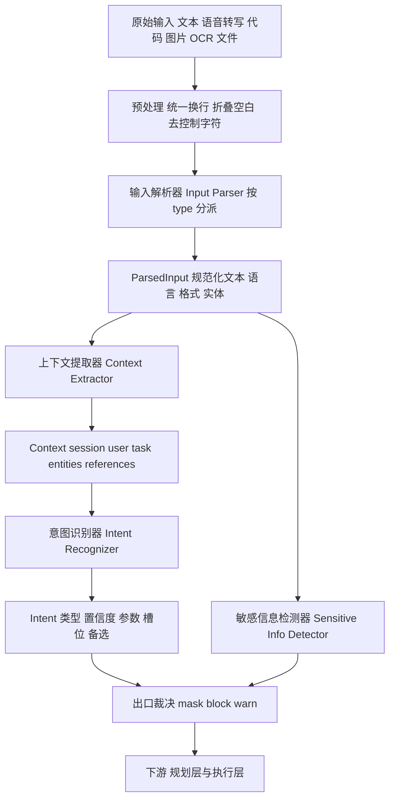
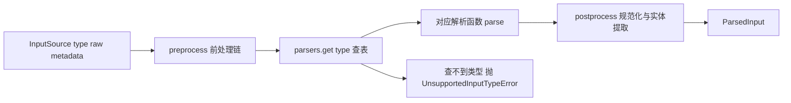
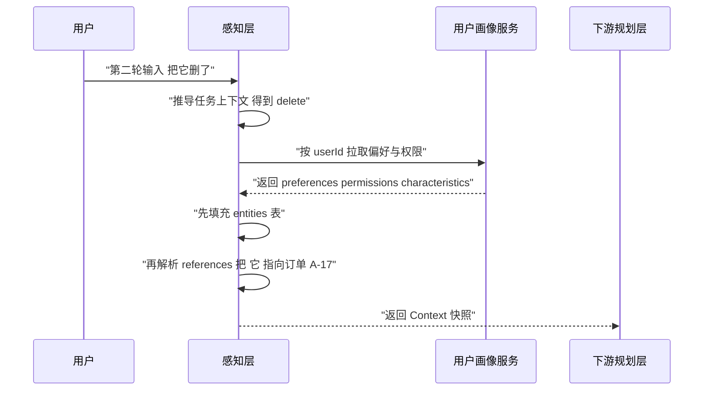
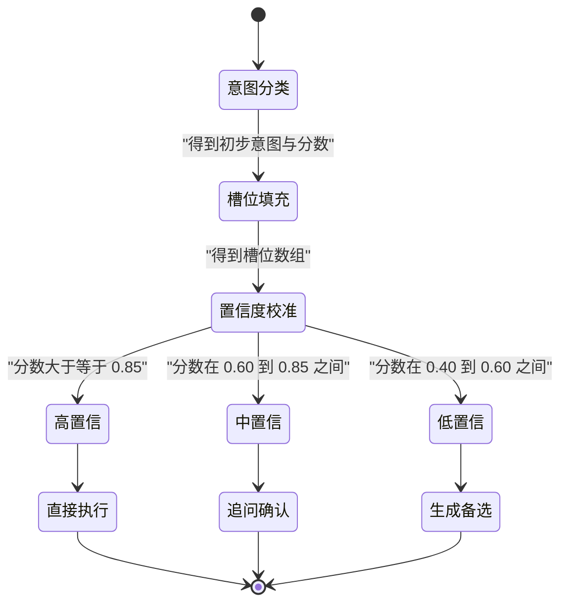
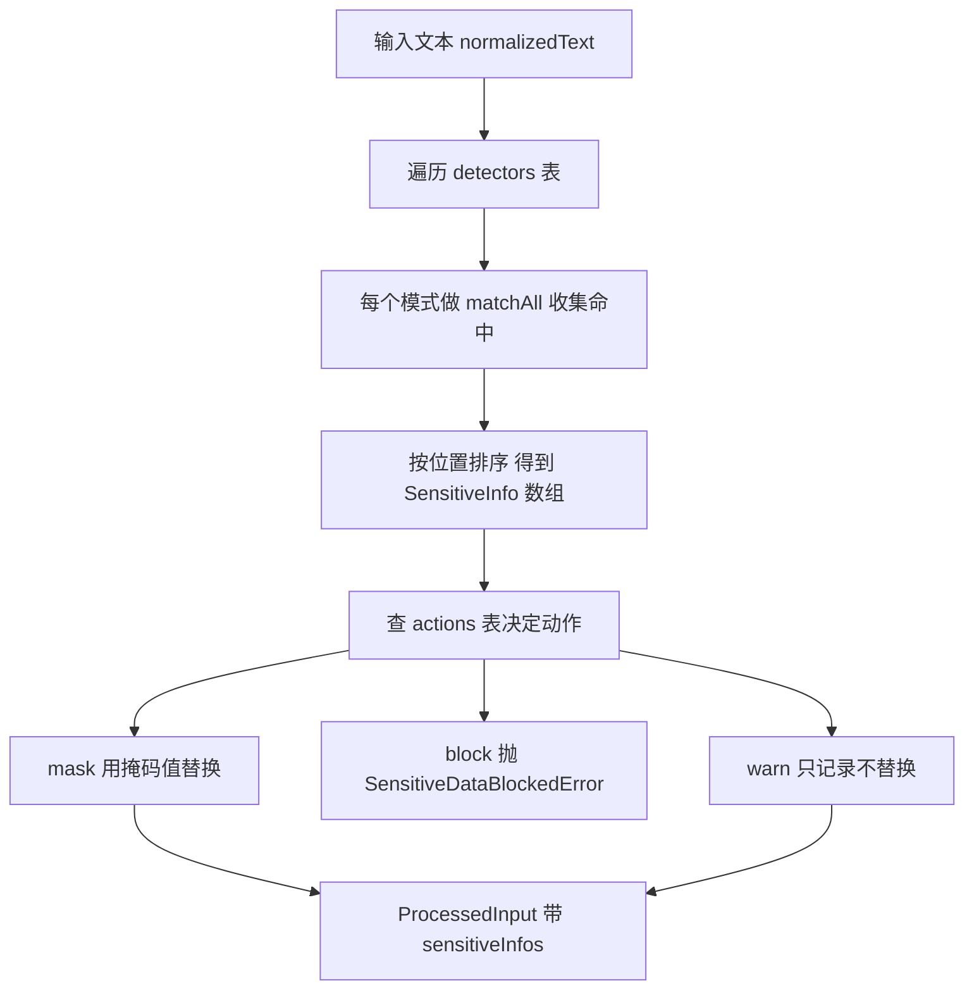
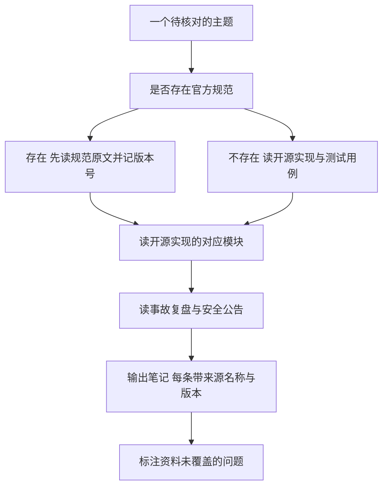
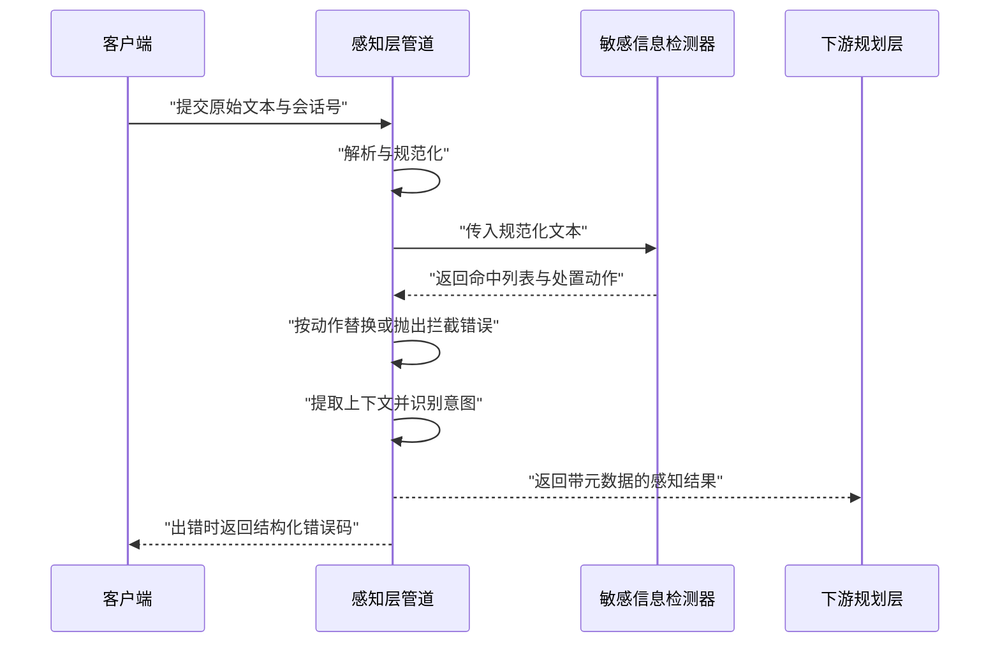

# 感知层

感知层是 Agent 分层架构里最靠前的一层。它把文本、语音转写、代码、图片 OCR 结果、文件这些原始输入，翻译成下游读得懂的结构化数据。

!!! abstract "学完这一页你能"

    - 能对一段原始输入走完预处理、按类型分派解析、后处理三步，并说出每步的输入与输出。
    - 能组装一个上下文快照，包含 session、user、task、entities、references 五块，并说清 entities 为什么必须先于 references 完成。
    - 能把"搜索前 10 条订单"解析成意图与槽位，并手算出校准后的置信度。
    - 能对同一段文本跑敏感信息检测，按 mask、block、warn 三种动作分别处理，并说明 Luhn 校验放在哪一步。

这一页的代码用 JavaScript 写，这样可以在 Node 20 直接运行。旧版用 TypeScript 写的类型声明，在语义上与此处一致，差别只在类型标注。

## 0. 知识地图



建议这样读：先看第 1 节的输入解析器，它决定了后面三节拿到的是什么形状的数据。再看第 2 节，它把单轮输入扩成会话快照。第 3 节和第 4 节都吃这份快照，一个专注"用户想干什么"，一个专注"这句话能不能出门"。第 5、6 节把四块拼成工程闭环。

## 1. 输入解析器 (Input Parser)

**先想一个问题**

某个在线客服系统同时收到两路输入。一路是电话语音转写出的中文句子，另一路是用户直接粘贴的半段 TypeScript 代码。系统在理解语义之前，必须先做哪一件事？

**心智模型**

!!! tip "心智模型"

    一句话模型：解析器是一张按输入类型查表的插槽表，每种类型对应一个处理函数。

    日常类比：与机场按舱位分通道相同，先看登机牌上的类型，再走向对应柜台。

    类比不成立的地方：机场会把你退回重排队；解析器遇到未知类型必须显式抛错，不能静默返回空字符串。

!!! note "术语：多模态输入"

    定义：一次会话里出现不止一种载体形式。例子：同一条消息里既有中文说明，又贴了一段代码块和一张截图。

**图解**



1. 输入先经过前处理链，把换行、空格、控制字符统一。
2. 前处理完成后，用 `type` 字段去解析表里查对应的处理函数。
3. 查表命中就调用该函数，`raw` 与 `metadata` 一起传进去。
4. 查表失败必须抛错，让调用方知道这个类型没被支持。
5. 解析函数返回的对象还要过后处理：空白规范化、控制字符清理、格式与语言识别。
6. 后处理结束才产出 `ParsedInput`，它是后面三节的共同输入。

**一步一步来**

**第 1 步：定义输入契约**

①这一步要做什么：先约定"一条原始输入长什么样"，让五个解析器共用同一个结构。

```js
// 一条原始输入的契约，五种类型共用这个结构
const inputSource = {
  type: 'text',                              // 取值 text voice code image file
  raw: '  搜索   前 10 条订单 \r\n\r\n\r\n',  // 原始载体，字符串或二进制
  metadata: {
    timestamp: 1735689600000,  // 毫秒时间戳，写日志时用来排序
    source: 'web-chat',        // 渠道标记，便于按渠道统计解析失败率
    sessionId: 's-1001'        // 会话 id，会透传给上下文提取器
  }
};
```

**这段代码在做什么**

- `type` 是分派键，解析器用它查表选处理函数。
- `raw` 不做任何格式约束，可能是字符串，也可能是二进制缓冲区。
- `metadata` 只放来源信息，不放内容，写日志时用它定位。
- `sessionId` 必须携带，否则上下文提取器拿不到会话历史。
- `timestamp` 用毫秒，跨渠道排序时不会因为秒级精度打平。

**第 2 步：分派表加后处理**

①这一步要做什么：把"类型判断"和"处理逻辑"拆开，再补上规范化那几步。

```js
const parsers = new Map();        // 类型到解析函数的映射表

function registerDefaultParsers() {
  parsers.set('text', parseText);   // 文本，兜底能力最强
  parsers.set('code', parseCode);   // 代码，额外做语言识别
  parsers.set('voice', parseVoice); // 语音转写文本，先当文本处理
  parsers.set('image', parseImage); // 图片经 OCR 得到文本后再处理
  parsers.set('file', parseFile);   // 文件，先抽文本再处理
}

function normalizeWhitespace(text) {
  return text
    .replace(/\r\n/g, '\n')       // 先把 CRLF 统一成 LF
    .replace(/[ \t]+/g, ' ')      // 连续空格与制表符合并成一个空格
    .replace(/\n{3,}/g, '\n\n');  // 三个以上连续换行压成两个
}

function removeHiddenCharacters(text) {
  // 去掉 C0 控制字符与 DEL，它们会让下游长度统计与高亮错位
  return text.replace(/[\x00-\x08\x0B\x0C\x0E-\x1F\x7F]/g, '');
}

async function parseText(raw) {
  const trimmed = raw.trim();                 // 先去掉首尾空白
  const normalized = normalizeWhitespace(trimmed);   // 再统一行尾与空格
  return {
    normalizedText: removeHiddenCharacters(normalized), // 最后清控制字符
    format: detectFormat(trimmed),            // 识别 markdown json xml plain
    language: detectLanguage(trimmed),        // 识别 zh 或 en
    entities: []
  };
}
```

**这段代码在做什么**

- 分派表把类型与实现分开，新增类型只改一行注册代码。
- `normalizeWhitespace` 的三次替换有固定顺序，先统一行尾再折叠空格。
- `removeHiddenCharacters` 单独成函数，方便在测试里单独断言。
- `parseText` 是唯一必装的解析器，其他类型解析失败时可以降级到它。
- 三个步骤串成一条链，每步的输出就是下一步的输入。

**运行结果**

输入 `'  搜索   前 10 条订单 \r\n\r\n\r\n'` 后，`trim` 去掉首尾空白与末尾换行，`\r\n` 全部变成 `\n`，连续空格折叠成一个，连续三个换行压成两个。最终 `normalizedText` 是 `'搜索 前 10 条订单'`。

**动手验证**

```js
// 依赖：无。运行环境：Node 20 及以上。文件名：parser-demo.mjs
import assert from 'node:assert/strict';

function normalizeWhitespace(text) {
  return text.replace(/\r\n/g, '\n').replace(/[ \t]+/g, ' ').replace(/\n{3,}/g, '\n\n');
}
function removeHiddenCharacters(text) {
  return text.replace(/[\x00-\x08\x0B\x0C\x0E-\x1F\x7F]/g, '');
}
function normalize(text) {
  return removeHiddenCharacters(normalizeWhitespace(text.trim()));
}
function detectFormat(text) {
  const t = text.trim();
  if (/^\s*[{[]/.test(t)) return 'json';
  if (/^\s*<[a-zA-Z]/.test(t)) return 'xml';
  if (/^#{1,6}\s/m.test(t) || /\*\*[^*]+\*\*/.test(t)) return 'markdown';
  return 'plain';
}
function detectLanguage(text) {
  const chineseChars = (text.match(/[一-鿿]/g) || []).length;
  const totalChars = text.replace(/\s/g, '').length;
  if (totalChars === 0) return 'unknown';
  return chineseChars / totalChars > 0.3 ? 'zh' : 'en';
}

const raw = '  搜索   前 10 条订单 \r\n\r\n\r\n';
assert.equal(normalize(raw), '搜索 前 10 条订单');
assert.equal(detectFormat('{"a":1}'), 'json');
assert.equal(detectFormat('# 标题'), 'markdown');
assert.equal(detectLanguage('搜索前十条订单'), 'zh');
assert.equal(detectLanguage('search the first ten orders'), 'en');
console.log('normalized =', normalize(raw));
console.log('format(json) =', detectFormat('{"a":1}'));
console.log('language(zh) =', detectLanguage('搜索前十条订单'));
```

预期输出：

```
normalized = 搜索 前 10 条订单
format(json) = json
language(zh) = zh
```

**常见坑**

| 现象 | 原因 | 怎么修 |
| 同一句中文在 Windows 上传后行尾正则不匹配 | 行尾是 CRLF，`$` 前面多了一个 `\r` | 在解析入口先做 `replace(/\r\n/g, '\n')` |
| 复制来的文本长度是 42，肉眼只有 40 个字符 | 混入了零宽空格与控制字符 | 用 `removeHiddenCharacters` 清掉控制字符，再单独处理零宽字符 |
| 同一个正则第二次匹配返回 `null` | 复用了带 `g` 的正则，`lastIndex` 没归零 | 每次调用新建正则字面量，或手动把 `lastIndex` 设为 0 |

**用在哪里**

场景一：在线客服工单系统。

- 业务背景：电话语音转写与网页粘贴文本混在同一个入口，渠道差异会带到下游。
- 这一节的知识怎么用：用 `type` 分派到不同解析器，统一走一遍规范化，再交给意图识别。
- 用什么指标衡量收益：统计"同一句话在不同渠道解析结果不一致"的工单数。
- 什么时候不该用：如果所有输入都是同一种表单字段，直接按字段校验即可，不必引入分派表。

场景二：IDE 里的代码助手。

- 业务背景：用户在编辑器里选中代码再提问，提问文本里也带反引号包裹的片段。
- 这一节的知识怎么用：用 `parseCode` 先抽出代码块与语言标记，再把说明文字当文本处理。
- 用什么指标衡量收益：统计代码语言识别为 `unknown` 的比例。
- 什么时候不该用：如果编辑器已经通过接口告诉你语言标识，就不要用正则再猜一遍。

场景三：后台管理的批量导入。

- 业务背景：运营上传 CSV，系统需要把每行转成结构化任务。
- 这一节的知识怎么用：把文件解析放在最前面，逐行做规范化后再进上下文提取。
- 用什么指标衡量收益：统计因隐藏字符导致的导入失败行数。
- 什么时候不该用：如果数据源是内部系统直连的数据库，字段本身已受约束，规范化收益有限。

**行业实践**

- Unicode 官方文档 UAX #15 "Unicode Normalization Forms"：说明组合字符有多种等价形式。怎么借鉴到你的项目：在规范化阶段加一次 NFC 归一化，避免同一个词因写法不同被当成两个实体。具体 API 名称需核对运行时官方文档。
- OWASP Cheat Sheet Series 的 "Input Validation Cheat Sheet"：主张在入口处做输入验证，不信任客户端传来的类型字段。怎么借鉴到你的项目：`type` 字段只用来选解析器，真正的合法性判断放在解析之后。
- MDN Web Docs 的 `String.prototype.normalize` 页面：给出归一化形式的取值。怎么借鉴到你的项目：在测试里加一条断言，确认归一化前后长度变化符合预期。

**小结**

1. 输入解析器的核心是一张分派表，加一条前处理链和一条后处理链。
2. 规范化三步有固定顺序，行尾统一必须排在最前。
3. 未知类型要抛错，静默返回空字符串会把问题推迟到下游更难定位。

## 2. 上下文提取器 (Context Extractor)

**先想一个问题**

用户在第二轮说"把它删了"。系统怎么知道"它"指上一轮列表里的哪一条订单？

!!! note "术语：指代消解"

    定义：把"它""那个""上面说的"这类词指回前文出现过的实体。例子：上一轮提到订单 A-17，本轮的"它"解析结果就是订单 A-17。

**心智模型**

!!! tip "心智模型"

    一句话模型：每次提取产出一张只读快照，下游只读这张快照，不再回头查会话。

    日常类比：出门前把当天要用的东西装进一个箱子，路上只看箱子。

    类比不成立的地方：箱子是深拷贝；快照里的 `session` 是引用，下游改历史会污染上游。

**图解**



1. 用户提交第二轮输入，输入里没有出现订单号。
2. 感知层先用规则把动作词 `删了` 映射成 `delete` 任务类型。
3. 同时向用户画像服务发起一次请求，拿到偏好与权限。
4. 画像服务返回后，开始填充 `entities` 表，把历史里出现过的订单放进去。
5. `entities` 就绪后才解析 `references`，此时"它"能查到候选实体。
6. 快照返回给下游，下游只看这份快照，不再查询会话。

**一步一步来**

**第 1 步：定义五块结构**

①这一步要做什么：确定快照的字段，以及每块的来源。

```js
function createContext(session, user, task) {
  return {
    session,               // 会话级：历史、轮次、上一轮意图与话题
    user,                  // 用户级：偏好、权限、画像特征
    task,                  // 任务级：类型、要求、约束
    entities: new Map(),   // 实体表，key 可能是任意字符串，用 Map 而非普通对象
    references: []         // 指代解析结果，与 entities 分开便于单独回溯
  };
}

function buildTaskContext(input) {
  return {
    type: 'general',       // 任务类型，最终由意图识别覆盖
    requirements: [],      // 用户想要的，例如 前 10 条
    constraints: [],       // 不能违反的，例如 只读
    deadline: undefined    // 可选，毫秒时间戳
  };
}
```

**这段代码在做什么**

- 五块字段一次给全，快照创建时就是"结构完整、内容待补"。
- `entities` 用 `Map`，因为键可能是包含空格的任意字符串。
- `requirements` 与 `constraints` 分开，前者是用户想要的，后者是不能违反的。
- `deadline` 用 `undefined` 表示没有截止时间，不用空字符串。
- 传入的 `session` 直接引用，不深拷贝，避免丢掉增量。

**第 2 步：串行排布依赖**

①这一步要做什么：把主流程的先后顺序定下来，标出哪一步不能并行。

```js
async function extract(input, session, deps) {
  // 画像服务是唯一的外部 I/O，失败时直接向上抛
  const user = await deps.userProfileService.getProfile(session.userId);

  const context = createContext(session, user, buildTaskContext(input));

  // 第一步：填充实体表，整体赋值而不是浅合并，避免上一轮残留
  context.entities = await extractEntities(input, context);

  // 第二步：解析指代，它要读 context.entities，所以不能与上一步并行
  context.references = await resolveReferences(input, context);

  return context;
}
```

**这段代码在做什么**

- `getProfile` 是唯一的外部调用点，边界清楚，便于打桩测试。
- `createContext` 在拿到用户数据后立即创建，后续两步都是往里填。
- `entities` 用整体赋值，不写成 `Object.assign` 合并。
- `references` 必须等 `entities`，两个 `await` 不能换成 `Promise.all`。
- 返回的是同一个对象引用，调用方不需要再做一次组装。

**运行结果**

第二轮输入 `'把它删了'`，历史里有一条订单 `A-17`。快照里 `task.type` 是 `delete`，`entities` 表里有 `order: 'A-17'`，`references` 是 `[{ text: '它', target: 'A-17' }]`。

**动手验证**

```js
// 依赖：无。运行环境：Node 20 及以上。文件名：context-demo.mjs
import assert from 'node:assert/strict';

function createContext(session, user, task) {
  return { session, user, task, entities: new Map(), references: [] };
}

async function extractEntities(input, context) {
  const map = new Map();
  // 只从会话历史里找已出现过的实体，本轮输入没有订单号
  for (const msg of context.session.history) {
    for (const e of msg.entities || []) map.set(e.name, e.value);
  }
  return map;
}

async function resolveReferences(input, context) {
  const refs = [];
  if (input.includes('它') && context.entities.has('order')) {
    refs.push({ text: '它', target: context.entities.get('order') });
  }
  return refs;
}

async function extract(input, session, deps) {
  const user = await deps.userProfileService.getProfile(session.userId);
  const context = createContext(session, user, { type: 'delete', requirements: [], constraints: [] });
  context.entities = await extractEntities(input, context);
  context.references = await resolveReferences(input, context);
  return context;
}

const session = {
  id: 's-1001',
  userId: 'u-7',
  turnCount: 2,
  history: [{ entities: [{ name: 'order', value: 'A-17' }] }]
};
const deps = {
  userProfileService: {
    async getProfile(userId) {
      return { id: userId, permissions: ['order:write'], preferences: {}, characteristics: {} };
    }
  }
};

const ctx = await extract('把它删了', session, deps);
assert.equal(ctx.references.length, 1);
assert.equal(ctx.references[0].target, 'A-17');
assert.deepEqual(ctx.user.permissions, ['order:write']);
console.log('references =', JSON.stringify(ctx.references));
```

预期输出：

```
references = [{"text":"它","target":"A-17"}]
```

**常见坑**

| 现象 | 原因 | 怎么修 |
| 第二轮"它"解析成 `null` | 把 `entities` 与 `references` 写成 `Promise.all` 并行 | 改成串行 `await`，让 `references` 读到已填充的表 |
| 权限数组为空导致越权 | 画像服务缺失 `permissions` 时被静默兜底成空数组 | 提取阶段直接抛错，让上游处理，不做默认放行 |
| 正则跨次调用漏匹配 | 模块级复用带 `g` 的正则，`lastIndex` 残留 | 每次调用新建正则字面量 |

**用在哪里**

场景一：多轮客服对话。

- 业务背景：用户先说"查我的订单"，再说"把第二个退了"。
- 这一节的知识怎么用：把上一轮结果写进 `entities`，本轮只解析 `references`。
- 用什么指标衡量收益：统计指代解析失败率，按失败样本人工抽检。
- 什么时候不该用：如果每轮输入都自带完整订单号，指代消解没有输入可用，直接跳过这一步。

场景二：后台管理的批量操作二次确认。

- 业务背景：用户勾选一批记录后说"都删了"。
- 这一节的知识怎么用：把勾选结果作为 `entities` 传入，`constraints` 记录"需要二次确认"。
- 用什么指标衡量收益：统计二次确认弹窗的误触发次数。
- 什么时候不该用：如果删除是幂等的软删除，可以让执行层自行处理，不必在感知层加约束。

场景三：代码助手补全上下文。

- 业务背景：用户先说"这个函数报错了"，再贴一段栈信息。
- 这一节的知识怎么用：把文件名与函数名放进 `entities`，栈信息放进 `session.history`。
- 用什么指标衡量收益：统计追问"是哪个函数"的次数。
- 什么时候不该用：如果编辑器每次请求都带完整文件内容，感知层不需要维护会话历史。

**行业实践**

- Rasa 官方文档的 "Domain" 与 "Forms" 章节：把槽位与实体作为对话状态的一部分来定义。怎么借鉴到你的项目：把 `entities` 表当成槽位的唯一存放处，不要再另建一份缓存。
- Anthropic 公开的 Model Context Protocol 规范：把可用资源与工具以标准方式提供给模型。怎么借鉴到你的项目：把上下文快照当作对外协议的一部分，字段命名稳定下来。具体字段与版本需核对官方文档。
- OWASP Cheat Sheet Series 的 "Logging Cheat Sheet"：提醒不要在日志里写完整敏感数据。怎么借鉴到你的项目：快照落日志前先过第 4 节的检测器。

**小结**

1. 快照固定五块，`session` 透传引用，其余由提取阶段填充。
2. `entities` 必须先于 `references`，这一步的串行是数据依赖，不是性能取舍。
3. 画像数据缺失时宁可抛错，不要静默兜底成空权限。

## 3. 意图识别器 (Intent Recognizer)

**先想一个问题**

用户说"帮我搜一下昨天的订单前 10 条，输出表格"。系统要拆出哪几样东西，才能交给下游执行？

!!! note "术语：意图与槽位"

    意图（Intent）：用户想做的动作类型。槽位（Slot）：这个动作需要的参数格子。例子：意图是 `search`，槽位是 `query`、`limit`、`filters`。

**心智模型**

!!! tip "心智模型"

    一句话模型：先选动作，再填空，最后给这次判断打一个分。

    日常类比：与填快递单相同，先在业务类型上打勾，再一格一格填收件信息。

    类比不成立的地方：槽位可以来自会话历史推断，原文里找不到对应字符。

**图解**



1. 先用分类器得到初步意图与一个原始分数。
2. 按意图类型取出槽位模板，逐个跑槽位提取器。
3. 用槽位填充比例与槽位平均置信度去校准分数。
4. 校准后落在 0.85 以上，可以直接执行。
5. 落在 0.60 到 0.85 之间，向用户追问一次。
6. 落在 0.40 到 0.60 之间，把备选意图一起给出。

**一步一步来**

**第 1 步：写槽位模板表**

①这一步要做什么：为每种意图声明它需要哪些参数格子。

```js
const SLOT_TEMPLATES = {
  search: [
    { name: 'query', type: 'text' },        // 搜索词
    { name: 'target', type: 'entity' },     // 搜哪类对象
    { name: 'limit', type: 'number' },      // 取多少条
    { name: 'filters', type: 'collection' } // 过滤条件集合
  ],
  create: [
    { name: 'entity_type', type: 'category' },
    { name: 'properties', type: 'object' },
    { name: 'name', type: 'text' }
  ],
  delete: [
    { name: 'target', type: 'entity' },
    { name: 'cascade', type: 'boolean' }    // 是否级联删除
  ],
  general: []                                // 兜底意图不需要槽位
};

function getRequiredSlots(intentType) {
  return SLOT_TEMPLATES[intentType] || [];
}
```

**这段代码在做什么**

- 模板是常量，不随请求变化，可以一次性冻结。
- 每个槽位有 `name` 和 `type`，`type` 决定用哪个提取器。
- `general` 是空数组，兜底意图不产生槽位。
- `getRequiredSlots` 用 `|| []` 保证任何输入都返回数组。
- 新增意图只需要在这张表里加一项。

**第 2 步：校准置信度**

①这一步要做什么：用槽位填充情况修正分类器给出的原始分数。

```js
const THRESHOLDS = { high: 0.85, medium: 0.60, low: 0.40 };

function calibrate(preliminaryConfidence, slots) {
  if (slots.length === 0) {
    // 没有槽位时不做槽位加权，否则 reduce 会除以 0 得到 NaN
    return Math.min(preliminaryConfidence, 1);
  }
  const filledRatio =
    slots.filter((s) => s.value !== null && s.value !== undefined).length / slots.length;
  const avgSlotConfidence =
    slots.reduce((sum, s) => sum + s.confidence, 0) / slots.length;

  let confidence = preliminaryConfidence;
  confidence *= 0.7 + filledRatio * 0.3;       // 填充度权重是 0.3
  confidence *= 0.8 + avgSlotConfidence * 0.2; // 槽位置信度权重是 0.2
  return Math.min(confidence, 1);
}

function levelOf(confidence) {
  if (confidence >= THRESHOLDS.high) return 'high';
  if (confidence >= THRESHOLDS.medium) return 'medium';
  if (confidence >= THRESHOLDS.low) return 'low';
  return 'below-low';
}
```

**这段代码在做什么**

- `slots.length` 为 0 时直接返回，避开除零。
- `filledRatio` 只看 `value` 是否有值，`null` 与 `undefined` 都算没填。
- 两个乘数里 `0.7` 与 `0.8` 是保底系数，`0.3` 与 `0.2` 是权重。
- 最后用 `Math.min` 把结果压到 1 以内。
- `levelOf` 把分数映射成四档，阈值集中在 `THRESHOLDS` 里。

**运行结果**

初步置信度 0.9，4 个槽位填满 3 个，槽位平均置信度 0.9。填充比例是 0.75，第一个乘数得到 `0.7 + 0.75 * 0.3 = 0.925`，第二个乘数得到 `0.8 + 0.9 * 0.2 = 0.98`。最终是 `0.9 * 0.925 * 0.98 = 0.81585`，`levelOf` 返回 `medium`。

**动手验证**

```js
// 依赖：无。运行环境：Node 20 及以上。文件名：intent-demo.mjs
import assert from 'node:assert/strict';

const THRESHOLDS = { high: 0.85, medium: 0.60, low: 0.40 };

function calibrate(preliminaryConfidence, slots) {
  if (slots.length === 0) return Math.min(preliminaryConfidence, 1);
  const filledRatio =
    slots.filter((s) => s.value !== null && s.value !== undefined).length / slots.length;
  const avgSlotConfidence = slots.reduce((sum, s) => sum + s.confidence, 0) / slots.length;
  let confidence = preliminaryConfidence;
  confidence *= 0.7 + filledRatio * 0.3;
  confidence *= 0.8 + avgSlotConfidence * 0.2;
  return Math.min(confidence, 1);
}
function levelOf(c) {
  if (c >= THRESHOLDS.high) return 'high';
  if (c >= THRESHOLDS.medium) return 'medium';
  if (c >= THRESHOLDS.low) return 'low';
  return 'below-low';
}

const slots = [
  { name: 'query', value: '昨天的订单', confidence: 0.9 },
  { name: 'target', value: 'order', confidence: 0.9 },
  { name: 'limit', value: 10, confidence: 0.9 },
  { name: 'filters', value: null, confidence: 0.9 }
];
const score = calibrate(0.9, slots);
assert.equal(slots.length, 4);
assert.equal(Number(score.toFixed(5)), 0.81585);
assert.equal(levelOf(score), 'medium');
assert.equal(calibrate(0.9, []), 0.9);
console.log('score =', score.toFixed(5), 'level =', levelOf(score));
```

预期输出：

```
score = 0.81585 level = medium
```

**常见坑**

| 现象 | 原因 | 怎么修 |
| 置信度算出来是 `NaN` | `slots` 是空数组，`reduce` 除以 0 | 先判断 `slots.length` 为 0 的分支 |
| 置信度大于 1 | 两个乘数叠加后超过 1 | 返回前用 `Math.min` 截到 1 |
| 备选意图列表里出现主意图 | 忘记跳过第一名 | 按分数排序后先 `slice(1)` |
| 阈值改了但线上行为没变 | 阈值散落在多处 | 收进一个 `THRESHOLDS` 常量对象 |

**用在哪里**

场景一：智能客服工单路由。

- 业务背景：用户消息要自动分派到退款、物流、账号三个队列。
- 这一节的知识怎么用：用意图做队列选择，用槽位给坐席预填信息。
- 用什么指标衡量收益：统计转人工率与首次响应时间里的人工改派次数。
- 什么时候不该用：如果入口已经让用户点了分类按钮，意图识别只剩确认作用。

场景二：语音助手。

- 业务背景：语音转写结果常有同音字错误，直接匹配动作词会漏。
- 这一节的知识怎么用：把校准后的分数当作追问触发器，中等分数时让用户复述。
- 用什么指标衡量收益：统计追问后一次成功的比例。
- 什么时候不该用：如果设备端已有唤醒词的固定指令表，按表匹配即可。

场景三：低代码平台的自然语言建表。

- 业务背景：用户输入"建一张表，字段有姓名和手机号"。
- 这一节的知识怎么用：`create` 意图加 `properties` 槽位，槽位值再走一次第 1 节的解析器。
- 用什么指标衡量收益：统计建表后用户手动改字段的次数。
- 什么时候不该用：如果字段结构必须由表单填写才能保证类型正确，不要用自然语言替代。

**行业实践**

- Rasa 官方文档的 "NLU Training Data" 章节：说明意图与实体的标注格式。怎么借鉴到你的项目：规则分类器只做第一层，把规则命中日志当作后续训练数据的来源。
- Google Dialogflow 官方文档的 "Intents" 与 "Entities" 章节：把意图、实体、参数分开配置。怎么借鉴到你的项目：槽位模板与意图枚举分开维护，改一处不影响另一处。具体命名与字段需核对官方文档。
- OpenAI 官方文档的 "Function calling" 章节：把用户意图映射成结构化工具调用参数。怎么借鉴到你的项目：槽位表可以直接生成工具参数的模式定义，减少两份配置。

**小结**

1. 意图识别分三段：分类、槽位填充、置信度校准。
2. 校准用两个乘数，填充比例权重 0.3，槽位置信度权重 0.2。
3. 阈值集中放一处，输出分四档，每档对应一个明确动作。

## 4. 敏感信息检测器 (Sensitive Information Detector)

**先想一个问题**

用户把一段带 API 密钥的构建日志粘进对话框，日志里还夹着一个手机号。这段文本能原样发给模型吗？

!!! note "术语：PII"

    PII 是 Personally Identifiable Information 的缩写，中文是"可识别个人身份的信息"。例子：手机号、身份证号、邮箱地址、银行卡号。

**心智模型**

!!! tip "心智模型"

    一句话模型：先按模式表把敏感片段全部找出来，再按动作表逐条决定放行、脱敏还是拦截。

    日常类比：与机场安检相同，先扫描，再决定放行、开箱检查还是拒绝进入。

    类比不成立的地方：安检设备的覆盖范围由机场定义；检测器只覆盖你写下的那些正则，没写的模式不会被发现。

**图解**



1. 拿到规范化后的文本，逐个敏感类型跑检测。
2. 每个类型下有多个正则，全部命中都收集起来。
3. 所有命中按起始位置排序，方便后续按位置处理。
4. 每个命中查动作表，得到 `mask`、`block`、`warn` 之一。
5. `mask` 走掩码函数替换，`block` 直接抛错中断流程。
6. `warn` 只记日志，文本保持原样，但在返回值里标记出来。

**一步一步来**

**第 1 步：写模式表与动作表**

①这一步要做什么：把"找什么"和"找到了怎么办"分成两张表。

```js
const detectors = new Map([
  ['phone_number', [
    /1[3-9]\d{9}/g,               // 中国大陆手机号
    /\+86\s*1[3-9]\d{9}/g         // 带国际区号的写法
  ]],
  ['id_number', [
    /[1-9]\d{5}(?:19|20)\d{2}(?:0[1-9]|1[0-2])(?:0[1-9]|[12]\d|3[01])\d{3}[\dXx]/g
  ]],
  ['email', [
    /[a-zA-Z0-9._%+-]+@[a-zA-Z0-9.-]+\.[a-zA-Z]{2,}/g
  ]],
  ['credit_card', [
    /\b(?:\d{4}[-\s]?){3}\d{4}\b/g
  ]]
]);

const actions = new Map([
  ['password', { action: 'block', severity: 'high' }],
  ['api_key', { action: 'block', severity: 'high' }],
  ['credit_card', { action: 'mask', severity: 'high' }],
  ['phone_number', { action: 'mask', severity: 'medium' }],
  ['id_number', { action: 'mask', severity: 'high' }],
  ['email', { action: 'mask', severity: 'low' }]
]);
```

**这段代码在做什么**

- 模式表的值是正则数组，一个类型可以有多条模式。
- 每条模式都必须带 `g`，否则 `matchAll` 会直接抛错。
- 动作表独立于模式表，调整处置策略不用改正则。
- `severity` 用来决定日志级别，也决定是否需要人工复核。
- `action` 只有三个取值，下游分支数量固定。

**第 2 步：写检测与脱敏**

①这一步要做什么：遍历模式表收集命中，再按类型生成掩码值。

```js
function mask(type, value) {
  switch (type) {
    case 'phone_number':
      return value.replace(/(\d{3})\d{4}(\d{4})/, '$1****$2');
    case 'email':
      return value.replace(/([a-zA-Z0-9._%+-]+)@/, '***@');
    case 'id_number':
      return value.replace(/(\d{6})\d{8}(\d{3}[\dXx])/, '$1********$2');
    case 'credit_card':
      return value.replace(/\d{4}[-\s]?(\d{4})/, '****-****-$1');
    case 'api_key':
    case 'token':
    case 'password':
      return '***MASKED***';
    default:
      return '***';
  }
}

function detect(text) {
  const results = [];
  for (const [type, patterns] of detectors) {
    for (const pattern of patterns) {
      // 每次新建 RegExp，避免复用 Literal 时 lastIndex 残留
      for (const match of text.matchAll(new RegExp(pattern.source, pattern.flags))) {
        results.push({
          type,
          value: match[0],
          maskedValue: mask(type, match[0]),
          position: { start: match.index, end: match.index + match[0].length },
          action: actions.get(type)?.action ?? 'warn'
        });
      }
    }
  }
  return results.sort((a, b) => a.position.start - b.position.start);
}
```

**这段代码在做什么**

- `mask` 按类型给掩码，密钥类不做部分保留，整段替换成固定串。
- `detect` 里重新构造 `RegExp`，绕开 `lastIndex` 残留。
- `match.index` 记录了命中位置，下游做高亮时要用。
- 动作查不到时兜底为 `warn`，保证不会因为漏配而放行。
- 最后按起始位置排序，返回值顺序与实际文本位置一致。

**运行结果**

对 `'联系电话 13800138000，卡号 4242424242424242'` 调用 `detect`，得到两条命中：手机号掩码为 `138****8000`，卡号掩码为 `****-****-4242`。

**第 3 步：写 Luhn 校验与处置**

①这一步要做什么：给卡号加一道校验，再按动作表分别处理。

```js
function luhnCheck(number) {
  let sum = 0;
  let isEven = false;             // 从右往左，第 2、4、6 位要翻倍
  for (let i = number.length - 1; i >= 0; i--) {
    let digit = parseInt(number[i], 10);
    if (isEven) {
      digit *= 2;
      if (digit > 9) digit -= 9;  // 翻倍后超过 9 就减 9
    }
    sum += digit;
    isEven = !isEven;
  }
  return sum % 10 === 0;          // 能被 10 整除才算通过
}

function process(text, infos) {
  let output = text;
  // 倒序替换，前面的位置信息不会因为后面的替换而失效
  for (const info of [...infos].reverse()) {
    if (info.action === 'block') {
      throw new Error(`blocked: ${info.type}`);
    }
    if (info.action === 'mask') {
      output = output.slice(0, info.position.start)
        + info.maskedValue
        + output.slice(info.position.end);
    }
  }
  return { normalizedText: output, sensitiveInfos: infos };
}
```

**这段代码在做什么**

- `luhnCheck` 从右往左遍历，偶数位翻倍，翻倍后超过 9 就减 9。
- 校验通过的条件是总和能被 10 整除。
- `process` 先复制一份再倒序，倒序是为了让前面命中项的坐标保持有效。
- 替换用 `slice` 拼接，不用 `replace`，避免相同值被替换到别处。
- `block` 直接抛错，调用方必须处理，不能吞掉。

**运行结果**

`luhnCheck('4242424242424242')` 返回 `true`。把末位改成 3 后返回 `false`。对含手机号的文本走 `process`，输出文本中手机号变成掩码，`sensitiveInfos` 长度是 1。

**动手验证**

```js
// 依赖：无。运行环境：Node 20 及以上。文件名：sensitive-demo.mjs
import assert from 'node:assert/strict';

function mask(type, value) {
  switch (type) {
    case 'phone_number': return value.replace(/(\d{3})\d{4}(\d{4})/, '$1****$2');
    case 'credit_card': return value.replace(/\d{4}[-\s]?(\d{4})/, '****-****-$1');
    default: return '***';
  }
}
function luhnCheck(number) {
  let sum = 0, isEven = false;
  for (let i = number.length - 1; i >= 0; i--) {
    let digit = parseInt(number[i], 10);
    if (isEven) { digit *= 2; if (digit > 9) digit -= 9; }
    sum += digit; isEven = !isEven;
  }
  return sum % 10 === 0;
}
function detect(text) {
  const patterns = [
    ['phone_number', /1[3-9]\d{9}/],
    ['credit_card', /\b(?:\d{4}[-\s]?){3}\d{4}\b/]
  ];
  const out = [];
  for (const [type, re] of patterns) {
    for (const m of text.matchAll(new RegExp(re.source, 'g'))) {
      out.push({ type, value: m[0], maskedValue: mask(type, m[0]),
        position: { start: m.index, end: m.index + m[0].length } });
    }
  }
  return out.sort((a, b) => a.position.start - b.position.start);
}

const text = '联系电话 13800138000，卡号 4242424242424242';
const hits = detect(text);
assert.equal(hits.length, 2);
assert.equal(hits[0].maskedValue, '138****8000');
assert.equal(hits[1].maskedValue, '****-****-4242');
assert.equal(luhnCheck('4242424242424242'), true);
assert.equal(luhnCheck('4242424242424243'), false);
console.log(JSON.stringify(hits.map((h) => [h.type, h.maskedValue])));
```

预期输出：

```
[["phone_number","138****8000"],["credit_card","****-****-4242"]]
```

**常见坑**

| 现象 | 原因 | 怎么修 |
| 只替换了第一处手机号 | 用字符串做 `replace` 的第一个参数 | 用带 `g` 的正则，或改成按位置 `slice` 拼接 |
| 掩码后位置信息全错位 | 边检测边替换，`position` 记的是替换前坐标 | 先全量检测收集，再按位置倒序替换 |
| 短字符串被误判成密钥 | 模式只写了前缀，没写长度下限 | 给长度设下限，例如 20 位以上才判定 |
| `matchAll` 直接抛错 | 传入的正则没有带 `g` | 构造 `RegExp` 时显式传 `'g'` |

**用在哪里**

场景一：对话日志落库。

- 业务背景：客服对话要存档，用于质检与训练，但存档库的访问权限比线上库更宽。
- 这一节的知识怎么用：写库之前跑一次 `detect`，把 `mask` 类型的命中替换后再存。
- 用什么指标衡量收益：统计抽样复核中发现的未脱敏条目数。
- 什么时候不该用：如果日志库本身有字段级加密且访问有审计，重复脱敏会让排查变难。

场景二：客服质检。

- 业务背景：质检要看到完整对话才能判断坐席是否合规。
- 这一节的知识怎么用：把 `warn` 类型的命中单独标记出来，不替换原文，但给质检页加提示。
- 用什么指标衡量收益：统计质检员发现敏感信息外泄的条数。
- 什么时候不该用：如果质检数据会导出到外部报表工具，就不能只用 `warn`。

场景三：模型网关的出口审计。

- 业务背景：所有发给模型服务的请求都要经过一个统一网关。
- 这一节的知识怎么用：在网关里对 `api_key` 与 `password` 类命中执行 `block`，直接拒绝请求。
- 用什么指标衡量收益：统计被拦截的请求数与拦截原因分布。
- 什么时候不该用：如果密钥是平台自己注入的短期凭证，拦截会打断正常链路，需要放行名单。

**行业实践**

- Microsoft Presidio 官方文档的 "Supported entities" 与 "Anonymizing" 章节：给出一套可配置的 PII 检测与脱敏流程。怎么借鉴到你的项目：把模式表做成配置而不是硬编码，运营可以按业务补类型。具体实体名单需核对官方文档。
- OWASP Cheat Sheet Series 的 "Logging Cheat Sheet"：主张日志里不要写完整敏感数据，并给出记录原则。怎么借鉴到你的项目：把检测器放在日志写入函数里，而不是散落在各业务代码里。
- Google Cloud DLP 官方文档：描述敏感信息检测与去标识化的服务化做法。怎么借鉴到你的项目：如果自建正则维护成本高于预期，可以把这一步外接为独立服务。具体接口与配额需核对官方文档。

**小结**

1. 检测与处置分表管理，模式归模式，动作归动作。
2. 先全量收集、再倒序替换，位置信息才不会错位。
3. `block` 要抛错而不是静默改写，否则调用方无法感知风险。

## 5. 深入阅读与参考

**先想一个问题**

你在搜索框里输入"输入解析 最佳实践"，前 20 条结果里有规范文档、有个人博客、有问答帖。先读哪一个？

**心智模型**

!!! tip "心智模型"

    一句话模型：阅读分三条轨道，规范优先，实现次之，事故复盘最后。

    日常类比：与学开车相同，先读交规，再看教练操作，最后看事故案例。

    类比不成立的地方：交规是稳定的；线上文档会改版，旧链接对应的内容可能已经变了。

**图解**



1. 先判断这个主题有没有官方规范，例如字符编码、脱敏、协议格式。
2. 有规范就先读规范原文，并记下版本号或章节名。
3. 没有规范就读主流开源实现的对应模块，重点看它的测试用例。
4. 再读事故复盘与安全公告，了解真实失败模式。
5. 整理笔记时，每条结论都要带上来源名称。
6. 找不到依据的问题，明确写成"需核对官方文档"，不靠印象补全。

**一步一步来**

**第 1 步：写一份感知层契约清单**

①这一步要做什么：把"感知层必须做到的事"列成可检查的字段。

```js
const checklist = {
  inputParser: ['类型分派', '换行统一', '控制字符清理', '格式识别', '语言识别'],
  contextExtractor: ['会话快照', '用户画像投影', '任务要求', '任务约束', '指代消解'],
  intentRecognizer: ['意图枚举', '槽位模板', '置信度校准', '备选意图'],
  sensitiveDetector: ['模式表', '动作表', '校验算法', '脱敏函数']
};
```

**这段代码在做什么**

- 四个键对应本页四节，键名与章节一一对应。
- 每个值是字符串数组，每一项都能在代码里找到对应实现。
- 清单本身不放实现细节，只放"有没有"。
- 清单可以直接变成代码评审的检查项。
- 新增能力时先改清单，再改实现。

**第 2 步：写检查脚本**

①这一步要做什么：用脚本把清单跑一遍，缺哪块立刻报出来。

```js
const REQUIRED = ['inputParser', 'contextExtractor', 'intentRecognizer', 'sensitiveDetector'];

function audit(checklist) {
  const missingKeys = REQUIRED.filter((k) => !(k in checklist));
  const emptyKeys = REQUIRED.filter(
    (k) => Array.isArray(checklist[k]) && checklist[k].length === 0
  );
  return {
    missingKeys,
    emptyKeys,
    passed: missingKeys.length === 0 && emptyKeys.length === 0
  };
}
```

**这段代码在做什么**

- `REQUIRED` 是必填键，顺序与页面章节顺序一致。
- `missingKeys` 检查键是否缺失，`emptyKeys` 检查数组是否为空。
- 两个条件都满足才算通过，返回布尔值便于断言。
- 结果里保留具体缺哪一项，方便直接定位。
- 这个函数是纯函数，输入相同输出相同，便于写测试。

**运行结果**

传入完整清单时返回 `{ missingKeys: [], emptyKeys: [], passed: true }`。删掉 `sensitiveDetector` 后返回 `{ missingKeys: ['sensitiveDetector'], emptyKeys: [], passed: false }`。

**动手验证**

```js
// 依赖：无。运行环境：Node 20 及以上。文件名：audit-demo.mjs
import assert from 'node:assert/strict';

const REQUIRED = ['inputParser', 'contextExtractor', 'intentRecognizer', 'sensitiveDetector'];

function audit(checklist) {
  const missingKeys = REQUIRED.filter((k) => !(k in checklist));
  const emptyKeys = REQUIRED.filter(
    (k) => Array.isArray(checklist[k]) && checklist[k].length === 0
  );
  return { missingKeys, emptyKeys, passed: missingKeys.length === 0 && emptyKeys.length === 0 };
}

const full = {
  inputParser: ['类型分派', '换行统一'],
  contextExtractor: ['会话快照', '指代消解'],
  intentRecognizer: ['意图枚举', '槽位模板'],
  sensitiveDetector: ['模式表', '动作表']
};
assert.equal(audit(full).passed, true);

const broken = { ...full, sensitiveDetector: [] };
assert.deepEqual(audit(broken).emptyKeys, ['sensitiveDetector']);
assert.equal(audit(broken).passed, false);

const missing = { inputParser: ['类型分派'] };
assert.deepEqual(audit(missing).missingKeys,
  ['contextExtractor', 'intentRecognizer', 'sensitiveDetector']);
console.log('audit(full).passed =', audit(full).passed);
```

预期输出：

```
audit(full).passed = true
```

**常见坑**

| 现象 | 原因 | 怎么修 |
| 按博客写的参数名调用接口报错 | 博客写的是旧版本参数 | 回到官方文档核对当前版本的章节名与参数名 |
| 同一份资料两处结论冲突 | 两次读取的是不同版本 | 在笔记里记下版本号或文档日期 |
| 把"有说法认为"当成事实写进文档 | 没有区分已核实与未核实 | 未核实的内容统一标注"需核对官方文档" |

**用在哪里**

场景一：新人 onboarding。

- 业务背景：新同事要在一个月内接手感知层。
- 这一节的知识怎么用：把契约清单当成学习路径，一项一项对着代码看。
- 用什么指标衡量收益：统计新人独立完成第一次改动的等待时间。
- 什么时候不该用：如果代码规模只有两个文件，写清单的收益低于直接读代码。

场景二：技术评审。

- 业务背景：评审会上要判断方案是否遗漏了某块能力。
- 这一节的知识怎么用：用清单逐项打勾，缺项当场记录。
- 用什么指标衡量收益：统计评审后追加的需求条数。
- 什么时候不该用：如果评审主题是性能优化，用清单不解决问题。

场景三：面试题设计。

- 业务背景：招聘要考候选人对感知层的整体把握。
- 这一节的知识怎么用：让候选人说出五块快照字段与串行依赖原因。
- 用什么指标衡量收益：统计面试官对同一份答案评分的分歧程度。
- 什么时候不该用：如果岗位只写页面样式，不需要考这些内容。

**行业实践**

- Unicode 官方文档 UAX #15 "Unicode Normalization Forms"：规范类资料的典型例子，版本与章节名清晰。怎么借鉴到你的项目：技术选型文档里引用规范时，写上文档名与章节名。
- OWASP Cheat Sheet Series：条目化的安全实践清单，每条独立可查。怎么借鉴到你的项目：把项目的安全要求也写成条目清单，便于逐条验收。具体条目名需核对官方文档。
- MDN Web Docs：Web 平台 API 的参考资料，标注了浏览器兼容性。怎么借鉴到你的项目：内部文档也标注适用范围，写清哪一版运行时可用。

**小结**

1. 阅读分三条轨道，规范在最前，事故复盘在最后。
2. 笔记里每条结论都要带来源名称和版本信息。
3. 查不到依据的内容，写"需核对官方文档"，不要凭印象补。

## 6. 应用与行业实践

**先想一个问题**

把前面四节串成一条流水线，接到一个 HTTP 服务上。用户发来一句带手机号的问题，第一个报错最可能出现在哪？

**心智模型**

!!! tip "心智模型"

    一句话模型：感知层是一条只读通道，出口必须带上来源、置信度、脱敏标记这三条元数据。

    日常类比：与医院分诊台相同，先量体温、问症状，再决定去哪个科室。

    类比不成立的地方：分诊台可以让人回去重填；感知层不能无限追问，追问次数要有上限。

**图解**



1. 客户端提交原始文本与会话号，感知层开始处理。
2. 解析器先做规范化，产出统一格式的文本。
3. 规范化文本先送去敏感信息检测器，而不是直接送下游。
4. 检测器返回命中列表，感知层按动作替换或抛出拦截错误。
5. 处理后的安全文本才进上下文提取与意图识别。
6. 结果带上来源、置信度、脱敏标记返回给下游，出错时返回结构化错误码。

**一步一步来**

**第 1 步：串起流水线**

①这一步要做什么：把四节的函数按正确顺序组合成一个入口函数。

```js
async function perceive(rawText, session, deps) {
  const parsed = await parseText(rawText);            // 第 1 节：解析
  const hits = detect(parsed.normalizedText);         // 第 4 节：先检测
  const safe = process(parsed.normalizedText, hits);  // 第 4 节：再处置

  const safeParsed = { ...parsed, normalizedText: safe.normalizedText };
  const context = await extract(safeParsed, session, deps);  // 第 2 节
  const intent = await recognize(safeParsed, context);       // 第 3 节

  return {
    text: safe.normalizedText,
    source: 'web-chat',                     // 元数据一：来源
    confidence: intent.confidence,          // 元数据二：置信度
    masked: hits.length > 0,                // 元数据三：是否脱敏过
    intent
  };
}
```

**这段代码在做什么**

- 顺序不能换：检测必须在上下文提取之前，否则敏感信息会进快照。
- `process` 的返回值只取文本，命中列表单独保留不往下传。
- `source`、`confidence`、`masked` 是出口必带的三条元数据。
- 上下文与意图识别都吃同一份"安全文本"，避免两份数据不一致。
- 函数只负责编排，每块的具体实现仍在各自模块里。

**运行结果**

输入 `'查一下 13800138000 这个号码的订单'`，返回对象里 `text` 中的手机号已变成 `138****8000`，`masked` 是 `true`，`confidence` 是校准后的数字。

**第 2 步：接到 HTTP 服务上**

①这一步要做什么：用 Node 内置模块起一个最小服务，把错误变成结构化返回。

```js
import { createServer } from 'node:http';

const server = createServer(async (req, res) => {
  if (req.method !== 'POST' || req.url !== '/perceive') {
    res.writeHead(404, { 'content-type': 'application/json' });
    return res.end(JSON.stringify({ code: 'NOT_FOUND' }));
  }
  let body = '';
  req.on('data', (chunk) => { body += chunk; });   // 累积分片请求体
  req.on('end', async () => {
    try {
      const { text, sessionId } = JSON.parse(body);
      const result = await perceive(text, { id: sessionId, userId: 'u-7', history: [] }, deps);
      res.writeHead(200, { 'content-type': 'application/json' });
      res.end(JSON.stringify(result));
    } catch (err) {
      // 拦截类错误返回 422，其余返回 500，前端可以据此区分
      const status = err.message.startsWith('blocked:') ? 422 : 500;
      res.writeHead(status, { 'content-type': 'application/json' });
      res.end(JSON.stringify({ code: status === 422 ? 'BLOCKED' : 'INTERNAL' }));
    }
  });
});
server.listen(3000);
```

**这段代码在做什么**

- 只接受 `POST /perceive`，其他路径直接返回 404，避免误调用。
- 请求体按分片累积，在 `end` 事件后再解析。
- 拦截类错误映射成 422，内部错误映射成 500，前端可区分。
- 错误响应里不放原始文本，避免把敏感内容带进错误日志。
- `deps` 由外部注入，测试时替换成打桩对象。

**运行结果**

发送 `curl -X POST http://localhost:3000/perceive -d '{"text":"查一下 13800138000 的订单","sessionId":"s-1"}'`，返回 200 与 JSON，文本中手机号已脱敏。发送含 `password=xxx` 的请求时返回 422 与 `{"code":"BLOCKED"}`。

**动手验证**

```js
// 依赖：无。运行环境：Node 20 及以上。文件名：pipeline-demo.mjs
import assert from 'node:assert/strict';

function normalize(text) {
  return text.replace(/\r\n/g, '\n').replace(/[ \t]+/g, ' ').trim();
}
function detectPhone(text) {
  const out = [];
  for (const m of text.matchAll(new RegExp('1[3-9]\\d{9}', 'g'))) {
    out.push({ start: m.index, end: m.index + m[0].length,
      // 脱敏正则必须用 \d 匹配数字；写成 \\d 只会匹配字面量反斜杠加字母 d，导致手机号原样输出
      masked: m[0].replace(/(\d{3})\d{4}(\d{4})/, '$1****$2') });
  }
  return out;
}
function processText(text, hits) {
  let out = text;
  for (const h of [...hits].reverse()) {
    out = out.slice(0, h.start) + h.masked + out.slice(h.end);
  }
  return out;
}
function recognize(text) {
  const isSearch = /^(查|搜索|查找)/.test(text);
  return { type: isSearch ? 'search' : 'general', confidence: isSearch ? 0.9 : 0.5 };
}

async function perceive(rawText) {
  const normalized = normalize(rawText);
  const hits = detectPhone(normalized);
  const safe = processText(normalized, hits);
  const intent = recognize(safe);
  return { text: safe, masked: hits.length > 0, confidence: intent.confidence, intent };
}

const result = await perceive('  查一下 13800138000 的订单  ');
assert.equal(result.masked, true);
assert.equal(result.text, '查一下 138****8000 的订单');
assert.equal(result.intent.type, 'search');
assert.equal(result.confidence, 0.9);
console.log(JSON.stringify(result));
```

预期输出：

```
{"text":"查一下 138****8000 的订单","masked":true,"confidence":0.9,"intent":{"type":"search","confidence":0.9}}
```

**常见坑**

| 现象 | 原因 | 怎么修 |
| 接口偶发返回 500 | `req.on('end')` 里的 `async` 报错没有被捕获 | 在回调内包 `try/catch`，错误统一转成响应 |
| 日志里出现完整手机号 | 把原始文本直接写进访问日志 | 先过检测器再落日志，或只记文本长度 |
| 拦截类错误被当成系统故障 | 所有错误都返回 500 | 按错误类型映射状态码，拦截返回 422 |
| 长文本请求超时 | 同步做全量正则扫描 | 对文本长度设上限，超限时先截断或分片 |

**用在哪里**

场景一：企业知识库问答。

- 业务背景：员工提问里可能带客户手机号与内部工单号。
- 这一节的知识怎么用：在检索前先跑感知层，脱敏后再检索，返回结果也带 `masked` 标记。
- 用什么指标衡量收益：统计检索日志中被标记为含敏感信息的会话比例。
- 什么时候不该用：如果知识库本身就是公开内容，问答里不会出现个人信息，脱敏步骤可以按开关关掉。

场景二：客服工单自动分类。

- 业务背景：每天有大量工单需要分派到不同队列。
- 这一节的知识怎么用：意图做队列选择，置信度低于 0.60 的进人工兜底队列。
- 用什么指标衡量收益：统计人工改派率与兜底队列的占比。
- 什么时候不该用：如果工单来源是结构化表单，分类字段已经填好。

场景三：IDE 代码助手。

- 业务背景：选中的代码可能含测试环境密钥。
- 这一节的知识怎么用：在发送给模型之前对选中文本执行 `block` 策略，命中即提示用户。
- 用什么指标衡量收益：统计被拦截的请求数与用户的后续动作分布。
- 什么时候不该用：如果代码本身就在密钥管理工具的仓库里，重复拦截会打断正常流程。

**行业实践**

- Anthropic 公开的 Model Context Protocol 规范：把上下文与工具的提供方式标准化。怎么借鉴到你的项目：感知层的输出结构尽量贴近你所用协议的字段，减少一层转换。具体字段需核对官方文档。
- Microsoft Presidio 官方文档：把 PII 检测与脱敏做成可配置组件。怎么借鉴到你的项目：把模式表外置成配置，配合清单做发布前校验。
- Rasa 官方文档：把对话状态与槽位定义放在"域"里统一声明。怎么借鉴到你的项目：意图枚举、槽位模板、阈值集中放在一个配置文件，代码只读不改。

**小结**

1. 流水线顺序固定：解析、检测、脱敏、上下文、意图。
2. 出口必带三条元数据：来源、置信度、脱敏标记。
3. 错误要分类型返回，拦截类错误与系统错误不能混在一起。

## 应用地图

| 场景 | 用到本页哪个知识点 | 典型技术选型 | 注意事项 |
| 客服工单自动路由 | 意图识别器加槽位模板 | 规则分类器作为第一层，模型分类作为第二层 | 阈值改动要回归，避免把中置信错分到高置信 |
| 对话日志归档 | 敏感信息检测器 | 自建正则表，或外接 PII 检测服务 | 先全量检测再倒序替换，位置才不会错位 |
| 多轮助手追问 | 上下文提取器 | 会话状态存内存或 Redis | `entities` 必须先于 `references`，不能并行 |
| 后台批量导入 | 输入解析器 | 流式读文件，逐行规范化 | 空文件与只有表头的文件要单独处理 |
| 代码助手发送前审查 | 敏感信息检测器加出口裁决 | 正则匹配密钥前缀加长度下限 | 拦截要给出明确提示，否则用户不知道为什么失败 |
| 语音助手 | 输入解析器加意图识别器 | 语音转写服务加规则分类 | 转写文本没有标点，动作词匹配要放宽位置 |
| 低代码自然语言建表 | 意图识别器加槽位提取器 | 槽位值再走一次输入解析器 | 字段类型必须由表单确认，不能只靠自然语言 |

## 动手作业

做一个命令行小工具 `perceive-cli`，把本页四节串成一条可运行的管道。

目标：

- 用一条命令把原始文本变成结构化感知结果。
- 输出必须包含脱敏后的文本、意图类型、置信度、是否脱敏过四个字段。
- 全部逻辑放在一个 Node 20 可运行的文件里，不引入外部依赖。

步骤：

1. 实现 `normalize`、`removeHiddenCharacters`、`detectFormat`、`detectLanguage` 四个函数。
2. 实现 `detect` 与 `process`，至少覆盖手机号与信用卡两类，卡号要过 Luhn 校验。
3. 实现 `extract`，产出含五块字段的快照，`entities` 从 `--history` 参数读入的 JSON 里取。
4. 实现 `recognize`，用规则匹配 `搜索`、`创建`、`删除`、`解释` 四个动作词，再用本页公式校准置信度。
5. 把四步串成 `perceive`，用 `node perceive-cli.mjs --text "..." --history "[]"` 调用。

验收标准：

- 输入 `'  查一下 13800138000 的订单  '`，输出的 `text` 是 `'查一下 138****8000 的订单'`，`masked` 是 `true`。
- 输入含 `4242424242424243` 的文本，输出的命中列表里不包含这条卡号。
- 输入 `'删除它'` 且 `--history` 里含一条订单实体时，`references` 长度是 1。
- 输入 `'搜索前 10 条订单'` 时，`intent.type` 是 `search`，且 `confidence` 与手算结果一致。
- 脚本内置至少 6 条 `node:assert` 断言，全部通过后打印 `ALL PASS`。

## 综合对比

| 维度 | 输入解析器 | 上下文提取器 | 意图识别器 | 敏感信息检测器 |
| 处理时机 | 第一道，处理原始载体 | 第二道，扩展成会话快照 | 第三道，判定动作类型 | 与第一道并行，先于下游 |
| 输入 | 原始文本或二进制加元数据 | 已解析文本加会话 | 已解析文本加快照 | 规范化后的纯文本 |
| 输出 | 规范化文本、语言、格式、实体 | 五块快照 | 意图、置信度、槽位、备选 | 命中列表与处置动作 |
| 失败时的默认行为 | 抛不支持类型错误 | 画像缺失时抛错 | 兜底为 `general` | 查不到动作时兜底为 `warn` |
| 可缓存性 | 同一文本可缓存解析结果 | 快照随轮次变化，缓存键要带轮次 | 文本加模板都相同才可缓存 | 纯函数，结果可缓存 |
| 外部依赖 | 无 | 用户画像服务 | 模型或规则表 | 无 |
| 测试方式 | 输入输出对照表 | 打桩画像服务 | 断言校准后的分数 | 断言命中位置与掩码值 |
| 最常被忽略的一步 | 控制字符清理 | 串行依赖顺序 | 零槽位时的除零保护 | 替换顺序 |

## 深入阅读与参考

!!! tip "怎么用这些资料"
    先读「官方文档与规范」建立准确的概念，再读「源码与示例」核对细节，最后用「教程、书籍与视频」换一种讲法加深理解。每条都写明了读哪一节、带着什么问题读。

### 官方文档与规范

| 资源 | 为什么读 | 怎么读 |
|---|---|---|
| [Model Context Protocol 文档](https://modelcontextprotocol.io/) | MCP 规范定义了上下文与工具的传递方式，是提取器的接口依据 | 读 Introduction 并跑 quickstart，带着「上下文从哪来」看客户端服务器分工 |
| [Ragas 文档](https://docs.ragas.io/) | Ragas 的 faithfulness 与 context precision 可量化上下文提取质量 | 读指标定义，用 faithfulness 与 context precision 评测你的 RAG 管线 |
| [Input validation](https://developer.mozilla.org/en-US/docs/Web/Security/Defenses/Input_validation) | 输入校验是解析器与敏感信息检测的第一道防线 | 读校验策略一节，列出自己管线中该拒绝与清洗的输入并落地 |
| [`<input>` HTML input element](https://developer.mozilla.org/en-US/docs/Web/HTML/Reference/Elements/input) | 梳理各类输入元素与属性，是输入解析器类型映射的基础 | 按 type 列表过一遍，标记自己系统需支持的输入类型与解析规则 |
| ['`<input type="password">` HTML attribute value'](https://developer.mozilla.org/en-US/docs/Web/HTML/Reference/Elements/input/password) | password 字段的取值与安全注意事项，对应敏感信息检测场景 | 读属性与安全说明，检查自己日志与上下文中是否残留口令 |
| ['`<input type="hidden">` HTML attribute value'](https://developer.mozilla.org/en-US/docs/Web/HTML/Reference/Elements/input/hidden) | hidden 字段常被误当安全存储，是敏感信息检测的典型盲区 | 读安全提示一节，排查自己表单把敏感数据放进 hidden 的做法 |
| [<input>](https://react.dev/reference/react-dom/components/input) | React 受控 input 的取值与事件模型，对应前端输入解析实现 | 读受控组件与事件部分，用 onChange 写出一次解析到状态更新的流程 |
| [Passing Data Deeply with Context](https://react.dev/learn/passing-data-deeply-with-context) | 讲清 Context 的传递与消费，可类比上下文提取器的注入逻辑 | 读 Provider 与 useContext 示例，画出自己管线的上下文传递路径 |
| [Reacting to Input with State](https://react.dev/learn/reacting-to-input-with-state) | 用状态机描述输入到界面反应，可迁移到意图识别的状态设计 | 读状态设计步骤，把用户输入到意图判定的状态迁移列成表 |

### 源码与示例

| 资源 | 为什么读 | 怎么读 |
|---|---|---|
| [AST Explorer](https://astexplorer.net/) | 在线对比不同 parser 的 AST，直观理解输入解析器的切分方式 | 粘贴一段真实输入，切换 parser 看 AST 差异，再写下解析规则 |

### 教程、书籍与视频

| 资源 | 为什么读 | 怎么读 |
|---|---|---|
| [Effective context engineering for AI agents](https://www.anthropic.com/engineering/effective-context-engineering-for-ai-agents) | 系统讲解上下文工程，帮你界定提取器该保留哪些信息 | 读原则部分，对照自己的 Agent 列出上下文来源，删冗余后记录 token 变化 |
| [Context Engineering（Philipp Schmid）](https://www.philschmid.de/context-engineering) | 给出上下文来源分类，可直接映射到提取器的输入类型 | 读分类框架，检查自己应用的上下文来源并归入各类，删掉无用部分 |

## 自测题

??? question "为什么规范化里要先把 CRLF 统一成 LF，而不是最后做？"

    因为后续替换里用了 `\n{3,}` 这类基于换行的模式。行尾如果是 CRLF，`\n` 前面多出一个 `\r`，连续换行的计数会偏差。先把行尾统一，后面的模式才按预期工作。顺序颠倒会让压缩换行这一步失准。

??? question "未知输入类型时，为什么推荐抛错而不是返回空字符串？"

    返回空字符串会让错误推迟到下游，表现为意图识别总是命中 `general`。定位时需要从意图层往回查。抛错让失败点停在解析入口，堆栈直接指向分派表。代价是调用方必须处理异常，这一点要在接口文档里写清。

??? question "entities 与 references 为什么不能并行计算？"

    `references` 的内部实现要读 `context.entities` 才能把代词指回实体。并行执行时 `entities` 还是空表，指代消解只能返回空结果。改成串行后，第二步能看到第一步的完整输出。这是数据依赖，不是性能取舍。

??? question "快照里的 session 用引用而不是深拷贝，会带来什么风险？"

    下游如果直接改 `session.history`，上游持有的会话状态会被改掉。同一份会话被两个请求同时处理时，可能读到中间状态。规避方式是在接口约定里写明快照只读，或在返回前对 `history` 做一次浅拷贝。

??? question "置信度校准里的 0.7 和 0.8 分别起什么作用？"

    它们是两个乘数的保底系数。当填充比例为 0 时，第一个乘数等于 0.7，分数被打到七折。当槽位平均置信度为 0 时，第二个乘数等于 0.8，分数再打八折。0.3 与 0.2 是权重，决定槽位质量对总分的影响幅度。

??? question "为什么 slots 为空时要单独返回，不能直接进公式？"

    公式里有 `sum / slots.length`。当 `slots.length` 为 0 时，除法结果是 `NaN`，后续任何乘法都得到 `NaN`。返回 `NaN` 会让下游的阈值比较全部为假，意图被静默降级。单独返回初步分数可以避免这个分支。

??? question "敏感信息替换为什么要倒序执行？"

    每个命中的 `position` 是按原文坐标记录的。正序替换会让后面的文本整体左移，之后按旧坐标截取就会切错位置。倒序替换时，前面的坐标不受影响，全部替换完成后结果才是对的。

??? question "Luhn 校验放在检测的哪个阶段更合适？"

    放在检测之后、处置之前更合适。检测阶段只负责按模式找出候选，处置阶段需要决定掩码还是拦截。把校验插在两者之间，可以用校验结果调整置信度，也能把校验失败的候选降级为 `warn`。具体阈值与置信度公式需按业务核对。

## 延伸阅读

- Unicode 官方文档：UAX #15 "Unicode Normalization Forms"。
- OWASP Cheat Sheet Series：Input Validation Cheat Sheet。
- OWASP Cheat Sheet Series：Logging Cheat Sheet。
- Microsoft Presidio 官方文档：Supported entities 章节。
- Microsoft Presidio 官方文档：Anonymizing 章节。
- Rasa 官方文档：NLU Training Data 章节。
- Rasa 官方文档：Forms 章节。
- Google Dialogflow 官方文档：Intents 章节。
- MDN Web Docs：String.prototype.normalize 页面。
- OpenAI 官方文档：Function calling 章节。
