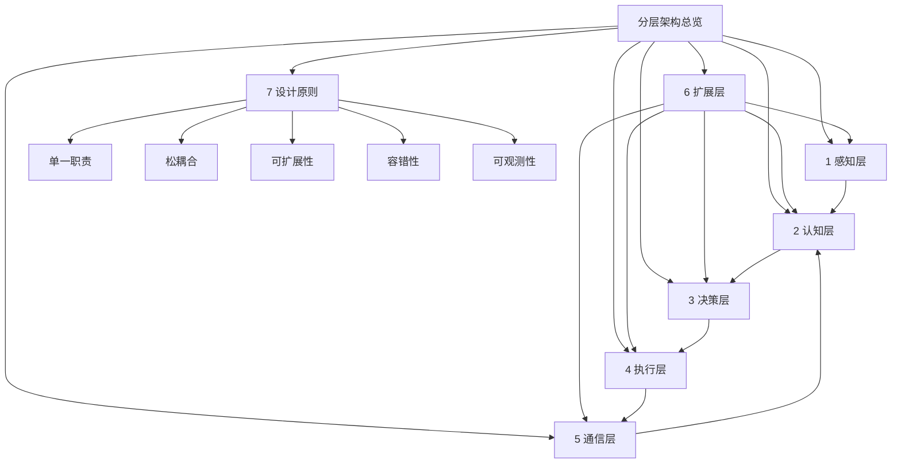
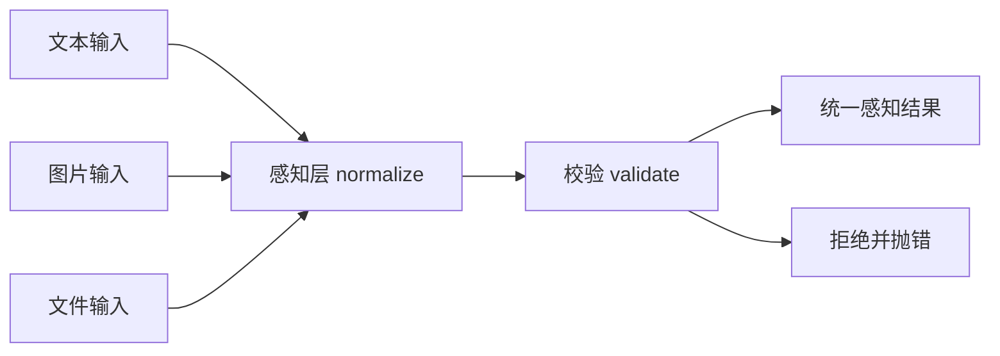
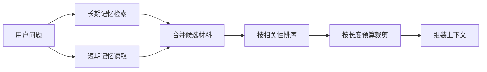
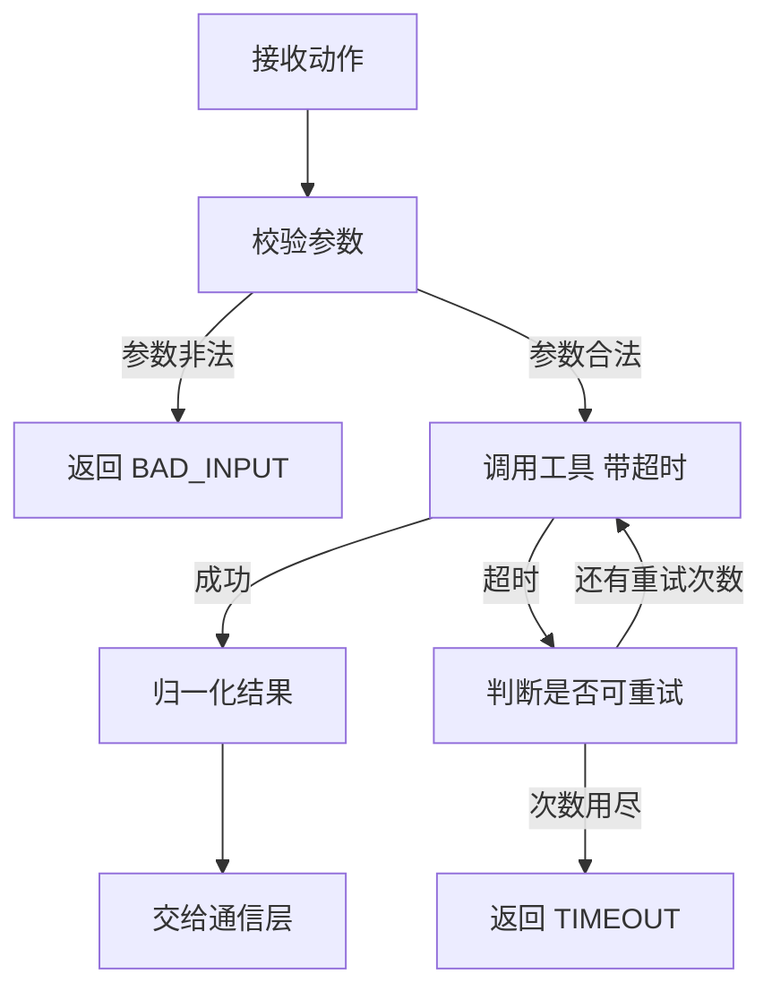
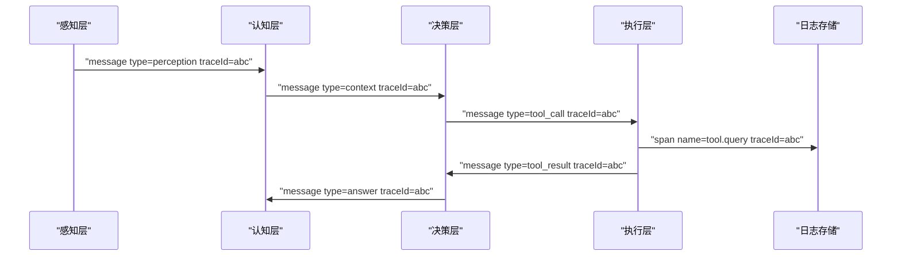
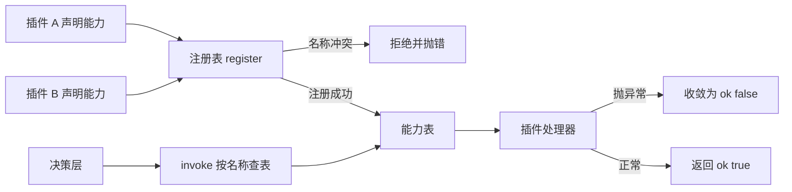
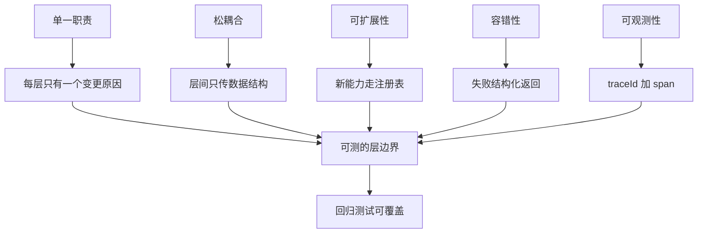

# 分层架构总览

!!! abstract "学完这一页你能"
    - 说出感知、认知、决策、执行、通信、扩展六层各自的职责，并指出每层不该做的事。
    - 画出一张从用户输入到工具调用的跨层数据流图，标出扩展层横向切入的位置。
    - 为任意一层写出一个带 node:assert 断言的契约测试脚本，并解释每条断言覆盖的边界。
    - 拿到一个需求时先判断它属于哪一层，再决定改哪里，避免用跨层补丁绕过边界。

!!! note "术语：AI Agent"
    定义：能接收输入、决定下一步动作、调用外部工具并观察结果，然后继续循环的程序。例子：收到"查一下明天上海到北京的航班"就调用查询接口并汇总答案的服务。

!!! note "术语：分层架构"
    定义：把系统切成若干职责不重叠的层，每层只通过约定的数据结构与相邻层通信。例子：浏览器把渲染拆成解析、样式计算、布局、绘制，每个阶段只吃上一阶段的产物。

## 0. 知识地图



建议这样读：先按第 1 节到第 6 节的顺序读，这是数据从输入走到输出的顺序，每节都能单独跑通。再读第 7 节，把六层当成一个整体看约束。最后用"综合对比"和"自测题"检查自己是否分得清层边界。

## 1. 感知层：把外部输入换成内部结构

**先想一个问题**

用户在客服对话里发了一张订单截图，同时打了一行字"这个为什么还没发货"。如果不做处理，后面每一层都要重新判断图片格式、文字有没有多余空格。

**心智模型**

!!! tip "心智模型"
    一句话模型：感知层是收发室，只把外部输入换成内部统一的信封。
    日常类比：快递前台按尺寸拆包、登记、贴标签，再送进仓库。
    类比在哪里不成立：前台不判断包裹是否合规，感知层必须做最低限度校验并拒绝空输入。

**图解**



1. 文本、图片、文件三种原始输入先进入同一个入口函数 normalize。
2. normalize 按类型分支，把不同形状的数据压成同一个结构。
3. 校验环节检查必填字段，空文本或缺少地址的图片在这里被拦下。
4. 通过校验的输入变成统一感知结果，交给认知层。
5. 没通过的输入抛出可识别错误，不再向后面的层传播。

**一步一步来**

第 1 步：先定结果结构。后面的层只认三个字段，不再关心来源。

```js
// 感知结果：固定字段名，后续层用 type 分支处理
function perception(type, payload, source = "user") {
  return { type, payload, source }; // type 是模态，payload 是内容
}
```

**这段代码在做什么**

- 字段名固定，认知层可以直接写 `msg.type === "text"`。
- 默认来源是 user，日志里能区分用户输入和系统输入。
- 函数只搬运数据，不做业务判断，保证职责单一。

第 2 步：把所有输入类型收进一个入口，调用方只传原始值。

```js
function normalize(raw) {
  if (typeof raw === "string") {              // 文本走这条分支
    const text = raw.trim();                  // 去掉首尾空白
    if (text === "") throw new Error("空文本输入"); // 空输入直接拒绝
    return perception("text", text);
  }
  if (raw && raw.type === "image" && raw.uri) { // 图片必须带地址
    return perception("image", raw.uri);
  }
  throw new Error("不支持的输入类型");        // 其余输入一律拒绝
}
```

**这段代码在做什么**

- `typeof raw === "string"` 把纯文本和其他对象分开。
- `trim()` 消除首尾空白，避免后面的层把空串当成有效内容。
- 空文本抛错而不是返回空对象，调用方能立刻发现。
- 图片分支要求 `uri` 存在，缺地址的图片当作非法输入。
- 兜底 throw 保证函数永远不返回 undefined。

运行结果：`normalize("  你好  ")` 返回 `{ type: "text", payload: "你好", source: "user" }`。

**动手验证**

依赖：Node 20+ 内置模块，无第三方依赖。运行：`node perception.js`。

```js
import assert from "node:assert/strict";

function perception(type, payload, source = "user") {
  return { type, payload, source };
}

function normalize(raw) {
  if (typeof raw === "string") {
    const text = raw.trim();
    if (text === "") throw new Error("空文本输入");
    return perception("text", text);
  }
  if (raw && raw.type === "image" && raw.uri) {
    return perception("image", raw.uri);
  }
  throw new Error("不支持的输入类型");
}

// 正常路径：文本去掉首尾空白
assert.deepEqual(normalize("  你好  "), { type: "text", payload: "你好", source: "user" });
// 正常路径：图片保留地址
assert.deepEqual(normalize({ type: "image", uri: "s3://a.png" }),
  { type: "image", payload: "s3://a.png", source: "user" });
// 边界：只有空白的文本被拒绝
assert.throws(() => normalize("   "), /空文本输入/);
// 边界：没有地址的图片被拒绝
assert.throws(() => normalize({ type: "image" }), /不支持的输入类型/);
// 边界：数字输入被拒绝
assert.throws(() => normalize(42), /不支持的输入类型/);

console.log("感知层断言全部通过");
```

预期输出：`感知层断言全部通过`。

**常见坑**

| 现象 | 原因 | 怎么修 |
| --- | --- | --- |
| 下游收到空字符串 | 只在调用处 trim，没在入口校验 | 把空串判断写进 normalize 并抛错 |
| 图片缺少地址也能进 | 只看了 `raw.type`，没看 `raw.uri` | 两个字段都判断，缺一个就拒绝 |
| 报错信息看不出哪条输入出错 | 抛出通用 Error 且不带字段 | 错误信息里带上缺失的字段名 |

**用在哪里**

场景一：电商客服工作台的多模态工单。

- 业务背景：用户在聊天窗口发文字、商品截图、订单号截图，客服系统需要统一入库。
- 这一节的知识怎么用：入口处把三种输入压成同一结构，工单表只存 type 与 payload。
- 用什么指标衡量收益：统计"因输入格式导致的解析失败工单数"与"入库后需要人工补录的比例"。
- 什么时候不该用：输入只有一种且格式由内部系统保证时，再加一层归一化只会增加调用栈。

场景二：后台管理的批量导入。

- 业务背景：运营上传的 Excel、CSV、粘贴文本三种来源都要生成同一批商品草稿。
- 这一节的知识怎么用：每种来源先转成统一行对象，再交给校验和入库。
- 用什么指标衡量收益：统计"导入失败行数"与"需要人工修字段的工单数"。
- 什么时候不该用：导入格式单一且由固定模板导出时，直接解析模板即可。

**行业实践**

- Model Context Protocol 官方文档在 Specification 章节区分了 host、client、server 三类角色，并把输入内容按类型建模；怎么借鉴到你的项目：把"来源"和"内容类型"拆成两个字段，日志里就能按来源统计失败率。以原文为准。
- OWASP Top 10 for LLM Applications 把提示注入列为风险项；怎么借鉴到你的项目：感知层只做格式归一化，不做"信任提升"，来自外部的文本永远标记为不可信来源。
- 需核对官方文档：MCP 规范中内容类型的具体枚举值，请以官方 Specification 章节为准。

**小结**

1. 感知层只做归一化与最低校验，不读业务规则。
2. 统一结果结构是后续所有层的地基，字段名一旦定下就别频繁改。
3. 校验失败要抛可识别错误，不要让空数据流到下一层。

## 2. 认知层：把知识与记忆拼成上下文

**先想一个问题**

用户问"我上周买的那台机器保修多久"。模型本身不知道这笔订单，也不知道这位用户上周买过什么。认知层要决定：去哪查、查回来哪些、怎么塞进上下文。

!!! note "术语：短期记忆与长期记忆"
    短期记忆：当前会话最近几轮对话，随会话结束丢弃。长期记忆：跨会话保留的事实，例如用户偏好、订单摘要。例子：最近三轮对话放短期记忆，用户所在城市放长期记忆。

**心智模型**

!!! tip "心智模型"
    一句话模型：认知层是资料员，按问题去档案室取材料，再整理成一张能被读完的摘要。
    日常类比：医生问诊前先翻病历，再决定这次要看哪几页。
    类比在哪里不成立：病历不会超长，而拼好的上下文有长度上限，必须主动丢弃内容。

**图解**



1. 用户问题同时进入两条线：长期记忆按关键词检索，短期记忆读取最近几轮。
2. 两路结果合并成候选材料列表。
3. 排序环节把与问题相关的材料排到前面。
4. 裁剪环节按长度预算从后往前删，直到不超预算。
5. 组装环节输出一段纯文本上下文，交给决策层。

**一步一步来**

第 1 步：先做一个能读能写的记忆容器。

```js
function createMemory(limit = 2) {
  const turns = [];        // 短期记忆：先进先出
  const facts = new Map(); // 长期记忆：关键词到事实
  return {
    addTurn(role, text) {
      turns.push({ role, text });
      if (turns.length > limit) turns.shift(); // 超出上限丢掉最早一轮
    },
    learn(keyword, fact) { facts.set(keyword, fact); },
    readTurns() { return [...turns]; },        // 返回副本，防止外部改写
    search(query) {                            // 按关键词命中长期记忆
      return [...facts.entries()]
        .filter(([keyword]) => query.includes(keyword))
        .map(([, fact]) => fact);
    },
  };
}
```

**这段代码在做什么**

- `turns` 用数组实现先进先出，`limit` 控制短期记忆轮数。
- `shift()` 保证数组不会无限增长。
- `readTurns()` 返回副本，调用方改写副本不影响内部状态。
- `facts` 用 Map 存长期记忆，键是关键词，值是事实文本。
- `search` 用 `includes` 做关键词命中，命中规则可替换成向量检索。

第 2 步：把候选材料裁进长度预算。

```js
function buildContext(memory, query, maxChars = 60) {
  const facts = memory.search(query);   // 先取长期事实，优先级高
  const turns = memory.readTurns();     // 再取短期对话
  const lines = [...facts, ...turns.map((t) => `${t.role}: ${t.text}`)];
  let context = lines.join("\n");
  while (context.length > maxChars && lines.length > facts.length) {
    lines.splice(facts.length, 1);      // 从最早的一轮对话开始删
    context = lines.join("\n");
  }
  return context;
}
```

**这段代码在做什么**

- 长期事实放在数组前部，裁剪时不会被删。
- `turns.map` 把对话对象转成一行文本。
- 循环条件是"超预算且还有对话可删"，避免把事实也删掉。
- 每次删掉下标 `facts.length` 的那一项，就是从最早一轮开始删。
- 返回纯字符串，决策层不需要知道记忆的内部结构。

运行结果：记忆里存了 `保修: 一年` 和三轮对话，传入 `maxChars = 20` 时返回的字符串只保留事实行。

**动手验证**

依赖：Node 20+ 内置模块，无第三方依赖。运行：`node cognition.js`。

```js
import assert from "node:assert/strict";

function createMemory(limit = 2) {
  const turns = [];
  const facts = new Map();
  return {
    addTurn(role, text) {
      turns.push({ role, text });
      if (turns.length > limit) turns.shift();
    },
    learn(keyword, fact) { facts.set(keyword, fact); },
    readTurns() { return [...turns]; },
    search(query) {
      return [...facts.entries()]
        .filter(([keyword]) => query.includes(keyword))
        .map(([, fact]) => fact);
    },
  };
}

function buildContext(memory, query, maxChars = 60) {
  const facts = memory.search(query);
  const turns = memory.readTurns();
  const lines = [...facts, ...turns.map((t) => `${t.role}: ${t.text}`)];
  let context = lines.join("\n");
  while (context.length > maxChars && lines.length > facts.length) {
    lines.splice(facts.length, 1);
    context = lines.join("\n");
  }
  return context;
}

const mem = createMemory(2);
mem.learn("保修", "保修期一年");
mem.addTurn("user", "机器坏了");
mem.addTurn("agent", "请提供订单号");
mem.addTurn("user", "保修多久");

// 短期记忆只留最近两轮
assert.equal(mem.readTurns().length, 2);
// 检索命中长期记忆
assert.deepEqual(mem.search("保修多久"), ["保修期一年"]);
// 预算充足时事实排在对话之前
assert.match(buildContext(mem, "保修多久", 100), /^保修期一年/);
// 预算不足时先删对话，事实保留
assert.equal(buildContext(mem, "保修多久", 20), "保修期一年");
// 未命中关键词时返回空数组
assert.deepEqual(mem.search("退款"), []);

console.log("认知层断言全部通过");
```

预期输出：`认知层断言全部通过`。

**常见坑**

| 现象 | 原因 | 怎么修 |
| --- | --- | --- |
| 上下文越拼越长 | 只加不删，没有长度预算 | 给 buildContext 加 maxChars 参数并写裁剪循环 |
| 关键事实被裁掉 | 裁剪顺序从数组头部开始 | 把长期事实放数组前部，只删对话部分 |
| 记忆被外部改写 | 直接返回内部数组引用 | 返回 `[...turns]` 这样的副本 |

**用在哪里**

场景一：在线教育答疑助手。

- 业务背景：学生连续追问同一道题，助手要记住已讲过的步骤，避免重复。
- 这一节的知识怎么用：短期记忆存最近几轮讲解，长期记忆存该学生的薄弱知识点。
- 用什么指标衡量收益：统计"重复讲解率"与"学生追问次数"。
- 什么时候不该用：一次性问答、无会话状态的场景，直接拼当前问题即可。

场景二：企业内部知识库问答。

- 业务背景：员工问报销政策，答案分散在多个文档里。
- 这一节的知识怎么用：长期记忆改成文档检索，按命中片段组装上下文。
- 用什么指标衡量收益：统计"回答被标记为不准确的条数"与"引用命中率"。
- 什么时候不该用：问题只涉及当前消息、不需要外部资料时。

**行业实践**

- OpenTelemetry 官方文档 Concepts 的 Traces 章节用 traceId 串联跨服务调用；怎么借鉴到你的项目：把检索、排序、裁剪各记一个 span，就能看出时间花在哪一步。以原文为准。
- Anthropic 工程博客 Building Effective Agents 建议从最简单的方案开始，只在必要时增加复杂度；怎么借鉴到你的项目：先用关键词检索跑通，再考虑引入向量检索。以原文为准。
- 需核对官方文档：你所用的向量库关于相似度阈值与召回数量的具体参数含义，请以该库官方文档为准。

**小结**

1. 认知层的产出是一段有长度上限的上下文，不是一堆原始文档。
2. 长期事实优先保留，短期对话按时间从早到晚丢弃。
3. 记忆读写要返回副本，避免调用方意外改写内部状态。

## 3. 决策层：把目标拆成计划并选动作

**先想一个问题**

用户说"帮我把这个订单改到下周送达"。这句话里包含两个动作：先查到订单，再改配送时间。谁来把它拆成两步，并在每一步选一个工具？

!!! note "术语：目标分解"
    定义：把一句自然语言目标拆成有序、可独立执行的子任务，每个子任务写明期望产出。例子："改配送时间"拆成"读取当前配送时间"和"写回新时间"。

**心智模型**

!!! tip "心智模型"
    一句话模型：决策层是项目经理，先列任务清单，再给每个任务挑执行人。
    日常类比：装修前先列工序表，再决定哪道工序请哪个工种。
    类比在哪里不成立：项目经理能改计划，决策层的计划一旦进入执行，改动要通过重新规划而不是临时插队。

**图解**

```mermaid
stateDiagram-v2
    [*] --> "理解目标"
    "理解目标" --> "拆分任务"
    "拆分任务" --> "为当前任务打分"
    "为当前任务打分" --> "选中动作"
    "选中动作" --> "交给执行层"
    "交给执行层" --> "观察结果"
    "观察结果" --> "还有子任务" : "是"
    "还有子任务" --> "为当前任务打分" : "继续"
    "观察结果" --> "结束" : "否"
    "结束" --> [*]
```

1. 状态机从"理解目标"开始，这一步只确定目标类型。
2. 进入"拆分任务"，生成有序子任务列表。
3. 每个子任务进入"为当前任务打分"，得到候选动作的分数。
4. "选中动作"挑出分数最高的一个，交给执行层。
5. "观察结果"决定是回到打分环节处理下一个子任务，还是结束。

**一步一步来**

第 1 步：按规则把目标拆成子任务。

```js
function decompose(goal) {
  const rules = [
    { match: "查", steps: ["解析查询条件", "调用查询工具", "汇总候选结果"] },
    { match: "改", steps: ["读取当前值", "生成变更内容", "写回并校验"] },
  ];
  const rule = rules.find((r) => goal.includes(r.match));
  if (!rule) return [{ id: 1, text: goal, expects: "文本答案" }]; // 拆不开就整体当一步
  return rule.steps.map((text, i) => ({ id: i + 1, text, expects: "中间结论" }));
}
```

**这段代码在做什么**

- `rules` 是显式规则表，便于加新规则和写测试。
- `find` 命中第一个匹配的规则，顺序即优先级。
- 拆不开的目标返回单步子任务，保证调用方永远拿到数组。
- 每个子任务带 `id` 和 `expects`，执行层知道该产出什么。
- 规则表可换成模型调用，替换点只在 decompose 内部。

第 2 步：给候选动作打分并挑一个。

```js
function pickAction(candidates, ctx) {
  const scored = candidates.map((c) => {
    let score = 0;
    score += c.canHandle.includes(ctx.intent) ? 2 : 0; // 意图匹配加 2 分
    score += c.cost <= ctx.budget ? 1 : 0;             // 预算够用加 1 分
    score -= c.failRate * 10;                          // 历史失败率扣分
    return { ...c, score: Number(score.toFixed(2)) };  // 保留两位便于对比
  });
  scored.sort((a, b) => b.score - a.score);            // 从高到低排序
  return scored[0] ?? null;
}
```

**这段代码在做什么**

- 三个打分项都有明确权重：2 分、1 分、失败率乘 10 的扣分。
- `ctx.intent` 由上游传入，决策层不猜意图。
- `toFixed(2)` 让分数在日志里可读，也便于断言。
- `sort` 返回新数组，不修改调用方传入的原始列表。
- 空候选列表返回 null，调用方必须处理这种情况。

运行结果：候选 `[{ name: "queryOrder", canHandle: ["改配送"], cost: 1, failRate: 0 }]` 在预算 5 的场景下得分 3。

**动手验证**

依赖：Node 20+ 内置模块，无第三方依赖。运行：`node decision.js`。

```js
import assert from "node:assert/strict";

function decompose(goal) {
  const rules = [
    { match: "查", steps: ["解析查询条件", "调用查询工具", "汇总候选结果"] },
    { match: "改", steps: ["读取当前值", "生成变更内容", "写回并校验"] },
  ];
  const rule = rules.find((r) => goal.includes(r.match));
  if (!rule) return [{ id: 1, text: goal, expects: "文本答案" }];
  return rule.steps.map((text, i) => ({ id: i + 1, text, expects: "中间结论" }));
}

function pickAction(candidates, ctx) {
  const scored = candidates.map((c) => {
    let score = 0;
    score += c.canHandle.includes(ctx.intent) ? 2 : 0;
    score += c.cost <= ctx.budget ? 1 : 0;
    score -= c.failRate * 10;
    return { ...c, score: Number(score.toFixed(2)) };
  });
  scored.sort((a, b) => b.score - a.score);
  return scored[0] ?? null;
}

// 拆解：改配送时间得到三步
assert.equal(decompose("改配送时间").length, 3);
assert.equal(decompose("改配送时间")[0].text, "读取当前值");
// 拆解：无法匹配规则时返回单步
assert.deepEqual(decompose("你好").length, 1);

const ctx = { intent: "改配送", budget: 5 };
const chosen = pickAction([
  { name: "queryOrder", canHandle: ["查询"], cost: 1, failRate: 0 },
  { name: "updateShipping", canHandle: ["改配送"], cost: 2, failRate: 0 },
], ctx);
// 打分：意图匹配 2 分 + 预算够用 1 分 = 3 分
assert.equal(chosen.name, "updateShipping");
assert.equal(chosen.score, 3);
// 空候选返回 null
assert.equal(pickAction([], ctx), null);

console.log("决策层断言全部通过");
```

预期输出：`决策层断言全部通过`。

**常见坑**

| 现象 | 原因 | 怎么修 |
| --- | --- | --- |
| 计划一直不变但前提已经失效 | 计划生成后缺少重新规划入口 | 每步执行后判断结果是否符合 expects，不符就回到拆分 |
| 老是选中同一个小工具 | 打分只看匹配，不看历史失败率 | 把 failRate 作为扣分项写进打分函数 |
| 分数无法解释 | 直接返回动作对象，不记录分数 | 打分结果里保留 score 字段并写进日志 |

**用在哪里**

场景一：差旅助手的多步预订。

- 业务背景：一句话要完成"查航班、比价、下单、发确认"。
- 这一节的知识怎么用：decompose 生成子任务，pickAction 为每步挑工具。
- 用什么指标衡量收益：统计"一次会话完成的任务比例"与"中途需要用户纠正的次数"。
- 什么时候不该用：只读查询类的单步请求，直接调一个工具更快。

场景二：运维机器人的故障处置。

- 业务背景：告警触发后要按顺序执行检查、扩容、通知。
- 这一节的知识怎么用：规则表按告警类型拆分步骤，打分时把危险操作权重压低。
- 用什么指标衡量收益：统计"处置步骤被跳过的次数"与"误操作回滚次数"。
- 什么时候不该用：需要人工审批的高危操作，不应该交给自动打分选择。

**行业实践**

- Anthropic 工程博客 Building Effective Agents 区分 workflow 与 agent，并建议能用固定流程解决时不要引入自主循环；怎么借鉴到你的项目：把高频目标写成规则表，只对规则未覆盖的输入才走模型规划。以原文为准。
- The Twelve-Factor App 的 Config 章节要求配置与代码分离；怎么借鉴到你的项目：打分权重、预算、重试次数放进配置，改动不需要重新部署代码。以原文为准。
- 需核对官方文档：你所用模型关于工具选择返回格式的字段名与约束，请以该厂商官方文档为准。

**小结**

1. 决策层输出的是"计划加当前动作"，不是直接的工具结果。
2. 打分要保留分数，让选择过程可解释、可回归测试。
3. 计划执行后要校验结果，不符合期望就回到拆分步骤。

## 4. 执行层：把选中的动作真正跑起来

**先想一个问题**

决策层说"调用订单查询工具"。这个工具可能超时、可能返回 500、可能参数写错。执行层要决定：哪些错误重试、哪些直接失败、结果怎么统一返回。

!!! note "术语：工具调用"
    定义：Agent 通过约定的函数签名请求外部能力，并接收结构化结果。例子：调用 `queryOrder({ orderId })` 返回 `{ status: "shipped" }`。

**心智模型**

!!! tip "心智模型"
    一句话模型：执行层是施工队，按图纸干活，遇到能补救的问题自己补救，补救不了就上报。
    日常类比：外卖骑手遇到堵车会换路线，遇到地址错误只能打电话确认。
    类比在哪里不成立：骑手可以临场判断，执行层的重试条件必须提前写死，否则会重复下单。

**图解**



1. 动作先过参数校验，非法参数直接返回 BAD_INPUT，不进网络。
2. 合法参数进入带超时的调用，超时上限由配置决定。
3. 调用成功就归一化成 `{ ok: true, data }`。
4. 超时进入重试判断，还有次数就回到调用。
5. 次数用尽返回 `{ ok: false, error }`，由通信层决定怎么展示。

**一步一步来**

第 1 步：给任意异步函数套上超时。

```js
function withTimeout(fn, ms) {
  return async (...args) => {
    let timer;
    const timeout = new Promise((_, reject) => {
      timer = setTimeout(() => reject(new Error(`TIMEOUT after ${ms}ms`)), ms);
    });
    try {
      return await Promise.race([fn(...args), timeout]); // 谁先结束用谁
    } finally {
      clearTimeout(timer);                               // 成功时也要清定时器
    }
  };
}
```

**这段代码在做什么**

- `Promise.race` 让工具调用和定时器赛跑。
- 超时错误信息带毫秒数，日志里能看出用了哪个上限。
- `finally` 保证成功路径也会清理定时器，进程不会挂住。
- 返回的函数保留原参数列表，调用方式不变。
- 超时上限从参数传入，调用处可按工具分别设置。

第 2 步：只对可重试错误重试，并统一返回结构。

```js
async function runWithRetry(fn, retries = 2) {
  let lastError;
  for (let i = 0; i <= retries; i += 1) {
    try {
      const data = await fn();
      return { ok: true, data, attempts: i + 1 };      // 记录尝试次数便于观测
    } catch (err) {
      lastError = err;
      if (err.message.startsWith("TIMEOUT")) continue; // 超时可重试
      if (err.message.startsWith("BAD_INPUT")) break;  // 参数错误不重试
    }
  }
  return { ok: false, error: lastError.message, attempts: retries + 1 };
}
```

**这段代码在做什么**

- 循环上界是 `retries`，所以最多执行 `retries + 1` 次。
- 成功时返回 `ok: true` 和实际尝试次数。
- 只有 TIMEOUT 前缀的错误走 continue，继续下一次。
- BAD_INPUT 走 break，立即停止，避免重复提交。
- 最终失败也返回结构化对象，调用方不用写 try/catch。

运行结果：一个每次都超时的工具在 `retries = 2` 下返回 `{ ok: false, error: "TIMEOUT after 20ms", attempts: 3 }`。

**动手验证**

依赖：Node 20+ 内置模块，无第三方依赖。运行：`node execution.js`。

```js
import assert from "node:assert/strict";

function withTimeout(fn, ms) {
  return async (...args) => {
    let timer;
    const timeout = new Promise((_, reject) => {
      timer = setTimeout(() => reject(new Error(`TIMEOUT after ${ms}ms`)), ms);
    });
    try {
      return await Promise.race([fn(...args), timeout]);
    } finally {
      clearTimeout(timer);
    }
  };
}

async function runWithRetry(fn, retries = 2) {
  let lastError;
  for (let i = 0; i <= retries; i += 1) {
    try {
      const data = await fn();
      return { ok: true, data, attempts: i + 1 };
    } catch (err) {
      lastError = err;
      if (err.message.startsWith("TIMEOUT")) continue;
      if (err.message.startsWith("BAD_INPUT")) break;
    }
  }
  return { ok: false, error: lastError.message, attempts: retries + 1 };
}

const sleep = (ms) => new Promise((r) => setTimeout(r, ms));

// 正常路径
const okResult = await runWithRetry(withTimeout(async () => "订单已发货", 50));
assert.deepEqual(okResult, { ok: true, data: "订单已发货", attempts: 1 });

// 超时重试到次数用尽
const slow = withTimeout(async () => { await sleep(30); return "慢"; }, 10);
const timeoutResult = await runWithRetry(slow, 2);
assert.equal(timeoutResult.ok, false);
assert.equal(timeoutResult.attempts, 3);
assert.match(timeoutResult.error, /TIMEOUT/);

// 参数错误不重试
let calls = 0;
const badInput = async () => { calls += 1; throw new Error("BAD_INPUT 订单号缺失"); };
const badResult = await runWithRetry(badInput, 2);
assert.equal(badResult.ok, false);
assert.equal(calls, 1);

console.log("执行层断言全部通过");
```

预期输出：`执行层断言全部通过`。

**常见坑**

| 现象 | 原因 | 怎么修 |
| --- | --- | --- |
| 重复下单 | 对所有错误都重试 | 只重试超时类错误，参数错误立即 break |
| 进程不退出 | 超时后没有 clearTimeout | 在 finally 里清理定时器 |
| 上层拿不到失败原因 | 失败时直接 throw | 统一返回 `{ ok: false, error }` 结构 |

**用在哪里**

场景一：电商下单链路。

- 业务背景：创建订单接口偶发超时，需要在不重复扣款的前提下重试。
- 这一节的知识怎么用：给创建订单调用加幂等键与超时，只对超时重试。
- 用什么指标衡量收益：统计"重复订单数"与"因超时暴露给用户的失败率"。
- 什么时候不该用：扣款、发货这类不可逆操作，参数错误重试会放大问题。

场景二：后台管理的批量导入。

- 业务背景：一万行商品数据要逐行调用校验接口。
- 这一节的知识怎么用：每行调用套超时与重试，失败行收集成报告。
- 用什么指标衡量收益：统计"整批失败率"与"重跑成功行数"。
- 什么时候不该用：接口本身有严格限流时，重试会触发更长的封禁，需要先做退避。

**行业实践**

- Node.js 官方文档的 node:assert 章节提供了 deepEqual、throws 等断言；怎么借鉴到你的项目：把每个工具的成功与失败路径都写成断言，回归时一条命令跑完。以原文为准。
- OpenTelemetry 官方文档 Concepts 的 Metrics 章节把重试次数等计数作为指标类型；怎么借鉴到你的项目：把 attempts 上报成计数指标，按工具名分组观察。以原文为准。
- 需核对官方文档：你所用云厂商关于超时与限流的具体阈值与建议，请以该厂商官方文档为准。

**小结**

1. 执行层负责把不可靠的外部调用包装成稳定的返回结构。
2. 重试条件必须提前写死，不可逆操作不重试。
3. attempts 字段要保留，它是排查问题的第一手数据。

## 5. 通信层：让层与层之间说同一种话

**先想一个问题**

感知层、认知层、决策层、执行层各自都在写日志。用户投诉"答案错了"时，你怎么把一次请求的所有步骤串起来看？

!!! note "术语：消息信封"
    定义：层间传递的统一结构，包含发送方、接收方、类型、载荷与追踪编号。例子：`{ from: "decision", to: "execution", type: "tool_call", payload: {}, traceId: "abc" }`。

**心智模型**

!!! tip "心智模型"
    一句话模型：通信层是公司的公文格式，所有部门只按一种格式发文。
    日常类比：快递面单上寄件人、收件人、单号一应俱全，中转站不用猜。
    类比在哪里不成立：面单一旦贴错无法追回，消息信封出错时可以按 traceId 整条重放。

**图解**



1. 感知层把归一化结果包成 message，traceId 随请求生成一次。
2. 认知层收到的消息里带上文，处理后继续以同一 traceId 下发。
3. 决策层的 tool_call 消息只描述"调用什么、参数是什么"。
4. 执行层调用完成后写一条 span 到日志存储，traceId 保持一致。
5. 结果沿原路返回，任一环节出问题都能按 traceId 捞出全链路记录。

**一步一步来**

第 1 步：定义信封结构，所有层都只构造这种对象。

```js
function message({ from, to, type, payload, traceId }) {
  return {
    id: crypto.randomUUID(), // 每条消息唯一编号
    from, to, type, payload, traceId,
    at: Date.now(),          // 时间戳，按序回放时使用
  };
}
```

**这段代码在做什么**

- `crypto.randomUUID()` 是 Node 20 全局可用的方法，不需要额外依赖。
- `from` 与 `to` 让日志能画出调用方向。
- `traceId` 由外部传入，保证同一次请求的所有消息共用。
- `at` 用毫秒时间戳，重放时按它排序。
- 结构固定后，日志系统只需要一套解析逻辑。

第 2 步：按 traceId 排队，避免乱序执行。

```js
function createQueue() {
  const buckets = new Map();
  return {
    push(msg) {
      const list = buckets.get(msg.traceId) ?? []; // 取出该会话的队列
      list.push(msg);
      buckets.set(msg.traceId, list);
      return list.length;                          // 返回长度便于断言
    },
    drain(traceId) {
      const list = buckets.get(traceId) ?? [];
      buckets.delete(traceId);                     // 处理完清空，避免堆积
      return list.sort((a, b) => a.at - b.at);     // 按时间升序返回
    },
  };
}
```

**这段代码在做什么**

- `buckets` 用 Map 按 traceId 分桶，互不干扰。
- `push` 返回队列长度，调用方可据此做背压判断。
- `drain` 取出后立即 delete，避免长时间占用内存。
- 排序保证同一会话内的消息按到达时间处理。
- 队列只做顺序控制，不负责业务逻辑。

运行结果：连续 push 三条同 traceId 的消息后，`drain` 返回按 `at` 升序排列的数组。

**动手验证**

依赖：Node 20+ 内置模块，无第三方依赖。运行：`node communication.js`。

```js
import assert from "node:assert/strict";

function message({ from, to, type, payload, traceId }) {
  return {
    id: crypto.randomUUID(),
    from, to, type, payload, traceId,
    at: Date.now(),
  };
}

function createQueue() {
  const buckets = new Map();
  return {
    push(msg) {
      const list = buckets.get(msg.traceId) ?? [];
      list.push(msg);
      buckets.set(msg.traceId, list);
      return list.length;
    },
    drain(traceId) {
      const list = buckets.get(traceId) ?? [];
      buckets.delete(traceId);
      return list.sort((a, b) => a.at - b.at);
    },
  };
}

const q = createQueue();
const m1 = message({ from: "decision", to: "execution", type: "tool_call", payload: { name: "queryOrder" }, traceId: "abc" });
const m2 = message({ from: "execution", to: "decision", type: "tool_result", payload: { ok: true }, traceId: "abc" });
const other = message({ from: "decision", to: "execution", type: "tool_call", payload: {}, traceId: "xyz" });

// 同一 traceId 累计长度
assert.equal(q.push(m1), 1);
assert.equal(q.push(m2), 2);
// 不同 traceId 互不影响
assert.equal(q.push(other), 1);
// 每条消息都有唯一 id
assert.notEqual(m1.id, m2.id);
// 信封字段齐全
assert.equal(m1.from, "decision");
assert.equal(m1.to, "execution");
// drain 后队列被清空
assert.equal(q.drain("abc").length, 2);
assert.equal(q.drain("abc").length, 0);

console.log("通信层断言全部通过");
```

预期输出：`通信层断言全部通过`。

**常见坑**

| 现象 | 原因 | 怎么修 |
| --- | --- | --- |
| 全链路日志串不起来 | 每层各生成一个 traceId | 在入口生成一次，通过信封一路透传 |
| 队列内存持续增长 | drain 之后没有删除桶 | drain 里执行 buckets.delete |
| 同会话消息乱序 | 只按到达顺序处理 | 按 at 字段排序后再处理 |

**用在哪里**

场景一：多轮对话客服系统。

- 业务背景：用户中途改口，前一轮的异步结果晚到，可能覆盖最新答案。
- 这一节的知识怎么用：以 traceId 分桶，按时间戳排序，过期结果直接丢弃。
- 用什么指标衡量收益：统计"答案被旧结果覆盖的次数"与"用户重复提问率"。
- 什么时候不该用：单次无状态请求不需要排队，直接函数调用即可。

场景二：Agent 平台的调用链追踪。

- 业务背景：一次任务跨多个工具，出问题时需要定位是哪一步坏了。
- 这一节的知识怎么用：每层写一条带 traceId 与 span 名的事件，前端按 traceId 聚合展示。
- 用什么指标衡量收益：统计"平均定位耗时"与"需要人工复现的问题比例"。
- 什么时候不该用：日志本身是敏感数据时，先做脱敏再落盘。

**行业实践**

- OpenTelemetry 官方文档 Concepts 的 Signals 章节把 traces、metrics、logs 分成三类信号；怎么借鉴到你的项目：层间消息进 traces，重试次数进 metrics，错误详情进 logs，三者用 traceId 关联。以原文为准。
- The Twelve-Factor App 的 Processes 章节要求进程无状态，把状态放到外部服务；怎么借鉴到你的项目：会话状态放在外部存储，进程重启后仍能按 traceId 继续。以原文为准。
- 需核对官方文档：你所用日志平台对 traceId 字段长度与格式的限制，请以该平台官方文档为准。

**小结**

1. 信封结构统一之后，日志、回放、排查共用一套解析逻辑。
2. traceId 只在入口生成一次，全程透传不改。
3. 队列按 traceId 分桶并按时间排序，才能避免乱序覆盖。

## 6. 扩展层：不改核心层就接进新能力

**先想一个问题**

产品要接入一个新的日程服务，两周后又要接入第二个。如果每接一个就改决策层和执行层，核心代码会越来越难测。有没有办法让新增能力只写插件？

!!! note "术语：MCP（Model Context Protocol，模型上下文协议）"
    定义：一套让模型应用与外部数据源、工具以标准方式交互的协议，规范中区分 host、client、server 三类角色。例子：编辑器作为 host，通过 client 连接提供文件检索能力的 server。

**心智模型**

!!! tip "心智模型"
    一句话模型：扩展层是插线板，核心层只认插孔标准，不认插头上挂的是什么设备。
    日常类比：同一款插座可以插台灯也可以插充电器。
    类比在哪里不成立：插座不检查设备身份，扩展层必须校验能力名冲突与权限。

**图解**



1. 每个插件启动时声明自己提供的能力列表。
2. 注册表逐条登记，遇到同名能力直接抛错，避免被覆盖。
3. 决策层只通过能力名调用，不认识具体插件。
4. invoke 查表找到处理器后执行。
5. 处理器抛出的异常被收敛成 `{ ok: false }`，不影响核心流程。

**一步一步来**

第 1 步：做一个能力注册表。

```js
function createRegistry() {
  const tools = new Map();
  return {
    register(plugin) {
      for (const cap of plugin.capabilities) { // 遍历插件声明的能力
        if (tools.has(cap.name)) {             // 名称冲突就拒绝
          throw new Error(`能力名冲突: ${cap.name}`);
        }
        tools.set(cap.name, { plugin: plugin.id, handler: cap.handler });
      }
    },
    list() { return [...tools.keys()].sort(); }, // 排序便于对比
  };
}
```

**这段代码在做什么**

- `tools` 用 Map 保存能力名到处理器的映射。
- 冲突时抛错而不是覆盖，保证已有能力不被悄悄替换。
- 记录来源插件 id，出问题能追到具体插件。
- `list()` 排序返回，测试里可以直接 deepEqual 比对。
- 注册表只做登记，不执行任何插件代码。

第 2 步：调用时收敛异常。

```js
async function invoke(registry, name, args) {
  const entry = registry.get(name);            // 查表
  if (!entry) return { ok: false, error: "NOT_REGISTERED" };
  try {
    return { ok: true, data: await entry.handler(args) };
  } catch (err) {
    return { ok: false, error: err.message };  // 插件异常不外泄
  }
}
```

**这段代码在做什么**

- 未注册的能力返回固定错误码，调用方可以据此提示用户。
- `await` 让同步抛错和异步拒绝都走同一条 catch。
- 返回结构与其他层保持一致的 `ok` 字段。
- 插件异常不会中断整个请求，只会让当前步骤失败。

运行结果：调用未注册能力返回 `{ ok: false, error: "NOT_REGISTERED" }`。

**动手验证**

依赖：Node 20+ 内置模块，无第三方依赖。运行：`node extension.js`。

```js
import assert from "node:assert/strict";

function createRegistry() {
  const tools = new Map();
  return {
    register(plugin) {
      for (const cap of plugin.capabilities) {
        if (tools.has(cap.name)) {
          throw new Error(`能力名冲突: ${cap.name}`);
        }
        tools.set(cap.name, { plugin: plugin.id, handler: cap.handler });
      }
    },
    list() { return [...tools.keys()].sort(); },
    get(name) { return tools.get(name); },
  };
}

async function invoke(registry, name, args) {
  const entry = registry.get(name);
  if (!entry) return { ok: false, error: "NOT_REGISTERED" };
  try {
    return { ok: true, data: await entry.handler(args) };
  } catch (err) {
    return { ok: false, error: err.message };
  }
}

const reg = createRegistry();
reg.register({
  id: "calendar",
  capabilities: [{ name: "createEvent", handler: async (a) => `已创建 ${a.title}` }],
});
reg.register({
  id: "weather",
  capabilities: [{ name: "getWeather", handler: async () => { throw new Error("上游不可用"); } }],
});

// 能力表按字母排序
assert.deepEqual(reg.list(), ["createEvent", "getWeather"]);
// 正常调用
assert.deepEqual(await invoke(reg, "createEvent", { title: "周会" }),
  { ok: true, data: "已创建 周会" });
// 插件异常被收敛
assert.deepEqual(await invoke(reg, "getWeather", {}),
  { ok: false, error: "上游不可用" });
// 未注册能力
assert.deepEqual(await invoke(reg, "sendMail", {}),
  { ok: false, error: "NOT_REGISTERED" });
// 重名能力被拒绝
assert.throws(() => reg.register({
  id: "dup",
  capabilities: [{ name: "createEvent", handler: async () => null }],
}), /能力名冲突/);

console.log("扩展层断言全部通过");
```

预期输出：`扩展层断言全部通过`。

**常见坑**

| 现象 | 原因 | 怎么修 |
| --- | --- | --- |
| 插件升级后旧能力消失 | 新插件用同名能力覆盖了旧插件 | register 里检测重名并抛错 |
| 插件报错导致整个请求失败 | 没有 try/catch 包裹处理器调用 | 在 invoke 里统一收敛为返回值 |
| 决策层直接 import 插件模块 | 绕过了注册表 | 决策层只依赖能力名，不依赖插件路径 |

**用在哪里**

场景一：企业 IM 里接入多个第三方机器人。

- 业务背景：日程、审批、报销三类机器人由不同团队维护。
- 这一节的知识怎么用：每个机器人注册自己的能力名，主流程按能力名路由。
- 用什么指标衡量收益：统计"接入一个新机器人改动的核心文件数"与"上线回归耗时"。
- 什么时候不该用：能力只有一个且短期不会增加时，直接函数调用更省事。

场景二：设计工具接入外部素材库。

- 业务背景：素材来源从自建库扩展到多个第三方图库。
- 这一节的知识怎么用：把"检索素材"抽象成一个能力名，各图库实现各自的处理器。
- 用什么指标衡量收益：统计"新增数据源时核心层改动行数"与"素材检索失败率"。
- 什么时候不该用：数据源本身不稳定且无降级方案时，先在执行层加超时与熔断。

**行业实践**

- Model Context Protocol 官方文档在 Specification 的 Architecture 章节区分 host、client、server，工具能力由 server 声明；怎么借鉴到你的项目：把每个外部系统当成一个 server，核心层只保存能力清单。以原文为准。
- Node.js 官方文档的 node:test 章节提供内置测试运行器；怎么借鉴到你的项目：每个插件自带一份注册与调用测试，合并进主仓库的测试命令。以原文为准。
- 需核对官方文档：MCP 规范中握手流程与工具描述字段的准确名称，资料未覆盖，请以官方 Specification 章节为准。

**小结**

1. 扩展层让新增能力只写插件，核心层只认能力名。
2. 注册阶段拦截重名，调用阶段收敛异常，两道防线都要有。
3. 插件与核心层的唯一契约是能力名加参数结构。

## 7. 设计原则与层边界

**先想一个问题**

两个层都写了"记录失败次数"的逻辑，改动重试策略时要改两处。这类问题靠加注释解决不了，只能靠边界约束。

!!! note "术语：单一职责原则"
    定义：一个模块只应该有引起它变化的一个原因。例子：解析输入格式的逻辑只放在感知层，重试策略只放在执行层。

**心智模型**

!!! tip "心智模型"
    一句话模型：五条原则是五道栏杆，用来挡住"顺手在这里也做一点"的改动。
    日常类比：厨房里切菜区和灶台分开，避免交叉污染。
    类比在哪里不成立：厨房分区靠制度，分层靠代码检查，必须落到可执行的规则上。

**图解**



1. 单一职责决定每层的变更原因，改一处不影响别处。
2. 松耦合要求层间只传数据结构，不传函数与实例。
3. 可扩展性把新增能力收进注册表，核心层不动。
4. 容错性要求失败也返回结构化对象，调用方不用猜。
5. 可观测性用 traceId 串起全部步骤，最后落到可回归的测试上。

**一步一步来**

第 1 步：把允许的调用方向写成规则。

```js
// 允许的调用方向：键调用值列表里的层
const ALLOWED = {
  perception: ["cognition"],
  cognition: ["decision"],
  decision: ["execution", "cognition"],
  execution: ["communication"],
  communication: ["cognition"],
};
```

**这段代码在做什么**

- 用一张显式的邻接表描述调用方向，而不是写在文档里。
- 执行层不能直接调决策层，返回值必须经过通信层。
- 认知层可以被决策层回访，用于补充上下文。
- 表结构便于加测试，也便于在代码评审时对照。

第 2 步：写一个守卫函数，拦截越界调用。

```js
function assertDirection(from, to) {
  const targets = ALLOWED[from] ?? [];      // 未知来源按空列表处理
  if (!targets.includes(to)) {              // 不在允许列表里就报错
    throw new Error(`越界调用: ${from} -> ${to}`);
  }
  return true;
}
```

**这段代码在做什么**

- `?? []` 让未知层名也能被拒绝，而不是抛类型错误。
- 错误信息里带方向，测试里可以直接用正则匹配。
- 函数只做检查，不执行调用，便于在入口统一使用。
- 与第 1 步的常量配合，规则改动只改一处。

运行结果：`assertDirection("execution", "decision")` 抛出 `越界调用: execution -> decision`。

**动手验证**

依赖：Node 20+ 内置模块，无第三方依赖。运行：`node principles.js`。

```js
import assert from "node:assert/strict";

const ALLOWED = {
  perception: ["cognition"],
  cognition: ["decision"],
  decision: ["execution", "cognition"],
  execution: ["communication"],
  communication: ["cognition"],
};

function assertDirection(from, to) {
  const targets = ALLOWED[from] ?? [];
  if (!targets.includes(to)) {
    throw new Error(`越界调用: ${from} -> ${to}`);
  }
  return true;
}

// 合法方向
assert.equal(assertDirection("perception", "cognition"), true);
assert.equal(assertDirection("decision", "execution"), true);
assert.equal(assertDirection("decision", "cognition"), true);
// 越界方向
assert.throws(() => assertDirection("execution", "decision"), /越界调用/);
assert.throws(() => assertDirection("perception", "execution"), /越界调用/);
// 未知层名也被拒绝
assert.throws(() => assertDirection("unknown", "cognition"), /越界调用/);
// 每层最多只有一条主链路，检查表结构完整
assert.deepEqual(Object.keys(ALLOWED).sort(),
  ["cognition", "communication", "decision", "execution", "perception"]);

console.log("设计原则断言全部通过");
```

预期输出：`设计原则断言全部通过`。

**常见坑**

| 现象 | 原因 | 怎么修 |
| --- | --- | --- |
| 同一份逻辑写在两层 | 缺少调用方向约束 | 用邻接表加守卫函数，越界即抛错 |
| 层之间传函数或实例 | 直接引用其他层内部对象 | 只传普通对象与数组，传之前做浅拷贝 |
| 失败时调用方拿不到原因 | 某一层直接 throw 到顶层 | 统一返回带 ok 字段的结构 |

**用在哪里**

场景一：多人协作的 Agent 平台仓库。

- 业务背景：多个小组分别维护感知、执行、扩展三部分代码。
- 这一节的知识怎么用：把邻接表写进仓库，评审时对照检查是否越界。
- 用什么指标衡量收益：统计"因跨层改动导致的回归缺陷数"与"合并冲突次数"。
- 什么时候不该用：原型阶段单人开发时，加过多约束会拖慢探索速度。

场景二：后台管理的定时任务编排。

- 业务背景：任务分抓取、清洗、写库三步，由不同同事维护。
- 这一节的知识怎么用：把三步当三层，只允许单向调用，失败结构化返回。
- 用什么指标衡量收益：统计"任务失败后需要人工介入的次数"。
- 什么时候不该用：任务之间需要频繁回传中间状态时，先明确状态归谁管理。

**行业实践**

- The Twelve-Factor App 的 Config 与 Processes 章节要求配置外置、进程无状态；怎么借鉴到你的项目：把调用方向表、超时、预算都放到配置里，代码只读配置。以原文为准。
- OpenTelemetry 官方文档 Concepts 的 Traces 章节用父子 span 表达调用层级；怎么借鉴到你的项目：层的边界与 span 的父子关系一一对应，越界调用在图上一眼可见。以原文为准。
- Anthropic 工程博客 Building Effective Agents 建议先跑通最简单方案再增加复杂度；怎么借鉴到你的项目：先用邻接表加断言守住边界，等出现真实痛点再引入更重的框架。以原文为准。

**小结**

1. 五条原则要落成可执行代码，写在文档里迟早会失效。
2. 调用方向用邻接表表达，越界即抛错，评审与测试共用一份规则。
3. 边界清晰的直接收益是失败可定位、回归可覆盖。

## 应用地图

| 场景 | 用到本页哪个知识点 | 典型技术选型 | 注意事项 |
| --- | --- | --- | --- |
| 客服工单的多模态入库 | 第 1 节感知层归一化 | 表单校验库加自定义 normalize | 空输入必须显式拒绝，别用默认值兜底 |
| 知识库问答的上下文拼装 | 第 2 节记忆与裁剪 | 关键词检索或向量检索 | 裁剪顺序要保证事实优先保留 |
| 差旅助手的多步预订 | 第 3 节目标分解与打分 | 规则表加模型规划兜底 | 打分权重放配置，便于回归对比 |
| 订单创建的失败重试 | 第 4 节超时与重试 | 自定义 withTimeout 与重试封装 | 不可逆操作禁止重试 |
| 一次请求的全链路排查 | 第 5 节消息信封与 traceId | OpenTelemetry 的 trace 与 span | traceId 只在入口生成一次 |
| 接入第三方的日程与图库 | 第 6 节能力注册表 | 插件注册表加能力名路由 | 注册阶段拦截重名能力 |
| 多小组协作的仓库治理 | 第 7 节调用方向约束 | 邻接表加断言测试 | 规则变更要同步更新测试 |

## 动手作业

目标：把本页六层拼成一个能跑通的最小 Agent 骨架，并用断言证明层边界没被破坏。

步骤：

1. 建一个 `agent-layers.mjs` 文件，按第 1 到第 6 节分别实现 normalize、createMemory、decompose、runWithRetry、message、createRegistry 六个函数。
2. 写一个 `runRequest(rawInput)` 函数，按感知层到通信层的顺序串起六层，全程使用同一个 traceId。
3. 用第 7 节的 ALLOWED 表加一个 `assertDirection` 守卫，在每两次相邻调用之间检查方向。
4. 为每个函数写至少两条断言：一条正常路径，一条失败路径。
5. 在文件末尾打印 `全部通过`。

验收标准：

- `node agent-layers.mjs` 退出码为 0，输出包含 `全部通过`。
- 把 normalize 的空文本判断注释掉后，至少有一条断言失败。
- 把 ALLOWED 里 `execution` 的值改成 `["decision"]` 后，守卫断言失败。
- 文件不引用任何第三方依赖，只用 Node 20+ 内置模块。
- 每个函数的失败路径都有对应断言，断言总数不少于 12 条。

## 综合对比

| 维度 | 感知层 | 认知层 | 决策层 | 执行层 | 通信层 | 扩展层 |
| --- | --- | --- | --- | --- | --- | --- |
| 输入 | 原始用户输入 | 感知结果加问题 | 上下文加目标 | 动作描述与参数 | 层间消息 | 插件声明 |
| 输出 | 统一感知结果 | 有长度上限的上下文 | 子任务与选中动作 | 结构化调用结果 | 带 traceId 的消息 | 能力清单 |
| 失败表现 | 抛输入错误 | 检索为空 | 无可用动作 | 超时或参数错误 | 消息乱序 | 能力重名 |
| 主要风险 | 空数据流入 | 上下文超预算 | 计划不更新 | 重复执行 | 日志串不起来 | 覆盖已有能力 |
| 可测方式 | 输入输出断言 | 记忆读写断言 | 打分结果断言 | 重试次数断言 | 队列顺序断言 | 注册冲突断言 |
| 是否可省略 | 单模态时可省 | 无外部知识时可省 | 单步任务时可省 | 无工具调用时可省 | 单进程时可省 | 能力固定时可省 |

## 自测题

??? question "感知层为什么要在入口做空输入校验，而不是交给认知层？"
    空输入在感知层是一个格式问题，到了认知层就变成检索问题，检索返回空结果会让排查方向跑偏。
    感知层的职责就是保证进入系统的数据是合法结构。
    在入口抛错，调用方能立刻知道是输入格式问题，而不是以为知识库没命中。

??? question "短期记忆和长期记忆的裁剪优先级为什么不同？"
    长期记忆保存跨会话事实，命中一次往往决定答案正确与否，属于高价值内容。
    短期记忆保存最近几轮对话，轮次多、重复度高，删掉较早一轮对答案影响小。
    裁剪时从最早一轮对话开始删，可以保住事实类内容。

??? question "决策层的打分函数为什么要保留 score 字段？"
    保留分数后，选择过程可以被日志记录，也可以被测试断言。
    出现"选错工具"的问题时，能直接看出是哪一项权重造成的。
    权重放进配置后，改动权重不需要修改打分逻辑。

??? question "执行层为什么只重试超时类错误？"
    超时通常代表瞬时网络或负载问题，重试有机会成功。
    参数错误代表请求本身不合法，重试只会重复失败并放大下游压力。
    不可逆操作即使超时也不应自动重试，需要幂等键或人工确认。

??? question "为什么 traceId 要在入口生成一次，而不是每层各生成一个？"
    每层各生成一个的话，日志之间没有关联字段，无法还原一次请求的完整路径。
    入口生成并透传，能保证同一请求的所有消息、指标、日志可用同一个值聚合。
    生成方式要选全局唯一方案，避免高并发下撞号。

??? question "扩展层为什么要在注册阶段就拒绝重名能力？"
    如果注册时覆盖，后加载的插件会悄悄替换先加载插件的实现。
    这类问题通常只在特定加载顺序下出现，排查成本高。
    注册阶段抛错能让问题在启动时暴露，而不是在线上运行中暴露。

??? question "五条设计原则里，哪一条最难靠代码强制？"
    松耦合最难完全强制，因为它涉及"不传函数、不传实例"这类约定。
    可扩展性与容错性可以靠注册表与返回结构强制。
    可观测性可以靠规范字段名强制，单一职责可以靠调用方向表部分强制。
    松耦合通常要配合代码评审与类型定义共同保证。

??? question "六层里哪些层在简单项目里可以省掉？"
    未接入外部工具时可省掉执行层，能力固定时可省掉扩展层。
    输入只有单一文本格式时可省掉感知层，单进程可直接调用时可省掉通信层。
    没有外部知识且无跨会话状态时可省掉认知层，单步任务可省掉决策层。
    省略的关键是确认对应的失败模式在你的场景里不会出现。

## 延伸阅读

- Model Context Protocol 官方文档：Specification 的 Architecture 与 Tools 章节
- Anthropic 工程博客：Building Effective Agents，Workflows and agents 小节
- OpenTelemetry 官方文档：Concepts 的 Signals、Traces、Metrics 章节
- Node.js 官方文档：node:assert 章节、node:test 章节
- The Twelve-Factor App：Config 章节、Processes 章节
- OWASP：Top 10 for LLM Applications，提示注入相关条目
