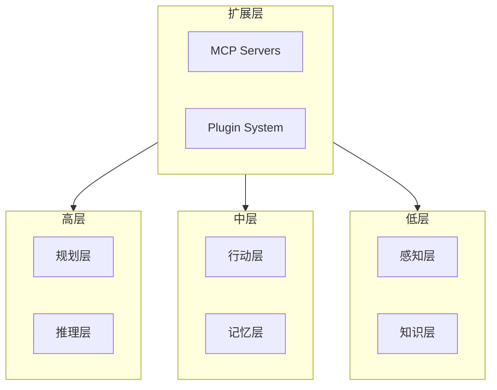
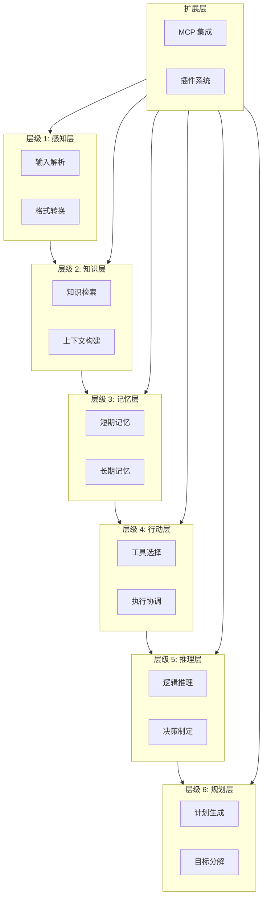

# 分层架构总览

## 1. 概述

AI Agent 的分层架构是构建智能系统的核心设计模式。这种架构将复杂的智能行为分解为多个层次，每层专注于特定职责，通过标准化接口实现层间通信。这种设计既保证了系统的可维护性和可扩展性，又为不同复杂度的任务提供了灵活的解决路径。

## 2. 总结

AI Agent 的分层架构通过清晰的责任分离，实现了系统的模块化、可扩展和可维护性。每一层都有明确的职责，通过标准化接口进行通信，使得系统可以灵活地应对各种复杂场景。

### 2.1 关键设计原则

1. **单一职责**：每层只关注自己的职责，便于理解和维护
2. **松耦合**：层间通过接口通信，减少依赖
3. **可扩展性**：每层都可以独立扩展，不影响其他层
4. **容错性**：各层都有错误处理和恢复机制
5. **可观测性**：内置日志和监控，支持问题诊断

### 2.2 层级关系

扩展层横向贯穿所有层级，提供跨层的扩展能力。

## 3. 各层详解

按数据流从输入到输出依次阅读：

- [感知层](layer-perception.md)
- [认知层](layer-cognition.md)
- [决策层](layer-decision.md)
- [执行层](layer-execution.md)
- [通信层](layer-communication.md)
- [扩展层](layer-extension.md)
