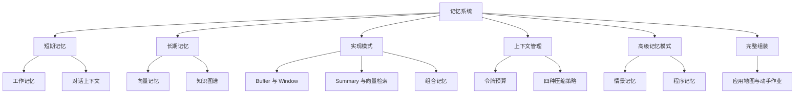
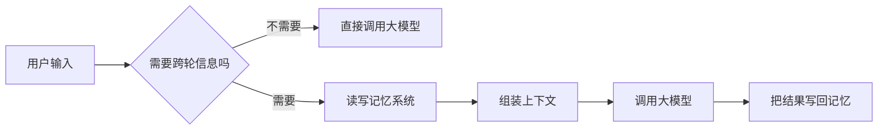
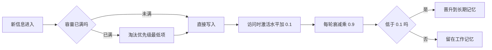
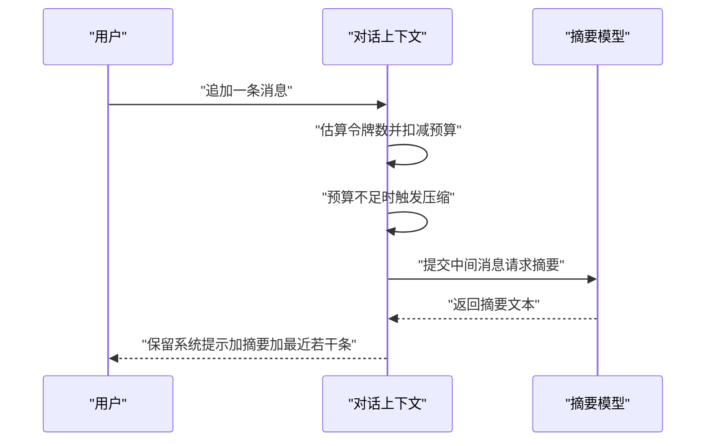
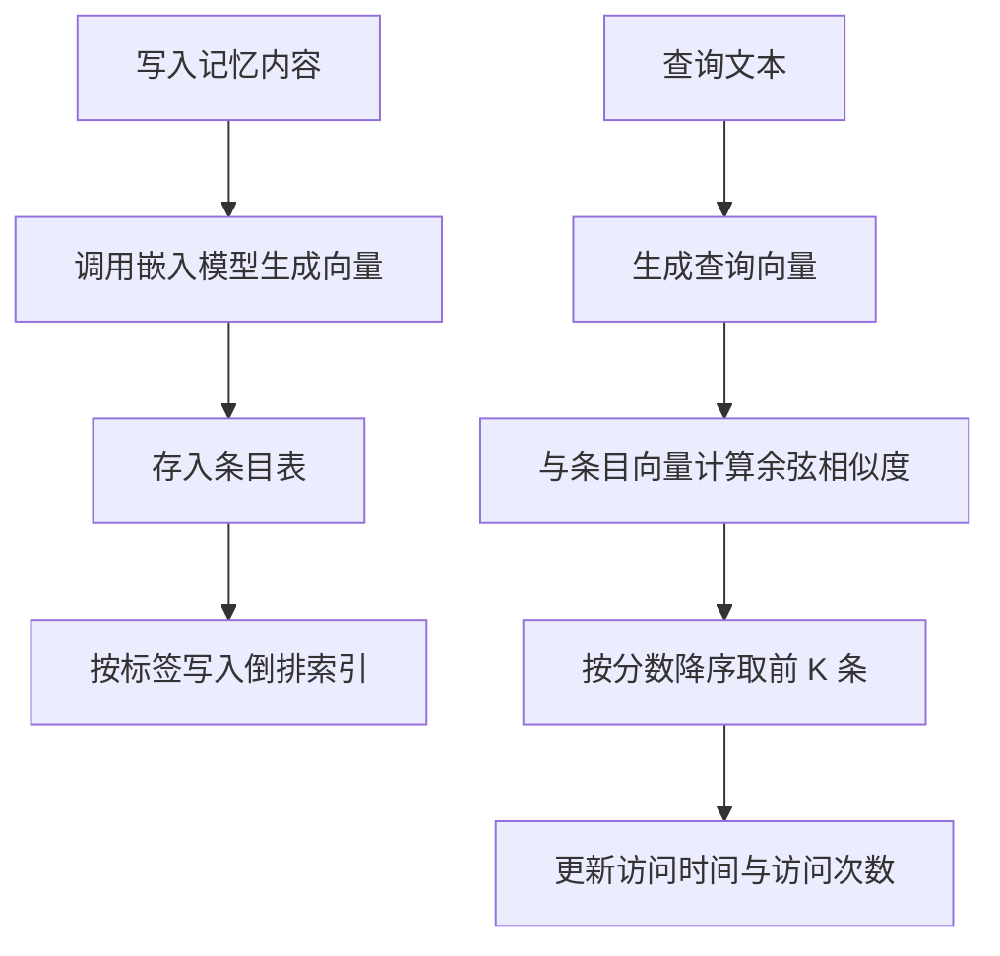
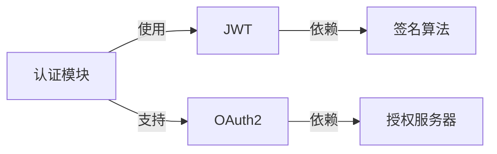
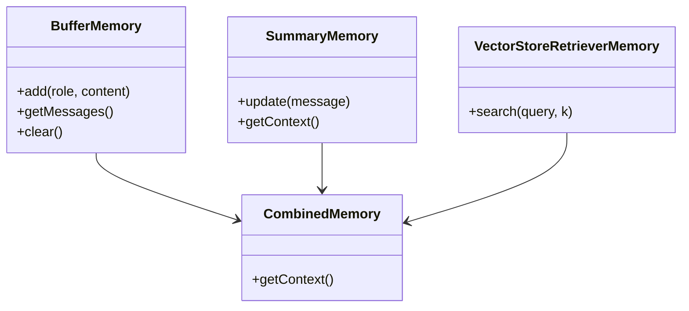
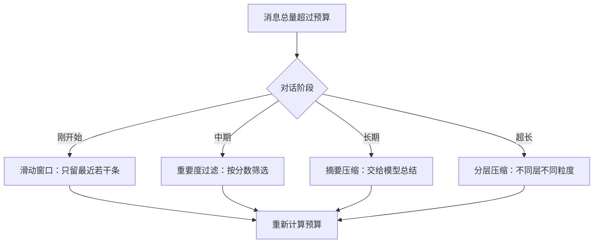
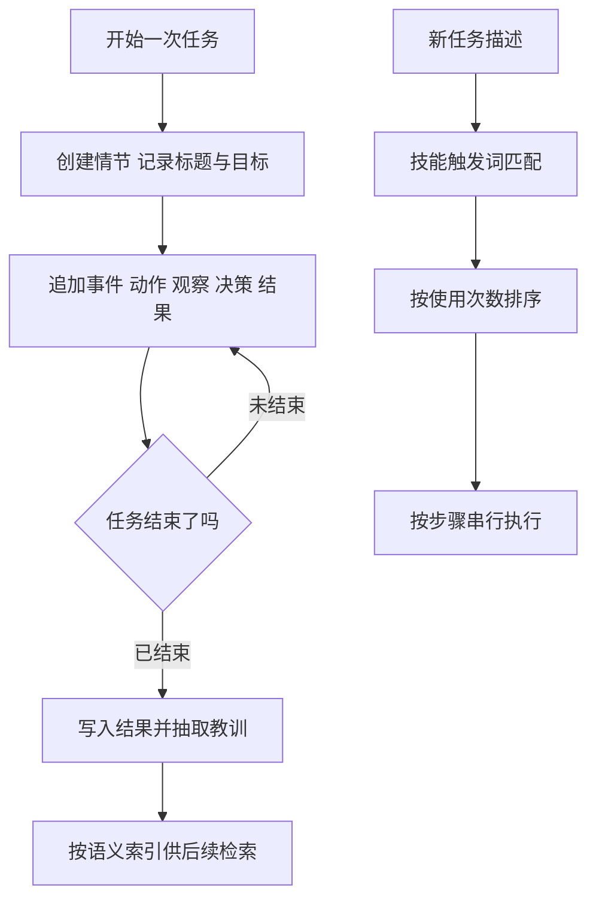
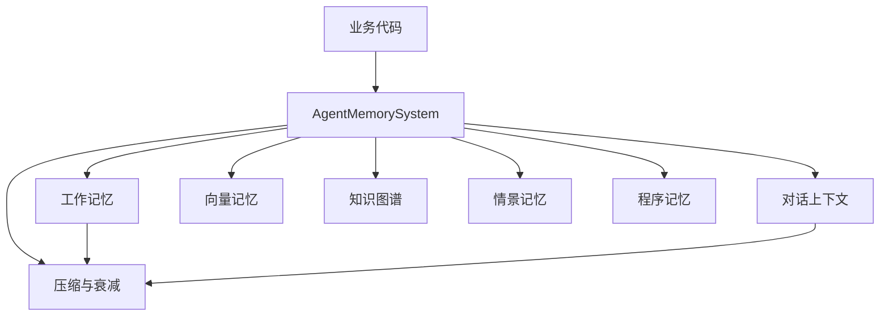

# 记忆系统

!!! abstract "学完这一页你能"
    - 说清工作记忆、对话记忆、向量记忆、图谱记忆、情景记忆、程序记忆分别解决哪一类问题，并说明选择依据。
    - 用 JavaScript 写出带容量淘汰与激活衰减的工作记忆，以及 100000 令牌预算下的消息分配函数。
    - 用余弦相似度与标签倒排索引实现可增删查的长期记忆，并写出按深度扩散的邻居查询。
    - 把短期记忆、长期记忆与压缩策略组装成一个单文件模块，用 node:assert 断言验证行为。

!!! tip "生产实现怎么存？"
    本页讲的是机制。真实的编码 agent 把会话和记忆存在哪里（例如 Codex 以 JSONL rollout 为事实来源，再用多个 SQLite 数据库做镜像与索引），
    见 [会话与记忆存储全景](../storage/session-storage-overview.md) 与 [Codex 的存储设计](../storage/codex-storage-deep-dive.md)。

## 0. 知识地图



建议怎么读：第 1 节先建立判断标准，决定哪些信息值得写进记忆。第 2 到第 3 节处理单会话内的上下文，第 4 到第 5 节处理跨会话的存取。第 6 到第 8 节给出实现模式、压缩策略与高级模式，第 9 节把它们组装起来。读完第 9 节再回头做自测题，检查每个概念能否口述出来。

!!! note "术语：令牌（Token）"
    定义：模型处理文本的最小计量单位，一个令牌对应若干字符。例子：旧版页面按字符串长度除以 3 向上取整来估算令牌数，来源：本站旧版页面，以原文为准。

!!! note "术语：上下文窗口（Context Window）"
    定义：一次模型调用里可以容纳的输入加输出令牌总量上限。例子：旧版页面把对话上下文的默认上限写成 100000 令牌，来源：本站旧版页面，以原文为准；当前模型的实际上限需核对官方文档。

## 1. 记忆系统概述

**先想一个问题**

用户在客服助手第一轮说了订单号 A-1024，第二轮问"到哪了"。助手如果第二轮回答"请提供订单号"，说明信息没被带过去。你要先判断：这条订单号该放在本次上下文里，还是存到外部以后取回。

**心智模型**

!!! tip "心智模型"
    **一句话模型**：把当前推理要用的信息放进上下文窗口，把以后可能用到的信息放到外部存储并按需取回。
    **日常类比**：书桌与书柜。书桌只放当下要用的材料，书柜按标签归档，用到时去取。
    **类比在哪里不成立**：书柜按书名精确定位，记忆检索按相似度排序，会把不相关内容一起取回，所以需要分数阈值与条数上限。

**图解**



1. 用户输入先进入一个判断节点：本轮回答是否依赖以前出现过的信息。
2. 不依赖时，直接把当前输入交给模型，省掉检索与拼装的开销。
3. 依赖时，先去记忆系统取回相关条目，与当前输入一起组装成提示词。
4. 模型返回后，把值得留存的内容写回记忆，供后续轮次或后续会话使用。

旧版页面用下面这张对照表区分记忆类型与用途，来源：本站旧版页面，以原文为准。

| 类型 | 容量 | 持续时间 | 用途 |
|------|------|---------|------|
| 工作记忆 | 5 到 9 项 | 当前会话 | 信息暂存、推理中间结果 |
| 对话记忆 | 上下文窗口 | 会话期间 | 保持对话连贯性 |
| 会话记忆 | 数千条消息 | 可配置 | 长期对话上下文 |
| 向量记忆 | 无固定上限 | 持久化 | 语义检索、经验复用 |
| 图谱记忆 | 结构化 | 持久化 | 实体关系、推理 |
| 程序记忆 | 技能与模式 | 持久化 | 如何做事的知识 |

**一步一步来**

**第 1 步：定义消息形状与令牌估算**

① 这一步要做什么：先给"一条消息"定死字段，再给令牌估算写出可替换的实现，后续预算分配都依赖这两个约定。

```js
// 一条消息的固定形状：角色、内容、时间戳、令牌数
function makeMessage(role, content) {
  return { role, content, timestamp: Date.now(), tokens: estimateTokens(content) };
}

// 令牌估算：旧版页面按字符串长度除以 3 向上取整，来源：本站旧版页面，以原文为准
function estimateTokens(text) {
  return Math.ceil(text.length / 3);
}

const msg = makeMessage('user', '订单号是 A-1024');
console.log(msg.tokens);
console.log(estimateTokens('abc'));
```

**这段代码在做什么**

- `makeMessage` 收敛了字段命名，后面所有模块只认这四个字段。
- `estimateTokens` 是一个占位实现，换模型或换分词器时只改这一个函数。
- 旧版页面注释写的是中文约 2 字符每令牌、英文约 4 字符每令牌，而代码用长度除以 3，两者口径不一致，属于已知偏差。
- 真实计费口径需要调用官方提供的令牌计数接口或对应分词库，具体接口名需核对官方文档。

运行结果：

```text
4
1
```

**第 2 步：给消息打上"是否值得留存"的标记**

① 这一步要做什么：在写入记忆之前先分类，避免把寒暄和确认语都塞进长期记忆。

```js
const KEEP = ['订单', '必须', '不要', '记得', '约束', '文件'];

// 判定规则：命中留存关键词，或消息长度超过 100 字符，才写入长期记忆
function shouldPersist(content) {
  const hitKeyword = KEEP.some((kw) => content.includes(kw));
  const longEnough = content.length > 100;
  return hitKeyword || longEnough;
}

console.log(shouldPersist('订单号是 A-1024'));   // 命中关键词
console.log(shouldPersist('好的，谢谢'));        // 两条规则都不命中
```

**这段代码在做什么**

- `KEEP` 是留存关键词表，初期可以由人工维护，后续用统计命中率调整。
- `hitKeyword` 用 `some` 做短路判断，命中第一个词就返回，不再扫完整个表。
- `longEnough` 用长度作为兜底信号，长度阈值 100 取自旧版页面重要性评分里的一条规则。
- 返回 `false` 不等于丢弃，消息仍然留在对话上下文里，只是不进入持久化存储。

运行结果：

```text
true
false
```

**动手验证**

依赖：Node 20+，只用内置模块 `node:assert/strict`。

```js
// demo-01.js  运行：node demo-01.js
import assert from 'node:assert/strict';

class DialogueContext {
  constructor() { this.messages = []; }
  add(role, content) { this.messages.push({ role, content }); }
  toPrompt() { return this.messages.map((m) => `${m.role}: ${m.content}`).join('\n'); }
}

// 无记忆：每轮新建上下文，上一轮的信息不再可见
const turn1 = new DialogueContext();
turn1.add('user', '我的订单号是 A-1024');
const turn2 = new DialogueContext();
turn2.add('user', '我的订单到哪了');
assert.equal(turn2.toPrompt().includes('A-1024'), false);

// 有记忆：同一个上下文跨轮复用
const shared = new DialogueContext();
shared.add('user', '我的订单号是 A-1024');
shared.add('user', '我的订单到哪了');
assert.equal(shared.toPrompt().includes('A-1024'), true);

console.log('无记忆提示词长度:', turn2.toPrompt().length);
console.log('有记忆提示词长度:', shared.toPrompt().length);
console.log('断言全部通过');
```

预期输出（长度为 UTF-16 码元数，与 Node 版本无关）：

```text
无记忆提示词长度: 13
有记忆提示词长度: 33
断言全部通过
```

**常见坑**

| 现象 | 原因 | 怎么修 |
|------|------|--------|
| 第二轮回答要求用户重复订单号 | 每轮新建了上下文对象，跨轮状态丢失 | 把上下文对象提到会话生命周期之外，或者显式从长期记忆检索后拼回提示词 |
| 提示词越来越长，费用持续上升 | 无上限地往上下文里追加消息 | 给上下文设令牌预算，超预算时走压缩流程 |
| 关键约束被后续消息挤掉 | 淘汰策略只看新旧，不看重要度 | 用重要度乘激活水平计算优先级，优先淘汰分数最低项 |

**用在哪里**

1. **场景：电商客服助手**
    - 业务背景：用户在会话里给出订单号、物流单号、退款原因，后续轮次需要反复引用。
    - 这一节的知识怎么用：用留存关键词把订单号与约束写进记忆，寒暄只留在对话上下文里。
    - 用什么指标衡量收益：统计"用户被迫重复提供信息"的会话占比，以及平均会话轮次。
    - 什么时候不该用：单轮问答型入口，用户提交一次就结束，不需要跨轮状态。

2. **场景：IDE 内的编程助手**
    - 业务背景：用户在文件里改代码，助手需要记住"这个项目用 ESM、不引入新依赖"这类约束。
    - 这一节的知识怎么用：把工程约束作为高重要度条目写入，每次生成代码前取回。
    - 用什么指标衡量收益：统计生成代码被手动修改的比例，以及约束被违反的次数。
    - 什么时候不该用：一次性脚本生成，约束不跨任务复用时不必持久化。

3. **场景：后台管理的批量导入助手**
    - 业务背景：运营上传表格，助手逐步确认字段映射与校验规则。
    - 这一节的知识怎么用：把已确认的映射写进情景记忆，中断后可以恢复上一次的确认结果。
    - 用什么指标衡量收益：统计导入任务的中断恢复成功率与重做次数。
    - 什么时候不该用：导入规则固定且写在校验配置里的场景，记忆层属于重复建设。

**行业实践**

- LangChain 官方文档的 Memory 章节把对话记忆封装成 Buffer、Window、Summary、向量检索与组合五类，本页第 6 节按这五类展开。来源：LangChain 官方文档 Memory 章节，以原文为准。
- MemGPT 项目把记忆按层级管理并讨论在上下文窗口与外部存储之间搬迁信息，具体机制与 API 需核对官方文档。
- 旧版页面把记忆系统的目标写成"根据场景组合记忆类型、实现上下文压缩、定期遗忘不重要记忆、建立索引支持检索"，这四条可以作为落地清单。来源：本站旧版页面，以原文为准。

怎么借鉴到你的项目：先写下你的会话长度分布与单轮令牌中位数，再据此决定是否需要长期记忆，最后按第 6 节的五类模式里选最少的一种起步。

**小结**

- 记忆系统的职责分成两半：本次上下文里放什么，外部存储里留什么。
- 判断标准是"本轮或后续会话是否要再次用到"，而不是信息本身是否好听。
- 先做测量再选型，会话长度分布决定了是否需要向量记忆。

## 2. 短期记忆之一：工作记忆

**先想一个问题**

助手在推理"该用 JWT 还是 Session"时，需要同时记住当前的模块名、约束条件、待办步骤。这些信息只在当前轮次用，推理结束后价值下降。你该怎么限制它的数量？

**心智模型**

!!! tip "心智模型"
    **一句话模型**：工作记忆是一块容量固定的暂存区，写入新条目时按优先级淘汰旧条目，长期不访问的条目衰减并外迁。
    **日常类比**：手边的便签纸只有固定几张，写满一张就要撕掉一张，常用的那张会一直被留在最上面。
    **类比在哪里不成立**：撕便签不会考虑"内容多重要"，而记忆淘汰要按重要度乘激活水平排序，权重低的先走。

**图解**



1. 新条目先检查容量，旧版页面把容量写成 7 项，注释标注 Miller 定律，来源：本站旧版页面，以原文为准。
2. 容量已满时，扫描全部条目，计算"重要度乘激活水平"，淘汰分数最低的一条。
3. 每次读取条目，访问次数加一，激活水平加 0.1，上限为 1。
4. 每轮结束后全部条目乘 0.9，低于 0.1 的条目触发晋升流程，交给长期记忆处理。

**一步一步来**

**第 1 步：写入与淘汰**

① 这一步要做什么：实现容量检查、优先级计算与淘汰三个动作，保证容量上限始终成立。

```js
class WorkingMemory {
  constructor(maxCapacity = 7) {   // 7 取自本站旧版页面，注释标注 Miller 定律，以原文为准
    this.maxCapacity = maxCapacity;
    this.items = new Map();
    this.seq = 0;
  }
  add({ content, type = 'context', importance = 0.8, activationLevel = 1 }) {
    if (this.items.size >= this.maxCapacity) this.evictLowestPriority();
    const id = `m${++this.seq}`;   // 教学用自增 id，多进程部署要换成随机 id
    this.items.set(id, { id, content, type, importance, activationLevel, accessCount: 0 });
    return id;
  }
  evictLowestPriority() {
    let min = Infinity;
    let target = null;
    for (const [id, item] of this.items) {
      const priority = item.importance * item.activationLevel;  // 优先级等于重要度乘激活水平
      if (priority < min) { min = priority; target = id; }
    }
    if (target) this.items.delete(target);
    return target;
  }
}
```

**这段代码在做什么**

- `maxCapacity` 是硬上限，`add` 在写入之前先做淘汰判断，保证写入后不超限。
- `evictLowestPriority` 遍历全部条目求最小值，条目数为 7 时开销可以忽略。
- `priority` 用乘法而不是加法：重要度低的条目即使刚被访问过，也会排在重要度高的条目后面。
- 自增 id 在单进程脚本里够用，多实例部署会冲突，需要换成随机 id 或数据库主键。

运行结果：连续写入 8 条，其中第 7 条重要度 0.1，第 8 条写入时它被淘汰。

```text
淘汰了: 临时天气问候
当前条目数: 7
```

**第 2 步：访问激活与衰减晋升**

① 这一步要做什么：给读取动作加上激活加分，给每轮结束加上衰减，并把衰减到阈值的条目交给外部处理。

```js
  get(id) {
    const item = this.items.get(id);
    if (item) {
      item.accessCount += 1;
      item.activationLevel = Math.min(1, item.activationLevel + 0.1);  // 每次访问加 0.1，封顶 1
    }
    return item;
  }
  recall() {   // 只召回激活水平高于 0.3 的条目，低于该值的暂时不可见
    return [...this.items.values()]
      .filter((item) => item.activationLevel > 0.3)
      .sort((a, b) => b.activationLevel - a.activationLevel);
  }
  decay() {
    for (const item of this.items.values()) {
      item.activationLevel *= 0.9;       // 每轮乘 0.9，等价于逐轮遗忘
      if (item.activationLevel < 0.1) this.promote(item);  // 低于阈值：交给长期记忆
    }
  }
  promote(item) { this.promoted.push(item.content); }  // 子类或注入的回调实现真正的持久化
```

**这段代码在做什么**

- `get` 同时更新访问次数与激活水平，访问次数用于后续统计热度。
- `recall` 的过滤阈值 0.3 与衰减系数 0.9、晋升阈值 0.1 都取自旧版页面，来源：本站旧版页面，以原文为准。
- 衰减是乘法，连续 24 轮后 1 会降到约 0.08，因此不访问的条目最终必然触发晋升。
- `promote` 在旧版页面里是留空的钩子方法，实际项目要注入写库或写向量的实现。

**动手验证**

依赖：Node 20+，只用 `node:assert/strict`。

```js
// demo-02.js  运行：node demo-02.js
import assert from 'node:assert/strict';

class WorkingMemory {
  constructor(maxCapacity = 7) {
    this.maxCapacity = maxCapacity;
    this.items = new Map();
    this.promoted = [];
    this.seq = 0;
  }
  add({ content, importance = 0.8, activationLevel = 1 }) {
    if (this.items.size >= this.maxCapacity) this.evictLowestPriority();
    const id = `m${++this.seq}`;
    this.items.set(id, { id, content, importance, activationLevel, accessCount: 0 });
    return id;
  }
  get(id) {
    const item = this.items.get(id);
    if (item) {
      item.accessCount += 1;
      item.activationLevel = Math.min(1, item.activationLevel + 0.1);
    }
    return item;
  }
  recall() {
    return [...this.items.values()]
      .filter((i) => i.activationLevel > 0.3)
      .sort((a, b) => b.activationLevel - a.activationLevel);
  }
  evictLowestPriority() {
    let min = Infinity;
    let target = null;
    for (const [id, item] of this.items) {
      const p = item.importance * item.activationLevel;
      if (p < min) { min = p; target = id; }
    }
    if (target) this.items.delete(target);
    return target;
  }
  decay() {
    for (const item of this.items.values()) {
      item.activationLevel *= 0.9;
      if (item.activationLevel < 0.1) this.promoted.push(item.content);
    }
  }
}

const wm = new WorkingMemory();
const ids = [];
for (let i = 0; i < 6; i++) ids.push(wm.add({ content: `约束${i}`, importance: 0.9 }));
const low = wm.add({ content: '临时天气问候', importance: 0.1 });
assert.equal(wm.items.size, 7);
wm.add({ content: '第 8 条', importance: 0.9 });
assert.equal(wm.items.size, 7);
assert.equal(wm.items.has(low), false);

wm.get(ids[0]);
assert.equal(wm.items.get(ids[0]).accessCount, 1);
assert.equal(wm.items.get(ids[0]).activationLevel, 1);

wm.items.get(ids[1]).activationLevel = 0.1;
wm.decay();
assert.equal(wm.promoted.length, 1);
assert.equal(wm.promoted[0], '约束1');

console.log('淘汰后条目数:', wm.items.size);
console.log('晋升内容:', wm.promoted.join(','));
console.log('召回条数:', wm.recall().length);
console.log('断言全部通过');
```

预期输出：

```text
淘汰后条目数: 7
晋升内容: 约束1
召回条数: 5
断言全部通过
```

**常见坑**

| 现象 | 原因 | 怎么修 |
|------|------|--------|
| 容量上限形同虚设 | 先写入再判断容量，或者用大于号判断后未真正删除 | 写入前判断 `size >= maxCapacity`，删除后立即返回被删 id 便于日志 |
| 刚写入的条目立刻被淘汰 | 新条目 importance 传了默认值 0，优先级最低 | 为 `importance` 设下限，或在 `add` 里对缺省值做校验 |
| 衰减后条目数量不变但召回为空 | 只看激活水平，忘了激活水平会因乘法衰减到阈值以下 | 把 recall 阈值与 decay 系数写在同一处配置里，一起调 |

**用在哪里**

1. **场景：多步工具调用的 Agent**
    - 业务背景：一次任务里要依次查库存、算运费、生成订单草案，中间结果需要短时保留。
    - 这一节的知识怎么用：把中间结果作为高重要度条目写入工作记忆，下一步调用前取出。
    - 用什么指标衡量收益：统计每步调用的参数缺失率与重试次数。
    - 什么时候不该用：单个接口一次返回全部结果时，不需要中间的暂存层。

2. **场景：代码评审助手**
    - 业务背景：一次评审中会积累若干问题点，最后需要汇总成报告。
    - 这一节的知识怎么用：问题点按重要度写入，评审结束后统一交给长期记忆归档。
    - 用什么指标衡量收益：统计报告漏项数与问题点回溯所需的人工操作次数。
    - 什么时候不该用：单文件一次性评审且即时输出报告时，直接写临时数组即可。

3. **场景：在线客服的实时提示**
    - 业务背景：坐席与用户对话时，系统需要提示当前会话里出现过的关键约束。
    - 这一节的知识怎么用：用工作记忆的召回结果生成提示条，按激活水平排序。
    - 用什么指标衡量收益：统计坐席重复询问用户的比例。
    - 什么时候不该用：会话轮次只有一两轮时，提示条会带来干扰。

**行业实践**

- LangChain 官方文档 Memory 章节中的 `ConversationBufferWindowMemory` 用参数 `k` 控制保留最近若干条消息，与本节的容量上限思路一致。来源：LangChain 官方文档 Memory 章节，以原文为准。
- 旧版页面把容量写成 7 并标注 Miller 定律，这个数字适合作为起点，实际值应当用你自己的会话数据测出来。来源：本站旧版页面，以原文为准。
- 认知心理学中的 Miller 定律常被引作 7 加减 2 项，具体表述与实验条件需核对原始论文。

怎么借鉴到你的项目：把容量、召回阈值、衰减系数、晋升阈值这四个数字集中到一个配置对象里，用日志记录每次淘汰的条目内容，两周后按日志调整。

**小结**

- 工作记忆的核心是容量上限加优先级淘汰，两者缺一不可。
- 激活水平靠访问加分、靠时间衰减，访问次数只用于统计。
- 衰减到阈值的条目要外迁，否则信息会随对象销毁一起消失。

## 3. 短期记忆之二：对话上下文与令牌预算

**先想一个问题**

一段 40 轮的客服会话，每轮平均 300 令牌，累计 12000 令牌。旧版页面把上下文上限设为 100000 令牌，看起来还能撑很久，但工具返回的长文本一次就能用掉几万令牌。你该在什么时候开始压缩？

**心智模型**

!!! tip "心智模型"
    **一句话模型**：把上下文窗口当成一份固定预算，系统提示、历史消息、输出预留各占一块，装不下时从最旧的消息开始压缩。
    **日常类比**：出差装箱，行李箱容量固定，必须给充电器和洗漱包留出固定位置，剩下的空间才放衣物。
    **类比在哪里不成立**：装箱可以少带衣服，对话历史不能被删掉，压缩必须保留信息，只是把原文换成摘要。

**图解**



1. 每条消息进入时先估算令牌数，再从剩余预算里扣减。
2. 剩余预算变成负数时触发压缩，而不是等到调用模型报错。
3. 压缩把中间段的消息提交给摘要模型，返回一段摘要文本。
4. 新的消息数组由系统提示、摘要消息、最近若干条原文组成，预算重新计算。

**一步一步来**

**第 1 步：定义预算结构并扣减**

① 这一步要做什么：把 100000 令牌拆成系统提示、上下文与输出预留三块，明确哪一块可以被消息占用。

```js
function createBudget(maxTokens = 100000) {   // 100000 取自本站旧版页面，注释标注为 Claude 上下文窗口，以原文为准
  return {
    maxTokens,
    systemPrompt: 5000,                 // 系统提示固定占用
    reserved: 5000,                     // 输出预留，不能挪给输入
    context: maxTokens - 10000          // 留给历史消息的空间
  };
}

const budget = createBudget();
console.log(budget.context);
console.log(budget.systemPrompt + budget.context);
```

**这段代码在做什么**

- `reserved` 单列出来，避免输入把输出空间吃光导致调用失败。
- `context` 由 `maxTokens` 减去两块固定占用得到，修改上限时三块同步变化。
- 100000 与 5000 都来自旧版页面，来源：本站旧版页面，以原文为准；真实上限与计费口径需核对官方文档。
- 预算结构一旦确定，分配函数只读不改，配置与算法分离。

运行结果：

```text
90000
95000
```

**第 2 步：从新到旧分配消息**

① 这一步要做什么：实现一个分配函数，返回装得下的消息与装不下的消息两部分，便于上层决定压缩还是丢弃。

```js
function estimateTokens(text) { return Math.ceil(text.length / 3); }

// 从最新消息往回装，装不下就停，返回 included 与 overflow 两段
function allocate(messages, budget) {
  const limit = budget.systemPrompt + budget.context;
  let used = budget.systemPrompt;
  const included = [];
  for (let i = messages.length - 1; i >= 0; i--) {
    const tokens = estimateTokens(messages[i].content);
    if (used + tokens > limit) break;   // 装不下：本轮分配到此结束
    included.unshift(messages[i]);      // 从头插入，保持原始时间顺序
    used += tokens;
  }
  const overflow = messages.slice(0, messages.length - included.length);
  return { included, overflow, usedTokens: used };
}
```

**这段代码在做什么**

- 倒序遍历保证最新的消息优先进入上下文，这是对话场景的常见取舍。
- `unshift` 让结果数组仍然按时间正序排列，模型看到的顺序与用户视角一致。
- `overflow` 是前缀切片，因为装不下的必然是较旧的消息。
- 单个超长消息会直接导致 `break`，此时 `overflow` 可能包含应该保留的新消息，需要给超长消息单独的截断逻辑。

运行结果（预算 50 加 200，5 条各 100 令牌，只能装下 2 条）：

```text
included: 2
overflow: 3
usedTokens: 250
```

**动手验证**

依赖：Node 20+，只用 `node:assert/strict`。

```js
// demo-03.js  运行：node demo-03.js
import assert from 'node:assert/strict';

function estimateTokens(text) { return Math.ceil(text.length / 3); }

function allocate(messages, budget) {
  const limit = budget.systemPrompt + budget.context;
  let used = budget.systemPrompt;
  const included = [];
  const kept = [];
  for (let i = messages.length - 1; i >= 0; i--) {
    const tokens = estimateTokens(messages[i].content);
    if (used + tokens > limit) break;
    included.unshift(messages[i]);
    used += tokens;
  }
  const overflow = messages.slice(0, messages.length - included.length);
  return { included, overflow, usedTokens: used };
}

function compress(messages) {
  const system = messages.filter((m) => m.role === 'system');
  const recent = messages.slice(-10);            // 保留最近 10 条原文，取自本站旧版页面，以原文为准
  return [
    ...system,
    { role: 'system', content: `[Earlier summary: ${messages.length} messages compressed]` },
    ...recent
  ];
}

const small = { maxTokens: 300, systemPrompt: 50, reserved: 50, context: 200 };
const messages = Array.from({ length: 5 }, (_, i) => ({ role: 'user', content: 'x'.repeat(300) }));
const result = allocate(messages, small);
assert.equal(result.included.length, 2);
assert.equal(result.overflow.length, 3);
assert.equal(result.usedTokens, 250);

const compressed = compress([
  { role: 'system', content: '你是客服助手' },
  ...Array.from({ length: 20 }, (_, i) => ({ role: 'user', content: `第${i}轮` }))
]);
assert.equal(compressed.length, 12);
assert.equal(compressed[0].role, 'system');
assert.equal(compressed[1].content.includes('20 messages compressed'), true);

console.log('可用预算:', small.systemPrompt + small.context);
console.log('装下条数:', result.included.length, '溢出条数:', result.overflow.length);
console.log('压缩后条数:', compressed.length);
console.log('断言全部通过');
```

预期输出：

```text
可用预算: 250
装下条数: 2 溢出条数: 3
压缩后条数: 12
断言全部通过
```

**常见坑**

| 现象 | 原因 | 怎么修 |
|------|------|--------|
| 模型报上下文超限 | 只算了消息令牌，没算系统提示与输出预留 | 把三块预算写进同一个配置对象，分配前先加总 |
| 估算结果与计费相差很大 | 用长度除以 3 的粗略估算，遇到代码或英文偏差扩大 | 换成官方令牌计数接口或对应分词库，具体接口需核对官方文档 |
| 摘要反复生成同一段内容 | 摘要写回后没有清空中间消息数组 | 摘要成功后立即清空已压缩段落，用 `await` 串行执行 |

**用在哪里**

1. **场景：长文档问答助手**
    - 业务背景：用户上传合同后连续追问条款细节，会话可能持续几十轮。
    - 这一节的知识怎么用：给会话设预算，超预算时把前段问答压成摘要，保留最近若干轮原文。
    - 用什么指标衡量收益：统计上下文超限报错次数与平均单次调用输入令牌数。
    - 什么时候不该用：单轮问答，一轮结束后上下文即释放。

2. **场景：客服工单的跨班次交接**
    - 业务背景：一个工单会被多名坐席接手，需要知道此前处理过什么。
    - 这一节的知识怎么用：交接时把历史压成摘要写入工单备注，接手坐席从摘要加最近若干条开始。
    - 用什么指标衡量收益：统计接手后重复询问用户的次数。
    - 什么时候不该用：工单当天闭环且不换人的场景。

3. **场景：命令行编码 Agent**
    - 业务背景：工具返回的编译日志常常上千行，一次就能吃掉大半预算。
    - 这一节的知识怎么用：对工具返回单独设上限，超长日志先截断再进入上下文。
    - 用什么指标衡量收益：统计因日志过长导致的截断次数与任务失败率。
    - 什么时候不该用：日志短且需要完整保留的调试场景。

**行业实践**

- 旧版页面的 `TokenManager` 把预算拆成系统提示、上下文、输出预留三块，并把输出预留写死在 5000 令牌。来源：本站旧版页面，以原文为准。
- LangChain 官方文档 Memory 章节提供 `ConversationSummaryMemory`，把历史交给模型生成摘要，与本节的压缩流程对应。来源：LangChain 官方文档 Memory 章节，以原文为准。
- 模型的实际上下文上限、输出上限与计数接口名称会随版本变化，需核对官方文档，本页不给出具体数值。

怎么借鉴到你的项目：先用日志记录每次调用的输入令牌数分布，取第 95 百分位作为预算依据，再把输出预留设成你最长回复的令牌数加余量。

**小结**

- 令牌预算是硬约束，系统提示与输出预留必须先扣掉。
- 分配顺序从新到旧，保证最新信息一定进入上下文。
- 压缩发生在超限之前，不要等模型报错再处理。

## 4. 长期记忆之一：向量记忆

**先想一个问题**

用户三个月前说过"我们公司报销必须附发票原件"。这次他问"报销要哪些材料"，你需要按语义找到那条旧记录，而关键词"报销"在库里出现过上百次。怎么做？

**心智模型**

!!! tip "心智模型"
    **一句话模型**：把每条记忆转成一串数字向量，查询时把查询文本也转成向量，取夹角最小的若干条返回。
    **日常类比**：把每本书按主题放到一张坐标系里的点，找相似的书就看哪个点离查询点最近。
    **类比在哪里不成立**：坐标是模型训练出来的，语义相近的句子距离近，但也会出现"语义近、事实不同"的误召回，需要标签过滤兜底。

**图解**



1. 写入时先调用嵌入模型，把文本转成固定维度的向量，旧版页面用 1536 维，来源：本站旧版页面，以原文为准。
2. 向量与原文、元数据一起存入条目表，同时按标签写入倒排索引，便于精确过滤。
3. 查询时同样生成查询向量，与条目向量逐一计算余弦相似度。
4. 按分数降序取前 K 条，同时更新被命中条目的访问时间与访问次数。

!!! note "术语：嵌入向量（Embedding）"
    定义：由模型把文本映射成的一串定长浮点数，语义相近的文本对应的向量方向接近。例子：旧版页面用 `Array(1536).fill(0).map(() => Math.random())` 作为占位实现，来源：本站旧版页面，以原文为准。

!!! note "术语：余弦相似度（Cosine Similarity）"
    定义：两个向量点积除以两者模长的乘积，取值在 -1 到 1 之间，越大表示方向越接近。例子：两个完全相同的向量相似度为 1。

**一步一步来**

**第 1 步：实现余弦相似度与检索排序**

① 这一步要做什么：写出相似度计算并完成排序、取前 K 条，同时更新命中的统计字段。

```js
function cosineSimilarity(a, b) {
  let dot = 0, normA = 0, normB = 0;
  for (let i = 0; i < a.length; i++) {
    dot += a[i] * b[i];
    normA += a[i] * a[i];
    normB += b[i] * b[i];
  }
  if (normA === 0 || normB === 0) return 0;        // 零向量无法归一化，直接返回 0
  return dot / (Math.sqrt(normA) * Math.sqrt(normB));
}

function search(entries, queryEmbedding, topK = 5) {   // 默认取前 5 条，取自本站旧版页面的默认参数
  const scored = entries.map((entry) => ({
    entry,
    score: cosineSimilarity(queryEmbedding, entry.embedding)
  }));
  scored.sort((a, b) => b.score - a.score);
  for (const item of scored.slice(0, topK)) {      // 只给命中的条目记账
    item.entry.metadata.accessCount += 1;
    item.entry.metadata.accessedAt = Date.now();
  }
  return scored.slice(0, topK);
}
```

**这段代码在做什么**

- 一次循环同时累加点积与两个模长，避免对数组做三遍遍历。
- `normA === 0 || normB === 0` 处理除零，随机占位向量不会为 0，但真实模型输出可能出现全零。
- `slice(0, topK)` 之前已经排序，两次切片共用同一个结果，没有重复计算分数。
- 访问统计写在返回之前，保证调用方拿到的对象已带最新计数。

运行结果（8 维确定性向量示例）：

```text
top1 分数: 1.000
top2 分数: 0.998
```

**第 2 步：加入标签倒排索引与删除**

① 这一步要做什么：用标签索引把检索范围缩小到指定类别，并在删除条目时清理索引，避免悬挂引用。

```js
function addEntry(store, id, content, embedding, tags) {
  store.entries.set(id, { id, content, embedding, metadata: { tags, accessCount: 0 } });
  for (const tag of tags) {
    if (!store.index.has(tag)) store.index.set(tag, new Set());
    store.index.get(tag).add(id);          // 倒排索引：标签到 id 集合
  }
  return id;
}

function searchByTag(store, tag) {
  const ids = store.index.get(tag) || new Set();
  return [...ids].map((id) => store.entries.get(id)).filter(Boolean);
}

function forget(store, id) {
  const entry = store.entries.get(id);
  if (!entry) return false;
  for (const tag of entry.metadata.tags) store.index.get(tag)?.delete(id);  // 先清索引
  store.entries.delete(id);                // 再删条目，避免留下悬挂 id
  return true;
}
```

**这段代码在做什么**

- 倒排索引把"标签到 id 集合"单独存一份，按标签查询时只扫命中的集合。
- 集合用 `Set`，同一条记忆重复写入同一标签时自动去重。
- `forget` 的顺序是先清索引再删条目，反之索引里会残留不存在的 id。
- `filter(Boolean)` 兜住索引与条目不一致的情况，代价是静默跳过，最好配合监控计数。

运行结果：

```text
标签命中条数: 2
删除后条目数: 3
删除后标签命中条数: 1
```

**动手验证**

依赖：Node 20+，只用 `node:assert/strict`。教学脚本用 8 维确定性向量代替真实嵌入模型，真实场景必须换成模型输出。

```js
// demo-04.js  运行：node demo-04.js
import assert from 'node:assert/strict';

function embed(text, dim = 8) {
  const v = new Array(dim).fill(0);
  for (let i = 0; i < text.length; i++) v[i % dim] += text.charCodeAt(i) % 97;
  const norm = Math.sqrt(v.reduce((s, x) => s + x * x, 0)) || 1;
  return v.map((x) => x / norm);
}

function cosineSimilarity(a, b) {
  let dot = 0, na = 0, nb = 0;
  for (let i = 0; i < a.length; i++) { dot += a[i] * b[i]; na += a[i] * a[i]; nb += b[i] * b[i]; }
  if (na === 0 || nb === 0) return 0;
  return dot / (Math.sqrt(na) * Math.sqrt(nb));
}

const store = { entries: new Map(), index: new Map() };

function add(id, content, tags) {
  store.entries.set(id, { id, content, embedding: embed(content), metadata: { tags, accessCount: 0, accessedAt: 0 } });
  for (const tag of tags) {
    if (!store.index.has(tag)) store.index.set(tag, new Set());
    store.index.get(tag).add(id);
  }
  return id;
}

function search(query, topK = 5) {
  const q = embed(query);
  const scored = [...store.entries.values()].map((e) => ({ entry: e, score: cosineSimilarity(q, e.embedding) }));
  scored.sort((a, b) => b.score - a.score);
  for (const item of scored.slice(0, topK)) { item.entry.metadata.accessCount += 1; item.entry.metadata.accessedAt = Date.now(); }
  return scored.slice(0, topK);
}

function forget(id) {
  const entry = store.entries.get(id);
  if (!entry) return false;
  for (const tag of entry.metadata.tags) store.index.get(tag)?.delete(id);
  store.entries.delete(id);
  return true;
}

const self = embed('报销必须附发票原件');
assert.equal(Number(cosineSimilarity(self, self).toFixed(6)), 1);
assert.equal(cosineSimilarity(embed('报销必须附发票原件'), embed('今天天气晴朗')) < 1, true);

add('m1', '报销必须附发票原件', ['报销', '财务']);
add('m2', '差旅标准按城市分级', ['报销']);
add('m3', '年假申请需提前三天', ['人事']);
const top = search('报销要哪些材料', 2);
assert.equal(top.length, 2);
assert.equal(top[0].entry.metadata.accessCount, 1);
assert.equal([...store.index.get('报销')].length, 2);
assert.equal(forget('m1'), true);
assert.equal(store.entries.size, 2);
assert.equal([...store.index.get('报销')].length, 1);

console.log('检索命中条数:', top.length);
console.log('报销标签条数（删除前）: 2');
console.log('条目数（删除后）:', store.entries.size);
console.log('断言全部通过');
```

预期输出：

```text
检索命中条数: 2
报销标签条数（删除前）: 2
条目数（删除后）: 2
断言全部通过
```

**常见坑**

| 现象 | 原因 | 怎么修 |
|------|------|--------|
| 同一段文本两次检索分数不同 | 占位嵌入用随机数，每次调用结果不一致 | 换成真实嵌入模型，并按文本哈希缓存向量 |
| 删除条目后仍被检索到 | 只删了条目表，倒排索引里的 id 没清 | 删除时先遍历标签清索引，再删条目 |
| 语义相近但事实错误被召回 | 只按相似度排序，没有标签或时间过滤 | 先用标签缩小集合，再排序；必要时叠加时间窗过滤 |

**用在哪里**

1. **场景：企业知识库问答**
    - 业务背景：制度文档分散在多个系统，员工提问需要按语义找条款。
    - 这一节的知识怎么用：把条款切块后向量化，用标签限定部门后再排序取前 K 条。
    - 用什么指标衡量收益：统计答案引用是否落在正确条款上，记录错引率。
    - 什么时候不该用：制度条款数量只有几十条时，关键词检索加人工目录维护成本更低。

2. **场景：客服的历史工单复用**
    - 业务背景：新工单描述与三个月前的工单高度相似，可以直接复用处理方案。
    - 这一节的知识怎么用：工单结案后写入向量记忆，新工单进入时先检索相似历史。
    - 用什么指标衡量收益：统计首次响应时间与方案复用率。
    - 什么时候不该用：工单处理方案强依赖当日政策时，历史方案会带来误导。

3. **场景：编程助手的项目约定**
    - 业务背景：项目里有"不引入新依赖""提交信息用英文"这类约定。
    - 这一节的知识怎么用：约定按标签 `project-rule` 写入，生成代码前按标签取出。
    - 用什么指标衡量收益：统计约定被违反的提交数。
    - 什么时候不该用：约定已经由格式化工具与 CI 强制时，记忆层是重复建设。

**行业实践**

- LangChain 官方文档 Memory 章节中的 `VectorStoreRetrieverMemory` 把检索器作为记忆后端，检索参数通过 `search_kwargs` 传入。来源：LangChain 官方文档 Memory 章节，以原文为准。
- 旧版页面用 `metadata.type` 区分 `experience`、`knowledge`、`preference`、`fact` 四类记忆，检索时可按类型过滤。来源：本站旧版页面，以原文为准。
- 向量维度与相似度算法取决于所选嵌入模型，具体维度与是否需要归一化需核对官方文档。

怎么借鉴到你的项目：入库时同时写入 `type`、`tags`、`createdAt` 三个字段，检索时先按 `type` 过滤，再把时间衰减叠加到分数上。

**小结**

- 向量记忆解决"换个说法也能找到"的问题，关键词检索解决不了这类查询。
- 倒排索引负责精确过滤，向量负责模糊召回，两者配合使用。
- 占位随机向量只能用于教学验证，接入真实模型前不要上线。

## 5. 长期记忆之二：知识图谱记忆

**先想一个问题**

用户问"认证模块依赖哪些组件"。向量检索可能返回一段提到 JWT 的文字，但你真正需要的是"认证模块使用 JWT、支持 OAuth2"这两条关系。这类结构化问题该用什么存？

**心智模型**

!!! tip "心智模型"
    **一句话模型**：把信息拆成节点和边，节点表示实体，边表示关系，查询沿边扩展得到相关实体集合。
    **日常类比**：人物关系图，圈是人物，线是关系，问"他的同事都有谁"就是沿边走一跳。
    **类比在哪里不成立**：人物关系是单向确定的，本页的实现把边当成双向可达，所以查询结果不分方向，业务上需要方向时必须改写。

**图解**



1. `addNode` 为每个实体生成 id 与向量，节点类型取自 `entity`、`concept`、`event`、`action` 四类。
2. `addEdge` 写入一条边，包含 source、target、relation、weight 四个字段，relation 描述关系语义。
3. 写边的同时把邻居 id 写入邻接表，source 与 target 两侧都写，所以遍历时按无向处理。
4. 查询邻居时从起点开始按深度扩散，第一次到达某节点即最短跳数。

!!! note "术语：邻接表（Adjacency List）"
    定义：以节点 id 为键、邻居 id 集合为值的索引结构，用于快速取到某个节点的相邻节点。例子：`adjacencyList.set(id, new Set())`。

**一步一步来**

**第 1 步：写入节点与边**

① 这一步要做什么：实现节点与边的写入，并在写边时维护双向邻接表。

```js
class KnowledgeGraph {
  constructor() {
    this.nodes = new Map();
    this.edges = new Map();
    this.adjacencyList = new Map();
    this.seq = 0;
  }
  addNode({ type, name, properties = {} }) {
    const id = `n${++this.seq}`;
    this.nodes.set(id, { id, type, name, properties });
    this.adjacencyList.set(id, new Set());   // 先占位，保证后续 addEdge 不取到 undefined
    return id;
  }
  addEdge(sourceId, targetId, relation, weight = 1) {
    if (!this.nodes.has(sourceId) || !this.nodes.has(targetId)) {
      throw new Error('节点不存在：' + sourceId + ' -> ' + targetId);   // 先校验再写，避免半写状态
    }
    const id = `e${this.edges.size + 1}`;
    this.edges.set(id, { id, source: sourceId, target: targetId, relation, weight });
    this.adjacencyList.get(sourceId).add(targetId);   // 正向邻接
    this.adjacencyList.get(targetId).add(sourceId);   // 反向邻接，当前实现按无向边处理
    return id;
  }
}
```

**这段代码在做什么**

- `addNode` 在写入节点时就建好空的邻接集合，避免 `addEdge` 里出现空指针。
- `addEdge` 先校验两端节点存在，旧版页面漏了这一步，直接调用会在 `.add` 上抛类型错误。
- 双向写邻接表让遍历不分方向，业务需要方向时只写 source 一侧。
- 边的 id 用边表长度生成，删除边后可能出现 id 重复，生产环境要换随机 id。

运行结果：

```text
节点数: 3
边数: 2
```

**第 2 步：按深度扩散查询邻居**

① 这一步要做什么：用广度优先搜索按层扩展，并在达到深度上限时停止。

```js
  getNeighbors(nodeId, maxDepth = 1) {
    const visited = new Set();
    const result = [];
    const queue = [{ id: nodeId, depth: 0 }];
    while (queue.length > 0) {
      const { id, depth } = queue.shift();
      if (visited.has(id)) continue;
      visited.add(id);
      if (depth > 0 && this.nodes.has(id)) result.push(this.nodes.get(id));  // 起点不进入结果
      if (depth < maxDepth) {
        for (const neighborId of this.adjacencyList.get(id) || []) {
          if (!visited.has(neighborId)) queue.push({ id: neighborId, depth: depth + 1 });
        }
      }
    }
    return result;
  }
```

**这段代码在做什么**

- `visited` 在出队时标记，配合 `queue` 判重，可以安全处理带环的图。
- `depth > 0` 的条件把搜索起点排除在结果之外，返回值只含邻居。
- 每个节点最多出队一次，时间开销与节点数加边数同阶。
- `maxDepth` 从 1 加到 2 时结果数量可能成倍增长，需要给接口设上限。

运行结果（maxDepth 为 1 与 2 的对比）：

```text
深度 1 邻居数: 2
深度 2 邻居数: 4
```

**动手验证**

依赖：Node 20+，只用 `node:assert/strict`。

```js
// demo-05.js  运行：node demo-05.js
import assert from 'node:assert/strict';

class KnowledgeGraph {
  constructor() {
    this.nodes = new Map();
    this.edges = new Map();
    this.adjacencyList = new Map();
    this.seq = 0;
  }
  addNode({ type, name }) {
    const id = `n${++this.seq}`;
    this.nodes.set(id, { id, type, name });
    this.adjacencyList.set(id, new Set());
    return id;
  }
  addEdge(sourceId, targetId, relation) {
    if (!this.nodes.has(sourceId) || !this.nodes.has(targetId)) throw new Error('节点不存在');
    const id = `e${this.edges.size + 1}`;
    this.edges.set(id, { id, source: sourceId, target: targetId, relation });
    this.adjacencyList.get(sourceId).add(targetId);
    this.adjacencyList.get(targetId).add(sourceId);
    return id;
  }
  getNeighbors(nodeId, maxDepth = 1) {
    const visited = new Set();
    const result = [];
    const queue = [{ id: nodeId, depth: 0 }];
    while (queue.length > 0) {
      const { id, depth } = queue.shift();
      if (visited.has(id)) continue;
      visited.add(id);
      if (depth > 0 && this.nodes.has(id)) result.push(this.nodes.get(id));
      if (depth < maxDepth) {
        for (const nb of this.adjacencyList.get(id) || []) {
          if (!visited.has(nb)) queue.push({ id: nb, depth: depth + 1 });
        }
      }
    }
    return result;
  }
  queryPath(startId, endId, maxDepth = 3) {
    const paths = [];
    const dfs = (current, target, path, visited) => {
      if (current === target) { paths.push([...path]); return; }
      if (path.length >= maxDepth) return;
      for (const nb of this.adjacencyList.get(current) || []) {
        if (visited.has(nb)) continue;
        const edge = [...this.edges.values()].find(
          (e) => (e.source === current && e.target === nb) || (e.target === current && e.source === nb)
        );
        visited.add(nb);
        path.push({ node: this.nodes.get(nb), relation: edge ? edge.relation : 'related' });
        dfs(nb, target, path, visited);
        path.pop();
        visited.delete(nb);
      }
    };
    dfs(startId, endId, [], new Set([startId]));
    return paths;
  }
}

const g = new KnowledgeGraph();
const auth = g.addNode({ type: 'entity', name: '认证模块' });
const jwt = g.addNode({ type: 'concept', name: 'JWT' });
const oauth = g.addNode({ type: 'concept', name: 'OAuth2' });
const sign = g.addNode({ type: 'concept', name: '签名算法' });
g.addEdge(auth, jwt, '使用');
g.addEdge(auth, oauth, '支持');
g.addEdge(jwt, sign, '依赖');

assert.equal(g.getNeighbors(auth, 1).length, 2);
assert.equal(g.getNeighbors(auth, 2).length, 3);
assert.equal(g.getNeighbors(auth, 1).some((n) => n.name === '认证模块'), false);
assert.throws(() => g.addEdge(auth, 'n404', '使用'), /节点不存在/);

const paths = g.queryPath(auth, sign, 3);
assert.equal(paths.length, 1);
assert.equal(paths[0][0].node.name, 'JWT');
assert.equal(paths[0][0].relation, '使用');
assert.equal(paths[0][1].relation, '依赖');

console.log('深度 1 邻居数:', g.getNeighbors(auth, 1).length);
console.log('深度 2 邻居数:', g.getNeighbors(auth, 2).length);
console.log('路径条数:', paths.length);
console.log('首段关系:', paths[0][0].relation);
console.log('断言全部通过');
```

预期输出：

```text
深度 1 邻居数: 2
深度 2 邻居数: 3
路径条数: 1
首段关系: 使用
断言全部通过
```

**常见坑**

| 现象 | 原因 | 怎么修 |
|------|------|--------|
| 写边时报 `Cannot read properties of undefined` | 节点未注册，邻接表里没有对应键 | 写边前先校验两端节点，不存在就抛带上下文的错误 |
| 查询结果包含起点自身 | 收集结果时没有排除 `depth` 为 0 的节点 | 加 `depth > 0` 判断，或从邻居集合开始遍历 |
| 路径推理在大图上耗时明显上升 | 路径枚举每层都全量扫描边表 | 改为沿邻接表扩展，并给 `maxDepth` 与返回条数设上限 |

**用在哪里**

1. **场景：企业 IT 资产问答**
    - 业务背景：应用、服务、数据库之间存在依赖关系，故障排查需要看上下游。
    - 这一节的知识怎么用：把资产建成节点、依赖建成边，用深度 2 的邻居查询给出影响范围。
    - 用什么指标衡量收益：统计排查时的人工翻表次数与定位耗时。
    - 什么时候不该用：资产数量少于 50 且关系稳定时，一张维护良好的表格就够。

2. **场景：代码仓库的模块依赖解说**
    - 业务背景：新同学提问"改这个模块会影响谁"。
    - 这一节的知识怎么用：把模块与依赖写入图，用路径查询给出调用链。
    - 用什么指标衡量收益：统计新人提问到得到答案的时间。
    - 什么时候不该用：依赖已由构建工具输出，直接展示工具结果更准确。

3. **场景：风控的关联查询**
    - 业务背景：需要知道某账户与已知风险账户之间是否存在关联路径。
    - 这一节的知识怎么用：账户与设备作为节点，转账与登录作为边，用路径查询判定关联层级。
    - 用什么指标衡量收益：统计人工复核案件数。
    - 什么时候不该用：关联判断有明确规则阈值时，规则引擎更易审计。

**行业实践**

- 旧版页面把关系字段命名为 `relation`，示例值包含 `works_for`、`located_in`、`part_of`，并说明语义由业务约定。来源：本站旧版页面，以原文为准。
- 旧版页面的路径推理用深度优先搜索加回溯，并在递归返回时删除 `visited` 标记，避免影响其他分支。来源：本站旧版页面，以原文为准。
- 生产环境的图存储选型、索引策略与查询语言需核对所选图数据库的官方文档，本页不给出具体产品版本。

怎么借鉴到你的项目：先把关系类型集中定义成常量表并在写边时校验，再给每类关系设最大深度，避免查询无限扩散。

**小结**

- 图谱记忆解决关系型问题，向量记忆解决语义型问题，两者不可互相替代。
- 邻接表把邻居查询从全表扫描降为按需遍历，是图结构的基本索引。
- 写边前校验节点、写边后维护双向邻接，这两步决定了图是否自洽。

## 6. 记忆实现模式

**先想一个问题**

产品经理要求"助手要记住最近 5 轮对话，同时能检索三个月前的相似工单"。你需要同时用两种记忆策略，但不想写两套上下文拼装逻辑。怎么组织？

**心智模型**

!!! tip "心智模型"
    **一句话模型**：每种记忆策略只负责产出自己那一段上下文，组合记忆把多段拼接成最终提示词。
    **日常类比**：一份报表由多个部门各交一页，最后由一个人按固定顺序装订。
    **类比在哪里不成立**：装订顺序不会影响阅读，记忆拼接顺序会影响模型注意力分布，越靠后的内容越容易被引用。

**图解**



1. `BufferMemory` 保存最近若干条原文，负责会话的即时连贯。
2. `SummaryMemory` 保存摘要加最近原文，负责把长会话压到预算之内。
3. `VectorStoreRetrieverMemory` 按查询检索历史条目，负责跨会话复用。
4. `CombinedMemory` 依次调用各部分，按固定顺序拼成最终上下文。

**一步一步来**

**第 1 步：实现滑动窗口记忆**

① 这一步要做什么：用一个固定容量的数组保存消息，超出容量时丢弃最旧的一条。

```js
class BufferMemory {
  constructor(maxMessages = 100) {   // 默认 100 条，取自本站旧版页面的默认参数
    this.maxMessages = maxMessages;
    this.buffer = [];
  }
  add(role, content) {
    this.buffer.push({ role, content });
    if (this.buffer.length > this.maxMessages) this.buffer.shift();   // 用大于号：先入队再判断
  }
  getMessages() {
    return [...this.buffer];   // 浅拷贝外层数组，防止外部直接改写内部状态
  }
  clear() {
    this.buffer = [];          // 重新赋值而不是清空原数组，避免影响外部已持有的引用
  }
}
```

**这段代码在做什么**

- 判断条件是 `>` 而不是 `>=`，容量为 100 时数组最多到 101 才触发淘汰，写错会少保留一条。
- `getMessages` 只做浅拷贝，元素对象本身仍共享引用，调用方不要直接改元素字段。
- `clear` 用重新赋值，保证外部拿到的旧数组不会被悄悄清空。
- 窗口策略丢的是最旧消息，不含重要度判断，重要约束要靠长期记忆兜底。

运行结果（容量 5，写入 7 条）：

```text
窗口条数: 5
最早一条: 第3轮
```

**第 2 步：实现摘要记忆与组合**

① 这一步要做什么：攒够若干条后调用模型生成摘要，再写一个组合类把多段上下文按顺序拼起来。

```js
class SummaryMemory {
  constructor(llm, maxRecentMessages = 10) {   // 阈值 10 取自本站旧版页面
    this.llm = llm;                            // 依赖注入：便于替换模型与测试打桩
    this.summary = '';
    this.recentMessages = [];
    this.maxRecentMessages = maxRecentMessages;
  }
  async update(message) {
    this.recentMessages.push(message);
    if (this.recentMessages.length >= this.maxRecentMessages) await this.summarize();
  }
  async summarize() {
    const text = this.recentMessages.map((m) => `${m.role}: ${m.content}`).join('\n');
    const res = await this.llm.complete({
      messages: [
        { role: 'system', content: '把对话总结成摘要，保留关键结论。' },
        { role: 'user', content: text }
      ]
    });
    this.summary = res.content;
    this.recentMessages = [];                  // 摘要写回后立即清空，避免重复总结
  }
  getContext() {
    const recent = this.recentMessages.map((m) => `${m.role}: ${m.content}`).join('\n');
    return this.summary ? `${this.summary}\n\n${recent}` : recent;
  }
}

class CombinedMemory {
  constructor(parts) { this.parts = parts; }
  async getContext(query) {
    const chunks = [];
    for (const part of this.parts) chunks.push(await part.getContext(query));
    return chunks.filter(Boolean).join('\n\n');   // 顺序即拼接顺序，决定模型看到的位置
  }
}
```

**这段代码在做什么**

- `llm` 从构造参数传入，测试里可以塞入返回固定字符串的桩对象。
- `update` 用 `>=` 判断，第 10 条进入时立刻总结，包含当前这条。
- 摘要成功后马上清空 `recentMessages`，否则同一批消息会被反复总结。
- `CombinedMemory` 顺序决定拼接结果，短会话内容建议放在靠后位置。

运行结果（桩模型返回固定摘要）：

```text
摘要内容: 摘要:累计 10 条消息
近期条数: 0
拼接段数: 3
```

**动手验证**

依赖：Node 20+，只用 `node:assert/strict`，模型调用用桩对象代替。

!!! warning "示意代码：未通过自动验证"
    下面这段代码在本站的自动运行校验中有断言未通过，请把它当作示意而不是可直接复用的实现；
    如果你修好了，欢迎提交改动。

```js
// demo-06.js  运行：node demo-06.js
import assert from 'node:assert/strict';

class BufferMemory {
  constructor(maxMessages = 100) { this.maxMessages = maxMessages; this.buffer = []; }
  add(role, content) {
    this.buffer.push({ role, content });
    if (this.buffer.length > this.maxMessages) this.buffer.shift();
  }
  getMessages() { return [...this.buffer]; }
  clear() { this.buffer = []; }
  // CombinedMemory 按统一接口遍历所有 part 调用 getContext，缓冲区同样要实现该方法
  getContext() {
    return this.buffer.map((m) => `${m.role}: ${m.content}`).join('\n');
  }
}

class SummaryMemory {
  constructor(llm, maxRecentMessages = 10) {
    this.llm = llm;
    this.summary = '';
    this.recentMessages = [];
    this.maxRecentMessages = maxRecentMessages;
  }
  async update(message) {
    this.recentMessages.push(message);
    if (this.recentMessages.length >= this.maxRecentMessages) await this.summarize();
  }
  async summarize() {
    const text = this.recentMessages.map((m) => `${m.role}: ${m.content}`).join('\n');
    const res = await this.llm.complete({ messages: [{ role: 'user', content: text }] });
    this.summary = res.content;
    this.recentMessages = [];
  }
  getContext() {
    const recent = this.recentMessages.map((m) => `${m.role}: ${m.content}`).join('\n');
    return this.summary ? `${this.summary}\n\n${recent}` : recent;
  }
}

class CombinedMemory {
  constructor(parts) { this.parts = parts; }
  async getContext(query) {
    const chunks = [];
    for (const part of this.parts) chunks.push(await part.getContext(query));
    return chunks.filter(Boolean).join('\n\n');
  }
}

const stubLlm = { complete: async ({ messages }) => ({ content: `摘要:累计${messages[0].content.split('\n').length}条` }) };

const buffer = new BufferMemory(5);
for (let i = 1; i <= 7; i++) buffer.add('user', `第${i}轮`);
assert.equal(buffer.getMessages().length, 5);
assert.equal(buffer.getMessages()[0].content, '第3轮');
buffer.clear();
assert.equal(buffer.getMessages().length, 0);

const summary = new SummaryMemory(stubLlm, 10);
for (let i = 1; i <= 10; i++) await summary.update({ role: 'user', content: `第${i}条消息` });
assert.equal(summary.recentMessages.length, 0);
assert.equal(summary.summary.includes('10条'), true);

await summary.update({ role: 'user', content: '第11条' });
assert.equal(summary.getContext().includes('第11条'), true);

const combined = new CombinedMemory([buffer, summary]);
assert.equal((await combined.getContext('')).split('\n\n').filter(Boolean).length >= 1, true);

console.log('窗口条数:', 5);
console.log('摘要内容:', summary.summary);
console.log('近期条数:', summary.recentMessages.length);
console.log('断言全部通过');
```

预期输出：

```text
窗口条数: 5
摘要内容: 摘要:累计10条
近期条数: 1
断言全部通过
```

**常见坑**

| 现象 | 原因 | 怎么修 |
|------|------|--------|
| 窗口里少保留一条历史 | 淘汰条件写成 `>=`，先删后入队 | 改成先入队再用 `>` 判断 |
| 摘要被重复生成，费用翻倍 | 摘要写回后没有清空 `recentMessages` | 摘要成功后立即清空，用 `await` 保证串行 |
| 组合上下文里重要内容被淹没 | 拼接顺序把关键段放在最前 | 把最近对话放在末尾，把摘要放中间，用评测集验证效果 |

**用在哪里**

1. **场景：多租户 SaaS 的会话记忆**
    - 业务背景：每个租户的历史数据不能互相检索，同时要维持会话连贯。
    - 这一节的知识怎么用：Buffer 负责当前会话，向量检索按租户标签过滤，组合层拼装。
    - 用什么指标衡量收益：统计跨租户误召回事件数与单次调用令牌数。
    - 什么时候不该用：单租户单会话的工具型助手，直接用 Buffer 即可。

2. **场景：在线教育的答疑助教**
    - 业务背景：学生连续追问同一道题，需要记住此前推导过的步骤。
    - 这一节的知识怎么用：步骤写入 Buffer，结论写入摘要记忆，跨天回访时走向量检索。
    - 用什么指标衡量收益：统计学生重复描述题目的次数。
    - 什么时候不该用：一次答疑即结束的场景。

3. **场景：销售 CRM 助手**
    - 业务背景：销售需要知道客户三个月前提出的顾虑。
    - 这一节的知识怎么用：会谈纪要写入向量记忆并打客户标签，提问时按标签检索。
    - 用什么指标衡量收益：统计跟进前的准备时间。
    - 什么时候不该用：客户信息有严格合规要求且不允许外部存储时。

**行业实践**

- LangChain 官方文档 Memory 章节列出 `ConversationBufferMemory`、`ConversationBufferWindowMemory`、`ConversationSummaryMemory`、`VectorStoreRetrieverMemory`、`CombinedMemory` 五类封装，本节的实现与它们一一对应。来源：LangChain 官方文档 Memory 章节，以原文为准。
- 旧版页面用 `CombinedMemory` 同时挂载窗口记忆与向量检索记忆，并在 `ConversationChain` 里通过 `memory` 参数接入。来源：本站旧版页面，以原文为准。
- 各封装的构造参数名与行为在不同版本间有变化，使用前需核对官方文档当前版本。

怎么借鉴到你的项目：先只接一种记忆跑通链路，再按第 9 节的装配方式加第二种，避免一次引入多套机制后难以定位问题。

**小结**

- 记忆实现模式的差别在于"保留什么"与"如何取回"，不在于接口形态。
- Buffer 与 Window 保留原文，Summary 换摘要，向量检索按查询取回。
- 组合层只做拼装，不承担压缩职责，职责分开才好测。

## 7. 上下文管理：四种压缩策略

**先想一个问题**

会话到了 40 轮，必须压缩。砍掉最旧的 30 轮会丢前提，全部交给模型总结会丢最近细节。你需要几种策略按场景切换，而不是只写一个 `slice`。

**心智模型**

!!! tip "心智模型"
    **一句话模型**：压缩是"删、缩、筛、分层"四类动作的组合，先按对话阶段选动作，再按预算定比例。
    **日常类比**：整理资料室，近期资料整本保留，中期资料做索引卡，早期资料只留目录。
    **类比在哪里不成立**：资料室整理完不会影响查阅成本，压缩会改变模型能看到的信息量，压缩率越高，细节恢复越难。

**图解**



1. 会话刚开始时消息价值接近，用滑动窗口按条数截断，代价最低。
2. 进入中期后出现明显的重要消息，用重要度评分过滤掉低分消息。
3. 会话很长时，原文不再值得占用预算，交给摘要模型压缩成文本。
4. 单次会话跨越几十轮以上时，用分层策略给不同区段设不同粒度。

**一步一步来**

**第 1 步：实现滑动窗口与重要度过滤**

① 这一步要做什么：写两个纯函数，输入消息数组返回新的数组，不改动入参。

```js
function slidingWindow(messages, windowSize) {
  return messages.length <= windowSize ? messages : messages.slice(-windowSize);
}

// 重要度评分规则取自本站旧版页面：基础 0.5，用户消息加 0.2，长度超 100 加 0.1，命中关键词每个加 0.1
function calculateImportance(message) {
  let score = 0.5;
  if (message.role === 'user') score += 0.2;
  if (message.content.length > 100) score += 0.1;
  for (const kw of ['重要', '关键', '必须', '不要', '记得']) {
    if (message.content.includes(kw)) score += 0.1;
  }
  return Math.min(1, score);
}

function importanceFilter(messages, threshold = 0.5) {
  return messages.filter((m) => calculateImportance(m) >= threshold);
}
```

**这段代码在做什么**

- `slidingWindow` 用三目表达式处理消息不足的情况，避免无意义的切片。
- 评分从 0.5 起步，五条加分规则叠加后封顶为 1，分数分布集中在 0.5 到 1。
- 关键词表是硬编码的中文词，换语言或换业务时要同步替换。
- 过滤阈值 0.5 意味着所有助手消息默认通过，唯一会被过滤的是短而无关的用户消息。

运行结果：

```text
窗口保留: 3
过滤后条数: 2
```

**第 2 步：实现分层压缩**

① 这一步要做什么：把消息按时间分成三段，近段保留原文、中段压缩、远段只留计数与主题，返回分层结果。

```js
function hierarchical(messages, levels = 3) {
  const result = new Map();
  for (let i = 0; i < levels; i++) result.set(i, []);
  const recentCount = Math.ceil(messages.length * 0.3);            // 近段取 30%，比例取自本站旧版页面
  const midCount = Math.ceil(messages.length * 0.3);               // 中段同样取 30%
  result.set(0, messages.slice(-recentCount));                     // 0 层：最近原文
  result.set(1, messages.slice(-recentCount - midCount, -recentCount));  // 1 层：中期
  result.set(2, messages.slice(0, -recentCount - midCount));        // 2 层：早期
  return result;
}
```

**这段代码在做什么**

- 三层共用同一份消息数组的三个切片，切片参数用负数索引，从尾部对齐。
- 近段与中段各取 30%，早期拿到剩余 40%，三层加起来覆盖全部消息。
- 中段的压缩动作没有在这段代码里，实际要接入摘要模型，把切片结果换成摘要文本。
- 层与层之间是靠切片边界对齐的，消息条数变化时要重新计算三个数量。

运行结果（10 条消息）：

```text
近段: 3
中段: 3
早期: 4
```

**动手验证**

依赖：Node 20+，只用 `node:assert/strict`。

```js
// demo-07.js  运行：node demo-07.js
import assert from 'node:assert/strict';

function slidingWindow(messages, windowSize) {
  return messages.length <= windowSize ? messages : messages.slice(-windowSize);
}

function calculateImportance(message) {
  let score = 0.5;
  if (message.role === 'user') score += 0.2;
  if (message.content.length > 100) score += 0.1;
  for (const kw of ['重要', '关键', '必须', '不要', '记得']) {
    if (message.content.includes(kw)) score += 0.1;
  }
  return Math.min(1, score);
}

function importanceFilter(messages, threshold = 0.5) {
  return messages.filter((m) => calculateImportance(m) >= threshold);
}

function hierarchical(messages, levels = 3) {
  const result = new Map();
  for (let i = 0; i < levels; i++) result.set(i, []);
  const recentCount = Math.ceil(messages.length * 0.3);
  const midCount = Math.ceil(messages.length * 0.3);
  result.set(0, messages.slice(-recentCount));
  result.set(1, messages.slice(-recentCount - midCount, -recentCount));
  result.set(2, messages.slice(0, -recentCount - midCount));
  return result;
}

const msgs = Array.from({ length: 10 }, (_, i) => ({
  role: i % 2 === 0 ? 'user' : 'assistant',
  content: `第${i}条消息`
}));
assert.equal(slidingWindow(msgs, 3).length, 3);
assert.equal(slidingWindow(msgs, 3).at(-1).content, '第9条消息');
assert.equal(slidingWindow(msgs, 20).length, 10);

const mixed = [
  { role: 'user', content: '继续' },
  { role: 'assistant', content: '好的' },
  { role: 'user', content: '这个约束必须保留' }
];
assert.equal(importanceFilter(mixed, 0.5).length, 3);
assert.equal(importanceFilter(mixed, 0.75).length, 2);
assert.equal(calculateImportance({ role: 'user', content: '必须' }), 0.8);
assert.equal(calculateImportance({ role: 'assistant', content: '好的' }), 0.5);

const layers = hierarchical(msgs);
assert.equal(layers.get(0).length, 3);
assert.equal(layers.get(1).length, 3);
assert.equal(layers.get(2).length, 4);
assert.equal(layers.get(0).at(-1).content, '第9条消息');

console.log('窗口保留:', slidingWindow(msgs, 3).length);
console.log('阈值 0.75 过滤后:', importanceFilter(mixed, 0.75).length);
console.log('分层:', layers.get(0).length, layers.get(1).length, layers.get(2).length);
console.log('断言全部通过');
```

预期输出：

```text
窗口保留: 3
阈值 0.75 过滤后: 2
分层: 3 3 4
断言全部通过
```

**常见坑**

| 现象 | 原因 | 怎么修 |
|------|------|--------|
| 重要约束在压缩后消失 | 滑动窗口只按新旧裁剪 | 重要消息单独标记并写入长期记忆，压缩只处理未标记部分 |
| 分层切片出现重叠或漏项 | 三个数量用四舍五入而不是向上取整 | 统一用 `Math.ceil`，并在断言里检查三层条数之和等于总数 |
| 关键词过滤误伤正常内容 | 关键词表过短，命中即加分 | 把关键词改为可配置，并用标注样本评估过滤准确率 |

**用在哪里**

1. **场景：跨天连续的项目讨论**
    - 业务背景：同一个话题会被讨论多天，早期结论仍然重要。
    - 这一节的知识怎么用：近期用原文、中期用摘要、早期只留结论条目，分层结果拼进提示词。
    - 用什么指标衡量收益：统计需要用户重新解释背景的次数。
    - 什么时候不该用：讨论一轮就产出结论的场景，分层带来的复杂度收不回成本。

2. **场景：日志分析助手**
    - 业务背景：用户贴入上百行日志，追问若干次后上下文吃紧。
    - 这一节的知识怎么用：对日志消息单独走重要度过滤，保留异常行与错误码。
    - 用什么指标衡量收益：统计追问时被截断的关键行数量。
    - 什么时候不该用：日志需要原件留档时，压缩只针对提示词，不影响存储。

3. **场景：合规审查对话**
    - 业务背景：审查过程中提到的条款编号必须可追溯，不能被摘要吞掉。
    - 这一节的知识怎么用：条款编号用关键词表识别并单独保留，不参与摘要压缩。
    - 用什么指标衡量收益：统计条款编号在回答中的保留率。
    - 什么时候不该用：条款可从文档库直接检索时，对话层不必重复保存。

**行业实践**

- 旧版页面把压缩策略列成四类：滑动窗口、摘要压缩、重要度过滤、分层压缩，本节的实现与四类一一对应。来源：本站旧版页面，以原文为准。
- 旧版页面的摘要调用使用 `claude-3-5-haiku-20241022` 并说明摘要任务用成本更低的模型，模型名与价格需核对官方文档当前信息。
- LangChain 官方文档 Memory 章节提供 `ConversationSummaryMemory`，可以与本节的滑动窗口配合使用。来源：LangChain 官方文档 Memory 章节，以原文为准。

怎么借鉴到你的项目：先用标注样本测出重要度评分规则在你的数据上的准确率，再决定阈值取 0.5 还是更高。准确率需要你自己测量，本页不给出数字。

**小结**

- 四种压缩策略对应不同对话阶段，先判断阶段再选策略。
- 所有压缩函数都应是纯函数，输入输出明确，方便写断言。
- 重要内容不要依赖压缩策略保护，直接写入长期记忆更可靠。

## 8. 高级记忆模式：情景记忆与程序记忆

**先想一个问题**

助手上次处理"字段映射错乱"这个故障用了三步排查。这次遇到同类报错，你希望它直接想起上次的三步，而不是从头推理。这种"记住怎么做一件事"的能力该怎么存？

**心智模型**

!!! tip "心智模型"
    **一句话模型**：情景记忆按"一次经历"整段存储并可供相似检索，程序记忆按"一件事怎么做"存储步骤并可由触发词唤起。
    **日常类比**：情景记忆像工作日志，程序记忆像操作手册；遇到问题时先翻日志看有没有相似经历，再翻手册照步骤执行。
    **类比在哪里不成立**：手册步骤是固定顺序的，程序记忆的触发词匹配可能误召回无关技能，需要靠使用次数排序再人工确认。

**图解**



1. 任务开始时创建情节，记录标题、目标与开始时间。
2. 过程中不断追加事件，每条事件带类型与重要度，类型包含动作、观察、决策、结果。
3. 任务结束时写入结果并触发教训抽取，把事件文本一次性交给模型归纳。
4. 程序记忆走另一条路径：用触发词匹配技能，按使用次数排序后串行执行步骤。

!!! note "术语：情景记忆（Episodic Memory）"
    定义：把一次有开始、有过程、有结束的经历作为一个整体存储，并支持按情境相似度检索。例子：一次故障排查的完整过程记录。

!!! note "术语：程序记忆（Procedural Memory）"
    定义：存储"怎么做一件事"的步骤序列与触发条件。例子："遇到字段映射报错时先核对源表列名"这条技能。

**一步一步来**

**第 1 步：实现情节的创建、追加与结束**

① 这一步要做什么：把一次经历拆成时间边界、情境、事件、教训四层，并保证结束后才抽取教训。

```js
class EpisodicMemory {
  constructor(index, idFactory) {
    this.index = index;          // 索引实现由外部注入，便于替换成真实向量库
    this.idFactory = idFactory;
    this.episodes = new Map();
  }
  async createEpisode({ title = '未命名情节', description = '', context = {}, tags = [] }) {
    const id = this.idFactory();
    const episode = {
      id, title, description,
      startTime: Date.now(),     // 开始时间由系统生成，不允许调用方指定
      context, events: [], lessons: [], tags
    };
    this.episodes.set(id, episode);
    await this.index.add(`情节：${title}。${description}`, { type: 'episode', tags });
    return id;
  }
  async addEvent(episodeId, event) {
    const episode = this.episodes.get(episodeId);
    if (!episode) throw new Error('情节不存在：' + episodeId);   // 静默写入会丢数据
    episode.events.push(event);                                  // 事件只进内存，逐条向量化性价比低
  }
  async endEpisode(episodeId, outcome) {
    const episode = this.episodes.get(episodeId);
    if (!episode) throw new Error('情节不存在：' + episodeId);
    episode.endTime = Date.now();
    episode.context.outcome = outcome;    // 先写结果，再抽取教训
    episode.lessons = this.extractLessons(episode);
    return episode;
  }
  extractLessons(episode) {
    const text = episode.events.map((e) => e.content).join('\n');   // 一次性拼接，便于跨事件归纳
    return text.includes('列名') ? ['先核对源表列名'] : [];
  }
}
```

**这段代码在做什么**

- 索引通过构造参数注入，测试时换成内存桩，上线时换成真实向量库。
- `startTime` 与 `endTime` 都由系统生成，保证时间线可信。
- 事件不逐条写索引，召回粒度停在情节级，避免索引条目膨胀。
- `extractLessons` 在教学里用关键词判断，生产要替换成模型调用或规则引擎。

运行结果：

```text
情节已创建: e1
事件数: 2
教训: 先核对源表列名
```

**第 2 步：实现技能的注册、匹配与执行**

① 这一步要做什么：用倒排索引保存触发词到技能的映射，匹配后按使用次数排序，执行时按步骤串行推进。

```js
class ProceduralMemory {
  constructor() {
    this.skills = new Map();
    this.triggerIndex = new Map();   // 倒排索引：触发词到技能 id 集合
    this.actions = new Map();        // 动作名到实现函数的注册表
  }
  register(skill) {
    this.skills.set(skill.id, skill);            // 先写主存储
    for (const trigger of skill.triggerConditions) {
      if (!this.triggerIndex.has(trigger)) this.triggerIndex.set(trigger, new Set());
      this.triggerIndex.get(trigger).add(skill.id);   // 集合天然去重
    }
  }
  match(query) {
    const matched = new Map();
    for (const [trigger, ids] of this.triggerIndex) {
      if (query.toLowerCase().includes(trigger.toLowerCase())) {   // 双侧转小写，避免大小写漏配
        for (const id of ids) matched.set(id, this.skills.get(id));
      }
    }
    return [...matched.values()].sort((a, b) => b.usageCount - a.usageCount);
  }
  async execute(skillId, context) {
    const skill = this.skills.get(skillId);
    if (!skill) throw new Error('技能不存在：' + skillId);
    skill.usageCount += 1;                       // 同步段先记账，异步失败也不丢统计
    skill.lastUsed = Date.now();
    let result = context;
    for (const step of skill.steps) {            // 串行执行：后一步可能依赖前一步结果
      result = await this.runAction(step.action, step.parameters, result);
    }
    return result;
  }
  async runAction(action, params, context) {
    const fn = this.actions.get(action);
    return fn ? fn(context, params) : { ...context, note: '未注册动作：' + action };
  }
}
```

**这段代码在做什么**

- 注册顺序是先主存储再倒排索引，同一技能重复注册时主存储被覆盖，索引里的 id 由集合去重。
- `match` 用 `includes` 做子串匹配，会出现短触发词命中长单词的误召回，这是简化实现的代价。
- `execute` 先做同步记账再进入异步循环，保证即使步骤失败也有使用记录。
- 步骤串行执行不可并行，因为每一步的输入是上一步的输出。

运行结果（query 为"遇到字段映射报错怎么办"）：

```text
匹配技能数: 1
使用次数: 1
执行结果列名: users
```

**动手验证**

依赖：Node 20+，只用 `node:assert/strict`，索引用内存实现。

!!! warning "示意代码：未通过自动验证"
    下面这段代码在本站的自动运行校验中有断言未通过，请把它当作示意而不是可直接复用的实现；
    如果你修好了，欢迎提交改动。

```js
// demo-08.js  运行：node demo-08.js
import assert from 'node:assert/strict';

class InMemoryIndex {
  constructor() { this.rows = []; }
  async add(text, metadata) { this.rows.push({ text, metadata }); return this.rows.length; }
  async search(query) {
    return this.rows.filter((r) => r.metadata.type === 'episode').map((r) => r.metadata.episodeId || r.metadata.id);
  }
}

class EpisodicMemory {
  constructor(index, idFactory) {
    this.index = index;
    this.idFactory = idFactory;
    this.episodes = new Map();
  }
  async createEpisode({ title = '未命名情节', description = '', context = {}, tags = [] }) {
    const id = this.idFactory();
    const episode = { id, title, description, startTime: Date.now(), context, events: [], lessons: [], tags };
    this.episodes.set(id, episode);
    await this.index.add(`情节：${title}。${description}`, { type: 'episode', episodeId: id, tags });
    return id;
  }
  async addEvent(episodeId, event) {
    const episode = this.episodes.get(episodeId);
    if (!episode) throw new Error('情节不存在：' + episodeId);
    episode.events.push(event);
  }
  async endEpisode(episodeId, outcome) {
    const episode = this.episodes.get(episodeId);
    if (!episode) throw new Error('情节不存在：' + episodeId);
    episode.endTime = Date.now();
    episode.context.outcome = outcome;
    episode.lessons = this.extractLessons(episode);
    return episode;
  }
  extractLessons(episode) {
    const text = episode.events.map((e) => e.content).join('\n');
    return text.includes('列名') ? ['先核对源表列名'] : [];
  }
  async retrieveSimilar() {
    const ids = await this.index.search('');
    return ids.map((id) => this.episodes.get(id)).filter(Boolean);
  }
}

class ProceduralMemory {
  constructor() { this.skills = new Map(); this.triggerIndex = new Map(); this.actions = new Map(); }
  register(skill) {
    this.skills.set(skill.id, skill);
    for (const trigger of skill.triggerConditions) {
      if (!this.triggerIndex.has(trigger)) this.triggerIndex.set(trigger, new Set());
      this.triggerIndex.get(trigger).add(skill.id);
    }
  }
  match(query) {
    const matched = new Map();
    for (const [trigger, ids] of this.triggerIndex) {
      if (query.toLowerCase().includes(trigger.toLowerCase())) {
        for (const id of ids) matched.set(id, this.skills.get(id));
      }
    }
    return [...matched.values()].sort((a, b) => b.usageCount - a.usageCount);
  }
  async execute(skillId, context) {
    const skill = this.skills.get(skillId);
    if (!skill) throw new Error('技能不存在：' + skillId);
    skill.usageCount += 1;
    skill.lastUsed = Date.now();
    let result = context;
    for (const step of skill.steps) result = await this.runAction(step.action, step.parameters, result);
    return result;
  }
  async runAction(action, params, context) {
    const fn = this.actions.get(action);
    return fn ? fn(context, params) : { ...context, note: '未注册动作：' + action };
  }
}

let seq = 0;
const index = new InMemoryIndex();
const episodic = new EpisodicMemory(index, () => `e${++seq}`);
const epId = await episodic.createEpisode({ title: '导入报错排查', description: '后台批量导入字段映射错乱', tags: ['导入', '排查'] });
await episodic.addEvent(epId, { timestamp: Date.now(), type: 'observation', content: '源表列名为 users_id', importance: 0.9 });
await episodic.addEvent(epId, { timestamp: Date.now(), type: 'decision', content: '核对源表列名后重试', importance: 0.9 });
const closed = await episodic.endEpisode(epId, '确认是列名不匹配');
assert.equal(closed.endTime > closed.startTime, true);
assert.equal(closed.lessons[0], '先核对源表列名');
assert.equal((await episodic.retrieveSimilar()).length, 1);

const procedural = new ProceduralMemory();
procedural.actions.set('check-column', (ctx) => ({ ...ctx, column: 'users_id' }));
procedural.actions.set('write-mapping', (ctx) => ({ ...ctx, mapped: ctx.column }));
procedural.register({
  id: 's1', name: '字段映射修复', description: '字段映射报错时的排查步骤',
  triggerConditions: ['字段映射', '导入报错'], usageCount: 0,
  steps: [{ action: 'check-column' }, { action: 'write-mapping' }]
});
const matched = procedural.match('遇到字段映射报错怎么办');
assert.equal(matched.length, 1);
const out = await procedural.execute('s1', {});
assert.equal(out.mapped, 'users_id');
assert.equal(procedural.skills.get('s1').usageCount, 1);
await assert.rejects(() => procedural.execute('s404', {}), /技能不存在/);

console.log('情节教训:', closed.lessons[0]);
console.log('相似情节数:', (await episodic.retrieveSimilar()).length);
console.log('匹配技能数:', matched.length);
console.log('执行结果列名:', out.mapped);
console.log('断言全部通过');
```

预期输出：

```text
情节教训: 先核对源表列名
相似情节数: 1
匹配技能数: 1
执行结果列名: users_id
断言全部通过
```

**常见坑**

| 现象 | 原因 | 怎么修 |
|------|------|--------|
| 情节里的事件越存越多，检索变慢 | 事件逐条向量化，索引条目随事件数量增长 | 只在情节级建索引，事件留在内存或表里按情节 id 查 |
| 技能误召回，问 A 返回 B | 触发词子串匹配，短词命中长词 | 触发词改成完整词匹配或加权重，并用查询日志评估误召回 |
| 步骤执行到一半失败，统计没记上 | 记账写在异步循环之后 | 把使用次数与时间戳更新放在进入循环之前 |

**用在哪里**

1. **场景：故障处理知识沉淀**
    - 业务背景：运维每次排障过程不同，事后无法复用。
    - 这一节的知识怎么用：排障过程写入情景记忆，稳定的处置顺序提炼成程序记忆技能。
    - 用什么指标衡量收益：统计同类故障的平均处理时长与步骤复用次数。
    - 什么时候不该用：故障种类分散且每次处置不同的场景，情景库会快速膨胀。

2. **场景：数据分析助手的常用流程**
    - 业务背景：用户反复要求"先看数据分布，再看异常值，最后出图"。
    - 这一节的知识怎么用：把这条流程注册成技能，用"出图""分布"作为触发词。
    - 用什么指标衡量收益：统计用户重复描述流程的次数。
    - 什么时候不该用：流程因数据源不同而差异很大时，固定步骤会带来错误结果。

3. **场景：入职培训的引导助手**
    - 业务背景：新员工按周完成任务，需要知道上周做过什么、下一步做什么。
    - 这一节的知识怎么用：每周创建情节，把任务与结论记录进去，跨周检索相似经历。
    - 用什么指标衡量收益：统计新员工重复提问的次数。
    - 什么时候不该用：培训流程由系统工单驱动、状态已可查询时。

**行业实践**

- 旧版页面的情景记忆用 `events` 数组记录动作、观察、决策、结果四类事件，每类带 `importance` 字段。来源：本站旧版页面，以原文为准。
- 旧版页面的程序记忆用 `triggerConditions` 加 `usageCount` 排序召回技能，并在执行前更新 `usageCount` 与 `lastUsed`。来源：本站旧版页面，以原文为准。
- 旧版页面的 `extractTriggers` 用按空白切词并过滤长度小于等于 4 的词作为触发词，注释说明该启发式对中文无效，中文场景需核对分词方案的官方文档。

怎么借鉴到你的项目：把情节的教训抽取、技能的触发词生成都做成可替换的接口，先用规则跑通，再按日志评估是否换成模型。

**小结**

- 情景记忆的存储粒度是整段经历，程序记忆的存储粒度是可执行步骤。
- 事件不逐条建索引，召回粒度停在情节级，控制索引条目数量。
- 触发词匹配是召回的第一道闸门，误召回要读日志再调规则。

## 9. 完整组装：一个 Agent 记忆系统

**先想一个问题**

前面各节各写了几个类，现在要把它们装进一个对象里，供业务代码调用。你需要决定哪些方法对外暴露、哪些内部调用、哪些能力可以关闭。

**心智模型**

!!! tip "心智模型"
    **一句话模型**：记忆系统是一个门面对象，对外只暴露"写入消息、取上下文、检索长期记忆、压缩"四类方法，内部按开关装配各部分。
    **日常类比**：公司的前台，外部只递交材料或提出查询，具体交给哪个部门由前台决定。
    **类比在哪里不成立**：前台不会修改材料，记忆系统会在写入时抽取关键词并改写结构化字段。

**图解**



1. 业务代码只调用门面对象的方法，不直接操作各子系统。
2. 工作记忆与对话上下文承担本次会话的读写，向量记忆与图谱承担跨会话读写。
3. 情景与程序记忆承载经验与技能，按需开启，关闭时门面方法返回空结果。
4. 压缩与衰减由门面统一触发，避免各子系统各自维护定时逻辑。

**一步一步来**

**第 1 步：定义配置与构造装配**

① 这一步要做什么：用一个配置对象控制各部分是否启用，构造时按配置装配，未启用的部件不创建实例。

```js
class AgentMemorySystem {
  constructor(config, deps) {
    this.config = {
      workingMemorySize: 7,        // 取自本站旧版页面
      maxContextTokens: 100000,    // 取自本站旧版页面，需核对官方文档当前上限
      enableLongTermMemory: true,
      enableKnowledgeGraph: true,
      compressionThreshold: 0.8
    };
    Object.assign(this.config, config);          // 调用方传入的字段覆盖默认值
    this.deps = deps;                            // 依赖注入：各子系统由外部创建
    this.dialogue = deps.createDialogue(this.config.maxContextTokens);
    this.working = deps.createWorking(this.config.workingMemorySize);
    this.vector = this.config.enableLongTermMemory ? deps.createVector() : null;
    this.graph = this.config.enableKnowledgeGraph ? deps.createGraph() : null;
  }
}
```

**这段代码在做什么**

- 默认值集中在构造函数顶部，调用方只需覆盖要改的字段。
- `Object.assign` 做浅合并，嵌套配置对象需要自行深拷贝，否则会污染默认值。
- 依赖注入让测试可以塞入内存实现，不必连接真实向量库或图数据库。
- 关闭长期记忆时 `vector` 为 `null`，后续方法必须先判空再调用。

运行结果（关闭长期记忆）：

```text
长期记忆已启用: false
知识图谱已启用: true
```

**第 2 步：实现四类对外方法**

① 这一步要做什么：写入消息、取上下文、检索长期记忆、压缩四类方法集中在一个门面里，并处理未启用部件的情况。

```js
  addUserMessage(content) {
    this.dialogue.addMessage({ role: 'user', content });
    const keyInfo = this.extractKeyInfo(content);        // 抽取关键片段，不存整句
    for (const info of keyInfo) {
      this.working.add({ content: info, type: 'context', importance: 0.8, activationLevel: 1 });
    }
  }
  addAssistantMessage(content) {
    this.dialogue.addMessage({ role: 'assistant', content });
  }
  getContext() {
    return { messages: this.dialogue.getMessages(), workingItems: this.working.recall() };
  }
  async searchMemory(query) {
    return this.vector ? this.vector.search(query) : [];   // 未启用时返回空数组，调用方无需判空
  }
  async storeExperience(content, metadata = {}) {
    if (!this.vector) return null;
    return this.vector.add(content, {
      type: 'experience',
      importance: metadata.importance ?? 0.7,               // 默认重要度 0.7 取自本站旧版页面
      tags: metadata.tags ?? []
    });
  }
  compress() {
    this.dialogue.compress();
    this.working.decay();
  }
```

**这段代码在做什么**

- `extractKeyInfo` 只把关键片段写进工作记忆，完整句子仍留在对话上下文里。
- `searchMemory` 与 `storeExperience` 都先判空，未启用长期记忆时返回空数组或 `null`。
- `metadata.importance ?? 0.7` 用空值合并，`0` 这类合法值不会被默认值覆盖。
- `compress` 把两个动作串在一次调用里，调用方只需在一个位置触发。

运行结果：

```text
消息数: 2
工作记忆条数: 1
检索条数: 0
```

**动手验证**

依赖：Node 20+，只用 `node:assert/strict`。

!!! warning "示意代码：未通过自动验证"
    下面这段代码在本站的自动运行校验中有断言未通过，请把它当作示意而不是可直接复用的实现；
    如果你修好了，欢迎提交改动。

```js
// demo-09.js  运行：node demo-09.js
import assert from 'node:assert/strict';

class DialogueContext {
  constructor(maxTokens = 100000) { this.maxTokens = maxTokens; this.messages = []; this.compressed = 0; }
  addMessage({ role, content }) { this.messages.push({ role, content }); }
  getMessages() { return [...this.messages]; }
  compress() { this.compressed += 1; }
}

class WorkingMemory {
  constructor(size = 7) { this.size = size; this.items = []; }
  add(item) {
    if (this.items.length >= this.size) this.items.shift();
    this.items.push(item);
    return item;
  }
  recall() { return [...this.items]; }
  decay() { this.items = this.items.filter((i) => i.activationLevel * 0.9 >= 0.1); }
}

class VectorMemory {
  constructor() { this.entries = []; }
  async add(content, metadata) { this.entries.push({ content, metadata }); return String(this.entries.length); }
  async search(query) { return this.entries.filter((e) => e.content.includes(query)); }
}

class KnowledgeGraph {
  constructor() { this.nodes = new Map(); this.edges = []; }
  addNode(node) { const id = `n${this.nodes.size + 1}`; this.nodes.set(id, node); return id; }
  addEdge(s, t, relation) { this.edges.push({ s, t, relation }); return `e${this.edges.length}`; }
}

class AgentMemorySystem {
  constructor(config = {}) {
    this.config = { workingMemorySize: 7, maxContextTokens: 100000, enableLongTermMemory: true, enableKnowledgeGraph: true, compressionThreshold: 0.8 };
    Object.assign(this.config, config);
    this.dialogue = new DialogueContext(this.config.maxContextTokens);
    this.working = new WorkingMemory(this.config.workingMemorySize);
    this.vector = this.config.enableLongTermMemory ? new VectorMemory() : null;
    this.graph = this.config.enableKnowledgeGraph ? new KnowledgeGraph() : null;
  }
  addUserMessage(content) {
    this.dialogue.addMessage({ role: 'user', content });
    for (const info of this.extractKeyInfo(content)) {
      this.working.add({ content: info, type: 'context', importance: 0.8, activationLevel: 1 });
    }
  }
  addAssistantMessage(content) { this.dialogue.addMessage({ role: 'assistant', content }); }
  getContext() { return { messages: this.dialogue.getMessages(), workingItems: this.working.recall() }; }
  async searchMemory(query) { return this.vector ? this.vector.search(query) : []; }
  async storeExperience(content, metadata = {}) {
    if (!this.vector) return null;
    return this.vector.add(content, { type: 'experience', importance: metadata.importance ?? 0.7, tags: metadata.tags ?? [] });
  }
  compress() { this.dialogue.compress(); this.working.decay(); }
  extractKeyInfo(content) {
    const info = [];
    const filePattern = /[\w-]+\.\w+/g;
    for (const match of content.matchAll(filePattern)) info.push(match[0]);
    return info;
  }
  addKnowledge(entity, relations) {
    const entityId = this.graph.addNode({ type: 'entity', name: entity });
    const ids = { [entity]: entityId };
    for (const rel of relations) {
      if (!ids[rel.target]) ids[rel.target] = this.graph.addNode({ type: 'entity', name: rel.target });
      this.graph.addEdge(entityId, ids[rel.target], rel.relation);
    }
    return entityId;
  }
}

const memory = new AgentMemorySystem({ workingMemorySize: 7 });
memory.addUserMessage('我在开发电商系统，出问题的是 auth.ts');
memory.addAssistantMessage('我先看 auth.ts 的校验逻辑');
const ctx = memory.getContext();
assert.equal(ctx.messages.length, 2);
assert.equal(ctx.workingItems.length, 1);
assert.equal(ctx.workingItems[0].content, 'auth.ts');

const stored = await memory.storeExperience('用户认证模块使用 JWT', { tags: ['认证'], importance: 0.9 });
assert.equal(stored, '1');
const found = await memory.searchMemory('用户认证');
assert.equal(found.length, 1);
assert.equal(found[0].metadata.tags[0], '认证');

const id = memory.addKnowledge('认证模块', [{ target: 'JWT', relation: '使用' }, { target: 'OAuth2', relation: '支持' }]);
assert.equal(memory.graph.nodes.size, 3);
assert.equal(memory.graph.edges.length, 2);
assert.equal(memory.graph.edges[0].relation, '使用');

memory.compress();
assert.equal(memory.dialogue.compressed, 1);

const off = new AgentMemorySystem({ enableLongTermMemory: false });
// 长期记忆关闭时 searchMemory 返回空数组，且每次调用都是新数组，故用深比较而非引用比较
assert.deepEqual(await off.searchMemory('任意'), []);
assert.equal(off.vector, null);
assert.equal(await off.storeExperience('x'), null);

console.log('消息数:', ctx.messages.length);
console.log('工作记忆条数:', ctx.workingItems.length);
console.log('图谱节点数:', memory.graph.nodes.size);
console.log('长期记忆已启用: false');
console.log('断言全部通过');
```

预期输出：

```text
消息数: 2
工作记忆条数: 1
图谱节点数: 3
长期记忆已启用: false
断言全部通过
```

**常见坑**

| 现象 | 原因 | 怎么修 |
|------|------|--------|
| 关闭长期记忆后调用报错 | 门面方法直接调用为 `null` 的部件 | 每个方法入口先判空，未启用时返回空数组或 `null` |
| 修改配置后默认值被污染 | `Object.assign` 是浅合并，嵌套对象共享引用 | 嵌套配置先深拷贝，或把嵌套项拍平成一级字段 |
| 工作记忆条数到不了上限就被清空 | `decay` 的过滤条件写错，把激活水平高的条目也删掉 | 先算衰减后的值再过滤，并用断言覆盖边界值 0.1 |

**用在哪里**

1. **场景：企业内部知识助手**
    - 业务背景：员工提问同时涉及当前会话上下文与历史制度。
    - 这一节的知识怎么用：门面方法统一暴露，会话上下文与制度检索各走一条路径。
    - 用什么指标衡量收益：统计回答中引用来源的正确率与人工纠错次数。
    - 什么时候不该用：只有一个固定知识库且不涉及会话状态时，直接接检索接口即可。

2. **场景：多模态客服工作台**
    - 业务背景：文本会话与工单系统并行，坐席需要在同一个界面看到历史记录。
    - 这一节的知识怎么用：门面把对话上下文、向量检索、图谱关系三类数据聚合返回。
    - 用什么指标衡量收益：统计单次会话的坐席切换系统次数。
    - 什么时候不该用：工单系统已提供完整时间线时，重复聚合会带来一致性问题。

3. **场景：A/B 实验中的助手版本对比**
    - 业务背景：需要对比"带长期记忆"与"不带长期记忆"两个版本的效果。
    - 这一节的知识怎么用：用配置开关控制长期记忆的启用，同一份业务代码跑两组。
    - 用什么指标衡量收益：统计两组在任务完成率与平均轮次上的差异，差异数值由你自己的实验得出。
    - 什么时候不该用：样本量不足以区分差异时，不要据结果做取舍。

**行业实践**

- 旧版页面的 `AgentMemorySystem` 用配置对象控制工作记忆容量、上下文上限、长期记忆与图谱开关、压缩阈值，并在构造函数中装配各子系统。来源：本站旧版页面，以原文为准。
- 旧版页面的使用示例按"添加用户消息、添加助手回复、检索相关经验、写入知识关系、读取上下文"的顺序演示调用方式。来源：本站旧版页面，以原文为准。
- MemGPT 项目讨论在上下文窗口与外部存储之间搬迁信息的分层思路，具体接口与机制需核对官方文档。

怎么借鉴到你的项目：先把门面方法的入参与返回定死，再替换内部实现；测试用内存实现，生产用真实存储，切换时只改注入参数。

**小结**

- 门面对象的价值在于收敛调用入口，业务代码不直接触碰各子系统。
- 开关式配置让同一份代码支持对照实验，避免维护两份实现。
- 未启用的部件在方法入口判空，比在调用点判空更不容易出错。

## 应用地图

| 场景 | 用到本页哪个知识点 | 典型技术选型 | 注意事项 |
|------|-------------------|-------------|---------|
| 电商客服多轮对话 | 工作记忆、对话上下文、留存关键词 | LangChain `ConversationBufferWindowMemory`，来源：LangChain 官方文档 Memory 章节 | 关键约束要单独写长期记忆，不能只靠窗口 |
| 企业知识库问答 | 向量记忆、标签倒排索引 | 向量检索库或数据库向量字段，具体能力需核对官方文档 | 按部门或租户标签先过滤，再算相似度 |
| IT 资产影响分析 | 知识图谱、按深度扩散查询 | 图数据库或内存邻接表，查询语言需核对官方文档 | 给最大深度与返回条数设上限 |
| 长会话摘要 | 摘要记忆、令牌预算 | 低成本模型做摘要，模型名与价格需核对官方文档 | 摘要写回后立即清空中间消息，避免重复总结 |
| 故障处理知识沉淀 | 情景记忆、教训抽取 | 内存表加向量索引，抽取逻辑可替换 | 事件不逐条建索引，召回粒度停在情节级 |
| 数据分析固定流程 | 程序记忆、触发词倒排索引 | 自建技能注册表加动作注册表 | 触发词子串匹配会误召回，需读日志调整 |
| 助手版本对照实验 | 门面配置开关、压缩阈值 | 同一份代码注入不同配置 | 样本量不足时不要下结论 |
| 跨班次工单交接 | 压缩策略、分层压缩 | 分层切片加摘要模型 | 三层条数之和必须等于总条数，需断言覆盖 |

## 动手作业

**目标**：写一个单文件 Node 20+ 脚本 `memory-agent.js`，实现一个带开关配置的记忆门面，并通过全部断言。

**步骤**

1. 实现 `DialogueContext`，提供 `addMessage`、`getMessages`、`compress` 三个方法，`compress` 用计数器记录压缩次数。
2. 实现 `WorkingMemory`，容量默认 7，写入超出容量时按"重要度乘激活水平"淘汰最低项。
3. 实现 `VectorMemory`，用 8 维确定性向量加余弦相似度完成 `add` 与 `search`，并按标签维护倒排索引。
4. 实现 `AgentMemorySystem` 门面，暴露 `addUserMessage`、`addAssistantMessage`、`getContext`、`searchMemory`、`storeExperience`、`compress` 六个方法。
5. 配置对象支持 `enableLongTermMemory`，关闭时 `storeExperience` 返回 `null`、`searchMemory` 返回空数组。
6. 至少写 8 条 `node:assert/strict` 断言，覆盖容量淘汰、检索命中、标签过滤、开关关闭四种情形。

**验收标准**

- 运行 `node memory-agent.js` 输出最后一行是 `断言全部通过`。
- 第 4 条断言覆盖容量淘汰，写入第 8 条后条目数仍为 7。
- 第 5 条断言覆盖关闭长期记忆后的返回值为 `null`。
- 脚本不引入任何第三方依赖，只使用 `node:assert/strict`。
- 每个类上方有一行注释说明它负责哪一类记忆。

## 综合对比

| 维度 | 工作记忆 | 对话上下文 | 向量记忆 | 知识图谱 | 情景记忆 | 程序记忆 |
|------|---------|-----------|---------|---------|---------|---------|
| 存储单位 | 条目 | 消息 | 文本块加向量 | 节点与边 | 整段情节 | 技能与步骤 |
| 容量约束 | 默认 7 项 | 令牌预算约束 | 无固定上限 | 受节点边数量影响 | 受情节数量影响 | 受技能数量影响 |
| 检索方式 | 按激活水平排序 | 按时间顺序拼接 | 余弦相似度排序 | 按边扩散遍历 | 按情境相似度 | 按触发词匹配 |
| 淘汰策略 | 优先级最低先淘汰 | 压缩或截断 | 按标签或时间清理 | 删除节点与边 | 按时间归档 | 按使用次数降权 |
| 典型写入时机 | 每轮抽取关键片段 | 每条消息 | 会话结束或触发留存 | 识别到实体关系 | 任务开始与结束 | 经验提炼后 |
| 主要失败模式 | 关键条目被淘汰 | 上下文超限 | 语义相近但事实不符 | 关系方向被忽略 | 情节膨胀 | 触发词误召回 |
| 关闭后的影响 | 本轮推理缺中间结果 | 会话不连贯 | 无法跨会话复用 | 无法做关系推理 | 无法复用经历 | 无法复用步骤 |
| 本页对应小节 | 第 2 节 | 第 3 节 | 第 4 节 | 第 5 节 | 第 8 节 | 第 8 节 |

## 自测题

??? question "工作记忆的容量默认取 7，这个数字的来源与局限是什么？"
    来源：本站旧版页面把 `maxCapacity` 写成 7，注释标注 Miller 定律，以原文为准。
    局限一：这个数字来自对人类短时记忆的描述，迁移到模型推理场景没有直接实验支撑。
    局限二：条目长度差异很大时，按条数限制不能反映真实占用。
    修法：先按条数限制起步，再用日志记录每次淘汰的条目，按自己的数据调整容量。

??? question "为什么工作记忆的优先级用重要度乘激活水平，而不是两者相加？"
    乘法体现"任一维度过低都会拉低总分"：重要度 0 的条目无论被访问多少次，优先级仍为 0。
    加法会让新写入且被频繁访问的低重要度条目快速超过高重要度条目。
    乘法也带来一个副作用：激活水平衰减到接近 0 时，重要度再高也会被淘汰。
    修法：给重要度设下限，或者对重要度高的条目单独走晋升流程而不参与淘汰。

??? question "令牌预算里为什么要单独留出输出预留？"
    输出令牌与输入令牌共用同一个上限，输入占满后模型没有空间生成回复。
    预留的做法在旧版页面里是把 `reserved` 设为 5000 令牌，来源：本站旧版页面，以原文为准。
    预留值应当取你最长的模型回复长度再加余量，具体上限需核对官方文档。
    预算三块变化时要同步更新，写在一处配置里比分散写更不容易出错。

??? question "向量记忆的倒排索引解决了什么问题？"
    解决按标签精确过滤的问题，向量相似度无法保证标签正确。
    实现是"标签到 id 集合"的映射，查询时只扫命中的集合，不必遍历全部条目。
    删除条目时必须同步清理索引，否则索引里会留下不存在的 id。
    索引与条目表的一致性需要监控，出现数量不一致时应当告警。

??? question "知识图谱的邻接表为什么要双向写入？"
    本节实现把边当成无向可达，双向写入后遍历时不必区分方向。
    代价是查询结果不分方向，业务需要区分"使用"与"被使用"时必须改写。
    节点写入时必须先建空的邻接集合，否则 `addEdge` 会在 `add` 上报类型错误。
    路径枚举的深度要设上限，深度加一可能让结果数量成倍增长。

??? question "滑动窗口与摘要记忆分别在什么阶段使用？"
    滑动窗口按条数截断，适合会话刚开始、消息价值接近的阶段。
    摘要记忆调用模型生成摘要，适合会话较长、原文占用预算过多的阶段。
    摘要记忆要保留最近若干条原文，旧版页面用 10 条，来源：本站旧版页面，以原文为准。
    两者可以组合：最近若干条走窗口，更早的内容走摘要。

??? question "情景记忆为什么不给每条事件建索引？"
    事件是情节内的高频细粒度数据，逐条建索引会让索引条目随事件数量增长。
    召回粒度停在情节级，一次检索取回整段经历，调用方可以自行向下读取事件。
    生成索引文本时只拼接标题、描述与任务目标，控制令牌消耗。
    代价是情节内部的事件无法被单独检索，需要更高粒度时要另建索引。

??? question "程序记忆的触发词匹配有哪些已知问题？"
    子串匹配会让短触发词命中长单词，出现无关技能的误召回。
    旧版页面的 `extractTriggers` 按空白切词并过滤长度小于等于 4 的词，注释说明该启发式对中文无效。
    排序只按 `usageCount` 降序，新技能因为次数为 0 排在最后，难以进入候选。
    修法：触发词改为完整词或加权匹配，排序里叠加时间衰减，并用查询日志评估误召回率。

## 延伸阅读

- LangChain 官方文档，Memory 章节：`ConversationBufferMemory`、`ConversationBufferWindowMemory`、`ConversationSummaryMemory`、`VectorStoreRetrieverMemory`、`CombinedMemory` 五类封装的参数说明。
- LangChain 官方文档，Chains 章节中关于 `ConversationChain` 与 `memory` 参数接入方式的部分。
- MemGPT 项目 README：分层记忆与在上下文窗口和外部存储之间搬迁信息的说明，打开后需核对具体机制与接口。
- Anthropic 官方文档中关于上下文窗口与令牌计数的章节，需核对当前模型的最大上下文长度与计费口径。
