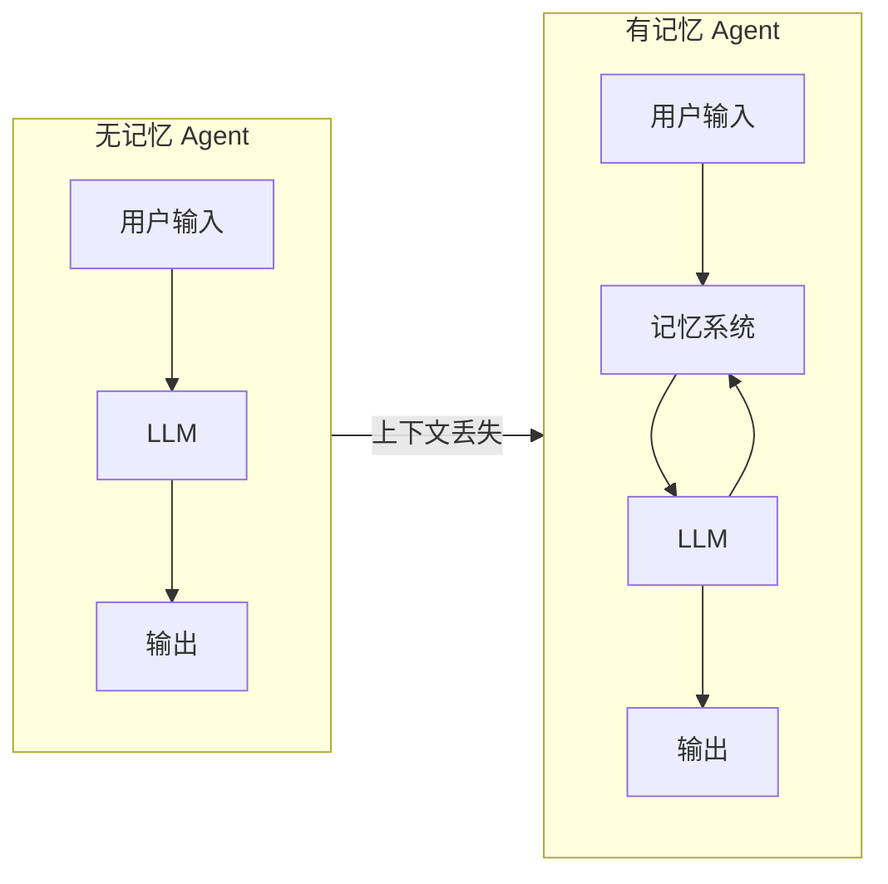
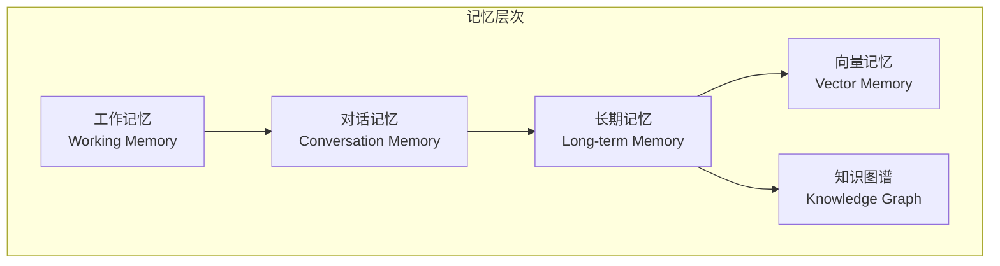

# 记忆系统

> 本文档详细介绍 AI Agent 的记忆系统架构、实现模式和最佳实践。

## 1. 记忆系统概述

### 1.1 为什么 Agent 需要记忆



### 1.2 记忆类型分类

| 类型 | 容量 | 持续时间 | 用途 |
|------|------|---------|------|
| **工作记忆** | 5-9 项 | 当前会话 | 信息暂存、推理中间结果 |
| **对话记忆** | 上下文窗口 | 会话期间 | 保持对话连贯性 |
| **会话记忆** | 数千条消息 | 可配置 | 长期对话上下文 |
| **向量记忆** | 无限制 | 持久化 | 语义检索、经验复用 |
| **图谱记忆** | 结构化 | 持久化 | 实体关系、推理 |
| **程序记忆** | 技能/模式 | 持久化 | 如何做事的知识 |

### 1.3 记忆层次结构



## 2. 短期记忆

### 2.1 工作记忆设计

```typescript
// core/working-memory.ts

interface WorkingMemoryItem {
  id: string;
  content: any;
  type: 'fact' | 'task' | 'constraint' | 'context';
  importance: number;        // 0-1, 重要性评分
  activationLevel: number; // 0-1, 当前激活程度
  createdAt: number;
  accessedAt: number;
  accessCount: number;
}

export class WorkingMemory {
  private items: Map<string, WorkingMemoryItem> = new Map();
  private maxCapacity: number = 7;  // Miller's Law

  add(item: Omit<WorkingMemoryItem, 'id' | 'createdAt' | 'accessedAt' | 'accessCount'>): string {
    const id = generateId();
    const fullItem: WorkingMemoryItem = {
      ...item,
      id,
      createdAt: Date.now(),
      accessedAt: Date.now(),
      accessCount: 0,
    };

    // 如果容量已满，移除最低优先级项
    if (this.items.size >= this.maxCapacity) {
      this.evictLowestPriority();
    }

    this.items.set(id, fullItem);
    return id;
  }

  get(id: string): WorkingMemoryItem | undefined {
    const item = this.items.get(id);
    if (item) {
      item.accessCount++;
      item.accessedAt = Date.now();
      item.activationLevel = Math.min(1, item.activationLevel + 0.1);
    }
    return item;
  }

  recall(query: string): WorkingMemoryItem[] {
    // 基于激活程度和相关性召回
    return Array.from(this.items.values())
      .filter(item => item.activationLevel > 0.3)
      .sort((a, b) => b.activationLevel - a.activationLevel);
  }

  private evictLowestPriority(): void {
    let minPriority = Infinity;
    let evictId: string | null = null;

    for (const [id, item] of this.items) {
      const priority = item.importance * item.activationLevel;
      if (priority < minPriority) {
        minPriority = priority;
        evictId = id;
      }
    }

    if (evictId) this.items.delete(evictId);
  }

  decay(): void {
    // 衰减激活水平，模拟遗忘
    for (const item of this.items.values()) {
      item.activationLevel *= 0.9;
      if (item.activationLevel < 0.1) {
        // 即将遗忘，考虑转移到长期记忆
        this.promoteToLongTerm(item);
      }
    }
  }

  private promoteToLongTerm(item: WorkingMemoryItem): void {
    // 子类实现：将重要项转移到长期记忆
  }
}
```

### 2.2 对话上下文管理

```typescript
// context/dialogue-context.ts

interface DialogueMessage {
  id: string;
  role: 'user' | 'assistant' | 'system' | 'tool';
  content: string;
  timestamp: number;
  tokenCount: number;
  metadata?: Record<string, any>;
}

export class DialogueContext {
  private messages: DialogueMessage[] = [];
  private maxTokens: number = 100000;  // Claude 上下文窗口
  private currentBudget: number;

  constructor(maxTokens: number = 100000) {
    this.maxTokens = maxTokens;
    this.currentBudget = maxTokens;
  }

  addMessage(message: Omit<DialogueMessage, 'id' | 'timestamp' | 'tokenCount'>): string {
    const tokenCount = this.estimateTokens(message.content);
    const id = generateId();

    const fullMessage: DialogueMessage = {
      ...message,
      id,
      timestamp: Date.now(),
      tokenCount,
    };

    this.messages.push(fullMessage);
    this.currentBudget -= tokenCount;

    // 如果超过预算，压缩历史
    if (this.currentBudget < 0) {
      this.compress();
    }

    return id;
  }

  getMessages(): DialogueMessage[] {
    return [...this.messages];
  }

  getRecentMessages(count: number): DialogueMessage[] {
    return this.messages.slice(-count);
  }

  private estimateTokens(text: string): number {
    // 粗略估算：中文约 2 字符/token，英文约 4 字符/token
    return Math.ceil(text.length / 3);
  }

  private compress(): void {
    // 保留最近的消息和系统提示，压缩中间部分
    const systemMessages = this.messages.filter(m => m.role === 'system');
    const recentMessages = this.messages.slice(-10); // 保留最近 10 条

    // 压缩中间消息为摘要
    const middleMessages = this.messages.slice(0, -10);
    const summary = this.summarize(middleMessages);

    this.messages = [
      ...systemMessages,
      { role: 'system' as const, content: `[ Earlier conversation summary: ${summary} ]`, id: 'summary', timestamp: Date.now(), tokenCount: this.estimateTokens(summary) },
      ...recentMessages,
    ];

    this.currentBudget = this.maxTokens - this.messages.reduce((sum, m) => sum + m.tokenCount, 0);
  }

  private summarize(messages: DialogueMessage[]): string {
    if (messages.length === 0) return '';
    // 简化：返回消息计数和主题
    return `${messages.length} messages discussing ${messages[0]?.content.slice(0, 50)}...`;
  }
}
```

## 3. 长期记忆

### 3.1 向量记忆系统

```typescript
// memory/vector-memory.ts

interface MemoryEntry {
  id: string;
  content: string;
  embedding: number[];
  metadata: {
    type: 'experience' | 'knowledge' | 'preference' | 'fact';
    createdAt: number;
    accessedAt: number;
    accessCount: number;
    importance: number;
    tags: string[];
    source?: string;
  };
}

export class VectorMemory {
  private entries: Map<string, MemoryEntry> = new Map();
  private index: Map<string, Set<string>> = new Map();  // 标签索引

  async add(content: string, metadata: MemoryEntry['metadata']): Promise<string> {
    const id = generateId();
    const embedding = await this.embed(content);

    const entry: MemoryEntry = {
      id,
      content,
      embedding,
      metadata: {
        ...metadata,
        createdAt: Date.now(),
        accessedAt: Date.now(),
        accessCount: 0,
      },
    };

    this.entries.set(id, entry);

    // 更新标签索引
    for (const tag of metadata.tags) {
      if (!this.index.has(tag)) {
        this.index.set(tag, new Set());
      }
      this.index.get(tag).add(id);
    }

    return id;
  }

  async search(query: string, topK: number = 5): Promise<MemoryEntry[]> {
    const queryEmbedding = await this.embed(query);
    const entries = Array.from(this.entries.values());

    // 计算余弦相似度
    const scored = entries.map(entry => ({
      entry,
      score: this.cosineSimilarity(queryEmbedding, entry.embedding),
    }));

    // 按相似度排序
    scored.sort((a, b) => b.score - a.score);

    // 更新访问统计
    for (const item of scored.slice(0, topK)) {
      item.entry.metadata.accessedAt = Date.now();
      item.entry.metadata.accessCount++;
    }

    return scored.slice(0, topK).map(s => s.entry);
  }

  private async embed(text: string): Promise<number[]> {
    // 调用 embedding API
    // 简化实现
    return Array(1536).fill(0).map(() => Math.random());
  }

  private cosineSimilarity(a: number[], b: number[]): number {
    let dotProduct = 0;
    let normA = 0;
    let normB = 0;

    for (let i = 0; i < a.length; i++) {
      dotProduct += a[i] * b[i];
      normA += a[i] * a[i];
      normB += b[i] * b[i];
    }

    return dotProduct / (Math.sqrt(normA) * Math.sqrt(normB));
  }

  // 按标签搜索
  searchByTag(tag: string): MemoryEntry[] {
    const ids = this.index.get(tag);
    if (!ids) return [];
    return Array.from(ids).map(id => this.entries.get(id)).filter(Boolean) as MemoryEntry[];
  }

  // 删除记忆
  forget(id: string): void {
    const entry = this.entries.get(id);
    if (!entry) return;

    // 清理标签索引
    for (const tag of entry.metadata.tags) {
      this.index.get(tag)?.delete(id);
    }

    this.entries.delete(id);
  }

  // 更新记忆
  update(id: string, content: string): void {
    const entry = this.entries.get(id);
    if (!entry) return;

    entry.content = content;
    entry.embedding = this.embed(content);
  }
}
```

### 3.2 知识图谱记忆

```typescript
// memory/knowledge-graph.ts

// 第 1 段：定义图谱的数据契约——节点与边（接口层）
// 为什么先把结构抽成接口：算法只依赖字段形状，后续换存储/序列化（DB、JSON、图库）不用改推理逻辑。
// 关键数据流：Node 的 embeddings 是 name+properties 的派生向量；Edge 用 source/target 的字符串 id 间接引用节点，weight 表示关系强度。
// 易错点：id 必须全局唯一，properties 用 any 会丢失约束；relation 的语义由业务约定，metadata 可选，消费时需判空。
interface KnowledgeNode {
  id: string;
  type: 'entity' | 'concept' | 'event' | 'action';
  name: string;
  properties: Record<string, any>;
  embeddings: number[];
}

interface KnowledgeEdge {
  id: string;
  source: string;
  target: string;
  relation: string;  // 如 "works_for", "located_in", "part_of"
  weight: number;
  metadata?: Record<string, any>;
}

// 第 2 段：类的主体存储——节点表、边表与邻接索引
// 三个 Map 分工：nodes 按 id 存实体，edges 按 id 存边，adjacencyList 把“节点 -> 邻居集合”单独索引，避免每次找邻居都全量扫 edges。
// 为什么邻接表用 Set：邻居 id 天然去重；但它不记录关系类型，要拿 relation 还得回到 edges 按边 id 查。
// 边界条件：addEdge 会双向写邻接表，所以本类当前把图当作“无向可达”来用；若业务要求有向，必须只写 source 一侧。
export class KnowledgeGraph {
  private nodes: Map<string, KnowledgeNode> = new Map();
  private edges: Map<string, KnowledgeEdge> = new Map();
  private adjacencyList: Map<string, Set<string>> = new Map();

  // 第 3 段：写入实体——addNode（生成 id 与向量后落库）
  // 设计意图：调用方只给业务字段，id 和 embeddings 由图谱内部生成，防止外部覆盖 id 或漏传向量。
  // 关键数据流：先把 name+properties 拼成文本再 embed，所以 properties 的内容与键顺序都会影响向量；写完 nodes 后同步初始化空邻接集。
  // 易错点：generateId 在本文件未定义，需外部导入；若 embed 抛异常，本方法不会写入任何状态；固定 1536 维意味着换模型要同步改维度。
  // 添加实体
  addNode(node: Omit<KnowledgeNode, 'id' | 'embeddings'>): string {
    const id = generateId();  // id 由图谱生成，调用方无法指定
    const fullNode: KnowledgeNode = {
      ...node,
      id,
      embeddings: this.embed(node.name + ' ' + JSON.stringify(node.properties)),  // 向量由业务字段派生，保证同一次写入内自洽
    };

    this.nodes.set(id, fullNode);
    this.adjacencyList.set(id, new Set());  // 新节点先占位，保证 addEdge 时 adjacencyList.get 不会返回 undefined

    return id;
  }

  // 第 4 段：写入关系——addEdge（建边并维护双向邻接）
  // 设计意图：边单独存成对象保留 relation/weight/metadata，同时把邻居关系写进邻接表，让 getNeighbors 能 O(1) 取到候选邻居集合。
  // 关键数据流：edges 存完整边；adjacencyList 在 source 与 target 两侧都加入对方 id，因此后续遍历天然支持无向搜索。
  // 易错点：若 sourceId/targetId 不存在，this.adjacencyList.get(...) 返回 undefined，.add 会抛 TypeError；重复加同一关系不会去重，edges 里会多出一条。
  // 添加关系
  addEdge(sourceId: string, targetId: string, relation: string, weight: number = 1): string {
    const id = generateId();
    const edge: KnowledgeEdge = {
      id,
      source: sourceId,
      target: targetId,
      relation,
      weight,
    };

    this.edges.set(id, edge);
    this.adjacencyList.get(sourceId).add(targetId);  // 正向邻接
    this.adjacencyList.get(targetId).add(sourceId);  // 反向邻接：当前实现按无向边处理

    return id;
  }

  // 第 5 段：广度优先邻居查询——getNeighbors（按深度扩散）
  // 为什么用 BFS：逐层扩展，第一次到达某节点即最短跳数，配合 visited 可安全处理环；队列里带 depth 是为了在 maxDepth 处剪枝。
  // 关键数据流：queue 先放起点 depth=0，出队时才标记 visited；只有 depth>0 的节点才进入结果，所以返回值不含起点自身。
  // 复杂度与边界：每个节点最多出队一次，时间 O(V+E)、空间 O(V)；maxDepth=1 只返回直接邻居，maxDepth 增大时注意结果可能指数级膨胀。
  // 查询：找到实体的所有邻居
  getNeighbors(nodeId: string, maxDepth: number = 1): KnowledgeNode[] {
    const visited = new Set<string>();
    const result: KnowledgeNode[] = [];
    const queue: Array<{ id: string; depth: number }> = [{ id: nodeId, depth: 0 }];  // depth=0 是搜索起点，仅用于展开

    while (queue.length > 0) {
      const { id, depth } = queue.shift();  // while 保证队列非空；严格 TS 可写成 queue.shift()!

      if (visited.has(id)) continue;
      visited.add(id);

      if (depth > 0 && this.nodes.has(id)) {  // 起点不收集，只收集真实可达的邻居
        result.push(this.nodes.get(id));
      }

      if (depth < maxDepth) {  // 只在未达深度上限时继续扩散
        for (const neighborId of this.adjacencyList.get(id) || []) {  // 未注册节点按无邻居处理
          if (!visited.has(neighborId)) {
            queue.push({ id: neighborId, depth: depth + 1 });  // depth+1 表示多走一条边
          }
        }
      }
    }

    return result;
  }

  // 第 6 段：深度优先路径推理——queryPath（枚举所有简单路径）
  // 为什么用 DFS + 回溯：需要列出 start 到 end 的多条路径，递归时用 path 记录“节点+进入该节点的关系”，回溯时 pop 并恢复 visited。
  // 关键数据流：traverse 产出 (edgeId, neighborId)，edge.relation 描述“上一节点 -> 当前节点”的语义；paths 收集完整路径的副本。
  // 易错点与复杂度：visited 是共享可变集合，递归返回后必须 delete；maxDepth 按边数计，start===end 会返回 [[]]；traverse 每次全量扫边，最坏可达 O(路径数 × E)。
  // 推理：基于路径的关系查询
  queryPath(startId: string, endId: string, maxDepth: number = 3): Array<{ node: KnowledgeNode; relation: string }[]> {
    const paths: Array<{ node: KnowledgeNode; relation: string }[]> = [];
    const dfs = (current: string, target: string, path: Array<{ node: KnowledgeNode; relation: string }>, visited: Set<string>) => {
      if (current === target) {
        paths.push([...path]);  // 到达目标：复制 path，避免后续回溯污染已存结果
        return;
      }

      if (path.length >= maxDepth) return;  // 剪枝：已走满 maxDepth 条边

      for (const [edgeId, neighborId] of this.traverse(current, visited)) {  // traverse 内部已用 visited 过滤
        visited.add(neighborId);  // 进入分支前标记，保证路径顶点不重复
        const node = this.nodes.get(neighborId);
        const edge = this.edges.get(edgeId);
        if (node && edge) {  // 防御悬空边：节点或边可能已被删除
          path.push({ node, relation: edge.relation });  // relation 是进入 node 的边语义
          dfs(neighborId, target, path, visited);
          path.pop(); visited.delete(neighborId);  // 回溯：恢复现场，继续尝试其他邻居
        }
      }
    };

    dfs(startId, endId, [], new Set([startId]));  // 起点预先标记 visited，防止绕回起点
    return paths;
  }

  // 第 7 段：无向邻接遍历器——traverse（生成器）
  // 为什么用生成器：把“扫描边找邻居”的逻辑拆出来惰性产出，queryPath 可按需消费，方向判断也只写一处。
  // 关键数据流：遍历所有 edges，若当前节点是 source 且 target 未访问，产出 [edge.id, edge.target]；反向同理，因此等价于无向图。
  // 易错点：变量名 edgeId 实际是 KnowledgeEdge 对象；每次调用 O(E) 全量扫描，没有利用 adjacencyList 的 O(deg) 优势，大图下会成为瓶颈。
  private* traverse(nodeId: string, visited: Set<string>): Generator<[string, string]> {
    for (const edgeId of this.edges.values()) {  // 这里的 edgeId 其实是 KnowledgeEdge 对象
      if (edgeId.source === nodeId && !visited.has(edgeId.target)) {
        yield [edgeId.id, edgeId.target];  // 沿 source -> target 方向
      }
      if (edgeId.target === nodeId && !visited.has(edgeId.source)) {
        yield [edgeId.id, edgeId.source];  // 沿 target -> source 方向，实现无向邻接
      }
    }
  }

  // 第 8 段：向量化占位实现——embed
  // 为什么用随机数：仅作教学占位，让 addNode/相似度流程能跑通；真实语义检索必须替换为模型或缓存服务。
  // 关键边界：固定返回 1536 维；Math.random 每次调用不同，导致同一文本重复向量化不可复现，相似度结果不稳定。
  // 性能提示：生产实现通常批量请求、按 name+properties 的 hash 缓存，避免重复计算和随机结果。
  private embed(text: string): number[] {
    // Embedding 实现
    return Array(1536).fill(0).map(() => Math.random());  // 先建 1536 个 0 占位，再映射成 [0,1) 随机数
  }
}
```
## 4. 记忆实现模式

### 4.1 LangChain Memory API

```python
# langchain/memory-examples.py

from langchain.memory import (
    ConversationBufferMemory,
    ConversationBufferWindowMemory,
    ConversationSummaryMemory,
    VectorStoreRetrieverMemory,
    CombinedMemory,
)
from langchain.chat_models import ChatOpenAI
from langchain.chains import ConversationChain

# 1. Buffer Memory - 保留完整对话历史
memory = ConversationBufferMemory(
    memory_key="history",
    return_messages=True,
    output_key="response"
)

# 2. Window Memory - 只保留最近 N 条
memory = ConversationBufferWindowMemory(
    k=5,  # 只保留最近 5 条对话
    memory_key="history",
    return_messages=True
)

# 3. Summary Memory - 对话摘要
memory = ConversationSummaryMemory(
    llm=ChatOpenAI(temperature=0),
    memory_key="history",
    return_messages=True
)

# 4. Vector Memory - 语义检索
memory = VectorStoreRetrieverMemory(
    retriever=vectorstore.as_retriever(search_kwargs={"k": 5}),
    memory_key="history",
    input_key="input"
)

# 5. Combined Memory - 组合多种记忆
memory = CombinedMemory(
    memories=[
        ConversationBufferWindowMemory(k=3),
        VectorStoreRetrieverMemory(retriever=vectorstore.as_retriever()),
    ]
)

# 使用
chain = ConversationChain(
    llm=ChatOpenAI(),
    memory=memory,
    prompt=custom_prompt
)

response = chain.run("你好")
```

### 4.2 TypeScript 实现

```typescript
// memory/implementations.ts

// Buffer Memory 实现
// 第 1 段：BufferMemory 类的字段声明（滑动窗口的存储与容量）
// 用「固定容量数组」保存最近 N 条消息：容量上限决定能携带多少上下文，
// 直接对应发送给 LLM 的 token 上限，是控制成本与避免超长上下文的第一道闸门。
export class BufferMemory {
  // 私有字段用数组存消息，天然保持插入顺序（时间序），便于按顺序拼接成 prompt。
  private buffer: Array<{ role: string; content: string }> = [];
  private maxMessages: number;

  // 第 2 段：构造函数（设定窗口容量）
  // 默认 100 条是一个保守的折中：既能保留一定历史，又不易撑爆上下文窗口。
  // 容量越界会在 add() 里触发淘汰，因此这里只负责存值、不做校验。
  constructor(maxMessages: number = 100) {
    this.maxMessages = maxMessages;
  }

  // 第 3 段：add —— 追加新消息并执行 FIFO 淘汰
  // 数据流：push 入队 → 若超出容量则 shift 弹出最旧一条。
  // 用 shift 而非 splice(0,1) 语义相同，但这里强调的是「丢最旧、留最新」的滑动窗口策略；
  // 易错点：条件必须是 >（先入队再判断），用 >= 会提前丢掉一条，少保留一轮历史。
  add(role: string, content: string): void {
    this.buffer.push({ role, content });
    if (this.buffer.length > this.maxMessages) {
      this.buffer.shift();
    }
  }

  // 第 4 段：getMessages —— 以拷贝形式对外暴露内部状态
  // 用展开运算符浅拷贝外层数组，防止调用方 push/splice 直接篡改内部 buffer；
  // 注意这是浅拷贝：元素对象本身仍共享引用，只读使用时是安全的。
  getMessages(): Array<{ role: string; content: string }> {
    return [...this.buffer];
  }

  // 第 5 段：clear —— 重置窗口
  // 重新赋值为空数组而非 length = 0，避免外部已持有的旧引用被意外清空（保持引用隔离）。
  clear(): void {
    this.buffer = [];
  }

  // 第 6 段：toString —— 序列化为可读文本
  // 把消息数组压成「role: content」逐行拼接的字符串，方便日志打印或人工调试；
  // 复杂度 O(n)，n 受 maxMessages 限制，实际是常数级开销。
  toString(): string {
    return this.buffer
      .map(m => `${m.role}: ${m.content}`)
      .join('\n');
  }
}

// Summary Memory 实现
// 第 7 段：SummaryMemory 类的字段声明（摘要 + 近期原文的混合记忆）
// 设计意图：旧内容压缩成一段 summary（省 token），最近的对话保留原文（保精度）；
// 这样既避免无界增长，又不至于因摘要丢失最近的关键细节。
export class SummaryMemory {
  private summary: string = '';
  private recentMessages: Array<{ role: string; content: string }> = [];
  private llm: LLMAdapter;
  // 阈值定为 10：攒够一小批再总结，减少调用次数（省钱、降低延迟），又不会拖太久。
  private maxRecentMessages: number = 10;

  // 第 8 段：构造函数（依赖注入 LLM，便于替换/测试）
  // 把 LLMAdapter 从外部注入而不是内部 new，方便切换模型或在测试中塞入 mock。
  constructor(llm: LLMAdapter) {
    this.llm = llm;
  }

  // 第 9 段：update —— 入口方法，攒够阈值就触发一次总结
  // 先无条件入队，再判断阈值；到达阈值即 await 总结，保证此方法返回时状态是「已压缩」的。
  // 边界点：条件用 >=，即第 10 条进来时就立刻总结（含当条），阈值语义为「达到即触发」。
  async update(newMessage: { role: string; content: string }): Promise<void> {
    this.recentMessages.push(newMessage);

    if (this.recentMessages.length >= this.maxRecentMessages) {
      await this.summarize();
    }
  }

  // 第 10 段：summarize —— 调用 LLM 把近期消息压缩进 summary
  // 先把近期消息格式化成一段文本，再用「系统提示约束任务 + 用户消息承载内容」的结构提交；
  // 关键数据流：生成结果写回 this.summary，然后清空 recentMessages，形成「压缩—清空」循环。
  // 易错点：若清空前发生异常或提前 return，会导致重复总结同一批消息，这里用 await 串行保证单次执行。
  private async summarize(): Promise<void> {
    const messages = this.recentMessages.map(m => `${m.role}: ${m.content}`).join('\n');

    const response = await this.llm.complete({
      messages: [
        { role: 'system', content: '请将以下对话总结为一个简洁的摘要，保留关键信息和结论。' },
        { role: 'user', content: messages },
      ],
      model: 'claude-3-5-haiku-20241022',  // 使用便宜的模型一方面降低成本，另一方面因为摘要任务简单，不需要强模型。
    });

    this.summary = response.content;
    this.recentMessages = [];
  }

  // 第 11 段：getContext —— 组装最终上下文（摘要 + 近期原文）
  // 返回「summary + 空行 + 近期逐行消息」，用空行把压缩历史与实时对话分隔，便于模型区分。
  // 边界情况：首次调用时 summary 为空，会多出前导换行，属于无害的格式瑕疵；如需干净输出可后续 trim。
  getContext(): string {
    return this.summary + '\n\n' + this.recentMessages.map(m => `${m.role}: ${m.content}`).join('\n');
  }
}
```
## 5. 上下文管理

### 5.1 上下文窗口限制

```typescript
// context/token-manager.ts

interface TokenBudget {
  maxTokens: number;
  systemPrompt: number;
  context: number;
  reserved: number;
}

export class TokenManager {
  private budgets: TokenBudget;

  constructor(maxTokens: number = 100000) {
    this.budgets = {
      maxTokens,
      systemPrompt: 5000,   // 系统提示预留
      context: maxTokens - 10000,  // 上下文空间
      reserved: 5000,        // 输出预留
    };
  }

  allocate(messages: Array<{ content: string; role: string }>): {
    included: Array<{ content: string; role: string }>;
    overflow: Array<{ content: string; role: string }>;
  } {
    const included: Array<{ content: string; role: string }> = [];
    let usedTokens = this.budgets.systemPrompt + this.budgets.reserved;

    // 从新到旧添加消息
    const sorted = [...messages].reverse();

    for (const msg of sorted) {
      const msgTokens = this.estimateTokens(msg.content);

      if (usedTokens + msgTokens <= this.budgets.context + this.budgets.systemPrompt) {
        included.unshift(msg);
        usedTokens += msgTokens;
      } else {
        // 需要截断或总结
        included.unshift(this.truncateMessage(msg, this.budgets.context - usedTokens));
        break;
      }
    }

    const overflow = messages.filter(m => !included.includes(m));
    return { included, overflow };
  }

  private estimateTokens(text: string): number {
    return Math.ceil(text.length / 3);
  }

  private truncateMessage(msg: { content: string; role: string }, maxTokens: number): { content: string; role: string } {
    const maxChars = maxTokens * 3;
    const truncated = msg.content.slice(0, maxChars);
    return { ...msg, content: '[...] ' + truncated };
  }
}
```

### 5.2 记忆压缩策略

```typescript
// context/compression-strategies.ts

export class CompressionStrategies {
  // 1. 滑动窗口
  static slidingWindow(messages: any[], windowSize: number): any[] {
    if (messages.length <= windowSize) return messages;
    return messages.slice(-windowSize);
  }

  // 2. 摘要压缩
  static async summarize(messages: any[], llm: LLMAdapter): Promise<string> {
    const content = messages.map(m => `${m.role}: ${m.content}`).join('\n');
    const response = await llm.complete({
      messages: [
        { role: 'system', content: '将以下对话压缩为关键点摘要。' },
        { role: 'user', content },
      ],
      model: 'claude-3-5-haiku-20241022',
    });
    return response.content;
  }

  // 3. 重要性过滤
  static importanceFilter(messages: any[], threshold: number = 0.5): any[] {
    return messages.filter(msg => {
      const importance = this.calculateImportance(msg);
      return importance >= threshold;
    });
  }

  private static calculateImportance(message: any): number {
    // 基于关键词、角色、长度等计算重要性
    let score = 0.5;

    if (message.role === 'user') score += 0.2;
    if (message.content.length > 100) score += 0.1;

    const keywords = ['重要', '关键', '必须', '不要', '记得'];
    for (const kw of keywords) {
      if (message.content.includes(kw)) score += 0.1;
    }

    return Math.min(1, score);
  }

  // 4. 分层压缩
  static hierarchical(messages: any[], levels: number = 3): Map<number, any[]> {
    const result = new Map<number, any[]>();

    for (let i = 0; i < levels; i++) {
      result.set(i, []);
    }

    // 近期的消息保留详细
    const recentCount = Math.ceil(messages.length * 0.3);
    result.set(0, messages.slice(-recentCount));

    // 中期的消息摘要
    const midCount = Math.ceil(messages.length * 0.3);
    result.set(1, messages.slice(-recentCount - midCount, -recentCount));

    // 早期的大量压缩
    result.set(2, messages.slice(0, -recentCount - midCount));

    return result;
  }
}
```

## 6. 高级记忆模式

### 6.1 情景记忆

```typescript
// memory/episodic-memory.ts

// 第 1 段：数据结构定义（刻画一条"有始有终的经历"的数据契约）
// Episode 把一段经历拆成四层：时间边界（start/end）、情境（context）、过程（events）、反思（lessons）。
// importance 字段是为后续检索排序预留的权重，type 用字面量联合让事件可被分类处理。
// 易错点：endTime 可选——只有调用 endEpisode 后才闭环，未闭环的属于"进行中"情节。
interface Episode {
  id: string;
  title: string;
  description: string;
  startTime: number;
  endTime?: number;
  context: {
    task?: string;
    goal?: string;
    outcome?: string;
  };
  events: Array<{
    timestamp: number;
    type: 'action' | 'observation' | 'decision' | 'result';
    content: string;
    importance: number;
  }>;
  lessons: string[];
  tags: string[];
}

// 第 2 段：类骨架（双存储设计：权威数据 + 语义索引）
// episodes 用 Map 保证按 id 取回是 O(1)，它是权威原始数据；
// vectorIndex 只存语义摘要，负责模糊召回，二者职责分离、写入时需同步维护。
// 构造器注入 VectorMemory 而非内部 new，是为了解耦实现、便于替换与测试。
export class EpisodicMemory {
  private episodes: Map<string, Episode> = new Map();
  private vectorIndex: VectorMemory;

  constructor(vectorIndex: VectorMemory) {
    this.vectorIndex = vectorIndex;
  }

  // 第 3 段：创建情节（先落内存，再同步到向量库）
  // 参数用 Partial<Episode> 让调用方只传关心字段，其余走默认值；
  // startTime 强制取当前时间而不由外部传入，保证时间线的因果可信。
  async createEpisode(context: Partial<Episode>): Promise<string> {
    const id = generateId();
    const episode: Episode = {
      id,
      title: context.title || 'Untitled Episode',
      description: context.description || '',
      startTime: Date.now(),
      context: context.context || {},
      events: context.events || [],
      lessons: context.lessons || [],
      tags: context.tags || [],
    };

    this.episodes.set(id, episode);

    // 索引到向量存储
    // 只拼标题/描述/task 作为 embedding 文本（不含全量 events）：控制 token 成本并让召回聚焦主题。
    // importance 固定 0.8 表示情节级记忆权重较高；易错点：add 未回传 episode.id，
    // 检索时如何映射回原对象取决于 VectorMemory 的实现约定。
    await this.vectorIndex.add(
      `Episode: ${episode.title}. ${episode.description}. ${episode.context.task || ''}`,
      {
        type: 'episode',
        tags: episode.tags,
        importance: 0.8,
      }
    );

    return id;
  }

  // 第 4 段：追加事件（只动内存，不碰向量索引）
  // 事件是情节内的高频细粒度数据，逐条向量化性价比低，因此召回粒度保持在 episode 级；
  // 找不到 id 直接抛错，避免静默写入到一个不存在的对象上导致数据丢失。
  async addEvent(episodeId: string, event: Episode['events'][0]): Promise<void> {
    const episode = this.episodes.get(episodeId);
    if (!episode) throw new Error('Episode not found');

    episode.events.push(event);
  }

  // 第 5 段：结束情节（补全 endTime/outcome 并触发反思流程）
  // 先写 outcome 再抽教训，保证 extractLessons 读到的 context 已完整；
  // await 让教训提炼成为收尾的一部分，调用方返回时情节已完成闭环。
  async endEpisode(episodeId: string, outcome: string): Promise<void> {
    const episode = this.episodes.get(episodeId);
    if (!episode) throw new Error('Episode not found');

    episode.endTime = Date.now();
    episode.context.outcome = outcome;

    // 提取教训
    await this.extractLessons(episode);
  }

  // 第 6 段：教训抽取（LLM 占位实现）
  // 把事件内容拼成长文本一次性喂给模型，而非逐条多次调用，让模型能跨事件做因果归纳；
  // 当前是空实现：eventText 已备好，但 LLM 调用与 lessons 回填尚待补全。
  private async extractLessons(episode: Episode): Promise<void> {
    // 使用 LLM 从事件中提取教训
    const eventText = episode.events.map(e => e.content).join('\n');
    // ... LLM 调用提取教训
  }

  // 第 7 段：相似情节召回（向量粗筛 + 内存精修）
  // 先按语义取 limit 条，再用 metadata.type 过滤掉非 episode 的索引项，
  // 然后回 Map 换成完整对象；filter(Boolean) 剔除已被删除/不存在的 id。
  // 易错点：末尾 as Episode[] 只是类型断言，运行时并不保证非空，调用方需自行判空。
  async retrieveSimilar(query: string, limit: number = 5): Promise<Episode[]> {
    const results = await this.vectorIndex.search(query, limit);
    return results
      .filter(r => r.metadata.type === 'episode')
      .map(r => this.episodes.get(r.id))
      .filter(Boolean) as Episode[];
  }
}
```
### 6.2 程序记忆

```typescript
// memory/procedural-memory.ts

// 第 1 段：技能数据结构（Skill）——定义"程序性记忆"的最小单元
// 程序性记忆存的是"怎么做一件事"，而非事实本身，所以这里用 steps 描述可执行流程，
// 用 triggerConditions 描述"何时该想起这个技能"。usageCount/lastUsed 是后续排序与
// 遗忘策略的元数据，教学中可强调：结构体字段的选择直接决定上层检索算法的能力上限。
interface Skill {
  id: string;
  name: string;
  description: string;
  triggerConditions: string[];
  steps: Array<{
    action: string;
    parameters?: Record<string, any>;
    expectedOutcome?: string;
  }>;
  prerequisites: string[];
  successCriteria: string[];
  examples: Array<{
    input: string;
    output: string;
  }>;
  lastUsed?: number;
  usageCount: number;
}

// 第 2 段：类声明与内部状态——双索引设计
// skills 是主存储（按 id 取技能），triggerIndex 是倒排索引（触发词 -> 技能 id 集合）。
// 易错点：集合里存的是 id 而非 Skill 对象，避免同一技能被多处持有时出现引用与更新不一致。
export class ProceduralMemory {
  private skills: Map<string, Skill> = new Map();
  private triggerIndex: Map<string, Set<string>> = new Map();

  // 第 3 段：register——写入技能并同步维护倒排索引
  // 顺序很关键：必须先落主存储，再建索引；同一技能多次 register 会覆盖主存储但索引里的
  // id 是 Set，天然去重。复杂度：O(触发词数)，与技能总数无关。
  register(skill: Skill): void {
    this.skills.set(skill.id, skill);

    for (const trigger of skill.triggerConditions) {
      if (!this.triggerIndex.has(trigger)) {
        this.triggerIndex.set(trigger, new Set());
      }
      this.triggerIndex.get(trigger).add(skill.id);
    }
  }

  // 第 4 段：match——基于子串匹配的检索与排序
  // 数据流：遍历倒排索引 -> 命中触发词 -> 由 id 回查 Skill -> 聚合去重（靠 id 天然唯一）。
  // 易错点：双侧 toLowerCase 才能做到大小写不敏感；includes 是子串匹配，会出现"partial"命中
  // "art"这类误召回，是简化实现的已知代价。末尾按 usageCount 降序，即"越常用越优先"。
  match(query: string): Skill[] {
    const matched: Skill[] = [];

    for (const [trigger, skillIds] of this.triggerIndex) {
      if (query.toLowerCase().includes(trigger.toLowerCase())) {
        for (const id of skillIds) {
          const skill = this.skills.get(id);
          if (skill) matched.push(skill);
        }
      }
    }

    return matched.sort((a, b) => b.usageCount - a.usageCount);
  }

  // 第 5 段：execute——按 id 触发技能，并先做使用度记账
  // 同步部分（查表、计数、时间戳）放在 async 之前的同步段完成，保证即使异步步骤失败，
  // 调用统计也已生效。边界条件：找不到技能立即抛错，不进入步骤执行。
  execute(skillId: string, context: any): Promise<any> {
    const skill = this.skills.get(skillId);
    if (!skill) throw new Error('Skill not found');

    skill.usageCount++;
    skill.lastUsed = Date.now();

    return this.executeSteps(skill.steps, context);
  }

  // 第 6 段：executeSteps——串行管线，前一步输出即后一步输入
  // 关键数据流：result 在循环中被不断替换，形如折叠（fold）；必须串行 await，
  // 因为后一步可能依赖前一步产生的副作用/结果。复杂度 O(步骤数)，不可并行化。
  private async executeSteps(steps: Skill['steps'], context: any): Promise<any> {
    let result = context;

    for (const step of steps) {
      // 执行步骤
      result = await this.executeAction(step.action, step.parameters, result);
    }

    return result;
  }

  // 第 7 段：executeAction——动作分发占位实现
  // 设计意图：把"调度逻辑"与"具体动作实现"解耦，真实系统里这里通常是
  // switch(action) 或策略注册表；当前为教学桩，原样透传 context 并返回成功。
  // 注意它按约定返回 Promise，因此上层可用 await 链式编排。
  private async executeAction(action: string, params: any, context: any): Promise<any> {
    // 根据 action 类型执行不同操作
    // ...
    return { success: true, result: context };
  }

  // 从经验中学习新技能
  // 第 8 段：learnFromExperience——把自然语言经验固化为可复用技能
  // 意图：先由描述自动抽取触发词（见 extractTriggers），再以空数组初始化前置条件、
  // 成功标准与示例——这些字段留给后续人工/其他模块补全。返回 id 供调用方后续索取。
  async learnFromExperience(description: string, steps: any[]): Promise<string> {
    const skillId = generateId();
    const skill: Skill = {
      id: skillId,
      name: description.slice(0, 50),
      description,
      triggerConditions: this.extractTriggers(description),
      steps,
      prerequisites: [],
      successCriteria: [],
      examples: [],
      usageCount: 0,
    };

    this.register(skill);
    return skillId;
  }

  // 第 9 段：extractTriggers——极简关键词抽取
  // 策略：按空白切词，过滤长度 <=4 的词以排除 the/and 之类高频虚词，取前 5 个作触发词。
  // 易错点：这是英文语境的启发式，对中文无效；也未去重、未做词形还原，属可替换的占位实现。
  private extractTriggers(description: string): string[] {
    // 简单提取关键词作为触发条件
    const words = description.split(/\s+/).filter(w => w.length > 4);
    return words.slice(0, 5);
  }
}
```
## 7. 代码实现

### 7.1 完整 Agent 记忆系统

```typescript
// agent/memory-system.ts

export interface AgentMemoryConfig {
  workingMemorySize: number;
  maxContextTokens: number;
  enableLongTermMemory: boolean;
  enableKnowledgeGraph: boolean;
  compressionThreshold: number;
}

export class AgentMemorySystem {
  private workingMemory: WorkingMemory;
  private dialogueContext: DialogueContext;
  private vectorMemory: VectorMemory;
  private knowledgeGraph: KnowledgeGraph;
  private episodicMemory: EpisodicMemory;
  private proceduralMemory: ProceduralMemory;
  private config: AgentMemoryConfig;

  constructor(config: AgentMemoryConfig) {
    this.config = config;
    this.workingMemory = new WorkingMemory();
    this.dialogueContext = new DialogueContext(config.maxContextTokens);
    this.vectorMemory = new VectorMemory();
    this.knowledgeGraph = new KnowledgeGraph();
  }

  // 添加用户消息到记忆
  addUserMessage(content: string): void {
    this.dialogueContext.addMessage({ role: 'user', content });

    // 提取关键信息到工作记忆
    const keyInfo = this.extractKeyInfo(content);
    for (const info of keyInfo) {
      this.workingMemory.add({
        content: info,
        type: 'context',
        importance: 0.8,
        activationLevel: 1,
      });
    }
  }

  // 添加助手回复到记忆
  addAssistantMessage(content: string): void {
    this.dialogueContext.addMessage({ role: 'assistant', content });
  }

  // 获取当前上下文
  getContext(): { messages: any[]; workingItems: any[] } {
    return {
      messages: this.dialogueContext.getMessages(),
      workingItems: this.workingMemory.recall(''),
    };
  }

  // 搜索长期记忆
  async searchMemory(query: string): Promise<any[]> {
    return this.vectorMemory.search(query);
  }

  // 存储重要经验
  async storeExperience(content: string, metadata: any): Promise<void> {
    await this.vectorMemory.add(content, {
      type: 'experience',
      importance: metadata.importance || 0.7,
      tags: metadata.tags || [],
    });
  }

  // 更新知识图谱
  addKnowledge(entity: string, relations: Array<{ target: string; relation: string }>): void {
    const entityId = this.knowledgeGraph.addNode({
      type: 'entity',
      name: entity,
      properties: {},
    });

    for (const rel of relations) {
      let targetId = this.findNode(rel.target);
      if (!targetId) {
        targetId = this.knowledgeGraph.addNode({
          type: 'entity',
          name: rel.target,
          properties: {},
        });
      }
      this.knowledgeGraph.addEdge(entityId, targetId, rel.relation);
    }
  }

  private findNode(name: string): string | undefined {
    // 简化实现
    return undefined;
  }

  private extractKeyInfo(content: string): string[] {
    // 简单提取关键信息
    const patterns = [
      /文件.*?(\S+\.\w+)/g,  // 文件名
      /模块.*?(\S+)/g,        // 模块名
      /问题.*?(.+?)(?:\。|$)/g, // 问题描述
    ];

    const info: string[] = [];
    for (const pattern of patterns) {
      const matches = content.matchAll(pattern);
      for (const match of matches) {
        info.push(match[1] || match[0]);
      }
    }
    return info;
  }

  // 压缩和清理
  compress(): void {
    // 触发对话压缩
    this.dialogueContext.compress();
    // 衰减工作记忆
    this.workingMemory.decay();
  }
}
```

### 7.2 使用示例

```typescript
// example/usage.ts

const memory = new AgentMemorySystem({
  workingMemorySize: 7,
  maxContextTokens: 100000,
  enableLongTermMemory: true,
  enableKnowledgeGraph: true,
  compressionThreshold: 0.8,
});

// 添加对话
memory.addUserMessage("我正在开发一个电商系统，需要实现用户认证模块");
memory.addAssistantMessage("好的，我可以帮你实现用户认证模块。你想使用 JWT 还是 Session?");

// 搜索相关经验
const pastExperience = await memory.searchMemory("用户认证 JWT");
console.log("相关经验:", pastExperience);

// 添加知识
memory.addKnowledge("用户认证模块", [
  { target: "JWT", relation: "使用" },
  { target: "OAuth2", relation: "支持" },
]);

// 获取当前上下文
const context = memory.getContext();
console.log("当前上下文:", context);
```

## 8. 总结

记忆系统是 AI Agent 的核心组成部分，决定了 Agent 的长期智能能力。

| 记忆类型 | 实现难度 | 适用场景 |
|---------|---------|---------|
| 工作记忆 | 低 | 短期任务、即时处理 |
| 对话记忆 | 中 | 会话连续性 |
| 向量记忆 | 中 | 语义检索、经验复用 |
| 知识图谱 | 高 | 关系推理、结构化知识 |
| 情景记忆 | 高 | 经验学习、教训提取 |
| 程序记忆 | 高 | 技能学习、模式复用 |

**最佳实践**：
1. 根据场景选择合适的记忆组合
2. 实现有效的上下文压缩机制
3. 定期整理和遗忘不重要记忆
4. 建立记忆索引支持快速检索

## 9. 参考资源

- [LangChain Memory](https://python.langchain.com/docs/modules/memory/)
- [MemGPT](https://github.com/ahmetozlu93/MemGPT)
- [Agent Memory Systems](https://arxiv.org/abs/2309.00127)

---

文档版本：v1.0 | 更新日期：2026-05-15

## 应用与行业实践

### 应用场景地图

| 场景 | 用到本页哪个知识点 | 典型技术选型 | 注意事项 |
| --- | --- | --- | --- |
| 后台管理的万行表格里问"哪个门店退货率最高" | 上下文管理、工具结果裁剪 | 表头与分位数样本进上下文，聚合交给 SQL 执行 | 样本会带来口径偏差，回答里要标注统计范围 |
| 客服机器人跨天续接同一工单 | 长期记忆、情景记忆写入 | 会话结束抽取结构化字段入库，开局按工单号取回 | 写入要带时间戳与来源，旧结论不能覆盖新结论 |
| 低端安卓首屏语音助手 | 短期记忆、token 预算 | 上下文只留最近 3 轮加系统提示，模型走端侧小尺寸 | 冷启动耗时按"首次可交互"计，不按进程启动计 |
| 多人协作白板里的 AI 纪要 | 会话隔离、记忆命名空间 | 以 board_id 作为记忆分区键 | 共享记忆与个人记忆分索引存放 |
| 电商导购 Agent 记住用户尺码与品牌偏好 | 长期记忆写入策略、记忆更新 | 用户显式确认后写画像，冲突时以最新确认为准 | 敏感字段要支持用户查询与删除 |
| 运维告警 Agent 复盘历史故障 | 反思模式、经验记忆检索 | 故障关闭后生成"现象-处置"对入库 | 归因未确认前只存现象，不写根因 |
| 企业知识库问答 | 长期记忆、向量检索 | 关键词加向量的混合检索，再接重排 | 权限过滤放在检索阶段，不能只在展示阶段做 |
| 教辅 App 的错题追踪 | 记忆衰减与复习调度 | 按错误次数与间隔更新掌握度 | 掌握度只由作答事件驱动，不由浏览行为驱动 |
| 长文写作助手续写第三章 | 摘要压缩、分层记忆 | 章节摘要常驻，原文按需检索注入 | 摘要要版本化，能回溯到被压缩的原文 |

### 三个场景拆解

#### 场景 1：客服工单跨天续接

**业务背景**：工单常跨 2 到 3 天处理，单工单消息条数可达几百条。把全部历史塞进上下文，窗口装不下，成本也随轮次线性上涨。

**怎么用本页知识解决**：思路是会话内靠短期记忆，会话结束把用户明示事实抽成长期记忆，新会话按工单号取回事实与摘要。

```python
def close_session(msgs, store):
    # msgs 按时间升序，包含 user 与 assistant 两类角色
    turns = [m for m in msgs if m["role"] in ("user", "assistant")]
    facts = extract_facts(turns)          # 只抽用户明示事实，返回 key/value/quote/ts
    for f in facts:
        f["ticket_id"] = ticket_id(msgs)  # 用业务主键做分区键，避免全局串味
        f["source"] = "session_close"     # 记录写入来源，便于回溯与删除
        store.upsert(f, conflict="latest")  # 同 key 冲突时保留时间戳最新的一条
    summary = summarize(turns[-40:])      # 只压最近一段，控制摘要成本
    store.put(key=ticket_id(msgs), value=summary, kind="summary")
```

- 分区键用业务主键，同一工单的记忆不会串到别的工单。
- 抽取只接受用户明示内容，助手自己的推测不入库。
- 冲突策略固定为保留最新，避免旧结论反复出现。
- 事实与摘要分开存，摘要用于快速开场，事实用于精确回答。
- 写入发生在会话关闭时，每轮都写会让存储与费用随轮次上涨。

**怎么度量收益**：看三个指标：跨会话重复提问率、检索召回命中率、单次请求 token 数。重复提问率靠人工回放固定脚本统计；召回命中率用带标注的问题集计算；token 数取模型返回的 usage 字段。把三项打到 Prometheus，用 Grafana 看周趋势。

**什么时候不该用**：一是单次会话就结束的售前比价，写长期记忆只增加成本。二是工单里含一次性验证码或支付凭证，落库会带来合规风险，只保留会话内即可。

#### 场景 2：IDE 编码助手在万行仓库里做重构

**业务背景**：单文件可达上万行，一次重构会话要跨十几个文件。整仓库塞不进上下文，全量检索又会带进大量无关代码。

**怎么用本页知识解决**：思路是分三层——常驻层放项目约定，检索层按符号取代码片段，会话层放最近改动。

```python
def build_context(query, session, budget_tokens):
    ctx = list(session.pinned)            # 常驻层：项目约定、构建命令
    syms = index.lookup_symbols(query)    # 检索层：按符号名与引用关系查
    for s in syms:
        ctx.append(load_snippet(s, max_lines=80))  # 只取签名与近邻行
    ctx += session.recent_edits[-10:]     # 会话层：最近改动，保证前后连贯
    while count_tokens(ctx) > budget_tokens:
        ctx.pop(0)                        # 超预算时从最旧的片段开始丢
    return ctx
```

- 三层优先级不同，超预算时先牺牲检索层，常驻层不动。
- 检索按符号名和引用关系走，不按文件整体读入。
- 单次注入的片段设行数上限，防止一个大文件吃掉全部预算。
- 每次编辑后把 diff 摘要写回会话层，下一轮无需重新检索。
- 丢弃顺序固定为先进先出，让行为可预测、可回归测试。

**怎么度量收益**：看建议被接受的编辑比例、上下文 token 数、补全首字延迟 P95。接受率靠插件埋点；token 数用 tiktoken 统计；延迟用本地固定重构任务集跑前后对比。

**什么时候不该用**：一是单文件小脚本，直接全量读入即可，分层只增加代码路径。二是生成全新项目脚手架，没有历史可检索，检索层为空，应改用模板。

#### 场景 3：低端安卓上的语音助手首屏

**业务背景**：设备可用内存小，模型走端侧或小尺寸云端模型。从点亮到首次可交互的耗时，是用户最直接的体感来源。

**怎么用本页知识解决**：思路是设备内存里只保留最近若干轮，超出部分落本地库按需取回，上下文预算按设备分档。

```python
BUDGET = {"low": 1200, "mid": 3000}       # 按设备档位的 token 预算
def trim(history, device_class):
    keep, used = [], 0
    for turn in reversed(history):        # 从最近一轮往前遍历
        t = count_tokens(turn["text"])
        if used + t > BUDGET[device_class]:
            break
        keep.append(turn)
        used += t
    return list(reversed(keep))           # 还原时间顺序后再送模型
```

- 保留策略是从最近往前，保证当前这句的指代能解析。
- 预算按设备档位分，不写一个全局常量。
- 被裁掉的历史写本地库，用户追问时按关键词取回。
- 档位由读取的可用内存与实测首字延迟共同决定。
- 裁剪函数要能单独测试，不依赖模型即可跑回归。

**怎么度量收益**：看冷启动到首次可交互的耗时、超预算丢弃轮次占比、离线状态回答可用率。耗时用 Android Studio Profiler 或 Perfetto 采样；另两项在埋点里计数。在 2 台低端机型上跑固定 30 条语音脚本，记 P50 与 P95。

**什么时候不该用**：一是格式固定的语音开户流程，轮次少，全量携带即可。二是离线且不允许本地落盘的场景，落盘前要先确认合规要求。

### 行业先进实践

分层记忆与自编辑记忆（出处：MemGPT 论文与 Letta 官方文档）。做法是把上下文当作可换页的内存，热数据放主上下文，冷数据放外部存储，模型通过工具调用在两层间搬运。这样做的价值在于把有限窗口留给当前推理。借鉴时先实现"取出"和"写回"两个工具，再调搬运策略。

记忆流加权检索（出处：论文 Generative Agents: Interactive Simulacra of Human Behavior）。检索时按新近度、重要度、相关度三项加权排序，并定期把低层记忆反思成高层结论。把这套打分写成显式函数，便于调参和回归测试。

会话状态持久化（出处：LangChain 与 LangGraph 官方文档中的 persistence 与 checkpointer）。做法是每一步图状态落库，按 thread_id 恢复执行。借鉴点是把记忆写入放在图节点边界，不散落在业务代码里。需核对官方文档：checkpointer 支持的存储后端与 thread_id 的语义。

上下文编辑与记忆工具（出处：Anthropic 官方文档）。官方提供了服务端侧的上下文清理与外部记忆工具，减少手写裁剪逻辑。需核对官方文档：可用模型范围、工具参数与计费方式。适合先在小流量入口验证行为差异。

时序知识图谱记忆（出处：开源项目 Graphiti 与 Zep 官方文档）。把事实存成带有效时间区间的三元组，新事实到来时让旧事实失效，而不是直接覆盖。查询时按时间过滤。借鉴方式是为每条记忆加 valid_from 与 valid_to 两个字段。

### 从学到用：落地路线

第 1 步试点：选一个会话跨度超过一天的单一入口，只在该入口读写记忆。验收标准是埋点能分开统计"命中记忆"与"未命中记忆"两类请求。

第 2 步验证：用固定回放脚本对比开启与关闭记忆两种情况。验收标准是重复提问率、召回命中率、单次请求 token 数三项都有基线数值。

第 3 步推广：把记忆读写收敛到一个模块，其他入口只调用接口。验收标准是新增入口接入记忆时不用改记忆模块代码。

第 4 步防回退：把三项指标接入告警，并保留一键关闭记忆的开关。验收标准是关闭后系统行为回到基线，且关闭操作在 5 分钟内可完成。

### 动手作业

目标：给一个命令行问答机器人加上跨会话记忆，并产出可复现的度量结果。

步骤：

1. 准备 30 条多轮对话脚本，其中 10 条是在新会话里追问上一会话提过的事实。
2. 实现短期记忆：只保留最近 N 轮，N 可配置，用 tiktoken 统计每次请求的 token 数。
3. 实现长期记忆：会话结束时把用户明示事实抽成 key/value/ts/source 四元组，写入本地 SQLite。
4. 新会话开局按关键词从 SQLite 取回相关事实，拼进系统提示。
5. 加一个 MEMORY=on/off 开关，同一脚本集跑两遍，记录 token 数与回答正确条数。
6. 打印对比表：正确条数、平均 token 数、跨会话追问的失败次数。
7. 支持按 key 删除单条记忆，并重跑第 5 步确认结果随之变化。

验收标准：

- 关闭记忆时，10 条跨会话追问的正确条数为 0，说明测试集确实覆盖了跨会话。
- 打开记忆后，跨会话追问正确条数上升，且平均 token 数不超过关闭时的 1.5 倍。
- 每条记忆都能查到写入时间与来源会话 id。
- 删除某条记忆后，依赖该事实的问题回答随之改变。
- 第 5 步的对比表可由一条命令复现，脚本与数据一并提交。

