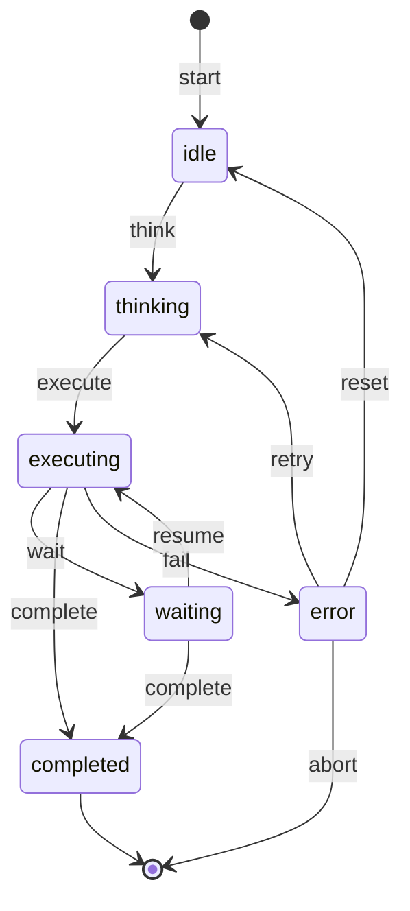
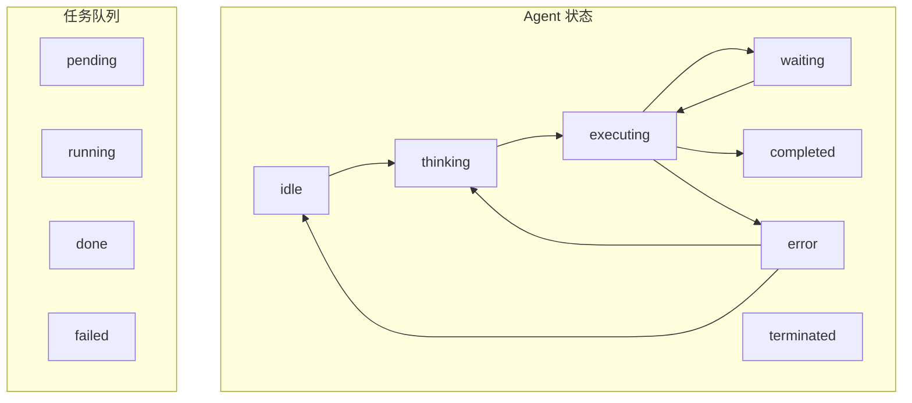

# 状态机与编排

本文档涵盖 Agent 状态机设计、任务编排系统、并行执行模式及错误恢复策略。

## 1. 状态机基础

### 1.1 状态定义

状态机由有限状态集合和状态转换规则组成。

```typescript
// 状态定义
type State = string;
type Event = string;
type TransitionFn = (context: Context) => State | Promise<State>;

// 基础状态机接口
interface StateMachine<S extends string, E extends string> {
  getState(): S;
  transition(event: E): Promise<void>;
  onTransition(from: S, to: S, handler: () => void): void;
}

// 上下文对象
interface StateContext {
  agentId: string;
  taskId: string;
  metadata: Record<string, unknown>;
  timestamp: number;
}
```

### 1.2 状态转换规则

```typescript
// 转换规则定义
interface TransitionRule<S extends string, E extends string> {
  from: S | '*';           // '*' 表示任意状态
  event: E;
  to: S;
  condition?: (ctx: StateContext) => boolean;
  guard?: string;          // 守卫名称
}

// 规则表
const rules: TransitionRule<string, string>[] = [
  { from: 'idle', event: 'start', to: 'running' },
  { from: 'running', event: 'pause', to: 'paused' },
  { from: 'paused', event: 'resume', to: 'running' },
  { from: 'running', event: 'complete', to: 'completed' },
  { from: 'running', event: 'error', to: 'failed' },
  { from: '*', event: 'abort', to: 'aborted' },
];
```

### 1.3 状态机实现模式

```typescript
// 状态机工厂
// 第 1 段：构建器状态声明——先"攒定义"，不执行
// 采用 Builder 模式：state/transition/onTransition 只登记并返回 this 以支持链式调用，
// 真正的运行期对象在 build() 时才交给 StateMachineImpl，避免"定义"与"运行"两种职责混在一起。
class StateMachineBuilder<S extends string, E extends string> {
  private states: Set<S> = new Set(); // Set 天然去重，重复声明同一状态不会产生脏数据
  private transitions: Map<string, TransitionRule<S, E>> = new Map(); // 键为 `from:event`，查规则 O(1)
  private handlers: Map<string, Array<() => void | Promise<void>>> = new Map(); // 键为 `from:*:to`，同一转移可挂多个回调

  // 第 2 段：登记合法状态
  // 注意这里只写不查：既不校验重复，也不校验 transition 里的 from/to 是否已在此注册。
  // 也就是说"转移到未声明状态"不会在任何环节被拦截，states 目前基本是透传数据。
  state(s: S): this {
    this.states.add(s);
    return this;
  }

  // 第 3 段：登记一条转移规则，以 `from:event` 作为唯一键
  // 同一 from+event 后写者覆盖先写者（Map.set 语义），这是有意的"后定义优先"。
  // 易错点：这里存进去的 guard 是一个字符串，而运行期读的是 rule.condition，两者不是同一字段。
  transition(from: S, event: E, to: S, guard?: string): this {
    const key = `${from}:${event}`;
    this.transitions.set(key, { from, event, to, guard });
    return this;
  }

  // 第 4 段：注册"到达某状态时"触发的回调，from 传 '*' 表示任意来源
  // 键中间恒为 '*'（`from:*:to`）是刻意的：让同一个 to 可以挂多个 handler 而互不覆盖。
  // 返回值可能是 Promise，运行期会 await，所以这里先不做任何 Promise 处理，只负责收集。
  onTransition(from: S | '*', to: S, handler: () => void | Promise<void>): this {
    const key = `${from}:*:${to}`;
    if (!this.handlers.has(key)) {
      this.handlers.set(key, []);
    }
    this.handlers.get(key)!.push(handler); // ! 断言：上面刚保证过存在，省掉判空分支
    return this;
  }

  // 第 5 段：冻结定义，产出运行期实例
  // 三个集合是引用直接交接（浅共享），所以 build 之后若再调 builder 的方法，
  // 会同步影响已建好的状态机——这是省内存的取舍，也是使用时的陷阱。
  build(initialState: S): StateMachine<S, E> {
    return new StateMachineImpl(this.states, this.transitions, this.handlers, initialState);
  }
}

// 第 6 段：运行期状态机实现——持有当前状态与定义期数据
// currentState 是唯一可变字段，其余三个引用只读共用；因此实例并非并发安全，
// 并发调用 transition 会产生状态竞争（见最后一段的说明）。
class StateMachineImpl<S extends string, E extends string> implements StateMachine<S, E> {
  private currentState: S;
  private states: Set<S>;
  private transitions: Map<string, TransitionRule<S, E>>;
  private handlers: Map<string, Array<() => void | Promise<void>>>;

  // 第 7 段：构造——依赖注入，全部来自 Builder
  // 形参顺序 (states, transitions, handlers, initialState) 与 build 的调用严格对应，改序即崩。
  // 边界缺口：这里没有校验 initialState 是否真的在 states 集合中。
  constructor(
    states: Set<S>,
    transitions: Map<string, TransitionRule<S, E>>,
    handlers: Map<string, Array<() => void | Promise<void>>>,
    initialState: S
  ) {
    this.states = states;
    this.transitions = transitions;
    this.handlers = handlers;
    this.currentState = initialState;
  }

  // 第 8 段：只读访问器，O(1) 取当前状态
  getState(): S {
    return this.currentState;
  }

  // 第 9 段：核心转移——先精确匹配 `cur:event`，失败再退化为 `*:event` 通配
  // 用 || 短路回退：精确规则优先、通配兜底，两者共存时通配永远盖不住精确规则。
  // 但 Builder 没有任何 API 能写入 `*:event`，所以通配分支目前只是"预留接口"。
  async transition(event: E): Promise<void> {
    const key = `${this.currentState}:${event}`;
    const wildcardKey = `*:${event}`;
    
    const rule = this.transitions.get(key) || this.transitions.get(wildcardKey);
    
    // 第 10 段：无规则即快速失败
    // 抛错而非静默忽略，是为了让非法事件在调用点立刻暴露；错误信息带上 event 与当前状态便于定位。
    if (!rule) {
      throw new Error(`No transition for event '${event}' from state '${this.currentState}'`);
    }

    // 第 11 段：守卫条件校验，必须发生在状态写入之前
    // `{} as StateContext` 是当前实现的简化：守卫拿不到真实上下文，依赖外部数据的守卫会失效；
    // 守卫按同步返回 boolean 处理（未 await），异步守卫返回的 Promise 恒为真值会被误判通过。
    if (rule.condition && !rule.condition({} as StateContext)) {
      throw new Error(`Guard condition failed for transition ${this.currentState} --[${event}]--> ${rule.to}`);
    }

    // 第 12 段：提交状态变更并串行执行回调
    // 先取 fromState 再改 currentState，避免回调里读到已变更的状态而丢失来源信息；
    // for 循环内 await 是刻意的串行语义，保证 handler 执行顺序与注册顺序一致。
    // 最大易错点：某个 handler 抛错时状态已被改写、后续 handler 不再执行，且没有任何回滚。
    const fromState = this.currentState;
    this.currentState = rule.to;

    // 触发 handlers
    const handlers = this.handlers.get(`${fromState}:*:${rule.to}`) || [];
    for (const handler of handlers) {
      await handler();
    }
  }
}
```
## 2. Agent 状态机实现

### 2.1 Agent 状态定义

```typescript
// Agent 生命周期状态
enum AgentState {
  IDLE = 'idle',           // 空闲，等待任务
  THINKING = 'thinking',    // 思考中，分析任务
  EXECUTING = 'executing',  // 执行中，调用工具
  WAITING = 'waiting',     // 等待中，等待外部响应
  COMPLETED = 'completed', // 已完成
  ERROR = 'error',         // 错误状态
  PAUSED = 'paused',       // 暂停
  TERMINATED = 'terminated' // 已终止
}

// Agent 事件
enum AgentEvent {
  START = 'start',
  THINK = 'think',
  EXECUTE = 'execute',
  WAIT = 'wait',
  RESUME = 'resume',
  COMPLETE = 'complete',
  FAIL = 'fail',
  ABORT = 'abort',
  RETRY = 'retry',
  RESET = 'reset'
}
```

### 2.2 状态转换图



### 2.3 Agent 状态机实现

```typescript
// 第 1 段：Agent 运行时上下文（AgentContext）
// 把一次 Agent 执行所需的全部外部依赖与运行时数据聚合进一个对象，状态机只需持有 context 单一引用，
// 各转换逻辑通过它读写副作用（如往 metadata 打时间戳），从而与具体的 Tool/Memory 实现解耦。
interface AgentContext {
  id: string;
  task: Task;
  tools: Tool[];
  memory: Memory;
  metadata: Record<string, unknown>; // 可变副槽：转换函数用它记录 startTime/retryCount 等执行痕迹，而非改写状态机字段
}

// 第 2 段：状态机主体与内部数据结构
// 这是一个"显式状态机"：state 只通过事件驱动迁移，外部读用 getState，写只能走 handleEvent，
// 保证所有状态变化都经过同一入口，便于埋点、回放与审计。
class AgentStateMachine {
  private state: AgentState; // 当前状态：唯一权威来源（single source of truth）
  private context: AgentContext;
  private listeners: Map<AgentEvent, Array<(ctx: AgentContext) => void>> = new Map(); // 事件→回调列表，支持一个事件挂多个订阅者
  private history: Array<{ state: AgentState; event: AgentEvent; timestamp: number }> = []; // 迁移轨迹：记录"到达的 state"而非"来源 state"，用于审计/回放

  constructor(context: AgentContext, initialState = AgentState.IDLE) {
    this.context = context; // 注入而非 new，方便测试时替换成假 context
    this.state = initialState;
  }

  // 第 3 段：状态读取
  // 只读出口。返回的是原始引用而非副本，因为 AgentState 是不可变枚举值，无需防御性拷贝。
  getState(): AgentState {
    return this.state;
  }

  // 第 4 段：事件处理主流程（handleEvent）
  // 核心不变量：先校验是否存在合法转换，再执行副作用，最后才改 state——即"副作用在前、状态提交在后"。
  // 这样即便 transition 抛异常，state 仍停留在旧值，不会出现"状态已变但副作用没做"的中间态。
  async handleEvent(event: AgentEvent): Promise<void> {
    const transition = this.getTransition(event);
    
    if (!transition) {
      // 非法事件：静默忽略而非抛错，避免调用方因误发事件导致整个流程中断（含终态收到事件的情况）
      console.warn(`No transition for ${event} from state ${this.state}`);
      return;
    }

    const fromState = this.state; // 快照来源状态：若后续需要比较/回滚可用（当前代码仅保留语义）
    await transition(this.context); // 等待副作用完成，保证"状态已迁移"意味着资源/时间戳已就绪
    this.state = this.getNextState(event); // 副作用成功后才提交新状态
    
    this.history.push({
      state: this.state, // 记的是迁移后的新状态，故轨迹是"结果序列"，需结合 event 才能还原迁移
      event,
      timestamp: Date.now()
    });

    this.notifyListeners(event); // 状态提交后才通知，订阅者看到的一定是最新状态
  }

  // 第 5 段：转换表查找（getTransition）
  // 用"双层 Record：state → event → 副作用函数"表达状态迁移图，把"做什么"与"何时做"分离。
  // 易错点：此表每次调用都会重建，属 O(1) 但有对象分配开销，高频场景可外提为静态表。
  private getTransition(event: AgentEvent): ((ctx: AgentContext) => Promise<void>) | null {
    const transitions: Record<AgentState, Partial<Record<AgentEvent, () => Promise<void>>>> = {
      [AgentState.IDLE]: {
        [AgentEvent.START]: async (ctx) => {
          ctx.metadata.startTime = Date.now(); // 起始时间作为会话元数据，供后续算总耗时
        }
      },
      [AgentState.THINKING]: {
        [AgentEvent.EXECUTE]: async (ctx) => {
          // 执行工具调用
        }
      },
      [AgentState.EXECUTING]: {
        [AgentEvent.WAIT]: async (ctx) => {
          ctx.metadata.waitStart = Date.now(); // 进入等待即打点，用于度量暂停时长
        },
        [AgentEvent.COMPLETE]: async (ctx) => {
          delete ctx.metadata.waitStart; // 正常完成时清掉等待标记，避免脏数据残留
        },
        [AgentEvent.FAIL]: async (ctx) => {
          ctx.metadata.errorTime = Date.now(); // 失败时刻单独记录，供重试策略/告警使用
        }
      },
      [AgentState.WAITING]: {
        [AgentEvent.RESUME]: async (ctx) => {
          delete ctx.metadata.waitStart; // 恢复时同样清理等待标记，与 COMPLETE 路径保持一致
        }
      },
      [AgentState.PAUSED]: {
        [AgentEvent.RESET]: async (ctx) => {
          ctx.metadata = {}; // 整体替换为空对象：彻底清空历史痕迹，便于重新开始
        }
      },
      [AgentState.ERROR]: {
        [AgentEvent.RETRY]: async (ctx) => {
          ctx.metadata.retryCount = (ctx.metadata.retryCount || 0) + 1; // 首次重试时兜底为 0，防止 undefined + 1 得到 NaN
        },
        [AgentEvent.RESET]: async (ctx) => {
          ctx.metadata = {};
        }
      }
    };

    // bind(null, this.context) 预先把 context 绑成第一个参数，返回的函数恒为真值（除非查找失败得到 undefined），
    // 因此 || null 只在"无此转换"时生效；注意调用处再传 this.context 其实是冗余参数，被绑定值覆盖，无副作用。
    return transitions[this.state]?.[event]?.bind(null, this.context) || null;
  }

  // 第 6 段：下一状态映射（getNextState）
  // 与 getTransition 的副作用表分离：这里只做纯计算，用 `state:event` 字符串做查表键，逻辑清晰且易扩展。
  // 边界：查不到时返回当前状态（自环/静默），意味着没有显式迁移的事件不会改变状态。
  private getNextState(event: AgentEvent): AgentState {
    const stateMap: Record<string, AgentState> = {
      'idle:start': AgentState.THINKING,
      'thinking:execute': AgentState.EXECUTING,
      'executing:wait': AgentState.WAITING,
      'executing:complete': AgentState.COMPLETED,
      'executing:fail': AgentState.ERROR,
      'waiting:resume': AgentState.EXECUTING,
      'waiting:complete': AgentState.COMPLETED,
      'error:retry': AgentState.THINKING,
      'error:reset': AgentState.IDLE,
      'paused:resume': AgentState.THINKING,
      '*:abort': AgentState.TERMINATED // 通配语法：但下方用 `${this.state}:${event}` 拼接键，实际永远匹配不到 '*:abort'，中止分支目前为死代码
    };

    return stateMap[`${this.state}:${event}`] || this.state; // 键拼接方式决定了通配符无法命中，若要支持中止需显式特判 event
  }

  // 第 7 段：订阅注册（on）
  // 观察者模式入口。同一事件可注册多个 handler，执行顺序即注册顺序；
  // 注意无去重/无取消订阅接口，长期运行需外部管理 handler 生命周期以免泄漏。
  on(event: AgentEvent, handler: (ctx: AgentContext) => void): void {
    if (!this.listeners.has(event)) {
      this.listeners.set(event, []); // 惰性初始化：只为真正被订阅的事件分配数组
    }
    this.listeners.get(event)!.push(handler); // 非空断言成立，因为上一行已确保键存在
  }

  // 第 8 段：通知订阅者（notifyListeners）
  // 同步遍历回调，不 await：订阅者被视为轻量副作用（日志/UI 刷新），避免把监听器耗时计入迁移主流程。
  // 风险点：若某 handler 抛异常会中断后续 handler，且异常会冒泡到 handleEvent，建议生产环境加 try/catch 隔离。
  private notifyListeners(event: AgentEvent): void {
    const handlers = this.listeners.get(event) || [];
    handlers.forEach(handler => handler(this.context));
  }

  // 第 9 段：历史查询（getHistory）
  // 返回浅拷贝数组：外部可安全遍历/排序，但无法 push 篡改内部轨迹（对象元素本身仍共享，属浅防护）。
  // history 随时间单调增长，长生命周期实例需考虑截断或落盘以控制内存。
  getHistory(): Array<{ state: AgentState; event: AgentEvent; timestamp: number }> {
    return [...this.history];
  }
}
```
### 2.4 状态持久化

```typescript
// 第 1 段：持久化数据契约（定义"要落盘/可序列化的最小状态集合"）
// PersistedAgentState 是运行期状态机的"可序列化投影"：只保留可 JSON 化的字段，
// 把行为（方法、定时器、网络连接等）排除在外，因此反序列化后必须靠 AgentStateMachine 重新装配。
// 易错点：context / history 若引用了不可序列化对象，checkpoint 的 JSON.stringify 会丢字段或抛错。
interface PersistedAgentState {
  agentId: string; // 作为 storage 的 Map key，与 context.id 保持一致，避免同一 agent 存出多份
  state: AgentState; // 当前状态枚举值，恢复时直接回灌给状态机
  context: AgentContext; // 业务上下文（如对话/会话数据），是恢复后最关键的负载
  history: Array<{ state: AgentState; event: AgentEvent; timestamp: number }>; // 状态迁移审计轨迹，timestamp 便于回放与排障
  version: number; // 这里用时间戳充当版本号，只用于标识快照新旧，不做冲突合并
}

// 第 2 段：持久化门面类与内存存储层
// 该类的职责是"给状态机拍照 / 按图复原"，不关心状态机内部迁移逻辑，属于典型的 Memento（备忘录）模式。
class AgentStatePersistence {
  // 用 Map 而非普通对象：key 为任意字符串时避免原型链污染，且读写复杂度稳定为 O(1)。
  // 注意：这是纯内存实现，进程重启即丢失；生产环境应替换为 Redis/DB 等外部存储。
  private storage: Map<string, PersistedAgentState> = new Map();

  // 第 3 段：保存快照（把运行中的状态机冻结成可存储数据）
  // 这里通过方括号索引访问 agent 的私有成员（context），属于"绕过访问修饰符"的取巧手段：
  // TS 的 private 只是编译期约束，运行期仍可访问，但耦合了状态机的内部字段名，重构时容易踩雷。
  async save(agent: AgentStateMachine): Promise<void> {
    const state: PersistedAgentState = {
      agentId: agent['context'].id, // 用 context.id 作为主键；若为 undefined，后续 set/load 会静默串键
      state: agent.getState(), // 主动拷贝而非持有引用，防止状态机后续迁移污染已存快照
      context: agent['context'], // 注意：此处仍是引用，未做深拷贝，快照与运行态可能共享同一对象
      history: agent.getHistory(), // 同理，数组元素为对象，外部修改会影响快照内容
      version: Date.now() // 以毫秒时间戳作版本，只保证单调近似递增；同一毫秒内多次 save 会撞版本号
    };
    // 覆盖式写入：同一 agentId 只保留最新快照，历史版本需靠 checkpoint 自行留存
    this.storage.set(state.agentId, state);
  }

  // 第 4 段：按 id 加载并重建状态机
  // load 是"冷启动"路径：从存储取出快照后，用 context + state 重新构造一个状态机实例。
  async load(agentId: string): Promise<AgentStateMachine | null> {
    const state = this.storage.get(agentId);
    // 用 null 而非抛异常表示"不存在"，把缺失判断交给调用方，避免用异常做流程控制
    if (!state) return null;

    // 只回灌 state 与 context，未回放 history；若状态机恢复需要依赖迁移历史，这里会丢失上下文
    return new AgentStateMachine(state.context, state.state);
  }

  // 第 5 段：导出检查点（序列化为字符串，便于跨进程/落盘传输）
  // 直接把整个 PersistedAgentState 交给 JSON.stringify；若 agentId 不存在会得到字符串 "undefined"，
  // 这是本实现的一个边界缺陷：调用方拿到 "undefined" 后无法与合法快照区分。
  async checkpoint(agentId: string): Promise<string> {
    const state = this.storage.get(agentId);
    return JSON.stringify(state);
  }

  // 第 6 段：从检查点恢复（反序列化并重建状态机）
  // JSON.parse 的结果是 any，此处断言为 PersistedAgentState 属于"信任输入"：
  // 若 checkpoint 被篡改或来自旧版本结构，字段缺失会在 new AgentStateMachine 时才炸，错误位置滞后。
  // 另外 JSON 无日期类型，若 context 内本有 Date 字段，会退化为字符串，恢复后类型不再等价。
  async restore(checkpoint: string): Promise<AgentStateMachine> {
    const state: PersistedAgentState = JSON.parse(checkpoint);
    // 与 load 一致：仅用 context + state 重建，history 被解析出来却没有参与恢复
    return new AgentStateMachine(state.context, state.state);
  }
}
```
## 3. 任务编排系统

### 3.1 任务队列

```typescript
interface Task {
  id: string;
  type: string;
  priority: number;
  payload: unknown;
  dependencies: string[];
  status: 'pending' | 'running' | 'completed' | 'failed';
  retryCount: number;
  maxRetries: number;
  createdAt: number;
  startedAt?: number;
  completedAt?: number;
}

class TaskQueue {
  private queue: PriorityQueue<Task>;
  private running: Map<string, Task> = new Map();
  private completed: Map<string, Task> = new Map();
  private failed: Map<string, Task> = new Map();

  constructor() {
    this.queue = new PriorityQueue<Task>((a, b) => b.priority - a.priority);
  }

  enqueue(task: Task): void {
    if (task.dependencies.length > 0) {
      // 检查依赖是否满足
      const depsSatisfied = task.dependencies.every(depId => {
        const dep = this.completed.get(depId);
        return dep?.status === 'completed';
      });
      if (!depsSatisfied) {
        // 延迟入队
        this.scheduleDependencyCheck(task);
        return;
      }
    }
    this.queue.push(task);
  }

  dequeue(): Task | undefined {
    return this.queue.pop();
  }

  async scheduleDependencyCheck(task: Task): Promise<void> {
    const checkInterval = setInterval(() => {
      const depsSatisfied = task.dependencies.every(depId => {
        return this.completed.has(depId);
      });
      if (depsSatisfied) {
        clearInterval(checkInterval);
        this.queue.push(task);
      }
    }, 1000);
  }

  markRunning(taskId: string, task: Task): void {
    task.status = 'running';
    task.startedAt = Date.now();
    this.running.set(taskId, task);
  }

  markCompleted(taskId: string): void {
    const task = this.running.get(taskId);
    if (task) {
      task.status = 'completed';
      task.completedAt = Date.now();
      this.running.delete(taskId);
      this.completed.set(taskId, task);
    }
  }

  markFailed(taskId: string, error: Error): void {
    const task = this.running.get(taskId);
    if (task) {
      task.retryCount++;
      if (task.retryCount < task.maxRetries) {
        // 重试
        task.status = 'pending';
        this.running.delete(taskId);
        this.queue.push(task);
      } else {
        task.status = 'failed';
        this.running.delete(taskId);
        this.failed.set(taskId, task);
      }
    }
  }

  getStats(): { pending: number; running: number; completed: number; failed: number } {
    return {
      pending: this.queue.size(),
      running: this.running.size,
      completed: this.completed.size,
      failed: this.failed.size
    };
  }
}

// 优先级队列实现
class PriorityQueue<T> {
  private items: T[] = [];
  private comparator: (a: T, b: T) => number;

  constructor(comparator: (a: T, b: T) => number) {
    this.comparator = comparator;
  }

  push(item: T): void {
    this.items.push(item);
    this.bubbleUp(this.items.length - 1);
  }

  pop(): T | undefined {
    if (this.items.length === 0) return undefined;
    const top = this.items[0];
    const last = this.items.pop()!;
    if (this.items.length > 0) {
      this.items[0] = last;
      this.bubbleDown(0);
    }
    return top;
  }

  size(): number {
    return this.items.length;
  }

  private bubbleUp(index: number): void {
    while (index > 0) {
      const parent = Math.floor((index - 1) / 2);
      if (this.comparator(this.items[index], this.items[parent]) <= 0) break;
      [this.items[index], this.items[parent]] = [this.items[parent], this.items[index]];
      index = parent;
    }
  }

  private bubbleDown(index: number): void {
    while (true) {
      const left = 2 * index + 1;
      const right = 2 * index + 2;
      let smallest = index;

      if (left < this.items.length && this.comparator(this.items[left], this.items[smallest]) < 0) {
        smallest = left;
      }
      if (right < this.items.length && this.comparator(this.items[right], this.items[smallest]) < 0) {
        smallest = right;
      }

      if (smallest === index) break;
      [this.items[index], this.items[smallest]] = [this.items[smallest], this.items[index]];
      index = smallest;
    }
  }
}
```

### 3.2 优先级调度

```typescript
interface SchedulerConfig {
  maxConcurrent: number;
  priorityBoost?: (task: Task) => number;
  timeSlice?: number;
}

// 第 1 段：配置契约（SchedulerConfig）——把"策略参数"从调度器实现中抽离出来
// maxConcurrent 是硬性并发上限，调度循环每轮都拿它做闸门判断，是系统的核心节流阀。
// priorityBoost 为可选钩子：把"如何算动态优先级"交给调用方，调度器本身不必知道业务权重规则。
// timeSlice 可选且默认 100ms，说明调度是"轮询式"而非"事件驱动式"——决定了任务启动延迟的粒度。

// 第 2 段：类声明与实例状态（PriorityScheduler 的字段）——先讲清"哪些状态需要跨轮次存活"
// queue 与 config 是外部注入的依赖，调度器不负责创建它们，便于测试时替换成假实现。
// running 用 Set<string> 而不是计数器：既能 O(1) 判重/增删，又保留了"当前在跑哪些任务"的可观测信息（如排查卡死任务）。
// scheduler 声明为可空 Timeout，正是为了配合 stop() 的幂等语义：未启动或已停止时为 null。
class PriorityScheduler {
  private queue: TaskQueue;
  private config: SchedulerConfig;
  private running: Set<string> = new Set();
  private scheduler: NodeJS.Timeout | null = null;

  // 第 3 段：构造函数——只做依赖装配，不启动任何定时器
  // 把"构造"和"启动"分离，是为了让使用方能在 start 之前完成预热、注册或配置校验。
  constructor(queue: TaskQueue, config: SchedulerConfig) {
    this.queue = queue;
    this.config = config;
  }

  // 第 4 段：启动与停止（生命周期管理）——定时轮询的开关
  // 用 setInterval 而非自递归 setTimeout：实现简单，但代价是当 executor 慢于 timeSlice 时，
  // 回调会在上一轮 await 未结束时再次进入（见第 5 段的并发闸门为何必须放在同步区）。
  // timeSlice || 100 而非 ?? 100，会顺带把 0 也当作缺省值——这是有意的容错，但传 0 无法表达"尽快轮询"。
  start(executor: (task: Task) => Promise<void>): void {
    this.scheduler = setInterval(() => {
      this.scheduleNext(executor);
    }, this.config.timeSlice || 100);
  }

  // stop() 显式置 null 并做存在性判断，保证重复调用安全（幂等），也避免定时器句柄泄漏导致进程无法退出。
  stop(): void {
    if (this.scheduler) {
      clearInterval(this.scheduler);
      this.scheduler = null;
    }
  }

  // 第 5 段：单轮调度核心（scheduleNext）——并发控制 + 出队 + 状态回写
  // 关键顺序：先查并发、再出队。若反过来，达到上限时会把任务取出又丢弃，造成任务"凭空消失"。
  // 注意：本方法虽是 async，但 setInterval 并不 await 它；由于"检查—出队—登记 running"全在第一个 await 之前同步完成，
  // 并发上限才真正成立（JS 单线程 + 同步临界区）。一旦把 this.running.add 挪到 await 之后，maxConcurrent 立刻失效。
  // 复杂度：每轮 O(1)（不计 queue.dequeue 内部实现），延迟为 timeSlice 量级。
  private async scheduleNext(executor: (task: Task) => Promise<void>): Promise<void> {
    if (this.running.size >= this.config.maxConcurrent) {
      return;
    }

    const task = this.queue.dequeue();
    if (!task) return; // 队列空，本轮空转，等下个 timeSlice 再探

    const taskId = task.id;
    this.running.add(taskId); // 先占坑再执行，防止同一任务被下一轮重复取出
    this.queue.markRunning(taskId, task); // 持久化"运行中"状态，供崩溃恢复/外部查询使用

    // 第 6 段：执行与状态收敛（try/catch/finally）——保证 running 集合无论成败都被清理
    // 用 finally 而非在 try/catch 两处各删一次：executor 抛错、被 reject、甚至 catch 内再抛，都不会留下"幽灵占位"，
    // 否则该槽位将永久占用，并发上限被逐步蚕食直到调度器假死。
    // 这里对错误做了"就地消化"（标记失败但不向调用方冒泡），因此 scheduleNext 自身几乎不会 reject——
    // 代价是失败任务不会自动重试，需要依赖 queue.markFailed 之外的补偿机制。
    try {
      await executor(task);
      this.queue.markCompleted(taskId);
    } catch (error) {
      this.queue.markFailed(taskId, error as Error);
    } finally {
      this.running.delete(taskId);
    }
  }

  // 优先级提升
  // 第 7 段：动态优先级接口（boostPriority）——预留的扩展点，当前为空实现
  // 注释声明了意图（重新计算优先级并调整队列位置），但方法体为空，属于显式 TODO：
  // 它不是 bug，而是接口先行、实现后置；调用方调用后不会有任何效果，接入前需确认队列是否支持"按权重重排"。
  // 若实现，通常需 amortized O(log n) 的堆/有序结构，避免每次提升都做全队列重排（O(n)）。
  boostPriority(taskId: string, boost: number): void {
    // 重新计算优先级并调整队列位置
  }
}
```
### 3.3 依赖管理

```typescript
class DependencyGraph {
  private adjacencyList: Map<string, Set<string>> = new Map();
  private inDegree: Map<string, number> = new Map();

  addNode(taskId: string): void {
    if (!this.adjacencyList.has(taskId)) {
      this.adjacencyList.set(taskId, new Set());
      this.inDegree.set(taskId, 0);
    }
  }

  addEdge(from: string, to: string): void {
    this.addNode(from);
    this.addNode(to);
    
    const neighbors = this.adjacencyList.get(from)!;
    if (!neighbors.has(to)) {
      neighbors.add(to);
      this.inDegree.set(to, (this.inDegree.get(to) || 0) + 1);
    }
  }

  // 拓扑排序 (Kahn 算法)
  topologicalSort(): string[] {
    const result: string[] = [];
    const queue: string[] = [];
    const inDegreeCopy = new Map(this.inDegree);

    // 入度为 0 的节点入队
    for (const [node, degree] of inDegreeCopy) {
      if (degree === 0) {
        queue.push(node);
      }
    }

    while (queue.length > 0) {
      const current = queue.shift()!;
      result.push(current);

      const neighbors = this.adjacencyList.get(current) || new Set();
      for (const neighbor of neighbors) {
        const newDegree = (inDegreeCopy.get(neighbor) || 0) - 1;
        inDegreeCopy.set(neighbor, newDegree);
        if (newDegree === 0) {
          queue.push(neighbor);
        }
      }
    }

    // 检测循环依赖
    if (result.length !== this.adjacencyList.size) {
      throw new Error('Circular dependency detected');
    }

    return result;
  }

  // 获取直接依赖
  getDependencies(taskId: string): string[] {
    return Array.from(this.adjacencyList.get(taskId) || []);
  }

  // 获取反向依赖 (哪些任务依赖此任务)
  getDependents(taskId: string): string[] {
    const dependents: string[] = [];
    for (const [node, neighbors] of this.adjacencyList) {
      if (neighbors.has(taskId)) {
        dependents.push(node);
      }
    }
    return dependents;
  }

  // 检测循环依赖
  hasCycle(): boolean {
    try {
      this.topologicalSort();
      return false;
    } catch {
      return true;
    }
  }
}
```

### 3.4 异常恢复

```typescript
interface RecoveryStrategy {
  maxRetries: number;
  backoffMs: number;
  exponentialBackoff?: boolean;
  fallbackTask?: string;
}

// 第 1 段：类骨架与内部状态存储
// 用两个 Map 分别保存"静态配置"和"动态运行时状态"，二者生命周期不同：
// strategies 按任务类型注册，长期不变；retryCount 按任务实例 id 计数，任务完成后需删除。
// 拆成两个 Map 而不是塞进一个对象，是为了让"类型级配置"可被多个任务实例共享。
class TaskRecoveryManager {
  private strategies: Map<string, RecoveryStrategy> = new Map();
  private retryCount: Map<string, number> = new Map();

  // 第 2 段：策略注册入口
  // 只负责写入配置，不做校验也不触发行为，保持纯粹的"注册表"职责。
  // 同一 taskType 重复注册会静默覆盖，调用方需自行保证幂等（易错点）。
  registerStrategy(taskType: string, strategy: RecoveryStrategy): void {
    this.strategies.set(taskType, strategy);
  }

  // 第 3 段：核心恢复决策
  // 入参 task 用于取 type/id，error 目前仅作为上下文传入（便于后续扩展日志/分类判断），
  // 但当前实现并未读取 error，因此该方法本质上是在做"重试状态机"的决策而已。
  async recover(task: Task, error: Error): Promise<'retry' | 'skip' | 'fallback' | 'abort'> {
    // 第 4 段：取策略并兜底
    // 未注册类型的任务是常态，这里用内联默认策略（3 次 / 1s）避免抛错。
    // 注意默认值不含 exponentialBackoff 与 fallbackTask，故默认行为是线性等待、用尽即 abort。
    const strategy = this.strategies.get(task.type) || {
      maxRetries: 3,
      backoffMs: 1000
    };

    const currentRetry = this.retryCount.get(task.id) || 0;

    // 第 5 段：重试次数耗尽的终局判定
    // 用 >= 而非 > ：currentRetry 表示"已重试次数"，等于上限时不应再重试。
    // 边界：maxRetries 为 0 时首次调用即直接进入此分支，等价于禁用重试。
    if (currentRetry >= strategy.maxRetries) {
      if (strategy.fallbackTask) {
        return 'fallback';
      }
      return 'abort';
    }

    // 第 6 段：计数自增与退避延时计算
    // 先自增再计算 delay：currentRetry 从 0 起算，指数退避的首次等待为 backoffMs * 2^0 = backoffMs，
    // 这样才能保证"第一次重试的等待量"与线性模式一致，避免多等一倍（易错点）。
    this.retryCount.set(task.id, currentRetry + 1);

    // 等待后重试
    // 指数退避为 backoffMs * 2^currentRetry，呈 1x、2x、4x… 增长；
    // 若不开启则固定等待。Math.pow 在重试次数极大时可能溢出成 Infinity（边界），
    // 生产环境通常还需要 maxDelay 封顶。
    const delay = strategy.exponentialBackoff
      ? strategy.backoffMs * Math.pow(2, currentRetry)
      : strategy.backoffMs;

    // 阻塞等待后再返回 'retry'，把"何时重试"的调度权交给本方法，
    // 调用方只需根据返回值决定是否重新执行任务。
    await this.sleep(delay);
    return 'retry';
  }

  // 第 7 段：状态清理
  // 任务最终成功（或彻底放弃）后必须调用本方法，否则 taskId 对应的计数会永久驻留，
  // 造成内存泄漏，并在同 id 复用场景下导致重试次数被错误累积。
  reset(taskId: string): void {
    this.retryCount.delete(taskId);
  }

  // 第 8 段：可等待的延时原语
  // 把 setTimeout 包成 Promise，使 recover 能用 await 串行化退避等待；
  // 只负责定时，不含取消能力，故任务被外部终止时无法中断已排定的 sleep。
  private sleep(ms: number): Promise<void> {
    return new Promise(resolve => setTimeout(resolve, ms));
  }
}
```
## 4. 并行与串行

### 4.1 并行工具执行

```typescript
// 第 1 段：工具抽象接口（定义"可并行执行单元"的统一契约）
// 通过接口把"名字"和"执行行为"绑定，执行签名统一为 (params) => Promise<unknown>，
// 返回 Promise 是并行编排的前提：只有异步任务才能被 Promise.all 组合。
// unknown 而非 any，强制调用方在使用结果前收窄类型，避免隐式 any 泄漏。
interface Tool {
  name: string;
  execute: (params: unknown) => Promise<unknown>;
}

class ParallelExecutor {
  // 第 2 段：全量并行执行（无并发上限，最快但最"莽"）
  // map 在这里是"发射"而非"求值"：它同步地依次调用每个 execute，
  // 从而让所有 Promise 几乎同时启动，实现真正的并发；Promise.all 只负责收口。
  // 易错点：事先为每个任务挂 .catch，把失败转成 { error } 值，
  // 否则 Promise.all 会在任意一个 reject 时立刻短路，丢失其余任务的结果。
  async executeAll(tools: Tool[], paramsList: unknown[]): Promise<unknown[]> {
    const promises = tools.map((tool, index) => 
      tool.execute(paramsList[index]).catch(error => ({ error: error.message }))
    );
    // Promise.all 保证输出顺序与输入严格一致（与完成先后无关）。
    return Promise.all(promises);
  }

  // 第 3 段：批次限流执行（用时间换稳定，防止打爆下游）
  // 思路是"分批 + 批内并行 + 批间串行"：复杂度仍为 O(n)，
  // 但同一时刻最多只有 limit 个任务在途，把并发峰值钳制住。
  async executeWithLimit(
    tools: Tool[],
    paramsList: unknown[],
    limit: number
  ): Promise<unknown[]> {
    // 结果按批次追加，天然保持与入参相同的下标顺序。
    const results: unknown[] = [];
    
    // 第 3.1 段：按步长 limit 切窗
    // i += limit 让每轮窗口为 [i, i+limit)，slice 自动处理末尾不足一批的情况；
    // 边界：limit <= 0 会导致死循环，调用方需保证 limit >= 1。
    for (let i = 0; i < tools.length; i += limit) {
      // batch 与 paramsBatch 按同一区间切片，下标 j 才能在两者间对齐。
      const batch = tools.slice(i, i + limit);
      const paramsBatch = paramsList.slice(i, i + limit);
      
      // 第 3.2 段：批内并行（复用第 2 段的错误隔离策略）
      // await 卡在每一批上，形成"漏斗"：上一批全部落定后才开下一批。
      const batchResults = await Promise.all(
        batch.map((tool, j) => 
          tool.execute(paramsBatch[j]).catch(error => ({ error: error.message }))
        )
      );
      
      // 展开追加，维持扁平的一维结果数组。
      results.push(...batchResults);
    }
    
    return results;
  }
}

// 第 4 段：并行执行工具示例（端到端串联上面的编排器）
async function parallelToolExecution() {
  const executor = new ParallelExecutor();
  
  // 第 4.1 段：构造三个异构工具
  // 覆盖搜索/网络/解析三类耗时差异巨大的任务，
  // 正好用来观察并发时快任务不会被慢任务阻塞。
  const tools: Tool[] = [
    { name: 'search', execute: async (q) => search(q) },
    { name: 'fetch', execute: async (url) => fetch(url) },
    { name: 'parse', execute: async (data) => parse(data) }
  ];
  
  // 参数按位置与 tools 一一对应，顺序错位会导致工具拿到错误入参。
  const params = ['query1', 'http://example.com', '{ "data": 123 }'];
  
  // 第 4.2 段：触发全量并行并等待全部落定
  // 返回顺序恒等于 tools 顺序，但每个元素既可能是正常结果也可能是 { error }；
  // 调用方需要对返回值做形状判断后再使用。
  const results = await executor.executeAll(tools, params);
  // 所有工具同时执行
}
```
### 4.2 串行工具执行

```typescript
class SequentialExecutor {
  // 第 1 段：链式执行——把上一个工具的输出喂给下一个工具
  // 这是最朴素的"管道/流水线"模型：每一步都依赖前一步的结果，所以必须串行。
  // 数据流：initialInput -> tool[0] -> r0 -> tool[1] -> r1 -> ... -> 最终返回值。
  // 边界：tools 为空时直接返回 initialInput（不报错）；任一 tool.execute 抛错则整条链中断，
  // 异常向上冒泡——调用方拿到的是 rejection，而非半成品结果。
  // 复杂度：O(n) 次 await，总耗时 = 所有步骤耗时之和（无并发收益）。
  async executeChain(
    tools: Tool[],
    initialInput: unknown
  ): Promise<unknown> {
    let result = initialInput;
    
    for (const tool of tools) {
      result = await tool.execute(result);
    }
    
    return result;
  }

  // 第 2 段：带校验的执行——在流水线中插入"检查点"
  // 与 executeChain 的关键差异：一是不抛异常，而是把失败编码进返回值（success/failedAt），
  // 让调用方能区分"业务校验不通过"与"运行时异常"并做统一处理；
  // 二是记录每一步结果，便于失败后回放、定位到底是哪一环出问题。
  // 数据流：results 只累积"通过校验"的输出，因此失败时 results.length 恰好缺失当前步。
  // 易错点：failedAt 是数组下标 i，不是工具名——需要工具名时得自己用 tools[i].name 反查。
  async executeWithValidation(
    tools: Tool[],
    input: unknown,
    validator: (result: unknown, tool: Tool) => boolean
  ): Promise<{ success: boolean; results: unknown[]; failedAt?: number }> {
    const results: unknown[] = [];
    let currentInput = input;
    
    // 用显式下标而非 for...of，是因为返回值需要精确的 failedAt 索引
    for (let i = 0; i < tools.length; i++) {
      const tool = tools[i];
      try {
        const result = await tool.execute(currentInput);
        
        // 先校验再入栈：保证 results 里存的全是"可信数据"，失败点不会被污染
        if (!validator(result, tool)) {
          return { success: false, results, failedAt: i };
        }
        
        results.push(result);
        // 把本步输出作为下一步输入，维持串行管道语义
        currentInput = result;
      } catch (error) {
        // 刻意吞掉 error 详情：只回报位置，避免把内部异常结构泄漏到调用契约里；
        // 若需要排查原因，应在 tool.execute 内部或外层日志中记录
        return { success: false, results, failedAt: i };
      }
    }
    
    return { success: true, results };
  }
}

// 第 3 段：串行执行的可运行示例
// 用匿名对象字面量充当 Tool，回避了类型声明，演示"鸭子类型"式的临时管道搭建。
// 注意：这里每个 execute 都返回 Promise（因为用了 async），与 executeChain 的 await 语义吻合。
// 边界：userInput 来自外部作用域，未做空值防护——真实代码应在进入管道前先校验。
async function sequentialToolExecution() {
  const executor = new SequentialExecutor();
  
  // 顺序即依赖顺序：validate -> transform -> enrich -> store，换序会破坏数据契约
  const pipeline = [
    { name: 'validate', execute: async (input) => validateInput(input) },
    { name: 'transform', execute: async (input) => transformData(input) },
    { name: 'enrich', execute: async (input) => enrichData(input) },
    { name: 'store', execute: async (input) => storeData(input) }
  ];
  
  const finalResult = await executor.executeChain(pipeline, userInput);
}
```
### 4.3 混合编排

```typescript
// 第 1 段：执行计划的类型定义 —— 用递归结构描述"可组合"的编排意图
interface ExecutionPlan {
  // 节点种类：parallel / sequential / conditional，决定 HybridOrchestrator 如何解释 tasks
  type: 'parallel' | 'sequential' | 'conditional';
  // 子任务既可以是叶子 Tool，也可以仍是 ExecutionPlan，因此计划可任意深度嵌套
  tasks: (Tool | ExecutionPlan)[];
  // 仅 conditional 使用：运行时判定是否执行 tasks[0]，缺省视为不满足
  condition?: (context: unknown) => boolean;
}

// 第 2 段：混合编排器 —— 自身不实现调度，而是把两种执行模式组合起来
class HybridOrchestrator {
  // 并行器负责 batch（一批任务同时跑），串行器负责 chain（任务间传递上下文）
  private executor = new ParallelExecutor();
  private sequential = new SequentialExecutor();

  // 第 3 段：总入口 —— 按 type 分派，遇到嵌套计划时递归下降
  async execute(plan: ExecutionPlan, context: unknown): Promise<unknown> {
    switch (plan.type) {
      case 'parallel':
        // 并行分支：所有任务共享同一个 context，而非链式累积结果
        return this.executeParallel(plan.tasks as Tool[], context);
      
      case 'sequential':
        // 串行分支：把 context 作为初始值交给 executeChain，在任务之间流转
        return this.executeSequential(plan.tasks as Tool[], context);
      
      case 'conditional':
        // 条件成立才继续，且只取 tasks[0] 作为子计划递归；不成立返回 null 表示"跳过"
        if (plan.condition?.(context)) {
          return this.execute(plan.tasks[0] as ExecutionPlan, context);
        }
        return null;
      
      default:
        // 穷尽性保护：type 理论上已穷举，这里兜住运行时传入的非法值
        throw new Error(`Unknown execution type: ${plan.type}`);
    }
  }

  // 第 4 段：并行执行适配 —— 把单个 context 复制成与任务等长的参数数组
  private async executeParallel(tools: Tool[], context: unknown): Promise<unknown[]> {
    // 每个任务拿到同一份 context 引用（并非深拷贝），因此任务应把它当只读使用
    const params = tools.map(() => context);
    return this.executor.executeAll(tools, params);
  }

  // 第 5 段：串行执行适配 —— 直接托管给 SequentialExecutor，保持单一职责
  private async executeSequential(tools: Tool[], context: unknown): Promise<unknown> {
    return this.sequential.executeChain(tools, context);
  }

  // 条件并行：满足条件的任务并行执行
  // 第 6 段：条件并行 —— 先用谓词把工具切成两组，再分别用并行/串行模式跑
  // 易错点：执行顺序是"先并行组全部完成，再跑串行组"，结果按 [并行...，串行聚合] 拼接而非交错
  async executeConditionalParallel(
    tools: Tool[],
    condition: (tool: Tool) => boolean,
    context: unknown
  ): Promise<unknown[]> {
    // 同一谓词与取反形式配对，保证两组互斥且并集覆盖全部任务、不漏不重
    const parallelTools = tools.filter(condition);
    const sequentialTools = tools.filter(t => !condition(t));
    
    const parallelResults = await this.executor.executeAll(
      parallelTools, 
      parallelTools.map(() => context)
    );
    
    // 串行组返回的是单个聚合结果，需作为"一个元素"并入最终数组
    const sequentialResult = await this.sequential.executeChain(
      sequentialTools,
      context
    );
    
    return [...parallelResults, sequentialResult];
  }
}

// 第 7 段：使用示例 —— 用"串行套并行/条件"的计划演示递归组合
// 混合编排示例
async function hybridExecution() {
  const orchestrator = new HybridOrchestrator();
  
  // 顶层是串行：三步按序推进，前一步的结果在语义上供后一步消费
  const plan: ExecutionPlan = {
    type: 'sequential',
    tasks: [
      // 第一步：并行获取数据
      // 嵌套的 parallel 计划：两个取数任务互不依赖，可同时发起以压缩总延迟
      {
        type: 'parallel',
        tasks: [
          { name: 'fetchUser', execute: async (id) => fetchUser(id) },
          { name: 'fetchPermissions', execute: async (id) => fetchPermissions(id) }
        ]
      },
      // 第二步：处理数据
      // 条件计划：仅当 ctx.needsValidation 为 true 时才进入 tasks[0] 的串行子计划，否则返回 null 跳过
      {
        type: 'conditional',
        tasks: [
          {
            type: 'sequential',
            tasks: [
              { name: 'process', execute: async (data) => processData(data) },
              { name: 'validate', execute: async (data) => validateResult(data) }
            ]
          }
        ],
        condition: (ctx) => ctx.needsValidation === true
      },
      // 第三步：存储
      // 叶子 Tool 节点：递归到这一层就由执行器直接调用，不再继续下钻
      { name: 'store', execute: async (data) => storeData(data) }
    ]
  };
  
  // 初始 context 携带 userId 与 needsValidation，后者正是条件分支判定的依据
  await orchestrator.execute(plan, { userId: '123', needsValidation: true });
}
```
### 4.4 拓扑排序执行

```typescript
class TopologicalExecutor {
  async executeWithDependencies(
    tasks: Map<string, Tool>,
    dependencies: Map<string, string[]>
  ): Promise<Map<string, unknown>> {
    const results = new Map<string, unknown>();
    const graph = new DependencyGraph();
    
    // 构建依赖图
    for (const [taskId] of tasks) {
      graph.addNode(taskId);
      const deps = dependencies.get(taskId) || [];
      for (const dep of deps) {
        graph.addEdge(dep, taskId);
      }
    }
    
    // 获取执行顺序
    const order = graph.topologicalSort();
    
    // 按顺序执行
    for (const taskId of order) {
      const tool = tasks.get(taskId);
      if (!tool) continue;
      
      // 等待依赖完成
      const deps = dependencies.get(taskId) || [];
      const depResults = deps.map(dep => results.get(dep));
      
      // 执行任务，传入依赖结果
      const result = await tool.execute(depResults);
      results.set(taskId, result);
    }
    
    return results;
  }
}

// 拓扑排序执行示例
async function topologicalExecution() {
  const executor = new TopologicalExecutor();
  
  const tasks = new Map([
    ['fetch', { name: 'fetch', execute: async () => fetchData() }],
    ['parse', { name: 'parse', execute: async () => parseData() }],
    ['transform', { name: 'transform', execute: async () => transformData() }],
    ['store', { name: 'store', execute: async () => storeData() }]
  ]);
  
  const dependencies = new Map([
    ['fetch', []],                          // 无依赖
    ['parse', ['fetch']],                   // 依赖 fetch
    ['transform', ['parse']],              // 依赖 parse
    ['store', ['transform', 'fetch']]       // 依赖 transform 和 fetch
  ]);
  
  // 执行顺序: fetch -> parse -> transform -> store
  const results = await executor.executeWithDependencies(tasks, dependencies);
}
```

## 5. 回调与事件

### 5.1 事件系统

```typescript
// 第 1 段：类型契约定义（先约定"事件处理器"与"订阅记录"的形状）
// EventHandler 用泛型 T 让调用方在注册时即可获得 payload 的类型推导；返回 Promise 允许异步处理器，
// 这也是后面 emit 必须 await 的原因——派发是串行等待的，不是"发出去就不管"。
type EventHandler<T = unknown> = (payload: T) => void | Promise<void>;

// 订阅记录把"回调"包装成可管理的数据对象：id 用于精确注销，priority 用于排序，
// once 标记一次性订阅，这样注册、注销、派发三处都能基于同一份元数据运作。
interface EventSubscription {
  id: string;
  event: string;
  handler: EventHandler;
  priority: number;
  once: boolean;
}

// 第 2 段：EventEmitter 类与三类内部存储
// 三种结构各司其职：handlers 按事件名做 O(1) 精确路由；wildcardHandlers 存正则供全量扫描匹配；
// eventHistory 保留已派发 payload，供回溯/调试，代价是内存只增不减（注意潜在的泄漏边界）。
class EventEmitter {
  private handlers: Map<string, EventSubscription[]> = new Map();
  private wildcardHandlers: Array<{
    pattern: RegExp;
    subscription: EventSubscription;
  }> = [];
  private eventHistory: Map<string, unknown[]> = new Map();

  // 第 3 段：on —— 注册持久订阅
  // 泛型 T 只作用于 handler 参数，存储时统一向上转型为 EventHandler（类型擦除），
  // 因此 id 成为调用方日后注销的唯一句柄，必须回传。
  on<T>(event: string, handler: EventHandler<T>, priority = 0): string {
    const id = this.generateId();
    const subscription: EventSubscription = {
      id,
      event,
      handler: handler as EventHandler,
      priority,
      once: false
    };
    
    this.addSubscription(event, subscription);
    return id;
  }

  // 第 4 段：once —— 注册一次性订阅
  // 与 on 的唯一差别是把 once 置为 true；真正的"只执行一次"逻辑延后到 emit 中处理，
  // 避免在这里就删除导致派发过程中修改集合。
  once<T>(event: string, handler: EventHandler<T>, priority = 0): string {
    const id = this.generateId();
    const subscription: EventSubscription = {
      id,
      event,
      handler: handler as EventHandler,
      priority,
      once: true
    };
    
    this.addSubscription(event, subscription);
    return id;
  }

  // 第 5 段：off —— 按 id 注销订阅
  // 因为只给了 subscriptionId，必须遍历整个 handlers（O(事件数 × 每事件订阅数)）；
  // 找到即 break，因为 id 由时间戳+随机数生成，全局唯一，无需继续扫描。
  // 注意：这里只删 handlers，不清理 wildcardHandlers，通配符订阅无法用 off 注销，是一处已知局限。
  off(subscriptionId: string): void {
    for (const [event, subs] of this.handlers) {
      const index = subs.findIndex(s => s.id === subscriptionId);
      if (index !== -1) {
        subs.splice(index, 1);
        break;
      }
    }
  }

  // 第 6 段：emit —— 核心派发流程（历史 → 排序 → 串行执行 → 清理 → 通配符）
  // 整体是 async 串行模型：await 每个 handler，保证先后顺序可控，但单个慢处理器会阻塞后续，
  // 且所有 handler 共用同一 payload 引用（处理器不应随意改写它）。
  async emit<T>(event: string, payload: T): Promise<void> {
    // 记录历史：首次出现该事件时先建数组；push 的是引用而非深拷贝，事后修改 payload 会影响历史。
    if (!this.eventHistory.has(event)) {
      this.eventHistory.set(event, []);
    }
    this.eventHistory.get(event)!.push(payload);
    
    // 精确匹配该事件名的订阅；用 || [] 兜底，避免无订阅时拿到 undefined。
    const subscriptions = this.handlers.get(event) || [];
    
    // 按优先级排序：数值越大越先执行。sort 是原地排序，会直接改动 handlers 里存的数组顺序
    // （副作用：同一事件的订阅数组被持久地重排），复杂度 O(n log n)。
    subscriptions.sort((a, b) => b.priority - a.priority);
    
    // 收集需要清理的 once 订阅 id，先记后删，防止在遍历中修改 handlers 造成漏调或跳项。
    const toRemove: string[] = [];
    
    for (const sub of subscriptions) {
      try {
        await sub.handler(payload);
        if (sub.once) {
          toRemove.push(sub.id);
        }
      } catch (error) {
        // 单个处理器抛错不中断整条派发链——这是容错设计；但错误被吞掉只打日志，
        // 调用方无法感知失败，是需要权衡的边界。
        console.error(`Event handler error for '${event}':`, error);
      }
    }
    
    // 派发结束后统一移除一次性订阅
    // 移除一次性订阅
    for (const id of toRemove) {
      this.off(id);
    }
    
    // 触发通配符匹配
    // 通配符在精确订阅之后执行：每个 pattern 用 test 做一次线性扫描，
    // 整体复杂度 O(通配符数量)；同样的 regex 若带 /g 状态，test 会因 lastIndex 产生状态残留（这里未加 g，安全）。
    for (const { pattern, subscription } of this.wildcardHandlers) {
      if (pattern.test(event)) {
        await subscription.handler(payload);
      }
    }
  }

  // 第 7 段：onWildcard —— 用 glob 风格模式订阅
  // 把用户写的 * 转义成正则 .*，从而支持 "task:*" 这类前缀匹配；注意用户输入的其它字符
  // 未做正则转义，若含 . + ( ) 等元字符会被当作正则解析，属于简化实现的边界。
  onWildcard(pattern: string, handler: EventHandler): string {
    const id = this.generateId();
    this.wildcardHandlers.push({
      pattern: new RegExp(pattern.replace(/\*/g, '.*')),
      subscription: { id, event: pattern, handler, priority: 0, once: false }
    });
    return id;
  }

  // 第 8 段：私有辅助 —— 惰性建桶与 id 生成
  // push 前先确保事件对应的数组存在，把"按需创建"收敛到一处，on/once 便无需各自判断。
  private addSubscription(event: string, subscription: EventSubscription): void {
    if (!this.handlers.has(event)) {
      this.handlers.set(event, []);
    }
    this.handlers.get(event)!.push(subscription);
  }

  // 时间戳保证大致单调、随机后缀降低同毫秒内碰撞概率；但它不是密码学安全也不保证绝对唯一，
  // 高并发下仍有极小碰撞可能。
  private generateId(): string {
    return `${Date.now()}-${Math.random().toString(36).substr(2, 9)}`;
  }

  // 第 9 段：getHistory —— 查询历史
  // 返回内部数组引用而非副本：调用方可读取，但若修改会污染内部状态，只读使用是隐含约定。
  getHistory(event: string): unknown[] {
    return this.eventHistory.get(event) || [];
  }
}

// 第 10 段：使用示例（演示注册、异步处理器、once、通配符与派发的配合）
// 下面每个订阅返回的 id 都被丢弃了，所以示例里只发不撤；实际工程中应保存 id 以便 off。
const emitter = new EventEmitter();

// 同步处理器：payload 通过泛型标注出结构，编译期即可检查 taskId 的存在。
emitter.on('task:start', (payload: { taskId: string }) => {
  console.log(`Task ${payload.taskId} started`);
});

// 异步处理器：emit 会 await 这个 Promise，因此 notifyCompletion 完成前派发不会推进到下一段。
emitter.on('task:complete', async (payload: { taskId: string; result: unknown }) => {
  await notifyCompletion(payload.taskId);
});

// 一次性订阅：触发一次后由 emit 自动移除，适合初始化这类只应发生一次的事件。
emitter.once('agent:initialized', () => {
  console.log('Agent initialized (will only fire once)');
});

// 通配符订阅：'task:*' 会匹配 task:start、task:complete 等所有 task 前缀事件。
emitter.onWildcard('task:*', (payload) => {
  console.log('All task events:', payload);
});

// 顶层 await：等待整条串行派发链（精确订阅 + 通配符）全部执行完毕。
await emitter.emit('task:start', { taskId: '123' });
```
### 5.2 回调链

```typescript
type MiddlewareFn<T = unknown> = (
  context: T,
  next: () => Promise<void>
) => Promise<void>;

// 第 1 段：回调链主体——注册表 + 洋葱模型调度器
// 设计要点：链本身只负责"存中间件"和"按序推进"，具体业务全部由 MiddlewareFn 承载，因此同一条链可复用于任意上下文类型。
class CallbackChain<T = unknown> {
  // 用数组保存注册顺序，顺序即执行顺序；这是唯一的状态，链本身是无状态执行器（每次 execute 独立计数）。
  private middlewares: MiddlewareFn<T>[] = [];

  use(middleware: MiddlewareFn<T>): this {
    // 返回 this 而非 void，是为了支持链式写法 chain.use(a).use(b)，注册顺序与书写顺序一致。
    this.middlewares.push(middleware);
    return this;
  }

  // 第 2 段：execute——用闭包内的游标实现"前进"语义
  // 为什么不用 for 循环：中间件需要在 await next() 之后继续执行（onion/koa 模型），只有回调嵌套才能形成"进入→深入→回溯"的双向流程。
  async execute(context: T): Promise<void> {
    // index 是本次 execute 调用的局部变量，天然隔离并发调用；但也意味着同一条链可被多个请求同时执行而互不干扰。
    let index = 0;

    const next = async (): Promise<void> => {
      // 终止条件：游标越界即整条链走完，此时 return 让最内层的 await 逐层回溯，形成"后置逻辑"执行时机。
      if (index >= this.middlewares.length) {
        return;
      }
      // 先自增再取用：即便中间件内部再次调用 next()，也不会重复执行同一个中间件（但会跳过后续兄弟中间件，见下）。
      const middleware = this.middlewares[index++];
      // 关键数据流：context 全程同一个对象引用，靠中间件原地修改来传递状态；返回值无处可去，所以中间件必须写回 ctx。
      await middleware(context, next);
    };

    await next();
  }

  // 创建带条件的回调链
  // 第 3 段：conditional——把一个"二选一"分支包装成单个中间件
  // 意图：让调用方像注册普通中间件一样注册分支逻辑，从而复用同一套调度器；falseChain 与 trueChain 各自维护独立游标，互不串位。
  static conditional<C>(
    condition: (ctx: C) => boolean,
    trueChain: CallbackChain<C>,
    falseChain: CallbackChain<C>
  ): MiddlewareFn<C> {
    return async (ctx, next) => {
      if (condition(ctx)) {
        // 子链通过 execute 从 0 开始完整跑一遍（含其自身的收尾逻辑），这是一个"链中链"的嵌套结构。
        await trueChain.execute(ctx);
      } else {
        await falseChain.execute(ctx);
      }
      // 边界条件：分支链跑完后仍要显式 next()，否则它会截断外层链，后面的中间件永远不执行。
      await next();
    };
  }
}

// 回调链示例
// 第 4 段：示例上下文——链内共享的可变状态载体
// 之所以所有字段都是可变的：中间件之间唯一的通信通道就是这个对象，validation 校验它、processing 改写它的 data、logging 观察它。
interface TaskContext {
  taskId: string;
  status: string;
  data: unknown;
}

// 第 5 段：三类职责分离的链——每条链只装一个中间件，便于按需组合/复用
const loggingChain = new CallbackChain<TaskContext>();
loggingChain.use(async (ctx, next) => {
  // 前置日志在 next() 之前打印：此刻处于"进入"阶段。
  console.log(`[${ctx.taskId}] Starting: ${ctx.status}`);
  await next();
  // 此处已在 await 之后，属于"回溯"阶段，因此能观察到下游中间件对 ctx.status 的修改；同理，下游抛错时这行不会被执行（缺少 try/finally 是已知取舍）。
  console.log(`[${ctx.taskId}] Finished: ${ctx.status}`);
});

const validationChain = new CallbackChain<TaskContext>();
validationChain.use(async (ctx, next) => {
  // 防御式校验：抛出的异常会沿 await 链向上冒泡到 execute 的调用方，同时天然的"短路"后续中间件（这正是放在 logging 之后、processing 之前的用意）。
  if (!ctx.taskId) {
    throw new Error('Task ID is required');
  }
  await next();
});

const processingChain = new CallbackChain<TaskContext>();
processingChain.use(async (ctx, next) => {
  // 实际处理逻辑
  // 注意：processTask 在本文件中并未定义/导入，属于待补齐的外部依赖；ctx.data 从 unknown 直接赋值也是隐性类型断言，真实工程中应先校验再转换。
  ctx.data = await processTask(ctx.data);
  await next();
});

// 组合回调链
// 第 6 段：手动拼装——直接读取各链的 middlewares[0]
// 这里绕过 use() 拿私有数组元素：TS 的 private 只在编译期生效，运行时数组可访问，但属于破坏封装的高风险写法，链内部结构一旦调整就会静默失效（例如某条链注册了多个中间件时只会取到第一个）。
const fullChain = new CallbackChain<TaskContext>();
fullChain.use(loggingChain.middlewares[0]);
fullChain.use(validationChain.middlewares[0]);
fullChain.use(processingChain.middlewares[0]);

// 第 7 段：驱动执行
// 时间与空间复杂度均为 O(n)（n 为中间件数量）：每个中间件恰好被调用一次，递归深度等于 n，因此超长链在极端场景下有栈深/内存压力。
// 顶层 await 要求当前模块按 ESM 加载，否则需改写成 .then() 或包在 async 函数中。
await fullChain.execute({ taskId: '123', status: 'processing', data: {} });
```
### 5.3 中间件模式

```typescript
// 第 1 段：定义中间件协议的输入输出结构
// 用两个接口把“数据载体”和“可插拔单元”解耦：context 贯穿整条链，middleware 只依赖协议。
// 关键点：request/response 保持 unknown，避免核心管道绑定具体业务类型；errors 用数组收集错误，便于统一排查。
interface MiddlewareContext {
  request: unknown;
  response: unknown;
  state: Record<string, unknown>;
  errors: Error[];
}

interface Middleware {
  name: string;
  priority: number;
  execute: (ctx: MiddlewareContext, next: () => Promise<void>) => Promise<void>;
}

// 第 2 段：注册中间件并维护优先级顺序
// middlewares 私有数组是管道的唯一可变状态；add 返回 this 以支持链式调用。
// 每次 add 都做全量排序，保证 execute 时无需再排序；代价是 O(n log n)，注册次数多时可换成插入排序优化。
class MiddlewarePipeline {
  private middlewares: Middleware[] = [];

  add(middleware: Middleware): this {
    this.middlewares.push(middleware);
    this.middlewares.sort((a, b) => b.priority - a.priority); // 降序：priority 越大越先执行
    return this;
  }

  // 第 3 段：洋葱模型的调度核心
  // 核心不是循环调用，而是递归的 next：每个 middleware 决定何时调用 next，因此形成“请求下行、响应上行”的洋葱结构。
  // 易错点：index++ 必须在 await 前生效，且中间件通常只调用一次 next；重复调用会从当前游标继续向后再执行一遍后面的中间件。
  // 复杂度：一次 execute 中每个中间件最多执行一次，时间 O(n)，但全程串行，总耗时是各中间件耗时之和。
  async execute(context: MiddlewareContext): Promise<void> {
    let index = 0;

    const next = async (): Promise<void> => {
      if (index < this.middlewares.length) {
        const middleware = this.middlewares[index++];
        await middleware.execute(context, next); // 把 next 作为“继续向内层”的能力交给当前中间件
      }
    };

    await next();
  }
}

// Agent 中间件示例

// 第 4 段：鉴权中间件（高优先级，最先执行）
// priority 100 最大，所以位于洋葱最外层，最先拿到请求；无 token 时直接 push 错误并 return，不调用 next，后续中间件会被短路。
// 边界：request 是 unknown，这里直接读 headers 在严格 TS 下需要额外断言或放宽类型；validateToken 由外部注入/实现。
const authMiddleware: Middleware = {
  name: 'auth',
  priority: 100,
  execute: async (ctx, next) => {
    const token = ctx.request.headers?.authorization; // 运行时假定 request 形如 { headers: {...} }
    if (!token) {
      ctx.errors.push(new Error('Unauthorized'));
      return; // 不调用 next：终止后续中间件，形成短路
    }
    ctx.state.user = await validateToken(token); // 鉴权结果写入共享状态，供内层中间件读取
    await next();
  }
};

// 第 5 段：日志中间件（中优先级，包裹后续处理）
// 关键数据流：await next() 前记录请求，控制权交给内层；await 完成后才执行日志的“响应阶段”，因此能拿到最终 response。
// 若内层抛错且没有 errorHandler 兜底，这里的响应日志不会执行；有兜底时则能看到被修复后的 response。
const loggingMiddleware: Middleware = {
  name: 'logging',
  priority: 50,
  execute: async (ctx, next) => {
    console.log(`[${ctx.state.user?.id}] ${JSON.stringify(ctx.request)}`);
    await next(); // 进入更内层，并等待整条内层链执行完毕
    console.log(`[${ctx.state.user?.id}] Response: ${JSON.stringify(ctx.response)}`);
  }
};

// 第 6 段：错误兜底中间件（最低优先级，最内层）
// try/catch 包住 await next()，能捕获内层任意中间件抛出的异常，统一写入 errors 并生成错误响应，防止进程级未处理拒绝。
// 注意：它只捕获下游异常，自身外层中间件的异常不归它管；这是洋葱模型的边界。
const errorHandlerMiddleware: Middleware = {
  name: 'errorHandler',
  priority: -100,
  execute: async (ctx, next) => {
    try {
      await next();
    } catch (error) {
      ctx.errors.push(error as Error);
      ctx.response = { error: (error as Error).message }; // 把异常转成可返回的响应对象
    }
  }
};

// 第 7 段：装配管道并触发一次执行
// add 链式调用的顺序不代表执行顺序，实际顺序由 priority 决定：auth(100) -> logging(50) -> errorHandler(-100)。
// 入参 context 是跨中间件共享的可变对象，因此任一中间件对 response/state/errors 的修改对后续可见。
// 这里顶层 await 说明代码运行在 ES Module/支持 top-level await 的环境。
const pipeline = new MiddlewarePipeline()
  .add(authMiddleware)
  .add(loggingMiddleware)
  .add(errorHandlerMiddleware);

await pipeline.execute({
  request: { url: '/api/tasks' },
  response: null,
  state: {},
  errors: []
});
```
## 6. 错误恢复

### 6.1 重试策略

```typescript
interface RetryConfig {
  maxAttempts: number;
  initialDelayMs: number;
  maxDelayMs: number;
  backoffMultiplier: number;
  jitter: boolean;
}

// 第 1 段：重试配置契约（用纯数据结构描述"退避策略"的全部可调参数）
// 把配置抽成接口而不是散落的常量，是为了让 RetryStrategy 与具体数值解耦：调用方
// 可自由组合出线性、指数、固定间隔等策略，而类内部逻辑完全不用改。
// 易错点：maxAttempts 表示"总尝试次数"而非"额外重试次数"，语义必须在调用侧统一。

type RetryPredicate = (error: Error) => boolean;

// 第 2 段：重试条件函数类型（把"什么错误值得重试"外置为可插拔断言）
// 用函数类型而非枚举，是为了让调用方能基于 error.message / error.code / 自定义字段
// 任意组合判断，类本身无需认识任何具体错误类型。
// 注意：这里假定 error 一定是 Error 实例，非 Error 抛出物需在调用侧先归一化。

class RetryStrategy {
  private config: RetryConfig;
  private predicates: RetryPredicate[] = [];

  constructor(config: RetryConfig) {
    this.config = config;
  }

  // 第 3 段：策略实例的状态与初始化（配置只读持有，条件列表可变累积）
  // predicates 用数组而非单个函数，是为了支持"多个条件取并集"的语义（见 shouldRetry）。
  // 配置只在构造时注入、之后不再暴露写入口，避免运行中被外部偷偷改坏退避曲线。

  shouldRetry(error: Error, attempt: number): boolean {
    if (attempt >= this.config.maxAttempts) {
      return false;
    }
    return this.predicates.some(pred => pred(error));
  }

  // 第 4 段：是否重试判定（先卡次数上限，再问任一条件是否命中）
  // attempt 是 1 基的"已失败次数"，因此 attempt >= maxAttempts 意味着额度用尽——边界
  // 必须用 >=，若写成 > 会多打一次请求。
  // predicates 用 some 实现"或"语义：任一条件返回 true 就重试；列表为空时恒为 false，
  // 即默认不重试，这是一个安全的失败姿势。
  // 复杂度 O(P)，P 为条件数量，可忽略。

  calculateDelay(attempt: number): number {
    const exponentialDelay = this.config.initialDelayMs * 
      Math.pow(this.config.backoffMultiplier, attempt - 1);
    
    const cappedDelay = Math.min(exponentialDelay, this.config.maxDelayMs);
    
    if (this.config.jitter) {
      return Math.random() * cappedDelay;
    }
    
    return cappedDelay;
  }

  // 第 5 段：计算下一次重试前应等待的毫秒数（指数退避 + 上限截断 + 可选抖动）
  // 指数用 attempt - 1：第 1 次重试拿到 initialDelayMs 本身，避免首次就翻倍，符合直觉。
  // 先截断再抖动是关键顺序：Math.min 保证等待时间不会突破 maxDelayMs，否则先抖动可能
  // 让指数爆炸值参与运算而失控。
  // 抖动采用 full jitter（0 ~ cappedDelay 均匀分布），用于打散大量客户端同时重试造成的
  // "惊群"；副作用是可能返回 0，导致立即重试——对幂等接口通常可接受。
  // 复杂度 O(1)。

  addRetryCondition(predicate: RetryPredicate): this {
    this.predicates.push(predicate);
    return this;
  }

  // 第 6 段：注册重试条件并返回 this（流式/链式 API）
  // 返回 this 而非 void，是为了让调用侧写出 "RetryStrategy.exponential().addRetryCondition(...)"
  // 这样一行成型的表达式。
  // 注意：predicates 是实例级可变状态，若同一策略对象被并发任务共享，条件会互相叠加，
  // 因此策略应视为"配置模板"，不要跨业务复用同一实例。

  static default(): RetryStrategy {
    return new RetryStrategy({
      maxAttempts: 3,
      initialDelayMs: 1000,
      maxDelayMs: 30000,
      backoffMultiplier: 2,
      jitter: true
    });
  }

  static exponential(): RetryStrategy {
    return new RetryStrategy({
      maxAttempts: 5,
      initialDelayMs: 500,
      maxDelayMs: 60000,
      backoffMultiplier: 3,
      jitter: false
    });
  }
}

// 第 7 段：两个预设工厂（用命名静态方法固化常见调参组合）
// default 偏"温和"：最多 3 次、抖动开启，适合大多数内部调用。
// exponential 偏"执着"：最多 5 次、倍率 3、抖动关闭，等待序列为 500/1500/4500/13500ms，
// 适合对限流敏感、希望稳定节奏的服务。
// 工厂方法把数值集中在类内部，调用方无需记忆参数含义，降低误配风险。

// 使用重试策略
async function withRetry<T>(
  fn: () => Promise<T>,
  strategy: RetryStrategy
): Promise<T> {
  let attempt = 0;
  
  while (true) {
    try {
      return await fn();
    } catch (error) {
      attempt++;
      
      if (!strategy.shouldRetry(error as Error, attempt)) {
        throw error;
      }
      
      const delay = strategy.calculateDelay(attempt);
      console.log(`Retry attempt ${attempt} after ${delay}ms`);
      await new Promise(resolve => setTimeout(resolve, delay));
    }
  }
}

// 第 8 段：通用重试执行器（把策略对象应用到一个异步函数上）
// 数据流：失败 -> attempt 自增 -> 问策略"还该试吗" -> 算延迟 -> 睡一觉 -> 回到循环重试；
// 成功则直接 return，把结果原样透传给调用方。
// 用 while(true) + 显式 return/throw 退出，比 for 循环更清晰：循环终止条件完全由策略决定。
// 关键点：attempt++ 在 try 之外、判定之前，保证"计数语义"和策略内部一致（都是已失败次数）。
// catch 到的 error 是 unknown，这里断言为 Error 以满足策略签名；若 fn 可能抛出字符串/对象，
// 需在断言前做归一化，否则 shouldRetry 里的 error.message 访问会失败。
// throw error 重新抛出原始错误而非包装，保留调用栈，便于上层定位真实故障点。

// 使用示例
const retryStrategy = RetryStrategy.exponential()
  .addRetryCondition(error => {
    // 只重试网络错误
    return error.message.includes('network') || error.message.includes('timeout');
  });

const result = await withRetry(
  () => callExternalAPI(),
  retryStrategy
);

// 第 9 段：使用示例（把策略配置与业务调用解耦的完整演示）
// 先构造策略并挂上"仅网络/超时类错误才重试"的条件，再把策略作为参数交给 withRetry，
// 业务函数 callExternalAPI 本身对重试逻辑零感知——这正是策略模式想达到的"关注点分离"。
// 易错点：基于 message 关键字判断很脆弱，上游一旦改文案就失效；生产环境更稳妥的做法是
// 判断 error.code / HTTP 状态码 / 是否幂等。整段末尾的顶层 await 说明其运行在 ESM 模块环境。
```
### 6.2 降级机制

```typescript
// 第 1 段：降级配置契约（约定主/备两条链路与触发条件）
// 用接口而非具体类来约束配置，是为了让调用方自由组合任意实现（付费 API、缓存、本地计算等），
// 管理器只关心"能否调用、何时降级"，不关心底层怎么实现——典型的依赖倒置。
// condition 设计为可选：省略时代表"任何错误都降级"，避免调用方为兜底场景写无意义的判断函数。
interface FallbackConfig {
  primary: () => Promise<unknown>;
  fallback: () => Promise<unknown>;
  timeoutMs?: number;
  condition?: (error: Error) => boolean;
}

// 第 2 段：降级管理器骨架与注册表
// 用 Map 按 name 索引配置，而不是为每种请求写一个 try/catch——
// 这样同一个实例能服务 N 条独立链路，且新增链路无需改动 execute 逻辑（开闭原则）。
class FallbackManager {
  private fallbacks: Map<string, FallbackConfig> = new Map();

  register(name: string, config: FallbackConfig): void {
    this.fallbacks.set(name, config); // 同名后注册会覆盖前者，可借此做热更新/测试替换
  }

  // 第 3 段：执行入口——先取配置，再走"主链路 + 超时"竞速
  // 这里刻意把"查不到配置"和"调用失败"区分开：前者是编程错误（抛原始异常以便尽早暴露），
  // 后者才是业务可容忍的失败（进入降级），混在一起会掩盖注册遗漏这类 bug。
  async execute<T>(name: string): Promise<T> {
    const config = this.fallbacks.get(name);
    if (!config) {
      throw new Error(`Fallback not registered: ${name}`);
    }

    try {
      // Promise.race 只认"最先落定"的结果：超时兜底会抢先 reject，从而让慢请求不再阻塞调用方。
      // 注意：race 不会真正取消 primary，原请求仍在后台跑（如需取消要配合 AbortController）。
      // timeoutMs 缺省 5000，用 || 而非 ?? 属于原实现取舍——传入 0 也会被当成 5000。
      const result = await Promise.race([
        config.primary() as Promise<T>,
        this.timeout(config.timeoutMs || 5000)
      ]);
      return result; // 主链路胜出，直接返回，降级逻辑完全不被触碰
    } catch (primaryError) {
      // condition 是"错误过滤器"：只对限流/配额耗尽这类可恢复错误降级。
      // 若错误不属于可降级范畴（如参数非法），必须原样抛出，
      // 否则会把"本就不该重试的失败"悄悄转成备用链路，掩盖真实问题。
      if (config.condition && !config.condition(primaryError as Error)) {
        throw primaryError;
      }
      
      // 走到这里说明：要么没有 condition（全量降级），要么错误命中了降级条件。
      console.log(`Primary failed, executing fallback: ${name}`);
      // fallback 自身失败会正常向调用方冒泡——此时不再有更下一层兜底，属于最终失败。
      return await config.fallback() as T;
    }
  }

  // 第 4 段：超时哨兵——一个永远不 resolve、只负责 reject 的 Promise
  // 返回类型标成 Promise<never> 有双重作用：类型上它不可能成为 race 的胜利者，
  // 运行时它只在超时时以 Error('Timeout') 触发 reject，被 execute 的 catch 当作普通主链路错误处理。
  // 副作用提醒：即使 primary 提前成功，setTimeout 仍会在 ms 后触发；这里未 clearTimeout，
  // 定时器闭包会短暂持有内存，高频调用场景应把 timer 存起来在 finally 中清理。
  private timeout(ms: number): Promise<never> {
    return new Promise((_, reject) => {
      setTimeout(() => reject(new Error('Timeout')), ms);
    });
  }
}

// 第 5 段：使用示例——注册搜索链路并执行
// 示例体现的意图：把"用什么 API、失败后切到哪"声明式地集中在一处，
// 业务代码只认 'search' 这个名字，将来换供应商或调整降级策略都不必改动调用点。
// 降级示例
const fallbackManager = new FallbackManager();

fallbackManager.register('search', {
  primary: async () => {
    // 尝试使用付费 API
    return await premiumSearchAPI(query);
  },
  fallback: async () => {
    // 降级到免费 API
    return await freeSearchAPI(query);
  },
  // 这里用字符串匹配判断错误类型较为脆弱：一旦上游改了报错文案（如 'RateLimit'）就会漏判。
  // 生产环境更稳妥的做法是依据错误码/http status 或自定义错误类型来判断。
  condition: (error) => {
    return error.message.includes('rate limit') || 
           error.message.includes('quota exceeded');
  }
});

// 顶层 await 说明此文件按 ESM 模块执行；泛型显式标注让返回值是强类型 SearchResult[]，
// 而非被推断成 unknown——这是 execute<T> 泛型设计的直接收益。
const results = await fallbackManager.execute<SearchResult[]>('search');
```
### 6.3 熔断器

```typescript
enum CircuitState {
  CLOSED = 'closed',     // 正常，请求通过
  OPEN = 'open',          // 熔断，拒绝请求
  HALF_OPEN = 'half-open' // 半开，允许部分请求
}

interface CircuitBreakerConfig {
  failureThreshold: number;      // 失败多少次后打开熔断
  successThreshold: number;     // 半开时成功多少次后关闭
  timeout: number;               // 熔断持续时间(ms)
  halfOpenRequests: number;     // 半开时允许的请求数
}

class CircuitBreaker {
  private state: CircuitState = CircuitState.CLOSED;
  private failureCount = 0;
  private successCount = 0;
  private lastFailureTime = 0;
  private halfOpenCount = 0;
  private config: CircuitBreakerConfig;

  constructor(config: CircuitBreakerConfig) {
    this.config = config;
  }

  async execute<T>(fn: () => Promise<T>): Promise<T> {
    if (this.state === CircuitState.OPEN) {
      if (Date.now() - this.lastFailureTime >= this.config.timeout) {
        this.state = CircuitState.HALF_OPEN;
        this.halfOpenCount = 0;
        this.successCount = 0;
      } else {
        throw new Error('Circuit breaker is OPEN');
      }
    }

    if (this.state === CircuitState.HALF_OPEN) {
      if (this.halfOpenCount >= this.config.halfOpenRequests) {
        throw new Error('Circuit breaker half-open limit reached');
      }
      this.halfOpenCount++;
    }

    try {
      const result = await fn();
      this.onSuccess();
      return result;
    } catch (error) {
      this.onFailure();
      throw error;
    }
  }

  private onSuccess(): void {
    this.failureCount = 0;
    
    if (this.state === CircuitState.HALF_OPEN) {
      this.successCount++;
      if (this.successCount >= this.config.successThreshold) {
        this.state = CircuitState.CLOSED;
        console.log('Circuit breaker CLOSED');
      }
    }
  }

  private onFailure(): void {
    this.failureCount++;
    this.lastFailureTime = Date.now();

    if (this.state === CircuitState.HALF_OPEN) {
      this.state = CircuitState.OPEN;
      console.log('Circuit breaker OPEN (half-open failure)');
    } else if (this.failureCount >= this.config.failureThreshold) {
      this.state = CircuitState.OPEN;
      console.log('Circuit breaker OPEN');
    }
  }

  getState(): CircuitState {
    return this.state;
  }

  reset(): void {
    this.state = CircuitState.CLOSED;
    this.failureCount = 0;
    this.successCount = 0;
    this.halfOpenCount = 0;
  }
}

// 熔断器使用示例
const circuitBreaker = new CircuitBreaker({
  failureThreshold: 5,
  successThreshold: 3,
  timeout: 60000,
  halfOpenRequests: 2
});

async function resilientCall() {
  const result = await circuitBreaker.execute(async () => {
    return await externalService.fetch();
  });
  return result;
}

// 熔断器监控
setInterval(() => {
  console.log(`Circuit state: ${circuitBreaker.getState()}`);
}, 10000);
```

## 7. 完整示例：Agent 编排系统

```typescript
// 第 1 段：编排器的字段声明——把"状态机 / 队列 / 调度器 / 事件总线 / 重试器 / 熔断器"六种模式各归其位
// 设计意图：每类横切关注点（并发、容错、状态、重试）拆成独立协作对象，编排器只负责编排，避免把所有逻辑塞进一个类。
// circuitBreakers 用 Map 按任务类型隔离熔断状态：某类任务故障不应拖垮其它类型任务，键即隔离边界。
class AgentOrchestrator {
  private stateMachine: AgentStateMachine;
  private taskQueue: TaskQueue;
  private scheduler: PriorityScheduler;
  private eventEmitter: EventEmitter;
  private retryManager: TaskRecoveryManager;
  private circuitBreakers: Map<string, CircuitBreaker> = new Map();

  // 第 2 段：构造函数——依赖装配（组合根）
  // 关键点：stateMachine 这里只传了空对象占位（{} as AgentContext），说明上下文在后续运行时才被填充；这是已知的薄弱处，若状态机初始化时立刻读 context 字段会拿到 undefined。
  // 注意：先构造所有协作者、最后再 setupEventHandlers，保证事件回调注册时依赖已就绪，避免订阅到未初始化的对象。
  constructor(config: OrchestratorConfig) {
    this.stateMachine = new AgentStateMachine({} as AgentContext);
    this.taskQueue = new TaskQueue();
    this.scheduler = new PriorityScheduler(this.taskQueue, {
      maxConcurrent: config.maxConcurrent,
      timeSlice: config.timeSlice
    });
    this.eventEmitter = new EventEmitter();
    this.retryManager = new TaskRecoveryManager();
    
    this.setupEventHandlers();
  }

  // 第 3 段：事件订阅——把"生命周期事件"翻译成"状态机迁移"与"容错决策"
  // 这是整个编排器的控制流中枢：调度器只发事件，不直接调用状态机，从而解耦"执行"与"状态/恢复策略"。
  // 易错点：回调是 async 的，但 EventEmitter 通常不 await 监听器，因此这里的 await 异常不会被外层捕获；需要靠监听器内部的 try/catch 或下游统一处理兜底。
  private setupEventHandlers(): void {
    this.eventEmitter.on('task:start', async (payload) => {
      await this.stateMachine.handleEvent(AgentEvent.START);
    });

    this.eventEmitter.on('task:complete', async (payload) => {
      await this.stateMachine.handleEvent(AgentEvent.COMPLETE);
    });

    // 错误分支是唯一带"决策"的监听器：先问 retryManager 要恢复策略，再按策略三种去向分派。
    // 数据流：payload.task/payload.error → recover() → 策略字符串 → 状态机 RETRY / 执行降级 / 状态机 ABORT。
    this.eventEmitter.on('task:error', async (payload) => {
      const recovery = await this.retryManager.recover(payload.task, payload.error);
      
      switch (recovery) {
        case 'retry':
          await this.stateMachine.handleEvent(AgentEvent.RETRY);
          break;
        case 'fallback':
          await this.executeFallback(payload.task);
          break;
        case 'abort':
          await this.stateMachine.handleEvent(AgentEvent.ABORT);
          break;
      }
    });
  }

  // 第 4 段：降级执行——从任务元数据里取用户自定义的兜底实现
  // 之所以放在 metadata 而非 Task 强类型字段：降级函数是调用方私有逻辑，属于扩展点，不应污染核心 Task 模型。
  // 边界条件：fallback 可能不存在（undefined）或不是函数，此处只做存在性判断；若上游塞入非法类型会在 await fallback() 时抛错，故调用方需保证类型正确。
  private async executeFallback(task: Task): Promise<void> {
    const fallback = task.metadata?.fallback as (() => Promise<void>) | undefined;
    if (fallback) {
      await fallback();
    }
  }

  // 第 5 段：提交任务——只入队并广播，不阻塞等待结果
  // 这是"生产者"入口：入队后立刻返回 id，调用方靠事件或轮询获取终态，属于典型的异步解耦（fire-and-forget）。
  // 注意：emit 是 await 的，若监听器较慢会拖慢 submitTask 的返回；复杂度 O(1)（假设入队为 O(log n) 优先堆则为 O(log n)）。
  async submitTask(task: Task): Promise<string> {
    this.taskQueue.enqueue(task);
    await this.eventEmitter.emit('task:submitted', { taskId: task.id });
    return task.id;
  }

  // 第 6 段：启动调度——把"执行单个任务"的闭包交给调度器，由调度器控制并发与时间片
  // 关键结构：每个任务执行都被包一层"熔断器"。熔断器的职责是快速失败：连续失败达阈值后直接拒绝，避免雪崩式重试打垮下游。
  // 事件顺序保证了状态机与外部观察者始终看到一致的生命周期：start → (complete | error)。
  start(): void {
    this.scheduler.start(async (task) => {
      await this.eventEmitter.emit('task:start', { task });
      
      const breaker = this.getCircuitBreaker(task.type);
      
      try {
        // breaker.execute 内部负责"放行/拒绝/半开探测"，这里的 try/catch 只负责把异常转成 error 事件。
        // 因此异常不会消失：它要么被熔断器记录用于统计，要么经事件流向 retryManager 触发重试/降级/中止。
        const result = await breaker.execute(() => this.executeTask(task));
        await this.eventEmitter.emit('task:complete', { task, result });
      } catch (error) {
        await this.eventEmitter.emit('task:error', { task, error });
      }
    });
  }

  // 第 7 段：真正的业务执行占位——当前返回空对象，便于在测试/演示中跑通全链路
  // 落地点：真实实现应在此放置具体 Agent 调用；保持"纯执行、不处理容错"的单一职责，容错交给外层熔断器与重试器。
  private async executeTask(task: Task): Promise<unknown> {
    // 实现任务执行逻辑
    return {};
  }

  // 第 8 段：按类型惰性创建并复用熔断器——"按需分配 + 缓存"模式
  // 为什么惰性：任务类型是运行时才知道的，提前创建会浪费；Map 查找 O(1)，首次创建 O(1)，总体均摊 O(1)。
  // 参数含义：failureThreshold=5 连续失败即打开；successThreshold=3 半开期需连续成功才闭合；timeout=60000ms 打开后冷却；halfOpenRequests=2 半开时只放少量探测流量。
  // 易错点：末尾的 `!` 非空断言依赖"has 判断后必定 set"的不变量；若将来插入异步或提前 return 的分支，这里会退化为 undefined 而非编译报错。
  private getCircuitBreaker(type: string): CircuitBreaker {
    if (!this.circuitBreakers.has(type)) {
      this.circuitBreakers.set(type, new CircuitBreaker({
        failureThreshold: 5,
        successThreshold: 3,
        timeout: 60000,
        halfOpenRequests: 2
      }));
    }
    return this.circuitBreakers.get(type)!;
  }
}
```
## 8. 状态图汇总



## 9. 参考

- [有限状态机设计模式](https://en.wikipedia.org/wiki/Finite-state_machine)
- [Actor 模型](https://en.wikipedia.org/wiki/Actor_model)
- [Saga 模式](https://microservices.io/patterns/data/saga.html)

## 深入阅读与参考

!!! tip "怎么用这些资料"
    先读「官方文档与规范」建立准确的概念，再读「源码与示例」核对细节，最后用「教程、书籍与视频」换一种讲法加深理解。每条都写明了读哪一节、带着什么问题读。

### 官方文档与规范

| 资源 | 为什么读 | 怎么读 |
|---|---|---|
| [Vercel AI SDK Agents](https://ai-sdk.dev/docs/agents/overview) | 用 agent 抽象讲清工具循环、最大步数与终止条件。 | 读 Agents 章节与 maxSteps/stopWhen 配置，实现多步调用，观察循环何时终止。 |
| [CrewAI 文档](https://docs.crewai.com/) | Process 的串行与层级编排，是任务编排的最小对照。 | 读 Processes 与 Tasks 章节，建两个角色，对比 sequential 与 hierarchical 的执行顺序。 |
| [AutoGen 文档](https://microsoft.github.io/autogen/stable/) | 以对话为编排原语，理解多 Agent 轮转与终止条件。 | 读 AgentChat 与 termination 章节，跑双 Agent 示例，加终止条件看何时停止。 |
| [Claude 子 Agent 文档](https://docs.claude.com/en/docs/claude-code/sub-agents) | 子 Agent 的委派规则与工具权限，是编排的安全边界。 | 读创建与权限配置节，建只读审查 subagent，运行后记录返回结构与越权处理。 |
| [OpenAI Agents SDK（Python）](https://openai.github.io/openai-agents-python/) | handoff 与 guardrail 是官方编排原语，可直接落地。 | 跑通 Quickstart 后加一个 handoff，观察控制权转移与失败时的错误处理路径。 |
| [Mastra 文档](https://mastra.ai/docs) | workflow 的分支、暂停与 memory 展示编排的持久化形态。 | 读 Workflows 章节，建带分支与暂停恢复的流程，本地跑通观察每步状态。 |

### 源码与示例

| 资源 | 为什么读 | 怎么读 |
|---|---|---|
| [smolagents 仓库](https://github.com/huggingface/smolagents) | 千行内核给出最小 Agent 循环，是状态机的现实起点。 | 读 agents.py 的 run 循环，标出状态与转移条件，据此画出自己的状态图。 |
| [pi 编码 Agent 工具集](https://github.com/earendil-works/pi) | 真实 agent loop 与统一 LLM API，可对照自己的循环。 | 读 agent loop 实现，记录工具结果与错误的处理方式，回头重写自己的循环。 |
| [Google ADK（Python）仓库](https://github.com/google/adk-python) | samples 覆盖并行、回调与多工具，是最快上手的实例集。 | 读 samples 中 workflow 与并行示例，跑通一个，对照自己的编排代码找差距。 |

### 教程、书籍与视频

| 资源 | 为什么读 | 怎么读 |
|---|---|---|
| [How we built our multi-agent research system](https://www.anthropic.com/engineering/multi-agent-research-system) | 讲清 lead agent 如何编排 subagent，含失败与成本权衡。 | 读架构与并行检索部分，画调用关系图，判断自己何时值得拆子 Agent。 |
| [LLM Powered Autonomous Agents（Lilian Weng）](https://lilianweng.github.io/posts/2023-06-23-agent/) | 规划、记忆、工具三块是编排设计的经典总览。 | 精读规划与工具两节，各写一段笔记，列出自己 Agent 缺失的环节。 |
| [Agents（Chip Huyen）](https://huyenchip.com/2025/01/07/agents.html) | 从工程角度讲工具与规划，补足编排设计的缺口。 | 读工具与规划章节，对照自己的状态图，标出尚未处理的失败分支。 |

## 应用与行业实践

### 应用场景地图

| 场景 | 用到本页哪个知识点 | 典型技术选型 | 注意事项 |
| --- | --- | --- | --- |
| 后台管理的万行表格导出 | 任务编排系统、并行与串行、错误恢复 | 任务表 + 分片并发（Celery、Argo Workflows） | 分片键要选无热点列；合并阶段必须串行 |
| 低端安卓的首屏加载 | 状态机基础、并行与串行 | 启动阶段状态机 + 有界线程池 | 非关键任务不能阻塞首帧；每个阶段要带超时 |
| 多人协作白板 | 回调与事件、错误恢复 | WebSocket + 操作队列 + 单调序号 | 重放必须幂等；断线期间不能丢本地操作 |
| 电商下单支付链路 | 任务编排系统、错误恢复 | 编排式 Saga（Temporal、Step Functions） | 每步要写补偿动作；补偿本身也要可重试 |
| 视频转码流水线 | 并行与串行、状态图 | 分片转码 + 汇总（Argo、K8s Job） | 分片数受 CPU 和带宽约束；失败分片单独重跑 |
| 设备固件 OTA 升级 | Agent 状态机实现、错误恢复 | 设备端状态机 + 服务端任务编排 | 必须有断电续传和回滚终态；灰度分批 |
| 客服工单自动分派机器人 | Agent 状态机实现、回调与事件 | 对话状态机 + 事件驱动分派 | 人工接管要有明确状态；避免重复分派 |
| 数据仓库夜间 ETL 重跑 | 状态图、错误恢复 | DAG 编排（Airflow、Dagster） | 重跑要按分区幂等；下游依赖要能跳过已完成分区 |

### 三个场景拆解

#### 场景 1：后台管理的万行表格导出

**业务背景**：运营点一次导出，后端要拉十几万行订单并生成表格，同步接口会拖到超时。量级可以用一个可复现的测法确认：本地造十万行数据，压测同步导出接口，看 P95 是否超过网关超时阈值。

**怎么用本页知识解决**：把一次导出建成显式状态机，切成多个可独立重试的分片，失败只重跑失败分片。

```python
# 订单导出：一次大导出拆成可重试的分片状态机
STATES = ["pending", "slicing", "exporting", "merging", "done"]

def run_export(job):
    job.state = "slicing"                      # 进入切片状态，落库便于观测
    shards = split_by_id_range(job, size=5000)  # 按主键区间切片，分片不重叠
    job.state = "exporting"                    # 状态变更写审计表
    ok, bad = run_parallel(shards, export_one, concurrency=8)  # 有界并发
    if bad:                                    # 有失败分片就停下
        retry_only(bad)                        # 只重跑失败分片
        return
    job.state = "merging"
    merge_files(shards)                        # 合并串行，保证行顺序稳定
    job.state = "done"                         # 终态，触发下载通知
```

- 分片键选主键区间，而不是按时间列，避免所有分片打到同一张热分区。
- 并发数设成有界值，防止导出任务把数据库连接池占满。
- 状态落库，页面轮询状态即可，不再依赖长连接。
- 失败分片记录到单独的表，重跑时读这张表，成功分片不重复计算。
- 合并阶段串行，输出文件的行序在多次重跑后保持一致。

**怎么度量收益**：看三个指标。导出成功率用任务表按状态聚合；P95 完成时间用任务开始到 done 的时间戳差值算；重跑分片占比用失败分片数除以总分片数。采集用 Prometheus 计数器加 Grafana 看板，或者直接写 SQL 定时统计任务表。

**什么时候不该用**：
- 导出量在一万行以内、接口能在两秒内返回时，同步查询加流式响应即可，加编排只增加维护成本。
- 业务要求导出结果是同一时刻的强一致快照，而分片之间有时间差，这时要先做快照表再导出。

#### 场景 2：低端安卓的首屏加载

**业务背景**：低端机型冷启动时，埋点上报和图片预取和首屏渲染抢主线程，用户看到白屏的时间被拉长。测法固定：用同一台低端机连跑十次冷启动，取 P90，记录首帧时间。

**怎么用本页知识解决**：给启动过程定义互斥阶段，关键路径先跑完，非关键任务挪到之后并行执行。

```kotlin
// 首屏启动状态机：阶段互斥、可观测、可超时
sealed class LaunchState {              // 用密封类表达启动阶段
  object Idle : LaunchState()
  object Critical : LaunchState()       // 关键路径：主题、AB 配置
  object Deferred : LaunchState()       // 非关键：日志上报、图片预取
  object Ready : LaunchState()
}

fun start() {
  setState(LaunchState.Critical)        // 进入关键路径，阻塞到完成
  val cfg = loadAbConfig(timeoutMs = 300)  // 超时就走本地默认配置
  setState(LaunchState.Deferred)        // 关键路径完成后才进并行阶段
  parallel(::uploadPendingLogs, ::prefetchImages)  // 两件事互不依赖
  setState(LaunchState.Ready)           // 终态触发首屏渲染
}
```

- 阶段互斥，任何时刻只有一个状态，日志里能直接看出耗时卡在哪一段。
- 关键路径上每个调用都带超时，超时降级到默认值，不带崩启动。
- 非关键任务放在 Ready 之前但并行执行，不占关键路径的串行时间。
- 终态 Ready 只负责触发渲染，不再塞业务逻辑。

**怎么度量收益**：看冷启动 P90 和首帧时间。测量用 Android Studio 的 Macrobenchmark，或用 `adb shell am start -W` 连续采集十次取分位值。阶段耗时靠状态切换处埋点，上报到自建打点系统或 Firebase Performance。

**什么时候不该用**：
- 启动只有主题加载和首页渲染两步、没有并行任务时，加状态机只是多一层包装。
- 团队还没有阶段打点数据就先上状态机，会把瓶颈猜错，先补打点再动结构。

#### 场景 3：多人协作白板

**业务背景**：十几个人同时在一块白板上画图，网络抖动时客户端断开，用户继续画的操作在重连后可能丢或者重复。测法用混沌工具切断客户端网络十秒，对比两侧图形元素数量。

**怎么用本页知识解决**：本地操作先入队，连接状态决定发送还是暂存；重连后按单调序号重放，服务端按序号去重。

```ts
// 白板协同：连接状态决定操作是发送、入队还是丢弃
type Conn = "connecting" | "open" | "reconnecting" | "closed";
let conn: Conn = "connecting";
const queue: Op[] = [];                    // 断线期间的操作暂存在本地

function onLocalOp(op: Op) {               // 回调：本地操作产生时触发
  op.seq = nextSeq();                      // 单调序号，服务端据此去重
  if (conn === "open") return send(op);    // 已连接就直接发
  queue.push(op);                          // 未连接就入队，不阻塞用户
}

function onReconnect() {                   // 错误恢复：重连后补齐
  conn = "reconnecting";                   // 先切状态再重放
  resend(queue.splice(0));                 // 重放并清空队列
  conn = "open";
}
```

- 序号在客户端单调递增，服务端按序号判重，同一操作重放两次结果一致。
- 重放期间状态是 reconnecting，新操作继续入队，不会和重放交叉。
- 连接状态是有限集合，UI 上可以直接映射成连接中、在线、重连中三种提示。
- 队列容量要设上限，超过上限时提示用户并强制全量同步。

**怎么度量收益**：看重连成功率、操作丢失率和同步延迟 P95。丢失率用序号的连续性检查算，缺号即为丢失；延迟用两端时间戳差值。测量靠客户端埋点加服务端序号校验任务，压测用网络抖动工具模拟断连。

**什么时候不该用**：
- 单机离线编辑的白板没有连接状态，引入连接状态机只会增加分支。
- 操作的标识依赖服务端生成、客户端拿不到单调序号时，重放无法判重，要先改标识生成方式。

### 行业先进实践

**幂等键加指数退避重试（出处：Stripe 官方文档 Idempotent requests；AWS 架构博客 Exponential Backoff And Jitter）**
做法是给每个写请求带一个幂等键，服务端对同一键只执行一次，客户端失败后按退避加抖动重试。这样重试不会造成重复扣款或重复建单。你的项目可以在编排任务的每个节点写入调用上带幂等键，重试策略单独配置。

**工作流可重放与确定性约束（出处：Temporal 官方文档关于工作流定义与确定性的说明）**
做法是把工作流代码写成确定性的，副作用放在活动里，故障后靠事件历史重放恢复进度。这样进程崩掉也能从中断处继续，不需要自己写恢复逻辑。你的项目如果已有编排框架，先确认哪些代码在重放路径上，把随机数和时间调用挪出去。

**状态图与代码同源（出处：XState 官方文档与其可视化工具说明）**
做法是用状态图描述状态与转移，代码由同一份定义生成，图上能直接看到哪些转移缺失。这样评审时讨论的是图，而不是散落在各处的 if 分支。你的项目可以先给一个 Agent 流程画图，再对照代码补齐没有出口的状态。

**工作流分级选型（出处：AWS Step Functions 官方文档关于 Standard 与 Express 工作流的对比）**
做法是按执行时长和是否需要完整执行历史，把工作流分成长期可审计和短期高吞吐两类。选错类别会带来成本或者观测缺失。你的项目可以按任务预期时长和是否需要逐步审计，给编排任务分两档。

**Saga 补偿事务（出处：microservices.io 的 Saga 模式条目）**
做法是把跨服务的长事务拆成一串本地事务，每步配一个补偿动作，失败时逆序补偿。补偿动作本身也要能重试。你的项目可以给支付、库存、通知这类多步流程逐步写出补偿接口，并单独测试补偿路径。

### 从学到用：落地路线

1. 选一个失败率最高、步骤最长的流程做试点，把它画成状态图，标出每个状态的入口条件和出口条件。验收标准：图上每个状态都有至少一条出边，没有无出口的中间状态。
2. 给试点流程加状态落库和阶段耗时打点，先跑一周采集基线。验收标准：能在看板上按状态统计任务数、失败率和 P95 耗时。
3. 把试点流程的模板复制到第二个流程，只改状态定义，不改编排框架。验收标准：第二个流程上线后不需要修改框架代码，复用率可查。
4. 加回归用例和状态迁移校验，任何新增状态必须同时提交测试。验收标准：CI 中存在状态迁移的用例，非法迁移会被测试拦下。

### 动手作业

**目标**：实现一个小型"文件批量转码编排"，把一批文件切成分片任务，支持失败重跑和进度查询。

**步骤**：
1. 定义状态集合：pending、slicing、running、retrying、done、failed，并写出每个状态允许的迁移。
2. 写一个切片函数，把文件列表按固定数量切成分片，每个分片带唯一编号。
3. 实现有界并发的执行器，并发数从配置文件读取。
4. 记录每个分片的状态到本地文件或 SQLite，字段包含分片编号、状态、重试次数。
5. 写重跑逻辑：只挑状态为 failed 的分片重新执行。
6. 写一个查询命令，输出任务整体状态和每个分片的重试次数。
7. 故意让部分分片失败（例如传入不存在的文件路径），跑一次完整流程验证重跑。

**验收标准**：
- 执行过程中杀掉进程再重启，已完成的分片不会重复执行。
- 失败分片重跑后，整体状态能从 retrying 走到 done。
- 查询命令输出的分片总数与输入文件数按切片规则一致。
- 状态迁移日志里不出现非法迁移，例如从 done 回到 running。
- 并发数改成 1 和改成 8 时，程序行为一致，只是耗时不同。

