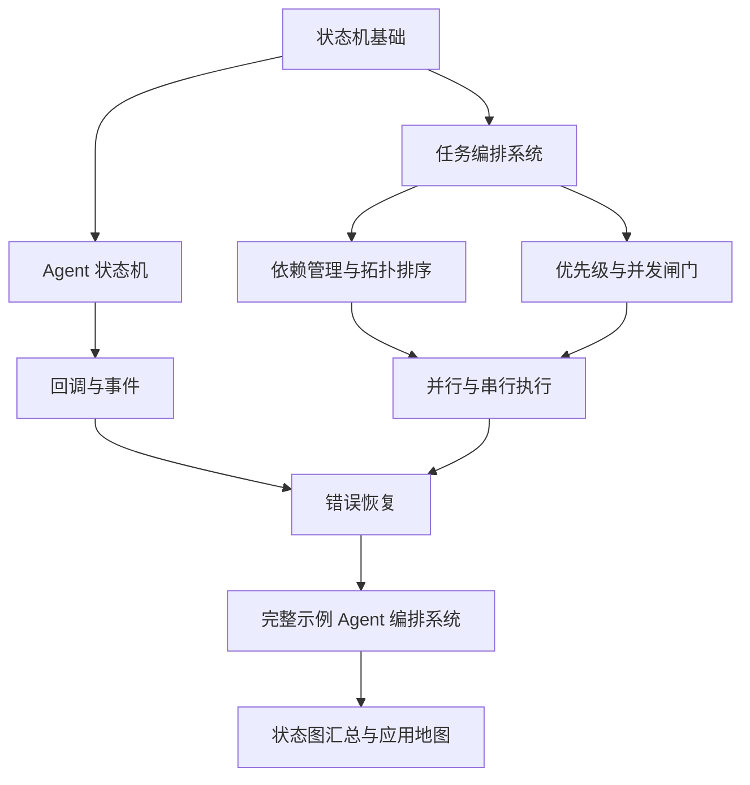
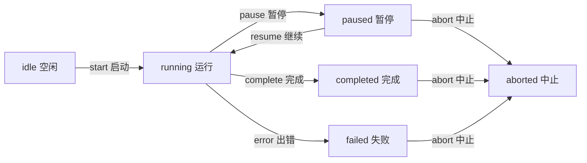
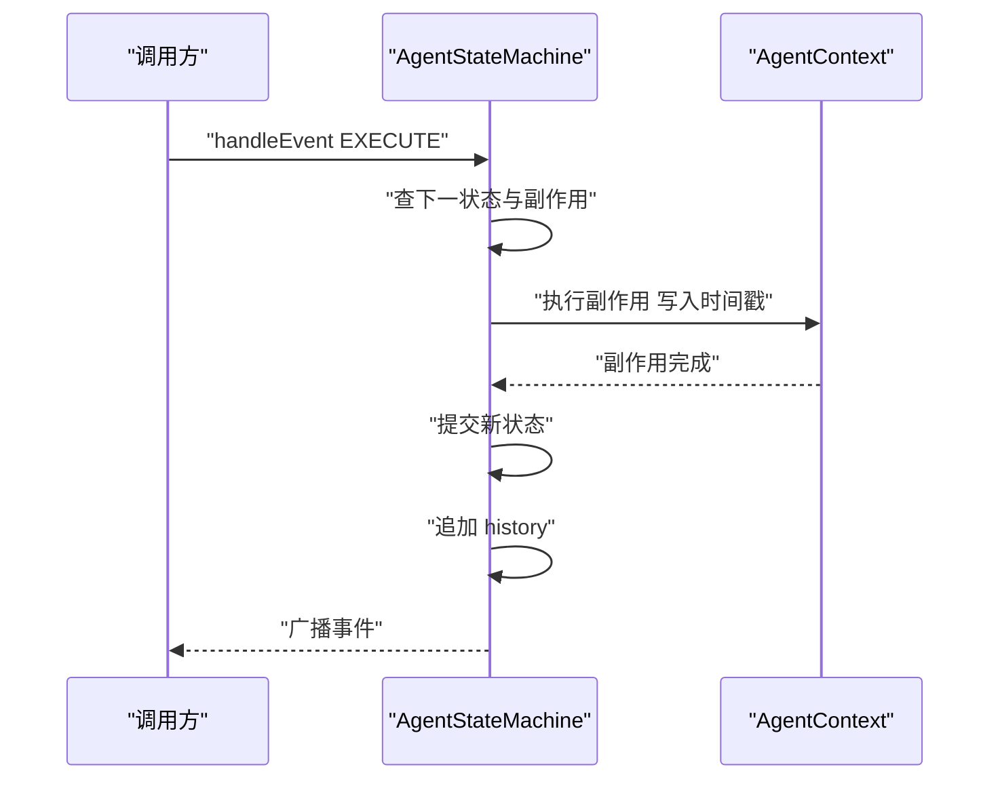
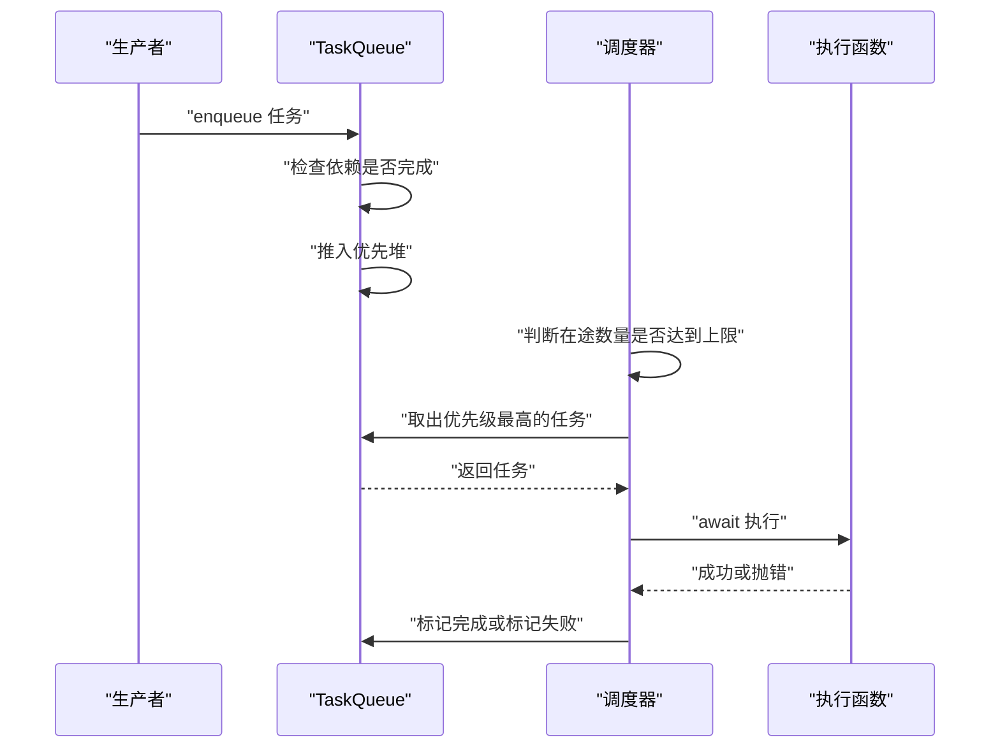
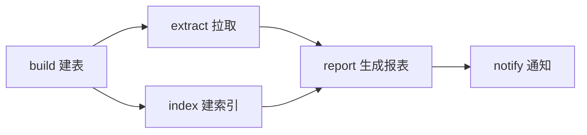
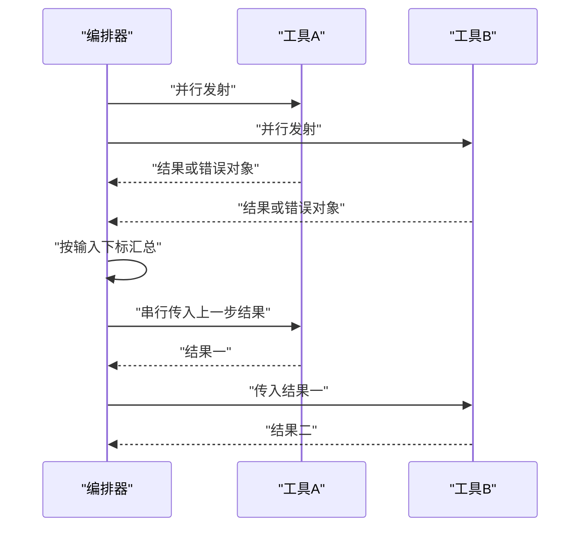
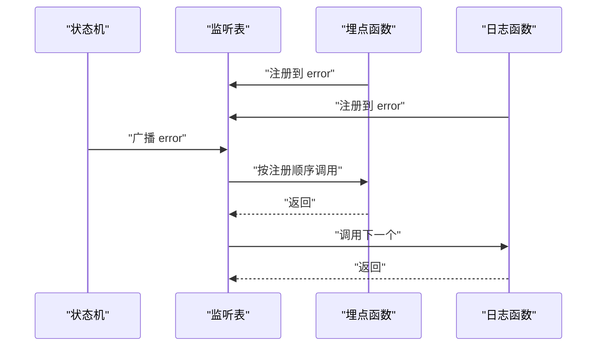
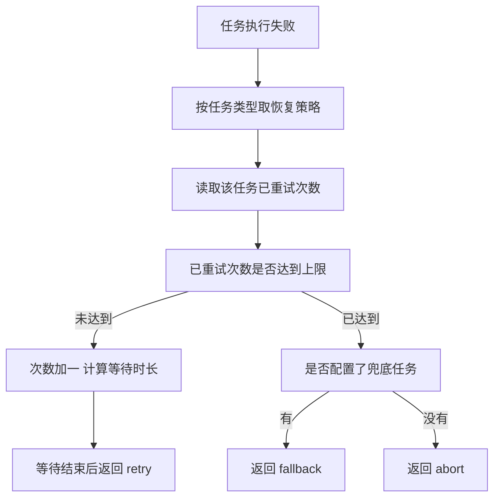
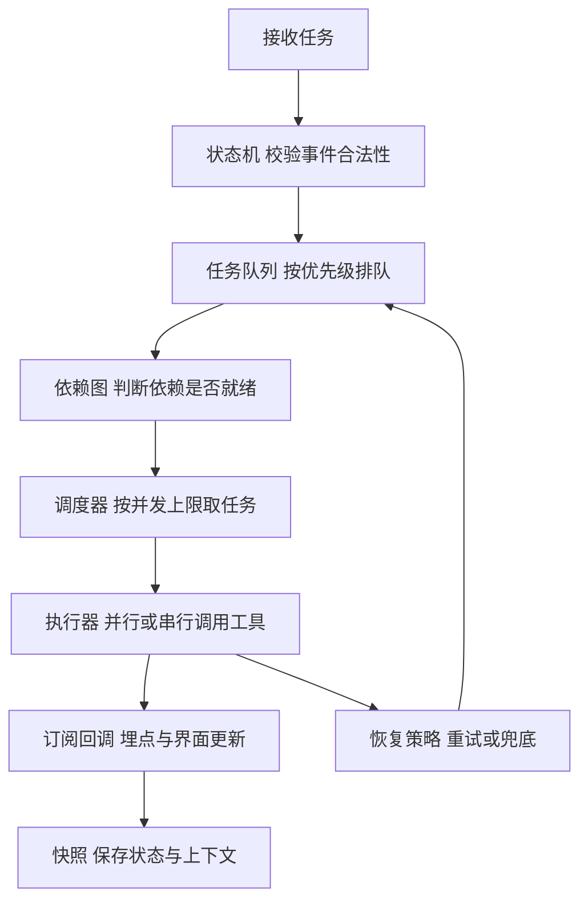
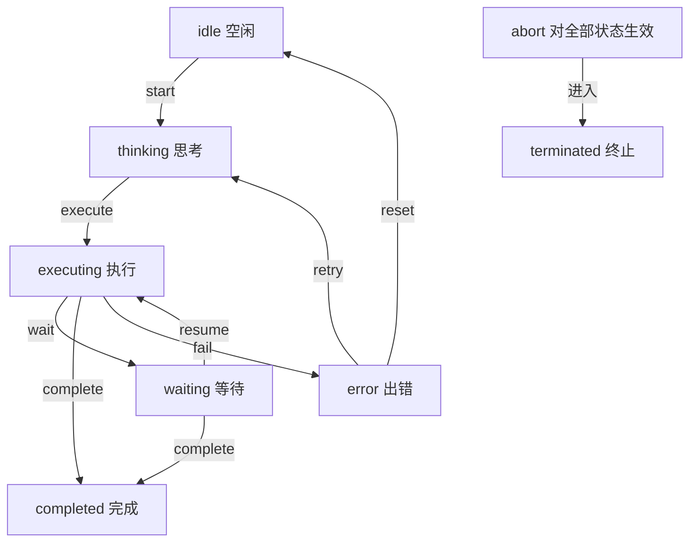

# 状态机与编排

!!! abstract "学完这一页你能"

- 用状态、事件、转移规则三件套写出 Agent 的生命周期，并说清每张表为什么分开。
- 从零实现带优先级的任务队列与并发闸门，并用计数器验证在途任务数没有超过上限。
- 用邻接表和入度表判断任务依赖里有没有环，把环拦在提交阶段而不是运行阶段。
- 为失败任务写出重试、指数退避、兜底三级恢复，并用订阅回调把状态变化接到埋点。

## 0. 知识地图



建议的读法有三种。

第一种是按顺序读：第 1 到第 2 节把状态机写出来，第 3 到第 5 节把任务送进队列并决定并发方式，第 6 到第 8 节把回调、恢复和完整示例串起来。

第二种是带着问题读：如果你的任务只有"顺序执行、失败重试"两个需求，直接看第 1、5、7 节即可。

第三种是当手册读：每节的"常见坑"表格列出的是旧实现里真实存在的缺陷，代码评审时可以逐条对照。

## 1. 状态机基础

**先想一个问题**

一个文件上传组件，用户点了暂停，又点了继续。此时网络断了，按钮应该显示什么？

如果只用一个 `isUploading` 布尔变量，页面刷新后无法区分"暂停过"和"从未开始"这两种情况。

**心智模型**

!!! tip "心智模型"
    一句话模型：状态机等于固定的状态清单加上一张"当前状态加事件到新状态"的规则表，每次变化都查表。
    日常类比：电梯的运行状态只有上行、下行、停靠三种，按同一个开门键在不同状态下结果不同。
    类比不成立处：电梯的状态由物理结构决定，改动成本高；业务状态可以随时增加，但新增状态必须同步补规则，否则对应事件会被拒绝。

!!! note "术语：状态机"
    精确定义：由有限状态集合 S、事件集合 E、转移函数三者组成的模型，任一时刻只处于 S 中的一个状态。例子：订单有待支付、已支付、已发货三个状态，支付事件只允许从待支付转移到已支付。

**图解**



1. 起始状态是 idle，它只接受 start 事件。
2. start 把状态推到 running，running 是出边最多的状态。
3. pause 进入 paused，resume 从 paused 回到 running，两个事件成对出现。
4. complete 与 error 把 running 分流到 completed 和 failed，两者都是终态。
5. abort 画成三条边，表达"任意状态都能中止"，实现时写成一条通配规则。

**一步一步来**

第一步：定义状态名与事件名。

目的：把字符串收敛成联合类型，名字写错时编辑器直接报错。

```ts
// 状态用联合类型而不是 enum，编译后不产生额外对象，序列化成 JSON 也更直接
type JobState = 'idle' | 'running' | 'paused' | 'completed' | 'failed' | 'aborted';
// 事件名与状态名分开，避免把状态名当事件发出去
type JobEvent = 'start' | 'pause' | 'resume' | 'complete' | 'error' | 'abort';

// 运行期上下文：状态机自身只保存状态，业务数据全部放这里
interface JobContext {
  jobId: string;
  retryCount: number;
}
```

**这段代码在做什么**

- JobState 用六个字符串字面量，类型层面互斥，写错名字编译不过。
- JobEvent 单独命名，事件是一次动作，状态是一段时间，两者不混用。
- JobContext 与状态机解耦，测试时可以替换成假对象。
- 没有用 enum，是因为枚举值序列化后仍需转字符串，多一层映射。

运行结果：这段只有类型，编译后不产生运行时代码。

第二步：写规则表。

目的：把"从哪来、收什么事件、到哪去"写成数据，而不是写成一堆 if 分支。

```ts
interface TransitionRule {
  from: JobState | '*'; // 星号表示任意来源状态
  event: JobEvent;
  to: JobState;
}

// 每条规则是一行数据，比对 if 链更容易校对
const rules: TransitionRule[] = [
  { from: 'idle', event: 'start', to: 'running' },
  { from: 'running', event: 'pause', to: 'paused' },
  { from: 'paused', event: 'resume', to: 'running' },
  { from: 'running', event: 'complete', to: 'completed' },
  { from: 'running', event: 'error', to: 'failed' },
  { from: '*', event: 'abort', to: 'aborted' },
];

// 编译成以 from:event 为键的 Map，查询从遍历数组变成一次哈希
const byKey = new Map(rules.map((r) => [`${r.from}:${r.event}`, r]));
```

**这段代码在做什么**

- TransitionRule 用星号表达通配来源，不必为每个状态重复写 abort。
- rules 是纯数据，可以放进配置文件或数据库。
- byKey 的键格式是 `from:event`，查一条规则只做一次哈希。
- 通配规则与精确规则共存在同一个 Map 里，靠查表顺序决定优先级。

运行结果：`byKey.size` 为 6。

第三步：实现 transition。

```ts
function transition(current: JobState, event: JobEvent): JobState {
  // 先查精确匹配，再回退到通配规则，精确规则优先
  const rule = byKey.get(`${current}:${event}`) ?? byKey.get(`*:${event}`);
  if (!rule) {
    // 抛错而不是静默返回原状态，非法事件在调用点立刻暴露
    throw new Error(`事件 ${event} 不能从状态 ${current} 触发`);
  }
  return rule.to; // 只计算新状态，副作用留给调用方
}
```

**这段代码在做什么**

- `??` 只在左侧为 undefined 时回退，与通配语义一致。
- 查不到规则就抛错，错误信息带上事件名与当前状态，便于定位。
- 函数是纯函数，同样的输入得到同样的输出，单测好写。
- 日志、网络请求这类副作用留在调用方，不混进状态计算。

运行结果：`transition('idle','start')` 返回 `'running'`；`transition('completed','pause')` 抛出错误。

**动手验证**

把前面的三块合成一个可以直接运行的文件。

```js
// demo-1.mjs，Node 20 以上，无第三方依赖，运行 node demo-1.mjs
import assert from 'node:assert/strict';

const rules = [
  { from: 'idle', event: 'start', to: 'running' },
  { from: 'running', event: 'pause', to: 'paused' },
  { from: 'paused', event: 'resume', to: 'running' },
  { from: 'running', event: 'complete', to: 'completed' },
  { from: 'running', event: 'error', to: 'failed' },
  { from: '*', event: 'abort', to: 'aborted' },
];
const byKey = new Map(rules.map((r) => [`${r.from}:${r.event}`, r]));

function transition(current, event) {
  const rule = byKey.get(`${current}:${event}`) ?? byKey.get(`*:${event}`);
  if (!rule) throw new Error(`事件 ${event} 不能从状态 ${current} 触发`);
  return rule.to;
}

// 顺序驱动一串事件，返回完整的状态轨迹
function run(start, events) {
  const trail = [start];
  for (const event of events) trail.push(transition(trail.at(-1), event));
  return trail;
}

assert.deepEqual(run('idle', ['start', 'complete']), ['idle', 'running', 'completed']);
assert.deepEqual(run('running', ['pause', 'abort']), ['running', 'paused', 'aborted']);
assert.throws(() => transition('completed', 'pause'), /不能从状态/);
assert.equal(transition('failed', 'abort'), 'aborted');
console.log('用例通过');
console.log('轨迹:', run('idle', ['start', 'pause', 'resume', 'error', 'abort']).join(' -> '));
```

预期输出：

```
用例通过
轨迹: idle -> running -> paused -> running -> failed -> aborted
```

**常见坑**

| 现象 | 原因 | 怎么修 |
|---|---|---|
| 通配 abort 永远不生效 | 查键只拼了当前状态，没有回退到星号键 | 先查精确键，查不到再查 `*:event` |
| 终态还能被 pause | 规则表没有约束"终态没有出边" | 初始化时扫描 rules，断言 completed 与 failed 不出现在 from 里 |
| 状态机越写越胖 | 把网络请求、数据库写入塞进 transition | transition 只算新状态，副作用交给调用方 |

**用在哪里**

场景一：视频转码任务的进度面板。

- 业务背景：用户上传视频后转码，可以暂停，可以重试，页面刷新后按钮状态要能恢复。
- 这一节的知识怎么用：把转码器回调映射成 start、pause、complete、error 四个事件，规则表决定按钮是否可点。
- 用什么指标衡量收益：因状态错乱导致的相关客服工单数量，以及非法事件抛错的次数。
- 什么时候不该用：只有一个"进行中/已完成"布尔值、且没有暂停需求时，加状态机是多余抽象。

场景二：后台管理的批量导入向导。

- 业务背景：上传文件、校验、入库三步，任意一步失败要能回到上一步重做。
- 这一节的知识怎么用：把每步建成状态，用 back 事件表达回退，规则表限制只能回退到相邻步。
- 用什么指标衡量收益：用户在向导中途放弃的比例。
- 什么时候不该用：步骤固定在两步以内、且没有回退需求时。

场景三：客服会话机器人。

- 业务背景：会话在等待用户输入、查询知识库、转人工之间切换。
- 这一节的知识怎么用：等待态单独建模为 waiting，避免超时后界面仍显示"输入中"。
- 用什么指标衡量收益：转人工之前的平均对话轮次。
- 什么时候不该用：单轮问答、没有跨轮状态积累的场景。

**行业实践**

- W3C 的 SCXML 规范（State Chart XML）给出状态、事件、守卫条件、并行区域的标准写法，XState 官方文档的状态图章节以 SCXML 为基础。借鉴方式：把规则表外置成 JSON，用工具生成类型，改状态图时先改数据再生成代码。
- AWS Step Functions 开发者指南中的 Amazon States Language 章节把状态分成 Task、Choice、Parallel、Map、Wait 这些类型。借鉴方式：为每一类状态定义统一的字段契约，而不是每处各写一套。
- 需核对官方文档：XState 当前主版本对 actor 模型的 API 命名，与早期版本的差异要按官方文档确认。

**小结**

1. 状态机由状态清单、事件清单、转移规则表三部分组成，缺一项就会退化成 if 链。
2. 通配规则要在查表时显式回退，否则代码里存在永远走不到的分支。
3. transition 只计算新状态，副作用留在调用方，测试才写得干净。

## 2. Agent 状态机实现

**先想一个问题**

一次 Agent 运行要经历"思考、调工具、等外部响应"三个阶段。如果工具调用超时了，这次运行算失败还是算等待？

这两种情况在界面上要给出不同提示，所以状态必须分开。

**心智模型**

!!! tip "心智模型"
    一句话模型：Agent 状态机把一次任务执行切成若干可观察阶段，事件是推进阶段的唯一动力。
    日常类比：餐厅后厨的订单夹从待接单到制作中到待取餐，每次改状态都要经过叫号。
    类比不成立处：后厨改状态靠人手动操作，Agent 的状态由回调驱动，回调可能重复触发，需要幂等保护。

!!! note "术语：守卫条件"
    精确定义：守卫条件（guard）是附加在转移规则上的布尔判断，只有返回 true 才允许这次转移发生。例子：只有已重试次数小于上限时，才允许从 error 转移到 thinking。

**图解**



1. 调用方只有 handleEvent 一个入口，所有状态变化都从这里走。
2. 先查下一状态表，查不到就告警返回，不改变现状。
3. 副作用在 context 上执行，例如写入 startTime。
4. 副作用成功之后才提交 this.state，顺序不能反。
5. history 追加一条带时间戳的记录，用于审计与回放。
6. 广播发生在状态提交之后，订阅者读到的一定是新状态。

**一步一步来**

第一步：定义状态与事件枚举。

```ts
// 八个生命周期状态，覆盖空闲、执行、等待、终态四类
enum AgentState {
  IDLE = 'idle',             // 空闲，等待任务
  THINKING = 'thinking',     // 思考中，分析任务
  EXECUTING = 'executing',   // 执行中，调用工具
  WAITING = 'waiting',       // 等待中，等待外部响应
  COMPLETED = 'completed',   // 已完成
  ERROR = 'error',           // 出错
  PAUSED = 'paused',         // 已暂停
  TERMINATED = 'terminated', // 已终止
}
// 事件与状态同名但含义不同：事件是一次动作，状态是一段时间
enum AgentEvent {
  START = 'start', THINK = 'think', EXECUTE = 'execute', WAIT = 'wait',
  RESUME = 'resume', COMPLETE = 'complete', FAIL = 'fail',
  ABORT = 'abort', RETRY = 'retry', RESET = 'reset',
}
```

**这段代码在做什么**

- 八个状态覆盖空闲、执行、等待、终态四类，每一类对应一套界面文案。
- 枚举值用字符串，序列化后仍是可读文本，方便写进日志。
- 事件名与状态名不混用，避免"把状态当事件发出去"这类低级错误。
- 中止与重置相关事件单独列出，便于统计异常收尾的比例。

运行结果：`AgentState.IDLE === 'idle'` 为 true。

第二步：把下一状态与副作用拆成两张表。

```ts
// 表一：state:event 到下一状态，只做映射，不碰副作用
const nextState = new Map<string, AgentState>([
  ['idle:start', AgentState.THINKING],
  ['thinking:execute', AgentState.EXECUTING],
  ['executing:wait', AgentState.WAITING],
  ['executing:complete', AgentState.COMPLETED],
  ['executing:fail', AgentState.ERROR],
  ['waiting:resume', AgentState.EXECUTING],
  ['waiting:complete', AgentState.COMPLETED],
  ['error:retry', AgentState.THINKING],
  ['error:reset', AgentState.IDLE],
  ['paused:resume', AgentState.THINKING],
]);
// 中止对所有状态生效，用单独分支判断，绕开字符串拼接匹配不到通配键的问题
function resolveNext(cur: AgentState, event: AgentEvent): AgentState | null {
  if (event === AgentEvent.ABORT) return AgentState.TERMINATED;
  return nextState.get(`${cur}:${event}`) ?? null;
}
```

**这段代码在做什么**

- 下一状态表只保存映射关系，纯计算，没有副作用。
- abort 用 if 单独判断，避开旧实现里"拼键拼不出通配符"的死代码问题。
- 查不到返回 null，把"非法事件"的处理权交给调用方。
- 用模块级 Map 而不是每次调用重建对象，省掉重复分配。

运行结果：`resolveNext('executing','fail')` 返回 `'error'`；`resolveNext('completed','start')` 返回 `null`。

第三步：写副作用表与主流程。

```ts
// 表二：state:event 到副作用函数，只有需要打点的转移才登记
const effects = new Map<string, (ctx: AgentContext) => void>([
  ['idle:start', (ctx) => { ctx.metadata.startTime = Date.now(); }],
  ['executing:wait', (ctx) => { ctx.metadata.waitStart = Date.now(); }],
  ['waiting:resume', (ctx) => { delete ctx.metadata.waitStart; }],
  ['executing:fail', (ctx) => { ctx.metadata.errorTime = Date.now(); }],
  ['error:retry', (ctx) => {
    // 首次重试时兜底为 0，避免 undefined 加一得到 NaN
    ctx.metadata.retryCount = Number(ctx.metadata.retryCount ?? 0) + 1;
  }],
]);

function handleEvent(machine: Machine, event: AgentEvent): boolean {
  const to = resolveNext(machine.state, event);
  if (!to) { console.warn(`状态 ${machine.state} 不接受事件 ${event}`); return false; }
  effects.get(`${machine.state}:${event}`)?.(machine.context); // 副作用先跑
  machine.state = to;                                          // 成功了才提交状态
  machine.history.push({ state: to, event, timestamp: Date.now() });
  return true;
}
```

**这段代码在做什么**

- 副作用表只登记需要打点的转移，其余转移不占条目。
- retryCount 用 Number 兜底，避免 undefined 参与加法。
- 副作用执行完才改 state，副作用抛错时状态停在原处。
- history 记录的是到达状态，配合 event 字段才能还原完整迁移。
- error:retry 这条分支同时也是守卫条件，对应第 7 节的重试上限判断。

运行结果：从 idle 发 start 后，state 变成 thinking，metadata.startTime 有值。

第四步：持久化。

```ts
interface Snapshot {
  agentId: string;
  state: AgentState;
  context: AgentContext;
  history: Array<{ state: AgentState; event: AgentEvent; timestamp: number }>;
  version: number; // 用时间戳充当版本号，只标识新旧，不做冲突合并
}
// 存快照时深拷贝上下文，避免运行态后续改动污染已存数据
function save(store: Map<string, Snapshot>, m: Machine): void {
  store.set(m.context.id, {
    agentId: m.context.id,
    state: m.state,
    context: structuredClone(m.context), // 切断与运行态的引用共享
    history: [...m.history],
    version: Date.now(),
  });
}
// 恢复时只回灌 state 与 context，history 仅作审计用途
function restore(store: Map<string, Snapshot>, id: string): Machine | null {
  const s = store.get(id);
  if (!s) return null; // 用 null 表达不存在，不用异常做流程控制
  return { state: s.state, context: s.context, history: [], listeners: new Map() };
}
```

**这段代码在做什么**

- Snapshot 只保留可以 JSON 化的字段，方法不落盘。
- structuredClone 做深拷贝，直接存引用会让快照随运行态一起变。
- restore 返回 null 表示快照缺失，调用方据此走冷启动。
- version 用毫秒时间戳，只保证近似递增，同一毫秒内两次保存会撞号。

运行结果：save 之后修改内存里的 context，store 里的快照内容不受影响。

**动手验证**

```js
// demo-2.mjs，Node 20 以上，无第三方依赖
import assert from 'node:assert/strict';

const nextState = new Map([
  ['idle:start', 'thinking'], ['thinking:execute', 'executing'],
  ['executing:wait', 'waiting'], ['executing:complete', 'completed'],
  ['executing:fail', 'error'], ['waiting:resume', 'executing'],
  ['waiting:complete', 'completed'], ['error:retry', 'thinking'],
  ['error:reset', 'idle'], ['paused:resume', 'thinking'],
]);
function resolveNext(cur, event) {
  if (event === 'abort') return 'terminated';
  return nextState.get(`${cur}:${event}`) ?? null;
}
const effects = new Map([
  ['idle:start', (ctx) => { ctx.metadata.startTime = 1; }],
  ['error:retry', (ctx) => { ctx.metadata.retryCount = Number(ctx.metadata.retryCount ?? 0) + 1; }],
]);
function createAgent(id) {
  return { state: 'idle', context: { id, metadata: {} }, history: [] };
}
function handleEvent(m, event) {
  const to = resolveNext(m.state, event);
  if (!to) return false;
  effects.get(`${m.state}:${event}`)?.(m.context);
  m.state = to;
  m.history.push({ state: to, event });
  return true;
}

const agent = createAgent('a1');
assert.equal(handleEvent(agent, 'start'), true);
assert.equal(agent.state, 'thinking');
assert.equal(agent.context.metadata.startTime, 1);
assert.equal(handleEvent(agent, 'execute'), true);
assert.equal(handleEvent(agent, 'fail'), true);
assert.equal(agent.state, 'error');
handleEvent(agent, 'retry');
assert.equal(agent.context.metadata.retryCount, 1);
assert.equal(handleEvent(agent, 'abort'), true);
assert.equal(agent.state, 'terminated');
assert.equal(handleEvent(agent, 'start'), false);
assert.equal(agent.history.length, 5);
console.log('用例通过');
console.log('轨迹:', agent.history.map((h) => `${h.event}转${h.state}`).join(', '));
```

预期输出：

```
用例通过
轨迹: start转thinking, execute转executing, fail转error, retry转thinking, abort转terminated
```

**常见坑**

| 现象 | 原因 | 怎么修 |
|---|---|---|
| 通配中止分支从不执行 | 键用模板字符串拼成"当前状态:事件"，拼不出通配键 | 中止事件单独用 if 判断 |
| 状态已变但打点没写 | 先改 state 再跑副作用，副作用抛错 | 调换顺序，副作用在前，提交状态在后 |
| 恢复后行为不一致 | 快照直接存运行态引用，后续改动串了数据 | 存快照前用 structuredClone 深拷贝 |
| 查询不存在的快照报错 | 用异常表达"查无此项" | 返回 null，由调用方决定冷启动逻辑 |

**用在哪里**

场景一：AI 代码助手的会话面板。

- 业务背景：用户提问后经过检索、生成、等待用户确认三个可见阶段。
- 这一节的知识怎么用：把三个阶段映射成 thinking、executing、waiting，等待超时退回 error。
- 用什么指标衡量收益：状态卡死的会话占比，判定标准是超过设定时长仍处于非终态。
- 什么时候不该用：一次请求一次响应、没有中间态的场景。

场景二：审批流的机器人。

- 业务背景：提交审批后要等人工处理，期间可能被撤回。
- 这一节的知识怎么用：waiting 态承载等待，abort 走通配分支，快照保存后崩溃可恢复。
- 用什么指标衡量收益：撤回后仍继续执行的任务数量。
- 什么时候不该用：审批环节不可中断、一旦提交必须走完时。

**行业实践**

- XState 官方文档的 actor 模型章节把状态机与外部系统的通信建模为 actor，借鉴思路：状态机不直接发请求，只发事件，由 actor 负责副作用。
- AWS Step Functions 开发者指南的 Standard 与 Express 工作流对比章节区分长任务与短任务，借鉴方式：长任务用可持久化的状态机，短任务用内存状态机。
- 需核对官方文档：LangGraph 官方文档中图状态与检查点的当前 API 名称和语义。

**小结**

1. 副作用在前、状态提交在后，异常时状态不会停在被污染的位置。
2. 下一状态表与副作用表分开存放，纯计算与副作用各归一处。
3. 快照只存可序列化字段，存之前做深拷贝。

## 3. 任务编排系统

**先想一个问题**

批量导入 5000 行数据，其中 200 行需要先查用户信息再入库。哪些任务可以立刻跑？同时跑多少个才不会把下游接口打挂？

**心智模型**

!!! tip "心智模型"
    一句话模型：任务编排等于候诊室加叫号机加诊室数量上限。
    日常类比：银行取号，贵宾号优先叫，柜台满员时号码在大厅继续等。
    类比不成立处：银行的号码一旦发出顺序固定，程序里可以重新计算优先级并把任务插回队列。

!!! note "术语：优先级队列"
    精确定义：优先级队列是每次取出优先级最高元素的容器，用二叉堆实现时插入与取出都是 O(log n)。例子：三个任务优先级分别为 1、5、3，出队顺序是 5、3、1。

**图解**



1. 生产者把任务交给队列，队列先看依赖是否完成。
2. 依赖没完成的任务先挂起，等依赖完成后重新入队。
3. 调度器按固定间隔触发，第一件事是判断在途数量。
4. 通过判断后才出队，取出优先级最高的任务。
5. 执行结果决定调用成功还是失败分支，两个分支都要释放坑位。

**一步一步来**

第一步：写二叉堆的入堆与出堆。

```ts
class PriorityQueue<T> {
  private items: T[] = [];
  constructor(private cmp: (a: T, b: T) => number) {} // cmp 返回正数表示 a 更优先
  push(item: T): void {
    this.items.push(item);
    let i = this.items.length - 1;
    while (i > 0) {
      const parent = (i - 1) >> 1; // 右移一位等于除以 2 取整
      if (this.cmp(this.items[i], this.items[parent]) <= 0) break; // 堆序已满足
      [this.items[i], this.items[parent]] = [this.items[parent], this.items[i]];
      i = parent;
    }
  }
  size(): number { return this.items.length; }
}
```

**这段代码在做什么**

- items 用数组存完全二叉树，不需要指针，缓存命中率高。
- 父节点下标由 `(i-1) >> 1` 算出。
- 新元素向上冒泡，直到父节点优先级不低于自己。
- cmp 由调用方提供，堆本身不关心业务权重规则。

运行结果：依次推入优先级 1、5、3 后，堆顶是 5。

第二步：写出堆，并用并发闸门串起调度。

```ts
pop(): T | undefined {
  if (this.items.length === 0) return undefined;
  const top = this.items[0];
  const last = this.items.pop()!;
  if (this.items.length > 0) {
    this.items[0] = last; // 把末尾元素搬到堆顶，再向下调整
    let i = 0;
    for (;;) {
      const l = 2 * i + 1, r = l + 1;
      let best = i; // 记录父与左右子中优先级最高的下标
      if (l < this.items.length && this.cmp(this.items[l], this.items[best]) > 0) best = l;
      if (r < this.items.length && this.cmp(this.items[r], this.items[best]) > 0) best = r;
      if (best === i) break; // 堆序恢复，停止下沉
      [this.items[i], this.items[best]] = [this.items[best], this.items[i]];
      i = best;
    }
  }
  return top;
}

// 调度的一轮：判断上限、出队、占坑必须在同一个同步块里完成
function tick(): void {
  if (running.size >= config.maxConcurrent) return; // 闸门先判断
  const task = queue.pop();
  if (!task) return;                                // 队列空，本轮空转
  running.add(task.id);                             // 先占坑，防止下一轮重复取出
  executor(task)
    .then(() => completed.add(task.id))
    .catch((e) => markFailed(task.id, e))
    .finally(() => running.delete(task.id));        // 无论成败都释放坑位
}
```

**这段代码在做什么**

- 出堆时把末尾元素搬到堆顶，再向下调整，单次复杂度 O(log n)。
- 判断上限、出队、占坑三步都在第一个 await 之前完成，闸门才真正生效。
- 先占坑再执行，防止同一任务被下一轮重复取出。
- finally 保证异常路径也释放坑位，避免调度器逐步假死。

运行结果：maxConcurrent 设为 3 时，running.size 的峰值不超过 3。

**动手验证**

```js
// demo-3.mjs，Node 20 以上，无第三方依赖
import assert from 'node:assert/strict';

class PriorityQueue {
  items = [];
  constructor(cmp) { this.cmp = cmp; }
  push(item) {
    this.items.push(item);
    let i = this.items.length - 1;
    while (i > 0) {
      const p = (i - 1) >> 1;
      if (this.cmp(this.items[i], this.items[p]) <= 0) break;
      [this.items[i], this.items[p]] = [this.items[p], this.items[i]];
      i = p;
    }
  }
  pop() {
    if (!this.items.length) return undefined;
    const top = this.items[0];
    const last = this.items.pop();
    if (this.items.length) {
      this.items[0] = last;
      let i = 0;
      for (;;) {
        const l = 2 * i + 1, r = l + 1;
        let best = i;
        if (l < this.items.length && this.cmp(this.items[l], this.items[best]) > 0) best = l;
        if (r < this.items.length && this.cmp(this.items[r], this.items[best]) > 0) best = r;
        if (best === i) break;
        [this.items[i], this.items[best]] = [this.items[best], this.items[i]];
        i = best;
      }
    }
    return top;
  }
  size() { return this.items.length; }
}

const q = new PriorityQueue((a, b) => a.priority - b.priority);
[1, 5, 3].forEach((p) => q.push({ id: `t${p}`, priority: p }));
assert.equal(q.pop().priority, 5);
assert.equal(q.pop().priority, 3);
assert.equal(q.pop().priority, 1);
assert.equal(q.pop(), undefined);
console.log('堆顺序通过');

// 并发闸门实验：20 个任务，上限 3，记录在途峰值
const sleep = (ms) => new Promise((r) => setTimeout(r, ms));
const running = new Set();
const pending = Array.from({ length: 20 }, (_, i) => ({ id: `j${i}` }));
const done = [];
let peak = 0;
const LIMIT = 3;

function tick() {
  if (running.size >= LIMIT) return;
  const task = pending.shift();
  if (!task) return;
  running.add(task.id);
  peak = Math.max(peak, running.size);
  sleep(5)
    .then(() => done.push(task.id))
    .finally(() => running.delete(task.id));
}

const timer = setInterval(tick, 1);
await sleep(300);
clearInterval(timer);
assert.equal(done.length, 20);
assert.ok(peak <= LIMIT, `在途峰值 ${peak} 超过上限 ${LIMIT}`);
console.log('完成数量:', done.length, '在途峰值:', peak);
```

预期输出：

```
堆顺序通过
完成数量: 20 在途峰值: 3
```

**常见坑**

| 现象 | 原因 | 怎么修 |
|---|---|---|
| 达到并发上限后任务凭空消失 | 先出队再判断上限，取出的任务被丢弃 | 先判断在途数量，再出队 |
| 并发上限形同虚设 | 占坑写在 await 之后，临界区被拉长 | 判断、出队、占坑放在同一个同步块 |
| 依赖永远不满足 | 用固定间隔轮询依赖，任务完成后无人唤醒 | 任务完成时主动重查待入队集合 |
| 重试次数比预期少一次 | 计数含义与比较符号不一致 | 明确计数表示"已重试次数"，用大于等于判断 |

**用在哪里**

场景一：后台管理的批量导入。

- 业务背景：1000 行数据逐条校验并写库，写库接口对并发有明确限制。
- 这一节的知识怎么用：用分批或闸门把在途请求压到接口允许的范围，优先级给人工标记过的行。
- 用什么指标衡量收益：导入总耗时与被限流拒绝的请求数量。
- 什么时候不该用：行数在 50 以内、接口没有并发限制时，直接串行循环即可。

场景二：CI 流水线调度。

- 业务背景：一次构建包含 lint、单测、构建、部署四类步骤，部分步骤互相独立。
- 这一节的知识怎么用：依赖检查决定步骤何时就绪，并发上限控制构建机负载。
- 用什么指标衡量收益：流水线从触发到结束的时长。
- 什么时候不该用：步骤存在强顺序依赖、必须严格串行时。

**行业实践**

- BullMQ 官方文档的并发与限流章节把 worker 并发数作为独立配置项，借鉴方式：并发上限做成配置项，不写死在调度循环里。
- Node.js 官方文档的 node:worker_threads 与 os.availableParallelism 章节给出按 CPU 核数决定并行度的做法，借鉴方式：CPU 密集型任务的上限取核数，IO 密集型任务按下游承压能力取。
- Temporal 官方文档的任务队列章节用独立队列隔离不同优先级，借鉴方式：优先级差异大的任务放不同队列，避免低优先级任务长期抢不到执行机会。

**小结**

1. 优先级用二叉堆实现，插入与取出都是 O(log n)，比每轮排序数组省。
2. 依赖未就绪的任务先挂起，等依赖完成时主动唤醒，比定间隔轮询延迟低。
3. 判断并发上限、出队、占坑必须在同一个同步块里完成。

## 4. 依赖管理与拓扑排序

**先想一个问题**

一个数据同步任务要求先建表、再拉数据、最后建索引。如果配置里误写成"建索引依赖建表、建表又依赖建索引"，程序应该在启动时就报错，而不是跑到一半卡住。

**心智模型**

!!! tip "心智模型"
    一句话模型：把任务看成点、依赖看成有向边，反复取出"没有未完成前置任务"的点。
    日常类比：做菜时先看哪道菜不用等别的菜，先做它，做完再看它解锁了哪道菜。
    类比不成立处：菜可以同时下锅，程序里是否同时取决于并发上限；另外菜谱不会出现循环依赖，配置会。

!!! note "术语：拓扑排序"
    精确定义：拓扑排序是把有向无环图的顶点排成一个线性序列，使每条边的起点都排在终点之前。例子：A 依赖 B、B 依赖 C，排序结果是 C、B、A。

**图解**



1. build 入度为 0，是唯一可以立刻跑的节点。
2. build 完成后，extract 与 index 的入度同时降到 0，两者可以并行。
3. 两者都完成后，report 的入度才降到 0。
4. report 完成后 notify 才可执行。
5. 如果某一步之后没有任何节点入度降到 0，剩下的节点就构成环。

**一步一步来**

第一步：建邻接表与入度表。

```ts
class DependencyGraph {
  private edges = new Map<string, Set<string>>();  // 起点 到 终点集合
  private inDegree = new Map<string, number>();    // 节点 到 尚未完成的前置数量
  addNode(id: string): void {
    if (!this.edges.has(id)) { this.edges.set(id, new Set()); this.inDegree.set(id, 0); }
  }
  addEdge(from: string, to: string): void {
    this.addNode(from); this.addNode(to);
    const next = this.edges.get(from)!;
    if (next.has(to)) return; // 重复边会把入度多加一，必须判重
    next.add(to);
    this.inDegree.set(to, (this.inDegree.get(to) ?? 0) + 1);
  }
}
```

**这段代码在做什么**

- edges 的键是前置任务，值是它能解锁的任务集合。
- inDegree 记录每个节点还有几个前置任务没完成。
- addEdge 先补齐两个节点，再判重，避免重复边抬高入度。
- 用 Set 存终点，重复声明的依赖自动收敛成一条。

运行结果：加两条边 build 到 extract、build 到 index 后，extract 与 index 的入度都是 1。

第二步：用 Kahn 算法排序并检测环。

```ts
function topologicalSort(): string[] {
  const result: string[] = [];
  const degree = new Map(this.inDegree); // 复制一份，排序后原图仍可复用
  const ready = [...degree].filter(([, d]) => d === 0).map(([id]) => id);
  while (ready.length > 0) {
    const cur = ready.shift()!;
    result.push(cur);
    for (const next of this.edges.get(cur) ?? []) {
      const left = (degree.get(next) ?? 0) - 1;
      degree.set(next, left);
      if (left === 0) ready.push(next); // 入度归零才解锁
    }
  }
  if (result.length !== this.edges.size) throw new Error('存在循环依赖');
  return result;
}
```

**这段代码在做什么**

- 复制入度表，排序过程不污染原图，原图可以反复查询。
- ready 初始装入度 0 的节点，它们是当前能立刻执行的任务。
- 每弹出一个节点，把它指向的邻居入度减一。
- 邻居入度归零时推入 ready，表示刚被解锁。
- 结果长度小于节点总数说明剩下的节点在环里，直接抛错。

运行结果：对上面的图返回 `['build','extract','index','report','notify']`。

**动手验证**

```js
// demo-4.mjs，Node 20 以上，无第三方依赖
import assert from 'node:assert/strict';

function sortGraph(edgesList) {
  const edges = new Map(), inDegree = new Map();
  const addNode = (id) => {
    if (!edges.has(id)) { edges.set(id, new Set()); inDegree.set(id, 0); }
  };
  for (const [from, to] of edgesList) {
    addNode(from); addNode(to);
    const next = edges.get(from);
    if (next.has(to)) continue;
    next.add(to);
    inDegree.set(to, inDegree.get(to) + 1);
  }
  const degree = new Map(inDegree);
  const ready = [...degree].filter(([, d]) => d === 0).map(([id]) => id);
  const order = [];
  while (ready.length) {
    const cur = ready.shift();
    order.push(cur);
    for (const next of edges.get(cur) ?? []) {
      const left = degree.get(next) - 1;
      degree.set(next, left);
      if (left === 0) ready.push(next);
    }
  }
  if (order.length !== edges.size) throw new Error('存在循环依赖');
  return order;
}

const order = sortGraph([
  ['build', 'extract'], ['build', 'index'],
  ['extract', 'report'], ['index', 'report'], ['report', 'notify'],
]);
assert.equal(order[0], 'build');
assert.equal(order.at(-1), 'notify');
assert.ok(order.indexOf('report') > order.indexOf('extract'));
assert.ok(order.indexOf('report') > order.indexOf('index'));
assert.throws(() => sortGraph([['a', 'b'], ['b', 'c'], ['c', 'a']]), /循环依赖/);
assert.throws(() => sortGraph([['x', 'y'], ['y', 'x']]), /循环依赖/);

// 自环也是一种环
assert.throws(() => sortGraph([['self', 'self']]), /循环依赖/);
console.log('用例通过');
console.log('拓扑序:', order.join(' -> '));
```

预期输出：

```
用例通过
拓扑序: build -> extract -> index -> report -> notify
```

**常见坑**

| 现象 | 原因 | 怎么修 |
|---|---|---|
| 入度比真实依赖多 | 同一条边被加了两次 | addEdge 里用 Set 判重 |
| 排序后原图不可再用 | 直接改原入度表 | 排序前复制一份入度表 |
| 有环却排出了部分顺序 | 只比较结果条数，没比较节点总数 | 用节点总数与 result.length 比对 |
| 拿到的是下游而不是前置 | 邻接表方向定义反了 | 统一约定键为前置、值为被解锁任务 |

**用在哪里**

场景一：低代码平台的数据处理流程。

- 业务背景：用户拖拽节点连线，形成取数、清洗、入库的流程。
- 这一节的知识怎么用：保存流程时跑一次拓扑排序，发现环就阻止发布并高亮环上的节点。
- 用什么指标衡量收益：上线后因流程配置错误导致的运行失败次数。
- 什么时候不该用：流程是固定线性脚本、节点顺序写死在代码里时。

场景二：多入口项目的并行构建。

- 业务背景：五入口项目需要知道哪些入口可以同时构建。
- 这一节的知识怎么用：用入度决定哪些入口可以并行启动，用出边决定谁先构建。
- 用什么指标衡量收益：全量构建从开始到结束的时长。
- 什么时候不该用：入口之间没有共享依赖时，直接并行即可，建图是多余开销。

**行业实践**

- Apache Airflow 官方文档的 DAG 章节把工作流定义成有向无环图，并说明调度器按依赖触发任务，借鉴方式：先把依赖写成数据，再让引擎决定顺序。
- GitHub Actions 官方文档的 needs 关键字用声明式依赖表达任务先后，借鉴方式：让配置表达依赖，而不是在脚本里手动 sleep 等待。
- 需核对官方文档：Airflow 当前主版本对 TaskFlow API 的写法与旧版装饰器的差异。

**小结**

1. 邻接表记录"谁能解锁谁"，入度表记录"还差几个前置"。
2. Kahn 算法每轮取入度 0 的节点，复杂度是 O(V+E)。
3. 结果长度小于节点总数就说明有环，启动时报错胜过运行中卡死。

## 5. 并行与串行执行

**先想一个问题**

一次回答需要同时查天气、查航班、查汇率三个接口。三个接口都可能超时，其中一个超时了，另外两个的结果要不要丢？

**心智模型**

!!! tip "心智模型"
    一句话模型：并行是同时发射、统一收口；串行是上一步的输出直接喂给下一步。
    日常类比：并行像同时点三份外卖，都到了才开饭；串行像流水线，上一道工序的成品是下一道的原料。
    类比不成立处：外卖到了一个可以先吃，Promise.all 只要有一个失败就整体失败，除非提前给每个任务挂兜底。

!!! note "术语：并发上限"
    精确定义：并发上限是同一时刻允许在途的任务数量上限，超出的任务留在队列里等。例子：并发上限为 3 时，第 4 个任务必须等前三个中有一个结束才能启动。

**图解**



1. 并行分支里，两个工具在同一个事件循环轮次被启动。
2. 每个工具的失败先被 catch 转成普通对象，避免整体短路。
3. 汇总时按下标取值，返回顺序与完成先后无关。
4. 串行分支里，工具 B 要等工具 A 返回后才被调用。
5. 串行链条上任何一步抛错都会中断后续步骤。

**一步一步来**

第一步：并行发射与错误隔离。

```ts
interface Tool { name: string; execute: (params: unknown) => Promise<unknown>; }

async function executeAll(tools: Tool[], params: unknown[]): Promise<unknown[]> {
  // map 是同步发射：所有 execute 在同一轮被调用，实现真并发
  const promises = tools.map((tool, i) =>
    tool.execute(params[i]).catch((e) => ({ error: (e as Error).message }))
  );
  // 返回顺序恒等于输入顺序，与完成先后无关
  return Promise.all(promises);
}
```

**这段代码在做什么**

- map 同步调用每个 execute，让请求几乎同时发出。
- 每个任务先挂 catch，把失败转成普通值，Promise.all 不会短路。
- 返回值顺序与 tools 一致，调用方按下标取值。
- 代价是失败信息被降级成对象，调用方需要判断返回形状。

运行结果：三个工具中有一个失败时，返回数组里对应位置是 `{ error: '超时' }`。

第二步：分批限流。

```ts
async function executeWithLimit(tools: Tool[], params: unknown[], limit: number): Promise<unknown[]> {
  if (limit < 1) throw new Error('limit 必须大于等于 1'); // 拦住 0 与负数导致的死循环
  const results: unknown[] = [];
  for (let i = 0; i < tools.length; i += limit) {
    const batch = tools.slice(i, i + limit);
    const batchParams = params.slice(i, i + limit);
    // 批内并行、批间串行：同一时刻最多 limit 个任务在途
    const batchResults = await Promise.all(
      batch.map((tool, j) => tool.execute(batchParams[j]).catch((e) => ({ error: (e as Error).message })))
    );
    results.push(...batchResults); // 展开追加，保持一维数组
  }
  return results;
}
```

**这段代码在做什么**

- 入口校验拦住 limit 小于 1 的情况，步长为 0 会让循环不推进。
- 按步长切窗，slice 自动处理末尾不足一批的情况。
- await 卡在每一批上，形成漏斗，把在途数量钳制在 limit。
- 结果按批次追加，下标仍与输入对齐，调用方取值方式不变。

运行结果：10 个任务、limit 为 3 时，在途峰值为 3。

第三步：串行链与带校验的串行。

```ts
async function executeChain(tools: Tool[], initial: unknown): Promise<unknown> {
  let result = initial;
  for (const tool of tools) {
    result = await tool.execute(result); // 上一步输出作为下一步输入
  }
  return result;
}

async function executeWithValidation(
  tools: Tool[], input: unknown, valid: (r: unknown, tool: Tool) => boolean
): Promise<{ success: boolean; results: unknown[]; failedAt?: number }> {
  const results: unknown[] = [];
  let current = input;
  for (let i = 0; i < tools.length; i++) {
    const r = await tools[i].execute(current);
    if (!valid(r, tools[i])) return { success: false, results, failedAt: i }; // 记录失败下标
    results.push(r); current = r; // 只有通过校验的结果才进结果集
  }
  return { success: true, results };
}
```

**这段代码在做什么**

- executeChain 用循环加 await 表达管道，任一环节抛错就中断后续。
- executeWithValidation 把失败编码进返回值，不抛异常。
- results 只收集通过校验的结果，失败点不会被污染。
- failedAt 是数组下标，需要工具名时用 `tools[failedAt].name` 反查。

运行结果：第二步校验失败时返回 `{ success: false, results: [第一步结果], failedAt: 1 }`。

**动手验证**

```js
// demo-5.mjs，Node 20 以上，无第三方依赖
import assert from 'node:assert/strict';

const sleep = (ms) => new Promise((r) => setTimeout(r, ms));
const makeTool = (name, ms, fail = false) => ({
  name,
  async execute(input) {
    await sleep(ms);
    if (fail) throw new Error(`${name} 失败`);
    return `${name}(${input})`;
  },
});

async function executeAll(tools, params) {
  return Promise.all(tools.map((t, i) => t.execute(params[i]).catch((e) => ({ error: e.message }))));
}
async function executeWithLimit(tools, params, limit) {
  if (limit < 1) throw new Error('limit 必须大于等于 1');
  const out = [];
  for (let i = 0; i < tools.length; i += limit) {
    const batch = tools.slice(i, i + limit);
    const ps = params.slice(i, i + limit);
    out.push(...(await Promise.all(batch.map((t, j) => t.execute(ps[j]).catch((e) => ({ error: e.message }))))));
  }
  return out;
}
async function executeChain(tools, initial) {
  let r = initial;
  for (const t of tools) r = await t.execute(r);
  return r;
}

// 并行：一个失败不影响其他结果
const parallel = await executeAll(
  [makeTool('a', 10), makeTool('b', 5, true), makeTool('c', 1)],
  ['x', 'x', 'x']
);
assert.equal(parallel[0], 'a(x)');
assert.deepEqual(parallel[1], { error: 'b 失败' });
assert.equal(parallel[2], 'c(x)');

// 全量并行的总耗时接近最慢的一步，而不是三步之和
const t0 = Date.now();
await executeAll([makeTool('a', 30), makeTool('b', 30), makeTool('c', 30)], ['x', 'x', 'x']);
const parallelMs = Date.now() - t0;
assert.ok(parallelMs < 70, `并行耗时 ${parallelMs} 毫秒，应当接近 30 毫秒`);

// 分批限流：在途峰值不超过限制
let inFlight = 0, peak = 0;
const tracked = Array.from({ length: 10 }, (_, i) => ({
  name: `t${i}`,
  async execute() {
    inFlight++; peak = Math.max(peak, inFlight);
    await sleep(5);
    inFlight--; return i;
  },
}));
await executeWithLimit(tracked, tracked.map(() => null), 3);
assert.ok(peak <= 3, `在途峰值 ${peak} 超过限制 3`);
assert.throws(() => executeWithLimit(tracked, [], 0), /必须大于等于 1/);

// 串行链按顺序累积
assert.equal(await executeChain([makeTool('v', 1), makeTool('w', 1)], 'in'), 'w(v(in))');

console.log('用例通过');
console.log('并行耗时:', parallelMs, '毫秒 限流峰值:', peak);
```

预期输出（耗时那一行会随机器不同而浮动，数值应接近 30）：

```
用例通过
并行耗时: 30 毫秒 限流峰值: 3
```

**常见坑**

| 现象 | 原因 | 怎么修 |
|---|---|---|
| 一个接口失败，其余结果全丢 | 没有给每个任务先挂 catch，Promise.all 短路 | 每个任务先 catch 转成普通值 |
| 分批限流传 0 后卡死 | 步长 `i += 0` 不推进循环 | 入口校验 limit 大于等于 1 |
| 串行链出错后不知道第几步失败 | 异常直接冒泡，没有位置信息 | 用带校验版本记录 failedAt 下标 |
| 混合编排结果顺序与预期不符 | 并行组结果与串行组结果先后拼接，不是交错 | 把返回顺序写进函数注释并写测试固定 |

**用在哪里**

场景一：大模型应用的多路检索。

- 业务背景：一次提问要同时查向量库、关键词库、知识图谱三个来源。
- 这一节的知识怎么用：三个来源用全量并行，任一失败降级为部分结果，不阻塞整轮回答。
- 用什么指标衡量收益：首字节响应时间与降级为部分结果的次数。
- 什么时候不该用：三个来源共享同一份限流配额时，全量并行会触发限流，应改成分批。

场景二：报表导出。

- 业务背景：导出 12 个月明细，每月一次查询。
- 这一节的知识怎么用：用分批限流把并发压到数据库连接池允许的数量。
- 用什么指标衡量收益：导出总时长与连接池排队等待时长。
- 什么时候不该用：数据量小到一次查询就能覆盖全部月份时。

**行业实践**

- MDN 官方文档的 Promise.allSettled 条目说明该方法在所有 Promise 落定后返回每个任务的状态与值，借鉴方式：需要保留每个任务成败明细时改用 allSettled，而不是 all 加 catch。
- p-limit 开源项目文档给出用队列控制并发的实现思路，借鉴方式：并发控制逻辑抽成独立模块，与业务执行函数解耦，便于替换实现。
- 需核对官方文档：AbortController 在 Node 各版本对 fetch 取消信号的完整支持范围。

**小结**

1. 全量并行最省时间，但一个失败会短路，除非每个任务先挂兜底。
2. 分批限流把在途数量钳制在固定值，代价是总耗时从"最慢一步"变成"批次数量乘以最慢一步"。
3. 串行链适合有数据依赖的步骤，失败时用下标定位。

## 6. 回调与事件

**先想一个问题**

状态从"执行中"变成"出错"时，前端要弹提示、埋点要上报、日志要落盘。把这三个动作都写进 handleEvent，状态机会越来越胖，改一处要动全身。

**心智模型**

!!! tip "心智模型"
    一句话模型：状态机只负责改状态，改完之后广播一个事件，关心的模块自己订阅。
    日常类比：小区公告栏贴出通知，住户自己去看，物业不需要挨家挨户敲门。
    类比不成立处：公告栏的通知谁都能看，程序里的订阅者按事件名过滤，没订阅的事件收不到。

!!! note "术语：观察者模式"
    精确定义：观察者模式让对象在状态变化时自动通知一组已注册的依赖者，发布者不需要知道订阅者的具体身份。例子：状态机维护一张监听表，error 事件触发时只调用注册在 error 上的函数。

**图解**



1. 订阅者先在监听表上按事件名注册函数。
2. 同一事件可以注册多个处理函数，执行顺序等于注册顺序。
3. 状态提交完成后才广播，订阅者读到的一定是新状态。
4. 广播是同步遍历，不等待返回值。
5. 某个处理函数抛错会中断它后面的处理函数，除非逐个隔离。

**一步一步来**

第一步：注册与退订。

```ts
type Handler = (ctx: AgentContext) => void;
class Emitter {
  private listeners = new Map<AgentEvent, Handler[]>();
  // 返回取消订阅函数，避免长期运行的对象堆积无效回调
  on(event: AgentEvent, handler: Handler): () => void {
    const list = this.listeners.get(event) ?? [];
    list.push(handler);
    this.listeners.set(event, list); // 只为被订阅的事件分配数组
    return () => {
      const cur = this.listeners.get(event) ?? [];
      this.listeners.set(event, cur.filter((h) => h !== handler)); // 按引用相等移除
    };
  }
}
```

**这段代码在做什么**

- 监听表用 Map 按事件名分组，查某类事件的订阅者是 O(1)。
- 首次订阅某个事件时才创建数组，没订阅的事件不占空间。
- on 返回退订函数，解决旧实现"只注册不退订"造成的泄漏。
- 用 filter 按引用相等移除，不会误删其他订阅者。

运行结果：同一个 error 事件注册两次后，该事件的订阅者数量为 2；调用退订函数后变为 1。

第二步：带异常隔离的广播。

```ts
function notify(event: AgentEvent, ctx: AgentContext): void {
  // 复制一份当前列表再遍历，避免订阅者在回调里退订导致遍历错位
  const handlers = [...(this.listeners.get(event) ?? [])];
  for (const handler of handlers) {
    try {
      handler(ctx); // 同步调用，状态机不等待它完成
    } catch (e) {
      // 单个订阅者出错不影响其他订阅者，也不影响状态机主流程
      console.error(`订阅者在 ${event} 上抛错`, e);
    }
  }
}
```

**这段代码在做什么**

- 遍历前复制列表，回调中退订不会打乱本轮遍历。
- 每个 handler 单独包 try，一个抛错不中断其余订阅者。
- 错误只记录不外抛，handleEvent 不会被订阅者拖垮。
- 同步调用意味着订阅者的耗时会计入状态迁移的耗时。

运行结果：第二个订阅者抛错时，第三个订阅者仍会被调用。

**动手验证**

```js
// demo-6.mjs，Node 20 以上，无第三方依赖
import assert from 'node:assert/strict';

function createEmitter() {
  const listeners = new Map();
  return {
    on(event, handler) {
      const list = listeners.get(event) ?? [];
      list.push(handler);
      listeners.set(event, list);
      return () => listeners.set(event, (listeners.get(event) ?? []).filter((h) => h !== handler));
    },
    notify(event, payload) {
      for (const handler of [...(listeners.get(event) ?? [])]) {
        try { handler(payload); } catch (e) { console.error('订阅者抛错:', e.message); }
      }
    },
    count(event) { return (listeners.get(event) ?? []).length; },
  };
}

const emitter = createEmitter();
const order = [];
const off1 = emitter.on('error', () => order.push('埋点'));
emitter.on('error', () => { order.push('坏订阅者'); throw new Error('故意抛错'); });
emitter.on('error', () => order.push('日志'));
emitter.on('complete', () => order.push('不该被调用'));

emitter.notify('error', { id: 'a1' });
assert.deepEqual(order, ['埋点', '坏订阅者', '日志']);
assert.equal(emitter.count('error'), 3);

off1();
assert.equal(emitter.count('error'), 2);
emitter.notify('error', { id: 'a1' });
assert.deepEqual(order, ['埋点', '坏订阅者', '日志', '坏订阅者', '日志']);

console.log('用例通过');
console.log('调用顺序:', order.join(' -> '));
```

预期输出：

```
订阅者抛错: 故意抛错
订阅者抛错: 故意抛错
用例通过
调用顺序: 埋点 -> 坏订阅者 -> 日志 -> 坏订阅者 -> 日志
```

**常见坑**

| 现象 | 原因 | 怎么修 |
|---|---|---|
| 长会话内存持续增长 | 只注册不退订，回调闭包一直可达 | on 返回退订函数，组件卸载时调用 |
| 一个订阅者抛错后其余收不到通知 | 裸遍历没有 try 包裹 | 每个 handler 单独 try |
| 订阅者读到旧状态 | 先广播再提交状态 | 先提交状态，再广播 |
| 回调里退订导致漏调 | 直接遍历原数组，边遍历边改 | 遍历前复制一份列表 |

**用在哪里**

场景一：对话产品的状态条。

- 业务背景：Agent 在思考、调用工具、等待确认之间切换，顶部状态条要实时更新文案。
- 这一节的知识怎么用：状态条订阅状态变化事件，在回调里更新文案，不侵入状态机。
- 用什么指标衡量收益：状态文案与实际阶段不一致的用户反馈数量。
- 什么时候不该用：界面只有一个加载动画、没有阶段区分时。

场景二：可观测性埋点。

- 业务背景：每次状态迁移都要上报耗时与结果。
- 这一节的知识怎么用：用订阅者在 error 事件里上报错误码与已重试次数。
- 用什么指标衡量收益：埋点覆盖率与上报丢失数量。
- 什么时候不该用：埋点逻辑需要修改状态本身、而不是只读取状态时。

**行业实践**

- Node.js 官方文档的 EventEmitter 章节说明 error 事件的特殊行为与监听器数量上限，借鉴方式：为订阅者数量设告警阈值，超过时打印告警。
- MDN 官方文档中 addEventListener 的 once 与 signal 选项提供自动退订能力，借鉴方式：为一次性订阅提供自动退订语义。
- XState 官方文档的状态变化订阅机制说明通知与状态计算的分离，借鉴方式：把通知模块与状态计算模块拆成两个文件。

**小结**

1. 状态机只改状态，通知交给订阅机制，两边可以各自单测。
2. 广播要逐个隔离异常，一个坏订阅者不能让整条链断掉。
3. 订阅必须配退订，长期运行的对象尤其如此。

## 7. 错误恢复

**先想一个问题**

调用外部接口失败后立刻重试，如果对方正在重启，连续三次快速重试都会失败，还把它压得更久。应该等多久再试？

**心智模型**

!!! tip "心智模型"
    一句话模型：失败后按策略决定"再试一次""换条路"还是"放弃"，两次重试之间要拉开间隔。
    日常类比：打电话占线时等一会儿再拨，而且每失败一次等得久一点。
    类比不成立处：打电话可以一直等，程序必须设上限，否则任务永远不结束。

!!! note "术语：指数退避"
    精确定义：指数退避是每次重试把等待时间按固定倍数增长，通常配合最大间隔封顶与随机抖动。例子：初始 1 秒、倍数 2，则等待依次为 1、2、4、8 秒。

**图解**



1. 失败后先按任务类型取策略，未注册的类型用默认值兜底。
2. 从计数表读取该任务实例已经重试过的次数。
3. 次数达到上限就进入终局判断，不再重试。
4. 未达上限则把次数加一，再按是否开启指数退避计算等待时长。
5. 终局判断里配了兜底任务返回 fallback，否则返回 abort。

**一步一步来**

第一步：策略注册与计数清理。

```ts
interface RecoveryStrategy {
  maxRetries: number;            // 允许重试的最大次数
  backoffMs: number;             // 首次等待时长，单位毫秒
  exponentialBackoff?: boolean;  // 是否按倍数递增
  fallbackTask?: string;         // 放弃重试后改跑的任务类型
}
class Recovery {
  private strategies = new Map<string, RecoveryStrategy>(); // 按任务类型注册
  private counts = new Map<string, number>();               // 按任务实例计数
  register(type: string, s: RecoveryStrategy): void { this.strategies.set(type, s); }
  // 任务成功或彻底放弃后必须调用，否则同 id 复用时次数会被错误累积
  reset(taskId: string): void { this.counts.delete(taskId); }
}
```

**这段代码在做什么**

- 策略按任务类型注册，同类任务共用一份配置。
- 计数按任务实例记录，不同实例互不影响。
- reset 清理计数，避免任务 id 复用时次数被累积。
- 计数表不清理会造成内存持续增长，长驻进程尤其明显。

运行结果：注册一次后 `strategies.size` 为 1；reset 后对应 id 的计数不再存在。

第二步：恢复决策与退避计算。

```ts
async recover(task: Task, error: Error): Promise<'retry' | 'skip' | 'fallback' | 'abort'> {
  const s = this.strategies.get(task.type) ?? { maxRetries: 3, backoffMs: 1000 };
  const used = this.counts.get(task.id) ?? 0; // 已重试次数
  if (used >= s.maxRetries) {                 // 等于上限时不再重试
    return s.fallbackTask ? 'fallback' : 'abort';
  }
  this.counts.set(task.id, used + 1);         // 先自增，再用自增前的值算等待
  const delay = s.exponentialBackoff
    ? Math.min(s.backoffMs * 2 ** used, 30000) // 用上限封顶，避免等待时间无限增长
    : s.backoffMs;
  await new Promise((r) => setTimeout(r, delay));
  return 'retry';
}
```

**这段代码在做什么**

- 未注册类型用内联默认策略，避免抛错中断流程。
- used 是已重试次数，等于上限时直接进终局判断。
- 先自增再算等待，但等待用的是自增前的 used，首次等待等于 backoffMs。
- 用 Math.min 把等待封顶在 30000 毫秒，防止 2 的幂次增长到超出预期。

运行结果：maxRetries 为 2 时，前两次返回 retry，第三次返回 abort。

**动手验证**

```js
// demo-7.mjs，Node 20 以上，无第三方依赖
import assert from 'node:assert/strict';

function createRecovery() {
  const strategies = new Map();
  const counts = new Map();
  return {
    register(type, s) { strategies.set(type, s); },
    reset(id) { counts.delete(id); },
    used(id) { return counts.get(id) ?? 0; },
    async recover(task) {
      const s = strategies.get(task.type) ?? { maxRetries: 3, backoffMs: 1000 };
      const used = counts.get(task.id) ?? 0;
      if (used >= s.maxRetries) return s.fallbackTask ? 'fallback' : 'abort';
      counts.set(task.id, used + 1);
      const delay = s.exponentialBackoff
        ? Math.min(s.backoffMs * 2 ** used, 30000)
        : s.backoffMs;
      assert.ok(Number.isFinite(delay) && delay > 0, `等待时长异常: ${delay}`);
      return 'retry';
    },
  };
}

const r = createRecovery();
r.register('fetch', { maxRetries: 2, backoffMs: 100, exponentialBackoff: true });
const task = { id: 't1', type: 'fetch' };

assert.equal(await r.recover(task), 'retry');
assert.equal(r.used('t1'), 1);
assert.equal(await r.recover(task), 'retry');
assert.equal(r.used('t1'), 2);
assert.equal(await r.recover(task), 'abort'); // 达到上限
assert.equal(r.used('t1'), 2);                // 终局不再自增

// 未注册类型用默认策略，3 次之后 abort
const other = { id: 't2', type: 'unknown' };
for (let i = 0; i < 3; i++) assert.equal(await r.recover(other), 'retry');
assert.equal(await r.recover(other), 'abort');

// 配了兜底任务时返回 fallback
r.register('sync', { maxRetries: 1, backoffMs: 50, fallbackTask: 'sync-lite' });
const sync = { id: 't3', type: 'sync' };
assert.equal(await r.recover(sync), 'retry');
assert.equal(await r.recover(sync), 'fallback');

// reset 之后计数归零
r.reset('t3');
assert.equal(r.used('t3'), 0);
console.log('用例通过');
```

预期输出：

```
用例通过
```

**常见坑**

| 现象 | 原因 | 怎么修 |
|---|---|---|
| 第一次重试就等了两倍时长 | 先自增再按新次数算等待 | 用自增前的次数计算等待 |
| 任务完成后计数残留 | 成功路径没有调用 reset | 任务到达终态时统一调用 reset |
| 达到上限后仍在重试 | 用大于号而不是大于等于比较 | 明确计数含义，用大于等于判断 |
| 等待时长增长到超大值 | 2 的幂次没有封顶 | 用 Math.min 限制最大等待时长并加抖动 |

**用在哪里**

场景一：第三方支付的异步通知回调。

- 业务背景：收到回调后要请求支付方确认，对方偶发超时。
- 这一节的知识怎么用：指数退避重试三次，仍失败就落到人工对账任务。
- 用什么指标衡量收益：需要人工介入的订单占比。
- 什么时候不该用：业务流程不支持重复提交、且无法提供幂等键时，重试会带来重复扣款风险。

场景二：批量导入的单行失败。

- 业务背景：批量导入 5000 行，其中几行因格式问题失败。
- 这一节的知识怎么用：失败行按行重试两次，仍失败写进错误报告，不影响其他行。
- 用什么指标衡量收益：错误报告的行数与人工修正耗时。
- 什么时候不该用：失败原因来自整批数据源时，重试同一批没有意义。

**行业实践**

- AWS Architecture Blog 的文章 Exponential Backoff And Jitter 提出在退避中加入随机抖动以分散重试峰值，借鉴方式：把等待时长乘上 0.5 到 1 之间的随机系数。
- Temporal 官方文档的重试策略章节把初始间隔、倍数、最大间隔、最大尝试次数作为配置项，借鉴方式：全部做成配置，不写死在代码里。
- gRPC 官方文档的重试章节区分重试与对冲请求两类策略。需核对官方文档：当前版本对重试策略字段的命名与默认值。

**小结**

1. 重试要有上限，达到上限后必须在兜底与放弃之间做出明确选择。
2. 先自增再计算等待会多等一倍，等待要用自增前的次数算。
3. 用 Math.min 给等待时长封顶，用 reset 清理计数。

## 8. 完整示例：Agent 编排系统

**先想一个问题**

把前面的零件拼成一个可运行的系统，需要哪些模块？它们之间的调用顺序是什么？

**心智模型**

!!! tip "心智模型"
    一句话模型：编排系统分三层，状态机决定"现在能做什么"，队列决定"接下来做哪个"，执行器决定"同时做几个"。
    日常类比：医院里分诊台决定你去哪个科室，排队系统决定叫号顺序，诊室数量决定同时看几个病人。
    类比不成立处：医院的分诊结果只有一次，Agent 的状态会随执行结果反复变化。

**图解**



1. 任务先经过状态机，非法事件在入口被拦下。
2. 合法任务进入队列，按优先级排队。
3. 有依赖的任务先查依赖图，未就绪就挂起。
4. 调度器按并发上限取任务，交给执行器。
5. 执行过程中产生的状态变化通过订阅回调广播出去。
6. 失败的任务交给恢复策略，决定重试时重新入队。
7. 状态到达终态时保存快照，进程重启后可以恢复。

**一步一步来**

第一步：组装各个部件，把一次执行包成循环。

```ts
// 依赖注入：四个部件互相不知道对方的实现细节，测试时可以逐个替换
const graph = new DependencyGraph();
const queue = new TaskQueue();
const scheduler = new PriorityScheduler(queue, { maxConcurrent: 3, timeSlice: 50 });
const recovery = new Recovery();
recovery.register('fetch', { maxRetries: 2, backoffMs: 200, exponentialBackoff: true });

// 执行器：把一次任务执行包成 状态推进 加 失败恢复 的循环
async function runTask(task: Task) {
  const agent = createAgent(task.id);
  handleEvent(agent, 'start');
  for (;;) {
    try {
      handleEvent(agent, 'execute');
      const result = await dispatch(task);
      handleEvent(agent, 'complete');
      recovery.reset(task.id); // 成功后清理重试计数
      return result;
    } catch (e) {
      handleEvent(agent, 'fail');
      const decision = await recovery.recover(task, e as Error);
      if (decision === 'retry') { handleEvent(agent, 'retry'); continue; }
      if (decision === 'fallback') return dispatchFallback(task); // 换兜底方案
      throw e; // 放弃，把原始错误抛给调用方
    }
  }
}
```

**这段代码在做什么**

- 四个部件通过构造函数注入，测试时可以逐个替换成假实现。
- runTask 把状态推进与执行包在一次调用里，状态轨迹完整。
- 失败后先推进状态再决定恢复动作，两者顺序不能反。
- retry 通过循环重新进入，fallback 走另一条实现路径。
- 成功路径调用 reset，避免计数残留影响同一个任务 id 的后续使用。

运行结果：任务第一次失败、第二次成功时，状态轨迹包含 fail、retry、complete。

第二步：提交入口与订阅接线。

```ts
// 批量提交：先建依赖图，再校验，最后入队
function submit(tasks: Task[]) {
  for (const t of tasks) {
    graph.addNode(t.id);
    for (const dep of t.dependencies) graph.addEdge(dep, t.id); // 键为前置，值为被解锁任务
  }
  graph.topologicalSort(); // 有环就抛错，一条任务都不进队列
  for (const t of tasks) queue.enqueue(t);
}

// 状态变化统一订阅，界面与埋点都从这里接
function wire(agent: AgentMachine): () => void {
  const offFail = onEvent(agent, 'fail', (ctx) => metrics.count('agent_fail', ctx.id));
  const offDone = onEvent(agent, 'complete', (ctx) => metrics.time('agent_done', ctx.id));
  return () => { offFail(); offDone(); }; // 会话结束时一次性退订
}
```

**这段代码在做什么**

- submit 先建图再校验，有环时直接把错误抛给调用方。
- addEdge 的方向统一为前置指向被解锁任务，避免语义反了。
- 校验通过后才逐个入队，依赖未就绪的任务会被挂起。
- wire 返回一个统一退订函数，会话结束时调用它释放订阅。

运行结果：提交含环的任务列表时抛错，队列长度保持为 0。

**动手验证**

把依赖、状态机、恢复策略串成一个可运行的最小编排系统。

```js
// demo-8.mjs，Node 20 以上，无第三方依赖
import assert from 'node:assert/strict';

const sleep = (ms) => new Promise((r) => setTimeout(r, ms));

// 1. 依赖图与拓扑排序
function sortGraph(edgesList) {
  const edges = new Map(), inDegree = new Map();
  const addNode = (id) => {
    if (!edges.has(id)) { edges.set(id, new Set()); inDegree.set(id, 0); }
  };
  for (const [from, to] of edgesList) {
    addNode(from); addNode(to);
    const next = edges.get(from);
    if (next.has(to)) continue;
    next.add(to);
    inDegree.set(to, inDegree.get(to) + 1);
  }
  const degree = new Map(inDegree);
  const ready = [...degree].filter(([, d]) => d === 0).map(([id]) => id);
  const order = [];
  while (ready.length) {
    const cur = ready.shift();
    order.push(cur);
    for (const next of edges.get(cur) ?? []) {
      const left = degree.get(next) - 1;
      degree.set(next, left);
      if (left === 0) ready.push(next);
    }
  }
  if (order.length !== edges.size) throw new Error('存在循环依赖');
  return order;
}

// 2. 状态机与订阅
const nextState = new Map([
  ['idle:start', 'executing'], ['executing:complete', 'completed'],
  ['executing:fail', 'error'], ['error:retry', 'executing'],
]);
const resolveNext = (cur, ev) =>
  ev === 'abort' ? 'terminated' : (nextState.get(`${cur}:${ev}`) ?? null);

const subs = new Map();
const onEvent = (ev, h) => {
  const l = subs.get(ev) ?? [];
  l.push(h); subs.set(ev, l);
  return () => subs.set(ev, (subs.get(ev) ?? []).filter((f) => f !== h));
};
function createAgent(id) { return { id, state: 'idle', history: [] }; }
function fire(agent, ev) {
  const to = resolveNext(agent.state, ev);
  if (!to) return false;
  agent.state = to;
  agent.history.push(`${ev}转${to}`);
  for (const h of [...(subs.get(ev) ?? [])]) {
    try { h(agent); } catch (e) { console.error('订阅者抛错:', e.message); }
  }
  return true;
}

// 3. 恢复策略
function createRecovery() {
  const cfg = new Map(), used = new Map();
  return {
    register: (t, s) => cfg.set(t, s),
    async recover(task) {
      const s = cfg.get(task.type) ?? { maxRetries: 1, backoffMs: 1 };
      const n = used.get(task.id) ?? 0;
      if (n >= s.maxRetries) return s.fallbackTask ? 'fallback' : 'abort';
      used.set(task.id, n + 1);
      await sleep(1);
      return 'retry';
    },
  };
}

// 4. 端到端：带依赖的任务依次执行，失败的任务重试一次后成功
const events = [];
onEvent('complete', (a) => events.push(`${a.id} 完成`));
onEvent('fail', (a) => events.push(`${a.id} 失败`));

const order = sortGraph([['prepare', 'fetch'], ['fetch', 'store']]);
assert.deepEqual(order, ['prepare', 'fetch', 'store']);
// 有环时抛错，队列保持为空
assert.throws(() => sortGraph([['a', 'b'], ['b', 'a']]), /循环依赖/);

const recovery = createRecovery();
recovery.register('fetch', { maxRetries: 1, backoffMs: 1 });

let fetchAttempts = 0;
const handlers = {
  prepare: async () => 'ready',
  fetch: async () => {
    fetchAttempts++;
    if (fetchAttempts === 1) throw new Error('网络抖动');
    return 'payload';
  },
  store: async (input) => `saved:${input}`,
};

let carry;
for (const id of order) {
  const agent = createAgent(id);
  fire(agent, 'start');
  for (;;) {
    try {
      carry = await handlers[id](carry);
      fire(agent, 'complete');
      break;
    } catch (e) {
      fire(agent, 'fail');
      const decision = await recovery.recover({ id, type: id });
      if (decision !== 'retry') throw e;
      fire(agent, 'retry');
    }
  }
}

assert.equal(carry, 'saved:payload');
assert.equal(fetchAttempts, 2);
assert.deepEqual(events, ['prepare 完成', 'fetch 失败', 'fetch 完成', 'store 完成']);
console.log('用例通过');
console.log('事件顺序:', events.join(' -> '));
```

预期输出：

```
用例通过
事件顺序: prepare 完成 -> fetch 失败 -> fetch 完成 -> store 完成
```

**常见坑**

| 现象 | 原因 | 怎么修 |
|---|---|---|
| 有环的流程跑到一半卡住 | 只在提交时入队，没有先做拓扑校验 | 入队前先跑一次拓扑排序 |
| 重试后状态轨迹缺一段 | 重试直接重跑执行，没有推进状态机 | 每次重试都补发 fail 与 retry 事件 |
| 订阅表只增不减 | 会话结束没有调用退订函数 | 会话销毁时统一调用 wire 返回的函数 |
| 成功之后计数还留着 | 成功路径没有 reset | 任务到达终态时统一 reset |

**用在哪里**

场景一：企业内部的数据对账系统。

- 业务背景：每日对账分拉取、比对、生成差异、通知四步，任意一步失败要能单独重跑。
- 这一节的知识怎么用：四步建依赖图，失败步按恢复策略重试，其余步复用上次结果。
- 用什么指标衡量收益：每日对账的完整率与人工补跑次数。
- 什么时候不该用：四步必须整体成功或整体失败、且重跑成本可忽略时。

场景二：多步骤表单提交。

- 业务背景：提交要依次调用实名认证、创建订单、发起支付三个接口。
- 这一节的知识怎么用：串行链表达数据依赖，每一步失败后回到对应状态再重试。
- 用什么指标衡量收益：提交成功率与失败后重复提交的次数。
- 什么时候不该用：三个接口互相独立、可以同时发起时。

**行业实践**

- AWS Step Functions 开发者指南的 Parallel 与 Map 状态说明如何在一个工作流里表达并行分支与批量迭代，借鉴方式：把编排结构写进状态定义，而不是写进业务代码。
- Temporal 官方文档的 Workflow 与 Activity 划分说明确定性代码与副作用代码应当分开，借鉴方式：状态机代码保持无副作用，网络与磁盘操作放执行器。
- 需核对官方文档：各框架对检查点恢复后事件重放的语义定义与幂等要求。

**小结**

1. 编排系统分三层：状态机管合法性，队列管顺序，执行器管并发。
2. 失败恢复要回写状态机，否则状态轨迹与真实执行过程不一致。
3. 依赖校验放在入队之前，有环时任务一条都不进队列。

## 状态图汇总

把本页出现的状态与推进关系放在一张图里。



| 状态 | 进入条件 | 退出事件 | 这个状态该做什么 |
|---|---|---|---|
| idle | 初始状态或 reset 之后 | start | 等待任务下发，不接受执行类事件 |
| thinking | start 或 retry | execute | 分析任务、拆解步骤，不产生外部副作用 |
| executing | execute 或 resume | wait、complete、fail | 调用工具，记录开始时间 |
| waiting | wait | resume、complete | 等待外部响应，记录等待起点 |
| completed | complete | 无 | 清理重试计数，保存快照 |
| error | fail | retry、reset | 记录错误时刻，交给恢复策略决策 |
| terminated | abort | 无 | 释放资源，退订所有监听者 |

## 应用地图

| 场景 | 用到本页哪个知识点 | 典型技术选型 | 注意事项 |
|---|---|---|---|
| 对话产品的会话状态条 | 第 2 节 Agent 状态机与订阅回调 | XState 或手写状态机加订阅表 | 等待态要单独建模，不要用加载布尔值代替 |
| 后台管理的批量导入 | 第 3 节 优先级队列与并发闸门 | BullMQ、自研队列 | 并发上限按下游接口能力设，不按机器核数设 |
| 低代码流程编排 | 第 4 节 拓扑排序与环检测 | Apache Airflow、自研 DAG | 保存时就校验环，不要等运行时才发现 |
| 多路检索聚合 | 第 5 节 并行执行与错误隔离 | Promise.allSettled、p-limit | 部分失败要有降级展示，不要整体报错 |
| 埋点与可观测性 | 第 6 节 回调与事件 | Node EventEmitter、自研订阅表 | 订阅必须配退订，否则长会话会持续增长 |
| 第三方接口调用 | 第 7 节 指数退避与兜底 | 自研重试封装、Temporal 重试策略 | 加随机抖动，设最大间隔与最大次数 |
| 长任务断点续跑 | 第 2 节 状态持久化 | 数据库快照、Redis | 快照只存可序列化字段，存前深拷贝 |
| 数据对账系统 | 第 8 节 完整编排 | AWS Step Functions、Temporal | 失败步单独重跑，其余步复用上次结果 |

## 动手作业

目标：实现一个最小任务编排器，支持优先级、依赖校验、并发上限、重试与状态订阅。

步骤：

1. 用二叉堆实现优先级队列，写出单测覆盖入堆与出堆的顺序。
2. 用邻接表加复数入度表实现依赖图，在入队之前跑一次拓扑校验。
3. 写调度循环，把在途任务数限制在 2，用一个计数器记录峰值。
4. 给失败任务接上指数退避重试，最多两次，仍失败则调用兜底函数。
5. 用一张监听表把每次状态变化记录成数组，会话结束时调用退订函数。

验收标准（每条都可以用断言检查）：

- 20 个任务、并发上限为 2 时，计数器的峰值不超过 2。
- 依赖图中存在环时，提交函数抛出包含"循环依赖"的错误，且队列长度为 0。
- 某个任务前两次失败、第三次成功时，最终结果正确，且状态轨迹里 fail、retry、complete 各出现一次。
- 全部任务完成后，监听表记录的条数等于各任务状态变化次数之和。
- 调用退订函数后再触发同一事件，该订阅者的数组长度不再增加。

## 综合对比

| 维度 | 全量并行 | 分批限流并行 | 串行链 | 混合编排 |
|---|---|---|---|---|
| 单次在途任务数 | 等于任务总数 | 等于 limit | 1 | 按子树类型决定 |
| 每步耗时相同时的总耗时 | 最慢那一步的耗时 | 批次数量乘以最慢步耗时 | 各步耗时之和 | 由计划树结构决定 |
| 一个任务失败时的影响 | 其余结果全部丢弃，除非提前兜底 | 同批受影响，后续批次继续 | 后续步骤全部跳过 | 由失败所在子树决定 |
| 返回顺序 | 恒等于输入顺序 | 恒等于输入顺序 | 天然按步骤顺序 | 需在计划里约定 |
| 适用前提 | 任务互不依赖且下游能承受 | 下游对并发有明确限制 | 下一步需要上一步的输出 | 依赖结构分层且复杂 |
| 排查问题时看什么 | 乱序完成日志加每个任务的下标 | 批次编号加批内下标 | 顺序日志，天然有序 | 计划树路径加递归层级 |
| 本页对应实现 | executeAll | executeWithLimit | executeChain | HybridOrchestrator |

## 深入阅读与参考

!!! tip "怎么用这些资料"
    先读「官方文档与规范」建立准确的概念，再读「源码与示例」核对细节，最后用「教程、书籍与视频」换一种讲法加深理解。每条都写明了读哪一节、带着什么问题读。

### 官方文档与规范

| 资源 | 为什么读 | 怎么读 |
|---|---|---|
| [Vercel AI SDK Agents](https://ai-sdk.dev/docs/agents/overview) | 用 agent 抽象讲清工具循环、最大步数与终止条件。 | 读 Agents 章节与 maxSteps/stopWhen 配置，实现多步调用，观察循环何时终止。 |
| [CrewAI 文档](https://docs.crewai.com/) | Process 的串行与层级编排，是任务编排的最小对照。 | 读 Processes 与 Tasks 章节，建两个角色，对比 sequential 与 hierarchical 的执行顺序。 |
| [AutoGen 文档](https://microsoft.github.io/autogen/stable/) | 以对话为编排原语，理解多 Agent 轮转与终止条件。 | 读 AgentChat 与 termination 章节，跑双 Agent 示例，加终止条件看何时停止。 |
| [Claude 子 Agent 文档](https://docs.claude.com/en/docs/claude-code/sub-agents) | 子 Agent 的委派规则与工具权限，是编排的安全边界。 | 读创建与权限配置节，建只读审查 subagent，运行后记录返回结构与越权处理。 |
| [OpenAI Agents SDK（Python）](https://openai.github.io/openai-agents-python/) | handoff 与 guardrail 是官方编排原语，可直接落地。 | 跑通 Quickstart 后加一个 handoff，观察控制权转移与失败时的错误处理路径。 |
| [Mastra 文档](https://mastra.ai/docs) | workflow 的分支、暂停与 memory 展示编排的持久化形态。 | 读 Workflows 章节，建带分支与暂停恢复的流程，本地跑通观察每步状态。 |

### 源码与示例

| 资源 | 为什么读 | 怎么读 |
|---|---|---|
| [smolagents 仓库](https://github.com/huggingface/smolagents) | 千行内核给出最小 Agent 循环，是状态机的现实起点。 | 读 agents.py 的 run 循环，标出状态与转移条件，据此画出自己的状态图。 |
| [pi 编码 Agent 工具集](https://github.com/earendil-works/pi) | 真实 agent loop 与统一 LLM API，可对照自己的循环。 | 读 agent loop 实现，记录工具结果与错误的处理方式，回头重写自己的循环。 |
| [Google ADK（Python）仓库](https://github.com/google/adk-python) | samples 覆盖并行、回调与多工具，是最快上手的实例集。 | 读 samples 中 workflow 与并行示例，跑通一个，对照自己的编排代码找差距。 |

### 教程、书籍与视频

| 资源 | 为什么读 | 怎么读 |
|---|---|---|
| [How we built our multi-agent research system](https://www.anthropic.com/engineering/multi-agent-research-system) | 讲清 lead agent 如何编排 subagent，含失败与成本权衡。 | 读架构与并行检索部分，画调用关系图，判断自己何时值得拆子 Agent。 |
| [LLM Powered Autonomous Agents（Lilian Weng）](https://lilianweng.github.io/posts/2023-06-23-agent/) | 规划、记忆、工具三块是编排设计的经典总览。 | 精读规划与工具两节，各写一段笔记，列出自己 Agent 缺失的环节。 |
| [Agents（Chip Huyen）](https://huyenchip.com/2025/01/07/agents.html) | 从工程角度讲工具与规划，补足编排设计的缺口。 | 读工具与规划章节，对照自己的状态图，标出尚未处理的失败分支。 |

## 自测题

??? question "状态机的三要素是什么，为什么要把规则写成数据表？"
    三要素是状态清单、事件清单、转移规则。规则写成数据表之后有三个好处。第一，校对时可以逐行读，比在多个 if 分支之间跳转容易。第二，规则可以外置到配置文件或数据库，改行为不用改代码。第三，可以在启动时扫描全表，检查是否存在终态被误加出边这类错误。

??? question "为什么要求"副作用在前、状态提交在后"？"
    先跑副作用、成功后再改 state，副作用抛错时状态停在原处。反过来做会出现"状态已变但副作用没做"的中间态。这种中间态在崩溃恢复时最难处理：快照里写着已经完成，实际数据并没有写进去。

??? question "通配规则星号加事件名，用模板字符串拼键为什么匹配不到？"
    查表时拼出来的键是"当前状态加冒号加事件名"，通配键的形式是"星号加冒号加事件名"，两者字面不同，哈希表里也从未登记过通配键。修法是查完精确键之后再查一次通配键，或者对特定事件单独用 if 分支处理。

??? question "优先级队列为什么用二叉堆，而不是每轮对数组排序？"
    每轮排序的代价是 O(n log n)，任务数量增长后调度轮次本身会成为瓶颈。二叉堆的插入与取出都是 O(log n)，只需维护局部堆序。本页的二叉堆用数组存完全二叉树，父节点下标由 `(i-1) >> 1` 算出，不需要额外指针。

??? question "拓扑排序怎么检测循环依赖？"
    Kahn 算法每轮取出入度为 0 的节点并给邻居入度减一。如果图中有环，环上的节点入度永远降不到 0，排序结果数量会小于节点总数。用 `result.length !== 节点总数` 判断即可，本页的实现直接抛出包含"循环依赖"的错误。

??? question "全量并行与分批限流并行的区别是什么，什么时候必须用限流？"
    全量并行把所有任务在同一轮发射，总耗时接近最慢的一步，但在途数量等于任务总数。分批限流把在途数量钳制在 limit，总耗时变成批次数量乘以最慢步耗时。下游接口有明确并发限制、或共享同一份限流配额时，必须用限流。

??? question "订阅回调里为什么要给每个 handler 单独包 try？"
    广播是同步遍历，某个 handler 抛错会中断它后面的 handler，异常还会冒泡回 handleEvent，导致状态迁移主流程失败。逐个包 try 之后，坏订阅者只影响自己，其余订阅者照常收到通知，状态机也不受影响。

??? question "指数退避里，为什么不能先自增计数再计算等待时长？"
    计数从 0 起算表示"已重试次数"。如果先自增再按新值算指数，第一次等待会变成初始时长的两倍，与线性退避的首次等待不一致。正确做法是先自增计数，但用自增前的值参与指数计算，首次等待恰好等于 backoffMs。

## 延伸阅读

- XState 官方文档：状态图与 actor 模型章节
- AWS Step Functions 开发者指南：Amazon States Language 的状态类型章节、Parallel 与 Map 状态章节
- Temporal 官方文档：重试策略章节、Workflow 与 Activity 划分章节
- Node.js 官方文档：EventEmitter 章节、node:worker_threads 章节、os.availableParallelism 章节
- MDN 官方文档：Promise.all 条目、Promise.allSettled 条目、addEventListener 的 once 与 signal 选项
- Apache Airflow 官方文档：DAG 章节
- BullMQ 官方文档：并发与限流章节
- AWS Architecture Blog：Exponential Backoff And Jitter
- W3C：SCXML 规范中的状态、事件与守卫条件章节
