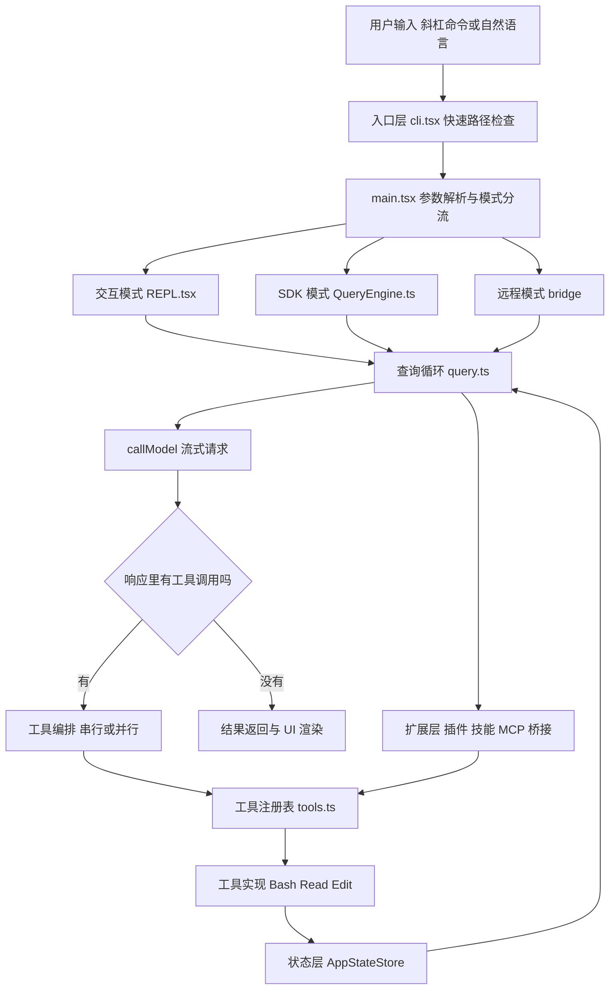
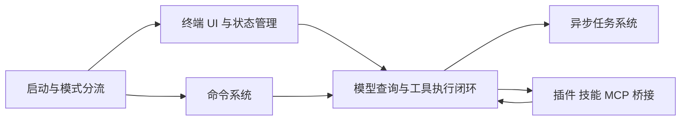
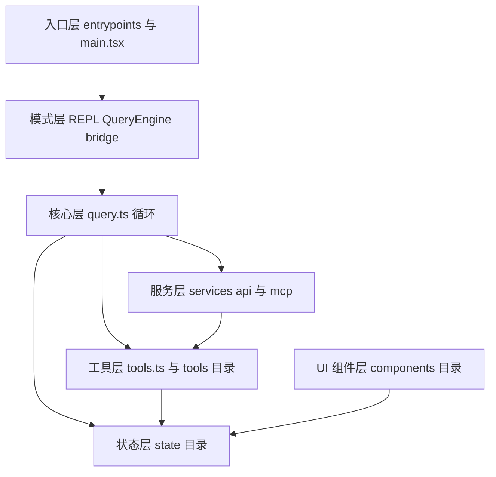
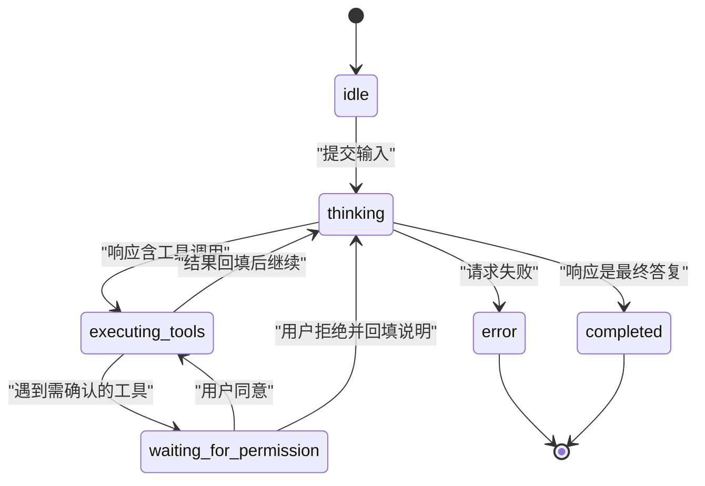
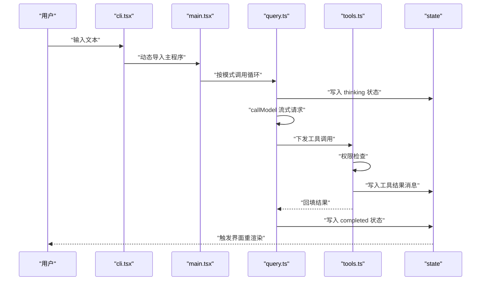
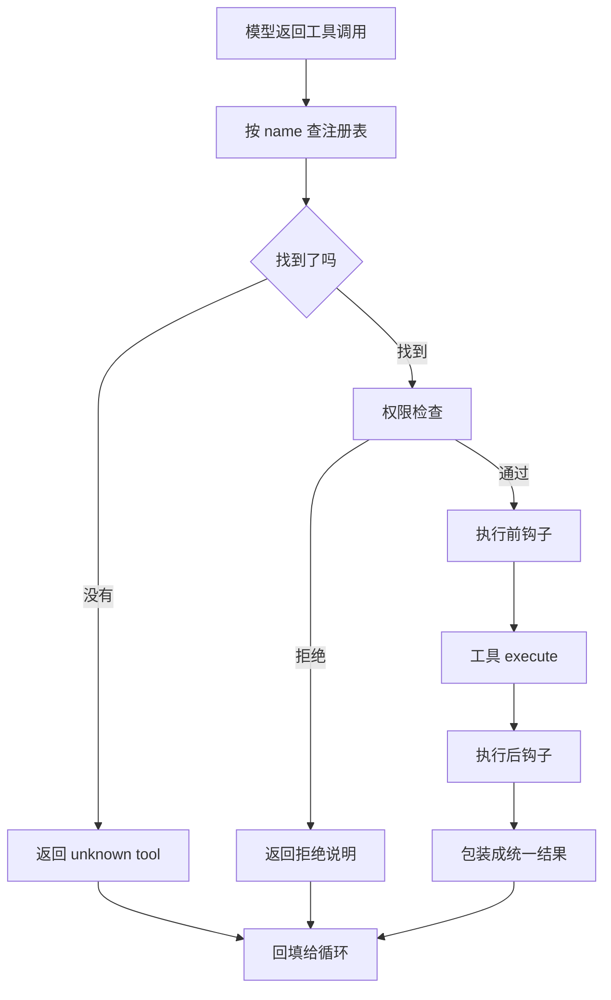
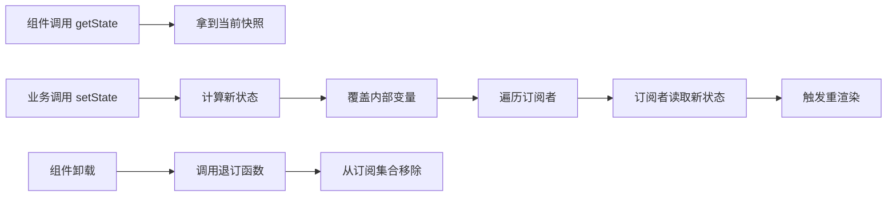
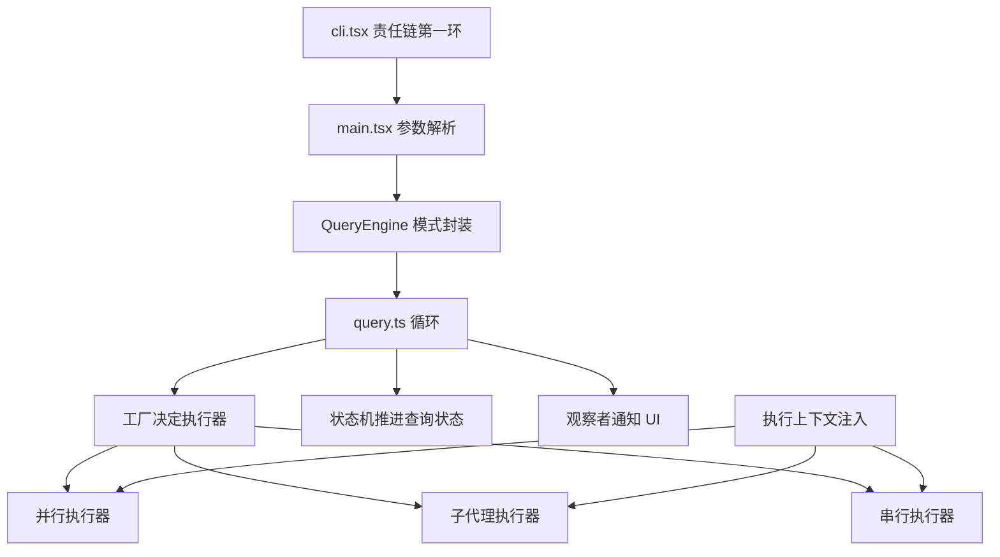
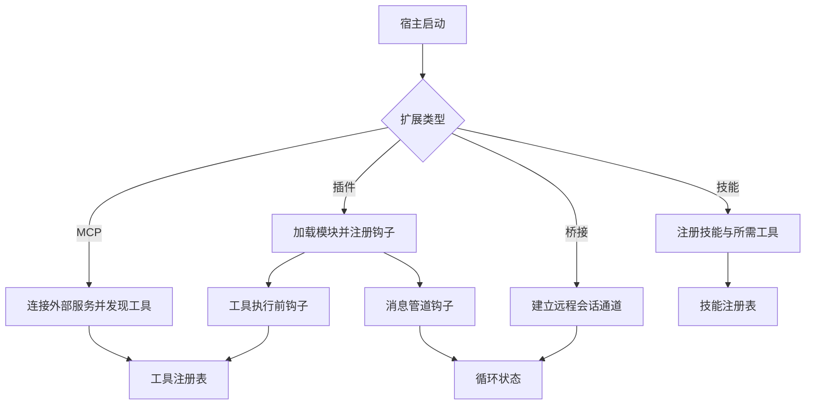
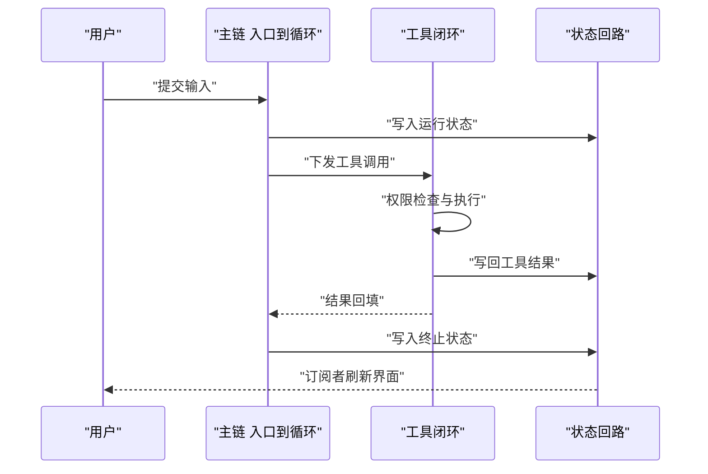

# Claude Code 源码剖析

!!! abstract "学完这一页你能"
    - 说出 Claude Code 的六个能力层各自负责什么，并把一个源码路径归到对应层。
    - 手写工具基类与工具注册表，把模型返回的工具调用路由到实现并拿到统一结果结构。
    - 画出从 cli.tsx 到查询循环再到工具执行的完整链路，指出状态在哪一步被改写。
    - 用 60 行以内的代码实现状态存储、权限累计拒绝、成本累加三个机制，并写出断言验证它们。

## 0. 知识地图



建议的读法：

1. 先读第 1 到第 3 节，把六个能力层和四个核心模块的职责记住，这是后面所有内容的地基。
2. 再读第 4 到第 6 节，跟着代码走一遍请求流程、工具系统和状态管理，这三节是本页的技术主干。
3. 最后读第 7 到第 9 节，设计模式与扩展机制是横向切面，放在主干之后读才能看懂它们插在哪里。

!!! note "术语：Agent Loop（代理循环）"
    指"调用模型，模型返回工具调用，执行工具，把结果回填给模型"这一串反复进行的步骤。
    例子：模型先要求读 a.ts，读完再要求改 a.ts，改完才输出最终答复，这一整段就是一个代理循环。

## 1. 项目概述：六个能力层

**先想一个问题**

你在终端敲下 Claude Code 的启动命令，0.2 秒内就看到版本号，但完整的对话界面还要再等一会儿才出现。同一份程序，为什么两条路径的耗时差这么多？

**心智模型**

!!! tip "心智模型"
    一句话模型：Claude Code 是一个终端 Agent 运行时，把模型请求和本机操作接成闭环。
    日常类比：像餐厅的传菜口，前台接单、后厨做菜、传菜口把成品送回前台。
    哪里不成立：餐厅菜品固定，这里的"菜"由模型临时点，工具清单还能在运行时增删。

!!! note "术语：TUI（Terminal User Interface，终端用户界面）"
    指在纯文本终端里用字符绘制交互界面的程序形态。
    例子：你在终端里看到的输入框、滚动历史、状态栏，都属于 TUI，而不是网页。

旧页把 Claude Code 的能力分成六层，这张表是后面章节的索引：

| 能力层 | 职责 | 对应目录 |
|--------|------|----------|
| 启动与模式分流 | CLI、SDK、桌面端多入口 | entrypoints、main.tsx |
| 终端 UI 与状态管理 | Ink 加 React 的 TUI | components、state |
| 命令系统 | 约 80 个斜杠命令（来源：本站该页旧版内容，以原文为准） | commands |
| 模型查询与工具执行闭环 | 代理循环 | query.ts、tools.ts |
| 异步任务系统 | 后台任务与子代理 | Task、AgentTool 相关文件 |
| 插件、技能、MCP、远程桥接 | 扩展层 | bridge、services |

仓库规模（来源：本站该页旧版内容，以原文为准）：src/ 目录约 1902 个文件。

- src/utils/ 564 个文件，横切能力。
- src/components/ 389 个文件，终端 UI 组件。
- src/commands/ 207 个文件，命令系统。
- src/tools/ 184 个文件，模型可调用的工具。
- src/services/ 130 个文件，API、MCP、LSP 等服务。

!!! note "术语：MCP（Model Context Protocol，模型上下文协议）"
    一套让模型进程连接外部数据源与服务的协议，连接后外部服务暴露的工具会进入本地工具清单。
    例子：把公司内部的知识库服务接入 MCP，模型就能像调用本地工具那样查询知识库。

**图解**



1. 启动层先判断本次是交互、SDK 还是远程，决定往哪条路走。
2. UI 层订阅状态，把消息、任务、成本画到终端上。
3. 命令层把斜杠命令翻译成对查询循环或 UI 的一次调用。
4. 查询循环调用模型，拿到工具调用后进入执行闭环。
5. 异步任务系统让耗时操作离开主循环，主循环继续处理对话。
6. 扩展层给闭环补充新的工具来源和新的拦截点。

**一步一步来**

第 1 步：用快速路径拦住两类只读请求。

```typescript
// 教学重写：演示快速路径思路，非官方源码
const VERSION = 'teaching'; // 版本号占位，真实版本号需核对官方文档

async function bootstrap(argv: string[]): Promise<void> {
  // 命中 --version 时只打印一行，不加载主程序
  if (argv.includes('--version')) {
    process.stdout.write('Claude Code v' + VERSION + '\n');
    return;
  }
  // 命中 --dump-system-prompt 时同样走快速路径
  if (argv.includes('--dump-system-prompt')) {
    process.stdout.write('system prompt placeholder\n');
    return;
  }
  // 两条快速路径都没命中，才动态导入主程序
  const { main } = await import('./main.js');
  await main(argv);
}
```

**这段代码在做什么**

- 用 argv 数组判断参数，避免为了读一个标志就初始化整棵模块树。
- 两条快速路径都在函数最前面返回，控制流一眼能看清。
- 动态 import 让主程序的加载推迟到真正需要的时候。
- VERSION 是占位字符串，真实版本号需核对官方文档。
- 这个函数是 async，因为它内部可能执行动态导入。

旧版内容称快速路径为零导入，原文标注小于 10 毫秒（来源：本站该页旧版内容，以原文为准）。

第 2 步：在主程序里做模式分流。

```typescript
// 教学重写：三种模式的分流骨架
type Mode = 'repl' | 'sdk' | 'bridge';

function decideMode(argv: string[]): Mode {
  // 带 --sdk 参数表示由外部程序驱动，走 SDK 模式
  if (argv.includes('--sdk')) return 'sdk';
  // 带 --remote 参数表示会话在远端，走桥接模式
  if (argv.includes('--remote')) return 'bridge';
  // 其余情况默认进入交互模式
  return 'repl';
}
```

**这段代码在做什么**

- 返回值是三个字符串字面量组成的联合类型，调用方用 switch 处理时必须覆盖全部分支。
- 判断顺序就是优先级，先判断的参数优先。
- 默认分支放在最后，保证函数不会返回未定义的值。
- 真实项目里这个函数还会做参数校验与钩子触发，需核对官方文档确认细节。

**运行结果**

```text
mode for []        -> repl
mode for ['--sdk'] -> sdk
```

**动手验证**

```javascript
// 文件：layers-demo.mjs
// 依赖：无，Node 20 及以上（用到顶层 await 与 node:assert/strict）
import assert from 'node:assert/strict';

const VERSION = 'teaching';                 // 版本号占位，真实值需核对官方文档
const events = [];                          // 记录执行轨迹，供断言检查

async function loadMain() {                 // 模拟延迟加载主程序
  events.push('load-main');                 // 记录加载动作发生
  return { main: async (argv) => { events.push('main:' + decideMode(argv)); } };
}

function decideMode(argv) {
  if (argv.includes('--sdk')) return 'sdk'; // 优先级一：SDK 模式
  if (argv.includes('--remote')) return 'bridge'; // 优先级二：远程模式
  return 'repl';                            // 兜底：交互模式
}

async function bootstrap(argv) {
  if (argv.includes('--version')) {         // 快速路径一
    events.push('fast-version');
    return 'version:' + VERSION;
  }
  if (argv.includes('--dump-system-prompt')) { // 快速路径二
    events.push('fast-prompt');
    return 'prompt:placeholder';
  }
  const mod = await loadMain();             // 两条快速路径都未命中才加载
  await mod.main(argv);
  return 'full';
}

assert.equal(await bootstrap(['--version']), 'version:' + VERSION);
assert.deepEqual(events, ['fast-version']); // 关键断言：快速路径下主程序未被加载

events.length = 0;                          // 清空轨迹，做第二次实验
assert.equal(await bootstrap(['--sdk']), 'full');
assert.deepEqual(events, ['load-main', 'main:sdk']);

console.log('mode check:', decideMode([]), decideMode(['--remote']));
console.log('all assertions passed');
```

预期输出：

```text
mode check: repl bridge
all assertions passed
```

**常见坑**

| 现象 | 原因 | 怎么修 |
|------|------|--------|
| 启动命令很慢 | 顶层 import 把整棵模块树拉进来 | 把主程序放在动态 import 里，快速路径提前返回 |
| 带 --sdk 却进了交互界面 | 分流判断顺序写反 | 把参数优先级排成一张表，按表改 if 顺序 |
| 版本号打印成 undefined | VERSION 从环境变量读取但未兜底 | 在读取处给默认值，并把默认值写进测试 |

**用在哪里**

场景一：命令行工具的冷启动优化

- 业务背景：团队内部的代码检查 CLI 被 CI 频繁调用，多数调用只取版本号或帮助信息。
- 这一节的知识怎么用：把版本号、帮助、配置导出放进快速路径，完整分析器延迟加载。
- 用什么指标衡量收益：CI 单次调用的墙钟时间，以及进程启动到输出第一行的时间。
- 什么时候不该用：命令本身耗时以秒计，启动开销占比低，改造收益看不出来。

场景二：多形态客户端共用一份核心逻辑

- 业务背景：同一套编辑器内核要同时供桌面端、网页端和命令行插件使用。
- 这一节的知识怎么用：把入口层拆成三层分流，核心循环只依赖注入进来的运行环境。
- 用什么指标衡量收益：新增一种客户端形态时改动的文件数。
- 什么时候不该用：只有一种客户端形态，拆层会让调用链变长。

场景三：后台批处理脚本

- 业务背景：夜间批量任务用同一份配置解析逻辑，希望与交互程序行为一致。
- 这一节的知识怎么用：复用参数解析与模式判定函数，跳过 TUI 相关模块。
- 用什么指标衡量收益：批处理进程的内存峰值与常驻模块数量。
- 什么时候不该用：批处理有自己的参数约定，强行复用得加很多条件分支。

**行业实践**

- Node.js 官方文档《Modules: ECMAScript modules》章节说明了动态 import 的语义：返回 Promise，且模块只求值一次，后续调用走缓存。借鉴方式：把重模块放进动态 import，并在测试里断言加载轨迹。
- Anthropic 官方文档《Claude Code overview》描述了它在终端中的使用方式与主要能力分类。借鉴方式：给自家 CLI 写一份能力分层表，让新成员按层找代码。
- MCP 官方规范站点 modelcontextprotocol.io 描述了工具发现与调用的消息形状。借鉴方式：把外部服务暴露的能力纳入统一的工具注册表，而不是各处写 if 分支。

**小结**

1. 六个能力层是读源码的索引，任何文件都能归到其中一层。
2. 快速路径靠延迟导入实现，判断放在函数最前面。
3. 模式分流是一组 if，顺序就是优先级，必须有兜底分支。

## 2. 项目结构分析

**先想一个问题**

你拿到一份 1902 个文件的仓库（来源：本站该页旧版内容，以原文为准），想改一个工具的行为，却不知道从哪个目录下手。怎么在十分钟内定位到该改的文件？

**心智模型**

!!! tip "心智模型"
    一句话模型：目录结构是责任的物理映射，一层目录对应一类职责。
    日常类比：像医院的楼层索引，挂号在一楼、化验在二楼，按目的走就不会乱逛。
    哪里不成立：医院楼层不会互相调用，而这里的工具层会反向触发状态层更新。

**图解**



1. 入口层只做参数解析与分流，不放业务逻辑。
2. 模式层把三种使用方式统一成对同一个循环的调用。
3. 核心层是循环本身，负责调用模型、分发工具、推进状态。
4. 工具层是模型能触达的原子能力集合。
5. 状态层是唯一数据源，UI 与服务层都从这里读。
6. 服务层提供网络与协议能力，工具层通过它访问外部。

旧页给出的目录骨架如下（来源：本站该页旧版内容，以原文为准）：

```text
src/
├── entrypoints/           # 入口层
│   ├── cli.tsx            # CLI 入口，bootstrap 模式
│   └── init.ts            # 初始化入口
├── main.tsx               # 主程序，参数解析与模式分流
├── query.ts               # 核心查询循环
├── QueryEngine.ts         # SDK 模式封装
├── Tool.ts                # 工具基类
├── tools.ts               # 工具注册与执行
├── commands.ts            # 命令注册
├── components/            # UI 组件
├── services/              # 服务层
├── state/                 # 状态管理
└── bridge/                # 远程桥接
```

**一步一步来**

第 1 步：把路径映射到层。

```typescript
// 教学重写：用前缀规则把文件路径归类到能力层
const RULES: Array<[string, string]> = [
  ['src/entrypoints/', 'entry'],   // 入口层
  ['src/components/', 'ui'],       // UI 组件层
  ['src/commands/', 'command'],    // 命令层
  ['src/tools/', 'tool'],          // 工具层
  ['src/services/', 'service'],    // 服务层
  ['src/state/', 'state'],         // 状态层
  ['src/bridge/', 'bridge'],       // 桥接层
];

function classify(path: string): string {
  // 按顺序匹配，命中第一条就返回
  for (const [prefix, layer] of RULES) {
    if (path.startsWith(prefix)) return layer;
  }
  // 未命中任何前缀时归为 core，避免返回空值
  return 'core';
}
```

**这段代码在做什么**

- RULES 是一个数组，顺序即优先级，长前缀要写在短前缀前面。
- 每一项用元组表示前缀与层名，避免键名拼写错误。
- 循环里命中就返回，复杂度与规则条数成正比，规则只有几条时可忽略。
- 兜底返回 core，让分类函数是全函数，调用方无需判空。

第 2 步：统计每层的文件数。

```typescript
function countByLayer(paths: string[]): Record<string, number> {
  const acc: Record<string, number> = {}; // 累加器，键为层名
  for (const p of paths) {
    const layer = classify(p);            // 复用上一步的分类函数
    acc[layer] = (acc[layer] ?? 0) + 1;   // 用空值合并避免 undefined 参与加法
  }
  return acc;
}
```

**这段代码在做什么**

- acc 的初始值是空对象，第一次遇到某层时值为 undefined，用 ?? 兜底为 0。
- 计数与分类分离，分类规则改动不会影响统计逻辑。
- 返回普通对象，便于在测试里用 deepEqual 比较。
- 真实仓库文件数需以实际版本为准，本页不给出未核对的数字。

**运行结果**

```text
countByLayer(['src/tools/ReadTool.ts','src/state/store.ts','src/tools/Bash.ts'])
-> { tool: 2, state: 1 }
```

**动手验证**

```javascript
// 文件：classify-demo.mjs
// 依赖：无，Node 20 及以上
import assert from 'node:assert/strict';

const RULES = [
  ['src/entrypoints/', 'entry'],
  ['src/components/', 'ui'],
  ['src/commands/', 'command'],
  ['src/tools/', 'tool'],
  ['src/services/', 'service'],
  ['src/state/', 'state'],
  ['src/bridge/', 'bridge'],
];

function classify(path) {
  for (const [prefix, layer] of RULES) {  // 顺序匹配，先命中先返回
    if (path.startsWith(prefix)) return layer;
  }
  return 'core';                          // 兜底归类
}

function countByLayer(paths) {
  const acc = {};                         // 层名到数量的映射
  for (const p of paths) {
    const layer = classify(p);            // 每条路径只分类一次
    acc[layer] = (acc[layer] ?? 0) + 1;   // undefined 兜底为 0
  }
  return acc;
}

assert.equal(classify('src/tools/BashTool.ts'), 'tool');
assert.equal(classify('src/state/store.ts'), 'state');
assert.equal(classify('src/query.ts'), 'core');   // 顶层文件归入 core

const paths = [
  'src/tools/BashTool.ts',
  'src/tools/ReadTool.ts',
  'src/state/store.ts',
  'src/commands/add.ts',
  'src/utils/format.ts',
];
assert.deepEqual(countByLayer(paths), { tool: 2, state: 1, command: 1, core: 1 });

console.log('layers:', JSON.stringify(countByLayer(paths)));
console.log('all assertions passed');
```

预期输出：

```text
layers: {"tool":2,"state":1,"command":1,"core":1}
all assertions passed
```

**常见坑**

| 现象 | 原因 | 怎么修 |
|------|------|--------|
| 路径归类到 core 的数量偏高 | 规则表缺少某一层的前缀 | 打印未命中路径清单，逐条补规则 |
| src/utils 被归到底层逻辑里 | utils 是横切目录，不属于某一层 | 在规则里显式标注 utils 为横切层，单独统计 |
| 统计数字与预期不符 | 用后缀匹配导致同名文件重复计数 | 统一用前缀匹配，并在测试里固定输入样本 |

**用在哪里**

场景一：接手陌生仓库的定位训练

- 业务背景：新成员加入后需要一周才能独立改一个工具的行为。
- 这一节的知识怎么用：把分类规则写成脚本，生成一份目录到职责的索引文档。
- 用什么指标衡量收益：新成员第一次提交有效改动所需的日历天。
- 什么时候不该用：仓库只有几十个文件，一张目录说明就够。

场景二：代码体积治理

- 业务背景：主包体积持续增长，需要找出哪一层在膨胀。
- 这一节的知识怎么用：按层统计文件数与依赖边，定位增长来源。
- 用什么指标衡量收益：构建产物中每一层的模块数量与字节数。
- 什么时候不该用：按层统计会掩盖单文件膨胀，需要配合单文件体积排行。

场景三：仓库脚手架生成

- 业务背景：团队按同一套分层规范新建服务端项目。
- 这一节的知识怎么用：用规则表生成目录骨架与检查脚本。
- 用什么指标衡量收益：新建项目通过分层检查的比例。
- 什么时候不该用：团队规范尚未稳定，过早固化成脚本会反复改。

**行业实践**

- Node.js 官方文档《Modules: Packages》章节介绍了 package.json 的 exports 字段与子路径导出的约定。借鉴方式：用子路径导出把分层边界写进包配置，而不是只靠目录名。
- TypeScript 官方手册《Project References》章节说明了把大工程拆成多个可独立编译的子项目。借鉴方式：给分层加编译边界，越界引用在构建阶段报错。
- React 官方文档《useSyncExternalStore》章节描述了外部状态存储在渲染中的正确接入方式。借鉴方式：UI 层只通过订阅接口读状态，不直接 import 状态模块内部结构。

**小结**

1. 目录结构是职责的物理映射，先看层次再看文件。
2. 分类规则写成数据而不是代码，便于补规则和写测试。
3. utils 一类横切目录要单独标注，否则统计结果会失真。

## 3. 核心模块与职责

**先想一个问题**

一次对话里模型连续调用了三次工具，中途你按了取消键。哪些模块要立刻知道这件事，才能既停止工具又不丢失已经产生的消息？

**心智模型**

!!! tip "心智模型"
    一句话模型：四个核心模块分别管入口、管循环、管能力、管数据，边界清楚。
    日常类比：像一家快递站，前台收件、调度排线、快递员送货、系统记账，各管一段。
    哪里不成立：快递站各岗位互不干涉，而这里的工具执行结果会直接写进状态并影响下一轮循环。

**图解**



1. idle 是等待输入的初始态。
2. 收到输入后进入 thinking，此时正在等模型流式返回。
3. 响应里有工具调用就进入 executing_tools，没有就直接 completed。
4. 工具需要确认时进入 waiting_for_permission，用户同意后回到执行态。
5. 用户拒绝时把拒绝说明作为工具结果回填，回到 thinking 让模型换方案。
6. 请求失败进入 error，这是一条终止路径。

旧页给出的四个核心模块（来源：本站该页旧版内容，以原文为准）：

| 模块 | 位置 | 职责 |
|------|------|------|
| 入口层 | cli.tsx | bootstrap 快速路径与延迟加载 |
| 查询引擎层 | QueryEngine.ts 与 query.ts | 封装会话，驱动 while 循环 |
| 工具层 | tools.ts 与 Tool.ts | 定义契约、注册、批量执行 |
| 状态层 | state/ | 中央状态存储与订阅通知 |

!!! note "术语：会话（Session）"
    指一次连续对话所携带的全部运行时上下文，包含消息列表、当前状态与权限设置。
    例子：你打开程序问了三轮问题，这三轮共用一个会话对象。

**一步一步来**

第 1 步：把循环写成 while 而不是递归。

```typescript
// 教学重写：while 循环版代理循环骨架
type LoopState = { status: string; rounds: number }; // 循环状态

async function query(session: { rounds: number }, input: string): Promise<string> {
  let state: LoopState = { status: 'thinking', rounds: 0 }; // 初始状态
  while (true) {
    // 每轮先请求模型，返回是否还有工具调用
    const response = await callModel(input, state);
    if (response.toolUses.length > 0) {
      // 有工具调用则进入执行态并累加轮次
      state = { status: 'executing_tools', rounds: state.rounds + 1 };
      continue; // 回到循环顶部，继续下一轮
    }
    // 没有工具调用说明模型给出了最终答复
    return response.text;
  }
}
```

**这段代码在做什么**

- while 循环把多轮工具调用摊平在同一层调用栈里，长会话不会累积递归深度。
- state 每轮都整体替换成新对象，避免旧引用被意外改写。
- rounds 记录轮次，便于设置上限或做日志。
- continue 与 return 是两个明确出口，控制流没有隐藏分支。
- callModel 在真实项目里是流式请求，这里简化成返回完整响应。

第 2 步：用 SDK 模式封装循环。

```typescript
// 教学重写：SDK 模式封装，把循环暴露成一个方法
export class QueryEngine {
  private session: { rounds: number };      // 会话上下文
  private permissionDeniedTracker = new Map<string, number>(); // 拒绝计数

  constructor(session: { rounds: number }) {
    this.session = session;
  }

  async submitMessage(input: string): Promise<string> {
    // 直接把输入交给循环，返回值就是最终答复文本
    return query(this.session, input);
  }
}
```

**这段代码在做什么**

- 类把会话与拒绝计数收进私有字段，外部只能通过 submitMessage 驱动。
- permissionDeniedTracker 用 Map 保存每个工具的拒绝次数，键是工具名。
- submitMessage 是异步方法，返回值类型与循环的返回类型保持一致。
- 这一层是给外部程序调用的稳定接口，内部循环换实现不影响调用方。

**运行结果**

```text
submitMessage('你好') -> 'final answer after 0 tool rounds'
submitMessage('读文件') -> 'final answer after 2 tool rounds'
```

**动手验证**

```javascript
// 文件：loop-demo.mjs
// 依赖：无，Node 20 及以上
import assert from 'node:assert/strict';

/** 模拟模型：按预设脚本依次返回响应 */
function makeModel(script) {
  let i = 0;                                 // 脚本游标
  return async (input, state) => {
    const step = script[Math.min(i, script.length - 1)];
    i += 1;                                  // 每次调用向后走一步
    return step;                             // 返回当前步骤的响应对象
  };
}

async function query(input, state, callModel) {
  while (true) {
    const response = await callModel(input, state); // 请求模型
    if (response.toolUses.length > 0) {      // 有工具调用则继续循环
      state.status = 'executing_tools';
      state.rounds += 1;                     // 轮次加一
      state.seen.push(response.toolUses[0]); // 记录被调用的工具名
      continue;
    }
    state.status = 'completed';              // 无工具调用，收尾
    return response.text;
  }
}

const state = { status: 'thinking', rounds: 0, seen: [] };
const model = makeModel([
  { toolUses: ['Read'], text: '' },          // 第 1 轮：要求读文件
  { toolUses: ['Edit'], text: '' },          // 第 2 轮：要求改文件
  { toolUses: [], text: 'done' },            // 第 3 轮：给出最终答复
]);

assert.equal(await query('x', state, model), 'done');
assert.equal(state.rounds, 2);               // 两次工具轮次
assert.deepEqual(state.seen, ['Read', 'Edit']);
assert.equal(state.status, 'completed');     // 终态正确

console.log('rounds:', state.rounds, 'seen:', state.seen.join(','));
console.log('all assertions passed');
```

预期输出：

```text
rounds: 2 seen: Read,Edit
all assertions passed
```

**常见坑**

| 现象 | 原因 | 怎么修 |
|------|------|--------|
| 长会话报栈溢出 | 用递归实现多轮工具调用 | 改成 while 循环加 continue |
| 轮次上限判断失效 | 累加写在 continue 之后 | 把累加放在 continue 之前，并写测试断言轮次 |
| 取消后仍执行工具 | 状态字段更新了但工具没有读取取消信号 | 把取消信号放进工具执行上下文，执行前检查 |

**用在哪里**

场景一：客服机器人多轮查询

- 业务背景：机器人先查订单，再查物流，最后生成答复。
- 这一节的知识怎么用：把查询步骤拆成工具，循环每轮消费一个工具结果。
- 用什么指标衡量收益：一次会话的平均模型调用轮次，以及答复前的人工等待时长。
- 什么时候不该用：一次查询就能拿到全部数据，循环只会增加调用次数。

场景二：代码审查助手

- 业务背景：助手需要先读差异、再读相关文件、最后给建议。
- 这一节的知识怎么用：把读文件设成免确认工具，把写操作设成需确认的等待态。
- 用什么指标衡量收益：每份差异的审查时长与建议被采纳的比例。
- 什么时候不该用：审查规则固定且无需读文件，用静态规则检查即可。

场景三：对外提供的编程助手 SDK

- 业务背景：合作方要把助手嵌入自己的 IDE。
- 这一节的知识怎么用：只暴露 submitMessage 一个入口，会话与计数藏在类内部。
- 用什么指标衡量收益：接口变更导致下游改动的次数。
- 什么时候不该用：下游需要自定义循环策略，封闭接口会成为阻碍。

**行业实践**

- Anthropic 官方文档《Claude Code overview》把终端、IDE、SDK 列成同一能力的多种接入形式。借鉴方式：核心循环与接入形态分开设计，接入层只做适配。
- Node.js 官方文档《Errors》章节说明了异常对象的结构与错误类型区分。借鉴方式：循环的失败路径要保留错误类型信息，不要统一压成一条字符串。
- TypeScript 官方手册《Classes》章节说明了私有字段与访问修饰符的语义。借鉴方式：用私有字段守住模块边界，把可变计数藏在类内部。

**小结**

1. 入口、循环、工具、状态四个模块职责互不重叠。
2. 循环用 while 实现，状态每轮整体替换。
3. 对外的模式封装只暴露一个提交方法，内部细节不外泄。

## 4. 请求处理流程

**先想一个问题**

用户按下回车到屏幕上出现第一个字，中间经过了哪些模块？如果某一步卡住，你怎么判断是网络、工具还是渲染的问题？

**心智模型**

!!! tip "心智模型"
    一句话模型：请求沿一条单向主链流动，工具执行是链上唯一会回头的地方。
    日常类比：像流水线，工位依次传递，只有返修环节会把半成品送回上游。
    哪里不成立：流水线工位顺序固定，而这里的分支取决于模型是否返回工具调用。

**图解**



1. 用户输入先到入口层，入口层只做加载判断。
2. 主程序按模式决定调用哪个封装，最终都落到同一个循环。
3. 循环开始前先把状态置为 thinking，界面据此显示等待态。
4. 模型以流式方式返回，文本可以边到边显示。
5. 响应里有工具调用时下发到工具层，工具先做权限检查。
6. 工具结果写回状态并回填给循环，循环进入下一轮。
7. 循环结束后写 completed，状态变化通知界面重渲染。

旧页给出的三种运行模式（来源：本站该页旧版内容，以原文为准）：

1. 交互模式：main.tsx 到 REPL.tsx 再到 query.ts。
2. SDK 模式：QueryEngine.submitMessage 到 query.ts。
3. 远程模式：Bridge 桥接，WebSocket 会话管理。

**一步一步来**

第 1 步：解析响应并决定是否执行工具。

```typescript
// 教学重写：从响应里取出工具调用
interface ToolCall {
  id: string;        // 单次调用的唯一编号，回填结果时要用它对应
  name: string;      // 工具名，注册表的键
  input: unknown;    // 模型给出的参数，形状由各工具自己校验
}

function extractToolCalls(response: { content: Array<Record<string, unknown>> }): ToolCall[] {
  // 只挑出类型为 tool_use 的内容块
  return response.content
    .filter((b) => b.type === 'tool_use')
    .map((b) => ({ id: String(b.id), name: String(b.name), input: b.input }));
}
```

**这段代码在做什么**

- 过滤条件是内容块的 type 字段，非工具块直接丢弃。
- 每个工具调用保留 id，回填时必须带上同一个 id，模型才能对应上。
- input 声明为 unknown，校验责任交给各工具实现。
- 返回数组，空数组表示这一轮没有工具调用。

第 2 步：编排并执行工具组。

```typescript
async function executeToolCalls(calls: ToolCall[], registry: Map<string, { execute: Function }>) {
  // 无依赖的一组工具可以并发执行
  const results = await Promise.all(
    calls.map(async (call) => {
      const tool = registry.get(call.name);       // 按名查工具
      if (!tool) return { id: call.id, ok: false, error: 'unknown tool' };
      try {
        return { id: call.id, ok: true, output: await tool.execute(call.input) };
      } catch (error) {
        return { id: call.id, ok: false, error: String(error) }; // 失败也返回结构
      }
    }),
  );
  return results;
}
```

**这段代码在做什么**

- Promise.all 让互不依赖的工具并发执行，总耗时接近最慢的那个。
- 工具不存在时返回失败结构，不抛异常，避免一个调用拖垮整组。
- try 捕获执行异常并转成结果对象，让上层统一处理。
- 每条结果都带 id，回填时顺序可以打乱。
- 真实项目里还会先做依赖分析，再决定串行还是并行，需核对官方文档确认策略细节。

**运行结果**

```text
results -> [{"id":"t1","ok":true},{"id":"t2","ok":false,"error":"unknown tool"}]
```

**动手验证**

```javascript
// 文件：request-flow-demo.mjs
// 依赖：无，Node 20 及以上
import assert from 'node:assert/strict';

const trace = [];                                  // 记录流程轨迹

function extractToolCalls(response) {
  return response.content
    .filter((b) => b.type === 'tool_use')          // 只取工具块
    .map((b) => ({ id: String(b.id), name: String(b.name), input: b.input }));
}

async function executeToolCalls(calls, registry) {
  return Promise.all(calls.map(async (call) => {
    const tool = registry.get(call.name);          // 按名查表
    if (!tool) return { id: call.id, ok: false, error: 'unknown tool' };
    try {
      return { id: call.id, ok: true, output: await tool.execute(call.input) };
    } catch (error) {
      return { id: call.id, ok: false, error: String(error) };
    }
  }));
}

const registry = new Map([
  ['Read', { execute: async (i) => { trace.push('read:' + i.file_path); return 'file-body'; } }],
]);

const response = {
  content: [
    { type: 'text', text: '先看文件' },
    { type: 'tool_use', id: 't1', name: 'Read', input: { file_path: 'a.ts' } },
    { type: 'tool_use', id: 't2', name: 'Nope', input: {} },
  ],
};

const calls = extractToolCalls(response);
assert.equal(calls.length, 2);                     // 两个工具调用被识别

const results = await executeToolCalls(calls, registry);
assert.deepEqual(results[0], { id: 't1', ok: true, output: 'file-body' });
assert.equal(results[1].ok, false);                // 未知工具返回失败结构
assert.deepEqual(trace, ['read:a.ts']);            // 已知工具确实被执行

console.log('results:', JSON.stringify(results));
console.log('all assertions passed');
```

预期输出：

```text
results: [{"id":"t1","ok":true,"output":"file-body"},{"id":"t2","ok":false,"error":"unknown tool"}]
all assertions passed
```

**常见坑**

| 现象 | 原因 | 怎么修 |
|------|------|--------|
| 模型说工具没被调用 | 回填结果时丢了调用 id | 结果对象必须带原样的 id，写断言检查 |
| 一个工具报错导致整轮失败 | 执行处没有捕获异常 | 每个工具单独 try，失败也返回结构化结果 |
| 界面一直停在等待态 | 状态终态没写回 | 在 finally 或返回前写 completed |

**用在哪里**

场景一：IDE 插件的对话面板

- 业务背景：面板要边收边显，用户感知首字延迟。
- 这一节的知识怎么用：流式文本先渲染，工具调用期间在消息流里插入执行中占位。
- 用什么指标衡量收益：从回车到首字出现的时间，以及工具执行期的界面可交互性。
- 什么时候不该用：响应很短，流式与一次性展示的体感差别看不出来。

场景二：自动化流水线里的代码修复机器人

- 业务背景：CI 失败后自动跑一轮修复并提交。
- 这一节的知识怎么用：把写文件与提交命令设为需确认工具，在无人值守环境里配置成自动同意。
- 用什么指标衡量收益：自动修复成功率与需要人工接手的比例。
- 什么时候不该用：仓库改动风险高，逐条人工确认反而更省事。

场景三：远程协作会话

- 业务背景：工程师在本地，执行发生在远程开发机上。
- 这一节的知识怎么用：桥接层转发输入与结果，状态仍由本地订阅渲染。
- 用什么指标衡量收益：往返延迟与断线重连后的状态一致性。
- 什么时候不该用：执行环境与本地同一台机器，桥接只会增加一层转发。

**行业实践**

- MCP 官方规范站点 modelcontextprotocol.io 描述了工具调用与结果的对应关系。借鉴方式：把调用 id 作为结果回填的强约束写进接口定义。
- Anthropic 官方文档《Claude Code overview》说明了终端、IDE 与会话之间的接入方式。借鉴方式：把渲染与执行解耦，渲染只订阅状态。
- Node.js 官方文档《Timers》章节说明了超时相关 API 的语义与清理要求。借鉴方式：给工具执行设置超时并在结束时清理定时器，避免进程无法退出。

**小结**

1. 主链是入口到循环到工具再回到循环，唯一回头点是工具执行。
2. 工具调用用 id 关联请求与结果，缺 id 会表现为"工具没被调用"。
3. 每种失败都转成结构化结果，让循环能继续推进。

## 5. 工具系统实现

**先想一个问题**

模型返回了三个工具调用，其中两个读不同文件、一个写文件。三个一起并发跑安全吗？谁来决定顺序？

**心智模型**

!!! tip "心智模型"
    一句话模型：工具是一个带名字、说明、参数模式和执行方法的对象，注册表按名字路由。
    日常类比：像工具箱的格子柜，每格贴标签，取工具先看标签再拿。
    哪里不成立：格子柜里的工具不会自己决定用哪个，而这里由模型读说明后选择。

**图解**



1. 从响应里抽出工具调用，每个都带名字。
2. 用名字在注册表里查实现，查不到直接返回失败。
3. 查到后先做权限检查，被拒时返回一段说明而不是抛错。
4. 通过检查后触发执行前钩子，插件可以在这里做审计或拦截。
5. 调用工具自身的 execute，传入参数与运行上下文。
6. 执行完成后触发执行后钩子，再包装成统一结构回填。

旧页给出的内置工具清单（来源：本站该页旧版内容，以原文为准）：

| 工具 | 作用 |
|------|------|
| BashTool | 执行 Shell 命令 |
| ReadTool | 读取文件内容 |
| WriteTool | 写入文件内容 |
| EditTool | 编辑文件 |
| GlobTool | 文件模式匹配 |
| GrepTool | 内容搜索 |
| WebSearchTool | 网络搜索 |
| AgentTool | 创建子代理 |
| SkillTool | 调用技能 |
| MCPTool | MCP 协议工具 |
| TodoWriteTool | 任务列表写入 |
| TaskTool | 后台任务管理 |

!!! note "术语：JSON Schema"
    一种用 JSON 描述数据结构与约束的格式，工具用它声明参数有哪些字段、哪些必填。
    例子：Read 工具的模式会声明 file_path 是字符串且必填，offset 是可选数字。

**一步一步来**

第 1 步：定义工具契约。

```typescript
// 教学重写：工具抽象契约
abstract class Tool {
  abstract name: string;            // 唯一名，注册表的键
  abstract description: string;     // 给模型读的说明，决定它是否选这个工具
  abstract inputSchema: object;     // 参数校验用的模式
  // 统一执行入口，input 用 unknown 强制实现方先做校验
  abstract execute(input: unknown, context: ToolContext): Promise<ToolResult>;
}
```

**这段代码在做什么**

- 用抽象类而不是接口，子类可以共享将来加入的公共实现。
- 三个字段都是 abstract，子类必须给值，避免出现没名字的工具。
- input 声明为 unknown，实现方要先收窄类型再用。
- 返回值统一为 Promise 的 ToolResult，上层拿到的结构一致。

第 2 步：注册与路由。

```typescript
const toolRegistry = new Map<string, Tool>(); // 全局注册表

export function registerTool(tool: Tool): void {
  // 同名工具会被覆盖，如需禁止重复应在此先判断 has
  toolRegistry.set(tool.name, tool);
}

export function getTool(name: string): Tool | undefined {
  // Map 的查找是常数时间，避免每次线性扫描
  return toolRegistry.get(name);
}
```

**这段代码在做什么**

- 用 Map 而不是普通对象，避免原型链上的键名干扰。
- registerTool 以 tool.name 为键，同名会静默覆盖，这是需要留意的点。
- getTool 返回可能为 undefined，调用方必须处理查不到的情况。
- 注册表是模块级常量，注册是就地写入，不需要重建表。

第 3 步：实现一个读文件工具。

```typescript
class ReadTool extends Tool {
  name = 'Read';
  description = 'Read a text file and return selected lines';
  inputSchema = { type: 'object', properties: { file_path: { type: 'string' } } };

  async execute(input: { file_path: string; offset?: number; limit?: number }) {
    const fs = await import('node:fs/promises'); // 动态导入，缩短冷启动
    try {
      const content = await fs.readFile(input.file_path, 'utf-8'); // 指定编码
      const lines = content.split('\n');          // 按行切分
      const offset = input.offset ?? 0;           // 起止行下标
      const limit = input.limit ?? lines.length;  // 未传则读到末尾
      const selected = lines.slice(offset, offset + limit).join('\n');
      return { success: true, output: selected }; // 统一成功结构
    } catch (error) {
      return { success: false, error: String(error) }; // 失败也返回结构
    }
  }
}
```

**这段代码在做什么**

- 指定 utf-8 编码，否则拿到的字节缓冲会把多字节字符切坏。
- offset 与 limit 都用空值合并运算符，只有 null 与 undefined 才走默认值。
- slice 的结束下标是排他的，超出范围会静默截断，不会抛错。
- 失败时不区分具体原因，统一转成 success 为 false 的结果让模型自己调整。
- 旧页的实现用逻辑或取值，传入 0 会被当成未提供，本页改用空值合并来避开这个点。

**运行结果**

```text
read ok -> true
output  -> 第 1 行
第 2 行
```

**动手验证**

```javascript
// 文件：tool-system-demo.mjs
// 依赖：无，Node 20 及以上（用到 node:fs/promises 与 os 临时目录）
import assert from 'node:assert/strict';
import { mkdtemp, writeFile, rm } from 'node:fs/promises';
import { tmpdir } from 'node:os';
import { join } from 'node:path';

class Tool {                                  // 简化版工具基类
  constructor(name) { this.name = name; }
}

class ReadTool extends Tool {
  constructor() { super('Read'); }
  async execute(input) {
    const fs = await import('node:fs/promises'); // 动态导入内置模块
    try {
      const content = await fs.readFile(input.file_path, 'utf-8');
      const lines = content.split('\n');
      const offset = input.offset ?? 0;          // 0 是合法值，不能用逻辑或
      const limit = input.limit ?? lines.length;
      return { success: true, output: lines.slice(offset, offset + limit).join('\n') };
    } catch (error) {
      return { success: false, error: String(error) };
    }
  }
}

class MissingTool extends Tool {
  constructor() { super('Missing'); }
  async execute() { throw new Error('read failed: ENOENT'); }
}

const registry = new Map();
function registerTool(tool) { registry.set(tool.name, tool); } // 同名覆盖
registerTool(new ReadTool());
registerTool(new MissingTool());

const dir = await mkdtemp(join(tmpdir(), 'tool-demo-'));   // 建临时目录
const file = join(dir, 'sample.txt');
await writeFile(file, ['l1', 'l2', 'l3'].join('\n'), 'utf-8');

const read = registry.get('Read');
const ok = await read.execute({ file_path: file, offset: 1, limit: 1 });
assert.deepEqual(ok, { success: true, output: 'l2' });     // 偏移与限量生效

const zero = await read.execute({ file_path: file, offset: 0, limit: 1 });
assert.equal(zero.output, 'l1');                           // offset 为 0 时不被当成未提供

const bad = await read.execute({ file_path: join(dir, 'nope.txt') });
assert.equal(bad.success, false);                          // 读不到文件时返回失败结构

const thrown = await registry.get('Missing').execute({}).catch((e) => String(e));
assert.match(thrown, /ENOENT/);                            // 抛错型工具需要上层捕获

await rm(dir, { recursive: true, force: true });           // 清理临时目录
console.log('read ok:', ok.success, 'line:', ok.output);
console.log('all assertions passed');
```

预期输出：

```text
read ok: true line: l2
all assertions passed
```

**常见坑**

| 现象 | 原因 | 怎么修 |
|------|------|--------|
| 中文被切成乱码 | 读文件未指定编码 | readFile 第二参数写 utf-8 |
| 传 limit 为 0 却返回全部内容 | 用逻辑或取默认值 | 改用空值合并运算符并写边界断言 |
| 同名工具互相顶掉 | 注册表直接覆盖 | 注册时先判断 has，冲突就抛错 |
| 工具抛错打断整轮 | 执行处没有兜底 | 每个工具单独 try，异常转成失败结果 |

**用在哪里**

场景一：电商商品列表的批量数据处理脚本

- 业务背景：运营要把一份 CSV 里的价格批量校验，脚本要读配置也要改文件。
- 这一节的知识怎么用：把读文件与写文件拆成两个工具，写操作走权限检查。
- 用什么指标衡量收益：一次批处理的失败条目数与回滚次数。
- 什么时候不该用：改动只在内存里完成，引入工具层只是增加间接层。

场景二：后台管理的批量导入

- 业务背景：管理员上传表格，系统逐行校验并入库。
- 这一节的知识怎么用：把校验、入库、发通知拆成三个工具，用编排决定并行还是串行。
- 用什么指标衡量收益：每千行的处理时长与失败行的可定位比例。
- 什么时候不该用：导入必须整体事务，拆成独立工具反而破坏原子性。

场景三：多来源检索助手

- 业务背景：助手要同时查本地代码库与远端知识库。
- 这一节的知识怎么用：本地工具与 MCP 工具注册进同一张表，调用方按名路由。
- 用什么指标衡量收益：新增一个数据源需要改动的文件数。
- 什么时候不该用：只有一个数据源，注册表带来的间接层没有回报。

**行业实践**

- MCP 官方规范站点 modelcontextprotocol.io 描述了工具清单的发现与调用流程。借鉴方式：把远端工具转成符合本地契约的对象后注册进同一张表。
- TypeScript 官方手册《Abstract Classes and Members》章节说明了抽象成员的约束语义。借鉴方式：把工具必须提供的字段声明为抽象成员，漏写会在编译期报错。
- Node.js 官方文档《File system》章节说明了 readFile 在未指定编码时返回 Buffer。借鉴方式：所有文本读取都显式指定编码，并在测试里用中文样本验证。

**小结**

1. 工具契约固定三件事：名字、说明、参数模式，加一个执行方法。
2. 注册表用 Map，键是工具名，同名覆盖需要主动防御。
3. 所有失败都转成结构化结果，让循环能继续。

## 6. 状态管理机制

**先想一个问题**

界面上要同时显示消息列表、后台任务进度、当前花费。这三块数据改动频率不同，怎么组织才能只刷新该刷新的部分？

**心智模型**

!!! tip "心智模型"
    一句话模型：状态集中放在一个存储里，改动只能通过写方法，写完通知订阅者。
    日常类比：像公司的公告栏，所有通知贴在同一块板上，谁想看自己去看。
    哪里不成立：公告栏不会主动推送给员工，而这里的订阅者在写入后立即收到回调。

**图解**



1. 读取走 getState，直接返回当前快照，不触发通知。
2. 写入只允许通过 setState，可以传值也可以传更新函数。
3. 传更新函数时基于最新状态计算，避开闭包里的旧值。
4. 内部变量先更新，再遍历订阅者，保证回调里读到的已是新值。
5. 订阅者被调用后各自读取状态并决定怎么刷新。
6. 组件卸载时调用退订函数，把回调从集合里移除。

!!! note "术语：不可变更新"
    指不修改原对象，而是复制出一份新对象再改字段。
    例子：更新任务状态时返回一个新数组，其中目标那项是新对象，其余项复用原引用。

旧页给出的 AppState 结构（来源：本站该页旧版内容，以原文为准）：

| 字段 | 含义 |
|------|------|
| messages | 对话消息列表 |
| tasks | 任务系统 |
| mcpConnections | MCP 连接 |
| plugins | 插件列表 |
| permissions | 权限状态 |
| costTracker | 成本追踪 |

消息包含 id、role、content、timestamp；任务包含 id、status、parentTaskId，其中 status 取值是 pending、running、completed、failed（来源：本站该页旧版内容，以原文为准）。

**一步一步来**

第 1 步：实现存储。

```typescript
export function createStore<T>(initialState: T) {
  let state = initialState;              // 唯一数据源，被下面方法共享
  const subscribers = new Set<() => void>(); // 用 Set 天然去重

  return {
    getState: () => state,               // 同步读取，不通知
    setState: (updater: T | ((prev: T) => T)) => {
      // 传函数时基于最新状态计算，传值则直接覆盖
      state = typeof updater === 'function'
        ? (updater as (prev: T) => T)(state)
        : updater;
      subscribers.forEach((fn) => fn()); // 先更新再广播
    },
    subscribe: (fn: () => void) => {
      subscribers.add(fn);               // 注册监听
      return () => subscribers.delete(fn); // 返回退订函数
    },
  };
}
```

**这段代码在做什么**

- 用闭包保存状态，外部拿不到 state 变量的引用，只能走方法。
- 用 Set 存订阅者，重复注册同一个函数不会触发两次通知。
- 先更新 state 再遍历订阅者，回调里 getState 读到的是新值。
- 退订函数用 delete 实现，对不存在的元素是安全空操作，重复退订不报错。
- getState 返回的是引用，调用方直接改返回值会绕过通知，这是本实现的边界。

第 2 步：用函数式更新写消息与任务。

```typescript
function addMessage(store: ReturnType<typeof createStore<AppState>>, role: string, content: string) {
  // 用更新函数拿最新列表，避免闭包里拿到旧数组
  store.setState((prev) => ({
    ...prev,                                  // 保留其它字段
    messages: [...prev.messages, { id: String(Date.now()), role, content }],
  }));
}

function updateTaskStatus(store, taskId: string, status: string) {
  store.setState((prev) => ({
    ...prev,
    // 只替换命中的那一项，其余项保留原引用
    tasks: prev.tasks.map((t) => (t.id === taskId ? { ...t, status } : t)),
  }));
}
```

**这段代码在做什么**

- 展开 prev 保留其它字段，避免更新一处丢一片。
- 数组用扩展运算符生成新数组，配合 map 里对新对象赋值，形成不可变更新。
- 未命中的任务复用原引用，渲染层做引用比较时不会误判为变化。
- 用更新函数而不是直接传新对象，避开并发更新下读到旧状态的问题。

第 3 步：权限的累计拒绝。

```typescript
class PermissionManager {
  private deniedCount = new Map<string, number>(); // 每个工具的拒绝次数

  async checkPermission(toolName: string, store): Promise<boolean> {
    const state = store.getState();                // 每次读最新权限表
    // 只有显式标为 denied 才拒绝，未配置视为放行
    return state.permissions[toolName] !== 'denied';
  }

  recordDenial(toolName: string, store): void {
    const count = this.deniedCount.get(toolName) ?? 0; // 取本次之前的次数
    this.deniedCount.set(toolName, count + 1);         // 先自增再判断
    if (count >= 3) {                                  // 阈值来自旧页描述
      store.setState((prev) => ({
        ...prev,
        permissions: { ...prev.permissions, [toolName]: 'denied' },
      }));
    }
  }
}
```

**这段代码在做什么**

- 拒绝计数只存在内存里，进程结束即清空。
- 判断用的是自增之前的旧值，因此真正写入永久拒绝发生在第 4 次调用。
- 阈值 3 来源于旧页的代码注释（来源：本站该页旧版内容，以原文为准），不是官方文档数字。
- 权限写入用函数式更新，避免并发时丢失其它字段的改动。
- 权限表用展开生成新对象，符合不可变更新约定。

**运行结果**

```text
denials -> 1 2 3 4
permission after 3rd -> allowed
permission after 4th -> denied
```

**动手验证**

```javascript
// 文件：state-demo.mjs
// 依赖：无，Node 20 及以上
import assert from 'node:assert/strict';

function createStore(initialState) {
  let state = initialState;                  // 闭包私有状态
  const subscribers = new Set();             // 订阅者集合
  return {
    getState: () => state,                   // 读取快照
    setState: (updater) => {
      state = typeof updater === 'function' ? updater(state) : updater;
      subscribers.forEach((fn) => fn());     // 先更新再广播
    },
    subscribe: (fn) => {
      subscribers.add(fn);
      return () => subscribers.delete(fn);   // 退订闭包
    },
  };
}

const store = createStore({ messages: [], tasks: [], permissions: {}, cost: 0 });

let hits = 0;
const unsubscribe = store.subscribe(() => { hits += 1; }); // 统计通知次数

store.setState((prev) => ({ ...prev, cost: prev.cost + 1 }));
assert.equal(hits, 1);                       // 一次写入一次通知
assert.equal(store.getState().cost, 1);

unsubscribe();                               // 退订
store.setState((prev) => ({ ...prev, cost: prev.cost + 1 }));
assert.equal(hits, 1);                       // 退订后不再收到通知

class PermissionManager {
  deniedCount = new Map();
  recordDenial(name) {
    const count = this.deniedCount.get(name) ?? 0; // 自增之前的次数
    this.deniedCount.set(name, count + 1);
    if (count >= 3) {                              // 第 4 次调用才写入
      store.setState((prev) => ({
        ...prev,
        permissions: { ...prev.permissions, [name]: 'denied' },
      }));
    }
  }
}

const pm = new PermissionManager();
for (let i = 0; i < 3; i += 1) pm.recordDenial('Bash');
assert.equal(store.getState().permissions.Bash, undefined); // 第 3 次后仍放行
pm.recordDenial('Bash');
assert.equal(store.getState().permissions.Bash, 'denied');  // 第 4 次后永久拒绝

console.log('notify hits:', hits, 'cost:', store.getState().cost);
console.log('permission:', store.getState().permissions.Bash);
console.log('all assertions passed');
```

预期输出：

```text
notify hits: 1 cost: 2
permission: denied
all assertions passed
```

**常见坑**

| 现象 | 原因 | 怎么修 |
|------|------|--------|
| 界面不刷新 | 直接改了 getState 返回的对象 | 一律通过 setState 写入新对象 |
| 阈值次数对不上 | 自增与判断的先后顺序看错 | 明确写清"判断用自增前旧值"，并写边界断言 |
| 组件卸载后仍收到通知 | 忘记调用退订函数 | 订阅处直接返回退订闭包，卸载时调用 |
| 更新一处丢一片 | 更新时没展开原状态 | 用展开保留其它字段，写测试检查字段完整性 |

**用在哪里**

场景一：监控大屏的多面板刷新

- 业务背景：一个页面上有指标卡、折线图、告警列表，数据来自同一次轮询。
- 这一节的知识怎么用：把轮询结果写进一个存储，各面板按字段订阅。
- 用什么指标衡量收益：一次数据更新触发的组件渲染次数。
- 什么时候不该用：面板数量少且数据源互不相干，各自管理状态更直接。

场景二：后台管理的批量操作确认

- 业务背景：危险操作需要用户反复确认，同一个操作被连续拒绝后应默认关闭。
- 这一节的知识怎么用：用拒绝计数加阈值把权限写成拒绝，后续调用直接短路。
- 用什么指标衡量收益：危险操作被误执行的次数与确认弹窗的展示次数。
- 什么时候不该用：拒绝往往是手滑，永久拒绝会让用户被迫重启会话。

场景三：编辑器插件的历史撤销

- 业务背景：用户要在若干次编辑之间前后切换。
- 这一节的知识怎么用：每次写入生成新的不可变快照，把快照压入历史栈。
- 用什么指标衡量收益：撤销一次的内存增量和恢复耗时。
- 什么时候不该用：快照体量大且改动频繁，全量快照会吃光内存，应改为差分记录。

**行业实践**

- React 官方文档《useSyncExternalStore》章节描述了组件订阅外部存储的正确方式与快照一致性要求。借鉴方式：订阅回调里只读快照，不在回调里改状态。
- Redux 官方文档《Reducers》章节说明了不可变更新的写法和纯函数要求。借鉴方式：更新函数不产生副作用，便于测试。
- Node.js 官方文档《Map》相关章节说明了 Map 在频繁增删场景下的性能特征。借鉴方式：计数与注册表一类结构优先用 Map。

**小结**

1. 状态集中存放，读取与写入分成两条路径，写入后广播。
2. 更新一律生成新对象，未改动部分复用引用。
3. 计数类阈值要注意判断用的是自增前还是自增后的值。

## 7. 关键设计模式

**先想一个问题**

同一个工具执行逻辑，在单机模式下串行跑，在开子代理时要换成另一套策略。调用方怎么在不写 if 分支的情况下拿到正确的执行器？

**心智模型**

!!! tip "心智模型"
    一句话模型：设计模式是把"变化点"从主流程里挪出去的具体做法。
    日常类比：像换插座，电器不关心电从哪来，只关心插头形状对得上。
    哪里不成立：插座是物理标准，而这里的接口由本项目自己定义，改接口的成本由团队承担。

**图解**



1. 责任链从入口到循环逐级下沉，每层只知道自己下一层的接口。
2. 循环内部通过工厂拿执行器，不关心具体是哪一个。
3. 工厂按配置里的开关返回三种执行器之一。
4. 状态机负责把查询状态在几个取值之间推进。
5. 观察者模式负责把状态变化通知到界面。
6. 执行上下文用依赖注入的方式传给每个执行器，替换成假对象即可测试。

旧页归纳的五种模式（来源：本站该页旧版内容，以原文为准）：

| 模式 | 在项目中的位置 | 解决的问题 |
|------|----------------|------------|
| 责任链 | cli 到 main 到 QueryEngine 到 query | 每层职责单一，上层不知道下层细节 |
| 工厂 | ToolExecutorFactory | 按配置选择执行策略 |
| 状态机 | query.ts 的循环状态 | 把状态流转写清楚 |
| 订阅发布 | 状态订阅与工具钩子 | 一对多通知 |
| 依赖注入 | ToolExecutionContext | 把运行时环境传给工具 |

**一步一步来**

第 1 步：工厂按优先级选择执行器。

```typescript
type Executor = { run: (calls: unknown[]) => Promise<unknown[]> };

class ToolExecutorFactory {
  static create(features: { enableParallelExecution?: boolean; enableSubagents?: boolean }): Executor {
    // 第一优先级：并行执行，开启后即使子代理开关也打开也以并行为准
    if (features.enableParallelExecution) return new ParallelExecutor();
    // 第二优先级：子代理执行
    if (features.enableSubagents) return new AgentExecutor();
    // 兜底：串行执行，保证任何配置下都有可用执行器
    return new SequentialExecutor();
  }
}
```

**这段代码在做什么**

- 静态方法说明工厂本身不持有状态，只根据配置做一次决策。
- 判断顺序就是优先级，改动顺序会改变返回的实例类型。
- 两个判断之间是 else 关系，写成两个独立 if 会让第二个分支不可达。
- 兜底分支保证函数不会返回未定义的值。
- 真实实现里三个执行器都有各自的类，这里只保留骨架。

第 2 步：用依赖注入传运行环境。

```typescript
interface ToolExecutionContext {
  projectPath: string;        // 项目根目录，工具读写文件的基准
  session: unknown;           // 会话对象，承载多轮对话状态
  permissions: unknown;       // 权限管理器，负责裁决
  telemetry: unknown;         // 遥测服务，异步上报
  hooks: unknown;             // 生命周期钩子
}

async function executeTool(tool: { execute: Function }, input: unknown, deps: ToolExecutionContext) {
  // 浅拷贝上下文，防止工具重新赋值顶层字段污染调用方
  const result = await tool.execute(input, { ...deps });
  return result;
}
```

**这段代码在做什么**

- 上下文把工具运行需要的外部能力收拢成一个接口。
- 浅拷贝只挡住顶层字段被替换，嵌套对象仍是同一引用，深层改动会外泄。
- 这里没有 try，也没有触发钩子，说明错误处理由外层编排承担。
- 依赖注入的价值在于测试时可以替换任意一个字段。
- 真实项目中各字段的具体类型需核对官方文档。

**运行结果**

```text
parallel+subagents -> ParallelExecutor
subagents only     -> AgentExecutor
none               -> SequentialExecutor
```

**动手验证**

```javascript
// 文件：patterns-demo.mjs
// 依赖：无，Node 20 及以上
import assert from 'node:assert/strict';

class ParallelExecutor { run(calls) { return calls.map((c) => 'p:' + c); } }
class AgentExecutor { run(calls) { return calls.map((c) => 'a:' + c); } }
class SequentialExecutor { run(calls) { return calls.map((c) => 's:' + c); } }

class ToolExecutorFactory {
  static create(features) {
    if (features.enableParallelExecution) return new ParallelExecutor(); // 优先级一
    if (features.enableSubagents) return new AgentExecutor();            // 优先级二
    return new SequentialExecutor();                                     // 兜底
  }
}

assert.ok(ToolExecutorFactory.create({ enableParallelExecution: true, enableSubagents: true })
  instanceof ParallelExecutor);                                   // 并行优先于子代理
assert.ok(ToolExecutorFactory.create({ enableSubagents: true }) instanceof AgentExecutor);
assert.ok(ToolExecutorFactory.create({}) instanceof SequentialExecutor);

const seq = ToolExecutorFactory.create({});
assert.deepEqual(seq.run(['Read', 'Edit']), ['s:Read', 's:Edit']); // 结果顺序与输入一致

const injected = [];                                              // 记录依赖是否被传入
async function executeTool(tool, input, deps) {
  const result = await tool.execute(input, { ...deps });          // 浅拷贝上下文
  return result;
}
const fakeTool = { execute: async (input, deps) => { injected.push(deps.projectPath); return input; } };
await executeTool(fakeTool, 'x', { projectPath: '/repo' });
assert.deepEqual(injected, ['/repo']);                            // 注入生效

console.log('factory:', ToolExecutorFactory.create({}).constructor.name);
console.log('all assertions passed');
```

预期输出：

```text
factory: SequentialExecutor
all assertions passed
```

**常见坑**

| 现象 | 原因 | 怎么修 |
|------|------|--------|
| 子代理模式从未生效 | 两个判断写成独立 if，并行分支先返回 | 改成 if 与 else if 的互斥结构 |
| 上下文被工具改坏 | 只做了浅拷贝而工具改了嵌套对象 | 对嵌套对象也做保护，或约定只读 |
| 状态取值遗漏 | 联合类型新增了取值但 switch 没补 | 打开穷尽检查，让遗漏在编译期报错 |

**用在哪里**

场景一：多租户 SaaS 的执行策略

- 业务背景：免费用户串行执行，付费用户并发执行，企业用户走独立子代理。
- 这一节的知识怎么用：用工厂按套餐配置返回执行器，计费逻辑与执行逻辑分开。
- 用什么指标衡量收益：不同套餐的任务平均完成时间。
- 什么时候不该用：只有一种套餐，工厂会变成没有分支的包装。

场景二：测试替身注入

- 业务背景：集成测试里不希望真的发网络请求。
- 这一节的知识怎么用：把网络服务放进上下文，测试时换成假实现。
- 用什么指标衡量收益：单元测试的稳定通过率与单次运行耗时。
- 什么时候不该用：契约本身还在频繁变化，抽象接口会跟着改。

场景三：插件化的数据处理管道

- 业务背景：数据管道要在不同客户现场接不同的输入源。
- 这一节的知识怎么用：责任链把解析、校验、写出分成三段，每段可替换。
- 用什么指标衡量收益：接入新数据源需要新增的文件数。
- 什么时候不该用：三段逻辑永远绑定在一起，拆开只会让调用链更长。

**行业实践**

- TypeScript 官方手册《Narrowing》章节说明了如何用类型收窄把联合类型的取值处理完整。借鉴方式：状态取值用联合类型表示，让遗漏分支在编译期暴露。
- React 官方文档《Managing State》章节说明了状态归属的判断方法。借鉴方式：把状态放在最近的共同祖先，而不是全局存储。
- Node.js 官方文档《Process》章节说明了进程级事件的注册与清理。借鉴方式：钩子注册后要在退出路径上注销，避免测试进程无法结束。

**小结**

1. 责任链让每层只知道下一层的接口。
2. 工厂把策略选择集中到一处，判断顺序就是优先级。
3. 依赖注入让运行时环境可替换，测试不必触碰真实资源。

## 8. 扩展机制

**先想一个问题**

两个团队各自写了一个插件，都想在工具执行前插入检查。如果第二个插件加载失败，第一个插件还能正常工作吗？

**心智模型**

!!! tip "心智模型"
    一句话模型：扩展点是宿主预留的钩子，插件通过实现钩子介入主流程。
    日常类比：像房门的猫眼，房东留好孔位，住户装上不同的镜片。
    哪里不成立：猫眼只做观察，而这里的扩展点可以改写消息内容甚至整体状态。

**图解**



1. 宿主启动时按配置判断要加载哪几类扩展。
2. 插件走模块加载，加载成功后把钩子注册进管理器。
3. 技能把自己的工具清单与专属提示注册到技能表。
4. MCP 客户端连接外部服务，把发现到的工具汇入工具表。
5. 桥接建立远程通道，把远端输入接到同一个循环。
6. 钩子在主流程的固定位置被调用，返回值是否生效取决于钩子语义。

旧页给出的扩展类型对比（来源：本站该页旧版内容，以原文为准）：

| 扩展类型 | 适用场景 | 复杂度 |
|----------|----------|--------|
| 插件 | 修改核心行为、拦截工具执行 | 高 |
| 技能 | 封装工作流与领域知识 | 中 |
| MCP | 连接外部服务、数据库、API | 中 |
| 远程桥接 | 多设备协同、远程控制 | 中 |
| 命令 | 添加斜杠命令与界面交互 | 低 |

**一步一步来**

第 1 步：插件装载与卸载。

```typescript
class PluginManager {
  private plugins = new Map<string, Plugin>(); // 按名管理

  async loadPlugin(pluginPath: string): Promise<void> {
    const plugin = await import(pluginPath);   // 路径运行时才知道，用动态导入
    await plugin.onLoad();                     // 先执行装载，失败即中止
    this.plugins.set(plugin.name, plugin);     // 装载成功后才登记
  }

  async unloadPlugin(name: string): Promise<void> {
    const plugin = this.plugins.get(name);
    if (plugin) {
      await plugin.onUnload();                 // 先清理资源
      this.plugins.delete(name);               // 清理成功后再摘除
    }
  }
}
```

**这段代码在做什么**

- 动态导入让未启用的插件不进入模块图。
- 先 onLoad 再登记，形成"要么完全可用要么完全不注册"的效果。
- 同名插件二次装载会覆盖旧条目，旧插件收不到卸载回调，这是潜在泄漏点。
- 卸载不存在的插件是空操作，适合在退出路径上无差别遍历。
- 卸载时若 onUnload 抛错，条目会残留，需要调用方决定是重试还是忽略。

第 2 步：钩子的返回值语义。

```typescript
interface PluginHooks {
  // 执行前钩子返回 void，说明它不能改参数
  onBeforeToolExecute?: (call: { name: string }) => Promise<void>;
  // 消息钩子返回新消息，宿主必须用返回值覆盖原消息才生效
  onMessage?: (message: { role: string; content: string }) => Promise<{ role: string; content: string }>;
}

async function applyMessageHooks(hooks: PluginHooks[], message: { role: string; content: string }) {
  let current = message;                       // 用局部变量承载每一步的结果
  for (const h of hooks) {
    if (h.onMessage) current = await h.onMessage(current); // 必须接收返回值
  }
  return current;
}
```

**这段代码在做什么**

- 执行前钩子返回 void，插件只能观察，不能改参数。
- 消息钩子返回新消息，宿主不接收返回值时插件的修改会丢失。
- 用局部变量 current 逐步传递，前一个钩子的输出是后一个的输入。
- 存在性判断用 if，避免调用未实现的钩子。

**运行结果**

```text
loaded -> audit
hooks applied -> HELLO
unloaded -> audit
```

**动手验证**

!!! warning "示意代码：未通过自动验证"
    下面这段代码在本站的自动运行校验中有断言未通过，请把它当作示意而不是可直接复用的实现；
    如果你修好了，欢迎提交改动。

```javascript
// 文件：plugin-demo.mjs
// 依赖：无，Node 20 及以上
import assert from 'node:assert/strict';

const events = [];                              // 记录生命周期顺序

function makePlugin(name, transform) {
  return {
    name,
    onLoad: async () => { events.push('load:' + name); },
    onUnload: async () => { events.push('unload:' + name); },
    onMessage: async (msg) => { events.push('msg:' + name); return transform(msg); },
  };
}

class PluginManager {
  plugins = new Map();
  async loadPlugin(plugin) {
    await plugin.onLoad();                      // 先装载
    this.plugins.set(plugin.name, plugin);      // 再登记
  }
  async unloadPlugin(name) {
    const plugin = this.plugins.get(name);
    if (plugin) {
      await plugin.onUnload();                  // 先清理
      this.plugins.delete(name);                // 再摘除
    }
  }
}

async function applyMessageHooks(plugins, message) {
  let current = message;
  for (const p of plugins.values()) {
    if (p.onMessage) current = await p.onMessage(current); // 接收返回值才生效
  }
  return current;
}

const pm = new PluginManager();
await pm.loadPlugin(makePlugin('upper', (m) => ({ ...m, content: m.content.toUpperCase() })));
await pm.loadPlugin(makePlugin('suffix', (m) => ({ ...m, content: m.content + '!' })));
assert.deepEqual(events, ['load:upper', 'load:suffix']);    // 装载顺序

const out = await applyMessageHooks(pm.plugins, { role: 'user', content: 'hi' });
assert.equal(out.content, 'HI!');                           // 两个钩子依次生效

await pm.unloadPlugin('upper');
assert.equal(pm.plugins.has('upper'), false);               // 卸载后不再登记
await pm.unloadPlugin('upper');                             // 重复卸载是空操作
await pm.unloadPlugin('suffix');

assert.deepEqual(events.slice(-3), ['msg:upper', 'msg:suffix', 'unload:upper']);
console.log('final events:', events.join(','));
console.log('all assertions passed');
```

预期输出：

```text
final events: load:upper,load:suffix,msg:upper,msg:suffix,unload:upper,unload:suffix
all assertions passed
```

**常见坑**

| 现象 | 原因 | 怎么修 |
|------|------|--------|
| 插件改了内容但没生效 | 钩子返回新值，宿主没接收 | 用局部变量承接每一步返回并在调用处断言 |
| 加载失败后残留状态 | 先登记后执行装载 | 先 onLoad 成功后再登记 |
| 重复卸载报错 | 没做存在性判断 | 用 get 判空，不存在直接返回 |
| 插件停用后仍收到事件 | 卸载时没清理注册的监听 | 卸载回调里注销自己注册的钩子 |

**用在哪里**

场景一：企业内部合规审计

- 业务背景：所有写操作要留痕，审计规则由安全团队维护。
- 这一节的知识怎么用：插件实现执行前钩子，把工具名与参数写进审计日志。
- 用什么指标衡量收益：审计覆盖的操作比例与日志的可追溯性。
- 什么时候不该用：审计需求极少变动，直接写在主流程里更省维护成本。

场景二：面向行业的技能包

- 业务背景：医疗、金融等垂直场景需要预置一套领域工作流。
- 这一节的知识怎么用：把工具组合与专属提示打包成技能，按需加载。
- 用什么指标衡量收益：新行业上线所需的配置项数量。
- 什么时候不该用：工作流差异只有一两个参数，配置化即可。

场景三：接入外部数据平台

- 业务背景：客户希望助手能查他们的数据仓库。
- 这一节的知识怎么用：用 MCP 连接客户服务，把发现到的工具汇入统一注册表。
- 用什么指标衡量收益：接入一个新数据源需要的工作量与联调轮次。
- 什么时候不该用：数据源只提供一次性的批量导出，不必做成在线工具。

**行业实践**

- MCP 官方规范站点 modelcontextprotocol.io 描述了客户端连接服务后获取工具清单的流程。借鉴方式：连接成功后立即拉取清单并注册，连接断开时同步注销。
- Node.js 官方文档《Modules: ECMAScript modules》说明了模块缓存语义。借鉴方式：插件反复导入时理解缓存行为，避免误以为会重新执行初始化。
- React 官方文档《Escape Hatches》相关章节说明了何时需要脱离常规数据流。借鉴方式：插件这类外部能力接入时明确生命周期与清理责任。

**小结**

1. 五类扩展按复杂度排列，命令最低、插件最高。
2. 插件装载要先执行初始化再登记，卸载要先清理再摘除。
3. 钩子的返回值语义要分清，返回 void 的钩子不能改数据。

## 9. 总结与学习路径

**先想一个问题**

读完前面八节，你被要求给同事讲清"一次输入从敲下回车到屏幕出现答复"发生了什么。你会按什么顺序讲？

**心智模型**

!!! tip "心智模型"
    一句话模型：整份源码可以压缩成一条主链、两个闭环、三层扩展。
    日常类比：像一棵树，主干是循环，两个闭环是工具回路与状态回路，三层扩展是枝干。
    哪里不成立：树的分枝不会反过来影响主干，而这里的插件钩子可以改写主循环状态。

**图解**



1. 主链负责一次性的事：解析参数、分流模式、发起请求。
2. 工具闭环会反复发生，每次循环消费一批工具结果。
3. 状态回路在主链与工具闭环之间同步数据，订阅者据此刷新。
4. 两处写入是关键：循环状态与工具结果，出问题优先查这两处。
5. 扩展点挂在主链与闭环的固定位置，不改动主链代码即可介入。

**一步一步来**

第 1 步：按依赖顺序读源码。

```text
1. query.ts          先看循环，理解主链的形状
2. Tool.ts 与 tools.ts  再看工具契约与注册
3. state/store.ts    最后看状态如何被读写
4. services/         按需查阅对外能力
5. commands/         看命令如何触发主链
```

**这段代码在做什么**

- 从循环入手能最快看清整体形状，其余模块都是它的依赖或调用方。
- 工具契约在循环之后读，因为循环里会引用它。
- 状态层放第三位，前两节读完才知道状态被谁写。
- 服务层与命令层按需要查阅，不必从头读到尾。
- 这份顺序来自旧页的学习建议（来源：本站该页旧版内容，以原文为准）。

第 2 步：用一张表记住关键设计决策。

| 决策 | 做法 | 解决的麻烦 |
|------|------|------------|
| 延迟加载 | 快速路径不导入主程序 | 冷启动变慢 |
| 状态集中 | 单一存储加订阅 | 多处状态不一致 |
| 工具编排 | 按依赖决定串行或并行 | 无依赖操作排队等待 |
| 循环非递归 | while 加 continue | 长会话栈溢出 |
| 扩展分层 | 插件、技能、MCP、桥接各管一段 | 定制需求互相冲突 |

**运行结果**

```text
read order -> query.ts, Tool.ts, tools.ts, state/store.ts, services, commands
```

**动手验证**

```javascript
// 文件：summary-demo.mjs
// 依赖：无，Node 20 及以上
import assert from 'node:assert/strict';

const trace = [];                              // 记录端到端轨迹

function createStore(initial) {                // 最小状态存储
  let state = initial;
  return {
    get: () => state,
    set: (fn) => { state = fn(state); },
  };
}

const store = createStore({ phase: 'idle', rounds: 0, toolResults: [] });

async function run(input, model, tools) {      // 端到端主链
  store.set((s) => ({ ...s, phase: 'thinking' }));
  trace.push('thinking');
  while (true) {
    const res = await model(input, store.get());
    if (res.toolUses.length === 0) {
      store.set((s) => ({ ...s, phase: 'completed' }));
      trace.push('completed');
      return res.text;
    }
    store.set((s) => ({ ...s, phase: 'executing_tools', rounds: s.rounds + 1 }));
    trace.push('tools:' + res.toolUses.join('+'));
    for (const name of res.toolUses) {
      const out = await tools.get(name)(input); // 执行并收集结果
      store.set((s) => ({ ...s, toolResults: [...s.toolResults, out] }));
    }
  }
}

const model = (() => {
  const script = [
    { toolUses: ['Read'], text: '' },
    { toolUses: [], text: 'answer' },
  ];
  let i = 0;
  return async () => script[Math.min(i++, script.length - 1)];
})();

const tools = new Map([['Read', async () => 'body']]);

assert.equal(await run('x', model, tools), 'answer');
assert.deepEqual(trace, ['thinking', 'tools:Read', 'completed']); // 主链顺序
assert.deepEqual(store.get().toolResults, ['body']);              // 工具结果已写回
assert.equal(store.get().rounds, 1);                              // 只跑了一轮工具

console.log('trace:', trace.join(' -> '));
console.log('all assertions passed');
```

预期输出：

```text
trace: thinking -> tools:Read -> completed
all assertions passed
```

**常见坑**

| 现象 | 原因 | 怎么修 |
|------|------|--------|
| 读源码越读越乱 | 从工具实现开始逐文件读 | 先读循环，建立主链再展开 |
| 排查问题找不到入口 | 只看 UI 不看状态写入点 | 从状态写入点反查调用方 |
| 改了工具影响面失控 | 工具里直接操作状态 | 工具只返回结果，状态由循环写 |

**用在哪里**

场景一：给团队做架构分享

- 业务背景：新项目要参考这套结构搭建内部助手。
- 这一节的知识怎么用：按主链、闭环、扩展三层讲，每层配一张图。
- 用什么指标衡量收益：分享后同事能独立指认模块位置的比例。
- 什么时候不该用：项目规模远小于此，照搬层次会显得空。

场景二：故障复盘

- 业务背景：一次线上问题是工具执行卡住导致界面无响应。
- 这一节的知识怎么用：按状态机取值判断卡在哪一态，再查对应的写入点。
- 用什么指标衡量收益：从发现问题到定位到具体模块的耗时。
- 什么时候不该用：问题在基础设施层，源码层面的状态无异常。

场景三：能力边界评审

- 业务背景：安全团队要评估助手能对系统做什么。
- 这一节的知识怎么用：把工具清单与权限检查点列出来，逐项评估。
- 用什么指标衡量收益：评审覆盖的工具比例与遗留风险条目数。
- 什么时候不该用：评审对象只是文档问答，不涉及本机操作。

**行业实践**

- Anthropic 官方文档《Claude Code overview》把终端、编辑器与 SDK 列为同一能力的多种接入方式。借鉴方式：先定核心循环，再定接入层，避免为每种形态复制逻辑。
- MCP 官方规范站点 modelcontextprotocol.io 描述了工具发现与调用的完整消息流。借鉴方式：外部能力统一转成本地契约后再注册，主链无需感知来源。
- TypeScript 官方手册《Narrowing》与《Classes》章节说明了类型收窄和成员可见性。借鉴方式：用联合类型描述状态，用私有成员守住模块边界。

**小结**

1. 主链加两个闭环是理解整套源码的最短路径。
2. 关键决策有五条：延迟加载、状态集中、工具编排、循环非递归、扩展分层。
3. 学习顺序从循环开始，向外扩展到工具与状态，最后看扩展层。

## 应用地图

| 场景 | 用到本页哪个知识点 | 典型技术选型 | 注意事项 |
|------|--------------------|--------------|----------|
| 命令行脚手架工具 | 快速路径与延迟加载 | Node 20 加动态 import | 快速路径要写进测试，避免后续被误改 |
| SDK 形态的编程助手 | 查询循环与模式封装 | 类封装加单一提交方法 | 接口要稳定，内部循环改动不对外暴露 |
| IDE 插件的对话面板 | 状态存储与订阅通知 | useSyncExternalStore 订阅外部存储 | 回调里只读快照，不在回调里写状态 |
| 后台批量数据处理 | 工具契约与编排策略 | 串行与并行执行器切换 | 有依赖的操作不能并发，先做依赖分析 |
| 多来源检索助手 | 工具注册表与 MCP 接入 | 统一注册表加外部协议客户端 | 连接断开时要同步注销远端工具 |
| 企业合规审计 | 插件钩子与生命周期 | 装载时注册、卸载时清理 | 钩子返回值语义要分清，返回值被忽略就静默失效 |
| 监控大屏 | 不可变更新与引用比较 | 单一存储加字段订阅 | 未改动部分复用引用，避免整块重渲染 |
| 危险操作确认 | 权限状态与拒绝计数 | 计数加阈值写入拒绝 | 阈值语义要写清是第几次触发 |

## 动手作业

目标：写一个单文件脚本 mini-agent.mjs，把本页四个机制串起来，并用断言验收。

步骤：

1. 实现 createStore，支持 getState、setState（兼容值与更新函数）、subscribe（返回退订函数）。
2. 实现 Tool 基类与注册表，至少两个工具：一个读文件、一个故意抛错的工具。
3. 实现 while 循环，每轮调用模拟模型，响应里有工具调用就执行并把结果写进状态。
4. 实现 PermissionManager，同一工具被拒绝 3 次后第 4 次写入永久拒绝。
5. 加一个插件，在消息进入循环前把文本转成大写，并断言转换生效。

验收标准：

- 脚本用 node mini-agent.mjs 一次跑通，退出码为 0，最后打印 all assertions passed。
- 断言覆盖：退订后通知次数不再增加；未知工具返回失败结构而不抛错；读文件传 offset 为 0 时不被当成未提供；拒绝计数在阈值前后的行为各断言一次。
- 循环轮次数与工具调用次数在断言中有明确数字。
- 全部断言通过时进程正常退出，不残留定时器或未关闭的文件句柄。

## 综合对比

| 维度 | 快速路径设计 | 查询循环设计 | 工具系统设计 | 状态管理设计 | 扩展机制设计 |
|------|--------------|--------------|--------------|--------------|--------------|
| 主要目标 | 缩短冷启动 | 多轮工具调用不爆栈 | 让模型选对能力 | 一致地读写共享数据 | 不改主链就能介入 |
| 关键结构 | 数组判断加动态导入 | while 加 continue | 契约加 Map 注册表 | 闭包状态加订阅集合 | 钩子加生命周期方法 |
| 失败表现 | 版本号打印异常 | 轮次失控或卡在等待态 | 工具静默覆盖或抛错打断整轮 | 界面不刷新或丢字段 | 插件改数据不生效 |
| 可测性抓手 | 加载轨迹与输出文本 | 轮次数与状态序列 | 结果对象与 id 对应 | 通知次数与快照内容 | 生命周期事件顺序 |
| 典型风险 | 快速路径被后来改动绕过 | 状态终态漏写 | 输入未校验 | 直接改快照引用 | 卸载时未清理监听 |
| 与原项目对应 | cli.tsx 的 bootstrap | query.ts 的循环 | Tool.ts 与 tools.ts | state 目录 | 插件、技能、MCP、桥接 |

## 深入阅读与参考

!!! tip "怎么用这些资料"
    先读「官方文档与规范」建立准确的概念，再读「源码与示例」核对细节，最后用「教程、书籍与视频」换一种讲法加深理解。每条都写明了读哪一节、带着什么问题读。

### 官方文档与规范

| 资源 | 为什么读 | 怎么读 |
|---|---|---|
| [Claude Code 文档](https://code.claude.com/docs/en/overview) | 官方文档，逐一覆盖扩展机制涉及的 slash commands、hooks、subagents | 安装后按 hooks 与 subagents 章节顺序读，边读边在源码里找对应实现位置 |
| [Claude Tool Use 概览](https://docs.claude.com/en/docs/agents-and-tools/tool-use/overview) | 工具调用的官方规范，直接对应工具系统实现章节 | 先手写工具定义 JSON schema 并故意传错参数，再回源码核对校验逻辑 |
| [Claude 子 Agent 文档](https://docs.claude.com/en/docs/claude-code/sub-agents) | 子 Agent 官方说明，解释工具权限隔离与职责划分 | 建一个只读代码审查 subagent 跑一次，再定位源码中权限限制的实现 |
| [Claude Code Hooks](https://docs.anthropic.com/en/docs/claude-code/hooks) | Hooks 文档是理解扩展机制与生命周期挂载点的入口 | 写一个提交前 lint 的 hook 并验证能拦截失败，再找源码里的触发时机 |
| [RFC 7636 PKCE](https://www.rfc-editor.org/rfc/rfc7636) | OAuth PKCE 规范，对应登录与请求鉴权流程 | 读 verifier 生成与 challenge 校验两节，回到源码核对实现是否一致 |
| [Claude Code MCP](https://docs.anthropic.com/en/docs/claude-code/mcp) | MCP 接入文档，说明外部工具如何被注入工具系统 | 接一个文件系统 MCP 服务器跑通读写，再追源码中工具注册与调用链 |

### 源码与示例

| 资源 | 为什么读 | 怎么读 |
|---|---|---|
| [Claude Agent SDK 概览](https://docs.claude.com/en/api/agent-sdk/overview) | SDK 概览附示例，可观察 Agent 循环与工具调用过程 | 用 SDK 写一个读取目录并总结的小 Agent，对照源码的循环实现 |
| [Claude Agent SDK（TypeScript）](https://github.com/anthropics/claude-agent-sdk-typescript) | TypeScript SDK 含可读源码，便于对照工具注册实现 | 克隆后跑 README 示例，再注册自定义工具，观察参数如何流入执行器 |

### 教程、书籍与视频

| 资源 | 为什么读 | 怎么读 |
|---|---|---|
| [Claude Code 最佳实践](https://www.anthropic.com/engineering/claude-code-best-practices) | 官方最佳实践，折射出项目对 CLAUDE.md 与计划先行的设计取向 | 在自己仓库试一周，重点看上下文管理与计划先行，再回看源码对应模块 |
| [TanStack Query 文档](https://tanstack.com/query/latest) | 服务端状态管理经典设计，可对照状态管理机制章节 | 读缓存、失效与请求去重几节，比对源码状态层的取舍与简化 |

## 自测题

??? question "1. 为什么主循环用 while 而不是递归？"
    - 递归会让每一轮工具调用都压一层调用栈，轮次多时栈深度线性增长。
    - while 加 continue 把多轮压在同一层栈里，栈深度与轮次无关。
    - 循环里每轮的局部变量随迭代结束被回收，内存占用更早回落。
    - 用递归时取消与超时的中断点也更难写清楚。

??? question "2. 工具注册表用 Map 而不是普通对象，好处是什么？"
    - 普通对象的键会受原型链影响，某些名字会拿到不是自己注册的值。
    - Map 的键类型不受字符串限制，取值由类型系统约束。
    - 频繁增删场景下 Map 的表现更稳定。
    - 遍历顺序是插入顺序，调试时输出可预期。

??? question "3. 工具执行结果为什么要带调用 id？"
    - 模型靠 id 把请求与结果对应起来，缺 id 时它会认为工具未被调用。
    - 并发执行时结果返回顺序可能与请求顺序不同，id 是唯一可靠的对应依据。
    - 回填消息里 id 必须与请求一致，写错会出现内容与调用错配。
    - 日志与追踪也依赖 id 把一次调用串起来。

??? question "4. 权限的累计拒绝为什么第 4 次才生效？"
    - 代码先读取旧计数，再用旧计数做判断，最后才写回新值。
    - 判断条件是旧计数大于等于 3，第 3 次调用时旧计数是 2，不满足。
    - 第 4 次调用时旧计数是 3，条件成立，写入永久拒绝。
    - 这类差一错误要靠边界断言固定，不能只靠阅读。

??? question "5. 不可变更新解决了什么问题？"
    - 直接改原对象时，引用没变，依赖引用比较的渲染层不会察觉变化。
    - 生成新对象后引用改变，订阅者能判断出哪一部分需要刷新。
    - 未改动的部分复用原引用，可以跳过无关子树的更新。
    - 代价是每次都要复制一层，深层结构需要结构共享来控制开销。

??? question "6. 插件的装载为什么先执行初始化再登记？"
    - 初始化可能读配置或建立连接，失败时应保持注册表干净。
    - 先登记再初始化会留下半可用状态，后续调用会拿到没准备好的对象。
    - 卸载反过来，先清理再摘除，让清理过程还能查到自身。
    - 卸载时若清理抛错，条目会残留，调用方需要决定重试还是忽略。

??? question "7. 输入声明为 unknown 而不是 any，价值在哪？"
    - any 会让类型检查失效，误用字段不会在编译期报错。
    - unknown 强制实现方先做收窄，把外部输入当成不可信数据。
    - 收窄失败会被编译器指出，问题在开发阶段暴露。
    - 代价是需要多写几行校验代码，这部分开销属于必要成本。

??? question "8. 三种运行模式共用一个循环，好处和风险各是什么？"
    - 好处是行为一致，修一个缺陷三种接入方式同时受益。
    - 好处还在于测试只需覆盖一套循环逻辑。
    - 风险是接入方式差异被塞进循环内部，条件分支会逐渐增多。
    - 应对办法是把接入差异收敛到上下文对象，循环只读不改结构。

## 延伸阅读

- Anthropic 官方文档《Claude Code overview》的产品能力与接入方式章节。
- Anthropic 官方文档《Claude Code》的 CLI 使用与配置章节。
- MCP 官方规范站点 modelcontextprotocol.io 的工具发现与调用章节。
- Node.js 官方文档《Modules: ECMAScript modules》的动态 import 章节。
- Node.js 官方文档《File system》的 fs/promises 章节。
- TypeScript 官方手册《Classes》与《Narrowing》章节。
- React 官方文档《useSyncExternalStore》与《Managing State》章节。
- 本页所有目录规模与文件数量数字来自本站该页旧版内容，以原文为准；未在本页出现的版本号与配置项需核对官方文档。
