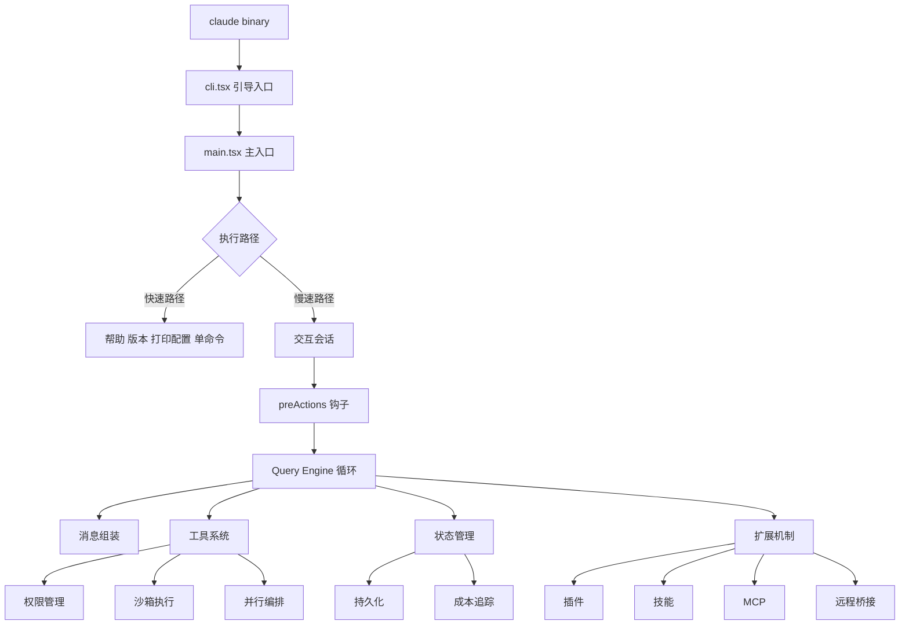
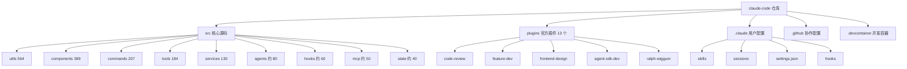
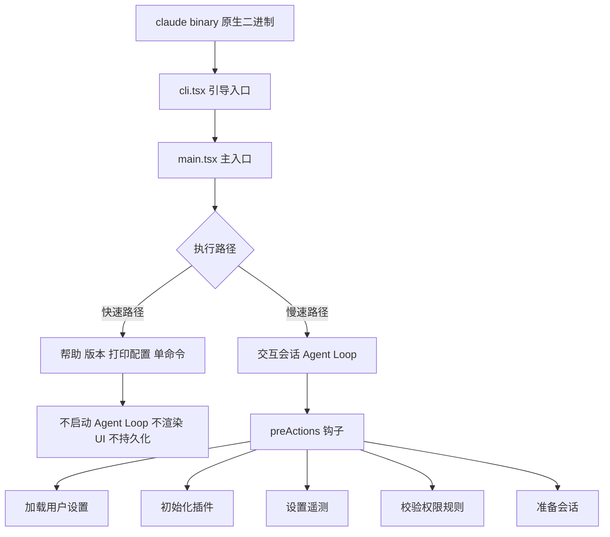
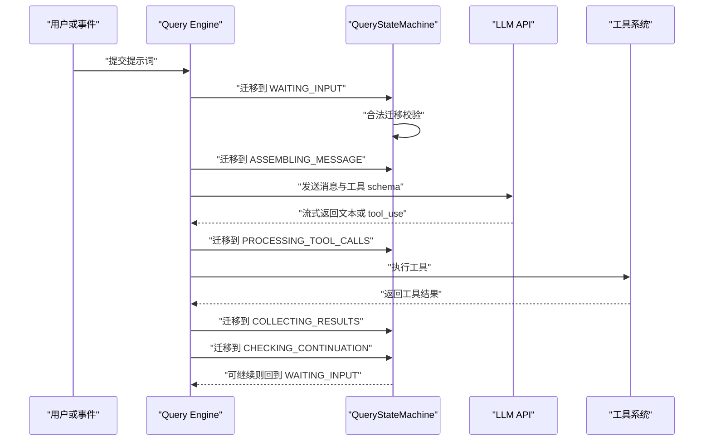
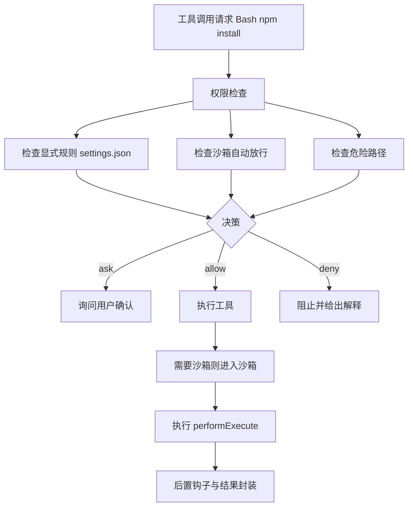
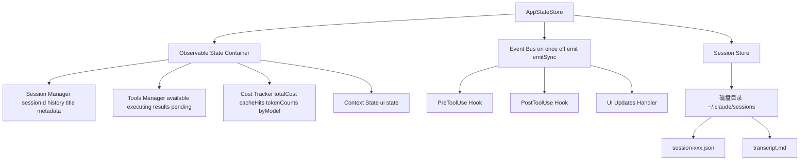
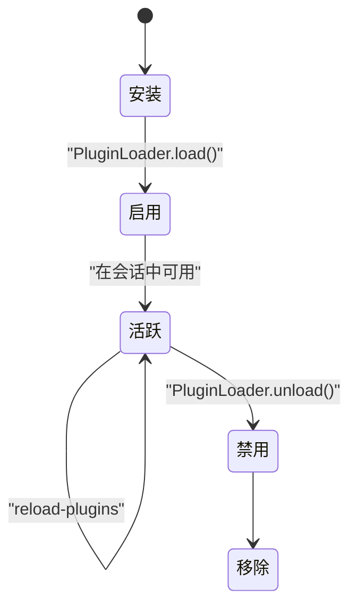
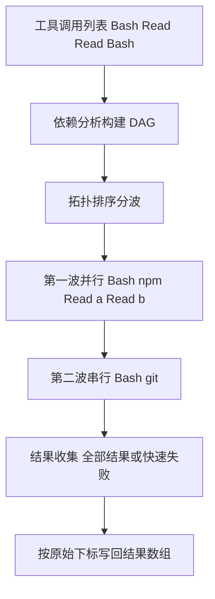
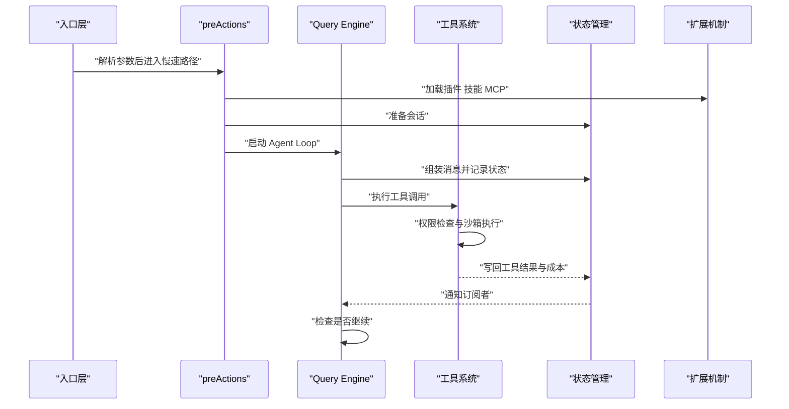

# Claude Code 架构深度解析

!!! abstract "学完这一页你能"
    - 能复述 1902 个源文件在 src 与 plugins 的分布，并解释各目录职责。
    - 能画出 CLI 从 claude 二进制到 Agent Loop 的快速路径与慢速路径。
    - 能说明 QueryStateMachine 十个状态与合法迁移的约束。
    - 能解释工具权限检查、沙箱执行与并行编排如何配合。

## 0. 知识地图



读法：先沿左侧主线读入口、Query Engine、工具系统。再按工具、状态、扩展三条支线补细节。最后读关键算法与参考架构图，把前面的零件串成一次完整请求。

!!! note "术语：源文件"
    源文件指参与构建或运行的文件。旧版内容把 src 与 plugins 下的文件计入 1902 个源文件，来源：本站该页面旧版内容，以原文为准。

## 1. 源码目录树与文件分类

**先想一个问题**
你刚拉下一个 1902 个源文件的项目，编辑器和文件树同时展开。先看哪个目录，才能不迷路？

!!! tip "心智模型"
    一句话模型：源码目录是按职责切片的城市地图。日常类比：住宅区、商业区、交通区各管一件事。类比不成立：城市分区边界清晰，源码目录会互相调用，职责有重叠。
    来源：本站该页面旧版内容，以原文为准。

**图解**



1. 仓库顶层先分 src、plugins、.claude、.github、.devcontainer 五块。
2. src 是主项目，plugins 是官方插件扩展，.claude 是用户配置。
3. utils 有 564 个文件，承担工具函数与字符串处理。
4. components 有 389 个文件，承担 React UI 与终端渲染。
5. commands 有 207 个文件，承担斜杠命令定义。
6. tools 有 184 个文件，承担 Bash、Read、Write 等工具实现。
7. services 有 130 个文件，承担 API 调用、认证、会话管理。
8. agents、hooks、mcp、state 文件数约为 80、60、50、40，来源：本站该页面旧版内容，以原文为准。

**一步一步来**

第 1 步：先数顶层目录文件数。

```js
// 目的：把旧版统计固化成可断言的数字。
const top = {
  "src/utils": 564, // 工具函数与字符串处理
  "src/components": 389, // React UI 与终端渲染
  "src/commands": 207, // 斜杠命令定义
  "src/tools": 184, // 工具实现
  "src/services": 130, // API、认证、会话
  "plugins": 200, // 官方插件扩展
};
const total = Object.values(top).reduce((a, b) => a + b, 0);
console.log(total); // 预计输出 1674
```

**这段代码在做什么**

- 用对象收拢旧版给出的文件数。
- 用 reduce 把六类文件相加。
- 打印相加结果，便于和全量 1902 个源文件对照。
- 来源：本站该页面旧版内容，以原文为准。

运行结果
```
1674
```

第 2 步：按占比排序，找出主战场。

```js
// 目的：按文件数从高到低排序，决定先读哪一层。
const rows = [
  { dir: "src/utils", files: 564 }, // 29.7%
  { dir: "src/components", files: 389 }, // 20.5%
  { dir: "src/commands", files: 207 }, // 10.9%
  { dir: "src/tools", files: 184 }, // 9.7%
  { dir: "src/services", files: 130 }, // 6.8%
];
rows.sort((a, b) => b.files - a.files); // 降序
for (const r of rows) console.log(r.dir, r.files);
```

**这段代码在做什么**

- 把目录与文件数放进数组。
- 用 sort 按文件数降序。
- 逐行打印，先看 utils 与 components。
- 占比数字来源：本站该页面旧版内容，以原文为准。

运行结果
```
src/utils 564
src/components 389
src/commands 207
src/tools 184
src/services 130
```

**动手验证**

```js
// 依赖：Node 20+，无第三方依赖。
const assert = require("node:assert");
const stats = {
  utils: 564, components: 389, commands: 207, tools: 184,
  services: 130, agents: 80, hooks: 60, mcp: 50, state: 40,
};
const totalSrc = Object.values(stats).reduce((a, b) => a + b, 0);
assert.strictEqual(totalSrc, 1704); // 旧版各项相加
assert.ok(stats.utils > stats.components); // utils 最多
assert.ok(stats.tools < stats.utils); // tools 少于 utils
console.log("目录统计断言通过", totalSrc);
// 预期输出：目录统计断言通过 1704
```

来源：本站该页面旧版内容，以原文为准。

**常见坑**

| 现象 | 原因 | 怎么修 |
|---|---|---|
| 把 1902 当成 src 文件数 | 1902 含 plugins 等目录 | 先按目录分类再加总 |
| 读 utils 被 564 个文件淹没 | 没有按子目录分组 | 先读 string、path、async 子目录 |
| 以为目录边界就是调用边界 | 目录间会互相 import | 用依赖图验证调用方向 |

**用在哪里**

- 接手遗留项目：先做文件分类表，再决定阅读顺序。
- 插件开发：对照 plugins 目录理解扩展放置位置。
- 代码评审：用目录职责判断改动是否放错层。

**行业实践**

- 旧版内容提到基于 DeepWiki 知识库与 CHANGELOG.md 构建，来源：本站该页面旧版内容，以原文为准。借鉴：为项目维护源码地图与变更日志索引。
- 旧版内容列出 plugins 下 13 个官方插件，来源：本站该页面旧版内容，以原文为准。借鉴：把团队常用流程做成插件样例。
- 怎么借鉴到你的项目：先写目录职责表，再把高频改动目录对应到负责人。

**小结**

- 1902 个源文件来自旧版统计，来源：本站该页面旧版内容，以原文为准。
- src/utils 与 src/components 合计占比较高，是阅读起点。
- 目录表只能指路，调用关系要靠依赖图确认。

## 2. 入口层：CLI Bootstrap 与 preActions

**先想一个问题**
为什么执行 claude --help 几乎立刻返回，而进入交互会话要等更久？

!!! tip "心智模型"
    一句话模型：入口层像机场分流，快速路径只过安检口，慢速路径走完整登机流程。日常类比：只问航班号与真正登机是两件事。类比不成立：机场流程固定，CLI 分流由参数组合动态决定。
    来源：本站该页面旧版内容，以原文为准。

**图解**



1. claude binary 是原生二进制。
2. cli.tsx 做引导入口。
3. main.tsx 做参数解析与主入口。
4. 帮助、版本、打印配置、单命令走快速路径。
5. 交互会话走慢速路径，启动完整 Agent Loop。
6. preActions 在会话开始时执行，包含同步与异步动作。
7. 来源：本站该页面旧版内容，以原文为准。

**一步一步来**

第 1 步：解析原始参数。

```js
// 目的：模拟 main.tsx 的参数解析结果。
function parseArgs(argv) {
  const args = { model: "claude-3-5", stream: true, print: false };
  for (let i = 0; i < argv.length; i++) {
    if (argv[i] === "--no-stream") args.stream = false; // 关闭流式
    if (argv[i] === "--print") args.print = true; // 非交互打印
    if (argv[i] === "--model") args.model = argv[++i]; // 指定模型
  }
  return args;
}
console.log(parseArgs(["--print", "--model", "claude-3-5"]));
```

**这段代码在做什么**

- 用循环扫描命令行参数。
- --no-stream 关闭流式，--print 进入非交互，--model 读取下一个值。
- 默认模型来自旧版示例，来源：本站该页面旧版内容，以原文为准。
- 输出对象供后续路径判断使用。

运行结果
```
{ model: "claude-3-5", stream: true, print: true }
```

第 2 步：判断快速路径与慢速路径。

```js
// 目的：按旧版逻辑判断是否走快速路径。
function isQuick(args, input) {
  return Boolean(
    args.help || args.version || args.printConfig ||
    (input && !args.interactive)
  ); // 帮助、版本、打印配置、单命令
}
console.log(isQuick({ help: true }, "")); // true
console.log(isQuick({}, "echo hi")); // true
console.log(isQuick({}, "")); // false
```

**这段代码在做什么**

- 用布尔逻辑判断快速路径。
- 帮助、版本、打印配置命中任一条件即快速返回。
- 有单条输入且非交互也走快速路径。
- 否则进入慢速路径，启动交互会话。
- 来源：本站该页面旧版内容，以原文为准。

运行结果
```
true
true
false
```

第 3 步：执行 preActions 钩子。

```js
// 目的：按同步与异步分组执行会话前动作。
const preActions = [
  { name: "loadUserSettings", sync: true },
  { name: "initializePlugins", sync: true },
  { name: "setupTelemetry", sync: false },
  { name: "validatePermissions", sync: true },
  { name: "prepareSession", sync: true },
];
const syncs = preActions.filter(a => a.sync).map(a => a.name);
console.log(syncs);
```

**这段代码在做什么**

- 列出旧版 preActions 的五个动作。
- 用 filter 取出同步动作。
- 同步动作依次执行，异步遥测可并行启动。
- prepareSession 根据是否 resume 决定恢复或新建会话。
- 来源：本站该页面旧版内容，以原文为准。

运行结果
```
["loadUserSettings", "initializePlugins", "validatePermissions", "prepareSession"]
```

**动手验证**

```js
// 依赖：Node 20+，无第三方依赖。
const assert = require("node:assert");
function route(argv) {
  if (argv.includes("--help")) return "quick";
  if (argv.includes("--print")) return "quick";
  if (argv.includes("--resume")) return "slow";
  return "slow";
}
assert.strictEqual(route(["--help"]), "quick");
assert.strictEqual(route(["--print"]), "quick");
assert.strictEqual(route([]), "slow");
assert.strictEqual(route(["--resume", "abc"]), "slow");
console.log("入口分流断言通过");
// 预期输出：入口分流断言通过
```

来源：本站该页面旧版内容，以原文为准。

**常见坑**

| 现象 | 原因 | 怎么修 |
|---|---|---|
| --help 也启动 UI | 路径判断放在 UI 初始化之后 | 把早期返回提到最前面 |
| 同步动作阻塞遥测 | 没有区分 sync 与 async | 用列表分组，异步动作不 await |
| resume 时新建会话 | prepareSession 没读 resume 标志 | 先判断 ctx.resume 再分支 |

**用在哪里**

- 命令行工具：用快速路径优化 --help 与 --version 的响应。
- CI 流水线：用 --print 跑非交互单命令，避免拉起终端 UI。
- 插件初始化：把插件加载放在 preActions，保证会话开始前完成。

**行业实践**

- 旧版内容列出 preActions 完整列表，来源：本站该页面旧版内容，以原文为准。借鉴：把会话前动作显式列成表，便于审计。
- 旧版内容区分快速路径与慢速路径，来源：本站该页面旧版内容，以原文为准。借鉴：为 CLI 的只读命令加早期返回。
- 怎么借鉴到你的项目：在入口层打印路径选择日志，排障时能直接看到走了哪条分支。

**小结**

- 入口层先解析参数，再判断快速路径与慢速路径。
- 快速路径不启动 Agent Loop、不渲染 UI、不持久化。
- preActions 在慢速路径启动前执行，负责设置、插件、权限、会话准备。

## 3. Query Engine：while 循环与状态机

**先想一个问题**
模型一次可能返回多个工具调用，工具执行后还要再问模型。这个反复过程如果不加约束，会变成散落的 if 判断。怎么管？

!!! tip "心智模型"
    一句话模型：Query Engine 像地铁线路图，状态是站点，迁移是轨道。日常类比：列车只能在有轨道的站间移动。类比不成立：地铁线路固定，状态机会因输入进入回环，形成多轮对话。
    来源：本站该页面旧版内容，以原文为准。

**图解**



1. 用户或事件提交输入，Query Engine 进入等待输入状态。
2. 状态机先校验迁移是否合法，再进入消息组装。
3. 消息与工具 schema 发给 LLM API，流式返回文本或 tool_use。
4. 有工具调用则进入处理工具调用状态。
5. 工具系统执行后，结果被收集。
6. 检查是否继续，可继续则回到等待输入，形成多轮。
7. 来源：本站该页面旧版内容，以原文为准。

**一步一步来**

第 1 步：定义十个状态。

```js
// 目的：用字符串枚举记录一次回合的生命周期。
const QueryState = {
  IDLE: "IDLE",
  WAITING_INPUT: "WAITING_INPUT",
  ASSEMBLING_MESSAGE: "ASSEMBLING_MESSAGE",
  SENDING_TO_LLM: "SENDING_TO_LLM",
  PROCESSING_TOOL_CALLS: "PROCESSING_TOOL_CALLS",
  EXECUTING_TOOLS: "EXECUTING_TOOLS",
  COLLECTING_RESULTS: "COLLECTING_RESULTS",
  CHECKING_CONTINUATION: "CHECKING_CONTINUATION",
  COMPACTING_CONTEXT: "COMPACTING_CONTEXT",
  EXITING: "EXITING",
};
console.log(Object.keys(QueryState).length); // 10
```

**这段代码在做什么**

- 用字符串枚举，序列化到日志后直接可读。
- 十个状态覆盖一次提问、调用模型、执行工具、再提问的回合。
- COLLECTING_RESULTS 与 CHECKING_CONTINUATION 可回环到 WAITING_INPUT。
- 来源：本站该页面旧版内容，以原文为准。

运行结果
```
10
```

第 2 步：校验合法迁移。

```js
// 目的：把合法迁移集中成邻接表。
const valid = {
  IDLE: ["WAITING_INPUT"],
  WAITING_INPUT: ["ASSEMBLING_MESSAGE", "EXITING"],
  ASSEMBLING_MESSAGE: ["SENDING_TO_LLM"],
  SENDING_TO_LLM: ["PROCESSING_TOOL_CALLS", "CHECKING_CONTINUATION"],
  PROCESSING_TOOL_CALLS: ["EXECUTING_TOOLS"],
  EXECUTING_TOOLS: ["COLLECTING_RESULTS"],
  COLLECTING_RESULTS: ["WAITING_INPUT", "COMPACTING_CONTEXT"],
  CHECKING_CONTINUATION: ["WAITING_INPUT", "EXITING"],
  COMPACTING_CONTEXT: ["WAITING_INPUT", "EXITING"],
  EXITING: ["IDLE"],
};
function canMove(from, to) {
  return valid[from].includes(to); // 查表校验
}
console.log(canMove("IDLE", "WAITING_INPUT")); // true
console.log(canMove("IDLE", "EXITING")); // false
```

**这段代码在做什么**

- 邻接表把合法迁移集中在一处声明。
- canMove 查表判断 from 到 to 是否允许。
- 非法迁移应抛错，避免 state 与 history 出现半更新。
- 每个状态出边最多 3 条，includes 线性扫描代价可视为常数。
- 来源：本站该页面旧版内容，以原文为准。

运行结果
```
true
false
```

第 3 步：记录历史并广播事件。

```js
// 目的：迁移时先压旧态，再覆盖新态。
class Machine {
  constructor() {
    this.state = "IDLE";
    this.history = [];
  }
  transition(next) {
    this.history.push(this.state); // 先压旧态
    this.state = next; // 再覆盖新态
    return { from: this.history.at(-2), to: next };
  }
}
const m = new Machine();
m.transition("WAITING_INPUT");
m.transition("ASSEMBLING_MESSAGE");
console.log(m.history, m.state);
```

**这段代码在做什么**

- 写入顺序为先 history.push 旧态，再覆盖 state。
- at(-2) 是迁移前状态，at(-1) 是新状态。
- 顺序颠倒会丢失来源态。
- 广播事件依赖宿主类提供 emit，旧版代码中 emit 来自外部契约。
- 来源：本站该页面旧版内容，以原文为准。

运行结果
```
[ 'IDLE', 'WAITING_INPUT' ] ASSEMBLING_MESSAGE
```

**动手验证**

```js
// 依赖：Node 20+，无第三方依赖。
const assert = require("node:assert");
class FSM {
  constructor() {
    this.s = "IDLE";
    this.h = [];
  }
  go(next, table) {
    if (!table[this.s].includes(next)) throw new Error("bad " + this.s + " to " + next);
    this.h.push(this.s);
    this.s = next;
  }
}
const table = {
  IDLE: ["WAITING_INPUT"],
  WAITING_INPUT: ["ASSEMBLING_MESSAGE"],
  ASSEMBLING_MESSAGE: ["SENDING_TO_LLM"],
  SENDING_TO_LLM: ["CHECKING_CONTINUATION"],
  CHECKING_CONTINUATION: ["EXITING"],
  EXITING: ["IDLE"],
};
const f = new FSM();
f.go("WAITING_INPUT", table);
f.go("ASSEMBLING_MESSAGE", table);
f.go("SENDING_TO_LLM", table);
f.go("CHECKING_CONTINUATION", table);
f.go("EXITING", table);
assert.strictEqual(f.s, "EXITING");
assert.deepStrictEqual(f.h, ["IDLE", "WAITING_INPUT", "ASSEMBLING_MESSAGE", "SENDING_TO_LLM", "CHECKING_CONTINUATION"]);
assert.throws(() => f.go("WAITING_INPUT", table), /bad/);
console.log("状态机断言通过");
// 预期输出：状态机断言通过
```

来源：本站该页面旧版内容，以原文为准。

**常见坑**

| 现象 | 原因 | 怎么修 |
|---|---|---|
| 出现未知状态 | 迁移时绕过校验直接赋值 | 所有迁移走 transition 方法 |
| history 少一个状态 | 先覆盖 state 再 push | 先 push 旧态再覆盖 |
| 一直不退出 | CHECKING_CONTINUATION 未回到 EXITING | 给继续条件加显式退出分支 |

**用在哪里**

- 多轮问答：用状态机限制模型与工具之间的往返。
- 工作流引擎：把审批、执行、回滚建模成状态与迁移。
- 测试替身：用状态机模拟模型返回，稳定复现多轮场景。

**行业实践**

- 旧版内容给出 QueryStateMachine 十个状态与邻接表，来源：本站该页面旧版内容，以原文为准。借鉴：把状态迁移集中成表，而不是散落 if。
- 旧版内容用字符串枚举并记录 history，来源：本站该页面旧版内容，以原文为准。借鉴：日志里直接写状态名，排障省去映射。
- 怎么借鉴到你的项目：为每个状态定义进入与退出日志，迁移失败时打印 from 与 to。

**小结**

- Query Engine 用 while 循环加状态机组织多轮对话。
- 合法迁移集中声明，非法迁移直接抛错。
- 历史记录保留迁移轨迹，便于回溯与测试。

## 4. 工具系统：基类、权限、沙箱

**先想一个问题**
模型说执行 npm install，也可能说执行删除命令。怎么在允许干活的同时挡住危险操作？

!!! tip "心智模型"
    一句话模型：工具系统像海关加安检加隔离区，先验证证件，再检查物品，最后在限定区域作业。日常类比：进入实验室前要登记、过安检、穿防护服。类比不成立：海关只放行一次，工具系统每次调用都要重新判断权限。
    来源：本站该页面旧版内容，以原文为准。

**图解**



1. 工具调用先进入权限检查。
2. 显式规则来自 settings.json。
3. 沙箱环境可对安全命令自动放行。
4. 危险路径检查覆盖 /etc、~/.ssh、.claude 等。
5. 决策为 ask、allow、deny 三种。
6. 允许后按 sandboxRequired 决定是否进入沙箱。
7. 来源：本站该页面旧版内容，以原文为准。

**一步一步来**

第 1 步：用模板方法组织执行流程。

```js
// 目的：把校验、前置钩子、执行、后置钩子固定在基类。
class BaseTool {
  constructor(sandbox) {
    this.sandbox = sandbox;
    this.timeout = 30000; // 默认 30 秒
    this.permissionLevel = "REQUIRES_APPROVAL";
    this.sandboxRequired = false;
  }
  async execute(input) {
    const v = this.validate(input); // 1 校验
    if (!v.valid) return { success: false, error: "invalid" };
    const hook = await this.preExecute(input); // 2 前置钩子
    if (hook.blocked) return { success: false, error: hook.reason };
    const out = this.sandboxRequired
      ? await this.sandbox.execute(() => this.performExecute(input)) // 3 沙箱
      : await this.performExecute(input);
    await this.postExecute(out); // 4 后置钩子
    return { success: true, output: out };
  }
}
```

**这段代码在做什么**

- execute 是模板方法，固定四步流程。
- 子类只实现 performExecute。
- sandboxRequired 为真时包进沙箱执行。
- 前置钩子可阻止调用，后置钩子可做审计。
- 来源：本站该页面旧版内容，以原文为准。

第 2 步：匹配权限规则。

```js
// 目的：支持通配符规则，例如 Bash npm 星号。
function matchesPattern(input, pattern) {
  const escaped = pattern
    .replace(/\*/g, ".*") // 星号转任意字符
    .replace(/\(/g, "\\(")
    .replace(/\)/g, "\\)");
  return new RegExp("^" + escaped + "$").test(input);
}
console.log(matchesPattern("npm install", "Bash(npm *)")); // false
console.log(matchesPattern("Bash(npm install)", "Bash(npm *)")); // true
```

**这段代码在做什么**

- 把规则里的星号转成 .*，括号转义。
- 用正则从开头到结尾匹配。
- Bash(npm *) 可匹配 Bash(npm install) 与 Bash(npm test)。
- 旧版代码会对 toolCall.tool 与 toolCall.input 分别尝试匹配。
- 来源：本站该页面旧版内容，以原文为准。

运行结果
```
false
true
```

第 3 步：判断危险命令。

```js
// 目的：用危险模式列表拦截明显风险。
const dangerous = [
  /rm\s+-rf\s+\//, // 删除根目录
  />\s*\/\.ssh\//, // 写 .ssh
  /\$\{.*\}/, // 环境变量展开
  /;\s*rm\s+/, // 命令注入
];
function isSafe(input) {
  return !dangerous.some(p => p.test(String(input)));
}
console.log(isSafe("npm install")); // true
console.log(isSafe("rm -rf /")); // false
```

**这段代码在做什么**

- 用四条正则覆盖旧版列出的危险模式。
- some 命中任一模式即判定不安全。
- 安全命令在沙箱激活时可自动放行。
- 未命中规则时默认 ask。
- 来源：本站该页面旧版内容，以原文为准。

运行结果
```
true
false
```

**动手验证**

```js
// 依赖：Node 20+，无第三方依赖。
const assert = require("node:assert");
function check(tool, input, rules, sandboxActive) {
  for (const r of rules) {
    if (r.tool === tool && r.effect) return r.effect;
  }
  if (sandboxActive && !/rm\s+-rf\s+\//.test(input)) return "allow";
  return "ask";
}
const rules = [
  { tool: "Read", effect: "allow" },
  { tool: "Bash", effect: "ask" },
];
assert.strictEqual(check("Read", "a.txt", rules, false), "allow");
assert.strictEqual(check("Bash", "npm i", rules, true), "ask");
assert.strictEqual(check("Write", "a.txt", rules, true), "allow");
assert.strictEqual(check("Bash", "rm -rf /", rules, true), "ask");
console.log("权限断言通过");
// 预期输出：权限断言通过
```

来源：本站该页面旧版内容，以原文为准。

**常见坑**

| 现象 | 原因 | 怎么修 |
|---|---|---|
| 危险命令被放行 | 只检查 tool 名不检查 input | tool 与 input 都要匹配规则 |
| 沙箱内仍弹确认 | 沙箱未激活或命令被判危险 | 先查沙箱状态，再查危险模式 |
| 通配符规则误伤 | 星号转正则时未锚定首尾 | 加 ^ 与 $ 锚定 |

**用在哪里**

- 代码助手：Bash 工具执行前弹确认，只读命令自动放行。
- 后台批量导入：写文件走沙箱，限制可写目录。
- 运维脚本平台：用权限规则区分只读命令与危险命令。

**行业实践**

- 旧版内容给出 PermissionManager 的三种决策 ask、allow、deny，来源：本站该页面旧版内容，以原文为准。借鉴：把权限决策做成显式返回值。
- 旧版内容列出 Linux 沙箱使用 PID namespace、seccomp-bpf、cgroups、AppArmor、User namespaces，来源：本站该页面旧版内容，以原文为准。借鉴：在 Linux 上用内核能力做隔离，在其他平台用路径与命令白名单。
- 怎么借鉴到你的项目：先列危险模式，再为每条规则写测试。

**小结**

- 工具基类用模板方法固定校验、钩子、执行、结果四步。
- 权限管理器支持通配符规则、沙箱自动放行、危险路径检查。
- 沙箱按平台能力分级，Linux 使用内核隔离能力。

## 5. 状态管理：AppStateStore、事件、持久化、成本

**先想一个问题**
会话中途关闭终端，下次如何恢复历史？成本数字又如何实时刷新？

!!! tip "心智模型"
    一句话模型：状态管理像城市账本加公告牌，账本记录变化，公告牌广播变化。日常类比：银行记账后短信通知。类比不成立：银行通知可能延迟，这里的订阅回调在 set 内同步触发。
    来源：本站该页面旧版内容，以原文为准。

**图解**



1. AppStateStore 是可观察状态容器。
2. 状态分四块：会话、工具、成本、上下文。
3. Event Bus 提供 on、once、off、emit、emitSync。
4. 事件连接 PreToolUse、PostToolUse 与 UI 更新。
5. 运行时状态写入 Session Store。
6. 磁盘保存 session-xxx.json 与 transcript.md。
7. 来源：本站该页面旧版内容，以原文为准。

**一步一步来**

第 1 步：实现按键订阅的 Store。

```js
// 目的：按 key 订阅，set 时只通知该 key 的监听者。
class AppStateStore {
  constructor(initial) {
    this.state = initial;
    this.listeners = new Map();
    this.version = 0;
    Object.keys(initial).forEach(k => this.listeners.set(k, new Set()));
  }
  set(key, value) {
    const prev = this.state[key];
    if (prev === value) return; // 无变化跳过
    this.state[key] = value;
    this.version++;
    for (const fn of this.listeners.get(key) || []) fn(prev, value);
  }
  subscribe(key, fn) {
    this.listeners.get(key).add(fn);
    return () => this.listeners.get(key).delete(fn); // 返回取消订阅
  }
}
```

**这段代码在做什么**

- 构造时为每个 key 建立监听者集合。
- set 先比较旧值，相同则跳过。
- 变化后递增 version，再通知该 key 的监听者。
- subscribe 返回取消订阅函数。
- 监听者抛错会被 try 包住，避免影响其他监听者。
- 来源：本站该页面旧版内容，以原文为准。

第 2 步：批量更新与快照。

```js
// 目的：批量更新后统一通知，并生成可持久化快照。
const store = {
  state: { cost: 0, tokens: 0 },
  set(key, value) { this.state[key] = value; },
  batch(updates) {
    for (const [k, v] of Object.entries(updates)) this.set(k, v);
  },
  snapshot() {
    return { state: structuredClone(this.state), version: 1 };
  },
};
store.batch({ cost: 0.42, tokens: 12500 });
console.log(store.snapshot());
```

**这段代码在做什么**

- batch 对多个 key 逐个赋值。
- 完成后可统一通知，减少重复渲染。
- snapshot 用 structuredClone 复制状态，避免外部改动影响内部。
- 旧版快照同时保存 state 与 version。
- 来源：本站该页面旧版内容，以原文为准。

运行结果
```
{ state: { cost: 0.42, tokens: 12500 }, version: 1 }
```

第 3 步：持久化触发点与成本结构。

```js
// 目的：列出旧版持久化触发点与成本字段。
const triggers = ["每 30 秒自动刷新", "每条消息后", "每次工具使用后", "退出时", "错误时紧急备份"];
const cost = {
  totalCost: 0,
  inputTokens: 0,
  outputTokens: 0,
  cacheHits: 0,
  byModel: {},
};
console.log(triggers.length, Object.keys(cost).length);
```

**这段代码在做什么**

- 五个触发点来自旧版内容。
- 成本结构含总成本、输入 token、输出 token、缓存命中、按模型分账。
- 旧版显示格式示例为 Cost 0.42、Tokens 12.5k、Cache 4.5k 36%。
- 数字来源：本站该页面旧版内容，以原文为准。

运行结果
```
5 5
```

**动手验证**

```js
// 依赖：Node 20+，无第三方依赖。
const assert = require("node:assert");
class Store {
  constructor() {
    this.s = { cost: 0 };
    this.v = 0;
    this.watchers = [];
  }
  set(k, v) {
    this.s[k] = v;
    this.v++;
    this.watchers.forEach(fn => fn(k, v));
  }
  watch(fn) {
    this.watchers.push(fn);
    return () => {
      this.watchers = this.watchers.filter(f => f !== fn);
    };
  }
}
const s = new Store();
let seen = 0;
const off = s.watch(() => seen++);
s.set("cost", 0.42);
s.set("cost", 0.42);
assert.strictEqual(seen, 2); // 当前实现每次 set 都通知
off();
s.set("cost", 1);
assert.strictEqual(seen, 2);
assert.strictEqual(s.v, 3);
console.log("状态订阅断言通过");
// 预期输出：状态订阅断言通过
```

来源：本站该页面旧版内容，以原文为准。

**常见坑**

| 现象 | 原因 | 怎么修 |
|---|---|---|
| UI 重复渲染 | 相同值也触发通知 | set 前比较 prev 与 next |
| 恢复后版本倒退 | 快照未保存 version | 快照同时保存 state 与 version |
| 监听者抛错拖垮更新 | 没有隔离监听者异常 | 每个监听者调用包 try |

**用在哪里**

- 会话恢复：退出时落盘，启动时 restore。
- 成本面板：用成本状态实时显示 token 与缓存命中。
- 插件 UI：订阅工具执行状态，展示进行中与结果。

**行业实践**

- 旧版内容列出 AppStateStore 的 get、set、update、subscribe、batch、snapshot、restore，来源：本站该页面旧版内容，以原文为准。借鉴：把状态容器接口固定，替换底层实现不影响调用方。
- 旧版内容给出五个持久化触发点，来源：本站该页面旧版内容，以原文为准。借鉴：至少保留退出时与错误时两次落盘。
- 怎么借鉴到你的项目：先定义状态分片，再写每个分片的订阅测试。

**小结**

- AppStateStore 按 key 订阅，set 时通知对应监听者。
- 快照用 structuredClone 隔离外部改动，并保存版本号。
- 持久化触发点覆盖定时、消息、工具、退出、错误五类。

## 6. 扩展机制：插件、技能、MCP、远程桥接

**先想一个问题**
团队想加一条自定义斜杠命令，还想接外部工具服务器。如何在不改主程序的前提下扩展？

!!! tip "心智模型"
    一句话模型：扩展机制像应用商店，主程序提供插槽，插件按清单装载。日常类比：手机装应用后获得新功能。类比不成立：应用商店的应用相互隔离，插件可注册命令、技能、钩子与 MCP 服务器，影响面更大。
    来源：本站该页面旧版内容，以原文为准。

**图解**



1. 插件从安装状态开始。
2. PluginLoader.load 后进入启用状态。
3. 在会话中可用后进入活跃状态。
4. reload-plugins 可在活跃状态内重载。
5. PluginLoader.unload 后进入禁用状态。
6. 最后进入移除状态。
7. 来源：本站该页面旧版内容，以原文为准。

**一步一步来**

第 1 步：加载插件清单与目录。

```js
// 目的：按旧版加载流程解析插件目录。
const plugin = {
  manifest: "plugin.json", // 清单
  commands: ["commands/"], // 命令目录
  agents: ["agents/"], // 代理目录
  skills: ["skills/"], // 技能目录
  hooks: ["hooks/hooks.json"], // 钩子
  mcp: ".mcp.json", // MCP 配置
};
const steps = [
  "读取 plugin.json 清单",
  "校验 schema 与依赖",
  "加载 commands 解析 .md",
  "加载 agents 解析 .md",
  "加载 skills 解析 SKILL.md",
  "注册 hooks 解析 hooks.json 与脚本",
  "初始化 MCP 服务器",
  "发出 pluginLoaded 事件",
];
console.log(Object.keys(plugin).length, steps.length);
```

**这段代码在做什么**

- 插件目录含清单、命令、代理、技能、钩子、MCP 配置。
- 加载流程共八步，来自旧版内容。
- 先校验清单与依赖，再逐类加载。
- 最后初始化 MCP 并广播事件。
- 数字来源：本站该页面旧版内容，以原文为准。

运行结果
```
6 8
```

第 2 步：技能匹配与子代理分叉。

```js
// 目的：根据用户输入匹配技能，再分叉子代理。
function matchSkill(input, skills) {
  return skills.find(s => input.includes(s.trigger)); // 触发器匹配
}
const skills = [
  { name: "frontend-design", trigger: "login page", model: "sonnet", maxTokens: 8000 },
];
const hit = matchSkill("design a login page", skills);
console.log(hit ? hit.name : "no match");
```

**这段代码在做什么**

- 技能用 trigger 与用户输入做包含匹配。
- 命中后读取 SKILL.md，分叉子代理。
- 子代理使用 system base_prompt 加技能指令。
- 旧版示例模型为 sonnet，maxTokens 为 8000，来源：本站该页面旧版内容，以原文为准。

运行结果
```
frontend-design
```

第 3 步：MCP 客户端与传输层。

```js
// 目的：模拟 MCP 服务器注册与工具列出。
const clients = new Map();
const tools = new Map();
function addServer(name, command) {
  clients.set(name, { command, tools: [] });
  tools.set(name + ":read", { name: "read" });
  return clients.size;
}
console.log(addServer("filesystem", "npx"));
console.log([...tools.keys()]);
```

**这段代码在做什么**

- clients 保存服务器连接，tools 保存工具映射。
- addServer 注册服务器并登记工具。
- 旧版传输层默认 stdio，SSE 流式回退，HTTP WebSocket 回退。
- 工具描述有 2KB 上限，来源：本站该页面旧版内容，以原文为准。

运行结果
```
1
[ 'filesystem:read' ]
```

**动手验证**

```js
// 依赖：Node 20+，无第三方依赖。
const assert = require("node:assert");
class PluginRegistry {
  constructor() {
    this.map = new Map();
  }
  load(name, manifest) {
    if (!manifest || !manifest.commands) throw new Error("bad manifest");
    this.map.set(name, manifest);
    return true;
  }
  unload(name) {
    return this.map.delete(name);
  }
  list() {
    return [...this.map.keys()];
  }
}
const r = new PluginRegistry();
assert.throws(() => r.load("x", {}), /bad manifest/);
assert.strictEqual(r.load("code-review", { commands: ["review"] }), true);
assert.deepStrictEqual(r.list(), ["code-review"]);
assert.strictEqual(r.unload("code-review"), true);
assert.deepStrictEqual(r.list(), []);
console.log("插件注册断言通过");
// 预期输出：插件注册断言通过
```

来源：本站该页面旧版内容，以原文为准。

**常见坑**

| 现象 | 原因 | 怎么修 |
|---|---|---|
| 插件加载后命令不出现 | 只读清单未注册命令 | 按八步流程逐类注册 |
| 技能不触发 | trigger 与输入大小写或措辞不匹配 | 统一大小写并写多条触发器测试 |
| MCP 工具描述过长 | 未按 2KB 截断 | 估计 token 前先截断描述 |

**用在哪里**

- 团队规范：把代码评审流程做成插件命令。
- 前端脚手架：把登录页、列表页生成做成技能。
- 外部系统集成：用 MCP 连接文件系统、数据库等服务器。

**行业实践**

- 旧版内容给出插件八步加载流程，来源：本站该页面旧版内容，以原文为准。借鉴：加载清单、校验、分类注册、广播事件。
- 旧版内容列出 MCP 传输默认 stdio，SSE 与 HTTP WebSocket 回退，来源：本站该页面旧版内容，以原文为准。借鉴：连接层做多传输回退。
- 怎么借鉴到你的项目：为每个扩展写加载与卸载测试，防止残留注册。

**小结**

- 插件按清单加载命令、代理、技能、钩子与 MCP。
- 技能通过 trigger 匹配后分叉子代理执行。
- MCP 客户端管理服务器与工具，传输层支持多协议回退。

## 7. 关键算法：并行执行与依赖分析

**先想一个问题**
模型一次返回多个工具调用，其中两个读文件、一个写文件。全并行可能读到旧内容，全串行又慢。怎么排？

!!! tip "心智模型"
    一句话模型：并行执行像施工队按依赖图分波施工，没有依赖的同一波并行，有依赖的下一波再上。日常类比：先打地基再砌墙。类比不成立：施工顺序人工排，依赖图由工具调用的文件读写关系自动推导。
    来源：本站该页面旧版内容，以原文为准。

**图解**



1. 输入是工具调用列表。
2. 依赖分析构建有向无环图。
3. 拓扑排序把节点分成波次。
4. 第一波中无依赖的工具并行执行。
5. 第二波中依赖前序结果的工具串行。
6. 结果按原始下标写回，保证顺序与输入一致。
7. 来源：本站该页面旧版内容，以原文为准。

**一步一步来**

第 1 步：用并发池控制并发度。

```js
// 目的：固定并发度，结果顺序与输入一致。
class AsyncPool {
  constructor(concurrency) {
    this.concurrency = concurrency; // 并发上限
  }
  async map(items, fn) {
    const results = new Array(items.length); // 预分配
    let index = 0; // 共享取号器
    const worker = async () => {
      let i = index++;
      while (i < items.length) {
        results[i] = await fn(items[i]); // 按下标写回
        i = index++;
      }
    };
    const workers = Array.from(
      { length: Math.min(this.concurrency, items.length) },
      worker
    );
    await Promise.all(workers);
    return results;
  }
}
```

**这段代码在做什么**

- 构造期固定并发上限，调用方明确资源预算。
- 预分配 results 数组，按下标写回，输出顺序等于输入顺序。
- worker 数量取并发度与任务数的较小值。
- 多个 worker 通过共享 index++ 抢号分发任务。
- 来源：本站该页面旧版内容，以原文为准。

第 2 步：构建依赖边。

```js
// 目的：写后读同一文件时建立依赖。
function dependsOn(consumer, producer) {
  if (producer.name === "Write" && consumer.name === "Read") {
    return consumer.input.file_path === producer.input.file_path; // 同文件
  }
  if (producer.name === "Write") {
    return consumer.input.file_path === producer.input.file_path; // 写后任何同文件操作
  }
  return false;
}
console.log(dependsOn(
  { name: "Read", input: { file_path: "a.txt" } },
  { name: "Write", input: { file_path: "a.txt" } }
));
```

**这段代码在做什么**

- 若生产者为 Write 且消费者为 Read，同文件则依赖。
- 若生产者为 Write，消费者操作同一文件也依赖。
- 其他情况默认无依赖。
- 旧版代码用双重循环扫描工具调用对。
- 来源：本站该页面旧版内容，以原文为准。

运行结果
```
true
```

第 3 步：拓扑排序分成波次。

```js
// 目的：按入度为零的节点逐波取出。
function topo(nodes, edges) {
  const waves = [];
  const remaining = new Set(nodes);
  const indeg = new Map(nodes.map(n => [n, 0]));
  for (const [to] of edges) indeg.set(to, indeg.get(to) + 1);
  while (remaining.size) {
    const ready = [...remaining].filter(n => indeg.get(n) === 0);
    if (!ready.length) throw new Error("circular dependency"); // 有环
    waves.push(ready);
    for (const n of ready) {
      remaining.delete(n);
      for (const [to, from] of edges) if (from === n) indeg.set(to, indeg.get(to) - 1);
    }
  }
  return waves;
}
```

**这段代码在做什么**

- 初始入度由边统计。
- 每轮取出所有入度为零的节点作为一波。
- 移除节点并降低其邻居入度。
- 若某轮没有就绪节点则存在环，抛出错误。
- 来源：本站该页面旧版内容，以原文为准。

**动手验证**

```js
// 依赖：Node 20+，无第三方依赖。
const assert = require("node:assert");
class Pool {
  constructor(n) {
    this.n = n;
  }
  async map(items, fn) {
    const out = new Array(items.length);
    let i = 0;
    const worker = async () => {
      let k = i++;
      while (k < items.length) {
        out[k] = await fn(items[k]);
        k = i++;
      }
    };
    await Promise.all(Array.from({ length: Math.min(this.n, items.length) }, worker));
    return out;
  }
}
(async () => {
  const p = new Pool(2);
  const out = await p.map([1, 2, 3, 4], async x => x * 2);
  assert.deepStrictEqual(out, [2, 4, 6, 8]);
  assert.strictEqual(out.length, 4);
  console.log("并发池断言通过");
})();
// 预期输出：并发池断言通过
```

来源：本站该页面旧版内容，以原文为准。

**常见坑**

| 现象 | 原因 | 怎么修 |
|---|---|---|
| 结果顺序错乱 | 用 push 收集完成结果 | 预分配数组并按下标写回 |
| 依赖环死循环 | 拓扑排序未检测无就绪节点 | 每轮检查 ready.length 为 0 时抛错 |
| 写后读拿到旧内容 | 依赖边方向反了 | 消费者指向生产者建边 |

**用在哪里**

- 代码批量修改：多个只读工具并行，写文件后排到下一波。
- 后台批量导入：导入前校验并行，写入串行。
- 构建流水线：无依赖任务并行，依赖任务分波。

**行业实践**

- 旧版内容给出 ParallelToolExecutor 的 buildDependencyGraph 与 topologicalSort，来源：本站该页面旧版内容，以原文为准。借鉴：把依赖分析与执行分开，便于单测。
- 旧版内容默认并发度为 5 且 failFast 为 true，来源：本站该页面旧版内容，以原文为准。借鉴：并发度做成配置，失败时标记剩余任务为跳过。
- 怎么借鉴到你的项目：先写依赖判定测试，再写波次测试。

**小结**

- 并发池固定并发度，按下标写回保证输出顺序。
- 依赖分析按文件读写关系建边。
- 拓扑排序分成波次，有环则抛错。

## 8. 参考架构图与源码阅读路线

**先想一个问题**
读源码时如何把入口、循环、工具、状态、扩展串成一次完整请求？

!!! tip "心智模型"
    一句话模型：读源码像沿一次请求走一遍流水线。日常类比：跟踪快递从下单到签收。类比不成立：快递路线固定，源码请求会因工具调用次数形成多轮循环。
    来源：本站该页面旧版内容，以原文为准。

**图解**



1. 入口层解析参数后进入慢速路径。
2. preActions 加载插件、技能与 MCP，准备会话。
3. Query Engine 启动 Agent Loop。
4. 消息组装后记录状态。
5. 工具系统先权限检查，再按需沙箱执行。
6. 工具结果与成本写回状态，状态通知订阅者。
7. Query Engine 检查是否继续，决定回环或退出。
8. 来源：本站该页面旧版内容，以原文为准。

**一步一步来**

第 1 步：沿入口到循环走主线。

```js
// 目的：按主线顺序打印一次请求经过的模块。
const steps = [
  "cli.tsx 引导",
  "main.tsx 解析参数",
  "判断快速或慢速路径",
  "preActions 执行",
  "Query Engine 启动",
];
console.log(steps.join(" -> "));
```

**这段代码在做什么**

- 主线从 cli.tsx 到 main.tsx。
- 接着判断路径。
- 慢速路径执行 preActions。
- 最后启动 Query Engine。
- 来源：本站该页面旧版内容，以原文为准。

运行结果
```
cli.tsx 引导 -> main.tsx 解析参数 -> 判断快速或慢速路径 -> preActions 执行 -> Query Engine 启动
```

第 2 步：沿工具调用走支线。

```js
// 目的：列出工具调用后经过的子系统。
const toolFlow = [
  "权限检查",
  "沙箱判断",
  "执行 performExecute",
  "后置钩子",
  "结果写回状态",
  "成本追踪更新",
];
console.log(toolFlow.length);
```

**这段代码在做什么**

- 工具调用先过权限与沙箱。
- 执行后走后置钩子。
- 结果与成本写回状态管理。
- 来源：本站该页面旧版内容，以原文为准。

运行结果
```
6
```

第 3 步：沿扩展加载走初始化。

```js
// 目的：列出扩展初始化顺序。
const ext = ["插件清单", "命令", "代理", "技能", "钩子", "MCP", "事件"];
console.log(ext.join(" -> "));
```

**这段代码在做什么**

- 扩展初始化从插件清单开始。
- 依次加载命令、代理、技能、钩子。
- 最后初始化 MCP 并发出事件。
- 来源：本站该页面旧版内容，以原文为准。

运行结果
```
插件清单 -> 命令 -> 代理 -> 技能 -> 钩子 -> MCP -> 事件
```

**动手验证**

```js
// 依赖：Node 20+，无第三方依赖。
const assert = require("node:assert");
const lifecycle = [];
function preActions() {
  lifecycle.push("loadUserSettings");
  lifecycle.push("initializePlugins");
  lifecycle.push("prepareSession");
}
function loop(rounds) {
  for (let i = 0; i < rounds; i++) lifecycle.push("round-" + i);
}
preActions();
loop(2);
assert.deepStrictEqual(lifecycle, [
  "loadUserSettings",
  "initializePlugins",
  "prepareSession",
  "round-0",
  "round-1",
]);
assert.strictEqual(lifecycle.filter(x => x.startsWith("round")).length, 2);
console.log("生命周期断言通过");
// 预期输出：生命周期断言通过
```

来源：本站该页面旧版内容，以原文为准。

**常见坑**

| 现象 | 原因 | 怎么修 |
|---|---|---|
| 读源码跳步 | 直接看工具实现不看入口 | 先走入口到循环主线 |
| 忽略扩展初始化 | 只看 Query Engine | 把 preActions 与扩展加载纳入路线 |
| 不理解多轮 | 以为一次请求只调一次模型 | 按状态机回环跟踪 |

**用在哪里**

- 新人培训：用一条请求生命周期讲清模块协作。
- 故障定位：按主线与支线逐段打日志。
- 架构评审：检查状态、工具、扩展三块边界。

**行业实践**

- 旧版内容基于 DeepWiki 知识库与 CHANGELOG.md 构建，来源：本站该页面旧版内容，以原文为准。借鉴：把架构图与变更记录放在同一文档体系。
- 旧版内容给出参考架构图与插件生命周期，来源：本站该页面旧版内容，以原文为准。借鉴：为关键路径画时序图，随代码更新。
- 怎么借鉴到你的项目：先写一次请求的时序图，再为每一步指定负责人。

**小结**

- 一次请求主线从入口到 preActions 再到 Query Engine。
- 工具调用支线覆盖权限、沙箱、钩子、状态、成本。
- 扩展初始化在会话开始前完成，影响后续工具与技能可用性。

## 应用地图

| 场景 | 用到本页哪个知识点 | 典型技术选型 | 注意事项 |
|---|---|---|---|
| 命令行工具快速响应 | 入口层快速路径与慢速路径 | Node 参数解析加早期返回 | 帮助版本等只读命令不启动 UI |
| 代码助手多轮对话 | Query Engine 状态机 | 有限状态机加流式响应 | 迁移集中校验，非法迁移抛错 |
| 危险命令拦截 | 工具权限管理器 | 规则匹配加危险模式列表 | tool 名与 input 都要检查 |
| 隔离执行 | 沙箱执行机制 | Linux namespace 与 seccomp | 其他平台用路径与命令白名单 |
| 会话恢复与成本面板 | AppStateStore 与持久化 | 可观察状态容器加快照 | 相同值不触发通知，快照带版本 |
| 团队自定义流程 | 插件与技能 | 插件清单加 SKILL.md | 加载与卸载都要可测 |
| 并行工具调度 | 并发池与拓扑排序 | Promise.all 加依赖图分波 | 结果按下标写回，检测依赖环 |
| 外部工具接入 | MCP 客户端 | stdio 加 SSE 回退 | 工具描述按 2KB 截断 |

## 动手作业

目标：写一个 Node 20+ 单文件脚本，模拟一次 Claude Code 请求生命周期。

步骤：

1. 定义 QueryState 十个状态与合法迁移表。
2. 实现 transition 方法，记录 history，非法迁移抛错。
3. 实现权限检查函数，支持 allow、ask、deny 三种决策。
4. 实现并发池，并发度设为 2，结果按输入下标写回。
5. 用 node:assert 断言状态迁移、权限决策、并发结果。

验收标准：

- 脚本可直接 node 运行，退出码为 0。
- 非法迁移抛出包含 bad 的错误。
- 权限检查对 Read 返回 allow，对 Bash 返回 ask，对危险命令返回 deny。
- 并发池输出顺序与输入顺序一致。
- 打印“生命周期作业通过”。

## 综合对比

| 维度 | 快速路径 | 慢速路径 | 工具执行 | 扩展加载 |
|---|---|---|---|---|
| 触发条件 | 帮助版本打印配置单命令 | 交互会话或恢复会话 | 模型返回 tool_use | preActions 初始化 |
| 是否启动 UI | 否 | 是 | 由工具类型决定 | 否 |
| 是否持久化 | 否 | 是 | 结果写回状态 | 注册后进入会话 |
| 主要状态 | 无 | QueryStateMachine | 权限与沙箱状态 | 插件与技能注册表 |
| 失败处理 | 直接返回错误 | 状态机迁移校验 | 前置钩子可阻止 | 清单校验失败不加载 |
| 来源 | 本站该页面旧版内容，以原文为准 | 同上 | 同上 | 同上 |

## 深入阅读与参考

!!! tip "怎么用这些资料"
    先读「官方文档与规范」建立准确的概念，再读「源码与示例」核对细节，最后用「教程、书籍与视频」换一种讲法加深理解。每条都写明了读哪一节、带着什么问题读。

### 官方文档与规范

| 资源 | 为什么读 | 怎么读 |
|---|---|---|
| [Claude Code 文档](https://code.claude.com/docs/en/overview) | 官方总览，入口层、slash command 与扩展点的权威定义 | 按顺序读 slash commands、hooks、subagents 三节，带着“入口如何分发请求”的问题读，再回看本页目录树 |
| [Claude 子 Agent 文档](https://docs.claude.com/en/docs/claude-code/sub-agents) | 子 Agent 定义与工具权限模型，对应任务隔离设计 | 重点看工具权限限制字段，创建一个只读审查 subagent 跑一次，观察上下文与工具集如何被裁剪 |
| [Claude Code Hooks](https://docs.anthropic.com/en/docs/claude-code/hooks) | hooks 是扩展机制的核心插入点，源码对照首选 | 读事件表与配置格式，思考“工具执行前后如何插入逻辑”，写一个提交前 lint hook 验证拦截效果 |
| [Claude Tool Use 概览](https://docs.claude.com/en/docs/agents-and-tools/tool-use/overview) | 工具定义 schema 的第一手规范，直接对应工具系统章节 | 手写一份工具 JSON schema，故意传错参数观察报错，理解参数校验与分发链路 |
| [Claude Agent SDK 概览](https://docs.claude.com/en/api/agent-sdk/overview) | Agent 循环与工具调用的官方说明，对应 Query Engine | 读概览中的循环与消息流小节，带着“一次 query 的完整生命周期”读，读完画出时序图 |

### 源码与示例

| 资源 | 为什么读 | 怎么读 |
|---|---|---|
| [Claude Agent SDK（TypeScript）](https://github.com/anthropics/claude-agent-sdk-typescript) | 可运行 SDK 示例，看清查询循环与工具注册全流程 | 跑通 README 示例并打开调用日志，再把自定义函数注册成工具，对照本页工具注册代码 |

### 教程、书籍与视频

| 资源 | 为什么读 | 怎么读 |
|---|---|---|
| [Claude Code 最佳实践](https://www.anthropic.com/engineering/claude-code-best-practices) | CLAUDE.md 与计划先行实践，理解上下文注入与状态入口 | 在自己的仓库落地一周，重点观察 CLAUDE.md 何时被加载进上下文，一周后复盘偏差 |
| [Claude Code MCP](https://docs.anthropic.com/en/docs/claude-code/mcp) | MCP 接入实例，看清外部工具如何挂进扩展层 | 接一个文件系统 MCP 完成读写任务，记录工具列表如何合并进会话与每次调用的链路 |

## 自测题

??? question "1902 个源文件按目录如何分布？"
    - src/utils 564，占 29.7%。
    - src/components 389，占 20.5%。
    - src/commands 207，占 10.9%。
    - src/tools 184，占 9.7%。
    - src/services 130，占 6.8%。
    - 来源：本站该页面旧版内容，以原文为准。

??? question "快速路径与慢速路径的区别是什么？"
    - 快速路径处理帮助、版本、打印配置、单命令。
    - 快速路径不启动 Agent Loop、不渲染 UI、不持久化。
    - 慢速路径进入交互会话，启动完整 Agent Loop。
    - 慢速路径有终端 UI、会话持久化、多轮对话。
    - 来源：本站该页面旧版内容，以原文为准。

??? question "preActions 包含哪些动作？"
    - loadUserSettings 热重载设置。
    - initializePlugins 加载启用的插件。
    - setupTelemetry 异步初始化遥测。
    - validatePermissions 校验权限规则。
    - prepareSession 恢复或新建会话。
    - 来源：本站该页面旧版内容，以原文为准。

??? question "QueryStateMachine 如何防止非法迁移？"
    - 每个状态维护合法出边邻居表。
    - transition 先查表，不合法直接抛错。
    - 合法时先 push 旧态，再覆盖 state。
    - 查询方法 canContinue 与 shouldExit 只读判断。
    - 来源：本站该页面旧版内容，以原文为准。

??? question "权限管理器如何决策？"
    - 先检查显式规则与通配符匹配。
    - 再检查沙箱是否激活且命令是否安全。
    - 危险路径与危险模式会提高风险等级。
    - 未命中规则默认 ask。
    - 决策为 allow、ask、deny。
    - 来源：本站该页面旧版内容，以原文为准。

??? question "AppStateStore 的订阅机制有什么注意点？"
    - 按 key 保存监听者集合。
    - set 时比较旧值，相同则跳过。
    - 监听者异常被捕获，不影响其他监听者。
    - subscribe 返回取消订阅函数。
    - snapshot 用 structuredClone 并保存 version。
    - 来源：本站该页面旧版内容，以原文为准。

??? question "并发池如何保证输出顺序？"
    - 预分配与输入等长的结果数组。
    - 每个任务按下标写回结果。
    - worker 数量取并发度与任务数的较小值。
    - 多个 worker 共享自增取号器。
    - Promise.all 等待所有 worker 退出。
    - 来源：本站该页面旧版内容，以原文为准。

??? question "依赖分析与拓扑排序解决什么问题？"
    - 写后读同一文件时必须建立依赖。
    - 依赖图是有向无环图。
    - 拓扑排序把节点分成波次。
    - 同波无依赖任务可并行。
    - 无就绪节点说明存在环，应抛错。
    - 来源：本站该页面旧版内容，以原文为准。

## 延伸阅读

- Anthropic 官方文档《Claude Code》的 Overview 章节，需核对具体章节名。
- Anthropic 官方文档《Claude Code》的 Settings 章节，需核对具体章节名。
- Anthropic 官方文档《Claude Code》的 Hooks 章节，需核对具体章节名。
- Anthropic 官方文档《Claude Code》的 MCP 章节，需核对具体章节名。
- 本站该页面旧版内容中的源码目录树与关键算法说明，以原文为准。
