# Claude Code 架构深度解析

> 本文档对 Claude Code 的源码架构、核心系统、算法实现进行深度剖析。
> 基于 DeepWiki 知识库与 CHANGELOG.md 构建，涵盖 1902 个源文件的分类整理。

## 1. 源码目录树详解

### 1.1 顶层结构概览

```mermaid
graph TD
    subgraph claude-code["claude-code/"]
        A1[src/]
        A2[plugins/]
        A3[.claude/]
        A4[.github/]
        A5[.devcontainer/]
    end

    subgraph src["src/ - Core Source (Main Project)"]
        A1 --> B1[utils/ 564]
        A1 --> B2[components/ 389]
        A1 --> B3[commands/ 207]
        A1 --> B4[tools/ 184]
        A1 --> B5[services/ 130]
        A1 --> B6[agents/]
        A1 --> B7[hooks/]
        A1 --> B8[mcp/]
        A1 --> B9[state/]
        A1 --> B10[api/]
    end

    subgraph plugins["plugins/ - Official Plugins (13)"]
        A2 --> C1[agent-sdk-dev/]
        A2 --> C2[code-review/]
        A2 --> C3[feature-dev/]
        A2 --> C4[frontend-design/]
        A2 --> C5[ralph-wiggum/]
    end

    subgraph .claude[".claude/ - User Config"]
        A3 --> D1[skills/]
        A3 --> D2[sessions/]
        A3 --> D3[settings.json]
        A3 --> D4[hooks/]
    end
```

### 1.2 文件分类统计

| Directory | Files | Share | Main Responsibility |
|---|---|---|---|
| src/utils/ | 564 | 29.7% | Utility functions, string processing |
| src/components/ | 389 | 20.5% | React UI components, terminal rendering |
| src/commands/ | 207 | 10.9% | Slash command definitions |
| src/tools/ | 184 | 9.7% | Tool implementations (Bash/Read/Write) |
| src/services/ | 130 | 6.8% | API calls, authentication, session management |
| src/agents/ | ~80 | 4.2% | Agent core logic |
| src/hooks/ | ~60 | 3.2% | Hook processor |
| src/mcp/ | ~50 | 2.6% | MCP protocol client |
| src/state/ | ~40 | 2.1% | State storage, persistence |
| plugins/ | ~200 | 10.5% | Official plugin extensions |
| Total | 1902 | 100% | |

### 1.3 src/utils/ 564 个工具函数分析

```mermaid
graph TD
    subgraph utils["src/utils/"]
        S1[string/ 42]
        S2[path/ 38]
        S3[system/ 56]
        S4[async/ 47]
        S5[crypto/ 23]
        S6[validation/ 35]
    end

    S1 --> S1a[sanitize.ts]
    S1 --> S1b[truncate.ts]
    S1 --> S1c[template.ts]
    S1 --> S1d[tokenize.ts]

    S2 --> S2a[resolve.ts]
    S2 --> S2b[find.ts]
    S2 --> S2c[is-safe-path.ts]
    S2 --> S2d[glob.ts]

    S3 --> S3a[exec.ts]
    S3 --> S3b[spawn.ts]
    S3 --> S3c[which.ts]
    S3 --> S3d[environment.ts]

    S4 --> S4a[debounce.ts]
    S4 --> S4b[throttle.ts]
    S4 --> S4c[pool.ts]
    S4 --> S4d[retry.ts]

    S5 --> S5a[hash.ts]
    S5 --> S5b[hmac.ts]
    S5 --> S5c[random.ts]

    S6 --> S6a[schema.ts]
    S6 --> S6b[type.ts]
    S6 --> S6c[permission.ts]
```

**核心工具函数示例**：

```typescript
// src/utils/path/is-safe-path.ts
// 第 1 段：路径穿越防线——把相对路径拼到基准目录后，再判断结果是否仍落在基准目录内
// 这里用 path.resolve 而非字符串拼接，是因为 resolve 会归一化 ".."、"."、多余斜杠，
// 先把攻击者藏在 targetPath 里的跳转全部展开，再做前缀比对。复杂度 O(n)（n 为路径长度）。
export function isSafePath(baseDir: string, targetPath: string): boolean {
  const resolved = path.resolve(baseDir, targetPath); // 关键：以 baseDir 为基准解析，得到绝对路径
  return resolved.startsWith(baseDir); // 易错点：纯前缀比对不安全，"/safe" 会放行 "/safe-evil"；且 baseDir 未归一化时会误判
}

// src/utils/async/pool.ts - 并发池实现
// 第 2 段：并发池的配置入口——并发度由外部注入，构造后不可变
// 选择"构造期固定并发上限"而非运行时传入，是为了让调用方在创建时就明确资源预算；
// 注意此处没有做 concurrency <= 0 的防御，非法值会在 map 里退化成 0 个 worker。
export class AsyncPool<T> {
  constructor(private concurrency: number) {} // 参数属性：省去手动赋值，同时私有化并发度
  
  // 第 3 段：map 负责建池与调度——预分配结果数组，一次性拉起 N 个 worker 并等待全部结束
  // 关键数据流：results 按原始下标写入，因此输出顺序与输入顺序严格一致（并非完成顺序）。
  // 这里闭包共享 index++，多个 worker 通过"抢号"天然实现任务分发，无需显式队列。
  async map<R>(
    items: T[], 
    fn: (item: T) => Promise<R>
  ): Promise<R[]> {
    const results: R[] = new Array(items.length); // 预分配定长稀疏数组，避免后续 push 的乱序
    let index = 0; // 全局游标：所有 worker 共享的自增"取号器"
    
    // 第 4 段：worker 数量取 min(并发度, 任务数)——任务少时不空转，任务多时才真正限流
    const workers = Array.from(
      { length: Math.min(this.concurrency, items.length) },
      () => this.worker(items, fn, results, () => index++) // 注入取号函数，让 worker 与游标解耦
    );
    
    await Promise.all(workers); // all 只关心"全部 worker 退出"，任一任务抛错会整体 reject
    return results;
  }
  
  // 第 5 段：单个 worker 是"取号—执行—再取号"的循环体，直到号源耗尽
  // 一个 worker 串行执行自己领到的任务，多个 worker 并行，合起来就是受限并发。
  // 易错点：此处引用的泛型 R 属于 map 方法，类方法之间类型参数不共享，这段原样无法通过编译。
  private async worker(
    items: T[],
    fn: (item: T) => Promise<R>,
    results: R[],
    next: () => number
  ): Promise<void> {
    let index = next(); // 先领一个号，0 个任务时循环体不会进入
    while (index < items.length) {
      results[index] = await fn(items[index]); // 结果写回自己的下标，保证顺序与输入对齐
      index = next(); // 领下一个号；号被别人领走也不会冲突，因为 ++ 是同步操作
    }
  }
}
```
### 1.4 src/components/ 389 个 UI 组件

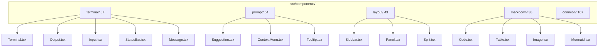

### 1.5 src/commands/ 207 个命令

```mermaid
graph TD
    subgraph commands["src/commands/"]
        CMD1[navigation/ 32]
        CMD2[edit/ 45]
        CMD3[analysis/ 38]
        CMD4[git/ 28]
        CMD5[devtools/ 64]
    end

    CMD1 --> CMD1a[goto.ts]
    CMD1 --> CMD1b[find.ts]
    CMD1 --> CMD1c[search.ts]

    CMD2 --> CMD2a[edit.ts]
    CMD2 --> CMD2b[create.ts]
    CMD2 --> CMD2c[delete.ts]
    CMD2 --> CMD2d[move.ts]

    CMD3 --> CMD3a[explain.ts]
    CMD3 --> CMD3b[trace.ts]
    CMD3 --> CMD3c[graph.ts]
    CMD3 --> CMD3d[audit.ts]

    CMD4 --> CMD4a[commit.ts]
    CMD4 --> CMD4b[branch.ts]
    CMD4 --> CMD4c[diff.ts]
    CMD4 --> CMD4d[push.ts]

    CMD5 --> CMD5a[test.ts]
    CMD5 --> CMD5b[build.ts]
    CMD5 --> CMD5c[lint.ts]
    CMD5 --> CMD5d[format.ts]
```

### 1.6 src/tools/ 184 个工具定义

```mermaid
graph TD
    subgraph tools["src/tools/"]
        T1[bash/ 23]
        T2[file/ 31]
        T3[web/ 19]
        T4[code/ 42]
        T5[mcp/ 38]
        T6[skill/ 31]
    end

    T1 --> T1a[BashTool.ts]
    T1 --> T1b[PowerShellTool.ts]
    T1 --> T1c[DockerTool.ts]

    T2 --> T2a[Read.ts]
    T2 --> T2b[Write.ts]
    T2 --> T2c[Edit.ts]
    T2 --> T2d[Grep.ts]
    T2 --> T2e[Glob.ts]

    T3 --> T3a[WebSearch.ts]
    T3 --> T3b[WebFetch.ts]
    T3 --> T3c[WebScreenshot.ts]

    T4 --> T4a[Lint.ts]
    T4 --> T4b[Format.ts]
    T4 --> T4c[TypeCheck.ts]
    T4 --> T4d[Transform.ts]

    T5 --> T5a[MCPTool.ts]
    T5 --> T5b[MCPClient.ts]
    T5 --> T5c[MCPTransport.ts]

    T6 --> T6a[SkillInvoke.ts]
    T6 --> T6b[SkillSearch.ts]
    T6 --> T6c[SkillInstall.ts]
```

### 1.7 src/services/ 130 个服务

```mermaid
graph TD
    subgraph services["src/services/"]
        SV1[api/ 28]
        SV2[auth/ 15]
        SV3[session/ 22]
        SV4[plugin/ 18]
        SV5[mcp/ 25]
    end

    SV1 --> SV1a[AnthropicAPI.ts]
    SV1 --> SV1b[StreamingClient.ts]
    SV1 --> SV1c[RateLimiter.ts]
    SV1 --> SV1d[RetryHandler.ts]

    SV2 --> SV2a[Credentials.ts]
    SV2 --> SV2b[TokenRefresh.ts]
    SV2 --> SV2c[SSO.ts]

    SV3 --> SV3a[SessionManager.ts]
    SV3 --> SV3b[SessionStore.ts]
    SV3 --> SV3c[SessionResume.ts]
    SV3 --> SV3d[SessionCompact.ts]

    SV4 --> SV4a[PluginLoader.ts]
    SV4 --> SV4b[PluginRegistry.ts]
    SV4 --> SV4c[PluginSandbox.ts]

    SV5 --> SV5a[MCPConnection.ts]
    SV5 --> SV5b[MCPDiscovery.ts]
    SV5 --> SV5c[MCPOAuth.ts]
```

## 2. 入口层深度剖析

### 2.1 CLI Bootstrap 机制

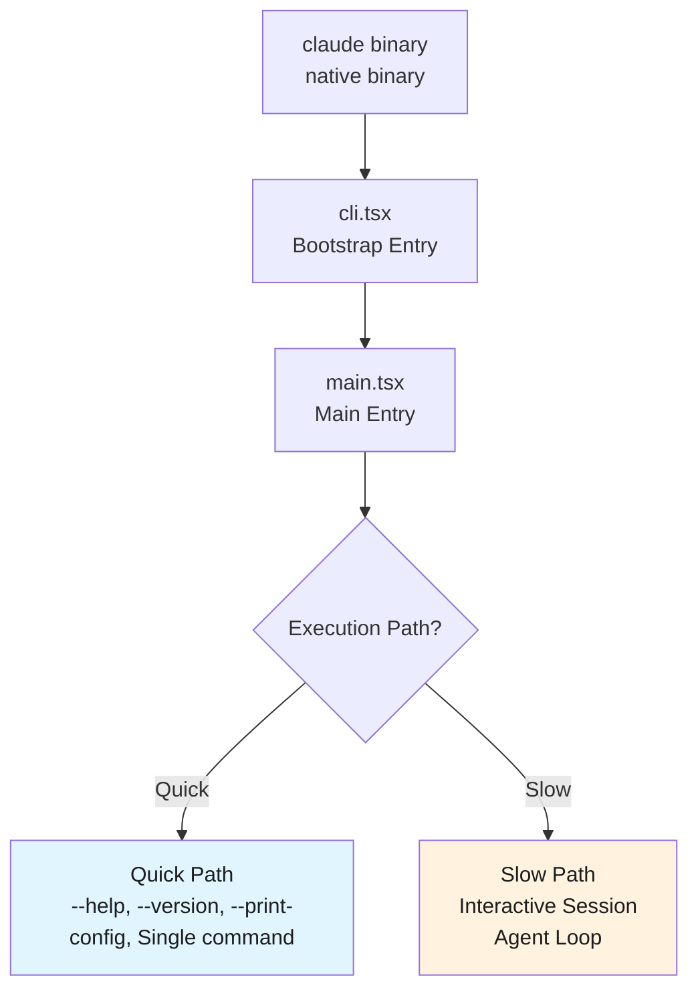

### 2.2 main.tsx 参数解析流程

```typescript
// src/main.tsx (伪代码实现)
export async function main(argv: string[]): Promise<number> {
  // Step 1: Parse raw arguments
  const parser = new ArgumentParser({
    prog: 'claude',
    description: 'Claude Code CLI',
    addHelp: true,
  });

  parser.addArgument(['--model'], { defaultValue: 'claude-3-5' });
  parser.addArgument(['--no-stream']);
  parser.addArgument(['--print']);
  parser.addArgument(['--dangerously-skip-permissions']);
  parser.addArgument(['--resume']);
  parser.addArgument(['--prompt']);
  parser.addArgument(['INPUT'], { nargs: '?' });

  const args = parser.parse(argv);

  // Step 2: Early exit for non-interactive commands
  if (args.print_config) {
    return printConfiguration();
  }
  if (args.version) {
    return printVersion();
  }

  // Step 3: Determine execution path
  const isQuickPath = args.help || args.version || args.print_config 
                    || args.input && !args.interactive;
  
  if (isQuickPath) {
    return executeQuickPath(args);
  }

  // Step 4: Full bootstrap for interactive session
  return executeSlowPath(args);
}
```

### 2.3 preActions 钩子系统

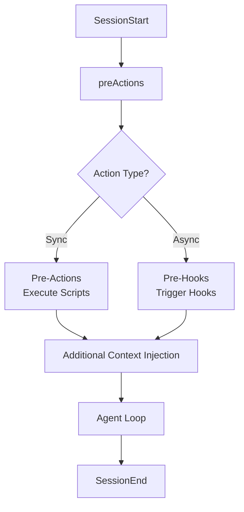

**preActions 完整列表**：

```typescript
// src/hooks/preActions.ts
export const preActions: PreAction[] = [
  {
    name: 'loadUserSettings',
    sync: true,
    execute: async () => {
      await settings.reload(); // Hot-reload settings
    },
  },
  {
    name: 'initializePlugins',
    sync: true,
    execute: async () => {
      await pluginManager.loadEnabled(); // Load enabled plugins
    },
  },
  {
    name: 'setupTelemetry',
    sync: false,
    execute: async () => {
      await telemetry.initialize(); // Async telemetry setup
    },
  },
  {
    name: 'validatePermissions',
    sync: true,
    execute: async () => {
      await permissionManager.validateRules(); // Validate permission rules
    },
  },
  {
    name: 'prepareSession',
    sync: true,
    execute: async (ctx) => {
      if (ctx.resume) {
        await sessionManager.resume(ctx.sessionId); // Resume session
      } else {
        await sessionManager.create(); // Create new session
      }
    },
  },
];
```

### 2.4 快速路径 vs 慢速路径

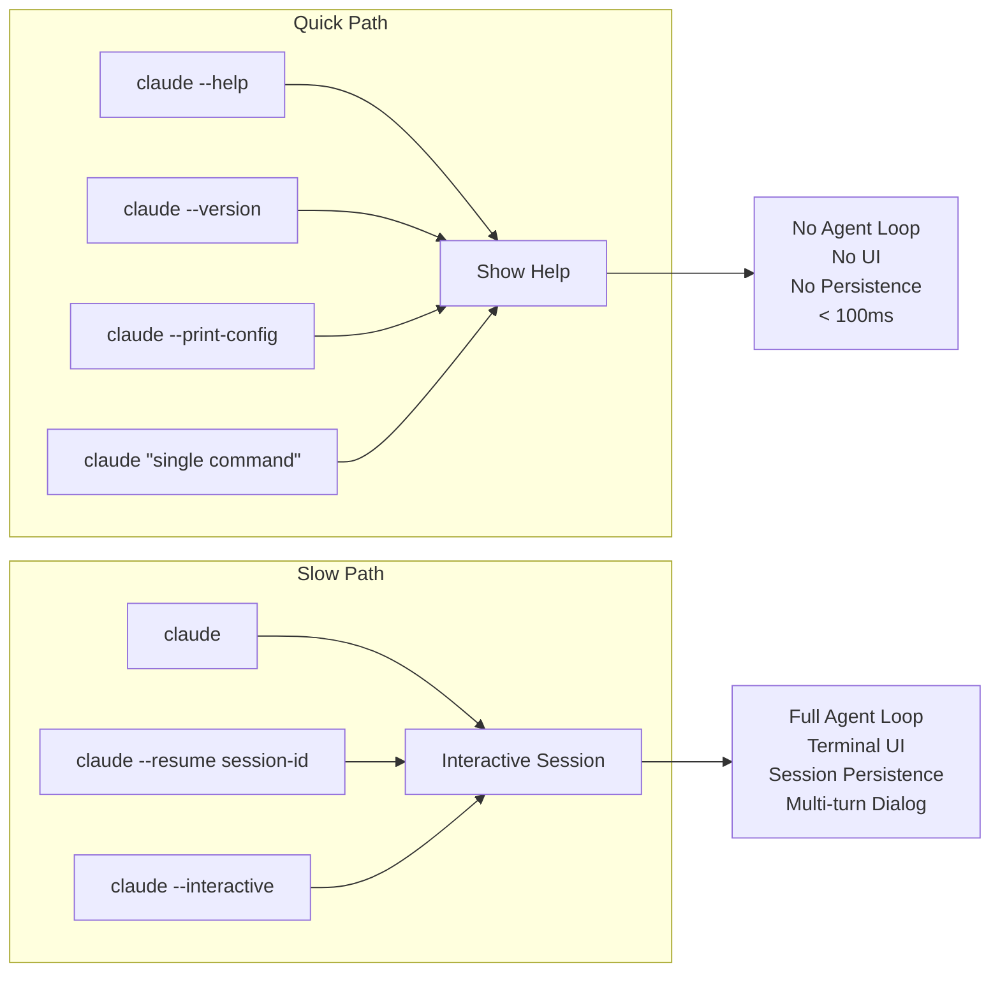

## 3. Query Engine 深度解析

### 3.1 while(true) 循环设计哲学

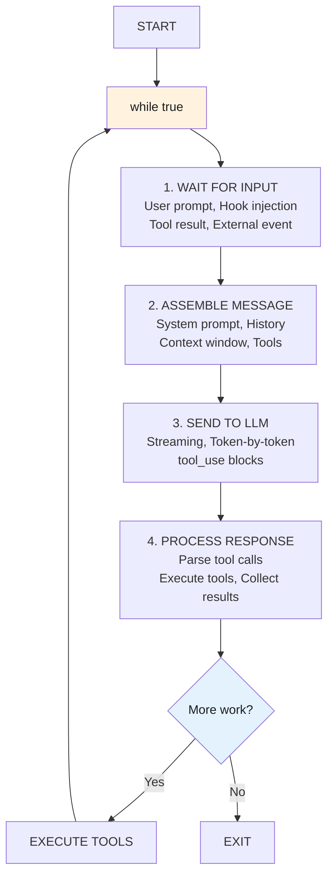

### 3.2 状态机实现

```typescript
// src/engine/QueryStateMachine.ts
// 第 1 段：状态枚举定义
// 用字符串枚举而非数字枚举，序列化到日志/前端时直接可读，排障时不用再查映射表。
// 这些状态刻画了一次"提问-调用模型-执行工具-再提问"的完整回合（round）生命周期，
// 顺序上近似线性，但 COLLECTING_RESULTS 与 CHECKING_CONTINUATION 会回环到 WAITING_INPUT 形成多轮循环。
enum QueryState {
  IDLE = 'IDLE',
  WAITING_INPUT = 'WAITING_INPUT',
  ASSEMBLING_MESSAGE = 'ASSEMBLING_MESSAGE',
  SENDING_TO_LLM = 'SENDING_TO_LLM',
  PROCESSING_TOOL_CALLS = 'PROCESSING_TOOL_CALLS',
  EXECUTING_TOOLS = 'EXECUTING_TOOLS',
  COLLECTING_RESULTS = 'COLLECTING_RESULTS',
  CHECKING_CONTINUATION = 'CHECKING_CONTINUATION',
  COMPACTING_CONTEXT = 'COMPACTING_CONTEXT',
  EXITING = 'EXITING',
}

export class QueryStateMachine {
  // 第 2 段：内部状态与历史记录
  // state 是唯一权威的当前态；history 仅追加不擦除，用于回溯"迁移轨迹"。
  // history 与 state 存在冗余，但冗余换来的是无需外部订阅即可复现最近一步（见 emit 的 from 取值）。
  private state: QueryState = QueryState.IDLE;
  private history: QueryState[] = [];

  // 第 3 段：单步状态迁移
  // 每次调用都重建一张"邻接表"，把合法迁移关系集中在一处声明。
  // 这是典型的显式状态机（FSM）写法：把非法路径交给运行时校验，避免散落各处的 if 判断漏掉分支。
  // 代价是每次迁移都构造一个 Record，属 O(1) 但带常数开销；若成为热路径可提到模块级常量。
  transition(newState: QueryState): void {
    const validTransitions: Record<QueryState, QueryState[]> = {
      [QueryState.IDLE]: [QueryState.WAITING_INPUT],
      [QueryState.WAITING_INPUT]: [
        QueryState.ASSEMBLING_MESSAGE,
        QueryState.EXITING,
      ],
      [QueryState.ASSEMBLING_MESSAGE]: [QueryState.SENDING_TO_LLM],
      [QueryState.SENDING_TO_LLM]: [
        QueryState.PROCESSING_TOOL_CALLS,
        QueryState.CHECKING_CONTINUATION,
      ],
      [QueryState.PROCESSING_TOOL_CALLS]: [QueryState.EXECUTING_TOOLS],
      [QueryState.EXECUTING_TOOLS]: [QueryState.COLLECTING_RESULTS],
      [QueryState.COLLECTING_RESULTS]: [
        QueryState.WAITING_INPUT,
        QueryState.COMPACTING_CONTEXT,
      ],
      [QueryState.CHECKING_CONTINUATION]: [
        QueryState.WAITING_INPUT,
        QueryState.EXITING,
      ],
      [QueryState.COMPACTING_CONTEXT]: [
        QueryState.WAITING_INPUT,
        QueryState.EXITING,
      ],
      [QueryState.EXITING]: [QueryState.IDLE],
    };

    // 第 4 段：合法性与幂等边界校验
    // 先查表再落库：非法迁移直接抛错，保证 state/history 绝不会出现"半更新"的脏数据。
    // 注意 includes 是 O(n) 线性扫描，但每个状态的出边最多 3 条，实际可视为常数时间。
    // 边界：newState 与当前态相同时也会被拒绝（多数状态没有自环），调用方需自行幂等去重。
    if (!validTransitions[this.state].includes(newState)) {
      throw new Error(
        `Invalid state transition: ${this.state} -> ${newState}`
      );
    }

    // 第 5 段：提交迁移并广播事件
    // 写入顺序很关键：必须先把旧态压入 history，再覆盖 state，
    // 这样 at(-2) 恰好是"迁移前"的态，at(-1) 才是新态；顺序颠倒会丢失来源态。
    // emit 依赖宿主类/混入提供，本文件未定义——若编译报错说明基类或装饰器缺失，属于已知外部契约。
    this.history.push(this.state);
    this.state = newState;
    this.emit('stateChange', { from: this.history.at(-2), to: newState });
  }

  // 第 6 段：对外查询谓词
  // 只读判定，不改变状态、不产生副作用，方便调用方（如主循环）以纯函数方式决策下一步。
  // canContinue 把"是否继续问模型"的语义钉在 CHECKING_CONTINUATION 上，
  // 避免调用方直接比较枚举常量，从而在新增状态时集中修改。
  canContinue(): boolean {
    return this.state === QueryState.CHECKING_CONTINUATION;
  }

  // 终止判定与 canContinue 互补，二者共同构成主循环的退出条件。
  shouldExit(): boolean {
    return this.state === QueryState.EXITING;
  }
}
```
### 3.3 消息组装策略

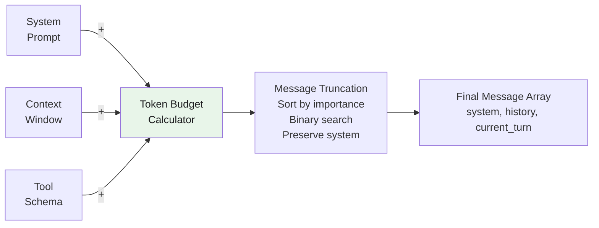

**消息组装核心代码**：

```typescript
// src/engine/MessageAssembler.ts
export class MessageAssembler {
  constructor(
    private contextWindow: number,
    private maxOutputTokens: number,
    private tokenizer: Tokenizer
  ) {}

  assemble(
    systemPrompt: string,
    history: Message[],
    currentTurn: Message,
    availableTools: Tool[]
  ): Message[] {
    // Calculate token budgets
    const systemTokens = this.tokenizer.count(systemPrompt);
    const toolTokens = this.estimateToolTokens(availableTools);
    const safetyMargin = 200;
    const reservedTokens = this.maxOutputTokens + safetyMargin;
    const availableTokens = this.contextWindow - systemTokens 
                           - toolTokens - reservedTokens;

    // Build messages within budget
    const messages: Message[] = [];
    
    // Always include system prompt
    messages.push({ role: 'system', content: systemPrompt });

    // Add history messages (oldest first for proper context)
    let tokenCount = systemTokens;
    for (const msg of history) {
      const msgTokens = this.tokenizer.count(msg.content);
      if (tokenCount + msgTokens > availableTokens) {
        break; // Budget exhausted
      }
      messages.push(msg);
      tokenCount += msgTokens;
    }

    // Add current turn
    messages.push(currentTurn);

    return messages;
  }

  private estimateToolTokens(tools: Tool[]): number {
    // MCP tool descriptions capped at 2KB each
    return tools.reduce((sum, tool) => {
      const desc = tool.description.substring(0, 2048);
      return sum + this.tokenizer.count(desc);
    }, 0);
  }
}
```

### 3.4 Streaming 响应处理

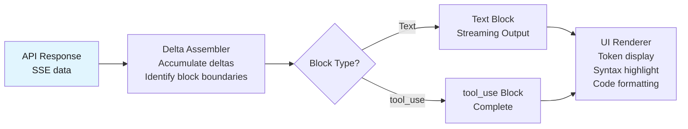

## 4. 工具系统深度实现

### 4.1 Tool 基类设计

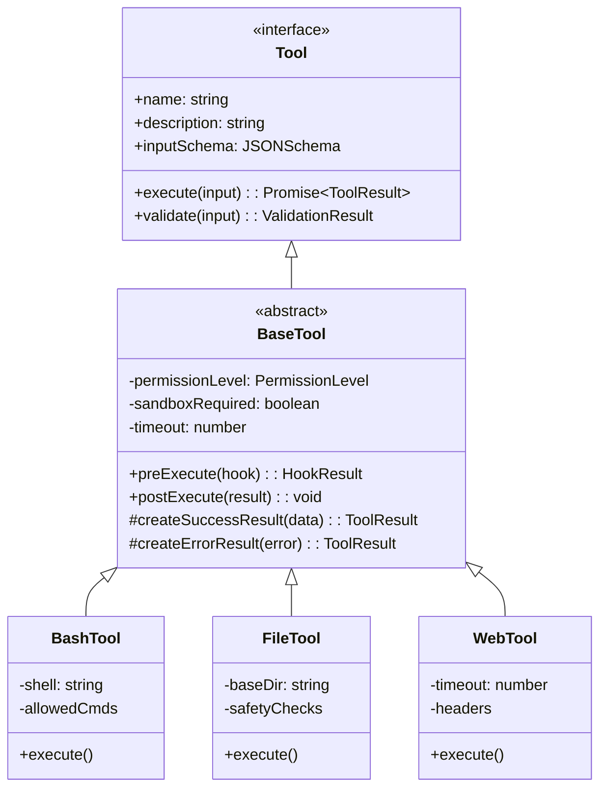

**Tool 基类实现**：

```typescript
// src/tools/BaseTool.ts
export interface ToolInput {
  [key: string]: unknown;
}

export interface ToolResult {
  success: boolean;
  output?: string;
  error?: string;
  metadata?: {
    duration_ms: number;
    tokens_used?: number;
    cached?: boolean;
  };
}

export enum PermissionLevel {
  SAFE = 'SAFE',           // Auto-allow when sandboxed
  REQUIRES_APPROVAL = 'REQUIRES_APPROVAL',
  DANGEROUS = 'DANGEROUS', // Requires explicit allow rule
  BLOCKED = 'BLOCKED',     // Cannot be used
}

export abstract class BaseTool implements Tool {
  abstract readonly name: string;
  abstract readonly description: string;
  abstract readonly inputSchema: JSONSchema;
  
  protected timeout: number = 30000; // 30s default
  protected permissionLevel: PermissionLevel = PermissionLevel.REQUIRES_APPROVAL;
  protected sandboxRequired: boolean = false;

  constructor(protected sandbox: SandboxEnvironment) {}

  async execute(input: ToolInput): Promise<ToolResult> {
    const startTime = Date.now();
    
    // 1. Validate input
    const validation = this.validate(input);
    if (!validation.valid) {
      return this.createErrorResult(
        new Error(`Invalid input: ${validation.errors.join(', ')}`)
      );
    }

    // 2. Execute pre-hook
    const hookResult = await this.preExecute(input);
    if (hookResult.blocked) {
      return this.createErrorResult(
        new Error(`Blocked by PreToolUse hook: ${hookResult.reason}`)
      );
    }

    // 3. Execute with sandbox if required
    try {
      const output = this.sandboxRequired
        ? await this.sandbox.execute(() => this.performExecute(input))
        : await this.performExecute(input);

      // 4. Post-execute hook
      await this.postExecute(output);

      return this.createSuccessResult(output, Date.now() - startTime);
    } catch (error) {
      return this.createErrorResult(error as Error);
    }
  }

  abstract performExecute(input: ToolInput): Promise<unknown>;

  protected validate(input: ToolInput): ValidationResult {
    // JSON Schema validation
    return validateSchema(input, this.inputSchema);
  }
}
```

### 4.2 工具注册表实现

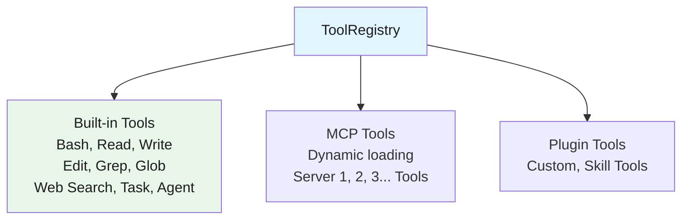

### 4.3 权限管理器

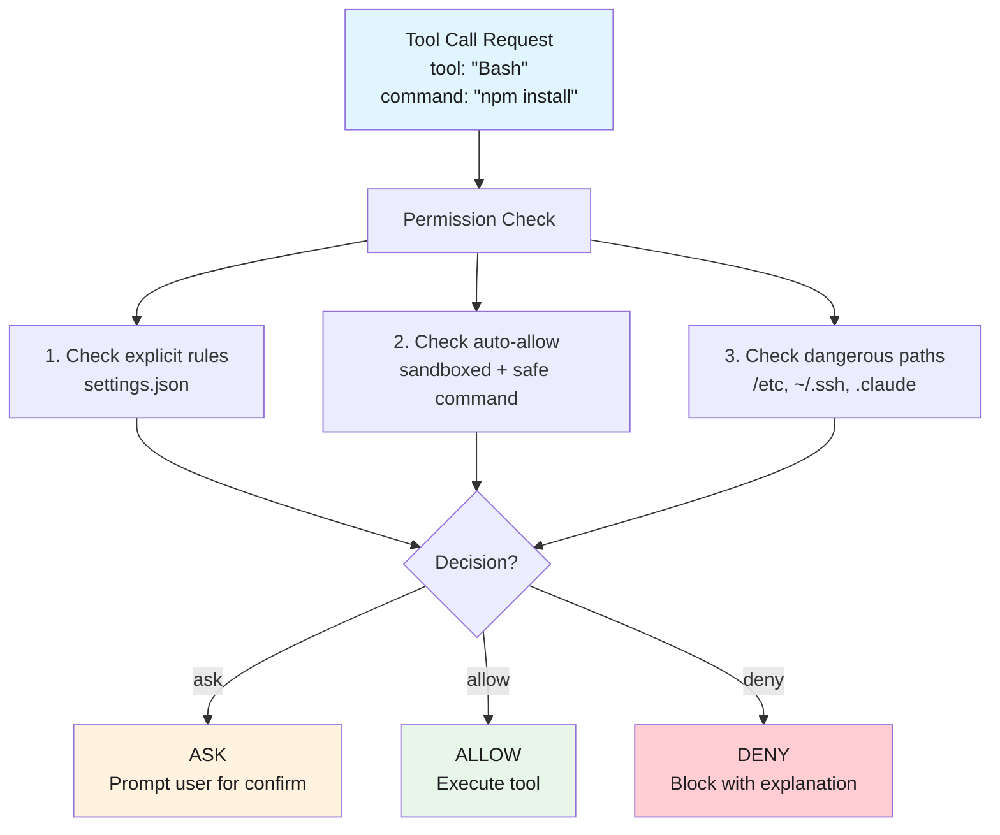

**权限管理器核心实现**：

```typescript
// src/tools/permission/PermissionManager.ts
export interface PermissionRule {
  tool: string;        // e.g., "Bash(npm *)", "Skill(name *)"
  effect: 'allow' | 'deny' | 'ask';
  reason?: string;
}

export class PermissionManager {
  private rules: PermissionRule[] = [];
  private skillRules: Map<string, PermissionRule> = new Map();

  async checkPermission(toolCall: ToolCall): Promise<PermissionDecision> {
    // 1. Check wildcard pattern matching
    for (const rule of this.rules) {
      if (this.matchesPattern(toolCall.tool, rule.tool) 
          || this.matchesPattern(toolCall.input, rule.tool)) {
        return {
          decision: rule.effect,
          reason: rule.reason ?? `Matched rule: ${rule.tool}`,
          rule,
        };
      }
    }

    // 2. Check auto-allow for sandboxed environment
    if (this.sandbox.isActive && this.isSafeCommand(toolCall)) {
      return { decision: 'allow', reason: 'Auto-allow in sandbox' };
    }

    // 3. Default to ask for unknown commands
    return { decision: 'ask', reason: 'No matching rule found' };
  }

  private matchesPattern(input: string, pattern: string): boolean {
    // Support wildcards: *, prefix, suffix
    // e.g., "Bash(npm *)" matches "npm install", "npm test"
    // e.g., "Skill(name *)" matches "skill:name" for all skills
    const regex = new RegExp(
      '^' + pattern.replace(/\*/g, '.*').replace(/\(/, '\\(').replace(/\)/, '\\)') + '$'
    );
    return regex.test(input);
  }

  private isSafeCommand(toolCall: ToolCall): boolean {
    // Safe = no dangerous path patterns, no env var injection, etc.
    const dangerousPatterns = [
      /rm\s+-rf\s+\//,           // rm -rf /
      />\s*\/\.ssh\//,           // Write to .ssh
      /\$\{.*\}/,                // Env var expansion
      /;\s*rm\s+/,               // Command injection
    ];
    return !dangerousPatterns.some(p => p.test(toolCall.input.toString()));
  }
}
```

### 4.4 沙箱执行机制

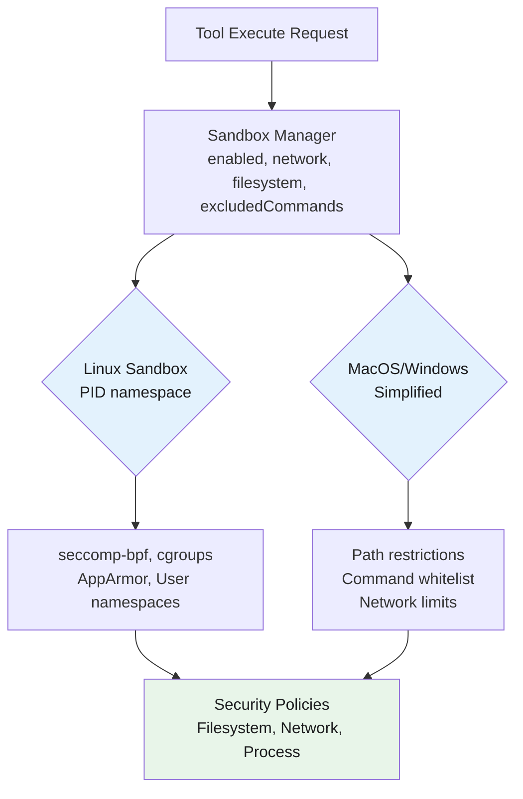

### 4.5 工具编排算法

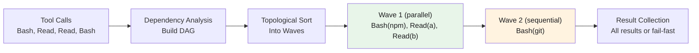

## 5. 状态管理深度

### 5.1 AppStateStore 实现

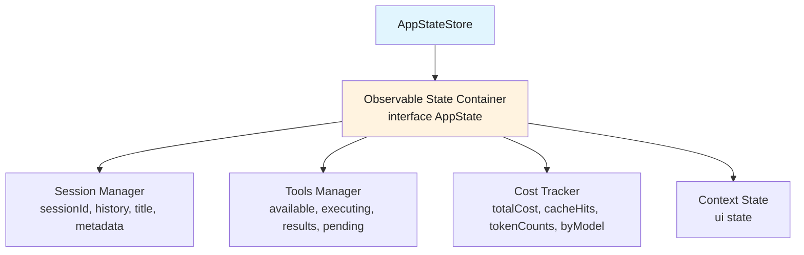

**AppStateStore 核心实现**：

```typescript
// src/state/AppStateStore.ts
type Listener<T> = (prev: T, next: T) => void;

export class AppStateStore<T extends object> {
  private state: T;
  private listeners: Map<keyof T, Set<Listener<unknown>>> = new Map();
  private version: number = 0;

  constructor(initialState: T) {
    this.state = initialState;
    // Initialize listener sets for each key
    Object.keys(initialState).forEach(key => {
      this.listeners.set(key as keyof T, new Set());
    });
  }

  get<K extends keyof T>(key: K): T[K] {
    return this.state[key];
  }

  set<K extends keyof T>(key: K, value: T[K]): void {
    const prev = this.state[key];
    if (prev === value) return; // No change, skip update

    this.state[key] = value;
    this.version++;

    // Notify listeners
    const keyListeners = this.listeners.get(key);
    if (keyListeners) {
      keyListeners.forEach(listener => {
        try {
          listener(prev, value);
        } catch (error) {
          console.error('Listener error:', error);
        }
      });
    }
  }

  update<K extends keyof T>(key: K, updater: (prev: T[K]) => T[K]): void {
    const prev = this.state[key];
    const next = updater(prev);
    this.set(key, next);
  }

  subscribe<K extends keyof T>(
    key: K,
    listener: Listener<T[K]>
  ): () => void {
    const keyListeners = this.listeners.get(key)!;
    keyListeners.add(listener as Listener<unknown>);

    // Return unsubscribe function
    return () => {
      keyListeners.delete(listener as Listener<unknown>);
    };
  }

  // Batch updates for atomic operations
  batch(updates: Partial<T>): void {
    const prev = { ...this.state };
    
    Object.entries(updates).forEach(([key, value]) => {
      this.state[key as keyof T] = value as T[keyof T];
    });
    
    this.version++;
    
    // Notify all changed keys
    Object.keys(updates).forEach(key => {
      const keyListeners = this.listeners.get(key as keyof T);
      if (keyListeners) {
        keyListeners.forEach(listener => {
          listener(prev[key as keyof T], updates[key as keyof T]!);
        });
      }
    });
  }

  // Snapshot for persistence
  snapshot(): { state: T; version: number } {
    return {
      state: structuredClone(this.state),
      version: this.version,
    };
  }

  // Restore from snapshot
  restore(snapshot: { state: T; version: number }): void {
    this.state = structuredClone(snapshot.state);
    this.version = snapshot.version;
  }
}
```

### 5.2 订阅发布机制

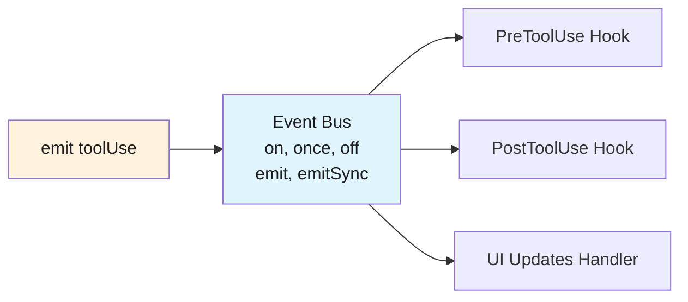

### 5.3 状态持久化

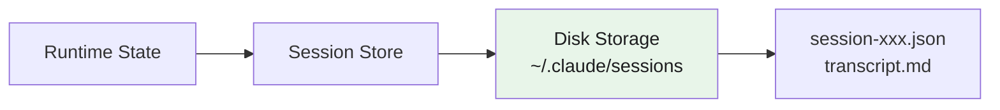

**Persistence Triggers:**
- Auto-flush: Every 30 seconds for active sessions
- On message: After each user/assistant turn
- On tool use: After each tool execution
- On exit: Graceful shutdown flush
- On error: Emergency backup before crash

### 5.4 成本追踪

**Cost State Structure:**

```mermaid
classDiagram
    class CostState {
        +totalCost: number
        +inputTokens: number
        +outputTokens: number
        +cacheHits: number
        +byModel: Record~string, ModelCost~
    }
    class ModelCost {
        +inputTokens: number
        +outputTokens: number
        +cacheHits: number
        +costUSD: number
    }
    CostState --> ModelCost
```

**Pricing by Model (per 1M tokens):**

| Model | Input | Output | Cache |
|-------|-------|--------|-------|
| claude-opus-4-20250514 | $15.00 | $75.00 | $1.50 |
| claude-sonnet-4 | $3.00 | $15.00 | $0.30 |
| claude-3-5-sonnet | $3.00 | $15.00 | $0.30 |
| claude-3-haiku | $0.25 | $1.25 | $0.04 |

**Cost Display:** `Cost: $0.42 | Tokens: 12.5k | Cache: 4.5k (36%)`

> Note: Streaming fallback maintains accurate tracking even when API falls back to non-streaming mode.

## 6. 扩展机制深度

### 6.1 插件生命周期

```mermaid
stateDiagram-v2
    [*] --> INSTALL
    INSTALL --> ENABLE: PluginLoader.load()
    ENABLE --> ACTIVE: Available in session
    ACTIVE --> ACTIVE: /reload-plugins
    ACTIVE --> DISABLE: PluginLoader.unload()
    DISABLE --> REMOVED
```

**Skill Directory Structure:**

```mermaid
graph TD
    plugin["plugin-name/"]
    plugin --> A[.claude-plugin/]
    plugin --> B[commands/]
    plugin --> C[agents/]
    plugin --> D[skills/]
    plugin --> E[hooks/]
    plugin --> F[.mcp.json]
    plugin --> G[README.md]

    A --> H[plugin.json]

    D --> I[skill-name/]
    I --> J[SKILL.md]

    E --> K[hooks.json]
```

**Loading Process:**
1. Read plugin.json manifest
2. Validate schema and dependencies
3. Load commands (parse .md files)
4. Load agents (parse .md files)
5. Load skills (parse SKILL.md files)
6. Register hooks (parse hooks.json + scripts)
7. Initialize MCP servers (if .mcp.json exists)
8. Emit 'pluginLoaded' event

### 6.2 技能注册和执行

```mermaid
flowchart TD
    subgraph skill-system["Skill System"]
        A[Skill Discovery & Loading] --> B[Load Locations]
        B --> B1[.claude/skills/ User skills]
        B --> B2[plugins/*/skills/ Plugin skills]
        B --> B3[Built-in skills Core]

        A --> C[SKILL.md Structure]
        C --> C1[--- name trigger context]
        C --> C2[Agent Type maxTokens]
        C --> C3[Instructions & Principles]
        C --> C4[Output Format]
    end

    A2["User Input: design a login page"] --> F[Skill Matcher]
    F --> G{Match?}
    G -->|Yes| H[Skill Loader]
    H --> I[Parse SKILL.md]
    I --> J[Fork Subagent]
    J --> K[system base_prompt + skill instructions]
    J --> L[model sonnet from skill]
    J --> M[maxTokens 8000 from skill]
    J --> N[tools limited tool set]
    N --> O[Wait for completion]
    O --> P[Merge results to main transcript]
    P --> Q[Main Agent continues]
```

### 6.3 MCP 客户端实现

```mermaid
flowchart TB
    subgraph mcp-config[".mcp.json Configuration"]
        MC1["["]
        MC2["{ mcpServers: {"]
        MC3["filesystem: {"]
        MC4["command: npx"]
        MC5["args: [-y, @modelcontextprotocol/server-files]"]
        MC3 --> MC4 --> MC5
        MC2 --> MC3
        MC1 --> MC2
    end

    subgraph mcp-manager["MCP Client Manager"]
        MM1["clients: Map<string, MCPClient>"]
        MM2["tools: Map<string, MCPTool>"]
        MM3["+ addServer()"]
        MM4["+ removeServer()"]
        MM5["+ listTools()"]
        MM6["+ callTool()"]
    end

    subgraph transport["MCP Transport Layer"]
        T1[stdio default]
        T2[SSE streaming fallback]
        T3[HTTP WebSocket fallback]
        T1 -.-> T2 -.-> T3
    end

    subgraph optimization["Tool Search Optimization"]
        O1[auto mode default]
        O2[defer descriptions > threshold]
        O3[2KB description cap]
        O4[batched token counting]
    end

    MC1 --> mcp-manager
    mcp-manager --> transport
    transport --> optimization

    subgraph elicitation["Elicitation Support"]
        E1[Elicitation dialog interactive]
        E2[ElicitationResult hooks]
        E3[Claude.ai connectors]
    end
```

### 6.4 远程桥接协议

```mermaid
flowchart LR
    A[Local CLI] <-->|WebSocket| B[claude.ai/code]
    A --> C[Commands<br/>/remote-control<br/>claude-cli://]
    B --> D[Protocol Messages<br/>session_sync<br/>tool_approval_request<br/>user_input]
```

**Deep Link Protocol:**
```
claude-cli://open?path=/project&prompt=Fix%20bug
claude-cli://resume?session=abc123
```

## 7. 关键算法分析

### 7.1 工具并行执行算法

```typescript
// src/engine/parallel-executor.ts
export class ParallelToolExecutor {
  constructor(
    private maxConcurrency: number = 5,
    private failFast: boolean = true
  ) {}

  async execute(
    toolCalls: ToolCall[],
    registry: ToolRegistry,
    permissionManager: PermissionManager
  ): Promise<ToolResult[]> {
    // Step 1: Build dependency graph
    const graph = this.buildDependencyGraph(toolCalls);
    
    // Step 2: Topological sort into execution waves
    const waves = this.topologicalSort(graph);
    
    // Step 3: Execute each wave
    const results: ToolResult[] = new Array(toolCalls.length);
    const indexMap = new Map(toolCalls.map((tc, i) => [tc, i]));

    for (const wave of waves) {
      const waveResults = await Promise.all(
        wave.map(tc => this.executeTool(
          tc,
          registry,
          permissionManager
        ))
      );

      // Map results back to original indices
      wave.forEach((tc, i) => {
        results[indexMap.get(tc)!] = waveResults[i];
      });

      // Fail fast check
      if (this.failFast && waveResults.some(r => !r.success)) {
        // Mark remaining tools as skipped
        const remaining = toolCalls.slice(indexMap.get(wave[wave.length - 1])! + 1);
        remaining.forEach(tc => {
          results[indexMap.get(tc)!] = {
            success: false,
            error: 'Skipped due to sibling failure',
          };
        });
        break;
      }
    }

    return results;
  }

  private buildDependencyGraph(toolCalls: ToolCall[]): DependencyGraph {
    const graph = new DependencyGraph();
    
    // Build graph edges based on file access patterns
    for (let i = 0; i < toolCalls.length; i++) {
      for (let j = i + 1; j < toolCalls.length; j++) {
        if (this.dependsOn(toolCalls[j], toolCalls[i])) {
          graph.addEdge(toolCalls[j], toolCalls[i]);
        }
      }
    }
    
    return graph;
  }

  private dependsOn(consumer: ToolCall, producer: ToolCall): boolean {
    // Read after Write to same file → depends
    if (producer.name === 'Write' && consumer.name === 'Read') {
      return consumer.input.file_path === producer.input.file_path;
    }
    
    // Any tool after Write to same file → depends
    if (producer.name === 'Write') {
      const producerPath = producer.input.file_path;
      if (consumer.input.file_path === producerPath) return true;
    }
    
    return false;
  }

  private topologicalSort(graph: DependencyGraph): ToolCall[][] {
    const waves: ToolCall[][] = [];
    const remaining = new Set(graph.nodes);
    const inDegree = new Map(graph.nodes.map(n => [n, graph.inDegree(n)]));

    while (remaining.size > 0) {
      // Find nodes with no dependencies
      const ready = [...remaining].filter(n => inDegree.get(n) === 0);
      
      if (ready.length === 0) {
        throw new Error('Circular dependency detected');
      }
      
      waves.push(ready);
      
      // Remove processed nodes and update in-degrees
      for (const node of ready) {
        remaining.delete(node);
        for (const neighbor of graph.outNeighbors(node)) {
          inDegree.set(neighbor, inDegree.get(neighbor)! - 1);
        }
      }
    }

    return waves;
  }
}
```

### 7.2 依赖分析算法

```mermaid
flowchart TD
    subgraph input["Input: Tool calls"]
        I1[Read src/main.ts]
        I2[Read src/utils.ts]
        I3[Write src/main.ts]
        I4[Read src/main.ts depends on Write]
        I5[Bash npm test no deps]
    end

    subgraph step1["Step 1: Extract file references"]
        S1a["Read → [main.ts]"]
        S1b["Read → [utils.ts]"]
        S1c["Write → [main.ts] mutated"]
        S1d["Bash → [] shell:true"]
    end

    subgraph step2["Step 2: Build dependency edges"]
        S2a["Rule 1: Read after Write → DEPENDS"]
        S2b["Rule 2: Any after Write → DEPENDS"]
        S2c["Rule 3: Read after Read → INDEPENDENT"]
        S2d["Rule 4: Bash → INDEPENDENT"]
    end

    subgraph step4["Step 4: Topological sort"]
        W1["Wave 1 (parallel): Read(main), Read(utils)"]
        W2["Wave 2 (parallel): Write(main)"]
        W3["Wave 3 (parallel): Read(main), Bash(test)"]
    end

    I1 --> step1
    I2 --> step1
    I3 --> step1
    I4 --> step1
    I5 --> step1

    step1 --> step2
    step2 --> step4
```

### 7.3 降级策略算法

```mermaid
flowchart TB
    subgraph triggers["Degradation Triggers"]
        T1["1. API Rate Limit<br/>429 Too Many Requests<br/>Exponential backoff<br/>Switch to fallback model"]
        T2["2. Context Window Near Limit<br/>Tokens > 80%<br/>Trigger compaction<br/>Circuit breaker: 3 failures"]
        T3["3. Tool Execution Failure<br/>Parse failure → deny<br/>Timeout → retry<br/>Permission denied → message"]
        T4["4. Streaming Fallback<br/>SSE lost → polling<br/>Accurate cost tracking<br/>Seamless experience"]
        T5["5. Model Fallback Chain<br/>Primary: opus-4<br/>Fallback1: sonnet<br/>Fallback2: haiku"]
    end

    subgraph powershell["PowerShell Parse-Fail Degradation"]
        P1["1. Log parse error"]
        P2["2. Return fallback deny-rule"]
        P3["3. Suggest correction"]
        P4["4. Security: deny unparsed"]
    end

    subgraph circuit["Context Compaction Circuit Breaker"]
        CB1["compactFailures = 0<br/>MAX_COMPACT_FAILURES = 3"]
        CB2["onCompactionAttempt():<br/>if fails >= 3:<br/>stop(Context failed 3x)"]
        CB3["onContextRefill():<br/>if immediately refilled:<br/>stop(Conversation too large)"]
    end
```

## 8. 附录：参考架构图

### 8.1 完整系统架构图

```mermaid
flowchart TB
    subgraph cli["CLI Layer"]
        CLI1[claude binary]
        CLI2[--help flag]
        CLI3[--version flag]
        CLI4[--print-cfg flag]
    end

    subgraph bootstrap["Bootstrap Layer"]
        B1[cli.tsx Bootstrap]
        B2[main.tsx Parser]
        B3[preActions System]
        B4[Hooks System]
    end

    subgraph engine["Query Engine Layer"]
        E1["while(true) Loop"]
        E2[State Machine]
        E3[Message Assembler]
        E4[LLM Client]
        E5[Tool Router]
    end

    subgraph execution["Execution Layer"]
        EX1[Tool Registry]
        EX2[Permission Manager]
        EX3[Sandbox Executor]
        EX4[Hook Pipeline]
    end

    subgraph tools["Tools Layer"]
        T1[Bash Tool]
        T2[File Tools]
        T3[Web Tools]
        T4[MCP Tools]
    end

    subgraph extension["Extension Layer"]
        EXT1[Plugin System]
        EXT2[Skill System]
        EXT3[MCP Client]
        EXT4[Hook System]
    end

    subgraph state["State & Persistence Layer"]
        S1[AppState Store]
        S2[Session Store]
        S3[Cost Tracker]
        S4[Settings Manager]
    end

    CLI1 --> B1
    B1 --> B2
    B2 --> B3
    B3 --> B4
    B4 --> E1
    E1 --> E2
    E1 --> E3
    E1 --> E4
    E1 --> E5
    E5 --> EX1
    EX1 --> EX2
    EX2 --> EX3
    EX3 --> EX4
    EX4 --> T1
    EX4 --> T2
    EX4 --> T3
    EX4 --> T4
    T4 --> EXT1
    T4 --> EXT2
    T4 --> EXT3
    T4 --> EXT4
    EXT1 --> S1
    EXT2 --> S2
    EXT3 --> S3
    EXT4 --> S4
```

### 8.2 数据流图

```mermaid
flowchart LR
    U["User Input<br/>"Fix the login bug""] --> H1[UserPromptSubmit Hook]

    H1 --> M1[Message Assembly<br/>System prompt<br/>History<br/>Tool schemas]

    M1 --> LLM[LLM Request<br/>streaming: true<br/>model: sonnet<br/>max_tokens: 4096]

    LLM --> RESP[LLM Streaming Response<br/>Token-by-token<br/>tool_use blocks]

    RESP --> TOOL[Tool Call Processing<br/>Parse blocks<br/>Dependency analysis<br/>Permission checks]

    TOOL --> PRE[PreToolUse Hook]
    PRE --> EXEC[Execute Tools]
    EXEC --> POST[PostToolUse Hook]

    POST --> COLLECT[Collect Results<br/>tool_result blocks<br/>Persist > 50KB to disk]

    COLLECT --> LOOP{More work?}
    LOOP -->|Yes| M1
    LOOP -->|No| EXIT[SessionEnd Hook<br/>Exit]

    EXIT --> PERSIST[Session Persistence<br/>Save messages<br/>Update cost<br/>Update context %]

    PERSIST --> A["Assistant Output<br/>"I've fixed the login bug...""]
```

## 9. 参考资料

- [DeepWiki - Claude Code Overview](https://deepwiki.com/anthropics/claude-code)
- [DeepWiki - System Architecture](https://deepwiki.com/anthropics/claude-code#1.1)
- [DeepWiki - Tool System & Permissions](https://deepwiki.com/anthropics/claude-code#3.2)
- [DeepWiki - Hook System](https://deepwiki.com/anthropics/claude-code#3.4)
- [DeepWiki - MCP Server Integration](https://deepwiki.com/anthropics/claude-code#3.5)
- [DeepWiki - Plugin System](https://deepwiki.com/anthropics/claude-code#3.6)
- [DeepWiki - Skill System](https://deepwiki.com/anthropics/claude-code#3.7)

---

*本文档由 Claude Code 自动生成，基于 DeepWiki 知识库与 CHANGELOG.md 构建。*
*生成日期: 2026/05/15*

## 深入阅读与参考

!!! tip "怎么用这些资料"
    先读「官方文档与规范」建立准确的概念，再读「源码与示例」核对细节，最后用「教程、书籍与视频」换一种讲法加深理解。每条都写明了读哪一节、带着什么问题读。

### 官方文档与规范

| 资源 | 为什么读 | 怎么读 |
|---|---|---|
| [Claude Code 文档](https://code.claude.com/docs/en/overview) | 官方总览，入口层、slash command 与扩展点的权威定义 | 按顺序读 slash commands、hooks、subagents 三节，带着“入口如何分发请求”的问题读，再回看本页目录树 |
| [Claude 子 Agent 文档](https://docs.claude.com/en/docs/claude-code/sub-agents) | 子 Agent 定义与工具权限模型，对应任务隔离设计 | 重点看工具权限限制字段，创建一个只读审查 subagent 跑一次，观察上下文与工具集如何被裁剪 |
| [Claude Code Hooks](https://docs.anthropic.com/en/docs/claude-code/hooks) | hooks 是扩展机制的核心插入点，源码对照首选 | 读事件表与配置格式，思考“工具执行前后如何插入逻辑”，写一个提交前 lint hook 验证拦截效果 |
| [Claude Tool Use 概览](https://docs.claude.com/en/docs/agents-and-tools/tool-use/overview) | 工具定义 schema 的第一手规范，直接对应工具系统章节 | 手写一份工具 JSON schema，故意传错参数观察报错，理解参数校验与分发链路 |
| [Claude Agent SDK 概览](https://docs.claude.com/en/api/agent-sdk/overview) | Agent 循环与工具调用的官方说明，对应 Query Engine | 读概览中的循环与消息流小节，带着“一次 query 的完整生命周期”读，读完画出时序图 |

### 源码与示例

| 资源 | 为什么读 | 怎么读 |
|---|---|---|
| [Claude Agent SDK（TypeScript）](https://github.com/anthropics/claude-agent-sdk-typescript) | 可运行 SDK 示例，看清查询循环与工具注册全流程 | 跑通 README 示例并打开调用日志，再把自定义函数注册成工具，对照本页工具注册代码 |

### 教程、书籍与视频

| 资源 | 为什么读 | 怎么读 |
|---|---|---|
| [Claude Code 最佳实践](https://www.anthropic.com/engineering/claude-code-best-practices) | CLAUDE.md 与计划先行实践，理解上下文注入与状态入口 | 在自己的仓库落地一周，重点观察 CLAUDE.md 何时被加载进上下文，一周后复盘偏差 |
| [Claude Code MCP](https://docs.anthropic.com/en/docs/claude-code/mcp) | MCP 接入实例，看清外部工具如何挂进扩展层 | 接一个文件系统 MCP 完成读写任务，记录工具列表如何合并进会话与每次调用的链路 |

## 应用与行业实践

前面几章讲的是 Claude Code 内部怎么运转，这一章讲这些结构在哪些真实工作里能派上用场。每个场景都给出可复现的测量方法，你可以拿自己的仓库跑一遍再决定要不要上。

### 应用场景地图

先按"谁在什么环境下调用模型"划分场景，再看每个场景要吃透哪一块知识。

| 场景 | 用到本页哪个知识点 | 典型技术选型 | 注意事项 |
|---|---|---|---|
| 十万文件单体仓库的代码问答 CLI | Query Engine 多轮循环、工具系统的按需检索 | 本地命令行程序、流式输出、grep 与 read 两个检索工具 | 单轮读入量设上限，检索结果按路径去重 |
| CI 里自动修 lint 的补丁机器人 | 入口层的参数解析与退出码、权限模型 | 容器内无头运行、出站网络受限、补丁文件回传仓库 | 失败必须返回非零退出码，不能吞掉报错 |
| 连续数小时的运维排障会话 | 状态管理的分层存储、上下文压缩算法 | 会话历史落本地文件、旧轮次摘要、日志按路径引用 | 压缩后仍要能跳回原始日志行 |
| 万行级多文件批量重构 | 工具系统的原子写入、写入前的权限确认 | 先出 diff 再落盘、git 分支隔离 | 落盘前保留整体回滚点 |
| IDE 插件里的内联补丁预览 | 扩展机制、流式事件的增量解析 | 编辑器扩展进程、用诊断接口展示改动 | 模型调用放独立进程，不占用编辑器主线程 |
| 企业内部工单系统接入 | 扩展机制里的 MCP 工具注册 | 自建 MCP server、只读凭据 | 工具描述要写明副作用与幂等性 |
| 多代理并行处理大版本迁移 | 子代理的上下文隔离、任务分派 | 每个代理一个 git worktree | 合并冲突交回人工确认 |
| 面向非工程师的数据分析 REPL | 工具系统的沙箱执行、权限模型 | 只读数据副本、查询超时 | 不直连生产库，超时后强制中断 |

### 三个场景拆解

#### 场景 1：十万文件单体仓库的代码问答 CLI

**业务背景**：仓库有上万到十万量级的文件，新同事想确认"这个函数在哪儿被调用"时只能人肉翻目录。可复现的测量方法：用 `git ls-files | wc -l` 数文件数，把全量文件过一次分词器看总额。

**怎么用本页知识解决**：思路是别把仓库塞进上下文，把仓库当外部可检索资源。入口层只管解析问题与加载配置，Query Engine 管多轮循环，工具系统只暴露两个工具：按正则搜内容、按行区间读文件。模型每轮自己决定下一次检索什么。

```ts
// 示意代码：函数名由项目自定义，不是任何库的真实 API
const tools = [grepTool, readFileTool];            // 只给检索与读取，不给写入

async function answer(question: string) {
  let ctx: Message[] = [{ role: "user", content: question }];
  for (let turn = 0; turn < MAX_TURNS; turn++) {   // 轮次上限，防止空转
    const out = await engine.step(ctx, tools);     // 一轮：模型决策 + 工具执行
    ctx.push(...out.messages);
    if (out.done) return out.text;                 // 模型给出终答，退出循环
    ctx = budgetTrim(ctx, MAX_TOKENS);             // 每轮裁剪，守住上下文窗口
  }
  return "达到轮次上限，请缩小问题范围";            // 兜底：明确告诉用户没答完
}

function budgetTrim(ctx: Message[], limit: number): Message[] {
  // 最近两轮保留工具结果原文，更早的只留路径与行号
  return keepRecent(ctx, 2, limit);
}
```

- `tools` 数组决定模型能做什么。只放检索与读取，模型就动不了你的工作区。
- `MAX_TURNS` 是循环的刹车。没有它，模型可能在两个文件之间来回读。
- `engine.step` 把"模型决策"和"工具执行"合成一轮，这是 Query Engine 章节的循环骨架。
- `budgetTrim` 决定会话能撑多久。保留全部历史会在若干轮后撑爆窗口。
- 兜底返回值要带信息。"达到轮次上限"比返回空字符串便于排查。

**怎么度量收益**：看三个指标。端到端耗时用 `time` 包住整个进程；首字节延迟在流式回调里打时间戳；单次读入的 token 数让 Query Engine 每轮打印估算值。再准备一组固定问题做回归，统计模型读到的文件里有多少是人工标注的答案文件。

**什么时候不该用**：

- 仓库只有几十个文件。全量读入没超窗口，加检索只增加延迟和失败点。
- 问题需要跨多个仓库的全局搜索。单仓库索引看不到别的仓库，先建跨仓库搜索服务。

#### 场景 2：CI 里自动修 lint 的补丁机器人

**业务背景**：每次 PR 触发流水线，格式与静态检查的失败项多为小改动，但排队等人修会拖慢合并。规模量级用"每天触发次数 × 平均失败项数"估，测量方法是在 CI 日志里统计 lint 失败任务数。

**怎么用本页知识解决**：把查询引擎当无头命令跑一次，而不是交互式会话。入口层只给一份任务说明，工具白名单只放读文件与打补丁，权限拒绝网络与任意命令，结果用退出码表达。

```ts
// 示意代码：CI 侧调用一次，不做多轮交互
const result = await runQuery({
  prompt: buildPrompt(process.env.LINT_REPORT), // 把 lint 报告拼成任务说明
  tools: ["read_file", "apply_patch"],          // 白名单：只读文件、只打补丁
  permissions: {
    network: "deny",                            // 断网，防止源码外传
    shell: "deny",                              // 禁止执行任意命令
    write: ["src/**"],                          // 只允许改源码目录
  },
  maxTurns: 8,                                  // 轮次上限，控制单次成本
  cwd: process.env.WORKSPACE,                   // 固定在 CI 的工作副本里
});

if (!result.patch) process.exit(1);             // 没产出补丁按失败处理
await applyPatch(result.patch);                 // 补丁落到工作副本
process.exit(0);                                // 交给后续 lint 复跑校验
```

- 白名单是安全边界。工具列表和权限对象要同时收窄，只改一处不起作用。
- `permissions.write` 用路径前缀限定。模型想改依赖清单或配置也会被拦下。
- `maxTurns` 是成本上限。CI 是最容易被反复触发的场景，没上限就没预算。
- 补丁交给后续 lint 复跑，而不是自己宣布成功。判断权在检查工具手里。
- 退出码要和结果对齐。返回 0 却没产出补丁，会让流水线给出假的绿灯。

**怎么度量收益**：看四个数。修复成功率 = lint 复跑通过的分支数 / 总触发数；误改率 = 需人工回退的 PR 数 / 总触发数；单次耗时取 CI 任务时长；成本按每轮 token 数乘单价。做法是先在旁路流水线跑两周，不动主分支。

**什么时候不该用**：

- 修复需要访问生产数据库或线上配置。CI 容器里不该放这类凭据。
- 失败项来自架构决策，例如模块边界被打破。这需要人做取舍，让模型改会掩盖问题。

#### 场景 3：连续数小时的运维排障会话

**业务背景**：排障时人和助手来回几十轮，日志一段段读进来，上下文只增不减。规模量级看会话轮数与日志体量的乘积；测量方法：把一次真实排障的日志拼起来过一遍分词器，看第几轮撞窗口。

**怎么用本页知识解决**：把状态管理分两层。原文消息与工具结果存到会话文件，进模型窗口的是另一份视图：最近若干轮保留原文，更早的轮次换成摘要加日志路径与行号。

```ts
// 示意代码：压缩策略示意
function buildViewModel(session, limit: number) {
  const recent = session.messages.slice(-KEEP_TURNS); // 最近若干轮，原文保留
  const older = session.messages.slice(0, -KEEP_TURNS); // 更早的轮次被替换成摘要
  const summary = session.summary ?? "";
  const view = [
    { role: "system", content: `已压缩的历史摘要：${summary}` }, // 摘要置顶
    ...recent,
  ];
  return trimToLimit(view, limit);                    // 仍超限时再裁最老的一条
}

async function maybeCompact(session) {
  if (estimateTokens(session) < THRESHOLD) return;    // 未到阈值就不压缩
  session.summary = await summarize(session.messages.slice(0, -KEEP_TURNS));
  await persist(session);                             // 摘要与原文一并落盘
}
```

- 原文不删。压缩只影响送给模型的视图，会话文件里留着完整记录，方便事后审计。
- 摘要置顶。模型先建立背景，再读细节。
- `THRESHOLD` 决定压缩时机。压得太早会丢掉还没用上的细节，太晚则单轮请求就可能超限。
- 压缩前后都要能定位原始日志。摘要里保留"路径 + 行号"比保留日志原文有用。
- 压缩本身要花一次模型调用。把它算进会话成本，别当成免费操作。

**怎么度量收益**：看三个指标。会话可维持轮数：用固定长排障脚本跑，记录第几轮出现信息丢失；压缩次数与耗时在 `maybeCompact` 里打点；关键信息丢失率用回归用例查必答项。打点工具可以用 OpenTelemetry 的计数器与直方图。

**什么时候不该用**：

- 合规要求逐字留痕的审计场景。摘要会改写原始表述，审计要看原文。
- 单轮就能答完的问答。加压缩只增加一次模型调用和一处出错点。

### 行业先进实践

把工具接入抽成独立协议（出处：Model Context Protocol 官方文档）
MCP 定义了 host、client、server 三种角色，工具用统一描述暴露，走 JSON-RPC。它把"模型能调什么"从宿主代码里挪出来，换数据源不用改宿主。借鉴方式：先给内部系统写一个只读 server，看模型能否选对工具。

用钩子拦截生命周期事件（出处：Claude Code 官方文档 hooks）
在工具调用前后挂外部命令，用退出码决定放行还是阻断，阻断原因回传给模型。策略与推理因此解耦，改规则不用动提示词。借鉴方式：先把"禁止写入生产目录"写成前置钩子。

检查点与中断恢复（出处：LangGraph 官方文档）
checkpointer 持久化图状态，interrupt 让执行在指定节点暂停，等人确认后继续。长任务里这是成本控制点：跑错一步不必重来。借鉴方式：每完成一步就落盘，把人工确认做成流程节点。

仓库地图按需检索（出处：Aider 开源项目文档）
repo map 用 tree-sitter 抽符号，按引用关系排序，只送高相关片段进上下文。它比纯正则搜索贴近代码结构，占用的窗口也少。借鉴方式：离线生成符号索引，让模型在索引上挑文件。

按可控步骤组织代理（出处：HumanLayer 开源项目 12-factor-agents）
这套原则主张拆小步骤、自己持有控制流、把状态存到外部。它把不可预测的循环变成可观测的步骤序列。借鉴方式：自己写循环骨架，只在工具执行这个边界处用框架。

要把这些做法落进你的技术栈，先核对官方文档：核对 MCP 的传输层要求与鉴权方式、hooks 的事件名与退出码语义、checkpointer 支持的存储后端。

### 从学到用：落地路线

1. 试点：挑一个读多写少、失败可回退的内部工具接入，范围限定在单个仓库的只读问答。验收标准：同一组问题在接入前后各跑一遍，答案的文件定位准确率有记录，运行后工作区无改动。
2. 验证：给它加上预算与权限边界，把失败路径跑一遍。验收标准：超轮次、超 token、越权写入、网络被拒四种情况各有一条用例，都返回可读的错误。
3. 推广：把配置抽成一份声明文件，配一份接入清单交给别的团队复制。验收标准：新团队在没有你参与的情况下完成接入，并跑通同一套回归问题。
4. 防止回退：把回归用例挂到流水线，改动即跑，关键指标进看板。验收标准：准确率或成本偏离基线时流水线报警，且有人负责响应。

### 动手作业

**目标**：给自己维护的一个代码仓库做一个小型问答命令行工具，只用检索与读取两个工具，回答"这个函数在哪儿被调用"这类定位问题，全程不接入写入能力。

**步骤**：

1. 用 `git ls-files | wc -l` 记录文件数，用分词器统计全量文件的 token 数，作为对照基线。
2. 搭入口层：接收一个自然语言问题，读取一份配置文件，打印本轮用到了哪些工具。
3. 写 grep 工具：输入正则，输出"文件路径 + 行号 + 命中行"，单次返回条数设上限。
4. 写读文件工具：输入路径与行区间，输出带行号的文本，拒绝超过单次字节上限的请求。
5. 写查询循环：每轮把模型决策与工具结果追加到消息列表，设轮次与 token 上限，超限给出提示。
6. 每轮打印估算 token 数与本轮读入的文件路径，方便核对预算。
7. 准备十个定位问题与答案文件清单，跑一遍，把模型实际读到的文件与清单比对。

**验收标准**：

- 循环在轮次上限或 token 上限处停止，并输出可读提示，不出现空返回。
- 单轮读入的 token 数不超过设定上限，日志里能看到每轮估算值。
- 十个问题中，模型最终读到的文件包含答案文件的比例有明确数字，且问题原文被记录下来。
- 工具列表里没有写入类工具，运行后 `git status` 无改动。
- 换一个仓库重跑步骤 1 与步骤 7，能得到新的基线数字，说明流程可复现。

