# OpenCode 架构分析

!!! abstract "学完这一页你能"
    - 说出 OpenCode 的三条定位，并指出每条定位在仓库里对应哪个模块。
    - 画出四层架构图，解释 cmd、internal/app、internal/llm、internal/tools、internal/tui 之间的依赖方向。
    - 写出 Provider 与 Tool 两个接口的最小实现，并让一次工具调用完整跑通。
    - 用 Node 20 复刻流式双通道、95% 阈值自动压缩、三次指数退避重试，并用断言验证行为。

## 0. 知识地图

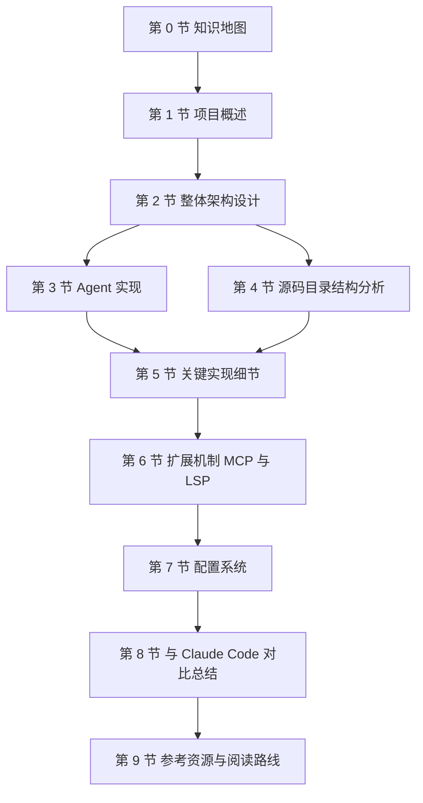

建议按箭头顺序读。第 1、2 节建立全局印象，先不要钻进代码。第 3、5 节是本页的重点，两节合起来回答"一次对话从输入到落库发生了什么"。第 4 节把前面讲的结构落到磁盘上的目录名。第 6 到 9 节讲扩展、配置、选型与继续阅读。

!!! note "术语：AI 编程代理"
    定义：能读文件、改文件、执行命令，并根据执行结果继续下一步的 AI 程序。例子：你说"把失败的测试修好"，它会打开测试文件、编辑源码、重新跑测试。

## 1. 项目概述

**先想一个问题**
你所在的四人小组，有人订了 Claude，有人用公司发的 Azure 额度，还有人要在内网跑自托管模型。你们希望终端里只装一个工具，换模型只改一行配置。这样的工具要满足哪些条件？

**心智模型**

!!! tip "心智模型"
    一句话模型：OpenCode 把"模型接入"做成可替换的 Provider，把界面与工具固定成框架。
    日常类比：墙面插座的标准固定，台灯、充电器、电饭煲都能插，换电器不用改电路。
    类比不成立的地方：不同模型的上下文窗口和工具调用格式不同，插座不负责适配，Provider 层要为每个厂商单独写适配代码（来源：旧版页面内容的 Provider 表，以原文为准）。

**图解**

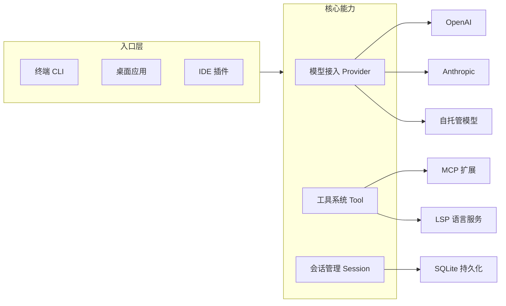

1. 三个入口共用同一套核心能力，界面层不做模型厂商判断。
2. Provider 把厂商差异收在一处，新增厂商只加一个实现。
3. 工具系统负责文件读写、命令执行、网络抓取这些动作。
4. MCP 与 LSP 是两条扩展通道，分别接外部工具服务器与语言服务。
5. 会话写入 SQLite，进程重启后还能恢复对话。

!!! note "术语：TUI"
    定义：Terminal User Interface，在终端字符界面里做窗口、列表、输入框的交互方式。例子：OpenCode 的终端界面基于 Bubble Tea 构建（来源：旧版页面内容，以原文为准）。

**一步一步来**

步骤 1：把定位写成可检验的常量。项目定位如果只写在文档里，半年后没人能验证它是否还成立；写成常量就能被脚本断言。

```js
// 用常量承载项目定位，字段名就是能力名，方便后续断言守住
const POSITIONING = {
  license: "MIT",                        // 许可方式：完整开源
  platforms: ["cli", "desktop", "ide"],  // 三种运行端
  providerCount: 75,                     // 支持的模型提供商数量下界
  telemetry: false,                      // 是否上传用户代码与上下文
};
console.log(Object.keys(POSITIONING).join("、"));
```

**这段代码在做什么**

1. `license` 记录许可方式，可被脚本读取并断言，防止误改。
2. `platforms` 用数组表达多端，顺序无关，`includes` 判断最直观。
3. `providerCount` 记录"75+"的下界 75，而不是写字符串，便于比较。
4. `telemetry` 记录隐私策略，布尔值比文字描述更难被含糊掉。
5. 最后一行把字段名打印出来，跑一次就知道清单有没有被改动。

运行结果：

```text
license、platforms、providerCount、telemetry
```

步骤 2：多端入口的分流。同一个二进制要同时支持交互模式与单次 prompt 模式，靠命令行参数判断，不要写两套主流程。

```js
// 从命令行参数决定入口模式：带 -p 走单次执行，否则进交互界面
const args = process.argv.slice(2);
const mode = args.includes("-p") ? "noninteractive" : "interactive";
// 单次模式下，-p 后面的第一个参数就是本次提示词
const prompt = args.includes("-p") ? args[args.indexOf("-p") + 1] : "";
console.log(JSON.stringify({ mode, prompt }));
```

**这段代码在做什么**

1. `slice(2)` 跳过 node 可执行文件与脚本路径，只取用户参数。
2. `includes("-p")` 判断是否处于单次 prompt 模式。
3. 三元表达式把判断结果映射成两个模式名，分支只有两条。
4. `indexOf("-p") + 1` 取紧随其后的提示词，这是旧页 `noninteractive.go` 的行为（来源：旧版页面内容，以原文为准）。
5. 输出用 JSON 拼接，便于脚本解析，不会因为空格导致字段错位。

运行结果（命令为 `node cli.mjs -p 解释这个仓库`）：

```text
{"mode":"noninteractive","prompt":"解释这个仓库"}
```

**动手验证**

```js
// 依赖：Node 20+，无第三方依赖
// 运行：node 01-overview.mjs
import assert from "node:assert/strict";

const POSITIONING = {
  license: "MIT",
  platforms: ["cli", "desktop", "ide"],
  providerCount: 75,
  telemetry: false,
};

function pickMode(args) {
  return args.includes("-p") ? "noninteractive" : "interactive";
}

assert.equal(POSITIONING.license, "MIT");
assert.ok(POSITIONING.platforms.includes("ide"));
assert.ok(POSITIONING.providerCount >= 75);
assert.equal(POSITIONING.telemetry, false);
assert.equal(pickMode([]), "interactive");
assert.equal(pickMode(["-p", "解释这个仓库"]), "noninteractive");

console.log("入口模式：", pickMode(["-p", "解释这个仓库"]));
console.log("全部断言通过");
// 预期输出：
// 入口模式： noninteractive
// 全部断言通过
```

**常见坑**

| 现象 | 原因 | 怎么修 |
| --- | --- | --- |
| 以为"模型无关"就是不用写适配代码 | 把统一接口误解成统一协议 | 每个 Provider 单独实现接口，接口只统一调用形状 |
| CI 里跑交互模式卡住不退出 | 默认进入 TUI 等待输入 | CI 中改用 `-p` 单次 prompt 模式 |
| API Key 被提交进仓库 | 项目本地配置优先级高，容易被顺手写进去 | 密钥只走环境变量，配置文件留占位字段 |

**用在哪里**

场景一：跨模型团队的终端统一入口。

- 业务背景：团队同时持有 Anthropic 与 Azure 额度，成员各自偏好不同。
- 这一节的知识怎么用：把模型接入收敛到 Provider 配置，每人本地配置不同 provider，仓库内共享工具与提示词。
- 用什么指标衡量收益：新人从安装到跑通第一条命令的耗时；因模型差异导致的联调阻塞次数。
- 什么时候不该用：团队已强制单一模型且没有自托管需求，多 Provider 层只会增加维护面。

场景二：内网自托管模型的研发环境。

- 业务背景：源码不能出内网，只能用内网部署的模型服务。
- 这一节的知识怎么用：配置 `local` provider，端点来自 `LOCAL_ENDPOINT` 环境变量（来源：旧版页面内容的环境变量表，以原文为准）。
- 用什么指标衡量收益：出口网络请求数为零的可核验结果；模型切换所改动的配置行数。
- 什么时候不该用：内网模型能力不足以完成目标语言的重构任务时，切换成本会超过收益。

场景三：会话长期保留的排查流程。

- 业务背景：线上的偶发问题需要隔天继续追。
- 这一节的知识怎么用：会话落到 SQLite，重启终端后继续同一条会话。
- 用什么指标衡量收益：重启进程后恢复会话内容的成功率。
- 什么时候不该用：会话内容含敏感数据且磁盘未加密时，持久化本身就是风险。

**行业实践**

- MCP 官方文档把工具服务器的接入方式定为 stdio 与 HTTP+SSE 两类，OpenCode 的 `mcpServers` 配置里 `type` 取值与之一致（来源：旧版页面内容的 MCP 配置示例，以原文为准）。借鉴：外部能力用配置声明，不要写死在代码分支里。
- Bubble Tea 官方文档主张 Model-Update-View 单向数据流：状态在 Model，事件进 Update，输出由 View 渲染。借鉴：渲染函数只读状态，不在里面改状态。
- Claude Code 官方文档提供插件机制分发自定义命令与子代理。借鉴：把团队约定打包成插件，而不是写进每个人的本地配置。

**小结**

1. OpenCode 的三条定位是开源、多端、模型无关，分别落在许可、入口层与 Provider 层。
2. 多端共用核心能力，入口只负责分流，不承担模型相关逻辑。
3. 定位写成可断言的常量，比写在文档里可维护。

## 2. 整体架构设计

**先想一个问题**
你要接入一个新的模型厂商。如果改完界面代码才能用，说明分层没做好。界面层应该对模型厂商一无所知。

**心智模型**

!!! tip "心智模型"
    一句话模型：分四层，依赖只向下走一层；界面不知道模型是谁，模型不知道界面长什么样。
    日常类比：餐厅点菜，服务员只写单子，厨房只按单子做菜，客人不问厨房用哪口锅。
    类比不成立的地方：代码里的接口边界是编译期约束，而服务员与厨房仍会临时沟通，比如厨房缺料时会反问。

!!! note "术语：Provider"
    定义：对某一模型厂商 API 的统一封装，对外暴露相同的调用形状。例子：OpenAI 与 Anthropic 各写一个 Provider，上层调用方式一致。

**图解**

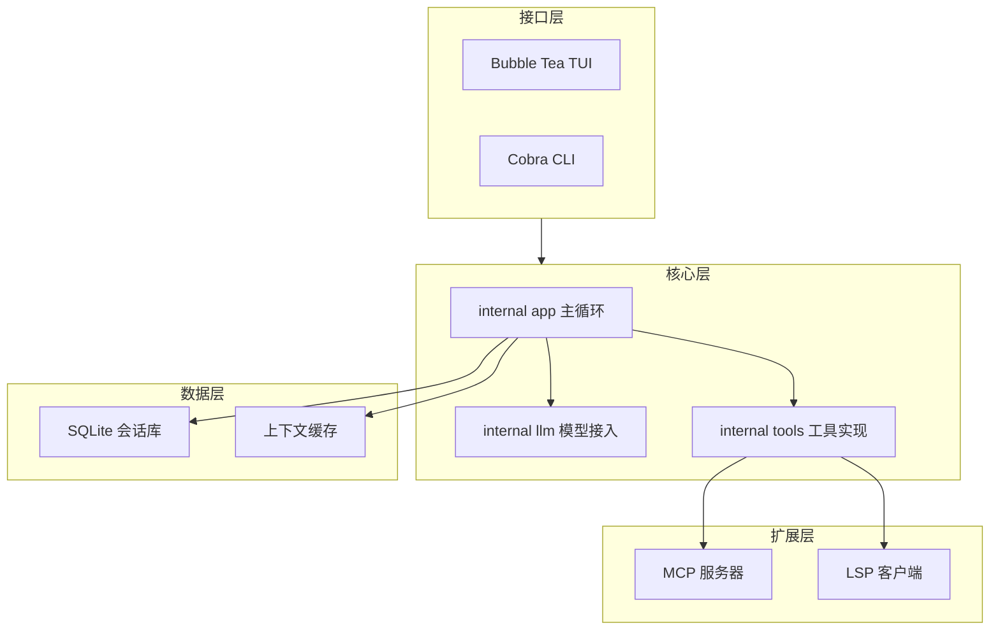

1. 接口层拿到用户输入，转换成内部消息结构，向下交给核心层。
2. 核心层的 app 模块是唯一装配点，负责把模型、工具、存储接起来。
3. LLM 模块只处理请求构建与响应解析，不知道界面长什么样。
4. 工具模块执行文件与命令操作，是唯一会碰真实系统的位置。
5. 数据层保存会话与上下文，核心层通过接口读写，不直接拼 SQL。
6. 扩展层由工具模块驱动，MCP 与 LSP 都表现为"外部能力"，不污染核心层。

**一步一步来**

步骤 1：定义 Provider 接口。这一步决定上层能不能换模型。

```go
// 模型接入的统一形状：上层只依赖这个接口，不依赖任何厂商 SDK
type Provider interface {
    // Complete 一次性取回完整回复，适合短问题与单元测试
    Complete(ctx context.Context, req Request) (*Response, error)
    // Stream 返回流式句柄，边生成边显示，首字节延迟更低
    Stream(ctx context.Context, req Request) (*StreamReader, error)
    // GetModels 列出该厂商可用模型，界面不写死模型名
    GetModels() []Model
}
```

**这段代码在做什么**

1. 三个方法覆盖三种需求：一次性调用、流式调用、模型枚举。
2. 每个方法都收 `ctx`，调用方可以随时取消，界面按 Esc 时能真的停下来。
3. 返回值全部是接口自定义类型，不泄漏厂商 SDK 的类型。
4. 接口不包含配置加载，配置由 app 层注入，Provider 只关心请求与响应。

运行结果：无输出，接口定义阶段不产生运行时行为。

步骤 2：定义 Tool 接口。这一步决定能不能加新工具而不改主循环。

```go
// 工具的四个方法分别回答：叫什么、什么时候用、要什么参数、怎么执行
type Tool interface {
    Name() string
    Description() string
    Parameters() map[string]Parameter
    Execute(ctx context.Context, params map[string]interface{}) (*Result, error)
}
```

**这段代码在做什么**

1. `Name` 是工具的唯一标识，模型按名字申请调用。
2. `Description` 会进入请求的工具定义，模型靠它判断该不该用。
3. `Parameters` 描述参数结构，是模型填参数时的约束来源。
4. `Execute` 是唯一的副作用入口，参数是通用映射，由各工具自行校验。
5. 四个方法合起来让主循环可以完全不认识具体工具。

运行结果：无输出。

步骤 3：在 app 层组装。装配代码集中在一处，方便看清依赖。

```go
// app 层只做装配：注入 Provider 与工具表，自身不实现模型与工具细节
func NewApp(cfg *Config, provider llm.Provider, list []tools.Tool) *App {
    registry := tools.NewRegistry()
    for _, t := range list { // 每个工具自报名字，注册表用名字索引
        registry.Register(t)
    }
    return &App{cfg: cfg, provider: provider, tools: registry}
}
```

**这段代码在做什么**

1. 函数签名把依赖全部显式列出，读签名就知道 app 依赖什么。
2. 注册在构造阶段完成，运行期只有查表，没有动态扫描。
3. `App` 结构体持有接口而不是具体类型，测试时可替换成假实现。
4. 配置通过参数传入，Provider 与工具都不自己去读文件。

运行结果：无输出，装配阶段的验证放在下面的 Node 脚本里。

**动手验证**

```js
// 依赖：Node 20+，无第三方依赖
// 运行：node 02-arch.mjs
import assert from "node:assert/strict";

class EchoProvider {
  constructor() { this.name = "echo"; }
  getModels() { return ["echo-small", "echo-large"]; }
  async complete(req) {
    const last = req.messages.at(-1);
    return { text: `收到：${last.content}` };
  }
}

class ToolRegistry {
  constructor() { this.map = new Map(); }
  register(tool) {
    if (this.map.has(tool.name)) throw new Error(`工具重名：${tool.name}`);
    this.map.set(tool.name, tool);
  }
  names() { return [...this.map.keys()]; }
  async run(name, params) {
    const tool = this.map.get(name);
    if (!tool) throw new Error(`未知工具：${name}`);
    return tool.run(params);
  }
}

const registry = new ToolRegistry();
registry.register({ name: "view", run: ({ file }) => `查看 ${file}` });
registry.register({ name: "bash", run: ({ command }) => `执行 ${command}` });

assert.deepEqual(registry.names(), ["view", "bash"]);
assert.equal(await registry.run("view", { file: "a.js" }), "查看 a.js");
assert.throws(() => registry.register({ name: "view", run: () => "" }), /工具重名/);
// run 是 async 方法，未知工具只会让返回的 Promise 进入 rejected 状态，不会同步抛出，因此要用 rejects
await assert.rejects(() => registry.run("glob", {}), /未知工具/);

const provider = new EchoProvider();
assert.equal(provider.getModels().length, 2);
const resp = await provider.complete({ messages: [{ role: "user", content: "你好" }] });
assert.equal(resp.text, "收到：你好");

console.log(resp.text);
console.log("注册表：", registry.names().join("、"));
// 预期输出：
// 收到：你好
// 注册表： view、bash
```
**常见坑**

| 现象 | 原因 | 怎么修 |
| --- | --- | --- |
| 加一个厂商要改界面代码 | 界面直接引用了厂商 SDK 类型 | 界面只依赖 Provider 接口，SDK 类型不出模块 |
| 工具注册顺序影响结果 | 注册表用了数组并按顺序匹配 | 用映射按名字索引，重复注册直接报错 |
| 单元测试必须联网 | Provider 在构造时就连远端 | 构造只保存配置，连接推迟到首次调用 |

**用在哪里**

场景一：后台管理的批量导入需要读 Excel 并写数据库。

- 业务背景：运营上传表格，系统要校验后批量落库。
- 这一节的知识怎么用：把"读表""校验""写库"做成三个工具，主循环按接口调用。
- 用什么指标衡量收益：新增一种导入格式所改动的文件数。
- 什么时候不该用：导入逻辑只有一条固定链路且短期不会变，抽象层会拖慢首版交付。

场景二：电商商品列表的虚拟滚动页面的代码助手。

- 业务背景：大列表渲染性能问题需要定位。
- 这一节的知识怎么用：界面层只发请求，工具层用 grep 与 view 定位组件，模型层被替换成团队指定的模型。
- 用什么指标衡量收益：定位到目标文件所需的人工翻页次数。
- 什么时候不该用：文件总量在几十个以内时，人工搜索比配置工具链省事。

场景三：多人共用的自建代码审查机器人。

- 业务背景：审查意见需要统一格式，不能每个人风格不同。
- 这一节的知识怎么用：系统提示与工具表在 app 层统一注入，各入口行为一致。
- 用什么指标衡量收益：审查意见格式不合规的比例。
- 什么时候不该用：团队规模小且没有格式纠纷时，先人工约定。

**行业实践**

- Go 官方文档的 Effective Go 在"接口"一节主张接口由使用方定义、接口越小越好。借鉴：Provider 接口只放三个方法，不要把所有厂商能力都塞进去。
- MCP 官方文档的架构章节把宿主、客户端、服务器分成三个角色。借鉴：把外部能力放到独立进程，主程序只做协议通信。
- Bubble Tea 官方文档的示例仓库把每个界面拆成独立 Model。借鉴：界面状态按屏拆分，避免一个 Model 塞下全部字段。

**小结**

1. 四层结构的关键是依赖方向单向，装配点只有一处。
2. Provider 与 Tool 两个接口决定了扩展成本。
3. 接口收 `ctx` 与接口小，是后续做取消与替换的前提。

## 3. Agent 实现

**先想一个问题**
用户输入"把 README 里的 npm 命令改成 pnpm"。模型不会自己去读文件，它需要先申请调用 view，再申请 edit。是谁把这两步串起来的？

**心智模型**

!!! tip "心智模型"
    一句话模型：Agent 是一个循环，模型输出工具请求，程序执行工具，把结果塞回消息列表，再问一次模型。
    日常类比：你让实习生改文档，他先问你要文件，改完交给你确认。
    类比不成立的地方：实习生有长期记忆，模型的记忆就是消息列表本身，列表被压缩或截断后它就不记得了。

!!! note "术语：工具调用"
    定义：模型在回复里声明"我要执行某个工具，参数是这些"，由外部程序真正执行并把结果回灌。例子：模型返回 `view` 与文件路径，程序读取文件后把内容作为工具结果发回去。

**图解**

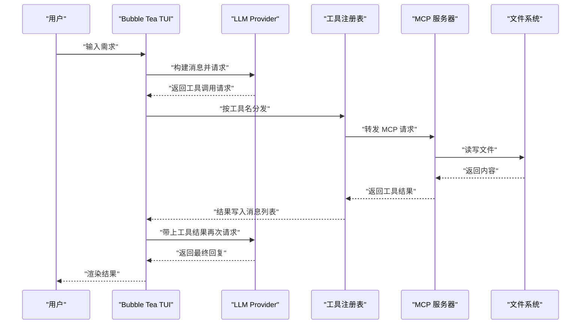

1. 用户输入只进入界面层，界面层负责拼装消息。
2. 请求发出后，模型可能直接回答，也可能返回工具调用请求。
3. 如果是工具调用，程序按工具名到注册表里查实现。
4. 工具可能是内置的，也可能转发给 MCP 服务器。
5. 需要真实读写时，最终由文件系统执行，结果原路返回。
6. 工具结果写回消息列表，形成一次新的请求。
7. 循环直到模型给出不带工具调用的回复，界面才渲染最终文本。

!!! note "术语：MCP"
    定义：Model Context Protocol，用统一协议把外部工具服务器接进模型客户端。例子：文件系统服务器通过 stdio 提供读写能力。

**一步一步来**

步骤 1：构建请求消息。顺序是系统提示、历史消息、新消息，顺序错了模型会看不到指令。

```go
// 按固定顺序拼消息：系统提示在最前，历史居中，新输入在最后
func BuildMessages(session *Session, newMessage string) []Message {
    messages := []Message{}
    messages = append(messages, Message{ // 系统提示决定行为边界
        Role:    "system",
        Content: session.SystemPrompt,
    })
    for _, msg := range session.History { // 历史按时间顺序原样追加
        messages = append(messages, Message{Role: msg.Role, Content: msg.Content})
    }
    messages = append(messages, Message{Role: "user", Content: newMessage})
    return messages
}
```

**这段代码在做什么**

1. 用切片承载消息，顺序就是语义，插入位置不能随意。
2. 系统提示固定放第一条，多数厂商对首条 system 的处理最稳定。
3. 历史消息逐条追加，不做去重，保留模型看到的原始轮次。
4. 新消息永远在最后，模型据此判断当前任务。
5. 函数不修改 `session.History`，只读不写，避免调用方状态被悄悄改变。

运行结果：无输出，函数返回消息切片。

步骤 2：工具注册与分发。分发前先校验工具名，未注册的名字要报错而不是静默跳过。

```go
// 注册表用映射按名字索引，重复注册直接失败，避免后注册的覆盖前一个
type Registry struct{ m map[string]Tool }

func (r *Registry) Register(t Tool) error {
    if _, ok := r.m[t.Name()]; ok {
        return fmt.Errorf("工具重名: %s", t.Name())
    }
    r.m[t.Name()] = t
    return nil
}

// Dispatch 是把模型请求变成真实调用的唯一入口
func (r *Registry) Dispatch(ctx context.Context, name string, params map[string]interface{}) (*Result, error) {
    t, ok := r.m[name]
    if !ok {
        return nil, fmt.Errorf("未知工具: %s", name)
    }
    return t.Execute(ctx, params)
}
```

**这段代码在做什么**

1. 映射的键是工具名，查找是常数时间，不受工具数量影响。
2. 重复注册返回错误而不是覆盖，能让配置错误在启动时就暴露。
3. `Dispatch` 先查表再执行，未知工具不进入副作用代码。
4. 错误信息里带工具名，日志里能直接看出是哪个工具出问题。
5. `ctx` 一路透传，工具内部的耗时操作可以被取消。

运行结果：无输出。

步骤 3：主循环加上轮数上限。没有上限的循环在网络抖动时会一直烧额度。

```go
// 主循环最多执行 maxTurns 轮，防止模型反复请求工具停不下来
func (a *App) Run(ctx context.Context, session *Session, input string) (string, error) {
    const maxTurns = 8 // 轮数上限，按任务复杂度调整
    msgs := BuildMessages(session, input)
    for i := 0; i < maxTurns; i++ {
        resp, err := a.provider.Complete(ctx, Request{Messages: msgs})
        if err != nil {
            return "", err // 模型侧错误直接上抛，由重试层处理
        }
        if len(resp.ToolCalls) == 0 {
            return resp.Text, nil // 没有工具调用即最终回复
        }
        for _, call := range resp.ToolCalls {
            result, err := a.tools.Dispatch(ctx, call.Name, call.Params)
            msgs = append(msgs, ToolResultMessage(call.ID, result, err))
        }
    }
    return "", fmt.Errorf("达到轮数上限 %d", maxTurns)
}
```

**这段代码在做什么**

1. `maxTurns` 是硬上限，达到后返回明确错误，不会静默截断。
2. 每次循环都重新构建请求，历史里包含上一轮的工具结果。
3. 没有工具调用时立即返回文本，这是循环的正常出口。
4. 工具错误也写回消息列表，让模型看到失败原因并自行调整。
5. 模型侧错误直接上抛，交给第 5 节的退避重试处理。

运行结果：正常任务在 1 到 3 轮内结束；异常任务在上限处返回错误。

**动手验证**

```js
// 依赖：Node 20+，无第三方依赖
// 运行：node 03-agent.mjs
import assert from "node:assert/strict";

function buildMessages(history, systemPrompt, input) {
  const msgs = [{ role: "system", content: systemPrompt }];
  for (const m of history) msgs.push({ role: m.role, content: m.content });
  msgs.push({ role: "user", content: input });
  return msgs;
}

class Registry {
  constructor() { this.m = new Map(); }
  register(tool) {
    if (this.m.has(tool.name)) throw new Error(`工具重名：${tool.name}`);
    this.m.set(tool.name, tool);
  }
  async dispatch(name, params) {
    const tool = this.m.get(name);
    if (!tool) throw new Error(`未知工具：${name}`);
    return tool.run(params);
  }
}

class FakeProvider {
  constructor() { this.calls = 0; }
  async complete() {
    this.calls += 1;
    if (this.calls === 1) {
      return { text: "", toolCalls: [{ id: "c1", name: "view", params: { file: "README.md" } }] };
    }
    return { text: "已将 npm 改为 pnpm", toolCalls: [] };
  }
}

async function run(provider, registry, history, input) {
  const maxTurns = 8;
  const msgs = buildMessages(history, "你是代码助手", input);
  for (let i = 0; i < maxTurns; i++) {
    const resp = await provider.complete({ messages: msgs });
    if (resp.toolCalls.length === 0) return resp.text;
    for (const call of resp.toolCalls) {
      let result;
      try { result = await registry.dispatch(call.name, call.params); }
      catch (err) { result = `错误：${err.message}`; }
      msgs.push({ role: "tool", content: result, id: call.id });
    }
  }
  throw new Error(`达到轮数上限 ${maxTurns}`);
}

const registry = new Registry();
registry.register({ name: "view", run: ({ file }) => `文件内容(${file})` });

const msgs = buildMessages([{ role: "user", content: "你好" }], "系统提示", "改 README");
assert.equal(msgs.length, 3);
assert.equal(msgs[0].role, "system");
assert.equal(msgs.at(-1).content, "改 README");

const provider = new FakeProvider();
const text = await run(provider, registry, [], "把 npm 改成 pnpm");
assert.equal(text, "已将 npm 改为 pnpm");
assert.equal(provider.calls, 2);

console.log(text);
console.log("模型调用次数：", provider.calls);
// 预期输出：
// 已将 npm 改为 pnpm
// 模型调用次数： 2
```

**常见坑**

| 现象 | 原因 | 怎么修 |
| --- | --- | --- |
| 模型反复调用同一个工具 | 主循环没有轮数上限 | 设 `maxTurns`，达到后返回明确错误 |
| 工具报错后整个会话中断 | 工具错误被当成致命错误上抛 | 工具错误写回消息列表，模型自行调整 |
| 模型看不到之前的结论 | 历史消息顺序被改乱 | 固定 system、history、user 三段顺序 |

**用在哪里**

场景一：后台管理的批量导入脚本自动修复。

- 业务背景：导入失败的行需要看日志、定位字段、改代码后重跑。
- 这一节的知识怎么用：把读日志、改文件、重跑命令做成工具，主循环负责串联。
- 用什么指标衡量收益：单次修复平均需要的人工介入次数。
- 什么时候不该用：失败原因是上游数据源本身出错，改代码无用。

场景二：组件库升级后的批量替换。

- 业务背景：某个组件 API 变更，全仓库需要替换调用方式。
- 这一节的知识怎么用：grep 定位、edit 替换、bash 跑构建，三轮内可验证。
- 用什么指标衡量收益：构建失败数在一次运行后的下降量。
- 什么时候不该用：替换规则需要业务判断时，全自动批量改风险过高。

场景三：测试用例补写。

- 业务背景：新模块缺少单测，覆盖率不达标。
- 这一节的知识怎么用：view 读实现、write 写测试、bash 跑测试收集失败信息。
- 用什么指标衡量收益：补写后新增通过的用例数。
- 什么时候不该用：实现本身还在频繁变动时，补写的测试很快失效。

**行业实践**

- MCP 官方文档的服务器规范要求每个工具提供名称、描述与输入结构描述。借鉴：工具的 `Description` 写清使用时机，而不只是写功能名。
- Anthropic 官方文档的 Tool use 章节给出的循环包含"执行工具并把结果作为工具角色消息回传"。借鉴：工具结果用独立角色回传，不要拼进用户消息。
- Bubble Tea 官方文档的 Cmd 机制把异步操作包装成消息。借鉴：把工具执行放进异步命令，界面在等待期间保持可响应。

**小结**

1. Agent 的主体是一个带上限的循环，模型与工具交替推进。
2. 消息顺序决定模型能否看到指令与历史。
3. 工具错误要回灌给模型，致命错误才上抛。

## 4. 源码目录结构分析

**先想一个问题**
新同事要加一个工具，他应该先打开哪个目录？如果答案是"先搜一下"，说明目录结构没有表达职责。

**心智模型**

!!! tip "心智模型"
    一句话模型：目录名就是依赖图的落地，`cmd` 只做入口，`internal` 下的包各管一件事。
    日常类比：医院分导诊台、诊室、检验科、药房，病人按顺序走，不会在导诊台做手术。
    类比不成立的地方：代码里"跨科会诊"要显式声明依赖，否则编译不过；医院里口头沟通就能绕过流程。

**图解**

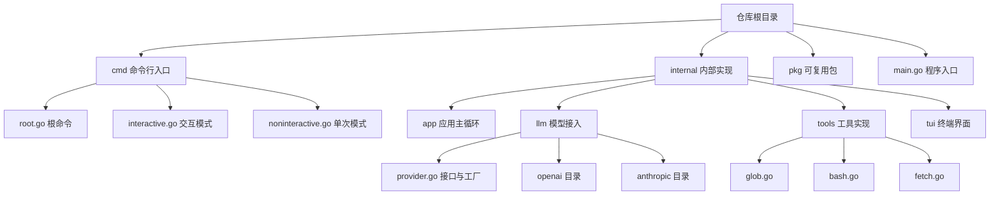

1. 根目录只放程序入口与顶层目录，不放实现细节。
2. `cmd` 按运行模式拆文件，交互与单次执行各自成文件。
3. `internal/app` 是主循环与装配点，跨模块调用都从这里发起。
4. `internal/llm` 按厂商分子目录，接口定义在 `provider.go`，实现放在子目录。
5. `internal/tools` 一个工具一个文件，新增工具只加文件不改主循环。
6. `internal/tui` 只负责渲染与输入，不直接调用模型。
7. `pkg` 放可被外部引用的代码，与内部实现分开。

**一步一步来**

步骤 1：按职责分包，而不是按类型分包。按类型分（比如把所有结构体放一起）会让一次改动散落多处。

```text
# 职责分包的结果：改动"新增一个工具"只涉及一个目录
cmd/
  root.go            # 根命令与全局参数
  interactive.go     # 交互模式启动
internal/
  app/               # 主循环与装配
  llm/               # 模型接入，按厂商分子目录
  tools/             # 工具实现，一个工具一个文件
  tui/               # 终端界面
```

**这段代码在做什么**

1. 目录名直接说明该目录负责什么，不需要额外文档解释。
2. `cmd` 与 `internal` 分开，入口代码与实现代码不混在一起。
3. `tools` 目录内的文件按工具划分，文件名等于工具名。
4. `llm` 目录内的子目录按厂商划分，新厂商加目录即可。

运行结果：无输出，目录结构本身即为结果。

步骤 2：把依赖方向写成可检查的规则。依赖倒挂不会报错，但会让改动成本变高。

```text
# 允许的依赖方向，箭头表示"可以引用"
cmd -> internal/app
internal/app -> internal/llm
internal/app -> internal/tools
internal/app -> internal/tui
internal/tools -> pkg（只允许引用通用工具函数）
# 禁止：internal/llm 引用 internal/tui
# 禁止：internal/tools 引用 internal/app
```

**这段代码在做什么**

1. 规则用文本列出，任何成员都能读懂并对照。
2. 主循环是唯一知道全部模块的位置，因此它是依赖的汇聚点。
3. `llm` 引用 `tui` 会让模型层依赖界面，测试时必须启动界面。
4. `tools` 引用 `app` 会形成环，编译失败。
5. 这些规则可以写成脚本自动检查，见下面的动手验证。

运行结果：无输出。

步骤 3：工具文件遵循统一形状。统一形状让注册表能无差别处理所有工具。

```go
// 每个工具文件只导出一个构造函数，返回 Tool 接口
func NewGlobTool() Tool {
    return &globTool{} // 具体类型不导出，外部只能拿到接口
}

// 结构体字段存放该工具需要的依赖，例如工作目录
type globTool struct {
    workDir string
}

// 参数描述会被序列化进请求，供模型理解如何填写
func (t *globTool) Parameters() map[string]Parameter {
    return map[string]Parameter{
        "pattern": {Type: "string", Required: true},
        "path":    {Type: "string", Required: false},
    }
}
```

**这段代码在做什么**

1. 构造函数返回接口，调用方拿不到具体类型，替换实现不影响调用方。
2. 依赖通过结构体字段持有，在构造时注入，不在方法里读全局变量。
3. `Parameters` 的 `Required` 字段决定模型是否能省略该参数。
4. 参数名与工具名一样是外部契约，改名等于破坏模型提示词。

运行结果：无输出。

**动手验证**

```js
// 依赖：Node 20+，无第三方依赖
// 运行：node 04-layout.mjs
import assert from "node:assert/strict";

// 用映射表达每个模块允许引用的模块
const ALLOWED = {
  "cmd": ["internal/app"],
  "internal/app": ["internal/llm", "internal/tools", "internal/tui"],
  "internal/llm": ["pkg"],
  "internal/tools": ["pkg"],
  "internal/tui": ["pkg"],
  "pkg": [],
};

function checkDependencies(edges) {
  const bad = [];
  for (const [from, to] of edges) {
    const allowed = ALLOWED[from] ?? [];
    if (!allowed.includes(to)) bad.push(`${from} -> ${to}`);
  }
  return bad;
}

const goodEdges = [
  ["cmd", "internal/app"],
  ["internal/app", "internal/llm"],
  ["internal/app", "internal/tools"],
  ["internal/tools", "pkg"],
];
assert.deepEqual(checkDependencies(goodEdges), []);

const badEdges = [
  ["internal/llm", "internal/tui"],
  ["internal/tools", "internal/app"],
];
assert.equal(checkDependencies(badEdges).length, 2);

const toolFiles = ["glob.go", "grep.go", "ls.go", "view.go", "write.go", "edit.go",
  "patch.go", "bash.go", "fetch.go", "sourcegraph.go"];
assert.ok(toolFiles.every((f) => f.endsWith(".go")));

console.log("非法依赖：", checkDependencies(badEdges).join(" | "));
console.log("工具文件数：", toolFiles.length);
// 预期输出：
// 非法依赖： internal/llm -> internal/tui | internal/tools -> internal/app
// 工具文件数： 10
```

**常见坑**

| 现象 | 原因 | 怎么修 |
| --- | --- | --- |
| 改一个工具要动三处 | 工具注册写在一个集中文件里 | 每个工具文件导出构造函数，装配处统一收集 |
| 模型层测试必须启动界面 | 模型层直接引用了界面包 | 模型层只依赖接口，界面注入由 app 层完成 |
| 循环导入编译失败 | 工具包引用了 app 包 | 把共用能力下沉到 pkg，工具只依赖 pkg |

**用在哪里**

场景一：中型前端仓库的构建脚本目录治理。

- 业务背景：`scripts` 目录里文件混乱，没人知道哪个还在用。
- 这一节的知识怎么用：按职责分成入口、任务、工具三层，每个任务一个文件。
- 用什么指标衡量收益：删除脚本时需要人工确认的文件数。
- 什么时候不该用：脚本总数在十个以内时，分层的收益低于维护成本。

场景二：多包仓库的依赖方向约束。

- 业务背景：包之间互相引用，构建顺序难以确定。
- 这一节的知识怎么用：把允许的依赖写成清单，在 CI 中跑脚本检查。
- 用什么指标衡量收益：CI 中依赖检查发现的违规条数。
- 什么时候不该用：单包仓库不存在跨包依赖问题。

场景三：新人上手的目录导览。

- 业务背景：新人第一周需要理解项目结构。
- 这一节的知识怎么用：按 `cmd` 到 `internal` 的顺序逐个目录讲解职责。
- 用什么指标衡量收益：新人第一次独立提交所经历的天数。
- 什么时候不该用：仓库只有几百行代码时，直接读文件更快。

**行业实践**

- Go 官方文档的项目布局约定把 `cmd` 用于可执行入口、`internal` 用于不对外暴露的实现。借鉴：入口与实现分离，`internal` 下的包不对外发布。
- MCP 官方文档的服务器示例把每个工具实现成独立文件并注册到服务器。借鉴：工具按文件拆分，注册集中在服务器启动处。
- Bubble Tea 官方文档的示例把每个界面拆成独立目录。借鉴：界面目录与业务目录分开，渲染代码不混进业务逻辑。

**小结**

1. 目录名要表达职责，改动的影响范围要能从目录结构看出来。
2. 依赖方向要写成清单并可自动检查。
3. 一个工具一个文件，是让主循环保持稳定的前提。

## 5. 关键实现细节

**先想一个问题**
模型回答很长，界面十秒没有反应，用户以为程序卡死了。怎么让文字一个一个出来，同时错误不被吞掉？

**心智模型**

!!! tip "心智模型"
    一句话模型：流式用两条通道分别送数据和错误；接近上限时用摘要替换历史；失败时按 1 秒、2 秒、4 秒的间隔重试。
    日常类比：水龙头接水，一条管出水，另一条管报警，两根管子各管一件事。
    类比不成立的地方：水管里水会自己流走，Go 的通道没有消费者时发送方会阻塞，所以消费端必须持续读取或主动取消。

!!! note "术语：指数退避"
    定义：每次失败后的等待时间按固定倍数增长。例子：从 1 秒开始翻倍，等待序列是 1 秒、2 秒、4 秒。

!!! note "术语：自动压缩"
    定义：上下文用量接近模型上限时，把历史消息摘要成一段短文本再继续对话。例子：用量超过上限的 95% 时触发（来源：旧版页面内容，以原文为准）。

**图解**

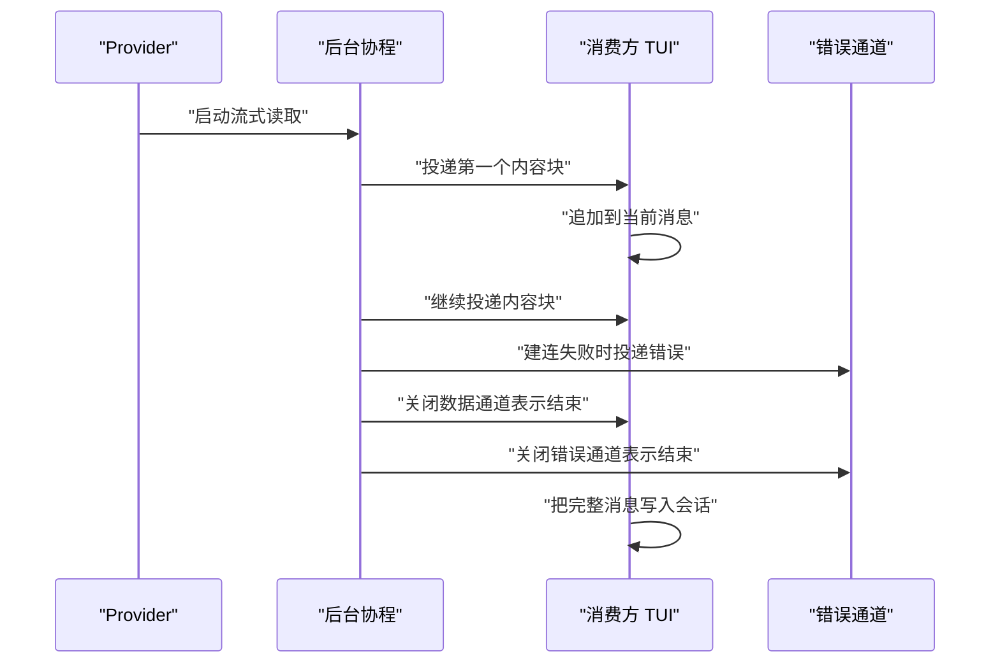

1. 函数立刻返回句柄，真实网络 IO 在后台协程里进行。
2. 内容块通过数据通道逐个投递，界面每收到一块就更新一次。
3. 建连阶段的失败只能通过错误通道回传，因为函数早已返回。
4. 数据通道与错误通道都要关闭，关闭表示本次流结束。
5. 消费方先看错误通道再看数据通道，避免把失败当成空回复。

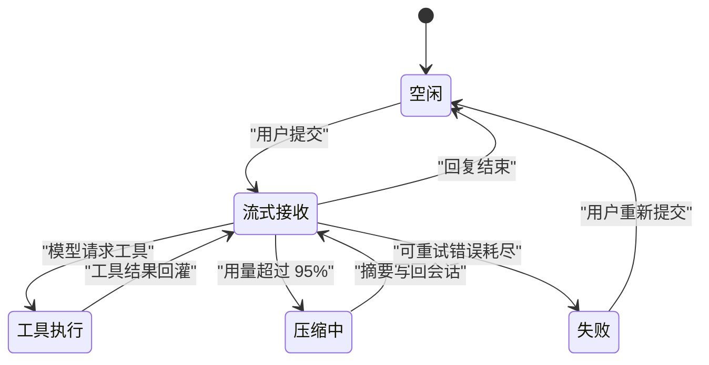

1. 会话从空闲开始，用户提交后进入流式接收。
2. 模型请求工具时切到工具执行，执行完回到流式接收。
3. 用量超过上限的 95% 时插入压缩状态，压缩完继续接收。
4. 正常结束回到空闲，状态与消息都已落库。
5. 三次重试都失败才进入失败状态，由用户决定是否重发。

**一步一步来**

步骤 1：流式双通道。把数据与错误分开，调用方用同一个 `select` 就能同时处理两种情况。

```go
// 只暴露接收方向的通道，发送端封闭在 Provider 内部，防止外部误写
type StreamReader struct {
    Ch  <-chan string
    Err <-chan error
}

// 两个通道都无缓冲，消费者不读取时生产协程会阻塞在发送上
func (p *Provider) Stream(ctx context.Context, req Request) (*StreamReader, error) {
    ch := make(chan string)
    errCh := make(chan error)
    go func() {
        defer close(errCh) // 先注册的 defer 后执行，所以实际顺序是先关 errCh
        defer close(ch)
        reader, err := p.client.Stream(req)
        if err != nil {
            errCh <- err // 建连失败只能走错误通道
            return
        }
        for {
            chunk, err := reader.Next()
            if err == io.EOF {
                return // 正常结束信号，不是错误
            }
            if err != nil {
                errCh <- err // 读取中途的错误必须上报，否则会空转
                return
            }
            ch <- chunk.Content
        }
    }()
    return &StreamReader{Ch: ch, Err: errCh}, nil
}
```

**这段代码在做什么**

1. `StreamReader` 只暴露接收方向，发送端固定在函数内部。
2. 两个 `defer close` 保证消费方的 `range` 能正常结束。
3. 建连错误与读取错误的处理位置不同，建连在循环外，读取在循环内。
4. `io.EOF` 视为正常结束，其他错误写入错误通道后立即返回。
5. 无缓冲通道形成背压，消费者慢下来时生产端会自动等待。

运行结果：每收到一个内容块界面更新一次；出错时错误通道先收到值，随后两个通道关闭。

步骤 2：95% 阈值自动压缩。压缩的触发条件必须是可计算的，不能靠感觉。

```go
// 判断是否需要压缩：开关打开且用量比例超过阈值
func ShouldCompact(session *Session, config *LLMConfig) bool {
    if !config.AutoCompact {
        return false // 开关关闭时永不压缩
    }
    usedTokens := CountTokens(session.Messages)
    maxTokens := config.MaxContextTokens
    return float64(usedTokens)/float64(maxTokens) > 0.95 // 阈值来源见旧版页面内容
}

// 压缩把历史替换成一条摘要消息，并生成新的会话编号
func CompactSession(session *Session) *Session {
    summary := SummarizeMessages(session.Messages)
    return &Session{
        ID:      GenerateID(),
        Summary: summary,
        Messages: []Message{
            {Role: "system", Content: "以下是会话摘要: " + summary},
        },
    }
}
```

**这段代码在做什么**

1. 先判断开关，关闭时直接返回假，避免无谓的 token 计算。
2. 用量比例用浮点除法计算，阈值固定为 0.95。
3. 压缩后只保留一条摘要消息，历史原文不再进入上下文。
4. 新会话拿到新编号，旧会话记录仍可查询。
5. 摘要文本前缀固定，便于后续检索时区分摘要与原始消息。

运行结果：用量比例 0.96 时返回真，0.94 时返回假。

步骤 3：三次指数退避重试。只有可重试的错误才等，不可重试的立即返回。

```go
// 最多尝试 3 次，等待间隔从 1 秒开始逐次翻倍
func (p *Provider) CompleteWithRetry(ctx context.Context, req Request) (*Response, error) {
    const maxRetries = 3
    backoff := time.Second
    for i := 0; i < maxRetries; i++ {
        resp, err := p.Complete(ctx, req)
        if err == nil {
            return resp, nil // 成功立即返回，不做多余等待
        }
        if !IsRetryable(err) {
            return nil, err // 参数错误与鉴权失败重试无意义
        }
        select {
        case <-ctx.Done():
            return nil, ctx.Err() // 上游取消时不再等待
        case <-time.After(backoff):
            backoff *= 2 // 等待完成后再翻倍
        }
    }
    return nil, fmt.Errorf("重试次数用尽")
}
```

**这段代码在做什么**

1. `maxRetries` 为 3，表示最多尝试 3 次，不是额外重试 3 次。
2. 成功与不可重试错误都在循环内提前返回，只有可重试错误才走到等待。
3. 等待期间监听 `ctx.Done()`，用户取消后立刻退出。
4. 翻倍只发生在计时器正常触发之后，被打断不会消耗退避次数。
5. 循环结束后返回新错误，原始错误已丢弃，排查需依赖日志。

运行结果：三次失败且都可重试时，总等待时间为 1 秒加 2 秒，第 3 次失败后不再等待，直接返回错误。

**动手验证**

```js
// 依赖：Node 20+，无第三方依赖
// 运行：node 05-details.mjs
import assert from "node:assert/strict";

// 1. 流式双通道
function createStream(chunks) {
  const ch = [];
  const errCh = [];
  let closed = false;
  const reader = {
    next() {
      if (chunks.length === 0) return { done: true };
      const value = chunks.shift();
      if (value === null) throw new Error("读取失败");
      return { done: false, value };
    },
  };
  function pump() {
    try {
      for (;;) {
        const r = reader.next();
        if (r.done) break;
        ch.push(r.value);
      }
    } catch (err) {
      errCh.push(err.message);
    } finally {
      closed = true;
    }
    return { ch, errCh, closed };
  }
  return pump();
}

const ok = createStream(["你", "好"]);
assert.deepEqual(ok.ch, ["你", "好"]);
assert.deepEqual(ok.errCh, []);
assert.equal(ok.closed, true);

const bad = createStream(["部分", null]);
assert.deepEqual(bad.ch, ["部分"]);
assert.deepEqual(bad.errCh, ["读取失败"]);

// 2. 95% 阈值压缩
function shouldCompact(used, max, autoCompact) {
  if (!autoCompact) return false;
  return used / max > 0.95;
}
assert.equal(shouldCompact(96, 100, true), true);
assert.equal(shouldCompact(94, 100, true), false);
assert.equal(shouldCompact(99, 100, false), false);

// 3. 三次指数退避
async function withRetry(call, isRetryable, sleep) {
  const maxRetries = 3;
  let backoff = 1000;
  const waits = [];
  for (let i = 0; i < maxRetries; i++) {
    try { return { value: await call(i), waits }; }
    catch (err) {
      if (!isRetryable(err)) throw err;
      waits.push(backoff);
      await sleep(backoff);
      backoff *= 2;
    }
  }
  throw new Error("重试次数用尽");
}

const waits = [];
let attempts = 0;
const failTwice = async () => {
  attempts += 1;
  if (attempts < 3) throw new Error("网络抖动");
  return "成功";
};
const result = await withRetry(failTwice, () => true, async (ms) => { waits.push(ms); });
assert.equal(result.value, "成功");
assert.deepEqual(result.waits, [1000, 2000]);
assert.deepEqual(waits, [1000, 2000]);

await assert.rejects(
  () => withRetry(async () => { throw new Error("鉴权失败"); }, (e) => e.message !== "鉴权失败", async () => {}),
  /鉴权失败/,
);

console.log("流式内容：", ok.ch.join(""), "| 错误通道：", ok.errCh.length);
console.log("退避序列：", result.waits.join("、"), "毫秒");
// 预期输出：
// 流式内容： 你好 | 错误通道： 0
// 退避序列： 1000、2000 毫秒
```

**常见坑**

| 现象 | 原因 | 怎么修 |
| --- | --- | --- |
| 消费端一直卡住不结束 | 生产端只关闭了一条通道 | 数据与错误两条通道都要关闭 |
| 出错后后台协程空转 | 读取错误只处理了 `io.EOF` | 其他错误写入错误通道并立即返回 |
| 参数错误也被重试三次 | 重试前没有区分错误类型 | 加 `IsRetryable` 判断，不可重试的直接上抛 |

**用在哪里**

场景一：电商商品列表的 AI 文案生成。

- 业务背景：运营批量生成商品卖点，界面需要边生成边显示。
- 这一节的知识怎么用：流式通道逐块渲染，超长会话按 95% 阈值压缩。
- 用什么指标衡量收益：首字节出现的时间；单次会话因超限被截断的次数。
- 什么时候不该用：文案长度固定在几十字以内时，等待完整回复更简单。

场景二：后台管理的批量导入失败重试。

- 业务背景：导入接口在高峰期会返回限流错误。
- 这一节的知识怎么用：把限流错误标为可重试，按 1 秒、2 秒等待后重试。
- 用什么指标衡量收益：批量任务因限流失败的整批重跑次数。
- 什么时候不该用：错误是数据格式非法时，重试只会浪费时间。

场景三：客服工单的对话记录压缩。

- 业务背景：长工单的历史消息很多，继续对话容易超限。
- 这一节的知识怎么用：超过阈值时摘要历史，保留摘要与后续消息。
- 用什么指标衡量收益：单条工单能持续对话的轮数。
- 什么时候不该用：历史里含必须逐字比对的条款原文时，摘要会丢失细节。

**行业实践**

- Go 官方文档的 Effective Go 在并发一节要求由发送方关闭通道，接收方不要关闭。借鉴：`close` 只写在生产协程里。
- OpenAI 官方文档的流式响应章节使用 `data:` 行逐块返回内容，并以固定结束标记收尾。借鉴：流式协议要有一个明确的结束信号。
- LSP 官方文档的 3.17 版本引入 `textDocument/diagnostic` 拉取式诊断。借鉴：需要最新快照时用主动拉取，不要依赖推送缓存。

**小结**

1. 流式的关键是双通道与关闭时机。
2. 压缩阈值要可计算，触发点写进配置而不是写在注释里。
3. 重试只对可重试错误生效，等待期间必须能被取消。

## 6. 扩展机制

**先想一个问题**
公司内部有个查询订单的接口，你希望 Agent 能调它，但不想改 OpenCode 源码。怎么办？

**心智模型**

!!! tip "心智模型"
    一句话模型：MCP 是给模型客户端用的统一插口，外部能力以服务器进程的形式接入，通过 JSON-RPC 通信。
    日常类比：电脑的 USB 接口，打印机和键盘走同一套插口，主机不用为每个外设改主板。
    类比不成立的地方：USB 有供电与枚举的强约定，MCP 服务器的能力描述靠服务器自己声明，客户端要按声明动态处理。

!!! note "术语：JSON-RPC"
    定义：用 JSON 描述调用请求与响应的远程调用格式，请求包含方法名、参数与编号。例子：MCP 客户端向服务器发送工具调用请求，服务器按编号返回结果。

**图解**

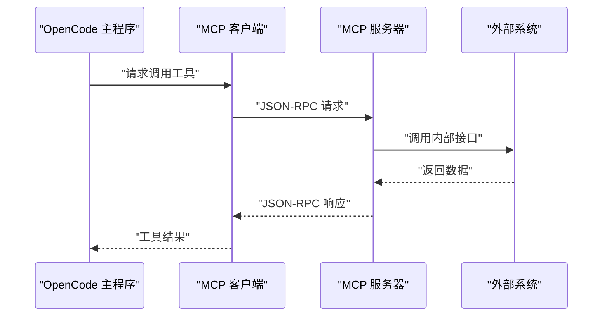

1. 主程序把 MCP 工具当成内置工具一样调用。
2. MCP 客户端负责把调用编码成 JSON-RPC 请求。
3. 服务器进程执行真实操作，可以是本地进程也可以是远端服务。
4. 结果按同一编号返回，客户端据此匹配请求。
5. 主程序收到结果后按普通工具结果写回消息列表。

**一步一步来**

步骤 1：声明 MCP 服务器。stdio 类型启动本地进程，sse 类型连接远端地址。

```json
{
  "mcpServers": {
    "filesystem": {
      "type": "stdio",
      "command": "npx",
      "args": ["-y", "@modelcontextprotocol/server-filesystem"],
      "env": {},
      "workingDirectory": "/tmp"
    },
    "github": {
      "type": "sse",
      "url": "https://api.example.com/mcp",
      "headers": { "Authorization": "Bearer token" }
    }
  }
}
```

**这段代码在做什么**

1. `mcpServers` 是映射，键是服务器名，用于日志与报错时定位。
2. `type` 取值为 `stdio` 或 `sse`，决定连接方式。
3. stdio 类型需要 `command` 与 `args`，进程由客户端启动。
4. sse 类型需要 `url` 与 `headers`，鉴权信息放在请求头。
5. `workingDirectory` 限定文件服务器的工作目录，缩小可访问范围。

运行结果：客户端启动后列出两个服务器，并从各自获取工具清单。

步骤 2：把 MCP 工具并入统一工具表。工具名要加命名空间，避免与内置工具冲突。

```go
// 合并内置工具与 MCP 工具，MCP 工具名前缀为服务器名
func CollectTools(builtin []Tool, servers map[string]*MCPServer) []Tool {
    all := append([]Tool{}, builtin...)
    for name, srv := range servers {
        for _, t := range srv.Tools() {
            all = append(all, &MCPTool{
                Name:        name + "_" + t.Name, // 前缀避免重名
                Description: t.Description,
                InputSchema: t.InputSchema,
                server:      srv,
            })
        }
    }
    return all
}
```

**这段代码在做什么**

1. 先复制内置工具切片，避免修改调用方传入的切片。
2. 遍历服务器与其工具清单，逐个包装成统一的工具接口。
3. 工具名加服务器名前缀，重名时注册表会直接报错而不是覆盖。
4. `InputSchema` 原样透传，模型的参数提示来自服务器声明。
5. `server` 字段保存连接句柄，执行时用它发请求。

运行结果：内置工具与 MCP 工具出现在同一张清单里。

步骤 3：按权限分级决定哪些工具可执行。读操作与写操作的风险不同。

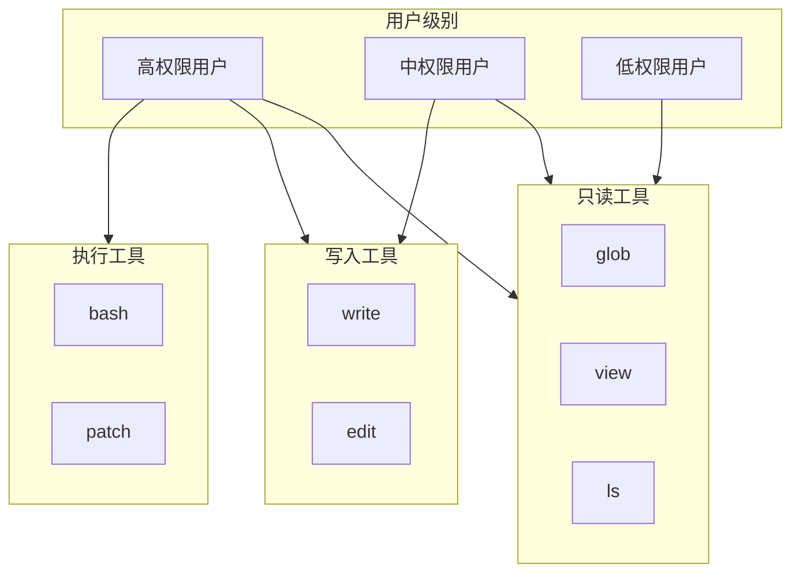

1. 只读工具对三档用户都开放，因为它不改变仓库状态。
2. 写入工具只对中高权限开放，改动需要能追溯到人。
3. 执行工具只对高权限开放，因为命令的影响范围难以预先界定。
4. 分级信息放在配置层，不写死在工具实现里。
5. 拦截点在分发之前，未授权的工具名不会进入执行函数。

**动手验证**

```js
// 依赖：Node 20+，无第三方依赖
// 运行：node 06-extension.mjs
import assert from "node:assert/strict";

// 1. 工具名加命名空间
function collectTools(builtin, servers) {
  const all = [...builtin];
  for (const [serverName, tools] of Object.entries(servers)) {
    for (const t of tools) {
      all.push({ name: `${serverName}_${t.name}`, description: t.description, server: serverName });
    }
  }
  return all;
}

const tools = collectTools(
  [{ name: "view", description: "查看文件" }],
  { orders: [{ name: "query", description: "查询订单" }] },
);
assert.deepEqual(tools.map((t) => t.name), ["view", "orders_query"]);
assert.equal(tools[1].server, "orders");

// 2. JSON-RPC 编解码
function encodeRequest(id, method, params) {
  return JSON.stringify({ jsonrpc: "2.0", id, method, params });
}
function decodeResponse(raw) {
  const msg = JSON.parse(raw);
  if (msg.error) throw new Error(`RPC 错误：${msg.error.message}`);
  return msg.result;
}

const raw = encodeRequest(1, "tools/call", { name: "orders_query", arguments: { id: "A1" } });
assert.equal(JSON.parse(raw).jsonrpc, "2.0");
assert.equal(decodeResponse(JSON.stringify({ jsonrpc: "2.0", id: 1, result: { rows: 1 } })).rows, 1);
assert.throws(() => decodeResponse(JSON.stringify({ jsonrpc: "2.0", id: 1, error: { message: "未授权" } })), /RPC 错误/);

// 3. 权限门
const PERMISSIONS = {
  high: ["read", "write", "exec"],
  medium: ["read", "write"],
  low: ["read"],
};
const TOOL_KIND = { glob: "read", view: "read", write: "write", edit: "write", bash: "exec" };

function canRun(level, toolName) {
  const kind = TOOL_KIND[toolName];
  return (PERMISSIONS[level] ?? []).includes(kind);
}

assert.equal(canRun("low", "view"), true);
assert.equal(canRun("low", "bash"), false);
assert.equal(canRun("medium", "edit"), true);
assert.equal(canRun("medium", "bash"), false);
assert.equal(canRun("high", "bash"), true);

console.log("工具清单：", tools.map((t) => t.name).join("、"));
console.log("中权限可执行 bash：", canRun("medium", "bash"));
// 预期输出：
// 工具清单： view、orders_query
// 中权限可执行 bash： false
```

**常见坑**

| 现象 | 原因 | 怎么修 |
| --- | --- | --- |
| 启动时工具重名报错 | MCP 工具名与内置工具名相同 | 工具名加服务器名前缀，冲突直接失败不覆盖 |
| stdio 服务器启动失败没有线索 | 子进程标准错误没有收集 | 把子进程输出写入日志，启动失败时打印 |
| sse 连接返回未授权 | 请求头缺少鉴权字段 | 在 `headers` 中配置令牌，令牌来自环境变量 |

**用在哪里**

场景一：客服系统的工单查询接入。

- 业务背景：研发需要在排查问题时直接查工单状态。
- 这一节的知识怎么用：把查询包装成 MCP 服务器，通过 stdio 接入。
- 用什么指标衡量收益：排查时需要手动切换系统的次数。
- 什么时候不该用：查询接口涉及个人信息且没有审计时，先补审计再接入。

场景二：后台管理的发布系统操作。

- 业务背景：发布与回滚需要按流程执行多条命令。
- 这一节的知识怎么用：把发布脚本包成 MCP 工具，并用权限门限制可执行角色。
- 用什么指标衡量收益：误操作导致的回滚次数。
- 什么时候不该用：发布流程要求双人复核时，自动化入口不应绕过复核。

场景三：多语言仓库的诊断信息获取。

- 业务背景：改动后需要拿到编译与类型错误。
- 这一节的知识怎么用：配置 LSP 客户端，用 `textDocument/diagnostic` 拉取最新诊断。
- 用什么指标衡量收益：拿到诊断所需的手动执行次数。
- 什么时候不该用：项目使用自研构建链且没有 LSP 支持时，改用命令输出解析。

**行业实践**

- MCP 官方文档的传输章节区分 stdio 与 HTTP+SSE，并规定各自的连接建立方式。借鉴：把连接方式做成配置项，不要让代码里出现两套分支逻辑。
- LSP 官方文档的 `initialize` 章节要求客户端声明自身能力，服务器据此决定返回的功能集。借鉴：客户端能力协商放在连接建立阶段一次完成。
- Sourcegraph 公开文档描述其搜索 API 支持仓库范围与结果数量参数。借鉴：把搜索范围与数量写成显式参数，避免一次性拉取全量结果。

**小结**

1. MCP 让外部能力以进程形式接入，主程序不用为每个能力改代码。
2. 工具名加命名空间是避免冲突的直接手段。
3. 权限分级要放在分发之前，而不是执行函数内部。

## 7. 配置系统

**先想一个问题**
你在项目里写了 `.opencode.json`，但用户主目录下也有一份。谁的优先级更高？如果想临时覆盖，又该改哪里？

**心智模型**

!!! tip "心智模型"
    一句话模型：配置像层叠样式，位置越靠近项目优先级越高，环境变量再覆盖一次。
    日常类比：公司默认着装规范、部门补充规定、个人当天选择，后者覆盖前者。
    类比不成立的地方：样式是逐属性覆盖，配置里映射类型的合并需要明确是替换还是递归合并，写错会丢掉整段配置。

**图解**

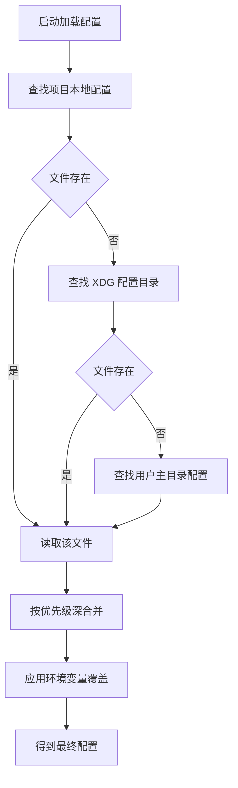

1. 启动时按顺序查找三个位置，命中即读取并继续。
2. 项目本地配置优先级最高，适合放团队共享的非敏感项。
3. XDG 配置目录与主目录配置依次作为兜底。
4. 读到的多份配置按优先级深合并，映射类型逐键合并而不是整体替换。
5. 环境变量最后应用，用于临时覆盖与密钥注入。

!!! note "术语：深合并"
    定义：递归合并对象的每一层，同名的嵌套字段继续合并而不是整体替换。例子：本地配置只写 `providers.openai.model`，全局配置里的其他 provider 字段仍然保留。

**一步一步来**

步骤 1：按优先级找到配置文件。查找顺序要从项目向外，先命中先用。

```go
// 按优先级返回第一个存在的配置文件路径
func FindConfigPath(cwd string, home string) (string, error) {
    candidates := []string{
        filepath.Join(cwd, ".opencode.json"), // 项目本地，优先级最高
        filepath.Join(os.Getenv("XDG_CONFIG_HOME"), "opencode", ".opencode.json"),
        filepath.Join(home, ".opencode.json"),
    }
    for _, p := range candidates {
        if _, err := os.Stat(p); err == nil {
            return p, nil // 找到即返回，后面的不再看
        }
    }
    return "", fmt.Errorf("未找到配置文件")
}
```

**这段代码在做什么**

1. 候选路径按优先级写进切片，顺序就是优先级。
2. `os.Stat` 只判断是否存在，不读内容，代价小。
3. 命中即返回，后面的候选路径不再检查。
4. 返回明确的错误而不是空字符串，调用方必须处理。
5. 注意 `XDG_CONFIG_HOME` 为空时拼接结果会落在相对路径，需要额外兜底，见常见坑。

运行结果：存在项目本地配置时返回项目路径。

步骤 2：深合并两份配置。合并要保留各层独有的键，只覆盖冲突的部分。

```go
// 递归合并：两个值都是映射时继续深入，否则以高优先级值为准
func mergeConfig(low, high map[string]any) map[string]any {
    out := map[string]any{}
    for k, v := range low {
        out[k] = v // 先放入低优先级值作为基线
    }
    for k, v := range high {
        lowChild, okLow := out[k].(map[string]any)
        highChild, okHigh := v.(map[string]any)
        if okLow && okHigh {
            out[k] = mergeConfig(lowChild, highChild) // 同为映射则递归
            continue
        }
        out[k] = v // 其余情况直接覆盖
    }
    return out
}
```

**这段代码在做什么**

1. 先复制低优先级配置，保证不修改入参。
2. 遍历高优先级配置，逐个键决定覆盖还是递归。
3. 只在两侧都是映射时才递归，避免把数组或字符串当成对象处理。
4. 返回新映射，调用方拿到的是独立对象。
5. 数组默认整体替换，不做元素级合并，这一点要在团队内写清楚。

运行结果：合并后低优先级独有的键保留，冲突的键取高优先级值。

步骤 3：环境变量覆盖。密钥与端点走环境变量，配置文件只留占位。

```go
// 环境变量优先级高于配置文件，用于本地临时覆盖或 CI 注入
func ApplyEnv(cfg *Config) {
    if v := os.Getenv("ANTHROPIC_API_KEY"); v != "" {
        cfg.Providers.Anthropic.APIKey = v // 密钥不写入磁盘
    }
    if v := os.Getenv("OPENAI_API_KEY"); v != "" {
        cfg.Providers.OpenAI.APIKey = v
    }
    if v := os.Getenv("LOCAL_ENDPOINT"); v != "" {
        cfg.Providers.Local.Endpoint = v // 自托管模型端点
    }
}
```

**这段代码在做什么**

1. 每项覆盖都先判断变量是否存在且非空，空值不覆盖。
2. 环境变量只覆盖对应字段，不影响其他配置。
3. 密钥类变量不与配置文件里的值混用，避免出现两个来源。
4. 函数在配置加载的最后一步调用，确保覆盖生效。

运行结果：设置了 `LOCAL_ENDPOINT` 时，`providers.local.endpoint` 被替换。

**动手验证**

```js
// 依赖：Node 20+，无第三方依赖
// 运行：node 07-config.mjs
import assert from "node:assert/strict";

function findConfigPath(cwd, xdg, home, exists) {
  const candidates = [
    `${cwd}/.opencode.json`,
    `${xdg}/opencode/.opencode.json`,
    `${home}/.opencode.json`,
  ];
  for (const p of candidates) {
    if (exists.includes(p)) return p;
  }
  return null;
}

function mergeConfig(low, high) {
  const out = { ...low };
  for (const [k, v] of Object.entries(high)) {
    const lowChild = out[k];
    const bothObjects = lowChild && v
      && Object.getPrototypeOf(lowChild) === Object.prototype
      && Object.getPrototypeOf(v) === Object.prototype;
    out[k] = bothObjects ? mergeConfig(lowChild, v) : v;
  }
  return out;
}

function applyEnv(cfg, env) {
  const next = structuredClone(cfg);
  if (env.ANTHROPIC_API_KEY) next.providers.anthropic.apiKey = env.ANTHROPIC_API_KEY;
  if (env.LOCAL_ENDPOINT) next.providers.local.endpoint = env.LOCAL_ENDPOINT;
  return next;
}

const exists = ["/repo/.opencode.json", "/home/u/.opencode.json"];
assert.equal(findConfigPath("/repo", "/home/u/.config", "/home/u", exists), "/repo/.opencode.json");
assert.equal(findConfigPath("/other", "/home/u/.config", "/home/u", exists), "/home/u/.opencode.json");
assert.equal(findConfigPath("/other", "/xdg", "/home/u", []), null);

const globalCfg = { providers: { openai: { model: "gpt" }, anthropic: { model: "claude" } }, debug: false };
const localCfg = { providers: { openai: { model: "gpt-mini" } }, debug: true };
const merged = mergeConfig(globalCfg, localCfg);
assert.equal(merged.providers.openai.model, "gpt-mini");
assert.equal(merged.providers.anthropic.model, "claude");
assert.equal(merged.debug, true);
assert.equal(globalCfg.providers.openai.model, "gpt");

const withEnv = applyEnv(merged, { LOCAL_ENDPOINT: "http://127.0.0.1:8080" });
assert.equal(withEnv.providers.local.endpoint, "http://127.0.0.1:8080");
assert.equal(withEnv.providers.openai.model, "gpt-mini");
assert.equal(merged.providers.local, undefined);

console.log("命中配置：", findConfigPath("/repo", "/xdg", "/home/u", exists));
console.log("自托管端点：", withEnv.providers.local.endpoint);
// 预期输出：
// 命中配置： /repo/.opencode.json
// 自托管端点： http://127.0.0.1:8080
```

**常见坑**

| 现象 | 原因 | 怎么修 |
| --- | --- | --- |
| 全局配置里的其他 provider 消失 | 合并用了整体替换而非递归合并 | 两侧都是映射时递归合并 |
| 环境变量设置了却不生效 | 覆盖步骤在合并之前执行 | 覆盖放在配置加载最后一步 |
| XDG 变量为空时路径异常 | 空字符串拼接出相对路径 | 变量为空时跳过该候选路径 |

**用在哪里**

场景一：多环境前端项目的构建配置。

- 业务背景：同一份代码要在测试与生产环境产出不同接口地址。
- 这一节的知识怎么用：项目本地配置写默认值，环境变量注入地址，优先级从低到高。
- 用什么指标衡量收益：切环境需要改动的文件数。
- 什么时候不该用：环境差异只有一个变量时，直接传参更直观。

场景二：团队共享的代码检查规则。

- 业务背景：规则需要在仓库内统一，个人不能悄悄关闭。
- 这一节的知识怎么用：规则写在项目本地配置并提交，个人扩展放在主目录配置。
- 用什么指标衡量收益：CI 中规则不一致导致的失败次数。
- 什么时候不该用：规则还在频繁试验阶段时，过早固化会增加改规则的协调成本。

场景三：CI 中的密钥注入。

- 业务背景：流水线需要调用模型接口，密钥不能进仓库。
- 这一节的知识怎么用：配置文件只留字段占位，密钥通过环境变量注入。
- 用什么指标衡量收益：密钥出现在仓库历史中的次数，目标为零。
- 什么时候不该用：运行环境不支持环境变量时，需要改用密钥管理服务的注入方式。

**行业实践**

- XDG Base Directory 规范定义了用户配置目录的位置与优先级。借鉴：按规范放置全局配置，避免在用户主目录堆散落文件。
- 12-Factor App 的配置章节主张把配置存在环境变量中。借鉴：密钥与端点走环境变量，配置文件只描述结构。
- MCP 官方文档的配置示例把多个服务器写成映射，键为服务器名。借鉴：同类多实例用映射表达，键名同时用于日志定位。

**小结**

1. 配置查找顺序决定优先级，先命中先用。
2. 映射类型要递归合并，数组默认整体替换。
3. 环境变量最后生效，是密钥注入的推荐通道。

## 8. 与 Claude Code 对比总结

**先想一个问题**
团队要选一个 AI 编程助手。你打算拿哪几个维度比较？如果只看功能列表，很难得出结论。

**心智模型**

!!! tip "心智模型"
    一句话模型：对比不是分高下，而是看约束是否匹配；先把硬约束列出来，再看哪些选项能被排除。
    日常类比：买鞋先看码数和用途，再看颜色。
    类比不成立的地方：软件约束会变，比如公司采购政策变动后，"只能用某个厂商"这条约束可能消失，因此要定期重评。

**图解**

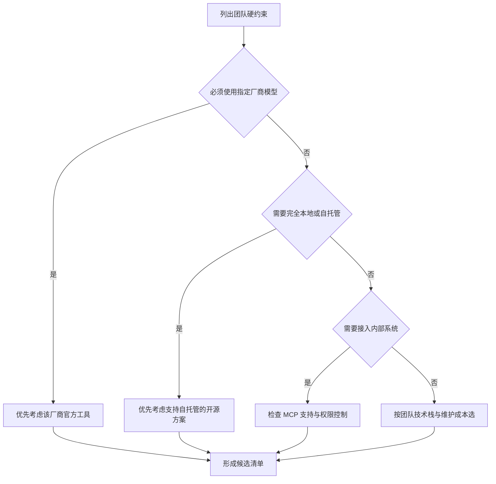

1. 先判断是否有厂商绑定约束，这是最容易排除选项的一条。
2. 再看数据是否必须留在本地，自托管需求会直接过滤掉一部分方案。
3. 需要接入内部系统时，检查扩展机制与权限控制是否够用。
4. 以上都不构成约束时，按团队熟悉的语言与运维成本决定。
5. 每一步只回答一个是非问题，避免同时比较多个维度。

**一步一步来**

步骤 1：把差异写成可比较的表格。语言与存储属于架构差异，扩展方式属于集成差异。

```text
# 架构差异（来源：旧版页面内容的对比表，以原文为准）
语言：OpenCode 用 Go；Claude Code 用 Rust
界面框架：OpenCode 用 Bubble Tea；Claude Code 用自定义 TUI
存储：OpenCode 用 SQLite；Claude Code 用文件系统
扩展：OpenCode 原生支持 MCP；Claude Code 提供插件系统
```

**这段代码在做什么**

1. 把差异按"架构"归类，避免和功能差异混在一起。
2. 每条差异只写两个值，不写评价词。
3. 来源标注写在代码块注释里，便于复核。
4. 表格留白处表示资料未覆盖，需要核对官方文档。

运行结果：无输出。

步骤 2：功能对比按使用者能感知的行为描述。

```text
# 功能对比（来源：旧版页面内容的对比表，以原文为准）
模型支持：OpenCode 支持 75 家以上提供商；Claude Code 主要使用 Anthropic Claude
MCP 支持：OpenCode 为是；Claude Code 为有限
LSP 集成：两者均为是
会话压缩：OpenCode 自动；Claude Code 手动触发
自托管：OpenCode 支持；Claude Code 为企业版
```

**这段代码在做什么**

1. 每条对比精确到可观察行为，比如"自动"与"手动触发"。
2. 未覆盖的细节不写结论，例如具体的企业版能力范围。
3. 数字带来源标注，避免被当作最新数据引用。
4. 对比项控制在六条以内，超出后表格难以阅读。

运行结果：无输出。

步骤 3：把选型写成打分函数。约束条件可以编码，避免每次讨论从头开始。

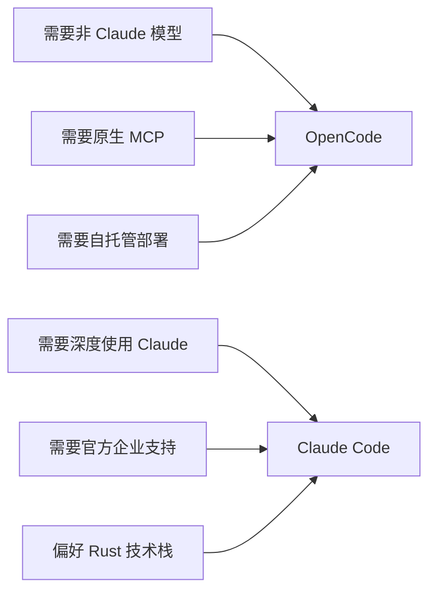

1. 前两条需求指向 OpenCode，因为它支持多提供商与原生 MCP。
2. 后两条需求指向 Claude Code，因为它由 Anthropic 官方维护。
3. 自托管需求指向 OpenCode，因为它是完整开源并支持本地运行。
4. 技术栈偏好只作为参考项，不应单独决定选型。
5. 打分函数的输入是需求清单，输出是候选排序。

**动手验证**

```js
// 依赖：Node 20+，无第三方依赖
// 运行：node 08-compare.mjs
import assert from "node:assert/strict";

const OPTIONS = {
  opencode: {
    languages: ["go"],
    providers: 75,
    mcpNative: true,
    selfHost: true,
    officialVendor: false,
  },
  claudeCode: {
    languages: ["rust"],
    providers: 1,
    mcpNative: false,
    selfHost: false,
    officialVendor: true,
  },
};

function score(option, needs) {
  let s = 0;
  if (needs.multiProvider && option.providers >= 75) s += 2;
  if (needs.mcpNative && option.mcpNative) s += 2;
  if (needs.selfHost && option.selfHost) s += 2;
  if (needs.officialSupport && option.officialVendor) s += 2;
  if (needs.preferLanguage && option.languages.includes(needs.preferLanguage)) s += 1;
  return s;
}

const needsA = { multiProvider: true, mcpNative: true, selfHost: true, officialSupport: false, preferLanguage: "go" };
assert.equal(score(OPTIONS.opencode, needsA), 7);
assert.equal(score(OPTIONS.claudeCode, needsA), 0);

const needsB = { multiProvider: false, mcpNative: false, selfHost: false, officialSupport: true, preferLanguage: "rust" };
assert.equal(score(OPTIONS.claudeCode, needsB), 3);
assert.equal(score(OPTIONS.opencode, needsB), 0);

const ranking = Object.entries(OPTIONS)
  .map(([name, opt]) => ({ name, s: score(opt, needsA) }))
  .sort((a, b) => b.s - a.s);

console.log("需求 A 的排序：", ranking.map((r) => `${r.name}=${r.s}`).join("、"));
// 预期输出：
// 需求 A 的排序： opencode=7、claudeCode=0
```

**常见坑**

| 现象 | 原因 | 怎么修 |
| --- | --- | --- |
| 仅凭 Star 数选型 | 把热度当成适配度 | 先列硬约束，再按约束打分 |
| 忽略许可与数据处理方式 | 只比较功能表 | 把许可与数据流向纳入评估表 |
| 选完发现团队不会维护 | 没评估语言与运维成本 | 把团队熟悉的技术栈作为独立维度 |

**用在哪里**

场景一：金融类内部系统的工具选型。

- 业务背景：代码不能离开内网，模型只能内网部署。
- 这一节的知识怎么用：把自托管设为硬约束，先过滤掉不支持的选项。
- 用什么指标衡量收益：评估会议轮数；可核验的数据流向说明。
- 什么时候不该用：内网已有满足需求的平台时，不要另起一套。

场景二：初创团队的统一开发工具。

- 业务背景：预算有限，希望模型可替换以应对价格变化。
- 这一节的知识怎么用：把多提供商支持设为加分项，优先选可替换的方案。
- 用什么指标衡量收益：更换模型时改动的配置行数。
- 什么时候不该用：团队已深度绑定某一模型且有稳定合同时。

场景三：需要接入内部发布系统的团队。

- 业务背景：发布流程要走内部审批接口。
- 这一节的知识怎么用：检查扩展机制是否支持声明式接入与权限控制。
- 用什么指标衡量收益：接入内部接口需要的代码改动量。
- 什么时候不该用：内部接口没有测试环境时，先补齐测试环境再谈接入。

**行业实践**

- Claude Code 官方文档提供插件机制与设置项说明，用于分发自定义命令与子代理。借鉴：把团队流程封装成可分发单元，降低个人配置差异。
- OpenCode 官方文档提供配置与 MCP 接入说明。借鉴：优先按官方配置项扩展，不要修改源码分支。
- GitHub 仓库 README 说明了仓库从 opencode-ai/opencode 迁移到 charmbracelet/crush 的情况。借鉴：评估开源项目时把仓库迁移状态纳入维护性判断。

**小结**

1. 对比的价值在排除不匹配选项，不在排出总分高低。
2. 硬约束优先，偏好项只作为加分。
3. 选型结论要写清依据与复核时间。

## 9. 参考资源与阅读路线

**先想一个问题**
面对仓库、官方文档、协议规范三类资料，先读哪一个？顺序错了容易在细节里迷路。

**心智模型**

!!! tip "心智模型"
    一句话模型：先跑起来，再看入口代码，再看核心模块，最后读协议规范。
    日常类比：学开车先上路，再看仪表盘说明，最后读发动机原理。
    类比不成立的地方：开车不上路也能理解原理，但代码不跑起来，很多行为只能靠猜。

**图解**

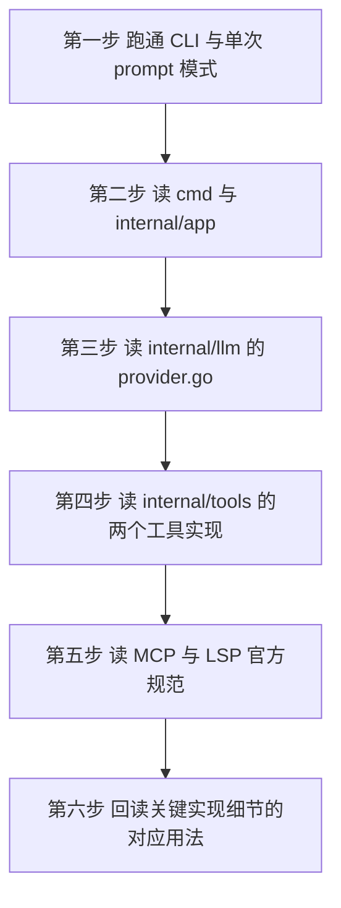

1. 先跑通两种模式，确认环境与密钥配置正确。
2. 从 `cmd` 开始读，因为入口决定了后续调用链。
3. 接着读 `provider.go`，理解模型接入的统一形状。
4. 再读两个工具实现，理解副作用代码的边界。
5. 然后读 MCP 与 LSP 规范，理解协议层约定。
6. 最后回头读流式、压缩、重试的实现细节，此时已有上下文。

**一步一步来**

步骤 1：把阅读任务写成清单并标注完成条件。清单化能避免"读过了但没留下可验证的结果"。

```js
// 每条任务带一个可验证的完成条件，读完就打勾并记录证据
const READING_PLAN = [
  { step: 1, task: "跑通交互模式", done: false, evidence: "截取一次完整会话" },
  { step: 2, task: "跑通单次 prompt 模式", done: false, evidence: "记录命令与输出" },
  { step: 3, task: "读 cmd 与 internal/app", done: false, evidence: "画出调用顺序" },
  { step: 4, task: "读 provider 接口", done: false, evidence: "写出接口签名" },
  { step: 5, task: "读两个工具实现", done: false, evidence: "写出工具参数表" },
  { step: 6, task: "读 MCP 规范", done: false, evidence: "写出请求响应字段" },
];
console.log(READING_PLAN.map((p) => `${p.step}. ${p.task}`).join("\n"));
```

**这段代码在做什么**

1. 每条任务都有编号，便于在讨论中引用。
2. `evidence` 字段要求留下可检查的产物，不是"看过了"。
3. `done` 字段初始为假，完成后再改，状态可追踪。
4. 步骤数与上面的阅读路线图一致，两处不冲突。

运行结果：打印六条任务编号与名称。

步骤 2：把参考资源按类型归类。仓库与源码用于看实现，官方文档用于看约定，协议规范用于看标准。

```text
# 参考资源分类（名称来自旧版页面内容的参考资源列表）
仓库类：opencode-ai/opencode 仓库、charmbracelet/crush 迁移项目
文档类：OpenCode 官方文档
规范类：MCP 协议规范、LSP 协议规范
```

**这段代码在做什么**

1. 三类分开列，避免把规范文档当成使用说明。
2. 仓库类包含迁移目标仓库，说明项目状态有变化。
3. 规范类资料更新由标准组织控制，阅读时要看版本号。
4. 未列入的资料不凭空补充，需要时再单独核对。

运行结果：无输出。

**动手验证**

```js
// 依赖：Node 20+，无第三方依赖
// 运行：node 09-reading.mjs
import assert from "node:assert/strict";

const PLAN = [
  { step: 1, task: "跑通交互模式", evidence: "一次完整会话记录" },
  { step: 2, task: "跑通单次 prompt 模式", evidence: "命令与输出" },
  { step: 3, task: "读 cmd 与 internal/app", evidence: "调用顺序图" },
  { step: 4, task: "读 provider 接口", evidence: "接口签名" },
  { step: 5, task: "读两个工具实现", evidence: "工具参数表" },
  { step: 6, task: "读 MCP 规范", evidence: "请求响应字段" },
];

assert.equal(PLAN.length >= 6, true);
assert.deepEqual(PLAN.map((p) => p.step), [1, 2, 3, 4, 5, 6]);
assert.ok(PLAN.every((p) => p.evidence.length > 0));

const RESOURCES = {
  repos: ["opencode-ai/opencode", "charmbracelet/crush"],
  docs: ["OpenCode 官方文档"],
  specs: ["MCP 协议规范", "LSP 协议规范"],
};
assert.equal(Object.values(RESOURCES).flat().length >= 5, true);

const progress = (plan) => {
  const done = plan.filter((p) => p.evidence).length;
  return `${done}/${plan.length}`;
};
assert.equal(progress(PLAN.slice(0, 3)), "3/3");

console.log("缺证据的任务：", PLAN.filter((p) => !p.evidence).length);
console.log("资源条目总数：", Object.values(RESOURCES).flat().length);
// 预期输出：
// 缺证据的任务： 0
// 资源条目总数： 5
```

**常见坑**

| 现象 | 原因 | 怎么修 |
| --- | --- | --- |
| 读了两周仍不会用 | 从协议规范开始读 | 先跑通两种运行模式再读源码 |
| 学完记不住要点 | 没有留下可检查的产物 | 每条阅读任务要求一份证据 |
| 引用过期信息 | 仓库已迁移但仍在读旧地址 | 关注仓库 README 的迁移说明 |

**用在哪里**

场景一：新人加入项目后的第一周培养计划。

- 业务背景：新人需要在短时间内能独立改一处代码。
- 这一节的知识怎么用：按六步路线安排任务，每步要求提交一份证据。
- 用什么指标衡量收益：新人第一次独立提交所需的引导次数。
- 什么时候不该用：新人已有同类工具经验时，可跳过运行环节直接读源码。

场景二：技术评审前的资料准备。

- 业务背景：评审需要判断引入某工具的维护风险。
- 这一节的知识怎么用：按仓库、文档、规范三类收集材料，交叉核对版本。
- 用什么指标衡量收益：评审中因资料缺失而悬置的问题数。
- 什么时候不该用：已有团队内部评估报告时，重复调研价值有限。

场景三：内部培训课程的内容编排。

- 业务背景：需要给团队讲一次两小时的架构分享。
- 这一节的知识怎么用：按第 1 到 9 节的顺序组织，每节留一个动手练习。
- 用什么指标衡量收益：课后能独立完成练习的人数比例。
- 什么时候不该用：听众只关心工具使用而不写代码时，省略源码相关章节。

**行业实践**

- GitHub 仓库 README 明确说明项目已迁移到 charmbracelet/crush，原仓库状态需以 README 为准。借鉴：把上游变更写进团队文档，避免照旧资料施工。
- MCP 官方文档的架构章节区分宿主、客户端与服务器三类角色。借鉴：评估扩展方案时先确认自己处在哪一类角色。
- LSP 官方文档的规范章节按版本发布能力，客户端需在 `initialize` 中协商。借鉴：协议能力按版本判断，不要按印象假设。

**小结**

1. 阅读顺序是先运行、再入口、再核心、最后规范。
2. 每条阅读任务都要留下可检查的产物。
3. 上游仓库与协议的版本变化要写进团队文档。

## 应用地图

| 场景 | 用到本页哪个知识点 | 典型技术选型 | 注意事项 |
| --- | --- | --- | --- |
| 跨模型团队的统一开发入口 | 第 1 节定位与入口分流、第 7 节配置优先级 | 多 Provider 配置加环境变量注密钥 | 密钥不进仓库，配置文件只留占位字段 |
| 内网自托管模型的研发环境 | 第 1 节多端入口、第 7 节环境变量覆盖 | 自托管模型服务加本地配置 | 内网模型能力需先做任务验收，再全面推广 |
| 长对话的工单排查助手 | 第 5 节流式双通道与 95% 阈值压缩 | 流式响应加摘要压缩 | 摘要会丢细节，涉及条款原文时不要压缩 |
| 大批量导入的失败重试 | 第 5 节指数退避重试 | 可重试错误分类加退避等待 | 数据格式错误不可重试，避免无意义等待 |
| 内部系统的能力接入 | 第 6 节 MCP 接入与权限分级 | stdio 或 sse 服务器加权限门 | 工具名加命名空间，未授权工具在分发前拦截 |
| 多语言仓库的诊断获取 | 第 6 节 LSP 集成 | 语言服务器加拉取式诊断 | 诊断需要最新快照时用拉取，不依赖推送缓存 |
| 工具选型与采购评估 | 第 8 节对比维度与打分 | 硬约束清单加打分函数 | 结论要写清依据与复核时间 |
| 新人上手与内部培训 | 第 9 节阅读路线 | 六步路线加证据要求 | 每步都要有可检查产物，否则读不实 |

## 动手作业

目标：用 Node 20 写一个单文件脚本 `mini-agent.mjs`，把第 2、3、5 节的知识合成一条可跑的链路。

步骤：

1. 定义 `Provider` 与 `Tool` 两个"形状"，用类实现一个假 Provider 与三个工具：`view`、`edit`、`bash`。
2. 实现工具注册表，要求重复注册报错，未知工具报错。
3. 实现主循环，`maxTurns` 设为 8，模型第一次返回 `view` 调用，第二次返回 `edit` 调用，第三次返回最终文本。
4. 给流式输出加两条通道：一条推内容块，一条推错误；用一次人为失败验证错误通道收到值。
5. 实现 `shouldCompact(used, max, autoCompact)`，阈值 0.95，并在主循环每轮结束后检查一次。
6. 实现 `withRetry`，最多 3 次，等待序列为 1000 毫秒、2000 毫秒。

验收标准（全部可用脚本自检）：

- 工具重名注册抛出错误，错误信息包含工具名。
- 未注册工具名抛出错误，错误信息包含工具名。
- 主循环在第三次模型调用后返回文本，且模型调用次数断言等于 3。
- 错误通道在人为失败时长度为 1，数据通道内容为失败前已推送的块。
- `shouldCompact(96, 100, true)` 为真，`shouldCompact(94, 100, true)` 为假。
- `withRetry` 在第三次成功时记录的等待序列等于 `[1000, 2000]`。
- 脚本运行结束时打印"全部断言通过"，且不产生未捕获的 Promise 拒绝。

## 综合对比

| 维度 | OpenCode | Claude Code | 备注 |
| --- | --- | --- | --- |
| 开源程度 | 完整开源，MIT 许可 | 闭源 | 来源：旧版页面内容，以原文为准 |
| 实现语言 | Go | Rust | 来源：旧版页面内容，以原文为准 |
| 界面框架 | Bubble Tea | 自定义 TUI | 来源：旧版页面内容，以原文为准 |
| 会话存储 | SQLite | 文件系统 | 来源：旧版页面内容，以原文为准 |
| 模型支持 | 75 家以上提供商 | 主要使用 Anthropic Claude | 来源：旧版页面内容，以原文为准 |
| 扩展机制 | MCP 原生支持 | 插件系统 | 来源：旧版页面内容，以原文为准 |
| 会话压缩 | 用量超过上限 95% 自动触发 | 手动触发 | 来源：旧版页面内容，以原文为准 |
| 自托管 | 支持 | 企业版 | 具体能力范围资料未覆盖，需核对官方文档 |
| 维护方 | 开源社区 | Anthropic 官方 | 仓库已迁移至 charmbracelet/crush，以 README 为准 |

## 深入阅读与参考

!!! tip "怎么用这些资料"
    先读「官方文档与规范」建立准确的概念，再读「源码与示例」核对细节，最后用「教程、书籍与视频」换一种讲法加深理解。每条都写明了读哪一节、带着什么问题读。

### 官方文档与规范

| 资源 | 为什么读 | 怎么读 |
|---|---|---|
| [Claude Code 文档](https://code.claude.com/docs/en/overview) | 对照 Claude Code 的官方能力边界，判断 OpenCode 的复刻与取舍。 | 重点读 subagents、hooks、slash commands 三节，列功能清单再与 OpenCode 逐项对照。 |
| [Claude 子 Agent 文档](https://docs.claude.com/en/docs/claude-code/sub-agents) | 子 Agent 的工具权限模型是 Agent 实现章的对照基准。 | 读权限与创建部分，思考 OpenCode 中对应抽象放在哪个模块，画一张映射表。 |
| [Claude Tool Use 概览](https://docs.claude.com/en/docs/agents-and-tools/tool-use/overview) | 工具定义与调用协议是 Agent 循环的核心，规范最权威。 | 读工具 schema 与错误返回部分，对照 OpenCode 的工具注册与参数校验代码。 |
| [Agent Skills 概览](https://docs.anthropic.com/en/docs/agents-and-tools/agent-skills/overview) | Skills 的按需加载机制对应扩展机制章节的设计思路。 | 读 SKILL.md 结构与加载时机，思考 OpenCode 的扩展点为何这样设计。 |
| [Claude Agent SDK 概览](https://docs.claude.com/en/api/agent-sdk/overview) | SDK 概览给出 Agent 循环的最小官方模型，便于建立整体认知。 | 通读概览与工具调用流程，先建立主循环心智模型再读源码。 |
| [Anthropic 论 SWE-bench 的 Agent 设计](https://www.anthropic.com/engineering/swe-bench-sonnet) | 讲为何精简工具集，直接支撑关键实现细节的取舍分析。 | 读最小工具集设计一节，列出 OpenCode 工具清单逐一判断必要性。 |

### 源码与示例

| 资源 | 为什么读 | 怎么读 |
|---|---|---|
| [Claude Agent SDK（TypeScript）](https://github.com/anthropics/claude-agent-sdk-typescript) | 可运行的 Agent 示例代码，是理解循环与工具注册的捷径。 | 跑通 README 示例后，带着「谁驱动循环」的问题回到 OpenCode 源码。 |
| [smolagents 仓库](https://github.com/huggingface/smolagents) | 核心代码不到千行，最适合先读透最小 Agent 循环。 | 通读核心 loop 文件，抄一遍流程图，再对照 OpenCode 的多 Agent 结构。 |
| [pi 编码 Agent 工具集](https://github.com/earendil-works/pi) | 同为编码 Agent，agent loop 与统一 LLM API 可直接横向对比。 | 读 loop 与模型适配层，找与 OpenCode 同名抽象的差异点记笔记。 |
| [Google ADK（Python）仓库](https://github.com/google/adk-python) | 另一种 Agent 抽象范式，帮助判断 OpenCode 分层是否合理。 | 只看 samples 目录，挑一个多工具示例，对比编排方式差异。 |

### 教程、书籍与视频

| 资源 | 为什么读 | 怎么读 |
|---|---|---|
| [Effective context engineering for AI agents](https://www.anthropic.com/engineering/effective-context-engineering-for-ai-agents) | 上下文工程决定 Agent 稳定性，是 OpenCode 提示组装的关键。 | 读完后检查 OpenCode 的 prompt 拼装代码，标注可删减的重复上下文。 |
| [How we built our multi-agent research system](https://www.anthropic.com/engineering/multi-agent-research-system) | 多 Agent 协作的真实工程复盘，呼应架构设计章节。 | 画出 lead 与 subagent 调用图，思考 OpenCode 何时该拆分 Agent。 |
| [Awesome AI Agents](https://github.com/e2b-dev/awesome-ai-agents) | 快速纵览同类 Agent 项目，便于在对比总结中定位 OpenCode。 | 浏览分类挑两个编码 Agent，记录其架构差异填入对比总结表。 |

## 自测题

??? question "题目 1：OpenCode 的三条定位分别落在哪一层？"
    - 开源落在许可与仓库层面，采用 MIT 许可（来源：旧版页面内容，以原文为准）。
    - 多端落在入口层，终端 CLI、桌面应用、IDE 插件共用核心能力。
    - 模型无关落在 Provider 层，每家厂商一个实现，接口统一调用形状。
    - 隐私优先落在数据层，会话存本地 SQLite，不上传代码与上下文。

??? question "题目 2：为什么 Provider 接口要收 context 参数？"
    - 用户在界面按取消时，需要能中断正在进行的网络请求。
    - 请求超时控制需要传递截止时间，而不是在方法内部另起计时器。
    - 上游取消后，重试逻辑里的等待也要一起退出，避免空等。
    - 接口一旦不收，后续补充取消能力要改所有实现，改造成本高。

??? question "题目 3：主循环为什么必须有轮数上限？"
    - 模型可能反复申请同一个工具，没有上限就会一直消耗额度。
    - 上限让失败有明确出口，返回可读的错误信息而不是静默截断。
    - 上限值要写进配置或常量并在注释里说明调整依据。
    - 达到上限后应把所有已完成的消息落库，便于人工接手。

??? question "题目 4：流式为什么要分成两条通道？"
    - Go 的通道无法同时表达值和错误，混装会迫使调用方做类型断言。
    - 分成两条后调用方可以用同一个 select 同时监听数据与错误。
    - 两条通道都必须关闭，关闭是消费端结束循环的信号。
    - 消费方要先看错误通道，否则可能把失败当成空回复。

??? question "题目 5：95% 阈值是怎么触发的？"
    - 先用 CountTokens 统计当前消息用量，再与最大上下文比较。
    - 比例超过 0.95 且 AutoCompact 开关打开时返回真。
    - 压缩时把历史替换成一条摘要消息，并生成新的会话编号。
    - 摘要会丢失细节，涉及逐字比对的内容不应进入压缩流程。

??? question "题目 6：MCP 工具名为什么要加服务器名前缀？"
    - 映射式注册表按名字索引，同名会互相覆盖，后注册的赢。
    - 加前缀后重名会在启动时暴露为错误，而不是运行期行为异常。
    - 前缀同时让日志里能看出工具来自哪个服务器。
    - 前缀是外部契约的一部分，改名会让已有提示词失效。

??? question "题目 7：配置优先级是怎么定的？"
    - 查找顺序是项目本地、XDG 配置目录、用户主目录。
    - 先命中的文件作为基础，后续来源按优先级合并到它上面。
    - 映射类型递归合并，数组默认整体替换，不做元素级合并。
    - 环境变量在最后应用，用于临时覆盖与密钥注入。

??? question "题目 8：选型对比时为什么先列硬约束？"
    - 硬约束能直接排除不匹配的选项，减少比较维度。
    - 厂商绑定与数据流向是最容易形成硬约束的两条。
    - 偏好项只作为加分，例如语言偏好不应单独决定结论。
    - 约束会变化，结论要写清依据与复核时间。

## 延伸阅读

- OpenCode 官方文档：配置章节、MCP 接入章节。
- MCP 协议规范：架构章节、传输章节、工具调用章节。
- LSP 官方文档：`initialize` 章节、`textDocument/diagnostic` 章节。
- Bubble Tea 官方文档：Model-Update-View 章节、异步命令章节。
- Go 官方文档：Effective Go 的接口与并发章节。
- Claude Code 官方文档：插件章节、设置章节。
- XDG Base Directory 规范：配置文件目录定义章节。
- 12-Factor App：配置章节。
