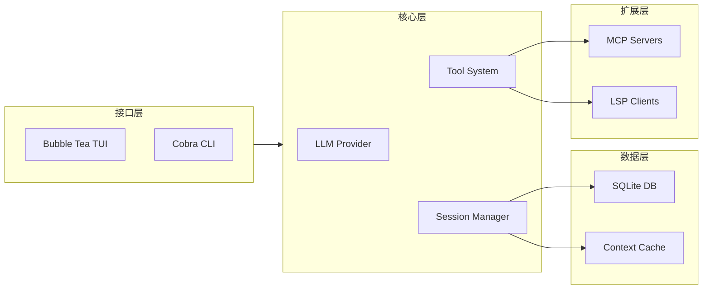
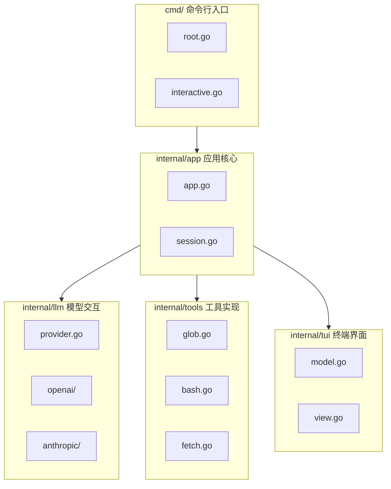
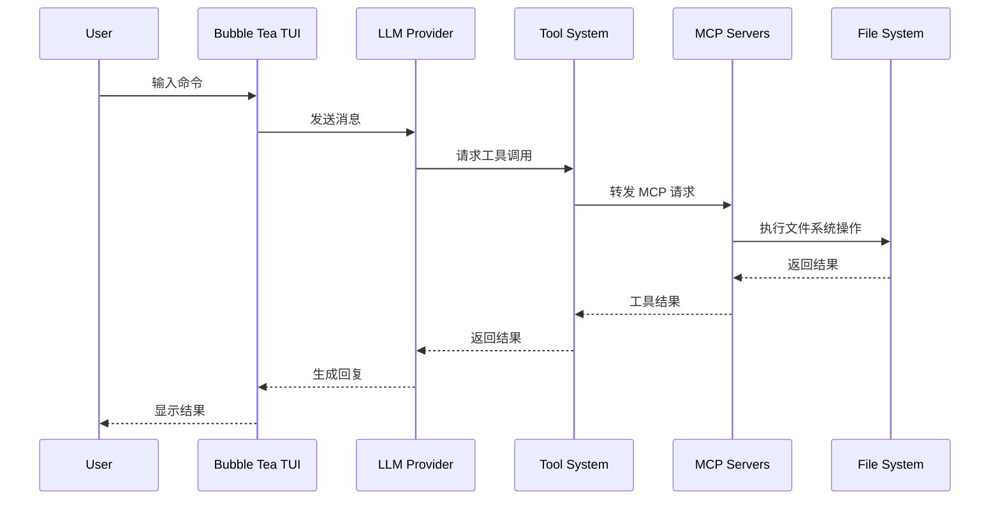
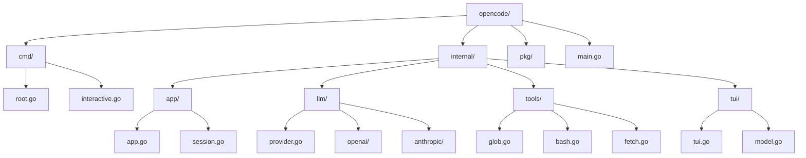
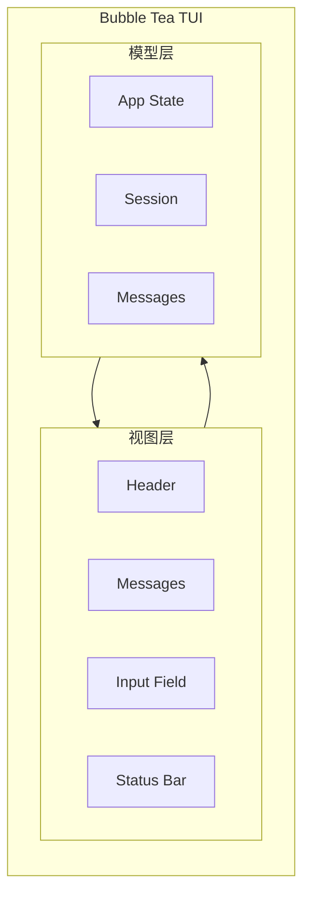
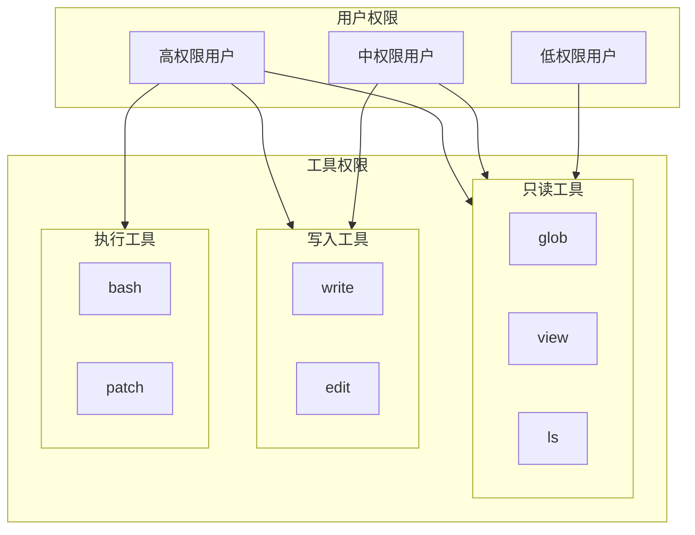

# OpenCode 架构分析

> 本文档基于 [opencode-ai/opencode](https://github.com/opencode-ai/opencode) GitHub 仓库分析编写，仓库已迁移至 [Crush](https://github.com/charmbracelet/crush)。

## 1. 项目概述

### 1.1 项目定位和目标

OpenCode 是一个开源的 AI 编程代理（AI Coding Agent），帮助开发者在终端、IDE 或桌面端编写代码。项目具有以下核心定位：

- **开源透明**: 完整的源代码开放，社区驱动开发
- **多平台支持**: 终端 CLI、桌面应用、IDE 插件多端覆盖
- **模型无关**: 支持 75+ LLM 提供商，用户可自由选择
- **隐私优先**: 不存储用户代码和上下文数据，可在本地运行

### 1.2 核心功能

| 功能类别 | 具体特性 |
|---------|---------|
| **交互界面** | TUI (Terminal User Interface) 交互界面，基于 Bubble Tea 框架 |
| **AI 模型支持** | OpenAI GPT、Anthropic Claude、Google Gemini、GitHub Copilot、Groq、Azure OpenAI、AWS Bedrock、OpenRouter 等 |
| **会话管理** | SQLite 持久化存储、多会话并行、上下文自动压缩 |
| **文件操作** | glob 模式匹配、grep 搜索、ls 目录浏览、view/write/edit/patch 文件编辑 |
| **终端执行** | bash 命令执行、超时控制、权限管理 |
| **工具集成** | MCP (Model Context Protocol) 扩展、LSP (Language Server Protocol) 语言服务 |
| **网络获取** | URL fetch、Sourcegraph 代码搜索 |

### 1.3 与 Claude Code 的区别

| 维度 | OpenCode | Claude Code |
|------|----------|-------------|
| **开源程度** | 完整开源 (MIT License) | 闭源 |
| **模型选择** | 75+ 提供商，用户自主选择 | 主要使用 Anthropic Claude |
| **部署方式** | 本地运行，无云服务依赖 | CLI 工具，可本地使用 |
| **技术栈** | Go 语言实现 | Rust 语言实现 |
| **扩展机制** | MCP 原生支持 | 插件系统 |
| **数据隐私** | 完全本地化，无数据上传 | 依配置可能涉及云端 |
| **社区生态** | 15万+ GitHub Stars，活跃开源社区 | Anthropic 官方维护 |

## 2. 架构设计

### 2.1 整体架构图



### 2.2 核心模块划分



### 2.3 技术栈

| 层级 | 技术选型 | 说明 |
|------|---------|------|
| **语言** | Go 1.24+ | 主要开发语言 |
| **CLI 框架** | Cobra | 命令行参数解析 |
| **TUI 框架** | Bubble Tea | Charm 系列终端 UI 库 |
| **数据库** | SQLite | 会话和消息持久化 |
| **AI 模型** | 多提供商 SDK | OpenAI, Anthropic, Google 等 |
| **协议集成** | MCP, LSP | 扩展和语言服务 |

## 3. Agent 实现

### 3.1 模型交互层

#### 3.1.1 Provider 架构

OpenCode 采用 Provider 模式支持多 AI 提供商：

```go
// 核心接口定义
type Provider interface {
    Complete(ctx context.Context, req Request) (*Response, error)
    Stream(ctx context.Context, req Request) (*StreamReader, error)
    GetModels() []Model
}
```

**支持的 Provider 类型**:

| Provider | 支持模型 | 认证方式 |
|----------|---------|---------|
| `openai` | GPT-4.1, GPT-4o, O1/O3, O4 Mini | API Key |
| `anthropic` | Claude 3.5-4.7 全系列 | API Key |
| `copilot` | GPT-4, Claude 3.5/3.7 | GitHub Token |
| `gemini` | Gemini 2.0/2.5 系列 | API Key |
| `groq` | Llama 4, QWQ-32b, DeepSeek R1 | API Key |
| `azure` | GPT-4 系列 | Azure OpenAI Endpoint |
| `bedrock` | Claude on AWS | AWS Credentials |
| `openrouter` | 聚合多模型 | API Key |
| `local` | 自托管模型 | LOCAL_ENDPOINT |

#### 3.1.2 请求构建

```go
type Request struct {
    Model     string
    Messages  []Message
    Tools     []Tool
    MaxTokens int
    // ... 其他参数
}
```

### 3.2 工具系统

#### 3.2.1 内置工具列表

| 工具名 | 功能描述 | 参数 |
|--------|---------|------|
| `glob` | 模式匹配查找文件 | pattern, path |
| `grep` | 搜索文件内容 | pattern, path, include, literal_text |
| `ls` | 列出目录内容 | path, ignore |
| `view` | 查看文件内容 | file_path, offset, limit |
| `write` | 写入文件 | file_path, content |
| `edit` | 编辑文件 | 多种编辑参数 |
| `patch` | 应用 diff 补丁 | file_path, diff |
| `diagnostics` | 获取诊断信息 | file_path |
| `bash` | 执行 shell 命令 | command, timeout |
| `fetch` | 获取 URL 内容 | url, format, timeout |
| `sourcegraph` | Sourcegraph 搜索 | query, count, context_window |
| `agent` | 运行子任务代理 | prompt |

#### 3.2.2 工具调用流程



### 3.3 状态管理

#### 3.3.1 应用状态结构

```go
type AppState struct {
    Session     *Session
    Messages    []Message
    Config      *Config
    LLMProvider *LLMProvider
    MCPServers  map[string]*MCPServer
    LSPClients  map[string]*LSPClient
    // ...
}
```

#### 3.3.2 会话管理

OpenCode 使用 SQLite 存储会话：

```sql
CREATE TABLE sessions (
    id TEXT PRIMARY KEY,
    title TEXT,
    summary TEXT,
    created_at DATETIME,
    updated_at DATETIME,
    model TEXT,
    metadata JSON
);
```

**会话特性**:
- **自动压缩 (Auto Compact)**: 上下文达到 95% 时自动摘要
- **历史记录**: 完整保留对话历史
- **元数据**: 存储模型、配置等会话信息

## 4. 源码目录结构分析

### 4.1 目录树



### 4.2 各模块职责

#### 4.2.1 cmd/ - 命令行入口

| 文件 | 职责 |
|------|------|
| `root.go` | 根命令定义，全局 flag 定义 |
| `interactive.go` | 交互模式启动，加载 TUI |
| `noninteractive.go` | `-p` 参数模式，单次 prompt 执行 |
| `flags.go` | 命令行参数定义 |

#### 4.2.2 internal/app/ - 应用核心

| 文件 | 职责 |
|------|------|
| `app.go` | 应用主循环，状态初始化 |
| `session.go` | 会话生命周期管理 |
| `messaging.go` | 消息队列和分发 |

#### 4.2.3 internal/llm/ - 模型交互

| 文件 | 职责 |
|------|------|
| `provider.go` | Provider 接口定义，工厂方法 |
| `openai/*.go` | OpenAI API 实现 |
| `anthropic/*.go` | Anthropic Claude API 实现 |
| `gemini/*.go` | Google Gemini API 实现 |

#### 4.2.4 internal/tools/ - 工具实现

每个工具独立文件，遵循统一接口：

```go
type Tool interface {
    Name() string
    Description() string
    Parameters() map[string]Parameter
    Execute(ctx context.Context, params map[string]interface{}) (*Result, error)
}
```

#### 4.2.5 internal/tui/ - 终端界面

基于 Bubble Tea 的组件化 UI：



## 5. 关键实现细节

### 5.1 流式处理

OpenCode 使用 Go 的 channel 和 goroutine 实现流式响应：

```go
// 第 1 段：流式返回值的载体——把"数据流"和"错误流"分离成两个只读通道
// 为什么拆两个通道：Go 里 channel 无法同时表达"值"和"错误"，混装 interface{} 会丢类型并迫使调用方做断言；
// 双通道让调用方可以统一用 select 监听，既能在出错时立刻中止，也能保证最后一条数据不丢。
// 注意：这里刻意只用 <-chan（接收方向），把发送端封闭在 Provider 内部，防止外部误写导致 panic。
type StreamReader struct {
    Ch  <-chan string
    Err <-chan error
}

// 第 2 段：接口入口——只负责"起流"，不阻塞、不读取任何数据
// 设计意图：函数立刻返回句柄，真正的阻塞 IO 全部转移到后台 goroutine，
// 调用方拿到 reader 后可以自由控制消费节奏（背压自然由无缓冲通道传导回去）。
// 关键点：两个通道都是无缓冲的，因此 goroutine 在没有消费者时会卡在 ch <- 上，
// 这正是我们想要的流量控制——但代价是调用方必须持续消费或在放弃时关闭 ctx，否则 goroutine 泄漏。
func (p *Provider) Stream(ctx context.Context, req Request) (*StreamReader, error) {
    ch := make(chan string)
    errCh := make(chan error)

    // 第 3 段：后台生产协程——负责建连、拉取、逐块投递、收尾
    // defer 顺序是易错点：先注册的 close(ch) 会后执行，所以真实执行顺序是 close(errCh) → close(ch)。
    // 两个通道都要关：关闭是给调用方 range / ok 判断用的结束信号，缺一个就会让消费侧永久阻塞。
    go func() {
        defer close(ch)
        defer close(errCh)
        // 流式读取响应
        // 建连阶段（握手、鉴权、首包）的错误必须回灌到 errCh 而不是返回，
        // 因为此时函数早已 return，错误只能走通道这条唯一路径。
        reader, err := p.client.Stream(req)
        if err != nil {
            errCh <- err
            return
        }
        // 第 4 段：主读取循环——io.EOF 是正常终止信号，不是错误
        // 数据流边界：Next() 每返回一个 chunk 就立即投递给消费者，不做缓冲、不做聚合，
        // 这样首字节延迟最低（TTFT 好看），代价是块大小/切分由底层 reader 决定。
        // 潜在缺陷：err != io.EOF 且 err != nil 的异常分支没有被处理，
        // 此处会带着空 chunk.Content 继续下一轮，可能形成忙循环——真实代码应补一个 errCh <- err; return。
        for {
            chunk, err := reader.Next()
            if err == io.EOF {
                return
            }
            ch <- chunk.Content
        }
    }()

    // 第 5 段：把生产端通道包装成只读句柄交付调用方
    // 固定返回 nil error：此刻并未发生真正的 IO，任何失败都会在后续消费时从 Err 通道浮现，
    // 调用方要养成"先看 Err 再看 Ch"的习惯，否则可能把错误当成空流静默吞掉。
    return &StreamReader{Ch: ch, Err: errCh}, nil
}
```
**TUI 流式渲染**:

```go
func (m Model) Update(msg tea.Msg) (tea.Model, tea.Cmd) {
    switch msg := msg.(type) {
    case llm.StreamChunk:
        // 增量更新消息内容
        m.CurrentMessage.Content += msg.Content
        return m, nil
    case llm.StreamEnd:
        // 流式结束，保存完整消息
        m.Messages = append(m.Messages, m.CurrentMessage)
        return m, nil
    }
}
```

### 5.2 上下文管理

#### 5.2.1 消息构建

```go
func BuildMessages(session *Session, newMessage string) []Message {
    messages := []Message{}

    // 添加系统提示
    messages = append(messages, Message{
        Role:    "system",
        Content: session.SystemPrompt,
    })

    // 添加历史消息
    for _, msg := range session.History {
        messages = append(messages, Message{
            Role:    msg.Role,
            Content: msg.Content,
        })
    }

    // 添加新消息
    messages = append(messages, Message{
        Role:    "user",
        Content: newMessage,
    })

    return messages
}
```

#### 5.2.2 自动压缩 (Auto Compact)

当上下文接近限制时自动摘要：

```go
func ShouldCompact(session *Session, config *LLMConfig) bool {
    if !config.AutoCompact {
        return false
    }

    // 计算 token 使用量
    usedTokens := CountTokens(session.Messages)
    maxTokens := config.MaxContextTokens

    // 超过 95% 时触发压缩
    return float64(usedTokens) / float64(maxTokens) > 0.95
}

func CompactSession(session *Session) *Session {
    summary := SummarizeMessages(session.Messages)

    return &Session{
        ID:        GenerateID(),
        Summary:   summary,
        Messages: []Message{
            {Role: "system", Content: "以下是会话摘要: " + summary},
        },
    }
}
```

### 5.3 错误处理

#### 5.3.1 分层错误处理

```go
// 工具执行错误
type ToolError struct {
    Tool     string
    Message  string
    ExitCode int
    stderr   string
}

// LLM 调用错误
type LLMError struct {
    Provider string
    Code     string
    Message  string
    Retryable bool
}

// 用户操作取消
type UserCancelledError struct{}
```

#### 5.3.2 重试机制

```go
func (p *Provider) CompleteWithRetry(ctx context.Context, req Request) (*Response, error) {
    // 第 1 段：重试策略的初始参数
    // maxRetries=3 表示最多尝试 3 次（含首次），而非"重试 3 次"；backoff 从 1s 起按指数翻倍，
    // 形成 1s、2s、4s… 的退避间隔，用来在调用方（上游服务）短时抖动或过载时给它留出恢复窗口。
    maxRetries := 3
    backoff := time.Second

    // 第 2 段：重试主循环与成功/不可重试的短路
    // 每次迭代都重新发起 Complete；耗时随 i 线性增长（每轮至少多等一次 backoff），
    // 整体复杂度 O(maxRetries) 次网络调用 + 累积退避时间。err==nil 立即返回，避免无谓等待。
    for i := 0; i < maxRetries; i++ {
        resp, err := p.Complete(ctx, req)
        if err == nil {
            return resp, nil
        }

        // 第 3 段：不可重试错误快速失败
        // 只有"可重试"的错误（如超时、5xx、限流）才继续；像参数非法、鉴权失败这类确定性错误
        // 重试多少次都不会成功，这里直接透传原始 err，既省时间也让调用方看到真实错误。
        if !IsRetryable(err) {
            return nil, err
        }

        // 第 4 段：在"上下文取消"与"退避等待"之间择一
        // select 让阻塞等待时可被 ctx 打断，避免上游取消后仍傻等整个 backoff；注意本段是唯一
        // 改变 backoff 的位置，且只有在计时器正常触发时才翻倍——走 ctx.Done() 分支会直接返回。
        // 易错点：time.After 在被打断时会留下一个未触发的定时器（到这里会短暂泄漏），
        // 且最后一次失败后仍会等待一次 backoff 才退出循环，属于可优化但不影响正确性的浪费。
        select {
        case <-ctx.Done():
            return nil, ctx.Err()
        case <-time.After(backoff):
            backoff *= 2
        }
    }

    // 第 5 段：重试耗尽
    // 走到这里说明每次都失败且错误可重试，用不携带底层原因的新错误告知"次数用尽"；
    // 调用方若需排查根因，需结合日志/指标，因为最后一次的真实 err 在此已被丢弃。
    return nil, fmt.Errorf("max retries exceeded")
}
```
## 6. 扩展机制

### 6.1 MCP 支持

#### 6.1.1 MCP 协议实现

Model Context Protocol 允许连接外部工具服务器：

```go
type MCPServer struct {
    Name    string
    Type    string  // "stdio" 或 "sse"
    Command []string
    Env     map[string]string
    URL     string
}

type MCPTool struct {
    Name        string
    Description string
    InputSchema map[string]interface{}
}
```

#### 6.1.2 配置示例

```json
{
  "mcpServers": {
    "filesystem": {
      "type": "stdio",
      "command": "npx",
      "args": ["-y", "@modelcontextprotocol/server-filesystem"],
      "env": {},
      "workingDirectory": "/tmp"
    },
    "github": {
      "type": "sse",
      "url": "https://api.example.com/mcp",
      "headers": {
        "Authorization": "Bearer token"
      }
    }
  }
}
```

#### 6.1.3 工具调用流程

```
OpenCode → MCP Client → JSON-RPC Request
                            ↓
                      MCP Server
                            ↓
                      Tool Execution
                            ↓
                      JSON-RPC Response
                            ↓
OpenCode ← MCP Client ← Tool Result
```

### 6.2 MCP 工具系统

#### 6.2.1 内置工具

| 工具 | 实现位置 | 功能 |
|------|---------|------|
| `glob` | `tools/glob.go` | 文件模式搜索 |
| `grep` | `tools/grep.go` | 正则/字符串搜索 |
| `ls` | `tools/ls.go` | 目录列表 |
| `view` | `tools/view.go` | 文件内容查看 |
| `write` | `tools/write.go` | 文件写入 |
| `edit` | `tools/edit.go` | 精确文本替换 |
| `patch` | `tools/patch.go` | Git-style diff |
| `bash` | `tools/bash.go` | Shell 命令执行 |
| `fetch` | `tools/fetch.go` | HTTP 请求 |
| `sourcegraph` | `tools/sourcegraph.go` | 代码库搜索 |

#### 6.2.2 工具执行权限



### 6.3 LSP 集成

#### 6.3.1 LSP Client 实现

基于 `langserver.org` 协议实现：

```go
type LSPClient struct {
    Name    string
    Command []string
    conn    *jsonrpc2.Conn
    drafts  *lsp.CallHierarchy
}

func (c *LSPClient) Initialize(rootPath string) error {
    params := &lsp.InitializeParams{
        RootURI:      uri.File(rootPath),
        capabilities: c.getCapabilities(),
    }
    // ... 初始化握手
}
```

#### 6.3.2 诊断功能

```go
// 第 1 段：把本地文件路径包装成 LSP 协议要求的文档标识（TextDocumentIdentifier）
// LSP 的所有文档方法都不收裸路径，必须以 URI（如 file:///abs/path.go）定位文档；
// 这里用项目自带的 uri.File 统一做“本地路径 → URI”的转换，避免各调用点手工拼字符串
// （Windows 盘符、空格转义、非 ASCII 路径都容易在这一步踩坑，集中转换是唯一可靠做法）。
func (c *LSPClient) GetDiagnostics(file string) ([]Diagnostic, error) {
    params := &lsp.TextDocumentIdentifier{
        URI: uri.File(file), // 取地址传出：Call 内部会直接序列化，避免多一次拷贝
    }

    // 第 2 段：发起 textDocument/diagnostic 请求（pull model，LSP 3.17+）
    // 这是“主动拉取”式诊断，与服务端自行推送的 publishDiagnostics 是两条独立通道，
    // 拉取式的好处是拿到的一定是当前最新快照，不需要在客户端维护诊断缓存与失效逻辑。
    // 出错时直接返回 nil + err：不吞错、不做兜底空切片，是否降级由调用方决定。
    resp, err := c.Call("textDocument/diagnostic", params)
    if err != nil {
        return nil, err
    }

    // 第 3 段：把原始响应体交给 parseDiagnostics 解码
    // 解耦点：GetDiagnostics 只负责“请求”，响应可能是全文报告（full）也可能是增量（unchanged/partial），
    // 具体判别与反序列化全部收拢到 parseDiagnostics，便于单独测试且不受传输层改动影响。
    // 注意 parseDiagnostics 的错误同样会被原样透传，这里不额外包装。
    // 复杂度：网络往返 + O(d) 解析，d 为诊断条目数；本函数自身无额外遍历。
    return parseDiagnostics(resp)
}
```
#### 6.3.3 配置示例

```json
{
  "lsp": {
    "go": {
      "disabled": false,
      "command": "gopls"
    },
    "typescript": {
      "disabled": false,
      "command": "typescript-language-server",
      "args": ["--stdio"]
    },
    "python": {
      "disabled": false,
      "command": "pyright-langserver",
      "args": ["--stdio"]
    }
  }
}
```

## 7. 配置系统

### 7.1 配置文件位置

按优先级搜索：

1. `./.opencode.json` (项目本地)
2. `$XDG_CONFIG_HOME/opencode/.opencode.json`
3. `$HOME/.opencode.json`

### 7.2 配置结构

```go
// 第 1 段：顶层配置聚合（Config 是整棵配置树的根，所有子系统配置都挂在这一个入口上）
// 设计意图：把不同关注点的配置拆成独立子结构体，Config 只做“汇总”，避免堆出一个字段爆炸的巨型结构体。
// 数据流：配置文件(JSON) → 反序列化到本结构体 → 各子系统按需只读自己那一段；字段全是值类型(非指针)，
// 意味着未配置时拿到的是各子结构的零值，默认值必须由子结构体或上层补全逻辑兜底。
type Config struct {
    // 第 2 段：强类型的功能模块配置（结构稳定、字段可枚举，所以用具体类型换编译期检查与 IDE 补全）
    // 这些是产品核心能力，字段名写错会直接编译失败；而 json tag 才是对外契约，改 tag 等于改配置格式，须谨慎。
    Data     DataConfig     `json:"data"` // 数据/存储与路径相关配置
    Providers ProvidersConfig `json:"providers"` // 模型/服务提供方（endpoint、API key 等），属敏感信息，注意序列化与日志脱敏
    Agents   AgentsConfig    `json:"agents"` // Agent 行为配置（提示词、可用工具、限额等）
    Shell    ShellConfig     `json:"shell"` // 终端/命令执行配置，涉及权限与超时，是安全敏感区

    // 第 3 段：可扩展的映射式配置（key 由用户或插件自定义、无法预先枚举，因此用 map 而非固定字段）
    // 选 map 是为了支持“同类多实例”：一个项目可同时接多个 MCP server、多种语言的 LSP。
    // 易错点：map 零值为 nil，读 nil map 安全(返回零值)，但写入会 panic——需由解码器创建或显式 make。
    MCPServers map[string]MCPServer `json:"mcpServers"` // key 一般是 server 名，用作日志/报错时的可读标识
    LSP      map[string]LSPConfig  `json:"lsp"` // key 通常是语言名(如 "go"、"typescript")，按语言查找最自然

    // 第 4 段：运行期开关（布尔量的正交组合，用于动态切换行为；默认 false 代表“安静/安全”的默认态）
    // 拆成多个独立 bool 而非单一 mode 枚举，是为了让各开关互不耦合、可任意叠加；代价是需要自己维护开关之间的优先级。
    Debug    bool            `json:"debug"` // 全局调试总开关，一般联动日志详细度
    DebugLSP bool            `json:"debugLSP"` // LSP 专用调试开关：LSP 日志噪音极大，故与全局 Debug 解耦，避免被迫一起打开
    AutoCompact bool         `json:"autoCompact"` // 自动压缩上下文/日志，用 CPU 换空间，默认关闭以免拖慢主流程
}
```
### 7.3 环境变量支持

| 变量 | 对应配置 | 说明 |
|------|---------|------|
| `ANTHROPIC_API_KEY` | providers.anthropic.apiKey | Claude API |
| `OPENAI_API_KEY` | providers.openai.apiKey | OpenAI API |
| `GEMINI_API_KEY` | providers.gemini.apiKey | Gemini API |
| `GITHUB_TOKEN` | providers.copilot.apiKey | GitHub Copilot |
| `LOCAL_ENDPOINT` | providers.local.endpoint | 自托管模型 |
| `AWS_*` | providers.bedrock.* | AWS Bedrock |

## 8. 与 Claude Code 对比总结

### 8.1 架构差异

| 方面 | OpenCode | Claude Code |
|------|----------|-------------|
| **语言** | Go | Rust |
| **框架** | Bubble Tea (TUI) | 自定义 TUI |
| **存储** | SQLite | 文件系统 |
| **扩展** | MCP 原生 | 插件系统 |

### 8.2 功能对比

| 功能 | OpenCode | Claude Code |
|------|----------|-------------|
| 模型支持 | 75+ 提供商 | 主要 Claude |
| MCP 支持 | 是 | 有限 |
| LSP 集成 | 是 | 是 |
| 会话压缩 | 自动 | 手动触发 |
| 多会话 | 是 | 是 |
| 自托管 | 支持 | 企业版 |

### 8.3 适用场景

**选择 OpenCode**:
- 需要使用非 Claude 模型
- 重视开源和隐私
- 需要 MCP 扩展
- 喜欢 Go 技术栈

**选择 Claude Code**:
- 深度使用 Claude 模型
- 需要 Claude 官方支持
- 企业级需求
- 偏好 Rust 技术栈

## 9. 参考资源

- GitHub 仓库: https://github.com/opencode-ai/opencode
- 官方文档: https://opencode.ai/zh
- 迁移项目: https://github.com/charmbracelet/crush
- MCP 协议: https://modelcontextprotocol.io
- LSP 协议: https://microsoft.github.io/language-server-protocol

---

*文档版本: 2026-05-15*
*数据来源: GitHub README, 源码分析, 官方文档*

## 深入阅读与参考

!!! tip "怎么用这些资料"
    先读「官方文档与规范」建立准确的概念，再读「源码与示例」核对细节，最后用「教程、书籍与视频」换一种讲法加深理解。每条都写明了读哪一节、带着什么问题读。

### 官方文档与规范

| 资源 | 为什么读 | 怎么读 |
|---|---|---|
| [Claude Code 文档](https://code.claude.com/docs/en/overview) | 对照 Claude Code 的官方能力边界，判断 OpenCode 的复刻与取舍。 | 重点读 subagents、hooks、slash commands 三节，列功能清单再与 OpenCode 逐项对照。 |
| [Claude 子 Agent 文档](https://docs.claude.com/en/docs/claude-code/sub-agents) | 子 Agent 的工具权限模型是 Agent 实现章的对照基准。 | 读权限与创建部分，思考 OpenCode 中对应抽象放在哪个模块，画一张映射表。 |
| [Claude Tool Use 概览](https://docs.claude.com/en/docs/agents-and-tools/tool-use/overview) | 工具定义与调用协议是 Agent 循环的核心，规范最权威。 | 读工具 schema 与错误返回部分，对照 OpenCode 的工具注册与参数校验代码。 |
| [Agent Skills 概览](https://docs.anthropic.com/en/docs/agents-and-tools/agent-skills/overview) | Skills 的按需加载机制对应扩展机制章节的设计思路。 | 读 SKILL.md 结构与加载时机，思考 OpenCode 的扩展点为何这样设计。 |
| [Claude Agent SDK 概览](https://docs.claude.com/en/api/agent-sdk/overview) | SDK 概览给出 Agent 循环的最小官方模型，便于建立整体认知。 | 通读概览与工具调用流程，先建立主循环心智模型再读源码。 |
| [Anthropic 论 SWE-bench 的 Agent 设计](https://www.anthropic.com/engineering/swe-bench-sonnet) | 讲为何精简工具集，直接支撑关键实现细节的取舍分析。 | 读最小工具集设计一节，列出 OpenCode 工具清单逐一判断必要性。 |

### 源码与示例

| 资源 | 为什么读 | 怎么读 |
|---|---|---|
| [Claude Agent SDK（TypeScript）](https://github.com/anthropics/claude-agent-sdk-typescript) | 可运行的 Agent 示例代码，是理解循环与工具注册的捷径。 | 跑通 README 示例后，带着「谁驱动循环」的问题回到 OpenCode 源码。 |
| [smolagents 仓库](https://github.com/huggingface/smolagents) | 核心代码不到千行，最适合先读透最小 Agent 循环。 | 通读核心 loop 文件，抄一遍流程图，再对照 OpenCode 的多 Agent 结构。 |
| [pi 编码 Agent 工具集](https://github.com/earendil-works/pi) | 同为编码 Agent，agent loop 与统一 LLM API 可直接横向对比。 | 读 loop 与模型适配层，找与 OpenCode 同名抽象的差异点记笔记。 |
| [Google ADK（Python）仓库](https://github.com/google/adk-python) | 另一种 Agent 抽象范式，帮助判断 OpenCode 分层是否合理。 | 只看 samples 目录，挑一个多工具示例，对比编排方式差异。 |

### 教程、书籍与视频

| 资源 | 为什么读 | 怎么读 |
|---|---|---|
| [Effective context engineering for AI agents](https://www.anthropic.com/engineering/effective-context-engineering-for-ai-agents) | 上下文工程决定 Agent 稳定性，是 OpenCode 提示组装的关键。 | 读完后检查 OpenCode 的 prompt 拼装代码，标注可删减的重复上下文。 |
| [How we built our multi-agent research system](https://www.anthropic.com/engineering/multi-agent-research-system) | 多 Agent 协作的真实工程复盘，呼应架构设计章节。 | 画出 lead 与 subagent 调用图，思考 OpenCode 何时该拆分 Agent。 |
| [Awesome AI Agents](https://github.com/e2b-dev/awesome-ai-agents) | 快速纵览同类 Agent 项目，便于在对比总结中定位 OpenCode。 | 浏览分类挑两个编码 Agent，记录其架构差异填入对比总结表。 |

## 应用与行业实践

这一章把前面几节的知识点落到具体工作任务上。每个场景都给出可复现的做法与度量方式，供你在自己仓库里照做。

### 应用场景地图

| 场景 | 用到本页哪个知识点 | 典型技术选型 | 注意事项 |
| --- | --- | --- | --- |
| 老仓库把 `log.Printf` 批量换成结构化日志，涉及 200 多个文件 | Agent 循环、工具调用与权限 | 终端 Agent 加 git 分支隔离 | 单批文件数设上限，编译不过就丢弃整批 |
| 给零覆盖的 Go 工具包补表驱动测试 | 工具结果回填、会话上下文 | Agent 加 `go test -coverprofile` | 禁止改被测函数签名，否则测试在自我印证 |
| 提交前跑语言服务器诊断，当场修掉编译错误 | 关键实现细节里的诊断反馈 | Agent 加 gopls 或 rust-analyzer | 诊断范围限定在改动文件，避免全仓库报错刷屏 |
| CI 里对 PR 做只读评审并留评论 | 非交互调用、权限收口 | Agent 命令行加 CI Runner | 只给读工具，CI 中不开写文件能力 |
| 新人问"这个函数被谁调用"，在终端里直接得到答案 | 上下文管理、检索类工具 | Agent 加 ripgrep 与跳转能力 | 答案必须附文件与行号，人工复核一遍 |
| 涉密仓库的注释与提交信息生成 | Provider 抽象、配置系统 | 内网推理服务加本地部署 | 用连接快照确认没有外部调用 |
| 团队统一提交前检查清单 | 扩展机制里的自定义命令 | 仓库内配置文件加自定义命令 | 命令进版本库，随代码一起评审 |
| 把内部发布系统接进 Agent 查询 | MCP 扩展 | MCP 服务器加只读凭据 | 只暴露查询接口，写操作留给人工 |
| 万行日志文件里定位报错并归纳原因 | 上下文管理、会话持久化 | Agent 加分块检索脚本 | 先切分再喂，整文件直塞会撑爆上下文 |

### 三个场景拆解

#### 场景 1：跨 200 个文件的日志迁移

**业务背景**：日志库要换成结构化日志，改动点分散在 200 多个文件里，人工逐个改容易漏。用 `grep -rn "log.Printf" --include=*.go | wc -l` 可以量出调用点总数，本次是四位数。

**怎么用本页知识解决**：思路是拆成"只读盘点、人工审核、分批改写、每批验证"四步。让模型先只读，再在收窄的写入范围内动手。

```bash
AGENT_CMD="<非交互模式命令，以官方文档为准>"
# 第 1 步：只读盘点。提示词里写明不要修改文件
$AGENT_CMD "列出 log.Printf 的全部调用点，按文件聚合成 JSON" > sites.json
jq 'length' sites.json                       # 先量规模，再决定是否走批量流程
# 第 2 步：按文件去重切批，单批 20 个文件，整批可回滚
jq -r '.[].file' sites.json | sort -u | split -l 20 - batch_
# 第 3 步：每批开分支，改完立刻编译加测试
for b in batch_*; do
  git switch -c "migrate/$(basename "$b")"    # 分支隔离，单批失败不污染主干
  $AGENT_CMD "把文件 $(tr '\n' ' ' < "$b") 里的 log.Printf 换成 slog.Info"
  go build ./... && go test ./... || continue # 编译或测试失败就跳过该批
  git commit -am "log: migrate $(basename "$b")"   # 只提交验证通过的一批
done
```

- 盘点与改写分两轮，只读阶段产出的清单可以让人先审一遍。
- 单批 20 个文件，一批出问题只丢一个分支。
- 写入范围按目录收窄，越界的改动直接失败。
- 每批提交前跑 `go build` 与 `go test`，用机器判断代替人眼。
- 提示词里写死"参数顺序不变"，压住模型顺手改语义的倾向。

**怎么度量收益**：看挂钟时间、每批回滚率、`go test` 通过率、人工复核发现的语义错误数。方法是用 `time` 包住整段脚本，回滚率等于被 `git branch -D` 丢弃的批次数除以总批次数，改动规模用 `git diff --stat` 统计。

**什么时候不该用**：
- 调用点少于 10 个且集中在两三个文件时，写脚本的时间收不回来。
- 迁移伴随语义变化（日志字段从字符串改成结构体）时必须由人先定映射表。
- 仓库跑不起来编译、也没有测试兜底时，批量改写没有验收手段。

#### 场景 2：给存量 Go 服务补测试

**业务背景**：这个服务跑了几年，包数量在几十个量级，核心包的语句覆盖率接近零。用 `go test ./... -coverprofile=cover.out` 能跑出基线，每个包的覆盖率看得见。

**怎么用本页知识解决**：按覆盖率排序，从零覆盖、依赖少的包开始，一次一个包，测试跑不过就整轮丢弃。提示词里限制改动范围，只允许新增测试文件。

```bash
go test ./... -coverprofile=cover.out                  # 建立覆盖率基线
go list ./... > pkgs.txt                               # 拿到全部包路径
while read -r pkg; do
  cov=$(go test -cover "$pkg" | grep -o '[0-9.]*%')    # 逐个包量当前覆盖率
  [ "$cov" = "0.0%" ] || continue                      # 只处理零覆盖的包
  $AGENT_CMD "为 $pkg 补表驱动测试，不得改被测函数签名" > "${pkg##*/}_test.go"
  gofmt -w "${pkg##*/}_test.go"                        # 统一格式，减少评审噪音
  go test "$pkg" || git checkout -- .                  # 跑不过就丢掉这一轮
done < pkgs.txt
```

- 先量基线再动手，覆盖率是排序依据，不是目标本身。
- 一次只处理一个包，仓库始终处于可通过状态。
- 提示词禁止改被测函数签名，避免测试迁就实现。
- 用 `git checkout -- .` 回滚，比手工删文件可靠。
- `0.0%` 这个字符串比对依赖本机 Go 版本的输出格式，脚本第一次运行前用小样本确认。

**怎么度量收益**：看语句覆盖率、每个包的测试通过率、用例数（`go test -v | grep -c "=== RUN"`）、变异存活率（手工改一处判断条件，看是否有测试失败）。方法是在每轮迭代后跑同一条命令，把 `go tool cover -func` 的 `total:` 一行记进表格看趋势。

**什么时候不该用**：
- 代码依赖外部中间件、测试环境起不来时，先把环境补齐。
- 断言为零、只求"跑一遍不报错"的测试拦不住回归，等于白补。
- 并发逻辑上模型写的测试容易偶发失败，同步点要由人来定。

#### 场景 3：代码不出内网的本地推理

**业务背景**：仓库里带客户数据，源码不能发到公网推理服务。用 `ss -tnp` 抓进程连接，或看出口代理日志，就能确认进程到底连了哪里。

**怎么用本页知识解决**：把模型地址指向内网推理服务，凭据从环境变量注入，先用只读问答跑一段时间。验收不靠读配置，靠连接快照比对。

```bash
ss -tnp > before.txt                                  # 启动前记录连接基线
$AGENT_CMD "解释 internal/order 包的调用链，不要修改文件"
ss -tnp > after.txt                                   # 任务期间再抓一次
diff before.txt after.txt | grep -v "llm.intranet:8000"   # 出现其他外网地址即告警
grep -c "DENY" /var/log/egress-proxy.log              # 出口代理按域名白名单拦截
```

- 模型地址指向内网，密钥走环境变量，不落进配置文件。
- 先只开读工具，确认答案可用再放开写文件。
- 连接快照比配置自检更接近事实，写进定时任务。
- 出口代理做域名白名单，配置写错也拦得住。
- 内网模型的能力与公网模型有差距，先挑低风险任务上。

**怎么度量收益**：看人工抽检的答案可用率、非白名单出站地址数、单任务耗时。方法是每周固定抽 20 条回答由两人独立判定，连接检查脚本随 CI 定时跑，把两次结果记进同一张表。

**什么时候不该用**：
- 任务需要长上下文推理、内网模型窗口放不下整个仓库时，会得到成片的错误答案。
- 团队没有可运维的内网推理服务时，自建的运维成本超过收益。
- 需要模型调用外部检索做事实核验时，纯内网切断了数据来源。

### 行业先进实践

**把外部系统封装成工具（出处：Model Context Protocol 官方文档）**。MCP 约定工具的描述格式与调用方式，Agent 侧接一次协议就能读工单、查发布记录。借鉴做法是先接一个只读查询接口，跑通再考虑写操作。

**主代理加子代理的任务分解（出处：Anthropic 工程博客 Building Effective Agents）**。做法是把探索、实现、审阅拆成独立上下文，各自只带自己需要的材料。子任务失败可以单独重跑，单次上下文压力下降。借鉴做法是把"找调用点"和"改调用点"分成两次会话。

**权限按规则收口（出处：Claude Code 官方文档的权限配置页）**。allow 与 deny 规则按工具和命令前缀匹配，危险命令始终需要人工确认。借鉴做法是仓库内配置只开读工具，写工具按需临时打开。

**用固定任务集做回归评测（出处：SWE-bench 公开基准）**。做法是把真实仓库的 issue 与修复补丁固化成可自动判分的任务集，换配置后重跑同一批任务。借鉴做法是从自己仓库的历史提交里挑 20 个已修缺陷做成任务集，改模型或改提示词后看通过数是否下降。

**语言服务器诊断回灌（出处：需核对官方文档：核对 opencode 与 Crush 的 LSP 配置项、诊断结果是否作为工具输出回传给模型、支持的语言服务器清单）**。若诊断能回灌，模型就能拿到行号级错误而不是自己猜。核对清楚后再决定是否把诊断纳入提交流程。

### 从学到用：落地路线

1. **试点**：先在一个非关键仓库上只开读工具，跑两周日常问答。验收标准是团队里有人连续使用，且抽检的答案准确率达到你们事先约定的阈值。
2. **验证**：挑一个可回滚的机械改造任务开写工具，用分支隔离执行。验收标准是任务结束后 `go build ./...` 与 `go test ./...` 都通过，改动行数与人工预估的偏差在约定范围内。
3. **推广**：把配置与自定义命令提交进仓库，走团队评审流程。验收标准是新同事克隆仓库后不改本地配置就能跑通一次只读问答。
4. **防回退**：把关键约束放进 CI 与出口代理，不只写在文档里。验收标准是定时任务会检查配置项与出站连接，越界时任务失败并通知到人。

### 动手作业

**目标**：在本仓库跑通一次"只读盘点加分批改写"的小流程，并用覆盖率与测试通过率两个指标证明改动可用。

**步骤**：
1. 用 `grep -rn` 找一个跨 30 个文件以上的机械替换点，记录命令与命中行数。
2. 写只读提示词，让 Agent 输出 JSON 清单，人工抽 5 条核对文件与行号。
3. 用 `split -l 10` 切批，每批开一个 git 分支。
4. 写包装脚本，批内先编译再测试，失败就 `git checkout -- .`。
5. 跑完全部批次，记录挂钟时间与回滚批次数。
6. 用 `go test ./... -coverprofile` 记录改动前后的覆盖率。
7. 写复盘，列出模型改错的三条具体案例与对应提示词改动。

**验收标准**：
- 清单抽检 5 条，文件与行号全部对得上，误差为 0。
- 全流程结束后 `go build ./...` 与 `go test ./...` 均返回 0。
- 回滚批次数、挂钟时间、覆盖率前后值写进复盘，同事按同一脚本能复现。
- 脚本与提示词提交进仓库，换一台机器克隆后（除模型凭据外）能跑通。
- 提示词存放在仓库文件里而非聊天记录里，可被评审。

