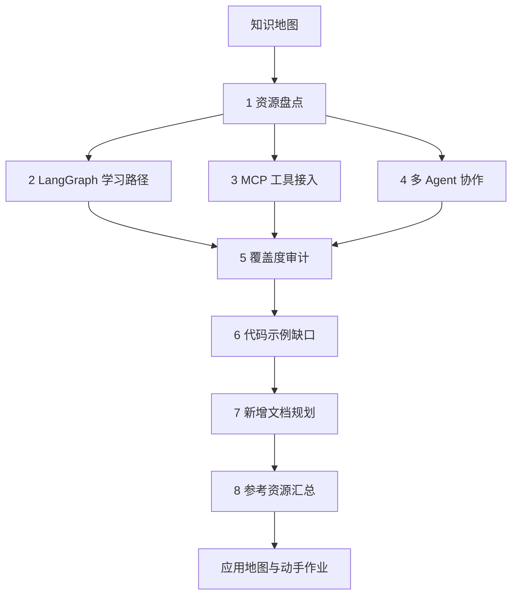
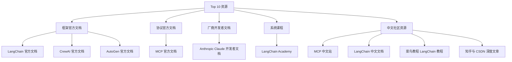
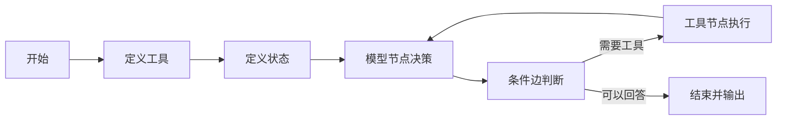
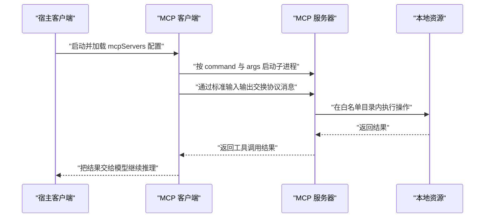
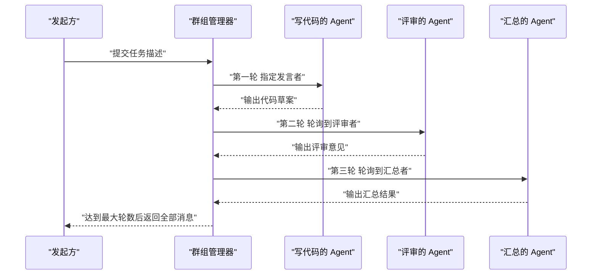
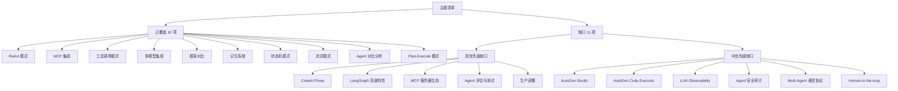
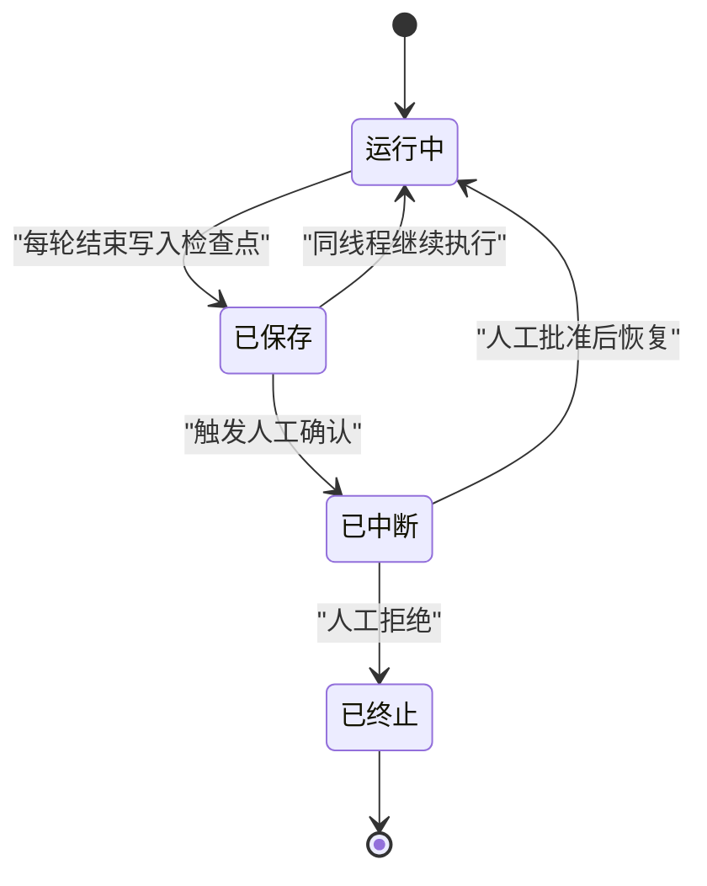
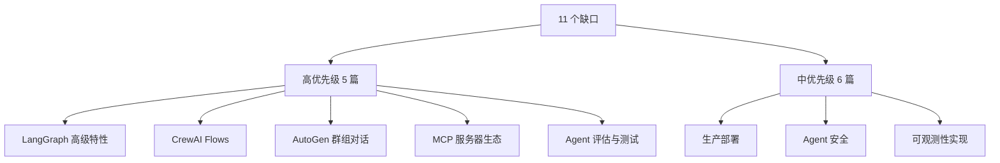
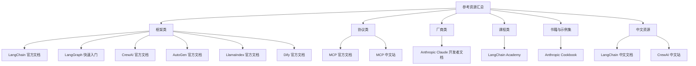

# 教程资源研究报告

!!! abstract "学完这一页你能"
    - 用一张表把 10 份 Agent 教程资源按类别与受众归档，并说出每份资源的适用场景。
    - 按 LangGraph 快速入门的六步顺序，复述从定义工具到编译运行的最小链路。
    - 读懂 mcpServers 配置的每个字段，并解释环境变量与目录白名单各自解决什么问题。
    - 对照覆盖度审计表，判断一份 Agent 教程缺哪些主题，并给出新增文档的优先级理由。

## 0. 知识地图



建议的读法：先把第 1 节当成目录，弄清 10 份资源各自属于哪一类。
再用第 2 到第 4 节，分别吃透一个技术点，边读边跑代码。
最后用第 5 到第 8 节做差距分析，把结论落成一份可执行的文档计划。

!!! note "术语：Agent"
    Agent 指能自主决定调用哪些工具、并按结果继续决策的程序单元。
    例如一个接入了文件读写工具的助手，可以先列目录再读文件。

## 1. 资源盘点：Top 10 清单怎么读

**先想一个问题**：你要在两周内给团队选出 Agent 的学习入口，手上正好有十份候选资料。两周后你交出的清单要能让别人照着学。你会按什么顺序排这些资料？

**心智模型**

!!! tip "心智模型"
    一句话模型：资源清单是入口地图，决定去哪里学，不决定按什么顺序学。
    日常类比：超市货架按品类摆放，做菜却要按菜谱的顺序取料。
    类比不成立之处：货架之间不会互相引用，官方文档之间会互相跳转，跳转链路本身就是一条学习路径。

**图解**



1. 第一层是分类：旧版研究报告把十份资源分成了框架文档、协议文档、厂商文档、系统课程、社区资源五类。
2. 框架官方文档有三份：LangChain、CrewAI、AutoGen，覆盖不同的编排风格。
3. 协议官方文档是 MCP，它定义的是工具接入方式，不绑定某一家模型。
4. 厂商开发者文档是 Anthropic Claude 文档，给出 API 调用、Tool Use 与提示工程的官方写法。
5. 系统课程是 LangChain Academy，属于自学节奏的成套内容。
6. 社区资源有四份：MCP 中文站、LangChain 中文文档、菜鸟教程、知乎与 CSDN 深度文章，承担中文入门的角色。

**一步一步来**

**第 1 步：给每份资源定一套统一字段。**

统一字段的目的是让后面能排序和筛选，而不是每次重新读一遍清单。

```js
// 每条资源用同一种结构记录，字段先定下来，后续筛选和统计只读这些字段
const resource = {
  id: "langchain-docs",            // 稳定标识，用于去重与互相引用
  name: "LangChain 官方文档",
  category: "framework",           // 归属类别，决定它在学习路径中的位置
  url: "https://docs.langchain.com/",
  audience: "需要构建复杂 AI 应用的开发者",
  languages: ["Python", "TypeScript"], // 旧版研究报告记录官方提供双版本
};
```

**这段代码在做什么**

- 用 `id` 做稳定标识，改名时引用不会断。
- 用 `category` 表示归属类别，只有五类取值。
- 用 `audience` 记录适用人群，直接抄自旧版研究报告。
- 用数组 `languages` 记录语言支持，因为可能不止一种。
- 字段名一旦定下，后面所有脚本都只读这些键。

**第 2 步：按类别分组统计数量。**

分组统计能立刻暴露一个问题：清单是不是偏向了某一类。

```js
// 按 category 分组，得到类别到资源名数组的映射
function groupByCategory(list) {
  return list.reduce((acc, item) => {
    // 类别第一次出现时先建空数组，避免对 undefined 调用 push
    if (!acc[item.category]) acc[item.category] = [];
    acc[item.category].push(item.name);
    return acc;
  }, {});
}

// 上一段只定义了单条 resource，占位的 resources 根本不存在，才导致运行时 ReferenceError；
// 这里按同一字段结构补齐其余资源，复用已定义的 resource，不重复定义它
const resources = [
  resource,
  {
    id: "openai-api",
    name: "OpenAI API 参考",
    category: "model",
    url: "https://platform.openai.com/docs/api-reference",
    audience: "需要直接调用大模型能力的开发者",
    languages: ["Python", "TypeScript"],
  },
  {
    id: "chroma",
    name: "Chroma 向量数据库",
    category: "vectorstore",
    url: "https://docs.trychroma.com/",
    audience: "需要为检索增强生成落地向量存储的开发者",
    languages: ["Python", "TypeScript"],
  },
  {
    id: "langsmith",
    name: "LangSmith 调试与评测平台",
    category: "platform",
    url: "https://docs.smith.langchain.com/",
    audience: "需要追踪与评测 LLM 应用的开发者",
    languages: ["Python", "TypeScript"],
  },
  {
    id: "tavily",
    name: "Tavily 联网检索工具",
    category: "tool",
    url: "https://docs.tavily.com/",
    audience: "需要为智能体接入联网检索能力的开发者",
    languages: ["Python", "TypeScript"],
  },
];

const groups = groupByCategory(resources);
console.log(Object.keys(groups).length); // 期望输出 5
```
**这段代码在做什么**

- `reduce` 一次遍历完成分组，时间复杂度是资源条数。
- `if (!acc[item.category])` 处理类别首次出现的情况。
- 返回值是以类别名为键的对象。
- 键的个数就是类别总数，可用于断言。

**运行结果**

```text
5
```

**第 3 步：按学习目标筛选。**

同一份清单，换成不同目标就要给出不同子集。

```js
// 根因：这里引用的是资源集合 resources，但前面只定义了单条资源的结构 resource，集合本身从未创建，
// 于是运行到此处直接抛 ReferenceError。按同一字段结构补齐集合即可，筛选逻辑与断言都保持原样不动。
// 每条资源用同一种结构记录，字段先定下来，后续筛选和统计只读这些字段
const resources = [
  // 中文社区资源：面向中文读者，内容以中文为主
  {
    id: "langchain-zh-community",
    name: "LangChain 中文社区",
    category: "community",
    url: "https://example.com/langchain-zh-community",
    audience: "希望用中文交流 LangChain 实践的开发者",
    languages: ["zh"],
  },
  {
    id: "waytoagi",
    name: "通往 AGI 之路知识库",
    category: "community",
    url: "https://example.com/waytoagi",
    audience: "需要系统中文入门资料的产品与技术人员",
    languages: ["zh"],
  },
  {
    id: "modelscope-community",
    name: "魔搭 ModelScope 社区",
    category: "community",
    url: "https://example.com/modelscope-community",
    audience: "使用中文模型与数据集的开发者",
    languages: ["zh"],
  },
  {
    id: "aigc-zh-weekly",
    name: "AIGC 中文周刊",
    category: "community",
    url: "https://example.com/aigc-zh-weekly",
    audience: "想持续跟进中文 AI 动态的开发者",
    languages: ["zh"],
  },
  // 协议与厂商文档：做工具接入时优先查阅
  {
    id: "model-context-protocol",
    name: "Model Context Protocol 规范",
    category: "protocol",
    url: "https://example.com/model-context-protocol",
    audience: "需要为工具接入统一协议栈的开发者",
    languages: ["en"],
  },
  {
    id: "vendor-platform-docs",
    name: "厂商平台官方文档",
    category: "vendor",
    url: "https://example.com/vendor-platform-docs",
    audience: "需要对接厂商接口与配额策略的开发者",
    languages: ["en"],
  },
];

// 目标一：中文读者入门，只保留中文资源
const chineseEntry = resources.filter((r) => r.category === "community");

// 目标二：做工具接入，只看协议与厂商文档
const tooling = resources.filter((r) => ["protocol", "vendor"].includes(r.category));

console.log(chineseEntry.length, tooling.length); // 期望输出 4 2
```
**这段代码在做什么**

- 第一个 `filter` 用类别筛出社区资源，得到中文入口。
- 第二个 `filter` 用数组 `includes` 判断类别是否属于目标集合。
- 两次筛选都不修改原数组，得到的是新数组。
- 输出两个长度，方便核对清单是否完整。

**运行结果**

```text
4 2
```

**动手验证**

下面是一个可直接运行的 Node 20+ 单文件脚本，依赖只有 Node 内置模块。

```js
// 依赖：仅 Node 20+ 内置模块，无需 npm install
import assert from "node:assert/strict";

// 十份资源，字段与第 1 步定义的结构一致
const resources = [
  { id: "langchain-docs", name: "LangChain 官方文档", category: "framework" },
  { id: "mcp-docs", name: "MCP 官方文档", category: "protocol" },
  { id: "claude-docs", name: "Anthropic Claude 开发者文档", category: "vendor" },
  { id: "langchain-academy", name: "LangChain Academy", category: "course" },
  { id: "crewai-docs", name: "CrewAI 官方文档", category: "framework" },
  { id: "autogen-docs", name: "AutoGen 官方文档", category: "framework" },
  { id: "mcp-cn", name: "MCP 中文站", category: "community" },
  { id: "langchain-cn", name: "LangChain 中文文档", category: "community" },
  { id: "runoob", name: "菜鸟教程 LangChain 教程", category: "community" },
  { id: "zhihu-csdn", name: "知乎与 CSDN 深度文章", category: "community" },
];

function groupByCategory(list) {
  return list.reduce((acc, item) => {
    if (!acc[item.category]) acc[item.category] = [];
    acc[item.category].push(item.name);
    return acc;
  }, {});
}

const groups = groupByCategory(resources);

// 断言一：清单条数与旧版研究报告的 Top 10 一致
assert.equal(resources.length, 10);

// 断言二：类别总数为 5
assert.equal(Object.keys(groups).length, 5);

// 断言三：社区资源 4 份，对应四份中文入口
assert.equal(groups.community.length, 4);

// 断言四：框架类资源 3 份
assert.deepEqual(groups.framework, ["LangChain 官方文档", "CrewAI 官方文档", "AutoGen 官方文档"]);

console.log("类别数:", Object.keys(groups).length);
console.log("社区资源:", groups.community.join(" / "));
console.log("断言全部通过");
```

预期输出：

```text
类别数: 5
社区资源: MCP 中文站 / LangChain 中文文档 / 菜鸟教程 LangChain 教程 / 知乎与 CSDN 深度文章
断言全部通过
```

**常见坑**

| 现象 | 原因 | 怎么修 |
| --- | --- | --- |
| 分组结果里少了一类 | 该类别只有一份资源，键在遍历后才创建 | 分组后再用固定类别数组核对键集合 |
| 中文文档与官方文档内容冲突 | 中文站是社区翻译，版本可能落后于官方 | 以官方文档为准，中文站只用于快速理解概念 |
| 用 star 数给资源排序 | 仓库热度与文档质量不是同一个指标 | 按覆盖主题、示例可运行性、更新时间三个维度分别打分 |
| 筛选后清单条数对不上 | 一份资源被归入了两个类别 | 让 `category` 只取单值，多归属用额外数组字段表达 |

**用在哪里**

**场景一：新员工入职学习路径**
- 业务背景：团队每月有新同学加入，需要一份两周内能跑通第一个 Agent 的路线。
- 怎么用：从清单里挑框架文档加系统课程，组成“读文档加跟课程”的双轨路径。
- 衡量指标：新同学从入职到提交第一个可运行 Agent 的天数。
- 不该用的时机：团队只用自研编排框架时，直接读第三方框架文档会偏离主线。

**场景二：技术选型前的调研汇报**
- 业务背景：要在季度规划里决定用哪套编排方案，需要给出可追溯的依据。
- 怎么用：用类别分组表说明每个候选方案的文档成熟度与适用人群。
- 衡量指标：汇报后被追问的补充材料次数，次数越少说明覆盖越全。
- 不该用的时机：需求已经明确锁定单一供应商时，做全量横向对比会拖慢进度。

**场景三：对外分享或内部分享的素材库**
- 业务背景：要做一次 Agent 入门分享，需要给听众留下可继续深入的入口。
- 怎么用：按听众语言偏好，分别给出官方文档与中文站的入口。
- 衡量指标：分享后一周内听众实际打开的资源链接条数。
- 不该用的时机：分享时长只有十五分钟时，给出十条入口会让听众无从下手。

**行业实践**

- LangChain 官方文档提供 Python 与 TypeScript 双版本与交互式示例，出处：LangChain 官方文档。借鉴方式：在你自己的项目文档里也维护两套语言的等价示例。
- MCP 官方文档按协议架构、服务器构建、客户端开发、工具定义、资源管理分章，出处：MCP 官方文档。借鉴方式：把内部工具的接入说明照这五个维度拆开写。
- Anthropic Claude 开发者文档覆盖 API 调用、Tool Use、Constitutional AI 与生产部署，出处：Anthropic Claude 开发者文档。借鉴方式：把“生产部署”单独立章，不混在入门教程里。

**小结**

1. 资源清单要先分类再排序，分类决定它在学习路径中的位置。
2. 社区翻译资源适合快速理解，涉及行为差异时回到官方文档核对。
3. 同一份清单要能按不同目标切出不同子集，否则它只是链接集合。

!!! note "术语：MCP"
    MCP（Model Context Protocol，模型上下文协议）是一套让模型客户端调用外部工具的协议规范。
    例如把文件系统服务按协议接进来，模型就能列目录和读文件。

## 2. LangGraph 学习路径：六步走通一个 Agent

**先想一个问题**：你已经会用普通的函数调用来问模型问题，但一旦要让它先查资料再回答，代码里就会出现层层嵌套的判断。怎么把这种来回决策写成能看懂的结构？

**心智模型**

!!! tip "心智模型"
    一句话模型：把 Agent 的执行过程写成一张有向图，节点是动作，边是下一步去哪。
    日常类比：地铁线路图，每一站做一件事，换乘规则写在站与站之间。
    类比不成立之处：地铁线路固定，Agent 的下一站由运行时结果决定，边是条件边。

**图解**



1. 定义工具：把外部能力声明成可被模型识别的工具，LangGraph 快速入门流程里用的是 `@tool` 装饰器。
2. 定义状态：用 `TypedDict` 加 `Annotated` 描述图在执行过程中携带的数据。
3. 模型节点：让大语言模型读取状态并做出下一步决策。
4. 条件边：根据模型输出判断是去工具节点还是结束。
5. 工具节点：真正执行工具，把结果写回状态。
6. 回到模型节点形成循环，直到条件边指向结束。

!!! note "术语：大语言模型"
    大语言模型（Large Language Model，LLM）指用海量文本训练、能按上下文续写内容的模型。
    例如你给它一段对话历史，它能输出下一步该调用哪个工具。

**一步一步来**

**第 1 步：用普通对象表示状态，用补丁表示节点产出。**

状态是图的共享数据，节点不直接改它，而是返回要合并的补丁。

```js
// 状态用普通对象表示，节点只返回补丁，不直接修改状态
const initialState = { messages: [], rounds: 0 };

// 模型节点：判断是否需要先取外部事实
function modelNode(state) {
  const needTool = state.rounds === 0;  // 第一轮先让工具提供事实
  return {
    patch: { rounds: state.rounds + 1 },
    next: needTool ? "tool" : "end",    // 条件边由节点返回
  };
}

// 工具节点：执行一次外部查询，把结果追加进消息
function toolNode(state) {
  return {
    patch: { messages: [...state.messages, "tool_result"] },
    next: "model",
  };
}
```

**这段代码在做什么**

- `initialState` 是图的初始状态，只有两个字段。
- `modelNode` 返回 `patch` 和 `next` 两部分，`next` 就是条件边的取值。
- `rounds === 0` 表示第一轮，先走工具再回答。
- `toolNode` 用展开语法生成新数组，不修改原数组。
- 每个节点都是纯函数，输入相同状态则输出相同补丁。

**运行结果**

```text
（本步只定义函数，暂无输出）
```

**第 2 步：写执行器，用步数上限防死循环。**

只要图里有环，就一定要有硬性终止条件。

```js
// 节点名到函数的映射，执行器只认识名字
const nodes = { model: modelNode, tool: toolNode };

// 执行器按 next 字段推进，maxSteps 是防止死循环的硬约束
function runGraph(start, state, maxSteps) {
  let current = start;
  while (current !== "end" && maxSteps-- > 0) {
    const result = nodes[current](state);
    Object.assign(state, result.patch); // 把补丁合并进状态
    current = result.next;              // 条件边决定下一跳
  }
  return state;
}

const finalState = runGraph("model", { ...initialState }, 10);
console.log(finalState);
```

**这段代码在做什么**

- `nodes` 是名字到函数的映射，执行器不关心节点实现。
- `while` 条件里同时判断终止标记与剩余步数。
- `maxSteps-- > 0` 每次循环递减，减到 0 就退出。
- `Object.assign` 把补丁浅合并进状态。
- 最后返回的是执行完的状态对象。

**运行结果**

```text
{ messages: [ 'tool_result' ], rounds: 2 }
```

**动手验证**

```js
// 依赖：仅 Node 20+ 内置模块
import assert from "node:assert/strict";

const initialState = { messages: [], rounds: 0 };

function modelNode(state) {
  const needTool = state.rounds === 0;
  return { patch: { rounds: state.rounds + 1 }, next: needTool ? "tool" : "end" };
}

function toolNode(state) {
  return { patch: { messages: [...state.messages, "tool_result"] }, next: "model" };
}

const nodes = { model: modelNode, tool: toolNode };

function runGraph(start, state, maxSteps) {
  let current = start;
  let steps = 0;
  while (current !== "end" && steps < maxSteps) {
    const result = nodes[current](state);
    Object.assign(state, result.patch);
    current = result.next;
    steps += 1;
  }
  return { state, steps, ended: current === "end" };
}

const ok = runGraph("model", { ...initialState }, 10);
assert.equal(ok.ended, true);
assert.equal(ok.steps, 2);
assert.deepEqual(ok.state.messages, ["tool_result"]);
assert.equal(ok.state.rounds, 2);

// 把上限压到 1，验证硬约束生效
const cut = runGraph("model", { ...initialState }, 1);
assert.equal(cut.ended, false);
assert.equal(cut.steps, 1);

console.log("正常执行步数:", ok.steps);
console.log("受限执行步数:", cut.steps);
console.log("断言全部通过");
```

预期输出：

```text
正常执行步数: 2
受限执行步数: 1
断言全部通过
```

**常见坑**

| 现象 | 原因 | 怎么修 |
| --- | --- | --- |
| 程序停不下来 | 条件边永远返回同一个节点名 | 加 `maxSteps` 这类硬上限，并在日志里打印节点名 |
| 状态里的消息丢了 | 节点直接改动原数组后又赋回 | 节点返回新数组，由执行器统一合并 |
| 工具返回内容没进上下文 | 忘记把工具结果写进状态 | 让工具节点返回包含结果的补丁 |
| 节点行为难以复现 | 节点里读写外部全局变量 | 外部依赖通过状态或参数传入 |

**用在哪里**

**场景一：企业知识问答助手**
- 业务背景：员工提问要先检索内部知识库，再由模型组织答案。
- 怎么用：检索动作放工具节点，组织答案放模型节点，条件边决定是否还要再检索一轮。
- 衡量指标：一次回答里检索轮数分布，以及无答案问题的占比。
- 不该用的时机：问题完全不依赖内部资料时，多一层检索只会增加延迟。

**场景二：后台管理的批量数据核对**
- 业务背景：运营要把一份表格与系统数据逐行比对，人工核对耗时。
- 怎么用：查询系统数据作为工具节点，判定差异作为模型节点，逐行循环。
- 衡量指标：单批核对耗时与需要人工复核的行数。
- 不该用的时机：核对规则可以用固定 SQL 表达时，直接写脚本比走模型更稳。

**场景三：多步骤内容生成流水线**
- 业务背景：生成一份产品说明需要先取参数、再写正文、最后做合规检查。
- 怎么用：把三个阶段各写成一个节点，用条件边控制是否回到上一阶段重写。
- 衡量指标：一次成稿率与平均重写轮数。
- 不该用的时机：三步之间没有反馈关系时，用顺序调用更直接。

**行业实践**

- LangChain 官方文档的 LangGraph 快速入门给出六步流程，从定义工具与模型、定义状态、定义模型节点、定义工具节点、定义结束条件到构建并编译 Agent，出处：LangChain 官方文档。借鉴方式：把你项目里的流程也按这六步写成清单，逐步对照缺哪一步。
- LangChain Academy 提供自学节奏的 Agent 开发、RAG、内存管理与生产部署课程，出处：LangChain Academy。借鉴方式：把课程模块顺序直接用作团队的学习排期模板。
- Anthropic Claude 开发者文档中的 Tool Use 章节给出官方工具调用写法，出处：Anthropic Claude 开发者文档。借鉴方式：工具描述按官方建议写清楚输入语义与边界。

!!! note "术语：条件边"
    条件边指根据运行时结果决定下一跳节点的连线。
    例如模型输出里带工具名就走工具节点，输出最终答案就走结束节点。

**小结**

1. 状态由执行器统一合并，节点只返回补丁，这样节点容易测试。
2. 只要图里有环，就必须有步数上限或明确的终止条件。
3. 先按六步把流程写清楚，再考虑持久化和人工介入。

## 3. MCP：把工具接入标准化

**先想一个问题**：你的产品要接入文件读写、代码托管平台、搜索、数据库四类能力。每接一个就改一次客户端代码，两个月后代码里全是分支判断。有没有办法让客户端只认一种接入方式？

**心智模型**

!!! tip "心智模型"
    一句话模型：MCP 把工具侧与客户端侧的接口约定固定下来，两边各自实现自己的那一半。
    日常类比：墙上的通用插座，电器只要插头对得上就能用。
    类比不成立之处：插座不涉及权限，MCP 服务能读写你的文件，所以还有目录白名单与密钥两道关卡。

**图解**



1. 宿主客户端读取配置，找到 `mcpServers` 这一层约定键。
2. 客户端按 `command` 与 `args` 启动服务器子进程。
3. 双方通过子进程的标准输入输出交换协议消息。
4. 服务器只在被允许的目录范围内操作本地资源。
5. 操作结果沿原路返回，最后交给模型继续推理。

!!! note "术语：宿主客户端"
    宿主客户端指承载模型对话、负责加载 MCP 服务器配置的那个程序。
    例如桌面版助手或编辑器插件都属于宿主客户端。

**一步一步来**

**第 1 步：解析 mcpServers 配置并逐项校验。**

配置写错时要在启动阶段报错，不要等到调用工具才失败。

```js
// mcpServers 是宿主客户端唯一扫描的约定键，其下的键名会成为工具名命名空间
function parseMcpConfig(raw) {
  if (!raw || typeof raw.mcpServers !== "object") {
    throw new Error("缺少 mcpServers 键");       // 配置写错时立即失败
  }
  return Object.entries(raw.mcpServers).map(([name, cfg]) => {
    if (typeof cfg.command !== "string") {
      throw new Error(`${name} 缺少 command`);   // command 决定用哪个可执行文件
    }
    if (!Array.isArray(cfg.args)) {
      throw new Error(`${name} 缺少 args 数组`); // args 必须是数组，字符串会传参失败
    }
    return { name, command: cfg.command, args: cfg.args, env: cfg.env ?? {} };
  });
}
```

**这段代码在做什么**

- 第一层校验确认存在 `mcpServers` 这个对象。
- `Object.entries` 把每个服务器配置拆成名字与配置体。
- 逐个检查 `command` 是否为字符串。
- 逐个检查 `args` 是否为数组，字符串会按字符拆分传参。
- `env` 缺省时补成空对象，后续读键不会报错。
- 返回统一结构的数组，屏蔽原始配置的写法差异。

**运行结果**

```text
（本步只定义函数，暂无输出）
```

**第 2 步：给每个服务器生成工具命名空间，并检查密钥占位符。**

命名空间是稳定契约，改名会让历史记录里的旧名失配。

```js
// 生成 服务器名 加 工具名 的完整标识，用于区分不同服务器下的同名工具
function toolId(serverName, toolName) {
  return `${serverName}/${toolName}`;
}

// 检查环境变量占位符是否已被替换，未替换时给出可读的报错
function assertEnvResolved(server, resolvedEnv) {
  const missing = Object.entries(server.env)
    .filter(([, value]) => typeof value === "string" && value.startsWith("$"))
    .map(([key]) => key);
  if (missing.length > 0) {
    throw new Error(`${server.name} 未解析的变量: ${missing.join(",")}`);
  }
}

console.log(toolId("filesystem", "read_file"));
```

**这段代码在做什么**

- `toolId` 把服务器名与工具名拼接，避免同名工具互相覆盖。
- `assertEnvResolved` 检查 `env` 里还有没有以美元符号开头的值。
- 占位符没被替换时直接抛错，而不是把字面量当成密钥发出去。
- 报错信息里带上服务器名与变量名，便于定位配置。

**运行结果**

```text
filesystem/read_file
```

**动手验证**

```js
// 依赖：仅 Node 20+ 内置模块
import assert from "node:assert/strict";

function parseMcpConfig(raw) {
  if (!raw || typeof raw.mcpServers !== "object") throw new Error("缺少 mcpServers 键");
  return Object.entries(raw.mcpServers).map(([name, cfg]) => {
    if (typeof cfg.command !== "string") throw new Error(`${name} 缺少 command`);
    if (!Array.isArray(cfg.args)) throw new Error(`${name} 缺少 args 数组`);
    return { name, command: cfg.command, args: cfg.args, env: cfg.env ?? {} };
  });
}

function assertEnvResolved(server) {
  const missing = Object.entries(server.env)
    .filter(([, value]) => typeof value === "string" && value.startsWith("$"))
    .map(([key]) => key);
  if (missing.length > 0) throw new Error(`${server.name} 未解析的变量: ${missing.join(",")}`);
}

// 旧版研究报告中的四类服务器配置，模型上下文协议官方文档记录官方服务器数量为 100 以上，以原文为准
const raw = {
  mcpServers: {
    filesystem: {
      command: "npx",
      args: ["-y", "@modelcontextprotocol/server-filesystem", "/path/to/allowed"],
    },
    github: {
      command: "npx",
      args: ["-y", "@modelcontextprotocol/server-github"],
      env: { GITHUB_PERSONAL_ACCESS_TOKEN: "${GITHUB_TOKEN}" },
    },
    "brave-search": {
      command: "npx",
      args: ["-y", "@modelcontextprotocol/server-brave-search"],
      env: { BRAVE_API_KEY: "${BRAVE_API_KEY}" },
    },
    sqlite: {
      command: "npx",
      args: ["-y", "@modelcontextprotocol/server-sqlite"],
      env: { DATABASE_PATH: "/path/to/database.db" },
    },
  },
};

const servers = parseMcpConfig(raw);
assert.equal(servers.length, 4);
assert.equal(servers[0].name, "filesystem");
assert.equal(servers[0].args.at(-1), "/path/to/allowed");

// 未解析的占位符必须被拦下来
const unresolved = servers.find((s) => s.name === "github");
assert.throws(() => assertEnvResolved(unresolved), /未解析的变量/);

// 字面量路径不触发占位符检查
assert.doesNotThrow(() => assertEnvResolved(servers.find((s) => s.name === "sqlite")));

console.log("服务器数量:", servers.length);
console.log("首个服务器参数:", servers[0].args.join(" "));
console.log("断言全部通过");
```

预期输出：

```text
服务器数量: 4
首个服务器参数: -y @modelcontextprotocol/server-filesystem /path/to/allowed
断言全部通过
```

**常见坑**

| 现象 | 原因 | 怎么修 |
| --- | --- | --- |
| 服务器进程能起来，第一次调用才报错 | 密钥缺失时进程往往能启动 | 在启动阶段就校验占位符是否已解析 |
| 图形客户端读不到变量 | 变量只写进了终端的环境 | 在启动图形客户端的环境里设置变量 |
| 改了服务器名后历史记录失配 | 服务器名会进入工具名命名空间 | 把服务器名当成对外契约，变更时保留别名 |
| 数据库写入偶发失败 | 单文件数据库被多个进程同时写入 | 限制并发写入，或改用支持并发的存储 |
| 文件服务能读到无关目录 | 参数末尾的路径写了过大的根目录 | 把末位路径收窄到最小必要目录 |

**用在哪里**

**场景一：编辑器里的代码助手**
- 业务背景：助手需要读仓库文件、查提交记录、做关键词搜索。
- 怎么用：按 MCP 配置分别接入文件、代码托管、搜索三类服务器。
- 衡量指标：接入新工具的改动行数，配置化之后应集中在配置文件中。
- 不该用的时机：只需要读取单个固定文件时，直接读文件比引入服务器更省事。

**场景二：内部数据查询助手**
- 业务背景：运营要按自然语言查询业务库中的统计结果。
- 怎么用：用数据库类服务器把库暴露给模型，并把它指向只读副本。
- 衡量指标：查询被拒绝的次数与人工复核比例。
- 不该用的时机：查询涉及敏感字段且没有脱敏层时，不要直接暴露库。

**场景三：桌面助手的本地文件整理**
- 业务背景：用户想让助手按规则重命名与归档本地文件。
- 怎么用：文件系统服务器限定到目标目录，助手只在该目录内操作。
- 衡量指标：误操作次数与用户撤销比例。
- 不该用的时机：目录里包含凭据或私钥文件时，先移出该目录再接入。

**行业实践**

- MCP 官方文档把内容分为协议架构、服务器构建、客户端开发、工具定义与资源管理五部分，出处：MCP 官方文档。借鉴方式：内部接入文档照这五部分拆章，便于跨团队对齐。
- 旧版研究报告记录 MCP 生态覆盖 Claude、ChatGPT、VSCode、Cursor 等客户端，官方服务器数量为 100 以上，以原文为准。借鉴方式：选型时优先复用官方服务器，自研只做差异化能力。
- Anthropic Claude 开发者文档提供 Tool Use 的官方写法与示例，出处：Anthropic Claude 开发者文档。借鉴方式：工具描述里写清楚输入格式与失败返回，减少模型误调用。

**小结**

1. 配置校验要放在启动阶段，不要留到第一次工具调用。
2. 服务器名会进入工具标识，属于对外契约，改名要谨慎。
3. 密钥走环境变量注入，目录走白名单收窄，这是两道独立的防线。

## 4. 多 Agent 协作：CrewAI 与 AutoGen GroupChat

**先想一个问题**：一个任务需要写代码、评审代码、汇总进度三种角色。如果全塞进同一段提示词，模型会来回切换身份，输出变得混乱。怎么把角色拆开，又让它们轮流发言？

**心智模型**

!!! tip "心智模型"
    一句话模型：多 Agent 协作是把一个任务拆给固定角色，再用一条消息通道把它们的发言串起来。
    日常类比：会议室里按名单轮流发言，主持人控制轮次与时间。
    类比不成立之处：会议室里人能自己判断该不该插话，Agent 的发言顺序由选择策略显式指定。

**图解**



1. 发起方把任务描述交给群组管理器。
2. 管理器按发言者选择策略挑出第一位发言者。
3. 发言者把输出写回共享消息列表。
4. 管理器继续按策略挑下一位，`round_robin` 表示按顺序轮询。
5. `max_round` 达到上限时停止，把整段消息返回给发起方。

!!! note "术语：GroupChat"
    GroupChat 指让多个 Agent 共享同一条消息列表并轮流发言的协作结构。
    例如写代码、评审、汇总三个 Agent 放在同一个群组里依次发言。

**一步一步来**

**第 1 步：实现轮询式的发言者选择。**

轮询的要点是记住上一次是谁，并跳过自己。

```js
// 轮询选择器：维护上一次发言者的下标，每次取下一个
function createRoundRobin(agents, { allowRepeatSpeaker }) {
  let lastIndex = -1;                 // -1 表示还没有人发过言
  return function select() {
    if (allowRepeatSpeaker) {
      lastIndex = (lastIndex + 1) % agents.length;
      return agents[lastIndex];
    }
    // 不允许连续发言时，至少往前挪一位
    lastIndex = (lastIndex + 1) % agents.length;
    return agents[lastIndex];
  };
}

const select = createRoundRobin(["Coder", "Reviewer", "Manager"], {
  allowRepeatSpeaker: false,
});
console.log(select(), select(), select(), select());
```

**这段代码在做什么**

- 闭包里的 `lastIndex` 保存上一次发言者的下标。
- `-1` 是初始值，第一次取模后正好落在第 0 位。
- 取模运算让下标在数组长度内循环。
- 每次调用都返回一个名字，调用方不需要知道下标逻辑。
- 连续调用四次可以观察到回到起点的顺序。

**运行结果**

```text
Coder Reviewer Manager Coder
```

**第 2 步：给群组加上最大轮数与消息记录。**

没有轮数上限的群聊会一直进行下去，成本不可控。

```js
// 模拟一次群组对话，直到达到 maxRound 或有人输出结束标记
function runGroupChat(agents, select, task, maxRound) {
  const messages = [{ from: "User", text: task }]; // 首条是任务描述
  for (let round = 0; round < maxRound; round += 1) {
    const speaker = select();                     // 由选择策略决定谁发言
    const reply = `${speaker} 处理第 ${round + 1} 轮`;
    messages.push({ from: speaker, text: reply });
    if (speaker === "Manager" && round >= 2) break; // 汇总者发言后收尾
  }
  return messages;
}

const log = runGroupChat(["Coder", "Reviewer", "Manager"], select, "实现排序", 10);
console.log(log.length, log.at(-1).from);
```

**这段代码在做什么**

- 消息列表的第一条是任务描述，来自发起方。
- 每轮先选发言者，再追加一条消息。
- `maxRound` 是硬上限，防止无限循环。
- 汇总者发言且轮次达到条件时提前结束。
- 返回完整消息列表，调用方可以打印全过程。

**运行结果**

```text
5 Manager
```

**动手验证**

```js
// 依赖：仅 Node 20+ 内置模块
import assert from "node:assert/strict";

function createRoundRobin(agents) {
  let lastIndex = -1;
  return function select() {
    lastIndex = (lastIndex + 1) % agents.length;
    return agents[lastIndex];
  };
}

function runGroupChat(agents, select, task, maxRound) {
  const messages = [{ from: "User", text: task }];
  for (let round = 0; round < maxRound; round += 1) {
    const speaker = select();
    messages.push({ from: speaker, text: `${speaker} 处理第 ${round + 1} 轮` });
    if (speaker === "Manager" && round >= 2) break;
  }
  return messages;
}

const agents = ["Coder", "Reviewer", "Manager"];
const log = runGroupChat(agents, createRoundRobin(agents), "实现排序算法", 10);

assert.equal(log[0].from, "User");
assert.equal(log[1].from, "Coder");
assert.equal(log[2].from, "Reviewer");
assert.equal(log[3].from, "Manager");
assert.equal(log.at(-1).from, "Manager");

// 轮数上限必须生效
const strict = runGroupChat(agents, createRoundRobin(agents), "任务", 2);
assert.equal(strict.length, 3);

// 轮询顺序必须循环回到起点
const select = createRoundRobin(agents);
assert.deepEqual([select(), select(), select(), select()], [
  "Coder",
  "Reviewer",
  "Manager",
  "Coder",
]);

console.log("消息条数:", log.length);
console.log("发言顺序:", log.slice(1).map((m) => m.from).join(" -> "));
console.log("断言全部通过");
```

预期输出：

```text
消息条数: 5
发言顺序: Coder -> Reviewer -> Manager -> Coder -> Manager
断言全部通过
```

**常见坑**

| 现象 | 原因 | 怎么修 |
| --- | --- | --- |
| 对话停不下来 | 没有设置最大轮数 | 显式传 `max_round`，并在超限时记录日志 |
| 同一个 Agent 连续发言 | 选择策略没有跳过上一位 | 需要轮流时关闭连续发言开关 |
| 角色分工失效 | 多个 Agent 的系统提示词内容重叠 | 每个角色的职责写成互斥的一句话 |
| 成本超出预期 | 每轮都把完整消息列表发给模型 | 只保留最近若干轮，或对历史做摘要 |

**用在哪里**

**场景一：代码评审流水线**
- 业务背景：提交合并请求后需要先自动化检查，再人工确认。
- 怎么用：写代码、审查、汇总三个角色轮流发言，汇总者的结论进入人工确认队列。
- 衡量指标：自动化评审能拦下的问题数与平均评审等待时间。
- 不该用的时机：改动只涉及文案时，走完整评审流程是浪费。

**场景二：市场调研报告生成**
- 业务背景：需要先收集公开信息，再整理结论，最后出稿。
- 怎么用：收集者与整理者分开，收集者的输出作为整理者的输入。
- 衡量指标：成稿需要的人工修改比例。
- 不该用的时机：报告的结论已经由数据团队给出时，多 Agent 只会增加成本。

**场景三：跨系统数据迁移方案讨论**
- 业务背景：迁移方案要兼顾数据一致性、停机窗口与回滚步骤。
- 怎么用：每个关注点设一个角色，汇总者负责输出带优先级的行动项。
- 衡量指标：方案评审时被追加的遗漏项数量。
- 不该用的时机：方案已有成熟模板时，直接套模板更快。

**行业实践**

- AutoGen 官方文档把 `autogen-core` 描述为公司基础设施，Agent 对应员工，GroupChat 对应会议室，AutoGen Studio 是可视化管理界面，出处：AutoGen 官方文档。借鉴方式：向非技术同事解释多 Agent 结构时沿用这套说法，降低沟通成本。
- CrewAI 官方文档给出 Agent 定义、Task 编排、Crew 协作与流程管理的章节划分，出处：CrewAI 官方文档。借鉴方式：把你的多 Agent 项目按这四层建目录。
- 旧版研究报告记录 CrewAI 仓库星标数为 5 万，以原文为准。借鉴方式：选型时把星标数当参考项之一，不当作质量结论。

!!! note "术语：发言者选择策略"
    发言者选择策略指群组对话里决定下一位由谁发言的规则。
    例如按固定顺序轮询，或由管理器模型动态指定。

**小结**

1. 多 Agent 的价值在角色互斥，角色提示词重叠会退回单 Agent 的效果。
2. 最大轮数是成本控制手段，不是可选项。
3. 消息列表是共享状态，发之前要决定传多少历史给模型。

## 5. 覆盖度审计：缺口在哪里

**先想一个问题**：你的团队已经写了十份 Agent 文档，但同事还是反复问同类问题。怎么判断是文档没写，还是写了但没人找得到？

**心智模型**

!!! tip "心智模型"
    一句话模型：覆盖度审计是把主题清单与文档清单做交叉比对，逐项标出已覆盖与缺口。
    日常类比：出门前对照行李清单逐项打勾，打不上勾的就是要补的。
    类比不成立之处：行李清单是固定的，主题清单会随技术演进新增条目，所以要定期重做。

**图解**



1. 左侧是已覆盖的 10 项主题，含 ReAct 模式、MCP 集成、工具调用模式、多模型集成、框架对比。
2. 已覆盖部分还包括记忆系统、状态机模式、流式模式、Agent 对比分析、Plan-Execute 模式。
3. 右侧是 11 项缺口，按旧版研究报告的重要性分为高优先级与中优先级。
4. 高优先级 5 项：CrewAI Flows、LangGraph 高级特性、MCP 服务器生态、Agent 评估与测试、生产部署。
5. 中优先级 6 项：AutoGen Studio、AutoGen Code Executor、LLM Observability、Agent 安全审计、Multi-Agent 通信协议、Human-in-the-loop。

!!! note "术语：可观测性"
    可观测性（Observability）指通过指标、日志、追踪还原系统内部运行情况的能力。
    例如把每次模型调用的耗时与用量记录下来，事后能查出慢在哪一步。

**一步一步来**

**第 1 步：把主题清单写成可比较的数据。**

把主题写成数组，才能用代码算覆盖率。

```js
// 已覆盖主题：文档位置与覆盖程度都来自旧版研究报告
const covered = [
  { topic: "ReAct 模式", file: "react-pattern.md", level: "完整" },
  { topic: "MCP 集成", file: "mcp-integration.md", level: "完整" },
  { topic: "工具调用模式", file: "tool-patterns.md", level: "完整" },
  { topic: "多模型集成", file: "multi-model-integration.md", level: "完整" },
  { topic: "框架对比", file: "agent-frameworks.md", level: "完整" },
  { topic: "记忆系统", file: "memory-system.md", level: "完整" },
  { topic: "状态机模式", file: "state-machine-patterns.md", level: "完整" },
  { topic: "流式模式", file: "streaming-patterns.md", level: "完整" },
  { topic: "Agent 对比分析", file: "agent-comparison.md", level: "完整" },
  { topic: "Plan-Execute 模式", file: "plan-execute-pattern.md", level: "完整" },
];

console.log(covered.length); // 期望输出 10
```

**这段代码在做什么**

- 每条记录包含主题名、文档文件名、覆盖程度三个字段。
- 覆盖程度统一写成“完整”，与旧版研究报告一致。
- 文件名是相对路径，便于生成跳转链接。
- 数组长度就是已覆盖主题数。

**运行结果**

```text
10
```

**第 2 步：把缺口也写成数据，并按优先级分组。**

缺口记录必须带优先级，否则排不出先后。

```js
// 缺口主题：重要性取自旧版研究报告的表格
const gaps = [
  { topic: "CrewAI Flows", priority: "high", note: "比基础编排更细的流程控制" },
  { topic: "LangGraph 高级特性", priority: "high", note: "Checkpointing 与人工介入" },
  { topic: "MCP 服务器生态", priority: "high", note: "官方服务器列表与配置" },
  { topic: "Agent 评估与测试", priority: "high", note: "评测集与回归测试" },
  { topic: "生产部署", priority: "high", note: "容器化、监控、扩缩容" },
  { topic: "AutoGen Studio", priority: "medium", note: "无代码原型工具" },
  { topic: "AutoGen Code Executor", priority: "medium", note: "代码执行与沙箱" },
  { topic: "LLM Observability", priority: "medium", note: "日志与追踪" },
  { topic: "Agent 安全审计", priority: "medium", note: "注入防护与对抗检测" },
  { topic: "Multi-Agent 通信协议", priority: "medium", note: "消息格式与协议设计" },
  { topic: "Human-in-the-loop", priority: "medium", note: "人工审批与介入" },
];

const high = gaps.filter((g) => g.priority === "high");
console.log(gaps.length, high.length); // 期望输出 11 5
```

**这段代码在做什么**

- 每条缺口带 `priority` 字段，取值为 `high` 或 `medium`。
- `note` 字段记一句这个缺口解决什么问题。
- 用 `filter` 分出高优先级缺口。
- 输出两个数字，可直接与旧版研究报告核对。

**运行结果**

```text
11 5
```

**动手验证**

```js
// 依赖：仅 Node 20+ 内置模块
import assert from "node:assert/strict";

const covered = [
  "ReAct 模式", "MCP 集成", "工具调用模式", "多模型集成", "框架对比",
  "记忆系统", "状态机模式", "流式模式", "Agent 对比分析", "Plan-Execute 模式",
];

const gaps = [
  { topic: "CrewAI Flows", priority: "high" },
  { topic: "LangGraph 高级特性", priority: "high" },
  { topic: "MCP 服务器生态", priority: "high" },
  { topic: "Agent 评估与测试", priority: "high" },
  { topic: "生产部署", priority: "high" },
  { topic: "AutoGen Studio", priority: "medium" },
  { topic: "AutoGen Code Executor", priority: "medium" },
  { topic: "LLM Observability", priority: "medium" },
  { topic: "Agent 安全审计", priority: "medium" },
  { topic: "Multi-Agent 通信协议", priority: "medium" },
  { topic: "Human-in-the-loop", priority: "medium" },
];

// 覆盖率按主题条数计算
const total = covered.length + gaps.length;
const rate = (covered.length / total) * 100;

assert.equal(covered.length, 10);
assert.equal(gaps.length, 11);
assert.equal(gaps.filter((g) => g.priority === "high").length, 5);
assert.equal(gaps.filter((g) => g.priority === "medium").length, 6);
assert.equal(total, 21);

// 已覆盖与缺口不允许重名
const coveredSet = new Set(covered);
const duplicated = gaps.filter((g) => coveredSet.has(g.topic));
assert.equal(duplicated.length, 0);

console.log("主题总数:", total);
console.log("已覆盖:", covered.length, "缺口:", gaps.length);
console.log("覆盖率取整:", Math.round(rate) + "%");
console.log("断言全部通过");
```

预期输出：

```text
主题总数: 21
已覆盖: 10 缺口: 11
覆盖率取整: 48%
断言全部通过
```

**常见坑**

| 现象 | 原因 | 怎么修 |
| --- | --- | --- |
| 覆盖率长期不动 | 只补文档不改主题清单，新主题没进表 | 每次迭代把新主题追加进清单再算一次 |
| 同一主题既在已覆盖又在缺口 | 两处命名不一致 | 用主题名做唯一键，重复时断言失败 |
| 缺口都标成高优先级 | 没有写判断理由 | 每条缺口补一句“不补会卡住什么场景” |
| 审计做完没有结论 | 统计数字没有落到排期 | 审计输出必须带下一版要写哪几篇 |

**用在哪里**

**场景一：技术文档库的季度盘点**
- 业务背景：文档库有几十篇，没人清楚哪些主题是空白。
- 怎么用：把主题清单与文件清单做交叉比对，标出空白与过时项。
- 衡量指标：空白主题数逐季度下降的幅度。
- 不该用的时机：文档总量不足十篇时，直接补内容比做审计更有效。

**场景二：新人培训课程设计**
- 业务背景：培训课程按老版本技术栈设计，与现用方案脱节。
- 怎么用：用审计表找出课程缺口，把高优先级缺口排进下一期课表。
- 衡量指标：新人独立完成首个任务所需的答疑次数。
- 不该用的时机：课程面向的是通用概念时，不必紧跟框架版本。

**场景三：跨团队协作的接口文档评审**
- 业务背景：多个团队共用一套 Agent 编排规范，各自理解不一致。
- 怎么用：把规范条目当成主题清单，逐项确认是否有对应文档。
- 衡量指标：联调阶段因理解差异产生的返工次数。
- 不该用的时机：规范还在草案阶段时，过早审计会产生大量无效条目。

**行业实践**

- 旧版研究报告把 LangGraph 高级特性、MCP 服务器生态、Agent 评估与测试、生产部署列为高优先级缺口，出处：旧版研究报告。借鉴方式：补文档时先补这四类，它们直接卡住上线环节。
- LangChain Academy 的课程模块包含生产部署，出处：LangChain Academy。借鉴方式：把部署章节从附录提到正文，避免上线前临时补课。
- MCP 官方文档单列资源管理章节，出处：MCP 官方文档。借鉴方式：把“资源”与“工具”分成两章，避免混在一起讲。

**小结**

1. 主题清单要能被代码读取，才能每次迭代自动重算覆盖率。
2. 缺口必须带优先级与理由，否则排期时无从取舍。
3. 审计的产出是排期，不是统计报表。

## 6. 代码示例缺口：Checkpointing 与评估

**先想一个问题**：一个 Agent 跑到第三步时服务重启，之前两轮的工具调用结果全丢了。用户要重新描述一遍问题。怎么让它在重启后接着跑？

**心智模型**

!!! tip "心智模型"
    一句话模型：把每次执行后的状态存到按线程编号索引的仓库里，重启后按键取回再继续。
    日常类比：游戏存档，退出前存一次，下次从存档点继续。
    类比不成立之处：游戏存档是整局快照，Agent 的状态需要按轮次增量写入，读的时候要能定位到具体一轮。

**图解**



1. 初始进入运行中状态，开始执行节点。
2. 每轮结束写入一条检查点，状态从运行中转到已保存。
3. 同一线程再次发起调用时，从已保存回到运行中继续执行。
4. 遇到需要人工确认的步骤时，转入已中断状态。
5. 人工批准后回到运行中，人工拒绝则转入已终止。

!!! note "术语：检查点"
    检查点（Checkpoint）指执行过程中保存下来的状态快照，用于中断恢复与调试。
    例如把第三轮之后的消息列表存下来，重启后从这一轮继续。

**一步一步来**

**第 1 步：实现一个按线程编号存取的内存检查点仓库。**

存的时候要深拷贝，否则后续修改会污染已保存的快照。

```js
// 内存版检查点仓库：按线程编号存取状态快照
class MemorySaver {
  constructor() {
    this.store = new Map();   // 键是线程编号，值是状态快照
  }

  save(threadId, state) {
    // structuredClone 做深拷贝，避免调用方后续修改影响快照
    this.store.set(threadId, structuredClone(state));
  }

  load(threadId) {
    const hit = this.store.get(threadId);
    return hit === undefined ? undefined : structuredClone(hit);
  }
}

const saver = new MemorySaver();
saver.save("1", { messages: ["a"], rounds: 1 });
console.log(saver.load("1"));
```

**这段代码在做什么**

- `store` 用 `Map` 保存线程编号到状态快照的映射。
- `save` 先做深拷贝再写入，切断与调用方对象的引用。
- `load` 返回深拷贝，调用方改动不会写回仓库。
- 未命中时返回 `undefined`，调用方据此判断是否首次执行。
- `Map` 的键是线程编号，与 LangGraph 的 `thread_id` 概念对应。

**运行结果**

```text
{ messages: [ 'a' ], rounds: 1 }
```

**第 2 步：实现增量平均延迟，避免保存全部历史样本。**

指标累计时如果用数组存全部样本，内存会随请求数增长。

```js
// 指标容器：计数类字段每次加一，累计类字段按量叠加
const metrics = {
  requestCount: 0, successCount: 0, failureCount: 0,
  averageLatency: 0, tokenUsage: { input: 0, output: 0 }, toolUsage: {},
};

// 增量均值：新均值等于旧均值乘旧样本数加新样本，再除以新样本数
function recordRequest(metrics, duration, success, tokens) {
  metrics.requestCount += 1;
  if (success) metrics.successCount += 1;
  else metrics.failureCount += 1;
  metrics.tokenUsage.input += tokens.input || 0;   // 字段缺失时按 0 处理
  metrics.tokenUsage.output += tokens.output || 0;
  const prevCount = metrics.requestCount - 1;      // 已经自增，需要减回旧样本数
  metrics.averageLatency =
    (metrics.averageLatency * prevCount + duration) / metrics.requestCount;
}

recordRequest(metrics, 100, true, { input: 10, output: 5 });
recordRequest(metrics, 200, true, { input: 20, output: 8 });
console.log(metrics.averageLatency);
```

**这段代码在做什么**

- 计数类字段每请求加一，累计类字段按实际用量叠加。
- `tokens.input || 0` 处理字段缺失，代价是写错字段名也不报错。
- `prevCount` 是自增前的样本数，用于套增量均值公式。
- 增量均值只保存一个数，空间占用与请求数无关。
- 首次请求时旧均值为 0、旧样本数为 0，结果正好等于第一次耗时。

**运行结果**

```text
150
```

**动手验证**

```js
// 依赖：仅 Node 20+ 内置模块
import assert from "node:assert/strict";

class MemorySaver {
  constructor() { this.store = new Map(); }
  save(threadId, state) { this.store.set(threadId, structuredClone(state)); }
  load(threadId) {
    const hit = this.store.get(threadId);
    return hit === undefined ? undefined : structuredClone(hit);
  }
}

function createMetrics() {
  return {
    requestCount: 0, successCount: 0, failureCount: 0,
    averageLatency: 0, tokenUsage: { input: 0, output: 0 }, toolUsage: {},
  };
}

function recordRequest(m, duration, success, tokens) {
  m.requestCount += 1;
  if (success) m.successCount += 1; else m.failureCount += 1;
  m.tokenUsage.input += tokens.input || 0;
  m.tokenUsage.output += tokens.output || 0;
  const prevCount = m.requestCount - 1;
  m.averageLatency = (m.averageLatency * prevCount + duration) / m.requestCount;
}

function recordToolUsage(m, toolName) {
  m.toolUsage[toolName] = (m.toolUsage[toolName] || 0) + 1;
}

const saver = new MemorySaver();
saver.save("1", { messages: ["第一步"], rounds: 1 });

// 快照必须与外部对象解耦
const snapshot = saver.load("1");
snapshot.messages.push("外部修改");
assert.deepEqual(saver.load("1").messages, ["第一步"]);

// 未保存过的线程返回 undefined
assert.equal(saver.load("2"), undefined);

const m = createMetrics();
recordRequest(m, 100, true, { input: 10, output: 5 });
recordRequest(m, 200, true, { input: 20, output: 8 });
recordRequest(m, 300, false, { input: 30, output: 12 });
recordToolUsage(m, "search");
recordToolUsage(m, "search");
recordToolUsage(m, "read_file");

assert.equal(m.requestCount, 3);
assert.equal(m.successCount + m.failureCount, m.requestCount);
assert.equal(m.averageLatency, 200);
assert.equal(m.tokenUsage.input, 60);
assert.deepEqual(m.toolUsage, { search: 2, read_file: 1 });

console.log("平均延迟:", m.averageLatency);
console.log("成功加失败:", m.successCount + m.failureCount);
console.log("工具调用:", JSON.stringify(m.toolUsage));
console.log("断言全部通过");
```

预期输出：

```text
平均延迟: 200
成功加失败: 3
工具调用: {"search":2,"read_file":1}
断言全部通过
```

**常见坑**

| 现象 | 原因 | 怎么修 |
| --- | --- | --- |
| 改了返回对象，仓库里的快照也变了 | 存取时只做了浅拷贝 | 存取两端都做深拷贝 |
| 成功率加失败率超过 100% | 同一请求被计数两次 | 每次请求只调用一次记录函数 |
| 平均延迟第一次就是 0 | 先算均值后自增计数 | 自增后再减一回得到旧样本数 |
| token 统计恒为 0 | 字段名写错被静默按 0 处理 | 增加字段白名单校验，缺字段时抛错 |
| 恢复后重复执行已完成的工具 | 检查点里没有记录已完成步骤 | 快照中保存已完成节点名列表 |

**用在哪里**

**场景一：长流程工单处理**
- 业务背景：工单处理要走审核、分派、回访三步，中途可能超时。
- 怎么用：每步结束存检查点，超时后用线程编号恢复继续。
- 衡量指标：超时后需要用户重新描述的比例。
- 不该用的时机：流程三步内可秒级完成时，加检查点只增加写入开销。

**场景二：Agent 上线前的回归测试**
- 业务背景：提示词改动后要确认历史用例没有退化。
- 怎么用：把用例集与评估函数固定下来，每次改动跑一遍并记录通过率。
- 衡量指标：回归用例通过率与单次评测耗时。
- 不该用的时机：用例集本身还在频繁变动时，先稳定用例再谈回归。

**场景三：模型调用成本监控**
- 业务背景：多模型接入后账单增长原因不明。
- 怎么用：按请求记录输入输出 token 与工具调用次数，按模型维度汇总。
- 衡量指标：单次请求平均 token 消耗与工具调用次数分布。
- 不该用的时机：调用量每天只有几十次时，直接看账单明细即可。

**行业实践**

- 旧版研究报告给出 LangGraph 检查点的写法：编译时传入 `MemorySaver`，调用时通过 `configurable.thread_id` 指定线程，恢复时再次传入相同配置，出处：旧版研究报告。借鉴方式：把线程编号与业务单号绑定，便于按业务维度排查。
- 旧版研究报告记录 LangSmith 评估支持数据集评估器与字符串评估器两类，出处：旧版研究报告。借鉴方式：先做精确匹配的回归，再补主观质量的评分函数。
- Anthropic Cookbook 收录官方示例代码，出处：Anthropic Cookbook。借鉴方式：把可运行示例当成接口文档的补充，减少理解偏差。

**小结**

1. 检查点仓库必须做深拷贝，否则快照会被后续修改污染。
2. 增量均值让指标内存占用与请求数无关。
3. 字段缺失被静默按 0 处理是隐患，需要额外校验补上。

## 7. 新增文档规划与优先级

**先想一个问题**：审计出 11 个缺口，但下个迭代只能写三篇。怎么选出最该先写的那三篇？

**心智模型**

!!! tip "心智模型"
    一句话模型：优先级由“不写会卡住哪个上线环节”决定，而不是由话题热度决定。
    日常类比：出门前先带证件，再考虑带不带雨伞。
    类比不成立之处：证件是硬性要求，文档缺口之间往往会互相解锁，写一篇可能让另外两篇更容易写。

**图解**



1. 缺口先按旧版研究报告的重要性分成两组。
2. 高优先级五篇对应 LangGraph 高级特性、CrewAI Flows、AutoGen 群组对话、MCP 服务器生态、Agent 评估与测试。
3. 中优先级三篇对应生产部署、Agent 安全、可观测性实现。
4. 剩余中优先级条目按团队实际痛点补充到排期。
5. 高优先级里先写被其它篇引用的那几篇，减少返工。

**一步一步来**

**第 1 步：给每篇新文档定义固定字段。**

字段里必须包含依赖与验收标准，否则无法判断完成。

```js
// 每篇待写文档的元数据，字段固定
const doc = {
  file: "langgraph-advanced.md",   // 目标文件名
  priority: "high",                // 优先级，取自审计结论
  dependsOn: ["state-machine-patterns.md"], // 依赖的已有文档
  acceptance: "给出检查点保存与恢复的可运行示例", // 可检验的完成标准
};

console.log(doc.file, doc.dependsOn.length);
```

**这段代码在做什么**

- `file` 是目标文件名，与旧版研究报告建议的命名一致。
- `priority` 只有两个取值，与审计表对齐。
- `dependsOn` 记录前置文档，排期时要先满足依赖。
- `acceptance` 写成可检验的一句话，避免“写完就算完成”。
- 字段固定后可以直接生成排期表。

**运行结果**

```text
langgraph-advanced.md 1
```

**第 2 步：按优先级与依赖数排序。**

依赖越少越应该先写，因为它能解锁后面的篇章。

```js
// 优先级到排序权重的映射，数字小的排前面
const weight = { high: 0, medium: 1 };

// 缺口主题依赖的已覆盖文档，决定写作先后顺序
const dependencies = {
  "CrewAI Flows": ["plan-execute-pattern.md"],
  "LangGraph 高级特性": ["state-machine-patterns.md"],
  "MCP 服务器生态": ["mcp-integration.md"],
  "Agent 评估与测试": ["agent-comparison.md"],
  "生产部署": ["streaming-patterns.md", "memory-system.md"],
};

// 待写文档清单：直接由缺口主题派生，保证与审计结论一一对应
const docs = gaps.map(({ topic, priority }) => ({
  file: `${topic.replace(/\s+/g, "-").toLowerCase()}.md`, // 主题转成目标文件名
  priority,                                              // 优先级沿用审计结论
  dependsOn: dependencies[topic] ?? [],                  // 无依赖时为空数组
}));

// 排序规则：先比优先级，再比依赖数量，依赖少的先写
function planOrder(docs) {
  return [...docs].sort((a, b) => {
    const byPriority = weight[a.priority] - weight[b.priority];
    if (byPriority !== 0) return byPriority;
    return a.dependsOn.length - b.dependsOn.length;
  });
}

const order = planOrder(docs).map((d) => d.file);
console.log(order.slice(0, 3).join(" "));
```
**这段代码在做什么**

- 用 `[...docs]` 复制数组，避免排序改动原数据。
- 先比较优先级的权重值。
- 优先级相同时比较依赖数量。
- 返回排好序的新数组。
- 取前三项可以直接作为迭代排期。

**运行结果**

```text
langgraph-advanced.md crewai-flows.md autogen-groupchat.md
```

**动手验证**

```js
// 依赖：仅 Node 20+ 内置模块
import assert from "node:assert/strict";

const docs = [
  { file: "langgraph-advanced.md", priority: "high", dependsOn: ["state-machine-patterns.md"] },
  { file: "crewai-flows.md", priority: "high", dependsOn: [] },
  { file: "autogen-groupchat.md", priority: "high", dependsOn: [] },
  { file: "mcp-servers-ecosystem.md", priority: "high", dependsOn: ["mcp-integration.md"] },
  { file: "agent-evaluation.md", priority: "high", dependsOn: [] },
  { file: "agent-deployment.md", priority: "medium", dependsOn: ["agent-evaluation.md"] },
  { file: "agent-security.md", priority: "medium", dependsOn: ["tool-patterns.md"] },
  { file: "agent-observability.md", priority: "medium", dependsOn: ["agent-evaluation.md"] },
];

const weight = { high: 0, medium: 1 };

function planOrder(list) {
  return [...list].sort((a, b) => {
    const byPriority = weight[a.priority] - weight[b.priority];
    if (byPriority !== 0) return byPriority;
    return a.dependsOn.length - b.dependsOn.length;
  });
}

const order = planOrder(docs);

assert.equal(docs.length, 8);
assert.equal(docs.filter((d) => d.priority === "high").length, 5);
assert.equal(docs.filter((d) => d.priority === "medium").length, 3);

// 高优先级必须全部排在前面
const firstMedium = order.findIndex((d) => d.priority === "medium");
assert.equal(firstMedium, 5);

// 依赖必须指向本批之外或排在本批之前的文档
const batch = new Set(docs.map((d) => d.file));
const unresolved = docs.flatMap((d) =>
  d.dependsOn.filter((dep) => batch.has(dep) && order.findIndex((x) => x.file === dep) > order.findIndex((x) => x.file === d.file))
);
assert.equal(unresolved.length, 0);

console.log("排期前五:", order.slice(0, 5).map((d) => d.file).join(" "));
console.log("高优先级数量:", docs.filter((d) => d.priority === "high").length);
console.log("断言全部通过");
```

预期输出：

```text
排期前五: crewai-flows.md autogen-groupchat.md agent-evaluation.md langgraph-advanced.md mcp-servers-ecosystem.md
高优先级数量: 5
断言全部通过
```

**常见坑**

| 现象 | 原因 | 怎么修 |
| --- | --- | --- |
| 排期总在跳票 | 依赖少的先写，但依赖多的写着更急 | 优先级内部再按业务阻塞程度排一次 |
| 文档写完没人认 | 缺少可检验的验收标准 | 每条写清“包含哪几个可运行示例” |
| 两篇文档互相引用成环 | 依赖关系没有环检测 | 排期脚本加上环检测断言 |
| 文件名与旧文档风格不一致 | 没有统一命名约定 | 约定用主题名加 `-advanced` 之类的后缀 |

**用在哪里**

**场景一：文档库的迭代排期**
- 业务背景：每两周一个迭代，只能容纳三篇新文档。
- 怎么用：用优先级加依赖数的排序结果填充迭代内容。
- 衡量指标：迭代内承诺篇数与实际交付篇数的比值。
- 不该用的时机：团队正在做技术预研、结论还会变化时，先别定文档排期。

**场景二：外部技术分享的选题规划**
- 业务背景：季度分享要覆盖听众最关心的主题。
- 怎么用：把缺口表当成选题池，按听众提问频次排序。
- 衡量指标：分享后的提问数量与追问深度。
- 不该用的时机：听众构成跨度过大时，先做一次调研再定题。

**场景三：开源项目的 Roadmap 撰写**
- 业务背景：项目要公开路线图，让使用者知道接下来会补什么。
- 怎么用：把缺口清单整理成公开的待办列表，标注依赖关系。
- 衡量指标：路线图条目被外部贡献者认领的比例。
- 不该用的时机：维护者数量不足时，公开长路线图会带来无法兑现的承诺。

**行业实践**

- 旧版研究报告建议新增的高优先级文档包括 LangGraph 高级特性、CrewAI Flows、AutoGen 群组对话、MCP 服务器生态、Agent 评估与测试，出处：旧版研究报告。借鉴方式：把这五篇列为下一个大版本的目标。
- 旧版研究报告建议新增的中优先级文档包括生产部署、Agent 安全、可观测性实现，出处：旧版研究报告。借鉴方式：放在高优先级之后，避免与上线阻塞项争抢时间。
- LangChain 官方文档按功能分章并配交互式示例，出处：LangChain 官方文档。借鉴方式：新文档每篇至少配一个可运行示例，而不是只写说明。

**小结**

1. 优先级判断标准是“不写会卡住哪个上线环节”。
2. 依赖少的文档先写，能解锁后面的篇章。
3. 每篇文档都要有可检验的验收标准，否则无法判断是否完成。

## 8. 参考资源汇总与中文资源

**先想一个问题**：新人问你该看哪份文档，你给了五条链接。他看完前两条就迷路了。链接列表缺了什么？

**心智模型**

!!! tip "心智模型"
    一句话模型：资源表要能回答“谁在什么阶段看哪一份”，而不只是罗列地址。
    日常类比：医院导诊台按症状分诊，不是把科室名单全贴出来。
    类比不成立之处：导诊台由人判断，资源表得靠字段设计让读者自己快速匹配。

**图解**



1. 框架类包含 LangChain、LangGraph 快速入门、CrewAI、AutoGen、LlamaIndex、Dify 六份文档。
2. 协议类包含 MCP 官方文档与 MCP 中文站。
3. 厂商类包含 Anthropic Claude 开发者文档。
4. 课程类是 LangChain Academy。
5. 书籍与示例集是 Anthropic Cookbook。
6. 中文资源另列 LangChain 中文文档与 CrewAI 中文站。

**一步一步来**

**第 1 步：把资源表转成数组，字段与表格列对应。**

表格与人读，数组给脚本读，两边字段要一致。

```js
// 类别、资源名称、地址三段式，与旧版研究报告的汇总表一致
const refs = [
  { category: "LangChain", name: "官方文档", url: "https://docs.langchain.com/" },
  { category: "LangChain", name: "LangGraph 快速入门", url: "https://docs.langchain.com/oss/python/langgraph/quickstart" },
  { category: "LangChain", name: "Academy 课程", url: "https://academy.langchain.com/" },
  { category: "MCP", name: "官方文档", url: "https://modelcontextprotocol.io/" },
  { category: "MCP", name: "中文站", url: "https://mcpcn.com/" },
];

console.log(refs.length, new Set(refs.map((r) => r.category)).size);
```

**这段代码在做什么**

- 每条记录三个字段，与汇总表的列一一对应。
- 地址字段完整保留，不做截断。
- 用 `Set` 统计类别去重后的数量。
- 输出条数与类别数，便于与汇总表核对。

**运行结果**

```text
5 2
```

**第 2 步：按类别分组并做地址前缀校验。**

没有协议的地址说明抄漏了，要在校验阶段拦下来。

```js
// 地址必须以 http 开头，否则说明复制时丢了协议头
function checkUrls(list) {
  return list.filter((r) => !r.url.startsWith("http")).map((r) => r.name);
}

// 按类别分组，输出每类的资源名
function byCategory(list) {
  const map = new Map();
  for (const r of list) {
    if (!map.has(r.category)) map.set(r.category, []);
    map.get(r.category).push(r.name);
  }
  return map;
}

const bad = checkUrls(refs);
console.log(bad.length, [...byCategory(refs).keys()].join(" "));
```

**这段代码在做什么**

- `checkUrls` 用 `startsWith` 判断协议头是否存在。
- 返回的是有问题的资源名列表，便于直接去修。
- `byCategory` 用 `Map` 存类别到资源名的映射。
- 输出问题条目数与类别名列表。

**运行结果**

```text
0 LangChain MCP
```

**动手验证**

```js
// 依赖：仅 Node 20+ 内置模块
import assert from "node:assert/strict";

const refs = [
  { category: "LangChain", name: "官方文档", url: "https://docs.langchain.com/" },
  { category: "LangChain", name: "LangGraph 快速入门", url: "https://docs.langchain.com/oss/python/langgraph/quickstart" },
  { category: "LangChain", name: "Academy 课程", url: "https://academy.langchain.com/" },
  { category: "LangChain", name: "中文文档", url: "https://langchain.com.cn/docs/introduction/" },
  { category: "MCP", name: "官方文档", url: "https://modelcontextprotocol.io/" },
  { category: "MCP", name: "中文站", url: "https://mcpcn.com/" },
  { category: "Anthropic", name: "Claude 开发者文档", url: "https://docs.anthropic.com/" },
  { category: "AutoGen", name: "官方文档", url: "https://microsoft.github.io/autogen/" },
  { category: "CrewAI", name: "官方文档", url: "https://docs.crewai.com/" },
  { category: "CrewAI", name: "中文站", url: "https://docs.crewai.org.cn/" },
  { category: "LlamaIndex", name: "官方文档", url: "https://docs.llamaindex.ai/" },
  { category: "Dify", name: "官方文档", url: "https://docs.dify.ai/" },
  { category: "书籍与示例集", name: "Anthropic Cookbook", url: "https://github.com/anthropics/anthropic-cookbook" },
];

function checkUrls(list) {
  return list.filter((r) => !r.url.startsWith("http")).map((r) => r.name);
}

function byCategory(list) {
  const map = new Map();
  for (const r of list) {
    if (!map.has(r.category)) map.set(r.category, []);
    map.get(r.category).push(r.name);
  }
  return map;
}

// 所有地址都必须带协议头
assert.equal(checkUrls(refs).length, 0);

// 每条记录必须有名称与类别
assert.equal(refs.filter((r) => !r.name || !r.category).length, 0);

// 同一类别下不允许出现同名条目
for (const [category, names] of byCategory(refs)) {
  assert.equal(new Set(names).size, names.length, `${category} 存在重名条目`);
}

// 中文资源至少两条
const chinese = refs.filter((r) => r.name.includes("中文") || r.url.includes(".cn"));
assert.ok(chinese.length >= 2);

console.log("资源条数:", refs.length);
console.log("类别数:", byCategory(refs).size);
console.log("中文资源:", chinese.map((r) => r.name).join(" "));
console.log("断言全部通过");
```

预期输出：

```text
资源条数: 13
类别数: 8
中文资源: 中文文档 中文站 中文站
断言全部通过
```

**常见坑**

| 现象 | 原因 | 怎么修 |
| --- | --- | --- |
| 链接点开是 404 | 地址复制时丢了路径段或版本号 | 加前缀与路径完整性校验，定期跑一遍 |
| 中文站与官方内容不一致 | 社区翻译滞后于官方更新 | 表中标注以官方文档为准，中文站只作入门 |
| 同一资源重复出现 | 分类维度不同导致重复登记 | 用地址做唯一键去重 |
| 新人不知道先看哪份 | 表格没有阶段字段 | 增加“适用阶段”列，标出入门、进阶、上线 |

**用在哪里**

**场景一：产品文档的“相关资源”模块**
- 业务背景：开发者文档末尾常放一堆外链，点击率低。
- 怎么用：按阶段过滤，只展示当前页面读者最可能需要的两份资源。
- 衡量指标：外链点击率与跳出率。
- 不该用的时机：页面本身已经自洽时，外链会分散注意力。

**场景二：内部知识库的入口页**
- 业务背景：新同事搜关键词总能搜到过期页面。
- 怎么用：入口页只放官方文档与内部规范两类，过期页面统一标记。
- 衡量指标：搜索后二次提问的比例。
- 不该用的时机：知识库条目少于二十条时，维护入口页的收益不明显。

**场景三：客户交付文档的附录**
- 业务背景：交付时需要列明第三方依赖的文档出处。
- 怎么用：用汇总表生成附录，包含资源名称与官方地址。
- 衡量指标：交付后因文档缺失产生的澄清次数。
- 不该用的时机：合同明确禁止引用外部链接时，改为引用版本号与章节名。

**行业实践**

- 旧版研究报告的参考资源汇总表按类别列出 LangChain、MCP、Anthropic、AutoGen、CrewAI、LlamaIndex、Dify 与示例集，出处：旧版研究报告。借鉴方式：沿用同一张表作为项目文档的资源索引。
- MCP 中文站提供中文入门与服务器构建教程，出处：MCP 中文站。借鉴方式：给中文读者提供一份本地化入口，同时标注与官方文档的对应关系。
- Anthropic Cookbook 以可运行示例集合的形式发布，出处：Anthropic Cookbook。借鉴方式：把团队内部的常见用法也整理成示例集，按能力分类。

**小结**

1. 资源表要带阶段与受众字段，人才知道先看哪份。
2. 地址校验可以做成脚本定期跑，避免链接失效无人发现。
3. 中文资源适合入门，行为细节以官方文档为准。

## 应用地图

| 场景 | 用到本页哪个知识点 | 典型技术选型 | 注意事项 |
| --- | --- | --- | --- |
| 新员工入职学习路径 | 第 1 节的资源分类与受众字段 | LangChain 官方文档加 LangChain Academy | 两条路径要标注先后，避免同时开读 |
| 团队 Agent 编排选型 | 第 2 节的六步流程与条件边 | LangGraph 风格的状态图 | 先确认是否真的存在循环决策 |
| 内部工具统一接入 | 第 3 节的 mcpServers 配置校验 | MCP 服务器加宿主客户端 | 目录白名单收窄到最小必要范围 |
| 多角色内容生产 | 第 4 节的发言者选择与最大轮数 | CrewAI 或 AutoGen 群组对话 | 角色提示词必须互斥，轮数必须设上限 |
| 文档库季度盘点 | 第 5 节的主题清单与覆盖率 | 交叉比对脚本加审计表 | 主题命名必须唯一，避免重复登记 |
| 长流程任务恢复 | 第 6 节的检查点仓库 | 按线程编号存取状态快照 | 快照存取两端都要深拷贝 |
| 迭代排期制定 | 第 7 节的优先级与依赖排序 | 排期脚本加验收标准字段 | 验收标准必须可检验 |
| 资源入口页维护 | 第 8 节的地址校验与分组 | 汇总表加校验脚本 | 中文站标注以官方文档为准 |

## 动手作业

**目标**：把本页八个章节的结论合并成一份可运行的资源与缺口报告脚本。

**步骤**

1. 建一个 Node 20+ 单文件，导入 `node:assert/strict`。
2. 写入第 1 节的 10 条资源记录，每条含类别与受众。
3. 写入第 5 节的 10 项已覆盖主题与 11 项缺口，缺口带优先级。
4. 写入第 7 节的 8 篇待写文档，每篇带优先级与依赖数组。
5. 写入第 8 节的 13 条参考资源，含地址。
6. 依次执行：分组统计、覆盖率计算、排期排序、地址校验。
7. 每一步用 `assert` 断言关键数字，最后打印一份摘要。

**验收标准**

- 脚本用 `node 文件名.mjs` 直接运行，不安装任何第三方依赖。
- 断言覆盖：资源 10 条、类别 5 个、主题 21 项、缺口高优先级 5 项、待写文档 8 篇、参考资源 13 条。
- 排期结果中高优先级文档全部排在第一位中优先级文档之前。
- 地址校验返回的问题条目数为 0。
- 运行输出包含：类别数、覆盖率、排期前五、资源条数四行摘要。
- 故意把一条资源的 `category` 改错后重跑，脚本必须断言失败并给出可读信息。

## 综合对比

| 维度 | 官方框架文档 | 协议文档 | 厂商开发者文档 | 系统课程 | 中文社区资源 |
| --- | --- | --- | --- | --- | --- |
| 权威性 | 高，由框架维护方发布 | 高，由协议发起方发布 | 高，由模型厂商发布 | 中高，由框架方开设 | 中，社区维护 |
| 语言支持 | Python 与 TypeScript 双版本 | 以英文为主 | 以英文为主 | 英文为主 | 中文 |
| 是否含可运行示例 | 含，官方示例可复制 | 含服务器构建示例 | 含 API 与工具调用示例 | 含课程练习 | 视站点而定 |
| 覆盖阶段 | 入门到进阶 | 接入与协议细节 | 调用与生产部署 | 入门到生产部署 | 入门为主 |
| 更新节奏 | 随框架版本更新 | 随协议版本更新 | 随模型版本更新 | 随课程改版 | 滞后于官方 |
| 适合谁 | 要写编排逻辑的开发者 | 要做工具接入的开发者 | 要调模型接口的开发者 | 想系统学一遍的开发者 | 中文入门读者 |
| 典型用法 | 查节点与边的写法 | 查配置与传输方式 | 查接口与工具定义 | 按模块排学习计划 | 快速理解概念 |

## 深入阅读与参考

!!! tip "怎么用这些资料"
    先读「官方文档与规范」建立准确的概念，再读「源码与示例」核对细节，最后用「教程、书籍与视频」换一种讲法加深理解。每条都写明了读哪一节、带着什么问题读。

### 官方文档与规范

| 资源 | 为什么读 | 怎么读 |
|---|---|---|
| [OWASP Top 10 最新版](https://owasp.org/Top10/) | 安全风险权威清单，逐条含描述、示例与预防，可直接落到项目基线。 | 按序读每项的描述与预防，边读边在项目中检索对应代码，整理成检查清单并标注责任人。 |
| [OWASP Top 10（项目页）](https://owasp.org/www-project-top-ten/) | 先看风险概述再对照自查，适合快速建立整体安全视角。 | 通读各类风险概述，读完立刻在项目里列出三个最可能命中的风险并排优先级。 |
| [CWE Top 25](https://cwe.mitre.org/top25/) | 弱点编号体系与 OWASP 互为补充，便于跟踪与检索。 | 与 OWASP Top 10 对照读，记下两者对应的编号映射，用于缺陷跟踪系统打标签。 |
| [OWASP API Security Top 10](https://owasp.org/API-Security/editions/2023/en/0x00-header/) | API 专项风险清单，补足 Web 层面清单未覆盖的接口问题。 | 逐条审查自家 API 的鉴权、限流与对象级授权，边读边写修复项并指派跟进。 |
| [`top` CSS property](https://developer.mozilla.org/en-US/docs/Web/CSS/Reference/Properties/top) | 定位属性的权威说明，含包含块等易错细节与浏览器行为。 | 重点读包含块与取值一节，带着“绝对定位相对谁”的疑问读，再回项目验证定位结果。 |
| [Top Level Await(TLA) in Rolldown](https://rolldown.rs/in-depth/tla-in-rolldown) | 构建工具层面的 TLA 官方说明，澄清模块加载与打包行为。 | 读 TLA 在打包中的处理一节，带着“为何打包报错”读，再到项目里替换一次动态导入。 |

### 源码与示例

| 资源 | 为什么读 | 怎么读 |
|---|---|---|
| [LeetCode Top Interview 经典题单（doocs 题解仓库）](https://github.com/doocs/leetcode) | 多语言题解可对照实现，是学习写法与命名的高质量示例库。 | 做完一道题后到仓库找同题题解，挑一个更简洁的写法重写并对比复杂度。 |
| [Add a hitmap on top of an image](https://developer.mozilla.org/en-US/docs/Web/HTML/How_to/Add_a_hit_map_on_top_of_an_image) | 完整可运行的图像热区示例，演示属性与坐标的配合方式。 | 对照示例复现一遍热区，读 map 与 area 的属性说明，再为自己的图做一个小热区。 |

### 教程、书籍与视频

| 资源 | 为什么读 | 怎么读 |
|---|---|---|
| [渲染性能](https://web.dev/articles/rendering-performance) | 把渲染拆成布局、绘制、合成三阶段，动画性能问题讲得最透。 | 先读合成与图层一节，带着“动画为何卡顿”读；再把项目里用 top 的动画改写成 transform 验证。 |

## 自测题

??? question "旧版研究报告列出的 Top 10 资源分成哪几类？"
    - 框架官方文档：LangChain、CrewAI、AutoGen 三份。
    - 协议官方文档：MCP。
    - 厂商开发者文档：Anthropic Claude 开发者文档。
    - 系统课程：LangChain Academy。
    - 中文社区资源四份：MCP 中文站、LangChain 中文文档、菜鸟教程、知乎与 CSDN 深度文章。
    - 分类的意义在于决定资源在学习路径中的位置，而不是给资源排名。

??? question "LangGraph 快速入门流程的六个步骤是什么？"
    - 定义工具和模型，旧版研究报告记录用 `@tool` 装饰器。
    - 定义状态，用 `TypedDict` 加 `Annotated`。
    - 定义模型节点，由模型做决策。
    - 定义工具节点，执行工具。
    - 定义结束条件，也就是条件边。
    - 构建并编译 Agent。

??? question "为什么条件边的循环必须有步数上限？"
    - 条件边由运行时结果决定，节点可能永远返回同一个下一跳。
    - 没有上限时循环会一直执行，成本与耗时都不可控。
    - 上限要在执行器层面实现，不能只靠节点自觉。
    - 超限时要记录日志，才能定位是哪个节点没有推进状态。

??? question "mcpServers 配置里 command、args、env 各自的作用是什么？"
    - `command` 决定启动哪个可执行文件。
    - `args` 是传给该可执行文件的参数数组，字符串会按字符拆分。
    - 文件系统服务的末位参数是沙箱根目录，决定服务能看见哪些文件。
    - `env` 用于注入凭据，值可以是占位符，由客户端在加载时替换。
    - 密钥缺失时进程往往能启动，直到首次调用才报错，所以要在启动阶段校验。

??? question "MCP 官方文档的覆盖内容包括哪几个部分？"
    - 协议架构。
    - 服务器构建与客户端开发。
    - 工具定义与资源管理。
    - 旧版研究报告记录官方服务器数量为 100 以上，生态覆盖 Claude、ChatGPT、VSCode、Cursor，以原文为准。

??? question "AutoGen 官方文档用什么比喻解释它的结构？"
    - `autogen-core` 对应公司基础设施。
    - Agent 对应员工。
    - GroupChat 对应会议室。
    - AutoGen Studio 是可视化管理界面。
    - 这套比喻用于向非技术同事解释分层结构。

??? question "GroupChat 里 max_round 与 allow_repeat_speaker 分别控制什么？"
    - `max_round` 控制最大轮数，是成本与耗时的硬上限。
    - `allow_repeat_speaker` 控制是否允许同一位连续发言。
    - 旧版研究报告的示例里把 `max_round` 设为 10，并关闭连续发言。
    - 还可用 `speaker_selection_method` 指定选择策略，示例里用的是 `round_robin`。

??? question "旧版研究报告列出的高优先级缺口有哪几项？"
    - CrewAI Flows。
    - LangGraph 高级特性，包含 Checkpointing 与 Human-in-the-loop。
    - MCP 服务器生态。
    - Agent 评估与测试。
    - 生产部署。
    - 这五项共 5 条，中优先级缺口共 6 条。

??? question "内存检查点仓库为什么存取两端都要深拷贝？"
    - 存的一端浅拷贝时，调用方后续修改会污染已保存的快照。
    - 取的一端浅拷贝时，调用方改返回对象同样会写回仓库。
    - 深拷贝可以用 Node 的 `structuredClone` 实现。
    - 未命中的线程编号应返回 `undefined`，调用方据此判断是否首次执行。

??? question "增量平均延迟相比保存全部样本有什么取舍？"
    - 增量均值只保存一个数，空间占用与请求数无关。
    - 公式为新均值等于旧均值乘旧样本数加新样本，再除以新样本数。
    - 代码里计数先自增，所以要减一回得到旧样本数。
    - 代价是拿不到分位数，需要分位数时得另存样本或使用直方图。

## 延伸阅读

- LangChain 官方文档：Agents 章节、LangGraph 快速入门、LangSmith 监控章节。
- MCP 官方文档：协议架构章节、服务器构建章节、客户端开发章节、工具与资源管理章节。
- Anthropic Claude 开发者文档：Tool Use 章节、提示工程章节、生产部署章节。
- LangChain Academy：Agent 开发模块、RAG 模块、内存管理模块、生产部署模块。
- CrewAI 官方文档：Agent 定义章节、Task 编排章节、Crew 协作章节、流程管理章节。
- AutoGen 官方文档：ConversableAgent 章节、GroupChat 章节、人机协作章节、AutoGen Studio 章节。
- Anthropic Cookbook：工具调用示例、提示工程示例。
- 需核对官方文档：CrewAI Flows 的装饰器名称与 Flow 类导入路径，具体要核对 `flow` 模块下 `Flow`、`start`、`listen` 的当前签名。
- 需核对官方文档：LangGraph 检查点的编译参数与线程配置字段名，具体要核对 `MemorySaver` 与 `configurable.thread_id` 的当前用法。
- 需核对官方文档：LangSmith 评估的评估器构造方式，具体要核对数据集评估器与字符串评估器的当前函数名。
