# Claude Code 架构深度解析

> 本文档对 Claude Code 的源码架构、核心系统、算法实现进行深度剖析。
> 基于 DeepWiki 知识库与 CHANGELOG.md 构建，涵盖 1902 个源文件的分类整理。

---

## 目录

1. [源码目录树详解](#1-源码目录树详解)
2. [入口层深度剖析](#2-入口层深度剖析)
3. [Query Engine 深度解析](#3-query-engine-深度解析)
4. [工具系统深度实现](#4-工具系统深度实现)
5. [状态管理深度](#5-状态管理深度)
6. [扩展机制深度](#6-扩展机制深度)
7. [关键算法分析](#7-关键算法分析)
8. [附录：参考架构图](#8-附录参考架构图)

---

## 1. 源码目录树详解

### 1.1 顶层结构概览

```mermaid
graph TD
    subgraph claude-code["claude-code/"]
        A1[src/]
        A2[plugins/]
        A3[.claude/]
        A4[.github/]
        A5[.devcontainer/]
    end

    subgraph src["src/ - Core Source (Main Project)"]
        A1 --> B1[utils/ 564]
        A1 --> B2[components/ 389]
        A1 --> B3[commands/ 207]
        A1 --> B4[tools/ 184]
        A1 --> B5[services/ 130]
        A1 --> B6[agents/]
        A1 --> B7[hooks/]
        A1 --> B8[mcp/]
        A1 --> B9[state/]
        A1 --> B10[api/]
    end

    subgraph plugins["plugins/ - Official Plugins (13)"]
        A2 --> C1[agent-sdk-dev/]
        A2 --> C2[code-review/]
        A2 --> C3[feature-dev/]
        A2 --> C4[frontend-design/]
        A2 --> C5[ralph-wiggum/]
    end

    subgraph .claude[".claude/ - User Config"]
        A3 --> D1[skills/]
        A3 --> D2[sessions/]
        A3 --> D3[settings.json]
        A3 --> D4[hooks/]
    end
```

### 1.2 文件分类统计

```mermaid
table[]
| Directory | Files | Share | Main Responsibility |
|---|---|---|---|
| src/utils/ | 564 | 29.7% | Utility functions, string processing |
| src/components/ | 389 | 20.5% | React UI components, terminal rendering |
| src/commands/ | 207 | 10.9% | Slash command definitions |
| src/tools/ | 184 | 9.7% | Tool implementations (Bash/Read/Write) |
| src/services/ | 130 | 6.8% | API calls, authentication, session management |
| src/agents/ | ~80 | 4.2% | Agent core logic |
| src/hooks/ | ~60 | 3.2% | Hook processor |
| src/mcp/ | ~50 | 2.6% | MCP protocol client |
| src/state/ | ~40 | 2.1% | State storage, persistence |
| plugins/ | ~200 | 10.5% | Official plugin extensions |
| Total | 1902 | 100% | |
```

### 1.3 src/utils/ 564 个工具函数分析

```mermaid
graph TD
    subgraph utils["src/utils/"]
        S1[string/ 42]
        S2[path/ 38]
        S3[system/ 56]
        S4[async/ 47]
        S5[crypto/ 23]
        S6[validation/ 35]
    end

    S1 --> S1a[sanitize.ts]
    S1 --> S1b[truncate.ts]
    S1 --> S1c[template.ts]
    S1 --> S1d[tokenize.ts]

    S2 --> S2a[resolve.ts]
    S2 --> S2b[find.ts]
    S2 --> S2c[is-safe-path.ts]
    S2 --> S2d[glob.ts]

    S3 --> S3a[exec.ts]
    S3 --> S3b[spawn.ts]
    S3 --> S3c[which.ts]
    S3 --> S3d[environment.ts]

    S4 --> S4a[debounce.ts]
    S4 --> S4b[throttle.ts]
    S4 --> S4c[pool.ts]
    S4 --> S4d[retry.ts]

    S5 --> S5a[hash.ts]
    S5 --> S5b[hmac.ts]
    S5 --> S5c[random.ts]

    S6 --> S6a[schema.ts]
    S6 --> S6b[type.ts]
    S6 --> S6c[permission.ts]
```

**核心工具函数示例**：

```typescript
// src/utils/path/is-safe-path.ts
export function isSafePath(baseDir: string, targetPath: string): boolean {
  const resolved = path.resolve(baseDir, targetPath);
  return resolved.startsWith(baseDir);
}

// src/utils/async/pool.ts - 并发池实现
export class AsyncPool<T> {
  constructor(private concurrency: number) {}
  
  async map<R>(
    items: T[], 
    fn: (item: T) => Promise<R>
  ): Promise<R[]> {
    const results: R[] = new Array(items.length);
    let index = 0;
    
    const workers = Array.from(
      { length: Math.min(this.concurrency, items.length) },
      () => this.worker(items, fn, results, () => index++)
    );
    
    await Promise.all(workers);
    return results;
  }
  
  private async worker(
    items: T[],
    fn: (item: T) => Promise<R>,
    results: R[],
    next: () => number
  ): Promise<void> {
    let index = next();
    while (index < items.length) {
      results[index] = await fn(items[index]);
      index = next();
    }
  }
}
```

### 1.4 src/components/ 389 个 UI 组件

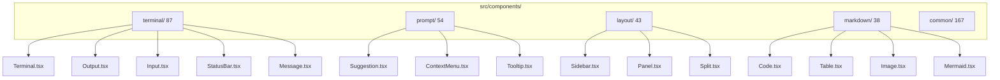

### 1.5 src/commands/ 207 个命令

```mermaid
graph TD
    subgraph commands["src/commands/"]
        CMD1[navigation/ 32]
        CMD2[edit/ 45]
        CMD3[analysis/ 38]
        CMD4[git/ 28]
        CMD5[devtools/ 64]
    end

    CMD1 --> CMD1a[goto.ts]
    CMD1 --> CMD1b[find.ts]
    CMD1 --> CMD1c[search.ts]

    CMD2 --> CMD2a[edit.ts]
    CMD2 --> CMD2b[create.ts]
    CMD2 --> CMD2c[delete.ts]
    CMD2 --> CMD2d[move.ts]

    CMD3 --> CMD3a[explain.ts]
    CMD3 --> CMD3b[trace.ts]
    CMD3 --> CMD3c[graph.ts]
    CMD3 --> CMD3d[audit.ts]

    CMD4 --> CMD4a[commit.ts]
    CMD4 --> CMD4b[branch.ts]
    CMD4 --> CMD4c[diff.ts]
    CMD4 --> CMD4d[push.ts]

    CMD5 --> CMD5a[test.ts]
    CMD5 --> CMD5b[build.ts]
    CMD5 --> CMD5c[lint.ts]
    CMD5 --> CMD5d[format.ts]
```

### 1.6 src/tools/ 184 个工具定义

```mermaid
graph TD
    subgraph tools["src/tools/"]
        T1[bash/ 23]
        T2[file/ 31]
        T3[web/ 19]
        T4[code/ 42]
        T5[mcp/ 38]
        T6[skill/ 31]
    end

    T1 --> T1a[BashTool.ts]
    T1 --> T1b[PowerShellTool.ts]
    T1 --> T1c[DockerTool.ts]

    T2 --> T2a[Read.ts]
    T2 --> T2b[Write.ts]
    T2 --> T2c[Edit.ts]
    T2 --> T2d[Grep.ts]
    T2 --> T2e[Glob.ts]

    T3 --> T3a[WebSearch.ts]
    T3 --> T3b[WebFetch.ts]
    T3 --> T3c[WebScreenshot.ts]

    T4 --> T4a[Lint.ts]
    T4 --> T4b[Format.ts]
    T4 --> T4c[TypeCheck.ts]
    T4 --> T4d[Transform.ts]

    T5 --> T5a[MCPTool.ts]
    T5 --> T5b[MCPClient.ts]
    T5 --> T5c[MCPTransport.ts]

    T6 --> T6a[SkillInvoke.ts]
    T6 --> T6b[SkillSearch.ts]
    T6 --> T6c[SkillInstall.ts]
```

### 1.7 src/services/ 130 个服务

```mermaid
graph TD
    subgraph services["src/services/"]
        SV1[api/ 28]
        SV2[auth/ 15]
        SV3[session/ 22]
        SV4[plugin/ 18]
        SV5[mcp/ 25]
    end

    SV1 --> SV1a[AnthropicAPI.ts]
    SV1 --> SV1b[StreamingClient.ts]
    SV1 --> SV1c[RateLimiter.ts]
    SV1 --> SV1d[RetryHandler.ts]

    SV2 --> SV2a[Credentials.ts]
    SV2 --> SV2b[TokenRefresh.ts]
    SV2 --> SV2c[SSO.ts]

    SV3 --> SV3a[SessionManager.ts]
    SV3 --> SV3b[SessionStore.ts]
    SV3 --> SV3c[SessionResume.ts]
    SV3 --> SV3d[SessionCompact.ts]

    SV4 --> SV4a[PluginLoader.ts]
    SV4 --> SV4b[PluginRegistry.ts]
    SV4 --> SV4c[PluginSandbox.ts]

    SV5 --> SV5a[MCPConnection.ts]
    SV5 --> SV5b[MCPDiscovery.ts]
    SV5 --> SV5c[MCPOAuth.ts]
```

---

## 2. 入口层深度剖析

### 2.1 CLI Bootstrap 机制

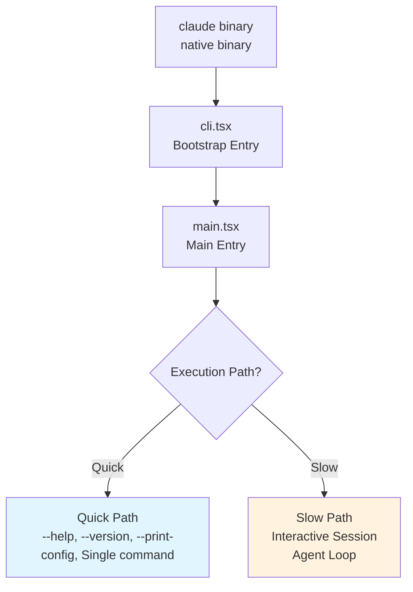

### 2.2 main.tsx 参数解析流程

```typescript
// src/main.tsx (伪代码实现)
export async function main(argv: string[]): Promise<number> {
  // Step 1: Parse raw arguments
  const parser = new ArgumentParser({
    prog: 'claude',
    description: 'Claude Code CLI',
    addHelp: true,
  });

  parser.addArgument(['--model'], { defaultValue: 'claude-3-5' });
  parser.addArgument(['--no-stream']);
  parser.addArgument(['--print']);
  parser.addArgument(['--dangerously-skip-permissions']);
  parser.addArgument(['--resume']);
  parser.addArgument(['--prompt']);
  parser.addArgument(['INPUT'], { nargs: '?' });

  const args = parser.parse(argv);

  // Step 2: Early exit for non-interactive commands
  if (args.print_config) {
    return printConfiguration();
  }
  if (args.version) {
    return printVersion();
  }

  // Step 3: Determine execution path
  const isQuickPath = args.help || args.version || args.print_config 
                    || args.input && !args.interactive;
  
  if (isQuickPath) {
    return executeQuickPath(args);
  }

  // Step 4: Full bootstrap for interactive session
  return executeSlowPath(args);
}
```

### 2.3 preActions 钩子系统

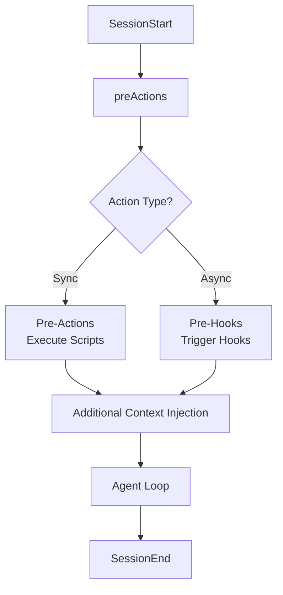

**preActions 完整列表**：

```typescript
// src/hooks/preActions.ts
export const preActions: PreAction[] = [
  {
    name: 'loadUserSettings',
    sync: true,
    execute: async () => {
      await settings.reload(); // Hot-reload settings
    },
  },
  {
    name: 'initializePlugins',
    sync: true,
    execute: async () => {
      await pluginManager.loadEnabled(); // Load enabled plugins
    },
  },
  {
    name: 'setupTelemetry',
    sync: false,
    execute: async () => {
      await telemetry.initialize(); // Async telemetry setup
    },
  },
  {
    name: 'validatePermissions',
    sync: true,
    execute: async () => {
      await permissionManager.validateRules(); // Validate permission rules
    },
  },
  {
    name: 'prepareSession',
    sync: true,
    execute: async (ctx) => {
      if (ctx.resume) {
        await sessionManager.resume(ctx.sessionId); // Resume session
      } else {
        await sessionManager.create(); // Create new session
      }
    },
  },
];
```

### 2.4 快速路径 vs 慢速路径

```mermaid
flowchart LR
    subgraph quick["Quick Path"]
        Q1[claude --help] --> QX[Show Help]
        Q2[claude --version] --> QX
        Q3[claude --print-config] --> QX
        Q4[claude "single command"] --> QX
    end

    subgraph slow["Slow Path"]
        S1[claude] --> S2[Interactive Session]
        S3[claude --resume session-id] --> S2
        S4[claude --interactive] --> S2
    end

    QX --> QF[No Agent Loop<br/>No UI<br/>No Persistence<br/>< 100ms]
    S2 --> SF[Full Agent Loop<br/>Terminal UI<br/>Session Persistence<br/>Multi-turn Dialog]
```

---

## 3. Query Engine 深度解析

### 3.1 while(true) 循环设计哲学

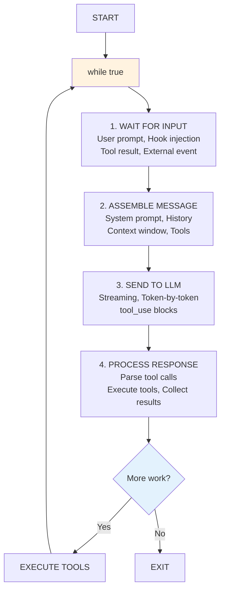

### 3.2 状态机实现

```typescript
// src/engine/QueryStateMachine.ts
enum QueryState {
  IDLE = 'IDLE',
  WAITING_INPUT = 'WAITING_INPUT',
  ASSEMBLING_MESSAGE = 'ASSEMBLING_MESSAGE',
  SENDING_TO_LLM = 'SENDING_TO_LLM',
  PROCESSING_TOOL_CALLS = 'PROCESSING_TOOL_CALLS',
  EXECUTING_TOOLS = 'EXECUTING_TOOLS',
  COLLECTING_RESULTS = 'COLLECTING_RESULTS',
  CHECKING_CONTINUATION = 'CHECKING_CONTINUATION',
  COMPACTING_CONTEXT = 'COMPACTING_CONTEXT',
  EXITING = 'EXITING',
}

export class QueryStateMachine {
  private state: QueryState = QueryState.IDLE;
  private history: QueryState[] = [];

  transition(newState: QueryState): void {
    const validTransitions: Record<QueryState, QueryState[]> = {
      [QueryState.IDLE]: [QueryState.WAITING_INPUT],
      [QueryState.WAITING_INPUT]: [
        QueryState.ASSEMBLING_MESSAGE,
        QueryState.EXITING,
      ],
      [QueryState.ASSEMBLING_MESSAGE]: [QueryState.SENDING_TO_LLM],
      [QueryState.SENDING_TO_LLM]: [
        QueryState.PROCESSING_TOOL_CALLS,
        QueryState.CHECKING_CONTINUATION,
      ],
      [QueryState.PROCESSING_TOOL_CALLS]: [QueryState.EXECUTING_TOOLS],
      [QueryState.EXECUTING_TOOLS]: [QueryState.COLLECTING_RESULTS],
      [QueryState.COLLECTING_RESULTS]: [
        QueryState.WAITING_INPUT,
        QueryState.COMPACTING_CONTEXT,
      ],
      [QueryState.CHECKING_CONTINUATION]: [
        QueryState.WAITING_INPUT,
        QueryState.EXITING,
      ],
      [QueryState.COMPACTING_CONTEXT]: [
        QueryState.WAITING_INPUT,
        QueryState.EXITING,
      ],
      [QueryState.EXITING]: [QueryState.IDLE],
    };

    if (!validTransitions[this.state].includes(newState)) {
      throw new Error(
        `Invalid state transition: ${this.state} -> ${newState}`
      );
    }

    this.history.push(this.state);
    this.state = newState;
    this.emit('stateChange', { from: this.history.at(-2), to: newState });
  }

  canContinue(): boolean {
    return this.state === QueryState.CHECKING_CONTINUATION;
  }

  shouldExit(): boolean {
    return this.state === QueryState.EXITING;
  }
}
```

### 3.3 消息组装策略

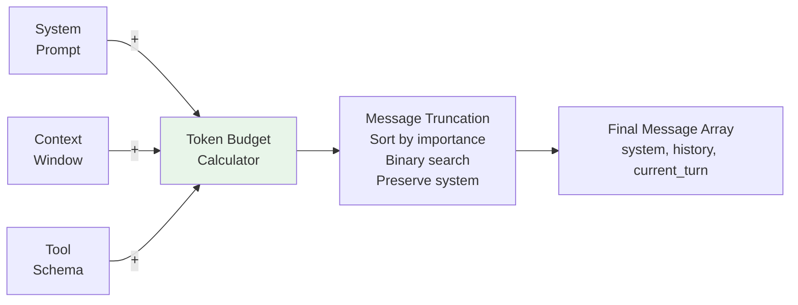

**消息组装核心代码**：

```typescript
// src/engine/MessageAssembler.ts
export class MessageAssembler {
  constructor(
    private contextWindow: number,
    private maxOutputTokens: number,
    private tokenizer: Tokenizer
  ) {}

  assemble(
    systemPrompt: string,
    history: Message[],
    currentTurn: Message,
    availableTools: Tool[]
  ): Message[] {
    // Calculate token budgets
    const systemTokens = this.tokenizer.count(systemPrompt);
    const toolTokens = this.estimateToolTokens(availableTools);
    const safetyMargin = 200;
    const reservedTokens = this.maxOutputTokens + safetyMargin;
    const availableTokens = this.contextWindow - systemTokens 
                           - toolTokens - reservedTokens;

    // Build messages within budget
    const messages: Message[] = [];
    
    // Always include system prompt
    messages.push({ role: 'system', content: systemPrompt });

    // Add history messages (oldest first for proper context)
    let tokenCount = systemTokens;
    for (const msg of history) {
      const msgTokens = this.tokenizer.count(msg.content);
      if (tokenCount + msgTokens > availableTokens) {
        break; // Budget exhausted
      }
      messages.push(msg);
      tokenCount += msgTokens;
    }

    // Add current turn
    messages.push(currentTurn);

    return messages;
  }

  private estimateToolTokens(tools: Tool[]): number {
    // MCP tool descriptions capped at 2KB each
    return tools.reduce((sum, tool) => {
      const desc = tool.description.substring(0, 2048);
      return sum + this.tokenizer.count(desc);
    }, 0);
  }
}
```

### 3.4 Streaming 响应处理

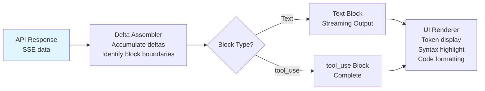

---

## 4. 工具系统深度实现

### 4.1 Tool 基类设计

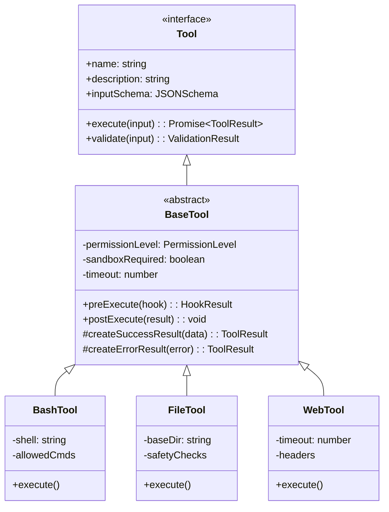

**Tool 基类实现**：

```typescript
// src/tools/BaseTool.ts
export interface ToolInput {
  [key: string]: unknown;
}

export interface ToolResult {
  success: boolean;
  output?: string;
  error?: string;
  metadata?: {
    duration_ms: number;
    tokens_used?: number;
    cached?: boolean;
  };
}

export enum PermissionLevel {
  SAFE = 'SAFE',           // Auto-allow when sandboxed
  REQUIRES_APPROVAL = 'REQUIRES_APPROVAL',
  DANGEROUS = 'DANGEROUS', // Requires explicit allow rule
  BLOCKED = 'BLOCKED',     // Cannot be used
}

export abstract class BaseTool implements Tool {
  abstract readonly name: string;
  abstract readonly description: string;
  abstract readonly inputSchema: JSONSchema;
  
  protected timeout: number = 30000; // 30s default
  protected permissionLevel: PermissionLevel = PermissionLevel.REQUIRES_APPROVAL;
  protected sandboxRequired: boolean = false;

  constructor(protected sandbox: SandboxEnvironment) {}

  async execute(input: ToolInput): Promise<ToolResult> {
    const startTime = Date.now();
    
    // 1. Validate input
    const validation = this.validate(input);
    if (!validation.valid) {
      return this.createErrorResult(
        new Error(`Invalid input: ${validation.errors.join(', ')}`)
      );
    }

    // 2. Execute pre-hook
    const hookResult = await this.preExecute(input);
    if (hookResult.blocked) {
      return this.createErrorResult(
        new Error(`Blocked by PreToolUse hook: ${hookResult.reason}`)
      );
    }

    // 3. Execute with sandbox if required
    try {
      const output = this.sandboxRequired
        ? await this.sandbox.execute(() => this.performExecute(input))
        : await this.performExecute(input);

      // 4. Post-execute hook
      await this.postExecute(output);

      return this.createSuccessResult(output, Date.now() - startTime);
    } catch (error) {
      return this.createErrorResult(error as Error);
    }
  }

  abstract performExecute(input: ToolInput): Promise<unknown>;

  protected validate(input: ToolInput): ValidationResult {
    // JSON Schema validation
    return validateSchema(input, this.inputSchema);
  }
}
```

### 4.2 工具注册表实现

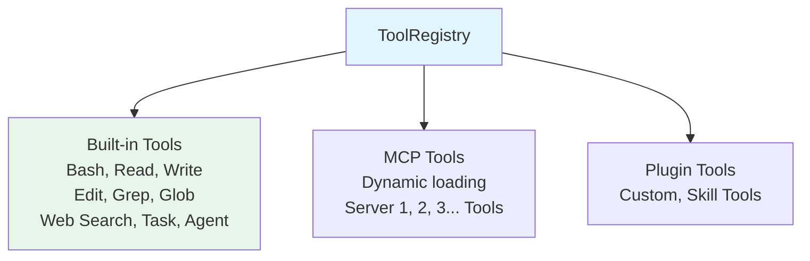

### 4.3 权限管理器

```mermaid
flowchart TB
    A[Tool Call Request<br/>tool: "Bash"<br/>command: "npm install"] --> B[Permission Check]
    B --> C[1. Check explicit rules<br/>settings.json]
    B --> D[2. Check auto-allow<br/>sandboxed + safe command]
    B --> E[3. Check dangerous paths<br/>/etc, ~/.ssh, .claude]
    C --> F{Decision?}
    D --> F
    E --> F
    F -->|ask| G[ASK<br/>Prompt user for confirm]
    F -->|allow| H[ALLOW<br/>Execute tool]
    F -->|deny| I[DENY<br/>Block with explanation]
    style A fill:#e1f5fe
    style G fill:#fff3e0
    style H fill:#e8f5e9
    style I fill:#ffcdd2
```

**权限管理器核心实现**：

```typescript
// src/tools/permission/PermissionManager.ts
export interface PermissionRule {
  tool: string;        // e.g., "Bash(npm *)", "Skill(name *)"
  effect: 'allow' | 'deny' | 'ask';
  reason?: string;
}

export class PermissionManager {
  private rules: PermissionRule[] = [];
  private skillRules: Map<string, PermissionRule> = new Map();

  async checkPermission(toolCall: ToolCall): Promise<PermissionDecision> {
    // 1. Check wildcard pattern matching
    for (const rule of this.rules) {
      if (this.matchesPattern(toolCall.tool, rule.tool) 
          || this.matchesPattern(toolCall.input, rule.tool)) {
        return {
          decision: rule.effect,
          reason: rule.reason ?? `Matched rule: ${rule.tool}`,
          rule,
        };
      }
    }

    // 2. Check auto-allow for sandboxed environment
    if (this.sandbox.isActive && this.isSafeCommand(toolCall)) {
      return { decision: 'allow', reason: 'Auto-allow in sandbox' };
    }

    // 3. Default to ask for unknown commands
    return { decision: 'ask', reason: 'No matching rule found' };
  }

  private matchesPattern(input: string, pattern: string): boolean {
    // Support wildcards: *, prefix, suffix
    // e.g., "Bash(npm *)" matches "npm install", "npm test"
    // e.g., "Skill(name *)" matches "skill:name" for all skills
    const regex = new RegExp(
      '^' + pattern.replace(/\*/g, '.*').replace(/\(/, '\\(').replace(/\)/, '\\)') + '$'
    );
    return regex.test(input);
  }

  private isSafeCommand(toolCall: ToolCall): boolean {
    // Safe = no dangerous path patterns, no env var injection, etc.
    const dangerousPatterns = [
      /rm\s+-rf\s+\//,           // rm -rf /
      />\s*\/\.ssh\//,           // Write to .ssh
      /\$\{.*\}/,                // Env var expansion
      /;\s*rm\s+/,               // Command injection
    ];
    return !dangerousPatterns.some(p => p.test(toolCall.input.toString()));
  }
}
```

### 4.4 沙箱执行机制

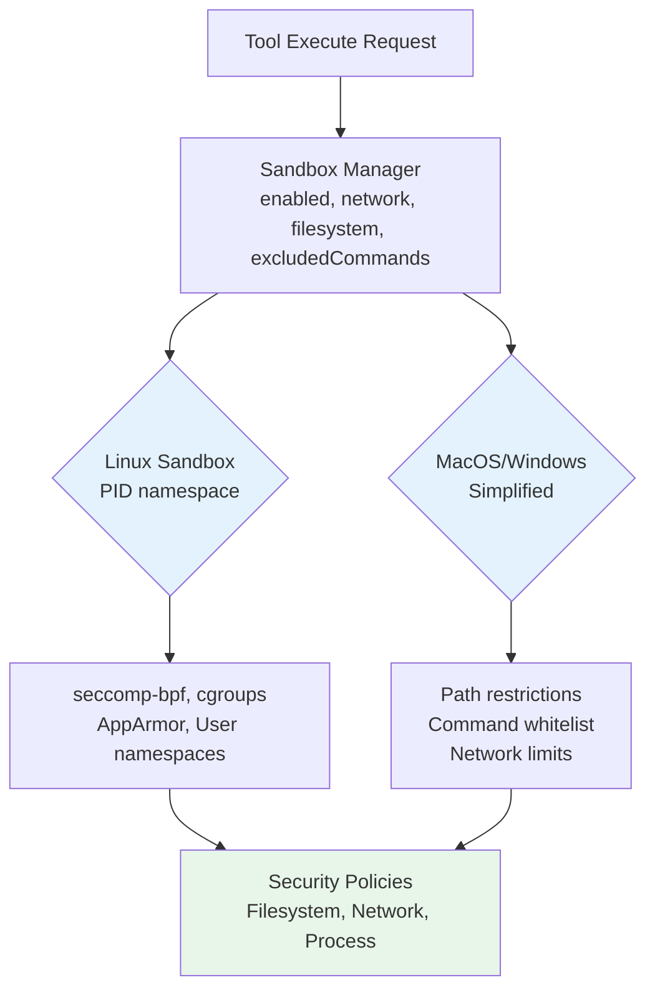

### 4.5 工具编排算法

```mermaid
flowchart LR
    A[Tool Calls<br/>Bash, Read, Read, Bash] --> B[Dependency Analysis<br/>Build DAG]
    B --> C[Topological Sort<br/>Into Waves]
    C --> D[Wave 1 (parallel)<br/>Bash(npm), Read(a), Read(b)]
    D --> E[Wave 2 (sequential)<br/>Bash(git)]
    E --> F[Result Collection<br/>All results or fail-fast]
    style D fill:#e8f5e9
    style E fill:#fff3e0
```

---

## 5. 状态管理深度

### 5.1 AppStateStore 实现

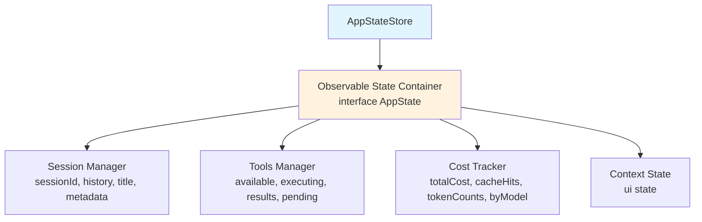

**AppStateStore 核心实现**：

```typescript
// src/state/AppStateStore.ts
type Listener<T> = (prev: T, next: T) => void;

export class AppStateStore<T extends object> {
  private state: T;
  private listeners: Map<keyof T, Set<Listener<unknown>>> = new Map();
  private version: number = 0;

  constructor(initialState: T) {
    this.state = initialState;
    // Initialize listener sets for each key
    Object.keys(initialState).forEach(key => {
      this.listeners.set(key as keyof T, new Set());
    });
  }

  get<K extends keyof T>(key: K): T[K] {
    return this.state[key];
  }

  set<K extends keyof T>(key: K, value: T[K]): void {
    const prev = this.state[key];
    if (prev === value) return; // No change, skip update

    this.state[key] = value;
    this.version++;

    // Notify listeners
    const keyListeners = this.listeners.get(key);
    if (keyListeners) {
      keyListeners.forEach(listener => {
        try {
          listener(prev, value);
        } catch (error) {
          console.error('Listener error:', error);
        }
      });
    }
  }

  update<K extends keyof T>(key: K, updater: (prev: T[K]) => T[K]): void {
    const prev = this.state[key];
    const next = updater(prev);
    this.set(key, next);
  }

  subscribe<K extends keyof T>(
    key: K,
    listener: Listener<T[K]>
  ): () => void {
    const keyListeners = this.listeners.get(key)!;
    keyListeners.add(listener as Listener<unknown>);

    // Return unsubscribe function
    return () => {
      keyListeners.delete(listener as Listener<unknown>);
    };
  }

  // Batch updates for atomic operations
  batch(updates: Partial<T>): void {
    const prev = { ...this.state };
    
    Object.entries(updates).forEach(([key, value]) => {
      this.state[key as keyof T] = value as T[keyof T];
    });
    
    this.version++;
    
    // Notify all changed keys
    Object.keys(updates).forEach(key => {
      const keyListeners = this.listeners.get(key as keyof T);
      if (keyListeners) {
        keyListeners.forEach(listener => {
          listener(prev[key as keyof T], updates[key as keyof T]!);
        });
      }
    });
  }

  // Snapshot for persistence
  snapshot(): { state: T; version: number } {
    return {
      state: structuredClone(this.state),
      version: this.version,
    };
  }

  // Restore from snapshot
  restore(snapshot: { state: T; version: number }): void {
    this.state = structuredClone(snapshot.state);
    this.version = snapshot.version;
  }
}
```

### 5.2 订阅发布机制

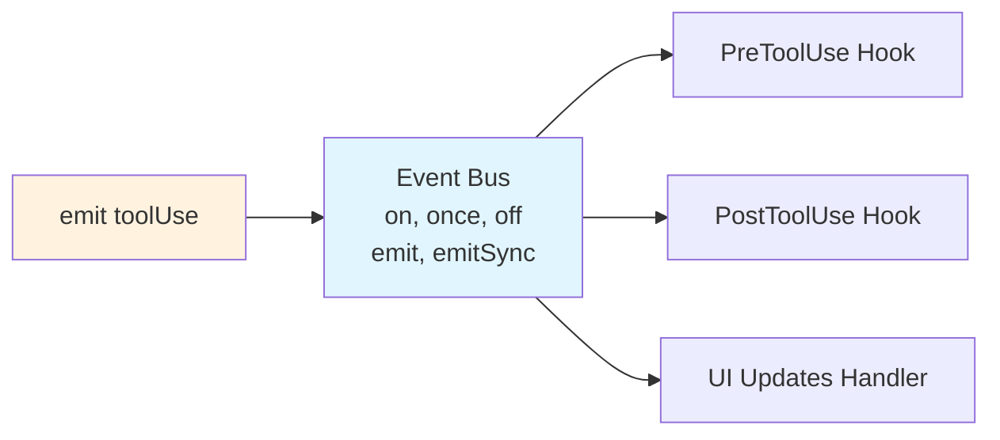

### 5.3 状态持久化

```mermaid
flowchart LR
    A[Runtime State] --> B[Session Store]
    B --> C[Disk Storage<br/>~/.claude/sessions]
    C --> D[session-xxx.json<br/>transcript.md]
    style C fill:#e8f5e9
```

**Persistence Triggers:**
- Auto-flush: Every 30 seconds for active sessions
- On message: After each user/assistant turn
- On tool use: After each tool execution
- On exit: Graceful shutdown flush
- On error: Emergency backup before crash

### 5.4 成本追踪

**Cost State Structure:**

```mermaid
classDiagram
    class CostState {
        +totalCost: number
        +inputTokens: number
        +outputTokens: number
        +cacheHits: number
        +byModel: Record~string, ModelCost~
    }
    class ModelCost {
        +inputTokens: number
        +outputTokens: number
        +cacheHits: number
        +costUSD: number
    }
    CostState --> ModelCost
```

**Pricing by Model (per 1M tokens):**

| Model | Input | Output | Cache |
|-------|-------|--------|-------|
| claude-opus-4-20250514 | $15.00 | $75.00 | $1.50 |
| claude-sonnet-4 | $3.00 | $15.00 | $0.30 |
| claude-3-5-sonnet | $3.00 | $15.00 | $0.30 |
| claude-3-haiku | $0.25 | $1.25 | $0.04 |

**Cost Display:** `Cost: $0.42 | Tokens: 12.5k | Cache: 4.5k (36%)`

> Note: Streaming fallback maintains accurate tracking even when API falls back to non-streaming mode.

---

## 6. 扩展机制深度

### 6.1 插件生命周期

```mermaid
stateDiagram-v2
    [*] --> INSTALL
    INSTALL --> ENABLE: PluginLoader.load()
    ENABLE --> ACTIVE: Available in session
    ACTIVE --> ACTIVE: /reload-plugins
    ACTIVE --> DISABLE: PluginLoader.unload()
    DISABLE --> REMOVED
```

**Skill Directory Structure:**

```mermaid
graph TD
    plugin["plugin-name/"]
    plugin --> A[.claude-plugin/]
    plugin --> B[commands/]
    plugin --> C[agents/]
    plugin --> D[skills/]
    plugin --> E[hooks/]
    plugin --> F[.mcp.json]
    plugin --> G[README.md]

    A --> H[plugin.json]

    D --> I[skill-name/]
    I --> J[SKILL.md]

    E --> K[hooks.json]
```

**Loading Process:**
1. Read plugin.json manifest
2. Validate schema and dependencies
3. Load commands (parse .md files)
4. Load agents (parse .md files)
5. Load skills (parse SKILL.md files)
6. Register hooks (parse hooks.json + scripts)
7. Initialize MCP servers (if .mcp.json exists)
8. Emit 'pluginLoaded' event

### 6.2 技能注册和执行

```mermaid
flowchart TD
    subgraph skill-system["Skill System"]
        A[Skill Discovery & Loading] --> B[Load Locations]
        B --> B1[.claude/skills/ User skills]
        B --> B2[plugins/*/skills/ Plugin skills]
        B --> B3[Built-in skills Core]

        A --> C[SKILL.md Structure]
        C --> C1[--- name trigger context]
        C --> C2[Agent Type maxTokens]
        C --> C3[Instructions & Principles]
        C --> C4[Output Format]
    end

    A2["User Input: design a login page"] --> F[Skill Matcher]
    F --> G{Match?}
    G -->|Yes| H[Skill Loader]
    H --> I[Parse SKILL.md]
    I --> J[Fork Subagent]
    J --> K[system base_prompt + skill instructions]
    J --> L[model sonnet from skill]
    J --> M[maxTokens 8000 from skill]
    J --> N[tools limited tool set]
    N --> O[Wait for completion]
    O --> P[Merge results to main transcript]
    P --> Q[Main Agent continues]
```

### 6.3 MCP 客户端实现

```mermaid
flowchart TB
    subgraph mcp-config[".mcp.json Configuration"]
        MC1["["]
        MC2["{ mcpServers: {"]
        MC3["filesystem: {"]
        MC4["command: npx"]
        MC5["args: [-y, @modelcontextprotocol/server-files]"]
        MC3 --> MC4 --> MC5
        MC2 --> MC3
        MC1 --> MC2
    end

    subgraph mcp-manager["MCP Client Manager"]
        MM1["clients: Map<string, MCPClient>"]
        MM2["tools: Map<string, MCPTool>"]
        MM3["+ addServer()"]
        MM4["+ removeServer()"]
        MM5["+ listTools()"]
        MM6["+ callTool()"]
    end

    subgraph transport["MCP Transport Layer"]
        T1[stdio default]
        T2[SSE streaming fallback]
        T3[HTTP WebSocket fallback]
        T1 -.-> T2 -.-> T3
    end

    subgraph optimization["Tool Search Optimization"]
        O1[auto mode default]
        O2[defer descriptions > threshold]
        O3[2KB description cap]
        O4[batched token counting]
    end

    MC1 --> mcp-manager
    mcp-manager --> transport
    transport --> optimization

    subgraph elicitation["Elicitation Support"]
        E1[Elicitation dialog interactive]
        E2[ElicitationResult hooks]
        E3[Claude.ai connectors]
    end
```

### 6.4 远程桥接协议

```mermaid
flowchart LR
    A[Local CLI] <-->|WebSocket| B[claude.ai/code]
    A --> C[Commands<br/>/remote-control<br/>claude-cli://]
    B --> D[Protocol Messages<br/>session_sync<br/>tool_approval_request<br/>user_input]
```

**Deep Link Protocol:**
```
claude-cli://open?path=/project&prompt=Fix%20bug
claude-cli://resume?session=abc123
```

## 7. 关键算法分析

### 7.1 工具并行执行算法

```typescript
// src/engine/parallel-executor.ts
export class ParallelToolExecutor {
  constructor(
    private maxConcurrency: number = 5,
    private failFast: boolean = true
  ) {}

  async execute(
    toolCalls: ToolCall[],
    registry: ToolRegistry,
    permissionManager: PermissionManager
  ): Promise<ToolResult[]> {
    // Step 1: Build dependency graph
    const graph = this.buildDependencyGraph(toolCalls);
    
    // Step 2: Topological sort into execution waves
    const waves = this.topologicalSort(graph);
    
    // Step 3: Execute each wave
    const results: ToolResult[] = new Array(toolCalls.length);
    const indexMap = new Map(toolCalls.map((tc, i) => [tc, i]));

    for (const wave of waves) {
      const waveResults = await Promise.all(
        wave.map(tc => this.executeTool(
          tc,
          registry,
          permissionManager
        ))
      );

      // Map results back to original indices
      wave.forEach((tc, i) => {
        results[indexMap.get(tc)!] = waveResults[i];
      });

      // Fail fast check
      if (this.failFast && waveResults.some(r => !r.success)) {
        // Mark remaining tools as skipped
        const remaining = toolCalls.slice(indexMap.get(wave[wave.length - 1])! + 1);
        remaining.forEach(tc => {
          results[indexMap.get(tc)!] = {
            success: false,
            error: 'Skipped due to sibling failure',
          };
        });
        break;
      }
    }

    return results;
  }

  private buildDependencyGraph(toolCalls: ToolCall[]): DependencyGraph {
    const graph = new DependencyGraph();
    
    // Build graph edges based on file access patterns
    for (let i = 0; i < toolCalls.length; i++) {
      for (let j = i + 1; j < toolCalls.length; j++) {
        if (this.dependsOn(toolCalls[j], toolCalls[i])) {
          graph.addEdge(toolCalls[j], toolCalls[i]);
        }
      }
    }
    
    return graph;
  }

  private dependsOn(consumer: ToolCall, producer: ToolCall): boolean {
    // Read after Write to same file → depends
    if (producer.name === 'Write' && consumer.name === 'Read') {
      return consumer.input.file_path === producer.input.file_path;
    }
    
    // Any tool after Write to same file → depends
    if (producer.name === 'Write') {
      const producerPath = producer.input.file_path;
      if (consumer.input.file_path === producerPath) return true;
    }
    
    return false;
  }

  private topologicalSort(graph: DependencyGraph): ToolCall[][] {
    const waves: ToolCall[][] = [];
    const remaining = new Set(graph.nodes);
    const inDegree = new Map(graph.nodes.map(n => [n, graph.inDegree(n)]));

    while (remaining.size > 0) {
      // Find nodes with no dependencies
      const ready = [...remaining].filter(n => inDegree.get(n) === 0);
      
      if (ready.length === 0) {
        throw new Error('Circular dependency detected');
      }
      
      waves.push(ready);
      
      // Remove processed nodes and update in-degrees
      for (const node of ready) {
        remaining.delete(node);
        for (const neighbor of graph.outNeighbors(node)) {
          inDegree.set(neighbor, inDegree.get(neighbor)! - 1);
        }
      }
    }

    return waves;
  }
}
```

### 7.2 依赖分析算法

```mermaid
flowchart TD
    subgraph input["Input: Tool calls"]
        I1[Read src/main.ts]
        I2[Read src/utils.ts]
        I3[Write src/main.ts]
        I4[Read src/main.ts depends on Write]
        I5[Bash npm test no deps]
    end

    subgraph step1["Step 1: Extract file references"]
        S1a["Read → [main.ts]"]
        S1b["Read → [utils.ts]"]
        S1c["Write → [main.ts] mutated"]
        S1d["Bash → [] shell:true"]
    end

    subgraph step2["Step 2: Build dependency edges"]
        S2a["Rule 1: Read after Write → DEPENDS"]
        S2b["Rule 2: Any after Write → DEPENDS"]
        S2c["Rule 3: Read after Read → INDEPENDENT"]
        S2d["Rule 4: Bash → INDEPENDENT"]
    end

    subgraph step4["Step 4: Topological sort"]
        W1["Wave 1 (parallel): Read(main), Read(utils)"]
        W2["Wave 2 (parallel): Write(main)"]
        W3["Wave 3 (parallel): Read(main), Bash(test)"]
    end

    I1 --> step1
    I2 --> step1
    I3 --> step1
    I4 --> step1
    I5 --> step1

    step1 --> step2
    step2 --> step4
```

### 7.3 降级策略算法

```mermaid
flowchart TB
    subgraph triggers["Degradation Triggers"]
        T1["1. API Rate Limit<br/>429 Too Many Requests<br/>Exponential backoff<br/>Switch to fallback model"]
        T2["2. Context Window Near Limit<br/>Tokens > 80%<br/>Trigger compaction<br/>Circuit breaker: 3 failures"]
        T3["3. Tool Execution Failure<br/>Parse failure → deny<br/>Timeout → retry<br/>Permission denied → message"]
        T4["4. Streaming Fallback<br/>SSE lost → polling<br/>Accurate cost tracking<br/>Seamless experience"]
        T5["5. Model Fallback Chain<br/>Primary: opus-4<br/>Fallback1: sonnet<br/>Fallback2: haiku"]
    end

    subgraph powershell["PowerShell Parse-Fail Degradation"]
        P1["1. Log parse error"]
        P2["2. Return fallback deny-rule"]
        P3["3. Suggest correction"]
        P4["4. Security: deny unparsed"]
    end

    subgraph circuit["Context Compaction Circuit Breaker"]
        CB1["compactFailures = 0<br/>MAX_COMPACT_FAILURES = 3"]
        CB2["onCompactionAttempt():<br/>if fails >= 3:<br/>stop(Context failed 3x)"]
        CB3["onContextRefill():<br/>if immediately refilled:<br/>stop(Conversation too large)"]
    end
```

---

## 8. 附录：参考架构图

### 8.1 完整系统架构图

```mermaid
flowchart TB
    subgraph cli["CLI Layer"]
        CLI1[claude binary]
        CLI2[--help flag]
        CLI3[--version flag]
        CLI4[--print-cfg flag]
    end

    subgraph bootstrap["Bootstrap Layer"]
        B1[cli.tsx Bootstrap]
        B2[main.tsx Parser]
        B3[preActions System]
        B4[Hooks System]
    end

    subgraph engine["Query Engine Layer"]
        E1["while(true) Loop"]
        E2[State Machine]
        E3[Message Assembler]
        E4[LLM Client]
        E5[Tool Router]
    end

    subgraph execution["Execution Layer"]
        EX1[Tool Registry]
        EX2[Permission Manager]
        EX3[Sandbox Executor]
        EX4[Hook Pipeline]
    end

    subgraph tools["Tools Layer"]
        T1[Bash Tool]
        T2[File Tools]
        T3[Web Tools]
        T4[MCP Tools]
    end

    subgraph extension["Extension Layer"]
        EXT1[Plugin System]
        EXT2[Skill System]
        EXT3[MCP Client]
        EXT4[Hook System]
    end

    subgraph state["State & Persistence Layer"]
        S1[AppState Store]
        S2[Session Store]
        S3[Cost Tracker]
        S4[Settings Manager]
    end

    CLI1 --> B1
    B1 --> B2
    B2 --> B3
    B3 --> B4
    B4 --> E1
    E1 --> E2
    E1 --> E3
    E1 --> E4
    E1 --> E5
    E5 --> EX1
    EX1 --> EX2
    EX2 --> EX3
    EX3 --> EX4
    EX4 --> T1
    EX4 --> T2
    EX4 --> T3
    EX4 --> T4
    T4 --> EXT1
    T4 --> EXT2
    T4 --> EXT3
    T4 --> EXT4
    EXT1 --> S1
    EXT2 --> S2
    EXT3 --> S3
    EXT4 --> S4
```

### 8.2 数据流图

```mermaid
flowchart LR
    U["User Input<br/>"Fix the login bug""] --> H1[UserPromptSubmit Hook]

    H1 --> M1[Message Assembly<br/>System prompt<br/>History<br/>Tool schemas]

    M1 --> LLM[LLM Request<br/>streaming: true<br/>model: sonnet<br/>max_tokens: 4096]

    LLM --> RESP[LLM Streaming Response<br/>Token-by-token<br/>tool_use blocks]

    RESP --> TOOL[Tool Call Processing<br/>Parse blocks<br/>Dependency analysis<br/>Permission checks]

    TOOL --> PRE[PreToolUse Hook]
    PRE --> EXEC[Execute Tools]
    EXEC --> POST[PostToolUse Hook]

    POST --> COLLECT[Collect Results<br/>tool_result blocks<br/>Persist > 50KB to disk]

    COLLECT --> LOOP{More work?}
    LOOP -->|Yes| M1
    LOOP -->|No| EXIT[SessionEnd Hook<br/>Exit]

    EXIT --> PERSIST[Session Persistence<br/>Save messages<br/>Update cost<br/>Update context %]

    PERSIST --> A["Assistant Output<br/>"I've fixed the login bug...""]
```

---

## 参考资料

- [DeepWiki - Claude Code Overview](https://deepwiki.com/anthropics/claude-code)
- [DeepWiki - System Architecture](https://deepwiki.com/anthropics/claude-code#1.1)
- [DeepWiki - Tool System & Permissions](https://deepwiki.com/anthropics/claude-code#3.2)
- [DeepWiki - Hook System](https://deepwiki.com/anthropics/claude-code#3.4)
- [DeepWiki - MCP Server Integration](https://deepwiki.com/anthropics/claude-code#3.5)
- [DeepWiki - Plugin System](https://deepwiki.com/anthropics/claude-code#3.6)
- [DeepWiki - Skill System](https://deepwiki.com/anthropics/claude-code#3.7)

---

*本文档由 Claude Code 自动生成，基于 DeepWiki 知识库与 CHANGELOG.md 构建。*
*生成日期: 2026/05/15*