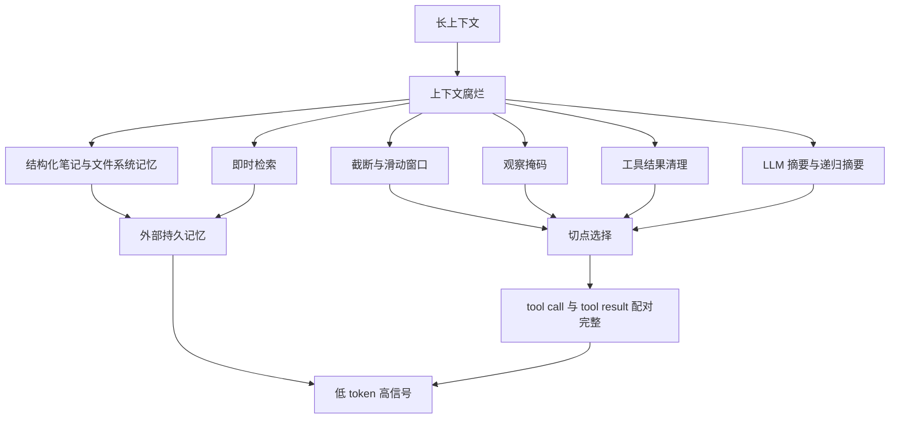
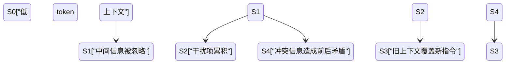
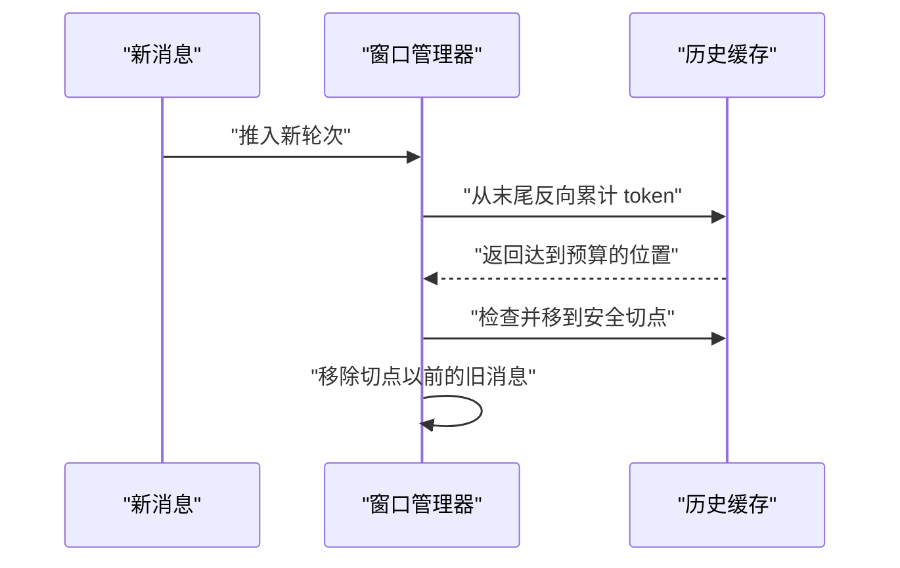
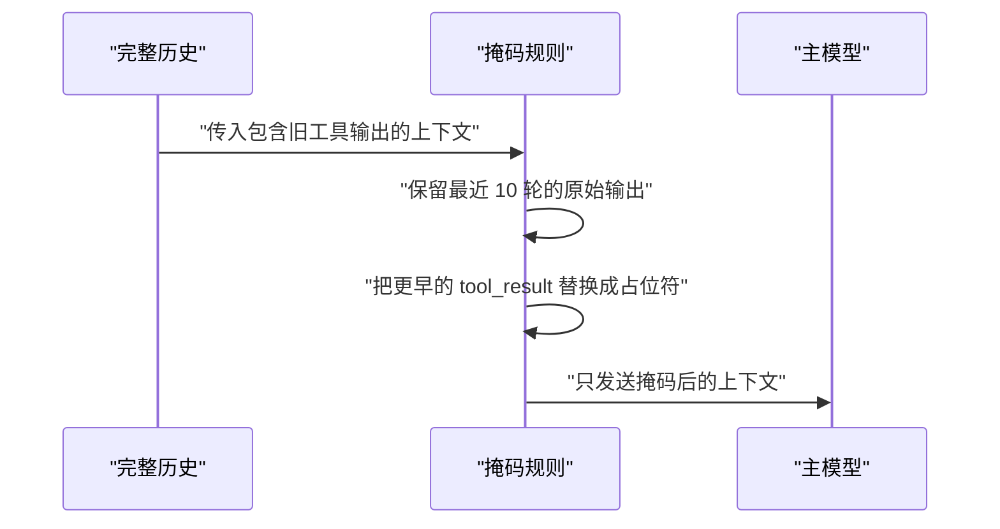
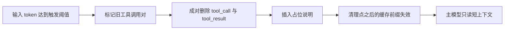
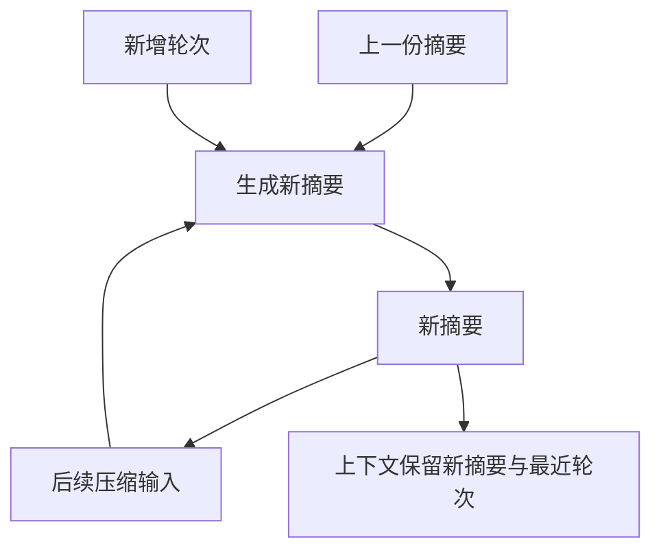
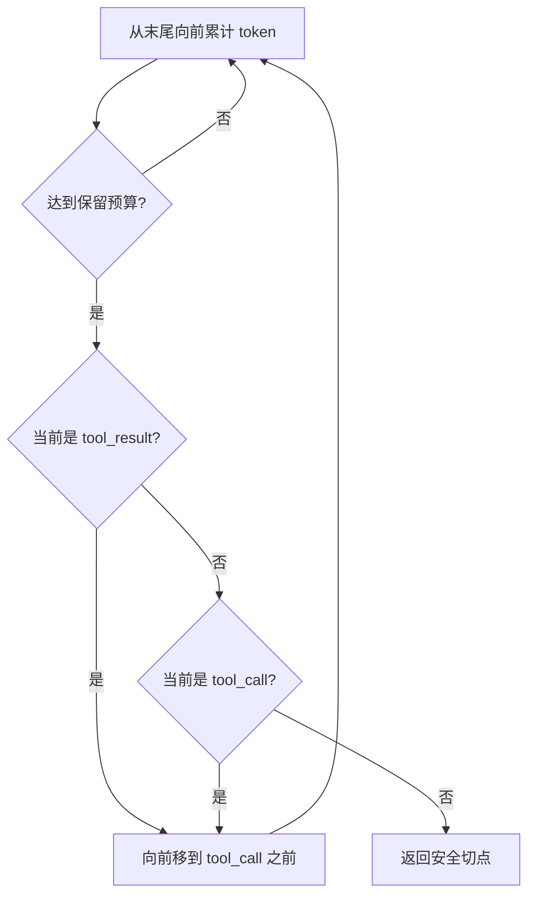
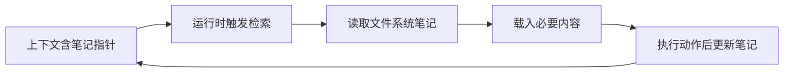
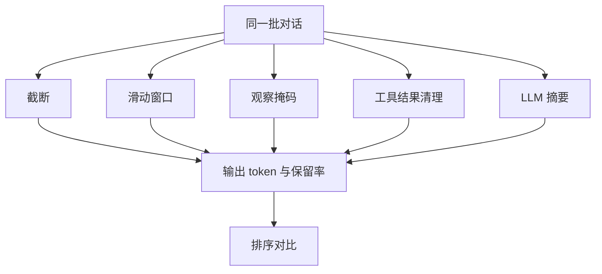

# 压缩策略全景对比：截断、窗口、摘要、观察掩码与工具结果清理

!!! abstract "学完这一页你能"
    - 你能说出上下文腐烂的四个失败模式，并解释“中间信息被忽略”和 n² 注意力代价。
    - 你能区分截断、滑动窗口、观察掩码、工具结果清理、LLM 摘要与递归摘要的触发条件。
    - 你能写出安全切点算法，保证 `tool_call` 与 `tool_result` 在压缩时不被拆散。
    - 你能运行一个 Node 脚本，用同一批对话对比五种策略的 token 数与关键事实保留率。

## 0. 知识地图



建议先读第 1 节建立“为什么必须压缩”的模型。  
第 2 到第 5 节按成本从低到高学五种基础策略。  
第 6 到第 8 节把切点、外部记忆和同一批对话对比串成完整工程判断。

## 1. 上下文腐烂：为什么长上下文会变坏

**先想一个问题**  
客服 Agent 已经会话 20 轮，用户第 3 轮给的退换货地址被放在上下文中间。  
模型没有超出 200K 窗口，却开始忽略这条地址。  
这不该只怪“窗口太小”，又要如何解释？

**心智模型**

!!! tip "心智模型"
    一句话模型：上下文不是均匀的工作台，而是中间会塌陷的注意力池。  
    日常类比：录音带越长，找中间那句话越耗时。  
    类比不成立处：模型不是耗时变长，而是在长输入下注意力被 n² 平摊后可能整个漏掉中间信息。

!!! note "术语：上下文腐烂（context rot）"
    输入 token 数上升时，模型从上下文中提取同一信息的召回准确率下降。  
    例子：Chroma 用一个干扰项就使模型准确率低于无干扰项基线（『Chroma 研究系统文章』以原文为准）。

**图解**



1. `S0` 表示短输入，注意力分布接近正常。  
2. 关键信息落到输入中部时进入 `S1`，这是 Lost in the Middle 观察到的退化。  
3. `S2` 表示多余内容累积，让模型重复旧动作。  
4. `S4` 到 `S3` 表示冲突信息进入上下文后，早期假设压过新事实。

**一步一步来**

**第 1 步：给每条消息算 token 估算**

① 这一步要做什么：建立统一估算函数，后续所有压缩预算都基于它。

```js
// token 估算：教学用，按字符数除以 2 粗算
function estimateTokens(text) {
  // 中文字符计为 1 个长度单位，除 2 得到近似的 token 数
  return Math.ceil(text.length / 2);
}
```

**这段代码在做什么**

- 用 `Math.ceil` 保证非空文本至少为 1。  
- 该估算不等同于真实 tokenizer，但能让同一批数据可比较。  
- 生产环境应计入模型 tokenizer 的字节规则。

运行结果：任何文本都会得到一个大于 0 的整数估算值。

**第 2 步：定位关键事实出现在前、中、后哪一段**

① 这一步要做什么：判断关键信息是否落在中部，这是本节最重要的诊断。

```js
function locateFact(messages, fact) {
  let before = 0;
  for (const msg of messages) {
    const tokens = estimateTokens(msg.content);
    if (msg.content.includes(fact)) {
      const total = totalTokens(messages);
      const offset = before + Math.floor(tokens / 2);
      return { offset, total };
    }
    before += tokens;
  }
  return null;
}

function totalTokens(messages) {
  return messages.reduce((sum, msg) => sum + estimateTokens(msg.content), 0);
}
```

**这段代码在做什么**

- `before` 累计当前消息之前的 token 数。  
- 关键事实首次出现的位置用 `offset` 表示。  
- 之后可以用 `offset / total` 判断它落在前 1/3、中 1/3 还是后 1/3。  
- 若事实不在任何消息里，返回 `null`。

运行结果：位置对象包含 `offset` 和 `total` 两个数，用于计算所在区间。

**动手验证**

```js
// 文件名：context-rot-check.mjs
// 依赖：Node 20+ 内置 node:assert，无第三方依赖
import assert from 'node:assert/strict';

const messages = [
  { role: 'user', content: 'a' },
  { role: 'assistant', content: 'BROKEN' },
  { role: 'user', content: 'end' },
];

function estimateTokens(text) { return Math.ceil(text.length / 2); }
function totalTokens(msgs) {
  return msgs.reduce((sum, msg) => sum + estimateTokens(msg.content), 0);
}
function locateFact(msgs, fact) {
  let before = 0;
  for (const msg of msgs) {
    const tokens = estimateTokens(msg.content);
    if (msg.content.includes(fact)) {
      return { offset: before + Math.floor(tokens / 2), total: totalTokens(msgs) };
    }
    before += tokens;
  }
  return null;
}
function region(pos) {
  const p = pos.offset / pos.total;
  if (p < 1 / 3) return 'front';
  if (p < 2 / 3) return 'middle';
  return 'back';
}

const pos = locateFact(messages, 'BROKEN');
assert.ok(pos);
assert.equal(region(pos), 'middle');
console.log('位置对象:', pos);
console.log('所在区域:', region(pos));
```

预期输出：

```text
位置对象: { offset: 2, total: 6 }
所在区域: middle
```

**常见坑**

| 现象 | 原因 | 怎么修 |
| --- | --- | --- |
| 中间关键信息被忽略 | 注意力在长输入中分布不均 | 把关键事实放在开头或结尾 |
| 干扰项降低准确率 | 多个干扰项累积 | 先清干扰项，只保留高信号 token |
| 只在窗口快满才压缩 | 质量下降早于窗口耗尽 | 在达到窗口前设置触发阈值 |

**用在哪里**

场景一：长客服工单 Agent  

- 业务背景：一次售后会话有 30 轮，连续出现地址、工单、退款原因。  
- 本节知识怎么用：诊断每轮关键事实在哪一段，把地址和工单号放到上下文开头或结尾。  
- 衡量指标：关键事实召回准确率。  
- 什么时候不该用：会话短到 5 轮以内时，不需要做中部诊断。

场景二：代码评审 Agent  

- 业务背景：模型要读一个 PR 的多个大 diff 文件。  
- 本节知识怎么用：不把全部 diff 堆在中间，按文件拆分并按需读取。  
- 衡量指标：缺陷发现数与 token 成本比。  
- 什么时候不该用：diff 总长度低于 10K token 时，直接全部传入即可。

**行业实践**

- Anthropic 把 context rot 定义为 recall 随 token 数上升而下降，并提出“最小高信号 token 集合”原则（『Anthropic 研究系统文章』以原文为准）。怎么借鉴：给关键事实建立清单，每次压缩后检查这些事实是否仍在。  
- Chroma 的 Context Rot 实验覆盖 18 个模型，发现所有模型随输入增长性能下降（『Chroma 研究系统文章』以原文为准）。怎么借鉴：把关键事实召回做成回归测试。  
- Lost in the Middle 论文指出相关信息在中间时性能明显下降（『Lost in the Middle 论文』以原文为准）。怎么借鉴：把高频信息移到开头，或在结尾重复一份关键约束。

**小结**

- 上下文腐烂的核心是注意力分布不均，不是窗口太小。  
- 中间信息、干扰项、冲突信息各有破坏模式。  
- 压缩的目的不是删掉最多 token，而是保留高信号 token。

## 2. 截断与滑动窗口：保留最近一段

**先想一个问题**  
日志抓取 Agent 已经 200 轮，每轮工具输出 5K token。  
旧的 170 轮已经不用了，但直接删到最近 30 轮时，切点可能落在一次工具结果中间。  
怎样滑出旧轮次，又不拆散工具调用？

**心智模型**

!!! tip "心智模型"
    一句话模型：滑动窗口是“只看最近 N 页工作记录”。  
    日常类比：手机相册只展示最近截图。  
    类比不成立处：最近截图不一定是项目里最重要的截图；最近轮次也不一定是高信号轮次。

!!! note "术语：截断（truncation）与滑动窗口（sliding window）"
    截断是直接丢弃最旧轮次，滑动窗口是维护固定 token 或轮次上限的最近上下文，新消息进来时旧消息滑出。  
    例子：JetBrains 研究里掩码窗口保留最近 10 turns（『JetBrains 研究论文』以原文为准）。

**图解**



1. 新消息进入后，窗口管理器从末尾扫描历史。  
2. 反向累计 token，直到达到 `keepRecentTokens` 预算。  
3. 返回的位置可能落在 `tool_result`，因此需要继续处理。  
4. 窗口管理器移到安全切点，完整移除旧前缀。

**一步一步来**

**第 1 步：建立预算与反向查找函数**

① 这一步要做什么：从历史末尾反向累计，找到按 token 预算保留的起点。

```js
function findCutIndex(messages, keepRecentTokens) {
  let accumulated = 0;
  for (let i = messages.length - 1; i >= 0; i -= 1) {
    accumulated += estimateTokens(messages[i].content ?? '');
    if (accumulated >= keepRecentTokens) {
      return i;
    }
  }
  return 0;
}
```

**这段代码在做什么**

- 从最后一条消息开始向前累加 token。  
- 一旦累计达到预算，就返回当前下标作为候选切点。  
- `content ?? ''` 防止无效内容导致报错。  
- 这个候选点还要经过安全校验。

**第 2 步：定义安全切点**

① 这一步要做什么：识别哪些角色不能作为切点，避免拆散工具调用与结果。

```js
function isSafeCut(messages, index) {
  const role = messages[index].role;
  if (role === 'tool_result') return false;
  if (role === 'tool_call') return false;
  return true;
}

function shiftToSafeCut(messages, index) {
  while (index < messages.length && !isSafeCut(messages, index)) {
    index += 1;
  }
  return index;
}
```

**这段代码在做什么**

- `isSafeCut` 拒绝从 `tool_result` 或 `tool_call` 开始保留。  
- `shiftToSafeCut` 遇到不安全点就前移，直到安全角色。  
- 这样旧段里不会残留孤立的 `tool_call`。

**第 3 步：组合成滑窗函数**

① 这一步要做什么：把预算查找和安全校验合并，输出滑窗后的消息数组。

```js
function slidingWindow(messages, keepRecentTokens) {
  const cut = findCutIndex(messages, keepRecentTokens);
  const safe = shiftToSafeCut(messages, cut);
  return messages.slice(safe);
}
```

**这段代码在做什么**

- 先找到预算切点，再纠正到安全切点。  
- `messages.slice(safe)` 保留从安全点到最后的完整结构。  
- 该算法不修改原始数组，避免污染共享历史。

**动手验证**

```js
// 文件名：sliding-window.mjs
// 依赖：Node 20+ 内置 node:assert，无第三方依赖
import assert from 'node:assert/strict';

const messages = [
  { role: 'user', content: '请修复登录页' },
  { role: 'assistant', content: '我先读取文件' },
  { role: 'tool_call', content: 'read_file login.html' },
  { role: 'tool_result', content: '很长的 HTML 内容' },
  { role: 'assistant', content: '已发现未转义' },
  { role: 'tool_call', content: 'edit_file login.html' },
  { role: 'tool_result', content: '修改完成' },
  { role: 'assistant', content: '现在开始验证' },
];

function estimateTokens(text) { return Math.ceil(text.length / 2); }
function findCutIndex(msgs, budget) {
  let acc = 0;
  for (let i = msgs.length - 1; i >= 0; i -= 1) {
    acc += estimateTokens(msgs[i].content ?? '');
    if (acc >= budget) return i;
  }
  return 0;
}
function isSafeCut(msgs, i) {
  return msgs[i].role !== 'tool_result' && msgs[i].role !== 'tool_call';
}
function shiftToSafeCut(msgs, i) {
  while (i < msgs.length && !isSafeCut(msgs, i)) i += 1;
  return i;
}
function slidingWindow(msgs, budget) {
  return msgs.slice(shiftToSafeCut(msgs, findCutIndex(msgs, budget)));
}

const result = slidingWindow(messages, 24);
assert.ok(result.length < messages.length);
assert.equal(result[0].role !== 'tool_result', true);
console.log('原始消息数:', messages.length);
console.log('滑窗后消息数:', result.length);
console.log('滑窗后第一条角色:', result[0].role);
```

预期输出：

```text
原始消息数: 8
滑窗后消息数: 4
滑窗后第一条角色: assistant
```

**常见坑**

| 现象 | 原因 | 怎么修 |
| --- | --- | --- |
| 直接按消息条数滑窗 | 单条大工具输出可能撑爆窗口 | 改为按 token 预算反查切点 |
| 切点落在 tool_result | 旧侧留下孤立 tool_call | 用 `shiftToSafeCut` 前移 |
| 早期核心指令被滑出 | 窗口只重视最近轮次 | 把核心约束写入系统提示或外部笔记 |

**用在哪里**

场景一：电商商品列表虚拟滚动  

- 业务背景：为长商品列表做 API 分页，每页结果很大。  
- 本节知识怎么用：只保留最近三屏的数据，旧屏数据出窗口。  
- 衡量指标：单次请求 context token 与首屏渲染时间。  
- 什么时候不该用：用户需要回跳并看到原数据时，应改成即时检索而不是滑窗丢弃。

场景二：后台管理的批量导入  

- 业务背景：导入 CSV 的日志每行都会进入 Agent 上下文。  
- 本节知识怎么用：日志只保留最近 N 行，旧的写入滚动文件。  
- 衡量指标：导入失败时定位前 10 行的准确率。  
- 什么时候不该用：导入错误依赖早期日志时，不能只滑出，应先转存。

**行业实践**

- pi 的反向累计方案：从末尾往前走直到 `keepRecentTokens`（默认 20,000），再找安全角色（『pi 文档』以原文为准）。怎么借鉴：把滑窗实现改成“先找预算，再找安全点”。  
- Claude Code 在上下文满时先清旧工具输出，再考虑摘要（『Claude Code 文档』以原文为准）。怎么借鉴：为窗口策略设置优先级，先清大输出。  
- Manus 保持 append-only 与确定性序列化，避免单 token 差异破坏 KV cache（『Manus 官方博客』以原文为准）。怎么借鉴：不要在系统提示里放时间戳。

**小结**

- 滑窗按 token 预算，不按固定条数。  
- 切点必须在安全角色上。  
- 早期高信号指令要移到窗口之外存放。

## 3. 观察掩码：把旧工具输出变成占位符

**先想一个问题**  
代码修复 Agent 第 5 轮的 `read` 返回了 30K token 的文件内容，现在这些内容已经用不上。  
但保留“第 5 轮读过哪个文件”对复现过程有价值。  
不调用 LLM 摘要，怎么把 30K token 压到一行？

**心智模型**

!!! tip "心智模型"
    一句话模型：观察掩码是把旧监控回放替换成“此处有录像”。  
    日常类比：聊天界面只显示“已加载图片”，不重复显示图片的所有像素。  
    类比不成立处：聊天软件可以重新点开原图；掩码后的旧内容若不落盘，就无法在上下文里回看。

!!! note "术语：观察掩码（observation masking）"
    把旧工具输出的正文替换为占位符，保留工具名、callId 或文件名等身份信息，不调用 LLM。  
    例子：JetBrains 研究中的掩码保留最近 10 turns，更早轮次被掩掉（『JetBrains 研究论文』以原文为准）。

**图解**



1. 完整历史先进入掩码规则。  
2. 对最近 10 轮的 `tool_result` 保持原样。  
3. 更早的 `tool_result` 用固定占位文本替换。  
4. 主模型看到短上下文，但知道过去调过这些工具。

**一步一步来**

**第 1 步：识别旧 tool_result**

① 这一步要做什么：判断哪些消息是可以被掩码的旧工具结果。

```js
function isOldToolResult(msg, currentTurn, keepRecentTurns) {
  return msg.role === 'tool_result' && msg.turn <= currentTurn - keepRecentTurns;
}
```

**这段代码在做什么**

- 只选中 `tool_result` 角色。  
- 用 `turn` 字段比较它是否在保留窗口之外。  
- 保留窗口内的结果不掩码。

**第 2 步：替换正文为占位符**

① 这一步要做什么：把旧结果的长正文换成一个可读占位符。

```js
function maskMessage(msg) {
  return { ...msg, content: `<masked tool_result callId=${msg.callId}>` };
}
```

**这段代码在做什么**

- 使用 spread 复制原消息，不修改原数组。  
- 占位符保留 `callId`，让后续追踪还能识别调用。  
- 正文被替换后，token 体积下降。

**第 3 步：对整个历史执行掩码**

① 这一步要做什么：把识别和替换组合成一个函数。

```js
function observationMasking(messages, keepRecentTurns) {
  const currentTurn = messages[messages.length - 1].turn ?? messages.length;
  return messages.map((msg) =>
    isOldToolResult(msg, currentTurn, keepRecentTurns) ? maskMessage(msg) : msg
  );
}
```

**这段代码在做什么**

- 用最后一条消息的 `turn` 作为当前轮数。  
- 对每条消息执行映射，旧的掩码，新的保留。  
- 保留原数组结构，不改变消息顺序。

**动手验证**

```js
// 文件名：observation-masking.mjs
// 依赖：Node 20+ 内置 node:assert，无第三方依赖
import assert from 'node:assert/strict';

const messages = [
  { role: 'tool_call', turn: 1, content: 'read_file a.ts' },
  { role: 'tool_result', turn: 1, callId: 'a1', content: '很长的文件内容'.repeat(2) },
  { role: 'assistant', turn: 1, content: '已读取' },
  { role: 'tool_call', turn: 2, content: 'read_file b.ts' },
  { role: 'tool_result', turn: 2, callId: 'b1', content: '新文件内容'.repeat(2) },
  { role: 'assistant', turn: 2, content: '已完成' },
];

function isOldToolResult(msg, currentTurn, keepRecentTurns) {
  return msg.role === 'tool_result' && msg.turn <= currentTurn - keepRecentTurns;
}
function maskMessage(msg) {
  return { ...msg, content: `<masked tool_result callId=${msg.callId}>` };
}
function observationMasking(msgs, keepRecentTurns) {
  const currentTurn = msgs[msgs.length - 1].turn;
  return msgs.map((msg) =>
    isOldToolResult(msg, currentTurn, keepRecentTurns) ? maskMessage(msg) : msg
  );
}

const masked = observationMasking(messages, 1);
assert.equal(masked.length, messages.length);
assert.equal(masked[1].content.includes('很长的文件内容'), false);
assert.equal(masked[3].content.includes('新文件内容'), true);
console.log('旧的 tool_result 掩码后:', masked[1].content);
console.log('新的 tool_result 仍保留:', masked[3].content);
```

预期输出：

```text
旧的 tool_result 掩码后: <masked tool_result callId=a1>
新的 tool_result 仍保留: 新文件内容新文件内容
```

**常见坑**

| 现象 | 原因 | 怎么修 |
| --- | --- | --- |
| 掩掉所有 tool_result | 最近错误证据被丢失 | 保留最近 10 轮与失败动作 |
| 占位符没有 callId | 后续无法追溯调用来源 | 占位符保留 callId 与工具名 |
| 上下文原内容没有外部副本 | 需要回查时不可恢复 | 先写文件再掩码 |

**用在哪里**

场景一：代码修复 Agent 的 `read` 与 `grep` 输出  

- 业务背景：大量文件和搜索输出占据上下文主体。  
- 本节知识怎么用：把旧 `read` 输出换成占位符，最近结果保留原文。  
- 衡量指标：上下文 token 降幅与关键调用可追溯性。  
- 什么时候不该用：当旧堆栈或错误正文是当前修复依据时，不要掩掉。

场景二：数据管道任务的大表预览  

- 业务背景：Agent 检查多张表，每张表预览数千行。  
- 本节知识怎么用：旧的表预览转存为文件，上下文中只留“已预览 表A”。  
- 衡量指标：再次查询成本与错误传播次数。  
- 什么时候不该用：流式任务中间结果需要实时聚合时，不宜掩掉。

**行业实践**

- JetBrains 论文报告观察掩码成本低于 LLM 摘要约一半，且准确率有时略高（『JetBrains 研究论文』以原文为准）。怎么借鉴：先用掩码做基线，再决定是否上摘要。  
- Manus 保留失败动作和错误证据，说明不是所有观察都应被掩掉（『Manus 官方博客』以原文为准）。怎么借鉴：对失败栈与错误输出单独放行。  
- pi 在摘要序列化时把 tool_result 截断到 2,000 字符（『pi 文档』以原文为准）。怎么借鉴：大工具结果先进截断，再进摘要。

**小结**

- 观察掩码是零 LLM 调用、低成本的压缩。  
- 占位符要保留身份信息，才能维持复现步骤。  
- 最近窗口内的错误证据不要掩掉。

## 4. 工具结果清理：把旧附件从上下文里删掉

**先想一个问题**  
浏览器自动化 Agent 调了 50 个工具，每个工具返回大段 DOM。  
现在只需要最近 3 次结果。  
旧结果不应当只换成占位符，而是整对删除。怎样安全清理？

**心智模型**

!!! tip "心智模型"
    一句话模型：工具结果清理是“删除会议纪要里已经归档的附件副本”。  
    日常类比：清空已处理邮件的附件，只保留邮件标题。  
    类比不成立处：邮件附件随时可以从邮件服务器重新下载；清理后的工具输出若未存档，就无法恢复。

!!! note "术语：工具结果清理（tool-result clearing / clear tool results）"
    把不再需要的 `tool_call` 与 `tool_result` 成对移除，替换为简短占位说明，通常由服务端或框架在模型读取前完成。

**图解**



1. 输入 token 数达到触发阈值，清理流程启动。  
2. 旧 `tool_call` 和 `tool_result` 按配对标记。  
3. 成对删除后插入占位说明。  
4. 清理会破坏清理点之后的缓存前缀，这个成本要单独计算。  
5. 主模型看到变短的上下文。

**一步一步来**

**第 1 步：定义清理参数**

① 这一步要做什么：明确触发阈值和保留数量，与 API 默认值对齐。

```js
// Anthropic API 默认值：触发阈值 100,000，保留最近 3 对（以原文为准）
const CLEAR_TRIGGER_TOKENS = 100000;
const KEEP_LATEST_PAIRS = 3;
```

**这段代码在做什么**

- 两个常量分别控制“何时清理”和“留下几对”。  
- 这些默认值来自『Anthropic API 文档』以原文为准。  
- 客户端可以调整，但调整会改变缓存行为。

**第 2 步：成对匹配工具调用和结果**

① 这一步要做什么：在同一批消息里找到 `tool_call` 与对应 `tool_result` 的边界。

```js
function pairIndices(messages) {
  const pairs = [];
  for (let i = 0; i < messages.length; i += 1) {
    if (messages[i].role === 'tool_call') {
      const j = messages.findIndex(
        (m, idx) => idx > i && m.role === 'tool_result' && m.callId === messages[i].callId
      );
      if (j > i) pairs.push({ call: i, result: j });
    }
  }
  return pairs;
}
```

**这段代码在做什么**

- 扫描所有 `tool_call`，寻找其后同 `callId` 的 `tool_result`。  
- 每对记录 `call` 和 `result` 下标。  
- 这是清理的基础，不能只删结果或只删调用。

**第 3 步：清理旧对并返回压缩消息**

① 这一步要做什么：保留最近 N 对，删除更早的对，插入占位说明。

```js
function clearToolResults(messages, keepLatestPairs = KEEP_LATEST_PAIRS) {
  const pairs = pairIndices(messages);
  const removeSet = new Set();
  const toRemove = pairs.slice(0, Math.max(0, pairs.length - keepLatestPairs));
  for (const p of toRemove) {
    removeSet.add(p.call);
    removeSet.add(p.result);
  }
  const filtered = messages.filter((_, idx) => !removeSet.has(idx));
  return [{ role: 'note', content: `已清理 ${toRemove.length} 对旧工具结果` }, ...filtered];
}
```

**这段代码在做什么**

- 按 `pairs.length - keepLatestPairs` 计算要删除的旧对。  
- 用 `Set` 记录要删除的下标。  
- `filter` 返回不包含这些下标的剩余消息。  
- 最前面插入一条说明，让模型知道发生过清理。

**动手验证**

```js
// 文件名：clear-tool-results.mjs
// 依赖：Node 20+ 内置 node:assert，无第三方依赖
import assert from 'node:assert/strict';

const messages = [
  { role: 'tool_call', callId: 'm1', content: 'read a' },
  { role: 'tool_result', callId: 'm1', content: 'aaaa' },
  { role: 'tool_call', callId: 'm2', content: 'read b' },
  { role: 'tool_result', callId: 'm2', content: 'bbbb' },
  { role: 'tool_call', callId: 'm3', content: 'read c' },
  { role: 'tool_result', callId: 'm3', content: 'cccc' },
];

function pairIndices(msgs) {
  const pairs = [];
  for (let i = 0; i < msgs.length; i += 1) {
    if (msgs[i].role === 'tool_call') {
      const j = msgs.findIndex(
        (m, idx) => idx > i && m.role === 'tool_result' && m.callId === msgs[i].callId
      );
      if (j > i) pairs.push({ call: i, result: j });
    }
  }
  return pairs;
}
function clearToolResults(msgs, keepLatestPairs = 3) {
  const pairs = pairIndices(msgs);
  const removeSet = new Set();
  for (const p of pairs.slice(0, Math.max(0, pairs.length - keepLatestPairs))) {
    removeSet.add(p.call);
    removeSet.add(p.result);
  }
  const filtered = msgs.filter((_, idx) => !removeSet.has(idx));
  return [{ role: 'note', content: `已清理 ${pairs.length - keepLatestPairs} 对旧工具结果` }, ...filtered];
}

const result = clearToolResults(messages, 2);
assert.equal(result.length, 3);
assert.equal(result.some((m) => m.content === 'aaaa'), false);
assert.equal(result.some((m) => m.content === 'cccc'), true);
console.log('清理后条数:', result.length);
console.log('首条说明:', result[0].content);
```

预期输出：

```text
清理后条数: 3
首条说明: 已清理 1 对旧工具结果
```

**常见坑**

| 现象 | 原因 | 怎么修 |
| --- | --- | --- |
| 清理触发太小 | 缓存频繁失效 | 设置 `clear_at_least` 让单次清理有足够规模 |
| 失败证据被清理 | 模型失去纠错依据 | 清理前把失败栈和错误写出到 notes |
| 只删结果不删调用 | 留下孤立调用或错误状态 | 成对删除 `tool_call` 与 `tool_result` |

**用在哪里**

场景一：在线 IDE Agent 的长期会话  

- 业务背景：IDE Agent 会读很多文件并修改代码，每次修改返回大段 diff。  
- 本节知识怎么用：保留最近 3 对工具结果，更早的整对清理。  
- 衡量指标：上下文 token 与越修越错的比例。  
- 什么时候不该用：用户要求完整审计轨迹时，先持久化再清理。

场景二：浏览器自动化流程  

- 业务背景：每步 DOM 抓取结果都进入上下文。  
- 本节知识怎么用：旧 DOM 结果成对删除，只留最近步骤。  
- 衡量指标：单步耗时与失败恢复率。  
- 什么时候不该用：回退步骤需要旧 DOM 状态时，要提前落盘。

**行业实践**

- Anthropic context editing 提供 `clear_tool_uses_20250919`，默认保留最近 3 对，触发阈值为 100,000 input token（『Anthropic API 文档』以原文为准）。怎么借鉴：先沿用默认值，再按产品观察调整。  
- `clear_at_least` 的存在是因为清理会破坏缓存前缀，需要让清理规模匹配缓存重建成本（『Anthropic API 文档』以原文为准）。怎么借鉴：不要频繁小规模清理。  
- Claude Code 先清旧工具输出再摘要，并有 thrash guard 防止一次清理后马上又被填满（『Claude Code 文档』以原文为准）。怎么借鉴：给清理加失败上限。

**小结**

- 工具结果清理是规则性操作，不调用 LLM。  
- 必须成对清理调用与结果。  
- 清理有缓存成本，需要控制触发阈值和单次规模。

## 5. LLM 摘要与递归摘要：把旧轮次写成会议纪要

**先想一个问题**  
项目规划 Agent 已经 30 轮，里面有目标、约束、进展、决定。  
滑窗只留最近 10 轮会把早期目标丢掉。  
怎样把旧轮次压成一段会议纪要，又不会被摘要本身误导？

**心智模型**

!!! tip "心智模型"
    一句话模型：递归摘要是“每次合并工作日志并更新摘要页”。  
    日常类比：维基百科条目只保留当前页面，不把全部历史留在阅读区。  
    类比不成立处：维基的历史页可以点开查看，摘要一旦替代原文，旧证据就可能不可恢复。

!!! note "术语：LLM 摘要与递归摘要"
    LLM 摘要用模型把旧轮次改写成摘要文本；递归摘要让新摘要由“上一份摘要 + 新轮次”生成。  
    例子：pi 的摘要包含 Goal、Constraints & Preferences、Progress、Key Decisions、Next Steps、Critical Context（『pi 文档』以原文为准）。

**图解**



1. 上一份摘要和新增轮次一起进入摘要生成过程。  
2. 生成的新摘要覆盖旧摘要内容。  
3. 新摘要再次作为后续压缩输入，形成递归。  
4. 上下文里只放新摘要和最近轮次。

**一步一步来**

**第 1 步：固定摘要结构**

① 这一步要做什么：预先列出必须保留的六类信息，避免摘要变成随机文本。

```js
// pi 文档提到的六段摘要结构（名称以原文为准）
const SUMMARY_SECTIONS = [
  'Goal',
  'Constraints & Preferences',
  'Progress: Done / In Progress / Blocked',
  'Key Decisions',
  'Next Steps',
  'Critical Context',
];
```

**这段代码在做什么**

- 结构固定后，模型知道要保留哪些维度。  
- 六段分别对应目标、约束、进展、决定、下一步、关键上下文。  
- 生产实现可把该结构写入摘要提示词。

**第 2 步：写确定性摘要函数**

① 这一步要做什么：在不能调用模型的教学环境里，用简单规则模拟摘要；真实项目替换为模型调用。

```js
function buildSummary(previousSummary, newMessages) {
  const facts = new Set();
  for (const msg of newMessages) {
    if (msg.role !== 'tool_result') {
      facts.add(msg.content.split('。')[0]);
    }
  }
  const summaryBody = [...facts].join('；');
  return previousSummary ? `${previousSummary}；${summaryBody}` : summaryBody;
}
```

**这段代码在做什么**

- 只取每条消息的第一句话，避免整段复制。  
- `tool_result` 默认不进入摘要正文。  
- 上一份摘要与新摘要内容拼接，模拟递归合并。  
- 真实实现中应把 `facts` 交给 LLM 整理，而不是直接拼接。

**第 3 步：限制摘要输出长度**

① 这一步要做什么：控制摘要不会无限长大。

```js
function limitSummary(summary, maxTokens) {
  const words = summary.split('；');
  const result = [];
  let tokens = 0;
  for (const word of words) {
    const t = estimateTokens(word);
    if (tokens + t > maxTokens) break;
    result.push(word);
    tokens += t;
  }
  return result.join('；');
}
```

**这段代码在做什么**

- 按分号切分摘要条目。  
- 逐个加入直到达到 token 上限。  
- 这样摘要长度可预算，递归多次后不会充满窗口。

**动手验证**

```js
// 文件名：recursive-summary.mjs
// 依赖：Node 20+ 内置 node:assert，无第三方依赖
import assert from 'node:assert/strict';

const turns = [
  [{ role: 'user', content: '目标是修复登录页。' }, { role: 'assistant', content: '已定位漏洞点。' }],
  [{ role: 'user', content: '补充约束：所有金额保留两位小数。' }],
];
function estimateTokens(text) { return Math.ceil(text.length / 2); }
function buildSummary(previousSummary, newMessages) {
  const facts = new Set();
  for (const msg of newMessages) {
    if (msg.role !== 'tool_result') {
      facts.add(msg.content.split('。')[0]);
    }
  }
  const body = [...facts].join('；');
  return previousSummary ? `${previousSummary}；${body}` : body;
}
function limitSummary(summary, maxTokens) {
  const words = summary.split('；');
  const result = [];
  let tokens = 0;
  for (const word of words) {
    const t = estimateTokens(word);
    if (tokens + t > maxTokens) break;
    result.push(word);
    tokens += t;
  }
  return result.join('；');
}

let summary = '';
for (const turn of turns) {
  summary = buildSummary(summary, turn);
}
const limited = limitSummary(summary, 12);
assert.ok(limited.length <= summary.length);
assert.equal(limited.includes('目标是修复登录页'), true);
console.log('递归摘要:', summary);
console.log('限制后摘要:', limited);
```

预期输出：

```text
递归摘要: 目标是修复登录页；已定位漏洞点；补充约束：所有金额保留两位小数
限制后摘要: 目标是修复登录页；已定位漏洞点
```

**常见坑**

| 现象 | 原因 | 怎么修 |
| --- | --- | --- |
| 摘要调用消耗额外成本 | 模型需要多轮采样 | 计入摘要调用成本，不只算主任务 |
| 摘要轨迹变长 | 摘要掩盖停止信号 | 保留最近轮次原文，不只放摘要 |
| 旧错误被递归固化 | 摘要基于上一份摘要 | 摘要中单独记录失败与证据 |

**用在哪里**

场景一：会议纪要 Agent  

- 业务背景：两小时会议转写很长，需要压缩成执行摘要。  
- 本节知识怎么用：用六段结构生成纪要，后续会议只带上一份纪要。  
- 衡量指标：纪要生成成本与决定遗漏数。  
- 什么时候不该用：讨论中有争议未解决时，不要把争议压成单句，应保留双方证据。

场景二：长文档审查流程  

- 业务背景：Agent 审查多个章节，每次只能带有限上下文。  
- 本节知识怎么用：每章生成结构化摘要，下一章携带上章摘要。  
- 衡量指标：跨章节引用准确率与总 token。  
- 什么时候不该用：需要逐段比对原文时，应改为即时检索原文。

**行业实践**

- pi 的递归摘要把上一份摘要作为下一份输入，并使用六段结构（『pi 文档』以原文为准）。怎么借鉴：先定义结构，再让模型填空。  
- Cognition 提出专用压缩模型，并探索微调小模型做压缩（『Cognition 官方博客』以原文为准）。怎么借鉴：先评估是否值得引入额外模型。  
- JetBrains 论文报告摘要轨迹比原 Agent 长 13-15%，说明摘要不是无成本收益（『JetBrains 研究论文』以原文为准）。怎么借鉴：必须同时监控轨迹长度。

**小结**

- 摘要能跨长跨度保留目标与决定。  
- 摘要生成是额外采样，成本与轨迹长度都要算。  
- 递归摘要要固定结构并限制输出长度。

## 6. 切点选择与 tool call/result 配对完整性

**先想一个问题**  
窗口滑出第 7 条消息时，它正好是 `tool_result`。  
按 token 预算一刀切，会留下没有结果的 `tool_call`。  
Agent 下一轮误以为工具还没执行完。怎样在不拆散配对的前提下找切点？

**心智模型**

!!! tip "心智模型"
    一句话模型：切点必须是完整语义块之间的边界，不能是半块。  
    日常类比：剪辑视频只能在镜头之间切，不能在演员说一半时切。  
    类比不成立处：视频剪辑错了还能拿原片重接；LLM 上下文切错后，旧工具输出可能已被丢弃，无法重接。

!!! note "术语：切点（cut point）"
    压缩或滑窗时，历史被分拆的位置。  
    例子：pi 只允许 user、assistant、bashExecution、custom 消息作为切点，不允许 tool_result（『pi 文档』以原文为准）。

**图解**



1. 从末尾向前累计，找到预算切点。  
2. 如果候选点是 `tool_result`，继续向前找到 `tool_call` 之前。  
3. 如果候选点是 `tool_call`，也继续向前，避免保留孤立结果。  
4. 只有非工具消息才能作为安全切点。

**一步一步来**

**第 1 步：建立消息与轮次映射**

① 这一步要做什么：为每条消息加上 `turn` 与 `callId`，方便定位配对。

```js
const messages = [
  { role: 'user', turn: 1, content: '请改登录页' },
  { role: 'assistant', turn: 1, content: '我读文件' },
  { role: 'tool_call', turn: 1, callId: 'm1', content: 'read login.html' },
  { role: 'tool_result', turn: 1, callId: 'm1', content: 'A'.repeat(20) },
  { role: 'assistant', turn: 1, content: '完成' },
];
```

**这段代码在做什么**

- 每条消息有 `turn`，工具消息有 `callId`。  
- 文件内容用 `repeat` 制造大 token。  
- 这组数据足以演示切点出错问题。

**第 2 步：反向找预算点并检查角色**

① 这一步要做什么：从后向前累计 token，看候选点角色。

```js
function findCutIndexByBudget(messages, budget) {
  let acc = 0;
  for (let i = messages.length - 1; i >= 0; i -= 1) {
    acc += estimateTokens(messages[i].content ?? '');
    if (acc >= budget) return i;
  }
  return 0;
}
```

**这段代码在做什么**

- 与滑窗节相同，先得到候选下标。  
- 该下标必须经过下一步的角色检查。  
- 预算越小，切点越靠后。

**第 3 步：移动到安全切点**

① 这一步要做什么：当候选点是工具消息时，向前调整到安全角色。

```js
function moveToSafeCut(messages, cut) {
  while (
    cut < messages.length &&
    (messages[cut].role === 'tool_result' || messages[cut].role === 'tool_call')
  ) {
    cut += 1;
  }
  return cut;
}
```

**这段代码在做什么**

- 当候选点是 `tool_result` 或 `tool_call`，向前移动。  
- 直到碰到 `user` 或 `assistant` 停下。  
- 这样剪去的前缀会包含完整工具对。

**动手验证**

```js
// 文件名：safe-cut.mjs
// 依赖：Node 20+ 内置 node:assert，无第三方依赖
import assert from 'node:assert/strict';

const messages = [
  { role: 'user', turn: 1, content: '请改登录页' },
  { role: 'assistant', turn: 1, content: '我读文件' },
  { role: 'tool_call', turn: 1, callId: 'm1', content: 'read login.html' },
  { role: 'tool_result', turn: 1, callId: 'm1', content: 'A'.repeat(20) },
  { role: 'assistant', turn: 1, content: '完成' },
];
function estimateTokens(text) { return Math.ceil(text.length / 2); }
function findCutIndexByBudget(msgs, budget) {
  let acc = 0;
  for (let i = msgs.length - 1; i >= 0; i -= 1) {
    acc += estimateTokens(msgs[i].content ?? '');
    if (acc >= budget) return i;
  }
  return 0;
}
function moveToSafeCut(msgs, cut) {
  while (
    cut < msgs.length &&
    (msgs[cut].role === 'tool_result' || msgs[cut].role === 'tool_call')
  ) {
    cut += 1;
  }
  return cut;
}
function safeSlice(msgs, budget) {
  return msgs.slice(moveToSafeCut(msgs, findCutIndexByBudget(msgs, budget)));
}

const result = safeSlice(messages, 14);
assert.ok(result[0].role !== 'tool_result' && result[0].role !== 'tool_call');
assert.equal(result[0].role, 'assistant');
console.log('切点角色:', result[0].role);
console.log('保留消息数:', result.length);
```

预期输出：

```text
切点角色: assistant
保留消息数: 1
```

**常见坑**

| 现象 | 原因 | 怎么修 |
| --- | --- | --- |
| 按数组下标切 | 下标落在工具消息 | 反向累计后做角色检查 |
| 只检查 tool_result | tool_call 也会被拆散 | 两种角色都跳过 |
| 单条 user 消息超过预算 | 找不到安全切点 | pi 拆成两段摘要：history 与 span prefix 合并（『pi 文档』以原文为准） |

**用在哪里**

场景一：Agent 运行中的轨迹压缩  

- 业务背景：运行 250 轮以内的 SWE 类任务（『JetBrains 研究论文』以原文为准）。  
- 本节知识怎么用：压缩前先计算安全切点，不破坏工具调用完整。  
- 衡量指标：压缩后任务解决率与轨迹错误率。  
- 什么时候不该用：上下文没有工具消息时，可以直接按消息边界切。

场景二：聊天记录合并进摘要  

- 业务背景：前端把长会话历史同步到服务端做摘要。  
- 本节知识怎么用：在服务端先验证切点角色，再执行摘要。  
- 衡量指标：摘要后重放失败率。  
- 什么时候不该用：用户明确要求保留完整历史时，不应切分。

**行业实践**

- pi 在工具完成后、下一回复前检查预测上下文，并可在 run 中间压缩（『pi 文档』以原文为准）。怎么借鉴：把压缩检查放在工具完成之后。  
- Manus 要求上下文 append-only、确定性序列化（『Manus 官方博客』以原文为准）。怎么借鉴：避免在已有历史中间编辑。  
- pi 的合法切点只有 user、assistant、bashExecution、custom，明确排除 tool_result（『pi 文档』以原文为准）。怎么借鉴：先列合法角色清单，再实现查找。

**小结**

- 切点选择决定压缩是否破坏工具语义。  
- 安全切点必须跳过 `tool_call` 和 `tool_result`。  
- 大块单条消息超过预算时要拆 span，而不是硬切。

## 7. 结构化笔记、文件系统记忆与即时检索

**先想一个问题**  
项目约定“所有金额显示两位小数”只在第 2 轮出现，现在窗口已经滑出第 2 轮。  
你希望它跨会话存在，又不想每轮占上下文。  
怎样把这类信息放到上下文外，需要时再取？

**心智模型**

!!! tip "心智模型"
    一句话模型：结构化笔记是“外置任务清单”，即时检索是“只记书架编号，用时取书”。  
    日常类比：外卖骑手只记订单号，不背整张地址表。  
    类比不成立处：骑手取单路线固定，Agent 检索需要先决定“什么时候取什么”，这个决策本身会犯错。

!!! note "术语：结构化笔记与即时检索"
    结构化笔记是放在上下文外的持久文件，如 NOTES.md、todo.md，按固定结构记录目标、约束、进展。  
    即时检索是在上下文里只放路径、查询、链接等轻量标识符，运行时用工具按需载入内容。

**图解**



1. 上下文只保留笔记路径或查询标识。  
2. Agent 在需要时触发检索，读取文件。  
3. 只有必要内容进入上下文。  
4. 执行动作后再更新笔记，形成循环。

**一步一步来**

**第 1 步：定义笔记结构**

① 这一步要做什么：用固定字段组织外部笔记，避免回来的是杂乱文本。

```js
const notes = {
  goal: '修复登录页的跨站脚本漏洞',
  constraints: ['所有金额显示两位小数'],
  progress: ['已定位输入未转义'],
  next: ['修改登录页模板'],
};
```

**这段代码在做什么**

- 四个字段分别记录目标、约束、进展、下一步。  
- 结构固定后，模型检索时可以只取一个字段。  
- 该对象实际会写入 `NOTES.md` 或 `todo.md`。

**第 2 步：写到外部文件**

① 这一步要做什么：把笔记序列化成可回读的文本文件。

```js
import { writeFileSync, readFileSync } from 'node:fs';

function saveNotes(filePath, notes) {
  writeFileSync(filePath, JSON.stringify(notes, null, 2), 'utf8');
}
function loadNotes(filePath) {
  return JSON.parse(readFileSync(filePath, 'utf8'));
}
```

**这段代码在做什么**

- `writeFileSync` 将笔记写到磁盘。  
- `readFileSync` 在需要时读取，不常驻上下文。  
- 使用 `JSON.stringify` 保证结构可恢复。

**第 3 步：按需检索单个字段**

① 这一步要做什么：只把需要的字段载入上下文，而不是整份文件。

```js
function retrieveField(filePath, field) {
  const notes = loadNotes(filePath);
  return notes[field];
}
```

**这段代码在做什么**

- 读取整个文件但不全部放进上下文。  
- 只返回调用方请求的字段。  
- 工具输出可以限制为字符串，避免再带入多余 token。

**动手验证**

```js
// 文件名：external-notes.mjs
// 依赖：Node 20+ 内置 node:assert 与 node:fs，无第三方依赖
import assert from 'node:assert/strict';
import { writeFileSync, readFileSync } from 'node:fs';
import { tmpdir } from 'node:os';
import { join } from 'node:path';

const notes = {
  goal: '修复登录页',
  constraints: ['金额保留两位小数'],
  progress: ['已定位未转义'],
  next: ['修改模板'],
};
const file = join(tmpdir(), 'agent-notes.json');
function saveNotes(path, data) { writeFileSync(path, JSON.stringify(data, null, 2), 'utf8'); }
function loadNotes(path) { return JSON.parse(readFileSync(path, 'utf8')); }
function retrieveField(path, field) { return loadNotes(path)[field]; }

saveNotes(file, notes);
const fetched = retrieveField(file, 'constraints');
assert.deepEqual(fetched, ['金额保留两位小数']);
assert.equal(loadNotes(file).goal, '修复登录页');
console.log('检索约束字段:', fetched);
console.log('笔记文件路径:', file);
```

预期输出：

```text
检索约束字段: [ '金额保留两位小数' ]
笔记文件路径: /tmp/agent-notes.json
```

**常见坑**

| 现象 | 原因 | 怎么修 |
| --- | --- | --- |
| 把所有笔记读回上下文 | 又回到长上下文 | 按字段按需检索 |
| 笔记不更新 Progress | 跨会话决策漂移 | 每次关键动作后更新 Progress 与 Next Steps |
| 笔记里放时间戳 | 单 token 变化就破坏缓存 | Manus 警告不要放时间戳在系统提示里 |

**用在哪里**

场景一：游戏代理的离线任务清单  

- 业务背景：Claude-playing-Pokémon 用 NOTES.md 或 to-do 文件记录目标。  
- 本节知识怎么用：任务清单放在上下文外，必要时读取。  
- 衡量指标：跨会话目标保持率与 token 占比。  
- 什么时候不该用：短任务里维护文件会带来文件 I/O 与决策开销。

场景二：项目管理 Agent 跨会话  

- 业务背景：一个项目要跨 10 个会话推进。  
- 本节知识怎么用：每次会话结束时把关键决定写入结构化笔记。  
- 衡量指标：下一会话首轮切题率。  
- 什么时候不该用：纯问答任务不需要持久记忆。

**行业实践**

- Anthropic 建议稳定使用 NOTES.md 或 to-do 文件，把记忆放在上下文外（『Anthropic 研究系统文章』以原文为准）。怎么借鉴：先建两个固定文件：一个记约束，一个记待办。  
- Manus 将文件系统视为无限持久记忆，并不断重写 todo.md 把目标推到最近注意力区间（『Manus 官方博客』以原文为准）。怎么借鉴：每次迭代后重写待办文件。  
- Claude Code 延迟加载 MCP 工具定义与技能内容，减少上下文常驻量（『Claude Code 文档』以原文为准）。怎么借鉴：工具定义按需展开，不预先全量注入。

**小结**

- 外部笔记把记忆移出上下文，但保留可检索入口。  
- 按需读取比整份读回更省 token。  
- 笔记要更新进展，避免漂移。

## 8. 手写五种策略：同一批对话对比 token 与信息保留率

**先想一个问题**  
前面每种策略单独看都有道理，但没有在同一批对话上量过它们各自留下多少 token、保留多少关键事实。  
能否用一个 Node 脚本一次对比？

**心智模型**

!!! tip "心智模型"
    一句话模型：对比实验是“同一份考卷，五种压缩方式分别批卷”。  
    日常类比：五个人把同一本小说缩成摘要，然后数谁保留的线索最多。  
    类比不成立处：真实信息保留率需要模型或人工评测，字符串匹配只能作为教学代理。

!!! note "术语：信息保留率（information retention）"
    压缩后上下文里仍能检索到的关键事实数量，占原有关键事实总数的比例。  
    例子：原始 3 个关键事实，压缩后能匹配 2 个，保留率为 66.7%。

**图解**



1. 同一批对话分别送入五种策略。  
2. 每种策略输出压缩后消息、token 数和保留关键事实。  
3. 汇总到同一张表排序。  
4. 对比成本与质量，而不是只比 token 降幅。

**一步一步来**

**第 1 步：构造同一批含工具调用的对话**

① 这一步要做什么：准备一份固定消息数组，后续五种策略都基于它。

```js
const messages = [
  { role: 'user', content: 'FIX XSS' },
  { role: 'assistant', content: 'READ FILE' },
  { role: 'tool_call', callId: 'm1', content: 'read a' },
  { role: 'tool_result', callId: 'm1', content: 'XSS_FOUND_OLD_OUTPUT_LONG' },
  { role: 'assistant', content: 'EDI TARGET' },
  { role: 'tool_call', callId: 'm2', content: 'edit a' },
  { role: 'tool_result', callId: 'm2', content: 'DONE_CHANGED' },
  { role: 'user', content: 'CHECK END' },
];
const facts = ['XSS', 'FOUND', 'DONE'];
```

**这段代码在做什么**

- 包含 `user`、`assistant`、`tool_call`、`tool_result` 四类角色。  
- `callId` 使工具对能成对识别。  
- `facts` 是需要追踪的关键事实字符串。

**第 2 步：实现 token 估算与保留率计算**

① 这一步要做什么：给出所有策略共用的度量函数。

```js
function estimateTokens(text) { return Math.ceil(text.length / 2); }
function countTokens(msgs) {
  return msgs.reduce((sum, msg) => sum + estimateTokens(msg.content ?? ''), 0);
}
function retention(msgs, facts) {
  const text = msgs.map((m) => m.content).join('\n');
  return facts.filter((fact) => text.includes(fact)).length / facts.length;
}
```

**这段代码在做什么**

- `estimateTokens` 给每个文本一个可复现的粗估。  
- `countTokens` 汇总消息数组。  
- `retention` 计算关键事实字符串匹配比例。  
- 该保留率是教学代理，不等于模型可召回率。

**第 3 步：实现截断与滑动窗口**

① 这一步要做什么：实现两个不调用模型的规则性策略。

```js
function truncate(messages, maxMessages) {
  return messages.slice(-maxMessages);
}

function slidingWindow(messages, budget) {
  let acc = 0;
  let cut = messages.length;
  for (let i = messages.length - 1; i >= 0; i -= 1) {
    acc += estimateTokens(messages[i].content ?? '');
    if (acc >= budget) { cut = i; break; }
  }
  while (
    cut < messages.length &&
    (messages[cut].role === 'tool_result' || messages[cut].role === 'tool_call')
  ) {
    cut += 1;
  }
  return messages.slice(cut);
}
```

**这段代码在做什么**

- `truncate` 是固定条数截断，不检查切点。  
- `slidingWindow` 是带安全切点的滑窗。  
- 两个函数都返回消息数组，便于统一比较。

**第 4 步：实现观察掩码、工具清理与摘要**

① 这一步要做什么：补齐另三种策略函数。

```js
function observationMasking(messages, keepRecentTurns) {
  const current = messages.length;
  return messages.map((msg, idx) =>
    msg.role === 'tool_result' && idx < current - keepRecentTurns
      ? { ...msg, content: `<masked ${msg.callId}>` }
      : msg
  );
}

function clearToolResults(messages, keepLatestPairs) {
  const pairs = [];
  for (let i = 0; i < messages.length; i += 1) {
    if (messages[i].role === 'tool_call') {
      const j = messages.findIndex(
        (m, idx) => idx > i && m.role === 'tool_result' && m.callId === messages[i].callId
      );
      if (j > i) pairs.push([i, j]);
    }
  }
  const remove = new Set(pairs.slice(0, Math.max(0, pairs.length - keepLatestPairs)).flat());
  return messages.filter((_, idx) => !remove.has(idx));
}

function llmSummary(messages) {
  const important = messages
    .filter((m) => m.role === 'user' || m.role === 'assistant')
    .map((m) => m.content.split('。')[0]);
  return [{ role: 'summary', content: important.join('；') }];
}
```

**这段代码在做什么**

- `observationMasking` 把旧工具输出换为占位符。  
- `clearToolResults` 成对删除旧工具调用与结果。  
- `llmSummary` 用确定性规则模拟摘要，真实项目应替换为模型调用。  
- 三种函数都返回消息数组。

**动手验证**

```js
// 文件名：compare-five.mjs
// 依赖：Node 20+ 内置 node:assert，无第三方依赖
import assert from 'node:assert/strict';

const messages = [
  { role: 'user', content: 'FIX XSS' },
  { role: 'assistant', content: 'READ FILE' },
  { role: 'tool_call', callId: 'm1', content: 'read a' },
  { role: 'tool_result', callId: 'm1', content: 'XSS_FOUND_OLD_OUTPUT_LONG' },
  { role: 'assistant', content: 'EDI TARGET' },
  { role: 'tool_call', callId: 'm2', content: 'edit a' },
  { role: 'tool_result', callId: 'm2', content: 'DONE_CHANGED' },
  { role: 'user', content: 'CHECK END' },
];
const facts = ['XSS', 'FOUND', 'DONE'];

function estimateTokens(text) { return Math.ceil(text.length / 2); }
function countTokens(msgs) {
  return msgs.reduce((sum, msg) => sum + estimateTokens(msg.content ?? ''), 0);
}
function retention(msgs, facts) {
  const text = msgs.map((m) => m.content).join('\n');
  return facts.filter((fact) => text.includes(fact)).length / facts.length;
}
function truncate(msgs, maxMessages) { return msgs.slice(-maxMessages); }
function slidingWindow(msgs, budget) {
  let acc = 0;
  let cut = msgs.length;
  for (let i = msgs.length - 1; i >= 0; i -= 1) {
    acc += estimateTokens(msgs[i].content ?? '');
    if (acc >= budget) { cut = i; break; }
  }
  while (cut < msgs.length && (msgs[cut].role === 'tool_result' || msgs[cut].role === 'tool_call')) {
    cut += 1;
  }
  return msgs.slice(cut);
}
function observationMasking(msgs, keepRecentTurns) {
  const current = msgs.length;
  return msgs.map((msg, idx) =>
    msg.role === 'tool_result' && idx < current - keepRecentTurns
      ? { ...msg, content: `<masked ${msg.callId}>` }
      : msg
  );
}
function clearToolResults(msgs, keepLatestPairs) {
  const pairs = [];
  for (let i = 0; i < msgs.length; i += 1) {
    if (msgs[i].role === 'tool_call') {
      const j = msgs.findIndex(
        (m, idx) => idx > i && m.role === 'tool_result' && m.callId === msgs[i].callId
      );
      if (j > i) pairs.push([i, j]);
    }
  }
  const remove = new Set(pairs.slice(0, Math.max(0, pairs.length - keepLatestPairs)).flat());
  return msgs.filter((_, idx) => !remove.has(idx));
}
function llmSummary(msgs) {
  const important = msgs
    .filter((m) => m.role === 'user' || m.role === 'assistant')
    .map((m) => m.content.split('。')[0]);
  return [{ role: 'summary', content: important.join('；') }];
}

const strategies = {
  truncate: truncate(messages, 5),
  slidingWindow: slidingWindow(messages, 16),
  observationMasking: observationMasking(messages, 2),
  clearToolResults: clearToolResults(messages, 1),
  llmSummary: llmSummary(messages),
};

for (const msgs of Object.values(strategies)) {
  assert.ok(countTokens(msgs) <= countTokens(messages));
}
assert.equal(retention(strategies.llmSummary, facts) >= 1 / 3, true);

const originalTokens = countTokens(messages);
const table = Object.entries(strategies).map(([name, msgs]) => ({
  strategy: name,
  tokens: countTokens(msgs),
  retention: retention(msgs, facts).toFixed(2),
}));
table.sort((a, b) => a.tokens - b.tokens);
console.log('原始 tokens:', originalTokens);
console.table(table);
```

预期输出核心数字：

| strategy | tokens | retention |
| --- | --- | --- |
| slidingWindow | 19 | 0.33 |
| llmSummary | 19 | 0.33 |
| clearToolResults | 28 | 0.67 |
| truncate | 32 | 1.00 |
| observationMasking | 36 | 0.67 |

原始 tokens 为 44。

**常见坑**

| 现象 | 原因 | 怎么修 |
| --- | --- | --- |
| 只按 token 降幅排序 | 可能保留率很差 | 同时报告 token 与保留率 |
| 字符串匹配当真理 | 模型召回不等同于字符串命中 | 增加模型评测或人工抽检 |
| 五策略输出类型不同 | 有的是消息数组，有的是摘要 | 统一返回消息数组再比较 |

**用在哪里**

场景一：Agent 框架的压缩策略选型  

- 业务背景：你正在为面试项目写一个 Agent 工具库。  
- 本节知识怎么用：运行同一批对话的对比脚本，选出 token 与保留率平衡方案。  
- 衡量指标：token 数、保留率、任务成功率。  
- 什么时候不该用：生产数据量大时，字符串匹配不够，应上真实验证集。

场景二：长任务日志压缩  

- 业务背景：浏览器自动化脚本生成大量步骤日志。  
- 本节知识怎么用：先观察五种策略在本地日志上的保留率，再决定线上策略。  
- 衡量指标：压缩比与关键事实召回。  
- 什么时候不该用：需要审计所有原始步骤时，不要用有损压缩。

**行业实践**

- JetBrains 在 SWE-bench Verified 上对比掩码、摘要和混合策略，报告成本与解决率（『JetBrains 研究论文』以原文为准）。怎么借鉴：用同一基准跑策略，不凭直觉选策略。  
- pi 用六段摘要和反向安全切点，提供可复现实现（『pi 文档』以原文为准）。怎么借鉴：把 pi 的有效策略点拆成独立函数测试。  
- Anthropic API 同时提供工具结果清理、阈值与服务端压缩，说明策略选择是产品决策（『Anthropic API 文档』以原文为准）。怎么借鉴：先看默认值，再按业务指标调整。

**小结**

- 一种策略不够，要用同一批数据做对比。  
- token 降幅必须与信息保留率一起看。  
- 字符串匹配只是诊断起点，真实验收要靠任务指标。

## 应用地图

| 场景 | 用到本页哪个知识点 | 典型技术选型 | 注意事项 |
| --- | --- | --- | --- |
| 长客服工单 | 上下文腐烂、关键事实前置 | 系统提示置顶工单号与地址 | 避免中间位置放关键信息 |
| 代码修复 Agent | 滑窗、切点选择、观察掩码 | 保留最近 10 轮，旧输出掩码 | 失败证据要放行 |
| IDE 长期会话 | 工具结果清理 | `clear_tool_uses_20250919` | 成对清理，控制缓存重建 |
| 会议纪要摘要 | LLM 摘要、递归摘要 | 六段结构 + 上一份摘要 | 限制摘要输出长度 |
| 项目管理跨会话 | 结构化笔记、文件系统记忆 | NOTES.md、todo.md | 每次关键动作后更新 |
| 大表预览任务 | 即时检索、文件系统记忆 | 旧预览写盘，只留标识 | 原始表不要全部进上下文 |
| 并发多文件审查 | 子代理隔离与摘要 | 子代理返回 1000-2000 token 摘要 | 子代理窗口要独立 |
| 浏览器自动化 | 工具结果清理、切点配对 | 最近 3 对结果保留 | 回退路径要提前落盘 |

## 动手作业

**目标**  
做一个 `context-lab` 小项目，输入一批对话，输出六列对比：策略名、token 数、保留率、安全切点是否通过、是否调用 LLM、是否破坏工具对。

**步骤**  

- 第 1 步：定义 10 条含 `tool_call` 与 `tool_result` 的消息数组。  
- 第 2 步：实现第 8 节的五种策略，并加入一个“原始不压缩”对照组。  
- 第 3 步：输出对比表，并按 token 升序排列。  
- 第 4 步：为每个策略写一个 `node:assert` 断言，确认工具对不被拆散。  
- 第 5 步：写一个信息保留率函数，关键事实至少 3 个。

**验收标准**  

- 脚本单文件运行，Node 20+ 无第三方依赖。  
- 控制台输出六行对比数据。  
- 所有断言通过。  
- 至少包含一个安全切点失败修复前的测试用例。

## 综合对比

| 维度 | 截断 | 滑动窗口 | 观察掩码 | 工具结果清理 | LLM 摘要 | 递归摘要 |
| --- | --- | --- | --- | --- | --- | --- |
| 是否调用 LLM | 否 | 否 | 否 | 否 | 是 | 是 |
| 成本形成 | 无额外调用 | 无额外调用 | 无额外调用 | 无额外调用 | 额外采样 | 额外采样，且逐轮叠加 |
| 信息留存 | 只留最近 N 条 | 最近 token 预算内 | 最近原文 + 旧占位符 | 最近 N 对结果 | 摘要正文 | 上一份摘要 + 新轮次 |
| 工具对完整性 | 容易破坏 | 需要安全切点 | 不破坏结构 | 成对删除 | 摘要不保留原工具对 | 摘要不保留原工具对 |
| 缓存影响 | 切片可能破坏前缀 | 切片可能破坏前缀 | 编辑破坏清理点之后 | 编辑破坏清理点之后 | 编辑历史并重建 | 编辑历史并重建 |
| 适用规模 | 短会话 | 工具输出较大的长会话 | 可追溯的旧观察 | 旧结果不需要回看 | 跨长跨度保留目标 | 超长任务跨多次压缩 |

## 深入阅读与参考

!!! tip "怎么用这些资料"
    先读「官方文档与规范」建立准确的概念，再读「源码与示例」核对细节，最后用「教程、书籍与视频」换一种讲法加深理解。每条都写明了读哪一节、带着什么问题读。

### 官方文档与规范

| 资源 | 为什么读 | 怎么读 |
|---|---|---|
| [LLM summarization / compaction: replace old turns with a model-written (platform.claude.com)](https://platform.claude.com/docs/en/build-with-claude/compaction) | 官方定义 compaction 的触发与写法，是摘要策略的权威依据。 | 读 summarization/compaction 一节，关注何时触发、摘要保留什么，给自己的长对话加一条压缩规则。 |
| [Tool-result clearing: remove raw outputs of old tool calls (rule-based (platform.claude.com)](https://platform.claude.com/docs/en/build-with-claude/context-editing) | 规则化清理旧工具输出的官方说明，正对应工具结果清理。 | 对照文档列出的清理条件，写出你项目里旧 tool result 的删除规则，再测 token 变化。 |
| [When context fills, Claude Code "clears older tool outputs first, then (code.claude.com)](https://code.claude.com/docs/en/how-claude-code-works) | Claude Code 的真实清理顺序：先清旧工具输出，再摘要。 | 读清理优先级段落，问为什么先清工具结果，把顺序照搬到自己的 agent loop。 |
| [Hooks can pre-filter tool output. The docs' example reduces a 10,000-l (code.claude.com)](https://code.claude.com/docs/en/costs) | 用 hook 在工具输出进上下文前预过滤，从源头省 token。 | 照着示例把万行输出压缩，动手跑一遍，验证上下文 token 确实下降。 |
| [In an LLM agent, "working / short-term memory" is what sits in the con (code.claude.com)](https://code.claude.com/docs/en/memory) | 明确短期记忆就是上下文里的内容，是理解腐烂的前提。 | 读 working memory 定义，画出自己 agent 的上下文分区图并标注各段寿命。 |
| [Pipeline: extraction phase (LLM extracts salient facts from the latest (docs.mem0.ai)](https://docs.mem0.ai/core-concepts/how-it-works) | mem0 抽取式记忆流水线，示范结构化笔记如何生成。 | 读 extraction 阶段，问哪些事实值得抽取，仿写一版自己的抽取提示。 |
| [Memory tool lets Claude "create, read, update, and delete files that p (platform.claude.com)](https://platform.claude.com/docs/en/agents-and-tools/tool-use/memory-tool) | 官方 memory tool：用文件系统做跨会话的长期记忆。 | 读 API 与示例，试着把一条摘要写进文件，再按需读回上下文。 |

### 源码与示例

| 资源 | 为什么读 | 怎么读 |
|---|---|---|
| [Awesome LLM Apps](https://github.com/Shubhamsaboo/awesome-llm-apps) | 可运行的小应用里能看到真实的提示与工具定义。 | 挑一个本地跑起来，重点读它的上下文管理与历史裁剪代码。 |
| [Anthropic Cookbook](https://github.com/anthropics/anthropic-cookbook) | 官方 notebook 覆盖 tool use 与 RAG，可直接换成自己的数据。 | 运行 tool_use 与 RAG 目录 notebook，改成自己的数据观察 token 与保留率。 |

### 教程、书籍与视频

| 资源 | 为什么读 | 怎么读 |
|---|---|---|
| [Effective context engineering for AI agents](https://www.anthropic.com/engineering/effective-context-engineering-for-ai-agents) | 系统讲上下文工程，与本页五种策略直接对应。 | 读完检查自己的 Agent 提示，删掉重复上下文并记录 token 变化。 |
| [LLM Powered Autonomous Agents（Lilian Weng）](https://lilianweng.github.io/posts/2023-06-23-agent/) | 经典综述，记忆与工具部分把长上下文问题讲得透彻。 | 精读规划、记忆、工具三部分，各写一段自己的理解与可落地做法。 |
| [Anthropic Courses](https://github.com/anthropics/courses) | 按序完成课程可补齐工具调用与提示工程的基础。 | 先做 Prompt Engineering 再做 Tool Use notebook，边做边记可压缩的位置。 |

## 自测题

??? question "1. 上下文腐烂最核心的指标是什么？"
    - 输入 token 数上升时，关键信息召回准确率下降。  
    - Chroma 实验覆盖 18 个模型，全部随输入增长性能下降。  
    - 需要用任务评估，不是只看窗口容量。

??? question "2. 为什么滑动窗口不能只按固定条数切？"
    - 单条工具输出可能占大量 token。  
    - 固定条数会在工具输出特别大时超出窗口预算。  
    - 正确做法是按 token 预算从末尾反向累计。

??? question "3. 切点落在 tool_result 上会造成什么后果？"
    - 旧侧可能留下没有结果的 tool_call。  
    - 模型会误以为工具尚未执行完。  
    - 需要把切点移到非工具消息处再切。

??? question "4. 工具结果清理为什么要成对删除？"
    - tool_call 与 tool_result 构成语义整体。  
    - 只删结果会让调用孤悬，模型无法继续推理。  
    - 只删调用会让结果失去归属。

??? question "5. 递归摘要与单次 LLM 摘要的主要区别是什么？"
    - 递归摘要把上一份摘要作为下一份输入。  
    - 单次摘要只从原始旧轮次生成。  
    - 递归摘要能跨多次压缩保持长期目标。

??? question "6. 为什么字符串匹配不能代表真实信息保留率？"
    - 字符串命中不代表模型能检索到。  
    - 模型召回受位置、干扰项和冲突信息影响。  
    - 需要模型评测或人工抽检。

??? question "7. 结构化笔记应放在哪里？"
    - 放在上下文外的持久文件，如 NOTES.md、todo.md。  
    - 上下文只保留轻量标识符。  
    - 运行时用工具按需检索。

??? question "8. 工具结果清理触发太小时，会带来什么成本？"
    - 破坏清理点之后的缓存前缀。  
    - 缓存重建成本可能高于清理收益。  
    - 应使用 `clear_at_least` 让清理规模匹配失效成本。

## 延伸阅读

- 『Anthropic 研究系统文章』：Effective Context Engineering for AI Agents，Compaction 与 Tool-result clearing 章节。  
- 『Anthropic API 文档』：Context Editing 章节；Compaction 章节。  
- 『JetBrains 研究论文』：The Complexity Trap，Efficient Context Management 章节。  
- 『Manus 官方博客』：Context Engineering for AI Agents，Lessons from Building Manus 章节。  
- 『Claude Code 文档』：How Claude Code Works 与 Prompt Caching 章节。
