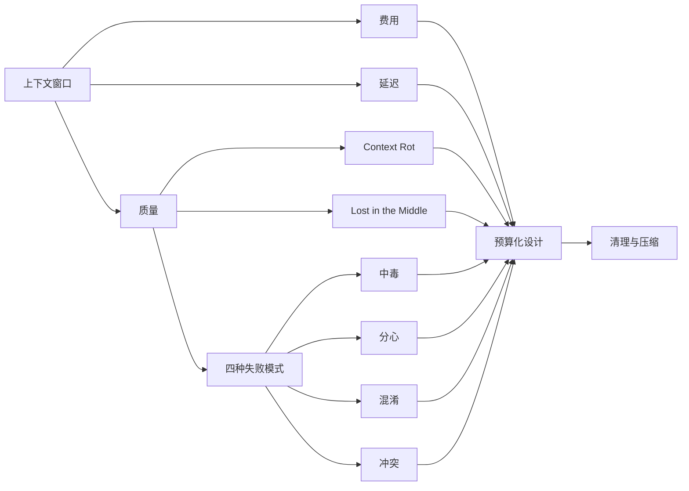
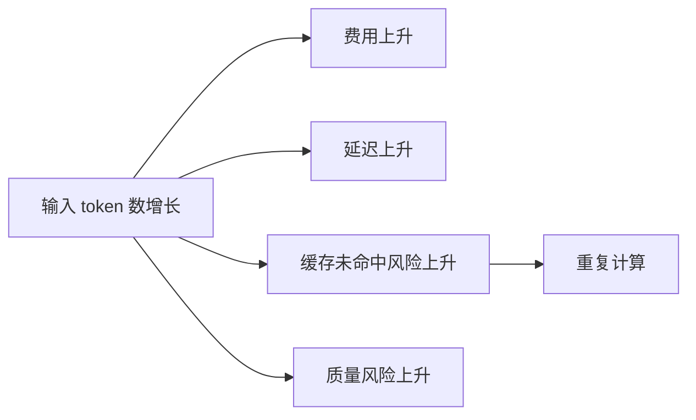
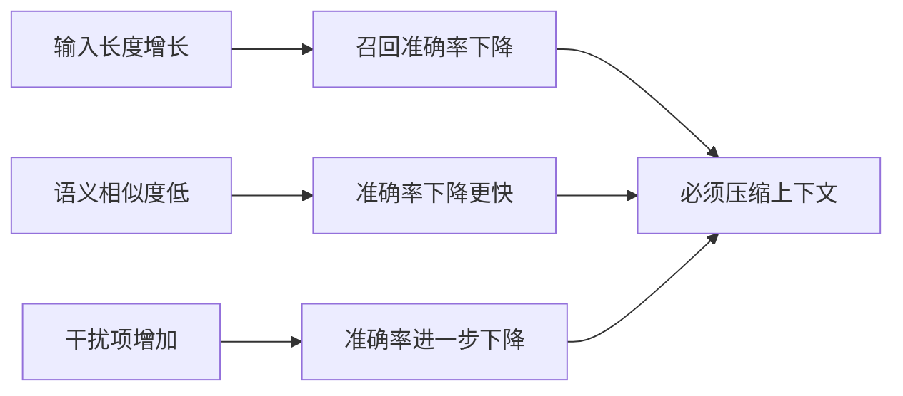
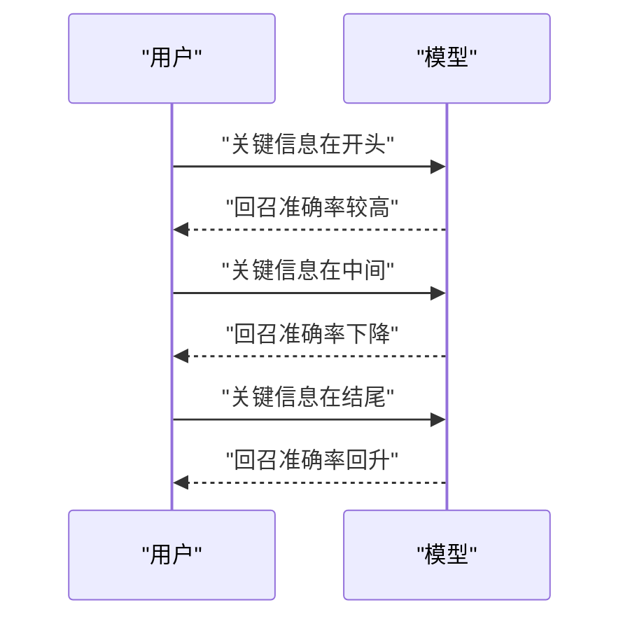
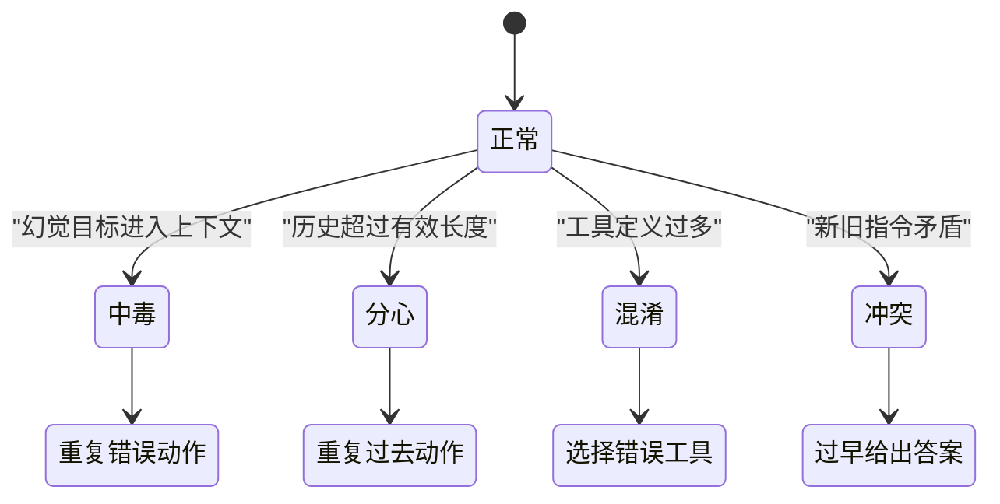
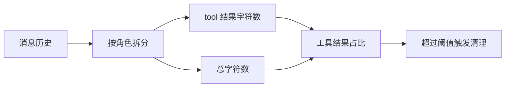
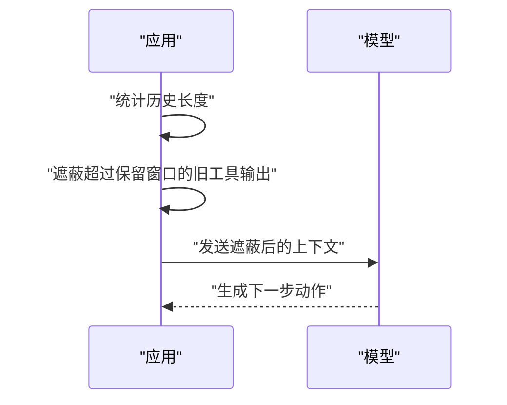
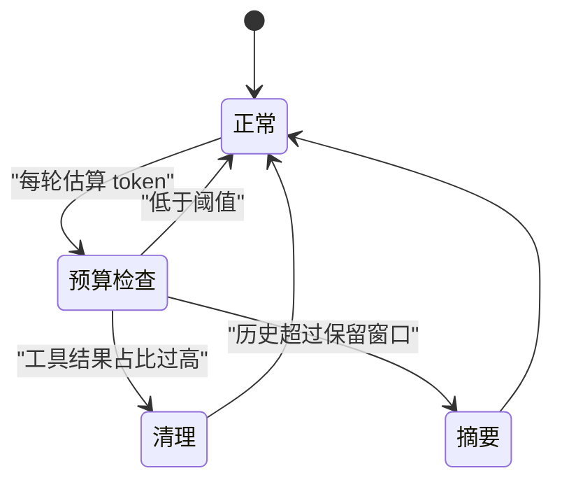

# 上下文膨胀：为什么越长越笨

!!! abstract "学完这一页你能"
    - 说出上下文变长时费用、延迟、质量三条线的变化，并写出可测量指标。
    - 解释 context rot 与 lost in the middle 的核心结论，并说出它们各自的研究来源。
    - 用中毒、分心、混淆、冲突四类模式给真实代理日志分类。
    - 用 Node 脚本统计工具结果占比，并在阈值触发时决定清理动作。

## 0. 知识地图



1. 从第 1 节开始，先建立成本概念。
2. 第 2、3、4 节解释质量风险：长度、位置、失败模式。
3. 第 5、6、7 节转入测量与工程落地，顺序不要跳。

## 1. 上下文窗口不是免费抽屉

**先想一个问题**：一个 200,000 token 的输入，和 20,000 token 的输入相比，只是容量变大，还是每一轮都在产生额外成本？

**心智模型**：

!!! tip "心智模型"
    一句话模型：上下文窗口是工作台，不是无限仓库。日常类比：厨房台面越大，找一把刀的时间越长。类比在哪里不成立：物理台面不会让中间物品自动变模糊，模型注意力会。

!!! note "术语：上下文窗口"
    上下文窗口是模型单次推理能接收的最大输入 token 数。例如，某模型窗口为 200,000 token，超过后请求会被拒绝或触发压缩。

**图解**：



1. 输入 token 数同时作用于费用、延迟与质量三条线。
2. 缓存未命中会让同一段历史被重复计费与重复计算。
3. 质量风险不会等窗口满才出现，它从更早开始累积。

**一步一步来**：

**① 这一步要做什么**：写一个费用计算函数，对比缓存命中与未命中时的输入成本。

```js
// cost.js 片段
function inputCost(tokens, cachedRatio, uncachedPrice, cachedPrice) {
  const cachedTokens = Math.floor(tokens * cachedRatio);
  const uncachedTokens = tokens - cachedTokens;
  return {
    cachedTokens,
    uncachedTokens,
    total: cachedTokens * cachedPrice + uncachedTokens * uncachedPrice,
  };
}
```

**这段代码在做什么**
- 输入 `tokens` 是这一轮送入模型的总输入 token 数。
- `cachedRatio` 是其中能命中读缓存的比例。
- `uncachedPrice` 与 `cachedPrice` 分别代表未命中与命中的单位价格。
- `total` 是两者加权和，用来比较稳定前缀的收益。

运行结果：

```
inputCost(1000000, 0.8, 3, 0.3)
=> { cachedTokens: 800000, uncachedTokens: 200000, total: 840000 }
```

**② 这一步要做什么**：用 Anthropic 文档中 Opus 5.5 的价格例子，断言缓存读价比基础输入价低得多。

```js
// cost-assert.js
import assert from "node:assert/strict";

const base = 4;          // 来源：Anthropic 文档示例，Opus 5.5
const cacheRead = 0.2;   // 来源：Anthropic 文档示例
assert.ok(cacheRead < base * 0.1, "缓存读价应低于基础输入价的 0.1x");
console.log(`缓存读价是基础输入价的 ${(cacheRead / base).toFixed(3)}x`);
```

**这段代码在做什么**
- 使用资料中 Anthropic 文档的 Opus 5.5 示例数字：基础输入 $4/MTok、缓存读 $0.20。
- 断言缓存读价低于基础输入价的 0.1x。
- 输出比例，用于判断前缀稳定性值得投入多少工程时间。

运行结果：

```
缓存读价是基础输入价的 0.050x
```

**动手验证**：

```js
import assert from "node:assert/strict";

function savings(tokens, cachedRatio, uncached, cached) {
  const without = tokens * uncached;
  const withCache = tokens * ((1 - cachedRatio) * uncached + cachedRatio * cached);
  return without - withCache;
}

// 1M tokens，80% 命中，价格用 Anthropic 文档 Opus 5.5 示例数字
const saved = savings(1_000_000, 0.8, 4, 0.2);
assert.equal(saved, 3_040_000);
console.log(`1M tokens、80% 命中时，节省输入费用 ${saved}`);
```

**常见坑**：

| 现象 | 原因 | 怎么修 |
|---|---|---|
| 只按窗口上限设计，费用突然上升 | 输入 token 与缓存命中率未被分开计算 | 记录 `total input tokens` 与 `cache read tokens` |
| 每次请求都重新发全部历史 | 前缀被时间戳或顺序变化破坏 | 固定 system prompt 前缀，不插入动态字段 |
| 认为延迟只是模型速度问题 | 输入变长会增加前向计算，未命中缓存还会重复计算 | 压测时同时记录 token 数与首 token 延迟 |

**用在哪里**：

- 业务背景：电商客服要把最近 30 天聊天记录拼给模型做摘要。
  这一节的知识怎么用：先计算全量记录的输入 token 与缓存命中率。
  用什么指标衡量收益：单次请求输入 token 数、缓存命中率、单 ticket 成本。
  什么时候不该用：需要逐字引用原始聊天记录作为证据时，不能只做摘要。

- 业务背景：代码审查代理一次读取多个 PR diff。
  这一节的知识怎么用：把公共 diff 前缀放在缓存命中的前缀区，动态部分追加到末尾。
  用什么指标衡量收益：每轮审查费用、首 token 延迟。
  什么时候不该用：PR diff 极小且频繁变化，稳定前缀带来的复杂度可能超过收益。

- 业务背景：财报问答产品要求模型回答 400 页年报中的问题。
  这一节的知识怎么用：用上下文成本评估全文档检索与分块检索的差异。
  用什么指标衡量收益：单问题平均费用、回答总时长。
  什么时候不该用：必须给出精确引用页码时，不能只发送压缩内容。

**行业实践**：

- Anthropic《Effective Context Engineering for AI Agents》提出：找到能最大化目标结果的最小高信号 token 集合。怎么借鉴到你的项目：先定义任务目标，再删掉与目标无关的历史，而不是只按 token 上限截断。
- Manus《Context Engineering for AI Agents: Lessons from Building Manus》描述约 100:1 的输入输出 token 比，并用缓存价差压成本。怎么借鉴到你的项目：保持 prompt 前缀稳定，把缓存命中率作为生产代理的第一指标。
- Claude Code 官方文档记录缓存命中率的一线核算。怎么借鉴到你的项目：把缓存命中率放进可观测面板，每次上下文编辑后单独计算重建成本。

**小结**：

1. 上下文窗口同时产生费用、延迟与质量三类成本。
2. 缓存读价可能低到基础输入价的 0.05x，但前缀不稳定会失去这个收益。
3. 设计上下文时要同时看 token 总量与缓存命中率。

## 2. Context Rot：越长越容易漏

**先想一个问题**：18 个模型在同一个“找针”任务里，输入长度从短变长，它们的准确率会不变吗？

**心智模型**：

!!! tip "心智模型"
    一句话模型：上下文越长，召回精度越容易被摊薄。日常类比：在 100 页合同里找一条违约条款。类比在哪里不成立：合同不会因为中间页而被自动弱化，模型会。

!!! note "术语：Context Rot"
    Context Rot 指召回准确率随 token 数上升而下降。Anthropic《Effective Context Engineering for AI Agents》这样定义，Chroma《Context Rot》用 18 个模型复现了输入长度影响。

**图解**：



1. 输入长度本身就会拉低召回准确率。
2. 题目与目标内容语义相似度低时，下降更快。
3. 干扰项数量会叠加影响，不是每个干扰项造成同样的伤害。

**一步一步来**：

**① 这一步要做什么**：先搭一个本地可运行的“长度-准确率”实验模板，用桩数据演示趋势。

```js
// length-bench.js
const lengths = [1000, 10000, 50000, 100000, 200000];
const accuracies = [0.92, 0.84, 0.71, 0.63, 0.55];

function assertNonIncreasing(values) {
  for (let i = 1; i < values.length; i++) {
    if (values[i] > values[i - 1]) return false;
  }
  return true;
}

console.log("单调不增：", assertNonIncreasing(accuracies));
```

**这段代码在做什么**
- `lengths` 是输入 token 的五个档位。
- `accuracies` 是示例数据，不是任何论文的实测值。
- `assertNonIncreasing` 检查准确率是否随长度单调不增。
- 真实评测时，把 `accuracies` 替换为模型在每个长度档位的实测结果。

运行结果：

```
单调不增： true
```

**② 这一步要做什么**：加入语义相似度变量，断言低相似组下降更快。

```js
// similarity-bench.js
function drop(series) {
  return series[0] - series[series.length - 1];
}

const highSimilarity = [0.93, 0.90, 0.86, 0.83, 0.80];
const lowSimilarity = [0.91, 0.82, 0.64, 0.51, 0.42];

console.log("高相似度降幅：", drop(highSimilarity).toFixed(2));
console.log("低相似度降幅：", drop(lowSimilarity).toFixed(2));
```

**这段代码在做什么**
- `highSimilarity` 与 `lowSimilarity` 是两组示例数据。
- `drop` 计算从最短到最长时的降幅。
- 输出展示低相似度组降幅更大，真实数据需要从模型评测中取得。

运行结果：

```
高相似度降幅： 0.13
低相似度降幅： 0.49
```

**动手验证**：

```js
import assert from "node:assert/strict";

const seriesA = [0.91, 0.82, 0.64, 0.51, 0.42];
const seriesB = [0.93, 0.90, 0.86, 0.83, 0.80];

const dropA = seriesA[0] - seriesA[4];
const dropB = seriesB[0] - seriesB[4];

assert.ok(dropA > dropB, "低相似度组降幅必须大于高相似度组");
console.log(`低相似度降幅 ${dropA.toFixed(2)}，高相似度降幅 ${dropB.toFixed(2)}`);
```

**常见坑**：

| 现象 | 原因 | 怎么修 |
|---|---|---|
| 窗口很大，单条查找却失败 | 输入越长，召回精度越容易被摊薄 | 不要用窗口上限替代评测结果 |
| 只在无干扰项下测准确率 | 干扰项会叠加影响 | 测试中同时放 1 个与 4 个干扰项 |
| 用高相似度样本得出乐观结论 | 语义相似度影响下降速度 | 分开统计高相似与低相似两个子集 |

**用在哪里**：

- 业务背景：RAG 系统把检索后的 20 个段落拼成上下文。
  这一节的知识怎么用：短列表优先，干扰段落必须能被语义相似度排序排除。
  用什么指标衡量收益：目标片段召回准确率、答案引用率。
  什么时候不该用：检索结果本身极少时，过度压缩可能丢掉唯一证据。

- 业务背景：日志排障助手把 5 小时滚动日志发给模型。
  这一节的知识怎么用：先按时间与错误级别筛选，减少无信号 token。
  用什么指标衡量收益：定位故障根因所需轮次、上下文长度。
  什么时候不该用：冷启动阶段没有日志行为分布时，不能贸然丢弃区间。

- 业务背景：多合同条款比对，每个合同 60 页。
  这一节的知识怎么用：每次只加载与用户问题最相关的条款段。
  用什么指标衡量收益：条款召回准确率、单次对比费用。
  什么时候不该用：需要合同全文联动解释时，单向裁剪可能改变语义。

**行业实践**：

- Chroma《Context Rot》测试 18 个模型，输入增长时所有模型性能都下降。怎么借鉴到你的项目：把输入长度档位作为评测维度，而不是只测一个窗口上限。
- Anthropic《Effective Context Engineering for AI Agents》提出用最小高信号 token 集合。怎么借鉴到你的项目：定义“高信号”依据任务目标，而不是文档字数。
- Claude Code 官方文档描述上下文满时清旧工具输出，再在必要时摘要。怎么借鉴到你的项目：优先删除无信号输出，保留请求与关键片段。

**小结**：

1. Context rot 的触发点早于窗口被塞满。
2. 干扰项与低语义相似度都会让下降更快。
3. 用长度档位与相似度分组做评测，能发现单点准确率看不到的风险。

## 3. Lost in the Middle：位置决定记忆

**先想一个问题**：同一段关键信息，放在开头、中间、结尾，模型会同等重视吗？

**心智模型**：

!!! tip "心智模型"
    一句话模型：中间的信息最容易被模型漏读。日常类比：连续会议中段的行动项最常被忘记。类比在哪里不成立：模型的这种位置偏差来自注意力机制，不是人的疲劳曲线。

!!! note "术语：Lost in the Middle"
    Lost in the Middle 指在多文档问答与键值检索中，相关信息在开头或结尾时表现最高，在中间时下降。该结论来自 Liu et al. 2023，来源 arXiv 2307.03172，以原文为准。

**图解**：



1. 开头位置获得较高回召准确率。
2. 中间位置回召准确率下降。
3. 结尾位置回召准确率回升。
4. 这不是模型完全忘记中间，而是位置影响了注意分配。

**一步一步来**：

**① 这一步要做什么**：用位置数组生成示例得分，模拟“两端高、中间低”的位置敏感分配器。

```js
// position-score.js
const positions = [0, 1, 2, 3, 4, 5, 6, 7, 8, 9, 10];

function scoreByPosition(pos) {
  const middle = 5;
  const dist = Math.abs(pos - middle);
  return 0.55 + dist * 0.08;
}

console.log(positions.map((p) => scoreByPosition(p).toFixed(2)));
```

**这段代码在做什么**
- `positions` 表示 11 个插入点。
- `scoreByPosition` 是一个位置敏感示例函数，不是真实模型。
- 中间位置得分最低，两端逐步升高。
- 真实评测时，用模型对同一关键信息在不同位置的回答正确率替换它。

运行结果：

```
0.95 0.87 0.79 0.71 0.63 0.55 0.63 0.71 0.79 0.87 0.95
```

**② 这一步要做什么**：断言中间三个位置的平均分低于开头三个位置。

```js
import assert from "node:assert/strict";

const scores = positions.map(scoreByPosition);
const headAvg = (scores[0] + scores[1] + scores[2]) / 3;
const midAvg = (scores[4] + scores[5] + scores[6]) / 3;

assert.ok(headAvg > midAvg, "开头平均分必须高于中间平均分");
console.log(`开头均值 ${headAvg.toFixed(2)}，中间均值 ${midAvg.toFixed(2)}`);
```

**这段代码在做什么**
- 取开头三个位置与中间三个位置。
- 断言开头平均分更高。
- 这个断言是模拟实验的骨架，真实模型评测也能沿用同一结构。

运行结果：

```
开头均值 0.87，中间均值 0.60
```

**动手验证**：

```js
import assert from "node:assert/strict";

function positionScores(length = 11) {
  const middle = Math.floor(length / 2);
  return Array.from({ length }, (_, p) => 0.55 + Math.abs(p - middle) * 0.08);
}

const s = positionScores();
const head = (s[0] + s[1] + s[2]) / 3;
const tail = (s[8] + s[9] + s[10]) / 3;
const mid = (s[4] + s[5] + s[6]) / 3;

assert.ok(head > mid && tail > mid);
console.log(`两端均值 ${head.toFixed(2)} / ${tail.toFixed(2)}，中间均值 ${mid.toFixed(2)}`);
```

**常见坑**：

| 现象 | 原因 | 怎么修 |
|---|---|---|
| 把最相关段落放在 30 段中间 | 中间位置被弱化 | 把核心段落放到开头或结尾 |
| 只测一个位置 | 位置会显著改变结果 | 用 11 个位置做固定档位评测 |
| 用“模型读完了”解释失败 | 位置偏差不是读没读完 | 记录位置与准确率，不看总输入长度 |

**用在哪里**：

- 业务背景：多文档法律检索，检索段落会拼接成长上下文。
  这一节的知识怎么用：相关性最高的两条段落放开头与结尾。
  用什么指标衡量收益：关键证据召回准确率。
  什么时候不该用：段落之间有严格时间顺序时，不能随意重排。

- 业务背景：长会议记录问答，会议纪要有 60 条发言。
  这一节的知识怎么用：把行动项与结论放到检索结果两端，不埋在中间。
  用什么指标衡量收益：行动项召回率。
  什么时候不该用：发言顺序本身就是分析对象时，不能用重排隐藏冲突。

- 业务背景：保险条款问答，条款按章节编号。
  这一节的知识怎么用：检索后把最相关章节前置，规则条款保留原文。
  用什么指标衡量收益：条款号引用准确率。
  什么时候不该用：必须按章节顺序解释时，前置会破坏语义。

**行业实践**：

- Liu et al. 2023《Lost in the Middle》：相关信息在开头或结尾表现最高，中间显著下降。怎么借鉴到你的项目：评测时固定关键信息位置，报告不同位置准确率。
- Manus 博客描述重写 todo.md，把近期目标推进当前注意区间。怎么借鉴到你的项目：维护一个动态目标文件，让目标始终靠近末尾。
- Claude Code 文档描述压缩时保留最近访问文件。怎么借鉴到你的项目：把高优先级最新证据放在上下文尾部，旧摘要放前部。

**小结**：

1. 位置本身会改变模型找回信息的能力。
2. 中间位置的下降可以用位置档位实验测出来。
3. 工程上应把最高优先信号放在两端。

## 4. 四种失败模式：中毒、分心、混淆、冲突

**先想一个问题**：代理日志越长，模型越容易出现哪几类“越走越错”的现象？

**心智模型**：

!!! tip "心智模型"
    一句话模型：上下文中的错误不是静态垃圾，它会参与后续推理。日常类比：方向盘偏了一点，车会越开越偏。类比在哪里不成立：车不会自己反复引用旧错误，模型会。

!!! note "术语：四种上下文失败模式"
    Drew Breunig 在《How Long Contexts Fail》中把失败分为：上下文中毒、分心、混淆、冲突。中毒是错误进入上下文并被反复引用；分心是模型过度权重历史；混淆是多余内容干扰判断；冲突是新旧内容互相矛盾。

**图解**：



1. 四种状态都从正常状态开始。
2. 每种失败都对应一个可观察行为。
3. 识别失败模式后，才能选择清理、隔离还是保留证据。

**一步一步来**：

**① 这一步要做什么**：写一个规则分类器，从日志文本中初步识别四类失败。

```js
// failure-classify.js
export function classifyFailure(messages) {
  const text = messages.map((m) => m.text).join("\n");
  if ((text.match(/买 1000 股/g) || []).length >= 2) return "poisoning";
  if ((text.match(/重新执行上一步/g) || []).length >= 3) return "distraction";
  if ((text.match(/可用工具/g) || []).length >= 10) return "confusion";
  if (text.includes("必须以 A 为准") && text.includes("必须以 B 为准")) return "clash";
  return "normal";
}
```

**这段代码在做什么**
- `messages` 是对话历史数组。
- `poisoning` 用重复错误目标识别，这里示例为重复出现的“买 1000 股”。
- `distraction` 用重复旧动作识别，这里示例为多次“重新执行上一步”。
- `confusion` 用过多工具定义识别。
- `clash` 用两个互斥指令识别。

**② 这一步要做什么**：用四条样本验证分类器。

```js
import assert from "node:assert/strict";

const cases = [
  { text: "买 1000 股", repeat: 2, want: "poisoning" },
  { text: "重新执行上一步", repeat: 3, want: "distraction" },
  { text: "可用工具", repeat: 10, want: "confusion" },
  { text: "必须以 A 为准\n必须以 B 为准", want: "clash" },
];

for (const c of cases) {
  const messages = [{ text: c.repeat ? c.text.repeat(c.repeat) : c.text }];
  assert.equal(classifyFailure(messages), c.want);
}
console.log("四类样本分类通过");
```

**这段代码在做什么**
- 四条样本分别触发四种返回。
- `assert.equal` 验证分类结果。
- 真实项目中，规则需要替换为具体日志特征。

运行结果：

```
四类样本分类通过
```

**动手验证**：

```js
import assert from "node:assert/strict";

const samples = [
  ["买 1000 股", "买 1000 股", "买 1000 股"],
  ["重新执行上一步", "重新执行上一步", "重新执行上一步"],
  ["可用工具", "可用工具", "可用工具", "可用工具", "可用工具"],
];

function detect(items) {
  const t = items.join("\n");
  if (t.includes("买 1000 股") && t.indexOf("买 1000 股") !== t.lastIndexOf("买 1000 股")) return "poisoning";
  if (t.startsWith("重新执行上一步")) return "distraction";
  return "unknown";
}

assert.equal(detect(samples[0]), "poisoning");
assert.equal(detect(samples[1]), "distraction");
console.log("最小检测脚本通过");
```

**常见坑**：

| 现象 | 原因 | 怎么修 |
|---|---|---|
| 错误进入目标后模型一直追 | 中毒内容被反复引用 | 在目标区更新前加校验，错误目标不准进入持久目标文件 |
| 100k token 后重复旧动作 | 历史权重被过度放大 | 缩短有效历史或强制生成新动作 |
| 工具列表越多，调用越错 | 多余工具让选择变难 | 动态加载工具，只在需要时注入定义 |
| 新旧指令矛盾时模型过早作答 | 早期假设被后续事实反转 | 把冲突显式列出，提示模型先解决矛盾 |

**用在哪里**：

- 业务背景：周报生成代理读取 3 个团队的历史周报。
  这一节的知识怎么用：优先识别“冲突”，当新周报说收入降、旧周报说收入升时先标注。
  用什么指标衡量收益：错误结论被拦截的比例。
  什么时候不该用：历史观点本身需要被保留时，不能简单删掉旧结论。

- 业务背景：营销素材生成代理带有 40 个工具。
  这一节的知识怎么用：只注入与当前任务有关的 10 个工具，降低混淆。
  用什么指标衡量收益：工具选择准确率、生成轮次。
  什么时候不该用：任务跨度大，前后可能需要多种工具时，过早限制会失败。

- 业务背景：客服代理在同一会话中先退了旧订单，又查到新优惠。
  这一节的知识怎么用：把新旧事实放到最近的上下文中，显式列差异。
  用什么指标衡量收益：客户重召回率、错误退款率。
  什么时候不该用：涉及合规记录时，不能只留结论不留过程。

**行业实践**：

- Drew Breunig《How Long Contexts Fail》给出四类失败模式定义。怎么借鉴到你的项目：为四类模式各建一个日志标签，出现时触发不同策略。
- Manus 博客描述保留失败动作与错误堆栈。怎么借鉴到你的项目：清理不是删除所有错误，而是保留短格式错误证据。
- 资料提到微软与 Salesforce 对分片多轮提示的研究，平均性能下降 39%，o3 从 98.1 降到 64.1。怎么借鉴到你的项目：多轮任务把早期结论隔离，避免过早锁定答案。

**小结**：

1. 上下文失败可分四类，分别有不同的触发与修法。
2. 清理策略必须区分“错误证据”和“错误目标”。
3. 先识别失败模式，再决定保留、隔离还是删除。

## 5. 工具结果占比：先量后裁

**先想一个问题**：代理调用 read、bash、API 后，原始输出回填上下文，这些输出是不是上下文膨胀的主因？

**心智模型**：

!!! tip "心智模型"
    一句话模型：工具结果是原材料，不该全部堆到工作台。日常类比：只看购物清单，不把整袋面粉放桌上。类比在哪里不成立：模型有时需要原始细节，不能每个输出都只留摘要。

!!! note "术语：工具结果"
    工具结果是代理调用工具后返回给模型的文本。例如文件读取内容、命令输出、API 返回 JSON。真实 token 数要用 API count_tokens 核对，本页脚本只做字符占比定位。

**图解**：



1. 将消息历史按角色拆分。
2. 统计 tool 结果的字符数。
3. 用总字符数计算占比。
4. 超过预设阈值后触发清理，不靠感觉判断。

**一步一步来**：

**① 这一步要做什么**：写一个统计函数，计算 tool 结果字符占比。

```js
// tool-ratio.js
export function toolRatio(messages) {
  const total = messages.reduce((sum, m) => sum + m.content.length, 0);
  const tool = messages
    .filter((m) => m.role === "tool")
    .reduce((sum, m) => sum + m.content.length, 0);
  return { total, tool, ratio: tool / total };
}
```

**这段代码在做什么**
- `messages` 中每个元素有 `role` 与 `content`。
- `total` 是所有消息内容的字符总数。
- `tool` 是所有 `role === "tool"` 的内容字符数。
- `ratio` 是工具结果占历史总量的比例。

**② 这一步要做什么**：给定一段示例历史，断言计算出的占比等于预期值。

```js
import assert from "node:assert/strict";

const history = [
  { role: "user", content: "读日志".repeat(10) },
  { role: "tool", content: "ERROR".repeat(100) },
  { role: "assistant", content: "已读".repeat(5) },
];

const r = toolRatio(history);
assert.equal(r.tool, 500);
console.log(`工具结果字符占比 ${(r.ratio * 100).toFixed(0)}%`);
```

**这段代码在做什么**
- user 内容为 30 个字符，tool 内容为 500 个字符，assistant 内容为 10 个字符。
- 断言 tool 字符数等于 500。
- 输出占比，用来判断是否达到清理阈值。

运行结果：

```
工具结果字符占比 93%
```

**动手验证**：

```js
import assert from "node:assert/strict";

function toolRatio(messages) {
  const total = messages.reduce((s, m) => s + m.content.length, 0);
  const tool = messages.filter((m) => m.role === "tool").reduce((s, m) => s + m.content.length, 0);
  return { total, tool, ratio: tool / total };
}

const r = toolRatio([
  { role: "user", content: "A".repeat(90) },
  { role: "tool", content: "B".repeat(10) },
]);

assert.ok(r.tool === 10 && r.total === 100);
assert.ok(r.ratio === 0.1);
console.log(`ratio=${r.ratio}`);
```

**常见坑**：

| 现象 | 原因 | 怎么修 |
|---|---|---|
| 只看总 token 数，不知道谁在膨胀 | 没有按角色拆分统计 | 按 user、assistant、tool、system 分别统计 |
| 用字符数代替 token 数 | 字符与 token 不是固定换算 | 先用字符占比定位，再用 API count_tokens 核对 |
| 清理工具结果后无法诊断 | 没保留旧输出副本 | 客户端保留全量历史，服务端只清理发送给模型的内容 |

**用在哪里**：

- 业务背景：RAG 代理调用文档接口，每个文档返回 20,000 字。
  这一节的知识怎么用：统计工具结果占比，先过滤出相关段落。
  用什么指标衡量收益：工具结果 token 占比、最终答案引用率。
  什么时候不该用：文档需要原文引用时，过滤不能删掉锚点。

- 业务背景：代码代理跑测试，bash 输出有 10,000 行日志。
  这一节的知识怎么用：只保留匹配 ERROR 的行，其他用占位符替代。
  用什么指标衡量收益：工具结果 token 数。
  什么时候不该用：测试失败根因可能藏在非 ERROR 行时。

- 业务背景：电商库存查询返回 500 个 SKU 的大 JSON。
  这一节的知识怎么用：统计 JSON 输出占比，再按 SKU 是否被用户询问裁剪。
  用什么指标衡量收益：单次查询 token、响应延迟。
  什么时候不该用：库存全量校验需要完整数据时。

**行业实践**：

- Anthropic 平台文档《Context editing》描述工具结果清理，默认在 100,000 输入 token 触发，保留最近 3 个工具调用结果。怎么借鉴到你的项目：把默认值作为起点，按业务调整保留数量。
- Claude Code 官方文档的 hooks 示例把 10,000 行日志过滤到匹配 ERROR 的行，token 从数万降到数百。怎么借鉴到你的项目：先写代码过滤，不让主模型看到无信号行。
- pi 文档记录在摘要前把工具结果截短到 2,000 字符。怎么借鉴到你的项目：压缩前先对超大工具输出做硬截断，再进入摘要步骤。

**小结**：

1. 工具结果常常是上下文膨胀的最大来源。
2. 按角色统计占比，能定位先裁哪里。
3. 真实 token 必须用 API count_tokens 核对，字符统计只用于定位。

## 6. 清理、屏蔽与摘要

**先想一个问题**：上下文快满时，有“清理工具结果、旧轮次屏蔽、模型写摘要”三种做法，先选哪个？

**心智模型**：

!!! tip "心智模型"
    一句话模型：压缩不是删除过去，而是把过去折叠成可恢复的索引。日常类比：旧邮件归档，最近三封留在桌面。类比在哪里不成立：摘要会丢失精确路径与命令，归档不会。

!!! note "术语：Observation masking"
    Observation masking 是把旧工具输出替换为占位符。JetBrains 研究《The Complexity Trap》在 SWE-bench Verified 中使用了这种规则清理，来源 arXiv 2508.21433，以原文为准。

**图解**：



1. 应用先统计历史长度。
2. 规则清理直接替换旧工具输出，不调用模型。
3. 发送遮蔽后的上下文，客户端仍保留原历史。
4. 模型继续生成下一步动作。

**一步一步来**：

**① 这一步要做什么**：实现观察屏蔽，保留最近 N 条工具结果，旧输出替换为占位符。

```js
// mask-old-results.js
export function maskOldToolResults(messages, keep = 3) {
  let seen = 0;
  return messages.map((m) => {
    if (m.role !== "tool") return m;
    seen += 1;
    if (seen > keep) return { ...m, content: "[old tool output cleared]" };
    return m;
  });
}
```

**这段代码在做什么**
- `messages` 是历史数组，`keep` 是保留的最近工具结果条数。
- 从开头向后遍历，每遇到一条 tool 计数。
- 超过 `keep` 的 tool 输出被替换为占位符。
- 不修改客户端原始历史，只改发送前副本。

**② 这一步要做什么**：计算遮蔽后节省的字符数，并验证最近结果仍保留。

```js
import assert from "node:assert/strict";

const history = [
  { role: "tool", content: "OLD-A" },
  { role: "tool", content: "OLD-B" },
  { role: "tool", content: "OLD-C" },
  { role: "tool", content: "NEW-D" },
];

const masked = maskOldToolResults(history, 2);
assert.equal(masked[0].content, "[old tool output cleared]");
assert.equal(masked[3].content, "NEW-D");
console.log("旧输出已遮蔽，最近输出保留");
```

**这段代码在做什么**
- 四条工具结果按时间顺序排列。
- `keep = 2` 表示保留最近两条，即 `OLD-C` 与 `NEW-D`。
- 断言最早两条被替换。
- 输出确认规则生效。

运行结果：

```
旧输出已遮蔽，最近输出保留
```

**动手验证**：

```js
import assert from "node:assert/strict";

function mask(messages, keep = 3) {
  let seen = 0;
  return messages.map((m) => {
    if (m.role !== "tool") return m;
    seen += 1;
    return seen > keep ? { ...m, content: "[cleared]" } : m;
  });
}

const before = ["t1", "t2", "t3", "t4"].map((c) => ({ role: "tool", content: c }));
const after = mask(before, 2);

assert.equal(after[0].content, "[cleared]");
assert.equal(after[1].content, "[cleared]");
assert.equal(after[2].content, "t3");
assert.equal(after[3].content, "t4");
console.log("observing masking 通过");
```

**常见坑**：

| 现象 | 原因 | 怎么修 |
|---|---|---|
| 摘要后模型继续做无意义动作 | 摘要隐藏了停止信号 | 在摘要中显式写“当前已完成”或“已停止” |
| 摘要本身很贵 | 模型需要额外采样生成摘要 | 先做规则清理，能达到目标就不用摘要 |
| 遮蔽清掉错误证据 | 旧工具输出包含失败原因 | 客户端保留全量历史，只在发送给模型时遮蔽 |

**用在哪里**：

- 业务背景：代码代理长时间排障，工具输出很多。
  这一节的知识怎么用：旧测试输出用占位符遮蔽，保留最近 10 轮。
  用什么指标衡量收益：单轮 token、错误修复率。
  什么时候不该用：旧输出中可能有关键错误根因时。

- 业务背景：客服机器人滚动会话一天后历史变长。
  这一节的知识怎么用：早期订单查询返回体遮蔽，留下结论与最近 5 轮原话。
  用什么指标衡量收益：首 token 延迟、回复相关性。
  什么时候不该用：客户要求核对早期订单明细时。

- 业务背景：研究代理读 30 篇论文并逐篇写笔记。
  这一节的知识怎么用：每篇只保留结论与引用定位，原文放到外部文件。
  用什么指标衡量收益：上下文 token、引用遗漏率。
  什么时候不该用：写作需要逐字摘录时，不能只留摘要。

**行业实践**：

- JetBrains 博客《Efficient Context Management》公布：观察遮蔽比原始代理省一半成本，且解决率等于或略高于 LLM 摘要；遮蔽在 5 个设置中 4 个更省。怎么借鉴到你的项目：把观察遮蔽作为第一层压缩。
- Anthropic 平台文档把工具结果清理称为轻量压缩。怎么借鉴到你的项目：先做无需模型调用的清理，再决定是否加摘要。
- Claude Code 文档记录上下文满时先清理旧工具输出，再在必要时摘要。怎么借鉴到你的项目：设置两级策略，避免一开始就调摘要模型。

**小结**：

1. 观察遮蔽无模型调用，成本低于摘要。
2. 摘要可能隐藏停止信号，甚至延长任务轨迹。
3. 规则清理与 LLM 摘要可以叠加，但顺序要固定。

## 7. 预算化设计：把上下文当钱花

**先想一个问题**：窗口是 200,000 token，就代表每轮都要用到 200,000 token 才开始压缩吗？

**心智模型**：

!!! tip "心智模型"
    一句话模型：上下文预算是拨给一次推理的经费，不是容量上限。日常类比：按月拨预算，不要刷信用卡刷到上限。类比在哪里不成立：质量风险常常先于窗口上限出现。

!!! note "术语：Prompt caching"
    Prompt caching 对稳定前缀只计一次写成本，后续请求按低价读缓存。Anthropic 官方文档记录缓存读价为 0.1x 或部分模型 0.05x，以原文为准。

**图解**：



1. 每轮开始时估算 token。
2. 低于阈值继续正常。
3. 工具结果占比过高先做规则清理。
4. 历史过长再进入摘要。
5. 两种动作都返回正常，再进入下一轮。

**一步一步来**：

**① 这一步要做什么**：实现一个预算闸门，把预算阈值与两种动作分开。

```js
// budget-gate.js
export function budgetGate(estimate, toolRatio, config) {
  if (estimate < config.budget) return "normal";
  if (toolRatio > 0.6) return "clear-tool-results";
  return "summarize";
}
```

**这段代码在做什么**
- `estimate` 是当前输入 token 估算。
- `toolRatio` 是工具结果占比。
- 先看总量是否低于预算，低于就正常。
- 总量过高时，优先清理工具结果，否则触发摘要。

**② 这一步要做什么**：验证不同估算值下闸门动作正确。

```js
import assert from "node:assert/strict";

const config = { budget: 100000 };
assert.equal(budgetGate(90000, 0.8, config), "normal");
assert.equal(budgetGate(110000, 0.8, config), "clear-tool-results");
assert.equal(budgetGate(110000, 0.2, config), "summarize");
console.log("预算闸门动作正确");
```

**这段代码在做什么**
- 低于 100,000 时正常。
- 高于预算且工具占比为 0.8 时清理工具结果。
- 高于预算但工具占比为 0.2 时进入摘要。

运行结果：

```
预算闸门动作正确
```

**动手验证**：

```js
import assert from "node:assert/strict";

function decide(estimate, toolRatio, budget = 100000) {
  if (estimate < budget) return "normal";
  return toolRatio > 0.6 ? "clear" : "summarize";
}

assert.equal(decide(80000, 0.9), "normal");
assert.equal(decide(120000, 0.9), "clear");
assert.equal(decide(120000, 0.1), "summarize");
console.log("预算化闸门通过");
```

**常见坑**：

| 现象 | 原因 | 怎么修 |
|---|---|---|
| 等窗口满了才动手 | 质量风险早于上限出现 | 预算阈值设为窗口的 60% 到 80% |
| 每次编辑历史都破坏缓存 | 前缀随请求变化 | system prompt 不插入时间戳，保持追加写 |
| 触发压缩后立刻又满 | 某条工具输出过大，反复回填 | 加抖动保护，连续几次后停止自动压缩 |

**用在哪里**：

- 业务背景：CRM 邮件生成代理，客户历史很长。
  这一节的知识怎么用：每轮估算 token，低于预算才追加历史。
  用什么指标衡量收益：每千条邮件的平均 token、缓存命中率。
  什么时候不该用：高价值客户需要完整历史支撑个性化时。

- 业务背景：金融研报摘要代理，从多个研报拼长上下文。
  这一节的知识怎么用：用预算决定载入全文还是只载入首页结论。
  用什么指标衡量收益：研报要点召回率、单报告成本。
  什么时候不该用：需要全文披露风险时，不能只摘要。

- 业务背景：SQL 查询代理，需要 schema 与表注释。
  这一节的知识怎么用：把稳定 schema 放在前缀区，动态问题放末尾。
  用什么指标衡量收益：缓存读命中率、单查询成本。
  什么时候不该用：schema 频繁变更时，强稳定前缀反而要反复刷新。

**行业实践**：

- Manus 博客强调保持 prompt 前缀稳定，不把时间戳放进 system prompt。怎么借鉴到你的项目：把每个动态字段都视为缓存破坏源，逐一移除。
- Claude Code 文档把缓存命中率作为一线指标，并提供 `/autocompact` 调节窗口。怎么借鉴到你的项目：给代理一个可调预算开关，而不是固定到窗口上限。
- Anthropic《Effective Context Engineering for AI Agents》描述子代理在干净窗口工作，返回约 1,000 到 2,000 token 摘要。怎么借鉴到你的项目：长任务拆分子代理，主代理只看简短结果。

**小结**：

1. 压缩阈值应早于窗口上限设置。
2. 先做规则清理，再进入模型摘要。
3. 稳定前缀与预算闸门共同决定长期成本。

## 应用地图

| 场景 | 用到本页哪个知识点 | 典型技术选型 | 注意事项 |
|---|---|---|---|
| 客服长对话摘要 | 工具结果占比、预算化设计 | 规则过滤加旧轮次屏蔽 | 原始记录保留在外部，不删除 |
| 代码代理排障 | 观察屏蔽、失败模式分类 | 保留最近 10 轮输出，前缀缓存 | 失败证据要用短格式保留 |
| RAG 长文档问答 | Context Rot、Lost in the Middle | 高相关段落放两端 | 分块排序不能破坏引用链 |
| 多工具营销代理 | 上下文混淆 | 动态加载工具定义 | 限制过严会漏掉跨任务工具 |
| 财报问答 | 上下文成本、位置偏差 | 分块检索加全文锚点 | 要逐字引用时关掉摘要 |
| 长时研究代理 | 子代理隔离、外部笔记 | 子代理返回 1k-2k token 摘要 | 子代理窗口要干净 |
| 客服转人工前摘要 | 冲突与中毒识别 | 新旧事实显式列差异 | 不要掩盖冲突 |
| 批量导入后台 | 工具结果占比与 pre-filter | 代码 hook 先过滤再回填 | 缺失的错误行会影响诊断 |

## 动手作业

**目标**：为客服代理写一个上下文预算器，能统计工具结果占比，并按预算决定清理动作。

**步骤**：

1. 准备 20 条消息，其中 12 条为 tool 结果，8 条为 user 或 assistant。
2. 实现 `toolRatio(messages)`，计算 tool 结果字符占比。
3. 实现 `maskOldToolResults(messages, keep = 3)`，只保留最近 3 条完整工具结果。
4. 实现 `budgetAction(estimate, toolRatio, budget)`，返回 `normal`、`clear-tool-results` 或 `summarize`。
5. 用 `node:assert/strict` 验证三组输入。

**验收标准**：

- `npm` 无额外依赖，脚本用 `node budget.js` 可运行。
- 当 `toolRatio > 0.6` 且 `estimate > budget` 时，返回 `clear-tool-results`。
- 当 `toolRatio <= 0.6` 且 `estimate > budget` 时，返回 `summarize`。
- 遮蔽后前 `N - keep` 条 tool 结果变为占位符，最近 3 条保持原文。
- 控制台输出三行结果，能被断言捕获。

## 综合对比

| 方案 | 单次成本 | 是否调模型 | 保留精确证据 | 缓存影响 | 质量风险 | 适用场景 |
|---|---|---|---|---|---|---|
| 不处理 | 随历史线性上升 | 否 | 是 | 前缀稳定 | 高，长度影响质量 | 短会话、少量工具 |
| 工具结果清理 | 几乎无新增成本 | 否 | 客户端保留 | 清理点后失效 | 中，可能丢错误根因 | 工具输出庞大且重复 |
| 观察屏蔽 | 低于摘要，JetBrains 记录省 52% | 否 | 客户端保留 | 编辑点后失效 | 中，遮蔽旧证据 | 长滚动工具历史 |
| LLM 摘要 | 需额外采样，JetBrains 记录摘要调用占每例成本超 7% | 是 | 否 | 摘要块后重建 | 中，可能隐藏停止信号 | 需要保留关键决策 |
| 子代理隔离 | 子代理输入较少，主代理只看 1k-2k token 摘要 | 是 | 否 | 子代理窗口干净 | 低到中，取决于摘要质量 | 独立长任务、研究类任务 |

## 深入阅读与参考

!!! tip "怎么用这些资料"
    先读「官方文档与规范」建立准确的概念，再读「源码与示例」核对细节，最后用「教程、书籍与视频」换一种讲法加深理解。每条都写明了读哪一节、带着什么问题读。

### 官方文档与规范

| 资源 | 为什么读 | 怎么读 |
|---|---|---|
| [Claude Code context facts: the docs' interactive simulation uses a 200 (code.claude.com)](https://code.claude.com/docs/en/context-window) | 官方交互模拟展示上下文构成与压缩时机，直观。 | 在模拟里看工具输出占比，再估算自己会话的同类比例。 |
| [Server-side compaction is enabled with `context_management` and `compa (developers.openai.com)](https://developers.openai.com/api/docs/guides/compaction) | 官方压缩接口与示例，说明摘要何时自动触发。 | 读 compaction 参数与调用示例，想清楚何时交给服务端压缩。 |
| [When context fills, Claude Code "clears older tool outputs first, then (code.claude.com)](https://code.claude.com/docs/en/how-claude-code-works) | 官方说明填满时优先清理旧工具输出，顺序有讲究。 | 读清理顺序一节，对照自己 Agent 的清理优先级是否一致。 |
| [Anthropic caches in the order tools → system → messages. A change at o (platform.claude.com)](https://platform.claude.com/docs/en/build-with-claude/prompt-caching) | 缓存顺序决定改动代价，直接影响上下文的真实成本。 | 读缓存顺序说明，检查提示里哪些改动会导致缓存失效。 |

### 源码与示例

| 资源 | 为什么读 | 怎么读 |
|---|---|---|
| [Hooks can pre-filter tool output. The docs' example reduces a 10,000-l (code.claude.com)](https://code.claude.com/docs/en/costs) | 可直接照抄的 hook 示例，把万行输出裁到很小。 | 照示例写一个过滤 hook，先在你的最长工具输出上试跑。 |

### 教程、书籍与视频

| 资源 | 为什么读 | 怎么读 |
|---|---|---|
| ["Lost in the Middle" (Liu et al., 2023): on multi-document QA and key- (arxiv.org)](https://arxiv.org/abs/2307.03172) | 位置偏中间的信息最易被忽略，是本页核心论据。 | 读多文档 QA 的位置对照实验，向同事解释中间位置为何被漏掉。 |
| [Chroma "Context Rot" (2025): 18 LLMs were tested, including GPT-4.1, C (trychroma.com)](https://www.trychroma.com/research/context-rot) | 18 个模型实测：上下文越长退化越明显，直接支撑 Context Rot。 | 读实验设计与退化曲线，记录你所用的模型表现，做成本页证据。 |
| [Context poisoning: a hallucination or error enters the context and is  (dbreunig.com)](https://www.dbreunig.com/2025/06/22/how-contexts-fail-and-how-to-fix-them.html) | 用具体案例讲错误如何进入上下文并自我强化。 | 读中毒案例链，回头检查自己 Agent 历史里有没有类似污染。 |
| [MemGPT's core framing: the context window is a scarce "fast memory", e (arxiv.org)](https://arxiv.org/abs/2310.08560) | 把上下文窗口视为稀缺快速内存，是预算化思维的源头。 | 读动机一节，写下你项目里这块“快内存”应该放什么。 |
| [Truncation / sliding window: drop the oldest turns and keep a recent w (blog.jetbrains.com)](https://blog.jetbrains.com/research/2025/12/efficient-context-management/) | 截断与滑动窗口是最常见也最粗暴的清理策略。 | 读截断小节，对比你项目的策略，列出会因此丢掉的关键信息。 |
| [The paper's headline claim is that simple observation masking "halves  (arxiv.org)](https://arxiv.org/abs/2508.21433) | 证明屏蔽旧工具输出就能近乎减半成本，结论有力。 | 读方法一节，挑一类工具输出试做屏蔽，记录 token 变化。 |
| [Context Engineering（Philipp Schmid）](https://www.philschmid.de/context-engineering) | 给出上下文来源分类，便于按类删减而非拍脑袋。 | 按文中分类盘点自己应用的上下文来源，逐项删减并记录。 |
| [Effective context engineering for AI agents](https://www.anthropic.com/engineering/effective-context-engineering-for-ai-agents) | 系统讲上下文工程实践，与本页清理与预算策略互补。 | 读完检查自己的 Agent 提示，删掉重复上下文并记录 token 变化。 |

## 自测题

??? question "1. 为什么上下文窗口越大，单轮费用不一定越低？"
    因为输入 token 数增加会推高未缓存输入成本，且前缀不稳定会导致缓存未命中。若输入从 200k 升到 1M，按 Anthropic 文档 Opus 5.5 示例，未命中部分按 $4/MTok 计，命中部分按 $0.20 计。需要同时记录总输入与缓存读 token 数。

??? question "2. Context Rot 与 Lost in the Middle 有什么不同？"
    Context Rot 关注输入长度增长导致召回准确率下降，Chroma 用 18 个模型验证。Lost in the Middle 关注相关信息在输入中的位置效应，开头与结尾表现高，中间下降，来自 Liu et al. 2023。前者看长度，后者看位置。

??? question "3. 一个代理在 100k token 后反复执行过去动作，属于哪类失败？"
    属于上下文分心。模型过度权重累积历史，重复过去动作。资料提到 Gemini 2.5 在超过 100k token 后倾向于重复过去动作。修复方式是缩短有效历史或要求模型生成新动作。

??? question "4. 工具结果占比怎样才算可复现的测量？"
    让每条消息带 `role` 与 `content`，计算 tool 内容字符数除以历史总字符数。字符统计只作定位，不替代 token 数。真实 token 数用 API `count_tokens` 核对。同一组历史输入应得到同一占比。

??? question "5. 为什么观察屏蔽可能优于 LLM 摘要？"
    JetBrains 研究显示观察遮蔽省 52% 成本，且解决率等于或略高于摘要。摘要需要额外采样，自身成本高，还可能隐藏停止信号。观察遮蔽是规则操作，不调模型。

??? question "6. 前缀里放一个时间戳会有什么后果？"
    会破坏缓存。Manus 记录单个 token 差异会让缓存从该 token 起失效，后续前缀都不再命中。因此 system prompt 应移除时间戳，保持确定性序列。

??? question "7. 清理工具结果与保留失败证据如何兼得？"
    客户端保留全量历史，只把发送给模型的那份历史做清理。工具结果在客户端仍是原文，失败堆栈可留在外部文件。模型侧可保留短格式错误证据，Manus 就是这样处理。

??? question "8. 预算阈值应该设在哪里？"
    不应设在窗口满。质量风险早于上限出现，Chroma 与 Anthropic 均指出上下文增长影响质量。工程上可先设为窗口的 60% 到 80%，再按评测调整。具体最佳值资料未给出，需用本页实验模板核对。

## 延伸阅读

- Anthropic 官方工程文章《Effective Context Engineering for AI Agents》：context rot、tool-result clearing、子代理与外部笔记。
- Claude 平台文档《Context editing》：`clear_tool_uses_20250919`、触发阈值与保留数量。
- Claude 平台文档《Compaction》：阈值模式、后台压缩与计费迭代。
- Claude 平台文档《Prompt caching》：缓存顺序、失效范围与价格乘数。
- OpenAI 官方指南《Compaction》：`context_management`、`compact_threshold` 与加密压缩项。
- JetBrains 研究博客《Efficient Context Management》：观察遮蔽与 LLM 摘要的成本、解决率对比。
- Chroma 研究《Context Rot》：18 个模型的长度、干扰项与语义相似度实验。
- arXiv 论文《Lost in the Middle》：位置对多文档问答与键值检索的影响。
- Manus 博客《Context Engineering for AI Agents: Lessons from Building Manus》：缓存命中率、稳定前缀、文件系统记忆与失败证据。
- Drew Breunig《How Long Contexts Fail》：上下文中毒、分心、混淆、冲突四类失败模式。
