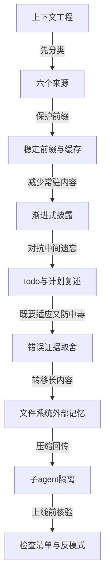
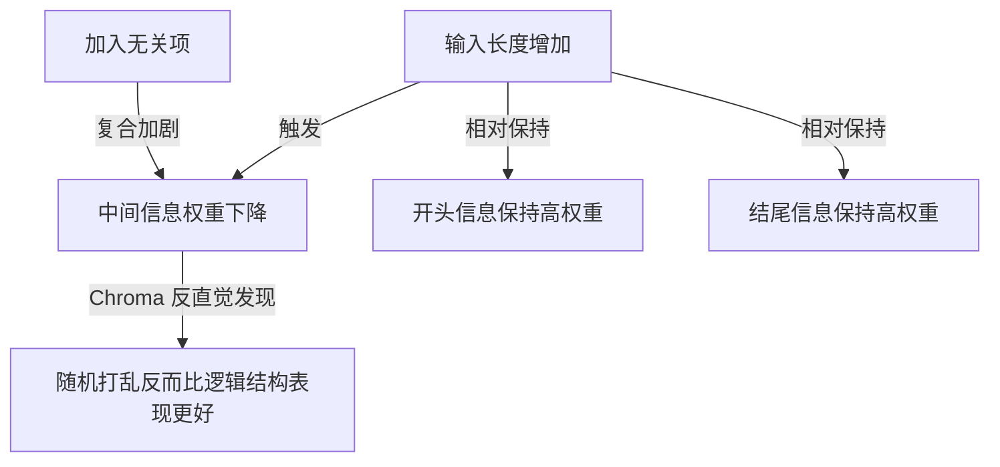
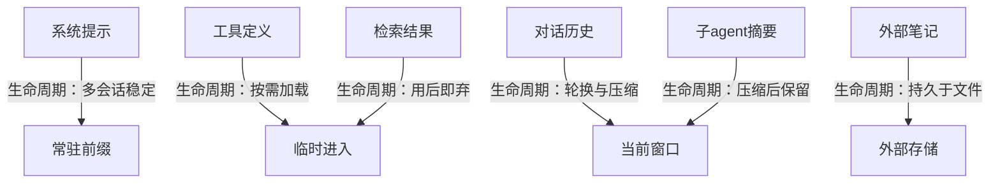
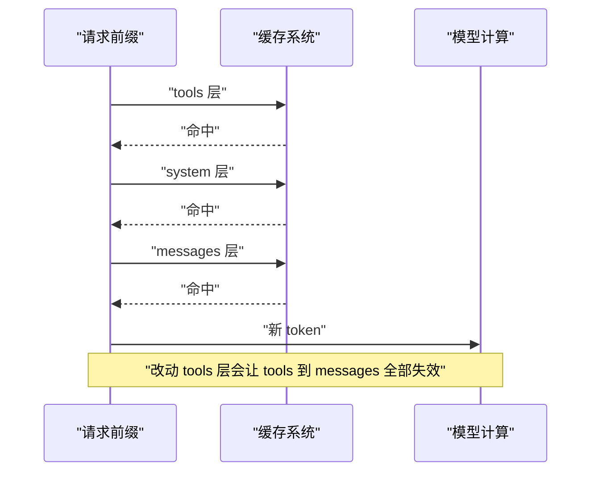
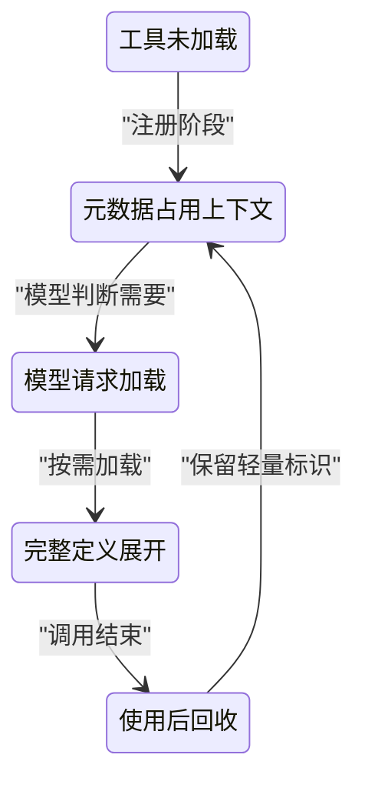
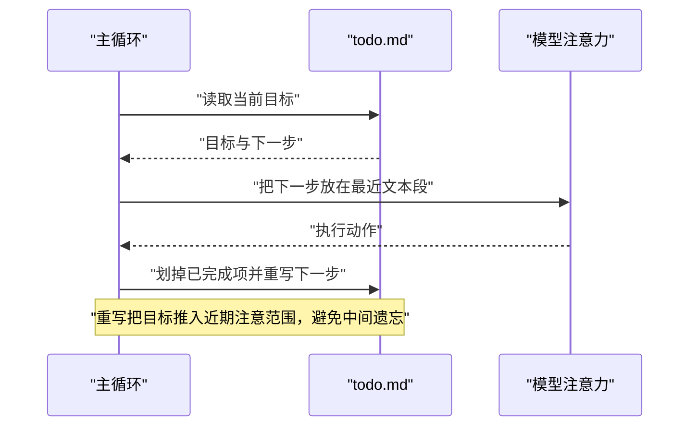
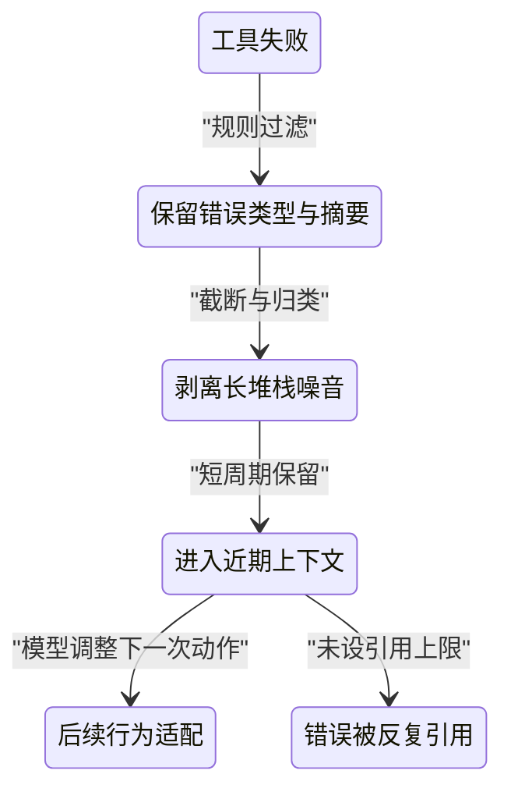
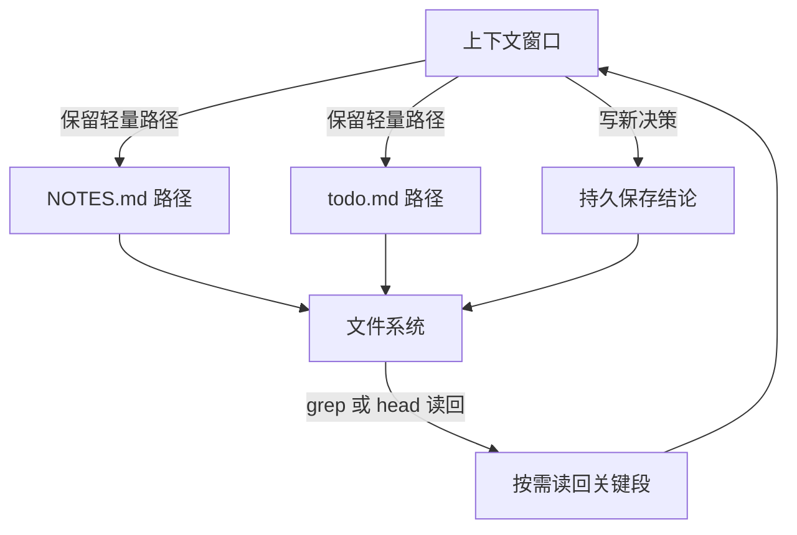
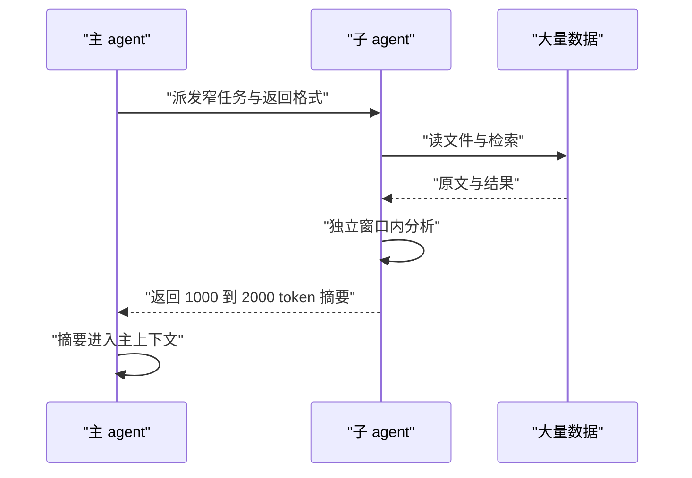

# 上下文工程手册：给 agent 的信息该放哪、怎么放

!!! abstract "学完这一页你能"
    - 说出 agent 上下文的六个来源，并为每个来源写出正确生命周期。
    - 解释 lost in the middle 与 context rot，判断重要信息应放开头、末尾还是外部存储。
    - 写出按需加载工具、重写 todo、缓存失效检测的 Node 脚本，并跑通断言。
    - 用一份上线检查清单识别至少三个上下文反模式，并给出改法。

## 0. 知识地图



建议先读第 1 节建立"上下文会腐烂"的直觉，再按第 2 节的六个来源建立分类框架。
第 3 到第 8 节分别解决稳定、披露、复述、错误、外部化、隔离六个工程动作，最后用第 8 节末尾的检查清单收口。

## 1. 上下文不是越大越好：从 lost in the middle 到 context rot

**先想一个问题**：你的编码 agent 读了 2 万行代码后开始改需求，却在第 1.5 万行附近漏掉一个明确写的函数签名。它真的"看过"中间那段吗？

**心智模型**：
!!! tip "心智模型"
    一句话模型：上下文长度增加时，模型注意力不是均匀分布，开头与结尾得到的权重更高。日常类比：翻看一摞纸质材料，最上面和最下面记得清，中间的容易被压住。类比不成立：纸上的字不会因为总页数变多而本身变淡，但自注意力的 n² 成对比较会在更长序列里把注意力摊薄（Anthropic 有效上下文工程，以原文为准）。

!!! note "术语：context rot"
    context rot 指召回准确率随 token 数上升而下降。例子：同一个问题放进 10 万 token 上下文的中间，模型答对的概率低于放在开头（Anthropic 有效上下文工程，以原文为准）。

**图解**：



1. 输入长度增加，中间信息的召回权重被稀释，准确率下降。
2. 开头与结尾相对保持较高权重，所以重要内容要放在这两端。
3. 单个无关项就可能降低性能，四个无关项会复合放大下降（Chroma Context Rot，以原文为准）。
4. Chroma 测试发现随机打乱的草堆反而常优于逻辑结构的草堆，说明模型不是均匀使用上下文。

**一步一步来**：

目的：把两条关键研究结论固化成可断言的数据，避免你在设计 prompt 时凭感觉排列。

```javascript
const findings = [
  { source: "Liu2023", claim: "needle 在中间位置准确率低于开头与结尾" },
  { source: "Chroma2025", claim: "18 个 LLM 随输入长度增长性能下降" },
  { source: "Chroma2025", claim: "单个无关项降低性能，四个无关项复合下降" },
];
for (const f of findings) console.log(`${f.source}: ${f.claim}`);
```

**这段代码在做什么**

- 把来自 Liu et al. 2023 与 Chroma 2025 的结论写成结构化数据。
- 循环输出便于你用肉眼核验结论是否进入设计提案。
- 不模拟真实准确率，只保留已发表的结论与出处。

运行结果：

```text
Liu2023: needle 在中间位置准确率低于开头与结尾
Chroma2025: 18 个 LLM 随输入长度增长性能下降
Chroma2025: 单个无关项降低性能，四个无关项复合下降
```

**动手验证**：

目的：跑通一个带断言的脚本，确认你已经理解"中间最弱"这一结论。

```javascript
const findings = [
  { source: "Liu2023", position: "middle", level: "low" },
  { source: "Liu2023", position: "start", level: "high" },
  { source: "Liu2023", position: "end", level: "high" },
];
const middle = findings.find((f) => f.position === "middle");
console.assert(middle.level === "low", "middle should be low");
const start = findings.find((f) => f.position === "start");
console.assert(start.level === "high", "start should be high");
console.log("断言通过：中间位置权重最低，首尾位置权重最高");
```

**这段代码在做什么**

- 用 `node:assert` 风格的 `console.assert` 固定三个位置的关系。
- 断言中间是低权重，开头结尾是高权重。
- 这是把论文结论转成可自动检查的工程约束。

依赖：无，Node 20+。保存为 `context-rot-check.mjs` 运行。

**常见坑**：

| 现象 | 原因 | 怎么修 |
|---|---|---|
| 长上下文中部准确率低 | 自注意力被 n² 成对比较摊薄 | 关键指令放开头或结尾；大段资料改为检索 |
| 加更多工具后调用准确率下降 | 无关项干扰模型选择 | 按需加载工具，不要常驻全量定义 |
| 结构好的长文档反而没打乱后好 | 注意力对结构有偏差 | 不假设逻辑顺序一定最优，用评测验证排布 |

**用在哪里**：

- 长日志分析。业务背景：运维 agent 读取几万行日志排查故障。知识怎么用：把匹配出的关键错误行提到上下文开头，不把全量日志一次灌入。衡量指标：根因定位准确率、排查耗时。不该用：如果已有日志检索系统，全量堆给模型只会增加 rot。
- 长代码审查。业务背景：代码 agent 审查一个大型 pull request。知识怎么用：把变更文件清单与关键函数签名放开头，细节通过工具读取。衡量指标：漏报数、误报数。不该用：小项目上下文本身很短，排序收益有限。
- 多文档问答。业务背景：研究 agent 从多个资料里找答案。知识怎么用：把最相关的文档放首尾，减少中间夹层。衡量指标：答案召回率。不该用：已经有可靠的向量检索排序时，应遵循检索顺序。

**行业实践**：

- Anthropic 有效上下文工程：找最少的高信号 token 集合，通过压缩与即时检索对抗 context rot。怎么借鉴：先做减法，再排位置。
- Chroma Context Rot：在 18 个 LLM 上验证长度对性能的影响，发现无关项与结构都会干扰。怎么借鉴：把"位置"和"无关项数量"变成 prompt 评审项。
- Drew Breunig：Databricks 看到 Llama 3.1 405b 的正确率大约在 32k token 附近开始下降（以原文为准）。怎么借鉴：不要等窗口满了才治理，先测你的任务在哪一段开始掉点。

**小结**：

1. 上下文越长，中间信息越容易丢；重要内容放首尾。
2. 无关项会复合伤害模型，常驻信息越少越好。
3. 治理目标是缩短到最小高信号 token 集合，不是塞满窗口。

## 2. 上下文的六个来源与各自生命周期

**先想一个问题**：一个长期跑的研究 agent 上下文里混着系统提示、工具定义、历史消息、检索结果、笔记和子 agent 摘要。哪些该常驻？哪些用完就丢？

**心智模型**：
!!! tip "心智模型"
    一句话模型：上下文是工作台，不是仓库；工作台上只放当前步骤需要的物件。日常类比：厨房台面放当餐食材，储藏室放整袋米面。类比不成立：工作台上的物件都要参与下一步推理，不只是被暂时放置。

**图解**：



1. 系统提示属于常驻前缀，要保持稳定以命中缓存。
2. 工具定义默认只保留名称与服务说明，完整描述在被调用时才加载。
3. 对话历史按轮次轮换，旧内容可能被清除、遮蔽或压缩。
4. 检索结果在本次工具调用后读取，用完不应作为永久内容保留。
5. 外部笔记写进文件，离开上下文窗口仍存在。
6. 子 agent 摘要一旦进入主上下文，就作为历史的一部分，之后会随历史被压缩。

**一步一步来**：

目的：用一个配置对象描述六个来源的生命周期，让整个团队的默认策略一致。

```javascript
const contextSources = [
  { name: "systemPrompt", lifecycle: "stable_prefix", persistent: true },
  { name: "toolDefinitions", lifecycle: "load_on_demand", persistent: false },
  { name: "conversationHistory", lifecycle: "rotate_or_compact", persistent: false },
  { name: "retrievalResults", lifecycle: "use_then_drop", persistent: false },
  { name: "externalNotes", lifecycle: "persist_to_file", persistent: true },
  { name: "subagentSummary", lifecycle: "compressed_into_history", persistent: false },
];
for (const item of contextSources) {
  console.log(`${item.name} -> ${item.lifecycle}`);
}
```

**这段代码在做什么**

- 列出六个来源：系统提示、工具定义、对话历史、检索结果、外部笔记、子 agent 摘要。
- 为每个来源分配一个生命周期标签。
- 输出这些标签，用于开发初期对齐语境。

运行结果：

```text
systemPrompt -> stable_prefix
toolDefinitions -> load_on_demand
conversationHistory -> rotate_or_compact
retrievalResults -> use_then_drop
externalNotes -> persist_to_file
subagentSummary -> compressed_into_history
```

**动手验证**：

目的：校验两个持久项不占常态化上下文预算，四个易失项按需进入。

```javascript
const contextSources = [
  { name: "systemPrompt", persistent: true },
  { name: "toolDefinitions", persistent: false },
  { name: "conversationHistory", persistent: false },
  { name: "retrievalResults", persistent: false },
  { name: "externalNotes", persistent: true },
  { name: "subagentSummary", persistent: false },
];
const persistentNames = contextSources.filter((s) => s.persistent).map((s) => s.name);
console.assert(persistentNames.length === 2, "should have 2 persistent sources");
console.log(`常驻来源：${persistentNames.join(", ")}；易失来源：${contextSources
  .filter((s) => !s.persistent).map((s) => s.name).join(", ")}`);
```

**这段代码在做什么**

- 过滤出两个持久来源：系统提示与外部笔记。
- 断言其余四个来源不是持久常驻。
- 帮你区分"工作台"与"仓库"。

依赖：无，Node 20+。

**常见坑**：

| 现象 | 原因 | 怎么修 |
|---|---|---|
| 系统提示经常改导致成本上升 | 前缀变化使缓存失效 | 时间戳、随机数、用户名单移到外层或消息里 |
| 工具定义全量常驻导致调用错误 | 无关工具干扰选择 | 渐进式披露，只先给工具名与摘要 |
| 检索原文长期留在历史里 | 没有丢弃机制 | 每次检索读取后只保留结论或引用标识 |

**用在哪里**：

- 客服 agent。业务背景：多轮对话里既有产品政策又有用户历史。知识怎么用：政策放系统提示或检索，会话历史按轮次压缩。衡量指标：平均对话 token、解决率。不该用：政策频繁变化时不应放进常驻前缀。
- 编码 agent。业务背景：长任务需要读文件、跑测试、写代码。知识怎么用：文件内容按需读，NOTES.md 存关键决策。衡量指标：编译通过率、任务完成率。不该用：把文件全文永久放在上下文里。
- 研究 agent。业务背景：多来源搜索与汇总。知识怎么用：检索结果只保留引用链接，笔记写文件。衡量指标：引用准确率、token 效率。不该用：用一条长摘要替代可追溯来源时。

**行业实践**：

- Manus：把文件系统当作无限、持久、agent 可操作的记忆。怎么借鉴：把长内容写到 todo.md、notes.md，不在窗口里全量保存。
- Anthropic 有效上下文工程：用路径、查询、链接这类轻量标识替代大段内容。怎么借鉴：上下文只放引用，正文通过工具运行时读取。
- Claude Code：MCP 工具定义默认延迟加载，只有工具名与服务说明占据上下文。怎么借鉴：把工具元数据与工具正文分离。

**小结**：

1. 六个来源分成常驻、易失、持久三类。
2. 系统提示与外部笔记持久，但系统提示必须稳定。
3. 对话历史、工具定义、检索结果、子 agent 摘要都要有回收规则。

## 3. 稳定前缀与缓存命中：为什么挪一行就全失效

**先想一个问题**：你只在系统提示里改了一个时间戳，为什么整条请求的成本突然从低变高？

**心智模型**：
!!! tip "心智模型"
    一句话模型：缓存按前缀从前往后匹配，前缀一旦在某个 token 处变化，该 token 之后全部失效。日常类比：多米诺骨牌，动了开头一张，后面一整排都会倒。类比不成立：多米诺只倒一次，KV 缓存是按 token 前缀逐级重算，只有失效段之后需要重新写。

!!! note "术语：KV cache"
    KV cache 指 transformer 将每一层键值向量缓存起来，命中后跳过重复计算。例子：一段 10 万 token 前缀命中缓存，读取价格可为未命中输入的 0.1 倍（Anthropic prompt caching，以原文为准）。

**图解**：



1. 缓存按 tools、system、messages 的顺序匹配（Anthropic prompt caching，以原文为准）。
2. tools 层变更会使整个缓存失效。
3. system 层变更会连带 messages 层失效。
4. messages 层变更只影响其后的 token。
5. 保持前缀稳定是命中缓存的核心动作。

**一步一步来**：

目的：写一个缓存前缀比较器，判断哪一层开始失效。

```javascript
const before = [
  { layer: "tools", hash: "t1" },
  { layer: "system", hash: "s1" },
  { layer: "messages", hash: "m1" },
];
const afterChangedTools = [
  { layer: "tools", hash: "t2" },
  { layer: "system", hash: "s1" },
  { layer: "messages", hash: "m1" },
];
function matchedPrefixLength(a, b) {
  let count = 0;
  while (count < a.length && count < b.length && a[count].hash === b[count].hash) count++;
  return count;
}
console.log(`改 tools 后命中前缀层数：${matchedPrefixLength(before, afterChangedTools)}`);
```

**这段代码在做什么**

- 用 hash 表示每层是否变化，不模拟真实 token。
- `matchedPrefixLength` 从前往后比较，返回相同层数。
- 改 tools 时命中层数为 0，说明 tools 层变化全量失效。

运行结果：

```text
改 tools 后命中前缀层数：0
```

目的：再验证只改 messages 层时，前两层仍能命中。

```javascript
const afterChangedMessages = [
  { layer: "tools", hash: "t1" },
  { layer: "system", hash: "s1" },
  { layer: "messages", hash: "m2" },
];
console.log(`改 messages 后命中前缀层数：${matchedPrefixLength(before, afterChangedMessages)}`);
```

**这段代码在做什么**

- 保持 tools 与 system 不变，只改 messages。
- 公共前缀长度为 2，说明前两层缓存仍有效。
- 对比前一个例子，说明越靠前的层越要稳定。

运行结果：

```text
改 messages 后命中前缀层数：2
```

**动手验证**：

目的：把两个断言合成一个完整脚本。

```javascript
const before = [
  { layer: "tools", hash: "t1" },
  { layer: "system", hash: "s1" },
  { layer: "messages", hash: "m1" },
];
const changedMessages = [
  { layer: "tools", hash: "t1" },
  { layer: "system", hash: "s1" },
  { layer: "messages", hash: "m9" },
];
function matchedPrefixLength(a, b) {
  let count = 0;
  while (count < a.length && count < b.length && a[count].hash === b[count].hash) count++;
  return count;
}
const n = matchedPrefixLength(before, changedMessages);
console.assert(n === 2, "expected first two layers cached");
console.log(`断言通过：命中前缀层数 ${n}，后一层失效`);
```

**这段代码在做什么**

- 模拟三个分层结构。
- 断言只改 messages 时命中前两层。
- 说明"改动位置越靠前，失效范围越大"。

依赖：无，Node 20+。

**常见坑**：

| 现象 | 原因 | 怎么修 |
|---|---|---|
| 成本随机升高 | 系统提示里放时间戳、UUID | 动态值移到外层消息，不写进前缀 |
| 工具重排导致缓存全失效 | 工具定义位于缓存最前面 | 工具顺序一旦固定，发版内不改变 |
| 中途删除工具 | 工具层变化使之后缓存作废 | 用 logits 约束屏蔽工具，不删除定义（Manus，以原文为准） |

**用在哪里**：

- 高频客服 agent。业务背景：同一段产品政策被每轮请求复用。知识怎么用：政策放稳定前缀，用户输入作为最后一段变化。衡量指标：缓存读命中率、单次成本。不该用：政策每轮都变时，稳定前缀失去意义。
- 长会话编码 agent。业务背景：主对话从早跑到晚。知识怎么用：系统提示与 CLAUDE.md 保持稳定，新增内容追加到 messages 末尾。衡量指标：缓存读命中率、端到端延迟。不该用：需要 `/compact` 重写历史时，会话层缓存会重建。
- 多租户平台。业务背景：不同租户共享同一套工具与提示模板。知识怎么用：租户差异放到 tools 和 system 之后。衡量指标：跨租户缓存复用次数。不该用：租户差异写进系统提示会拆散前缀。

**行业实践**：

- Manus：把 KV cache 命中率称为生产阶段最重要的指标，并指出模型 token 输入输出比约 100:1。怎么借鉴：监控命中率，把波动当事故查。
- Anthropic prompt caching：工具层最先、系统层其次、消息层最后。怎么借鉴：工具定义和系统提示按"不可变"管理。
- Claude Code：切换模型、修改工具集会使缓存失效，而追加技能内容不会。怎么借鉴：区分"追加"与"重排"，追加尽量放在后缀。

**小结**：

1. 缓存按 tools、system、messages 排序，改前面会波及后面。
2. 系统提示里禁止放时间戳、随机数这类每次变化的值。
3. 保护前缀比省几个 token 更重要，稳定才可复用。

## 4. 渐进式披露：skills 与工具为什么按需加载

**先想一个问题**：一个平台有 100 个工具，全量注册到上下文里。模型为什么连最常用的那个工具都调用不准了？

**心智模型**：
!!! tip "心智模型"
    一句话模型：只把"有哪些工具"先给模型，等模型说要调用时再展开完整定义。日常类比：图书馆先给读者目录卡，读者选好书后才取正文。类比不成立：目录卡已经要包含足够的语义提示，模型才能判断该不该调用。

!!! note "术语：渐进式披露"
    渐进式披露指先展示最低限度的标识信息，运行时再按需展开完整内容。例子：Claude Code 的 MCP 工具定义默认只加载名与服务说明，正文在工具搜索时进入上下文（Claude Code 文档，以原文为准）。

**图解**：



1. 注册阶段只写入工具名与服务说明，不展开完整定义。
2. 模型根据元数据判断是否需要某个工具。
3. 确认需要后，完整定义才进入上下文。
4. 调用结束后，完整定义回收，回到轻量标识状态。
5. 这样保持常驻 token 接近最低量。

**一步一步来**：

目的：模拟一个按需加载的工具注册表，只有被 load 的工具才计入上下文预算。

```javascript
const toolCatalog = {
  search: { name: "search", summary: "搜索知识库", definition: "大段搜索工具定义正文" },
  writeFile: { name: "writeFile", summary: "写入文件", definition: "大段写文件工具定义正文" },
};
const loaded = new Set();
let budget = 0;
function loadTool(name) {
  if (!toolCatalog[name]) throw new Error(`未知工具 ${name}`);
  if (!loaded.has(name)) {
    loaded.add(name);
    budget += toolCatalog[name].definition.length;
  }
  return budget;
}
console.log(`初始预算 ${budget}`);
loadTool("search");
console.log(`加载 search 后预算 ${budget}`);
```

**这段代码在做什么**

- `toolCatalog` 存储工具名、摘要与完整定义。
- 只有调用 `loadTool` 才把完整定义计入预算。
- 初始预算为 0，说明未调用工具不占常驻 token。

运行结果：

```text
初始预算 0
加载 search 后预算 13
```

**动手验证**：

目的：断言未调用工具不占预算，重复加载不重复计费。

```javascript
const toolCatalog = {
  search: { name: "search", summary: "搜索知识库", definition: "搜索工具完整正文" },
  writeFile: { name: "writeFile", summary: "写入文件", definition: "写工具完整正文" },
};
const loaded = new Set();
let budget = 0;
function loadTool(name) {
  if (loaded.has(name)) return budget;
  loaded.add(name);
  budget += toolCatalog[name].definition.length;
  return budget;
}
console.assert(budget === 0, "loaded nothing should cost 0");
loadTool("writeFile");
const afterFirst = budget;
loadTool("writeFile");
console.assert(budget === afterFirst, "repeat load should not double count");
console.log(`断言通过：未加载预算 0；重复加载预算保持 ${budget}`);
```

**这段代码在做什么**

- 用 Set 去重，避免重复加载重复计费。
- 断言未加载预算为 0。
- 断言重复加载不改变预算。

依赖：无，Node 20+。

**常见坑**：

| 现象 | 原因 | 怎么修 |
|---|---|---|
| 工具越多调用越差 | 无关工具定义干扰选择 | 渐进披露，先给名与摘要 |
| 第一次调用慢 | 完整定义才加载 | 可接受，换取常驻更短 |
| 工具描述含糊 | 模型无法据摘要判断 | 把触发条件写进摘要，而不写"强大的工具" |

**用在哪里**：

- 企业插件市场。业务背景：平台提供数百个插件给 agent 调用。知识怎么用：只注册插件名与功能摘要，用户任务匹配时才加载完整 schema。衡量指标：工具调用正确率、常驻 token。不该用：插件数量极少时，多一层加载反而增加复杂度。
- 客服工具面板。业务背景：不同问题需要不同查询接口。知识怎么用：路由阶段看工具摘要，选中的工具再展开参数。衡量指标：首响准确率、平均工具调用轮次。不该用：所有工具几乎每次都要用时。
- 数据分析 agent。业务背景：SQL、图表、导出三类工具。知识怎么用：先给类别摘要，再按任务加载字段说明。衡量指标：生成 SQL 的可执行率。不该用：字段关系高度耦合时需要额外提供上下文。

**行业实践**：

- Claude Code Skills：技能完整内容只在被调用时加载。怎么借鉴：把长提示或标准操作流程写成技能文件，按名称触发。
- Drew Breunig：Berkeley Function-Calling Leaderboard 显示模型在更多工具下表现更差，Llama 3.1 8b 在 46 个工具下失败、在 19 个工具下成功（以原文为准）。怎么借鉴：工具集按任务拆小，不要一次全上。
- LangChain Skills 模式：把专用 prompt 或知识按需加载进单 agent。怎么借鉴：给技能写触发条件与输出格式。

**小结**：

1. 常驻工具定义只保留名与摘要，完整正文按需展开。
2. 工具数量上升会显著拉低调用准确率，要主动拆集。
3. 目的是减少无关项，不是让模型少用工具。

## 5. todo 与计划复述：把目标推进最近注意力窗口

**先想一个问题**：一个跑 40 分钟的研究 agent，前 5 步记得目标，到 20 步后开始重复搜索同一关键词。怎么让它持续盯住目标？

**心智模型**：
!!! tip "心智模型"
    一句话模型：todo 是 agent 反复重写的指针文件，它把当前目标推进最近的注意力区间。日常类比：厨房贴一张流动菜谱，每完成一步就划掉并把下一步写在最上。类比不成立：菜谱是静态的，todo 可以由 agent 重排优先级、压缩旧项。

**图解**：



1. 每轮开始读 todo，取得目标与下一步。
2. 下一步被放在最近的文本段，进入高注意力区间。
3. 模型执行动作后，todo 更新：完成项压缩，下一步上移。
4. 重写行为反复把目标推近窗口末端，对抗 lost in the middle。

**一步一步来**：

目的：写一个 todo 重写器，把下一步提升到文件开头，把已完成项压缩到 done 段。

```javascript
function rewriteTodo({ goal, done, next, blocked }) {
  const doneLine = done.length ? `已完成：${done.join(" | ")}` : "已完成：无";
  return [`目标：${goal}`, `下一步：${next}`, doneLine, blocked ? `阻塞：${blocked}` : ""]
    .filter(Boolean)
    .join("\n");
}
const todo = rewriteTodo({
  goal: "调研长上下文缓存策略",
  done: ["读完 Anthropic 文档"],
  next: "对比 Manus 与 Claude Code 默认阈值",
  blocked: "",
});
console.log(todo);
```

**这段代码在做什么**

- 把目标与下一步固定在前两行。
- 已完成项压缩成一行，不再逐条展开。
- 阻塞项只在存在时才输出，避免空内容占位。

运行结果：

```text
目标：调研长上下文缓存策略
下一步：对比 Manus 与 Claude Code 默认阈值
已完成：读完 Anthropic 文档
```

**动手验证**：

目的：断言重写后的前 15 个字符内出现"下一步"，确保它进入最近的注意范围。

```javascript
function rewriteTodo({ goal, done, next }) {
  return [`目标：${goal}`, `下一步：${next}`, `已完成：${done.join(" | ")}`].join("\n");
}
const text = rewriteTodo({
  goal: "调研长上下文缓存策略",
  done: ["读完 Anthropic 文档"],
  next: "对比 Manus 与 Claude Code 默认阈值",
});
const head = text.slice(0, 15);
console.assert(text.startsWith("目标："), "goal should be first");
console.assert(text.includes("下一步："), "next action should exist");
console.assert(head.length < 20, "head should be short so next action stays near");
console.log(`断言通过：todo 开头 ${head} 之后即可见下一步`);
```

**这段代码在做什么**

- 输出前 15 个字符，验证目标在最前。
- 断言全文包含"下一步"。
- 限制开头长度，保证下一步仍贴近顶部。

依赖：无，Node 20+。

**常见坑**：

| 现象 | 原因 | 怎么修 |
|---|---|---|
| todo 本身超过 2000 字 | 把历史推理也写进去 | 已完成项压缩成一行，只留结论 |
| 只写不读 | 没有把 todo 接回每轮循环 | 在主循环第一步强制读 todo |
| 下一步未被更新 | 完成后没重写 | 每次工具调用后都落盘重写 |

**用在哪里**：

- 复杂研究智能体。业务背景：多源搜索、阅读、汇总的开放式任务。知识怎么用：每轮重写 todo，把下一个搜索目标推到最近。衡量指标：目标偏离次数、重复搜索次数。不该用：一步就能结束的任务，todo 是额外开销。
- 长任务自动化。业务背景：自动跑测试、修失败、再跑测试。知识怎么用：todo 记录通过项、失败项、下一步。衡量指标：失败修复率、循环轮次。不该用：流程是固定 DAG 时，工作流引擎比 todo 更可靠。
- 周报生成。业务背景：从多种来源整理本周进展。知识怎么用：todo 记录各来源已读、未读、阻塞。衡量指标：覆盖率、生成时间。不该用：数据源只有一两个时。

**行业实践**：

- Manus：agent 反复重写 todo.md，把目标推进近期注意力区间，避免 lost in the middle。怎么借鉴：让重写动作成为固定步骤，而不是可选动作。
- Magentic-One：外层循环维护 task ledger，内层循环维护 progress ledger。怎么借鉴：把目标与进度分开记录。
- pi 总结格式：Goal、Progress、Key Decisions、Next Steps 分节记录。怎么借鉴：模板化你的 todo 结构。

**小结**：

1. todo 不是写一次就完，要反复重写并放在最近。
2. 目标与下一步靠前，已完成项靠压缩，阻塞项显式标出。
3. 用重写动作对抗中间遗忘，防止 agent 偏离最初目标。

## 6. 把错误留在上下文里：适应与中毒的分界

**先想一个问题**：上次部署失败的堆栈记录很占地方。删掉它省 token，但 agent 下一次为什么还会再踩同一个坑？

**心智模型**：
!!! tip "心智模型"
    一句话模型：错误是模型的反馈信号，删除错误等于让模型失去适应能力。日常类比：打游戏失败后如果不显示死因，你只能乱试。类比不成立：游戏死因是干净事实，而 LLM 上下文的错误内容可能被反复引用，变成 poisoning。

!!! note "术语：context poisoning"
    context poisoning 指一个幻觉或错误进入上下文后被反复引用，导致 agent 追求不可能的目标（Drew Breunig，以原文为准）。例子：Gemini 玩 Pokémon 时幻想出一个不存在的游戏状态，进而重复错误行为。

**图解**：



1. 工具失败后，先取错误类型与摘要，不全文保留。
2. 剥离与下一动作无关的长堆栈，降低 token 成本。
3. 摘要进入近期上下文，供模型调整后续动作。
4. 如果同一错误被多次引用，就升级为 poisoning，需要清理旧内容。

**一步一步来**：

目的：写一个错误缓存器，保留错误类型与一行摘要，移除堆栈细节。

```javascript
function compactError(raw) {
  const firstLine = raw.split("\n").find((line) => line.startsWith("Error:"));
  const type = firstLine.slice("Error:".length);
  return { type, kept: firstLine, dropped: raw.length - firstLine.length };
}
const compacted = compactError("Error: EACCES permission denied\n    at fs.open (node:fs)\n    at writeFile");
console.log(compacted);
```

**这段代码在做什么**

- 从原始错误文本中找到首条 `Error:` 行。
- 只保留该行作为错误类型与摘要。
- 丢弃后续堆栈行，并计算丢弃字符数。

运行结果：

```text
{ type: 'EACCES permission denied', kept: 'Error: EACCES permission denied', dropped: 47 }
```

**动手验证**：

目的：断言压缩后保留了错误类型，并删除了堆栈噪音。

```javascript
function compactError(raw) {
  const firstLine = raw.split("\n").find((line) => line.startsWith("Error:"));
  return { type: firstLine.slice("Error:".length), charCount: raw.length };
}
const raw = "Error: EACCES permission denied\n    at fs.open (node:fs)\n    at writeFile";
const result = compactError(raw);
console.assert(result.type === "EACCES permission denied", "type should be kept");
console.assert(result.charCount < 200, "compacted error should be short");
console.log(`断言通过：保留类型 ${result.type}，原始长度 ${result.charCount}`);
```

**这段代码在做什么**

- 抽取错误类型并断言与预期一致。
- 断言保留长度小于 200，证明堆栈被丢弃。
- 强调"留类型，不留噪音"。

依赖：无，Node 20+。

**常见坑**：

| 现象 | 原因 | 怎么修 |
|---|---|---|
| agent 重复同一失败动作 | 失败证据被全删 | 保留错误类型与摘要，不保堆栈 |
| 上下文被错误污染 | 幻觉被反复引用 | 压缩时标记低可信度，旧错误移出近期 |
| 错误过多占预算 | 每条错误都完整保留 | 设置错误摘要上限，超过后合并同类 |

**用在哪里**：

- 部署失败自动修复。业务背景：发布失败后有几十行日志。知识怎么用：保留错误类型与失败命令摘要，让模型下一次跳过坏步骤。衡量指标：重复失败率、修复成功率。不该用：失败原因已经明确且流程固定时。
- 爬虫重试。业务背景：网页抓取遇到超时、封禁等不同错误。知识怎么用：把错误摘要留给下一轮，决定是否换代理或退避。衡量指标：无效重试次数。不该用：错误与下一步无关时，保留反而增长上下文。
- 测试修复 agent。业务背景：测试红一轮后模型要改代码。知识怎么用：只保留断言错误信息，不保整个测试输出。衡量指标：从红到绿的平均轮次。不该用：测试输出本身就是唯一线索，需要保留关键片段。

**行业实践**：

- Manus：保留失败动作与错误，因为"没有证据，模型无法适应"（以原文为准）。怎么借鉴：压缩前先问一句：这个错误是否影响下一步动作。
- Drew Breunig：context poisoning 提醒坏内容一旦被引用会反复强化。怎么借鉴：给错误标记来源与可信度，限制重复引用。
- Anthropic tool-result clearing：默认清除旧工具输出，被认为是最轻量的压缩。怎么借鉴：对已完成动作的结果可以清，对正在处理的错误要留摘要。

**小结**：

1. 错误是反馈信号，不该为了省 token 全删。
2. 保留类型与摘要，丢弃长堆栈。
3. 限制错误引用次数，防止从反馈变成中毒。

## 7. 文件系统作为外部记忆：NOTES.md 与 todo.md

**先想一个问题**：长会话里的中间结论、决策、文件列表，放哪才能既不被上下文压缩掉，又能在下个会话继续用？

**心智模型**：
!!! tip "心智模型"
    一句话模型：文件系统是 agent 的长期记忆，上下文只保留读写文件的路径或引用。日常类比：办公室档案柜保存材料，工位上只留当前页。类比不成立：档案柜不会主动把相关内容拿给你，agent 在读文件前仍需知道该读哪个文件。

**图解**：



1. 上下文窗口只保留 NOTES.md 与 todo.md 的路径，不保留全文。
2. 文件系统保存结构化的结论与计划。
3. 需要时通过工具读回关键段，用完不常驻。
4. 新决策追加到文件，形成跨会话长期记忆。
5. 这一方式让上下文保持短，而存储上限从窗口转移到磁盘。

**一步一步来**：

目的：写一个外部记忆写入与读取脚本，展示上下文只保存引用而非全文。

```javascript
import { mkdtemp, writeFile, readFile } from "node:fs/promises";
import { tmpdir } from "node:os";
import { join } from "node:path";

const dir = await mkdtemp(join(tmpdir(), "notes-"));
await writeFile(join(dir, "NOTES.md"), "已确认：缓存顺序 tools 到 system 到 messages\n");
const notePath = join(dir, "NOTES.md");
const context = { reference: notePath };
const content = await readFile(notePath, "utf8");
const firstLine = content.split("\n")[0];
console.log(`上下文保留 ${context.reference}`);
console.log(`读回第一行 ${firstLine}`);
```

**这段代码在做什么**

- 在临时目录建立 NOTES.md 并写入一条结论。
- 上下文对象只保留 `reference` 路径，不保存全文。
- 需要时用 `readFile` 读回，并只取第一行作为轻量展示。

运行结果：

```text
上下文保留 /tmp/notes-xxxx/NOTES.md
读回第一行 已确认：缓存顺序 tools 到 system 到 messages
```

**动手验证**：

目的：断言写文件后上下文长度只增加路径长度，不增加文件内容长度。

```javascript
import { mkdtemp, writeFile, readFile } from "node:fs/promises";
import { tmpdir } from "node:os";
import { join } from "node:path";

const dir = await mkdtemp(join(tmpdir(), "mem-"));
const notePath = join(dir, "NOTES.md");
const noteText = "已确认：缓存顺序 tools 到 system 到 messages";
await writeFile(notePath, noteText);
let context = { reference: notePath };
const referenceSize = context.reference.length;
console.assert(referenceSize < noteText.length, "reference should be shorter than full text");
const line = (await readFile(notePath, "utf8")).split("\n")[0];
console.assert(line.startsWith("已确认"), "should read back first line");
console.log(`断言通过：保留引用 ${referenceSize} 字符，正文 ${noteText.length} 字符`);
```

**这段代码在做什么**

- 写入一条 20 多字符的笔记。
- 断言路径长度小于正文长度。
- 验证读回时仍能取得结论首行。

依赖：仅 Node 内置模块，Node 20+。

**常见坑**：

| 现象 | 原因 | 怎么修 |
|---|---|---|
| NOTES.md 变成流水账 | 每次写太碎、无结构 | 用固定分节：目标、决策、下一步、阻塞 |
| 忘记清理旧文件 | 长任务留下大量草稿 | 每次会话结束标记 archive 或删除 |
| 并发写覆盖 | 两个 agent 写同一文件 | 写路径分文件，或使用追加写并加锁 |

**用在哪里**：

- 研究 agent。业务背景：跨多个会话研究同一主题。知识怎么用：结论写入 NOTES.md，下个会话先读该文件恢复进度。衡量指标：跨会话重复搜索次数。不该用：单轮短回答不需要外部记忆。
- 编码 agent 长任务。业务背景：修改 12 个文件，持续 1 小时。知识怎么用：已修改文件列表写入 NOTES.md，main 上下文只留路径。衡量指标：上下文 token 中位数。不该用：任务很小且能一次性完成时。
- 数据分析项目。业务背景：数据清洗、建模、图表分阶段做。知识怎么用：每阶段的关键结论写文件，阶段之间只传引用。衡量指标：阶段过渡损耗时间。不该用：中间产物非常大且难以结构化时。

**行业实践**：

- Manus：文件系统被作为无限、持久、agent 可操作的记忆。怎么借鉴：把文件当作内存对象，不只当输出。
- Anthropic 有效上下文工程：Claude 玩 Pokémon 用外部 NOTES.md 或 todo 文件，不在窗口内保存全量状态。怎么借鉴：轻量路径进窗口，正文进磁盘。
- Claude Code hooks：示例用预处理把 10,000 行日志过滤成匹配的 ERROR 行，从几万 token 降到几百（以原文为准）。怎么借鉴：在工具输出进入上下文前用 grep 或 head 过滤。

**小结**：

1. 上下文只留引用，文件系统保存正文，把记忆从窗口迁到磁盘。
2. 外部记忆必须有结构，否则读回仍是一堆噪音。
3. 工具输出进入上下文前可以做规则过滤，先做减法。

## 8. 子 agent 作为上下文隔离与上线检查清单

**先想一个问题**：一段 10 万行日志如果全给主 agent，主任务会被淹没。怎么让别人读完，只把结论带回来？

**心智模型**：
!!! tip "心智模型"
    一句话模型：子 agent 在独立上下文窗口里处理大量数据，只把压缩摘要返回主 agent。日常类比：分析师带着资料出去，回来给管理层一页结论。类比不成立：管理层无法核验分析师的完整推理与证据，摘要可能隐藏关键细节。

**图解**：



1. 主 agent 只携带任务说明与返回格式，不携带原始数据。
2. 子 agent 在自己的上下文窗口里读取并分析大量数据。
3. 分析结束后，只返回压缩摘要。
4. 主上下文只增加摘要长度，而不是全量数据。
5. 摘要约 1,000 到 2,000 token（Anthropic 有效上下文工程，以原文为准）。

**一步一步来**：

目的：模拟一个子 agent 处理假日志数据并只返回摘要。

```javascript
const rawLines = Array.from({ length: 1000 }, (_, i) => `line ${i} some log data`);
function subagentAnalyze(lines) {
  const errors = lines.filter((line, i) => i % 100 === 0).map((line) => `error at ${line}`);
  return { summary: `发现 ${errors.length} 个关键错误`, errors };
}
const result = subagentAnalyze(rawLines);
console.log(`原始 ${rawLines.length} 行，摘要 ${result.summary}`);
```

**这段代码在做什么**

- 构造 1000 行假日志。
- 子 agent 在内部处理并只返回摘要文本与关键错误列表。
- 主上下文不接收原始 1000 行，只接收摘要对象。

运行结果：

```text
原始 1000 行，摘要 发现 10 个关键错误
```

**动手验证**：

目的：断言主上下文只增加摘要大小，不增加原始数据大小。

```javascript
const rawLines = Array.from({ length: 1000 }, (_, i) => `line ${i} log data`);
const rawSize = rawLines.join("\n").length;
const summary = "发现 10 个关键错误；模式：每 100 行 1 个 EACCES";
let mainContextSize = 0;
mainContextSize += summary.length;
console.assert(mainContextSize < rawSize / 10, "summary should be under 1/10 of raw size");
console.log(`原始 ${rawSize} 字符，主上下文只增加 ${mainContextSize} 字符`);
```

**这段代码在做什么**

- 计算原始日志与摘要的字符数。
- 断言摘要小于原始的 1/10。
- 说明隔离的核心收益：主上下文大小可控。

依赖：无，Node 20+。

目的：再把上线检查清单写成可运行校验器，列出关键阈值。

```javascript
const manifest = {
  tracing: true,
  maxTurnsSet: true,
  tokenBudgetSet: true,
  effortRulesWritten: true,
  checkpoint: true,
  reviewSet: "20 条评测集",
  rainbowDeploy: true,
  forbiddenActions: ["不可逆删除", "发外部邮件"],
};
const failures = [];
if (!manifest.tracing) failures.push("没有 tracing");
if (!manifest.maxTurnsSet) failures.push("没有 maxTurns");
if (!manifest.tokenBudgetSet) failures.push("没有 token 预算");
if (!manifest.effortRulesWritten) failures.push("没有投入规模规则");
if (!manifest.checkpoint) failures.push("没有 checkpoint 与恢复");
console.log(failures.length === 0 ? "检查通过" : failures.join("；"));
```

**这段代码在做什么**

- 定义上线前必须满足的 8 项条件。
- 对缺失项收集失败原因。
- 输出检查结果，不依赖外部服务。

运行结果：

```text
检查通过
```

**常见坑（反模式）**：

| 现象 | 原因 | 怎么修 |
|---|---|---|
| 多个子 agent 同时改同一文件 | 写操作没有单线程化 | 子 agent 只读或只回摘要，主 agent 负责写 |
| 子 agent 无限循环 | 没设 maxTurns | 设步数上限，超限标记 partial 并恢复 |
| 摘要太长失去隔离意义 | 未限制返回长度 | 明确要求返回 1000 到 2000 token 摘要 |
| 切模型后缓存全失效 | 模型改变导致前缀重建 | 长任务中途不切换主模型 |
| 子 agent 只能回一句话 | 过度压缩丢关键细节 | 返回格式写明证据、决策、下一步 |

**用在哪里**：

- 代码审查。业务背景：完整 PR 可能包含大量改动。知识怎么用：子 agent 读全文并返回审查意见，主 agent 只看结论。衡量指标：漏报数。不该用：PR 很小，主 agent 直接读反而更省。
- 日志巡检。业务背景：每天几十个服务产生大量日志。知识怎么用：每个服务交给子 agent 分析，只把异常摘要回传。衡量指标：异常发现数、主上下文 token。不该用：日志需要实时联动判断时。
- 多来源调研。业务背景：一次研究要查十几个资料。知识怎么用：每个来源子 agent 独立检索，返回结论。衡量指标：资料覆盖率、结论召回。不该用：各来源之间存在强推理依赖时。

**行业实践**：

- Claude Code subagents：在独立上下文窗口运行，冗长搜索与日志不污染主对话，只返回摘要。怎么借鉴：把"读多写少"的任务剥离给子 agent。
- Anthropic 多 agent 研究系统：子 agent 返回 1,000 到 2,000 token 摘要，主 agent 负责综合。怎么借鉴：约束返回格式，不约束子 agent 内部过程。
- LangChain 官方文档：多领域并行场景使用上下文隔离可减少约 67% 的总 token。怎么借鉴：领域无关的子任务尽量隔离。

**小结**：

1. 子 agent 的核心价值是上下文隔离，不是协作写同一份产物。
2. 返回摘要 1,000 到 2,000 token，主上下文只增摘要。
3. 上线前检查 tracing、maxTurns、预算、投入规模、checkpoint、发布与危险动作。

## 应用地图

| 场景 | 用到本页哪个知识点 | 典型技术选型 | 注意事项 |
|---|---|---|---|
| 高频客服 | 稳定前缀、六来源采购政策 | Claude Agent、OpenAI Responses | 政策常驻前缀，租户差异后置 |
| 长代码任务 | todo 重写、NOTES.md 外部记忆 | Claude Code、pi | 写单线程，文件列表存外部 |
| 平台工具集 | 渐进式披露、工具按需加载 | MCP、Skills | 先给名与摘要，不一次全量 |
| 部署失败修复 | 错误证据取舍、错误摘要 | 运维 agent、脚本 | 保留错误类型，不保长堆栈 |
| 日志巡检 | 子 agent 隔离、hook 过滤 | Claude Code subagents | 限制返回 1000 到 2000 token |
| 多文档研究 | 检索即时加载、子 agent 隔离 | Anthropic 研究系统 | 检索原文用后即弃 |
| 跨会话项目 | 文件系统外部记忆 | NOTES.md、todo.md | 结构固定，防止流水账 |
| 多租户平台 | 稳定前缀、缓存策略 | Claude API、OpenAI API | 租户键放 messages 层，不拆前缀 |

## 动手作业

目标：做一个"上下文预算卫士"，把本页关键策略合并为一个可运行检查器。

步骤：

1. 建立 `context-budget-guard.mjs`，读入一个配置对象，包含六个来源的生命周期、工具集、todo 行数、错误摘要条数、子 agent 返回长度。
2. 计算常驻 token 预算：系统提示 + 稳定前缀 + 最近 10 轮历史 + 工具名摘要。
3. 校验以下规则并输出通过或失败：系统提示不包含 `Date.now()` 或 `new Date`；未加载工具不占预算；todo 下一步位于最近 15 个字符内；错误摘要只保留 `Error:` 行；子 agent 返回摘要不超过 2000 token。
4. 用 `node:assert` 写至少 5 条断言。

验收标准：

- 运行 `node context-budget-guard.mjs` 后，终端输出每个规则的检查结果。
- 故意传入含时间戳的系统提示，脚本必须判失败。
- 故意传入 3000 token 的子 agent 摘要，脚本必须判失败。
- 不依赖外部包，Node 20+ 直接运行。

## 综合对比

| 维度 | 压缩历史 | 清除工具结果 | 外部笔记 | 子 agent 隔离 |
|---|---|---|---|---|
| 主上下文变化 | 缩短为摘要 | 只移除旧工具输出 | 只加路径引用 | 只加摘要 |
| 是否调用 LLM | 是，多一次采样 | 否，规则清除 | 否，文件读写 | 是，子 agent 请求 |
| 缓存影响 | 打破 conversation 层缓存 | 清除点之后缓存失效 | 不触碰前缀则稳定 | 父窗口不受影响，子 agent 独立计费 |
| 失败证据保留 | 摘要可能丢失细节 | 旧输出会被清除 | 可主动写入错误摘要 | 摘要可能遗漏关键错误 |
| 适用任务 | 长对话先总结旧轮 | 大工具输出先物理清理 | 跨会话决策与文件列表 | 大量数据读取与多源调研 |

## 深入阅读与参考

!!! tip "怎么用这些资料"
    先读「官方文档与规范」建立准确的概念，再读「源码与示例」核对细节，最后用「教程、书籍与视频」换一种讲法加深理解。每条都写明了读哪一节、带着什么问题读。

### 官方文档与规范

| 资源 | 为什么读 | 怎么读 |
|---|---|---|
| ["Lost in the Middle" (Liu et al., 2023): on multi-document QA and key- (arxiv.org)](https://arxiv.org/abs/2307.03172) | 位置偏差的原始实验证据，说明关键信息放中段为何被忽略。 | 读实验设计与准确率随位置变化的曲线，再按结论重排自己的提示顺序。 |
| [Chroma "Context Rot" (2025): 18 LLMs were tested, including GPT-4.1, C (trychroma.com)](https://www.trychroma.com/research/context-rot) | 18 个模型实测，证明上下文越长性能越退化。 | 看结论图表与任务设计，记录退化幅度，据此写下三条可验证假设。 |
| [Anthropic caches in the order tools → system → messages. A change at o (platform.claude.com)](https://platform.claude.com/docs/en/build-with-claude/prompt-caching) | 缓存按 tools→system→messages 顺序，解释挪一行全失效。 | 读缓存断点与失效条件一节，检查自己提示里是否有动态内容前置。 |
| [Agent Skills 概览](https://docs.anthropic.com/en/docs/agents-and-tools/agent-skills/overview) | 渐进式披露的官方机制，说明 skill 何时被按需加载。 | 读 SKILL.md 结构与触发条件，为常用任务写一个并验证加载时机。 |
| [In an LLM agent, "working / short-term memory" is what sits in the con (code.claude.com)](https://code.claude.com/docs/en/memory) | 讲清上下文内的工作记忆边界，配合六来源生命周期理解。 | 读工作记忆与长期记忆的划分，把六个来源按生命周期列成表格。 |
| [When context fills, Claude Code "clears older tool outputs first, then (code.claude.com)](https://code.claude.com/docs/en/how-claude-code-works) | 官方给出上下文将满时的清理顺序，可直接对照实现。 | 读清理优先级小节，对照自己 agent 的裁剪顺序，写一条改进项。 |
| [handoff 在 LLM 看来是工具，名称形如 `transfer_to_<agent_name>`。 (openai.github.io)](https://openai.github.io/openai-agents-python/handoffs/) | 说明子 agent 交接在模型看来只是一次工具调用。 | 读 handoff 的命名与参数约定，画出一次委派前后的上下文边界。 |
| [LangChain 文档列出五种模式：Subagents（协调者把子 agent 当工具）、Handoffs（通过工具调用转移控制）、Ski (docs.langchain.com)](https://docs.langchain.com/oss/python/langchain/multi-agent) | 五种多 agent 模式对比，做隔离选型时可直接查表。 | 读五种模式的差异与适用场景，为你的隔离需求选一种并说明理由。 |

### 源码与示例

| 资源 | 为什么读 | 怎么读 |
|---|---|---|
| [pi 编码 Agent 工具集](https://github.com/earendil-works/pi) | 可读的 agent loop 源码，看上下文实际如何拼装。 | 读 agent loop 与统一 LLM API 实现，对照自己写的循环找差异。 |
| [Claude Agent SDK 概览](https://docs.claude.com/en/api/agent-sdk/overview) | 亲手写小 agent，直观看到工具与上下文的流转。 | 跟着写一个读取本地目录并总结的 agent，观察工具调用日志。 |

### 教程、书籍与视频

| 资源 | 为什么读 | 怎么读 |
|---|---|---|
| [Context poisoning: a hallucination or error enters the context and is  (dbreunig.com)](https://www.dbreunig.com/2025/06/22/how-contexts-fail-and-how-to-fix-them.html) | 区分可纠正错误与上下文中毒，划出保留错误的分界。 | 读中毒的定义与案例，判断自己日志里哪些错误该留、哪些该清。 |
| [Effective context engineering for AI agents](https://www.anthropic.com/engineering/effective-context-engineering-for-ai-agents) | 一线厂商的上下文工程教程，给出删减与整理方法。 | 读完后检查自己的 agent 提示，删掉重复上下文并记录 token 变化。 |
| [Context Engineering（Philipp Schmid）](https://www.philschmid.de/context-engineering) | 按来源给上下文分类，便于逐项审视与删减。 | 读分类框架，检查自己应用的上下文来源，整理后删掉冗余项。 |
| [KV-cache hit rate is described as "the single most important metric fo (manus.im)](https://manus.im/blog/Context-Engineering-for-AI-Agents-Lessons-from-Building-Manus) | 把 KV-cache 命中率当作最重要指标，讲稳定前缀。 | 读前缀稳定性的做法，检查自己提示中哪一行正在破坏缓存。 |

## 自测题

??? question "1. 上下文六个来源分别是什么生命周期？"
    - 系统提示：多会话稳定。
    - 工具定义：按需加载。
    - 对话历史：轮换或压缩。
    - 检索结果：用后即弃。
    - 外部笔记：持久于文件。
    - 子 agent 摘要：压缩后进入历史。

??? question "2. 为什么 lost in the middle 与 context rot 不是同一个概念？"
    - lost in the middle 指中间位置召回更弱，与位置相关。
    - context rot 指准确率随总 token 上升而下降，与长度相关。
    - 两个结论都要求缩短上下文并把关键内容放首尾。

??? question "3. 为什么系统提示里不能放时间戳？"
    - Anthropic 缓存顺序 tools 到 system 到 messages。
    - 时间戳导致 system 层每次变化，system 及其后全部失效。
    - 动态值应放到消息层，保护 tools 与 system 前缀。

??? question "4. 渐进式披露的核心步骤是什么？"
    - 注册时只给工具名与摘要。
    - 模型判断需要后加载完整定义。
    - 调用结束后回收完整定义，回到轻量标识。
    - 目标是最低常驻 token。

??? question "5. 为什么 todo 要反复重写？"
    - 重写把目标与下一步推到最近的注意力区间。
    - 已完成项压缩成一行，防止 todo 变成新的长文本。
    - 解决 agent 在长任务中偏离最初目标的问题。

??? question "6. 什么情况下应该保留错误，什么时候应该清除旧工具输出？"
    - 保留错误类型与摘要，因为它影响下一步动作。
    - 已经完成的旧工具输出可以清除，不再影响动作。
    - 错误细节过长时剥堆栈，只留错误码与失败命令。

??? question "7. 子 agent 解决什么主要问题？"
    - 主上下文被大量数据淹没。
    - 子 agent 在独立窗口处理数据，只回 1000 到 2000 token 摘要。
    - 用隔离换回主任务的可控上下文长度。

??? question "8. 上线前检查清单至少要包含哪六项？"
    - 完整 tracing。
    - maxTurns 与 token 预算。
    - 投入规模规则。
    - checkpoint 与恢复。
    - 评测集，起步约 20 条。
    - rainbow 式发布与危险动作人工确认。

## 延伸阅读

- Anthropic Engineering《Effective context engineering for AI agents》：读 context rot、compaction、tool-result clearing、structured note-taking 章节。
- Anthropic API《Prompt caching》：读 tools-system-messages 缓存顺序、失效规则、缓存 TTL 章节。
- Anthropic API《Context editing》：读 `clear_tool_uses_20250919`、`clear_at_least`、thinking-block clearing 章节。
- Anthropic API《Compaction》：读 threshold mode、on-demand mode、background compaction 章节。
- Claude Code Docs《How Claude Code works》：读 clearing tool outputs、skills loading、MCP deferred loading、thrash guard 章节。
- Manus Engineering Blog《Context Engineering for AI Agents》：读 KV cache hit rate、stable prefix、todo.md rewriting、file system as memory 章节。
- Chroma Research《Context Rot》：读 18-model evaluation、distractor effects、shuffled haystacks 章节。
- Drew Breunig《How Contexts Fail, and How to Fix Them》：读 context poisoning、distraction、confusion、clash 四种失败模式章节。
