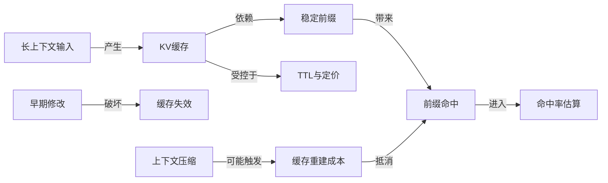
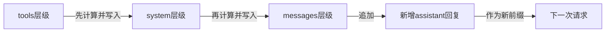
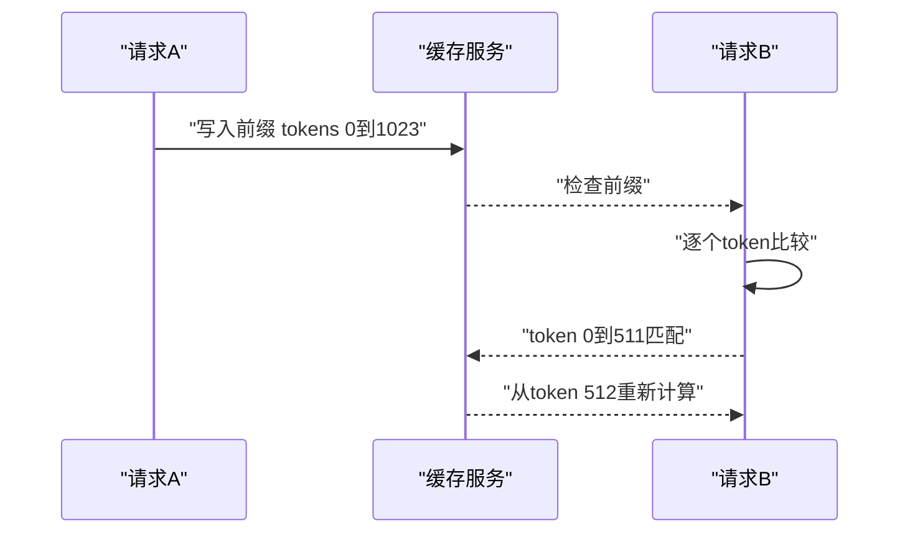
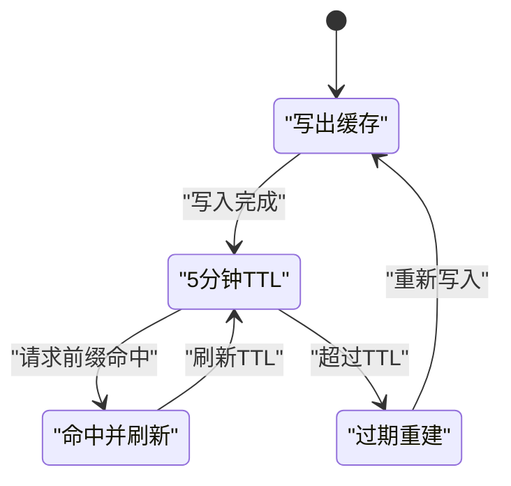
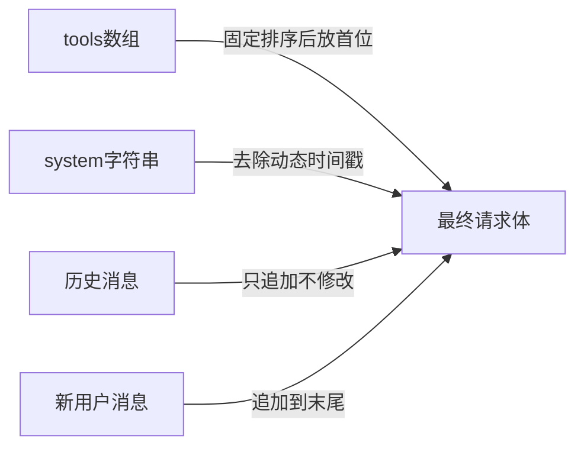
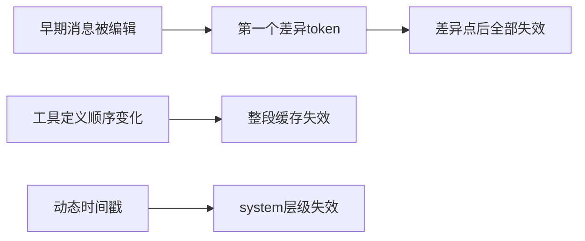
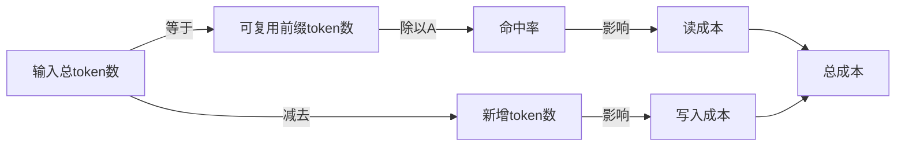
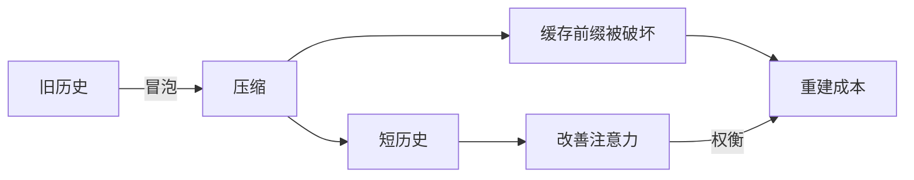

# 提示缓存与 KV 缓存：让长上下文变便宜

!!! abstract "学完这一页你能"
    1. 解释 KV 缓存为什么只对前缀生效，并说出缓存写入、读取与 TTL 的价格倍率。
    2. 按 tools → system → messages 的顺序，判断一处修改会从哪个 token 开始让缓存失效。
    3. 写出确定性上下文拼装函数，保证稳定系统提示、固定工具排序与追加式消息。
    4. 运行一个 Node 脚本，用 node:assert 验证 10 次追加对话的缓存命中与估算成本。

## 0. 知识地图



先读第 1 节弄懂缓存为什么存在，再读第 2、3 节看命中规则与价格。第 4、5 节是工程落地，第 6 节给你可运行的估算器。最后第 7 节处理一个真实冲突：清理上下文会破坏缓存。

## 1. KV 缓存与提示缓存：长上下文的成本从何而来

**先想一个问题**

你给同一个 agent 连发 20 轮消息，前 19 轮都包含同一份 8000 token 的系统提示和工具定义。这 8000 token 每次都要重新逐 token 计算吗？如果是，每次追加一句话都要重复付一笔固定成本。

**心智模型**

!!! tip "心智模型"
    一句话模型：提示缓存把“已经算过的前缀注意力结果”存下来，后续请求只计算新增后缀。日常类比像“重复播放同一段乐高搭建过程，只从第一块不同的位置继续搭”。不成立的地方：乐高积木可随意拆改，而 KV 缓存要求前缀逐 token 完全相同，改一个早期积木等于从那里全部重建。

!!! note "术语：KV 缓存"
    Transformer 注意力计算会为每个 token 产生 Key 与 Value 张量。新 token 需要读取前面 token 的 Key 与 Value，所以缓存这些张量可以跳过重复计算。例子：第 2 个请求若前 1024 token 与上次相同，这 1024 token 不必重新计算。

!!! note "术语：提示缓存"
    由服务商在推理侧对请求前缀做 KV 缓存，是一种按前缀命中计费的缓存机制。例子：Anthropic AWS 上把 tools → system → messages 作为缓存顺序；OpenAI 使用完整渲染前缀匹配。

**图解**



1. 服务商先对 tools 做 KV 计算并写入缓存。
2. 再对 system 做计算并写入缓存。
3. 再对 messages 做计算并写入缓存。
4. 下一次请求只要前缀相同，就从已缓存位置继续算新增 token。

**一步一步来**

先理解为什么“长上下文”不等于“每轮都全额付费”。

① 这一步要做什么：用两个请求模拟一次缓存命中。第一个请求写入完整前缀，第二个请求追加快照相同的前缀与一条新消息。

```javascript
// 第一个请求：写入前缀
const request1 = {
  tools: [{ name: "read_file" }],
  system: "你是编码助手",
  messages: [{ role: "user", content: "查一下内存" }],
};
// 第二个请求：前缀相同，末尾追加新消息
const request2 = {
  tools: request1.tools,
  system: request1.system,
  messages: [
    ...request1.messages,
    { role: "assistant", content: "内存正常" },
    { role: "user", content: "再查一次" },
  ],
};
console.log(request2.messages.length); // 3
```

**这段代码在做什么**

1. 第一个请求定义了 tools、system、messages 三层。
2. 第二个请求复用同一个 tools 对象，system 字符串一致。
3. messages 使用展开运算符追加，不修改 request1 里旧消息。
4. 输出消息数是 3，说明本次只需计算新增的 assistant 与 user 两条。

运行结果：

```text
3
```

② 这一步要做什么：用伪代码表示服务端如何判断“缓存命中”而不是“前文完全相同”。

```javascript
// 伪代码：判断请求前缀是否命中缓存
function prefixHash(segments) {
  return JSON.stringify(segments); // 需按固定顺序序列化
}
const cached = prefixHash([request1.tools, request1.system, request1.messages]);
const incoming = prefixHash([request2.tools, request2.system, request1.messages]);
console.log(cached === incoming); // true
```

**这段代码在做什么**

1. 假设缓存键由 tools、system、messages 的顺序片段拼接生成。
2. 第二个请求前三条消息与第一个请求完全相同，因此 incoming 与 cached 相等。
3. 这个判断是在说明“逐 token 前缀匹配”的作用；真实服务端不是简单 JSON 比较。
4. 输出为 true，代表能命中缓存。

**动手验证**

```javascript
// cache-basic.js，Node 20+，无依赖
import assert from "node:assert/strict";

const sys = "你是编码助手";
const tools = [{ name: "read_file" }];
const baseMessages = [{ role: "user", content: "查一下内存" }];

const cached = JSON.stringify([tools, sys, baseMessages]);
const incoming = JSON.stringify([tools, sys, baseMessages.concat({ role: "assistant", content: "内存正常" })]);

assert.equal(cached.startsWith(JSON.stringify([tools, sys, baseMessages])), true);
assert.equal(
  JSON.stringify([tools, sys, baseMessages]).length > 0,
  true,
);
console.log("命中:", cached === JSON.stringify([tools, sys, baseMessages]));
console.log("新增消息后前缀仍可命中:", incoming.startsWith(cached));
```

预期输出：

```text
命中: true
新增消息后前缀仍可命中: true
```

**常见坑**

| 现象 | 原因 | 怎么修 |
|---|---|---|
| 每次请求都返回 cache miss | 系统提示里含动态时间戳 | 把时间戳移到 messages 末尾 |
| 加了一条消息后成本没降 | 前缀 match 失败，可能因早期消息被改 | 用追加式消息，不编辑旧消息 |
| 短提示看不到缓存价格 | 小于最小可缓存 token 数 | 合并短提示，达到 512 或 1024 token 阈值 |

**用在哪里**

场景一：电商售前 agent 的多轮咨询。

- 业务背景：用户连续问商品规格、库存、优惠，每轮都带同一份商品目录节选。
- 这一节的知识怎么用：把商品目录放进稳定前缀，用户每轮只追加新消息。
- 用什么指标衡量收益：缓存命中率、每百万 token 成本。
- 什么时候不该用：商品目录每次请求都变化，或者前缀小于最小可缓存 token 数。

场景二：代码评审 bot 持续跟踪同一分支。

- 业务背景：bot 每收到新 commit 就读取同一份仓库规则和评审标准。
- 这一节的知识怎么用：将评审标准和仓库背景固定为系统提示前缀。
- 用什么指标衡量收益：缓存读命中比例、无效缓存重建次数。
- 什么时候不该用：规则按 commit 差异频繁改写，维护成本高于缓存收益。

**行业实践**

1. Anthropic API 文档 prompt-caching 页明确缓存顺序是 tools → system → messages。怎么借鉴：你的序列化函数应按这三层固定排列。
2. Manus 官方博客《Context Engineering for AI Agents》把 KV 缓存命中率称为生产级 agent 最重要的单一指标。怎么借鉴：把命中率设为 agent 观测面板第一项。
3. OpenAI 官方 prompt-caching 指南要求完整渲染前缀匹配，最小 1024 token。怎么借鉴：不要把前缀拆成并发子串，要按最终渲染结果拼装。

**小结**

1. KV 缓存让“重复的前缀”只计算一次，后续只算新增 token。
2. 缓存按前缀匹配，改一个早期 token 就清掉该 token 之后全部缓存。
3. 工程上先解决稳定前缀，再谈缓存命中率。

## 2. 前缀匹配规则：稳定前缀是唯一钥匙

**先想一个问题**

你把系统提示里的版本号从 v1 改成 v2，只改了两个字符。为什么下一轮请求的成本突然回到未缓存水平？因为服务商不是按“语义是否相同”识别前缀，而是按 token 序列是否一致。

**心智模型**

!!! tip "心智模型"
    一句话模型：缓存从第一个不匹配的 token 开始全部失效。日常类比像“给一列多米诺骨牌换第 3 块，从第 3 块开始要重新排”。不成立的地方：多米诺只是物理摆放，不需要按 tools → system → messages 层级次序处理。

!!! note "术语：前缀"
    请求从第 0 个 token 到某个位置之间的连续 token 片段。例子：system 前 512 token 与上次相同，这 512 token 可作前缀；第 513 token 不同，后面的都不能复用。

**图解**



1. 请求 A 写入 0 到 1023 的前缀。
2. 请求 B 发起时，缓存服务先取已有前缀。
3. 逐个 token 比较后，前 512 个匹配。
4. 从第 512 个 token 开始重建，不是从 0 开始。

**一步一步来**

① 这一步要做什么：用字符串比较模拟前缀匹配，展示“一个 token 差异”如何切断后续缓存。

```javascript
// 模拟两个前缀的 token 序列
const cachedTokens = ["工具", "系统规则", "旧时间戳", "消息1"];
const incomingTokens = ["工具", "系统规则", "新时间戳", "消息1"];

// 找出第一个不匹配的位置
let mismatch = 0;
while (mismatch < cachedTokens.length && cachedTokens[mismatch] === incomingTokens[mismatch]) {
  mismatch += 1;
}
console.log("从第", mismatch, "个 token 开始重建");
console.log("可复用 token 数:", mismatch);
```

**这段代码在做什么**

1. cachedTokens 与 incomingTokens 模拟两条 token 序列。
2. while 循环逐个比较，直到遇到不同 token。
3. mismatch 指向第一个不同位置。
4. 输出显示旧时间戳造成第 2 个 token 之后全部重建。

运行结果：

```text
从第 2 个 token 开始重建
可复用 token 数: 2
```

② 这一步要做什么：演示“追加式消息不破坏前缀”，与上一段形成对比。

```javascript
// 追加式消息不修改旧前缀
const before = ["工具", "系统规则", "消息1"];
const after = [...before, "消息2", "消息3"];
let shared = 0;
while (shared < before.length && before[shared] === after[shared]) {
  shared += 1;
}
console.log("共享前缀 token 数:", shared);
```

**这段代码在做什么**

1. after 通过展开旧数组并在末尾追加新元素生成。
2. 循环比较后，共享前缀等于旧数组长度。
3. 这表示追加新消息不会让旧前缀失效。
4. 输出为 3，说明旧前缀全部命中。

**动手验证**

```javascript
// prefix-match.js，Node 20+，无依赖
import assert from "node:assert/strict";

function sharedPrefixLength(a, b) {
  let i = 0;
  while (i < a.length && i < b.length && a[i] === b[i]) i += 1;
  return i;
}

const base = ["tool_A", "system_v1", "msg_1", "msg_2"];
const appended = [...base, "msg_3", "msg_4"];
const mutated = ["tool_A", "system_v2", "msg_1", "msg_2"];

assert.equal(sharedPrefixLength(base, appended), base.length);
assert.equal(sharedPrefixLength(base, mutated), 1);
console.log("追加式共享前缀:", sharedPrefixLength(base, appended));
console.log("改早期消息共享前缀:", sharedPrefixLength(base, mutated));
```

预期输出：

```text
追加式共享前缀: 4
改早期消息共享前缀: 1
```

**常见坑**

| 现象 | 原因 | 怎么修 |
|---|---|---|
| 动态时间戳在系统提示里导致缓存失效 | 一处 token 变化清除之后全部缓存 | 把时间戳放在用户消息或最后一条系统提示 |
| 早期消息改了一个字，缓存命中率骤降 | 前缀从该 token 开始失效 | 将历史消息追加式管理，不原地编辑 |
| tools 顺序变化令整段缓存失效 | 工具定义位于缓存最前层 | 工具数组固定顺序后序列化 |

**用在哪里**

场景一：RAG 法律条文检索助手。

- 业务背景：每轮问答前都拼装相同法律库摘要，再追加用户问题。
- 这一节的知识怎么用：法律库摘要作为前缀，用户问题永远追加在末尾。
- 用什么指标衡量收益：缓存命中率、首 token 延迟。
- 什么时候不该用：检索结果摘要每轮排序都变化，无法形成稳定前缀。

场景二：多轮客服工单处理。

- 业务背景：工单分类规则与产品政策固定，用户后续补充信息。
- 这一节的知识怎么用：规则与政策放 system，用户补充信息只允许 append。
- 用什么指标衡量收益：缓存重计算次数、每工单推理成本。
- 什么时候不该用：需要回填早期用户消息内容时，只能显式重建缓存。

**行业实践**

1. Anthropic API 文档 prompt-caching 页说明改变工具定义会让整段缓存失效。怎么借鉴：工具定义排序和 JSON key 顺序固定。
2. Manus 官方博客说明“一个 token 差异从该 token 起失效”，要求不要放时间戳。怎么借鉴：所有时间信息放到末尾消息块。
3. Claude Code 官方文档说明切换模型或改 tool set 会让缓存失效。怎么借鉴：把模型和工具集也作为缓存键的一部分，避免意外混用。

**小结**

1. 缓存匹配的是 token 序列，不是语义相似度。
2. 追加式上下文可以保住旧前缀，原地编辑会切断旧前缀。
3. 动态信息必须从稳定前缀中拆出来，放到末尾。

## 3. 缓存 TTL 与定价：读便宜、写贵、时间短

**先想一个问题**

缓存命中很便宜，但缓存不是永久的。一个 agent 停止请求 10 分钟后重新开口，为什么这一轮又恢复原价？因为缓存有存活时间，且写入缓存也要额外收费。

**心智模型**

!!! tip "心智模型"
    一句话模型：写缓存要加价，读缓存大幅打折，超时未命中就回原价。日常类比像“租一个短租仓库：存进去要搬运费，取出来便宜，超出租期重新存货”。不成立的地方：仓库超时不会因为一次取货自动续租，而多数提示缓存会在命中时刷新 TTL。

!!! note "术语：TTL"
    Time To Live，缓存条目从最近一次写入或命中起可存活的时间窗口。例子：Anthropic 默认 5 分钟，命中时刷新；Claude Code 主对话在订阅计划下默认 1 小时。

**图解**



1. 写出缓存后进入 5 分钟存活期。
2. 前缀命中会刷新回到存活状态。
3. 超过 TTL 无请求，缓存条目进入过期状态。
4. 下一次同一前缀只能重新写入并计费。

**一步一步来**

① 这一步要做什么：用代码模拟缓存条目从创建到过期的状态变化，理解 TTL 刷新。

```javascript
// 模拟缓存条目状态
function createEntry(now, ttlMs) {
  return { expiresAt: now + ttlMs, hit: false };
}
function refresh(entry, now, ttlMs) {
  entry.expiresAt = now + ttlMs;
  entry.hit = true;
}
let now = 0;
const ttlMs = 5 * 60 * 1000; // 5 分钟
const entry = createEntry(now, ttlMs);
now = 4 * 60 * 1000;
refresh(entry, now, ttlMs); // 第 4 分钟命中，刷新
console.log("刷新后过期时间:", entry.expiresAt);
```

**这段代码在做什么**

1. createEntry 以当前时间和 TTL 计算过期时间。
2. refresh 在命中后将过期时间推迟到新的 now + ttlMs。
3. 模拟第 4 分钟命中，过期时间变为第 9 分钟。
4. 输出刷新后过期时间，说明命中会让缓存继续存活。

运行结果：

```text
刷新后过期时间: 540000
```

② 这一步要做什么：根据 Anthropic 文档的倍率，估算写入、读取、未命中三种价格。

```javascript
// 以 Anthropic API 文档中 Opus 5.5 示例价格为基础，单位美元每百万 token
const baseInput = 4;
const write5m = 5;
const write1h = 8;
const readPrice = 0.20;
function costOf(tokensMtok, mode) {
  const price = { base: baseInput, write5m, write1h, read: readPrice }[mode];
  return tokensMtok * price;
}
console.log("写入5分钟 1M token:", costOf(1, "write5m"));
console.log("读缓存 1M token:", costOf(1, "read"));
```

**这段代码在做什么**

1. baseInput 是基础输入价，write5m 是 5 分钟写入价，read 是读缓存价。
2. 这些数字来自 Anthropic API 文档 prompt-caching 页 Opus 5.5 示例，以原文为准。
3. 函数按模式返回对应成本，未缓存读取近似按基础价计。
4. 输出展示写入比纯输入贵，读取比纯输入便宜。

运行结果：

```text
写入5分钟 1M token: 5
读缓存 1M token: 0.2
```

**动手验证**

```javascript
// ttl-pricing.js，Node 20+，无依赖
import assert from "node:assert/strict";

const baseInput = 4;
const write5m = 5;
const readPrice = 0.20;

function cost(tokensMtok, mode) {
  if (mode === "write5m") return tokensMtok * write5m;
  if (mode === "read") return tokensMtok * readPrice;
  return tokensMtok * baseInput;
}

assert.equal(cost(1, "write5m"), 5);
assert.equal(cost(1, "read"), 0.2);
assert.equal(cost(1, "base"), 4);
console.log("写入 1M token 成本:", cost(1, "write5m"));
console.log("读取 1M token 成本:", cost(1, "read"));
```

预期输出：

```text
写入 1M token 成本: 5
读取 1M token 成本: 0.2
```

**常见坑**

| 现象 | 原因 | 怎么修 |
|---|---|---|
| 命中率很高但成本未下降 | 写入缓存本身有 1.25x 或 2x 加价 | 比较写入加价与读取折扣的净差 |
| 空闲 5 分钟后重新请求恢复原价 | 默认 TTL 到期 | 用 1 小时 TTL 或持续请求刷新 |
| 短请求无写入或读取记录 | 低于最小可缓存 token 数 | 确认模型最小阈值，不是所有提示都被缓存 |

**用在哪里**

场景一：CI 流水线中的代码审查 agent。

- 业务背景：同一 PR 的更新会触发多次完整审查，间隔常在分钟级。
- 这一节的知识怎么用：PR 背景和评审规则使用 5 分钟 TTL，靠频繁更新刷新缓存。
- 用什么指标衡量收益：缓存读成本与未命中成本之和。
- 什么时候不该用：长时间无人更新 PR，缓存会自然过期，维护前缀的收益下降。

场景二：批量商品描述的生成任务。

- 业务背景：同一份格式规范和分类体系复用于数百个商品。
- 这一节的知识怎么用：格式规范写入 1 小时 TTL 缓存，每个商品请求重新读取。
- 用什么指标衡量收益：每百万 token 成本、缓存写入摊销次数。
- 什么时候不该用：如果批次太小，写入溢价超过读取折扣。

**行业实践**

1. Anthropic API 文档 prompt-caching 页列出 5 分钟写 1.25x、1 小时写 2x、读取 0.1x，并给出 Opus 5.5 示例。怎么借鉴：估算时按写入与读取分开建模。
2. OpenAI 官方 prompt-caching 指南写明保留约 5-10 分钟，扩展保留最多 24 小时，要求最小 1024 token。怎么借鉴：高频批量任务用短保留，跨天批用长保留。
3. Claude Code 官方文档显示主对话订阅计划下 TTL 为 1 小时，其他为 5 分钟。怎么借鉴：按会话优先级拆 TTL，不要把主链和派生任务混在一个桶。

**小结**

1. 写缓存不是免费，读取才有折扣。
2. TTL 短意味着缓存窗口窄，但写入加价低；TTL 长写入加价高。
3. 计算缓存收益必须同时看写入次数、读取次数和空闲间隔。

## 4. 上下文拼装规范：系统提示、工具顺序与追加式消息

**先想一个问题**

你的 agent 每次拼请求时，工具数组顺序由对象遍历产生，系统提示里又塞了当前时间。为什么缓存命中率一直上不去？因为你没有把“缓存可识别”当作拼装约束。

**心智模型**

!!! tip "心智模型"
    一句话模型：让前缀稳定、确定、追加式，缓存才有命中可能。日常类比像“每天在同一货架位置取货，盘点不用重数全部仓库”。不成立的地方：货架稳定不一定要求 JSON key 排序和工具顺序完全固定，而提示缓存要求逐 token 稳定。

!!! note "术语：确定性序列化"
    相同的逻辑上下文每次产生相同的 token 序列。例子：工具定义按 name 字段排序后再 JSON.stringify，避免对象插入顺序变化。

**图解**



1. tools 先排序再放入请求，作为最稳定前缀。
2. system 去除动态时间戳，保持纯静态规则。
3. 历史消息只追加，不原地修改早期消息。
4. 新用户消息放在末尾，形成新前缀末尾。

**一步一步来**

① 这一步要做什么：写一个确定性序列化函数，固定工具定义顺序，移除系统提示中的动态时间戳。

```javascript
// 固定工具顺序并生成确定性 JSON
const tools = [
  { name: "read_file", description: "读文件" },
  { name: "bash", description: "执行命令" },
];
const system = "你是编码助手。规则：先读后写。"; // 无时间戳
function sortedToolsString(toolList) {
  return JSON.stringify(
    [...toolList].sort((a, b) => a.name.localeCompare(b.name)),
  );
}
console.log(sortedToolsString(tools));
```

**这段代码在做什么**

1. tools 是工具定义数组，可能因对象产生顺序变化。
2. 排序函数按 name 字段排序，保证每次排序结果一致。
3. JSON.stringify 生成固定 key 序列的字符串。
4. 输出稳定，调用两次结果相同。

运行结果：

```text
[{"name":"bash","description":"执行命令"},{"name":"read_file","description":"读文件"}]
```

② 这一步要做什么：实现追加式消息拼装，不修改旧消息，并把时间戳放在最后一条用户消息里。

```javascript
// 追加式消息与动态时间戳后置
const history = [
  { role: "user", content: "查一下内存" },
  { role: "assistant", content: "内存正常" },
];
const now = new Date().toISOString();
const next = {
  role: "user",
  content: `再查一次，当前时间 ${now}`,
};
const extended = [...history, next];
console.log(history.length); // 2，旧历史未被改
console.log(extended.length); // 3
```

**这段代码在做什么**

1. history 是已经存在的旧消息，保持不变。
2. now 是动态时间，只写进新的 next 消息。
3. extended 通过扩展旧数组追加 next，不修改 history。
4. 输出 history 长度仍为 2，extended 长度为 3。

**动手验证**

```javascript
// deterministic-assembly.js，Node 20+，无依赖
import assert from "node:assert/strict";

const tools = [
  { name: "zebra", description: "测试工具" },
  { name: "alpha", description: "读文件" },
];
const system = "你是编码助手。先读后写。";
const history = [
  { role: "user", content: "查一下状态" },
];
const next = {
  role: "user",
  content: `继续，时间 ${new Date().toISOString()}`,
};

function sortedToolsString(list) {
  return JSON.stringify([...list].sort((a, b) => a.name.localeCompare(b.name)));
}

const first = sortedToolsString(tools);
const second = sortedToolsString(tools);
const extended = [...history, next];

assert.equal(first, second);
assert.equal(history.length, 1);
assert.equal(extended.length, 2);
console.log("确定序列化相同:", first === second);
console.log("旧历史未变, 新历史长度:", extended.length);
```

预期输出：

```text
确定序列化相同: true
旧历史未变, 新历史长度: 2
```

**常见坑**

| 现象 | 原因 | 怎么修 |
|---|---|---|
| 工具数组顺序每次不同 | 对象遍历或 unordered 集合传入 | 序列化前按固定字段排序 |
| 系统提示里出现当前时间 | 动态 token 使整个 system 层失效 | 把时间移到末尾用户消息 |
| 想修正早期消息内容 | 原地编辑历史切断旧前缀 | 用追加式更正消息，而不是覆盖旧消息 |

**用在哪里**

场景一：电商售后客服 agent。

- 业务背景：同一个产品政策与售后规则被连番咨询。
- 这一节的知识怎么用：固定 system 作为稳定前缀，订单时间放用户消息末尾。
- 用什么指标衡量收益：缓存命中率、无效重建次数。
- 什么时候不该用：需要随时改写系统规则时，缓存收益不稳定。

场景二：内部知识库问答。

- 业务背景：每天重复查询同一套规章制度和数据目录。
- 这一节的知识怎么用：将制度内容拆成静态 system 和固定 tools，请求只追加问题。
- 用什么指标衡量收益：平均每次请求可复用 token 比例。
- 什么时候不该用：知识库内容每轮变化，静态前缀被刷新频繁。

**行业实践**

1. Manus 官方博客要求稳定前缀，不要放时间戳，上下文追加式、序列化要确定。怎么借鉴：养成一条硬性规则：所有动态值只在最后一轮消息出现。
2. Anthropic API 文档 prompt-caching 页说明改变工具定义会让整个缓存失效。怎么借鉴：把工具定义排序放到 CI 校验里，杜绝乱序发布。
3. Claude Code 官方文档列出追加 skills 不回退缓存，改工具集会回退。怎么借鉴：发布时区分“追加”和“变更”，只把变更当成重建事件。

**小结**

1. 缓存友好的请求必须是稳定、确定、追加式三项同时成立。
2. 工具顺序变化是最容易被忽视的缓存杀手。
3. 时间戳不应该出现在系统提示前缀，只应出现在末尾消息。

## 5. 破坏缓存的常见操作：一个 token 就失效

**先想一个问题**

你只是把第 3 轮的历史消息改成更精确的表述，为什么后面 10 轮全都缓存失效？因为不是“从第 3 轮开始失效”，而是从那个被改 token 开始，包括它后面所有已缓存 token 全部重建。

**心智模型**

!!! tip "心智模型"
    一句话模型：破坏缓存很容易，恢复缓存必须从第一处差异重新写。日常类比像“改一行代码导致整个模块重新编译”。不成立的地方：代码增量编译有时能局部复用，token 前缀匹配从差异点起全量重建。

!!! note "术语：缓存失效"
    已缓存的前缀因前序内容变化而无法复用，需要重新写入。例子：改早期消息的第 10 个 token，从第 10 个 token 起全部失效。

**图解**



1. 编辑早期消息会定位到第一个差异 token。
2. 差异点后所有已缓存 token 都失效。
3. 工具定义顺序变化直接破坏最前层级，使整段失效。
4. 动态时间戳破坏 system 层级，使 messages 失效。

**一步一步来**

① 这一步要做什么：实现一个函数，标记哪条消息被编辑过，让拼接器把编辑请求放到日志。

```javascript
// 根据消息对象引用判断是否被原地修改
function isMutated(original, next) {
  return original !== next || original.content !== next.content;
}
const original = { role: "user", content: "旧问题" };
const edited = { ...original, content: "新问题" };
console.log(isMutated(original, edited)); // true
```

**这段代码在做什么**

1. original 是旧消息，edited 是对原消息改写后的副本。
2. isMutated 比较引用和 content。
3. edited 改动了 content，因此返回 true。
4. 输出为 true 表示检测到编辑，应触发重建缓存。

② 这一步要做什么：给出一个“追加更正”替代“原地编辑”的实现，保留旧消息。

```javascript
// 不覆盖旧消息，用新消息追加更正
const history = [{ role: "user", content: "旧问题" }];
const corrected = [
  ...history,
  { role: "user", content: "更正：我之前的问题应为新问题" },
];
console.log(history.length); // 1
console.log(corrected.length); // 2
```

**这段代码在做什么**

1. history 保持原样，旧问题没有被原地编辑。
2. corrected 追加一条更正消息。
3. 旧前缀仍可命中，仅在末尾新增 token。
4. 输出显示原历史长度为 1，更正后为 2。

**动手验证**

```javascript
// cache-breakers.js，Node 20+，无依赖
import assert from "node:assert/strict";

const original = { role: "user", content: "旧问题" };
const edited = { ...original, content: "新问题" };
const history = [original];

function isMutated(oldMsg, newMsg) {
  return oldMsg !== newMsg || oldMsg.content !== newMsg.content;
}

const appendedHistory = [...history, { role: "user", content: "更正为：新问题" }];

assert.equal(isMutated(original, edited), true);
assert.equal(history.length, 1);
assert.equal(appendedHistory.length, 2);
console.log("检测到原地编辑:", isMutated(original, edited));
console.log("追加更正后旧历史长度:", history.length);
```

预期输出：

```text
检测到原地编辑: true
追加更正后旧历史长度: 1
```

**常见坑**

| 现象 | 原因 | 怎么修 |
|---|---|---|
| 改早期消息后命中率骤降 | 早期差异使后续全部失效 | 追加更正，不修改旧消息 |
| 工具定义顺序变化引起整段失效 | tools 是最前缓存层 | 固定排序工具数组 |
| 系统提示加时间戳导致整体失效 | system 位于 messages 之前 | 把时间戳移到末尾消息 |

**用在哪里**

场景一：智能会议纪要 agent。

- 业务背景：会议过程中对同一讨论点会先形成初稿，后续修正措辞。
- 这一节的知识怎么用：修正措辞用追加消息，不覆盖早期发言记录。
- 用什么指标衡量收益：缓存命中率、重建 token 数。
- 什么时候不该用：必须删除敏感早期内容时，清缓存是合规要求，优先处理。

场景二：工单补全 agent。

- 业务背景：用户刚提交的工单描述可能被客服或系统实时补全。
- 这一节的知识怎么用：原始用户消息保留，补全内容作为单独消息追加在末尾。
- 用什么指标衡量收益：无效重建次数、每工单成本。
- 什么时候不该用：旧消息包含错误事实并会导致后续判断错误时，应重建而不是保留。

**行业实践**

1. Manus 官方博客要求工具可用性通过解码阶段 logits 约束遮蔽，而不是运行中删除工具。怎么借鉴：可用工具列表随状态机变化，但完整工具定义保持稳定。
2. Anthropic API 文档 prompt-caching 页指出修改 thinking config 会使 messages 失效。怎么借鉴：把思考配置当缓存键，不动就不动。
3. Claude Code 官方文档指出 /rewind 回退到已缓存前缀会命中，/compact 会破坏会话层缓存。怎么借鉴：回退操作优先选已有前缀点，清理操作必须计入重建成本。

**小结**

1. 缓存失效不是平均分摊，而是从第一处差异向后全部重建。
2. 最常见破坏项是改早期消息、动态时间戳、工具定义顺序变化。
3. 能用追加别用覆盖，能放后别放前。

## 6. 测量命中率：手写估算器

**先想一个问题**

你上了一周缓存优化，老板问“现在命中率多少？省了多少钱？”如果你只凭感觉说“更快了”，拿不出指标，就无法判断下一步该优化哪里。

**心智模型**

!!! tip "心智模型"
    一句话模型：命中率等于“可复用前缀 token 数”除以“全部输入 token 数”。日常类比像“订单里有多少商品从本地仓出货，而不是从总仓调拨”。不成立的地方：本地仓出货还要看每件商品大小差异，实际比价应按 token 数权重计算。

!!! note "术语：缓存命中率"
    可复用前缀 token 数占请求总输入 token 数的比例。例子：请求 10,000 token，其中 8,000 token 可读缓存，命中率为 0.8。

**图解**



1. 总 token 数由可复用前缀加新增 token 组成。
2. 命中率是可复用前缀除以总数。
3. 命中率越高，读缓存 token 越多。
4. 最终总成本同时受写入和读取影响。

**一步一步来**

① 这一步要做什么：实现一个估算器，输入每轮总 token 与命中前缀 token，输出命中率和打折后的成本。

```javascript
// 成本估算器，只计算输入侧
function estimate(totalTokens, cachedTokens, basePrice, readRatio, writeRatio) {
  const hitRate = cachedTokens / totalTokens;
  const readTokens = cachedTokens;
  const writeTokens = totalTokens - cachedTokens;
  const cost = readTokens * basePrice * readRatio + writeTokens * basePrice * writeRatio;
  return { hitRate, cost };
}
const result = estimate(10000, 8000, 4, 0.1, 1.25);
console.log(result);
```

**这段代码在做什么**

1. totalTokens 是输入总 token 数。
2. cachedTokens 是能命中已缓存前缀的 token 数。
3. hitRate 计算缓存命中比例。
4. 成本按读取 token 与写入 token 分别计价。

运行结果：

```text
{ hitRate: 0.8, cost: 13200 }
```

注意这里的成本按基础输入价 4 的比例产出，单位换算以实际账单为准。

② 这一步要做什么：统计 10 次追加请求的命中率变化，每次追加 500 token。

```javascript
// 10 次追加，前缀随历史增长
const results = [];
let total = 1000;
let cached = 800;
for (let i = 0; i < 10; i += 1) {
  results.push({ total, cached, hitRate: cached / total });
  total += 500;
  cached += 500; // 上一轮新增在下一轮变成可复用前缀
}
console.table(results);
```

**这段代码在做什么**

1. 初始总 token 为 1000，缓存命中的前缀为 800。
2. 每轮追加 500 token，并且下一轮这 500 也进入缓存。
3. hitRate 按每轮输出。
4. console.table 显示命中率逐步接近稳定值。

运行结果（摘要式）：

```text
┌─────────┬───────┬────────┬──────────┐
│ (index) │ total │ cached │ hitRate  │
├─────────┼───────┼────────┼──────────┤
│    0    │ 1000  │  800   │   0.8    │
│    1    │ 1500  │ 1300   │ 0.866... │
│    2    │ 2000  │ 1800   │   0.9    │
└─────────┴───────┴────────┴──────────┘
```

**动手验证**

```javascript
// hit-rate-estimator.js，Node 20+，无依赖
import assert from "node:assert/strict";

function estimate(totalTokens, cachedTokens, basePrice, readRatio, writeRatio) {
  const hitRate = cachedTokens / totalTokens;
  const cost =
    cachedTokens * basePrice * readRatio +
    (totalTokens - cachedTokens) * basePrice * writeRatio;
  return { hitRate, cost };
}

const r1 = estimate(10000, 8000, 4, 0.1, 1.25);
assert.ok(Math.abs(r1.hitRate - 0.8) < 0.0001);
assert.ok(r1.cost > 0);
console.log("命中率:", r1.hitRate);
console.log("输入侧估算成本:", r1.cost);
```

预期输出：

```text
命中率: 0.8
输入侧估算成本: 13200
```

**常见坑**

| 现象 | 原因 | 怎么修 |
|---|---|---|
| 命中率接近 1 但成本没降 | 新增 token 每次都要 1.25x 写入价 | 同时看写入占比 |
| 总 token 太少时命中率虚高 | 短请求未达到最小缓存阈值也计为命中 | 只统计超过模型最小阈值的请求 |
| 忘记读写倍率差异 | 只用 token 数比，不看价格 | 分开统计读 token 与写 token |

**用在哪里**

场景一：agent 生产监控面板。

- 业务背景：线上 agent 每天服务数十万轮，需要持续观察缓存收益。
- 这一节的知识怎么用：每请求记录 totalTokens 与 cachedTokens，聚合出命中率与读/写成本。
- 用什么指标衡量收益：命中率、每万轮缓存相关成本。
- 什么时候不该用：缓存命中率已经稳定且成本不是主要瓶颈时，不必建复杂系统。

场景二：私有云模型托管。

- 业务背景：面向多个租户复用同一模型前缀，需要按租户分别计费。
- 这一节的知识怎么用：为每个租户分别估算可复用前缀，评估共享系统提示是否划算。
- 用什么指标衡量收益：共享前缀写入摊销次数、单租户成本。
- 什么时候不该用：租户上下文差异大，共享前缀无法形成时。

**行业实践**

1. Manus 官方博客将 KV 缓存命中率作为生产级 agent 最重要单一指标，并引用约 100:1 的输入输出 token 比。怎么借鉴：监控输入输出比和命中率同时变化。
2. Claude Code 官方文档在 /usage 中展示 main 对话缓存命中、miss、预计重建分类。怎么借鉴：监控面板必须把重建与首次 miss 分开。
3. OpenAI 官方 prompt-caching 指南提供 prompt_cache_key 帮助缓存路由。怎么借鉴：在多模型或多租户环境中用路由键拆分命中率统计。

**小结**

1. 命中率不是省钱的唯一指标，还要分读/写和未命中三类。
2. 缓存收益应看每类 token 数与价格倍率，不能只看总 token。
3. 估算器只负责趋势，实际账单务必以官方账单为准。

## 7. 缓存与压缩的取舍：清理历史不是免费

**先想一个问题**

上下文越短，丢失重点的风险越低；但只要清理早期历史，就会破坏早期前缀，触发缓存重建。你该如何在“读得准”和“读得便宜”之间做决定？这没有单一答案，只能看具体任务和规模。

**心智模型**

!!! tip "心智模型"
    一句话模型：压缩让上下文更短，但可能重建缓存；缓存让长上下文更便宜，但不会解决注意力和干扰。日常类比像“清理仓库后找东西更快，但清理本身要额外人力”。不成立的地方：仓库清理后所有物品位置不变，而前缀重建是逐 token 级别的成本。

!!! note "术语：压缩"
    把旧上下文替换为更短表示，比如模型摘要、工具结果清空或窗口截断。例子：Anthropic 工具结果清空会把原始输出换成占位符文本。

**图解**



1. 旧历史进入压缩器，生成更短历史。
2. 压缩过程可能破坏早期前缀，触发重建成本。
3. 短历史可能改善模型在注意力上的表现。
4. 工程上要同时比较注意力收益与重建成本。

**一步一步来**

① 这一步要做什么：模拟一次工具结果清空，计算被清掉的 token 是否会重建。

```javascript
// 工具结果清空模拟
function clearOldToolResults(items, keepLast) {
  const cleared = items.slice(0, -keepLast).map(() => "[已清空工具结果]");
  return [...cleared, ...items.slice(-keepLast)];
}
const raw = ["结果A", "结果B", "结果C", "结果D"];
console.log(clearOldToolResults(raw, 2));
```

**这段代码在做什么**

1. raw 是旧工具结果数组。
2. clearOldToolResults 用占位符替换旧结果，并保留最后 2 条。
3. 返回数组中前面 2 项被替换为占位符。
4. 输出显示占位符与保留结果。

运行结果：

```text
[ '[已清空工具结果]', '[已清空工具结果]', '结果C', '结果D' ]
```

② 这一步要做什么：用 JetBrains 研究里的对比数字说明两种压缩策略在一个可复现实验里的关系。

```javascript
// 基于 JetBrains SWE-bench Verified 研究结果做展示
const rawCost = 1.0;
const maskingCost = 0.48; // 博客称掩盖比原始便宜 52%
const summarizationCost = 0.52; // 掩盖比摘要更便宜
const hybridCost = maskingCost * 0.93; // 博客称混合再省 7%
console.log({ rawCost, maskingCost, summarizationCost, hybridCost });
```

**这段代码在做什么**

1. rawCost 归一化到 1，作为原始 agent 成本。
2. maskingCost 与 summarizationCost 分别来自 JetBrains 博客的对比关系。
3. hybridCost 按再省 7% 计算。
4. 输出展示三种策略相对成本，以原文为准。

运行结果：

```text
{ rawCost: 1, maskingCost: 0.48, summarizationCost: 0.52, hybridCost: 0.4464 }
```

**动手验证**

```javascript
// compaction-tradeoff.js，Node 20+，无依赖
import assert from "node:assert/strict";

function clearOldToolResults(items, keepLast) {
  const cleared = items.slice(0, -keepLast).map(() => "[已清空工具结果]");
  return [...cleared, ...items.slice(-keepLast)];
}

const raw = ["结果A", "结果B", "结果C", "结果D"];
const cleared = clearOldToolResults(raw, 2);

assert.equal(cleared[0], "[已清空工具结果]");
assert.equal(cleared[2], "结果C");
assert.equal(cleared[3], "结果D");
console.log("清理后:", cleared.join(" 分隔 "));
```

预期输出：

```text
清理后: [已清空工具结果] 分隔 [已清空工具结果] 分隔 结果C 分隔 结果D
```

**常见坑**

| 现象 | 原因 | 怎么修 |
|---|---|---|
| 清理历史后成本高于预期 | 清理位置破坏前缀，触发重建 | 用 clear_at_least 或批量清理来摊薄重建 |
| 保留失败与错误导致缓存重建 | 错误证据对学习有帮助，但早期编辑破坏缓存 | 把失败证据追加在末尾，不合并回早期历史 |
| 总想压缩但摘要消耗额外 token | 摘要生成调用本身有成本 | 先做工具结果清空，必要时再做模型摘要 |

**用在哪里**

场景一：企业文档批量审核 agent。

- 业务背景：同一文档会经过多轮审核并产生大量工具输出。
- 这一节的知识怎么用：旧工具输出做清空，最后保留最近几条原始结果，减少缓存重建范围。
- 用什么指标衡量收益：压缩后 token 数、任务完成率、推理成本。
- 什么时候不该用：早期工具结果含后续验证必需的事实，不应清空。

场景二：数据分析报告生成 agent。

- 业务背景：链式分析会产生多个 DataFrame 输出，早期输出体积大。
- 这一节的知识怎么用：观察遮蔽旧结果，仅保留结构摘要与最近输出，必要时再取原始数据。
- 用什么指标衡量收益：每回合平均 token 数、检索成功率。
- 什么时候不该用：早期输出用于最终审计，清空后有信息丢失风险。

**行业实践**

1. JetBrains 研究博客《The Complexity Trap》报告观察遮蔽比 LLM 摘要成本约低一半，且在 SWE-bench Verified 上质量接近或更好。怎么借鉴：先做无模型遮蔽，再做模型摘要。
2. Anthropic 官方 context-editing 文档默认在 100,000 input token 触发工具结果清空，保留最近 3 对。怎么借鉴：用明确触发阈值，而不是每次请求手动清。
3. Anthropic API compaction 文档说明阈值压缩默认 150,000 token，会作为额外计费迭代。怎么借鉴：把压缩本身当作一次采样计费，不能只看主回合成本。

**小结**

1. 压缩能降低上下文长度，但会破坏前缀并产生重建成本。
2. 无模型的工具结果清空成本更低，应该先于模型摘要。
3. 压缩阈值与保留条数要由任务准确率、缓存重建、摘要成本三方共同决定。

## 应用地图

| 场景 | 用到本页哪个知识点 | 典型技术选型 | 注意事项 |
|---|---|---|---|
| 电商售后客服 | 稳定系统提示、追加式消息 | 固定 system + 时间戳后置 | 动态时间戳不可进 system |
| 代码评审 bot | 前缀 TT L、工具排序 | 固定规则前缀、tools 排序 | 模型或工具集变化会全量失效 |
| 批量商品描述生成 | 长 TTL 读缓存 | 1 小时缓存读 | 写入加价高时批次要够大 |
| 多轮检索问答 | 前缀匹配规则 | RAG 静态摘要作前缀 | 检索结果排序要固定 |
| CI 自动修复 agent | 缓存命中率监控 | 命中率 + 读/写分开统计 | 只统计超过最小 token 阈值请求 |
| 长任务数据整理 | 压缩与缓存取舍 | 观察遮蔽优先于摘要 | 清理点会重建缓存 |
| 多租户模型托管 | 命中率按租户测量 | 路由键拆分统计 | 共享前缀需能复用 |
| 会议纪要 agent | 追加更正 | 追加式消息书写更正 | 不原地编辑早期发言 |

## 动手作业

目标：为一个 10 轮 agent 对话写缓存友好上下文处理器，并用估算器输出命中率与成本。

步骤：

1. 定义静态 system、排序后的 tools、初始 messages。
2. 轮流追加 user 与 assistant 消息，每轮新增消息不修改旧消息。
3. 实现估算器，按缓存读 0.1x、5 分钟写入 1.25x、基础输入价 4 计算输入侧成本。
4. 用 node:assert 验证每轮命中率，并输出最后一轮成本。

验收标准：

- 10 轮后旧消息数组长度不变。
- 命中率随追加次数增长并趋于稳定。
- 代码在 Node 20+ 上运行，无外部依赖。
- 断言通过，输出包含命中率和估算成本。

## 综合对比

| 维度 | 稳定前缀 + 追加式上下文 | 观察遮蔽 | LLM 摘要压缩 | 阈值压缩服务 |
|---|---|---|---|---|
| 是否需额外模型调用 | 否 | 否 | 是 | 是，服务端执行 |
| 对缓存前缀影响 | 保持 | 破坏清理点及之后 | 破坏被替换区间 | 破坏被替换区间 |
| 相对实施成本 | 低：只需拼装规范 | 低：规则替换 | 中：需摘要 prompt 与调用 | 低：API 开关配置 |
| 长上下文质量风险 | 随 token 增多可能下降 | 丢旧工具输出信息 | 可能丢细节并延长轨迹 | 依实现而定 |
| 可检验指标 | 缓存命中率、重建次数 | 相对成本、任务解决率 | 轨迹长度、摘要成本占比 | 命中率、迭代计费 token |

## 深入阅读与参考

!!! tip "怎么用这些资料"
    先读「官方文档与规范」建立准确的概念，再读「源码与示例」核对细节，最后用「教程、书籍与视频」换一种讲法加深理解。每条都写明了读哪一节、带着什么问题读。

### 官方文档与规范

| 资源 | 为什么读 | 怎么读 |
|---|---|---|
| [OpenAI: automatic caching with a 1,024-token minimum (GPT-5.6 and late (developers.openai.com)](https://developers.openai.com/api/docs/guides/prompt-caching) | 自动缓存的最小 token 门槛与命中计费，是提示缓存的权威一手说明 | 读 automatic caching 一节，记下 1,024 token 门槛与折扣规则，回头核对你系统提示的长度是否达标 |
| [OpenAI text-embedding-3: small 默认 1536 维,large 3072 维,最长输入 8192 token; (developers.openai.com)](https://developers.openai.com/api/docs/guides/embeddings) | 讲清输入长度上限与 token 计量，帮你判断哪些内容值得放进可缓存前缀 | 看接口的输入上限与计费说明，估算上下文各段落的 token 占比，再决定压缩哪一段 |
| [BGE-M3(BAAI): 1024 维,最长 8192 token,100+ 语言,同时支持稠密、稀疏(类 BM25 词权重)和多向量(C (huggingface.co)](https://huggingface.co/BAAI/bge-m3) | 给出长输入的硬上限与分块取舍，对应压缩历史时该丢还是该摘要 | 读模型卡的输入长度与向量输出说明，想清楚超限历史是截断、摘要还是外置检索 |
| [Token passthrough is explicitly forbidden: servers MUST NOT accept or  (modelcontextprotocol.io)](https://modelcontextprotocol.io/specification/2025-06-18/basic/security_best_practices) | 规范明确禁止 token 透传，划出哪些凭证绝不能进入可缓存前缀 | 读 MUST NOT 条款，逐条检查自己的提示模板里是否混入了不该出现在上下文中的凭证 |
| [Actions 安全加固](https://docs.github.com/en/actions/security-for-github-actions/security-guides/security-hardening-for-github-actions) | 固定版本与最小权限的思路，可迁移到固定工具定义、避免前缀漂移 | 读版本固定与权限最小化两节，把同一原则用在自己的工具 schema 与凭证范围上 |

### 源码与示例

| 资源 | 为什么读 | 怎么读 |
|---|---|---|
| [path-to-regexp](https://github.com/pillarjs/path-to-regexp) | 前缀匹配的源码实现，可对照理解最长公共前缀的判定逻辑 | 读 src/index.ts 的匹配流程，想清「一处变动即整体失配」，再检查消息与工具的顺序 |
| [Awesome LLM Apps](https://github.com/Shubhamsaboo/awesome-llm-apps) | 真实项目的提示与工具定义写法，是观察前缀是否稳定的现成样本 | 挑一个小应用本地运行，读它拼装系统提示与工具列表的代码，抄下它的顺序约定 |

### 教程、书籍与视频

| 资源 | 为什么读 | 怎么读 |
|---|---|---|
| [Effective context engineering for AI agents](https://www.anthropic.com/engineering/effective-context-engineering-for-ai-agents) | 一线团队的上下文工程经验，直接讲稳定前缀与追加式消息怎么写 | 通读后重写你的 Agent 提示：删重复、固定顺序，并记录改动前后的 token 与命中变化 |

## 自测题

??? question "为什么缓存只对前缀有效，而不是任意位置？"
    答案要点：注意力 KV 计算依赖之前的 token；新 token 从已有前缀继续算，前提是前序 token 不变。因此任意一个中间 token 变化，后面所有 KV 都要重算。若能任意位置复用，需要更复杂的 KV 拼接。

??? question "改早期消息和改最后一条消息对缓存的影响有何不同？"
    答案要点：改早期消息会从该位置清掉之后全部缓存；改最后一条消息只影响这次新增和下一次前缀，不会破坏上一轮已存前缀。工程上用追加式消息规避早期编辑。

??? question "Anthropic 的缓存顺序是什么？改工具定义为什么成本更高？"
    答案要点：顺序是 tools → system → messages。工具定义位于最前层级，一处改变会使整段缓存失效。按 Anthropic API 文档 prompt-caching 页，改工具定义 invalidates 整个缓存。

??? question "5 分钟 TTL 与 1 小时 TTL 的价格差异是什么？"
    答案要点：Anthropic API 文档 prompt-caching 页列 5 分钟写 1.25x，1 小时写 2x，读 0.1x。长 TTL 保留更久但写入更贵。需要根据请求间隔计算写入溢价与读取折扣的净差。

??? question "为什么 Manus 要求不要把时间戳放在系统提示里？"
    答案要点：Manus 官方博客称系统提示中一个 token 差异会造成从该 token 起缓存失效。时间戳每次变化会破坏 system 层级及后续 messages。把时间戳放在最后一条用户消息里更稳。

??? question "缓存命中率很高，是否一定意味着省钱？"
    答案要点：不一定。写入缓存有 1.25x 或 2x 加价，新增 token 多时总成本可能仍高。应分开统计读 token、写 token 和未命中 token，再分别按价格倍率计算。

??? question "工具结果清空与模型摘要压缩，哪个更便宜？"
    答案要点：根据 JetBrains 研究博客《The Complexity Trap》，观察遮蔽比 LLM 摘要成本约低一半，质量在 SWE-bench Verified 上接近或更好。摘要生成本身有额外调用成本。应优先考虑无模型清空。

??? question "手写缓存命中率估算器时，最容易漏掉哪个因素？"
    答案要点：漏掉读与写价格倍率不同，以及未命中 token 按基础价计。只算 token 比例会虚高。另需排除低于最小可缓存 token 阈值的短请求。实际账单要以官方文档为准。

## 延伸阅读

- Anthropic 官方 API 文档《Prompt caching》章节：缓存顺序、TTL、定价倍率、最小 token、breakpoint 与 lookback。
- Anthropic 官方 API 文档《Context editing》章节：clear_tool_uses_20250919 默认触发值与保留数量。
- Anthropic 官方 API 文档《Compaction》章节：阈值压缩与按需压缩模式、计费迭代。
- OpenAI 官方《Prompt caching》指南：完整渲染前缀匹配、1024 token 最小值、保留时间。
- Manus 官方博客《Context Engineering for AI Agents》上下文工程实践章节。
- JetBrains 研究博客《The Complexity Trap》观察遮蔽与摘要对比章节。
