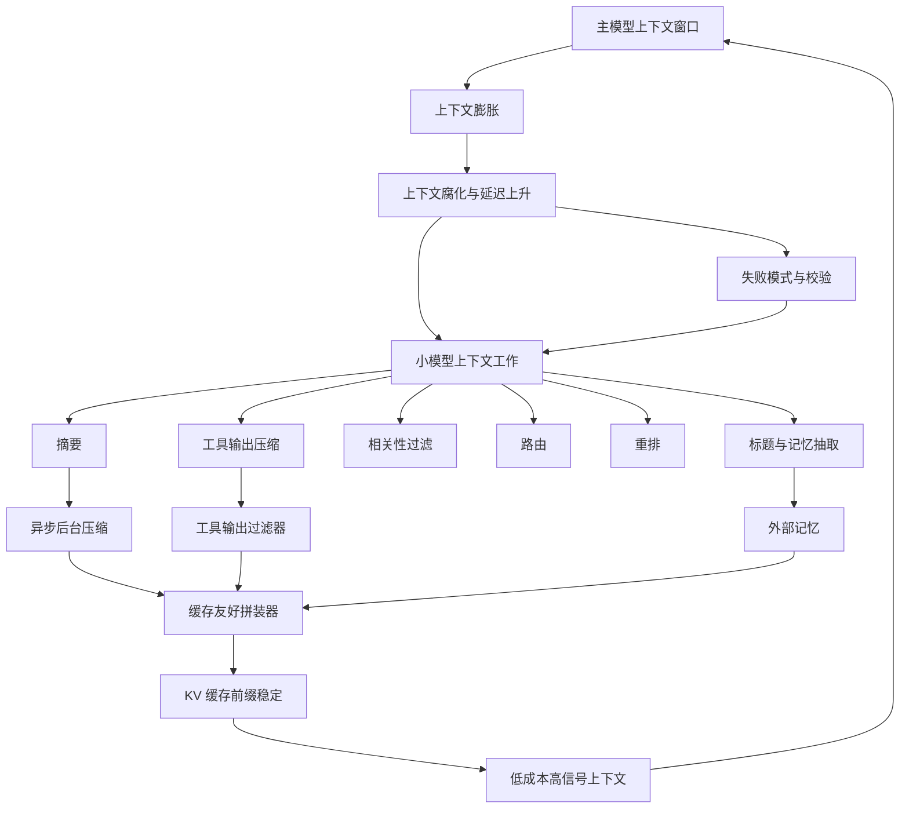
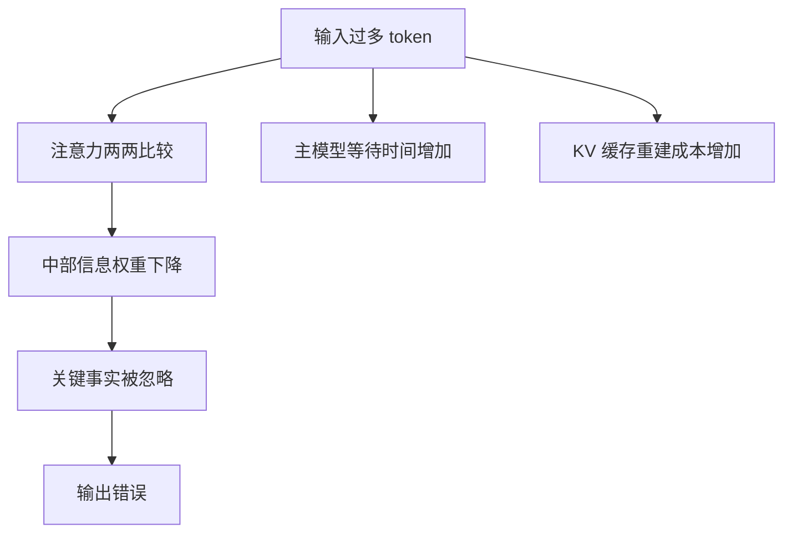
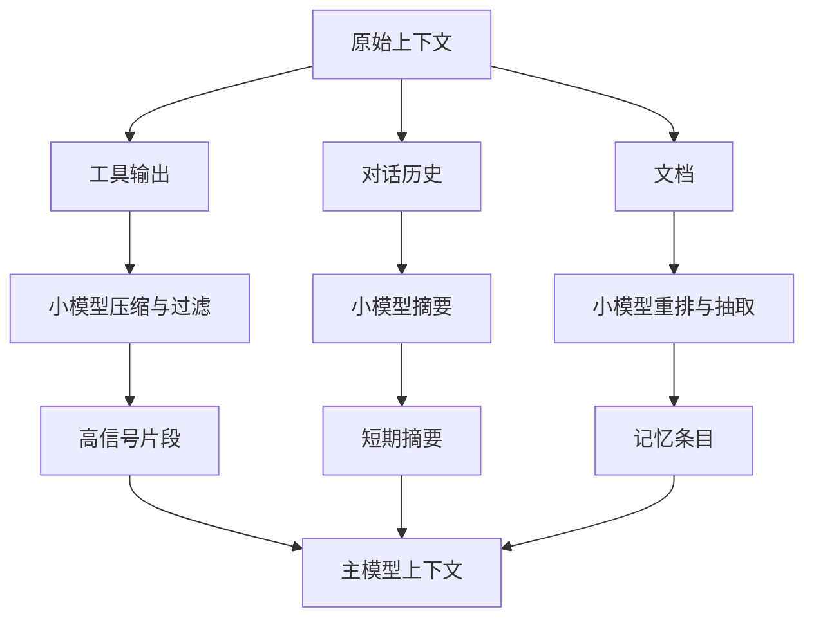
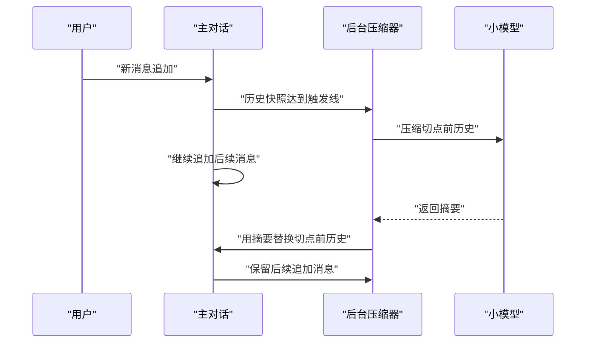
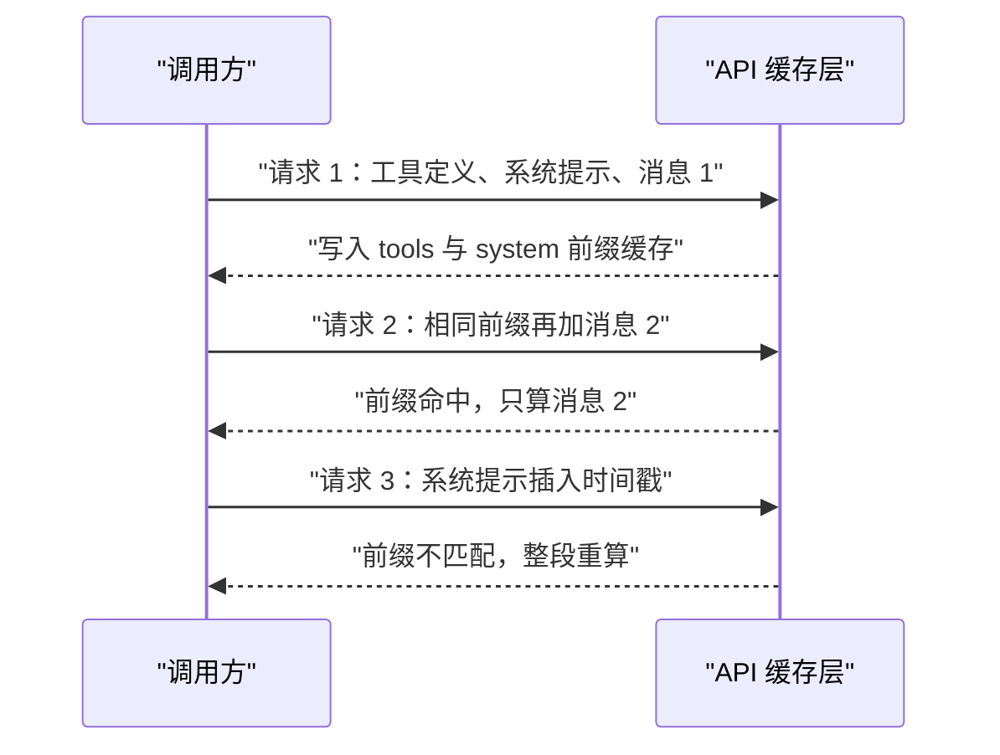
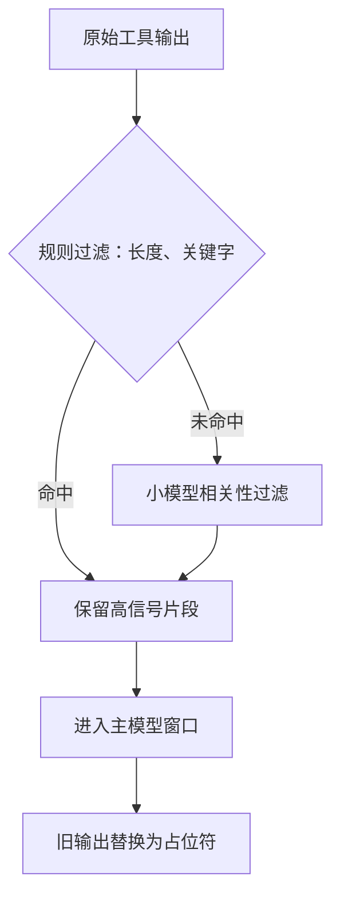
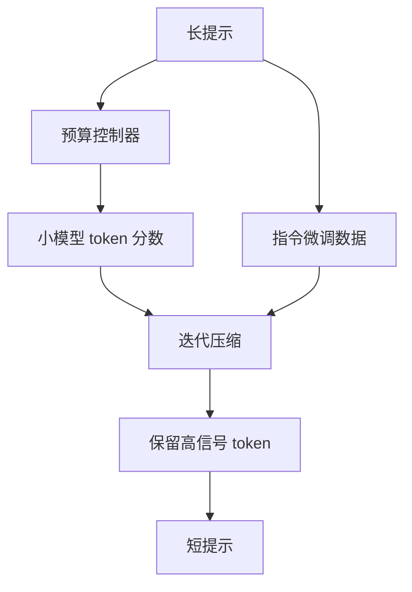
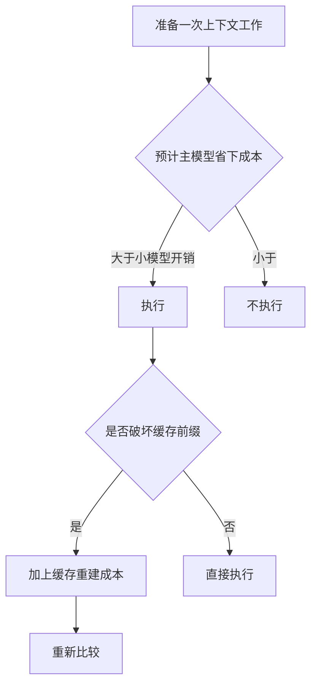
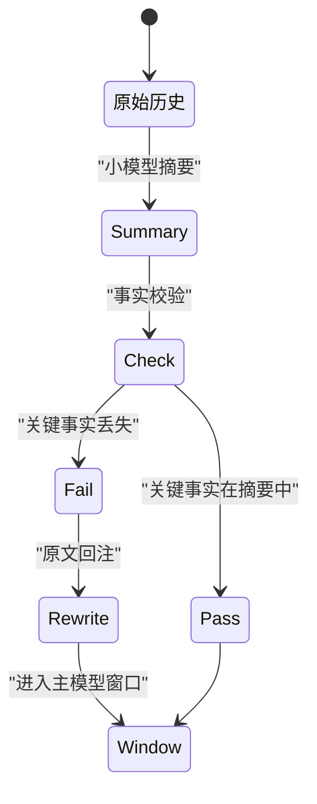

# 用小模型处理上下文：不阻塞主模型的架构

!!! abstract "学完这一页你能"
    - 说出 6 类可以外包给小模型的上下文工作，并给出每类的判断条件。
    - 写出一个异步后台压缩器：在旧历史被替换前，主对话仍能继续追加消息。
    - 写出一个缓存友好的上下文拼装器：保持前缀稳定、历史追加式，并解释为什么改中间会击穿 KV 缓存。
    - 写出一个工具输出过滤器与摘要校验器，能发现小模型摘要丢失关键事实的情况。

## 0. 知识地图



建议先读第 1、2 节，建立“上下文膨胀”和“哪些工作能外包”的总图。再按第 3、4、5 节手写三个组件。最后用第 6、7、8 节校准压缩边界、成本与失败校验。

## 1. 上下文为什么会烂：长度不是免费午餐

**先想一个问题**：你给主模型 100 轮客服对话，中间有一句“收货地址改成杭州”。最后模型仍然发了旧地址。问题不在模型笨，而在 100 轮里的中段信息没有被均匀注意。

**心智模型**：

!!! tip "心智模型"
    一句话模型：上下文越长，模型中段的回忆准确率越容易下降；与其喂更多，不如喂更少的高信号 token。
    日常类比：你把违约金额夹在 30 页合同的正中间，对方漏看的概率高于放在第 1 页或最后 1 页。
    类比不成立：人看合同是顺序扫读，Transformer 是成对注意力把权重摊到所有位置；中段信息不是被顺序遗忘，而是被其他 token 稀释。

**图解**：



1. `输入过多 token` 触发两个并行问题：质量下降与成本上升。
2. `注意力两两比较` 表示 Transformer 的复杂度随长度平方上升。
3. `中部信息权重下降` 是 Lost in the Middle 论文观察到的现象。
4. `KV 缓存重建成本增加` 来自前缀变化时需要重算缓存。
5. 最终结果 `输出错误` 与 `主模型等待时间增加` 同时发生。

**一步一步来**：

第 1 步：构造一条 20 轮简化对话，把关键事实放在第 10 轮，模拟中段位置。

```js
// 构造 20 轮消息，关键事实留在中部
const messages = Array.from({ length: 20 }, (_, i) => ({
  role: i % 2 === 0 ? 'user' : 'assistant',
  content: i === 10 ? '订单号改成 B-2024-009' : `普通内容 ${i}`,
}));
```

**这段代码在做什么**：

- 生成 20 个消息对象。
- 偶数位是用户，奇数位是助手。
- 第 10 条放入关键事实，用来演示中段位置。
- 其余内容不携带关键信息。

第 2 步：用一个明确的模拟函数演示“越靠中段越容易漏”。这个函数不是任何论文的真实公式。

```js
// 该函数只演示中部衰减形态，不来自 Lost in the Middle 原文公式
function edgeDistance(index, total) {
  return Math.min(index, total - index - 1);
}

function middleAttentionMock(index, total) {
  const middleDistance = (total - 1) / 2;
  return 1 - 0.6 * (edgeDistance(index, total) / middleDistance);
}

const early = middleAttentionMock(2, messages.length);
const middle = middleAttentionMock(10, messages.length);
const late = middleAttentionMock(17, messages.length);

console.log({ early: early.toFixed(2), middle: middle.toFixed(2), late: late.toFixed(2) });
```

**这段代码在做什么**：

- `edgeDistance` 计算该位置离最近边界的距离，0 表示在首或尾。
- `middleAttentionMock` 用离边界距离算出模拟衰减分。
- 首部与尾部位置得分较高，中段位置得分较低。
- 这个模拟只用来复现“中部更难被注意”的方向，不替代真实评测。

运行结果：

```text
{ early: '0.87', middle: '0.43', late: '0.87' }
```

**动手验证**：

```js
import assert from 'node:assert';

const messages = Array.from({ length: 20 }, (_, i) => ({
  role: i % 2 === 0 ? 'user' : 'assistant',
  content: i === 10 ? '订单号改成 B-2024-009' : `普通内容 ${i}`,
}));

function edgeDistance(index, total) {
  return Math.min(index, total - index - 1);
}

function middleAttentionMock(index, total) {
  const middleDistance = (total - 1) / 2;
  return 1 - 0.6 * (edgeDistance(index, total) / middleDistance);
}

const early = middleAttentionMock(2, messages.length);
const middle = middleAttentionMock(10, messages.length);
const late = middleAttentionMock(17, messages.length);

assert.ok(early > middle, '首部得分应大于中部');
assert.ok(late > middle, '尾部得分应大于中部');

console.log(JSON.stringify({ early: early.toFixed(2), middle: middle.toFixed(2), late: late.toFixed(2) }, null, 2));
```

**常见坑**：

| 现象 | 原因 | 怎么修 |
|---|---|---|
| 关键事实在第 10 轮被漏掉 | 长窗下中段注意力被稀释，来源 Lost in the Middle | 把关键事实提到首部，或交给小模型定期重提 |
| 输入越长，简单任务都变差 | 18 个模型都随输入增长而下降，来源 Chroma 研究 | 用最小高信号 token 集合 |
| 打扰项越多准确率越低 | 一个打扰项就下降，四个更明显，来源 Chroma 研究 | 先过滤工具输出再进窗口 |

**用在哪里**：

1. 电商客服长会话改址
   - 业务背景：客户在对话中段改了收货地址。
   - 这一节的知识怎么用：不让主模型直接读 100 轮全文，把地址事实抽到首部。
   - 用什么指标衡量收益：地址写对率、一次解决率。
   - 什么时候不该用：会话不足 10 轮，压缩固定成本大于收益。

2. 长合同问答
   - 业务背景：违约条款位于合同中部，主模型容易漏引。
   - 这一节的知识怎么用：先做相关性过滤，把条款片段放到首部。
   - 用什么指标衡量收益：召回率、漏检率。
   - 什么时候不该用：必须逐字引用原文时，概要替代不了原文。

3. CI 日志错误定位
   - 业务背景：失败根因混在日志中部。
   - 这一节的知识怎么用：先用规则过滤器保留错误行。
   - 用什么指标衡量收益：一次定位成功率。
   - 什么时候不该用：日志短且无噪声。

**行业实践**：

- Anthropic 工程博客《Effective Context Engineering for AI Agents》把 context rot 定义为 token 数上升导致回忆准确率下降，归因于 Transformer 的成对注意力在长上下文被摊薄。
- Chroma 研究《Context Rot》在 18 个 LLM 上测试，所有模型都随输入增长而下降。
- Lost in the Middle（Liu et al., 2023）发现信息在首尾时表现最高，在中部时显著下降。

怎么借鉴到你的项目：把高优先级事实放在窗口首部 5%，不要把关键决定留在中段历史。

**小结**：

- 上下文不是越满越好，中段信息会被稀释。
- 主模型要留出空间给未来轮次，不要等窗口塞满才清理。
- 六类上下文工作可以外包给小模型，这是后续三节的主线。

## 2. 哪些上下文工作适合交给小模型

**先想一个问题**：工具返回 10,000 行日志，其中只有 5 行 ERROR。你把整份日志塞给主模型，窗口、延迟、费用都不划算。哪些清理工作可以交给便宜的小模型？

**心智模型**：

!!! tip "心智模型"
    一句话模型：小模型是分诊台，负责把原始上下文变成高信号 token；主模型是手术室，只处理压缩后的输入。
    日常类比：助理先帮你把 30 封邮件整理成半页要点，再交给负责人签字。助理可以便宜，可以并行。
    类比不成立：邮件助理漏掉一句“合同作废”可能只是延迟，而小模型摘要漏掉关键事实会直接改变主模型决策。

**图解**：



1. 原始上下文按来源分流：工具输出、对话历史、文档。
2. 工具输出优先做压缩与过滤。
3. 对话历史做摘要，输出短期摘要。
4. 文档做重排与抽取，输出记忆条目。
5. 三者合并后进入主模型上下文。

**一步一步来**：

第 1 步：按输入来源和长度选择一个上下文任务。

```js
// 根据来源、长度和数量决定交给小模型的哪类任务
function planContextJob(input) {
  if (input.source === 'tool' && input.length > 2000) {
    return '工具输出压缩';
  }
  if (input.source === 'history' && input.turns > 20) {
    return '摘要';
  }
  if (input.source === 'docs' && input.count > 10) {
    return '相关性过滤加重排';
  }
  if (input.source === 'query') {
    return '路由';
  }
  return '不处理';
}
```

**这段代码在做什么**：

- 工具输出超过 2,000 字符时选工具输出压缩。
- 历史超过 20 轮时选摘要。
- 文档超过 10 篇时选相关性过滤加重排。
- 查询入口统一先走路由。
- 短输入直接不处理，避免浪费一次小模型调用。

第 2 步：测几个典型输入，确认任务分配稳定。

```js
const cases = [
  { source: 'tool', length: 9000, count: 1, turns: 0 },
  { source: 'history', length: 5000, count: 1, turns: 32 },
  { source: 'docs', length: 5000, count: 15, turns: 0 },
];

for (const item of cases) {
  console.log(planContextJob(item));
}
```

**这段代码在做什么**：

- 第一个用例命中工具输出压缩。
- 第二个用例命中摘要。
- 第三个用例命中相关性过滤加重排。
- 这些分支决定了后面三个手写组件分别接在哪一步。

运行结果：

```text
工具输出压缩
摘要
相关性过滤加重排
```

**动手验证**：

```js
import assert from 'node:assert';

function planContextJob(input) {
  if (input.source === 'tool' && input.length > 2000) return '工具输出压缩';
  if (input.source === 'history' && input.turns > 20) return '摘要';
  if (input.source === 'docs' && input.count > 10) return '相关性过滤加重排';
  if (input.source === 'query') return '路由';
  return '不处理';
}

assert.equal(planContextJob({ source: 'tool', length: 9000 }), '工具输出压缩');
assert.equal(planContextJob({ source: 'history', turns: 32 }), '摘要');
assert.equal(planContextJob({ source: 'docs', count: 15 }), '相关性过滤加重排');
assert.equal(planContextJob({ source: 'query' }), '路由');
assert.equal(planContextJob({ source: 'tool', length: 900 }), '不处理');

console.log('六类任务判断通过：摘要、压缩、相关性过滤、路由、重排、记忆抽取');
```

**常见坑**：

| 现象 | 原因 | 怎么修 |
|---|---|---|
| 把结构化工具输出交给小模型压缩 | 可能丢了路径、ID、代码这些精确 token | 规则过滤优先，小模型只做语义判断 |
| 让路由模型做重排 | 两个任务训练目标不同 | 分开选用专门模型 |
| 对短输入也启动压缩 | 固定成本高于收益 | 设置长度下限，工具输出小于 2,000 字符不处理 |

**用在哪里**：

1. 后台管理批量导入
   - 业务背景：一次导入 10,000 条数据，产生大量校验消息。
   - 这一节的知识怎么用：小模型抽取每条失败的原因，只把去重后的原因列表给主模型。
   - 用什么指标衡量收益：主模型输入 token 数、导入任务完成时间。
   - 什么时候不该用：错误数量少于 10 条时，直接看原文更快。

2. 知识库问答
   - 业务背景：用户问题要命中 50 个候选片段。
   - 这一节的知识怎么用：先相关性过滤，再做重排。
   - 用什么指标衡量收益：命中率、答案正确率。
   - 什么时候不该用：片段少于 5 个时，重排收益有限。

3. 客服入口路由
   - 业务背景：用户第一句话可能属于售前、售后或退款。
   - 这一节的知识怎么用：小模型先判断工单类型，再选对应主模型流程。
   - 用什么指标衡量收益：转接次数、首响时长。
   - 什么时候不该用：只有一个业务线时，路由没有必要。

**行业实践**：

- Claude Code 成本文档：让子代理运行测试、抓文档、处理日志，只把摘要返回主代理；技能和 MCP 工具定义按需加载。
- Cognition 博客《Don't Build Multi-Agents》：专用 LLM 压缩历史与动作，提炼关键细节、事件和决策；文章说明这很难做对，并探索微调小模型做压缩。
- Anthropic 工程博客：子代理返回约 1,000 到 2,000 token 摘要。

怎么借鉴到你的项目：把只读型工具输出放进子代理，返回结构化摘要；路由与重排分别选专门小模型。

**小结**：

- 摘要、工具输出压缩、相关性过滤、路由、重排、标题与记忆抽取都适合小模型。
- 规则能做的先用规则，因为规则不产生幻觉。
- 小模型任务要有长度下限，否则固定成本吞掉收益。

## 3. 异步后台压缩：提前压，别等撞墙

**先想一个问题**：窗口即将装满，主模型必须停下来等你做摘要。这个摘要请求读完整份历史，用户已经在等待。能不能把这件事放到后台，让主对话继续？

**心智模型**：

!!! tip "心智模型"
    一句话模型：后台压缩在历史副本上运行，主对话继续追加消息，等摘要返回后再替换切点之前的旧消息。
    日常类比：会议进行中，记录员在隔壁根据录音写纪要，会议不中断；纪要完成后，下一议题只发纪要和最近讨论。
    类比不成立：会议录音可以一遍遍回放，而压缩请求会占用速率限制和 KV 缓存写预算；一次只能有一个待处理压缩。

**图解**：



1. 用户持续追加消息，主对话不中断。
2. 历史规模达到触发线时，后台压缩器取一份快照。
3. 小模型只压缩切点之前的那段历史。
4. 主对话在压缩期间继续追加后续消息。
5. 摘要返回后，只替换切点前内容，后续消息保留。

**一步一步来**：

第 1 步：做 token 估算和触发判断。真实项目可换成 API 的 token 计数接口。

```js
// 教学用估算：4 个字符约 1 个 token
function estimateTokens(text) {
  return Math.ceil(text.length / 4);
}

function shouldStartCompaction(history, contextWindow, reserveTokens) {
  const totalTokens = history.reduce((sum, m) => sum + estimateTokens(m.content), 0);
  return totalTokens > contextWindow - reserveTokens;
}
```

**这段代码在做什么**：

- `estimateTokens` 用字符长度估算 token 数，真实项目要换成 API 计数。
- `shouldStartCompaction` 在还差 `reserveTokens` 就满时触发。
- 提前触发是为了压缩期间还有空间接收新消息。
- 这层“提前压”避免撞墙后才开始同步压缩。

第 2 步：写后台压缩器。它保持一个 `pendingCompaction`，同一时间只允许一个待处理压缩。

```js
class BackgroundCompactor {
  constructor({ contextWindow = 1000, reserveTokens = 100, keepRecentTokens = 200 }) {
    this.contextWindow = contextWindow;
    this.reserveTokens = reserveTokens;
    this.keepRecentTokens = keepRecentTokens;
    this.history = [];
    this.pendingCompaction = null;
  }

  append(message) {
    this.history.push({ ...message, seq: this.history.length });
  }

  findCutPoint() {
    let tokens = 0;
    for (let i = this.history.length - 1; i >= 0; i -= 1) {
      tokens += estimateTokens(this.history[i].content);
      if (tokens >= this.keepRecentTokens) return i;
    }
    return 0;
  }

  async compact() {
    if (this.pendingCompaction) return this.pendingCompaction;
    const cut = this.findCutPoint();
    const oldSlice = this.history.slice(0, cut);
    const recent = this.history.slice(cut);
    this.pendingCompaction = cheapSummarize(oldSlice).then((summary) => {
      this.history = [{ role: 'assistant', content: summary, seq: 0 }, ...recent];
      this.pendingCompaction = null;
      return { replaced: oldSlice.length, kept: recent.length };
    });
    return this.pendingCompaction;
  }
}

async function cheapSummarize(messages) {
  // 实际项目里这里替换成便宜小模型 API
  const goals = messages.filter((m) => m.content.includes('目标')).slice(-2);
  const decisions = messages.filter((m) => m.content.includes('决定')).slice(-2);
  return `摘要：${goals.map((g) => g.content).join('；')}。${decisions.map((d) => d.content).join('；')}`;
}
```

**这段代码在做什么**：

- `findCutPoint` 从后往前累积 token，直到达到 `keepRecentTokens`，这样切点前的旧历史可以替换。
- `compact` 先记下旧段和最近段，异步调用小模型。
- 摘要返回后，只替换旧段，最近段原样保留。
- `pendingCompaction` 防止同时启动两个压缩任务，避免互相覆盖。
- `cheapSummarize` 是模拟小模型，真实项目应替换为 API 调用。

**动手验证**：

```js
import assert from 'node:assert';

function estimateTokens(text) {
  return Math.ceil(text.length / 4);
}

async function cheapSummarize(messages) {
  const goals = messages.filter((m) => m.content.includes('目标')).slice(-2);
  const decisions = messages.filter((m) => m.content.includes('决定')).slice(-2);
  return `摘要：${goals.map((g) => g.content).join('；')}。${decisions.map((d) => d.content).join('；')}`;
}

class BackgroundCompactor {
  constructor({ contextWindow = 300, reserveTokens = 40, keepRecentTokens = 50 }) {
    this.contextWindow = contextWindow;
    this.reserveTokens = reserveTokens;
    this.keepRecentTokens = keepRecentTokens;
    this.history = [];
    this.pendingCompaction = null;
  }
  append(message) {
    this.history.push({ ...message, seq: this.history.length });
  }
  totalTokens() {
    return this.history.reduce((sum, m) => sum + estimateTokens(m.content), 0);
  }
  shouldCompact() {
    return this.totalTokens() > this.contextWindow - this.reserveTokens;
  }
  findCutPoint() {
    let tokens = 0;
    for (let i = this.history.length - 1; i >= 0; i -= 1) {
      tokens += estimateTokens(this.history[i].content);
      if (tokens >= this.keepRecentTokens) return i;
    }
    return 0;
  }
  async compact() {
    if (this.pendingCompaction) return this.pendingCompaction;
    const cut = this.findCutPoint();
    const oldSlice = this.history.slice(0, cut);
    const recent = this.history.slice(cut);
    this.pendingCompaction = cheapSummarize(oldSlice).then((summary) => {
      this.history = [{ role: 'assistant', content: summary, seq: 0 }, ...recent];
      this.pendingCompaction = null;
      return { replaced: oldSlice.length, kept: recent.length };
    });
    return this.pendingCompaction;
  }
}

const compactor = new BackgroundCompactor();
for (let i = 0; i < 8; i += 1) {
  compactor.append({
    role: i % 2 === 0 ? 'user' : 'assistant',
    content: `第 ${i} 轮普通内容，目标不变。决定：继续调研。`,
  });
}

assert.equal(compactor.shouldCompact(), true, '应进入压缩触发区');

const pending = compactor.compact();
compactor.append({ role: 'user', content: '后续消息：改成杭州地址' });

await pending;

assert.ok(compactor.history.length < 9, '旧历史应被摘要替换');
assert.ok(compactor.history.some((m) => m.content.includes('杭州地址')), '压缩期间追加的后续消息应保留');

console.log(JSON.stringify({
  currentLength: compactor.history.length,
  firstContent: compactor.history[0].content,
  lastContent: compactor.history[compactor.history.length - 1].content,
}, null, 2));
```

**常见坑**：

| 现象 | 原因 | 怎么修 |
|---|---|---|
| 压缩期间用户又发消息 | 摘要替换时把新消息误删 | 记录切点位置，只替换切点之前的消息 |
| 同时发起两次后台压缩 | 两个请求都读旧历史，可能互相覆盖 | 用 `pending` 标记，一次只允许一个 |
| 摘要返回前修改旧历史 | 缓存失效，摘要与主对话状态不一致 | 追加式历史，只在前端替换，不编辑已有消息 |

**用在哪里**：

1. AI 客服长会话
   - 业务背景：会话可能超过 100 轮。
   - 这一节的知识怎么用：提前一个保留窗口启动后台压缩。
   - 用什么指标衡量收益：主对话阻塞次数、尾延迟。
   - 什么时候不该用：会话短，压缩频率低。

2. IDE 编码代理
   - 业务背景：一次任务可能执行多小时。
   - 这一节的知识怎么用：在窗口到触发线前压缩，保留最近动作。
   - 用什么指标衡量收益：任务完成时间、漏掉后续指令次数。
   - 什么时候不该用：任务在几分钟内完成。

3. 自动调研代理
   - 业务背景：抓取 100 个网页，返回很多工具结果。
   - 这一节的知识怎么用：抓取期间后台压缩旧结果。
   - 用什么指标衡量收益：主模型输入 token、结果完整率。
   - 什么时候不该用：网页内容需要逐段引用时。

**行业实践**：

- Claude API 后台压缩文档：摘要请求在历史副本上运行，主对话继续；收到 compaction 停止原因后，只替换发送的那段，保留后续消息。
- pi 编码代理文档：当 `contextTokens > contextWindow - reserveTokens` 触发；`reserveTokens` 默认 16,384；切点不能落在工具结果，工具结果必须与工具调用一起保留。
- Anthropic 工程博客：工具结果清理被称为最轻量的压缩形式。

怎么借鉴到你的项目：把触发线放在窗口减去 reserve 的位置，拆一个独立压缩队列，并用一个 pending 标记串行化。

**小结**：

- 后台压缩是为了不阻塞主对话，而不是只省一次主模型调用。
- 触发线要预留 reserve，因为压缩期间还有新消息进来。
- 只替换切点前，保留切点后。

## 4. 缓存友好的上下文拼装器：前缀稳定，追加式历史

**先想一个问题**：你只在系统提示里加了一个时间戳，为什么缓存命中率从 80% 掉到 0？因为前缀从第一个 token 就变了。

!!! note "术语：KV 缓存"
    KV 缓存保存模型已经算过的 prefix 键值对。后续请求如果前缀一致，直接读缓存；前缀不一致，从变化点开始重算。例如两条消息共享同一段系统提示时，第二条复用第一条已写入的 KV 缓存。

**心智模型**：

!!! tip "心智模型"
    一句话模型：把上下文当成只追加的日志，前缀放不常变的部分，后部放会增长的部分。
    日常类比：合同第一页的公司信息和定义不变，后面的补充协议可以追加；改第一页等于重新打印整份。
    类比不成立：打印合同改一页只重印那一页；KV 缓存改中间一处会从该点开始全部失效，这是前缀缓存不是页式缓存。

**图解**：



1. 请求 1 写入了稳定前缀。
2. 请求 2 只追加消息，命中缓存。
3. 请求 3 在系统提示插入时间戳，前缀变化。
4. 缓存层只能让请求 3 重算。
5. 这是“中间编辑”的代价，而不是追加本身。

**一步一步来**：

第 1 步：定义稳定前缀顺序，tools 最前，system 第二，messages 最后。

```js
// 拼接顺序固定：tools、system、messages
function assembleBlocks({ tools, system, messages }) {
  return [
    { type: 'tools', content: tools, stable: true },
    { type: 'system', content: system, stable: true },
    ...messages.map((m, i) => ({ type: 'message', ...m, stable: false, isNew: i === messages.length - 1 })),
  ];
}
```

**这段代码在做什么**：

- `tools` 与 `system` 标记为 `stable`，表示运行时不变。
- `messages` 按追加顺序拼在后面。
- `isNew` 标记最后一条，方便判断缓存从哪条开始不命中。
- 这个顺序对应 Claude 文档 tools → system → messages 的缓存顺序。

第 2 步：写一个缓存友好的上下文对象，要求追加式历史，中间编辑抛错。

```js
class CacheFriendlyAssembler {
  constructor({ tools, system }) {
    this.tools = tools;
    this.system = system;
    this.messages = [];
  }

  append(message) {
    this.messages.push({ ...message, seq: this.messages.length });
  }

  editLast(content) {
    const last = this.messages[this.messages.length - 1];
    if (!last) throw new Error('没有可编辑的消息');
    last.content = content;
  }

  editMiddle(seq, content) {
    const target = this.messages.find((m) => m.seq === seq);
    if (!target || target !== this.messages[this.messages.length - 1]) {
      throw new Error('只允许编辑最后一条，中间编辑会使缓存失效');
    }
    target.content = content;
  }

  render() {
    return [this.tools, this.system, ...this.messages];
  }
}
```

**这段代码在做什么**：

- `append` 给每条消息一个递增序号。
- `editLast` 只修改最后一条，适合还没发送的内容。
- `editMiddle` 检测非最后一条并抛错，防止无意中击穿缓存。
- `render` 永远先输出稳定前缀，再输出追加历史。

**动手验证**：

```js
import assert from 'node:assert';

class CacheFriendlyAssembler {
  constructor({ tools, system }) {
    this.tools = tools;
    this.system = system;
    this.messages = [];
  }
  append(message) {
    this.messages.push({ ...message, seq: this.messages.length });
  }
  editLast(content) {
    const last = this.messages[this.messages.length - 1];
    if (!last) throw new Error('没有可编辑的消息');
    last.content = content;
  }
  editMiddle(seq, content) {
    const target = this.messages.find((m) => m.seq === seq);
    if (!target || target !== this.messages[this.messages.length - 1]) {
      throw new Error('只允许编辑最后一条，中间编辑会使缓存失效');
    }
    target.content = content;
  }
  render() {
    return [this.tools, this.system, ...this.messages];
  }
}

const assembler = new CacheFriendlyAssembler({
  tools: '工具定义：read_file',
  system: '系统提示：你是前端面试助手',
});

assembler.append({ role: 'user', content: '第一问' });
assembler.append({ role: 'assistant', content: '第一答' });

const rendered = assembler.render();

assert.equal(rendered[0], '工具定义：read_file');
assert.equal(rendered[1], '系统提示：你是前端面试助手');
assert.equal(rendered.length, 4);
assert.throws(() => assembler.editMiddle(0, '改中间'), /只允许编辑最后一条/);

assembler.editLast('修正后的第一答');
assert.equal(assembler.messages[1].content, '修正后的第一答');

console.log('缓存前缀顺序与追加式约束通过');
```

**常见坑**：

| 现象 | 原因 | 怎么修 |
|---|---|---|
| 系统提示里放时间戳 | 请求前缀每次都变，缓存失效 | 把时间戳放到最后的追加尾部，或外部化 |
| 中途删除工具 | 工具层变化使整条缓存失效 | 运行中不删除工具，用 logit 约束屏蔽 |
| 摘要直接编辑历史中部 | 从编辑点起缓存全部失效 | 允许缓存重建，并计入成本 |

**用在哪里**：

1. 客服机器人
   - 业务背景：公司政策是稳定前缀，会话内容持续追加。
   - 这一节的知识怎么用：政策、工具定义放前缀，会话放后部。
   - 用什么指标衡量收益：KV 缓存命中率、每次请求成本。
   - 什么时候不该用：政策每轮都变，就不该放在稳定前缀。

2. 前端面试陪练
   - 业务背景：系统提示与题目工具固定，回答过程追加。
   - 这一节的知识怎么用：把评分标准和工具定义放最前面。
   - 用什么指标衡量收益：缓存命中率、响应时间。
   - 什么时候不该用：工具定义频繁变动时。

3. 多轮搜索代理
   - 业务背景：搜索工具固定，查询参数和结果不断追加。
   - 这一节的知识怎么用：查询参数和结果按轮次追加到尾部。
   - 用什么指标衡量收益：搜索轮次成本。
   - 什么时候不该用：每次查询需要新工具时。

**行业实践**：

- Manus 博客：KV 缓存命中率是生产级代理最重要的单个指标；保持 prompt 前缀稳定，不要在系统提示里放时间戳，上下文追加写并确定性序列化。
- Claude Code 提示缓存文档：顺序是系统提示和工具优先，然后 CLAUDE.md 和记忆，最后对话；切换模型、变更工具集会失效。
- OpenAI 提示缓存文档：自动缓存要求整个渲染前缀匹配，缓存读取价格是未缓存输入的 0.1 倍。

怎么借鉴到你的项目：把系统提示和工具定义冻结为常量，所有动态信息追加到尾部；加入中间编辑保护。

**小结**：

- 前缀稳定比压缩本身更决定成本。
- 追加式历史是缓存友好的前提。
- 中间编辑必须当作一次有意的缓存重建。

## 5. 工具输出过滤器：先过滤再进窗口

**先想一个问题**：一个文件读取工具返回 10,000 行构建日志，主模型只需要 3 条错误。直接塞进去，窗口、缓存、注意力都受伤。

!!! note "术语：观察屏蔽"
    观察屏蔽指保留工具调用本身，但把旧的工具输出替换成占位符，只保留最近 N 轮的完整输出。该概念来自 JetBrains 研究论文。

**心智模型**：

!!! tip "心智模型"
    一句话模型：工具输出先经过规则或小模型过滤器，只把能改变主模型决策的片段放进窗口。
    日常类比：安全门只放行有含金量的箱子，不放行整条传送带。
    类比不成立：安全门漏放一个箱子不会修改其他箱子内容；过滤器漏掉一条错误日志可能让主模型重复错误操作。

**图解**：



1. 原始输出先做规则过滤。
2. 规则命中的直接保留。
3. 规则未命中的交给小模型做相关性过滤。
4. 高信号片段进入主模型窗口。
5. 不属于最近 N 轮的旧输出替换为占位符。

**一步一步来**：

第 1 步：写规则过滤器，保留头部几行和命中关键字的行。

```js
// 先用规则过滤，不需要小模型，零幻觉风险
function ruleFilter(log, { keepLines = 3, keywords = ['ERROR', 'FAIL'] } = {}) {
  const lines = log.split('\n');
  const head = lines.slice(0, keepLines);
  const hits = lines.filter((line) => keywords.some((keyword) => line.includes(keyword)));
  return [...head, ...hits];
}
```

**这段代码在做什么**：

- `head` 保留日志开头上下文。
- `hits` 保留包含 ERROR 或 FAIL 的行。
- 规则过滤是确定性的，不会产生幻觉。
- 它适合高频日志和明确关键字的场景。

第 2 步：写小模型相关性过滤的模拟实现，真实项目可替换为语义过滤。

```js
// 模拟小模型：按查询词做相关性过滤
function smallModelFilter(lines, query) {
  const terms = query.split(' ');
  return lines.filter((line) => terms.some((term) => line.includes(term)));
}
```

**这段代码在做什么**：

- 把查询拆成多个词。
- 只保留包含查询词的日志行。
- 这是小模型相关性过滤的教学模拟版本。
- 真实项目应使用专门的语义相关度模型。

第 3 步：给旧工具输出换占位符。

```js
function maskOldToolOutputs(history, keep = 3) {
  const toolResults = history.filter((m) => m.role === 'tool');
  const toReplace = toolResults.slice(0, Math.max(0, toolResults.length - keep));
  const replacedIds = new Set(toReplace.map((m) => m.id));
  return history.map((m) => {
    if (replacedIds.has(m.id)) return { ...m, content: '[旧工具输出已清除]' };
    return m;
  });
}
```

**这段代码在做什么**：

- 找出所有工具输出。
- 只保留最近 `keep` 个工具输出。
- 其余输出替换为固定占位符。
- 占位符保留调用位置，但节省窗口空间。

**动手验证**：

```js
import assert from 'node:assert';

function ruleFilter(log, { keepLines = 3, keywords = ['ERROR', 'FAIL'] } = {}) {
  const lines = log.split('\n');
  const head = lines.slice(0, keepLines);
  const hits = lines.filter((line) => keywords.some((keyword) => line.includes(keyword)));
  return [...head, ...hits];
}

function maskOldToolOutputs(history, keep = 3) {
  const toolResults = history.filter((m) => m.role === 'tool');
  const toReplace = toolResults.slice(0, Math.max(0, toolResults.length - keep));
  const replacedIds = new Set(toReplace.map((m) => m.id));
  return history.map((m) => {
    if (replacedIds.has(m.id)) return { ...m, content: '[旧工具输出已清除]' };
    return m;
  });
}

const log = 'INFO 启动服务\nERROR 连接超时\nINFO 请求结束\nERROR 数据库写入失败\nDEBUG 慢查询\nFAIL 部署失败';
const filtered = ruleFilter(log);

assert.ok(filtered.some((line) => line.includes('ERROR 数据库写入失败')));
assert.equal(filtered.filter((line) => line.includes('DEBUG')).length, 0);

const history = [
  { id: 't1', role: 'tool', content: '旧输出1' },
  { id: 't2', role: 'tool', content: '旧输出2' },
  { id: 't3', role: 'tool', content: '旧输出3' },
  { id: 't4', role: 'tool', content: '新输出4' },
];

const masked = maskOldToolOutputs(history, 2);
assert.equal(masked[0].content, '[旧工具输出已清除]');
assert.equal(masked[3].content, '新输出4');

console.log('工具输出过滤与占位符通过');
```

**常见坑**：

| 现象 | 原因 | 怎么修 |
|---|---|---|
| 规则删掉堆栈中的根因 | 只有 ERROR 没有上下游 | 对 ERROR 上下文保留 N 行 |
| 过滤后主模型不知道已过滤 | 它以为这是全部日志 | 在占位符里写清楚清理策略 |
| 旧工具输出清除太频繁 | 每次清除都使之后的缓存失效 | 一次清足够多，或接受一次有意重建 |

**用在哪里**：

1. CI 构建日志分析
   - 业务背景：构建失败日志可能超过十万行。
   - 这一节的知识怎么用：先 grep 出 ERROR 与 FAIL，再让主模型判断根因。
   - 用什么指标衡量收益：输入 token 数、定位耗时。
   - 什么时候不该用：需要完整堆栈和上下文时，规则过滤不能太狠。

2. 搜索结果清洗
   - 业务背景：搜索接口返回大量低相关片段。
   - 这一节的知识怎么用：小模型先按查询词过滤。
   - 用什么指标衡量收益：主模型输入 token 数、答案正确率。
   - 什么时候不该用：搜索质量本身差时，过滤治不了源头。

3. RAG 文档块选择
   - 业务背景：检索到 50 个文档块，只有 8 个相关。
   - 这一节的知识怎么用：规则先过滤明显无关块，小模型再精排。
   - 用什么指标衡量收益：最终答案召回率。
   - 什么时候不该用：候选块很少时，直接进主模型。

**行业实践**：

- Claude Code 成本文档：Hook 可以把 10,000 行日志裁到匹配的 ERROR 行，从数万 token 降到数百 token。
- JetBrains 研究：观察屏蔽比原始代理便宜一半，与摘要方法相当甚至更好；在 SWE-bench Verified 上，Qwen3-Coder 480B 用屏蔽省 52% 成本，解决率提升 2.6 个百分点。
- Anthropic 上下文编辑文档：`clear_tool_uses_20250919` 默认触发点是 100,000 input tokens，保留最近 3 个工具使用结果对，清理内容替换为占位符。

怎么借鉴到你的项目：先把高频规则做成管道，再决定是否引入小模型过滤；每次过滤记录掉了什么。

**小结**：

- 先规则后小模型，顺序不能反。
- 旧输出换占位符是便宜的压缩。
- 过滤必须可追溯，否则主模型会误判。

## 6. 提示压缩：LLMLingua 系的做法与边界

**先想一个问题**：一段 8,000 token 的产品文档，你要在主模型里做 20 次查询。每次都全文重读太贵，人工写摘要又太慢。有没有自动压缩提示的办法？

!!! note "术语：提示压缩"
    提示压缩指在把文本送入大模型前，用另一个模型或算法减少 token 数。代表工作是 LLMLingua 系列。

**心智模型**：

!!! tip "心智模型"
    一句话模型：提示压缩用一个小模型先给每个 token 打“保留或丢弃”分，再用预算控制器保住高分 token。
    日常类比：编辑把 3,000 字采访稿压缩到 500 字，先删语气词和重复句，再合并同义句。
    类比不成立：编辑能理解篇章结构和隐喻；LLMLingua 族是 token 级或短语级压缩，可能保留“看起来重要”但不构成完整推理链的片段。

**图解**：



1. 长提示进入预算控制器。
2. 小模型给每个 token 打分。
3. 迭代压缩直到预算目标。
4. 指令微调数据帮助压缩器识别任务关键 token。
5. 最终输出短提示。

**一步一步来**：

第 1 步：写一个确定性的 token 打分器，模拟“保留高分 token”的思路。

```js
// 教学用打分器，不是 LLMLingua 的真实编码器
function tokenize(text) {
  return text.match(/[\u4e00-\u9fa5]+|[a-zA-Z]+|\d+/g) ?? [];
}

function importanceScore(token, query) {
  if (query.includes(token)) return 3;
  if (/\d+/.test(token)) return 2;
  if (token.length === 1) return 0;
  return 1;
}
```

**这段代码在做什么**：

- `tokenize` 把中文词、英文词和数字拆开。
- 查询词打了 3 分，数字打了 2 分。
- 单个字打 0 分，其他词打 1 分。
- 这个打分器只演示预算控制器思想，不替代真实压缩模型。

第 2 步：用预算控制器把 token 压缩到目标比例。

```js
function budgetCompress(text, query, ratio = 0.5) {
  const tokens = tokenize(text);
  const scored = tokens.map((t) => ({ t, score: importanceScore(t, query) }));
  const target = Math.max(1, Math.floor(tokens.length * ratio));
  scored.sort((a, b) => b.score - a.score);
  return scored.slice(0, target).map((x) => x.t).join(' ');
}
```

**这段代码在做什么**：

- 先给每个 token 打分。
- 目标数量是原 token 数乘以比例。
- 按分数从高到低排序。
- 截取到目标数量并拼接。
- 这不是 LLMLingua 原实现，只复现预算控制器的决策结构。

运行结果：

```text
杭州地址 退款 128 合同 约定 周五前交付 元
```

**动手验证**：

```js
import assert from 'node:assert';

function tokenize(text) {
  return text.match(/[\u4e00-\u9fa5]+|[a-zA-Z]+|\d+/g) ?? [];
}

function importanceScore(token, query) {
  if (query.includes(token)) return 3;
  if (/\d+/.test(token)) return 2;
  if (token.length === 1) return 0;
  return 1;
}

function budgetCompress(text, query, ratio = 0.5) {
  const tokens = tokenize(text);
  const scored = tokens.map((t) => ({ t, score: importanceScore(t, query) }));
  const target = Math.max(1, Math.floor(tokens.length * ratio));
  scored.sort((a, b) => b.score - a.score);
  return scored.slice(0, target).map((x) => x.t).join(' ');
}

const text = '合同约定 杭州地址 周五前交付 128 元 退款 流程 说明 很 长';
const compressed = budgetCompress(text, '杭州地址 退款', 0.6);

assert.ok(compressed.length <= Math.ceil(text.length * 0.6));
assert.ok(compressed.includes('杭州地址'));
assert.ok(compressed.includes('退款'));

console.log(compressed);
```

**常见坑**：

| 现象 | 原因 | 怎么修 |
|---|---|---|
| 压缩代码或路径 | 精确 token 丢失 | 代码、路径、ID 不适用 LLMLingua 式 token 压缩 |
| 压缩比设太高 | 推理链断裂 | 用下游任务指标校准压缩比 |
| 把压缩当确定性转换 | 实际实现可能带采样差异 | 保留原文指针，必要时回读 |

**用在哪里**：

1. 长文档问答
   - 业务背景：产品手册超过数万 token，用户只问其中一个流程。
   - 这一节的知识怎么用：先压缩再进主模型，保留问题相关词。
   - 用什么指标衡量收益：主模型输入 token 数、答案召回率。
   - 什么时候不该用：答案必须逐字引用原文时。

2. 多示例提示
   - 业务背景：少样本提示里示例太多。
   - 这一节的知识怎么用：压缩示例说明，去掉无关修饰。
   - 用什么指标衡量收益：请求成本、失败率。
   - 什么时候不该用：示例结构必须保持原样时。

3. 客服政策知识压缩
   - 业务背景：政策文档很长，但单次问答只涉及一个条款。
   - 这一节的知识怎么用：先把相关政策段压缩。
   - 用什么指标衡量收益：首轮答对率。
   - 什么时候不该用：政策更新频繁时，压缩结果会过期。

**行业实践**：

- LLMLingua（EMNLP 2023）提出从粗到细、预算控制器、token 级迭代压缩和指令微调；原论文报告在 GSM8K、BBH、ShareGPT 和 Arxiv-March23 上最高 20 倍压缩且性能损失很小。
- LLMLingua-2 用 BERT 级编码器、经 GPT-4 数据蒸馏训练 token 分类；检索摘要显示它比第一代快 3 到 6 倍，压缩 2 到 5 倍，端到端延迟加速 1.6 到 2.9 倍。确切数字需核对 Microsoft Research 项目页原文。
- 这些方法适合长自然语言提示或文档；对代码、路径和结构化工具输出是否适用，资料未覆盖，需核对官方文档。

怎么借鉴到你的项目：只对自然语言长文本用提示压缩；对代码和路径用规则过滤；把压缩比绑定到下游任务指标。

**小结**：

- 提示压缩用预算控制器决定保留多少。
- 它适合自然语言提示和文档，不适合精确 token。
- 调压缩比要回到下游指标。

## 7. 成本与延迟模型：一次小模型调用值多少钱

**先想一个问题**：你为了省 1 千 token 的主模型输入，多调了一次小模型。这次小模型调用有延迟、有费用，还可能破坏缓存。怎么判断划算？

**心智模型**：

!!! tip "心智模型"
    一句话模型：把上下文工作拆成“小模型开销”和“主模型节省”，当主模型节省大于小模型开销加缓存重建成本时才做。
    日常类比：请实习生整理文件只值 15 分钟，如果整理要 1 小时，那不如老板自己翻。
    类比不成立：实习生的工资按小时算，小模型按 token 算；缓存重建不是固定费用，它取决于切点位置和缓存 TTL。

**图解**：



1. 先比较主模型节省与小模型开销。
2. 主模型节省不够时直接不做。
3. 主模型节省足够时，检查会不会破坏缓存前缀。
4. 会破坏则加上重建成本，再比较一次。
5. 不会破坏则直接执行。

**一步一步来**：

第 1 步：写成本估算函数，输入价格都以“每百万 token 美元”传入。

```js
// 价格单位：美元每百万 token
function estimateCost({ inputTokens, outputTokens, inputPrice, outputPrice }) {
  return (inputTokens * inputPrice + outputTokens * outputPrice) / 1_000_000;
}
```

**这段代码在做什么**：

- 输入 token 乘以输入单价。
- 输出 token 乘以输出单价。
- 除以一百万得到美元金额。
- 这个函数用于比较各方案的真实资金成本。

第 2 步：写决策函数，把主模型节省、小模型开销和重建成本一起算。

```js
function shouldUseSmallModel({
  mainSavedInput,
  mainInputPrice,
  smallInputTokens,
  smallOutputTokens,
  smallInputPrice,
  smallOutputPrice,
  cacheRebuildTokens = 0,
  mainCachedReadPrice = 0,
}) {
  const mainSavedCost = (mainSavedInput * mainInputPrice) / 1_000_000;
  const smallCost = estimateCost({
    inputTokens: smallInputTokens,
    outputTokens: smallOutputTokens,
    inputPrice: smallInputPrice,
    outputPrice: smallOutputPrice,
  });
  const rebuildCost = (cacheRebuildTokens * (mainInputPrice - mainCachedReadPrice)) / 1_000_000;
  return mainSavedCost > smallCost + rebuildCost;
}
```

**这段代码在做什么**：

- 主模型节省等于省下的输入 token 乘以主模型单价。
- 小模型开销由输入输出两部分组成。
- 重建成本等于重建 token 乘以“未命中与命中的价差”。
- 三项关系决定是否执行。
- 缓存不破坏时，`cacheRebuildTokens` 为 0。

**动手验证**：

```js
import assert from 'node:assert';

function estimateCost({ inputTokens, outputTokens, inputPrice, outputPrice }) {
  return (inputTokens * inputPrice + outputTokens * outputPrice) / 1_000_000;
}

function shouldUseSmallModel({
  mainSavedInput,
  mainInputPrice,
  smallInputTokens,
  smallOutputTokens,
  smallInputPrice,
  smallOutputPrice,
  cacheRebuildTokens = 0,
  mainCachedReadPrice = 0,
}) {
  const mainSavedCost = (mainSavedInput * mainInputPrice) / 1_000_000;
  const smallCost = estimateCost({
    inputTokens: smallInputTokens,
    outputTokens: smallOutputTokens,
    inputPrice: smallInputPrice,
    outputPrice: smallOutputPrice,
  });
  const rebuildCost = (cacheRebuildTokens * (mainInputPrice - mainCachedReadPrice)) / 1_000_000;
  return mainSavedCost > smallCost + rebuildCost;
}

const cheapDecision = shouldUseSmallModel({
  mainSavedInput: 100_000,
  mainInputPrice: 3,
  smallInputTokens: 2_000,
  smallOutputTokens: 500,
  smallInputPrice: 0.15,
  smallOutputPrice: 0.6,
});

const rebuildDecision = shouldUseSmallModel({
  mainSavedInput: 100_000,
  mainInputPrice: 3,
  smallInputTokens: 30_000,
  smallOutputTokens: 2_000,
  smallInputPrice: 0.15,
  smallOutputPrice: 0.6,
  cacheRebuildTokens: 200_000,
  mainCachedReadPrice: 0.30,
});

assert.equal(cheapDecision, true);
assert.equal(rebuildDecision, false);

console.log(JSON.stringify({ cheapDecision, rebuildDecision }, null, 2));
```

**常见坑**：

| 现象 | 原因 | 怎么修 |
|---|---|---|
| 只看 token 数不看缓存 | 压缩后主模型省了 token，但前缀重建更贵 | 把重建 token 计入成本 |
| 小模型调用延迟被忽略 | 后台关闭后变成同步路径 | 端到端测 95 分位延迟 |
| 用主模型做压缩当默认 | 摘要调用本身占每实例成本 7% 以上，来源 JetBrains 研究 | 规则或小模型先上 |

**用在哪里**：

1. 高并发 API 网关
   - 业务背景：每秒大量请求，主模型成本占比高。
   - 这一节的知识怎么用：对每个压缩决策做成本判断，低于阈值不发起小模型。
   - 用什么指标衡量收益：单位请求毛利、P95 延迟。
   - 什么时候不该用：请求量小，固定优化投入不划算。

2. 编码代理单会话
   - 业务背景：长时间任务里主模型输入 token 很大。
   - 这一节的知识怎么用：把压缩器挂在触发线上，按缓存命中率决定策略。
   - 用什么指标衡量收益：会话总成本、KV 缓存命中率。
   - 什么时候不该用：短任务。

3. 客服工作台
   - 业务背景：多租户同时进行长会话。
   - 这一节的知识怎么用：不同套餐用户用不同压缩阈值。
   - 用什么指标衡量收益：会话成本、客户等待时间。
   - 什么时候不该用：用户量少到无需成本分层时。

**行业实践**：

- Manus 博客：KV 缓存命中率是生产级代理最重要的单个指标；输入输出 token 比例约 100:1；未缓存输入和缓存输入价格相差 10 倍。
- JetBrains 研究：两种上下文管理策略都相对原始代理省 50% 以上；摘要生成调用本身超过每实例成本 7%。
- Claude Code 成本文档：后台摘要 token 用量通常每会话不到 0.04 美元，不同项目需以本地账单为准。

怎么借鉴到你的项目：为每次上下文工作做一个成本矩阵，把缓存命中率作为第一项；规则方案优先，小模型其次，主模型压缩最后。

**小结**：

- 上下文工作必须做成本预算。
- 缓存重建是隐藏成本。
- 规则方案优先，小模型其次，主模型压缩最后。

## 8. 失败模式与校验：小模型摘要丢关键事实怎么办

**先想一个问题**：小模型把“用户要求周五前交付”误摘要成“周末交付”。主模型信了摘要，计划全错。这类失败如何早点发现？

**心智模型**：

!!! tip "心智模型"
    一句话模型：把摘要看作可能有损的缓存，必须有校验；关键事实不进摘要，或摘要后要与事实清单对账。
    日常类比：秘书写会议纪要后，负责人会把纪要里“金额、日期、人名”和原始记录对一遍再签字。
    类比不成立：秘书对不上的事实可以问人；小模型校验没有真正的判断能力，只能靠保留关键段或第二模型重写来降低漏检率。

**图解**：



1. 原始历史先进入小模型摘要。
2. 摘要进入事实校验。
3. 关键事实完整则通过。
4. 关键事实丢失则原文回注。
5. 回注后进入主模型窗口。

**一步一步来**：

第 1 步：定义关键事实白名单，并对摘要做包含校验。

```js
// 关键事实白名单必须来自业务规则
const criticalFacts = ['退款金额 128', '周五前交付', '杭州地址'];

function validateSummary(summary, facts) {
  const missing = facts.filter((fact) => !summary.includes(fact));
  return { ok: missing.length === 0, missing };
}
```

**这段代码在做什么**：

- 白名单列出不可丢失的字段。
- `validateSummary` 逐个检查摘要是否包含事实。
- 返回通过状态和丢失名单。
- 这是机械校验，不能替代语义判断。

第 2 步：校验失败时，把丢失事实原文回注到上下文。

```js
function reinsertMissing(history, missingFacts) {
  return history.map((message) => {
    if (message.summary) {
      return { ...message, content: `${message.content}\n待核对事实：${missingFacts.join('；')}` };
    }
    return message;
  });
}
```

**这段代码在做什么**：

- 找到带摘要标记的消息。
- 在摘要末尾追加丢失事实名单。
- 主模型至少能看到这些关键字段，而不是只看到错误摘要。
- 这不能修复小模型，但能减少错误传播。

第 3 步：保留失败动作证据，不让主模型重复同一错误。

```js
function keepFailureEvidence(history, action) {
  if (!action.ok) {
    history.push({
      role: 'tool',
      content: `失败动作：${action.name}，原因：${action.reason}`,
    });
  }
  return history;
}
```

**这段代码在做什么**：

- 动作失败时追加一条工具消息。
- 失败证据保留名称和原因。
- 下一次主模型可以看到这条证据。
- 这与 Manus 博客“保留失败动作和错误”的方向一致。

**动手验证**：

```js
import assert from 'node:assert';

const criticalFacts = ['退款金额 128', '周五前交付', '杭州地址'];

function validateSummary(summary, facts) {
  const missing = facts.filter((fact) => !summary.includes(fact));
  return { ok: missing.length === 0, missing };
}

function reinsertMissing(history, missingFacts) {
  return history.map((message) => {
    if (message.summary) {
      return { ...message, content: `${message.content}\n待核对事实：${missingFacts.join('；')}` };
    }
    return message;
  });
}

function keepFailureEvidence(history, action) {
  if (!action.ok) {
    history.push({
      role: 'tool',
      content: `失败动作：${action.name}，原因：${action.reason}`,
    });
  }
  return history;
}

const summary = '摘要：用户要退款，金额待确认。';
const result = validateSummary(summary, criticalFacts);

assert.equal(result.ok, false);
assert.deepEqual(result.missing, ['退款金额 128', '周五前交付', '杭州地址']);

const history = [{ role: 'assistant', summary: true, content: summary }];
const reinserted = reinsertMissing(history, result.missing);

assert.ok(reinserted[0].content.includes('退款金额 128'));
assert.ok(reinserted[0].content.includes('周五前交付'));
assert.ok(reinserted[0].content.includes('杭州地址'));

keepFailureEvidence(history, { ok: false, name: '更新地址', reason: '摘要丢失地址字段' });
assert.equal(history[1].role, 'tool');
assert.ok(history[1].content.includes('更新地址'));

console.log(reinserted[0].content);
console.log(history[1].content);
```

**常见坑**：

| 现象 | 原因 | 怎么修 |
|---|---|---|
| 摘要丢了日期和金额 | 小模型对长尾事实压缩过狠 | 关键事实白名单加原文回注 |
| 失败动作被清除后重复错误 | 没有失败证据就无法适应 | 保留失败动作和堆栈，来源 Manus 博客 |
| 摘要隐藏停止信号 | 模型忽略停止条件继续跑 | 在摘要中单独列出停止条件，来源 JetBrains 研究博客解读 |

**用在哪里**：

1. 法律文书处理
   - 业务背景：当事人、金额、日期一个都不能错。
   - 这一节的知识怎么用：把关键字段做成白名单，摘要后机械校验。
   - 用什么指标衡量收益：字段错误率、漏检率。
   - 什么时候不该用：没有结构化字段的自然语言段落，白名单很难定义。

2. 医疗问诊摘录
   - 业务背景：药品剂量和过敏史是高风险字段。
   - 这一节的知识怎么用：过敏史和剂量不压缩，原文回注。
   - 用什么指标衡量收益：高风险字段遗漏次数。
   - 什么时候不该用：非结构化病历需要语义校验，机械白名单只能兜底。

3. 电商工单
   - 业务背景：订单号、退款金额、地址决定后续动作。
   - 这一节的知识怎么用：小模型摘要后校验三个字段。
   - 用什么指标衡量收益：工单一次解决率。
   - 什么时候不该用：工单字段不标准时，先做标准化再校验。

**行业实践**：

- pi 编码代理文档：摘要格式固定包含 Critical Context；文件列表在多次压缩中累积。
- Manus 博客：把失败动作和错误留在上下文，因为没有证据模型无法适应。
- Breunig 文章《How Long Contexts Fail》：错误信念进入上下文会污染目标，需要隔离或检疫。

怎么借鉴到你的项目：把不可丢字段做成机器可读白名单，摘要后自动回归校验；失败证据与错误信念分开处理。

**小结**：

- 摘要必须被当成可能丢信息的缓存。
- 关键事实白名单是底线校验。
- 失败证据要留在上下文，但错误信念要隔离。

## 应用地图

| 场景 | 用到本页哪个知识点 | 典型技术选型 | 注意事项 |
|---|---|---|---|
| 电商客服长会话 | 异步后台压缩 | Claude API 后台压缩或自建小模型摘要 | 关键事实保留 |
| 后台批量导入 | 工具输出过滤器 | 规则过滤加小模型 | ID 和错误码不要丢 |
| 编码代理 | 缓存友好拼装器加后台压缩 | Claude Code 或 pi 风格 | 工具集稳定 |
| 法律文档问答 | 提示压缩加重排 | LLMLingua 系加 reranker | 精确条款原文回读 |
| 多轮搜索 | 相关性过滤加路由 | 小模型 router | 短查询不处理 |
| CI 日志分析 | 工具输出过滤 | grep 或 head 先行 | 保留堆栈上下文 |
| 客服入口路由 | 路由 | 小模型分类 | 阈值不低于 |
| 记忆抽取 | 标题与记忆抽取 | 小模型写入外部文件 | 不在首个 token 放时间戳 |

## 动手作业

目标：做一个“不阻塞主模型的小模型上下文管道”，包含后台压缩器、缓存友好拼装器、工具输出过滤器和摘要校验器。

步骤：

1. 新建 `context-kit.mjs` 单文件。
2. 实现 `estimateTokens` 与 `shouldStartCompaction`。
3. 实现 `BackgroundCompactor`，要求支持压缩期间追加消息。
4. 实现 `CacheFriendlyAssembler`，要求稳定前缀顺序和追加式历史。
5. 实现 `ruleFilter` 和 `maskOldToolOutputs`。
6. 实现 `validateSummary` 和 `reinsertMissing`。

验收标准：

- `node context-kit.mjs` 能跑通，无未捕获异常。
- `node:assert` 全部通过。
- 压缩期间追加的后续消息必须保留。
- 编辑非最后一条消息必须抛错。
- 规则过滤器保留 ERROR 行，清除旧工具输出。
- 摘要缺失关键事实时，回注事实名单。

## 综合对比

| 维度 | 直接塞主模型 | 规则清理 | 同步小模型压缩 | 异步后台小模型压缩 | 主模型自压缩 |
|---|---|---|---|---|---|
| 阻塞主对话 | 无 | 无 | 有 | 无 | 有 |
| 成本 | 高 | 最低 | 低 | 低 | 高 |
| 缓存影响 | 小 | 小 | 可能破坏前缀 | 可能破坏前缀 | 破坏前缀 |
| 丢事实风险 | 低 | 低 | 中 | 中 | 低 |
| 实现难度 | 无 | 低 | 中 | 中高 | 低 |
| 适用规模 | 短会话 | 高频日志 | 中长会话 | 长会话 | API 自带能力 |

## 深入阅读与参考

!!! tip "怎么用这些资料"
    先读「官方文档与规范」建立准确的概念，再读「源码与示例」核对细节，最后用「教程、书籍与视频」换一种讲法加深理解。每条都写明了读哪一节、带着什么问题读。

### 官方文档与规范

| 资源 | 为什么读 | 怎么读 |
|---|---|---|
| [Gemini API 文档](https://ai.google.dev/gemini-api/docs) | 官方接口文档，用于核对小模型调用参数、配额与延迟口径 | 读定价、限流与 system instruction 章节，问小模型调用成本怎么算，读完估一次成本 |

### 源码与示例

| 资源 | 为什么读 | 怎么读 |
|---|---|---|
| [Contextual Retrieval](https://www.anthropic.com/news/contextual-retrieval) | 带代码的分块补上下文方案，可直接对照实现 | 照示例跑一遍，问补上下文后召回提升多少，读完在自己语料上做对比 |

### 教程、书籍与视频

| 资源 | 为什么读 | 怎么读 |
|---|---|---|
| [LLMLingua (EMNLP 2023): a coarse-to-fine method with a budget controll (arxiv.org)](https://arxiv.org/abs/2310.05736) | 提示压缩的原始方法，压缩预算可控，理解边界必读 | 读 coarse-to-fine 压缩与预算控制一节，带着压缩率与事实损失的关系读，读完在小样本上复现 |
| [Late chunking(Jina,Günther et al.): 先让长上下文嵌入模型处理整篇文档,在 Transformer 之后、 (arxiv.org)](https://arxiv.org/abs/2409.04701) | 讲清分块与嵌入的先后顺序，直接影响检索上下文质量 | 读方法与实验对比，问长文档切分如何不丢上下文，读完设计自己的分块对比实验 |
| [教程可用的综合表述（来自二手博客，unverified）："2026 年实际部署的架构是单个持有完整上下文的 orchestrator，派生 (flowhunt.io)](https://www.flowhunt.io/de/blog/multi-agent-ai-system/) | 二手博客未经核实，只作架构直觉参考 | 只看架构示意，问 orchestrator 与子代理如何分工，结论须用官方文档复核 |

## 自测题

??? question "1. 为什么主模型不能等到窗口撞满才开始同步压缩？"
    同步压缩发生在请求路径上，用户会等待。提前触发可以给压缩期间到达的新消息留空间。后台压缩解决的是阻塞问题，不是单纯省 token 的问题。

??? question "2. 哪些上下文工作适合小模型，哪些不适合？"
    摘要、工具输出压缩、相关性过滤、路由、重排、标题与记忆抽取适合。代码片段、路径、ID 这些需要精确 token 的输入不适合交给 token 级提示压缩。

??? question "3. `pendingCompaction` 的作用是什么？"
    它保证同一时间只有一个后台压缩任务。防止两个压缩请求读取旧历史后互相覆盖。也避免重复请求超额占用速率限制。

??? question "4. 为什么系统提示里放时间戳会降低缓存命中？"
    时间戳让前缀从第一个 token 就变化。KV 缓存要求整个渲染前缀一致，一变就从头重算。动态信息应放在追加尾部。

??? question "5. 后台压缩器应该如何保留压缩期间新进来的消息？"
    记下压缩切点位置，只取切点前的旧段交给小模型。摘要返回后，只替换切点前内容，切点后的最近消息原样保留。

??? question "6. 规则过滤为什么优先于小模型过滤？"
    规则是确定的，不产生幻觉，零成本。小模型只处理规则覆盖不了的语义判断。反过来会为了处理高频噪声浪费小模型调用。

??? question "7. 小模型摘要丢了关键事实怎么办？"
    先定义关键事实白名单。摘要返回后执行机械包含校验。缺失事实原文回注到摘要下方，进入主模型窗口前兜底。

??? question "8. 一次小模型压缩是否划算，应该看哪些量？"
    看主模型节省的输入成本、小模型输入输出成本、缓存重建 token、未命中与命中的价差。只有主模型节省大于小模型开销加重建成本才执行。

## 延伸阅读

- Anthropic《Effective Context Engineering for AI Agents》：compaction、tool-result clearing、sub-agents 章节。
- Anthropic API 文档《Compaction》《Context Editing》《Prompt Caching》：threshold mode、on-demand、background compaction、cache invalidation 章节。
- OpenAI API 文档《Compaction》《Conversation State》《Prompt Caching》：compact threshold、encrypted compaction item、automatic caching 章节。
- JetBrains Research《The Complexity Trap》：observation masking、LLM summarization、hybrid 章节。
- Manus 博客《Context Engineering for AI Agents: Lessons from Building Manus》：KV-cache hit rate、prompt prefix stability、failed action evidence 章节。
- Cognition 博客《Don't Build Multi-Agents》：shared context、dedicated summarizer、single-threaded linear agents 章节。
- Microsoft Research 项目页《LLMLingua》：LLMLingua 与 LLMLingua-2 说明，需核对原文数字。
- Claude Code 文档《Context Window》《Costs》《Model Config》《Prompt Caching》：auto-compact、hooks、model pinning、cache TTL 章节。
- Chroma 研究《Context Rot》：needle-in-haystack、distractor、input length 章节。
