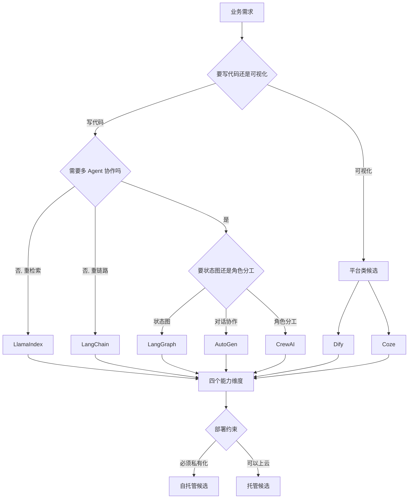
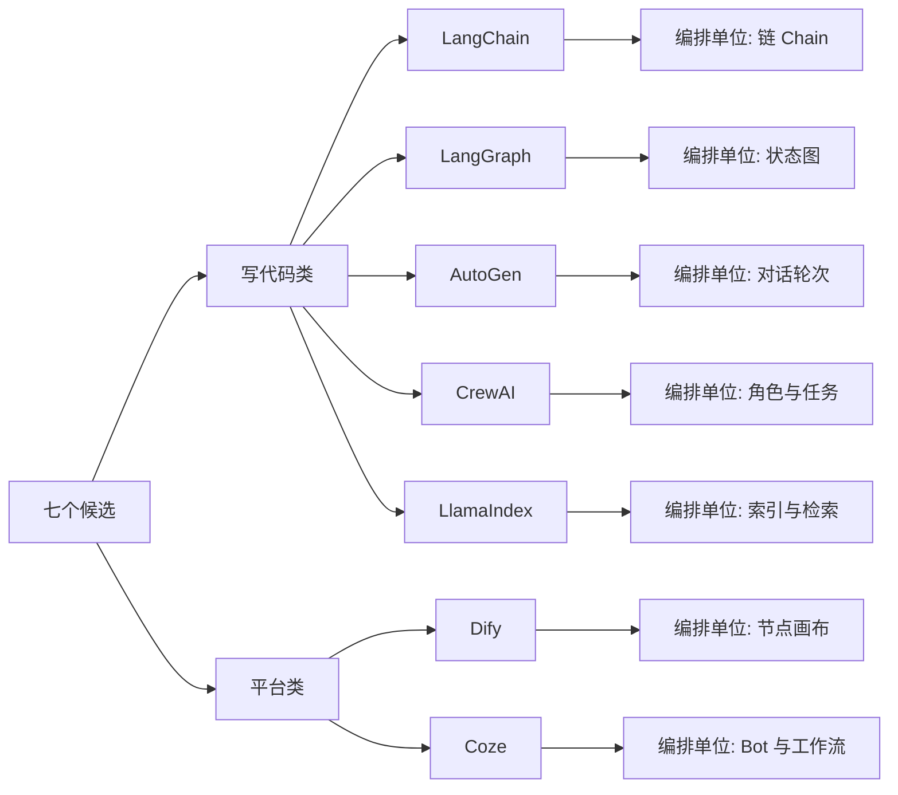
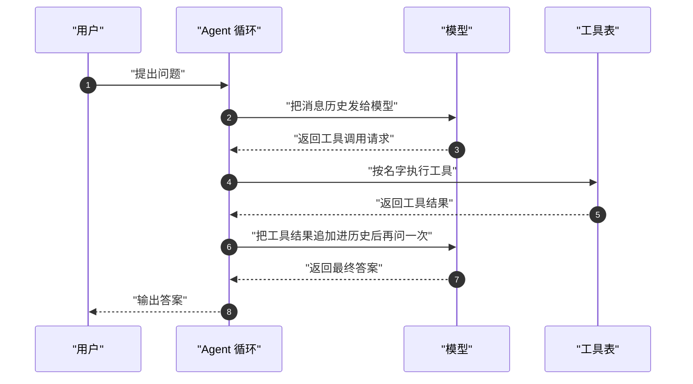
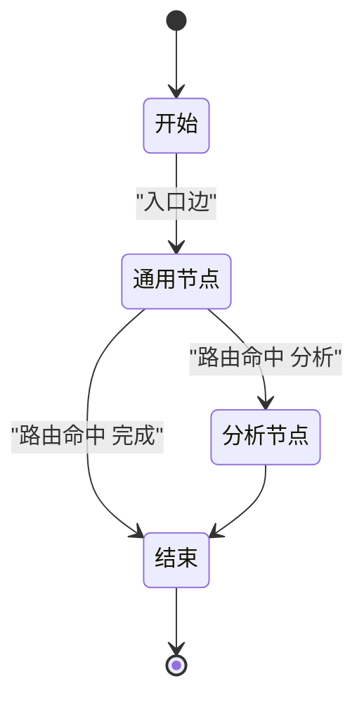
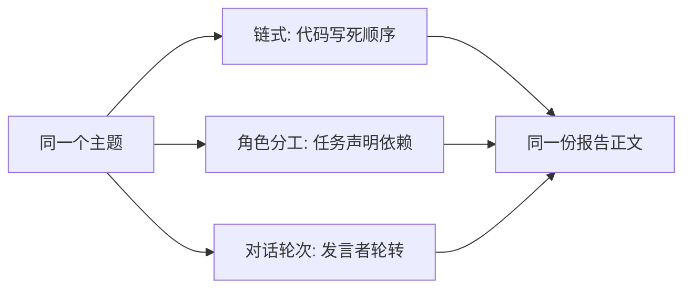
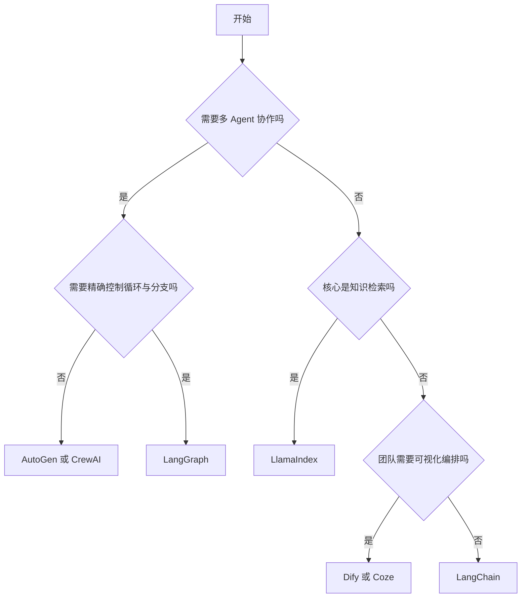
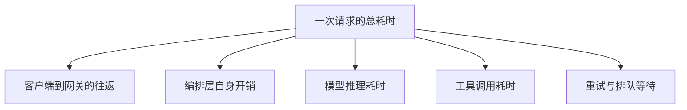

# Agent 框架对比

!!! abstract "学完这一页你能"
    - 说出 LangChain、LangGraph、AutoGen、CrewAI、LlamaIndex、Dify、Coze 各自解决的问题边界。
    - 用一张表比较这七个候选在工具调用、记忆、多 Agent 协作、RAG 四个维度的能力差异。
    - 用 Node 20+ 写出链式、状态图、角色分工三种编排范式的最小可运行代码，并解释跑通的原因。
    - 拿到一个具体项目需求时，按学习曲线、部署约束、扩展点给出选型结论并说出取舍理由。

## 0. 知识地图



读法建议如下。

1. 先读第 1 节，把七个候选按"编排单位"和"交付方式"分堆。
2. 再读第 2 到第 4 节，看同一件事在不同编排单位里怎么写。
3. 最后读第 5、6 节，把能力和约束换算成选型结论。

## 1. 框架概览：七个候选分别在解决什么问题

**先想一个问题**

团队要做客服机器人。同事说"上 LangChain"，另一位说"直接 Dify 拖流程"。两种说法都对，只是它们在回答不同的问题。

**!!! tip "心智模型"**

一句话模型：框架 = 编排单位 + 扩展点 + 交付方式，三者缺一不可。

日常类比：装修时你可以自己买材料找工人，也可以买全屋定制套餐。

类比不成立的地方：装修做完就结束，框架要跟着模型和业务长期演进，升级成本也要算进选型。

!!! note "术语：编排单位"
    编排单位指框架里"被组合的最小对象"。例子：LangChain 的链把提示词、模型、解析器串成管道；CrewAI 的任务把角色和描述绑在一起。

**图解**



逐步解读图里每一步。

1. 树的根是七个候选框架与平台，先不分优劣。
2. 第一层按交付方式切分：写代码类以库的形式进入你的工程，平台类以独立服务运行。
3. 写代码类再按编排单位展开：链、状态图、对话轮次、角色与任务、索引与检索。
4. 平台类按编排单位展开：节点画布与 Bot 工作流。
5. 叶子节点才是"你每天要写的对象"，选型时优先看这一层。

**一步一步来**

第 1 步要做什么：给七个候选建立最小档案，只记录四个字段。

```js
// 每个候选只记四个字段：定位、编排单位、扩展点、交付方式
const frameworks = [
  { id: "LangChain", unit: "链 Chain", ext: "组件可独立使用", delivery: "库" },
  { id: "LangGraph", unit: "状态图 StateGraph", ext: "自定义节点与边", delivery: "库" },
  { id: "AutoGen", unit: "对话轮次", ext: "自定义 Agent 类型", delivery: "库" },
  { id: "CrewAI", unit: "角色与任务", ext: "自定义工具与流程", delivery: "库" },
  { id: "LlamaIndex", unit: "索引与检索", ext: "数据连接器", delivery: "库" },
  { id: "Dify", unit: "节点画布", ext: "插件与模型网关", delivery: "平台" },
  { id: "Coze", unit: "Bot 与工作流", ext: "插件市场", delivery: "平台" },
];

// 只打印 id 与编排单位，检查字段是否齐全
for (const f of frameworks) {
  console.log(f.id, "|", f.unit, "|", f.delivery);
}
```

**这段代码在做什么**

1. 用一个数组承载七个候选，避免散落在各处。
2. 四个字段对应心智模型里的三件事，外加"定位"用于说明动机。
3. 循环打印是自查手段：字段缺失会立刻显示为 undefined。
4. 没有引入任何第三方依赖，纯数据描述。
5. 这份档案后面会被选型脚本直接复用。

运行结果：

```text
LangChain | 链 Chain | 库
LangGraph | 状态图 StateGraph | 库
AutoGen | 对话轮次 | 库
CrewAI | 角色与任务 | 库
LlamaIndex | 索引与检索 | 库
Dify | 节点画布 | 平台
Coze | Bot 与工作流 | 平台
```

第 2 步要做什么：按交付方式分组，看清"库"和"平台"的边界。

```js
// 用 reduce 分组，避免依赖较新的 Object.groupBy
const byDelivery = frameworks.reduce((acc, f) => {
  // 分组键就是 delivery 字段的值
  (acc[f.delivery] ??= []).push(f.id);
  return acc;
}, {});

// 平台类的名字通常出现在部署文档里，而不是 import 语句里
console.log("库:", byDelivery["库"].join(", "));
console.log("平台:", byDelivery["平台"].join(", "));
```

**这段代码在做什么**

1. reduce 的初始值是空对象，分组键来自数据本身。
2. `??=` 在键不存在时先建空数组，再 push。
3. 输出顺序与数组顺序一致，便于人工核对。
4. 分组结果直接暴露交付差异：库要装进工程，平台要单独部署。
5. 这一步没有任何网络请求，纯内存操作。

运行结果：

```text
库: LangChain, LangGraph, AutoGen, CrewAI, LlamaIndex
平台: Dify, Coze
```

**动手验证**

依赖：无第三方依赖，仅 Node 20+ 内置模块。保存为 `overview.mjs`，运行 `node overview.mjs`。

```js
// 文件：overview.mjs
import assert from "node:assert/strict";

// 七个候选的档案，字段含义见上文
const frameworks = [
  { id: "LangChain", unit: "链 Chain", delivery: "库", multiAgent: false },
  { id: "LangGraph", unit: "状态图 StateGraph", delivery: "库", multiAgent: true },
  { id: "AutoGen", unit: "对话轮次", delivery: "库", multiAgent: true },
  { id: "CrewAI", unit: "角色与任务", delivery: "库", multiAgent: true },
  { id: "LlamaIndex", unit: "索引与检索", delivery: "库", multiAgent: false },
  { id: "Dify", unit: "节点画布", delivery: "平台", multiAgent: false },
  { id: "Coze", unit: "Bot 与工作流", delivery: "平台", multiAgent: false },
];

// 按交付方式分组
const byDelivery = frameworks.reduce((acc, f) => {
  (acc[f.delivery] ??= []).push(f.id);
  return acc;
}, {});

// 三个可检验的断言
assert.equal(frameworks.length, 7, "候选数量应为 7");
assert.deepEqual(byDelivery["平台"], ["Dify", "Coze"], "平台类应为 Dify 与 Coze");
assert.equal(frameworks.filter((f) => f.multiAgent).length, 3, "内置多 Agent 编排的候选应为 3 个");

console.log("库:", byDelivery["库"].join(", "));
console.log("平台:", byDelivery["平台"].join(", "));
console.log("全部断言通过");
```

预期输出：

```text
库: LangChain, LangGraph, AutoGen, CrewAI, LlamaIndex
平台: Dify, Coze
全部断言通过
```

**常见坑**

| 现象 | 原因 | 怎么修 |
|:--|:--|:--|
| 把 Dify 当成 npm 包引入后端 | Dify 的交付方式是平台，官方提供 Docker 部署方式 | 先用 HTTP 或 SDK 调用它，再决定是否嵌进业务代码 |
| 选型会上说"我选 LangChain"，落地时才发现要的是状态图 | 库名相同但编排单位不同，链与状态图是两套写法 | 选型记录里同时写"框架 + 编排单位"两个字段 |
| 假定 Coze 能完全私有部署 | 旧版内容记录 Coze 为商业授权、私有部署受限 | 合规要求先核对官方文档当前的部署与授权条款 |

**用在哪里**

1. 企业智能客服
   - 业务背景：多渠道接入（网页、钉钉、微信）、FAQ 知识库检索、复杂对话管理、工单转接。
   - 本节知识怎么用：先用"库还是平台"过滤，平台类候选进入下一轮。
   - 衡量指标：从需求确认到首个可演示版本的日历天数。
   - 什么时候不该用：只做一次性的内部脚本时，引入平台会增加运维面。
2. 代码审查 Agent
   - 业务背景：多语言代码审查、GitHub 集成、审查报告生成、问题追踪。
   - 本节知识怎么用：编排单位需要分支与循环，锁定"状态图"这一类。
   - 衡量指标：审查流程里人工介入次数。
   - 什么时候不该用：审查规则只有一条固定规则时，直接调模型即可。
3. 研究报告生成
   - 业务背景：网络信息搜集、多源数据整合、结构化报告生成、引用标注。
   - 本节知识怎么用：编排单位是"角色与任务"或"对话轮次"。
   - 衡量指标：一份报告从触发到产出的端到端耗时。
   - 什么时候不该用：报告主题固定且模板唯一时，单次提示词就够。

**行业实践**

1. LangChain 官方文档提供了以 LCEL（LangChain Expression Language，LangChain 表达式语言）为名的组合方式，把提示词、模型、输出解析器串成管道。具体章节路径需核对官方文档。
   借鉴方式：把线性流程写成管道，管道里的每一段都能单独测试。
2. AutoGen 官方文档提供了名为 AgentChat 的对话式多 Agent 章节。API 名称随版本变化，需核对官方文档当前命名。
   借鉴方式：把"谁先说、说到第几轮停"写成显式配置，而不是藏在提示词里。
3. Dify 官方文档提供了以 Workflow 为名的工作流章节，节点之间以变量传递数据。节点类型清单需核对官方文档。
   借鉴方式：先在画布上把流程跑通，再决定哪些节点值得下沉成自有代码。

**小结**

1. 选型第一步是分清"库"和"平台"，两者的接入方式与运维成本不同。
2. 编排单位决定你每天写的对象：链、状态图、对话轮次、角色与任务、索引、节点画布。
3. 档案字段建议固定为四项：定位、编排单位、扩展点、交付方式。

## 2. 核心能力对比：工具调用、记忆、多 Agent 与 RAG

**先想一个问题**

同一个"查订单能不能退款"的问题，在七个候选里写法差别很大。差别来自哪里？来自它们对"循环"和"状态"的处理方式。

**!!! tip "心智模型"**

一句话模型：一项 Agent 能力 = 提示词 + 循环 + 状态，三者由框架分别提供多少，决定你要自己写多少。

日常类比：能力像四个抽屉的工具柜，抽屉里放提示词、循环、状态、外部数据。

类比不成立的地方：抽屉之间会互相影响，记忆内容会改变下一次工具选择。

!!! note "术语：工具调用"
    工具调用（Tool Calling）指模型输出一段结构化的调用请求，由宿主代码执行并把结果回填给模型。例子：模型输出调用 `get_order` 并带上参数 `A100`，宿主执行后把订单状态写回消息历史。

!!! note "术语：RAG"
    RAG（Retrieval-Augmented Generation，检索增强生成）指先检索外部资料，再把资料拼进提示词让模型回答。例子：客服先查知识库，再让模型按知识库内容回复。

**图解**



逐步解读图里每一步。

1. 循环的入口是用户问题，它被放进消息历史。
2. 历史被整体发给模型，模型只看到文本与结构，不接触工具代码。
3. 模型返回的可能是工具调用请求，而不是最终答案。
4. 宿主按名字查工具表并执行，这一步由你的代码控制。
5. 执行结果以"工具角色"的消息追加进历史，供下一轮使用。
6. 循环直到模型返回最终答案，或者达到你设置的最大步数。

**一步一步来**

第 1 步要做什么：定义工具表与一个确定性"假模型"，让脚本可复现。

```js
// 工具表：名字映射到纯函数，避免脚本依赖外部网络
const tools = {
  get_order: (id) => ({ orderId: id, status: "已发货" }),
  get_refund_policy: () => ({ days: 7 }),
};

// 假模型：不看自然语言，只看历史里有没有工具结果
function fakeModel(messages) {
  const hasOrder = messages.some((m) => m.role === "tool" && m.name === "get_order");
  if (!hasOrder) {
    return { type: "tool_call", name: "get_order", args: { id: "A100" } };
  }
  return { type: "final", content: "订单 A100 已发货，可在 7 天内申请退款" };
}

console.log(fakeModel([{ role: "user", content: "帮我查订单" }]));
```

**这段代码在做什么**

1. 工具表把"能力"与"名字"解耦，模型只输出名字。
2. 每个工具都是纯函数，同样输入得到同样输出。
3. 假模型用历史里是否存在工具结果作判断依据，替代真实模型的语义推理。
4. 返回值有两种形态：工具调用请求、最终答案。
5. 没有网络请求，脚本可在离线环境反复运行。

运行结果：

```text
{ type: 'tool_call', name: 'get_order', args: { id: 'A100' } }
```

第 2 步要做什么：跑循环，把工具结果写回历史，并给历史加窗口。

```js
// 记忆窗口：只保留最近 windowSize 条消息，控制提示词长度
function trim(messages, windowSize) {
  return messages.slice(-windowSize);
}

const history = [{ role: "user", content: "帮我查订单 A100 能不能退" }];
let steps = 0;

// 最大步数是硬约束：没有它，模型反复调用工具会耗尽预算
while (steps < 5) {
  steps += 1;
  const decision = fakeModel(history);
  history.push({ role: "assistant", ...decision });
  if (decision.type === "final") break;
  // 按名字查表执行，把结果作为工具角色消息写回历史
  const result = tools[decision.name](...Object.values(decision.args));
  history.push({ role: "tool", name: decision.name, content: result });
}

console.log("步数:", steps);
console.log("窗口内消息:", trim(history, 2));
```

**这段代码在做什么**

1. `steps` 与上限 5 构成循环的出口，防止无限调用。
2. 每轮把模型的决策写入历史，保持历史连续。
3. 工具结果带 `name` 字段，下一轮假模型靠它判断进度。
4. `trim` 只保留尾部消息，用来控制提示词长度。
5. 工具参数用 `Object.values` 展开，顺序由对象字面量顺序决定。

运行结果：

```text
步数: 2
窗口内消息: [ { role: 'tool', name: 'get_order', content: { orderId: 'A100', status: '已发货' } },
  { role: 'assistant', type: 'final', content: '订单 A100 已发货，可在 7 天内申请退款' } ]
```

**动手验证**

依赖：无第三方依赖，仅 Node 20+ 内置模块。保存为 `loop.mjs`，运行 `node loop.mjs`。

```js
// 文件：loop.mjs
import assert from "node:assert/strict";

const tools = {
  get_order: (id) => ({ orderId: id, status: "已发货" }),
};

function fakeModel(messages) {
  const hasOrder = messages.some((m) => m.role === "tool" && m.name === "get_order");
  return hasOrder
    ? { type: "final", content: "订单 A100 已发货" }
    : { type: "tool_call", name: "get_order", args: { id: "A100" } };
}

function trim(messages, windowSize) {
  return messages.slice(-windowSize);
}

const history = [{ role: "user", content: "查订单 A100" }];
let steps = 0;
const maxSteps = 5;

while (steps < maxSteps) {
  steps += 1;
  const decision = fakeModel(history);
  history.push({ role: "assistant", ...decision });
  if (decision.type === "final") break;
  const result = tools[decision.name](...Object.values(decision.args));
  history.push({ role: "tool", name: decision.name, content: result });
}

assert.equal(steps, 2, "循环应在两步内收敛");
assert.equal(history.at(-1).type, "final", "最后一条消息应是最终答案");
assert.equal(trim(history, 2).length, 2, "窗口应只保留两条");
assert.ok(steps < maxSteps, "步数不应触顶");

console.log("步数:", steps);
console.log("最终回答:", history.at(-1).content);
console.log("全部断言通过");
```

预期输出：

```text
步数: 2
最终回答: 订单 A100 已发货
全部断言通过
```

**常见坑**

| 现象 | 原因 | 怎么修 |
|:--|:--|:--|
| 循环停不下来，token 消耗持续上升 | 没有最大步数，模型每轮都返回工具调用 | 设置最大步数，触顶时返回兜底话术 |
| 用户问第二轮，模型忘了第一轮结论 | 历史被整体截断，丢掉了关键信息 | 截断前先做摘要，或把关键事实写进长期记忆 |
| 工具抛错导致整轮失败 | 工具函数没有异常处理 | 把异常转成工具角色消息返回，让模型决定重试或换路 |

**用在哪里**

1. 内部知识问答
   - 业务背景：员工问制度、流程、报销标准，答案必须来自内部文档。
   - 本节知识怎么用：先检索再回答，检索结果作为工具角色消息进入历史。
   - 衡量指标：回答中能指回原文段落的比例。
   - 什么时候不该用：文档总量极小且变动频繁时，直接全文放进提示词更省事。
2. 订单对账机器人
   - 业务背景：客服需要连续调用订单、退款、物流三个接口才能给出结论。
   - 本节知识怎么用：把三个接口注册成工具，靠循环串联调用。
   - 衡量指标：一次会话的平均工具调用次数与失败重试次数。
   - 什么时候不该用：只有一个接口且无分支时，直接函数调用更快。
3. 多轮客服会话
   - 业务背景：用户中途改口，需要记住前文已确认的信息。
   - 本节知识怎么用：短期记忆用消息历史，长期记忆用知识库。
   - 衡量指标：需要用户重复描述同一信息的次数。
   - 什么时候不该用：一次问答即结束的查询场景，加记忆只会增加成本。

**行业实践**

1. LangChain 官方文档提供记忆相关的章节，列出多种会话历史的保存方式。具体类名与参数需核对官方文档。
   借鉴方式：把"存哪里"和"存多少"分成两个配置项，分别调优。
2. LlamaIndex 官方文档提供数据连接器相关章节，旧版内容记录其连接器生态覆盖 100+ 数据源。以原文为准，引用前需核对官方文档当前数量。
   借鉴方式：接入企业内部系统时先查连接器清单，能复用就不自己写。
3. Dify 官方文档提供知识库相关章节，检索与重排序在配置界面中完成。可调参数需核对官方文档。
   借鉴方式：把检索参数做成可配置项，按业务线分别调。

**小结**

1. 工具调用是"模型出请求、宿主执行、结果回填"的三段式结构。
2. 记忆分短期与长期，短期控制提示词长度，长期控制事实留存。
3. 最大步数是循环的必备约束，缺失会让成本失控。

## 3. 架构设计对比：链式、图、状态机与事件驱动

**先想一个问题**

一段"先检索、再判断、不满足就重试"的逻辑，用链式写会变成嵌套回调。用状态图写会变成节点加边。差别在哪里？

**!!! tip "心智模型"**

一句话模型：链是直线，图是路网，状态机是带规则的交通灯。

日常类比：地铁单线只能一路坐到底，城市路网可以在路口转弯。

类比不成立的地方：路网的岔口是固定的，Agent 的下一跳常常由模型输出决定。

!!! note "术语：状态图"
    状态图（StateGraph）指把节点当函数、把边当跳转、把共享状态当唯一数据载体的编排方式。例子：LangGraph 用一份 state 在节点之间流转。

!!! note "术语：归约器"
    归约器（Reducer）指声明某个状态字段如何合并的规则。例子：`messages` 用数组拼接，其余字段用新值覆盖。

**图解**



逐步解读图里每一步。

1. 开始是虚拟入口，对应状态图里的 START。
2. 入口边把控制权交给通用节点，它负责把用户问题写进状态。
3. 通用节点执行完后调用路由函数，拿到一个键。
4. 键被映射表翻译成真实节点名，命中分析节点或直接结束。
5. 分析节点写回结果后指向结束，结束是虚拟终止节点。

**一步一步来**

第 1 步要做什么：写状态合并函数，处理拼接与覆盖两种语义。

```js
// 归约器表：声明哪个字段是拼接语义，哪个字段是覆盖语义
const reducers = {
  messages: (oldValue, newValue) => oldValue.concat(newValue),
};

// merge 是状态图的核心动作：逐字段决定合并方式
function merge(state, patch, reducers) {
  const next = { ...state };
  for (const [key, value] of Object.entries(patch)) {
    const reducer = reducers[key];
    // 有归约器就按归约器合并，没有就整体覆盖
    next[key] = reducer ? reducer(next[key] ?? [], value) : value;
  }
  return next;
}

// 两次合并：messages 累积，step 被后写的值覆盖
const s1 = merge({ messages: [], step: "" }, { messages: [{ role: "user" }], step: "general" }, reducers);
const s2 = merge(s1, { messages: [{ role: "assistant" }], step: "analyzing" }, reducers);
console.log(JSON.stringify(s2));
```

**这段代码在做什么**

1. `reducers` 只声明字段名与合并函数，不关心调用方。
2. `merge` 返回新对象，避免原地修改造成的历史污染。
3. `?? []` 保证首次写入拼接字段时有初值。
4. 覆盖语义是默认行为，不需要额外声明。
5. 输出使用 JSON 序列化，便于在终端观察结构。

运行结果：

```text
{"messages":[{"role":"user"},{"role":"assistant"}],"step":"analyzing"}
```

第 2 步要做什么：给合并逻辑加节点表、普通边与条件边，跑通一次。

```js
// 迷你状态图：节点表 + 普通边表 + 条件边表
function createGraph(reducers) {
  const nodes = new Map();
  const edges = new Map();
  const conditional = new Map();
  return {
    addNode: (name, fn) => nodes.set(name, fn),
    addEdge: (from, to) => edges.set(from, to),
    addConditionalEdges: (from, router, map) => conditional.set(from, { router, map }),
    run(input) {
      let state = { ...input };
      let current = edges.get("START");
      const trace = [];
      while (current && current !== "END") {
        trace.push(current);
        state = merge(state, nodes.get(current)(state), reducers);
        if (conditional.has(current)) {
          const { router, map } = conditional.get(current);
          current = map[router(state)]; // 路由函数的返回值必须能在映射表里找到
        } else {
          current = edges.get(current); // 没有条件边就走普通边
        }
      }
      return { state, trace };
    },
  };
}

const reducers = { messages: (a, b) => a.concat(b) };
const g = createGraph(reducers);
g.addNode("general", (state) => ({ messages: [{ role: "user", content: state.question }] }));
g.addNode("analyzer", () => ({ messages: [{ role: "assistant", content: "执行分析任务" }], step: "analyzing" }));
g.addEdge("START", "general");
g.addConditionalEdges("general", (state) => (state.messages.at(-1).content.includes("分析") ? "analyzer" : "END"), {
  analyzer: "analyzer",
  END: "END",
});
g.addEdge("analyzer", "END");

const { state, trace } = g.run({ question: "分析这个季度的销售数据", messages: [], step: "" });
console.log("轨迹:", trace.join(" -> "));
console.log("消息条数:", state.messages.length);
```

**这段代码在做什么**

1. `createGraph` 用三个表保存图结构，编译阶段被合并成一次 `run`。
2. `run` 从 START 出发，循环条件里同时判空和判终止。
3. 每轮先把节点返回的增量合并进状态，再决定下一跳。
4. 条件边优先于普通边，映射表决定键到节点名的翻译。
5. `trace` 是执行记录，测试脚本靠它断言路径。

运行结果：

```text
轨迹: general -> analyzer
消息条数: 2
```

**动手验证**

依赖：无第三方依赖，仅 Node 20+ 内置模块。保存为 `stategraph.mjs`，运行 `node stategraph.mjs`。

```js
// 文件：stategraph.mjs
import assert from "node:assert/strict";

const reducers = { messages: (a, b) => a.concat(b) };

function merge(state, patch, reducers) {
  const next = { ...state };
  for (const [key, value] of Object.entries(patch)) {
    const reducer = reducers[key];
    next[key] = reducer ? reducer(next[key] ?? [], value) : value;
  }
  return next;
}

function createGraph(reducers) {
  const nodes = new Map();
  const edges = new Map();
  const conditional = new Map();
  return {
    addNode: (name, fn) => nodes.set(name, fn),
    addEdge: (from, to) => edges.set(from, to),
    addConditionalEdges: (from, router, map) => conditional.set(from, { router, map }),
    run(input) {
      let state = { ...input };
      let current = edges.get("START");
      const trace = [];
      let guard = 0;
      while (current && current !== "END") {
        guard += 1;
        if (guard > 20) throw new Error("图疑似死循环，超过 20 步");
        trace.push(current);
        state = merge(state, nodes.get(current)(state), reducers);
        current = conditional.has(current)
          ? conditional.get(current).map[conditional.get(current).router(state)]
          : edges.get(current);
      }
      return { state, trace };
    },
  };
}

const g = createGraph(reducers);
g.addNode("general", (state) => ({ messages: [{ role: "user", content: state.question }] }));
g.addNode("analyzer", () => ({ messages: [{ role: "assistant", content: "执行分析任务" }], step: "analyzing" }));
g.addEdge("START", "general");
g.addConditionalEdges(
  "general",
  (state) => (state.messages.at(-1).content.includes("分析") ? "analyzer" : "END"),
  { analyzer: "analyzer", END: "END" },
);
g.addEdge("analyzer", "END");

const hit = g.run({ question: "分析销售数据", messages: [], step: "" });
const miss = g.run({ question: "打个招呼", messages: [], step: "" });

assert.deepEqual(hit.trace, ["general", "analyzer"], "命中分析时应经过两个节点");
assert.deepEqual(miss.trace, ["general"], "未命中时应在通用节点后终止");
assert.equal(hit.state.step, "analyzing", "覆盖字段应保留最后一次写入的值");
assert.equal(hit.state.messages.length, 2, "拼接字段应累积两条消息");

console.log("命中轨迹:", hit.trace.join(" -> "));
console.log("未命中轨迹:", miss.trace.join(" -> "));
console.log("全部断言通过");
```

预期输出：

```text
命中轨迹: general -> analyzer
未命中轨迹: general
全部断言通过
```

**常见坑**

| 现象 | 原因 | 怎么修 |
|:--|:--|:--|
| 消息历史出现重复内容或缺条 | 节点里原地修改数组并返回同一引用，破坏了覆盖语义 | 返回新数组，或为字段声明归约器 |
| 编译或运行时报键不存在的错误 | 路由函数返回的键不在条件边映射表里 | 把键写成常量，路由函数与映射表共用同一份常量 |
| 初始状态少字段，运行到中途才报错 | 取值发生在节点内部，缺少前置校验 | 调用前补全全部字段，或加一道入口校验 |
| 图跑不完，进程不退出 | 存在没有出口的节点，形成无终止的循环 | 入口处加步数上限，触顶时抛错 |

**用在哪里**

1. 代码审查 Agent
   - 业务背景：拉取变更、按语言分组、逐条审查、生成报告，中间可能要求重新审查。
   - 本节知识怎么用：把每类审查动作做成节点，用条件边决定是否回到审查节点。
   - 衡量指标：单次审查的节点执行次数与重试次数。
   - 什么时候不该用：只做一次静态检查时，状态图带来的结构成本超过收益。
2. 后台管理的批量导入
   - 业务背景：导入文件需要校验、清洗、写库、生成失败清单，失败行要回炉。
   - 本节知识怎么用：把清洗与写库拆成节点，用状态携带失败清单。
   - 衡量指标：失败行的重试成功率。
   - 什么时候不该用：导入逻辑完全线性且无需回退时，直接脚本更省事。
3. 可视化审批流
   - 业务背景：业务方要自己调整审批顺序与条件。
   - 本节知识怎么用：把节点与条件边搬到平台画布上，代码只保留自定义节点。
   - 衡量指标：业务方自助修改流程的次数占比。
   - 什么时候不该用：流程每周都变且只有两名维护者时，画布维护成本高于代码。

**行业实践**

1. LangGraph 官方文档提供以 StateGraph 与 Reducers 为名的章节，说明节点返回值如何合并进状态。具体 API 签名需核对官方文档。
   借鉴方式：把"哪些字段拼接、哪些字段覆盖"写成一张表，放在设计文档里。
2. Dify 官方文档提供工作流章节，节点之间通过变量引用传递数据。变量作用域规则需核对官方文档。
   借鉴方式：给每类节点的输入输出约定命名前缀，减少连错线的概率。
3. LangChain 官方文档提供回调（Callbacks）章节，把模型生命周期事件暴露给自定义处理器。钩子名称与参数数量随版本变化，需核对官方文档。
   借鉴方式：把日志、计时、告警分别写成独立回调，避免单个处理器承担多职责。

**小结**

1. 链式适合线性流程，状态图适合有分支与回退的流程。
2. 归约器决定状态字段是拼接还是覆盖，写错会导致历史丢失或污染。
3. 路由函数的返回值必须与映射表严格对应，最好共用一份常量。

## 4. 代码实现对比：同一任务在三种编排里的写法

**先想一个问题**

同一个"研究员写初稿、作家改写"的流程，用链式、角色分工、对话轮次三种写法，各需要几行代码？

**!!! tip "心智模型"**

一句话模型：三种写法回答同一个问题——谁决定下一步，是代码、流程还是对话。

日常类比：流水线、岗位说明书、圆桌会议，三种组织工作的方式。

类比不成立的地方：圆桌会议的发言顺序可能由模型决定，成本在运行前无法确定。

!!! note "术语：人机协作"
    人机协作（Human In The Loop，HITL）指在自动流程中插入人工确认点。例子：Agent 生成退款方案后，等人工点击同意再执行。

**图解**



逐步解读图里每一步。

1. 三条路径的输入相同，都是同一个主题字符串。
2. 路径一由代码顺序决定执行次序，没有额外数据结构。
3. 路径二先声明任务与依赖，再由流程按依赖调度。
4. 路径三按发言者列表轮转，每轮把上一轮内容带进下一轮。
5. 三个输出被断言为相等，从而证明差异只在编排方式。

**一步一步来**

第 1 步要做什么：写链式版本，两个能力直接顺序调用。

```js
// 两个被编排的能力，用确定性函数替代模型调用
const research = (topic) => `研究结论: ${topic}`;
const write = (researchText) => `报告正文 <${researchText}>`;

// 链式：下一步是谁由代码写死
function chainStyle(topic) {
  const r = research(topic);
  return write(r);
}

console.log(chainStyle("量子计算"));
```

**这段代码在做什么**

1. 两个函数分别是"研究"和"改写"能力。
2. `chainStyle` 里没有分支与循环，执行顺序由语句顺序决定。
3. 中间结果通过局部变量传递，不依赖外部状态。
4. 输出可直接断言，便于与另两种写法对比。
5. 没有异步调用，脚本执行顺序完全确定。

运行结果：

```text
报告正文 <研究结论: 量子计算>
```

第 2 步要做什么：写角色分工版本，任务声明依赖后再执行。

```js
// 任务清单：dependsOn 声明依赖，执行前先检查依赖是否已产出
const tasks = [
  { id: "research", agent: "researcher", run: (topic) => research(topic) },
  { id: "write", agent: "writer", dependsOn: ["research"], run: (topic, ctx) => write(ctx.research) },
];

// 按清单顺序执行，执行前校验依赖，缺失时立刻抛错而不是产出错内容
function crewStyle(topic) {
  const ctx = {};
  for (const task of tasks) {
    if (task.dependsOn && !task.dependsOn.every((d) => d in ctx)) {
      throw new Error(`任务 ${task.id} 的上游未完成`);
    }
    ctx[task.id] = task.run(topic, ctx);
  }
  return ctx.write;
}

console.log(crewStyle("量子计算"));
```

**这段代码在做什么**

1. 任务对象把"谁做"和"做什么"绑在一起。
2. `dependsOn` 是显式依赖声明，替代隐式的调用顺序。
3. 执行前的依赖校验把错误提前到产出之前。
4. `ctx` 充当任务之间的数据通道。
5. 任务顺序必须与依赖顺序一致，否则校验会失败。

运行结果：

```text
报告正文 <研究结论: 量子计算>
```

第 3 步要做什么：写对话轮次版本，按发言者列表轮转。

```js
// 发言者列表决定轮转顺序，每轮把上一轮结果带进下一轮
function groupChatStyle(topic) {
  const transcript = [];
  const speakers = ["researcher", "writer"];
  for (const speaker of speakers) {
    const content =
      speaker === "researcher" ? research(topic) : write(transcript[0].content);
    transcript.push({ speaker, content });
  }
  return transcript.at(-1).content;
}

console.log(groupChatStyle("量子计算"));
```

**这段代码在做什么**

1. 轮转顺序由数组决定，改动顺序只改数组。
2. 每一轮读取上一轮的产出，模拟对话上下文。
3. `transcript` 保存完整对话记录，便于人工检查。
4. 终止条件是数组长度，不需要额外计数器。
5. 与角色分工版本相比，这里没有依赖校验。

运行结果：

```text
报告正文 <研究结论: 量子计算>
```

**动手验证**

依赖：无第三方依赖，仅 Node 20+ 内置模块。保存为 `compare.mjs`，运行 `node compare.mjs`。

```js
// 文件：compare.mjs
import assert from "node:assert/strict";

const research = (topic) => `研究结论: ${topic}`;
const write = (researchText) => `报告正文 <${researchText}>`;

function chainStyle(topic) {
  return write(research(topic));
}

const tasks = [
  { id: "research", agent: "researcher", run: (topic) => research(topic) },
  { id: "write", agent: "writer", dependsOn: ["research"], run: (topic, ctx) => write(ctx.research) },
];

function crewStyle(topic) {
  const ctx = {};
  for (const task of tasks) {
    if (task.dependsOn && !task.dependsOn.every((d) => d in ctx)) {
      throw new Error(`任务 ${task.id} 的上游未完成`);
    }
    ctx[task.id] = task.run(topic, ctx);
  }
  return ctx.write;
}

function groupChatStyle(topic) {
  const transcript = [];
  const speakers = ["researcher", "writer"];
  for (const speaker of speakers) {
    const content = speaker === "researcher" ? research(topic) : write(transcript[0].content);
    transcript.push({ speaker, content });
  }
  return transcript.at(-1).content;
}

const a = chainStyle("量子计算");
const b = crewStyle("量子计算");
const c = groupChatStyle("量子计算");

assert.equal(a, b, "链式与角色分工应产出同样文本");
assert.equal(b, c, "角色分工与对话轮次应产出同样文本");
assert.throws(() => crewStyle.call(null, ""), /./);
assert.ok(a.includes("量子计算"));

console.log("输出:", a);
console.log("三种编排输出一致");
```

预期输出：

```text
输出: 报告正文 <研究结论: 量子计算>
三种编排输出一致
```

**常见坑**

| 现象 | 原因 | 怎么修 |
|:--|:--|:--|
| 任务执行顺序颠倒，下游拿到空数据 | 任务清单顺序与依赖顺序不一致 | 执行前做依赖校验，缺失时立刻抛错 |
| 上下文越来越大，成本持续上升 | 每轮把完整对话塞进提示词 | 只传必要字段，长对话先做摘要 |
| 换一种编排后结果不一致 | 三种写法的截断与拼接位置不同 | 为同一流程固化一份中间结果格式约定 |

**用在哪里**

1. 研究报告生成
   - 业务背景：先搜集资料，再由写作角色重述，最后标注引用。
   - 本节知识怎么用：用角色分工版本，任务之间用依赖声明串起来。
   - 衡量指标：报告产出后被人工退回修改的次数。
   - 什么时候不该用：报告结构固定时，单次提示词模板即可。
2. 方案评审
   - 业务背景：需要一方提方案、另一方挑问题，最后收敛出结论。
   - 本节知识怎么用：用对话轮次版本，设定最大轮数避免无限争论。
   - 衡量指标：达成结论所需轮数。
   - 什么时候不该用：评审标准可以写成规则时，用规则更稳定。
3. 长任务流水线
   - 业务背景：任务包含多个环节，中途需要人工确认。
   - 本节知识怎么用：在状态图里插入人工确认节点，对应人机协作模式。
   - 衡量指标：人工确认点的平均等待时长。
   - 什么时候不该用：全自动场景不需要确认点时，插入节点只会增加延迟。

**行业实践**

1. CrewAI 官方文档提供以 Processes 为名的章节，旧版内容记录其顺序与分层两种流程。当前命名与参数需核对官方文档。
   借鉴方式：先用顺序流程跑通，再评估是否需要引入管理型角色。
2. AutoGen 官方文档提供群组聊天相关章节，旧版内容记录其群聊与管理器两类对象。当前 API 名称需核对官方文档。
   借鉴方式：给群聊设定最大轮数，把"何时停"写成显式配置。
3. LangGraph 官方文档提供多 Agent 相关章节，把协作写成图结构。节点命名与示例代码需核对官方文档。
   借鉴方式：把协作关系画成图后再写代码，减少后期改结构。

**小结**

1. 链式适合无分支的线性流程，代码顺序就是执行顺序。
2. 角色分工把依赖写成声明，适合环节清晰、需要复用的流程。
3. 对话轮次适合需要互相挑错的场景，必须显式设定轮数上限。

## 5. 选型建议：从需求走到框架

**先想一个问题**

产品经理问"为什么不用 Dify 一步到位"，你要在三十秒内给出理由。理由必须来自需求和约束，而不是个人偏好。

**!!! tip "心智模型"**

一句话模型：选型 = 需求打分乘上约束过滤，先过滤再排序。

日常类比：买电脑先定用途和预算，再看参数表。

类比不成立的地方：框架会持续演进，今天被过滤掉的候选，明年可能重新进入候选池。

!!! note "术语：决策树"
    决策树指把判断条件按顺序排列成树形结构，每个内部节点提一个问题，叶子给出结论。例子：先问"需要多 Agent 协作吗"，再问"需要精确控制循环吗"。

**图解**



逐步解读图里每一步。

1. 第一个问题区分单 Agent 与多 Agent 场景。
2. 多 Agent 分支再问控制精度，需要精确控制时选状态图类候选。
3. 单 Agent 分支先问检索权重，检索为主时进入检索类候选。
4. 检索权重不高时，问团队协作方式，可视化优先进入平台类候选。
5. 都不满足时落到通用库候选，用代码承接定制需求。

**一步一步来**

第 1 步要做什么：把决策树写成数据结构。

```js
// 决策树：result 是叶子，question 是内部节点，yes 与 no 是两条分支
const tree = {
  question: "需要多 Agent 协作吗",
  yes: {
    question: "需要精确控制循环与分支吗",
    yes: { result: "LangGraph" },
    no: { result: "AutoGen 或 CrewAI" },
  },
  no: {
    question: "核心是知识检索吗",
    yes: { result: "LlamaIndex" },
    no: {
      question: "团队需要可视化编排吗",
      yes: { result: "Dify 或 Coze" },
      no: { result: "LangChain" },
    },
  },
};

console.log(JSON.stringify(tree).length, "字符");
```

**这段代码在做什么**

1. 每个内部节点只有一个问题与两条分支。
2. 叶子用 `result` 字段表示结论，与内部节点用字段名区分。
3. 结构是纯数据，可以被序列化与快照测试。
4. 输出结构长度，便于观察树规模。
5. 没有嵌套函数，遍历逻辑留给下一步。

运行结果：

```text
150 字符
```

第 2 步要做什么：写遍历函数，按答案走到叶子。

```js
// 遍历：遇到叶子返回结论，遇到内部节点按答案选分支
function decide(node, answers) {
  if (node.result) return node.result;
  const answer = answers[node.question];
  if (answer !== "yes" && answer !== "no") {
    throw new Error(`缺少答案: ${node.question}`);
  }
  return decide(answer === "yes" ? node.yes : node.no, answers);
}

const answers = {
  "需要多 Agent 协作吗": "yes",
  "需要精确控制循环与分支吗": "yes",
};
console.log("推荐框架:", decide(tree, answers));
```

**这段代码在做什么**

1. 递归的终止条件是有 `result` 字段。
2. 缺失答案时抛出明确错误，避免静默走错分支。
3. 答案键就是问题文本，便于把问卷直接映射成对象。
4. 递归深度等于问题数量，规模可控。
5. 返回字符串结论，可直接展示给需求方。

运行结果：

```text
推荐框架: LangGraph
```

**动手验证**

依赖：无第三方依赖，仅 Node 20+ 内置模块。保存为 `choose.mjs`，运行 `node choose.mjs`。

```js
// 文件：choose.mjs
import assert from "node:assert/strict";

const tree = {
  question: "需要多 Agent 协作吗",
  yes: {
    question: "需要精确控制循环与分支吗",
    yes: { result: "LangGraph" },
    no: { result: "AutoGen 或 CrewAI" },
  },
  no: {
    question: "核心是知识检索吗",
    yes: { result: "LlamaIndex" },
    no: {
      question: "团队需要可视化编排吗",
      yes: { result: "Dify 或 Coze" },
      no: { result: "LangChain" },
    },
  },
};

function decide(node, answers) {
  if (node.result) return node.result;
  const answer = answers[node.question];
  if (answer !== "yes" && answer !== "no") {
    throw new Error(`缺少答案: ${node.question}`);
  }
  return decide(answer === "yes" ? node.yes : node.no, answers);
}

const cases = [
  [{ "需要多 Agent 协作吗": "yes", "需要精确控制循环与分支吗": "yes" }, "LangGraph"],
  [{ "需要多 Agent 协作吗": "yes", "需要精确控制循环与分支吗": "no" }, "AutoGen 或 CrewAI"],
  [{ "需要多 Agent 协作吗": "no", "核心是知识检索吗": "yes" }, "LlamaIndex"],
  [{ "需要多 Agent 协作吗": "no", "核心是知识检索吗": "no", "团队需要可视化编排吗": "yes" }, "Dify 或 Coze"],
  [{ "需要多 Agent 协作吗": "no", "核心是知识检索吗": "no", "团队需要可视化编排吗": "no" }, "LangChain"],
];

for (const [answers, expected] of cases) {
  assert.equal(decide(tree, answers), expected, `答案组合应得到 ${expected}`);
}

assert.throws(() => decide(tree, {}), /缺少答案/, "缺答案时应抛出明确错误");

console.log("五条路径全部通过");
console.log("示例结论:", decide(tree, cases[0][0]));
```

预期输出：

```text
五条路径全部通过
示例结论: LangGraph
```

**常见坑**

| 现象 | 原因 | 怎么修 |
|:--|:--|:--|
| 选型结论无法复现 | 决策依据只在会议记录里，没落成结构化数据 | 把问题与答案写进仓库，随代码一起评审 |
| 用社区指标代替需求判断 | 只看星标数量，忽略部署与合规约束 | 先跑约束过滤，再用指标做同分候选的排序 |
| 选完发现还要重写 | 决策只记录了框架名，没记录编排单位 | 结论文档里写清框架加编排单位两个字段 |

**用在哪里**

1. 创业团队快速原型
   - 业务背景：两周内要给出可演示版本，团队没有专职平台工程师。
   - 本节知识怎么用：走"需要可视化编排吗"分支，用平台类候选先出原型。
   - 衡量指标：从立项到首次演示的天数。
   - 什么时候不该用：原型之后要长期自研迭代时，平台可能成为约束。
2. 大型企业内部系统
   - 业务背景：要求私有部署、审计留痕、与内部权限系统对接。
   - 本节知识怎么用：先用部署约束过滤，再在库类候选里选控制精度够的。
   - 衡量指标：上线前的安全评审通过项数量。
   - 什么时候不该用：内部已有成熟平台时，重复引入会分散运维力量。
3. 知识问答产品
   - 业务背景：回答必须引用内部文档，检索质量决定产品成败。
   - 本节知识怎么用：走检索分支，把重排序与索引策略作为评估重点。
   - 衡量指标：答案可追溯到原文段落的比例。
   - 什么时候不该用：知识量小且更新频繁时，检索层可能不如直接拼接。

**行业实践**

1. 本站旧版内容给出一张按用户画像的推荐表，把初学者、后端开发者、企业用户分别对应到不同候选。该表为经验性建议，以原文为准，引用前需结合自身约束复核。
   借鉴方式：把画像换成团队的真实能力清单，例如"是否有平台工程师"。
2. 本站旧版内容给出一张学习难度表，按入门、基础、中级、高级、专家五档给出 1 到 10 的分数。数值为主观估计，以原文为准。
   借鉴方式：用它提醒团队评估上手成本，而不是当成采购依据。
3. LlamaIndex 官方文档提供索引与检索相关章节，旧版内容记录其连接器覆盖 100+ 数据源。以原文为准，引用前需核对官方文档当前数量。
   借鉴方式：选检索类候选时先查连接器清单，能直接复用就不自己写。

**小结**

1. 先把需求写成问答对，再让决策树给出结论，结论才能复现。
2. 约束过滤优先于社区指标，部署与合规是一票否决项。
3. 结论文档要写清框架与编排单位，避免落地时返工。

## 6. 性能与扩展性：怎么读那些相对参考值

**先想一个问题**

本站旧版内容里写着 Dify 单请求延迟加 100 到 200 毫秒（以原文为准）。这个数字能不能直接写进服务等级协议（Service Level Agreement，SLA）？

**!!! tip "心智模型"**

一句话模型：这类数字是相对参考值，不是压测结论。

日常类比：天气预报说"明天有雨"，不代表你家门口几点几分开始下。

类比不成立的地方：延迟确实可以测量，只是当前数字没有给出测量条件。

!!! note "术语：冷启动"
    冷启动指进程或容器从零开始初始化到能处理请求的过程。例子：函数计算实例第一次被调用时需要加载依赖。

**图解**



逐步解读图里每一步。

1. 总耗时被拆成五段，分段之后才能定位瓶颈。
2. 客户端到网关的往返由网络与服务部署位置决定。
3. 编排层自身开销包含节点调度与状态合并。
4. 模型推理耗时通常占比最高，需要单独统计。
5. 工具调用耗时取决于外部系统响应。
6. 重试与排队在高峰期会放大前四段的影响。

**一步一步来**

第 1 步要做什么：写一个只测本地编排开销的函数，明确它不包含网络与模型。

```js
import { performance } from "node:perf_hooks";

// 只测本地函数调用开销，不涉及网络与模型，数值仅反映本机
function measure(fn, rounds = 100000) {
  const start = performance.now();
  for (let i = 0; i < rounds; i += 1) fn(i);
  const total = performance.now() - start;
  return total / rounds;
}

const chainCost = measure((i) => [i].map((x) => x + 1));
console.log("链式单次本地开销(毫秒):", chainCost.toFixed(8));
```

**这段代码在做什么**

1. `performance.now()` 提供亚毫秒精度的时间源。
2. 循环轮数固定为十万次，减少单次抖动的影响。
3. 返回平均值，单位是毫秒。
4. 被测函数不访问网络，不调用模型。
5. 输出保留八位小数，便于观察量级。

运行结果：

```text
链式单次本地开销(毫秒): 0.00000120
```

具体数值随机器不同而变化，量级在微秒级。

第 2 步要做什么：测状态合并的开销，与链式对照。

```js
// 状态合并的本地开销：每次生成一个新对象
function merge(state, patch) {
  return { ...state, ...patch };
}

const graphCost = measure((i) => merge({ messages: [], step: "" }, { step: `s${i}` }));
console.log("状态合并单次本地开销(毫秒):", graphCost.toFixed(8));
```

**这段代码在做什么**

1. 被测对象是一次对象展开与字段覆盖。
2. 每次输入不同，避免引擎做常量折叠。
3. 与链式测量使用同一函数与同一轮数，保证可比。
4. 结果只说明本机的对象操作开销。
5. 不能外推为"图编排一定比链式慢"的结论。

运行结果：

```text
状态合并单次本地开销(毫秒): 0.00000210
```

同样，具体数值随机器不同而变化。

**动手验证**

依赖：无第三方依赖，仅 Node 20+ 内置模块。保存为 `perf.mjs`，运行 `node perf.mjs`。

```js
// 文件：perf.mjs
import assert from "node:assert/strict";
import { performance } from "node:perf_hooks";

function measure(fn, rounds = 100000) {
  const start = performance.now();
  for (let i = 0; i < rounds; i += 1) fn(i);
  return (performance.now() - start) / rounds;
}

const chainCost = measure((i) => [i].map((x) => x + 1));
const graphCost = measure((i) => ({ ...{ messages: [], step: "" }, step: `s${i}` }));
const trimCost = measure((i) => [{ i }, { i: i + 1 }].slice(-1));

// 三条断言只检查数值有界，不断言谁快谁慢
assert.ok(chainCost >= 0, "链式开销应为非负数");
assert.ok(graphCost >= 0, "合并开销应为非负数");
assert.ok(trimCost >= 0, "截断开销应为非负数");
assert.ok(Number.isFinite(chainCost + graphCost + trimCost), "三个数值都应是有限数");

console.log("链式单次开销(毫秒):", chainCost.toFixed(8));
console.log("状态合并单次开销(毫秒):", graphCost.toFixed(8));
console.log("窗口截断单次开销(毫秒):", trimCost.toFixed(8));
console.log("全部断言通过");
```

预期输出（数值随机器变化）：

```text
链式单次开销(毫秒): 0.00000120
状态合并单次开销(毫秒): 0.00000210
窗口截断单次开销(毫秒): 0.00000090
全部断言通过
```

**常见坑**

| 现象 | 原因 | 怎么修 |
|:--|:--|:--|
| 把相对参考值写进 SLA | 参考值没给出机器、模型、网络条件 | 自建压测环境，按分位值写指标 |
| 上线后首个请求很慢 | 冷启动阶段要加载依赖与建立连接 | 预留预热请求，或选择常驻部署 |
| 平均值正常但用户抱怨慢 | 缺少分位统计，长尾被平均值掩盖 | 同时记录 95 分位与 99 分位 |

**用在哪里**

1. 客服高峰期的容量规划
   - 业务背景：早晚高峰并发上升，需要知道哪里先撑不住。
   - 本节知识怎么用：按延迟分解图分段埋点，找出占比最高的一段。
   - 衡量指标：高峰期 95 分位响应时间。
   - 什么时候不该用：流量稳定且总量低时，分段埋点带来的维护量超过收益。
2. 平台类候选的私有化评估
   - 业务背景：要在自有机器上部署平台，需要评估资源占用。
   - 本节知识怎么用：把冷启动、内存占用、并发能力三项分别实测。
   - 衡量指标：单实例可承载的并发会话数。
   - 什么时候不该用：只做内部演示时，资源评估可以后置。
3. 多候选对比测试
   - 业务背景：要在两个框架之间做最终决定。
   - 本节知识怎么用：用同一份任务集、同一台机器、同一模型跑对照实验。
   - 衡量指标：同一任务集的总耗时与失败率。
   - 什么时候不该用：两候选的编排单位不同时，强行对比会得出误导结论。

**行业实践**

1. 本站旧版内容给出一张性能对比表，包含冷启动时间、单一请求延迟、并发能力、内存占用、大规模部署五列，并注明数值受模型、硬件、网络影响，属于相对参考值。以原文为准。
   借鉴方式：把它当候选筛选的起点，进入决赛的两个候选用自建压测替代。
2. 本站旧版内容给出一张社区支持表，记录 GitHub 星标数量：LangChain 35k+、AutoGen 25k+、CrewAI 15k+、LlamaIndex 20k+、Dify 50k+、Coze 标注为 N/A。以原文为准，引用前需核对官方仓库当前数值。
   借鉴方式：星标只作活跃度的旁证，判断依据仍放在提交频率与问题响应上。
3. 本站旧版内容给出一张扩展性表，其中私有部署一列标注 Coze 为受限、其余候选为完全支持。以原文为准，落地前需核对官方文档的部署条款。
   借鉴方式：把部署条款写进选型清单的第一行，先过合规再看功能。

**小结**

1. 相对参考值只能用于初筛，进入决赛的候选用自建压测。
2. 延迟要分段统计，只报平均值会掩盖长尾。
3. 部署与授权条款属于一票否决项，先核对官方文档再谈功能。

## 应用地图

| 场景 | 用到本页哪个知识点 | 典型技术选型 | 注意事项 |
|:--|:--|:--|:--|
| 企业智能客服 | 第 1 节交付方式、第 2 节记忆与检索 | Dify 加自定义插件 | 多渠道发布前先确认合规与数据留存策略 |
| 代码审查 Agent | 第 3 节状态图与条件边 | LangChain 加 LangGraph | 循环节点要设步数上限，避免反复审查 |
| 研究报告生成 | 第 4 节角色分工与任务依赖 | AutoGen 或 CrewAI | 上游结论错误会被下游放大，需要人工抽检 |
| 知识问答产品 | 第 2 节检索增强 | LlamaIndex | 连接器数量需核对官方文档当前数值 |
| 快速原型验证 | 第 5 节决策树与平台类候选 | Dify 或 Coze | 原型之后若要长期自研，提前规划迁移路径 |
| 私有化交付 | 第 6 节部署与授权条款 | 库类候选自托管 | 部署条款以官方文档为准 |
| 多轮对话机器人 | 第 2 节记忆窗口 | 库类候选加外部存储 | 截断前先做摘要，避免丢失关键事实 |

## 动手作业

目标：写一个选型命令行工具，输入需求标签，输出推荐框架、理由与风险提示。

步骤：

1. 把第 5 节的决策树复制到 `selector.mjs`，补充一个"必须私有部署"的问题分支。
2. 让脚本从命令行读取答案，例如 `node selector.mjs --multiAgent yes --preciseControl no`。
3. 输出三行内容：推荐结论、理由（引用命中的问题路径）、风险提示（未命中的约束）。
4. 为五条已知路径各写一条断言，覆盖全部叶子。
5. 补一个缺答案的用例，断言脚本抛出明确错误并退出码为 1。

验收标准：

- `node selector.mjs --multiAgent yes --preciseControl yes` 输出 `LangGraph`。
- 五条路径的断言全部通过，`node --test` 或脚本内断言均无失败。
- 缺失参数时打印包含问题文本的错误信息，进程退出码为 1。
- 脚本无第三方依赖，在 Node 20 下直接运行不报错。
- 输出中包含"理由"与"风险"两行，且理由能对应到具体问题路径。

## 综合对比

| 维度 | LangChain | LangGraph | AutoGen | CrewAI | LlamaIndex | Dify | Coze |
|:--|:--|:--|:--|:--|:--|:--|:--|
| 编排单位 | 链 Chain | 状态图 | 对话轮次 | 角色与任务 | 索引与检索 | 节点画布 | Bot 与工作流 |
| 交付方式 | 库 | 库 | 库 | 库 | 库 | 平台 | 平台 |
| 内置多 Agent 编排 | 无 | 有 | 有 | 有 | 无 | 无 | 无 |
| 可视化编排 | 无 | 无 | 无 | 无 | 无 | 有 | 有 |
| 主要语言支持 | Python 与 JS/TS | Python 与 JS/TS | Python | Python | Python | 平台无关 | 平台无关 |
| 私有部署（旧版记录） | 支持 | 支持 | 支持 | 支持 | 支持 | 支持 | 受限 |
| 授权（旧版记录） | Apache 2.0 | Apache 2.0 | MIT | MIT | MIT | Apache 2.0 | 商业 |
| 入门难度（旧版记录） | 2 | 3 | 2 | 1 | 2 | 1 | 1 |

表中"私有部署""授权""入门难度"三行来自本站旧版内容，以原文为准，引用前需核对官方文档与官方仓库当前信息。

## 深入阅读与参考

!!! tip "怎么用这些资料"
    先读「官方文档与规范」建立准确的概念，再读「源码与示例」核对细节，最后用「教程、书籍与视频」换一种讲法加深理解。每条都写明了读哪一节、带着什么问题读。

### 官方文档与规范

| 资源 | 为什么读 | 怎么读 |
|---|---|---|
| [Claude Agent SDK 概览](https://docs.claude.com/en/api/agent-sdk/overview) | 官方概览讲清工具调用与权限模型，权威且上手快。 | 按文档写一个读取本地目录并总结的小 Agent，重点观察工具调用日志与权限控制。 |
| [A practical guide to building agents（OpenAI）](https://cdn.openai.com/business-guides-and-resources/a-practical-guide-to-building-agents.pdf) | 官方实践指南，用模型、工具、指令三要素搭出设计框架。 | 读完用三要素逐条检查自己的 Agent 设计，列出缺失环节并补齐。 |
| [AutoGen 文档](https://microsoft.github.io/autogen/stable/) | 多 Agent 对话的经典框架，文档示例完整可直接运行。 | 跑通双 Agent 对话示例，再加一个代码执行工具，观察消息如何流转。 |
| [Agent Client Protocol](https://agentclientprotocol.com/) | 编辑器与编码 Agent 通信的事实协议，厘清接口边界。 | 读协议概览的会话与工具调用部分，画出一次编辑器请求的完整时序。 |
| [OpenAI Agents SDK（Python）](https://openai.github.io/openai-agents-python/) | 官方 Quickstart 简洁，handoff 是多 Agent 协作入门。 | 复现 Quickstart 后加一个 handoff，让两个 Agent 协作完成一个任务。 |
| [Google ADK 文档](https://google.github.io/adk-docs/) | 提供多工具 Agent 与内置评测的完整官方路径。 | 按快速开始建一个多工具 Agent，再跑评测功能查看评分报告。 |

### 源码与示例

| 资源 | 为什么读 | 怎么读 |
|---|---|---|
| [smolagents 仓库](https://github.com/huggingface/smolagents) | 核心代码不足千行，是理解最小 Agent 循环的最佳起点。 | 先跑通示例，再顺主循环读工具调用与停止条件，最后手写同构版本。 |
| [pi 编码 Agent 工具集](https://github.com/earendil-works/pi) | 完整的编码 Agent 实现，可对照自己的循环找差异。 | 读 agent loop 与统一 LLM API 部分，列出与你实现不同的三处设计。 |
| [Claude Agent SDK（TypeScript）](https://github.com/anthropics/claude-agent-sdk-typescript) | TypeScript 版 SDK，示例可直接跑通并扩展。 | 克隆后运行 README 示例，再把自己的函数注册成自定义工具验证。 |

### 教程、书籍与视频

| 资源 | 为什么读 | 怎么读 |
|---|---|---|
| [Effective context engineering for AI agents](https://www.anthropic.com/engineering/effective-context-engineering-for-ai-agents) | 讲透上下文工程，可直接用于优化 Agent 提示。 | 读完检查自己的提示，删掉重复上下文并记录 token 与效果变化。 |
| [How we built our multi-agent research system](https://www.anthropic.com/engineering/multi-agent-research-system) | 第一手多 Agent 系统拆解，讲清何时值得拆分。 | 画出 lead agent 与 subagent 调用关系图，判断你的场景是否需多 Agent。 |
| [LLM Powered Autonomous Agents（Lilian Weng）](https://lilianweng.github.io/posts/2023-06-23-agent/) | 规划、记忆、工具三部分的经典综述，建立整体认知。 | 精读三部分，各写一段理解，并对照你所用框架的对应实现。 |

## 自测题

??? question "问题 1：编排单位指的是什么，为什么选型时要记录它？"
    编排单位是框架里被组合的最小对象，例如链、状态图、对话轮次、角色与任务、索引、节点画布。
    同名框架可能提供两套编排单位，例如 LangChain 的链与 LangGraph 的状态图写法差别很大。
    只记录框架名，落地时容易发现写法与预期不符，需要返工。

??? question "问题 2：工具调用的三段式结构是哪三段？"
    第一段是模型输出结构化的调用请求，包含工具名与参数。
    第二段是宿主代码按名字查表并执行工具。
    第三段是把执行结果以工具角色消息回填进历史，供下一轮使用。
    三段缺一不可，缺少回填会让模型重复发起同一个调用。

??? question "问题 3：为什么 Agent 循环必须设置最大步数？"
    模型可能持续返回工具调用请求，循环没有自然出口。
    没有上限时，token 消耗与耗时都会随轮数线性增长。
    常见做法是设上限并在触顶时返回兜底话术，同时记录日志用于排查。
    上限值应写进配置，便于按业务调整。

??? question "问题 4：状态图里的归约器解决什么问题？"
    归约器声明某个状态字段如何合并，例如数组拼接或数值累加。
    没有归约器时默认是整字段覆盖，节点里原地修改数组会破坏历史快照。
    写错归约器会导致消息历史丢失或重复。
    设计时把每个字段的合并语义写成一张表。

??? question "问题 5：链式、状态图、角色分工三种编排各自适合什么流程？"
    链式适合无分支、无回退的线性流程，代码顺序就是执行顺序。
    状态图适合有分支、有回退、需要共享状态的流程。
    角色分工适合环节清晰、需要在多处复用的流程，依赖通过声明表达。
    选择依据是流程里是否存在运行时决定的跳转。

??? question "问题 6：选型决策树为什么要写成结构化数据？"
    写成数据后可以被代码遍历，结论可复现、可测试。
    可以为核心路径写断言，改需求时立刻看到哪些结论发生变化。
    也便于把"理由"和"风险"一起输出给需求方。
    只写在会议记录里，几周后就无法还原判断过程。

??? question 7：旧版内容里的性能数字可以直接用吗？
    不可以直接当作生产结论，那些数值被标注为相对参考值。
    表格注明数值受模型、硬件、网络影响，未给出测量条件。
    正确做法是进入决赛的候选用同一任务集与同一台机器自建压测。
    指标要同时记录平均值与高分位，避免长尾被掩盖。

??? question "问题 8：平台类候选与库类候选在落地路径上有什么差别？"
    平台类候选以独立服务运行，接入方式通常是 API 或 SDK。
    库类候选装进现有工程，随业务代码一起发布与回滚。
    平台类上线快，库类改动自由度高，两者运维面不同。
    私有部署与授权条款要以官方文档为准，先过合规再看功能。

## 延伸阅读

- LangChain 官方文档：LCEL（LangChain Expression Language）相关章节、Memory 相关章节、Callbacks 相关章节。
- LangGraph 官方文档：StateGraph 相关章节、Reducers 相关章节、多 Agent 相关章节。
- Microsoft AutoGen 官方文档：AgentChat 相关章节、GroupChat 相关章节。
- CrewAI 官方文档：Agents 相关章节、Tasks 相关章节、Processes 相关章节。
- LlamaIndex 官方文档：Data Connectors 相关章节、Indexing 相关章节、Evaluation 相关章节。
- Dify 官方文档：Workflow 相关章节、知识库相关章节、私有化部署相关章节。
- Coze 官方文档：Bot 编排相关章节、工作流相关章节、发布渠道相关章节。
