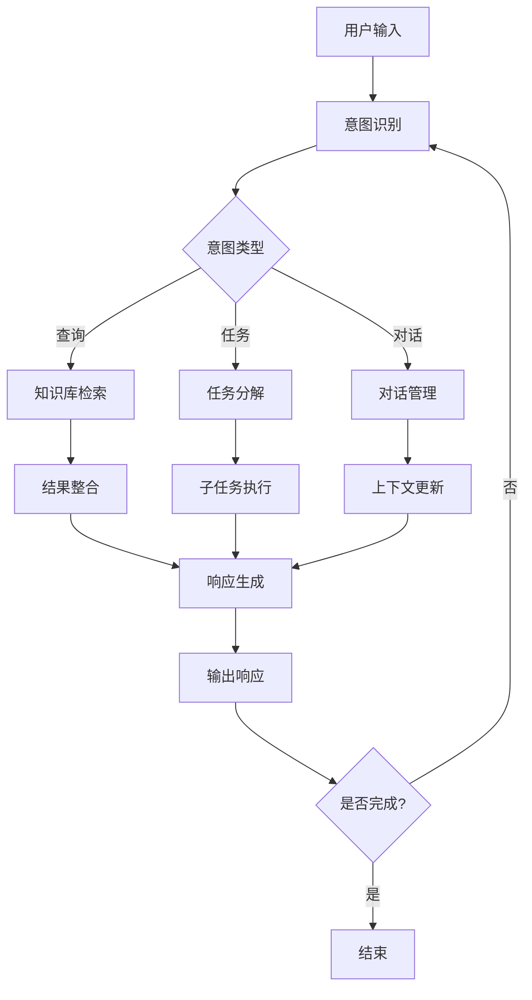
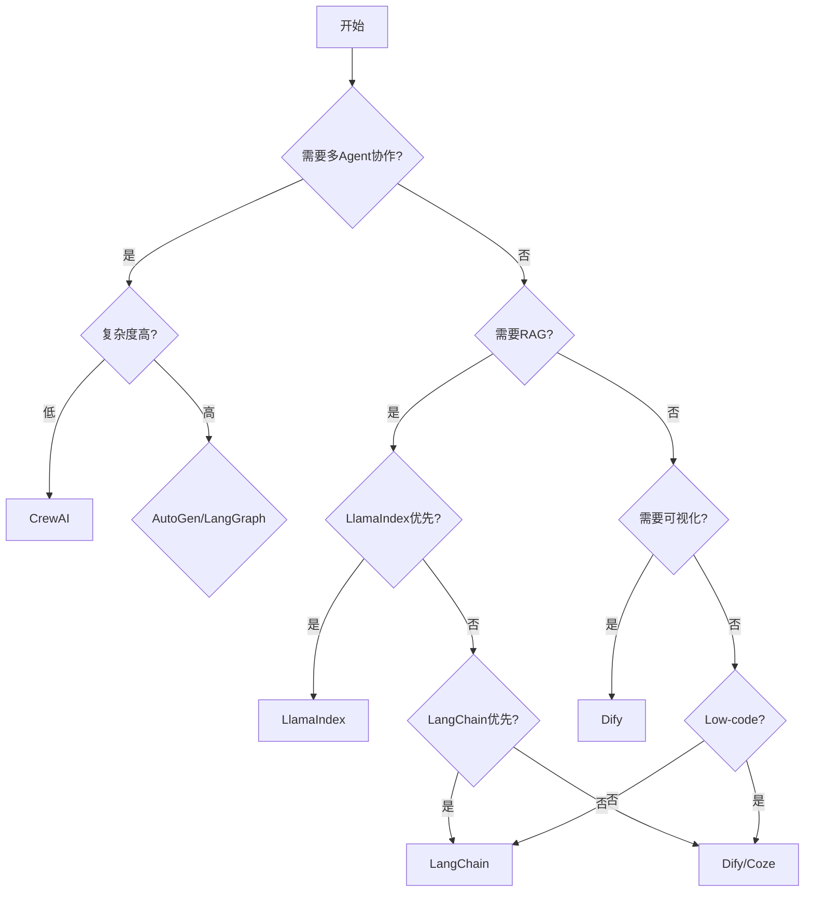
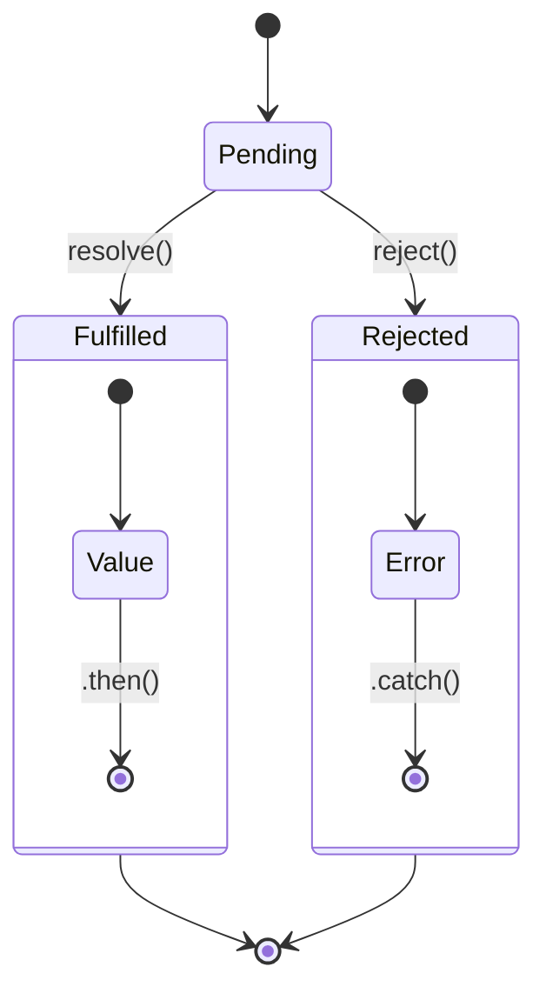

# Agent 框架对比

> 本文档深入对比主流 AI Agent 框架，帮助开发者根据具体场景选择最适合的工具。

## 1. 框架概览

### 1.1 LangChain / LangGraph

**官方链接**: https://www.langchain.com/ | https://www.langgraph.ai/

**核心定位**: 全功能应用开发框架，提供链式调用（Chain）、图编排（Graph）、工具调用、记忆系统等完整能力。

**架构特点**:
- 模块化设计：组件可独立使用
- 支持 Python 和 JavaScript/TypeScript
- LangGraph 用于复杂多 Agent 编排
- 内置 LangSmith 监控平台

**适用人群**: 需要构建复杂 AI 应用的开发者，对灵活性要求高的团队。

### 1.2 AutoGen (Microsoft)

**官方链接**: https://microsoft.github.io/autogen/

**核心定位**: 多 Agent 对话协作框架，强调 Agent 之间的自然对话和协作能力。

**架构特点**:
- 对话式 Agent 设计
- 内置多种 Agent 类型（ConversableAgent, AssistantAgent 等）
- 支持人机协作模式
- Microsoft 官方维护，企业级支持

**适用人群**: 需要构建多 Agent 协作系统的企业用户。

### 1.3 CrewAI

**官方链接**: https://www.crewai.com/

**核心定位**: 专注于 Role-based 多 Agent 编排，以"船员"概念组织 Agent 协作。

**架构特点**:
- 清晰的 Role → Task → Process 层级
- 流程可视化（Sequential, Hierarchical）
- 简洁易懂的 API 设计
- 快速原型开发

**适用人群**: 快速构建多 Agent 协作流程的团队。

### 1.4 LlamaIndex

**官方链接**: https://www.llamaindex.ai/

**核心定位**: 专注于知识检索增强（RAG），提供数据连接和知识管理的强大能力。

**架构特点**:
- 强大的数据索引能力
- 丰富的连接器生态（100+ 数据源）
- RAG 工作流优化
- 可作为 Agent 框架使用

**适用人群**: 需要深度 RAG 能力的知识密集型应用。

### 1.5 Dify

**官方链接**: https://dify.ai/

**核心定位**: 开源 LLM 应用开发平台，提供低代码/无代码开发体验。

**架构特点**:
- 可视化编排界面
- 支持工作流编排
- 内置模型网关
- 丰富的插件市场
- 支持 Docker 一键部署

**适用人群**: 非技术用户或需要快速验证想法的团队。

### 1.6 Coze

**官方链接**: https://www.coze.com/

**核心定位**: 字节跳动出品的 AI Bot 开发平台，国际版（Coze.com）和国内版（扣子）并行。

**架构特点**:
- 可视化 Bot 编辑器
- 丰富的插件生态（字节系产品深度集成）
- 工作流编排
- 多渠道发布（Discord、Slack、飞书等）

**适用人群**: 需要快速构建 ChatBot 并发布到多个平台的用户。

## 2. 核心能力对比

### 2.1 工具调用能力对比

| 能力维度 | LangChain/LangGraph | AutoGen | CrewAI | LlamaIndex | Dify | Coze |
|---------|---------------------|---------|--------|-----------|------|------|
| 内置工具生态 | 丰富（SerpAPI、Wikipedia 等） | 中等 | 基础 | 丰富 | 丰富 | 极丰富 |
| 工具定义方式 | Python 函数 / JSON Schema | Python 类 | Python 函数 | Python 函数 | 可视化 + 代码 | 可视化 + 插件 |
| 动态工具生成 | 支持 | 受限 | 不支持 | 支持 | 支持 | 支持 |
| 工具调用策略 | 多种（ReAct、OpenAI Function 等） | 内置函数调用 | ReAct | ReAct | 内置 | 内置 |
| 工具并行执行 | 支持 | 支持 | 支持 | 支持 | 支持 | 支持 |
| 工具重试机制 | 内置 | 需自行实现 | 需自行实现 | 内置 | 可视化配置 | 可视化配置 |
| 自定义工具 | 灵活（函数装饰器） | 需要继承基类 | 函数装饰器 | 函数装饰器 | UI 拖拽 | 插件市场 |

### 2.2 记忆系统对比

| 记忆类型 | LangChain/LangGraph | AutoGen | CrewAI | LlamaIndex | Dify | Coze |
|---------|---------------------|---------|--------|-----------|------|------|
| 短期记忆 | 会话缓冲 | 消息历史 | 消息历史 | 上下文窗口 | 会话上下文 | 会话上下文 |
| 长期记忆 | VectorStore / 知识图谱 | 外部存储 | 外部存储 | 向量存储 | 知识库 | 知识库 |
| 记忆检索 | Semantic Search / BM25 | 需自行实现 | 需自行实现 | Advanced Reranking | 混合检索 | 内置 |
| 记忆总结 | 内置摘要工具 | 需自行实现 | 需自行实现 | 内置摘要 | 支持 | 支持 |
| 对话历史管理 | ConversationBufferWindowMemory 等 | 内置 | 基础 | 内置 | 可视化配置 | 内置 |

### 2.3 多 Agent 协作对比

| 协作模式 | LangChain/LangGraph | AutoGen | CrewAI | LlamaIndex | Dify | Coze |
|---------|---------------------|---------|--------|-----------|------|------|
| Agent 定义 | 灵活自定义 | 内置多种类型 | Role + Agents | Agent + Tools | 节点组件 | Bot + 工作流 |
| 协作编排 | Graph / StateGraph | GroupChat | Process (Sequential/Hierarchical) | Router Agent | 工作流编排 | 工作流编排 |
| 通信机制 | 消息传递 | 对话轮次 | Task 传递 | 函数调用 | 节点连线 | 节点连线 |
| 冲突解决 | 自定义逻辑 | 内置 GroupChat 机制 | 自定义 | 自定义 | 自定义 | 自定义 |
| 人机协作 | 支持 | 优秀（Human In The Loop） | 支持 | 支持 | 支持 | 支持 |
| 并行执行 | 支持 | 支持 | 支持 | 支持 | 支持 | 支持 |

### 2.4 RAG 集成对比

| RAG 能力 | LangChain/LangGraph | AutoGen | CrewAI | LlamaIndex | Dify | Coze |
|---------|---------------------|---------|--------|-----------|------|------|
| 数据源连接 | 丰富 | 需自行集成 | 基础 | 极丰富（100+） | 丰富 | 丰富 |
| 文档处理 | PDF/HTML/Markdown 等 | 需自行实现 | 基础 | Advanced | 内置 | 内置 |
| 分块策略 | 多种（Recursive, Semantic 等） | 需自行实现 | 基础 | 多种高级策略 | 可视化配置 | 可视化配置 |
| 索引类型 | Vector / KG / Hybrid | 需自行实现 | 需自行实现 | Vector / Table / Graph | 向量索引 | 向量索引 |
| 重排序 | 内置 | 需自行实现 | 需自行实现 | 内置 | 内置 | 内置 |
| RAG 评估 | LangSmith 集成 | 需自行实现 | 需自行实现 | 内置 Eval | 支持 | 支持 |

## 3. 架构设计对比

### 3.1 链式执行 (Chain)

**LangChain LCEL 示例**:
```python
from langchain_openai import ChatOpenAI
from langchain.prompts import ChatPromptTemplate
from langchain.schema import StrOutputParser

# 使用 LCEL (LangChain Expression Language) 构建链
prompt = ChatPromptTemplate.from_messages([
    ("system", "你是一个{topic}专家"),
    ("human", "{question}")
])

chain = prompt | ChatOpenAI(model="gpt-4") | StrOutputParser()

# 执行链
result = chain.invoke({
    "topic": "Python",
    "question": "解释装饰器模式"
})

print(result)
```

**CrewAI 链式执行示例**:
```python
from crewai import Agent, Task, Crew, Process

# 定义 Agent
researcher = Agent(
    role="研究员",
    goal="收集相关信息",
    backstory="一位专业的市场研究员"
)

writer = Agent(
    role="作家",
    goal="撰写报告",
    backstory="一位资深内容创作者"
)

# 定义 Task
research_task = Task(
    description="研究{topic}的市场情况",
    agent=researcher
)

write_task = Task(
    description="撰写研究报告",
    agent=writer,
    context=[research_task]  # 依赖前一个任务
)

# 创建 Crew（顺序执行）
crew = Crew(
    agents=[researcher, writer],
    tasks=[research_task, write_task],
    process=Process.sequential
)

result = crew.kickoff(inputs={"topic": "AI"})
```

### 3.2 图执行 (Graph)

**LangGraph 状态机示例**:
```python
# 第 1 段：导入依赖并定义共享状态（约定整张图"能读能写什么"）
from langgraph.graph import StateGraph, END
from typing import TypedDict
# TypedDict 只在静态类型层面生效，不做运行时校验：字段写错/漏写不会在这里报错，往往到节点内部取值时才抛 KeyError

class AgentState(TypedDict):
    # LangGraph 以"状态"为中心：所有节点读同一份 state，节点返回的字典会被并回 state 传给下一个节点
    messages: list
    next_action: str  # 本示例只声明未使用：真正的分支依据是 should_continue 的返回值，而非这个字段

# 第 2 段：决策节点——只做路由判断，不修改状态
def should_continue(state: AgentState) -> str:
    """决策节点：判断是否继续"""
    # 返回值不是业务数据，而是"路由键"：它必须与 add_conditional_edges 映射表里的键严格对应
    # 边界：用 > 5 而不是 >= 5，所以 len == 5 时仍会再跑一轮，要等第 6 条消息写入后才收敛退出
    if len(state["messages"]) > 5:
        return "end"
    return "continue"

# 第 3 段：Agent 执行节点——返回"增量更新"而不是原地修改
def agent_node(state: AgentState):
    """Agent 执行节点"""
    # 关键点：这里用 + 生成新列表而非 append；messages 字段没有配置 reducer，
    # 默认语义是"整字段覆盖"，原地 append 再返回同一引用会破坏"返回增量"的契约，并污染历史快照
    # 代价：每轮复制一次列表，n 轮循环的总复杂度是 O(n^2)，规模大时应改用 reducer 做增量累积
    return {"messages": state["messages"] + ["Agent 执行了一次"]}

# 第 4 段：把节点与边装配成图（此刻只是蓝图，还不能 invoke）
# 构建图
workflow = StateGraph(AgentState)
workflow.add_node("agent", agent_node)
workflow.add_edge("__start__", "agent")  # "__start__" 是虚拟入口节点，图必然从这里单向进入 agent
# 条件边的执行语义：每轮 agent 结束后先调用 should_continue 取值，再按映射表决定跳到哪个节点
# 三种边的分工：普通边管固定流转，条件边管运行时决策，"continue" 指回 agent 从而形成自环循环
workflow.add_conditional_edges(
    "agent",
    should_continue,
    {"continue": "agent", "end": END}  # END 是虚拟终止节点，命中即退出循环并返回最终 state
)

# 第 5 段：编译并端到端跑一次
# 编译会把蓝图固化成可调用的 Runnable：校验节点/边引用、建立执行通道；编译后不应再改动图结构
# 编译并执行
app = workflow.compile()
# 初始 state 必须补全所有字段：这里把 messages 置空，之后由每轮节点自行累积
result = app.invoke({"messages": [], "next_action": ""})
# 推演结果：messages 长度依次变 1→6，第 6 次之后 len(6) > 5 命中 "end"，
# 所以 agent 实际执行 6 次，result["messages"] 中含 6 条 "Agent 执行了一次"
print(result)
```
**AutoGen 图式协作示例**:
```python
from autogen import ConversableAgent, GroupChat, GroupChatManager

# 创建 Agent
assistant = ConversableAgent(
    name="Assistant",
    system_message="你是一个有帮助的助手",
    llm_config={"model": "gpt-4"}
)

critic = ConversableAgent(
    name="Critic",
    system_message="你是一个严格的评审员，检查方案的可行性",
    llm_config={"model": "gpt-4"}
)

# 创建群组聊天
group_chat = GroupChat(
    agents=[assistant, critic],
    messages=[],
    max_round=5
)

manager = GroupChatManager(groupchat=group_chat)

# 启动群组对话
assistant.initiate_chat(
    manager,
    message="帮我设计一个新的推荐系统架构，需要考虑可扩展性和性能"
)
```

### 3.3 状态机设计

**LangGraph 完整状态机示例**:
```python
# 第 1 段：依赖导入与共享状态契约（先约定图里流动的数据长什么样）
# Annotated[list, operator.add] 是 LangGraph 的"归约器(reducer)"声明：多个节点返回的 messages
# 不会互相覆盖，而是按 operator.add 逐条拼接，从而保留完整对话历史；其余字段则是默认的覆盖语义。
# 易错点：本示例用到 TypedDict 却未从 typing 导入，直接运行会 NameError，讲课时需补 from typing import TypedDict。
from langgraph.graph import StateGraph, END, START
from typing import Annotated
import operator

class AgentState(TypedDict):
    messages: Annotated[list, operator.add]
    current_step: str
    data: dict

# 第 2 段：路由决策函数（纯函数，只读状态、只返回下一节点名）
# 思路是用最后一条消息里的关键词做极简意图识别，content.lower() 让英文关键词不受大小写影响；
# 返回值必须与后面 add_conditional_edges 映射表的 key 严格一致，否则 compile/运行时直接报错。
# 边界条件：state["messages"] 为空时 [-1] 会抛 IndexError，真实工程需先判空再取尾元素。
def router(state: AgentState) -> str:
    """路由函数 - 根据当前状态决定下一步"""
    last_message = state["messages"][-1]["content"].lower()

    if "分析" in last_message:
        return "analyzer"
    elif "搜索" in last_message:
        return "searcher"
    elif "完成" in last_message:
        return END
    else:
        return "general"

# 第 3 段：节点实现（每个节点都是 State -> 局部更新 dict 的纯函数）
# 返回的是"增量补丁"而非完整状态：messages 触发归约器做追加，current_step 则被新值覆盖。
# 三个节点结构刻意保持一致，便于对比讲解——节点只声明"我改了什么"，合并由框架统一完成。
# 定义各节点
def analyzer_node(state: AgentState):
    return {
        "messages": [{"role": "assistant", "content": "执行分析任务..."}],
        "current_step": "analyzing"  # 覆盖式字段：后写的节点会盖掉前一个节点的值
    }

def searcher_node(state: AgentState):
    return {
        "messages": [{"role": "assistant", "content": "执行搜索任务..."}],
        "current_step": "searching"
    }

def general_node(state: AgentState):
    return {
        "messages": [{"role": "assistant", "content": "执行通用任务..."}],
        "current_step": "general"
    }

# 第 4 段：实例化图并注册节点、设定唯一入口
# StateGraph(AgentState) 用状态类型充当 schema，compile() 时会据此校验节点与边的引用是否合法。
# START -> "general" 是图的入口边，保证任何请求先落到 general，再由 router 分流，
# 缺少入口边（或存在不可达节点）会导致 compile() 失败的图结构。
# 构建状态机图
workflow = StateGraph(AgentState)
workflow.add_node("analyzer", analyzer_node)
workflow.add_node("searcher", searcher_node)
workflow.add_node("general", general_node)

workflow.add_edge(START, "general")

# 第 5 段：条件边（把路由函数变成动态分发，全图的核心）
# 从 "general" 出发先执行 router 得到一个 key，再用映射表把 key 翻译成真实节点名；
# 这里 key 与节点名同名只是巧合式写法，映射表才决定了实际跳转目标（也支持重命名/复用）。
# 表里的 END: END 让"完成"关键词能直接终止图，否则 general 将没有出口而死循环。
workflow.add_conditional_edges(
    "general",
    router,
    {"analyzer": "analyzer", "searcher": "searcher", END: END}
)

# 第 6 段：收尾边与编译（分流—执行—汇聚，把声明式图固化为可执行对象）
# analyzer/searcher 执行完统一指向 END，形成汇聚结构；general 的出口则完全交给上面的条件边。
# compile() 是最后一步，之后调用 app.invoke(初始状态) 即可驱动整张图运行。
workflow.add_edge("analyzer", END)
workflow.add_edge("searcher", END)

app = workflow.compile()
```
### 3.4 事件驱动架构

**LangChain 事件处理示例**:
```python
from langchain.callbacks.base import BaseCallbackHandler
from langchain_openai import ChatOpenAI

# 第 1 段：导入基类与模型客户端（为回调机制准备"插座"和"插头"）
# BaseCallbackHandler 是 LangChain 回调体系的抽象基类，它预定义了 on_llm_start / on_llm_new_token /
# on_llm_end 等一整套生命周期钩子；子类只需覆盖自己关心的方法，其余保持空实现即可，不会报错。
# ChatOpenAI 是具体模型，构造时接受 callbacks 参数，这就是把自定义处理器注入运行时的入口。

class CustomHandler(BaseCallbackHandler):
    # 第 2 段：定义自定义回调处理器（在模型生命周期的关键节点插入副作用）
    # 回调对象是"观察者"，不参与推理计算，也不允许阻塞式重活；这里的 print 只是把事件暴露到终端。
    # 注意：回调实例会被同一次调用链上的所有组件共享，若改成累积状态（如 self.tokens += ...），
    # 必须考虑并发/多次调用下的线程安全与状态残留问题。

    def on_chat_model_start(self, *args, **kwargs):
        # 第 3 段：对话模型启动钩子（请求发出前触发一次）
        # 区别于 on_llm_start：chat 模型走的是"消息列表"输入，LangChain 会路由到 on_chat_model_start。
        # 只接收 \*args/\*\*kwargs 是刻意的宽松签名——官方在不同版本会给这个钩子传入不同数量的参数，
        # 写成固定形参（如 serialized, messages）会在升级后直接抛 TypeError。
        print("模型开始处理...")

    def on_llm_new_token(self, token, *args, **kwargs):
        # 第 4 段：流式 token 钩子（每产出一个增量片段就回调一次）
        # 触发前提是底层走 streaming=True；非流式调用时此方法通常只会收到一次完整结果或根本不触发，
        # 因此不能把"必须被调用"当作逻辑假设。token 是增量字符串，需要自行拼接才是完整答案。
        # 复杂度：调用次数与输出 token 数同阶，O(n)；此处同步 print 会拖慢流式体验，生产环境应改为
        # 队列/异步写入。
        print(f"新 token: {token}")

    def on_llm_end(self, *args, **kwargs):
        # 第 5 段：结束钩子（成功、报错、被中断路径下都应看到它，用于收尾与释放资源）
        # 若要与 on_chat_model_start 配对做耗时统计，可在此读取 kwargs["response"] 或缓存开始时间；
        # 关键易错点：它不保证"只在前一个钩子触发后才触发"，异常路径下前面可能被跳过。
        print("模型处理完成")

# 第 6 段：装配与运行（把处理器实例绑定到模型，形成"事件源 -> 观察者"的绑定关系）
# callbacks=[...] 在构造期写入模型配置，之后每次 invoke/stream 都会复用同一批回调；
# 若想按单次调用隔离（例如不同用户不同日志），应改用 invoke(..., config={"callbacks": [...]})
# 做运行级覆盖，否则多个调用方会共享同一个 handler，日志互相串台。
# 使用事件处理器
handler = CustomHandler()
llm = ChatOpenAI(callbacks=[handler])
```
**Dify 工作流事件驱动**:



## 4. 代码实现对比

### 4.1 同一功能：实现多 Agent 协作回答问题

#### 4.1.1 LangChain/LangGraph 实现

```python
from langgraph.graph import StateGraph, END
from typing import TypedDict, List
from langchain_openai import ChatOpenAI
from langchain.prompts import ChatPromptTemplate

class MultiAgentState(TypedDict):
    question: str
    research: str
    answer: str
    next: str

llm = ChatOpenAI(model="gpt-4")

# 研究者 Agent
research_prompt = ChatPromptTemplate.from_messages([
    ("system", "你是一个研究员，负责收集关于'{question}'的信息"),
    ("human", "请提供详细的研究报告")
])

research_chain = research_prompt | llm

# 回答者 Agent
answer_prompt = ChatPromptTemplate.from_messages([
    ("system", "你是一个专家，基于以下研究回答问题：\n{research}"),
    ("human", "回答问题：{question}")
])

answer_chain = answer_prompt | llm

# 定义节点
def research_node(state: MultiAgentState):
    result = research_chain.invoke({"question": state["question"]})
    return {"research": result.content, "next": "answer"}

def answer_node(state: MultiAgentState):
    result = answer_chain.invoke({
        "research": state["research"],
        "question": state["question"]
    })
    return {"answer": result.content, "next": END}

# 构建图
workflow = StateGraph(MultiAgentState)
workflow.add_node("researcher", research_node)
workflow.add_node("answerer", answer_node)
workflow.add_edge("__start__", "researcher")
workflow.add_edge("researcher", "answerer")
workflow.add_edge("answerer", END)

app = workflow.compile()

# 执行
result = app.invoke({
    "question": "解释量子计算的基本原理",
    "research": "",
    "answer": "",
    "next": ""
})

print(result["answer"])
```

#### 4.1.2 AutoGen 实现

```python
from autogen import ConversableAgent, GroupChat, GroupChatManager

# 研究者 Agent
researcher = ConversableAgent(
    name="Researcher",
    system_message="你是一个研究员，擅长收集和整理信息。",
    llm_config={"model": "gpt-4"},
    human_input_mode="NEVER"
)

# 回答者 Agent
answerer = ConversableAgent(
    name="Answerer",
    system_message="""你是一个专家，基于研究员提供的信息给出专业回答。
    如果信息不足，可以要求研究员补充。""",
    llm_config={"model": "gpt-4"},
    human_input_mode="NEVER"
)

# 设置对话
researcher.receive(
    message="请研究量子计算的基本原理，并给出详细报告。",
    sender=answerer
)

# 协作对话
result = researcher.generate_reply(messages=researcher.chat_messages.get(answerer, []))
print(result)
```

#### 4.1.3 CrewAI 实现

```python
from crewai import Agent, Task, Crew, Process

# 第 1 段：导入 CrewAI 的四大核心构件（Agent / Task / Crew / Process）
# 这一步决定了整个脚本的编排范式：CrewAI 把"谁来做"（Agent）、"做什么"（Task）、
# "如何串起来"（Crew + Process）拆成彼此正交的对象，因此下面的顺序天然就是
# 先建角色 → 再派任务 → 最后组装执行的工作流。
# 注意导入成本：CrewAI 会在 import 时加载 LangChain 与 LLM 适配层，启动有一定开销。

# 第 2 段：定义"高级研究员"智能体——负责产出原始研究结论
# role/goal/backstory 三个字段并非普通元数据，它们会被注入到该 Agent 的系统提示词中，
# 共同塑造模型的语气、专业深度与决策偏好；goal 越具体，模型越不容易跑题。
# 易错点：这里没有指定 llm，Agent 会回退到环境变量/默认模型配置，
# 若未设置 API Key，失败会延迟到 kickoff() 时才暴露。
researcher = Agent(
    role="高级研究员",
    goal="深入研究量子计算原理",
    backstory="量子物理领域的权威专家"
)

# 第 3 段：定义"技术作家"智能体——负责把专业内容翻译成大众语言
# 与研究员角色形成能力互补：同一份事实数据，由不同角色以不同目标重述，
# 这正是多智能体协作相对单次 prompt 的主要收益（分工 + 视角隔离）。
answerer = Agent(
    role="技术作家",
    goal="将复杂技术以易懂方式解释",
    backstory="擅长技术传播的内容创作者"
)

# 第 4 段：声明第一个任务——纯研究型任务，只有 Agent 没有上游依赖
# 任务描述（description）会与所属 Agent 的 role/goal 拼接成实际 prompt；
# 此处未设置 expected_output，因此下游拿到的将是自由文本而非结构化数据。
research_task = Task(
    description="研究量子计算的基本原理，包括量子比特、叠加态、纠缠等概念",
    agent=researcher
)

# 第 5 段：声明第二个任务，并用 context 显式建立任务间依赖
# context=[research_task] 是关键数据流：research_task 的输出会被自动拼进
# answer_task 的提示词中，无需手动把结果当字符串传参，也不依赖全局变量。
# 边界条件：依赖只保证"顺序上的先后"，不保证研究结论一定准确，
# 若上游产生幻觉，错误会被下游原样放大（garbage in, garbage out）。
answer_task = Task(
    description="基于研究报告，用通俗语言解释量子计算原理",
    agent=answerer,
    context=[research_task]
)

# 第 6 段：组装 Crew 并选定执行流程
# agents/tasks 是平级清单，真正决定拓扑的是 process：
# Process.sequential 表示按 tasks 列表顺序逐个执行，第 N 个任务的输出
# 作为上下文喂给第 N+1 个任务；若换成 Process.hierarchical，
# 则需要额外的 manager 角色来做任务分派，执行路径和成本都会显著上升。
# 注意 tasks 的书写顺序必须与依赖关系一致，否则 context 会指向尚未执行的任务。
crew = Crew(
    agents=[researcher, answerer],
    tasks=[research_task, answer_task],
    process=Process.sequential
)

# 第 7 段：启动执行并输出结果
# kickoff() 是同步阻塞调用，内部会依次发起多次 LLM 请求（每个任务至少一次），
# 因此耗时与 token 消耗约等于任务数的倍数，而非单次调用。
# 返回值是 CrewOutput 对象而非纯字符串，直接 print 会走其 __str__，
# 通常只显示最终任务的产出；若需要中间步骤或 token 用量，
# 应改用 result.tasks_output / result.token_usage 等字段，而不是解析这里的文本。
result = crew.kickoff()
print(result)
```
### 4.2 扩展性分析

| 扩展维度 | LangChain/LangGraph | AutoGen | CrewAI | LlamaIndex | Dify | Coze |
|---------|---------------------|---------|--------|-----------|------|------|
| 自定义组件 | 高度灵活 | 受限 | 受限 | 高度灵活 | 插件扩展 | 插件扩展 |
| 第三方集成 | 丰富 | 中等 | 有限 | 极丰富 | 丰富 | 极丰富 |
| 私有部署 | 完全支持 | 完全支持 | 完全支持 | 完全支持 | 完全支持 | 受限 |
| 云服务 | LangSmith (付费) | Azure AI Studio | 托管服务 | 托管服务 | 自托管 | Coze Cloud |
| 商业授权 | Apache 2.0 | MIT | MIT | MIT | Apache 2.0 | 商业 |

### 4.3 性能对比（理论基准）

| 指标 | LangChain | AutoGen | CrewAI | LlamaIndex | Dify | Coze |
|-----|-----------|---------|--------|-----------|------|------|
| 冷启动时间 | 中等 | 中等 | 快速 | 中等 | 快速 | 快速 |
| 单一请求延迟 | 基准 | 基准 | 基准 | 基准 | +100-200ms | +200-300ms |
| 并发能力 | 高 | 高 | 中等 | 高 | 中等 | 中等 |
| 内存占用 | 中等 | 中等 | 较低 | 中等 | 较高 | 较高 |
| 大规模部署 | 优秀 | 优秀 | 良好 | 优秀 | 良好 | 受限 |

> 注：性能数据受模型、硬件、网络等因素影响，以上为相对参考值。

## 5. 适用场景

### 5.1 场景分类矩阵

| 场景 | 推荐框架 | 理由 |
|------|---------|------|
| **聊天机器人** | Coze > Dify > LangChain | 快速部署、多平台发布 |
| **自动化工作流** | Dify > LangGraph > CrewAI | 可视化编排、监控友好 |
| **代码生成** | LangChain > AutoGen | 灵活的代码执行和验证 |
| **数据分析** | LangChain + LlamaIndex | 强大的数据处理和检索 |
| **知识问答** | LlamaIndex > LangChain | 专业 RAG 能力 |
| **多 Agent 协作** | AutoGen > LangGraph > CrewAI | 原生多 Agent 支持 |
| **企业级应用** | AutoGen > LangChain > Dify | 微软生态、安全合规 |
| **快速原型** | CrewAI > Coze > Dify | 简洁 API、快速验证 |
| **低代码平台** | Dify > Coze | 可视化友好、部署简单 |
| **研究探索** | LangChain > LlamaIndex | 灵活性高、实验性强 |

### 5.2 详细场景说明

#### 5.2.1 场景 A：企业智能客服

**需求分析**:
- 多渠道接入（网页、钉钉、微信）
- FAQ 知识库检索
- 复杂对话管理
- 工单转接

**推荐方案**: Dify + 自定义插件

**优势**:
- 可视化对话流程设计
- 内置知识库管理
- 多渠道发布
- 团队协作

#### 5.2.2 场景 B：代码审查 Agent

**需求分析**:
- 多语言代码审查
- GitHub 集成
- 审查报告生成
- 问题追踪

**推荐方案**: LangChain + LangGraph

**优势**:
- 灵活的代码执行环境
- 状态机设计适合复杂审查流程
- 丰富的 LLM 集成
- 可定制审查规则

#### 5.2.3 场景 C：研究报告生成

**需求分析**:
- 网络信息搜集
- 多源数据整合
- 结构化报告生成
- 引用标注

**推荐方案**: AutoGen + CrewAI

**优势**:
- 多 Agent 分工协作
- 群组讨论机制
- Role-based 清晰分工

### 5.3 框架选型决策树



## 6. 选型建议

### 6.1 按需求选择

| 需求类型 | 第一选择 | 第二选择 | 备选方案 |
|---------|---------|---------|---------|
| 快速构建 Bot | Coze | Dify | CrewAI |
| 企业级应用 | AutoGen | LangChain | Dify |
| RAG 优先 | LlamaIndex | LangChain | Dify |
| 研究/实验 | LangChain | LlamaIndex | AutoGen |
| 低代码优先 | Dify | Coze | - |
| 多 Agent 协作 | AutoGen | CrewAI | LangGraph |

### 6.2 学习曲线对比

学习难度（1-10，数值越大越难）：

| 框架 | 入门 | 基础 | 中级 | 高级 | 专家 |
|---|---|---|---|---|---|
| LangChain | 2 | 5 | 7 | 8 | 9 |
| LangGraph | 3 | 6 | 8 | 9 | 10 |
| AutoGen | 2 | 4 | 6 | 8 | 9 |
| CrewAI | 1 | 3 | 5 | 7 | 8 |
| LlamaIndex | 2 | 5 | 7 | 8 | 9 |
| Dify | 1 | 2 | 3 | 5 | 6 |
| Coze | 1 | 2 | 3 | 4 | 5 |


| 框架 | 上手难度 | 文档质量 | 社区活跃度 | 教程资源 |
|-----|---------|---------|-----------|---------|
| LangChain | 中高 | 优秀 | 极高 | 极多 |
| LangGraph | 高 | 良好 | 高 | 较多 |
| AutoGen | 中 | 良好 | 高 | 较多 |
| CrewAI | 低 | 良好 | 中高 | 较多 |
| LlamaIndex | 中 | 优秀 | 高 | 极多 |
| Dify | 低 | 优秀 | 高 | 多 |
| Coze | 低 | 优秀 | 高 | 多 |

### 6.3 社区支持对比

| 框架 | GitHub Stars | 周下载量 | 维护频率 | Discord/Slack |
|-----|-------------|---------|---------|--------------|
| LangChain | 35k+ | 极高 | 活跃 | Discord (活跃) |
| AutoGen | 25k+ | 高 | 活跃 | Discord (活跃) |
| CrewAI | 15k+ | 中高 | 活跃 | Discord |
| LlamaIndex | 20k+ | 高 | 活跃 | Discord (活跃) |
| Dify | 50k+ | 高 | 非常活跃 | Discord (活跃) |
| Coze | N/A | 高 | 活跃 | 有 |

### 6.4 最终选型建议

**如果您是...**

| 用户画像 | 推荐框架 | 理由 |
|---------|---------|------|
| **初学者 / 非技术人员** | Dify / Coze | 低代码、可视化、快速上手 |
| **后端开发者** | LangChain / AutoGen | 灵活性、深度定制 |
| **AI 研究者** | LangChain + LlamaIndex | 实验性强、组件丰富 |
| **企业用户** | AutoGen / Dify | 稳定性、安全性、微软生态 |
| **创业团队** | Dify / CrewAI | 快速原型、成本可控 |
| **大型企业** | LangChain / AutoGen | 可扩展性、定制能力 |

### 6.5 组合使用建议

在实际项目中，框架可以组合使用以发挥各自优势：



## 7. 附录

### 7.1 A. 快速启动命令

```bash
# LangChain
pip install langchain langchain-openai langchain-core

# AutoGen
pip install pyautogen

# CrewAI
pip install crewai

# LlamaIndex
pip install llama-index

# Dify (Docker)
docker run -d -p 8080:8080 dify/dify
```

### 7.2 B. 关键资源链接

| 框架 | 文档 | GitHub | 示例 |
|-----|------|--------|------|
| LangChain | [docs](https://python.langchain.com/) | [repo](https://github.com/langchain-ai/langchain) | [Examples](https://github.com/langchain-ai/langchain/tree/master/docs/docs/integrations) |
| AutoGen | [docs](https://microsoft.github.io/autogen/) | [repo](https://github.com/microsoft/autogen) | [Examples](https://github.com/microsoft/autogen/tree/main/samples) |
| CrewAI | [docs](https://docs.crewai.com/) | [repo](https://github.com/crewAI/crewai) | [Examples](https://github.com/crewAI/crewai-examples) |
| LlamaIndex | [docs](https://docs.llamaindex.ai/) | [repo](https://github.com/run-llama/llama_index) | [Examples](https://github.com/run-llama/llama_index/tree/main/docs/docs/examples) |
| Dify | [docs](https://docs.dify.ai/) | [repo](https://github.com/langgenius/dify) | [模板市场](https://dify.market/) |
| Coze | [文档](https://www.coze.com/docs) | - | [模板](https://www.coze.com/store/bots) |

---

> **文档版本**: 1.0
> **最后更新**: 2024
> **贡献者**: 欢迎提交 PR 完善此文档

## 深入阅读与参考

!!! tip "怎么用这些资料"
    先读「官方文档与规范」建立准确的概念，再读「源码与示例」核对细节，最后用「教程、书籍与视频」换一种讲法加深理解。每条都写明了读哪一节、带着什么问题读。

### 官方文档与规范

| 资源 | 为什么读 | 怎么读 |
|---|---|---|
| [Claude Agent SDK 概览](https://docs.claude.com/en/api/agent-sdk/overview) | 官方概览讲清工具调用与权限模型，权威且上手快。 | 按文档写一个读取本地目录并总结的小 Agent，重点观察工具调用日志与权限控制。 |
| [A practical guide to building agents（OpenAI）](https://cdn.openai.com/business-guides-and-resources/a-practical-guide-to-building-agents.pdf) | 官方实践指南，用模型、工具、指令三要素搭出设计框架。 | 读完用三要素逐条检查自己的 Agent 设计，列出缺失环节并补齐。 |
| [AutoGen 文档](https://microsoft.github.io/autogen/stable/) | 多 Agent 对话的经典框架，文档示例完整可直接运行。 | 跑通双 Agent 对话示例，再加一个代码执行工具，观察消息如何流转。 |
| [Agent Client Protocol](https://agentclientprotocol.com/) | 编辑器与编码 Agent 通信的事实协议，厘清接口边界。 | 读协议概览的会话与工具调用部分，画出一次编辑器请求的完整时序。 |
| [OpenAI Agents SDK（Python）](https://openai.github.io/openai-agents-python/) | 官方 Quickstart 简洁，handoff 是多 Agent 协作入门。 | 复现 Quickstart 后加一个 handoff，让两个 Agent 协作完成一个任务。 |
| [Google ADK 文档](https://google.github.io/adk-docs/) | 提供多工具 Agent 与内置评测的完整官方路径。 | 按快速开始建一个多工具 Agent，再跑评测功能查看评分报告。 |

### 源码与示例

| 资源 | 为什么读 | 怎么读 |
|---|---|---|
| [smolagents 仓库](https://github.com/huggingface/smolagents) | 核心代码不足千行，是理解最小 Agent 循环的最佳起点。 | 先跑通示例，再顺主循环读工具调用与停止条件，最后手写同构版本。 |
| [pi 编码 Agent 工具集](https://github.com/earendil-works/pi) | 完整的编码 Agent 实现，可对照自己的循环找差异。 | 读 agent loop 与统一 LLM API 部分，列出与你实现不同的三处设计。 |
| [Claude Agent SDK（TypeScript）](https://github.com/anthropics/claude-agent-sdk-typescript) | TypeScript 版 SDK，示例可直接跑通并扩展。 | 克隆后运行 README 示例，再把自己的函数注册成自定义工具验证。 |

### 教程、书籍与视频

| 资源 | 为什么读 | 怎么读 |
|---|---|---|
| [Effective context engineering for AI agents](https://www.anthropic.com/engineering/effective-context-engineering-for-ai-agents) | 讲透上下文工程，可直接用于优化 Agent 提示。 | 读完检查自己的提示，删掉重复上下文并记录 token 与效果变化。 |
| [How we built our multi-agent research system](https://www.anthropic.com/engineering/multi-agent-research-system) | 第一手多 Agent 系统拆解，讲清何时值得拆分。 | 画出 lead agent 与 subagent 调用关系图，判断你的场景是否需多 Agent。 |
| [LLM Powered Autonomous Agents（Lilian Weng）](https://lilianweng.github.io/posts/2023-06-23-agent/) | 规划、记忆、工具三部分的经典综述，建立整体认知。 | 精读三部分，各写一段理解，并对照你所用框架的对应实现。 |

## 应用与行业实践

本章把框架对比的结论落到可执行的做法上。每个场景都给出选型、代码骨架和度量方法。

### 应用场景地图

| 场景 | 用到本页哪个知识点 | 典型技术选型 | 注意事项 |
| --- | --- | --- | --- |
| 客服工单自动分诊并生成首轮回复 | 核心能力对比：结构化输出与工具调用 | 单 Agent + JSON Schema 输出 + 知识库检索工具 | 分诊结果留人工改判入口，改判记录进回归集 |
| 后台管理万行表格的筛选与导出助手 | 核心能力对比：工具调用与分页控制 | 单 Agent + 查询接口工具 + 结果缓存 | 限制单次返回行数，导出走异步任务 |
| CI 失败日志归因并给出修复建议 | 架构设计对比：编排、分支与检查点 | 图式编排 + 代码沙箱 | 补丁只作建议，不自动合并 |
| 合同条款抽取与风险标注 | 代码实现对比：结构化输出与校验 | 单 Agent + Pydantic 校验 + 规则兜底 | 校验不通过的条款转人工，不猜 |
| 长流程审批的条件分支与回滚 | 架构设计对比：状态机与持久化 | 图式编排 + 检查点存储 | 每个节点幂等，重放不产生重复副作用 |
| 多人协作白板的会议纪要与待办抽取 | 适用场景：实时交互与批处理的取舍 | 流式输出 + 工具调用 | 会议中只记录，改动在会后确认 |
| 低端安卓机型的助手入口 | 选型建议：端侧与云端的取舍 | 云端 Agent + 端侧只做渲染 | 弱网降级为纯文本问答 |
| 电商退换货政策问答 | 核心能力对比：检索与引用返回 | 检索工具 + 引用回传 | 政策片段必须带生效日期 |

### 三个场景拆解

#### 场景 1：客服工单自动分诊并生成首轮回复

**业务背景**：工单每天进量在几百到几千条之间波动。人工分诊占用一线同学的首小时，标签不一致导致统计口径对不上。

**怎么用本页知识解决**：思路是先用单 Agent 做分类，再让它调用检索工具补充回答。结构化输出作为契约，框架只负责调度与重试。下面代码为示意，函数名可替换。

```python
# 1. 输出契约：分诊结果必须能通过校验
class Triage(BaseModel):
    category: str      # 工单类别，取值来自固定枚举
    urgency: int       # 1 到 5，越高越急
    need_human: bool   # 是否需要人工接管

# 2. 工具：检索知识库，返回带来源的片段
def search_kb(query: str) -> list[Chunk]: ...

# 3. 单 Agent 流程：分类、分支、检索、生成
def handle(ticket: str) -> Reply:
    plan = llm(ticket, schema=Triage)       # 第一步只做结构化分类
    if plan.need_human or plan.urgency >= 4:
        return escalate(ticket, plan)       # 高风险直接转人工，不进检索
    chunks = search_kb(ticket)              # 第二步检索，结果带来源 ID
    draft = llm(ticket, chunks, cite=True)  # 生成回复并要求标注来源
    return check_citations(draft) or escalate(ticket, plan)  # 引用校验失败转人工
```

- 分类用固定枚举，避免自由文本造成标签漂移。
- 高风险工单直接转人工，省掉检索与生成的开销。
- 检索片段带来源 ID，生成时强制引用，便于事后抽检。
- 引用校验失败即转人工，这个比例本身就是可观测的兜底指标。
- 分支判断只依赖结构化字段，不依赖模型的自然语言解释。

**怎么度量收益**

- 分诊一致率：抽 200 条由两位标注同学独立打标，算与 Agent 结果的一致比例。
- 人工改判率：埋点记录人工修改分类的次数除以总工单数，看板用 Langfuse 或 LangSmith 自定义评分。
- 首轮回复采纳率：客服点击"直接发送"的次数除以生成次数。
- p95 端到端延迟与单工单 token 消耗：用 OpenTelemetry 埋点后按天聚合。

**什么时候不该用**

- 工单每天不足几十条，维护提示词与回归集的成本高于人工分诊。
- 类别定义还在变动期，每周都改，先用关键词规则跑一版。
- 判断依赖附件图片，纯文本 Agent 会给出错误分类。

#### 场景 2：CI 失败归因并给出修复建议

**业务背景**：仓库每天有几十到上百次流水线运行，失败里有一部分是环境抖动。值班同学先翻日志再判断，单次定位耗时从几分钟到十几分钟。

**怎么用本页知识解决**：用编排图把"读日志、判类型、跑复现、写建议"拆成节点，节点间靠检查点保存状态。复现步骤放在沙箱执行，失败可重放。

```python
# 用图式编排表达顺序、分支与中断，节点之间靠检查点传递状态
graph = StateGraph(CIState)              # CIState 存日志、复现结果、结论
graph.add_node("fetch_log", fetch_log)   # 拉取失败任务的完整日志
graph.add_node("classify", classify)     # 判定：环境抖动、代码问题、用例问题
graph.add_node("reproduce", reproduce)   # 在沙箱里重跑失败用例
graph.add_node("suggest", suggest)       # 生成建议并附证据行号
graph.add_edge("fetch_log", "classify")
graph.add_conditional_edges("classify", route, {
    "env": END,                          # 环境抖动直接归档，进沙箱没意义
    "code": "reproduce",                 # 代码问题才进沙箱复现
})
graph.add_edge("reproduce", "suggest")
app = graph.compile(checkpointer=store)  # 检查点让长任务可暂停、可重放
```

- 分支条件写在图里，而不是写在提示词里，重跑时行为一致。
- 环境抖动不进沙箱，直接降低沙箱排队压力。
- 检查点让"复现超时"这类中间状态可以续跑，不必从头开始。
- 建议正文必须附证据行号，值班同学可按行号复核。
- 节点都做成幂等，重放时不重复提交评论或工单。

**怎么度量收益**

- 归因准确率：每周抽失败任务人工标注真实原因，比对 Agent 结论。
- 平均定位时长：流水线失败到有人给出结论的时间差，数据取自工单或机器人日志。
- 沙箱复现超时率：沙箱平台自身的超时指标，按仓库维度拆开看。
- 重复跑次数除以失败次数：这个比值上升说明归因不可信。

**什么时候不该用**

- 失败集中在单一编译器报错，一行 grep 就能定位，加编排只增加维护面。
- 沙箱不允许执行外部代码，复现节点无法落地，此时只做日志归因。
- 日志经常缺失或截断，先修可观测性再谈归因。

#### 场景 3：合同条款抽取与风险标注

**业务背景**：一次审阅几十到几百份合同，条款散落在附件与扫描件里。人工逐条比对模板耗时，不同人标注口径不一致。

**怎么用本页知识解决**：把抽取拆成切块、抽取、校验、汇总四步，每步输出结构化对象。校验不通过的条款不进入汇总，直接进人工队列。

```python
# 每份合同独立处理，块之间不共享状态，便于并发与重试
def extract_contract(pdf_path: str) -> Contract:
    blocks = split_by_clause(pdf_path)      # 按条款标题切块，保留页码偏移
    results = []
    for block in blocks:
        raw = llm(block.text, schema=Clause)  # 强制结构化输出
        clause = validate(raw, block)         # 校验页码、金额、日期格式
        if clause is None:
            queue_for_human(block)            # 校验失败转人工，不做猜测
            continue
        results.append(clause)
    return merge(results)                     # 汇总成合同级对象
```

- 切块带页码偏移，校验时能核对条款是否真的出自该位置。
- 校验函数是纯代码，模型换了也不影响判定口径。
- 失败条款走人工队列，汇总结果里不出现未经校验的字段。
- 每份合同独立处理，单份失败不影响同批次其他合同。
- 汇总阶段只做合并与计数，不再调用模型。

**怎么度量收益**

- 字段级准确率与召回：按字段抽 100 份合同人工核对。
- 人工返工率：进人工队列的条款数除以总条款数。
- 单份处理时间：从上传到出报告的时间戳差，分别看 P50 与 P95。
- 校验失败原因分布：按原因打点统计，用于收紧 Schema 的枚举范围。

**什么时候不该用**

- 合同只有一种固定模板、字段位置固定，坐标模板匹配比 Agent 稳定。
- 扫描件 OCR 字符错误率高，先解决 OCR 再谈抽取。
- 输出涉及法律责任认定，只能作为线索交给法务，不能替代判断。

### 行业先进实践

**先做工作流、再做自主 Agent（出处：Anthropic 工程博客 Building Effective Agents）**
这篇博客建议把常见任务拆成提示链、路由、并行、编排者-执行者这几类固定结构，只有当步骤无法预先确定时才交给自主循环。有效的原因是每一步都可测可回放，出错能定位到具体环节。你的项目先把流程画成图，标出哪些边真的需要模型决定。

**用检查点实现人工介入与故障重放（出处：LangGraph 官方文档 Persistence 与 Human-in-the-loop 章节）**
LangGraph 把图状态写进 checkpointer，允许在指定节点中断、等人工输入后继续。有效的原因是长任务不必一次跑完，进程重启后能从上次状态恢复。你的项目先给耗时最长的节点加检查点，验证重放不产生重复副作用。需核对官方文档：当前版本 checkpointer 支持的存储后端与中断 API 名称。

**用交接表达多 Agent 之间的控制权转移（出处：OpenAI Agents SDK 官方文档）**
Agents SDK 把 handoff 建模成一次工具调用，由模型决定把对话交给哪个 Agent。有效的原因是转移过程留在同一条消息历史里，便于回放与计费统计。你的项目可以把"转人工"也写成一次交接，而不是自定义一套状态字段。

**用消息协议统一工具与数据源的接入（出处：Model Context Protocol 官方规范）**
MCP 定义了客户端与服务器之间交换工具、资源与提示的格式。有效的原因是同一套接入代码能被不同框架复用，换框架时不必重写工具层。你的项目先把只读工具（检索、查询）包成 MCP 服务器，写操作暂时留在应用内。

**用角色分工的 Agent 团队处理开放式任务（出处：Microsoft AutoGen 官方文档 GroupChat 章节）**
AutoGen 用会话消息在多个 Agent 之间轮转，由管理者决定下一个发言者。有效的原因是任务被拆成可讨论的子问题，适合方案评审这类没有固定路径的工作。你的项目只在该任务确实没有固定流程时用它，并给轮次上限。需核对官方文档：GroupChat 的发言者选择策略与终止条件配置项名称。

### 从学到用：落地路线

1. 选一个只读、可回放的场景试点，例如日志归因或合同抽取，不选直接改线上数据的场景。验收标准：测试环境能跑通 20 条历史样本，输出结构化结果并可人工比对。
2. 用回归集验证：把历史样本标注成期望输出，每次改提示词或换模型都跑一遍。验收标准：字段级准确率不低于人工基线，失败样本都能归到具体原因。
3. 推广到相邻场景：把工具层与输出契约抽成公共模块，新场景只写流程与提示词。验收标准：新场景并网只新增流程与提示词文件，工具层零改动。
4. 防止回退：对线上输出加自动校验与定期抽检，校验失败自动降级到人工或规则路径。验收标准：连续四周抽检一致率不低于上线时的水平，低于则切回规则路径。

### 动手作业

**目标**：搭一个"工单分诊 + 知识库检索"的最小闭环，并在本地回归集上给出可复现的评测结果。

**步骤**

1. 选 50 条历史工单，剔除含图片的条目，人工标注类别、紧急度、是否需人工。
2. 定义输出契约（字段、类型、取值枚举），写一个校验函数。
3. 用选定框架搭单 Agent 流程：分类节点、是否转人工的分支、检索节点、生成节点。
4. 接一个检索工具，返回片段时带上文档 ID 与生效日期。
5. 全量跑一遍，逐条记录分类结果、是否转人工、耗时、token 数。
6. 计算一致率、人工改判率、p95 延迟，把结果写成一份表格文件。
7. 挑出 5 条失败样本，逐条写清失败原因，改一版提示词或契约后重跑。

**验收标准**

- 50 条样本全部跑完，一条命令可重跑并输出同一份表格。
- 输出契约校验通过率有记录，校验失败的条目全部落在人工队列。
- 评测表格含一致率、人工改判率、p95 延迟、单条 token 数四个字段。
- 5 条失败样本各有可复核的原因，改版后这 5 条结果能对上。
- 检索片段都带来源 ID，生成回复中引用来源 ID 的比例有记录。

