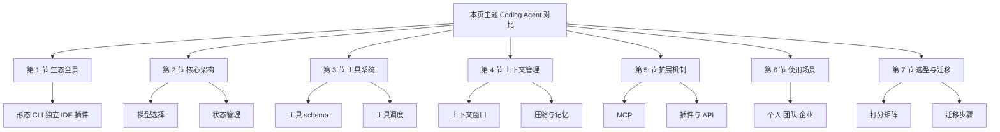
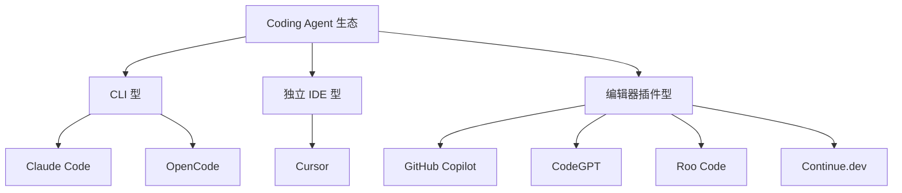
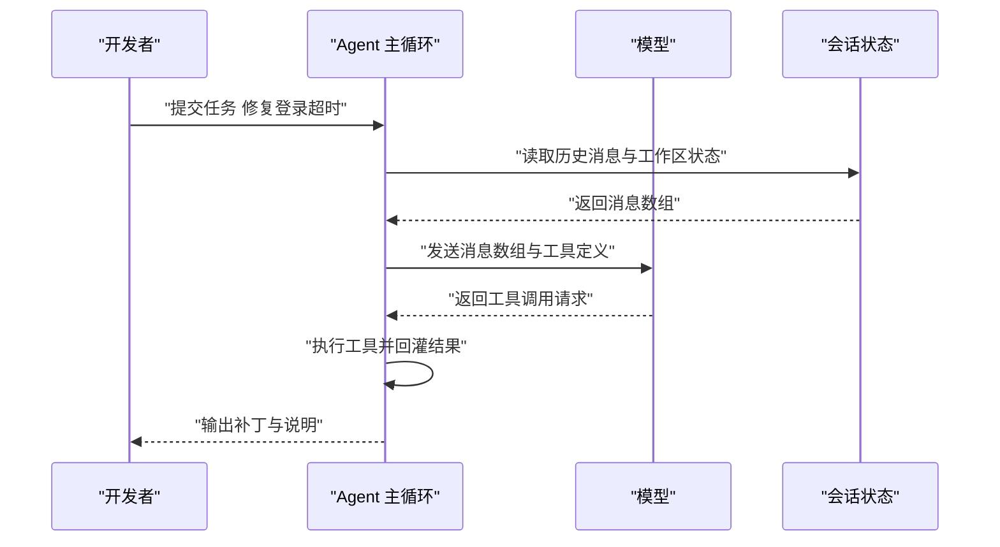
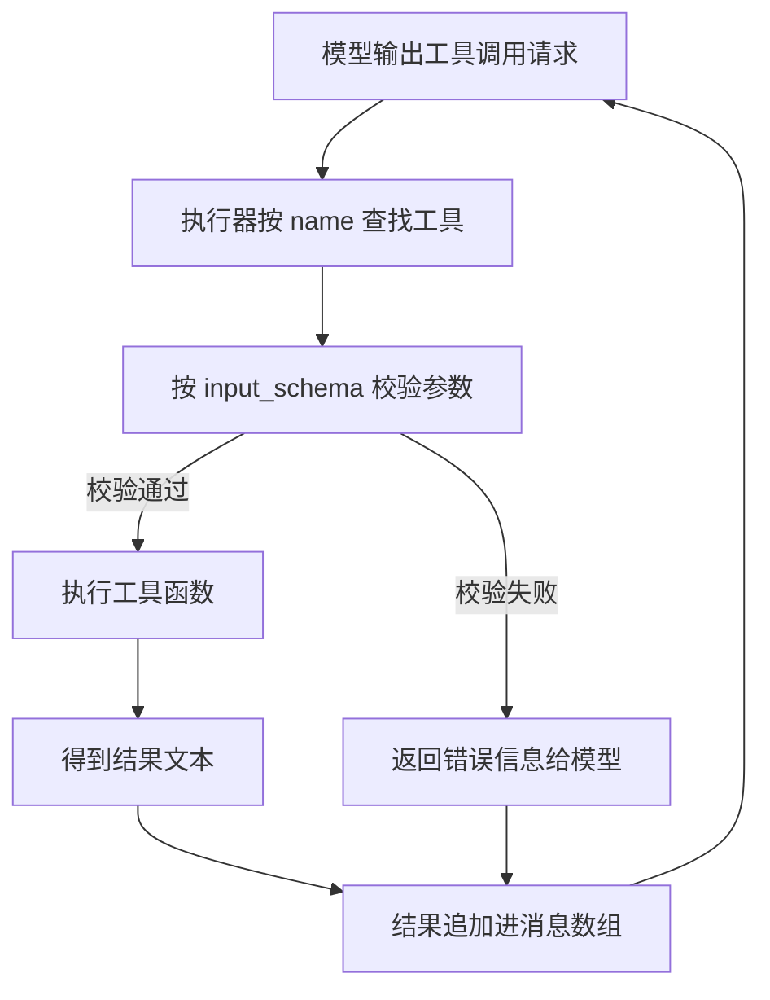
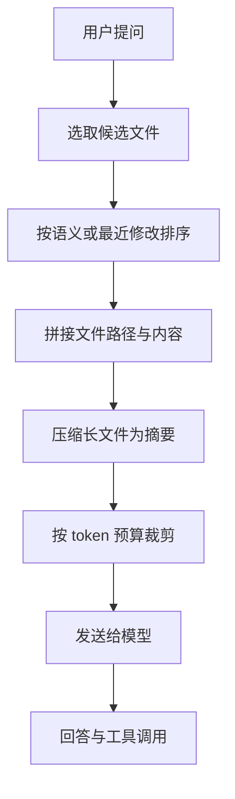
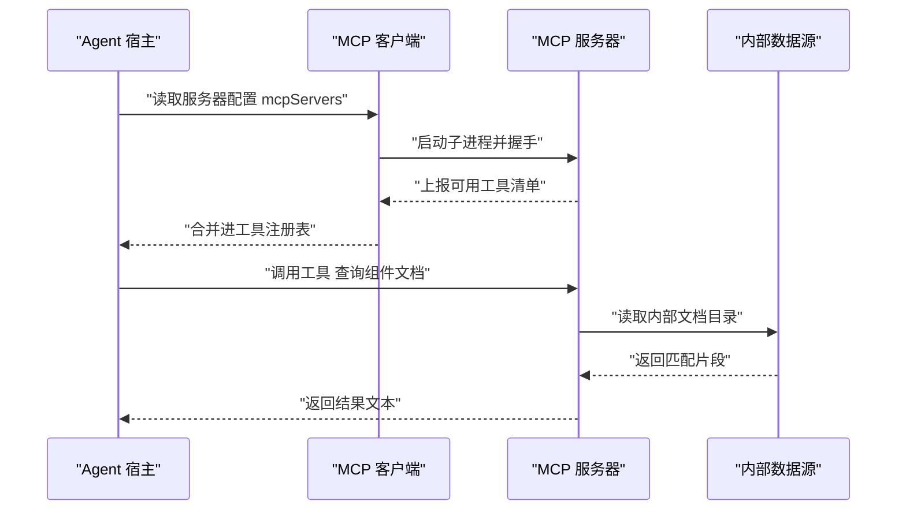
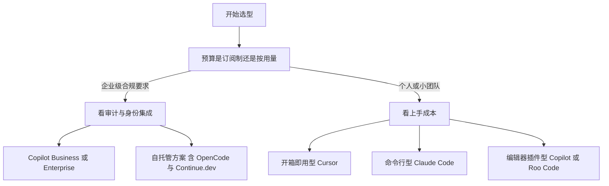

# Coding Agent 对比

!!! abstract "学完这一页你能"
    - 说出 7 个主流 Coding Agent 的形态、开源状态与定位差异，并给出选择理由。
    - 画出一个 Coding Agent 的执行回路，指认模型层、工具层、上下文层各自负责什么。
    - 写出一份 MCP 服务器配置，并解释每个字段的作用。
    - 按团队规模与数据合规条件，写出选型结论与迁移步骤。

## 0. 知识地图



建议按编号顺序读。第 1 到 5 节讲"它由哪些零件组成"，第 6 到 7 节讲"这些零件怎么映射到你的团队"。

如果时间只够读两节，先读第 3 节与第 5 节：工具系统与扩展机制决定了一个 Agent 能不能接进你现有的工程流程。

## 1. Agent 生态全景

**先想一个问题**

三人小组要选编程助手。甲要开箱即用的编辑器界面，乙只要命令行，丙说源码不能出内网。同一份产品表能同时回答这三个问题吗？

**心智模型**

!!! tip "心智模型"
    一句话模型：先按"形态"把 Coding Agent 分成 CLI、独立 IDE、编辑器插件三类，再看开源状态与定位。
    日常类比：像出行方式，地铁按固定线路走，自驾自由度与停车成本都归自己，搭顺风车门槛最低。
    类比不成立处：形态边界会移动。Cursor 基于 VS Code 分支，同一家公司可能同时提供 CLI 与插件两条产品线。

!!! note "术语：Coding Agent"
    指能够读写文件、执行命令、按多步计划完成编码任务的软件系统。
    例子：Claude Code 收到"实现一个防抖函数"后，可以依次读文件、改文件、运行测试。

**图解**



1. 顶层节点是考察对象：全部 Coding Agent 产品。
2. 第二层按交互形态分三支，形态决定了它怎么进入你的日常操作。
3. CLI 支列出 Claude Code 与 OpenCode，两者都在终端里运行。
4. 独立 IDE 支只有 Cursor，它是需要单独安装的编辑器。
5. 插件支列出 4 个产品，它们装在 VS Code 或 JetBrains 里。

**一步一步来**

第一步：把产品信息写成结构化数据。

```js
// 产品清单：字段只保留选型时真正会被比较的项
const agents = [
  // 名称、开发商、形态、开源状态
  { name: 'Claude Code', vendor: 'Anthropic', form: 'cli', open: 'partial' },
  { name: 'Cursor', vendor: 'Cursor AI', form: 'ide', open: 'no' },
  { name: 'GitHub Copilot', vendor: 'Microsoft/OpenAI', form: 'plugin', open: 'no' },
  { name: 'OpenCode', vendor: 'opencode.ai', form: 'cli', open: 'yes' },
  { name: 'CodeGPT', vendor: 'VS Code 插件', form: 'plugin', open: 'mixed' },
  { name: 'Roo Code', vendor: 'VS Code 插件', form: 'plugin', open: 'yes' },
  { name: 'Continue.dev', vendor: 'Continue.dev', form: 'plugin', open: 'yes' },
];
```

**这段代码在做什么**

- 用数组保存 7 个产品的四类字段。
- `form` 用短字符串，方便后面按形态分组统计。
- `open` 用 `yes`、`no`、`partial`、`mixed` 四种取值，对应旧页的开源状态列。
- 字段名统一用英文，避免后续脚本里出现中文键名。
- 数据与展示分离，表格内容可以随时替换。

第二步：按形态分组并打印，验证数据能被程序消费。

```js
// 按 form 字段分组，得到 形态 到 产品名列表 的映射
const byForm = {};
for (const a of agents) {
  // 每组第一次出现时初始化为空数组
  byForm[a.form] ??= [];
  byForm[a.form].push(a.name);
}
// 打印三组结果，核对数量
console.log(byForm);
```

**这段代码在做什么**

- `??=` 只在左值为 null 或 undefined 时赋值，避免覆盖已有数组。
- 循环结束后，键是三种形态，值是对应产品名。
- CLI 组应该有 2 个名字，IDE 组 1 个，插件组 4 个。
- 这一步相当于给后面的选型脚本准备一个索引。

运行结果：

```text
{
  cli: [ 'Claude Code', 'OpenCode' ],
  ide: [ 'Cursor' ],
  plugin: [ 'GitHub Copilot', 'CodeGPT', 'Roo Code', 'Continue.dev' ]
}
```

**动手验证**

```js
// 依赖：Node 20 内置模块，无第三方包
import assert from 'node:assert/strict';

const agents = [
  { name: 'Claude Code', vendor: 'Anthropic', form: 'cli', open: 'partial' },
  { name: 'Cursor', vendor: 'Cursor AI', form: 'ide', open: 'no' },
  { name: 'GitHub Copilot', vendor: 'Microsoft/OpenAI', form: 'plugin', open: 'no' },
  { name: 'OpenCode', vendor: 'opencode.ai', form: 'cli', open: 'yes' },
  { name: 'CodeGPT', vendor: 'VS Code 插件', form: 'plugin', open: 'mixed' },
  { name: 'Roo Code', vendor: 'VS Code 插件', form: 'plugin', open: 'yes' },
  { name: 'Continue.dev', vendor: 'Continue.dev', form: 'plugin', open: 'yes' },
];

const byForm = {};
for (const a of agents) {
  byForm[a.form] ??= [];
  byForm[a.form].push(a.name);
}

// 断言：清单条目数
assert.equal(agents.length, 7);
// 断言：CLI 形态有 2 个产品
assert.equal(byForm.cli.length, 2);
// 断言：插件形态有 4 个产品
assert.equal(byForm.plugin.length, 4);
// 断言：完全开源的产品有 3 个
assert.equal(agents.filter((a) => a.open === 'yes').length, 3);

console.log('第 1 节断言全部通过');
console.log(byForm);
```

预期输出：

```text
第 1 节断言全部通过
{ cli: [ 'Claude Code', 'OpenCode' ],
  ide: [ 'Cursor' ],
  plugin: [ 'GitHub Copilot', 'CodeGPT', 'Roo Code', 'Continue.dev' ] }
```

**常见坑**

| 现象 | 原因 | 怎么修 |
| --- | --- | --- |
| 把 Cursor 当插件安装 | 它基于 VS Code 分支，但发行形态是独立 IDE | 先确认形态列，再决定是否需要换编辑器 |
| 以为开源就等于能自托管 | 开源状态与自托管支持是两列信息 | 分别核对开源状态表与部署方式 |
| 用活跃度当作质量结论 | 活跃度是社区指标，不等于代码生成质量 | 把活跃度只用于判断文档与社区响应速度 |

**用在哪里**

- 场景一：外包团队临时扩编
    - 业务背景：新人在客户现场，无法安装额外软件。
    - 本节知识怎么用：按形态过滤，只保留编辑器插件形态的产品。
    - 衡量指标：新人从入职到第一次提交代码所需小时数。
    - 什么时候不该用：客户已允许安装独立 IDE 时，不必限制在插件形态。
- 场景二：自研工具链的内网私有化
    - 业务背景：代码不允许离开内网，外部 API 不可用。
    - 本节知识怎么用：只保留完全开源且支持自托管的产品，即 OpenCode 与 Continue.dev。
    - 衡量指标：一次对话的请求是否全部落在内网出口日志内。
    - 什么时候不该用：团队只有 2 人且无运维能力时，自托管的维护成本会超过收益。

**行业实践**

- 把外部数据源按协议暴露：Anthropic 的 Model Context Protocol 官方文档给出了服务器与宿主的角色划分。借鉴方式：把内部文档目录、数据库只读账号各写成一个服务器配置。
- 用配置文件承载个人偏好：Continue.dev 官方文档的配置章节用 JSON 描述模型与上下文提供者。借鉴方式：把团队约定的模型与排除目录写进仓库内的配置文件，随代码一起评审。
- 企业身份与审计放在平台侧：GitHub Copilot 官方文档的企业版章节介绍管理控制台。借鉴方式：把账号开通与权限回收交给统一身份系统，不要靠个人申请。

**小结**

1. 形态决定接入方式，接入方式决定推行难度。
2. 开源状态与自托管支持是两件事，要分开核对。
3. 三张表足够支撑初筛：形态、开源状态、定位。

## 2. 核心架构对比

**先想一个问题**

同一条指令"修掉登录超时"，为什么在一个工具里能一路改完 4 个文件，在另一个工具里只回一段代码？差别不在模型大小，而在状态怎么保存。

**心智模型**

!!! tip "心智模型"
    一句话模型：Coding Agent 等于模型加会话状态加执行环境，状态决定了它能记住多少上下文。
    日常类比：像一个带着工作台的上门师傅，工具箱是执行环境，记事本是会话状态。
    类比不成立处：记事本会被自动摘要，历史消息未必原样保留，可能被压缩成短摘要。

!!! note "术语：token"
    指模型处理文本时的最小切分单位，由分词器决定，不由字符数决定。
    例子：一个英文单词可能切成 1 到 2 个 token，代码里的括号常单独成 token。具体切分规则需核对官方文档。

**图解**



1. 开发者提交任务，主循环接手。
2. 主循环先读会话状态，拿到历史消息与已改文件集合。
3. 装配好的消息数组发送给模型。
4. 模型返回工具调用请求，而不是直接返回最终答案。
5. 主循环执行工具，把结果追加进状态，再进入下一轮。
6. 任务满足结束条件后，主循环把补丁与说明输出给开发者。

**一步一步来**

第一步：定义会话状态的结构，把"记住什么"写清楚。

```js
// 会话状态：只保留影响下一步决策的字段
function createSession(sessionId) {
  return {
    sessionId,
    // 对话历史，元素形如 { role, content }
    messages: [],
    // 已改动的文件路径集合，用于生成最终变更说明
    modifiedFiles: new Set(),
    // 当前分支，防止在错误分支上提交
    activeBranch: null,
  };
}

const s = createSession('demo-001');
// 追加一条用户消息
s.messages.push({ role: 'user', content: '修复登录超时' });
console.log(s.sessionId, s.messages.length, s.modifiedFiles.size);
```

**这段代码在做什么**

- 用工厂函数创建状态对象，字段与旧页 Claude Code 的会话结构一致。
- `messages` 是数组，保存对话顺序。
- `modifiedFiles` 用 Set，天然去重，避免同一文件被记录两次。
- `activeBranch` 初始为 null，表示尚未确认分支。
- 打印语句用于确认状态已初始化。

第二步：写一个归约函数，把模型返回的动作合并进状态。

```js
// 归约函数：把一次模型动作合并进会话状态，返回新状态
function reduce(session, action) {
  if (action.type === 'edit') {
    // 记录被修改的文件
    session.modifiedFiles.add(action.path);
    session.messages.push({ role: 'assistant', content: `已修改 ${action.path}` });
  }
  if (action.type === 'reply') {
    session.messages.push({ role: 'assistant', content: action.text });
  }
  return session;
}

reduce(s, { type: 'edit', path: 'src/auth.ts' });
reduce(s, { type: 'reply', text: '已缩短超时时间' });
console.log(s.messages.length, [...s.modifiedFiles]);
```

**这段代码在做什么**

- 用 `type` 字段区分动作种类，新增动作只需要加一个分支。
- 编辑动作同时写入消息与文件集合，两类信息都可追溯。
- 归约函数返回会话本身，便于链式调用。
- 打印结果里消息数为 3，文件集合含 `src/auth.ts`。

运行结果：

```text
3 [ 'src/auth.ts' ]
```

**动手验证**

```js
// 依赖：Node 20 内置模块
import assert from 'node:assert/strict';

function createSession(sessionId) {
  return { sessionId, messages: [], modifiedFiles: new Set(), activeBranch: null };
}

function reduce(session, action) {
  if (action.type === 'edit') {
    session.modifiedFiles.add(action.path);
    session.messages.push({ role: 'assistant', content: `已修改 ${action.path}` });
  }
  if (action.type === 'reply') {
    session.messages.push({ role: 'assistant', content: action.text });
  }
  return session;
}

const s = createSession('demo-001');
reduce(s, { type: 'edit', path: 'src/auth.ts' });
reduce(s, { type: 'edit', path: 'src/auth.ts' });
reduce(s, { type: 'reply', text: '完成' });

// 断言：同一文件重复编辑只记一次
assert.equal(s.modifiedFiles.size, 1);
// 断言：消息条数为 1 条用户消息加 3 条助手消息
assert.equal(s.messages.length, 3);
// 断言：分支初始值
assert.equal(s.activeBranch, null);

console.log('第 2 节断言全部通过');
```

预期输出：

```text
第 2 节断言全部通过
```

**常见坑**

| 现象 | 原因 | 怎么修 |
| --- | --- | --- |
| 长会话后期答非所问 | 早期消息被摘要或裁剪，细节丢失 | 关键约束写进项目级配置文件，不要只靠对话 |
| 同一文件被反复修改 | 没有记录已改动集合 | 在状态里维护文件集合并去重 |
| 切换工具后体验断层 | 状态结构与记忆机制不同 | 迁移时先迁移配置文件，再迁移个人习惯 |

**用在哪里**

- 场景一：后台管理的批量导入
    - 业务背景：导入脚本涉及的表格校验、错误回写分散在 5 个文件里。
    - 本节知识怎么用：让 Agent 维护改动文件集合，产出变更清单交给测试。
    - 衡量指标：一次导入功能改动遗漏的文件数。
    - 什么时候不该用：改动只涉及单个文件时，维护状态的成本高于收益。
- 场景二：跨分支的热修复
    - 业务背景：线上故障需要在 release 分支提交，开发在 main 分支。
    - 本节知识怎么用：把当前分支写进会话状态，每个编辑动作前先核对分支。
    - 衡量指标：误提交到错误分支的次数。
    - 什么时候不该用：仓库没有分支保护规则时，先补规则再接工具。

**行业实践**

- 状态按会话隔离：本站旧版 Coding Agent 对比页把 Claude Code 的记忆记为会话级，把 Continue.dev 记为可配置（以原文为准）。借鉴方式：为每个任务开新会话，避免无关历史污染上下文。
- 上下文策略做成可插拔接口：Continue.dev 官方文档的自定义上下文章节给出选取、拼接、压缩三段式接口。借鉴方式：先实现"选最近改动文件"这一种策略，再逐步扩展。
- 编辑器侧复用语言服务：VS Code 官方文档的语言服务器协议章节说明编辑器与分析服务的通信方式。借鉴方式：把代码跳转、报错信息交给语言服务器，让 Agent 只负责决策与改写。

**小结**

1. 模型决定单步质量，会话状态决定多步连贯性。
2. 状态要显式保存改动文件与分支，不要依赖模型记忆。
3. 迁移工具时，先迁移配置，再迁移状态结构。

## 3. 工具系统设计

**先想一个问题**

模型只能输出文本，它怎么把一段推理变成"真的改了文件、真的跑了测试"？中间缺的是工具调用层。

**心智模型**

!!! tip "心智模型"
    一句话模型：工具是一份带参数说明的契约，模型按契约下单，执行器按契约干活。
    日常类比：像餐厅点菜，菜单写明菜名与可选配菜，后厨只按单子做。
    类比不成立处：模型可能点出菜单上没有的组合，所以执行器必须做参数校验并返回可读错误。

!!! note "术语：工具调用"
    指模型输出一段结构化的函数名与参数，由宿主程序执行并把结果回传给模型。
    例子：模型输出读取 `src/auth.ts` 的请求，宿主读文件后把内容作为下一条消息发回。

!!! note "术语：LSP"
    Language Server Protocol 的展开是语言服务器协议，是编辑器与语言分析服务之间的通信协议。
    例子：编辑器里的跳转定义与实时报错由语言服务器提供。

**图解**



1. 模型先输出工具名与参数。
2. 执行器在注册表里按名字查找工具，找不到就报错。
3. 找到后按 `input_schema` 校验参数。
4. 校验失败时把错误文本回灌，让模型改参数重试，而不是直接崩。
5. 校验通过后真正执行函数。
6. 结果追加进消息数组，进入下一轮循环。

**一步一步来**

第一步：定义工具注册表，把契约写下来。

```js
// 工具注册表：name 用于模型引用，input_schema 用于参数校验
const registry = new Map();

function registerTool(tool) {
  // 缺少必需字段时直接抛错，防止半成品工具进入注册表
  if (!tool.name || !tool.description || !tool.input_schema) {
    throw new Error('工具缺少 name 或 description 或 input_schema');
  }
  registry.set(tool.name, tool);
}

registerTool({
  name: 'Read',
  description: '读取指定路径的文件内容',
  input_schema: { type: 'object', required: ['path'], properties: { path: { type: 'string' } } },
  run: ({ path }) => `内容:${path}`,
});

console.log(registry.has('Read'));
```

**这段代码在做什么**

- 用 Map 存工具，键是工具名，查找复杂度与工具数量无关。
- 注册前校验三个必需字段，尽早暴露配置错误。
- `input_schema` 声明参数类型与必填项，供后续校验使用。
- `run` 是真正的执行体，示例里返回字符串便于测试。
- 打印结果用于确认注册成功。

第二步：写调度函数，把校验与执行分开。

```js
// 调度函数：校验参数后执行，任何失败都返回文本而不是抛出
function dispatch(name, args) {
  const tool = registry.get(name);
  if (!tool) return `错误: 未注册工具 ${name}`;
  for (const key of tool.input_schema.required) {
    // 逐个检查必填参数是否存在
    if (args[key] === undefined) return `错误: 缺少参数 ${key}`;
  }
  return tool.run(args);
}

console.log(dispatch('Read', { path: 'src/auth.ts' }));
console.log(dispatch('Read', {}));
console.log(dispatch('Unknown', {}));
```

**这段代码在做什么**

- 未注册工具返回错误文本，模型可以据此改名字。
- 必填参数逐个检查，缺失时返回包含参数名的提示。
- 错误以字符串返回，主循环不需要 try 包裹。
- 三次调用分别演示成功、缺参、未注册三种结果。

运行结果：

```text
内容:src/auth.ts
错误: 缺少参数 path
错误: 未注册工具 Unknown
```

**动手验证**

```js
// 依赖：Node 20 内置模块
import assert from 'node:assert/strict';

const registry = new Map();

function registerTool(tool) {
  if (!tool.name || !tool.description || !tool.input_schema) {
    throw new Error('工具缺少 name 或 description 或 input_schema');
  }
  registry.set(tool.name, tool);
}

function dispatch(name, args) {
  const tool = registry.get(name);
  if (!tool) return `错误: 未注册工具 ${name}`;
  for (const key of tool.input_schema.required) {
    if (args[key] === undefined) return `错误: 缺少参数 ${key}`;
  }
  return tool.run(args);
}

// 注册旧页列出的部分内置工具
registerTool({ name: 'Read', description: '读取文件', input_schema: { required: ['path'] }, run: ({ path }) => `读:${path}` });
registerTool({ name: 'Write', description: '写入文件', input_schema: { required: ['path', 'content'] }, run: ({ path }) => `写:${path}` });
registerTool({ name: 'Grep', description: '搜索代码', input_schema: { required: ['pattern'] }, run: ({ pattern }) => `搜:${pattern}` });

assert.equal(registry.size, 3);
assert.equal(dispatch('Read', { path: 'a.ts' }), '读:a.ts');
assert.match(dispatch('Write', { path: 'a.ts' }), /缺少参数 content/);
assert.match(dispatch('Bash', { cmd: 'ls' }), /未注册工具/);

console.log('第 3 节断言全部通过');
```

预期输出：

```text
第 3 节断言全部通过
```

**常见坑**

| 现象 | 原因 | 怎么修 |
| --- | --- | --- |
| 模型反复请求同一个不存在工具 | 错误信息里没给出可用工具名 | 在返回文本中列出注册表里的工具名 |
| 写入操作覆盖了文件 | Write 未区分新建与覆盖 | 把覆盖行为写进 description，并在产品配置里限制目录 |
| 工具执行超时卡住整轮 | 缺少超时与取消机制 | 为每个工具设置超时，超时返回错误文本 |

**用在哪里**

- 场景一：电商商品列表的虚拟滚动实现
    - 业务背景：需要同时读组件、读样式、跑单测。
    - 本节知识怎么用：读与写分成两个工具，改完再调用测试工具。
    - 衡量指标：一次需求从提出到通过单测的轮次。
    - 什么时候不该用：只改一行文案时，调用链带来的开销超过收益。
- 场景二：企业内部数据查询助手
    - 业务背景：运营要用自然语言查订单量，且只能只读。
    - 本节知识怎么用：注册一个只读 SQL 工具，参数里限定时间范围。
    - 衡量指标：查询被拒绝的比例与人工复核次数。
    - 什么时候不该用：涉及写入与资金的操作，必须走人工审批流程。

**行业实践**

- 工具数量保持精简：本站旧版 Coding Agent 对比页把 Claude Code 的内置工具列为读取、写入、编辑、执行命令、搜索、查找文件、网页搜索、获取网页 8 类（以原文为准）。借鉴方式：新增工具前先确认能否复用已有工具的参数。
- 工具契约与协议分离：Anthropic 的 Model Context Protocol 官方文档说明工具可以由独立服务器提供。借鉴方式：把公司内部的检索能力做成服务器，多个 Agent 共用一份实现。
- 复用编辑器已有的分析能力：VS Code 官方文档的语言服务器协议章节说明编辑器与分析服务的分工。借鉴方式：语法错误交给语言服务器，Agent 只处理跨文件的改写决策。

**小结**

1. 工具是契约，不是函数集合，契约里要写清参数与失败行为。
2. 调度器要把失败转成文本回灌，让模型有机会自我修正。
3. 工具数量与职责边界，直接决定出错时的可定位程度。

## 4. 上下文管理策略

**先想一个问题**

一个 20 万行的仓库放不进 20 万 token 的窗口。Agent 怎么决定这次该看哪几个文件？

**心智模型**

!!! tip "心智模型"
    一句话模型：上下文管理是一条装配线，先选文件，再拼接，再压缩，最后按预算裁剪。
    日常类比：像出差打包，先按行程选物品，再塞进箱子，超重就换小包装或寄存。
    类比不成立处：箱子超重可以加钱，上下文超预算只能砍，砍掉的信息无法在当轮恢复。

!!! note "术语：上下文窗口"
    指一次请求里模型能接收的 token 总量的上限。
    例子：本站旧版 Coding Agent 对比页把 Claude Code 记为 200K tokens，把 Copilot 记为 4K 到 16K tokens（以原文为准）。

**图解**



1. 提问进入装配线，先确定检索范围。
2. 候选文件按相关度或最近修改时间排序。
3. 拼接时保留文件路径，方便模型引用。
4. 超出单文件长度的内容先压成摘要。
5. 全部内容按总预算裁剪，超出的排在末尾先被砍。
6. 装配结果发送给模型，进入回答与工具调用阶段。

**一步一步来**

第一步：用字符数估算 token，做预算分配。

```js
// 本页教学用的估算系数：4 个字符折 1 个 token，真实分词需核对官方文档
const CHARS_PER_TOKEN = 4;

function estimateTokens(text) {
  // 向上取整，避免低估导致超预算
  return Math.ceil(text.length / CHARS_PER_TOKEN);
}

const files = [
  { path: 'src/auth.ts', content: 'x'.repeat(4000) },
  { path: 'src/login.vue', content: 'y'.repeat(8000) },
];
// 逐个换算成估算 token 数
console.log(files.map((f) => [f.path, estimateTokens(f.content)]));
```

**这段代码在做什么**

- 定义估算系数，把字符数换成 token 数。
- 向上取整，宁可高估也不低估。
- 对两个示例文件分别计算，验证系数生效。
- 这一步只是估算，真实值要按模型自带分词器核对官方文档。

第二步：按预算裁剪文件列表，超出部分留在下一轮。

```js
// 按预算裁剪：从头累加，超出预算的文件不进本轮上下文
function fitToBudget(files, budgetTokens) {
  const picked = [];
  let used = 0;
  for (const f of files) {
    const cost = estimateTokens(f.content);
    if (used + cost > budgetTokens) break; // 放不下就停止，留给下一轮
    picked.push(f.path);
    used += cost;
  }
  return { picked, used, remaining: budgetTokens - used };
}

console.log(fitToBudget(files, 1500));
```

**这段代码在做什么**

- 依次累加每个文件的估算成本。
- 一旦加上当前文件会超预算，立即停止，不跳过它去取后面的文件。
- 返回已选文件、已用预算与剩余预算三项信息。
- 剩余预算可用于下一轮补充文件。

运行结果：

```text
{ picked: [ 'src/auth.ts' ], used: 1000, remaining: 500 }
```

**动手验证**

```js
// 依赖：Node 20 内置模块
import assert from 'node:assert/strict';

const CHARS_PER_TOKEN = 4;
const estimateTokens = (text) => Math.ceil(text.length / CHARS_PER_TOKEN);

function fitToBudget(files, budgetTokens) {
  const picked = [];
  let used = 0;
  for (const f of files) {
    const cost = estimateTokens(f.content);
    if (used + cost > budgetTokens) break;
    picked.push(f.path);
    used += cost;
  }
  return { picked, used, remaining: budgetTokens - used };
}

const files = [
  { path: 'a.ts', content: 'x'.repeat(400) },
  { path: 'b.ts', content: 'y'.repeat(4000) },
  { path: 'c.ts', content: 'z'.repeat(400) },
];

const r1 = fitToBudget(files, 200);
// 断言：只装下第一个文件
assert.deepEqual(r1.picked, ['a.ts']);
assert.equal(r1.used, 100);
assert.equal(r1.remaining, 100);

const r2 = fitToBudget(files, 2000);
// 断言：预算扩大后可装下两个文件，第三个仍被拦住
assert.deepEqual(r2.picked, ['a.ts', 'b.ts']);

console.log('第 4 节断言全部通过');
```

预期输出：

```text
第 4 节断言全部通过
```

**常见坑**

| 现象 | 原因 | 怎么修 |
| --- | --- | --- |
| 相关文件没被选中 | 检索只按关键词匹配 | 加入最近修改时间作为排序因子 |
| 摘要后关键约束丢失 | 压缩只保留高频词 | 把硬约束写成项目级配置文件 |
| 预算用满仍答不对 | 拼接了无关文件占额度 | 先排序再裁剪，无关文件不进入候选 |

**用在哪里**

- 场景一：跨端项目的组件重命名
    - 业务背景：同一个组件名出现在 Web 与小程序两套目录里。
    - 本节知识怎么用：先按目录过滤候选，再按预算分批处理。
    - 衡量指标：每批次遗漏的文件数。
    - 什么时候不该用：仓库只有一个包时，直接全量读取比排序更省时间。
- 场景二：遗留系统的接口梳理
    - 业务背景：接口定义散落在 3 个服务的 40 个文件里。
    - 本节知识怎么用：把接口文件排在前列，业务实现排在后面按预算进入下一轮。
    - 衡量指标：梳理一份接口清单所需的人工校对次数。
    - 什么时候不该用：接口总数在 10 个以内时可以一次性读完。

**行业实践**

- 上下文策略可配置：Continue.dev 官方文档的自定义上下文章节给出选取、拼接、压缩三个接口。借鉴方式：把"排除测试文件"这类规则写进配置文件，而不是每次对话里口述。
- 记忆分成会话级与持久级：本站旧版 Coding Agent 对比页把 Claude Code 记为会话级记忆，把 Roo Code 记为可选持久化（以原文为准）。借鉴方式：跨天的任务把进展写进仓库内的进度文件，不依赖会话记忆。
- 索引与生成分开：本站旧版 Coding Agent 对比页提到 Claude Code 支持本地代码库索引（以原文为准）。借鉴方式：大仓库先用索引缩小候选范围，再按预算装配上下文。

**小结**

1. 上下文管理的四步是选取、拼接、压缩、裁剪。
2. 预算是硬约束，裁剪顺序要提前定好。
3. 硬约束写进配置文件，不要只放在对话历史里。

## 5. 扩展机制对比

**先想一个问题**

团队想让自己发布的组件库被助手直接检索。改源码不现实，有没有一种不改宿主程序就能接入的办法？

**心智模型**

!!! tip "心智模型"
    一句话模型：扩展机制分三档，协议级接入靠 MCP，插件级接入靠宿主插件系统，接口级接入靠 HTTP 或 SDK。
    日常类比：像给电脑加外设，协议级像标准接口的 U 盘，插件级像装驱动，接口级像自己写一个后台服务。
    类比不成立处：三档的能力上限不同，插件档通常拿不到文件系统之外的权限。

!!! note "术语：MCP"
    Model Context Protocol 的展开是模型上下文协议，用于把外部数据源与工具以服务器形式暴露给 Agent。
    例子：把内部文档目录挂成一个文件系统服务器，Agent 通过它读取文档。

**图解**



1. 宿主读取配置文件，拿到服务器列表。
2. 客户端按配置启动服务器进程并完成握手。
3. 服务器上报自己能提供的工具清单。
4. 宿主把这些工具合并进自己的注册表，模型即可调用。
5. 调用时代理到服务器，服务器再访问真实数据源。
6. 结果按协议返回宿主，和内置工具的返回路径一致。

**一步一步来**

第一步：写一份 mcpServers 配置。

```json
{
  "mcpServers": {
    "filesystem": {
      "command": "npx",
      "args": ["-y", "@modelcontextprotocol/server-filesystem", "/path/to/project"],
      "env": {}
    },
    "github": {
      "command": "npx",
      "args": ["-y", "@modelcontextprotocol/server-github"],
      "env": { "GITHUB_TOKEN": "${GITHUB_TOKEN}" }
    }
  }
}
```

**这段代码在做什么**

- `mcpServers` 是配置根对象，键是服务器别名。
- `command` 与 `args` 描述如何启动服务器进程。
- `filesystem` 服务器把项目目录暴露给 Agent。
- `github` 服务器通过环境变量读取令牌，令牌不写进文件。
- 这份配置示例取自本站旧版 Coding Agent 对比页（以原文为准），字段名需核对 MCP 官方文档。

第二步：写校验函数，在启动前拦住配置错误。

```js
// 校验每个服务器的必需字段，返回问题清单
function validateMcpServers(config) {
  const problems = [];
  const servers = config.mcpServers ?? {};
  if (Object.keys(servers).length === 0) problems.push('未配置任何服务器');
  for (const [name, s] of Object.entries(servers)) {
    if (!s.command) problems.push(`${name} 缺少 command`);
    if (!Array.isArray(s.args)) problems.push(`${name} 的 args 必须是数组`);
  }
  return problems;
}

console.log(validateMcpServers({ mcpServers: { github: { command: 'npx' } } }));
```

**这段代码在做什么**

- 空配置直接返回一条提示，避免启动空进程。
- 逐个检查 `command` 是否存在。
- 检查 `args` 类型，字符串会导致启动参数错位。
- 返回问题数组而不是抛出，方便一次列出全部问题。

运行结果：

```text
[ 'github 的 args 必须是数组' ]
```

**动手验证**

```js
// 依赖：Node 20 内置模块
import assert from 'node:assert/strict';

const good = {
  mcpServers: {
    filesystem: { command: 'npx', args: ['-y', '@modelcontextprotocol/server-filesystem', '/project'], env: {} },
  },
};
// db 同时缺少 command 且 args 不是数组，才应产生两个问题
const bad = { mcpServers: { db: { args: 'x' } } };

assert.deepEqual(validateMcpServers(good), []);
assert.equal(validateMcpServers(bad).length, 2);
assert.equal(validateMcpServers({}).length, 1);

console.log('第 5 节断言全部通过');
```
预期输出：

```text
第 5 节断言全部通过
```

**常见坑**

| 现象 | 原因 | 怎么修 |
| --- | --- | --- |
| 令牌被提交进仓库 | 直接把令牌写在 env 里 | 用环境变量引用并加入忽略清单 |
| 服务器启动即退出 | 命令名或参数拼写错误 | 先在终端手工执行 command 与 args |
| 工具名与内置工具冲突 | 服务器别名与工具名重复 | 给别名加团队前缀 |

**用在哪里**

- 场景一：组件库文档检索
    - 业务背景：设计规范与组件用法放在内部文档站点。
    - 本节知识怎么用：挂一个只读文件系统服务器，把文档目录暴露给 Agent。
    - 衡量指标：新人查组件用法的平均耗时。
    - 什么时候不该用：文档已经开源且模型可访问时，无需额外服务器。
- 场景二：测试数据构造
    - 业务背景：联调需要按表结构生成测试数据。
    - 本节知识怎么用：挂一个数据库只读服务器，让 Agent 先读表结构再写脚本。
    - 衡量指标：构造一次测试数据的人工步骤数。
    - 什么时候不该用：生产库连接禁止被任何工具引用。

**行业实践**

- 协议化的扩展方式：Anthropic 的 Model Context Protocol 官方文档描述了宿主、客户端、服务器三类角色。借鉴方式：把可复用的内部能力做成服务器，而不是每个 Agent 各写一份。
- 插件承载斜杠命令与自定义工具：Continue.dev 官方文档的插件章节给出工具与斜杠命令的注册方式。借鉴方式：把团队高频查询封装成斜杠命令，减少重复描述。
- 权限与身份交给平台：GitHub Copilot 官方文档的企业版章节介绍管理控制台与身份集成。借鉴方式：扩展能力的开通走审批，令牌按人名发放并可回收。

**小结**

1. 扩展分协议级、插件级、接口级三档，先选档再选实现。
2. MCP 让外部数据源与内置工具走同一条调用路径。
3. 令牌只放环境变量，配置进仓库，密钥不进仓库。

## 6. 使用场景分析

**先想一个问题**

同一个工具，为什么在 2 人小组好用，在 200 人公司反而被安全部门拦下？因为评价维度从"省时间"换成了"可审计"。

**心智模型**

!!! tip "心智模型"
    一句话模型：个人看上手成本，团队看规范一致，企业看数据流向与审计。
    日常类比：像选打印机，家里看便宜好装，办公室看共享与耗材，集团看资产台账。
    类比不成立处：AI 助手会读取代码内容，数据流向比硬件位置更敏感。

!!! note "术语：SSO"
    Single Sign-On 的展开是单点登录，用一套身份登录多个系统。
    例子：本站旧版 Coding Agent 对比页把 Copilot Enterprise 记为含 SSO（以原文为准）。

**图解**



1. 第一个岔路口是付费方式，它决定后面能看的候选集合。
2. 有合规要求时走右侧，先满足审计与身份集成。
3. 右侧两个分支分别是采购商业版与自建托管。
4. 无合规要求时走左侧，优先缩短上手时间。
5. 左侧三个分支对应形态差异，命令行用户与插件用户各取所需。

**一步一步来**

第一步：把场景抽象成打分函数。

```js
// 三个维度各 0 到 5 分，权重由团队按自身情况给出
const weights = { onboarding: 0.4, privacy: 0.4, cost: 0.2 };

function score(item, w) {
  return (
    item.onboarding * w.onboarding +
    item.privacy * w.privacy +
    item.cost * w.cost
  );
}

const candidates = [
  { name: 'Cursor', onboarding: 5, privacy: 3, cost: 3 },
  { name: 'Continue.dev', onboarding: 3, privacy: 5, cost: 5 },
];
// 计算并保留两位小数，便于横向比较
console.log(candidates.map((c) => [c.name, score(c, weights).toFixed(2)]));
```

**这段代码在做什么**

- 把选型拆成三个可打分维度，减少主观争论。
- 权重之和为 1，分数落在 0 到 5 之间。
- `toFixed(2)` 统一小数位，避免浮点误差干扰比较。
- 候选列表可以按团队实际考虑替换。

第二步：按分数排序并输出名次。

```js
// 按分数降序排序，输出名次与分数
function rank(candidates, w) {
  return candidates
    .map((c) => ({ name: c.name, value: score(c, w) }))
    .sort((a, b) => b.value - a.value)
    .map((c, i) => `${i + 1}. ${c.name} ${c.value.toFixed(2)}`);
}

console.log(rank(candidates, weights));
```

**这段代码在做什么**

- 先映射成只含名称与分值的对象。
- 按分值降序排序。
- 再映射成可读文本，带上名次。
- 排序放在映射之后，减少重复计算。

运行结果：

```text
[ [ 'Cursor', '3.80' ], [ 'Continue.dev', '3.80' ] ]
[ '1. Cursor 3.80', '2. Continue.dev 3.80' ]
```

**动手验证**

```js
// 依赖：Node 20 内置模块
import assert from 'node:assert/strict';

const weights = { onboarding: 0.4, privacy: 0.4, cost: 0.2 };
const score = (item, w) =>
  item.onboarding * w.onboarding + item.privacy * w.privacy + item.cost * w.cost;

const candidates = [
  { name: 'Cursor', onboarding: 5, privacy: 3, cost: 3 },
  { name: 'Continue.dev', onboarding: 3, privacy: 5, cost: 5 },
  { name: 'Copilot', onboarding: 5, privacy: 3, cost: 4 },
];

const ranked = candidates
  .map((c) => ({ name: c.name, value: score(c, weights) }))
  .sort((a, b) => b.value - a.value);

// 断言：排序结果第一名分值不低于第二名
assert.ok(ranked[0].value >= ranked[1].value);
// 断言：最高分为 3.8
assert.equal(ranked[0].value.toFixed(2), '3.80');
// 断言：三个候选都参与了排序
assert.equal(ranked.length, 3);

console.log('第 6 节断言全部通过', ranked.map((r) => r.name));
```

预期输出：

```text
第 6 节断言全部通过 [ 'Cursor', 'Continue.dev', 'Copilot' ]
```

**常见坑**

| 现象 | 原因 | 怎么修 |
| --- | --- | --- |
| 权重拍脑袋给出 | 没有和团队现状对齐 | 先收集三个维度的现状数据再定权重 |
| 只比价格忽略维护成本 | 自托管要算服务器与运维人力 | 把运维人力折算进成本维度 |
| 试点范围铺得过大 | 一次性全团队开通 | 先在一个小组试点再推广 |

**用在哪里**

- 场景一：个人开发者接私活
    - 业务背景：项目周期短，客户环境不同。
    - 本节知识怎么用：按上手成本优先，选开箱即用的形态。
    - 衡量指标：一个需求的交付天数。
    - 什么时候不该用：客户合同限制代码外发时，不能选云端方案。
- 场景二：金融类企业的研发团队
    - 业务背景：代码分级管理，操作要留痕。
    - 本节知识怎么用：把审计与身份集成设为硬门槛，先在门槛内比分数。
    - 衡量指标：一次审计需要人工补齐的记录条数。
    - 什么时候不该用：研发团队规模很小且无专职安全岗位时，硬门槛可放宽。

**行业实践**

- 商业版提供管理控制台：GitHub Copilot 官方文档的企业版章节介绍集中管理能力。借鉴方式：账号开通与回收走统一流程，不按个人申请。
- 自托管路线可审计：本站旧版 Coding Agent 对比页把 OpenCode 与 Continue.dev 记为支持自托管（以原文为准）。借鉴方式：先在内网跑通一次完整流程，再评估运维投入。
- 个人版与团队版分开评估：本站旧版 Coding Agent 对比页把订阅成本按人按月列出（以原文为准，当前价格需核对官方定价页）。借鉴方式：把成本表按人数换算成年度预算再决策。

**小结**

1. 先定硬门槛，再比加权分数，顺序不能反。
2. 自托管要把运维人力算进成本。
3. 试点范围先小后大，指标先定后测。

## 7. 选型建议与迁移策略

**先想一个问题**

团队已经用了一年的插件型助手，现在要换成命令行型。哪些东西能带走，哪些必须重写？

**心智模型**

!!! tip "心智模型"
    一句话模型：迁移分四步，盘点、导出、等价配置、灰度切换。
    日常类比：像搬家，先清点物品，再打包，再在新房按房间归位，最后分批搬入。
    类比不成立处：旧工具的能力未必在新工具里有一一对应的替代，需要重新设计流程。

**图解**

```mermaid
stateDiagram-v2
  [*] --> "盘点现有配置"
  "盘点现有配置" --> "导出可复用项"
  "导出可复用项" --> "编写等价配置"
  "编写等价配置" --> "小组灰度"
  "小组灰度" --> "全量切换"
  "小组灰度" --> "回退评估"
  "回退评估" --> "编写等价配置"
  "全量切换" --> [*]
```

1. 起点是盘点，列出模型、规则、常用指令三类配置。
2. 导出能复用的部分，主要是文本类规则文件。
3. 编写等价配置，键名要按新工具的文档核对。
4. 先在小组灰度，观察一周再决策。
5. 灰度不通过时回到等价配置阶段重写，而不是直接放弃。
6. 通过后全量切换，旧工具保留只读权限一段时间。

**一步一步来**

第一步：建立迁移映射表，把旧配置项对应到新配置项。

```js
// 迁移映射：左边是旧配置概念，右边是新工具里的落点
const mapping = [
  { old: '编辑器内的补全开关', next: '插件设置中的补全项', keep: 'yes' },
  { old: '代码风格说明文件', next: '项目级规则文件', keep: 'yes' },
  { old: '个人快捷键', next: '终端别名', keep: 'no' },
];

// 过滤出可以直接带走的项
const keepList = mapping.filter((m) => m.keep === 'yes');
console.log(keepList.map((m) => m.old));
```

**这段代码在做什么**

- 用数组保存"旧概念到新落点"的对应关系。
- `keep` 字段标记该项能否直接沿用。
- 过滤后得到可以直接带走的清单。
- 打印结果用于和团队核对迁移范围。

第二步：把映射表变成检查清单，逐项确认。

```js
// 生成迁移检查清单，未完成的项标为待办
function checklist(mapping, doneKeys) {
  return mapping.map((m) => ({
    item: m.old,
    next: m.next,
    status: doneKeys.includes(m.old) ? '已完成' : '待办',
  }));
}

console.log(checklist(mapping, ['代码风格说明文件']));
```

**这段代码在做什么**

- 输入是映射表与已完成项名称数组。
- 输出每项的目标落点与状态。
- 状态只有两种取值，便于统计进度。
- 打印结果可直接贴进迁移任务单。

运行结果：

```text
[ { item: '编辑器内的补全开关', next: '插件设置中的补全项', status: '待办' },
  { item: '代码风格说明文件', next: '项目级规则文件', status: '已完成' },
  { item: '个人快捷键', next: '终端别名', status: '待办' } ]
```

**动手验证**

```js
// 依赖：Node 20 内置模块
import assert from 'node:assert/strict';

const mapping = [
  { old: '补全开关', next: '插件设置', keep: 'yes' },
  { old: '风格说明', next: '项目规则文件', keep: 'yes' },
  { old: '个人快捷键', next: '终端别名', keep: 'no' },
];

const checklist = (m, done) =>
  m.map((x) => ({ item: x.old, next: x.next, status: done.includes(x.old) ? '已完成' : '待办' }));

const result = checklist(mapping, ['风格说明']);

// 断言：清单条目数与映射表一致
assert.equal(result.length, 3);
// 断言：只有一项标记为已完成
assert.equal(result.filter((r) => r.status === '已完成').length, 1);
// 断言：可以直接带走的项有两项
assert.equal(mapping.filter((m) => m.keep === 'yes').length, 2);

console.log('第 7 节断言全部通过');
```

预期输出：

```text
第 7 节断言全部通过
```

**常见坑**

| 现象 | 原因 | 怎么修 |
| --- | --- | --- |
| 迁移后规则失效 | 规则文件位置变了，新工具未读取 | 按新工具文档核对规则文件路径 |
| 灰度期无对照指标 | 没定基线就上线 | 迁移前记录一次任务耗时作为基线 |
| 旧工具立刻停用 | 没有回退窗口 | 保留只读权限到灰度结束 |

**用在哪里**

- 场景一：从插件型迁到命令行型
    - 业务背景：团队需要批量重构，插件形态难以覆盖跨仓库操作。
    - 本节知识怎么用：先迁移规则文件，再迁移常用指令。
    - 衡量指标：一次跨仓库重构的人工介入次数。
    - 什么时候不该用：团队日常只做单文件补全时，命令行形态的收益低于学习成本。
- 场景二：从商业版迁到自托管
    - 业务背景：合规审计要求代码不出内网。
    - 本节知识怎么用：先在内网跑通一次完整任务，再谈推广。
    - 衡量指标：内网环境下一次任务的成功率。
    - 什么时候不该用：没有专职运维时，自托管的故障恢复会拖慢交付。

**行业实践**

- 迁移以配置文件为中心：Continue.dev 官方文档的配置章节说明模型与上下文提供者都在 JSON 中声明。借鉴方式：把可迁移内容尽量收敛到配置文件，减少个人设置。
- 多工具共存：本站旧版 Coding Agent 对比页给出多工具共存的分工配置，把快速补全与复杂任务分给不同工具（以原文为准）。借鉴方式：按任务类型分工，而不是要求全团队只用一种。
- 先核对当前价格与功能：本站旧版 Coding Agent 对比页列出过按人按月的订阅区间（以原文为准）。借鉴方式：采购前到官方定价页重新核对，旧表只用于确定量级。

**小结**

1. 迁移四步是盘点、导出、等价配置、灰度。
2. 可迁移的核心是文本类规则，不是个人快捷键。
3. 灰度要有基线指标，否则无法判断成败。

## 应用地图

| 场景 | 用到本页哪个知识点 | 典型技术选型 | 注意事项 |
| --- | --- | --- | --- |
| 单文件函数补全 | 第 1 节形态分类 | 编辑器插件形态 | 关闭文档类文件的补全，减少误触发 |
| 跨文件重构 | 第 2 节会话状态 | 命令行形态加变更清单 | 迁移前先确认分支保护规则 |
| 内部文档问答 | 第 5 节 MCP 配置 | 文件系统型服务器 | 只读挂载，路径限定到文档目录 |
| 数据库表结构查询 | 第 5 节 MCP 配置 | 数据库只读服务器 | 禁止引用生产库连接串 |
| 大仓库检索 | 第 4 节上下文裁剪 | 索引加预算裁剪 | 排除构建产物与依赖目录 |
| 团队规范统一 | 第 3 节工具契约 | 项目级规则文件 | 规则文件纳入代码评审 |
| 合规审计 | 第 6 节场景打分 | 商业企业版或自托管 | 令牌按人发放并可回收 |
| 工具迁移 | 第 7 节迁移四步 | 映射表加灰度计划 | 保留回退窗口 |

## 动手作业

目标：为一个小仓库写一份 Coding Agent 选型与接入方案，并让它可被脚本检查。

步骤：

1. 选一个已有仓库，统计文件数与主要语言，写进 `repo-profile.json`。
2. 按第 6 节的打分函数，给 3 个候选工具打分并排序，输出 `rank.md`。
3. 按第 5 节格式，写一份只读的 MCP 服务器配置，指向仓库的 `docs` 目录。
4. 按第 4 节思路，写一个预算裁剪函数，输入文件列表与预算，输出本轮选中的文件。
5. 按第 7 节，写一张迁移映射表，标出可以直接带走的配置项。

验收标准：

- `repo-profile.json` 能被 `JSON.parse` 解析，且含文件数与语言两个字段。
- 打分脚本运行后输出排名，且第一名分数不低于第二名。
- MCP 配置通过第 5 节的校验函数，问题数组为空。
- 裁剪函数在预算为 2000 token 时选中的文件数不超过 5 个。
- 迁移映射表中标为可直接带走的项不少于 2 项。
- 全部脚本使用 Node 20 运行，不安装第三方依赖。

## 综合对比

| 维度 | Claude Code | Cursor | GitHub Copilot | OpenCode | Continue.dev |
| --- | --- | --- | --- | --- | --- |
| 形态 | 命令行 | 独立 IDE | 编辑器插件 | 命令行 | 编辑器插件 |
| 开源状态 | 部分开源 | 闭源 | 闭源 | 完全开源 | 完全开源 |
| 自托管 | 支持 | 否 | 企业版 | 支持 | 支持 |
| 模型选择 | 可在 API 层配置 | 需要订阅 | 无选择 | 可配置 | 完全可配置 |
| 上下文规模 | 200K tokens | 128K tokens | 4K 到 16K tokens | 可配置 | 取决于模型 |
| 记忆机制 | 会话级 | 窗口级 | 无持久记忆 | 会话级 | 可配置 |
| MCP 支持 | 原生支持 | 通过 API | 有限 | 支持 | 支持 |
| API 开放度 | 部分开放 | 有限 | 企业级 | 完整 | 完整 |
| 上手难度 | 中 | 低 | 低 | 中 | 中 |

表中上下文规模与记忆机制取自本站旧版 Coding Agent 对比页（以原文为准），模型名称与价格需核对各产品官方文档。

## 深入阅读与参考

!!! tip "怎么用这些资料"
    先读「官方文档与规范」建立准确的概念，再读「源码与示例」核对细节，最后用「教程、书籍与视频」换一种讲法加深理解。每条都写明了读哪一节、带着什么问题读。

### 官方文档与规范

| 资源 | 为什么读 | 怎么读 |
|---|---|---|
| [Claude Agent SDK 概览](https://docs.claude.com/en/api/agent-sdk/overview) | 官方 SDK 概览，理解编码 Agent 的工具调用与循环模型。 | 读 Quickstart 与工具章节，再写一个读本地目录并总结的小 Agent，观察工具调用日志。 |
| [A practical guide to building agents（OpenAI）](https://cdn.openai.com/business-guides-and-resources/a-practical-guide-to-building-agents.pdf) | OpenAI 官方指南，用模型、工具、指令三要素拆解 Agent 设计。 | 通读后用三要素检查自己的 Agent 设计，列出缺失项并补齐。 |
| [Agent Client Protocol](https://agentclientprotocol.com/) | 编辑器与编码 Agent 的通信协议规范，理解客户端集成边界。 | 读协议概览与会话生命周期，思考编辑器如何驱动 Agent 完成编辑。 |
| [Agent Skills 概览](https://docs.anthropic.com/en/docs/agents-and-tools/agent-skills/overview) | 官方说明 Skills 的按需加载机制，是扩展机制对比的关键。 | 读结构定义与加载时机，为常用任务写一个 SKILL.md 验证是否按需加载。 |
| [Claude 子 Agent 文档](https://docs.claude.com/en/docs/claude-code/sub-agents) | 子 Agent 的权限与上下文隔离设计，适合对比多 Agent 方案。 | 读配置字段，创建一个只读代码审查 subagent，限制工具权限后跑一次。 |

### 源码与示例

| 资源 | 为什么读 | 怎么读 |
|---|---|---|
| [smolagents 仓库](https://github.com/huggingface/smolagents) | 核心代码不足千行，是理解最小 Agent 循环的最佳样本。 | 顺主循环读工具解析与终止条件，再自己重写一遍循环对比。 |
| [Claude Agent SDK（TypeScript）](https://github.com/anthropics/claude-agent-sdk-typescript) | 可运行的 TypeScript SDK 仓库，示例完整便于对照实现。 | 跑通 README 示例，再把自己的函数注册成自定义工具观察调用链。 |
| [pi 编码 Agent 工具集](https://github.com/earendil-works/pi) | 编码 Agent 的 agent loop 与统一 LLM API 实现，可直接对照。 | 读 agent loop 与模型适配层，对照自己的循环记下差异点。 |
| [Google ADK（Python）仓库](https://github.com/google/adk-python) | 官方 Python 仓库，samples 展示 Agent 抽象与工具组织方式。 | 读 samples 下两三个例子，对比你熟悉框架的抽象差异。 |

### 教程、书籍与视频

| 资源 | 为什么读 | 怎么读 |
|---|---|---|
| [LLM Powered Autonomous Agents（Lilian Weng）](https://lilianweng.github.io/posts/2023-06-23-agent/) | 经典综述，把规划、记忆、工具三条主线讲得很透彻。 | 精读规划、记忆、工具三部分，各写一段理解并对照自己的 Agent。 |
| [How we built our multi-agent research system](https://www.anthropic.com/engineering/multi-agent-research-system) | 一线多 Agent 系统复盘，讲清 lead agent 与 subagent 的拆分代价。 | 画出文中调用关系图，据此判断自己的场景是否值得拆多 Agent。 |
| [Effective context engineering for AI agents](https://www.anthropic.com/engineering/effective-context-engineering-for-ai-agents) | 上下文工程的实操原则，直接影响 Agent 的稳定性与成本。 | 读完后检查自己的 Agent 提示，删掉重复上下文并记录 token 变化。 |
| [Agents（Chip Huyen）](https://huyenchip.com/2025/01/07/agents.html) | 系统梳理 Agent 的工具与规划环节，适合做设计查漏。 | 读工具与规划章节，逐条对照找出自己 Agent 缺失的环节。 |
| [Awesome AI Agents](https://github.com/e2b-dev/awesome-ai-agents) | 按类别汇总 Agent 项目，快速建立生态全景认知。 | 浏览分类，挑两个同类 Agent 对比其设计取舍与定位差异。 |

## 自测题

??? question "1. CLI 型与 IDE 型 Agent 在接入成本上的差别是什么？"
    命令行型在终端运行，不需要替换编辑器，接入步骤是安装与配置。
    独立 IDE 型需要团队更换日常编辑器，接入步骤多出编辑器迁移。
    判断依据是团队是否愿意更换编辑器，而不是模型能力差异。

??? question "2. 工具契约里的 input_schema 起什么作用？"
    它声明参数名、类型与必填项。
    调度器用它做参数校验，缺参时返回错误文本。
    错误文本回灌给模型，模型可以改参数重试。

??? question "3. 为什么工具执行失败时要返回文本而不是抛出异常？"
    主循环依赖结果消息进入下一轮，抛出异常会中断整个循环。
    返回文本让模型看到失败原因，从而修正参数或换工具。
    需要区分可重试错误与致命错误，致命错误才终止任务。

??? question "4. 上下文装配的四步是哪四步？"
    依次是选取候选文件、拼接内容、压缩长内容、按预算裁剪。
    顺序不能颠倒，先压缩再选取会浪费计算。
    裁剪是最后一道保险，预算用满时必须砍掉内容。

??? question "5. MCP 解决了什么重复问题？"
    它把外部数据源与工具的服务端实现标准化。
    同一个服务器可以被多个宿主复用，不必每个 Agent 各写一份。
    前提是宿主实现了 MCP 客户端，具体支持范围需核对官方文档。

??? question "6. 个人、团队、企业三类场景的评价维度有什么不同？"
    个人看上手成本与交付速度。
    团队看规范一致与配置能否随代码评审。
    企业看数据流向、身份集成与操作留痕。

??? question "7. 迁移时最容易忽略的一步是什么？"
    最容易忽略的是建立基线指标。
    没有基线就无法判断灰度期是否真的变好。
    基线至少要记录一次典型任务的耗时与人工介入次数。

??? question "8. 自托管方案为什么要把运维人力算进成本？"
    自托管需要部署、升级、监控与故障恢复。
    这些工作会占用研发时间，属于真实成本。
    评估时应把服务器费用与人力折算合并计算，再与订阅制比较。

## 延伸阅读

- Anthropic 官方文档：Claude Code 章节、Model Context Protocol 章节。
- GitHub 官方文档：Copilot 章节、Copilot 企业版与管理控制台章节。
- Continue.dev 官方文档：配置文件章节、自定义上下文提供者章节、插件与工具注册章节。
- Model Context Protocol 官方文档：协议概述章节、服务器与客户端角色章节。
- VS Code 官方文档：语言服务器协议章节、扩展 API 章节。
- Cursor 官方文档：编辑器设置章节、模型配置章节。
- OpenCode 项目仓库：安装说明章节、配置说明章节。
- Roo Code 项目文档：工作流配置章节、提示词模板章节。
