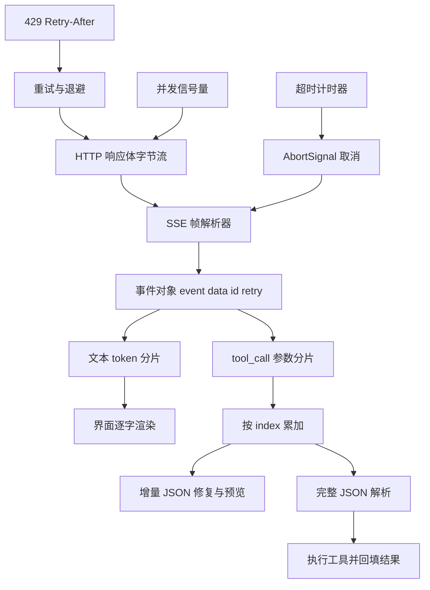
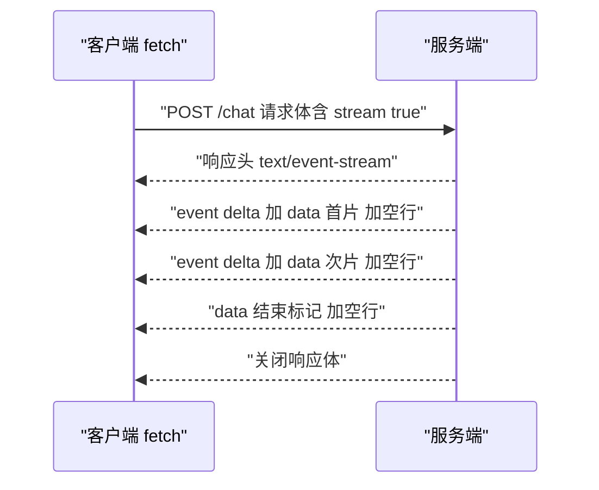
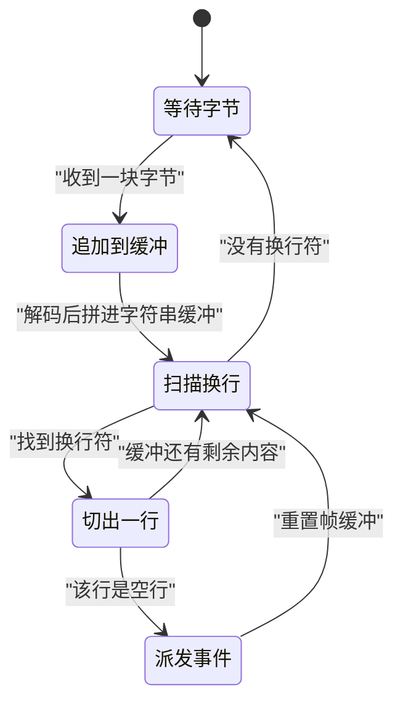
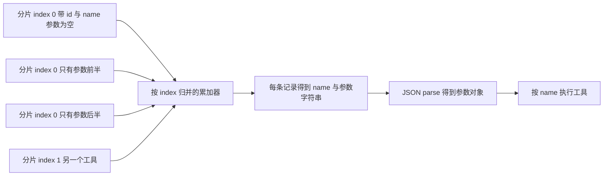
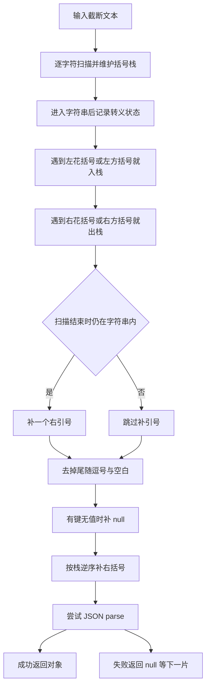
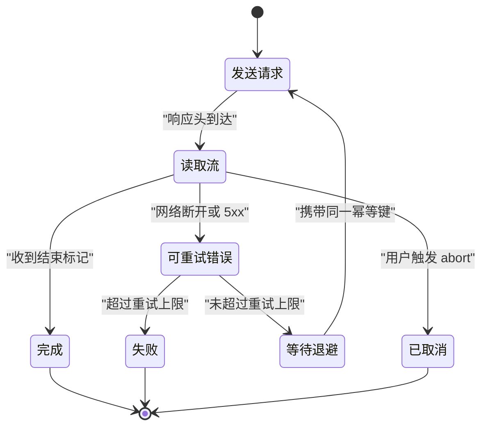
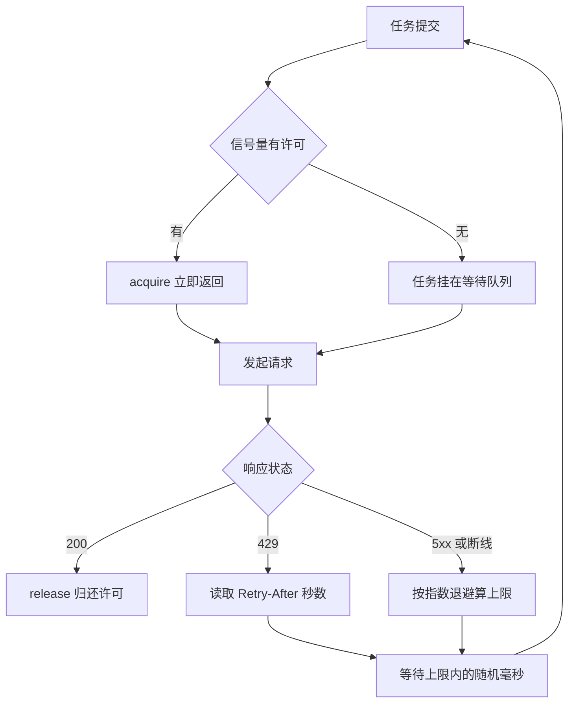

# LLM 流式输出与工具调用：SSE 解析与增量 JSON

!!! abstract "学完这一页你能"
    - 读懂服务端发来的每个 SSE 帧，说清 data、event、id、retry 四个字段各自的作用。
    - 手写一个能处理半帧到达、汉字被字节切断的 SSE 解析器，并逐条产出事件对象。
    - 把流式返回的 tool_call 分片按 index 拼成完整 JSON，并在只拼到一半时安全预览字段。
    - 用 AbortSignal 做取消与超时，用幂等键做重试，用全抖动退避与信号量守住限流。

## 0. 知识地图



建议这样读：先看第 1、2 节把字节变成事件对象，再看第 3、4 节把分片变成可用数据。
第 5、6 节是可靠性部分，处理取消、重试、限流三件事，可以在联调阶段回头精读。
每节末尾的动手验证脚本都能单独跑，跑通一节再进下一节。

!!! note "术语：SSE"
    SSE（Server-Sent Events，服务器发送事件）是在一个 HTTP 响应上单向持续推送文本的协议，媒体类型是 text/event-stream。例：POST 一个 chat 请求后，响应体不断追加 data 行。

!!! note "术语：帧"
    帧指从上一个空行之后到下一个空行之前的全部字段行。例：`data: a` 换行 `data: b` 换行 空行，构成一帧。

## 1. SSE 帧格式：data、event、id、retry 与空行分隔

**先想一个问题**

你打开 DevTools 的 Network 面板，点开 EventStream 标签，看到内容一行行往下长。
你想自己读这段流，却不知道哪几行属于同一条消息。
为什么两条 data 行要合成一条，而一个空行又能结束一条消息？

**心智模型**

!!! tip "心智模型"
    一句话模型：SSE 是以空行结尾的纯文本信封，帧内每行写一个字段名和值。
    日常类比：像快递箱，箱口用一条空白胶带封住，箱内小票写字段名加字段值。
    类比不成立处：箱子尺寸固定，而一帧可以任意长，可能跨多次网络到达，也可能一次到达含多帧。

!!! note "术语：字段行"
    字段行是帧里的一行文本，形如 `字段名: 值`。例：`event: delta` 的字段名是 event，值是 delta。

先看一个具体的帧，再逐字段拆。

```text
event: delta
data: {"t":"你"
data: 好"}
id: 42
retry: 3000
```

**图解**



1. 客户端发出一次 POST，请求体里声明要流式返回。
2. 服务端先回响应头，声明媒体类型是 text/event-stream。
3. 服务端写入第一帧，帧内 event 是 delta，data 是首片文本。
4. 空行使第一帧生效，客户端此时才派发事件。
5. 服务端继续写第二帧，data 是次片文本，同样以空行收尾。
6. 服务端写入结束标记并关闭响应体，客户端结束读取循环。

**一步一步来**

第 1 步：把响应体文本切成字段行，并把一行拆成字段名与字段值。

```js
// 输入：响应体文本；输出：字段行数组
function toLines(text) {
  // 协议允许 \n、\r\n、\r 三种换行，先归一化成 \n
  return text.replace(/\r\n|\r/g, "\n").split("\n");
}
// 一行形如 "data: {...}"，冒号后可带一个空格
function parseField(line) {
  const i = line.indexOf(":");                 // 找第一个冒号的位置
  if (i === -1) return { name: line, value: "" }; // 无冒号时整行是字段名
  let value = line.slice(i + 1);
  if (value.startsWith(" ")) value = value.slice(1); // 只吞掉一个前导空格
  return { name: line.slice(0, i), value };
}
```

**这段代码在做什么**

- 换行归一化：三种换行符统一成 `\n`，切分逻辑只需要处理一种情况。
- 冒号是字段名与值的分界，只取第一个冒号，值里可以再出现冒号。
- 冒号后的第一个空格是分隔用的，被吞掉；第二个空格属于值本身。
- 没有冒号的行按协议当成字段名，值为空串。
- 以冒号开头的行是注释，后续由解析器丢弃。

运行结果：`parseField('data: {"a":1}')` 得到 `{ name: "data", value: '{"a":1}' }`。

第 2 步：把一帧内的多行字段合并成一个事件对象。

```js
function parseFrame(lines) {
  // 未写 event 时默认 message，未写 data 时是空串
  const out = { event: "message", data: "", id: undefined, retry: undefined };
  for (const line of lines) {
    if (line === "" || line.startsWith(":")) continue; // 空行与注释跳过
    const { name, value } = parseField(line);
    if (name === "data") out.data += value + "\n";     // data 行用换行追加
    else if (name === "event") out.event = value;      // 后写的 event 覆盖先写的
    else if (name === "id") out.id = value;
    else if (name === "retry") out.retry = Number(value);
  }
  if (out.data.endsWith("\n")) out.data = out.data.slice(0, -1); // 去掉末尾换行
  return out;
}
```

**这段代码在做什么**

- data 是多行累加，每行补一个 `\n`，最后再删掉末尾那个。
- event、id、retry 是覆盖式赋值，同一帧写两次以最后一次为准。
- 注释行以冒号开头，直接跳过，不会被当作字段。
- retry 用 `Number` 转成数字，单位是毫秒。
- 默认 event 是 message，这样客户端只写一个分支也能处理。

运行结果：两行 data 合成一条，值中间带一个 `\n`。

第 3 步：用空行作为切帧标志，把整段文本拆成帧序列。

```js
function frames(text) {
  const res = [];
  let buf = [];
  for (const line of toLines(text)) {
    if (line === "") {                 // 空行表示一个帧到此结束
      if (buf.length) res.push(parseFrame(buf)); // 有内容才派发
      buf = [];                        // 清空缓冲，准备下一帧
    } else {
      buf.push(line);                  // 非空行先攒在缓冲里
    }
  }
  return res;
}
```

**这段代码在做什么**

- 空行是唯一的帧边界，不需要看 data 内容。
- 连续的多个空行只会派发一次，因为派发后缓冲已清空。
- 末尾若没有空行，最后一帧不会派发，这符合协议的流未结束语义。
- 帧内行序不影响结果，只有 data 的拼接顺序按出现位置。

运行结果：`frames` 返回长度为 2 的数组，第一帧带 event，第二帧用默认 event。

**动手验证**

```js
// 依赖：无。Node 20+ 运行：node sse-frames.mjs
import assert from "node:assert/strict";

function toLines(text) {
  return text.replace(/\r\n|\r/g, "\n").split("\n");
}
function parseField(line) {
  const i = line.indexOf(":");
  if (i === -1) return { name: line, value: "" };
  let value = line.slice(i + 1);
  if (value.startsWith(" ")) value = value.slice(1);
  return { name: line.slice(0, i), value };
}
function parseFrame(lines) {
  const out = { event: "message", data: "", id: undefined, retry: undefined };
  for (const line of lines) {
    if (line === "" || line.startsWith(":")) continue;
    const { name, value } = parseField(line);
    if (name === "data") out.data += value + "\n";
    else if (name === "event") out.event = value;
    else if (name === "id") out.id = value;
    else if (name === "retry") out.retry = Number(value);
  }
  if (out.data.endsWith("\n")) out.data = out.data.slice(0, -1);
  return out;
}
function frames(text) {
  const res = [];
  let buf = [];
  for (const line of toLines(text)) {
    if (line === "") { if (buf.length) res.push(parseFrame(buf)); buf = []; }
    else buf.push(line);
  }
  return res;
}

const raw = 'event: delta\ndata: {"t":"你"\n\ndata: {"t":"好"}\n\n: 心跳\n\n';
const out = frames(raw);
assert.equal(out.length, 2);
assert.equal(out[0].event, "delta");
assert.equal(out[0].data, '{"t":"你"');
assert.equal(out[1].event, "message");
assert.equal(out[1].data, '{"t":"好"}');
assert.equal(out[0].retry, undefined);
console.log("帧解析通过", JSON.stringify(out));
```

预期输出：`帧解析通过 [{"event":"delta","data":"{\"t\":\"你\""},...]`。

**常见坑**

|:--|:--|:--|
| 现象 | 原因 | 怎么修 |
| 汉字变成乱码方框 | 按字节切分而没有用 TextDecoder | 用 `TextDecoder` 的 stream 模式解码 |
| 少收了最后一条消息 | 末尾没有空行，切帧逻辑不派发 | 流结束时显式收尾一次 |
| data 里多出一个换行 | 拼接时补了 `\n` 却没删末尾 | 派发前删掉最后一个 `\n` |
| retry 变成字符串 | 忘了做数字转换 | 用 `Number(value)` 并在 NaN 时忽略 |
| 心跳帧被当成消息 | 注释行被当作字段解析 | 以冒号开头的行直接跳过 |

**小结**

- 空行是帧边界，data 多行拼接，event、id、retry 覆盖赋值。
- 字段名与值由第一个冒号分隔，冒号后一个空格属于协议分隔符。
- 协议允许三种换行，先归一化可以少写一半分支。

## 2. 手写 SSE 解析器：分块到达与半帧缓冲

**先想一个问题**

网络一次给你的不是整帧，而是 4KB 到 64KB 的碎片。
某个碎片结尾停在 `data: {"na` 中间，下一个碎片才带来后半截。
如果每个碎片单独解析，这一段字符就丢了，你怎么保证一个字符都不丢？

**心智模型**

!!! tip "心智模型"
    一句话模型：解析器是一台只吃完整行的机器，行不完整就留在缓冲里等下一块。
    日常类比：像用带刻度的漏斗接水，水位不到刻度线不读数。
    类比不成立处：水可以任意分次倒，而 UTF-8 汉字占 3 字节，被切成 1 加 2 时连文本都不完整。

!!! note "术语：TextDecoder 的 stream 模式"
    用一个复用的解码器分多次解码字节，自动保留跨块的不完整多字节序列。例：先喂 `E4 BD` 再喂 `A0`，第二次解码才吐出汉字 你。

**图解**



1. 等待字节：解析器处于空闲，持有一个字符串缓冲和一个帧内行数组。
2. 追加到缓冲：收到一块字节，用解码器解码后拼到字符串缓冲尾部。
3. 扫描换行：在缓冲里找 `\n` 的下标，找不到就回到等待状态。
4. 切出一行：把换行之前的部分切出来，缓冲只留换行之后的部分。
5. 判断该行：非空行推进帧内行数组，空行触发派发。
6. 派发事件：把帧内行数组合并成事件对象交给回调，然后清空帧内数组。

**一步一步来**

第 1 步：准备帧缓冲、行缓冲，并写一个把帧内行数组变成事件对象的函数。

```js
function createFlusher() {
  let pending = [];                     // 当前帧已收到的字段行
  return {
    add(line) { pending.push(line); },  // 收到一个非空行
    flush() {
      const out = { event: "message", data: "", id: undefined, retry: undefined };
      for (const line of pending) {
        if (line.startsWith(":")) continue;          // 注释行丢弃
        const i = line.indexOf(":");
        const name = i === -1 ? line : line.slice(0, i);
        let value = i === -1 ? "" : line.slice(i + 1);
        if (value.startsWith(" ")) value = value.slice(1);
        if (name === "data") out.data += value + "\n";
        else if (name === "event") out.event = value;
        else if (name === "id") out.id = value;
        else if (name === "retry") out.retry = Number(value);
      }
      pending = [];                                   // 派发后必须清空
      if (out.data.endsWith("\n")) out.data = out.data.slice(0, -1);
      return out;
    },
  };
}
```

**这段代码在做什么**

- `pending` 是闭包变量，同一帧的多个字段行按到达顺序累积。
- 派发后立刻把 `pending` 置空，否则下一帧会带上上一帧的行。
- 帧缓冲与行缓冲分开，帧的语义不会泄漏到切行逻辑里。
- 注释行在派发阶段丢掉，切行阶段不判断。

运行结果：`createFlusher()` 返回两个方法，`add` 累积，`flush` 产出对象。

第 2 步：写 push 函数，把字节块解码、切行、按空行派发。

```js
function createSSEParser(onEvent) {
  const decoder = new TextDecoder("utf-8"); // 复用，跨块保留半个汉字
  const flusher = createFlusher();
  let buf = "";
  return function push(bytes) {
    buf += decoder.decode(bytes, { stream: true }); // stream 表示后面还有字节
    let idx;
    while ((idx = buf.indexOf("\n")) !== -1) {      // 只要缓冲里有换行
      let line = buf.slice(0, idx);                 // 切出换行前的一行
      buf = buf.slice(idx + 1);                     // 缓冲留下换行后的部分
      if (line.endsWith("\r")) line = line.slice(0, -1); // 处理 CRLF 结尾
      if (line === "") onEvent(flusher.flush());    // 空行触发派发
      else flusher.add(line);                       // 普通行推进帧缓冲
    }
  };
}
```

**这段代码在做什么**

- `decoder.decode(bytes, { stream: true })` 是防乱码的关键，半个汉字留在解码器内部。
- `while` 而不是 `if`，因为一块字节里可能含多行甚至多帧。
- 切走的行从缓冲里删除，未成行的部分自然留在缓冲等下一块。
- 没有换行时循环体一次都不执行，缓冲原样保留。
- CRLF 的 `\r` 在切行后单独删掉，保证字段值不带回车。

运行结果：连续 push 三块碎片，回调只在前两块各自的空行处触发。

第 3 步：流结束时收尾，把解码器里的残留字节和未成行的缓冲处理掉。

```js
function finish(push, decoder) {
  // decode 不带参数表示不再有后续字节，强制吐出可解码的残留
  const tail = decoder.decode();
  if (tail) push(new TextEncoder().encode(tail)); // 走同一条切行逻辑
  return tail;
}
```

**这段代码在做什么**

- 结束时必须再调一次 `decoder.decode()`，否则最后一个汉字可能被吞。
- 残留文本仍要送进 push，让切行与派发逻辑只有一份。
- 若最后一帧没有空行结尾，按协议这帧视为未完成，不派发。
- `finish` 的返回值用于调试打印，生产代码可忽略。

运行结果：正常流下 `finish` 返回空串；被截断的流会返回残留字符。

**动手验证**

```js
// 依赖：无。Node 20+ 运行：node sse-parser.mjs
import assert from "node:assert/strict";
// 把上面三步的 createFlusher、createSSEParser 原样粘到这里

const events = [];
const push = createSSEParser((e) => events.push(e));
const text = 'event: delta\ndata: {"t":"你"\n\ndata: {"t":"好"}\n\n';
const bytes = new TextEncoder().encode(text);
for (let i = 0; i < bytes.length; i += 4) {         // 每 4 字节切一刀
  push(bytes.subarray(i, i + 4));                   // 汉字会被切在中间
}
assert.equal(events.length, 2);
assert.equal(events[0].event, "delta");
assert.equal(events[0].data, '{"t":"你"');           // 没有乱码
assert.equal(events[1].event, "message");
assert.equal(events[1].data, '{"t":"好"}');
const whole = new TextEncoder().encode(text);
const push2 = createSSEParser((e) => events.push(e));
push2(whole);                                        // 一次给全量
assert.equal(events.length, 4);                      // 结果与分片一致
console.log("分片与整块结果一致", events.length, "条");
```

预期输出：`分片与整块结果一致 4 条`。

**常见坑**

|:--|:--|:--|
| 现象 | 原因 | 怎么修 |
| 中文偶尔乱码 | 每块新建一个 TextDecoder | 复用同一个解码器并传 `stream: true` |
| 一整段只收到一条事件 | 用 `if` 只切了一行 | 改成 `while` 循环切到没有换行 |
| 第二帧带了第一帧的 data | 派发时忘了清空帧缓冲 | `flush` 内部把数组重置为空 |
| CRLF 流里字段值尾部多个字符 | 只按 `\n` 切，`\r` 留在值里 | 切行后删掉结尾的 `\r` |
| 最后一条消息丢了 | 没有收尾解码 | 结束时调用 `decoder.decode()` |

**小结**

- 缓冲是解析器的核心状态，只有找到换行才消费已确认的完整行。
- 复用 TextDecoder 是防乱码的最低成本做法。
- 一块字节可以包含多帧，切行必须用循环。

## 3. 流式 tool_call 参数的增量拼接

**先想一个问题**

模型决定调用 `get_weather`，参数是 `{"city":"杭州"}`。
流式返回把它切成三段：`{"ci`、`ty":"杭`、`州"}`，每段都带同一个 index。
你把这三次分片当成三个工具调用，就会发出三次错误请求，怎么避免？

**心智模型**

!!! tip "心智模型"
    一句话模型：index 是同一条工具调用的身份证，所有同号分片都累加到同一条记录上。
    日常类比：像拼图，每片背面写着同一张图的编号，编号相同就贴在同一张板上。
    类比不成立处：拼图顺序固定，而 arguments 分片顺序由服务端决定，不能自己重排字段。

!!! note "术语：tool_call"
    tool_call 是模型输出的结构化指令，包含工具名与 JSON 参数。例：`{"name":"get_weather","arguments":"{\"city\":\"杭州\"}"}`。

!!! note "术语：delta"
    delta 是流式响应里只含本次新增内容的对象。例：第二片只含 `ty":"杭` 这一段字符。

**图解**



1. 首个分片通常带 id 与 name，参数部分可能为空。
2. 后续分片只带 arguments 的一段字符串，id 与 name 不再出现。
3. 累加器以 index 为键，同号分片都落到同一条记录。
4. 参数按到达顺序首尾拼接，得到完整 JSON 文本。
5. 完整文本才能 `JSON.parse`，得到参数对象。
6. 用 name 找到工具实现并执行。

**一步一步来**

第 1 步：定义累加器结构，按 index 查找或新建记录。

```js
// 累加器是一张 Map，键是 tool_call 的 index
function ensure(map, index) {
  if (!map.has(index)) {
    // 首个分片才带 id 与 name，先占位，后续分片补齐
    map.set(index, { index, id: "", name: "", args: "" });
  }
  return map.get(index);
}
```

**这段代码在做什么**

- 用 Map 而不是数组，因为 index 不保证从 0 连续出现。
- 首次遇到某个 index 时建记录，id 与 name 先留空字符串。
- 记录里的 args 是字符串，不是对象，因为分片只保证是文本。
- 返回记录引用，调用方直接改字段，不需要再写回。

运行结果：`ensure(map, 0)` 返回 `{ index: 0, id: "", name: "", args: "" }`。

第 2 步：把一批分片应用到一个累加器上。

```js
function applyDeltas(map, toolCalls) {
  for (const d of toolCalls) {
    const item = ensure(map, d.index);            // 先按 index 找记录
    if (d.id) item.id = d.id;                     // id 只在首片出现
    if (d.function?.name) item.name = d.function.name; // name 同理
    if (d.function?.arguments) item.args += d.function.arguments; // 字符串首尾拼接
  }
  return map;
}
```

**这段代码在做什么**

- `+=` 是唯一正确的合并方式，不能在这里解析 JSON。
- `?.` 防止分片只带 arguments 时访问 name 抛错。
- 用 `if (d.id)` 而不是直接赋值，避免把首片的 id 用空值覆盖掉。
- 函数返回传入的 map，方便链式调用。

运行结果：三次 applyDeltas 后，记录的 args 等于 `{"city":"杭州"}`。

第 3 步：流结束后把参数字符串解析成对象，解析失败要兜底。

```js
function finalize(map) {
  return [...map.values()].map((item) => ({
    id: item.id,
    name: item.name,
    args: safeParse(item.args),   // 只在流结束后解析一次
  }));
}
function safeParse(text) {
  try { return JSON.parse(text); } catch { return {}; } // 失败时退化为空对象
}
```

**这段代码在做什么**

- 解析只做一次，放在流结束之后，避免每片都解析一遍。
- `safeParse` 返回空对象而不是抛出，让执行阶段能统一处理坏参数。
- 保留 name 与 id，执行工具时需要 name 定位实现，需要用 id 回填结果。
- `[...map.values()]` 把 Map 转成数组，顺序按首次插入的 index 排列。

运行结果：得到 `[{ id: "call_1", name: "get_weather", args: { city: "杭州" } }]`。

**动手验证**

```js
// 依赖：无。Node 20+ 运行：node toolcall.mjs
import assert from "node:assert/strict";
// 把上面三步的 ensure、applyDeltas、safeParse、finalize 原样粘到这里

const map = new Map();
const chunks = [
  [{ index: 0, id: "call_1", function: { name: "get_weather", arguments: '{"ci' } }],
  [{ index: 0, function: { arguments: 'ty":"杭' } }],
  [{ index: 0, function: { arguments: '州"}' } }],
  [{ index: 1, id: "call_2", function: { name: "get_time", arguments: "{}" } }],
];
for (const chunk of chunks) applyDeltas(map, chunk);
const calls = finalize(map);
assert.equal(calls.length, 2);
assert.equal(calls[0].name, "get_weather");
assert.deepEqual(calls[0].args, { city: "杭州" });
assert.equal(calls[1].args instanceof Object, true);
assert.deepEqual(finalize(new Map([[0, { index: 0, id: "x", name: "y", args: "{oops" }]])), [
  { id: "x", name: "y", args: {} },
]);
console.log("工具调用拼接通过", JSON.stringify(calls));
```

预期输出：`工具调用拼接通过 [{"id":"call_1","name":"get_weather","args":{"city":"杭州"}},...]`。

**常见坑**

|:--|:--|:--|
| 现象 | 原因 | 怎么修 |
| 同一个工具被调用三次 | 每个分片当成独立调用 | 以 index 为键归并 |
| 参数解析报错 | 在分片阶段就调了 JSON.parse | 分片只拼接字符串，结束时解析一次 |
| id 变成空字符串 | 后续分片用空值覆盖了首片 id | 仅当分片带值时才赋值 |
| Map 顺序看着不对 | index 不是从 0 连续出现 | 按输出顺序写回时以 index 排序 |
| name 访问抛错 | 分片里没有 function.name | 用可选链并在结束时校验 |

**小结**

- index 是分片归并的唯一依据，id 与 name 只在首片出现。
- 参数是字符串累加，解析时机放在流结束。
- 解析失败要兜底成空对象，不要让执行阶段抛错。

## 4. 增量 JSON 解析：部分 JSON 修复

**先想一个问题**

工具参数还在传，界面想显示"正在查询 杭州"。
此刻字符串是 `{"city":"杭`，`JSON.parse` 直接抛错。
你只有两个选择：什么都不显示，或者把截断文本修成合法 JSON 再读。

**心智模型**

!!! tip "心智模型"
    一句话模型：补全就是把截断的 JSON 按语法规则添上缺失的右引号与右括号。
    日常类比：像读被撕掉半句的便签，先把撕口补成完整句子再读它。
    类比不成立处：补全只用于读取已到达的字段，不能当作最终值，`1` 与 `12` 都是合法前缀。

!!! note "术语：部分 JSON 修复"
    把截断的 JSON 文本按语法规则补齐成可解析文本的过程。例：`{"a":[1,2` 补成 `{"a":[1,2]}`。

**图解**



1. 扫描从第一个字符开始，同时维护括号栈与字符串状态。
2. 进入字符串后，反斜杠开启转义，转义字符一律跳过。
3. 左花括号与左方括号入栈，记录还欠哪些右符号。
4. 右花括号与右方括号出栈，正常闭合会抵消。
5. 扫描结束时若仍在字符串内，说明引号没配对，补一个右引号。
6. 去掉尾随逗号，处理有键无值的情况，再按栈逆序补右括号。
7. 最后交给 `JSON.parse`，成功就拿对象，失败就等下一片。

**一步一步来**

第 1 步：扫描一趟，记录未闭合的括号栈与字符串状态。

```js
function scan(text) {
  const stack = [];                        // 存还欠的 "}" 或 "]"
  let inString = false, escape = false;
  for (const ch of text) {
    if (inString) {
      if (escape) escape = false;          // 转义后的字符按普通字符处理
      else if (ch === "\\") escape = true; // 反斜杠开启转义
      else if (ch === '"') inString = false; // 字符串闭合
      continue;
    }
    if (ch === '"') inString = true;
    else if (ch === "{") stack.push("}");
    else if (ch === "[") stack.push("]");
    else if (ch === "}" || ch === "]") stack.pop(); // 正常闭合就抵消
  }
  return { stack, inString, escape };
}
```

**这段代码在做什么**

- 用 `for...of` 按码点遍历，汉字不会被拆成两半。
- 字符串内的括号不参与计数，这是最容易写错的地方。
- 转义状态只为处理 `\"` 与 `\\` 两种情形。
- 栈里存的是要补的右符号，不是左符号，补全时直接顺序使用。

运行结果：`scan('{"a":[1,2')` 返回栈 `["]", "}"]`，`inString` 为 false。

第 2 步：按扫描结果补齐文本。

```js
function repair(text) {
  const { stack, inString, escape } = scan(text);
  let out = text;
  if (escape) out = out.slice(0, -1);       // 去掉悬空的单个反斜杠
  if (inString) out += '"';                 // 补齐未闭合的字符串
  out = out.replace(/[,\s]+$/, "");         // 去掉尾随逗号与空白
  if (out.endsWith(":")) out += "null";     // 有键无值时补 null
  for (let i = stack.length - 1; i >= 0; i--) out += stack[i]; // 逆序补右括号
  return out;
}
```

**这段代码在做什么**

- 悬空反斜杠必须删掉，否则补引号后仍不合法。
- 补引号要在补括号之前，否则引号会落在括号外面。
- 尾随逗号是常见截断点，删掉它比补一个值省事。
- `{"a":` 这种情况补 `null`，保证语法成立。
- 括号逆序补，因为栈顶是最内层。

运行结果：`repair('{"a":[1,2')` 得到 `{"a":[1,2]}`。

第 3 步：包一层解析函数，失败时返回 null 让调用方等下一片。

```js
function partialParse(text) {
  try {
    return JSON.parse(repair(text));   // 先修复再解析
  } catch {
    return null;                       // 修不好就交给下一片
  }
}
```

**这段代码在做什么**

- 修复不是万能的，例如文本停在 `{"a": tru`，补不出合法值。
- 返回 null 而不是抛错，调用方按 `if (value)` 判断即可。
- 每来一片都重跑一次，代价是文本长度的线性扫描。
- 生产代码可以对长度做上限，超过上限就放弃预览。

运行结果：`partialParse('{"city":"杭')` 返回 `{ city: "杭" }`。

**动手验证**

```js
// 依赖：无。Node 20+ 运行：node partial-json.mjs
import assert from "node:assert/strict";
// 把上面三步的 scan、repair、partialParse 原样粘到这里

assert.equal(repair('{"a":[1,2'), '{"a":[1,2]}');
assert.equal(repair('{"a":'), '{"a":null}');
assert.equal(repair('{"a":"x'), '{"a":"x"}');
assert.equal(repair('{"a":"x\\'), '{"a":"x"}');
assert.equal(repair('[1,2,'), '[1,2]');
assert.deepEqual(partialParse('{"city":"杭'), { city: "杭" });
assert.equal(partialParse('{"a": tru'), null);   // 补不出的情况返回 null
const stream = ['{"city":"杭', '州","unit":"c', '"}'];
let preview = null;
for (const piece of stream) {
  const acc = stream.slice(0, stream.indexOf(piece) + 1).join("");
  preview = partialParse(acc);
}
assert.deepEqual(preview, { city: "杭州", unit: "c" });
console.log("增量 JSON 修复通过", JSON.stringify(preview));
```

预期输出：`增量 JSON 修复通过 {"city":"杭州","unit":"c"}`。

**常见坑**

|:--|:--|:--|
| 现象 | 原因 | 怎么修 |
| 字符串里的括号被计数 | 扫描时没跳过字符串内部 | 用 inString 状态分流 |
| 修复后仍解析失败 | 悬空反斜杠没删 | 补引号前删掉结尾反斜杠 |
| 数字预览闪变 | 把 `1` 当成最终值 | 只在流结束后落库，中途只做预览 |
| 补出 `{"a":}` | 有键无值没处理 | 检测结尾冒号并补 null |
| 括号补反了 | 按栈顺序正向补 | 从栈顶开始逆序补 |

**小结**

- 修复分三步：扫描状态、补齐文本、尝试解析。
- 字符串状态是扫描器里最容易漏的分支。
- 修复只用于预览，最终值必须在流结束后确认。

## 5. 取消、超时、断线重试与幂等

**先想一个问题**

用户点了停止生成，但连接还在往下收数据，界面还在闪。
又或者服务端返回 502，你的代码立刻重试三次，账单里出现三条相同请求。
这两种情况分别该怎么做才不会浪费连接和额度？

**心智模型**

!!! tip "心智模型"
    一句话模型：取消是客户端主动断链，重试是客户端主动重连，两者都要让服务端认出同一个逻辑请求。
    日常类比：像电话占线后重拨，报同一个工单号，客服就知道不是新工单。
    类比不成立处：重试会重新发送整个请求体，没有幂等键时服务端会当成新请求计费。

!!! note "术语：AbortSignal"
    AbortSignal 是 fetch 的取消信号对象，触发 abort 后 fetch 以 AbortError 拒绝，响应体读取也会停止。例：`new AbortController().signal`。

!!! note "术语：幂等键"
    幂等键是请求头里的唯一字符串，服务端凭它判定重复请求并复用首次结果。例：`Idempotency-Key: 7f3c-42`。

**图解**



1. 发送请求，带上 AbortSignal 与幂等键。
2. 响应头到达后进入读取流状态，逐块解析。
3. 收到结束标记就完成，清掉超时计时器。
4. 用户触发 abort，读取循环抛出 AbortError，直接终止不再重试。
5. 网络断开或服务端 5xx 归入可重试错误。
6. 未超上限则等待退避，再带着同一个幂等键回到发送请求。
7. 超过上限标记失败，向上层抛出最后一次错误。

**一步一步来**

第 1 步：把外部取消信号与超时计时器合并成一个信号。

```js
function withTimeout(ms, outer) {
  const ctrl = new AbortController();
  const timer = setTimeout(() => ctrl.abort(new Error("timeout")), ms);
  // 外部取消与超时任一触发都要中止请求
  const signal = outer ? AbortSignal.any([outer, ctrl.signal]) : ctrl.signal;
  return { signal, done: () => clearTimeout(timer) }; // 用完必须清计时器
}
```

**这段代码在做什么**

- `AbortSignal.any` 把两个信号合成一个，任一触发就中止。
- 超时原因带在 `abort` 参数上，方便日志区分超时与人为取消。
- 返回的 `done` 必须在响应结束后调用，否则计时器会拖住进程。
- Node 20 起提供 `AbortSignal.any`，需核对官方文档：AbortSignal.any 的起始版本与降级写法。

运行结果：`withTimeout(50, undefined).signal` 在 50 毫秒后变为 aborted。

第 2 步：读取响应体时逐块检查取消标志。

```js
async function readStream(res, onText, signal) {
  const decoder = new TextDecoder("utf-8");
  for await (const bytes of res.body) {       // Node 20 的 body 是 ReadableStream
    if (signal.aborted) throw signal.reason;  // 每块之前检查一次
    onText(decoder.decode(bytes, { stream: true }));
  }
  onText(decoder.decode());                   // 收尾解码，吐出残留字节
}
```

**这段代码在做什么**

- `for await` 逐块读取，读取本身也会被 signal 打断。
- 主动检查 `signal.aborted` 是为了在 abort 后立刻停下，不等下一块。
- 抛出 `signal.reason` 而不是新建错误，上层能拿到超时原因。
- 循环外补一次 `decode()`，保证最后一个汉字不被吞。

运行结果：abort 后循环抛出 reason 为 `Error: timeout` 的错误。

第 3 步：写重试包装器，区分可重试错误与不可重试错误。

```js
async function requestWithRetry(url, init, { retries = 3, signal, sleep } = {}) {
  for (let attempt = 1; attempt <= retries + 1; attempt++) {
    try {
      const res = await fetch(url, { ...init, signal });
      if (res.status === 429 || res.status >= 500) { // 只重试这两类状态
        if (attempt > retries) return res;           // 次数用完直接返回
        await sleep(500 * 2 ** (attempt - 1));       // 退避后重来
        continue;
      }
      return res;                                     // 其余状态直接返回
    } catch (err) {
      if (err.name === "AbortError") throw err;       // 取消不重试
      if (attempt > retries) throw err;               // 次数用完抛出
      await sleep(500 * 2 ** (attempt - 1));
    }
  }
}
```

**这段代码在做什么**

- `retries + 1` 是总尝试次数，第一次不算重试。
- 4xx 中只有 429 重试，401 与 400 重试没有意义。
- AbortError 直接抛出，取消不能触发重试。
- `sleep` 通过参数注入，测试时不用真的等待。
- init 里的请求头要带同一个幂等键，这一点在调用处保证。

运行结果：前两次 502、第三次 200 时，`sleep` 被调用两次，等待 500 与 1000 毫秒。

**动手验证**

```js
// 依赖：无。Node 20+ 运行：node retry.mjs
import assert from "node:assert/strict";
// 把上面三步的 withTimeout、readStream、requestWithRetry 原样粘到这里

const waits = [];
const sleep = async (ms) => { waits.push(ms); };
const statuses = [502, 429, 200];
let calls = 0;
globalThis.fetch = async () => ({                 // 用假 fetch 替换真实网络
  status: statuses[calls++],
  body: null,
});
const res = await requestWithRetry("http://x", { headers: { "Idempotency-Key": "k1" } }, {
  retries: 3, sleep,
});
assert.equal(res.status, 200);
assert.equal(calls, 3);
assert.deepEqual(waits, [500, 1000]);             // 指数退避两次
let aborted = false;
try {
  const ctrl = new AbortController();
  ctrl.abort();
  await readStream({ body: (async function* () { yield new Uint8Array([65]); })() }, () => {}, ctrl.signal);
} catch (e) { aborted = true; }
assert.equal(aborted, true);                      // 取消后立即停止
console.log("重试次数", calls, "退避序列", waits.join(","));
```

预期输出：`重试次数 3 退避序列 500,1000`。

**常见坑**

|:--|:--|:--|
| 现象 | 原因 | 怎么修 |
| 点了停止还在收数据 | 只中断了 fetch，没有中断读取循环 | 在循环里检查 `signal.aborted` |
| 进程不退出 | 超时计时器没清理 | 响应结束后调用 `done()` |
| 401 被重试三次 | 重试条件写成所有非 2xx | 只对 429 与 5xx 重试 |
| 服务端出现三条记录 | 重试没带幂等键 | 每次重试复用同一个幂等键 |
| 超时与取消分不清 | abort 不带原因 | `abort` 时传入 Error 并在日志里打印 |

**小结**

- 取消要同时覆盖 fetch 与读取循环，否则读循环会继续跑。
- 重试只针对 429 与 5xx，取消与 4xx 不重试。
- 幂等键是重试安全的前提，没有它就只能靠服务端去重。

## 6. 限流、429 退避抖动与客户端并发信号量

**先想一个问题**

你同时发起 20 个流式请求，服务端回 429 并给出 `Retry-After: 2`。
如果 20 个请求都在同一毫秒重试，第二波又是 20 个请求撞上去。
客户端先做哪两件事，才能让重试不再同步？

**心智模型**

!!! tip "心智模型"
    一句话模型：退避把重试时间随机撒开，信号量把同时在飞的请求数钉在上限。
    日常类比：像只有 3 个收银台的超市，来人排队，放行速度由收银台数量决定。
    类比不成立处：收银台数量固定，而信号量可以按 429 响应临时下调并发上限。

!!! note "术语：指数退避"
    指数退避指第 n 次重试等待基数的 2 的 n 减 1 次方毫秒。例：基数 500 时依次等待 500、1000、2000 毫秒。

!!! note "术语：全抖动"
    全抖动指在 0 到退避上限之间取随机值作为等待时间。例：上限 2000 时等待 137 毫秒也合法。

!!! note "术语：信号量"
    信号量是一个计数许可池，acquire 取许可、release 还许可，许可为 0 时 acquire 排队。例：上限 4 时第 5 个请求等待。

**图解**



1. 任务提交后先尝试拿许可，许可池没空位就排队。
2. 拿到许可的任务才能发请求，这一步保证并发不超标。
3. 响应为 200 时归还许可，让队列里的下一个任务继续。
4. 响应为 429 时优先读 Retry-After，按服务端给的秒数等待。
5. 5xx 或断线则用指数退避算出等待上限。
6. 在上限内取随机毫秒，避免同一批任务同时醒来。
7. 等待结束后重新进入提交阶段，仍然要先抢许可。

**一步一步来**

第 1 步：写一个先进先出的信号量。

```js
class Semaphore {
  constructor(limit) {
    this.limit = limit;   // 同时允许的在飞任务数
    this.active = 0;      // 当前已占用许可数
    this.queue = [];      // 等待中的 resolve 函数队列
  }
  acquire() {
    if (this.active < this.limit) { this.active++; return Promise.resolve(); }
    return new Promise((resolve) => this.queue.push(resolve)); // 排队挂起
  }
  release() {
    const next = this.queue.shift();
    if (next) next();     // 直接把许可转给队首，active 不变
    else this.active--;   // 没人排队才真正归还计数
  }
}
```

**这段代码在做什么**

- 许可转交而不是先减再加，避免队首被其他任务插队。
- `queue` 存 resolve 函数，先进先出保证公平。
- `release` 调用次数超过占用数会出错，调用方必须成对写。
- 上限可以在 429 之后临时调小，改 `limit` 即可。

运行结果：上限 2 时，`Promise.all([acquire(), acquire(), acquire()])` 的第三个会挂起。

第 2 步：计算等待时间，优先听服务端，其次用全抖动。

```js
function backoffDelay(attempt, { base = 500, cap = 8000, retryAfter } = {}) {
  if (retryAfter !== undefined) {
    return Math.min(retryAfter * 1000, cap);  // 服务端给了秒数就照做
  }
  const ceiling = Math.min(cap, base * 2 ** (attempt - 1)); // 指数增长并封顶
  return Math.floor(Math.random() * (ceiling + 1));          // 全抖动
}
```

**这段代码在做什么**

- Retry-After 的单位是秒，要乘 1000 换成毫秒。
- 封顶是防止第 10 次重试等上十几分钟。
- 全抖动让同一批任务的等待时间分散开，不再同刻重试。
- 返回整数毫秒，方便测试里断言范围。

运行结果：`backoffDelay(1, {})` 返回 0 到 500 之间的随机整数。

第 3 步：把信号量与退避组合进一个受限请求函数。

```js
async function limitedRequest(task, { sem, retries = 3, sleep }) {
  await sem.acquire();                       // 先抢许可，再发请求
  try {
    for (let attempt = 1; attempt <= retries + 1; attempt++) {
      const { status, retryAfter } = await task(attempt); // task 返回状态与提示
      if (status !== 429 && status < 500) return status;  // 成功或不可重试
      if (attempt > retries) return status;
      await sleep(backoffDelay(attempt, { retryAfter })); // 抖动等待
    }
  } finally {
    sem.release();                           // 无论成功失败都要还许可
  }
}
```

**这段代码在做什么**

- `finally` 保证异常路径也会归还许可，否则许可池会永久漏掉一个。
- `task` 返回状态与 Retry-After，网络细节留在 task 内部。
- 429 与 5xx 走同一段退避逻辑，只是等待上限的来源不同。
- 许可在整个重试周期内保持占用，重试不会挤掉别的任务。

运行结果：上限 2 时同时发起 4 个请求，并发峰值始终为 2。

**动手验证**

```js
// 依赖：无。Node 20+ 运行：node semaphore.mjs
import assert from "node:assert/strict";
// 把上面三步的 Semaphore、backoffDelay、limitedRequest 原样粘到这里

const waits = [];
const sleep = async (ms) => { waits.push(ms); };
const sem = new Semaphore(2);
let active = 0, peak = 0;
const statusPlan = [[429, 2], [200], [200], [200]];
const tasks = statusPlan.map((plan) => async (attempt) => {
  active++; peak = Math.max(peak, active);   // 记录并发峰值
  await Promise.resolve();
  active--;
  const r = plan[attempt - 1] ?? plan[plan.length - 1];
  return Array.isArray(r) ? { status: r[0], retryAfter: r[1] } : { status: r };
});
const results = await Promise.all(tasks.map((t) => limitedRequest(t, { sem, sleep })));
assert.deepEqual(results, [200, 200, 200, 200]);
assert.equal(peak <= 2, true);                // 并发从未超过信号量上限
assert.equal(waits[0], 2000);                 // Retry-After 2 秒优先于抖动
assert.equal(sem.active, 0);                  // 全部许可已归还
console.log("并发峰值", peak, "首次等待", waits[0], "剩余许可", sem.active);
```

预期输出：`并发峰值 2 首次等待 2000 剩余许可 0`。

**常见坑**

|:--|:--|:--|
| 现象 | 原因 | 怎么修 |
| 并发数超出上限 | 先发请求后抢许可 | 把 acquire 放在发请求之前 |
| 跑一会就卡死 | 异常路径没归还许可 | 用 try 加 finally 包住 release |
| 429 后第二波又被限流 | 重试时间没有抖动 | 用全抖动在 0 到上限间取随机值 |
| 等待时间长达十几分钟 | 退避没有封顶 | 给 `cap` 设上限并取较小值 |
| 队首任务饿死 | release 时先减计数再唤醒 | 直接把许可转交给队首 |

**小结**

- 信号量管并发，退避抖动管重试节奏，两件事分开实现再组合。
- 许可必须在 finally 中归还，否则并发池会越用越小。
- 服务端给了 Retry-After 就照做，比客户端自己算更准。

## 综合对比

|:--|:--|:--|:--|
| 维度 | SSE | WebSocket | 短轮询 |
| 传输层 | 一个 HTTP 响应 | 先 HTTP 升级再走独立协议 | 每次新建 HTTP 请求 |
| 方向 | 服务端到客户端单向 | 双向 | 客户端拉一次得一次 |
| 媒体类型 | text/event-stream | 二进制帧 | 由接口自行决定 |
| 断线重连 | 由客户端自己实现 | 由客户端自己实现 | 下一次请求天然重连 |
| 二进制支持 | 无，需 Base64 | 原生支持 | 取决接口 |
| 代理兼容 | 走普通 HTTP，兼容面广 | 部分代理会拦升级请求 | 兼容面最广 |
| 消息边界 | 空行分隔 | 帧自带边界 | 每次响应即一条 |
| 限流友好度 | 一个请求长连，占用连接数 | 同 SSE | 请求数等于轮询次数，容易被限流 |
| 本页适用处 | 直接对接 | 需要双向时另写一套 | 只用于不支持流式时的降级 |

## 应用与行业实践

### 应用场景地图

| 场景 | 用到的本页知识点 | 典型技术选型 | 注意事项 |
| --- | --- | --- | --- |
| 后台管理的万行表格，按自然语言生成筛选条件 | 流式 tool_call 分片拼接、增量 JSON 预览 | fetch + ReadableStream + 自写 SSE 解析器 | 反向代理会缓冲响应，先确认响应头与网关配置再判断首帧时间 |
| 低端安卓的首屏文案逐字出现 | 半帧缓冲、汉字被字节切断 | TextDecoder 的 stream 模式 + requestAnimationFrame 合并渲染 | 每帧只提交一次状态，避免长任务占住主线程 |
| 多人协作白板，AI 生成图形指令 | 增量 JSON 的部分修复、按 index 拼接 | CRDT 文档 + 本地草稿层 | 半截 JSON 只画在草稿层，完整解析成功后再写入共享文档 |
| 客服工单助手，边聊边建单 | 流式 tool_call、幂等键、取消与超时 | fetch + AbortSignal + 幂等键表 | 重试要带同一个幂等键，否则同一诉求开出两张单 |
| IDE 代码补全插件 | SSE 帧解析、取消与超时 | Node 端 fetch + AbortSignal.timeout | 取消后要丢弃在途分片，旧补丁会覆盖新光标位置的代码 |
| 车载语音助手在弱网隧道里 | data、event、id、retry 四字段语义，断线重连 | 浏览器 EventSource 或手写重连 | EventSource 不能带自定义请求头，需要鉴权时改手写解析 |
| 跨境电商商品标题批量生成 | 客户端并发信号量、429 退避抖动 | 信号量库 + Retry-After 响应头 | 按 Retry-After 决定等待时长，固定间隔会把重试打进同一个限流窗口 |
| 会议纪要实时摘要 | data 与 event 区分内容与结束信号 | EventSource + 服务端事件缓冲 | retry 只在浏览器决定重连时生效，业务侧的重试要自己写 |

### 三个场景拆解

#### 场景 1：后台管理的万行表格，AI 生成筛选条件

**业务背景**：运营在后台用一句话描述筛选条件，条件由模型以 tool_call 参数形式返回。表格行数在万级，用户从按下回车到看见第一段条件文本的容忍度在 1 秒上下，这段等待可以用 PerformanceObserver 打点复现。

**怎么用本页知识解决**：先按空行切帧，把同一 index 的参数分片累加成字符串，再对半截字符串做部分解析，只把已闭合的字段渲染成"正在生成"的条件标签。

```js
const res = await fetch("/api/filter", { method: "POST", signal, body });
const reader = res.body.getReader();          // 拿到字节流读取器
const decoder = new TextDecoder("utf-8");     // 跨块保持解码状态
const calls = [];                             // 按 index 存工具调用分片
let buf = "";
for (;;) {
  const { value, done } = await reader.read();
  if (done) break;
  buf += decoder.decode(value, { stream: true }); // 半帧留在 buf 里
  const frames = buf.split("\n\n");           // 空行分隔一个 SSE 帧
  buf = frames.pop();                         // 尾段可能不完整，留到下一块
  for (const f of frames) {
    const d = parseFrame(f);                  // 取出 data: 后的 JSON
    for (const tc of d.choices[0].delta.tool_calls ?? []) {
      calls[tc.index] ??= { name: "", args: "" };
      calls[tc.index].args += tc.function?.arguments ?? ""; // 参数按文本累加
    }
    table.preview(parsePartial(calls[0]?.args)); // 半个 JSON 也能预览
  }
}
```

- 按 index 存分片：同一轮返回两个工具调用时，参数不会接到另一个对象上。
- 参数是字符串分片：先累加再整体 JSON.parse，不要逐片解析。
- 半个 JSON 只用于预览：读不到的字段留空，done 到达后再真正提交查询。
- 解码用 stream 模式：汉字被切在两块之间时，TextDecoder 会留住残余字节。
- 空行才算一帧：用 `\n\n` 切分，尾部片段留在 buf 里等下一块。

**怎么度量收益**：在客户端记录"发送请求"到"首个条件标签上屏"的时间差，用 PerformanceObserver 的 measure 条目上报。用 Chrome DevTools 的 Network 面板里的 EventStream 视图看每帧到达时刻，确认首帧没有卡在网关缓冲区。服务端记录首帧下发耗时与整段耗时两个值，看差值。

**什么时候不该用**：筛选条件只有三个字段、整段 JSON 不到 100 字节时，分帧与拼接的代码量高于收益，直接一次返回。另一类反例是条件必须整体做语法校验才能下发数据库，半截预览会让用户看到随后被撤销的条件。

#### 场景 2：低端安卓的首屏加载

**业务背景**：低端安卓机在首屏展示模型生成的简介，用户等的是第一行字出现。逐 token 调用 setState 会让渲染次数等于 token 数，主线程被排满，可以在 Chrome DevTools 的 Performance 面板开启 4 倍 CPU 降速复现。

**怎么用本页知识解决**：把解码出来的文本增量先攒起来，用 requestAnimationFrame 合并成每帧一次状态提交，同时用 TextDecoder 的 stream 模式处理跨块的半个汉字。

```js
const [text, setText] = useState("");
useEffect(() => {
  const ac = new AbortController();
  let pending = "", raf = 0;
  const flush = () => { raf = 0; if (pending) { setText(t => t + pending); pending = ""; } };
  (async () => {
    const res = await fetch(url, { signal: ac.signal });
    const reader = res.body.getReader();
    const dec = new TextDecoder("utf-8");
    for (;;) {
      const { value, done } = await reader.read();
      if (done) break;
      pending += extractDelta(dec.decode(value, { stream: true })); // 只取文本增量
      if (!raf) raf = requestAnimationFrame(flush);  // 合并到下一帧提交
    }
    flush();                                          // 收尾提交剩余文本
  })();
  return () => { ac.abort(); cancelAnimationFrame(raf); }; // 卸载即取消
}, [url]);
```

- requestAnimationFrame 把多次增量合并成每帧一次提交，渲染次数与帧数对齐。
- TextDecoder 的 stream 模式保留跨块的残余字节，中文不会出现乱码。
- 卸载时 abort 与 cancelAnimationFrame 一起做，已取消的流不会再写入状态。
- 首帧到达前渲染占位块，文本增长不会把下方内容反复推走。
- 取消后丢弃在途分片，否则旧会话的尾部文字会追加到新会话。

**怎么度量收益**：在 Performance 面板里看 long task 的总时长与条目数，对比合并渲染前后。用 PerformanceObserver 订阅 longtask 类型条目并上报条数。用 web-vitals 取的 INP 与 Lighthouse 移动端节流下的 TBT 作为页面级指标。

**什么时候不该用**：如果整段文本固定在一屏以内、一次响应就能返回，分帧解析只是多出一条代码路径。另一个反例是首屏布局依赖全文长度，例如字号要按总字数自适应，边到边渲染会触发第二次重排。

#### 场景 3：多人协作白板

**业务背景**：白板上多人同时作图，AI 按口令生成图形指令，指令以 tool_call 参数的 JSON 分片返回。协作文档用 CRDT 同步，写进去的每个中间态都会广播给全部在线端。

**怎么用本页知识解决**：分片只在本地草稿层预览，完整 JSON 解析成功后一次性写入共享文档，写入时用图形 id 作为幂等键。

```js
let acc = "";
onDelta(d => {
  acc += d;                          // 按 index 累加分片
  const preview = readPartial(acc);  // 半截 JSON 只读已闭合字段
  ghostLayer.update(preview);        // 画在本地草稿层，别的端看不到
});
onDone(() => {
  const shape = JSON.parse(acc);     // 只有完整时才解析
  doc.apply(shape, { idempotencyKey: shape.id }); // 同 key 重复提交只建一次
  ghostLayer.clear();                // 清掉草稿层
});
```

- acc 按 index 分开保存，两个图形同时生成时参数不会串位。
- readPartial 只读取已闭合的字段，缺失字段用默认值补，不抛异常。
- ghostLayer 是本端图层，不参与 CRDT 同步，草稿不会广播出去。
- 落库前整体 JSON.parse，解析失败就整条丢弃并按原 index 重取。
- 幂等键取图形 id，网络重试不会在白板上出现第二个相同图形。

**怎么度量收益**：打点记录"草稿层首帧"到"写入文档"的时延。统计解析失败率，即 JSON.parse 抛错次数除以工具调用总数。在 CRDT 服务端数一次生成产生的操作条数，确认中间态没有广播。

**什么时候不该用**：如果图形必须先经服务端校验几何合法性才允许上屏，草稿层会显示随后被拒绝的形状。另一类反例是同步通道只支持追加操作、不支持撤回，写入错误形状后无法本地回滚。

### 行业先进实践

**流式末尾回传用量（出处：OpenAI 官方文档中的流式响应参数说明）**。请求流式响应时打开用量回传开关，服务端在最后一块里带出 token 用量字段，中途的分片里不含它。这样计费与配额统计在读到最后一块时即可结算，不用自己按字符数估算。借鉴做法：在自建网关的流式响应末尾追加一个 usage 事件，客户端把统计与内容渲染分开处理。

**按事件类型拆分增量（出处：Anthropic 官方 Messages 流式文档）**。流式事件带类型字段，文本增量、工具参数增量、消息结束是不同的事件名，工具参数增量里带的是 JSON 字符串片段。客户端按事件名分发，不需要在 data 里靠字段猜测当前处于哪个阶段。借鉴做法：把 `event:` 用起来，区分 delta、usage、error、done，解析器只对 delta 做内容处理。

**断线用 Last-Event-ID 续传（出处：WHATWG HTML Living Standard 的 Server-sent events 章节与 MDN 的 EventSource 文档）**。服务端给每个事件写 `id:`，浏览器重连时在请求头里带回最后收到的 id，服务端从该 id 之后重发。前提是服务端保留一段事件缓冲，否则续传只能从头开始。借鉴做法：把事件序号或消息 id 写进 `id:` 字段，重连时先按 id 去重再渲染。

**增量解析优先用成熟库（出处：开源项目 jsonrepair、partial-json、eventsource-parser）**。前两个包分别负责修复不完整 JSON 与按路径读取部分 JSON，后一个负责把字节流解析成事件对象。自己手写只在需要严格控制帧语义或不能新增依赖时保留。借鉴做法：先评估这几个包，把自写解析器的范围收窄到帧切分与半帧缓冲。

**网关层关闭响应缓冲（出处：需核对官方文档：核对 Nginx 的 proxy_buffering 指令与 X-Accel-Buffering 响应头说明，以及所用 CDN 对 text/event-stream 的缓冲策略）**。反向代理会攒够缓冲区再下发，客户端看到的首帧时间被拉长。借鉴做法：流式接口返回 `X-Accel-Buffering: no`，并在真实链路上用 curl 的分段输出观察首帧到达时刻，确认不是本机直连才快。

### 从学到用：落地路线

第 1 步，在后台管理的一个筛选接口上试点，服务端逐帧下发，客户端直接复用本页解析器。
验收标准：Chrome DevTools 的 EventStream 视图能逐帧看到 data，首帧到达时间有客户端埋点。

第 2 步，用弱网与断线验证解析器的健壮性，再做一轮冒烟。
验收标准：把切片长度设成 1 字节仍无乱码；断网恢复后不出现重复段落，控制台有按 Last-Event-ID 续传的日志。

第 3 步，把解析器抽成内部包，统一帧切分、部分解析与取消语义，推广到其余流式接口。
验收标准：新增接口不重复写切帧逻辑，取消与超时行为由包统一提供，接口清单里有对应记录。

第 4 步，把关键指标接入监控，并给解析器加回归用例，防止后续改动把半帧处理改坏。
验收标准：首帧时延与解析失败率进入看板；每次改动跑一遍含 1 字节切片、断线续传、半截 JSON 的用例集。

### 动手作业

**目标**：做一个本地可跑的"流式工具调用调试面板"，包含一个按脚本分片下发的假 SSE 服务端和一个消费端页面，用来验证半帧缓冲、增量拼接与断线续传。

**步骤**：
1. 用 Node.js 的 http 模块写假服务端，响应头设 `Content-Type: text/event-stream`，把一段含中文的文本按可变字节长度切片下发，每帧带 `id:`。
2. 客户端用 fetch 读字节流，TextDecoder 开 stream 模式，按空行切帧，尾部残片留在缓冲区。
3. 把 `id:` 记录在本地，断线重连时带 `Last-Event-ID` 请求头，服务端从该 id 之后重发。
4. 增加工具调用场景：把一段 JSON 切成五片，按 index 累加，用部分解析只显示已闭合字段。
5. 加取消按钮与超时逻辑，用 AbortSignal 实现；再加一个幂等键，重试时复用同一个键。
6. 服务端加一个"重复键去重"的记录表，用来观察重试是否产生重复记录。
7. 用 DevTools 的网络离线开关做一次断网恢复演练，记录客户端行为。

**验收标准**：
- 把服务端切片长度设为 1 字节，页面显示的仍是完整中文，没有乱码或半个字。
- 断网再恢复后，页面不出现重复段落，控制台输出了按 Last-Event-ID 续传的日志。
- 把 JSON 切成两半时，预览区只显示已闭合字段，页面不抛 JSON 解析错误。
- 点击取消后不再出现新的渲染帧，Network 面板里该请求显示为已取消。
- 连续重试两次后，服务端记录表里只留一条同键记录。

## 深入阅读与参考

!!! tip "怎么用这些资料"
    先读「官方文档与规范」建立准确的概念，再读「源码与示例」核对细节，最后用「教程、书籍与视频」换一种讲法加深理解。每条都写明了读哪一节、带着什么问题读。

### 官方文档与规范

| 资源 | 为什么读 | 怎么读 |
|---|---|---|
| [Claude Tool Use 概览](https://docs.claude.com/en/docs/agents-and-tools/tool-use/overview) | 官方定义工具 schema 与传参格式，是流式 tool_call 参数的对照标准。 | 读 Tool use 与流式章节，对照模型分片返回的 partial JSON，写一个参数校验用例。 |
| [OpenAI Structured Outputs 指南](https://platform.openai.com/docs/guides/structured-outputs) | 讲解 JSON schema 约束与严格模式，可解释增量 JSON 为何中途不合法。 | 读 Strict mode 与 schema 章节，跑一个抽取任务，统计中途解析失败率。 |
| [MCP Tools 概念](https://modelcontextprotocol.io/docs/concepts/tools) | 工具描述与输入校验的官方约定，帮助设计可增量拼接的参数结构。 | 读 Tool schema 一节，为流式参数设计扁平结构，避免嵌套带来拼接歧义。 |
| [RFC 9457 Problem Details](https://www.rfc-editor.org/rfc/rfc9457) | 统一错误响应格式，便于把 429、断线与解析失败反馈给客户端。 | 读 problem+json 结构，把超时与 429 错误改成该格式并更新重试逻辑。 |
| [JSON.parse()](https://developer.mozilla.org/en-US/docs/Web/JavaScript/Reference/Global_Objects/JSON/parse) | 明确 JSON.parse 的失败行为与 reviver，是修复部分 JSON 的基础。 | 重点读异常抛出与 reviver 部分，用 try/catch 包装增量解析并记录失败位置。 |
| [SyntaxError: JSON.parse: bad parsing](https://developer.mozilla.org/en-US/docs/Web/JavaScript/Reference/Errors/JSON_bad_parse) | 列出 JSON.parse 报错原因，可快速定位半帧被当作完整 JSON 的问题。 | 通读错误列表，对照自己解析器的报错，确认是截断而非格式写错。 |

### 源码与示例

| 资源 | 为什么读 | 怎么读 |
|---|---|---|
| [Anthropic Cookbook](https://github.com/anthropics/anthropic-cookbook) | 可直接运行的 tool_use 示例，含流式事件与参数解析的真实代码。 | 跑 tool_use 目录 notebook，打印每个事件块，观察参数如何分片到达。 |
| [pi 编码 Agent 工具集](https://github.com/earendil-works/pi) | 完整 agent loop 与统一 LLM API 实现，可对照自写循环找差异。 | 读流式响应与工具调用部分，画出事件流时序，再改造自己的解析器。 |

### 教程、书籍与视频

| 资源 | 为什么读 | 怎么读 |
|---|---|---|
| [LLM Powered Autonomous Agents（Lilian Weng）](https://lilianweng.github.io/posts/2023-06-23-agent/) | 系统梳理 Agent 的工具调用与状态管理，有助于建立整页知识框架。 | 精读工具一节，写一段流式输出与工具调用如何衔接的笔记。 |
| [Anthropic Courses](https://github.com/anthropics/courses) | Tool Use 课程 notebook 循序渐进，覆盖工具定义到多轮调用。 | 按顺序做 Tool Use 章节，把示例接口换成自己的流式实现再走一遍。 |
| [Simon Willison 的博客](https://simonwillison.net/) | 持续跟进的 LLM 实践文章，常见流式与工具调用踩坑记录。 | 搜索 streaming、tool call 标签，挑一篇复现其中的解析 bug。 |
| [JavaScript Visualized：Event Loop（Lydia Hallie）](https://dev.to/lydiahallie/javascript-visualized-event-loop-3dif) | 异步动画讲解，帮助理解流式回调与并发信号量的执行顺序。 | 看微任务一节，预测并运行一段流式回调加限流代码的输出顺序。 |

## 自测题

??? question "一帧里写了两行 data，客户端拿到的 data 是什么？"
    - 两行按出现顺序拼接，中间插一个换行符。
    - 拼接完成后删掉末尾那个换行符。
    - 例：`data: a` 与 `data: b` 合成 `a\nb`。
    - 多行 data 常用于把长文本按行分片写入。
    - 空行才是这一帧的结束标志。

??? question "为什么解码器要复用并传 stream: true？"
    - UTF-8 一个汉字占 3 字节，可能被切成 1 加 2。
    - 每次新建解码器时，跨块的不完整字节会被替换成替换字符。
    - 复用解码器并传 `stream: true`，不完整字节留在解码器内部。
    - 流结束时再调一次 `decode()` 取残留。
    - 这是乱码问题的根因，不是浏览器渲染问题。

??? question "tool_call 分片为什么不能边收边 JSON.parse？"
    - 分片切在任意字符位置，`{"ci` 不是合法 JSON。
    - 中途解析只会不停抛错，浪费时间也拿不到数据。
    - 正确做法是先按 index 拼字符串，流结束后解析一次。
    - 若要中途预览，用部分 JSON 修复，且只用于显示。
    - 数值类字段在流结束前会变，不能当最终值落库。

??? question "partial JSON 修复为什么必须先判断字符串状态？"
    - 字符串内容里的花括号和方括号不是结构符号。
    - 若不跳过字符串内部，括号栈会被写坏，补出多余的右括号。
    - 还要处理反斜杠转义，`\"` 不结束字符串。
    - 扫描结束后若仍在字符串内，先补右引号再补括号。
    - 补引号顺序错了，引号会落到括号外面。

??? question "用户点停止生成后还有数据在进，问题出在哪？"
    - 只 abort 了 fetch，读取循环里没有再检查 signal。
    - 已经排队的 chunk 会继续被消费，直到某次 await 抛出。
    - 修法是在每块读取前判断 `signal.aborted` 并抛 reason。
    - 另一处常见遗漏是超时计时器没清，进程不退出。
    - 取消回调里还要把已渲染的临时状态标记为未完成。

??? question "为什么 429 的重试等待要用随机值？"
    - 同一批请求通常在毫秒级同时失败。
    - 固定退避会让它们在同一时刻再次一起打向服务端。
    - 全抖动把等待时间撒在 0 到上限之间，撞车概率下降。
    - 若响应带 Retry-After，优先按它等，抖动只做兜底。
    - 退避上限必须有封顶值，否则第十次等待可超过十分钟。

??? question "信号量为什么要在 finally 里 release？"
    - 请求可能因异常、超时、取消提前退出。
    - 漏掉一次 release，许可池就少一个可用位。
    - 泄漏累积后队列永远等不到许可，表现为整体卡死。
    - 用 try 加 finally 包住整段重试逻辑最省事。
    - 测试时可以断言 `sem.active` 归零来发现泄漏。

??? question "SSE 与 WebSocket 该怎么选？"
    - 只需要服务端推、客户端收，选 SSE，底层就是普通 HTTP。
    - 需要客户端在长连接上频繁上行，选 WebSocket。
    - SSE 不支持二进制，传二进制要先 Base64 编码。
    - 部署环境若有代理拦截升级请求，SSE 更稳。
    - 两者都缺自动重连，都要在客户端写重试与幂等。

## 延伸阅读

- MDN Web Docs，《Server-sent events》条目下的 "Using server-sent events" 与 "Event stream format" 两节。
- MDN Web Docs，《AbortController》与《AbortSignal》条目下的 abort 方法、any 与 timeout 静态方法说明。
- HTML Living Standard，"Server-sent events" 章，其中 "Parsing an event stream" 一节给出逐字段解析步骤。
- WHATWG Fetch Standard，与 "AbortController" 和 "AbortSignal" 相关的节，说明中止对响应体读取的影响。
- Node.js 官方文档，"Global objects" 章里的 AbortController、AbortSignal.any、AbortSignal.timeout 条目，具体起始版本需核对官方文档。
- Node.js 官方文档，TextDecoder 与 TextEncoder 相关章节，重点看 `decode` 的 stream 选项，具体章节位置需核对官方文档。
- RFC 9110《HTTP Semantics》中 "Idempotent Methods" 一节，以及 429 Too Many Requests 状态码所在章节，章节号需核对官方文档。
- OpenAI API 参考中的 Streaming 与 Tool calls 相关章节，字段名与 index 语义需核对官方文档。
