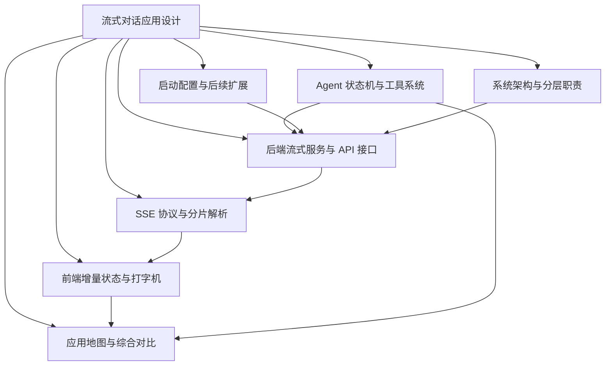
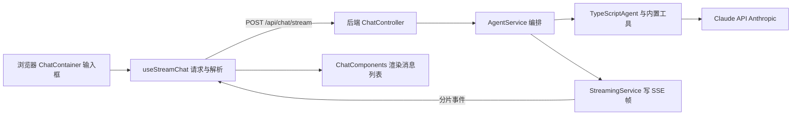
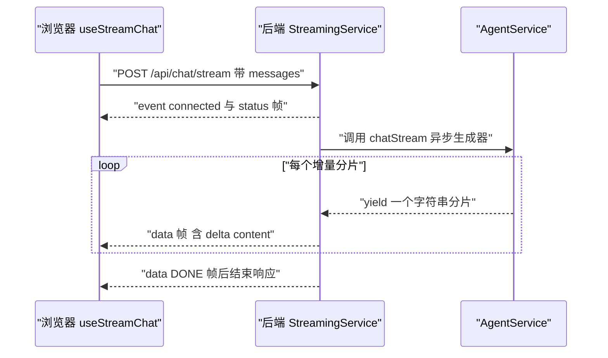
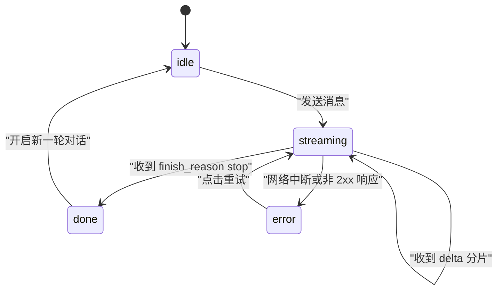
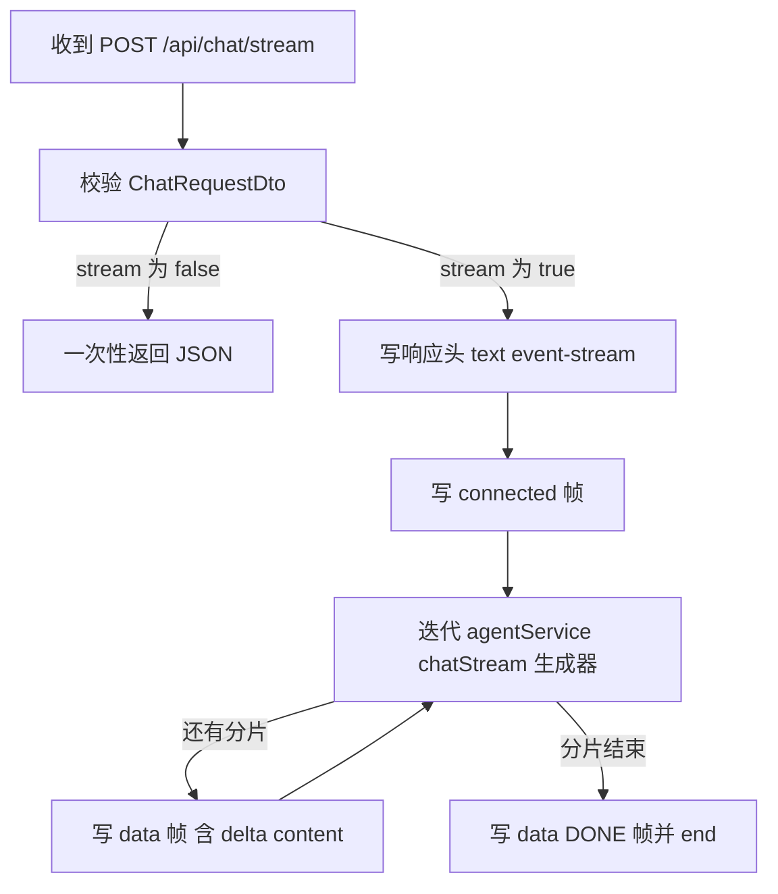
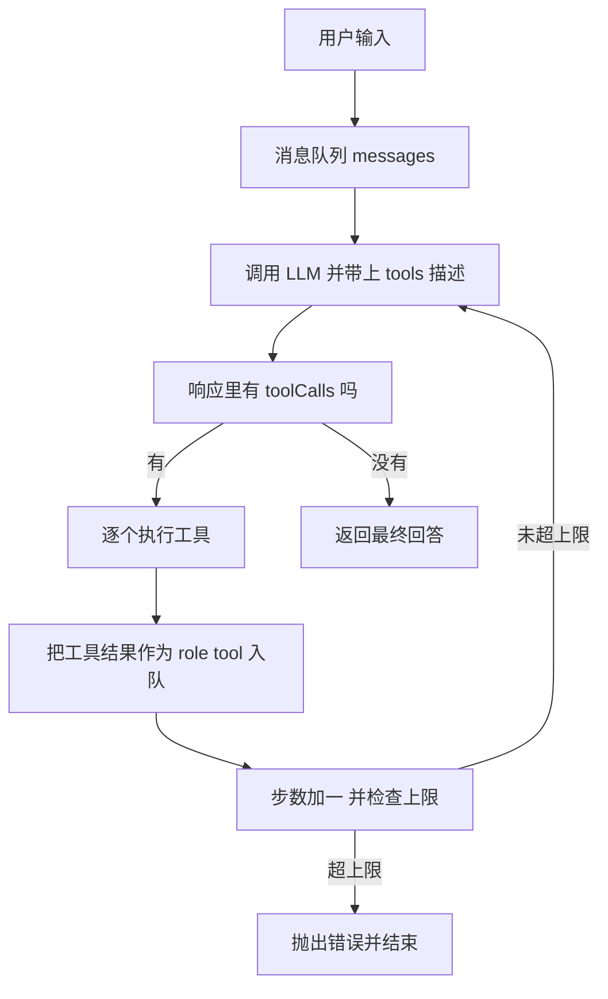
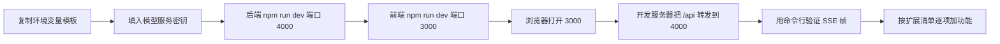

# 流式对话应用设计

!!! abstract "学完这一页你能"

    - 画出前端、后端、模型服务三层的调用关系，并说明每层各自负责的输入与输出。
    - 手写一个 SSE 帧解析器，让半包与多字节汉字都能正确拼接。
    - 用前端 reducer 把分片事件归约成屏幕上的对话内容，并知道何时中止请求。
    - 写出一个有最大步数上限的 Agent 工具循环，并指出护栏应该加在哪一行。

## 0. 知识地图



建议从第 1 节顺着读，先把三层职责分清，再进入协议细节。

第 2 节和第 3 节是一对：一个负责把字节流切成帧，一个负责把帧变成界面状态。

第 5 节可以单独跳读，它讨论的是模型决定调用工具之后，代码要接手哪些事情。

## 1. 分层架构与技术栈

**先想一个问题**

你在输入框敲下"你好"并按回车，屏幕上开始逐字出现回答。

如果分不清这一路经过了哪几层，改一个需求就会牵动整条链路，排查问题时也无从下手。

**心智模型**

!!! tip "心智模型"

    一句话模型：流式对话是一条三层流水线，前端管呈现，后端管协议与编排，模型服务管生成。

    日常类比：餐厅点单，前台记单，厨房做菜，传菜口按盘子上菜。

    类比不成立的地方：传菜口一次端一整盘，流式接口会把同一段回答切成多个分片陆续端出。

**图解**



1. 输入框把用户文本交给 `useStreamChat`，这一层不碰模型。
2. 请求走 `POST /api/chat/stream`，这是结构图里唯一的入口。
3. `ChatController` 只做协议转换：把 HTTP 请求变成一次编排调用。
4. `AgentService` 决定是否调用 `TypeScriptAgent`，以及是否需要用工具。
5. `TypeScriptAgent` 把消息和工具描述交给 Claude API，拿到结果或工具调用。
6. 分片依次经过 `StreamingService`、网络、`useStreamChat`，最后落到渲染组件。

**一步一步来**

第 1 步：先把消息的数据结构定死，前后端都按它说话。

```ts
// 依赖：无，纯类型声明；角色取值来自本站旧版页面给出的请求体示例
type ChatRole = 'system' | 'user' | 'assistant' | 'tool'; // tool 角色用于回填工具结果

interface ChatMessage {
  role: ChatRole;   // 谁说的话
  content: string;  // 文本内容，工具结果也放这里
}

interface ChatRequestDto {
  messages: ChatMessage[]; // 至少一条 user 消息
  stream: boolean;         // true 走 SSE，false 一次性返回
  model: string;           // 旧页示例写的是 claude-3-5-sonnet-20241022，以原文为准
}
```

**这段代码在做什么**

- `ChatRole` 把发言者限定为四种，避免后端收到未定义角色。
- `role: 'tool'` 是给工具结果预留的位置，第 5 节会用到它。
- `stream` 是一个开关，让同一个请求体可以走两条不同的响应路径。
- 模型名来自本站旧版页面的示例，可用型号需核对官方文档。

第 2 步：把每层之间的依赖收窄成一个函数签名。

```ts
// 依赖：无；这是层与层之间的契约，不是实现
type ChatStream = (messages: ChatMessage[]) => AsyncGenerator<string, void, unknown>;

interface StreamChatApi {
  send(messages: ChatMessage[]): Promise<void>; // 前端只关心"发出去"
}

interface StreamHandler {
  write(frame: string): void; // 后端只关心"写一帧"
  end(): void;                // 以及"收尾"
}
```

**这段代码在做什么**

- `AsyncGenerator<string>` 表示分片是逐个产出的，不是一个数组。
- 前端只依赖 `send`，因此把 SSE 换成 WebSocket 时改动被限制在一处。
- `StreamHandler` 只声明两个方法，`StreamingService` 不依赖具体 Web 框架类型。
- 契约稳定之后，第 4 节的控制器代码就可以保持很薄。

**动手验证**

把上面的结构落成可运行的校验脚本，确认非法消息在进入模型之前就被拦住。

```js
// check-messages.mjs  依赖：无（Node 20+ 内置模块）
import assert from 'node:assert/strict';

const ROLES = ['system', 'user', 'assistant', 'tool'];

function assertMessages(messages) {
  assert.ok(Array.isArray(messages) && messages.length > 0, '消息数组不能为空');
  for (const m of messages) {
    assert.ok(ROLES.includes(m.role), `非法角色: ${m.role}`);
    assert.equal(typeof m.content, 'string', 'content 必须是字符串');
    assert.ok(m.content.length > 0, 'content 不能是空串');
  }
  return true;
}

assertMessages([{ role: 'user', content: '你好' }]);
assert.throws(() => assertMessages([]), /不能为空/);
assert.throws(() => assertMessages([{ role: 'robot', content: 'hi' }]), /非法角色/);
assert.throws(() => assertMessages([{ role: 'user', content: '' }]), /不能是空串/);
console.log('校验通过，共 4 组用例');
```

运行结果：

```
校验通过，共 4 组用例
```

**常见坑**

| 现象 | 原因 | 怎么修 |
| --- | --- | --- |
| 前端 3000 端口请求 404 | 请求发给了前端开发服务器，没有代理到 4000 | 配置代理，见第 6 节 |
| 后端日志里角色是 undefined | 前端直接透传了第三方组件的数据结构 | 在入口处映射成 `ChatMessage` |
| 换模型要改多处代码 | 模型名散落在前端与后端 | 只在后端读取 `model` 字段 |

**用在哪里**

场景一：企业内部的智能问答门户。

业务背景是员工查制度、查报销规则，回答长度中等。

这一节的知识用来划分模块：页面只调用一个 `send`，权限与模型选择都放后端。

指标用首字节时间与错误率衡量，数据来源是网关日志。

不该用的时机：只需要单轮关键词检索、不需要模型生成时，直接查搜索引擎即可。

场景二：客服工单系统的辅助回复。

业务背景是坐席需要边打字边看到建议回复。

这一节的知识用来隔离呈现层与协议层，坐席切换工单时可以整体替换会话上下文。

指标用坐席采纳率与平均处理时长衡量。

不该用的时机：坐席端网络极不稳定且无法重连时，应先解决网络再上流式。

**行业实践**

第一个做法是遵循 WHATWG HTML Living Standard 的 Server-sent events 章节定义的帧格式，浏览器原生 `EventSource` 按它解析。

第二个做法是参考 Anthropic 官方文档 Messages API 的 streaming 章节，服务端按事件类型分帧推送。

第三个做法是参考 NestJS 官方文档的 Controllers 章节组织入口，把协议细节收在服务层（是否含 SSE 示例需核对官方文档）。

借鉴方式：先把帧格式和分层契约写成文件，再各自实现，避免边写边改接口。

**小结**

- 三层流水线的边界是函数签名，不是文件夹名字。
- `role: 'tool'` 与 `stream` 开关决定了后面几节的走向。
- 结构定下来之后，协议、状态、工具才有地方安放。

## 2. SSE 协议与分片解析

!!! note "术语：SSE"

    SSE 是 Server-Sent Events 的缩写，指服务器在一条 HTTP 响应里持续向客户端推送文本事件。

    例子：`data: {"choices":[{"delta":{"content":"你"}}]}` 后面跟一个空行，就是一帧。

**先想一个问题**

模型生成一段 200 字的回答要几秒。

如果等整段写完再返回，用户会盯着空白屏幕，以为页面卡死了。

**心智模型**

!!! tip "心智模型"

    一句话模型：响应体是一段边写边读的文本，客户端按空行切帧。

    日常类比：订阅连载小说，每期一到就剪下来贴到墙上，墙面内容逐期变长。

    类比不成立的地方：连载有期号可补订，SSE 默认不带序号，断线续传要自己处理，具体字段需核对官方文档。

**图解**



1. 客户端发起一个普通 POST 请求，请求头里带 `Content-Type`。
2. 服务端先回一帧连接确认，客户端据此把界面切到"生成中"。
3. `AgentService` 每次产出一个字符串，`StreamingService` 就包成一帧写出去。
4. 浏览器侧的读取循环每收到一段字节就尝试切帧，切出完整帧才解析。
5. 收到 `data: [DONE]` 后读取循环结束，界面切到完成态。

**一步一步来**

第 1 步：服务端按帧格式写文本，帧与帧之间用空行分隔。

```ts
// 依赖：无；帧格式来自本站旧版页面的后端实现示例
const delta = { choices: [{ delta: { content: '你' } }] };
const frame = `data: ${JSON.stringify(delta)}\n\n`; // 结尾两个换行才代表一帧结束

const named = 'event: connected\ndata: {"status":"connected"}\n\n'; // 带事件名的帧
```

**这段代码在做什么**

- 一帧由若干 `字段: 值` 行加一个空行组成，`data` 是最常用的字段。
- 结尾必须是 `\n\n`，少一个换行客户端就不会分发这一帧。
- `event` 字段可以给帧起名，浏览器侧用 `addEventListener` 监听同名事件。
- JSON 里嵌套了 `choices` 与 `delta`，这是本站旧版页面约定的结构。

第 2 步：客户端读取字节流，按空行切帧并保留半帧。

```ts
// 依赖：浏览器环境；response 来自 fetch
const reader = response.body!.getReader();
const decoder = new TextDecoder();
let buffer = '';

while (true) {
  const { done, value } = await reader.read();
  if (done) break;                                  // 流结束
  buffer += decoder.decode(value, { stream: true }); // stream true 防止汉字被截断
  let idx: number;
  while ((idx = buffer.indexOf('\n\n')) !== -1) {    // 只有空行才代表一帧结束
    const raw = buffer.slice(0, idx);
    buffer = buffer.slice(idx + 2);                  // 剩余半帧留到下一轮
    handleFrame(raw);
  }
}
```

**这段代码在做什么**

- `getReader()` 拿到一个可以逐段读取的读取器，每段是 `Uint8Array`。
- `decode` 的第二个参数带上 `stream: true`，避免一个汉字的两半被拆到两次解码里。
- `buffer` 保存没有凑成完整帧的尾巴，下一轮继续拼接。
- `while` 内层循环处理一次读到多帧的情况，外层处理一帧被拆成多次的情况。

第 3 步：解析帧内部的 `data` 行，把内容交给回调。

```ts
// 依赖：无
function handleFrame(raw: string) {
  for (const line of raw.split('\n')) {
    if (!line.startsWith('data: ')) continue;   // 忽略 event 行与注释行
    const payload = line.slice(6);              // 去掉 data 冒号空格前缀
    if (payload === '[DONE]') return onDone();  // 旧页约定的结束标记
    const data = JSON.parse(payload);
    onDelta(data.choices[0].delta.content ?? ''); // 结束帧的 delta 可能是空对象
  }
}
```

**这段代码在做什么**

- 前缀判断用 `data: ` 带空格，避免把 `data:` 之后没有空格的非法行当成数据。
- `slice(6)` 的长度与 `data: ` 四个字符加空格加冒号对齐，写错会得到半个 JSON。
- `?? ''` 兜住结束帧里缺失的 `content` 字段。
- `[DONE]` 不是 JSON，解析前必须先判断，否则 `JSON.parse` 会抛错。

**动手验证**

下面这个脚本故意把一帧拆成两段喂进解析器，验证半包不会丢内容。

```js
// parse-sse.mjs  依赖：无
import assert from 'node:assert/strict';

function createParser(onData) {
  let buffer = '';
  return (chunk) => {
    buffer += chunk;
    let idx;
    while ((idx = buffer.indexOf('\n\n')) !== -1) {
      const raw = buffer.slice(0, idx);
      buffer = buffer.slice(idx + 2);
      for (const line of raw.split('\n')) {
        if (!line.startsWith('data: ')) continue;
        const payload = line.slice(6);
        if (payload !== '[DONE]') onData(JSON.parse(payload));
      }
    }
  };
}

let text = '';
const feed = createParser((d) => { text += d.choices[0].delta.content; });

feed('data: {"choices":[{"delta":{"content":"你"}}]}\n\n' +
     'data: {"choices":[{"delta":{"content":"好"}}]}\n\ndata: [DONE]\n\n');
assert.equal(text, '你好');

feed('data: {"choices":[{"delta":{"content":"呀"}}]}'); // 半包，先不解析
assert.equal(text, '你好');
feed('}\n\ndata: {"choices":[{"delta":{"content":"！"}}]}\n\n');
assert.equal(text, '你好呀！');

console.log('拼接结果:', text);
```

运行结果：

```
拼接结果: 你好呀！
```

**常见坑**

| 现象 | 原因 | 怎么修 |
| --- | --- | --- |
| `JSON.parse` 偶发报错 | 一帧被网络切成两段，直接解析了半截 | 先按 `\n\n` 切帧，余下部分留在缓冲区 |
| 中文出现乱码方块 | `TextDecoder` 没带 `stream: true` | 解码时加 `{ stream: true }` |
| 一帧都不触发回调 | 服务端只写了 `\n` 没写 `\n\n` | 每帧结尾补一个空行 |
| 首帧丢了状态 | 客户端没处理 `event: connected` 帧 | 单独监听或跳过该帧 |

**用在哪里**

场景一：AI 写作助手的长文生成。

业务背景是用户要看到段落逐段出现，方便中途打断。

这一节的知识用来保证任意网络切分下文本不乱序、不丢字。

指标用文本完整率衡量，做法是把前端拼接结果与后端日志比对。

不该用的时机：回答很短且一次返回不超过几百毫秒时，直接一次性返回即可。

场景二：多路日志的实时回显面板。

业务背景是运维需要同时看多台机器的输出。

这一节的知识用来实现一个通用解析器，把不同来源都规范成帧。

指标用首帧延迟衡量。

不该用的时机：需要双向通信时，单向的 SSE 不够用，应改用 WebSocket。

**行业实践**

第一个做法是遵循 WHATWG HTML Living Standard 的 Server-sent events 章节，它会规定字段名与重连行为。

第二个做法是参考 MDN Web Docs 的 Server-sent events 条目，理解 `EventSource` 的自动重连语义。

第三个做法是参考 OpenAI 官方文档的 streaming 说明，它使用与本页一致的 `choices` 与 `delta` 结构（字段名需核对官方文档）。

借鉴方式：把帧解析写成独立模块并配套单元测试，界面代码只消费解析结果。

**小结**

- 帧的边界是空行，不是每次 `read()` 的返回值。
- 缓冲区是处理半包的唯一手段，任何直接解析的做法都会在弱网下失败。
- `stream: true` 与 `slice(6)` 是两个容易写错的细节。

## 3. 前端增量状态与打字机效果

!!! note "术语：reducer"

    reducer 是一个纯函数，接收当前状态和一个事件，返回新状态。

    例子：状态是 `{ status: 'streaming', content: '你' }`，事件是 `{ type: 'chunk', text: '好' }`，返回 `content` 为 `你好` 的新状态。

**先想一个问题**

一秒钟内可能到达 30 个分片。

如果每个分片都读取 `content` 再拼接，就会读到同一份旧快照，屏幕上少字。

**心智模型**

!!! tip "心智模型"

    一句话模型：屏幕上的字符串是事件序列归约出来的结果，不是一个被反复修改的变量。

    日常类比：账本记录每一笔流水，余额由流水累加得到。

    类比不成立的地方：余额可以人为调整，这里的流水只允许追加，状态只能由事件推出。

**图解**



1. 初始状态是 `idle`，此时任何分片事件都被忽略。
2. 用户发送消息，状态切到 `streaming`，同时清空上一条回答。
3. 每个分片触发一次 `chunk` 事件，状态在 `streaming` 自循环里累加文本。
4. 收到结束标记，状态切到 `done`，光标停止闪烁。
5. 请求失败切到 `error`，界面提供重试入口，重试会回到 `streaming`。

**一步一步来**

第 1 步：写一个纯 reducer，把界面逻辑从 React 里剥离出来。

```ts
// 依赖：无；状态机来自本站旧版页面的增量更新写法
type ChatState = { status: 'idle' | 'streaming' | 'done' | 'error'; content: string };
type ChatEvent =
  | { type: 'send' }
  | { type: 'chunk'; text: string }
  | { type: 'done' }
  | { type: 'error' };

export function reduce(state: ChatState, event: ChatEvent): ChatState {
  switch (event.type) {
    case 'send': return { status: 'streaming', content: '' };          // 新一轮清零
    case 'chunk':
      return state.status === 'streaming'
        ? { ...state, content: state.content + event.text }            // 只在生成中累加
        : state;
    case 'done': return { ...state, status: 'done' };
    case 'error': return { ...state, status: 'error' };
  }
}
```

**这段代码在做什么**

- 纯函数没有任何外部依赖，可以直接用 Node 跑断言，见本节的动手验证。
- `send` 时清空 `content`，避免新回答接在旧回答后面。
- `chunk` 里先判断状态，重复到达的分片或乱序分片不会污染已完成的内容。
- 每个分支都返回新对象，React 靠引用变化判断需要重渲染。

第 2 步：把 reducer 接进 hook，并用 `AbortController` 支持中止。

```tsx
// 依赖：react 18（版本号来自本站旧版页面，以原文为准）
const [state, dispatch] = useReducer(reduce, { status: 'idle', content: '' });
const abortRef = useRef<AbortController | null>(null);

async function send(content: string) {
  abortRef.current?.abort();                    // 中止上一轮，避免交叉写入
  dispatch({ type: 'send' });
  const controller = new AbortController();
  abortRef.current = controller;
  try {
    const res = await fetch('/api/chat/stream', {
      method: 'POST',
      headers: { 'Content-Type': 'application/json' },
      body: JSON.stringify({ messages: [{ role: 'user', content }], stream: true }),
      signal: controller.signal,
    });
    if (!res.ok) throw new Error(`HTTP ${res.status}`);
    // 解析循环见第 2 节，每解出一个分片就 dispatch 一次
    for await (const text of parseSse(res)) dispatch({ type: 'chunk', text });
    dispatch({ type: 'done' });
  } catch (err) {
    if ((err as Error).name !== 'AbortError') dispatch({ type: 'error' });
  }
}
```

**这段代码在做什么**

- 每次发送前调用 `abort()`，旧请求的后续分片不会再进入状态。
- `signal` 让 `fetch` 与读取循环一起被中断，不需要手动关闭 reader。
- 先判断 `res.ok`，非 2xx 时不会把错误页面当成 SSE 文本解析。
- `AbortError` 是主动取消的正常路径，不应该显示成故障。
- 分片解析与状态更新解耦，解析器可以单独替换。

第 3 步：光标用 CSS 伪元素实现，不额外维护定时器。

```css
/* 时长与字符来自本站旧版页面的打字机效果示例，以原文为准 */
.typing-cursor::after {
  content: '▊';
  animation: blink 0.8s infinite;
}
@keyframes blink {
  50% { opacity: 0; }
}
```

**这段代码在做什么**

- 光标是伪元素，不占用 DOM 节点，也不进入消息文本。
- 动画交给 CSS，React 的重渲染不影响闪烁节奏。
- 状态切到 `done` 时移除该 class，光标随之消失。

**动手验证**

下面的脚本直接对 reducer 跑断言，覆盖乱序分片与重复分片两种情况。

```js
// stream-reducer.mjs  依赖：无
import assert from 'node:assert/strict';

function createState() { return { status: 'idle', content: '' }; }

function reduce(state, event) {
  switch (event.type) {
    case 'send': return { ...state, status: 'streaming', content: '' };
    case 'chunk':
      return state.status === 'streaming'
        ? { ...state, content: state.content + event.text }
        : state;
    case 'done': return { ...state, status: 'done' };
    case 'error': return { ...state, status: 'error' };
    default: return state;
  }
}

let s = createState();
s = reduce(s, { type: 'chunk', text: 'X' });
assert.equal(s.content, '');          // idle 阶段的分片被忽略

s = reduce(s, { type: 'send' });
s = reduce(s, { type: 'chunk', text: '你' });
s = reduce(s, { type: 'chunk', text: '好' });
s = reduce(s, { type: 'done' });
const afterDone = reduce(s, { type: 'chunk', text: '重复' });
assert.equal(afterDone.content, '你好'); // 结束后的分片被忽略
assert.equal(afterDone.status, 'done');

console.log('状态:', afterDone.status, '内容:', afterDone.content);
```

运行结果：

```
状态: done 内容: 你好
```

**常见坑**

| 现象 | 原因 | 怎么修 |
| --- | --- | --- |
| 回答少几个字 | 用读到的旧 `content` 拼接，没走更新函数 | 统一走 reducer 或函数式更新 |
| 切换会话后旧回答插进新窗口 | 旧请求没有中止 | 发送前调用 `abort()`，并在 catch 里忽略 `AbortError` |
| 输入框在生成时卡顿 | 每个分片都触发整棵组件树重渲染 | 把消息列表拆成独立组件，只订阅需要的状态 |
| 完成后光标还在闪 | 完成态没有移除光标 class | 光标仅在 `streaming` 状态渲染 |

**用在哪里**

场景一：在线客服的自动回复。

业务背景是坐席要能随时打断模型输出并接管。

这一节的知识用来实现中止与状态回退，打断之后状态必须回到可发送。

指标用打断成功率与消息串台率衡量。

不该用的时机：只做离线批量生成、没有交互时，不需要这套状态机。

场景二：代码助手的补全建议。

业务背景是建议需要逐行出现，用户看到一半就接受。

这一节的知识用来保证部分内容和最终内容都可提交。

指标用建议接受率衡量。

不该用的时机：补全延迟已经在本地可忽略时，逐字渲染反而增加复杂度。

**行业实践**

第一个做法是参考 React 官方文档的 State as a Snapshot 与 Queueing a Series of State Updates 章节，理解为什么连续更新要写成函数式或走 reducer。

第二个做法是参考 React 官方文档 useReducer 章节的惰性初始化写法，把初始状态算成函数。

第三个做法是参考 Vercel AI SDK 文档的 useChat 章节，观察它如何把流式状态收敛成消息数组（API 名称与版本需核对官方文档）。

借鉴方式：把状态迁移规则写成一张表，再照着写 switch 分支，测试用断言覆盖每个迁移。

**小结**

- 分片只发事件，状态由 reducer 推导，二者分开测试。
- 中止是必须实现的功能，不是可选项。
- 打字机效果用 CSS 实现，状态机不需要为它增加字段。

## 4. 后端流式服务与 API 接口

!!! note "术语：DTO"

    DTO 是 Data Transfer Object 的缩写，指专门用于在层之间搬运数据的对象，通常只包含字段与校验规则。

    例子：`ChatRequestDto` 里只有 `messages`、`stream`、`model` 三个字段。

**先想一个问题**

浏览器原生的 `EventSource` 只能发 GET 请求。

可我们要 POST 一整个消息数组，URL 长度和敏感信息都不适合放查询串。

**心智模型**

!!! tip "心智模型"

    一句话模型：把响应对象当成一个只写文件，写一帧就立刻刷出去。

    日常类比：打开的水龙头，水从源头持续流到杯子里。

    类比不成立的地方：水龙头关掉就断，SSE 断开后客户端可自行重连，服务端也能用 `retry` 字段建议等待时长。

**图解**



1. 请求先经过 DTO 校验，字段不合法直接返回 400，不进入模型。
2. `stream` 为 `false` 时走旧页里的 `POST /api/chat`，一次性返回完整 JSON。
3. 走流式时先写响应头，把内容类型标成事件流。
4. 连接确认帧发出去之后，界面才能切到生成中。
5. 生成器每产出一个分片就写一帧，写完所有分片再写结束帧并关闭响应。

**一步一步来**

第 1 步：定义请求体与响应写入器的类型。

```ts
// 依赖：类型来自本站旧版页面的接口约定
interface ChatMessage { role: 'system' | 'user' | 'assistant' | 'tool'; content: string }

class ChatRequestDto {
  messages: ChatMessage[] = [];                            // 必填，至少一条 user 消息
  stream = false;                                          // 默认非流式
  model = 'claude-3-5-sonnet-20241022';                    // 旧页示例值，可用型号需核对官方文档
}

interface StreamHandler {
  write(frame: string): void; // 写一帧
  end(): void;                // 关闭响应
}
```

**这段代码在做什么**

- `messages` 默认空数组，配合第 1 节的校验函数拦截空请求。
- `stream` 默认 `false`，让老客户端不传该字段时行为不变。
- `StreamHandler` 把 Web 框架类型挡在服务层之外，便于单元测试时传入假实现。
- 模型名集中在一处，替换模型时只改默认值。

第 2 步：控制器分叉出流式与非流式两条路径。

```ts
// 依赖：@nestjs/common 与 express 的 Response 类型
@Controller('api/chat')
export class ChatController {
  constructor(private readonly streaming: StreamingService) {}

  @Post()
  chat(@Body() dto: ChatRequestDto) {          // 非流式，直接返回结果
    return this.streaming.handleChat(dto);
  }

  @Post('stream')
  async stream(@Body() dto: ChatRequestDto, @Res() res: Response) {
    res.setHeader('Content-Type', 'text/event-stream');
    res.setHeader('Cache-Control', 'no-cache');
    res.flushHeaders();                          // 先发响应头，避免中间层缓冲
    await this.streaming.handleStreamChat(dto, res);
  }
}
```

**这段代码在做什么**

- 两个方法共用同一个 DTO，只有响应方式不同。
- `text/event-stream` 是事件流的约定内容类型。
- `Cache-Control: no-cache` 防止中间层缓存整段响应。
- `flushHeaders()` 让响应头立刻发出，页面上的连接状态不需要等到第一个分片。
- 控制器不包含任何生成逻辑，只负责协议转换。

第 3 步：流式服务写帧并收尾。

```ts
// 依赖：AgentService 提供 chatStream 异步生成器
async handleStreamChat(dto: ChatRequestDto, res: StreamHandler) {
  res.write('event: connected\ndata: {"status":"connected"}\n\n'); // 连接确认帧

  for await (const chunk of this.agentService.chatStream(dto.messages)) {
    res.write(`data: ${JSON.stringify({ choices: [{ delta: { content: chunk } }] })}\n\n`);
  }

  res.write('data: [DONE]\n\n'); // 结束标记，与前端约定一致
  res.end();                     // 关闭响应，客户端的读取循环随之结束
}
```

**这段代码在做什么**

- 第一帧先让客户端确认通道可用，避免用户面对无反馈的等待。
- `for await` 消费异步生成器，生成器产出多少帧就发多少帧。
- 每帧都是一次独立的 `JSON.stringify`，分片之间不共享对象。
- 收尾顺序是先写 `[DONE]` 再 `end()`，顺序反了客户端会丢掉结束标记。
- 生成过程中抛错时需要单独处理，先写错误帧再 `end()`。

**动手验证**

下面用一个真实 HTTP 服务验证帧格式，脚本结束时断言帧的数量。

```js
// sse-server.mjs  依赖：无（使用 Node 20+ 内置 fetch）
import assert from 'node:assert/strict';
import http from 'node:http';

async function* chatStream() {
  for (const ch of '你好') yield ch; // 模拟模型逐字产出
}

const server = http.createServer(async (req, res) => {
  if (req.method !== 'POST' || req.url !== '/api/chat/stream') { res.writeHead(404).end(); return; }
  res.writeHead(200, { 'Content-Type': 'text/event-stream', 'Cache-Control': 'no-cache' });
  res.write('event: connected\ndata: {"status":"connected"}\n\n');
  for await (const chunk of chatStream()) {
    res.write(`data: ${JSON.stringify({ choices: [{ delta: { content: chunk } }] })}\n\n`);
  }
  res.write('data: [DONE]\n\n');
  res.end();
});

await new Promise((r) => server.listen(0, '127.0.0.1', r));
const port = server.address().port;
const resp = await fetch(`http://127.0.0.1:${port}/api/chat/stream`, {
  method: 'POST',
  headers: { 'Content-Type': 'application/json' },
  body: JSON.stringify({ messages: [{ role: 'user', content: '你好' }], stream: true }),
});
const body = await resp.text();

assert.equal(resp.headers.get('content-type'), 'text/event-stream');
assert.ok(body.startsWith('event: connected'));
assert.ok(body.endsWith('data: [DONE]\n\n'));
assert.equal((body.match(/data: \{"choices"/g) || []).length, 2); // 两个汉字两帧
console.log('data 行总数:', (body.match(/data: /g) || []).length);
server.close();
```

运行结果：

```
data 行总数: 4
```

**常见坑**

| 现象 | 原因 | 怎么修 |
| --- | --- | --- |
| 前端一次收到全部内容 | 反向代理开了响应缓冲 | 关闭代理缓冲，如 nginx 的 proxy_buffering |
| 响应头等到最后才到 | 没有调用 flushHeaders | 写响应头后立刻刷出 |
| 压缩中间件把流攒起来 | 压缩层按块处理，等缓冲区满 | 对事件流路径跳过压缩 |
| 客户端断开后上游仍在跑 | 没有监听连接关闭事件 | 在 close 事件里中止上游请求 |

**用在哪里**

场景一：SaaS 后台的智能报表解读。

业务背景是报表数字多，用户要边读边判断。

这一节的知识用来把解读过程分帧推送，并保留非流式接口给导出功能。

指标用解读完成率与平均阅读时长衡量。

不该用的时机：导出 PDF 时不需要流式，一次性取完整文本更简单。

场景二：工单系统的批量分类。

业务背景是几百条工单要逐条打标签并显示进度。

这一节的知识用来把每条结果作为一帧推送，前端显示进度条。

指标用整批处理时长衡量。

不该用的时机：批量任务超过几分钟且用户会离开页面时，应改为任务队列加快照查询。

**行业实践**

第一个做法是参考 WHATWG HTML Living Standard 的 Server-sent events 章节，它规定 `retry` 与 `id` 字段语义。

第二个做法是参考 NestJS 官方文档的 Controllers 章节组织入口，把服务层与协议层分开（SSE 专属章节需核对官方文档）。

第三个做法是参考 OpenAI 官方文档的 streaming 说明，保持结束标记与分片结构一致。

借鉴方式：先写一个假 `StreamHandler` 做单元测试，再接真实响应对象。

**小结**

- 控制器的职责只有协议转换，生成逻辑在服务层。
- 响应头要先发，帧要逐条写，结束标记要早于 `end()`。
- 中间层缓冲是流式最常见的失败来源，部署时先验证它。

## 5. Agent 状态机与工具系统

!!! note "术语：Agent"

    Agent 指由模型决定下一步动作、由代码执行动作并回填结果的一套循环结构。

    例子：模型返回"需要读取 a.txt"，代码执行读取，把文件内容作为工具结果送回模型。

!!! note "术语：工具调用"

    工具调用是模型输出的一种结构化请求，包含工具名和参数，本身不产生副作用。

    例子：`{ name: 'read_file', input: { path: 'a.txt' } }`。

**先想一个问题**

模型回复说它需要读一下 `package.json`。

但这句话只是一段文字，文件并不会自己打开。

**心智模型**

!!! tip "心智模型"

    一句话模型：Agent 是一个带步数上限的循环，加上一组输入输出明确的工具。

    日常类比：按清单办事的实习生，每完成一项就回报一次，直到清单清空。

    类比不成立的地方：实习生会质疑清单是否合理，Agent 只执行模型给出的调用，护栏必须写在代码里。

**图解**



1. 用户输入成为消息队列的第一条消息。
2. 请求带上工具描述，模型在回答与调用之间选择。
3. 响应里带 `toolCalls` 时进入执行分支，不带则直接返回文本。
4. 工具结果以 `role: 'tool'` 入队，队列变长后再次调用模型。
5. 每次循环都检查步数上限，超限抛出错误，避免无限循环。

**一步一步来**

第 1 步：声明工具表，旧页给出的内置工具是四个。

```ts
// 依赖：无；工具清单来自本站旧版页面的内置工具表
interface AgentTool {
  name: 'read_file' | 'write_file' | 'web_search' | 'execute_code';
  description: string;                     // 给模型看的自然语言说明
  schema: Record<string, string>;          // 参数结构，字段名需核对所选 SDK 文档
  handler: (input: any) => Promise<string>; // 真正产生副作用的地方
}

const tools: AgentTool[] = [
  { name: 'read_file', description: '读取指定路径的文件', schema: { path: 'string' }, handler: readFile },
  { name: 'write_file', description: '写入指定路径的文件', schema: { path: 'string', content: 'string' }, handler: writeFile },
  { name: 'web_search', description: '按关键词搜索网页', schema: { query: 'string' }, handler: webSearch },
  { name: 'execute_code', description: '执行一段代码', schema: { language: 'string', code: 'string' }, handler: executeCode },
];
```

**这段代码在做什么**

- `name` 用联合类型限定，写错工具名会在编译期报错。
- `description` 是给模型看的，写得含糊会直接影响调用准确率。
- `schema` 描述参数类型，具体字段名与嵌套方式需核对官方文档。
- `handler` 是唯一有副作用的部分，权限校验加在这里。

第 2 步：把工具描述转成请求参数，调用模型。

```ts
// 依赖：this.llm 为模型适配器，字段名需核对官方文档
const toolSpecs = this.tools.map((t) => ({
  name: t.name,
  description: t.description,
  input_schema: t.schema, // 该字段名需核对 Anthropic 官方文档 tools 章节
}));

const response = await this.llm.complete({ messages, tools: toolSpecs });
```

**这段代码在做什么**

- 转换发生在一处，换模型供应商时只改这一层。
- `tools` 与 `messages` 一起提交，模型据此决定是否调用。
- `input_schema` 的具体拼写与嵌套要求需核对官方文档。
- 响应里同时可能包含文本与工具调用，两者都要保留。

第 3 步：循环执行工具，并把结果回填。

```ts
// 依赖：ChatMessage 与 AgentTool 定义见前两步
async run(input: string, maxSteps = 8): Promise<string> {
  const messages: ChatMessage[] = [{ role: 'user', content: input }];
  for (let step = 0; step < maxSteps; step++) {
    const response = await this.llm.complete({ messages, tools: this.toolSpecs() });
    if (!response.toolCalls?.length) return response.content;   // 没有调用就是最终回答
    for (const call of response.toolCalls) {
      const tool = this.tools.find((t) => t.name === call.name);
      if (!tool) { messages.push({ role: 'tool', content: `未知工具 ${call.name}` }); continue; }
      const result = await tool.handler(call.input);            // 执行副作用，必须做权限校验
      messages.push({ role: 'tool', content: result });         // 结果入队，等下一轮
    }
  }
  throw new Error('超过最大步数，已停止');                       // 上限是必须的护栏
}
```

**这段代码在做什么**

- `maxSteps` 默认 8，超过就抛错，防止两个工具互相触发形成死循环。
- 未知工具不是静默忽略，而是把错误信息回填给模型，让它换一条路。
- 工具抛异常时要捕获并回填错误文本，否则整轮对话会中断。
- 每次循环都会把新消息重新提交，模型因此在多轮里看到完整过程。
- `handler` 内部要做路径与权限校验，参数来自模型输出，不能直接信任。

**动手验证**

下面用一个脚本化的假模型驱动循环，验证消息顺序与步数上限。

```js
// agent-loop.mjs  依赖：无
import assert from 'node:assert/strict';

const TOOLS = {
  read_file: ({ path }) => `文件内容:${path}`,
  write_file: ({ path }) => `已写入:${path}`,
};

// 脚本按顺序给出每一步的模型响应，耗尽后返回 undefined（模拟模型不再产出任何响应）
const scripted = [
  { content: '', toolCalls: [{ name: 'read_file', input: { path: 'a.txt' } }] },
  { content: '读完了', toolCalls: [] },
];
const complete = async () => scripted.shift();

async function runAgent(input, maxSteps = 5) {
  const messages = [{ role: 'user', content: input }];
  for (let step = 0; step < maxSteps; step++) {
    const res = await complete();
    // 模型响应可能为空（脚本耗尽 / 模型未返回结果），此时直接读 res.toolCalls 会抛 TypeError。
    // 按“本步没有有效输出”处理，继续消耗步数，由步数上限兜底报错。
    if (!res) continue;
    if (!res.toolCalls?.length) return { content: res.content, messages };
    for (const call of res.toolCalls) {
      const tool = TOOLS[call.name];
      assert.ok(tool, `未知工具: ${call.name}`);
      messages.push({ role: 'tool', name: call.name, content: tool(call.input) });
    }
  }
  throw new Error('超过最大步数');
}

const out = await runAgent('看看 a.txt');
assert.equal(out.content, '读完了');
assert.equal(out.messages.length, 2);
assert.equal(out.messages[1].role, 'tool');
assert.equal(out.messages[1].content, '文件内容:a.txt');
await assert.rejects(() => runAgent('再试一次'), /超过最大步数/); // 脚本已耗尽
console.log('最终回答:', out.content);
```
运行结果：

```
最终回答: 读完了
```

**常见坑**

| 现象 | 原因 | 怎么修 |
| --- | --- | --- |
| 请求一直不返回 | 两个工具互相触发，没有步数上限 | 加 `maxSteps` 并在超限时抛错 |
| 模型反复调用同一工具 | 工具失败后没有把错误信息回填 | 捕获异常并把错误文本作为工具结果入队 |
| 读到项目目录之外的文件 | 路径参数直接拼接到文件系统 | 解析绝对路径并校验是否在允许的根目录内 |
| 服务被任意代码拖垮 | `execute_code` 在宿主进程直接执行 | 放进受限沙箱或改为白名单操作 |

**用在哪里**

场景一：IDE 里的代码助手。

业务背景是助手需要读文件、改文件、跑测试。

这一节的知识用来把每个动作变成可审计的工具调用，并把结果回填。

指标用任务完成率与工具调用失败率衡量。

不该用的时机：只回答问题而不需要改动仓库时，纯对话模式更省资源。

场景二：运维巡检机器人。

业务背景是每天读取日志、汇总异常。

这一节的知识用来限制工具范围，只开放只读工具给巡检角色。

指标用告警准确率衡量。

不该用的时机：涉及生产写操作时，应改为人工确认后再执行，不能让模型直接触发。

**行业实践**

第一个做法是参考 Anthropic 官方文档的 Tool use 章节，它给出工具描述与调用结果的字段要求（字段名需核对官方文档）。

第二个做法是参考 Model Context Protocol 官方文档，它把工具的发现与调用抽象成标准协议，旧页也把它列进扩展项。

第三个做法是参考 LangChain.js 官方文档的 Tools 章节，观察它如何组织工具注册与调用循环（版本与 API 名称需核对官方文档）。

借鉴方式：先限制成两个只读工具跑通循环，再逐条放开写权限，并且每次都补一条测试。

**小结**

- Agent 的核心是循环加护栏，循环次数必须有上限。
- 工具描述是模型唯一能看到的说明书，写清楚比写短重要。
- 参数来自模型，权限校验只能写在代码里。

## 6. 启动配置与后续扩展

**先想一个问题**

本地起了两个进程，前端在 3000，后端在 4000。

前端代码里写 `fetch('/api/chat/stream')`，请求会打到 3000 而不是 4000，页面报 404。

**心智模型**

!!! tip "心智模型"

    一句话模型：开发期用一个路径前缀把请求转给后端进程，这个规则写在构建工具里。

    日常类比：公司前台按分机号把访客转接到对应工位。

    类比不成立的地方：前台会记录来访，代理只做转发，生产环境要靠网关或反向代理承担同样职责。

**图解**



1. 先准备环境变量文件，密钥只放后端。
2. 启动后端，端口来自环境变量，旧页默认 4000。
3. 启动前端，旧页默认端口 3000。
4. 浏览器访问 3000，同源请求由开发服务器转发到 4000。
5. 用命令行直接请求后端，确认帧格式正确，排除前端干扰。
6. 连通之后再按扩展清单加功能。

**一步一步来**

第 1 步：写环境变量文件。

```bash
# backend/.env，来自本站旧版页面的环境变量示例
ANTHROPIC_API_KEY=your-api-key
PORT=4000
```

**这段代码在做什么**

- 密钥只在后端进程可读，前端构建产物里不出现它。
- `PORT` 让端口可配置，避免和本机其他服务冲突。
- 该文件不应该提交到版本库，需要加入忽略规则。

第 2 步：按旧页给出的命令启动两个进程。

```bash
# 前端：依赖 npm；端口 3000
cd frontend && npm install && npm run dev

# 后端：依赖 npm；端口 4000
cd backend && npm install && npm run dev
```

**这段代码在做什么**

- 两条命令分别在两个终端执行，互不阻塞。
- 端口号来自本站旧版页面的启动指南，以原文为准。
- 前端启动前先确认代理目标指向 4000，否则请求仍会 404。

第 3 步：用命令行验证流式输出，绕开界面排查问题。

```bash
# 依赖：curl
curl -N -X POST http://localhost:4000/api/chat/stream \
  -H 'Content-Type: application/json' \
  -d '{"messages":[{"role":"user","content":"你好"}],"stream":true}'
```

**这段代码在做什么**

- `-N` 关闭 curl 自己的缓冲，逐帧打印。
- 预期先看到 `event: connected` 帧，再看到若干 delta 帧。
- 最后一行是 `data: [DONE]`，看到它就说明服务端收尾正确。
- 若等了很久才一次全部打印，问题在中间的缓冲层。

第 4 步：把旧页的扩展清单按依赖顺序排好。

```text
1. 添加更多内置工具     依赖第 5 节的工具表结构
2. 支持其他模型供应商   依赖第 5 节的适配层
3. 对话历史持久化       依赖第 1 节的消息结构
4. 接入 MCP             依赖第 5 节的工具发现机制
5. 接入 RAG 检索增强生成  依赖第 3 节的消息结构
6. 多 Agent 协作        依赖第 5 节的步数上限
```

**这段代码在做什么**

- 每一行都标明它依赖哪一节，避免在没有基础时直接开工。
- 工具与适配层先行，后续功能才有落点。
- 多 Agent 放最后，因为它对步数与成本控制的要求最高。

**动手验证**

下面的脚本校验环境变量，缺失或格式错误时立即失败。

```js
// check-env.mjs  依赖：无
import assert from 'node:assert/strict';

function readConfig(env) {
  const port = Number(env.PORT ?? 4000); // 默认值与旧页环境变量示例一致
  assert.ok(Number.isInteger(port) && port > 0 && port < 65536, 'PORT 必须是 1 到 65535 的整数');
  const key = env.ANTHROPIC_API_KEY;
  assert.ok(typeof key === 'string' && key.length > 0, '缺少 ANTHROPIC_API_KEY');
  return { port, key };
}

assert.deepEqual(readConfig({ ANTHROPIC_API_KEY: 'test-key' }), { port: 4000, key: 'test-key' });
assert.throws(() => readConfig({}), /缺少 ANTHROPIC_API_KEY/);
assert.throws(() => readConfig({ ANTHROPIC_API_KEY: 'k', PORT: 'abc' }), /PORT/);
console.log('配置校验通过');
```

运行结果：

```
配置校验通过
```

**常见坑**

| 现象 | 原因 | 怎么修 |
| --- | --- | --- |
| 密钥出现在浏览器请求里 | 变量加了前端可见前缀 | 密钥只放后端，前端不接触它 |
| 启动报端口被占用 | `PORT` 被其他进程占用 | 改 `PORT` 并同步改代理目标 |
| 本地 curl 正常但页面 404 | 代理规则没覆盖该路径 | 检查代理前缀与后端路由前缀是否一致 |
| 生产环境一次收到全部内容 | 网关开启了响应缓冲 | 在网关层关闭缓冲，并复测首帧时间 |

**用在哪里**

场景一：新同事本地跑通项目。

业务背景是仓库包含前后端两个工程。

这一节的知识用来把启动命令和环境变量写进说明文件，减少口头交接。

指标用从克隆到跑通的时间衡量。

不该用的时机：仓库只有单一进程时，不需要代理与多进程启动。

场景二：持续集成里的冒烟测试。

业务背景是每次提交都要验证流式接口没被改坏。

这一节的知识用来写一段命令行请求，断言首帧与结束帧都能出现。

指标用冒烟测试通过率衡量。

不该用的时机：模型调用有成本时，冒烟测试应使用假模型或录制回放。

**行业实践**

第一个做法是参考 Vite 官方文档的 Env Variables and Modes 与 server.proxy 章节，理解变量可见性与代理规则。

第二个做法是参考 Node.js 官方文档的 --env-file 章节，用原生方式加载环境变量，减少额外依赖。

第三个做法是参考 The Twelve-Factor App 的 Config 章节，把配置存在环境里而不是代码里。

借鉴方式：把启动步骤写成一份可复制的命令清单，并在文档里注明每个变量的来源。

**小结**

- 两个进程加一条代理规则，是本地开发的最小结构。
- 密钥只留在后端，前端只能看到接口路径。
- 扩展项按依赖排序，先做工具与适配层。

## 应用地图

| 场景 | 用到本页哪个知识点 | 典型技术选型 | 注意事项 |
| --- | --- | --- | --- |
| 智能问答门户 | 第 1 节分层、第 4 节接口 | React 18 + NestJS 10 + SSE | 代理缓冲要先关闭 |
| 客服辅助回复 | 第 3 节状态机 | React useReducer + AbortController | 切换会话必须中止旧请求 |
| 长文写作助手 | 第 2 节帧解析 | fetch 加 ReadableStream | 汉字解码要带 stream 参数 |
| 代码助手 | 第 5 节工具循环 | Agent 加只读工具 | 路径校验写在 handler 内 |
| 运维巡检机器人 | 第 5 节步数上限 | Agent 加只读工具 | 写操作需人工确认 |
| 批量数据处理进度 | 第 4 节分帧推送 | SSE 加任务队列 | 长任务改用队列加快照 |
| 本地联调与冒烟测试 | 第 6 节启动配置 | 命令行请求加断言 | 用假模型控制成本 |

## 动手作业

目标：做一个能流式显示回答、能中止、能在完成后重发的小应用，后端只返回拼接好的固定文本。

步骤一：用 Node 内置 `http` 写一个接口，路径为 `/api/chat/stream`，按第 4 节的帧格式推送五个分片，最后发 `data: [DONE]`。

步骤二：写一个解析模块，输入是 `fetch` 的响应对象，输出是一个异步生成器，逐条产出文本分片，参考第 2 节的缓冲区写法。

步骤三：写一个 reducer 与一个发送函数，覆盖 `idle`、`streaming`、`done`、`error` 四个状态，参考第 3 节。

步骤四：给发送按钮旁边加一个停止按钮，点击后中止请求，状态回到可发送。

验收标准：

- 断开网络后状态进入 `error`，再次点击发送能从 `error` 回到 `streaming`。
- 在分片之间人为插入 100 毫秒延迟，屏幕上能看到逐字出现，字符顺序与后端发送顺序一致。
- 连续快速点击发送三次，界面上只保留最后一次的完整内容，不出现两次回答拼接。
- 用 `node:assert` 写至少六条断言，覆盖帧解析与状态迁移，运行全部通过。

## 综合对比

| 维度 | SSE | WebSocket | 短轮询 |
| --- | --- | --- | --- |
| 传输方向 | 服务端到客户端单向 | 双向 | 客户端定时发起 |
| 底层协议 | HTTP 响应 | 独立握手后升级连接 | HTTP 请求 |
| 浏览器原生接口 | EventSource，只支持 GET | WebSocket 构造函数 | fetch |
| 自定义请求头 | 原生接口不支持 | 握手阶段受限 | 支持 |
| 断线重连 | EventSource 自动重连，字段需核对官方文档 | 需自行实现 | 无此概念 |
| 中间层适配 | 需关闭响应缓冲 | 需允许连接升级 | 无特殊要求 |
| 适用场景 | 生成过程回显、进度推送 | 协作编辑、双向信令 | 状态变化慢且可容忍延迟 |

## 深入阅读与参考

!!! tip "怎么用这些资料"
    先读「官方文档与规范」建立准确的概念，再读「源码与示例」核对细节，最后用「教程、书籍与视频」换一种讲法加深理解。每条都写明了读哪一节、带着什么问题读。

### 官方文档与规范

| 资源 | 为什么读 | 怎么读 |
|---|---|---|
| [Streams API concepts](https://developer.mozilla.org/en-US/docs/Web/API/Streams_API/Concepts) | 流式对话的底层依赖，讲清可读流、背压与分块传输。 | 读 Concepts 全文，重点看背压与队列；画出对话数据从服务端到 UI 的流动图。 |
| [Writing WebSocket client applications](https://developer.mozilla.org/en-US/docs/Web/API/WebSockets_API/Writing_WebSocket_client_applications) | 全双工通道适合对话，讲连接、消息与关闭流程。 | 读“建立连接”与“收发消息”节；为对话应用写一个最小 WebSocket 客户端。 |
| [Anthropic 文档](https://docs.anthropic.com/) | 官方 Messages API 是流式对话的典型参考，含流式事件。 | 先读快速开始并跑通请求；再读 streaming 一节，对照事件类型设计前端解析。 |
| [Google API Improvement Proposals](https://google.aip.dev/) | 资源导向设计与标准方法，是设计对话 CRUD 接口的权威规范。 | 读 AIP-121、131 至 135；用标准方法重写你的会话与消息端点。 |
| [MCP Tools 概念](https://modelcontextprotocol.io/docs/concepts/tools) | 工具调用是对话扩展核心，MCP 给出模型与工具交互规范。 | 读概念与 schema 示例；为“查天气”设计一个 tool 定义并写输入校验。 |
| [Gemini API 文档](https://ai.google.dev/gemini-api/docs) | 另一家主流模型 API，便于对比流式与多模态能力。 | 对同一提示在 Gemini 与 Anthropic 各跑一次，比较输出与延迟。 |
| [Node.js API 文档](https://nodejs.org/api/) | 后端技术栈核心，流与文件接口对实现流式服务很关键。 | 需要时查 fs、stream、http 的接口与示例，重点看流式响应写法。 |

### 源码与示例

| 资源 | 为什么读 | 怎么读 |
|---|---|---|
| [pi 编码 Agent 工具集](https://github.com/earendil-works/pi) | 可读的 agent loop 与统一 LLM API 实现，适合对照学习。 | 读 agent loop 源码，关注工具调用与消息拼接；对照自己的循环找差异。 |
| [Claude Agent SDK 概览](https://docs.claude.com/en/api/agent-sdk/overview) | 快速跑通一个能调用工具的 Agent，理解流式与工具循环。 | 按概览写一个读目录并总结的小 Agent，观察工具调用日志与流式输出。 |

### 教程、书籍与视频

| 资源 | 为什么读 | 怎么读 |
|---|---|---|
| [Using readable streams](https://developer.mozilla.org/en-US/docs/Web/API/Streams_API/Using_readable_streams) | 手把手示例，展示如何消费 fetch 返回的流并逐块处理。 | 跟做示例，把 fetch 响应替换为 LLM 流式接口；读完实现打字机效果。 |
| [阮一峰：Fetch API 教程](https://www.ruanyifeng.com/blog/2020/12/fetch-tutorial.html) | 前端调用流式接口的基础，中文讲解清晰。 | 用 fetch 实现流式请求与错误处理，把响应体接到 Streams 示例上。 |
| [AutoGen 论文](https://arxiv.org/abs/2308.08155) | 多 Agent 对话编程的经典论文，理解对话编排抽象。 | 读摘要与架构图；对照 AutoGen 文档 API，思考如何映射到你的应用。 |
| [roadmap.sh API 设计路线](https://roadmap.sh/api-design) | 系统梳理 API 设计知识，适合规划后续扩展与查漏。 | 对照路线图标出未掌握节点，排入后续学习计划。 |

## 自测题

??? question "一帧 SSE 的边界由什么决定，为什么不能直接对每次 read 的结果做 JSON.parse"

    帧的边界是空行，也就是连续两个换行。

    网络会把一帧切成多段，也会把多帧合到一段。

    直接解析半截内容会抛 JSON 解析错误。

    正确做法是维护缓冲区，凑齐一帧再解析。

??? question "TextDecoder 的 stream 参数为什么必须为 true"

    一个汉字在 UTF-8 里多于一个字节。

    字节可能被切在两次 read 之间。

    不带该参数时每次解码都当成独立完整内容，截断处会变成替换字符。

    带上之后解码器会保留未完成的字节序列，下一次继续拼。

??? question "前端为什么要把分片累加写成 reducer 或函数式更新"

    一次事件处理里读到的 state 是本次渲染的快照。

    连续读同一个快照会丢掉中间的分片。

    函数式更新拿到的永远是最新值。

    reducer 还能把状态迁移规则集中在一处，便于断言。

??? question "为什么流式接口要先发响应头，还可能需要 flushHeaders"

    响应头不发出，客户端无法确认通道已建立。

    部分框架和中间层会等缓冲区填满才发送。

    主动刷出可以让首帧更早到达。

    若仍不见首帧，需要检查代理是否开启了响应缓冲。

??? question "Agent 循环为什么必须有最大步数上限"

    模型可能反复给出同一个工具调用。

    两个工具也可能互相触发形成闭环。

    没有上限时请求不会返回，资源被持续占用。

    超限时应抛错并把过程记录进消息队列，便于排查。

??? question "工具执行抛异常时，为什么要把错误文本回填给模型"

    异常直接抛出会中断整轮对话，前面的过程全部丢失。

    把错误作为工具结果入队，模型能在下一轮换一种调用方式。

    回填内容要写清失败原因，避免模型重复同样的调用。

    回填不能替代日志，服务端仍需记录完整堆栈。

??? question "原生 EventSource 为什么不适合本页的接口"

    EventSource 只能发起 GET 请求。

    本页的消息数组要通过请求体提交，还可能带自定义请求头。

    把整个消息数组塞进查询串会受长度限制，也会把内容写进访问日志。

    所以前端用 fetch 加读取器自行解析。

??? question "开发期代理和生产环境网关在这一点上有什么共同点"

    两者都负责把接口前缀的请求转给后端服务。

    两者都可能引入响应缓冲，从而破坏流式效果。

    本地通过代理配置验证联通性，生产需要在网关层复测首帧时间。

    把这项检查写进上线清单，能减少一类线上问题。

## 延伸阅读

- WHATWG HTML Living Standard，Server-sent events 章节
- MDN Web Docs，Server-sent events 与 EventSource 条目
- React 官方文档，State as a Snapshot 与 Queueing a Series of State Updates 章节
- React 官方文档，useReducer 章节
- NestJS 官方文档，Controllers 与 Providers 章节（是否含 SSE 示例需核对官方文档）
- Node.js 官方文档，node:http 与 --env-file 章节
- Vite 官方文档，Env Variables and Modes 与 server.proxy 章节
- Anthropic 官方文档，Messages API 的 streaming 与 tool use 章节（章节名需核对官方文档）
- Model Context Protocol 官方文档，Introduction 章节
- LangChain.js 官方文档，Streaming 与 Tools 章节（章节名需核对官方文档）
- The Twelve-Factor App，Config 章节
