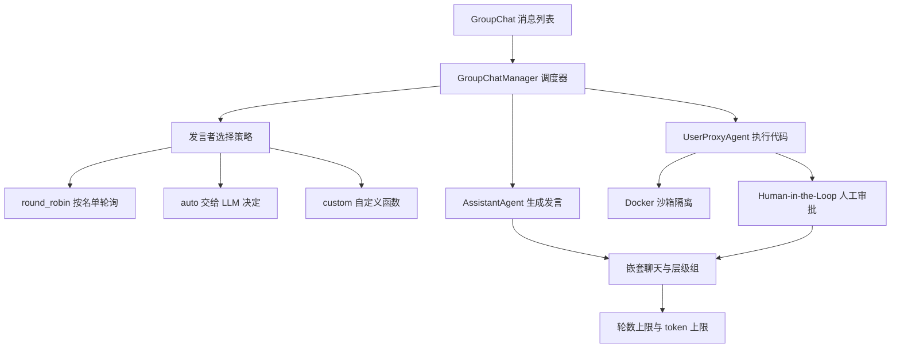
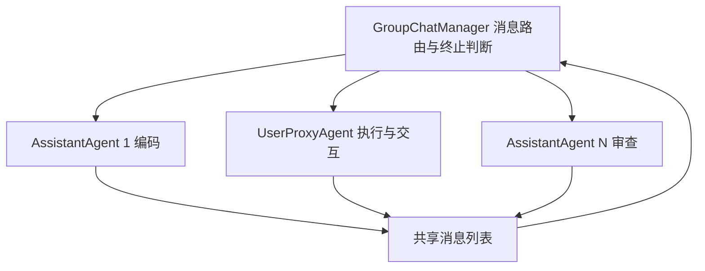
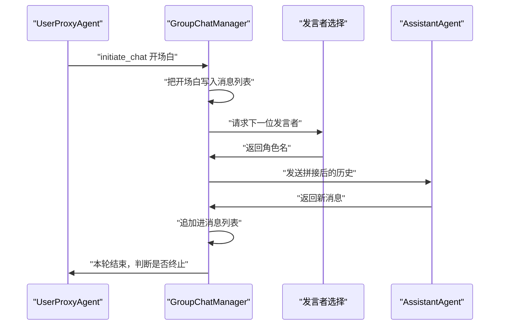
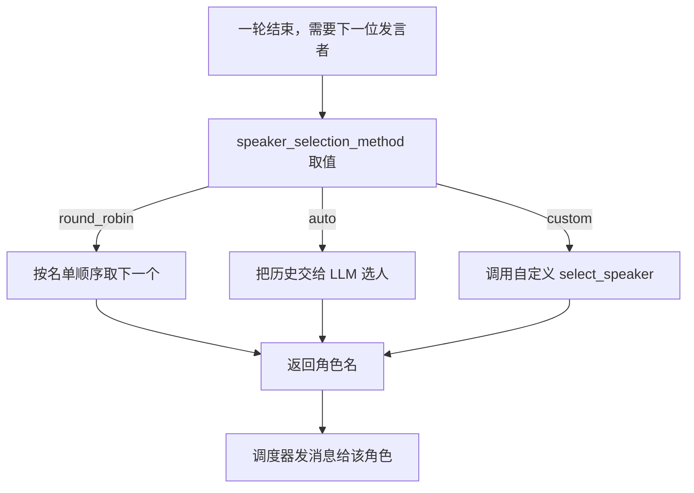
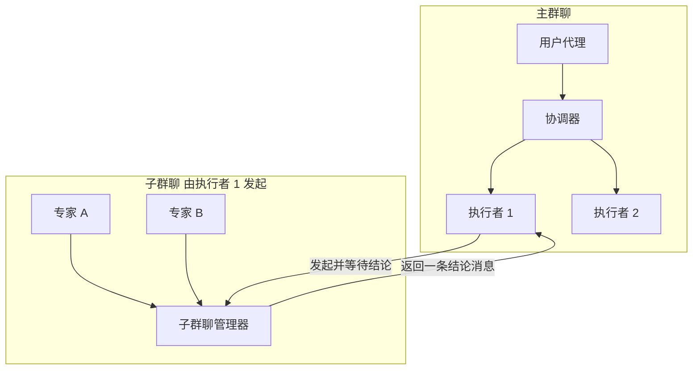
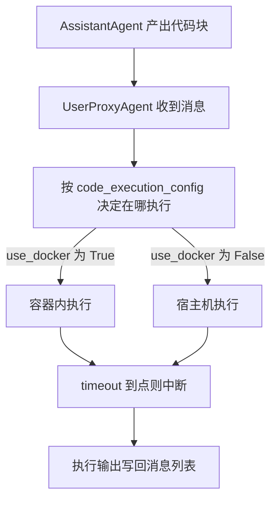
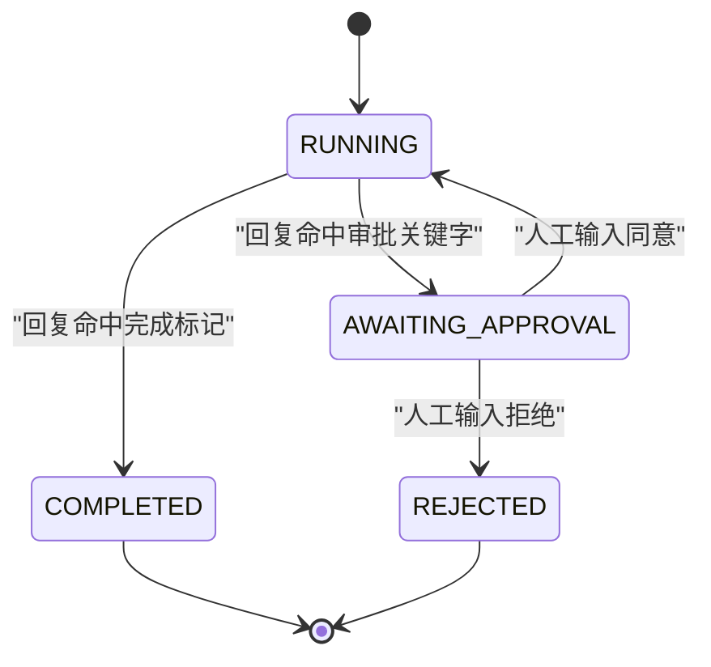
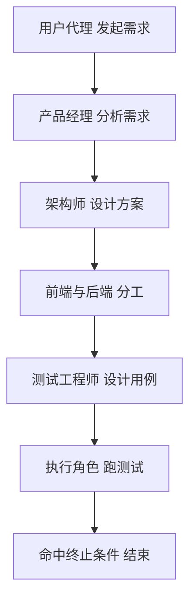
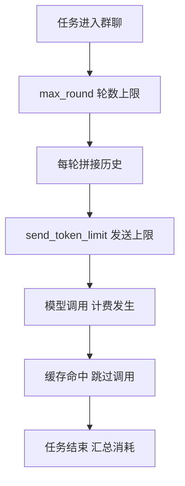

# AutoGen 群聊协作

!!! abstract "学完这一页你能"
    - 说清 GroupChat、GroupChatManager、AssistantAgent、UserProxyAgent 四个组件各自负责什么，并画出消息流转图。
    - 写出 round_robin、auto、custom 三种发言者选择策略的代码，并判断当前任务该用哪一种。
    - 用手工编排搭出嵌套聊天与层级组，让子群聊的结论回传主群聊。
    - 给代码执行配上 Docker 沙箱与人工审批，并把轮数上限与 token 上限写进配置。

!!! note "术语：AutoGen"
    定义：AutoGen 是微软发布的智能体协作框架，让多个角色互相发消息来完成任务。
    例子：一个角色负责写代码，另一个角色负责执行代码并把报错回传给第一个角色。

!!! note "本页数据来源"
    本页出现的配置数值，例如 max_round 取 10 到 30、temperature 取 0.7、镜像 python:3.11 与 node:18，全部来自本站该页面的旧版内容，以原文为准。
    本页示例代码对应旧版内容里的 API 名称；你安装的版本若不同，类名与参数名需核对官方文档。

## 0. 知识地图



建议按顺序读：先读第 1 节建立组件分工，再读第 2 节看清消息流向。
第 3 节到第 6 节是四种可独立落地的能力，哪一节对应你当前的问题就先读哪一节。
第 7 节把前六节合成一个可运行的项目，第 8 节给出配置取值与成本控制。

## 1. 群聊协作要解决什么问题

**先想一个问题**

你接到一个需求：把一份接口文档变成可运行的服务端代码，还要带测试和说明文档。让单个模型从头写到尾，它常漏掉测试这一环。你需要的是分工，于是问题变成：谁来记全部消息，谁来决定下一步谁发言。

**心智模型**

!!! tip "心智模型"
    一句话模型：群聊协作 = 一块公共黑板 + 一位点名的主持人 + 若干带人设的与会者。
    日常类比：像小组作业，组长看着黑板点名，组员各自交出自己那部分，全部发言都写在黑板上。
    不成立之处：主持人和组员读的是同一块黑板，没有私下交流；模型也没有黑板以外的记忆。

!!! note "术语：Agent"
    定义：在 AutoGen 里，Agent 是一个能收发消息的对象，它可以调用模型，也可以执行代码。
    例子：AssistantAgent 收到消息后调用模型生成回复；UserProxyAgent 收到消息后可以运行代码块。

**图解**



1. GroupChatManager 是调度中心，它读消息列表并决定下一位发言者。
2. AssistantAgent 只持有模型配置，负责产出自然语言与代码块，自己不执行代码。
3. UserProxyAgent 代表用户这一侧，可以自动执行代码，并把执行结果写成新消息。
4. 三个角色写入的都是同一份消息列表，下一轮调度时全员可见。
5. 箭头回到 Manager，说明这是一个循环，直到命中终止条件或达到轮数上限。

**一步一步来**

**第 1 步：构造两个基础角色**
① 这一步要做什么：准备一份模型配置，用它构造一个会生成内容的角色和一个会执行代码的角色。

```python
# 依赖：pip install pyautogen；不同大版本的类名与参数名需核对官方文档
import os
from autogen import AssistantAgent, UserProxyAgent

llm_config = {
    "model": "gpt-4",                              # 模型名按你的服务商填写
    "api_key": os.environ.get("OPENAI_API_KEY"),   # 密钥从环境变量读，不写进代码
    "temperature": 0.7,                            # 旧版内容给出的取值，以原文为准
}

assistant = AssistantAgent(
    name="assistant",          # 群聊靠名字定位发言者，名字必须唯一
    llm_config=llm_config,     # 持有模型配置，负责生成内容
)

user_proxy = UserProxyAgent(
    name="user_proxy",
    code_execution_config={
        "work_dir": os.path.abspath("workspace"),  # 代码在这个目录下执行
        "use_docker": True,                        # 放进容器执行，隔离宿主机
    },
)
```

**这段代码在做什么**
- 先定义 llm_config，把模型名、密钥来源、采样温度收在一个字典里，便于按环境替换。
- AssistantAgent 只接收 llm_config，说明它的职责是生成，不包含执行能力。
- UserProxyAgent 只接收 code_execution_config，它的职责是执行，是否调用模型由你决定。
- use_docker 为 True 表示代码在容器内运行，容器隔离是应对不可信代码的边界。
- work_dir 用绝对路径，避免不同启动目录导致产物落到意想不到的位置。

运行结果：这一段只构造对象，不调用模型，因此控制台没有输出；若本机没有运行 Docker，这一步不报错，发起对话时才报错。

**第 2 步：把角色放进群聊并启动**
① 这一步要做什么：创建群聊对象、创建调度器，然后用用户代理发起第一轮对话。

```python
from autogen import GroupChat, GroupChatManager

group_chat = GroupChat(
    agents=[assistant, user_proxy],  # 与会者名单，顺序会影响轮询策略
    messages=[],                     # 从空历史开始，避免上一个任务串进来
    max_round=10,                    # 轮数上限，旧版内容取值，以原文为准
)

manager = GroupChatManager(
    groupchat=group_chat,
    llm_config=llm_config,  # 调度器选下一位发言者时同样要调模型
)

user_proxy.initiate_chat(
    manager,
    message="帮我实现一个快速排序算法",  # 开场白会被写进消息列表
)
```

**这段代码在做什么**
- GroupChat 保存与会者名单与消息列表，它本身不做调度决策。
- messages 传空列表是让每次任务的起点干净，跨任务复用同一个列表会污染上下文。
- max_round 是硬性闸门，达到轮数就停止，它同时也是成本上限。
- GroupChatManager 需要 llm_config，因为选下一位发言者这一步也走模型。
- initiate_chat 把开场白注入群聊，随后由 Manager 接管轮转。

运行结果：需要真实 API Key 与 Docker；控制台会按轮次打印每位发言者的消息，具体文案取决于模型，本页不展示模型返回文本。

**动手验证**

下面这个脚本用 Node 复刻第 1 节的消息路由与轮询规则，不调用任何模型，专门验证「消息列表是唯一事实来源」这一点。

```js
// 依赖：仅 Node 20+ 内置模块，无需 npm install
// 运行：node groupchat-route.mjs
import assert from "node:assert/strict";

// 用对象模拟 Agent，只保留名字与类型
const agents = [
  { name: "product_manager", kind: "assistant" },
  { name: "coder", kind: "assistant" },
  { name: "executor", kind: "user_proxy" },
];

// 消息列表是群聊的唯一事实来源，每条消息记录发言者与内容
const messages = [];

// 广播：把一条消息追加进列表，所有人读到的都是这一份
function broadcast(speaker, content) {
  const msg = { speaker, content, round: messages.length + 1 };
  messages.push(msg);
  return msg;
}

// 轮询策略：按名单顺序取下一个发言者
function roundRobin(lastSpeaker) {
  const i = agents.findIndex((a) => a.name === lastSpeaker);
  return agents[(i + 1) % agents.length].name;
}

broadcast("user_proxy", "帮我实现快速排序");

assert.equal(roundRobin("user_proxy"), "product_manager");
assert.equal(roundRobin("product_manager"), "coder");
assert.equal(roundRobin("coder"), "executor");
assert.equal(messages.length, 1);
assert.equal(messages[0].round, 1);

console.log("消息条数:", messages.length);
console.log("下一位发言者:", roundRobin("user_proxy"));
console.log("断言全部通过");
```

预期输出：

```
消息条数: 1
下一位发言者: product_manager
断言全部通过
```

**常见坑**

| 现象 | 原因 | 怎么修 |
| --- | --- | --- |
| 发起对话时报 Docker 相关错误 | use_docker 为 True 但本机 Docker 守护进程没启动 | 先启动 Docker，或把 use_docker 改为 False 并接受无隔离风险 |
| 第二轮就重复第一轮的结论 | messages 里塞了上一次任务的记录 | 每次任务新建 GroupChat，messages 传空列表 |
| 群聊停在第一步不动 | Manager 没拿到 llm_config，选不出下一位发言者 | 给 GroupChatManager 传入与角色一致的 llm_config |

**用在哪里**

场景一：接口文档转服务端代码。
业务背景：团队要把内部接口文档变成带测试的脚手架代码。
这一节的知识怎么用：用 AssistantAgent 做编码角色，UserProxyAgent 做执行角色，组一个两人群聊。
用什么指标衡量收益：脚手架首次可运行所需的人工改动行数。
什么时候不该用：接口需要走内部审批才能调用时，不要让执行角色自动跑真实请求。

场景二：数据清洗脚本的自动试跑。
业务背景：运营每周提交一份脏数据，需要脚本清洗后再入库。
这一节的知识怎么用：让编码角色产出清洗脚本，执行角色在容器里跑一份样本数据。
用什么指标衡量收益：脚本一次通过率与人工返工次数。
什么时候不该用：样本里含真实用户隐私字段时，禁止把数据拷进执行容器。

场景三：新人培训用的任务拆解助手。
业务背景：培训场景需要把一个大任务拆成若干子任务并给出验收标准。
这一节的知识怎么用：用三个 AssistantAgent 分别扮演拆解、评审、归档角色。
用什么指标衡量收益：学员按拆解结果完成任务的完成率。
什么时候不该用：任务边界本身还没谈清时，先谈需求，不要先搭群聊。

**行业实践**

- Microsoft AutoGen 官方文档的 Group Chat 章节列出了 GroupChat 与 GroupChatManager 的职责划分，并给出 speaker_selection_method 的可选值。借鉴方式：先照文档跑通最小群聊，再按本节顺序加角色。
- AutoGen 官方 GitHub 仓库的 examples 目录提供了 groupchat 场景的示例脚本，包含多角色分工的写法。借鉴方式：把示例的角色名换成你业务里的岗位名，先验证消息流向再改提示词。
- LangGraph 官方文档的多智能体协作章节描述了把子任务交给专职节点的做法。借鉴方式：把层级组看成一张有向图，先画出节点与边，再决定哪些节点需要模型。

**小结**
- GroupChat 负责存消息，GroupChatManager 负责选下一位发言者，两者职责不重叠。
- AssistantAgent 生成内容，UserProxyAgent 执行代码，执行能力与生成能力分开配置。
- max_round 与 messages 是每次任务都要显式确认的两个参数。

## 2. 消息流转：一轮对话里发生了什么

**先想一个问题**

群聊跑到第 8 轮，你发现模型在重复第 3 轮的结论。要排查，你得知道每一轮到底把哪些消息发给了模型。如果你不知道消息存在哪个结构里，就只能靠猜。

**心智模型**

!!! tip "心智模型"
    一句话模型：一轮群聊 = 调度器选人，被选中的人读全量历史并追加一条新消息。
    日常类比：像会议记录员，每有人发言就在本子上追加一段，主持人只看本子决定下一位。
    不成立之处：模型看到的不是原话，而是被拼接与截断后的文本，超出上限的历史会被丢掉。

!!! note "术语：speaker_selection_method"
    定义：决定下一位发言者的规则名，旧版内容给出的取值有 round_robin 与 auto，定制场景用自定义方法。
    例子：设为 round_robin 时，名单里第一个人说完就轮到第二个人。

**图解**



1. 用户代理发起对话，开场白成为消息列表里的第一条。
2. 调度器不直接发言，它先把新消息落进列表。
3. 调度器请选择策略给出下一位发言者的名字。
4. 调度器把历史拼成提示词，发给被选中的角色。
5. 角色返回的消息被追加进同一个列表，供下一轮使用。
6. 调度器判断终止条件与轮数，未命中就回到第 3 步。

**一步一步来**

**第 1 步：看清 chat_messages 的结构**
① 这一步要做什么：读一次对话历史，确认消息按「对话对方」分组存放，而不是一条平铺列表。

```python
# 承接上一节构造好的 user_proxy 与 assistant
user_proxy.initiate_chat(assistant, message="写一个两数相加的函数")

# chat_messages 是字典：键是对话中的另一方，值是按时间排列的消息列表
history = user_proxy.chat_messages[assistant]

for i, msg in enumerate(history):
    role = msg.get("role")          # 消息角色，例如 user 或 assistant
    content = msg.get("content") or ""   # content 可能为 None，先兜底成空串
    print(i, role, content[:40])    # 只打印前 40 个字符，避免刷屏
```

**这段代码在做什么**
- chat_messages 的键是「另一方」，因此同一段对话里只有一个键，取值是消息列表。
- 每条消息至少含 role 与 content 两个字段，content 为 None 的情况必须兜底。
- 用 enumerate 带上下标，方便你按轮次定位是哪一步出了问题。
- 打印时截断内容长度，是为了让终端输出可以一眼扫完。

运行结果：需要真实 API Key；输出形如 `0 user 写一个两数相加的函数` 与 `1 assistant ...`，具体文案取决于模型。

**第 2 步：给历史加一道长度闸门**
① 这一步要做什么：在发起下一轮之前，先按 token 上限裁掉最老的消息。

```python
def trim_history(history, keep_last=6):
    """只保留最近若干条消息，控制提示词长度"""
    if len(history) <= keep_last:
        return history          # 条数没超，原样返回
    head = history[:1]          # 保留第一条，通常是任务描述
    tail = history[-keep_last:] # 保留最近若干条，保住上下文连贯
    return head + tail          # 拼接后返回新列表，不改原列表

history = user_proxy.chat_messages[assistant]
trimmed = trim_history(history)
print("原始条数:", len(history), "裁剪后条数:", len(trimmed))
```

**这段代码在做什么**
- keep_last 表示保留最近多少条，取值要按你的提示词预算来定，不要照搬。
- 保留第一条是为了让任务描述始终在场，否则模型会忘记原始目标。
- 返回新列表而不是就地修改，避免后续读取历史时拿到被改过的数据。
- 函数名与参数没有动 AutoGen 的任何接口，它是你能完全掌控的一层。

运行结果：形如 `原始条数: 9 裁剪后条数: 7`，具体数字取决于本轮实际消息条数。

**动手验证**

下面的脚本用 Node 复刻 chat_messages 的分组结构与裁剪规则。

```js
// 依赖：仅 Node 20+ 内置模块
// 运行：node chat-history.mjs
import assert from "node:assert/strict";

// 模拟 chat_messages：键是对话另一方，值是按时间排列的消息列表
const chatMessages = {
  assistant: [
    { role: "user", content: "写一个两数相加的函数" },
    { role: "assistant", content: "def add(a, b): return a + b" },
    { role: "user", content: "加上参数校验" },
    { role: "assistant", content: "def add(a, b): ..." },
  ],
};

function trimHistory(history, keepLast = 2) {
  if (history.length <= keepLast) return history;
  return history.slice(0, 1).concat(history.slice(-keepLast));
}

const raw = chatMessages.assistant;
const trimmed = trimHistory(raw, 2);

assert.equal(raw.length, 4);
assert.equal(trimmed.length, 3);
assert.equal(trimmed[0].content, "写一个两数相加的函数");
assert.equal(trimmed.at(-1).content, "def add(a, b): ...");
assert.notEqual(trimmed, raw); // 返回的是新数组，原历史未被改写

console.log("原始条数:", raw.length);
console.log("裁剪后条数:", trimmed.length);
console.log("断言全部通过");
```

预期输出：

```
原始条数: 4
裁剪后条数: 3
断言全部通过
```

**常见坑**

| 现象 | 原因 | 怎么改 |
| --- | --- | --- |
| 读取历史时报 KeyError | chat_messages 的键是对话另一方，你写的键不是那个对象 | 用你传给 initiate_chat 的那一侧对象作为键 |
| 对 content 调 lower 抛异常 | 部分消息的 content 为 None | 先做 `msg.get("content") or ""` 兜底 |
| 越跑越慢且费用上涨 | 历史全量拼进提示词，每轮都重发一次 | 加裁剪函数或设置发送上限 |

**用在哪里**

场景一：客服工单分诊群聊。
业务背景：工单进来后要先分类、再检索知识库、最后生成回复草稿。
这一节的知识怎么用：把每轮消息记下来，出问题时按轮次回放，定位是哪一步跑偏。
用什么指标衡量收益：分诊错误的工单在总工单里的占比。
什么时候不该用：工单里含支付凭证时，历史里不要落敏感字段。

场景二：长文档问答的上下文管理。
业务背景：一份长文档分多次提问，模型需要记住前文的结论。
这一节的知识怎么用：用裁剪函数保留首条任务描述与最近若干条问答。
用什么指标衡量收益：同一问题的重复提问率。
什么时候不该用：问题之间完全独立时，不要共享历史。

场景三：模型替换时的回归对比。
业务背景：团队要在两个模型之间做灰度，需要看到逐轮差异。
这一节的知识怎么用：把 chat_messages 落盘成 JSON，逐轮比对两份记录。
用什么指标衡量收益：同一任务下两个模型的轮数与结论差异条数。
什么时候不该用：只换采样参数时，不必记录全量历史。

**行业实践**

- Microsoft AutoGen 官方文档的 Group Chat 章节说明了消息列表由群聊对象持有，并说明轮数上限参数的作用。借鉴方式：把轮数上限写进配置文件，而不是散落在代码里。
- AutoGen 官方 GitHub 仓库的 examples 目录包含把对话历史导出供排查的示例写法。借鉴方式：给每个任务生成一个记录文件，按任务编号归档。
- LangGraph 官方文档的多智能体章节介绍了用状态对象在各节点间传递上下文。借鉴方式：把历史裁剪逻辑抽成一个纯函数，单独写单测。

**小结**
- 消息列表是唯一事实来源，任何角色的输出都先进列表再被消费。
- chat_messages 按对话另一方分组，读取前先做 None 兜底。
- 历史裁剪是一层你自己写的纯函数，不与框架接口耦合。

## 3. 发言者选择：三种策略怎么选

**先想一个问题**

一个群聊里有编码、审查、测试三个角色。如果按名单轮询，审查角色经常在没有代码可审的时候被叫到，它只能回复一句「暂无内容」。你想让发言顺序跟着内容走，该改哪个参数。

**心智模型**

!!! tip "心智模型"
    一句话模型：发言者选择策略回答一个问题——下一位谁说话。
    日常类比：像课堂点名，老师可以按座位轮着点，也可以看着讨论内容点最该发言的那个人。
    不成立之处：LLM 选人这一步也要花钱也要花时间，轮询策略不花这笔钱，但选得不够准。

**图解**



1. 一轮结束后，调度器先确认发言者选择策略。
2. 取值是 round_robin 时，按名单顺序取下一个，不额外调用模型。
3. 取值是 auto 时，把当前历史交给 LLM，由它给出角色名。
4. 取值指向自定义方法时，调用你写的 select_speaker 函数。
5. 三条路径都返回角色名，接下来的动作一致：把消息发给这个角色。

**一步一步来**

**第 1 步：先用轮询模式跑通**
① 这一步要做什么：把 speaker_selection_method 设为 round_robin，并禁止同一角色连续发言。

```python
from autogen import GroupChat, GroupChatManager

group_chat = GroupChat(
    agents=group_members,                  # 名单顺序就是轮询顺序
    messages=[],
    max_round=5,                           # 轮询模式下轮数越少越好排查
    speaker_selection_method="round_robin",# 按名单顺序发言
    allow_repeat_speaker=False,            # 禁止同一角色连续发言
)

manager = GroupChatManager(groupchat=group_chat, llm_config=llm_config)
```

**这段代码在做什么**
- 名单顺序决定发言顺序，因此把谁排在前面是一个需要设计的决定。
- allow_repeat_speaker 为 False 时，轮到的人不能连着说两轮。
- round_robin 不额外调用模型选人，这一轮省下一次调用。
- max_round 设为 5 是为了快速看完一整轮，排查阶段不要设大。

运行结果：需要真实 API Key；控制台会按名单顺序输出发言，具体文案取决于模型。

**第 2 步：换成动态选择，并给它一个提示词**
① 这一步要做什么：把策略换成 auto，让 LLM 依据历史选人。

```python
group_chat = GroupChat(
    agents=group_members,
    messages=[],
    max_round=10,                          # 旧版内容取值，以原文为准
    speaker_selection_method="auto",       # 由 LLM 决定下一位
    allow_repeat_speaker=True,             # 允许关键角色连续补充
)

# 选择提示词示例，来自旧版内容，以原文为准
SELECT_PROMPT = """
Given the conversation history, select the next speaker from the agent list.
Consider:
1. Who has the most relevant expertise?
2. Who has been least active recently?
3. What would be most helpful for the user?
Respond with only the agent name.
"""
```

**这段代码在做什么**
- auto 让选择本身成为一次模型调用，轮数越多这笔开销越大。
- allow_repeat_speaker 设为 True 后，同一位专家可以连续补充细节。
- 提示词要求只返回角色名，避免额外解释文字干扰解析。
- 提示词里的三条考虑项对应能力匹配、活跃度均衡、对用户的价值。

运行结果：需要真实 API Key；返回的角色名与轮次顺序取决于模型，每次运行可能不同。

**第 3 步：写自定义选择逻辑**
① 这一步要做什么：继承群聊类，重写选人方法，按消息内容决定找谁。

```python
from autogen import GroupChat

class CustomGroupChat(GroupChat):
    def select_speaker(self, last_speaker, selector):
        # 倒序扫描历史：最近一条消息决定下一步找谁
        for msg in reversed(self.messages):
            content = msg.get("content") or ""   # content 可能为 None
            if "```python" in content:
                return "code_reviewer"           # 出现代码块，交给审查角色
            if "error" in content.lower():
                return "debugger"                # 出现报错，交给调试角色
        # 兜底：名单内轮询，保证群聊不会停住
        idx = self.agents.index(last_speaker)
        return self.agents[(idx + 1) % len(self.agents)].name
```

**这段代码在做什么**
- 倒序遍历表示最近的消息优先，靠后的判断会先命中。
- content 做 None 兜底，避免对空值调用 lower 抛异常。
- 两条规则分别对应「有代码要审」与「有报错要修」两种情况。
- 兜底分支保证任何情况下都返回一个合法名字，群聊不会卡死。
- 自定义方法的参数名与触发条件需核对官方文档：要核对自定义 select_speaker 是否需要把 speaker_selection_method 设为特定取值。

运行结果：需要真实 API Key；若历史里出现代码块，下一位发言者会是 code_reviewer。

**动手验证**

下面脚本把三种策略写成三个纯函数，用断言验证它们在同一份历史上给出不同结果。

```js
// 依赖：仅 Node 20+ 内置模块
// 运行：node speaker-selection.mjs
import assert from "node:assert/strict";

const agents = ["coder", "code_reviewer", "debugger"];
const history = [
  { speaker: "coder", content: "```python\ndef add(a, b): return a + b\n```" },
];

// 策略一：按名单轮询
function roundRobin(last, list) {
  const i = list.indexOf(last);
  return list[(i + 1) % list.length];
}

// 策略二：写死的规则，代替 LLM 决策，保证脚本可离线运行
function ruleBased(last, list, msgs) {
  const latest = msgs.at(-1).content.toLowerCase();
  if (latest.includes("```python")) return "code_reviewer";
  if (latest.includes("error")) return "debugger";
  return roundRobin(last, list);
}

assert.equal(roundRobin("coder", agents), "code_reviewer");
assert.equal(ruleBased("coder", agents, history), "code_reviewer");
assert.equal(ruleBased("coder", agents, [{ content: "error: 除以零" }]), "debugger");
assert.equal(ruleBased("coder", agents, [{ content: "谢谢" }]), "code_reviewer");

console.log("轮询结果:", roundRobin("coder", agents));
console.log("规则结果:", ruleBased("coder", agents, history));
console.log("断言全部通过");
```

预期输出：

```
轮询结果: code_reviewer
规则结果: code_reviewer
断言全部通过
```

**常见坑**

| 现象 | 原因 | 怎么修 |
| --- | --- | --- |
| 群聊里没人发言就结束 | auto 选出的名字不在名单里 | 提示词要求只返回角色名，并在自定义方法里加兜底分支 |
| 审查角色反复被叫到但无活可干 | 用了 round_robin 且名单顺序固定 | 换成规则或 auto，让顺序跟随内容 |
| 费用比预期高 | auto 每轮都要额外一次模型调用 | 在内容规则清晰的场景改用自定义方法，减少调用 |

**用在哪里**

场景一：代码审查流水线。
业务背景：每次提交都要先跑一遍机器审查，再进入人工评审。
这一节的知识怎么用：用规则选择，出现代码块就找审查角色，出现报错就找调试角色。
用什么指标衡量收益：人工评审在机器审查之后提出的新问题条数。
什么时候不该用：改动只有文案时，不要让审查角色参与。

场景二：多角色内容生产。
业务背景：一个专题要经过选题、撰写、事实核对三道工序。
这一节的知识怎么用：用 auto 让模型依据进度决定下一步找谁。
用什么指标衡量收益：成稿返工次数。
什么时候不该用：工序是固定顺序时，round_robin 足够且更省调用。

场景三：故障排查群聊。
业务背景：线上告警后需要快速定位是应用层还是依赖层。
这一节的知识怎么用：按日志关键字选择角色，日志里出现超时就找依赖排查角色。
用什么指标衡量收益：从告警到定位根因的耗时。
什么时候不该用：只有一条日志时，直接看就行，不必建群聊。

**行业实践**

- Microsoft AutoGen 官方文档的 Group Chat 章节列出了 speaker_selection_method 的取值以及各自的行为差异。借鉴方式：先把策略做成配置项，再用同一批任务对比两种策略的轮数与结论。
- AutoGen 官方 GitHub 仓库的 examples 目录包含自定义发言者选择的写法。借鉴方式：把选择规则写成可单测的纯函数，输入是消息列表，输出是角色名。
- LangGraph 官方文档的多智能体章节把「下一位谁执行」表达成图的边。借鉴方式：规则复杂到超过五条时，改用图结构显式表达，而不是继续堆 if 分支。

**小结**
- round_robin 省钱且可预测，auto 按内容选人但每轮多一次调用。
- 自定义方法的核心是「规则 + 兜底」，兜底分支保证群聊不会停住。
- 选择逻辑写成纯函数后可以离线单测，不必每次都调模型。

## 4. 嵌套聊天与层级组

**先想一个问题**

主群聊里有产品、架构、开发三个角色。架构角色在评审时需要三个专家一起讨论十分钟，讨论完只把结论带回主群聊。你不想让专家的全部发言污染主群聊的上下文，这该怎么组织。

**心智模型**

!!! tip "心智模型"
    一句话模型：嵌套聊天是把一次子讨论的结果当成一条消息带回来。
    日常类比：像部门内部先开小会达成结论，再派一个人到大会上汇报结论，大会不记录小会全程。
    不成立之处：子讨论的 Token 消耗一样计费，省下的只是主群聊的上下文长度，不是成本。

!!! note "术语：嵌套聊天"
    定义：在一个群聊中由某个角色发起另一个群聊，子群聊跑完后把结果回传。
    例子：架构角色发起一个两位专家的子群聊，子群聊给出方案，架构角色把方案写进主群聊。

**图解**



1. 主群聊按正常流程轮转，协调器把任务分给执行者。
2. 执行者 1 发现自己需要专业意见，于是发起一个子群聊。
3. 子群聊内部由自己的管理器调度，专家 A 与专家 B 交替发言。
4. 子群聊达到轮数上限或命中终止条件后停止。
5. 执行者 1 只把最后结论并入主群聊，专家全程发言不进入主群聊。
6. 主群聊继续轮转，其他角色只看到这条结论。

**一步一步来**

**第 1 步：先建一个子群聊**
① 这一步要做什么：用两位专家角色建一个独立群聊，准备一份只属于子讨论的名单。

```python
from autogen import AssistantAgent, GroupChat, GroupChatManager

expert_a = AssistantAgent(name="expert_a", llm_config=llm_config)
expert_b = AssistantAgent(name="expert_b", llm_config=llm_config)

sub_group = GroupChat(
    agents=[expert_a, expert_b],  # 子群聊名单，越小越可控
    messages=[],                  # 子讨论从空历史开始
    max_round=5,                  # 子讨论轮数上限，旧版内容取值，以原文为准
)
sub_manager = GroupChatManager(groupchat=sub_group, llm_config=llm_config)
```

**这段代码在做什么**
- 子群聊是独立的 GroupChat 对象，有自己的消息列表与轮数上限。
- 两位专家共用同一份 llm_config，差别只在 system_message 描述的人设。
- 子群聊的 max_round 设小一些，避免子讨论吞掉预算。
- 子群聊管理器同样需要 llm_config，它也要选下一位发言者。

运行结果：这一段只构造对象，不调用模型，控制台没有输出。

**第 2 步：从主角色发起子讨论并取回结论**
① 这一步要做什么：让主群聊里的某个角色调用子群聊，并把子群聊的最后一条消息作为汇报内容。

```python
def ask_experts(task: str) -> str:
    """发起一次子讨论，只把结论返回给主群聊"""
    expert_a.initiate_chat(
        sub_manager,
        message=task,           # 子讨论的议题
        clear_history=False,    # 保留历史，便于同一议题多轮追问
    )
    return expert_a.last_message()   # 只取最后一条当结论

coordinator = AssistantAgent(name="coordinator", llm_config=llm_config)

# 主群聊里协调器把需要深挖的部分交给子讨论
summary = ask_experts("分析这个接口的吞吐瓶颈")
```

**这段代码在做什么**
- ask_experts 是一个普通函数，它把子群聊的复杂度封在内部。
- clear_history 为 False 表示保留上一次子讨论的历史，同一议题追问时可以省一次背景说明。
- last_message 只取最后一条，子讨论的中间过程不会进入主群聊。
- 返回字符串而不是整个结果对象，主群聊拿到的就是一条可写入的消息。

运行结果：需要真实 API Key；返回的是子群聊最后一条消息的文本，具体文案取决于模型。

**第 3 步：用层级组表达固定分工**
① 这一步要做什么：把角色按层级摆放，上层只负责转发与汇总，下层负责产出。

```python
class HierarchicalTeam:
    """层级协作：用户代理 -> 协调器 -> 领域专家"""

    def __init__(self, llm_config):
        self.frontend = AssistantAgent(name="frontend_expert", llm_config=llm_config)
        self.backend = AssistantAgent(name="backend_expert", llm_config=llm_config)
        self.coordinator = AssistantAgent(
            name="coordinator",
            llm_config=llm_config,
            system_message="你负责判断问题属于前端还是后端，并转给对应专家。",
        )
        self.llm_config = llm_config

    def route(self, question: str) -> str:
        """最简路由：按关键字把问题交给对应专家"""
        target = self.frontend if "样式" in question else self.backend
        return target.generate_reply(messages=[{"role": "user", "content": question}])
```

**这段代码在做什么**
- 层级里每一层只做一件事：协调器只做判断与转发，专家只做产出。
- route 用关键字做路由，这是最可控的版本，不需要额外模型调用。
- 协调器保留了 system_message，说明它的判断也可以交给模型完成。
- 把 llm_config 存成实例属性，便于后续构造更多角色时复用同一份配置。

运行结果：需要真实 API Key；返回字符串为该专家角色的回复文本。

**动手验证**

下面的脚本用 Node 模拟子群聊：子任务在自己的列表里跑完，只把结论合并回主列表。

```js
// 依赖：仅 Node 20+ 内置模块
// 运行：node nested-chat.mjs
import assert from "node:assert/strict";

const mainMessages = [];
const subMessages = [];

// 子群聊：只在自己的列表里追加消息，不影响主列表
function runSubChat(topic, rounds) {
  for (let i = 1; i <= rounds; i += 1) {
    subMessages.push({ round: i, content: `专家讨论第 ${i} 轮: ${topic}` });
  }
  return `结论: ${topic} 的瓶颈在数据库连接池`;
}

const conclusion = runSubChat("接口吞吐", 3);

// 主群聊只接收一条结论消息
mainMessages.push({ speaker: "coordinator", content: conclusion });

assert.equal(subMessages.length, 3);      // 子讨论的中间过程留在子列表
assert.equal(mainMessages.length, 1);     // 主列表只多了一条
assert.ok(mainMessages[0].content.startsWith("结论:"));

console.log("子讨论消息条数:", subMessages.length);
console.log("主群聊消息条数:", mainMessages.length);
console.log("结论:", mainMessages[0].content);
console.log("断言全部通过");
```

预期输出：

```
子讨论消息条数: 3
主群聊消息条数: 1
结论: 接口吞吐 的瓶颈在数据库连接池
断言全部通过
```

**常见坑**

| 现象 | 原因 | 怎么修 |
| --- | --- | --- |
| 主群聊上下文突然变长 | 子群聊的历史被并进了主群聊 | 只传 last_message 的文本，不要传整个结果对象 |
| 子讨论重复问同一件事 | clear_history 为 True，每次都从零开始 | 同一议题追问时把 clear_history 设为 False |
| 层级组的协调器抢着干活 | 协调器的提示词没有限定只做转发 | 在 system_message 里写清职责边界与转交条件 |

**用在哪里**

场景一：大型需求拆解。
业务背景：一个需求涉及前端、后端、运维三方，需要各自出方案后再合并。
这一节的知识怎么用：主群聊保留总体进度，三方各自的细节讨论放进子群聊。
用什么指标衡量收益：合并方案时出现的冲突条数。
什么时候不该用：需求只涉及一方时，直接单群聊即可。

场景二：故障复盘。
业务背景：一次线上故障要同时看应用日志、数据库慢查询、网络指标。
这一节的知识怎么用：每个方向一个子群聊，主群聊只收结论与证据清单。
用什么指标衡量收益：复盘文档从故障结束到定稿的耗时。
什么时候不该用：故障还在持续时，先止损，不要先开会。

场景三：跨团队接口对齐。
业务背景：两个团队对同一份接口的定义不一致。
这一节的知识怎么用：各团队内部先子讨论出结论，再在主群聊里对齐差异项。
用什么指标衡量收益：接口联调阶段暴露的字段冲突数。
什么时候不该用：对接口已经有正式规范文档时，直接按文档核对。

**行业实践**

- Microsoft AutoGen 官方文档的 Nested Chats 章节描述了让一个角色触发另一个对话的写法，并说明子对话结果如何回传。借鉴方式：把子讨论封装成一个函数，函数只返回字符串。
- AutoGen 官方 GitHub 仓库的 examples 目录包含嵌套对话与工具调用结合的示例。借鉴方式：把子群聊看成一个函数，先在本地用假数据替换它调试主流程。
- LangGraph 官方文档的多智能体章节介绍了把子图嵌入主图的做法。借鉴方式：为每层子流程画一张独立的流程图，主图只保留入口与出口。

**小结**
- 嵌套聊天的收益是主群聊上下文更短，代价是子讨论同样计费。
- 子讨论的接口设计成「输入议题，输出结论字符串」，主流程才好测。
- 层级组的每一层只做一件事，转发层的提示词要写清边界。

## 5. 代码执行与沙箱隔离

**先想一个问题**

你让模型生成了一段清理临时文件的脚本，它写出了删除命令。如果这段代码直接在宿主机上跑，一次手滑就是生产事故。你想让代码跑起来，但又要有一道隔离边界。

**心智模型**

!!! tip "心智模型"
    一句话模型：代码执行角色是「会动手的那一个」，动手范围由配置决定。
    日常类比：像把实验放进通风橱里做，试剂再呛人也只影响橱内。
    不成立之处：容器隔离的是文件与进程，不隔离网络与计费，代码仍然可以往外发请求。

!!! note "术语：Human-in-the-Loop"
    定义：在自动化流程里插入人工确认的环节，人没点头就不继续。
    例子：删除文件之前先打印待删清单，等操作人输入确认。

**图解**



1. 生成角色产出的代码块随消息进入执行角色。
2. 执行角色读取 code_execution_config，决定执行位置。
3. use_docker 为 True 时进入容器，为 False 时直接在宿主机执行。
4. 无论哪种位置，timeout 到点都会中断执行。
5. 执行的标准输出与报错被写成新消息，回到消息列表供下一轮使用。

**一步一步来**

**第 1 步：配置一个带隔离与超时的执行器**
① 这一步要做什么：给执行角色指定工作目录、镜像与超时时间。

```python
from autogen import UserProxyAgent

code_executor = UserProxyAgent(
    name="code_executor",
    human_input_mode="NEVER",        # 无人值守；默认值不是 NEVER，需按场景显式设置
    code_execution_config={
        "work_dir": "workspace",     # 宿主机挂载进容器的共享目录
        "use_docker": "python:3.11", # 传镜像名即启用容器隔离
        "timeout": 60,               # 单次执行上限，单位秒
    },
)
```

**这段代码在做什么**
- human_input_mode 默认为 ALWAYS，批处理场景必须显式改成 NEVER，否则每轮都等人确认。
- use_docker 传字符串表示使用指定镜像，传 True 表示使用默认镜像，两者取值需核对官方文档。
- timeout 是墙钟上限，防止死循环把进程挂住。
- work_dir 是宿主机与容器共享的位置，产物从这里取回。

运行结果：这一段只构造对象；若本机 Docker 未就绪，发起对话时才会报错。

**第 2 步：把不同语言路由到不同执行器**
① 这一步要做什么：按语言名查表，把代码块交给对应镜像的执行器。

```python
python_executor = UserProxyAgent(
    name="python_executor",
    code_execution_config={"work_dir": "workspace", "use_docker": "python:3.11", "timeout": 60},
)
js_executor = UserProxyAgent(
    name="js_executor",
    code_execution_config={"work_dir": "workspace", "use_docker": "node:18", "timeout": 60},
)

EXECUTOR_MAP = {
    "python": python_executor,      # 键必须与传入的语言字符串完全一致
    "javascript": js_executor,
}

def execute_blocks(blocks, assistant):
    """blocks 形如 [(语言, 代码), ...]"""
    results = {}
    for lang, code in blocks:
        executor = EXECUTOR_MAP.get(lang)
        if executor is None:
            results[lang] = "未配置该语言的执行器"   # 显式记录，避免静默跳过
            continue
        executor.initiate_chat(assistant, message=f"执行 {lang} 代码:\n{code}")
        results[lang] = executor.last_message()
    return results
```

**这段代码在做什么**
- 用字典做路由，新增语言只加一行，判断逻辑不动。
- 查表失败时显式写入一条提示，否则该代码块会被静默跳过。
- 每个执行器用各自的镜像，依赖互不污染。
- 结果字典以语言名为键，同语言多次出现时后者会覆盖前者。

运行结果：需要真实 API Key 与对应镜像；返回值为各语言最后一条消息，内容取决于模型与执行结果。

**动手验证**

下面的脚本用 Node 的子进程模拟「隔离执行 + 超时中断」，并对输出做断言。

```js
// 依赖：仅 Node 20+ 内置模块
// 运行：node sandbox-exec.mjs
import assert from "node:assert/strict";
import { spawnSync } from "node:child_process";

// 允许执行的代码前缀白名单，代替容器做最小隔离演示
const ALLOWED = ["console.log"];

function runSandbox(code, timeoutMs) {
  if (!ALLOWED.some((p) => code.trimStart().startsWith(p))) {
    return { status: "rejected", output: "代码不在白名单内" };
  }
  const r = spawnSync(process.execPath, ["-e", code], {
    timeout: timeoutMs,
    encoding: "utf8",
  });
  if (r.error && r.error.code === "ETIMEDOUT") {
    return { status: "timeout", output: "执行超时被中断" };
  }
  return { status: "ok", output: (r.stdout || "").trim() };
}

const ok = runSandbox("console.log([1,2,3].length)", 3000);
assert.equal(ok.status, "ok");
assert.equal(ok.output, "3");

const denied = runSandbox("process.exit(1)", 3000);
assert.equal(denied.status, "rejected");

const slow = runSandbox("console.log('start'); while(true){}", 300);
assert.equal(slow.status, "timeout");

console.log("正常执行:", ok.output);
console.log("被拒绝:", denied.output);
console.log("超时处理:", slow.output);
console.log("断言全部通过");
```

预期输出：

```
正常执行: 3
被拒绝: 代码不在白名单内
超时处理: 执行超时被中断
断言全部通过
```

**常见坑**

| 现象 | 原因 | 怎么修 |
| --- | --- | --- |
| 每轮都卡住等输入 | human_input_mode 默认为 ALWAYS | 无人值守场景显式设为 NEVER |
| 执行的不是你传入的代码 | 执行角色自己配了 llm_config，它会补全代码 | 执行角色不配 llm_config，或用官方文档中的禁用方式 |
| 提示找不到镜像 | 本地没有该镜像且未拉取 | 提前执行 docker pull，或改用本机已有的镜像 |

**用在哪里**

场景一：后台管理的批量导入脚本生成。
业务背景：运营上传 Excel，系统生成导入脚本并试跑样本。
这一节的知识怎么用：用容器执行脚本，工作目录指向临时目录，timeout 设成几十秒。
用什么指标衡量收益：导入脚本一次试跑成功率。
什么时候不该用：Excel 里含真实手机号时，先脱敏再进容器。

场景二：CI 中的代码生成校验。
业务背景：合并请求里包含由模型生成的代码，需要先跑一遍测试。
这一节的知识怎么用：在 CI 里启动执行器跑单测，把输出贴回合并请求评论。
用什么指标衡量收益：回归阶段发现的生成代码缺陷数。
什么时候不该用：需要真实第三方凭据的测试，不要放进容器执行。

场景三：SQL 执行前的语法校验。
业务背景：运营提交查询语句，先校验再上生产。
这一节的知识怎么用：把校验放在只读账号与短超时下执行。
用什么指标衡量收益：上生产后报语法错误的比例。
什么时候不该用：语句涉及批量更新时，先人工审批再执行。

**行业实践**

- Microsoft AutoGen 官方文档的 Code Execution 章节说明了 code_execution_config 的字段含义与容器隔离要求。借鉴方式：把镜像名与超时写进环境配置，按环境切换。
- AutoGen 官方 GitHub 仓库的 examples 目录包含本地执行与容器执行两种配置的对照。借鉴方式：本地开发用本地执行，上线前切容器复测一遍。
- Docker 官方文档的容器资源限制章节说明了内存与 CPU 的约束方式。借鉴方式：给执行容器单独设置资源上限，避免单次任务拖垮宿主机。

**小结**
- 执行能力与生成能力分开配置，执行角色默认不需要模型。
- use_docker 与 timeout 是两个必须显式确认的字段。
- 路由表的键要与传入的语言字符串完全一致，查表失败要显式记录。

## 6. Human-in-the-Loop 的四种介入方式

**先想一个问题**

一个自动化脚本要删除过期文件。低风险的是删除七年前的日志，高风险的是删除近三十天的日志。你不想每次都弹确认框，也不想高风险操作无人把关。

**心智模型**

!!! tip "心智模型"
    一句话模型：人工介入按风险分级，风险越高，停下来等人的点越多。
    日常类比：像公司报销，小额自动通过，大额要主管签字。
    不成立之处：模型的判断会漂移，同一任务在不同轮次可能被划到不同风险等级，所以分级规则要写死在代码里。

!!! note "术语：渐进式授权"
    定义：权限随任务推进逐级放开，默认从最小权限开始。
    例子：先只允许读，确认分析正确后再放开执行，最后才放开写文件。

**图解**



1. 任务从 RUNNING 开始，模型持续产出步骤。
2. 回复里出现约定的审批关键字时，状态切到 AWAITING_APPROVAL。
3. 人工同意后回到 RUNNING，继续产生步骤。
4. 人工拒绝则进入 REJECTED，任务结束且不继续执行。
5. 回复里出现完成标记时进入 COMPLETED，正常收尾。

**一步一步来**

**第 1 步：按风险等级切换介入模式**
① 这一步要做什么：把风险等级映射到 human_input_mode，高风险才真正等人。

```python
from autogen import AssistantAgent, UserProxyAgent

class ApprovalFlow:
    def __init__(self, llm_config):
        self.assistant = AssistantAgent(name="assistant", llm_config=llm_config)
        self.human = UserProxyAgent(name="human", human_input_mode="NEVER")
        self.records = []   # 审批记录，按插入顺序编号

    def request(self, task, risk_level="LOW"):
        # 高风险才开启人工介入，低风险保持自动
        self.human.human_input_mode = "ALWAYS" if risk_level in ("HIGH", "CRITICAL") else "NEVER"
        self.records.append({"task": task, "risk": risk_level, "status": "PENDING"})
        self.assistant.initiate_chat(self.human, message=f"[审批请求 {risk_level}] {task}")
        return len(self.records) - 1   # 返回记录编号
```

**这段代码在做什么**
- human_input_mode 是实例状态，就地改写意味着同一时刻只能承载一种模式。
- 先登记记录再发起对话，即使对话抛异常，审计记录也在。
- 返回记录编号，调用方后续用它来改状态。
- 高风险才打开 ALWAYS，低风险保持自动，减少无意义的打扰。

运行结果：低风险任务不等待输入；高风险任务会阻塞在终端等待你输入，需要真实 API Key。

**第 2 步：用关键字中断并支持恢复**
① 这一步要做什么：约定一个中断标记，模型需要审批时把它写进回复，流程在此处暂停。

```python
class InterruptibleAgent:
    STOP_KEYWORD = "[HALT_FOR_APPROVAL]"      # 中断信号，只在这一处定义

    def __init__(self, llm_config):
        self.assistant = AssistantAgent(name="assistant", llm_config=llm_config)
        self.state = "RUNNING"

    def process(self, task, max_steps=5):
        steps = []
        for _ in range(max_steps):            # 步数上限是防死循环的兜底
            reply = self.assistant.generate_reply(messages=[{"role": "user", "content": task}])
            if self.STOP_KEYWORD in reply:
                self.state = "AWAITING_APPROVAL"
                return {"status": "INTERRUPTED", "steps": steps, "pending": reply}
            steps.append(reply)
            if "[DONE]" in reply:
                self.state = "COMPLETED"
                break
        return {"status": self.state, "steps": steps}
```

**这段代码在做什么**
- 中断判定放在完成判定之前，两条同时命中时以中断为准。
- steps 只记录已完成的步骤，待审批的内容不记账。
- max_steps 是必要的兜底，模型既不中断也不完成时会走完上限退出。
- 回复文本用子串匹配，模型在解释文字里引用该标记也会误判，需要更严格的匹配时可改用正则。

运行结果：需要真实 API Key；命中关键字时返回状态 INTERRUPTED，否则返回 COMPLETED 与步骤列表。

**第 3 步：用权限表限制能力范围**
① 这一步要做什么：把权限等级写成表，默认停在最低档，执行前先查表。

```python
LEVELS = {
    "READ":    {"code_execution": False, "file_write": False},
    "EXECUTE": {"code_execution": True,  "file_write": False},
    "WRITE":   {"code_execution": True,  "file_write": True},
}

class GuardedRunner:
    def __init__(self, assistant):
        self.assistant = assistant
        self.level = "READ"          # 默认从最小权限开始

    def escalate(self, level):
        if level in LEVELS:          # 非法等级被忽略，不会写入未定义状态
            self.level = level

    def run(self, task):
        perms = LEVELS[self.level]
        if not perms["code_execution"] and "execute" in task.lower():
            return "需要 EXECUTE 权限"
        return self.assistant.generate_reply(messages=[{"role": "user", "content": task}])
```

**这段代码在做什么**
- 默认等级是 READ，对象构造完不具备执行与写入能力。
- escalate 只接受表内等级名，拼错时静默忽略，不会把权限改成未定义状态。
- 能力判断基于任务文本关键字，属于粗粒度检查，描述里不含关键字但实际要写文件时会被放过。
- perms 是只读快照，改动它不会污染模块级常量。

运行结果：等级为 READ 且任务文本含 execute 时返回提示字符串，不发生模型调用。

**动手验证**

下面的脚本实现第 2 步的状态机，用断言覆盖中断、恢复与完成三条路径。

```js
// 依赖：仅 Node 20+ 内置模块
// 运行：node hitl-state.mjs
import assert from "node:assert/strict";

const STOP = "[HALT_FOR_APPROVAL]";
const DONE = "[DONE]";

function runTask(replies, maxSteps = 5) {
  const steps = [];
  for (let i = 0; i < Math.min(replies.length, maxSteps); i += 1) {
    const reply = replies[i];
    if (reply.includes(STOP)) {
      return { status: "AWAITING_APPROVAL", steps, pending: reply };
    }
    steps.push(reply);
    if (reply.includes(DONE)) {
      return { status: "COMPLETED", steps };
    }
  }
  return { status: "RUNNING", steps };
}

const interrupted = runTask(["第一步完成", `准备删除文件 ${STOP}`]);
assert.equal(interrupted.status, "AWAITING_APPROVAL");
assert.equal(interrupted.steps.length, 1);      // 待审批的一步不计入已完成

const finished = runTask(["第一步完成", `收尾 ${DONE}`]);
assert.equal(finished.status, "COMPLETED");
assert.equal(finished.steps.length, 2);

const runaway = runTask(["a", "b", "c", "d", "e", "f"], 5);
assert.equal(runaway.status, "RUNNING");        // 步数上限兜底
assert.equal(runaway.steps.length, 5);

console.log("中断路径:", interrupted.status, "已完成步骤:", interrupted.steps.length);
console.log("完成路径:", finished.status, "已完成步骤:", finished.steps.length);
console.log("超步数兜底:", runaway.status, "已完成步骤:", runaway.steps.length);
console.log("断言全部通过");
```

预期输出：

```
中断路径: AWAITING_APPROVAL 已完成步骤: 1
完成路径: COMPLETED 已完成步骤: 2
超步数兜底: RUNNING 已完成步骤: 5
断言全部通过
```

**常见坑**

| 现象 | 原因 | 怎么修 |
| --- | --- | --- |
| 低风险任务也在等人输入 | 风险判断写在模型侧，结果不稳定 | 风险等级由调用方传入，代码里写死映射关系 |
| 待审批的步骤被算作已完成 | 中断判定写在追加步骤之后 | 先判中断，再追加步骤 |
| 模型引用关键字导致误中断 | 用子串匹配判定状态 | 改为整行精确匹配或带词界的正则 |

**用在哪里**

场景一：财务付款审批。
业务背景：批量付款需要按金额分级审批。
这一节的知识怎么用：金额高于阈值时把 human_input_mode 设为 ALWAYS，否则自动执行。
用什么指标衡量收益：审批环节的平均等待时长。
什么时候不该用：金额小且收款方是白名单时，不必增加审批点。

场景二：生产环境变更。
业务背景：改配置、扩缩容这类操作需要有人盯着。
这一节的知识怎么用：用中断关键字把执行停在提交命令之前。
用什么指标衡量收益：回滚次数。
什么时候不该用：灰度环境可以自动执行，先验证再上生产。

场景三：批量删除类脚本。
业务背景：运维要清理过期文件，误删代价高。
这一节的知识怎么用：先用 READ 权限列出待删清单，人工确认后再提升到 WRITE。
用什么指标衡量收益：误删事件次数。
什么时候不该用：目录内容本身就是临时产物时，可以直接执行并保留删除日志。

**行业实践**

- Microsoft AutoGen 官方文档的 Human-in-the-Loop 章节说明了 human_input_mode 的取值与各自触发条件。借鉴方式：把取值来源写成配置项，不同环境用不同默认值。
- AutoGen 官方 GitHub 仓库的 examples 目录包含多轮人工确认的示例写法。借鉴方式：把审批记录落成结构化日志，便于事后审计。
- LangGraph 官方文档的人机协作章节介绍了在执行前插入人工确认节点的做法。借鉴方式：把「停下来等人」当成流程图里的一个节点，而不是散落的 if 判断。

**小结**
- 风险等级由代码决定，不要让模型决定自己是否需要被审批。
- 中断标记与完成标记都要有，缺一个就会出现无人值守时的无限循环。
- 权限默认从最低档开始，提权是显式动作。

## 7. 完整示例：开发团队群聊与代码审查流水线

**先想一个问题**

一个需求从提出到测试通过，要经过产品分析、架构设计、编码、测试设计四个环节。如果每个环节你都手动去调一次模型，中间结果靠复制粘贴，很快就乱了。

**心智模型**

!!! tip "心智模型"
    一句话模型：把每个环节做成一个角色，用群聊把它们串成一条流水线。
    日常类比：像工厂的流水线，每道工序只做一件事，做完把半成品放到传送带上。
    不成立之处：流水线的工位是确定的，模型群聊的发言顺序可能变化，所以要设轮数上限。

**图解**



1. 用户代理把需求写进消息列表，成为群聊开场白。
2. 产品经理先发言，输出需求要点与验收口径。
3. 架构师基于需求要点给出技术方案与模块划分。
4. 前后端角色按方案拆出各自的开发任务。
5. 测试工程师根据验收口径设计用例。
6. 执行角色跑用例，输出结果后命中终止条件，群聊结束。

**一步一步来**

**第 1 步：用字典批量创建角色**
① 这一步要做什么：把角色名与职责提示写进配置，循环创建智能体。

```python
from autogen import AssistantAgent, UserProxyAgent, GroupChat, GroupChatManager

ROLES = {
    "product_manager": "你是产品经理，负责需求分析与验收口径。",
    "architect":       "你是系统架构师，负责技术方案与模块划分。",
    "frontend_dev":    "你是前端工程师，负责页面与交互实现。",
    "backend_dev":     "你是后端工程师，负责接口与数据存储。",
    "qa_engineer":     "你是测试工程师，负责测试策略与用例设计。",
}

# 字典推导式批量构造，角色名即 Agent 的 name
members = [
    AssistantAgent(name=name, llm_config=llm_config, system_message=desc)
    for name, desc in ROLES.items()
]
```

**这段代码在做什么**
- 把角色与提示词放在一处，新增角色只改字典。
- 字典的键顺序在 Python 3.7 之后是插入顺序，因此角色创建顺序与书写顺序一致。
- system_message 是角色之间唯一的差别，模型配置完全相同。
- members 列表的顺序会影响 round_robin 的轮询顺序。

运行结果：只构造对象，控制台无输出。

**第 2 步：建群聊并启动**
① 这一步要做什么：把角色装进群聊，设置轮数上限与选择策略，然后发起任务。

```python
team = GroupChat(
    agents=members,
    messages=[],
    max_round=20,                    # 旧版内容取值，以原文为准
    speaker_selection_method="auto", # 由 LLM 决定下一位
)

manager = GroupChatManager(groupchat=team, llm_config=llm_config)

user_proxy = UserProxyAgent(name="user", human_input_mode="TERMINATE")

user_proxy.initiate_chat(
    manager,
    message="请协作完成用户注册登录系统的设计，包含需求、架构、开发分工与测试用例。",
)
```

**这段代码在做什么**
- max_round 设为 20 是因为五个角色各说几轮就会用掉轮次。
- auto 让选择跟随内容，架构师讲完后更可能轮到开发角色。
- human_input_mode 为 TERMINATE 表示平时不打断，出现终止条件时才介入。
- initiate_chat 的返回值里含完整历史，需要复盘时可以保存下来。

运行结果：需要真实 API Key；控制台按轮次打印五位角色的发言，内容取决于模型。

**第 3 步：把审查做成可调用的方法**
① 这一步要做什么：把编码与审查两步封装成类，对外只暴露一个 run 方法。

```python
class CodeReviewPipeline:
    def __init__(self, llm_config):
        self.coder = AssistantAgent(
            name="coder", llm_config=llm_config,
            system_message="你是 Python 工程师，编写高质量代码。")
        self.reviewer = AssistantAgent(
            name="reviewer", llm_config=llm_config,
            system_message="你是代码审查专家，关注可读性、性能、安全与测试覆盖。")
        self.executor = UserProxyAgent(
            name="executor", human_input_mode="NEVER",
            code_execution_config={"work_dir": "workspace", "use_docker": True})

    def run(self, requirement):
        # 第一步：生成并执行
        self.coder.initiate_chat(self.executor, message=f"编写并执行：\n{requirement}")
        written = self.executor.last_message()
        # 第二步：审查
        self.reviewer.initiate_chat(self.executor, message=f"审查以下代码并给出改进建议：\n{written}")
        review = self.reviewer.last_message()
        return {"code": written, "review": review}
```

**这段代码在做什么**
- 三个角色分工明确：生成、审查、执行，执行角色不配模型。
- run 方法只返回字典，调用方不必了解内部的对话过程。
- 两次 initiate_chat 是串行的，总耗时约为两次对话之和。
- 审查结果放在 review 字段里，是否通过由你写规则判断，不要让模型自己决定。

运行结果：需要真实 API Key 与 Docker；返回字典含 code 与 review 两个字段，内容取决于模型。

**动手验证**

下面的脚本用 Node 模拟五位角色轮流发言，验证轮数上限与终止条件的配合。

```js
// 依赖：仅 Node 20+ 内置模块
// 运行：node team-pipeline.mjs
import assert from "node:assert/strict";

const members = ["product_manager", "architect", "frontend_dev", "backend_dev", "qa_engineer"];

function runTeam(maxRound, shouldTerminate) {
  const messages = [];
  let round = 0;
  while (round < maxRound) {
    const speaker = members[round % members.length];
    const content = `${speaker} 第 ${round + 1} 轮发言`;
    messages.push({ speaker, content });
    round += 1;
    if (shouldTerminate(messages)) break;   // 终止条件优先于轮数上限
  }
  return messages;
}

const full = runTeam(20, () => false);
assert.equal(full.length, 20);                       // 未命中终止条件，走满上限
assert.equal(full.at(-1).speaker, "qa_engineer");

const stopped = runTeam(20, (msgs) => msgs.length === 7);
assert.equal(stopped.length, 7);                     // 命中终止条件提前结束
assert.equal(stopped.at(-1).speaker, "architect");

console.log("走满上限的轮数:", full.length);
console.log("提前终止的轮数:", stopped.length);
console.log("断言全部通过");
```

预期输出：

```
走满上限的轮数: 20
提前终止的轮数: 7
断言全部通过
```

**常见坑**

| 现象 | 原因 | 怎么修 |
| --- | --- | --- |
| 轮数用完了任务还没收尾 | 角色多而 max_round 偏小 | 按角色数乘以每人平均发言次数估算上限 |
| 审查角色重复生成同一段代码 | 审查角色也配了执行能力 | 审查角色不配 code_execution_config |
| 返回的报告不完整 | last_message 拿到的是控制类消息 | 改为从完整历史里取目标角色的最后一条发言 |

**用在哪里**

场景一：内部脚手架生成平台。
业务背景：新项目初始化时按规范生成目录、配置与示例代码。
这一节的知识怎么用：把五个角色换成规范校验需要的角色，用流水线跑一遍。
用什么指标衡量收益：新项目初始化后仍需手工改动的文件数。
什么时候不该用：项目模板已经很固定的场景，直接用模板文件。

场景二：模型生成代码的入库前检查。
业务背景：合并请求里的生成代码需要先过机器审查。
这一节的知识怎么用：在合并请求触发时跑 CodeReviewPipeline，把 review 贴回评论。
用什么指标衡量收益：人工评审提出的问题条数变化。
什么时候不该用：改动只是格式化的场景，不必走审查流水线。

场景三：需求评审的会前准备。
业务背景：评审会前需要一份包含风险点的需求说明。
这一节的知识怎么用：用产品与架构两个角色先跑一轮，产出会前材料。
用什么指标衡量收益：评审会上被推翻的需求条目数。
什么时候不该用：需求由客户直接给定且不可改时，先对齐范围。

**行业实践**

- Microsoft AutoGen 官方文档的 Group Chat 章节给出了 GroupChat 与 GroupChatManager 的最小用法。借鉴方式：先跑通三个角色的最小版本，再逐个加角色。
- AutoGen 官方 GitHub 仓库的 examples 目录包含多角色协作完成开发任务的示例脚本。借鉴方式：把示例里的角色名换成自己团队的岗位名，先比对输出再改提示词。
- LangGraph 官方文档的多智能体章节介绍了把流程画成图再实现的做法。借鉴方式：写代码前先画节点与边，明确每个节点的输入输出。

**小结**
- 角色配置写在字典里，新增角色只改一处。
- 终止条件优先于轮数上限，两个都要有。
- 对外只暴露一个 run 方法，内部对话过程不泄漏给调用方。

## 8. 最佳实践与成本控制

**先想一个问题**

你的群聊跑一次要调十几次模型。上线之后发现月度费用超出预期，但每个任务又都「看起来有必要跑这么多轮」。你需要在哪几个位置设闸门。

**心智模型**

!!! tip "心智模型"
    一句话模型：群聊的成本等于轮数乘以每轮发送的内容量。
    日常类比：像打长途电话，通话时长和每分钟话费共同决定账单。
    不成立之处：模型的计费还区分输入与输出，两者单价不同，所以只压轮数不够，还要压发送内容。

**图解**



1. 任务进入群聊后，第一道闸门是轮数上限。
2. 每轮把历史拼成提示词，这一步决定发送内容的大小。
3. 第二道闸门是发送上限，超出部分会被裁掉。
4. 内容到达模型，计费在这一步发生。
5. 命中缓存时跳过调用，省下一次费用。
6. 任务结束后汇总本次的轮数与调用次数，作为下次配置的依据。

**一步一步来**

**第 1 步：把两个上限写进配置**
① 这一步要做什么：给群聊设置轮数上限与发送内容上限。

```python
from autogen import GroupChat

group_chat = GroupChat(
    agents=agents,
    messages=[],
    max_round=20,            # 轮数上限，旧版内容取值，以原文为准
    send_token_limit=6000,   # 每次发送的 token 上限，旧版内容取值，以原文为准
)
```

**这段代码在做什么**
- max_round 限制总轮数，直接决定调用次数的上限。
- send_token_limit 限制单次发送量，间接影响每次调用的费用。
- 两个上限配合，成本上界才可控。
- 具体默认值与字段名需核对官方文档：要核对当前版本是否仍提供 send_token_limit。

运行结果：只构造对象，无输出。

**第 2 步：给调用加缓存与并发初始化**
① 这一步要做什么：把重复的模型调用交给缓存，把互不依赖的角色初始化并行化。

```python
import concurrent.futures
from autogen import AssistantAgent

def build(name):
    return AssistantAgent(name=name, llm_config=llm_config)

names = ["product_manager", "architect", "frontend_dev", "backend_dev"]
with concurrent.futures.ThreadPoolExecutor(max_workers=4) as pool:
    members = list(pool.map(build, names))

print("已创建角色数:", len(members))
```

**这段代码在做什么**
- 角色初始化互不依赖，可以并行执行，缩短启动时间。
- max_workers 设为 4 与角色数一致，避免创建多余线程。
- 缓存相关的类与参数需核对官方文档：要核对缓存模块的导入路径与构造参数。
- 并行只影响启动阶段，对话仍然是串行的。

运行结果：形如 `已创建角色数: 4`，不需要调用模型。

**动手验证**

下面的脚本估算不同配置下的调用次数上界，并对结果做断言。

```js
// 依赖：仅 Node 20+ 内置模块
// 运行：node budget.mjs
import assert from "node:assert/strict";

// 估算调用次数上界：轮数乘以每轮调用数，再加上选人带来的调用
function estimateCalls(maxRound, callsPerRound, selectionCalls) {
  if (maxRound <= 0) return 0;
  return maxRound * (callsPerRound + selectionCalls);
}

// 轮询策略：选人不额外调用模型
const roundRobinCalls = estimateCalls(20, 1, 0);
// 动态策略：每轮多一次选人调用
const autoCalls = estimateCalls(20, 1, 1);

assert.equal(roundRobinCalls, 20);
assert.equal(autoCalls, 40);
assert.ok(autoCalls > roundRobinCalls);

// 估算发送内容增长：每轮追加一条消息，内容量线性增长
function estimateSentUnits(maxRound, unitPerMessage) {
  let total = 0;
  for (let i = 1; i <= maxRound; i += 1) total += i * unitPerMessage;
  return total;
}

const sent = estimateSentUnits(20, 1);
assert.equal(sent, 210); // 1 加到 20

console.log("轮询调用次数上界:", roundRobinCalls);
console.log("动态调用次数上界:", autoCalls);
console.log("累计发送单位:", sent);
console.log("断言全部通过");
```

预期输出：

```
轮询调用次数上界: 20
动态调用次数上界: 40
累计发送单位: 210
断言全部通过
```

**常见坑**

| 现象 | 原因 | 怎么修 |
| --- | --- | --- |
| 费用随轮数平方级上涨 | 每轮都把全部历史重发，内容量随轮数累加 | 设置发送上限，并在拼接前裁剪历史 |
| 动态选人比预期贵一倍 | 每轮多一次选人调用 | 规则清晰的场景改用自定义选择，减少调用 |
| 并发初始化后配置互相影响 | 多个角色共用同一个可变字典，被就地改写 | 每个角色使用独立的配置副本 |

**用在哪里**

场景一：长文档研究助手。
业务背景：一次研究要经过检索、分析、成文三步。
这一节的知识怎么用：按步骤设置轮数上限，成文阶段单独放大上限。
用什么指标衡量收益：单次研究的模型调用次数。
什么时候不该用：文档只有两页时，直接提问比建群聊省事。

场景二：多语言脚本执行平台。
业务背景：用户提交各语言代码片段，平台执行并返回结果。
这一节的知识怎么用：给每种语言设置独立超时，避免慢查询拖垮队列。
用什么指标衡量收益：执行任务的排队等待时长。
什么时候不该用：代码片段只是演示时，不要开启容器执行。

场景三：批量任务的成本看板。
业务背景：团队想知道每个任务的调用次数与轮数分布。
这一节的知识怎么用：把每轮的消息条数与调用次数记录下来，按日汇总。
用什么指标衡量收益：单任务平均调用次数。
什么时候不该用：任务量很少、无法形成分布时，不必先搭看板。

**行业实践**

- Microsoft AutoGen 官方文档的 Group Chat 章节列出了轮数上限等配置项的作用。借鉴方式：把上限做成环境变量，测试环境用小值，生产再放大。
- AutoGen 官方 GitHub 仓库的 examples 目录包含缓存与成本相关的示例配置。借鉴方式：先在测试环境打开缓存跑一轮，对比命中前后的调用次数。
- Docker 官方文档的容器资源限制章节说明了内存与 CPU 约束方式。借鉴方式：给执行容器单独设置资源上限，避免单任务占满宿主机。

**小结**
- 轮数上限决定调用次数上界，发送上限决定单次内容量。
- 动态选人每轮多一次调用，规则清晰时改用自定义策略。
- 缓存与并发初始化优化的是启动与重复调用，不改变对话本身的串行性。

## 应用地图

| 场景 | 用到本页哪个知识点 | 典型技术选型 | 注意事项 |
| --- | --- | --- | --- |
| 电商客服工单分诊 | 发言者选择策略、终止条件 | AutoGen 群聊 + 工单系统接口 | 含支付信息的工单不要让执行角色自动跑 |
| 后台管理的批量导入脚本生成 | 代码执行与沙箱隔离 | UserProxyAgent + 容器执行 | work_dir 指向临时目录，超时设小 |
| 合并请求的机器审查 | 自定义发言者选择、流水线封装 | AutoGen + CI 触发 | 结论贴回评论，合并与否由人决定 |
| 数据报表自动生成 | 嵌套聊天与层级组 | AutoGen + 只读数据库账号 | 只读凭据，禁止写库 |
| 生产变更操作 | Human-in-the-Loop 风险分级 | human_input_mode + 审批记录表 | 高风险设为 ALWAYS，并保留审计日志 |
| 多语言脚本执行 | 多语言执行器路由 | python:3.11 / node:18 镜像 | 镜像里的依赖要预装，路由键需完全一致 |
| 长文档研究助手 | 轮数上限与发送上限 | AutoGen 群聊 + 缓存 | 轮数上限即成本闸门，按预算设置 |

## 动手作业

**目标**：搭一个三人代码互助群聊，包含编码、审查、执行三个角色，跑通一次完整任务。

**步骤**
- 第 1 步：定义三个角色，编码与审查角色配 llm_config，执行角色只配 code_execution_config。
- 第 2 步：创建 GroupChat，agents 按编码、审查、执行顺序排列，max_round 设为 6，messages 传空列表。
- 第 3 步：用自定义选择方法实现一条规则：历史里出现代码块就找审查角色，出现报错就找执行角色。
- 第 4 步：用执行角色发起对话，任务为「写一个统计字符串字符频率的函数并运行」。
- 第 5 步：把 chat_messages 导出为 JSON 文件，统计本次的总轮数与消息条数。

**验收标准**
- 运行脚本后能生成一个 JSON 文件，文件里消息条数大于等于 3。
- 自定义选择方法的代码存在兜底分支，把历史清空后仍能返回一个合法角色名。
- 轮数不超过 6，超过则视为未通过。
- 执行角色的输出中包含函数运行结果或明确的报错信息。
- 打印出的统计数字与实际 JSON 文件里的条数一致。
- 把执行角色的 code_execution_config 里的 timeout 改成 1 秒后重跑，能观察到超时中断而不是进程挂死。

## 综合对比

| 维度 | 双人对话 | 单层群聊 | 层级组 | 嵌套群聊 |
| --- | --- | --- | --- | --- |
| 消息可见范围 | 只有两个角色互相可见 | 全部角色可见同一份列表 | 同层可见，跨层通过转发 | 子讨论只对子群聊可见 |
| 每轮模型调用次数 | 1 次 | 1 次，动态选人再加 1 次 | 与转发层数量相关 | 主讨论与子讨论分别计费 |
| 终止条件 | 双方约定或轮数上限 | 轮数上限加终止关键字 | 每层各自设上限 | 子讨论与主讨论各设上限 |
| 调试难度 | 低，历史只有一条链 | 中，需要按角色筛选历史 | 高，要跨层追踪转发内容 | 高，要同时看两份历史 |
| 适合任务规模 | 单一问题 | 三到五个角色的协作 | 分工固定的多领域任务 | 需要深挖单点的任务 |
| 成本风险 | 轮数乘以 1 次调用 | 轮数乘以 1 到 2 次调用 | 与转发次数成正比 | 主讨论与子讨论调用量相加 |
| 典型失败模式 | 双方互相等待 | 无人发言就结束 | 转发层抢着干活 | 子讨论结论被覆盖 |

## 自测题

??? question "1. GroupChat 与 GroupChatManager 的职责如何划分？"
    GroupChat 负责持有与会者名单与消息列表，是消息的存储与规则载体。
    GroupChatManager 负责调度：调用选择策略决定下一位发言者，并判断终止条件。
    把消息存哪里与决定谁发言分开，是为了让选择逻辑可替换。
    GroupChatManager 自身需要 llm_config，因为动态选择这一步也走模型。

??? question "2. round_robin 与 auto 两种策略的差别是什么？"
    round_robin 按名单顺序取下一个发言者，不额外调用模型。
    auto 把当前历史交给模型，由模型给出角色名，每轮多一次调用。
    发言顺序固定且角色职责清晰时，轮询足够且更省调用。
    需要按内容切换角色时，用 auto 或自定义选择方法。

??? question "3. 自定义选择方法为什么必须有兜底分支？"
    自定义方法返回的名字会直接用于查找角色。
    如果所有规则都没命中且没有兜底，方法可能返回空值，调度停住。
    兜底分支通常写成名单内轮询，保证任何情况下都返回合法名字。

??? question "4. 嵌套聊天省下的是什么，没省下的是什么？"
    省下的是主群聊的上下文长度，子讨论的中间过程不进入主列表。
    没省下的是费用，子讨论同样要调用模型并计费。
    回传时只取子群聊的最后一条消息，避免把整份历史并进主列表。

??? question "5. use_docker 与 timeout 各自解决什么问题？"
    use_docker 决定代码在哪执行，开启后代码在容器内运行，文件与进程影响范围限于容器。
    timeout 决定单次执行能跑多久，到点中断，避免死循环挂住进程。
    容器不隔离网络访问，代码仍然可以往外发请求。
    两个字段要按场景一起设置，缺一个都会留下风险。

??? question "6. human_input_mode 取 ALWAYS、TERMINATE、NEVER 的区别是什么？"
    ALWAYS 表示每轮都等人输入，适合高风险操作。
    TERMINATE 表示平时自动进行，命中终止条件时才要求人工介入。
    NEVER 表示完全不等人，适合无人值守的批处理。
    默认值不是 NEVER，批处理场景需要显式设置。

??? question "7. 为什么风险等级不应该由模型自己判断？"
    模型的判断在不同轮次可能给出不同结果，同一任务的风险等级会漂移。
    审批点的位置属于流程规则，规则应该写死在代码里。
    常见做法是调用方传入风险等级，代码里用映射表决定是否开启人工介入。

??? question "8. 控制群聊成本的两个主要参数是什么？"
    第一个是轮数上限，它决定调用次数的上界。
    第二个是发送内容上限，它决定每次调用发送的内容量。
    动态选人策略每轮会多一次调用，规则清晰时改用自定义方法可以减少调用。
    两个参数都需要显式确认，具体字段名以你的版本为准。

## 延伸阅读

- Microsoft AutoGen 官方文档：Group Chat 章节
- Microsoft AutoGen 官方文档：GroupChatManager 章节
- Microsoft AutoGen 官方文档：Nested Chats 章节
- Microsoft AutoGen 官方文档：Code Execution 章节
- Microsoft AutoGen 官方文档：Human-in-the-Loop 章节
- Microsoft AutoGen 官方文档：版本迁移指南中的类名与参数变更说明
- AutoGen 官方 GitHub 仓库：examples 目录下的 groupchat 示例
- LangGraph 官方文档：多智能体协作章节
- Docker 官方文档：容器资源限制章节
