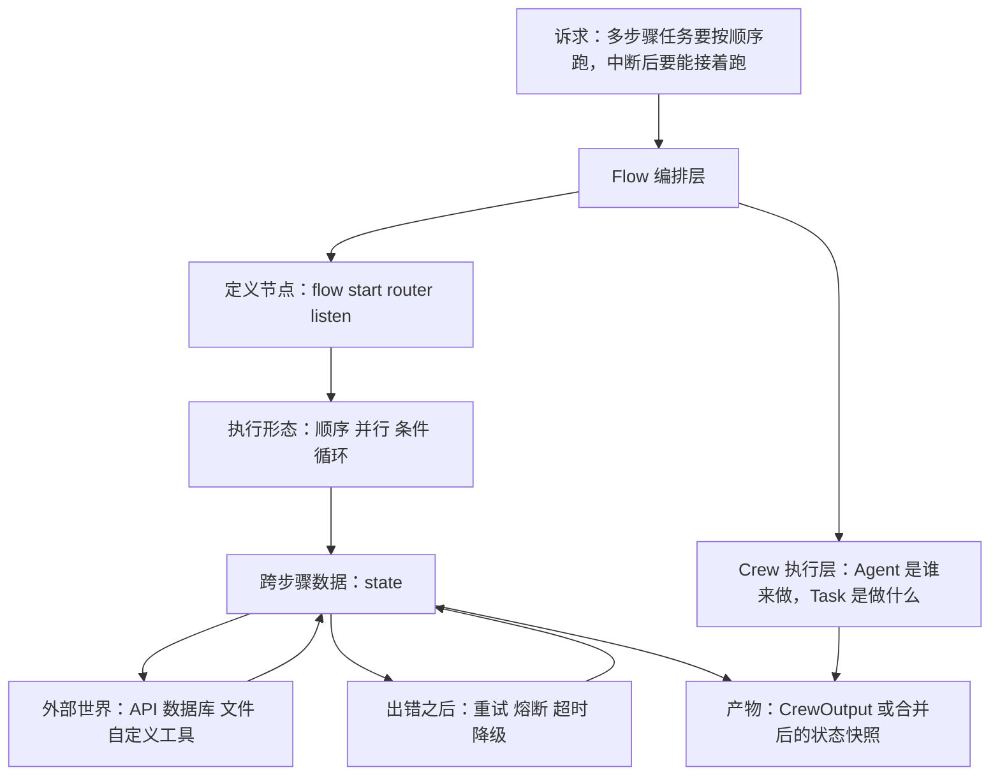
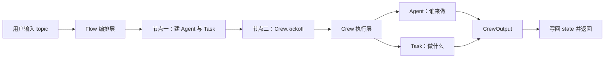
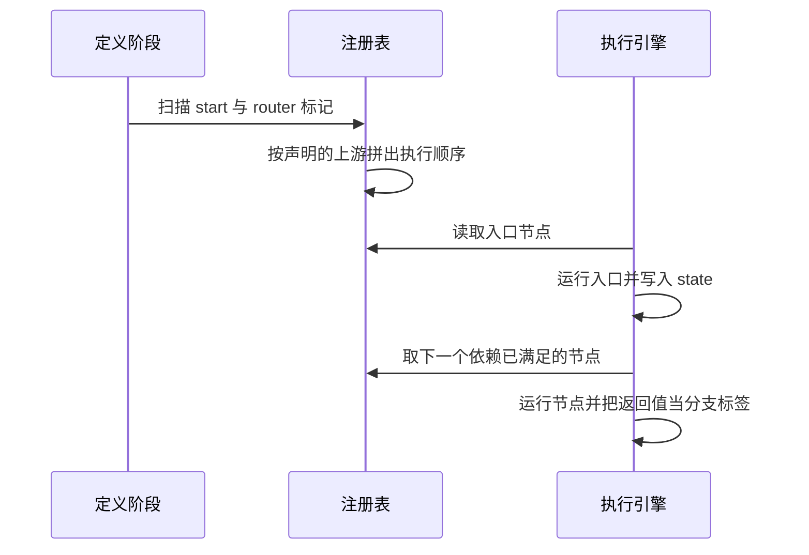
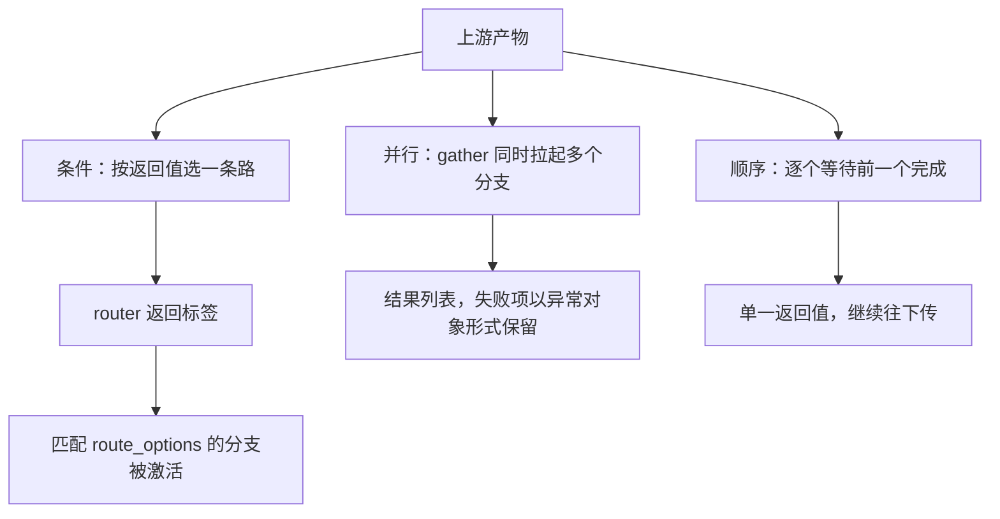
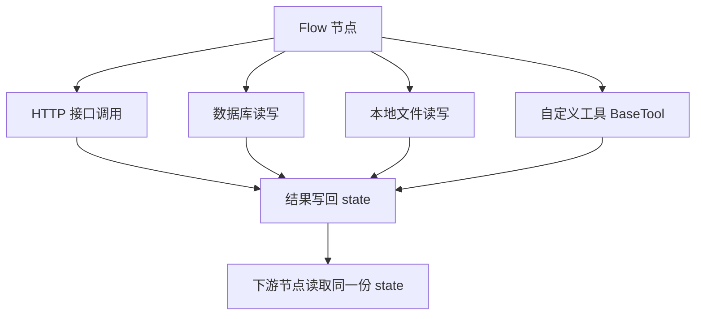
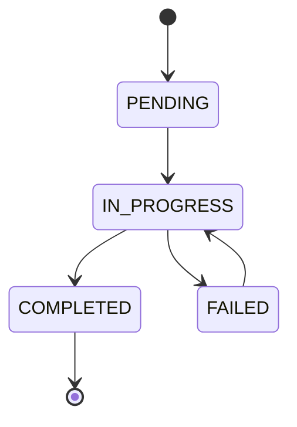
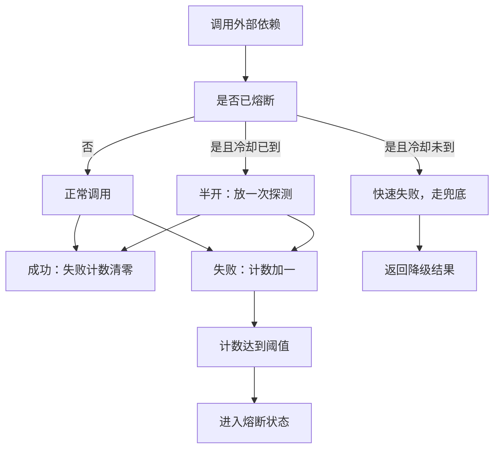

# CrewAI Flows 编排

!!! abstract "学完这一页你能"

- 说清 Flow 与 Crew 的分工，并画出两者之间数据流动的方向。
- 用 `@flow`、`@start`、`@router` 写出顺序、并行、条件三条执行链路。
- 用 TypedDict 或 Pydantic 模型管理跨步骤状态，并把状态落盘后重新载入。
- 给一条 Flow 加上重试、熔断、超时与降级，并说清每种策略的触发条件。

## 0. 知识地图



建议这样读：先读第 1 节，把"编排层"和"执行层"的分工分开。再读第 2 节，用最小 Flow 跑通一次。之后按第 3 节改执行形态，按第 5 节加状态，最后按第 6 节加恢复策略。

## 1. Flow 是什么：编排层与执行层分开

**先想一个问题**

你要做一条内容生产线：先查资料，再写稿，最后过一遍合规检查。用三个函数加 if 串起来也能跑，可中间某步失败时，你说不出哪一步的产出已经落库。

Flow 就是给这种多步骤任务加一层"记录每一步"的骨架。

!!! note "术语：Flow"
    Flow 是 CrewAI 中描述"步骤之间怎么连"的编排单元。它负责顺序、分支、状态和重试，不负责某个步骤内部由哪个模型完成。例子：节点 A 跑完才能跑 B，这个先后关系写在 Flow 里。

!!! note "术语：DAG"
    DAG 是有向无环图的英文缩写（Directed Acyclic Graph，有向无环图）。有向指边只朝一个方向走，无环指不能绕回自己。例子：A 完成后才轮到 B，B 不能反过来触发 A。

**心智模型**

!!! tip "心智模型"
    一句话模型：Flow 是一条带状态记录的传送带，每个节点是一段代码，谁先谁后由装饰器声明。
    日常类比：像快递分拣线，包裹（state）在带上走，每个工位（节点）只做一件事，做完盖一个章。
    类比不成立的地方：分拣线的工位顺序由机器焊死，而 Flow 的分支由运行期的返回值决定，同一份代码两次运行可能走不同支路。

**图解**



1. 用户输入先从编排层进入，编排层不调用任何模型。
2. 节点一负责构造 Agent 与 Task，这一步只是声明"计划"。
3. 节点二调用 `kickoff()`，控制权交给执行层。
4. 执行层里 Agent 决定"谁来做"，Task 决定"做什么"，两者组装成一次执行。
5. 执行层产出一个 `CrewOutput` 结构化对象。
6. 编排层把这个产物写回状态，再决定是否继续下一个节点。

**一步一步来**

第 1 步：先只写执行层，确认装配顺序。

```python
# 依赖：pip install crewai
from crewai import Agent, Task, Crew

researcher = Agent(                                # Agent 是"谁来做"
    role="Research Analyst",
    goal="Gather comprehensive information",
    backstory="Expert at gathering and analyzing information.",
    verbose=True,                                  # 打印推理过程，排障用
)
writer = Agent(
    role="Content Writer",
    goal="Write engaging content",
    backstory="Skilled writer with expertise in creating compelling narratives.",
    verbose=True,
)
research_task = Task(                              # Task 是"做什么"
    description="Research the topic: AI Agents",
    agent=researcher,                              # 每个 Task 必须绑定一个 Agent
    expected_output="Comprehensive research notes",
)
write_task = Task(
    description="Write an article based on research",
    agent=writer,
    expected_output="A well-structured article",
)
crew = Crew(                                       # 装配阶段，不产生模型调用
    agents=[researcher, writer],
    tasks=[research_task, write_task],             # 列表顺序即执行顺序
    verbose=True,
)
```

**这段代码在做什么**

- 先建 Agent 再建 Task，因为每个 Task 的 `agent` 字段要指向一个已存在的 Agent。
- `Crew(...)` 只是描述执行计划，构造本身很快，不代表任务已经开始跑。
- `tasks` 列表的顺序就是顺序执行的顺序，框架默认不会替你重排依赖。
- 若某个 Task 绑定的 Agent 不在 `agents` 列表里，要等运行时才报错。
- `verbose=True` 在教学和排障时有用，生产环境会放大日志量。

运行结果：这一段不触发模型调用，终端没有输出。

第 2 步：把上面这段装进一条 Flow，让它成为流程的一步。

```python
from crewai.flow.flow import Flow, flow, start  # noqa: F401  Flow 与 start 供扩展时使用
from crewai import Agent, Task, Crew

@flow                                            # 把普通函数注册成一条流程
def content_creation_flow(topic: str):
    researcher = Agent(role="Research Analyst", goal="Gather information",
                       backstory="Expert at gathering and analyzing information.")
    writer = Agent(role="Content Writer", goal="Write engaging content",
                   backstory="Skilled writer with expertise in creating compelling narratives.")
    research_task = Task(description=f"Research the topic: {topic}",
                         agent=researcher, expected_output="Comprehensive research notes")
    write_task = Task(description="Write an article based on research",
                      agent=writer, expected_output="A well-structured article")
    crew = Crew(agents=[researcher, writer], tasks=[research_task, write_task])
    return {"article": crew.kickoff()}                # 把结果包成流程产物
```

**这段代码在做什么**

- `@flow` 把函数体声明成流程的主分支，函数返回值就是这次流程运行的产物。
- 本例没有分支、没有循环、没有跨步骤共享状态，所以用无参函数加一个入参就够。
- `kickoff()` 是同步阻塞调用，默认按 `tasks` 列表顺序串行推进。
- 任何模型或工具的异常都会向上冒泡，中断整条流程。
- 需要重试或兜底时，要在这一层外面包策略，而不是改 Crew 内部。

运行结果：`{"article": "...文章正文..."}`，其中正文由模型生成。

需核对官方文档：函数式 `@flow` 装饰器在你安装的 crewai 版本中是否可用，以及它与类式 `Flow` 加 `@start` 的入口差异。

**动手验证**

下面这个脚本用标准库复刻"编排层持有状态、执行层产出结果"的分工，不需要 API Key。

```python
# 依赖：Python 3.10+，只用标准库
# 对照关系：run_pipeline 对应 @flow 函数，STEPS 对应 Crew 的 tasks 列表

STEPS = ["research", "write", "compliance"]          # 顺序即执行顺序

def run_pipeline(topic: str) -> dict:
    state = {"topic": topic, "trace": [], "article": None}
    for name in STEPS:                               # 模拟顺序执行
        state["trace"].append(name)                  # 每步都落一条痕迹
        if name == "write":
            state["article"] = f"article about {topic}"
    return state

result = run_pipeline("AI Agents")
assert result["trace"] == ["research", "write", "compliance"]   # 顺序被固定
assert result["article"] == "article about AI Agents"
assert "topic" in result                                # 输入被保留在状态里
print(result)
print("OK")
```

预期输出：

```
{'topic': 'AI Agents', 'trace': ['research', 'write', 'compliance'], 'article': 'article about AI Agents'}
OK
```

**常见坑**

| 现象 | 原因 | 怎么修 |
| --- | --- | --- |
| 构造 Crew 后以为任务已开始 | `Crew(...)` 只是装配，开销推迟到 `kickoff()` | 在日志里打印 `kickoff` 前后的时间戳 |
| 任务顺序和预期不一致 | 依赖只写了列表顺序，没写 `Task.context` | 把上游 Task 放进下游的 `context` |
| 运行时才报 Agent 未找到 | Task 绑定的 Agent 没进 `agents` 列表 | 装配后加一次断言校验绑定关系 |
| 返回值直接当字典用报错 | `kickoff()` 返回的是 `CrewOutput` 而非 dict | 先取字段再包成 dict 返回 |

**用在哪里**

- 内容生产流水线。业务背景是市场团队每天要产出若干篇选题稿。知识用法是把"查资料、写初稿、合规检查"拆成三个节点，用 state 记录每步产物。收益指标是单篇稿件的返工轮次与人工审阅耗时。什么时候不该用：稿件只有一段 200 字的短文案，加编排层只会增加阅读代码的成本。
- 后台管理的批量导入。业务背景是运营把 CSV 一次性导入商品库。知识用法是同一条 Flow 处理单条记录，外层用循环驱动多条。收益指标是导入失败条数与重试成功率。什么时候不该用：导入只有一次性几十行数据，直接写脚本更快。
- 多阶段数据处理管道。业务背景是把原始日志清洗、聚合、生成日报。知识用法是每阶段一个节点，节点产物写入 state 便于回溯。收益指标是从"发现问题"到"定位到哪一阶段"的排查时长。什么时候不该用：每一步互相独立且无共享状态，直接并行跑函数即可。

**行业实践**

- CrewAI 官方文档的 Flows 章节把节点声明为事件驱动的 `@start`、`@listen`、`@router`，并支持在节点间传递结构化状态。借鉴方式：先按官方文档写类式 Flow，把每个业务步骤落成一个方法名，代码可读性来自方法名而不是注释。
- Prefect 官方文档的 Flows 章节把"运行状态"和"重试"作为框架的一等公民，流程运行有独立的状态记录。借鉴方式：在你的持久化结构里固定写出 `created_at` 与 `updated_at`，让外部系统能识别一次运行。
- Pydantic 官方文档在模型章节说明可变默认值要用工厂函数而不是字面量。借鉴方式：状态模型里的列表字段一律写 `default_factory=list`。

怎么借鉴到你的项目：先照着官方文档的类式写法搭骨架，把持久化字段和状态模型定下来，再往里填业务逻辑。

**小结**

- Flow 管步骤之间的连接，Crew 管单个步骤内部怎么执行。
- Agent 回答"谁来做"，Task 回答"做什么"，Crew 把两者装配起来。
- 装配和运行是两件事，`Crew(...)` 不触发模型调用，`kickoff()` 才触发。

## 2. 用 @flow 与 @start 定义一条 Flow

**先想一个问题**

同一条合规检查流程，既要在接口请求里跑一次，也要在定时任务里跑一次。你不想写两遍节点顺序，更不想在业务函数里塞调用关系。

装饰器就是解决这件事的：顺序写在标记里，不写在函数体里。

**心智模型**

!!! tip "心智模型"
    一句话模型：装饰器是贴在方法上的标签，框架扫描标签拼出执行顺序。
    日常类比：像会议室的座签，谁坐主位（入口）、谁坐次位（依赖上游）由座签决定，不由进门先后决定。
    类比不成立的地方：座签是静态的，而 `@router` 返回的标签在运行期才确定，同一次会议可能换座位。

**图解**



1. 定义阶段只做一件事：把带标记的方法登记进注册表。
2. 注册表根据每个方法声明的上游，拼出一张执行顺序图。
3. 执行引擎从入口节点开始，入口没有任何上游依赖。
4. 入口运行结束后把结果写进 `self.state`。
5. 引擎取出下一个依赖已满足的节点。
6. 如果该节点是路由器，它的返回值会决定激活哪条下游分支。

**一步一步来**

第 1 步：写一个只有一个入口节点的类式 Flow。

```python
from crewai.flow.flow import Flow, flow, start

@flow                                            # 类式写法同样用 @flow 标记
class GreetingFlow(Flow):
    @start()                                     # 入口节点：没有上游依赖
    def build_topic(self):
        self.state["topic"] = "AI Agents"        # 写入共享状态
        return self.state["topic"]               # 返回值是该节点的输出

flow_instance = GreetingFlow()
flow_instance.kickoff()                          # 需要核对官方文档：类式 Flow 的启动方法名
print(flow_instance.state)
```

**这段代码在做什么**

- `@start()` 声明这是入口，执行顺序由装饰器决定，不由代码书写位置决定。
- `self.state` 是整条流程唯一的跨节点数据通道。
- 节点没有 `return` 时，隐式返回 `None`，此时下游不能靠返回值取数据，只能读 state。
- 状态必须落进 `self.state`，放在局部变量里的值出不了这个节点。
- 类式写法便于把每个节点拆成单独的方法，便于按方法名阅读。

运行结果：`{'topic': 'AI Agents'}`。

需核对官方文档：`Flow` 子类的启动方法名与 `@start` 的具体导入路径，不同版本可能不同。

第 2 步：加一个路由器节点，把连续的数值分成互斥分支。

```python
from enum import Enum
from crewai.flow.flow import Flow, flow, router, Route

class RouteOptions(Enum):
    HIGH_PRIORITY = "high_priority"              # 右侧字符串才是真正参与匹配的值
    STANDARD = "standard"
    LOW_PRIORITY = "low_priority"
    ESCALATE = "escalate"

@flow
class DocumentProcessingFlow(Flow):
    @start()
    def classify_document(self):
        self.state["priority"] = classify(self.state["document"])

    @router(classify_document)                   # 声明上游是 classify_document
    def route_based_on_priority(self):
        priority = self.state["priority"]
        if priority >= 9:                        # 资料给的档位是 9 / 5 / 2 / 其余（来源：本站该页面的旧版内容，以原文为准）
            return RouteOptions.HIGH_PRIORITY
        elif priority >= 5:
            return RouteOptions.STANDARD
        elif priority >= 2:
            return RouteOptions.LOW_PRIORITY
        else:
            return RouteOptions.ESCALATE
```

**这段代码在做什么**

- `@router(上游)` 表示这个节点在上游跑完后执行，返回值决定走哪条支路。
- 把优先级数值离散成四个互斥标签，新增档位时只改这一处。
- `elif` 必须从高到低写，否则边界值 9 会先命中 `>= 5`，落进错误的档位。
- 用 Enum 而不是裸字符串，可以避免拼写错误导致分支静默失效。
- 下游分支节点用 `route_options=[RouteOptions.HIGH_PRIORITY]` 做白名单过滤。

运行结果：`route_based_on_priority` 返回一个枚举成员，下游只有匹配的那个分支被激活。

`classify` 是外部占位函数，教学示例需要自行实现或注入。

**动手验证**

下面的脚本用标准库复刻"注册表 + 分支标签"的机制，不依赖 crewai。

```python
# 依赖：Python 3.10+，只用标准库
from enum import Enum

class Route(Enum):
    HIGH = "high"
    STANDARD = "standard"
    ESCALATE = "escalate"

class MiniFlow:
    def __init__(self):
        self.state = {}
        self.trace = []

    def classify(self, document):
        self.state["document"] = document
        self.state["priority"] = document["priority"]     # 写进状态，供路由器读取
        self.trace.append("classify")

    def route(self):
        priority = self.state["priority"]
        self.trace.append("route")
        if priority >= 9:
            return Route.HIGH
        if priority >= 5:
            return Route.STANDARD
        return Route.ESCALATE

    def run(self, document):
        self.classify(document)                # 入口固定先跑
        label = self.route()                   # 再跑路由器
        self.state["branch"] = label.value
        return self.state

f = MiniFlow()
assert f.run({"priority": 9})["branch"] == "high"          # 边界值走高档
assert MiniFlow().run({"priority": 5})["branch"] == "standard"
assert MiniFlow().run({"priority": 1})["branch"] == "escalate"
assert MiniFlow().run({"priority": 4})["branch"] == "escalate"
print(MiniFlow().run({"priority": 5}))
print("OK")
```

预期输出：

```
{'document': {'priority': 5}, 'priority': 5, 'branch': 'standard'}
OK
```

**常见坑**

| 现象 | 原因 | 怎么修 |
| --- | --- | --- |
| 类定义阶段报 NameError | `@start` 少写导入 | 从流程模块把 `start`、`router` 一起导入 |
| 分支永远不触发 | 路由器返回值与 `route_options` 类型不一致 | 两边统一用同一个 Enum 成员 |
| 边界值落错档 | `elif` 顺序颠倒或写成 `>` | 从高到低写，边界用 `>=` |
| 下游读不到上游数据 | 上游把结果放在局部变量 | 上游必须写进 `self.state` |

**用在哪里**

- 客服工单自动分派。业务背景是工单按紧急度进入不同处理队列。知识用法是路由器把紧急度数值映射成队列标签，四个分支各自处理。收益指标是分派错误率与首次响应时长。什么时候不该用：只有"高"和"低"两档且规则半年不变，直接写 if 更好读。
- 内容风控分级。业务背景是模型给出的风险分需要落到不同审核策略。知识用法是把阈值集中在路由器一处，审计时只读这一处。收益指标是策略变更的回归测试用例数量。什么时候不该用：阈值需要业务方在后台实时改，硬编码的阈值不合适。
- 文档入库前的分类。业务背景是合同、发票、简历走不同解析器。知识用法是用路由器选择解析分支，各分支独立演进。收益指标是新增文档类型的开发耗时。什么时候不该用：分类结果还需要人工二次确认，分支不该自动往下跑。

**行业实践**

- CrewAI 官方文档 Flows 章节给出 `@router` 返回标签、下游用 `route_options` 白名单接收的写法。借鉴方式：所有分支标签集中定义成 Enum，禁止在节点里写字面量字符串。
- Python 官方文档 `enum` 模块章节说明枚举成员是单例，比较安全。借鉴方式：分支判断统一用 `is` 或 `==` 比较枚举成员，不要比较 `.value`。
- 需核对官方文档：`route_options` 参数在当前 crewai 版本中的确切名称与取值类型。

怎么借鉴到你的项目：先把分支标签列出来，写成一个 Enum 文件，再让路由器和分支节点都引用它。

**小结**

- `@start` 标记入口，`@router` 标记分叉点，上游关系写在装饰器参数里。
- 路由器只做判断，不写业务处理，业务处理留给各自的分支节点。
- 所有跨节点数据必须落进 `self.state`。

## 3. 顺序、并行与条件执行

**先想一个问题**

同一条研究流程要覆盖三个话题，逐个跑要等三倍时间。你想让三个话题同时开始，但最后汇总时不能丢掉失败分支的错误信息。

这就是执行形态的问题：谁等谁、谁和谁同时跑、哪条路被选中。

**心智模型**

!!! tip "心智模型"
    一句话模型：顺序是接力跑，并行是发令枪，条件是岔路口。
    日常类比：接力跑必须等上一棒交棒；发令枪一响各跑各的；岔路口只走其中一条。
    类比不成立的地方：接力跑的交棒点是固定的，而 Flow 的顺序由 `tasks` 列表或上游声明决定，改动一处就会改变全局顺序。

**图解**



1. 顺序执行从上游产物出发，每一步都要等前一步完成。
2. 并行执行在同一时刻拉起多个分支，总耗时取决于最慢的那个分支。
3. 条件执行先算出标签，再决定激活哪个分支。
4. 被选中的分支之外，其他分支节点被跳过，不会执行。
5. 并行结果以列表形式返回，其中失败项是异常对象而不是结果值。
6. 顺序执行只产出一个返回值，直接作为下一步输入。

**一步一步来**

第 1 步：写显式顺序执行。

```python
from crewai.flow.flow import flow

@flow
def explicit_sequential_flow(data: str):
    result1 = step_one(data)          # 第一步
    result2 = step_two(result1)       # 第二步，等第一步完成
    result3 = step_three(result2)     # 第三步，等第二步完成
    return result3

def step_one(data):
    return data.upper()               # 占位实现，便于本地验证
```

**这段代码在做什么**

- 顺序执行靠 Python 的函数调用链表达，前一个返回值直接作为后一个入参。
- 每一步都是阻塞的，整条链的耗时是三步之和。
- 中间某一步抛错，后面两步不会执行。
- 这种写法没有共享状态，适合纯函数式的数据处理。

运行结果：`explicit_sequential_flow("abc")` 返回 `"ABC"`。

第 2 步：写并行执行。

```python
import asyncio
from crewai.flow.flow import flow

@flow
def parallel_flows():
    async def run_parallel():
        results = await asyncio.gather(
            flow_a(),                 # 三个分支同时被拉起
            flow_b(),
            flow_c(),
            return_exceptions=True,   # 任一分支抛错也把异常当结果返回
        )
        return results

    return run_parallel()             # 返回协程，交给事件循环驱动
```

**这段代码在做什么**

- 包一层 `async def` 是因为 `gather` 必须运行在事件循环里。
- 外层函数没有 `await`，返回的是待执行的协程对象，直接取返回值不会触发任何执行。
- `return_exceptions=True` 让单个分支失败时其他分支继续跑完。
- 结果列表按传入顺序排列，第 i 项可能是结果，也可能是异常对象。
- 总耗时由最慢的分支决定，而不是各分支耗时相加。

运行结果：`['结果 A', '结果 B', 异常对象]` 形式的三元素列表。

`flow_a`、`flow_b`、`flow_c` 是占位函数，需要由你提供实现。

第 3 步：写带循环的条件执行。

```python
from crewai.flow.flow import flow

@flow
def iterative_refinement_flow(initial_content: str, max_iterations: int = 3):
    state = {
        "content": initial_content,
        "iterations": 0,
        "quality_score": 0.0,
        "feedback_history": [],
    }
    while state["iterations"] < max_iterations:
        if state["quality_score"] >= 0.9:            # 阈值 0.9，上限 3 次，来源：本站该页面的旧版内容，以原文为准
            break                                    # 质量达标，提前退出
        improved = improve_content(state["content"])
        state["quality_score"] = evaluate_quality(improved)
        state["feedback_history"].append(state["quality_score"])
        state["content"] = improved
        state["iterations"] += 1
    return state
```

**这段代码在做什么**

- `while` 循环的终止条件有两个：次数上限和质量阈值，先命中哪个就退出。
- 计数字段必须显式自增，否则循环不会结束。
- 每次迭代都往 `feedback_history` 追加分数，事后能看出质量是否在收敛。
- 循环体里先改进再评分，所以退出时的 `content` 是最后一次改进后的版本。
- 循环内部若调用模型，失败会直接抛出，需要外层包错误处理。

运行结果：`{'content': ..., 'iterations': 2, 'quality_score': 0.93, 'feedback_history': [0.61, 0.93]}`，具体数值取决于实现。

**动手验证**

下面的脚本验证并行的并发效果与失败隔离，使用标准库，结果可复现。

```python
# 依赖：Python 3.10+，只用标准库
import asyncio

peak = 0                       # 记录同时在跑的分支数
running = 0

async def branch(name, fail=False):
    global peak, running
    running += 1
    peak = max(peak, running)  # 并发峰值
    await asyncio.sleep(0.05)  # 模拟等待外部服务
    running -= 1
    if fail:
        raise ValueError(f"{name} failed")
    return f"{name} ok"

async def main():
    results = await asyncio.gather(
        branch("a"), branch("b", fail=True), branch("c"),
        return_exceptions=True,
    )
    return results

results = asyncio.run(main())
assert peak == 3                                     # 三个分支确实同时跑
assert results[0] == "a ok"                          # 成功项是结果
assert isinstance(results[1], ValueError)            # 失败项是异常对象
assert str(results[1]) == "b failed"
assert results[2] == "c ok"                          # 一个失败不影响其他分支
assert running == 0                                  # 计数被正确归还
print(results)
print("OK")
```

预期输出：

```
['a ok', ValueError('b failed'), 'c ok']
OK
```

**常见坑**

| 现象 | 原因 | 怎么修 |
| --- | --- | --- |
| 并行分支返回协程对象 | 忘记 `await` 或没有事件循环驱动 | 用 `asyncio.run` 包裹外层调用 |
| 一个分支失败导致全部结果丢失 | 没开 `return_exceptions` | 打开该参数，再逐项判断类型 |
| 循环不结束 | 计数字段没自增或阈值永远达不到 | 显式自增并加硬上限 |
| 并行结果顺序错乱 | 依赖结果列表的下标契约 | 给每个分支带上业务标识再汇总 |

**用在哪里**

- 电商商品详情页的多路取数。业务背景是一次请求要取价格、库存、评价三份数据。知识用法是用 `gather` 并发取数，任一失败时用兜底值补齐。收益指标是首屏接口的 P95 延迟与降级率。什么时候不该用：三份数据里有强依赖，价格要等库存算完才能定，此时顺序执行不可避免。
- 后台管理的数据核对任务。业务背景是每晚核对多个供应商的对账文件。知识用法是每个供应商一个并行分支，失败隔离后单独重跑。收益指标是核对任务的整体时长与失败重跑次数。什么时候不该用：供应商之间有共享的写入资源，并发会互相覆盖。
- 稿件质量迭代。业务背景是初稿质量不达标时需要多轮打磨。知识用法是 `while` 循环加质量阈值与次数上限。收益指标是达标稿件的占比与平均迭代轮次。什么时候不该用：每轮打分不收敛，循环只会烧钱，此时应改为人工介入。

**行业实践**

- CrewAI 官方文档的 Process 章节区分顺序与分层两种编排策略，顺序按任务列表推进，分层由一个管理角色分派。借鉴方式：先用顺序跑通，确认收益后再换分层，不要一开始就上分层。
- Python 官方文档 `asyncio` 任务与协程章节说明 `gather` 的 `return_exceptions` 参数会改变聚合语义。借鉴方式：在代码里对每个结果显式做类型判断，不要假设它们都是正常值。
- 需核对官方文档：`Process.hierarchical` 是否被文档描述为并行执行，本页资料里的注释把它当作并行使用，需以官方说明为准。

怎么借鉴到你的项目：给每个并行分支补一个业务标识字段，汇总时按标识对齐，避免依赖列表下标。

**小结**

- 顺序靠调用链，并行靠 `gather`，条件靠 `@router` 返回的标签。
- 并行的总耗时由最慢分支决定，失败隔离依赖 `return_exceptions`。
- 循环一定要同时有阈值退出和次数上限两个出口。

## 4. 自定义逻辑与代码集成

**先想一个问题**

你的 Flow 需要调一次内部风控接口，再查一次数据库，最后写一份报告。这三件事都不是模型调用，但都在流程中间。

编排层必须能容纳普通代码，否则流程只能停在模型这一步。

**心智模型**

!!! tip "心智模型"
    一句话模型：Flow 节点里可以放任何 Python 代码，只要把结果写进 state。
    日常类比：像插座，模型、HTTP 客户端、数据库连接都能插上去，插座的形状由 state 决定。
    类比不成立的地方：插座不会记录你插过什么，而 Flow 的每个节点都要把产物落到 state，否则下游读不到。

**图解**



1. 一个节点同时可以调用接口、数据库、文件和自定义工具。
2. 接口调用要显式处理状态码，非 2xx 时把错误写进 state，不要让它裸奔。
3. 数据库操作要用 `try/finally` 保证连接关闭。
4. 文件处理要区分"传入的是文件"与"传入的是目录"两种情况。
5. 所有结果统一写回 state，下游节点只认 state，不认局部变量。
6. 自定义工具的 `name` 与 `description` 决定模型何时选用它。

**一步一步来**

第 1 步：在节点里调用外部接口并把错误收敛进状态。

```python
import requests
from crewai.flow.flow import flow

@flow
def api_integration_flow(query: str):
    state = {"query": query, "api_results": None, "processed": None}
    response = requests.post(
        "https://api.example.com/analyze",
        json={"query": query},
        headers={"Authorization": "Bearer YOUR_API_KEY"},
        timeout=30,                                   # 超时 30 秒，来源：本站该页面的旧版内容，以原文为准
    )
    if response.status_code == 200:                   # 只有 2xx 才当成功处理
        state["api_results"] = response.json()
    else:
        state["api_results"] = {"error": f"API error: {response.status_code}"}
    state["processed"] = transform_results(state["api_results"])
    return state
```

**这段代码在做什么**

- `timeout=30` 是必要的：没有超时的请求会把流程永久挂住。
- 非 200 时写入结构化错误对象，下游可以统一判断 `"error" in ...`。
- 密钥写在代码里只是示例，真实项目要从环境变量读取。
- 错误分支同样会流入 `transform_results`，所以该函数必须能处理错误对象。
- 返回值是整个 state，保证流程任何位置中断都能看到上下文。

运行结果：成功时 `state["api_results"]` 是接口返回的字典，失败时是含 `error` 键的字典。

第 2 步：用 `BaseTool` 写一个可被模型选用的校验工具。

```python
from crewai.tools import BaseTool

class DataValidationTool(BaseTool):
    name: str = "data_validation"                     # 模型靠这个名字判断何时选用
    description: str = "Validates input data against defined rules"

    def _run(self, data: dict, rules: dict) -> dict:
        errors = []
        for field, rule in rules.items():
            if field not in data:                     # 先判缺失，再判类型
                if rule.get("required", False):
                    errors.append(f"Missing required field: {field}")
            elif rule.get("type"):
                expected = rule["type"]
                if not isinstance(data[field], expected):
                    errors.append(
                        f"Invalid type for {field}: "
                        f"expected {expected.__name__}, got {type(data[field]).__name__}"
                    )
        return {"valid": len(errors) == 0, "errors": errors}
```

**这段代码在做什么**

- 子类只需要实现 `_run`，参数绑定和错误包装由框架在 `run()` 里完成。
- 先判断字段是否存在，再判断类型，否则对不存在的键取值会直接抛 `KeyError`。
- 校验结果累积成列表返回，一次给出全部问题，避免多轮往返。
- 返回值固定为 `valid` 与 `errors` 两个键，方便序列化和上层判断。
- 要在节点里调用 `validator.run(...)` 而不是直接调 `_run`，前者才会走框架的保护逻辑。

运行结果：`{"valid": False, "errors": ["Missing required field: email"]}`。

`isinstance` 遵循继承链，`bool` 是 `int` 的子类，所以 `age=True` 会被判为合法整数。业务上要拒绝布尔值就得额外排除 `bool`。

第 3 步：把文件与目录两种情况都覆盖到。

```python
import json
from pathlib import Path
from crewai.flow.flow import flow

@flow
def file_processing_flow(input_file: str):
    state = {"input_file": input_file, "results": []}
    input_path = Path(input_file)
    if input_path.is_file():                          # 情况一：单个文件
        state["results"] = process_file(input_path)
    elif input_path.is_dir():                         # 情况二：目录
        for file_path in input_path.glob("*.json"):
            state["results"].append(process_file(file_path))
    output_file = input_path.parent / f"{input_path.stem}_processed.json"
    with open(output_file, "w", encoding="utf-8") as f:
        json.dump(state["results"], f, ensure_ascii=False, indent=2)
    return state
```

**这段代码在做什么**

- 用 `Path` 而不是字符串拼接，跨平台路径分隔符的问题交给标准库处理。
- 单文件场景与目录场景分开处理，两种返回值形状统一为列表。
- `ensure_ascii=False` 保证中文不被转义成 `\uXXXX`。
- 输出文件落在输入路径的同级目录，文件名加 `_processed` 后缀，避免覆盖原始文件。
- 目录场景下 `glob` 只匹配 JSON，其他格式会被静默跳过。

运行结果：同级目录下生成 `xxx_processed.json`，内容为处理结果列表。

**动手验证**

下面的脚本把"接口错误收敛 + 批量校验 + 落盘"合成一条可跑通的流程，只用标准库。

```python
# 依赖：Python 3.10+，只用标准库
import json
import tempfile
from pathlib import Path

def fake_api(query: str) -> dict:                     # 模拟接口，可切换成功与失败
    if query == "boom":
        return {"error": "API error: 503"}            # 收敛成结构化错误
    return {"query": query, "hits": [1, 2, 3]}

def validate(data: dict, rules: dict) -> dict:
    errors = []
    for field, rule in rules.items():
        if field not in data:
            if rule.get("required", False):
                errors.append(f"Missing required field: {field}")
        elif rule.get("type") and not isinstance(data[field], rule["type"]):
            errors.append(f"Invalid type for {field}")
    return {"valid": len(errors) == 0, "errors": errors}

def run(query: str) -> dict:
    state = {"query": query, "api": None, "validation": None, "saved": None}
    state["api"] = fake_api(query)                    # 节点一：取数
    state["validation"] = validate(                  # 节点二：校验
        {"query": query} if "error" not in state["api"] else {},
        {"query": {"required": True, "type": str}},
    )
    if not state["validation"]["valid"]:              # 校验失败不落盘，直接返回
        return state
    with tempfile.TemporaryDirectory() as d:          # 节点三：落盘
        p = Path(d) / "out.json"
        p.write_text(json.dumps(state["api"], ensure_ascii=False), encoding="utf-8")
        state["saved"] = json.loads(p.read_text(encoding="utf-8"))
    return state

ok = run("flow")
assert ok["api"]["hits"] == [1, 2, 3]
assert ok["validation"] == {"valid": True, "errors": []}
assert ok["saved"]["query"] == "flow"                 # 落盘内容与内存一致

bad = run("boom")
assert "error" in bad["api"]
assert bad["validation"]["valid"] is False            # 接口失败被校验拦下
assert bad["saved"] is None                           # 脏数据不落盘
print(ok["validation"], bad["validation"])
print("OK")
```

预期输出：

```
{'valid': True, 'errors': []} {'valid': False, 'errors': ['Missing required field: query']}
OK
```

**常见坑**

| 现象 | 原因 | 怎么修 |
| --- | --- | --- |
| 请求把流程挂死 | 没设置超时 | 显式传 `timeout` 参数 |
| 数据库连接泄漏 | 缺少 `finally` 关闭 | 用 `with` 或 `try/finally` 包裹 |
| 中文写入文件变成转义序列 | 默认 `ensure_ascii=True` | 传 `ensure_ascii=False` 并指定编码 |
| 模型不选用自定义工具 | `description` 与 `_run` 行为不一致 | 让描述只写工具真实能做的一件事 |

**用在哪里**

- 电商下单前的风控校验。业务背景是下单要过一次风控接口和一次本地黑名单。知识用法是风控节点把接口结果与本地结果合并写进 state。收益指标是被拦截订单的误杀率与接口超时率。什么时候不该用：风控接口必须在 50 毫秒内返回，此时同步编排不适合，应改为异步事件流。
- 后台管理的批量数据导入。业务背景是运营上传 Excel 后要逐行校验并写库。知识用法是用校验工具累积全部错误，一次性回给运营修改。收益指标是运营的修改轮次（从多轮降到一轮）。什么时候不该用：单次导入只有几行，直接抛第一个错误更快定位。
- 报表生成流水线。业务背景是每晚从多个数据源取数后生成日报文件。知识用法是每个数据源一个节点，最后统一落盘。收益指标是报表生成失败率与重跑耗时。什么时候不该用：数据源之间需要事务一致性，文件落盘无法回滚。

**行业实践**

- CrewAI 官方文档 Tools 章节说明 `BaseTool` 的 `name` 与 `description` 会被模型用来挑选工具。借鉴方式：给每个工具写一句只描述一个动作的描述，删除"以及"这类连接词。
- `requests` 官方文档的快速上手章节示例里推荐给请求加超时。借鉴方式：把所有外部调用统一封装到一个带超时的客户端里，禁止在节点里裸写请求。
- Python 官方文档 `pathlib` 章节推荐用 `Path` 处理路径。借鉴方式：项目里禁止用字符串拼接路径，统一走 `Path`。

怎么借鉴到你的项目：先写一个网络与文件访问的统一封装，再让 Flow 节点只调用这个封装。

**小结**

- Flow 节点里可以放任意 Python 代码，判断标准是产物能不能落进 state。
- 所有外部调用都要有超时、错误收敛和资源释放三件事。
- 自定义工具的 `description` 就是模型的选择依据，必须与实际行为一致。

## 5. Flow 状态管理

**先想一个问题**

流程跑到第三步时进程被重启，你不知道第一步的产出还在不在，也不知道上次跑到哪一步。重跑一次意味着重复付费。

状态管理就是回答"数据放在哪、以什么形状放、怎么存下来"。

**心智模型**

!!! tip "心智模型"
    一句话模型：state 是流程的共享台账，每个节点读它、改它、再交给下一个节点。
    日常类比：像医院的病历本，病人（数据）走到哪个科室，哪个科室就往上面写一段。
    类比不成立的地方：病历本不会因为一次误写而让后续判断全部错位，而 state 的键名写错会让下游直接取不到值。

**图解**



1. 流程启动时状态是 `PENDING`，表示尚未开始处理。
2. 进入处理节点后状态推进到 `IN_PROGRESS`。
3. 处理成功时状态变为 `COMPLETED`，这是终态之一。
4. 处理失败时状态变为 `FAILED`，错误信息要一并写入状态。
5. `FAILED` 可以回到 `IN_PROGRESS`，这就是重试的入口。
6. 只有终态才允许被外部系统当作"这次运行结束"。

**一步一步来**

第 1 步：用 TypedDict 与 Enum 把状态契约写下来。

```python
from enum import Enum
from typing import TypedDict

class ProcessingStatus(str, Enum):        # 继承 str 便于直接序列化
    PENDING = "pending"
    IN_PROGRESS = "in_progress"
    COMPLETED = "completed"
    FAILED = "failed"

class DocumentState(TypedDict, total=False):
    document_id: str
    content: str
    status: ProcessingStatus
    metadata: dict
    results: list[dict]
    error: str | None

def init_state(document_id: str) -> DocumentState:
    return {
        "document_id": document_id,
        "status": ProcessingStatus.PENDING,   # 起始态固定为 PENDING
        "results": [],                        # 每次调用新建列表，不复用
        "error": None,                        # 用 None 区分"未出错"与"信息为空"
    }
```

**这段代码在做什么**

- `total=False` 表示所有键可选，流程刚启动时不必把全部字段填满。
- 继承 `str` 让枚举值能直接参与 JSON 序列化和字符串比较。
- `results` 用列表做累加容器，每次初始化都新建实例，避免跨运行污染。
- `error` 用 `None` 而不是空字符串，便于用 `is None` 判断。
- TypedDict 只在静态检查时生效，运行期不会拦截类型错误。

运行结果：`{'document_id': 'd1', 'status': 'pending', 'results': [], 'error': None}`，状态以字符串形式打印。

第 2 步：用 Pydantic 模型做类型校验的状态。

```python
from pydantic import BaseModel, Field

class AnalysisState(BaseModel):
    input_data: str                                              # 唯一必填字段
    processed_data: str = ""                                     # 默认空串，便于判断"未处理"
    analysis_results: list[str] = Field(default_factory=list)    # 可变默认值必须用工厂
    final_report: str = ""
    metadata: dict = Field(default_factory=dict)                 # 开放扩展位
    iteration_count: int = 0                                     # 重试上限与幂等判断用

state = AnalysisState(input_data="raw text")
state.processed_data = transform_data(state.input_data)          # 赋值时触发类型校验
state.iteration_count += 1
result = state.model_dump()                                      # 转成原生类型再跨边界传递
```

**这段代码在做什么**

- 用模型声明状态，等于给流程加一份可校验、可序列化的数据契约。
- 可变默认值必须用 `default_factory`，写成 `= []` 会让所有实例共享同一个列表。
- 赋值时 Pydantic 会做类型校验，脏数据在入口就被挡住。
- `model_dump()` 把模型转成字典，便于写日志、过接口或落盘。
- 函数标注的类型是模型，实际返回的可能是字典，下游按属性访问会失败。

运行结果：`{'input_data': 'raw text', 'processed_data': 'RAW TEXT', 'analysis_results': [], 'final_report': '', 'metadata': {}, 'iteration_count': 1}`。

第 3 步：把状态落盘，支持中断后续跑。

```python
import json
from datetime import datetime
from pathlib import Path

class PersistentStateFlow:
    def __init__(self, state_file: str = "flow_state.json"):
        self.state_file = Path(state_file)           # 路径可注入，不写死
        self._load_state()

    def _load_state(self):
        if self.state_file.exists():                 # 存在即恢复
            self.state = json.loads(self.state_file.read_text(encoding="utf-8"))
        else:                                        # 不存在即冷启动
            self.state = {"created_at": datetime.now().isoformat()}

    def _save_state(self):
        self.state["updated_at"] = datetime.now().isoformat()
        self.state_file.write_text(
            json.dumps(self.state, indent=2, default=str), encoding="utf-8"
        )

    def process(self):
        self.state["step"] = 1
        self._save_state()                           # 先记录"已进入该步骤"
        self.state["result"] = perform_work(self.state.get("data"))
        self._save_state()                           # 再记录"结果已产出"
        return self.state
```

**这段代码在做什么**

- 冲突点在于两次落盘：进入步骤记一次，产出结果记一次，崩溃后能看出中断位置。
- `_save_state` 统一刷新 `updated_at`，调用方不会漏写时间。
- `default=str` 是兜底，遇到日期对象会退化成字符串，反序列化时拿回的是字符串。
- 这里是原地覆盖写，没有"写临时文件再改名"的原子性，写到一半崩溃会留下损坏的 JSON。
- `perform_work` 是外部占位函数，需要由你提供实现。

运行结果：生成 `flow_state.json`，内容含 `created_at`、`step`、`result`、`updated_at` 四个键。

**动手验证**

下面的脚本验证状态合并策略与落盘恢复，只用标准库。

```python
# 依赖：Python 3.10+，只用标准库
import json
import tempfile
from pathlib import Path

def merge(parallel_results: list) -> dict:
    merged = {                                        # 先定形状，再填内容
        "total_items": 0,
        "all_items": [],
        "aggregated_metrics": {"count": 0, "sum": 0, "avg": 0},
    }
    for r in parallel_results:                        # 单次遍历，O(n)
        merged["total_items"] += r.get("count", 0)    # 缺字段按 0 计
        merged["all_items"].extend(r.get("items", []))
        merged["aggregated_metrics"]["sum"] += r.get("total", 0)
    merged["aggregated_metrics"]["count"] = merged["total_items"]
    if merged["aggregated_metrics"]["count"] > 0:     # 守卫条件，避免除零
        merged["aggregated_metrics"]["avg"] = (
            merged["aggregated_metrics"]["sum"] / merged["aggregated_metrics"]["count"]
        )
    return merged

m = merge([{"count": 2, "items": [1, 2], "total": 10}, {"count": 2, "total": 20}])
assert m["total_items"] == 4
assert m["all_items"] == [1, 2]                       # 第二项没带 items，按空列表计
assert m["aggregated_metrics"]["avg"] == 7.5
assert merge([])["aggregated_metrics"]["avg"] == 0    # 空输入不抛异常

with tempfile.TemporaryDirectory() as d:              # 落盘再读回
    p = Path(d) / "flow_state.json"
    p.write_text(json.dumps({"step": 1, "result": m}, ensure_ascii=False), encoding="utf-8")
    loaded = json.loads(p.read_text(encoding="utf-8"))
assert loaded["result"]["all_items"] == [1, 2]        # 往返后内容一致
print(m["aggregated_metrics"], loaded["step"])
print("OK")
```

预期输出：

```
{'count': 4, 'sum': 30, 'avg': 7.5} 1
OK
```

**常见坑**

| 现象 | 原因 | 怎么修 |
| --- | --- | --- |
| 多次运行之间数据互相污染 | 可变默认值写成 `= []` | 改用 `default_factory` 或每次新建 |
| 崩溃后 JSON 无法解析 | 覆盖写没有原子性 | 先写临时文件，再改名替换 |
| 恢复后某字段不存在报 KeyError | 旧文件缺少新字段 | 读取统一用 `.get()` 并补默认值 |
| 平均值口径混乱 | count 与 total 来自不同分支口径 | 在数据源头保证两个量同量纲 |

**用在哪里**

- 长视频转码流水线。业务背景是一次转码要几分钟，进程可能被重启。知识用法是把每个阶段写进状态文件，重启后从最后一个成功阶段继续。收益指标是重启后的重复计算量。什么时候不该用：转码总时长只有几秒，落盘带来的 IO 开销占比过高。
- 后台管理的数据同步任务。业务背景是每天从上游系统拉取变更数据。知识用法是用 `updated_at` 与 `step` 记录进度，支持断点续传。收益指标是同步任务的平均重跑时间。什么时候不该用：上游提供了游标接口，直接存游标比存整份状态更省事。
- 多源结果汇总报表。业务背景是多个数据源并行取数后要合并平均值、总量等指标。知识用法是用单次遍历的归并函数，缺字段按零处理。收益指标是报表口径不一致导致的返工次数。什么时候不该用：各源指标口径本来就不同，强行求平均只会产出误导数字。

**行业实践**

- Pydantic 官方文档的模型章节说明可变默认值要用工厂函数，否则实例间共享。借鉴方式：状态模型里所有列表与字典字段都写 `default_factory`。
- Prefect 官方文档的状态与结果持久化章节把运行状态独立存储，支持失败后重跑。借鉴方式：把 `created_at`、`updated_at`、`step` 三个字段作为持久化的最小集合。
- 需核对官方文档：CrewAI 是否提供官方持久化装饰器及其名称，本页资料只给出手写 JSON 落盘的示例。

怎么借鉴到你的项目：先定义状态模型，再定义落盘函数，最后才写业务节点，顺序不能倒。

**小结**

- 状态契约先定形状再填内容，能避免下游到处写防御性判断。
- 可变默认值一律用工厂函数，否则不同运行会共享同一个容器。
- 持久化要记录"进入步骤"和"产出结果"两个时间点，才能判断中断位置。

## 6. 错误处理与恢复

**先想一个问题**

风控接口在高峰期连续返回 503，你的 Flow 每来一个请求就打一次，下游服务被拖垮。与此同时，另一条流程因为一次网络抖动直接失败，其实重试一次就能成功。

这两种故障需要不同的策略：一个要快速失败，一个要重试。

**心智模型**

!!! tip "心智模型"
    一句话模型：重试治抖动，熔断治雪崩，超时治挂死，降级保可用。
    日常类比：像家里的空气开关，短路时跳闸（熔断），排除故障后手动复位（半开探测），而不是每次都硬顶着烧。
    类比不成立的地方：空气开关跳闸后需要人手动合闸，而熔断器的半开探测是自动的，冷却时间一到自己就会放一次探测流量。

**图解**



1. 每次调用先判断熔断器是否处于打开状态。
2. 打开且冷却未到时直接走兜底，不再触碰下游。
3. 打开且冷却已到时切换到半开状态，只放一次探测请求。
4. 未熔断时正常调用下游。
5. 调用成功就把失败计数清零，回到关闭状态。
6. 调用失败就累加计数，达到阈值时进入熔断状态。

**一步一步来**

第 1 步：分层捕获异常，给外部调用套上重试。

```python
from tenacity import retry, stop_after_attempt, wait_exponential, retry_if_exception_type
import requests

@retry(
    stop=stop_after_attempt(3),                                        # 最多 3 次，来源：本站该页面的旧版内容，以原文为准
    wait=wait_exponential(multiplier=1, min=2, max=10),                # 退避 2 到 10 秒，来源同上
    retry=retry_if_exception_type(ConnectionError),                    # 只对连接错误重试
)
def unreliable_api_call(data: dict):
    response = requests.post("https://api.example.com/unstable-endpoint",
                             json=data, timeout=30)
    response.raise_for_status()                                        # 4xx 与 5xx 转成异常
    return response.json()

def resilient_flow(data: dict):
    state = {"data": data, "result": None, "attempts": 0, "error": None}
    try:
        state["result"] = unreliable_api_call(data)
    except Exception as e:
        state["error"] = str(e)                                        # 记录后不抛出
        state["result"] = fallback_processing(data)                    # 降级处理
    return state
```

**这段代码在做什么**

- `stop_after_attempt(3)` 限制总尝试次数，避免无限重试烧配额。
- `wait_exponential` 让重试间隔逐渐拉长，给下游恢复时间。
- `retry_if_exception_type(ConnectionError)` 把重试限制在连接类错误，校验错误不重试。
- 只把可能失败的那一行放进 `try`，缩小保护范围，异常来源更容易定位。
- 捕获后写入 state 而不是向上抛，保证返回值结构一致。

运行结果：接口恢复时返回 `{"result": {...接口数据...}}`，接口持续失败时返回 `{"result": 兜底数据, "error": "..."}`。

`fallback_processing` 是外部占位函数，需要由你提供实现。

第 2 步：写一个熔断器，并给流程加超时保护。

```python
import time
from enum import Enum

class CircuitState(str, Enum):
    CLOSED = "closed"          # 正常状态
    OPEN = "open"              # 熔断状态
    HALF_OPEN = "half_open"    # 半开探测状态

class CircuitBreaker:
    def __init__(self, failure_threshold: int = 5, timeout: int = 60):
        self.failure_threshold = failure_threshold
        self.timeout = timeout
        self.failure_count = 0
        self.last_failure_time = None                  # None 而不是 0，避免误判为已超时
        self.state = CircuitState.CLOSED

    def call(self, func, *args, **kwargs):
        if self.state == CircuitState.OPEN:
            if time.time() - self.last_failure_time > self.timeout:
                self.state = CircuitState.HALF_OPEN     # 冷却结束，放一次探测
            else:
                raise CircuitBreakerOpenError("Circuit breaker is open")
        try:
            result = func(*args, **kwargs)
            self._on_success()
            return result
        except Exception:
            self._on_failure()                          # 先更新状态再抛出
            raise

    def _on_success(self):
        self.failure_count = 0                          # 同时清计数，避免抖动
        self.state = CircuitState.CLOSED

    def _on_failure(self):
        self.failure_count += 1
        self.last_failure_time = time.time()
        if self.failure_count >= self.failure_threshold:
            self.state = CircuitState.OPEN
```

**这段代码在做什么**

- 阈值 5 次、冷却 60 秒是构造参数，不同依赖可以配不同策略（来源：本站该页面的旧版内容，以原文为准）。
- 失败计数统计的是"连续失败"，成功后必须清零，否则退化成累计失败。
- `last_failure_time` 初值为 `None`，用 0 会让"没失败过"也被判为冷却已过。
- 熔断判断本身是同步的 O(1) 操作，不能自己产生远程调用。
- 在 `except` 里先调用 `_on_failure` 再 `raise`，保证调用方看到的异常不被吞掉。

运行结果：连续 5 次失败后，第 6 次调用直接抛 `CircuitBreakerOpenError`，60 秒后放一次探测。

`CircuitBreakerOpenError` 需要你自己定义，它是 `Exception` 的子类。

第 3 步：用信号给整个流程加超时。

```python
import signal
from functools import wraps

class TimeoutError(Exception):
    pass

def timeout_handler(signum, frame):
    raise TimeoutError("Operation timed out")     # 在当前执行点直接抛异常

def with_timeout(seconds: int):
    def decorator(func):
        @wraps(func)                              # 保留原函数名与文档
        def wrapper(*args, **kwargs):
            signal.signal(signal.SIGALRM, timeout_handler)
            signal.alarm(seconds)                 # 整数秒粒度，重复设置会覆盖
            try:
                return func(*args, **kwargs)
            finally:
                signal.alarm(0)                   # 必须取消，否则会在无关代码处炸出异常
        return wrapper
    return decorator
```

**这段代码在做什么**

- 自定义 `TimeoutError` 而不是复用内建同名异常，便于上层精确捕获。
- 信号处理器会在当前执行点抛异常，打断正在运行的业务代码。
- 只能打断纯 Python 字节码，函数若阻塞在 C 层调用，异常要等它返回才生效。
- `finally` 里取消定时器是关键，否则残留定时器会在后续无关代码里触发。
- `signal.alarm` 只在主线程有效，且粒度是整数秒。

运行结果：函数在 30 秒内返回时正常取值，超过 30 秒时抛出 `TimeoutError`。

Python 官方文档 `signal` 模块章节说明 `SIGALRM` 由主线程处理，子线程或 Windows 上这套方案不适用。

**动手验证**

下面的脚本用可注入的时钟验证熔断器状态转换，不需要真实网络。

```python
# 依赖：Python 3.10+，只用标准库
class BreakerOpen(Exception):
    pass

class Breaker:
    def __init__(self, threshold=3, cooldown=60):     # 阈值 3、冷却 60 秒便于演示
        self.threshold, self.cooldown = threshold, cooldown
        self.fail = 0
        self.opened_at = None
        self.state = "closed"

    def call(self, func, now):
        if self.state == "open":
            if now - self.opened_at > self.cooldown:
                self.state = "half_open"              # 冷却结束，放探测
            else:
                raise BreakerOpen("circuit open")     # 快速失败
        try:
            result = func()
        except Exception:
            self._fail(now)
            raise
        self.fail = 0                                 # 成功清零
        self.state = "closed"
        return result

    def _fail(self, now):
        self.fail += 1
        self.opened_at = now
        if self.fail >= self.threshold:
            self.state = "open"

def boom():
    raise ValueError("down")

b = Breaker()
for t in range(3):                                    # 连续 3 次失败
    try:
        b.call(boom, now=t)
    except ValueError:
        pass
assert b.state == "open"                              # 达到阈值即熔断
try:
    b.call(boom, now=10)
    raise AssertionError("should not reach")
except BreakerOpen:
    pass                                              # 冷却期内快速失败
assert b.call(lambda: "ok", now=100) == "ok"          # 冷却结束后探测成功
assert b.state == "closed" and b.fail == 0            # 状态与计数一起复位
print(b.state, b.fail)
print("OK")
```

预期输出：

```
closed 0
OK
```

**常见坑**

| 现象 | 原因 | 怎么修 |
| --- | --- | --- |
| 熔断功能形同虚设 | 每次调用新建一个熔断器，计数无法累计 | 把熔断器提为模块级或单例 |
| 超时异常在无关代码处抛出 | 没在 `finally` 里取消定时器 | 调用 `signal.alarm(0)` |
| 降级分支永远不执行 | 宽泛的 `except Exception` 写在前面 | 把具体异常分支写在前面 |
| 重试把校验错误也重试了 | 重试条件没限定异常类型 | 用 `retry_if_exception_type` 限定 |

**用在哪里**

- 支付网关调用。业务背景是第三方支付接口偶发抖动。知识用法是连接错误重试三次并指数退避，连续失败则熔断走降级。收益指标是支付成功率与故障期间的下游请求量。什么时候不该用：支付是幂等敏感操作，重试必须配合幂等键，否则会重复扣款。
- 后台报表定时任务。业务背景是每晚生成报表，单次运行可能超过预期时长。知识用法是给整个流程加超时，超时后落一份部分结果。收益指标是任务卡死次数。什么时候不该用：报表本身就允许跑两小时，硬超时只会中断正常任务。
- 模型调用网关。业务背景是模型服务在高峰期返回 429。知识用法是重试加退避，超过阈值后切换到较小的备用模型。收益指标是请求失败率与平均响应时长。什么时候不该用：备用模型输出质量不达标时，降级结果会误导用户，此时宁可报错。

**行业实践**

- tenacity 官方文档提供 `stop_after_attempt` 与 `wait_exponential` 两个组件，可组合成"限次 + 退避"策略。借鉴方式：把重试参数集中到一个装饰器工厂里，禁止在每个函数上各写一套。
- Microsoft Azure Architecture Center 的 Circuit Breaker Pattern 一文描述了关闭、打开、半开三种状态与冷却探测机制。借鉴方式：把熔断器提为进程级单例，并在日志里记录状态变更事件。
- Python 官方文档 `signal` 模块章节说明 `SIGALRM` 的适用限制。借鉴方式：跨平台项目改用线程池加 `concurrent.futures` 的超时参数，不要依赖信号。

怎么借鉴到你的项目：先给所有外部依赖列一张表，标出"可重试""必须熔断""必须有超时"，再逐项落地。

**小结**

- 重试、熔断、超时、降级各自解决一类故障，不要用一种策略覆盖全部。
- 熔断器必须是长生命周期对象，否则计数无法跨请求累计。
- 降级路径要在异常分支顺序上排在宽泛捕获之前。

## 应用地图

| 场景 | 用到本页哪个知识点 | 典型技术选型 | 注意事项 |
| --- | --- | --- | --- |
| 内容生产流水线 | Flow 与 Crew 的两层分工 | crewai 的 Agent、Task、Crew 加 `@flow` | 稿件较短时不要引入编排层 |
| 客服工单分派 | `@router` 与 `route_options` 分支 | 枚举标签加分支节点 | 阈值集中在一处，便于审计 |
| 商品详情页多路取数 | 并行执行与失败隔离 | `asyncio.gather` 加兜底值 | 结果按业务标识对齐，不依赖下标 |
| 夜间数据核对任务 | 循环执行与状态持久化 | 状态文件加步数字段 | 落盘要有原子性，避免半截 JSON |
| 合同文档解析入库 | 类式 Flow 与状态契约 | TypedDict 或 Pydantic 模型 | 可变默认值用工厂函数 |
| 支付网关调用 | 重试、熔断、降级 | tenacity 加熔断器单例 | 重试必须配合幂等键 |
| 长视频转码 | 断点恢复 | 阶段状态落盘 | 任务太短时落盘开销占比过高 |
| 模型调用网关 | 退避重试与备用模型 | 限次重试加超时 | 降级结果质量不达标时宁可报错 |

## 动手作业

目标：写一条"三源取数后汇总"的 Flow，包含并行、状态持久化、重试与熔断。

步骤：

1. 定义状态契约，至少包含 `run_id`、`sources`、`merged`、`updated_at` 四个字段。
2. 写三个取数函数，其中一个按配置会抛 `ConnectionError`，另一个会抛 `ValueError`。
3. 用 `asyncio.gather` 并发执行三个取数，打开 `return_exceptions`。
4. 对 `ConnectionError` 加限次重试，对连续失败加熔断器，对 `ValueError` 直接进错误列表。
5. 用单次遍历归并成功结果，算出条目数与平均值，除零时平均值保持 0。
6. 每次归并后把状态写进 JSON 文件，进程重启时能从文件恢复 `run_id` 与 `merged`。

验收标准：

- 三个取数函数在同一时刻被拉起，并发峰值等于 3，可用计数器断言。
- 抛 `ValueError` 的分支不重试，`ConnectionError` 分支最多尝试 3 次。
- 连续失败达到阈值后，后续调用在冷却期内直接抛熔断异常。
- 空输入时归并结果的平均值为 0，且不抛 `ZeroDivisionError`。
- 删除状态文件后重跑，脚本能冷启动；保留状态文件重跑，能读到上一次的 `run_id`。
- 脚本以 `assert` 覆盖以上五条，全部通过后打印 `OK`。

## 综合对比

| 对比对象 | 中断后能否续跑 | 跨步骤数据放哪 | 单点失败的影响面 | 代码量的主要来源 | 适用场景 |
| --- | --- | --- | --- | --- | --- |
| 纯函数串行 | 不能，只能整条重跑 | 函数参数与返回值 | 后续全部中断 | 函数之间的调用链 | 三步以内的数据处理 |
| Flow 顺序执行 | 配合落盘可以 | `self.state` 或返回值 | 后续节点中断 | 节点定义与状态契约 | 有明确先后依赖的流水线 |
| Flow 并行执行 | 配合落盘可以 | 结果列表加 state | 只影响失败分支 | 并发控制与结果对齐 | 多数据源独立取数 |
| Flow 条件执行 | 配合落盘可以 | 路由器标签加 state | 只影响被选中的分支 | 分支标签与阈值定义 | 分级处理与策略分派 |
| Flow 加持久化 | 可以从上次步骤继续 | 落盘文件加 state | 影响当前步骤 | 序列化与原子写 | 长耗时任务与定时任务 |

## 深入阅读与参考

!!! tip "怎么用这些资料"
    先读「官方文档与规范」建立准确的概念，再读「源码与示例」核对细节，最后用「教程、书籍与视频」换一种讲法加深理解。每条都写明了读哪一节、带着什么问题读。

### 官方文档与规范

| 资源 | 为什么读 | 怎么读 |
|---|---|---|
| [CrewAI 文档](https://docs.crewai.com/) | CrewAI 官方文档，Flow 与 Agent 编排 API 的权威出处。 | 先通读 Flows 相关章节，对照本页示例确认 Agent 与 Task 接法，再跑通最小 Flow。 |
| [Control Flow](https://book.leptos.dev/view/06_control_flow.html) | 官方 Control Flow 文档，讲清执行顺序与分支的规范写法。 | 精读控制流与条件分支章节，先画出本页 Flow 的分支决策图再落地实现。 |
| [CSS flow layout](https://developer.mozilla.org/en-US/docs/Web/CSS/Guides/Display/Flow_layout) | 官方 flow 布局总览，帮助厘清 flow 一词的本义。 | 带“文档流是什么”这一问题读定义段，读完用它作比喻讲解顺序执行。 |
| [Block and inline layout in normal flow](https://developer.mozilla.org/en-US/docs/Web/CSS/Guides/Display/Block_and_inline_layout) | 常规流下块级与行内布局规则，概念铺垫清晰。 | 读块级与行内差异小节，用其排队模型类比 Flow 中任务的先后次序。 |
| [In flow and out of flow](https://developer.mozilla.org/en-US/docs/Web/CSS/Guides/Display/In_flow_and_out_of_flow) | 区分在流与脱离流，对应顺序与并行的边界。 | 读定义与示例小节，思考哪些任务可以脱离主流程并行执行。 |
| [Flow layout and overflow](https://developer.mozilla.org/en-US/docs/Web/CSS/Guides/Display/Flow_layout_and_overflow) | 流布局与溢出处理，可类比任务溢出与降级策略。 | 读溢出处理策略小节，映射到 Flow 任务过多时的限流与降级思路。 |
| [Flow layout and writing modes](https://developer.mozilla.org/en-US/docs/Web/CSS/Guides/Display/Flow_layout_and_writing_modes) | 书写模式与流布局，说明流的走向是可以配置的。 | 浏览书写模式影响流方向一节，联想 Flow 执行顺序同样可配置。 |
| [MDN HTML 内容分类](https://developer.mozilla.org/en-US/docs/Web/HTML/Guides/Content_categories) | HTML 内容分类规范，讲清嵌套与结构约束。 | 读内容分类一节，借约束思维检查各步骤输入输出的结构是否合法。 |

### 源码与示例

| 资源 | 为什么读 | 怎么读 |
|---|---|---|
| [MDN 使用 Promise](https://developer.mozilla.org/en-US/docs/Web/JavaScript/Guide/Using_promises) | 含 Promise 链与错误处理示例，可对照并行执行写法。 | 读链式调用与错误处理两节，把串行任务改写为 Promise.all 风格再迁移。 |

### 教程、书籍与视频

| 资源 | 为什么读 | 怎么读 |
|---|---|---|
| [Control flow and error handling](https://developer.mozilla.org/en-US/docs/Web/JavaScript/Guide/Control_flow_and_error_handling) | MDN 控制流与错误处理，异常捕获思路可直接迁移。 | 读 try/catch/finally 与抛出错误两节，带着 Flow 失败恢复问题做笔记并试写。 |
| [Atlassian Git 教程](https://www.atlassian.com/git/tutorials) | Git 工作流对比教程，帮助理解分支与主干并行模式。 | 读工作流对比部分，比较其分支并行与本页 Flow 顺序并行的差异。 |

## 自测题

??? question "Flow 和 Crew 各自负责什么？"
    Flow 是编排层，负责节点之间的先后、分支、状态与重试。
    Crew 是执行层，负责把 Agent 与 Task 装配成一次具体执行。
    Agent 回答"谁来做"，Task 回答"做什么"，两者都由 Crew 组装。
    装配阶段不产生模型调用，只有 `kickoff()` 才真正触发执行。

??? question "为什么 @router 的返回值要用 Enum 而不是裸字符串？"
    裸字符串写错时分支会静默失效，流程跑完却没有结果，问题很难定位。
    Enum 成员是单例，拼写错误会在导入或引用阶段就暴露。
    继承 `str` 的枚举可以直接参与 JSON 序列化与数据库比较。
    上游返回值与下游 `route_options` 必须使用同一个枚举，不能一边用成员一边用 `.value`。

??? question "顺序执行的耗时和并行执行有什么差别？"
    顺序执行的总耗时是各步骤耗时之和，前一步不返回后一步不开始。
    并行的总耗时由最慢的那个分支决定，其余分支的耗时可被覆盖。
    并行的前提是分支之间没有共享的写入资源，否则并发会互相覆盖。
    并发分支失败时，用 `return_exceptions=True` 保留异常对象，逐项判断类型。

??? question "为什么 TypedDict 拦不住运行期的类型错误？"
    TypedDict 只在静态类型检查阶段生效，运行期它就是一个普通字典。
    写错键名或值类型不会被自动拦截，只有在取值时报 KeyError 或下游计算报错。
    需要运行期校验时改用 Pydantic 模型，赋值时就会触发校验。
    无论用哪种，可变默认值都要用工厂函数，避免实例之间共享同一个容器。

??? question "持久化状态时为什么要写两次盘？"
    第一次落盘记录"已进入该步骤"，第二次记录"结果已产出"。
    进程在两步之间崩溃时，从文件里能看出任务是被中断的，而不是从未开始。
    两次落盘也是断点恢复的判断依据，可以决定重跑还是沿用已有结果。
    覆盖写没有原子性时，写到一半崩溃会留下损坏的 JSON，需要临时文件加改名的方式。

??? question "重试和熔断分别解决什么问题？"
    重试解决偶发抖动，假设下一次调用有可能成功。
    熔断解决持续故障，假设短时间内调用不会恢复，继续打只会加重下游负担。
    重试要限定异常类型与总次数，否则会把配额烧光。
    熔断器必须是长生命周期对象，否则失败计数无法跨请求累计。

??? question "signal.alarm 加超时有什么限制？"
    只能在主线程注册与触发，子线程里会直接报错。
    粒度是整数秒，且重复设置会覆盖上一次的定时器。
    只能打断纯 Python 字节码，阻塞在 C 层调用时异常要等返回才生效。
    无论正常返回还是抛异常，都要在 `finally` 里调用 `signal.alarm(0)` 取消定时器。

??? question "并行结果归并时最容易出什么口径问题？"
    各分支的条目数与总量可能来自不同统计口径，算出的平均值会失真。
    分支失败或被跳过时字段缺失，直接下标取值会抛 KeyError。
    缺字段按零处理能避免报错，但零值参与平均会拉低结果，需要提前约定。
    除零要有守卫条件，空输入时平均值保持未定义值，并在返回结构里说清它的含义。

## 延伸阅读

- CrewAI 官方文档：Flows 章节，`@start`、`@listen`、`@router` 的事件驱动写法。
- CrewAI 官方文档：Process 章节，顺序与分层两种编排策略。
- CrewAI 官方文档：Tools 章节，`BaseTool` 的 `name` 与 `description` 约定。
- Python 官方文档：`asyncio` 任务与协程章节，`gather` 与 `return_exceptions`。
- Python 官方文档：`enum` 模块章节，枚举成员的比较语义。
- Python 官方文档：`signal` 模块章节，`SIGALRM` 的线程与平台限制。
- Python 官方文档：`pathlib` 章节，路径对象的推荐用法。
- Pydantic 官方文档：模型章节，字段默认值与可变默认值的处理。
- tenacity 官方文档：`stop_after_attempt` 与 `wait_exponential` 的组合用法。
- Microsoft Azure Architecture Center：Circuit Breaker Pattern 一文。
