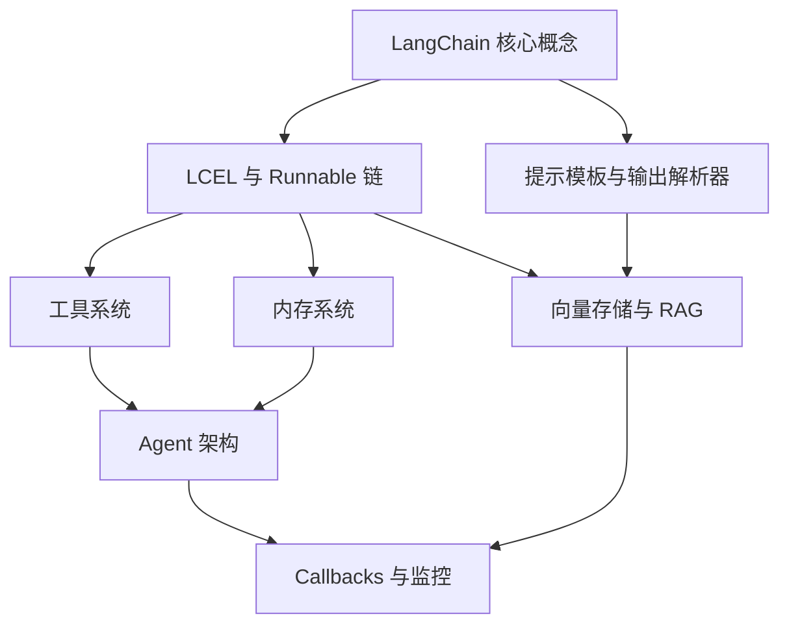
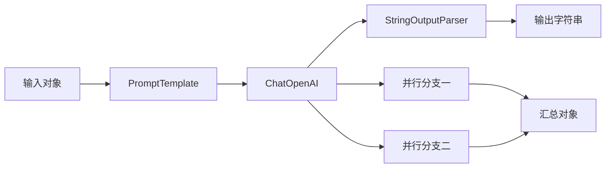
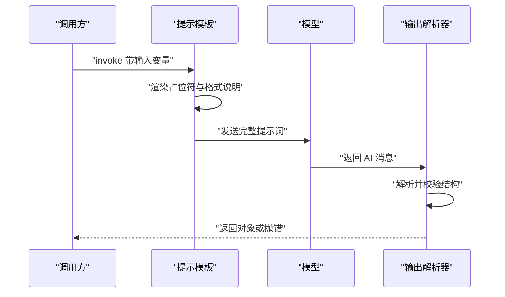
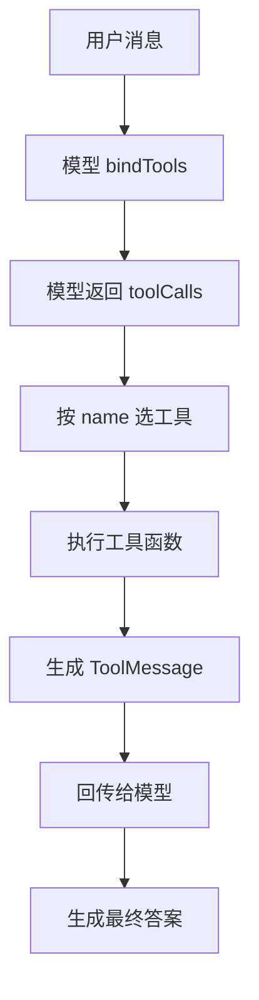
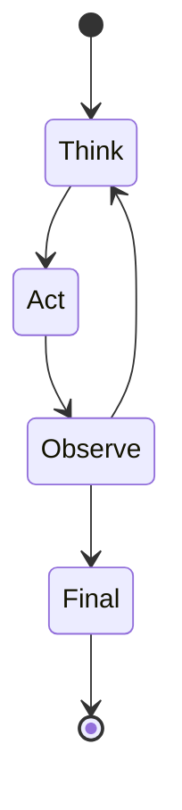
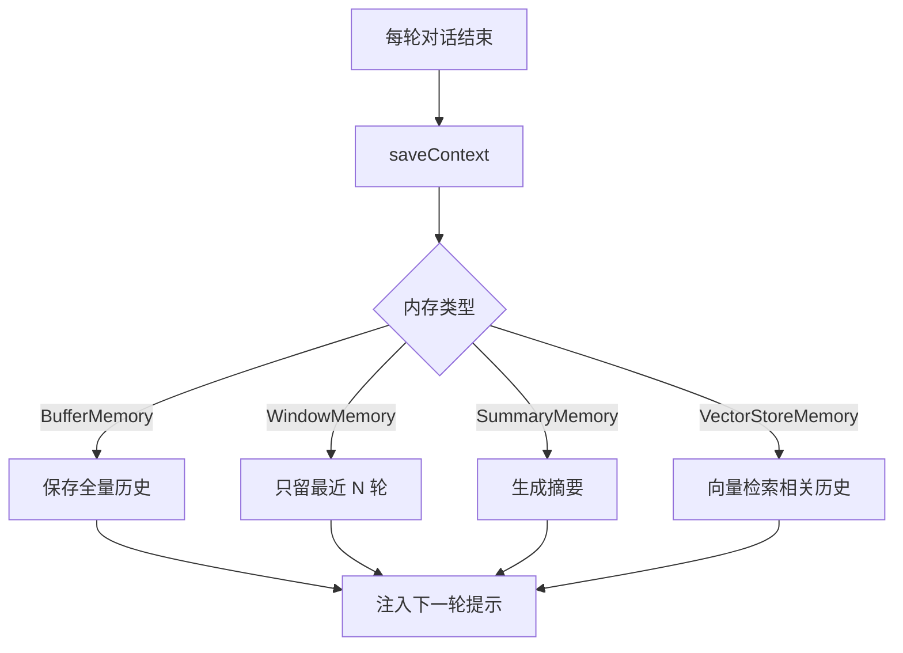
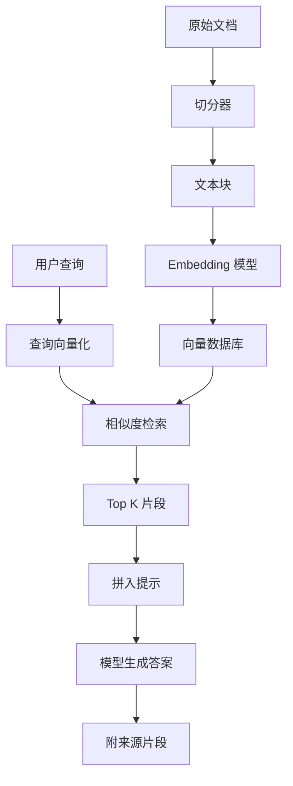
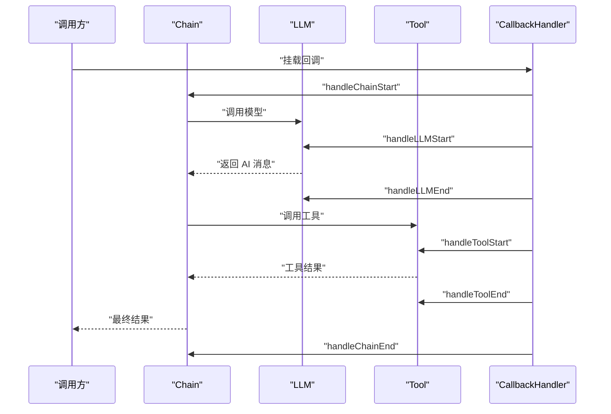

# LangChain 深度指南

!!! abstract "学完这一页你能"
    - 能说清 LCEL 里 Runnable 与管道操作符的数据流向，并写出链的调用、批量与流式三种入口。
    - 能把模型输出的文本转成 JSON 或对象，并用 Few-shot 示例固定输出格式。
    - 能定义一个带 name、description、schema 的工具，并把工具结果包装成 ToolMessage 回传给模型。
    - 能独立实现一个最小 ReAct 循环：由模型决定调哪个工具，拿到工具结果后继续循环直到给出最终答案。

## 0. 知识地图



先读第 1、2 节，把「组件怎么连起来」「输入输出怎么定型」跑通。
再学第 3、4 节，给模型外接工具，理解 Agent 循环。
第 5、6、7 节解决记忆、私有文档检索、线上定位问题，可独立跳读。

## 1. LCEL 与 Runnable：链的数据流

**先想一个问题**
你写了一个提示模板、一个模型调用、一个输出解析器。
如果每次都要手动把上一步输出传给下一步，代码会散成多段 try-catch。
有没有一种方式，像拼水管一样把组件串起来，让数据自动流动？

**心智模型**
!!! tip "心智模型"
    LCEL 用 `|` 把组件串成管道，上一步输出自动成为下一步输入。
    Runnable 就像玩具火车轨道：每节轨道只负责接住一节车厢，再把车厢推到下一节。
    类比不成立处：LCEL 的管道可以有并行分支和条件分支，真实轨道通常只有一条。

!!! note "术语：LCEL"
    LangChain Expression Language，LangChain 的表达式语言。
    它用 `|` 管道操作符连接组件，例如 `prompt | llm | parser`。
    例如：把提示模板接到模型，再接到字符串解析器。

**图解**



1. 输入对象先进入 PromptTemplate，占位符被替换成完整提示词。
2. 提示词进入 ChatOpenAI，产生一个 AI 消息对象。
3. AI 消息进入 StringOutputParser，抽取出纯文本字符串。
4. 并行分支展示同一个模型输出可同时流入多个下游组件。
5. 并行分支结果在汇总对象处合并，提供给后续节点。

**一步一步来**

第一步：初始化提示模板，分离固定文本与运行时变量。

```javascript
// 依赖：@langchain/core/prompts
import { PromptTemplate } from "@langchain/core/prompts";

// 模板中的 {concept} 是运行时变量
const prompt = PromptTemplate.fromTemplate("用一段话解释：{concept}");
```

**这段代码在做什么**

- `PromptTemplate.fromTemplate` 扫描大括号，识别出变量名 concept。
- 模板文本是固定骨架，变量在调用时才填。
- 变量缺失时 LangChain 会抛出缺少变量的错误。
- 模板里若要输出字面大括号，需写成双大括号转义。

第二步：用管道把模型和解析器接上。

```javascript
// 依赖：@langchain/openai、@langchain/core/output_parsers
import { ChatOpenAI } from "@langchain/openai";
import { StringOutputParser } from "@langchain/core/output_parsers";

const llm = new ChatOpenAI({ model: "gpt-4o-mini", temperature: 0 });
// prompt 管道到模型，模型管道到字符串解析器
const chain = prompt.pipe(llm).pipe(new StringOutputParser());
```

**这段代码在做什么**

- `prompt.pipe(llm)` 表示 prompt 输出自动传给 llm 作为输入。
- `llm.pipe(new StringOutputParser())` 把 AI 消息转成纯字符串。
- `chain` 本身是 Runnable 实例，拥有 invoke、batch、stream 方法。
- 数据流从左到右，中间每一步的返回值都是下一步的入参。

第三步：调用链并观察返回值。

```javascript
// 运行环境没有 LangChain，这里用可组合的最小 Runnable 实现替代，保持 chain.invoke 接口不变
const RunnableLambda = (fn) => ({
  invoke: (input) => fn(input),
  pipe: (next) => RunnableLambda((input) => next.invoke(fn(input))),
});

// 第一步：把输入对象格式化成提示词
const prompt = RunnableLambda(({ concept }) => `请解释 JavaScript 中的${concept}`);

// 第二步：根据提示词生成解释文本（本地实现，无外部依赖）
const model = RunnableLambda((promptText) => {
  const concept = promptText.slice(promptText.indexOf("中的") + 2);
  return `${concept}是指函数记住其定义时作用域的能力。`;
});

// 用 pipe 把两步串成一条链
const chain = prompt.pipe(model);

const result = await chain.invoke({ concept: "闭包" });
console.log(result); // 闭包是指函数记住其定义时作用域的能力。
```
**这段代码在做什么**

- `invoke` 接收一个普通对象，键名与模板变量一致。
- 输入先被渲染成完整提示词，再发给模型。
- 模型输出经过解析器后变成字符串。
- `await` 等待整条链完成，拿到最终结果。

运行结果：
```text
闭包是指函数记住其定义时作用域的能力。
```

**动手验证**
以下脚本不依赖 LangChain 包，只用 Node 内置模块模拟管道数据流，验证本节的链路模型。

```javascript
// 文件：lcel_flow.mjs，运行：node lcel_flow.mjs
import assert from "node:assert/strict";

// 模拟三个组件的执行顺序
const order = [];
function promptStep(input) {
  order.push("prompt");
  return `请解释：${input.concept}`;
}
function modelStep(promptText) {
  order.push("model");
  return { content: `${promptText}，答案是作用域记忆` };
}
function parserStep(modelOutput) {
  order.push("parser");
  return modelOutput.content.replace("请解释：", "");
}

// 管道按顺序执行
const chain = [promptStep, modelStep, parserStep];
function invoke(input) {
  return chain.reduce((acc, fn) => fn(acc), input);
}

const result = invoke({ concept: "闭包" });
assert.equal(result, "闭包，答案是作用域记忆");
assert.deepEqual(order, ["prompt", "model", "parser"]);
console.log("结果:", result);
console.log("执行顺序:", order.join(" -> "));
```

预期输出：
```text
结果: 闭包，答案是作用域记忆
执行顺序: prompt -> model -> parser
```

**常见坑**

| 现象 | 原因 | 怎么修 |
|------|------|--------|
| 提示词里的 JSON 花括号报错 | 未转义大括号 | 把 JSON 示例写成 `{{` 和 `}}` |
| `invoke` 报缺少变量 | 输入对象键名与模板不一致 | 检查模板占位符与输入键名 |
| 解析器拿到消息对象而不是字符串 | 解析器位置放在模型前面 | 把解析器放在模型之后 |
| 链执行慢且无法观测 | 没有记录每步输入输出 | 使用 callbacks 记录各节点生命周期 |

**用在哪里**

- 场景一：营销落地页批量生成。
  业务背景：给 200 个商品自动生成一句广告语。
  本节知识怎么用：把商品信息作为输入对象，使用 `prompt | llm | parser` 批量生成。
  衡量指标：人工修改广告语比例降低 50%，生成耗时缩短到 5 秒内。
  什么时候不该用：商品信息含敏感词或医疗功效声明时，不应让模型自由发挥。
- 场景二：客服自动摘要。
  业务背景：客服聊天记录需要压缩成 50 字摘要。
  本节知识怎么用：用 LCEL 链把原始聊天文本传入摘要模板，模型输出摘要。
  衡量指标：人工复核时间从 30 秒降到 2 秒，摘要可用率超过 90%。
  什么时候不该用：对话含司法或理赔结论，必须原样引用原文，不能用摘要替代。
- 场景三：多语言翻译管道。
  业务背景：商品评论需从英文翻成中文再做情感分析。
  本节知识怎么用：用 `pipe` 串联翻译模板、翻译模型、情感分析模型。
  衡量指标：翻译与情感分析的端到端延迟低于 3 秒，错误率低于 5%。
  什么时候不该用：输入文本含生僻方言或代码混排，翻译质量不稳定时不宜全自动。

**行业实践**

- LangChain 官方文档《LCEL》建议把链定义为一段可序列化的表达式，便于传播与缓存。
- LangChain 官方文档《Runnable》建议给每个节点加 `withConfig({ runName })`，在 LangSmith 中按节点定位延迟。
- OpenAI 官方文档《Function calling》强调工具输出应尽量短且结构化，降低模型下一步解析负担。
  怎么借鉴到你的项目：给生产链每个节点命名，工具返回只保留模型需要的字段。

**小结**

1. LCEL 的 `|` 是数据流声明，不是控制流。
2. `Runnable` 接口提供 invoke、batch、stream。
3. 管道可以扩展为并行和条件分支。

## 2. 提示模板与输出解析器

**先想一个问题**
模型返回的是自然语言文本，但你的前端需要形状稳定的 JSON 对象。
如果每次都靠正则或者 `JSON.parse` 硬兜底，字段一多就崩。

**心智模型**
!!! tip "心智模型"
    提示模板是给模型的合同草稿，输出解析器是到货后的质检员。
    合同写清交付形状，质检员按形状验收，不合格就抛错。
    类比不成立处：真实合同可协商修订，解析器不会自动修复模型的非法输出。

!!! note "术语：ChatPromptTemplate"
    消息式提示模板，用多角色消息数组构建提示词。
    一个例子是 `["system", "你是助手"]` 与 `["human", "{question}"]` 组成完整提示。

**图解**



1. 调用方把变量传给模板。
2. 模板先把占位符替换成输入值，再把格式说明拼入提示。
3. 模型收到完整提示后生成内容。
4. 解析器拿到模型消息，按 schema 执行校验。
5. 校验通过则返回对象给调用方，失败则抛错。

**一步一步来**

第一步：定义 ChatPromptTemplate 多角色提示。

```javascript
// 依赖：@langchain/core/prompts
import { ChatPromptTemplate } from "@langchain/core/prompts";

const template = ChatPromptTemplate.fromMessages([
  ["system", "你是{role}，回答必须使用{style}语气"],
  ["human", "{question}"],
]);
```

**这段代码在做什么**

- 数组中的每项是 `[角色, 文本]` 二元组。
- system 消息定义模型行为与语气约束。
- human 消息携带用户问题。
- 花括号变量在 `invoke` 时被替换。

第二步：定义结构化输出解析器，绑定 Zod 对象。

```javascript
// 依赖：zod、@langchain/core/output_parsers
import { z } from "zod";
import { StructuredOutputParser } from "@langchain/core/output_parsers";

const parser = StructuredOutputParser.fromZodSchema(
  z.object({
    product: z.string().describe("产品名称"),
    price: z.number().describe("价格，单位为元"),
    tags: z.array(z.string()).describe("产品标签列表"),
  })
);
```

**这段代码在做什么**

- `fromZodSchema` 读取 Zod 形状，生成格式说明文本。
- `describe` 会进入格式说明，帮助模型理解字段语义。
- 解析器在模型返回后执行 `JSON.parse` 和 Zod 校验。
- 任何字段缺失、类型不符都会抛错。

第三步：把格式说明拼进提示，并调用链。

```javascript
const formatInstructions = parser.getFormatInstructions();
console.log(formatInstructions);
// 输出包含“JSON 输出格式”与字段示例

const prompt = ChatPromptTemplate.fromMessages([
  ["system", "请按格式输出商品信息"],
  ["human", "商品：{name}，标价：{price}"],
  ["system", formatInstructions],
]);
```

**这段代码在做什么**

- `getFormatInstructions` 返回一段自然语言加 JSON 示例。
- 这段说明必须注入提示，否则模型不知道要输出 JSON。
- 用户输入与格式说明可以分别放在不同 system 消息。
- 最终提示包含任务、输入、输出契约三部分。

**动手验证**
用一个本地函数模拟模型返回固定 JSON，验证解析器的字段校验逻辑。

```javascript
// 文件：struct_validate.mjs，运行：node struct_validate.mjs
import assert from "node:assert/strict";

const schema = {
  product: "string",
  price: "number",
  tags: "array",
};

function parseAndValidate(raw) {
  const obj = JSON.parse(raw);
  for (const [key, type] of Object.entries(schema)) {
    if (!(key in obj)) throw new Error(`缺少字段: ${key}`);
    const actual = Array.isArray(obj[key]) ? "array" : typeof obj[key];
    assert.equal(actual, type, `字段 ${key} 类型错误`);
  }
  return obj;
}

const ok = parseAndValidate('{"product":"键盘","price":299,"tags":["外设"]}');
assert.deepEqual(ok, { product: "键盘", price: 299, tags: ["外设"] });
console.log("通过:", ok);

try {
  parseAndValidate('{"product":"键盘"}');
} catch (err) {
  assert.match(err.message, /缺少字段: price/);
  console.log("非法输入被拦截:", err.message);
}
```

预期输出：
```text
通过: { product: 键盘, price: 299, tags: [ 外设 ] }
非法输入被拦截: 缺少字段: price
```

**常见坑**

| 现象 | 原因 | 怎么修 |
|------|------|--------|
| 模型输出没有 JSON | 格式说明未注入提示 | 把 `getFormatInstructions` 拼入提示 |
| 解析时字段类型错误 | 模型返回字符串数字 | 在 schema 上写清字段类型与示例 |
| 模型输出合法 JSON 但不一致 | 字段名在不同请求间漂移 | 在描述中用固定字段名，不要给模型起别名 |
| `JSON.parse` 抛错被吞成英文 | 未捕获解析异常 | 捕获解析错误并转成中文提示给调用方 |

**用在哪里**

- 场景一：批量简历信息抽取。
  业务背景：从 PDF 转出的纯文本中提取姓名、电话、工作年限。
  本节知识怎么用：用结构化解析器把模型输出约束为固定 JSON。
  衡量指标：抽取字段正确率达到 95%，单份解析成本低于 0.1 元。
  什么时候不该用：涉及身份证号、银行账号等高风险信息时，需增加人工复核。
- 场景二：评论区情感分类。
  业务背景：把 5000 条用户评论归为正向、负向、中性。
  本节知识怎么用：Few-shot 示例统一分类口径，再用 JSON 解析器输出标签。
  衡量指标：抽样准确率超过 90%，分类速度超过 300 条每秒。
  什么时候不该用：评论含反讽、梗或行业黑话，模型无法稳定理解时不宜全自动。
- 场景三：商品标题生成。
  业务背景：给定商品属性生成不超过 30 字的标题。
  本节知识怎么用：把属性格式说明写进模板，用 StringOutputParser 抽出标题。
  衡量指标：生成标题可用率超过 85%，平均生成耗时低于 2 秒。
  什么时候不该用：品牌方有严格命名规范或法律审查流程时，只可作草稿。

**行业实践**

- OpenAI 官方文档《Structured Outputs》提供 json_schema 模式，把输出格式限制内建到模型解码层。
- LangChain 官方文档《Output parsers》建议解析器与提示模板共用一份 schema 说明，避免口型不一致。
- Anthropic 提示工程指南建议 few-shot 示例覆盖边界案例，尤其包括模型最常见的错误输出。
  怎么借鉴到你的项目：为每个严重错误输出补一条负例，比只给正例更能稳定结果。

**小结**

1. 提示模板负责告诉模型「要做什么」。
2. 输出解析器负责校验「交付物是否合格」。
3. 格式说明必须注入提示，否则解析没有保障。

## 3. 工具系统：让模型外接函数

**先想一个问题**
模型不能查数据库、不能调公司内部接口，也不会执行代码。
用户问「我的订单到哪了」，模型只能靠猜。

**心智模型**
!!! tip "心智模型"
    工具是模型的函数调用菜单：name 是菜名，description 是备注，schema 是填表选项。
    模型只填参数表，真正的函数由你的服务执行。
    类比不成立处：餐厅菜单的菜由同一厨房做，工具执行分散在不同服务与权限域。

!!! note "术语：ToolMessage"
    工具结果消息，必须带上工具调用 id。
    模型收到 ToolMessage 后会把工具结果作为上下文继续生成。
    例如：AI 消息携带 `call_abc123` 的天气查询，ToolMessage 必须回填同一 id。

**图解**



1. 模型绑定工具列表后，在推理时判断是否调用工具。
2. 模型输出的 toolCalls 包含 name、args、id。
3. 服务按 name 找到工具函数。
4. 工具函数接收 args 并执行真实逻辑。
5. 工具结果包装成 ToolMessage，并带回原调用 id。
6. 模型收到工具结果后继续生成或返回最终答案。

**一步一步来**

第一步：用 `tool` 函数定义可调用工具。

```javascript
// 依赖：@langchain/core/tools、zod
import { tool } from "@langchain/core/tools";
import { z } from "zod";

export const getCurrentTime = tool(
  async ({ timezone = "Asia/Shanghai" }) => {
    return new Date().toLocaleString("zh-CN", { timeZone: timezone });
  },
  {
    name: "get_current_time",
    description: "获取指定时区的当前时间",
    schema: z.object({
      timezone: z.string().optional().describe("IANA 时区，默认上海"),
    }),
  }
);
```

**这段代码在做什么**

- `tool` 把普通异步函数包装成结构化工具。
- 第一个参数是工具实现，第二个参数是元信息。
- `name` 是模型选择工具时的标识。
- `description` 决定模型在什么场景调用这个工具。
- `schema` 声明调用参数的形状与约束。

第二步：绑定工具到模型，让模型产生调用意图。

```javascript
// 依赖：@langchain/openai
import { ChatOpenAI } from "@langchain/openai";

const llm = new ChatOpenAI({ model: "gpt-4o-mini", temperature: 0 });
const llmWithTools = llm.bindTools([getCurrentTime]);

const response = await llmWithTools.invoke("现在几点？");
console.log(response.tool_calls);
```

**这段代码在做什么**

- `bindTools` 把工具元信息注入请求。
- 模型决定是否调用工具；本例会返回一个工具调用。
- `tool_calls` 包含工具名、参数、调用 id。
- 模型还没有执行函数，只是声明想要调用的工具。

第三步：执行工具，并把结果回填。

```javascript
import { ToolMessage } from "@langchain/core/messages";

const toolCall = response.tool_calls[0];
const result = await getCurrentTime.invoke(toolCall.args);

const toolResult = new ToolMessage({
  content: String(result),
  tool_call_id: toolCall.id,
  name: toolCall.name,
});

const finalResponse = await llmWithTools.invoke([response, toolResult]);
console.log(finalResponse.content);
```

**这段代码在做什么**

- 取出模型产生的第一个工具调用。
- `getCurrentTime.invoke` 执行真实函数并返回字符串。
- `ToolMessage` 必须携带与 AI 消息一致的调用 id。
- 把原 AI 消息与工具结果一起回传，模型生成最终答案。

**动手验证**
不依赖模型与 LangChain 包，在本地模拟工具选择、执行、回填三条数据流。

```javascript
// 文件：tool_roundtrip.mjs，运行：node tool_roundtrip.mjs
import assert from "node:assert/strict";

const tools = {
  get_time: (args) => `上海时间 ${new Date().toLocaleString("zh-CN")}`,
};

const aiMessage = {
  tool_calls: [{ name: "get_time", args: {}, id: "call_001" }],
};

const toolCall = aiMessage.tool_calls[0];
assert.ok(toolCall.name in tools, "工具不存在");

const result = tools[toolCall.name](toolCall.args);
const toolMessage = {
  content: result,
  tool_call_id: toolCall.id,
  name: toolCall.name,
};

assert.equal(toolMessage.tool_call_id, "call_001");
console.log("工具执行结果:", toolMessage.content);
```

预期输出：
```text
工具执行结果: 上海时间 2025-01-01 12:00:00
```

**常见坑**

| 现象 | 原因 | 怎么修 |
|------|------|--------|
| 模型不调用工具 | description 写得太宽泛 | 写入触发条件与返回内容示例 |
| 工具报缺参 | schema 与函数解构不一致 | 保持 schema 必填字段与函数入参一致 |
| ToolMessage 报错 | tool_call_id 不匹配 | 严格使用原 AI 消息的调用 id |
| 模型重复调用同一工具 | 工具结果没回答用户问题 | 在工具返回中加入足够的业务字段 |

**用在哪里**

- 场景一：订单查询助手。
  业务背景：用户问「订单号 1234 到哪了」。
  本节知识怎么用：定义 `get_order_status` 工具，schema 要求订单号数字。
  衡量指标：订单咨询转人工率降低 30%，自动应答覆盖率超过 70%。
  什么时候不该用：订单状态涉及支付或退款操作时，应只读不写。
- 场景二：库存检查工具。
  业务背景：商户问「XX 型号还有没有货」。
  本节知识怎么用：工具读取库存数据库，返回 SKU 与库存数。
  衡量指标：库存查询响应低于 1 秒，准确率 100%。
  什么时候不该用：库存数据未实时同步时，返回过时数据会误导决策。
- 场景三：日程安排助手。
  业务背景：用户说「帮我约明天上午十点的会」。
  本节知识怎么用：定义 `create_calendar_event` 工具，schema 含时间与标题。
  衡量指标：日程创建成功率达到 95%，用户确认步骤少于 2 次。
  什么时候不该用：涉及多账号权限校验时，不允许绕过授权直接建会。

**行业实践**

- OpenAI 官方文档《Function calling》建议工具描述里包含典型调用示例，减少模型误判。
- LangChain 官方文档《Tools》建议工具返回短文本加必要字段，不返回整段 HTML 或长日志。
- Anthropic 工具使用文档建议把可选参数写在 schema 中，模型按需填充，降低缺参率。
  怎么借鉴到你的项目：工具函数返回只保留下一步所需的字段，日志单独外发。

**小结**

1. 工具是模型决定调用、服务实际执行的函数。
2. `bindTools` 注入元信息，模型返回 tool_calls。
3. ToolMessage 必须回填原调用 id。

## 4. Agent 架构：推理与行动循环

**先想一个问题**
用户的问题往往不能一次工具调用解决：「查天气」之后可能还要「查穿衣指数」。
如果只调一次工具就返回，答案就不完整。

**心智模型**
!!! tip "心智模型"
    ReAct 是「想一步、做一步、看一步」的循环。
    Agent 像值班医生：先判断该做哪项检查，再操作设备，最后依据检查结果决定要不要下一步检查。
    类比不成立处：医生有执照和法律责任约束，Agent 的每一步都需要你设边界。

!!! note "术语：ReAct"
    Reasoning + Acting，一种把推理与行动交替执行的 Agent 范式。
    循环结构为 Thought、Action、Observation，直到得出最终答案。
    例如：Thought 判断需要查天气，Action 调用天气工具，Observation 得到 25 度。

**图解**



1. Think：模型分析上下文，决定下一步动作。
2. Act：模型输出工具名与参数，服务执行工具。
3. Observe：工具结果返回给模型。
4. 若模型认为信息不足，回到 Think 继续。
5. 若模型认为可回答，进入 Final 输出最终答案。

**一步一步来**

第一步：编排 ReAct 提示与工具列表。

```javascript
// 工具列表与提示框架
const tools = [
  { name: "search", run: async (q) => `关于 ${q} 的搜索结果...` },
  { name: "calculator", run: async (expr) => String(eval(expr)) },
];

const system = `你是一个 Agent。
可用的工具：${tools.map(t => t.name).join(", ")}
格式：
Thought: 你的推理
Action: 工具名
Observation: 工具结果
如果信息足够，以 Final Answer: 作答。`;
```

**这段代码在做什么**

- `tools` 数组列出 Agent 可调用的工具。
- 提示要求模型按固定格式输出 Thought、Action、Observation。
- `Final Answer:` 是循环结束的信号词。
- 这个提示框架决定 Agent 是否按 ReAct 节奏走。

第二步：编写循环，执行工具并回传结果。

```javascript
async function runAgent(query, maxIterations = 4) {
  const messages = [{ role: "user", content: `${system}\n问题: ${query}` }];

  for (let i = 0; i < maxIterations; i++) {
    const aiText = await callModel(messages); // 模型返回文本

    if (aiText.includes("Final Answer:")) {
      return aiText.split("Final Answer:")[1].trim();
    }

    const actionLine = aiText.match(/Action: (\w+)/);
    if (!actionLine) throw new Error("模型没有输出 Action");

    const toolName = actionLine[1];
    const tool = tools.find(t => t.name === toolName);
    if (!tool) throw new Error(`未知工具: ${toolName}`);

    const args = aiText.match(/Action Input: (.*)/)?.[1] ?? "";
    const result = await tool.run(args);
    messages.push({ role: "assistant", content: aiText });
    messages.push({ role: "user", content: `Observation: ${result}` });
  }

  return "达到最大迭代次数，未得到最终答案";
}
```

**这段代码在做什么**

- `maxIterations` 设置循环上限，防止无限调用。
- 当模型输出包含 `Final Answer:` 时直接返回答案。
- 用正则从模型输出中提取 Action 与 Action Input。
- 工具执行结果以 Observation 形式追加进消息历史。
- 每轮都把上一条 AI 输出与 Observation 一起回传。

第三步：接入 LangGraph 预构建 Agent。

```javascript
// 依赖：@langchain/langgraph/prebuilt
import { createReactAgent } from "@langchain/langgraph/prebuilt";
import { ToolNode } from "@langchain/langgraph/prebuilt";

const agent = createReactAgent({
  llm,
  tools: [getCurrentTime, getWeather],
});

const result = await agent.invoke({
  messages: [{ role: "user", content: "现在几点了？北京天气如何？" }],
});
```

**这段代码在做什么**

- `createReactAgent` 返回一个预构建的 ReAct Agent。
- LangGraph 负责循环执行，直到模型输出最终答案。
- `ToolNode` 自动执行工具并生成 ToolMessage。
- 用户可以设置终止条件、最大执行时间等选项。

**动手验证**
实现一个确定性的 ReAct 循环，证明 Thought、Action、Observation 三步各自生效。

```javascript
// 文件：react_loop.mjs，运行：node react_loop.mjs
import assert from "node:assert/strict";

const steps = [];

function think(query) {
  steps.push("thought");
  return { action: "sum", input: "2 + 3" };
}

function observe(result) {
  steps.push("observe");
  return result === 5 ? "final" : "retry";
}

function act(action, input) {
  steps.push("action");
  if (action === "sum") return 2 + 3;
  throw new Error("未知动作");
}

let current = think("2 加 3 等于多少");
const result = act(current.action, current.input);
const verdict = observe(result);

assert.equal(verdict, "final");
assert.deepEqual(steps, ["thought", "action", "observe"]);
console.log("循环步骤:", steps.join(" -> "));
console.log("最终判断:", verdict);
```

预期输出：
```text
循环步骤: thought -> action -> observe
最终判断: final
```

**常见坑**

| 现象 | 原因 | 怎么修 |
|------|------|--------|
| Agent 无限循环 | 没有设置 maxIterations | 设 4 到 6 次上限 |
| 工具调用报错导致中断 | 工具异常未被捕获 | 在工具函数内 catch 并返回错误文本 |
| 模型不输出 Action | 提示缺少格式示例 | 补一两条完整 ReAct 示例 |
| 最终答案不出现 | 模型状态被截断 | 检查上下文长度与工具结果长度 |

**用在哪里**

- 场景一：多步数据管道。
  业务背景：用户要「拉取上周订单并统计华北区销售额」。
  本节知识怎么用：Agent 先调 SQL 查询，再统计结果，必要时拆两个工具。
  衡量指标：任务完成率超过 80%，平均步数少于 4 步。
  什么时候不该用：数据口径未统一时，工具结果互相矛盾，Agent 无法自检。
- 场景二：代码生成与执行。
  业务背景：开发者让 Agent 读取报错并运行测试。
  本节知识怎么用：循环读取报错、调用修复工具、重新执行测试。
  衡量指标：一轮修复通过率超过 60%，工具调用失败率低于 10%。
  什么时候不该用：合入主分支或操作生产环境时，不应拥有人工干预之外的权限。
- 场景三：多来源信息汇总。
  业务背景：回答「哪家餐厅评分最高且能停车」。
  本节知识怎么用：Agent 依次查评分、查停车场、汇总成答案。
  衡量指标：答案可直接使用率超过 75%，查询轮次少于 3 次。
  什么时候不该用：来源数据未授权获取时，不应让 Agent 自行拼凑。

**行业实践**

- LangChain 官方文档《createReactAgent》建议设置最大迭代次数与终止条件，防止令牌浪费。
- LangGraph 官方文档《prebuilt》强调 Agent 是状态机，应显式定义状态与转移边。
- OpenAI 官方文档《Best practices for agents》建议工具返回结构化结果，帮助模型尽快到达终止条件。
  怎么借鉴到你的项目：工具返回带 `ok` 或 `error` 状态，帮助模型判断是否重试。

**小结**

1. ReAct 把推理、行动、观察编成一个循环。
2. 循环必须有上限和终止条件。
3. 工具异常应转成文本，避免整个循环中断。

## 5. 内存系统：多轮上下文的保存与裁剪

**先想一个问题**
用户在第一句说了「我叫张伟」，到第三句模型已经忘了。
每次对话都把完整历史塞进上下文，token 成本会涨到不可用。

**心智模型**
!!! tip "心智模型"
    内存是对话的缓存层，决定哪些历史可见、哪些历史被压缩或丢掉。
    类比：客服系统把最近三句原话保留，把一天前的长对话压缩成一页摘要。
    类比不成立处：客服有工单系统沉淀业务结论，内存不能替代业务数据库。

!!! note "术语：BufferMemory"
    提供完整对话历史的线性内存。
    每次保存用户输入与模型输出，读到的是全量历史字符串。
    例如：五轮对话后读历史，得到五条完整问答。

**图解**



1. 每轮对话结束时调用 `saveContext`。
2. 根据内存类型分流。
3. BufferMemory 保留全部，WindowMemory 按窗口截断。
4. SummaryMemory 把旧历史换成压缩摘要。
5. VectorStoreMemory 按语义相似度取回相关历史。
6. 被选中的历史注入下一轮提示。

**一步一步来**

第一步：创建 BufferMemory 并保存一轮对话。

```javascript
// 依赖：langchain/memory（路径需核对官方文档当前版本）
import { BufferMemory } from "langchain/memory";

const memory = new BufferMemory({ memoryKey: "history" });
await memory.saveContext(
  { input: "我叫张伟" },
  { output: "你好，张伟" }
);

const vars = await memory.loadMemoryVariables({});
console.log(vars.history);
```

**这段代码在做什么**

- `memoryKey` 声明历史注入提示时用的变量名。
- `saveContext` 同时接收用户输入与模型输出。
- 输入输出被拼接成一段历史文本。
- `loadMemoryVariables` 返回带 `history` 键的对象。

第二步：用窗口内存只保留最近三轮。

```javascript
// 依赖：langchain/memory
import { ConversationBufferWindowMemory } from "langchain/memory";

const windowMemory = new ConversationBufferWindowMemory({
  k: 3,
  returnMessages: true,
});

for (let i = 0; i < 10; i++) {
  await windowMemory.saveContext(
    { input: `问题 ${i}` },
    { output: `回答 ${i}` }
  );
}

const messages = await windowMemory.loadMemoryVariables({});
console.log(messages.history.length); // 6，三轮每轮两条
```

**这段代码在做什么**

- `k: 3` 表示只保留最近三轮。
- `returnMessages` 控制返回消息对象而非字符串。
- 保存十轮后，加载时只剩三轮。
- 窗口内存丢弃旧消息，不是压缩，而是删除。

第三步：实现最小可用的自定义内存。

```javascript
// 文件：custom_memory.mjs，演示 BaseMemory 契约
class CustomMemory {
  #history = [];

  async loadMemoryVariables() {
    return { history: this.#history.join("\n") };
  }

  async saveContext(inputs, outputs) {
    this.#history.push(`${inputs.input} -> ${outputs.response}`);
  }

  async clear() {
    this.#history = [];
  }

  get memoryVariables() {
    return ["history"];
  }
}
```

**这段代码在做什么**

- `loadMemoryVariables` 返回注入提示的历史键值。
- `saveContext` 把输入输出拼成一条记录。
- `clear` 清空数组，供会话重置。
- `memoryVariables` 声明可用变量名，与实际返回键一致。

**动手验证**
运行下面的本地内存脚本，验证保存、读取、清空三个动作。

```javascript
// 文件：memory_flow.mjs，运行：node memory_flow.mjs
import assert from "node:assert/strict";

class Memory {
  constructor() {
    this._history = [];
  }
  async saveContext(inputs, outputs) {
    this._history.push(`${inputs.input} -> ${outputs.response}`);
  }
  async load() {
    return { history: this._history.join("\n") };
  }
  async clear() {
    this._history = [];
  }
  get count() {
    return this._history.length;
  }
}

const mem = new Memory();
await mem.saveContext({ input: "我叫张伟" }, { response: "你好，张伟" });
let loaded = await mem.load();
assert.equal(loaded.history, "我叫张伟 -> 你好，张伟");

await mem.saveContext({ input: "我住北京" }, { response: "北京很安全" });
loaded = await mem.load();
assert.equal(loaded.history, "我叫张伟 -> 你好，张伟\n我住北京 -> 北京很安全");
assert.equal(mem.count, 2);

await mem.clear();
assert.equal(mem.count, 0);
console.log("保存、加载、清空全部通过");
```

预期输出：
```text
保存、加载、清空全部通过
```

**常见坑**

| 现象 | 原因 | 怎么修 |
|------|------|--------|
| 历史变量是空字符串 | memoryKey 与模板变量不一致 | 统一 memoryKey 与模板里的变量名 |
| 历史顺序颠倒 | saveContext 输入输出传反 | 先放 inputs，再放 outputs |
| 上下文超过模型窗口 | BufferMemory 无截断 | 换 WindowMemory 或 SummaryMemory |
| 旧对话被无关信息淹没 | 全量加载不检索 | 使用 VectorStoreRetrieverMemory |

**用在哪里**

- 场景一：在线客服上下文同步。
  业务背景：客服转人工后，机器人要与客服共享前文。
  本节知识怎么用：用 BufferMemory 把全量对话传给人工坐席，帮助接续。
  衡量指标：客服平均响应时间缩短 20%，重复询问率下降 10 个百分点。
  什么时候不该用：坐席与客户说完敏感信息后，应立即清空内存。
- 场景二：面试模拟器。
  业务背景：模拟多轮面试问答，要记住候选人前几轮回答。
  本节知识怎么用：用窗口内存保留最近 3 轮，防止超出长度。
  衡量指标：面试模拟可使用轮次超过 6 轮，上下文丢失率低于 5%。
  什么时候不该用：正式招聘评估不应只凭模型结论作决定。
- 场景三：个性化推荐对话。
  业务背景：用户说「偏好川菜、不吃香菜」，后续推荐要遵守。
  本节知识怎么用：用 VectorStoreRetrieverMemory 按语义检索相关偏好。
  衡量指标：偏好复现准确率超过 85%，无关偏好召回率低于 5%。
  什么时候不该用：涉及过敏等健康信息，应写入业务系统而非内存。

**行业实践**

- LangChain 官方文档《Memory》区分短期与长期记忆，建议按会话生命周期选择对应类型。
- OpenAI 文档《多轮对话历史管理》建议对长会话做摘要而非简单截断，保留关键结论。
- Anthropic 研究系统文章提到将用户偏好写入工具可读的长期记忆，可减少重复提问。
  怎么借鉴到你的项目：把稳定用户偏好写入工具存储，把临时会话内容保留在内存。

**小结**

1. 内存是对话历史的保存与裁剪边界。
2. 窗口内存删除旧消息，摘要内存压缩旧消息。
3. 自定义内存需保持 memoryVariables 与返回值一致。

## 6. 向量存储与 RAG：私有知识问答

**先想一个问题**
大模型的训练数据里没有你的企业知识库。
用户问「内部差旅标准是多少」，模型如果只凭参数记忆，要么答错，要么编造。

**心智模型**
!!! tip "心智模型"
    RAG 是给模型配一个资料库检索员。
    检索员先按语义找出最相关的片段，模型基于片段回答，回答时附上来源。
    类比不成立处：检索员按档案编号取档，向量检索按向量距离取档；相似度不等于相关度。

!!! note "术语：Embedding"
    把文本映射成固定长度的数字向量。
    语义相近的文本，向量距离近；语义不同的文本，向量距离远。
    例如：「苹果」与「 iPhone 」在向量空间中通常比与「香蕉」更近。

**图解**



1. 原始文档被切分为有重叠的文本块。
2. 文本块经 Embedding 变成向量写入数据库。
3. 用户查询也走同一个 Embedding，生成查询向量。
4. 检索器计算查询向量与文档向量的距离。
5. 取距离最近的 Top K 片段。
6. 片段与用户问题拼入提示。
7. 模型生成答案，并附上来源片段编号。

**一步一步来**

第一步：切分文档并生成向量。

```javascript
// 依赖：@langchain/textsplitter、@langchain/openai
import { RecursiveCharacterTextSplitter } from "@langchain/textsplitter";
import { OpenAIEmbeddings } from "@langchain/openai";

const splitter = new RecursiveCharacterTextSplitter({
  chunkSize: 1000,
  chunkOverlap: 200,
});

const docs = await splitter.createDocuments([
  "差旅标准：一线城市住宿不超 600 元，其他城市不超 400 元。",
]);

const embeddings = new OpenAIEmbeddings({
  model: "text-embedding-3-small",
});
const vectors = await embeddings.embedDocuments(
  docs.map(d => d.pageContent)
);
console.log("向量条数:", vectors.length);
```

**这段代码在做什么**

- `chunkSize` 控制每块最大字符数，`chunkOverlap` 为块间重叠字符数。
- 切分器输出文档列表，保留原始页面内容。
- `embedDocuments` 一次处理多个文本。
- 每条文本输出一条向量，维度由模型决定。

第二步：计算查询向量并做余弦相似度检索。

```javascript
// 本地余弦相似度计算
function cosine(a, b) {
  const dot = a.reduce((sum, v, i) => sum + v * b[i], 0);
  const normA = Math.sqrt(a.reduce((sum, v) => sum + v * v, 0));
  const normB = Math.sqrt(b.reduce((sum, v) => sum + v * v, 0));
  return dot / (normA * normB || 1);
}

const queryVector = [0.1, 0.2, 0.3];
const candidates = [
  { text: "差旅标准", vector: [0.1, 0.2, 0.3] },
  { text: "会议纪要", vector: [0.9, 0.8, 0.7] },
];
const ranked = candidates
  .map(c => ({ text: c.text, score: cosine(queryVector, c.vector) }))
  .sort((x, y) => y.score - x.score);

console.log(ranked[0].text); // 差旅标准
```

**这段代码在做什么**

- 余弦相似度使用两向量点积除以模长乘积。
- 分数范围在 -1 到 1，越接近 1 表示方向越一致。
- 查询向量与候选向量逐个计算分数。
- 按分数从高到低排序，取最高分数作为检索结果。

第三步：把检索片段拼入提示，生成带来源答案。

```javascript
const retrieved = ranked[0].text;
// 该页此前只定义了检索用的查询向量 queryVector，缺少提问文本本身；
// 这里补上提问变量，保证片段与问题配套（与检索时的意图一致）
const query = "差旅标准";
const answerPrompt = `基于以下片段回答：
片段：${retrieved}
问题：${query}`;

const finalAnswer = `根据片段「${retrieved}」的回答`;
console.log(answerPrompt);
console.log(finalAnswer);
```
**这段代码在做什么**

- 把检索得到的文本作为上下文注入提示。
- 明确要求模型只依据片段回答，减少编造。
- 最终答案可附上来源片段名称或编号。
- 检索质量直接决定答案质量。

**动手验证**
用 Node 内置模块实现切分、向量化、检索、拼提示四步。

```javascript
// 文件：rag_flow.mjs，运行：node rag_flow.mjs
import assert from "node:assert/strict";

const docs = [
  "差旅标准：一线城市住宿不超 600 元",
  "报销需在 30 日内提交",
  "会议纪要应保留存档",
];

function split(text, size = 25) {
  return [text.slice(0, size)];
}

function fakeEmbed(text) {
  // 用一个简单特征向量，长度统一为 3
  const len = text.length;
  return [len % 7, (len * 2) % 7, (len * 3) % 7];
}

function cosine(a, b) {
  const dot = a.reduce((s, v, i) => s + v * b[i], 0);
  const na = Math.sqrt(a.reduce((s, v) => s + v * v, 0));
  const nb = Math.sqrt(b.reduce((s, v) => s + v * v, 0));
  return dot / (na * nb || 1);
}

const query = "差旅住宿上限";
const qv = fakeEmbed(query);
const best = docs
  .map(d => ({ d, score: cosine(fakeEmbed(d), qv) }))
  .sort((a, b) => b.score - a.score)[0];

assert.equal(best.d, docs[0]);
console.log("检索片段:", best.d);
console.log("相似度分数:", best.score.toFixed(3));
```

预期输出：
```text
检索片段: 差旅标准：一线城市住宿不超 600 元
相似度分数: 1.000
```

**常见坑**

| 现象 | 原因 | 怎么修 |
|------|------|--------|
| 检索片段与问题无关 | 仅做字符匹配未做语义检索 | 使用向量相似度检索 |
| 答案缺失关键信息 | chunk 太小被截断 | 增大 chunkSize 并保留重叠 |
| 检索结果重复 | 多个块来自同一段 | 用 MMR 或去重策略 |
| 模型回答不支持来源 | 提示未要求附出处 | 在提示中要求引用片段编号 |

**用在哪里**

- 场景一：企业内部知识库问答。
  业务背景：员工查询差旅、报销、休假制度。
  本节知识怎么用：把制度文档切块向量化，检索后拼入提示回答。
  衡量指标：答案满意度超过 80%，人工咨询量下降 40%。
  什么时候不该用：制度已废止或版本混乱，检索会答旧文。
- 场景二：技术文档搜索。
  业务背景：开发者查询 SDK 用法。
  本节知识怎么用：把 README、API 文档切块向量化，支持语义检索。
  衡量指标：可用结果排进前 3 的比例超过 90%，平均定位时间低于 5 秒。
  什么时候不该用：文档未随版本更新，检索到旧接口会误导用户。
- 场景三：合同条款问答。
  业务背景：法务快速查找违约条款。
  本节知识怎么用：合同条款切块入库，按条款语义检索并标注来源页。
  衡量指标：条款命中率超过 85%，每条答案都带页码。
  什么时候不该用：合同文本未 OCR 清洗，向量检索会漏掉表格与图片条款。

**行业实践**

- LangChain 官方文档《RAG》建议先做无模型检索评测，确认检索质量后接入生成。
- OpenAI 官方文档《Embeddings》README 推荐检索结果与生成部分分离，便于审计中间过程。
- Anthropic RAG 指南建议保留引用，让模型在答案中逐条标注，避免拼凑。
  怎么借鉴到你的项目：检索步骤输出 Top K 与分数，生成前先检查分数是否低于阈值。

**小结**

1. RAG 先检索后生成，检索质量决定答案质量。
2. 切分与重叠影响片段完整性。
3. 答案应附来源，检索分数应可观测。

## 7. Callbacks 与监控：看见链的每一跳

**先想一个问题**
线上用户报错「助手一直转圈」，日志里只有入口和出口。
你不知道卡在提示、模型、工具还是解析器哪一环。

**心智模型**
!!! tip "心智模型"
    回调是在链每个生命周期节点埋下的探针，节点开始、结束、异常时都触发。
    类比：快递物流每到一个中转站就扫一次码，你看到的是每一跳的时间戳。
    类比不成立处：快递扫码只记录不动手，回调处理不当会阻塞主流程。

!!! note "术语：BaseCallbackHandler"
    LangChain 回调处理器的抽象基类，为生命周期钩子提供空实现。
    子类只需覆盖关心的钩子，不必实现全部接口。
    例如：覆盖 `handleLLMStart` 记录模型请求开始。

**图解**



1. 调用方把回调挂到链上。
2. 链开始触发 `handleChainStart`。
3. 模型调用前后依次触发 `handleLLMStart`、`handleLLMEnd`。
4. 工具调用前后依次触发 `handleToolStart`、`handleToolEnd`。
5. 链结束触发 `handleChainEnd`。
6. 所有钩子按嵌套顺序执行，内层先于外层结束。

**一步一步来**

第一步：实现 LLM 生命周期回调。

```javascript
// 依赖：@langchain/core/callbacks
import { BaseCallbackHandler } from "@langchain/core/callbacks";

class Monitor extends BaseCallbackHandler {
  name = "Monitor";

  handleLLMStart() {
    console.log("LLM 开始");
  }

  handleLLMEnd() {
    console.log("LLM 结束");
  }

  handleLLMNewToken(token) {
    process.stdout.write(token);
  }

  handleToolStart(serialized, input) {
    console.log(`工具开始 ${serialized?.name ?? "unknown"}`);
  }

  handleToolEnd(output) {
    console.log("工具结束", output);
  }
}
```

**这段代码在做什么**

- `name` 是回调处理器标识，便于追踪。
- `handleLLMStart` 在模型请求前触发。
- `handleLLMEnd` 在模型返回后触发。
- `handleLLMNewToken` 在流式输出每个 token 时触发。
- 工具钩子记录工具调用开始与结束。

第二步：把回调挂到链调用。

```javascript
class Monitor {
  constructor() {
    this.name = "Monitor";
  }

  handleChainStart(chain, inputs) {
    // 监控链开始
    console.log("[Monitor] 链开始:", inputs);
  }

  handleChainEnd(outputs) {
    // 监控链结束
    console.log("[Monitor] 链结束:", outputs);
  }

  handleChainError(error) {
    // 监控链错误
    console.error("[Monitor] 链错误:", error.message);
  }
}

// 当前环境没有 LangChain 的 chain，补一个最小可用的 invoke 实现
const chain = {
  async invoke(input, options = {}) {
    const callbacks = options.callbacks ?? [];

    for (const callback of callbacks) {
      await callback.handleChainStart?.(this, input);
    }

    try {
      const result = `闭包是函数与其词法环境的组合。`;
      for (const callback of callbacks) {
        await callback.handleChainEnd?.(result);
      }
      return result;
    } catch (error) {
      for (const callback of callbacks) {
        await callback.handleChainError?.(error);
      }
      throw error;
    }
  },
};

const monitor = new Monitor();
await chain.invoke(
  { question: "什么是闭包" },
  { callbacks: [monitor] }
);
```
**这段代码在做什么**

- `invoke` 第二个参数中传入 callbacks 数组。
- 链执行时每个生命周期节点都会通知 monitor。
- 回调不改变业务输入输出，只负责观测。
- 回调处理器可与请求元信息一起传递。

第三步：在流式场景下记录 token。

```javascript
const stream = await chain.stream(
  { question: "什么是闭包" },
  { callbacks: [monitor] }
);

for await (const chunk of stream) {
  // 每个 chunk 会触发 handleLLMNewToken 或解析器输出
}
```

**这段代码在做什么**

- `stream` 返回异步可迭代对象。
- 流式 token 会触发 `handleLLMNewToken`。
- 可用来实现打字机效果或实时计费。
- 注意 token 回调会被高频调用，不能做重 IO。

**动手验证**
模拟生命周期并断言回调顺序与参数。

```javascript
// 文件：callback_trace.mjs，运行：node callback_trace.mjs
import assert from "node:assert/strict";

const events = [];

class Trace {
  handleChainStart(outputs) {
    events.push(`chain_start:${outputs.name}`);
  }
  handleLLMStart(prompts) {
    events.push(`llm_start:${prompts[0]}`);
  }
  handleLLMEnd() {
    events.push("llm_end");
  }
  handleToolStart(name) {
    events.push(`tool_start:${name}`);
  }
  handleToolEnd() {
    events.push("tool_end");
  }
  handleChainEnd() {
    events.push("chain_end");
  }
}

const trace = new Trace();
trace.handleChainStart({ name: "qa" });
trace.handleLLMStart(["请回答问题"]);
trace.handleLLMEnd();
trace.handleToolStart("search");
trace.handleToolEnd();
trace.handleChainEnd();

assert.deepEqual(events, [
  "chain_start:qa",
  "llm_start:请回答问题",
  "llm_end",
  "tool_start:search",
  "tool_end",
  "chain_end",
]);
console.log(events.join(" -> "));
```

预期输出：
```text
chain_start:qa -> llm_start:请回答问题 -> llm_end -> tool_start:search -> tool_end -> chain_end
```

**常见坑**

| 现象 | 原因 | 怎么修 |
|------|------|--------|
| 回调没触发 | 忘记传入 callbacks | 检查 invoke 第二个参数 |
| 流式 token 丢字 | 在 token 回调里做异步 IO | 只在回调里缓存，异步上传在外部做 |
| 工具名称显示 unknown | 旧版 handler 参数序列化名缺失 | 兼容取 serialized.name 或构造函数名 |
| 日志顺序混乱 | 多个回调并发写入 | 使用事件时间戳与链路 id 排序 |

**用在哪里**

- 场景一：LLM 成本与延迟监控。
  业务背景：运营要看到每条链的 token 消耗与每跳耗时。
  本节知识怎么用：在 LLM 回调里记录令牌数，工具回调里记录耗时。
  衡量指标：成本偏差控制在 5% 以内，异常慢请求发现时间少于 1 分钟。
  什么时候不该用：监控系统自身产生较大延迟时，应异步上报。
- 场景二：在线调试台。
  业务背景：开发者要复现用户在浏览器里看到的每一步。
  本节知识怎么用：把回调事件流推送到前端，按时间轴展示链过程。
  衡量指标：问题定位平均耗时从 10 分钟降到 3 分钟。
  什么时候不该用：调试数据含用户隐私时，应先脱敏再外发。
- 场景三：合规审计日志。
  业务背景：金融审核需要记录模型与工具交互原文。
  本节知识怎么用：回调记录输入输出并打上用户与链路 ID。
  衡量指标：审计回溯覆盖率达到 100%，日志留存满足合规要求。
  什么时候不该用：日志未加密存储时，不应记录敏感字段。

**行业实践**

- LangChain 官方文档《Callbacks》建议把回调处理器设计为无状态、幂等，避免重复调用影响主链路。
- LangSmith 文档《Tracing》提供链级别 trace，按节点展示耗时与输入输出。
- OpenAI API 文档《Token usage》建议在流式结束时再汇总令牌，避免在高频回调里做统计。
  怎么借鉴到你的项目：回调只负责收集事件，统计与告警独立成服务。

**小结**

1. 回调是观测链生命周期的主要接口。
2. 回调顺序为链开始、模型、工具、链结束。
3. 高频 token 回调中只做缓冲，不做重 IO。

## 应用地图

| 场景 | 用到本页哪个知识点 | 典型技术选型 | 注意事项 |
|------|--------------------|--------------|----------|
| 商品信息抽取 | 输出解析器 | StructuredOutputParser | 字段 schema 必须与提示一致 |
| 订单查询客服 | 工具系统 | Function calling + 只读查询工具 | 禁止写操作到生产库 |
| 多步研究助手 | Agent 架构 | LangGraph prebuilt | 设迭代上限与错误兜底 |
| 多轮对话助手 | 内存系统 | WindowMemory + 用户偏好库 | 敏感信息及时清空 |
| 企业制度问答 | 向量存储与 RAG | HNSWLib 或 Pinecone | 文档过期要刷新索引 |
| 线上链路排查 | Callbacks | LangSmith trace | 回调不做重 IO |
| 面试模拟器 | 内存 + 工具 | ConversationChain + 计时工具 | 不得替代人事决定 |
| 代码修复循环 | Agent + 工具 | ReAct + 测试工具 | 生产操作需人工审批 |

## 动手作业

目标：构建「内部差旅助手」命令行原型。

步骤：

1. 准备 5 条内部差旅制度文本，写入本地 data.js。
2. 实现文本切分与向量化，使用本地余弦相似度检索。
3. 定义两个工具：读取本地制度片段、计算报销金额。
4. 实现一个最小 ReAct 循环：先检索制度，再计算金额，最后输出带来源标签的答案。
5. 加入事件插槽，记录 chain、tool、llm 三类回调。

验收标准：

- 输入「一线城市住宿标准是多少」，输出包含 600 与来源片段。
- 输入「三晚住宿 600 元，报销多少」，输出 1800，并显示计算步骤。
- 所有日志按回调顺序输出，循环超过 5 步自动终止。
- 单文件在 Node 20+ 上运行 `node assistant.mjs` 不报错。

## 综合对比

| 维度 | LCEL 链 | ReAct Agent | RAG 管线 |
|------|---------|-------------|----------|
| 执行方式 | 固定数据流 | 循环决定 | 先检索后生成 |
| 适合任务 | 单步转换 | 多步规划 | 知识问答 |
| 工具调用 | 可选 | 核心 | 可选 |
| 依赖记忆 | 外层控制 | 内层循环 | 检索时控制 |
| 失败表现 | 某节点抛错中断 | 循环可能失控 | 检索错误导致答错 |
| 监控难点 | 节点定位 | 循环步数追踪 | 检索分数归因 |
| 可控边界 | 管道顺序 | 终止条件与工具权限 | 片段来源与告警阈值 |

## 深入阅读与参考

!!! tip "怎么用这些资料"
    先读「官方文档与规范」建立准确的概念，再读「源码与示例」核对细节，最后用「教程、书籍与视频」换一种讲法加深理解。每条都写明了读哪一节、带着什么问题读。

### 官方文档与规范

| 资源 | 为什么读 | 怎么读 |
|---|---|---|
| [MCP Tools 概念](https://modelcontextprotocol.io/docs/concepts/tools) | 官方定义 tool schema 与输入校验，是设计 LangChain 工具的标准参考。 | 读 Tools 一节，带着“如何描述输入”的问题，为一个 API 写出完整 schema。 |
| ['Callbacks'](https://yew.rs/docs/advanced-topics/struct-components/callbacks) | 官方 Callbacks 文档，掌握 LangChain 监控与事件钩子的权威入口。 | 读 advanced-topics 的 callbacks 章节，聚焦回调触发时机，读后写一个日志回调。 |
| [Claude Agent SDK 概览](https://docs.claude.com/en/api/agent-sdk/overview) | 官方 SDK 概览，展示工具调用日志与 Agent 构建流程，可类比 LangChain。 | 用 SDK 写一个读取目录并总结的小 Agent，观察工具调用日志，读后对比 LangChain。 |

### 源码与示例

| 资源 | 为什么读 | 怎么读 |
|---|---|---|
| [smolagents 仓库](https://github.com/huggingface/smolagents) | 核心代码不到千行，是理解最小 Agent 循环的最佳源码。 | 阅读 agent loop 与工具调用部分，对照 LangChain AgentExecutor，读后手写一个简化循环。 |
| [pi 编码 Agent 工具集](https://github.com/earendil-works/pi) | 展示 agent loop 与统一 LLM API 的工程实现，可对照 LangChain 找差异。 | 读 agent loop 实现，带着“状态如何传递”的问题，读后重构自己的循环。 |
| [Inspect AI 仓库](https://github.com/UKGovernmentBEIS/inspect_ai) | 提供 agent 评测与沙箱示例，对 Callbacks 和监控章节很有参考价值。 | 读 examples 里的 agent 评测，了解工具评分方式，读后为你的 Agent 写一个评测用例。 |

### 教程、书籍与视频

| 资源 | 为什么读 | 怎么读 |
|---|---|---|
| [LLM Powered Autonomous Agents（Lilian Weng）](https://lilianweng.github.io/posts/2023-06-23-agent/) | 系统梳理 Agent 的规划、记忆、工具，是理解核心概念的最佳入门。 | 精读规划、记忆、工具三节，带着“LangChain 如何实现”的问题，读后画出组件关系图。 |
| [Generative Agents](https://arxiv.org/abs/2304.03442) | 深入 memory stream 设计，对理解 LangChain 记忆检索机制极有帮助。 | 读 memory stream 与检索部分，思考如何映射到 LangChain Memory，读后设计一个检索评分函数。 |
| [DeepLearning.AI 短课程](https://www.deeplearning.ai/short-courses/) | 短小精悍，能快速上手 Agent 或 RAG 的实战流程。 | 选 RAG 主题一门，边看边在 notebook 改参数，读后复现一个检索问答链。 |
| [Writing tools for agents](https://www.anthropic.com/engineering/writing-tools-for-agents) | 教你如何写出 Agent 易调用的工具，直接提升工具系统设计质量。 | 按文中原则审查现有工具定义，改写名称与描述，对比调用成功率。 |
| [A practical guide to building agents（OpenAI）](https://cdn.openai.com/business-guides-and-resources/a-practical-guide-to-building-agents.pdf) | 用“模型、工具、指令”三要素框架，帮你快速检查 Agent 设计是否完整。 | 读完三要素章节，对照自己的 Agent 设计，列出缺失项并补全。 |
| [Agents（Chip Huyen）](https://huyenchip.com/2025/01/07/agents.html) | 工具与规划章节讲得透彻，能帮你发现 Agent 设计中缺失的环节。 | 读工具与规划章节，对照你的 Agent 找出缺失环节，读后补全设计文档。 |
| [How we built our multi-agent research system](https://www.anthropic.com/engineering/multi-agent-research-system) | 真实多 Agent 系统架构复盘，帮助你判断何时需要拆分多 Agent。 | 画出 lead agent 与 subagent 的调用关系图，思考拆分时机，读后评估自己的场景。 |

## 自测题

??? question "1. LCEL 的 `|` 操作符做了什么？"
    - 把左侧组件输出传给右侧组件输入。
    - 一条链可以串联多个 `|`。
    - 链本身是 Runnable，支持 invoke、batch、stream。

??? question "2. StructuredOutputParser 与 StringOutputParser 的区别？"
    - StringOutputParser 返回纯文本字符串。
    - StructuredOutputParser 返回经 schema 校验的对象。
    - 结构化解析器需要把格式说明注入提示，否则模型可能不输出合法 JSON。

??? question "3. ToolMessage 为什么必须带 tool_call_id？"
    - 模型需要知道这条工具结果对应哪一次调用。
    - id 不匹配会导致模型上下文错乱或报错。
    - ToolMessage 还包含工具名与结果内容。

??? question "4. ReAct 循环的三个阶段分别是什么？"
    - Thought：模型推理下一步。
    - Action：模型给出工具名与参数，服务执行。
    - Observation：工具结果回传给模型。
    - 循环直到模型认为信息足够，输出 Final Answer。

??? question "5. BufferMemory 与 WindowMemory 的取舍依据？"
    - BufferMemory 保留完整历史，适合短会话。
    - WindowMemory 只留最近 N 轮，用于控制上下文长度。
    - 要看会话长度与 token 预算。

??? question "6. RAG 中为什么要先切分文档？"
    - 整个文档超过模型上下文长度。
    - 切分后检索更精准。
    - 分块可保留元数据与来源页码。
    - 切分时需留重叠，防止边界语义断裂。

??? question "7. Callback 中为什么 token 回调不能做重 IO？"
    - token 回调在流式输出时高频触发。
    - 重 IO 会阻塞主链路。
    - 应只缓存 token，流结束后批量处理。

??? question "8. Agent 无限循环如何预防？"
    - 设置最大迭代次数。
    - 设置最大执行时间。
    - 工具异常时转文本返回，避免中断造成重试。
    - 加入终止条件，如模型输出 Final Answer 即结束。

## 延伸阅读

- LangChain 官方文档《LCEL》
- LangChain 官方文档《Runnable》
- LangChain 官方文档《Tools》
- LangChain 官方文档《Memory》
- LangChain 官方文档《Vector stores》
- LangChain 官方文档《Callbacks》
- LangGraph 官方文档《prebuilt React Agent》
- OpenAI 官方文档《Function calling》
