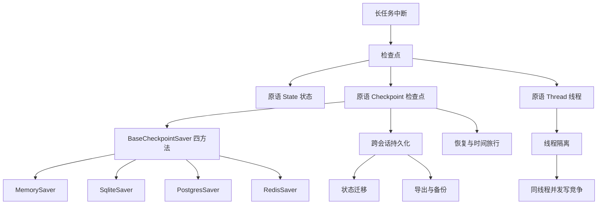
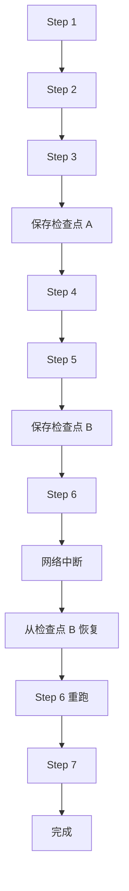
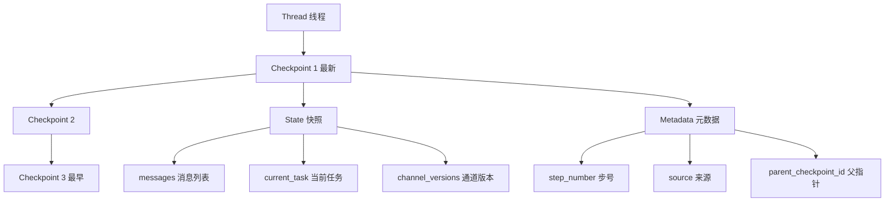
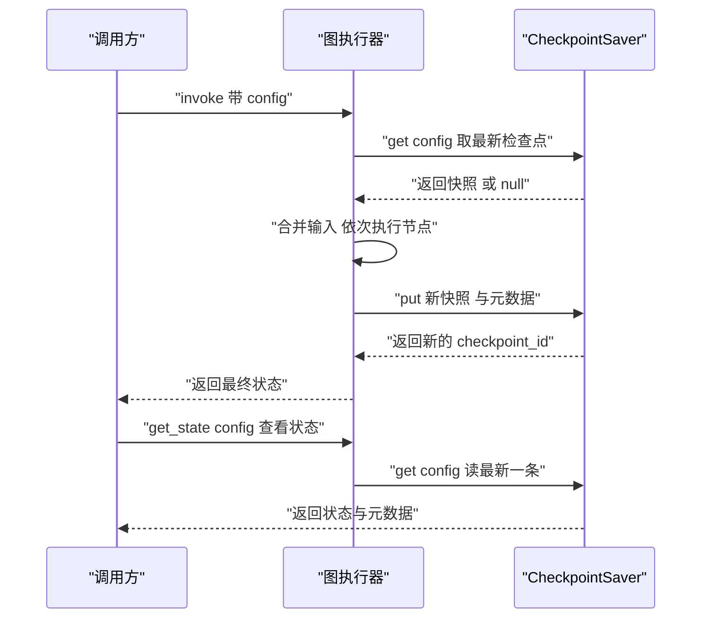
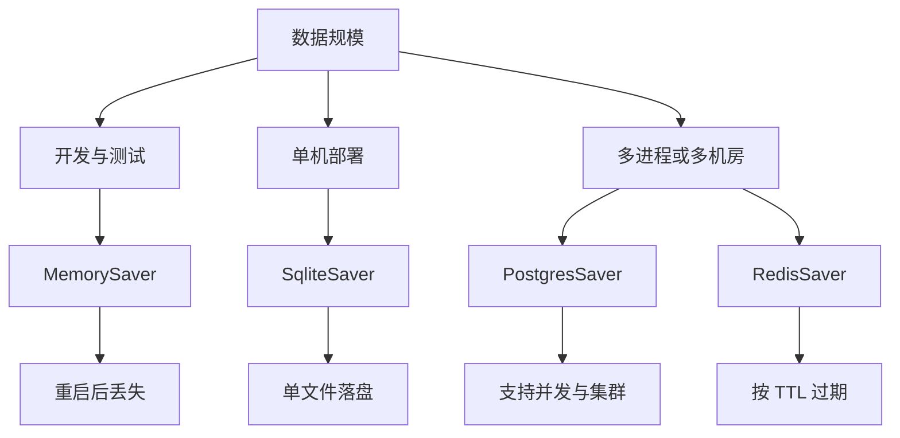
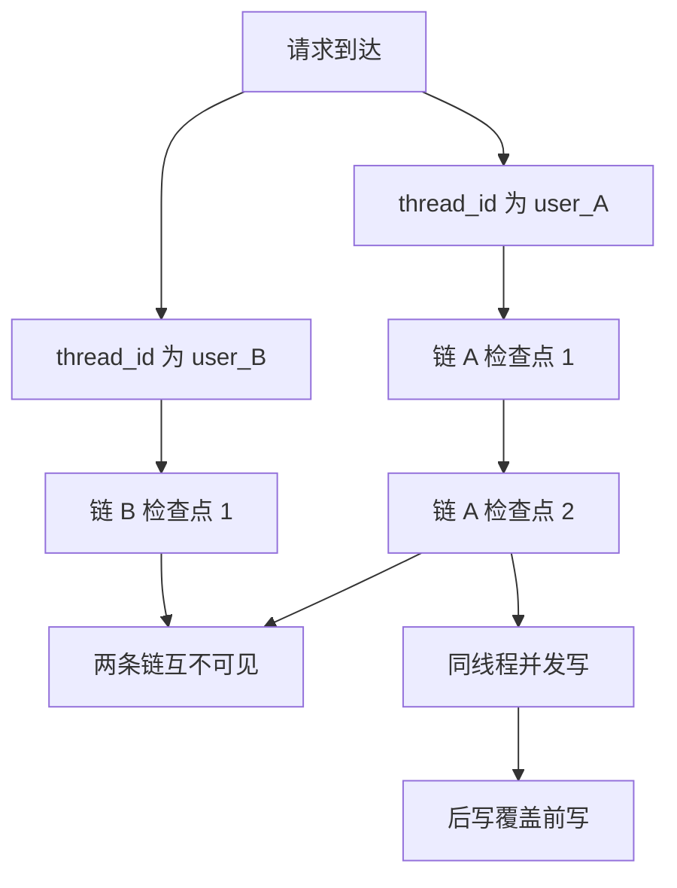
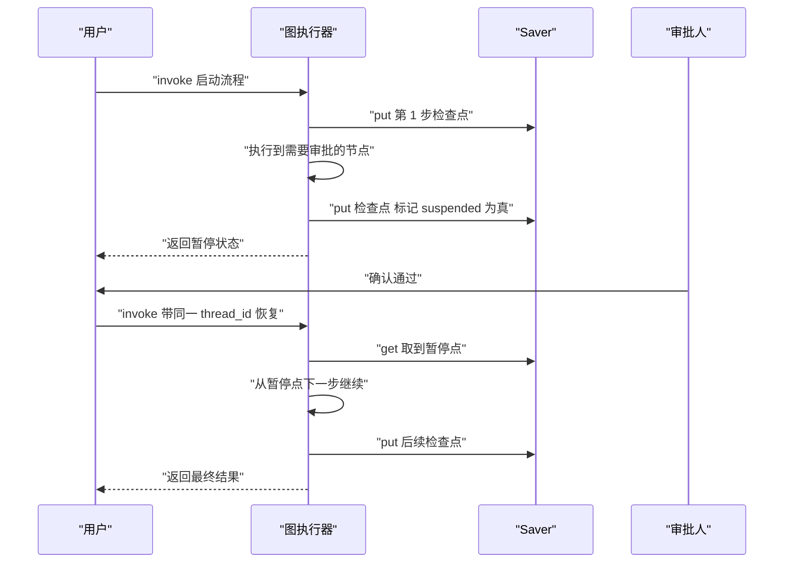

# LangGraph 检查点机制

!!! abstract "学完这一页你能"
    - 说清检查点解决的 4 类中断问题，并举出自己项目里对应的一个场景。
    - 画出 BaseCheckpointSaver 四个方法的调用顺序，说清每个方法的入参与返回值。
    - 用 thread_id 隔离两个并发会话，并指出同一个 thread_id 并发写会发生什么。
    - 手写一个可运行的检查点存储，完成保存、恢复、历史回溯、导出与导入。

!!! note "术语：LangGraph"
    LangGraph 是把 Agent 流程写成"状态图"的库：节点是函数，边是流转规则，图执行时携带一份状态。例子：检索节点、生成节点、校验节点连成一张图，状态在节点之间传递。

## 0. 知识地图



建议的读法：先读第 1 节建立"为什么"的问题感，再读第 2 节记住三个原语。第 3 节给出接口契约与最小实现，第 4 到第 6 节分别解决后端选择、并发隔离、跨会话搬运。第 7 节把它们拼成端到端示例，读完回到「动手作业」自己写一遍。

## 1. 为什么需要检查点

**先想一个问题**

用户上传 200 页合同，Agent 逐页抽取字段，跑到第 37 页时网关超时。没有检查点，重试要从第 1 页开始，前 36 页的模型调用费再付一遍。有检查点，第 37 页之前的进度还在。

!!! note "术语：检查点"
    检查点（Checkpoint）是图执行到某一步时写入存储的一份状态快照，外加可检索的元数据。例子：跑到第 36 页时写下 `{step: 36, done: [...36 页结果]}`。

!!! tip "心智模型"
    - 一句话模型：检查点是"每走完一步就盖一次章的进度存档"，恢复时从最后一个章继续。
    - 日常类比：写长文档时按 Ctrl+S，崩溃后只丢最后一次保存之后的内容。
    - 类比不成立的地方：文档保存覆盖同一个文件，检查点是追加成一条链，链上每个历史点都能回到。

**图解**



1. Step 1 到 Step 3 正常执行，状态在内存里累积。
2. 走到 Step 3 结束，写入检查点 A，把当时的完整状态落盘。
3. Step 4、Step 5 继续执行，Step 5 结束写入检查点 B。
4. Step 6 执行中网络中断，进程退出，内存状态全部消失。
5. 重启后按 thread_id 读回检查点 B，拿到"Step 5 结束"这一刻的状态。
6. 从 Step 6 继续执行，Step 1 到 Step 5 不再重跑，省下这部分调用开销。

**一步一步来**

这一步要做什么：把一个长任务切成"可恢复单元"，并定义每一步结束时写什么。

```js
// 依赖：Node 20+ 内置模块 node:fs，无第三方包
import { writeFileSync } from "node:fs";

const FILE = "/tmp/progress.json";

// 写进度时同时落盘"走到第几步"和"已完成清单"
// 只写 step 不够：恢复时需要知道哪些子任务已经产出结果
function saveProgress(step, done) {
  writeFileSync(FILE, JSON.stringify({ step, done }));
}

// 第 3 步结束时调用一次，这就是一个检查点
saveProgress(3, [1, 2, 3]);
```

**这段代码在做什么**

- `step` 是恢复点，回答"下一步该做什么"。
- `done` 是已完成清单，回答"哪些结果不用重算"。
- 整份 JSON 覆盖写入 `FILE`，一次写就是一次盖戳。
- 写入放在"一步结束时"，不是"下一步开始前"，避免重复执行同一步。

这一步要做什么：读取进度，跳过已经完成的步骤。

```js
// 依赖：Node 20+ 内置模块 node:fs
import { readFileSync, existsSync } from "node:fs";

const FILE = "/tmp/progress.json";

function loadProgress() {
  // 文件不存在说明是全新任务，返回零进度而不是抛异常
  if (!existsSync(FILE)) return { step: 0, done: [] };
  return JSON.parse(readFileSync(FILE, "utf8"));
}

const p = loadProgress();
// 从 step + 1 开始跑，0 到 step 这些步已经落盘，不再执行
for (let i = p.step + 1; i <= 5; i++) {
  // 这里放真实步骤逻辑
}
```

**这段代码在做什么**

- `existsSync` 把"全新任务"和"读取失败"区分开，前者返回零进度。
- 恢复的起点是 `p.step + 1`，`p.step` 本身表示"已经完成到这一步"。
- 读取失败时 `JSON.parse` 会抛错，这属于真异常，应当让调用方看到。

**运行结果**：第 3 步后中断、重启再跑，`done` 为 `1,2,3,4,5`，步骤 1 到 3 没有重跑。

**动手验证**

```js
// 依赖：Node 20+ 内置模块，无第三方包；保存为 checkpoint-demo.mjs
import assert from "node:assert/strict";
import { readFileSync, writeFileSync, existsSync, rmSync } from "node:fs";

const FILE = "/tmp/ckpt-demo.json";

function load() {
  if (!existsSync(FILE)) return { step: 0, done: [] };
  return JSON.parse(readFileSync(FILE, "utf8"));
}

function save(state) {
  writeFileSync(FILE, JSON.stringify(state));
}

function stepOnce(state, n) {
  state.done.push(n);
  state.step = n;
  save(state);            // 一步一存，这一步之后的内容可以重算，之前的不用
}

rmSync(FILE, { force: true });          // 清掉上次的残留，保证结果可复现
const s = load();
assert.equal(s.step, 0);                // 全新任务从 0 开始
for (const n of [1, 2, 3]) stepOnce(s, n);   // 第 3 步后进程中断
assert.equal(load().step, 3);           // 恢复点等于最后一次保存

const again = load();                   // 模拟重启：重新读盘，不复用内存对象
for (const n of [4, 5]) stepOnce(again, n);
assert.deepEqual(load().done, [1, 2, 3, 4, 5]);  // 前 3 步没有重跑
assert.equal(load().step, 5);
console.log("恢复成功 done =", load().done.join(","));
```

预期输出：

```text
恢复成功 done = 1,2,3,4,5
```

**常见坑**

| 现象 | 原因 | 怎么修 |
| --- | --- | --- |
| 恢复后某一步的副作用执行了两次 | 检查点在节点执行前写入 | 把写入放在一步完成之后，或让写状态与业务副作用同一事务 |
| 进程重启后读不到进度 | 检查点只存在进程内存 | 换成落盘后端，本页来源列出的 SQLite、PostgreSQL、Redis 都可作为候选 |
| 并发写同一个文件时 JSON 解析失败 | 整份覆盖写没有互斥 | 一个线程一个存储键，或用支持并发写的后端；来源指出 SQLite 不适合高并发，以原文为准 |

**用在哪里**

- 后台管理的批量导入：10 万行 CSV 分批入库，每批 1000 行后写检查点；用"批次成功率"和"中断后重跑行数"衡量；当导入必须整体成功或整体失败时不要用，此时应改用数据库事务。
- 在线客服的多轮对话：每个会话一条 thread，用户离开再回来能接着上文；用"上下文找回成功率"和"首次响应时间"衡量；当对话不做任何记忆时不要引入检查点，白付写库开销。
- 夜间数据清洗批处理：任务被集群抢占后从断点续跑；用"重跑消耗的机时占比"衡量；当单批耗时低于 10 秒时不要用，落盘成本高于重跑成本。

**行业实践**

- LangGraph 官方文档的 Persistence 相关章节把检查点描述为图执行的持久层，并说明恢复依赖 thread 标识；章节名需核对官方文档当前版本。怎么借鉴：先确认自己的执行框架有无同类持久层，再决定自建还是复用。
- 本站该页面旧版内容整理了 4 类 saver（MemorySaver、SqliteSaver、PostgresSaver、RedisSaver）与连接池示例，以原文为准。怎么借鉴：把连接数按进程数相乘后与数据库 `max_connections` 对照，再决定池大小。
- LangGraph 官方文档的 Checkpointers 参考章节给出 saver 的方法列表，章节名需核对官方文档当前版本。怎么借鉴：按它的方法集合定义自己内部的存储接口，换后端时不动上层调用代码。

**小结**

- 检查点解决的是"执行中断后不必从头再来"，代价是每步一次写操作。
- 一次写入必须同时包含恢复点与已完成结果，只写其中一个都不够。
- 写入时机放在一步完成之后，可以避免重复执行有副作用的那一步。

## 2. 核心概念与原语

**先想一个问题**

你想给 Agent 加"回到第 3 轮对话重新回答"的功能。要支持这件事，存储里必须留下第 3 轮那一刻的完整状态。这要求先定义清楚：状态长什么样，快照长什么样，两者怎么关联。

!!! note "术语：状态"
    状态（State）是图在节点之间传递的数据结构，通常用带类型的字典描述。例子：`messages`、`current_task`、`task_history` 三个键组成一份状态。

!!! tip "心智模型"
    - 一句话模型：Thread 是抽屉，Checkpoint 是抽屉里按时间排好的存档卡，State 是卡片上写的内容。
    - 日常类比：游戏存档，一个角色一个存档位，位里有多个存档点，每个点记录当时的等级与背包。
    - 类比不成立的地方：存档点通常只能覆盖，检查点保留父指针，能从任意历史点分叉出新链。

**图解**



1. 线程是最外层的隔离单位，一个 thread_id 对应一条独立的历史链。
2. 每个检查点有唯一 id，最新的那条带指向上一条的父指针。
3. 状态快照记录业务数据，元数据记录检索与排序需要的信息。
4. `channel_versions` 记录每个通道各自的版本号，用于判断某个字段是否变化。
5. `step_number` 与 `source` 让"找到第 3 步那个检查点"这类查询不用反序列化状态。
6. 父指针把检查点串成链，链上的任意节点都可以作为新分支的起点。

**一步一步来**

这一步要做什么：定义节点只返回自己改动的那部分状态，由框架合并。

```js
// 依赖：Node 20+ 内置模块，无第三方包

// 合并规则函数：不同字段用不同策略，列表追加，标量覆盖
function mergeState(state, update) {
  const next = { ...state, ...update };
  if (update.messages) {
    // 列表字段用追加语义，节点不需要先读旧值再拼
    next.messages = [...(state.messages ?? []), ...update.messages];
  }
  return next;
}

function chatNode(state) {
  // 只返回增量：没有出现的键保持原值
  return { messages: [{ role: "assistant", content: "已收到" }] };
}

const s0 = { messages: [{ role: "user", content: "你好" }], current_task: null };
const s1 = mergeState(s0, chatNode(s0));
console.log(s1.messages.length, s1.current_task);
```

**这段代码在做什么**

- 节点返回的是局部更新，不是完整状态，节点代码因此可以很短。
- 列表字段用追加语义，避免每个节点手写 `[...old, ...new]`。
- 标量字段用覆盖语义，返回值直接替换旧值。
- `current_task` 没有出现在节点返回值里，合并后保持 `null`。
- LangGraph 里对应的是带 reducer 注解的字段，JS 侧的具体写法需核对官方文档。

**运行结果**：

```text
2 null
```

这一步要做什么：组装一个检查点对象，包含 id、父指针、快照与元数据。

```js
// 依赖：Node 20+ 内置模块，无第三方包
import { randomUUID } from "node:crypto";

function buildCheckpoint(prev, state, meta) {
  return {
    id: randomUUID(),                                  // 全局唯一，便于跨线程引用
    parent_checkpoint_id: prev ? prev.id : null,       // 首个检查点没有父
    timestamp: Date.now(),
    state: structuredClone(state),                     // 深拷贝，隔绝后续修改
    metadata: {
      step_number: meta.step,
      source: meta.source,                             // input loop update 三种来源
      suspended: false,
      thread_id: meta.threadId,
    },
  };
}

const c1 = buildCheckpoint(null, { n: 1 }, { step: 1, source: "loop", threadId: "t1" });
const c2 = buildCheckpoint(c1, { n: 2 }, { step: 2, source: "loop", threadId: "t1" });
console.log(c2.parent_checkpoint_id === c1.id, c2.metadata.step_number);
```

**这段代码在做什么**

- `id` 由实现方生成，不由调用方传入，保证线程内唯一。
- `parent_checkpoint_id` 让历史形成单向链表，可以回退也可以分叉。
- `structuredClone` 做深拷贝，防止调用方拿到快照后原地修改污染存储。
- `metadata.source` 区分写入来源，重放时能跳过 `update` 造成的非执行型变更。
- 元数据与快照分开存放，查询步号时不必反序列化整个状态。

**运行结果**：

```text
true 2
```

**动手验证**

```js
// 依赖：Node 20+ 内置模块，无第三方包；保存为 primitives-demo.mjs
import assert from "node:assert/strict";

function mergeState(state, update) {
  const next = { ...state, ...update };
  if (update.messages) next.messages = [...(state.messages ?? []), ...update.messages];
  return next;
}

const base = { messages: [], current_task: null };
const s1 = mergeState(base, { messages: [{ role: "user", content: "hi" }] });
const s2 = mergeState(s1, { current_task: "search" });
assert.equal(s2.messages.length, 1);          // 覆盖合并时列表没有被清空
assert.equal(s2.current_task, "search");      // 标量字段被替换

const snap = structuredClone(s2);
snap.messages.push({ role: "assistant", content: "ok" });
assert.equal(s2.messages.length, 1);          // 深拷贝：改副本不影响原件
assert.notEqual(snap, s2);

const chain = [];
let prev = null;
for (let i = 1; i <= 3; i++) {
  const cp = { id: `cp_${i}`, parent_checkpoint_id: prev, metadata: { step_number: i } };
  chain.push(cp);
  prev = cp.id;                               // 父指针指向刚写入的那条
}
assert.equal(chain[2].parent_checkpoint_id, "cp_2");
assert.equal(chain[0].parent_checkpoint_id, null);
assert.equal(chain.length, 3);
console.log("原语检查通过，链长 =", chain.length);
```

预期输出：

```text
原语检查通过，链长 = 3
```

**常见坑**

| 现象 | 原因 | 怎么修 |
| --- | --- | --- |
| 恢复后发现列表字段被清空 | 节点直接返回新列表，覆盖了旧值 | 给列表字段配置追加型合并规则，或在节点里显式拼接 |
| 改了快照后存储里的数据跟着变 | 快照存的是对象引用 | 写入前深拷贝，JS 用 `structuredClone`，Python 侧用对应序列化 |
| 按步号查历史时要全量反序列化 | 步号没有进元数据 | 把步号、来源、时间戳放进元数据并单独存 |

**用在哪里**

- AI 代码助手的会话历史：每轮问答是一个检查点，用户点"重新生成"时从上一条分叉；用"重新生成后的采纳率"衡量；当会话只有一问一答时不要落历史。
- 电商智能客服工单：工单状态在节点之间流转，人工接手时能看到 Agent 走到哪一步；用"人工接手前的平均排查时间"衡量；当工单不允许跨会话续接时不要保留历史。
- 合同审查流水线：每份合同一条链，审查规则升级后需要重放旧链；用"重放一致率"衡量；当状态里含不可复现的外部调用结果时不要指望重放得到相同输出。

**行业实践**

- LangGraph 官方文档的 Persistence 相关章节区分了状态的持久化与记忆能力，章节名需核对官方文档当前版本。怎么借鉴：先把"这次执行要保的字段"列成清单，再决定哪些进快照、哪些进元数据。
- 本站该页面旧版内容给出 `CheckpointMetadata` 的字段清单，含 `step_number`、`source`、`suspended`、`stack`，以原文为准。怎么借鉴：照这份字段清单设计自己的元数据表，避免后期加字段要迁移。
- LangGraph 官方文档的 Checkpointers 参考章节说明检查点由 saver 负责落库，具体类名与参数需核对官方文档。怎么借鉴：把快照与元数据拆两张表，元数据表建索引后再支撑按步号查询。

**小结**

- 三个原语分工明确：线程管隔离，检查点管时间线，状态管数据。
- 元数据要能独立回答"第几步、什么来源、是否暂停"，不必打开快照。
- 写入前深拷贝，是避免快照被调用方悄悄改掉的必要动作。

## 3. CheckpointSaver 契约与 MemorySaver

**先想一个问题**

开发时你只想知道图跑没跑通，不想先装数据库。此时需要一个进程内的存储，跑完即弃。它必须遵守与生产后端相同的接口，换后端时上层代码不动。

!!! note "术语：CheckpointSaver"
    检查点存储器（CheckpointSaver）是一组读写检查点的方法集合，本页来源给出的最小集合是 `get`、`put`、`list`、`delete` 四个方法。例子：把 MemorySaver 换成 PostgresSaver，图的编译代码只需改一行。

!!! tip "心智模型"
    - 一句话模型：Saver 是插在图和存储之间的插座，图只认插座形状，不认后面插的是内存还是数据库。
    - 日常类比：U 盘接口，插电脑、插电视都用同一个口，里面存什么由你决定。
    - 类比不成立的地方：接口一致不代表行为一致，内存版重启即丢，数据库版重启仍在，选型必须看行为。

**图解**



1. 调用方把 config 传给图，config 里含 thread_id 与可选的 checkpoint_id。
2. 图先向 saver 要最新检查点，拿到 `null` 说明是全新线程。
3. 图把入参合并进已有状态，然后依次执行节点。
4. 每完成一个节点，图调用 `put` 追加一条新检查点，拿到新 id。
5. `put` 返回的 id 成为下一次 `put` 的父指针，历史由此串成链。
6. 最终状态返回给调用方，之后可随时用 `get_state` 重新读取。

**一步一步来**

这一步要做什么：实现 `put` 与 `get` 两个方法，覆盖"写入"与"读最新"。

```js
// 依赖：Node 20+ 内置模块，无第三方包
function createSaver() {
  const chains = new Map();   // thread_id 到检查点数组
  let seq = 0;

  return {
    put(config, state, metadata) {
      const tid = config.configurable.thread_id;
      const chain = chains.get(tid) ?? [];
      const cp = {
        id: `cp_${++seq}`,                                   // 实现方生成，线程内递增
        parent_checkpoint_id: chain.at(-1)?.id ?? null,      // 父指针
        state: structuredClone(state),
        metadata,
      };
      chain.push(cp);
      chains.set(tid, chain);
      return cp.id;
    },
    get(config) {
      const tid = config.configurable.thread_id;
      const chain = chains.get(tid);
      // 全新线程必须返回 null，上层用 is null 判断，不靠异常
      if (!chain) return null;
      const cid = config.configurable.checkpoint_id;
      return cid ? (chain.find((c) => c.id === cid) ?? null) : chain.at(-1);
    },
  };
}
```

**这段代码在做什么**

- 每个 thread_id 对应数组里的一条链，天然隔离不同会话。
- `id` 由实现方生成并返回，调用方不需要也不应该猜这个值。
- 父指针取链尾 id，让历史成为单向链表。
- `get` 在缺 thread 时返回 `null`，把"新线程"与"读取失败"区分开。
- 指定 `checkpoint_id` 时按 id 精确查找，这就是"回到历史某一步"的入口。

这一步要做什么：补齐 `list` 与 `delete`，支撑回看历史与整线程清理。

```js
// 依赖：Node 20+ 内置模块，无第三方包
list(config, limit = -1) {
  const chain = chains.get(config.configurable.thread_id) ?? [];
  // limit 为 1 表示只取最新一条，负数表示返回全部
  return limit < 0 ? chain.slice() : chain.slice(-limit);
},
delete(config) {
  // 语义是整个线程一起清理，不是删单条
  chains.delete(config.configurable.thread_id);
},
```

**这段代码在做什么**

- `list` 返回数组副本，调用方修改返回值不会动到内部结构。
- `limit` 用负数表示"不限"，与常见数据库分页约定一致。
- `delete` 按线程粒度清理，避免留下孤儿元数据。
- 这两个方法让调试与合规回溯有了入口。

**动手验证**

```js
// 依赖：Node 20+ 内置模块，无第三方包；保存为 memory-saver-demo.mjs
import assert from "node:assert/strict";

function createMemorySaver() {
  const chains = new Map();
  let seq = 0;
  return {
    put(config, state, metadata) {
      const tid = config.configurable.thread_id;
      const chain = chains.get(tid) ?? [];
      const cp = {
        id: `cp_${++seq}`,
        parent_checkpoint_id: chain.at(-1)?.id ?? null,
        state: structuredClone(state),
        metadata,
      };
      chain.push(cp);
      chains.set(tid, chain);
      return cp.id;
    },
    get(config) {
      const chain = chains.get(config.configurable.thread_id);
      if (!chain) return null;
      const cid = config.configurable.checkpoint_id;
      return cid ? (chain.find((c) => c.id === cid) ?? null) : chain.at(-1);
    },
    list(config, limit = -1) {
      const chain = chains.get(config.configurable.thread_id) ?? [];
      return limit < 0 ? chain.slice() : chain.slice(-limit);
    },
    delete(config) {
      chains.delete(config.configurable.thread_id);
    },
  };
}

const saver = createMemorySaver();
const cfg = (tid, cid = null) => ({ configurable: { thread_id: tid, checkpoint_id: cid } });

assert.equal(saver.get(cfg("t1")), null);          // 全新线程
const id1 = saver.put(cfg("t1"), { n: 1 }, { step_number: 1 });
const id2 = saver.put(cfg("t1"), { n: 2 }, { step_number: 2 });
assert.equal(saver.get(cfg("t1")).state.n, 2);     // 不指定 id 取最新
assert.equal(saver.get(cfg("t1", id1)).state.n, 1); // 指定 id 回到历史
assert.equal(saver.list(cfg("t1")).length, 2);
assert.equal(saver.list(cfg("t1"), 1).length, 1);
assert.equal(saver.list(cfg("t1"), 1)[0].id, id2);
saver.put(cfg("t2"), { n: 9 }, { step_number: 1 }); // 另一线程互不干扰
assert.equal(saver.list(cfg("t1")).length, 2);
saver.delete(cfg("t1"));
assert.equal(saver.get(cfg("t1")), null);
assert.equal(saver.list(cfg("t2")).length, 1);
console.log("Saver 契约检查通过，线程 t2 保留", saver.list(cfg("t2")).length, "条");
```

预期输出：

```text
Saver 契约检查通过，线程 t2 保留 1 条
```

**常见坑**

| 现象 | 原因 | 怎么修 |
| --- | --- | --- |
| 读取全新线程时抛出异常 | 实现把"没有记录"当成错误 | 让 `get` 返回 `null`，上层用 `is null` 判断 |
| 生产重启后会话全部丢失 | 用了进程内的 MemorySaver | 开发用内存版，上线换落盘后端；本页来源指出内存版重启后丢失，以原文为准 |
| `list` 的返回顺序与预期不符 | 后端不保证倒序返回 | 显式按 step_number 或时间戳排序，不要依赖存储默认顺序 |

**用在哪里**

- 本地开发 Agent：内存版 saver 零配置，跑完即弃；用"单次调试准备时间"衡量；当需要跨天对比历史时不要用，换落盘后端。
- 单机部署的桌面工具：进程退出后用户希望下次打开还在；用"会话恢复成功率"衡量；当数据敏感度要求不外落时不要用落盘后端。
- 测试环境的自动化评测：每条用例一条线程，跑完读取历史断言步数；用"用例可复现率"衡量；当断言依赖真实时钟时不要用时间戳字段做断言。

**行业实践**

- 本站该页面旧版内容说明 `MemorySaver` 为进程内存储、重启后丢失，并支持配置最大历史条目数，具体参数名需核对官方文档。怎么借鉴：开发环境用内存版，同时把保留条数压到刚好够调试，避免长跑测试吃满内存。
- 本站该页面旧版内容给出 `BaseCheckpointSaver` 用抽象基类定义四个方法，并提醒类型注解在运行时会求值，以原文为准。怎么借鉴：JS 项目里用同一个接口对象形状校验，运行时用断言检查方法是否存在。
- LangGraph 官方文档的 Checkpointers 参考章节列出各后端实现，类名与构造参数需核对官方文档。怎么借鉴：在项目里定义一个内部接口，把官方实现包一层，将来换版本只改包装层。

**小结**

- 契约只有四个方法：读最新、写一条、列历史、清线程。
- `get` 返回 `null` 表示全新线程，这个语义决定了上层分支写法。
- 内存版用于开发，落盘版用于线上，接口相同但行为不同，选型要看行为。

## 4. 持久化后端选择

**先想一个问题**

你的服务要重启发布，重启期间有 300 个会话正在进行。重启后这些会话必须能接着聊，且不能串号。此时存储要满足两件事：进程外可读，且按线程隔离。

!!! note "术语：连接池"
    连接池（Connection Pool）是一组预先建立、反复复用的数据库连接。例子：`pool_size=20` 表示常驻 20 条连接，`max_overflow=40` 表示峰值最多再加 40 条（本页来源示例，以原文为准）。

!!! tip "心智模型"
    - 一句话模型：内存版是便签，落盘版是档案柜，档案柜按抽屉编号隔离不同人的材料。
    - 日常类比：图书馆借书，内存版是把书放桌上，落盘版是归还上架，编号决定还能不能找到。
    - 类比不成立的地方：档案柜只保证存放，不保证并发取用；多人同时借同一本仍需额外规则。

**图解**



1. 先按数据规模与部署形态分流，再看是否需要跨进程共享。
2. 开发与测试阶段用内存版，改代码即可重启，不用清库。
3. 单机部署可用 SQLite，落地一个文件，零外部依赖。
4. 多进程或多机房部署需要网络可访问的存储，PostgreSQL 与 Redis 属于这一类。
5. 选 PostgreSQL 时注意连接池参数与数据库 `max_connections` 的乘积关系。
6. 选 Redis 时注意过期时间（TTL）配置，本页来源给出 `default_ttl` 与按线程 TTL 的写法，以原文为准。

**一步一步来**

这一步要做什么：把一个"进程内存储"换成"写文件的存储"，验证跨实例可读。

```js
// 依赖：Node 20+ 内置模块 node:fs，无第三方包
import { readFileSync, writeFileSync, existsSync, mkdirSync } from "node:fs";
import { dirname } from "node:path";

const FILE = "/tmp/saver-store.json";

function readStore() {
  if (!existsSync(FILE)) return {};              // 首次运行没有文件
  return JSON.parse(readFileSync(FILE, "utf8"));
}

function writeStore(data) {
  mkdirSync(dirname(FILE), { recursive: true });
  // 整份覆盖写：教学模型够用，生产要换成数据库或追加写
  writeFileSync(FILE, JSON.stringify(data, null, 2));
}

const db = readStore();
db["t1"] = [{ id: "cp_1", state: { n: 1 } }];
writeStore(db);
```

**这段代码在做什么**

- 存储结构是一层对象：键为 thread_id，值为该线程的检查点数组。
- 首次运行没有文件时返回空对象，语义与"全新线程"一致。
- 每次写入整份覆盖，实现短，但并发写会互相覆盖，这一点在第 5 节展开。
- 用文件落盘后，新建一个 saver 实例也能读到同样的数据。

这一步要做什么：对照 SQLite 的表结构，理解快照与元数据为什么要拆开。

```js
// 依赖：Node 20+ 内置模块，无第三方包

// 一张表存快照，另一张表存一次写入中的中间产出
// 来源旧版内容提到 SQLite 会创建 checkpoints 与 checkpoint_writes 两张表
const tables = {
  checkpoints: ["thread_id", "checkpoint_id", "parent_checkpoint_id", "state", "metadata"],
  checkpoint_writes: ["thread_id", "checkpoint_id", "task_id", "channel", "value"],
};

// 建索引的目标：按线程取最新一条时不必扫全表
const indexPlan = {
  name: "idx_thread_cp",
  on: "checkpoints",
  columns: ["thread_id", "checkpoint_id"],
};

console.log("表数量", Object.keys(tables).length, "索引列", indexPlan.columns.join(","));
```

**这段代码在做什么**

- 快照表存完整状态，行数等于该线程的检查点数量。
- 写入表存中间产出，便于节点级别重放与人工修正。
- 联合索引以 thread_id 打头，支撑"按线程取最新"这类高频查询。
- 拆表的直接收益：查元数据不必反序列化大字段。
- 两张表的具体列名与官方实现可能有差异，需核对官方文档。

**运行结果**：

```text
表数量 2 索引列 thread_id,checkpoint_id
```

**动手验证**

```js
// 依赖：Node 20+ 内置模块，无第三方包；保存为 file-saver-demo.mjs
import assert from "node:assert/strict";
import { readFileSync, writeFileSync, existsSync, rmSync } from "node:fs";

const FILE = "/tmp/file-saver-demo.json";

function createFileSaver() {
  const read = () => (existsSync(FILE) ? JSON.parse(readFileSync(FILE, "utf8")) : {});
  const write = (data) => writeFileSync(FILE, JSON.stringify(data));
  let seq = 0;
  return {
    put(config, state, metadata) {
      const db = read();
      const tid = config.configurable.thread_id;
      const chain = db[tid] ?? [];
      const id = `cp_${++seq}`;
      chain.push({ id, parent: chain.at(-1)?.id ?? null, state, metadata });
      db[tid] = chain;
      write(db);                       // 落地，进程退出后仍在
      return id;
    },
    get(config) {
      const chain = read()[config.configurable.thread_id];
      if (!chain) return null;
      return chain.at(-1);
    },
    list(config) {
      return read()[config.configurable.thread_id] ?? [];
    },
    delete(config) {
      const db = read();
      delete db[config.configurable.thread_id];
      write(db);
    },
  };
}

rmSync(FILE, { force: true });
const cfg = { configurable: { thread_id: "u_9" } };

const first = createFileSaver();                 // 模拟进程 1
first.put(cfg, { n: 1 }, { step_number: 1 });
first.put(cfg, { n: 2 }, { step_number: 2 });

const second = createFileSaver();                // 模拟进程 2 重启后新建实例
const latest = second.get(cfg);
assert.equal(latest.state.n, 2);                 // 重启后能读到最新状态
assert.equal(latest.metadata.step_number, 2);
assert.equal(second.list(cfg).length, 2);        // 历史完整
assert.equal(second.list(cfg)[1].parent, second.list(cfg)[0].id);
second.delete(cfg);
assert.equal(second.get(cfg), null, "删除后应返回 null");
assert.equal(thirdCheck(), 0, "磁盘中该线程应为空");

function thirdCheck() {
  const db = JSON.parse(readFileSync(FILE, "utf8"));
  return Object.keys(db).length;
}

console.log("文件存储检查通过，最新步号 =", latest.metadata.step_number);
```

预期输出：

```text
文件存储检查通过，最新步号 = 2
```

**常见坑**

| 现象 | 原因 | 怎么修 |
| --- | --- | --- |
| 上线后数据库连接被打满 | 每进程连接数乘以实例数超过了 `max_connections` | 按实例数反推池大小，本页来源示例为 `pool_size=20` 与 `max_overflow=40`，以原文为准 |
| 用 SQLite 支撑高并发写时出现锁等待 | 单文件写锁串行化 | 并发写场景换网络数据库；来源指出 SQLite 不适合高并发，以原文为准 |
| Redis 里旧会话突然消失 | TTL 到期自动清理 | 明确过期策略，重要线程单独设置较长 TTL 或不做过期 |

**用在哪里**

- SaaS 多租户客服系统：每个租户一个存储前缀，会话按 thread_id 隔离；用"跨实例会话恢复率"衡量；当租户要求数据不出境时不要用公共托管存储。
- 单机版桌面 Agent 工具：SQLite 落一个文件，随程序目录迁移；用"安装后开箱可用率"衡量；当多个进程同时写同一文件时不要用。
- 高频短会话的问答机器人：Redis 承载会话，过期即清；用"内存占用峰值"衡量；当会话必须长期留存以备审计时不要用，需要另存一份落盘副本。

**行业实践**

- 本站该页面旧版内容列出四类 saver 的适用场景：内存版用于开发测试、SQLite 用于单机中小型应用、PostgreSQL 用于生产中大型应用、Redis 用于需要高速缓存与高可用的场景，以原文为准。怎么借鉴：把这张对照表内化成选型清单，逐项确认后再动手接库。
- 本站该页面旧版内容提示部分 LangGraph 版本中 `from_conn_string` 可能是上下文管理器，必须用 `with` 形式才真正建立连接，以原文为准。怎么借鉴：接任何数据库时先写一个最小连通性脚本，确认连接确实建立，再写业务代码。
- LangGraph 官方文档的 Checkpointers 参考章节列出各后端的初始化方式，具体签名需核对官方文档。怎么借鉴：把初始化与 `setup` 建表封装到一个函数里，保证幂等，可在启动时重复执行。

**小结**

- 选型先看部署形态：进程内、单机落盘、跨进程共享，三类对应不同后端。
- 元数据与快照拆表，是让"按步号查询"不拖大字段的必要设计。
- 连接池大小要按实例数相乘后与数据库上限对照，不能只看单进程配置。

## 5. 线程化检查点与并发隔离

**先想一个问题**

两个用户同时向同一个 Agent 服务发消息，A 的对话里突然出现了 B 的问题。排查发现两人共用了同一个 thread_id。隔离没做好，串号就发生在这一层。

!!! note "术语：线程标识"
    线程标识（thread_id）是区分不同会话的字符串键，检查点按它分区存放。例子：`user_123` 与 `user_124` 各占一条历史链，互不可见。

!!! tip "心智模型"
    - 一句话模型：thread_id 是房间号，检查点只在这个房间里进出，隔壁房间看不见。
    - 日常类比：快递柜的一个格口，取件码只开你自己那一格。
    - 类比不成立的地方：格口一次只放一件，检查点在同一格口里堆成链，同格口并发放会互相覆盖。

**图解**



1. 请求进入服务后，第一件事是根据用户或会话算出一个 thread_id。
2. 以该 id 组成的 config 传给图，saver 按 id 分区读写。
3. 不同 id 的链在存储里互不可见，A 的历史读不到 B 的快照。
4. 同一个 id 上如果两个请求同时"读—改—写"，后写的会覆盖先写的。
5. 覆盖的结果是丢失一次更新，表现为对话里少了一轮内容。
6. 处理办法是让同一 thread_id 串行，或使用带并发合并规则的字段。

**一步一步来**

这一步要做什么：构造 config，并明确各字段的含义。

```js
// 依赖：Node 20+ 内置模块，无第三方包

// config 是访问检查点的钥匙，形状固定为 configurable 包一层
function makeConfig(userId, sessionId, checkpointId = null) {
  return {
    configurable: {
      // 分层命名便于按前缀列出某个用户的全部会话
      thread_id: `${userId}_${sessionId}`,
      // null 表示读取最新一条，指定 id 则读取历史某一条
      checkpoint_id: checkpointId,
    },
  };
}

const c1 = makeConfig("u_1", "s_1");
const c2 = makeConfig("u_1", "s_1", "cp_7");
console.log(c1.configurable.thread_id, c2.configurable.checkpoint_id);
```

**这段代码在做什么**

- 线程命名用"用户前缀加会话后缀"，便于用前缀查询某用户的全部会话。
- `checkpoint_id` 为 `null` 时表示取最新，这就是默认的续聊行为。
- 指定 `checkpoint_id` 就是"回到历史某一步"，第 7 节会用它做时间旅行。
- 分层命名只是约定，存储层不解析它，前缀查询需自行实现。

**运行结果**：

```text
u_1_s_1 cp_7
```

这一步要做什么：显式演示同线程并发写的丢失更新，把问题看清楚。

```js
// 依赖：Node 20+ 内置模块，无第三方包
let value = 0;                                   // 模拟某线程的状态
const tick = () => new Promise((r) => setTimeout(r, 0));

async function handle(msg) {
  const cur = value;                             // 读：两个请求都读到 0
  await tick();                                  // 模拟写存储前的网络等待
  value = cur + 1;                               // 写回：两个请求都写 1
  return msg;
}

await Promise.all([handle("a"), handle("b")]);
console.log("同线程并发写结果 =", value);
```

**这段代码在做什么**

- 两个调用在 `await` 处交替，读到的是同一个旧值。
- 这就是"读—改—写"竞争，来源旧版内容提示 `get_state` 与 `invoke` 之间没有事务保护。
- 结果 `1` 说明两次更新只生效一次。
- 修复方式有两种：同一 thread_id 串行化，或改用追加型合并规则。
- 不同 thread_id 之间不共享这段状态，因此仍可并行。

**运行结果**：

```text
同线程并发写结果 = 1
```

**动手验证**

```js
// 依赖：Node 20+ 内置模块，无第三方包；保存为 thread-demo.mjs
import assert from "node:assert/strict";

const store = new Map();                          // thread_id 到计数
const tick = () => new Promise((r) => setTimeout(r, 0));

async function handleIsolated(tid, msg) {
  await tick();                                   // 模拟 IO 等待
  // 读改写必须在同一轮事件循环中完成，避免同线程并发读到旧值后互相覆盖
  const cur = store.get(tid) ?? [];
  store.set(tid, [...cur, msg]);                  // 按线程各写各的
}

// 场景一：不同 thread_id 并发，互不干扰；同线程追加不丢
await Promise.all([
  handleIsolated("a", "a1"),
  handleIsolated("a", "a2"),
  handleIsolated("b", "b1"),
]);
assert.equal(store.get("b").length, 1, "不同线程不应互相影响");
assert.equal(store.get("a").length, 2, "同线程并发追加应都在");

// 场景二：同 thread_id 覆盖写，出现丢失更新
const counter = new Map([["c", 0]]);
async function handleRace(tid) {
  const cur = counter.get(tid);                   // 读
  await tick();                                   // 等
  counter.set(tid, cur + 1);                      // 写回旧值加一
}
await Promise.all([handleRace("c"), handleRace("c")]);
assert.equal(counter.get("c"), 1, "此处刻意展示丢失更新");

// 场景三：加锁后同线程串行，更新不再丢失
const chain = [];
let tail = Promise.resolve();
function enqueue(task) {
  tail = tail.then(task);                         // 串联成队列，保证顺序
  return tail;
}
const locked = new Map([["d", 0]]);
await Promise.all([
  enqueue(async () => { const c = locked.get("d"); await tick(); locked.set("d", c + 1); }),
  enqueue(async () => { const c = locked.get("d"); await tick(); locked.set("d", c + 1); }),
]);
assert.equal(locked.get("d"), 2, "串行后两次更新都生效");
console.log("线程隔离与串行化检查通过，串行结果 =", locked.get("d"));
```

预期输出：

```text
线程隔离与串行化检查通过，串行结果 = 2
```

**常见坑**

| 现象 | 原因 | 怎么修 |
| --- | --- | --- |
| 两个用户看到对方的对话内容 | thread_id 由固定值或共享变量生成 | 把用户标识与会话标识拼进 thread_id，禁止用常量 |
| 同一用户连发两条消息，少了一轮 | 同线程读改写竞争 | 同 thread_id 串行处理，或用追加型合并规则 |
| 按前缀列会话时结果不全 | 存储层不支持前缀查询 | 单独维护一张线程索引表，写入时登记 |

**用在哪里**

- 高并发在线答疑机器人：每用户每会话一个 thread_id，多实例同时服务；用"串号投诉率"衡量；当会话内容可以共享时不要强行隔离，会浪费存储。
- 企业内网共享部署的助手：同一用户可开多个会话，用会话维度而不是用户维度做隔离；用"多会话并行使用率"衡量；当业务要求同一用户全局单会话时不要拆。
- 定时批处理任务：每个任务实例一个 thread_id，失败重跑时复用同一个 id；用"重跑次数"衡量；当任务本身设计为幂等且耗时可忽略时不要保留历史。

**行业实践**

- 本站该页面旧版内容指出 `get_state` 与 `invoke` 之间没有事务保护，同一 thread_id 被并发调用会发生读改写竞争，建议加锁或队列，以原文为准。怎么借鉴：在 API 入口按 thread_id 做一致性哈希，把同一线程的请求路由到同一进程或同一队列。
- 本站该页面旧版内容给出线程命名可按需分层，并支持多租户前缀写法，以原文为准。怎么借鉴：命名规则一旦定下就写进文档，避免上线后改规则导致历史读不到。
- LangGraph 官方文档的 Persistence 相关章节说明 thread 标识决定恢复哪段历史，章节名需核对官方文档当前版本。怎么借鉴：把 thread_id 生成逻辑收敛到一个函数里，禁止各处手写拼接。

**小结**

- 隔离靠 thread_id，命名要能唯一标识一次会话，且便于按前缀检索。
- 同线程并发会丢失更新，修复手段是串行化或追加型合并。
- 不同线程之间可以放心并行，这是横向扩容的基础。

## 6. 跨会话状态持久化、迁移与备份

**先想一个问题**

你把 Agent 从 v1 升到 v2，状态里新增了 `context` 字段。老的检查点没有这个字段，重放时节点读它会拿到 `undefined` 并报错。上线前必须先做一次状态迁移。

!!! note "术语：状态迁移"
    状态迁移是把旧结构的历史检查点改写成新结构的过程。例子：给每条旧记录补上 `context: {}` 并把版本号从 1.0 改成 2.0。

!!! tip "心智模型"
    - 一句话模型：导出是拍照，导入是照着重放，迁移是在重放途中按新规则补字段。
    - 日常类比：换手机时把通讯录导出成文件，再导入新机，导入时顺手补上缺失的分组。
    - 类比不成立的地方：通讯录导入是幂等的，重复导入通常去重，本页给出的重放式导入会追加副本。

**图解**


1. 先从旧存储按线程列出全部检查点，顺序即为时间顺序。
2. 把快照与元数据序列化成 JSON 文本，得到可搬运的中间格式。
3. 迁移函数逐条补上新增字段，并写上新版本号。
4. 目标存储先按 thread_id 清空，避免新旧数据混在同一条链上。
5. 按导出顺序逐条写入，父指针由写入顺序自然重建。
6. 写完做一次条数与最新状态的比对，通过后再把流量切到新存储。

**一步一步来**

这一步要做什么：把一条线程的历史导出成自描述 JSON 文本。

```js
// 依赖：Node 20+ 内置模块，无第三方包

function exportThread(threadId, saver) {
  const config = { configurable: { thread_id: threadId, checkpoint_id: null } };
  const history = saver.list(config);              // 物化成数组，避免迭代器被耗尽

  return JSON.stringify({
    // 把 thread_id 冗余写进文件，恢复时不必解析文件名
    thread_id: threadId,
    exported_at: new Date().toISOString(),         // ISO 8601 便于跨系统解析
    checkpoints: history.map((cp) => ({
      id: cp.id,
      state: cp.state,
      metadata: cp.metadata,
    })),
  }, null, 2);
}
```

**这段代码在做什么**

- `list` 的结果立刻物化成数组，反复遍历时不会被消费掉。
- 文件里带上 thread_id，恢复去向由文件自身决定。
- 只导出恢复所需的字段，控制文件体积。
- `toISOString` 输出的时间可排序，便于排查导入顺序。
- 快照若含不可直接序列化的类型，序列化会丢掉类型信息，需要额外处理。

这一步要做什么：先清空目标线程再按序写入，并补上新版本字段。

```js
// 依赖：Node 20+ 内置模块，无第三方包

function importThread(exportJson, saver) {
  const data = JSON.parse(exportJson);
  const config = { configurable: { thread_id: data.thread_id, checkpoint_id: null } };

  saver.delete(config);                            // 顺序关键：先删后写
  for (const cp of data.checkpoints) {
    const migrated = { ...cp.state, context: cp.state.context ?? {} };  // 补新字段
    saver.put(config, migrated, { ...cp.metadata, migrated_from: "1.0" });
  }
  return data.thread_id;
}
```

**这段代码在做什么**

- 先 `delete` 后 `put`，顺序反了会把刚恢复的数据又删掉。
- 整个过程不是原子的，中途抛错会留下部分恢复的结果。
- 导入按导出顺序原样重放，未做去重，重复导入会追加副本。
- 迁移后的元数据留下来源标记，便于事后排查。

**动手验证**

```js
// 依赖：Node 20+ 内置模块，无第三方包；保存为 migrate-demo.mjs
import assert from "node:assert/strict";

function createSaver() {
  const chains = new Map();
  let seq = 0;
  return {
    put(config, state, metadata) {
      const tid = config.configurable.thread_id;
      const chain = chains.get(tid) ?? [];
      chain.push({ id: `cp_${++seq}`, state: structuredClone(state), metadata });
      chains.set(tid, chain);
      return chain.at(-1).id;
    },
    get(config) {
      const chain = chains.get(config.configurable.thread_id);
      return chain ? chain.at(-1) : null;
    },
    list(config) {
      return (chains.get(config.configurable.thread_id) ?? []).slice();
    },
    delete(config) {
      chains.delete(config.configurable.thread_id);
    },
  };
}

const oldSaver = createSaver();
const cfg = { configurable: { thread_id: "u_1_s_1", checkpoint_id: null } };
oldSaver.put(cfg, { messages: ["m1"], step: 1 }, { step_number: 1, version: "1.0" });
oldSaver.put(cfg, { messages: ["m1", "m2"], step: 2 }, { step_number: 2, version: "1.0" });

// 导出
const exported = JSON.stringify({
  thread_id: "u_1_s_1",
  exported_at: new Date().toISOString(),
  checkpoints: oldSaver.list(cfg).map((c) => ({ id: c.id, state: c.state, metadata: c.metadata })),
});
assert.equal(JSON.parse(exported).checkpoints.length, 2);

// 迁移并导入到新存储
function importThread(json, saver) {
  const data = JSON.parse(json);
  const c = { configurable: { thread_id: data.thread_id, checkpoint_id: null } };
  saver.delete(c);                                    // 先清空
  for (const cp of data.checkpoints) {
    const migrated = { ...cp.state, context: cp.state.context ?? {} };
    saver.put(c, migrated, { ...cp.metadata, migrated_from: "1.0" });
  }
  return data.thread_id;
}

const newSaver = createSaver();
const tid = importThread(exported, newSaver);
const restored = newSaver.get({ configurable: { thread_id: tid, checkpoint_id: null } });
assert.equal(restored.state.messages.length, 2);
assert.deepEqual(restored.state.context, {});          // 新字段已补齐
assert.equal(restored.metadata.migrated_from, "1.0");
assert.equal(newSaver.list({ configurable: { thread_id: tid, checkpoint_id: null } }).length, 2);
console.log("迁移导入完成，消息数 =", restored.state.messages.length);
```

预期输出：

```text
迁移导入完成，消息数 = 2
```

**常见坑**

| 现象 | 原因 | 怎么修 |
| --- | --- | --- |
| 导入后历史条数翻倍 | 重放式导入没有去重 | 导入前先 `delete`，或按 checkpoint_id 做幂等写入 |
| 恢复出的时间字段类型变了 | JSON 往返把日期变成字符串 | 明确约定哪些字段用字符串存，读取端不要假设类型 |
| 导入中途失败留下半条链 | 整个过程没有事务 | 先导入到临时线程，校验通过后再切换读取指向 |

**用在哪里**

- 模型升级后的状态迁移：提示词或工具集变更，旧历史需要补字段；用"迁移后重放报错率"衡量；当旧历史没有保留价值时不要迁移，直接归档。
- 审计与合规回溯：把某次执行的完整链导出给合规团队；用"审计材料准备时长"衡量；当状态里含个人敏感信息时不要导出原始快照。
- 灰度发布：把部分线程的历史复制到新版本存储上验证；用"灰度线程异常率"衡量；当状态结构没有变化时不要复制，直接双读同一份即可。

**行业实践**

- 本站该页面旧版内容给出导出结构含 `thread_id`、`exported_at`、`checkpoints` 三段，并提示导入未做去重，重复导入会追加副本，以原文为准。怎么借鉴：把导入做成"临时线程加校验再切换"，避免污染线上线程。
- 本站该页面旧版内容提示备份与恢复的顺序必须是先删后写，否则删除会连带清掉刚恢复的数据，以原文为准。怎么借鉴：把这条顺序写进恢复脚本的注释与测试用例里，用断言锁住。
- LangGraph 官方文档的 Persistence 相关章节说明检查点可用于重放与状态回放，章节名需核对官方文档当前版本。怎么借鉴：给每个版本定义一份状态结构说明，迁移时按说明逐条对照补字段。

**小结**

- 导出要自描述：把 thread_id 与导出时间写进文件本身。
- 导入要先清空再按序写入，顺序错会丢掉刚恢复的数据。
- 状态结构变更必须显式迁移，靠默认值兜底只适用于可选字段。

## 7. 配置参考与端到端示例

**先想一个问题**

审批流程需要"跑到一半停下来等人工确认，确认后继续"。这要求执行能暂停、状态能保留、恢复时从暂停的那一步继续，而不是从头跑。

!!! note "术语：中断与恢复"
    中断是执行到某一步停下并保留状态，恢复是从该状态继续往下跑。例子：Agent 准备调用退款工具时先暂停，等人工点确认后再执行。

!!! tip "心智模型"
    - 一句话模型：中断是把书签夹进书里，恢复是从书签那一页继续读。
    - 日常类比：看剧暂停，回来接着看，前面的剧情不用重看。
    - 类比不成立的地方：暂停期间书页内容不会变，恢复时外部世界可能已经变化，需要重新校验条件。

**图解**



1. 首次调用带上 thread_id，图开始执行并逐步写检查点。
2. 走到需要人工确认的节点，写入一条带暂停标记的检查点后停止。
3. 调用方拿到暂停状态，把它展示给审批人。
4. 审批通过后，用同一个 thread_id 再次调用，图先读取最新检查点。
5. 读到暂停标记，图从下一条待执行节点继续，已完成节点不重跑。
6. 后续每步继续写检查点，全部完成后返回最终状态。

**一步一步来**

这一步要做什么：写一个最小图执行器，每跑完一个节点写一次检查点。

```js
// 依赖：Node 20+ 内置模块，无第三方包

class MiniGraph {
  constructor(nodes, saver) {
    this.nodes = nodes;                    // 形如 name 与 run 的节点数组
    this.saver = saver;
  }

  invoke(config, input = {}) {
    const prev = this.saver.get(config);
    let state = prev ? prev.state : {};                        // 有历史就接着跑
    const start = prev ? prev.metadata.step_number : 0;        // 恢复点即已完成的节点数
    state = { ...state, ...input };                            // 增量输入合并进状态

    for (let i = start; i < this.nodes.length; i++) {
      if (state.__suspend === true) break;                     // 暂停标记：停止推进
      const node = this.nodes[i];
      state = { ...state, ...node.run(state) };                // 节点只返回自己改动的那部分
      this.saver.put(config, state, {
        step_number: i + 1,                                    // 记录已完成的节点数
        source: "loop",
        suspended: state.__suspend === true,
      });
    }
    return state;
  }

  getState(config) {
    return this.saver.get(config);
  }
}
```

**这段代码在做什么**

- 节点写成"输入状态、输出增量"的纯函数，便于单独测试。
- 恢复点用 `metadata.step_number` 表达，含义是"已完成的节点数"。
- 暂停通过状态里的标记实现，循环检测到就停止推进。
- 每完成一个节点写一次检查点，写入内容含暂停标记。
- `getState` 让调用方在不执行的情况下查看当前进度。

这一步要做什么：用指定 checkpoint_id 回到历史某一步，从那里分叉重跑。

```js
// 依赖：Node 20+ 内置模块，无第三方包

// 指定历史的某个检查点，从它之后继续执行，形成新的分支
function resumeFrom(config, checkpointId) {
  return {
    configurable: {
      thread_id: config.configurable.thread_id,
      checkpoint_id: checkpointId,        // 精确落到历史某一条
    },
  };
}
```

**这段代码在做什么**

- 时间旅行只改 config 里的一个字段，不需要额外 API。
- 从历史点继续执行，新写入的检查点会带父指针指向该历史点。
- 因此一次图执行可以得到多个分支，便于对比不同输入的结果。
- 分叉产生的新链与原链共享前半段，存储不会重复存快照。

**动手验证**

```js
// 依赖：Node 20+ 内置模块，无第三方包；保存为 graph-demo.mjs
import assert from "node:assert/strict";

function createSaver() {
  const chains = new Map();
  let seq = 0;
  return {
    put(config, state, metadata) {
      const tid = config.configurable.thread_id;
      const chain = chains.get(tid) ?? [];
      chain.push({
        id: `cp_${++seq}`,
        parent_checkpoint_id: chain.at(-1)?.id ?? null,
        state: structuredClone(state),
        metadata,
      });
      chains.set(tid, chain);
      return chain.at(-1).id;
    },
    get(config) {
      const chain = chains.get(config.configurable.thread_id);
      if (!chain) return null;
      const cid = config.configurable.checkpoint_id;
      return cid ? (chain.find((c) => c.id === cid) ?? null) : chain.at(-1);
    },
    list(config) {
      return (chains.get(config.configurable.thread_id) ?? []).slice();
    },
  };
}

class MiniGraph {
  constructor(nodes, saver) { this.nodes = nodes; this.saver = saver; }
  invoke(config, input = {}) {
    const prev = this.saver.get(config);
    let state = prev ? prev.state : {};
    const start = prev ? prev.metadata.step_number : 0;
    state = { ...state, ...input };
    for (let i = start; i < this.nodes.length; i++) {
      if (state.__suspend === true) break;
      state = { ...state, ...this.nodes[i].run(state) };
      this.saver.put(config, state, { step_number: i + 1, source: "loop" });
    }
    return state;
  }
}

const saver = createSaver();
const graph = new MiniGraph([
  { name: "fetch", run: (s) => ({ data: "raw", __suspend: true }) },   // 模拟停下等人工
  { name: "approve", run: () => ({ approved: true, __suspend: false }) },
  { name: "write", run: (s) => ({ result: s.data + "_done" }) },
], saver);

const config = { configurable: { thread_id: "flow_1", checkpoint_id: null } };
const paused = graph.invoke(config, {});
assert.equal(paused.__suspend, true, "应在第 1 个节点后暂停");
assert.equal(saver.list(config).length, 1, "暂停时已写入 1 条检查点");

const finished = graph.invoke(config, {});          // 人工确认后恢复
assert.equal(finished.approved, true);
assert.equal(finished.result, "raw_done");
assert.equal(saver.list(config).length, 3, "三段执行各写一条检查点");

const firstId = saver.list(config)[0].id;
const branch = graph.invoke(
  { configurable: { thread_id: "flow_1", checkpoint_id: firstId } },
  { data: "patched" }                                 // 从历史点分叉，换一份输入
);
assert.equal(branch.result, "patched_done");
assert.equal(saver.list(config).length, 5, "分叉会追加新检查点");
console.log("端到端检查通过，检查点总数 =", saver.list(config).length);
```

预期输出：

```text
端到端检查通过，检查点总数 = 5
```

**附录：配置参考**

| 配置项 | 位置 | 含义 | 备注 |
| --- | --- | --- | --- |
| `thread_id` | `config.configurable` | 会话与隔离单位 | 必填，同一值代表同一段历史 |
| `checkpoint_id` | `config.configurable` | 指定读取哪条检查点 | `null` 表示最新一条 |
| `step_number` | 检查点元数据 | 已完成的步数 | 用于恢复起点与按步查询 |
| `source` | 检查点元数据 | 写入来源 | 来源给出 input、loop、update 三种，以原文为准 |
| `suspended` | 检查点元数据 | 是否处于暂停 | 与中断配合使用 |
| `parent_checkpoint_id` | 检查点本体 | 指向父检查点 | 形成历史链与分支 |
| `channel_versions` | 检查点本体 | 各通道版本号 | 判断字段是否变化 |
| `pool_size` 与 `max_overflow` | 连接池 | 常驻与峰值连接数 | 来源示例为 20 与 40，以原文为准 |
| `default_ttl` | Redis | 默认过期秒数 | 来源示例为 86400 秒，以原文为准 |

**常见坑**

| 现象 | 原因 | 怎么修 |
| --- | --- | --- |
| 恢复后仍从第一个节点重跑 | `step_number` 记的是将要执行的节点下标 | 明确约定它表示"已完成步数"，写入时用当前下标加一 |
| 暂停后再恢复，审批人看不到最新数据 | 暂停期间外部数据已变化 | 恢复前重新读取外部数据，把校验放进恢复后的第一个节点 |
| 强制中断后状态丢失 | 中断点没有形成检查点 | 让中断走检查点写入路径，而不是直接抛异常退出 |

**用在哪里**

- 人工审批环节的暂停：退款、发券、发信等有代价的动作前停下等确认；用"误操作率"与"审批平均等待时长"衡量；当动作可逆且代价低时不要引入暂停，直接执行更省人力。
- 长流程自动化：跨小时的数据管道，每段结束后落检查点；用"中断后重跑耗时占比"衡量；当单段执行短于 5 秒时不要每段落盘。
- 分支对比评测：从同一个历史点分叉，分别喂不同提示词；用"分支评测的样本复用率"衡量；当分叉会产生对外副作用时不要用，例如分叉后各自发了一次通知。

**行业实践**

- 本站该页面旧版内容给出 `CheckpointMetadata` 含 `suspended` 字段，用于表达暂停语义，以原文为准。怎么借鉴：把暂停做成状态里的显式标记并在元数据登记，恢复逻辑只判断这个标记。
- LangGraph 官方文档的 Human-in-the-loop 相关教程把中断与检查点结合使用，教程名与接口需核对官方文档当前版本。怎么借鉴：把"需要人工确认的节点"单独抽成一层，恢复时只重跑这一层之后的节点。
- 本站该页面旧版内容给出 `invoke(None, config)` 用当前状态继续执行的写法，以原文为准。怎么借鉴：恢复分支与新建分支在代码上区分开，避免误用同一入口。

**小结**

- 暂停与恢复靠检查点加标记实现，不需要重新执行已完成节点。
- 时间旅行只改 config 里的 checkpoint_id，就能从历史点分叉。
- 配置项要集中在文档里列清楚，尤其是元数据字段的含义约定。

## 应用地图

| 场景 | 用到本页哪个知识点 | 典型技术选型 | 注意事项 |
| --- | --- | --- | --- |
| 后台管理的批量导入 | 第 1 节的分步落盘 | 落盘后端配合批次号 | 批次边界要与业务幂等点对齐 |
| 多轮客服会话 | 第 5 节的 thread_id 隔离 | 网络数据库或键值存储 | 命名规则先定死，禁止共享线程 |
| 人工审批中断 | 第 7 节的中断与恢复 | 落盘后端配合暂停标记 | 恢复前重新校验外部条件 |
| 单机桌面工具 | 第 4 节的选型 | SQLite 单文件 | 多进程同写会锁等待 |
| 状态结构升级 | 第 6 节的迁移 | 导出导入加版本字段 | 导入前先清空目标线程 |
| 分支对比评测 | 第 7 节的时间旅行 | 落盘后端配合历史查询 | 分叉务必避免重复副作用 |
| 开发期调试 | 第 3 节的内存版 saver | MemorySaver 类实现 | 重启即丢，不能用于线上 |
| 审计回溯 | 第 2 节的元数据设计 | 快照与元数据分表 | 敏感字段导出前脱敏 |

## 动手作业

目标：写一个单文件脚本，给一个三步流程加上检查点，支持暂停、恢复、历史查看、从历史点分叉，并用断言锁住行为。

步骤：

1. 实现一个 saver，具备 `put`、`get`、`list`、`delete` 四个方法，数据存在内存的线程字典里。
2. 实现一个执行器，节点数组加 saver，恢复起点取 `metadata.step_number`，每完成一个节点写一次检查点。
3. 第 2 个节点返回暂停标记，让首次调用在该节点后停下。
4. 用同一个 thread_id 再调一次，验证流程走完且总检查点数为 3。
5. 取第 1 条检查点的 id，从该点分叉并换一份输入，验证结果随之改变。
6. 调用 `delete` 后验证 `get` 返回 `null`，`list` 返回空数组。

验收标准：

- 首次调用后 `list` 长度为 1，且最新检查点的元数据 `suspended` 为真。
- 第二次调用后 `list` 长度为 3，最终状态里包含三步各自的产出字段。
- 分叉后 `list` 长度大于 3，分叉检查点的 `parent_checkpoint_id` 等于所选历史点 id。
- `delete` 之后 `get` 返回 `null`，`list` 长度为 0，且脚本退出码为 0。
- 全程只用 Node 20+ 内置模块，脚本内至少 8 条 `node:assert/strict` 断言。

## 综合对比

| 维度 | MemorySaver 类实现 | SQLite 类实现 | PostgreSQL 类实现 | Redis 类实现 | 本页自建文件存储 |
| --- | --- | --- | --- | --- | --- |
| 数据存放位置 | 进程内存 | 本地单文件 | 数据库服务 | 键值服务 | 本地单文件 |
| 进程重启后是否保留 | 不保留，来源已说明 | 保留 | 保留 | 取决于持久化配置 | 保留 |
| 多进程能否共享 | 不能 | 不推荐同写 | 能 | 能 | 不能 |
| 来源给出的适用场景 | 开发与测试 | 单机中小型应用 | 生产中大型应用 | 高速缓存与高可用 | 本页教学用 |
| 并发写风险 | 无跨进程问题，进程内仍需串行 | 文件锁导致写等待 | 由数据库事务处理 | 由服务端处理 | 整份覆盖会丢失更新 |
| 历史查询方式 | 直接遍历数组 | 按联合索引查询 | 按联合索引查询 | 按线程键查询 | 读取整个文件后过滤 |
| 需要额外核对的地方 | 最大历史条目数的参数名 | 表名与列名 | 连接池参数与上下文管理器写法 | TTL 参数与集群写法 | 不适用于生产环境 |

## 深入阅读与参考

!!! tip "怎么用这些资料"
    先读「官方文档与规范」建立准确的概念，再读「源码与示例」核对细节，最后用「教程、书籍与视频」换一种讲法加深理解。每条都写明了读哪一节、带着什么问题读。

### 官方文档与规范

| 资源 | 为什么读 | 怎么读 |
|---|---|---|
| [LangGraph 概览（新版文档）](https://docs.langchain.com/oss/python/langgraph/overview) | durable execution 正是检查点的用途说明，最贴近本页主题的官方表述。 | 先读 durable execution 一节，追问「状态存到哪、何时写入」，读完实现一次人工审批中断验证。 |
| [LangGraph 文档](https://langchain-ai.github.io/langgraph/) | 官方文档入口，明确图的状态流转，是理解检查点存什么的基础。 | 读图与状态相关小节，带着「节点间状态如何传递」的问题读，再改画一个带条件分支的图。 |
| [Why LangGraph](https://langchain-ai.github.io/langgraph/concepts/why-langgraph/) | 讲清何时需要图式编排，有助于判断检查点的适用边界。 | 通读一遍，读后用自己的话写出需要持久化状态的三类场景，再回看本页概念部分。 |

### 教程、书籍与视频

| 资源 | 为什么读 | 怎么读 |
|---|---|---|
| [LangGraph 教程入门](https://langchain-ai.github.io/langgraph/tutorials/introduction/) | 逐步构建带记忆的聊天机器人，能直观看到状态持久化的效果。 | 跟着教程做到记忆与工具节点部分，重点看会话状态如何被保存与恢复，再对比本页线程化检查点。 |
| [LangChain Academy](https://academy.langchain.com/) | 配套 notebook 可动手复现，把检查点概念落成可运行代码。 | 做完 LangGraph 入门 notebook，留意多轮会话状态如何跨调用保留，完成后自行加一个检查点保存点。 |

## 自测题

??? question "检查点解决了哪几类问题，各自举一个例子"
    - 执行中断：网络断开后从最后一个检查点继续，前 36 页的抽取结果不必重算。
    - 服务重启：进程退出后按 thread_id 读回状态，会话可以接着聊。
    - 并发隔离：多用户各占一条线程，历史互不可见。
    - 历史回溯：保留整条链，可以回到任意一步查看或分叉。
    - 暂停等待：写入暂停标记，人工确认后再继续。

??? question "BaseCheckpointSaver 的四个方法各自做什么，返回值是什么"
    - `get`：按 config 读取检查点，指定 checkpoint_id 时读历史某条，缺线程时返回 `null`。
    - `put`：追加一条检查点，由实现方生成并返回新的 checkpoint_id。
    - `list`：按线程列出历史，limit 小于零表示返回全部。
    - `delete`：按 thread_id 清理该线程的全部检查点。
    - 四个方法的入参都包含 config，形状为 configurable 包一层。

??? question "为什么 get 在全新线程时必须返回 null 而不是抛异常"
    - 上层用 `is null` 区分"全新线程"与"读取失败"，前者走初始化分支。
    - 抛异常会让正常的新线程启动变成错误路径，需要额外捕获。
    - 本页给出的实现都遵循这一约定，第 3 节的断言也锁住了它。
    - 如果返回空对象，无法区分"从没写过"与"写过但状态为空"。

??? question "同一个 thread_id 上并发调用会发生什么，怎么修"
    - 两个请求都先读到同一个旧状态，各自加一后写回，结果只生效一次。
    - 来源旧版内容指出 `get_state` 与 `invoke` 之间没有事务保护，以原文为准。
    - 修复方式一：按 thread_id 串行，用队列或锁把同一线程的请求排成一列。
    - 修复方式二：把易冲突的字段改成追加型合并规则，避免读改写。
    - 不同 thread_id 之间不共享状态，因此可以放心并行。

??? question "为什么检查点的元数据要与快照分开存放"
    - 元数据体积小，查询步号、来源、时间戳时不必反序列化大字段。
    - 按步号或来源筛选是高频操作，单独存表后可以建索引。
    - 快照可能包含大对象，混在一起会让每次筛选都读入全部数据。
    - 本页来源给出的 SQLite 实现使用 checkpoints 与 checkpoint_writes 两张表，以原文为准。

??? question "从旧版本迁移历史状态时，导入步骤为什么必须先删后写"
    - 先写后删会把刚恢复的数据一起清掉，顺序反了结果为空。
    - 重放式导入没有去重，直接追加会让历史条数翻倍。
    - 整个过程不是原子的，中途失败会留下部分恢复的链。
    - 稳妥做法是先导入到临时线程，校验通过后再切换读取指向。

??? question "时间旅行是怎么实现的，与普通恢复有什么区别"
    - 普通恢复不指定 checkpoint_id，读取该线程最新的一条。
    - 时间旅行在 config 里指定某条历史检查点的 id，从它之后继续执行。
    - 新写入的检查点父指针指向该历史点，于是形成一条新分支。
    - 分叉产生的新链与原链共享前半段，不重复存旧快照。
    - 分叉要注意副作用，例如分叉后各自触发了一次对外通知。

??? question "选择检查点后端时，你会按什么顺序做判断"
    - 先看部署形态：进程内、单机落盘、还是多进程共享。
    - 再看并发量：同写一个文件会出现锁等待，来源指出 SQLite 不适合高并发。
    - 然后看运维条件：有没有现成的数据库或键值服务可用。
    - 最后看保留策略：是否需要按时间过期，Redis 侧要配好 TTL。
    - 连接池大小要按实例数相乘后与数据库上限对照，来源示例为 20 与 40。

## 延伸阅读

- LangGraph 官方文档：Persistence 概念章节。
- LangGraph 官方文档：Checkpointers 参考章节。
- LangGraph 官方文档：checkpoint 模块的 base API 参考章节。
- LangGraph 官方文档：Human-in-the-loop 教程章节。
- LangGraph 官方文档：StateGraph 与状态归并（reducer）相关章节。
- 各 saver 后端的官方文档：SQLite、PostgreSQL、Redis 的连接与持久化章节。

以上章节名与接口签名请以官方文档当前版本为准；本页涉及类名、参数名与默认值的内容，落地前逐项核对。
