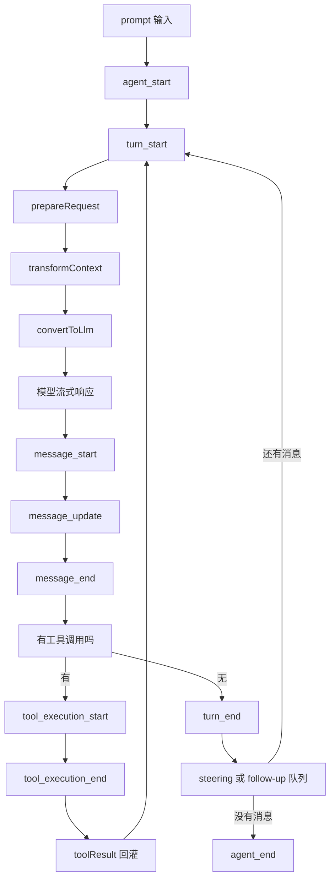
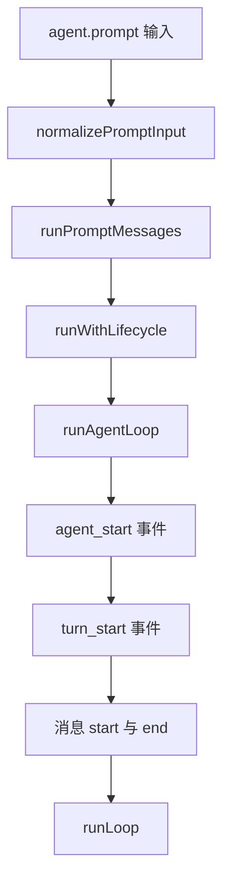
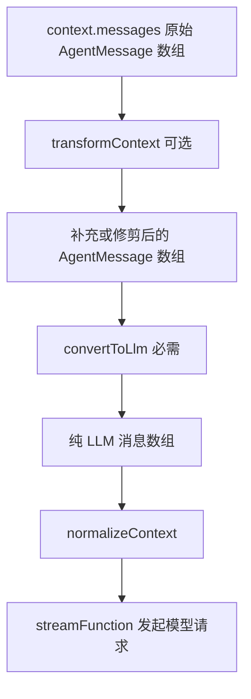
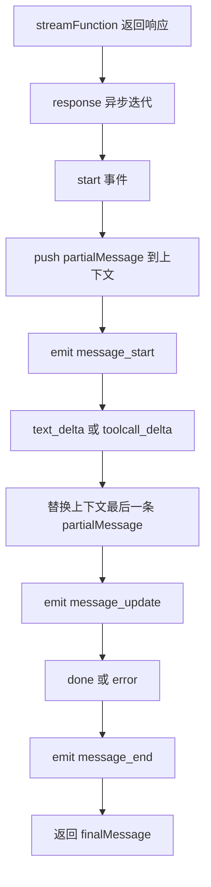
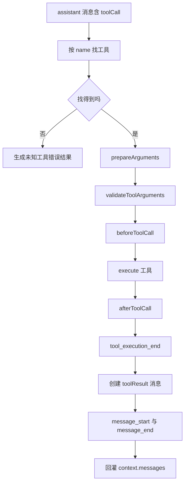
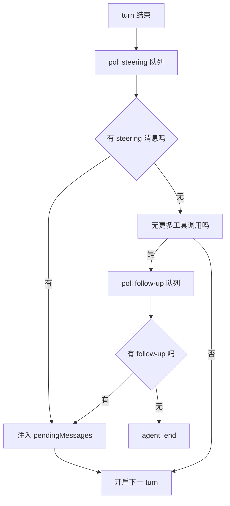
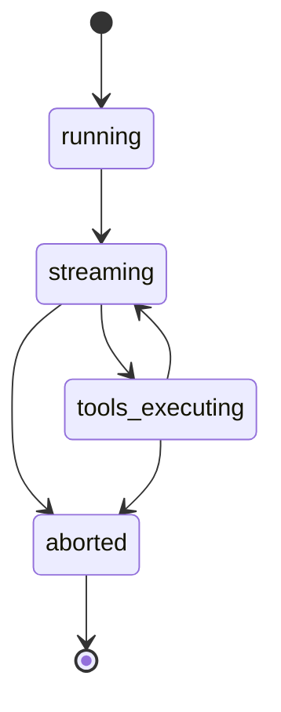

# Agent Loop 解剖：一次对话到底发生了什么

!!! abstract "学完这一页你能"
    - 按事件顺序画出一次 run 从 `prompt` 到 `agent_end` 的完整流程，并标出每个 `turn` 的边界。
    - 说出 `transformContext` 与 `convertToLlm` 各在什么位置执行，以及它们分别接收和返回什么消息类型。
    - 写出一个 `agent.subscribe` 监听器，只用 `message_update` 里的增量文本完成界面流式渲染。
    - 解释 `steering`、`follow-up`、`abort` 三种干预各自进入循环的时机与效果。

## 0. 知识地图



建议先读第 1 节的全景时序，把事件边界记住。  
第 2 到第 5 节按消息流动方向深入，第 6、7 节专门处理干预。  
每节都从具体问题开始，再回到 `dist/agent-loop.js` 与 `dist/agent.js` 的真实源码。

## 1. 一次 run 的完整时序：先看全景

**先想一个问题**：用户输入“读取 `config.json`、搜索 TODO、运行 `npm test`、把结论写回 `report.md`”。  
模型一轮就发出了 4 个工具调用，接着还要再回一次模型。  
这 4 次工具、两条 assistant 消息、多个事件，loop 是如何组织成一个 `run` 的？

**心智模型**

!!! tip "心智模型"
    一句话模型：agent loop 是外层“还该不该继续”加内层“本轮要不要再转”的双层循环。  
    日常类比：服务员循环执行“接单、送后厨、上菜、再问一次”，直到客人不再加单。  
    类比不成立：模型每一轮都重新读完整上下文；服务员不会因为时间过去就忘记前面点了什么。

**图解**

```mermaid
sequenceDiagram
  participant UI as "调用方"
  participant Loop as "Agent Loop"
  participant Model as "模型"
  participant Tools as "工具执行器"
  UI->>Loop: "prompt 包含读取配置等四条指令"
  Loop->>UI: "agent_start"
  Loop->>UI: "turn_start"
  Loop->>UI: "message_start 用户消息"
  Loop->>UI: "message_end 用户消息"
  Loop->>Model: "prepareRequest 后发起请求"
  Model-->>Loop: "start 部分消息"
  Loop->>UI: "message_start 助手消息"
  Model-->>Loop: "text_delta"
  Loop->>UI: "message_update"
  Model-->>Loop: "done"
  Loop->>UI: "message_end 助手消息"
  Loop->>Tools: "tool_execution_start 四个工具"
  Tools-->>UI: "tool_execution_update"
  Tools-->>Loop: "tool_execution_end"
  Loop->>UI: "message_start toolResult"
  Loop->>UI: "message_end toolResult"
  Loop->>UI: "turn_end"
  Loop->>Model: "下一轮请求"
  Model-->>Loop: "done 无工具调用"
  Loop->>UI: "message_start 助手消息"
  Loop->>UI: "message_end 助手消息"
  Loop->>UI: "turn_end"
  Loop->>UI: "agent_end"
```

1. `prompt()` 把用户输入变为一条 user 消息，放入当前快照。  
2. `runAgentLoop` 先发 `agent_start`，再发第一个 `turn_start`。  
3. 用户消息以 `message_start`、`message_end` 两个事件进入上下文。  
4. 模型以流式事件逐步返回 assistant 消息。  
5. 工具结果回灌后，`turn_end` 收束第一轮，再开启第二轮。  
6. 第二轮模型不再调用工具，loop 在 `agent_end` 结束。

**一步一步来**

① 这一步要做什么：看 `runLoop` 的内外层结构，理解“一个 run 不等于一个 turn”。

```js
async function runLoop(initialContext, newMessages, initialConfig, signal, emit, streamFunction) {
    let currentContext = initialContext;        // 当前上下文快照，随循环变化
    let config = initialConfig;                 // 配置可能被 prepareNextTurn 替换
    let lastCompletedTurn;                       // 上一轮完成快照
    let explicitContinuation = false;            // finishTurn 返回 continue 的标记
    let pendingMessages = (await config.getSteeringMessages?.()) || []; // 启动时先查 steering
    while (true) {
        let hasMoreToolCalls = true;             // 默认至少进入一次模型请求
        while (hasMoreToolCalls || pendingMessages.length > 0) { // 有工具结果或有 steering 就继续
            let preparedMessages = [];
            if (lastCompletedTurn) {
                const nextTurnSnapshot = await config.prepareNextTurn?.(lastCompletedTurn);
                if (nextTurnSnapshot) {
                    currentContext = nextTurnSnapshot.context ?? currentContext;
                    preparedMessages = nextTurnSnapshot.messages ?? [];
                }
            }
        }
    }
}
```

**这段代码在做什么**

- `runLoop` 是底层 `agentLoop` 与 `agentLoopContinue` 共享的主循环。  
- 内层 `while` 控制“模型响应后又发现了工具调用，必须继续请求模型”。  
- 外层 `while` 控制“本来要结束，但队列里又来了 follow-up 消息”。  
- `pendingMessages` 在每个 turn 开始时从 steering 队列取出，可能触发新一轮。  
- `lastCompletedTurn` 为 `prepareNextTurn` 与 `finishTurn` 提供上一轮完成数据。

② 这一步要做什么：看 turn 结束后，loop 如何决定再开一轮、结束 run，或执行 follow-up。

```js
            const decision = await config.finishTurn?.(lastCompletedTurn, signal); // 用户可干预
            await emit({ type: "turn_end", message, toolResults });                 // 本轮正式收束
            if (decision?.action === "end") {
                await emit({ type: "agent_end", messages: newMessages });           // 立即结束
                return;
            }
            explicitContinuation = decision?.action === "continue";                 // 请求一次上下文续跑
            pendingMessages = (await config.getSteeringMessages?.()) || [];         // 再次取 steering
            if (hasMoreToolCalls || pendingMessages.length > 0) {
                explicitContinuation = false;                                       // 已有更优先的续跑来源
            }
        }
        const followUpMessages = (await config.getFollowUpMessages?.()) || [];      // 本应停止才看 follow-up
        if (followUpMessages.length > 0) {
            explicitContinuation = false;
            pendingMessages = followUpMessages;                                     // follow-up 交给内层处理
            continue;
        }
        if (explicitContinuation) {
            explicitContinuation = false;
            continue;                                                                // 只补一次纯上下文请求
        }
        break;                                                                        // 没有继续理由，退出
    }
    await emit({ type: "agent_end", messages: newMessages });                        // 最后一个事件
```

**这段代码在做什么**

- `turn_end` 总是在 `finishTurn` 之后发出，所以 `finishTurn` 拿到的是已定稿 assistant 与工具结果。  
- `action: "end"` 让 run 在 `turn_end` 后直接 `agent_end`，不再检查任何队列。  
- `action: "continue"` 只保证下一次请求；若工具结果或队列已经续上，就不额外发请求。  
- steering 只在 turn 结束处轮询；follow-up 只在外层“本应停止”时轮询。  
- `pendingMessages` 有值会让内层条件成立，于是重新进入模型请求。

**动手验证**

```js
// 依赖：无。本脚本用本地桩替代模型流，模拟两个 turn 的决策流程。
const assert = require("node:assert/strict");

const events = [];
let turnRequestCount = 0;

async function fakeStream(model, llmContext) {
  turnRequestCount += 1;
  const withTools = turnRequestCount === 1; // 第一轮请求模型后调用 4 个工具
  return {
    async *[Symbol.asyncIterator]() {
      yield { type: "start", partial: { role: "assistant", content: [] } };
      yield { type: "done" };
    },
    async result() {
      const content = withTools
        ? ["read_file", "search_files", "run_test", "write_file"].map((name, i) => ({
            type: "toolCall", id: `tc-${i}`, name, arguments: {},
          }))
        : [{ type: "text", text: "任务已完成" }];
      return { role: "assistant", content, stopReason: "end_turn" };
    },
  };
}

async function simplifiedLoop(turns) {
  events.push("agent_start");
  for (let i = 0; i < turns; i++) {
    events.push("turn_start");
    const msg = await fakeStream({}, {}).result();
    const toolCalls = msg.content.filter((c) => c.type === "toolCall");
    if (toolCalls.length) {
      events.push(`tools=${toolCalls.length}`);
    }
    events.push("turn_end");
  }
  events.push("agent_end");
}

(async () => {
  await simplifiedLoop(2);
  assert.equal(turnRequestCount, 2);
  assert.deepEqual(events, [
    "agent_start", "turn_start", "tools=4", "turn_end",
    "turn_start", "turn_end", "agent_end",
  ]);
  console.log(events.join(" -> "));
})();
```

运行结果输出：`agent_start -> turn_start -> tools=4 -> turn_end -> turn_start -> turn_end -> agent_end`。  
断言确认 4 个工具只出现在第一轮，第二轮无工具调用，事件边界完整。

**常见坑**

| 现象 | 原因 | 怎么修 |
|------|------|--------|
| 把一次 run 当成一次模型调用 | 一个 run 可包含多个 turn | 用 `turn_start` 与 `turn_end` 计算 turn 数 |
| 在 `agent_end` 后立刻关闭会话 | 等待中的 `agent_end` 监听器可能还没结束 | 使用 `await agent.waitForIdle()` 或 `await agent.prompt()` |
| 靠 `message_end` 判断 run 完成 | 每个 turn 每个消息都有 `message_end` | 只以 `agent_end` 或 waitForIdle 作为 run 结束 |

**小结**

- `agent_start` 是 run 起点，`agent_end` 是最后事件，中间由一个或多个 turn 组成。  
- 内层循环解决“工具结果与 steering 引发下一轮”，外层循环解决“follow-up 让本应结束的 run 续跑”。  
- `turn_end` 是观察一轮完整结果的最小边界。

## 2. prompt 入口与 turn_start：消息如何进入循环

**先想一个问题**：调用 `agent.prompt("读取配置并写报告")` 后，到底哪一行代码把这条字符串变成第一条 user 消息？

**心智模型**

!!! tip "心智模型"
    一句话模型：`prompt` 先把输入归一化为 `AgentMessage`，再作为 task 唯一入口启动整个 loop。  
    日常类比：你下单先被服务员转成后厨能理解的订单格式，再挂到出菜单上。  
    类比不成立：下单通常不含历史订单；agent 启动时会带上已有 `messages` 状态。

**图解**



1. `prompt` 检查是否已有 run 在跑，重复调用会抛错。  
2. `normalizePromptInput` 把字符串转成内容为 `text` 的 user 消息。  
3. `runPromptMessages` 用 `runWithLifecycle` 创建 AbortController 并管理 `activeRun`。  
4. `runAgentLoop` 先声告 `agent_start`，再开 `turn_start`。  
5. 初始消息逐条以 `message_start`、`message_end` 发入上下文。

**一步一步来**

① 这一步要做什么：看 `runAgentLoop` 如何把 prompt 消息和已有 context 合并，再发第一个 turn。

```js
export async function runAgentLoop(prompts, context, config, emit, signal, streamFn) {
    const initialMessages = declareToolChanges(context, prompts); // 若工具有变化，插入 system 声明
    const newMessages = [...initialMessages];                     // 本次新增消息记录
    const currentContext = {
        ...context,
        messages: [...context.messages, ...initialMessages],      // 快照：旧消息加新输入
    };
    await emit({ type: "agent_start" });                          // run 级起点事件
    await emit({ type: "turn_start" });                           // 第一个 turn 起点
    for (const message of initialMessages) {
        await emit({ type: "message_start", message });           // 每条输入的消息起点
        await emit({ type: "message_end", message });             // 每条输入的消息终点
    }
    await runLoop(currentContext, newMessages, config, signal, emit, streamFn ?? getDefaultStreamFn());
    return newMessages;                                            // 返回本次 run 新增的全部消息
}
```

**这段代码在做什么**

- `declareToolChanges` 在 prompt 前面需要时插入工具 loadout 变化的 system 声明。  
- `currentContext.messages` 由已有 context 消息加上新的初始消息组成。  
- `agent_start` 与 `turn_start` 分别对应整个 run 与第一个 turn 的生命周期。  
- 用户消息也走 `message_start`、`message_end`，方便界面统一处理任何消息类型。  
- 最后 `runLoop` 接手后续模型请求；返回值供底层 `agentLoop` 流结束时使用。

② 这一步要做什么：看 `Agent.prompt` 如何接收输入并阻止并发 run。

```js
    async prompt(input, images) {
        if (this.activeRun) {
            throw new Error("Agent is already processing a prompt. Use steer() or followUp() to queue messages, or wait for completion.");
        }
        const messages = this.normalizePromptInput(input, images); // 转成 AgentMessage 数组
        await this.runPromptMessages(messages);                    // 走完整生命周期
    }
    normalizePromptInput(input, images) {
        if (Array.isArray(input)) {
            return input;                                          // 数组已是 AgentMessage 列表
        }
        if (typeof input !== "string") {
            return [input];                                        // 非字符串直接包成一条
        }
        const content = [{ type: "text", text: input }];           // 字符串转文本内容
        if (images && images.length > 0) {
            content.push(...images);                               // 追加 image content 段
        }
        return [{ role: "user", content, timestamp: Date.now() }]; // 构造唯一 user 消息
    }
```

**这段代码在做什么**

- 只要 `activeRun` 存在，`prompt` 就拒绝新的 run。  
- 字符串输入先转为 `content: [{ type: "text", text }]`，保持与模型内容格式一致。  
- 带图片时图片段会追加到同一条 user 消息，不会拆成多条。  
- 该 user 消息会成为 `runAgentLoop` 的 prompt 参数。

**动手验证**

```js
// 依赖：无。本脚本模拟 Agent.prompt 的输入归一化与初始事件顺序。
const assert = require("node:assert/strict");

function normalizePromptInput(input) {
  if (typeof input !== "string") return [input];
  return [{ role: "user", content: [{ type: "text", text: input }], timestamp: Date.now() }];
}

let activeRun = null;
const events = [];

async function runPromptMessages(messages) {
  if (activeRun) throw new Error("Agent is already processing a prompt.");
  activeRun = {};
  events.push("agent_start");
  events.push("turn_start");
  for (const message of messages) {
    events.push(`message_start:${message.role}`);
    events.push(`message_end:${message.role}`);
  }
  activeRun = null;
}

(async () => {
  const messages = normalizePromptInput("读取 config.json 并写报告");
  assert.equal(messages.length, 1);
  assert.equal(messages[0].role, "user");
  assert.equal(messages[0].content[0].text, "读取 config.json 并写报告");
  await runPromptMessages(messages);
  console.log(events.join(" -> "));
})();
```

运行结果：`agent_start -> turn_start -> message_start:user -> message_end:user`。  
断言确认单个字符串只产生一条 user 消息，且事件顺序正确。

**常见坑**

| 现象 | 原因 | 怎么修 |
|------|------|--------|
| 第二次 `prompt` 抛错 | `activeRun` 还在，run 尚未结束 | 改用 `steer` 或 `followUp`，或先 `waitForIdle` |
| 图片被拆成多条消息 | 未用 images 参数而自己拼接 | 把图片段作为第二参传入 `prompt` |
| 用户消息没发 `message_start` | 没进入标准 `runAgentLoop` 入口 | 使用 `Agent.prompt` 或底层 `agentLoop` |

**小结**

- `prompt` 的输入先归一化为 `AgentMessage[]`，不是直接传给模型。  
- `agent_start` 与第一个 `turn_start` 发生在任何模型请求前。  
- 同一时间只允许一个 run，这是入口层对并发的保护。

## 3. 请求准备的两步变换：transformContext 与 convertToLlm

**先想一个问题**：上下文里既有系统 prompt、user 消息，也有 UI 专用的 `notification` 自定义消息。模型不认 `notification`，直接发过去会报错。

**心智模型**

!!! tip "心智模型"
    一句话模型：先 `transformContext` 修剪与补充 `AgentMessage`，再 `convertToLlm` 过滤与转换出模型能读的 `Message`。  
    日常类比：先整理文件夹，扔掉过期文件并放入新资料；再把可交给模型的内容翻译成模型方言。  
    类比不成立：整理与翻译都发生在每次模型调用前，不会只做一次。

!!! note "术语：AgentMessage"
    Agent 内部可扩展消息类型，比如 `notification`、`system`、`user`、`toolResult`。  
    例：`{ role: "notification", text: "已连接", timestamp }` 可被 convertToLlm 过滤掉。

!!! note "术语：LLM Message"
    模型提供方只接受 `system`、`user`、`assistant`、`toolResult` 这几种消息。  
    例：一条 `role: "user"` 的 AgentMessage 转换后仍是 user，但 `notification` 转换后被丢弃。

**图解**



1. `transformContext` 主要做压缩历史、注入外部 canon 上下文。  
2. `convertToLlm` 只保留模型可处理角色，并处理自定义角色转换。  
3. `normalizeContext` 把消息包成模型请求上下文的统一格式。  
4. 二者每次都发生在 `streamAssistantResponse` 里，每个 turn 一次。

**一步一步来**

① 这一步要做什么：看 `streamAssistantResponse` 前部，理解两次变换与 API key 解析的先后。

```js
async function streamAssistantResponse(context, config, signal, emit, streamFunction) {
    let messages = context.messages;                 // 先取本次上下文
    if (config.transformContext) {
        messages = await config.transformContext(messages, signal); // AgentMessage 级别变换
    }
    const llmMessages = await config.convertToLlm(messages);        // 转成 LLM Message
    const llmContext = normalizeContext({ messages: llmMessages }); // 包成请求上下文
    const resolvedApiKey = (config.getApiKey
        ? await config.getApiKey(config.model.provider)             // OAuth token 过期的场景
        : undefined) || config.apiKey;                              // 否则用静态 key
    const response = await streamFunction(config.model, llmContext, {
        ...config,
        apiKey: resolvedApiKey,
        signal,
    });
}
```

**这段代码在做什么**

- `transformContext` 可空；不配置时直接使用原 `context.messages`。  
- `convertToLlm` 是必需步骤，即使默认实现也不应跳过。  
- `normalizeContext` 确保模型流函数拿到标准结构。  
- `getApiKey` 每次请求都可能执行，适合刷新即将过期的 token。  
- `signal` 一路传入流函数，使 abort 能中止真实请求。

② 这一步要做什么：看 `Agent` 类的默认 `convertToLlm`，理解最简单的过滤规则。

```js
function defaultConvertToLlm(messages) {
    return messages.filter((message) => message.role === "system" ||
        message.role === "user" ||
        message.role === "assistant" ||
        message.role === "toolResult");
}
```

**这段代码在做什么**

- 只放行模型认识的四种角色。  
- 自定义角色如 `notification` 会被丢弃，不会发往模型。  
- 如果要把 `notification` 转成文本再给模型，需要用户自定义 `convertToLlm`。  
- 过滤发生在每个 turn 的模型调用前，不会永久删除 agent 状态中的消息。

**动手验证**

```js
// 依赖：无。本脚本演示两步变换的数据流。
const assert = require("node:assert/strict");

let transformOrder = [];
let convertOrder = [];

async function transformContext(messages) {
  transformOrder = ["system", "user", "notification", "toolResult"];
  return messages.filter((m) => m.role !== "expired"); // 模拟修剪过期消息
}

async function convertToLlm(messages) {
  convertOrder = messages.map((m) => m.role);
  return messages.filter((m) => ["system", "user", "assistant", "toolResult"].includes(m.role));
}

(async () => {
  const context = {
    messages: [
      { role: "system", content: "你是助手" },
      { role: "user", content: "读配置" },
      { role: "expired", content: "旧上下文" },
      { role: "notification", text: "已连接" },
      { role: "toolResult", toolCallId: "tc-0", content: [] },
    ],
  };
  const afterTransform = await transformContext(context.messages);
  assert.equal(afterTransform.length, 4);
  assert.ok(afterTransform.every((m) => m.role !== "expired"));
  const afterConvert = await convertToLlm(afterTransform);
  assert.deepEqual(afterConvert.map((m) => m.role), ["system", "user", "toolResult"]);
  console.log("转换后角色：", afterConvert.map((m) => m.role).join(", "));
})();
```

运行结果：`转换后角色： system, user, toolResult`。  
断言确认 `expired` 被传给 convert 前移除，`notification` 被 convert 过滤。

**常见坑**

| 现象 | 原因 | 怎么修 |
|------|------|--------|
| 模型报不支持的消息类型 | 自定义角色进入 LLM 请求 | 在 `convertToLlm` 中过滤或转换 |
| 修历史上限失败 | 只改了原始 messages 数组 | 在 `transformContext` 中按 turn 前快照修剪 |
| `getApiKey` 被执行太多次 | 每个 provider request 都调用一次 | 若 key 不变，使用静态 `apiKey` 而非 `getApiKey` |
| `convertToLlm` 返回空数组时 provider 拒绝 | 用户或 toolResult tail 被误删 | 检查过滤条件，保证至少一条可发送 |

**小结**

- `transformContext` 在 `AgentMessage` 层操作，负责历史维护。  
- `convertToLlm` 在模型边界操作，负责把可扩展消息翻译成模型方言。  
- 两步不是可选项：转换到 LLM 格式是强制的，否则无法发起请求。

## 4. 流式响应：message_start、message_update、message_end

**先想一个问题**：模型返回 2000 字回答，用户希望看到字一个接一个出现，而不是等 10 秒后一次性弹出。

**心智模型**

!!! tip "心智模型"
    一句话模型：模型流中的 `start` 映射为 `message_start`，后续 `delta` 映射为 `message_update`，`done` 映射为 `message_end`。  
    日常类比：直播的“开播、逐帧画面、下播”，分别对应 UI 的创建、更新、提交。  
    类比不成立：模型流里还有 `thinking_delta`、`toolcall_delta` 等不同增量类型，不只是画面帧。

**图解**



1. `start` 时先创建 partial assistant 消息并推到 `context.messages`。  
2. 每个 delta 用新的 partial 替换最后一条消息，状态始终可渲染。  
3. `message_update` 携带 `assistantMessageEvent`，UI 应使用其中的 delta。  
4. `done` 后再用 `result()` 取最终完整消息，发 `message_end`。

**一步一步来**

① 这一步要做什么：看 `streamAssistantResponse` 中响应事件的分流结构。

```js
    let partialMessage = null;   // 当前正在流式构建的 assistant 消息
    let addedPartial = false;    // 是否已经把 partial 推入上下文
    for await (const event of response) {
        switch (event.type) {
            case "start":
                partialMessage = event.partial;
                context.messages.push(partialMessage);            // partial 先入库
                addedPartial = true;
                await emit({ type: "message_start", message: { ...partialMessage } });
                break;
            case "text_start":
            case "text_delta":
            case "text_end":
            case "thinking_start":
            case "thinking_delta":
            case "thinking_end":
            case "toolcall_start":
            case "toolcall_delta":
            case "toolcall_end":
                if (partialMessage) {
                    partialMessage = event.partial;               // 每次取最新 partial
                    context.messages[context.messages.length - 1] = partialMessage;
                    await emit({
                        type: "message_update",
                        assistantMessageEvent: event,
                        message: { ...partialMessage },
                    });
                }
                break;
```

**这段代码在做什么**

- `start` 创建 partial，并立即发 `message_start`，即使内容还为空。  
- 中间类型统一进入 `message_update`，`assistantMessageEvent` 保留原始增量事件类型。  
- `context.messages` 最后一条始终是最新的 partial，便于中断时检查状态。  
- `thinking_*` 类型也走同一通道，不参与最终文本但可被 UI 选择性渲染。

② 这一步要做什么：看 `done` 如何定稿并保证 `message_end` 一定发出。

```js
            case "done":
            case "error": {
                const finalMessage = await result();               // 从流函数取最终完整消息
                if (addedPartial) {
                    context.messages[context.messages.length - 1] = finalMessage; // 替换 partial
                } else {
                    context.messages.push(finalMessage);            // 无 start 就直接推
                }
                if (!addedPartial) {
                    await emit({ type: "message_start", message: { ...finalMessage } });
                }
                await emit({ type: "message_end", message: finalMessage }); // 消息定稿
                return finalMessage;
            }
```

**这段代码在做什么**

- `done` 与 `error` 共用出口，保证无论正常还是错误都有一个 finalMessage。  
- 有 partial 时就替换，没 partial 时才补发 `message_start`。  
- `message_end` 使用 finalMessage，与 partial 内容一致但包含 stopReason 与 usage。  
- `streamAssistantResponse` 只返回 finalMessage，交给上层决定是否继续循环。

**动手验证**

```js
// 依赖：无。本脚本用异步生成器模拟文本流，并断言三个消息事件各出现一次。
const assert = require("node:assert/strict");

const events = [];
const context = { messages: [] };

async function fakeStream() {
  return {
    async *[Symbol.asyncIterator]() {
      yield { type: "start", partial: { role: "assistant", content: [] } };
      yield { type: "text_delta", partial: { role: "assistant", content: [{ type: "text", text: "你好" }] } };
      yield { type: "done" };
    },
    async result() {
      return { role: "assistant", content: [{ type: "text", text: "你好" }], stopReason: "end_turn" };
    },
  };
}

(async () => {
  let partial = null;
  for await (const event of await fakeStream()) {
    if (event.type === "start") {
      partial = event.partial;
      context.messages.push(partial);
      events.push("message_start");
    } else if (event.type === "text_delta") {
      partial = event.partial;
      context.messages[context.messages.length - 1] = partial;
      events.push("message_update");
    } else if (event.type === "done") {
      const final = await fakeStream().result();
      context.messages[context.messages.length - 1] = final;
      events.push("message_end");
    }
  }
  assert.deepEqual(events, ["message_start", "message_update", "message_end"]);
  assert.equal(context.messages[0].content[0].text, "你好");
  console.log(events.join(" -> "));
})();
```

运行结果：`message_start -> message_update -> message_end`，并确认 context 中 assistant 文本为“你好”。

**常见坑**

| 现象 | 原因 | 怎么修 |
|------|------|--------|
| UI 频繁刷新整条消息 | 把每次 `message_update` 当作完整消息 | 只读取 `assistantMessageEvent.delta` 或找 text_delta |
| 文本漏渲染 | 监听 `message_start` 时以为完成消息 | 用 `message_update` 累加增量 |
| 重复发 `message_start` | 在已有 partial 时仍复制 start 逻辑 | 检查 addedPartial 后再不补发 |
| `thinking_delta` 与文本混在一起 | 未按 `assistantMessageEvent.type` 分类 | 根据事件类型分通道渲染 |

**小结**

- `message_start` 只建占位，不代表最终内容完成。  
- `message_update` 是 assistant 专属增量更新通道。  
- `message_end` 表示该消息已定稿，随后才进入工具或下一轮。

## 5. 工具调用：从 tool_execution_start 到 toolResult 回灌

**先想一个问题**：模型返回了 4 个 `toolCall`，其中一个工具名不存在，另一个工具需要先经权限检查。哪些要执行、哪些被拦截？

**心智模型**

!!! tip "心智模型"
    一句话模型：每个 toolCall 先经历“找工具、验证参数、beforeToolCall、执行、afterToolCall”，再包装成 `toolResultMessage` 返回上下文。  
    日常类比：后厨接单后先查菜单，确认能做再下锅；菜单没有的菜直接打回。  
    类比不成立：如果模型输出被 token 截断，所有 toolCall 都会直接判错，不进入后厨。

**图解**



1. 工具名不存在时，`prepareToolCall` 直接返回 `isError: true` 的 immediate 结果。  
2. 参数校验或 `beforeToolCall` 抛错或 block 时，不再真正执行。  
3. 执行成功后 `afterToolCall` 可替换 content、details、usage 或 terminate。  
4. 所有工具结果按 assistant 原顺序回灌成 `toolResult` 消息。

**一步一步来**

① 这一步要做什么：看 `prepareToolCall` 如何执行查找、验证、before 钩子与 abort 检查。

```js
async function prepareToolCall(currentContext, assistantMessage, toolCall, config, signal, tools = currentContext.tools ?? []) {
    const tool = tools.find((t) => t.name === toolCall.name); // 先找可执行工具
    if (!tool) {
        return {
            kind: "immediate",
            result: createErrorToolResult(`Tool ${toolCall.name} not found`), // 未知工具
            isError: true,
        };
    }
    try {
        const preparedToolCall = prepareToolCallArguments(tool, toolCall); // 工具可先改参数
        const validatedArgs = validateToolArguments(tool, preparedToolCall); // schema 校验
        if (config.beforeToolCall) {
            const beforeResult = await config.beforeToolCall({
                assistantMessage,
                toolCall,
                args: validatedArgs,
                context: currentContext,
            }, signal);
            if (signal?.aborted) {
                return { kind: "immediate", result: createErrorToolResult("Operation aborted"), isError: true };
            }
            if (beforeResult?.block) {
                const result = createErrorToolResult(beforeResult.reason || "Tool execution was blocked");
                if (beforeResult.terminate === true) {
                    result.terminate = true;               // block 可同时要求整批终止
                }
                return { kind: "immediate", result, isError: true };
            }
        }
        if (signal?.aborted) {
            return { kind: "immediate", result: createErrorToolResult("Operation aborted"), isError: true };
        }
        return { kind: "prepared", toolCall, tool, args: validatedArgs }; // 可以安全执行
    } catch (error) {
        return { kind: "immediate", result: createErrorToolResult(error instanceof Error ? error.message : String(error)), isError: true };
    }
}
```

**这段代码在做什么**

- 找不到工具与执行错误都走同一套 `isError: true` 结果，避免未捕获异常中断 run。  
- `prepareArguments` 在 schema 校验前执行，工具可以在校验前改写参数。  
- `beforeToolCall` 在验证后执行，看到的是合法参数与已包含 assistant 消息的上下文。  
- `block: true` 生成错误结果，不执行且不进正常工具出口。  
- `signal.aborted` 在 before 前后各查一次，防止进入真正执行。

② 这一步要做什么：看工具结果如何变回 `toolResultMessage` 并回灌上下文。

```js
function createToolResultMessage(finalized) {
    return {
        role: "toolResult",
        toolCallId: finalized.toolCall.id,   // 与 assistant toolCall 的 id 对应
        toolName: finalized.toolCall.name,
        content: finalized.result.content ?? [], // 无 content 时归一为空数组
        details: finalized.result.details,
        usage: finalized.result.usage,
        isError: finalized.isError,
        timestamp: Date.now(),
    };
}
async function emitToolResultMessage(toolResultMessage, emit) {
    await emit({ type: "message_start", message: toolResultMessage });
    await emit({ type: "message_end", message: toolResultMessage });
}
```

**这段代码在做什么**

- `toolResult` 通过 `toolCallId` 关联 assistant 消息里的那个 toolCall。  
- `content ?? []` 保证空结果不会变成 null 进入历史或 provider payload。  
- toolResult 也作为普通消息发 `message_start`、`message_end`。  
- 持久化顺序遵循 assistant source order，不按工具完成顺序。

**动手验证**

```js
// 依赖：无。本脚本模拟 4 个工具调用：一个未知、一个被 block、一个抛错、一个成功。
const assert = require("node:assert/strict");

async function prepareToolCall(name, tools, beforeToolCall) {
  const tool = tools.find((t) => t.name === name);
  if (!tool) return { kind: "immediate", isError: true, result: { content: [{ type: "text", text: `Tool ${name} not found` }] } };
  const before = await beforeToolCall(tool, {});
  if (before.block) return { kind: "immediate", isError: true, result: { content: [{ type: "text", text: before.reason }] } };
  return { kind: "prepared", tool };
}

(async () => {
  const tools = [{ name: "read_file", tag: "ok" }, { name: "bash", tag: "blocked" }, { name: "run_test", tag: "throw" }];
  const calls = ["read_file", "bash", "run_test", "missing_tool"];
  const results = [];
  for (const name of calls) {
    const prep = await prepareToolCall(name, tools, async (tool) => {
      if (tool.name === "bash") return { block: true, reason: "bash is disabled" };
      return {};
    });
    if (prep.kind !== "prepared") {
      results.push({ name, text: prep.result.content[0].text, isError: prep.isError });
      continue;
    }
    if (prep.tool.name === "run_test") {
      results.push({ name, text: "测试失败", isError: true });
      continue;
    }
    results.push({ name, text: "读取成功", isError: false });
  }
  assert.equal(results.filter((r) => r.isError).length, 3);
  assert.equal(results.find((r) => r.name === "read_file").text, "读取成功");
  console.log(results.map((r) => `${r.name}:${r.text}`).join(" | "));
})();
```

运行结果：`read_file:读取成功 | bash:bash is disabled | run_test:测试失败 | missing_tool:Tool missing_tool not found`。  
断言确认 4 个工具中只有 read_file 成功，block、抛错和未知工具都返回错误结果。

**常见坑**

| 现象 | 原因 | 怎么修 |
|------|------|--------|
| 工具名大小写不同导致 not found | 模型输出与 AgentTool.name 不一致 | 保证工具 name 精确匹配，debug 打印 toolCall |
| 截断参数的调用被真执行 | 只在 stopReason 非 length 时才执行 | 源码对 length 走 `failToolCallsFromTruncatedMessage` |
| `terminate` 不生效 | 批次里只要有一个非 terminate，就继续 | 确认每个 finalized result 都返回 `terminate: true` |
| parallel 执行却想严格顺序 | 全局或 per-tool 没设 sequential | 设置 `agent.toolExecution = "sequential"` 或工具 `executionMode` |

**小结**

- 每个 toolCall 都必须通过查找、校验、before 钩子才能执行。  
- 工具返回的错误、block 结果与未知工具统一作为 `isError: true` 回灌。  
- `tool_execution_end` 完成顺序与 toolResult 消息持久化顺序可以不同。

## 6. steering 与 follow-up：下一轮怎么被触发

**先想一个问题**：工具正读一个巨大目录，用户此时说“停下，改成只读目录并总结”。Agent 不能立刻打断模型，也不能丢掉这条新指令。

**心智模型**

!!! tip "心智模型"
    一句话模型：steering 在工具结束后被轮询并立即注入下一轮；follow-up 只在 agent 本应停止时才注入。  
    日常类比：你已在餐厅点完单，想改主菜可以先在传菜单前改；想问“再要一个甜点”要等主菜上完且你不再加菜。  
    类比不成立：steering 与 follow-up 都进消息队列，但轮询点不同。

**图解**



1. steering 每个 turn 结束都会查一次，优先于 follow-up。  
2. follow-up 只在外层“本应停止”且没有 steering 时查询。  
3. `steeringMode` 与 `followUpMode` 控制一次取一条还是全部。  
4. `continue()` 在 assistant tail 时，会退到一条 steering 再一条 follow-up。

**一步一步来**

① 这一步要做什么：看 `runLoop` 中 steering 与 follow-up 的轮询位置。

```js
            const decision = await config.finishTurn?.(lastCompletedTurn, signal);
            await emit({ type: "turn_end", message, toolResults });
            if (decision?.action === "end") {                    // finishTurn 说结束
                await emit({ type: "agent_end", messages: newMessages });
                return;
            }
            explicitContinuation = decision?.action === "continue"; // 记录是否要补一次请求
            pendingMessages = (await config.getSteeringMessages?.()) || []; // steering 常规轮询
            if (hasMoreToolCalls || pendingMessages.length > 0) {
                explicitContinuation = false;                    // 已有优先续跑来源
            }
        }
        const followUpMessages = (await config.getFollowUpMessages?.()) || []; // 本应停止才看
        if (followUpMessages.length > 0) {
            explicitContinuation = false;
            pendingMessages = followUpMessages;                   // follow-up 转成下一轮输入
            continue;
        }
```

**这段代码在做什么**

- steering 在 turn 结束之后、进入下一轮之前取走，不会等整个 run 结束。  
- follow-up 只在没有工具调用与 steering 消息后到达，它代表“之后再做”。  
- `pendingMessages` 被赋值后，内层条件立即允许下一轮。  
- 若既有 tool calls 又有 steering，steering 要等工具结果处理完，不会打乱当前 assistant 消息。

② 这一步要做什么：看 `Agent` 队列的 drain 行为与模式控制。

```js
class PendingMessageQueue {
    constructor(mode) {
        this.mode = mode;
    }
    enqueue(message) {
        this.messages.push(message);
    }
    peek() {
        if (this.mode === "all")
            return this.messages.slice(); // all 模式预览全部
        const first = this.messages[0];
        return first ? [first] : [];       // one-at-a-time 模式只预览第一条
    }
    drain() {
        const drained = this.peek();        // 决定本批取走多少
        this.messages = this.messages.slice(drained.length);
        return drained;
    }
    clear() {
        this.messages = [];
    }
}
```

**这段代码在做什么**

- `all` 模式一次清空全部消息；`one-at-a-time` 只清第一条。  
- `peek` 尊重模式因此安全，`drain` 调用 peek 后按已取数量清除。  
- `clearSteeringQueue` 与 `clearFollowUpQueue` 只清自己的队列。  
- Agent 的 `steeringMode` 与 `followUpMode` setter 直接改 queue 的 mode。

**动手验证**

```js
// 依赖：无。本脚本模拟一个 turn 结束后的 steering 优先与 follow-up 后置。
const assert = require("node:assert/strict");

function createQueue(mode) {
  let messages = [];
  return {
    enqueue: (m) => messages.push(m),
    peek: () => (mode === "all" ? messages.slice() : messages[0] ? [messages[0]] : []),
    drain: () => { const d = mode === "all" ? messages.slice() : messages[0] ? [messages[0]] : []; messages = messages.slice(d.length); return d; },
  };
}

(async () => {
  const steering = createQueue("one-at-a-time");
  const followUp = createQueue("one-at-a-time");
  const injected = [];
  let hasMoreToolCalls = false;

  steering.enqueue("改读目录");
  steering.enqueue("再总结一次");
  followUp.enqueue("之后写报告");

  let pending = steering.drain();
  while (pending.length > 0) {
    injected.push(pending[0]);
    hasMoreToolCalls = false; // 假设本轮无工具
    pending = steering.drain();
  }
  if (injected.length === 0 || !hasMoreToolCalls) {
    if (!hasMoreToolCalls) {
      const follow = followUp.drain();
      if (follow.length) pending = follow;
    }
  }
  while (pending?.length > 0) {
    injected.push(pending[0]);
    pending = steering.drain();
  }

  assert.deepEqual(injected, ["改读目录"]);
  assert.deepEqual(steering.peek(), ["再总结一次"]);
  assert.deepEqual(followUp.peek(), ["之后写报告"]);
  console.log("注入：", injected.join(", "));
})();
```

运行结果：`注入： 改读目录`。  
断言说明 steering 一次只取一条，第二条 steering 还留在队列，follow-up 尚未注入。

**常见坑**

| 现象 | 原因 | 怎么修 |
|------|------|--------|
| 工具运行中 steering 不生效 | loop 只在 turn 结束轮询 | 等待工具批次结束，不要期望工具中途切换 |
| follow-up 还没执行就结束 | 有 steering 或工具调用先处理 | 清 steering 与工具结果后再看 follow-up |
| one-at-a-time 只注入一条 | 模式默认如此 | 需要全部消息时设对应 mode 为 all |
| `action: "continue"` 死循环 | `finishTurn` 无条件返回 continue | 让新请求后有退出条件，如检查 stopReason |

**小结**

- 同时有工具与 steering 时，工具结果优先完成，不丢 assistant 关联。  
- steering 在常规轮询点取走，follow-up 只在没有其他续跑来源时取走。  
- 队列模式决定一次取一条还是全部。

## 7. abort 与错误出口：循环如何安全停下

**先想一个问题**：用户点停止，但模型正在流式响应，4 个工具也正要开始执行。要让这两个阶段都不再继续，信号要传到哪几层？

**心智模型**

!!! tip "心智模型"
    一句话模型：abort 使用同一个 AbortController 的 signal 贯穿模型流与工具执行，最后把已发生的结果归入 aborted turn。  
    日常类比：厨房停电后，每个站点看到停电信号才停；不是只在收银台停。  
    类比不成立：停电后可能先补一道 aborted 结果消息，不是直接静默。

**图解**



1. `Agent.runWithLifecycle` 创建一 run 一个的 AbortController。  
2. `signal` 一路传入 streamFunction，可中止模型流。  
3. `executeToolCallsParallel` 在异步启动前检查 `signal.aborted`。  
4. 若 run 抛错且 aborted，`handleRunFailure` 发一条 stopReason 为 `aborted` 的 assistant 消息。

**一步一步来**

① 这一步要做什么：看并行工具执行中 abort 检查的位置。

```js
        finalizedCalls.push(async () => {
            if (signal?.aborted) {                                // 开始前再查一次
                const finalized = {
                    toolCall,
                    result: createErrorToolResult("Operation aborted"),
                    isError: true,
                };
                await emitToolExecutionEnd(finalized, emit);       // 发出 aborted 工具结束
                return finalized;
            }
            const executed = await executePreparedToolCall(preparation, signal, emitToolExecutionUpdate(toolCall, emit));
            const finalized = await finalizeExecutedToolCall(currentContext, assistantMessage, preparation, executed, config, signal);
            await emitToolExecutionEnd(finalized, emit);
            return finalized;
        });
        if (signal?.aborted) {
            break;                                                  // 已中止则不再继续准备新调用
        }
```

**这段代码在做什么**

- 未开始执行的工具在闭包运行时先查 signal，避免发起新执行。  
- 已中止的工具生成 `isError: true` 的 aborted 结果，不抛异常。  
- 准备阶段结束后也检查 signal，不再准备后面的调用。  
- `Promise.all` 仍会等所有已启动闭包结束，保证最终消息顺序。

② 这一步要做什么：看 Agent 如何把 abort 变成一次受控失败。

```js
    async runWithLifecycle(executor) {
        if (this.activeRun) {
            throw new Error("Agent is already processing.");
        }
        const abortController = new AbortController();              // 每次 run 新建
        this.activeRun = { promise, resolve: resolvePromise, abortController };
        this._state.isStreaming = true;
        try {
            await executor(abortController.signal);
        } catch (error) {
            await this.handleRunFailure(error, abortController.signal.aborted); // 区分 aborted 与 error
        } finally {
            this.finishRun();                                        // 清运行时状态
        }
    }
    async handleRunFailure(error, aborted) {
        const failureMessage = {
            role: "assistant",
            content: [{ type: "text", text: "" }],
            api: this._state.model.api,
            provider: this._state.model.provider,
            model: this._state.model.id,
            usage: EMPTY_USAGE,
            stopReason: aborted ? "aborted" : "error",               // 用户可据此判断
            errorMessage: error instanceof Error ? error.message : String(error),
            timestamp: Date.now(),
        };
        await this.processEvents({ type: "message_start", message: failureMessage });
        await this.processEvents({ type: "message_end", message: failureMessage });
        await this.processEvents({ type: "turn_end", message: failureMessage, toolResults: [] });
        await this.processEvents({ type: "agent_end", messages: [failureMessage] });
    }
```

**这段代码在做什么**

- `AbortController` 属于每次 run，`agent.abort()` 调用 activeRun 的 controller。  
- `handleRunFailure` 保证即使在 run 中抛错，UI 也收到标准消息事件。  
- `stopReason` 是 `aborted` 或 `error`，便于用户侧分支处理。  
- `finishRun` 在 finally 中执行，无论成功或失败都清空 activeRun。

**动手验证**

```js
// 依赖：无。本脚本模拟工具执行前 abort，并断言不会真正执行工具。
const assert = require("node:assert/strict");

async function executeTool(signal) {
  if (signal.aborted) {
    return { toolName: "read_file", text: "Operation aborted", isError: true };
  }
  return { toolName: "read_file", text: "读取成功", isError: false };
}

(async () => {
  const controller = new AbortController();
  controller.abort();
  const result = await executeTool(controller.signal);
  assert.equal(result.isError, true);
  assert.equal(result.text, "Operation aborted");
  console.log(`${result.toolName}:${result.text}`);
})();
```

运行结果：`read_file:Operation aborted`。  
断言确认 abort 信号在工具执行前拦截，不产生正常工具结果。

**常见坑**

| 现象 | 原因 | 怎么修 |
|------|------|--------|
| abort 后 UI 收到空 assistant 消息 | 失败时 fill 空文本 failureMessage | 客户端判断 `stopReason` 为 aborted 不渲染 |
| 工具已发出网络请求未中断 | 工具内部没有检查 signal | 在自定义 `execute` 中检查 `signal.aborted` |
| abort 后 `agent.state.isStreaming` 仍为 true | 等待 agent_end 监听器 | 使用 `agent.waitForIdle()` |
| 模型流没被真正中止 | streamFunction 未透传 signal | `streamAssistantResponse` 已传 signal，自定义流必须转发 |

**小结**

- abort 不是单点停止，而是靠 `AbortSignal` 穿透模型与工具层。  
- 被中止的工具返回 `isError: true` 而不是留下未完成状态。  
- `stopReason: "aborted"` 是 UI 与自动化判断中断的关键值。

## 综合对比

| 对比维度 | transformContext | convertToLlm |
|----------|------------------|--------------|
| 输入 | AgentMessage 数组 | transform 后的 AgentMessage 数组 |
| 输出 | AgentMessage 数组 | 纯 LLM Message 数组 |
| 必需性 | 可选 | 必需 |
| 主要用途 | 修剪旧消息、注入外部上下文 | 过滤 UI-only 消息、转换自定义类型 |
| 执行时机 | 每个 turn 的模型请求前 | 每次在 transformContext 之后 |

| 对比维度 | steering | follow-up |
|----------|----------|-----------|
| 轮询时机 | 每个 turn 结束后 | agent 本应停止时 |
| 优先级 | 高于 follow-up | 低于 steering 与工具续跑 |
| 适合场景 | 工具已结束，想立即改下一轮 | 当前工作完成后追加任务 |
| 清空接口 | clearSteeringQueue | clearFollowUpQueue |

| 对比维度 | toolExecution parallel | toolExecution sequential |
|----------|------------------------|--------------------------|
| 执行方式 | 非 sequential 工具并发执行 | 工具逐个执行 |
| 完成事件 | 按工具完成顺序 | 按调用顺序 |
| toolResult 持久化 | 仍按 assistant 原顺序 | 按执行顺序 |
| 适用前提 | 无共享可变副作用 | 有严格顺序或资源冲突 |

| 对比维度 | abort | stopReason error |
|----------|-------|------------------|
| 来源 | AbortController.abort | 模型流或回调抛错 |
| stopReason | aborted | error |
| 工具处理 | 未执行工具变 aborted 错误结果 | 错误结果按实际异常记录 |
| 可恢复 | 一般需要新 run | 同样需要新 run |

## 应用与行业实践

### 应用场景地图

| 场景 | 用到本页哪个知识点 | 典型技术选型 | 注意事项 |
| --- | --- | --- | --- |
| 后台管理的万行表格，AI 生成筛选条件 | `message_update` 增量渲染 | 前端虚拟滚动加 SSE 转发 | 增量只在 `message_update` 里拼接，别在 `message_end` 一次性替换，否则光标跳动 |
| 低端安卓的首屏加载，App 内智能客服首答 | `abort` 与错误出口 | 前端超时计时器加服务端中止信号 | 首字超时后保留用户输入，重试从新 `turn` 开始 |
| 多人协作白板，画布上的 AI 助手 | `steering` 插话 | 每用户一条插话队列，按到达时间投递 | 插话只在工具执行间隙进入，不会打断正在跑的 `tool` |
| 客服工单自动分类 | `tool_execution_start` 到 `toolResult` 回灌 | 分类工具返回结构化结果 | `toolResult` 必须回灌成新消息，只写日志等于模型没看到 |
| IDE 里的代码改写助手 | `transformContext` | 只注入选中文件与相关符号 | 超预算时先裁历史消息，再裁文件片段 |
| 合同长文档审阅 | `convertToLlm` | 业务消息转成模型可读的消息数组 | 转换后角色顺序要保持，工具消息的字段不能丢 |
| CI 里跑批的代码修复 agent | `agent_end` 与 follow-up 队列 | headless 运行，事件落盘 | 每次 run 带唯一 ID，把 `agent_end` 与 job 结果对齐 |
| 语音助手连续对话 | `abort` 打断加 follow-up | VAD 检测用户开口后触发中止 | 打断后把已说话内容写回历史，否则答非所问 |

### 三个场景拆解

#### 场景 1：后台管理的万行表格

**业务背景**：用户用一句自然语言生成筛选条件，表格有一万行以上，回答通常是几百字。按整段渲染时前端会连续掉帧，用 Chrome DevTools Performance 面板录制一轮回答即可复现。

**怎么用本页知识解决**：思路是只订阅 `message_update`，把增量文本累加到缓冲区，用 `requestAnimationFrame` 把同一帧内的追加合并成一次 DOM 写入。

```ts
let buffer = "";                       // 累积本轮全部增量文本
let pending = false;                   // 是否已有待执行的刷新任务

agent.subscribe((event) => {
  if (event.type !== "message_update") return; // 只处理增量事件
  const chunk = pickDelta(event);      // 从事件里取出本次新增文本
  if (!chunk) return;                  // 空增量直接跳过
  buffer += chunk;                     // 先写缓冲区，不动 DOM
  if (pending) return;                 // 已有刷新任务就不再排队
  pending = true;
  requestAnimationFrame(() => {
    pending = false;
    renderText(buffer);                // 一帧只写一次 DOM
  });
});
```

- `pickDelta` 把取增量的细节收在一处，事件字段改名时只改这个函数。
- 缓冲区与渲染分离，慢设备上渲染延迟不会阻塞事件回调。
- 只认 `message_update`，`message_end` 到达时不再重写全文。
- `pending` 标志保证一帧内多次追加只触发一次渲染。

**怎么度量收益**：看 web-vitals 的 INP，用 Chrome DevTools Performance 统计长任务数量，用 PerformanceObserver 订阅 `longtask` 记录每轮回答的长任务总数。

**什么时候不该用**：
- 回答只有固定一句短模板，流式渲染多出一层状态管理。
- 运行在 CI 或终端批处理里，没有滚动刷新，增量输出只增加日志行数。
- 金额、库存这类必须先整体校验才能展示的结果，半截文本会让用户误读。

#### 场景 2：低端安卓的首屏加载

**业务背景**：低端机加慢网络时，首字延迟决定用户是否留下，超过几秒用户就退出。用 Chrome DevTools 的网络限速与 CPU 降速档位即可复现同样的等待曲线。

**怎么用本页知识解决**：思路是把首字延迟当成 `abort` 的触发条件，超时后结束本轮，保留输入框内容让用户重试。

```ts
const FIRST_TOKEN_MS = 5000;           // 首字超时阈值，从点击算起
let gotFirstChunk = false;

const timer = setTimeout(() => {
  sendAbort();                         // 走教程里的中止出口，结束本轮
}, FIRST_TOKEN_MS);

agent.subscribe((event) => {
  if (event.type === "message_update" && !gotFirstChunk) {
    gotFirstChunk = true;              // 记下已出首字
    clearTimeout(timer);               // 撤掉超时定时器
  }
  if (event.type === "agent_end") {
    logRunEnd({ aborted: !gotFirstChunk }); // 记录本轮是否被中止
  }
});
```

- 计时从用户点击开始，覆盖连接建立与首字返回两段耗时。
- 中止后保留输入内容，重试是一条新的 run，不复用旧 `turn`。
- 用 `agent_end` 统一收尾，避免超时与正常结束走两条收尾逻辑。
- 记下中止标记后，可以按版本对比中止比例。

**怎么度量收益**：用 web-vitals 看 LCP，用 `performance.now()` 打点统计首字延迟并上报 Prometheus，观察中止比例与重试成功率两条曲线。

**什么时候不该用**：
- 用户明确要求一次拿到完整报表，中途停止会打断后续操作。
- RUM 数据显示首字延迟已稳定低于阈值，加超时只会增加分支。
- 结果要先跑完工具调用才能给出，首字可能只是工具前的过渡文本，超时判定会误杀。

#### 场景 3：多人协作白板

**业务背景**：白板上多人同时给同一个助手提要求，谁先说话无法约定。用 Playwright 开多个浏览器上下文并发输入，就能复现插话叠在一起的情况。

**怎么用本页知识解决**：思路是把插话投递到 `steering` 队列，让它在当前 `turn` 的间隙进入循环，而不是为新插话另开一轮。

```ts
function onInterject(text: string, userId: string) {
  pushSteering({ text, from: userId }); // 走教程里的 steering 入口
}

agent.subscribe((event) => {
  if (event.type === "tool_execution_start") {
    showBadge("工具执行中，插话将在下一步生效"); // 告诉用户时机
  }
  if (event.type === "message_end") {
    appendMessage(event.message);      // 完整消息落地后再写白板
  }
});
```

- 插话统一进队列，界面不直接改消息列表，避免多人写入顺序打架。
- 用 `tool_execution_start` 给出提示，用户知道插话何时生效。
- 白板只认 `message_end` 的完整消息，半截文本不进协作历史。
- 插话携带 `userId`，便于回溯是谁在哪个 `turn` 加的要求。

**怎么度量收益**：统计插话在下一轮被采纳的比例、每 `turn` 的平均插话条数、白板消息乱序次数；用 Playwright 做多上下文回归，看板用 Grafana。

**什么时候不该用**：
- 插话要求取消正在执行的操作，这类诉求应走 `abort`，排队会晚一步。
- 只有一名用户输入时，队列只增加一层延迟。
- 插话需要立刻出现视觉反馈的场景，`steering` 要等间隙，反馈必然滞后。

### 行业先进实践

工具调用与结果回灌（出处：OpenAI 官方文档 Function calling）：文档规定模型输出工具名与参数，由客户端执行后把结果作为新消息回灌。模型不能自己执行外部动作，结果必须回到消息序列里才可见。借鉴做法是把工具结果当一等消息存进历史，而不是只打日志。

流式增量映射到界面状态（出处：Vercel AI SDK 官方文档，`streamText` 与 `useChat`）：把服务端增量文本持续映射到前端状态，界面只订阅状态变化。借鉴做法是把增量拼接与渲染刷新分成两层，渲染层不关心事件从哪来。

工具结果的统一内容块（出处：Model Context Protocol 开源项目规范）：`tools/call` 返回内容列表，元素带类型标记。转换层因此不必猜测返回格式。借鉴做法是让工具返回自带类型，`convertToLlm` 只做搬运。

人在回路中断（出处：LangGraph 官方文档 human-in-the-loop）：在指定节点前中断，等人工输入后再恢复执行。对照本页，中断点应落在 `turn` 边界或工具执行之前。借鉴做法是给工具清单标注"需要审批"，命中时走 `steering` 或 `abort`。

生成式 AI 调用的可观测性（出处：OpenTelemetry 语义约定 GenAI 部分；属性名与稳定级别需核对官方文档）：约定用 span 与属性描述模型调用。埋点前需核对官方文档：具体属性名、必填字段、稳定级别，再决定本地字段映射。

### 从学到用：落地路线

第 1 步，在内网工具的日志里接上 `agent.subscribe`，只记录事件不改界面。验收：任选一次 run，日志能按顺序还原 `agent_start`、`turn_start`、`message_*`、`tool_*`、`agent_end`。

第 2 步，把 `transformContext` 与 `convertToLlm` 的输出各存一份快照，用三条固定 prompt 对比。验收：快照里每条消息都能说明来源与角色。

第 3 步，把 `steering`、follow-up、`abort` 抽成统一干预接口，在第二个业务接入。验收：两次接入共用同一接口，接入方不调用循环内部函数。

第 4 步，把事件顺序与消息角色写成 CI 断言，配一条最小回归用例。验收：改动循环后 CI 能指出哪一步的事件顺序变了。

### 动手作业

**目标**：写一个本地 CLI，把一次 run 的事件按时间顺序落成 JSONL，并能重放与渲染。

**步骤**：
1. 跑通一条 prompt，只订阅事件，不做渲染。
2. 每条事件写一行 JSONL，字段包含事件类型、时间戳、`turn` 序号。
3. 写回放脚本，按时间戳打印事件，并标出 `turn` 边界。
4. 加一个只读 `message_update` 的终端渲染，增量输出文本。
5. 加一个插话入口：另一个终端窗口输入文字，投递到当前 run。
6. 加超时中止：首字超过设定秒数就结束本轮，并打印结束原因。
7. 跑三条 prompt，把 JSONL 存为基线。

**验收标准**：
- 回放脚本标出的 `turn` 边界，与 JSONL 里 `turn_start` 出现的位置一致。
- 终端渲染只读 `message_update`，去掉该订阅后没有任何文本输出。
- 插话投递后，能在下一个 `turn` 的消息里找到该文本。
- 超时分支打印的结束原因是超时，进程退出码为 0。
- 三条基线 JSONL 在 CI 里做事件类型序列比对，序列变化时用例失败。

## 深入阅读与参考

!!! tip "怎么用这些资料"
    先读「官方文档与规范」建立准确的概念，再读「源码与示例」核对细节，最后用「教程、书籍与视频」换一种讲法加深理解。每条都写明了读哪一节、带着什么问题读。

### 官方文档与规范

| 资源 | 为什么读 | 怎么读 |
|---|---|---|
| [Claude Agent SDK 概览](https://docs.claude.com/en/api/agent-sdk/overview) | 官方 SDK 示例能直观看到循环与工具调用日志 | 读概览并写一个读目录的小 Agent，打印每轮消息与工具事件 |
| [Claude Tool Use 概览](https://docs.claude.com/en/docs/agents-and-tools/tool-use/overview) | 工具定义与回灌是循环关键环节的权威说明 | 读工具定义与 tool_result 部分，手写 schema 并调试一次传参错误 |
| [Langfuse 文档](https://langfuse.com/docs) | 可追踪一次调用的完整链路，验证时序理解 | 接入后查看单次 Agent 调用的 span 树，对照本页各阶段 |
| [Vercel AI SDK Agents](https://ai-sdk.dev/docs/agents/overview) | 多步工具调用与最大步数，对应循环终止条件 | 读 agent 与停止条件章节，设 maxSteps 观察循环如何结束 |
| [LangGraph 概览（新版文档）](https://docs.langchain.com/oss/python/langgraph/overview) | 持久执行与人工介入，解释 abort 与下一轮触发 | 读 durable execution 与 human-in-the-loop，实现一次中断恢复 |

### 源码与示例

| 资源 | 为什么读 | 怎么读 |
|---|---|---|
| [pi 编码 Agent 工具集](https://github.com/earendil-works/pi) | 可对照真实循环实现，验证本页时序描述 | 读 agent loop 与统一 LLM API 源码，画出一次 run 的调用链 |
| [smolagents 仓库](https://github.com/huggingface/smolagents) | 不足千行的最小 Agent 循环，最适合逐行解剖 | 通读核心循环文件，标出消息追加与停止判定的位置 |
| [Claude Agent SDK（TypeScript）](https://github.com/anthropics/claude-agent-sdk-typescript) | TypeScript 版完整实现，可跑通并注册自定义工具 | 克隆后跑 README 示例，注册一个工具并观察事件流 |

### 教程、书籍与视频

| 资源 | 为什么读 | 怎么读 |
|---|---|---|
| [LLM Powered Autonomous Agents（Lilian Weng）](https://lilianweng.github.io/posts/2023-06-23-agent/) | 系统梳理规划、记忆、工具，补齐循环的上下文 | 精读工具与规划两节，各写一段与本页环节的对应关系 |
| [A practical guide to building agents（OpenAI）](https://cdn.openai.com/business-guides-and-resources/a-practical-guide-to-building-agents.pdf) | 用模型、工具、指令三要素检视循环设计 | 读完用三要素检查本页示例 Agent，列出缺失环节 |
| [Anthropic 论 SWE-bench 的 Agent 设计](https://www.anthropic.com/engineering/swe-bench-sonnet) | 最小工具集设计，说明工具过多如何拖慢循环 | 读最小工具集部分，对照自己的工具列表删减冗余项 |
| [Agents（Chip Huyen）](https://huyenchip.com/2025/01/07/agents.html) | 书里工具与规划章节可对照循环各环节 | 读工具与规划章节，为每个环节标注你的实现状态 |

## 自测题

??? question "1. 一次 run 与一个 turn 的边界怎么判断"
    run 以 `agent_start` 开始，以 `agent_end` 结束。  
    每个 `turn_start` 到 `turn_end` 是一个 turn。  
    工具结果、steering 或 `action: "continue"` 都可能开启新 turn。

??? question "2. transformContext 与 convertToLlm 的调用顺序为什么固定"
    先 transformContext 修剪与补充 AgentMessage，得到干净上下文。  
    再 convertToLlm 只保留模型认识的 system、user、assistant、toolResult。  
    顺序颠倒会让自定义角色先过滤，随后无法再补充。

??? question "3. 模型流式事件中 message_start 与 message_end 各表示什么"
    `message_start` 在 partial 建立时发出，内容可能还没有文本。  
    `message_end` 在 finalMessage 完成时发出，带 stopReason 与 usage。  
    中间所有 delta 都通过 `message_update` 传递给 UI。

??? question "4. 未知工具调用如何被处理"
    `prepareToolCall` 先在 `context.tools` 中按 name 查找。  
    找不到就返回 `kind: "immediate"`、`isError: true` 的错误结果。  
    该结果会变成 toolResult 消息回灌模型，不抛出未捕获异常。

??? question "5. `beforeToolCall` 的 block 为什么能阻止执行"
    它在验证参数后、真正 execute 前运行。  
    返回 `block: true` 时生成一个 `isError: true` 的结果，不走 execute。  
    若同时加 `terminate: true`，当整批都 terminate 时不再继续模型请求。

??? question "6. steering 与 follow-up 都在下一路注入，区别在哪"
    steering 在 turn 结束后立即轮询，能抢先开启下一轮。  
    follow-up 只在没有工具调用与 steering 时才轮询。  
    steering 适合改方向，follow-up 适合当前工作完成后的追加任务。

??? question "7. abort 信号为什么要传给工具 execute"
    模型流可能已在 `streamAssistantResponse` 中被中止。  
    但已进入准备或执行的工具仍会继续，除非自己检查 signal。  
    并行执行前也检查 signal，已中止的调用返回 aborted 错误。

??? question "8. `Agent` 为什么会给失败 run 发空 assistant 消息"
    `handleRunFailure` 对 error 与 abort 统一补发完整消息事件。  
    它用空文本、`stopReason: "aborted"` 或 `"error"` 表达失败。  
    这样 UI 能收到 message_start、message_end、turn_end、agent_end，不丢失生命周期事件。

## 延伸阅读

- `@earendil-works/pi-agent-core` README：Core Concepts、Event Flow、Agent Options、Steering and Follow-up、Tools。  
- `dist/agent-loop.js`：`runAgentLoop`、`runLoop`、`streamAssistantResponse`、`prepareToolCall`、`executeToolCallsParallel`。  
- `dist/agent.js`：`Agent` 构造器、`subscribe`、`prompt`、`continue`、`runWithLifecycle`、`handleRunFailure`。
