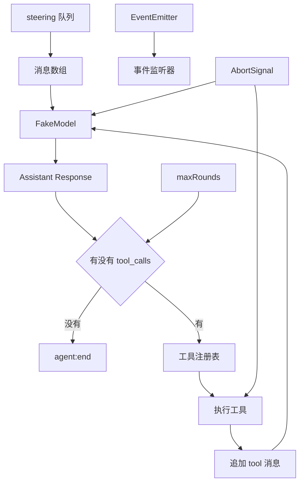
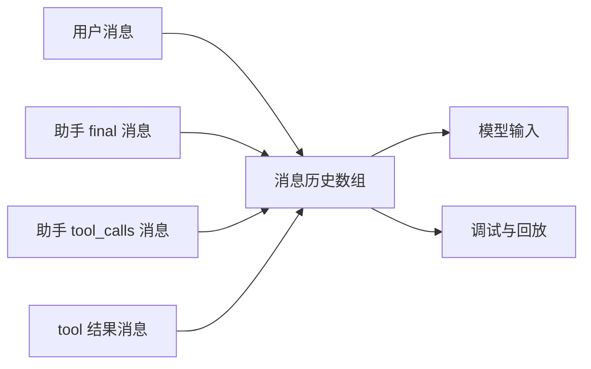
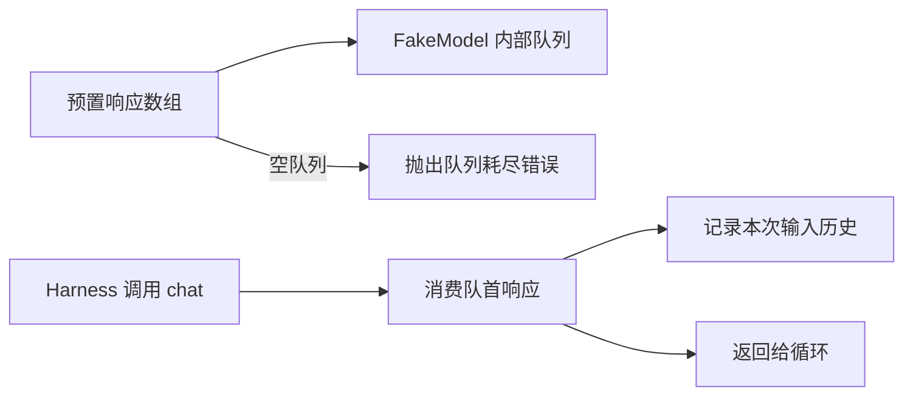
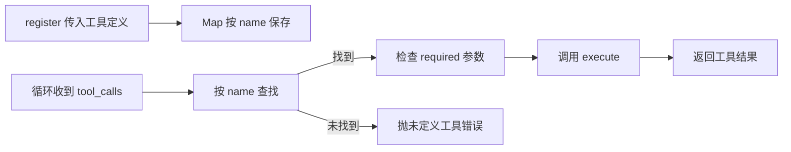
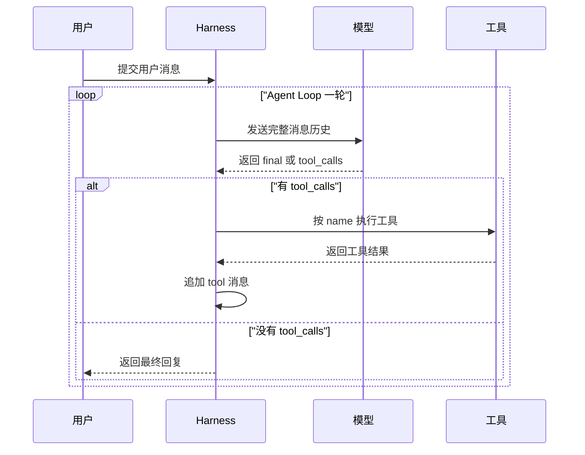
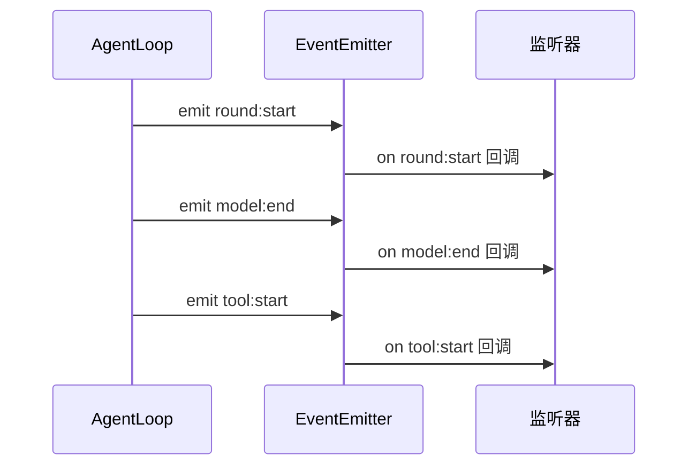
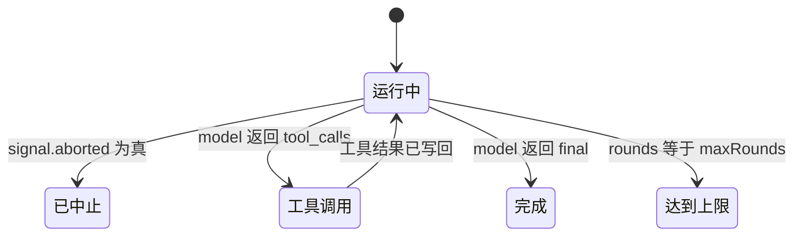
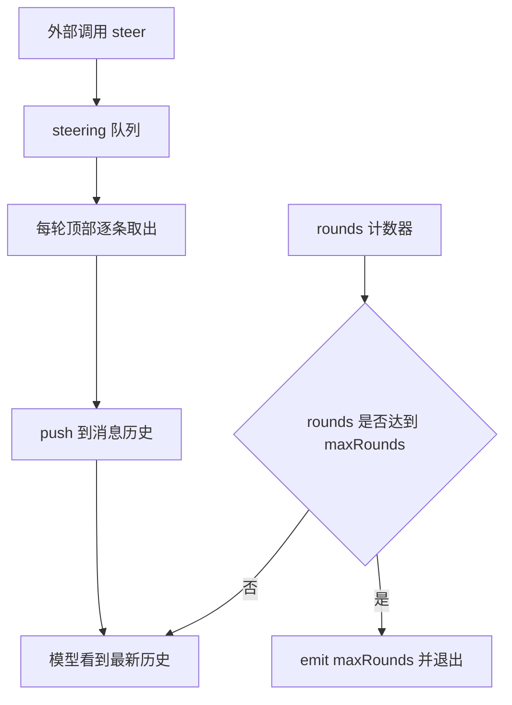
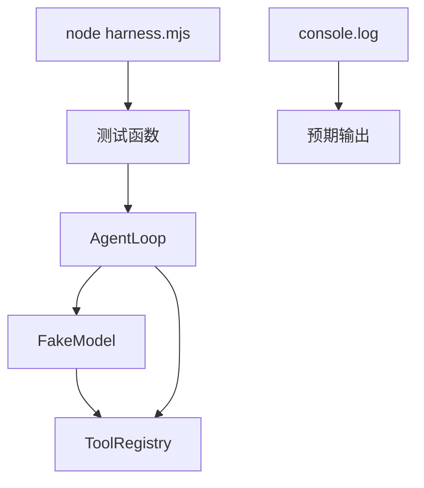

# 手写 Harness：200 行跑通 Agent Loop

!!! abstract "学完这一页你能"
    - 能说清 Agent Loop 的 5 个必要部分，并用顺序图描述一轮循环。
    - 能实现 FakeModel，并用 `node:assert` 测试它的响应队列与请求记录。
    - 能定义工具、注册工具、执行工具，并把工具结果写回消息历史。
    - 能接入 EventEmitter、AbortSignal、steering 队列与最大轮数保护。

## 0. 知识地图



建议按 1 到 4 节搭建主链路，每节都带断言。  
第 5 到 7 节给主链路增加可观察、可取消、可插队与上限保护。  
第 8 节把所有代码拼成一个文件，直接运行看输出。

## 1. 第一步：定义消息与工具的数据形状

**先想一个问题**：用户只说了一句“帮我算 2 加 3”，模型却可能先返回一个工具调用。  
如果消息格式一会儿是字符串、一会儿是对象，循环会立即报错。  
所以第一步不写循环，而是把每一类消息的形状固定下来。

**心智模型**：  
!!! tip "心智模型"
    一句话模型：消息历史是一条数组，数组里每个元素都必须带 `role`，工具调用还要带 `tool_call_id`。  
    日常类比：像快递面单，收件人、寄件人、物品字段必须填对，系统才能分拣。  
    类比不成立的地方：快递面单填错可以靠人猜，程序不会猜，多一个字段或少一个字段会在运行时失败。

!!! note "术语：role"
    `role` 是消息的类型字段，用来标记这条消息是谁发出的。  
    常用值有 `user`、`assistant`、`tool` 三种。  
    例如 `{ role: 'user', content: '你好' }` 表示用户消息。

**图解**：



1. `A`、`C`、`D`、`E` 是四类需要支持的消息。  
2. 它们全部进入 `B` 这条数组，顺序不能乱。  
3. `B` 同时送给模型和调试回放，所以形状必须稳定。  
4. `D` 与 `E` 通过 `tool_call_id` 配对，缺一个就找不到对应结果。

**一步一步来**：  
这一步先定义四类消息，再定义一条工具定义对象。

这一步要做什么：把最终回答、工具调用、工具结果三种助手侧消息写出来。

```js
const userMessage = {
  role: 'user', // 用户消息
  content: '2 加 3 等于几？'
};

const assistantFinal = {
  role: 'assistant', // 模型直接回答
  content: '答案是 5'
};

const assistantToolCall = {
  role: 'assistant', // 模型想调用工具
  content: null,
  tool_calls: [{
    id: 'call_1', // 本次工具调用的唯一编号
    type: 'function',
    function: {
      name: 'add', // 要调用的工具名
      arguments: '{"a":2,"b":3}' // 参数是 JSON 字符串
    }
  }]
};

const toolResult = {
  role: 'tool', // 工具执行结果
  tool_call_id: 'call_1', // 对应上面的 id
  content: '5' // 结果统一序列化成字符串
};
```

**这段代码在做什么**  

- `role` 决定消息由谁产生，循环靠它区分消息类型。  
- `assistantFinal` 没有 `tool_calls`，表示本轮是最终回答。  
- `assistantToolCall.content` 是 `null`，因为模型这轮没有文本回答。  
- `tool_calls[0].function.arguments` 必须是 JSON 字符串，不能直接放对象。  
- `toolResult.tool_call_id` 必须等于 `tool_calls[0].id`，用于回填。  
- `toolResult.content` 也统一成字符串，避免模型收到数字后出现类型不一致。

这一步要做什么：定义一条工具描述，让模型和 Harness 都能读懂。

```js
const addToolDef = {
  name: 'add', // 工具唯一名
  description: '返回两个整数之和', // 给模型看的能力说明
  parameters: { // 参数 JSON Schema
    type: 'object',
    properties: {
      a: { type: 'number' }, // 参数 a 必须是数字
      b: { type: 'number' }  // 参数 b 必须是数字
    },
    required: ['a', 'b'] // 两个参数都不能缺
  },
  execute: async (args) => args.a + args.b // 实际执行函数
};
```

**这段代码在做什么**  

- `name` 是 Harness 查表和模型指定工具时用的键。  
- `description` 是模型决定“现在该不该用这个工具”的依据。  
- `parameters` 描述参数形状，将来可以接入模型厂商的 JSON Schema 校验。  
- `required` 列出必填参数，缺少参数时应该直接失败。  
- `execute` 是真正干活的函数，这里返回两个数字之和。  
- 工具定义同时包含“给模型看的信息”和“给程序跑的代码”。

**动手验证**：把上面的形状放进一个断言脚本，检查关键字段。

```js
import { strict as assert } from 'node:assert';

assert.equal(userMessage.role, 'user');
assert.equal(assistantFinal.role, 'assistant');
assert.equal(assistantToolCall.content, null);
assert.equal(assistantToolCall.tool_calls[0].function.name, 'add');
assert.equal(toolResult.tool_call_id, 'call_1');
assert.equal(typeof addToolDef.parameters.required[0], 'string');
console.log('消息形状测试通过');
```

运行结果：

```text
消息形状测试通过
```

**常见坑**：

| 现象 | 原因 | 怎么修 |
|---|---|---|
| 模型不调用工具 | `description` 没写或写错 | 在 `description` 里写清工具何时使用 |
| JSON.parse 抛错 | `arguments` 里不是合法 JSON | 发送前用 `JSON.stringify` 生成参数 |
| 工具结果没回填 | `tool_call_id` 与 `id` 不一致 | 结果消息逐字复制原 `id` |

**小结**  

- 消息历史是数组，所有消息都需要 `role`。  
- 工具调用参数放在 `function.arguments`，并且是 JSON 字符串。  
- 工具结果必须携带 `tool_call_id`，否则模型不知道结果对应哪次调用。

## 2. 第二步：实现 FakeModel

**先想一个问题**：如果每次测试都连真实模型，测试会慢、会花钱、结果还不稳定。  
我们需要一个行为由测试脚本完全控制的假模型。  
它能按数组顺序返回响应，也能记录每次收到的消息。

**心智模型**：  
!!! tip "心智模型"
    一句话模型：FakeModel 是一个“响应队列”，调用一次就消费一条预置响应。  
    日常类比：像自动售货机，你提前放好一排水，每按一次出一瓶。  
    类比不成立的地方：售货机不记录购买顺序，FakeModel 必须记录每次输入，才能测试循环行为。

!!! note "术语：FakeModel"
    FakeModel 是测试替身，用来替代真实大模型接口。  
    它的 `chat(messages, options)` 方法返回预设响应，并记录收到的 `messages`。  
    例如 `new FakeModel([finalResponse])` 会先返回 `finalResponse`，再调用就报队列耗尽。

**图解**：



1. `A` 在构造时被拷贝进 `B`，这步是“安排剧本”。  
2. `C` 每次进聊天方法，就会从 `B` 取出一条。  
3. `E` 把本次收到的 `messages` 存进 `requests`。  
4. 队列为空时走到 `G`，说明模型帧数不够，测试或示例有缺口。  
5. `F` 返回给主循环，主循环才能继续判断是否需要工具。

**一步一步来**：  
这一步实现 `FakeModel`，再写一个消费测试。

这一步要做什么：创建带 `#queue` 的 `FakeModel`，支持同步 abort 检查。

```js
function abortError() {
  // DOMException 的 AbortError 是 Node 和浏览器共用的取消信号错误
  return new DOMException('The operation was aborted', 'AbortError');
}

function throwIfAborted(signal) {
  if (signal?.aborted) {
    throw abortError(); // 已经取消就直接抛错
  }
}

export class FakeModel {
  #queue; // 私有响应队列
  constructor(responses, { delayMs = 0 } = {}) {
    this.#queue = responses.slice(); // 拷贝，避免外部修改
    this.delayMs = delayMs; // 可选的模拟网络延迟
    this.requests = []; // 记录每次请求的消息历史
    this.calls = []; // 记录每次弹出的响应
  }
  async chat(messages, options = {}) {
    throwIfAborted(options.signal); // 进入前先检查取消信号
    this.requests.push(messages.slice()); // 记录输入
    const next = this.#queue.shift(); // 弹出队首响应
    if (!next) {
      throw new Error('FakeModel 响应队列已耗尽'); // 没有剧本就失败
    }
    this.calls.push(next); // 记录本次返回
    return next;
  }
}
```

**这段代码在做什么**  

- `#queue` 用私有字段保存预设响应，外部无法误改。  
- 构造时用 `slice()` 拷贝响应数组，防止外部后续拖动影响模型。  
- `this.requests` 记录每条输入历史，断言可检查模型是否收到 steering 消息。  
- `this.calls` 记录模型被消费的响应条数，断言可检查循环次数。  
- `throwIfAborted` 在进入时检查信号，已取消就立即抛 `AbortError`。  
- `next` 为空时抛错，能让测试尽早发现“预设响应不够”。

这一步要做什么：给 FakeModel 增加可选延迟，并支持延迟期间被 abort。

```js
  async chat(messages, options = {}) {
    throwIfAborted(options.signal);
    this.requests.push(messages.slice());
    const next = this.#queue.shift();
    if (!next) throw new Error('FakeModel 响应队列已耗尽');
    this.calls.push(next);

    if (this.delayMs > 0) {
      // 在 delayMs 内等待，如果收到 abort 就提前失败
      await new Promise((resolve, reject) => {
        const signal = options.signal;
        const timer = setTimeout(resolve, this.delayMs);
        signal?.addEventListener('abort', () => {
          clearTimeout(timer); // 清除定时器，避免悬挂
          reject(abortError()); // 模拟模型接口取消请求
        }, { once: true });
      });
    }
    throwIfAborted(options.signal); // 延迟结束后再检查一次
    return next;
  }
```

**这段代码在做什么**  

- `delayMs` 为 0 时无等待，保持一般测试速度快。  
- `setTimeout` 模拟真实模型接口的网络耗时。  
- `signal.addEventListener` 监听 abort，一旦取消就清掉定时器。  
- `reject(abortError())` 让 `await` 进入 catch 分支。  
- 等待结束后再 `throwIfAborted`，覆盖“等待完成后刚好取消”的情况。  
- 这个设计用来测试中段取消，不只是一个入口检测。

**动手验证**：测试 FakeModel 的响应顺序与请求记录。

```js
import { strict as assert } from 'node:assert';
import { FakeModel } from './harness.mjs';

const final = { role: 'assistant', content: '答案是 5' };
const model = new FakeModel([final], { delayMs: 0 });

const response = await model.chat([{ role: 'user', content: '计算' }]);
assert.deepStrictEqual(response, final);
assert.equal(model.requests.length, 1);
assert.equal(model.calls.length, 1);
assert.throws(() => model.chat([]), /队列已耗尽/);
console.log('FakeModel 测试通过');
```

运行结果：

```text
FakeModel 测试通过
```

**常见坑**：

| 现象 | 原因 | 怎么修 |
|---|---|---|
| 测试总在某次调用后挂起 | 预设响应条数不够 | 按循环预计轮数放足响应 |
| 外部数组被清空 | 构造时未拷贝 | 构造器里使用 `slice()` |
| 无法测试中止 | 模型不订阅 abort | 在延迟 Promise 里监听 abort 事件 |

**小结**  

- FakeModel 的核心是队列消费与请求记录。  
- 每次 `chat` 都记录 `messages`，后续才能验证 steering 是否注入。  
- 支持 `delayMs` 和 abort 监听，才能测出中段取消路径。

## 3. 第三步：工具注册表与参数校验

**先想一个问题**：模型返回工具名 `add`，程序怎么知道 `add` 对应哪个函数？  
如果直接在 `if (name === 'add')` 里写死，工具一多就没法维护。  
所以需要注册表：按工具名存定义，并能执行参数校验。

**心智模型**：  
!!! tip "心智模型"
    一句话模型：工具注册表是一个 `Map`，名字指向“描述 + 执行函数”。  
    日常类比：像前台电话总机，报名字就转接到对应分机。  
    类比不成立的地方：总机转错可以重拨，注册表转错会抛异常并中止循环。

!!! note "术语：工具注册表"
    工具注册表保存所有可用工具的定义，按 `name` 查找。  
    它还负责执行 `def.execute(args, context)`，并检查必填参数。  
    注册重复工具名必须直接失败，避免后注册的静默覆盖前一个。

**图解**：



1. `A` 在初始化阶段把工具定义放入 `B`。  
2. 循环收到 `tool_calls` 后走 `D`，用 `name` 查表。  
3. `E` 检查 `required` 参数是否存在。  
4. `F` 执行实际函数并返回结果。  
5. 查不到时走 `G`，不让循环继续调用一个不存在的函数。  
6. 校验先行，避免 `execute` 内部出现 `undefined` 相加。

**一步一步来**：  
这一步先实现注册表，再测重复注册与必填参数。

这一步要做什么：实现 `ToolRegistry` 的 `register`、`get`、`call` 三个方法。

```js
export class ToolRegistry {
  #tools = new Map(); // name 到工具定义的映射
  register(def) {
    if (this.#tools.has(def.name)) {
      throw new Error(`工具重复注册: ${def.name}`); // 不允许静默覆盖
    }
    this.#tools.set(def.name, def); // 保存完整定义
  }
  get(name) {
    const def = this.#tools.get(name);
    if (!def) {
      throw new Error(`未定义工具: ${name}`); // 让循环立刻失败
    }
    return def;
  }
  async call(name, args, context) {
    const def = this.get(name); // 先查表
    assertRequiredParams(def, args); // 再校验必填参数
    return await def.execute(args, context); // 最后执行
  }
}
```

**这段代码在做什么**  

- `#tools` 是私有 Map，避免外部直接改动。  
- `register` 遇到重复名称直接抛错，暴露接线错误。  
- `get` 把“未定义工具”这个错误集中到一处。  
- `call` 先查表、再校验、最后执行，顺序固定。  
- `context` 会带 `signal` 和 `messages`，工具可以按需读取。  
- 返回值直接交给上层，由上层决定如何写入消息历史。

这一步要做什么：实现 `assertRequiredParams`，只做最小必填校验。

```js
function assertRequiredParams(def, args) {
  const required = def.parameters.required ?? []; // 未声明就是空数组
  for (const key of required) {
    if (args[key] === undefined) {
      throw new Error(`缺少参数: ${key}`); // 明确报告缺哪个参数
    }
  }
}
```

**这段代码在做什么**  

- `??` 在 `required` 为 `undefined` 时取空数组。  
- 遍历 `required`，只检查 `undefined`，不检查类型。  
- 类型校验通常由模型厂商的 JSON Schema 完成，这里保持最小。  
- 报错信息带参数名，定位问题快。  
- 这个函数的输入来自 `JSON.parse` 后的普通对象。  
- 它不会修改参数，只做检查。

**动手验证**：测试多工具注册与必填参数。

```js
import { strict as assert } from 'node:assert';
import { ToolRegistry } from './harness.mjs';

const registry = new ToolRegistry();
registry.register(addToolDef);
assert.throws(() => registry.register(addToolDef), /重复注册/);

const sum = await registry.call('add', { a: 2, b: 3 }, {});
assert.equal(sum, 5);
await assert.rejects(() => registry.call('add', { a: 2 }, {}), /缺少参数: b/);
console.log('ToolRegistry 测试通过');
```

运行结果：

```text
ToolRegistry 测试通过
```

**常见坑**：

| 现象 | 原因 | 怎么修 |
|---|---|---|
| 工具被同名覆盖 | register 未做去重 | 使用 `has` 检查并抛错 |
| execute 收到 undefined | 调用前未校验 required | 执行前检查每个必填参数 |
| 调用不存在工具 | 查表后未处理未命中 | 在 `get` 中抛未定义错误 |

**小结**  

- 注册表把工具名、描述、参数校验、执行函数绑定在一起。  
- 重复注册要失败，避免测试里的接线错误被隐藏。  
- `call` 的固定顺序是查表、校验、执行。

## 4. 第四步：串联 Agent Loop

**先想一个问题**：现在有 FakeModel、工具定义、工具注册表，但还没有一个循环把它们串起来。  
如果只调用模型一次，模型返回 `tool_calls` 后流程就断了。  
我们需要一个能持续执行“调用模型、执行工具、回填结果、再调用模型”的 Harness。

**心智模型**：  
!!! tip "心智模型"
    一句话模型：Agent Loop 是“模型返回工具调用就执行工具，模型返回 final 就结束”的循环。  
    日常类比：像医生问诊，先问症状，再看检查单，拿着检查结果继续问，直到能下结论。  
    类比不成立的地方：医生会主动筛选信息，模型只看你每一次传回的完整历史，历史漏一条就会断链。

!!! note "术语：Agent Loop"
    Agent Loop 是重复执行模型调用与工具执行的循环。  
    每轮先调用模型，再检查 `response.tool_calls`。  
    有工具调用就执行工具并追加 `tool` 消息；没有就返回 `final`。

**图解**：



1. 用户先把任务交给 Harness。  
2. Harness 把完整消息历史发给模型。  
3. 模型返回一个 assistant 消息。  
4. 如果 `tool_calls` 有内容，则执行工具并把 `tool` 消息追加回历史。  
5. 下一轮模型再次看到完整历史，继续推理。  
6. 没有工具调用时结束循环，返回最终回复。  
7. 不是只循环一次，而是循环到模型不再请求工具。

**一步一步来**：  
这一步实现 `AgentLoop` 主体，并测试工具调用后输出 final 的完整链路。

这一步要做什么：创建 `AgentLoop` 类、私有字段与构造器。

```js
import { EventEmitter } from 'node:events';

export class AgentLoop extends EventEmitter {
  #model;
  #registry;
  #messages;
  #signal;
  #steering;
  #maxRounds;
  #rounds = 0;
  #stopped = false;

  constructor({ model, registry, messages, signal, steering = [], maxRounds = 8 }) {
    super();
    this.#model = model;
    this.#registry = registry;
    this.#messages = messages.slice(); // 独立持有历史
    this.#signal = signal;
    this.#steering = steering.slice();
    this.#maxRounds = maxRounds;
  }
}
```

**这段代码在做什么**  

- `extends EventEmitter` 让循环能发布事件，后面会用到。  
- `#messages` 拷贝初始历史，避免外部数组被循环改动。  
- `#steering` 也拷贝初始队列。  
- `#maxRounds` 默认 8，是循环保护上限。  
- `#stopped` 标记循环是否已经停，停止后不能继续插队。  
- `#rounds` 记录模型调用轮数，从 0 开始。

这一步要做什么：实现 `run()` 的循环顶部与 final 判断。

```js
  async run() {
    while (true) {
      throwIfAborted(this.#signal); // 每轮开始先检查取消
      while (this.#steering.length > 0) {
        this.#messages.push(this.#steering.shift()); // 注入外部插队消息
      }
      const response = await this.#model.chat(this.#messages.slice(), {
        signal: this.#signal
      });
      this.#messages.push(response); // 先把 assistant 消息写回历史
      this.emit('model:end', { response }); // 发布模型响应事件
      const calls = response.tool_calls ?? []; // 没有工具调用就是空数组
      if (calls.length === 0) {
        this.#stopped = true;
        this.emit('agent:end', { finishReason: 'final' });
        return { messages: this.#messages.slice(), finishReason: 'final' };
      }
    }
  }
```

**这段代码在做什么**  

- 每一轮正文开始前查 abort 和 steering，保证优先级。  
- `this.#messages.slice()` 传给模型，避免模型同时修改内部历史。  
- 模型返回后先写回 assistant 消息。  
- `calls.length === 0` 表示本轮是最终回答，结束循环。  
- 最终返回 `messages` 拷贝，调用方拿到完整历史。  
- 当前还没有工具执行循环，下一段补上。

这一步要做什么：在 `run()` 中加入工具调用循环，并在结束时返回工具结果。

```js
      for (const call of calls) {
        this.emit('tool:start', { id: call.id, name: call.function.name });
        const toolMessage = await this.#runTool(call);
        this.#messages.push(toolMessage);
        this.emit('tool:end', { id: call.id, content: toolMessage.content });
      }
    }
  }

  async #runTool(call) {
    const args = JSON.parse(call.function.arguments); // 解析参数
    throwIfAborted(this.#signal);
    const value = await this.#registry.call(call.function.name, args, {
      signal: this.#signal,
      messages: this.#messages.slice()
    });
    return {
      role: 'tool',
      tool_call_id: call.id,
      content: JSON.stringify(value) // 回填结果
    };
  }
}
```

**这段代码在做什么**  

- `for` 依次处理该响应中的全部工具调用。  
- 每次处理前发布 `tool:start`，处理后发布 `tool:end`。  
- `toolMessage` 追加到内部历史，供下一轮模型使用。  
- `JSON.parse` 把模型给的参数字符串转成对象。  
- `#runTool` 调注册表，并把当前信号与历史传给工具。  
- 工具结果统一 `JSON.stringify`，避免非字符串回填。

**动手验证**：预置一个工具调用响应，再预置一个 final 响应。

```js
import { strict as assert } from 'node:assert';
import { AgentLoop } from './harness.mjs';

const model = new FakeModel([
  {
    role: 'assistant', content: null,
    tool_calls: [{
      id: 'call_1', type: 'function',
      function: { name: 'add', arguments: '{"a":2,"b":3}' }
    }]
  },
  { role: 'assistant', content: '结果是 5' }
]);
const registry = new ToolRegistry();
registry.register(addToolDef);

const result = await new AgentLoop({
  model, registry,
  messages: [{ role: 'user', content: '2 加 3 等于几' }]
}).run();

assert.equal(result.finishReason, 'final');
assert.equal(result.messages.at(-1).content, '结果是 5');
assert.equal(result.messages.find(m => m.role === 'tool').content, '5');
console.log('Agent Loop 测试通过');
```

运行结果：

```text
Agent Loop 测试通过
```

**常见坑**：

| 现象 | 原因 | 怎么修 |
|---|---|---|
| tool 消息没出现 | 工具结果补上后未写回历史 | 每次执行完后 `push(toolMessage)` |
| 参数始终是字符串 | 未 `JSON.parse` | 解析 `function.arguments` 后再执行 |
| final 消息被忽略 | 循环未判断 `tool_calls` 为空 | 检查 `calls.length === 0` |

**小结**  

- Agent Loop 的核心是“先判断取消，再注入 steering，再调用模型”。  
- 工具结果必须用 `tool_call_id` 写回历史。  
- final 的条件是 `tool_calls` 为空数组，不是文本为空。

## 5. 事件系统：让循环可观察

**先想一个问题**：主循环跑完只给你一个结果，如果中间卡住了，你不知道卡在第几轮。  
调试时如果能听到 `round:start`、`tool:start` 等事件，就能知道循环走到哪一步。  
所以 AgentLoop 需要成为 EventEmitter，循环过程中对外发事件。

**心智模型**：  
!!! tip "心智模型"
    一句话模型：事件系统把循环内部动作变成可订阅消息流。  
    日常类比：像外卖订单状态推送，商家接单、骑手取餐、送达各发一条通知。  
    类比不成立的地方：外卖通知可以漏看，程序事件如果没人监听，默认也不会自动留档。

!!! note "术语：EventEmitter"
    EventEmitter 是 Node.js 提供的事件发布订阅类。  
    `emit('eventName', payload)` 发布事件，`on('eventName', listener)` 订阅事件。  
    AgentLoop 继承它，才能在主循环里发布 `round:start` 等事件。

**图解**：



1. `AgentLoop` 把一轮动作拆成四个事件：开始、模型返回、工具开始、工具结束。  
2. `EventEmitter` 负责把监听器按事件名分发。  
3. 监听器可以在事件序列里验证循环顺序。  
4. 事件还可以接入日志、指标统计、UI 状态栏。  
5. 如果从 `round:start` 直接跳到 `agent:end`，说明模型本轮直接返回了 final。

**一步一步来**：  
这一步先补发 `round:start`，再写一个事件顺序测试。

这一步要做什么：给主循环补上每轮开始的 `round:start` 事件。

```js
        this.#rounds += 1; // 本轮编号加一
        this.emit('round:start', { round: this.#rounds }); // 最早发出
        const response = await this.#model.chat(this.#messages.slice(), {
          signal: this.#signal
        });
```

**这段代码在做什么**  

- `#rounds` 每轮加一，编号从 1 开始。  
- `round:start` 在模型调用前发布。  
- 它比 `model:end` 早，事件日志能证明这一点。  
- `round` 数字也用于 `maxRounds` 判断和错误报告。  
- 不存在“第 0 轮”，测试断言时更容易读。

这一步要做什么：用监听器收集事件名，并断言完整顺序。

```js
const events = [];
const loop = new AgentLoop({ model, registry, messages: [userMessage] });

for (const name of ['round:start', 'tool:start', 'tool:end', 'agent:end']) {
  loop.on(name, () => events.push(name));
}

const result = await loop.run();
assert.deepEqual(events, [
  'round:start', 'tool:start', 'tool:end',
  'round:start', 'agent:end'
]);
```

**这段代码在做什么**  

- `events` 只存事件名，方便用数组断言顺序。  
- 订阅 4 个关键生命周期事件。  
- 第一轮先 `round:start`，再进入工具执行。  
- 第二轮模型直接 final，所以只有 `round:start` 后直接 `agent:end`。  
- 这个顺序变化能暴露“工具结果未回填”“多调了一轮模型”两类问题。

**动手验证**：直接运行事件顺序脚本。

```js
import { strict as assert } from 'node:assert';

const finalModel = new FakeModel([
  { role: 'assistant', content: '直接完成' }
]);
const eventLoop = new AgentLoop({
  model: finalModel,
  registry: new ToolRegistry(),
  messages: [{ role: 'user', content: '直接回答' }],
  maxRounds: 4
});
const names = [];
eventLoop.on('round:start', () => names.push('round:start'));
eventLoop.on('agent:end', () => names.push('agent:end'));
await eventLoop.run();
assert.deepEqual(names, ['round:start', 'agent:end']);
console.log('事件系统测试通过');
```

运行结果：

```text
事件系统测试通过
```

**常见坑**：

| 现象 | 原因 | 怎么修 |
|---|---|---|
| 事件顺序断言失败 | `round:start` 发在模型调用后 | 把 emit 移到 `chat` 之前 |
| 监听器不触发 | 没有继承 EventEmitter | 类定义使用 `extends EventEmitter` |
| 内存告警 | 添加超过 10 个监听器 | 测试用局部监听或及时 removeListener |

**小结**  

- 主循环生命周期事件顺序固定，可以作为回归断言。  
- `round:start` 必须在模型调用前发布。  
- 事件系统让 Harness 从黑盒变成可观察序列。

## 6. AbortSignal：让循环能被叫停

**先想一个问题**：用户点了“停止”，或者页面关闭了，主循环还在调模型。  
这会造成浪费，甚至继续执行不该执行的工具。  
需要把 `AbortSignal` 从构造函数一路传到模型和工具。

**心智模型**：  
!!! tip "心智模型"
    一句话模型：AbortSignal 是一张“取消传票”，从外部传到每个可取消步骤。  
    日常类比：像火警广播，一拉响所有楼层的人停止手头动作。  
    类比不成立的地方：火警响了仍可能有人听不见，程序里的每个函数必须自己检查或订阅它。

!!! note "术语：AbortSignal"
    AbortSignal 是取消信号对象，由 `AbortController.signal` 创建。  
    它的 `aborted` 属性表示是否已取消，还能触发 `abort` 事件。  
    Node 20 以上和浏览器都有全局 `AbortController` 与 `DOMException`。

**图解**：



1. 初始状态是“运行中”。  
2. 一旦 `signal.aborted` 为真，循环进入“已中止”。  
3. 工具调用完成后回到“运行中”，继续下一轮。  
4. 模型返回 final 时进入“完成”。  
5. 达到轮数上限时进入“达到上限”。  
6. MaxRounds、final、abort 三条退出路径都清楚，循环不会悬空。

**一步一步来**：  
这一步给主循环加 catch，并写一个中断中的模型测试。

这一步要做什么：给 `run()` 套上 `try/catch`，把 `AbortError` 转成返回值。

```js
  async run() {
    try {
      while (true) {
        throwIfAborted(this.#signal);
        // ... 模型调用与工具执行
      }
    } catch (error) {
      if (isAbortError(error)) {
        this.#stopped = true;
        this.emit('agent:abort', { rounds: this.#rounds });
        return { messages: this.#messages.slice(), finishReason: 'aborted' };
      }
      throw error; // 不是取消错误就继续向上抛
    }
  }
```

**这段代码在做什么**  

- 整个循环包在 `try` 中，方便统一处理取消错误。  
- `isAbortError` 只识别 `error.name === 'AbortError'`。  
- 取消后返回当前历史，而不是跑到下一轮。  
- `finishReason` 为 `aborted`，调用方可以识别中止。  
- 非取消错误不吞掉，而是重新抛出。

这一步要做什么：定义 `isAbortError`，并让工具执行也检查信号。

```js
function isAbortError(error) {
  return error?.name === 'AbortError';
}

async function delayAdd(args, context) {
  throwIfAborted(context.signal); // 执行前检查
  return args.a + args.b;
}
```

**这段代码在做什么**  

- `isAbortError` 用可选链安全读取 `name`。  
- `delayAdd` 会把取消信号传入工具。  
- 工具在真正执行前检查信号，能避免“循环已被叫停，工具仍然执行”。  
- 真实工具如果内部有自己的网络请求，也应该传入 signal 并订阅。

**动手验证**：让 FakeModel 在 30ms 后才响应，但在 10ms 时取消。

```js
import { strict as assert } from 'node:assert';
import { AgentLoop, FakeModel } from './harness.mjs';

const ac = new AbortController();
const model = new FakeModel([
  { role: 'assistant', content: '不该返回' }
], { delayMs: 30 });
const loop = new AgentLoop({
  model,
  registry: new ToolRegistry(),
  messages: [{ role: 'user', content: '开始' }],
  signal: ac.signal,
  maxRounds: 4
});
setTimeout(() => ac.abort(), 10); // 10ms 后取消

const result = await loop.run();
assert.equal(result.finishReason, 'aborted');
assert.equal(result.messages.some(m => m.content === '不该返回'), false);
console.log('AbortSignal 测试通过');
```

运行结果：

```text
AbortSignal 测试通过
```

**常见坑**：

| 现象 | 原因 | 怎么修 |
|---|---|---|
| cancel 后仍返回答案 | FakeModel 未订阅 abort 事件 | 在 delay Promise 里监听 abort |
| loop 抛 DOMException | catch 未处理 AbortError | 用 `isAbortError` 分支 |
| 工具仍继续执行 | 工具没有内部检查 | 工具执行前也调用 `throwIfAborted` |

**小结**  

- AbortSignal 需要贯穿模型调用与工具执行。  
- `catch` 中只处理 `AbortError`，其他错误继续抛出。  
- 中止后返回 `finishReason: 'aborted'`，不要把未完成的响应写回历史。

## 7. steering 队列与最大轮数保护

**先想一个问题**：循环已经开始后，用户又说“先出草稿，不要提交”。  
循环内部可能需要一条后期注入的用户消息。另一个问题是，模型每次都要工具算，循环可能停不下来。  
所以需要 steering 队列和 maxRounds 两个保护机制。

**心智模型**：  
!!! tip "心智模型"
    一句话模型：steering 队列是外部插队消息，maxRounds 是循环熔断器。  
    日常类比：像会议中递小纸条，可以中途补充意见；像限时发言器，到点必须停止。  
    类比不成立的地方：会议可以无视小纸条，循环会在下一轮模型调用前无条件注入 steering。

!!! note "术语：steering 队列"
    steering 队列保存主循环运行期间由外部追加的消息。  
    每轮模型调用前，Harness 会先把队列里的消息依次追加到历史。  
    它用于人类或上层系统中途调整任务，不需要等到下一轮完成。

**图解**：



1. 外部调用 `steer` 后，消息进入队列 B。  
2. 每轮模型调用前，先清空 B 并追加到历史。  
3. 模型在 E 处看到注入后的完整历史。  
4. 同时检查 `rounds` 是否达到上限。  
5. 达到上限则发出 `maxRounds` 并退出。  
6. 防止模型无限请求工具，保护 CPU 与接口账单。

**一步一步来**：  
这一步实现 `steer` 方法，再实现 maxRounds 退出逻辑。

这一步要做什么：给 AgentLoop 增加 `steer` 方法。

```js
  steer(message) {
    if (this.#stopped) {
      throw new Error('循环已结束，不能继续注入 steering');
    }
    this.#steering.push(message); // 追加到插队队列
  }
```

**这段代码在做什么**  

- `steer` 在循环结束后不能继续注入。  
- 停止判断根据 `#stopped`，它由 final、abort、maxRounds 三个出口置为 true。  
- `push` 后要等到下一轮顶部才进入历史。  
- 这个时机保证不会在模型已经收到历史之后改历史。  
- 可以多次调用，消息会按调用顺序排队。

这一步要做什么：在每轮顶部把 steering 队列注入历史。

```js
      while (this.#steering.length > 0) {
        this.#messages.push(this.#steering.shift());
      }
```

**这段代码在做什么**  

- 用 `while` 而不是 `if`，确保本轮所有插队消息一次性清空。  
- 每条插队消息都是一条普通消息，必须有 `role` 和 `content`。  
- 注入顺序是 `push` 的顺序。  
- 该逻辑位于 abort 检查之后，避免取消后再注入。  
- 模型下一轮看到的历史会包含这些插队消息。

这一步要做什么：在轮数检查中实现 maxRounds 退出。

```js
        if (this.#rounds >= this.#maxRounds) {
          this.#stopped = true;
          this.emit('maxRounds', { rounds: this.#rounds });
          return {
            messages: this.#messages.slice(),
            finishReason: 'maxRounds'
          };
        }
        this.#rounds += 1;
```

**这段代码在做什么**  

- 检查放在新增一轮之前，保证模型调用次数不超过 maxRounds。  
- 达到上限不再调用模型，直接返回。  
- `finishReason` 为 `maxRounds`，让调用方知道是保护退出。  
- `#stopped` 不再允许后续 steering。  
- 默认值 8，但每次测试都应显式传 maxRounds，避免意外循环。

**动手验证**：分别测试 steering 消息注入与 maxRounds 退出。

```js
import { strict as assert } from 'node:assert';

const steeringModel = new FakeModel([
  { role: 'assistant', content: '草稿完成' }
]);
const steeringLoop = new AgentLoop({
  model: steeringModel,
  registry: new ToolRegistry(),
  messages: [{ role: 'user', content: '写回复' }],
  maxRounds: 4
});
steeringLoop.steer({ role: 'user', content: '先输出草稿' });
await steeringLoop.run();
assert.equal(steeringModel.requests[0].length, 2);
assert.equal(steeringModel.requests[0][1].content, '先输出草稿');
console.log('steering 注入测试通过');
```

```js
const maxRegistry = new ToolRegistry();
maxRegistry.register(addToolDef);
const maxModel = new FakeModel([
  { role: 'assistant', content: null, tool_calls: [
    { id: 'c1', type: 'function', function: { name: 'add', arguments: '{"a":1,"b":1}' } }
  ]},
  { role: 'assistant', content: null, tool_calls: [
    { id: 'c2', type: 'function', function: { name: 'add', arguments: '{"a":2,"b":2}' } }
  ]}
]);
const maxLoop = new AgentLoop({
  model: maxModel,
  registry: maxRegistry,
  messages: [{ role: 'user', content: '重复加' }],
  maxRounds: 2
});
const result = await maxLoop.run();
assert.equal(result.finishReason, 'maxRounds');
assert.equal(maxModel.calls.length, 2);
console.log('maxRounds 测试通过');
```

运行结果：

```text
steering 注入测试通过
maxRounds 测试通过
```

**常见坑**：

| 现象 | 原因 | 怎么修 |
|---|---|---|
| steer 后模型没看到 | 未在每轮顶部清空队列 | 用 `while` 逐条从 `shift` 出 |
| maxRounds 多跑一轮 | 判断放在 `rounds += 1` 之后 | 检查放在模型调用前 |
| 保护退出后还能 steer | 退出分支没置 `#stopped` | 在所有终态置 `#stopped = true` |

**小结**  

- steering 在每一轮模型调用前统一清空。  
- maxRounds 判断必须放在新增轮数之前。  
- 两个机制都修改退出状态，防止循环结束后继续改变历史。

## 8. 完整脚本与预期输出

**先想一个问题**：前面每一节都有片段，但读者需要一个能直接跑起来的总文件。  
把 FakeModel、ToolRegistry、AgentLoop 和全部测试合成一个文件。  
运行一次就能看到 5 组测试是否通过。

**心智模型**：  
!!! tip "心智模型"
    一句话模型：完整 Harness 是一个 200 行左右的单文件，依赖只有 Node 内置模块。  
    日常类比：像一顿饭的食材清单，所有片段按顺序下锅，最后端出一盘测试套件。  
    类比不成立的地方：食材可以凭感觉下锅，代码必须按依赖顺序排序。

!!! note "术语：单文件测试 Harness"
    单文件测试 Harness 把实现和测试放在同一文件里。  
    它用 `node:assert` 做断言，用 `console.log` 输出固定顺序的结果。  
    运行方式是 Node 20 环境执行 `node harness.mjs`，无第三方包。

**图解**：



1. `A` 是假的模型接口。  
2. `B` 是工具注册表。  
3. `C` 依赖 `A` 和 `B`，组成 Agent Loop。  
4. `D` 调用 `C` 验证循环行为。  
5. `G` 是实际运行命令。  
6. `E` 输出固定测试结果，方便和预期对比。

**一步一步来**：  
以下 10 段代码按顺序拼成一个文件 `harness.mjs`。

这一步要做什么：导入依赖，写出 abort 工具。

```js
import { EventEmitter } from 'node:events';
import { strict as assert } from 'node:assert';

function abortError() {
  return new DOMException('The operation was aborted', 'AbortError');
}

function throwIfAborted(signal) {
  if (signal?.aborted) throw abortError();
}

function isAbortError(error) {
  return error?.name === 'AbortError';
}
```

**这段代码在做什么**  

- `EventEmitter` 是 AgentLoop 的父类。  
- `assert` 带类型比较，适合做结构断言。  
- `abortError` 统一创建 `AbortError`。  
- `throwIfAborted` 是入口检查，`isAbortError` 是 catch 分支使用。

这一步要做什么：实现带延迟和 abort 监听的 FakeModel。

```js
class FakeModel {
  #queue;
  constructor(responses, { delayMs = 0 } = {}) {
    this.#queue = responses.slice();
    this.delayMs = delayMs;
    this.requests = [];
    this.calls = [];
  }
  async chat(messages, options = {}) {
    throwIfAborted(options.signal);
    this.requests.push(messages.slice());
    const next = this.#queue.shift();
    if (!next) throw new Error('FakeModel 响应队列已耗尽');
    this.calls.push(next);
    if (this.delayMs > 0) {
      await new Promise((resolve, reject) => {
        const signal = options.signal;
        const timer = setTimeout(resolve, this.delayMs);
        signal?.addEventListener('abort', () => {
          clearTimeout(timer);
          reject(abortError());
        }, { once: true });
      });
    }
    throwIfAborted(options.signal);
    return next;
  }
}
```

**这段代码在做什么**  

- `requests` 与 `calls` 留下了测试观测点。  
- `delayMs` 为 0 时不等待。  
- 延迟 Promise 在 abort 时清理定时器并抛错。  
- 返回前再做一次信号检查，覆盖边缘时序。  
- 响应队列从头消费，保留“模型开始前检查 cancel”的顺序。

这一步要做什么：实现工具注册表和参数校验。

```js
function assertRequiredParams(def, args) {
  const required = def.parameters.required ?? [];
  for (const key of required) {
    if (args[key] === undefined) {
      throw new Error(`缺少参数: ${key}`);
    }
  }
}

class ToolRegistry {
  #tools = new Map();
  register(def) {
    if (this.#tools.has(def.name)) {
      throw new Error(`工具重复注册: ${def.name}`);
    }
    this.#tools.set(def.name, def);
  }
  async call(name, args, context) {
    const def = this.#tools.get(name);
    if (!def) throw new Error(`未定义工具: ${name}`);
    assertRequiredParams(def, args);
    return await def.execute(args, context);
  }
}
```

**这段代码在做什么**  

- 重复注册会抛错，不会覆盖。  
- `call` 负责查表、校验、执行。  
- `context` 直接交给工具执行函数。  
- 必填参数检查只查 `undefined`，保持最小实现。

这一步要做什么：实现 AgentLoop 的类骨架与构造器。

```js
class AgentLoop extends EventEmitter {
  #model; #registry; #messages; #signal; #steering; #maxRounds;
  #rounds = 0; #stopped = false;

  constructor({ model, registry, messages, signal, steering = [], maxRounds = 8 }) {
    super();
    this.#model = model;
    this.#registry = registry;
    this.#messages = messages.slice();
    this.#signal = signal;
    this.#steering = steering.slice();
    this.#maxRounds = maxRounds;
  }
  steer(message) {
    if (this.#stopped) throw new Error('循环已结束，不能继续注入 steering');
    this.#steering.push(message);
  }
```

**这段代码在做什么**  

- 构造器拷贝外部数组，防止内部修改。  
- `steering` 队列可提前传入也可后续通过 `steer` 追加。  
- `maxRounds` 默认 8，但测试代码显式传值。  
- `#stopped` 由三个终态出口管理。

这一步要做什么：实现 run 的顶部、循环退出与错误处理。

```js
  async run() {
    try {
      while (true) {
        throwIfAborted(this.#signal);
        while (this.#steering.length > 0) {
          this.#messages.push(this.#steering.shift());
        }
        if (this.#rounds >= this.#maxRounds) {
          this.#stopped = true;
          this.emit('maxRounds', { rounds: this.#rounds });
          return { messages: this.#messages.slice(), finishReason: 'maxRounds' };
        }
        this.#rounds += 1;
        this.emit('round:start', { round: this.#rounds });
        const response = await this.#model.chat(this.#messages.slice(), {
          signal: this.#signal
        });
        this.#messages.push(response);
        this.emit('model:end', { response });
        const calls = response.tool_calls ?? [];
        if (calls.length === 0) {
          this.#stopped = true;
          this.emit('agent:end', { finishReason: 'final' });
          return { messages: this.#messages.slice(), finishReason: 'final' };
        }
        for (const call of calls) {
          this.emit('tool:start', { id: call.id, name: call.function.name });
          const toolMessage = await this.#runTool(call);
          this.#messages.push(toolMessage);
          this.emit('tool:end', {
            id: call.id,
            name: call.function.name,
            content: toolMessage.content
          });
        }
      }
    } catch (error) {
      if (isAbortError(error)) {
        this.#stopped = true;
        this.emit('agent:abort', { rounds: this.#rounds });
        return { messages: this.#messages.slice(), finishReason: 'aborted' };
      }
      throw error;
    }
  }
```

**这段代码在做什么**  

- 循环内四个步骤顺序固定：检查取消、注入 steering、检查上限、调用模型。  
- 工具循环处理完整 `calls` 数组。  
- final、abort、maxRounds 三个返回值都带 `messages` 和 `finishReason`。  
- abort 错误被转成正常返回值，其他错误继续抛。

这一步要做什么：实现 `#runTool`，解析参数并回填 tool 消息。

```js
  async #runTool(call) {
    let args;
    try {
      args = JSON.parse(call.function.arguments);
    } catch {
      throw new Error(`工具参数不是合法 JSON: ${call.function.arguments}`);
    }
    throwIfAborted(this.#signal);
    const value = await this.#registry.call(call.function.name, args, {
      signal: this.#signal,
      messages: this.#messages.slice()
    });
    return { role: 'tool', tool_call_id: call.id, content: JSON.stringify(value) };
  }
}
```

**这段代码在做什么**  

- 解析参数失败时报告原始字符串。  
- 工具执行前再查一次取消信号。  
- 工具上下文包含 `signal` 和 `messages`。  
- 返回值是标准 tool 消息，三字段齐全。

这一步要做什么：定义 add 工具与工具调用构造器。

```js
const addToolDef = {
  name: 'add',
  description: '返回两个整数之和',
  parameters: {
    type: 'object',
    properties: {
      a: { type: 'number' },
      b: { type: 'number' }
    },
    required: ['a', 'b']
  },
  async execute(args, context) {
    throwIfAborted(context.signal);
    return args.a + args.b;
  }
};

function makeToolCall(id, name, args) {
  return {
    id,
    type: 'function',
    function: { name, arguments: JSON.stringify(args) }
  };
}
```

**这段代码在做什么**  

- `addToolDef` 同时包含模型信息和执行逻辑。  
- `makeToolCall` 避免测试代码重复写 `JSON.stringify`。  
- `execute` 执行前检查信号，测取消时能覆盖工具路径。  
- 该工具定义在测试脚本里复用。

这一步要做什么：测试 FakeModel、loop 与事件顺序。

```js
async function testFakeModel() {
  const model = new FakeModel([{ role: 'assistant', content: 'ok' }]);
  const response = await model.chat([{ role: 'user', content: 'hi' }]);
  assert.deepStrictEqual(response, { role: 'assistant', content: 'ok' });
  assert.equal(model.requests.length, 1);
  console.log('1 FakeModel 通过');
}

async function testLoopWithToolAndEvents() {
  const model = new FakeModel([
    { role: 'assistant', content: null, tool_calls: [
      makeToolCall('call_1', 'add', { a: 2, b: 3 })
    ]},
    { role: 'assistant', content: '结果是 5' }
  ]);
  const registry = new ToolRegistry();
  registry.register(addToolDef);
  const loop = new AgentLoop({
    model,
    registry,
    messages: [{ role: 'user', content: '2 加 3 等于几' }],
    maxRounds: 4
  });
  const events = [];
  for (const name of ['round:start', 'model:end', 'tool:start', 'tool:end', 'agent:end']) {
    loop.on(name, () => events.push(name));
  }
  const result = await loop.run();
  assert.equal(result.finishReason, 'final');
  assert.equal(result.messages.at(-1).content, '结果是 5');
  assert.equal(result.messages.find(m => m.role === 'tool').content, '5');
  assert.deepEqual(events, [
    'round:start', 'model:end', 'tool:start', 'tool:end',
    'round:start', 'model:end', 'agent:end'
  ]);
  console.log('2 Loop 与事件 通过');
}
```

**这段代码在做什么**  

- `testFakeModel` 验证假模型按队列返回。  
- `testLoopWithToolAndEvents` 验证完整工具链路。  
- 事件顺序断言覆盖了工具回填和 final 结束。  
- 所有测试函数末尾输出固定中文日志。

这一步要做什么：测试 abort、steering 与 maxRounds。

```js
async function testAbort() {
  const ac = new AbortController();
  const model = new FakeModel([
    { role: 'assistant', content: '不应返回' }
  ], { delayMs: 30 });
  const loop = new AgentLoop({
    model,
    registry: new ToolRegistry(),
    messages: [{ role: 'user', content: '开始' }],
    signal: ac.signal,
    maxRounds: 4
  });
  setTimeout(() => ac.abort(), 10);
  const result = await loop.run();
  assert.equal(result.finishReason, 'aborted');
  assert.equal(result.messages.some(m => m.content === '不应返回'), false);
  console.log('3 AbortSignal 通过');
}

async function testSteering() {
  const model = new FakeModel([{ role: 'assistant', content: '草稿完成' }]);
  const loop = new AgentLoop({
    model,
    registry: new ToolRegistry(),
    messages: [{ role: 'user', content: '写回复' }],
    maxRounds: 4
  });
  loop.steer({ role: 'user', content: '先输出草稿' });
  await loop.run();
  assert.equal(model.requests[0].length, 2);
  assert.equal(model.requests[0][1].content, '先输出草稿');
  console.log('4 steering 通过');
}
```

**这段代码在做什么**  

- `testAbort` 测试 30ms 延迟中在 10ms 取消。  
- 循环应返回 `aborted`，模型最终响应未进入历史。  
- `testSteering` 验证插队消息在模型请求历史中出现。  
- `requests[0]` 是第一次模型调用收到的消息数组。

这一步要做什么：实现 maxRounds 测试并运行全部测试。

```js
async function testMaxRounds() {
  const registry = new ToolRegistry();
  registry.register(addToolDef);
  const model = new FakeModel([
    { role: 'assistant', content: null, tool_calls: [
      makeToolCall('c1', 'add', { a: 1, b: 1 })
    ]},
    { role: 'assistant', content: null, tool_calls: [
      makeToolCall('c2', 'add', { a: 2, b: 2 })
    ]}
  ]);
  const loop = new AgentLoop({
    model,
    registry,
    messages: [{ role: 'user', content: '重复加' }],
    maxRounds: 2
  });
  const result = await loop.run();
  assert.equal(result.finishReason, 'maxRounds');
  assert.equal(model.calls.length, 2);
  console.log('5 maxRounds 通过');
}

await testFakeModel();
await testLoopWithToolAndEvents();
await testAbort();
await testSteering();
await testMaxRounds();
console.log('全部测试通过');
```

**这段代码在做什么**  

- maxRounds 测试用两个工具调用响应，让循环刚跑满 2 轮。  
- 第 3 轮开始前应退出，不再调用模型。  
- 五个测试函数顺序执行，方便对比输出。  
- 最后一行 `全部测试通过` 是总入口结束标记。

**动手验证**：把这个文件保存为 `harness.mjs`，运行：

```bash
node harness.mjs
```

预期输出：

```text
1 FakeModel 通过
2 Loop 与事件 通过
3 AbortSignal 通过
4 steering 通过
5 maxRounds 通过
全部测试通过
```

依赖：无。运行时版本：Node.js 20 或更高。

**常见坑**：

| 现象 | 原因 | 怎么修 |
|---|---|---|
| `node` 命令不存在 | 当前环境未安装 Node.js | 安装 Node.js 20 以上版本 |
| 私有字段报语法错误 | Node 版本过低 | 升级 Node.js |
| abort 测试偶发通过 | 延迟时间太短 | 把 delayMs 设为 30，把 abort 设置成 10 |

**小结**  

- 完整脚本无第三方依赖，Node 内置模块即可跑。  
- 全部测试覆盖响应形状、工具循环、事件、取消、插队、上限。  
- 输出顺序固定，可用作回归测试。

## 综合对比

| 维度 | 单次调用 | 本页最小 Harness | 生产级 Agent 框架 |
|---|---|---|---|
| 模型调用方式 | 一次完成 | 循环到 final | 循环到 final 且带规划 |
| 工具调用 | 不支持 | `tool_calls` 数组顺序执行 | 并行或串行可配置 |
| 消息历史 | 调用方手动维护 | 内部自动维护 | 内部自动维护并做压缩 |
| 错误处理 | 直接抛 | 支持 AbortError 分支 | 支持 retry、backoff、错误分类 |
| 取消能力 | 无 | 传入 AbortSignal | 可取消单步、单轮、整任务 |
| 外部干涉 | 无 | steering 队列 | 支持 interrupt、stop、review |
| 安全退出 | 无 | maxRounds | 支持 token、时间、轮数、预算多层保护 |
| 可观察性 | 仅看返回值 | 生命周期事件 | 事件、trace、日志、指标 |
| 依赖 | 无 | 无 | 通常需模型 SDK 与中间件 |
| 适用场景 | 原型验证 | 教学、单测、最小复现 | 多工具、多步骤、多用户生产任务 |

这张表的判断依据是本页实现：模型循环到 final、工具串行执行、退出条件 3 个。  
生产框架会在这些条件上增加并行、重试、持久化与流式返回。

## 应用与行业实践

### 应用场景地图

| 场景 | 用到本页哪个知识点 | 典型技术选型 | 注意事项 |
| --- | --- | --- | --- |
| 后台管理的万行表格：运营按任意列组合筛选并看汇总 | 工具注册表与参数校验、工具结果写回消息历史 | Node + SQLite/ClickHouse、前端表格组件 | 列名走白名单校验，查询结果必须截断行数 |
| 客服工单自动分诊：读工单正文，改标签、查订单 | Agent Loop 五段、最大轮数保护 | Node + 工单系统 REST 接口 | 写操作要二次确认，轮数上限调到 3 到 4 |
| CI 失败日志归因：拉日志、检索、给结论 | AbortSignal、事件系统 | Node + 日志检索服务 | 超时要连子进程一起杀，事件必须落盘 |
| 编辑器内的代码重构助手：读文件、改文件、跑测试 | 消息历史回填、最大轮数保护 | Node + 临时 git worktree | 写入限制在沙箱目录，测试通过才结束 |
| 多人协作白板的“帮我排布局”：移动图元 | FakeModel 离线测试、参数校验 | Node + WebSocket 广播 | 同一图元并发移动要带版本号 |
| 低端安卓机首屏加载排查：读埋点、给优化项 | 消息数组、steering 队列 | Node + 埋点平台查询接口 | 查询走聚合，别把原始明细拉进上下文 |
| 财务对账差异定位：按科目查流水、跑对账脚本 | 工具注册表、maxTurns | Node + 数据库只读账号 | 只读权限、字段脱敏、调用留审计日志 |
| 团队内部知识问答：全文检索、读文档 | 事件系统、AbortSignal | Node + 检索服务 | 检索为空时要停止循环，不让模型硬编 |

### 三个场景拆解

#### 场景 1：后台管理的万行表格

**业务背景**：运营在后台筛订单，字段有二三十个，条件组合随活动变化。表格行数从几千到几十万，固定筛选器覆盖不全，改一次筛选器要发一次版。

**怎么用本页知识解决**：把“查表”拆成筛选查询和聚合两个工具，模型只负责挑工具、填参数。循环把工具结果写回消息历史，用户改口径时往 steering 队列塞新指令，不重启循环。

```js
// 1. 工具注册表：参数校验只放白名单列，挡住越权列名与超大 limit
const tools = {
  query_orders: {
    validate: (a) => COLUMNS.includes(a.column) && a.limit <= 200,
    run: (a) => db.query(a),          // 返回已截断的行
  },
  aggregate_orders: { validate: (a) => a.groupBy in GROUPABLE, run: (a) => db.agg(a) },
};

// 2. 循环拿到注册表，maxTurns 压到 6，防止模型反复换条件试
const loop = createLoop({ model, tools, maxTurns: 6 });

// 3. 用户补一句口径，用 steering 队列插入，不打断当前轮
loop.steer('只看已支付订单');

// 4. 前端订阅事件，把每步工具调用画成时间线，便于解释结果
loop.on('tool:end', (e) => renderStep(e.name, e.ms));
```

- `validate` 是唯一入口，模型给出的列名、运算符都要过一遍，别把字符串拼进 SQL。
- `maxTurns` 设 6，覆盖“选工具、看结果、补条件、再汇总”的常见路径，超出就返回中间结果。
- steering 让用户在中途改口径，比让用户重开一次对话省一轮完整调用。
- `tool:end` 事件带工具名和耗时，前端能解释“这张表是怎么筛出来的”。

**怎么度量收益**：用 `performance.now()` 在工具调用前后打点，用 prom-client 的 Histogram 暴露 `agent_loop_turns` 与 `tool_call_duration_ms`。用 `node --test` 跑 FakeModel 的响应队列，断言加入新条件后轮数不增长。

**什么时候不该用**：用户只按固定三个按钮筛选时，直接写 SQL 加索引，一次查询就返回。表格要求点击后 100 毫秒内出结果时，多轮模型调用会拉长等待。

#### 场景 2：CI 失败日志归因

**业务背景**：流水线失败后，开发要翻几千行日志找第一条报错。单次日志从几百 KB 到几十 MB，排查一次要几分钟。

**怎么用本页知识解决**：一次归因请求建一个 AbortController，超时和人工取消都走同一个 signal。工具内部把 signal 传给子进程，事件同步落到日志，循环退出后清定时器。

```js
// 1. 请求级取消：超时和用户点“取消”共用同一个 signal
const ac = new AbortController();
const timer = setTimeout(() => ac.abort(), 20_000);

const loop = createLoop({
  model, tools, signal: ac.signal, maxTurns: 5,
  onEvent: (e) => logger.info({ evt: e.type, turn: e.turn }), // 每步留痕
});

// 2. 工具内部必须接收 signal，否则 grep 子进程会留在后台
tools.grep_log = {
  run: ({ pattern }, { signal }) => runGrep(pattern, { signal }),
};

// 3. 循环结束统一清定时器，避免进程挂住不退
try { await loop.run(task); } finally { clearTimeout(timer); }
```

- signal 要从循环传到工具，再传到 `fetch` 与子进程，断在中间就杀不掉进程。
- `maxTurns` 设 5，覆盖“搜报错、看上下文、再搜”的路径，避免翻遍整份日志。
- `onEvent` 把每步写进日志，失败后能回放模型当时拿了哪几段日志。
- 取消后返回已完成的部分结论，比抛一个空错误好排查。

**怎么度量收益**：用 `node --test` 加一条取消路径用例，断言子进程触发 `exit` 事件。用 prom-client 记录 `aagent_loop_turns`、`tool_call_duration_ms` 的 p95，以及超时后残留子进程数。

**什么时候不该用**：日志只有几十行时，直接在终端 grep，不需要模型参与。需要确定性复现的构建问题，模型给出的结论不稳定，会干扰定位。

#### 场景 3：编辑器内的代码重构助手

**业务背景**：改一个跨几十个文件的接口签名，人工改一轮要半小时以上，还容易漏掉调用点。文件数量随项目增长，漏改一处就编译不过。

**怎么用本页知识解决**：只暴露读文件、写文件、跑测试三个工具，写入限制在临时 worktree。结束条件不看模型自述，看测试结果。发现方向偏了就往 steering 队列塞纠偏指令。

```js
// 1. 工具集刻意收窄，写入只落在临时工作区
const tools = { read_file, write_file, run_tests };

// 2. 结束条件由工具结果决定，不信模型说“改完了”
const loop = createLoop({
  model, tools, maxTurns: 12,
  stopWhen: (msgs) => msgs.at(-1)?.toolResult?.testsPassed === true,
});

// 3. 人工发现改错方向，插一条指令纠偏，不重启整个循环
loop.steer('不要动 public 导出，只改内部调用点');
```

- 三个工具覆盖“看、改、验”，工具越少，模型选错的路径越少。
- `stopWhen` 读的是 `run_tests` 的返回，把“改完了”的判断交给测试命令。
- `maxTurns` 设 12，够跑“改一批、跑测试、看失败、再改”的几轮。
- steering 用来纠偏，省掉一次从零开始的完整调用。

**怎么度量收益**：用 `node --test` 跑每个验收用例，记录 `agent_loop_turns`、`tool_call_duration_ms` 与测试命令总执行次数。对比同一任务的多次运行，看轮数波动范围。

**什么时候不该用**：只改一个文件的一行时，直接改并跑一次测试。接口定义还没定下来时，模型会反复重写，白跑轮数。

### 行业先进实践

工具用 JSON Schema 声明（出处：OpenAI 官方文档 Function calling）：把工具名、说明、参数结构作为请求参数传给模型，模型返回结构化参数，调用方再校验一遍。有效的原因是模型侧和校验侧共用同一份结构定义，参数写错会在校验环节暴露。借鉴做法是把 schema 只写一份，注册表和校验函数都从它生成。

工具结果作为独立消息回填（出处：Anthropic 官方文档 Tool use）：调用请求与结果分成两条消息，通过调用标识配对。有效的原因是模型能分清“我要调用什么”和“调用返回了什么”，多轮里不会把结果错位到别的调用上。借鉴做法是消息数组里保留调用标识，写回时按标识匹配。

工具由独立进程提供清单与调用（出处：Model Context Protocol 规范）：服务端暴露“列出工具”和“调用工具”两个动作，客户端按清单构造请求。有效的原因是工具实现与循环解耦，工具可以换进程、换语言。借鉴做法是把本地注册表抽成同样的两个动作，先跑通进程内版本。

生成接口接受取消信号（出处：Vercel AI SDK 文档）：请求参数里可以传 abortSignal，取消后停止后续步骤。有效的原因是取消能在生成中途生效，不用等整轮跑完。借鉴做法是把 signal 从循环一路传到工具内部的 `fetch` 与子进程。

循环轮数设上限并在超限时抛错（出处：开源项目 LangGraph 文档的 recursion limit）：执行器记录步数，超过上限就中断并抛出错误。有效的原因是模型偶尔会重复同一个调用，无上限会让请求一直跑。借鉴做法是把上限放进配置，并在事件里带上当前轮数，便于定位。

### 从学到用：落地路线

第 1 步：在一个只读场景试点，比如内部知识问答，工具只有检索和读文档。验收标准：`node --test` 覆盖响应队列、参数校验、最大轮数三条用例，全部通过。

第 2 步：在试点场景接上事件与取消，跑一周真实请求，记录 `agent_loop_turns` 与 `tool_call_duration_ms`。验收标准：能按 trace 回放任意一次请求的每步工具调用与耗时。

第 3 步：把注册表、事件、取消三部分抽成内部包，推到第二个场景复用。验收标准：第二个场景不改循环代码，只写工具与 schema 就能跑通。

第 4 步：把轮数上限、工具超时、写入沙箱写成配置校验，进 CI。验收标准：有人把 `maxTurns` 改成无限或去掉 signal 透传时，CI 用例失败。

### 动手作业

目标：做一个“库里查数据并给结论”的小助手，工具只有“列出表结构”“执行只读查询”“聚合统计”三个，循环支持取消与事件订阅。

步骤：

1. 定义消息数组与三个工具的参数形状，写出 `validate` 函数。
2. 实现 FakeModel，按固定顺序返回“列结构、查询、聚合”三轮响应。
3. 用 `node --test` 与 `node:assert` 断言响应队列与请求记录。
4. 串起循环，接上 `maxTurns` 与 steering 队列，跑通一条完整路径。
5. 用 `node:events` 发事件，把每步工具名与耗时打到控制台。
6. 接上 AbortController，写一条 200 毫秒后取消的用例。
7. 换成只读数据库账号，用真实数据跑一遍，对比人工查询步骤。

验收标准：

- 三个工具的参数校验都有正例与反例用例，反例返回明确错误信息。
- 取消用例断言循环在取消后 100 毫秒内退出，且不再发起新调用。
- 轮数上限用例断言第 `maxTurns + 1` 次不会调用模型。
- 事件序列包含每轮的开始、工具调用结束、循环结束三类事件。
- 真实数据跑通后，能从事件日志复述出模型选工具的依据。

## 深入阅读与参考

!!! tip "怎么用这些资料"
    先读「官方文档与规范」建立准确的概念，再读「源码与示例」核对细节，最后用「教程、书籍与视频」换一种讲法加深理解。每条都写明了读哪一节、带着什么问题读。

### 官方文档与规范

| 资源 | 为什么读 | 怎么读 |
|---|---|---|
| [Using the Fetch API](https://developer.mozilla.org/en-US/docs/Web/API/Fetch_API/Using_Fetch) | 覆盖请求体、headers 与响应体读取的完整流程，是接入真实模型的基准。 | 读 Request/Response body 小节，照着实现 harness 的请求构造与流式解析。 |
| [MDN Streams API](https://developer.mozilla.org/en-US/docs/Web/API/Streams_API) | 流式增量正靠 ReadableStream 逐块读取，是本章核心依赖。 | 读 ReadableStream 与 reader 一节，把 FakeModel 的假流换成真实分块读取。 |
| [MDN Fetch API](https://developer.mozilla.org/en-US/docs/Web/API/Fetch_API) | AbortController 与错误状态处理是接真实模型绕不开的部分。 | 读 AbortController 与响应状态检查小节，给 harness 补超时取消和错误分支。 |
| [Fetch 标准（含 CORS）](https://fetch.spec.whatwg.org/) | 浏览器直连模型端点时的跨域与预检规则，均在规范中定义。 | 读 CORS 协议一节，对照 MDN 预检流程，理解请求为何被拦。 |
| [Generics](https://www.typescriptlang.org/docs/handbook/2/generics.html) | 给 fetch 封装写带约束的泛型签名，可减少返回值上的 as any。 | 读泛型约束一节，为 harness 的 callModel 补上类型参数与约束。 |

### 源码与示例

| 资源 | 为什么读 | 怎么读 |
|---|---|---|
| [ky](https://github.com/sindresorhus/ky) | 成熟 fetch 封装如何处理重试、钩子与响应解析，值得对照。 | 读 source/core/Ky.ts 的请求构造与响应处理，对比 harness 的取舍。 |
| [curlconverter](https://curlconverter.com/) | 把厂商文档里的 curl 直接转成 fetch，省去手写请求参数。 | 粘贴模型 API 的 curl 示例，转成 fetch 后替换 harness 的 FakeModel。 |

### 教程、书籍与视频

| 资源 | 为什么读 | 怎么读 |
|---|---|---|
| [阮一峰：Fetch API 教程](https://www.ruanyifeng.com/blog/2020/12/fetch-tutorial.html) | 中文入门，快速补齐 fetch 请求与响应的基本写法。 | 读请求配置与响应解析两节，照做一遍再写真实模型调用。 |
| [现代 JavaScript 教程：网络请求](https://zh.javascript.info/network) | 系统讲解 Fetch、跨域与错误处理，适合按章补齐基础。 | 顺序读 Fetch 与 CORS 章节并完成任务，再回来写真实调用分支。 |
| [Kent：不要 Mock fetch](https://kentcdodds.com/blog/stop-mocking-fetch) | 反思 mock 网络层的代价，对应 FakeModel 这一设计取舍。 | 读结论与示例，问自己该注入模型还是拦 fetch，据此调整测试策略。 |

## 自测题

??? question "1. Agent Loop 的退出条件有哪几个？"
    - final 退出：模型返回的 `tool_calls` 长度为 0。  
    - abort 退出：外部 AbortSignal 变为 aborted。  
    - maxRounds 退出：模型调用轮数达到上限。  
    - 三种退出都应带 `finishReason` 与当前消息历史。

??? question "2. FakeModel 为什么要把 responses 拷贝一份？"
    - 外部传入的数组可能被后续代码修改。  
    - 拷贝后内部队列独立，测试可重复运行。  
    - 响应队列用 `shift()` 消费，拷贝也避免残留。  
    - 这是测试替身隔离外部状态的基本做法。

??? question "3. tool 结果消息为什么必须带 tool_call_id？"
    - 模型可能同时发起多个工具调用。  
    - 每个结果必须对应到具体 call。  
    - 没有 `tool_call_id`，模型无法判断结果属于哪个工具。  
    - 该字段要与 `tool_calls` 元素里的 `id` 一致。

??? question "4. AbortSignal 从外部传到哪几个位置？"
    - 构造 AgentLoop 时传入一次。  
    - 每轮开始和工具执行前调用 `throwIfAborted`。  
    - 透传给 `model.chat`。  
    - 透传给 `registry.call` 的 context，让工具自己检查或订阅。

??? question "5. steering 队列和直接改消息历史有什么不同？"
    - steering 在每轮模型调用前集中注入，不打断正在进行的调用。  
    - 队列保持后进后出。  
    - 循环结束后不能再 steer，避免错乱。  
    - 直接改历史可能被覆盖，或让并发调用看到不稳定状态。

??? question "6. 为什么 maxRounds 检查要放在 `rounds += 1` 之前？"
    - 若先加一，达到上限后仍可能已经发起一次模型调用。  
    - 放在之前能保证模型调用次数不超过 maxRounds。  
    - 也可给 `maxRounds` 传 2，工具调用两轮后在第 3 轮开始前退出。  
    - 这保护接口费用与 CPU，不被模型无限工具调用拖垮。

??? question "7. 一段文本说明了本页 Harness 的可观察性？"
    - 继承 EventEmitter。  
    - 在 `round:start`、`model:end`、`tool:start` 等位置发事件。  
    - 测试中收集事件名，用数组断言顺序。  
    - 可用于日志、进度条、调试，不必只盯着最终返回值。

??? question "8. 本页自测题如何迁移到真实模型？"
    - 保留 FakeModel 跑单测。  
    - 编写实现相同 `chat` 方法的 RealModel。  
    - RealModel 负责与厂商 SDK 交互、拼接 messages、返回统一 assistant 形状。  
    - 主循环、工具注册表、事件、取消等部分不需要变。

## 延伸阅读

- Node.js 官方文档：Events 章节  
- Node.js 官方文档：Globals 章节中 AbortController 与 DOMException 说明  
- MDN 官方文档：AbortSignal 与 DOMException 的可用属性  
- MDN 官方文档：使用 JSON 字符串与对象转换的示例章节  

如需核对模拟真实模型接口的版本号，需查阅你所用模型 SDK 的官方文档，再确认其 `messages` 消息格式是否与本页完全一致。
