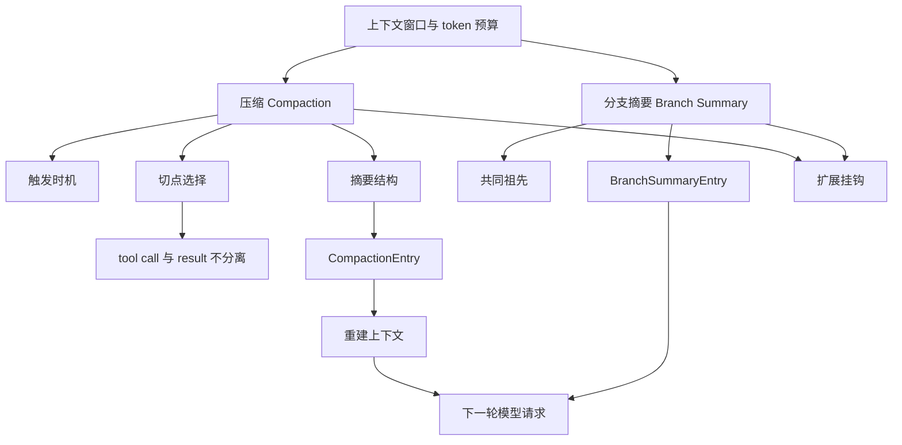
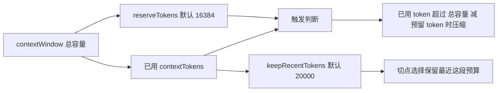
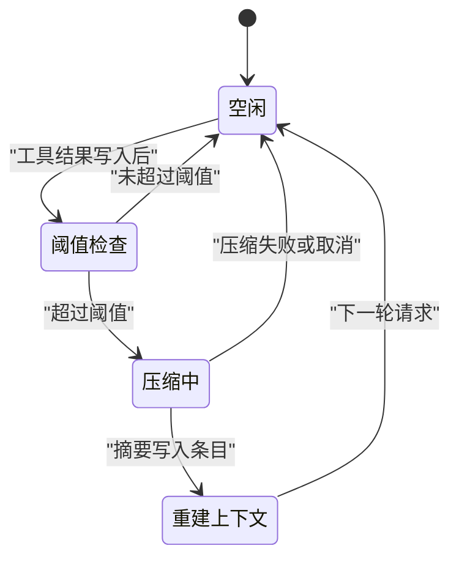
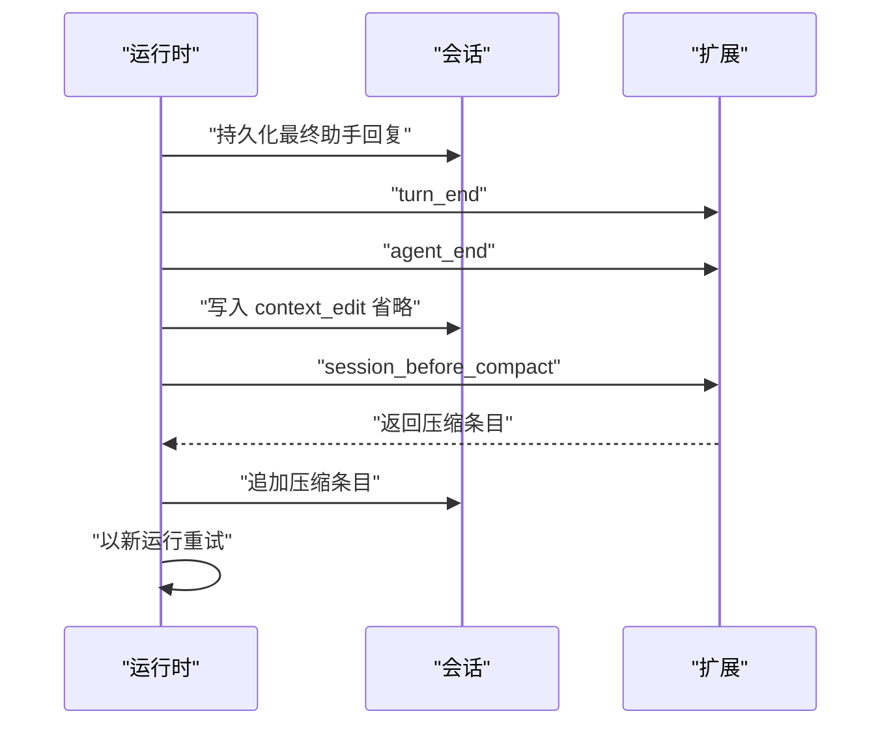
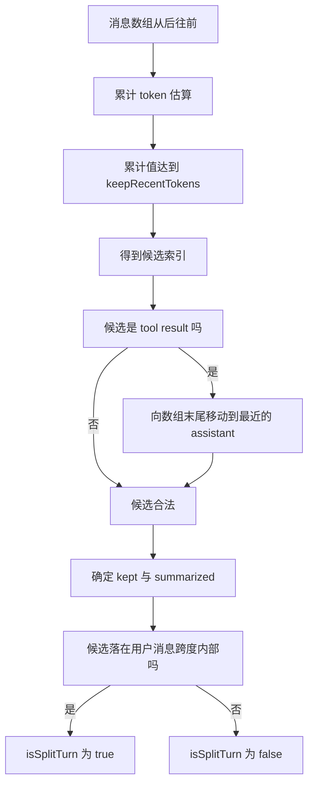
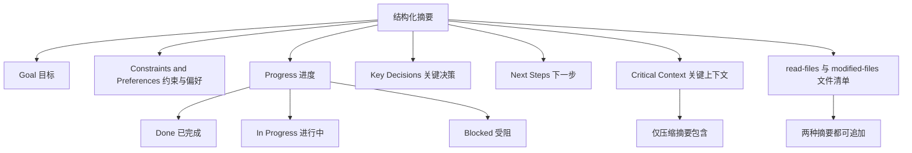
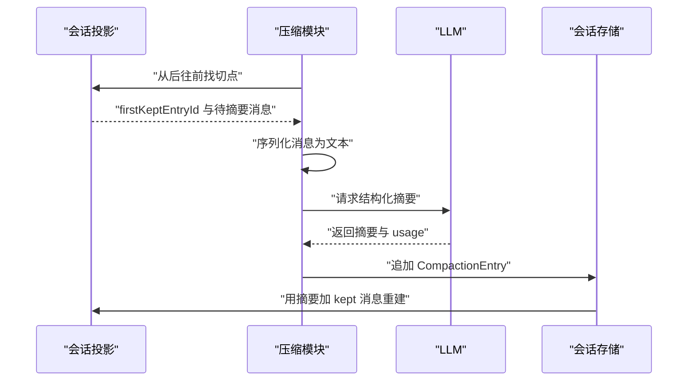
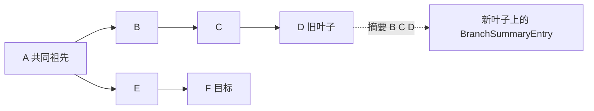
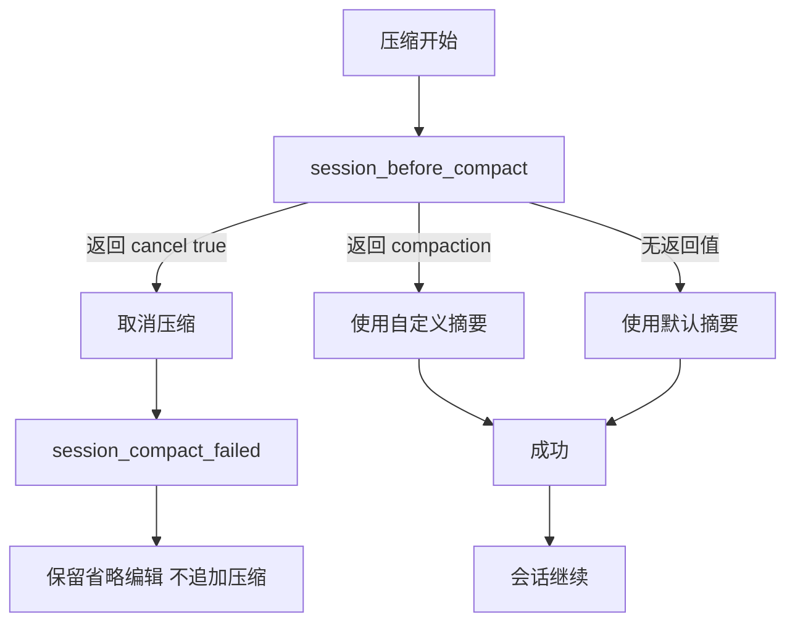

# 上下文工程：窗口有限时怎么办

!!! abstract "学完这一页你能"

    1. 用 token 预算解释为什么要压缩，并说出触发压缩的公式与两个默认值。
    2. 手写一个 token 估算器，对给定文本和消息数组给出可断言的估算结果。
    3. 实现切点选择器，保证 tool call 与 tool result 落在同一侧。
    4. 按结构化摘要格式组装压缩条目，并重建下一轮请求的上下文。

## 0. 知识地图



建议按顺序读。先读第 1 到第 3 节，把预算、触发、切点这三块连起来，你就有了压缩的主干。第 4 到第 6 节分别讲摘要内容、条目结构与分支摘要。第 7 节讲怎么用扩展替换默认实现，等你需要自定义时再读。综合对比与自测题放在最后，用来检查自己是否真的会写。

## 1. 为什么要压缩：窗口是一个预算

**先想一个问题**：你让助手连续读了 10 个文件，每条 read 结果约 3000 字符。下一轮提问还没发出去，接口就报窗口超限。窗口不会自己变大，你只能减少要发出去的内容。

!!! note "术语：token"

    token 是模型处理文本的最小单位。一个英文单词常被切成 1 到 2 个 token，一个汉字常占 1 个 token。例：字符串 hello 在常见切分下是 1 个 token，而你好是 2 个 token。

!!! note "术语：上下文窗口"

    上下文窗口（context window）是一次请求里模型能接收的 token 总量上限。例：某模型窗口为 128000 token，那么系统提示、历史消息、工具定义加起来不能超过它。

!!! tip "心智模型"

    - 一句话模型：上下文窗口是一个固定容量的预算，压缩就是把旧支出换成一张收据。
    - 日常类比：记账本写满了，你把上个月的流水抄成一句"上月餐饮支出 2000 元"。
    - 类比不成立处：收据丢掉了原文，模型无法再回原文找答案；记账不要求可追溯，压缩必须保证关键约束还在。

**图解**



1. 总容量 contextWindow 是分母，它由你选的模型决定。
2. 已用 contextTokens 是分子，它包含系统提示、消息、工具结果。
3. reserveTokens 默认 16384，预留给模型写回复，不参与压缩决策以外的用途。
4. 当已用 token 超过总容量减预留 token，压缩被触发。
5. keepRecentTokens 默认 20000，决定压缩后保留多少最近消息。

**一步一步来**

**第 1 步：估算单段文本的 token**

这一步要做的是把任意字符串变成一个数字，方便后面累加。先写一个近似函数，中文按 1 字 1 token，其余字符按 4 字符 1 token。

```js
// 教学用近似估算器：中文按 1 字 1 token，其余按 4 字符 1 token
function estimateTextTokens(text) {
  const cjk = (text.match(/[\u4e00-\u9fff]/g) || []).length; // 统计汉字个数
  const rest = text.length - cjk;                            // 剩余字符数
  return cjk + Math.ceil(rest / 4);                          // 向上取整，避免低估
}

console.log(estimateTextTokens("你好"));    // 2
console.log(estimateTextTokens("hello"));   // 2
console.log(estimateTextTokens("你好abc")); // 3
```

**这段代码在做什么**

- 正则 `[\u4e00-\u9fff]` 匹配常用汉字区间，匹配结果长度就是汉字数。
- 总长度减去汉字数得到非汉字字符数。
- 非汉字部分除以 4 再向上取整，得到一个保守估计。
- 结果是整数，可以直接相加做预算。

运行结果：

```text
2
2
3
```

**第 2 步：估算一条消息与整个会话**

这一步要做的是把消息里的正文、工具调用参数都算进去，并补一个固定开销。

```js
// 单条消息估算：正文 + 工具调用参数 + 固定开销
function estimateMessageTokens(msg) {
  const parts = [msg.text ?? ""];                            // 正文可能为空
  for (const call of msg.toolCalls ?? []) {                  // 遍历该消息发起的工具调用
    parts.push(call.name + JSON.stringify(call.args ?? {})); // 名字与参数都要计入
  }
  return estimateTextTokens(parts.join("\n")) + 4;           // 4 为角色等固定开销的教学近似
}

// 整个会话估算：逐条相加
function estimateMessagesTokens(messages) {
  return messages.reduce((sum, m) => sum + estimateMessageTokens(m), 0);
}
```

**这段代码在做什么**

- `msg.toolCalls` 可能不存在，用 `?? []` 兜底。
- 工具调用参数用 JSON 序列化后计入，避免漏掉大参数。
- 每条消息加固定开销 4，覆盖角色字段。
- pi 真正的估算实现属于内部细节，需核对官方文档：具体要核对 token 估算函数与它对工具定义的计入方式。

**动手验证**

依赖：仅 Node 20+ 内置模块。保存为 `budget.mjs` 后运行 `node budget.mjs`。

```js
import assert from "node:assert/strict";

function estimateTextTokens(text) {
  const cjk = (text.match(/[\u4e00-\u9fff]/g) || []).length;
  return cjk + Math.ceil((text.length - cjk) / 4);
}

function estimateMessageTokens(msg) {
  const parts = [msg.text ?? ""];
  for (const call of msg.toolCalls ?? []) {
    parts.push(call.name + JSON.stringify(call.args ?? {}));
  }
  return estimateTextTokens(parts.join("\n")) + 4;
}

// 触发判断：默认 reserveTokens 为 16384
function shouldCompact({ contextTokens, contextWindow, reserveTokens = 16384 }) {
  return contextTokens > contextWindow - reserveTokens;
}

assert.equal(estimateTextTokens("你好"), 2);
assert.equal(estimateTextTokens("hello"), 2);
assert.equal(estimateTextTokens("你好abc"), 3);
assert.equal(shouldCompact({ contextTokens: 100000, contextWindow: 128000 }), false);
assert.equal(shouldCompact({ contextTokens: 120000, contextWindow: 128000 }), true);
assert.equal(128000 - 16384, 111616);

console.log("你好 ->", estimateTextTokens("你好"));
console.log("hello ->", estimateTextTokens("hello"));
console.log("你好abc ->", estimateTextTokens("你好abc"));
console.log("触发阈值 ->", 128000 - 16384);
console.log("100000 触发? ->", shouldCompact({ contextTokens: 100000, contextWindow: 128000 }));
console.log("120000 触发? ->", shouldCompact({ contextTokens: 120000, contextWindow: 128000 }));
```

预期输出：

```text
你好 -> 2
hello -> 2
你好abc -> 3
触发阈值 -> 111616
100000 触发? -> false
120000 触发? -> true
```

**常见坑**

| 现象 | 原因 | 怎么修 |
|---|---|---|
| 估算值比真实用量小 | 字符除以 4 对中文偏小 | 中文按 1 字 1 token 计，或核对官方文档里的估算实现 |
| 压缩后仍报窗口超限 | 只算了消息，没算系统提示与工具定义 | 把系统提示与工具 schema 一起计入 contextTokens |
| 改小 reserveTokens 后回复被截断 | 预留空间不足 | 按模型最大输出 token 调大 reserveTokens |

**小结**

1. 窗口是固定预算，压缩是唯一能立刻释放空间的手段。
2. 触发条件是固定的减法比较，两个默认值分别是 16384 与 20000。
3. 估算器不需要和真实分词器完全一致，但必须保守且可复现。

## 2. 触发时机：三条检查路径与恢复

**先想一个问题**：助手刚跑完一批工具，结果都写进了会话。你希望压缩发生在请求发出去之前，而不是等接口报错。那检查点应该放在哪里？

!!! note "术语：溢出恢复"

    溢出恢复（overflow recovery）是提供方报窗口溢出或模型提前返回长度停止时，压缩一次并重试一次的过程。例：接口返回上下文超限错误，pi 压缩后发起一次新运行。

!!! tip "心智模型"

    - 一句话模型：触发检查像出门前查油量，上高速前查一次，进服务区再查一次，抛锚了还有一次拖车。
    - 日常类比：自驾出行，出发前看油表，路过大站再看一次，真没油了叫一次救援。
    - 类比不成立处：拖车可以叫多次，pi 的溢出恢复只给一次压缩加重试。

**图解**





1. 模型先写完最后一条助手回复，这一步不能被压缩打断。
2. 运行结束边界先通知 turn_end，再通知 agent_end。
3. 溢出或长度恢复时，先把要丢弃的那次尝试标记为省略。
4. 省略写入之后才触发 session_before_compact。
5. 扩展返回压缩内容，会话追加压缩条目。
6. 重试被当作一次全新运行，队列顺序不变。

**一步一步来**

**第 1 步：写出触发判断与三种原因**

这一步要做的是把"是否压缩"和"为什么压缩"分开。原因有三类：手动、超阈值、溢出。

```js
// 阈值判断：超过总容量减预留 token 就返回 threshold
function thresholdReason({ contextTokens, contextWindow, reserveTokens = 16384 }) {
  return contextTokens > contextWindow - reserveTokens ? "threshold" : null;
}

// 溢出判断：提供方报窗口溢出，或模型提前返回长度停止
function overflowReason({ overflowError, earlyLengthStop }) {
  if (overflowError) return "overflow";     // 需要一次压缩加重试
  if (earlyLengthStop) return "overflow";   // 同样走一次恢复
  return null;
}

console.log(thresholdReason({ contextTokens: 200000, contextWindow: 200000 }));
console.log(overflowReason({ overflowError: true }));
```

**这段代码在做什么**

- 阈值判断只做一次减法比较，返回字符串或 null。
- 溢出判断覆盖两种来源：提供方错误与提前的长度停止。
- `reserveTokens` 默认 16384，与官方文档一致。
- 手动压缩的原因是 `manual`，由 `/compact` 命令产生。

运行结果：

```text
threshold
overflow
```

**第 2 步：把三种检查点写进一次运行的顺序**

这一步要做的是说清检查点出现的位置：工具批次结束后、新用户提示之前、运行结束后的恢复。

```js
// 一次运行的检查点顺序（教学抽象）
function checkPointsAfterToolBatch({ terminatedRun, queuedMessage }) {
  const points = [];
  if (!(terminatedRun && !queuedMessage)) {
    points.push("工具结果追加后");   // 多轮运行中的常规检查
  }
  points.push("新用户提示前");       // 用户发新消息时再查一次
  points.push("运行结束后的最终恢复"); // 最后一次兜底
  return points;
}

console.log(checkPointsAfterToolBatch({ terminatedRun: false, queuedMessage: false }));
console.log(checkPointsAfterToolBatch({ terminatedRun: true, queuedMessage: false }));
```

**这段代码在做什么**

- 常规检查发生在工具批次结束、结果追加之后。
- 如果这批工具就是本次运行的终点，且没有排队消息，这轮检查被跳过。
- 新用户提示前还会再查一次。
- 运行结束后还有一次最终恢复尝试。

运行结果：

```text
[ '工具结果追加后', '新用户提示前', '运行结束后的最终恢复' ]
[ '新用户提示前', '运行结束后的最终恢复' ]
```

**动手验证**

依赖：仅 Node 20+ 内置模块。保存为 `trigger.mjs`。

```js
import assert from "node:assert/strict";

function thresholdReason({ contextTokens, contextWindow, reserveTokens = 16384 }) {
  return contextTokens > contextWindow - reserveTokens ? "threshold" : null;
}

function overflowReason({ overflowError, earlyLengthStop }) {
  if (overflowError) return "overflow";
  if (earlyLengthStop) return "overflow";
  return null;
}

assert.equal(thresholdReason({ contextTokens: 111617, contextWindow: 128000 }), "threshold");
assert.equal(thresholdReason({ contextTokens: 111616, contextWindow: 128000 }), null);
assert.equal(overflowReason({ overflowError: true }), "overflow");
assert.equal(overflowReason({ earlyLengthStop: true }), "overflow");
assert.equal(overflowReason({}), null);

// 恢复顺序：压缩发生在 turn_end 与 agent_end 之后
const RECOVERY_ORDER = ["persist", "turn_end", "agent_end", "context_edit", "session_before_compact", "retry"];
const idx = (name) => RECOVERY_ORDER.indexOf(name);
assert.ok(idx("turn_end") < idx("agent_end"));
assert.ok(idx("agent_end") < idx("context_edit"));
assert.ok(idx("context_edit") < idx("session_before_compact"));
assert.ok(idx("session_before_compact") < idx("retry"));

// 溢出恢复只允许一次压缩加重试
let recoveryAttempts = 0;
function requestRecovery() {
  if (recoveryAttempts >= 1) return false;
  recoveryAttempts += 1;
  return true;
}
assert.equal(requestRecovery(), true);
assert.equal(requestRecovery(), false);

console.log("阈值判断通过");
console.log("恢复顺序通过");
console.log("单次恢复上限通过");
```

预期输出：

```text
阈值判断通过
恢复顺序通过
单次恢复上限通过
```

**常见坑**

| 现象 | 原因 | 怎么修 |
|---|---|---|
| 压缩切断了一次工具批次 | 在工具执行中途检查 | 等工具批次结束、结果追加后再检查 |
| 用户刚发消息就压缩 | 检查点落在旧内容上 | 在新用户提示前检查，切点不选刚追加的消息 |
| 恢复压缩失败后卡死 | 期待系统一直重试 | 恢复失败就保留省略编辑，不排内部重试 |

**小结**

1. 常规检查在工具结果追加后，用户提示前还会再查一次。
2. 溢出与长度停止各选择一次压缩加重试，不是无限重试。
3. 正确顺序是：先通知结束，再写省略，再压缩，最后重试。

## 3. 切点选择：tool call 与 result 不能分家

**先想一个问题**：窗口里有一条 assistant 消息发起了 read，下一条是它的结果。压缩如果把这两条分到两边，模型会看到一条没有来源的工具结果。

!!! note "术语：切点"

    切点（cut point）是把消息数组分成两半的下标：切点之前的进入摘要，切点及之后的按原文保留。例：7 条消息切在索引 3，则 0 到 2 被摘要，3 到 6 保留。

!!! note "术语：用户消息跨度"

    用户消息跨度（user-message span）从一条用户消息开始，包含后续所有回合，直到下一条用户消息。例：用户说改代码，然后三轮工具调用，这四段属于同一个跨度。

!!! tip "心智模型"

    - 一句话模型：tool call 与 tool result 像挂号单和病历，必须钉在一起。
    - 日常类比：装订文件时不能把封面钉到另一本册子上。
    - 类比不成立处：封面可以补印，工具结果无法在没有调用的情况下被模型理解，只能整段保留或整段摘要。

**图解**



1. 从最后一条消息开始往前遍历。
2. 每访问一条消息，就把它的估算 token 累加进计数器。
3. 累加值达到 keepRecentTokens 时停止，记下当前下标作为候选。
4. 候选如果落在 tool result 上，向数组末尾移动，直到遇到合法的 assistant 或 user。
5. 合法的 kept 区间从切点开始，summarized 区间是切点之前。
6. 如果切点不在用户消息上，说明切点落在某个用户消息跨度内部，标记为 split。

**一步一步来**

**第 1 步：给消息估算 token**

这一步要做的是让切点选择器能比较大小。复用第 1 节的估算方式即可。

```js
// 教学用估算：中文 1 字 1 token，其余 4 字符 1 token
function estimateTextTokens(text) {
  const cjk = (text.match(/[\u4e00-\u9fff]/g) || []).length;
  return cjk + Math.ceil((text.length - cjk) / 4);
}

// 消息级估算：正文加工具调用参数，再加固定开销
function estimateMessageTokens(msg) {
  const parts = [msg.text ?? ""];
  for (const call of msg.toolCalls ?? []) {
    parts.push(call.name + JSON.stringify(call.args ?? {}));
  }
  return estimateTextTokens(parts.join("\n")) + 4;
}
```

**这段代码在做什么**

- 估算函数与第 1 节一致，保证前后数字可比。
- 工具调用参数计入，避免 assistant 消息被当成空消息。
- 固定开销 4 覆盖角色字段。
- 估算器只用于选择切点，不影响模型真正收到的内容。

**第 2 步：从后往前累加，得到候选切点**

这一步要做的是实现累加循环。达到 keepRecentTokens 就停，候选下标随之确定。

```js
// 合法切点类型：用户、助手、bash 执行、自定义消息、分支摘要
const CUT_TYPES = new Set(["user", "assistant", "bash", "custom_message", "branch_summary"]);

function findCutPoint(messages, keepRecentTokens) {
  let acc = 0;
  let cut = messages.length;                          // 默认全部保留
  for (let i = messages.length - 1; i >= 0; i--) {
    if (acc >= keepRecentTokens) break;               // 预算够了就停
    acc += estimateMessageTokens(messages[i]);        // 累加当前消息
    cut = i;                                          // 候选切点前移
  }
  while (cut < messages.length && !CUT_TYPES.has(messages[cut].type)) cut++; // 向末尾找合法切点
  if (cut === messages.length && messages.length) {   // 越界就回退到最近的非工具结果
    cut = messages.length - 1;
    while (cut > 0 && messages[cut].type === "tool_result") cut--;
  }
  return cut;
}
```

**这段代码在做什么**

- 从最后一条开始倒序访问，累加估算 token。
- 累加值达到预算后跳出循环，此时 cut 是最近的候选。
- 候选落在 tool result 上不合法，向数组末尾推进到最近的可切类型。
- tool result 与它的 tool call 因此留在同一侧。
- 若推进到数组末尾，则回退到最近的非 tool result 消息。
- pi 还有关于省略后缀与替换编辑的额外规则，需核对官方文档：具体要核对 Preparation 推进保留边界的条件。

**第 3 步：判定是不是 split 用户消息跨度**

这一步要做的是判断切点是否落在用户消息跨度内部，这会影响摘要怎么生成。

```js
// 找到包含切点的用户消息起点
function findSpanStart(messages, cut) {
  for (let i = cut - 1; i >= 0; i--) {
    if (messages[i].type === "user") return i; // 最近的用户消息
  }
  return 0;
}

function planCompaction(messages, keepRecentTokens) {
  const cut = findCutPoint(messages, keepRecentTokens);
  const startsAtUser = cut < messages.length && messages[cut].type === "user";
  const spanStart = findSpanStart(messages, cut);
  const isSplitTurn = !startsAtUser && spanStart < cut;
  return { cut, spanStart, isSplitTurn };
}
```

**这段代码在做什么**

- 如果切点正好是用户消息，切点就是用户消息边界，不算 split。
- 否则往前找包含切点的用户消息起点。
- 起点小于切点时，说明切点落在跨度内部，标记 isSplitTurn 为 true。
- split 情况下，跨度前缀与更早的历史会分别生成摘要再合并。
- 两个摘要的合并细节属于实现行为，需核对官方文档：具体要核对 split 时两个摘要的合并格式。

**动手验证**

依赖：仅 Node 20+ 内置模块。保存为 `cut-point.mjs`。

```js
import assert from "node:assert/strict";

function estimateTextTokens(text) {
  const cjk = (text.match(/[\u4e00-\u9fff]/g) || []).length;
  return cjk + Math.ceil((text.length - cjk) / 4);
}

function estimateMessageTokens(msg) {
  const parts = [msg.text ?? ""];
  for (const call of msg.toolCalls ?? []) {
    parts.push(call.name + JSON.stringify(call.args ?? {}));
  }
  return estimateTextTokens(parts.join("\n")) + 4;
}

const CUT_TYPES = new Set(["user", "assistant", "bash", "custom_message", "branch_summary"]);

function findCutPoint(messages, keepRecentTokens) {
  let acc = 0;
  let cut = messages.length;
  for (let i = messages.length - 1; i >= 0; i--) {
    if (acc >= keepRecentTokens) break;
    acc += estimateMessageTokens(messages[i]);
    cut = i;
  }
  while (cut < messages.length && !CUT_TYPES.has(messages[cut].type)) cut++;
  if (cut === messages.length && messages.length) {
    cut = messages.length - 1;
    while (cut > 0 && messages[cut].type === "tool_result") cut--;
  }
  return cut;
}

// 检查工具调用与结果是否在同一侧
function pairingIntact(messages, cut) {
  const callIndex = new Map();
  messages.forEach((m, i) => (m.toolCalls ?? []).forEach((c) => callIndex.set(c.id, i)));
  return messages.every(
    (m, i) => m.type !== "tool_result" || i < cut || callIndex.get(m.toolCallId) >= cut,
  );
}

const messages = [
  { id: 0, type: "user", text: "读一下 a.ts" },
  { id: 1, type: "assistant", text: "", toolCalls: [{ id: "c1", name: "read", args: { path: "a.ts" } }] },
  { id: 2, type: "tool_result", toolCallId: "c1", text: "x".repeat(400) },
  { id: 3, type: "assistant", text: "a.ts 里导出了 foo" },
  { id: 4, type: "user", text: "改成 bar" },
  { id: 5, type: "assistant", text: "", toolCalls: [{ id: "c2", name: "edit", args: { path: "a.ts" } }] },
  { id: 6, type: "tool_result", toolCallId: "c2", text: "ok" },
];

const cut = findCutPoint(messages, 60);
assert.equal(cut, 3);
assert.equal(messages[cut].type, "assistant");
assert.equal(pairingIntact(messages, cut), true);
assert.equal(pairingIntact(messages, 2), false); // 故意切在 tool result 上会失败

function findSpanStart(all, c) {
  for (let i = c - 1; i >= 0; i--) if (all[i].type === "user") return i;
  return 0;
}
const startsAtUser = messages[cut].type === "user";
const spanStart = findSpanStart(messages, cut);
const isSplitTurn = !startsAtUser && spanStart < cut;
assert.equal(isSplitTurn, true);

console.log("cut =", cut);
console.log("切点类型 =", messages[cut].type);
console.log("isSplitTurn =", isSplitTurn);
console.log("配对检查通过");
```

预期输出：

```text
cut = 3
切点类型 = assistant
isSplitTurn = true
配对检查通过
```

**常见坑**

| 现象 | 原因 | 怎么修 |
|---|---|---|
| 结果与调用被分到两侧 | 切点落在 tool result 上 | 向数组末尾移动到最近的 assistant 或 user |
| bash 输出被从中间切断 | 把 bash 输出拆成了多条消息 | bash 输出整体作为一条 BashExecution 消息，切点只落在消息边界 |
| 单个用户跨度超预算仍按用户边界切 | 保留量远超 keepRecentTokens | 允许切点落在跨度内的 assistant 上，标记 isSplitTurn |

**小结**

1. 合法切点是 user、assistant、bash、custom_message、branch_summary。
2. tool result 永远不能单独成为切点，它必须和发起它的调用同侧。
3. 切点落在用户消息跨度内部时，要按 split 处理并生成前缀摘要。

## 4. 摘要结构：让压缩后的信息还能用

**先想一个问题**：压缩把 20 条消息换成一段文字。下一轮模型要靠这段文字继续干活，它必须知道目标、约束、进度和下一步。

!!! note "术语：序列化"

    序列化（serialization）是把结构化消息转成纯文本的过程，目的是让摘要模型把它当资料读，而不是当对话继续。例：用户消息变成 `[User]: 改成 bar` 这一行。

!!! tip "心智模型"

    - 一句话模型：摘要是一份交接班记录，写清目标、约束、进度、决策、下一步。
    - 日常类比：护士交班时会写下病人当前状态、已做处置、待做事项。
    - 类比不成立处：交接班可以口头补问，压缩后的模型只有这段文字，问不到原文。

**图解**



1. Goal 写用户到底想完成什么。
2. Constraints and Preferences 列用户明确提出的要求。
3. Progress 分三块：已完成、进行中、受阻。
4. Key Decisions 写决策与理由。
5. Next Steps 写接下来该做什么。
6. Critical Context 是压缩摘要独有的，分支摘要到 Next Steps 就结束。
7. 文件清单作为附加块追加在末尾。

**一步一步来**

**第 1 步：写出摘要模板**

这一步要做的是把章节固定下来，避免每次摘要漏掉约束。

```js
// 按官方格式组装摘要骨架，方括号处由摘要模型填写
function buildSummaryTemplate() {
  return [
    "## Goal",
    "[用户目标]",
    "",
    "## Constraints & Preferences",
    "- [用户提出的要求]",
    "",
    "## Progress",
    "### Done",
    "- [x] [已完成]",
    "### In Progress",
    "- [ ] [进行中]",
    "### Blocked",
    "- [受阻项]",
  ].join("\n");
}

console.log(buildSummaryTemplate());
```

**这段代码在做什么**

- 章节标题与官方格式一致，便于下游解析。
- 方括号是占位符，由摘要模型替换成实际内容。
- Progress 用 `[x]` 与 `[ ]` 区分完成状态。
- Blocked 区块即使为空也保留，避免漏写风险。
- 分支摘要要去掉 Critical Context 一节。

运行结果：

```text
## Goal
[用户目标]

## Constraints & Preferences
- [用户提出的要求]

## Progress
### Done
- [x] [已完成]
### In Progress
- [ ] [进行中]
### Blocked
- [受阻项]
```

**第 2 步：序列化消息，并截断过长的工具结果**

这一步要做的是把消息转成文本行，同时限制工具结果的长度。

```js
const TOOL_RESULT_LIMIT = 2000; // 与官方序列化的截断长度一致

function serializeMessage(msg) {
  if (msg.type === "user") return `[User]: ${msg.text}`;
  if (msg.type === "assistant" && msg.toolCalls?.length) {
    const calls = msg.toolCalls.map((c) => `${c.name}(path="${c.args.path}")`).join("; ");
    return `[Assistant tool calls]: ${calls}`;
  }
  if (msg.type === "tool_result") {
    if (msg.text.length <= TOOL_RESULT_LIMIT) return `[Tool result]: ${msg.text}`;
    const dropped = msg.text.length - TOOL_RESULT_LIMIT;              // 被截掉的字符数
    return `[Tool result]: ${msg.text.slice(0, TOOL_RESULT_LIMIT)} [truncated ${dropped} chars]`;
  }
  return `[Assistant]: ${msg.text}`;
}
```

**这段代码在做什么**

- 不同角色用不同前缀，摘要模型能分辨信息来源。
- 工具调用写成一行的 `name(path="...")` 形式，便于阅读。
- 工具结果超过 2000 字符就截断，并标出截断字符数。
- 截断的意义是控制摘要请求本身的 token 开销。
- 截断标记的准确文案需核对官方文档：具体要核对序列化函数输出的标记文本。

**动手验证**

依赖：仅 Node 20+ 内置模块。保存为 `summary.mjs`。

```js
import assert from "node:assert/strict";

const TOOL_RESULT_LIMIT = 2000;

function serializeMessage(msg) {
  if (msg.type === "user") return `[User]: ${msg.text}`;
  if (msg.type === "assistant" && msg.toolCalls?.length) {
    const calls = msg.toolCalls.map((c) => `${c.name}(path="${c.args.path}")`).join("; ");
    return `[Assistant tool calls]: ${calls}`;
  }
  if (msg.type === "tool_result") {
    if (msg.text.length <= TOOL_RESULT_LIMIT) return `[Tool result]: ${msg.text}`;
    const dropped = msg.text.length - TOOL_RESULT_LIMIT;
    return `[Tool result]: ${msg.text.slice(0, TOOL_RESULT_LIMIT)} [truncated ${dropped} chars]`;
  }
  return `[Assistant]: ${msg.text}`;
}

function summarySections() {
  return [
    "## Goal",
    "## Constraints & Preferences",
    "## Progress",
    "## Key Decisions",
    "## Next Steps",
    "## Critical Context",
  ];
}

const line = serializeMessage({
  type: "tool_result",
  toolCallId: "c1",
  text: "x".repeat(2500),
});
assert.ok(line.startsWith("[Tool result]: "));
assert.ok(line.includes("[truncated 500 chars]"));
assert.equal(line.slice("[Tool result]: ".length).indexOf("[truncated"), 2000);

const callLine = serializeMessage({
  type: "assistant",
  text: "",
  toolCalls: [{ id: "c1", name: "read", args: { path: "a.ts" } }],
});
assert.equal(callLine, '[Assistant tool calls]: read(path="a.ts")');

const sections = summarySections();
assert.equal(sections.length, 6);
assert.ok(sections.includes("## Critical Context"));

console.log("截断字符数 =", 2500 - TOOL_RESULT_LIMIT);
console.log("调用行 =", callLine);
console.log("章节数 =", sections.length);
```

预期输出：

```text
截断字符数 = 500
调用行 = [Assistant tool calls]: read(path="a.ts")
章节数 = 6
```

**常见坑**

| 现象 | 原因 | 怎么修 |
|---|---|---|
| 摘要丢了用户约束 | 只记录了进度 | Constraints and Preferences 逐条列出用户原话中的要求 |
| 摘要没有 Critical Context | 只写到 Next Steps | 压缩摘要补上 Critical Context 一节 |
| 摘要请求本身超大 | 工具结果没有截断 | 序列化时按 2000 字符截断，并写出截断字符数 |

**小结**

1. 摘要按固定章节组织，Compaction 比 Branch Summary 多一个 Critical Context。
2. 序列化把消息变成文本行，防止摘要模型把它当对话继续。
3. 工具结果截断到 2000 字符，控制摘要请求的开销。

## 5. 压缩条目与上下文重建

**先想一个问题**：摘要写完后，怎么让下一轮请求既看到摘要，又不丢最近的对话？答案是把保留起点写进一个条目里。

!!! note "术语：会话投影"

    会话投影（session projection）是会话条目经过规则过滤后，真正要发给模型的消息序列。例：被标记省略的失败尝试不会出现在投影里。

!!! note "术语：条目"

    条目（entry）是会话文件里一条带 id 和 parentId 的记录，可以是一条消息，也可以是压缩或分支摘要。例：压缩提要是 `type` 为 `compaction` 的条目。

!!! tip "心智模型"

    - 一句话模型：CompactionEntry 是贴在旧内容前的便利贴，firstKeptEntryId 说明从哪条开始照原文发。
    - 日常类比：档案员把旧卷宗编成一页目录，目录后接着放最近几份原件。
    - 类比不成立处：便利贴会掉，条目在会话文件里有稳定 id；摘要的 usage 会计入会话总量，便利贴不计费。

**图解**



1. 压缩模块在会话投影上从后往前找切点。
2. 投影回传保留起点与待摘要消息。
3. 待摘要消息先序列化成文本。
4. 摘要请求发给模型，返回摘要文本与用量。
5. 结果写成一条 CompactionEntry 追加到会话。
6. 会话用摘要加保留消息重建下一次请求。

**一步一步来**

**第 1 步：构造 CompactionEntry**

这一步要做的是把摘要、保留起点和压缩前 token 数写进一条记录。

```js
// 压缩条目：保存摘要与保留起点
function createCompactionEntry({ summary, firstKeptEntryId, tokensBefore, usage }) {
  return {
    type: "compaction",                       // 条目类型固定为 compaction
    id: "cmp-1",                              // 条目自身 id
    parentId: "m-6",                          // 压缩前最后一条条目的 id
    timestamp: new Date().toISOString(),      // 写入时间
    summary,                                  // 结构化摘要文本
    firstKeptEntryId,                         // 从这里开始按原文发送
    tokensBefore,                             // 压缩前被替换的投影 token 数
    usage,                                    // 生成摘要的模型用量
    details: { readFiles: ["a.ts"], modifiedFiles: ["a.ts"] }, // 默认实现记录文件操作
  };
}
```

**这段代码在做什么**

- `type` 固定为 `compaction`，下游据此识别。
- `firstKeptEntryId` 是重建上下文的关键字段。
- `tokensBefore` 记录压缩前被替换的投影大小。
- `usage` 让会话总量把摘要工作也算进去。
- `details` 默认结构包含 readFiles 与 modifiedFiles。
- 压缩前 token 数需要从重建后的投影重算，需核对官方文档：具体要核对 tokensBefore 的重算时机。

**第 2 步：用摘要与保留消息重建上下文**

这一步要做的是把系统提示、摘要、保留消息拼成下一次请求的消息数组。

```js
// 重建模型输入：系统提示 + 摘要 + 从 firstKeptEntryId 开始的原文
function rebuildContext(systemText, entry, allMessages) {
  const start = allMessages.findIndex((m) => m.id === entry.firstKeptEntryId);
  const kept = start === -1 ? [] : allMessages.slice(start); // 找不到就保留为空
  return [
    { role: "system", text: systemText },
    { role: "summary", text: entry.summary },
    ...kept,
  ];
}
```

**这段代码在做什么**

- 用 firstKeptEntryId 在消息数组里定位保留起点。
- 找不到该条目时保留为空数组，压缩条目不参与原文发送。
- 返回顺序是系统提示、摘要、保留消息。
- 摘要以独立角色放入，模型能看出它不是普通历史。
- 真实实现里摘要放在哪个位置属于实现细节，需核对官方文档：具体要核对重建后摘要的角色与位置。

**第 3 步：处理重复压缩的起点**

这一步要做的是让第二次压缩不会把上一次的摘要再摘要一遍。

```js
// 重复压缩的摘要起点：上一次的保留边界，而不是压缩条目本身
function nextSummarizeStart(previousEntry) {
  return previousEntry.firstKeptEntryId;
}

// 保留为空数组的压缩会记录自身 id，下次从它之后开始
function nextSummarizeStartForRetainNone(previousEntry) {
  return previousEntry.firstKeptEntryId === previousEntry.id
    ? previousEntry.id
    : previousEntry.firstKeptEntryId;
}
```

**这段代码在做什么**

- 重复压缩从上次的 firstKeptEntryId 开始，保住上次幸存的消息。
- 如果上次是保留为空数组的压缩，它记录自身 id 作为边界。
- 下一次压缩就从该条目之后开始。
- 如果边界条目在路径上找不到，回退到压缩条目之后的那条。
- 被省略的原始条目仍存在，但不参与切点、摘要与 token 估算。

**动手验证**

依赖：仅 Node 20+ 内置模块。保存为 `compactor.mjs`。

```js
import assert from "node:assert/strict";

const messages = [
  { id: 0, role: "user" },
  { id: 1, role: "assistant" },
  { id: 2, role: "tool" },
  { id: 3, role: "assistant" },
  { id: 4, role: "user" },
  { id: 5, role: "assistant" },
];

const first = {
  type: "compaction",
  id: "cmp1",
  summary: "第一次摘要",
  firstKeptEntryId: 3,
  tokensBefore: 180,
  details: { readFiles: ["a.ts"], modifiedFiles: [] },
};

function rebuildContext(systemText, entry, all) {
  const start = all.findIndex((m) => m.id === entry.firstKeptEntryId);
  const kept = start === -1 ? [] : all.slice(start);
  return [{ role: "system", text: systemText }, { role: "summary", text: entry.summary }, ...kept];
}

function nextSummarizeStart(previousEntry) {
  return previousEntry.firstKeptEntryId;
}

const ctx = rebuildContext("系统提示", first, messages);
assert.equal(ctx.length, 6);                 // 1 系统 + 1 摘要 + 4 保留
assert.equal(ctx[1].role, "summary");
assert.equal(ctx[2].id, 3);
assert.equal(nextSummarizeStart(first), 3);

const retainNone = { ...first, id: "cmp2", firstKeptEntryId: "cmp2" };
assert.equal(nextSummarizeStart(retainNone), "cmp2");

console.log("重建后消息数 =", ctx.length);
console.log("摘要位置 =", ctx[1].role);
console.log("保留起点 id =", ctx[2].id);
console.log("重复压缩起点 =", nextSummarizeStart(first));
```

预期输出：

```text
重建后消息数 = 6
摘要位置 = summary
保留起点 id = 3
重复压缩起点 = 3
```

**常见坑**

| 现象 | 原因 | 怎么修 |
|---|---|---|
| 上次摘要又被摘要一遍 | 起点用了压缩条目本身 | 起点用上一次的 firstKeptEntryId |
| 找不到保留边界导致全部保留 | 边界条目不在路径上 | 回退到压缩条目之后的那条 |
| tokensBefore 与实际不符 | 用了旧计数 | 从重建后的投影重算再写入 |

**小结**

1. CompactionEntry 保存摘要、保留起点、压缩前 token 数与文件列表。
2. 重建上下文用摘要加 firstKeptEntryId 之后的原文。
3. 重复压缩从上次的保留边界开始，识别条目 id 的情况除外。

## 6. 分支摘要：切换分支时保住上下文

**先想一个问题**：你在一条分支上改了 5 个文件，然后执行 `/tree` 切到另一条分支。新分支完全不知道刚才做了什么，你希望把这段工作带过去。

!!! note "术语：共同祖先"

    共同祖先（common ancestor）是旧位置与新位置共享的、深度最大的那个节点。例：旧叶子是 D，目标是 F，两条路径在 A 汇合，A 就是共同祖先。

!!! tip "心智模型"

    - 一句话模型：分支摘要是换轨时留在原轨上的交接单。
    - 日常类比：你从一条产线调到另一条，带走的是一页交接记录。
    - 类比不成立处：换轨不会把行李搬过去，摘要只搬文字；文件改动留在磁盘上，列表只告诉模型改过哪些文件。

**图解**



1. 树有两个分支，旧叶子是 D，目标是 F。
2. 从旧叶子向上走到共同祖先 A，收集路过的条目。
3. 收集范围包含 B、C、D，不包含 A。
4. 把这些条目按预算生成一段摘要。
5. 摘要在导航点写成一条分支摘要条目。
6. 新分支从 F 继续，同时看到这段摘要。

**一步一步来**

**第 1 步：找共同祖先**

这一步要做的是求两条路径上最深的重合节点。

```js
// 从某节点回溯到根的 id 列表
function ancestors(id, entries) {
  const out = [];
  let cur = id;
  while (cur) {
    out.push(cur);
    cur = entries[cur]?.parentId ?? null;
  }
  return out;
}

// 共同祖先：旧路径集合里第一个出现在目标路径上的节点
function commonAncestor(a, b, entries) {
  const seen = new Set(ancestors(a, entries));
  for (const id of ancestors(b, entries)) {
    if (seen.has(id)) return id;
  }
  return null;
}
```

**这段代码在做什么**

- ancestors 从当前节点一路向上到根，返回顺序是从近到远。
- 把旧路径的节点放进集合。
- 遍历目标路径，第一个命中的就是共同祖先。
- 从近到远遍历保证得到的是深度最大的节点。

**第 2 步：收集要摘要的条目**

这一步要做的是从旧叶子回溯到共同祖先，不含祖先本身。

```js
// 收集旧叶子到共同祖先之间的条目，不含祖先
function collectEntriesForBranchSummary(oldLeaf, ancestor, entries) {
  const out = [];
  let cur = oldLeaf;
  while (cur && cur !== ancestor) {
    out.push(cur);                    // 先记录当前节点
    cur = entries[cur].parentId;      // 再向上走
  }
  return out.reverse();               // 反转成从旧到新的顺序
}
```

**这段代码在做什么**

- 循环条件是当前节点存在且不等于祖先。
- 每轮先记录节点再向上移动。
- 循环结束时结果是从近到远的顺序，反转后变成从旧到新。
- 祖先不进入列表，避免把共同历史重复摘要。

**第 3 步：生成分支摘要条目**

这一步要做的是按预算准备条目并写出 BranchSummaryEntry。

```js
// 按预算从新到旧纳入条目，再生成分支摘要条目
function prepareBranchEntries(entryIds, entries, tokenBudget) {
  const picked = [];
  let acc = 0;
  for (let i = entryIds.length - 1; i >= 0; i--) {   // 从最新开始
    if (acc >= tokenBudget) break;                   // 预算够了就停
    picked.unshift(entryIds[i]);                     // 保持从旧到新的顺序
    acc += 100;                                      // 教学用固定估值，真实实现按内容估算
  }
  return { picked, acc };
}

// 分支摘要条目：记录从哪里导航过来
function createBranchSummaryEntry({ fromId, summary, details }) {
  return {
    type: "branch_summary",
    id: "bs-1",
    parentId: null,
    timestamp: new Date().toISOString(),
    summary,
    fromId,
    details,
  };
}
```

**这段代码在做什么**

- prepareBranchEntries 从最新条目开始纳入，保证最近的上下文优先。
- 结果用 unshift 保持从旧到新的顺序。
- 教学用固定估值 100，真实实现按内容估算 token。
- fromId 记录导航来源的条目 id。
- 分支摘要章节到 Next Steps 结束，文件列表作为附加块。
- 从扩展生成的分支摘要不会自动继承文件列表，需核对官方文档：具体要核对 fromHook 为 true 时的文件列表处理。

**动手验证**

依赖：仅 Node 20+ 内置模块。保存为 `branch.mjs`。

```js
import assert from "node:assert/strict";

const entries = {
  A: { id: "A", parentId: null },
  B: { id: "B", parentId: "A" },
  C: { id: "C", parentId: "B" },
  D: { id: "D", parentId: "C" },
  E: { id: "E", parentId: "A" },
  F: { id: "F", parentId: "E" },
};

function ancestors(id, all) {
  const out = [];
  let cur = id;
  while (cur) {
    out.push(cur);
    cur = all[cur]?.parentId ?? null;
  }
  return out;
}

function commonAncestor(a, b, all) {
  const seen = new Set(ancestors(a, all));
  for (const id of ancestors(b, all)) if (seen.has(id)) return id;
  return null;
}

function collectEntriesForBranchSummary(oldLeaf, ancestor, all) {
  const out = [];
  let cur = oldLeaf;
  while (cur && cur !== ancestor) {
    out.push(cur);
    cur = all[cur].parentId;
  }
  return out.reverse();
}

function createBranchSummaryEntry({ fromId, summary, details }) {
  return { type: "branch_summary", id: "bs-1", fromId, summary, details };
}

assert.equal(commonAncestor("D", "F", entries), "A");
assert.deepEqual(collectEntriesForBranchSummary("D", "A", entries), ["B", "C", "D"]);

const entry = createBranchSummaryEntry({
  fromId: "D",
  summary: "改了 a.ts",
  details: { readFiles: [], modifiedFiles: ["a.ts"] },
});
assert.equal(entry.type, "branch_summary");
assert.equal(entry.fromId, "D");
assert.deepEqual(entry.details.modifiedFiles, ["a.ts"]);

console.log("共同祖先 =", commonAncestor("D", "F", entries));
console.log("待摘要条目 =", collectEntriesForBranchSummary("D", "A", entries).join(","));
console.log("条目类型 =", entry.type, "来源 =", entry.fromId);
```

预期输出：

```text
共同祖先 = A
待摘要条目 = B,C,D
条目类型 = branch_summary 来源 = D
```

**常见坑**

| 现象 | 原因 | 怎么修 |
|---|---|---|
| 共同祖先被重复摘要 | 回溯时把祖先也收集了 | 收集到祖先为止，不含祖先 |
| 摘要里没有文件列表 | 扩展生成的摘要不会自动继承 | 扩展自己在 details 里维护文件列表 |
| 每次 `/tree` 都生成摘要 | 无条件摘要 | 只在用户选择摘要时生成 |

**小结**

1. 分支摘要由 `/tree` 导航触发，把离开分支的上下文带进新分支。
2. 步骤是找共同祖先、收集条目、按预算准备、生成摘要、写入条目。
3. BranchSummaryEntry 用 fromId 记录导航来源，章节到 Next Steps 结束。

## 7. 用扩展接管压缩

**先想一个问题**：默认摘要用当前模型，你想换成更省的小模型，或者想在摘要里加自己的字段。你需要一个能拦下压缩的地方。

!!! note "术语：prompt cache（提示缓存）"

    prompt cache 是提供方对重复出现的提示前缀做的缓存，命中后能减少重复计算。例：连续两轮请求开头相同，第二轮可以复用第一轮的缓存。

!!! tip "心智模型"

    - 一句话模型：扩展挂钩是压缩流水线上的检查站，可以拦下、换货或放行。
    - 日常类比：快递分拣线上的一个工位，可以退回包裹、换个标签或直接放行。
    - 类比不成立处：检查站只对当前这次压缩生效，刷新扩展运行时后旧状态不能复用。

**图解**



1. 压缩开始先触发 session_before_compact。
2. 返回 `cancel` 为真时压缩被取消。
3. 返回 `compaction` 字段时使用扩展提供的摘要。
4. 不返回有效结果时走默认摘要。
5. 成功路径继续会话，失败或取消触发 session_compact_failed。
6. 取消后保留已有的省略编辑，不追加压缩，也不排内部重试。

**一步一步来**

**第 1 步：读取 preparation 里的信息**

这一步要做的是知道扩展能拿到哪些输入。

```js
// 扩展注册：压缩前挂钩
pi.on("session_before_compact", async (event, ctx) => {
  const { preparation, reason, willRetry, customInstructions, signal } = event;
  // preparation.messagesToSummarize 待摘要消息
  // preparation.turnPrefixMessages 用户消息跨度的前缀（split 时非空）
  // preparation.previousSummary 上一次压缩摘要
  // preparation.fileOps 提取出的文件操作
  // preparation.tokensBefore 压缩前 token 数
  // preparation.firstKeptEntryId 保留起点
  // preparation.settings 生效后的设置
  // reason 取值为 manual、threshold、overflow
  // willRetry 说明被中断的回合是否会在压缩后重试
  // signal 传给嵌套的模型调用
  return undefined; // 返回 undefined 表示使用默认压缩
});
```

**这段代码在做什么**

- preparation 携带切点、保留起点、待摘要消息等输入。
- reason 三种取值分别对应手动、超阈值、溢出恢复。
- willRetry 提示这次压缩是否会伴随重试。
- signal 用于取消扩展内部的模型调用。
- 返回 undefined 表示不干预，走默认实现。

**第 2 步：用自己的模型生成摘要并返回条目**

这一步要做的是把消息序列化成文本，交给自己的模型，再返回规定的结构。

```js
import { convertToLlm, serializeConversation } from "@earendil-works/pi-coding-agent";

pi.on("session_before_compact", async (event, ctx) => {
  const { preparation } = event;
  // 先把 AgentMessage 转成 Message，再序列化成文本
  const text = serializeConversation(convertToLlm(preparation.messagesToSummarize));
  const { summary, usage } = await myModel.summarize(text); // 换成你自己的模型调用
  return {
    compaction: {
      summary,
      firstKeptEntryId: preparation.firstKeptEntryId,
      tokensBefore: preparation.tokensBefore,
      usage, // 可选，会计入会话总量
      details: { readFiles: [], modifiedFiles: [] }, // details 需可 JSON 序列化
    },
  };
});
```

**这段代码在做什么**

- convertToLlm 把内部消息转成模型消息格式。
- serializeConversation 把消息转成带前缀的文本。
- 返回对象的 `compaction` 字段承载摘要与保留起点。
- usage 用于让会话总量覆盖摘要工作。
- details 只放可 JSON 序列化的数据，供后续渲染或状态重建。

**第 3 步：处理取消与失败事件**

这一步要做的是让遥测类扩展能配对尝试与结果。

```js
// 压缩失败或取消时触发，用于遥测配对
pi.on("session_compact_failed", async (event) => {
  const { reason, errorMessage, aborted, willRetry, fromExtension } = event;
  // reason 取值为 manual、threshold、overflow
  // errorMessage 非中止失败时存在
  // aborted 表示被取消或中止
  // willRetry 表示被中止的回合是否原本会重试
  // fromExtension 表示失败时是否在用扩展提供的压缩内容
  recordTelemetry({ reason, errorMessage, aborted, willRetry, fromExtension });
});

// 分支导航前触发，无论用户是否选择摘要都会触发
pi.on("session_before_tree", async (event) => {
  const { preparation } = event;
  // preparation.targetId 目标位置
  // preparation.oldLeafId 当前位置（将被放弃）
  // preparation.commonAncestorId 共享祖先
  // preparation.entriesToSummarize 将被摘要的条目
  // preparation.userWantsSummary 用户是否选择了摘要
  return undefined; // 返回 { cancel: true } 可取消导航
});
```

**这段代码在做什么**

- session_compact_failed 在失败与取消时都触发。
- session_before_tree 无论用户是否选择摘要都会触发。
- 返回 `cancel` 为真时导航被取消。
- 自定义摘要只在用户选择摘要时才被使用。
- 扩展摘要有 fromHook 标记时，Pi 不会自动继承文件列表。

**动手验证**

依赖：仅 Node 20+ 内置模块。这是本地契约模拟，真实注册需要 pi 运行时。保存为 `extension-contract.mjs`。

```js
import assert from "node:assert/strict";

// 模拟 pi.on 的注册表，真实注册需 pi 运行时
const handlers = new Map();
function on(name, fn) {
  handlers.set(name, fn);
}

on("session_before_compact", async (event) => {
  if (!event.preparation.messagesToSummarize.length) return { cancel: true };
  return {
    compaction: {
      summary: "自定义摘要",
      firstKeptEntryId: event.preparation.firstKeptEntryId,
      tokensBefore: event.preparation.tokensBefore,
      details: { readFiles: [], modifiedFiles: [] },
    },
  };
});

async function run(preparation) {
  const handler = handlers.get("session_before_compact");
  return handler({ preparation, reason: "threshold", willRetry: false });
}

const out = await run({
  messagesToSummarize: [{ id: 0 }],
  turnPrefixMessages: [],
  firstKeptEntryId: "m4",
  tokensBefore: 90000,
});
assert.equal(out.compaction.firstKeptEntryId, "m4");
assert.equal(out.compaction.tokensBefore, 90000);
assert.equal(typeof out.compaction.summary, "string");
assert.equal(JSON.stringify(out.compaction.details) !== undefined, true);

const cancelled = await run({
  messagesToSummarize: [],
  turnPrefixMessages: [],
  firstKeptEntryId: "m4",
  tokensBefore: 0,
});
assert.equal(cancelled.cancel, true);

console.log("自定义摘要通过");
console.log("取消路径通过");
```

预期输出：

```text
自定义摘要通过
取消路径通过
```

**常见坑**

| 现象 | 原因 | 怎么修 |
|---|---|---|
| 摘要请求命中了缓存写入 | 一次性摘要请求不会被复用 | pi 对摘要请求禁用 prompt cache 写入 |
| 返回的 details 无法序列化 | 放了函数或类实例 | 只放可 JSON 序列化的数据 |
| 扩展摘要的文件列表丢失 | 累积跟踪只认 Pi 生成的摘要 | 扩展自己在 details 里维护文件列表 |

**小结**

1. session_before_compact 可以取消压缩，也可以提供自定义摘要。
2. 自定义摘要要回填 firstKeptEntryId 与 tokensBefore，usage 可选。
3. session_before_tree 无论是否摘要都会触发，取消用 `cancel` 字段。

## 综合对比

| 维度 | 压缩 Compaction | 分支摘要 Branch summarization |
|---|---|---|
| 触发 | 已用 token 超过总容量减预留 token，或手动 `/compact` | 用 `/tree` 导航到别的分支时 |
| 目的 | 释放窗口，继续当前分支 | 把离开分支的上下文带进新分支 |
| 摘要起点 | 上一次的 firstKeptEntryId，或会话开始 | 旧叶子回溯到共同祖先，不含祖先 |
| 切点依据 | 从后往前累计到 keepRecentTokens | 按预算从新到旧纳入条目 |
| 摘要章节 | Goal 到 Critical Context，附加文件列表 | Goal 到 Next Steps，附加文件列表 |
| 条目类型 | CompactionEntry | BranchSummaryEntry |
| 关键字段 | firstKeptEntryId、tokensBefore | fromId |
| 文件累积 | 继承上一次 Pi 生成压缩的文件列表 | 继承被摘要条目里 Pi 生成分支摘要的文件列表 |
| 扩展钩子 | session_before_compact、session_compact_failed | session_before_tree |
| 设置影响 | enabled、reserveTokens、keepRecentTokens、modelOverrides 生效 | 设置不影响分支摘要 |

## 应用与行业实践

### 应用场景地图

| 场景 | 用到本页哪个知识点 | 典型技术选型 | 注意事项 |
| --- | --- | --- | --- |
| 客服工单多轮助手（查订单、发起退款） | 触发公式、切点选择、摘要字段 | 工单系统 tool + 会话存储 | 订单号、退款金额属于 Constraints，压缩时不能丢 |
| 后台管理万行表格的"问数"入口 | token 估算器、tool result 压缩 | SQL 分页查询 tool | 表格原文不要整段进窗口，只放聚合结果与列名 |
| CI 日志排障 CLI agent | 切点选择、Progress 字段 | ripgrep 预过滤 + 日志落盘 | 报错行在头部还是尾部要按日志格式判断再截断 |
| 代码仓库多文件重构 agent | 约束字段、压缩条目重建 | 文件读写 tool + git diff | diff 与文件内容必须来自同一提交，否则摘要描述错状态 |
| 多人协作白板的会议助手 | 分支摘要、切点选择 | WebSocket + 每分支会话 | 切分支时先落盘当前分支摘要，再加载目标分支 |
| 低端安卓端侧离线助手 | token 估算器、预算分配 | llama.cpp / ONNX Runtime Mobile | 端侧窗口小，估算器要按中文字符数校准 |
| 长合同逐条审核 | Goal、Progress、分段 tool result | 分段读取 tool + 条款索引 | 条款编号要写进摘要，回答时才能引用原条款 |
| 语音助手连续对话 | 触发时机三条检查路径 | 语音转写 + 摘要服务 | 转写噪声会虚增 token 数，估算前先清理语气词 |

### 三个场景拆解

#### 场景 1：客服工单多轮助手

**业务背景**：售后专员一边和用户对话，一边让助手调工单接口查状态、算退款。单个会话常跑到几十轮，历史里堆着多次 tool call 与 result，窗口会被早期轮次占满。

**怎么用本页知识解决**：先用估算器算出已用 token，触发公式判断是否压缩，再用切点选择器保住"调用与结果同侧"。

```python
def estimate_tokens(text):  # 中文 1 字符 1 token，其余 4 字符 1 token
    zh = sum(1 for c in text if "\u4e00" <= c <= "\u9fff")
    return zh + (len(text) - zh + 3) // 4

def should_compress(msgs, window, reserve):  # 触发公式：已用 + 预留 > 窗口
    return sum(estimate_tokens(m["content"]) for m in msgs) + reserve > window

def pick_cut(msgs, keep_budget):  # 返回切点下标，右侧内容保留在窗口里
    used, cut = 0, len(msgs)
    for i in range(len(msgs) - 1, -1, -1):
        used += estimate_tokens(msgs[i]["content"])
        if used > keep_budget:
            break
        cut = i
    while cut > 0 and msgs[cut]["role"] == "tool":  # tool 结果不能和调用分家
        cut -= 1
    return cut
```

- `estimate_tokens` 按字符类型分档，中文按 1 字符 1 token，接入前用真实 tokenizer 抽样校准一次。
- `should_compress` 就是前文给出的触发公式，`window` 与 `reserve` 从配置读取，换模型只改配置。
- `pick_cut` 从尾部往前累加，保证最近轮次优先留在窗口内。
- 尾部回退循环把切点落到 `assistant` 侧，避免出现只有 tool result 没有 tool call 的数组。
- 切点左侧交给摘要器，按 Goal、Constraints、Progress 三个字段重组后再拼回请求。

**怎么度量收益**：用 OpenTelemetry 的 `gen_ai.usage.input_tokens` 记录每轮输入 token 数，看压缩后该类会话的 p50 与 p95。再用 Prometheus 计数 `compress_triggered_total`，观察触发比例是否随对话长度线性上升。任务侧用固定工单用例集跑离线评测，统计"订单号是否被正确复述"的通过率。

**什么时候不该用**：

- 会话总长度稳定在窗口的三成以内，压缩只会增加一次摘要调用和一次信息损失。
- 用户明确要求逐字回溯历史对话内容，摘要会破坏原文，此时应做落盘检索而不是压缩。

#### 场景 2：CI 日志排障 CLI agent

**业务背景**：构建失败时日志动辄上万行，agent 需要读日志、定位失败用例、给出修复建议。单条 tool result 就可能把窗口撑满，后面的推理没有空间。

**怎么用本页知识解决**：不改切点逻辑，改 tool result 的形状。长输出落盘，窗口里只放头尾片段和可回读的路径。

```python
MAX_INLINE = 8000  # 单条 tool result 进入窗口的字符上限，按预算调整

def shrink_tool_result(call_id, text, spill_dir):
    if len(text) <= MAX_INLINE:
        return {"tool_call_id": call_id, "content": text}  # 短结果原样进窗口
    path = spill(text, spill_dir)  # spill 为自定义落盘函数，返回文件路径
    half = MAX_INLINE // 2
    head, tail = text[:half], text[-half:]  # 头尾各留一半，中间省略
    note = f"完整输出见 {path}，需要细节时用 read_range 工具回读"
    return {"tool_call_id": call_id, "content": f"{note}\n{head}\n...\n{tail}"}
```

- 落盘函数由你实现，只需返回一个 agent 能再次读取的路径。
- 头部通常放编译命令与首个报错，尾部放汇总统计，两端保留的信息密度高。
- 占位文本里写明"可回读"，模型需要细节时会再发起一次 tool call，而不是凭空猜。
- `call_id` 原样带回，切点选择时调用与结果仍然配成一对。
- 摘要条目里记录落盘路径，下一轮重建上下文时按需回读，不必整段塞回窗口。

**怎么度量收益**：看单次排障任务的输入 token 总量与 tool call 轮次，指标名可用 `agent_tokens_in_total` 与 `agent_tool_calls_total`。同时统计"回读次数"，回读过多说明头尾保留长度不够。

**什么时候不该用**：

- 日志总量小于 `MAX_INLINE`，落盘只增加一次磁盘写和一次路径拼接。
- 任务要求逐行核对日志，截断后模型看不到中间行，此时应把过滤交给 ripgrep，而不是交给摘要。

#### 场景 3：多人协作白板的会议助手

**业务背景**：白板上多人分头讨论，助手按分支维护各自的上下文。切换分支时如果把整段会话带过去，窗口里会混入别的分支的决策。

**怎么用本页知识解决**：每个分支维护独立的结构化摘要，切换时只注入目标分支的摘要与最近轮次。

```python
FIELDS = ("goal", "constraints", "progress")  # 结构化摘要必留字段

def branch_summary(branch_id, entries):
    # 只取同一分支的条目，别的分支的决策不带进来
    mine = [e for e in entries if e["branch"] == branch_id]
    return {f: [e["text"] for e in mine if e["kind"] == f] for f in FIELDS}

def rebuild(system, summary, recent_msgs):
    # 压缩条目紧跟 system，最近轮次原样保留，工具定义不动
    recap = {"role": "user", "content": render(summary)}  # render 为自定义模板函数
    return [{"role": "system", "content": system}, recap] + recent_msgs
```

- `branch_summary` 按分支过滤，跨分支的引用要显式写成条目，不能靠"都带过去"解决。
- 三个字段分别对应目标、约束、进展，渲染时按固定小标题拼成文本。
- 压缩条目放在 system 之后，最近轮次放在其后，模型读到的顺序与发生顺序一致。
- 工具定义保持原样，切分支不影响 tool schema 的缓存命中。
- 切分支前先把当前分支的条目写回存储，否则切回来时摘要会缺一段。

**怎么度量收益**：统计"跨分支串味"次数，做法是抽检回答里引用的决策是否属于当前分支，人工标注一批样本算比例。再看每次切分支后的首 token 延迟与输入 token 数，指标用 `gen_ai.usage.input_tokens`。

**什么时候不该用**：

- 分支之间共享全部前置信息，独立摘要只会让每个分支都缺上下文。
- 会话轮次很少，直接重建整段历史比维护三份摘要开销低。

### 行业先进实践

**压缩历史（Compaction）（出处：Anthropic 官方工程博客《Effective context engineering for AI agents》）**
做法是当会话逼近窗口上限时，用模型把历史总结成一段结构化文本，替换掉原始消息，再继续对话。它的价值在于把"丢弃"变成"有损但可控的保留"。你的项目可以借鉴的是：把摘要当成一次独立调用，给它明确的字段要求，并把摘要文本写回会话存储便于复查。

**手动压缩命令（出处：Claude Code 官方文档）**
CLI 里提供手动触发压缩的命令，让用户在任务切换点主动清理历史，而不是等自动阈值。自动压缩解决"来不及"，手动压缩解决"切得不对"。借鉴方式是在你的 agent 里同时保留自动阈值与一个手动入口。需核对官方文档：命令名称与自动触发的默认阈值。

**`truncation` 参数（出处：OpenAI 官方 API 参考）**
当输入超出模型窗口时，接口可以自动从头丢弃消息。它是兜底而不是压缩，被丢掉的内容不会再回到上下文里。借鉴方式是把它设为兜底，同时在客户端保留自己的摘要逻辑，避免关键约束被静默丢弃。

**`trim_messages`（出处：LangChain 官方文档）**
这个工具按 token 计数裁剪消息列表，并提供保留 system 消息、指定起始角色的开关。它的思路与本页的切点选择一致：裁剪不是算术，而是要满足角色配对约束。借鉴方式是先把切点规则写成可测试函数，再决定是否引入框架实现。

**工具列表分页（出处：Model Context Protocol 官方规范）**
工具列表接口支持游标分页，避免把全部工具定义一次塞进窗口。工具定义属于常驻开销，分页后可以按当前任务只加载相关工具。借鉴方式是把工具集按任务分组，用扩展或子集加载接管这部分窗口占用。

### 从学到用：落地路线

**第 1 步：在单条链路试点。** 选一条工具调用密集、会话偏长的链路接入估算器与触发公式，验收标准是能在日志里看到每轮的估算 token 数与触发原因。

**第 2 步：验证压缩不丢关键信息。** 用真实会话重放，人工检查压缩后的摘要是否保留订单号、金额、文件路径这类约束，验收标准是抽检样本中关键字段缺失为零。

**第 3 步：推广到同类链路。** 把切点选择器与摘要模板抽成共享模块，其他链路只传配置，验收标准是新增链路接入只需要改配置与模板，不改核心函数。

**第 4 步：防回退。** 把估算器校准、切点配对、字段完整性写成测试用例并接入 CI，验收标准是这三类测试在每次改动后都会执行，失败即阻断合并。

### 动手作业

**目标**：为一组模拟消息实现"估算 + 触发 + 切点 + 摘要重建"的完整链路，并用测试证明 tool call 与 tool result 始终落在同一侧。

**步骤**：

1. 定义消息结构，至少包含 `role`、`content`，工具消息额外带 `tool_call_id`。
2. 实现 `estimate_tokens`，用中文、英文、中英混合三段文本写出断言。
3. 实现 `should_compress`，用可控的 `window` 与 `reserve` 构造触发与不触发两组用例。
4. 实现 `pick_cut`，测试构造"切点正好落在 tool result 上"的消息数组，验证回退后的切点。
5. 按 Goal、Constraints、Progress 生成摘要条目，再写 `rebuild` 拼出下一轮请求。
6. 写一个重放脚本，把压缩前后的请求各跑一次，人工比对回答里是否还带关键约束。
7. 给三个函数写单元测试并接入 CI。

**验收标准**：

- `estimate_tokens` 对三段测试文本的返回值与手算结果一致。
- `should_compress` 在边界值前后给出相反结果，`used + reserve == window` 时的行为有明确断言。
- `pick_cut` 返回的下标右侧，不存在"只有 tool result 没有 tool call"的消息。
- 重建后的请求里，system 消息、压缩条目、最近轮次的顺序固定且可断言。
- 单元测试覆盖正常路径与切点回退路径，全部通过。

## 深入阅读与参考

!!! tip "怎么用这些资料"
    先读「官方文档与规范」建立准确的概念，再读「源码与示例」核对细节，最后用「教程、书籍与视频」换一种讲法加深理解。每条都写明了读哪一节、带着什么问题读。

### 官方文档与规范

| 资源 | 为什么读 | 怎么读 |
|---|---|---|
| [MCP Tools 概念](https://modelcontextprotocol.io/docs/concepts/tools) | MCP 工具定义与校验的官方约定，决定压缩时哪些字段不能丢。 | 读 Tools 概念一节，带着“tool 描述与输入校验在摘要后如何保留”的问题读，随后为自己的一个 tool 写 schema。 |
| [Claude Tool Use 概览](https://docs.claude.com/en/docs/agents-and-tools/tool-use/overview) | 官方讲清 tool_use 与 tool_result 的配对结构，是切点选择的依据。 | 重点读工具结果回传与出错处理部分，手写一遍工具定义 JSON，确认 result 必须紧跟对应的 call。 |

### 源码与示例

| 资源 | 为什么读 | 怎么读 |
|---|---|---|
| [Anthropic Cookbook](https://github.com/anthropics/anthropic-cookbook) | 可运行的 notebook，直接展示多轮工具调用中消息如何膨胀。 | 克隆后跑 tool_use 目录下的 notebook，打印每轮消息数组长度，再插一步手工压缩对比效果。 |

### 教程、书籍与视频

| 资源 | 为什么读 | 怎么读 |
|---|---|---|
| [Anthropic Courses](https://github.com/anthropics/courses) | 成体系课程，把工具调用与上下文管理的完整流程讲透。 | 按顺序做完 Prompt Engineering 与 Tool Use 两个 notebook，边做边标注哪些消息可安全丢弃。 |

## 自测题

??? question "压缩的触发条件公式是什么，两个默认值分别是多少？"

    条件：contextTokens 大于 contextWindow 减 reserveTokens。reserveTokens 默认 16384，用于给模型回复留空间。keepRecentTokens 默认 20000，决定保留多少最近消息。两个值都可以在全局或项目 settings.json 的 compaction 段配置。手动压缩用 `/compact`，可以附加指示。

??? question "为什么切点不能落在 tool result 上？"

    tool result 必须和发起它的 tool call 在一起。切点落在 tool result 上会让调用进入摘要区、结果留在保留区，模型看到没有来源的输出。合法切点只有 user、assistant、bash、custom_message、branch_summary。做法是把切点向数组末尾移动到最近的合法类型。

??? question "重复压缩时，摘要区间从哪里开始？"

    从上次压缩的 firstKeptEntryId 开始，而不是从压缩条目本身开始。这样上次幸存的消息会再次进入摘要，避免上下文断层。如果保留起点在路径上找不到，回退到压缩条目之后的那条。保留为空数组的压缩会记录自身 id，下次从它之后开始。

??? question "Compaction 摘要与 Branch Summary 摘要的章节差别是什么？"

    两者都包含 Goal、Constraints and Preferences、Progress、Key Decisions、Next Steps。Compaction 额外包含 Critical Context 一节，用于记录继续任务所需的数据。Branch Summary 写到 Next Steps 就结束。两者在相关时都会追加 read-files 与 modified-files 文件列表。

??? question "split 用户消息跨度会生成几段摘要？"

    两段。一段是 History summary，覆盖更早的历史上下文。另一段是 User-message-span prefix summary，覆盖该跨度被切开的靠前部分。两段摘要会合并。该跨度的更早部分记为 turnPrefixMessages，保留部分从 firstKeptEntryId 开始。判定条件是切点不在用户消息上且落在某个跨度内部。

??? question "溢出恢复的顺序是什么？"

    先持久化最终助手回复，再触发 turn_end 与 agent_end。然后为选中的尝试追加 context_edit 省略。接着在溢出或长度停止时运行 session_before_compact 并追加压缩条目。最后以一次全新运行重试。如果压缩失败或被取消，保留省略编辑，不追加压缩，也不排内部重试。

??? question "session_before_compact 可以返回什么？"

    返回 `{ cancel: true }` 可以取消压缩。返回 `{ compaction: { summary, firstKeptEntryId, tokensBefore, usage, details } }` 可以提供自定义摘要。usage 可选，会计入会话总量。details 需要是 JSON 可序列化的数据。返回 undefined 表示使用默认压缩。事件里可以读到 preparation、reason、willRetry 与 signal。

??? question "共同祖先怎么找，为什么收集条目时不含它？"

    共同祖先是从旧叶子到根的路径与从目标到根的路径上深度最大的重合节点。做法是把旧路径放进集合，再从目标路径由近到远查找第一个命中项。收集条目时从旧叶子向上走到祖先但不包含祖先，避免把两条分支共享的历史重复摘要。

## 延伸阅读

- pi 文档 Compaction Reference：Overview 小节
- pi 文档 Compaction Reference：Compaction 的 When It Triggers 与 How It Works 小节
- pi 文档 Compaction Reference：Cut Point Rules 小节与 Split user-message spans 小节
- pi 文档 Compaction Reference：CompactionEntry Structure 小节
- pi 文档 Compaction Reference：Branch Summarization 的 How It Works 与 BranchSummaryEntry Structure 小节
- pi 文档 Compaction Reference：Summary Format 的 Message Serialization 小节
- pi 文档 Compaction Reference：Custom Summarization via Extensions 小节
- pi 文档 Compaction Reference：Settings 的 Per-model overrides 小节
- pi 文档 Extensions：Create and load an extension 小节
- pi 文档 Extensions：Events and concurrency 小节
- pi 文档 Sessions and Context：Manage conversation context 小节
- 官方示例：examples/extensions/custom-compaction.ts
- 项目内 TypeScript 声明：node_modules/@earendil-works/pi-coding-agent/dist/ 下的 session-manager 与 extensions/types
